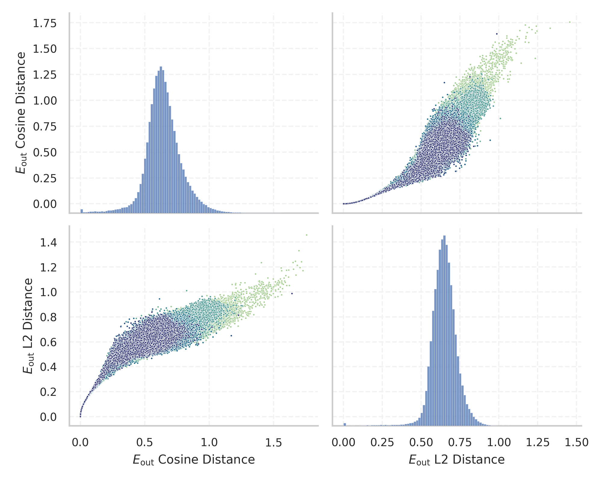
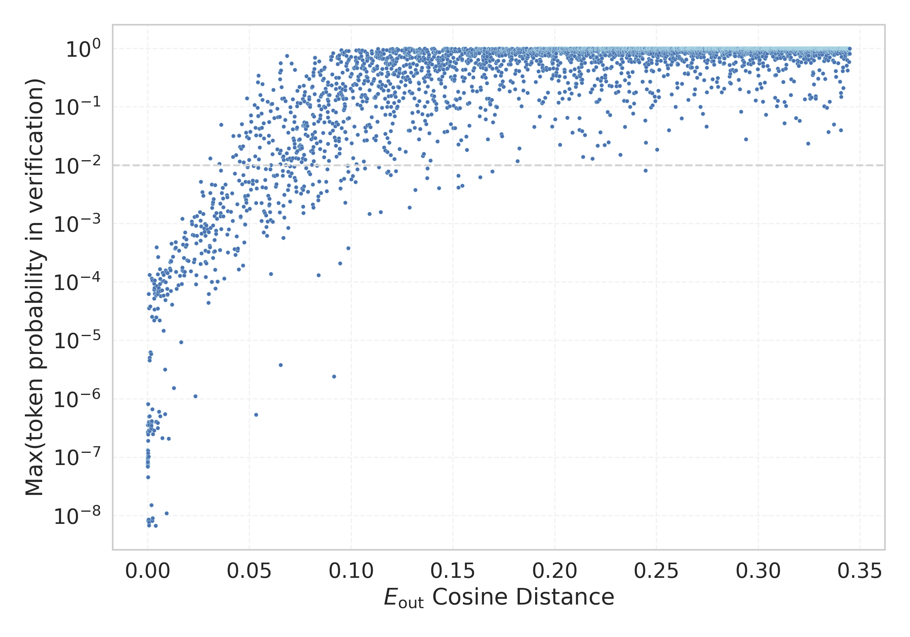

# Report for `Qwen/Qwen3.5-4B`

## Model info

* Model Info: 
  * Tied embeddings: True
  * LM head uses bias: False
  * Embeddings shape: [248320, 2560]
* Tokenizer Info: 
  * Vocab Size: 248077
  * Tokenizer Class: Qwen2Tokenizer
  * Tokenizer Type: BPE
  * Bytes handling: Byte Input
  * Token for verification prompt building: abcdefghijklmnopqrstuvwxyz
  * Token id for verification prompt building: 65234
* Indicator summary: 
  * Indicator for under-trained tokens: E_{out} Cosine Distance
  * Overall distribution: 0.644 +/- 0.140
* Detected Token Counts: 
  * Number of tested under-trained tokens: 4939, 4928 non-special, 374 below p = 0.01 threshold, 243 below soft indicator threshold
  * Number of single byte tokens: 256, of which 13 below indicator threshold
  * Number of special tokens: 33, of which 11 below indicator threshold
  * Number of non-single-byte unreachable tokens: 203, of which 33 below indicator threshold
  * Number of non-single-byte UTF-fragment tokens:  816, of which 0 below soft indicator threshold

## Under-trained token indicators plot


## Verification plot


## Under-trained token verification results
243 entries below threshold of 0.044

|   token_id | token                             |   indicator | max_prob                                                         | in_other_tokens                                                                                                                                                                              |
|------------|-----------------------------------|-------------|------------------------------------------------------------------|----------------------------------------------------------------------------------------------------------------------------------------------------------------------------------------------|
|     107171 | ````` 生意通银牌及以上会员 `````  | 5.96046e-08 | <span style='border: 1px solid rgb(169, 68, 66);'>7.4e-08</span> | <span style='border: 1px solid rgb(255, 145, 0);'>````` 开通天眼生意通银牌及以上会员 `````</span>                                                                                            |
|     233708 | ````` tedothi `````               | 8.34465e-07 | <span style='border: 1px solid rgb(169, 68, 66);'>7.8e-08</span> | <span style='border: 1px solid rgb(169, 68, 66);'>````` ▁Kinhtedothi `````</span>                                                                                                            |
|      76550 | ````` ▁ForCanBeConvertedToF ````` | 9.65595e-06 | <span style='border: 1px solid rgb(169, 68, 66);'>7.9e-08</span> | <span style='border: 1px solid rgb(251, 189, 8);'>````` ▁ForCanBeConvertedToForeach `````</span>                                                                                             |
|     107656 | ````` 后至多加 `````              | 1.68681e-05 | <span style='border: 1px solid rgb(169, 68, 66);'>7.5e-08</span> | <span style='border: 1px solid rgb(255, 145, 0);'>````` 认证后至多加 `````</span>                                                                                                            |
|     229947 | ````` JernihBer `````             | 2.00272e-05 | <span style='border: 1px solid rgb(169, 68, 66);'>7.9e-08</span> |                                                                                                                                                                                              |
|     107618 | ````` 受苹果公司新规定 `````      | 2.11e-05    | <span style='border: 1px solid rgb(169, 68, 66);'>8e-08</span>   | <span style='border: 1px solid rgb(251, 189, 8);'>````` 受苹果公司新规定影响 `````</span>                                                                                                    |
|      76549 | ````` ▁ForCanBeConverted `````    | 2.14577e-05 | <span style='border: 1px solid rgb(169, 68, 66);'>8.9e-08</span> | <span style='border: 1px solid rgb(251, 189, 8);'>````` ▁ForCanBeConvertedToForeach `````</span>, <span style='border: 1px solid rgb(169, 68, 66);'>````` ▁ForCanBeConvertedToF `````</span> |
|     242037 | ````` ▁ตามระดับโรงแรม `````        | 2.50936e-05 | <span style='border: 1px solid rgb(169, 68, 66);'>6.9e-08</span> |                                                                                                                                                                                              |
|     157743 | ````` 립어드바이저 `````          | 2.8789e-05  | <span style='border: 1px solid rgb(169, 68, 66);'>9.6e-08</span> | <span style='border: 1px solid rgb(251, 189, 8);'>````` ▁트립어드바이저 `````</span>, <span style='border: 1px solid rgb(169, 68, 66);'>````` 트립어드바이저 `````</span>                    |
|     144666 | ````` 葉影幽 `````                | 3.92199e-05 | <span style='border: 1px solid rgb(169, 68, 66);'>1.3e-07</span> |                                                                                                                                                                                              |
|     246203 | ````` ▁แสดงเพิ่มด้วย `````           | 5.126e-05   | <span style='border: 1px solid rgb(169, 68, 66);'>7e-08</span>   |                                                                                                                                                                                              |
|      81073 | ````` PostalCodesNL `````         | 5.9247e-05  | <span style='border: 1px solid rgb(169, 68, 66);'>8.5e-08</span> | <span style='border: 1px solid rgb(169, 68, 66);'>````` $PostalCodesNL `````</span>                                                                                                          |
|     240049 | ````` ▁ดูครั้งสุดท้าย `````            | 6.81877e-05 | <span style='border: 1px solid rgb(169, 68, 66);'>2.7e-07</span> |                                                                                                                                                                                              |
|     239820 | ````` ▁Kinhted `````              | 6.84261e-05 | <span style='border: 1px solid rgb(169, 68, 66);'>8.3e-08</span> | <span style='border: 1px solid rgb(169, 68, 66);'>````` ▁Kinhtedothi `````</span>                                                                                                            |
|     212958 | ````` xfabl `````                 | 7.19428e-05 | <span style='border: 1px solid rgb(169, 68, 66);'>9.9e-08</span> |                                                                                                                                                                                              |
|      81075 | ````` $PostalCodesNL `````        | 7.78437e-05 | <span style='border: 1px solid rgb(169, 68, 66);'>3.6e-07</span> |                                                                                                                                                                                              |
|      85329 | ````` useRalative `````           | 0.000141084 | <span style='border: 1px solid rgb(169, 68, 66);'>8.3e-09</span> | <span style='border: 1px solid rgb(40, 167, 69);'>````` useRalativeImagePath `````</span>                                                                                                    |
|     107620 | ````` 可通过二维码转账 `````      | 0.000153959 | <span style='border: 1px solid rgb(169, 68, 66);'>1.1e-07</span> | <span style='border: 1px solid rgb(40, 167, 69);'>````` 可通过二维码转账支持公众号 `````</span>                                                                                              |
|     229465 | ````` ▁tarsker `````              | 0.000155509 | <span style='border: 1px solid rgb(169, 68, 66);'>2.5e-07</span> | <span style='border: 1px solid rgb(169, 68, 66);'>````` ▁tarskereso `````</span>                                                                                                             |
|     107569 | ````` 小有建树答主 `````          | 0.000180364 | <span style='border: 1px solid rgb(169, 68, 66);'>1.3e-07</span> | ````` 知道小有建树答主 `````                                                                                                                                                                 |
<details><summary>223 additional entries below threshold</summary>

|   token_id | token                            |   indicator | max_prob                                                         | in_other_tokens                                                                                                                                                                                                                                                                                                                                                      |
|------------|----------------------------------|-------------|------------------------------------------------------------------|----------------------------------------------------------------------------------------------------------------------------------------------------------------------------------------------------------------------------------------------------------------------------------------------------------------------------------------------------------------------|
|      85328 | ````` useRal `````               | 0.000197053 | <span style='border: 1px solid rgb(169, 68, 66);'>4.6e-08</span> | <span style='border: 1px solid rgb(40, 167, 69);'>````` useRalativeImagePath `````</span>, <span style='border: 1px solid rgb(169, 68, 66);'>````` useRalative `````</span>                                                                                                                                                                                          |
|     146345 | ````` 陆修连 `````               | 0.000208557 | <span style='border: 1px solid rgb(169, 68, 66);'>1.9e-07</span> |                                                                                                                                                                                                                                                                                                                                                                      |
|     229466 | ````` ▁tarskereso `````          | 0.000213087 | <span style='border: 1px solid rgb(169, 68, 66);'>1.2e-07</span> |                                                                                                                                                                                                                                                                                                                                                                      |
|     107657 | ````` 大有可为答主 `````         | 0.000341177 | <span style='border: 1px solid rgb(169, 68, 66);'>8.7e-09</span> | ````` 知道大有可为答主 `````                                                                                                                                                                                                                                                                                                                                         |
|     225922 | ````` ▁引用をストック `````      | 0.000413835 | <span style='border: 1px solid rgb(169, 68, 66);'>3.7e-07</span> |                                                                                                                                                                                                                                                                                                                                                                      |
|     195137 | ````` ejahter `````              | 0.000442564 | <span style='border: 1px solid rgb(169, 68, 66);'>8.6e-09</span> | <span style='border: 1px solid rgb(169, 68, 66);'>````` ejahteraan `````</span>, ````` ▁kesejahteraan `````                                                                                                                                                                                                                                                          |
|     228198 | ````` ▁ดูข้อเสนอ `````             | 0.000443578 | <span style='border: 1px solid rgb(169, 68, 66);'>2.9e-07</span> |                                                                                                                                                                                                                                                                                                                                                                      |
|      55486 | ````` :-------------</ `````     | 0.000443637 | <span style='border: 1px solid rgb(169, 68, 66);'>4.1e-07</span> |                                                                                                                                                                                                                                                                                                                                                                      |
|     133946 | ````` 林独羿 `````               | 0.000510752 | <span style='border: 1px solid rgb(169, 68, 66);'>1e-07</span>   |                                                                                                                                                                                                                                                                                                                                                                      |
|     216362 | ````` skereso `````              | 0.000539958 | <span style='border: 1px solid rgb(169, 68, 66);'>8.6e-09</span> | <span style='border: 1px solid rgb(169, 68, 66);'>````` ▁tarskereso `````</span>                                                                                                                                                                                                                                                                                     |
|     107663 | ````` 掌握企业关系 `````         | 0.000564694 | <span style='border: 1px solid rgb(169, 68, 66);'>3.9e-07</span> | <span style='border: 1px solid rgb(255, 145, 0);'>````` 瞬息掌握企业关系 `````</span>                                                                                                                                                                                                                                                                                |
|     175459 | ````` eihna `````                | 0.000623465 | <span style='border: 1px solid rgb(169, 68, 66);'>5e-07</span>   | ````` ▁Weihnachts `````, ````` ▁Weihnachten `````, <span style='border: 1px solid rgb(251, 189, 8);'>````` ▁Weihna `````</span>                                                                                                                                                                                                                                      |
|     221404 | ````` echslungs `````            | 0.000624478 | <span style='border: 1px solid rgb(169, 68, 66);'>7.7e-09</span> | ````` ▁abwechslungs `````                                                                                                                                                                                                                                                                                                                                            |
|     237158 | ````` ▁Purtro `````              | 0.000643194 | <span style='border: 1px solid rgb(169, 68, 66);'>3.6e-07</span> | ````` ▁Purtroppo `````                                                                                                                                                                                                                                                                                                                                               |
|     209767 | ````` денциа `````               | 0.000662684 | <span style='border: 1px solid rgb(169, 68, 66);'>6.9e-09</span> | <span style='border: 1px solid rgb(169, 68, 66);'>````` ▁конфиденциа `````</span>                                                                                                                                                                                                                                                                                    |
|     246691 | ````` ▁поджелудо `````           | 0.00066793  | <span style='border: 1px solid rgb(169, 68, 66);'>3.6e-05</span> |                                                                                                                                                                                                                                                                                                                                                                      |
|     107661 | ````` 加分后可 `````             | 0.000915468 | <span style='border: 1px solid rgb(169, 68, 66);'>5.1e-06</span> | <span style='border: 1px solid rgb(169, 68, 66);'>````` 加分后可超过约 `````</span>                                                                                                                                                                                                                                                                                  |
|      44437 | ````` webElementX `````          | 0.00096482  | <span style='border: 1px solid rgb(169, 68, 66);'>4.6e-06</span> | <span style='border: 1px solid rgb(40, 167, 69);'>````` webElementXpaths `````</span>                                                                                                                                                                                                                                                                                |
|     206406 | ````` ebunan `````               | 0.000975907 | <span style='border: 1px solid rgb(169, 68, 66);'>5.1e-07</span> |                                                                                                                                                                                                                                                                                                                                                                      |
|     102892 | ````` 已被系统折叠 `````         | 0.000988483 | <span style='border: 1px solid rgb(169, 68, 66);'>2.8e-07</span> | ````` 该楼层疑似违规已被系统折叠 `````, <span style='border: 1px solid rgb(169, 68, 66);'>````` 疑似违规已被系统折叠 `````</span>                                                                                                                                                                                                                                    |
|     228376 | ````` ▁антибактериа `````        | 0.00128716  | <span style='border: 1px solid rgb(169, 68, 66);'>3.8e-05</span> |                                                                                                                                                                                                                                                                                                                                                                      |
|     168874 | ````` желудо `````               | 0.00140804  | <span style='border: 1px solid rgb(169, 68, 66);'>6.3e-06</span> | <span style='border: 1px solid rgb(255, 145, 0);'>````` ▁желудо `````</span>, <span style='border: 1px solid rgb(169, 68, 66);'>````` ▁поджелудо `````</span>, ````` ▁желудочно `````                                                                                                                                                                                |
|     205398 | ````` ▁MEDIAMART `````           | 0.00155461  | <span style='border: 1px solid rgb(169, 68, 66);'>3.2e-07</span> |                                                                                                                                                                                                                                                                                                                                                                      |
|     214946 | ````` нгредиенты `````           | 0.00161266  | <span style='border: 1px solid rgb(169, 68, 66);'>5.9e-06</span> | ````` ▁Ингредиенты `````                                                                                                                                                                                                                                                                                                                                             |
|     178062 | ````` ▁Отзы `````                | 0.00175601  | <span style='border: 1px solid rgb(169, 68, 66);'>3.1e-07</span> | ````` ▁Отзывы `````, ````` ▁Отзыв `````                                                                                                                                                                                                                                                                                                                              |
|     237735 | ````` ▁الإجتما `````             | 0.00177294  | <span style='border: 1px solid rgb(169, 68, 66);'>1.5e-08</span> |                                                                                                                                                                                                                                                                                                                                                                      |
|     165927 | ````` ejaht `````                | 0.00180066  | <span style='border: 1px solid rgb(169, 68, 66);'>3.9e-07</span> | <span style='border: 1px solid rgb(169, 68, 66);'>````` ejahter `````</span>, <span style='border: 1px solid rgb(40, 167, 69);'>````` ▁kesejaht `````</span>, <span style='border: 1px solid rgb(169, 68, 66);'>````` ejahteraan `````</span>, ````` ▁kesejahteraan `````                                                                                            |
|     107666 | ````` 的優惠按鈕 `````           | 0.00187469  | <span style='border: 1px solid rgb(169, 68, 66);'>3.5e-07</span> | <span style='border: 1px solid rgb(169, 68, 66);'>````` 限量特惠的優惠按鈕 `````</span>                                                                                                                                                                                                                                                                              |
|     239840 | ````` ▁₩₩₩ `````                 | 0.00190699  | <span style='border: 1px solid rgb(169, 68, 66);'>0.00012</span> |                                                                                                                                                                                                                                                                                                                                                                      |
|     163164 | ````` сессуа `````               | 0.00194347  | <span style='border: 1px solid rgb(169, 68, 66);'>4.2e-07</span> | ````` ▁аксессуары `````, ````` сессуары `````, ````` сессуар `````, <span style='border: 1px solid rgb(169, 68, 66);'>````` ▁аксессуа `````</span>                                                                                                                                                                                                                   |
|     205631 | ````` timewa `````               | 0.00210714  | <span style='border: 1px solid rgb(169, 68, 66);'>2.5e-05</span> | ````` ▁istimewa `````                                                                                                                                                                                                                                                                                                                                                |
|     223306 | ````` leaños `````               | 0.00220484  | <span style='border: 1px solid rgb(169, 68, 66);'>8.1e-09</span> | ````` ▁cumpleaños `````                                                                                                                                                                                                                                                                                                                                              |
|     166895 | ````` ▁₩₩ `````                  | 0.00221008  | <span style='border: 1px solid rgb(169, 68, 66);'>0.00011</span> | <span style='border: 1px solid rgb(169, 68, 66);'>````` ▁₩₩₩ `````</span>                                                                                                                                                                                                                                                                                            |
|     192840 | ````` ▁ศูนย์ให้ความ `````           | 0.00230438  | <span style='border: 1px solid rgb(169, 68, 66);'>6.7e-07</span> |                                                                                                                                                                                                                                                                                                                                                                      |
|     102834 | ````` 银牌及以上会员 `````       | 0.00238949  | <span style='border: 1px solid rgb(169, 68, 66);'>9.1e-09</span> | <span style='border: 1px solid rgb(255, 145, 0);'>````` 开通天眼生意通银牌及以上会员 `````</span>, <span style='border: 1px solid rgb(169, 68, 66);'>````` 生意通银牌及以上会员 `````</span>                                                                                                                                                                         |
|     237166 | ````` ไลฟ์และกิจกรรม `````         | 0.00252068  | <span style='border: 1px solid rgb(169, 68, 66);'>2.5e-07</span> |                                                                                                                                                                                                                                                                                                                                                                      |
|     238498 | ````` 駅から徒 `````             | 0.00314623  | <span style='border: 1px solid rgb(169, 68, 66);'>2.2e-05</span> | ````` 駅から徒歩 `````                                                                                                                                                                                                                                                                                                                                               |
|      32737 | ````` ▁+#+#+#+ `````             | 0.00315654  | <span style='border: 1px solid rgb(169, 68, 66);'>9.4e-05</span> | ````` ▁+#+#+#+#+#+ `````                                                                                                                                                                                                                                                                                                                                             |
|     220393 | ````` стораны `````              | 0.00319993  | <span style='border: 1px solid rgb(169, 68, 66);'>2.9e-07</span> | <span style='border: 1px solid rgb(40, 167, 69);'>````` ▁Рестораны `````</span>                                                                                                                                                                                                                                                                                      |
|     241550 | ````` tifkan `````               | 0.00321937  | <span style='border: 1px solid rgb(169, 68, 66);'>5.3e-05</span> |                                                                                                                                                                                                                                                                                                                                                                      |
|     206584 | ````` ▁kepolis `````             | 0.00322753  | <span style='border: 1px solid rgb(169, 68, 66);'>7.4e-05</span> | ````` ▁kepolisian `````                                                                                                                                                                                                                                                                                                                                              |
|     236154 | ````` ▁เกมส์ไพ่ `````              | 0.00332087  | <span style='border: 1px solid rgb(169, 68, 66);'>7.9e-05</span> |                                                                                                                                                                                                                                                                                                                                                                      |
|     237156 | ````` ▁ดูโรงแรม `````             | 0.00334466  | <span style='border: 1px solid rgb(169, 68, 66);'>3.4e-05</span> |                                                                                                                                                                                                                                                                                                                                                                      |
|     150036 | ````` รงแรม `````                | 0.00338733  | <span style='border: 1px solid rgb(169, 68, 66);'>6.4e-05</span> | ````` ▁โรงแรม `````, <span style='border: 1px solid rgb(169, 68, 66);'>````` ▁โรงแรมบรรยากาศ `````</span>, <span style='border: 1px solid rgb(169, 68, 66);'>````` ▁ตามระดับโรงแรม `````</span>, <span style='border: 1px solid rgb(169, 68, 66);'>````` ▁โรงแรมใกล้ `````</span>, <span style='border: 1px solid rgb(40, 167, 69);'>````` ▁โรงแรมใน `````</span>, ... |
|     226648 | ````` ோோ `````                    | 0.00340587  | <span style='border: 1px solid rgb(169, 68, 66);'>0.00011</span> |                                                                                                                                                                                                                                                                                                                                                                      |
|     107411 | ````` 尊重网上 `````             | 0.00388038  | <span style='border: 1px solid rgb(169, 68, 66);'>6.7e-09</span> | <span style='border: 1px solid rgb(40, 167, 69);'>````` 尊重网上道德 `````</span>                                                                                                                                                                                                                                                                                    |
|      92331 | ````` departureday `````         | 0.00404441  | <span style='border: 1px solid rgb(169, 68, 66);'>4.1e-07</span> |                                                                                                                                                                                                                                                                                                                                                                      |
|     185571 | ````` น์โหลด `````                | 0.00406694  | <span style='border: 1px solid rgb(169, 68, 66);'>5.9e-05</span> | ````` ดาวน์โหลด `````, ````` ▁ดาวน์โหลด `````                                                                                                                                                                                                                                                                                                                          |
|     107170 | ````` 开通天眼 `````             | 0.00419134  | <span style='border: 1px solid rgb(169, 68, 66);'>6.1e-05</span> | <span style='border: 1px solid rgb(255, 145, 0);'>````` 开通天眼生意通银牌及以上会员 `````</span>                                                                                                                                                                                                                                                                    |
|     246038 | ````` TIÓN `````                 | 0.00422364  | <span style='border: 1px solid rgb(169, 68, 66);'>4.1e-07</span> |                                                                                                                                                                                                                                                                                                                                                                      |
|     224352 | ````` ▁медикаменто `````         | 0.0042575   | <span style='border: 1px solid rgb(169, 68, 66);'>2.5e-05</span> |                                                                                                                                                                                                                                                                                                                                                                      |
|     105610 | ````` 这个回答的评价是 `````     | 0.00444263  | <span style='border: 1px solid rgb(169, 68, 66);'>6.4e-05</span> | ````` 你对这个回答的评价是 `````                                                                                                                                                                                                                                                                                                                                     |
|     215491 | ````` ▁конфиденциа `````         | 0.00453734  | <span style='border: 1px solid rgb(169, 68, 66);'>8.5e-05</span> |                                                                                                                                                                                                                                                                                                                                                                      |
|     236333 | ````` ▁โรงแรมบรรยากาศ `````      | 0.00492495  | <span style='border: 1px solid rgb(169, 68, 66);'>3.9e-07</span> |                                                                                                                                                                                                                                                                                                                                                                      |
|     239781 | ````` ydable `````               | 0.00494623  | <span style='border: 1px solid rgb(169, 68, 66);'>6.2e-05</span> | ````` ▁inoxydable `````                                                                                                                                                                                                                                                                                                                                              |
|     211066 | ````` ▁Янва `````                | 0.00496143  | <span style='border: 1px solid rgb(169, 68, 66);'>0.00014</span> | ````` ▁Январь `````, <span style='border: 1px solid rgb(40, 167, 69);'>````` ▁Январ `````</span>                                                                                                                                                                                                                                                                     |
|     241302 | ````` ที่เที่ยวแห่งปี `````            | 0.0049718   | <span style='border: 1px solid rgb(169, 68, 66);'>3.2e-07</span> |                                                                                                                                                                                                                                                                                                                                                                      |
|     168326 | ````` бактериа `````             | 0.00497776  | <span style='border: 1px solid rgb(169, 68, 66);'>3.5e-05</span> | <span style='border: 1px solid rgb(169, 68, 66);'>````` ▁антибактериа `````</span>, <span style='border: 1px solid rgb(169, 68, 66);'>````` ▁бактериа `````</span>                                                                                                                                                                                                   |
|      95425 | ````` ▁davidjl `````             | 0.0050782   | <span style='border: 1px solid rgb(169, 68, 66);'>0.00027</span> |                                                                                                                                                                                                                                                                                                                                                                      |
|     239615 | ````` ▁Индивидуа `````           | 0.00509042  | <span style='border: 1px solid rgb(169, 68, 66);'>7.3e-05</span> |                                                                                                                                                                                                                                                                                                                                                                      |
|     143707 | ````` 认证成功后可 `````         | 0.00521618  | <span style='border: 1px solid rgb(169, 68, 66);'>6.8e-05</span> | <span style='border: 1px solid rgb(255, 145, 0);'>````` 认证成功后可编辑 `````</span>                                                                                                                                                                                                                                                                                |
|     225879 | ````` ▁всевозмо `````            | 0.00543714  | <span style='border: 1px solid rgb(169, 68, 66);'>8e-05</span>   |                                                                                                                                                                                                                                                                                                                                                                      |
|     187841 | ````` ▁Просмо `````              | 0.00548398  | <span style='border: 1px solid rgb(169, 68, 66);'>6e-07</span>   | ````` ▁Просмотров `````                                                                                                                                                                                                                                                                                                                                              |
|     211511 | ````` xeame `````                | 0.00581938  | <span style='border: 1px solid rgb(169, 68, 66);'>2.2e-05</span> |                                                                                                                                                                                                                                                                                                                                                                      |
|      90728 | ````` -vesm `````                | 0.00592059  | <span style='border: 1px solid rgb(169, 68, 66);'>9.4e-05</span> |                                                                                                                                                                                                                                                                                                                                                                      |
|     176516 | ````` твра `````                 | 0.00592333  | <span style='border: 1px solid rgb(169, 68, 66);'>0.00017</span> | <span style='border: 1px solid rgb(40, 167, 69);'>````` ▁предотвра `````</span>, ````` ▁предотвращения `````, ````` ▁предотвратить `````                                                                                                                                                                                                                             |
|     140261 | ````` 李轻水 `````               | 0.00618654  | <span style='border: 1px solid rgb(169, 68, 66);'>5e-07</span>   |                                                                                                                                                                                                                                                                                                                                                                      |
|     241972 | ````` ▁menjanj `````             | 0.00620496  | <span style='border: 1px solid rgb(169, 68, 66);'>0.00011</span> | ````` ▁menjanjikan `````                                                                                                                                                                                                                                                                                                                                             |
|     238677 | ````` อัพเดตแผนที่ `````            | 0.00621182  | <span style='border: 1px solid rgb(169, 68, 66);'>7.1e-05</span> |                                                                                                                                                                                                                                                                                                                                                                      |
|     234687 | ````` ▁จึงอาจแสดงผล `````         | 0.00641149  | <span style='border: 1px solid rgb(169, 68, 66);'>5.8e-05</span> |                                                                                                                                                                                                                                                                                                                                                                      |
|     246556 | ````` ติดต่อธุรกิจใน `````           | 0.00709665  | <span style='border: 1px solid rgb(169, 68, 66);'>7.2e-05</span> |                                                                                                                                                                                                                                                                                                                                                                      |
|     210747 | ````` xeancia `````              | 0.00717533  | <span style='border: 1px solid rgb(169, 68, 66);'>2.1e-07</span> |                                                                                                                                                                                                                                                                                                                                                                      |
|     222257 | ````` 트립어드바이저 `````       | 0.00727612  | <span style='border: 1px solid rgb(169, 68, 66);'>0.00015</span> |                                                                                                                                                                                                                                                                                                                                                                      |
|     232655 | ````` sprobl `````               | 0.00729197  | <span style='border: 1px solid rgb(169, 68, 66);'>0.0001</span>  |                                                                                                                                                                                                                                                                                                                                                                      |
|     235442 | ````` ▁Габари `````              | 0.00775224  | <span style='border: 1px solid rgb(169, 68, 66);'>5.9e-05</span> |                                                                                                                                                                                                                                                                                                                                                                      |
|     192230 | ````` ▁Municíp `````             | 0.00781614  | <span style='border: 1px solid rgb(169, 68, 66);'>0.00013</span> | ````` ▁Município `````                                                                                                                                                                                                                                                                                                                                               |
|     228437 | ````` xedas `````                | 0.00783736  | <span style='border: 1px solid rgb(169, 68, 66);'>1.5e-05</span> |                                                                                                                                                                                                                                                                                                                                                                      |
|     227366 | ````` ▁tuturn `````              | 0.00787622  | <span style='border: 1px solid rgb(169, 68, 66);'>0.00011</span> | ````` ▁tuturnya `````                                                                                                                                                                                                                                                                                                                                                |
|     243923 | ````` ▁Универса `````            | 0.0085265   | <span style='border: 1px solid rgb(169, 68, 66);'>3.2e-06</span> |                                                                                                                                                                                                                                                                                                                                                                      |
|     222619 | ````` ▁브라우저들을 `````        | 0.0085749   | <span style='border: 1px solid rgb(169, 68, 66);'>5.5e-07</span> |                                                                                                                                                                                                                                                                                                                                                                      |
|     206724 | ````` erbitkan `````             | 0.00873315  | <span style='border: 1px solid rgb(169, 68, 66);'>4.9e-05</span> | ````` ▁diterbitkan `````                                                                                                                                                                                                                                                                                                                                             |
|     245295 | ````` солне `````                | 0.00881308  | <span style='border: 1px solid rgb(169, 68, 66);'>0.00016</span> | ````` ▁солнеч `````, ````` ▁солнечных `````                                                                                                                                                                                                                                                                                                                          |
|     178834 | ````` ▁กิจกรรมน่าสนใจ `````        | 0.00884032  | <span style='border: 1px solid rgb(169, 68, 66);'>0.0001</span>  |                                                                                                                                                                                                                                                                                                                                                                      |
|     166080 | ````` ▁฿฿ `````                  | 0.00904757  | <span style='border: 1px solid rgb(169, 68, 66);'>0.00015</span> | <span style='border: 1px solid rgb(169, 68, 66);'>````` ▁฿฿฿ `````</span>                                                                                                                                                                                                                                                                                            |
|     225748 | ````` ▁нотариа `````             | 0.00922936  | <span style='border: 1px solid rgb(169, 68, 66);'>1.1e-08</span> |                                                                                                                                                                                                                                                                                                                                                                      |
|     206528 | ````` pertinya `````             | 0.00963992  | <span style='border: 1px solid rgb(169, 68, 66);'>7.7e-05</span> | ````` ▁sepertinya `````                                                                                                                                                                                                                                                                                                                                              |
|     210343 | ````` глосу `````                | 0.00971067  | <span style='border: 1px solid rgb(169, 68, 66);'>6e-05</span>   | ````` ▁круглосу `````                                                                                                                                                                                                                                                                                                                                                |
|      67910 | ````` ▁PodsDummy `````           | 0.00972146  | <span style='border: 1px solid rgb(169, 68, 66);'>6.2e-05</span> |                                                                                                                                                                                                                                                                                                                                                                      |
|     213689 | ````` ▁артериа `````             | 0.00975704  | <span style='border: 1px solid rgb(169, 68, 66);'>0.00014</span> |                                                                                                                                                                                                                                                                                                                                                                      |
|     230060 | ````` omosikan `````             | 0.0103127   | <span style='border: 1px solid rgb(169, 68, 66);'>2.1e-07</span> |                                                                                                                                                                                                                                                                                                                                                                      |
|     181654 | ````` ebihan `````               | 0.0107446   | <span style='border: 1px solid rgb(169, 68, 66);'>0.00012</span> | ````` ▁kelebihan `````, ````` ▁berlebihan `````, ````` ▁Kelebihan `````                                                                                                                                                                                                                                                                                              |
|     202834 | ````` ▁долгове `````             | 0.0109182   | <span style='border: 1px solid rgb(169, 68, 66);'>0.00017</span> |                                                                                                                                                                                                                                                                                                                                                                      |
|     192261 | ````` ▁разнови `````             | 0.0110547   | <span style='border: 1px solid rgb(169, 68, 66);'>0.00022</span> | ````` ▁разновидности `````, ````` ▁разновид `````                                                                                                                                                                                                                                                                                                                    |
|     228874 | ````` ▁бактериа `````            | 0.0112517   | <span style='border: 1px solid rgb(169, 68, 66);'>0.00016</span> |                                                                                                                                                                                                                                                                                                                                                                      |
|     246327 | ````` ▁この広告は `````          | 0.0113853   | <span style='border: 1px solid rgb(169, 68, 66);'>0.00023</span> |                                                                                                                                                                                                                                                                                                                                                                      |
|     167944 | ````` انشستر `````               | 0.011416    | <span style='border: 1px solid rgb(169, 68, 66);'>7e-05</span>   | ````` ▁مانشستر `````                                                                                                                                                                                                                                                                                                                                                 |
|     232754 | ````` ▁Актуа `````               | 0.0114315   | <span style='border: 1px solid rgb(169, 68, 66);'>0.00022</span> |                                                                                                                                                                                                                                                                                                                                                                      |
|     172274 | ````` ▁โรงแรมใกล้ `````           | 0.0115702   | <span style='border: 1px solid rgb(169, 68, 66);'>0.00023</span> |                                                                                                                                                                                                                                                                                                                                                                      |
|     239819 | ````` ▁Kinht `````               | 0.0116021   | <span style='border: 1px solid rgb(169, 68, 66);'>0.00045</span> | <span style='border: 1px solid rgb(169, 68, 66);'>````` ▁Kinhted `````</span>, <span style='border: 1px solid rgb(169, 68, 66);'>````` ▁Kinhtedothi `````</span>                                                                                                                                                                                                     |
|     239821 | ````` ▁Kinhtedothi `````         | 0.0120053   | <span style='border: 1px solid rgb(169, 68, 66);'>4.1e-05</span> |                                                                                                                                                                                                                                                                                                                                                                      |
|     173708 | ````` ▁ร้านอาหารใกล้ `````         | 0.0123944   | <span style='border: 1px solid rgb(169, 68, 66);'>0.00027</span> |                                                                                                                                                                                                                                                                                                                                                                      |
|     225599 | ````` ▁฿฿฿ `````                 | 0.0127912   | <span style='border: 1px solid rgb(169, 68, 66);'>1.5e-06</span> |                                                                                                                                                                                                                                                                                                                                                                      |
|     166145 | ````` полномо `````              | 0.0134648   | <span style='border: 1px solid rgb(169, 68, 66);'>0.00038</span> | <span style='border: 1px solid rgb(40, 167, 69);'>````` ▁полномо `````</span>, <span style='border: 1px solid rgb(40, 167, 69);'>````` ▁уполномо `````</span>                                                                                                                                                                                                        |
|     205725 | ````` aixon `````                | 0.0137194   | <span style='border: 1px solid rgb(169, 68, 66);'>0.00049</span> | ````` ▁apaixon `````                                                                                                                                                                                                                                                                                                                                                 |
|     228688 | ````` ▁melebi `````              | 0.0137929   | <span style='border: 1px solid rgb(169, 68, 66);'>0.00039</span> | ````` ▁melebihi `````                                                                                                                                                                                                                                                                                                                                                |
|     233649 | ````` льтфиль `````              | 0.013893    | <span style='border: 1px solid rgb(169, 68, 66);'>0.00015</span> |                                                                                                                                                                                                                                                                                                                                                                      |
|     107249 | ````` 或许有别人 `````           | 0.0141906   | <span style='border: 1px solid rgb(169, 68, 66);'>7.7e-05</span> | ````` 或许有别人想知道的答案 `````                                                                                                                                                                                                                                                                                                                                   |
|     245930 | ````` спользуйтесь `````         | 0.0150926   | <span style='border: 1px solid rgb(169, 68, 66);'>8.8e-05</span> |                                                                                                                                                                                                                                                                                                                                                                      |
|     233926 | ````` ▁впиты `````               | 0.0153957   | <span style='border: 1px solid rgb(169, 68, 66);'>0.00035</span> |                                                                                                                                                                                                                                                                                                                                                                      |
|     229296 | ````` ▁simból `````              | 0.0158412   | <span style='border: 1px solid rgb(169, 68, 66);'>0.00013</span> |                                                                                                                                                                                                                                                                                                                                                                      |
|     147953 | ````` 限量特惠的優惠按鈕 `````   | 0.0164613   | <span style='border: 1px solid rgb(169, 68, 66);'>9.3e-06</span> |                                                                                                                                                                                                                                                                                                                                                                      |
|     198851 | ````` ▁Преимуще `````            | 0.0167251   | <span style='border: 1px solid rgb(169, 68, 66);'>9.3e-05</span> | ````` ▁Преимущества `````                                                                                                                                                                                                                                                                                                                                            |
|      42588 | ````` %timeout `````             | 0.016965    | <span style='border: 1px solid rgb(255, 145, 0);'>0.0012</span>  |                                                                                                                                                                                                                                                                                                                                                                      |
|     158099 | ````` พิธภัณฑ์ `````                | 0.0170498   | <span style='border: 1px solid rgb(169, 68, 66);'>0.00016</span> | ````` ▁พิพิธภัณฑ์ `````, ````` พิพิธภัณฑ์ `````                                                                                                                                                                                                                                                                                                                              |
|     239908 | ````` лчанию `````               | 0.0170589   | <span style='border: 1px solid rgb(169, 68, 66);'>0.00018</span> | ````` ▁умолчанию `````                                                                                                                                                                                                                                                                                                                                               |
|     185480 | ````` tedì `````                 | 0.0173427   | <span style='border: 1px solid rgb(169, 68, 66);'>0.00044</span> | ````` ▁martedì `````                                                                                                                                                                                                                                                                                                                                                 |
|     192940 | ````` ▁Пользо `````              | 0.0175375   | <span style='border: 1px solid rgb(169, 68, 66);'>0.00015</span> |                                                                                                                                                                                                                                                                                                                                                                      |
|     239372 | ````` ignoire `````              | 0.0177964   | <span style='border: 1px solid rgb(169, 68, 66);'>0.00026</span> |                                                                                                                                                                                                                                                                                                                                                                      |
|     212210 | ````` ▁Sehenswürd `````          | 0.0178733   | <span style='border: 1px solid rgb(169, 68, 66);'>0.00013</span> |                                                                                                                                                                                                                                                                                                                                                                      |
|      49538 | ````` SpecWarn `````             | 0.0179011   | <span style='border: 1px solid rgb(169, 68, 66);'>0.00058</span> |                                                                                                                                                                                                                                                                                                                                                                      |
|     107655 | ````` 疑似违规已被系统折叠 ````` | 0.0182319   | <span style='border: 1px solid rgb(169, 68, 66);'>0.00015</span> | ````` 该楼层疑似违规已被系统折叠 `````                                                                                                                                                                                                                                                                                                                               |
|     211846 | ````` ▁Presupu `````             | 0.0183268   | <span style='border: 1px solid rgb(169, 68, 66);'>0.00071</span> | ````` ▁Presupuesto `````                                                                                                                                                                                                                                                                                                                                             |
|     192371 | ````` truttur `````              | 0.0186844   | <span style='border: 1px solid rgb(169, 68, 66);'>0.0004</span>  | ````` ▁infrastrutture `````, ````` ▁Struttura `````, <span style='border: 1px solid rgb(169, 68, 66);'>````` trutture `````</span>, ````` ▁struttur `````, ````` ▁ristruttur `````                                                                                                                                                                                   |
|     102886 | ````` 受苹果公司 `````           | 0.0189378   | <span style='border: 1px solid rgb(169, 68, 66);'>0.00054</span> | <span style='border: 1px solid rgb(169, 68, 66);'>````` 受苹果公司新规定 `````</span>, <span style='border: 1px solid rgb(251, 189, 8);'>````` 受苹果公司新规定影响 `````</span>                                                                                                                                                                                     |
|     222699 | ````` ▁майоне `````              | 0.0191361   | <span style='border: 1px solid rgb(169, 68, 66);'>0.00044</span> |                                                                                                                                                                                                                                                                                                                                                                      |
|     102877 | ````` 认证成功后即可 `````       | 0.0193747   | <span style='border: 1px solid rgb(169, 68, 66);'>0.00024</span> | <span style='border: 1px solid rgb(169, 68, 66);'>````` 认证成功后即可编辑 `````</span>, <span style='border: 1px solid rgb(169, 68, 66);'>````` 认证成功后即可编辑信息 `````</span>                                                                                                                                                                                 |
|     229738 | ````` 周辺のレストラン `````     | 0.0199819   | <span style='border: 1px solid rgb(169, 68, 66);'>0.00023</span> |                                                                                                                                                                                                                                                                                                                                                                      |
|     194091 | ````` нансо `````                | 0.0211363   | <span style='border: 1px solid rgb(169, 68, 66);'>0.00015</span> | ````` ▁финансового `````, ````` ▁финансовые `````, ````` ▁финансовой `````, ````` ▁финансовых `````                                                                                                                                                                                                                                                                  |
|     215634 | ````` ▁кадастро `````            | 0.0215994   | <span style='border: 1px solid rgb(255, 145, 0);'>0.0011</span>  |                                                                                                                                                                                                                                                                                                                                                                      |
|     234586 | ````` んばんは `````             | 0.0217928   | <span style='border: 1px solid rgb(169, 68, 66);'>0.00099</span> |                                                                                                                                                                                                                                                                                                                                                                      |
|     217825 | ````` ▁обойт `````               | 0.0220205   | <span style='border: 1px solid rgb(169, 68, 66);'>0.00064</span> | ````` ▁обойтись `````                                                                                                                                                                                                                                                                                                                                                |
|     212219 | ````` skać `````                 | 0.0226627   | <span style='border: 1px solid rgb(169, 68, 66);'>0.00022</span> | ````` ▁uzyskać `````                                                                                                                                                                                                                                                                                                                                                 |
|     223349 | ````` ▁Прекра `````              | 0.0227886   | <span style='border: 1px solid rgb(169, 68, 66);'>0.00063</span> |                                                                                                                                                                                                                                                                                                                                                                      |
|     168450 | ````` ispondiElimina `````       | 0.0229086   | <span style='border: 1px solid rgb(169, 68, 66);'>0.00025</span> | <span style='border: 1px solid rgb(169, 68, 66);'>````` RispondiElimina `````</span>                                                                                                                                                                                                                                                                                 |
|     190594 | ````` ▁PENDAH `````              | 0.0229205   | <span style='border: 1px solid rgb(255, 145, 0);'>0.0013</span>  | <span style='border: 1px solid rgb(40, 167, 69);'>````` ▁PENDAHUL `````</span>, ````` ▁PENDAHULUAN `````                                                                                                                                                                                                                                                             |
|     243951 | ````` evedo `````                | 0.0234827   | <span style='border: 1px solid rgb(169, 68, 66);'>1.1e-06</span> |                                                                                                                                                                                                                                                                                                                                                                      |
|     173671 | ````` спользо `````              | 0.0236869   | <span style='border: 1px solid rgb(169, 68, 66);'>0.00092</span> | <span style='border: 1px solid rgb(40, 167, 69);'>````` ▁Использо `````</span>, ````` ▁использовали `````, <span style='border: 1px solid rgb(40, 167, 69);'>````` ▁воспользо `````</span>, ````` ▁использованием `````, ````` ▁использовании `````, ...                                                                                                             |
|     205455 | ````` iayaan `````               | 0.023782    | <span style='border: 1px solid rgb(169, 68, 66);'>9.2e-05</span> | ````` ▁pembiayaan `````                                                                                                                                                                                                                                                                                                                                              |
|     189826 | ````` DAHULUAN `````             | 0.0238567   | <span style='border: 1px solid rgb(169, 68, 66);'>0.00013</span> | ````` ▁PENDAHULUAN `````                                                                                                                                                                                                                                                                                                                                             |
|     203618 | ````` ▁Поздра `````              | 0.0239025   | <span style='border: 1px solid rgb(169, 68, 66);'>0.00046</span> |                                                                                                                                                                                                                                                                                                                                                                      |
|     194877 | ````` ▁Катего `````              | 0.0241627   | <span style='border: 1px solid rgb(255, 145, 0);'>0.0014</span>  | ````` ▁Категория `````                                                                                                                                                                                                                                                                                                                                               |
|     189318 | ````` спонден `````              | 0.0242009   | <span style='border: 1px solid rgb(169, 68, 66);'>0.00062</span> | ````` ▁корреспонден `````                                                                                                                                                                                                                                                                                                                                            |
|     222763 | ````` хотво `````                | 0.0256838   | <span style='border: 1px solid rgb(255, 145, 0);'>0.0016</span>  | <span style='border: 1px solid rgb(40, 167, 69);'>````` ▁стихотво `````</span>                                                                                                                                                                                                                                                                                       |
|     189225 | ````` entissage `````            | 0.0259195   | <span style='border: 1px solid rgb(169, 68, 66);'>0.0002</span>  | ````` apprentissage `````                                                                                                                                                                                                                                                                                                                                            |
|     239601 | ````` ▁Сообще `````              | 0.0259231   | <span style='border: 1px solid rgb(255, 145, 0);'>0.0011</span>  |                                                                                                                                                                                                                                                                                                                                                                      |
|     231545 | ````` ▁досро `````               | 0.0259237   | <span style='border: 1px solid rgb(169, 68, 66);'>0.00052</span> |                                                                                                                                                                                                                                                                                                                                                                      |
|     183335 | ````` ▁аккура `````              | 0.0260721   | <span style='border: 1px solid rgb(255, 145, 0);'>0.0052</span>  | ````` ▁аккуратно `````                                                                                                                                                                                                                                                                                                                                               |
|     139864 | ````` 小額借款 `````             | 0.0262722   | <span style='border: 1px solid rgb(169, 68, 66);'>0.0009</span>  |                                                                                                                                                                                                                                                                                                                                                                      |
|     176589 | ````` kadaş `````                | 0.0264171   | <span style='border: 1px solid rgb(169, 68, 66);'>0.00031</span> | ````` ▁arkadaş `````                                                                                                                                                                                                                                                                                                                                                 |
|     189980 | ````` ▁аксессуа `````            | 0.0264353   | <span style='border: 1px solid rgb(169, 68, 66);'>0.00067</span> | ````` ▁аксессуары `````                                                                                                                                                                                                                                                                                                                                              |
|      54371 | ````` _REALTYPE `````            | 0.0268969   | <span style='border: 1px solid rgb(255, 145, 0);'>0.0035</span>  |                                                                                                                                                                                                                                                                                                                                                                      |
|     187387 | ````` ▁Постано `````             | 0.0272781   | <span style='border: 1px solid rgb(255, 145, 0);'>0.0015</span>  | ````` ▁Постанов `````, ````` ▁Постановление `````                                                                                                                                                                                                                                                                                                                    |
|     233486 | ````` ▁Обеспе `````              | 0.0273634   | <span style='border: 1px solid rgb(255, 145, 0);'>0.003</span>   |                                                                                                                                                                                                                                                                                                                                                                      |
|     229298 | ````` ▁позабо `````              | 0.0277538   | <span style='border: 1px solid rgb(169, 68, 66);'>0.00083</span> |                                                                                                                                                                                                                                                                                                                                                                      |
|     230889 | ````` ▁неповтори `````           | 0.0278347   | <span style='border: 1px solid rgb(169, 68, 66);'>0.00073</span> |                                                                                                                                                                                                                                                                                                                                                                      |
|     198902 | ````` ▁Беспла `````              | 0.0281581   | <span style='border: 1px solid rgb(169, 68, 66);'>0.00099</span> |                                                                                                                                                                                                                                                                                                                                                                      |
|      66871 | ````` erusform `````             | 0.0282915   | <span style='border: 1px solid rgb(169, 68, 66);'>0.00062</span> | <span style='border: 1px solid rgb(40, 167, 69);'>````` numerusform `````</span>                                                                                                                                                                                                                                                                                     |
|     117729 | ````` 站二手房 `````             | 0.0283259   | <span style='border: 1px solid rgb(169, 68, 66);'>0.00035</span> |                                                                                                                                                                                                                                                                                                                                                                      |
|     185182 | ````` бяза `````                 | 0.0283741   | <span style='border: 1px solid rgb(169, 68, 66);'>0.00022</span> | ````` ▁обязаны `````, ````` ▁Обязательно `````, ````` ▁обязательства `````, ````` ▁обязательств `````, ````` ▁обязанности `````, ...                                                                                                                                                                                                                                 |
|     216662 | ````` ▁однозна `````             | 0.028535    | <span style='border: 1px solid rgb(169, 68, 66);'>0.00012</span> | ````` ▁однозначно `````, ````` ▁однознач `````                                                                                                                                                                                                                                                                                                                       |
|      56515 | ````` IntoConstraints `````      | 0.028814    | <span style='border: 1px solid rgb(169, 68, 66);'>0.00021</span> | <span style='border: 1px solid rgb(40, 167, 69);'>````` latesAutoresizingMaskIntoConstraints `````</span>, ````` .translatesAutoresizingMaskIntoConstraints `````, ````` AutoresizingMaskIntoConstraints `````                                                                                                                                                       |
|     180739 | ````` ссажи `````                | 0.028816    | <span style='border: 1px solid rgb(169, 68, 66);'>0.00093</span> | ````` ▁пассажиров `````, ````` ▁пассажи `````                                                                                                                                                                                                                                                                                                                        |
|     187523 | ````` ▁Обяза `````               | 0.0293401   | <span style='border: 1px solid rgb(169, 68, 66);'>0.0008</span>  | ````` ▁Обязательно `````                                                                                                                                                                                                                                                                                                                                             |
|      93491 | ````` ▁sextreffen `````          | 0.0297709   | <span style='border: 1px solid rgb(169, 68, 66);'>4.4e-05</span> |                                                                                                                                                                                                                                                                                                                                                                      |
|      94719 | ````` (statearr `````            | 0.0298405   | <span style='border: 1px solid rgb(169, 68, 66);'>0.00033</span> |                                                                                                                                                                                                                                                                                                                                                                      |
|     216630 | ````` trutture `````             | 0.0300106   | <span style='border: 1px solid rgb(169, 68, 66);'>6.3e-05</span> | ````` ▁infrastrutture `````                                                                                                                                                                                                                                                                                                                                          |
|     222467 | ````` нтировать `````            | 0.0300121   | <span style='border: 1px solid rgb(169, 68, 66);'>0.00072</span> | ````` ментировать `````                                                                                                                                                                                                                                                                                                                                              |
|     224448 | ````` yakinan `````              | 0.03047     | <span style='border: 1px solid rgb(169, 68, 66);'>0.00042</span> | ````` ▁keyakinan `````                                                                                                                                                                                                                                                                                                                                               |
|     198259 | ````` ejahteraan `````           | 0.0306482   | <span style='border: 1px solid rgb(169, 68, 66);'>0.0004</span>  | ````` ▁kesejahteraan `````                                                                                                                                                                                                                                                                                                                                           |
|     245086 | ````` ▁курье `````               | 0.0307469   | <span style='border: 1px solid rgb(251, 189, 8);'>0.013</span>   |                                                                                                                                                                                                                                                                                                                                                                      |
|     221530 | ````` ▁videoju `````             | 0.0307715   | <span style='border: 1px solid rgb(255, 145, 0);'>0.0034</span>  |                                                                                                                                                                                                                                                                                                                                                                      |
|     223239 | ````` RispondiElimina `````      | 0.0309184   | <span style='border: 1px solid rgb(169, 68, 66);'>0.00085</span> |                                                                                                                                                                                                                                                                                                                                                                      |
|     177976 | ````` egliere `````              | 0.031413    | <span style='border: 1px solid rgb(169, 68, 66);'>0.0001</span>  | ````` ▁scegliere `````                                                                                                                                                                                                                                                                                                                                               |
|      72706 | ````` LANGADM `````              | 0.0314617   | <span style='border: 1px solid rgb(255, 145, 0);'>0.0047</span>  |                                                                                                                                                                                                                                                                                                                                                                      |
|     203281 | ````` ▁территориа `````          | 0.0316806   | <span style='border: 1px solid rgb(255, 145, 0);'>0.0019</span>  |                                                                                                                                                                                                                                                                                                                                                                      |
|     215349 | ````` ▁übernim `````             | 0.0318995   | <span style='border: 1px solid rgb(255, 145, 0);'>0.0022</span>  | ````` ▁übernimmt `````                                                                                                                                                                                                                                                                                                                                               |
|     201348 | ````` ▁желудо `````              | 0.0320098   | <span style='border: 1px solid rgb(255, 145, 0);'>0.0024</span>  | ````` ▁желудочно `````                                                                                                                                                                                                                                                                                                                                               |
|     219157 | ````` ehmigung `````             | 0.0320125   | <span style='border: 1px solid rgb(169, 68, 66);'>0.00026</span> | ````` ▁Genehmigung `````                                                                                                                                                                                                                                                                                                                                             |
|     167311 | ````` примеча `````              | 0.0320922   | <span style='border: 1px solid rgb(169, 68, 66);'>0.00094</span> | <span style='border: 1px solid rgb(251, 189, 8);'>````` ▁достопримеча `````</span>                                                                                                                                                                                                                                                                                   |
|     204262 | ````` ▁ketingg `````             | 0.03238     | <span style='border: 1px solid rgb(255, 145, 0);'>0.0026</span>  | ````` ▁ketinggian `````                                                                                                                                                                                                                                                                                                                                              |
|     241580 | ````` ▁посовето `````            | 0.0325887   | <span style='border: 1px solid rgb(169, 68, 66);'>0.00033</span> |                                                                                                                                                                                                                                                                                                                                                                      |
|     209752 | ````` ▁จากร้านอาหาร `````         | 0.0327484   | <span style='border: 1px solid rgb(169, 68, 66);'>0.00053</span> |                                                                                                                                                                                                                                                                                                                                                                      |
|     241573 | ````` ▁Арханге `````             | 0.0328003   | <span style='border: 1px solid rgb(255, 145, 0);'>0.0014</span>  |                                                                                                                                                                                                                                                                                                                                                                      |
|     167951 | ````` ▁umieję `````              | 0.0329263   | <span style='border: 1px solid rgb(169, 68, 66);'>0.00034</span> | ````` ▁umiejętn `````, <span style='border: 1px solid rgb(40, 167, 69);'>````` ▁umiejęt `````</span>, ````` ▁umiejętności `````                                                                                                                                                                                                                                      |
|     237122 | ````` ekutif `````               | 0.0330707   | <span style='border: 1px solid rgb(169, 68, 66);'>0.00016</span> |                                                                                                                                                                                                                                                                                                                                                                      |
|     179551 | ````` んにちは `````             | 0.0330976   | <span style='border: 1px solid rgb(255, 145, 0);'>0.0046</span>  | ````` ▁こんにちは `````                                                                                                                                                                                                                                                                                                                                              |
|     208996 | ````` ▁Официа `````              | 0.0332186   | <span style='border: 1px solid rgb(169, 68, 66);'>7.7e-05</span> |                                                                                                                                                                                                                                                                                                                                                                      |
|     237665 | ````` ▁начисле `````             | 0.033516    | <span style='border: 1px solid rgb(169, 68, 66);'>0.00076</span> |                                                                                                                                                                                                                                                                                                                                                                      |
|     245702 | ````` ▁intellettu `````          | 0.0335374   | <span style='border: 1px solid rgb(169, 68, 66);'>0.00067</span> |                                                                                                                                                                                                                                                                                                                                                                      |
|     202002 | ````` ▁интеллектуа `````         | 0.0336977   | <span style='border: 1px solid rgb(255, 145, 0);'>0.0015</span>  |                                                                                                                                                                                                                                                                                                                                                                      |
|      91782 | ````` ▁HinderedRotor `````       | 0.0340552   | <span style='border: 1px solid rgb(255, 145, 0);'>0.0012</span>  |                                                                                                                                                                                                                                                                                                                                                                      |
|     188701 | ````` timbangkan `````           | 0.0342813   | <span style='border: 1px solid rgb(169, 68, 66);'>0.0001</span>  |                                                                                                                                                                                                                                                                                                                                                                      |
|     236910 | ````` ▁успокаи `````             | 0.0352594   | <span style='border: 1px solid rgb(251, 189, 8);'>0.011</span>   |                                                                                                                                                                                                                                                                                                                                                                      |
|     224855 | ````` детельство `````           | 0.0355324   | <span style='border: 1px solid rgb(169, 68, 66);'>0.00035</span> |                                                                                                                                                                                                                                                                                                                                                                      |
|     242714 | ````` ▁облицо `````              | 0.0356808   | <span style='border: 1px solid rgb(255, 145, 0);'>0.0022</span>  |                                                                                                                                                                                                                                                                                                                                                                      |
|     242843 | ````` ▁menyerta `````            | 0.0357304   | <span style='border: 1px solid rgb(255, 145, 0);'>0.0015</span>  |                                                                                                                                                                                                                                                                                                                                                                      |
|     208840 | ````` ▁виртуа `````              | 0.0358577   | <span style='border: 1px solid rgb(255, 145, 0);'>0.0013</span>  |                                                                                                                                                                                                                                                                                                                                                                      |
|     231741 | ````` ▁наращи `````              | 0.0359889   | <span style='border: 1px solid rgb(255, 145, 0);'>0.0082</span>  |                                                                                                                                                                                                                                                                                                                                                                      |
|     159730 | ````` дивидуа `````              | 0.0361005   | <span style='border: 1px solid rgb(169, 68, 66);'>0.00081</span> | ````` ▁индивидуально `````, <span style='border: 1px solid rgb(40, 167, 69);'>````` ▁индивидуа `````</span>, ````` ▁индивидуальных `````, ````` ▁индивидуальные `````, ````` ▁индивидуальный `````, ...                                                                                                                                                              |
|      83923 | ````` /ayushman `````            | 0.0361236   | <span style='border: 1px solid rgb(251, 189, 8);'>0.05</span>    |                                                                                                                                                                                                                                                                                                                                                                      |
|     227856 | ````` ▁növek `````               | 0.0364631   | <span style='border: 1px solid rgb(255, 145, 0);'>0.0034</span>  |                                                                                                                                                                                                                                                                                                                                                                      |
|     240156 | ````` ▁санте `````               | 0.0368785   | <span style='border: 1px solid rgb(255, 145, 0);'>0.0041</span>  |                                                                                                                                                                                                                                                                                                                                                                      |
|     236321 | ````` ▁бесконе `````             | 0.0369184   | <span style='border: 1px solid rgb(255, 145, 0);'>0.0027</span>  |                                                                                                                                                                                                                                                                                                                                                                      |
|      67323 | ````` Japgolly `````             | 0.0371048   | <span style='border: 1px solid rgb(255, 145, 0);'>0.0019</span>  | <span style='border: 1px solid rgb(251, 189, 8);'>````` ▁typingsJapgolly `````</span>                                                                                                                                                                                                                                                                                |
|     216077 | ````` ▁Минима `````              | 0.0371283   | <span style='border: 1px solid rgb(255, 145, 0);'>0.0013</span>  |                                                                                                                                                                                                                                                                                                                                                                      |
|      67859 | ````` +lsi `````                 | 0.0375935   | <span style='border: 1px solid rgb(169, 68, 66);'>0.00012</span> |                                                                                                                                                                                                                                                                                                                                                                      |
|     233946 | ````` ▁Независи `````            | 0.0382298   | <span style='border: 1px solid rgb(255, 145, 0);'>0.0047</span>  |                                                                                                                                                                                                                                                                                                                                                                      |
|     233730 | ````` ▁scompars `````            | 0.0389327   | <span style='border: 1px solid rgb(255, 145, 0);'>0.0031</span>  | ````` ▁scomparsa `````                                                                                                                                                                                                                                                                                                                                               |
|     235600 | ````` ▁cohér `````               | 0.0390693   | <span style='border: 1px solid rgb(255, 145, 0);'>0.0028</span>  |                                                                                                                                                                                                                                                                                                                                                                      |
|     204518 | ````` ▁противопоказа `````       | 0.039084    | <span style='border: 1px solid rgb(169, 68, 66);'>0.00065</span> |                                                                                                                                                                                                                                                                                                                                                                      |
|     172968 | ````` ниципа `````               | 0.0393596   | <span style='border: 1px solid rgb(255, 145, 0);'>0.0016</span>  | ````` ▁муниципального `````, ````` ▁муниципальных `````, ````` ▁муниципальной `````, <span style='border: 1px solid rgb(40, 167, 69);'>````` ▁муниципа `````</span>                                                                                                                                                                                                  |
|      92252 | ````` methodPointerType `````    | 0.039423    | <span style='border: 1px solid rgb(169, 68, 66);'>0.00032</span> |                                                                                                                                                                                                                                                                                                                                                                      |
|     231962 | ````` ▁аминокисло `````          | 0.0398445   | <span style='border: 1px solid rgb(169, 68, 66);'>0.0008</span>  |                                                                                                                                                                                                                                                                                                                                                                      |
|     244497 | ````` ▁Депута `````              | 0.0408871   | <span style='border: 1px solid rgb(255, 145, 0);'>0.0016</span>  |                                                                                                                                                                                                                                                                                                                                                                      |
|      77395 | ````` artisanlib `````           | 0.0414365   | <span style='border: 1px solid rgb(255, 145, 0);'>0.0033</span>  |                                                                                                                                                                                                                                                                                                                                                                      |
|     197497 | ````` 周辺ホテル `````           | 0.041831    | <span style='border: 1px solid rgb(255, 145, 0);'>0.0011</span>  |                                                                                                                                                                                                                                                                                                                                                                      |
|     232974 | ````` ▁подписы `````             | 0.0419293   | <span style='border: 1px solid rgb(251, 189, 8);'>0.014</span>   |                                                                                                                                                                                                                                                                                                                                                                      |
|     195926 | ````` ▁первонача `````           | 0.0421275   | <span style='border: 1px solid rgb(251, 189, 8);'>0.032</span>   |                                                                                                                                                                                                                                                                                                                                                                      |
|     213521 | ````` ▁permetton `````           | 0.0426931   | <span style='border: 1px solid rgb(169, 68, 66);'>0.00037</span> | ````` ▁permettono `````                                                                                                                                                                                                                                                                                                                                              |
|     232968 | ````` ▁оплачи `````              | 0.0427561   | <span style='border: 1px solid rgb(255, 145, 0);'>0.0072</span>  |                                                                                                                                                                                                                                                                                                                                                                      |
|     213894 | ````` редиенты `````             | 0.04308     | <span style='border: 1px solid rgb(169, 68, 66);'>0.00029</span> | <span style='border: 1px solid rgb(169, 68, 66);'>````` нгредиенты `````</span>, ````` ▁Ингредиенты `````                                                                                                                                                                                                                                                            |
|     220255 | ````` ▁والاجتما `````            | 0.0434115   | <span style='border: 1px solid rgb(251, 189, 8);'>0.015</span>   |                                                                                                                                                                                                                                                                                                                                                                      |
|     107535 | ````` 认证成功后即可编辑 `````   | 0.0437406   | <span style='border: 1px solid rgb(169, 68, 66);'>0.00061</span> | <span style='border: 1px solid rgb(169, 68, 66);'>````` 认证成功后即可编辑信息 `````</span>                                                                                                                                                                                                                                                                          |
</details>
<details><summary>4685 additional entries above threshold</summary>

|   token_id | token                                                                                                                          |   indicator | max_prob                                                         | in_other_tokens                                                                                                                                                                                                                                                                                                                                                                                                              |
|------------|--------------------------------------------------------------------------------------------------------------------------------|-------------|------------------------------------------------------------------|------------------------------------------------------------------------------------------------------------------------------------------------------------------------------------------------------------------------------------------------------------------------------------------------------------------------------------------------------------------------------------------------------------------------------|
|     185085 | ````` artilhar `````                                                                                                           |   0.0439891 | <span style='border: 1px solid rgb(255, 145, 0);'>0.0022</span>  | ````` ▁compartilhar `````, ````` ▁Compartilhar `````                                                                                                                                                                                                                                                                                                                                                                         |
|     179206 | ````` eveux `````                                                                                                              |   0.0441042 | <span style='border: 1px solid rgb(169, 68, 66);'>0.00035</span> | ````` ▁cheveux `````                                                                                                                                                                                                                                                                                                                                                                                                         |
|     235610 | ````` ▁férfia `````                                                                                                            |   0.0443302 | <span style='border: 1px solid rgb(169, 68, 66);'>0.00038</span> |                                                                                                                                                                                                                                                                                                                                                                                                                              |
|     178127 | ````` esaikan `````                                                                                                            |   0.0446933 | <span style='border: 1px solid rgb(169, 68, 66);'>0.00017</span> | ````` ▁menyelesaikan `````                                                                                                                                                                                                                                                                                                                                                                                                   |
|     198444 | ````` ▁аппети `````                                                                                                            |   0.044906  | <span style='border: 1px solid rgb(255, 145, 0);'>0.0055</span>  | ````` ▁аппетита `````                                                                                                                                                                                                                                                                                                                                                                                                        |
|      37873 | ````` wcsstore `````                                                                                                           |   0.0449533 | <span style='border: 1px solid rgb(251, 189, 8);'>0.032</span>   |                                                                                                                                                                                                                                                                                                                                                                                                                              |
|     213730 | ````` ▁высококаче `````                                                                                                        |   0.0451346 | <span style='border: 1px solid rgb(251, 189, 8);'>0.012</span>   |                                                                                                                                                                                                                                                                                                                                                                                                                              |
|     223589 | ````` ▁оздоро `````                                                                                                            |   0.0452884 | <span style='border: 1px solid rgb(251, 189, 8);'>0.021</span>   |                                                                                                                                                                                                                                                                                                                                                                                                                              |
|     212999 | ````` ▁Заклю `````                                                                                                             |   0.0455843 | <span style='border: 1px solid rgb(255, 145, 0);'>0.0013</span>  | ````` ▁Заключение `````                                                                                                                                                                                                                                                                                                                                                                                                      |
|      22808 | ````` <lemma `````                                                                                                             |   0.0457001 | <span style='border: 1px solid rgb(255, 145, 0);'>0.0013</span>  |                                                                                                                                                                                                                                                                                                                                                                                                                              |
|     194635 | ````` ▁트립어드바이저 `````                                                                                                    |   0.0459458 | <span style='border: 1px solid rgb(251, 189, 8);'>0.019</span>   |                                                                                                                                                                                                                                                                                                                                                                                                                              |
|     192888 | ````` ▁многочисле `````                                                                                                        |   0.0462738 | <span style='border: 1px solid rgb(251, 189, 8);'>0.051</span>   | ````` ▁многочисленные `````                                                                                                                                                                                                                                                                                                                                                                                                  |
|     241850 | ````` ้าระ `````                                                                                                                |   0.0464192 | <span style='border: 1px solid rgb(255, 145, 0);'>0.0048</span>  |                                                                                                                                                                                                                                                                                                                                                                                                                              |
|     146503 | ````` 機車借款 `````                                                                                                           |   0.0468261 | <span style='border: 1px solid rgb(251, 189, 8);'>0.021</span>   |                                                                                                                                                                                                                                                                                                                                                                                                                              |
|     107654 | ````` 了解企业实力 `````                                                                                                       |   0.0468363 | <span style='border: 1px solid rgb(169, 68, 66);'>0.00019</span> | <span style='border: 1px solid rgb(169, 68, 66);'>````` 了解企业实力直观的方式 `````</span>                                                                                                                                                                                                                                                                                                                                  |
|     229204 | ````` ▁инвента `````                                                                                                           |   0.0469235 | <span style='border: 1px solid rgb(255, 145, 0);'>0.0068</span>  |                                                                                                                                                                                                                                                                                                                                                                                                                              |
|     107602 | ````` 向我转账 `````                                                                                                           |   0.0470807 | <span style='border: 1px solid rgb(251, 189, 8);'>0.011</span>   | <span style='border: 1px solid rgb(255, 145, 0);'>````` 长按二维码向我转账 `````</span>                                                                                                                                                                                                                                                                                                                                      |
|     209665 | ````` yectoria `````                                                                                                           |   0.0471754 | <span style='border: 1px solid rgb(255, 145, 0);'>0.002</span>   | ````` ▁trayectoria `````                                                                                                                                                                                                                                                                                                                                                                                                     |
|      69476 | ````` ▁StreamLazy `````                                                                                                        |   0.0473837 | <span style='border: 1px solid rgb(169, 68, 66);'>0.00048</span> |                                                                                                                                                                                                                                                                                                                                                                                                                              |
|     228708 | ````` auppa `````                                                                                                              |   0.0477196 | <span style='border: 1px solid rgb(169, 68, 66);'>0.00098</span> |                                                                                                                                                                                                                                                                                                                                                                                                                              |
|     213657 | ````` elesaian `````                                                                                                           |   0.0478625 | <span style='border: 1px solid rgb(255, 145, 0);'>0.0028</span>  | ````` ▁penyelesaian `````                                                                                                                                                                                                                                                                                                                                                                                                    |
|     233405 | ````` ▁incên `````                                                                                                             |   0.0479218 | <span style='border: 1px solid rgb(255, 145, 0);'>0.003</span>   |                                                                                                                                                                                                                                                                                                                                                                                                                              |
|     179799 | ````` ezeigt `````                                                                                                             |   0.0479335 | <span style='border: 1px solid rgb(169, 68, 66);'>0.00097</span> | ````` ▁gezeigt `````, ````` ▁angezeigt `````                                                                                                                                                                                                                                                                                                                                                                                 |
|     227679 | ````` ▁плацен `````                                                                                                            |   0.0479785 | <span style='border: 1px solid rgb(255, 145, 0);'>0.0053</span>  |                                                                                                                                                                                                                                                                                                                                                                                                                              |
|     156493 | ````` 로벌 `````                                                                                                               |   0.048313  | <span style='border: 1px solid rgb(251, 189, 8);'>0.036</span>   | ````` ▁글로벌 `````, ````` 글로벌 `````                                                                                                                                                                                                                                                                                                                                                                                      |
|     238227 | ````` ของโรงแรมใน `````                                                                                                        |   0.0483234 | <span style='border: 1px solid rgb(255, 145, 0);'>0.0025</span>  |                                                                                                                                                                                                                                                                                                                                                                                                                              |
|     239653 | ````` ▁Исклю `````                                                                                                             |   0.0485238 | <span style='border: 1px solid rgb(255, 145, 0);'>0.0023</span>  |                                                                                                                                                                                                                                                                                                                                                                                                                              |
|     126902 | ````` 开通天眼生意通银牌及以上会员 `````                                                                                       |   0.0486269 | <span style='border: 1px solid rgb(255, 145, 0);'>0.0017</span>  |                                                                                                                                                                                                                                                                                                                                                                                                                              |
|     233877 | ````` ▁ดูรีวิว `````                                                                                                              |   0.0487397 | <span style='border: 1px solid rgb(251, 189, 8);'>0.031</span>   |                                                                                                                                                                                                                                                                                                                                                                                                                              |
|     199234 | ````` ご連 `````                                                                                                               |   0.0488292 | <span style='border: 1px solid rgb(40, 167, 69);'>0.14</span>    | ````` ご連絡 `````                                                                                                                                                                                                                                                                                                                                                                                                           |
|      83299 | ````` ▁sexkontakte `````                                                                                                       |   0.0491316 | <span style='border: 1px solid rgb(255, 145, 0);'>0.0093</span>  |                                                                                                                                                                                                                                                                                                                                                                                                                              |
|     145004 | ````` 历史高管镜像 `````                                                                                                       |   0.0491713 | <span style='border: 1px solid rgb(255, 145, 0);'>0.0031</span>  |                                                                                                                                                                                                                                                                                                                                                                                                                              |
|     236969 | ````` ▁клавиа `````                                                                                                            |   0.0492562 | <span style='border: 1px solid rgb(255, 145, 0);'>0.0098</span>  |                                                                                                                                                                                                                                                                                                                                                                                                                              |
|      75949 | ````` ▁Hexatrigesimal `````                                                                                                    |   0.0497025 | <span style='border: 1px solid rgb(255, 145, 0);'>0.0052</span>  |                                                                                                                                                                                                                                                                                                                                                                                                                              |
|     190668 | ````` ▁Интере `````                                                                                                            |   0.0497028 | <span style='border: 1px solid rgb(251, 189, 8);'>0.029</span>   | ````` ▁Интересно `````, ````` ▁Интерес `````                                                                                                                                                                                                                                                                                                                                                                                 |
|     189872 | ````` ▁перечисле `````                                                                                                         |   0.0498062 | <span style='border: 1px solid rgb(251, 189, 8);'>0.012</span>   |                                                                                                                                                                                                                                                                                                                                                                                                                              |
|     167504 | ````` ▁leszb `````                                                                                                             |   0.0500434 | <span style='border: 1px solid rgb(255, 145, 0);'>0.0018</span>  | <span style='border: 1px solid rgb(40, 167, 69);'>````` ▁leszbikus `````</span>                                                                                                                                                                                                                                                                                                                                              |
|     218810 | ````` ▁достопримеча `````                                                                                                      |   0.0503588 | <span style='border: 1px solid rgb(251, 189, 8);'>0.038</span>   |                                                                                                                                                                                                                                                                                                                                                                                                                              |
|     245162 | ````` tidumbre `````                                                                                                           |   0.0507511 | <span style='border: 1px solid rgb(255, 145, 0);'>0.0038</span>  |                                                                                                                                                                                                                                                                                                                                                                                                                              |
|     172761 | ````` тербу `````                                                                                                              |   0.0507667 | <span style='border: 1px solid rgb(251, 189, 8);'>0.072</span>   | <span style='border: 1px solid rgb(40, 167, 69);'>````` Петербу `````</span>, ````` Петербург `````, <span style='border: 1px solid rgb(40, 167, 69);'>````` ▁Петербу `````</span>, ````` Петербурга `````, ````` Петербурге `````                                                                                                                                                                                           |
|      43212 | ````` >tagger `````                                                                                                            |   0.0509217 | <span style='border: 1px solid rgb(251, 189, 8);'>0.056</span>   |                                                                                                                                                                                                                                                                                                                                                                                                                              |
|     202901 | ````` ทรัพยาก `````                                                                                                             |   0.0515311 | <span style='border: 1px solid rgb(255, 145, 0);'>0.0048</span>  | ````` ทรัพยากร `````                                                                                                                                                                                                                                                                                                                                                                                                          |
|      78107 | ````` ablytyped `````                                                                                                          |   0.0516449 | <span style='border: 1px solid rgb(255, 145, 0);'>0.0055</span>  | <span style='border: 1px solid rgb(251, 189, 8);'>````` .scalablytyped `````</span>                                                                                                                                                                                                                                                                                                                                          |
|     199091 | ````` ▁аккау `````                                                                                                             |   0.0520902 | <span style='border: 1px solid rgb(255, 145, 0);'>0.0098</span>  |                                                                                                                                                                                                                                                                                                                                                                                                                              |
|     141786 | ````` 可通过二维码转账支持公众号 `````                                                                                         |   0.0525553 | <span style='border: 1px solid rgb(40, 167, 69);'>0.11</span>    |                                                                                                                                                                                                                                                                                                                                                                                                                              |
|     244202 | ````` ▁местопо `````                                                                                                           |   0.0527204 | <span style='border: 1px solid rgb(251, 189, 8);'>0.014</span>   |                                                                                                                                                                                                                                                                                                                                                                                                                              |
|     187634 | ````` ▁megfel `````                                                                                                            |   0.0529068 | <span style='border: 1px solid rgb(251, 189, 8);'>0.044</span>   | ````` ▁megfelelő `````, ````` ▁megfele `````, ````` ▁megfelel `````                                                                                                                                                                                                                                                                                                                                                          |
|     216940 | ````` ▁букме `````                                                                                                             |   0.0532156 | <span style='border: 1px solid rgb(251, 189, 8);'>0.033</span>   |                                                                                                                                                                                                                                                                                                                                                                                                                              |
|     188270 | ````` tahankan `````                                                                                                           |   0.0532272 | <span style='border: 1px solid rgb(255, 145, 0);'>0.0023</span>  | ````` ▁mempertahankan `````                                                                                                                                                                                                                                                                                                                                                                                                  |
|     211750 | ````` tualità `````                                                                                                            |   0.0532809 | <span style='border: 1px solid rgb(169, 68, 66);'>5.4e-07</span> |                                                                                                                                                                                                                                                                                                                                                                                                                              |
|     244510 | ````` ▁berlok `````                                                                                                            |   0.0535219 | <span style='border: 1px solid rgb(255, 145, 0);'>0.004</span>   | ````` ▁berlokasi `````                                                                                                                                                                                                                                                                                                                                                                                                       |
|     168369 | ````` ▁bervari `````                                                                                                           |   0.0536023 | <span style='border: 1px solid rgb(255, 145, 0);'>0.0053</span>  | ````` ▁bervariasi `````                                                                                                                                                                                                                                                                                                                                                                                                      |
|     211333 | ````` тариа `````                                                                                                              |   0.0540191 | <span style='border: 1px solid rgb(251, 189, 8);'>0.097</span>   | <span style='border: 1px solid rgb(169, 68, 66);'>````` ▁нотариа `````</span>                                                                                                                                                                                                                                                                                                                                                |
|      91948 | ````` .bunifuFlatButton `````                                                                                                  |   0.0540735 | <span style='border: 1px solid rgb(40, 167, 69);'>0.26</span>    |                                                                                                                                                                                                                                                                                                                                                                                                                              |
|     232789 | ````` xedn `````                                                                                                               |   0.0542222 | <span style='border: 1px solid rgb(251, 189, 8);'>0.069</span>   |                                                                                                                                                                                                                                                                                                                                                                                                                              |
|     158569 | ````` имеча `````                                                                                                              |   0.0542567 | <span style='border: 1px solid rgb(255, 145, 0);'>0.0091</span>  | <span style='border: 1px solid rgb(40, 167, 69);'>````` ▁Примеча `````</span>, <span style='border: 1px solid rgb(251, 189, 8);'>````` ▁достопримеча `````</span>, <span style='border: 1px solid rgb(169, 68, 66);'>````` примеча `````</span>                                                                                                                                                                              |
|     106750 | ````` 查看本题答案 `````                                                                                                       |   0.0543225 | <span style='border: 1px solid rgb(251, 189, 8);'>0.07</span>    | <span style='border: 1px solid rgb(40, 167, 69);'>````` 查看本题答案分析 `````</span>                                                                                                                                                                                                                                                                                                                                        |
|     173509 | ````` ▁miệ `````                                                                                                               |   0.0544808 | <span style='border: 1px solid rgb(40, 167, 69);'>0.35</span>    | ````` ▁miệng `````                                                                                                                                                                                                                                                                                                                                                                                                           |
|      67888 | ````` drFc `````                                                                                                               |   0.0546426 | <span style='border: 1px solid rgb(251, 189, 8);'>0.013</span>   | <span style='border: 1px solid rgb(40, 167, 69);'>````` \tNdrFcShort `````</span>, <span style='border: 1px solid rgb(40, 167, 69);'>````` \tNdrFc `````</span>                                                                                                                                                                                                                                                              |
|     231887 | ````` ▁асфа `````                                                                                                              |   0.0548169 | <span style='border: 1px solid rgb(251, 189, 8);'>0.042</span>   |                                                                                                                                                                                                                                                                                                                                                                                                                              |
|     189315 | ````` сторан `````                                                                                                             |   0.0550474 | <span style='border: 1px solid rgb(251, 189, 8);'>0.02</span>    | <span style='border: 1px solid rgb(40, 167, 69);'>````` ▁Рестораны `````</span>, ````` ▁ресторан `````, ````` ▁рестораны `````, <span style='border: 1px solid rgb(169, 68, 66);'>````` стораны `````</span>                                                                                                                                                                                                                 |
|     245762 | ````` ▁тридца `````                                                                                                            |   0.0553179 | <span style='border: 1px solid rgb(40, 167, 69);'>0.16</span>    |                                                                                                                                                                                                                                                                                                                                                                                                                              |
|     185400 | ````` ▁consap `````                                                                                                            |   0.0553683 | <span style='border: 1px solid rgb(251, 189, 8);'>0.032</span>   | ````` ▁consapevolezza `````                                                                                                                                                                                                                                                                                                                                                                                                  |
|     230167 | ````` ▁приостано `````                                                                                                         |   0.0558853 | <span style='border: 1px solid rgb(255, 145, 0);'>0.0023</span>  |                                                                                                                                                                                                                                                                                                                                                                                                                              |
|     134581 | ````` 企业合作安全评分 `````                                                                                                   |   0.055927  | <span style='border: 1px solid rgb(255, 145, 0);'>0.0011</span>  |                                                                                                                                                                                                                                                                                                                                                                                                                              |
|     237780 | ````` благода `````                                                                                                            |   0.0559514 | <span style='border: 1px solid rgb(251, 189, 8);'>0.077</span>   |                                                                                                                                                                                                                                                                                                                                                                                                                              |
|     241375 | ````` ▁inmidd `````                                                                                                            |   0.056101  | <span style='border: 1px solid rgb(251, 189, 8);'>0.044</span>   | ````` ▁inmiddels `````                                                                                                                                                                                                                                                                                                                                                                                                       |
|     194811 | ````` ▁Гражда `````                                                                                                            |   0.0563086 | <span style='border: 1px solid rgb(255, 145, 0);'>0.0042</span>  |                                                                                                                                                                                                                                                                                                                                                                                                                              |
|      62936 | ````` CppTypeDefinition `````                                                                                                  |   0.0563285 | <span style='border: 1px solid rgb(40, 167, 69);'>0.13</span>    | <span style='border: 1px solid rgb(251, 189, 8);'>````` CppTypeDefinitionSizes `````</span>                                                                                                                                                                                                                                                                                                                                  |
|      68180 | ````` \tNdrFc `````                                                                                                            |   0.05641   | <span style='border: 1px solid rgb(40, 167, 69);'>0.25</span>    | <span style='border: 1px solid rgb(40, 167, 69);'>````` \tNdrFcShort `````</span>                                                                                                                                                                                                                                                                                                                                            |
|     143545 | ````` 认证成功后即可编辑信息 `````                                                                                             |   0.0569675 | <span style='border: 1px solid rgb(169, 68, 66);'>0.00071</span> |                                                                                                                                                                                                                                                                                                                                                                                                                              |
|     235318 | ````` ▁ритуа `````                                                                                                             |   0.0569693 | <span style='border: 1px solid rgb(251, 189, 8);'>0.053</span>   |                                                                                                                                                                                                                                                                                                                                                                                                                              |
|      53273 | ````` .sulake `````                                                                                                            |   0.0570648 | <span style='border: 1px solid rgb(255, 145, 0);'>0.0016</span>  |                                                                                                                                                                                                                                                                                                                                                                                                                              |
|      34782 | ````` _GenericClass `````                                                                                                      |   0.0570806 | <span style='border: 1px solid rgb(251, 189, 8);'>0.029</span>   |                                                                                                                                                                                                                                                                                                                                                                                                                              |
|     180714 | ````` erintahan `````                                                                                                          |   0.0575659 | <span style='border: 1px solid rgb(255, 145, 0);'>0.0015</span>  | ````` ▁Pemerintahan `````, ````` ▁pemerintahan `````                                                                                                                                                                                                                                                                                                                                                                         |
|     145608 | ````` 认证后至多加 `````                                                                                                       |   0.0577131 | <span style='border: 1px solid rgb(255, 145, 0);'>0.0056</span>  |                                                                                                                                                                                                                                                                                                                                                                                                                              |
|     195641 | ````` dául `````                                                                                                               |   0.0579311 | <span style='border: 1px solid rgb(255, 145, 0);'>0.0041</span>  | ````` ▁például `````                                                                                                                                                                                                                                                                                                                                                                                                         |
|      69676 | ````` _InternalArray `````                                                                                                     |   0.0580009 | <span style='border: 1px solid rgb(255, 145, 0);'>0.0086</span>  |                                                                                                                                                                                                                                                                                                                                                                                                                              |
|     143730 | ````` 企业荣誉等信息 `````                                                                                                     |   0.0581893 | <span style='border: 1px solid rgb(255, 145, 0);'>0.0014</span>  |                                                                                                                                                                                                                                                                                                                                                                                                                              |
|     174128 | ````` ที่น่าสนใจใกล้ `````                                                                                                         |   0.058373  | <span style='border: 1px solid rgb(169, 68, 66);'>0.00088</span> |                                                                                                                                                                                                                                                                                                                                                                                                                              |
|     145512 | ````` 了解企业实力直观的方式 `````                                                                                             |   0.0585913 | <span style='border: 1px solid rgb(169, 68, 66);'>0.00062</span> |                                                                                                                                                                                                                                                                                                                                                                                                                              |
|     107353 | ````` 请您先点击 `````                                                                                                         |   0.0589073 | <span style='border: 1px solid rgb(255, 145, 0);'>0.0011</span>  | <span style='border: 1px solid rgb(255, 145, 0);'>````` 请您先点击上面的 `````</span>                                                                                                                                                                                                                                                                                                                                        |
|      70711 | ````` ['<{ `````                                                                                                               |   0.0589461 | <span style='border: 1px solid rgb(40, 167, 69);'>0.12</span>    |                                                                                                                                                                                                                                                                                                                                                                                                                              |
|     231620 | ````` egenheiten `````                                                                                                         |   0.0591958 | <span style='border: 1px solid rgb(255, 145, 0);'>0.003</span>   |                                                                                                                                                                                                                                                                                                                                                                                                                              |
|      64397 | ````` _typeDefinitionSize `````                                                                                                |   0.0594449 | <span style='border: 1px solid rgb(251, 189, 8);'>0.032</span>   |                                                                                                                                                                                                                                                                                                                                                                                                                              |
|     231184 | ````` ▁Екатеринбу `````                                                                                                        |   0.0595379 | <span style='border: 1px solid rgb(251, 189, 8);'>0.024</span>   |                                                                                                                                                                                                                                                                                                                                                                                                                              |
|     145511 | ````` 天眼评分是客户 `````                                                                                                     |   0.0596195 | <span style='border: 1px solid rgb(255, 145, 0);'>0.0021</span>  |                                                                                                                                                                                                                                                                                                                                                                                                                              |
|      69474 | ````` ▁EnumerableStream `````                                                                                                  |   0.0596266 | <span style='border: 1px solid rgb(251, 189, 8);'>0.055</span>   |                                                                                                                                                                                                                                                                                                                                                                                                                              |
|     209205 | ````` ▁offron `````                                                                                                            |   0.059772  | <span style='border: 1px solid rgb(255, 145, 0);'>0.0022</span>  | ````` ▁offrono `````                                                                                                                                                                                                                                                                                                                                                                                                         |
|     137690 | ````` 挖掘深层股权结构 `````                                                                                                   |   0.0597948 | <span style='border: 1px solid rgb(255, 145, 0);'>0.0027</span>  |                                                                                                                                                                                                                                                                                                                                                                                                                              |
|     234216 | ````` дителе `````                                                                                                             |   0.0601503 | <span style='border: 1px solid rgb(255, 145, 0);'>0.0016</span>  | ````` ▁водителей `````, <span style='border: 1px solid rgb(40, 167, 69);'>````` дителем `````</span>                                                                                                                                                                                                                                                                                                                         |
|     221920 | ````` ▁Учиты `````                                                                                                             |   0.060212  | <span style='border: 1px solid rgb(255, 145, 0);'>0.0085</span>  | ````` ▁Учитывая `````                                                                                                                                                                                                                                                                                                                                                                                                        |
|     162221 | ````` ご了 `````                                                                                                               |   0.0603897 | <span style='border: 1px solid rgb(251, 189, 8);'>0.085</span>   | ````` ご了承 `````, ````` ご了承ください `````                                                                                                                                                                                                                                                                                                                                                                               |
|     139204 | ````` 历史股东镜像 `````                                                                                                       |   0.0604507 | <span style='border: 1px solid rgb(255, 145, 0);'>0.0012</span>  |                                                                                                                                                                                                                                                                                                                                                                                                                              |
|     183442 | ````` ▁Несмотр `````                                                                                                           |   0.0604991 | <span style='border: 1px solid rgb(169, 68, 66);'>0.00014</span> | ````` ▁Несмотря `````                                                                                                                                                                                                                                                                                                                                                                                                        |
|     237080 | ````` ▁мочеиспуска `````                                                                                                       |   0.060564  | <span style='border: 1px solid rgb(251, 189, 8);'>0.01</span>    |                                                                                                                                                                                                                                                                                                                                                                                                                              |
|     209890 | ````` ▁габари `````                                                                                                            |   0.0606906 | <span style='border: 1px solid rgb(40, 167, 69);'>0.11</span>    |                                                                                                                                                                                                                                                                                                                                                                                                                              |
|     157037 | ````` นาคาร `````                                                                                                              |   0.0610931 | <span style='border: 1px solid rgb(40, 167, 69);'>0.11</span>    | ````` ธนาคาร `````, ````` ▁ธนาคาร `````                                                                                                                                                                                                                                                                                                                                                                                      |
|     217126 | ````` ▁Социа `````                                                                                                             |   0.0612257 | <span style='border: 1px solid rgb(251, 189, 8);'>0.016</span>   |                                                                                                                                                                                                                                                                                                                                                                                                                              |
|     170177 | ````` eberapa `````                                                                                                            |   0.0613811 | <span style='border: 1px solid rgb(255, 145, 0);'>0.0011</span>  | ````` ▁Beberapa `````, ````` ▁seberapa `````                                                                                                                                                                                                                                                                                                                                                                                 |
|     240934 | ````` ▁разговари `````                                                                                                         |   0.0614979 | <span style='border: 1px solid rgb(251, 189, 8);'>0.027</span>   |                                                                                                                                                                                                                                                                                                                                                                                                                              |
|     211070 | ````` ▁рекви `````                                                                                                             |   0.0617114 | <span style='border: 1px solid rgb(40, 167, 69);'>0.2</span>     | <span style='border: 1px solid rgb(40, 167, 69);'>````` ▁реквизи `````</span>                                                                                                                                                                                                                                                                                                                                                |
|     178405 | ````` eriksaan `````                                                                                                           |   0.061931  | <span style='border: 1px solid rgb(255, 145, 0);'>0.0066</span>  | ````` ▁pemeriksaan `````, ````` ▁Pemeriksaan `````                                                                                                                                                                                                                                                                                                                                                                           |
|     213269 | ````` ▁الرئا `````                                                                                                             |   0.0621029 | <span style='border: 1px solid rgb(251, 189, 8);'>0.064</span>   | ````` ▁الرئاسة `````                                                                                                                                                                                                                                                                                                                                                                                                         |
|     234388 | ````` ▁เราสังเกตเห็น `````                                                                                                       |   0.0624648 | <span style='border: 1px solid rgb(255, 145, 0);'>0.0065</span>  |                                                                                                                                                                                                                                                                                                                                                                                                                              |
|     144671 | ````` 和合作方的纠纷 `````                                                                                                     |   0.0628615 | <span style='border: 1px solid rgb(255, 145, 0);'>0.0043</span>  |                                                                                                                                                                                                                                                                                                                                                                                                                              |
|     141222 | ````` 经营纠纷提示 `````                                                                                                       |   0.0632676 | <span style='border: 1px solid rgb(255, 145, 0);'>0.0047</span>  |                                                                                                                                                                                                                                                                                                                                                                                                                              |
|     238982 | ````` ▁микрофло `````                                                                                                          |   0.0635588 | <span style='border: 1px solid rgb(255, 145, 0);'>0.0068</span>  |                                                                                                                                                                                                                                                                                                                                                                                                                              |
|     240988 | ````` ▁потерпе `````                                                                                                           |   0.0636793 | <span style='border: 1px solid rgb(251, 189, 8);'>0.094</span>   |                                                                                                                                                                                                                                                                                                                                                                                                                              |
|      79007 | ````` CppMethodIntialized `````                                                                                                |   0.0637017 | <span style='border: 1px solid rgb(251, 189, 8);'>0.019</span>   |                                                                                                                                                                                                                                                                                                                                                                                                                              |
|     231264 | ````` ▁гепати `````                                                                                                            |   0.0640002 | <span style='border: 1px solid rgb(251, 189, 8);'>0.066</span>   |                                                                                                                                                                                                                                                                                                                                                                                                                              |
|     144820 | ````` 挖掘公司最终受益人 `````                                                                                                 |   0.0642553 | <span style='border: 1px solid rgb(255, 145, 0);'>0.0023</span>  |                                                                                                                                                                                                                                                                                                                                                                                                                              |
|     197696 | ````` ▁уксу `````                                                                                                              |   0.0648596 | <span style='border: 1px solid rgb(251, 189, 8);'>0.016</span>   |                                                                                                                                                                                                                                                                                                                                                                                                                              |
|     244082 | ````` ที่มีสระว่ายน้ำ `````                                                                                                         |   0.0648869 | <span style='border: 1px solid rgb(255, 145, 0);'>0.0016</span>  |                                                                                                                                                                                                                                                                                                                                                                                                                              |
|      81000 | ````` rPid `````                                                                                                               |   0.0648991 | <span style='border: 1px solid rgb(251, 189, 8);'>0.068</span>   |                                                                                                                                                                                                                                                                                                                                                                                                                              |
|     120254 | ````` 查看本题答案分析 `````                                                                                                   |   0.0650561 | <span style='border: 1px solid rgb(40, 167, 69);'>0.3</span>     |                                                                                                                                                                                                                                                                                                                                                                                                                              |
|     206378 | ````` ▁зарабаты `````                                                                                                          |   0.0650597 | <span style='border: 1px solid rgb(40, 167, 69);'>0.39</span>    | ````` ▁зарабатывать `````                                                                                                                                                                                                                                                                                                                                                                                                    |
|     192149 | ````` dirittura `````                                                                                                          |   0.0651045 | <span style='border: 1px solid rgb(251, 189, 8);'>0.01</span>    | ````` ▁addirittura `````                                                                                                                                                                                                                                                                                                                                                                                                     |
|     159231 | ````` جتما `````                                                                                                               |   0.0652899 | <span style='border: 1px solid rgb(169, 68, 66);'>3.8e-06</span> | ````` ▁اجتماع `````, <span style='border: 1px solid rgb(40, 167, 69);'>````` ▁الاجتما `````</span>, ````` ▁الاجتماعي `````, <span style='border: 1px solid rgb(169, 68, 66);'>````` ▁الإجتما `````</span>, <span style='border: 1px solid rgb(251, 189, 8);'>````` ▁والاجتما `````</span>, ...                                                                                                                               |
|     229494 | ````` artiola `````                                                                                                            |   0.065317  | <span style='border: 1px solid rgb(251, 189, 8);'>0.018</span>   | <span style='border: 1px solid rgb(40, 167, 69);'>````` artiolait `````</span>                                                                                                                                                                                                                                                                                                                                               |
|      86556 | ````` HomeAs `````                                                                                                             |   0.065336  | <span style='border: 1px solid rgb(40, 167, 69);'>0.56</span>    | ````` HomeAsUpEnabled `````, <span style='border: 1px solid rgb(40, 167, 69);'>````` HomeAsUp `````</span>                                                                                                                                                                                                                                                                                                                   |
|     242910 | ````` ▁chatro `````                                                                                                            |   0.0654912 | <span style='border: 1px solid rgb(40, 167, 69);'>0.42</span>    |                                                                                                                                                                                                                                                                                                                                                                                                                              |
|     234541 | ````` специа `````                                                                                                             |   0.0657994 | <span style='border: 1px solid rgb(40, 167, 69);'>0.22</span>    | ````` ▁специалистами `````, ````` ▁специалисту `````, ````` ▁специальное `````, ````` ▁специальную `````, ````` ▁специальными `````, ...                                                                                                                                                                                                                                                                                     |
|     191672 | ````` ▁удостове `````                                                                                                          |   0.066119  | <span style='border: 1px solid rgb(40, 167, 69);'>0.14</span>    | ````` ▁удостоверение `````, ````` ▁удостовер `````                                                                                                                                                                                                                                                                                                                                                                           |
|      82031 | ````` GameObjectWithTag `````                                                                                                  |   0.066292  | <span style='border: 1px solid rgb(255, 145, 0);'>0.008</span>   | ````` .FindGameObjectWithTag `````                                                                                                                                                                                                                                                                                                                                                                                           |
|     122786 | ````` 历史严重违法 `````                                                                                                       |   0.0663108 | <span style='border: 1px solid rgb(251, 189, 8);'>0.014</span>   |                                                                                                                                                                                                                                                                                                                                                                                                                              |
|     142390 | ````` 涉金融黑名单 `````                                                                                                       |   0.0663756 | <span style='border: 1px solid rgb(255, 145, 0);'>0.0066</span>  |                                                                                                                                                                                                                                                                                                                                                                                                                              |
|     186112 | ````` ризонта `````                                                                                                            |   0.0666161 | <span style='border: 1px solid rgb(251, 189, 8);'>0.014</span>   | ````` ▁горизонта `````                                                                                                                                                                                                                                                                                                                                                                                                       |
|      76585 | ````` =BitConverter `````                                                                                                      |   0.0666664 | <span style='border: 1px solid rgb(255, 145, 0);'>0.002</span>   |                                                                                                                                                                                                                                                                                                                                                                                                                              |
|     221780 | ````` anjurkan `````                                                                                                           |   0.0666833 | <span style='border: 1px solid rgb(169, 68, 66);'>0.00057</span> | ````` ▁dianjurkan `````                                                                                                                                                                                                                                                                                                                                                                                                      |
|     224186 | ````` ▁пенсионе `````                                                                                                          |   0.0667433 | <span style='border: 1px solid rgb(251, 189, 8);'>0.012</span>   |                                                                                                                                                                                                                                                                                                                                                                                                                              |
|     197480 | ````` ▁anún `````                                                                                                              |   0.0668015 | <span style='border: 1px solid rgb(251, 189, 8);'>0.046</span>   | ````` ▁anúncio `````                                                                                                                                                                                                                                                                                                                                                                                                         |
|      94325 | ````` APolynomial `````                                                                                                        |   0.0669971 | <span style='border: 1px solid rgb(40, 167, 69);'>0.14</span>    |                                                                                                                                                                                                                                                                                                                                                                                                                              |
|     147151 | ````` 瞬息掌握企业关系 `````                                                                                                   |   0.0670331 | <span style='border: 1px solid rgb(255, 145, 0);'>0.0031</span>  |                                                                                                                                                                                                                                                                                                                                                                                                                              |
|     229934 | ````` ▁Повто `````                                                                                                             |   0.0671533 | <span style='border: 1px solid rgb(255, 145, 0);'>0.0013</span>  |                                                                                                                                                                                                                                                                                                                                                                                                                              |
|     215569 | ````` ▁frattemp `````                                                                                                          |   0.0674742 | <span style='border: 1px solid rgb(251, 189, 8);'>0.06</span>    | ````` ▁frattempo `````                                                                                                                                                                                                                                                                                                                                                                                                       |
|     221192 | ````` kotika `````                                                                                                             |   0.0676849 | <span style='border: 1px solid rgb(40, 167, 69);'>0.13</span>    |                                                                                                                                                                                                                                                                                                                                                                                                                              |
|     122506 | ````` 历史送达公告 `````                                                                                                       |   0.0678169 | <span style='border: 1px solid rgb(251, 189, 8);'>0.01</span>    |                                                                                                                                                                                                                                                                                                                                                                                                                              |
|     209170 | ````` ▁denún `````                                                                                                             |   0.0682102 | <span style='border: 1px solid rgb(251, 189, 8);'>0.016</span>   | ````` ▁denúncia `````                                                                                                                                                                                                                                                                                                                                                                                                        |
|      72610 | ````` \tNdrFcShort `````                                                                                                       |   0.0684412 | <span style='border: 1px solid rgb(40, 167, 69);'>0.75</span>    |                                                                                                                                                                                                                                                                                                                                                                                                                              |
|     230569 | ````` หัสบ `````                                                                                                                |   0.0687369 | <span style='border: 1px solid rgb(251, 189, 8);'>0.013</span>   | ````` พฤหัสบดี `````                                                                                                                                                                                                                                                                                                                                                                                                           |
|     234584 | ````` をご用 `````                                                                                                             |   0.0688629 | <span style='border: 1px solid rgb(255, 145, 0);'>0.0038</span>  | ````` をご用意 `````                                                                                                                                                                                                                                                                                                                                                                                                         |
|     146421 | ````` 加分后可超过约 `````                                                                                                     |   0.0689722 | <span style='border: 1px solid rgb(169, 68, 66);'>0.00085</span> |                                                                                                                                                                                                                                                                                                                                                                                                                              |
|     220998 | ````` ▁ผู้เข้าพัก `````                                                                                                            |   0.0690411 | <span style='border: 1px solid rgb(251, 189, 8);'>0.036</span>   |                                                                                                                                                                                                                                                                                                                                                                                                                              |
|     141785 | ````` 赞赏功能被关闭 `````                                                                                                     |   0.0690714 | <span style='border: 1px solid rgb(255, 145, 0);'>0.0077</span>  |                                                                                                                                                                                                                                                                                                                                                                                                                              |
|     217975 | ````` พร้อมอาหารเช้า `````                                                                                                       |   0.0693629 | <span style='border: 1px solid rgb(251, 189, 8);'>0.019</span>   |                                                                                                                                                                                                                                                                                                                                                                                                                              |
|     208723 | ````` erdekaan `````                                                                                                           |   0.0693727 | <span style='border: 1px solid rgb(255, 145, 0);'>0.0045</span>  | ````` ▁kemerdekaan `````                                                                                                                                                                                                                                                                                                                                                                                                     |
|     122815 | ````` 历史破产重整 `````                                                                                                       |   0.0697049 | <span style='border: 1px solid rgb(251, 189, 8);'>0.013</span>   |                                                                                                                                                                                                                                                                                                                                                                                                                              |
|     137704 | ````` 认证我的企业 `````                                                                                                       |   0.069852  | <span style='border: 1px solid rgb(255, 145, 0);'>0.0024</span>  |                                                                                                                                                                                                                                                                                                                                                                                                                              |
|     176836 | ````` etahuan `````                                                                                                            |   0.0698618 | <span style='border: 1px solid rgb(255, 145, 0);'>0.0097</span>  | ````` ▁pengetahuan `````                                                                                                                                                                                                                                                                                                                                                                                                     |
|     140183 | ````` 商标文书 `````                                                                                                           |   0.0699612 | <span style='border: 1px solid rgb(255, 145, 0);'>0.0066</span>  |                                                                                                                                                                                                                                                                                                                                                                                                                              |
|     117796 | ````` 路二手房 `````                                                                                                           |   0.0700839 | <span style='border: 1px solid rgb(251, 189, 8);'>0.1</span>     |                                                                                                                                                                                                                                                                                                                                                                                                                              |
|     215759 | ````` ▁впло `````                                                                                                              |   0.0702199 | <span style='border: 1px solid rgb(251, 189, 8);'>0.081</span>   | ````` ▁вплоть `````                                                                                                                                                                                                                                                                                                                                                                                                          |
|     150330 | ````` ที่ยว `````                                                                                                                |   0.0705837 | <span style='border: 1px solid rgb(251, 189, 8);'>0.012</span>   | ````` เที่ยว `````, ````` ท่องเที่ยว `````, <span style='border: 1px solid rgb(169, 68, 66);'>````` ที่เที่ยวแห่งปี `````</span>, ````` ▁เที่ยว `````, ````` ที่เที่ยว `````, ...                                                                                                                                                                                                                                                             |
|     235546 | ````` ehörige `````                                                                                                            |   0.0707013 | <span style='border: 1px solid rgb(255, 145, 0);'>0.0073</span>  |                                                                                                                                                                                                                                                                                                                                                                                                                              |
|      83939 | ````` ♀♀♀♀ `````                                                                                                               |   0.0707341 | <span style='border: 1px solid rgb(40, 167, 69);'>0.55</span>    |                                                                                                                                                                                                                                                                                                                                                                                                                              |
|     191089 | ````` ründet `````                                                                                                             |   0.0712108 | <span style='border: 1px solid rgb(251, 189, 8);'>0.013</span>   | ````` ▁gegründet `````                                                                                                                                                                                                                                                                                                                                                                                                       |
|     222462 | ````` ▁абонен `````                                                                                                            |   0.0712588 | <span style='border: 1px solid rgb(40, 167, 69);'>0.13</span>    |                                                                                                                                                                                                                                                                                                                                                                                                                              |
|     176845 | ````` ▁Weihna `````                                                                                                            |   0.0712686 | <span style='border: 1px solid rgb(251, 189, 8);'>0.042</span>   | ````` ▁Weihnachts `````, ````` ▁Weihnachten `````                                                                                                                                                                                                                                                                                                                                                                            |
|     122602 | ````` 历史终本案件 `````                                                                                                       |   0.0714905 | <span style='border: 1px solid rgb(251, 189, 8);'>0.029</span>   |                                                                                                                                                                                                                                                                                                                                                                                                                              |
|      91296 | ````` ETweet `````                                                                                                             |   0.0719284 | <span style='border: 1px solid rgb(251, 189, 8);'>0.027</span>   |                                                                                                                                                                                                                                                                                                                                                                                                                              |
|     122663 | ````` 历史失信被执行人 `````                                                                                                   |   0.0720606 | <span style='border: 1px solid rgb(251, 189, 8);'>0.055</span>   |                                                                                                                                                                                                                                                                                                                                                                                                                              |
|     122695 | ````` 历史司法协助 `````                                                                                                       |   0.0720806 | <span style='border: 1px solid rgb(255, 145, 0);'>0.0095</span>  |                                                                                                                                                                                                                                                                                                                                                                                                                              |
|     135801 | ````` 历史法定代表人 `````                                                                                                     |   0.0721603 | <span style='border: 1px solid rgb(255, 145, 0);'>0.0061</span>  |                                                                                                                                                                                                                                                                                                                                                                                                                              |
|     122359 | ````` 历史法律诉讼 `````                                                                                                       |   0.0721735 | <span style='border: 1px solid rgb(251, 189, 8);'>0.023</span>   |                                                                                                                                                                                                                                                                                                                                                                                                                              |
|     165179 | ````` фициа `````                                                                                                              |   0.0721827 | <span style='border: 1px solid rgb(251, 189, 8);'>0.02</span>    | <span style='border: 1px solid rgb(169, 68, 66);'>````` ▁Официа `````</span>, ````` ▁официально `````, ````` ▁официальном `````, ````` ▁официального `````, <span style='border: 1px solid rgb(40, 167, 69);'>````` ▁официа `````</span>, ...                                                                                                                                                                                |
|     233772 | ````` ▁гиперто `````                                                                                                           |   0.0721877 | <span style='border: 1px solid rgb(251, 189, 8);'>0.068</span>   |                                                                                                                                                                                                                                                                                                                                                                                                                              |
|      91281 | ````` _UFunction `````                                                                                                         |   0.0723003 | <span style='border: 1px solid rgb(40, 167, 69);'>0.43</span>    |                                                                                                                                                                                                                                                                                                                                                                                                                              |
|     122094 | ````` 历史经营异常 `````                                                                                                       |   0.0726379 | <span style='border: 1px solid rgb(255, 145, 0);'>0.0055</span>  |                                                                                                                                                                                                                                                                                                                                                                                                                              |
|     137691 | ````` 登录后查看更多信息 `````                                                                                                 |   0.0728552 | <span style='border: 1px solid rgb(255, 145, 0);'>0.0042</span>  |                                                                                                                                                                                                                                                                                                                                                                                                                              |
|      23340 | ````` :UIControl `````                                                                                                         |   0.0728914 | <span style='border: 1px solid rgb(251, 189, 8);'>0.013</span>   | <span style='border: 1px solid rgb(251, 189, 8);'>````` :UIControlEvent `````</span>, <span style='border: 1px solid rgb(40, 167, 69);'>````` :UIControlStateNormal `````</span>, <span style='border: 1px solid rgb(251, 189, 8);'>````` :UIControlState `````</span>, <span style='border: 1px solid rgb(251, 189, 8);'>````` :UIControlEventTouchUpInside `````</span>                                                    |
|     182538 | ````` 件の口コミ `````                                                                                                         |   0.0731004 | <span style='border: 1px solid rgb(251, 189, 8);'>0.016</span>   |                                                                                                                                                                                                                                                                                                                                                                                                                              |
|     143708 | ````` 认证成功后可编辑 `````                                                                                                   |   0.073123  | <span style='border: 1px solid rgb(255, 145, 0);'>0.0035</span>  |                                                                                                                                                                                                                                                                                                                                                                                                                              |
|     202697 | ````` ciaal `````                                                                                                              |   0.0732658 | <span style='border: 1px solid rgb(251, 189, 8);'>0.042</span>   |                                                                                                                                                                                                                                                                                                                                                                                                                              |
|     243843 | ````` ▁keresk `````                                                                                                            |   0.0733455 | <span style='border: 1px solid rgb(40, 167, 69);'>0.1</span>     |                                                                                                                                                                                                                                                                                                                                                                                                                              |
|     182794 | ````` ▁солне `````                                                                                                             |   0.0733811 | <span style='border: 1px solid rgb(251, 189, 8);'>0.045</span>   | ````` ▁солнеч `````, ````` ▁солнечных `````                                                                                                                                                                                                                                                                                                                                                                                  |
|     122729 | ````` 历史欠税公告 `````                                                                                                       |   0.0734486 | <span style='border: 1px solid rgb(251, 189, 8);'>0.018</span>   |                                                                                                                                                                                                                                                                                                                                                                                                                              |
|     242092 | ````` ▁Consigl `````                                                                                                           |   0.0734499 | <span style='border: 1px solid rgb(40, 167, 69);'>0.19</span>    |                                                                                                                                                                                                                                                                                                                                                                                                                              |
|     241703 | ````` ▁przedsz `````                                                                                                           |   0.0736145 | <span style='border: 1px solid rgb(40, 167, 69);'>0.12</span>    |                                                                                                                                                                                                                                                                                                                                                                                                                              |
|     233833 | ````` provazione `````                                                                                                         |   0.0739952 | <span style='border: 1px solid rgb(251, 189, 8);'>0.013</span>   |                                                                                                                                                                                                                                                                                                                                                                                                                              |
|     122282 | ````` 历史立案信息 `````                                                                                                       |   0.0741927 | <span style='border: 1px solid rgb(251, 189, 8);'>0.027</span>   |                                                                                                                                                                                                                                                                                                                                                                                                                              |
|     122728 | ````` 历史土地抵押 `````                                                                                                       |   0.0744371 | <span style='border: 1px solid rgb(251, 189, 8);'>0.021</span>   |                                                                                                                                                                                                                                                                                                                                                                                                                              |
|     226790 | ````` ▁Азербайджа `````                                                                                                        |   0.0744967 | <span style='border: 1px solid rgb(40, 167, 69);'>0.22</span>    |                                                                                                                                                                                                                                                                                                                                                                                                                              |
|     173794 | ````` ▁herrami `````                                                                                                           |   0.0747193 | <span style='border: 1px solid rgb(251, 189, 8);'>0.028</span>   | ````` ▁herramientas `````, ````` ▁herramienta `````                                                                                                                                                                                                                                                                                                                                                                          |
|     241974 | ````` อันดับสูงสุดใน `````                                                                                                         |   0.0748577 | <span style='border: 1px solid rgb(251, 189, 8);'>0.022</span>   |                                                                                                                                                                                                                                                                                                                                                                                                                              |
|     216763 | ````` ▁Догово `````                                                                                                            |   0.0748856 | <span style='border: 1px solid rgb(251, 189, 8);'>0.022</span>   | ````` ▁Договор `````                                                                                                                                                                                                                                                                                                                                                                                                         |
|     198145 | ````` onnummer `````                                                                                                           |   0.0749544 | <span style='border: 1px solid rgb(251, 189, 8);'>0.019</span>   | ````` ▁Telefonnummer `````                                                                                                                                                                                                                                                                                                                                                                                                   |
|     221811 | ````` ecento `````                                                                                                             |   0.0750208 | <span style='border: 1px solid rgb(40, 167, 69);'>0.12</span>    |                                                                                                                                                                                                                                                                                                                                                                                                                              |
|     107560 | ````` 转贴或以其他方式复制 `````                                                                                               |   0.075285  | <span style='border: 1px solid rgb(255, 145, 0);'>0.0033</span>  | <span style='border: 1px solid rgb(251, 189, 8);'>````` 转贴或以其他方式复制发表 `````</span>                                                                                                                                                                                                                                                                                                                                |
|     193914 | ````` ▁обусло `````                                                                                                            |   0.0755607 | <span style='border: 1px solid rgb(251, 189, 8);'>0.021</span>   |                                                                                                                                                                                                                                                                                                                                                                                                                              |
|     122542 | ````` 历史股权出质 `````                                                                                                       |   0.0755636 | <span style='border: 1px solid rgb(251, 189, 8);'>0.011</span>   |                                                                                                                                                                                                                                                                                                                                                                                                                              |
|     122698 | ````` 历史动产抵押 `````                                                                                                       |   0.075746  | <span style='border: 1px solid rgb(251, 189, 8);'>0.02</span>    |                                                                                                                                                                                                                                                                                                                                                                                                                              |
|     192440 | ````` ▁dúvid `````                                                                                                             |   0.0758312 | <span style='border: 1px solid rgb(255, 145, 0);'>0.004</span>   | ````` ▁dúvidas `````, ````` ▁dúvida `````                                                                                                                                                                                                                                                                                                                                                                                    |
|     235307 | ````` ▁Вяче `````                                                                                                              |   0.0761108 | <span style='border: 1px solid rgb(40, 167, 69);'>0.14</span>    |                                                                                                                                                                                                                                                                                                                                                                                                                              |
|     223024 | ````` ▁sauveg `````                                                                                                            |   0.0761239 | <span style='border: 1px solid rgb(251, 189, 8);'>0.013</span>   |                                                                                                                                                                                                                                                                                                                                                                                                                              |
|     122886 | ````` 历史知识产权出质 `````                                                                                                   |   0.0762641 | <span style='border: 1px solid rgb(255, 145, 0);'>0.0038</span>  |                                                                                                                                                                                                                                                                                                                                                                                                                              |
|     122538 | ````` 历史法院公告 `````                                                                                                       |   0.0762686 | <span style='border: 1px solid rgb(251, 189, 8);'>0.048</span>   |                                                                                                                                                                                                                                                                                                                                                                                                                              |
|     245163 | ````` сомненно `````                                                                                                           |   0.0763547 | <span style='border: 1px solid rgb(255, 145, 0);'>0.002</span>   |                                                                                                                                                                                                                                                                                                                                                                                                                              |
|      93656 | ````` (stypy `````                                                                                                             |   0.0764195 | <span style='border: 1px solid rgb(255, 145, 0);'>0.0015</span>  |                                                                                                                                                                                                                                                                                                                                                                                                                              |
|     224579 | ````` ▁разоча `````                                                                                                            |   0.0765952 | <span style='border: 1px solid rgb(40, 167, 69);'>0.23</span>    |                                                                                                                                                                                                                                                                                                                                                                                                                              |
|     227579 | ````` ▁medžia `````                                                                                                            |   0.0767438 | <span style='border: 1px solid rgb(251, 189, 8);'>0.049</span>   |                                                                                                                                                                                                                                                                                                                                                                                                                              |
|     193973 | ````` eksuel `````                                                                                                             |   0.0767941 | <span style='border: 1px solid rgb(255, 145, 0);'>0.0044</span>  | <span style='border: 1px solid rgb(40, 167, 69);'>````` ▁homoseksuel `````</span>, <span style='border: 1px solid rgb(40, 167, 69);'>````` ▁Homoseksuel `````</span>                                                                                                                                                                                                                                                         |
|     243895 | ````` нанси `````                                                                                                              |   0.0768025 | <span style='border: 1px solid rgb(251, 189, 8);'>0.015</span>   |                                                                                                                                                                                                                                                                                                                                                                                                                              |
|     198621 | ````` ▁гигие `````                                                                                                             |   0.0768909 | <span style='border: 1px solid rgb(40, 167, 69);'>0.12</span>    | ````` ▁гигиены `````                                                                                                                                                                                                                                                                                                                                                                                                         |
|     244745 | ````` ▁злокаче `````                                                                                                           |   0.0769043 | <span style='border: 1px solid rgb(251, 189, 8);'>0.054</span>   |                                                                                                                                                                                                                                                                                                                                                                                                                              |
|     225163 | ````` ссион `````                                                                                                              |   0.0769329 | <span style='border: 1px solid rgb(40, 167, 69);'>0.16</span>    |                                                                                                                                                                                                                                                                                                                                                                                                                              |
|     233363 | ````` ▁безрабо `````                                                                                                           |   0.077176  | <span style='border: 1px solid rgb(251, 189, 8);'>0.047</span>   |                                                                                                                                                                                                                                                                                                                                                                                                                              |
|     243481 | ````` ▁inoxy `````                                                                                                             |   0.0772855 | <span style='border: 1px solid rgb(40, 167, 69);'>0.18</span>    | ````` ▁inoxydable `````, <span style='border: 1px solid rgb(40, 167, 69);'>````` ▁inoxyd `````</span>                                                                                                                                                                                                                                                                                                                        |
|     178105 | ````` ▁понадо `````                                                                                                            |   0.0773663 | <span style='border: 1px solid rgb(251, 189, 8);'>0.013</span>   | <span style='border: 1px solid rgb(255, 145, 0);'>````` ▁понадоби `````</span>, ````` ▁понадобятся `````, ````` ▁понадобится `````                                                                                                                                                                                                                                                                                           |
|     178302 | ````` ▁Специа `````                                                                                                            |   0.0774658 | <span style='border: 1px solid rgb(251, 189, 8);'>0.034</span>   | ````` ▁Специали `````, ````` ▁Специалисты `````                                                                                                                                                                                                                                                                                                                                                                              |
|     122028 | ````` 历史被执行人 `````                                                                                                       |   0.0775228 | <span style='border: 1px solid rgb(251, 189, 8);'>0.045</span>   |                                                                                                                                                                                                                                                                                                                                                                                                                              |
|     184091 | ````` erstag `````                                                                                                             |   0.0775625 | <span style='border: 1px solid rgb(251, 189, 8);'>0.05</span>    | ````` ▁Donnerstag `````                                                                                                                                                                                                                                                                                                                                                                                                      |
|      85352 | ````` _FieldOffsetTable `````                                                                                                  |   0.077741  | <span style='border: 1px solid rgb(251, 189, 8);'>0.042</span>   |                                                                                                                                                                                                                                                                                                                                                                                                                              |
|     122687 | ````` 历史限制消费令 `````                                                                                                     |   0.0777947 | <span style='border: 1px solid rgb(255, 145, 0);'>0.0089</span>  |                                                                                                                                                                                                                                                                                                                                                                                                                              |
|     244334 | ````` ▁всасы `````                                                                                                             |   0.0779697 | <span style='border: 1px solid rgb(251, 189, 8);'>0.053</span>   |                                                                                                                                                                                                                                                                                                                                                                                                                              |
|     223622 | ````` ▁Ряза `````                                                                                                              |   0.077972  | <span style='border: 1px solid rgb(40, 167, 69);'>0.34</span>    |                                                                                                                                                                                                                                                                                                                                                                                                                              |
|     206456 | ````` ▁consommate `````                                                                                                        |   0.0784375 | <span style='border: 1px solid rgb(251, 189, 8);'>0.047</span>   | ````` ▁consommateurs `````                                                                                                                                                                                                                                                                                                                                                                                                   |
|     235305 | ````` ▁bijd `````                                                                                                              |   0.0785069 | <span style='border: 1px solid rgb(40, 167, 69);'>0.11</span>    |                                                                                                                                                                                                                                                                                                                                                                                                                              |
|     122739 | ````` 历史商标信息 `````                                                                                                       |   0.0785651 | <span style='border: 1px solid rgb(251, 189, 8);'>0.032</span>   |                                                                                                                                                                                                                                                                                                                                                                                                                              |
|     178223 | ````` ▁dúv `````                                                                                                               |   0.078659  | <span style='border: 1px solid rgb(255, 145, 0);'>0.0035</span>  | ````` ▁dúvidas `````, ````` ▁dúvida `````, <span style='border: 1px solid rgb(255, 145, 0);'>````` ▁dúvid `````</span>                                                                                                                                                                                                                                                                                                       |
|     231844 | ````` ▁Возвра `````                                                                                                            |   0.0791357 | <span style='border: 1px solid rgb(255, 145, 0);'>0.0076</span>  |                                                                                                                                                                                                                                                                                                                                                                                                                              |
|     232528 | ````` ▁paździ `````                                                                                                            |   0.0792324 | <span style='border: 1px solid rgb(40, 167, 69);'>0.11</span>    | ````` ▁października `````, ````` ▁październ `````                                                                                                                                                                                                                                                                                                                                                                            |
|     242925 | ````` ▁панкреа `````                                                                                                           |   0.079242  | <span style='border: 1px solid rgb(40, 167, 69);'>0.15</span>    |                                                                                                                                                                                                                                                                                                                                                                                                                              |
|     226642 | ````` ▁пищевари `````                                                                                                          |   0.0793152 | <span style='border: 1px solid rgb(40, 167, 69);'>0.14</span>    |                                                                                                                                                                                                                                                                                                                                                                                                                              |
|     223469 | ````` ezpe `````                                                                                                               |   0.0793654 | <span style='border: 1px solid rgb(40, 167, 69);'>0.3</span>     | <span style='border: 1px solid rgb(251, 189, 8);'>````` ezpeč `````</span>                                                                                                                                                                                                                                                                                                                                                   |
|     139795 | ````` 购地信息 `````                                                                                                           |   0.0797274 | <span style='border: 1px solid rgb(255, 145, 0);'>0.007</span>   |                                                                                                                                                                                                                                                                                                                                                                                                                              |
|     212727 | ````` ▁bottig `````                                                                                                            |   0.0797715 | <span style='border: 1px solid rgb(40, 167, 69);'>0.11</span>    |                                                                                                                                                                                                                                                                                                                                                                                                                              |
|     241050 | ````` ▁desempre `````                                                                                                          |   0.0798072 | <span style='border: 1px solid rgb(40, 167, 69);'>0.1</span>     |                                                                                                                                                                                                                                                                                                                                                                                                                              |
|     216332 | ````` ▁достич `````                                                                                                            |   0.0802767 | <span style='border: 1px solid rgb(251, 189, 8);'>0.017</span>   | ````` ▁достичь `````                                                                                                                                                                                                                                                                                                                                                                                                         |
|      85890 | ````` _ComCallableWrapper `````                                                                                                |   0.0802985 | <span style='border: 1px solid rgb(251, 189, 8);'>0.028</span>   |                                                                                                                                                                                                                                                                                                                                                                                                                              |
|     220983 | ````` ▁настаи `````                                                                                                            |   0.0806196 | <span style='border: 1px solid rgb(251, 189, 8);'>0.01</span>    |                                                                                                                                                                                                                                                                                                                                                                                                                              |
|     241501 | ````` ▁oferc `````                                                                                                             |   0.0806945 | <span style='border: 1px solid rgb(40, 167, 69);'>0.22</span>    | ````` ▁ofercie `````                                                                                                                                                                                                                                                                                                                                                                                                         |
|     232520 | ````` ▁возобно `````                                                                                                           |   0.0808957 | <span style='border: 1px solid rgb(251, 189, 8);'>0.034</span>   |                                                                                                                                                                                                                                                                                                                                                                                                                              |
|     168873 | ````` diyyat `````                                                                                                             |   0.0809568 | <span style='border: 1px solid rgb(40, 167, 69);'>0.22</span>    | <span style='border: 1px solid rgb(40, 167, 69);'>````` eydiyyat `````</span>                                                                                                                                                                                                                                                                                                                                                |
|     124497 | ````` 天眼图谱 `````                                                                                                           |   0.0809828 | <span style='border: 1px solid rgb(251, 189, 8);'>0.018</span>   |                                                                                                                                                                                                                                                                                                                                                                                                                              |
|      83463 | ````` CppGuid `````                                                                                                            |   0.0810515 | <span style='border: 1px solid rgb(251, 189, 8);'>0.073</span>   |                                                                                                                                                                                                                                                                                                                                                                                                                              |
|     233544 | ````` følgelig `````                                                                                                           |   0.0810774 | <span style='border: 1px solid rgb(255, 145, 0);'>0.0021</span>  | ````` ▁selvfølgelig `````                                                                                                                                                                                                                                                                                                                                                                                                    |
|     122119 | ````` 历史网站备案 `````                                                                                                       |   0.0810926 | <span style='border: 1px solid rgb(255, 145, 0);'>0.0047</span>  |                                                                                                                                                                                                                                                                                                                                                                                                                              |
|     231512 | ````` ficações `````                                                                                                           |   0.0812232 | <span style='border: 1px solid rgb(251, 189, 8);'>0.016</span>   |                                                                                                                                                                                                                                                                                                                                                                                                                              |
|     241041 | ````` idlert `````                                                                                                             |   0.0812302 | <span style='border: 1px solid rgb(251, 189, 8);'>0.03</span>    | ````` idlertid `````                                                                                                                                                                                                                                                                                                                                                                                                         |
|      73027 | ````` ▁InternalEnumerator `````                                                                                                |   0.0813701 | <span style='border: 1px solid rgb(40, 167, 69);'>0.34</span>    |                                                                                                                                                                                                                                                                                                                                                                                                                              |
|      71938 | ````` aincontri `````                                                                                                          |   0.081398  | <span style='border: 1px solid rgb(40, 167, 69);'>0.35</span>    |                                                                                                                                                                                                                                                                                                                                                                                                                              |
|     230441 | ````` ▁кукуру `````                                                                                                            |   0.0814083 | <span style='border: 1px solid rgb(40, 167, 69);'>0.39</span>    |                                                                                                                                                                                                                                                                                                                                                                                                                              |
|     233660 | ````` โรแมนติกใน `````                                                                                                          |   0.0814201 | <span style='border: 1px solid rgb(255, 145, 0);'>0.0019</span>  |                                                                                                                                                                                                                                                                                                                                                                                                                              |
|     194001 | ````` entuale `````                                                                                                            |   0.081429  | <span style='border: 1px solid rgb(251, 189, 8);'>0.021</span>   | ````` ▁percentuale `````                                                                                                                                                                                                                                                                                                                                                                                                     |
|     126294 | ````` 历史股东信息 `````                                                                                                       |   0.0815488 | <span style='border: 1px solid rgb(251, 189, 8);'>0.012</span>   |                                                                                                                                                                                                                                                                                                                                                                                                                              |
|      55904 | ````` /Subthreshold `````                                                                                                      |   0.0816276 | <span style='border: 1px solid rgb(251, 189, 8);'>0.051</span>   |                                                                                                                                                                                                                                                                                                                                                                                                                              |
|     187565 | ````` ▁иммуните `````                                                                                                          |   0.0816544 | <span style='border: 1px solid rgb(251, 189, 8);'>0.068</span>   | ````` ▁иммунитет `````, ````` ▁иммунитета `````                                                                                                                                                                                                                                                                                                                                                                              |
|     227118 | ````` ▁диабе `````                                                                                                             |   0.0818924 | <span style='border: 1px solid rgb(40, 167, 69);'>0.45</span>    | ````` ▁диабет `````                                                                                                                                                                                                                                                                                                                                                                                                          |
|     230800 | ````` ตำน `````                                                                                                                |   0.0819612 | <span style='border: 1px solid rgb(40, 167, 69);'>0.17</span>    | ````` ตำนาน `````                                                                                                                                                                                                                                                                                                                                                                                                            |
|     244406 | ````` tighet `````                                                                                                             |   0.0821221 | <span style='border: 1px solid rgb(251, 189, 8);'>0.037</span>   |                                                                                                                                                                                                                                                                                                                                                                                                                              |
|     233332 | ````` ▁やは `````                                                                                                              |   0.0821519 | <span style='border: 1px solid rgb(40, 167, 69);'>0.56</span>    | ````` ▁やはり `````                                                                                                                                                                                                                                                                                                                                                                                                          |
|     228413 | ````` ▁посмотре `````                                                                                                          |   0.0821626 | <span style='border: 1px solid rgb(40, 167, 69);'>0.7</span>     |                                                                                                                                                                                                                                                                                                                                                                                                                              |
|     206000 | ````` ▁противовоспали `````                                                                                                    |   0.0823537 | <span style='border: 1px solid rgb(251, 189, 8);'>0.029</span>   |                                                                                                                                                                                                                                                                                                                                                                                                                              |
|     207704 | ````` mohonan `````                                                                                                            |   0.08298   | <span style='border: 1px solid rgb(251, 189, 8);'>0.024</span>   | ````` ▁permohonan `````                                                                                                                                                                                                                                                                                                                                                                                                      |
|     107030 | ````` 天眼评分 `````                                                                                                           |   0.0831944 | <span style='border: 1px solid rgb(255, 145, 0);'>0.0099</span>  | <span style='border: 1px solid rgb(255, 145, 0);'>````` 天眼评分是客户 `````</span>                                                                                                                                                                                                                                                                                                                                          |
|     242900 | ````` ▁Сохра `````                                                                                                             |   0.08376   | <span style='border: 1px solid rgb(251, 189, 8);'>0.057</span>   |                                                                                                                                                                                                                                                                                                                                                                                                                              |
|     123681 | ````` 企业受益股东 `````                                                                                                       |   0.083771  | <span style='border: 1px solid rgb(255, 145, 0);'>0.0025</span>  |                                                                                                                                                                                                                                                                                                                                                                                                                              |
|     144626 | ````` 被供应商起诉 `````                                                                                                       |   0.0838004 | <span style='border: 1px solid rgb(255, 145, 0);'>0.0029</span>  |                                                                                                                                                                                                                                                                                                                                                                                                                              |
|     163783 | ````` يسمبر `````                                                                                                              |   0.0838824 | <span style='border: 1px solid rgb(169, 68, 66);'>0.00013</span> | ````` ▁ديسمبر `````                                                                                                                                                                                                                                                                                                                                                                                                          |
|     240407 | ````` ▁にほんブログ村 `````                                                                                                    |   0.0838997 | <span style='border: 1px solid rgb(40, 167, 69);'>0.13</span>    |                                                                                                                                                                                                                                                                                                                                                                                                                              |
|     233804 | ````` ▁Даге `````                                                                                                              |   0.0841706 | <span style='border: 1px solid rgb(40, 167, 69);'>0.61</span>    |                                                                                                                                                                                                                                                                                                                                                                                                                              |
|     138808 | ````` 全路段收费 `````                                                                                                         |   0.0842246 | <span style='border: 1px solid rgb(40, 167, 69);'>0.11</span>    |                                                                                                                                                                                                                                                                                                                                                                                                                              |
|     137977 | ````` 公告研报 `````                                                                                                           |   0.0842469 | <span style='border: 1px solid rgb(255, 145, 0);'>0.0053</span>  |                                                                                                                                                                                                                                                                                                                                                                                                                              |
|      45464 | ````` .xrTableCell `````                                                                                                       |   0.0844152 | <span style='border: 1px solid rgb(40, 167, 69);'>0.39</span>    |                                                                                                                                                                                                                                                                                                                                                                                                                              |
|      89839 | ````` .XRTableCell `````                                                                                                       |   0.0846584 | <span style='border: 1px solid rgb(251, 189, 8);'>0.063</span>   |                                                                                                                                                                                                                                                                                                                                                                                                                              |
|     106932 | ````` 历史高管 `````                                                                                                           |   0.0846878 | <span style='border: 1px solid rgb(251, 189, 8);'>0.019</span>   | <span style='border: 1px solid rgb(255, 145, 0);'>````` 历史高管镜像 `````</span>                                                                                                                                                                                                                                                                                                                                            |
|     131267 | ````` 查看高清图 `````                                                                                                         |   0.0848007 | <span style='border: 1px solid rgb(251, 189, 8);'>0.071</span>   |                                                                                                                                                                                                                                                                                                                                                                                                                              |
|      76090 | ````` \tTokenNameIdentifier `````                                                                                              |   0.0848115 | <span style='border: 1px solid rgb(40, 167, 69);'>0.35</span>    |                                                                                                                                                                                                                                                                                                                                                                                                                              |
|     112850 | ````` 发生变更时通知我 `````                                                                                                   |   0.0848821 | <span style='border: 1px solid rgb(251, 189, 8);'>0.026</span>   |                                                                                                                                                                                                                                                                                                                                                                                                                              |
|      94245 | ````` .XRLabel `````                                                                                                           |   0.0849649 | <span style='border: 1px solid rgb(40, 167, 69);'>0.15</span>    |                                                                                                                                                                                                                                                                                                                                                                                                                              |
|     101107 | ````` 银牌及以上 `````                                                                                                         |   0.0851593 | <span style='border: 1px solid rgb(255, 145, 0);'>0.0033</span>  | <span style='border: 1px solid rgb(255, 145, 0);'>````` 开通天眼生意通银牌及以上会员 `````</span>, <span style='border: 1px solid rgb(169, 68, 66);'>````` 生意通银牌及以上会员 `````</span>, <span style='border: 1px solid rgb(169, 68, 66);'>````` 银牌及以上会员 `````</span>                                                                                                                                            |
|     222264 | ````` ▁Университе `````                                                                                                        |   0.0852321 | <span style='border: 1px solid rgb(251, 189, 8);'>0.091</span>   |                                                                                                                                                                                                                                                                                                                                                                                                                              |
|     240732 | ````` ▁Banjarm `````                                                                                                           |   0.0853332 | <span style='border: 1px solid rgb(40, 167, 69);'>0.42</span>    | ````` ▁Banjarmasin `````                                                                                                                                                                                                                                                                                                                                                                                                     |
|     199598 | ````` ▁кровоте `````                                                                                                           |   0.0853564 | <span style='border: 1px solid rgb(40, 167, 69);'>0.16</span>    | ````` ▁кровотечения `````                                                                                                                                                                                                                                                                                                                                                                                                    |
|      89753 | ````` YLeaf `````                                                                                                              |   0.0859891 | <span style='border: 1px solid rgb(40, 167, 69);'>0.29</span>    |                                                                                                                                                                                                                                                                                                                                                                                                                              |
|     142032 | ````` 上榜榜单 `````                                                                                                           |   0.0862283 | <span style='border: 1px solid rgb(251, 189, 8);'>0.036</span>   |                                                                                                                                                                                                                                                                                                                                                                                                                              |
|     231501 | ````` tokoll `````                                                                                                             |   0.0863244 | <span style='border: 1px solid rgb(40, 167, 69);'>0.17</span>    |                                                                                                                                                                                                                                                                                                                                                                                                                              |
|     167623 | ````` ▁Азербайд `````                                                                                                          |   0.0864942 | <span style='border: 1px solid rgb(40, 167, 69);'>0.3</span>     | <span style='border: 1px solid rgb(40, 167, 69);'>````` ▁Азербайджа `````</span>                                                                                                                                                                                                                                                                                                                                             |
|     124574 | ````` 合作风险分析 `````                                                                                                       |   0.0865524 | <span style='border: 1px solid rgb(251, 189, 8);'>0.014</span>   |                                                                                                                                                                                                                                                                                                                                                                                                                              |
|     211723 | ````` presiasi `````                                                                                                           |   0.0866114 | <span style='border: 1px solid rgb(40, 167, 69);'>0.1</span>     | ````` ▁apresiasi `````                                                                                                                                                                                                                                                                                                                                                                                                       |
|     229630 | ````` ▁Рожде `````                                                                                                             |   0.0866145 | <span style='border: 1px solid rgb(40, 167, 69);'>0.45</span>    |                                                                                                                                                                                                                                                                                                                                                                                                                              |
|      87594 | ````` (InitializedTypeInfo `````                                                                                               |   0.0868282 | <span style='border: 1px solid rgb(251, 189, 8);'>0.054</span>   |                                                                                                                                                                                                                                                                                                                                                                                                                              |
|     138743 | ````` 财务简析 `````                                                                                                           |   0.0868568 | <span style='border: 1px solid rgb(251, 189, 8);'>0.018</span>   |                                                                                                                                                                                                                                                                                                                                                                                                                              |
|     177840 | ````` eonato `````                                                                                                             |   0.0869277 | <span style='border: 1px solid rgb(40, 167, 69);'>0.48</span>    | ````` ▁campeonato `````, ````` ▁Campeonato `````                                                                                                                                                                                                                                                                                                                                                                             |
|      64107 | ````` CppTypeDefinitionSizes `````                                                                                             |   0.0872713 | <span style='border: 1px solid rgb(251, 189, 8);'>0.098</span>   |                                                                                                                                                                                                                                                                                                                                                                                                                              |
|     136821 | ````` 询价评估 `````                                                                                                           |   0.0873199 | <span style='border: 1px solid rgb(40, 167, 69);'>0.21</span>    |                                                                                                                                                                                                                                                                                                                                                                                                                              |
|     163305 | ````` ฤดูก `````                                                                                                                |   0.0874618 | <span style='border: 1px solid rgb(40, 167, 69);'>0.18</span>    | ````` ฤดูกาล `````                                                                                                                                                                                                                                                                                                                                                                                                            |
|     102887 | ````` 原文出处链接 `````                                                                                                       |   0.0876731 | <span style='border: 1px solid rgb(255, 145, 0);'>0.0052</span>  | ````` 转载请附上原文出处链接和本声明 `````, <span style='border: 1px solid rgb(40, 167, 69);'>````` 转载请附上原文出处链接 `````</span>                                                                                                                                                                                                                                                                                      |
|      71887 | ````` ▁NUITKA `````                                                                                                            |   0.0876976 | <span style='border: 1px solid rgb(40, 167, 69);'>0.18</span>    |                                                                                                                                                                                                                                                                                                                                                                                                                              |
|     102881 | ````` 摘编或利用 `````                                                                                                         |   0.0879509 | <span style='border: 1px solid rgb(255, 145, 0);'>0.0036</span>  | <span style='border: 1px solid rgb(251, 189, 8);'>````` 摘编或利用其它方式使用 `````</span>, <span style='border: 1px solid rgb(251, 189, 8);'>````` 摘编或利用其它方式使用上述作品 `````</span>                                                                                                                                                                                                                             |
|     122790 | ````` 历史环保处罚 `````                                                                                                       |   0.0882344 | <span style='border: 1px solid rgb(255, 145, 0);'>0.0085</span>  |                                                                                                                                                                                                                                                                                                                                                                                                                              |
|     163654 | ````` uillez `````                                                                                                             |   0.0883611 | <span style='border: 1px solid rgb(40, 167, 69);'>0.13</span>    | ````` ▁veuillez `````, ````` ▁Veuillez `````                                                                                                                                                                                                                                                                                                                                                                                 |
|     243095 | ````` ▁ملحو `````                                                                                                              |   0.0884131 | <span style='border: 1px solid rgb(251, 189, 8);'>0.081</span>   |                                                                                                                                                                                                                                                                                                                                                                                                                              |
|      89307 | ````` ▁kInstruction `````                                                                                                      |   0.0884796 | <span style='border: 1px solid rgb(40, 167, 69);'>0.24</span>    |                                                                                                                                                                                                                                                                                                                                                                                                                              |
|     129804 | ````` 涉诉关系 `````                                                                                                           |   0.0885288 | <span style='border: 1px solid rgb(251, 189, 8);'>0.066</span>   |                                                                                                                                                                                                                                                                                                                                                                                                                              |
|      87726 | ````` ▁GETGLOBAL `````                                                                                                         |   0.0885481 | <span style='border: 1px solid rgb(40, 167, 69);'>0.26</span>    |                                                                                                                                                                                                                                                                                                                                                                                                                              |
|     210637 | ````` ciações `````                                                                                                            |   0.088609  | <span style='border: 1px solid rgb(251, 189, 8);'>0.023</span>   |                                                                                                                                                                                                                                                                                                                                                                                                                              |
|      77460 | ````` .bindingNavigatorMove `````                                                                                              |   0.0887141 | <span style='border: 1px solid rgb(40, 167, 69);'>0.13</span>    |                                                                                                                                                                                                                                                                                                                                                                                                                              |
|     200072 | ````` ▁зачаст `````                                                                                                            |   0.0887744 | <span style='border: 1px solid rgb(40, 167, 69);'>0.16</span>    | ````` ▁зачастую `````                                                                                                                                                                                                                                                                                                                                                                                                        |
|     210997 | ````` ezeichnung `````                                                                                                         |   0.0889158 | <span style='border: 1px solid rgb(40, 167, 69);'>0.11</span>    |                                                                                                                                                                                                                                                                                                                                                                                                                              |
|      91441 | ````` \tRTCK `````                                                                                                             |   0.0889895 | <span style='border: 1px solid rgb(251, 189, 8);'>0.012</span>   |                                                                                                                                                                                                                                                                                                                                                                                                                              |
|     202881 | ````` ▁오락거리 `````                                                                                                          |   0.0892237 | <span style='border: 1px solid rgb(251, 189, 8);'>0.056</span>   |                                                                                                                                                                                                                                                                                                                                                                                                                              |
|      54727 | ````` ▁;;= `````                                                                                                               |   0.089255  | <span style='border: 1px solid rgb(40, 167, 69);'>0.16</span>    |                                                                                                                                                                                                                                                                                                                                                                                                                              |
|     122343 | ````` 历史开庭公告 `````                                                                                                       |   0.08952   | <span style='border: 1px solid rgb(251, 189, 8);'>0.035</span>   |                                                                                                                                                                                                                                                                                                                                                                                                                              |
|     240375 | ````` اديق `````                                                                                                               |   0.0899768 | <span style='border: 1px solid rgb(40, 167, 69);'>0.72</span>    |                                                                                                                                                                                                                                                                                                                                                                                                                              |
|      37484 | ````` .xrLabel `````                                                                                                           |   0.0900868 | <span style='border: 1px solid rgb(40, 167, 69);'>0.64</span>    |                                                                                                                                                                                                                                                                                                                                                                                                                              |
|     216707 | ````` iềng `````                                                                                                               |   0.0902683 | <span style='border: 1px solid rgb(40, 167, 69);'>0.24</span>    |                                                                                                                                                                                                                                                                                                                                                                                                                              |
|     215034 | ````` ▁ветери `````                                                                                                            |   0.090501  | <span style='border: 1px solid rgb(40, 167, 69);'>0.73</span>    |                                                                                                                                                                                                                                                                                                                                                                                                                              |
|     228999 | ````` BTTTT `````                                                                                                              |   0.0906227 | <span style='border: 1px solid rgb(40, 167, 69);'>0.36</span>    |                                                                                                                                                                                                                                                                                                                                                                                                                              |
|     231958 | ````` ▁pencern `````                                                                                                           |   0.090721  | <span style='border: 1px solid rgb(251, 189, 8);'>0.052</span>   | ````` ▁pencernaan `````                                                                                                                                                                                                                                                                                                                                                                                                      |
|      53957 | ````` \tRTLR `````                                                                                                             |   0.091006  | <span style='border: 1px solid rgb(251, 189, 8);'>0.04</span>    |                                                                                                                                                                                                                                                                                                                                                                                                                              |
|     176037 | ````` ▁berlangs `````                                                                                                          |   0.0910346 | <span style='border: 1px solid rgb(251, 189, 8);'>0.087</span>   | ````` ▁berlangsung `````                                                                                                                                                                                                                                                                                                                                                                                                     |
|     206974 | ````` ▁поиско `````                                                                                                            |   0.0911342 | <span style='border: 1px solid rgb(40, 167, 69);'>0.83</span>    |                                                                                                                                                                                                                                                                                                                                                                                                                              |
|     243186 | ````` eksiniz `````                                                                                                            |   0.091578  | <span style='border: 1px solid rgb(169, 68, 66);'>2.4e-06</span> |                                                                                                                                                                                                                                                                                                                                                                                                                              |
|     144054 | ````` 天眼风险 `````                                                                                                           |   0.0917983 | <span style='border: 1px solid rgb(251, 189, 8);'>0.03</span>    |                                                                                                                                                                                                                                                                                                                                                                                                                              |
|      79379 | ````` richTextPanel `````                                                                                                      |   0.0920839 | <span style='border: 1px solid rgb(251, 189, 8);'>0.047</span>   |                                                                                                                                                                                                                                                                                                                                                                                                                              |
|     210974 | ````` นวณ `````                                                                                                                |   0.0922019 | <span style='border: 1px solid rgb(251, 189, 8);'>0.027</span>   | ````` คำนวณ `````                                                                                                                                                                                                                                                                                                                                                                                                            |
|     201976 | ````` ▁Sardeg `````                                                                                                            |   0.0922141 | <span style='border: 1px solid rgb(40, 167, 69);'>0.13</span>    | ````` ▁Sardegna `````                                                                                                                                                                                                                                                                                                                                                                                                        |
|     216698 | ````` ▁Председа `````                                                                                                          |   0.092379  | <span style='border: 1px solid rgb(251, 189, 8);'>0.081</span>   |                                                                                                                                                                                                                                                                                                                                                                                                                              |
|     122380 | ````` 历史对外投资 `````                                                                                                       |   0.0924104 | <span style='border: 1px solid rgb(251, 189, 8);'>0.022</span>   |                                                                                                                                                                                                                                                                                                                                                                                                                              |
|     212202 | ````` кручи `````                                                                                                              |   0.0924956 | <span style='border: 1px solid rgb(40, 167, 69);'>0.2</span>     |                                                                                                                                                                                                                                                                                                                                                                                                                              |
|     216521 | ````` ▁propozy `````                                                                                                           |   0.0925487 | <span style='border: 1px solid rgb(40, 167, 69);'>0.25</span>    |                                                                                                                                                                                                                                                                                                                                                                                                                              |
|     189827 | ````` ▁terlib `````                                                                                                            |   0.0925676 | <span style='border: 1px solid rgb(40, 167, 69);'>0.31</span>    | ````` ▁terlibat `````                                                                                                                                                                                                                                                                                                                                                                                                        |
|     199453 | ````` ▁перви `````                                                                                                             |   0.0926983 | <span style='border: 1px solid rgb(40, 167, 69);'>0.25</span>    |                                                                                                                                                                                                                                                                                                                                                                                                                              |
|     121579 | ````` 历史行政许可 `````                                                                                                       |   0.0927156 | <span style='border: 1px solid rgb(251, 189, 8);'>0.014</span>   |                                                                                                                                                                                                                                                                                                                                                                                                                              |
|     160340 | ````` стойчи `````                                                                                                             |   0.0927336 | <span style='border: 1px solid rgb(251, 189, 8);'>0.054</span>   | ````` ▁устойчив `````, <span style='border: 1px solid rgb(40, 167, 69);'>````` ▁устойчи `````</span>, ````` ▁устойчивость `````                                                                                                                                                                                                                                                                                              |
|     195985 | ````` ▁einzigar `````                                                                                                          |   0.0931375 | <span style='border: 1px solid rgb(40, 167, 69);'>0.69</span>    | ````` ▁einzigartigen `````, ````` ▁einzigartige `````                                                                                                                                                                                                                                                                                                                                                                        |
|     192447 | ````` ссию `````                                                                                                               |   0.0932187 | <span style='border: 1px solid rgb(40, 167, 69);'>0.15</span>    | ````` ▁Россию `````                                                                                                                                                                                                                                                                                                                                                                                                          |
|     196681 | ````` ▁сериа `````                                                                                                             |   0.0933044 | <span style='border: 1px solid rgb(40, 167, 69);'>0.54</span>    |                                                                                                                                                                                                                                                                                                                                                                                                                              |
|     207687 | ````` ▁двадца `````                                                                                                            |   0.0933633 | <span style='border: 1px solid rgb(40, 167, 69);'>0.73</span>    |                                                                                                                                                                                                                                                                                                                                                                                                                              |
|     125949 | ````` 企业架构图 `````                                                                                                         |   0.0934733 | <span style='border: 1px solid rgb(251, 189, 8);'>0.05</span>    |                                                                                                                                                                                                                                                                                                                                                                                                                              |
|     188066 | ````` ▁Использо `````                                                                                                          |   0.0937618 | <span style='border: 1px solid rgb(40, 167, 69);'>0.14</span>    | ````` ▁Использование `````                                                                                                                                                                                                                                                                                                                                                                                                   |
|     239108 | ````` ▁удержа `````                                                                                                            |   0.0938411 | <span style='border: 1px solid rgb(251, 189, 8);'>0.029</span>   |                                                                                                                                                                                                                                                                                                                                                                                                                              |
|     225781 | ````` torales `````                                                                                                            |   0.0938531 | <span style='border: 1px solid rgb(251, 189, 8);'>0.026</span>   |                                                                                                                                                                                                                                                                                                                                                                                                                              |
|     228827 | ````` ▁пищева `````                                                                                                            |   0.0938554 | <span style='border: 1px solid rgb(40, 167, 69);'>0.32</span>    |                                                                                                                                                                                                                                                                                                                                                                                                                              |
|     228674 | ````` ▁озву `````                                                                                                              |   0.0938883 | <span style='border: 1px solid rgb(40, 167, 69);'>0.67</span>    |                                                                                                                                                                                                                                                                                                                                                                                                                              |
|     204322 | ````` ▁уполномо `````                                                                                                          |   0.0939177 | <span style='border: 1px solid rgb(40, 167, 69);'>0.17</span>    |                                                                                                                                                                                                                                                                                                                                                                                                                              |
|     244575 | ````` ▁анесте `````                                                                                                            |   0.0940676 | <span style='border: 1px solid rgb(40, 167, 69);'>0.76</span>    |                                                                                                                                                                                                                                                                                                                                                                                                                              |
|     156520 | ````` ั่วโมง `````                                                                                                               |   0.0942072 | <span style='border: 1px solid rgb(251, 189, 8);'>0.016</span>   | ````` ▁ชั่วโมง `````, ````` ชั่วโมง `````                                                                                                                                                                                                                                                                                                                                                                                        |
|     179546 | ````` sociação `````                                                                                                           |   0.0944141 | <span style='border: 1px solid rgb(251, 189, 8);'>0.019</span>   | ````` ▁associação `````, ````` ▁Associação `````                                                                                                                                                                                                                                                                                                                                                                             |
|      41482 | ````` _AdjustorThunk `````                                                                                                     |   0.0944348 | <span style='border: 1px solid rgb(40, 167, 69);'>0.21</span>    |                                                                                                                                                                                                                                                                                                                                                                                                                              |
|     228898 | ````` اكمة `````                                                                                                               |   0.094524  | <span style='border: 1px solid rgb(169, 68, 66);'>0.00021</span> |                                                                                                                                                                                                                                                                                                                                                                                                                              |
|     107507 | ````` 均由网友上传 `````                                                                                                       |   0.0947126 | <span style='border: 1px solid rgb(255, 145, 0);'>0.004</span>   | <span style='border: 1px solid rgb(255, 145, 0);'>````` 所有章节均由网友上传 `````</span>                                                                                                                                                                                                                                                                                                                                    |
|     240717 | ````` ▁пригово `````                                                                                                           |   0.0948192 | <span style='border: 1px solid rgb(40, 167, 69);'>0.18</span>    |                                                                                                                                                                                                                                                                                                                                                                                                                              |
|      76774 | ````` MethodBeat `````                                                                                                         |   0.0950146 | <span style='border: 1px solid rgb(255, 145, 0);'>0.0055</span>  | <span style='border: 1px solid rgb(251, 189, 8);'>````` ▁AppMethodBeat `````</span>                                                                                                                                                                                                                                                                                                                                          |
|     227139 | ````` ▁благотвори `````                                                                                                        |   0.0950248 | <span style='border: 1px solid rgb(40, 167, 69);'>0.59</span>    |                                                                                                                                                                                                                                                                                                                                                                                                                              |
|      80693 | ````` ▁wannonce `````                                                                                                          |   0.0950617 | <span style='border: 1px solid rgb(40, 167, 69);'>0.94</span>    |                                                                                                                                                                                                                                                                                                                                                                                                                              |
|      54783 | ````` \tRTLU `````                                                                                                             |   0.095224  | <span style='border: 1px solid rgb(251, 189, 8);'>0.044</span>   |                                                                                                                                                                                                                                                                                                                                                                                                                              |
|     236627 | ````` ▁priveontvangst `````                                                                                                    |   0.0952967 | <span style='border: 1px solid rgb(40, 167, 69);'>0.16</span>    |                                                                                                                                                                                                                                                                                                                                                                                                                              |
|     183294 | ````` ▁картофе `````                                                                                                           |   0.0956378 | <span style='border: 1px solid rgb(40, 167, 69);'>0.39</span>    | ````` ▁картофель `````, ````` ▁картофеля `````                                                                                                                                                                                                                                                                                                                                                                               |
|     159980 | ````` имуще `````                                                                                                              |   0.0956753 | <span style='border: 1px solid rgb(40, 167, 69);'>0.2</span>     | ````` ▁преимущества `````, ````` ▁преимущество `````, ````` ▁имущества `````, <span style='border: 1px solid rgb(40, 167, 69);'>````` ▁преимуще `````</span>, <span style='border: 1px solid rgb(169, 68, 66);'>````` ▁Преимуще `````</span>, ...                                                                                                                                                                            |
|     219455 | ````` ▁вырабаты `````                                                                                                          |   0.0956849 | <span style='border: 1px solid rgb(40, 167, 69);'>0.15</span>    |                                                                                                                                                                                                                                                                                                                                                                                                                              |
|     245418 | ````` ▁неож `````                                                                                                              |   0.0957746 | <span style='border: 1px solid rgb(40, 167, 69);'>0.84</span>    | ````` ▁неожиданно `````, ````` ▁неожидан `````, ````` ▁неожид `````                                                                                                                                                                                                                                                                                                                                                          |
|      52630 | ````` ((&___ `````                                                                                                             |   0.095925  | <span style='border: 1px solid rgb(40, 167, 69);'>0.25</span>    |                                                                                                                                                                                                                                                                                                                                                                                                                              |
|      68427 | ````` ▁guiActive `````                                                                                                         |   0.0960672 | <span style='border: 1px solid rgb(40, 167, 69);'>0.14</span>    |                                                                                                                                                                                                                                                                                                                                                                                                                              |
|      80080 | ````` .LayoutControlItem `````                                                                                                 |   0.0961396 | <span style='border: 1px solid rgb(251, 189, 8);'>0.056</span>   |                                                                                                                                                                                                                                                                                                                                                                                                                              |
|     199511 | ````` ▁погово `````                                                                                                            |   0.0962033 | <span style='border: 1px solid rgb(40, 167, 69);'>0.14</span>    |                                                                                                                                                                                                                                                                                                                                                                                                                              |
|     141768 | ````` 受苹果公司新规定影响 `````                                                                                               |   0.0962717 | <span style='border: 1px solid rgb(251, 189, 8);'>0.087</span>   |                                                                                                                                                                                                                                                                                                                                                                                                                              |
|     239479 | ````` ploads `````                                                                                                             |   0.0963091 | <span style='border: 1px solid rgb(40, 167, 69);'>0.79</span>    |                                                                                                                                                                                                                                                                                                                                                                                                                              |
|     216293 | ````` ▁филиа `````                                                                                                             |   0.09637   | <span style='border: 1px solid rgb(40, 167, 69);'>0.86</span>    |                                                                                                                                                                                                                                                                                                                                                                                                                              |
|     183745 | ````` ▁льго `````                                                                                                              |   0.0964158 | <span style='border: 1px solid rgb(40, 167, 69);'>0.85</span>    | ````` ▁льготы `````, ````` ▁льгот `````                                                                                                                                                                                                                                                                                                                                                                                      |
|     240900 | ````` ллерги `````                                                                                                             |   0.0964801 | <span style='border: 1px solid rgb(255, 145, 0);'>0.0059</span>  | ````` ▁аллергия `````                                                                                                                                                                                                                                                                                                                                                                                                        |
|     238172 | ````` ▁ร้านอาหารใน `````                                                                                                        |   0.0965357 | <span style='border: 1px solid rgb(251, 189, 8);'>0.093</span>   |                                                                                                                                                                                                                                                                                                                                                                                                                              |
|      90331 | ````` BracketAccess `````                                                                                                      |   0.0966932 | <span style='border: 1px solid rgb(40, 167, 69);'>0.11</span>    | <span style='border: 1px solid rgb(255, 145, 0);'>````` ▁JSBracketAccess `````</span>                                                                                                                                                                                                                                                                                                                                        |
|     237130 | ````` ▁parâm `````                                                                                                             |   0.0968324 | <span style='border: 1px solid rgb(40, 167, 69);'>0.1</span>     |                                                                                                                                                                                                                                                                                                                                                                                                                              |
|      93298 | ````` \tRTCT `````                                                                                                             |   0.0969589 | <span style='border: 1px solid rgb(251, 189, 8);'>0.037</span>   |                                                                                                                                                                                                                                                                                                                                                                                                                              |
|     167163 | ````` вейца `````                                                                                                              |   0.0969919 | <span style='border: 1px solid rgb(40, 167, 69);'>0.22</span>    | <span style='border: 1px solid rgb(40, 167, 69);'>````` ▁Швейца `````</span>                                                                                                                                                                                                                                                                                                                                                 |
|     203199 | ````` ▁Отде `````                                                                                                              |   0.0970137 | <span style='border: 1px solid rgb(251, 189, 8);'>0.037</span>   |                                                                                                                                                                                                                                                                                                                                                                                                                              |
|     137564 | ````` 请您先点击上面的 `````                                                                                                   |   0.0970432 | <span style='border: 1px solid rgb(255, 145, 0);'>0.0023</span>  |                                                                                                                                                                                                                                                                                                                                                                                                                              |
|      54273 | ````` CppGenericClass `````                                                                                                    |   0.0970849 | <span style='border: 1px solid rgb(40, 167, 69);'>0.19</span>    |                                                                                                                                                                                                                                                                                                                                                                                                                              |
|     245315 | ````` ▁nelay `````                                                                                                             |   0.0974222 | <span style='border: 1px solid rgb(40, 167, 69);'>0.14</span>    | ````` ▁nelayan `````                                                                                                                                                                                                                                                                                                                                                                                                         |
|      64822 | ````` _UClass `````                                                                                                            |   0.0974284 | <span style='border: 1px solid rgb(40, 167, 69);'>0.51</span>    |                                                                                                                                                                                                                                                                                                                                                                                                                              |
|     199967 | ````` ▁männis `````                                                                                                            |   0.0976261 | <span style='border: 1px solid rgb(40, 167, 69);'>0.9</span>     | ````` ▁människor `````, ````` ▁människ `````                                                                                                                                                                                                                                                                                                                                                                                 |
|     197387 | ````` ▁ветера `````                                                                                                            |   0.0976362 | <span style='border: 1px solid rgb(40, 167, 69);'>0.75</span>    |                                                                                                                                                                                                                                                                                                                                                                                                                              |
|     166851 | ````` ezeich `````                                                                                                             |   0.097707  | <span style='border: 1px solid rgb(251, 189, 8);'>0.028</span>   | ````` ▁ausgezeichnet `````, <span style='border: 1px solid rgb(251, 189, 8);'>````` ezeichnet `````</span>, <span style='border: 1px solid rgb(40, 167, 69);'>````` ezeichnung `````</span>, ````` ▁bezeichnet `````                                                                                                                                                                                                         |
|      66891 | ````` ▁spep `````                                                                                                              |   0.0977221 | <span style='border: 1px solid rgb(40, 167, 69);'>0.56</span>    |                                                                                                                                                                                                                                                                                                                                                                                                                              |
|      87868 | ````` NavigatorMove `````                                                                                                      |   0.0981237 | <span style='border: 1px solid rgb(40, 167, 69);'>0.43</span>    |                                                                                                                                                                                                                                                                                                                                                                                                                              |
|      73947 | ````` okableCall `````                                                                                                         |   0.0981674 | <span style='border: 1px solid rgb(251, 189, 8);'>0.063</span>   |                                                                                                                                                                                                                                                                                                                                                                                                                              |
|      76347 | ````` \tRTLI `````                                                                                                             |   0.0982035 | <span style='border: 1px solid rgb(255, 145, 0);'>0.0099</span>  |                                                                                                                                                                                                                                                                                                                                                                                                                              |
|     217621 | ````` ▁общеобразова `````                                                                                                      |   0.0985005 | <span style='border: 1px solid rgb(40, 167, 69);'>0.62</span>    |                                                                                                                                                                                                                                                                                                                                                                                                                              |
|     205352 | ````` จอดรถฟรี `````                                                                                                            |   0.0985152 | <span style='border: 1px solid rgb(255, 145, 0);'>0.0078</span>  |                                                                                                                                                                                                                                                                                                                                                                                                                              |
|     107559 | ````` 这样您就可以继续 `````                                                                                                   |   0.0985357 | <span style='border: 1px solid rgb(169, 68, 66);'>0.00038</span> | <span style='border: 1px solid rgb(251, 189, 8);'>````` 这样您就可以继续免费收到 `````</span>                                                                                                                                                                                                                                                                                                                                |
|     209550 | ````` ▁злоу `````                                                                                                              |   0.0986561 | <span style='border: 1px solid rgb(40, 167, 69);'>0.9</span>     | ````` ▁злоупотре `````, ````` ▁злоуп `````                                                                                                                                                                                                                                                                                                                                                                                   |
|     184485 | ````` ezeichnet `````                                                                                                          |   0.0987942 | <span style='border: 1px solid rgb(251, 189, 8);'>0.064</span>   | ````` ▁ausgezeichnet `````, ````` ▁bezeichnet `````                                                                                                                                                                                                                                                                                                                                                                          |
|     174814 | ````` ▁недвижи `````                                                                                                           |   0.0988392 | <span style='border: 1px solid rgb(40, 167, 69);'>0.66</span>    | ````` ▁недвижимости `````, ````` ▁недвижимость `````                                                                                                                                                                                                                                                                                                                                                                         |
|     191236 | ````` ▁Пожа `````                                                                                                              |   0.099569  | <span style='border: 1px solid rgb(40, 167, 69);'>0.33</span>    | ````` ▁Пожал `````, ````` ▁Пожалуйста `````                                                                                                                                                                                                                                                                                                                                                                                  |
|     197850 | ````` ▁востребо `````                                                                                                          |   0.0997816 | <span style='border: 1px solid rgb(40, 167, 69);'>0.21</span>    |                                                                                                                                                                                                                                                                                                                                                                                                                              |
|     174833 | ````` ▁municíp `````                                                                                                           |   0.0998924 | <span style='border: 1px solid rgb(40, 167, 69);'>0.72</span>    | ````` ▁município `````, ````` ▁municípios `````                                                                                                                                                                                                                                                                                                                                                                              |
|     181411 | ````` ▁понадоби `````                                                                                                          |   0.0999557 | <span style='border: 1px solid rgb(255, 145, 0);'>0.0058</span>  | ````` ▁понадобится `````                                                                                                                                                                                                                                                                                                                                                                                                     |
|     208647 | ````` ▁субси `````                                                                                                             |   0.100127  | <span style='border: 1px solid rgb(40, 167, 69);'>0.36</span>    |                                                                                                                                                                                                                                                                                                                                                                                                                              |
|     244793 | ````` ▁анома `````                                                                                                             |   0.100174  | <span style='border: 1px solid rgb(40, 167, 69);'>0.37</span>    |                                                                                                                                                                                                                                                                                                                                                                                                                              |
|     235796 | ````` ellettu `````                                                                                                            |   0.100222  | <span style='border: 1px solid rgb(251, 189, 8);'>0.024</span>   | <span style='border: 1px solid rgb(169, 68, 66);'>````` ▁intellettu `````</span>                                                                                                                                                                                                                                                                                                                                             |
|     182711 | ````` ▁выращи `````                                                                                                            |   0.100618  | <span style='border: 1px solid rgb(40, 167, 69);'>0.19</span>    | ````` ▁выращив `````, ````` ▁выращивания `````                                                                                                                                                                                                                                                                                                                                                                               |
|     102880 | ````` 小有建树 `````                                                                                                           |   0.100736  | <span style='border: 1px solid rgb(255, 145, 0);'>0.0066</span>  | <span style='border: 1px solid rgb(169, 68, 66);'>````` 小有建树答主 `````</span>, ````` 知道小有建树答主 `````                                                                                                                                                                                                                                                                                                              |
|     158402 | ````` зербайд `````                                                                                                            |   0.100851  | <span style='border: 1px solid rgb(40, 167, 69);'>0.14</span>    | <span style='border: 1px solid rgb(40, 167, 69);'>````` ▁Азербайджа `````</span>, <span style='border: 1px solid rgb(40, 167, 69);'>````` ▁Азербайд `````</span>                                                                                                                                                                                                                                                             |
|      51949 | ````` ETwitter `````                                                                                                           |   0.100898  | <span style='border: 1px solid rgb(40, 167, 69);'>0.24</span>    |                                                                                                                                                                                                                                                                                                                                                                                                                              |
|      64545 | ````` \tRTDBG `````                                                                                                            |   0.100965  | <span style='border: 1px solid rgb(251, 189, 8);'>0.013</span>   |                                                                                                                                                                                                                                                                                                                                                                                                                              |
|      40567 | ````` .layoutControlItem `````                                                                                                 |   0.101147  | <span style='border: 1px solid rgb(40, 167, 69);'>0.46</span>    |                                                                                                                                                                                                                                                                                                                                                                                                                              |
|     229554 | ````` ▁предохра `````                                                                                                          |   0.101453  | <span style='border: 1px solid rgb(40, 167, 69);'>0.46</span>    |                                                                                                                                                                                                                                                                                                                                                                                                                              |
|      80599 | ````` ▁AppMethodBeat `````                                                                                                     |   0.101583  | <span style='border: 1px solid rgb(251, 189, 8);'>0.046</span>   |                                                                                                                                                                                                                                                                                                                                                                                                                              |
|     171351 | ````` ссиона `````                                                                                                             |   0.101812  | <span style='border: 1px solid rgb(40, 167, 69);'>0.25</span>    | ````` ▁Профессиона `````, ````` ▁профессиона `````                                                                                                                                                                                                                                                                                                                                                                           |
|     203239 | ````` ▁реабили `````                                                                                                           |   0.101993  | <span style='border: 1px solid rgb(40, 167, 69);'>0.48</span>    | ````` ▁реабилит `````, ````` ▁реабилитации `````                                                                                                                                                                                                                                                                                                                                                                             |
|     107515 | ````` 让更多读者欣赏 `````                                                                                                     |   0.102056  | <span style='border: 1px solid rgb(255, 145, 0);'>0.0052</span>  | <span style='border: 1px solid rgb(255, 145, 0);'>````` 本书让更多读者欣赏 `````</span>                                                                                                                                                                                                                                                                                                                                      |
|     241621 | ````` ▁рассу `````                                                                                                             |   0.102086  | <span style='border: 1px solid rgb(40, 167, 69);'>0.7</span>     |                                                                                                                                                                                                                                                                                                                                                                                                                              |
|     241284 | ````` artiol `````                                                                                                             |   0.102332  | <span style='border: 1px solid rgb(40, 167, 69);'>0.62</span>    | <span style='border: 1px solid rgb(40, 167, 69);'>````` artiolait `````</span>                                                                                                                                                                                                                                                                                                                                               |
|     218064 | ````` ▁крепо `````                                                                                                             |   0.102419  | <span style='border: 1px solid rgb(40, 167, 69);'>0.92</span>    |                                                                                                                                                                                                                                                                                                                                                                                                                              |
|     211135 | ````` ▁благополу `````                                                                                                         |   0.10251   | <span style='border: 1px solid rgb(40, 167, 69);'>0.24</span>    |                                                                                                                                                                                                                                                                                                                                                                                                                              |
|      44326 | ````` ▁swingerclub `````                                                                                                       |   0.102613  | <span style='border: 1px solid rgb(251, 189, 8);'>0.01</span>    |                                                                                                                                                                                                                                                                                                                                                                                                                              |
|     229188 | ````` ▁Анге `````                                                                                                              |   0.102744  | <span style='border: 1px solid rgb(40, 167, 69);'>0.55</span>    |                                                                                                                                                                                                                                                                                                                                                                                                                              |
|      78564 | ````` ▁uLocal `````                                                                                                            |   0.102785  | <span style='border: 1px solid rgb(40, 167, 69);'>0.46</span>    |                                                                                                                                                                                                                                                                                                                                                                                                                              |
|     186207 | ````` ▁зарпла `````                                                                                                            |   0.102919  | <span style='border: 1px solid rgb(40, 167, 69);'>0.58</span>    | ````` ▁зарплаты `````                                                                                                                                                                                                                                                                                                                                                                                                        |
|     168650 | ````` ▁vænd `````                                                                                                              |   0.102932  | <span style='border: 1px solid rgb(255, 145, 0);'>0.0085</span>  |                                                                                                                                                                                                                                                                                                                                                                                                                              |
|      92682 | ````` .barDockControl `````                                                                                                    |   0.102987  | <span style='border: 1px solid rgb(40, 167, 69);'>0.11</span>    |                                                                                                                                                                                                                                                                                                                                                                                                                              |
|     236858 | ````` ▁kemerde `````                                                                                                           |   0.103099  | <span style='border: 1px solid rgb(251, 189, 8);'>0.034</span>   | ````` ▁kemerdekaan `````                                                                                                                                                                                                                                                                                                                                                                                                     |
|     226543 | ````` ▁încer `````                                                                                                             |   0.103298  | <span style='border: 1px solid rgb(40, 167, 69);'>0.29</span>    |                                                                                                                                                                                                                                                                                                                                                                                                                              |
|     180492 | ````` луйста `````                                                                                                             |   0.103389  | <span style='border: 1px solid rgb(40, 167, 69);'>0.33</span>    | ````` ▁Пожалуйста `````, ````` ▁пожалуйста `````                                                                                                                                                                                                                                                                                                                                                                             |
|     197384 | ````` ▁возме `````                                                                                                             |   0.103585  | <span style='border: 1px solid rgb(40, 167, 69);'>0.28</span>    |                                                                                                                                                                                                                                                                                                                                                                                                                              |
|      51391 | ````` CppGeneric `````                                                                                                         |   0.10359   | <span style='border: 1px solid rgb(40, 167, 69);'>0.29</span>    | <span style='border: 1px solid rgb(40, 167, 69);'>````` CppGenericClass `````</span>                                                                                                                                                                                                                                                                                                                                         |
|     222294 | ````` ▁هوتل `````                                                                                                              |   0.103734  | <span style='border: 1px solid rgb(40, 167, 69);'>0.93</span>    |                                                                                                                                                                                                                                                                                                                                                                                                                              |
|     240643 | ````` ▁ludder `````                                                                                                            |   0.103938  | <span style='border: 1px solid rgb(40, 167, 69);'>0.69</span>    |                                                                                                                                                                                                                                                                                                                                                                                                                              |
|     246457 | ````` ▁druży `````                                                                                                             |   0.104126  | <span style='border: 1px solid rgb(40, 167, 69);'>0.87</span>    |                                                                                                                                                                                                                                                                                                                                                                                                                              |
|      44088 | ````` .bindingNavigator `````                                                                                                  |   0.104418  | <span style='border: 1px solid rgb(40, 167, 69);'>0.2</span>     | <span style='border: 1px solid rgb(40, 167, 69);'>````` .bindingNavigatorMove `````</span>                                                                                                                                                                                                                                                                                                                                   |
|     134910 | ````` 免费订阅哦 `````                                                                                                         |   0.104488  | <span style='border: 1px solid rgb(40, 167, 69);'>0.11</span>    |                                                                                                                                                                                                                                                                                                                                                                                                                              |
|     167744 | ````` ▁διάρκ `````                                                                                                             |   0.10455   | <span style='border: 1px solid rgb(40, 167, 69);'>0.36</span>    | ````` ▁διάρκεια `````                                                                                                                                                                                                                                                                                                                                                                                                        |
|     194951 | ````` ▁Петербу `````                                                                                                           |   0.104645  | <span style='border: 1px solid rgb(40, 167, 69);'>0.84</span>    |                                                                                                                                                                                                                                                                                                                                                                                                                              |
|     245482 | ````` ▁насчиты `````                                                                                                           |   0.104897  | <span style='border: 1px solid rgb(40, 167, 69);'>0.15</span>    |                                                                                                                                                                                                                                                                                                                                                                                                                              |
|     241448 | ````` ▁kristiansand `````                                                                                                      |   0.104972  | <span style='border: 1px solid rgb(40, 167, 69);'>0.74</span>    |                                                                                                                                                                                                                                                                                                                                                                                                                              |
|     209770 | ````` ▁актри `````                                                                                                             |   0.105024  | <span style='border: 1px solid rgb(40, 167, 69);'>0.46</span>    |                                                                                                                                                                                                                                                                                                                                                                                                                              |
|     208664 | ````` вязы `````                                                                                                               |   0.105258  | <span style='border: 1px solid rgb(251, 189, 8);'>0.093</span>   |                                                                                                                                                                                                                                                                                                                                                                                                                              |
|     221244 | ````` ▁Креди `````                                                                                                             |   0.105416  | <span style='border: 1px solid rgb(40, 167, 69);'>0.16</span>    |                                                                                                                                                                                                                                                                                                                                                                                                                              |
|     230671 | ````` ▁вокза `````                                                                                                             |   0.10543   | <span style='border: 1px solid rgb(40, 167, 69);'>0.93</span>    |                                                                                                                                                                                                                                                                                                                                                                                                                              |
|     159078 | ````` териа `````                                                                                                              |   0.105466  | <span style='border: 1px solid rgb(40, 167, 69);'>0.63</span>    | ````` Материа `````, <span style='border: 1px solid rgb(40, 167, 69);'>````` ▁материа `````</span>, ````` ▁материалов `````, ````` ▁материалы `````, ````` ▁материалом `````, ...                                                                                                                                                                                                                                            |
|     124141 | ````` 加入购物车收藏 `````                                                                                                     |   0.105487  | <span style='border: 1px solid rgb(40, 167, 69);'>0.12</span>    |                                                                                                                                                                                                                                                                                                                                                                                                                              |
|     213401 | ````` сосуди `````                                                                                                             |   0.105704  | <span style='border: 1px solid rgb(40, 167, 69);'>0.51</span>    |                                                                                                                                                                                                                                                                                                                                                                                                                              |
|     198793 | ````` ▁компание `````                                                                                                          |   0.10612   | <span style='border: 1px solid rgb(40, 167, 69);'>0.25</span>    | ````` ▁компанией `````                                                                                                                                                                                                                                                                                                                                                                                                       |
|      76551 | ````` ▁ForCanBeConvertedToForeach `````                                                                                        |   0.106202  | <span style='border: 1px solid rgb(251, 189, 8);'>0.012</span>   |                                                                                                                                                                                                                                                                                                                                                                                                                              |
|      83843 | ````` $fdata `````                                                                                                             |   0.10621   | <span style='border: 1px solid rgb(40, 167, 69);'>0.56</span>    |                                                                                                                                                                                                                                                                                                                                                                                                                              |
|     205182 | ````` ▁суббо `````                                                                                                             |   0.106319  | <span style='border: 1px solid rgb(40, 167, 69);'>0.44</span>    | ````` ▁суббот `````, ````` ▁субботу `````                                                                                                                                                                                                                                                                                                                                                                                    |
|      39112 | ````` \tRTHOOK `````                                                                                                           |   0.106494  | <span style='border: 1px solid rgb(251, 189, 8);'>0.026</span>   |                                                                                                                                                                                                                                                                                                                                                                                                                              |
|      69972 | ````` (egt `````                                                                                                               |   0.106624  | <span style='border: 1px solid rgb(40, 167, 69);'>0.46</span>    |                                                                                                                                                                                                                                                                                                                                                                                                                              |
|     208603 | ````` ▁ประเภทอาหาร `````                                                                                                       |   0.106654  | <span style='border: 1px solid rgb(40, 167, 69);'>0.28</span>    |                                                                                                                                                                                                                                                                                                                                                                                                                              |
|     244135 | ````` ▁Kejak `````                                                                                                             |   0.10673   | <span style='border: 1px solid rgb(40, 167, 69);'>0.44</span>    | <span style='border: 1px solid rgb(40, 167, 69);'>````` ▁Kejaksaan `````</span>                                                                                                                                                                                                                                                                                                                                              |
|     235391 | ````` ▁zejmé `````                                                                                                             |   0.106742  | <span style='border: 1px solid rgb(40, 167, 69);'>0.16</span>    | ````` ▁zejména `````                                                                                                                                                                                                                                                                                                                                                                                                         |
|      22667 | ````` SequentialGroup `````                                                                                                    |   0.106778  | <span style='border: 1px solid rgb(40, 167, 69);'>0.89</span>    | ````` .createSequentialGroup `````                                                                                                                                                                                                                                                                                                                                                                                           |
|     221851 | ````` ▁계시므로 `````                                                                                                          |   0.106802  | <span style='border: 1px solid rgb(255, 145, 0);'>0.0089</span>  |                                                                                                                                                                                                                                                                                                                                                                                                                              |
|     178179 | ````` соеди `````                                                                                                              |   0.106861  | <span style='border: 1px solid rgb(251, 189, 8);'>0.045</span>   | ````` ▁соединение `````, <span style='border: 1px solid rgb(40, 167, 69);'>````` ▁соедини `````</span>, ````` ▁соединений `````, ````` ▁соединения `````, <span style='border: 1px solid rgb(40, 167, 69);'>````` ▁присоеди `````</span>                                                                                                                                                                                     |
|      57891 | ````` .StylePriority `````                                                                                                     |   0.107135  | <span style='border: 1px solid rgb(40, 167, 69);'>0.15</span>    |                                                                                                                                                                                                                                                                                                                                                                                                                              |
|      60572 | ````` ▁RTWF `````                                                                                                              |   0.107247  | <span style='border: 1px solid rgb(251, 189, 8);'>0.038</span>   |                                                                                                                                                                                                                                                                                                                                                                                                                              |
|     180720 | ````` ▁Необходи `````                                                                                                          |   0.107427  | <span style='border: 1px solid rgb(40, 167, 69);'>0.4</span>     | ````` ▁Необходимо `````                                                                                                                                                                                                                                                                                                                                                                                                      |
|     225409 | ````` ▁Комите `````                                                                                                            |   0.107507  | <span style='border: 1px solid rgb(40, 167, 69);'>0.33</span>    |                                                                                                                                                                                                                                                                                                                                                                                                                              |
|     165476 | ````` sięb `````                                                                                                               |   0.107546  | <span style='border: 1px solid rgb(40, 167, 69);'>0.12</span>    | ````` ▁przedsiębior `````, ````` siębior `````                                                                                                                                                                                                                                                                                                                                                                               |
|     210603 | ````` ▁долгосро `````                                                                                                          |   0.107644  | <span style='border: 1px solid rgb(251, 189, 8);'>0.027</span>   |                                                                                                                                                                                                                                                                                                                                                                                                                              |
|     211835 | ````` ▁возо `````                                                                                                              |   0.107759  | <span style='border: 1px solid rgb(40, 167, 69);'>0.68</span>    | <span style='border: 1px solid rgb(251, 189, 8);'>````` ▁возобно `````</span>, ````` ▁возоб `````                                                                                                                                                                                                                                                                                                                            |
|     228641 | ````` ▁портре `````                                                                                                            |   0.107775  | <span style='border: 1px solid rgb(40, 167, 69);'>0.82</span>    |                                                                                                                                                                                                                                                                                                                                                                                                                              |
|     218668 | ````` ข้อความเข้า `````                                                                                                          |   0.107841  | <span style='border: 1px solid rgb(40, 167, 69);'>0.14</span>    |                                                                                                                                                                                                                                                                                                                                                                                                                              |
|     168646 | ````` ханге `````                                                                                                              |   0.107848  | <span style='border: 1px solid rgb(40, 167, 69);'>0.61</span>    | <span style='border: 1px solid rgb(255, 145, 0);'>````` ▁Арханге `````</span>                                                                                                                                                                                                                                                                                                                                                |
|     210803 | ````` ▁привати `````                                                                                                           |   0.107883  | <span style='border: 1px solid rgb(40, 167, 69);'>0.32</span>    |                                                                                                                                                                                                                                                                                                                                                                                                                              |
|     107615 | ````` 支持公众号 `````                                                                                                         |   0.107904  | <span style='border: 1px solid rgb(251, 189, 8);'>0.049</span>   | <span style='border: 1px solid rgb(40, 167, 69);'>````` 可通过二维码转账支持公众号 `````</span>                                                                                                                                                                                                                                                                                                                              |
|     198723 | ````` воспали `````                                                                                                            |   0.107909  | <span style='border: 1px solid rgb(40, 167, 69);'>0.32</span>    | <span style='border: 1px solid rgb(251, 189, 8);'>````` ▁противовоспали `````</span>                                                                                                                                                                                                                                                                                                                                         |
|     237774 | ````` ▁Болга `````                                                                                                             |   0.107941  | <span style='border: 1px solid rgb(40, 167, 69);'>0.76</span>    |                                                                                                                                                                                                                                                                                                                                                                                                                              |
|     212390 | ````` ▁обостре `````                                                                                                           |   0.108181  | <span style='border: 1px solid rgb(40, 167, 69);'>0.28</span>    |                                                                                                                                                                                                                                                                                                                                                                                                                              |
|     186973 | ````` ▁компре `````                                                                                                            |   0.108701  | <span style='border: 1px solid rgb(40, 167, 69);'>0.69</span>    |                                                                                                                                                                                                                                                                                                                                                                                                                              |
|     204967 | ````` tivités `````                                                                                                            |   0.108775  | <span style='border: 1px solid rgb(251, 189, 8);'>0.049</span>   | ````` activités `````, ````` ▁Activités `````, ````` ▁collectivités `````                                                                                                                                                                                                                                                                                                                                                    |
|     206387 | ````` ebasan `````                                                                                                             |   0.108938  | <span style='border: 1px solid rgb(255, 145, 0);'>0.0015</span>  | ````` ▁kebebasan `````                                                                                                                                                                                                                                                                                                                                                                                                       |
|     143760 | ````` 企业主说 `````                                                                                                           |   0.109014  | <span style='border: 1px solid rgb(40, 167, 69);'>0.19</span>    |                                                                                                                                                                                                                                                                                                                                                                                                                              |
|     185611 | ````` ▁сопроти `````                                                                                                           |   0.109169  | <span style='border: 1px solid rgb(40, 167, 69);'>0.51</span>    | ````` ▁сопротивление `````, ````` ▁сопротивления `````                                                                                                                                                                                                                                                                                                                                                                       |
|      64354 | ````` _typeDefinition `````                                                                                                    |   0.109482  | <span style='border: 1px solid rgb(251, 189, 8);'>0.045</span>   | <span style='border: 1px solid rgb(251, 189, 8);'>````` _typeDefinitionSize `````</span>                                                                                                                                                                                                                                                                                                                                     |
|     192439 | ````` ▁reconh `````                                                                                                            |   0.109532  | <span style='border: 1px solid rgb(40, 167, 69);'>0.68</span>    | ````` ▁reconhecer `````, ````` ▁reconhecimento `````                                                                                                                                                                                                                                                                                                                                                                         |
|     218253 | ````` ▁außergew `````                                                                                                          |   0.109987  | <span style='border: 1px solid rgb(40, 167, 69);'>0.25</span>    | ````` ▁außergewöhn `````                                                                                                                                                                                                                                                                                                                                                                                                     |
|     227725 | ````` ▁Севасто `````                                                                                                           |   0.109989  | <span style='border: 1px solid rgb(40, 167, 69);'>0.66</span>    |                                                                                                                                                                                                                                                                                                                                                                                                                              |
|      69205 | ````` ▁typingsJapgolly `````                                                                                                   |   0.110029  | <span style='border: 1px solid rgb(251, 189, 8);'>0.067</span>   |                                                                                                                                                                                                                                                                                                                                                                                                                              |
|     209183 | ````` ▁прокуро `````                                                                                                           |   0.110049  | <span style='border: 1px solid rgb(40, 167, 69);'>0.91</span>    |                                                                                                                                                                                                                                                                                                                                                                                                                              |
|     234220 | ````` ▁gwaran `````                                                                                                            |   0.110136  | <span style='border: 1px solid rgb(40, 167, 69);'>0.82</span>    |                                                                                                                                                                                                                                                                                                                                                                                                                              |
|      66368 | ````` .metroLabel `````                                                                                                        |   0.110155  | <span style='border: 1px solid rgb(40, 167, 69);'>0.56</span>    |                                                                                                                                                                                                                                                                                                                                                                                                                              |
|     174624 | ````` ▁зарабо `````                                                                                                            |   0.110643  | <span style='border: 1px solid rgb(40, 167, 69);'>0.62</span>    | ````` ▁заработной `````, ````` ▁заработка `````, ````` ▁заработать `````                                                                                                                                                                                                                                                                                                                                                     |
|     225316 | ````` นุม `````                                                                                                                 |   0.110775  | <span style='border: 1px solid rgb(40, 167, 69);'>0.42</span>    | ````` ชุมนุม `````                                                                                                                                                                                                                                                                                                                                                                                                             |
|     229567 | ````` رابل `````                                                                                                               |   0.110865  | <span style='border: 1px solid rgb(40, 167, 69);'>0.44</span>    | ````` رابلس `````                                                                                                                                                                                                                                                                                                                                                                                                            |
|     152430 | ````` นักงาน `````                                                                                                              |   0.110886  | <span style='border: 1px solid rgb(40, 167, 69);'>0.28</span>    | ````` สำนักงาน `````, ````` ▁พนักงาน `````, ````` ▁สำนักงาน `````, ````` พนักงาน `````                                                                                                                                                                                                                                                                                                                                           |
|      29848 | ````` quotelev `````                                                                                                           |   0.11107   | <span style='border: 1px solid rgb(40, 167, 69);'>0.44</span>    |                                                                                                                                                                                                                                                                                                                                                                                                                              |
|     235974 | ````` ▁árvo `````                                                                                                              |   0.111167  | <span style='border: 1px solid rgb(40, 167, 69);'>0.3</span>     | ````` ▁árvores `````                                                                                                                                                                                                                                                                                                                                                                                                         |
|     190049 | ````` ▁обжа `````                                                                                                              |   0.111187  | <span style='border: 1px solid rgb(40, 167, 69);'>0.45</span>    |                                                                                                                                                                                                                                                                                                                                                                                                                              |
|     144598 | ````` 起诉供应商 `````                                                                                                         |   0.111273  | <span style='border: 1px solid rgb(251, 189, 8);'>0.029</span>   |                                                                                                                                                                                                                                                                                                                                                                                                                              |
|     183090 | ````` tegno `````                                                                                                              |   0.111362  | <span style='border: 1px solid rgb(40, 167, 69);'>0.14</span>    | ````` ▁sostegno `````                                                                                                                                                                                                                                                                                                                                                                                                        |
|     208117 | ````` ▁ассорт `````                                                                                                            |   0.111534  | <span style='border: 1px solid rgb(40, 167, 69);'>0.44</span>    | ````` ▁ассортим `````, ````` ▁ассортимент `````                                                                                                                                                                                                                                                                                                                                                                              |
|     172956 | ````` ндарт `````                                                                                                              |   0.11173   | <span style='border: 1px solid rgb(40, 167, 69);'>0.14</span>    | ````` ▁нестандарт `````, ````` ▁стандарт `````, ````` ▁стандартам `````, ````` ▁Стандарт `````                                                                                                                                                                                                                                                                                                                               |
|     174644 | ````` ▁nettste `````                                                                                                           |   0.111992  | <span style='border: 1px solid rgb(40, 167, 69);'>0.15</span>    | ````` ▁nettsted `````                                                                                                                                                                                                                                                                                                                                                                                                        |
|     181905 | ````` ▁Herausf `````                                                                                                           |   0.112017  | <span style='border: 1px solid rgb(251, 189, 8);'>0.027</span>   |                                                                                                                                                                                                                                                                                                                                                                                                                              |
|      79989 | ````` .panelControl `````                                                                                                      |   0.112038  | <span style='border: 1px solid rgb(40, 167, 69);'>0.73</span>    |                                                                                                                                                                                                                                                                                                                                                                                                                              |
|     194624 | ````` ▁кухо `````                                                                                                              |   0.112142  | <span style='border: 1px solid rgb(40, 167, 69);'>0.1</span>     |                                                                                                                                                                                                                                                                                                                                                                                                                              |
|      47570 | ````` adaptiveStyles `````                                                                                                     |   0.112205  | <span style='border: 1px solid rgb(251, 189, 8);'>0.032</span>   |                                                                                                                                                                                                                                                                                                                                                                                                                              |
|     206795 | ````` ▁Донба `````                                                                                                             |   0.112416  | <span style='border: 1px solid rgb(40, 167, 69);'>0.85</span>    |                                                                                                                                                                                                                                                                                                                                                                                                                              |
|     171608 | ````` ▁отзы `````                                                                                                              |   0.11247   | <span style='border: 1px solid rgb(40, 167, 69);'>0.88</span>    | ````` ▁отзывы `````, ````` ▁отзывов `````, ````` ▁отзыва `````                                                                                                                                                                                                                                                                                                                                                               |
|     242766 | ````` ▁анге `````                                                                                                              |   0.112692  | <span style='border: 1px solid rgb(40, 167, 69);'>0.46</span>    |                                                                                                                                                                                                                                                                                                                                                                                                                              |
|     214725 | ````` ▁cámar `````                                                                                                             |   0.112708  | <span style='border: 1px solid rgb(40, 167, 69);'>0.75</span>    | ````` ▁cámaras `````                                                                                                                                                                                                                                                                                                                                                                                                         |
|     230484 | ````` ▁аресто `````                                                                                                            |   0.112759  | <span style='border: 1px solid rgb(40, 167, 69);'>0.81</span>    |                                                                                                                                                                                                                                                                                                                                                                                                                              |
|     182910 | ````` رامج `````                                                                                                               |   0.112759  | <span style='border: 1px solid rgb(40, 167, 69);'>0.5</span>     | ````` ▁البرامج `````, ````` ▁برامج `````                                                                                                                                                                                                                                                                                                                                                                                     |
|     205462 | ````` ▁menghabis `````                                                                                                         |   0.112819  | <span style='border: 1px solid rgb(40, 167, 69);'>0.16</span>    | ````` ▁menghabiskan `````                                                                                                                                                                                                                                                                                                                                                                                                    |
|     236258 | ````` ▁антиокси `````                                                                                                          |   0.112865  | <span style='border: 1px solid rgb(251, 189, 8);'>0.056</span>   |                                                                                                                                                                                                                                                                                                                                                                                                                              |
|     208746 | ````` ▁wedstr `````                                                                                                            |   0.112903  | <span style='border: 1px solid rgb(40, 167, 69);'>0.7</span>     | ````` ▁wedstrijd `````, ````` ▁wedstrij `````                                                                                                                                                                                                                                                                                                                                                                                |
|     183031 | ````` ▁кирпи `````                                                                                                             |   0.11298   | <span style='border: 1px solid rgb(40, 167, 69);'>0.85</span>    | ````` ▁кирпича `````, ````` ▁кирпич `````                                                                                                                                                                                                                                                                                                                                                                                    |
|     212504 | ````` ▁کارشنا `````                                                                                                            |   0.113071  | <span style='border: 1px solid rgb(40, 167, 69);'>0.17</span>    |                                                                                                                                                                                                                                                                                                                                                                                                                              |
|     204567 | ````` нуне `````                                                                                                               |   0.113165  | <span style='border: 1px solid rgb(40, 167, 69);'>0.36</span>    | ````` ▁накануне `````                                                                                                                                                                                                                                                                                                                                                                                                        |
|     238102 | ````` ▁herning `````                                                                                                           |   0.113202  | <span style='border: 1px solid rgb(40, 167, 69);'>0.98</span>    |                                                                                                                                                                                                                                                                                                                                                                                                                              |
|     231179 | ````` ▁непрер `````                                                                                                            |   0.113238  | <span style='border: 1px solid rgb(40, 167, 69);'>0.23</span>    | ````` ▁непрерыв `````                                                                                                                                                                                                                                                                                                                                                                                                        |
|     211602 | ````` ▁Разме `````                                                                                                             |   0.113432  | <span style='border: 1px solid rgb(40, 167, 69);'>0.22</span>    |                                                                                                                                                                                                                                                                                                                                                                                                                              |
|      75636 | ````` ▁thuisontvangst `````                                                                                                    |   0.113536  | <span style='border: 1px solid rgb(40, 167, 69);'>0.22</span>    |                                                                                                                                                                                                                                                                                                                                                                                                                              |
|     219107 | ````` ehörigen `````                                                                                                           |   0.113628  | <span style='border: 1px solid rgb(255, 145, 0);'>0.0093</span>  |                                                                                                                                                                                                                                                                                                                                                                                                                              |
|     241025 | ````` ▁Брази `````                                                                                                             |   0.113632  | <span style='border: 1px solid rgb(40, 167, 69);'>0.79</span>    |                                                                                                                                                                                                                                                                                                                                                                                                                              |
|      95357 | ````` ▁MessageLookup `````                                                                                                     |   0.113838  | <span style='border: 1px solid rgb(40, 167, 69);'>0.68</span>    |                                                                                                                                                                                                                                                                                                                                                                                                                              |
|     179515 | ````` ▁оптима `````                                                                                                            |   0.113894  | <span style='border: 1px solid rgb(40, 167, 69);'>0.71</span>    |                                                                                                                                                                                                                                                                                                                                                                                                                              |
|     173988 | ````` ▁اجتما `````                                                                                                             |   0.11398   | <span style='border: 1px solid rgb(40, 167, 69);'>0.86</span>    | ````` ▁اجتماعی `````                                                                                                                                                                                                                                                                                                                                                                                                         |
|     187270 | ````` ▁menjaw `````                                                                                                            |   0.114196  | <span style='border: 1px solid rgb(40, 167, 69);'>0.27</span>    | ````` ▁menjawab `````                                                                                                                                                                                                                                                                                                                                                                                                        |
|     233308 | ````` paravant `````                                                                                                           |   0.114377  | <span style='border: 1px solid rgb(40, 167, 69);'>0.38</span>    | ````` ▁auparavant `````                                                                                                                                                                                                                                                                                                                                                                                                      |
|     102875 | ````` 转贴或以其他方式 `````                                                                                                   |   0.114514  | <span style='border: 1px solid rgb(255, 145, 0);'>0.0016</span>  | <span style='border: 1px solid rgb(251, 189, 8);'>````` 转贴或以其他方式复制发表 `````</span>, <span style='border: 1px solid rgb(255, 145, 0);'>````` 转贴或以其他方式复制 `````</span>                                                                                                                                                                                                                                     |
|     193517 | ````` ▁менедже `````                                                                                                           |   0.114619  | <span style='border: 1px solid rgb(40, 167, 69);'>0.71</span>    | ````` ▁менеджер `````                                                                                                                                                                                                                                                                                                                                                                                                        |
|     123996 | ````` 疑似实际控制人 `````                                                                                                     |   0.114792  | <span style='border: 1px solid rgb(40, 167, 69);'>0.21</span>    |                                                                                                                                                                                                                                                                                                                                                                                                                              |
|     183160 | ````` ▁โรงแรมใน `````                                                                                                          |   0.114883  | <span style='border: 1px solid rgb(40, 167, 69);'>0.37</span>    |                                                                                                                                                                                                                                                                                                                                                                                                                              |
|      76905 | ````` .groupControl `````                                                                                                      |   0.114899  | <span style='border: 1px solid rgb(40, 167, 69);'>0.79</span>    |                                                                                                                                                                                                                                                                                                                                                                                                                              |
|     138915 | ````` 转载至本站只是为了宣传 `````                                                                                             |   0.115061  | <span style='border: 1px solid rgb(251, 189, 8);'>0.096</span>   |                                                                                                                                                                                                                                                                                                                                                                                                                              |
|      73242 | ````` _gchandle `````                                                                                                          |   0.115269  | <span style='border: 1px solid rgb(40, 167, 69);'>0.45</span>    |                                                                                                                                                                                                                                                                                                                                                                                                                              |
|     174947 | ````` ▁предусмотре `````                                                                                                       |   0.115277  | <span style='border: 1px solid rgb(40, 167, 69);'>0.24</span>    | ````` ▁предусмотрены `````, ````` ▁предусмотрено `````, ````` ▁предусмотрена `````                                                                                                                                                                                                                                                                                                                                           |
|     175744 | ````` ▁минима `````                                                                                                            |   0.115283  | <span style='border: 1px solid rgb(40, 167, 69);'>0.84</span>    |                                                                                                                                                                                                                                                                                                                                                                                                                              |
|     206978 | ````` ▁инвесто `````                                                                                                           |   0.115288  | <span style='border: 1px solid rgb(40, 167, 69);'>0.66</span>    |                                                                                                                                                                                                                                                                                                                                                                                                                              |
|     226309 | ````` ▁nordjylland `````                                                                                                       |   0.115648  | <span style='border: 1px solid rgb(40, 167, 69);'>0.95</span>    |                                                                                                                                                                                                                                                                                                                                                                                                                              |
|     198858 | ````` ▁Обно `````                                                                                                              |   0.115864  | <span style='border: 1px solid rgb(40, 167, 69);'>0.19</span>    | ````` ▁Обновлено `````, ````` ▁Обнов `````                                                                                                                                                                                                                                                                                                                                                                                   |
|     226331 | ````` ▁отопи `````                                                                                                             |   0.11593   | <span style='border: 1px solid rgb(40, 167, 69);'>0.81</span>    |                                                                                                                                                                                                                                                                                                                                                                                                                              |
|      55183 | ````` InternalEnumerator `````                                                                                                 |   0.115981  | <span style='border: 1px solid rgb(40, 167, 69);'>0.67</span>    | <span style='border: 1px solid rgb(40, 167, 69);'>````` ▁InternalEnumerator `````</span>                                                                                                                                                                                                                                                                                                                                     |
|     236512 | ````` rawdź `````                                                                                                              |   0.116167  | <span style='border: 1px solid rgb(251, 189, 8);'>0.02</span>    | ````` ▁Sprawdź `````                                                                                                                                                                                                                                                                                                                                                                                                         |
|     202971 | ````` lairage `````                                                                                                            |   0.116558  | <span style='border: 1px solid rgb(40, 167, 69);'>0.14</span>    | ````` éclairage `````                                                                                                                                                                                                                                                                                                                                                                                                        |
|     245973 | ````` ▁envos `````                                                                                                             |   0.116703  | <span style='border: 1px solid rgb(251, 189, 8);'>0.018</span>   |                                                                                                                                                                                                                                                                                                                                                                                                                              |
|     205329 | ````` tividades `````                                                                                                          |   0.116742  | <span style='border: 1px solid rgb(251, 189, 8);'>0.073</span>   | ````` ▁Actividades `````, ````` ▁Atividades `````                                                                                                                                                                                                                                                                                                                                                                            |
|     140094 | ````` 地块公示 `````                                                                                                           |   0.116778  | <span style='border: 1px solid rgb(251, 189, 8);'>0.035</span>   |                                                                                                                                                                                                                                                                                                                                                                                                                              |
|      47708 | ````` StoryboardSegue `````                                                                                                    |   0.116839  | <span style='border: 1px solid rgb(40, 167, 69);'>0.23</span>    | <span style='border: 1px solid rgb(40, 167, 69);'>````` UIStoryboardSegue `````</span>, <span style='border: 1px solid rgb(40, 167, 69);'>````` ▁UIStoryboardSegue `````</span>                                                                                                                                                                                                                                              |
|     215351 | ````` ▁поблиз `````                                                                                                            |   0.116931  | <span style='border: 1px solid rgb(40, 167, 69);'>0.56</span>    | ````` ▁поблизости `````                                                                                                                                                                                                                                                                                                                                                                                                      |
|     239638 | ````` xfal `````                                                                                                               |   0.117371  | <span style='border: 1px solid rgb(40, 167, 69);'>0.64</span>    |                                                                                                                                                                                                                                                                                                                                                                                                                              |
|     229390 | ````` ▁игно `````                                                                                                              |   0.117379  | <span style='border: 1px solid rgb(40, 167, 69);'>0.46</span>    |                                                                                                                                                                                                                                                                                                                                                                                                                              |
|     199526 | ````` ▁парази `````                                                                                                            |   0.117413  | <span style='border: 1px solid rgb(40, 167, 69);'>0.68</span>    |                                                                                                                                                                                                                                                                                                                                                                                                                              |
|     231357 | ````` ▁кадро `````                                                                                                             |   0.117418  | <span style='border: 1px solid rgb(40, 167, 69);'>0.93</span>    |                                                                                                                                                                                                                                                                                                                                                                                                                              |
|     142463 | ````` 政府约谈 `````                                                                                                           |   0.117478  | <span style='border: 1px solid rgb(40, 167, 69);'>0.34</span>    |                                                                                                                                                                                                                                                                                                                                                                                                                              |
|     209463 | ````` ▁gelös `````                                                                                                             |   0.117571  | <span style='border: 1px solid rgb(40, 167, 69);'>0.1</span>     | ````` ▁gelöscht `````                                                                                                                                                                                                                                                                                                                                                                                                        |
|     170688 | ````` смотре `````                                                                                                             |   0.117607  | <span style='border: 1px solid rgb(40, 167, 69);'>0.56</span>    | ````` ▁предусмотрены `````, ````` ▁рассмотрения `````, <span style='border: 1px solid rgb(40, 167, 69);'>````` ▁предусмотре `````</span>, ````` ▁посмотреть `````, ````` ▁предусмотрено `````, ...                                                                                                                                                                                                                           |
|     138632 | ````` 点击进行搜索 `````                                                                                                       |   0.117638  | <span style='border: 1px solid rgb(255, 145, 0);'>0.0074</span>  |                                                                                                                                                                                                                                                                                                                                                                                                                              |
|     177827 | ````` дыду `````                                                                                                               |   0.117699  | <span style='border: 1px solid rgb(251, 189, 8);'>0.017</span>   | <span style='border: 1px solid rgb(40, 167, 69);'>````` ▁предыду `````</span>                                                                                                                                                                                                                                                                                                                                                |
|      92499 | ````` .UltraWin `````                                                                                                          |   0.117774  | <span style='border: 1px solid rgb(251, 189, 8);'>0.029</span>   |                                                                                                                                                                                                                                                                                                                                                                                                                              |
|     157418 | ````` ользо `````                                                                                                              |   0.117902  | <span style='border: 1px solid rgb(40, 167, 69);'>0.39</span>    | ````` ▁пользоваться `````, ````` ▁пользования `````, <span style='border: 1px solid rgb(40, 167, 69);'>````` ▁Использо `````</span>, <span style='border: 1px solid rgb(40, 167, 69);'>````` ▁пользо `````</span>, ````` ▁использовать `````, ...                                                                                                                                                                            |
|      13937 | ````` spNet `````                                                                                                              |   0.117908  | <span style='border: 1px solid rgb(40, 167, 69);'>0.7</span>     | ````` AspNet `````, ````` .AspNetCore `````, <span style='border: 1px solid rgb(40, 167, 69);'>````` _AspNet `````</span>, ````` .AspNet `````                                                                                                                                                                                                                                                                               |
|     205575 | ````` ▁осуществи `````                                                                                                         |   0.117935  | <span style='border: 1px solid rgb(40, 167, 69);'>0.53</span>    | ````` ▁осуществить `````                                                                                                                                                                                                                                                                                                                                                                                                     |
|     232552 | ````` ▁ínte `````                                                                                                              |   0.118099  | <span style='border: 1px solid rgb(40, 167, 69);'>0.12</span>    |                                                                                                                                                                                                                                                                                                                                                                                                                              |
|     219551 | ````` ▁кровообра `````                                                                                                         |   0.118149  | <span style='border: 1px solid rgb(40, 167, 69);'>0.28</span>    |                                                                                                                                                                                                                                                                                                                                                                                                                              |
|     172957 | ````` icíp `````                                                                                                               |   0.11818   | <span style='border: 1px solid rgb(255, 145, 0);'>0.0078</span>  | ````` ▁município `````, ````` ▁municípios `````, <span style='border: 1px solid rgb(169, 68, 66);'>````` ▁Municíp `````</span>, ````` ▁Município `````, <span style='border: 1px solid rgb(40, 167, 69);'>````` ▁municíp `````</span>                                                                                                                                                                                        |
|     219160 | ````` ▁резулта `````                                                                                                           |   0.118191  | <span style='border: 1px solid rgb(40, 167, 69);'>0.36</span>    |                                                                                                                                                                                                                                                                                                                                                                                                                              |
|     229962 | ````` ▁Thaimassage `````                                                                                                       |   0.118212  | <span style='border: 1px solid rgb(40, 167, 69);'>0.19</span>    |                                                                                                                                                                                                                                                                                                                                                                                                                              |
|     246410 | ````` ▁высказа `````                                                                                                           |   0.118367  | <span style='border: 1px solid rgb(40, 167, 69);'>0.15</span>    |                                                                                                                                                                                                                                                                                                                                                                                                                              |
|     205203 | ````` ▁дизе `````                                                                                                              |   0.118462  | <span style='border: 1px solid rgb(40, 167, 69);'>0.53</span>    |                                                                                                                                                                                                                                                                                                                                                                                                                              |
|     246369 | ````` ezpeč `````                                                                                                              |   0.11858   | <span style='border: 1px solid rgb(251, 189, 8);'>0.025</span>   |                                                                                                                                                                                                                                                                                                                                                                                                                              |
|     191195 | ````` ▁прокура `````                                                                                                           |   0.118598  | <span style='border: 1px solid rgb(40, 167, 69);'>0.54</span>    |                                                                                                                                                                                                                                                                                                                                                                                                                              |
|     239949 | ````` ▁υγε `````                                                                                                               |   0.119055  | <span style='border: 1px solid rgb(40, 167, 69);'>0.89</span>    |                                                                                                                                                                                                                                                                                                                                                                                                                              |
|      93469 | ````` .simpleButton `````                                                                                                      |   0.119067  | <span style='border: 1px solid rgb(40, 167, 69);'>0.75</span>    |                                                                                                                                                                                                                                                                                                                                                                                                                              |
|      51096 | ````` CppMethodInitialized `````                                                                                               |   0.119111  | <span style='border: 1px solid rgb(40, 167, 69);'>0.25</span>    |                                                                                                                                                                                                                                                                                                                                                                                                                              |
|     226188 | ````` ストラリア `````                                                                                                         |   0.119115  | <span style='border: 1px solid rgb(251, 189, 8);'>0.075</span>   |                                                                                                                                                                                                                                                                                                                                                                                                                              |
|     168727 | ````` keypis `````                                                                                                             |   0.11936   | <span style='border: 1px solid rgb(251, 189, 8);'>0.039</span>   | <span style='border: 1px solid rgb(40, 167, 69);'>````` ▁ókeypis `````</span>                                                                                                                                                                                                                                                                                                                                                |
|     234332 | ````` ว่าคุณกำลังใช้ `````                                                                                                         |   0.119418  | <span style='border: 1px solid rgb(255, 145, 0);'>0.0068</span>  |                                                                                                                                                                                                                                                                                                                                                                                                                              |
|      87621 | ````` ▁pornôs `````                                                                                                            |   0.119419  | <span style='border: 1px solid rgb(251, 189, 8);'>0.015</span>   |                                                                                                                                                                                                                                                                                                                                                                                                                              |
|     244504 | ````` ▁horsens `````                                                                                                           |   0.11943   | <span style='border: 1px solid rgb(40, 167, 69);'>0.97</span>    |                                                                                                                                                                                                                                                                                                                                                                                                                              |
|     223385 | ````` ▁ipotes `````                                                                                                            |   0.119499  | <span style='border: 1px solid rgb(40, 167, 69);'>0.1</span>     | ````` ▁ipotesi `````                                                                                                                                                                                                                                                                                                                                                                                                         |
|     221133 | ````` ejamento `````                                                                                                           |   0.119506  | <span style='border: 1px solid rgb(40, 167, 69);'>0.15</span>    | ````` ▁Planejamento `````                                                                                                                                                                                                                                                                                                                                                                                                    |
|      67077 | ````` _MethodInfo `````                                                                                                        |   0.119615  | <span style='border: 1px solid rgb(40, 167, 69);'>0.56</span>    |                                                                                                                                                                                                                                                                                                                                                                                                                              |
|      70432 | ````` .debugLine `````                                                                                                         |   0.119666  | <span style='border: 1px solid rgb(40, 167, 69);'>0.45</span>    |                                                                                                                                                                                                                                                                                                                                                                                                                              |
|     244785 | ````` guesia `````                                                                                                             |   0.119667  | <span style='border: 1px solid rgb(40, 167, 69);'>0.7</span>     |                                                                                                                                                                                                                                                                                                                                                                                                                              |
|     162661 | ````` SGVO `````                                                                                                               |   0.120105  | <span style='border: 1px solid rgb(40, 167, 69);'>0.89</span>    | ````` ▁DSGVO `````                                                                                                                                                                                                                                                                                                                                                                                                           |
|     235127 | ````` ▁จากผลลัพธ์ `````                                                                                                          |   0.120226  | <span style='border: 1px solid rgb(251, 189, 8);'>0.052</span>   |                                                                                                                                                                                                                                                                                                                                                                                                                              |
|     211496 | ````` ▁gelderland `````                                                                                                        |   0.120335  | <span style='border: 1px solid rgb(40, 167, 69);'>0.99</span>    |                                                                                                                                                                                                                                                                                                                                                                                                                              |
|     236390 | ````` ▁infrastrut `````                                                                                                        |   0.120365  | <span style='border: 1px solid rgb(40, 167, 69);'>0.62</span>    | ````` ▁infrastrutture `````                                                                                                                                                                                                                                                                                                                                                                                                  |
|     233611 | ````` ▁wedst `````                                                                                                             |   0.120539  | <span style='border: 1px solid rgb(40, 167, 69);'>0.91</span>    | ````` ▁wedstrijd `````, ````` ▁wedstrij `````                                                                                                                                                                                                                                                                                                                                                                                |
|     228358 | ````` ▁Швейца `````                                                                                                            |   0.120541  | <span style='border: 1px solid rgb(40, 167, 69);'>0.85</span>    |                                                                                                                                                                                                                                                                                                                                                                                                                              |
|     207115 | ````` emprov `````                                                                                                             |   0.120542  | <span style='border: 1px solid rgb(40, 167, 69);'>0.52</span>    | <span style='border: 1px solid rgb(40, 167, 69);'>````` ▁Pemprov `````</span>                                                                                                                                                                                                                                                                                                                                                |
|     197903 | ````` بلوما `````                                                                                                              |   0.120559  | <span style='border: 1px solid rgb(40, 167, 69);'>0.37</span>    | ````` بلوماس `````, ````` بلوماسية `````                                                                                                                                                                                                                                                                                                                                                                                     |
|     232999 | ````` tjejer `````                                                                                                             |   0.12059   | <span style='border: 1px solid rgb(40, 167, 69);'>0.22</span>    |                                                                                                                                                                                                                                                                                                                                                                                                                              |
|      89184 | ````` ▁titten `````                                                                                                            |   0.120784  | <span style='border: 1px solid rgb(40, 167, 69);'>0.59</span>    |                                                                                                                                                                                                                                                                                                                                                                                                                              |
|     240518 | ````` จองทัวร์ `````                                                                                                             |   0.120822  | <span style='border: 1px solid rgb(251, 189, 8);'>0.083</span>   |                                                                                                                                                                                                                                                                                                                                                                                                                              |
|     243244 | ````` ▁миними `````                                                                                                            |   0.120846  | <span style='border: 1px solid rgb(40, 167, 69);'>0.58</span>    |                                                                                                                                                                                                                                                                                                                                                                                                                              |
|      54075 | ````` aimassage `````                                                                                                          |   0.120857  | <span style='border: 1px solid rgb(40, 167, 69);'>0.86</span>    | <span style='border: 1px solid rgb(40, 167, 69);'>````` ▁Thaimassage `````</span>, <span style='border: 1px solid rgb(40, 167, 69);'>````` ▁thaimassage `````</span>                                                                                                                                                                                                                                                         |
|      67753 | ````` ▁FINSEQ `````                                                                                                            |   0.120866  | <span style='border: 1px solid rgb(40, 167, 69);'>0.63</span>    |                                                                                                                                                                                                                                                                                                                                                                                                                              |
|      81710 | ````` (RuntimeObject `````                                                                                                     |   0.121007  | <span style='border: 1px solid rgb(40, 167, 69);'>0.38</span>    |                                                                                                                                                                                                                                                                                                                                                                                                                              |
|     210006 | ````` emblea `````                                                                                                             |   0.12101   | <span style='border: 1px solid rgb(40, 167, 69);'>0.12</span>    |                                                                                                                                                                                                                                                                                                                                                                                                                              |
|      59414 | ````` rgctx `````                                                                                                              |   0.121148  | <span style='border: 1px solid rgb(40, 167, 69);'>0.36</span>    |                                                                                                                                                                                                                                                                                                                                                                                                                              |
|      47430 | ````` PlainOldData `````                                                                                                       |   0.121183  | <span style='border: 1px solid rgb(40, 167, 69);'>0.16</span>    | <span style='border: 1px solid rgb(40, 167, 69);'>````` ▁IsPlainOldData `````</span>                                                                                                                                                                                                                                                                                                                                         |
|     239626 | ````` ▁dejtingsajter `````                                                                                                     |   0.121185  | <span style='border: 1px solid rgb(251, 189, 8);'>0.013</span>   |                                                                                                                                                                                                                                                                                                                                                                                                                              |
|      55741 | ````` _DIPSETTING `````                                                                                                        |   0.121289  | <span style='border: 1px solid rgb(251, 189, 8);'>0.069</span>   |                                                                                                                                                                                                                                                                                                                                                                                                                              |
|      87094 | ````` CppI `````                                                                                                               |   0.121444  | <span style='border: 1px solid rgb(40, 167, 69);'>0.55</span>    |                                                                                                                                                                                                                                                                                                                                                                                                                              |
|     204187 | ````` ▁устраи `````                                                                                                            |   0.121533  | <span style='border: 1px solid rgb(40, 167, 69);'>0.18</span>    |                                                                                                                                                                                                                                                                                                                                                                                                                              |
|      64767 | ````` _MetadataUsageId `````                                                                                                   |   0.121737  | <span style='border: 1px solid rgb(40, 167, 69);'>0.15</span>    |                                                                                                                                                                                                                                                                                                                                                                                                                              |
|     233535 | ````` ▁траге `````                                                                                                             |   0.121862  | <span style='border: 1px solid rgb(40, 167, 69);'>0.82</span>    |                                                                                                                                                                                                                                                                                                                                                                                                                              |
|     230260 | ````` ▁esistent `````                                                                                                          |   0.121937  | <span style='border: 1px solid rgb(40, 167, 69);'>0.64</span>    | ````` ▁esistenti `````                                                                                                                                                                                                                                                                                                                                                                                                       |
|      91165 | ````` ▁dataGridViewTextBoxColumn `````                                                                                         |   0.121961  | <span style='border: 1px solid rgb(40, 167, 69);'>0.91</span>    |                                                                                                                                                                                                                                                                                                                                                                                                                              |
|     137475 | ````` 所有章节均由网友上传 `````                                                                                               |   0.121995  | <span style='border: 1px solid rgb(255, 145, 0);'>0.0079</span>  |                                                                                                                                                                                                                                                                                                                                                                                                                              |
|     227322 | ````` ▁рекомендо `````                                                                                                         |   0.122016  | <span style='border: 1px solid rgb(40, 167, 69);'>0.6</span>     |                                                                                                                                                                                                                                                                                                                                                                                                                              |
|     158361 | ````` ▁интерь `````                                                                                                            |   0.122201  | <span style='border: 1px solid rgb(40, 167, 69);'>0.67</span>    | ````` ▁интерьер `````, ````` ▁интерьере `````, ````` ▁интерьера `````                                                                                                                                                                                                                                                                                                                                                        |
|     170345 | ````` зульта `````                                                                                                             |   0.122267  | <span style='border: 1px solid rgb(40, 167, 69);'>0.42</span>    | ````` ▁результатом `````, ````` ▁результатам `````, ````` ▁результате `````, ````` ▁результа `````, ````` ▁результаты `````, ...                                                                                                                                                                                                                                                                                             |
|      87000 | ````` externalActionCode `````                                                                                                 |   0.12245   | <span style='border: 1px solid rgb(251, 189, 8);'>0.096</span>   |                                                                                                                                                                                                                                                                                                                                                                                                                              |
|     239308 | ````` ▁troms `````                                                                                                             |   0.122564  | <span style='border: 1px solid rgb(40, 167, 69);'>0.98</span>    | <span style='border: 1px solid rgb(40, 167, 69);'>````` ▁tromsø `````</span>                                                                                                                                                                                                                                                                                                                                                 |
|     219772 | ````` ▁совеща `````                                                                                                            |   0.122604  | <span style='border: 1px solid rgb(40, 167, 69);'>0.68</span>    |                                                                                                                                                                                                                                                                                                                                                                                                                              |
|     228865 | ````` ▁Sérg `````                                                                                                              |   0.122613  | <span style='border: 1px solid rgb(40, 167, 69);'>0.91</span>    | ````` ▁Sérgio `````                                                                                                                                                                                                                                                                                                                                                                                                          |
|     172446 | ````` робнее `````                                                                                                             |   0.122634  | <span style='border: 1px solid rgb(40, 167, 69);'>0.1</span>     | ````` ▁Подробнее `````, ````` ▁подробнее `````, ````` Подробнее `````                                                                                                                                                                                                                                                                                                                                                        |
|      56020 | ````` ▁hexatrigesimal `````                                                                                                    |   0.122927  | <span style='border: 1px solid rgb(40, 167, 69);'>0.22</span>    |                                                                                                                                                                                                                                                                                                                                                                                                                              |
|     189175 | ````` ebaran `````                                                                                                             |   0.122986  | <span style='border: 1px solid rgb(40, 167, 69);'>0.33</span>    | ````` ▁Lebaran `````, ````` ▁penyebaran `````                                                                                                                                                                                                                                                                                                                                                                                |
|     239309 | ````` ▁tromsø `````                                                                                                            |   0.123093  | <span style='border: 1px solid rgb(40, 167, 69);'>0.95</span>    |                                                                                                                                                                                                                                                                                                                                                                                                                              |
|     143657 | ````` 认缴出资日期 `````                                                                                                       |   0.12341   | <span style='border: 1px solid rgb(40, 167, 69);'>0.13</span>    |                                                                                                                                                                                                                                                                                                                                                                                                                              |
|      86314 | ````` ibBundleOrNil `````                                                                                                      |   0.123435  | <span style='border: 1px solid rgb(40, 167, 69);'>0.21</span>    |                                                                                                                                                                                                                                                                                                                                                                                                                              |
|      33104 | ````` CppCodeGen `````                                                                                                         |   0.123481  | <span style='border: 1px solid rgb(40, 167, 69);'>0.39</span>    | <span style='border: 1px solid rgb(40, 167, 69);'>````` CppCodeGenWriteBarrier `````</span>                                                                                                                                                                                                                                                                                                                                  |
|     171569 | ````` ▁própr `````                                                                                                             |   0.123577  | <span style='border: 1px solid rgb(40, 167, 69);'>0.42</span>    | ````` ▁própria `````, ````` ▁próprio `````, ````` ▁próprias `````, ````` ▁próprios `````                                                                                                                                                                                                                                                                                                                                     |
|     227438 | ````` auffage `````                                                                                                            |   0.123583  | <span style='border: 1px solid rgb(40, 167, 69);'>0.38</span>    | ````` ▁Chauffage `````                                                                                                                                                                                                                                                                                                                                                                                                       |
|     212439 | ````` çãeste `````                                                                                                             |   0.123647  | <span style='border: 1px solid rgb(251, 189, 8);'>0.019</span>   |                                                                                                                                                                                                                                                                                                                                                                                                                              |
|     186153 | ````` ▁Большо `````                                                                                                            |   0.123693  | <span style='border: 1px solid rgb(40, 167, 69);'>0.45</span>    | ````` ▁Большое `````, ````` ▁Большой `````                                                                                                                                                                                                                                                                                                                                                                                   |
|     241352 | ````` ▁бараба `````                                                                                                            |   0.123746  | <span style='border: 1px solid rgb(40, 167, 69);'>0.74</span>    |                                                                                                                                                                                                                                                                                                                                                                                                                              |
|     216884 | ````` рудование `````                                                                                                          |   0.124484  | <span style='border: 1px solid rgb(40, 167, 69);'>0.27</span>    | ````` ▁Оборудование `````                                                                                                                                                                                                                                                                                                                                                                                                    |
|     194423 | ````` ▁chanti `````                                                                                                            |   0.124616  | <span style='border: 1px solid rgb(40, 167, 69);'>0.71</span>    | ````` ▁chantier `````                                                                                                                                                                                                                                                                                                                                                                                                        |
|      59817 | ````` ▁sexdate `````                                                                                                           |   0.124971  | <span style='border: 1px solid rgb(40, 167, 69);'>0.93</span>    |                                                                                                                                                                                                                                                                                                                                                                                                                              |
|     220364 | ````` ▁заканчи `````                                                                                                           |   0.125298  | <span style='border: 1px solid rgb(40, 167, 69);'>0.32</span>    |                                                                                                                                                                                                                                                                                                                                                                                                                              |
|     137498 | ````` 电信许可 `````                                                                                                           |   0.12531   | <span style='border: 1px solid rgb(40, 167, 69);'>0.14</span>    |                                                                                                                                                                                                                                                                                                                                                                                                                              |
|     209730 | ````` ciaż `````                                                                                                               |   0.125569  | <span style='border: 1px solid rgb(40, 167, 69);'>0.14</span>    | ````` ▁chociaż `````                                                                                                                                                                                                                                                                                                                                                                                                         |
|      92319 | ````` \tZEPHIR `````                                                                                                           |   0.125575  | <span style='border: 1px solid rgb(40, 167, 69);'>0.38</span>    |                                                                                                                                                                                                                                                                                                                                                                                                                              |
|     171772 | ````` ▁пригото `````                                                                                                           |   0.125808  | <span style='border: 1px solid rgb(40, 167, 69);'>0.5</span>     | ````` ▁приготовить `````, ````` ▁приготовления `````                                                                                                                                                                                                                                                                                                                                                                         |
|     109751 | ````` 同城认证商家 `````                                                                                                       |   0.126102  | <span style='border: 1px solid rgb(40, 167, 69);'>0.17</span>    |                                                                                                                                                                                                                                                                                                                                                                                                                              |
|      84559 | ````` ▁RTVF `````                                                                                                              |   0.126157  | <span style='border: 1px solid rgb(40, 167, 69);'>0.71</span>    |                                                                                                                                                                                                                                                                                                                                                                                                                              |
|     180173 | ````` ▁الصنا `````                                                                                                             |   0.126219  | <span style='border: 1px solid rgb(40, 167, 69);'>0.85</span>    | ````` ▁الصناعي `````, ````` ▁الصناعة `````, ````` ▁الصناعية `````                                                                                                                                                                                                                                                                                                                                                            |
|     205927 | ````` ▁porrfilm `````                                                                                                          |   0.126271  | <span style='border: 1px solid rgb(40, 167, 69);'>0.92</span>    |                                                                                                                                                                                                                                                                                                                                                                                                                              |
|     236249 | ````` ▁zwolle `````                                                                                                            |   0.126367  | <span style='border: 1px solid rgb(40, 167, 69);'>1</span>       |                                                                                                                                                                                                                                                                                                                                                                                                                              |
|     201833 | ````` ▁изобре `````                                                                                                            |   0.126436  | <span style='border: 1px solid rgb(40, 167, 69);'>0.39</span>    |                                                                                                                                                                                                                                                                                                                                                                                                                              |
|     222093 | ````` ▁встано `````                                                                                                            |   0.126448  | <span style='border: 1px solid rgb(40, 167, 69);'>0.31</span>    |                                                                                                                                                                                                                                                                                                                                                                                                                              |
|      58813 | ````` _RGCTX `````                                                                                                             |   0.126503  | <span style='border: 1px solid rgb(40, 167, 69);'>0.23</span>    |                                                                                                                                                                                                                                                                                                                                                                                                                              |
|     140391 | ````` 这样您就可以继续免费收到 `````                                                                                           |   0.126706  | <span style='border: 1px solid rgb(251, 189, 8);'>0.017</span>   |                                                                                                                                                                                                                                                                                                                                                                                                                              |
|     215395 | ````` ▁kolding `````                                                                                                           |   0.126777  | <span style='border: 1px solid rgb(40, 167, 69);'>1</span>       |                                                                                                                                                                                                                                                                                                                                                                                                                              |
|     234180 | ````` ▁Homoseksuel `````                                                                                                       |   0.126901  | <span style='border: 1px solid rgb(40, 167, 69);'>0.29</span>    |                                                                                                                                                                                                                                                                                                                                                                                                                              |
|      60762 | ````` (iParam `````                                                                                                            |   0.126947  | <span style='border: 1px solid rgb(40, 167, 69);'>0.53</span>    |                                                                                                                                                                                                                                                                                                                                                                                                                              |
|     173535 | ````` ▁муниципа `````                                                                                                          |   0.12696   | <span style='border: 1px solid rgb(40, 167, 69);'>0.96</span>    | ````` ▁муниципального `````, ````` ▁муниципальных `````, ````` ▁муниципальной `````                                                                                                                                                                                                                                                                                                                                          |
|     175619 | ````` ▁актуа `````                                                                                                             |   0.127066  | <span style='border: 1px solid rgb(40, 167, 69);'>0.84</span>    |                                                                                                                                                                                                                                                                                                                                                                                                                              |
|      85462 | ````` ▁echang `````                                                                                                            |   0.127174  | <span style='border: 1px solid rgb(40, 167, 69);'>0.78</span>    |                                                                                                                                                                                                                                                                                                                                                                                                                              |
|      85761 | ````` ▁porrf `````                                                                                                             |   0.127435  | <span style='border: 1px solid rgb(40, 167, 69);'>0.64</span>    | <span style='border: 1px solid rgb(40, 167, 69);'>````` ▁porrfilm `````</span>, <span style='border: 1px solid rgb(40, 167, 69);'>````` ▁porrfil `````</span>                                                                                                                                                                                                                                                                |
|     169974 | ````` льзо `````                                                                                                               |   0.127476  | <span style='border: 1px solid rgb(40, 167, 69);'>0.79</span>    | ````` ▁пользоваться `````, ````` ▁пользования `````, <span style='border: 1px solid rgb(40, 167, 69);'>````` ▁Использо `````</span>, <span style='border: 1px solid rgb(40, 167, 69);'>````` ▁пользо `````</span>, ````` ▁использовать `````, ...                                                                                                                                                                            |
|      75912 | ````` (tolua `````                                                                                                             |   0.127613  | <span style='border: 1px solid rgb(40, 167, 69);'>0.33</span>    |                                                                                                                                                                                                                                                                                                                                                                                                                              |
|      38630 | ````` ▁bakeca `````                                                                                                            |   0.127667  | <span style='border: 1px solid rgb(40, 167, 69);'>0.83</span>    |                                                                                                                                                                                                                                                                                                                                                                                                                              |
|     224060 | ````` ▁Примеча `````                                                                                                           |   0.12804   | <span style='border: 1px solid rgb(40, 167, 69);'>0.84</span>    |                                                                                                                                                                                                                                                                                                                                                                                                                              |
|     185323 | ````` ▁бассе `````                                                                                                             |   0.128197  | <span style='border: 1px solid rgb(40, 167, 69);'>0.83</span>    | ````` ▁бассейн `````                                                                                                                                                                                                                                                                                                                                                                                                         |
|     122363 | ````` 企业相册 `````                                                                                                           |   0.12826   | <span style='border: 1px solid rgb(251, 189, 8);'>0.039</span>   |                                                                                                                                                                                                                                                                                                                                                                                                                              |
|     214971 | ````` ▁randers `````                                                                                                           |   0.128288  | <span style='border: 1px solid rgb(40, 167, 69);'>1</span>       |                                                                                                                                                                                                                                                                                                                                                                                                                              |
|     246907 | ````` 奈川県 `````                                                                                                             |   0.128502  | <span style='border: 1px solid rgb(40, 167, 69);'>0.29</span>    | ````` 神奈川県 `````                                                                                                                                                                                                                                                                                                                                                                                                         |
|     179211 | ````` ▁рестора `````                                                                                                           |   0.128615  | <span style='border: 1px solid rgb(40, 167, 69);'>0.9</span>     | ````` ▁ресторан `````, ````` ▁рестораны `````                                                                                                                                                                                                                                                                                                                                                                                |
|     138582 | ````` 本书让更多读者欣赏 `````                                                                                                 |   0.128682  | <span style='border: 1px solid rgb(255, 145, 0);'>0.0019</span>  |                                                                                                                                                                                                                                                                                                                                                                                                                              |
|      60023 | ````` \tiVar `````                                                                                                             |   0.128693  | <span style='border: 1px solid rgb(40, 167, 69);'>0.18</span>    |                                                                                                                                                                                                                                                                                                                                                                                                                              |
|     128792 | ````` 司法解析 `````                                                                                                           |   0.128804  | <span style='border: 1px solid rgb(251, 189, 8);'>0.04</span>    |                                                                                                                                                                                                                                                                                                                                                                                                                              |
|     224637 | ````` ▁předsta `````                                                                                                           |   0.128812  | <span style='border: 1px solid rgb(40, 167, 69);'>0.53</span>    | ````` ▁představ `````                                                                                                                                                                                                                                                                                                                                                                                                        |
|      76350 | ````` ▁SubLObject `````                                                                                                        |   0.128925  | <span style='border: 1px solid rgb(40, 167, 69);'>0.48</span>    |                                                                                                                                                                                                                                                                                                                                                                                                                              |
|     186303 | ````` ▁задержа `````                                                                                                           |   0.12897   | <span style='border: 1px solid rgb(40, 167, 69);'>0.27</span>    |                                                                                                                                                                                                                                                                                                                                                                                                                              |
|     233368 | ````` ▁стихотво `````                                                                                                          |   0.128979  | <span style='border: 1px solid rgb(40, 167, 69);'>0.73</span>    |                                                                                                                                                                                                                                                                                                                                                                                                                              |
|     245396 | ````` ▁haarlem `````                                                                                                           |   0.12905   | <span style='border: 1px solid rgb(40, 167, 69);'>0.99</span>    |                                                                                                                                                                                                                                                                                                                                                                                                                              |
|      81157 | ````` buttonShape `````                                                                                                        |   0.12908   | <span style='border: 1px solid rgb(40, 167, 69);'>0.69</span>    |                                                                                                                                                                                                                                                                                                                                                                                                                              |
|     232517 | ````` ▁задумы `````                                                                                                            |   0.129347  | <span style='border: 1px solid rgb(40, 167, 69);'>0.17</span>    |                                                                                                                                                                                                                                                                                                                                                                                                                              |
|      38940 | ````` NetBar `````                                                                                                             |   0.129351  | <span style='border: 1px solid rgb(40, 167, 69);'>0.39</span>    | <span style='border: 1px solid rgb(40, 167, 69);'>````` .DotNetBar `````</span>                                                                                                                                                                                                                                                                                                                                              |
|     240356 | ````` ▁knullar `````                                                                                                           |   0.12968   | <span style='border: 1px solid rgb(40, 167, 69);'>0.97</span>    |                                                                                                                                                                                                                                                                                                                                                                                                                              |
|     234502 | ````` ▁снару `````                                                                                                             |   0.129764  | <span style='border: 1px solid rgb(40, 167, 69);'>0.7</span>     | ````` ▁снаружи `````                                                                                                                                                                                                                                                                                                                                                                                                         |
|      15763 | ````` #+#+ `````                                                                                                               |   0.129798  | <span style='border: 1px solid rgb(40, 167, 69);'>0.97</span>    | ````` ▁+#+#+#+#+#+ `````, <span style='border: 1px solid rgb(169, 68, 66);'>````` ▁+#+#+#+ `````</span>                                                                                                                                                                                                                                                                                                                      |
|     188717 | ````` ▁достато `````                                                                                                           |   0.130037  | <span style='border: 1px solid rgb(40, 167, 69);'>0.94</span>    |                                                                                                                                                                                                                                                                                                                                                                                                                              |
|     243331 | ````` ▁ดูทั้งหมด `````                                                                                                            |   0.130043  | <span style='border: 1px solid rgb(251, 189, 8);'>0.079</span>   |                                                                                                                                                                                                                                                                                                                                                                                                                              |
|     168772 | ````` ▁xíc `````                                                                                                               |   0.130049  | <span style='border: 1px solid rgb(40, 167, 69);'>0.17</span>    | ````` ▁xícara `````, ````` ▁xích `````                                                                                                                                                                                                                                                                                                                                                                                       |
|     102885 | ````` 二维码转账 `````                                                                                                         |   0.130068  | <span style='border: 1px solid rgb(40, 167, 69);'>0.55</span>    | <span style='border: 1px solid rgb(40, 167, 69);'>````` 可通过二维码转账支持公众号 `````</span>, <span style='border: 1px solid rgb(169, 68, 66);'>````` 可通过二维码转账 `````</span>                                                                                                                                                                                                                                       |
|     165574 | ````` ว์เซอร์ `````                                                                                                              |   0.130208  | <span style='border: 1px solid rgb(251, 189, 8);'>0.055</span>   | ````` เบราว์เซอร์ `````                                                                                                                                                                                                                                                                                                                                                                                                        |
|     224078 | ````` ályo `````                                                                                                               |   0.130428  | <span style='border: 1px solid rgb(40, 167, 69);'>0.56</span>    |                                                                                                                                                                                                                                                                                                                                                                                                                              |
|     230101 | ````` ▁записы `````                                                                                                            |   0.130594  | <span style='border: 1px solid rgb(40, 167, 69);'>0.34</span>    |                                                                                                                                                                                                                                                                                                                                                                                                                              |
|     164870 | ````` DAHUL `````                                                                                                              |   0.130976  | <span style='border: 1px solid rgb(40, 167, 69);'>0.93</span>    | <span style='border: 1px solid rgb(40, 167, 69);'>````` ▁PENDAHUL `````</span>, <span style='border: 1px solid rgb(169, 68, 66);'>````` DAHULUAN `````</span>, ````` ▁PENDAHULUAN `````                                                                                                                                                                                                                                      |
|     166508 | ````` anhã `````                                                                                                               |   0.131015  | <span style='border: 1px solid rgb(40, 167, 69);'>0.14</span>    | ````` ▁manhã `````, ````` ▁amanhã `````                                                                                                                                                                                                                                                                                                                                                                                      |
|     197507 | ````` ▁cieka `````                                                                                                             |   0.131145  | <span style='border: 1px solid rgb(40, 167, 69);'>0.86</span>    |                                                                                                                                                                                                                                                                                                                                                                                                                              |
|     164820 | ````` jąt `````                                                                                                                |   0.131207  | <span style='border: 1px solid rgb(251, 189, 8);'>0.044</span>   | <span style='border: 1px solid rgb(40, 167, 69);'>````` ▁wyjąt `````</span>                                                                                                                                                                                                                                                                                                                                                  |
|     186147 | ````` ▁кабе `````                                                                                                              |   0.131393  | <span style='border: 1px solid rgb(40, 167, 69);'>0.89</span>    | ````` ▁кабеля `````, ````` ▁кабель `````                                                                                                                                                                                                                                                                                                                                                                                     |
|     107031 | ````` 赞同其观点和 `````                                                                                                       |   0.131439  | <span style='border: 1px solid rgb(255, 145, 0);'>0.0038</span>  | ````` 赞同其观点和对其真实性负责 `````                                                                                                                                                                                                                                                                                                                                                                                       |
|     172591 | ````` ▁изгото `````                                                                                                            |   0.131599  | <span style='border: 1px solid rgb(40, 167, 69);'>0.43</span>    | ````` ▁изготовления `````, ````` ▁изготовление `````                                                                                                                                                                                                                                                                                                                                                                         |
|     245095 | ````` ▁рентге `````                                                                                                            |   0.131724  | <span style='border: 1px solid rgb(40, 167, 69);'>0.71</span>    |                                                                                                                                                                                                                                                                                                                                                                                                                              |
|     178460 | ````` хнологи `````                                                                                                            |   0.131799  | <span style='border: 1px solid rgb(40, 167, 69);'>0.37</span>    | <span style='border: 1px solid rgb(40, 167, 69);'>````` ▁Технологи `````</span>, ````` ▁Технология `````, ````` технологи `````, ````` ▁Технологии `````, ````` ▁технология `````, ...                                                                                                                                                                                                                                       |
|     172382 | ````` erjaan `````                                                                                                             |   0.132071  | <span style='border: 1px solid rgb(40, 167, 69);'>0.52</span>    | ````` ▁pekerjaan `````, ````` ▁Pekerjaan `````                                                                                                                                                                                                                                                                                                                                                                               |
|     189988 | ````` 型コロナ `````                                                                                                           |   0.132195  | <span style='border: 1px solid rgb(40, 167, 69);'>0.52</span>    | ````` 新型コロナウイルス `````                                                                                                                                                                                                                                                                                                                                                                                               |
|     172070 | ````` ▁الاجتما `````                                                                                                           |   0.132225  | <span style='border: 1px solid rgb(40, 167, 69);'>0.94</span>    | ````` ▁الاجتماعي `````, ````` ▁الاجتماعية `````                                                                                                                                                                                                                                                                                                                                                                              |
|     226274 | ````` ▁￥￥ `````                                                                                                              |   0.132247  | <span style='border: 1px solid rgb(40, 167, 69);'>0.93</span>    |                                                                                                                                                                                                                                                                                                                                                                                                                              |
|     245667 | ````` ▁사이트맵 `````                                                                                                          |   0.132316  | <span style='border: 1px solid rgb(40, 167, 69);'>0.93</span>    |                                                                                                                                                                                                                                                                                                                                                                                                                              |
|     207654 | ````` imônio `````                                                                                                             |   0.132348  | <span style='border: 1px solid rgb(40, 167, 69);'>0.11</span>    | ````` ▁patrimônio `````                                                                                                                                                                                                                                                                                                                                                                                                      |
|     229756 | ````` лудо `````                                                                                                               |   0.132388  | <span style='border: 1px solid rgb(40, 167, 69);'>0.38</span>    | <span style='border: 1px solid rgb(169, 68, 66);'>````` ▁поджелудо `````</span>, ````` ▁желудочно `````                                                                                                                                                                                                                                                                                                                      |
|     200171 | ````` tigos `````                                                                                                              |   0.132422  | <span style='border: 1px solid rgb(40, 167, 69);'>0.87</span>    | ````` ▁antigos `````                                                                                                                                                                                                                                                                                                                                                                                                         |
|     246623 | ````` ▁fortfar `````                                                                                                           |   0.132662  | <span style='border: 1px solid rgb(40, 167, 69);'>0.87</span>    | ````` ▁fortfarande `````                                                                                                                                                                                                                                                                                                                                                                                                     |
|     238111 | ````` ▁waaron `````                                                                                                            |   0.132747  | <span style='border: 1px solid rgb(40, 167, 69);'>0.64</span>    | ````` ▁waaronder `````                                                                                                                                                                                                                                                                                                                                                                                                       |
|      63027 | ````` 'LBL `````                                                                                                               |   0.132826  | <span style='border: 1px solid rgb(40, 167, 69);'>0.76</span>    |                                                                                                                                                                                                                                                                                                                                                                                                                              |
|     223710 | ````` ▁ซับไทย `````                                                                                                             |   0.132869  | <span style='border: 1px solid rgb(251, 189, 8);'>0.083</span>   |                                                                                                                                                                                                                                                                                                                                                                                                                              |
|      65816 | ````` .XtraLayout `````                                                                                                        |   0.133113  | <span style='border: 1px solid rgb(40, 167, 69);'>0.26</span>    |                                                                                                                                                                                                                                                                                                                                                                                                                              |
|     183953 | ````` ▁entdec `````                                                                                                            |   0.13317   | <span style='border: 1px solid rgb(40, 167, 69);'>0.67</span>    | ````` ▁entdeckt `````, ````` ▁entdecken `````                                                                                                                                                                                                                                                                                                                                                                                |
|     179635 | ````` ▁постано `````                                                                                                           |   0.133202  | <span style='border: 1px solid rgb(40, 167, 69);'>0.87</span>    | ````` ▁постановления `````, ````` ▁постановление `````                                                                                                                                                                                                                                                                                                                                                                       |
|     231163 | ````` ▁hjæ `````                                                                                                               |   0.133215  | <span style='border: 1px solid rgb(40, 167, 69);'>0.79</span>    | ````` ▁hjælp `````, ````` ▁hjælpe `````                                                                                                                                                                                                                                                                                                                                                                                      |
|     229959 | ````` ▁взаимосвя `````                                                                                                         |   0.133222  | <span style='border: 1px solid rgb(40, 167, 69);'>0.2</span>     |                                                                                                                                                                                                                                                                                                                                                                                                                              |
|     168113 | ````` клопе `````                                                                                                              |   0.13328   | <span style='border: 1px solid rgb(40, 167, 69);'>0.25</span>    | <span style='border: 1px solid rgb(251, 189, 8);'>````` нциклопе `````</span>                                                                                                                                                                                                                                                                                                                                                |
|      41074 | ````` atrigesimal `````                                                                                                        |   0.133316  | <span style='border: 1px solid rgb(251, 189, 8);'>0.028</span>   | <span style='border: 1px solid rgb(40, 167, 69);'>````` ▁hexatrigesimal `````</span>, <span style='border: 1px solid rgb(255, 145, 0);'>````` ▁Hexatrigesimal `````</span>                                                                                                                                                                                                                                                   |
|     176410 | ````` ▁dóla `````                                                                                                              |   0.133373  | <span style='border: 1px solid rgb(40, 167, 69);'>0.61</span>    | ````` ▁dólares `````                                                                                                                                                                                                                                                                                                                                                                                                         |
|      88236 | ````` .AddInParameter `````                                                                                                    |   0.133383  | <span style='border: 1px solid rgb(40, 167, 69);'>0.13</span>    |                                                                                                                                                                                                                                                                                                                                                                                                                              |
|     166134 | ````` ▁Nuest `````                                                                                                             |   0.133422  | <span style='border: 1px solid rgb(40, 167, 69);'>0.74</span>    | ````` ▁Nuestro `````, ````` ▁Nuestros `````, ````` ▁Nuestra `````                                                                                                                                                                                                                                                                                                                                                            |
|     234047 | ````` ▁vantaa `````                                                                                                            |   0.133515  | <span style='border: 1px solid rgb(40, 167, 69);'>0.99</span>    |                                                                                                                                                                                                                                                                                                                                                                                                                              |
|     235000 | ````` ▁sembil `````                                                                                                            |   0.133551  | <span style='border: 1px solid rgb(40, 167, 69);'>0.62</span>    | ````` ▁sembilan `````                                                                                                                                                                                                                                                                                                                                                                                                        |
|     207304 | ````` ▁レスト `````                                                                                                            |   0.133625  | <span style='border: 1px solid rgb(40, 167, 69);'>0.82</span>    | <span style='border: 1px solid rgb(40, 167, 69);'>````` ▁レストラン `````</span>                                                                                                                                                                                                                                                                                                                                             |
|      54274 | ````` ▁;;^ `````                                                                                                               |   0.133814  | <span style='border: 1px solid rgb(251, 189, 8);'>0.042</span>   |                                                                                                                                                                                                                                                                                                                                                                                                                              |
|     107662 | ````` 限量特惠 `````                                                                                                           |   0.133853  | <span style='border: 1px solid rgb(40, 167, 69);'>0.83</span>    | <span style='border: 1px solid rgb(169, 68, 66);'>````` 限量特惠的優惠按鈕 `````</span>                                                                                                                                                                                                                                                                                                                                      |
|     193104 | ````` enakan `````                                                                                                             |   0.134085  | <span style='border: 1px solid rgb(40, 167, 69);'>0.85</span>    | ````` ▁dikenakan `````, ````` ▁mengenakan `````, ````` ▁dikarenakan `````                                                                                                                                                                                                                                                                                                                                                    |
|     219584 | ````` ▁кредито `````                                                                                                           |   0.13418   | <span style='border: 1px solid rgb(40, 167, 69);'>0.94</span>    |                                                                                                                                                                                                                                                                                                                                                                                                                              |
|      45955 | ````` brakk `````                                                                                                              |   0.134211  | <span style='border: 1px solid rgb(40, 167, 69);'>0.88</span>    | <span style='border: 1px solid rgb(40, 167, 69);'>````` lbrakk `````</span>, <span style='border: 1px solid rgb(40, 167, 69);'>````` rbrakk `````</span>                                                                                                                                                                                                                                                                     |
|      87375 | ````` ImageRelation `````                                                                                                      |   0.134416  | <span style='border: 1px solid rgb(40, 167, 69);'>0.42</span>    | <span style='border: 1px solid rgb(40, 167, 69);'>````` .TextImageRelation `````</span>                                                                                                                                                                                                                                                                                                                                      |
|     201577 | ````` ▁effizi `````                                                                                                            |   0.134428  | <span style='border: 1px solid rgb(40, 167, 69);'>0.66</span>    |                                                                                                                                                                                                                                                                                                                                                                                                                              |
|     227082 | ````` ▁допомого `````                                                                                                          |   0.134464  | <span style='border: 1px solid rgb(40, 167, 69);'>0.42</span>    | ````` ▁допомогою `````                                                                                                                                                                                                                                                                                                                                                                                                       |
|     245711 | ````` ▁реабил `````                                                                                                            |   0.134498  | <span style='border: 1px solid rgb(40, 167, 69);'>0.86</span>    | ````` ▁реабилит `````, ````` ▁реабилитации `````                                                                                                                                                                                                                                                                                                                                                                             |
|     224477 | ````` nicien `````                                                                                                             |   0.134705  | <span style='border: 1px solid rgb(40, 167, 69);'>0.47</span>    |                                                                                                                                                                                                                                                                                                                                                                                                                              |
|      32575 | ````` PreferredGap `````                                                                                                       |   0.134826  | <span style='border: 1px solid rgb(251, 189, 8);'>0.075</span>   | ````` addPreferredGap `````                                                                                                                                                                                                                                                                                                                                                                                                  |
|     210768 | ````` ▁деревь `````                                                                                                            |   0.134876  | <span style='border: 1px solid rgb(40, 167, 69);'>0.87</span>    | ````` ▁деревьев `````, ````` ▁деревья `````                                                                                                                                                                                                                                                                                                                                                                                  |
|     171020 | ````` ▁Đị `````                                                                                                                |   0.135094  | <span style='border: 1px solid rgb(40, 167, 69);'>0.91</span>    | ````` ▁Địa `````, ````` ▁Định `````                                                                                                                                                                                                                                                                                                                                                                                          |
|     235842 | ````` หน้าร `````                                                                                                               |   0.135145  | <span style='border: 1px solid rgb(251, 189, 8);'>0.014</span>   |                                                                                                                                                                                                                                                                                                                                                                                                                              |
|     217623 | ````` ▁treffisivusto `````                                                                                                     |   0.135409  | <span style='border: 1px solid rgb(40, 167, 69);'>0.62</span>    |                                                                                                                                                                                                                                                                                                                                                                                                                              |
|     191869 | ````` ▁wyjąt `````                                                                                                             |   0.135546  | <span style='border: 1px solid rgb(40, 167, 69);'>0.7</span>     |                                                                                                                                                                                                                                                                                                                                                                                                                              |
|     219437 | ````` ▁пеше `````                                                                                                              |   0.135563  | <span style='border: 1px solid rgb(40, 167, 69);'>0.93</span>    |                                                                                                                                                                                                                                                                                                                                                                                                                              |
|      77824 | ````` ▁dejtingsaj `````                                                                                                        |   0.135619  | <span style='border: 1px solid rgb(251, 189, 8);'>0.016</span>   | <span style='border: 1px solid rgb(40, 167, 69);'>````` ▁dejtingsajt `````</span>, <span style='border: 1px solid rgb(251, 189, 8);'>````` ▁dejtingsajter `````</span>                                                                                                                                                                                                                                                       |
|     237389 | ````` ▁Ánge `````                                                                                                              |   0.135699  | <span style='border: 1px solid rgb(40, 167, 69);'>0.31</span>    | ````` ▁Ángeles `````                                                                                                                                                                                                                                                                                                                                                                                                         |
|     197860 | ````` ម្ `````                                                                                                                  |   0.135853  | <span style='border: 1px solid rgb(40, 167, 69);'>0.83</span>    |                                                                                                                                                                                                                                                                                                                                                                                                                              |
|      94590 | ````` -cmpr `````                                                                                                              |   0.136064  | <span style='border: 1px solid rgb(40, 167, 69);'>0.27</span>    |                                                                                                                                                                                                                                                                                                                                                                                                                              |
|      40877 | ````` .labelControl `````                                                                                                      |   0.136102  | <span style='border: 1px solid rgb(40, 167, 69);'>0.66</span>    |                                                                                                                                                                                                                                                                                                                                                                                                                              |
|     168837 | ````` สวิรัติ `````                                                                                                               |   0.13611   | <span style='border: 1px solid rgb(40, 167, 69);'>0.1</span>     | <span style='border: 1px solid rgb(40, 167, 69);'>````` มังสวิรัติ `````</span>                                                                                                                                                                                                                                                                                                                                                  |
|      62599 | ````` ▁vivastreet `````                                                                                                        |   0.136123  | <span style='border: 1px solid rgb(40, 167, 69);'>1</span>       |                                                                                                                                                                                                                                                                                                                                                                                                                              |
|     209296 | ````` ysninger `````                                                                                                           |   0.136308  | <span style='border: 1px solid rgb(251, 189, 8);'>0.058</span>   |                                                                                                                                                                                                                                                                                                                                                                                                                              |
|     164001 | ````` رایط `````                                                                                                               |   0.136483  | <span style='border: 1px solid rgb(40, 167, 69);'>0.18</span>    | ````` ▁شرایط `````                                                                                                                                                                                                                                                                                                                                                                                                           |
|     227673 | ````` tidades `````                                                                                                            |   0.136509  | <span style='border: 1px solid rgb(40, 167, 69);'>0.33</span>    |                                                                                                                                                                                                                                                                                                                                                                                                                              |
|      80924 | ````` sPid `````                                                                                                               |   0.136678  | <span style='border: 1px solid rgb(40, 167, 69);'>0.57</span>    |                                                                                                                                                                                                                                                                                                                                                                                                                              |
|     215662 | ````` нциклопе `````                                                                                                           |   0.136761  | <span style='border: 1px solid rgb(251, 189, 8);'>0.051</span>   |                                                                                                                                                                                                                                                                                                                                                                                                                              |
|     218050 | ````` ▁пче `````                                                                                                               |   0.136919  | <span style='border: 1px solid rgb(40, 167, 69);'>0.88</span>    |                                                                                                                                                                                                                                                                                                                                                                                                                              |
|     206186 | ````` leketøy `````                                                                                                            |   0.137005  | <span style='border: 1px solid rgb(40, 167, 69);'>0.89</span>    |                                                                                                                                                                                                                                                                                                                                                                                                                              |
|      73553 | ````` ▁RTAL `````                                                                                                              |   0.137192  | <span style='border: 1px solid rgb(40, 167, 69);'>0.95</span>    |                                                                                                                                                                                                                                                                                                                                                                                                                              |
|     205128 | ````` ebenarnya `````                                                                                                          |   0.137346  | <span style='border: 1px solid rgb(255, 145, 0);'>0.006</span>   | ````` ▁Sebenarnya `````                                                                                                                                                                                                                                                                                                                                                                                                      |
|     195706 | ````` ▁dikaren `````                                                                                                           |   0.137405  | <span style='border: 1px solid rgb(40, 167, 69);'>0.12</span>    | ````` ▁dikarenakan `````                                                                                                                                                                                                                                                                                                                                                                                                     |
|     181416 | ````` ▁prostituáltak `````                                                                                                     |   0.137412  | <span style='border: 1px solid rgb(255, 145, 0);'>0.0088</span>  |                                                                                                                                                                                                                                                                                                                                                                                                                              |
|     144285 | ````` 起诉客户 `````                                                                                                           |   0.137487  | <span style='border: 1px solid rgb(40, 167, 69);'>0.35</span>    |                                                                                                                                                                                                                                                                                                                                                                                                                              |
|     214571 | ````` ▁procédu `````                                                                                                           |   0.13756   | <span style='border: 1px solid rgb(40, 167, 69);'>0.22</span>    | ````` ▁procédures `````                                                                                                                                                                                                                                                                                                                                                                                                      |
|     239306 | ````` ▁Tjejer `````                                                                                                            |   0.137569  | <span style='border: 1px solid rgb(40, 167, 69);'>0.88</span>    |                                                                                                                                                                                                                                                                                                                                                                                                                              |
|     176887 | ````` ▁compéten `````                                                                                                          |   0.137582  | <span style='border: 1px solid rgb(251, 189, 8);'>0.072</span>   | ````` ▁compétences `````, ````` ▁compétence `````                                                                                                                                                                                                                                                                                                                                                                            |
|     170973 | ````` муще `````                                                                                                               |   0.137595  | <span style='border: 1px solid rgb(40, 167, 69);'>0.48</span>    | ````` ▁преимущества `````, ````` ▁преимущество `````, ````` ▁имущества `````, <span style='border: 1px solid rgb(40, 167, 69);'>````` ▁преимуще `````</span>, <span style='border: 1px solid rgb(169, 68, 66);'>````` ▁Преимуще `````</span>, ...                                                                                                                                                                            |
|     210378 | ````` ▁Соеди `````                                                                                                             |   0.137767  | <span style='border: 1px solid rgb(40, 167, 69);'>0.67</span>    |                                                                                                                                                                                                                                                                                                                                                                                                                              |
|     186158 | ````` tricité `````                                                                                                            |   0.137948  | <span style='border: 1px solid rgb(40, 167, 69);'>0.4</span>     | ````` électricité `````                                                                                                                                                                                                                                                                                                                                                                                                      |
|     228206 | ````` ▁sihteeriopisto `````                                                                                                    |   0.138009  | <span style='border: 1px solid rgb(40, 167, 69);'>0.33</span>    |                                                                                                                                                                                                                                                                                                                                                                                                                              |
|     201834 | ````` ttemberg `````                                                                                                           |   0.138014  | <span style='border: 1px solid rgb(40, 167, 69);'>0.52</span>    | ````` Württemberg `````                                                                                                                                                                                                                                                                                                                                                                                                      |
|     214446 | ````` ▁миниму `````                                                                                                            |   0.138017  | <span style='border: 1px solid rgb(40, 167, 69);'>0.72</span>    |                                                                                                                                                                                                                                                                                                                                                                                                                              |
|      88904 | ````` _emlrt `````                                                                                                             |   0.138025  | <span style='border: 1px solid rgb(40, 167, 69);'>0.47</span>    |                                                                                                                                                                                                                                                                                                                                                                                                                              |
|     231521 | ````` ГҐ `````                                                                                                                 |   0.138114  | <span style='border: 1px solid rgb(40, 167, 69);'>0.79</span>    |                                                                                                                                                                                                                                                                                                                                                                                                                              |
|     121971 | ````` 历史工商信息 `````                                                                                                       |   0.138334  | <span style='border: 1px solid rgb(251, 189, 8);'>0.035</span>   |                                                                                                                                                                                                                                                                                                                                                                                                                              |
|     168036 | ````` eriopisto `````                                                                                                          |   0.138406  | <span style='border: 1px solid rgb(40, 167, 69);'>0.36</span>    | <span style='border: 1px solid rgb(40, 167, 69);'>````` ▁sihteeriopisto `````</span>                                                                                                                                                                                                                                                                                                                                         |
|     122219 | ````` 历史行政处罚 `````                                                                                                       |   0.13861   | <span style='border: 1px solid rgb(40, 167, 69);'>0.58</span>    |                                                                                                                                                                                                                                                                                                                                                                                                                              |
|     138981 | ````` 完全是免费订阅 `````                                                                                                     |   0.13885   | <span style='border: 1px solid rgb(251, 189, 8);'>0.012</span>   |                                                                                                                                                                                                                                                                                                                                                                                                                              |
|      32103 | ````` ContainerGap `````                                                                                                       |   0.139341  | <span style='border: 1px solid rgb(40, 167, 69);'>0.3</span>     | ````` addContainerGap `````                                                                                                                                                                                                                                                                                                                                                                                                  |
|     141138 | ````` 深度风险分析 `````                                                                                                       |   0.139359  | <span style='border: 1px solid rgb(251, 189, 8);'>0.074</span>   |                                                                                                                                                                                                                                                                                                                                                                                                                              |
|      68593 | ````` ▁dejtings `````                                                                                                          |   0.139454  | <span style='border: 1px solid rgb(40, 167, 69);'>0.66</span>    | <span style='border: 1px solid rgb(40, 167, 69);'>````` ▁dejtingsajt `````</span>, <span style='border: 1px solid rgb(251, 189, 8);'>````` ▁dejtingsajter `````</span>, <span style='border: 1px solid rgb(251, 189, 8);'>````` ▁dejtingsaj `````</span>                                                                                                                                                                     |
|     188418 | ````` ▁кусо `````                                                                                                              |   0.139466  | <span style='border: 1px solid rgb(40, 167, 69);'>0.65</span>    | ````` ▁кусочки `````                                                                                                                                                                                                                                                                                                                                                                                                         |
|      87845 | ````` ▁jylland `````                                                                                                           |   0.139591  | <span style='border: 1px solid rgb(40, 167, 69);'>0.99</span>    |                                                                                                                                                                                                                                                                                                                                                                                                                              |
|     238924 | ````` ▁dzisiej `````                                                                                                           |   0.139608  | <span style='border: 1px solid rgb(40, 167, 69);'>0.16</span>    |                                                                                                                                                                                                                                                                                                                                                                                                                              |
|     173897 | ````` сибо `````                                                                                                               |   0.139709  | <span style='border: 1px solid rgb(40, 167, 69);'>0.54</span>    | ````` ▁Спасибо `````, ````` ▁спасибо `````                                                                                                                                                                                                                                                                                                                                                                                   |
|     168451 | ````` ▁kristians `````                                                                                                         |   0.139843  | <span style='border: 1px solid rgb(40, 167, 69);'>0.99</span>    | <span style='border: 1px solid rgb(40, 167, 69);'>````` ▁kristiansand `````</span>                                                                                                                                                                                                                                                                                                                                           |
|     210042 | ````` ▁porrfil `````                                                                                                           |   0.140196  | <span style='border: 1px solid rgb(40, 167, 69);'>0.85</span>    |                                                                                                                                                                                                                                                                                                                                                                                                                              |
|      89920 | ````` /contentassist `````                                                                                                     |   0.140277  | <span style='border: 1px solid rgb(40, 167, 69);'>0.13</span>    |                                                                                                                                                                                                                                                                                                                                                                                                                              |
|     189901 | ````` ▁Результа `````                                                                                                          |   0.140377  | <span style='border: 1px solid rgb(40, 167, 69);'>0.19</span>    | ````` ▁Результаты `````                                                                                                                                                                                                                                                                                                                                                                                                      |
|      89608 | ````` ▁QtAws `````                                                                                                             |   0.140408  | <span style='border: 1px solid rgb(40, 167, 69);'>0.15</span>    |                                                                                                                                                                                                                                                                                                                                                                                                                              |
|     239104 | ````` ▁huoria `````                                                                                                            |   0.140587  | <span style='border: 1px solid rgb(40, 167, 69);'>1</span>       |                                                                                                                                                                                                                                                                                                                                                                                                                              |
|     202539 | ````` ▁дефици `````                                                                                                            |   0.140626  | <span style='border: 1px solid rgb(40, 167, 69);'>0.73</span>    |                                                                                                                                                                                                                                                                                                                                                                                                                              |
|     174421 | ````` truzione `````                                                                                                           |   0.140752  | <span style='border: 1px solid rgb(40, 167, 69);'>0.15</span>    | ````` ▁ricostruzione `````, ````` istruzione `````, ````` ▁costruzione `````                                                                                                                                                                                                                                                                                                                                                 |
|     230770 | ````` munikation `````                                                                                                         |   0.140929  | <span style='border: 1px solid rgb(40, 167, 69);'>0.12</span>    |                                                                                                                                                                                                                                                                                                                                                                                                                              |
|     198928 | ````` ▁Арме `````                                                                                                              |   0.140947  | <span style='border: 1px solid rgb(40, 167, 69);'>0.95</span>    | ````` ▁Армении `````                                                                                                                                                                                                                                                                                                                                                                                                         |
|     184202 | ````` надца `````                                                                                                              |   0.140974  | <span style='border: 1px solid rgb(40, 167, 69);'>0.47</span>    | ````` надцати `````, ````` надцать `````                                                                                                                                                                                                                                                                                                                                                                                     |
|     169836 | ````` iể `````                                                                                                                 |   0.14119   | <span style='border: 1px solid rgb(40, 167, 69);'>0.81</span>    | ````` ▁hiểm `````, ````` ▁thiểu `````, ````` ▁Hiểu `````, ````` ▁Kiểm `````, ````` ▁Điểm `````, ...                                                                                                                                                                                                                                                                                                                          |
|     239038 | ````` ▁равнове `````                                                                                                           |   0.14119   | <span style='border: 1px solid rgb(40, 167, 69);'>0.87</span>    |                                                                                                                                                                                                                                                                                                                                                                                                                              |
|     185351 | ````` tiquetas `````                                                                                                           |   0.141367  | <span style='border: 1px solid rgb(40, 167, 69);'>0.42</span>    | ````` ▁Etiquetas `````, ````` ▁etiquetas `````                                                                                                                                                                                                                                                                                                                                                                               |
|     244852 | ````` 주문수량 `````                                                                                                           |   0.141504  | <span style='border: 1px solid rgb(40, 167, 69);'>0.87</span>    |                                                                                                                                                                                                                                                                                                                                                                                                                              |
|      79921 | ````` .EditorButton `````                                                                                                      |   0.141658  | <span style='border: 1px solid rgb(40, 167, 69);'>0.5</span>     |                                                                                                                                                                                                                                                                                                                                                                                                                              |
|     244440 | ````` ▁intelectu `````                                                                                                         |   0.141685  | <span style='border: 1px solid rgb(40, 167, 69);'>0.11</span>    |                                                                                                                                                                                                                                                                                                                                                                                                                              |
|     154069 | ````` คโนโลยี `````                                                                                                             |   0.141727  | <span style='border: 1px solid rgb(251, 189, 8);'>0.089</span>   | ````` เทคโนโลยี `````, ````` ▁เทคโนโลยี `````, ````` และเทคโนโลยี `````                                                                                                                                                                                                                                                                                                                                                         |
|      81729 | ````` ãeste `````                                                                                                              |   0.141806  | <span style='border: 1px solid rgb(251, 189, 8);'>0.095</span>   | <span style='border: 1px solid rgb(251, 189, 8);'>````` çãeste `````</span>                                                                                                                                                                                                                                                                                                                                                  |
|     214096 | ````` ▁правоохрани `````                                                                                                       |   0.141953  | <span style='border: 1px solid rgb(40, 167, 69);'>0.85</span>    |                                                                                                                                                                                                                                                                                                                                                                                                                              |
|     196612 | ````` ▁контен `````                                                                                                            |   0.14214   | <span style='border: 1px solid rgb(40, 167, 69);'>0.65</span>    | ````` ▁контент `````                                                                                                                                                                                                                                                                                                                                                                                                         |
|     218245 | ````` ▁аттеста `````                                                                                                           |   0.142274  | <span style='border: 1px solid rgb(40, 167, 69);'>0.87</span>    |                                                                                                                                                                                                                                                                                                                                                                                                                              |
|     141888 | ````` 每天都有分享 `````                                                                                                       |   0.142299  | <span style='border: 1px solid rgb(251, 189, 8);'>0.026</span>   |                                                                                                                                                                                                                                                                                                                                                                                                                              |
|      75575 | ````` .habbo `````                                                                                                             |   0.142313  | <span style='border: 1px solid rgb(40, 167, 69);'>0.41</span>    |                                                                                                                                                                                                                                                                                                                                                                                                                              |
|     165805 | ````` ▁Catég `````                                                                                                             |   0.142474  | <span style='border: 1px solid rgb(40, 167, 69);'>0.69</span>    | ````` ▁Catégories `````, ````` ▁Catégorie `````                                                                                                                                                                                                                                                                                                                                                                              |
|      48226 | ````` .XtraPrinting `````                                                                                                      |   0.142862  | <span style='border: 1px solid rgb(40, 167, 69);'>0.71</span>    |                                                                                                                                                                                                                                                                                                                                                                                                                              |
|     220400 | ````` erground `````                                                                                                           |   0.142869  | <span style='border: 1px solid rgb(40, 167, 69);'>0.63</span>    |                                                                                                                                                                                                                                                                                                                                                                                                                              |
|     245909 | ````` ▁расписа `````                                                                                                           |   0.142973  | <span style='border: 1px solid rgb(40, 167, 69);'>0.59</span>    |                                                                                                                                                                                                                                                                                                                                                                                                                              |
|     237808 | ````` ▁międzynar `````                                                                                                         |   0.143032  | <span style='border: 1px solid rgb(40, 167, 69);'>0.54</span>    | ````` ▁międzynarod `````                                                                                                                                                                                                                                                                                                                                                                                                     |
|     141074 | ````` 长按二维码向我转账 `````                                                                                                 |   0.143114  | <span style='border: 1px solid rgb(255, 145, 0);'>0.0041</span>  |                                                                                                                                                                                                                                                                                                                                                                                                                              |
|     218252 | ````` ▁außerg `````                                                                                                            |   0.143154  | <span style='border: 1px solid rgb(40, 167, 69);'>0.3</span>     | <span style='border: 1px solid rgb(40, 167, 69);'>````` ▁außergew `````</span>, ````` ▁außergewöhn `````                                                                                                                                                                                                                                                                                                                     |
|     182609 | ````` ▁обследо `````                                                                                                           |   0.143196  | <span style='border: 1px solid rgb(40, 167, 69);'>0.86</span>    | ````` ▁обследование `````, ````` ▁обследования `````                                                                                                                                                                                                                                                                                                                                                                         |
|     168789 | ````` ونايتد `````                                                                                                             |   0.143239  | <span style='border: 1px solid rgb(40, 167, 69);'>0.43</span>    | ````` ▁يونايتد `````                                                                                                                                                                                                                                                                                                                                                                                                         |
|     173233 | ````` ftrag `````                                                                                                              |   0.143336  | <span style='border: 1px solid rgb(40, 167, 69);'>0.49</span>    | ````` ▁Auftrag `````, ````` beauftrag `````                                                                                                                                                                                                                                                                                                                                                                                  |
|     238832 | ````` телите `````                                                                                                             |   0.14405   | <span style='border: 1px solid rgb(40, 167, 69);'>0.51</span>    |                                                                                                                                                                                                                                                                                                                                                                                                                              |
|      89023 | ````` VertexUvs `````                                                                                                          |   0.144053  | <span style='border: 1px solid rgb(40, 167, 69);'>0.29</span>    | <span style='border: 1px solid rgb(251, 189, 8);'>````` .faceVertexUvs `````</span>                                                                                                                                                                                                                                                                                                                                          |
|     158123 | ````` ศจิก `````                                                                                                                |   0.144151  | <span style='border: 1px solid rgb(40, 167, 69);'>0.25</span>    | ````` ศจิกายน `````, ````` ▁พฤศจิกายน `````                                                                                                                                                                                                                                                                                                                                                                                    |
|     216093 | ````` cuito `````                                                                                                              |   0.144267  | <span style='border: 1px solid rgb(40, 167, 69);'>0.7</span>     | ````` ▁Circuito `````                                                                                                                                                                                                                                                                                                                                                                                                        |
|     230292 | ````` ▁мебе `````                                                                                                              |   0.144361  | <span style='border: 1px solid rgb(40, 167, 69);'>0.62</span>    |                                                                                                                                                                                                                                                                                                                                                                                                                              |
|     232970 | ````` ференциа `````                                                                                                           |   0.144785  | <span style='border: 1px solid rgb(40, 167, 69);'>0.33</span>    |                                                                                                                                                                                                                                                                                                                                                                                                                              |
|     205523 | ````` ▁Строи `````                                                                                                             |   0.144839  | <span style='border: 1px solid rgb(40, 167, 69);'>0.54</span>    | ````` ▁Строительство `````                                                                                                                                                                                                                                                                                                                                                                                                   |
|      34882 | ````` .bunifu `````                                                                                                            |   0.144857  | <span style='border: 1px solid rgb(40, 167, 69);'>0.92</span>    | <span style='border: 1px solid rgb(40, 167, 69);'>````` .bunifuFlatButton `````</span>                                                                                                                                                                                                                                                                                                                                       |
|      66531 | ````` CHKERRQ `````                                                                                                            |   0.144922  | <span style='border: 1px solid rgb(40, 167, 69);'>0.45</span>    |                                                                                                                                                                                                                                                                                                                                                                                                                              |
|     237304 | ````` ▁리스팅 `````                                                                                                            |   0.145099  | <span style='border: 1px solid rgb(40, 167, 69);'>0.65</span>    |                                                                                                                                                                                                                                                                                                                                                                                                                              |
|     107477 | ````` 下面的关键词 `````                                                                                                       |   0.145136  | <span style='border: 1px solid rgb(40, 167, 69);'>0.75</span>    | ````` 个或多个下面的关键词 `````                                                                                                                                                                                                                                                                                                                                                                                             |
|     214999 | ````` ▁ammess `````                                                                                                            |   0.145349  | <span style='border: 1px solid rgb(40, 167, 69);'>0.44</span>    | ````` ▁ammessi `````                                                                                                                                                                                                                                                                                                                                                                                                         |
|     246709 | ````` อัจ `````                                                                                                                 |   0.145384  | <span style='border: 1px solid rgb(40, 167, 69);'>0.96</span>    | ````` อัจฉ `````                                                                                                                                                                                                                                                                                                                                                                                                              |
|      59580 | ````` .layoutControl `````                                                                                                     |   0.14563   | <span style='border: 1px solid rgb(40, 167, 69);'>0.52</span>    |                                                                                                                                                                                                                                                                                                                                                                                                                              |
|     226407 | ````` priété `````                                                                                                             |   0.145719  | <span style='border: 1px solid rgb(40, 167, 69);'>0.15</span>    |                                                                                                                                                                                                                                                                                                                                                                                                                              |
|     203929 | ````` ▁Отече `````                                                                                                             |   0.145736  | <span style='border: 1px solid rgb(40, 167, 69);'>0.38</span>    | ````` ▁Отечественной `````, ````` ▁Отечествен `````                                                                                                                                                                                                                                                                                                                                                                          |
|     144597 | ````` 被客户起诉 `````                                                                                                         |   0.14576   | <span style='border: 1px solid rgb(251, 189, 8);'>0.037</span>   |                                                                                                                                                                                                                                                                                                                                                                                                                              |
|     237160 | ````` ▁friesland `````                                                                                                         |   0.14597   | <span style='border: 1px solid rgb(40, 167, 69);'>0.99</span>    |                                                                                                                                                                                                                                                                                                                                                                                                                              |
|     236142 | ````` tiftung `````                                                                                                            |   0.146001  | <span style='border: 1px solid rgb(40, 167, 69);'>0.22</span>    |                                                                                                                                                                                                                                                                                                                                                                                                                              |
|     217853 | ````` ▁kansk `````                                                                                                             |   0.146074  | <span style='border: 1px solid rgb(40, 167, 69);'>0.97</span>    | ````` ▁kanskje `````                                                                                                                                                                                                                                                                                                                                                                                                         |
|      79116 | ````` ▁bakeka `````                                                                                                            |   0.146155  | <span style='border: 1px solid rgb(40, 167, 69);'>0.78</span>    |                                                                                                                                                                                                                                                                                                                                                                                                                              |
|     194299 | ````` ▁разгово `````                                                                                                           |   0.146436  | <span style='border: 1px solid rgb(40, 167, 69);'>0.73</span>    | ````` ▁разговор `````                                                                                                                                                                                                                                                                                                                                                                                                        |
|     186942 | ````` ezpie `````                                                                                                              |   0.146629  | <span style='border: 1px solid rgb(40, 167, 69);'>0.75</span>    | ````` ▁zabezpie `````, ````` ▁bezpiecz `````, ````` ▁bezpieczeństwa `````, ````` ▁bezpieczeń `````, ````` ▁ubezpie `````, ...                                                                                                                                                                                                                                                                                                |
|     216104 | ````` ▁esbjerg `````                                                                                                           |   0.146736  | <span style='border: 1px solid rgb(40, 167, 69);'>1</span>       |                                                                                                                                                                                                                                                                                                                                                                                                                              |
|     243300 | ````` jetain `````                                                                                                             |   0.14674   | <span style='border: 1px solid rgb(40, 167, 69);'>0.12</span>    |                                                                                                                                                                                                                                                                                                                                                                                                                              |
|     242321 | ````` ▁разнообра `````                                                                                                         |   0.146808  | <span style='border: 1px solid rgb(40, 167, 69);'>0.8</span>     |                                                                                                                                                                                                                                                                                                                                                                                                                              |
|     167405 | ````` ▁факуль `````                                                                                                            |   0.146829  | <span style='border: 1px solid rgb(40, 167, 69);'>0.91</span>    | <span style='border: 1px solid rgb(40, 167, 69);'>````` ▁факульте `````</span>                                                                                                                                                                                                                                                                                                                                               |
|      79890 | ````` ▁GCBO `````                                                                                                              |   0.146897  | <span style='border: 1px solid rgb(40, 167, 69);'>0.69</span>    |                                                                                                                                                                                                                                                                                                                                                                                                                              |
|     227183 | ````` ▁вспомо `````                                                                                                            |   0.14692   | <span style='border: 1px solid rgb(40, 167, 69);'>0.45</span>    | <span style='border: 1px solid rgb(40, 167, 69);'>````` ▁вспомога `````</span>                                                                                                                                                                                                                                                                                                                                               |
|     186966 | ````` ▁отклю `````                                                                                                             |   0.146921  | <span style='border: 1px solid rgb(40, 167, 69);'>0.9</span>     |                                                                                                                                                                                                                                                                                                                                                                                                                              |
|     213674 | ````` omsø `````                                                                                                               |   0.146972  | <span style='border: 1px solid rgb(40, 167, 69);'>0.91</span>    | <span style='border: 1px solid rgb(40, 167, 69);'>````` ▁tromsø `````</span>                                                                                                                                                                                                                                                                                                                                                 |
|      39022 | ````` rigesimal `````                                                                                                          |   0.147057  | <span style='border: 1px solid rgb(251, 189, 8);'>0.096</span>   | <span style='border: 1px solid rgb(40, 167, 69);'>````` ▁hexatrigesimal `````</span>, <span style='border: 1px solid rgb(255, 145, 0);'>````` ▁Hexatrigesimal `````</span>, <span style='border: 1px solid rgb(251, 189, 8);'>````` atrigesimal `````</span>                                                                                                                                                                 |
|     238166 | ````` ▁roskilde `````                                                                                                          |   0.147067  | <span style='border: 1px solid rgb(40, 167, 69);'>0.99</span>    |                                                                                                                                                                                                                                                                                                                                                                                                                              |
|     214774 | ````` egios `````                                                                                                              |   0.14713   | <span style='border: 1px solid rgb(251, 189, 8);'>0.038</span>   |                                                                                                                                                                                                                                                                                                                                                                                                                              |
|     237145 | ````` ▁зробит `````                                                                                                            |   0.147165  | <span style='border: 1px solid rgb(40, 167, 69);'>0.56</span>    | ````` ▁зробити `````                                                                                                                                                                                                                                                                                                                                                                                                         |
|     208617 | ````` ekiyor `````                                                                                                             |   0.147328  | <span style='border: 1px solid rgb(40, 167, 69);'>0.12</span>    | ````` ▁gerekiyor `````                                                                                                                                                                                                                                                                                                                                                                                                       |
|     226583 | ````` ▁スタッ `````                                                                                                            |   0.147334  | <span style='border: 1px solid rgb(40, 167, 69);'>0.65</span>    | ````` ▁スタッフ `````                                                                                                                                                                                                                                                                                                                                                                                                        |
|      85511 | ````` uniacid `````                                                                                                            |   0.147336  | <span style='border: 1px solid rgb(40, 167, 69);'>0.46</span>    |                                                                                                                                                                                                                                                                                                                                                                                                                              |
|     238916 | ````` ▁Вашин `````                                                                                                             |   0.147409  | <span style='border: 1px solid rgb(40, 167, 69);'>0.95</span>    | ````` ▁Вашинг `````                                                                                                                                                                                                                                                                                                                                                                                                          |
|     192561 | ````` ▁торже `````                                                                                                             |   0.147606  | <span style='border: 1px solid rgb(40, 167, 69);'>0.89</span>    |                                                                                                                                                                                                                                                                                                                                                                                                                              |
|     237798 | ````` ▁жизнедея `````                                                                                                          |   0.147767  | <span style='border: 1px solid rgb(40, 167, 69);'>0.75</span>    |                                                                                                                                                                                                                                                                                                                                                                                                                              |
|     160130 | ````` ▁воздействи `````                                                                                                        |   0.148161  | <span style='border: 1px solid rgb(40, 167, 69);'>0.54</span>    | ````` ▁воздействию `````, ````` ▁воздействием `````, ````` ▁воздействия `````, ````` ▁воздействие `````                                                                                                                                                                                                                                                                                                                      |
|      86251 | ````` ibNameOrNil `````                                                                                                        |   0.148324  | <span style='border: 1px solid rgb(40, 167, 69);'>0.1</span>     |                                                                                                                                                                                                                                                                                                                                                                                                                              |
|      91898 | ````` ▁fChain `````                                                                                                            |   0.148334  | <span style='border: 1px solid rgb(40, 167, 69);'>0.52</span>    |                                                                                                                                                                                                                                                                                                                                                                                                                              |
|     182304 | ````` mintaan `````                                                                                                            |   0.148417  | <span style='border: 1px solid rgb(40, 167, 69);'>0.5</span>     | ````` ▁permintaan `````                                                                                                                                                                                                                                                                                                                                                                                                      |
|      61136 | ````` .LabelControl `````                                                                                                      |   0.148678  | <span style='border: 1px solid rgb(40, 167, 69);'>0.6</span>     |                                                                                                                                                                                                                                                                                                                                                                                                                              |
|     237721 | ````` ▁deitti `````                                                                                                            |   0.148826  | <span style='border: 1px solid rgb(40, 167, 69);'>0.98</span>    |                                                                                                                                                                                                                                                                                                                                                                                                                              |
|     179678 | ````` ▁társkereső `````                                                                                                        |   0.148928  | <span style='border: 1px solid rgb(251, 189, 8);'>0.051</span>   |                                                                                                                                                                                                                                                                                                                                                                                                                              |
|      33668 | ````` CppMethodPointer `````                                                                                                   |   0.148964  | <span style='border: 1px solid rgb(40, 167, 69);'>0.32</span>    |                                                                                                                                                                                                                                                                                                                                                                                                                              |
|     195055 | ````` ▁обрабаты `````                                                                                                          |   0.148967  | <span style='border: 1px solid rgb(40, 167, 69);'>0.8</span>     |                                                                                                                                                                                                                                                                                                                                                                                                                              |
|     182816 | ````` ▁фести `````                                                                                                             |   0.149123  | <span style='border: 1px solid rgb(40, 167, 69);'>0.97</span>    | ````` ▁фестиваль `````, ````` ▁фестиваля `````                                                                                                                                                                                                                                                                                                                                                                               |
|      78894 | ````` ▁beurette `````                                                                                                          |   0.149323  | <span style='border: 1px solid rgb(40, 167, 69);'>0.98</span>    |                                                                                                                                                                                                                                                                                                                                                                                                                              |
|     192458 | ````` ▁Великобрита `````                                                                                                       |   0.149416  | <span style='border: 1px solid rgb(40, 167, 69);'>0.9</span>     | ````` ▁Великобритании `````                                                                                                                                                                                                                                                                                                                                                                                                  |
|     198985 | ````` ▁zesta `````                                                                                                             |   0.149441  | <span style='border: 1px solid rgb(40, 167, 69);'>0.98</span>    | ````` ▁zestaw `````                                                                                                                                                                                                                                                                                                                                                                                                          |
|     194602 | ````` ▁придержи `````                                                                                                          |   0.149661  | <span style='border: 1px solid rgb(40, 167, 69);'>0.3</span>     | ````` ▁придержив `````, ````` ▁придерживаться `````                                                                                                                                                                                                                                                                                                                                                                          |
|     184665 | ````` hésitez `````                                                                                                            |   0.149782  | <span style='border: 1px solid rgb(40, 167, 69);'>0.29</span>    |                                                                                                                                                                                                                                                                                                                                                                                                                              |
|      92885 | ````` ▁emlrt `````                                                                                                             |   0.149816  | <span style='border: 1px solid rgb(40, 167, 69);'>0.48</span>    |                                                                                                                                                                                                                                                                                                                                                                                                                              |
|     163021 | ````` เลือดขอด `````                                                                                                            |   0.150055  | <span style='border: 1px solid rgb(251, 189, 8);'>0.043</span>   | <span style='border: 1px solid rgb(40, 167, 69);'>````` เส้นเลือดขอด `````</span>                                                                                                                                                                                                                                                                                                                                              |
|     184095 | ````` คาร่า `````                                                                                                               |   0.150095  | <span style='border: 1px solid rgb(40, 167, 69);'>0.7</span>     |                                                                                                                                                                                                                                                                                                                                                                                                                              |
|     236492 | ````` ▁Produktin `````                                                                                                         |   0.150159  | <span style='border: 1px solid rgb(40, 167, 69);'>0.89</span>    |                                                                                                                                                                                                                                                                                                                                                                                                                              |
|      82371 | ````` BundleOrNil `````                                                                                                        |   0.150185  | <span style='border: 1px solid rgb(40, 167, 69);'>0.1</span>     | <span style='border: 1px solid rgb(40, 167, 69);'>````` ibBundleOrNil `````</span>                                                                                                                                                                                                                                                                                                                                           |
|     207073 | ````` ▁seznamka `````                                                                                                          |   0.150508  | <span style='border: 1px solid rgb(40, 167, 69);'>0.98</span>    |                                                                                                                                                                                                                                                                                                                                                                                                                              |
|      40903 | ````` .DotNetBar `````                                                                                                         |   0.150572  | <span style='border: 1px solid rgb(40, 167, 69);'>0.28</span>    |                                                                                                                                                                                                                                                                                                                                                                                                                              |
|      81940 | ````` ▁datingsider `````                                                                                                       |   0.150623  | <span style='border: 1px solid rgb(40, 167, 69);'>0.94</span>    |                                                                                                                                                                                                                                                                                                                                                                                                                              |
|     245956 | ````` eixes `````                                                                                                              |   0.150665  | <span style='border: 1px solid rgb(40, 167, 69);'>0.59</span>    |                                                                                                                                                                                                                                                                                                                                                                                                                              |
|     233557 | ````` ▁เกี่ยวกับเรา `````                                                                                                         |   0.150667  | <span style='border: 1px solid rgb(40, 167, 69);'>0.3</span>     |                                                                                                                                                                                                                                                                                                                                                                                                                              |
|     179795 | ````` tidade `````                                                                                                             |   0.150812  | <span style='border: 1px solid rgb(40, 167, 69);'>0.47</span>    | ````` ▁cantidades `````, ````` ▁entidade `````, ````` ▁identidade `````, ````` ▁Quantidade `````, <span style='border: 1px solid rgb(40, 167, 69);'>````` tidades `````</span>                                                                                                                                                                                                                                               |
|      85856 | ````` _IEnumerator `````                                                                                                       |   0.150827  | <span style='border: 1px solid rgb(40, 167, 69);'>0.34</span>    |                                                                                                                                                                                                                                                                                                                                                                                                                              |
|     208189 | ````` ▁størr `````                                                                                                             |   0.15095   | <span style='border: 1px solid rgb(40, 167, 69);'>0.97</span>    |                                                                                                                                                                                                                                                                                                                                                                                                                              |
|     229780 | ````` ▁nijmegen `````                                                                                                          |   0.150991  | <span style='border: 1px solid rgb(40, 167, 69);'>0.98</span>    |                                                                                                                                                                                                                                                                                                                                                                                                                              |
|      44580 | ````` HeadersHeightSizeMode `````                                                                                              |   0.151011  | <span style='border: 1px solid rgb(251, 189, 8);'>0.043</span>   | <span style='border: 1px solid rgb(40, 167, 69);'>````` .ColumnHeadersHeightSizeMode `````</span>, <span style='border: 1px solid rgb(40, 167, 69);'>````` .DataGridViewColumnHeadersHeightSizeMode `````</span>                                                                                                                                                                                                             |
|      63524 | ````` ▁películ `````                                                                                                           |   0.151072  | <span style='border: 1px solid rgb(40, 167, 69);'>0.89</span>    | ````` ▁películas `````, ````` ▁película `````                                                                                                                                                                                                                                                                                                                                                                                |
|      37648 | ````` CppCodeGenWriteBarrier `````                                                                                             |   0.151334  | <span style='border: 1px solid rgb(40, 167, 69);'>0.14</span>    |                                                                                                                                                                                                                                                                                                                                                                                                                              |
|     154638 | ````` 어드바이저 `````                                                                                                         |   0.15146   | <span style='border: 1px solid rgb(40, 167, 69);'>0.56</span>    | <span style='border: 1px solid rgb(251, 189, 8);'>````` ▁트립어드바이저 `````</span>, <span style='border: 1px solid rgb(169, 68, 66);'>````` 트립어드바이저 `````</span>, <span style='border: 1px solid rgb(169, 68, 66);'>````` 립어드바이저 `````</span>                                                                                                                                                                 |
|     207587 | ````` ▁Устано `````                                                                                                            |   0.151527  | <span style='border: 1px solid rgb(251, 189, 8);'>0.096</span>   |                                                                                                                                                                                                                                                                                                                                                                                                                              |
|      13321 | ````` VisualStyleBackColor `````                                                                                               |   0.151679  | <span style='border: 1px solid rgb(40, 167, 69);'>0.13</span>    | ````` .UseVisualStyleBackColor `````                                                                                                                                                                                                                                                                                                                                                                                         |
|     192436 | ````` ▁dejtingsajt `````                                                                                                       |   0.15172   | <span style='border: 1px solid rgb(40, 167, 69);'>0.43</span>    | <span style='border: 1px solid rgb(251, 189, 8);'>````` ▁dejtingsajter `````</span>                                                                                                                                                                                                                                                                                                                                          |
|     184321 | ````` ▁заинтере `````                                                                                                          |   0.152245  | <span style='border: 1px solid rgb(40, 167, 69);'>0.89</span>    | <span style='border: 1px solid rgb(40, 167, 69);'>````` ▁заинтересо `````</span>                                                                                                                                                                                                                                                                                                                                             |
|     226166 | ````` ▁постор `````                                                                                                            |   0.152358  | <span style='border: 1px solid rgb(40, 167, 69);'>0.66</span>    | ````` ▁посторон `````                                                                                                                                                                                                                                                                                                                                                                                                        |
|      57816 | ````` ▁typingsSlinky `````                                                                                                     |   0.152433  | <span style='border: 1px solid rgb(40, 167, 69);'>0.18</span>    |                                                                                                                                                                                                                                                                                                                                                                                                                              |
|      29943 | ````` :UIControlState `````                                                                                                    |   0.152571  | <span style='border: 1px solid rgb(251, 189, 8);'>0.093</span>   | <span style='border: 1px solid rgb(40, 167, 69);'>````` :UIControlStateNormal `````</span>                                                                                                                                                                                                                                                                                                                                   |
|      93345 | ````` ▁JSBracketAccess `````                                                                                                   |   0.152631  | <span style='border: 1px solid rgb(255, 145, 0);'>0.0042</span>  |                                                                                                                                                                                                                                                                                                                                                                                                                              |
|     135118 | ````` 请放心关注 `````                                                                                                         |   0.152636  | <span style='border: 1px solid rgb(251, 189, 8);'>0.023</span>   |                                                                                                                                                                                                                                                                                                                                                                                                                              |
|     107637 | ````` 本文为博主 `````                                                                                                         |   0.152648  | <span style='border: 1px solid rgb(255, 145, 0);'>0.0066</span>  | ````` 本文为博主原创文章 `````                                                                                                                                                                                                                                                                                                                                                                                               |
|     165824 | ````` ▁กรกฎ `````                                                                                                              |   0.15277   | <span style='border: 1px solid rgb(40, 167, 69);'>0.95</span>    | ````` ▁กรกฎาคม `````                                                                                                                                                                                                                                                                                                                                                                                                         |
|     186817 | ````` ▁соревно `````                                                                                                           |   0.152888  | <span style='border: 1px solid rgb(40, 167, 69);'>0.97</span>    | ````` ▁соревнований `````, ````` ▁соревнования `````                                                                                                                                                                                                                                                                                                                                                                         |
|     182369 | ````` ▁huyn `````                                                                                                              |   0.153183  | <span style='border: 1px solid rgb(40, 167, 69);'>0.9</span>     | ````` ▁huynh `````                                                                                                                                                                                                                                                                                                                                                                                                           |
|     167896 | ````` ށް `````                                                                                                                  |   0.153352  | <span style='border: 1px solid rgb(40, 167, 69);'>0.14</span>    | <span style='border: 1px solid rgb(40, 167, 69);'>````` ަށް `````</span>                                                                                                                                                                                                                                                                                                                                                       |
|      49734 | ````` :UIControlEvent `````                                                                                                    |   0.153434  | <span style='border: 1px solid rgb(251, 189, 8);'>0.095</span>   | <span style='border: 1px solid rgb(251, 189, 8);'>````` :UIControlEventTouchUpInside `````</span>                                                                                                                                                                                                                                                                                                                            |
|     246611 | ````` ▁conveg `````                                                                                                            |   0.153532  | <span style='border: 1px solid rgb(40, 167, 69);'>0.72</span>    | ````` ▁convegno `````                                                                                                                                                                                                                                                                                                                                                                                                        |
|      93125 | ````` JSGlobalScope `````                                                                                                      |   0.154032  | <span style='border: 1px solid rgb(251, 189, 8);'>0.027</span>   |                                                                                                                                                                                                                                                                                                                                                                                                                              |
|     209422 | ````` ▁entho `````                                                                                                             |   0.154347  | <span style='border: 1px solid rgb(40, 167, 69);'>0.82</span>    |                                                                                                                                                                                                                                                                                                                                                                                                                              |
|     204729 | ````` нняя `````                                                                                                               |   0.1544    | <span style='border: 1px solid rgb(40, 167, 69);'>0.63</span>    | ````` тренняя `````                                                                                                                                                                                                                                                                                                                                                                                                          |
|     211077 | ````` ▁tercat `````                                                                                                            |   0.154467  | <span style='border: 1px solid rgb(40, 167, 69);'>0.66</span>    | ````` ▁tercatat `````                                                                                                                                                                                                                                                                                                                                                                                                        |
|     241278 | ````` ▁Bélg `````                                                                                                              |   0.154482  | <span style='border: 1px solid rgb(40, 167, 69);'>0.79</span>    | ````` ▁Bélgica `````                                                                                                                                                                                                                                                                                                                                                                                                         |
|     224776 | ````` ▁alastonku `````                                                                                                         |   0.154585  | <span style='border: 1px solid rgb(255, 145, 0);'>0.0045</span>  |                                                                                                                                                                                                                                                                                                                                                                                                                              |
|     240913 | ````` ▁Ingyen `````                                                                                                            |   0.154628  | <span style='border: 1px solid rgb(40, 167, 69);'>0.32</span>    |                                                                                                                                                                                                                                                                                                                                                                                                                              |
|     239556 | ````` ▁передба `````                                                                                                           |   0.154846  | <span style='border: 1px solid rgb(40, 167, 69);'>0.43</span>    |                                                                                                                                                                                                                                                                                                                                                                                                                              |
|     203175 | ````` ▁Nachhal `````                                                                                                           |   0.155088  | <span style='border: 1px solid rgb(40, 167, 69);'>0.98</span>    | ````` ▁Nachhalt `````, ````` ▁Nachhaltigkeit `````                                                                                                                                                                                                                                                                                                                                                                           |
|     180379 | ````` ▁рейти `````                                                                                                             |   0.155138  | <span style='border: 1px solid rgb(40, 167, 69);'>0.99</span>    | ````` ▁рейтинг `````, ````` ▁рейтин `````                                                                                                                                                                                                                                                                                                                                                                                    |
|      41428 | ````` orThunk `````                                                                                                            |   0.155183  | <span style='border: 1px solid rgb(40, 167, 69);'>0.28</span>    | <span style='border: 1px solid rgb(40, 167, 69);'>````` _AdjustorThunk `````</span>                                                                                                                                                                                                                                                                                                                                          |
|     166069 | ````` คซีน `````                                                                                                                |   0.155258  | <span style='border: 1px solid rgb(40, 167, 69);'>0.17</span>    | ````` วัคซีน `````                                                                                                                                                                                                                                                                                                                                                                                                             |
|     233303 | ````` ▁освое `````                                                                                                             |   0.155527  | <span style='border: 1px solid rgb(40, 167, 69);'>0.95</span>    |                                                                                                                                                                                                                                                                                                                                                                                                                              |
|     138520 | ````` 小说为转载作品 `````                                                                                                     |   0.155787  | <span style='border: 1px solid rgb(40, 167, 69);'>0.31</span>    |                                                                                                                                                                                                                                                                                                                                                                                                                              |
|      85387 | ````` _IList `````                                                                                                             |   0.155854  | <span style='border: 1px solid rgb(40, 167, 69);'>0.84</span>    |                                                                                                                                                                                                                                                                                                                                                                                                                              |
|     237373 | ````` ▁espoo `````                                                                                                             |   0.155983  | <span style='border: 1px solid rgb(40, 167, 69);'>1</span>       |                                                                                                                                                                                                                                                                                                                                                                                                                              |
|     194463 | ````` ▁trondheim `````                                                                                                         |   0.156084  | <span style='border: 1px solid rgb(40, 167, 69);'>1</span>       |                                                                                                                                                                                                                                                                                                                                                                                                                              |
|     178561 | ````` сшта `````                                                                                                               |   0.1561    | <span style='border: 1px solid rgb(40, 167, 69);'>0.91</span>    | ````` ▁масштаб `````                                                                                                                                                                                                                                                                                                                                                                                                         |
|      81457 | ````` /tinyos `````                                                                                                            |   0.156106  | <span style='border: 1px solid rgb(40, 167, 69);'>0.44</span>    |                                                                                                                                                                                                                                                                                                                                                                                                                              |
|     189882 | ````` ▁перегово `````                                                                                                          |   0.156109  | <span style='border: 1px solid rgb(40, 167, 69);'>0.85</span>    | ````` ▁переговоров `````, ````` ▁переговоры `````                                                                                                                                                                                                                                                                                                                                                                            |
|      49033 | ````` $IFn `````                                                                                                               |   0.156433  | <span style='border: 1px solid rgb(251, 189, 8);'>0.031</span>   |                                                                                                                                                                                                                                                                                                                                                                                                                              |
|     190595 | ````` ▁PENDAHUL `````                                                                                                          |   0.156671  | <span style='border: 1px solid rgb(40, 167, 69);'>0.6</span>     | ````` ▁PENDAHULUAN `````                                                                                                                                                                                                                                                                                                                                                                                                     |
|     188972 | ````` ▁согласо `````                                                                                                           |   0.156762  | <span style='border: 1px solid rgb(40, 167, 69);'>0.94</span>    |                                                                                                                                                                                                                                                                                                                                                                                                                              |
|     192675 | ````` egenheit `````                                                                                                           |   0.15682   | <span style='border: 1px solid rgb(251, 189, 8);'>0.018</span>   | ````` ▁Gelegenheit `````, <span style='border: 1px solid rgb(255, 145, 0);'>````` egenheiten `````</span>                                                                                                                                                                                                                                                                                                                    |
|     209971 | ````` ▁разрабаты `````                                                                                                         |   0.157168  | <span style='border: 1px solid rgb(40, 167, 69);'>0.77</span>    |                                                                                                                                                                                                                                                                                                                                                                                                                              |
|     168756 | ````` Jernih `````                                                                                                             |   0.157246  | <span style='border: 1px solid rgb(40, 167, 69);'>0.9</span>     | <span style='border: 1px solid rgb(169, 68, 66);'>````` JernihBer `````</span>                                                                                                                                                                                                                                                                                                                                               |
|      88521 | ````` .VisibleIndex `````                                                                                                      |   0.157266  | <span style='border: 1px solid rgb(40, 167, 69);'>0.56</span>    |                                                                                                                                                                                                                                                                                                                                                                                                                              |
|     228983 | ````` ▁факульте `````                                                                                                          |   0.157267  | <span style='border: 1px solid rgb(40, 167, 69);'>0.8</span>     |                                                                                                                                                                                                                                                                                                                                                                                                                              |
|      85863 | ````` rparr `````                                                                                                              |   0.157299  | <span style='border: 1px solid rgb(40, 167, 69);'>0.93</span>    |                                                                                                                                                                                                                                                                                                                                                                                                                              |
|     241285 | ````` artiolait `````                                                                                                          |   0.1573    | <span style='border: 1px solid rgb(40, 167, 69);'>0.11</span>    |                                                                                                                                                                                                                                                                                                                                                                                                                              |
|     168805 | ````` ▁そも `````                                                                                                              |   0.157345  | <span style='border: 1px solid rgb(40, 167, 69);'>0.77</span>    | ````` ▁そもそも `````                                                                                                                                                                                                                                                                                                                                                                                                        |
|     221107 | ````` ▁приобрете `````                                                                                                         |   0.15752   | <span style='border: 1px solid rgb(40, 167, 69);'>0.65</span>    | ````` ▁приобретен `````, ````` ▁приобретения `````                                                                                                                                                                                                                                                                                                                                                                           |
|      91620 | ````` *angstrom `````                                                                                                          |   0.157758  | <span style='border: 1px solid rgb(40, 167, 69);'>0.59</span>    |                                                                                                                                                                                                                                                                                                                                                                                                                              |
|      45408 | ````` .dataGridViewTextBoxColumn `````                                                                                         |   0.157778  | <span style='border: 1px solid rgb(40, 167, 69);'>0.86</span>    |                                                                                                                                                                                                                                                                                                                                                                                                                              |
|      64321 | ````` .toolStripButton `````                                                                                                   |   0.157808  | <span style='border: 1px solid rgb(40, 167, 69);'>0.83</span>    |                                                                                                                                                                                                                                                                                                                                                                                                                              |
|      89585 | ````` )prepareForSegue `````                                                                                                   |   0.157968  | <span style='border: 1px solid rgb(251, 189, 8);'>0.048</span>   |                                                                                                                                                                                                                                                                                                                                                                                                                              |
|     217213 | ````` ränkungen `````                                                                                                          |   0.157975  | <span style='border: 1px solid rgb(40, 167, 69);'>0.12</span>    |                                                                                                                                                                                                                                                                                                                                                                                                                              |
|      39863 | ````` ▁DevComponents `````                                                                                                     |   0.157992  | <span style='border: 1px solid rgb(40, 167, 69);'>0.74</span>    |                                                                                                                                                                                                                                                                                                                                                                                                                              |
|     151654 | ````` หมือน `````                                                                                                               |   0.15801   | <span style='border: 1px solid rgb(40, 167, 69);'>0.37</span>    | ````` ▁เหมือน `````, ````` เหมือน `````, ````` เหมือนกัน `````, ````` ดูเหมือน `````, ````` เหมือนกับ `````                                                                                                                                                                                                                                                                                                                          |
|     213228 | ````` eitas `````                                                                                                              |   0.158487  | <span style='border: 1px solid rgb(40, 167, 69);'>0.88</span>    | ````` ▁Freitas `````                                                                                                                                                                                                                                                                                                                                                                                                         |
|     221014 | ````` träch `````                                                                                                              |   0.158498  | <span style='border: 1px solid rgb(40, 167, 69);'>0.74</span>    |                                                                                                                                                                                                                                                                                                                                                                                                                              |
|     210519 | ````` ▁Palemb `````                                                                                                            |   0.158685  | <span style='border: 1px solid rgb(40, 167, 69);'>0.99</span>    | ````` ▁Palembang `````                                                                                                                                                                                                                                                                                                                                                                                                       |
|     216107 | ````` ▁paździer `````                                                                                                          |   0.158773  | <span style='border: 1px solid rgb(40, 167, 69);'>0.63</span>    | ````` ▁października `````, ````` ▁październ `````                                                                                                                                                                                                                                                                                                                                                                            |
|     172847 | ````` ▁обрабо `````                                                                                                            |   0.158915  | <span style='border: 1px solid rgb(40, 167, 69);'>0.74</span>    | ````` ▁обработки `````, ````` ▁обработку `````, ````` ▁обработка `````, ````` ▁обработке `````                                                                                                                                                                                                                                                                                                                               |
|      65049 | ````` ▁Bunifu `````                                                                                                            |   0.158991  | <span style='border: 1px solid rgb(40, 167, 69);'>0.82</span>    |                                                                                                                                                                                                                                                                                                                                                                                                                              |
|      75903 | ````` _:* `````                                                                                                                |   0.159028  | <span style='border: 1px solid rgb(40, 167, 69);'>0.86</span>    |                                                                                                                                                                                                                                                                                                                                                                                                                              |
|     205812 | ````` erkiksi `````                                                                                                            |   0.159234  | <span style='border: 1px solid rgb(40, 167, 69);'>0.22</span>    | ````` ▁esimerkiksi `````                                                                                                                                                                                                                                                                                                                                                                                                     |
|     180211 | ````` ▁универса `````                                                                                                          |   0.159445  | <span style='border: 1px solid rgb(40, 167, 69);'>0.95</span>    |                                                                                                                                                                                                                                                                                                                                                                                                                              |
|      29065 | ````` ▁UIAlert `````                                                                                                           |   0.159446  | <span style='border: 1px solid rgb(40, 167, 69);'>0.95</span>    | ````` ▁UIAlertController `````, <span style='border: 1px solid rgb(40, 167, 69);'>````` ▁UIAlertAction `````</span>, <span style='border: 1px solid rgb(40, 167, 69);'>````` ▁UIAlertView `````</span>                                                                                                                                                                                                                       |
|     168344 | ````` 셔리 `````                                                                                                               |   0.159555  | <span style='border: 1px solid rgb(40, 167, 69);'>0.82</span>    | <span style='border: 1px solid rgb(40, 167, 69);'>````` ▁럭셔리 `````</span>                                                                                                                                                                                                                                                                                                                                                 |
|     145662 | ````` 文小说网 `````                                                                                                           |   0.159589  | <span style='border: 1px solid rgb(40, 167, 69);'>0.19</span>    |                                                                                                                                                                                                                                                                                                                                                                                                                              |
|     182196 | ````` ▁сожа `````                                                                                                              |   0.159667  | <span style='border: 1px solid rgb(40, 167, 69);'>0.75</span>    | ````` ▁сожалению `````, ````` ▁сожал `````                                                                                                                                                                                                                                                                                                                                                                                   |
|     174447 | ````` ▁небольшо `````                                                                                                          |   0.159779  | <span style='border: 1px solid rgb(40, 167, 69);'>0.76</span>    | ````` ▁небольшого `````, ````` ▁небольшой `````, ````` ▁небольшое `````                                                                                                                                                                                                                                                                                                                                                      |
|     173314 | ````` iệng `````                                                                                                               |   0.15986   | <span style='border: 1px solid rgb(40, 167, 69);'>0.42</span>    | ````` ▁miệng `````                                                                                                                                                                                                                                                                                                                                                                                                           |
|     215304 | ````` anjikan `````                                                                                                            |   0.159918  | <span style='border: 1px solid rgb(40, 167, 69);'>0.32</span>    | ````` ▁menjanjikan `````                                                                                                                                                                                                                                                                                                                                                                                                     |
|     189396 | ````` ersihan `````                                                                                                            |   0.160309  | <span style='border: 1px solid rgb(40, 167, 69);'>0.46</span>    | ````` ▁kebersihan `````                                                                                                                                                                                                                                                                                                                                                                                                      |
|     197629 | ````` ▁полномо `````                                                                                                           |   0.160633  | <span style='border: 1px solid rgb(40, 167, 69);'>0.89</span>    |                                                                                                                                                                                                                                                                                                                                                                                                                              |
|     189079 | ````` ▁Нача `````                                                                                                              |   0.160696  | <span style='border: 1px solid rgb(40, 167, 69);'>0.74</span>    | ````` ▁Начало `````                                                                                                                                                                                                                                                                                                                                                                                                          |
|     173075 | ````` ▁histór `````                                                                                                            |   0.1607    | <span style='border: 1px solid rgb(40, 167, 69);'>0.84</span>    | ````` ▁histórico `````, ````` ▁históricos `````, ````` ▁histórias `````, ````` ▁histórica `````                                                                                                                                                                                                                                                                                                                              |
|      80813 | ````` FilterWhere `````                                                                                                        |   0.160783  | <span style='border: 1px solid rgb(40, 167, 69);'>0.94</span>    | <span style='border: 1px solid rgb(40, 167, 69);'>````` andFilterWhere `````</span>                                                                                                                                                                                                                                                                                                                                          |
|     215775 | ````` ▁сосредото `````                                                                                                         |   0.16092   | <span style='border: 1px solid rgb(40, 167, 69);'>0.77</span>    |                                                                                                                                                                                                                                                                                                                                                                                                                              |
|     102842 | ````` 只是为了宣传 `````                                                                                                       |   0.160964  | <span style='border: 1px solid rgb(40, 167, 69);'>0.56</span>    | <span style='border: 1px solid rgb(251, 189, 8);'>````` 转载至本站只是为了宣传 `````</span>, <span style='border: 1px solid rgb(40, 167, 69);'>````` 本站只是为了宣传 `````</span>                                                                                                                                                                                                                                           |
|     211393 | ````` ▁сосре `````                                                                                                             |   0.161002  | <span style='border: 1px solid rgb(40, 167, 69);'>0.85</span>    | ````` ▁сосред `````, <span style='border: 1px solid rgb(40, 167, 69);'>````` ▁сосредото `````</span>                                                                                                                                                                                                                                                                                                                         |
|      76233 | ````` _Parms `````                                                                                                             |   0.16107   | <span style='border: 1px solid rgb(40, 167, 69);'>0.82</span>    |                                                                                                                                                                                                                                                                                                                                                                                                                              |
|      93147 | ````` ▁JSName `````                                                                                                            |   0.161223  | <span style='border: 1px solid rgb(40, 167, 69);'>0.57</span>    |                                                                                                                                                                                                                                                                                                                                                                                                                              |
|     243919 | ````` ▁sexwork `````                                                                                                           |   0.161235  | <span style='border: 1px solid rgb(40, 167, 69);'>1</span>       |                                                                                                                                                                                                                                                                                                                                                                                                                              |
|     187771 | ````` ▁stavanger `````                                                                                                         |   0.16155   | <span style='border: 1px solid rgb(40, 167, 69);'>1</span>       |                                                                                                                                                                                                                                                                                                                                                                                                                              |
|      65664 | ````` .UseFont `````                                                                                                           |   0.16173   | <span style='border: 1px solid rgb(40, 167, 69);'>0.18</span>    |                                                                                                                                                                                                                                                                                                                                                                                                                              |
|     231259 | ````` ▁endgül `````                                                                                                            |   0.161744  | <span style='border: 1px solid rgb(40, 167, 69);'>0.84</span>    |                                                                                                                                                                                                                                                                                                                                                                                                                              |
|     165769 | ````` ▁nødv `````                                                                                                              |   0.162071  | <span style='border: 1px solid rgb(40, 167, 69);'>0.98</span>    | ````` ▁nødvend `````, ````` ▁nødvendig `````                                                                                                                                                                                                                                                                                                                                                                                 |
|     173751 | ````` blissement `````                                                                                                         |   0.162248  | <span style='border: 1px solid rgb(40, 167, 69);'>0.64</span>    | ````` ▁établissement `````, ````` tablissement `````, ````` établissement `````, ````` ▁établissements `````                                                                                                                                                                                                                                                                                                                 |
|     141872 | ````` 附近公司 `````                                                                                                           |   0.16234   | <span style='border: 1px solid rgb(40, 167, 69);'>0.92</span>    |                                                                                                                                                                                                                                                                                                                                                                                                                              |
|     215182 | ````` aisselle `````                                                                                                           |   0.162376  | <span style='border: 1px solid rgb(40, 167, 69);'>0.87</span>    |                                                                                                                                                                                                                                                                                                                                                                                                                              |
|     220780 | ````` ▁emprés `````                                                                                                            |   0.162558  | <span style='border: 1px solid rgb(40, 167, 69);'>0.9</span>     |                                                                                                                                                                                                                                                                                                                                                                                                                              |
|      56752 | ````` ConstraintMaker `````                                                                                                    |   0.162587  | <span style='border: 1px solid rgb(40, 167, 69);'>0.53</span>    | <span style='border: 1px solid rgb(40, 167, 69);'>````` MASConstraintMaker `````</span>                                                                                                                                                                                                                                                                                                                                      |
|      67256 | ````` DockControl `````                                                                                                        |   0.162709  | <span style='border: 1px solid rgb(40, 167, 69);'>0.96</span>    | <span style='border: 1px solid rgb(40, 167, 69);'>````` .barDockControl `````</span>                                                                                                                                                                                                                                                                                                                                         |
|     131004 | ````` 同行分析 `````                                                                                                           |   0.162752  | <span style='border: 1px solid rgb(40, 167, 69);'>0.95</span>    |                                                                                                                                                                                                                                                                                                                                                                                                                              |
|     188884 | ````` ▁праздни `````                                                                                                           |   0.162792  | <span style='border: 1px solid rgb(40, 167, 69);'>0.94</span>    | ````` ▁праздника `````, ````` ▁праздник `````                                                                                                                                                                                                                                                                                                                                                                                |
|      88021 | ````` .BorderSide `````                                                                                                        |   0.162898  | <span style='border: 1px solid rgb(40, 167, 69);'>0.84</span>    |                                                                                                                                                                                                                                                                                                                                                                                                                              |
|     152001 | ````` ุงเทพ `````                                                                                                               |   0.162995  | <span style='border: 1px solid rgb(251, 189, 8);'>0.07</span>    | ````` กรุงเทพมหานคร `````, ````` กรุงเทพฯ `````, ````` ▁กรุงเทพมหานคร `````, ````` กรุงเทพ `````, ````` ▁กรุงเทพฯ `````, ...                                                                                                                                                                                                                                                                                                      |
|      63655 | ````` ▁thaimassage `````                                                                                                       |   0.16304   | <span style='border: 1px solid rgb(40, 167, 69);'>0.98</span>    |                                                                                                                                                                                                                                                                                                                                                                                                                              |
|     244778 | ````` корто `````                                                                                                              |   0.163234  | <span style='border: 1px solid rgb(40, 167, 69);'>0.54</span>    |                                                                                                                                                                                                                                                                                                                                                                                                                              |
|      94788 | ````` .StObject `````                                                                                                          |   0.163322  | <span style='border: 1px solid rgb(255, 145, 0);'>0.0063</span>  |                                                                                                                                                                                                                                                                                                                                                                                                                              |
|     167882 | ````` シャンプ `````                                                                                                           |   0.163331  | <span style='border: 1px solid rgb(40, 167, 69);'>0.97</span>    | ````` シャンプー `````                                                                                                                                                                                                                                                                                                                                                                                                       |
|     212378 | ````` tacco `````                                                                                                              |   0.16338   | <span style='border: 1px solid rgb(40, 167, 69);'>0.97</span>    | ````` ▁attacco `````                                                                                                                                                                                                                                                                                                                                                                                                         |
|     144595 | ````` 供应商纠纷 `````                                                                                                         |   0.163458  | <span style='border: 1px solid rgb(40, 167, 69);'>0.22</span>    |                                                                                                                                                                                                                                                                                                                                                                                                                              |
|     238508 | ````` mudahan `````                                                                                                            |   0.163519  | <span style='border: 1px solid rgb(251, 189, 8);'>0.096</span>   |                                                                                                                                                                                                                                                                                                                                                                                                                              |
|     121748 | ````` 选择不公示 `````                                                                                                         |   0.16368   | <span style='border: 1px solid rgb(40, 167, 69);'>0.47</span>    |                                                                                                                                                                                                                                                                                                                                                                                                                              |
|      24172 | ````` methodVisitor `````                                                                                                      |   0.163683  | <span style='border: 1px solid rgb(40, 167, 69);'>0.2</span>     |                                                                                                                                                                                                                                                                                                                                                                                                                              |
|     201238 | ````` ▁терро `````                                                                                                             |   0.163876  | <span style='border: 1px solid rgb(40, 167, 69);'>0.96</span>    |                                                                                                                                                                                                                                                                                                                                                                                                                              |
|     177172 | ````` ▁الإمار `````                                                                                                            |   0.163904  | <span style='border: 1px solid rgb(40, 167, 69);'>0.96</span>    | ````` ▁الإمارات `````                                                                                                                                                                                                                                                                                                                                                                                                        |
|     238097 | ````` ▁незаме `````                                                                                                            |   0.164005  | <span style='border: 1px solid rgb(40, 167, 69);'>0.52</span>    | ````` ▁незамени `````                                                                                                                                                                                                                                                                                                                                                                                                        |
|     185657 | ````` ▁estabel `````                                                                                                           |   0.164202  | <span style='border: 1px solid rgb(40, 167, 69);'>0.9</span>     | ````` ▁estabelecer `````, ````` ▁estabelece `````                                                                                                                                                                                                                                                                                                                                                                            |
|     232605 | ````` ▁linni `````                                                                                                             |   0.164307  | <span style='border: 1px solid rgb(40, 167, 69);'>0.99</span>    |                                                                                                                                                                                                                                                                                                                                                                                                                              |
|      82350 | ````` ▁PropelException `````                                                                                                   |   0.164435  | <span style='border: 1px solid rgb(40, 167, 69);'>0.33</span>    |                                                                                                                                                                                                                                                                                                                                                                                                                              |
|     210288 | ````` xeds `````                                                                                                               |   0.164708  | <span style='border: 1px solid rgb(40, 167, 69);'>0.54</span>    |                                                                                                                                                                                                                                                                                                                                                                                                                              |
|      91701 | ````` ▁dejting `````                                                                                                           |   0.16471   | <span style='border: 1px solid rgb(40, 167, 69);'>0.97</span>    | <span style='border: 1px solid rgb(40, 167, 69);'>````` ▁dejtingsajt `````</span>, <span style='border: 1px solid rgb(251, 189, 8);'>````` ▁dejtingsajter `````</span>                                                                                                                                                                                                                                                       |
|     107664 | ````` 依法须经批准的项目外 `````                                                                                               |   0.164719  | <span style='border: 1px solid rgb(40, 167, 69);'>0.69</span>    | ````` 除依法须经批准的项目外 `````                                                                                                                                                                                                                                                                                                                                                                                           |
|     202830 | ````` ворачи `````                                                                                                             |   0.164754  | <span style='border: 1px solid rgb(40, 167, 69);'>0.74</span>    |                                                                                                                                                                                                                                                                                                                                                                                                                              |
|      35071 | ````` \tEIF `````                                                                                                              |   0.164817  | <span style='border: 1px solid rgb(40, 167, 69);'>0.63</span>    |                                                                                                                                                                                                                                                                                                                                                                                                                              |
|     189215 | ````` ▁листь `````                                                                                                             |   0.164848  | <span style='border: 1px solid rgb(40, 167, 69);'>0.89</span>    | ````` ▁листья `````, ````` ▁листьев `````                                                                                                                                                                                                                                                                                                                                                                                    |
|     241343 | ````` pertina `````                                                                                                            |   0.164909  | <span style='border: 1px solid rgb(40, 167, 69);'>0.46</span>    |                                                                                                                                                                                                                                                                                                                                                                                                                              |
|      90477 | ````` ▁RTBU `````                                                                                                              |   0.165113  | <span style='border: 1px solid rgb(40, 167, 69);'>1</span>       |                                                                                                                                                                                                                                                                                                                                                                                                                              |
|     237277 | ````` ▁комента `````                                                                                                           |   0.165242  | <span style='border: 1px solid rgb(40, 167, 69);'>0.36</span>    |                                                                                                                                                                                                                                                                                                                                                                                                                              |
|     177413 | ````` ▁путеше `````                                                                                                            |   0.165303  | <span style='border: 1px solid rgb(40, 167, 69);'>0.91</span>    | ````` ▁путешеств `````, ````` ▁путешествие `````                                                                                                                                                                                                                                                                                                                                                                             |
|      85301 | ````` ▁kutje `````                                                                                                             |   0.165316  | <span style='border: 1px solid rgb(40, 167, 69);'>0.99</span>    |                                                                                                                                                                                                                                                                                                                                                                                                                              |
|     202021 | ````` ▁паралле `````                                                                                                           |   0.165395  | <span style='border: 1px solid rgb(40, 167, 69);'>0.72</span>    |                                                                                                                                                                                                                                                                                                                                                                                                                              |
|     194188 | ````` ▁vielfäl `````                                                                                                           |   0.165402  | <span style='border: 1px solid rgb(40, 167, 69);'>0.92</span>    |                                                                                                                                                                                                                                                                                                                                                                                                                              |
|     159021 | ````` iề `````                                                                                                                 |   0.165405  | <span style='border: 1px solid rgb(40, 167, 69);'>0.82</span>    | ````` ▁Miền `````, ````` ▁liều `````, ````` ▁phiền `````, ````` ▁điều `````, ````` ▁triều `````, ...                                                                                                                                                                                                                                                                                                                         |
|     184333 | ````` pertura `````                                                                                                            |   0.165473  | <span style='border: 1px solid rgb(40, 167, 69);'>0.54</span>    | ````` ▁copertura `````, ````` apertura `````                                                                                                                                                                                                                                                                                                                                                                                 |
|     229210 | ````` ▁Einwo `````                                                                                                             |   0.165529  | <span style='border: 1px solid rgb(40, 167, 69);'>0.92</span>    | ````` ▁Einwoh `````, ````` ▁Einwohner `````                                                                                                                                                                                                                                                                                                                                                                                  |
|     227184 | ````` ▁вспомога `````                                                                                                          |   0.165613  | <span style='border: 1px solid rgb(40, 167, 69);'>0.99</span>    |                                                                                                                                                                                                                                                                                                                                                                                                                              |
|      57721 | ````` .Bunifu `````                                                                                                            |   0.165647  | <span style='border: 1px solid rgb(40, 167, 69);'>0.9</span>     |                                                                                                                                                                                                                                                                                                                                                                                                                              |
|      79269 | ````` .SetKeyName `````                                                                                                        |   0.165933  | <span style='border: 1px solid rgb(251, 189, 8);'>0.089</span>   |                                                                                                                                                                                                                                                                                                                                                                                                                              |
|     171797 | ````` теристи `````                                                                                                            |   0.165994  | <span style='border: 1px solid rgb(40, 167, 69);'>0.31</span>    | <span style='border: 1px solid rgb(40, 167, 69);'>````` теристики `````</span>, ````` ▁Характеристики `````, ````` ▁характеристик `````, ````` ▁характеристики `````, ````` ▁характеристи `````                                                                                                                                                                                                                              |
|     194987 | ````` trução `````                                                                                                             |   0.166074  | <span style='border: 1px solid rgb(251, 189, 8);'>0.061</span>   |                                                                                                                                                                                                                                                                                                                                                                                                                              |
|     220674 | ````` ▁употребле `````                                                                                                         |   0.166187  | <span style='border: 1px solid rgb(40, 167, 69);'>0.65</span>    | ````` ▁употребления `````                                                                                                                                                                                                                                                                                                                                                                                                    |
|      35310 | ````` .XtraReports `````                                                                                                       |   0.166215  | <span style='border: 1px solid rgb(40, 167, 69);'>0.46</span>    |                                                                                                                                                                                                                                                                                                                                                                                                                              |
|     235332 | ````` тельской `````                                                                                                           |   0.166251  | <span style='border: 1px solid rgb(40, 167, 69);'>0.44</span>    |                                                                                                                                                                                                                                                                                                                                                                                                                              |
|     157063 | ````` 지털 `````                                                                                                               |   0.166271  | <span style='border: 1px solid rgb(40, 167, 69);'>0.58</span>    | ````` 디지털 `````, ````` ▁디지털 `````                                                                                                                                                                                                                                                                                                                                                                                      |
|     236329 | ````` ▁криптов `````                                                                                                           |   0.166483  | <span style='border: 1px solid rgb(40, 167, 69);'>0.88</span>    | ````` ▁криптовалют `````, ````` ▁криптовал `````                                                                                                                                                                                                                                                                                                                                                                             |
|     205328 | ````` ▁เท่าน `````                                                                                                              |   0.166621  | <span style='border: 1px solid rgb(40, 167, 69);'>0.25</span>    | ````` ▁เท่านั้น `````                                                                                                                                                                                                                                                                                                                                                                                                           |
|     222129 | ````` ▁leszbikus `````                                                                                                         |   0.166702  | <span style='border: 1px solid rgb(40, 167, 69);'>0.14</span>    |                                                                                                                                                                                                                                                                                                                                                                                                                              |
|     166647 | ````` говари `````                                                                                                             |   0.166761  | <span style='border: 1px solid rgb(40, 167, 69);'>0.91</span>    | <span style='border: 1px solid rgb(251, 189, 8);'>````` ▁разговари `````</span>                                                                                                                                                                                                                                                                                                                                              |
|     161695 | ````` ▁catég `````                                                                                                             |   0.166777  | <span style='border: 1px solid rgb(40, 167, 69);'>0.82</span>    | ````` ▁catégorie `````, ````` ▁catégories `````                                                                                                                                                                                                                                                                                                                                                                              |
|     105155 | ````` 趣阁 `````                                                                                                               |   0.166791  | <span style='border: 1px solid rgb(40, 167, 69);'>0.86</span>    | ````` 笔趣阁 `````                                                                                                                                                                                                                                                                                                                                                                                                           |
|     245852 | ````` เราสนับสนุน `````                                                                                                          |   0.166792  | <span style='border: 1px solid rgb(40, 167, 69);'>0.73</span>    |                                                                                                                                                                                                                                                                                                                                                                                                                              |
|     190042 | ````` elainkan `````                                                                                                           |   0.167077  | <span style='border: 1px solid rgb(251, 189, 8);'>0.028</span>   | ````` ▁melainkan `````                                                                                                                                                                                                                                                                                                                                                                                                       |
|     171525 | ````` ▁стоимо `````                                                                                                            |   0.167304  | <span style='border: 1px solid rgb(40, 167, 69);'>0.98</span>    | ````` ▁стоимость `````, ````` ▁стоимостью `````, ````` ▁стоимости `````                                                                                                                                                                                                                                                                                                                                                      |
|      92210 | ````` RGBO `````                                                                                                               |   0.167506  | <span style='border: 1px solid rgb(40, 167, 69);'>0.99</span>    | ````` .fromRGBO `````                                                                                                                                                                                                                                                                                                                                                                                                        |
|     207343 | ````` ▁jyväskylä `````                                                                                                         |   0.167574  | <span style='border: 1px solid rgb(40, 167, 69);'>0.98</span>    |                                                                                                                                                                                                                                                                                                                                                                                                                              |
|     219284 | ````` sjælland `````                                                                                                           |   0.167611  | <span style='border: 1px solid rgb(40, 167, 69);'>0.92</span>    |                                                                                                                                                                                                                                                                                                                                                                                                                              |
|     154640 | ````` ▁ciasc `````                                                                                                             |   0.167685  | <span style='border: 1px solid rgb(40, 167, 69);'>0.14</span>    | ````` ▁ciascuno `````, ````` ▁ciascuna `````, ````` ▁ciascun `````                                                                                                                                                                                                                                                                                                                                                           |
|     236662 | ````` hieronta `````                                                                                                           |   0.167751  | <span style='border: 1px solid rgb(40, 167, 69);'>0.94</span>    | <span style='border: 1px solid rgb(40, 167, 69);'>````` ▁hierontaa `````</span>                                                                                                                                                                                                                                                                                                                                              |
|     212325 | ````` ▁イベ `````                                                                                                              |   0.167755  | <span style='border: 1px solid rgb(40, 167, 69);'>0.91</span>    | ````` ▁イベント `````                                                                                                                                                                                                                                                                                                                                                                                                        |
|     220507 | ````` страхо `````                                                                                                             |   0.167822  | <span style='border: 1px solid rgb(40, 167, 69);'>0.51</span>    | ````` ▁страховых `````, ````` ▁страховой `````                                                                                                                                                                                                                                                                                                                                                                               |
|      56979 | ````` MASConstraintMaker `````                                                                                                 |   0.167825  | <span style='border: 1px solid rgb(40, 167, 69);'>0.62</span>    |                                                                                                                                                                                                                                                                                                                                                                                                                              |
|     205079 | ````` Jährige `````                                                                                                            |   0.168016  | <span style='border: 1px solid rgb(40, 167, 69);'>0.64</span>    |                                                                                                                                                                                                                                                                                                                                                                                                                              |
|     140303 | ````` 经营状态为 `````                                                                                                         |   0.168058  | <span style='border: 1px solid rgb(40, 167, 69);'>0.96</span>    |                                                                                                                                                                                                                                                                                                                                                                                                                              |
|     201596 | ````` ▁especta `````                                                                                                           |   0.168078  | <span style='border: 1px solid rgb(40, 167, 69);'>0.79</span>    | ````` ▁espectadores `````, ````` ▁espectacular `````, ````` ▁espectador `````                                                                                                                                                                                                                                                                                                                                                |
|      86663 | ````` :NSLayout `````                                                                                                          |   0.168094  | <span style='border: 1px solid rgb(40, 167, 69);'>0.12</span>    |                                                                                                                                                                                                                                                                                                                                                                                                                              |
|      93649 | ````` [iVar `````                                                                                                              |   0.168104  | <span style='border: 1px solid rgb(40, 167, 69);'>0.61</span>    |                                                                                                                                                                                                                                                                                                                                                                                                                              |
|     234798 | ````` ▁gerekmek `````                                                                                                          |   0.16829   | <span style='border: 1px solid rgb(40, 167, 69);'>0.11</span>    | ````` ▁gerekmektedir `````                                                                                                                                                                                                                                                                                                                                                                                                   |
|     223668 | ````` ▁вторы `````                                                                                                             |   0.168318  | <span style='border: 1px solid rgb(40, 167, 69);'>0.97</span>    |                                                                                                                                                                                                                                                                                                                                                                                                                              |
|     137570 | ````` 龙策 `````                                                                                                               |   0.168332  | <span style='border: 1px solid rgb(40, 167, 69);'>0.49</span>    |                                                                                                                                                                                                                                                                                                                                                                                                                              |
|     218376 | ````` ▁карье `````                                                                                                             |   0.168495  | <span style='border: 1px solid rgb(40, 167, 69);'>0.97</span>    |                                                                                                                                                                                                                                                                                                                                                                                                                              |
|     162986 | ````` рабаты `````                                                                                                             |   0.168566  | <span style='border: 1px solid rgb(40, 167, 69);'>0.71</span>    | <span style='border: 1px solid rgb(40, 167, 69);'>````` ▁вырабаты `````</span>, ````` ▁зарабатывать `````, <span style='border: 1px solid rgb(40, 167, 69);'>````` ▁зарабаты `````</span>, <span style='border: 1px solid rgb(40, 167, 69);'>````` ▁обрабаты `````</span>, <span style='border: 1px solid rgb(40, 167, 69);'>````` ▁разрабаты `````</span>                                                                   |
|     200515 | ````` tiqueta `````                                                                                                            |   0.16862   | <span style='border: 1px solid rgb(40, 167, 69);'>0.7</span>     | ````` ▁etiqueta `````, ````` ▁etiquetas `````                                                                                                                                                                                                                                                                                                                                                                                |
|      75850 | ````` \tgbc `````                                                                                                              |   0.169006  | <span style='border: 1px solid rgb(40, 167, 69);'>0.13</span>    |                                                                                                                                                                                                                                                                                                                                                                                                                              |
|     246006 | ````` ▁θεραπ `````                                                                                                             |   0.169221  | <span style='border: 1px solid rgb(40, 167, 69);'>0.99</span>    | ````` ▁θεραπεί `````, ````` ▁θεραπεία `````                                                                                                                                                                                                                                                                                                                                                                                  |
|      73434 | ````` ▁datingside `````                                                                                                        |   0.169357  | <span style='border: 1px solid rgb(40, 167, 69);'>0.98</span>    | <span style='border: 1px solid rgb(40, 167, 69);'>````` ▁datingsider `````</span>                                                                                                                                                                                                                                                                                                                                            |
|     107626 | ````` 只代表网友 `````                                                                                                         |   0.169364  | <span style='border: 1px solid rgb(255, 145, 0);'>0.0078</span>  | <span style='border: 1px solid rgb(251, 189, 8);'>````` 评论内容只代表网友 `````</span>                                                                                                                                                                                                                                                                                                                                      |
|      40487 | ````` \tNullCheck `````                                                                                                        |   0.169388  | <span style='border: 1px solid rgb(40, 167, 69);'>0.45</span>    |                                                                                                                                                                                                                                                                                                                                                                                                                              |
|     182763 | ````` страи `````                                                                                                              |   0.169475  | <span style='border: 1px solid rgb(40, 167, 69);'>0.94</span>    | <span style='border: 1px solid rgb(40, 167, 69);'>````` ▁устраи `````</span>                                                                                                                                                                                                                                                                                                                                                 |
|     215243 | ````` ▁predsta `````                                                                                                           |   0.169482  | <span style='border: 1px solid rgb(40, 167, 69);'>0.64</span>    |                                                                                                                                                                                                                                                                                                                                                                                                                              |
|     169830 | ````` iế `````                                                                                                                 |   0.169558  | <span style='border: 1px solid rgb(40, 167, 69);'>0.91</span>    | ````` ▁phiếu `````, ````` ▁Biết `````, ````` ▁Chiến `````, ````` ▁triết `````, ````` ▁biết `````, ...                                                                                                                                                                                                                                                                                                                        |
|     168424 | ````` نياهو `````                                                                                                              |   0.169598  | <span style='border: 1px solid rgb(251, 189, 8);'>0.055</span>   | <span style='border: 1px solid rgb(40, 167, 69);'>````` ▁نتنياهو `````</span>                                                                                                                                                                                                                                                                                                                                                |
|     199359 | ````` ▁주문량 `````                                                                                                            |   0.169634  | <span style='border: 1px solid rgb(40, 167, 69);'>0.83</span>    |                                                                                                                                                                                                                                                                                                                                                                                                                              |
|     158206 | ````` ▁менед `````                                                                                                             |   0.170118  | <span style='border: 1px solid rgb(40, 167, 69);'>0.98</span>    | ````` ▁менедж `````, <span style='border: 1px solid rgb(40, 167, 69);'>````` ▁менедже `````</span>, ````` ▁менеджер `````                                                                                                                                                                                                                                                                                                    |
|     157582 | ````` ันทร์ `````                                                                                                                |   0.170518  | <span style='border: 1px solid rgb(251, 189, 8);'>0.073</span>   | ````` ▁จันทร์ `````, ````` จันทร์ `````                                                                                                                                                                                                                                                                                                                                                                                          |
|     237422 | ````` หยุ `````                                                                                                                 |   0.170534  | <span style='border: 1px solid rgb(40, 167, 69);'>0.89</span>    | ````` หยุ่น `````, ````` ▁หยุด `````                                                                                                                                                                                                                                                                                                                                                                                            |
|     167276 | ````` вокуп `````                                                                                                              |   0.170743  | <span style='border: 1px solid rgb(40, 167, 69);'>0.34</span>    | ````` ▁совокуп `````                                                                                                                                                                                                                                                                                                                                                                                                         |
|     182913 | ````` โป๊กเกอร์ `````                                                                                                            |   0.170763  | <span style='border: 1px solid rgb(40, 167, 69);'>0.96</span>    |                                                                                                                                                                                                                                                                                                                                                                                                                              |
|     211121 | ````` ▁креа `````                                                                                                              |   0.170997  | <span style='border: 1px solid rgb(40, 167, 69);'>0.99</span>    |                                                                                                                                                                                                                                                                                                                                                                                                                              |
|     195560 | ````` ▁consigl `````                                                                                                           |   0.171047  | <span style='border: 1px solid rgb(40, 167, 69);'>0.56</span>    | ````` ▁consiglia `````, ````` ▁consigliamo `````, ````` ▁consigliere `````, ````` ▁consigliato `````                                                                                                                                                                                                                                                                                                                         |
|     242281 | ````` ▁VĐQG `````                                                                                                              |   0.171078  | <span style='border: 1px solid rgb(40, 167, 69);'>0.1</span>     |                                                                                                                                                                                                                                                                                                                                                                                                                              |
|     172309 | ````` ▁комна `````                                                                                                             |   0.171274  | <span style='border: 1px solid rgb(40, 167, 69);'>0.84</span>    | ````` ▁комнаты `````, ````` ▁комнат `````, ````` ▁комнату `````, ````` ▁комната `````, ````` ▁комнате `````                                                                                                                                                                                                                                                                                                                  |
|      81272 | ````` .UseText `````                                                                                                           |   0.171433  | <span style='border: 1px solid rgb(40, 167, 69);'>0.45</span>    |                                                                                                                                                                                                                                                                                                                                                                                                                              |
|     158543 | ````` ้อปป `````                                                                                                                |   0.171444  | <span style='border: 1px solid rgb(40, 167, 69);'>0.46</span>    | ````` ้อปปิ้ง `````, <span style='border: 1px solid rgb(40, 167, 69);'>````` ▁ช้อปปิ้ง `````</span>                                                                                                                                                                                                                                                                                                                                |
|     186356 | ````` ciaio `````                                                                                                              |   0.171461  | <span style='border: 1px solid rgb(40, 167, 69);'>0.59</span>    | ````` ▁acciaio `````                                                                                                                                                                                                                                                                                                                                                                                                         |
|      83282 | ````` :UIButtonType `````                                                                                                      |   0.171514  | <span style='border: 1px solid rgb(251, 189, 8);'>0.099</span>   | <span style='border: 1px solid rgb(251, 189, 8);'>````` :UIButtonTypeCustom `````</span>                                                                                                                                                                                                                                                                                                                                     |
|     200892 | ````` ▁заинтересо `````                                                                                                        |   0.17157   | <span style='border: 1px solid rgb(40, 167, 69);'>0.79</span>    |                                                                                                                                                                                                                                                                                                                                                                                                                              |
|      94837 | ````` ▁Prostitutas `````                                                                                                       |   0.171884  | <span style='border: 1px solid rgb(40, 167, 69);'>0.95</span>    |                                                                                                                                                                                                                                                                                                                                                                                                                              |
|     191620 | ````` ▁платфор `````                                                                                                           |   0.171898  | <span style='border: 1px solid rgb(40, 167, 69);'>0.98</span>    | ````` ▁платформ `````, ````` ▁платформа `````, ````` ▁платформы `````                                                                                                                                                                                                                                                                                                                                                        |
|      92338 | ````` ,cljs `````                                                                                                              |   0.172164  | <span style='border: 1px solid rgb(40, 167, 69);'>0.62</span>    |                                                                                                                                                                                                                                                                                                                                                                                                                              |
|      53658 | ````` _equalTo `````                                                                                                           |   0.172206  | <span style='border: 1px solid rgb(40, 167, 69);'>0.79</span>    |                                                                                                                                                                                                                                                                                                                                                                                                                              |
|     237807 | ````` ▁międzyn `````                                                                                                           |   0.172267  | <span style='border: 1px solid rgb(40, 167, 69);'>0.41</span>    | <span style='border: 1px solid rgb(40, 167, 69);'>````` ▁międzynar `````</span>, ````` ▁międzynarod `````                                                                                                                                                                                                                                                                                                                    |
|     225536 | ````` ▁sorgfäl `````                                                                                                           |   0.172397  | <span style='border: 1px solid rgb(40, 167, 69);'>0.77</span>    |                                                                                                                                                                                                                                                                                                                                                                                                                              |
|     240031 | ````` ▁arnhem `````                                                                                                            |   0.172473  | <span style='border: 1px solid rgb(40, 167, 69);'>1</span>       |                                                                                                                                                                                                                                                                                                                                                                                                                              |
|      76034 | ````` ▁BCHP `````                                                                                                              |   0.172492  | <span style='border: 1px solid rgb(40, 167, 69);'>1</span>       |                                                                                                                                                                                                                                                                                                                                                                                                                              |
|     151898 | ````` 작권 `````                                                                                                               |   0.172556  | <span style='border: 1px solid rgb(40, 167, 69);'>0.92</span>    | ````` 저작권자 `````, ````` ▁저작권자 `````, ````` ▁저작권 `````, ````` 저작권 `````, <span style='border: 1px solid rgb(40, 167, 69);'>````` ▁저작권침해 `````</span>                                                                                                                                                                                                                                                       |
|     193981 | ````` ▁eroottinen `````                                                                                                        |   0.172565  | <span style='border: 1px solid rgb(40, 167, 69);'>0.99</span>    |                                                                                                                                                                                                                                                                                                                                                                                                                              |
|      72336 | ````` ▁odense `````                                                                                                            |   0.172597  | <span style='border: 1px solid rgb(40, 167, 69);'>1</span>       |                                                                                                                                                                                                                                                                                                                                                                                                                              |
|     158460 | ````` นูญ `````                                                                                                                 |   0.172756  | <span style='border: 1px solid rgb(40, 167, 69);'>0.2</span>     | ````` รัฐธรรมนูญ `````, ````` ธรรมนูญ `````                                                                                                                                                                                                                                                                                                                                                                                     |
|     190893 | ````` ▁здравоохра `````                                                                                                        |   0.172779  | <span style='border: 1px solid rgb(40, 167, 69);'>0.75</span>    |                                                                                                                                                                                                                                                                                                                                                                                                                              |
|     238331 | ````` holique `````                                                                                                            |   0.172861  | <span style='border: 1px solid rgb(40, 167, 69);'>0.92</span>    |                                                                                                                                                                                                                                                                                                                                                                                                                              |
|      86741 | ````` ▁analsex `````                                                                                                           |   0.173041  | <span style='border: 1px solid rgb(40, 167, 69);'>0.99</span>    |                                                                                                                                                                                                                                                                                                                                                                                                                              |
|      82789 | ````` \tRuntimeObject `````                                                                                                    |   0.173149  | <span style='border: 1px solid rgb(40, 167, 69);'>0.24</span>    |                                                                                                                                                                                                                                                                                                                                                                                                                              |
|      69210 | ````` ▁XBOOLE `````                                                                                                            |   0.173238  | <span style='border: 1px solid rgb(40, 167, 69);'>0.5</span>     |                                                                                                                                                                                                                                                                                                                                                                                                                              |
|      86373 | ````` UIStoryboardSegue `````                                                                                                  |   0.173443  | <span style='border: 1px solid rgb(40, 167, 69);'>0.34</span>    |                                                                                                                                                                                                                                                                                                                                                                                                                              |
|     202994 | ````` ▁підтри `````                                                                                                            |   0.173646  | <span style='border: 1px solid rgb(40, 167, 69);'>0.94</span>    |                                                                                                                                                                                                                                                                                                                                                                                                                              |
|     164900 | ````` брита `````                                                                                                              |   0.173728  | <span style='border: 1px solid rgb(40, 167, 69);'>0.9</span>     | ````` ▁британ `````, ````` ▁Великобритании `````, <span style='border: 1px solid rgb(40, 167, 69);'>````` ▁Великобрита `````</span>                                                                                                                                                                                                                                                                                          |
|     193272 | ````` ▁выступи `````                                                                                                           |   0.173737  | <span style='border: 1px solid rgb(40, 167, 69);'>0.53</span>    |                                                                                                                                                                                                                                                                                                                                                                                                                              |
|     209953 | ````` ▁холесте `````                                                                                                           |   0.173737  | <span style='border: 1px solid rgb(40, 167, 69);'>0.85</span>    | ````` ▁холестер `````, ````` ▁холестерина `````                                                                                                                                                                                                                                                                                                                                                                              |
|     231304 | ````` zięku `````                                                                                                              |   0.173743  | <span style='border: 1px solid rgb(251, 189, 8);'>0.034</span>   |                                                                                                                                                                                                                                                                                                                                                                                                                              |
|     242390 | ````` ▁seterus `````                                                                                                           |   0.173806  | <span style='border: 1px solid rgb(40, 167, 69);'>0.39</span>    | ````` ▁seterusnya `````                                                                                                                                                                                                                                                                                                                                                                                                      |
|      45377 | ````` _Tis `````                                                                                                               |   0.173915  | <span style='border: 1px solid rgb(40, 167, 69);'>0.94</span>    |                                                                                                                                                                                                                                                                                                                                                                                                                              |
|     203421 | ````` leksaker `````                                                                                                           |   0.173949  | <span style='border: 1px solid rgb(40, 167, 69);'>0.94</span>    |                                                                                                                                                                                                                                                                                                                                                                                                                              |
|     186677 | ````` ▁испыты `````                                                                                                            |   0.173957  | <span style='border: 1px solid rgb(40, 167, 69);'>0.97</span>    |                                                                                                                                                                                                                                                                                                                                                                                                                              |
|     180166 | ````` ▁воспользо `````                                                                                                         |   0.173989  | <span style='border: 1px solid rgb(40, 167, 69);'>0.24</span>    |                                                                                                                                                                                                                                                                                                                                                                                                                              |
|     234287 | ````` ที่ไม่สนับสนุน `````                                                                                                          |   0.174106  | <span style='border: 1px solid rgb(251, 189, 8);'>0.032</span>   |                                                                                                                                                                                                                                                                                                                                                                                                                              |
|     186483 | ````` ▁eleit `````                                                                                                             |   0.174126  | <span style='border: 1px solid rgb(40, 167, 69);'>0.93</span>    | ````` ▁eleitoral `````, ````` ▁eleito `````                                                                                                                                                                                                                                                                                                                                                                                  |
|     177945 | ````` ▁потенциа `````                                                                                                          |   0.174133  | <span style='border: 1px solid rgb(40, 167, 69);'>0.89</span>    | ````` ▁потенциал `````                                                                                                                                                                                                                                                                                                                                                                                                       |
|      95061 | ````` $objPHPExcel `````                                                                                                       |   0.174141  | <span style='border: 1px solid rgb(40, 167, 69);'>0.76</span>    |                                                                                                                                                                                                                                                                                                                                                                                                                              |
|     187918 | ````` ▁począt `````                                                                                                            |   0.174275  | <span style='border: 1px solid rgb(40, 167, 69);'>0.92</span>    | ````` ▁początku `````                                                                                                                                                                                                                                                                                                                                                                                                        |
|     214148 | ````` ▁eindhoven `````                                                                                                         |   0.174375  | <span style='border: 1px solid rgb(40, 167, 69);'>1</span>       |                                                                                                                                                                                                                                                                                                                                                                                                                              |
|     204986 | ````` ehlungen `````                                                                                                           |   0.174462  | <span style='border: 1px solid rgb(40, 167, 69);'>0.27</span>    | ````` ▁Empfehlungen `````                                                                                                                                                                                                                                                                                                                                                                                                    |
|      78917 | ````` Intialized `````                                                                                                         |   0.174538  | <span style='border: 1px solid rgb(40, 167, 69);'>0.95</span>    | <span style='border: 1px solid rgb(251, 189, 8);'>````` CppMethodIntialized `````</span>                                                                                                                                                                                                                                                                                                                                     |
|     213233 | ````` fristi `````                                                                                                             |   0.17456   | <span style='border: 1px solid rgb(40, 167, 69);'>0.93</span>    | ````` ▁langfristig `````                                                                                                                                                                                                                                                                                                                                                                                                     |
|      67891 | ````` ▁pornofil `````                                                                                                          |   0.174719  | <span style='border: 1px solid rgb(40, 167, 69);'>0.94</span>    | <span style='border: 1px solid rgb(40, 167, 69);'>````` ▁pornofilm `````</span>                                                                                                                                                                                                                                                                                                                                              |
|      94637 | ````` -Cds `````                                                                                                               |   0.17474   | <span style='border: 1px solid rgb(40, 167, 69);'>0.97</span>    |                                                                                                                                                                                                                                                                                                                                                                                                                              |
|     226557 | ````` ▁беспров `````                                                                                                           |   0.174757  | <span style='border: 1px solid rgb(40, 167, 69);'>0.87</span>    | ````` ▁беспровод `````                                                                                                                                                                                                                                                                                                                                                                                                       |
|     174799 | ````` Петербу `````                                                                                                            |   0.17477   | <span style='border: 1px solid rgb(40, 167, 69);'>0.62</span>    | ````` Петербург `````, <span style='border: 1px solid rgb(40, 167, 69);'>````` ▁Петербу `````</span>, ````` Петербурга `````, ````` Петербурге `````                                                                                                                                                                                                                                                                         |
|     227216 | ````` tibmas `````                                                                                                             |   0.174772  | <span style='border: 1px solid rgb(40, 167, 69);'>0.22</span>    |                                                                                                                                                                                                                                                                                                                                                                                                                              |
|     181487 | ````` ▁масте `````                                                                                                             |   0.174837  | <span style='border: 1px solid rgb(40, 167, 69);'>0.98</span>    | ````` ▁мастера `````                                                                                                                                                                                                                                                                                                                                                                                                         |
|     242961 | ````` ▁Иису `````                                                                                                              |   0.174922  | <span style='border: 1px solid rgb(40, 167, 69);'>0.9</span>     |                                                                                                                                                                                                                                                                                                                                                                                                                              |
|     172403 | ````` ▁клиен `````                                                                                                             |   0.174993  | <span style='border: 1px solid rgb(40, 167, 69);'>0.93</span>    | ````` ▁клиентами `````, ````` ▁клиент `````, ````` ▁клиентов `````, ````` ▁клиенты `````, ````` ▁клиентам `````                                                                                                                                                                                                                                                                                                              |
|     182982 | ````` ▁zaws `````                                                                                                              |   0.175034  | <span style='border: 1px solid rgb(40, 167, 69);'>0.98</span>    | ````` ▁zawsze `````                                                                                                                                                                                                                                                                                                                                                                                                          |
|     155716 | ````` สะเก็ดเงิน `````                                                                                                           |   0.175251  | <span style='border: 1px solid rgb(40, 167, 69);'>0.91</span>    | <span style='border: 1px solid rgb(40, 167, 69);'>````` โรคสะเก็ดเงิน `````</span>, <span style='border: 1px solid rgb(40, 167, 69);'>````` ▁โรคสะเก็ดเงิน `````</span>                                                                                                                                                                                                                                                          |
|     194904 | ````` cionamiento `````                                                                                                        |   0.175499  | <span style='border: 1px solid rgb(40, 167, 69);'>0.88</span>    |                                                                                                                                                                                                                                                                                                                                                                                                                              |
|     227567 | ````` ▁нажа `````                                                                                                              |   0.175749  | <span style='border: 1px solid rgb(40, 167, 69);'>0.78</span>    | ````` ▁нажать `````                                                                                                                                                                                                                                                                                                                                                                                                          |
|     214936 | ````` ▁wysta `````                                                                                                             |   0.175826  | <span style='border: 1px solid rgb(40, 167, 69);'>0.93</span>    | ````` ▁wystarczy `````                                                                                                                                                                                                                                                                                                                                                                                                       |
|     185115 | ````` ▁подро `````                                                                                                             |   0.175905  | <span style='border: 1px solid rgb(40, 167, 69);'>0.98</span>    | ````` ▁подробнее `````, ````` ▁подробности `````, ````` ▁подростков `````, ````` ▁подробно `````                                                                                                                                                                                                                                                                                                                             |
|     196763 | ````` ртуа `````                                                                                                               |   0.175983  | <span style='border: 1px solid rgb(40, 167, 69);'>0.44</span>    | <span style='border: 1px solid rgb(255, 145, 0);'>````` ▁виртуа `````</span>                                                                                                                                                                                                                                                                                                                                                 |
|      57693 | ````` .guna `````                                                                                                              |   0.176011  | <span style='border: 1px solid rgb(40, 167, 69);'>0.94</span>    |                                                                                                                                                                                                                                                                                                                                                                                                                              |
|     167343 | ````` ▁MEDIAM `````                                                                                                            |   0.176375  | <span style='border: 1px solid rgb(40, 167, 69);'>1</span>       | <span style='border: 1px solid rgb(169, 68, 66);'>````` ▁MEDIAMART `````</span>                                                                                                                                                                                                                                                                                                                                              |
|     185483 | ````` ▁nachhal `````                                                                                                           |   0.176387  | <span style='border: 1px solid rgb(40, 167, 69);'>0.97</span>    | ````` ▁nachhaltige `````, ````` ▁nachhaltig `````                                                                                                                                                                                                                                                                                                                                                                            |
|     220796 | ````` ympi `````                                                                                                               |   0.176436  | <span style='border: 1px solid rgb(40, 167, 69);'>0.99</span>    |                                                                                                                                                                                                                                                                                                                                                                                                                              |
|     224402 | ````` ▁ghiac `````                                                                                                             |   0.176721  | <span style='border: 1px solid rgb(40, 167, 69);'>0.96</span>    |                                                                                                                                                                                                                                                                                                                                                                                                                              |
|     212731 | ````` ▁towarzy `````                                                                                                           |   0.176757  | <span style='border: 1px solid rgb(40, 167, 69);'>0.94</span>    |                                                                                                                                                                                                                                                                                                                                                                                                                              |
|     173197 | ````` ▁восстано `````                                                                                                          |   0.177051  | <span style='border: 1px solid rgb(40, 167, 69);'>0.91</span>    | ````` ▁восстановление `````, ````` ▁восстановить `````, ````` ▁восстановления `````                                                                                                                                                                                                                                                                                                                                          |
|     176948 | ````` ▁телеви `````                                                                                                            |   0.177237  | <span style='border: 1px solid rgb(40, 167, 69);'>0.93</span>    | ````` ▁телевизор `````, ````` ▁телевиз `````                                                                                                                                                                                                                                                                                                                                                                                 |
|     175464 | ````` ciação `````                                                                                                             |   0.177339  | <span style='border: 1px solid rgb(40, 167, 69);'>0.53</span>    | ````` ▁associação `````, <span style='border: 1px solid rgb(251, 189, 8);'>````` sociação `````</span>, ````` ▁Associação `````, ````` ▁negociação `````                                                                                                                                                                                                                                                                     |
|     200355 | ````` uloir `````                                                                                                              |   0.177474  | <span style='border: 1px solid rgb(40, 167, 69);'>0.79</span>    | ````` ▁vouloir `````                                                                                                                                                                                                                                                                                                                                                                                                         |
|     166363 | ````` ьогод `````                                                                                                              |   0.177532  | <span style='border: 1px solid rgb(40, 167, 69);'>0.85</span>    | ````` ьогодні `````, ````` ▁сьогодні `````                                                                                                                                                                                                                                                                                                                                                                                   |
|     131207 | ````` 需用券 `````                                                                                                             |   0.177626  | <span style='border: 1px solid rgb(40, 167, 69);'>0.79</span>    |                                                                                                                                                                                                                                                                                                                                                                                                                              |
|     207213 | ````` ทรัพยา `````                                                                                                              |   0.177785  | <span style='border: 1px solid rgb(40, 167, 69);'>0.19</span>    | ````` ทรัพยากร `````                                                                                                                                                                                                                                                                                                                                                                                                          |
|     175683 | ````` ▁долла `````                                                                                                             |   0.177888  | <span style='border: 1px solid rgb(40, 167, 69);'>0.96</span>    | ````` ▁долларов `````, ````` ▁доллар `````                                                                                                                                                                                                                                                                                                                                                                                   |
|     168860 | ````` oseksuel `````                                                                                                           |   0.177987  | <span style='border: 1px solid rgb(40, 167, 69);'>0.72</span>    | <span style='border: 1px solid rgb(40, 167, 69);'>````` ▁homoseksuel `````</span>, <span style='border: 1px solid rgb(40, 167, 69);'>````` ▁Homoseksuel `````</span>                                                                                                                                                                                                                                                         |
|     244876 | ````` ▁фурни `````                                                                                                             |   0.178047  | <span style='border: 1px solid rgb(40, 167, 69);'>0.87</span>    |                                                                                                                                                                                                                                                                                                                                                                                                                              |
|     167413 | ````` jewód `````                                                                                                              |   0.178207  | <span style='border: 1px solid rgb(40, 167, 69);'>0.54</span>    | ````` jewództ `````                                                                                                                                                                                                                                                                                                                                                                                                          |
|     215457 | ````` ▁высказы `````                                                                                                           |   0.17831   | <span style='border: 1px solid rgb(40, 167, 69);'>0.97</span>    |                                                                                                                                                                                                                                                                                                                                                                                                                              |
|     158729 | ````` ブログ村 `````                                                                                                           |   0.178325  | <span style='border: 1px solid rgb(40, 167, 69);'>0.62</span>    | <span style='border: 1px solid rgb(40, 167, 69);'>````` ▁にほんブログ村 `````</span>, <span style='border: 1px solid rgb(40, 167, 69);'>````` ほんブログ村 `````</span>                                                                                                                                                                                                                                                      |
|     195691 | ````` ▁процессо `````                                                                                                          |   0.17833   | <span style='border: 1px solid rgb(40, 167, 69);'>0.28</span>    |                                                                                                                                                                                                                                                                                                                                                                                                                              |
|     217073 | ````` tivitas `````                                                                                                            |   0.178685  | <span style='border: 1px solid rgb(40, 167, 69);'>0.72</span>    |                                                                                                                                                                                                                                                                                                                                                                                                                              |
|     193255 | ````` ▁malmö `````                                                                                                             |   0.178784  | <span style='border: 1px solid rgb(40, 167, 69);'>1</span>       |                                                                                                                                                                                                                                                                                                                                                                                                                              |
|     209535 | ````` ▁เช็คอิน `````                                                                                                             |   0.178796  | <span style='border: 1px solid rgb(40, 167, 69);'>0.86</span>    |                                                                                                                                                                                                                                                                                                                                                                                                                              |
|     184697 | ````` ▁рассчиты `````                                                                                                          |   0.178854  | <span style='border: 1px solid rgb(40, 167, 69);'>0.65</span>    | ````` ▁рассчитывать `````                                                                                                                                                                                                                                                                                                                                                                                                    |
|      22837 | ````` CppMethod `````                                                                                                          |   0.179002  | <span style='border: 1px solid rgb(40, 167, 69);'>0.83</span>    | <span style='border: 1px solid rgb(251, 189, 8);'>````` CppMethodIntialized `````</span>, <span style='border: 1px solid rgb(40, 167, 69);'>````` CppMethodInitialized `````</span>, <span style='border: 1px solid rgb(40, 167, 69);'>````` CppMethodPointer `````</span>                                                                                                                                                   |
|     203036 | ````` enanya `````                                                                                                             |   0.179193  | <span style='border: 1px solid rgb(40, 167, 69);'>0.88</span>    | ````` ▁menanyakan `````, ````` ▁karenanya `````                                                                                                                                                                                                                                                                                                                                                                              |
|     243420 | ````` فسة `````                                                                                                                |   0.179224  | <span style='border: 1px solid rgb(40, 167, 69);'>0.84</span>    | ````` ▁المنافسة `````                                                                                                                                                                                                                                                                                                                                                                                                        |
|      57915 | ````` _UnityEngine `````                                                                                                       |   0.179246  | <span style='border: 1px solid rgb(40, 167, 69);'>0.98</span>    |                                                                                                                                                                                                                                                                                                                                                                                                                              |
|     202386 | ````` tividad `````                                                                                                            |   0.179345  | <span style='border: 1px solid rgb(40, 167, 69);'>0.26</span>    | ````` ▁creatividad `````, ````` ▁Actividades `````, ````` ▁produtividade `````, ````` ▁Atividades `````, ````` ectividad `````, ...                                                                                                                                                                                                                                                                                          |
|     173422 | ````` tiembre `````                                                                                                            |   0.179389  | <span style='border: 1px solid rgb(40, 167, 69);'>0.92</span>    | ````` ▁septiembre `````, ````` ▁Septiembre `````                                                                                                                                                                                                                                                                                                                                                                             |
|     181062 | ````` ▁холоди `````                                                                                                            |   0.179717  | <span style='border: 1px solid rgb(40, 167, 69);'>0.88</span>    | ````` ▁холодильник `````, ````` ▁холодильнике `````                                                                                                                                                                                                                                                                                                                                                                          |
|     230961 | ````` ▁золоти `````                                                                                                            |   0.180107  | <span style='border: 1px solid rgb(40, 167, 69);'>0.92</span>    |                                                                                                                                                                                                                                                                                                                                                                                                                              |
|     171281 | ````` зиден `````                                                                                                              |   0.180283  | <span style='border: 1px solid rgb(40, 167, 69);'>0.95</span>    | ````` зидент `````, <span style='border: 1px solid rgb(40, 167, 69);'>````` ▁президен `````</span>, ````` ▁Президент `````, <span style='border: 1px solid rgb(40, 167, 69);'>````` ▁Президен `````</span>, ````` ▁президент `````, ...                                                                                                                                                                                      |
|      85830 | ````` lparr `````                                                                                                              |   0.180376  | <span style='border: 1px solid rgb(40, 167, 69);'>0.91</span>    |                                                                                                                                                                                                                                                                                                                                                                                                                              |
|     207747 | ````` itetura `````                                                                                                            |   0.180437  | <span style='border: 1px solid rgb(40, 167, 69);'>0.37</span>    | ````` ▁arquitetura `````                                                                                                                                                                                                                                                                                                                                                                                                     |
|     231279 | ````` ▁cumplea `````                                                                                                           |   0.180561  | <span style='border: 1px solid rgb(40, 167, 69);'>0.94</span>    | ````` ▁cumpleaños `````                                                                                                                                                                                                                                                                                                                                                                                                      |
|      57581 | ````` ]initWithFrame `````                                                                                                     |   0.180564  | <span style='border: 1px solid rgb(40, 167, 69);'>0.2</span>     |                                                                                                                                                                                                                                                                                                                                                                                                                              |
|      52918 | ````` VarInsn `````                                                                                                            |   0.180583  | <span style='border: 1px solid rgb(40, 167, 69);'>0.83</span>    | <span style='border: 1px solid rgb(40, 167, 69);'>````` .visitVarInsn `````</span>                                                                                                                                                                                                                                                                                                                                           |
|     184879 | ````` ▁venerd `````                                                                                                            |   0.180634  | <span style='border: 1px solid rgb(40, 167, 69);'>0.78</span>    | ````` ▁venerdì `````                                                                                                                                                                                                                                                                                                                                                                                                         |
|      48914 | ````` ▁prostituerte `````                                                                                                      |   0.180928  | <span style='border: 1px solid rgb(40, 167, 69);'>0.63</span>    |                                                                                                                                                                                                                                                                                                                                                                                                                              |
|     171872 | ````` навли `````                                                                                                              |   0.18098   | <span style='border: 1px solid rgb(40, 167, 69);'>0.42</span>    | ````` ▁устанавливать `````, ````` ▁устанавливают `````, ````` ▁останавли `````, ````` ▁восстанавли `````                                                                                                                                                                                                                                                                                                                     |
|     178707 | ````` ▁presupu `````                                                                                                           |   0.181363  | <span style='border: 1px solid rgb(40, 167, 69);'>0.94</span>    | ````` ▁presupuesto `````, ````` ▁presupuestos `````                                                                                                                                                                                                                                                                                                                                                                          |
|     206844 | ````` ▁groningen `````                                                                                                         |   0.181569  | <span style='border: 1px solid rgb(40, 167, 69);'>1</span>       |                                                                                                                                                                                                                                                                                                                                                                                                                              |
|      69148 | ````` ▁follando `````                                                                                                          |   0.181591  | <span style='border: 1px solid rgb(40, 167, 69);'>0.84</span>    |                                                                                                                                                                                                                                                                                                                                                                                                                              |
|      89401 | ````` .faceVertexUvs `````                                                                                                     |   0.181681  | <span style='border: 1px solid rgb(251, 189, 8);'>0.012</span>   |                                                                                                                                                                                                                                                                                                                                                                                                                              |
|      58322 | ````` NICALL `````                                                                                                             |   0.181737  | <span style='border: 1px solid rgb(40, 167, 69);'>0.56</span>    | ````` ▁JNICALL `````                                                                                                                                                                                                                                                                                                                                                                                                         |
|     240401 | ````` ▁иденти `````                                                                                                            |   0.181844  | <span style='border: 1px solid rgb(40, 167, 69);'>0.89</span>    |                                                                                                                                                                                                                                                                                                                                                                                                                              |
|     238156 | ````` ▁zeeland `````                                                                                                           |   0.181854  | <span style='border: 1px solid rgb(40, 167, 69);'>1</span>       |                                                                                                                                                                                                                                                                                                                                                                                                                              |
|     246598 | ````` ▁yapıla `````                                                                                                            |   0.182136  | <span style='border: 1px solid rgb(40, 167, 69);'>0.93</span>    |                                                                                                                                                                                                                                                                                                                                                                                                                              |
|      86164 | ````` ▁pornofilm `````                                                                                                         |   0.182208  | <span style='border: 1px solid rgb(40, 167, 69);'>0.97</span>    |                                                                                                                                                                                                                                                                                                                                                                                                                              |
|     107593 | ````` 赞赏功能 `````                                                                                                           |   0.182236  | <span style='border: 1px solid rgb(40, 167, 69);'>0.94</span>    | <span style='border: 1px solid rgb(255, 145, 0);'>````` 赞赏功能被关闭 `````</span>                                                                                                                                                                                                                                                                                                                                          |
|     222588 | ````` potriva `````                                                                                                            |   0.182269  | <span style='border: 1px solid rgb(40, 167, 69);'>0.14</span>    |                                                                                                                                                                                                                                                                                                                                                                                                                              |
|     153938 | ````` สิโน `````                                                                                                                |   0.182363  | <span style='border: 1px solid rgb(40, 167, 69);'>0.87</span>    | <span style='border: 1px solid rgb(40, 167, 69);'>````` คาสิโน `````</span>, <span style='border: 1px solid rgb(40, 167, 69);'>````` คาสิโนออนไลน์ `````</span>, <span style='border: 1px solid rgb(40, 167, 69);'>````` ▁คาสิโน `````</span>                                                                                                                                                                                    |
|     170128 | ````` йстви `````                                                                                                              |   0.18249   | <span style='border: 1px solid rgb(40, 167, 69);'>0.61</span>    | ````` ▁действия `````, ````` ▁воздействию `````, ````` ▁воздействием `````, ````` ▁действием `````, ````` ▁действи `````, ...                                                                                                                                                                                                                                                                                                |
|      36486 | ````` _StaticFields `````                                                                                                      |   0.182502  | <span style='border: 1px solid rgb(40, 167, 69);'>0.41</span>    |                                                                                                                                                                                                                                                                                                                                                                                                                              |
|      78109 | ````` .scalablytyped `````                                                                                                     |   0.182652  | <span style='border: 1px solid rgb(251, 189, 8);'>0.019</span>   |                                                                                                                                                                                                                                                                                                                                                                                                                              |
|     217310 | ````` ▁tarto `````                                                                                                             |   0.182891  | <span style='border: 1px solid rgb(40, 167, 69);'>0.97</span>    |                                                                                                                                                                                                                                                                                                                                                                                                                              |
|     183839 | ````` warkan `````                                                                                                             |   0.18291   | <span style='border: 1px solid rgb(40, 167, 69);'>0.73</span>    | ````` ▁ditawarkan `````                                                                                                                                                                                                                                                                                                                                                                                                      |
|     203120 | ````` ▁Insges `````                                                                                                            |   0.183378  | <span style='border: 1px solid rgb(40, 167, 69);'>0.87</span>    | ````` ▁Insgesamt `````                                                                                                                                                                                                                                                                                                                                                                                                       |
|      86910 | ````` ~-~-~-~- `````                                                                                                           |   0.183486  | <span style='border: 1px solid rgb(40, 167, 69);'>0.98</span>    |                                                                                                                                                                                                                                                                                                                                                                                                                              |
|     242475 | ````` терпе `````                                                                                                              |   0.183615  | <span style='border: 1px solid rgb(40, 167, 69);'>0.1</span>     |                                                                                                                                                                                                                                                                                                                                                                                                                              |
|     190143 | ````` ▁corrisp `````                                                                                                           |   0.183727  | <span style='border: 1px solid rgb(40, 167, 69);'>0.72</span>    | ````` ▁corrispond `````                                                                                                                                                                                                                                                                                                                                                                                                      |
|     199750 | ````` ▁erstm `````                                                                                                             |   0.184019  | <span style='border: 1px solid rgb(40, 167, 69);'>0.99</span>    | ````` ▁erstmals `````, ````` ▁erstmal `````                                                                                                                                                                                                                                                                                                                                                                                  |
|     213812 | ````` ▁détec `````                                                                                                             |   0.184079  | <span style='border: 1px solid rgb(40, 167, 69);'>0.34</span>    |                                                                                                                                                                                                                                                                                                                                                                                                                              |
|     191282 | ````` ▁eskor `````                                                                                                             |   0.184093  | <span style='border: 1px solid rgb(40, 167, 69);'>0.98</span>    |                                                                                                                                                                                                                                                                                                                                                                                                                              |
|     213969 | ````` ▁предше `````                                                                                                            |   0.184101  | <span style='border: 1px solid rgb(40, 167, 69);'>0.95</span>    |                                                                                                                                                                                                                                                                                                                                                                                                                              |
|     230567 | ````` нтаж `````                                                                                                               |   0.184294  | <span style='border: 1px solid rgb(40, 167, 69);'>0.67</span>    | ````` ▁Монтаж `````                                                                                                                                                                                                                                                                                                                                                                                                          |
|     239050 | ````` ▁dianjur `````                                                                                                           |   0.184563  | <span style='border: 1px solid rgb(40, 167, 69);'>0.19</span>    | ````` ▁dianjurkan `````                                                                                                                                                                                                                                                                                                                                                                                                      |
|      13070 | ````` TRGL `````                                                                                                               |   0.184613  | <span style='border: 1px solid rgb(40, 167, 69);'>1</span>       |                                                                                                                                                                                                                                                                                                                                                                                                                              |
|      89889 | ````` :NSLocalizedString `````                                                                                                 |   0.18462   | <span style='border: 1px solid rgb(40, 167, 69);'>0.27</span>    |                                                                                                                                                                                                                                                                                                                                                                                                                              |
|     195303 | ````` ▁infraestruc `````                                                                                                       |   0.184699  | <span style='border: 1px solid rgb(40, 167, 69);'>0.85</span>    |                                                                                                                                                                                                                                                                                                                                                                                                                              |
|      88320 | ````` ▁destinationViewController `````                                                                                         |   0.184914  | <span style='border: 1px solid rgb(40, 167, 69);'>0.89</span>    |                                                                                                                                                                                                                                                                                                                                                                                                                              |
|      52435 | ````` ▁gridBagConstraints `````                                                                                                |   0.184917  | <span style='border: 1px solid rgb(40, 167, 69);'>0.96</span>    |                                                                                                                                                                                                                                                                                                                                                                                                                              |
|     246667 | ````` ▁Soekar `````                                                                                                            |   0.18517   | <span style='border: 1px solid rgb(40, 167, 69);'>0.88</span>    |                                                                                                                                                                                                                                                                                                                                                                                                                              |
|      18012 | ````` _gshared `````                                                                                                           |   0.185407  | <span style='border: 1px solid rgb(40, 167, 69);'>0.74</span>    |                                                                                                                                                                                                                                                                                                                                                                                                                              |
|     179775 | ````` ▁indép `````                                                                                                             |   0.185694  | <span style='border: 1px solid rgb(40, 167, 69);'>0.6</span>     | ````` ▁indépendante `````, ````` ▁indépendant `````                                                                                                                                                                                                                                                                                                                                                                          |
|     201590 | ````` uasaan `````                                                                                                             |   0.185736  | <span style='border: 1px solid rgb(40, 167, 69);'>0.48</span>    | ````` ▁kekuasaan `````                                                                                                                                                                                                                                                                                                                                                                                                       |
|     243671 | ````` ▁slamp `````                                                                                                             |   0.185768  | <span style='border: 1px solid rgb(40, 167, 69);'>0.99</span>    |                                                                                                                                                                                                                                                                                                                                                                                                                              |
|     178044 | ````` ▁работода `````                                                                                                          |   0.185894  | <span style='border: 1px solid rgb(40, 167, 69);'>0.92</span>    | ````` ▁работодатель `````, ````` ▁работодателя `````                                                                                                                                                                                                                                                                                                                                                                         |
|     188037 | ````` ▁бону `````                                                                                                              |   0.18607   | <span style='border: 1px solid rgb(40, 167, 69);'>0.94</span>    |                                                                                                                                                                                                                                                                                                                                                                                                                              |
|     234674 | ````` ▁Автомати `````                                                                                                          |   0.186081  | <span style='border: 1px solid rgb(40, 167, 69);'>0.69</span>    |                                                                                                                                                                                                                                                                                                                                                                                                                              |
|     221278 | ````` мптом `````                                                                                                              |   0.186123  | <span style='border: 1px solid rgb(40, 167, 69);'>0.72</span>    |                                                                                                                                                                                                                                                                                                                                                                                                                              |
|     106328 | ````` 送达公告 `````                                                                                                           |   0.186219  | <span style='border: 1px solid rgb(40, 167, 69);'>0.99</span>    | <span style='border: 1px solid rgb(251, 189, 8);'>````` 历史送达公告 `````</span>                                                                                                                                                                                                                                                                                                                                            |
|     199729 | ````` ▁metál `````                                                                                                             |   0.186251  | <span style='border: 1px solid rgb(40, 167, 69);'>0.53</span>    |                                                                                                                                                                                                                                                                                                                                                                                                                              |
|      86269 | ````` .SimpleButton `````                                                                                                      |   0.186325  | <span style='border: 1px solid rgb(40, 167, 69);'>0.68</span>    |                                                                                                                                                                                                                                                                                                                                                                                                                              |
|     191232 | ````` комна `````                                                                                                              |   0.186382  | <span style='border: 1px solid rgb(40, 167, 69);'>0.8</span>     | ````` ▁комнат `````, ````` ▁комнату `````, ````` ▁комната `````, ````` ▁комнате `````                                                                                                                                                                                                                                                                                                                                        |
|     194017 | ````` зопас `````                                                                                                              |   0.186408  | <span style='border: 1px solid rgb(40, 167, 69);'>0.86</span>    | ````` ▁безопасно `````, ````` ▁Безопас `````, ````` ▁безопасность `````                                                                                                                                                                                                                                                                                                                                                      |
|     232395 | ````` ▁horer `````                                                                                                             |   0.186435  | <span style='border: 1px solid rgb(40, 167, 69);'>0.91</span>    |                                                                                                                                                                                                                                                                                                                                                                                                                              |
|     228693 | ````` andatang `````                                                                                                           |   0.186469  | <span style='border: 1px solid rgb(40, 167, 69);'>0.81</span>    | ````` andatangani `````                                                                                                                                                                                                                                                                                                                                                                                                      |
|      63176 | ````` ▁dequeueReusableCell `````                                                                                               |   0.186589  | <span style='border: 1px solid rgb(40, 167, 69);'>0.17</span>    | <span style='border: 1px solid rgb(40, 167, 69);'>````` ▁dequeueReusableCellWithIdentifier `````</span>                                                                                                                                                                                                                                                                                                                      |
|     238901 | ````` ตันบูล `````                                                                                                               |   0.186613  | <span style='border: 1px solid rgb(40, 167, 69);'>0.43</span>    |                                                                                                                                                                                                                                                                                                                                                                                                                              |
|      52646 | ````` localctx `````                                                                                                           |   0.186683  | <span style='border: 1px solid rgb(40, 167, 69);'>0.72</span>    |                                                                                                                                                                                                                                                                                                                                                                                                                              |
|     239548 | ````` ▁гастри `````                                                                                                            |   0.18693   | <span style='border: 1px solid rgb(40, 167, 69);'>0.85</span>    |                                                                                                                                                                                                                                                                                                                                                                                                                              |
|     181991 | ````` ▁инициа `````                                                                                                            |   0.186933  | <span style='border: 1px solid rgb(40, 167, 69);'>0.8</span>     |                                                                                                                                                                                                                                                                                                                                                                                                                              |
|      70878 | ````` (&___ `````                                                                                                              |   0.187014  | <span style='border: 1px solid rgb(40, 167, 69);'>0.88</span>    |                                                                                                                                                                                                                                                                                                                                                                                                                              |
|     200817 | ````` ▁металличе `````                                                                                                         |   0.187105  | <span style='border: 1px solid rgb(40, 167, 69);'>0.88</span>    | ````` ▁металлические `````, ````` ▁металлических `````                                                                                                                                                                                                                                                                                                                                                                       |
|     173133 | ````` ▁идеа `````                                                                                                              |   0.187117  | <span style='border: 1px solid rgb(40, 167, 69);'>0.88</span>    | ````` ▁идеальный `````, ````` ▁идеально `````                                                                                                                                                                                                                                                                                                                                                                                |
|     219842 | ````` ▁потоло `````                                                                                                            |   0.187134  | <span style='border: 1px solid rgb(40, 167, 69);'>0.92</span>    | ````` ▁потолок `````                                                                                                                                                                                                                                                                                                                                                                                                         |
|     185642 | ````` ▁исче `````                                                                                                              |   0.187226  | <span style='border: 1px solid rgb(40, 167, 69);'>0.9</span>     | ````` ▁исчеза `````                                                                                                                                                                                                                                                                                                                                                                                                          |
|     183009 | ````` ссив `````                                                                                                               |   0.187351  | <span style='border: 1px solid rgb(40, 167, 69);'>0.93</span>    | ````` ▁агрессив `````                                                                                                                                                                                                                                                                                                                                                                                                        |
|      66498 | ````` (cljs `````                                                                                                              |   0.187479  | <span style='border: 1px solid rgb(40, 167, 69);'>0.9</span>     |                                                                                                                                                                                                                                                                                                                                                                                                                              |
|     226986 | ````` ▁импера `````                                                                                                            |   0.187652  | <span style='border: 1px solid rgb(40, 167, 69);'>0.94</span>    |                                                                                                                                                                                                                                                                                                                                                                                                                              |
|     238106 | ````` ▁PROVINS `````                                                                                                           |   0.187832  | <span style='border: 1px solid rgb(40, 167, 69);'>0.96</span>    | <span style='border: 1px solid rgb(40, 167, 69);'>````` ▁PROVINSI `````</span>                                                                                                                                                                                                                                                                                                                                               |
|     158727 | ````` รัติ `````                                                                                                                 |   0.187905  | <span style='border: 1px solid rgb(40, 167, 69);'>0.53</span>    | <span style='border: 1px solid rgb(40, 167, 69);'>````` มังสวิรัติ `````</span>, <span style='border: 1px solid rgb(40, 167, 69);'>````` สวิรัติ `````</span>                                                                                                                                                                                                                                                                       |
|      78518 | ````` ▁salopes `````                                                                                                           |   0.18797   | <span style='border: 1px solid rgb(40, 167, 69);'>0.85</span>    |                                                                                                                                                                                                                                                                                                                                                                                                                              |
|     177138 | ````` ▁Орга `````                                                                                                              |   0.188078  | <span style='border: 1px solid rgb(40, 167, 69);'>0.98</span>    | ````` ▁Органи `````, ````` ▁Организация `````, ````` ▁Организ `````                                                                                                                                                                                                                                                                                                                                                          |
|      85397 | ````` .Guna `````                                                                                                              |   0.188262  | <span style='border: 1px solid rgb(40, 167, 69);'>0.82</span>    |                                                                                                                                                                                                                                                                                                                                                                                                                              |
|     107475 | ````` 保候审 `````                                                                                                             |   0.188348  | <span style='border: 1px solid rgb(40, 167, 69);'>0.99</span>    | ````` 取保候审 `````                                                                                                                                                                                                                                                                                                                                                                                                         |
|     222288 | ````` могою `````                                                                                                              |   0.188475  | <span style='border: 1px solid rgb(40, 167, 69);'>0.6</span>     | ````` ▁допомогою `````                                                                                                                                                                                                                                                                                                                                                                                                       |
|     170671 | ````` стато `````                                                                                                              |   0.188558  | <span style='border: 1px solid rgb(40, 167, 69);'>0.57</span>    | ````` ▁Достаточно `````, ````` ▁достаточно `````, <span style='border: 1px solid rgb(40, 167, 69);'>````` ▁достато `````</span>, ````` статочно `````, ````` ▁недостаток `````, ...                                                                                                                                                                                                                                          |
|     175055 | ````` ▁транспо `````                                                                                                           |   0.188567  | <span style='border: 1px solid rgb(40, 167, 69);'>0.89</span>    | ````` ▁транспортных `````, ````` ▁транспорти `````, ````` ▁транспортной `````, ````` ▁транспортного `````, ````` ▁транспорте `````, ...                                                                                                                                                                                                                                                                                      |
|      49628 | ````` ▁MetroFramework `````                                                                                                    |   0.188947  | <span style='border: 1px solid rgb(40, 167, 69);'>0.73</span>    |                                                                                                                                                                                                                                                                                                                                                                                                                              |
|     216043 | ````` ▁неуда `````                                                                                                             |   0.189036  | <span style='border: 1px solid rgb(40, 167, 69);'>0.91</span>    |                                                                                                                                                                                                                                                                                                                                                                                                                              |
|      48722 | ````` AntiForgeryToken `````                                                                                                   |   0.189199  | <span style='border: 1px solid rgb(40, 167, 69);'>0.87</span>    | ````` ValidateAntiForgeryToken `````                                                                                                                                                                                                                                                                                                                                                                                         |
|      88430 | ````` uParam `````                                                                                                             |   0.189202  | <span style='border: 1px solid rgb(40, 167, 69);'>0.96</span>    |                                                                                                                                                                                                                                                                                                                                                                                                                              |
|      79708 | ````` UpEdit `````                                                                                                             |   0.18932   | <span style='border: 1px solid rgb(40, 167, 69);'>0.93</span>    |                                                                                                                                                                                                                                                                                                                                                                                                                              |
|     197849 | ````` ▁востре `````                                                                                                            |   0.189381  | <span style='border: 1px solid rgb(40, 167, 69);'>0.68</span>    | <span style='border: 1px solid rgb(40, 167, 69);'>````` ▁востребо `````</span>                                                                                                                                                                                                                                                                                                                                               |
|     218843 | ````` ▁экстре `````                                                                                                            |   0.189441  | <span style='border: 1px solid rgb(40, 167, 69);'>0.94</span>    |                                                                                                                                                                                                                                                                                                                                                                                                                              |
|     205778 | ````` ▁связы `````                                                                                                             |   0.18969   | <span style='border: 1px solid rgb(40, 167, 69);'>0.82</span>    |                                                                                                                                                                                                                                                                                                                                                                                                                              |
|     178996 | ````` ▁przygo `````                                                                                                            |   0.189737  | <span style='border: 1px solid rgb(40, 167, 69);'>0.91</span>    | ````` ▁przygotow `````, ````` ▁przygot `````                                                                                                                                                                                                                                                                                                                                                                                 |
|     168614 | ````` ▁Таджи `````                                                                                                             |   0.189827  | <span style='border: 1px solid rgb(40, 167, 69);'>0.97</span>    | ````` ▁Таджики `````                                                                                                                                                                                                                                                                                                                                                                                                         |
|     208393 | ````` ▁ingrédi `````                                                                                                           |   0.189829  | <span style='border: 1px solid rgb(251, 189, 8);'>0.045</span>   | ````` ▁ingrédients `````                                                                                                                                                                                                                                                                                                                                                                                                     |
|     137440 | ````` 进出口信用 `````                                                                                                         |   0.190197  | <span style='border: 1px solid rgb(40, 167, 69);'>0.97</span>    |                                                                                                                                                                                                                                                                                                                                                                                                                              |
|      74233 | ````` _Pods `````                                                                                                              |   0.190271  | <span style='border: 1px solid rgb(40, 167, 69);'>1</span>       |                                                                                                                                                                                                                                                                                                                                                                                                                              |
|     223639 | ````` ▁telew `````                                                                                                             |   0.190429  | <span style='border: 1px solid rgb(40, 167, 69);'>0.98</span>    | ````` ▁telewiz `````                                                                                                                                                                                                                                                                                                                                                                                                         |
|     192204 | ````` ▁واشن `````                                                                                                              |   0.190502  | <span style='border: 1px solid rgb(40, 167, 69);'>0.94</span>    | ````` ▁واشنطن `````                                                                                                                                                                                                                                                                                                                                                                                                          |
|      82641 | ````` ▁Bbw `````                                                                                                               |   0.190581  | <span style='border: 1px solid rgb(40, 167, 69);'>0.99</span>    |                                                                                                                                                                                                                                                                                                                                                                                                                              |
|     179295 | ````` ▁hochwer `````                                                                                                           |   0.190679  | <span style='border: 1px solid rgb(40, 167, 69);'>0.92</span>    | ````` ▁hochwertige `````, ````` ▁hochwertigen `````                                                                                                                                                                                                                                                                                                                                                                          |
|     107622 | ````` 和本声明 `````                                                                                                           |   0.190695  | <span style='border: 1px solid rgb(40, 167, 69);'>0.27</span>    | ````` 转载请附上原文出处链接和本声明 `````                                                                                                                                                                                                                                                                                                                                                                                   |
|     238724 | ````` ▁кирп `````                                                                                                              |   0.190719  | <span style='border: 1px solid rgb(40, 167, 69);'>0.94</span>    | ````` ▁кирпича `````, ````` ▁кирпич `````                                                                                                                                                                                                                                                                                                                                                                                    |
|     168803 | ````` 회견 `````                                                                                                               |   0.190936  | <span style='border: 1px solid rgb(40, 167, 69);'>0.77</span>    | ````` ▁기자회견 `````                                                                                                                                                                                                                                                                                                                                                                                                        |
|     204785 | ````` ▁คาสิโน `````                                                                                                             |   0.19095   | <span style='border: 1px solid rgb(40, 167, 69);'>0.96</span>    |                                                                                                                                                                                                                                                                                                                                                                                                                              |
|     199817 | ````` ▁спортсме `````                                                                                                          |   0.190952  | <span style='border: 1px solid rgb(40, 167, 69);'>0.97</span>    | ````` ▁спортсменов `````                                                                                                                                                                                                                                                                                                                                                                                                     |
|     168813 | ````` isiej `````                                                                                                              |   0.191007  | <span style='border: 1px solid rgb(40, 167, 69);'>0.62</span>    | <span style='border: 1px solid rgb(40, 167, 69);'>````` ▁dzisiej `````</span>                                                                                                                                                                                                                                                                                                                                                |
|     171701 | ````` timento `````                                                                                                            |   0.191089  | <span style='border: 1px solid rgb(40, 167, 69);'>0.97</span>    | ````` ▁investimentos `````, ````` ▁Dipartimento `````, ````` vestimento `````, ````` ▁sentimento `````, ````` ▁investimento `````, ...                                                                                                                                                                                                                                                                                       |
|     184724 | ````` ▁treffit `````                                                                                                           |   0.191243  | <span style='border: 1px solid rgb(40, 167, 69);'>0.99</span>    |                                                                                                                                                                                                                                                                                                                                                                                                                              |
|     177540 | ````` ▁Desarr `````                                                                                                            |   0.191368  | <span style='border: 1px solid rgb(40, 167, 69);'>0.84</span>    | ````` ▁Desarrollo `````                                                                                                                                                                                                                                                                                                                                                                                                      |
|      72698 | ````` ▁DataGridViewCellStyle `````                                                                                             |   0.191523  | <span style='border: 1px solid rgb(40, 167, 69);'>0.95</span>    |                                                                                                                                                                                                                                                                                                                                                                                                                              |
|     207422 | ````` ▁пользуют `````                                                                                                          |   0.191553  | <span style='border: 1px solid rgb(40, 167, 69);'>0.92</span>    | ````` ▁пользуются `````                                                                                                                                                                                                                                                                                                                                                                                                      |
|     157207 | ````` มนุษ `````                                                                                                                |   0.191606  | <span style='border: 1px solid rgb(40, 167, 69);'>0.91</span>    | ````` มนุษย `````, ````` มนุษย์ `````                                                                                                                                                                                                                                                                                                                                                                                           |
|     184903 | ````` ▁поддержа `````                                                                                                          |   0.19167   | <span style='border: 1px solid rgb(40, 167, 69);'>0.82</span>    | ````` ▁поддержания `````                                                                                                                                                                                                                                                                                                                                                                                                     |
|     188740 | ````` ▁prostitutky `````                                                                                                       |   0.191713  | <span style='border: 1px solid rgb(40, 167, 69);'>0.89</span>    |                                                                                                                                                                                                                                                                                                                                                                                                                              |
|      83624 | ````` .flowLayoutPanel `````                                                                                                   |   0.19175   | <span style='border: 1px solid rgb(40, 167, 69);'>0.91</span>    |                                                                                                                                                                                                                                                                                                                                                                                                                              |
|     238896 | ````` ▁реме `````                                                                                                              |   0.19177   | <span style='border: 1px solid rgb(40, 167, 69);'>0.98</span>    |                                                                                                                                                                                                                                                                                                                                                                                                                              |
|     235952 | ````` ▁лега `````                                                                                                              |   0.19184   | <span style='border: 1px solid rgb(40, 167, 69);'>1</span>       |                                                                                                                                                                                                                                                                                                                                                                                                                              |
|     179988 | ````` раздо `````                                                                                                              |   0.191843  | <span style='border: 1px solid rgb(40, 167, 69);'>0.92</span>    | ````` ▁гораздо `````                                                                                                                                                                                                                                                                                                                                                                                                         |
|     157525 | ````` คนิค `````                                                                                                                |   0.192009  | <span style='border: 1px solid rgb(40, 167, 69);'>0.41</span>    | ````` เทคนิค `````, ````` ▁เทคนิค `````                                                                                                                                                                                                                                                                                                                                                                                        |
|     232510 | ````` ▁розпо `````                                                                                                             |   0.192252  | <span style='border: 1px solid rgb(40, 167, 69);'>0.9</span>     |                                                                                                                                                                                                                                                                                                                                                                                                                              |
|     223641 | ````` ersediaan `````                                                                                                          |   0.192254  | <span style='border: 1px solid rgb(40, 167, 69);'>0.54</span>    | ````` ▁ketersediaan `````                                                                                                                                                                                                                                                                                                                                                                                                    |
|     177600 | ````` ▁Президен `````                                                                                                          |   0.192284  | <span style='border: 1px solid rgb(40, 167, 69);'>0.92</span>    | ````` ▁Президент `````, ````` ▁Президента `````                                                                                                                                                                                                                                                                                                                                                                              |
|     234954 | ````` ▁สงวนลิขสิทธิ์ `````                                                                                                         |   0.192293  | <span style='border: 1px solid rgb(40, 167, 69);'>0.13</span>    |                                                                                                                                                                                                                                                                                                                                                                                                                              |
|     178785 | ````` ▁экра `````                                                                                                              |   0.192295  | <span style='border: 1px solid rgb(40, 167, 69);'>0.94</span>    | ````` ▁экран `````, ````` ▁экране `````, ````` ▁экрана `````                                                                                                                                                                                                                                                                                                                                                                 |
|     106340 | ````` 知识产权出质 `````                                                                                                       |   0.192389  | <span style='border: 1px solid rgb(40, 167, 69);'>0.99</span>    | <span style='border: 1px solid rgb(255, 145, 0);'>````` 历史知识产权出质 `````</span>                                                                                                                                                                                                                                                                                                                                        |
|     107415 | ````` 均转载自 `````                                                                                                           |   0.192543  | <span style='border: 1px solid rgb(251, 189, 8);'>0.068</span>   | ````` 均转载自其它媒体 `````                                                                                                                                                                                                                                                                                                                                                                                                 |
|     168917 | ````` リエイト `````                                                                                                           |   0.192655  | <span style='border: 1px solid rgb(40, 167, 69);'>0.79</span>    | ````` フィリエイト `````                                                                                                                                                                                                                                                                                                                                                                                                     |
|     214086 | ````` ▁терпе `````                                                                                                             |   0.192678  | <span style='border: 1px solid rgb(40, 167, 69);'>0.65</span>    |                                                                                                                                                                                                                                                                                                                                                                                                                              |
|     236840 | ````` ▁chocia `````                                                                                                            |   0.192726  | <span style='border: 1px solid rgb(40, 167, 69);'>0.33</span>    | ````` ▁chociaż `````                                                                                                                                                                                                                                                                                                                                                                                                         |
|     239191 | ````` ▁spolupr `````                                                                                                           |   0.192842  | <span style='border: 1px solid rgb(40, 167, 69);'>0.92</span>    |                                                                                                                                                                                                                                                                                                                                                                                                                              |
|     172421 | ````` ibunal `````                                                                                                             |   0.192893  | <span style='border: 1px solid rgb(40, 167, 69);'>0.96</span>    | ````` ▁Tribunale `````                                                                                                                                                                                                                                                                                                                                                                                                       |
|     193939 | ````` ▁перспекти `````                                                                                                         |   0.1929    | <span style='border: 1px solid rgb(40, 167, 69);'>0.99</span>    | ````` ▁перспективы `````                                                                                                                                                                                                                                                                                                                                                                                                     |
|     174041 | ````` движи `````                                                                                                              |   0.192961  | <span style='border: 1px solid rgb(40, 167, 69);'>0.6</span>     | ````` ▁недвижимости `````, <span style='border: 1px solid rgb(40, 167, 69);'>````` ▁недвижи `````</span>, ````` ▁недвижимость `````                                                                                                                                                                                                                                                                                          |
|     235587 | ````` ▁หวย `````                                                                                                               |   0.193066  | <span style='border: 1px solid rgb(40, 167, 69);'>0.99</span>    |                                                                                                                                                                                                                                                                                                                                                                                                                              |
|     200661 | ````` креди `````                                                                                                              |   0.193068  | <span style='border: 1px solid rgb(40, 167, 69);'>0.86</span>    | <span style='border: 1px solid rgb(40, 167, 69);'>````` ▁кредито `````</span>, ````` ▁кредита `````                                                                                                                                                                                                                                                                                                                          |
|     201058 | ````` eplay `````                                                                                                              |   0.193134  | <span style='border: 1px solid rgb(40, 167, 69);'>1</span>       |                                                                                                                                                                                                                                                                                                                                                                                                                              |
|      66784 | ````` ▁århus `````                                                                                                             |   0.193146  | <span style='border: 1px solid rgb(40, 167, 69);'>1</span>       |                                                                                                                                                                                                                                                                                                                                                                                                                              |
|      48558 | ````` )paren `````                                                                                                             |   0.193259  | <span style='border: 1px solid rgb(40, 167, 69);'>0.77</span>    |                                                                                                                                                                                                                                                                                                                                                                                                                              |
|     173095 | ````` ▁كسارة `````                                                                                                             |   0.193289  | <span style='border: 1px solid rgb(40, 167, 69);'>0.99</span>    |                                                                                                                                                                                                                                                                                                                                                                                                                              |
|     196516 | ````` คาสิโนออนไลน์ `````                                                                                                        |   0.193322  | <span style='border: 1px solid rgb(40, 167, 69);'>0.93</span>    |                                                                                                                                                                                                                                                                                                                                                                                                                              |
|     197199 | ````` ▁knul `````                                                                                                              |   0.19339   | <span style='border: 1px solid rgb(40, 167, 69);'>0.98</span>    | <span style='border: 1px solid rgb(40, 167, 69);'>````` ▁knullar `````</span>                                                                                                                                                                                                                                                                                                                                                |
|     193880 | ````` ożli `````                                                                                                               |   0.193723  | <span style='border: 1px solid rgb(40, 167, 69);'>0.12</span>    | ````` ▁możliwe `````, ````` ▁umożliwia `````, ````` ▁możliwości `````                                                                                                                                                                                                                                                                                                                                                        |
|     172687 | ````` ▁индивидуа `````                                                                                                         |   0.193726  | <span style='border: 1px solid rgb(40, 167, 69);'>0.97</span>    | ````` ▁индивидуально `````, ````` ▁индивидуальных `````, ````` ▁индивидуальные `````, ````` ▁индивидуальный `````                                                                                                                                                                                                                                                                                                            |
|      70972 | ````` ~":" `````                                                                                                               |   0.193785  | <span style='border: 1px solid rgb(40, 167, 69);'>0.78</span>    |                                                                                                                                                                                                                                                                                                                                                                                                                              |
|     170452 | ````` tikel `````                                                                                                              |   0.193816  | <span style='border: 1px solid rgb(40, 167, 69);'>0.93</span>    | ````` Artikel `````, ````` artikel `````, ````` ▁Artikeln `````                                                                                                                                                                                                                                                                                                                                                              |
|     202038 | ````` ▁депре `````                                                                                                             |   0.19387   | <span style='border: 1px solid rgb(40, 167, 69);'>0.98</span>    |                                                                                                                                                                                                                                                                                                                                                                                                                              |
|      69161 | ````` .numericUpDown `````                                                                                                     |   0.193873  | <span style='border: 1px solid rgb(40, 167, 69);'>0.76</span>    |                                                                                                                                                                                                                                                                                                                                                                                                                              |
|     180619 | ````` ▁возбу `````                                                                                                             |   0.193875  | <span style='border: 1px solid rgb(40, 167, 69);'>0.98</span>    |                                                                                                                                                                                                                                                                                                                                                                                                                              |
|     142114 | ````` 发表讨论 `````                                                                                                           |   0.193915  | <span style='border: 1px solid rgb(40, 167, 69);'>0.81</span>    |                                                                                                                                                                                                                                                                                                                                                                                                                              |
|     107550 | ````` 本站只是为了宣传 `````                                                                                                   |   0.193962  | <span style='border: 1px solid rgb(40, 167, 69);'>0.52</span>    | <span style='border: 1px solid rgb(251, 189, 8);'>````` 转载至本站只是为了宣传 `````</span>                                                                                                                                                                                                                                                                                                                                  |
|      41225 | ````` .XtraBars `````                                                                                                          |   0.193979  | <span style='border: 1px solid rgb(40, 167, 69);'>0.47</span>    |                                                                                                                                                                                                                                                                                                                                                                                                                              |
|     170079 | ````` ช่ว `````                                                                                                                 |   0.194141  | <span style='border: 1px solid rgb(40, 167, 69);'>0.84</span>    | ````` ช่วงเวลา `````, ````` จะช่วย `````, ````` ▁ผู้ช่วย `````, ````` ความช่วยเหลือ `````, ````` ▁ช่วยให้ `````, ...                                                                                                                                                                                                                                                                                                                  |
|     176896 | ````` нрави `````                                                                                                              |   0.194153  | <span style='border: 1px solid rgb(40, 167, 69);'>0.42</span>    | ````` ▁нрави `````, ````` ▁понравилось `````, ````` ▁нравится `````, ````` ▁понрави `````                                                                                                                                                                                                                                                                                                                                    |
|      76060 | ````` ▁JSImport `````                                                                                                          |   0.194181  | <span style='border: 1px solid rgb(40, 167, 69);'>0.12</span>    |                                                                                                                                                                                                                                                                                                                                                                                                                              |
|     182026 | ````` ▁художе `````                                                                                                            |   0.194289  | <span style='border: 1px solid rgb(40, 167, 69);'>0.94</span>    |                                                                                                                                                                                                                                                                                                                                                                                                                              |
|     188312 | ````` ▁алюми `````                                                                                                             |   0.194375  | <span style='border: 1px solid rgb(40, 167, 69);'>0.95</span>    | ````` ▁алюминие `````, ````` ▁алюмин `````                                                                                                                                                                                                                                                                                                                                                                                   |
|     242774 | ````` ▁анима `````                                                                                                             |   0.194377  | <span style='border: 1px solid rgb(40, 167, 69);'>0.92</span>    |                                                                                                                                                                                                                                                                                                                                                                                                                              |
|      88804 | ````` ▁milfs `````                                                                                                             |   0.194436  | <span style='border: 1px solid rgb(40, 167, 69);'>0.99</span>    |                                                                                                                                                                                                                                                                                                                                                                                                                              |
|      64717 | ````` UsageId `````                                                                                                            |   0.194447  | <span style='border: 1px solid rgb(40, 167, 69);'>1</span>       | <span style='border: 1px solid rgb(40, 167, 69);'>````` _MetadataUsageId `````</span>                                                                                                                                                                                                                                                                                                                                        |
|     222657 | ````` ▁Белору `````                                                                                                            |   0.194521  | <span style='border: 1px solid rgb(40, 167, 69);'>0.96</span>    |                                                                                                                                                                                                                                                                                                                                                                                                                              |
|     174152 | ````` ▁обслужи `````                                                                                                           |   0.194632  | <span style='border: 1px solid rgb(40, 167, 69);'>0.91</span>    | ````` ▁обслуживание `````, ````` ▁обслуживания `````                                                                                                                                                                                                                                                                                                                                                                         |
|     188234 | ````` ▁Новоси `````                                                                                                            |   0.194642  | <span style='border: 1px solid rgb(40, 167, 69);'>0.97</span>    | ````` ▁Новосибир `````, <span style='border: 1px solid rgb(40, 167, 69);'>````` ▁Новосиб `````</span>                                                                                                                                                                                                                                                                                                                        |
|     186213 | ````` ▁Budap `````                                                                                                             |   0.194863  | <span style='border: 1px solid rgb(40, 167, 69);'>0.98</span>    |                                                                                                                                                                                                                                                                                                                                                                                                                              |
|      79613 | ````` .WinControls `````                                                                                                       |   0.194911  | <span style='border: 1px solid rgb(40, 167, 69);'>0.44</span>    |                                                                                                                                                                                                                                                                                                                                                                                                                              |
|     233183 | ````` véni `````                                                                                                               |   0.195112  | <span style='border: 1px solid rgb(40, 167, 69);'>0.8</span>     |                                                                                                                                                                                                                                                                                                                                                                                                                              |
|     189983 | ````` ▁поворо `````                                                                                                            |   0.195144  | <span style='border: 1px solid rgb(40, 167, 69);'>0.77</span>    |                                                                                                                                                                                                                                                                                                                                                                                                                              |
|     168638 | ````` 테인먼트 `````                                                                                                           |   0.195187  | <span style='border: 1px solid rgb(40, 167, 69);'>0.91</span>    | ````` 터테인먼트 `````                                                                                                                                                                                                                                                                                                                                                                                                       |
|     235102 | ````` ▁därf `````                                                                                                              |   0.195208  | <span style='border: 1px solid rgb(40, 167, 69);'>0.77</span>    | ````` ▁därför `````                                                                                                                                                                                                                                                                                                                                                                                                          |
|      51050 | ````` ▁erotique `````                                                                                                          |   0.195285  | <span style='border: 1px solid rgb(40, 167, 69);'>0.14</span>    |                                                                                                                                                                                                                                                                                                                                                                                                                              |
|     167508 | ````` ▁الملاب `````                                                                                                            |   0.195374  | <span style='border: 1px solid rgb(40, 167, 69);'>0.95</span>    | ````` ▁الملابس `````                                                                                                                                                                                                                                                                                                                                                                                                         |
|     162819 | ````` キャンペ `````                                                                                                           |   0.195395  | <span style='border: 1px solid rgb(40, 167, 69);'>0.95</span>    | ````` キャンペーン `````                                                                                                                                                                                                                                                                                                                                                                                                     |
|     183495 | ````` ▁кажды `````                                                                                                             |   0.195445  | <span style='border: 1px solid rgb(40, 167, 69);'>0.99</span>    | ````` ▁каждым `````, ````` ▁каждые `````                                                                                                                                                                                                                                                                                                                                                                                     |
|     129863 | ````` 电信下载 `````                                                                                                           |   0.195889  | <span style='border: 1px solid rgb(40, 167, 69);'>0.92</span>    |                                                                                                                                                                                                                                                                                                                                                                                                                              |
|     228735 | ````` ▁ห่างออกไป `````                                                                                                          |   0.195905  | <span style='border: 1px solid rgb(40, 167, 69);'>0.47</span>    |                                                                                                                                                                                                                                                                                                                                                                                                                              |
|     237425 | ````` ▁foko `````                                                                                                              |   0.195959  | <span style='border: 1px solid rgb(40, 167, 69);'>0.99</span>    |                                                                                                                                                                                                                                                                                                                                                                                                                              |
|     189371 | ````` trucción `````                                                                                                           |   0.195989  | <span style='border: 1px solid rgb(40, 167, 69);'>0.43</span>    |                                                                                                                                                                                                                                                                                                                                                                                                                              |
|     106764 | ````` 富汗 `````                                                                                                               |   0.196099  | <span style='border: 1px solid rgb(40, 167, 69);'>1</span>       | ````` 阿富汗 `````                                                                                                                                                                                                                                                                                                                                                                                                           |
|      82491 | ````` ->___ `````                                                                                                              |   0.19611   | <span style='border: 1px solid rgb(40, 167, 69);'>0.98</span>    |                                                                                                                                                                                                                                                                                                                                                                                                                              |
|     225568 | ````` ▁снови `````                                                                                                             |   0.196111  | <span style='border: 1px solid rgb(40, 167, 69);'>0.92</span>    |                                                                                                                                                                                                                                                                                                                                                                                                                              |
|     158614 | ````` ▁комф `````                                                                                                              |   0.196208  | <span style='border: 1px solid rgb(40, 167, 69);'>0.98</span>    | ````` ▁комфорт `````, ````` ▁комфор `````, ````` ▁комфортно `````, ````` ▁комфорта `````                                                                                                                                                                                                                                                                                                                                     |
|     221970 | ````` ▁zmniej `````                                                                                                            |   0.196258  | <span style='border: 1px solid rgb(40, 167, 69);'>0.95</span>    |                                                                                                                                                                                                                                                                                                                                                                                                                              |
|     192463 | ````` ▁Испа `````                                                                                                              |   0.196428  | <span style='border: 1px solid rgb(40, 167, 69);'>0.89</span>    | ````` ▁Испании `````                                                                                                                                                                                                                                                                                                                                                                                                         |
|      83183 | ````` ▁safezone `````                                                                                                          |   0.196535  | <span style='border: 1px solid rgb(40, 167, 69);'>0.98</span>    |                                                                                                                                                                                                                                                                                                                                                                                                                              |
|      58018 | ````` ▁councill `````                                                                                                          |   0.196576  | <span style='border: 1px solid rgb(40, 167, 69);'>0.82</span>    | ````` ▁councillor `````, ````` ▁councillors `````                                                                                                                                                                                                                                                                                                                                                                            |
|     177104 | ````` ▁предотвра `````                                                                                                         |   0.196629  | <span style='border: 1px solid rgb(40, 167, 69);'>0.82</span>    | ````` ▁предотвращения `````, ````` ▁предотвратить `````                                                                                                                                                                                                                                                                                                                                                                      |
|      57979 | ````` :aload `````                                                                                                             |   0.196664  | <span style='border: 1px solid rgb(40, 167, 69);'>0.18</span>    |                                                                                                                                                                                                                                                                                                                                                                                                                              |
|      47847 | ````` VMLINUX `````                                                                                                            |   0.196762  | <span style='border: 1px solid rgb(40, 167, 69);'>0.97</span>    |                                                                                                                                                                                                                                                                                                                                                                                                                              |
|      81947 | ````` CallableWrapper `````                                                                                                    |   0.19677   | <span style='border: 1px solid rgb(40, 167, 69);'>0.97</span>    | <span style='border: 1px solid rgb(251, 189, 8);'>````` _ComCallableWrapper `````</span>                                                                                                                                                                                                                                                                                                                                     |
|     240287 | ````` ▁Оптима `````                                                                                                            |   0.196873  | <span style='border: 1px solid rgb(40, 167, 69);'>0.98</span>    |                                                                                                                                                                                                                                                                                                                                                                                                                              |
|       9794 | ````` oolStrip `````                                                                                                           |   0.196989  | <span style='border: 1px solid rgb(40, 167, 69);'>0.86</span>    | <span style='border: 1px solid rgb(40, 167, 69);'>````` .ToolStripMenuItem `````</span>, <span style='border: 1px solid rgb(40, 167, 69);'>````` .toolStripSeparator `````</span>, <span style='border: 1px solid rgb(40, 167, 69);'>````` .ToolStripSeparator `````</span>, <span style='border: 1px solid rgb(40, 167, 69);'>````` .ToolStrip `````</span>, ````` ▁ToolStrip `````, ...                                    |
|     173491 | ````` ▁содержи `````                                                                                                           |   0.196993  | <span style='border: 1px solid rgb(40, 167, 69);'>0.85</span>    | ````` ▁содержит `````, ````` ▁содержится `````                                                                                                                                                                                                                                                                                                                                                                               |
|     233608 | ````` ▁Законода `````                                                                                                          |   0.197097  | <span style='border: 1px solid rgb(40, 167, 69);'>0.75</span>    |                                                                                                                                                                                                                                                                                                                                                                                                                              |
|     161309 | ````` сточник `````                                                                                                            |   0.197103  | <span style='border: 1px solid rgb(40, 167, 69);'>0.83</span>    | ````` ▁источник `````, ````` ▁Источник `````, ````` ▁источника `````, ````` ▁источником `````, ````` ▁источники `````, ...                                                                                                                                                                                                                                                                                                   |
|     179578 | ````` ▁Информа `````                                                                                                           |   0.197123  | <span style='border: 1px solid rgb(40, 167, 69);'>0.94</span>    | ````` ▁Информация `````                                                                                                                                                                                                                                                                                                                                                                                                      |
|      50482 | ````` BitFields `````                                                                                                          |   0.197215  | <span style='border: 1px solid rgb(40, 167, 69);'>0.99</span>    |                                                                                                                                                                                                                                                                                                                                                                                                                              |
|      85137 | ````` GuidId `````                                                                                                             |   0.197323  | <span style='border: 1px solid rgb(40, 167, 69);'>1</span>       | <span style='border: 1px solid rgb(40, 167, 69);'>````` elementGuidId `````</span>                                                                                                                                                                                                                                                                                                                                           |
|     188950 | ````` ▁присоеди `````                                                                                                          |   0.197458  | <span style='border: 1px solid rgb(40, 167, 69);'>0.96</span>    |                                                                                                                                                                                                                                                                                                                                                                                                                              |
|      28478 | ````` ▁StObject `````                                                                                                          |   0.197545  | <span style='border: 1px solid rgb(40, 167, 69);'>0.45</span>    |                                                                                                                                                                                                                                                                                                                                                                                                                              |
|      73004 | ````` SupportedContent `````                                                                                                   |   0.197683  | <span style='border: 1px solid rgb(40, 167, 69);'>1</span>       | ````` navbarSupportedContent `````                                                                                                                                                                                                                                                                                                                                                                                           |
|      83410 | ````` ▁yytype `````                                                                                                            |   0.197766  | <span style='border: 1px solid rgb(40, 167, 69);'>0.76</span>    |                                                                                                                                                                                                                                                                                                                                                                                                                              |
|     167515 | ````` ahagia `````                                                                                                             |   0.197878  | <span style='border: 1px solid rgb(40, 167, 69);'>0.96</span>    | ````` ▁kebahagiaan `````, <span style='border: 1px solid rgb(40, 167, 69);'>````` ahagiaan `````</span>, <span style='border: 1px solid rgb(40, 167, 69);'>````` ▁kebahagia `````</span>, ````` ▁bahagia `````                                                                                                                                                                                                               |
|     217602 | ````` tiken `````                                                                                                              |   0.197916  | <span style='border: 1px solid rgb(40, 167, 69);'>0.96</span>    |                                                                                                                                                                                                                                                                                                                                                                                                                              |
|     220623 | ````` ▁aarhus `````                                                                                                            |   0.197959  | <span style='border: 1px solid rgb(40, 167, 69);'>0.99</span>    |                                                                                                                                                                                                                                                                                                                                                                                                                              |
|     107643 | ````` 丽莎白 `````                                                                                                             |   0.198412  | <span style='border: 1px solid rgb(40, 167, 69);'>0.99</span>    | ````` 伊丽莎白 `````                                                                                                                                                                                                                                                                                                                                                                                                         |
|      43634 | ````` HeadersHeight `````                                                                                                      |   0.198494  | <span style='border: 1px solid rgb(40, 167, 69);'>0.3</span>     | <span style='border: 1px solid rgb(251, 189, 8);'>````` HeadersHeightSizeMode `````</span>, <span style='border: 1px solid rgb(40, 167, 69);'>````` .ColumnHeadersHeightSizeMode `````</span>, <span style='border: 1px solid rgb(40, 167, 69);'>````` .DataGridViewColumnHeadersHeightSizeMode `````</span>                                                                                                                 |
|      36905 | ````` ▁eskorte `````                                                                                                           |   0.198557  | <span style='border: 1px solid rgb(40, 167, 69);'>1</span>       |                                                                                                                                                                                                                                                                                                                                                                                                                              |
|     188323 | ````` ▁فرهن `````                                                                                                              |   0.198582  | <span style='border: 1px solid rgb(40, 167, 69);'>0.98</span>    | ````` ▁فرهنگی `````                                                                                                                                                                                                                                                                                                                                                                                                          |
|     192079 | ````` tivité `````                                                                                                             |   0.198622  | <span style='border: 1px solid rgb(40, 167, 69);'>0.73</span>    | ````` activités `````, ````` ▁Activités `````, <span style='border: 1px solid rgb(251, 189, 8);'>````` tivités `````</span>, ````` ▁collectivités `````, ````` ▁créativité `````                                                                                                                                                                                                                                             |
|     140453 | ````` 转贴或以其他方式复制发表 `````                                                                                           |   0.19867   | <span style='border: 1px solid rgb(251, 189, 8);'>0.046</span>   |                                                                                                                                                                                                                                                                                                                                                                                                                              |
|      84813 | ````` ▁invokingState `````                                                                                                     |   0.198693  | <span style='border: 1px solid rgb(40, 167, 69);'>0.59</span>    |                                                                                                                                                                                                                                                                                                                                                                                                                              |
|     176512 | ````` xfcr `````                                                                                                               |   0.198827  | <span style='border: 1px solid rgb(40, 167, 69);'>0.55</span>    |                                                                                                                                                                                                                                                                                                                                                                                                                              |
|     135424 | ````` 税务评级 `````                                                                                                           |   0.199003  | <span style='border: 1px solid rgb(40, 167, 69);'>0.56</span>    |                                                                                                                                                                                                                                                                                                                                                                                                                              |
|     185968 | ````` ▁недостато `````                                                                                                         |   0.199006  | <span style='border: 1px solid rgb(40, 167, 69);'>0.71</span>    | ````` ▁недостаток `````, ````` ▁недостаточно `````                                                                                                                                                                                                                                                                                                                                                                           |
|      57531 | ````` )localObject `````                                                                                                       |   0.199036  | <span style='border: 1px solid rgb(40, 167, 69);'>0.64</span>    |                                                                                                                                                                                                                                                                                                                                                                                                                              |
|      81511 | ````` *=*= `````                                                                                                               |   0.199067  | <span style='border: 1px solid rgb(40, 167, 69);'>0.98</span>    |                                                                                                                                                                                                                                                                                                                                                                                                                              |
|     182056 | ````` ▁лабора `````                                                                                                            |   0.199101  | <span style='border: 1px solid rgb(40, 167, 69);'>0.95</span>    | ````` ▁лаборатории `````                                                                                                                                                                                                                                                                                                                                                                                                     |
|     234046 | ````` ▁suihin `````                                                                                                            |   0.199176  | <span style='border: 1px solid rgb(40, 167, 69);'>1</span>       |                                                                                                                                                                                                                                                                                                                                                                                                                              |
|     243927 | ````` ▁giap `````                                                                                                              |   0.199181  | <span style='border: 1px solid rgb(40, 167, 69);'>0.97</span>    | ````` ▁giappon `````, ````` ▁giapponese `````                                                                                                                                                                                                                                                                                                                                                                                |
|      50456 | ````` arsimp `````                                                                                                             |   0.199225  | <span style='border: 1px solid rgb(40, 167, 69);'>0.85</span>    | <span style='border: 1px solid rgb(40, 167, 69);'>````` clarsimp `````</span>                                                                                                                                                                                                                                                                                                                                                |
|      78388 | ````` ▁otherButtonTitles `````                                                                                                 |   0.19923   | <span style='border: 1px solid rgb(40, 167, 69);'>0.46</span>    |                                                                                                                                                                                                                                                                                                                                                                                                                              |
|     239480 | ````` пользо `````                                                                                                             |   0.199272  | <span style='border: 1px solid rgb(40, 167, 69);'>0.36</span>    | ````` ▁пользование `````                                                                                                                                                                                                                                                                                                                                                                                                     |
|     171667 | ````` спубли `````                                                                                                             |   0.199297  | <span style='border: 1px solid rgb(40, 167, 69);'>0.87</span>    | ````` ▁Республике `````, ````` ▁Республика `````, ````` ▁Республики `````, ````` ▁республики `````                                                                                                                                                                                                                                                                                                                           |
|     213146 | ````` ▁патен `````                                                                                                             |   0.199301  | <span style='border: 1px solid rgb(40, 167, 69);'>0.72</span>    |                                                                                                                                                                                                                                                                                                                                                                                                                              |
|     194600 | ````` ▁Strec `````                                                                                                             |   0.199309  | <span style='border: 1px solid rgb(40, 167, 69);'>0.99</span>    | ````` ▁Strecke `````, ````` ▁Streck `````                                                                                                                                                                                                                                                                                                                                                                                    |
|      51823 | ````` ▁IsPlainOldData `````                                                                                                    |   0.199316  | <span style='border: 1px solid rgb(40, 167, 69);'>0.34</span>    |                                                                                                                                                                                                                                                                                                                                                                                                                              |
|     212473 | ````` ▁Викто `````                                                                                                             |   0.19944   | <span style='border: 1px solid rgb(40, 167, 69);'>1</span>       |                                                                                                                                                                                                                                                                                                                                                                                                                              |
|     204685 | ````` eiße `````                                                                                                               |   0.199465  | <span style='border: 1px solid rgb(40, 167, 69);'>0.66</span>    | ````` ▁heißen `````, ````` ▁weißen `````                                                                                                                                                                                                                                                                                                                                                                                     |
|     181358 | ````` ▁أدني `````                                                                                                              |   0.199586  | <span style='border: 1px solid rgb(40, 167, 69);'>0.65</span>    |                                                                                                                                                                                                                                                                                                                                                                                                                              |
|     206004 | ````` ▁рво `````                                                                                                               |   0.199626  | <span style='border: 1px solid rgb(40, 167, 69);'>0.99</span>    |                                                                                                                                                                                                                                                                                                                                                                                                                              |
|     208900 | ````` зумі `````                                                                                                               |   0.199629  | <span style='border: 1px solid rgb(40, 167, 69);'>0.94</span>    |                                                                                                                                                                                                                                                                                                                                                                                                                              |
|     210889 | ````` ▁ongeve `````                                                                                                            |   0.199663  | <span style='border: 1px solid rgb(40, 167, 69);'>0.76</span>    | ````` ▁ongeveer `````                                                                                                                                                                                                                                                                                                                                                                                                        |
|     157369 | ````` ▁imó `````                                                                                                               |   0.199682  | <span style='border: 1px solid rgb(40, 167, 69);'>0.87</span>    | ````` ▁imóveis `````, ````` ▁imóvel `````                                                                                                                                                                                                                                                                                                                                                                                    |
|     241417 | ````` ▁Путе `````                                                                                                              |   0.199987  | <span style='border: 1px solid rgb(40, 167, 69);'>0.97</span>    |                                                                                                                                                                                                                                                                                                                                                                                                                              |
|     164953 | ````` บนัส `````                                                                                                                |   0.200161  | <span style='border: 1px solid rgb(251, 189, 8);'>0.062</span>   | <span style='border: 1px solid rgb(40, 167, 69);'>````` โบนัส `````</span>                                                                                                                                                                                                                                                                                                                                                    |
|     209555 | ````` ▁незначи `````                                                                                                           |   0.200172  | <span style='border: 1px solid rgb(40, 167, 69);'>0.82</span>    |                                                                                                                                                                                                                                                                                                                                                                                                                              |
|     223593 | ````` ▁amatööri `````                                                                                                          |   0.200323  | <span style='border: 1px solid rgb(40, 167, 69);'>0.94</span>    |                                                                                                                                                                                                                                                                                                                                                                                                                              |
|     142116 | ````` 后可编辑 `````                                                                                                           |   0.200395  | <span style='border: 1px solid rgb(40, 167, 69);'>0.72</span>    | <span style='border: 1px solid rgb(255, 145, 0);'>````` 认证成功后可编辑 `````</span>                                                                                                                                                                                                                                                                                                                                        |
|     230108 | ````` ▁дермати `````                                                                                                           |   0.200445  | <span style='border: 1px solid rgb(40, 167, 69);'>0.82</span>    |                                                                                                                                                                                                                                                                                                                                                                                                                              |
|     179754 | ````` ▁Суще `````                                                                                                              |   0.200684  | <span style='border: 1px solid rgb(40, 167, 69);'>0.82</span>    | ````` ▁Существуют `````, ````` ▁Существует `````                                                                                                                                                                                                                                                                                                                                                                             |
|      86238 | ````` selectorMethod `````                                                                                                     |   0.200756  | <span style='border: 1px solid rgb(40, 167, 69);'>0.39</span>    |                                                                                                                                                                                                                                                                                                                                                                                                                              |
|     197311 | ````` ▁куро `````                                                                                                              |   0.20076   | <span style='border: 1px solid rgb(40, 167, 69);'>0.97</span>    |                                                                                                                                                                                                                                                                                                                                                                                                                              |
|     234373 | ````` ▁sconos `````                                                                                                            |   0.200835  | <span style='border: 1px solid rgb(40, 167, 69);'>0.34</span>    |                                                                                                                                                                                                                                                                                                                                                                                                                              |
|     213180 | ````` ▁kočička `````                                                                                                           |   0.200878  | <span style='border: 1px solid rgb(40, 167, 69);'>0.99</span>    |                                                                                                                                                                                                                                                                                                                                                                                                                              |
|     236696 | ````` ganta `````                                                                                                              |   0.200881  | <span style='border: 1px solid rgb(40, 167, 69);'>0.99</span>    |                                                                                                                                                                                                                                                                                                                                                                                                                              |
|     183336 | ````` тельстве `````                                                                                                           |   0.201006  | <span style='border: 1px solid rgb(40, 167, 69);'>0.45</span>    | ````` ▁строительстве `````                                                                                                                                                                                                                                                                                                                                                                                                   |
|     221675 | ````` ▁Неско `````                                                                                                             |   0.201297  | <span style='border: 1px solid rgb(40, 167, 69);'>0.62</span>    | ````` ▁Несколько `````                                                                                                                                                                                                                                                                                                                                                                                                       |
|     233316 | ````` ▁meesteres `````                                                                                                         |   0.201424  | <span style='border: 1px solid rgb(40, 167, 69);'>0.98</span>    |                                                                                                                                                                                                                                                                                                                                                                                                                              |
|     217901 | ````` ▁salvagu `````                                                                                                           |   0.201728  | <span style='border: 1px solid rgb(40, 167, 69);'>0.52</span>    |                                                                                                                                                                                                                                                                                                                                                                                                                              |
|      42740 | ````` $arity `````                                                                                                             |   0.201779  | <span style='border: 1px solid rgb(40, 167, 69);'>0.28</span>    |                                                                                                                                                                                                                                                                                                                                                                                                                              |
|      90080 | ````` .DataGridViewAutoSize `````                                                                                              |   0.201798  | <span style='border: 1px solid rgb(40, 167, 69);'>0.12</span>    |                                                                                                                                                                                                                                                                                                                                                                                                                              |
|     201677 | ````` ▁οικον `````                                                                                                             |   0.201857  | <span style='border: 1px solid rgb(40, 167, 69);'>1</span>       | ````` ▁οικονομ `````, ````` ▁οικονο `````                                                                                                                                                                                                                                                                                                                                                                                    |
|      65865 | ````` (ALOAD `````                                                                                                             |   0.201865  | <span style='border: 1px solid rgb(40, 167, 69);'>0.94</span>    |                                                                                                                                                                                                                                                                                                                                                                                                                              |
|      81976 | ````` .toolStripMenuItem `````                                                                                                 |   0.201877  | <span style='border: 1px solid rgb(40, 167, 69);'>0.94</span>    |                                                                                                                                                                                                                                                                                                                                                                                                                              |
|      91680 | ````` ▁backpage `````                                                                                                          |   0.201895  | <span style='border: 1px solid rgb(40, 167, 69);'>0.99</span>    |                                                                                                                                                                                                                                                                                                                                                                                                                              |
|     231491 | ````` anhia `````                                                                                                              |   0.201969  | <span style='border: 1px solid rgb(40, 167, 69);'>0.97</span>    | ````` ▁Companhia `````                                                                                                                                                                                                                                                                                                                                                                                                       |
|      45155 | ````` :semicolon `````                                                                                                         |   0.201971  | <span style='border: 1px solid rgb(40, 167, 69);'>1</span>       |                                                                                                                                                                                                                                                                                                                                                                                                                              |
|     168908 | ````` ▁오랫 `````                                                                                                              |   0.20198   | <span style='border: 1px solid rgb(40, 167, 69);'>0.98</span>    | ````` ▁오랫동안 `````                                                                                                                                                                                                                                                                                                                                                                                                        |
|     156605 | ````` ญี่ป `````                                                                                                                 |   0.202222  | <span style='border: 1px solid rgb(40, 167, 69);'>0.99</span>    | ````` ญี่ปุ่น `````, ````` ▁ญี่ปุ่น `````                                                                                                                                                                                                                                                                                                                                                                                            |
|     154587 | ````` อลลาร์ `````                                                                                                              |   0.20227   | <span style='border: 1px solid rgb(40, 167, 69);'>0.34</span>    | ````` ▁ล้านดอลลาร์ `````, ````` ▁ดอลลาร์ `````, ````` ดอลลาร์ `````                                                                                                                                                                                                                                                                                                                                                              |
|     158354 | ````` ภาพันธ์ `````                                                                                                              |   0.202302  | <span style='border: 1px solid rgb(40, 167, 69);'>0.17</span>    | ````` ุมภาพันธ์ `````, ````` ▁กุมภาพันธ์ `````                                                                                                                                                                                                                                                                                                                                                                                     |
|     167923 | ````` プライバ `````                                                                                                           |   0.202424  | <span style='border: 1px solid rgb(40, 167, 69);'>0.96</span>    | ````` プライバシー `````                                                                                                                                                                                                                                                                                                                                                                                                     |
|     160094 | ````` munik `````                                                                                                              |   0.202428  | <span style='border: 1px solid rgb(40, 167, 69);'>0.98</span>    | ````` ▁kommunik `````, ````` ▁Kommunikations `````, ````` ▁Komunikasi `````, ````` ▁Kommunikation `````, ````` ▁komunikasi `````, ...                                                                                                                                                                                                                                                                                        |
|     245683 | ````` ▁telemat `````                                                                                                           |   0.202474  | <span style='border: 1px solid rgb(40, 167, 69);'>1</span>       |                                                                                                                                                                                                                                                                                                                                                                                                                              |
|     140010 | ````` 协议授权不得转载 `````                                                                                                   |   0.202592  | <span style='border: 1px solid rgb(251, 189, 8);'>0.023</span>   |                                                                                                                                                                                                                                                                                                                                                                                                                              |
|     165855 | ````` rédi `````                                                                                                               |   0.202633  | <span style='border: 1px solid rgb(40, 167, 69);'>0.9</span>     | <span style='border: 1px solid rgb(40, 167, 69);'>````` rédients `````</span>, <span style='border: 1px solid rgb(40, 167, 69);'>````` ▁Ingrédients `````</span>, ````` ▁Crédit `````, ````` ▁crédito `````, ````` ▁crédits `````, ...                                                                                                                                                                                       |
|     227024 | ````` ▁nottur `````                                                                                                            |   0.202725  | <span style='border: 1px solid rgb(40, 167, 69);'>0.57</span>    |                                                                                                                                                                                                                                                                                                                                                                                                                              |
|     228364 | ````` ▁revesti `````                                                                                                           |   0.202937  | <span style='border: 1px solid rgb(40, 167, 69);'>0.94</span>    |                                                                                                                                                                                                                                                                                                                                                                                                                              |
|     177451 | ````` tualmente `````                                                                                                          |   0.202974  | <span style='border: 1px solid rgb(40, 167, 69);'>0.81</span>    | ````` ▁attualmente `````, ````` ▁Actualmente `````, ````` ▁Atualmente `````, ````` ▁actualmente `````, ````` ▁atualmente `````, ...                                                                                                                                                                                                                                                                                          |
|     184951 | ````` ▁соору `````                                                                                                             |   0.203039  | <span style='border: 1px solid rgb(40, 167, 69);'>1</span>       | ````` ▁сооружений `````, ````` ▁сооружения `````                                                                                                                                                                                                                                                                                                                                                                             |
|     173257 | ````` ▁янва `````                                                                                                              |   0.203092  | <span style='border: 1px solid rgb(40, 167, 69);'>0.96</span>    | ````` ▁января `````, ````` ▁январе `````                                                                                                                                                                                                                                                                                                                                                                                     |
|     154586 | ````` ▁społ `````                                                                                                              |   0.203172  | <span style='border: 1px solid rgb(40, 167, 69);'>0.97</span>    | ````` ▁społec `````, ````` ▁społecz `````, ````` ▁społeczności `````                                                                                                                                                                                                                                                                                                                                                         |
|     216610 | ````` ▁kbh `````                                                                                                               |   0.203208  | <span style='border: 1px solid rgb(40, 167, 69);'>1</span>       |                                                                                                                                                                                                                                                                                                                                                                                                                              |
|     233718 | ````` ▁tallinn `````                                                                                                           |   0.203265  | <span style='border: 1px solid rgb(40, 167, 69);'>1</span>       |                                                                                                                                                                                                                                                                                                                                                                                                                              |
|     200570 | ````` ▁вступи `````                                                                                                            |   0.203366  | <span style='border: 1px solid rgb(40, 167, 69);'>0.83</span>    |                                                                                                                                                                                                                                                                                                                                                                                                                              |
|     222162 | ````` ▁Анаста `````                                                                                                            |   0.20342   | <span style='border: 1px solid rgb(40, 167, 69);'>1</span>       |                                                                                                                                                                                                                                                                                                                                                                                                                              |
|     168792 | ````` หัสบดี `````                                                                                                               |   0.203751  | <span style='border: 1px solid rgb(40, 167, 69);'>0.14</span>    | ````` พฤหัสบดี `````                                                                                                                                                                                                                                                                                                                                                                                                           |
|     231311 | ````` laimer `````                                                                                                             |   0.203761  | <span style='border: 1px solid rgb(40, 167, 69);'>0.87</span>    |                                                                                                                                                                                                                                                                                                                                                                                                                              |
|     174884 | ````` ▁бизне `````                                                                                                             |   0.203788  | <span style='border: 1px solid rgb(40, 167, 69);'>1</span>       | ````` ▁бизнеса `````                                                                                                                                                                                                                                                                                                                                                                                                         |
|     184792 | ````` ▁радиа `````                                                                                                             |   0.204039  | <span style='border: 1px solid rgb(40, 167, 69);'>0.86</span>    |                                                                                                                                                                                                                                                                                                                                                                                                                              |
|      82919 | ````` PropertyParams `````                                                                                                     |   0.204073  | <span style='border: 1px solid rgb(40, 167, 69);'>0.93</span>    |                                                                                                                                                                                                                                                                                                                                                                                                                              |
|     234421 | ````` ▁писто `````                                                                                                             |   0.20411   | <span style='border: 1px solid rgb(40, 167, 69);'>0.98</span>    |                                                                                                                                                                                                                                                                                                                                                                                                                              |
|     181634 | ````` ▁остано `````                                                                                                            |   0.204306  | <span style='border: 1px solid rgb(40, 167, 69);'>0.9</span>     | ````` ▁остановки `````, ````` ▁остановить `````                                                                                                                                                                                                                                                                                                                                                                              |
|     190549 | ````` ▁вмеша `````                                                                                                             |   0.20449   | <span style='border: 1px solid rgb(40, 167, 69);'>0.92</span>    | ````` ▁вмешательства `````                                                                                                                                                                                                                                                                                                                                                                                                   |
|     171217 | ````` ▁некоторы `````                                                                                                          |   0.204552  | <span style='border: 1px solid rgb(40, 167, 69);'>0.99</span>    | ````` ▁некоторых `````, ````` ▁некоторые `````                                                                                                                                                                                                                                                                                                                                                                               |
|     209601 | ````` нностей `````                                                                                                            |   0.204647  | <span style='border: 1px solid rgb(40, 167, 69);'>0.44</span>    | ````` ▁обязанностей `````, ````` ▁ценностей `````                                                                                                                                                                                                                                                                                                                                                                            |
|      91658 | ````` .DataGridViewTriState `````                                                                                              |   0.204761  | <span style='border: 1px solid rgb(40, 167, 69);'>0.43</span>    |                                                                                                                                                                                                                                                                                                                                                                                                                              |
|     227736 | ````` ▁abwechsl `````                                                                                                          |   0.204785  | <span style='border: 1px solid rgb(40, 167, 69);'>0.4</span>     | ````` ▁abwechslungs `````                                                                                                                                                                                                                                                                                                                                                                                                    |
|     158536 | ````` แมนติก `````                                                                                                              |   0.2049    | <span style='border: 1px solid rgb(40, 167, 69);'>0.18</span>    | <span style='border: 1px solid rgb(255, 145, 0);'>````` โรแมนติกใน `````</span>, ````` โรแมนติก `````                                                                                                                                                                                                                                                                                                                          |
|      25999 | ````` <LM `````                                                                                                                |   0.2049    | <span style='border: 1px solid rgb(40, 167, 69);'>1</span>       |                                                                                                                                                                                                                                                                                                                                                                                                                              |
|     227167 | ````` ▁Eskort `````                                                                                                            |   0.204923  | <span style='border: 1px solid rgb(40, 167, 69);'>0.99</span>    |                                                                                                                                                                                                                                                                                                                                                                                                                              |
|     226590 | ````` ▁izman `````                                                                                                             |   0.204924  | <span style='border: 1px solid rgb(40, 167, 69);'>0.32</span>    |                                                                                                                                                                                                                                                                                                                                                                                                                              |
|     113142 | ````` 收藏职位 `````                                                                                                           |   0.204962  | <span style='border: 1px solid rgb(40, 167, 69);'>0.88</span>    |                                                                                                                                                                                                                                                                                                                                                                                                                              |
|     243824 | ````` tifica `````                                                                                                             |   0.204992  | <span style='border: 1px solid rgb(40, 167, 69);'>0.97</span>    | ````` ▁certificación `````                                                                                                                                                                                                                                                                                                                                                                                                   |
|      40483 | ````` (EIF `````                                                                                                               |   0.205202  | <span style='border: 1px solid rgb(40, 167, 69);'>0.83</span>    |                                                                                                                                                                                                                                                                                                                                                                                                                              |
|      80857 | ````` PostalCodes `````                                                                                                        |   0.205267  | <span style='border: 1px solid rgb(40, 167, 69);'>0.99</span>    | <span style='border: 1px solid rgb(169, 68, 66);'>````` $PostalCodesNL `````</span>, <span style='border: 1px solid rgb(169, 68, 66);'>````` PostalCodesNL `````</span>                                                                                                                                                                                                                                                      |
|     199434 | ````` ehlung `````                                                                                                             |   0.205497  | <span style='border: 1px solid rgb(40, 167, 69);'>0.87</span>    | ````` ▁Empfehlungen `````, <span style='border: 1px solid rgb(40, 167, 69);'>````` ehlungen `````</span>, ````` ▁Empfehlung `````                                                                                                                                                                                                                                                                                            |
|      60319 | ````` ▁pornost `````                                                                                                           |   0.205656  | <span style='border: 1px solid rgb(40, 167, 69);'>0.99</span>    |                                                                                                                                                                                                                                                                                                                                                                                                                              |
|     174463 | ````` ▁адре `````                                                                                                              |   0.205787  | <span style='border: 1px solid rgb(40, 167, 69);'>0.97</span>    | ````` ▁адреса `````, ````` ▁адресу `````                                                                                                                                                                                                                                                                                                                                                                                     |
|     184535 | ````` ▁автобу `````                                                                                                            |   0.205789  | <span style='border: 1px solid rgb(40, 167, 69);'>0.99</span>    |                                                                                                                                                                                                                                                                                                                                                                                                                              |
|      58750 | ````` ▁fkk `````                                                                                                               |   0.205793  | <span style='border: 1px solid rgb(40, 167, 69);'>1</span>       |                                                                                                                                                                                                                                                                                                                                                                                                                              |
|     173002 | ````` ▁дире `````                                                                                                              |   0.205822  | <span style='border: 1px solid rgb(40, 167, 69);'>0.98</span>    | ````` ▁директор `````, ````` ▁директора `````                                                                                                                                                                                                                                                                                                                                                                                |
|     197884 | ````` tibles `````                                                                                                             |   0.205965  | <span style='border: 1px solid rgb(40, 167, 69);'>0.98</span>    | ````` ▁compatibles `````, ````` ▁susceptibles `````                                                                                                                                                                                                                                                                                                                                                                          |
|     130538 | ````` 点此举报 `````                                                                                                           |   0.206108  | <span style='border: 1px solid rgb(251, 189, 8);'>0.065</span>   |                                                                                                                                                                                                                                                                                                                                                                                                                              |
|     156469 | ````` ▁Técn `````                                                                                                              |   0.206156  | <span style='border: 1px solid rgb(40, 167, 69);'>0.77</span>    | ````` ▁Técnicas `````, ````` ▁Técnico `````, ````` ▁Técnica `````                                                                                                                                                                                                                                                                                                                                                            |
|      54773 | ````` LIBINT `````                                                                                                             |   0.206176  | <span style='border: 1px solid rgb(40, 167, 69);'>0.97</span>    |                                                                                                                                                                                                                                                                                                                                                                                                                              |
|     176600 | ````` ▁рассмотре `````                                                                                                         |   0.206323  | <span style='border: 1px solid rgb(40, 167, 69);'>0.83</span>    | ````` ▁рассмотрения `````, ````` ▁рассмотреть `````, ````` ▁рассмотрение `````                                                                                                                                                                                                                                                                                                                                               |
|     166442 | ````` الكترون `````                                                                                                            |   0.206354  | <span style='border: 1px solid rgb(40, 167, 69);'>0.69</span>    | ````` ▁الالكتروني `````, <span style='border: 1px solid rgb(40, 167, 69);'>````` ▁الالكترون `````</span>                                                                                                                                                                                                                                                                                                                     |
|     137485 | ````` 网站或个人未经本网 `````                                                                                                 |   0.206454  | <span style='border: 1px solid rgb(40, 167, 69);'>0.26</span>    |                                                                                                                                                                                                                                                                                                                                                                                                                              |
|     175411 | ````` ▁подгото `````                                                                                                           |   0.206535  | <span style='border: 1px solid rgb(40, 167, 69);'>0.98</span>    | ````` ▁подготовку `````, ````` ▁подготовка `````, ````` ▁подготовки `````, ````` ▁подготовке `````, ````` ▁подготовить `````                                                                                                                                                                                                                                                                                                 |
|     203150 | ````` ▁akzep `````                                                                                                             |   0.206654  | <span style='border: 1px solid rgb(40, 167, 69);'>0.89</span>    |                                                                                                                                                                                                                                                                                                                                                                                                                              |
|     156418 | ````` メリカ `````                                                                                                             |   0.206884  | <span style='border: 1px solid rgb(40, 167, 69);'>0.96</span>    | ````` ▁アメリカ `````, ````` アメリカ `````                                                                                                                                                                                                                                                                                                                                                                                  |
|      62232 | ````` apgolly `````                                                                                                            |   0.207062  | <span style='border: 1px solid rgb(40, 167, 69);'>0.14</span>    | <span style='border: 1px solid rgb(251, 189, 8);'>````` ▁typingsJapgolly `````</span>, <span style='border: 1px solid rgb(255, 145, 0);'>````` Japgolly `````</span>                                                                                                                                                                                                                                                         |
|      61006 | ````` _makeConstraints `````                                                                                                   |   0.20713   | <span style='border: 1px solid rgb(40, 167, 69);'>0.2</span>     |                                                                                                                                                                                                                                                                                                                                                                                                                              |
|     162015 | ````` skereső `````                                                                                                            |   0.207281  | <span style='border: 1px solid rgb(40, 167, 69);'>0.62</span>    | <span style='border: 1px solid rgb(251, 189, 8);'>````` ▁társkereső `````</span>                                                                                                                                                                                                                                                                                                                                             |
|     177726 | ````` ньше `````                                                                                                               |   0.207383  | <span style='border: 1px solid rgb(40, 167, 69);'>0.96</span>    | ````` ▁меньшей `````, ````` ▁раньше `````                                                                                                                                                                                                                                                                                                                                                                                    |
|     107496 | ````` 而易举 `````                                                                                                             |   0.207392  | <span style='border: 1px solid rgb(40, 167, 69);'>0.99</span>    | ````` 轻而易举 `````                                                                                                                                                                                                                                                                                                                                                                                                         |
|     106727 | ````` 皇岛 `````                                                                                                               |   0.207428  | <span style='border: 1px solid rgb(40, 167, 69);'>1</span>       | ````` 秦皇岛 `````                                                                                                                                                                                                                                                                                                                                                                                                           |
|     216715 | ````` eraard `````                                                                                                             |   0.207431  | <span style='border: 1px solid rgb(40, 167, 69);'>0.71</span>    |                                                                                                                                                                                                                                                                                                                                                                                                                              |
|     184291 | ````` ▁tampere `````                                                                                                           |   0.207546  | <span style='border: 1px solid rgb(40, 167, 69);'>1</span>       |                                                                                                                                                                                                                                                                                                                                                                                                                              |
|      44438 | ````` webElementXpaths `````                                                                                                   |   0.207786  | <span style='border: 1px solid rgb(40, 167, 69);'>0.41</span>    |                                                                                                                                                                                                                                                                                                                                                                                                                              |
|     194093 | ````` บาคาร `````                                                                                                              |   0.207821  | <span style='border: 1px solid rgb(40, 167, 69);'>0.99</span>    |                                                                                                                                                                                                                                                                                                                                                                                                                              |
|      85330 | ````` useRalativeImagePath `````                                                                                               |   0.207864  | <span style='border: 1px solid rgb(40, 167, 69);'>0.58</span>    |                                                                                                                                                                                                                                                                                                                                                                                                                              |
|     170955 | ````` tobre `````                                                                                                              |   0.207873  | <span style='border: 1px solid rgb(40, 167, 69);'>0.95</span>    | ````` ▁Octobre `````, ````` ▁octobre `````, ````` ▁Ottobre `````, ````` ▁ottobre `````                                                                                                                                                                                                                                                                                                                                       |
|      24673 | ````` ▁&___ `````                                                                                                              |   0.208093  | <span style='border: 1px solid rgb(40, 167, 69);'>0.77</span>    |                                                                                                                                                                                                                                                                                                                                                                                                                              |
|      88354 | ````` :UIAlert `````                                                                                                           |   0.208227  | <span style='border: 1px solid rgb(40, 167, 69);'>0.17</span>    |                                                                                                                                                                                                                                                                                                                                                                                                                              |
|     237668 | ````` ▁Polresta `````                                                                                                          |   0.208234  | <span style='border: 1px solid rgb(40, 167, 69);'>0.98</span>    |                                                                                                                                                                                                                                                                                                                                                                                                                              |
|     219149 | ````` ränkung `````                                                                                                            |   0.208245  | <span style='border: 1px solid rgb(40, 167, 69);'>0.66</span>    | ````` ▁Einschränkung `````                                                                                                                                                                                                                                                                                                                                                                                                   |
|     211480 | ````` ▁zukünf `````                                                                                                            |   0.20834   | <span style='border: 1px solid rgb(40, 167, 69);'>0.97</span>    |                                                                                                                                                                                                                                                                                                                                                                                                                              |
|     241497 | ````` ▁сконча `````                                                                                                            |   0.208384  | <span style='border: 1px solid rgb(40, 167, 69);'>0.93</span>    |                                                                                                                                                                                                                                                                                                                                                                                                                              |
|     172095 | ````` ▁предоста `````                                                                                                          |   0.208415  | <span style='border: 1px solid rgb(40, 167, 69);'>0.87</span>    | ````` ▁предоставление `````, ````` ▁предоставить `````, ````` ▁предоставлении `````, ````` ▁предоставля `````, ````` ▁предоставления `````, ...                                                                                                                                                                                                                                                                              |
|      91790 | ````` ▁utrecht `````                                                                                                           |   0.208521  | <span style='border: 1px solid rgb(40, 167, 69);'>1</span>       |                                                                                                                                                                                                                                                                                                                                                                                                                              |
|     219113 | ````` ▁Massasje `````                                                                                                          |   0.208617  | <span style='border: 1px solid rgb(40, 167, 69);'>0.79</span>    |                                                                                                                                                                                                                                                                                                                                                                                                                              |
|      53641 | ````` )didReceiveMemoryWarning `````                                                                                           |   0.208622  | <span style='border: 1px solid rgb(251, 189, 8);'>0.037</span>   |                                                                                                                                                                                                                                                                                                                                                                                                                              |
|      79160 | ````` ▁herramient `````                                                                                                        |   0.208681  | <span style='border: 1px solid rgb(40, 167, 69);'>0.87</span>    | ````` ▁herramientas `````, ````` ▁herramienta `````                                                                                                                                                                                                                                                                                                                                                                          |
|     177908 | ````` ▁табле `````                                                                                                             |   0.208761  | <span style='border: 1px solid rgb(40, 167, 69);'>0.98</span>    | ````` ▁таблеток `````, ````` ▁таблетки `````                                                                                                                                                                                                                                                                                                                                                                                 |
|     154387 | ````` สาธาร `````                                                                                                              |   0.208816  | <span style='border: 1px solid rgb(40, 167, 69);'>0.88</span>    | ````` สาธารณสุข `````, ````` สาธารณะ `````, ````` สาธารณ `````                                                                                                                                                                                                                                                                                                                                                                |
|     206217 | ````` ▁совме `````                                                                                                             |   0.209052  | <span style='border: 1px solid rgb(40, 167, 69);'>0.99</span>    |                                                                                                                                                                                                                                                                                                                                                                                                                              |
|     215441 | ````` ▁сжа `````                                                                                                               |   0.209199  | <span style='border: 1px solid rgb(40, 167, 69);'>0.9</span>     |                                                                                                                                                                                                                                                                                                                                                                                                                              |
|     124392 | ````` 自主信息 `````                                                                                                           |   0.209212  | <span style='border: 1px solid rgb(40, 167, 69);'>0.99</span>    |                                                                                                                                                                                                                                                                                                                                                                                                                              |
|     221835 | ````` ▁последстви `````                                                                                                        |   0.209455  | <span style='border: 1px solid rgb(40, 167, 69);'>0.35</span>    |                                                                                                                                                                                                                                                                                                                                                                                                                              |
|     205524 | ````` ▁Konzep `````                                                                                                            |   0.209497  | <span style='border: 1px solid rgb(40, 167, 69);'>0.98</span>    |                                                                                                                                                                                                                                                                                                                                                                                                                              |
|     191415 | ````` ▁воору `````                                                                                                             |   0.209529  | <span style='border: 1px solid rgb(40, 167, 69);'>0.98</span>    |                                                                                                                                                                                                                                                                                                                                                                                                                              |
|     181719 | ````` ▁güns `````                                                                                                              |   0.209535  | <span style='border: 1px solid rgb(40, 167, 69);'>0.98</span>    | ````` ▁günst `````, ````` ▁günstig `````                                                                                                                                                                                                                                                                                                                                                                                     |
|     135910 | ````` 章节错误 `````                                                                                                           |   0.209549  | <span style='border: 1px solid rgb(40, 167, 69);'>0.35</span>    |                                                                                                                                                                                                                                                                                                                                                                                                                              |
|     156668 | ````` ▁станд `````                                                                                                             |   0.20961   | <span style='border: 1px solid rgb(40, 167, 69);'>1</span>       | ````` ▁стандарт `````, ````` ▁стандартам `````, ````` ▁стандар `````                                                                                                                                                                                                                                                                                                                                                         |
|     107544 | ````` 愈來 `````                                                                                                               |   0.209657  | <span style='border: 1px solid rgb(40, 167, 69);'>0.74</span>    | ````` 愈來愈 `````                                                                                                                                                                                                                                                                                                                                                                                                           |
|     179961 | ````` ciptakan `````                                                                                                           |   0.209661  | <span style='border: 1px solid rgb(40, 167, 69);'>0.44</span>    | ````` ▁menciptakan `````                                                                                                                                                                                                                                                                                                                                                                                                     |
|     214949 | ````` ▁Великоб `````                                                                                                           |   0.209683  | <span style='border: 1px solid rgb(40, 167, 69);'>0.99</span>    | ````` ▁Великобритании `````, ````` ▁Великобрит `````                                                                                                                                                                                                                                                                                                                                                                         |
|     213789 | ````` ▁istruz `````                                                                                                            |   0.209763  | <span style='border: 1px solid rgb(40, 167, 69);'>0.86</span>    | ````` ▁istruzioni `````                                                                                                                                                                                                                                                                                                                                                                                                      |
|     231100 | ````` tizz `````                                                                                                               |   0.210084  | <span style='border: 1px solid rgb(40, 167, 69);'>0.99</span>    |                                                                                                                                                                                                                                                                                                                                                                                                                              |
|     184608 | ````` ulouse `````                                                                                                             |   0.210195  | <span style='border: 1px solid rgb(40, 167, 69);'>0.87</span>    | ````` ▁Toulouse `````                                                                                                                                                                                                                                                                                                                                                                                                        |
|     214973 | ````` andenburg `````                                                                                                          |   0.210295  | <span style='border: 1px solid rgb(40, 167, 69);'>0.96</span>    | ````` ▁Brandenburg `````                                                                                                                                                                                                                                                                                                                                                                                                     |
|     234128 | ````` ▁スポンサーリンク `````                                                                                                  |   0.210303  | <span style='border: 1px solid rgb(40, 167, 69);'>0.25</span>    |                                                                                                                                                                                                                                                                                                                                                                                                                              |
|      81774 | ````` andFilterWhere `````                                                                                                     |   0.210357  | <span style='border: 1px solid rgb(40, 167, 69);'>0.22</span>    |                                                                                                                                                                                                                                                                                                                                                                                                                              |
|     207210 | ````` ▁Fortal `````                                                                                                            |   0.210404  | <span style='border: 1px solid rgb(40, 167, 69);'>0.94</span>    | ````` ▁Fortaleza `````                                                                                                                                                                                                                                                                                                                                                                                                       |
|     107591 | ````` 追究其相关法律责任 `````                                                                                                 |   0.210633  | <span style='border: 1px solid rgb(40, 167, 69);'>0.25</span>    | <span style='border: 1px solid rgb(40, 167, 69);'>````` 本网将追究其相关法律责任 `````</span>                                                                                                                                                                                                                                                                                                                                |
|     193383 | ````` TROD `````                                                                                                               |   0.210667  | <span style='border: 1px solid rgb(40, 167, 69);'>1</span>       | ````` ▁INTROD `````                                                                                                                                                                                                                                                                                                                                                                                                          |
|      12318 | ````` upportInitialize `````                                                                                                   |   0.210762  | <span style='border: 1px solid rgb(40, 167, 69);'>0.32</span>    | ````` .ISupportInitialize `````                                                                                                                                                                                                                                                                                                                                                                                              |
|     152835 | ````` ▁женщ `````                                                                                                              |   0.210795  | <span style='border: 1px solid rgb(40, 167, 69);'>1</span>       | ````` ▁женщине `````, ````` ▁женщин `````, ````` ▁женщину `````, ````` ▁женщинам `````, ````` ▁женщина `````, ...                                                                                                                                                                                                                                                                                                            |
|      52874 | ````` ▁ZeroConstructor `````                                                                                                   |   0.21089   | <span style='border: 1px solid rgb(40, 167, 69);'>0.67</span>    |                                                                                                                                                                                                                                                                                                                                                                                                                              |
|     211419 | ````` ▁ขึ `````                                                                                                                 |   0.211051  | <span style='border: 1px solid rgb(40, 167, 69);'>0.93</span>    | ````` ▁ขึ้น `````                                                                                                                                                                                                                                                                                                                                                                                                              |
|      66259 | ````` /settingsdialog `````                                                                                                    |   0.211058  | <span style='border: 1px solid rgb(40, 167, 69);'>0.85</span>    |                                                                                                                                                                                                                                                                                                                                                                                                                              |
|      62821 | ````` _^( `````                                                                                                                |   0.211071  | <span style='border: 1px solid rgb(40, 167, 69);'>0.99</span>    |                                                                                                                                                                                                                                                                                                                                                                                                                              |
|     210059 | ````` ▁zaczy `````                                                                                                             |   0.211199  | <span style='border: 1px solid rgb(40, 167, 69);'>0.94</span>    | ````` ▁zaczyna `````                                                                                                                                                                                                                                                                                                                                                                                                         |
|     216941 | ````` tructur `````                                                                                                            |   0.211379  | <span style='border: 1px solid rgb(40, 167, 69);'>0.93</span>    | ````` ▁estructuras `````                                                                                                                                                                                                                                                                                                                                                                                                     |
|     228246 | ````` ▁órgan `````                                                                                                             |   0.211583  | <span style='border: 1px solid rgb(40, 167, 69);'>0.64</span>    | ````` ▁órganos `````, ````` ▁órgano `````                                                                                                                                                                                                                                                                                                                                                                                    |
|     210302 | ````` ▁банкро `````                                                                                                            |   0.211624  | <span style='border: 1px solid rgb(40, 167, 69);'>0.91</span>    | ````` ▁банкрот `````                                                                                                                                                                                                                                                                                                                                                                                                         |
|     175803 | ````` ▁eléc `````                                                                                                              |   0.211676  | <span style='border: 1px solid rgb(40, 167, 69);'>0.83</span>    | ````` ▁eléctricos `````, ````` ▁eléctrica `````, ````` ▁eléctrico `````                                                                                                                                                                                                                                                                                                                                                      |
|      60229 | ````` ▁ydk `````                                                                                                               |   0.21178   | <span style='border: 1px solid rgb(40, 167, 69);'>0.99</span>    |                                                                                                                                                                                                                                                                                                                                                                                                                              |
|     206465 | ````` ▁излу `````                                                                                                              |   0.211805  | <span style='border: 1px solid rgb(40, 167, 69);'>0.89</span>    |                                                                                                                                                                                                                                                                                                                                                                                                                              |
|      73876 | ````` yntaxException `````                                                                                                     |   0.211852  | <span style='border: 1px solid rgb(40, 167, 69);'>0.74</span>    | ````` ISyntaxException `````                                                                                                                                                                                                                                                                                                                                                                                                 |
|     147197 | ````` 经理招聘 `````                                                                                                           |   0.211857  | <span style='border: 1px solid rgb(40, 167, 69);'>1</span>       |                                                                                                                                                                                                                                                                                                                                                                                                                              |
|     229832 | ````` ▁dituj `````                                                                                                             |   0.21186   | <span style='border: 1px solid rgb(40, 167, 69);'>0.47</span>    | ````` ▁ditujukan `````                                                                                                                                                                                                                                                                                                                                                                                                       |
|     240623 | ````` ekusi `````                                                                                                              |   0.211894  | <span style='border: 1px solid rgb(40, 167, 69);'>0.74</span>    |                                                                                                                                                                                                                                                                                                                                                                                                                              |
|      90503 | ````` ▁JSGlobal `````                                                                                                          |   0.211896  | <span style='border: 1px solid rgb(40, 167, 69);'>0.83</span>    |                                                                                                                                                                                                                                                                                                                                                                                                                              |
|     205530 | ````` ▁выдержи `````                                                                                                           |   0.211938  | <span style='border: 1px solid rgb(40, 167, 69);'>0.16</span>    |                                                                                                                                                                                                                                                                                                                                                                                                                              |
|      51419 | ````` localObject `````                                                                                                        |   0.212006  | <span style='border: 1px solid rgb(40, 167, 69);'>0.99</span>    | <span style='border: 1px solid rgb(40, 167, 69);'>````` ▁localObject `````</span>, <span style='border: 1px solid rgb(40, 167, 69);'>````` )localObject `````</span>                                                                                                                                                                                                                                                         |
|      91288 | ````` .DataGridViewContentAlignment `````                                                                                      |   0.212027  | <span style='border: 1px solid rgb(251, 189, 8);'>0.04</span>    |                                                                                                                                                                                                                                                                                                                                                                                                                              |
|     246649 | ````` wiamy `````                                                                                                              |   0.212037  | <span style='border: 1px solid rgb(40, 167, 69);'>0.4</span>     |                                                                                                                                                                                                                                                                                                                                                                                                                              |
|     167091 | ````` ียร์ลีก `````                                                                                                               |   0.212068  | <span style='border: 1px solid rgb(251, 189, 8);'>0.065</span>   | ````` พรีเมียร์ลีก `````                                                                                                                                                                                                                                                                                                                                                                                                         |
|      90806 | ````` ▁xnxx `````                                                                                                              |   0.212076  | <span style='border: 1px solid rgb(40, 167, 69);'>1</span>       |                                                                                                                                                                                                                                                                                                                                                                                                                              |
|      79158 | ````` .statusStrip `````                                                                                                       |   0.212094  | <span style='border: 1px solid rgb(40, 167, 69);'>0.79</span>    |                                                                                                                                                                                                                                                                                                                                                                                                                              |
|     173172 | ````` ▁Рабо `````                                                                                                              |   0.212108  | <span style='border: 1px solid rgb(40, 167, 69);'>0.96</span>    | ````` ▁Работа `````                                                                                                                                                                                                                                                                                                                                                                                                          |
|     215591 | ````` ▁Футбо `````                                                                                                             |   0.212152  | <span style='border: 1px solid rgb(40, 167, 69);'>0.35</span>    |                                                                                                                                                                                                                                                                                                                                                                                                                              |
|     216228 | ````` ▁ejemp `````                                                                                                             |   0.212239  | <span style='border: 1px solid rgb(40, 167, 69);'>0.95</span>    | ````` ▁ejemplos `````                                                                                                                                                                                                                                                                                                                                                                                                        |
|     206979 | ````` ▁dezelf `````                                                                                                            |   0.212321  | <span style='border: 1px solid rgb(40, 167, 69);'>0.87</span>    | ````` ▁dezelfde `````                                                                                                                                                                                                                                                                                                                                                                                                        |
|      34190 | ````` .XtraGrid `````                                                                                                          |   0.212395  | <span style='border: 1px solid rgb(40, 167, 69);'>0.67</span>    |                                                                                                                                                                                                                                                                                                                                                                                                                              |
|     168099 | ````` ▁diranc `````                                                                                                            |   0.212399  | <span style='border: 1px solid rgb(40, 167, 69);'>0.34</span>    | ````` ▁dirancang `````                                                                                                                                                                                                                                                                                                                                                                                                       |
|     219334 | ````` tijk `````                                                                                                               |   0.212418  | <span style='border: 1px solid rgb(40, 167, 69);'>0.99</span>    | ````` ▁praktijk `````                                                                                                                                                                                                                                                                                                                                                                                                        |
|     206280 | ````` ▁пше `````                                                                                                               |   0.212489  | <span style='border: 1px solid rgb(40, 167, 69);'>0.99</span>    |                                                                                                                                                                                                                                                                                                                                                                                                                              |
|      46874 | ````` taboola `````                                                                                                            |   0.21264   | <span style='border: 1px solid rgb(40, 167, 69);'>0.99</span>    |                                                                                                                                                                                                                                                                                                                                                                                                                              |
|      69852 | ````` .ColumnStyle `````                                                                                                       |   0.212669  | <span style='border: 1px solid rgb(40, 167, 69);'>0.63</span>    |                                                                                                                                                                                                                                                                                                                                                                                                                              |
|      38370 | ````` ♀♀ `````                                                                                                                 |   0.212726  | <span style='border: 1px solid rgb(40, 167, 69);'>1</span>       | <span style='border: 1px solid rgb(40, 167, 69);'>````` ♀♀♀♀ `````</span>                                                                                                                                                                                                                                                                                                                                                    |
|     198925 | ````` ECIAL `````                                                                                                              |   0.212746  | <span style='border: 1px solid rgb(40, 167, 69);'>0.86</span>    | ````` ▁ESPECIAL `````                                                                                                                                                                                                                                                                                                                                                                                                        |
|     233943 | ````` ▁prosztat `````                                                                                                          |   0.212871  | <span style='border: 1px solid rgb(40, 167, 69);'>0.37</span>    |                                                                                                                                                                                                                                                                                                                                                                                                                              |
|      78758 | ````` EPHIR `````                                                                                                              |   0.213022  | <span style='border: 1px solid rgb(40, 167, 69);'>0.96</span>    | <span style='border: 1px solid rgb(40, 167, 69);'>````` \tZEPHIR `````</span>                                                                                                                                                                                                                                                                                                                                                |
|     160000 | ````` ▁pueb `````                                                                                                              |   0.213028  | <span style='border: 1px solid rgb(40, 167, 69);'>0.97</span>    | ````` ▁pueblos `````                                                                                                                                                                                                                                                                                                                                                                                                         |
|      90518 | ````` .ImageTransparentColor `````                                                                                             |   0.213051  | <span style='border: 1px solid rgb(40, 167, 69);'>0.29</span>    |                                                                                                                                                                                                                                                                                                                                                                                                                              |
|      41308 | ````` ▁prostituerade `````                                                                                                     |   0.213077  | <span style='border: 1px solid rgb(40, 167, 69);'>0.48</span>    |                                                                                                                                                                                                                                                                                                                                                                                                                              |
|     204802 | ````` ▁описы `````                                                                                                             |   0.213085  | <span style='border: 1px solid rgb(40, 167, 69);'>0.91</span>    |                                                                                                                                                                                                                                                                                                                                                                                                                              |
|      50501 | ````` igrationBuilder `````                                                                                                    |   0.213172  | <span style='border: 1px solid rgb(40, 167, 69);'>0.54</span>    | ````` (MigrationBuilder `````                                                                                                                                                                                                                                                                                                                                                                                                |
|     243854 | ````` ▁terbak `````                                                                                                            |   0.213181  | <span style='border: 1px solid rgb(40, 167, 69);'>0.62</span>    | ````` ▁terbakar `````                                                                                                                                                                                                                                                                                                                                                                                                        |
|      85332 | ````` elementGuidId `````                                                                                                      |   0.213219  | <span style='border: 1px solid rgb(40, 167, 69);'>0.26</span>    |                                                                                                                                                                                                                                                                                                                                                                                                                              |
|     193012 | ````` ご注 `````                                                                                                               |   0.213258  | <span style='border: 1px solid rgb(40, 167, 69);'>0.95</span>    | ````` ご注意ください `````, ````` ご注文 `````                                                                                                                                                                                                                                                                                                                                                                               |
|     174837 | ````` ebrero `````                                                                                                             |   0.213364  | <span style='border: 1px solid rgb(40, 167, 69);'>0.3</span>     | ````` ▁febrero `````, ````` ▁Febrero `````                                                                                                                                                                                                                                                                                                                                                                                   |
|     158726 | ````` ไตย `````                                                                                                                |   0.213364  | <span style='border: 1px solid rgb(40, 167, 69);'>0.87</span>    | ````` ประชาธิปไตย `````, ````` ปไตย `````                                                                                                                                                                                                                                                                                                                                                                                     |
|     180812 | ````` спери `````                                                                                                              |   0.213413  | <span style='border: 1px solid rgb(40, 167, 69);'>0.98</span>    | ````` ▁эксперимента `````, ````` ▁эксперим `````, <span style='border: 1px solid rgb(40, 167, 69);'>````` ▁экспери `````</span>                                                                                                                                                                                                                                                                                              |
|     107597 | ````` 摘编或利用其它方式使用 `````                                                                                             |   0.213445  | <span style='border: 1px solid rgb(251, 189, 8);'>0.039</span>   | <span style='border: 1px solid rgb(251, 189, 8);'>````` 摘编或利用其它方式使用上述作品 `````</span>                                                                                                                                                                                                                                                                                                                          |
|     237865 | ````` ▁hierontaa `````                                                                                                         |   0.213555  | <span style='border: 1px solid rgb(40, 167, 69);'>0.82</span>    |                                                                                                                                                                                                                                                                                                                                                                                                                              |
|     179920 | ````` ▁удовле `````                                                                                                            |   0.213728  | <span style='border: 1px solid rgb(40, 167, 69);'>0.92</span>    | <span style='border: 1px solid rgb(40, 167, 69);'>````` ▁удовлетво `````</span>, <span style='border: 1px solid rgb(40, 167, 69);'>````` ▁удовлетвори `````</span>                                                                                                                                                                                                                                                           |
|      68900 | ````` ▁próp `````                                                                                                              |   0.213742  | <span style='border: 1px solid rgb(40, 167, 69);'>0.97</span>    | ````` ▁própria `````, ````` ▁próprio `````, ````` ▁próprias `````, <span style='border: 1px solid rgb(40, 167, 69);'>````` ▁própr `````</span>, ````` ▁próprios `````                                                                                                                                                                                                                                                        |
|     137658 | ````` 當舖 `````                                                                                                               |   0.213784  | <span style='border: 1px solid rgb(40, 167, 69);'>1</span>       |                                                                                                                                                                                                                                                                                                                                                                                                                              |
|      72936 | ````` extracomment `````                                                                                                       |   0.213806  | <span style='border: 1px solid rgb(40, 167, 69);'>0.83</span>    |                                                                                                                                                                                                                                                                                                                                                                                                                              |
|      55888 | ````` :UIControlEventTouchUpInside `````                                                                                       |   0.21388   | <span style='border: 1px solid rgb(251, 189, 8);'>0.014</span>   |                                                                                                                                                                                                                                                                                                                                                                                                                              |
|     184241 | ````` ▁разработа `````                                                                                                         |   0.213928  | <span style='border: 1px solid rgb(40, 167, 69);'>0.78</span>    | ````` ▁разработан `````                                                                                                                                                                                                                                                                                                                                                                                                      |
|      22366 | ````` ▁[-]: `````                                                                                                              |   0.213985  | <span style='border: 1px solid rgb(40, 167, 69);'>0.98</span>    |                                                                                                                                                                                                                                                                                                                                                                                                                              |
|      90994 | ````` \txtype `````                                                                                                            |   0.213986  | <span style='border: 1px solid rgb(40, 167, 69);'>0.94</span>    |                                                                                                                                                                                                                                                                                                                                                                                                                              |
|     134427 | ````` 纳税人资质 `````                                                                                                         |   0.214075  | <span style='border: 1px solid rgb(40, 167, 69);'>0.94</span>    |                                                                                                                                                                                                                                                                                                                                                                                                                              |
|     183569 | ````` ▁мони `````                                                                                                              |   0.214084  | <span style='border: 1px solid rgb(40, 167, 69);'>0.98</span>    | ````` ▁монитор `````, ````` ▁мониторин `````                                                                                                                                                                                                                                                                                                                                                                                 |
|     191411 | ````` ▁гермети `````                                                                                                           |   0.214118  | <span style='border: 1px solid rgb(40, 167, 69);'>0.98</span>    |                                                                                                                                                                                                                                                                                                                                                                                                                              |
|     173811 | ````` ▁dejt `````                                                                                                              |   0.214203  | <span style='border: 1px solid rgb(40, 167, 69);'>0.99</span>    | <span style='border: 1px solid rgb(40, 167, 69);'>````` ▁dejtingsajt `````</span>, <span style='border: 1px solid rgb(251, 189, 8);'>````` ▁dejtingsajter `````</span>                                                                                                                                                                                                                                                       |
|      73790 | ````` ▁Geile `````                                                                                                             |   0.214214  | <span style='border: 1px solid rgb(40, 167, 69);'>0.97</span>    |                                                                                                                                                                                                                                                                                                                                                                                                                              |
|     158225 | ````` ▁своев `````                                                                                                             |   0.214249  | <span style='border: 1px solid rgb(40, 167, 69);'>0.67</span>    | ````` ▁своевремен `````, ````` ▁своевременно `````                                                                                                                                                                                                                                                                                                                                                                           |
|     233758 | ````` ▁ιδια `````                                                                                                              |   0.214383  | <span style='border: 1px solid rgb(40, 167, 69);'>0.99</span>    | ````` ▁ιδιαί `````                                                                                                                                                                                                                                                                                                                                                                                                           |
|     233870 | ````` ▁Pergun `````                                                                                                            |   0.214415  | <span style='border: 1px solid rgb(40, 167, 69);'>0.93</span>    |                                                                                                                                                                                                                                                                                                                                                                                                                              |
|     181490 | ````` ▁минера `````                                                                                                            |   0.214426  | <span style='border: 1px solid rgb(40, 167, 69);'>0.93</span>    |                                                                                                                                                                                                                                                                                                                                                                                                                              |
|     218494 | ````` ▁wype `````                                                                                                              |   0.214466  | <span style='border: 1px solid rgb(40, 167, 69);'>0.81</span>    | ````` ▁wypeł `````                                                                                                                                                                                                                                                                                                                                                                                                           |
|     228924 | ````` ▁навига `````                                                                                                            |   0.21453   | <span style='border: 1px solid rgb(40, 167, 69);'>0.98</span>    |                                                                                                                                                                                                                                                                                                                                                                                                                              |
|     231705 | ````` ▁rasseg `````                                                                                                            |   0.214534  | <span style='border: 1px solid rgb(40, 167, 69);'>0.83</span>    | ````` ▁rassegna `````                                                                                                                                                                                                                                                                                                                                                                                                        |
|      68778 | ````` ▁sexle `````                                                                                                             |   0.214576  | <span style='border: 1px solid rgb(40, 167, 69);'>1</span>       |                                                                                                                                                                                                                                                                                                                                                                                                                              |
|     178739 | ````` ▁Белару `````                                                                                                            |   0.214731  | <span style='border: 1px solid rgb(40, 167, 69);'>0.96</span>    | ````` ▁Беларусь `````, ````` ▁Беларуси `````                                                                                                                                                                                                                                                                                                                                                                                 |
|      29724 | ````` {EIF `````                                                                                                               |   0.214749  | <span style='border: 1px solid rgb(40, 167, 69);'>0.99</span>    |                                                                                                                                                                                                                                                                                                                                                                                                                              |
|     102870 | ````` 承担一切因您的 `````                                                                                                     |   0.214752  | <span style='border: 1px solid rgb(251, 189, 8);'>0.033</span>   | ````` 承担一切因您的行为而 `````, ````` 承担一切因您的行为而直接或间接 `````                                                                                                                                                                                                                                                                                                                                                 |
|     230693 | ````` ebrit `````                                                                                                              |   0.21477   | <span style='border: 1px solid rgb(40, 167, 69);'>1</span>       |                                                                                                                                                                                                                                                                                                                                                                                                                              |
|       9359 | ````` utowired `````                                                                                                           |   0.214819  | <span style='border: 1px solid rgb(40, 167, 69);'>0.57</span>    | ````` Autowired `````, ````` .Autowired `````, ````` @Autowired `````                                                                                                                                                                                                                                                                                                                                                        |
|     160239 | ````` ▁berhar `````                                                                                                            |   0.214997  | <span style='border: 1px solid rgb(40, 167, 69);'>0.83</span>    | ````` ▁berharap `````, ````` ▁berharga `````                                                                                                                                                                                                                                                                                                                                                                                 |
|     146716 | ````` 站地铁站 `````                                                                                                           |   0.215094  | <span style='border: 1px solid rgb(40, 167, 69);'>1</span>       |                                                                                                                                                                                                                                                                                                                                                                                                                              |
|      69079 | ````` DECREF `````                                                                                                             |   0.215182  | <span style='border: 1px solid rgb(40, 167, 69);'>0.99</span>    | ````` _XDECREF `````                                                                                                                                                                                                                                                                                                                                                                                                         |
|     219017 | ````` ▁underkläder `````                                                                                                       |   0.215185  | <span style='border: 1px solid rgb(40, 167, 69);'>0.82</span>    |                                                                                                                                                                                                                                                                                                                                                                                                                              |
|     165449 | ````` itreffit `````                                                                                                           |   0.215322  | <span style='border: 1px solid rgb(40, 167, 69);'>0.76</span>    |                                                                                                                                                                                                                                                                                                                                                                                                                              |
|     180049 | ````` egeben `````                                                                                                             |   0.215339  | <span style='border: 1px solid rgb(40, 167, 69);'>0.84</span>    | ````` ▁gegebenen `````, ````` ▁abgegeben `````, ````` ▁angegebenen `````                                                                                                                                                                                                                                                                                                                                                     |
|     157709 | ````` ▁rispar `````                                                                                                            |   0.215355  | <span style='border: 1px solid rgb(40, 167, 69);'>0.99</span>    | ````` ▁risparmio `````, ````` ▁risparmi `````, ````` ▁risparm `````, ````` ▁risparmiare `````                                                                                                                                                                                                                                                                                                                                |
|     189110 | ````` ▁иннова `````                                                                                                            |   0.215441  | <span style='border: 1px solid rgb(40, 167, 69);'>0.95</span>    |                                                                                                                                                                                                                                                                                                                                                                                                                              |
|      50694 | ````` ichTextBox `````                                                                                                         |   0.215476  | <span style='border: 1px solid rgb(40, 167, 69);'>0.76</span>    | <span style='border: 1px solid rgb(40, 167, 69);'>````` ▁richTextBox `````</span>, <span style='border: 1px solid rgb(40, 167, 69);'>````` .richTextBox `````</span>, <span style='border: 1px solid rgb(40, 167, 69);'>````` .RichTextBox `````</span>                                                                                                                                                                      |
|     106274 | ````` 终本案件 `````                                                                                                           |   0.215634  | <span style='border: 1px solid rgb(40, 167, 69);'>0.95</span>    | <span style='border: 1px solid rgb(251, 189, 8);'>````` 历史终本案件 `````</span>                                                                                                                                                                                                                                                                                                                                            |
|     241678 | ````` ▁regro `````                                                                                                             |   0.215637  | <span style='border: 1px solid rgb(40, 167, 69);'>0.98</span>    |                                                                                                                                                                                                                                                                                                                                                                                                                              |
|     214918 | ````` ▁mewak `````                                                                                                             |   0.215725  | <span style='border: 1px solid rgb(40, 167, 69);'>0.94</span>    | ````` ▁mewakili `````                                                                                                                                                                                                                                                                                                                                                                                                        |
|     219912 | ````` ▁BUPATI `````                                                                                                            |   0.215911  | <span style='border: 1px solid rgb(40, 167, 69);'>0.98</span>    |                                                                                                                                                                                                                                                                                                                                                                                                                              |
|     180362 | ````` istiano `````                                                                                                            |   0.215976  | <span style='border: 1px solid rgb(40, 167, 69);'>0.98</span>    |                                                                                                                                                                                                                                                                                                                                                                                                                              |
|     242704 | ````` ▁Ouver `````                                                                                                             |   0.21609   | <span style='border: 1px solid rgb(40, 167, 69);'>0.89</span>    |                                                                                                                                                                                                                                                                                                                                                                                                                              |
|     168264 | ````` ▁아울 `````                                                                                                              |   0.216169  | <span style='border: 1px solid rgb(40, 167, 69);'>0.99</span>    | ````` ▁아울러 `````                                                                                                                                                                                                                                                                                                                                                                                                          |
|      75917 | ````` ButtonTitles `````                                                                                                       |   0.216189  | <span style='border: 1px solid rgb(40, 167, 69);'>0.98</span>    | <span style='border: 1px solid rgb(40, 167, 69);'>````` ▁otherButtonTitles `````</span>                                                                                                                                                                                                                                                                                                                                      |
|     142461 | ````` 合作商机 `````                                                                                                           |   0.216257  | <span style='border: 1px solid rgb(40, 167, 69);'>0.82</span>    |                                                                                                                                                                                                                                                                                                                                                                                                                              |
|     168587 | ````` ▁daque `````                                                                                                             |   0.216258  | <span style='border: 1px solid rgb(40, 167, 69);'>0.96</span>    | ````` ▁daquela `````, ````` ▁daqueles `````, ````` ▁daquele `````                                                                                                                                                                                                                                                                                                                                                            |
|     159768 | ````` ▁ingy `````                                                                                                              |   0.216279  | <span style='border: 1px solid rgb(40, 167, 69);'>0.96</span>    | ````` ▁ingyenes `````, ````` ▁ingyen `````                                                                                                                                                                                                                                                                                                                                                                                   |
|     181822 | ````` ▁múlti `````                                                                                                             |   0.21644   | <span style='border: 1px solid rgb(40, 167, 69);'>0.41</span>    | ````` ▁múltiples `````                                                                                                                                                                                                                                                                                                                                                                                                       |
|     238559 | ````` телях `````                                                                                                              |   0.216443  | <span style='border: 1px solid rgb(40, 167, 69);'>0.8</span>     |                                                                                                                                                                                                                                                                                                                                                                                                                              |
|     177718 | ````` prire `````                                                                                                              |   0.21645   | <span style='border: 1px solid rgb(40, 167, 69);'>0.89</span>    | ````` ▁aprire `````, ````` ▁scoprire `````                                                                                                                                                                                                                                                                                                                                                                                   |
|     227370 | ````` ▁agrico `````                                                                                                            |   0.21684   | <span style='border: 1px solid rgb(40, 167, 69);'>0.98</span>    | ````` ▁agricoles `````                                                                                                                                                                                                                                                                                                                                                                                                       |
|      73253 | ````` ▁aalborg `````                                                                                                           |   0.216865  | <span style='border: 1px solid rgb(40, 167, 69);'>1</span>       |                                                                                                                                                                                                                                                                                                                                                                                                                              |
|      75482 | ````` clarsimp `````                                                                                                           |   0.21708   | <span style='border: 1px solid rgb(40, 167, 69);'>0.92</span>    |                                                                                                                                                                                                                                                                                                                                                                                                                              |
|     222918 | ````` ▁půjčka `````                                                                                                            |   0.2173    | <span style='border: 1px solid rgb(40, 167, 69);'>0.96</span>    |                                                                                                                                                                                                                                                                                                                                                                                                                              |
|     232032 | ````` рядо `````                                                                                                               |   0.217483  | <span style='border: 1px solid rgb(40, 167, 69);'>0.91</span>    |                                                                                                                                                                                                                                                                                                                                                                                                                              |
|     223119 | ````` ▁쌤 `````                                                                                                                |   0.217516  | <span style='border: 1px solid rgb(40, 167, 69);'>0.99</span>    |                                                                                                                                                                                                                                                                                                                                                                                                                              |
|      94357 | ````` ▁fetisch `````                                                                                                           |   0.217545  | <span style='border: 1px solid rgb(40, 167, 69);'>0.71</span>    |                                                                                                                                                                                                                                                                                                                                                                                                                              |
|      95669 | ````` ▁GNUNET `````                                                                                                            |   0.2176    | <span style='border: 1px solid rgb(40, 167, 69);'>0.99</span>    |                                                                                                                                                                                                                                                                                                                                                                                                                              |
|      71851 | ````` $LANG `````                                                                                                              |   0.217608  | <span style='border: 1px solid rgb(40, 167, 69);'>0.94</span>    |                                                                                                                                                                                                                                                                                                                                                                                                                              |
|     193024 | ````` ▁ที่ดีที่สุดใน `````                                                                                                           |   0.217616  | <span style='border: 1px solid rgb(40, 167, 69);'>0.18</span>    |                                                                                                                                                                                                                                                                                                                                                                                                                              |
|     170702 | ````` годня `````                                                                                                              |   0.217631  | <span style='border: 1px solid rgb(40, 167, 69);'>0.92</span>    | ````` ▁сегодняш `````, ````` ▁сегодняшний `````, ````` ▁Сегодня `````                                                                                                                                                                                                                                                                                                                                                        |
|     190283 | ````` ▁Rezep `````                                                                                                             |   0.217645  | <span style='border: 1px solid rgb(40, 167, 69);'>0.99</span>    | ````` ▁Rezept `````, ````` ▁Rezepte `````                                                                                                                                                                                                                                                                                                                                                                                    |
|      83619 | ````` alertView `````                                                                                                          |   0.217723  | <span style='border: 1px solid rgb(40, 167, 69);'>0.99</span>    |                                                                                                                                                                                                                                                                                                                                                                                                                              |
|     236590 | ````` ▁고객님의 `````                                                                                                          |   0.217853  | <span style='border: 1px solid rgb(40, 167, 69);'>0.92</span>    |                                                                                                                                                                                                                                                                                                                                                                                                                              |
|      70968 | ````` ":@" `````                                                                                                               |   0.217867  | <span style='border: 1px solid rgb(40, 167, 69);'>0.95</span>    |                                                                                                                                                                                                                                                                                                                                                                                                                              |
|     171953 | ````` ▁Públ `````                                                                                                              |   0.217948  | <span style='border: 1px solid rgb(40, 167, 69);'>0.85</span>    | ````` ▁Públicas `````, ````` ▁Pública `````, ````` ▁Público `````, ````` ▁Públicos `````                                                                                                                                                                                                                                                                                                                                     |
|     232447 | ````` iarkan `````                                                                                                             |   0.218102  | <span style='border: 1px solid rgb(40, 167, 69);'>0.57</span>    |                                                                                                                                                                                                                                                                                                                                                                                                                              |
|     228593 | ````` ▁организо `````                                                                                                          |   0.218137  | <span style='border: 1px solid rgb(40, 167, 69);'>0.99</span>    | ````` ▁организова `````                                                                                                                                                                                                                                                                                                                                                                                                      |
|     205388 | ````` ▁істо `````                                                                                                              |   0.218151  | <span style='border: 1px solid rgb(40, 167, 69);'>0.85</span>    |                                                                                                                                                                                                                                                                                                                                                                                                                              |
|     102833 | ````` 生意通 `````                                                                                                             |   0.218187  | <span style='border: 1px solid rgb(40, 167, 69);'>0.97</span>    | <span style='border: 1px solid rgb(255, 145, 0);'>````` 开通天眼生意通银牌及以上会员 `````</span>, <span style='border: 1px solid rgb(169, 68, 66);'>````` 生意通银牌及以上会员 `````</span>                                                                                                                                                                                                                                 |
|      59019 | ````` ERRQ `````                                                                                                               |   0.218243  | <span style='border: 1px solid rgb(40, 167, 69);'>0.94</span>    | <span style='border: 1px solid rgb(40, 167, 69);'>````` CHKERRQ `````</span>                                                                                                                                                                                                                                                                                                                                                 |
|     226873 | ````` ▁Binomo `````                                                                                                            |   0.21828   | <span style='border: 1px solid rgb(40, 167, 69);'>1</span>       |                                                                                                                                                                                                                                                                                                                                                                                                                              |
|     238231 | ````` ▁prostytutki `````                                                                                                       |   0.218298  | <span style='border: 1px solid rgb(40, 167, 69);'>0.87</span>    |                                                                                                                                                                                                                                                                                                                                                                                                                              |
|      61428 | ````` .AbsoluteConstraints `````                                                                                               |   0.218392  | <span style='border: 1px solid rgb(40, 167, 69);'>0.2</span>     |                                                                                                                                                                                                                                                                                                                                                                                                                              |
|     236868 | ````` weł `````                                                                                                                |   0.218397  | <span style='border: 1px solid rgb(40, 167, 69);'>0.99</span>    |                                                                                                                                                                                                                                                                                                                                                                                                                              |
|      74850 | ````` objPHPExcel `````                                                                                                        |   0.21841   | <span style='border: 1px solid rgb(40, 167, 69);'>0.91</span>    | <span style='border: 1px solid rgb(40, 167, 69);'>````` $objPHPExcel `````</span>                                                                                                                                                                                                                                                                                                                                            |
|     139140 | ````` 本网将依法追究责任 `````                                                                                                 |   0.218454  | <span style='border: 1px solid rgb(251, 189, 8);'>0.013</span>   |                                                                                                                                                                                                                                                                                                                                                                                                                              |
|      88950 | ````` ▁TBranch `````                                                                                                           |   0.218466  | <span style='border: 1px solid rgb(40, 167, 69);'>1</span>       |                                                                                                                                                                                                                                                                                                                                                                                                                              |
|     239863 | ````` ▁triana `````                                                                                                            |   0.218595  | <span style='border: 1px solid rgb(40, 167, 69);'>0.99</span>    |                                                                                                                                                                                                                                                                                                                                                                                                                              |
|     234987 | ````` ▁розви `````                                                                                                             |   0.218619  | <span style='border: 1px solid rgb(40, 167, 69);'>0.93</span>    |                                                                                                                                                                                                                                                                                                                                                                                                                              |
|      67969 | ````` ▁weiber `````                                                                                                            |   0.218642  | <span style='border: 1px solid rgb(40, 167, 69);'>0.95</span>    |                                                                                                                                                                                                                                                                                                                                                                                                                              |
|     173692 | ````` ▁юриди `````                                                                                                             |   0.218674  | <span style='border: 1px solid rgb(40, 167, 69);'>0.98</span>    | ````` ▁юридических `````, ````` ▁юридического `````                                                                                                                                                                                                                                                                                                                                                                          |
|      65629 | ````` ▁levitra `````                                                                                                           |   0.218709  | <span style='border: 1px solid rgb(40, 167, 69);'>1</span>       |                                                                                                                                                                                                                                                                                                                                                                                                                              |
|      30256 | ````` ▁neuken `````                                                                                                            |   0.218731  | <span style='border: 1px solid rgb(40, 167, 69);'>1</span>       |                                                                                                                                                                                                                                                                                                                                                                                                                              |
|     239088 | ````` hlight `````                                                                                                             |   0.218799  | <span style='border: 1px solid rgb(40, 167, 69);'>1</span>       |                                                                                                                                                                                                                                                                                                                                                                                                                              |
|     172629 | ````` ▁официа `````                                                                                                            |   0.218828  | <span style='border: 1px solid rgb(40, 167, 69);'>0.75</span>    | ````` ▁официально `````, ````` ▁официальном `````, ````` ▁официального `````, ````` ▁официальный `````, ````` ▁официаль `````                                                                                                                                                                                                                                                                                                |
|     196394 | ````` tividade `````                                                                                                           |   0.219077  | <span style='border: 1px solid rgb(40, 167, 69);'>0.43</span>    | ````` ▁Actividades `````, ````` ▁produtividade `````, ````` ▁Atividades `````, <span style='border: 1px solid rgb(251, 189, 8);'>````` tividades `````</span>, ````` ▁criatividade `````                                                                                                                                                                                                                                     |
|     203119 | ````` ▁Insg `````                                                                                                              |   0.219083  | <span style='border: 1px solid rgb(40, 167, 69);'>0.96</span>    | <span style='border: 1px solid rgb(40, 167, 69);'>````` ▁Insges `````</span>, ````` ▁Insgesamt `````                                                                                                                                                                                                                                                                                                                         |
|      49295 | ````` .ToolStripButton `````                                                                                                   |   0.219197  | <span style='border: 1px solid rgb(40, 167, 69);'>0.95</span>    |                                                                                                                                                                                                                                                                                                                                                                                                                              |
|      60415 | ````` SetBranch `````                                                                                                          |   0.219373  | <span style='border: 1px solid rgb(40, 167, 69);'>0.98</span>    | <span style='border: 1px solid rgb(40, 167, 69);'>````` SetBranchAddress `````</span>                                                                                                                                                                                                                                                                                                                                        |
|     184690 | ````` ▁Вме `````                                                                                                               |   0.219433  | <span style='border: 1px solid rgb(40, 167, 69);'>0.66</span>    | ````` ▁Вместе `````, ````` ▁Вместо `````                                                                                                                                                                                                                                                                                                                                                                                     |
|     238158 | ````` ▁แพ็คเกจ `````                                                                                                            |   0.219453  | <span style='border: 1px solid rgb(40, 167, 69);'>0.97</span>    |                                                                                                                                                                                                                                                                                                                                                                                                                              |
|     247802 | ````` 睛墒 `````                                                                                                               |   0.219506  | <span style='border: 1px solid rgb(40, 167, 69);'>0.23</span>    |                                                                                                                                                                                                                                                                                                                                                                                                                              |
|     211747 | ````` riptov `````                                                                                                             |   0.219506  | <span style='border: 1px solid rgb(40, 167, 69);'>0.59</span>    |                                                                                                                                                                                                                                                                                                                                                                                                                              |
|     236124 | ````` tigem `````                                                                                                              |   0.219591  | <span style='border: 1px solid rgb(40, 167, 69);'>0.91</span>    |                                                                                                                                                                                                                                                                                                                                                                                                                              |
|     240704 | ````` ▁acresc `````                                                                                                            |   0.219709  | <span style='border: 1px solid rgb(40, 167, 69);'>0.99</span>    |                                                                                                                                                                                                                                                                                                                                                                                                                              |
|      55430 | ````` AutoresizingMask `````                                                                                                   |   0.219947  | <span style='border: 1px solid rgb(40, 167, 69);'>0.69</span>    | <span style='border: 1px solid rgb(40, 167, 69);'>````` latesAutoresizingMaskIntoConstraints `````</span>, ````` .translatesAutoresizingMaskIntoConstraints `````, ````` AutoresizingMaskIntoConstraints `````                                                                                                                                                                                                               |
|     168525 | ````` ELITIAN `````                                                                                                            |   0.220067  | <span style='border: 1px solid rgb(40, 167, 69);'>0.72</span>    | ````` ▁PENELITIAN `````                                                                                                                                                                                                                                                                                                                                                                                                      |
|     186900 | ````` bilità `````                                                                                                             |   0.220071  | <span style='border: 1px solid rgb(40, 167, 69);'>0.59</span>    | ````` ▁probabilità `````, ````` ▁sensibilità `````, ````` ▁Disponibilità `````, ````` ▁abilità `````, ````` ▁mobilità `````, ...                                                                                                                                                                                                                                                                                             |
|     199993 | ````` ▁санти `````                                                                                                             |   0.22011   | <span style='border: 1px solid rgb(40, 167, 69);'>0.99</span>    | ````` ▁сантиметров `````, <span style='border: 1px solid rgb(40, 167, 69);'>````` ▁сантим `````</span>, ````` ▁сантимет `````                                                                                                                                                                                                                                                                                                |
|     246749 | ````` ▁الأحو `````                                                                                                             |   0.220285  | <span style='border: 1px solid rgb(40, 167, 69);'>0.48</span>    | ````` ▁الأحوال `````                                                                                                                                                                                                                                                                                                                                                                                                         |
|      63314 | ````` ▁tolua `````                                                                                                             |   0.220318  | <span style='border: 1px solid rgb(40, 167, 69);'>0.97</span>    |                                                                                                                                                                                                                                                                                                                                                                                                                              |
|     120185 | ````` 独立经纪人 `````                                                                                                         |   0.220385  | <span style='border: 1px solid rgb(40, 167, 69);'>0.99</span>    |                                                                                                                                                                                                                                                                                                                                                                                                                              |
|     184220 | ````` стема `````                                                                                                              |   0.220424  | <span style='border: 1px solid rgb(40, 167, 69);'>0.72</span>    | ````` ▁системати `````, ````` ▁системах `````, ````` ▁Система `````                                                                                                                                                                                                                                                                                                                                                          |
|     107521 | ````` 图片和音视频 `````                                                                                                       |   0.220479  | <span style='border: 1px solid rgb(40, 167, 69);'>0.12</span>    | <span style='border: 1px solid rgb(251, 189, 8);'>````` 图片和音视频稿件 `````</span>                                                                                                                                                                                                                                                                                                                                        |
|     167932 | ````` รุป `````                                                                                                                 |   0.220508  | <span style='border: 1px solid rgb(40, 167, 69);'>0.9</span>     | ````` สรุป `````, ````` ▁สรุป `````                                                                                                                                                                                                                                                                                                                                                                                            |
|      40658 | ````` ▁iParam `````                                                                                                            |   0.22051   | <span style='border: 1px solid rgb(40, 167, 69);'>0.99</span>    |                                                                                                                                                                                                                                                                                                                                                                                                                              |
|      31601 | ````` webElementProperties `````                                                                                               |   0.220542  | <span style='border: 1px solid rgb(40, 167, 69);'>0.7</span>     |                                                                                                                                                                                                                                                                                                                                                                                                                              |
|     201948 | ````` فيذي `````                                                                                                               |   0.220617  | <span style='border: 1px solid rgb(40, 167, 69);'>0.9</span>     | ````` ▁التنفيذية `````, ````` ▁التنفيذي `````                                                                                                                                                                                                                                                                                                                                                                                |
|     178346 | ````` ▁теа `````                                                                                                               |   0.220644  | <span style='border: 1px solid rgb(40, 167, 69);'>0.96</span>    | ````` ▁театр `````, ````` ▁театра `````                                                                                                                                                                                                                                                                                                                                                                                      |
|      86902 | ````` (Initialized `````                                                                                                       |   0.220772  | <span style='border: 1px solid rgb(40, 167, 69);'>0.99</span>    | <span style='border: 1px solid rgb(251, 189, 8);'>````` (InitializedTypeInfo `````</span>                                                                                                                                                                                                                                                                                                                                    |
|     172167 | ````` ▁беспла `````                                                                                                            |   0.220818  | <span style='border: 1px solid rgb(40, 167, 69);'>0.99</span>    | ````` ▁бесплатно `````, ````` ▁бесплатный `````                                                                                                                                                                                                                                                                                                                                                                              |
|      78217 | ````` ▁ModelRenderer `````                                                                                                     |   0.220879  | <span style='border: 1px solid rgb(40, 167, 69);'>1</span>       |                                                                                                                                                                                                                                                                                                                                                                                                                              |
|     167322 | ````` ▁eroti `````                                                                                                             |   0.220906  | <span style='border: 1px solid rgb(40, 167, 69);'>0.99</span>    |                                                                                                                                                                                                                                                                                                                                                                                                                              |
|     106145 | ````` 凡本网 `````                                                                                                             |   0.220971  | <span style='border: 1px solid rgb(251, 189, 8);'>0.022</span>   | ````` 凡本网注明 `````                                                                                                                                                                                                                                                                                                                                                                                                       |
|     210016 | ````` ▁parteci `````                                                                                                           |   0.220971  | <span style='border: 1px solid rgb(40, 167, 69);'>0.99</span>    |                                                                                                                                                                                                                                                                                                                                                                                                                              |
|     234217 | ````` дителем `````                                                                                                            |   0.221004  | <span style='border: 1px solid rgb(40, 167, 69);'>0.3</span>     |                                                                                                                                                                                                                                                                                                                                                                                                                              |
|     209560 | ````` ▁Представи `````                                                                                                         |   0.221097  | <span style='border: 1px solid rgb(40, 167, 69);'>0.12</span>    |                                                                                                                                                                                                                                                                                                                                                                                                                              |
|     232462 | ````` ▁stefnum `````                                                                                                           |   0.221247  | <span style='border: 1px solid rgb(40, 167, 69);'>0.88</span>    |                                                                                                                                                                                                                                                                                                                                                                                                                              |
|     226184 | ````` ▁당사는 `````                                                                                                            |   0.221316  | <span style='border: 1px solid rgb(40, 167, 69);'>0.99</span>    |                                                                                                                                                                                                                                                                                                                                                                                                                              |
|     185530 | ````` ▁محطم `````                                                                                                              |   0.221323  | <span style='border: 1px solid rgb(40, 167, 69);'>0.97</span>    |                                                                                                                                                                                                                                                                                                                                                                                                                              |
|     205237 | ````` olsek `````                                                                                                              |   0.221369  | <span style='border: 1px solid rgb(40, 167, 69);'>0.96</span>    | <span style='border: 1px solid rgb(40, 167, 69);'>````` ▁Kapolsek `````</span>                                                                                                                                                                                                                                                                                                                                               |
|     154311 | ````` سسات `````                                                                                                               |   0.221379  | <span style='border: 1px solid rgb(40, 167, 69);'>0.97</span>    | ````` ▁مؤسسات `````, ````` ▁المؤسسات `````, ````` ؤسسات `````                                                                                                                                                                                                                                                                                                                                                                |
|     190527 | ````` ▁оптими `````                                                                                                            |   0.221422  | <span style='border: 1px solid rgb(40, 167, 69);'>0.62</span>    |                                                                                                                                                                                                                                                                                                                                                                                                                              |
|     189167 | ````` ▁отече `````                                                                                                             |   0.221474  | <span style='border: 1px solid rgb(40, 167, 69);'>0.93</span>    |                                                                                                                                                                                                                                                                                                                                                                                                                              |
|     218305 | ````` ▁magní `````                                                                                                             |   0.221552  | <span style='border: 1px solid rgb(40, 167, 69);'>0.63</span>    |                                                                                                                                                                                                                                                                                                                                                                                                                              |
|      50117 | ````` .DataGridViewColumn `````                                                                                                |   0.221628  | <span style='border: 1px solid rgb(40, 167, 69);'>0.57</span>    | <span style='border: 1px solid rgb(40, 167, 69);'>````` .DataGridViewColumnHeadersHeightSizeMode `````</span>                                                                                                                                                                                                                                                                                                                |
|     206607 | ````` ▁нежела `````                                                                                                            |   0.22189   | <span style='border: 1px solid rgb(40, 167, 69);'>0.78</span>    |                                                                                                                                                                                                                                                                                                                                                                                                                              |
|     235675 | ````` ▁Показа `````                                                                                                            |   0.221907  | <span style='border: 1px solid rgb(40, 167, 69);'>0.13</span>    |                                                                                                                                                                                                                                                                                                                                                                                                                              |
|      63225 | ````` ,UnityEngine `````                                                                                                       |   0.221975  | <span style='border: 1px solid rgb(40, 167, 69);'>0.94</span>    |                                                                                                                                                                                                                                                                                                                                                                                                                              |
|     239801 | ````` ▁декл `````                                                                                                              |   0.22229   | <span style='border: 1px solid rgb(40, 167, 69);'>0.96</span>    | ````` ▁декларации `````, ````` ▁деклара `````, ````` ▁деклар `````                                                                                                                                                                                                                                                                                                                                                           |
|      84752 | ````` ChildScrollView `````                                                                                                    |   0.222358  | <span style='border: 1px solid rgb(40, 167, 69);'>0.77</span>    | ````` ▁SingleChildScrollView `````                                                                                                                                                                                                                                                                                                                                                                                           |
|     107665 | ````` 演愈 `````                                                                                                               |   0.2224    | <span style='border: 1px solid rgb(40, 167, 69);'>0.97</span>    | ````` 愈演愈 `````                                                                                                                                                                                                                                                                                                                                                                                                           |
|      80933 | ````` ▁buttonWithType `````                                                                                                    |   0.222448  | <span style='border: 1px solid rgb(251, 189, 8);'>0.037</span>   |                                                                                                                                                                                                                                                                                                                                                                                                                              |
|      89828 | ````` ')->__(' `````                                                                                                           |   0.222528  | <span style='border: 1px solid rgb(40, 167, 69);'>0.28</span>    |                                                                                                                                                                                                                                                                                                                                                                                                                              |
|     196988 | ````` ▁обосно `````                                                                                                            |   0.222609  | <span style='border: 1px solid rgb(40, 167, 69);'>0.98</span>    |                                                                                                                                                                                                                                                                                                                                                                                                                              |
|      31578 | ````` .UndefOr `````                                                                                                           |   0.222649  | <span style='border: 1px solid rgb(40, 167, 69);'>0.6</span>     |                                                                                                                                                                                                                                                                                                                                                                                                                              |
|      91421 | ````` ▁\r\r\n `````                                                                                                            |   0.222719  | <span style='border: 1px solid rgb(40, 167, 69);'>0.96</span>    |                                                                                                                                                                                                                                                                                                                                                                                                                              |
|      85888 | ````` _EDEFAULT `````                                                                                                          |   0.222731  | <span style='border: 1px solid rgb(40, 167, 69);'>0.76</span>    |                                                                                                                                                                                                                                                                                                                                                                                                                              |
|      37495 | ````` ▁RuntimeMethod `````                                                                                                     |   0.222942  | <span style='border: 1px solid rgb(40, 167, 69);'>0.98</span>    |                                                                                                                                                                                                                                                                                                                                                                                                                              |
|      95246 | ````` ▁forIndexPath `````                                                                                                      |   0.222966  | <span style='border: 1px solid rgb(40, 167, 69);'>0.2</span>     |                                                                                                                                                                                                                                                                                                                                                                                                                              |
|     209013 | ````` ▁모텔 `````                                                                                                              |   0.222979  | <span style='border: 1px solid rgb(40, 167, 69);'>0.98</span>    |                                                                                                                                                                                                                                                                                                                                                                                                                              |
|     189027 | ````` timmungen `````                                                                                                          |   0.22303   | <span style='border: 1px solid rgb(40, 167, 69);'>0.23</span>    | ````` ▁Bestimmungen `````                                                                                                                                                                                                                                                                                                                                                                                                    |
|     234354 | ````` ▁호텔로 `````                                                                                                            |   0.223067  | <span style='border: 1px solid rgb(40, 167, 69);'>0.68</span>    |                                                                                                                                                                                                                                                                                                                                                                                                                              |
|      71564 | ````` rbrakk `````                                                                                                             |   0.223099  | <span style='border: 1px solid rgb(40, 167, 69);'>0.32</span>    |                                                                                                                                                                                                                                                                                                                                                                                                                              |
|      89061 | ````` ▁strapon `````                                                                                                           |   0.223144  | <span style='border: 1px solid rgb(40, 167, 69);'>1</span>       |                                                                                                                                                                                                                                                                                                                                                                                                                              |
|     171536 | ````` ▁оборудо `````                                                                                                           |   0.223187  | <span style='border: 1px solid rgb(40, 167, 69);'>0.96</span>    | ````` ▁оборудование `````, ````` ▁оборудования `````                                                                                                                                                                                                                                                                                                                                                                         |
|     179303 | ````` ▁просмо `````                                                                                                            |   0.223265  | <span style='border: 1px solid rgb(40, 167, 69);'>0.96</span>    | ````` ▁просмотр `````, ````` ▁просмотра `````, ````` ▁просмотров `````                                                                                                                                                                                                                                                                                                                                                       |
|      62734 | ````` DataGridViewTextBoxColumn `````                                                                                          |   0.223468  | <span style='border: 1px solid rgb(40, 167, 69);'>1</span>       |                                                                                                                                                                                                                                                                                                                                                                                                                              |
|     202926 | ````` ▁фро `````                                                                                                               |   0.223473  | <span style='border: 1px solid rgb(40, 167, 69);'>1</span>       | ````` ▁фронта `````                                                                                                                                                                                                                                                                                                                                                                                                          |
|      17871 | ````` ParallelGroup `````                                                                                                      |   0.223474  | <span style='border: 1px solid rgb(40, 167, 69);'>1</span>       | ````` .createParallelGroup `````                                                                                                                                                                                                                                                                                                                                                                                             |
|      77998 | ````` ketøy `````                                                                                                              |   0.223482  | <span style='border: 1px solid rgb(40, 167, 69);'>0.96</span>    | <span style='border: 1px solid rgb(40, 167, 69);'>````` leketøy `````</span>                                                                                                                                                                                                                                                                                                                                                 |
|     195536 | ````` ▁Postado `````                                                                                                           |   0.223497  | <span style='border: 1px solid rgb(40, 167, 69);'>0.92</span>    |                                                                                                                                                                                                                                                                                                                                                                                                                              |
|      80204 | ````` stashop `````                                                                                                            |   0.223529  | <span style='border: 1px solid rgb(40, 167, 69);'>0.84</span>    | <span style='border: 1px solid rgb(40, 167, 69);'>````` prestashop `````</span>                                                                                                                                                                                                                                                                                                                                              |
|      78561 | ````` _marshaled `````                                                                                                         |   0.223556  | <span style='border: 1px solid rgb(40, 167, 69);'>0.98</span>    |                                                                                                                                                                                                                                                                                                                                                                                                                              |
|      87446 | ````` ▁PdfPCell `````                                                                                                          |   0.223586  | <span style='border: 1px solid rgb(40, 167, 69);'>0.99</span>    |                                                                                                                                                                                                                                                                                                                                                                                                                              |
|     159294 | ````` ีวิต `````                                                                                                                 |   0.223622  | <span style='border: 1px solid rgb(40, 167, 69);'>0.52</span>    | ````` ใช้ชีวิต `````, ````` ▁ชีวิต `````, ````` ในชีวิต `````, ````` มีชีวิต `````, ````` เสียชีวิต `````                                                                                                                                                                                                                                                                                                                                 |
|     193472 | ````` ▁przeprow `````                                                                                                          |   0.223643  | <span style='border: 1px solid rgb(40, 167, 69);'>0.92</span>    | ````` ▁przeprowad `````                                                                                                                                                                                                                                                                                                                                                                                                      |
|      58200 | ````` ▁limburg `````                                                                                                           |   0.223686  | <span style='border: 1px solid rgb(40, 167, 69);'>1</span>       |                                                                                                                                                                                                                                                                                                                                                                                                                              |
|      90553 | ````` HTTPRequestOperation `````                                                                                               |   0.223732  | <span style='border: 1px solid rgb(40, 167, 69);'>0.84</span>    |                                                                                                                                                                                                                                                                                                                                                                                                                              |
|     184522 | ````` ▁чувстви `````                                                                                                           |   0.223806  | <span style='border: 1px solid rgb(40, 167, 69);'>0.96</span>    |                                                                                                                                                                                                                                                                                                                                                                                                                              |
|      63438 | ````` ▁Erotische `````                                                                                                         |   0.223832  | <span style='border: 1px solid rgb(40, 167, 69);'>0.88</span>    |                                                                                                                                                                                                                                                                                                                                                                                                                              |
|     177232 | ````` ▁возникнове `````                                                                                                        |   0.22395   | <span style='border: 1px solid rgb(40, 167, 69);'>0.92</span>    | ````` ▁возникновения `````                                                                                                                                                                                                                                                                                                                                                                                                   |
|      95009 | ````` Nuitka `````                                                                                                             |   0.223972  | <span style='border: 1px solid rgb(40, 167, 69);'>0.99</span>    |                                                                                                                                                                                                                                                                                                                                                                                                                              |
|     163078 | ````` ▁estadoun `````                                                                                                          |   0.223996  | <span style='border: 1px solid rgb(40, 167, 69);'>0.97</span>    | ````` ▁estadounidense `````, ````` ▁estadounid `````                                                                                                                                                                                                                                                                                                                                                                         |
|     192603 | ````` ▁Поско `````                                                                                                             |   0.224014  | <span style='border: 1px solid rgb(40, 167, 69);'>0.86</span>    | ````` ▁Поскольку `````                                                                                                                                                                                                                                                                                                                                                                                                       |
|      55892 | ````` weakSelf `````                                                                                                           |   0.224242  | <span style='border: 1px solid rgb(40, 167, 69);'>0.99</span>    | <span style='border: 1px solid rgb(40, 167, 69);'>````` ▁weakSelf `````</span>                                                                                                                                                                                                                                                                                                                                               |
|      32901 | ````` :UIControlStateNormal `````                                                                                              |   0.224281  | <span style='border: 1px solid rgb(40, 167, 69);'>0.44</span>    |                                                                                                                                                                                                                                                                                                                                                                                                                              |
|     171085 | ````` ▁препара `````                                                                                                           |   0.224284  | <span style='border: 1px solid rgb(40, 167, 69);'>0.95</span>    | ````` ▁препаратами `````, ````` ▁препаратов `````, ````` ▁препараты `````, ````` ▁препарат `````                                                                                                                                                                                                                                                                                                                             |
|     224854 | ````` детель `````                                                                                                             |   0.224323  | <span style='border: 1px solid rgb(40, 167, 69);'>0.77</span>    | <span style='border: 1px solid rgb(169, 68, 66);'>````` детельство `````</span>                                                                                                                                                                                                                                                                                                                                              |
|      94775 | ````` :UIButtonTypeCustom `````                                                                                                |   0.224449  | <span style='border: 1px solid rgb(251, 189, 8);'>0.022</span>   |                                                                                                                                                                                                                                                                                                                                                                                                                              |
|     200565 | ````` ▁inmu `````                                                                                                              |   0.224484  | <span style='border: 1px solid rgb(40, 167, 69);'>0.99</span>    | ````` ▁inmueble `````, ````` ▁inmun `````, ````` ▁inmue `````                                                                                                                                                                                                                                                                                                                                                                |
|     168608 | ````` ▁инстит `````                                                                                                            |   0.224584  | <span style='border: 1px solid rgb(40, 167, 69);'>0.99</span>    | ````` ▁институ `````, ````` ▁институт `````, ````` ▁института `````                                                                                                                                                                                                                                                                                                                                                          |
|      81114 | ````` ▁Blowjob `````                                                                                                           |   0.224606  | <span style='border: 1px solid rgb(40, 167, 69);'>0.99</span>    |                                                                                                                                                                                                                                                                                                                                                                                                                              |
|     184098 | ````` ▁унич `````                                                                                                              |   0.224668  | <span style='border: 1px solid rgb(40, 167, 69);'>0.98</span>    | ````` ▁уничто `````                                                                                                                                                                                                                                                                                                                                                                                                          |
|      65572 | ````` .MixedReality `````                                                                                                      |   0.224675  | <span style='border: 1px solid rgb(40, 167, 69);'>0.9</span>     |                                                                                                                                                                                                                                                                                                                                                                                                                              |
|     170537 | ````` следо `````                                                                                                              |   0.224683  | <span style='border: 1px solid rgb(40, 167, 69);'>0.86</span>    | ````` ▁следовательно `````, ````` ▁исследователь `````, ````` ▁обследование `````, ````` ▁следова `````, ````` ▁следовать `````, ...                                                                                                                                                                                                                                                                                         |
|      88402 | ````` ▁lesbisk `````                                                                                                           |   0.224697  | <span style='border: 1px solid rgb(40, 167, 69);'>0.99</span>    |                                                                                                                                                                                                                                                                                                                                                                                                                              |
|     204356 | ````` ▁concasseur `````                                                                                                        |   0.224702  | <span style='border: 1px solid rgb(40, 167, 69);'>1</span>       |                                                                                                                                                                                                                                                                                                                                                                                                                              |
|     212648 | ````` ▁завеща `````                                                                                                            |   0.224714  | <span style='border: 1px solid rgb(40, 167, 69);'>0.77</span>    |                                                                                                                                                                                                                                                                                                                                                                                                                              |
|      23333 | ````` ReceiveMemoryWarning `````                                                                                               |   0.224717  | <span style='border: 1px solid rgb(40, 167, 69);'>0.32</span>    | ````` ▁didReceiveMemoryWarning `````, <span style='border: 1px solid rgb(40, 167, 69);'>````` .didReceiveMemoryWarning `````</span>, <span style='border: 1px solid rgb(251, 189, 8);'>````` )didReceiveMemoryWarning `````</span>                                                                                                                                                                                           |
|     168457 | ````` รษะ `````                                                                                                                |   0.224783  | <span style='border: 1px solid rgb(40, 167, 69);'>0.35</span>    | ````` ศีรษะ `````                                                                                                                                                                                                                                                                                                                                                                                                             |
|      53305 | ````` CloseOperation `````                                                                                                     |   0.224884  | <span style='border: 1px solid rgb(40, 167, 69);'>0.99</span>    | ````` ▁setDefaultCloseOperation `````, ````` DefaultCloseOperation `````                                                                                                                                                                                                                                                                                                                                                     |
|     168038 | ````` ździer `````                                                                                                             |   0.225142  | <span style='border: 1px solid rgb(40, 167, 69);'>0.45</span>    | <span style='border: 1px solid rgb(40, 167, 69);'>````` ▁paździer `````</span>, ````` ▁października `````, ````` ▁październ `````                                                                                                                                                                                                                                                                                            |
|     154656 | ````` ลัพ `````                                                                                                                 |   0.225162  | <span style='border: 1px solid rgb(40, 167, 69);'>0.91</span>    | ````` ผลลัพธ์ `````, <span style='border: 1px solid rgb(251, 189, 8);'>````` ▁จากผลลัพธ์ `````</span>, ````` ลัพธ์ `````                                                                                                                                                                                                                                                                                                           |
|     179660 | ````` اريع `````                                                                                                               |   0.225173  | <span style='border: 1px solid rgb(40, 167, 69);'>0.99</span>    | ````` ▁مشاريع `````, ````` ▁المشاريع `````                                                                                                                                                                                                                                                                                                                                                                                   |
|     159017 | ````` 눠 `````                                                                                                                 |   0.22523   | <span style='border: 1px solid rgb(40, 167, 69);'>0.27</span>    | ````` ▁나눠 `````                                                                                                                                                                                                                                                                                                                                                                                                            |
|     192322 | ````` ▁eksemp `````                                                                                                            |   0.225275  | <span style='border: 1px solid rgb(40, 167, 69);'>0.93</span>    | ````` ▁eksempel `````                                                                                                                                                                                                                                                                                                                                                                                                        |
|      95002 | ````` ▁frække `````                                                                                                            |   0.225297  | <span style='border: 1px solid rgb(40, 167, 69);'>0.93</span>    |                                                                                                                                                                                                                                                                                                                                                                                                                              |
|     221614 | ````` ▁Свобо `````                                                                                                             |   0.225317  | <span style='border: 1px solid rgb(40, 167, 69);'>0.95</span>    |                                                                                                                                                                                                                                                                                                                                                                                                                              |
|      88131 | ````` MBProgressHUD `````                                                                                                      |   0.225347  | <span style='border: 1px solid rgb(40, 167, 69);'>0.98</span>    |                                                                                                                                                                                                                                                                                                                                                                                                                              |
|     225140 | ````` ▁nachfolg `````                                                                                                          |   0.225504  | <span style='border: 1px solid rgb(40, 167, 69);'>0.46</span>    |                                                                                                                                                                                                                                                                                                                                                                                                                              |
|     168225 | ````` ▁rimbor `````                                                                                                            |   0.22554   | <span style='border: 1px solid rgb(40, 167, 69);'>0.98</span>    | ````` ▁rimborso `````                                                                                                                                                                                                                                                                                                                                                                                                        |
|     173111 | ````` موعة `````                                                                                                               |   0.225557  | <span style='border: 1px solid rgb(40, 167, 69);'>0.88</span>    | ````` ▁مجموعة `````, ````` ▁المجموعة `````                                                                                                                                                                                                                                                                                                                                                                                   |
|     165329 | ````` ▁wcześ `````                                                                                                             |   0.225615  | <span style='border: 1px solid rgb(40, 167, 69);'>0.93</span>    | ````` ▁wcześniej `````                                                                                                                                                                                                                                                                                                                                                                                                       |
|     173295 | ````` ▁капита `````                                                                                                            |   0.225646  | <span style='border: 1px solid rgb(40, 167, 69);'>0.99</span>    | ````` ▁капитал `````, ````` ▁капитала `````                                                                                                                                                                                                                                                                                                                                                                                  |
|      39055 | ````` THOOK `````                                                                                                              |   0.225902  | <span style='border: 1px solid rgb(40, 167, 69);'>0.96</span>    | <span style='border: 1px solid rgb(251, 189, 8);'>````` \tRTHOOK `````</span>                                                                                                                                                                                                                                                                                                                                                |
|     193984 | ````` ▁ripr `````                                                                                                              |   0.225978  | <span style='border: 1px solid rgb(40, 167, 69);'>1</span>       | ````` ▁ripresa `````, ````` ▁riprod `````, ````` ▁riprist `````, ````` ▁riproduzione `````                                                                                                                                                                                                                                                                                                                                   |
|     159020 | ````` iệ `````                                                                                                                 |   0.225995  | <span style='border: 1px solid rgb(40, 167, 69);'>0.89</span>    | <span style='border: 1px solid rgb(40, 167, 69);'>````` ▁nghiệ `````</span>, ````` ▁hiệp `````, ````` ▁Kiệt `````, ````` ▁biệt `````, ````` ▁biện `````, ...                                                                                                                                                                                                                                                                 |
|     200082 | ````` ▁csajok `````                                                                                                            |   0.226007  | <span style='border: 1px solid rgb(251, 189, 8);'>0.081</span>   |                                                                                                                                                                                                                                                                                                                                                                                                                              |
|     222510 | ````` ▁giapp `````                                                                                                             |   0.226095  | <span style='border: 1px solid rgb(40, 167, 69);'>0.92</span>    | ````` ▁giappon `````, ````` ▁giapponese `````                                                                                                                                                                                                                                                                                                                                                                                |
|     235470 | ````` ▁Зве `````                                                                                                               |   0.226273  | <span style='border: 1px solid rgb(40, 167, 69);'>0.9</span>     |                                                                                                                                                                                                                                                                                                                                                                                                                              |
|     191702 | ````` ▁체크아웃 `````                                                                                                          |   0.226361  | <span style='border: 1px solid rgb(40, 167, 69);'>0.96</span>    |                                                                                                                                                                                                                                                                                                                                                                                                                              |
|     102884 | ````` 转载请附上 `````                                                                                                         |   0.226398  | <span style='border: 1px solid rgb(251, 189, 8);'>0.025</span>   | ````` 转载请附上原文出处链接和本声明 `````, <span style='border: 1px solid rgb(40, 167, 69);'>````` 转载请附上原文出处链接 `````</span>                                                                                                                                                                                                                                                                                      |
|     188700 | ````` timbang `````                                                                                                            |   0.22655   | <span style='border: 1px solid rgb(40, 167, 69);'>1</span>       | <span style='border: 1px solid rgb(169, 68, 66);'>````` timbangkan `````</span>, ````` ▁pertimbangan `````, <span style='border: 1px solid rgb(40, 167, 69);'>````` timbangan `````</span>                                                                                                                                                                                                                                   |
|      85333 | ````` .labelX `````                                                                                                            |   0.226583  | <span style='border: 1px solid rgb(40, 167, 69);'>0.98</span>    |                                                                                                                                                                                                                                                                                                                                                                                                                              |
|      59495 | ````` ImplOptions `````                                                                                                        |   0.226609  | <span style='border: 1px solid rgb(40, 167, 69);'>0.97</span>    | ````` (MethodImplOptions `````                                                                                                                                                                                                                                                                                                                                                                                               |
|     165029 | ````` ▁alaston `````                                                                                                           |   0.226651  | <span style='border: 1px solid rgb(40, 167, 69);'>1</span>       | <span style='border: 1px solid rgb(255, 145, 0);'>````` ▁alastonku `````</span>                                                                                                                                                                                                                                                                                                                                              |
|     150319 | ````` ห่ง `````                                                                                                                 |   0.226718  | <span style='border: 1px solid rgb(40, 167, 69);'>0.76</span>    | ````` แห่งชาติ `````, ````` แห่งประเทศไทย `````, ````` แห่งปี `````, ````` แห่งนี้ `````, <span style='border: 1px solid rgb(169, 68, 66);'>````` ที่เที่ยวแห่งปี `````</span>, ...                                                                                                                                                                                                                                                        |
|      76178 | ````` CanBeConverted `````                                                                                                     |   0.226907  | <span style='border: 1px solid rgb(40, 167, 69);'>0.23</span>    | <span style='border: 1px solid rgb(251, 189, 8);'>````` ▁ForCanBeConvertedToForeach `````</span>, <span style='border: 1px solid rgb(169, 68, 66);'>````` ▁ForCanBeConvertedToF `````</span>, <span style='border: 1px solid rgb(169, 68, 66);'>````` ▁ForCanBeConverted `````</span>                                                                                                                                        |
|     199699 | ````` ▁diệ `````                                                                                                               |   0.226946  | <span style='border: 1px solid rgb(40, 167, 69);'>1</span>       | ````` ▁diệu `````                                                                                                                                                                                                                                                                                                                                                                                                            |
|     232389 | ````` ▁ไนท์ `````                                                                                                               |   0.226982  | <span style='border: 1px solid rgb(40, 167, 69);'>0.94</span>    |                                                                                                                                                                                                                                                                                                                                                                                                                              |
|     193207 | ````` ▁bezpiecze `````                                                                                                         |   0.227102  | <span style='border: 1px solid rgb(40, 167, 69);'>0.98</span>    | ````` ▁bezpieczeństwa `````, ````` ▁bezpieczeń `````                                                                                                                                                                                                                                                                                                                                                                         |
|     172486 | ````` ▁имуще `````                                                                                                             |   0.227119  | <span style='border: 1px solid rgb(40, 167, 69);'>0.81</span>    | ````` ▁имущества `````, ````` ▁имущество `````                                                                                                                                                                                                                                                                                                                                                                               |
|     219851 | ````` ▁iepazīšanās `````                                                                                                       |   0.227121  | <span style='border: 1px solid rgb(251, 189, 8);'>0.073</span>   |                                                                                                                                                                                                                                                                                                                                                                                                                              |
|      62498 | ````` URLException `````                                                                                                       |   0.227148  | <span style='border: 1px solid rgb(40, 167, 69);'>0.98</span>    | ````` formedURLException `````                                                                                                                                                                                                                                                                                                                                                                                               |
|     228774 | ````` ▁zwyc `````                                                                                                              |   0.227326  | <span style='border: 1px solid rgb(40, 167, 69);'>0.99</span>    | ````` ▁zwycię `````                                                                                                                                                                                                                                                                                                                                                                                                          |
|     229279 | ````` ▁호텔은 `````                                                                                                            |   0.227342  | <span style='border: 1px solid rgb(40, 167, 69);'>0.84</span>    |                                                                                                                                                                                                                                                                                                                                                                                                                              |
|      43514 | ````` CppObject `````                                                                                                          |   0.227383  | <span style='border: 1px solid rgb(40, 167, 69);'>1</span>       |                                                                                                                                                                                                                                                                                                                                                                                                                              |
|      71225 | ````` aepernick `````                                                                                                          |   0.227385  | <span style='border: 1px solid rgb(40, 167, 69);'>0.47</span>    | ````` ▁Kaepernick `````                                                                                                                                                                                                                                                                                                                                                                                                      |
|      88647 | ````` .TextImageRelation `````                                                                                                 |   0.227486  | <span style='border: 1px solid rgb(40, 167, 69);'>0.79</span>    |                                                                                                                                                                                                                                                                                                                                                                                                                              |
|      74523 | ````` .richTextBox `````                                                                                                       |   0.227587  | <span style='border: 1px solid rgb(40, 167, 69);'>0.91</span>    |                                                                                                                                                                                                                                                                                                                                                                                                                              |
|     233245 | ````` ▁стака `````                                                                                                             |   0.227618  | <span style='border: 1px solid rgb(40, 167, 69);'>0.98</span>    |                                                                                                                                                                                                                                                                                                                                                                                                                              |
|     106163 | ````` 全部楼层 `````                                                                                                           |   0.22772   | <span style='border: 1px solid rgb(40, 167, 69);'>1</span>       | ````` 显示全部楼层 `````                                                                                                                                                                                                                                                                                                                                                                                                     |
|      68979 | ````` .AllowGet `````                                                                                                          |   0.22791   | <span style='border: 1px solid rgb(40, 167, 69);'>0.49</span>    |                                                                                                                                                                                                                                                                                                                                                                                                                              |
|      77437 | ````` ▁HttpStatusCodeResult `````                                                                                              |   0.227915  | <span style='border: 1px solid rgb(40, 167, 69);'>0.23</span>    |                                                                                                                                                                                                                                                                                                                                                                                                                              |
|      23328 | ````` MemoryWarning `````                                                                                                      |   0.227995  | <span style='border: 1px solid rgb(40, 167, 69);'>0.95</span>    | ````` ▁didReceiveMemoryWarning `````, <span style='border: 1px solid rgb(40, 167, 69);'>````` ReceiveMemoryWarning `````</span>, <span style='border: 1px solid rgb(40, 167, 69);'>````` .didReceiveMemoryWarning `````</span>, <span style='border: 1px solid rgb(251, 189, 8);'>````` )didReceiveMemoryWarning `````</span>                                                                                                |
|      68048 | ````` ▁rotterdam `````                                                                                                         |   0.228042  | <span style='border: 1px solid rgb(40, 167, 69);'>1</span>       |                                                                                                                                                                                                                                                                                                                                                                                                                              |
|      80914 | ````` gMaps `````                                                                                                              |   0.228099  | <span style='border: 1px solid rgb(40, 167, 69);'>0.66</span>    |                                                                                                                                                                                                                                                                                                                                                                                                                              |
|     119658 | ````` 冇有 `````                                                                                                               |   0.228196  | <span style='border: 1px solid rgb(40, 167, 69);'>0.98</span>    |                                                                                                                                                                                                                                                                                                                                                                                                                              |
|     167867 | ````` โปร์ `````                                                                                                                |   0.228288  | <span style='border: 1px solid rgb(40, 167, 69);'>0.94</span>    | ````` คโปร์ `````                                                                                                                                                                                                                                                                                                                                                                                                             |
|     138819 | ````` 信用貸款 `````                                                                                                           |   0.228317  | <span style='border: 1px solid rgb(40, 167, 69);'>1</span>       |                                                                                                                                                                                                                                                                                                                                                                                                                              |
|     244902 | ````` ▁undertøy `````                                                                                                          |   0.228342  | <span style='border: 1px solid rgb(40, 167, 69);'>0.95</span>    |                                                                                                                                                                                                                                                                                                                                                                                                                              |
|     201367 | ````` ▁Hausti `````                                                                                                            |   0.228343  | <span style='border: 1px solid rgb(40, 167, 69);'>0.89</span>    | ````` ▁Haustiere `````                                                                                                                                                                                                                                                                                                                                                                                                       |
|     221688 | ````` ▁އެ `````                                                                                                                 |   0.228453  | <span style='border: 1px solid rgb(40, 167, 69);'>0.78</span>    |                                                                                                                                                                                                                                                                                                                                                                                                                              |
|     158498 | ````` ▁mendat `````                                                                                                            |   0.228517  | <span style='border: 1px solid rgb(40, 167, 69);'>0.92</span>    | ````` ▁mendatang `````, ````` ▁mendatangi `````, ````` ▁mendatangkan `````                                                                                                                                                                                                                                                                                                                                                   |
|     151661 | ````` ▁террит `````                                                                                                            |   0.228579  | <span style='border: 1px solid rgb(40, 167, 69);'>0.98</span>    | ````` ▁территор `````, ````` ▁территорий `````, ````` ▁территории `````, <span style='border: 1px solid rgb(255, 145, 0);'>````` ▁территориа `````</span>, <span style='border: 1px solid rgb(40, 167, 69);'>````` ▁террито `````</span>, ...                                                                                                                                                                                |
|     167246 | ````` ▁incluid `````                                                                                                           |   0.228581  | <span style='border: 1px solid rgb(40, 167, 69);'>0.85</span>    | ````` ▁incluida `````, ````` ▁incluido `````, ````` ▁incluidos `````, ````` ▁incluidas `````                                                                                                                                                                                                                                                                                                                                 |
|     212067 | ````` вяза `````                                                                                                               |   0.228586  | <span style='border: 1px solid rgb(40, 167, 69);'>0.88</span>    | ````` ▁связана `````, ````` ▁связан `````                                                                                                                                                                                                                                                                                                                                                                                    |
|      91244 | ````` .btnExit `````                                                                                                           |   0.22887   | <span style='border: 1px solid rgb(40, 167, 69);'>0.99</span>    |                                                                                                                                                                                                                                                                                                                                                                                                                              |
|      84161 | ````` ▁jMenuItem `````                                                                                                         |   0.228936  | <span style='border: 1px solid rgb(40, 167, 69);'>0.98</span>    |                                                                                                                                                                                                                                                                                                                                                                                                                              |
|     162846 | ````` ▁eroott `````                                                                                                            |   0.228949  | <span style='border: 1px solid rgb(40, 167, 69);'>0.99</span>    | <span style='border: 1px solid rgb(40, 167, 69);'>````` ▁eroottinen `````</span>                                                                                                                                                                                                                                                                                                                                             |
|      51858 | ````` ▁RuntimeObject `````                                                                                                     |   0.228974  | <span style='border: 1px solid rgb(40, 167, 69);'>0.99</span>    |                                                                                                                                                                                                                                                                                                                                                                                                                              |
|     225142 | ````` ▁vielse `````                                                                                                            |   0.229     | <span style='border: 1px solid rgb(40, 167, 69);'>0.98</span>    | ````` ▁vielseit `````                                                                                                                                                                                                                                                                                                                                                                                                        |
|     174241 | ````` ▁номе `````                                                                                                              |   0.229058  | <span style='border: 1px solid rgb(40, 167, 69);'>0.96</span>    | ````` ▁номера `````, ````` ▁номеров `````                                                                                                                                                                                                                                                                                                                                                                                    |
|     106713 | ````` 强险 `````                                                                                                               |   0.229075  | <span style='border: 1px solid rgb(40, 167, 69);'>1</span>       | ````` 交强险 `````                                                                                                                                                                                                                                                                                                                                                                                                           |
|      63439 | ````` ▁erotiske `````                                                                                                          |   0.229098  | <span style='border: 1px solid rgb(40, 167, 69);'>0.71</span>    |                                                                                                                                                                                                                                                                                                                                                                                                                              |
|      49030 | ````` ▁geschichten `````                                                                                                       |   0.229141  | <span style='border: 1px solid rgb(40, 167, 69);'>1</span>       |                                                                                                                                                                                                                                                                                                                                                                                                                              |
|     244644 | ````` ▁dicip `````                                                                                                             |   0.229146  | <span style='border: 1px solid rgb(40, 167, 69);'>0.84</span>    |                                                                                                                                                                                                                                                                                                                                                                                                                              |
|      89206 | ````` .SplitContainer `````                                                                                                    |   0.229147  | <span style='border: 1px solid rgb(40, 167, 69);'>0.96</span>    |                                                                                                                                                                                                                                                                                                                                                                                                                              |
|     146223 | ````` 現金回饋 `````                                                                                                           |   0.229561  | <span style='border: 1px solid rgb(40, 167, 69);'>1</span>       |                                                                                                                                                                                                                                                                                                                                                                                                                              |
|      94382 | ````` ▁tableLayoutPanel `````                                                                                                  |   0.229614  | <span style='border: 1px solid rgb(40, 167, 69);'>0.98</span>    |                                                                                                                                                                                                                                                                                                                                                                                                                              |
|     200879 | ````` ▁oulu `````                                                                                                              |   0.2297    | <span style='border: 1px solid rgb(40, 167, 69);'>1</span>       |                                                                                                                                                                                                                                                                                                                                                                                                                              |
|     232036 | ````` ezeit `````                                                                                                              |   0.229905  | <span style='border: 1px solid rgb(40, 167, 69);'>0.76</span>    |                                                                                                                                                                                                                                                                                                                                                                                                                              |
|     246059 | ````` ▁chęt `````                                                                                                              |   0.229974  | <span style='border: 1px solid rgb(40, 167, 69);'>0.17</span>    |                                                                                                                                                                                                                                                                                                                                                                                                                              |
|     220832 | ````` ▁멕 `````                                                                                                                |   0.230133  | <span style='border: 1px solid rgb(40, 167, 69);'>0.99</span>    | ````` ▁멕시코 `````                                                                                                                                                                                                                                                                                                                                                                                                          |
|     173203 | ````` ▁пациен `````                                                                                                            |   0.23018   | <span style='border: 1px solid rgb(40, 167, 69);'>0.99</span>    | ````` ▁пациентам `````, ````` ▁пациент `````, ````` ▁пациентов `````                                                                                                                                                                                                                                                                                                                                                         |
|     187777 | ````` เส้นเลือดขอด `````                                                                                                         |   0.230203  | <span style='border: 1px solid rgb(40, 167, 69);'>0.99</span>    |                                                                                                                                                                                                                                                                                                                                                                                                                              |
|      84566 | ````` .ComboBoxStyle `````                                                                                                     |   0.23031   | <span style='border: 1px solid rgb(40, 167, 69);'>0.23</span>    |                                                                                                                                                                                                                                                                                                                                                                                                                              |
|     186676 | ````` enstag `````                                                                                                             |   0.230346  | <span style='border: 1px solid rgb(40, 167, 69);'>0.8</span>     | ````` ▁Dienstag `````                                                                                                                                                                                                                                                                                                                                                                                                        |
|     226459 | ````` ECCIÓN `````                                                                                                             |   0.230452  | <span style='border: 1px solid rgb(40, 167, 69);'>0.26</span>    |                                                                                                                                                                                                                                                                                                                                                                                                                              |
|      55356 | ````` .ApplyResources `````                                                                                                    |   0.230564  | <span style='border: 1px solid rgb(40, 167, 69);'>0.57</span>    |                                                                                                                                                                                                                                                                                                                                                                                                                              |
|     226261 | ````` ▁Suscribirse `````                                                                                                       |   0.230571  | <span style='border: 1px solid rgb(40, 167, 69);'>1</span>       |                                                                                                                                                                                                                                                                                                                                                                                                                              |
|     176826 | ````` ▁независи `````                                                                                                          |   0.230579  | <span style='border: 1px solid rgb(40, 167, 69);'>0.95</span>    | ````` ▁независимо `````                                                                                                                                                                                                                                                                                                                                                                                                      |
|     227398 | ````` ▁гепа `````                                                                                                              |   0.230668  | <span style='border: 1px solid rgb(40, 167, 69);'>0.99</span>    | <span style='border: 1px solid rgb(251, 189, 8);'>````` ▁гепати `````</span>                                                                                                                                                                                                                                                                                                                                                 |
|     163386 | ````` ▁aziend `````                                                                                                            |   0.23067   | <span style='border: 1px solid rgb(40, 167, 69);'>0.99</span>    | ````` ▁aziende `````, ````` ▁aziendali `````, ````` ▁azienda `````, ````` ▁aziendale `````                                                                                                                                                                                                                                                                                                                                   |
|     189257 | ````` ▁Евге `````                                                                                                              |   0.23081   | <span style='border: 1px solid rgb(40, 167, 69);'>0.99</span>    | ````` ▁Евгений `````                                                                                                                                                                                                                                                                                                                                                                                                         |
|     183180 | ````` aftaran `````                                                                                                            |   0.230831  | <span style='border: 1px solid rgb(40, 167, 69);'>0.87</span>    | ````` ▁Pendaftaran `````, ````` ▁pendaftaran `````                                                                                                                                                                                                                                                                                                                                                                           |
|      54021 | ````` \tpstmt `````                                                                                                            |   0.231032  | <span style='border: 1px solid rgb(40, 167, 69);'>0.99</span>    |                                                                                                                                                                                                                                                                                                                                                                                                                              |
|     241495 | ````` ▁доказы `````                                                                                                            |   0.231141  | <span style='border: 1px solid rgb(40, 167, 69);'>0.88</span>    |                                                                                                                                                                                                                                                                                                                                                                                                                              |
|     167489 | ````` เวอร์พูล `````                                                                                                             |   0.231173  | <span style='border: 1px solid rgb(40, 167, 69);'>0.18</span>    | <span style='border: 1px solid rgb(40, 167, 69);'>````` ▁ลิเวอร์พูล `````</span>                                                                                                                                                                                                                                                                                                                                                |
|      29882 | ````` _TypeInfo `````                                                                                                          |   0.231298  | <span style='border: 1px solid rgb(40, 167, 69);'>0.97</span>    |                                                                                                                                                                                                                                                                                                                                                                                                                              |
|      61018 | ````` .ToolStripSeparator `````                                                                                                |   0.231328  | <span style='border: 1px solid rgb(40, 167, 69);'>0.83</span>    |                                                                                                                                                                                                                                                                                                                                                                                                                              |
|     106182 | ````` 根廷 `````                                                                                                               |   0.231404  | <span style='border: 1px solid rgb(40, 167, 69);'>1</span>       | ````` 阿根廷 `````                                                                                                                                                                                                                                                                                                                                                                                                           |
|     152205 | ````` ้อมูล `````                                                                                                                |   0.231453  | <span style='border: 1px solid rgb(40, 167, 69);'>0.84</span>    | ````` ข้อมูลเพิ่มเติม `````, ````` ข้อมูลที่ `````, ````` ▁ข้อมูล `````, ````` ข้อมูล `````                                                                                                                                                                                                                                                                                                                                               |
|      34689 | ````` ▁ficken `````                                                                                                            |   0.231464  | <span style='border: 1px solid rgb(40, 167, 69);'>0.98</span>    |                                                                                                                                                                                                                                                                                                                                                                                                                              |
|     195495 | ````` ▁инве `````                                                                                                              |   0.231565  | <span style='border: 1px solid rgb(40, 167, 69);'>1</span>       | <span style='border: 1px solid rgb(255, 145, 0);'>````` ▁инвента `````</span>, <span style='border: 1px solid rgb(40, 167, 69);'>````` ▁инвесто `````</span>, ````` ▁инвест `````, ````` ▁инвестиции `````, ````` ▁инвестиций `````                                                                                                                                                                                          |
|      74373 | ````` .dateTimePicker `````                                                                                                    |   0.231599  | <span style='border: 1px solid rgb(40, 167, 69);'>0.77</span>    |                                                                                                                                                                                                                                                                                                                                                                                                                              |
|      83816 | ````` ▁YYSTACK `````                                                                                                           |   0.231739  | <span style='border: 1px solid rgb(40, 167, 69);'>0.87</span>    |                                                                                                                                                                                                                                                                                                                                                                                                                              |
|     240175 | ````` ▁нестанд `````                                                                                                           |   0.231949  | <span style='border: 1px solid rgb(40, 167, 69);'>0.96</span>    | ````` ▁нестандарт `````                                                                                                                                                                                                                                                                                                                                                                                                      |
|      57012 | ````` .awtextra `````                                                                                                          |   0.231961  | <span style='border: 1px solid rgb(40, 167, 69);'>0.23</span>    |                                                                                                                                                                                                                                                                                                                                                                                                                              |
|     227837 | ````` ebox `````                                                                                                               |   0.232047  | <span style='border: 1px solid rgb(40, 167, 69);'>1</span>       |                                                                                                                                                                                                                                                                                                                                                                                                                              |
|     212078 | ````` ▁noctur `````                                                                                                            |   0.232097  | <span style='border: 1px solid rgb(40, 167, 69);'>1</span>       |                                                                                                                                                                                                                                                                                                                                                                                                                              |
|     213549 | ````` ▁Автомоби `````                                                                                                          |   0.232109  | <span style='border: 1px solid rgb(40, 167, 69);'>0.81</span>    |                                                                                                                                                                                                                                                                                                                                                                                                                              |
|     168006 | ````` ▁굉 `````                                                                                                                |   0.232201  | <span style='border: 1px solid rgb(40, 167, 69);'>0.98</span>    | <span style='border: 1px solid rgb(40, 167, 69);'>````` ▁굉장 `````</span>, ````` ▁굉장히 `````                                                                                                                                                                                                                                                                                                                              |
|     105697 | ````` 时通知我 `````                                                                                                           |   0.232244  | <span style='border: 1px solid rgb(40, 167, 69);'>0.53</span>    | <span style='border: 1px solid rgb(251, 189, 8);'>````` 发生变更时通知我 `````</span>                                                                                                                                                                                                                                                                                                                                        |
|      94686 | ````` SmartyHeaderCode `````                                                                                                   |   0.232259  | <span style='border: 1px solid rgb(251, 189, 8);'>0.015</span>   |                                                                                                                                                                                                                                                                                                                                                                                                                              |
|      82982 | ````` ▁knull `````                                                                                                             |   0.232295  | <span style='border: 1px solid rgb(40, 167, 69);'>1</span>       | <span style='border: 1px solid rgb(40, 167, 69);'>````` ▁knullar `````</span>                                                                                                                                                                                                                                                                                                                                                |
|     138899 | ````` 完本小说 `````                                                                                                           |   0.232297  | <span style='border: 1px solid rgb(40, 167, 69);'>0.99</span>    |                                                                                                                                                                                                                                                                                                                                                                                                                              |
|      79541 | ````` _icall `````                                                                                                             |   0.232628  | <span style='border: 1px solid rgb(40, 167, 69);'>0.85</span>    |                                                                                                                                                                                                                                                                                                                                                                                                                              |
|     218274 | ````` ▁Ilmais `````                                                                                                            |   0.232669  | <span style='border: 1px solid rgb(40, 167, 69);'>0.77</span>    |                                                                                                                                                                                                                                                                                                                                                                                                                              |
|     224627 | ````` ▁hrvat `````                                                                                                             |   0.232686  | <span style='border: 1px solid rgb(40, 167, 69);'>0.97</span>    |                                                                                                                                                                                                                                                                                                                                                                                                                              |
|     246592 | ````` ▁диети `````                                                                                                             |   0.232713  | <span style='border: 1px solid rgb(40, 167, 69);'>0.38</span>    |                                                                                                                                                                                                                                                                                                                                                                                                                              |
|      45780 | ````` ▁pornô `````                                                                                                             |   0.232737  | <span style='border: 1px solid rgb(40, 167, 69);'>0.65</span>    | <span style='border: 1px solid rgb(251, 189, 8);'>````` ▁pornôs `````</span>                                                                                                                                                                                                                                                                                                                                                 |
|     231935 | ````` ▁rajav `````                                                                                                             |   0.232762  | <span style='border: 1px solid rgb(40, 167, 69);'>1</span>       |                                                                                                                                                                                                                                                                                                                                                                                                                              |
|     195713 | ````` ▁використо `````                                                                                                         |   0.232788  | <span style='border: 1px solid rgb(40, 167, 69);'>0.85</span>    | ````` ▁використову `````, ````` ▁використов `````                                                                                                                                                                                                                                                                                                                                                                            |
|      63300 | ````` _hresult `````                                                                                                           |   0.23283   | <span style='border: 1px solid rgb(40, 167, 69);'>0.94</span>    |                                                                                                                                                                                                                                                                                                                                                                                                                              |
|      68325 | ````` numerusform `````                                                                                                        |   0.232841  | <span style='border: 1px solid rgb(40, 167, 69);'>0.98</span>    |                                                                                                                                                                                                                                                                                                                                                                                                                              |
|     195842 | ````` alizações `````                                                                                                          |   0.232914  | <span style='border: 1px solid rgb(40, 167, 69);'>0.47</span>    |                                                                                                                                                                                                                                                                                                                                                                                                                              |
|      70949 | ````` ▁Shemale `````                                                                                                           |   0.233073  | <span style='border: 1px solid rgb(40, 167, 69);'>1</span>       |                                                                                                                                                                                                                                                                                                                                                                                                                              |
|     227047 | ````` ▁memperm `````                                                                                                           |   0.233115  | <span style='border: 1px solid rgb(40, 167, 69);'>0.46</span>    | ````` ▁mempermudah `````                                                                                                                                                                                                                                                                                                                                                                                                     |
|     192877 | ````` ▁Сооб `````                                                                                                              |   0.233224  | <span style='border: 1px solid rgb(40, 167, 69);'>0.77</span>    | ````` ▁Сообщ `````, <span style='border: 1px solid rgb(255, 145, 0);'>````` ▁Сообще `````</span>, ````` ▁Сообщение `````                                                                                                                                                                                                                                                                                                     |
|     235151 | ````` бятся `````                                                                                                              |   0.233394  | <span style='border: 1px solid rgb(40, 167, 69);'>0.59</span>    | ````` ▁понадобятся `````                                                                                                                                                                                                                                                                                                                                                                                                     |
|      38317 | ````` \tTokenName `````                                                                                                        |   0.233474  | <span style='border: 1px solid rgb(40, 167, 69);'>0.99</span>    | <span style='border: 1px solid rgb(40, 167, 69);'>````` \tTokenNameIdentifier `````</span>                                                                                                                                                                                                                                                                                                                                   |
|     188455 | ````` tonces `````                                                                                                             |   0.233487  | <span style='border: 1px solid rgb(40, 167, 69);'>0.9</span>     | ````` ▁Entonces `````                                                                                                                                                                                                                                                                                                                                                                                                        |
|      46233 | ````` KindOfClass `````                                                                                                        |   0.233593  | <span style='border: 1px solid rgb(40, 167, 69);'>0.89</span>    | ````` ▁isKindOfClass `````                                                                                                                                                                                                                                                                                                                                                                                                   |
|     191561 | ````` siers `````                                                                                                              |   0.233694  | <span style='border: 1px solid rgb(40, 167, 69);'>0.85</span>    | ````` ▁dossiers `````                                                                                                                                                                                                                                                                                                                                                                                                        |
|     102610 | ````` 安备 `````                                                                                                               |   0.233718  | <span style='border: 1px solid rgb(40, 167, 69);'>1</span>       | ````` 公网安备 `````, ````` 京公网安备 `````                                                                                                                                                                                                                                                                                                                                                                                 |
|     202284 | ````` ▁Depor `````                                                                                                             |   0.23378   | <span style='border: 1px solid rgb(40, 167, 69);'>0.99</span>    | ````` ▁Deport `````, ````` ▁Deportivo `````, ````` ▁Deportes `````                                                                                                                                                                                                                                                                                                                                                           |
|     235178 | ````` ▁Происшествия `````                                                                                                      |   0.23385   | <span style='border: 1px solid rgb(40, 167, 69);'>0.99</span>    |                                                                                                                                                                                                                                                                                                                                                                                                                              |
|     187076 | ````` ▁โรคสะเก็ดเงิน `````                                                                                                       |   0.23392   | <span style='border: 1px solid rgb(40, 167, 69);'>0.88</span>    |                                                                                                                                                                                                                                                                                                                                                                                                                              |
|      93272 | ````` KANJI `````                                                                                                              |   0.233939  | <span style='border: 1px solid rgb(40, 167, 69);'>1</span>       |                                                                                                                                                                                                                                                                                                                                                                                                                              |
|     163736 | ````` ▁яи `````                                                                                                                |   0.234023  | <span style='border: 1px solid rgb(40, 167, 69);'>0.91</span>    | ````` ▁яиц `````                                                                                                                                                                                                                                                                                                                                                                                                             |
|     168500 | ````` criviti `````                                                                                                            |   0.234032  | <span style='border: 1px solid rgb(40, 167, 69);'>0.13</span>    | <span style='border: 1px solid rgb(40, 167, 69);'>````` ▁Iscriviti `````</span>                                                                                                                                                                                                                                                                                                                                              |
|     205355 | ````` ▁Prodot `````                                                                                                            |   0.234053  | <span style='border: 1px solid rgb(40, 167, 69);'>0.99</span>    | ````` ▁Prodotti `````, ````` ▁Prodotto `````                                                                                                                                                                                                                                                                                                                                                                                 |
|     180891 | ````` ▁Pubbl `````                                                                                                             |   0.234111  | <span style='border: 1px solid rgb(40, 167, 69);'>0.98</span>    | ````` ▁Pubblic `````, ````` ▁Pubblicato `````                                                                                                                                                                                                                                                                                                                                                                                |
|     243163 | ````` Besøg `````                                                                                                              |   0.234309  | <span style='border: 1px solid rgb(40, 167, 69);'>1</span>       |                                                                                                                                                                                                                                                                                                                                                                                                                              |
|     187484 | ````` ▁Prostitu `````                                                                                                          |   0.234321  | <span style='border: 1px solid rgb(40, 167, 69);'>0.99</span>    |                                                                                                                                                                                                                                                                                                                                                                                                                              |
|     226836 | ````` ▁スポンサーサイト `````                                                                                                  |   0.234399  | <span style='border: 1px solid rgb(251, 189, 8);'>0.046</span>   |                                                                                                                                                                                                                                                                                                                                                                                                                              |
|     239621 | ````` appuntamento `````                                                                                                       |   0.234421  | <span style='border: 1px solid rgb(40, 167, 69);'>1</span>       |                                                                                                                                                                                                                                                                                                                                                                                                                              |
|      75083 | ````` :@"%@", `````                                                                                                            |   0.23444   | <span style='border: 1px solid rgb(40, 167, 69);'>0.29</span>    |                                                                                                                                                                                                                                                                                                                                                                                                                              |
|     240026 | ````` ▁rakel `````                                                                                                             |   0.23463   | <span style='border: 1px solid rgb(40, 167, 69);'>1</span>       |                                                                                                                                                                                                                                                                                                                                                                                                                              |
|     178173 | ````` ▁Contac `````                                                                                                            |   0.234632  | <span style='border: 1px solid rgb(40, 167, 69);'>0.99</span>    | ````` ▁Contacto `````, ````` ▁Contactez `````, ````` ▁Contacter `````                                                                                                                                                                                                                                                                                                                                                        |
|     200796 | ````` ▁вырази `````                                                                                                            |   0.234704  | <span style='border: 1px solid rgb(40, 167, 69);'>0.98</span>    |                                                                                                                                                                                                                                                                                                                                                                                                                              |
|     185867 | ````` ▁хоте `````                                                                                                              |   0.234787  | <span style='border: 1px solid rgb(40, 167, 69);'>0.99</span>    | ````` ▁хотела `````, ````` ▁хотели `````, ````` ▁хотелось `````                                                                                                                                                                                                                                                                                                                                                              |
|     167759 | ````` юкза `````                                                                                                               |   0.234802  | <span style='border: 1px solid rgb(40, 167, 69);'>0.9</span>     | ````` ▁рюкза `````                                                                                                                                                                                                                                                                                                                                                                                                           |
|      37349 | ````` yyvsp `````                                                                                                              |   0.234826  | <span style='border: 1px solid rgb(40, 167, 69);'>0.91</span>    |                                                                                                                                                                                                                                                                                                                                                                                                                              |
|     158392 | ````` ▁SERVIZ `````                                                                                                            |   0.235055  | <span style='border: 1px solid rgb(40, 167, 69);'>0.98</span>    | ````` ▁SERVIZI `````, ````` ▁SERVIZIO `````                                                                                                                                                                                                                                                                                                                                                                                  |
|      42620 | ````` ▁københavn `````                                                                                                         |   0.235182  | <span style='border: 1px solid rgb(40, 167, 69);'>0.99</span>    |                                                                                                                                                                                                                                                                                                                                                                                                                              |
|     193717 | ````` ▁berbag `````                                                                                                            |   0.235182  | <span style='border: 1px solid rgb(40, 167, 69);'>0.95</span>    | ````` ▁berbagi `````                                                                                                                                                                                                                                                                                                                                                                                                         |
|     240749 | ````` téri `````                                                                                                               |   0.235217  | <span style='border: 1px solid rgb(40, 167, 69);'>0.9</span>     | ````` ▁matériels `````                                                                                                                                                                                                                                                                                                                                                                                                       |
|      90024 | ````` ▁arsch `````                                                                                                             |   0.235347  | <span style='border: 1px solid rgb(40, 167, 69);'>0.99</span>    |                                                                                                                                                                                                                                                                                                                                                                                                                              |
|     205711 | ````` снабжения `````                                                                                                          |   0.235373  | <span style='border: 1px solid rgb(40, 167, 69);'>0.69</span>    |                                                                                                                                                                                                                                                                                                                                                                                                                              |
|     208231 | ````` ywords `````                                                                                                             |   0.235443  | <span style='border: 1px solid rgb(40, 167, 69);'>0.98</span>    |                                                                                                                                                                                                                                                                                                                                                                                                                              |
|      56762 | ````` extAlignment `````                                                                                                       |   0.235553  | <span style='border: 1px solid rgb(40, 167, 69);'>0.13</span>    | <span style='border: 1px solid rgb(40, 167, 69);'>````` ▁NSTextAlignment `````</span>, ````` .TextAlignment `````                                                                                                                                                                                                                                                                                                            |
|      62935 | ````` SetBranchAddress `````                                                                                                   |   0.235555  | <span style='border: 1px solid rgb(40, 167, 69);'>0.87</span>    |                                                                                                                                                                                                                                                                                                                                                                                                                              |
|     229209 | ````` ▁ช้อปปิ้ง `````                                                                                                             |   0.235609  | <span style='border: 1px solid rgb(40, 167, 69);'>0.78</span>    |                                                                                                                                                                                                                                                                                                                                                                                                                              |
|     133934 | ````` 债权信息 `````                                                                                                           |   0.235753  | <span style='border: 1px solid rgb(40, 167, 69);'>1</span>       |                                                                                                                                                                                                                                                                                                                                                                                                                              |
|     235227 | ````` ▁อ่านต่อ `````                                                                                                             |   0.235834  | <span style='border: 1px solid rgb(40, 167, 69);'>0.98</span>    |                                                                                                                                                                                                                                                                                                                                                                                                                              |
|      62058 | ````` //**************************************************************************** `````                                     |   0.235853  | <span style='border: 1px solid rgb(40, 167, 69);'>0.95</span>    |                                                                                                                                                                                                                                                                                                                                                                                                                              |
|     234182 | ````` ▁menyar `````                                                                                                            |   0.23595   | <span style='border: 1px solid rgb(40, 167, 69);'>0.38</span>    | ````` ▁menyarankan `````                                                                                                                                                                                                                                                                                                                                                                                                     |
|     199749 | ````` ▁забезпе `````                                                                                                           |   0.235982  | <span style='border: 1px solid rgb(40, 167, 69);'>0.93</span>    |                                                                                                                                                                                                                                                                                                                                                                                                                              |
|     184736 | ````` ▁göteborg `````                                                                                                          |   0.236001  | <span style='border: 1px solid rgb(40, 167, 69);'>0.99</span>    |                                                                                                                                                                                                                                                                                                                                                                                                                              |
|      75209 | ````` \tcontentPane `````                                                                                                      |   0.236009  | <span style='border: 1px solid rgb(40, 167, 69);'>0.97</span>    |                                                                                                                                                                                                                                                                                                                                                                                                                              |
|     152949 | ````` ▁Екат `````                                                                                                              |   0.23607   | <span style='border: 1px solid rgb(40, 167, 69);'>1</span>       | ````` ▁Екатери `````, ````` ▁Екатеринбург `````, ````` ▁Екатерин `````, ````` ▁Екатерина `````, ````` ▁Екатер `````, ...                                                                                                                                                                                                                                                                                                     |
|     210515 | ````` ▁esclar `````                                                                                                            |   0.236275  | <span style='border: 1px solid rgb(40, 167, 69);'>0.81</span>    | ````` ▁esclare `````                                                                                                                                                                                                                                                                                                                                                                                                         |
|     220598 | ````` ▁Memesan `````                                                                                                           |   0.236293  | <span style='border: 1px solid rgb(40, 167, 69);'>1</span>       |                                                                                                                                                                                                                                                                                                                                                                                                                              |
|     170860 | ````` ▁догово `````                                                                                                            |   0.236317  | <span style='border: 1px solid rgb(40, 167, 69);'>0.93</span>    | ````` ▁договоре `````, ````` ▁договоров `````, ````` ▁договору `````, ````` ▁договор `````, ````` ▁договора `````                                                                                                                                                                                                                                                                                                            |
|     220306 | ````` ަށް `````                                                                                                                  |   0.236339  | <span style='border: 1px solid rgb(40, 167, 69);'>0.25</span>    |                                                                                                                                                                                                                                                                                                                                                                                                                              |
|      88364 | ````` (grammarAccess `````                                                                                                     |   0.236468  | <span style='border: 1px solid rgb(40, 167, 69);'>0.76</span>    |                                                                                                                                                                                                                                                                                                                                                                                                                              |
|      85368 | ````` ▁pickerView `````                                                                                                        |   0.236469  | <span style='border: 1px solid rgb(40, 167, 69);'>0.99</span>    |                                                                                                                                                                                                                                                                                                                                                                                                                              |
|     228809 | ````` ▁обмо `````                                                                                                              |   0.236511  | <span style='border: 1px solid rgb(40, 167, 69);'>0.61</span>    |                                                                                                                                                                                                                                                                                                                                                                                                                              |
|     226249 | ````` ▁másc `````                                                                                                              |   0.236545  | <span style='border: 1px solid rgb(40, 167, 69);'>0.18</span>    | ````` ▁máscara `````                                                                                                                                                                                                                                                                                                                                                                                                         |
|      93770 | ````` ▁fontWithName `````                                                                                                      |   0.23657   | <span style='border: 1px solid rgb(40, 167, 69);'>0.33</span>    |                                                                                                                                                                                                                                                                                                                                                                                                                              |
|     233589 | ````` мостью `````                                                                                                             |   0.236613  | <span style='border: 1px solid rgb(40, 167, 69);'>0.9</span>     | ````` ▁стоимостью `````                                                                                                                                                                                                                                                                                                                                                                                                      |
|     224009 | ````` ▁όλε `````                                                                                                               |   0.236676  | <span style='border: 1px solid rgb(40, 167, 69);'>0.89</span>    | ````` ▁όλες `````                                                                                                                                                                                                                                                                                                                                                                                                            |
|     174304 | ````` ▁предназна `````                                                                                                         |   0.236712  | <span style='border: 1px solid rgb(40, 167, 69);'>0.92</span>    | ````` ▁предназначен `````, ````` ▁предназначена `````, ````` ▁предназначены `````                                                                                                                                                                                                                                                                                                                                            |
|      41123 | ````` .GridColumn `````                                                                                                        |   0.236897  | <span style='border: 1px solid rgb(40, 167, 69);'>0.9</span>     |                                                                                                                                                                                                                                                                                                                                                                                                                              |
|     171627 | ````` ▁ремо `````                                                                                                              |   0.236911  | <span style='border: 1px solid rgb(40, 167, 69);'>0.93</span>    | ````` ▁ремон `````, ````` ▁ремонт `````, ````` ▁ремонту `````, ````` ▁ремонта `````                                                                                                                                                                                                                                                                                                                                          |
|     102871 | ````` 其它方式使用 `````                                                                                                       |   0.236944  | <span style='border: 1px solid rgb(40, 167, 69);'>0.1</span>     | <span style='border: 1px solid rgb(251, 189, 8);'>````` 摘编或利用其它方式使用 `````</span>, <span style='border: 1px solid rgb(251, 189, 8);'>````` 摘编或利用其它方式使用上述作品 `````</span>                                                                                                                                                                                                                             |
|     153512 | ````` نامج `````                                                                                                               |   0.236993  | <span style='border: 1px solid rgb(40, 167, 69);'>0.89</span>    | ````` برنامج `````, ````` ▁البرنامج `````, ````` ▁برنامج `````                                                                                                                                                                                                                                                                                                                                                               |
|     244898 | ````` ▁perair `````                                                                                                            |   0.237017  | <span style='border: 1px solid rgb(40, 167, 69);'>0.87</span>    | ````` ▁perairan `````                                                                                                                                                                                                                                                                                                                                                                                                        |
|     174666 | ````` ▁аппара `````                                                                                                            |   0.237078  | <span style='border: 1px solid rgb(40, 167, 69);'>0.95</span>    | ````` ▁аппарат `````, ````` ▁аппарата `````                                                                                                                                                                                                                                                                                                                                                                                  |
|     193168 | ````` ▁мело `````                                                                                                              |   0.237083  | <span style='border: 1px solid rgb(40, 167, 69);'>0.64</span>    |                                                                                                                                                                                                                                                                                                                                                                                                                              |
|     223592 | ````` ▁Lowongan `````                                                                                                          |   0.237134  | <span style='border: 1px solid rgb(40, 167, 69);'>1</span>       |                                                                                                                                                                                                                                                                                                                                                                                                                              |
|      80937 | ````` xoops `````                                                                                                              |   0.237177  | <span style='border: 1px solid rgb(40, 167, 69);'>1</span>       |                                                                                                                                                                                                                                                                                                                                                                                                                              |
|     183082 | ````` trolle `````                                                                                                             |   0.237264  | <span style='border: 1px solid rgb(40, 167, 69);'>1</span>       | ````` ▁Kontrolle `````                                                                                                                                                                                                                                                                                                                                                                                                       |
|      38547 | ````` $MESS `````                                                                                                              |   0.237343  | <span style='border: 1px solid rgb(40, 167, 69);'>0.93</span>    |                                                                                                                                                                                                                                                                                                                                                                                                                              |
|     174474 | ````` ▁подклю `````                                                                                                            |   0.237419  | <span style='border: 1px solid rgb(40, 167, 69);'>0.95</span>    | ````` ▁подключить `````, ````` ▁подключение `````, ````` ▁подключ `````, ````` ▁подключа `````, ````` ▁подключения `````                                                                                                                                                                                                                                                                                                     |
|      53056 | ````` ▁Infragistics `````                                                                                                      |   0.237431  | <span style='border: 1px solid rgb(40, 167, 69);'>1</span>       |                                                                                                                                                                                                                                                                                                                                                                                                                              |
|     214231 | ````` ▁cland `````                                                                                                             |   0.237438  | <span style='border: 1px solid rgb(40, 167, 69);'>0.91</span>    |                                                                                                                                                                                                                                                                                                                                                                                                                              |
|     175324 | ````` ▁депута `````                                                                                                            |   0.237497  | <span style='border: 1px solid rgb(40, 167, 69);'>0.99</span>    | ````` ▁депутатов `````, ````` ▁депутаты `````, ````` ▁депутат `````                                                                                                                                                                                                                                                                                                                                                          |
|     242069 | ````` ▁коше `````                                                                                                              |   0.237501  | <span style='border: 1px solid rgb(40, 167, 69);'>0.99</span>    |                                                                                                                                                                                                                                                                                                                                                                                                                              |
|     213537 | ````` ▁กลาก `````                                                                                                              |   0.237665  | <span style='border: 1px solid rgb(40, 167, 69);'>0.98</span>    |                                                                                                                                                                                                                                                                                                                                                                                                                              |
|     236768 | ````` ▁exitos `````                                                                                                            |   0.237669  | <span style='border: 1px solid rgb(40, 167, 69);'>0.99</span>    |                                                                                                                                                                                                                                                                                                                                                                                                                              |
|      74500 | ````` ▁setTitleColor `````                                                                                                     |   0.237765  | <span style='border: 1px solid rgb(40, 167, 69);'>0.96</span>    |                                                                                                                                                                                                                                                                                                                                                                                                                              |
|     174913 | ````` ▁จำน `````                                                                                                               |   0.237774  | <span style='border: 1px solid rgb(40, 167, 69);'>0.59</span>    | ````` ▁จำนวน `````                                                                                                                                                                                                                                                                                                                                                                                                           |
|      53242 | ````` TouchUpInside `````                                                                                                      |   0.237805  | <span style='border: 1px solid rgb(40, 167, 69);'>0.96</span>    | <span style='border: 1px solid rgb(251, 189, 8);'>````` :UIControlEventTouchUpInside `````</span>                                                                                                                                                                                                                                                                                                                            |
|     202667 | ````` ▁ihtiya `````                                                                                                            |   0.237877  | <span style='border: 1px solid rgb(40, 167, 69);'>0.9</span>     | ````` ▁ihtiyaç `````                                                                                                                                                                                                                                                                                                                                                                                                         |
|     237570 | ````` ▁kebahagia `````                                                                                                         |   0.238008  | <span style='border: 1px solid rgb(40, 167, 69);'>0.96</span>    | ````` ▁kebahagiaan `````                                                                                                                                                                                                                                                                                                                                                                                                     |
|     234422 | ````` скармли `````                                                                                                            |   0.23802   | <span style='border: 1px solid rgb(40, 167, 69);'>0.86</span>    | ````` ▁вскармли `````                                                                                                                                                                                                                                                                                                                                                                                                        |
|      91085 | ````` requete `````                                                                                                            |   0.238126  | <span style='border: 1px solid rgb(40, 167, 69);'>1</span>       |                                                                                                                                                                                                                                                                                                                                                                                                                              |
|      72229 | ````` ,nonatomic `````                                                                                                         |   0.238156  | <span style='border: 1px solid rgb(40, 167, 69);'>0.4</span>     |                                                                                                                                                                                                                                                                                                                                                                                                                              |
|     241784 | ````` Золо `````                                                                                                               |   0.238299  | <span style='border: 1px solid rgb(40, 167, 69);'>0.96</span>    |                                                                                                                                                                                                                                                                                                                                                                                                                              |
|     173593 | ````` назна `````                                                                                                              |   0.238377  | <span style='border: 1px solid rgb(40, 167, 69);'>0.82</span>    | ````` ▁предназначен `````, ````` ▁назнача `````, ````` ▁предназначена `````, <span style='border: 1px solid rgb(40, 167, 69);'>````` ▁предназна `````</span>, ````` ▁предназначены `````, ...                                                                                                                                                                                                                                |
|     239386 | ````` ▁перекре `````                                                                                                           |   0.238396  | <span style='border: 1px solid rgb(40, 167, 69);'>0.98</span>    |                                                                                                                                                                                                                                                                                                                                                                                                                              |
|     245557 | ````` ▁descono `````                                                                                                           |   0.2384    | <span style='border: 1px solid rgb(40, 167, 69);'>0.91</span>    |                                                                                                                                                                                                                                                                                                                                                                                                                              |
|     222169 | ````` schafter `````                                                                                                           |   0.238429  | <span style='border: 1px solid rgb(40, 167, 69);'>0.99</span>    |                                                                                                                                                                                                                                                                                                                                                                                                                              |
|     186097 | ````` сипе `````                                                                                                               |   0.23846   | <span style='border: 1px solid rgb(40, 167, 69);'>0.79</span>    | ````` ▁велосипе `````                                                                                                                                                                                                                                                                                                                                                                                                        |
|     201354 | ````` ▁masszá `````                                                                                                            |   0.23848   | <span style='border: 1px solid rgb(251, 189, 8);'>0.077</span>   | <span style='border: 1px solid rgb(40, 167, 69);'>````` ▁masszázs `````</span>                                                                                                                                                                                                                                                                                                                                               |
|     220000 | ````` ▁целесо `````                                                                                                            |   0.238533  | <span style='border: 1px solid rgb(40, 167, 69);'>0.95</span>    | ````` ▁целесообраз `````                                                                                                                                                                                                                                                                                                                                                                                                     |
|     224721 | ````` ▁Спу `````                                                                                                               |   0.238545  | <span style='border: 1px solid rgb(40, 167, 69);'>0.97</span>    |                                                                                                                                                                                                                                                                                                                                                                                                                              |
|      73899 | ````` ▁PdfP `````                                                                                                              |   0.238657  | <span style='border: 1px solid rgb(40, 167, 69);'>0.99</span>    | <span style='border: 1px solid rgb(40, 167, 69);'>````` ▁PdfPCell `````</span>                                                                                                                                                                                                                                                                                                                                               |
|     231046 | ````` ectez `````                                                                                                              |   0.238735  | <span style='border: 1px solid rgb(40, 167, 69);'>0.81</span>    |                                                                                                                                                                                                                                                                                                                                                                                                                              |
|     219242 | ````` ▁BHY `````                                                                                                               |   0.238802  | <span style='border: 1px solid rgb(40, 167, 69);'>1</span>       | <span style='border: 1px solid rgb(40, 167, 69);'>````` ▁BHYT `````</span>                                                                                                                                                                                                                                                                                                                                                   |
|     185408 | ````` ▁ликви `````                                                                                                             |   0.238851  | <span style='border: 1px solid rgb(40, 167, 69);'>0.9</span>     | ````` ▁ликвидации `````, ````` ▁ликвиди `````                                                                                                                                                                                                                                                                                                                                                                                |
|     167264 | ````` ุกร์ `````                                                                                                                 |   0.238885  | <span style='border: 1px solid rgb(40, 167, 69);'>0.17</span>    | ````` ศุกร์ `````                                                                                                                                                                                                                                                                                                                                                                                                              |
|     132919 | ````` 尊重网上道德 `````                                                                                                       |   0.238954  | <span style='border: 1px solid rgb(40, 167, 69);'>0.11</span>    |                                                                                                                                                                                                                                                                                                                                                                                                                              |
|      67466 | ````` ▁JsonRequestBehavior `````                                                                                               |   0.23911   | <span style='border: 1px solid rgb(40, 167, 69);'>0.78</span>    |                                                                                                                                                                                                                                                                                                                                                                                                                              |
|      79728 | ````` .linkLabel `````                                                                                                         |   0.23915   | <span style='border: 1px solid rgb(40, 167, 69);'>0.97</span>    |                                                                                                                                                                                                                                                                                                                                                                                                                              |
|     242062 | ````` jting `````                                                                                                              |   0.239152  | <span style='border: 1px solid rgb(40, 167, 69);'>0.59</span>    |                                                                                                                                                                                                                                                                                                                                                                                                                              |
|     178282 | ````` ▁procha `````                                                                                                            |   0.239209  | <span style='border: 1px solid rgb(40, 167, 69);'>0.97</span>    | ````` ▁prochaines `````, ````` ▁prochains `````, ````` ▁prochaine `````                                                                                                                                                                                                                                                                                                                                                      |
|     220349 | ````` ▁bedan `````                                                                                                             |   0.239215  | <span style='border: 1px solid rgb(40, 167, 69);'>1</span>       |                                                                                                                                                                                                                                                                                                                                                                                                                              |
|     173993 | ````` ▁TNH `````                                                                                                               |   0.239293  | <span style='border: 1px solid rgb(40, 167, 69);'>1</span>       | ````` ▁TNHH `````                                                                                                                                                                                                                                                                                                                                                                                                            |
|     172235 | ````` ▁катего `````                                                                                                            |   0.239309  | <span style='border: 1px solid rgb(40, 167, 69);'>0.95</span>    | ````` ▁категории `````, ````` ▁категория `````, ````` ▁категорий `````, ````` ▁категори `````                                                                                                                                                                                                                                                                                                                                |
|      22264 | ````` ▁taxp `````                                                                                                              |   0.239637  | <span style='border: 1px solid rgb(40, 167, 69);'>1</span>       | ````` ▁taxpayer `````, ````` ▁taxpayers `````                                                                                                                                                                                                                                                                                                                                                                                |
|     155047 | ````` úbl `````                                                                                                                |   0.239647  | <span style='border: 1px solid rgb(40, 167, 69);'>0.97</span>    | ````` ▁Públicas `````, ````` ▁públicas `````, <span style='border: 1px solid rgb(40, 167, 69);'>````` ▁Públ `````</span>, ````` ▁Pública `````, ````` ▁públicos `````, ...                                                                                                                                                                                                                                                   |
|     219598 | ````` ▁ކ `````                                                                                                                 |   0.239754  | <span style='border: 1px solid rgb(40, 167, 69);'>0.8</span>     |                                                                                                                                                                                                                                                                                                                                                                                                                              |
|     152948 | ````` ▁коронави `````                                                                                                          |   0.239758  | <span style='border: 1px solid rgb(40, 167, 69);'>0.9</span>     | ````` ▁коронавирусом `````, ````` ▁коронавирус `````, ````` ▁коронавиру `````, ````` ▁коронавируса `````                                                                                                                                                                                                                                                                                                                     |
|     222771 | ````` сполни `````                                                                                                             |   0.239816  | <span style='border: 1px solid rgb(40, 167, 69);'>0.67</span>    | ````` ▁исполнитель `````, ````` ▁исполнительной `````                                                                                                                                                                                                                                                                                                                                                                        |
|      67449 | ````` .PictureBoxSizeMode `````                                                                                                |   0.23984   | <span style='border: 1px solid rgb(40, 167, 69);'>0.18</span>    |                                                                                                                                                                                                                                                                                                                                                                                                                              |
|      46861 | ````` ▁newcom `````                                                                                                            |   0.239857  | <span style='border: 1px solid rgb(40, 167, 69);'>0.98</span>    | ````` ▁newcomers `````, ````` ▁newcomer `````                                                                                                                                                                                                                                                                                                                                                                                |
|     216353 | ````` проце `````                                                                                                              |   0.239878  | <span style='border: 1px solid rgb(40, 167, 69);'>0.95</span>    | ````` ▁процент `````, ````` ▁процента `````                                                                                                                                                                                                                                                                                                                                                                                  |
|      50380 | ````` ▁strSql `````                                                                                                            |   0.240026  | <span style='border: 1px solid rgb(40, 167, 69);'>0.99</span>    |                                                                                                                                                                                                                                                                                                                                                                                                                              |
|     210866 | ````` тельница `````                                                                                                           |   0.240028  | <span style='border: 1px solid rgb(40, 167, 69);'>0.76</span>    |                                                                                                                                                                                                                                                                                                                                                                                                                              |
|     231905 | ````` ▁группо `````                                                                                                            |   0.24004   | <span style='border: 1px solid rgb(40, 167, 69);'>1</span>       |                                                                                                                                                                                                                                                                                                                                                                                                                              |
|      53311 | ````` .visitVarInsn `````                                                                                                      |   0.240206  | <span style='border: 1px solid rgb(40, 167, 69);'>0.75</span>    |                                                                                                                                                                                                                                                                                                                                                                                                                              |
|     179124 | ````` ejala `````                                                                                                              |   0.240259  | <span style='border: 1px solid rgb(40, 167, 69);'>0.92</span>    | ````` ▁gejala `````, ````` ▁Gejala `````                                                                                                                                                                                                                                                                                                                                                                                     |
|     167135 | ````` شلونة `````                                                                                                              |   0.240356  | <span style='border: 1px solid rgb(40, 167, 69);'>0.87</span>    | ````` ▁برشلونة `````                                                                                                                                                                                                                                                                                                                                                                                                         |
|      89919 | ````` ▁BlueprintReadOnly `````                                                                                                 |   0.240448  | <span style='border: 1px solid rgb(40, 167, 69);'>0.62</span>    |                                                                                                                                                                                                                                                                                                                                                                                                                              |
|     193726 | ````` ejah `````                                                                                                               |   0.240462  | <span style='border: 1px solid rgb(40, 167, 69);'>0.99</span>    | <span style='border: 1px solid rgb(169, 68, 66);'>````` ejahter `````</span>, <span style='border: 1px solid rgb(40, 167, 69);'>````` ▁kesejaht `````</span>, <span style='border: 1px solid rgb(169, 68, 66);'>````` ejahteraan `````</span>, <span style='border: 1px solid rgb(40, 167, 69);'>````` ▁kejah `````</span>, ````` ▁kesejahteraan `````, ...                                                                  |
|     243373 | ````` ▁Меха `````                                                                                                              |   0.240533  | <span style='border: 1px solid rgb(40, 167, 69);'>1</span>       |                                                                                                                                                                                                                                                                                                                                                                                                                              |
|     187295 | ````` ▁ilmaiset `````                                                                                                          |   0.240546  | <span style='border: 1px solid rgb(40, 167, 69);'>0.97</span>    |                                                                                                                                                                                                                                                                                                                                                                                                                              |
|     208172 | ````` ▁helsing `````                                                                                                           |   0.240605  | <span style='border: 1px solid rgb(40, 167, 69);'>1</span>       |                                                                                                                                                                                                                                                                                                                                                                                                                              |
|     183921 | ````` ▁مطحنة `````                                                                                                             |   0.240685  | <span style='border: 1px solid rgb(40, 167, 69);'>1</span>       |                                                                                                                                                                                                                                                                                                                                                                                                                              |
|     217212 | ````` ▁brabant `````                                                                                                           |   0.240747  | <span style='border: 1px solid rgb(40, 167, 69);'>1</span>       |                                                                                                                                                                                                                                                                                                                                                                                                                              |
|      86547 | ````` .="< `````                                                                                                               |   0.240763  | <span style='border: 1px solid rgb(40, 167, 69);'>0.84</span>    |                                                                                                                                                                                                                                                                                                                                                                                                                              |
|     221914 | ````` tacji `````                                                                                                              |   0.240809  | <span style='border: 1px solid rgb(40, 167, 69);'>0.62</span>    |                                                                                                                                                                                                                                                                                                                                                                                                                              |
|      37419 | ````` .splitContainer `````                                                                                                    |   0.240821  | <span style='border: 1px solid rgb(40, 167, 69);'>0.95</span>    |                                                                                                                                                                                                                                                                                                                                                                                                                              |
|      91411 | ````` tolua `````                                                                                                              |   0.240888  | <span style='border: 1px solid rgb(40, 167, 69);'>1</span>       |                                                                                                                                                                                                                                                                                                                                                                                                                              |
|     147150 | ````` 标志是何含义 `````                                                                                                       |   0.24093   | <span style='border: 1px solid rgb(40, 167, 69);'>0.82</span>    |                                                                                                                                                                                                                                                                                                                                                                                                                              |
|      79574 | ````` \tDuel `````                                                                                                             |   0.240947  | <span style='border: 1px solid rgb(40, 167, 69);'>1</span>       |                                                                                                                                                                                                                                                                                                                                                                                                                              |
|     239555 | ````` ▁ókeypis `````                                                                                                           |   0.240962  | <span style='border: 1px solid rgb(40, 167, 69);'>0.63</span>    |                                                                                                                                                                                                                                                                                                                                                                                                                              |
|     141139 | ````` 评价指标得分 `````                                                                                                       |   0.241179  | <span style='border: 1px solid rgb(40, 167, 69);'>0.97</span>    |                                                                                                                                                                                                                                                                                                                                                                                                                              |
|     174223 | ````` โรคสะเก็ดเงิน `````                                                                                                        |   0.24119   | <span style='border: 1px solid rgb(40, 167, 69);'>0.93</span>    | <span style='border: 1px solid rgb(40, 167, 69);'>````` ▁โรคสะเก็ดเงิน `````</span>                                                                                                                                                                                                                                                                                                                                            |
|     226017 | ````` ▁permohon `````                                                                                                          |   0.241223  | <span style='border: 1px solid rgb(40, 167, 69);'>0.91</span>    | ````` ▁permohonan `````                                                                                                                                                                                                                                                                                                                                                                                                      |
|     202346 | ````` ▁sverige `````                                                                                                           |   0.241377  | <span style='border: 1px solid rgb(40, 167, 69);'>1</span>       |                                                                                                                                                                                                                                                                                                                                                                                                                              |
|     219673 | ````` ▁degusta `````                                                                                                           |   0.241398  | <span style='border: 1px solid rgb(40, 167, 69);'>1</span>       |                                                                                                                                                                                                                                                                                                                                                                                                                              |
|     207561 | ````` ▁депози `````                                                                                                            |   0.2415    | <span style='border: 1px solid rgb(40, 167, 69);'>0.9</span>     |                                                                                                                                                                                                                                                                                                                                                                                                                              |
|     193023 | ````` ▁удовлетво `````                                                                                                         |   0.241505  | <span style='border: 1px solid rgb(40, 167, 69);'>0.58</span>    | <span style='border: 1px solid rgb(40, 167, 69);'>````` ▁удовлетвори `````</span>                                                                                                                                                                                                                                                                                                                                            |
|      93905 | ````` HeaderCode `````                                                                                                         |   0.241516  | <span style='border: 1px solid rgb(40, 167, 69);'>0.99</span>    | <span style='border: 1px solid rgb(251, 189, 8);'>````` SmartyHeaderCode `````</span>                                                                                                                                                                                                                                                                                                                                        |
|     237864 | ````` ▁hieront `````                                                                                                           |   0.241517  | <span style='border: 1px solid rgb(40, 167, 69);'>0.98</span>    | <span style='border: 1px solid rgb(40, 167, 69);'>````` ▁hierontaa `````</span>                                                                                                                                                                                                                                                                                                                                              |
|     204746 | ````` ▁зді `````                                                                                                               |   0.241536  | <span style='border: 1px solid rgb(40, 167, 69);'>0.99</span>    | ````` ▁здій `````, ````` ▁здійс `````                                                                                                                                                                                                                                                                                                                                                                                        |
|      95175 | ````` ▁rumpe `````                                                                                                             |   0.241544  | <span style='border: 1px solid rgb(40, 167, 69);'>1</span>       |                                                                                                                                                                                                                                                                                                                                                                                                                              |
|     168943 | ````` ▁tysię `````                                                                                                             |   0.241652  | <span style='border: 1px solid rgb(40, 167, 69);'>0.76</span>    | ````` ▁tysięcy `````                                                                                                                                                                                                                                                                                                                                                                                                         |
|     158382 | ````` ▁마찬 `````                                                                                                              |   0.24183   | <span style='border: 1px solid rgb(40, 167, 69);'>0.94</span>    | ````` ▁마찬가지로 `````, ````` ▁마찬가지 `````                                                                                                                                                                                                                                                                                                                                                                               |
|     238736 | ````` ▁klasemen `````                                                                                                          |   0.241888  | <span style='border: 1px solid rgb(40, 167, 69);'>0.85</span>    |                                                                                                                                                                                                                                                                                                                                                                                                                              |
|      62022 | ````` .RowStyle `````                                                                                                          |   0.241923  | <span style='border: 1px solid rgb(40, 167, 69);'>0.8</span>     |                                                                                                                                                                                                                                                                                                                                                                                                                              |
|      91942 | ````` ▁uranus `````                                                                                                            |   0.241971  | <span style='border: 1px solid rgb(40, 167, 69);'>1</span>       |                                                                                                                                                                                                                                                                                                                                                                                                                              |
|     107629 | ````` 加倍支付迟延履行 `````                                                                                                   |   0.242038  | <span style='border: 1px solid rgb(40, 167, 69);'>0.92</span>    | ````` 加倍支付迟延履行期间的债务利息 `````                                                                                                                                                                                                                                                                                                                                                                                   |
|     224126 | ````` ▁호텔의 `````                                                                                                            |   0.24204   | <span style='border: 1px solid rgb(40, 167, 69);'>0.74</span>    |                                                                                                                                                                                                                                                                                                                                                                                                                              |
|     224540 | ````` ▁воспомина `````                                                                                                         |   0.242051  | <span style='border: 1px solid rgb(40, 167, 69);'>0.9</span>     |                                                                                                                                                                                                                                                                                                                                                                                                                              |
|     113267 | ````` 股权穿透图 `````                                                                                                         |   0.242063  | <span style='border: 1px solid rgb(40, 167, 69);'>0.99</span>    |                                                                                                                                                                                                                                                                                                                                                                                                                              |
|     196899 | ````` ▁голосо `````                                                                                                            |   0.242138  | <span style='border: 1px solid rgb(40, 167, 69);'>0.98</span>    | ````` ▁голосования `````                                                                                                                                                                                                                                                                                                                                                                                                     |
|     159000 | ````` 굉 `````                                                                                                                 |   0.242157  | <span style='border: 1px solid rgb(40, 167, 69);'>0.99</span>    | <span style='border: 1px solid rgb(40, 167, 69);'>````` ▁굉장 `````</span>, ````` ▁굉장히 `````, <span style='border: 1px solid rgb(40, 167, 69);'>````` 굉장 `````</span>, <span style='border: 1px solid rgb(40, 167, 69);'>````` ▁굉 `````</span>                                                                                                                                                                         |
|     195511 | ````` ▁лиде `````                                                                                                              |   0.242163  | <span style='border: 1px solid rgb(40, 167, 69);'>1</span>       | ````` ▁лидеров `````, ````` ▁лидера `````, ````` ▁лидер `````                                                                                                                                                                                                                                                                                                                                                                |
|     214658 | ````` etakkan `````                                                                                                            |   0.242175  | <span style='border: 1px solid rgb(40, 167, 69);'>0.82</span>    |                                                                                                                                                                                                                                                                                                                                                                                                                              |
|      77877 | ````` vinfos `````                                                                                                             |   0.242207  | <span style='border: 1px solid rgb(40, 167, 69);'>0.93</span>    |                                                                                                                                                                                                                                                                                                                                                                                                                              |
|     190889 | ````` ▁декла `````                                                                                                             |   0.242216  | <span style='border: 1px solid rgb(40, 167, 69);'>0.9</span>     | ````` ▁декларации `````, ````` ▁деклара `````, ````` ▁деклар `````                                                                                                                                                                                                                                                                                                                                                           |
|     213492 | ````` рьи `````                                                                                                                |   0.242221  | <span style='border: 1px solid rgb(40, 167, 69);'>0.99</span>    | ````` ▁варьи `````                                                                                                                                                                                                                                                                                                                                                                                                           |
|     176631 | ````` ▁объеди `````                                                                                                            |   0.242326  | <span style='border: 1px solid rgb(40, 167, 69);'>0.99</span>    | ````` ▁объединения `````, ````` ▁объедин `````                                                                                                                                                                                                                                                                                                                                                                               |
|     203785 | ````` ▁kecel `````                                                                                                             |   0.242348  | <span style='border: 1px solid rgb(40, 167, 69);'>0.96</span>    | ````` ▁kecelakaan `````                                                                                                                                                                                                                                                                                                                                                                                                      |
|     205764 | ````` timbangan `````                                                                                                          |   0.242453  | <span style='border: 1px solid rgb(40, 167, 69);'>1</span>       | ````` ▁pertimbangan `````                                                                                                                                                                                                                                                                                                                                                                                                    |
|     212310 | ````` ▁މ `````                                                                                                                 |   0.242464  | <span style='border: 1px solid rgb(40, 167, 69);'>0.92</span>    |                                                                                                                                                                                                                                                                                                                                                                                                                              |
|     188608 | ````` eißen `````                                                                                                              |   0.242548  | <span style='border: 1px solid rgb(40, 167, 69);'>0.98</span>    | ````` ▁heißen `````, ````` ▁weißen `````                                                                                                                                                                                                                                                                                                                                                                                     |
|      59667 | ````` _jButton `````                                                                                                           |   0.242602  | <span style='border: 1px solid rgb(40, 167, 69);'>0.96</span>    |                                                                                                                                                                                                                                                                                                                                                                                                                              |
|     102866 | ````` 保候 `````                                                                                                               |   0.24268   | <span style='border: 1px solid rgb(40, 167, 69);'>1</span>       | <span style='border: 1px solid rgb(40, 167, 69);'>````` 保候审 `````</span>, ````` 取保候审 `````                                                                                                                                                                                                                                                                                                                            |
|     191004 | ````` ▁ตุล `````                                                                                                                |   0.242752  | <span style='border: 1px solid rgb(40, 167, 69);'>1</span>       | ````` ▁ตุลาคม `````                                                                                                                                                                                                                                                                                                                                                                                                           |
|      56635 | ````` .TableLayoutPanel `````                                                                                                  |   0.242753  | <span style='border: 1px solid rgb(40, 167, 69);'>0.93</span>    |                                                                                                                                                                                                                                                                                                                                                                                                                              |
|     183799 | ````` ▁комите `````                                                                                                            |   0.242753  | <span style='border: 1px solid rgb(40, 167, 69);'>0.82</span>    | ````` ▁комитета `````                                                                                                                                                                                                                                                                                                                                                                                                        |
|     139868 | ````` 武侠修真 `````                                                                                                           |   0.242867  | <span style='border: 1px solid rgb(40, 167, 69);'>0.95</span>    |                                                                                                                                                                                                                                                                                                                                                                                                                              |
|       9898 | ````` ictureBox `````                                                                                                          |   0.242901  | <span style='border: 1px solid rgb(40, 167, 69);'>0.69</span>    | <span style='border: 1px solid rgb(40, 167, 69);'>````` .PictureBoxSizeMode `````</span>, ````` PictureBox `````, <span style='border: 1px solid rgb(40, 167, 69);'>````` pictureBox `````</span>, ````` .pictureBox `````, ````` ▁pictureBox `````, ...                                                                                                                                                                     |
|      78445 | ````` )NSString `````                                                                                                          |   0.24303   | <span style='border: 1px solid rgb(40, 167, 69);'>0.67</span>    |                                                                                                                                                                                                                                                                                                                                                                                                                              |
|      63443 | ````` wingConstants `````                                                                                                      |   0.243091  | <span style='border: 1px solid rgb(40, 167, 69);'>0.27</span>    | ````` .SwingConstants `````                                                                                                                                                                                                                                                                                                                                                                                                  |
|      95325 | ````` \tUFUNCTION `````                                                                                                        |   0.243128  | <span style='border: 1px solid rgb(40, 167, 69);'>0.89</span>    |                                                                                                                                                                                                                                                                                                                                                                                                                              |
|     196594 | ````` ▁глоба `````                                                                                                             |   0.24321   | <span style='border: 1px solid rgb(40, 167, 69);'>0.91</span>    |                                                                                                                                                                                                                                                                                                                                                                                                                              |
|     168658 | ````` UPATEN `````                                                                                                             |   0.24323   | <span style='border: 1px solid rgb(40, 167, 69);'>0.84</span>    | ````` ▁KABUPATEN `````                                                                                                                                                                                                                                                                                                                                                                                                       |
|     147809 | ````` 乐有家 `````                                                                                                             |   0.243308  | <span style='border: 1px solid rgb(40, 167, 69);'>1</span>       |                                                                                                                                                                                                                                                                                                                                                                                                                              |
|     207244 | ````` ▁pariw `````                                                                                                             |   0.243327  | <span style='border: 1px solid rgb(40, 167, 69);'>0.97</span>    | ````` ▁pariwisata `````                                                                                                                                                                                                                                                                                                                                                                                                      |
|      45433 | ````` CALLTYPE `````                                                                                                           |   0.243374  | <span style='border: 1px solid rgb(40, 167, 69);'>0.98</span>    | <span style='border: 1px solid rgb(40, 167, 69);'>````` ▁STDMETHODCALLTYPE `````</span>                                                                                                                                                                                                                                                                                                                                      |
|     235315 | ````` ▁досту `````                                                                                                             |   0.243451  | <span style='border: 1px solid rgb(40, 167, 69);'>0.98</span>    | ````` ▁доступно `````                                                                                                                                                                                                                                                                                                                                                                                                        |
|     168918 | ````` نهايت `````                                                                                                              |   0.243599  | <span style='border: 1px solid rgb(40, 167, 69);'>0.97</span>    | <span style='border: 1px solid rgb(40, 167, 69);'>````` ▁فهرنهايت `````</span>                                                                                                                                                                                                                                                                                                                                               |
|     233726 | ````` ▁styczn `````                                                                                                            |   0.243664  | <span style='border: 1px solid rgb(40, 167, 69);'>0.99</span>    | ````` ▁stycznia `````                                                                                                                                                                                                                                                                                                                                                                                                        |
|      91358 | ````` ▁cumshot `````                                                                                                           |   0.243728  | <span style='border: 1px solid rgb(40, 167, 69);'>1</span>       |                                                                                                                                                                                                                                                                                                                                                                                                                              |
|      79421 | ````` printStats `````                                                                                                         |   0.243879  | <span style='border: 1px solid rgb(40, 167, 69);'>0.98</span>    |                                                                                                                                                                                                                                                                                                                                                                                                                              |
|     191761 | ````` ▁berbic `````                                                                                                            |   0.24389   | <span style='border: 1px solid rgb(40, 167, 69);'>0.93</span>    | ````` ▁berbicara `````                                                                                                                                                                                                                                                                                                                                                                                                       |
|     176139 | ````` ▁желу `````                                                                                                              |   0.24389   | <span style='border: 1px solid rgb(40, 167, 69);'>0.99</span>    | <span style='border: 1px solid rgb(255, 145, 0);'>````` ▁желудо `````</span>, ````` ▁желудка `````, ````` ▁желудочно `````                                                                                                                                                                                                                                                                                                   |
|     156927 | ````` ▁предот `````                                                                                                            |   0.243986  | <span style='border: 1px solid rgb(40, 167, 69);'>0.99</span>    | ````` ▁предотв `````, <span style='border: 1px solid rgb(40, 167, 69);'>````` ▁предотвра `````</span>, ````` ▁предотвращения `````, ````` ▁предотвратить `````                                                                                                                                                                                                                                                               |
|     225021 | ````` eriale `````                                                                                                             |   0.244123  | <span style='border: 1px solid rgb(40, 167, 69);'>0.98</span>    |                                                                                                                                                                                                                                                                                                                                                                                                                              |
|     236193 | ````` hailand `````                                                                                                            |   0.24413   | <span style='border: 1px solid rgb(40, 167, 69);'>0.99</span>    |                                                                                                                                                                                                                                                                                                                                                                                                                              |
|     224617 | ````` ▁сига `````                                                                                                              |   0.244141  | <span style='border: 1px solid rgb(40, 167, 69);'>0.99</span>    |                                                                                                                                                                                                                                                                                                                                                                                                                              |
|      31362 | ````` ▁ragaz `````                                                                                                             |   0.244146  | <span style='border: 1px solid rgb(40, 167, 69);'>0.99</span>    | ````` ▁ragazze `````, ````` ▁ragazzi `````, ````` ▁ragazza `````, ````` ▁ragazzo `````                                                                                                                                                                                                                                                                                                                                       |
|     170944 | ````` ▁профе `````                                                                                                             |   0.244283  | <span style='border: 1px solid rgb(40, 167, 69);'>0.9</span>     | ````` ▁профессиона `````, ````` ▁профессор `````, ````` ▁профессии `````                                                                                                                                                                                                                                                                                                                                                     |
|      38078 | ````` ▁pornos `````                                                                                                            |   0.244349  | <span style='border: 1px solid rgb(40, 167, 69);'>1</span>       | <span style='border: 1px solid rgb(40, 167, 69);'>````` ▁pornost `````</span>                                                                                                                                                                                                                                                                                                                                                |
|     107434 | ````` 为转载作品 `````                                                                                                         |   0.244351  | <span style='border: 1px solid rgb(40, 167, 69);'>0.53</span>    | <span style='border: 1px solid rgb(40, 167, 69);'>````` 小说为转载作品 `````</span>                                                                                                                                                                                                                                                                                                                                          |
|      36130 | ````` ",@" `````                                                                                                               |   0.244427  | <span style='border: 1px solid rgb(40, 167, 69);'>0.88</span>    |                                                                                                                                                                                                                                                                                                                                                                                                                              |
|      37279 | ````` queueReusableCell `````                                                                                                  |   0.244485  | <span style='border: 1px solid rgb(251, 189, 8);'>0.059</span>   | <span style='border: 1px solid rgb(40, 167, 69);'>````` ▁dequeueReusableCellWithIdentifier `````</span>, ````` .dequeueReusableCell `````, <span style='border: 1px solid rgb(40, 167, 69);'>````` ▁dequeueReusableCell `````</span>                                                                                                                                                                                         |
|     145586 | ````` 使用时必须注明 `````                                                                                                     |   0.244599  | <span style='border: 1px solid rgb(255, 145, 0);'>0.0082</span>  |                                                                                                                                                                                                                                                                                                                                                                                                                              |
|     140954 | ````` 图片和音视频稿件 `````                                                                                                   |   0.244661  | <span style='border: 1px solid rgb(251, 189, 8);'>0.025</span>   |                                                                                                                                                                                                                                                                                                                                                                                                                              |
|     235248 | ````` тинен `````                                                                                                              |   0.244664  | <span style='border: 1px solid rgb(40, 167, 69);'>0.95</span>    |                                                                                                                                                                                                                                                                                                                                                                                                                              |
|     242885 | ````` ▁Веду `````                                                                                                              |   0.244711  | <span style='border: 1px solid rgb(40, 167, 69);'>0.92</span>    |                                                                                                                                                                                                                                                                                                                                                                                                                              |
|      82958 | ````` @FXML `````                                                                                                              |   0.244806  | <span style='border: 1px solid rgb(40, 167, 69);'>0.41</span>    |                                                                                                                                                                                                                                                                                                                                                                                                                              |
|     152976 | ````` 바이저 `````                                                                                                             |   0.244824  | <span style='border: 1px solid rgb(40, 167, 69);'>0.94</span>    | <span style='border: 1px solid rgb(251, 189, 8);'>````` ▁트립어드바이저 `````</span>, <span style='border: 1px solid rgb(169, 68, 66);'>````` 트립어드바이저 `````</span>, <span style='border: 1px solid rgb(40, 167, 69);'>````` 어드바이저 `````</span>, <span style='border: 1px solid rgb(169, 68, 66);'>````` 립어드바이저 `````</span>                                                                                |
|      74186 | ````` .EditValue `````                                                                                                         |   0.244826  | <span style='border: 1px solid rgb(40, 167, 69);'>0.95</span>    |                                                                                                                                                                                                                                                                                                                                                                                                                              |
|     238230 | ````` ▁prostytut `````                                                                                                         |   0.244828  | <span style='border: 1px solid rgb(40, 167, 69);'>0.48</span>    | <span style='border: 1px solid rgb(40, 167, 69);'>````` ▁prostytutki `````</span>                                                                                                                                                                                                                                                                                                                                            |
|     181975 | ````` essaires `````                                                                                                           |   0.244885  | <span style='border: 1px solid rgb(40, 167, 69);'>0.85</span>    | ````` ▁nécessaires `````                                                                                                                                                                                                                                                                                                                                                                                                     |
|     221563 | ````` ▁bacté `````                                                                                                             |   0.244895  | <span style='border: 1px solid rgb(40, 167, 69);'>0.99</span>    |                                                                                                                                                                                                                                                                                                                                                                                                                              |
|     172500 | ````` телям `````                                                                                                              |   0.244944  | <span style='border: 1px solid rgb(40, 167, 69);'>0.91</span>    | ````` ▁пользователям `````, ````` ▁родителями `````, ````` ▁родителям `````, ````` телями `````                                                                                                                                                                                                                                                                                                                              |
|     189695 | ````` ▁wobe `````                                                                                                              |   0.245113  | <span style='border: 1px solid rgb(40, 167, 69);'>0.99</span>    | ````` ▁wobei `````, ````` ▁wobec `````                                                                                                                                                                                                                                                                                                                                                                                       |
|      43918 | ````` FromNib `````                                                                                                            |   0.245129  | <span style='border: 1px solid rgb(40, 167, 69);'>0.2</span>     | ````` ▁awakeFromNib `````, <span style='border: 1px solid rgb(40, 167, 69);'>````` akeFromNib `````</span>                                                                                                                                                                                                                                                                                                                   |
|     196840 | ````` ekonomian `````                                                                                                          |   0.245134  | <span style='border: 1px solid rgb(40, 167, 69);'>0.92</span>    | ````` ▁perekonomian `````                                                                                                                                                                                                                                                                                                                                                                                                    |
|     165063 | ````` ▁melew `````                                                                                                             |   0.245176  | <span style='border: 1px solid rgb(40, 167, 69);'>0.87</span>    | ````` ▁melewati `````                                                                                                                                                                                                                                                                                                                                                                                                        |
|      87525 | ````` (jTextField `````                                                                                                        |   0.245229  | <span style='border: 1px solid rgb(40, 167, 69);'>0.99</span>    |                                                                                                                                                                                                                                                                                                                                                                                                                              |
|     167814 | ````` isivusto `````                                                                                                           |   0.245254  | <span style='border: 1px solid rgb(40, 167, 69);'>0.57</span>    | <span style='border: 1px solid rgb(40, 167, 69);'>````` ▁treffisivusto `````</span>                                                                                                                                                                                                                                                                                                                                          |
|     236907 | ````` ébast `````                                                                                                              |   0.24532   | <span style='border: 1px solid rgb(40, 167, 69);'>0.91</span>    | ````` ébastien `````                                                                                                                                                                                                                                                                                                                                                                                                         |
|      72739 | ````` :@"" `````                                                                                                               |   0.245353  | <span style='border: 1px solid rgb(40, 167, 69);'>0.89</span>    |                                                                                                                                                                                                                                                                                                                                                                                                                              |
|     234213 | ````` ポリエステ `````                                                                                                         |   0.245418  | <span style='border: 1px solid rgb(40, 167, 69);'>1</span>       | ````` ポリエステル `````                                                                                                                                                                                                                                                                                                                                                                                                     |
|     161009 | ````` ▁conteú `````                                                                                                            |   0.245508  | <span style='border: 1px solid rgb(40, 167, 69);'>0.96</span>    | ````` ▁conteúdos `````, ````` ▁conteúdo `````                                                                                                                                                                                                                                                                                                                                                                                |
|     163661 | ````` ▁richiest `````                                                                                                          |   0.245718  | <span style='border: 1px solid rgb(40, 167, 69);'>0.98</span>    | ````` ▁richiesti `````, ````` ▁richiesta `````, ````` ▁richieste `````, ````` ▁richiesto `````                                                                                                                                                                                                                                                                                                                               |
|     233799 | ````` ▁호텔을 `````                                                                                                            |   0.245733  | <span style='border: 1px solid rgb(40, 167, 69);'>0.94</span>    |                                                                                                                                                                                                                                                                                                                                                                                                                              |
|     245976 | ````` ▁Компа `````                                                                                                             |   0.245744  | <span style='border: 1px solid rgb(40, 167, 69);'>0.99</span>    |                                                                                                                                                                                                                                                                                                                                                                                                                              |
|     107348 | ````` 投资或控股 `````                                                                                                         |   0.245775  | <span style='border: 1px solid rgb(40, 167, 69);'>0.99</span>    | ````` 自然人投资或控股 `````                                                                                                                                                                                                                                                                                                                                                                                                 |
|     242068 | ````` ▁výra `````                                                                                                              |   0.245786  | <span style='border: 1px solid rgb(40, 167, 69);'>0.83</span>    |                                                                                                                                                                                                                                                                                                                                                                                                                              |
|     238356 | ````` ▁homoseksuel `````                                                                                                       |   0.245809  | <span style='border: 1px solid rgb(40, 167, 69);'>0.82</span>    |                                                                                                                                                                                                                                                                                                                                                                                                                              |
|     211519 | ````` ▁続きを読む `````                                                                                                        |   0.245849  | <span style='border: 1px solid rgb(40, 167, 69);'>1</span>       |                                                                                                                                                                                                                                                                                                                                                                                                                              |
|     199997 | ````` ▁spiagg `````                                                                                                            |   0.245871  | <span style='border: 1px solid rgb(40, 167, 69);'>0.86</span>    | ````` ▁spiaggia `````                                                                                                                                                                                                                                                                                                                                                                                                        |
|      54905 | ````` ixedReality `````                                                                                                        |   0.245888  | <span style='border: 1px solid rgb(40, 167, 69);'>0.84</span>    | <span style='border: 1px solid rgb(40, 167, 69);'>````` .MixedReality `````</span>                                                                                                                                                                                                                                                                                                                                           |
|      23988 | ````` yalty `````                                                                                                              |   0.245937  | <span style='border: 1px solid rgb(40, 167, 69);'>1</span>       | ````` ▁royalty `````, ````` ▁loyalty `````                                                                                                                                                                                                                                                                                                                                                                                   |
|     155540 | ````` ▁settim `````                                                                                                            |   0.245947  | <span style='border: 1px solid rgb(40, 167, 69);'>1</span>       | ````` ▁settiman `````, ````` ▁settimane `````, ````` ▁settimana `````                                                                                                                                                                                                                                                                                                                                                        |
|     107628 | ````` 提出副本 `````                                                                                                           |   0.246036  | <span style='border: 1px solid rgb(40, 167, 69);'>0.54</span>    | <span style='border: 1px solid rgb(40, 167, 69);'>````` 的人数提出副本 `````</span>                                                                                                                                                                                                                                                                                                                                          |
|      88242 | ````` ▁GUIDATA `````                                                                                                           |   0.246089  | <span style='border: 1px solid rgb(40, 167, 69);'>0.96</span>    |                                                                                                                                                                                                                                                                                                                                                                                                                              |
|      66387 | ````` ▁JsonRequest `````                                                                                                       |   0.246127  | <span style='border: 1px solid rgb(40, 167, 69);'>0.99</span>    | <span style='border: 1px solid rgb(40, 167, 69);'>````` ▁JsonRequestBehavior `````</span>                                                                                                                                                                                                                                                                                                                                    |
|     204120 | ````` penuhi `````                                                                                                             |   0.246149  | <span style='border: 1px solid rgb(40, 167, 69);'>1</span>       | ````` ▁dipenuhi `````                                                                                                                                                                                                                                                                                                                                                                                                        |
|     205916 | ````` ▁mərc `````                                                                                                              |   0.246178  | <span style='border: 1px solid rgb(40, 167, 69);'>0.92</span>    |                                                                                                                                                                                                                                                                                                                                                                                                                              |
|     166407 | ````` 럭시 `````                                                                                                               |   0.246208  | <span style='border: 1px solid rgb(40, 167, 69);'>0.96</span>    | ````` ▁갤럭시 `````                                                                                                                                                                                                                                                                                                                                                                                                          |
|     163998 | ````` 스토랑 `````                                                                                                             |   0.246235  | <span style='border: 1px solid rgb(40, 167, 69);'>0.66</span>    | ````` ▁레스토랑 `````                                                                                                                                                                                                                                                                                                                                                                                                        |
|      87191 | ````` ▁[=[ `````                                                                                                               |   0.246251  | <span style='border: 1px solid rgb(40, 167, 69);'>0.96</span>    |                                                                                                                                                                                                                                                                                                                                                                                                                              |
|     226854 | ````` ▁Véri `````                                                                                                              |   0.246281  | <span style='border: 1px solid rgb(40, 167, 69);'>0.99</span>    |                                                                                                                                                                                                                                                                                                                                                                                                                              |
|      59020 | ````` ▁creampie `````                                                                                                          |   0.246286  | <span style='border: 1px solid rgb(40, 167, 69);'>1</span>       |                                                                                                                                                                                                                                                                                                                                                                                                                              |
|     177750 | ````` aupun `````                                                                                                              |   0.246323  | <span style='border: 1px solid rgb(40, 167, 69);'>0.93</span>    | ````` ▁kaupung `````, ````` ▁walaupun `````, ````` ▁Walaupun `````                                                                                                                                                                                                                                                                                                                                                           |
|     214254 | ````` ▁przedsta `````                                                                                                          |   0.246326  | <span style='border: 1px solid rgb(40, 167, 69);'>0.8</span>     |                                                                                                                                                                                                                                                                                                                                                                                                                              |
|      59967 | ````` ▁pushViewController `````                                                                                                |   0.246341  | <span style='border: 1px solid rgb(40, 167, 69);'>0.9</span>     |                                                                                                                                                                                                                                                                                                                                                                                                                              |
|     166504 | ````` ▁исч `````                                                                                                               |   0.246346  | <span style='border: 1px solid rgb(40, 167, 69);'>0.98</span>    | ````` ▁исчеза `````, <span style='border: 1px solid rgb(40, 167, 69);'>````` ▁исче `````</span>, ````` ▁исчез `````                                                                                                                                                                                                                                                                                                          |
|      71067 | ````` ▁HttpNotFound `````                                                                                                      |   0.246348  | <span style='border: 1px solid rgb(40, 167, 69);'>0.98</span>    |                                                                                                                                                                                                                                                                                                                                                                                                                              |
|     208396 | ````` ▁datování `````                                                                                                          |   0.246509  | <span style='border: 1px solid rgb(40, 167, 69);'>0.95</span>    |                                                                                                                                                                                                                                                                                                                                                                                                                              |
|      80889 | ````` mPid `````                                                                                                               |   0.246516  | <span style='border: 1px solid rgb(40, 167, 69);'>0.95</span>    |                                                                                                                                                                                                                                                                                                                                                                                                                              |
|      12374 | ````` .IsNullOr `````                                                                                                          |   0.246576  | <span style='border: 1px solid rgb(40, 167, 69);'>0.62</span>    | ````` .IsNullOrEmpty `````, ````` .IsNullOrWhiteSpace `````                                                                                                                                                                                                                                                                                                                                                                  |
|     232796 | ````` ▁упру `````                                                                                                              |   0.246602  | <span style='border: 1px solid rgb(40, 167, 69);'>0.98</span>    |                                                                                                                                                                                                                                                                                                                                                                                                                              |
|      54071 | ````` isicing `````                                                                                                            |   0.246687  | <span style='border: 1px solid rgb(40, 167, 69);'>0.85</span>    | ````` ▁adipisicing `````                                                                                                                                                                                                                                                                                                                                                                                                     |
|     161383 | ````` iseuraa `````                                                                                                            |   0.246814  | <span style='border: 1px solid rgb(40, 167, 69);'>0.96</span>    |                                                                                                                                                                                                                                                                                                                                                                                                                              |
|     106336 | ````` 欠税公告 `````                                                                                                           |   0.246821  | <span style='border: 1px solid rgb(40, 167, 69);'>0.99</span>    | <span style='border: 1px solid rgb(251, 189, 8);'>````` 历史欠税公告 `````</span>                                                                                                                                                                                                                                                                                                                                            |
|      35954 | ````` queueReusable `````                                                                                                      |   0.246831  | <span style='border: 1px solid rgb(40, 167, 69);'>0.18</span>    | <span style='border: 1px solid rgb(251, 189, 8);'>````` queueReusableCell `````</span>, <span style='border: 1px solid rgb(40, 167, 69);'>````` ▁dequeueReusableCellWithIdentifier `````</span>, ````` .dequeueReusableCell `````, <span style='border: 1px solid rgb(40, 167, 69);'>````` ▁dequeueReusableCell `````</span>                                                                                                 |
|      70331 | ````` ▁dequeueReusableCellWithIdentifier `````                                                                                 |   0.246856  | <span style='border: 1px solid rgb(40, 167, 69);'>0.27</span>    |                                                                                                                                                                                                                                                                                                                                                                                                                              |
|     225989 | ````` преде `````                                                                                                              |   0.24705   | <span style='border: 1px solid rgb(40, 167, 69);'>0.91</span>    | ````` ▁Определение `````, ````` ▁пределами `````, ````` ▁определиться `````, ````` ▁пределы `````, ````` ▁распределя `````, ...                                                                                                                                                                                                                                                                                              |
|      77693 | ````` isContained `````                                                                                                        |   0.247074  | <span style='border: 1px solid rgb(40, 167, 69);'>0.99</span>    |                                                                                                                                                                                                                                                                                                                                                                                                                              |
|     158244 | ````` склю `````                                                                                                               |   0.24708   | <span style='border: 1px solid rgb(40, 167, 69);'>0.91</span>    | ````` ▁исключения `````, ````` склюзив `````, ````` ▁исключением `````, ````` ▁исключить `````, <span style='border: 1px solid rgb(255, 145, 0);'>````` ▁Исклю `````</span>, ...                                                                                                                                                                                                                                             |
|      27961 | ````` \tHX `````                                                                                                               |   0.247132  | <span style='border: 1px solid rgb(40, 167, 69);'>1</span>       |                                                                                                                                                                                                                                                                                                                                                                                                                              |
|     170776 | ````` ▁услу `````                                                                                                              |   0.247133  | <span style='border: 1px solid rgb(40, 167, 69);'>0.99</span>    | ````` ▁услугу `````, ````` ▁услуги `````, ````` ▁услуга `````, ````` ▁услугами `````                                                                                                                                                                                                                                                                                                                                         |
|     246571 | ````` люзи `````                                                                                                               |   0.247153  | <span style='border: 1px solid rgb(40, 167, 69);'>0.9</span>     |                                                                                                                                                                                                                                                                                                                                                                                                                              |
|     107397 | ````` 和其它问题 `````                                                                                                         |   0.247247  | <span style='border: 1px solid rgb(251, 189, 8);'>0.098</span>   | ````` 版权和其它问题 `````                                                                                                                                                                                                                                                                                                                                                                                                   |
|     232858 | ````` เวิร์ม `````                                                                                                               |   0.247263  | <span style='border: 1px solid rgb(40, 167, 69);'>0.94</span>    |                                                                                                                                                                                                                                                                                                                                                                                                                              |
|     171230 | ````` ▁социа `````                                                                                                             |   0.247294  | <span style='border: 1px solid rgb(40, 167, 69);'>0.99</span>    | ````` ▁социального `````, ````` ▁социальных `````, ````` ▁социальной `````, ````` ▁социально `````, ````` ▁социальные `````                                                                                                                                                                                                                                                                                                  |
|      68141 | ````` ▁técn `````                                                                                                              |   0.24731   | <span style='border: 1px solid rgb(40, 167, 69);'>0.89</span>    | ````` ▁técnicas `````, ````` ▁técnico `````, ````` ▁técnicos `````, ````` ▁técnica `````                                                                                                                                                                                                                                                                                                                                     |
|     181621 | ````` ▁поздра `````                                                                                                            |   0.247312  | <span style='border: 1px solid rgb(40, 167, 69);'>0.82</span>    |                                                                                                                                                                                                                                                                                                                                                                                                                              |
|     193925 | ````` ▁addir `````                                                                                                             |   0.247337  | <span style='border: 1px solid rgb(40, 167, 69);'>0.97</span>    | ````` ▁addirittura `````                                                                                                                                                                                                                                                                                                                                                                                                     |
|     182113 | ````` ▁грамо `````                                                                                                             |   0.247367  | <span style='border: 1px solid rgb(40, 167, 69);'>0.98</span>    | ````` ▁грамот `````, ````` ▁грамотно `````                                                                                                                                                                                                                                                                                                                                                                                   |
|     203294 | ````` ▁фикса `````                                                                                                             |   0.247372  | <span style='border: 1px solid rgb(40, 167, 69);'>0.99</span>    | ````` ▁фиксации `````                                                                                                                                                                                                                                                                                                                                                                                                        |
|     178160 | ````` ▁тща `````                                                                                                               |   0.247413  | <span style='border: 1px solid rgb(40, 167, 69);'>0.62</span>    | ````` ▁тщательно `````                                                                                                                                                                                                                                                                                                                                                                                                       |
|      54545 | ````` UIAlertAction `````                                                                                                      |   0.247421  | <span style='border: 1px solid rgb(40, 167, 69);'>0.94</span>    | <span style='border: 1px solid rgb(40, 167, 69);'>````` (UIAlertAction `````</span>                                                                                                                                                                                                                                                                                                                                          |
|     170805 | ````` ▁гражда `````                                                                                                            |   0.247488  | <span style='border: 1px solid rgb(40, 167, 69);'>0.99</span>    | ````` ▁гражданин `````, ````` ▁гражданам `````, ````` ▁граждане `````, ````` ▁гражданской `````, ````` ▁гражданства `````, ...                                                                                                                                                                                                                                                                                               |
|     208255 | ````` ▁seksik `````                                                                                                            |   0.247498  | <span style='border: 1px solid rgb(40, 167, 69);'>0.99</span>    |                                                                                                                                                                                                                                                                                                                                                                                                                              |
|     164139 | ````` ไนเต็ด `````                                                                                                              |   0.247546  | <span style='border: 1px solid rgb(40, 167, 69);'>0.57</span>    | ````` ▁ยูไนเต็ด `````                                                                                                                                                                                                                                                                                                                                                                                                          |
|      87087 | ````` ▁initWithStyle `````                                                                                                     |   0.24755   | <span style='border: 1px solid rgb(40, 167, 69);'>0.42</span>    |                                                                                                                                                                                                                                                                                                                                                                                                                              |
|      50874 | ````` yyval `````                                                                                                              |   0.247706  | <span style='border: 1px solid rgb(40, 167, 69);'>0.99</span>    |                                                                                                                                                                                                                                                                                                                                                                                                                              |
|      49076 | ````` ▁UIBar `````                                                                                                             |   0.247708  | <span style='border: 1px solid rgb(40, 167, 69);'>0.97</span>    | ````` ▁UIBarButtonItem `````                                                                                                                                                                                                                                                                                                                                                                                                 |
|     225468 | ````` yword `````                                                                                                              |   0.247817  | <span style='border: 1px solid rgb(40, 167, 69);'>0.98</span>    |                                                                                                                                                                                                                                                                                                                                                                                                                              |
|     221644 | ````` ご予 `````                                                                                                               |   0.247823  | <span style='border: 1px solid rgb(40, 167, 69);'>0.17</span>    | ````` ご予約 `````                                                                                                                                                                                                                                                                                                                                                                                                           |
|     166379 | ````` าวน์โหลด `````                                                                                                            |   0.247974  | <span style='border: 1px solid rgb(40, 167, 69);'>0.11</span>    | ````` ดาวน์โหลด `````, ````` ▁ดาวน์โหลด `````                                                                                                                                                                                                                                                                                                                                                                                  |
|      88676 | ````` ▁GroupLayout `````                                                                                                       |   0.247985  | <span style='border: 1px solid rgb(40, 167, 69);'>0.99</span>    |                                                                                                                                                                                                                                                                                                                                                                                                                              |
|     196605 | ````` ▁мыше `````                                                                                                              |   0.248209  | <span style='border: 1px solid rgb(40, 167, 69);'>0.97</span>    |                                                                                                                                                                                                                                                                                                                                                                                                                              |
|     187346 | ````` ▁опублико `````                                                                                                          |   0.248309  | <span style='border: 1px solid rgb(40, 167, 69);'>0.74</span>    | ````` ▁опубликова `````                                                                                                                                                                                                                                                                                                                                                                                                      |
|      49003 | ````` ▁MEDIATEK `````                                                                                                          |   0.248321  | <span style='border: 1px solid rgb(40, 167, 69);'>0.98</span>    |                                                                                                                                                                                                                                                                                                                                                                                                                              |
|     130425 | ````` 阅读本文前 `````                                                                                                         |   0.248372  | <span style='border: 1px solid rgb(40, 167, 69);'>0.4</span>     |                                                                                                                                                                                                                                                                                                                                                                                                                              |
|     220503 | ````` ▁Режи `````                                                                                                              |   0.248465  | <span style='border: 1px solid rgb(40, 167, 69);'>0.9</span>     | ````` ▁Режим `````                                                                                                                                                                                                                                                                                                                                                                                                           |
|     216146 | ````` ▁Kapolsek `````                                                                                                          |   0.248512  | <span style='border: 1px solid rgb(40, 167, 69);'>0.9</span>     |                                                                                                                                                                                                                                                                                                                                                                                                                              |
|     174217 | ````` ▁velocid `````                                                                                                           |   0.248527  | <span style='border: 1px solid rgb(40, 167, 69);'>0.95</span>    | ````` ▁velocidades `````, ````` ▁velocidade `````                                                                                                                                                                                                                                                                                                                                                                            |
|     189792 | ````` ▁heuti `````                                                                                                             |   0.248621  | <span style='border: 1px solid rgb(40, 167, 69);'>0.99</span>    | ````` ▁heutigen `````                                                                                                                                                                                                                                                                                                                                                                                                        |
|     168816 | ````` vension `````                                                                                                            |   0.248707  | <span style='border: 1px solid rgb(40, 167, 69);'>0.81</span>    | ````` ▁konvensional `````, ````` vensional `````                                                                                                                                                                                                                                                                                                                                                                             |
|     209695 | ````` 반품 `````                                                                                                               |   0.248837  | <span style='border: 1px solid rgb(40, 167, 69);'>0.96</span>    |                                                                                                                                                                                                                                                                                                                                                                                                                              |
|      63706 | ````` .NumericUpDown `````                                                                                                     |   0.248917  | <span style='border: 1px solid rgb(40, 167, 69);'>0.99</span>    |                                                                                                                                                                                                                                                                                                                                                                                                                              |
|      58080 | ````` latesAutoresizingMaskIntoConstraints `````                                                                               |   0.249043  | <span style='border: 1px solid rgb(40, 167, 69);'>0.15</span>    | ````` .translatesAutoresizingMaskIntoConstraints `````                                                                                                                                                                                                                                                                                                                                                                       |
|      82486 | ````` .CustomButton `````                                                                                                      |   0.249134  | <span style='border: 1px solid rgb(40, 167, 69);'>0.98</span>    |                                                                                                                                                                                                                                                                                                                                                                                                                              |
|     152804 | ````` читы `````                                                                                                               |   0.249239  | <span style='border: 1px solid rgb(40, 167, 69);'>1</span>       | ````` ▁учитывать `````, <span style='border: 1px solid rgb(255, 145, 0);'>````` ▁Учиты `````</span>, <span style='border: 1px solid rgb(40, 167, 69);'>````` ▁насчиты `````</span>, ````` ▁рассчитывать `````, <span style='border: 1px solid rgb(40, 167, 69);'>````` ▁рассчиты `````</span>, ...                                                                                                                           |
|      95594 | ````` cmpeq `````                                                                                                              |   0.249282  | <span style='border: 1px solid rgb(40, 167, 69);'>1</span>       |                                                                                                                                                                                                                                                                                                                                                                                                                              |
|     232015 | ````` ▁betrif `````                                                                                                            |   0.249314  | <span style='border: 1px solid rgb(40, 167, 69);'>0.13</span>    | ````` ▁betrifft `````                                                                                                                                                                                                                                                                                                                                                                                                        |
|     176765 | ````` ▁устойчи `````                                                                                                           |   0.24944   | <span style='border: 1px solid rgb(40, 167, 69);'>0.98</span>    | ````` ▁устойчив `````, ````` ▁устойчивость `````                                                                                                                                                                                                                                                                                                                                                                             |
|      85396 | ````` \tRTE `````                                                                                                              |   0.249477  | <span style='border: 1px solid rgb(40, 167, 69);'>1</span>       |                                                                                                                                                                                                                                                                                                                                                                                                                              |
|     170238 | ````` ▁públ `````                                                                                                              |   0.249527  | <span style='border: 1px solid rgb(40, 167, 69);'>0.96</span>    | ````` ▁públicas `````, ````` ▁públicos `````                                                                                                                                                                                                                                                                                                                                                                                 |
|     243942 | ````` ówe `````                                                                                                                |   0.249562  | <span style='border: 1px solid rgb(40, 167, 69);'>0.99</span>    | ````` ówek `````                                                                                                                                                                                                                                                                                                                                                                                                             |
|     186323 | ````` eições `````                                                                                                             |   0.249671  | <span style='border: 1px solid rgb(40, 167, 69);'>0.77</span>    | ````` ▁refeições `````, ````` ▁eleições `````                                                                                                                                                                                                                                                                                                                                                                                |
|     223882 | ````` 판매가 `````                                                                                                             |   0.249677  | <span style='border: 1px solid rgb(40, 167, 69);'>0.8</span>     |                                                                                                                                                                                                                                                                                                                                                                                                                              |
|     126193 | ````` 全屏查看 `````                                                                                                           |   0.249685  | <span style='border: 1px solid rgb(40, 167, 69);'>0.94</span>    |                                                                                                                                                                                                                                                                                                                                                                                                                              |
|     239362 | ````` ▁lutka `````                                                                                                             |   0.249709  | <span style='border: 1px solid rgb(40, 167, 69);'>1</span>       |                                                                                                                                                                                                                                                                                                                                                                                                                              |
|     168367 | ````` ▁Catalu `````                                                                                                            |   0.249718  | <span style='border: 1px solid rgb(40, 167, 69);'>0.99</span>    | ````` ▁Catalunya `````, ````` ▁Cataluña `````                                                                                                                                                                                                                                                                                                                                                                                |
|     171563 | ````` тего `````                                                                                                               |   0.249759  | <span style='border: 1px solid rgb(40, 167, 69);'>0.75</span>    | ````` ▁категории `````, ````` ▁Категория `````, <span style='border: 1px solid rgb(40, 167, 69);'>````` ▁катего `````</span>, ````` ▁категория `````, ````` ▁категорий `````, ...                                                                                                                                                                                                                                            |
|     235850 | ````` ▁заблу `````                                                                                                             |   0.249766  | <span style='border: 1px solid rgb(40, 167, 69);'>0.77</span>    |                                                                                                                                                                                                                                                                                                                                                                                                                              |
|      35429 | ````` -------------</ `````                                                                                                    |   0.249777  | <span style='border: 1px solid rgb(40, 167, 69);'>0.96</span>    | <span style='border: 1px solid rgb(169, 68, 66);'>````` :-------------</ `````</span>                                                                                                                                                                                                                                                                                                                                        |
|      57855 | ````` (jButton `````                                                                                                           |   0.249919  | <span style='border: 1px solid rgb(40, 167, 69);'>0.98</span>    |                                                                                                                                                                                                                                                                                                                                                                                                                              |
|     226787 | ````` ▁coinv `````                                                                                                             |   0.250029  | <span style='border: 1px solid rgb(40, 167, 69);'>0.96</span>    | ````` ▁coinvolti `````                                                                                                                                                                                                                                                                                                                                                                                                       |
|     211669 | ````` ▁Попро `````                                                                                                             |   0.250031  | <span style='border: 1px solid rgb(40, 167, 69);'>0.8</span>     |                                                                                                                                                                                                                                                                                                                                                                                                                              |
|      79514 | ````` .visitMethodInsn `````                                                                                                   |   0.250075  | <span style='border: 1px solid rgb(40, 167, 69);'>0.55</span>    |                                                                                                                                                                                                                                                                                                                                                                                                                              |
|     164521 | ````` olisian `````                                                                                                            |   0.250118  | <span style='border: 1px solid rgb(40, 167, 69);'>0.93</span>    | ````` ▁Kepolisian `````, ````` ▁kepolisian `````                                                                                                                                                                                                                                                                                                                                                                             |
|     107403 | ````` 免费收到 `````                                                                                                           |   0.250174  | <span style='border: 1px solid rgb(251, 189, 8);'>0.019</span>   | <span style='border: 1px solid rgb(251, 189, 8);'>````` 这样您就可以继续免费收到 `````</span>                                                                                                                                                                                                                                                                                                                                |
|     186470 | ````` ▁fetiš `````                                                                                                             |   0.250176  | <span style='border: 1px solid rgb(40, 167, 69);'>0.93</span>    |                                                                                                                                                                                                                                                                                                                                                                                                                              |
|     170377 | ````` iếm `````                                                                                                                |   0.250228  | <span style='border: 1px solid rgb(40, 167, 69);'>0.62</span>    | ````` ▁chiếm `````, ````` ▁kiếm `````, ````` ▁Kiếm `````, ````` ▁hiếm `````                                                                                                                                                                                                                                                                                                                                                  |
|      71667 | ````` JSImport `````                                                                                                           |   0.250274  | <span style='border: 1px solid rgb(40, 167, 69);'>0.98</span>    | <span style='border: 1px solid rgb(40, 167, 69);'>````` ▁JSImport `````</span>                                                                                                                                                                                                                                                                                                                                               |
|     226859 | ````` ▁импе `````                                                                                                              |   0.250278  | <span style='border: 1px solid rgb(40, 167, 69);'>0.96</span>    | <span style='border: 1px solid rgb(40, 167, 69);'>````` ▁импера `````</span>                                                                                                                                                                                                                                                                                                                                                 |
|     242683 | ````` ▁프런트 `````                                                                                                            |   0.250405  | <span style='border: 1px solid rgb(40, 167, 69);'>0.99</span>    |                                                                                                                                                                                                                                                                                                                                                                                                                              |
|      67540 | ````` iParam `````                                                                                                             |   0.250493  | <span style='border: 1px solid rgb(40, 167, 69);'>0.99</span>    |                                                                                                                                                                                                                                                                                                                                                                                                                              |
|     198473 | ````` ▁conva `````                                                                                                             |   0.250523  | <span style='border: 1px solid rgb(40, 167, 69);'>0.95</span>    | ````` ▁convain `````, ````` ▁convainc `````                                                                                                                                                                                                                                                                                                                                                                                  |
|     225225 | ````` ▁Следова `````                                                                                                           |   0.250563  | <span style='border: 1px solid rgb(40, 167, 69);'>0.7</span>     | ````` ▁Следовательно `````                                                                                                                                                                                                                                                                                                                                                                                                   |
|     189610 | ````` ▁상품명 `````                                                                                                            |   0.250706  | <span style='border: 1px solid rgb(40, 167, 69);'>0.99</span>    |                                                                                                                                                                                                                                                                                                                                                                                                                              |
|     204605 | ````` alizzate `````                                                                                                           |   0.250772  | <span style='border: 1px solid rgb(40, 167, 69);'>0.19</span>    | ````` ▁realizzate `````                                                                                                                                                                                                                                                                                                                                                                                                      |
|     183706 | ````` ▁촬 `````                                                                                                                |   0.25082   | <span style='border: 1px solid rgb(40, 167, 69);'>1</span>       | ````` ▁촬영 `````                                                                                                                                                                                                                                                                                                                                                                                                            |
|     202274 | ````` ▁Incluídos `````                                                                                                         |   0.250847  | <span style='border: 1px solid rgb(40, 167, 69);'>0.76</span>    |                                                                                                                                                                                                                                                                                                                                                                                                                              |
|     236178 | ````` etenz `````                                                                                                              |   0.250988  | <span style='border: 1px solid rgb(40, 167, 69);'>0.94</span>    |                                                                                                                                                                                                                                                                                                                                                                                                                              |
|      54110 | ````` ▁standardUserDefaults `````                                                                                              |   0.251012  | <span style='border: 1px solid rgb(40, 167, 69);'>0.94</span>    |                                                                                                                                                                                                                                                                                                                                                                                                                              |
|     143317 | ````` 书包网 `````                                                                                                             |   0.251072  | <span style='border: 1px solid rgb(40, 167, 69);'>0.99</span>    |                                                                                                                                                                                                                                                                                                                                                                                                                              |
|     234765 | ````` otheek `````                                                                                                             |   0.251095  | <span style='border: 1px solid rgb(40, 167, 69);'>0.98</span>    |                                                                                                                                                                                                                                                                                                                                                                                                                              |
|     169611 | ````` 쏟 `````                                                                                                                 |   0.251141  | <span style='border: 1px solid rgb(40, 167, 69);'>0.96</span>    | ````` ▁쏟아 `````                                                                                                                                                                                                                                                                                                                                                                                                            |
|     231487 | ````` ▁бюд `````                                                                                                               |   0.251153  | <span style='border: 1px solid rgb(40, 167, 69);'>1</span>       |                                                                                                                                                                                                                                                                                                                                                                                                                              |
|      88440 | ````` "urls `````                                                                                                              |   0.251171  | <span style='border: 1px solid rgb(40, 167, 69);'>0.99</span>    |                                                                                                                                                                                                                                                                                                                                                                                                                              |
|     199093 | ````` ecekt `````                                                                                                              |   0.251194  | <span style='border: 1px solid rgb(40, 167, 69);'>0.15</span>    | ````` ecektir `````                                                                                                                                                                                                                                                                                                                                                                                                          |
|      62271 | ````` .toolStripSeparator `````                                                                                                |   0.251205  | <span style='border: 1px solid rgb(40, 167, 69);'>0.96</span>    |                                                                                                                                                                                                                                                                                                                                                                                                                              |
|     202936 | ````` ectivement `````                                                                                                         |   0.251246  | <span style='border: 1px solid rgb(40, 167, 69);'>0.43</span>    | ````` ▁effectivement `````                                                                                                                                                                                                                                                                                                                                                                                                   |
|     102829 | ````` 历史股东 `````                                                                                                           |   0.251501  | <span style='border: 1px solid rgb(40, 167, 69);'>1</span>       | <span style='border: 1px solid rgb(255, 145, 0);'>````` 历史股东镜像 `````</span>, <span style='border: 1px solid rgb(251, 189, 8);'>````` 历史股东信息 `````</span>                                                                                                                                                                                                                                                         |
|      46741 | ````` EDIATEK `````                                                                                                            |   0.25156   | <span style='border: 1px solid rgb(40, 167, 69);'>0.83</span>    | <span style='border: 1px solid rgb(40, 167, 69);'>````` ▁MEDIATEK `````</span>                                                                                                                                                                                                                                                                                                                                               |
|      86901 | ````` EmptyEntries `````                                                                                                       |   0.251763  | <span style='border: 1px solid rgb(40, 167, 69);'>1</span>       | ````` .RemoveEmptyEntries `````                                                                                                                                                                                                                                                                                                                                                                                              |
|      74832 | ````` JSGlobal `````                                                                                                           |   0.251918  | <span style='border: 1px solid rgb(40, 167, 69);'>0.98</span>    | <span style='border: 1px solid rgb(251, 189, 8);'>````` JSGlobalScope `````</span>, <span style='border: 1px solid rgb(40, 167, 69);'>````` ▁JSGlobal `````</span>                                                                                                                                                                                                                                                           |
|     180404 | ````` nexion `````                                                                                                             |   0.251939  | <span style='border: 1px solid rgb(40, 167, 69);'>1</span>       |                                                                                                                                                                                                                                                                                                                                                                                                                              |
|     244945 | ````` ▁фана `````                                                                                                              |   0.252017  | <span style='border: 1px solid rgb(40, 167, 69);'>0.97</span>    |                                                                                                                                                                                                                                                                                                                                                                                                                              |
|     213393 | ````` ▁항공권 `````                                                                                                            |   0.25203   | <span style='border: 1px solid rgb(40, 167, 69);'>1</span>       |                                                                                                                                                                                                                                                                                                                                                                                                                              |
|     238039 | ````` ▁prakte `````                                                                                                            |   0.252049  | <span style='border: 1px solid rgb(40, 167, 69);'>0.62</span>    | ````` ▁praktek `````                                                                                                                                                                                                                                                                                                                                                                                                         |
|      54426 | ````` _Statics `````                                                                                                           |   0.252307  | <span style='border: 1px solid rgb(40, 167, 69);'>0.98</span>    |                                                                                                                                                                                                                                                                                                                                                                                                                              |
|     168843 | ````` ▁싱가 `````                                                                                                              |   0.252384  | <span style='border: 1px solid rgb(40, 167, 69);'>1</span>       | ````` ▁싱가포르 `````                                                                                                                                                                                                                                                                                                                                                                                                        |
|     207765 | ````` ▁čás `````                                                                                                               |   0.252451  | <span style='border: 1px solid rgb(40, 167, 69);'>0.95</span>    | ````` ▁části `````                                                                                                                                                                                                                                                                                                                                                                                                           |
|     126254 | ````` 工程师招聘 `````                                                                                                         |   0.252479  | <span style='border: 1px solid rgb(40, 167, 69);'>0.99</span>    |                                                                                                                                                                                                                                                                                                                                                                                                                              |
|      22504 | ````` .DataGridViewTextBoxColumn `````                                                                                         |   0.252479  | <span style='border: 1px solid rgb(40, 167, 69);'>0.77</span>    |                                                                                                                                                                                                                                                                                                                                                                                                                              |
|     107238 | ````` 想知道的答案 `````                                                                                                       |   0.252508  | <span style='border: 1px solid rgb(40, 167, 69);'>0.97</span>    | ````` 或许有别人想知道的答案 `````                                                                                                                                                                                                                                                                                                                                                                                           |
|      74260 | ````` ▁\<^ `````                                                                                                               |   0.2526    | <span style='border: 1px solid rgb(40, 167, 69);'>1</span>       |                                                                                                                                                                                                                                                                                                                                                                                                                              |
|     176076 | ````` ▁febbra `````                                                                                                            |   0.252904  | <span style='border: 1px solid rgb(40, 167, 69);'>0.89</span>    | ````` ▁febbraio `````                                                                                                                                                                                                                                                                                                                                                                                                        |
|      89747 | ````` jspb `````                                                                                                               |   0.252908  | <span style='border: 1px solid rgb(40, 167, 69);'>0.94</span>    |                                                                                                                                                                                                                                                                                                                                                                                                                              |
|      88203 | ````` .GetOrdinal `````                                                                                                        |   0.252951  | <span style='border: 1px solid rgb(40, 167, 69);'>0.97</span>    |                                                                                                                                                                                                                                                                                                                                                                                                                              |
|     244063 | ````` ▁singlar `````                                                                                                           |   0.252953  | <span style='border: 1px solid rgb(40, 167, 69);'>0.95</span>    |                                                                                                                                                                                                                                                                                                                                                                                                                              |
|      69259 | ````` @FindBy `````                                                                                                            |   0.252981  | <span style='border: 1px solid rgb(40, 167, 69);'>0.88</span>    |                                                                                                                                                                                                                                                                                                                                                                                                                              |
|      74539 | ````` ▁removeFromSuperview `````                                                                                               |   0.252984  | <span style='border: 1px solid rgb(40, 167, 69);'>0.85</span>    |                                                                                                                                                                                                                                                                                                                                                                                                                              |
|     220318 | ````` ▁моне `````                                                                                                              |   0.252992  | <span style='border: 1px solid rgb(40, 167, 69);'>0.99</span>    |                                                                                                                                                                                                                                                                                                                                                                                                                              |
|     206944 | ````` ▁lazada `````                                                                                                            |   0.25301   | <span style='border: 1px solid rgb(40, 167, 69);'>1</span>       |                                                                                                                                                                                                                                                                                                                                                                                                                              |
|     209093 | ````` totta `````                                                                                                              |   0.253138  | <span style='border: 1px solid rgb(40, 167, 69);'>0.97</span>    | ````` ította `````                                                                                                                                                                                                                                                                                                                                                                                                           |
|      85359 | ````` .='< `````                                                                                                               |   0.253143  | <span style='border: 1px solid rgb(40, 167, 69);'>0.81</span>    |                                                                                                                                                                                                                                                                                                                                                                                                                              |
|     233215 | ````` ▁บาร์เซโล `````                                                                                                           |   0.253162  | <span style='border: 1px solid rgb(40, 167, 69);'>0.91</span>    |                                                                                                                                                                                                                                                                                                                                                                                                                              |
|      57562 | ````` \',\'".$ `````                                                                                                           |   0.253162  | <span style='border: 1px solid rgb(40, 167, 69);'>0.75</span>    | <span style='border: 1px solid rgb(40, 167, 69);'>````` ."\',\'".$ `````</span>                                                                                                                                                                                                                                                                                                                                              |
|     240469 | ````` ▁ลิเวอร์พูล `````                                                                                                           |   0.253185  | <span style='border: 1px solid rgb(40, 167, 69);'>1</span>       |                                                                                                                                                                                                                                                                                                                                                                                                                              |
|      14675 | ````` TextBoxColumn `````                                                                                                      |   0.25319   | <span style='border: 1px solid rgb(40, 167, 69);'>0.97</span>    | <span style='border: 1px solid rgb(40, 167, 69);'>````` .DataGridViewTextBoxColumn `````</span>, <span style='border: 1px solid rgb(40, 167, 69);'>````` DataGridViewTextBoxColumn `````</span>, <span style='border: 1px solid rgb(40, 167, 69);'>````` ▁dataGridViewTextBoxColumn `````</span>, <span style='border: 1px solid rgb(40, 167, 69);'>````` .dataGridViewTextBoxColumn `````</span>                            |
|     131826 | ````` 双随机抽查 `````                                                                                                         |   0.253281  | <span style='border: 1px solid rgb(40, 167, 69);'>0.99</span>    |                                                                                                                                                                                                                                                                                                                                                                                                                              |
|     224561 | ````` телни `````                                                                                                              |   0.253484  | <span style='border: 1px solid rgb(40, 167, 69);'>0.33</span>    |                                                                                                                                                                                                                                                                                                                                                                                                                              |
|      27220 | ````` -wsj `````                                                                                                               |   0.253536  | <span style='border: 1px solid rgb(40, 167, 69);'>1</span>       |                                                                                                                                                                                                                                                                                                                                                                                                                              |
|     173944 | ````` ▁ресу `````                                                                                                              |   0.253586  | <span style='border: 1px solid rgb(40, 167, 69);'>0.99</span>    | ````` ▁ресурсов `````, ````` ▁ресурсы `````                                                                                                                                                                                                                                                                                                                                                                                  |
|     194416 | ````` ▁Fór `````                                                                                                               |   0.2536    | <span style='border: 1px solid rgb(40, 167, 69);'>0.99</span>    | ````` ▁Fórum `````, ````` ▁Fórmula `````                                                                                                                                                                                                                                                                                                                                                                                     |
|     158005 | ````` arkoba `````                                                                                                             |   0.253606  | <span style='border: 1px solid rgb(40, 167, 69);'>0.79</span>    | <span style='border: 1px solid rgb(40, 167, 69);'>````` ▁Narkoba `````</span>, ````` ▁narkoba `````                                                                                                                                                                                                                                                                                                                          |
|     181953 | ````` ▁uffic `````                                                                                                             |   0.253607  | <span style='border: 1px solid rgb(40, 167, 69);'>0.98</span>    | ````` ▁ufficialmente `````, ````` ▁ufficiale `````, ````` ▁ufficiali `````, ````` ▁ufficio `````                                                                                                                                                                                                                                                                                                                             |
|      84490 | ````` <translation `````                                                                                                       |   0.253609  | <span style='border: 1px solid rgb(40, 167, 69);'>0.82</span>    |                                                                                                                                                                                                                                                                                                                                                                                                                              |
|      46392 | ````` ----------</ `````                                                                                                       |   0.25361   | <span style='border: 1px solid rgb(40, 167, 69);'>0.99</span>    | <span style='border: 1px solid rgb(169, 68, 66);'>````` :-------------</ `````</span>                                                                                                                                                                                                                                                                                                                                        |
|      44537 | ````` ▁bryster `````                                                                                                           |   0.253734  | <span style='border: 1px solid rgb(40, 167, 69);'>1</span>       |                                                                                                                                                                                                                                                                                                                                                                                                                              |
|      95138 | ````` 】,【 `````                                                                                                              |   0.25376   | <span style='border: 1px solid rgb(40, 167, 69);'>0.99</span>    |                                                                                                                                                                                                                                                                                                                                                                                                                              |
|      40402 | ````` OptionsItemSelected `````                                                                                                |   0.253878  | <span style='border: 1px solid rgb(40, 167, 69);'>0.94</span>    | ````` .onOptionsItemSelected `````, ````` ▁onOptionsItemSelected `````                                                                                                                                                                                                                                                                                                                                                       |
|     210596 | ````` ▁البرو `````                                                                                                             |   0.253905  | <span style='border: 1px solid rgb(40, 167, 69);'>1</span>       |                                                                                                                                                                                                                                                                                                                                                                                                                              |
|     220550 | ````` ▁웹사이트가 `````                                                                                                        |   0.254088  | <span style='border: 1px solid rgb(40, 167, 69);'>0.67</span>    |                                                                                                                                                                                                                                                                                                                                                                                                                              |
|      47462 | ````` .updateDynamic `````                                                                                                     |   0.254115  | <span style='border: 1px solid rgb(40, 167, 69);'>0.81</span>    |                                                                                                                                                                                                                                                                                                                                                                                                                              |
|     167764 | ````` ดริด `````                                                                                                                |   0.254132  | <span style='border: 1px solid rgb(40, 167, 69);'>0.96</span>    | <span style='border: 1px solid rgb(40, 167, 69);'>````` ▁มาดริด `````</span>                                                                                                                                                                                                                                                                                                                                                  |
|     232855 | ````` ▁nahý `````                                                                                                              |   0.2542    | <span style='border: 1px solid rgb(40, 167, 69);'>1</span>       |                                                                                                                                                                                                                                                                                                                                                                                                                              |
|     233682 | ````` ▁GTVT `````                                                                                                              |   0.254245  | <span style='border: 1px solid rgb(40, 167, 69);'>1</span>       |                                                                                                                                                                                                                                                                                                                                                                                                                              |
|     171584 | ````` ▁креди `````                                                                                                             |   0.254282  | <span style='border: 1px solid rgb(40, 167, 69);'>0.92</span>    | <span style='border: 1px solid rgb(40, 167, 69);'>````` ▁кредито `````</span>, ````` ▁кредит `````, ````` ▁кредита `````                                                                                                                                                                                                                                                                                                     |
|      79656 | ````` .navCtrl `````                                                                                                           |   0.254286  | <span style='border: 1px solid rgb(40, 167, 69);'>0.59</span>    |                                                                                                                                                                                                                                                                                                                                                                                                                              |
|     240625 | ````` берку `````                                                                                                              |   0.25429   | <span style='border: 1px solid rgb(40, 167, 69);'>1</span>       |                                                                                                                                                                                                                                                                                                                                                                                                                              |
|     195922 | ````` tagens `````                                                                                                             |   0.254406  | <span style='border: 1px solid rgb(40, 167, 69);'>0.98</span>    | ````` ▁vantagens `````                                                                                                                                                                                                                                                                                                                                                                                                       |
|     238038 | ````` ▁autobio `````                                                                                                           |   0.254496  | <span style='border: 1px solid rgb(40, 167, 69);'>1</span>       |                                                                                                                                                                                                                                                                                                                                                                                                                              |
|     213209 | ````` ▁hoeren `````                                                                                                            |   0.254509  | <span style='border: 1px solid rgb(40, 167, 69);'>1</span>       |                                                                                                                                                                                                                                                                                                                                                                                                                              |
|      81577 | ````` ."\',\'".$ `````                                                                                                         |   0.254599  | <span style='border: 1px solid rgb(40, 167, 69);'>0.72</span>    |                                                                                                                                                                                                                                                                                                                                                                                                                              |
|     230112 | ````` ▁Postagem `````                                                                                                          |   0.254684  | <span style='border: 1px solid rgb(40, 167, 69);'>1</span>       |                                                                                                                                                                                                                                                                                                                                                                                                                              |
|      86040 | ````` actionDate `````                                                                                                         |   0.254764  | <span style='border: 1px solid rgb(40, 167, 69);'>1</span>       |                                                                                                                                                                                                                                                                                                                                                                                                                              |
|     238741 | ````` ▁ตามประเภท `````                                                                                                         |   0.254779  | <span style='border: 1px solid rgb(40, 167, 69);'>0.95</span>    |                                                                                                                                                                                                                                                                                                                                                                                                                              |
|     235337 | ````` sprogramm `````                                                                                                          |   0.255002  | <span style='border: 1px solid rgb(40, 167, 69);'>0.91</span>    |                                                                                                                                                                                                                                                                                                                                                                                                                              |
|     238851 | ````` ▁oftm `````                                                                                                              |   0.255065  | <span style='border: 1px solid rgb(40, 167, 69);'>0.98</span>    | ````` ▁oftmals `````                                                                                                                                                                                                                                                                                                                                                                                                         |
|      91193 | ````` (INVOKE `````                                                                                                            |   0.255069  | <span style='border: 1px solid rgb(40, 167, 69);'>0.94</span>    |                                                                                                                                                                                                                                                                                                                                                                                                                              |
|     158965 | ````` 멤 `````                                                                                                                 |   0.255082  | <span style='border: 1px solid rgb(40, 167, 69);'>1</span>       | <span style='border: 1px solid rgb(40, 167, 69);'>````` ▁멤 `````</span>, ````` ▁멤버 `````, ````` 멤버 `````                                                                                                                                                                                                                                                                                                                |
|     182935 | ````` ▁квадра `````                                                                                                            |   0.255093  | <span style='border: 1px solid rgb(40, 167, 69);'>1</span>       | ````` ▁квадратных `````, ````` ▁квадрат `````                                                                                                                                                                                                                                                                                                                                                                                |
|     195155 | ````` ▁przyczy `````                                                                                                           |   0.255105  | <span style='border: 1px solid rgb(40, 167, 69);'>0.94</span>    |                                                                                                                                                                                                                                                                                                                                                                                                                              |
|     170625 | ````` erinta `````                                                                                                             |   0.255129  | <span style='border: 1px solid rgb(40, 167, 69);'>0.98</span>    | ````` ▁perintah `````, ````` ▁Pemerintahan `````, ````` ▁pemerintah `````, <span style='border: 1px solid rgb(40, 167, 69);'>````` erintah `````</span>, <span style='border: 1px solid rgb(255, 145, 0);'>````` erintahan `````</span>, ...                                                                                                                                                                                 |
|     230876 | ````` ▁piogg `````                                                                                                             |   0.255176  | <span style='border: 1px solid rgb(40, 167, 69);'>0.85</span>    | ````` ▁pioggia `````                                                                                                                                                                                                                                                                                                                                                                                                         |
|     167121 | ````` ywidual `````                                                                                                            |   0.25524   | <span style='border: 1px solid rgb(40, 167, 69);'>0.52</span>    | ````` ▁indywidual `````                                                                                                                                                                                                                                                                                                                                                                                                      |
|     197063 | ````` зависи `````                                                                                                             |   0.255294  | <span style='border: 1px solid rgb(40, 167, 69);'>0.97</span>    | <span style='border: 1px solid rgb(255, 145, 0);'>````` ▁Независи `````</span>                                                                                                                                                                                                                                                                                                                                               |
|      87182 | ````` .GetCurrentMethod `````                                                                                                  |   0.255459  | <span style='border: 1px solid rgb(40, 167, 69);'>0.36</span>    |                                                                                                                                                                                                                                                                                                                                                                                                                              |
|     242987 | ````` консульта `````                                                                                                          |   0.255498  | <span style='border: 1px solid rgb(40, 167, 69);'>0.78</span>    |                                                                                                                                                                                                                                                                                                                                                                                                                              |
|      12989 | ````` ▁volunte `````                                                                                                           |   0.255551  | <span style='border: 1px solid rgb(40, 167, 69);'>0.99</span>    | ````` ▁volunteered `````, ````` ▁volunteer `````, ````` ▁volunteering `````, ````` ▁volunteers `````                                                                                                                                                                                                                                                                                                                         |
|     107356 | ````` 客邦 `````                                                                                                               |   0.255555  | <span style='border: 1px solid rgb(40, 167, 69);'>1</span>       | <span style='border: 1px solid rgb(40, 167, 69);'>````` 痞客邦 `````</span>                                                                                                                                                                                                                                                                                                                                                  |
|     193884 | ````` ▁Beschäf `````                                                                                                           |   0.255598  | <span style='border: 1px solid rgb(40, 167, 69);'>0.97</span>    |                                                                                                                                                                                                                                                                                                                                                                                                                              |
|     244606 | ````` ▁abbig `````                                                                                                             |   0.255646  | <span style='border: 1px solid rgb(40, 167, 69);'>0.46</span>    | ````` ▁abbigliamento `````, <span style='border: 1px solid rgb(40, 167, 69);'>````` ▁abbigli `````</span>                                                                                                                                                                                                                                                                                                                    |
|     218763 | ````` ▁essencia `````                                                                                                          |   0.255743  | <span style='border: 1px solid rgb(40, 167, 69);'>0.94</span>    | ````` ▁essenciais `````                                                                                                                                                                                                                                                                                                                                                                                                      |
|     192289 | ````` ▁рассчита `````                                                                                                          |   0.255774  | <span style='border: 1px solid rgb(40, 167, 69);'>0.85</span>    | ````` ▁рассчитать `````                                                                                                                                                                                                                                                                                                                                                                                                      |
|      73889 | ````` ▁nrw `````                                                                                                               |   0.255809  | <span style='border: 1px solid rgb(40, 167, 69);'>1</span>       |                                                                                                                                                                                                                                                                                                                                                                                                                              |
|     158900 | ````` 촬 `````                                                                                                                 |   0.255977  | <span style='border: 1px solid rgb(40, 167, 69);'>0.98</span>    | <span style='border: 1px solid rgb(40, 167, 69);'>````` ▁촬 `````</span>, ````` 촬영 `````, ````` ▁촬영 `````                                                                                                                                                                                                                                                                                                                |
|     219013 | ````` ▁bilərs `````                                                                                                            |   0.256055  | <span style='border: 1px solid rgb(251, 189, 8);'>0.04</span>    | ````` ▁bilərsiniz `````                                                                                                                                                                                                                                                                                                                                                                                                      |
|      57145 | ````` ▁QCOMPARE `````                                                                                                          |   0.256076  | <span style='border: 1px solid rgb(40, 167, 69);'>0.99</span>    |                                                                                                                                                                                                                                                                                                                                                                                                                              |
|     240211 | ````` ▁обач `````                                                                                                              |   0.256195  | <span style='border: 1px solid rgb(40, 167, 69);'>0.98</span>    | ````` ▁обаче `````                                                                                                                                                                                                                                                                                                                                                                                                           |
|     234101 | ````` raucher `````                                                                                                            |   0.2562    | <span style='border: 1px solid rgb(40, 167, 69);'>1</span>       | <span style='border: 1px solid rgb(40, 167, 69);'>````` ▁Nichtraucher `````</span>                                                                                                                                                                                                                                                                                                                                           |
|     188313 | ````` ▁attrak `````                                                                                                            |   0.256299  | <span style='border: 1px solid rgb(40, 167, 69);'>0.92</span>    |                                                                                                                                                                                                                                                                                                                                                                                                                              |
|     235878 | ````` räf `````                                                                                                                |   0.256337  | <span style='border: 1px solid rgb(40, 167, 69);'>0.82</span>    | ````` ▁träffa `````                                                                                                                                                                                                                                                                                                                                                                                                          |
|     216624 | ````` ▁abbrac `````                                                                                                            |   0.256366  | <span style='border: 1px solid rgb(40, 167, 69);'>0.86</span>    |                                                                                                                                                                                                                                                                                                                                                                                                                              |
|      68965 | ````` .ColumnStyles `````                                                                                                      |   0.25637   | <span style='border: 1px solid rgb(40, 167, 69);'>0.84</span>    |                                                                                                                                                                                                                                                                                                                                                                                                                              |
|     172079 | ````` служи `````                                                                                                              |   0.25639   | <span style='border: 1px solid rgb(40, 167, 69);'>0.99</span>    | ````` ▁служи `````, <span style='border: 1px solid rgb(40, 167, 69);'>````` ▁обслужи `````</span>, <span style='border: 1px solid rgb(40, 167, 69);'>````` ▁заслужи `````</span>, ````` ▁служит `````, ````` ▁служить `````, ...                                                                                                                                                                                             |
|      84330 | ````` _QMARK `````                                                                                                             |   0.256515  | <span style='border: 1px solid rgb(40, 167, 69);'>0.96</span>    |                                                                                                                                                                                                                                                                                                                                                                                                                              |
|     106672 | ````` 基斯坦 `````                                                                                                             |   0.25657   | <span style='border: 1px solid rgb(40, 167, 69);'>1</span>       | ````` 巴基斯坦 `````                                                                                                                                                                                                                                                                                                                                                                                                         |
|     158340 | ````` ▁スポンサー `````                                                                                                        |   0.256612  | <span style='border: 1px solid rgb(40, 167, 69);'>0.97</span>    | <span style='border: 1px solid rgb(251, 189, 8);'>````` ▁スポンサーサイト `````</span>, <span style='border: 1px solid rgb(40, 167, 69);'>````` ▁スポンサーリンク `````</span>                                                                                                                                                                                                                                               |
|      79883 | ````` .visitInsn `````                                                                                                         |   0.256664  | <span style='border: 1px solid rgb(40, 167, 69);'>0.66</span>    |                                                                                                                                                                                                                                                                                                                                                                                                                              |
|      61131 | ````` .RowStyles `````                                                                                                         |   0.256672  | <span style='border: 1px solid rgb(40, 167, 69);'>0.84</span>    |                                                                                                                                                                                                                                                                                                                                                                                                                              |
|     237179 | ````` ▁HĐQT `````                                                                                                              |   0.256683  | <span style='border: 1px solid rgb(40, 167, 69);'>0.99</span>    |                                                                                                                                                                                                                                                                                                                                                                                                                              |
|      85626 | ````` RowAnimation `````                                                                                                       |   0.256735  | <span style='border: 1px solid rgb(40, 167, 69);'>0.93</span>    |                                                                                                                                                                                                                                                                                                                                                                                                                              |
|     132114 | ````` 痞客邦 `````                                                                                                             |   0.256776  | <span style='border: 1px solid rgb(40, 167, 69);'>1</span>       |                                                                                                                                                                                                                                                                                                                                                                                                                              |
|      70155 | ````` chandle `````                                                                                                            |   0.256856  | <span style='border: 1px solid rgb(40, 167, 69);'>0.99</span>    | <span style='border: 1px solid rgb(40, 167, 69);'>````` _gchandle `````</span>                                                                                                                                                                                                                                                                                                                                               |
|     219622 | ````` ▁álla `````                                                                                                              |   0.256862  | <span style='border: 1px solid rgb(40, 167, 69);'>0.99</span>    | ````` ▁állapot `````, ````` ▁állam `````                                                                                                                                                                                                                                                                                                                                                                                     |
|      68062 | ````` ▁torino `````                                                                                                            |   0.257001  | <span style='border: 1px solid rgb(40, 167, 69);'>1</span>       |                                                                                                                                                                                                                                                                                                                                                                                                                              |
|     241891 | ````` ▁инциден `````                                                                                                           |   0.25701   | <span style='border: 1px solid rgb(40, 167, 69);'>0.82</span>    |                                                                                                                                                                                                                                                                                                                                                                                                                              |
|     221698 | ````` ▁Встре `````                                                                                                             |   0.257127  | <span style='border: 1px solid rgb(40, 167, 69);'>0.53</span>    |                                                                                                                                                                                                                                                                                                                                                                                                                              |
|     134815 | ````` 周边二手房 `````                                                                                                         |   0.257136  | <span style='border: 1px solid rgb(40, 167, 69);'>0.98</span>    |                                                                                                                                                                                                                                                                                                                                                                                                                              |
|     207546 | ````` ▁práctic `````                                                                                                           |   0.257149  | <span style='border: 1px solid rgb(40, 167, 69);'>0.94</span>    | ````` ▁práctico `````, ````` ▁prácticamente `````                                                                                                                                                                                                                                                                                                                                                                            |
|      70079 | ````` ▁económ `````                                                                                                            |   0.257261  | <span style='border: 1px solid rgb(40, 167, 69);'>0.9</span>     | ````` ▁económico `````, ````` ▁económicas `````, ````` ▁económica `````, ````` ▁económicos `````                                                                                                                                                                                                                                                                                                                             |
|     143636 | ````` 加入资源篮 `````                                                                                                         |   0.257362  | <span style='border: 1px solid rgb(40, 167, 69);'>0.16</span>    |                                                                                                                                                                                                                                                                                                                                                                                                                              |
|     220098 | ````` ▁гарде `````                                                                                                             |   0.257448  | <span style='border: 1px solid rgb(40, 167, 69);'>0.99</span>    |                                                                                                                                                                                                                                                                                                                                                                                                                              |
|      94886 | ````` ▁numberWithInt `````                                                                                                     |   0.257488  | <span style='border: 1px solid rgb(40, 167, 69);'>0.94</span>    |                                                                                                                                                                                                                                                                                                                                                                                                                              |
|     185694 | ````` ▁관광명소 `````                                                                                                          |   0.2575    | <span style='border: 1px solid rgb(40, 167, 69);'>0.91</span>    |                                                                                                                                                                                                                                                                                                                                                                                                                              |
|     168849 | ````` ฮอล์ `````                                                                                                                |   0.257529  | <span style='border: 1px solid rgb(40, 167, 69);'>0.76</span>    | ````` กอฮอล์ `````                                                                                                                                                                                                                                                                                                                                                                                                            |
|      55987 | ````` ▁{{--< `````                                                                                                             |   0.257554  | <span style='border: 1px solid rgb(40, 167, 69);'>0.76</span>    |                                                                                                                                                                                                                                                                                                                                                                                                                              |
|      43106 | ````` ▁sourceMapping `````                                                                                                     |   0.257573  | <span style='border: 1px solid rgb(40, 167, 69);'>0.99</span>    | ````` ▁sourceMappingURL `````                                                                                                                                                                                                                                                                                                                                                                                                |
|      49793 | ````` ','= `````                                                                                                               |   0.257621  | <span style='border: 1px solid rgb(40, 167, 69);'>0.6</span>     | <span style='border: 1px solid rgb(40, 167, 69);'>````` ','=',$ `````</span>, <span style='border: 1px solid rgb(40, 167, 69);'>````` ','=', `````</span>, ````` ','=',' `````                                                                                                                                                                                                                                               |
|     228242 | ````` ▁наил `````                                                                                                              |   0.257724  | <span style='border: 1px solid rgb(40, 167, 69);'>0.91</span>    | ````` ▁наилуч `````                                                                                                                                                                                                                                                                                                                                                                                                          |
|      93175 | ````` ▁stringByAppendingString `````                                                                                           |   0.257911  | <span style='border: 1px solid rgb(40, 167, 69);'>0.79</span>    |                                                                                                                                                                                                                                                                                                                                                                                                                              |
|     204814 | ````` xfch `````                                                                                                               |   0.257919  | <span style='border: 1px solid rgb(40, 167, 69);'>0.7</span>     |                                                                                                                                                                                                                                                                                                                                                                                                                              |
|     172917 | ````` ▁раство `````                                                                                                            |   0.257963  | <span style='border: 1px solid rgb(40, 167, 69);'>0.99</span>    | ````` ▁раствора `````, ````` ▁раствором `````                                                                                                                                                                                                                                                                                                                                                                                |
|     234552 | ````` ▁автомо `````                                                                                                            |   0.258072  | <span style='border: 1px solid rgb(40, 167, 69);'>0.97</span>    |                                                                                                                                                                                                                                                                                                                                                                                                                              |
|     232471 | ````` ▁удовлетвори `````                                                                                                       |   0.258157  | <span style='border: 1px solid rgb(40, 167, 69);'>0.88</span>    |                                                                                                                                                                                                                                                                                                                                                                                                                              |
|      94058 | ````` .DefaultCellStyle `````                                                                                                  |   0.258166  | <span style='border: 1px solid rgb(40, 167, 69);'>0.68</span>    |                                                                                                                                                                                                                                                                                                                                                                                                                              |
|     140951 | ````` 当当自营 `````                                                                                                           |   0.258457  | <span style='border: 1px solid rgb(40, 167, 69);'>1</span>       |                                                                                                                                                                                                                                                                                                                                                                                                                              |
|     140035 | ````` 淘口令 `````                                                                                                             |   0.258471  | <span style='border: 1px solid rgb(40, 167, 69);'>1</span>       |                                                                                                                                                                                                                                                                                                                                                                                                                              |
|      39883 | ````` umericUpDown `````                                                                                                       |   0.258548  | <span style='border: 1px solid rgb(40, 167, 69);'>0.98</span>    | <span style='border: 1px solid rgb(40, 167, 69);'>````` .numericUpDown `````</span>, <span style='border: 1px solid rgb(40, 167, 69);'>````` .NumericUpDown `````</span>                                                                                                                                                                                                                                                     |
|     163815 | ````` ▁އ `````                                                                                                                 |   0.258553  | <span style='border: 1px solid rgb(40, 167, 69);'>0.95</span>    | <span style='border: 1px solid rgb(40, 167, 69);'>````` ▁އެ `````</span>                                                                                                                                                                                                                                                                                                                                                      |
|      77377 | ````` ▁JAXBElement `````                                                                                                       |   0.258579  | <span style='border: 1px solid rgb(40, 167, 69);'>1</span>       |                                                                                                                                                                                                                                                                                                                                                                                                                              |
|     179656 | ````` ▁seguent `````                                                                                                           |   0.258653  | <span style='border: 1px solid rgb(40, 167, 69);'>0.99</span>    | ````` ▁seguente `````, ````` ▁seguenti `````                                                                                                                                                                                                                                                                                                                                                                                 |
|     152924 | ````` ารย์ `````                                                                                                                |   0.258744  | <span style='border: 1px solid rgb(40, 167, 69);'>0.83</span>    | ````` จารย์ `````, ````` อาจารย์ `````, ````` ▁อาจารย์ `````, ````` ตราจารย์ `````                                                                                                                                                                                                                                                                                                                                               |
|     146246 | ````` 隱藏版 `````                                                                                                             |   0.258841  | <span style='border: 1px solid rgb(40, 167, 69);'>1</span>       |                                                                                                                                                                                                                                                                                                                                                                                                                              |
|      63696 | ````` ▁norge `````                                                                                                             |   0.258862  | <span style='border: 1px solid rgb(40, 167, 69);'>0.99</span>    |                                                                                                                                                                                                                                                                                                                                                                                                                              |
|     199536 | ````` ▁BHX `````                                                                                                               |   0.25894   | <span style='border: 1px solid rgb(40, 167, 69);'>1</span>       | <span style='border: 1px solid rgb(40, 167, 69);'>````` ▁BHXH `````</span>                                                                                                                                                                                                                                                                                                                                                   |
|     165703 | ````` ッサージ `````                                                                                                           |   0.259024  | <span style='border: 1px solid rgb(40, 167, 69);'>0.65</span>    | ````` マッサージ `````                                                                                                                                                                                                                                                                                                                                                                                                       |
|      82154 | ````` ▁Teuchos `````                                                                                                           |   0.259094  | <span style='border: 1px solid rgb(40, 167, 69);'>1</span>       |                                                                                                                                                                                                                                                                                                                                                                                                                              |
|     174165 | ````` ▁корпу `````                                                                                                             |   0.259203  | <span style='border: 1px solid rgb(40, 167, 69);'>0.99</span>    | ````` ▁корпусе `````, ````` ▁корпуса `````                                                                                                                                                                                                                                                                                                                                                                                   |
|     195534 | ````` ▁клапа `````                                                                                                             |   0.259221  | <span style='border: 1px solid rgb(40, 167, 69);'>1</span>       |                                                                                                                                                                                                                                                                                                                                                                                                                              |
|     235390 | ````` ▁zejm `````                                                                                                              |   0.259265  | <span style='border: 1px solid rgb(40, 167, 69);'>0.99</span>    | ````` ▁zejména `````, <span style='border: 1px solid rgb(40, 167, 69);'>````` ▁zejmé `````</span>                                                                                                                                                                                                                                                                                                                            |
|      69751 | ````` .DataGridViewColumnHeadersHeightSizeMode `````                                                                           |   0.259286  | <span style='border: 1px solid rgb(40, 167, 69);'>0.1</span>     |                                                                                                                                                                                                                                                                                                                                                                                                                              |
|     188709 | ````` ▁пребы `````                                                                                                             |   0.259407  | <span style='border: 1px solid rgb(40, 167, 69);'>0.99</span>    | ````` ▁пребыв `````, ````` ▁пребывания `````                                                                                                                                                                                                                                                                                                                                                                                 |
|     220595 | ````` ▁варико `````                                                                                                            |   0.259446  | <span style='border: 1px solid rgb(40, 167, 69);'>0.99</span>    |                                                                                                                                                                                                                                                                                                                                                                                                                              |
|     243228 | ````` ukrom `````                                                                                                              |   0.259458  | <span style='border: 1px solid rgb(40, 167, 69);'>0.95</span>    |                                                                                                                                                                                                                                                                                                                                                                                                                              |
|     130921 | ````` 求职网 `````                                                                                                             |   0.259471  | <span style='border: 1px solid rgb(40, 167, 69);'>1</span>       |                                                                                                                                                                                                                                                                                                                                                                                                                              |
|      94069 | ````` ▁richTextBox `````                                                                                                       |   0.259518  | <span style='border: 1px solid rgb(40, 167, 69);'>1</span>       |                                                                                                                                                                                                                                                                                                                                                                                                                              |
|     180936 | ````` ykle `````                                                                                                               |   0.25955   | <span style='border: 1px solid rgb(40, 167, 69);'>0.94</span>    | ````` ▁niezwykle `````, ````` ▁zwykle `````                                                                                                                                                                                                                                                                                                                                                                                  |
|     219662 | ````` ▁illim `````                                                                                                             |   0.259586  | <span style='border: 1px solid rgb(40, 167, 69);'>0.98</span>    |                                                                                                                                                                                                                                                                                                                                                                                                                              |
|     246615 | ````` ▁สกุลเงิน `````                                                                                                            |   0.259593  | <span style='border: 1px solid rgb(40, 167, 69);'>0.96</span>    |                                                                                                                                                                                                                                                                                                                                                                                                                              |
|     152981 | ````` ▁комн `````                                                                                                              |   0.259637  | <span style='border: 1px solid rgb(40, 167, 69);'>1</span>       | ````` ▁комнаты `````, ````` ▁комнат `````, ````` ▁комнату `````, ````` ▁комната `````, ````` ▁комнате `````, ...                                                                                                                                                                                                                                                                                                             |
|      23902 | ````` .toolStrip `````                                                                                                         |   0.259642  | <span style='border: 1px solid rgb(40, 167, 69);'>0.96</span>    | <span style='border: 1px solid rgb(40, 167, 69);'>````` .toolStripSeparator `````</span>, <span style='border: 1px solid rgb(40, 167, 69);'>````` .toolStripMenuItem `````</span>, <span style='border: 1px solid rgb(40, 167, 69);'>````` .toolStripButton `````</span>                                                                                                                                                     |
|     169295 | ````` 겪 `````                                                                                                                 |   0.259666  | <span style='border: 1px solid rgb(40, 167, 69);'>0.96</span>    | ````` ▁겪 `````                                                                                                                                                                                                                                                                                                                                                                                                              |
|     206889 | ````` ▁лепе `````                                                                                                              |   0.259689  | <span style='border: 1px solid rgb(40, 167, 69);'>0.97</span>    |                                                                                                                                                                                                                                                                                                                                                                                                                              |
|     246258 | ````` снабжение `````                                                                                                          |   0.259747  | <span style='border: 1px solid rgb(40, 167, 69);'>0.97</span>    |                                                                                                                                                                                                                                                                                                                                                                                                                              |
|     208823 | ````` ▁erleich `````                                                                                                           |   0.259759  | <span style='border: 1px solid rgb(40, 167, 69);'>0.99</span>    |                                                                                                                                                                                                                                                                                                                                                                                                                              |
|     199497 | ````` ▁الالكترون `````                                                                                                         |   0.259768  | <span style='border: 1px solid rgb(40, 167, 69);'>0.92</span>    | ````` ▁الالكتروني `````                                                                                                                                                                                                                                                                                                                                                                                                      |
|     208795 | ````` tahanan `````                                                                                                            |   0.259778  | <span style='border: 1px solid rgb(40, 167, 69);'>0.98</span>    | ````` ▁pertahanan `````                                                                                                                                                                                                                                                                                                                                                                                                      |
|     195402 | ````` ▁откло `````                                                                                                             |   0.259832  | <span style='border: 1px solid rgb(40, 167, 69);'>0.89</span>    |                                                                                                                                                                                                                                                                                                                                                                                                                              |
|     226718 | ````` совест `````                                                                                                             |   0.259984  | <span style='border: 1px solid rgb(40, 167, 69);'>0.97</span>    |                                                                                                                                                                                                                                                                                                                                                                                                                              |
|      28379 | ````` $_[' `````                                                                                                               |   0.259997  | <span style='border: 1px solid rgb(40, 167, 69);'>0.9</span>     |                                                                                                                                                                                                                                                                                                                                                                                                                              |
|     242709 | ````` ▁저작권침해 `````                                                                                                        |   0.260024  | <span style='border: 1px solid rgb(40, 167, 69);'>0.25</span>    |                                                                                                                                                                                                                                                                                                                                                                                                                              |
|     220244 | ````` ▁liekki `````                                                                                                            |   0.26003   | <span style='border: 1px solid rgb(40, 167, 69);'>1</span>       |                                                                                                                                                                                                                                                                                                                                                                                                                              |
|      69959 | ````` DonaldTrump `````                                                                                                        |   0.260102  | <span style='border: 1px solid rgb(40, 167, 69);'>0.99</span>    | ````` realDonaldTrump `````                                                                                                                                                                                                                                                                                                                                                                                                  |
|     165426 | ````` เบรา `````                                                                                                               |   0.26015   | <span style='border: 1px solid rgb(40, 167, 69);'>0.7</span>     | ````` เบราว์เซอร์ `````                                                                                                                                                                                                                                                                                                                                                                                                        |
|      49610 | ````` .DataPropertyName `````                                                                                                  |   0.260198  | <span style='border: 1px solid rgb(40, 167, 69);'>0.75</span>    |                                                                                                                                                                                                                                                                                                                                                                                                                              |
|     200010 | ````` ществи `````                                                                                                             |   0.260218  | <span style='border: 1px solid rgb(40, 167, 69);'>0.21</span>    | ````` ▁осуществить `````, <span style='border: 1px solid rgb(40, 167, 69);'>````` ▁осуществи `````</span>                                                                                                                                                                                                                                                                                                                    |
|     107614 | ````` 是何含义 `````                                                                                                           |   0.260229  | <span style='border: 1px solid rgb(40, 167, 69);'>0.55</span>    | <span style='border: 1px solid rgb(40, 167, 69);'>````` 标志是何含义 `````</span>                                                                                                                                                                                                                                                                                                                                            |
|     190979 | ````` aliknya `````                                                                                                            |   0.260232  | <span style='border: 1px solid rgb(40, 167, 69);'>0.53</span>    | ````` ▁sebaliknya `````, ````` ▁Sebaliknya `````                                                                                                                                                                                                                                                                                                                                                                             |
|     226561 | ````` ▁kecant `````                                                                                                            |   0.260272  | <span style='border: 1px solid rgb(40, 167, 69);'>0.85</span>    | ````` ▁kecantikan `````                                                                                                                                                                                                                                                                                                                                                                                                      |
|     231170 | ````` ▁Istitu `````                                                                                                            |   0.260463  | <span style='border: 1px solid rgb(40, 167, 69);'>0.54</span>    |                                                                                                                                                                                                                                                                                                                                                                                                                              |
|     246570 | ````` pful `````                                                                                                               |   0.26052   | <span style='border: 1px solid rgb(40, 167, 69);'>1</span>       |                                                                                                                                                                                                                                                                                                                                                                                                                              |
|     232355 | ````` appartamento `````                                                                                                       |   0.260546  | <span style='border: 1px solid rgb(40, 167, 69);'>0.99</span>    |                                                                                                                                                                                                                                                                                                                                                                                                                              |
|     177139 | ````` ébec `````                                                                                                               |   0.260579  | <span style='border: 1px solid rgb(40, 167, 69);'>0.99</span>    |                                                                                                                                                                                                                                                                                                                                                                                                                              |
|     215148 | ````` prostitu `````                                                                                                           |   0.260598  | <span style='border: 1px solid rgb(40, 167, 69);'>1</span>       |                                                                                                                                                                                                                                                                                                                                                                                                                              |
|     172362 | ````` ▁максима `````                                                                                                           |   0.260656  | <span style='border: 1px solid rgb(40, 167, 69);'>0.98</span>    | ````` ▁максимальной `````, ````` ▁максимально `````                                                                                                                                                                                                                                                                                                                                                                          |
|     170466 | ````` ▁pubbl `````                                                                                                             |   0.260811  | <span style='border: 1px solid rgb(40, 167, 69);'>0.99</span>    | ````` ▁pubblicato `````, ````` ▁pubblico `````, ````` ▁pubbliche `````, ````` ▁pubblici `````, ````` ▁pubblicati `````, ...                                                                                                                                                                                                                                                                                                  |
|     237744 | ````` ▁Nichtra `````                                                                                                           |   0.260968  | <span style='border: 1px solid rgb(40, 167, 69);'>0.99</span>    | <span style='border: 1px solid rgb(40, 167, 69);'>````` ▁Nichtraucher `````</span>                                                                                                                                                                                                                                                                                                                                           |
|     226631 | ````` ▁มาดริด `````                                                                                                             |   0.260983  | <span style='border: 1px solid rgb(40, 167, 69);'>0.87</span>    |                                                                                                                                                                                                                                                                                                                                                                                                                              |
|     207899 | ````` ▁продо `````                                                                                                             |   0.261037  | <span style='border: 1px solid rgb(40, 167, 69);'>0.99</span>    | ````` ▁продолжать `````, ````` ▁продолжают `````, ````` ▁продолжается `````, ````` ▁продолжить `````, ````` ▁продов `````                                                                                                                                                                                                                                                                                                    |
|     163490 | ````` sonaro `````                                                                                                             |   0.261128  | <span style='border: 1px solid rgb(40, 167, 69);'>0.93</span>    | ````` ▁Bolsonaro `````                                                                                                                                                                                                                                                                                                                                                                                                       |
|     192832 | ````` ▁สถานที่สำคัญ `````                                                                                                         |   0.261134  | <span style='border: 1px solid rgb(40, 167, 69);'>0.72</span>    |                                                                                                                                                                                                                                                                                                                                                                                                                              |
|     169896 | ````` ▁nghiệ `````                                                                                                             |   0.261303  | <span style='border: 1px solid rgb(40, 167, 69);'>0.96</span>    | ````` ▁nghiệm `````, ````` ▁nghiệp `````, ````` ▁nghiện `````, ````` ▁nghiệt `````                                                                                                                                                                                                                                                                                                                                           |
|      59156 | ````` >xpath `````                                                                                                             |   0.261349  | <span style='border: 1px solid rgb(40, 167, 69);'>0.67</span>    |                                                                                                                                                                                                                                                                                                                                                                                                                              |
|     158516 | ````` ▁металлич `````                                                                                                          |   0.261454  | <span style='border: 1px solid rgb(40, 167, 69);'>0.92</span>    | ````` ▁металлические `````, ````` ▁металлических `````, <span style='border: 1px solid rgb(40, 167, 69);'>````` ▁металличе `````</span>, ````` ▁металличес `````                                                                                                                                                                                                                                                             |
|     171808 | ````` ▁разрабо `````                                                                                                           |   0.261611  | <span style='border: 1px solid rgb(40, 167, 69);'>0.97</span>    | <span style='border: 1px solid rgb(40, 167, 69);'>````` ▁разработа `````</span>, ````` ▁разработке `````, ````` ▁разработан `````, ````` ▁разработка `````, ````` ▁разработки `````                                                                                                                                                                                                                                          |
|      85700 | ````` {lng `````                                                                                                               |   0.261757  | <span style='border: 1px solid rgb(40, 167, 69);'>0.87</span>    |                                                                                                                                                                                                                                                                                                                                                                                                                              |
|     107583 | ````` 声明者 `````                                                                                                             |   0.261805  | <span style='border: 1px solid rgb(40, 167, 69);'>1</span>       | <span style='border: 1px solid rgb(40, 167, 69);'>````` 违反上述声明者 `````</span>                                                                                                                                                                                                                                                                                                                                          |
|     162338 | ````` интере `````                                                                                                             |   0.261928  | <span style='border: 1px solid rgb(40, 167, 69);'>0.93</span>    | ````` ▁интересует `````, ````` ▁интересный `````, <span style='border: 1px solid rgb(40, 167, 69);'>````` ▁интере `````</span>, ````` ▁интересное `````, ````` ▁интересу `````, ...                                                                                                                                                                                                                                          |
|     165737 | ````` ▁훨 `````                                                                                                                |   0.262162  | <span style='border: 1px solid rgb(40, 167, 69);'>0.94</span>    | ````` ▁훨씬 `````                                                                                                                                                                                                                                                                                                                                                                                                            |
|     235729 | ````` ▁mengej `````                                                                                                            |   0.262164  | <span style='border: 1px solid rgb(40, 167, 69);'>0.66</span>    | ````` ▁mengejar `````                                                                                                                                                                                                                                                                                                                                                                                                        |
|     167614 | ````` ▁Stéph `````                                                                                                             |   0.262196  | <span style='border: 1px solid rgb(40, 167, 69);'>1</span>       | ````` ▁Stéphane `````                                                                                                                                                                                                                                                                                                                                                                                                        |
|     205016 | ````` 상품명 `````                                                                                                             |   0.262219  | <span style='border: 1px solid rgb(40, 167, 69);'>0.98</span>    |                                                                                                                                                                                                                                                                                                                                                                                                                              |
|      78857 | ````` .btnDelete `````                                                                                                         |   0.262228  | <span style='border: 1px solid rgb(40, 167, 69);'>0.99</span>    |                                                                                                                                                                                                                                                                                                                                                                                                                              |
|     154398 | ````` ยากาศ `````                                                                                                              |   0.262239  | <span style='border: 1px solid rgb(251, 189, 8);'>0.063</span>   | ````` ▁บรรยากาศ `````, <span style='border: 1px solid rgb(169, 68, 66);'>````` ▁โรงแรมบรรยากาศ `````</span>, ````` บรรยากาศ `````                                                                                                                                                                                                                                                                                            |
|     153617 | ````` 스템 `````                                                                                                               |   0.262243  | <span style='border: 1px solid rgb(40, 167, 69);'>0.98</span>    | ````` ▁시스템 `````, ````` 시스템 `````, ````` ▁시스템을 `````                                                                                                                                                                                                                                                                                                                                                               |
|     208762 | ````` ▁BĐS `````                                                                                                               |   0.262278  | <span style='border: 1px solid rgb(40, 167, 69);'>1</span>       |                                                                                                                                                                                                                                                                                                                                                                                                                              |
|     228079 | ````` ชุมน `````                                                                                                                |   0.262282  | <span style='border: 1px solid rgb(40, 167, 69);'>0.97</span>    | ````` ชุมนุม `````                                                                                                                                                                                                                                                                                                                                                                                                             |
|      82361 | ````` ▁sqlCommand `````                                                                                                        |   0.262441  | <span style='border: 1px solid rgb(40, 167, 69);'>1</span>       |                                                                                                                                                                                                                                                                                                                                                                                                                              |
|     170614 | ````` моби `````                                                                                                               |   0.262456  | <span style='border: 1px solid rgb(40, 167, 69);'>0.98</span>    | ````` ▁автомобили `````, ````` ▁моби `````, ````` ▁автомобиле `````, ````` ▁мобильного `````, ````` ▁мобильных `````, ...                                                                                                                                                                                                                                                                                                    |
|      57560 | ````` ystatechange `````                                                                                                       |   0.262494  | <span style='border: 1px solid rgb(40, 167, 69);'>0.25</span>    | ````` .onreadystatechange `````, ````` readystatechange `````                                                                                                                                                                                                                                                                                                                                                                |
|     196938 | ````` ▁удержи `````                                                                                                            |   0.262623  | <span style='border: 1px solid rgb(40, 167, 69);'>0.62</span>    |                                                                                                                                                                                                                                                                                                                                                                                                                              |
|     201688 | ````` aixas `````                                                                                                              |   0.262626  | <span style='border: 1px solid rgb(40, 167, 69);'>0.88</span>    |                                                                                                                                                                                                                                                                                                                                                                                                                              |
|     186161 | ````` ันวา `````                                                                                                                |   0.262632  | <span style='border: 1px solid rgb(40, 167, 69);'>0.62</span>    | ````` ▁ธันวาคม `````                                                                                                                                                                                                                                                                                                                                                                                                          |
|      88014 | ````` ▁XPAR `````                                                                                                              |   0.262644  | <span style='border: 1px solid rgb(40, 167, 69);'>1</span>       |                                                                                                                                                                                                                                                                                                                                                                                                                              |
|     166537 | ````` uasai `````                                                                                                              |   0.262679  | <span style='border: 1px solid rgb(40, 167, 69);'>0.87</span>    | ````` ▁menguasai `````                                                                                                                                                                                                                                                                                                                                                                                                       |
|     189010 | ````` ▁contempora `````                                                                                                        |   0.262702  | <span style='border: 1px solid rgb(40, 167, 69);'>0.99</span>    | ````` ▁contemporanea `````, ````` ▁contemporain `````, ````` ▁contemporaine `````                                                                                                                                                                                                                                                                                                                                            |
|     163290 | ````` люми `````                                                                                                               |   0.262745  | <span style='border: 1px solid rgb(40, 167, 69);'>1</span>       | <span style='border: 1px solid rgb(40, 167, 69);'>````` ▁алюми `````</span>, ````` ▁алюминие `````, ````` ▁алюмин `````                                                                                                                                                                                                                                                                                                      |
|     179838 | ````` ▁предыду `````                                                                                                           |   0.262959  | <span style='border: 1px solid rgb(40, 167, 69);'>0.99</span>    |                                                                                                                                                                                                                                                                                                                                                                                                                              |
|     196878 | ````` ▁특가 `````                                                                                                              |   0.262962  | <span style='border: 1px solid rgb(40, 167, 69);'>0.99</span>    |                                                                                                                                                                                                                                                                                                                                                                                                                              |
|      70163 | ````` ▁pupper `````                                                                                                            |   0.263016  | <span style='border: 1px solid rgb(40, 167, 69);'>1</span>       |                                                                                                                                                                                                                                                                                                                                                                                                                              |
|      23660 | ````` .tabPage `````                                                                                                           |   0.263055  | <span style='border: 1px solid rgb(40, 167, 69);'>0.98</span>    |                                                                                                                                                                                                                                                                                                                                                                                                                              |
|     175938 | ````` ▁университе `````                                                                                                        |   0.263068  | <span style='border: 1px solid rgb(40, 167, 69);'>0.86</span>    | ````` ▁университета `````, ````` ▁университет `````                                                                                                                                                                                                                                                                                                                                                                          |
|     208591 | ````` ▁Апре `````                                                                                                              |   0.263092  | <span style='border: 1px solid rgb(40, 167, 69);'>0.98</span>    | ````` ▁Апрель `````                                                                                                                                                                                                                                                                                                                                                                                                          |
|     240226 | ````` ▁Persija `````                                                                                                           |   0.263116  | <span style='border: 1px solid rgb(40, 167, 69);'>1</span>       |                                                                                                                                                                                                                                                                                                                                                                                                                              |
|     205036 | ````` ▁copenhagen `````                                                                                                        |   0.263141  | <span style='border: 1px solid rgb(40, 167, 69);'>1</span>       |                                                                                                                                                                                                                                                                                                                                                                                                                              |
|     168935 | ````` ▁ตามระดับ `````                                                                                                           |   0.263249  | <span style='border: 1px solid rgb(40, 167, 69);'>0.97</span>    | <span style='border: 1px solid rgb(169, 68, 66);'>````` ▁ตามระดับโรงแรม `````</span>                                                                                                                                                                                                                                                                                                                                          |
|     246330 | ````` ▁kaszin `````                                                                                                            |   0.263276  | <span style='border: 1px solid rgb(40, 167, 69);'>0.96</span>    |                                                                                                                                                                                                                                                                                                                                                                                                                              |
|     195150 | ````` ▁приви `````                                                                                                             |   0.263318  | <span style='border: 1px solid rgb(40, 167, 69);'>0.97</span>    |                                                                                                                                                                                                                                                                                                                                                                                                                              |
|     177266 | ````` ▁воспита `````                                                                                                           |   0.263322  | <span style='border: 1px solid rgb(40, 167, 69);'>0.99</span>    | ````` ▁воспитания `````                                                                                                                                                                                                                                                                                                                                                                                                      |
|     185676 | ````` ▁ejecu `````                                                                                                             |   0.263407  | <span style='border: 1px solid rgb(40, 167, 69);'>0.96</span>    | ````` ▁ejecutar `````, ````` ▁ejecutivo `````, ````` ▁ejecución `````                                                                                                                                                                                                                                                                                                                                                        |
|     214617 | ````` ▁Золо `````                                                                                                              |   0.263421  | <span style='border: 1px solid rgb(40, 167, 69);'>0.99</span>    |                                                                                                                                                                                                                                                                                                                                                                                                                              |
|      21462 | ````` .tableLayoutPanel `````                                                                                                  |   0.263505  | <span style='border: 1px solid rgb(40, 167, 69);'>0.59</span>    |                                                                                                                                                                                                                                                                                                                                                                                                                              |
|     212228 | ````` ▁sexi `````                                                                                                              |   0.263533  | <span style='border: 1px solid rgb(40, 167, 69);'>1</span>       |                                                                                                                                                                                                                                                                                                                                                                                                                              |
|      89855 | ````` IsUnicode `````                                                                                                          |   0.263552  | <span style='border: 1px solid rgb(40, 167, 69);'>1</span>       |                                                                                                                                                                                                                                                                                                                                                                                                                              |
|     198141 | ````` ▁акцен `````                                                                                                             |   0.263594  | <span style='border: 1px solid rgb(40, 167, 69);'>0.97</span>    |                                                                                                                                                                                                                                                                                                                                                                                                                              |
|     140510 | ````` 科幻灵异 `````                                                                                                           |   0.263688  | <span style='border: 1px solid rgb(40, 167, 69);'>1</span>       |                                                                                                                                                                                                                                                                                                                                                                                                                              |
|     222664 | ````` ▁заслужи `````                                                                                                           |   0.263766  | <span style='border: 1px solid rgb(40, 167, 69);'>0.38</span>    |                                                                                                                                                                                                                                                                                                                                                                                                                              |
|     204745 | ````` ▁апе `````                                                                                                               |   0.263801  | <span style='border: 1px solid rgb(40, 167, 69);'>0.98</span>    | ````` ▁апелля `````, ````` ▁апел `````, ````` ▁апельси `````                                                                                                                                                                                                                                                                                                                                                                 |
|     218745 | ````` ffitto `````                                                                                                             |   0.263819  | <span style='border: 1px solid rgb(40, 167, 69);'>0.92</span>    |                                                                                                                                                                                                                                                                                                                                                                                                                              |
|      92569 | ````` ▁SelectListItem `````                                                                                                    |   0.263909  | <span style='border: 1px solid rgb(40, 167, 69);'>0.98</span>    |                                                                                                                                                                                                                                                                                                                                                                                                                              |
|     235790 | ````` ▁máxim `````                                                                                                             |   0.263937  | <span style='border: 1px solid rgb(40, 167, 69);'>0.81</span>    |                                                                                                                                                                                                                                                                                                                                                                                                                              |
|     192287 | ````` ▁diza `````                                                                                                              |   0.263954  | <span style='border: 1px solid rgb(40, 167, 69);'>1</span>       | ````` ▁dizaines `````, ````` ▁dizaine `````                                                                                                                                                                                                                                                                                                                                                                                  |
|     198406 | ````` ▁prospet `````                                                                                                           |   0.263978  | <span style='border: 1px solid rgb(40, 167, 69);'>0.99</span>    | ````` ▁prospettiva `````, ````` ▁prospett `````                                                                                                                                                                                                                                                                                                                                                                              |
|     174922 | ````` ▁преимуще `````                                                                                                          |   0.264033  | <span style='border: 1px solid rgb(40, 167, 69);'>0.94</span>    | ````` ▁преимущества `````, ````` ▁преимущество `````, ````` ▁преимуществ `````                                                                                                                                                                                                                                                                                                                                               |
|     183143 | ````` eias `````                                                                                                               |   0.26404   | <span style='border: 1px solid rgb(40, 167, 69);'>0.98</span>    | ````` ▁ideias `````                                                                                                                                                                                                                                                                                                                                                                                                          |
|     106183 | ````` 立案信息 `````                                                                                                           |   0.264101  | <span style='border: 1px solid rgb(40, 167, 69);'>1</span>       | <span style='border: 1px solid rgb(251, 189, 8);'>````` 历史立案信息 `````</span>                                                                                                                                                                                                                                                                                                                                            |
|     238114 | ````` ▁สระว่ายน้ำ `````                                                                                                          |   0.264115  | <span style='border: 1px solid rgb(40, 167, 69);'>0.95</span>    |                                                                                                                                                                                                                                                                                                                                                                                                                              |
|     214414 | ````` ▁Attra `````                                                                                                             |   0.264142  | <span style='border: 1px solid rgb(40, 167, 69);'>0.99</span>    |                                                                                                                                                                                                                                                                                                                                                                                                                              |
|      82941 | ````` ▁tvb `````                                                                                                               |   0.264212  | <span style='border: 1px solid rgb(40, 167, 69);'>1</span>       |                                                                                                                                                                                                                                                                                                                                                                                                                              |
|     134812 | ````` 出资日期 `````                                                                                                           |   0.264271  | <span style='border: 1px solid rgb(40, 167, 69);'>0.92</span>    | <span style='border: 1px solid rgb(40, 167, 69);'>````` 认缴出资日期 `````</span>                                                                                                                                                                                                                                                                                                                                            |
|     168629 | ````` ▁कोरो `````                                                                                                              |   0.264372  | <span style='border: 1px solid rgb(40, 167, 69);'>1</span>       | ````` ▁कोरोना `````                                                                                                                                                                                                                                                                                                                                                                                                          |
|     195967 | ````` ▁экспо `````                                                                                                             |   0.2644    | <span style='border: 1px solid rgb(40, 167, 69);'>0.98</span>    | ````` ▁экспорт `````                                                                                                                                                                                                                                                                                                                                                                                                         |
|     225202 | ````` ▁έγι `````                                                                                                               |   0.264413  | <span style='border: 1px solid rgb(40, 167, 69);'>0.95</span>    | ````` ▁έγινε `````, ````` ▁έγιν `````                                                                                                                                                                                                                                                                                                                                                                                        |
|      10363 | ````` .Xtra `````                                                                                                              |   0.26459   | <span style='border: 1px solid rgb(40, 167, 69);'>0.65</span>    | <span style='border: 1px solid rgb(40, 167, 69);'>````` .XtraEditors `````</span>, <span style='border: 1px solid rgb(40, 167, 69);'>````` .XtraLayout `````</span>, <span style='border: 1px solid rgb(40, 167, 69);'>````` .XtraGrid `````</span>, <span style='border: 1px solid rgb(40, 167, 69);'>````` .XtraBars `````</span>, <span style='border: 1px solid rgb(40, 167, 69);'>````` .XtraPrinting `````</span>, ... |
|     207389 | ````` ▁выделе `````                                                                                                            |   0.264729  | <span style='border: 1px solid rgb(40, 167, 69);'>0.97</span>    |                                                                                                                                                                                                                                                                                                                                                                                                                              |
|     210327 | ````` ▁Persib `````                                                                                                            |   0.264735  | <span style='border: 1px solid rgb(40, 167, 69);'>1</span>       |                                                                                                                                                                                                                                                                                                                                                                                                                              |
|     179738 | ````` ▁użyt `````                                                                                                              |   0.264813  | <span style='border: 1px solid rgb(40, 167, 69);'>0.85</span>    | ````` ▁użytkowników `````, <span style='border: 1px solid rgb(40, 167, 69);'>````` ▁użytkow `````</span>                                                                                                                                                                                                                                                                                                                     |
|     189231 | ````` treter `````                                                                                                             |   0.264865  | <span style='border: 1px solid rgb(40, 167, 69);'>0.97</span>    | ````` ▁Vertreter `````                                                                                                                                                                                                                                                                                                                                                                                                       |
|     186064 | ````` ▁экспери `````                                                                                                           |   0.265001  | <span style='border: 1px solid rgb(40, 167, 69);'>0.95</span>    | ````` ▁эксперимента `````, ````` ▁эксперим `````                                                                                                                                                                                                                                                                                                                                                                             |
|     107606 | ````` 惊心动 `````                                                                                                             |   0.265201  | <span style='border: 1px solid rgb(40, 167, 69);'>0.98</span>    | ````` 惊心动魄 `````                                                                                                                                                                                                                                                                                                                                                                                                         |
|     243229 | ````` ▁Ejem `````                                                                                                              |   0.265235  | <span style='border: 1px solid rgb(40, 167, 69);'>0.98</span>    |                                                                                                                                                                                                                                                                                                                                                                                                                              |
|     233394 | ````` ссией `````                                                                                                              |   0.265323  | <span style='border: 1px solid rgb(40, 167, 69);'>0.51</span>    |                                                                                                                                                                                                                                                                                                                                                                                                                              |
|     168169 | ````` éfon `````                                                                                                               |   0.26533   | <span style='border: 1px solid rgb(40, 167, 69);'>0.98</span>    | ````` ▁teléfono `````, ````` ▁teléfonos `````, ````` ▁Teléfono `````, ````` éfonos `````                                                                                                                                                                                                                                                                                                                                     |
|      40319 | ````` ▁bdsm `````                                                                                                              |   0.265356  | <span style='border: 1px solid rgb(40, 167, 69);'>0.99</span>    |                                                                                                                                                                                                                                                                                                                                                                                                                              |
|      92302 | ````` ▁didSelectRowAtIndexPath `````                                                                                           |   0.265397  | <span style='border: 1px solid rgb(40, 167, 69);'>0.38</span>    |                                                                                                                                                                                                                                                                                                                                                                                                                              |
|     107368 | ````` 哥华 `````                                                                                                               |   0.265414  | <span style='border: 1px solid rgb(40, 167, 69);'>1</span>       | ````` 温哥华 `````                                                                                                                                                                                                                                                                                                                                                                                                           |
|     152801 | ````` หรัฐ `````                                                                                                                |   0.265465  | <span style='border: 1px solid rgb(40, 167, 69);'>0.37</span>    | ````` สหรัฐ `````, ````` สหรัฐอเมริกา `````, ````` ▁สหรัฐ `````, ````` สหรัฐฯ `````                                                                                                                                                                                                                                                                                                                                               |
|      84782 | ````` ▁tabPage `````                                                                                                           |   0.265485  | <span style='border: 1px solid rgb(40, 167, 69);'>1</span>       |                                                                                                                                                                                                                                                                                                                                                                                                                              |
|      82859 | ````` ▁Busty `````                                                                                                             |   0.265557  | <span style='border: 1px solid rgb(40, 167, 69);'>1</span>       |                                                                                                                                                                                                                                                                                                                                                                                                                              |
|     162024 | ````` ▁próx `````                                                                                                              |   0.265638  | <span style='border: 1px solid rgb(40, 167, 69);'>1</span>       | ````` ▁próximas `````, ````` ▁próximos `````, ````` ▁próxim `````                                                                                                                                                                                                                                                                                                                                                            |
|     107619 | ````` 转载请附上原文出处链接 `````                                                                                             |   0.265641  | <span style='border: 1px solid rgb(40, 167, 69);'>0.13</span>    | ````` 转载请附上原文出处链接和本声明 `````                                                                                                                                                                                                                                                                                                                                                                                   |
|      67151 | ````` .listBox `````                                                                                                           |   0.265654  | <span style='border: 1px solid rgb(40, 167, 69);'>0.99</span>    |                                                                                                                                                                                                                                                                                                                                                                                                                              |
|     228415 | ````` ▁paraziták `````                                                                                                         |   0.265758  | <span style='border: 1px solid rgb(40, 167, 69);'>0.84</span>    |                                                                                                                                                                                                                                                                                                                                                                                                                              |
|     168945 | ````` <unk `````                                                                                                               |   0.265771  | <span style='border: 1px solid rgb(40, 167, 69);'>1</span>       |                                                                                                                                                                                                                                                                                                                                                                                                                              |
|      57852 | ````` :maj `````                                                                                                               |   0.2658    | <span style='border: 1px solid rgb(40, 167, 69);'>1</span>       |                                                                                                                                                                                                                                                                                                                                                                                                                              |
|     183587 | ````` ▁dikat `````                                                                                                             |   0.265822  | <span style='border: 1px solid rgb(40, 167, 69);'>1</span>       | ````` ▁dikatakan `````                                                                                                                                                                                                                                                                                                                                                                                                       |
|      39453 | ````` ▁SimpleName `````                                                                                                        |   0.265944  | <span style='border: 1px solid rgb(40, 167, 69);'>0.99</span>    |                                                                                                                                                                                                                                                                                                                                                                                                                              |
|     184016 | ````` ▁Warsza `````                                                                                                            |   0.266032  | <span style='border: 1px solid rgb(40, 167, 69);'>0.99</span>    | ````` ▁Warszawie `````, ````` ▁Warszawa `````, ````` ▁Warszaw `````                                                                                                                                                                                                                                                                                                                                                          |
|     166768 | ````` inanze `````                                                                                                             |   0.266034  | <span style='border: 1px solid rgb(40, 167, 69);'>0.87</span>    | ````` ▁vicinanze `````                                                                                                                                                                                                                                                                                                                                                                                                       |
|      67146 | ````` ▁STDCALL `````                                                                                                           |   0.266114  | <span style='border: 1px solid rgb(40, 167, 69);'>1</span>       |                                                                                                                                                                                                                                                                                                                                                                                                                              |
|     235157 | ````` laatst `````                                                                                                             |   0.266217  | <span style='border: 1px solid rgb(40, 167, 69);'>1</span>       |                                                                                                                                                                                                                                                                                                                                                                                                                              |
|      29185 | ````` ▁massasje `````                                                                                                          |   0.266243  | <span style='border: 1px solid rgb(40, 167, 69);'>0.98</span>    |                                                                                                                                                                                                                                                                                                                                                                                                                              |
|     184501 | ````` ▁mendor `````                                                                                                            |   0.266246  | <span style='border: 1px solid rgb(40, 167, 69);'>0.98</span>    | ````` ▁mendorong `````                                                                                                                                                                                                                                                                                                                                                                                                       |
|     187727 | ````` eträn `````                                                                                                              |   0.266246  | <span style='border: 1px solid rgb(40, 167, 69);'>0.93</span>    | ````` ▁Getränke `````                                                                                                                                                                                                                                                                                                                                                                                                        |
|      39828 | ````` .gridColumn `````                                                                                                        |   0.266265  | <span style='border: 1px solid rgb(40, 167, 69);'>0.99</span>    |                                                                                                                                                                                                                                                                                                                                                                                                                              |
|     234711 | ````` ▁кине `````                                                                                                              |   0.266327  | <span style='border: 1px solid rgb(40, 167, 69);'>0.99</span>    |                                                                                                                                                                                                                                                                                                                                                                                                                              |
|      37472 | ````` WriteBarrier `````                                                                                                       |   0.266406  | <span style='border: 1px solid rgb(40, 167, 69);'>1</span>       | <span style='border: 1px solid rgb(40, 167, 69);'>````` CppCodeGenWriteBarrier `````</span>                                                                                                                                                                                                                                                                                                                                  |
|     176343 | ````` kså `````                                                                                                                |   0.266456  | <span style='border: 1px solid rgb(40, 167, 69);'>0.89</span>    |                                                                                                                                                                                                                                                                                                                                                                                                                              |
|     107552 | ````` 义勇为 `````                                                                                                             |   0.26647   | <span style='border: 1px solid rgb(40, 167, 69);'>0.98</span>    | ````` 见义勇为 `````                                                                                                                                                                                                                                                                                                                                                                                                         |
|     178283 | ````` ▁смотре `````                                                                                                            |   0.26648   | <span style='border: 1px solid rgb(40, 167, 69);'>0.95</span>    | ````` ▁смотреть `````                                                                                                                                                                                                                                                                                                                                                                                                        |
|      60411 | ````` umptech `````                                                                                                            |   0.266482  | <span style='border: 1px solid rgb(40, 167, 69);'>0.91</span>    | ````` .bumptech `````                                                                                                                                                                                                                                                                                                                                                                                                        |
|     225601 | ````` ماعيل `````                                                                                                              |   0.266493  | <span style='border: 1px solid rgb(40, 167, 69);'>0.97</span>    |                                                                                                                                                                                                                                                                                                                                                                                                                              |
|     143140 | ````` 周年慶 `````                                                                                                             |   0.266525  | <span style='border: 1px solid rgb(40, 167, 69);'>1</span>       |                                                                                                                                                                                                                                                                                                                                                                                                                              |
|      92597 | ````` _kelas `````                                                                                                             |   0.266599  | <span style='border: 1px solid rgb(40, 167, 69);'>1</span>       |                                                                                                                                                                                                                                                                                                                                                                                                                              |
|      69044 | ````` UIAlertView `````                                                                                                        |   0.266632  | <span style='border: 1px solid rgb(40, 167, 69);'>0.99</span>    | <span style='border: 1px solid rgb(40, 167, 69);'>````` ▁UIAlertView `````</span>                                                                                                                                                                                                                                                                                                                                            |
|     207385 | ````` ▁DOCUM `````                                                                                                             |   0.266632  | <span style='border: 1px solid rgb(40, 167, 69);'>1</span>       |                                                                                                                                                                                                                                                                                                                                                                                                                              |
|      72793 | ````` ForSegue `````                                                                                                           |   0.266659  | <span style='border: 1px solid rgb(40, 167, 69);'>0.51</span>    | <span style='border: 1px solid rgb(251, 189, 8);'>````` )prepareForSegue `````</span>                                                                                                                                                                                                                                                                                                                                        |
|     168875 | ````` испуска `````                                                                                                            |   0.266668  | <span style='border: 1px solid rgb(40, 167, 69);'>0.9</span>     | <span style='border: 1px solid rgb(251, 189, 8);'>````` ▁мочеиспуска `````</span>                                                                                                                                                                                                                                                                                                                                            |
|     147224 | ````` 狂妃 `````                                                                                                               |   0.266674  | <span style='border: 1px solid rgb(40, 167, 69);'>1</span>       |                                                                                                                                                                                                                                                                                                                                                                                                                              |
|     220970 | ````` ▁demu `````                                                                                                              |   0.266681  | <span style='border: 1px solid rgb(40, 167, 69);'>0.99</span>    | ````` ▁demuestra `````                                                                                                                                                                                                                                                                                                                                                                                                       |
|     215237 | ````` ▁routi `````                                                                                                             |   0.266687  | <span style='border: 1px solid rgb(40, 167, 69);'>1</span>       |                                                                                                                                                                                                                                                                                                                                                                                                                              |
|     244990 | ````` ▁일절 `````                                                                                                              |   0.266729  | <span style='border: 1px solid rgb(40, 167, 69);'>0.49</span>    |                                                                                                                                                                                                                                                                                                                                                                                                                              |
|     196461 | ````` guruan `````                                                                                                             |   0.266749  | <span style='border: 1px solid rgb(40, 167, 69);'>0.96</span>    | ````` ▁perguruan `````                                                                                                                                                                                                                                                                                                                                                                                                       |
|      91977 | ````` ▁setBackgroundImage `````                                                                                                |   0.266778  | <span style='border: 1px solid rgb(40, 167, 69);'>0.99</span>    |                                                                                                                                                                                                                                                                                                                                                                                                                              |
|     193370 | ````` стребо `````                                                                                                             |   0.266789  | <span style='border: 1px solid rgb(40, 167, 69);'>0.47</span>    | <span style='border: 1px solid rgb(40, 167, 69);'>````` ▁востребо `````</span>                                                                                                                                                                                                                                                                                                                                               |
|     215736 | ````` ▁الزمالك `````                                                                                                           |   0.266798  | <span style='border: 1px solid rgb(40, 167, 69);'>1</span>       |                                                                                                                                                                                                                                                                                                                                                                                                                              |
|     221622 | ````` магаз `````                                                                                                              |   0.266845  | <span style='border: 1px solid rgb(40, 167, 69);'>0.99</span>    | ````` магазине `````, ````` ▁магазины `````, ````` магазин `````                                                                                                                                                                                                                                                                                                                                                             |
|     211427 | ````` ▁férgek `````                                                                                                            |   0.266945  | <span style='border: 1px solid rgb(40, 167, 69);'>1</span>       |                                                                                                                                                                                                                                                                                                                                                                                                                              |
|     154701 | ````` ▁スポン `````                                                                                                            |   0.266952  | <span style='border: 1px solid rgb(40, 167, 69);'>0.98</span>    | <span style='border: 1px solid rgb(251, 189, 8);'>````` ▁スポンサーサイト `````</span>, <span style='border: 1px solid rgb(40, 167, 69);'>````` ▁スポンサー `````</span>, <span style='border: 1px solid rgb(40, 167, 69);'>````` ▁スポンサーリンク `````</span>                                                                                                                                                             |
|     221473 | ````` ▁cittadin `````                                                                                                          |   0.266988  | <span style='border: 1px solid rgb(40, 167, 69);'>0.99</span>    | ````` ▁cittadina `````, ````` ▁cittadinanza `````                                                                                                                                                                                                                                                                                                                                                                            |
|     191577 | ````` tigten `````                                                                                                             |   0.267025  | <span style='border: 1px solid rgb(40, 167, 69);'>0.81</span>    |                                                                                                                                                                                                                                                                                                                                                                                                                              |
|     173321 | ````` ▁апре `````                                                                                                              |   0.267065  | <span style='border: 1px solid rgb(40, 167, 69);'>0.99</span>    | ````` ▁апреля `````, ````` ▁апреле `````                                                                                                                                                                                                                                                                                                                                                                                     |
|     167514 | ````` ▁VĐ `````                                                                                                                |   0.267077  | <span style='border: 1px solid rgb(40, 167, 69);'>1</span>       | <span style='border: 1px solid rgb(40, 167, 69);'>````` ▁VĐQG `````</span>                                                                                                                                                                                                                                                                                                                                                   |
|     245160 | ````` eitigen `````                                                                                                            |   0.267088  | <span style='border: 1px solid rgb(40, 167, 69);'>0.74</span>    |                                                                                                                                                                                                                                                                                                                                                                                                                              |
|     214003 | ````` ▁perjan `````                                                                                                            |   0.26709   | <span style='border: 1px solid rgb(40, 167, 69);'>1</span>       | ````` ▁perjanjian `````                                                                                                                                                                                                                                                                                                                                                                                                      |
|     154114 | ````` ังกฤษ `````                                                                                                               |   0.267171  | <span style='border: 1px solid rgb(40, 167, 69);'>0.57</span>    | ````` ▁อังกฤษ `````, ````` ภาษาอังกฤษ `````, ````` อังกฤษ `````                                                                                                                                                                                                                                                                                                                                                                 |
|      55614 | ````` ▁FactoryGirl `````                                                                                                       |   0.267175  | <span style='border: 1px solid rgb(40, 167, 69);'>0.99</span>    |                                                                                                                                                                                                                                                                                                                                                                                                                              |
|      59587 | ````` \tUPROPERTY `````                                                                                                        |   0.267195  | <span style='border: 1px solid rgb(40, 167, 69);'>0.93</span>    |                                                                                                                                                                                                                                                                                                                                                                                                                              |
|     223476 | ````` ▁럭셔리 `````                                                                                                            |   0.267197  | <span style='border: 1px solid rgb(40, 167, 69);'>0.99</span>    |                                                                                                                                                                                                                                                                                                                                                                                                                              |
|     219112 | ````` aeroporto `````                                                                                                          |   0.26722   | <span style='border: 1px solid rgb(40, 167, 69);'>1</span>       |                                                                                                                                                                                                                                                                                                                                                                                                                              |
|     224973 | ````` ▁이용자에게 `````                                                                                                        |   0.267243  | <span style='border: 1px solid rgb(40, 167, 69);'>0.95</span>    |                                                                                                                                                                                                                                                                                                                                                                                                                              |
|      73927 | ````` GenerationStrategy `````                                                                                                 |   0.267298  | <span style='border: 1px solid rgb(40, 167, 69);'>0.92</span>    | <span style='border: 1px solid rgb(40, 167, 69);'>````` ValueGenerationStrategy `````</span>                                                                                                                                                                                                                                                                                                                                 |
|      93368 | ````` ▁initWithNibName `````                                                                                                   |   0.267331  | <span style='border: 1px solid rgb(40, 167, 69);'>0.48</span>    |                                                                                                                                                                                                                                                                                                                                                                                                                              |
|     234868 | ````` ссора `````                                                                                                              |   0.267349  | <span style='border: 1px solid rgb(40, 167, 69);'>0.99</span>    |                                                                                                                                                                                                                                                                                                                                                                                                                              |
|     168448 | ````` циден `````                                                                                                              |   0.267363  | <span style='border: 1px solid rgb(40, 167, 69);'>0.87</span>    | <span style='border: 1px solid rgb(40, 167, 69);'>````` ▁инциден `````</span>                                                                                                                                                                                                                                                                                                                                                |
|     230116 | ````` ▁Консульта `````                                                                                                         |   0.267441  | <span style='border: 1px solid rgb(40, 167, 69);'>0.87</span>    |                                                                                                                                                                                                                                                                                                                                                                                                                              |
|     238319 | ````` ▁채식주의 `````                                                                                                          |   0.267447  | <span style='border: 1px solid rgb(40, 167, 69);'>1</span>       |                                                                                                                                                                                                                                                                                                                                                                                                                              |
|      79836 | ````` SWEP `````                                                                                                               |   0.267485  | <span style='border: 1px solid rgb(40, 167, 69);'>1</span>       |                                                                                                                                                                                                                                                                                                                                                                                                                              |
|      39408 | ````` ▁gangbang `````                                                                                                          |   0.267487  | <span style='border: 1px solid rgb(40, 167, 69);'>1</span>       |                                                                                                                                                                                                                                                                                                                                                                                                                              |
|      89511 | ````` _TRNS `````                                                                                                              |   0.267495  | <span style='border: 1px solid rgb(40, 167, 69);'>0.99</span>    |                                                                                                                                                                                                                                                                                                                                                                                                                              |
|      23404 | ````` ▁geile `````                                                                                                             |   0.267552  | <span style='border: 1px solid rgb(40, 167, 69);'>0.99</span>    |                                                                                                                                                                                                                                                                                                                                                                                                                              |
|     135533 | ````` 融资历程 `````                                                                                                           |   0.267599  | <span style='border: 1px solid rgb(40, 167, 69);'>1</span>       |                                                                                                                                                                                                                                                                                                                                                                                                                              |
|     230361 | ````` ▁podvád `````                                                                                                            |   0.267688  | <span style='border: 1px solid rgb(40, 167, 69);'>0.77</span>    |                                                                                                                                                                                                                                                                                                                                                                                                                              |
|     232053 | ````` ▁Kapolda `````                                                                                                           |   0.267701  | <span style='border: 1px solid rgb(40, 167, 69);'>0.95</span>    |                                                                                                                                                                                                                                                                                                                                                                                                                              |
|      90221 | ````` .DisplayStyle `````                                                                                                      |   0.267702  | <span style='border: 1px solid rgb(40, 167, 69);'>0.92</span>    |                                                                                                                                                                                                                                                                                                                                                                                                                              |
|     206133 | ````` ▁vásár `````                                                                                                             |   0.267737  | <span style='border: 1px solid rgb(40, 167, 69);'>0.98</span>    |                                                                                                                                                                                                                                                                                                                                                                                                                              |
|      71251 | ````` ▁weakSelf `````                                                                                                          |   0.267768  | <span style='border: 1px solid rgb(40, 167, 69);'>0.99</span>    |                                                                                                                                                                                                                                                                                                                                                                                                                              |
|     180678 | ````` ▁ës `````                                                                                                                |   0.267784  | <span style='border: 1px solid rgb(40, 167, 69);'>0.93</span>    | ````` ▁është `````                                                                                                                                                                                                                                                                                                                                                                                                           |
|      33864 | ````` NIEnv `````                                                                                                              |   0.267827  | <span style='border: 1px solid rgb(40, 167, 69);'>0.65</span>    | ````` ▁JNIEnv `````, ````` JNIEnv `````, ````` (JNIEnv `````                                                                                                                                                                                                                                                                                                                                                                 |
|     225110 | ````` ▁**■ `````                                                                                                               |   0.267878  | <span style='border: 1px solid rgb(40, 167, 69);'>0.97</span>    |                                                                                                                                                                                                                                                                                                                                                                                                                              |
|      80871 | ````` .MenuStrip `````                                                                                                         |   0.267938  | <span style='border: 1px solid rgb(40, 167, 69);'>0.75</span>    |                                                                                                                                                                                                                                                                                                                                                                                                                              |
|     237813 | ````` ◇◆ `````                                                                                                                 |   0.267992  | <span style='border: 1px solid rgb(40, 167, 69);'>0.99</span>    |                                                                                                                                                                                                                                                                                                                                                                                                                              |
|      91718 | ````` ▁luder `````                                                                                                             |   0.268074  | <span style='border: 1px solid rgb(40, 167, 69);'>1</span>       |                                                                                                                                                                                                                                                                                                                                                                                                                              |
|     153898 | ````` ▁компью `````                                                                                                            |   0.268118  | <span style='border: 1px solid rgb(40, 167, 69);'>0.99</span>    | ````` ▁компьютер `````, ````` ▁компьютера `````, ````` ▁компьютере `````                                                                                                                                                                                                                                                                                                                                                     |
|     188907 | ````` sätzlich `````                                                                                                           |   0.268164  | <span style='border: 1px solid rgb(40, 167, 69);'>0.86</span>    | ````` ▁Zusätzlich `````, ````` ▁zusätzliche `````, ````` ▁grundsätzlich `````, ````` ▁zusätzlichen `````                                                                                                                                                                                                                                                                                                                     |
|     232773 | ````` ▁Kontaktd `````                                                                                                          |   0.268223  | <span style='border: 1px solid rgb(40, 167, 69);'>1</span>       | ````` ▁Kontaktdaten `````                                                                                                                                                                                                                                                                                                                                                                                                    |
|     159188 | ````` ีวิว `````                                                                                                                 |   0.268383  | <span style='border: 1px solid rgb(40, 167, 69);'>0.16</span>    | ````` ▁รีวิว `````, <span style='border: 1px solid rgb(251, 189, 8);'>````` ▁ดูรีวิว `````</span>, ````` รีวิว `````                                                                                                                                                                                                                                                                                                                |
|     223926 | ````` ▁비지니스 `````                                                                                                          |   0.268413  | <span style='border: 1px solid rgb(40, 167, 69);'>0.98</span>    |                                                                                                                                                                                                                                                                                                                                                                                                                              |
|     174118 | ````` ▁vantag `````                                                                                                            |   0.268417  | <span style='border: 1px solid rgb(40, 167, 69);'>0.99</span>    | ````` ▁vantagem `````, ````` ▁vantaggi `````, ````` ▁vantaggio `````, ````` ▁vantagens `````                                                                                                                                                                                                                                                                                                                                 |
|     160641 | ````` ▁февра `````                                                                                                             |   0.268441  | <span style='border: 1px solid rgb(40, 167, 69);'>0.93</span>    | ````` ▁февраля `````, ````` ▁феврале `````                                                                                                                                                                                                                                                                                                                                                                                   |
|      79864 | ````` castHit `````                                                                                                            |   0.268445  | <span style='border: 1px solid rgb(40, 167, 69);'>0.83</span>    | ````` ▁RaycastHit `````                                                                                                                                                                                                                                                                                                                                                                                                      |
|     214596 | ````` ▁ห้องพัก `````                                                                                                             |   0.268465  | <span style='border: 1px solid rgb(40, 167, 69);'>0.93</span>    |                                                                                                                                                                                                                                                                                                                                                                                                                              |
|     198354 | ````` ▁melakuk `````                                                                                                           |   0.268601  | <span style='border: 1px solid rgb(40, 167, 69);'>0.99</span>    | ````` ▁melakukannya `````                                                                                                                                                                                                                                                                                                                                                                                                    |
|     166199 | ````` ▁фестива `````                                                                                                           |   0.268618  | <span style='border: 1px solid rgb(40, 167, 69);'>1</span>       | ````` ▁фестиваль `````, ````` ▁фестиваля `````                                                                                                                                                                                                                                                                                                                                                                               |
|     224392 | ````` ުން `````                                                                                                                  |   0.268629  | <span style='border: 1px solid rgb(40, 167, 69);'>0.16</span>    |                                                                                                                                                                                                                                                                                                                                                                                                                              |
|      74273 | ````` ▁cancelButtonTitle `````                                                                                                 |   0.268713  | <span style='border: 1px solid rgb(40, 167, 69);'>0.95</span>    |                                                                                                                                                                                                                                                                                                                                                                                                                              |
|      46543 | ````` ▁FStar `````                                                                                                             |   0.268735  | <span style='border: 1px solid rgb(40, 167, 69);'>1</span>       |                                                                                                                                                                                                                                                                                                                                                                                                                              |
|      67545 | ````` groupon `````                                                                                                            |   0.268783  | <span style='border: 1px solid rgb(40, 167, 69);'>1</span>       |                                                                                                                                                                                                                                                                                                                                                                                                                              |
|     186404 | ````` тельству `````                                                                                                           |   0.268818  | <span style='border: 1px solid rgb(40, 167, 69);'>0.94</span>    |                                                                                                                                                                                                                                                                                                                                                                                                                              |
|      92491 | ````` :)]) `````                                                                                                               |   0.268826  | <span style='border: 1px solid rgb(40, 167, 69);'>0.41</span>    |                                                                                                                                                                                                                                                                                                                                                                                                                              |
|     190419 | ````` ▁zumin `````                                                                                                             |   0.268877  | <span style='border: 1px solid rgb(40, 167, 69);'>1</span>       | ````` ▁zumindest `````                                                                                                                                                                                                                                                                                                                                                                                                       |
|     243637 | ````` の販 `````                                                                                                               |   0.268882  | <span style='border: 1px solid rgb(40, 167, 69);'>0.2</span>     | ````` の販売 `````                                                                                                                                                                                                                                                                                                                                                                                                           |
|     158307 | ````` อรม `````                                                                                                                |   0.268898  | <span style='border: 1px solid rgb(40, 167, 69);'>0.93</span>    | ````` เยอรม `````, ````` ▁เยอรม `````                                                                                                                                                                                                                                                                                                                                                                                        |
|     228907 | ````` zenio `````                                                                                                              |   0.268935  | <span style='border: 1px solid rgb(40, 167, 69);'>1</span>       |                                                                                                                                                                                                                                                                                                                                                                                                                              |
|     206556 | ````` ▁perekonom `````                                                                                                         |   0.269023  | <span style='border: 1px solid rgb(40, 167, 69);'>0.94</span>    | ````` ▁perekonomian `````                                                                                                                                                                                                                                                                                                                                                                                                    |
|      89047 | ````` ▁UIPickerView `````                                                                                                      |   0.269067  | <span style='border: 1px solid rgb(40, 167, 69);'>1</span>       |                                                                                                                                                                                                                                                                                                                                                                                                                              |
|     211873 | ````` ▁umiejęt `````                                                                                                           |   0.26915   | <span style='border: 1px solid rgb(40, 167, 69);'>0.77</span>    | ````` ▁umiejętn `````, ````` ▁umiejętności `````                                                                                                                                                                                                                                                                                                                                                                             |
|     207998 | ````` ▁куби `````                                                                                                              |   0.269213  | <span style='border: 1px solid rgb(40, 167, 69);'>1</span>       |                                                                                                                                                                                                                                                                                                                                                                                                                              |
|     243451 | ````` tigste `````                                                                                                             |   0.269235  | <span style='border: 1px solid rgb(40, 167, 69);'>0.96</span>    |                                                                                                                                                                                                                                                                                                                                                                                                                              |
|      94539 | ````` edTextBox `````                                                                                                          |   0.269253  | <span style='border: 1px solid rgb(40, 167, 69);'>0.81</span>    |                                                                                                                                                                                                                                                                                                                                                                                                                              |
|      86123 | ````` ▁danmark `````                                                                                                           |   0.269259  | <span style='border: 1px solid rgb(40, 167, 69);'>1</span>       |                                                                                                                                                                                                                                                                                                                                                                                                                              |
|     244607 | ````` ▁abbigli `````                                                                                                           |   0.269394  | <span style='border: 1px solid rgb(40, 167, 69);'>0.99</span>    | ````` ▁abbigliamento `````                                                                                                                                                                                                                                                                                                                                                                                                   |
|     158073 | ````` ▁estánd `````                                                                                                            |   0.269395  | <span style='border: 1px solid rgb(40, 167, 69);'>0.98</span>    | ````` ▁estándares `````, ````` ▁estándar `````                                                                                                                                                                                                                                                                                                                                                                               |
|     234327 | ````` astricht `````                                                                                                           |   0.269417  | <span style='border: 1px solid rgb(40, 167, 69);'>0.98</span>    |                                                                                                                                                                                                                                                                                                                                                                                                                              |
|     243464 | ````` ▁quaran `````                                                                                                            |   0.269422  | <span style='border: 1px solid rgb(40, 167, 69);'>0.98</span>    |                                                                                                                                                                                                                                                                                                                                                                                                                              |
|     158115 | ````` øsse `````                                                                                                               |   0.269459  | <span style='border: 1px solid rgb(40, 167, 69);'>0.94</span>    |                                                                                                                                                                                                                                                                                                                                                                                                                              |
|     167794 | ````` абари `````                                                                                                              |   0.269478  | <span style='border: 1px solid rgb(40, 167, 69);'>0.9</span>     | <span style='border: 1px solid rgb(40, 167, 69);'>````` ▁габари `````</span>, <span style='border: 1px solid rgb(169, 68, 66);'>````` ▁Габари `````</span>                                                                                                                                                                                                                                                                   |
|     218796 | ````` ▁الحوثي `````                                                                                                            |   0.269511  | <span style='border: 1px solid rgb(40, 167, 69);'>0.99</span>    |                                                                                                                                                                                                                                                                                                                                                                                                                              |
|     161399 | ````` ▁канди `````                                                                                                             |   0.269513  | <span style='border: 1px solid rgb(40, 167, 69);'>1</span>       | ````` ▁кандидат `````, ````` ▁кандидатов `````, <span style='border: 1px solid rgb(40, 167, 69);'>````` ▁кандида `````</span>, ````` ▁кандид `````                                                                                                                                                                                                                                                                           |
|      93226 | ````` ▁erotisch `````                                                                                                          |   0.269527  | <span style='border: 1px solid rgb(40, 167, 69);'>0.94</span>    |                                                                                                                                                                                                                                                                                                                                                                                                                              |
|      23127 | ````` webElement `````                                                                                                         |   0.269595  | <span style='border: 1px solid rgb(40, 167, 69);'>1</span>       | <span style='border: 1px solid rgb(40, 167, 69);'>````` webElementProperties `````</span>, <span style='border: 1px solid rgb(169, 68, 66);'>````` webElementX `````</span>, <span style='border: 1px solid rgb(40, 167, 69);'>````` webElementXpaths `````</span>                                                                                                                                                           |
|      63804 | ````` ▁QVERIFY `````                                                                                                           |   0.269608  | <span style='border: 1px solid rgb(40, 167, 69);'>0.97</span>    |                                                                                                                                                                                                                                                                                                                                                                                                                              |
|     134570 | ````` 日向本院 `````                                                                                                           |   0.269683  | <span style='border: 1px solid rgb(40, 167, 69);'>0.82</span>    |                                                                                                                                                                                                                                                                                                                                                                                                                              |
|     208353 | ````` ▁Parcheggio `````                                                                                                        |   0.269743  | <span style='border: 1px solid rgb(40, 167, 69);'>1</span>       |                                                                                                                                                                                                                                                                                                                                                                                                                              |
|      57910 | ````` pictureBox `````                                                                                                         |   0.26975   | <span style='border: 1px solid rgb(40, 167, 69);'>1</span>       |                                                                                                                                                                                                                                                                                                                                                                                                                              |
|      43273 | ````` FontOfSize `````                                                                                                         |   0.269752  | <span style='border: 1px solid rgb(40, 167, 69);'>0.48</span>    | <span style='border: 1px solid rgb(40, 167, 69);'>````` ▁systemFontOfSize `````</span>                                                                                                                                                                                                                                                                                                                                       |
|     214539 | ````` ▁asisti `````                                                                                                            |   0.269803  | <span style='border: 1px solid rgb(40, 167, 69);'>0.89</span>    | ````` ▁asistir `````                                                                                                                                                                                                                                                                                                                                                                                                         |
|     234489 | ````` ▁ปารีส `````                                                                                                              |   0.269804  | <span style='border: 1px solid rgb(40, 167, 69);'>1</span>       |                                                                                                                                                                                                                                                                                                                                                                                                                              |
|     229433 | ````` plici `````                                                                                                              |   0.269833  | <span style='border: 1px solid rgb(40, 167, 69);'>1</span>       | ````` ▁molteplici `````                                                                                                                                                                                                                                                                                                                                                                                                      |
|     171105 | ````` ▁офор `````                                                                                                              |   0.269846  | <span style='border: 1px solid rgb(40, 167, 69);'>1</span>       | ````` ▁оформления `````, ````` ▁оформление `````, ````` ▁оформить `````, ````` ▁оформлении `````                                                                                                                                                                                                                                                                                                                             |
|     168903 | ````` ほんブログ村 `````                                                                                                       |   0.269928  | <span style='border: 1px solid rgb(40, 167, 69);'>0.32</span>    | <span style='border: 1px solid rgb(40, 167, 69);'>````` ▁にほんブログ村 `````</span>                                                                                                                                                                                                                                                                                                                                         |
|     241739 | ````` ▁berin `````                                                                                                             |   0.269948  | <span style='border: 1px solid rgb(40, 167, 69);'>0.99</span>    |                                                                                                                                                                                                                                                                                                                                                                                                                              |
|     234491 | ````` spraken `````                                                                                                            |   0.270057  | <span style='border: 1px solid rgb(40, 167, 69);'>0.78</span>    |                                                                                                                                                                                                                                                                                                                                                                                                                              |
|     238928 | ````` ▁Gerindra `````                                                                                                          |   0.270111  | <span style='border: 1px solid rgb(40, 167, 69);'>1</span>       |                                                                                                                                                                                                                                                                                                                                                                                                                              |
|     233872 | ````` ▁การจอง `````                                                                                                            |   0.270122  | <span style='border: 1px solid rgb(40, 167, 69);'>0.71</span>    |                                                                                                                                                                                                                                                                                                                                                                                                                              |
|     157572 | ````` ▁lesqu `````                                                                                                             |   0.270159  | <span style='border: 1px solid rgb(40, 167, 69);'>0.93</span>    | ````` ▁lesquelles `````, ````` ▁lesquels `````                                                                                                                                                                                                                                                                                                                                                                               |
|      79332 | ````` .BindingSource `````                                                                                                     |   0.270172  | <span style='border: 1px solid rgb(40, 167, 69);'>0.99</span>    |                                                                                                                                                                                                                                                                                                                                                                                                                              |
|     189532 | ````` ▁древе `````                                                                                                             |   0.270177  | <span style='border: 1px solid rgb(40, 167, 69);'>0.99</span>    | ````` ▁древесины `````, ````` ▁древеси `````, ````` ▁древес `````                                                                                                                                                                                                                                                                                                                                                            |
|      92052 | ````` %%*/ `````                                                                                                               |   0.270204  | <span style='border: 1px solid rgb(40, 167, 69);'>0.8</span>     |                                                                                                                                                                                                                                                                                                                                                                                                                              |
|     107547 | ````` 得益彰 `````                                                                                                             |   0.270211  | <span style='border: 1px solid rgb(40, 167, 69);'>0.97</span>    | ````` 相得益彰 `````                                                                                                                                                                                                                                                                                                                                                                                                         |
|     160659 | ````` คาสิโน `````                                                                                                              |   0.270234  | <span style='border: 1px solid rgb(40, 167, 69);'>0.99</span>    | <span style='border: 1px solid rgb(40, 167, 69);'>````` คาสิโนออนไลน์ `````</span>, <span style='border: 1px solid rgb(40, 167, 69);'>````` ▁คาสิโน `````</span>                                                                                                                                                                                                                                                                |
|     192906 | ````` taande `````                                                                                                             |   0.270302  | <span style='border: 1px solid rgb(40, 167, 69);'>0.98</span>    |                                                                                                                                                                                                                                                                                                                                                                                                                              |
|      59553 | ````` (ierr `````                                                                                                              |   0.270555  | <span style='border: 1px solid rgb(40, 167, 69);'>0.99</span>    |                                                                                                                                                                                                                                                                                                                                                                                                                              |
|      94574 | ````` _mD `````                                                                                                                |   0.270561  | <span style='border: 1px solid rgb(40, 167, 69);'>0.95</span>    |                                                                                                                                                                                                                                                                                                                                                                                                                              |
|     154748 | ````` ▁диапа `````                                                                                                             |   0.270658  | <span style='border: 1px solid rgb(40, 167, 69);'>0.89</span>    | ````` ▁диапазоне `````, ````` ▁диапазон `````, ````` ▁диапаз `````, ````` ▁диапазо `````                                                                                                                                                                                                                                                                                                                                     |
|     157749 | ````` ▁pérd `````                                                                                                              |   0.270699  | <span style='border: 1px solid rgb(40, 167, 69);'>0.95</span>    | ````` ▁pérdidas `````, ````` ▁pérdida `````                                                                                                                                                                                                                                                                                                                                                                                  |
|     184294 | ````` образо `````                                                                                                             |   0.270724  | <span style='border: 1px solid rgb(40, 167, 69);'>0.99</span>    | ````` ▁образованию `````, ````` образование `````, ````` ▁образовании `````, <span style='border: 1px solid rgb(40, 167, 69);'>````` ▁общеобразова `````</span>, ````` образования `````                                                                                                                                                                                                                                     |
|      70061 | ````` ▁forCell `````                                                                                                           |   0.270757  | <span style='border: 1px solid rgb(40, 167, 69);'>0.76</span>    | <span style='border: 1px solid rgb(40, 167, 69);'>````` ▁forCellReuseIdentifier `````</span>                                                                                                                                                                                                                                                                                                                                 |
|     170683 | ````` tività `````                                                                                                             |   0.270829  | <span style='border: 1px solid rgb(40, 167, 69);'>0.92</span>    | ````` attività `````, ````` ▁attività `````, ````` ▁creatività `````, ````` ▁Attività `````                                                                                                                                                                                                                                                                                                                                  |
|     229663 | ````` ▁Еги `````                                                                                                               |   0.270834  | <span style='border: 1px solid rgb(40, 167, 69);'>1</span>       |                                                                                                                                                                                                                                                                                                                                                                                                                              |
|      94732 | ````` ▁WideString `````                                                                                                        |   0.270884  | <span style='border: 1px solid rgb(40, 167, 69);'>1</span>       |                                                                                                                                                                                                                                                                                                                                                                                                                              |
|     174688 | ````` mientos `````                                                                                                            |   0.270946  | <span style='border: 1px solid rgb(40, 167, 69);'>0.99</span>    | ````` ▁pensamientos `````, ````` ▁conocimientos `````, ````` ▁procedimientos `````, ````` ▁sentimientos `````, ````` ▁movimientos `````, ...                                                                                                                                                                                                                                                                                 |
|     179236 | ````` ▁дыха `````                                                                                                              |   0.27096   | <span style='border: 1px solid rgb(40, 167, 69);'>1</span>       | ````` ▁дыхания `````, ````` ▁дыхание `````                                                                                                                                                                                                                                                                                                                                                                                   |
|     232932 | ````` ministraz `````                                                                                                          |   0.271178  | <span style='border: 1px solid rgb(40, 167, 69);'>0.93</span>    | ````` ministrazioni `````                                                                                                                                                                                                                                                                                                                                                                                                    |
|     235525 | ````` eback `````                                                                                                              |   0.271227  | <span style='border: 1px solid rgb(40, 167, 69);'>0.99</span>    |                                                                                                                                                                                                                                                                                                                                                                                                                              |
|     157787 | ````` ワイト `````                                                                                                             |   0.271229  | <span style='border: 1px solid rgb(40, 167, 69);'>1</span>       | ````` ▁ホワイト `````, ````` ホワイト `````                                                                                                                                                                                                                                                                                                                                                                                  |
|     230486 | ````` ▁вегета `````                                                                                                            |   0.271229  | <span style='border: 1px solid rgb(40, 167, 69);'>1</span>       |                                                                                                                                                                                                                                                                                                                                                                                                                              |
|      40888 | ````` :indexPath `````                                                                                                         |   0.271318  | <span style='border: 1px solid rgb(40, 167, 69);'>0.79</span>    |                                                                                                                                                                                                                                                                                                                                                                                                                              |
|      45634 | ````` ▁showc `````                                                                                                             |   0.271368  | <span style='border: 1px solid rgb(40, 167, 69);'>1</span>       | ````` ▁showcased `````, ````` ▁showcasing `````, ````` ▁showcases `````                                                                                                                                                                                                                                                                                                                                                      |
|      87177 | ````` :NSMakeRange `````                                                                                                       |   0.271391  | <span style='border: 1px solid rgb(40, 167, 69);'>0.36</span>    |                                                                                                                                                                                                                                                                                                                                                                                                                              |
|     205075 | ````` dukung `````                                                                                                             |   0.27141   | <span style='border: 1px solid rgb(40, 167, 69);'>1</span>       | ````` ▁didukung `````                                                                                                                                                                                                                                                                                                                                                                                                        |
|     157920 | ````` เต็ด `````                                                                                                                |   0.2715    | <span style='border: 1px solid rgb(40, 167, 69);'>0.95</span>    | <span style='border: 1px solid rgb(40, 167, 69);'>````` ไนเต็ด `````</span>, ````` ▁ยูไนเต็ด `````                                                                                                                                                                                                                                                                                                                              |
|      63867 | ````` :UITableView `````                                                                                                       |   0.271554  | <span style='border: 1px solid rgb(40, 167, 69);'>0.1</span>     |                                                                                                                                                                                                                                                                                                                                                                                                                              |
|      22012 | ````` ICollectionView `````                                                                                                    |   0.271602  | <span style='border: 1px solid rgb(40, 167, 69);'>0.98</span>    | ````` UICollectionView `````, ````` ▁UICollectionView `````, ````` ▁UICollectionViewCell `````                                                                                                                                                                                                                                                                                                                               |
|     179176 | ````` ▁체크인 `````                                                                                                            |   0.271679  | <span style='border: 1px solid rgb(40, 167, 69);'>0.97</span>    |                                                                                                                                                                                                                                                                                                                                                                                                                              |
|      63891 | ````` .ImageLayout `````                                                                                                       |   0.271748  | <span style='border: 1px solid rgb(40, 167, 69);'>0.84</span>    |                                                                                                                                                                                                                                                                                                                                                                                                                              |
|     221112 | ````` ลซี `````                                                                                                                 |   0.271856  | <span style='border: 1px solid rgb(40, 167, 69);'>0.7</span>     |                                                                                                                                                                                                                                                                                                                                                                                                                              |
|     102872 | ````` 让更多读者 `````                                                                                                         |   0.271874  | <span style='border: 1px solid rgb(40, 167, 69);'>0.99</span>    | <span style='border: 1px solid rgb(255, 145, 0);'>````` 让更多读者欣赏 `````</span>, <span style='border: 1px solid rgb(255, 145, 0);'>````` 本书让更多读者欣赏 `````</span>                                                                                                                                                                                                                                                 |
|     223088 | ````` ▁まぁ `````                                                                                                              |   0.271908  | <span style='border: 1px solid rgb(40, 167, 69);'>0.94</span>    |                                                                                                                                                                                                                                                                                                                                                                                                                              |
|     236652 | ````` ▁호텔에서 `````                                                                                                          |   0.271918  | <span style='border: 1px solid rgb(40, 167, 69);'>0.96</span>    |                                                                                                                                                                                                                                                                                                                                                                                                                              |
|      49385 | ````` BOOLE `````                                                                                                              |   0.271971  | <span style='border: 1px solid rgb(40, 167, 69);'>1</span>       | <span style='border: 1px solid rgb(40, 167, 69);'>````` ▁XBOOLE `````</span>, ````` ▁BOOLEAN `````, ````` BOOLEAN `````                                                                                                                                                                                                                                                                                                      |
|     173153 | ````` ▁повто `````                                                                                                             |   0.271972  | <span style='border: 1px solid rgb(40, 167, 69);'>1</span>       | ````` ▁повторно `````, ````` ▁повторя `````                                                                                                                                                                                                                                                                                                                                                                                  |
|     217471 | ````` eptember `````                                                                                                           |   0.272134  | <span style='border: 1px solid rgb(40, 167, 69);'>1</span>       |                                                                                                                                                                                                                                                                                                                                                                                                                              |
|     186247 | ````` elease `````                                                                                                             |   0.272147  | <span style='border: 1px solid rgb(40, 167, 69);'>1</span>       |                                                                                                                                                                                                                                                                                                                                                                                                                              |
|     175635 | ````` ▁работо `````                                                                                                            |   0.272159  | <span style='border: 1px solid rgb(40, 167, 69);'>0.92</span>    | ````` ▁работой `````, <span style='border: 1px solid rgb(40, 167, 69);'>````` ▁работода `````</span>, ````` ▁работодатель `````, ````` ▁работодателя `````                                                                                                                                                                                                                                                                   |
|     175607 | ````` ▁helsinki `````                                                                                                          |   0.27219   | <span style='border: 1px solid rgb(40, 167, 69);'>1</span>       |                                                                                                                                                                                                                                                                                                                                                                                                                              |
|     174493 | ````` ▁учиты `````                                                                                                             |   0.272348  | <span style='border: 1px solid rgb(40, 167, 69);'>0.98</span>    | ````` ▁учитывать `````, ````` ▁учитывая `````                                                                                                                                                                                                                                                                                                                                                                                |
|     230311 | ````` ▁aanwe `````                                                                                                             |   0.272365  | <span style='border: 1px solid rgb(40, 167, 69);'>0.99</span>    | ````` ▁aanwezig `````                                                                                                                                                                                                                                                                                                                                                                                                        |
|     200160 | ````` ▁Генера `````                                                                                                            |   0.272526  | <span style='border: 1px solid rgb(40, 167, 69);'>0.91</span>    |                                                                                                                                                                                                                                                                                                                                                                                                                              |
|      17846 | ````` ▁salope `````                                                                                                            |   0.272545  | <span style='border: 1px solid rgb(40, 167, 69);'>1</span>       | <span style='border: 1px solid rgb(40, 167, 69);'>````` ▁salopes `````</span>                                                                                                                                                                                                                                                                                                                                                |
|     194957 | ````` ▁صنا `````                                                                                                               |   0.272566  | <span style='border: 1px solid rgb(40, 167, 69);'>0.99</span>    |                                                                                                                                                                                                                                                                                                                                                                                                                              |
|     164752 | ````` ▁รีส `````                                                                                                                |   0.272597  | <span style='border: 1px solid rgb(40, 167, 69);'>0.96</span>    | ````` ▁รีสอร์ท `````                                                                                                                                                                                                                                                                                                                                                                                                           |
|     183077 | ````` ▁Дополни `````                                                                                                           |   0.272637  | <span style='border: 1px solid rgb(40, 167, 69);'>0.99</span>    | ````` ▁Дополнительные `````, ````` ▁Дополнительно `````                                                                                                                                                                                                                                                                                                                                                                      |
|      36051 | ````` ▁safeg `````                                                                                                             |   0.272644  | <span style='border: 1px solid rgb(40, 167, 69);'>0.97</span>    | ````` ▁safeguards `````, ````` ▁safeguard `````                                                                                                                                                                                                                                                                                                                                                                              |
|      32513 | ````` ▁shemale `````                                                                                                           |   0.27275   | <span style='border: 1px solid rgb(40, 167, 69);'>1</span>       |                                                                                                                                                                                                                                                                                                                                                                                                                              |
|      78832 | ````` SpaceItem `````                                                                                                          |   0.272759  | <span style='border: 1px solid rgb(40, 167, 69);'>1</span>       |                                                                                                                                                                                                                                                                                                                                                                                                                              |
|     102774 | ````` 未经本网 `````                                                                                                           |   0.272776  | <span style='border: 1px solid rgb(251, 189, 8);'>0.076</span>   | ````` 未经本网授权不得转载 `````, <span style='border: 1px solid rgb(40, 167, 69);'>````` 网站或个人未经本网 `````</span>                                                                                                                                                                                                                                                                                                    |
|     246687 | ````` PRODUZIONE `````                                                                                                         |   0.272829  | <span style='border: 1px solid rgb(40, 167, 69);'>1</span>       |                                                                                                                                                                                                                                                                                                                                                                                                                              |
|     233130 | ````` ▁แมนเชสเตอร์ `````                                                                                                        |   0.27286   | <span style='border: 1px solid rgb(40, 167, 69);'>0.98</span>    |                                                                                                                                                                                                                                                                                                                                                                                                                              |
|      43842 | ````` CppType `````                                                                                                            |   0.272904  | <span style='border: 1px solid rgb(40, 167, 69);'>1</span>       | <span style='border: 1px solid rgb(40, 167, 69);'>````` CppTypeDefinition `````</span>, <span style='border: 1px solid rgb(251, 189, 8);'>````` CppTypeDefinitionSizes `````</span>                                                                                                                                                                                                                                          |
|      94761 | ````` ▁ValueEventListener `````                                                                                                |   0.272978  | <span style='border: 1px solid rgb(40, 167, 69);'>0.99</span>    |                                                                                                                                                                                                                                                                                                                                                                                                                              |
|     231086 | ````` ▁подразум `````                                                                                                          |   0.272983  | <span style='border: 1px solid rgb(40, 167, 69);'>0.8</span>     | ````` ▁подразумевает `````, ````` ▁подразумев `````                                                                                                                                                                                                                                                                                                                                                                          |
|     107539 | ````` 影幽 `````                                                                                                               |   0.273012  | <span style='border: 1px solid rgb(40, 167, 69);'>1</span>       | <span style='border: 1px solid rgb(169, 68, 66);'>````` 葉影幽 `````</span>                                                                                                                                                                                                                                                                                                                                                  |
|     210598 | ````` ▁alasti `````                                                                                                            |   0.273173  | <span style='border: 1px solid rgb(40, 167, 69);'>1</span>       |                                                                                                                                                                                                                                                                                                                                                                                                                              |
|     142306 | ````` 開箱文 `````                                                                                                             |   0.273174  | <span style='border: 1px solid rgb(40, 167, 69);'>1</span>       |                                                                                                                                                                                                                                                                                                                                                                                                                              |
|     247915 | ````` 消費者金融 `````                                                                                                         |   0.273193  | <span style='border: 1px solid rgb(40, 167, 69);'>0.99</span>    |                                                                                                                                                                                                                                                                                                                                                                                                                              |
|      22752 | ````` .XtraEditors `````                                                                                                       |   0.273209  | <span style='border: 1px solid rgb(40, 167, 69);'>0.71</span>    |                                                                                                                                                                                                                                                                                                                                                                                                                              |
|     164322 | ````` ▁khawat `````                                                                                                            |   0.273304  | <span style='border: 1px solid rgb(40, 167, 69);'>0.87</span>    | ````` ▁khawatir `````                                                                                                                                                                                                                                                                                                                                                                                                        |
|     231116 | ````` jenter `````                                                                                                             |   0.273305  | <span style='border: 1px solid rgb(40, 167, 69);'>1</span>       |                                                                                                                                                                                                                                                                                                                                                                                                                              |
|     229462 | ````` alizzazioni `````                                                                                                        |   0.273352  | <span style='border: 1px solid rgb(40, 167, 69);'>0.29</span>    |                                                                                                                                                                                                                                                                                                                                                                                                                              |
|     176699 | ````` atégi `````                                                                                                              |   0.273386  | <span style='border: 1px solid rgb(40, 167, 69);'>0.9</span>     | ````` ▁estratégias `````, ````` ▁estratégica `````, ````` ▁stratégique `````, ````` ▁estratégia `````, ````` atégie `````, ...                                                                                                                                                                                                                                                                                               |
|     188736 | ````` scheinlich `````                                                                                                         |   0.273552  | <span style='border: 1px solid rgb(40, 167, 69);'>0.97</span>    | ````` ▁wahrscheinlich `````                                                                                                                                                                                                                                                                                                                                                                                                  |
|      83725 | ````` AsStringAsync `````                                                                                                      |   0.273615  | <span style='border: 1px solid rgb(40, 167, 69);'>0.91</span>    | ````` .ReadAsStringAsync `````                                                                                                                                                                                                                                                                                                                                                                                               |
|      59577 | ````` .gridView `````                                                                                                          |   0.273713  | <span style='border: 1px solid rgb(40, 167, 69);'>0.98</span>    |                                                                                                                                                                                                                                                                                                                                                                                                                              |
|     225194 | ````` ▁nederlandse `````                                                                                                       |   0.273773  | <span style='border: 1px solid rgb(40, 167, 69);'>1</span>       |                                                                                                                                                                                                                                                                                                                                                                                                                              |
|     183636 | ````` remento `````                                                                                                            |   0.273794  | <span style='border: 1px solid rgb(40, 167, 69);'>0.99</span>    | ````` ▁incremento `````                                                                                                                                                                                                                                                                                                                                                                                                      |
|      80236 | ````` InInspector `````                                                                                                        |   0.273851  | <span style='border: 1px solid rgb(40, 167, 69);'>0.61</span>    | ````` HideInInspector `````                                                                                                                                                                                                                                                                                                                                                                                                  |
|     107268 | ````` 威夷 `````                                                                                                               |   0.274292  | <span style='border: 1px solid rgb(40, 167, 69);'>1</span>       | ````` 夏威夷 `````                                                                                                                                                                                                                                                                                                                                                                                                           |
|     207581 | ````` ▁Entsp `````                                                                                                             |   0.274326  | <span style='border: 1px solid rgb(40, 167, 69);'>0.99</span>    | ````` ▁Entspannung `````, ````` ▁Entspan `````                                                                                                                                                                                                                                                                                                                                                                               |
|      68617 | ````` ▁DERP `````                                                                                                              |   0.274332  | <span style='border: 1px solid rgb(40, 167, 69);'>1</span>       |                                                                                                                                                                                                                                                                                                                                                                                                                              |
|     163859 | ````` дьми `````                                                                                                               |   0.274362  | <span style='border: 1px solid rgb(40, 167, 69);'>0.94</span>    | ````` ▁людьми `````                                                                                                                                                                                                                                                                                                                                                                                                          |
|     196540 | ````` ▁anbiet `````                                                                                                            |   0.274403  | <span style='border: 1px solid rgb(40, 167, 69);'>0.99</span>    | ````` ▁anbieten `````                                                                                                                                                                                                                                                                                                                                                                                                        |
|     214028 | ````` ▁Pregun `````                                                                                                            |   0.274421  | <span style='border: 1px solid rgb(40, 167, 69);'>0.99</span>    |                                                                                                                                                                                                                                                                                                                                                                                                                              |
|     215632 | ````` ▁gespi `````                                                                                                             |   0.274459  | <span style='border: 1px solid rgb(40, 167, 69);'>0.95</span>    | ````` ▁gespielt `````                                                                                                                                                                                                                                                                                                                                                                                                        |
|     201801 | ````` ▁противоре `````                                                                                                         |   0.274517  | <span style='border: 1px solid rgb(40, 167, 69);'>0.97</span>    |                                                                                                                                                                                                                                                                                                                                                                                                                              |
|      62897 | ````` .FormStartPosition `````                                                                                                 |   0.274526  | <span style='border: 1px solid rgb(251, 189, 8);'>0.046</span>   |                                                                                                                                                                                                                                                                                                                                                                                                                              |
|     181824 | ````` bilidade `````                                                                                                           |   0.274579  | <span style='border: 1px solid rgb(40, 167, 69);'>0.89</span>    | ````` ▁possibilidade `````, ````` ▁estabilidade `````, ````` ▁posibilidades `````, ````` ▁possibilidades `````                                                                                                                                                                                                                                                                                                               |
|      82556 | ````` \tglfw `````                                                                                                             |   0.274608  | <span style='border: 1px solid rgb(40, 167, 69);'>0.99</span>    |                                                                                                                                                                                                                                                                                                                                                                                                                              |
|     217237 | ````` jednáv `````                                                                                                             |   0.274635  | <span style='border: 1px solid rgb(40, 167, 69);'>0.57</span>    | ````` ▁objednáv `````                                                                                                                                                                                                                                                                                                                                                                                                        |
|     225393 | ````` ▁kräf `````                                                                                                              |   0.274641  | <span style='border: 1px solid rgb(40, 167, 69);'>0.47</span>    |                                                                                                                                                                                                                                                                                                                                                                                                                              |
|     213626 | ````` ▁kebak `````                                                                                                             |   0.274652  | <span style='border: 1px solid rgb(40, 167, 69);'>0.96</span>    | ````` ▁kebakaran `````                                                                                                                                                                                                                                                                                                                                                                                                       |
|     243618 | ````` ▁köszönh `````                                                                                                           |   0.274708  | <span style='border: 1px solid rgb(40, 167, 69);'>0.18</span>    |                                                                                                                                                                                                                                                                                                                                                                                                                              |
|     168223 | ````` ランティア `````                                                                                                         |   0.274714  | <span style='border: 1px solid rgb(40, 167, 69);'>0.99</span>    | ````` ボランティア `````                                                                                                                                                                                                                                                                                                                                                                                                     |
|     202886 | ````` ▁ancam `````                                                                                                             |   0.274724  | <span style='border: 1px solid rgb(40, 167, 69);'>0.98</span>    | ````` ▁ancaman `````                                                                                                                                                                                                                                                                                                                                                                                                         |
|     154464 | ````` ▁아름 `````                                                                                                              |   0.274771  | <span style='border: 1px solid rgb(40, 167, 69);'>1</span>       | ````` ▁아름다 `````, ````` ▁아름답 `````, ````` ▁아름다운 `````                                                                                                                                                                                                                                                                                                                                                              |
|      83931 | ````` "indices `````                                                                                                           |   0.274829  | <span style='border: 1px solid rgb(40, 167, 69);'>1</span>       |                                                                                                                                                                                                                                                                                                                                                                                                                              |
|     225602 | ````` ▁DEGL `````                                                                                                              |   0.274842  | <span style='border: 1px solid rgb(40, 167, 69);'>0.99</span>    | ````` ▁DEGLI `````                                                                                                                                                                                                                                                                                                                                                                                                           |
|      81463 | ````` ="{!! `````                                                                                                              |   0.274928  | <span style='border: 1px solid rgb(40, 167, 69);'>0.9</span>     |                                                                                                                                                                                                                                                                                                                                                                                                                              |
|     224595 | ````` ▁Kühlsch `````                                                                                                           |   0.274955  | <span style='border: 1px solid rgb(40, 167, 69);'>0.99</span>    | ````` ▁Kühlschrank `````                                                                                                                                                                                                                                                                                                                                                                                                     |
|     167755 | ````` teggio `````                                                                                                             |   0.274986  | <span style='border: 1px solid rgb(40, 167, 69);'>0.97</span>    | ````` ▁punteggio `````                                                                                                                                                                                                                                                                                                                                                                                                       |
|     246635 | ````` Ukra `````                                                                                                               |   0.27502   | <span style='border: 1px solid rgb(40, 167, 69);'>0.99</span>    |                                                                                                                                                                                                                                                                                                                                                                                                                              |
|      61618 | ````` ▁jspb `````                                                                                                              |   0.275061  | <span style='border: 1px solid rgb(40, 167, 69);'>0.97</span>    |                                                                                                                                                                                                                                                                                                                                                                                                                              |
|     106914 | ````` 芝加 `````                                                                                                               |   0.275069  | <span style='border: 1px solid rgb(40, 167, 69);'>1</span>       | ````` 芝加哥 `````                                                                                                                                                                                                                                                                                                                                                                                                           |
|      47168 | ````` ▁forControlEvents `````                                                                                                  |   0.275083  | <span style='border: 1px solid rgb(40, 167, 69);'>0.63</span>    |                                                                                                                                                                                                                                                                                                                                                                                                                              |
|      86293 | ````` :CGPoint `````                                                                                                           |   0.275095  | <span style='border: 1px solid rgb(40, 167, 69);'>0.93</span>    |                                                                                                                                                                                                                                                                                                                                                                                                                              |
|     233440 | ````` ▁istir `````                                                                                                             |   0.2751    | <span style='border: 1px solid rgb(40, 167, 69);'>1</span>       | ````` ▁istirahat `````, <span style='border: 1px solid rgb(40, 167, 69);'>````` ▁istirah `````</span>                                                                                                                                                                                                                                                                                                                        |
|     236174 | ````` ▁今年は `````                                                                                                            |   0.275122  | <span style='border: 1px solid rgb(40, 167, 69);'>0.99</span>    |                                                                                                                                                                                                                                                                                                                                                                                                                              |
|     173797 | ````` ▁компонен `````                                                                                                          |   0.275184  | <span style='border: 1px solid rgb(40, 167, 69);'>0.98</span>    | ````` ▁компонентов `````, ````` ▁компоненты `````, ````` ▁компонент `````                                                                                                                                                                                                                                                                                                                                                    |
|      52147 | ````` ▁eapply `````                                                                                                            |   0.275211  | <span style='border: 1px solid rgb(40, 167, 69);'>0.98</span>    |                                                                                                                                                                                                                                                                                                                                                                                                                              |
|      84359 | ````` .dtp `````                                                                                                               |   0.275316  | <span style='border: 1px solid rgb(40, 167, 69);'>1</span>       |                                                                                                                                                                                                                                                                                                                                                                                                                              |
|      78467 | ````` _kategori `````                                                                                                          |   0.27536   | <span style='border: 1px solid rgb(40, 167, 69);'>1</span>       |                                                                                                                                                                                                                                                                                                                                                                                                                              |
|      52366 | ````` -offsetof `````                                                                                                          |   0.275413  | <span style='border: 1px solid rgb(40, 167, 69);'>0.95</span>    |                                                                                                                                                                                                                                                                                                                                                                                                                              |
|      70258 | ````` ▁initWithTitle `````                                                                                                     |   0.27542   | <span style='border: 1px solid rgb(40, 167, 69);'>0.92</span>    |                                                                                                                                                                                                                                                                                                                                                                                                                              |
|     231520 | ````` เว็บไซต์ของเรา `````                                                                                                       |   0.275607  | <span style='border: 1px solid rgb(40, 167, 69);'>0.97</span>    |                                                                                                                                                                                                                                                                                                                                                                                                                              |
|      70786 | ````` theValue `````                                                                                                           |   0.275619  | <span style='border: 1px solid rgb(40, 167, 69);'>1</span>       |                                                                                                                                                                                                                                                                                                                                                                                                                              |
|     106880 | ````` 埔寨 `````                                                                                                               |   0.275634  | <span style='border: 1px solid rgb(40, 167, 69);'>1</span>       | ````` 柬埔寨 `````                                                                                                                                                                                                                                                                                                                                                                                                           |
|     219243 | ````` ▁BHYT `````                                                                                                              |   0.275715  | <span style='border: 1px solid rgb(40, 167, 69);'>0.99</span>    |                                                                                                                                                                                                                                                                                                                                                                                                                              |
|     223560 | ````` ▁สมัครสมาชิก `````                                                                                                         |   0.275724  | <span style='border: 1px solid rgb(40, 167, 69);'>0.87</span>    |                                                                                                                                                                                                                                                                                                                                                                                                                              |
|      87415 | ````` .userInteractionEnabled `````                                                                                            |   0.275767  | <span style='border: 1px solid rgb(40, 167, 69);'>0.95</span>    |                                                                                                                                                                                                                                                                                                                                                                                                                              |
|     213844 | ````` aissent `````                                                                                                            |   0.275786  | <span style='border: 1px solid rgb(40, 167, 69);'>0.99</span>    |                                                                                                                                                                                                                                                                                                                                                                                                                              |
|      28779 | ````` ▁earthqu `````                                                                                                           |   0.276006  | <span style='border: 1px solid rgb(40, 167, 69);'>1</span>       | ````` ▁earthquake `````, ````` ▁earthquakes `````                                                                                                                                                                                                                                                                                                                                                                            |
|      87820 | ````` CppClass `````                                                                                                           |   0.276025  | <span style='border: 1px solid rgb(40, 167, 69);'>1</span>       |                                                                                                                                                                                                                                                                                                                                                                                                                              |
|     237534 | ````` hôtes `````                                                                                                              |   0.276132  | <span style='border: 1px solid rgb(40, 167, 69);'>1</span>       |                                                                                                                                                                                                                                                                                                                                                                                                                              |
|      58808 | ````` NibName `````                                                                                                            |   0.276145  | <span style='border: 1px solid rgb(40, 167, 69);'>0.9</span>     | <span style='border: 1px solid rgb(40, 167, 69);'>````` ▁initWithNibName `````</span>                                                                                                                                                                                                                                                                                                                                        |
|     214944 | ````` ▁prenn `````                                                                                                             |   0.276161  | <span style='border: 1px solid rgb(40, 167, 69);'>0.96</span>    | ````` ▁prennent `````                                                                                                                                                                                                                                                                                                                                                                                                        |
|     143952 | ````` 全本小说 `````                                                                                                           |   0.276197  | <span style='border: 1px solid rgb(40, 167, 69);'>0.99</span>    |                                                                                                                                                                                                                                                                                                                                                                                                                              |
|      64367 | ````` .columnHeader `````                                                                                                      |   0.276297  | <span style='border: 1px solid rgb(40, 167, 69);'>0.99</span>    |                                                                                                                                                                                                                                                                                                                                                                                                                              |
|     216918 | ````` ▁sostanzi `````                                                                                                          |   0.276328  | <span style='border: 1px solid rgb(40, 167, 69);'>0.96</span>    |                                                                                                                                                                                                                                                                                                                                                                                                                              |
|     107070 | ````` 图中二维码 `````                                                                                                         |   0.276367  | <span style='border: 1px solid rgb(40, 167, 69);'>0.81</span>    | ````` 识别图中二维码 `````                                                                                                                                                                                                                                                                                                                                                                                                   |
|      72655 | ````` _MetaData `````                                                                                                          |   0.276459  | <span style='border: 1px solid rgb(40, 167, 69);'>0.98</span>    |                                                                                                                                                                                                                                                                                                                                                                                                                              |
|     245454 | ````` ▁가성비 `````                                                                                                            |   0.276579  | <span style='border: 1px solid rgb(40, 167, 69);'>0.98</span>    |                                                                                                                                                                                                                                                                                                                                                                                                                              |
|      56334 | ````` ▁mädchen `````                                                                                                           |   0.276597  | <span style='border: 1px solid rgb(40, 167, 69);'>1</span>       |                                                                                                                                                                                                                                                                                                                                                                                                                              |
|     168926 | ````` ▁معاي `````                                                                                                              |   0.276615  | <span style='border: 1px solid rgb(40, 167, 69);'>0.98</span>    | ````` ▁معايير `````                                                                                                                                                                                                                                                                                                                                                                                                          |
|     225212 | ````` ▁nakna `````                                                                                                             |   0.276626  | <span style='border: 1px solid rgb(40, 167, 69);'>0.98</span>    |                                                                                                                                                                                                                                                                                                                                                                                                                              |
|      74547 | ````` ▁spriteBatch `````                                                                                                       |   0.276673  | <span style='border: 1px solid rgb(40, 167, 69);'>1</span>       |                                                                                                                                                                                                                                                                                                                                                                                                                              |
|       9177 | ````` ITableView `````                                                                                                         |   0.276721  | <span style='border: 1px solid rgb(40, 167, 69);'>0.88</span>    | ````` ▁UITableViewDelegate `````, ````` ▁UITableViewCell `````, <span style='border: 1px solid rgb(40, 167, 69);'>````` :UITableView `````</span>, ````` UITableView `````, ````` ▁UITableViewDataSource `````, ...                                                                                                                                                                                                          |
|     138501 | ````` 清算信息 `````                                                                                                           |   0.276826  | <span style='border: 1px solid rgb(40, 167, 69);'>1</span>       |                                                                                                                                                                                                                                                                                                                                                                                                                              |
|     202961 | ````` ▁스위트 `````                                                                                                            |   0.276859  | <span style='border: 1px solid rgb(40, 167, 69);'>1</span>       |                                                                                                                                                                                                                                                                                                                                                                                                                              |
|      83377 | ````` ▁NSStringFromClass `````                                                                                                 |   0.276913  | <span style='border: 1px solid rgb(40, 167, 69);'>0.79</span>    |                                                                                                                                                                                                                                                                                                                                                                                                                              |
|     107155 | ````` 出于传递更多信息 `````                                                                                                   |   0.276927  | <span style='border: 1px solid rgb(40, 167, 69);'>0.22</span>    | ````` 出于传递更多信息之目的 `````                                                                                                                                                                                                                                                                                                                                                                                           |
|     242954 | ````` ▁식사가 `````                                                                                                            |   0.276972  | <span style='border: 1px solid rgb(40, 167, 69);'>0.7</span>     |                                                                                                                                                                                                                                                                                                                                                                                                                              |
|     174427 | ````` xeda `````                                                                                                               |   0.276987  | <span style='border: 1px solid rgb(40, 167, 69);'>1</span>       | <span style='border: 1px solid rgb(169, 68, 66);'>````` xedas `````</span>                                                                                                                                                                                                                                                                                                                                                   |
|     212319 | ````` ▁кви `````                                                                                                               |   0.277109  | <span style='border: 1px solid rgb(40, 167, 69);'>1</span>       | ````` ▁квитан `````, ````` ▁квит `````                                                                                                                                                                                                                                                                                                                                                                                       |
|      63329 | ````` toolStrip `````                                                                                                          |   0.277136  | <span style='border: 1px solid rgb(40, 167, 69);'>0.97</span>    | <span style='border: 1px solid rgb(40, 167, 69);'>````` .toolStripMenuItem `````</span>, <span style='border: 1px solid rgb(40, 167, 69);'>````` .toolStripButton `````</span>                                                                                                                                                                                                                                               |
|     234778 | ````` ▁Sulsel `````                                                                                                            |   0.277196  | <span style='border: 1px solid rgb(40, 167, 69);'>1</span>       |                                                                                                                                                                                                                                                                                                                                                                                                                              |
|      92976 | ````` .opendaylight `````                                                                                                      |   0.277233  | <span style='border: 1px solid rgb(40, 167, 69);'>0.94</span>    |                                                                                                                                                                                                                                                                                                                                                                                                                              |
|      89431 | ````` ▁@{@" `````                                                                                                              |   0.277237  | <span style='border: 1px solid rgb(40, 167, 69);'>0.61</span>    |                                                                                                                                                                                                                                                                                                                                                                                                                              |
|      41628 | ````` .dgv `````                                                                                                               |   0.277248  | <span style='border: 1px solid rgb(40, 167, 69);'>0.94</span>    |                                                                                                                                                                                                                                                                                                                                                                                                                              |
|      89491 | ````` TransparentColor `````                                                                                                   |   0.277259  | <span style='border: 1px solid rgb(40, 167, 69);'>1</span>       | <span style='border: 1px solid rgb(40, 167, 69);'>````` .ImageTransparentColor `````</span>                                                                                                                                                                                                                                                                                                                                  |
|     158656 | ````` ياهو `````                                                                                                               |   0.277366  | <span style='border: 1px solid rgb(40, 167, 69);'>0.99</span>    | <span style='border: 1px solid rgb(40, 167, 69);'>````` ▁نتنياهو `````</span>, <span style='border: 1px solid rgb(251, 189, 8);'>````` نياهو `````</span>                                                                                                                                                                                                                                                                    |
|     220100 | ````` ▁Jún `````                                                                                                               |   0.277396  | <span style='border: 1px solid rgb(40, 167, 69);'>1</span>       | ````` ▁Júnior `````                                                                                                                                                                                                                                                                                                                                                                                                          |
|      92346 | ````` ▁elgg `````                                                                                                              |   0.277417  | <span style='border: 1px solid rgb(40, 167, 69);'>1</span>       |                                                                                                                                                                                                                                                                                                                                                                                                                              |
|     203155 | ````` ▁агрега `````                                                                                                            |   0.277517  | <span style='border: 1px solid rgb(40, 167, 69);'>0.95</span>    |                                                                                                                                                                                                                                                                                                                                                                                                                              |
|     202350 | ````` électric `````                                                                                                           |   0.277517  | <span style='border: 1px solid rgb(40, 167, 69);'>0.98</span>    | ````` électricité `````                                                                                                                                                                                                                                                                                                                                                                                                      |
|      37407 | ````` ]initWith `````                                                                                                          |   0.277521  | <span style='border: 1px solid rgb(40, 167, 69);'>0.3</span>     | <span style='border: 1px solid rgb(40, 167, 69);'>````` ]initWithFrame `````</span>                                                                                                                                                                                                                                                                                                                                          |
|     194664 | ````` ▁롯 `````                                                                                                                |   0.277532  | <span style='border: 1px solid rgb(40, 167, 69);'>1</span>       | ````` ▁롯데 `````                                                                                                                                                                                                                                                                                                                                                                                                            |
|     168233 | ````` ▁เหร `````                                                                                                               |   0.277606  | <span style='border: 1px solid rgb(40, 167, 69);'>0.82</span>    | ````` ▁เหรียญ `````                                                                                                                                                                                                                                                                                                                                                                                                           |
|      92919 | ````` chartInstance `````                                                                                                      |   0.27776   | <span style='border: 1px solid rgb(40, 167, 69);'>1</span>       |                                                                                                                                                                                                                                                                                                                                                                                                                              |
|      48586 | ````` ▁eauto `````                                                                                                             |   0.277875  | <span style='border: 1px solid rgb(40, 167, 69);'>0.95</span>    |                                                                                                                                                                                                                                                                                                                                                                                                                              |
|     236431 | ````` ▁ยอดนิยม `````                                                                                                            |   0.277952  | <span style='border: 1px solid rgb(40, 167, 69);'>0.73</span>    |                                                                                                                                                                                                                                                                                                                                                                                                                              |
|     167362 | ````` ▁menghab `````                                                                                                           |   0.278004  | <span style='border: 1px solid rgb(40, 167, 69);'>0.61</span>    | ````` ▁menghabiskan `````, <span style='border: 1px solid rgb(40, 167, 69);'>````` ▁menghabis `````</span>                                                                                                                                                                                                                                                                                                                   |
|     245529 | ````` ▁PSSI `````                                                                                                              |   0.278021  | <span style='border: 1px solid rgb(40, 167, 69);'>1</span>       |                                                                                                                                                                                                                                                                                                                                                                                                                              |
|     219774 | ````` sprozess `````                                                                                                           |   0.278033  | <span style='border: 1px solid rgb(40, 167, 69);'>0.87</span>    |                                                                                                                                                                                                                                                                                                                                                                                                                              |
|     219454 | ````` ▁ilmaisia `````                                                                                                          |   0.278081  | <span style='border: 1px solid rgb(40, 167, 69);'>0.99</span>    |                                                                                                                                                                                                                                                                                                                                                                                                                              |
|     242386 | ````` ▁Leverkus `````                                                                                                          |   0.278096  | <span style='border: 1px solid rgb(40, 167, 69);'>0.98</span>    | ````` ▁Leverkusen `````                                                                                                                                                                                                                                                                                                                                                                                                      |
|     186618 | ````` ▁Япо `````                                                                                                               |   0.278185  | <span style='border: 1px solid rgb(40, 167, 69);'>0.99</span>    | ````` ▁Япон `````, ````` ▁Японии `````                                                                                                                                                                                                                                                                                                                                                                                       |
|     203130 | ````` ▁zadek `````                                                                                                             |   0.278257  | <span style='border: 1px solid rgb(40, 167, 69);'>1</span>       |                                                                                                                                                                                                                                                                                                                                                                                                                              |
|     191717 | ````` ielleicht `````                                                                                                          |   0.278295  | <span style='border: 1px solid rgb(40, 167, 69);'>0.53</span>    | ````` ▁Vielleicht `````                                                                                                                                                                                                                                                                                                                                                                                                      |
|      80623 | ````` .DataBindings `````                                                                                                      |   0.278339  | <span style='border: 1px solid rgb(40, 167, 69);'>0.95</span>    |                                                                                                                                                                                                                                                                                                                                                                                                                              |
|     240803 | ````` ▁aupar `````                                                                                                             |   0.278374  | <span style='border: 1px solid rgb(40, 167, 69);'>0.79</span>    | ````` ▁auparavant `````                                                                                                                                                                                                                                                                                                                                                                                                      |
|     183597 | ````` ▁Вто `````                                                                                                               |   0.278377  | <span style='border: 1px solid rgb(40, 167, 69);'>0.99</span>    | ````` ▁Вторая `````, ````` ▁Второй `````, ````` ▁Втор `````                                                                                                                                                                                                                                                                                                                                                                  |
|     150450 | ````` ทรัพ `````                                                                                                                |   0.27838   | <span style='border: 1px solid rgb(40, 167, 69);'>0.99</span>    | ````` ทรัพยากร `````, ````` หลักทรัพย์ `````, ````` ทรัพย์ `````, <span style='border: 1px solid rgb(40, 167, 69);'>````` ิมทรัพย์ `````</span>, ````` ทรัพย์สิน `````, ...                                                                                                                                                                                                                                                              |
|     233160 | ````` ▁เอฟซี `````                                                                                                              |   0.27847   | <span style='border: 1px solid rgb(40, 167, 69);'>0.97</span>    |                                                                                                                                                                                                                                                                                                                                                                                                                              |
|     174861 | ````` ▁робо `````                                                                                                              |   0.27852   | <span style='border: 1px solid rgb(40, 167, 69);'>1</span>       | ````` ▁роботи `````, ````` ▁робот `````, ````` ▁роботу `````                                                                                                                                                                                                                                                                                                                                                                 |
|      42283 | ````` ▁nettsteder `````                                                                                                        |   0.278544  | <span style='border: 1px solid rgb(40, 167, 69);'>0.97</span>    |                                                                                                                                                                                                                                                                                                                                                                                                                              |
|     224339 | ````` ▁půjčky `````                                                                                                            |   0.278578  | <span style='border: 1px solid rgb(40, 167, 69);'>0.99</span>    |                                                                                                                                                                                                                                                                                                                                                                                                                              |
|     107145 | ````` 时捷 `````                                                                                                               |   0.27858   | <span style='border: 1px solid rgb(40, 167, 69);'>1</span>       | ````` 保时捷 `````                                                                                                                                                                                                                                                                                                                                                                                                           |
|     202166 | ````` ▁เข้าร `````                                                                                                              |   0.278593  | <span style='border: 1px solid rgb(40, 167, 69);'>0.86</span>    | ````` ▁เข้าร่วม `````                                                                                                                                                                                                                                                                                                                                                                                                          |
|     106033 | ````` 开庭公告 `````                                                                                                           |   0.278634  | <span style='border: 1px solid rgb(40, 167, 69);'>1</span>       | <span style='border: 1px solid rgb(251, 189, 8);'>````` 历史开庭公告 `````</span>                                                                                                                                                                                                                                                                                                                                            |
|     245730 | ````` ซซ่า `````                                                                                                                |   0.278666  | <span style='border: 1px solid rgb(40, 167, 69);'>0.71</span>    |                                                                                                                                                                                                                                                                                                                                                                                                                              |
|     246738 | ````` ▁присту `````                                                                                                            |   0.27868   | <span style='border: 1px solid rgb(40, 167, 69);'>0.97</span>    |                                                                                                                                                                                                                                                                                                                                                                                                                              |
|     192933 | ````` ▁увеличе `````                                                                                                           |   0.278716  | <span style='border: 1px solid rgb(40, 167, 69);'>0.89</span>    | ````` ▁увеличение `````, ````` ▁увеличения `````                                                                                                                                                                                                                                                                                                                                                                             |
|     209247 | ````` ▁прину `````                                                                                                             |   0.278775  | <span style='border: 1px solid rgb(40, 167, 69);'>0.85</span>    | <span style='border: 1px solid rgb(40, 167, 69);'>````` ▁принуди `````</span>                                                                                                                                                                                                                                                                                                                                                |
|     188789 | ````` ▁もち `````                                                                                                              |   0.278906  | <span style='border: 1px solid rgb(40, 167, 69);'>1</span>       | ````` ▁もちろん `````                                                                                                                                                                                                                                                                                                                                                                                                        |
|     186299 | ````` ▁combusti `````                                                                                                          |   0.278919  | <span style='border: 1px solid rgb(40, 167, 69);'>1</span>       | ````` ▁combustible `````                                                                                                                                                                                                                                                                                                                                                                                                     |
|     102601 | ````` 菲律 `````                                                                                                               |   0.27898   | <span style='border: 1px solid rgb(40, 167, 69);'>1</span>       | ````` 菲律宾 `````, ````` 菲律賓 `````                                                                                                                                                                                                                                                                                                                                                                                       |
|     174020 | ````` ▁dispositiv `````                                                                                                        |   0.278982  | <span style='border: 1px solid rgb(40, 167, 69);'>0.99</span>    | ````` ▁dispositivi `````, ````` ▁dispositivos `````                                                                                                                                                                                                                                                                                                                                                                          |
|      73806 | ````` _saida `````                                                                                                             |   0.279006  | <span style='border: 1px solid rgb(40, 167, 69);'>0.97</span>    |                                                                                                                                                                                                                                                                                                                                                                                                                              |
|      86211 | ````` \tLCD `````                                                                                                              |   0.279024  | <span style='border: 1px solid rgb(40, 167, 69);'>1</span>       |                                                                                                                                                                                                                                                                                                                                                                                                                              |
|     242236 | ````` ▁トップページ `````                                                                                                      |   0.279085  | <span style='border: 1px solid rgb(40, 167, 69);'>0.99</span>    |                                                                                                                                                                                                                                                                                                                                                                                                                              |
|     226257 | ````` ▁Teixe `````                                                                                                             |   0.279129  | <span style='border: 1px solid rgb(40, 167, 69);'>0.99</span>    | ````` ▁Teixeira `````                                                                                                                                                                                                                                                                                                                                                                                                        |
|     234790 | ````` ▁BlogThis `````                                                                                                          |   0.27914   | <span style='border: 1px solid rgb(40, 167, 69);'>0.98</span>    |                                                                                                                                                                                                                                                                                                                                                                                                                              |
|     226399 | ````` ▁สปา `````                                                                                                               |   0.279239  | <span style='border: 1px solid rgb(40, 167, 69);'>0.97</span>    |                                                                                                                                                                                                                                                                                                                                                                                                                              |
|     167458 | ````` antiasa `````                                                                                                            |   0.279252  | <span style='border: 1px solid rgb(40, 167, 69);'>0.78</span>    | ````` ▁senantiasa `````                                                                                                                                                                                                                                                                                                                                                                                                      |
|      89280 | ````` RecognitionException `````                                                                                               |   0.279271  | <span style='border: 1px solid rgb(40, 167, 69);'>0.99</span>    |                                                                                                                                                                                                                                                                                                                                                                                                                              |
|     107213 | ````` 格里拉 `````                                                                                                             |   0.279337  | <span style='border: 1px solid rgb(40, 167, 69);'>1</span>       | ````` 香格里拉 `````                                                                                                                                                                                                                                                                                                                                                                                                         |
|     227428 | ````` ▁гале `````                                                                                                              |   0.279357  | <span style='border: 1px solid rgb(40, 167, 69);'>0.99</span>    |                                                                                                                                                                                                                                                                                                                                                                                                                              |
|     214546 | ````` ▁реквизи `````                                                                                                           |   0.279358  | <span style='border: 1px solid rgb(40, 167, 69);'>0.99</span>    |                                                                                                                                                                                                                                                                                                                                                                                                                              |
|     196834 | ````` ไม่อย `````                                                                                                               |   0.279359  | <span style='border: 1px solid rgb(40, 167, 69);'>0.87</span>    | ````` ไม่อยาก `````                                                                                                                                                                                                                                                                                                                                                                                                           |
|     226053 | ````` ▁juridi `````                                                                                                            |   0.279359  | <span style='border: 1px solid rgb(40, 167, 69);'>0.93</span>    | ````` ▁juridiques `````                                                                                                                                                                                                                                                                                                                                                                                                      |
|     175156 | ````` ▁предвари `````                                                                                                          |   0.279424  | <span style='border: 1px solid rgb(40, 167, 69);'>0.99</span>    | ````` ▁предварительно `````                                                                                                                                                                                                                                                                                                                                                                                                  |
|      65564 | ````` ▁nakne `````                                                                                                             |   0.279429  | <span style='border: 1px solid rgb(40, 167, 69);'>0.87</span>    |                                                                                                                                                                                                                                                                                                                                                                                                                              |
|     224266 | ````` 재배포 `````                                                                                                             |   0.279525  | <span style='border: 1px solid rgb(40, 167, 69);'>0.27</span>    |                                                                                                                                                                                                                                                                                                                                                                                                                              |
|      25596 | ````` ▁dataGridViewCellStyle `````                                                                                             |   0.279563  | <span style='border: 1px solid rgb(40, 167, 69);'>0.89</span>    |                                                                                                                                                                                                                                                                                                                                                                                                                              |
|     225521 | ````` ▁ezz `````                                                                                                               |   0.279588  | <span style='border: 1px solid rgb(40, 167, 69);'>1</span>       | ````` ▁ezzel `````                                                                                                                                                                                                                                                                                                                                                                                                           |
|     157510 | ````` fficio `````                                                                                                             |   0.279607  | <span style='border: 1px solid rgb(40, 167, 69);'>0.97</span>    | ````` ▁Ufficio `````, ````` Ufficio `````, ````` ufficio `````, ````` ▁ufficio `````                                                                                                                                                                                                                                                                                                                                         |
|     178194 | ````` ▁превра `````                                                                                                            |   0.279616  | <span style='border: 1px solid rgb(40, 167, 69);'>0.99</span>    |                                                                                                                                                                                                                                                                                                                                                                                                                              |
|      47845 | ````` styleType `````                                                                                                          |   0.279661  | <span style='border: 1px solid rgb(40, 167, 69);'>0.99</span>    |                                                                                                                                                                                                                                                                                                                                                                                                                              |
|      81156 | ````` ▁unitOfWork `````                                                                                                        |   0.279684  | <span style='border: 1px solid rgb(40, 167, 69);'>1</span>       |                                                                                                                                                                                                                                                                                                                                                                                                                              |
|     165166 | ````` 조트 `````                                                                                                               |   0.279699  | <span style='border: 1px solid rgb(40, 167, 69);'>0.89</span>    | <span style='border: 1px solid rgb(40, 167, 69);'>````` ▁리조트 `````</span>                                                                                                                                                                                                                                                                                                                                                 |
|     172040 | ````` ▁каждо `````                                                                                                             |   0.279707  | <span style='border: 1px solid rgb(40, 167, 69);'>0.99</span>    | ````` ▁каждое `````, ````` ▁каждому `````, ````` ▁каждом `````, ````` ▁каждого `````, ````` ▁каждой `````                                                                                                                                                                                                                                                                                                                    |
|     246648 | ````` wiam `````                                                                                                               |   0.279724  | <span style='border: 1px solid rgb(40, 167, 69);'>1</span>       | <span style='border: 1px solid rgb(40, 167, 69);'>````` wiamy `````</span>                                                                                                                                                                                                                                                                                                                                                   |
|      90378 | ````` (inertia `````                                                                                                           |   0.279796  | <span style='border: 1px solid rgb(40, 167, 69);'>0.98</span>    |                                                                                                                                                                                                                                                                                                                                                                                                                              |
|     209396 | ````` alizando `````                                                                                                           |   0.279822  | <span style='border: 1px solid rgb(40, 167, 69);'>0.97</span>    |                                                                                                                                                                                                                                                                                                                                                                                                                              |
|     209025 | ````` ▁republ `````                                                                                                            |   0.279825  | <span style='border: 1px solid rgb(40, 167, 69);'>0.99</span>    | ````` ▁republik `````                                                                                                                                                                                                                                                                                                                                                                                                        |
|      57751 | ````` racuse `````                                                                                                             |   0.279873  | <span style='border: 1px solid rgb(40, 167, 69);'>0.98</span>    | ````` ▁Syracuse `````                                                                                                                                                                                                                                                                                                                                                                                                        |
|      92677 | ````` .Fecha `````                                                                                                             |   0.279957  | <span style='border: 1px solid rgb(40, 167, 69);'>1</span>       |                                                                                                                                                                                                                                                                                                                                                                                                                              |
|     217688 | ````` ▁trituradora `````                                                                                                       |   0.279967  | <span style='border: 1px solid rgb(40, 167, 69);'>1</span>       |                                                                                                                                                                                                                                                                                                                                                                                                                              |
|      51421 | ````` ontvangst `````                                                                                                          |   0.280029  | <span style='border: 1px solid rgb(40, 167, 69);'>1</span>       | <span style='border: 1px solid rgb(40, 167, 69);'>````` ▁thuisontvangst `````</span>, <span style='border: 1px solid rgb(40, 167, 69);'>````` ▁priveontvangst `````</span>                                                                                                                                                                                                                                                   |
|      77438 | ````` ▁hieronta `````                                                                                                          |   0.280058  | <span style='border: 1px solid rgb(40, 167, 69);'>0.99</span>    | <span style='border: 1px solid rgb(40, 167, 69);'>````` ▁hierontaa `````</span>                                                                                                                                                                                                                                                                                                                                              |
|     244891 | ````` ▁собес `````                                                                                                             |   0.280068  | <span style='border: 1px solid rgb(40, 167, 69);'>0.99</span>    | ````` ▁собесед `````                                                                                                                                                                                                                                                                                                                                                                                                         |
|     219712 | ````` คิดค่าบริการ `````                                                                                                          |   0.280103  | <span style='border: 1px solid rgb(40, 167, 69);'>0.31</span>    |                                                                                                                                                                                                                                                                                                                                                                                                                              |
|     172986 | ````` ▁вызы `````                                                                                                              |   0.280109  | <span style='border: 1px solid rgb(40, 167, 69);'>0.98</span>    | ````` ▁вызывать `````, ````` ▁вызывают `````, ````` ▁вызывает `````                                                                                                                                                                                                                                                                                                                                                          |
|     163007 | ````` ▁ontwik `````                                                                                                            |   0.280168  | <span style='border: 1px solid rgb(40, 167, 69);'>0.99</span>    | ````` ▁ontwikkelen `````, ````` ▁ontwikkel `````, ````` ▁ontwikk `````, ````` ▁ontwikkeling `````                                                                                                                                                                                                                                                                                                                            |
|     168796 | ````` 자이너 `````                                                                                                             |   0.280201  | <span style='border: 1px solid rgb(40, 167, 69);'>0.22</span>    | ````` ▁디자이너 `````                                                                                                                                                                                                                                                                                                                                                                                                        |
|     178078 | ````` ▁Герма `````                                                                                                             |   0.280235  | <span style='border: 1px solid rgb(40, 167, 69);'>1</span>       | ````` ▁Германии `````, ````` ▁Германия `````                                                                                                                                                                                                                                                                                                                                                                                 |
|      55617 | ````` ▁jadx `````                                                                                                              |   0.280293  | <span style='border: 1px solid rgb(40, 167, 69);'>0.99</span>    |                                                                                                                                                                                                                                                                                                                                                                                                                              |
|     189770 | ````` ▁użytkow `````                                                                                                           |   0.280301  | <span style='border: 1px solid rgb(40, 167, 69);'>0.96</span>    | ````` ▁użytkowników `````                                                                                                                                                                                                                                                                                                                                                                                                    |
|     205402 | ````` клеи `````                                                                                                               |   0.280365  | <span style='border: 1px solid rgb(40, 167, 69);'>1</span>       |                                                                                                                                                                                                                                                                                                                                                                                                                              |
|     235741 | ````` ▁соедини `````                                                                                                           |   0.28047   | <span style='border: 1px solid rgb(40, 167, 69);'>0.97</span>    |                                                                                                                                                                                                                                                                                                                                                                                                                              |
|      73692 | ````` .btnClose `````                                                                                                          |   0.280561  | <span style='border: 1px solid rgb(40, 167, 69);'>1</span>       |                                                                                                                                                                                                                                                                                                                                                                                                                              |
|     233056 | ````` egoro `````                                                                                                              |   0.280634  | <span style='border: 1px solid rgb(40, 167, 69);'>0.94</span>    |                                                                                                                                                                                                                                                                                                                                                                                                                              |
|      18161 | ````` ▁addCriterion `````                                                                                                      |   0.280772  | <span style='border: 1px solid rgb(40, 167, 69);'>0.97</span>    |                                                                                                                                                                                                                                                                                                                                                                                                                              |
|      82315 | ````` \tglUniform `````                                                                                                        |   0.280791  | <span style='border: 1px solid rgb(40, 167, 69);'>0.95</span>    |                                                                                                                                                                                                                                                                                                                                                                                                                              |
|      85412 | ````` =<?=$ `````                                                                                                              |   0.280813  | <span style='border: 1px solid rgb(40, 167, 69);'>0.69</span>    |                                                                                                                                                                                                                                                                                                                                                                                                                              |
|     198770 | ````` ▁Класси `````                                                                                                            |   0.280837  | <span style='border: 1px solid rgb(40, 167, 69);'>0.99</span>    |                                                                                                                                                                                                                                                                                                                                                                                                                              |
|     216513 | ````` ▁nøgne `````                                                                                                             |   0.280838  | <span style='border: 1px solid rgb(40, 167, 69);'>0.99</span>    |                                                                                                                                                                                                                                                                                                                                                                                                                              |
|      63336 | ````` \tNSString `````                                                                                                         |   0.280925  | <span style='border: 1px solid rgb(40, 167, 69);'>0.97</span>    |                                                                                                                                                                                                                                                                                                                                                                                                                              |
|      56737 | ````` .DateTimePicker `````                                                                                                    |   0.280942  | <span style='border: 1px solid rgb(40, 167, 69);'>0.97</span>    |                                                                                                                                                                                                                                                                                                                                                                                                                              |
|     234733 | ````` alisierte `````                                                                                                          |   0.280997  | <span style='border: 1px solid rgb(40, 167, 69);'>0.6</span>     |                                                                                                                                                                                                                                                                                                                                                                                                                              |
|      92353 | ````` _transaksi `````                                                                                                         |   0.281034  | <span style='border: 1px solid rgb(40, 167, 69);'>1</span>       |                                                                                                                                                                                                                                                                                                                                                                                                                              |
|      57257 | ````` ▁stringByAppending `````                                                                                                 |   0.281062  | <span style='border: 1px solid rgb(40, 167, 69);'>0.59</span>    | <span style='border: 1px solid rgb(40, 167, 69);'>````` ▁stringByAppendingString `````</span>                                                                                                                                                                                                                                                                                                                                |
|     198888 | ````` ▁mogna `````                                                                                                             |   0.281135  | <span style='border: 1px solid rgb(40, 167, 69);'>1</span>       |                                                                                                                                                                                                                                                                                                                                                                                                                              |
|      42552 | ````` ▁eventdata `````                                                                                                         |   0.281149  | <span style='border: 1px solid rgb(40, 167, 69);'>1</span>       |                                                                                                                                                                                                                                                                                                                                                                                                                              |
|      73012 | ````` LTRB `````                                                                                                               |   0.281234  | <span style='border: 1px solid rgb(40, 167, 69);'>0.99</span>    | ````` .fromLTRB `````                                                                                                                                                                                                                                                                                                                                                                                                        |
|     178312 | ````` ▁обви `````                                                                                                              |   0.281238  | <span style='border: 1px solid rgb(40, 167, 69);'>0.92</span>    | ````` ▁обвинения `````, ````` ▁обвин `````                                                                                                                                                                                                                                                                                                                                                                                   |
|      59005 | ````` RuntimeObject `````                                                                                                      |   0.281277  | <span style='border: 1px solid rgb(40, 167, 69);'>0.99</span>    | <span style='border: 1px solid rgb(40, 167, 69);'>````` \tRuntimeObject `````</span>, <span style='border: 1px solid rgb(40, 167, 69);'>````` (RuntimeObject `````</span>                                                                                                                                                                                                                                                    |
|     235118 | ````` ▁นิวยอร์ก `````                                                                                                            |   0.28128   | <span style='border: 1px solid rgb(40, 167, 69);'>0.99</span>    |                                                                                                                                                                                                                                                                                                                                                                                                                              |
|     167715 | ````` ▁ízület `````                                                                                                            |   0.281284  | <span style='border: 1px solid rgb(40, 167, 69);'>0.98</span>    | ````` ▁ízületi `````                                                                                                                                                                                                                                                                                                                                                                                                         |
|     166583 | ````` auspiel `````                                                                                                            |   0.281527  | <span style='border: 1px solid rgb(40, 167, 69);'>0.93</span>    | ````` ▁Schauspiel `````                                                                                                                                                                                                                                                                                                                                                                                                      |
|     240774 | ````` ▁SUPERI `````                                                                                                            |   0.281657  | <span style='border: 1px solid rgb(40, 167, 69);'>1</span>       |                                                                                                                                                                                                                                                                                                                                                                                                                              |
|     175484 | ````` takan `````                                                                                                              |   0.28177   | <span style='border: 1px solid rgb(40, 167, 69);'>0.99</span>    | ````` ▁menciptakan `````, <span style='border: 1px solid rgb(40, 167, 69);'>````` ciptakan `````</span>, ````` ▁menyatakan `````, ````` ▁menceritakan `````, ````` ▁dinyatakan `````, ...                                                                                                                                                                                                                                    |
|     215122 | ````` tructures `````                                                                                                          |   0.281778  | <span style='border: 1px solid rgb(40, 167, 69);'>0.98</span>    |                                                                                                                                                                                                                                                                                                                                                                                                                              |
|      87479 | ````` \tlcd `````                                                                                                              |   0.281778  | <span style='border: 1px solid rgb(40, 167, 69);'>1</span>       |                                                                                                                                                                                                                                                                                                                                                                                                                              |
|     189745 | ````` ▁иден `````                                                                                                              |   0.281817  | <span style='border: 1px solid rgb(40, 167, 69);'>0.99</span>    | ````` ▁идентифика `````, <span style='border: 1px solid rgb(40, 167, 69);'>````` ▁иденти `````</span>, ````` ▁идентиф `````, ````` ▁идент `````                                                                                                                                                                                                                                                                              |
|      87691 | ````` SOEVER `````                                                                                                             |   0.281889  | <span style='border: 1px solid rgb(40, 167, 69);'>0.97</span>    | ````` ▁WHATSOEVER `````                                                                                                                                                                                                                                                                                                                                                                                                      |
|     207305 | ````` ▁レストラン `````                                                                                                        |   0.281973  | <span style='border: 1px solid rgb(40, 167, 69);'>1</span>       |                                                                                                                                                                                                                                                                                                                                                                                                                              |
|     206067 | ````` ▁прописа `````                                                                                                           |   0.282005  | <span style='border: 1px solid rgb(40, 167, 69);'>0.96</span>    |                                                                                                                                                                                                                                                                                                                                                                                                                              |
|      62876 | ````` .didReceiveMemoryWarning `````                                                                                           |   0.282031  | <span style='border: 1px solid rgb(40, 167, 69);'>0.18</span>    |                                                                                                                                                                                                                                                                                                                                                                                                                              |
|     203271 | ````` alizza `````                                                                                                             |   0.282071  | <span style='border: 1px solid rgb(40, 167, 69);'>0.92</span>    | ````` ▁analizzare `````, ````` ▁realizzate `````, ````` ▁realizzati `````, <span style='border: 1px solid rgb(40, 167, 69);'>````` alizzazioni `````</span>, ````` ▁visualizzare `````, ...                                                                                                                                                                                                                                  |
|     145491 | ````` 中央社記者 `````                                                                                                         |   0.282077  | <span style='border: 1px solid rgb(40, 167, 69);'>0.85</span>    |                                                                                                                                                                                                                                                                                                                                                                                                                              |
|     172997 | ````` ▁Erfahr `````                                                                                                            |   0.28216   | <span style='border: 1px solid rgb(40, 167, 69);'>0.94</span>    | ````` ▁Erfahrungen `````, ````` ▁Erfahrung `````                                                                                                                                                                                                                                                                                                                                                                             |
|     197187 | ````` ▁Avrup `````                                                                                                             |   0.282174  | <span style='border: 1px solid rgb(40, 167, 69);'>1</span>       | ````` ▁Avrupa `````                                                                                                                                                                                                                                                                                                                                                                                                          |
|     200277 | ````` ▁Разви `````                                                                                                             |   0.282207  | <span style='border: 1px solid rgb(40, 167, 69);'>0.9</span>     | ````` ▁Развитие `````, ````` ▁Развит `````                                                                                                                                                                                                                                                                                                                                                                                   |
|      89377 | ````` ▁köln `````                                                                                                              |   0.282234  | <span style='border: 1px solid rgb(40, 167, 69);'>1</span>       |                                                                                                                                                                                                                                                                                                                                                                                                                              |
|     158427 | ````` ▁semelh `````                                                                                                            |   0.282266  | <span style='border: 1px solid rgb(40, 167, 69);'>0.97</span>    | ````` ▁semelhante `````, ````` ▁semelhantes `````                                                                                                                                                                                                                                                                                                                                                                            |
|      38165 | ````` ▁erotici `````                                                                                                           |   0.282281  | <span style='border: 1px solid rgb(40, 167, 69);'>0.8</span>     |                                                                                                                                                                                                                                                                                                                                                                                                                              |
|      60153 | ````` ▁CGRectGet `````                                                                                                         |   0.282298  | <span style='border: 1px solid rgb(40, 167, 69);'>0.76</span>    |                                                                                                                                                                                                                                                                                                                                                                                                                              |
|     206627 | ````` ▁opilý `````                                                                                                             |   0.282328  | <span style='border: 1px solid rgb(40, 167, 69);'>1</span>       |                                                                                                                                                                                                                                                                                                                                                                                                                              |
|     173717 | ````` ▁méto `````                                                                                                              |   0.282399  | <span style='border: 1px solid rgb(40, 167, 69);'>0.94</span>    | ````` ▁métodos `````                                                                                                                                                                                                                                                                                                                                                                                                         |
|     195580 | ````` bilité `````                                                                                                             |   0.282477  | <span style='border: 1px solid rgb(40, 167, 69);'>0.93</span>    | ````` ▁stabilité `````, ````` ▁disponibilité `````, ````` ▁Disponibilité `````, ````` ▁mobilité `````, ````` ▁visibilité `````, ...                                                                                                                                                                                                                                                                                          |
|      93140 | ````` .RichTextBox `````                                                                                                       |   0.28262   | <span style='border: 1px solid rgb(40, 167, 69);'>0.89</span>    |                                                                                                                                                                                                                                                                                                                                                                                                                              |
|      91695 | ````` ▁withString `````                                                                                                        |   0.282623  | <span style='border: 1px solid rgb(40, 167, 69);'>0.98</span>    |                                                                                                                                                                                                                                                                                                                                                                                                                              |
|     171260 | ````` ▁связа `````                                                                                                             |   0.282638  | <span style='border: 1px solid rgb(40, 167, 69);'>0.95</span>    | ````` ▁связано `````, ````` ▁связанные `````, ````` ▁связана `````, ````` ▁связаны `````, ````` ▁связан `````, ...                                                                                                                                                                                                                                                                                                           |
|     229923 | ````` ▁Коде `````                                                                                                              |   0.282668  | <span style='border: 1px solid rgb(40, 167, 69);'>0.99</span>    |                                                                                                                                                                                                                                                                                                                                                                                                                              |
|     196683 | ````` ▁обозна `````                                                                                                            |   0.282684  | <span style='border: 1px solid rgb(40, 167, 69);'>0.94</span>    | ````` ▁обознача `````                                                                                                                                                                                                                                                                                                                                                                                                        |
|     172992 | ````` tivos `````                                                                                                              |   0.282698  | <span style='border: 1px solid rgb(40, 167, 69);'>0.98</span>    | ````` ▁activos `````, ````` ▁respectivos `````, ````` ▁educativos `````, ````` ▁relativos `````, ````` ▁positivos `````, ...                                                                                                                                                                                                                                                                                                 |
|     238624 | ````` ▁今日も `````                                                                                                            |   0.282698  | <span style='border: 1px solid rgb(40, 167, 69);'>0.9</span>     |                                                                                                                                                                                                                                                                                                                                                                                                                              |
|     221976 | ````` ▁Gabrie `````                                                                                                            |   0.282712  | <span style='border: 1px solid rgb(40, 167, 69);'>1</span>       | ````` ▁Gabriele `````, ````` ▁Gabriela `````                                                                                                                                                                                                                                                                                                                                                                                 |
|     192153 | ````` pload `````                                                                                                              |   0.282715  | <span style='border: 1px solid rgb(40, 167, 69);'>1</span>       | <span style='border: 1px solid rgb(40, 167, 69);'>````` ploads `````</span>                                                                                                                                                                                                                                                                                                                                                  |
|     195312 | ````` ▁повід `````                                                                                                             |   0.282769  | <span style='border: 1px solid rgb(40, 167, 69);'>1</span>       | ````` ▁повідоми `````, ````` ▁повідом `````                                                                                                                                                                                                                                                                                                                                                                                  |
|     239875 | ````` อนุญาตให้นำ `````                                                                                                          |   0.282792  | <span style='border: 1px solid rgb(40, 167, 69);'>0.8</span>     |                                                                                                                                                                                                                                                                                                                                                                                                                              |
|     211157 | ````` ▁tenår `````                                                                                                             |   0.282823  | <span style='border: 1px solid rgb(40, 167, 69);'>0.98</span>    |                                                                                                                                                                                                                                                                                                                                                                                                                              |
|     223626 | ````` ▁Bahis `````                                                                                                             |   0.282849  | <span style='border: 1px solid rgb(40, 167, 69);'>1</span>       |                                                                                                                                                                                                                                                                                                                                                                                                                              |
|     205239 | ````` ▁이용하실 `````                                                                                                          |   0.282911  | <span style='border: 1px solid rgb(40, 167, 69);'>0.55</span>    |                                                                                                                                                                                                                                                                                                                                                                                                                              |
|     244070 | ````` ▁ร้านกาแฟ `````                                                                                                           |   0.28298   | <span style='border: 1px solid rgb(40, 167, 69);'>0.98</span>    |                                                                                                                                                                                                                                                                                                                                                                                                                              |
|     107514 | ````` 无反顾 `````                                                                                                             |   0.283005  | <span style='border: 1px solid rgb(40, 167, 69);'>0.99</span>    | ````` 义无反顾 `````                                                                                                                                                                                                                                                                                                                                                                                                         |
|      34975 | ````` (hObject `````                                                                                                           |   0.283034  | <span style='border: 1px solid rgb(40, 167, 69);'>0.69</span>    |                                                                                                                                                                                                                                                                                                                                                                                                                              |
|     180011 | ````` akfast `````                                                                                                             |   0.283037  | <span style='border: 1px solid rgb(40, 167, 69);'>1</span>       |                                                                                                                                                                                                                                                                                                                                                                                                                              |
|     242642 | ````` onderdag `````                                                                                                           |   0.283046  | <span style='border: 1px solid rgb(40, 167, 69);'>0.83</span>    |                                                                                                                                                                                                                                                                                                                                                                                                                              |
|      47113 | ````` ▁ninete `````                                                                                                            |   0.283088  | <span style='border: 1px solid rgb(40, 167, 69);'>0.93</span>    | ````` ▁nineteen `````, ````` ▁nineteenth `````                                                                                                                                                                                                                                                                                                                                                                               |
|      93957 | ````` \t\t\t\t\t\t\t\t\r\n `````                                                                                               |   0.283142  | <span style='border: 1px solid rgb(40, 167, 69);'>0.56</span>    |                                                                                                                                                                                                                                                                                                                                                                                                                              |
|      94477 | ````` ▁lesbische `````                                                                                                         |   0.283143  | <span style='border: 1px solid rgb(40, 167, 69);'>0.98</span>    |                                                                                                                                                                                                                                                                                                                                                                                                                              |
|     138884 | ````` 向本院递交上诉状 `````                                                                                                   |   0.283176  | <span style='border: 1px solid rgb(40, 167, 69);'>0.2</span>     |                                                                                                                                                                                                                                                                                                                                                                                                                              |
|     107599 | ````` 美援朝 `````                                                                                                             |   0.283186  | <span style='border: 1px solid rgb(40, 167, 69);'>0.98</span>    | ````` 抗美援朝 `````                                                                                                                                                                                                                                                                                                                                                                                                         |
|     185230 | ````` ▁beschäf `````                                                                                                           |   0.283205  | <span style='border: 1px solid rgb(40, 167, 69);'>0.99</span>    | ````` ▁beschäftigt `````, ````` ▁beschäftigen `````                                                                                                                                                                                                                                                                                                                                                                          |
|     170862 | ````` biamo `````                                                                                                              |   0.283235  | <span style='border: 1px solid rgb(40, 167, 69);'>0.99</span>    | ````` ▁Abbiamo `````, ````` ▁dobbiamo `````                                                                                                                                                                                                                                                                                                                                                                                  |
|     142786 | ````` 只显示最新 `````                                                                                                         |   0.283279  | <span style='border: 1px solid rgb(40, 167, 69);'>0.92</span>    |                                                                                                                                                                                                                                                                                                                                                                                                                              |
|     181890 | ````` ▁неправи `````                                                                                                           |   0.283311  | <span style='border: 1px solid rgb(40, 167, 69);'>0.79</span>    | ````` ▁неправиль `````, ````` ▁неправильно `````                                                                                                                                                                                                                                                                                                                                                                             |
|      45471 | ````` .SizeType `````                                                                                                          |   0.283323  | <span style='border: 1px solid rgb(40, 167, 69);'>0.68</span>    |                                                                                                                                                                                                                                                                                                                                                                                                                              |
|     170675 | ````` ▁интере `````                                                                                                            |   0.28334   | <span style='border: 1px solid rgb(40, 167, 69);'>0.94</span>    | ````` ▁интересует `````, ````` ▁интересный `````, ````` ▁интересное `````, ````` ▁интересу `````, ````` ▁интересно `````, ...                                                                                                                                                                                                                                                                                                |
|     179562 | ````` ▁seksiä `````                                                                                                            |   0.283347  | <span style='border: 1px solid rgb(40, 167, 69);'>0.98</span>    |                                                                                                                                                                                                                                                                                                                                                                                                                              |
|     207746 | ````` ▁Григо `````                                                                                                             |   0.283366  | <span style='border: 1px solid rgb(40, 167, 69);'>1</span>       |                                                                                                                                                                                                                                                                                                                                                                                                                              |
|      56311 | ````` ▁localObject `````                                                                                                       |   0.283407  | <span style='border: 1px solid rgb(40, 167, 69);'>0.99</span>    |                                                                                                                                                                                                                                                                                                                                                                                                                              |
|     243202 | ````` ▁อเมริกัน `````                                                                                                            |   0.283414  | <span style='border: 1px solid rgb(40, 167, 69);'>0.99</span>    |                                                                                                                                                                                                                                                                                                                                                                                                                              |
|     184841 | ````` ▁kehil `````                                                                                                             |   0.283436  | <span style='border: 1px solid rgb(40, 167, 69);'>0.88</span>    | ````` ▁kehilangan `````                                                                                                                                                                                                                                                                                                                                                                                                      |
|     200000 | ````` ▁приорите `````                                                                                                          |   0.283462  | <span style='border: 1px solid rgb(40, 167, 69);'>1</span>       |                                                                                                                                                                                                                                                                                                                                                                                                                              |
|     206863 | ````` ▁المطابخ `````                                                                                                           |   0.283561  | <span style='border: 1px solid rgb(40, 167, 69);'>1</span>       |                                                                                                                                                                                                                                                                                                                                                                                                                              |
|      82335 | ````` .TabControl `````                                                                                                        |   0.283579  | <span style='border: 1px solid rgb(40, 167, 69);'>1</span>       |                                                                                                                                                                                                                                                                                                                                                                                                                              |
|     179946 | ````` ▁председа `````                                                                                                          |   0.283587  | <span style='border: 1px solid rgb(40, 167, 69);'>0.98</span>    | ````` ▁председателя `````, ````` ▁председатель `````                                                                                                                                                                                                                                                                                                                                                                         |
|      75845 | ````` ▁münchen `````                                                                                                           |   0.283656  | <span style='border: 1px solid rgb(40, 167, 69);'>1</span>       |                                                                                                                                                                                                                                                                                                                                                                                                                              |
|     180422 | ````` erawat `````                                                                                                             |   0.28366   | <span style='border: 1px solid rgb(40, 167, 69);'>0.99</span>    | ````` ▁merawat `````, ````` ▁perawatan `````, ````` ▁jerawat `````                                                                                                                                                                                                                                                                                                                                                           |
|     182866 | ````` 성급 `````                                                                                                               |   0.283737  | <span style='border: 1px solid rgb(40, 167, 69);'>0.99</span>    |                                                                                                                                                                                                                                                                                                                                                                                                                              |
|     177482 | ````` elawan `````                                                                                                             |   0.283745  | <span style='border: 1px solid rgb(40, 167, 69);'>0.94</span>    | ````` ▁melawan `````                                                                                                                                                                                                                                                                                                                                                                                                         |
|     117165 | ````` 数据纠错 `````                                                                                                           |   0.283796  | <span style='border: 1px solid rgb(40, 167, 69);'>1</span>       |                                                                                                                                                                                                                                                                                                                                                                                                                              |
|     241971 | ````` ▁menjan `````                                                                                                            |   0.283809  | <span style='border: 1px solid rgb(40, 167, 69);'>0.96</span>    | ````` ▁menjanjikan `````, <span style='border: 1px solid rgb(169, 68, 66);'>````` ▁menjanj `````</span>                                                                                                                                                                                                                                                                                                                      |
|     225037 | ````` ▁bezmaksas `````                                                                                                         |   0.283898  | <span style='border: 1px solid rgb(40, 167, 69);'>0.91</span>    |                                                                                                                                                                                                                                                                                                                                                                                                                              |
|     104710 | ````` 认证商家 `````                                                                                                           |   0.283904  | <span style='border: 1px solid rgb(40, 167, 69);'>1</span>       | <span style='border: 1px solid rgb(40, 167, 69);'>````` 同城认证商家 `````</span>                                                                                                                                                                                                                                                                                                                                            |
|     229664 | ````` ▁япо `````                                                                                                               |   0.283998  | <span style='border: 1px solid rgb(40, 167, 69);'>0.93</span>    |                                                                                                                                                                                                                                                                                                                                                                                                                              |
|      77965 | ````` _produk `````                                                                                                            |   0.284003  | <span style='border: 1px solid rgb(40, 167, 69);'>1</span>       |                                                                                                                                                                                                                                                                                                                                                                                                                              |
|      70900 | ````` ryfall `````                                                                                                             |   0.28402   | <span style='border: 1px solid rgb(40, 167, 69);'>0.98</span>    |                                                                                                                                                                                                                                                                                                                                                                                                                              |
|      78936 | ````` \tMPI `````                                                                                                              |   0.284027  | <span style='border: 1px solid rgb(40, 167, 69);'>0.99</span>    |                                                                                                                                                                                                                                                                                                                                                                                                                              |
|     182813 | ````` ▁прио `````                                                                                                              |   0.284094  | <span style='border: 1px solid rgb(40, 167, 69);'>0.86</span>    | ````` ▁приобретен `````, <span style='border: 1px solid rgb(40, 167, 69);'>````` ▁приобрете `````</span>, ````` ▁приобретение `````, ````` ▁приобретения `````, <span style='border: 1px solid rgb(255, 145, 0);'>````` ▁приостано `````</span>, ...                                                                                                                                                                         |
|     166425 | ````` питы `````                                                                                                               |   0.284132  | <span style='border: 1px solid rgb(40, 167, 69);'>1</span>       | <span style='border: 1px solid rgb(169, 68, 66);'>````` ▁впиты `````</span>                                                                                                                                                                                                                                                                                                                                                  |
|      74772 | ````` _AspNet `````                                                                                                            |   0.284194  | <span style='border: 1px solid rgb(40, 167, 69);'>0.99</span>    |                                                                                                                                                                                                                                                                                                                                                                                                                              |
|     159004 | ````` 멕 `````                                                                                                                 |   0.284208  | <span style='border: 1px solid rgb(40, 167, 69);'>1</span>       | ````` 멕시코 `````, ````` ▁멕시코 `````, <span style='border: 1px solid rgb(40, 167, 69);'>````` ▁멕 `````</span>                                                                                                                                                                                                                                                                                                            |
|     189871 | ````` ▁альтерна `````                                                                                                          |   0.284232  | <span style='border: 1px solid rgb(40, 167, 69);'>1</span>       |                                                                                                                                                                                                                                                                                                                                                                                                                              |
|     157840 | ````` ▁изпол `````                                                                                                             |   0.28424   | <span style='border: 1px solid rgb(40, 167, 69);'>0.81</span>    | ````` ▁използ `````, ````` ▁използва `````                                                                                                                                                                                                                                                                                                                                                                                   |
|     213179 | ````` ▁kočič `````                                                                                                             |   0.284252  | <span style='border: 1px solid rgb(40, 167, 69);'>0.91</span>    | <span style='border: 1px solid rgb(40, 167, 69);'>````` ▁kočička `````</span>                                                                                                                                                                                                                                                                                                                                                |
|     154196 | ````` писы `````                                                                                                               |   0.284266  | <span style='border: 1px solid rgb(40, 167, 69);'>0.97</span>    | <span style='border: 1px solid rgb(40, 167, 69);'>````` ▁описы `````</span>, <span style='border: 1px solid rgb(40, 167, 69);'>````` ▁записы `````</span>, <span style='border: 1px solid rgb(251, 189, 8);'>````` ▁подписы `````</span>                                                                                                                                                                                     |
|      63045 | ````` managedType `````                                                                                                        |   0.284281  | <span style='border: 1px solid rgb(40, 167, 69);'>0.99</span>    | ````` (UnmanagedType `````                                                                                                                                                                                                                                                                                                                                                                                                   |
|      71707 | ````` ▁NSTextAlignment `````                                                                                                   |   0.284398  | <span style='border: 1px solid rgb(40, 167, 69);'>0.99</span>    |                                                                                                                                                                                                                                                                                                                                                                                                                              |
|     171590 | ````` ▁приобре `````                                                                                                           |   0.284426  | <span style='border: 1px solid rgb(40, 167, 69);'>0.93</span>    | ````` ▁приобретен `````, <span style='border: 1px solid rgb(40, 167, 69);'>````` ▁приобрете `````</span>, ````` ▁приобретение `````, ````` ▁приобретения `````, ````` ▁приобрета `````, ...                                                                                                                                                                                                                                  |
|     240593 | ````` ▁kebebas `````                                                                                                           |   0.284458  | <span style='border: 1px solid rgb(40, 167, 69);'>0.81</span>    | ````` ▁kebebasan `````                                                                                                                                                                                                                                                                                                                                                                                                       |
|      29036 | ````` ControlItem `````                                                                                                        |   0.284481  | <span style='border: 1px solid rgb(40, 167, 69);'>1</span>       | <span style='border: 1px solid rgb(251, 189, 8);'>````` .LayoutControlItem `````</span>, <span style='border: 1px solid rgb(40, 167, 69);'>````` .layoutControlItem `````</span>                                                                                                                                                                                                                                             |
|     223566 | ````` บีช `````                                                                                                                 |   0.284655  | <span style='border: 1px solid rgb(40, 167, 69);'>1</span>       |                                                                                                                                                                                                                                                                                                                                                                                                                              |
|     122376 | ````` 网游小说 `````                                                                                                           |   0.28474   | <span style='border: 1px solid rgb(40, 167, 69);'>1</span>       |                                                                                                                                                                                                                                                                                                                                                                                                                              |
|      73305 | ````` ▁NavParams `````                                                                                                         |   0.284908  | <span style='border: 1px solid rgb(40, 167, 69);'>0.9</span>     |                                                                                                                                                                                                                                                                                                                                                                                                                              |
|     170082 | ````` iệm `````                                                                                                                |   0.28492   | <span style='border: 1px solid rgb(40, 167, 69);'>0.93</span>    | ````` ▁kiệm `````, ````` ▁nghiệm `````, ````` ▁tiệm `````, ````` ▁Nhiệm `````, ````` ▁niệm `````, ...                                                                                                                                                                                                                                                                                                                        |
|      69465 | ````` ▁tjejer `````                                                                                                            |   0.284945  | <span style='border: 1px solid rgb(40, 167, 69);'>0.96</span>    |                                                                                                                                                                                                                                                                                                                                                                                                                              |
|     217742 | ````` leterre `````                                                                                                            |   0.284963  | <span style='border: 1px solid rgb(40, 167, 69);'>0.84</span>    |                                                                                                                                                                                                                                                                                                                                                                                                                              |
|     115998 | ````` 投推荐票 `````                                                                                                           |   0.284975  | <span style='border: 1px solid rgb(40, 167, 69);'>0.99</span>    |                                                                                                                                                                                                                                                                                                                                                                                                                              |
|     227756 | ````` ▁มาตร `````                                                                                                              |   0.285013  | <span style='border: 1px solid rgb(40, 167, 69);'>0.99</span>    |                                                                                                                                                                                                                                                                                                                                                                                                                              |
|      39414 | ````` ▁bbw `````                                                                                                               |   0.285026  | <span style='border: 1px solid rgb(40, 167, 69);'>1</span>       |                                                                                                                                                                                                                                                                                                                                                                                                                              |
|     177194 | ````` ▁Дми `````                                                                                                               |   0.285064  | <span style='border: 1px solid rgb(40, 167, 69);'>0.98</span>    | ````` ▁Дмитрий `````, ````` ▁Дмитри `````                                                                                                                                                                                                                                                                                                                                                                                    |
|     222492 | ````` intervista `````                                                                                                         |   0.285086  | <span style='border: 1px solid rgb(40, 167, 69);'>1</span>       |                                                                                                                                                                                                                                                                                                                                                                                                                              |
|      29565 | ````` DispatchToProps `````                                                                                                    |   0.285087  | <span style='border: 1px solid rgb(40, 167, 69);'>0.93</span>    | ````` ▁mapDispatchToProps `````                                                                                                                                                                                                                                                                                                                                                                                              |
|      91532 | ````` =@" `````                                                                                                                |   0.285128  | <span style='border: 1px solid rgb(40, 167, 69);'>0.75</span>    |                                                                                                                                                                                                                                                                                                                                                                                                                              |
|      48182 | ````` $criteria `````                                                                                                          |   0.285174  | <span style='border: 1px solid rgb(40, 167, 69);'>0.93</span>    |                                                                                                                                                                                                                                                                                                                                                                                                                              |
|     168745 | ````` ▁कांग `````                                                                                                               |   0.285281  | <span style='border: 1px solid rgb(40, 167, 69);'>1</span>       | ````` ▁कांग्रेस `````                                                                                                                                                                                                                                                                                                                                                                                                           |
|     169825 | ````` 탓 `````                                                                                                                 |   0.285482  | <span style='border: 1px solid rgb(40, 167, 69);'>0.99</span>    | ````` ▁탓 `````                                                                                                                                                                                                                                                                                                                                                                                                              |
|     225150 | ````` ▁menggunak `````                                                                                                         |   0.285596  | <span style='border: 1px solid rgb(40, 167, 69);'>0.97</span>    | ````` ▁menggunakannya `````                                                                                                                                                                                                                                                                                                                                                                                                  |
|      84868 | ````` ,LOCATION `````                                                                                                          |   0.285601  | <span style='border: 1px solid rgb(40, 167, 69);'>0.99</span>    |                                                                                                                                                                                                                                                                                                                                                                                                                              |
|     167870 | ````` リューム `````                                                                                                           |   0.285732  | <span style='border: 1px solid rgb(40, 167, 69);'>0.99</span>    | ````` ボリューム `````                                                                                                                                                                                                                                                                                                                                                                                                       |
|     159966 | ````` ▁перио `````                                                                                                             |   0.28577   | <span style='border: 1px solid rgb(40, 167, 69);'>0.85</span>    | ````` ▁периоды `````, ````` ▁периоди `````, ````` ▁периодически `````, ````` ▁периода `````, ````` ▁периоде `````                                                                                                                                                                                                                                                                                                            |
|      51687 | ````` SGlobal `````                                                                                                            |   0.285775  | <span style='border: 1px solid rgb(40, 167, 69);'>1</span>       | <span style='border: 1px solid rgb(251, 189, 8);'>````` JSGlobalScope `````</span>, <span style='border: 1px solid rgb(40, 167, 69);'>````` ▁JSGlobal `````</span>, <span style='border: 1px solid rgb(40, 167, 69);'>````` JSGlobal `````</span>                                                                                                                                                                            |
|     201355 | ````` ▁masszázs `````                                                                                                          |   0.285789  | <span style='border: 1px solid rgb(40, 167, 69);'>0.93</span>    |                                                                                                                                                                                                                                                                                                                                                                                                                              |
|     222069 | ````` ▁зви `````                                                                                                               |   0.285804  | <span style='border: 1px solid rgb(40, 167, 69);'>0.99</span>    |                                                                                                                                                                                                                                                                                                                                                                                                                              |
|      93838 | ````` '],$_ `````                                                                                                              |   0.285853  | <span style='border: 1px solid rgb(40, 167, 69);'>0.33</span>    |                                                                                                                                                                                                                                                                                                                                                                                                                              |
|     107346 | ````` 翻攝 `````                                                                                                               |   0.285878  | <span style='border: 1px solid rgb(40, 167, 69);'>0.95</span>    | <span style='border: 1px solid rgb(40, 167, 69);'>````` 翻攝自 `````</span>                                                                                                                                                                                                                                                                                                                                                  |
|     198551 | ````` ▁genaus `````                                                                                                            |   0.285883  | <span style='border: 1px solid rgb(40, 167, 69);'>0.52</span>    | ````` ▁genauso `````                                                                                                                                                                                                                                                                                                                                                                                                         |
|     242232 | ````` ▁kazino `````                                                                                                            |   0.285885  | <span style='border: 1px solid rgb(40, 167, 69);'>1</span>       |                                                                                                                                                                                                                                                                                                                                                                                                                              |
|      74259 | ````` SplitOptions `````                                                                                                       |   0.285899  | <span style='border: 1px solid rgb(40, 167, 69);'>1</span>       | ````` ▁StringSplitOptions `````                                                                                                                                                                                                                                                                                                                                                                                              |
|     218740 | ````` разви `````                                                                                                              |   0.285933  | <span style='border: 1px solid rgb(40, 167, 69);'>0.98</span>    | ````` ▁развивать `````, ````` ▁развиваться `````, ````` ▁развитием `````                                                                                                                                                                                                                                                                                                                                                     |
|     227482 | ````` ▁выве `````                                                                                                              |   0.285952  | <span style='border: 1px solid rgb(40, 167, 69);'>0.78</span>    | ````` ▁вывести `````                                                                                                                                                                                                                                                                                                                                                                                                         |
|     170823 | ````` erintah `````                                                                                                            |   0.285967  | <span style='border: 1px solid rgb(40, 167, 69);'>0.8</span>     | ````` ▁perintah `````, ````` ▁Pemerintahan `````, ````` ▁pemerintah `````, <span style='border: 1px solid rgb(255, 145, 0);'>````` erintahan `````</span>, ````` ▁Pemerintah `````, ...                                                                                                                                                                                                                                      |
|     172086 | ````` ▁อันดับที่ `````                                                                                                             |   0.285981  | <span style='border: 1px solid rgb(40, 167, 69);'>0.97</span>    |                                                                                                                                                                                                                                                                                                                                                                                                                              |
|     171273 | ````` ▁террито `````                                                                                                           |   0.285993  | <span style='border: 1px solid rgb(40, 167, 69);'>0.95</span>    | ````` ▁территор `````, ````` ▁территорий `````, ````` ▁территории `````, <span style='border: 1px solid rgb(255, 145, 0);'>````` ▁территориа `````</span>, ````` ▁территорию `````, ...                                                                                                                                                                                                                                      |
|     167282 | ````` อดเยี่ยม `````                                                                                                             |   0.286048  | <span style='border: 1px solid rgb(40, 167, 69);'>0.26</span>    | ````` ยอดเยี่ยม `````, ````` ที่ยอดเยี่ยม `````                                                                                                                                                                                                                                                                                                                                                                                    |
|     238406 | ````` ▁безус `````                                                                                                             |   0.286098  | <span style='border: 1px solid rgb(40, 167, 69);'>0.99</span>    | ````` ▁безусловно `````, ````` ▁безуслов `````                                                                                                                                                                                                                                                                                                                                                                               |
|     158360 | ````` ñadir `````                                                                                                              |   0.286138  | <span style='border: 1px solid rgb(40, 167, 69);'>0.94</span>    | ````` Añadir `````, ````` ▁Añadir `````, ````` ▁añadir `````                                                                                                                                                                                                                                                                                                                                                                 |
|     228869 | ````` anjangan `````                                                                                                           |   0.286148  | <span style='border: 1px solid rgb(40, 167, 69);'>0.88</span>    |                                                                                                                                                                                                                                                                                                                                                                                                                              |
|      92873 | ````` _OscInitStruct `````                                                                                                     |   0.286152  | <span style='border: 1px solid rgb(40, 167, 69);'>0.37</span>    |                                                                                                                                                                                                                                                                                                                                                                                                                              |
|     107613 | ````` 涉金融 `````                                                                                                             |   0.2862    | <span style='border: 1px solid rgb(40, 167, 69);'>1</span>       | <span style='border: 1px solid rgb(255, 145, 0);'>````` 涉金融黑名单 `````</span>                                                                                                                                                                                                                                                                                                                                            |
|      74759 | ````` '=>$_ `````                                                                                                              |   0.286287  | <span style='border: 1px solid rgb(40, 167, 69);'>0.42</span>    |                                                                                                                                                                                                                                                                                                                                                                                                                              |
|      69150 | ````` @endforeach `````                                                                                                        |   0.286324  | <span style='border: 1px solid rgb(40, 167, 69);'>0.96</span>    |                                                                                                                                                                                                                                                                                                                                                                                                                              |
|     140789 | ````` 投资事件 `````                                                                                                           |   0.28635   | <span style='border: 1px solid rgb(40, 167, 69);'>1</span>       |                                                                                                                                                                                                                                                                                                                                                                                                                              |
|     173211 | ````` asilkan `````                                                                                                            |   0.286393  | <span style='border: 1px solid rgb(40, 167, 69);'>0.25</span>    | ````` ▁menghasilkan `````, ````` ▁dihasilkan `````                                                                                                                                                                                                                                                                                                                                                                           |
|      90976 | ````` (reordered `````                                                                                                         |   0.286415  | <span style='border: 1px solid rgb(40, 167, 69);'>0.98</span>    |                                                                                                                                                                                                                                                                                                                                                                                                                              |
|      92715 | ````` ありがとうござ `````                                                                                                     |   0.286428  | <span style='border: 1px solid rgb(40, 167, 69);'>1</span>       | ````` ありがとうございます `````, <span style='border: 1px solid rgb(40, 167, 69);'>````` ▁ありがとうございました `````</span>, ````` ありがとうございました `````                                                                                                                                                                                                                                                           |
|     237650 | ````` ▁enriqu `````                                                                                                            |   0.286498  | <span style='border: 1px solid rgb(40, 167, 69);'>0.98</span>    |                                                                                                                                                                                                                                                                                                                                                                                                                              |
|     170227 | ````` ▁специа `````                                                                                                            |   0.286576  | <span style='border: 1px solid rgb(40, 167, 69);'>0.97</span>    | ````` ▁специалистами `````, ````` ▁специальный `````, ````` ▁специалисты `````, ````` ▁специалисту `````, ````` ▁специального `````, ...                                                                                                                                                                                                                                                                                     |
|     184491 | ````` ezimmer `````                                                                                                            |   0.286636  | <span style='border: 1px solid rgb(40, 167, 69);'>0.93</span>    | ````` ▁Badezimmer `````                                                                                                                                                                                                                                                                                                                                                                                                      |
|     179934 | ````` ▁veröffentlich `````                                                                                                     |   0.286775  | <span style='border: 1px solid rgb(40, 167, 69);'>1</span>       | ````` ▁veröffentlicht `````                                                                                                                                                                                                                                                                                                                                                                                                  |
|     150277 | ````` กล้ `````                                                                                                                 |   0.286839  | <span style='border: 1px solid rgb(40, 167, 69);'>0.98</span>    | ````` กล้า `````, ````` ▁ใกล้ `````, ````` กล้ามเนื้อ `````, ````` กล้าม `````, ````` กล้วย `````, ...                                                                                                                                                                                                                                                                                                                              |
|      80767 | ````` CHEMY `````                                                                                                              |   0.287016  | <span style='border: 1px solid rgb(40, 167, 69);'>1</span>       | ````` ALCHEMY `````                                                                                                                                                                                                                                                                                                                                                                                                          |
|     107667 | ````` 迷糊糊 `````                                                                                                             |   0.287076  | <span style='border: 1px solid rgb(40, 167, 69);'>0.99</span>    | ````` 迷迷糊糊 `````                                                                                                                                                                                                                                                                                                                                                                                                         |
|     216593 | ````` ▁терра `````                                                                                                             |   0.287123  | <span style='border: 1px solid rgb(40, 167, 69);'>0.99</span>    |                                                                                                                                                                                                                                                                                                                                                                                                                              |
|     154498 | ````` ▁órg `````                                                                                                               |   0.28729   | <span style='border: 1px solid rgb(40, 167, 69);'>0.99</span>    | <span style='border: 1px solid rgb(40, 167, 69);'>````` ▁órgan `````</span>, ````` ▁órgãos `````, ````` ▁órganos `````, ````` ▁órgano `````, ````` ▁órgão `````                                                                                                                                                                                                                                                              |
|     208724 | ````` ▁Assinar `````                                                                                                           |   0.287311  | <span style='border: 1px solid rgb(40, 167, 69);'>1</span>       |                                                                                                                                                                                                                                                                                                                                                                                                                              |
|     169709 | ````` 쌤 `````                                                                                                                 |   0.28735   | <span style='border: 1px solid rgb(40, 167, 69);'>0.98</span>    | <span style='border: 1px solid rgb(40, 167, 69);'>````` ▁쌤 `````</span>                                                                                                                                                                                                                                                                                                                                                     |
|      83350 | ````` ','=',$ `````                                                                                                            |   0.287369  | <span style='border: 1px solid rgb(40, 167, 69);'>0.43</span>    |                                                                                                                                                                                                                                                                                                                                                                                                                              |
|     103699 | ````` 穌 `````                                                                                                                 |   0.287432  | <span style='border: 1px solid rgb(40, 167, 69);'>1</span>       | ````` 耶穌 `````                                                                                                                                                                                                                                                                                                                                                                                                             |
|     193188 | ````` ▁komfor `````                                                                                                            |   0.28753   | <span style='border: 1px solid rgb(40, 167, 69);'>0.92</span>    | ````` ▁komfort `````                                                                                                                                                                                                                                                                                                                                                                                                         |
|     235505 | ````` ▁authenti `````                                                                                                          |   0.287578  | <span style='border: 1px solid rgb(40, 167, 69);'>1</span>       |                                                                                                                                                                                                                                                                                                                                                                                                                              |
|     205991 | ````` ▁creden `````                                                                                                            |   0.287653  | <span style='border: 1px solid rgb(40, 167, 69);'>1</span>       |                                                                                                                                                                                                                                                                                                                                                                                                                              |
|     208245 | ````` ▁AKBP `````                                                                                                              |   0.287675  | <span style='border: 1px solid rgb(40, 167, 69);'>0.98</span>    |                                                                                                                                                                                                                                                                                                                                                                                                                              |
|     167184 | ````` ▁채식 `````                                                                                                              |   0.287722  | <span style='border: 1px solid rgb(40, 167, 69);'>1</span>       | <span style='border: 1px solid rgb(40, 167, 69);'>````` ▁채식주의 `````</span>                                                                                                                                                                                                                                                                                                                                               |
|     213704 | ````` ▁сфе `````                                                                                                               |   0.287749  | <span style='border: 1px solid rgb(40, 167, 69);'>1</span>       |                                                                                                                                                                                                                                                                                                                                                                                                                              |
|     211088 | ````` eixe `````                                                                                                               |   0.287775  | <span style='border: 1px solid rgb(40, 167, 69);'>0.94</span>    | ````` ▁Teixeira `````, <span style='border: 1px solid rgb(40, 167, 69);'>````` eixes `````</span>, <span style='border: 1px solid rgb(40, 167, 69);'>````` ▁Teixe `````</span>, ````` ▁Deixe `````                                                                                                                                                                                                                           |
|     237324 | ````` ▁Leverk `````                                                                                                            |   0.28785   | <span style='border: 1px solid rgb(40, 167, 69);'>0.98</span>    | <span style='border: 1px solid rgb(40, 167, 69);'>````` ▁Leverkus `````</span>, ````` ▁Leverkusen `````                                                                                                                                                                                                                                                                                                                      |
|     124811 | ````` 房貸 `````                                                                                                               |   0.287895  | <span style='border: 1px solid rgb(40, 167, 69);'>1</span>       |                                                                                                                                                                                                                                                                                                                                                                                                                              |
|     184022 | ````` alizzata `````                                                                                                           |   0.287898  | <span style='border: 1px solid rgb(40, 167, 69);'>0.55</span>    | ````` ▁realizzata `````, ````` ▁specializzata `````                                                                                                                                                                                                                                                                                                                                                                          |
|     232527 | ````` ▁paź `````                                                                                                               |   0.287953  | <span style='border: 1px solid rgb(40, 167, 69);'>0.99</span>    | ````` ▁października `````, <span style='border: 1px solid rgb(40, 167, 69);'>````` ▁paździ `````</span>, ````` ▁październ `````                                                                                                                                                                                                                                                                                              |
|      80703 | ````` ▁wxDefault `````                                                                                                         |   0.288073  | <span style='border: 1px solid rgb(40, 167, 69);'>0.97</span>    |                                                                                                                                                                                                                                                                                                                                                                                                                              |
|      78214 | ````` _marshall `````                                                                                                          |   0.288106  | <span style='border: 1px solid rgb(40, 167, 69);'>1</span>       |                                                                                                                                                                                                                                                                                                                                                                                                                              |
|     154672 | ````` รีเม `````                                                                                                                |   0.288168  | <span style='border: 1px solid rgb(40, 167, 69);'>0.88</span>    | ````` พรีเมียร์ลีก `````, <span style='border: 1px solid rgb(40, 167, 69);'>````` ▁พรีเม `````</span>, ````` พรีเม `````                                                                                                                                                                                                                                                                                                           |
|      53285 | ````` lpVtbl `````                                                                                                             |   0.288237  | <span style='border: 1px solid rgb(40, 167, 69);'>0.83</span>    |                                                                                                                                                                                                                                                                                                                                                                                                                              |
|     245336 | ````` líf `````                                                                                                                |   0.288237  | <span style='border: 1px solid rgb(40, 167, 69);'>1</span>       |                                                                                                                                                                                                                                                                                                                                                                                                                              |
|     229364 | ````` ▁diagnosti `````                                                                                                         |   0.288244  | <span style='border: 1px solid rgb(40, 167, 69);'>1</span>       |                                                                                                                                                                                                                                                                                                                                                                                                                              |
|     202851 | ````` бования `````                                                                                                            |   0.288245  | <span style='border: 1px solid rgb(40, 167, 69);'>0.41</span>    | ````` ▁требованиями `````, ````` ▁Требования `````                                                                                                                                                                                                                                                                                                                                                                           |
|      61600 | ````` arParams `````                                                                                                           |   0.288293  | <span style='border: 1px solid rgb(40, 167, 69);'>0.9</span>     |                                                                                                                                                                                                                                                                                                                                                                                                                              |
|     242920 | ````` blemente `````                                                                                                           |   0.288298  | <span style='border: 1px solid rgb(40, 167, 69);'>0.76</span>    |                                                                                                                                                                                                                                                                                                                                                                                                                              |
|     200453 | ````` yaç `````                                                                                                                |   0.2883    | <span style='border: 1px solid rgb(40, 167, 69);'>1</span>       | ````` ▁ihtiyaç `````                                                                                                                                                                                                                                                                                                                                                                                                         |
|     182770 | ````` ▁rilas `````                                                                                                             |   0.288369  | <span style='border: 1px solid rgb(40, 167, 69);'>0.99</span>    | ````` ▁rilass `````, ````` ▁rilasciato `````, ````` ▁rilascio `````                                                                                                                                                                                                                                                                                                                                                          |
|     183057 | ````` ▁зри `````                                                                                                               |   0.288392  | <span style='border: 1px solid rgb(40, 167, 69);'>0.97</span>    | ````` ▁зрителей `````, ````` ▁зрит `````                                                                                                                                                                                                                                                                                                                                                                                     |
|     165358 | ````` тябре `````                                                                                                              |   0.288418  | <span style='border: 1px solid rgb(40, 167, 69);'>0.88</span>    | ````` ▁сентябре `````, ````` ▁октябре `````                                                                                                                                                                                                                                                                                                                                                                                  |
|     178846 | ````` ▁кише `````                                                                                                              |   0.288463  | <span style='border: 1px solid rgb(40, 167, 69);'>0.93</span>    | ````` ▁кишечника `````, ````` ▁кишеч `````                                                                                                                                                                                                                                                                                                                                                                                   |
|      55837 | ````` <UnityEngine `````                                                                                                       |   0.288475  | <span style='border: 1px solid rgb(40, 167, 69);'>0.96</span>    |                                                                                                                                                                                                                                                                                                                                                                                                                              |
|     166484 | ````` ▁правона `````                                                                                                           |   0.288481  | <span style='border: 1px solid rgb(40, 167, 69);'>1</span>       | ````` ▁правонару `````, ````` ▁правонарушения `````                                                                                                                                                                                                                                                                                                                                                                          |
|      42631 | ````` -Semit `````                                                                                                             |   0.288488  | <span style='border: 1px solid rgb(40, 167, 69);'>0.95</span>    | ````` -Semitism `````, ````` -Semitic `````                                                                                                                                                                                                                                                                                                                                                                                  |
|     222075 | ````` entena `````                                                                                                             |   0.288496  | <span style='border: 1px solid rgb(40, 167, 69);'>0.99</span>    |                                                                                                                                                                                                                                                                                                                                                                                                                              |
|     206609 | ````` aéroport `````                                                                                                           |   0.288525  | <span style='border: 1px solid rgb(40, 167, 69);'>1</span>       |                                                                                                                                                                                                                                                                                                                                                                                                                              |
|      28848 | ````` ernetes `````                                                                                                            |   0.288534  | <span style='border: 1px solid rgb(40, 167, 69);'>1</span>       | ````` ubernetes `````, ````` /kubernetes `````, ````` ▁Kubernetes `````                                                                                                                                                                                                                                                                                                                                                      |
|     206849 | ````` ގެ `````                                                                                                                  |   0.288596  | <span style='border: 1px solid rgb(40, 167, 69);'>0.82</span>    |                                                                                                                                                                                                                                                                                                                                                                                                                              |
|     152763 | ````` 텐츠 `````                                                                                                               |   0.288606  | <span style='border: 1px solid rgb(40, 167, 69);'>0.74</span>    | ````` ▁콘텐츠 `````, ````` 콘텐츠 `````, ````` ▁콘텐츠를 `````, ````` ▁컨텐츠 `````                                                                                                                                                                                                                                                                                                                                          |
|     158618 | ````` егда `````                                                                                                               |   0.288623  | <span style='border: 1px solid rgb(40, 167, 69);'>1</span>       | ````` сегда `````, ````` ▁Всегда `````, ````` ▁навсегда `````, ````` ▁всегда `````                                                                                                                                                                                                                                                                                                                                           |
|     244597 | ````` ▁menun `````                                                                                                             |   0.288754  | <span style='border: 1px solid rgb(40, 167, 69);'>1</span>       | ````` ▁menunjang `````                                                                                                                                                                                                                                                                                                                                                                                                       |
|     217841 | ````` ▁Есте `````                                                                                                              |   0.288784  | <span style='border: 1px solid rgb(40, 167, 69);'>0.94</span>    | ````` ▁Естественно `````                                                                                                                                                                                                                                                                                                                                                                                                     |
|      71573 | ````` TableWidgetItem `````                                                                                                    |   0.288788  | <span style='border: 1px solid rgb(40, 167, 69);'>0.97</span>    | <span style='border: 1px solid rgb(40, 167, 69);'>````` ▁QTableWidgetItem `````</span>                                                                                                                                                                                                                                                                                                                                       |
|     219010 | ````` ▁PROFE `````                                                                                                             |   0.288804  | <span style='border: 1px solid rgb(40, 167, 69);'>1</span>       | ````` ▁PROFESSION `````                                                                                                                                                                                                                                                                                                                                                                                                      |
|      47208 | ````` _flashdata `````                                                                                                         |   0.288844  | <span style='border: 1px solid rgb(40, 167, 69);'>0.58</span>    |                                                                                                                                                                                                                                                                                                                                                                                                                              |
|      49609 | ````` ▁CHtml `````                                                                                                             |   0.2889    | <span style='border: 1px solid rgb(40, 167, 69);'>0.99</span>    |                                                                                                                                                                                                                                                                                                                                                                                                                              |
|     210678 | ````` ައި `````                                                                                                                  |   0.288983  | <span style='border: 1px solid rgb(40, 167, 69);'>0.42</span>    |                                                                                                                                                                                                                                                                                                                                                                                                                              |
|     233546 | ````` ▁Hidal `````                                                                                                             |   0.289069  | <span style='border: 1px solid rgb(40, 167, 69);'>0.99</span>    | ````` ▁Hidalgo `````                                                                                                                                                                                                                                                                                                                                                                                                         |
|      83228 | ````` OffsetTable `````                                                                                                        |   0.289148  | <span style='border: 1px solid rgb(40, 167, 69);'>1</span>       | <span style='border: 1px solid rgb(251, 189, 8);'>````` _FieldOffsetTable `````</span>                                                                                                                                                                                                                                                                                                                                       |
|      83103 | ````` NetMessage `````                                                                                                         |   0.289243  | <span style='border: 1px solid rgb(40, 167, 69);'>1</span>       |                                                                                                                                                                                                                                                                                                                                                                                                                              |
|      92281 | ````` ]=] `````                                                                                                                |   0.28926   | <span style='border: 1px solid rgb(40, 167, 69);'>0.93</span>    |                                                                                                                                                                                                                                                                                                                                                                                                                              |
|     239265 | ````` ▁Estacionamento `````                                                                                                    |   0.289344  | <span style='border: 1px solid rgb(40, 167, 69);'>1</span>       |                                                                                                                                                                                                                                                                                                                                                                                                                              |
|     171755 | ````` мпто `````                                                                                                               |   0.289368  | <span style='border: 1px solid rgb(40, 167, 69);'>0.93</span>    | ````` ▁симптомы `````, ````` ▁симптомов `````, ````` ▁симптом `````, ````` ▁симптомати `````, ````` ▁Симптомы `````, ...                                                                                                                                                                                                                                                                                                     |
|     188783 | ````` теристики `````                                                                                                          |   0.289412  | <span style='border: 1px solid rgb(40, 167, 69);'>0.93</span>    | ````` ▁Характеристики `````                                                                                                                                                                                                                                                                                                                                                                                                  |
|     163802 | ````` 명소 `````                                                                                                               |   0.289413  | <span style='border: 1px solid rgb(40, 167, 69);'>1</span>       | <span style='border: 1px solid rgb(40, 167, 69);'>````` ▁관광명소 `````</span>, ````` ▁명소 `````                                                                                                                                                                                                                                                                                                                            |
|     222096 | ````` ▁pomiesz `````                                                                                                           |   0.289433  | <span style='border: 1px solid rgb(40, 167, 69);'>0.97</span>    |                                                                                                                                                                                                                                                                                                                                                                                                                              |
|     211190 | ````` ▁massag `````                                                                                                            |   0.289442  | <span style='border: 1px solid rgb(40, 167, 69);'>1</span>       |                                                                                                                                                                                                                                                                                                                                                                                                                              |
|     171009 | ````` ehatan `````                                                                                                             |   0.289474  | <span style='border: 1px solid rgb(40, 167, 69);'>0.95</span>    | ````` ▁Kesehatan `````, ````` ▁kesehatan `````                                                                                                                                                                                                                                                                                                                                                                               |
|     243434 | ````` ▁szo `````                                                                                                               |   0.289501  | <span style='border: 1px solid rgb(40, 167, 69);'>1</span>       |                                                                                                                                                                                                                                                                                                                                                                                                                              |
|     167892 | ````` ห้อ `````                                                                                                                 |   0.289583  | <span style='border: 1px solid rgb(40, 167, 69);'>0.94</span>    | ````` ห้องน้ำ `````, <span style='border: 1px solid rgb(40, 167, 69);'>````` ▁ห้องพัก `````</span>, ````` ี่ห้อ `````, <span style='border: 1px solid rgb(40, 167, 69);'>````` ▁ห้องนอน `````</span>, ````` ห้องพัก `````, ...                                                                                                                                                                                                         |
|      47783 | ````` .tabControl `````                                                                                                        |   0.289603  | <span style='border: 1px solid rgb(40, 167, 69);'>0.98</span>    |                                                                                                                                                                                                                                                                                                                                                                                                                              |
|     204640 | ````` ▁videoita `````                                                                                                          |   0.289628  | <span style='border: 1px solid rgb(40, 167, 69);'>1</span>       |                                                                                                                                                                                                                                                                                                                                                                                                                              |
|      79539 | ````` (jScrollPane `````                                                                                                       |   0.289737  | <span style='border: 1px solid rgb(40, 167, 69);'>0.97</span>    |                                                                                                                                                                                                                                                                                                                                                                                                                              |
|      73647 | ````` ickerView `````                                                                                                          |   0.289785  | <span style='border: 1px solid rgb(40, 167, 69);'>0.98</span>    | <span style='border: 1px solid rgb(40, 167, 69);'>````` ▁pickerView `````</span>, <span style='border: 1px solid rgb(40, 167, 69);'>````` ▁UIPickerView `````</span>                                                                                                                                                                                                                                                         |
|      41214 | ````` .menuStrip `````                                                                                                         |   0.289799  | <span style='border: 1px solid rgb(40, 167, 69);'>0.9</span>     |                                                                                                                                                                                                                                                                                                                                                                                                                              |
|     168781 | ````` 피언 `````                                                                                                               |   0.289809  | <span style='border: 1px solid rgb(40, 167, 69);'>0.98</span>    | ````` ▁챔피언 `````                                                                                                                                                                                                                                                                                                                                                                                                          |
|      21552 | ````` unifu `````                                                                                                              |   0.289991  | <span style='border: 1px solid rgb(40, 167, 69);'>0.99</span>    | <span style='border: 1px solid rgb(40, 167, 69);'>````` ▁Bunifu `````</span>, <span style='border: 1px solid rgb(40, 167, 69);'>````` .bunifu `````</span>, <span style='border: 1px solid rgb(40, 167, 69);'>````` .bunifuFlatButton `````</span>, <span style='border: 1px solid rgb(40, 167, 69);'>````` .Bunifu `````</span>                                                                                             |
|     145221 | ````` 章程备案 `````                                                                                                           |   0.290153  | <span style='border: 1px solid rgb(40, 167, 69);'>1</span>       |                                                                                                                                                                                                                                                                                                                                                                                                                              |
|     225837 | ````` ▁банкр `````                                                                                                             |   0.290183  | <span style='border: 1px solid rgb(40, 167, 69);'>1</span>       | ````` ▁банкрот `````                                                                                                                                                                                                                                                                                                                                                                                                         |
|     158404 | ````` ▁التون `````                                                                                                             |   0.290208  | <span style='border: 1px solid rgb(40, 167, 69);'>0.99</span>    | ````` ▁التونسية `````, ````` ▁التونسي `````                                                                                                                                                                                                                                                                                                                                                                                  |
|     199323 | ````` ▁nekol `````                                                                                                             |   0.290223  | <span style='border: 1px solid rgb(40, 167, 69);'>0.86</span>    | ````` ▁nekoliko `````                                                                                                                                                                                                                                                                                                                                                                                                        |
|     107577 | ````` 高分到低 `````                                                                                                           |   0.290375  | <span style='border: 1px solid rgb(40, 167, 69);'>0.96</span>    | ````` 高分到低分 `````                                                                                                                                                                                                                                                                                                                                                                                                       |
|      89191 | ````` .IsDBNull `````                                                                                                          |   0.290393  | <span style='border: 1px solid rgb(40, 167, 69);'>0.92</span>    |                                                                                                                                                                                                                                                                                                                                                                                                                              |
|     228748 | ````` ุนซือ `````                                                                                                                |   0.290395  | <span style='border: 1px solid rgb(40, 167, 69);'>0.29</span>    |                                                                                                                                                                                                                                                                                                                                                                                                                              |
|     222791 | ````` วน์ `````                                                                                                                 |   0.290457  | <span style='border: 1px solid rgb(40, 167, 69);'>0.74</span>    | ````` ทาวน์ `````, ````` ▁ดาวน์โหลด `````                                                                                                                                                                                                                                                                                                                                                                                      |
|     167913 | ````` 테리어 `````                                                                                                             |   0.290464  | <span style='border: 1px solid rgb(40, 167, 69);'>0.95</span>    | ````` ▁인테리어 `````                                                                                                                                                                                                                                                                                                                                                                                                        |
|      85969 | ````` DXVECTOR `````                                                                                                           |   0.290544  | <span style='border: 1px solid rgb(40, 167, 69);'>0.92</span>    |                                                                                                                                                                                                                                                                                                                                                                                                                              |
|     168547 | ````` cellona `````                                                                                                            |   0.290569  | <span style='border: 1px solid rgb(40, 167, 69);'>0.97</span>    | ````` ▁Barcellona `````                                                                                                                                                                                                                                                                                                                                                                                                      |
|      81935 | ````` ▁UIAlertView `````                                                                                                       |   0.29057   | <span style='border: 1px solid rgb(40, 167, 69);'>0.96</span>    |                                                                                                                                                                                                                                                                                                                                                                                                                              |
|     106917 | ````` 壮族自治区 `````                                                                                                         |   0.290616  | <span style='border: 1px solid rgb(40, 167, 69);'>0.98</span>    | ````` 广西壮族自治区 `````                                                                                                                                                                                                                                                                                                                                                                                                   |
|     238668 | ````` ▁diamankan `````                                                                                                         |   0.290657  | <span style='border: 1px solid rgb(40, 167, 69);'>0.83</span>    |                                                                                                                                                                                                                                                                                                                                                                                                                              |
|     188190 | ````` oraires `````                                                                                                            |   0.290769  | <span style='border: 1px solid rgb(40, 167, 69);'>0.98</span>    | ````` ▁Horaires `````, ````` ▁horaires `````                                                                                                                                                                                                                                                                                                                                                                                 |
|     140417 | ````` 推荐榜 `````                                                                                                             |   0.290802  | <span style='border: 1px solid rgb(40, 167, 69);'>1</span>       |                                                                                                                                                                                                                                                                                                                                                                                                                              |
|     191810 | ````` のかもしれ `````                                                                                                         |   0.290912  | <span style='border: 1px solid rgb(40, 167, 69);'>0.76</span>    | ````` のかもしれません `````                                                                                                                                                                                                                                                                                                                                                                                                 |
|     195963 | ````` буйте `````                                                                                                              |   0.290939  | <span style='border: 1px solid rgb(40, 167, 69);'>0.2</span>     | ````` ▁попробуйте `````                                                                                                                                                                                                                                                                                                                                                                                                      |
|     230216 | ````` ▁Habitaciones `````                                                                                                      |   0.291012  | <span style='border: 1px solid rgb(40, 167, 69);'>1</span>       |                                                                                                                                                                                                                                                                                                                                                                                                                              |
|     185675 | ````` QĐ `````                                                                                                                 |   0.29102   | <span style='border: 1px solid rgb(40, 167, 69);'>1</span>       |                                                                                                                                                                                                                                                                                                                                                                                                                              |
|     238734 | ````` ▁kepu `````                                                                                                              |   0.291038  | <span style='border: 1px solid rgb(40, 167, 69);'>0.99</span>    | ````` ▁kepuasan `````                                                                                                                                                                                                                                                                                                                                                                                                        |
|     233919 | ````` grafer `````                                                                                                             |   0.291104  | <span style='border: 1px solid rgb(40, 167, 69);'>1</span>       |                                                                                                                                                                                                                                                                                                                                                                                                                              |
|     232901 | ````` ▁**>> `````                                                                                                              |   0.291133  | <span style='border: 1px solid rgb(40, 167, 69);'>1</span>       |                                                                                                                                                                                                                                                                                                                                                                                                                              |
|     166089 | ````` ▁เตร `````                                                                                                               |   0.291152  | <span style='border: 1px solid rgb(40, 167, 69);'>0.89</span>    | ````` ▁เตรียม `````                                                                                                                                                                                                                                                                                                                                                                                                           |
|     222322 | ````` ▁Рестораны `````                                                                                                         |   0.291164  | <span style='border: 1px solid rgb(40, 167, 69);'>0.96</span>    |                                                                                                                                                                                                                                                                                                                                                                                                                              |
|     184673 | ````` ▁rifl `````                                                                                                              |   0.291224  | <span style='border: 1px solid rgb(40, 167, 69);'>1</span>       | ````` ▁rifless `````, ````` ▁riflessione `````                                                                                                                                                                                                                                                                                                                                                                               |
|     181873 | ````` ▁Харак `````                                                                                                             |   0.29124   | <span style='border: 1px solid rgb(40, 167, 69);'>0.92</span>    | ````` ▁Характеристики `````, ````` ▁Характер `````                                                                                                                                                                                                                                                                                                                                                                           |
|     246916 | ````` 鹿児 `````                                                                                                               |   0.291251  | <span style='border: 1px solid rgb(40, 167, 69);'>1</span>       | ````` 鹿児島 `````                                                                                                                                                                                                                                                                                                                                                                                                           |
|      92160 | ````` ColumnsMode `````                                                                                                        |   0.291286  | <span style='border: 1px solid rgb(40, 167, 69);'>0.9</span>     |                                                                                                                                                                                                                                                                                                                                                                                                                              |
|     142094 | ````` 时至今 `````                                                                                                             |   0.291299  | <span style='border: 1px solid rgb(40, 167, 69);'>1</span>       | ````` 时至今日 `````                                                                                                                                                                                                                                                                                                                                                                                                         |
|     157251 | ````` охра `````                                                                                                               |   0.291314  | <span style='border: 1px solid rgb(40, 167, 69);'>1</span>       | ````` ▁охра `````, <span style='border: 1px solid rgb(40, 167, 69);'>````` ▁здравоохра `````</span>, ````` ▁охран `````, ````` ▁сохранять `````, ````` ▁сохраня `````, ...                                                                                                                                                                                                                                                   |
|     130465 | ````` 新闻舆情 `````                                                                                                           |   0.291318  | <span style='border: 1px solid rgb(40, 167, 69);'>1</span>       |                                                                                                                                                                                                                                                                                                                                                                                                                              |
|     213806 | ````` ▁wrze `````                                                                                                              |   0.291351  | <span style='border: 1px solid rgb(40, 167, 69);'>0.98</span>    | ````` ▁wrześ `````, ````` ▁września `````                                                                                                                                                                                                                                                                                                                                                                                    |
|      90169 | ````` olleyError `````                                                                                                         |   0.291374  | <span style='border: 1px solid rgb(40, 167, 69);'>0.96</span>    |                                                                                                                                                                                                                                                                                                                                                                                                                              |
|     207117 | ````` lararas `````                                                                                                            |   0.291485  | <span style='border: 1px solid rgb(40, 167, 69);'>0.84</span>    | ````` lararası `````                                                                                                                                                                                                                                                                                                                                                                                                         |
|     146608 | ````` 评论内容只代表网友 `````                                                                                                 |   0.291524  | <span style='border: 1px solid rgb(251, 189, 8);'>0.083</span>   |                                                                                                                                                                                                                                                                                                                                                                                                                              |
|     182602 | ````` virti `````                                                                                                              |   0.291546  | <span style='border: 1px solid rgb(40, 167, 69);'>0.99</span>    | ````` ▁convirti `````, ````` ▁convirtió `````                                                                                                                                                                                                                                                                                                                                                                                |
|     188797 | ````` ▁mər `````                                                                                                               |   0.291559  | <span style='border: 1px solid rgb(40, 167, 69);'>0.94</span>    | <span style='border: 1px solid rgb(40, 167, 69);'>````` ▁mərc `````</span>                                                                                                                                                                                                                                                                                                                                                   |
|      86929 | ````` \tVk `````                                                                                                               |   0.291765  | <span style='border: 1px solid rgb(40, 167, 69);'>1</span>       |                                                                                                                                                                                                                                                                                                                                                                                                                              |
|     200885 | ````` ▁dziewczy `````                                                                                                          |   0.291789  | <span style='border: 1px solid rgb(40, 167, 69);'>0.99</span>    |                                                                                                                                                                                                                                                                                                                                                                                                                              |
|     240859 | ````` ▁antioks `````                                                                                                           |   0.291807  | <span style='border: 1px solid rgb(40, 167, 69);'>0.72</span>    |                                                                                                                                                                                                                                                                                                                                                                                                                              |
|     203714 | ````` ▁собе `````                                                                                                              |   0.291884  | <span style='border: 1px solid rgb(40, 167, 69);'>1</span>       | <span style='border: 1px solid rgb(40, 167, 69);'>````` ▁собес `````</span>, ````` ▁собесед `````                                                                                                                                                                                                                                                                                                                            |
|     222548 | ````` ▁Sumut `````                                                                                                             |   0.291907  | <span style='border: 1px solid rgb(40, 167, 69);'>1</span>       |                                                                                                                                                                                                                                                                                                                                                                                                                              |
|     226200 | ````` ▁Vinhomes `````                                                                                                          |   0.291919  | <span style='border: 1px solid rgb(40, 167, 69);'>1</span>       |                                                                                                                                                                                                                                                                                                                                                                                                                              |
|     244797 | ````` ▁わからない `````                                                                                                        |   0.291929  | <span style='border: 1px solid rgb(40, 167, 69);'>1</span>       |                                                                                                                                                                                                                                                                                                                                                                                                                              |
|     195500 | ````` ▁Mostbet `````                                                                                                           |   0.292     | <span style='border: 1px solid rgb(40, 167, 69);'>1</span>       |                                                                                                                                                                                                                                                                                                                                                                                                                              |
|     232577 | ````` ▁terpent `````                                                                                                           |   0.292053  | <span style='border: 1px solid rgb(40, 167, 69);'>0.99</span>    | ````` ▁terpenting `````                                                                                                                                                                                                                                                                                                                                                                                                      |
|      83194 | ````` .fromFunction `````                                                                                                      |   0.292068  | <span style='border: 1px solid rgb(40, 167, 69);'>0.97</span>    |                                                                                                                                                                                                                                                                                                                                                                                                                              |
|     195341 | ````` nitten `````                                                                                                             |   0.292071  | <span style='border: 1px solid rgb(40, 167, 69);'>0.99</span>    |                                                                                                                                                                                                                                                                                                                                                                                                                              |
|     223388 | ````` ▁สายการบิน `````                                                                                                          |   0.292095  | <span style='border: 1px solid rgb(40, 167, 69);'>0.93</span>    |                                                                                                                                                                                                                                                                                                                                                                                                                              |
|     233092 | ````` อย่างไม่ถูกต้อง `````                                                                                                        |   0.29211   | <span style='border: 1px solid rgb(40, 167, 69);'>0.5</span>     |                                                                                                                                                                                                                                                                                                                                                                                                                              |
|     207036 | ````` ▁koči `````                                                                                                              |   0.29218   | <span style='border: 1px solid rgb(40, 167, 69);'>0.99</span>    | <span style='border: 1px solid rgb(40, 167, 69);'>````` ▁kočička `````</span>, <span style='border: 1px solid rgb(40, 167, 69);'>````` ▁kočič `````</span>                                                                                                                                                                                                                                                                   |
|      92786 | ````` _grupo `````                                                                                                             |   0.292289  | <span style='border: 1px solid rgb(40, 167, 69);'>1</span>       |                                                                                                                                                                                                                                                                                                                                                                                                                              |
|      74439 | ````` .jdesktop `````                                                                                                          |   0.292327  | <span style='border: 1px solid rgb(40, 167, 69);'>0.82</span>    |                                                                                                                                                                                                                                                                                                                                                                                                                              |
|     168611 | ````` をストック `````                                                                                                         |   0.292372  | <span style='border: 1px solid rgb(40, 167, 69);'>0.62</span>    | <span style='border: 1px solid rgb(169, 68, 66);'>````` ▁引用をストック `````</span>                                                                                                                                                                                                                                                                                                                                         |
|      14364 | ````` .AutoScale `````                                                                                                         |   0.292379  | <span style='border: 1px solid rgb(40, 167, 69);'>0.89</span>    | ````` .AutoScaleMode `````, ````` .AutoScaleDimensions `````                                                                                                                                                                                                                                                                                                                                                                 |
|      79093 | ````` .Xr `````                                                                                                                |   0.29238   | <span style='border: 1px solid rgb(40, 167, 69);'>1</span>       |                                                                                                                                                                                                                                                                                                                                                                                                                              |
|     241086 | ````` ▁gwia `````                                                                                                              |   0.292387  | <span style='border: 1px solid rgb(40, 167, 69);'>1</span>       |                                                                                                                                                                                                                                                                                                                                                                                                                              |
|     242756 | ````` ▁แทง `````                                                                                                               |   0.292411  | <span style='border: 1px solid rgb(40, 167, 69);'>0.99</span>    |                                                                                                                                                                                                                                                                                                                                                                                                                              |
|     222595 | ````` ▁الكيميا `````                                                                                                           |   0.292432  | <span style='border: 1px solid rgb(40, 167, 69);'>0.99</span>    | ````` ▁الكيميائية `````                                                                                                                                                                                                                                                                                                                                                                                                      |
|     207371 | ````` ▁まと `````                                                                                                              |   0.292503  | <span style='border: 1px solid rgb(40, 167, 69);'>1</span>       | ````` ▁まとめ `````                                                                                                                                                                                                                                                                                                                                                                                                          |
|     139449 | ````` 翻攝自 `````                                                                                                             |   0.29252   | <span style='border: 1px solid rgb(40, 167, 69);'>0.85</span>    |                                                                                                                                                                                                                                                                                                                                                                                                                              |
|      26668 | ````` ▁erotik `````                                                                                                            |   0.29253   | <span style='border: 1px solid rgb(40, 167, 69);'>1</span>       |                                                                                                                                                                                                                                                                                                                                                                                                                              |
|     173318 | ````` tación `````                                                                                                             |   0.292538  | <span style='border: 1px solid rgb(40, 167, 69);'>1</span>       | ````` ▁habitación `````, <span style='border: 1px solid rgb(40, 167, 69);'>````` ▁Habitación `````</span>, ````` itación `````, ````` ▁explotación `````, ````` ▁interpretación `````, ...                                                                                                                                                                                                                                   |
|     173066 | ````` ▁президен `````                                                                                                          |   0.292551  | <span style='border: 1px solid rgb(40, 167, 69);'>0.97</span>    | ````` ▁президент `````, ````` ▁президента `````                                                                                                                                                                                                                                                                                                                                                                              |
|      67809 | ````` ▁!!}</ `````                                                                                                             |   0.292574  | <span style='border: 1px solid rgb(40, 167, 69);'>0.92</span>    |                                                                                                                                                                                                                                                                                                                                                                                                                              |
|      72821 | ````` UiThread `````                                                                                                           |   0.292655  | <span style='border: 1px solid rgb(40, 167, 69);'>1</span>       | ````` OnUiThread `````                                                                                                                                                                                                                                                                                                                                                                                                       |
|     132450 | ````` 台北報導 `````                                                                                                           |   0.29267   | <span style='border: 1px solid rgb(40, 167, 69);'>0.78</span>    |                                                                                                                                                                                                                                                                                                                                                                                                                              |
|     136003 | ````` 注销备案 `````                                                                                                           |   0.292795  | <span style='border: 1px solid rgb(40, 167, 69);'>1</span>       |                                                                                                                                                                                                                                                                                                                                                                                                                              |
|     200113 | ````` ▁Отели `````                                                                                                             |   0.292828  | <span style='border: 1px solid rgb(40, 167, 69);'>1</span>       |                                                                                                                                                                                                                                                                                                                                                                                                                              |
|      82758 | ````` ')?></ `````                                                                                                             |   0.292888  | <span style='border: 1px solid rgb(40, 167, 69);'>0.52</span>    |                                                                                                                                                                                                                                                                                                                                                                                                                              |
|     241410 | ````` ▁INGR `````                                                                                                              |   0.292896  | <span style='border: 1px solid rgb(40, 167, 69);'>1</span>       |                                                                                                                                                                                                                                                                                                                                                                                                                              |
|      95499 | ````` ▁defaultManager `````                                                                                                    |   0.292916  | <span style='border: 1px solid rgb(40, 167, 69);'>0.98</span>    |                                                                                                                                                                                                                                                                                                                                                                                                                              |
|     230170 | ````` ▁บรรจุภัณฑ์ `````                                                                                                           |   0.293016  | <span style='border: 1px solid rgb(40, 167, 69);'>0.98</span>    |                                                                                                                                                                                                                                                                                                                                                                                                                              |
|     241013 | ````` ▁게재된 `````                                                                                                            |   0.29303   | <span style='border: 1px solid rgb(40, 167, 69);'>0.59</span>    |                                                                                                                                                                                                                                                                                                                                                                                                                              |
|     246017 | ````` ▁ありがとうございました `````                                                                                            |   0.293067  | <span style='border: 1px solid rgb(40, 167, 69);'>0.93</span>    |                                                                                                                                                                                                                                                                                                                                                                                                                              |
|     205347 | ````` ▁подчи `````                                                                                                             |   0.293238  | <span style='border: 1px solid rgb(40, 167, 69);'>0.98</span>    |                                                                                                                                                                                                                                                                                                                                                                                                                              |
|     173578 | ````` ▁свиде `````                                                                                                             |   0.293304  | <span style='border: 1px solid rgb(40, 167, 69);'>0.78</span>    | ````` ▁свидетельства `````, ````` ▁свидетельство `````                                                                                                                                                                                                                                                                                                                                                                       |
|      78172 | ````` ▁ActiveForm `````                                                                                                        |   0.293341  | <span style='border: 1px solid rgb(40, 167, 69);'>0.98</span>    |                                                                                                                                                                                                                                                                                                                                                                                                                              |
|     237261 | ````` ▁영업이익 `````                                                                                                          |   0.293342  | <span style='border: 1px solid rgb(40, 167, 69);'>1</span>       |                                                                                                                                                                                                                                                                                                                                                                                                                              |
|     167872 | ````` เซโล `````                                                                                                               |   0.293387  | <span style='border: 1px solid rgb(40, 167, 69);'>0.87</span>    | <span style='border: 1px solid rgb(40, 167, 69);'>````` ▁บาร์เซโล `````</span>                                                                                                                                                                                                                                                                                                                                                |
|     228317 | ````` aduais `````                                                                                                             |   0.293412  | <span style='border: 1px solid rgb(40, 167, 69);'>0.95</span>    | ````` ▁estaduais `````                                                                                                                                                                                                                                                                                                                                                                                                       |
|     234304 | ````` ▁**・ `````                                                                                                              |   0.293419  | <span style='border: 1px solid rgb(40, 167, 69);'>0.99</span>    |                                                                                                                                                                                                                                                                                                                                                                                                                              |
|     194447 | ````` ▁associaz `````                                                                                                          |   0.293459  | <span style='border: 1px solid rgb(40, 167, 69);'>0.99</span>    | ````` ▁associazioni `````, ````` ▁associazione `````                                                                                                                                                                                                                                                                                                                                                                         |
|      56813 | ````` ▁principalColumn `````                                                                                                   |   0.293501  | <span style='border: 1px solid rgb(40, 167, 69);'>0.83</span>    |                                                                                                                                                                                                                                                                                                                                                                                                                              |
|     237013 | ````` ▁odbęd `````                                                                                                             |   0.293504  | <span style='border: 1px solid rgb(40, 167, 69);'>0.94</span>    |                                                                                                                                                                                                                                                                                                                                                                                                                              |
|     183371 | ````` тяги `````                                                                                                               |   0.293529  | <span style='border: 1px solid rgb(40, 167, 69);'>1</span>       |                                                                                                                                                                                                                                                                                                                                                                                                                              |
|     194244 | ````` спали `````                                                                                                              |   0.293553  | <span style='border: 1px solid rgb(40, 167, 69);'>1</span>       | <span style='border: 1px solid rgb(251, 189, 8);'>````` ▁противовоспали `````</span>, <span style='border: 1px solid rgb(40, 167, 69);'>````` воспали `````</span>                                                                                                                                                                                                                                                           |
|     172881 | ````` ▁возвра `````                                                                                                            |   0.293601  | <span style='border: 1px solid rgb(40, 167, 69);'>0.92</span>    | ````` ▁возвращается `````, ````` ▁возврат `````, ````` ▁возвращ `````, ````` ▁возврата `````                                                                                                                                                                                                                                                                                                                                 |
|     194184 | ````` ▁sorpr `````                                                                                                             |   0.293648  | <span style='border: 1px solid rgb(40, 167, 69);'>0.8</span>     | ````` ▁sorprendente `````                                                                                                                                                                                                                                                                                                                                                                                                    |
|     168883 | ````` รรย์ `````                                                                                                                |   0.293737  | <span style='border: 1px solid rgb(40, 167, 69);'>0.42</span>    | ````` ศจรรย์ `````                                                                                                                                                                                                                                                                                                                                                                                                            |
|     214089 | ````` ▁утепли `````                                                                                                            |   0.29385   | <span style='border: 1px solid rgb(40, 167, 69);'>0.93</span>    |                                                                                                                                                                                                                                                                                                                                                                                                                              |
|     148023 | ````` 需要同本网 `````                                                                                                         |   0.293883  | <span style='border: 1px solid rgb(251, 189, 8);'>0.028</span>   |                                                                                                                                                                                                                                                                                                                                                                                                                              |
|     239971 | ````` ▁แผนผัง `````                                                                                                             |   0.293906  | <span style='border: 1px solid rgb(40, 167, 69);'>0.98</span>    |                                                                                                                                                                                                                                                                                                                                                                                                                              |
|     157714 | ````` Петерб `````                                                                                                             |   0.293949  | <span style='border: 1px solid rgb(40, 167, 69);'>0.99</span>    | <span style='border: 1px solid rgb(40, 167, 69);'>````` Петербу `````</span>, ````` Петербург `````, ````` Петербур `````, <span style='border: 1px solid rgb(40, 167, 69);'>````` ▁Петербу `````</span>, ````` Петербурга `````, ...                                                                                                                                                                                        |
|     158742 | ````` ្ `````                                                                                                                   |   0.293963  | <span style='border: 1px solid rgb(40, 167, 69);'>0.98</span>    | <span style='border: 1px solid rgb(40, 167, 69);'>````` ម្ `````</span>                                                                                                                                                                                                                                                                                                                                                       |
|      71673 | ````` ▁wxT `````                                                                                                               |   0.293991  | <span style='border: 1px solid rgb(40, 167, 69);'>0.99</span>    |                                                                                                                                                                                                                                                                                                                                                                                                                              |
|     170524 | ````` виси `````                                                                                                               |   0.294034  | <span style='border: 1px solid rgb(40, 167, 69);'>0.94</span>    | ````` ▁независимо `````, ````` ▁зависит `````, <span style='border: 1px solid rgb(40, 167, 69);'>````` ▁независи `````</span>, ````` ▁зависи `````, ````` ▁зависим `````, ...                                                                                                                                                                                                                                                |
|     245246 | ````` ▁riusci `````                                                                                                            |   0.294056  | <span style='border: 1px solid rgb(40, 167, 69);'>0.94</span>    |                                                                                                                                                                                                                                                                                                                                                                                                                              |
|     222586 | ````` ▁смеша `````                                                                                                             |   0.294088  | <span style='border: 1px solid rgb(40, 167, 69);'>0.9</span>     |                                                                                                                                                                                                                                                                                                                                                                                                                              |
|     230878 | ````` ▁принуди `````                                                                                                           |   0.294156  | <span style='border: 1px solid rgb(40, 167, 69);'>0.83</span>    |                                                                                                                                                                                                                                                                                                                                                                                                                              |
|      23224 | ````` matchCondition `````                                                                                                     |   0.294176  | <span style='border: 1px solid rgb(40, 167, 69);'>0.9</span>     |                                                                                                                                                                                                                                                                                                                                                                                                                              |
|      73997 | ````` ValueGenerationStrategy `````                                                                                            |   0.29419   | <span style='border: 1px solid rgb(40, 167, 69);'>0.93</span>    |                                                                                                                                                                                                                                                                                                                                                                                                                              |
|      63623 | ````` .xmlbeans `````                                                                                                          |   0.2942    | <span style='border: 1px solid rgb(40, 167, 69);'>0.82</span>    |                                                                                                                                                                                                                                                                                                                                                                                                                              |
|     197275 | ````` ▁口コミ `````                                                                                                            |   0.294218  | <span style='border: 1px solid rgb(40, 167, 69);'>0.99</span>    |                                                                                                                                                                                                                                                                                                                                                                                                                              |
|     214831 | ````` ▁애완동물 `````                                                                                                          |   0.294218  | <span style='border: 1px solid rgb(40, 167, 69);'>1</span>       |                                                                                                                                                                                                                                                                                                                                                                                                                              |
|      82940 | ````` .gameserver `````                                                                                                        |   0.294231  | <span style='border: 1px solid rgb(40, 167, 69);'>1</span>       |                                                                                                                                                                                                                                                                                                                                                                                                                              |
|      95040 | ````` (fullfile `````                                                                                                          |   0.294253  | <span style='border: 1px solid rgb(40, 167, 69);'>0.83</span>    |                                                                                                                                                                                                                                                                                                                                                                                                                              |
|     107648 | ````` 方的纠纷 `````                                                                                                           |   0.294272  | <span style='border: 1px solid rgb(40, 167, 69);'>0.89</span>    | <span style='border: 1px solid rgb(255, 145, 0);'>````` 和合作方的纠纷 `````</span>                                                                                                                                                                                                                                                                                                                                          |
|     230884 | ````` ▁previden `````                                                                                                          |   0.294293  | <span style='border: 1px solid rgb(40, 167, 69);'>0.97</span>    |                                                                                                                                                                                                                                                                                                                                                                                                                              |
|     234830 | ````` untries `````                                                                                                            |   0.294345  | <span style='border: 1px solid rgb(40, 167, 69);'>0.98</span>    |                                                                                                                                                                                                                                                                                                                                                                                                                              |
|      87198 | ````` :SetPoint `````                                                                                                          |   0.294386  | <span style='border: 1px solid rgb(40, 167, 69);'>0.84</span>    |                                                                                                                                                                                                                                                                                                                                                                                                                              |
|     229636 | ````` ▁Pelatih `````                                                                                                           |   0.294464  | <span style='border: 1px solid rgb(40, 167, 69);'>1</span>       |                                                                                                                                                                                                                                                                                                                                                                                                                              |
|     200525 | ````` ▁dzien `````                                                                                                             |   0.294469  | <span style='border: 1px solid rgb(40, 167, 69);'>1</span>       |                                                                                                                                                                                                                                                                                                                                                                                                                              |
|     224845 | ````` ▁vejle `````                                                                                                             |   0.294547  | <span style='border: 1px solid rgb(40, 167, 69);'>1</span>       |                                                                                                                                                                                                                                                                                                                                                                                                                              |
|     187280 | ````` ▁согласи `````                                                                                                           |   0.294567  | <span style='border: 1px solid rgb(40, 167, 69);'>0.96</span>    | ````` ▁согласие `````, ````` ▁согласия `````                                                                                                                                                                                                                                                                                                                                                                                 |
|     184049 | ````` ▁₫ `````                                                                                                                 |   0.294582  | <span style='border: 1px solid rgb(40, 167, 69);'>1</span>       |                                                                                                                                                                                                                                                                                                                                                                                                                              |
|      87523 | ````` ▁handjob `````                                                                                                           |   0.294626  | <span style='border: 1px solid rgb(40, 167, 69);'>1</span>       |                                                                                                                                                                                                                                                                                                                                                                                                                              |
|      84016 | ````` ▁enfermed `````                                                                                                          |   0.294684  | <span style='border: 1px solid rgb(40, 167, 69);'>0.99</span>    | ````` ▁enfermedad `````, ````` ▁enfermedades `````                                                                                                                                                                                                                                                                                                                                                                           |
|     211356 | ````` epasst `````                                                                                                             |   0.294696  | <span style='border: 1px solid rgb(40, 167, 69);'>0.95</span>    | ````` ▁angepasst `````                                                                                                                                                                                                                                                                                                                                                                                                       |
|     236547 | ````` ▁insisti `````                                                                                                           |   0.294704  | <span style='border: 1px solid rgb(40, 167, 69);'>0.98</span>    |                                                                                                                                                                                                                                                                                                                                                                                                                              |
|      60278 | ````` .btnSave `````                                                                                                           |   0.294741  | <span style='border: 1px solid rgb(40, 167, 69);'>0.99</span>    |                                                                                                                                                                                                                                                                                                                                                                                                                              |
|     241105 | ````` ▁automo `````                                                                                                            |   0.294798  | <span style='border: 1px solid rgb(40, 167, 69);'>1</span>       |                                                                                                                                                                                                                                                                                                                                                                                                                              |
|     159704 | ````` атего `````                                                                                                              |   0.294802  | <span style='border: 1px solid rgb(40, 167, 69);'>0.81</span>    | ````` ▁категории `````, ````` ▁Категория `````, <span style='border: 1px solid rgb(40, 167, 69);'>````` ▁катего `````</span>, ````` ▁категория `````, ````` ▁категорий `````, ...                                                                                                                                                                                                                                            |
|     217719 | ````` ôtô `````                                                                                                                |   0.294857  | <span style='border: 1px solid rgb(40, 167, 69);'>0.99</span>    | ````` ▁ôtô `````                                                                                                                                                                                                                                                                                                                                                                                                             |
|     230826 | ````` ▁spätest `````                                                                                                           |   0.294897  | <span style='border: 1px solid rgb(40, 167, 69);'>0.99</span>    | ````` ▁spätestens `````                                                                                                                                                                                                                                                                                                                                                                                                      |
|     102820 | ````` 哔哩 `````                                                                                                               |   0.294911  | <span style='border: 1px solid rgb(40, 167, 69);'>1</span>       | ````` 哔哩哔哩 `````                                                                                                                                                                                                                                                                                                                                                                                                         |
|      86465 | ````` ,SLOT `````                                                                                                              |   0.294912  | <span style='border: 1px solid rgb(40, 167, 69);'>0.98</span>    |                                                                                                                                                                                                                                                                                                                                                                                                                              |
|      92086 | ````` ▁EINA `````                                                                                                              |   0.294953  | <span style='border: 1px solid rgb(40, 167, 69);'>1</span>       |                                                                                                                                                                                                                                                                                                                                                                                                                              |
|      76746 | ````` NewProp `````                                                                                                            |   0.294973  | <span style='border: 1px solid rgb(40, 167, 69);'>1</span>       |                                                                                                                                                                                                                                                                                                                                                                                                                              |
|      90621 | ````` ▁forCellReuseIdentifier `````                                                                                            |   0.295097  | <span style='border: 1px solid rgb(40, 167, 69);'>0.55</span>    |                                                                                                                                                                                                                                                                                                                                                                                                                              |
|      62960 | ````` $smarty `````                                                                                                            |   0.29515   | <span style='border: 1px solid rgb(40, 167, 69);'>0.83</span>    |                                                                                                                                                                                                                                                                                                                                                                                                                              |
|     139661 | ````` 百姓网 `````                                                                                                             |   0.295166  | <span style='border: 1px solid rgb(40, 167, 69);'>1</span>       |                                                                                                                                                                                                                                                                                                                                                                                                                              |
|     213516 | ````` ▁различи `````                                                                                                           |   0.29519   | <span style='border: 1px solid rgb(40, 167, 69);'>0.95</span>    |                                                                                                                                                                                                                                                                                                                                                                                                                              |
|     195583 | ````` ▁podsta `````                                                                                                            |   0.295219  | <span style='border: 1px solid rgb(40, 167, 69);'>0.96</span>    | ````` ▁podstawie `````                                                                                                                                                                                                                                                                                                                                                                                                       |
|     182306 | ````` ▁반품 `````                                                                                                              |   0.295236  | <span style='border: 1px solid rgb(40, 167, 69);'>0.98</span>    |                                                                                                                                                                                                                                                                                                                                                                                                                              |
|      62353 | ````` imizeBox `````                                                                                                           |   0.295297  | <span style='border: 1px solid rgb(40, 167, 69);'>0.18</span>    | ````` .MaximizeBox `````                                                                                                                                                                                                                                                                                                                                                                                                     |
|      58481 | ````` ▁lesbienne `````                                                                                                         |   0.295303  | <span style='border: 1px solid rgb(40, 167, 69);'>0.97</span>    |                                                                                                                                                                                                                                                                                                                                                                                                                              |
|     244515 | ````` ▁descuent `````                                                                                                          |   0.295305  | <span style='border: 1px solid rgb(40, 167, 69);'>0.95</span>    | ````` ▁descuentos `````                                                                                                                                                                                                                                                                                                                                                                                                      |
|     218572 | ````` تيش `````                                                                                                                |   0.29531   | <span style='border: 1px solid rgb(40, 167, 69);'>1</span>       |                                                                                                                                                                                                                                                                                                                                                                                                                              |
|     174111 | ````` ▁эксплуата `````                                                                                                         |   0.295332  | <span style='border: 1px solid rgb(40, 167, 69);'>0.99</span>    | ````` ▁эксплуатацию `````, ````` ▁эксплуатации `````                                                                                                                                                                                                                                                                                                                                                                         |
|     218923 | ````` turut `````                                                                                                              |   0.295354  | <span style='border: 1px solid rgb(40, 167, 69);'>1</span>       |                                                                                                                                                                                                                                                                                                                                                                                                                              |
|     211369 | ````` ▁fosser `````                                                                                                            |   0.295406  | <span style='border: 1px solid rgb(40, 167, 69);'>1</span>       | ````` ▁fossero `````                                                                                                                                                                                                                                                                                                                                                                                                         |
|     139448 | ````` 比特幣 `````                                                                                                             |   0.295445  | <span style='border: 1px solid rgb(40, 167, 69);'>1</span>       |                                                                                                                                                                                                                                                                                                                                                                                                                              |
|     206705 | ````` ▁kesejaht `````                                                                                                          |   0.29546   | <span style='border: 1px solid rgb(40, 167, 69);'>0.84</span>    | ````` ▁kesejahteraan `````                                                                                                                                                                                                                                                                                                                                                                                                   |
|     107086 | ````` 顾名思 `````                                                                                                             |   0.295496  | <span style='border: 1px solid rgb(40, 167, 69);'>0.98</span>    | ````` 顾名思义 `````                                                                                                                                                                                                                                                                                                                                                                                                         |
|      92179 | ````` ▁xamarin `````                                                                                                           |   0.295508  | <span style='border: 1px solid rgb(40, 167, 69);'>1</span>       |                                                                                                                                                                                                                                                                                                                                                                                                                              |
|     242788 | ````` ▁tarinat `````                                                                                                           |   0.295516  | <span style='border: 1px solid rgb(40, 167, 69);'>1</span>       |                                                                                                                                                                                                                                                                                                                                                                                                                              |
|     242082 | ````` ▁التهد `````                                                                                                             |   0.295544  | <span style='border: 1px solid rgb(40, 167, 69);'>0.97</span>    |                                                                                                                                                                                                                                                                                                                                                                                                                              |
|     179800 | ````` ▁ermöglich `````                                                                                                         |   0.295552  | <span style='border: 1px solid rgb(40, 167, 69);'>0.97</span>    | ````` ▁ermöglicht `````, ````` ▁ermöglichen `````                                                                                                                                                                                                                                                                                                                                                                            |
|     199918 | ````` ▁수영장 `````                                                                                                            |   0.295653  | <span style='border: 1px solid rgb(40, 167, 69);'>1</span>       |                                                                                                                                                                                                                                                                                                                                                                                                                              |
|     157905 | ````` ▁басс `````                                                                                                              |   0.295675  | <span style='border: 1px solid rgb(40, 167, 69);'>1</span>       | ````` ▁бассей `````, ````` ▁бассейн `````, <span style='border: 1px solid rgb(40, 167, 69);'>````` ▁бассе `````</span>                                                                                                                                                                                                                                                                                                       |
|     156974 | ````` อบคุณ `````                                                                                                               |   0.295693  | <span style='border: 1px solid rgb(40, 167, 69);'>0.39</span>    | ````` ขอบคุณ `````, ````` ▁ขอบคุณ `````                                                                                                                                                                                                                                                                                                                                                                                        |
|     165562 | ````` ▁propried `````                                                                                                          |   0.295766  | <span style='border: 1px solid rgb(40, 167, 69);'>0.91</span>    | ````` ▁propriedades `````, ````` ▁propriedade `````                                                                                                                                                                                                                                                                                                                                                                          |
|     145539 | ````` 繽 `````                                                                                                                 |   0.29578   | <span style='border: 1px solid rgb(40, 167, 69);'>1</span>       | ````` 繽紛 `````                                                                                                                                                                                                                                                                                                                                                                                                             |
|     245228 | ````` ▁Худо `````                                                                                                              |   0.295858  | <span style='border: 1px solid rgb(40, 167, 69);'>1</span>       |                                                                                                                                                                                                                                                                                                                                                                                                                              |
|     241266 | ````` ectifs `````                                                                                                             |   0.295868  | <span style='border: 1px solid rgb(40, 167, 69);'>0.98</span>    |                                                                                                                                                                                                                                                                                                                                                                                                                              |
|     190498 | ````` ▁Kapolres `````                                                                                                          |   0.295869  | <span style='border: 1px solid rgb(40, 167, 69);'>0.86</span>    |                                                                                                                                                                                                                                                                                                                                                                                                                              |
|     199537 | ````` ▁BHXH `````                                                                                                              |   0.295916  | <span style='border: 1px solid rgb(40, 167, 69);'>1</span>       |                                                                                                                                                                                                                                                                                                                                                                                                                              |
|     167931 | ````` ▁rağ `````                                                                                                               |   0.295929  | <span style='border: 1px solid rgb(40, 167, 69);'>0.87</span>    | ````` ▁rağmen `````                                                                                                                                                                                                                                                                                                                                                                                                          |
|     167030 | ````` mohon `````                                                                                                              |   0.295946  | <span style='border: 1px solid rgb(40, 167, 69);'>1</span>       | ````` ▁permohonan `````, ````` ▁mohon `````, <span style='border: 1px solid rgb(40, 167, 69);'>````` ▁permohon `````</span>, <span style='border: 1px solid rgb(251, 189, 8);'>````` mohonan `````</span>                                                                                                                                                                                                                    |
|     214633 | ````` ▁kejah `````                                                                                                             |   0.29595   | <span style='border: 1px solid rgb(40, 167, 69);'>0.98</span>    | ````` ▁kejahatan `````                                                                                                                                                                                                                                                                                                                                                                                                       |
|     189109 | ````` tigte `````                                                                                                              |   0.295981  | <span style='border: 1px solid rgb(40, 167, 69);'>0.64</span>    | <span style='border: 1px solid rgb(40, 167, 69);'>````` tigten `````</span>                                                                                                                                                                                                                                                                                                                                                  |
|      88306 | ````` ▁IHttpActionResult `````                                                                                                 |   0.295988  | <span style='border: 1px solid rgb(40, 167, 69);'>0.92</span>    |                                                                                                                                                                                                                                                                                                                                                                                                                              |
|     106444 | ````` 進黨 `````                                                                                                               |   0.296149  | <span style='border: 1px solid rgb(40, 167, 69);'>1</span>       | ````` 民進黨 `````                                                                                                                                                                                                                                                                                                                                                                                                           |
|      84412 | ````` EditingStyle `````                                                                                                       |   0.296163  | <span style='border: 1px solid rgb(40, 167, 69);'>0.95</span>    |                                                                                                                                                                                                                                                                                                                                                                                                                              |
|     157198 | ````` วเตอร์ `````                                                                                                              |   0.296227  | <span style='border: 1px solid rgb(40, 167, 69);'>0.54</span>    | ````` พิวเตอร์ `````, ````` คอมพิวเตอร์ `````                                                                                                                                                                                                                                                                                                                                                                                    |
|     159328 | ````` ▁гото `````                                                                                                              |   0.296351  | <span style='border: 1px solid rgb(40, 167, 69);'>1</span>       | ````` ▁готовы `````, ````` ▁готовить `````, ````` ▁готовят `````, ````` ▁готовые `````, ````` ▁готовится `````, ...                                                                                                                                                                                                                                                                                                          |
|     235375 | ````` ニューアル `````                                                                                                         |   0.296352  | <span style='border: 1px solid rgb(40, 167, 69);'>0.88</span>    | ````` リニューアル `````                                                                                                                                                                                                                                                                                                                                                                                                     |
|     200786 | ````` ▁személ `````                                                                                                            |   0.296354  | <span style='border: 1px solid rgb(40, 167, 69);'>0.95</span>    | ````` ▁személy `````                                                                                                                                                                                                                                                                                                                                                                                                         |
|     163099 | ````` ▁sehar `````                                                                                                             |   0.296379  | <span style='border: 1px solid rgb(40, 167, 69);'>0.99</span>    | ````` ▁seharusnya `````, ````` ▁sehari `````                                                                                                                                                                                                                                                                                                                                                                                 |
|     178072 | ````` ▁подписа `````                                                                                                           |   0.296393  | <span style='border: 1px solid rgb(40, 167, 69);'>0.94</span>    | ````` ▁подписал `````                                                                                                                                                                                                                                                                                                                                                                                                        |
|      49821 | ````` ▁Milf `````                                                                                                              |   0.296418  | <span style='border: 1px solid rgb(40, 167, 69);'>0.99</span>    |                                                                                                                                                                                                                                                                                                                                                                                                                              |
|     152410 | ````` รกิจ `````                                                                                                                |   0.296506  | <span style='border: 1px solid rgb(40, 167, 69);'>0.77</span>    | ````` ▁ธุรกิจ `````, ````` ภารกิจ `````, ````` ธุรกิจ `````, ````` ธุรกิจใน `````, <span style='border: 1px solid rgb(169, 68, 66);'>````` ติดต่อธุรกิจใน `````</span>                                                                                                                                                                                                                                                                  |
|      84970 | ````` )prepare `````                                                                                                           |   0.296566  | <span style='border: 1px solid rgb(40, 167, 69);'>0.98</span>    | <span style='border: 1px solid rgb(251, 189, 8);'>````` )prepareForSegue `````</span>                                                                                                                                                                                                                                                                                                                                        |
|     221667 | ````` ▁Giapp `````                                                                                                             |   0.296627  | <span style='border: 1px solid rgb(40, 167, 69);'>0.99</span>    | ````` ▁Giappone `````                                                                                                                                                                                                                                                                                                                                                                                                        |
|     188458 | ````` NĐ `````                                                                                                                 |   0.296636  | <span style='border: 1px solid rgb(40, 167, 69);'>1</span>       |                                                                                                                                                                                                                                                                                                                                                                                                                              |
|     168929 | ````` หวัน `````                                                                                                                |   0.296649  | <span style='border: 1px solid rgb(40, 167, 69);'>0.99</span>    | ````` ต้หวัน `````                                                                                                                                                                                                                                                                                                                                                                                                             |
|     165226 | ````` ÊNC `````                                                                                                                |   0.296683  | <span style='border: 1px solid rgb(40, 167, 69);'>0.9</span>     | ````` ÊNCIAS `````, ````` ÊNCIA `````                                                                                                                                                                                                                                                                                                                                                                                        |
|     107491 | ````` 不应求 `````                                                                                                             |   0.296712  | <span style='border: 1px solid rgb(40, 167, 69);'>1</span>       | ````` 供不应求 `````                                                                                                                                                                                                                                                                                                                                                                                                         |
|     135672 | ````` 皮革城 `````                                                                                                             |   0.29689   | <span style='border: 1px solid rgb(40, 167, 69);'>1</span>       |                                                                                                                                                                                                                                                                                                                                                                                                                              |
|      83438 | ````` BinContent `````                                                                                                         |   0.29691   | <span style='border: 1px solid rgb(40, 167, 69);'>0.99</span>    |                                                                                                                                                                                                                                                                                                                                                                                                                              |
|     220893 | ````` cuci `````                                                                                                               |   0.296972  | <span style='border: 1px solid rgb(40, 167, 69);'>1</span>       | ````` ▁mencuci `````, ````` ▁cuci `````                                                                                                                                                                                                                                                                                                                                                                                      |
|      69048 | ````` (EFFECT `````                                                                                                            |   0.297109  | <span style='border: 1px solid rgb(40, 167, 69);'>1</span>       |                                                                                                                                                                                                                                                                                                                                                                                                                              |
|     156855 | ````` ависи `````                                                                                                              |   0.29712   | <span style='border: 1px solid rgb(40, 167, 69);'>0.93</span>    | ````` ▁независимо `````, ````` ▁зависит `````, <span style='border: 1px solid rgb(40, 167, 69);'>````` ▁независи `````</span>, ````` ▁зависи `````, ````` ▁зависим `````, ...                                                                                                                                                                                                                                                |
|      56345 | ````` ▁MySqlCommand `````                                                                                                      |   0.297152  | <span style='border: 1px solid rgb(40, 167, 69);'>1</span>       |                                                                                                                                                                                                                                                                                                                                                                                                                              |
|     180867 | ````` ▁fortal `````                                                                                                            |   0.297192  | <span style='border: 1px solid rgb(40, 167, 69);'>0.99</span>    | ````` ▁fortalecer `````                                                                                                                                                                                                                                                                                                                                                                                                      |
|      50071 | ````` ▁systemFontOfSize `````                                                                                                  |   0.297196  | <span style='border: 1px solid rgb(40, 167, 69);'>0.66</span>    |                                                                                                                                                                                                                                                                                                                                                                                                                              |
|      41719 | ````` .TabPage `````                                                                                                           |   0.297216  | <span style='border: 1px solid rgb(40, 167, 69);'>0.96</span>    |                                                                                                                                                                                                                                                                                                                                                                                                                              |
|      34079 | ````` \tROM `````                                                                                                              |   0.297323  | <span style='border: 1px solid rgb(40, 167, 69);'>1</span>       |                                                                                                                                                                                                                                                                                                                                                                                                                              |
|     102735 | ````` 独一无 `````                                                                                                             |   0.29733   | <span style='border: 1px solid rgb(40, 167, 69);'>1</span>       | ````` 独一无二 `````, ````` 独一无二的 `````                                                                                                                                                                                                                                                                                                                                                                                 |
|     240617 | ````` هوري `````                                                                                                               |   0.297344  | <span style='border: 1px solid rgb(40, 167, 69);'>1</span>       |                                                                                                                                                                                                                                                                                                                                                                                                                              |
|      51825 | ````` fragistics `````                                                                                                         |   0.297407  | <span style='border: 1px solid rgb(40, 167, 69);'>0.76</span>    | <span style='border: 1px solid rgb(40, 167, 69);'>````` ▁Infragistics `````</span>                                                                                                                                                                                                                                                                                                                                           |
|     176132 | ````` ▁ulteri `````                                                                                                            |   0.297444  | <span style='border: 1px solid rgb(40, 167, 69);'>0.98</span>    | ````` ▁ulteriormente `````, ````` ▁ulteriori `````, ````` ▁ulteriore `````                                                                                                                                                                                                                                                                                                                                                   |
|     199300 | ````` ▁멤 `````                                                                                                                |   0.297469  | <span style='border: 1px solid rgb(40, 167, 69);'>1</span>       | ````` ▁멤버 `````                                                                                                                                                                                                                                                                                                                                                                                                            |
|      93736 | ````` ']}}</ `````                                                                                                             |   0.297474  | <span style='border: 1px solid rgb(40, 167, 69);'>0.57</span>    |                                                                                                                                                                                                                                                                                                                                                                                                                              |
|     234157 | ````` ▁hatır `````                                                                                                             |   0.297519  | <span style='border: 1px solid rgb(40, 167, 69);'>0.96</span>    |                                                                                                                                                                                                                                                                                                                                                                                                                              |
|     174878 | ````` ▁сокра `````                                                                                                             |   0.297519  | <span style='border: 1px solid rgb(40, 167, 69);'>0.99</span>    | ````` ▁сократить `````                                                                                                                                                                                                                                                                                                                                                                                                       |
|     107459 | ````` 安全评分 `````                                                                                                           |   0.29759   | <span style='border: 1px solid rgb(40, 167, 69);'>1</span>       | <span style='border: 1px solid rgb(255, 145, 0);'>````` 企业合作安全评分 `````</span>                                                                                                                                                                                                                                                                                                                                        |
|     135477 | ````` 韓國瑜 `````                                                                                                             |   0.297618  | <span style='border: 1px solid rgb(40, 167, 69);'>1</span>       |                                                                                                                                                                                                                                                                                                                                                                                                                              |
|      69491 | ````` flashdata `````                                                                                                          |   0.297689  | <span style='border: 1px solid rgb(40, 167, 69);'>0.99</span>    |                                                                                                                                                                                                                                                                                                                                                                                                                              |
|     170397 | ````` ỡng `````                                                                                                                |   0.297717  | <span style='border: 1px solid rgb(40, 167, 69);'>0.94</span>    | ````` ▁ngưỡng `````, ````` ▁dưỡng `````, ````` ▁lưỡng `````, ````` ▁cưỡng `````, ````` ▁Dưỡng `````                                                                                                                                                                                                                                                                                                                          |
|      29874 | ````` ▁nuest `````                                                                                                             |   0.297865  | <span style='border: 1px solid rgb(40, 167, 69);'>0.97</span>    | ````` ▁nuestras `````, ````` ▁nuestra `````, ````` ▁nuestros `````, ````` ▁nuestro `````                                                                                                                                                                                                                                                                                                                                     |
|     140008 | ````` 线索数量 `````                                                                                                           |   0.297939  | <span style='border: 1px solid rgb(40, 167, 69);'>1</span>       |                                                                                                                                                                                                                                                                                                                                                                                                                              |
|      77390 | ````` ▁strSQL `````                                                                                                            |   0.297958  | <span style='border: 1px solid rgb(40, 167, 69);'>1</span>       |                                                                                                                                                                                                                                                                                                                                                                                                                              |
|     222055 | ````` ▁Pacchetto `````                                                                                                         |   0.298043  | <span style='border: 1px solid rgb(40, 167, 69);'>1</span>       |                                                                                                                                                                                                                                                                                                                                                                                                                              |
|     168784 | ````` ▁とり `````                                                                                                              |   0.29807   | <span style='border: 1px solid rgb(40, 167, 69);'>1</span>       | ````` ▁とりあえず `````                                                                                                                                                                                                                                                                                                                                                                                                      |
|      76133 | ````` MFLOAT `````                                                                                                             |   0.298078  | <span style='border: 1px solid rgb(40, 167, 69);'>0.94</span>    |                                                                                                                                                                                                                                                                                                                                                                                                                              |
|     159638 | ````` скольку `````                                                                                                            |   0.298091  | <span style='border: 1px solid rgb(40, 167, 69);'>0.78</span>    | ````` ▁поскольку `````, ````` ▁Поскольку `````                                                                                                                                                                                                                                                                                                                                                                               |
|     170522 | ````` ▁обяза `````                                                                                                             |   0.298136  | <span style='border: 1px solid rgb(40, 167, 69);'>0.98</span>    | ````` ▁обязаны `````, ````` ▁обязательства `````, ````` ▁обязательств `````, ````` ▁обязательно `````, ````` ▁обязанности `````, ...                                                                                                                                                                                                                                                                                         |
|     241498 | ````` ▁ということで `````                                                                                                      |   0.298144  | <span style='border: 1px solid rgb(40, 167, 69);'>0.84</span>    |                                                                                                                                                                                                                                                                                                                                                                                                                              |
|     132065 | ````` 图书专营店 `````                                                                                                         |   0.298167  | <span style='border: 1px solid rgb(40, 167, 69);'>1</span>       |                                                                                                                                                                                                                                                                                                                                                                                                                              |
|     218434 | ````` ▁Selengkapnya `````                                                                                                      |   0.298168  | <span style='border: 1px solid rgb(40, 167, 69);'>1</span>       |                                                                                                                                                                                                                                                                                                                                                                                                                              |
|     238712 | ````` ▁Gewerk `````                                                                                                            |   0.298215  | <span style='border: 1px solid rgb(40, 167, 69);'>1</span>       |                                                                                                                                                                                                                                                                                                                                                                                                                              |
|      69731 | ````` ▁pornstar `````                                                                                                          |   0.298229  | <span style='border: 1px solid rgb(40, 167, 69);'>1</span>       |                                                                                                                                                                                                                                                                                                                                                                                                                              |
|     166899 | ````` テナンス `````                                                                                                           |   0.298233  | <span style='border: 1px solid rgb(40, 167, 69);'>0.97</span>    | ````` メンテナンス `````                                                                                                                                                                                                                                                                                                                                                                                                     |
|     106661 | ````` 小額 `````                                                                                                               |   0.298283  | <span style='border: 1px solid rgb(40, 167, 69);'>1</span>       | <span style='border: 1px solid rgb(169, 68, 66);'>````` 小額借款 `````</span>                                                                                                                                                                                                                                                                                                                                                |
|     181046 | ````` ▁пособи `````                                                                                                            |   0.298297  | <span style='border: 1px solid rgb(40, 167, 69);'>0.89</span>    | ````` ▁пособие `````, ````` ▁пособия `````                                                                                                                                                                                                                                                                                                                                                                                   |
|     243482 | ````` ▁inoxyd `````                                                                                                            |   0.298313  | <span style='border: 1px solid rgb(40, 167, 69);'>0.82</span>    | ````` ▁inoxydable `````                                                                                                                                                                                                                                                                                                                                                                                                      |
|     204220 | ````` satunya `````                                                                                                            |   0.298321  | <span style='border: 1px solid rgb(40, 167, 69);'>0.97</span>    |                                                                                                                                                                                                                                                                                                                                                                                                                              |
|      87230 | ````` Porno `````                                                                                                              |   0.298408  | <span style='border: 1px solid rgb(40, 167, 69);'>1</span>       |                                                                                                                                                                                                                                                                                                                                                                                                                              |
|     238711 | ````` ▁بايدن `````                                                                                                             |   0.29846   | <span style='border: 1px solid rgb(40, 167, 69);'>1</span>       |                                                                                                                                                                                                                                                                                                                                                                                                                              |
|     232271 | ````` jurit `````                                                                                                              |   0.298483  | <span style='border: 1px solid rgb(40, 167, 69);'>1</span>       |                                                                                                                                                                                                                                                                                                                                                                                                                              |
|      78864 | ````` BTTag `````                                                                                                              |   0.298496  | <span style='border: 1px solid rgb(40, 167, 69);'>0.92</span>    | ````` BTTagCompound `````                                                                                                                                                                                                                                                                                                                                                                                                    |
|     197624 | ````` uatem `````                                                                                                              |   0.298518  | <span style='border: 1px solid rgb(40, 167, 69);'>0.98</span>    | ````` uatemala `````                                                                                                                                                                                                                                                                                                                                                                                                         |
|     137978 | ````` 直行进入 `````                                                                                                           |   0.298545  | <span style='border: 1px solid rgb(40, 167, 69);'>1</span>       |                                                                                                                                                                                                                                                                                                                                                                                                                              |
|     181258 | ````` ▁последу `````                                                                                                           |   0.298557  | <span style='border: 1px solid rgb(40, 167, 69);'>0.91</span>    |                                                                                                                                                                                                                                                                                                                                                                                                                              |
|     224328 | ````` ▁Rosto `````                                                                                                             |   0.298566  | <span style='border: 1px solid rgb(40, 167, 69);'>1</span>       |                                                                                                                                                                                                                                                                                                                                                                                                                              |
|     168007 | ````` ▁굉장 `````                                                                                                              |   0.298571  | <span style='border: 1px solid rgb(40, 167, 69);'>0.98</span>    | ````` ▁굉장히 `````                                                                                                                                                                                                                                                                                                                                                                                                          |
|     165260 | ````` ▁domm `````                                                                                                              |   0.298579  | <span style='border: 1px solid rgb(40, 167, 69);'>1</span>       | ````` ▁dommages `````, ````` ▁dommage `````                                                                                                                                                                                                                                                                                                                                                                                  |
|     173380 | ````` ▁оказы `````                                                                                                             |   0.298582  | <span style='border: 1px solid rgb(40, 167, 69);'>0.99</span>    | ````` ▁оказывает `````, ````` ▁оказывается `````, ````` ▁оказывают `````                                                                                                                                                                                                                                                                                                                                                     |
|      82607 | ````` DefaultCellStyle `````                                                                                                   |   0.298593  | <span style='border: 1px solid rgb(40, 167, 69);'>0.96</span>    | <span style='border: 1px solid rgb(40, 167, 69);'>````` .DefaultCellStyle `````</span>                                                                                                                                                                                                                                                                                                                                       |
|     131088 | ````` 已经本网 `````                                                                                                           |   0.298639  | <span style='border: 1px solid rgb(40, 167, 69);'>0.13</span>    |                                                                                                                                                                                                                                                                                                                                                                                                                              |
|      45710 | ````` Autoresizing `````                                                                                                       |   0.298643  | <span style='border: 1px solid rgb(40, 167, 69);'>0.89</span>    | <span style='border: 1px solid rgb(40, 167, 69);'>````` latesAutoresizingMaskIntoConstraints `````</span>, <span style='border: 1px solid rgb(40, 167, 69);'>````` AutoresizingMask `````</span>, ````` .translatesAutoresizingMaskIntoConstraints `````, ````` AutoresizingMaskIntoConstraints `````                                                                                                                        |
|     165548 | ````` โมชั่น `````                                                                                                               |   0.2987    | <span style='border: 1px solid rgb(40, 167, 69);'>0.71</span>    | ````` โปรโมชั่น `````                                                                                                                                                                                                                                                                                                                                                                                                          |
|     227174 | ````` ▁благода `````                                                                                                           |   0.298835  | <span style='border: 1px solid rgb(40, 167, 69);'>0.97</span>    | ````` ▁благодарность `````                                                                                                                                                                                                                                                                                                                                                                                                   |
|      94220 | ````` ▁YYSTYPE `````                                                                                                           |   0.298849  | <span style='border: 1px solid rgb(40, 167, 69);'>0.98</span>    |                                                                                                                                                                                                                                                                                                                                                                                                                              |
|     241733 | ````` evaar `````                                                                                                              |   0.298875  | <span style='border: 1px solid rgb(40, 167, 69);'>0.99</span>    |                                                                                                                                                                                                                                                                                                                                                                                                                              |
|      38446 | ````` ▁STDMETHOD `````                                                                                                         |   0.298889  | <span style='border: 1px solid rgb(40, 167, 69);'>0.99</span>    | <span style='border: 1px solid rgb(40, 167, 69);'>````` ▁STDMETHODCALLTYPE `````</span>                                                                                                                                                                                                                                                                                                                                      |
|     198792 | ````` ▁совмести `````                                                                                                          |   0.298918  | <span style='border: 1px solid rgb(40, 167, 69);'>0.92</span>    |                                                                                                                                                                                                                                                                                                                                                                                                                              |
|     208677 | ````` ▁volonta `````                                                                                                           |   0.298933  | <span style='border: 1px solid rgb(40, 167, 69);'>1</span>       | ````` ▁volontari `````                                                                                                                                                                                                                                                                                                                                                                                                       |
|      59527 | ````` ▁bekan `````                                                                                                             |   0.298979  | <span style='border: 1px solid rgb(40, 167, 69);'>1</span>       | ````` ▁bekannt `````, ````` ▁bekannte `````, ````` ▁bekannten `````                                                                                                                                                                                                                                                                                                                                                          |
|     178089 | ````` ▁댓 `````                                                                                                                |   0.298999  | <span style='border: 1px solid rgb(40, 167, 69);'>0.98</span>    | ````` ▁댓글 `````                                                                                                                                                                                                                                                                                                                                                                                                            |
|      86557 | ````` HomeAsUp `````                                                                                                           |   0.299008  | <span style='border: 1px solid rgb(40, 167, 69);'>0.69</span>    | ````` HomeAsUpEnabled `````                                                                                                                                                                                                                                                                                                                                                                                                  |
|     164772 | ````` ▁الحوث `````                                                                                                             |   0.299089  | <span style='border: 1px solid rgb(40, 167, 69);'>0.99</span>    | <span style='border: 1px solid rgb(40, 167, 69);'>````` ▁الحوثي `````</span>                                                                                                                                                                                                                                                                                                                                                 |
|     246662 | ````` ▁พรีเม `````                                                                                                              |   0.299092  | <span style='border: 1px solid rgb(40, 167, 69);'>0.99</span>    |                                                                                                                                                                                                                                                                                                                                                                                                                              |
|      61991 | ````` ▁coquine `````                                                                                                           |   0.299104  | <span style='border: 1px solid rgb(40, 167, 69);'>1</span>       |                                                                                                                                                                                                                                                                                                                                                                                                                              |
|     158045 | ````` ▁někol `````                                                                                                             |   0.299108  | <span style='border: 1px solid rgb(40, 167, 69);'>0.91</span>    | ````` ▁několik `````, ````` ▁několika `````                                                                                                                                                                                                                                                                                                                                                                                  |
|     168928 | ````` ÚDE `````                                                                                                                |   0.299134  | <span style='border: 1px solid rgb(40, 167, 69);'>0.81</span>    | ````` ▁SAÚDE `````                                                                                                                                                                                                                                                                                                                                                                                                           |
|      53422 | ````` .btnCancel `````                                                                                                         |   0.299221  | <span style='border: 1px solid rgb(40, 167, 69);'>0.98</span>    |                                                                                                                                                                                                                                                                                                                                                                                                                              |
|      93724 | ````` .StretchImage `````                                                                                                      |   0.299267  | <span style='border: 1px solid rgb(40, 167, 69);'>0.2</span>     |                                                                                                                                                                                                                                                                                                                                                                                                                              |
|     156754 | ````` harapkan `````                                                                                                           |   0.299275  | <span style='border: 1px solid rgb(40, 167, 69);'>0.94</span>    | ````` ▁diharapkan `````, ````` ▁mengharapkan `````                                                                                                                                                                                                                                                                                                                                                                           |
|      85143 | ````` ▁\'".$_ `````                                                                                                            |   0.29933   | <span style='border: 1px solid rgb(40, 167, 69);'>0.96</span>    |                                                                                                                                                                                                                                                                                                                                                                                                                              |
|     191671 | ````` ▁удост `````                                                                                                             |   0.299349  | <span style='border: 1px solid rgb(40, 167, 69);'>0.95</span>    | ````` ▁удостоверение `````, ````` ▁удостовер `````, <span style='border: 1px solid rgb(40, 167, 69);'>````` ▁удостове `````</span>                                                                                                                                                                                                                                                                                           |
|      35951 | ````` UIAlert `````                                                                                                            |   0.299458  | <span style='border: 1px solid rgb(40, 167, 69);'>1</span>       | ````` ▁UIAlertController `````, <span style='border: 1px solid rgb(40, 167, 69);'>````` :UIAlert `````</span>, <span style='border: 1px solid rgb(40, 167, 69);'>````` UIAlertView `````</span>, <span style='border: 1px solid rgb(40, 167, 69);'>````` (UIAlertAction `````</span>, <span style='border: 1px solid rgb(40, 167, 69);'>````` UIAlertAction `````</span>, ...                                                |
|     153893 | ````` จุบัน `````                                                                                                                |   0.299463  | <span style='border: 1px solid rgb(40, 167, 69);'>0.87</span>    | ````` ในปัจจุบัน `````, ````` ▁ปัจจุบัน `````, ````` ปัจจุบัน `````                                                                                                                                                                                                                                                                                                                                                                   |
|     239407 | ````` ▁금고 `````                                                                                                              |   0.299466  | <span style='border: 1px solid rgb(40, 167, 69);'>1</span>       |                                                                                                                                                                                                                                                                                                                                                                                                                              |
|     246770 | ````` ▁selvfø `````                                                                                                            |   0.299512  | <span style='border: 1px solid rgb(40, 167, 69);'>0.91</span>    | ````` ▁selvfølgelig `````                                                                                                                                                                                                                                                                                                                                                                                                    |
|     128216 | ````` 去认证 `````                                                                                                             |   0.299572  | <span style='border: 1px solid rgb(40, 167, 69);'>1</span>       |                                                                                                                                                                                                                                                                                                                                                                                                                              |
|      82657 | ````` ▁noveller `````                                                                                                          |   0.299601  | <span style='border: 1px solid rgb(40, 167, 69);'>1</span>       |                                                                                                                                                                                                                                                                                                                                                                                                                              |
|     225749 | ````` ▁أردوغان `````                                                                                                           |   0.299602  | <span style='border: 1px solid rgb(40, 167, 69);'>0.98</span>    |                                                                                                                                                                                                                                                                                                                                                                                                                              |
|     221349 | ````` ▁いいえ `````                                                                                                            |   0.299666  | <span style='border: 1px solid rgb(40, 167, 69);'>1</span>       |                                                                                                                                                                                                                                                                                                                                                                                                                              |
|      25799 | ````` :CGRect `````                                                                                                            |   0.299673  | <span style='border: 1px solid rgb(40, 167, 69);'>0.44</span>    | ````` :CGRectMake `````                                                                                                                                                                                                                                                                                                                                                                                                      |
|     227159 | ````` togat `````                                                                                                              |   0.299826  | <span style='border: 1px solid rgb(40, 167, 69);'>0.93</span>    |                                                                                                                                                                                                                                                                                                                                                                                                                              |
|      31518 | ````` .ContentAlignment `````                                                                                                  |   0.299837  | <span style='border: 1px solid rgb(40, 167, 69);'>0.77</span>    |                                                                                                                                                                                                                                                                                                                                                                                                                              |
|      95311 | ````` _tcb `````                                                                                                               |   0.299844  | <span style='border: 1px solid rgb(40, 167, 69);'>0.91</span>    |                                                                                                                                                                                                                                                                                                                                                                                                                              |
|     157650 | ````` ウイル `````                                                                                                             |   0.299856  | <span style='border: 1px solid rgb(40, 167, 69);'>1</span>       | ````` 新型コロナウイルス `````, ````` ウイルス `````                                                                                                                                                                                                                                                                                                                                                                         |
|     214694 | ````` ▁Краси `````                                                                                                             |   0.29987   | <span style='border: 1px solid rgb(40, 167, 69);'>0.99</span>    |                                                                                                                                                                                                                                                                                                                                                                                                                              |
|     183954 | ````` tronique `````                                                                                                           |   0.299962  | <span style='border: 1px solid rgb(40, 167, 69);'>0.99</span>    | ````` ▁électronique `````, ````` ▁électroniques `````                                                                                                                                                                                                                                                                                                                                                                        |
|      43201 | ````` AndFeel `````                                                                                                            |   0.299965  | <span style='border: 1px solid rgb(40, 167, 69);'>0.97</span>    | ````` LookAndFeel `````, <span style='border: 1px solid rgb(40, 167, 69);'>````` .LookAndFeel `````</span>                                                                                                                                                                                                                                                                                                                   |
|      48691 | ````` .DataGridViewCellStyle `````                                                                                             |   0.299984  | <span style='border: 1px solid rgb(40, 167, 69);'>0.35</span>    |                                                                                                                                                                                                                                                                                                                                                                                                                              |
|      88147 | ````` prestashop `````                                                                                                         |   0.300072  | <span style='border: 1px solid rgb(40, 167, 69);'>1</span>       |                                                                                                                                                                                                                                                                                                                                                                                                                              |
|     235883 | ````` ▁청약 `````                                                                                                              |   0.300105  | <span style='border: 1px solid rgb(40, 167, 69);'>1</span>       |                                                                                                                                                                                                                                                                                                                                                                                                                              |
|     205393 | ````` emergen `````                                                                                                            |   0.300173  | <span style='border: 1px solid rgb(40, 167, 69);'>0.69</span>    | ````` emergenza `````, ````` ▁emergenza `````                                                                                                                                                                                                                                                                                                                                                                                |
|     217890 | ````` ▁крове `````                                                                                                             |   0.300185  | <span style='border: 1px solid rgb(40, 167, 69);'>0.99</span>    |                                                                                                                                                                                                                                                                                                                                                                                                                              |
|      63701 | ````` ▁ParameterDirection `````                                                                                                |   0.300281  | <span style='border: 1px solid rgb(40, 167, 69);'>0.99</span>    |                                                                                                                                                                                                                                                                                                                                                                                                                              |
|      21522 | ````` ▁erotische `````                                                                                                         |   0.300303  | <span style='border: 1px solid rgb(40, 167, 69);'>0.99</span>    |                                                                                                                                                                                                                                                                                                                                                                                                                              |
|     174619 | ````` ▁estruc `````                                                                                                            |   0.300403  | <span style='border: 1px solid rgb(40, 167, 69);'>0.97</span>    | ````` ▁estructur `````, ````` ▁estructura `````, ````` ▁estructuras `````                                                                                                                                                                                                                                                                                                                                                    |
|      48619 | ````` ForgeryToken `````                                                                                                       |   0.300492  | <span style='border: 1px solid rgb(40, 167, 69);'>0.55</span>    | <span style='border: 1px solid rgb(40, 167, 69);'>````` AntiForgeryToken `````</span>, ````` ValidateAntiForgeryToken `````                                                                                                                                                                                                                                                                                                  |
|     188142 | ````` alizzati `````                                                                                                           |   0.300512  | <span style='border: 1px solid rgb(40, 167, 69);'>0.62</span>    | ````` ▁realizzati `````                                                                                                                                                                                                                                                                                                                                                                                                      |
|     153192 | ````` ериа `````                                                                                                               |   0.30053   | <span style='border: 1px solid rgb(40, 167, 69);'>0.91</span>    | ````` ▁материал `````, ````` Материа `````, <span style='border: 1px solid rgb(40, 167, 69);'>````` ▁материа `````</span>, ````` ▁материалов `````, <span style='border: 1px solid rgb(40, 167, 69);'>````` ▁сериа `````</span>, ...                                                                                                                                                                                         |
|     245331 | ````` ަކ `````                                                                                                                  |   0.300539  | <span style='border: 1px solid rgb(40, 167, 69);'>0.64</span>    |                                                                                                                                                                                                                                                                                                                                                                                                                              |
|     184855 | ````` ▁подве `````                                                                                                             |   0.300547  | <span style='border: 1px solid rgb(40, 167, 69);'>0.84</span>    | ````` ▁подверга `````                                                                                                                                                                                                                                                                                                                                                                                                        |
|     141677 | ````` 代理审判员 `````                                                                                                         |   0.300548  | <span style='border: 1px solid rgb(40, 167, 69);'>0.98</span>    |                                                                                                                                                                                                                                                                                                                                                                                                                              |
|     238614 | ````` ртом `````                                                                                                               |   0.300607  | <span style='border: 1px solid rgb(40, 167, 69);'>0.99</span>    |                                                                                                                                                                                                                                                                                                                                                                                                                              |
|     237557 | ````` ▁Antaly `````                                                                                                            |   0.300646  | <span style='border: 1px solid rgb(40, 167, 69);'>1</span>       | ````` ▁Antalya `````                                                                                                                                                                                                                                                                                                                                                                                                         |
|     232498 | ````` ▁수수료가 `````                                                                                                          |   0.300686  | <span style='border: 1px solid rgb(40, 167, 69);'>0.86</span>    |                                                                                                                                                                                                                                                                                                                                                                                                                              |
|     157821 | ````` าราง `````                                                                                                               |   0.300694  | <span style='border: 1px solid rgb(40, 167, 69);'>0.97</span>    | ````` ▁ตาราง `````, ````` ตาราง `````                                                                                                                                                                                                                                                                                                                                                                                        |
|      29186 | ````` ▁practition `````                                                                                                        |   0.300717  | <span style='border: 1px solid rgb(40, 167, 69);'>0.99</span>    | ````` ▁practitioner `````, ````` ▁practitioners `````                                                                                                                                                                                                                                                                                                                                                                        |
|     175159 | ````` ▁américa `````                                                                                                           |   0.300771  | <span style='border: 1px solid rgb(40, 167, 69);'>0.99</span>    | ````` ▁américaine `````, ````` ▁américain `````, ````` ▁américains `````                                                                                                                                                                                                                                                                                                                                                     |
|     161418 | ````` ediatamente `````                                                                                                        |   0.300875  | <span style='border: 1px solid rgb(40, 167, 69);'>0.25</span>    | ````` ▁imediatamente `````, ````` ▁inmediatamente `````, ````` ▁immediatamente `````                                                                                                                                                                                                                                                                                                                                         |
|      89355 | ````` ▁jTable `````                                                                                                            |   0.300879  | <span style='border: 1px solid rgb(40, 167, 69);'>1</span>       |                                                                                                                                                                                                                                                                                                                                                                                                                              |
|     184770 | ````` spraak `````                                                                                                             |   0.300911  | <span style='border: 1px solid rgb(40, 167, 69);'>1</span>       | ````` ▁afspraak `````                                                                                                                                                                                                                                                                                                                                                                                                        |
|     217547 | ````` Würt `````                                                                                                               |   0.300962  | <span style='border: 1px solid rgb(40, 167, 69);'>1</span>       | ````` Württemberg `````                                                                                                                                                                                                                                                                                                                                                                                                      |
|     175634 | ````` ▁аллерги `````                                                                                                           |   0.300962  | <span style='border: 1px solid rgb(40, 167, 69);'>1</span>       | ````` ▁аллергия `````, ````` ▁аллергии `````                                                                                                                                                                                                                                                                                                                                                                                 |
|     161167 | ````` 포츠 `````                                                                                                               |   0.301023  | <span style='border: 1px solid rgb(40, 167, 69);'>0.99</span>    | ````` 스포츠 `````                                                                                                                                                                                                                                                                                                                                                                                                           |
|     212614 | ````` ▁зажига `````                                                                                                            |   0.301128  | <span style='border: 1px solid rgb(40, 167, 69);'>0.99</span>    | ````` ▁зажигания `````                                                                                                                                                                                                                                                                                                                                                                                                       |
|     180424 | ````` темати `````                                                                                                             |   0.301315  | <span style='border: 1px solid rgb(40, 167, 69);'>0.99</span>    | ````` ▁темати `````, ````` ▁математи `````, ````` ▁системати `````                                                                                                                                                                                                                                                                                                                                                           |
|     232620 | ````` น่าสนใจใน `````                                                                                                           |   0.301345  | <span style='border: 1px solid rgb(40, 167, 69);'>0.98</span>    |                                                                                                                                                                                                                                                                                                                                                                                                                              |
|     230433 | ````` ▁こちらの `````                                                                                                          |   0.301459  | <span style='border: 1px solid rgb(40, 167, 69);'>0.97</span>    |                                                                                                                                                                                                                                                                                                                                                                                                                              |
|      87702 | ````` \');?>" `````                                                                                                            |   0.301507  | <span style='border: 1px solid rgb(40, 167, 69);'>0.21</span>    |                                                                                                                                                                                                                                                                                                                                                                                                                              |
|     168549 | ````` んばん `````                                                                                                             |   0.301521  | <span style='border: 1px solid rgb(40, 167, 69);'>0.99</span>    | <span style='border: 1px solid rgb(169, 68, 66);'>````` んばんは `````</span>                                                                                                                                                                                                                                                                                                                                                |
|      71648 | ````` .getCmp `````                                                                                                            |   0.301576  | <span style='border: 1px solid rgb(40, 167, 69);'>0.94</span>    |                                                                                                                                                                                                                                                                                                                                                                                                                              |
|     163081 | ````` antaranya `````                                                                                                          |   0.301616  | <span style='border: 1px solid rgb(40, 167, 69);'>0.98</span>    | ````` ▁diantaranya `````, ````` ▁antaranya `````                                                                                                                                                                                                                                                                                                                                                                             |
|     241640 | ````` ▁trasparen `````                                                                                                         |   0.301695  | <span style='border: 1px solid rgb(40, 167, 69);'>0.96</span>    | ````` ▁trasparenza `````                                                                                                                                                                                                                                                                                                                                                                                                     |
|     184071 | ````` ▁нанесе `````                                                                                                            |   0.301698  | <span style='border: 1px solid rgb(40, 167, 69);'>0.97</span>    | ````` ▁нанесения `````                                                                                                                                                                                                                                                                                                                                                                                                       |
|      60247 | ````` FlatButton `````                                                                                                         |   0.301776  | <span style='border: 1px solid rgb(40, 167, 69);'>0.99</span>    | <span style='border: 1px solid rgb(40, 167, 69);'>````` .bunifuFlatButton `````</span>, <span style='border: 1px solid rgb(40, 167, 69);'>````` ▁FlatButton `````</span>                                                                                                                                                                                                                                                     |
|     168769 | ````` ▁가성 `````                                                                                                              |   0.301887  | <span style='border: 1px solid rgb(40, 167, 69);'>0.88</span>    | <span style='border: 1px solid rgb(40, 167, 69);'>````` ▁가성비 `````</span>                                                                                                                                                                                                                                                                                                                                                 |
|      90778 | ````` (pDX `````                                                                                                               |   0.302005  | <span style='border: 1px solid rgb(40, 167, 69);'>0.74</span>    |                                                                                                                                                                                                                                                                                                                                                                                                                              |
|     201957 | ````` ecciones `````                                                                                                           |   0.302014  | <span style='border: 1px solid rgb(40, 167, 69);'>0.95</span>    | ````` ▁direcciones `````                                                                                                                                                                                                                                                                                                                                                                                                     |
|     177491 | ````` ▁beispi `````                                                                                                            |   0.302029  | <span style='border: 1px solid rgb(40, 167, 69);'>0.97</span>    | ````` ▁beispiels `````, ````` ▁beispielsweise `````                                                                                                                                                                                                                                                                                                                                                                          |
|     195496 | ````` ▁Polsek `````                                                                                                            |   0.30208   | <span style='border: 1px solid rgb(40, 167, 69);'>1</span>       |                                                                                                                                                                                                                                                                                                                                                                                                                              |
|     204660 | ````` ▁Aufenth `````                                                                                                           |   0.302088  | <span style='border: 1px solid rgb(40, 167, 69);'>1</span>       | ````` ▁Aufenthal `````, ````` ▁Aufenthalt `````, ````` ▁Aufenthalts `````                                                                                                                                                                                                                                                                                                                                                    |
|     168828 | ````` 루미늄 `````                                                                                                             |   0.302169  | <span style='border: 1px solid rgb(40, 167, 69);'>0.73</span>    | ````` ▁알루미늄 `````                                                                                                                                                                                                                                                                                                                                                                                                        |
|     239894 | ````` ▁епи `````                                                                                                               |   0.302221  | <span style='border: 1px solid rgb(40, 167, 69);'>0.98</span>    |                                                                                                                                                                                                                                                                                                                                                                                                                              |
|      87675 | ````` ▁TEntity `````                                                                                                           |   0.302237  | <span style='border: 1px solid rgb(40, 167, 69);'>1</span>       |                                                                                                                                                                                                                                                                                                                                                                                                                              |
|      81927 | ````` ▁▁▁▁\t\r\n `````                                                                                                         |   0.302255  | <span style='border: 1px solid rgb(40, 167, 69);'>0.12</span>    |                                                                                                                                                                                                                                                                                                                                                                                                                              |
|     189253 | ````` тельностью `````                                                                                                         |   0.302323  | <span style='border: 1px solid rgb(40, 167, 69);'>0.56</span>    | ````` ▁деятельностью `````                                                                                                                                                                                                                                                                                                                                                                                                   |
|     196652 | ````` ▁poprze `````                                                                                                            |   0.302339  | <span style='border: 1px solid rgb(40, 167, 69);'>0.97</span>    | ````` ▁poprzez `````, ````` ▁poprzed `````                                                                                                                                                                                                                                                                                                                                                                                   |
|     215334 | ````` ▁こちらは `````                                                                                                          |   0.302397  | <span style='border: 1px solid rgb(40, 167, 69);'>0.96</span>    |                                                                                                                                                                                                                                                                                                                                                                                                                              |
|      28780 | ````` ollectors `````                                                                                                          |   0.302407  | <span style='border: 1px solid rgb(40, 167, 69);'>1</span>       | ````` (Collectors `````, ````` ▁collectors `````, ````` .Collectors `````                                                                                                                                                                                                                                                                                                                                                    |
|     190844 | ````` зяй `````                                                                                                                |   0.302439  | <span style='border: 1px solid rgb(40, 167, 69);'>0.92</span>    | ````` ▁сельскохозяй `````, ````` ▁хозяйства `````, ````` ▁хозяйство `````                                                                                                                                                                                                                                                                                                                                                    |
|     167238 | ````` ภาษณ์ `````                                                                                                               |   0.30244   | <span style='border: 1px solid rgb(40, 167, 69);'>0.5</span>     | ````` สัมภาษณ์ `````                                                                                                                                                                                                                                                                                                                                                                                                           |
|     161989 | ````` ▁เกมส์ `````                                                                                                              |   0.302509  | <span style='border: 1px solid rgb(40, 167, 69);'>0.98</span>    | <span style='border: 1px solid rgb(169, 68, 66);'>````` ▁เกมส์ไพ่ `````</span>                                                                                                                                                                                                                                                                                                                                                 |
|     107642 | ````` 挖掘公司 `````                                                                                                           |   0.302594  | <span style='border: 1px solid rgb(40, 167, 69);'>1</span>       | <span style='border: 1px solid rgb(255, 145, 0);'>````` 挖掘公司最终受益人 `````</span>                                                                                                                                                                                                                                                                                                                                      |
|      84104 | ````` \twritel `````                                                                                                           |   0.302748  | <span style='border: 1px solid rgb(40, 167, 69);'>1</span>       |                                                                                                                                                                                                                                                                                                                                                                                                                              |
|     190031 | ````` ▁упро `````                                                                                                              |   0.302787  | <span style='border: 1px solid rgb(40, 167, 69);'>0.96</span>    |                                                                                                                                                                                                                                                                                                                                                                                                                              |
|     225397 | ````` ▁ทริป `````                                                                                                               |   0.302805  | <span style='border: 1px solid rgb(40, 167, 69);'>0.99</span>    |                                                                                                                                                                                                                                                                                                                                                                                                                              |
|     172838 | ````` ▁соеди `````                                                                                                             |   0.30283   | <span style='border: 1px solid rgb(40, 167, 69);'>0.94</span>    | ````` ▁соединение `````, <span style='border: 1px solid rgb(40, 167, 69);'>````` ▁соедини `````</span>, ````` ▁соединений `````, ````` ▁соединения `````                                                                                                                                                                                                                                                                     |
|     169972 | ````` ▁lớ `````                                                                                                                |   0.30285   | <span style='border: 1px solid rgb(40, 167, 69);'>1</span>       | ````` ▁lớn `````, ````` ▁lớp `````                                                                                                                                                                                                                                                                                                                                                                                           |
|     210448 | ````` ▁เที่ยวบิน `````                                                                                                            |   0.302919  | <span style='border: 1px solid rgb(40, 167, 69);'>0.99</span>    |                                                                                                                                                                                                                                                                                                                                                                                                                              |
|      24688 | ````` senal `````                                                                                                              |   0.302922  | <span style='border: 1px solid rgb(40, 167, 69);'>1</span>       | ````` ▁arsenal `````, ````` ▁Arsenal `````                                                                                                                                                                                                                                                                                                                                                                                   |
|     223114 | ````` ▁кругл `````                                                                                                             |   0.302936  | <span style='border: 1px solid rgb(40, 167, 69);'>1</span>       | ````` ▁круглосу `````                                                                                                                                                                                                                                                                                                                                                                                                        |
|      82650 | ````` ▁yyn `````                                                                                                               |   0.302993  | <span style='border: 1px solid rgb(40, 167, 69);'>1</span>       |                                                                                                                                                                                                                                                                                                                                                                                                                              |
|     243305 | ````` ▁риско `````                                                                                                             |   0.303001  | <span style='border: 1px solid rgb(40, 167, 69);'>0.93</span>    |                                                                                                                                                                                                                                                                                                                                                                                                                              |
|     165653 | ````` ▁CỦ `````                                                                                                                |   0.30306   | <span style='border: 1px solid rgb(40, 167, 69);'>0.92</span>    | ````` ▁CỦA `````                                                                                                                                                                                                                                                                                                                                                                                                             |
|     162378 | ````` ๊กเกอร์ `````                                                                                                              |   0.303078  | <span style='border: 1px solid rgb(40, 167, 69);'>0.92</span>    | <span style='border: 1px solid rgb(40, 167, 69);'>````` โป๊กเกอร์ `````</span>                                                                                                                                                                                                                                                                                                                                                 |
|     144599 | ````` 本网将追究其相关法律责任 `````                                                                                           |   0.303084  | <span style='border: 1px solid rgb(40, 167, 69);'>0.26</span>    |                                                                                                                                                                                                                                                                                                                                                                                                                              |
|     240304 | ````` ▁geschie `````                                                                                                           |   0.303092  | <span style='border: 1px solid rgb(40, 167, 69);'>0.99</span>    | ````` ▁geschieht `````                                                                                                                                                                                                                                                                                                                                                                                                       |
|     168555 | ````` ฉุก `````                                                                                                                 |   0.303144  | <span style='border: 1px solid rgb(40, 167, 69);'>0.83</span>    | ````` ฉุกเฉิน `````                                                                                                                                                                                                                                                                                                                                                                                                            |
|     200292 | ````` ▁наказа `````                                                                                                            |   0.303181  | <span style='border: 1px solid rgb(40, 167, 69);'>0.82</span>    | ````` ▁наказание `````, ````` ▁наказания `````                                                                                                                                                                                                                                                                                                                                                                               |
|     193743 | ````` iniziativa `````                                                                                                         |   0.303224  | <span style='border: 1px solid rgb(40, 167, 69);'>0.99</span>    | ````` ▁iniziativa `````                                                                                                                                                                                                                                                                                                                                                                                                      |
|      93264 | ````` ▁IDEOGRAPH `````                                                                                                         |   0.303232  | <span style='border: 1px solid rgb(40, 167, 69);'>1</span>       |                                                                                                                                                                                                                                                                                                                                                                                                                              |
|     168925 | ````` อาง `````                                                                                                                |   0.303249  | <span style='border: 1px solid rgb(40, 167, 69);'>0.99</span>    | ````` สำอาง `````                                                                                                                                                                                                                                                                                                                                                                                                            |
|     242532 | ````` сіб `````                                                                                                                |   0.303262  | <span style='border: 1px solid rgb(40, 167, 69);'>1</span>       |                                                                                                                                                                                                                                                                                                                                                                                                                              |
|     223733 | ````` ▁모름 `````                                                                                                              |   0.303263  | <span style='border: 1px solid rgb(40, 167, 69);'>1</span>       |                                                                                                                                                                                                                                                                                                                                                                                                                              |
|      67434 | ````` ださい `````                                                                                                             |   0.303278  | <span style='border: 1px solid rgb(40, 167, 69);'>1</span>       | ````` 教えてください `````, ````` してください `````, ````` くださいませ `````, ````` ご注意ください `````, ````` ご確認ください `````, ...                                                                                                                                                                                                                                                                                  |
|     201316 | ````` ▁ditemp `````                                                                                                            |   0.303322  | <span style='border: 1px solid rgb(40, 167, 69);'>0.68</span>    | ````` ▁ditempatkan `````, ````` ▁ditempat `````                                                                                                                                                                                                                                                                                                                                                                              |
|     175053 | ````` ▁benö `````                                                                                                              |   0.303325  | <span style='border: 1px solid rgb(40, 167, 69);'>0.99</span>    | ````` ▁benötigt `````, ````` ▁benötigen `````                                                                                                                                                                                                                                                                                                                                                                                |
|     168414 | ````` 데미 `````                                                                                                               |   0.303386  | <span style='border: 1px solid rgb(40, 167, 69);'>1</span>       | ````` 카데미 `````                                                                                                                                                                                                                                                                                                                                                                                                           |
|      61467 | ````` \tglut `````                                                                                                             |   0.303554  | <span style='border: 1px solid rgb(40, 167, 69);'>1</span>       |                                                                                                                                                                                                                                                                                                                                                                                                                              |
|     243694 | ````` ▁amery `````                                                                                                             |   0.303595  | <span style='border: 1px solid rgb(40, 167, 69);'>1</span>       | ````` ▁amerykań `````                                                                                                                                                                                                                                                                                                                                                                                                        |
|     196104 | ````` ▁Wün `````                                                                                                               |   0.303604  | <span style='border: 1px solid rgb(40, 167, 69);'>1</span>       | ````` ▁Wünsche `````, ````` ▁Wüns `````                                                                                                                                                                                                                                                                                                                                                                                      |
|      25815 | ````` >manual `````                                                                                                            |   0.303699  | <span style='border: 1px solid rgb(40, 167, 69);'>0.96</span>    |                                                                                                                                                                                                                                                                                                                                                                                                                              |
|     147126 | ````` 摘编或利用其它方式使用上述作品 `````                                                                                     |   0.303735  | <span style='border: 1px solid rgb(251, 189, 8);'>0.073</span>   |                                                                                                                                                                                                                                                                                                                                                                                                                              |
|      52781 | ````` apGestureRecognizer `````                                                                                                |   0.303736  | <span style='border: 1px solid rgb(40, 167, 69);'>0.73</span>    | ````` ▁UITapGestureRecognizer `````                                                                                                                                                                                                                                                                                                                                                                                          |
|     107658 | ````` 凭营业执照依法自主 `````                                                                                                 |   0.303739  | <span style='border: 1px solid rgb(40, 167, 69);'>0.92</span>    | ````` 凭营业执照依法自主开展经营活动 `````                                                                                                                                                                                                                                                                                                                                                                                   |
|      67255 | ````` \tafx `````                                                                                                              |   0.303747  | <span style='border: 1px solid rgb(40, 167, 69);'>0.88</span>    |                                                                                                                                                                                                                                                                                                                                                                                                                              |
|     134071 | ````` 登录后查看 `````                                                                                                         |   0.303749  | <span style='border: 1px solid rgb(40, 167, 69);'>0.97</span>    | <span style='border: 1px solid rgb(255, 145, 0);'>````` 登录后查看更多信息 `````</span>                                                                                                                                                                                                                                                                                                                                      |
|     238325 | ````` ▁murn `````                                                                                                              |   0.303749  | <span style='border: 1px solid rgb(40, 167, 69);'>1</span>       | ````` ▁murni `````                                                                                                                                                                                                                                                                                                                                                                                                           |
|     162618 | ````` เสร `````                                                                                                                |   0.303751  | <span style='border: 1px solid rgb(40, 167, 69);'>1</span>       | ````` เสรี `````, ````` เสร็จ `````, ````` เสริ `````, ````` ส่งเสริม `````                                                                                                                                                                                                                                                                                                                                                       |
|      90435 | ````` ▁aVar `````                                                                                                              |   0.303764  | <span style='border: 1px solid rgb(40, 167, 69);'>1</span>       |                                                                                                                                                                                                                                                                                                                                                                                                                              |
|     135047 | ````` 最低学历 `````                                                                                                           |   0.303926  | <span style='border: 1px solid rgb(40, 167, 69);'>1</span>       |                                                                                                                                                                                                                                                                                                                                                                                                                              |
|     227675 | ````` ▁Kasino `````                                                                                                            |   0.30393   | <span style='border: 1px solid rgb(40, 167, 69);'>1</span>       |                                                                                                                                                                                                                                                                                                                                                                                                                              |
|      72016 | ````` mpjes `````                                                                                                              |   0.303982  | <span style='border: 1px solid rgb(40, 167, 69);'>0.98</span>    | <span style='border: 1px solid rgb(40, 167, 69);'>````` ▁filmpjes `````</span>                                                                                                                                                                                                                                                                                                                                               |
|      88915 | ````` ▁stockholm `````                                                                                                         |   0.304013  | <span style='border: 1px solid rgb(40, 167, 69);'>1</span>       |                                                                                                                                                                                                                                                                                                                                                                                                                              |
|     214569 | ````` ▁PERATURAN `````                                                                                                         |   0.304113  | <span style='border: 1px solid rgb(40, 167, 69);'>1</span>       |                                                                                                                                                                                                                                                                                                                                                                                                                              |
|      95173 | ````` \|RF `````                                                                                                               |   0.304121  | <span style='border: 1px solid rgb(40, 167, 69);'>1</span>       |                                                                                                                                                                                                                                                                                                                                                                                                                              |
|     167799 | ````` เฉิน `````                                                                                                                |   0.304127  | <span style='border: 1px solid rgb(40, 167, 69);'>1</span>       | ````` ฉุกเฉิน `````                                                                                                                                                                                                                                                                                                                                                                                                            |
|      81823 | ````` ▁dictionaryWith `````                                                                                                    |   0.304201  | <span style='border: 1px solid rgb(40, 167, 69);'>0.96</span>    |                                                                                                                                                                                                                                                                                                                                                                                                                              |
|     217922 | ````` ▁Коман `````                                                                                                             |   0.304356  | <span style='border: 1px solid rgb(40, 167, 69);'>1</span>       |                                                                                                                                                                                                                                                                                                                                                                                                                              |
|     239455 | ````` ަރ `````                                                                                                                  |   0.304408  | <span style='border: 1px solid rgb(40, 167, 69);'>0.82</span>    |                                                                                                                                                                                                                                                                                                                                                                                                                              |
|      57301 | ````` stringLiteral `````                                                                                                      |   0.304416  | <span style='border: 1px solid rgb(40, 167, 69);'>1</span>       |                                                                                                                                                                                                                                                                                                                                                                                                                              |
|     175008 | ````` ▁richies `````                                                                                                           |   0.304435  | <span style='border: 1px solid rgb(40, 167, 69);'>0.5</span>     | ````` ▁richiesti `````, ````` ▁richiesta `````, ````` ▁richieste `````, ````` ▁richiesto `````                                                                                                                                                                                                                                                                                                                               |
|     107608 | ````` 上添花 `````                                                                                                             |   0.30445   | <span style='border: 1px solid rgb(40, 167, 69);'>1</span>       | ````` 锦上添花 `````                                                                                                                                                                                                                                                                                                                                                                                                         |
|      40807 | ````` @Spring `````                                                                                                            |   0.304487  | <span style='border: 1px solid rgb(40, 167, 69);'>0.97</span>    | ````` @SpringBootTest `````, ````` @SpringBootApplication `````                                                                                                                                                                                                                                                                                                                                                              |
|     246253 | ````` déjeuner `````                                                                                                           |   0.304532  | <span style='border: 1px solid rgb(40, 167, 69);'>1</span>       |                                                                                                                                                                                                                                                                                                                                                                                                                              |
|     226920 | ````` taggi `````                                                                                                              |   0.304542  | <span style='border: 1px solid rgb(40, 167, 69);'>0.99</span>    | ````` ▁montaggio `````                                                                                                                                                                                                                                                                                                                                                                                                       |
|      91884 | ````` ▁navCtrl `````                                                                                                           |   0.304543  | <span style='border: 1px solid rgb(40, 167, 69);'>0.98</span>    |                                                                                                                                                                                                                                                                                                                                                                                                                              |
|     160698 | ````` ербу `````                                                                                                               |   0.30457   | <span style='border: 1px solid rgb(40, 167, 69);'>0.99</span>    | <span style='border: 1px solid rgb(40, 167, 69);'>````` Петербу `````</span>, <span style='border: 1px solid rgb(251, 189, 8);'>````` тербу `````</span>, ````` Петербург `````, ````` Петербур `````, <span style='border: 1px solid rgb(40, 167, 69);'>````` ▁Петербу `````</span>, ...                                                                                                                                    |
|      38600 | ````` ▁prostituer `````                                                                                                        |   0.304689  | <span style='border: 1px solid rgb(40, 167, 69);'>1</span>       | <span style='border: 1px solid rgb(40, 167, 69);'>````` ▁prostituerade `````</span>, <span style='border: 1px solid rgb(40, 167, 69);'>````` ▁prostituerte `````</span>                                                                                                                                                                                                                                                      |
|     209803 | ````` ▁amatőr `````                                                                                                            |   0.30469   | <span style='border: 1px solid rgb(40, 167, 69);'>0.99</span>    |                                                                                                                                                                                                                                                                                                                                                                                                                              |
|     231468 | ````` ▁авторите `````                                                                                                          |   0.304732  | <span style='border: 1px solid rgb(40, 167, 69);'>0.98</span>    |                                                                                                                                                                                                                                                                                                                                                                                                                              |
|     228650 | ````` ▁накан `````                                                                                                             |   0.304792  | <span style='border: 1px solid rgb(40, 167, 69);'>0.96</span>    | ````` ▁накануне `````                                                                                                                                                                                                                                                                                                                                                                                                        |
|     198266 | ````` ▁вяза `````                                                                                                              |   0.304874  | <span style='border: 1px solid rgb(40, 167, 69);'>1</span>       |                                                                                                                                                                                                                                                                                                                                                                                                                              |
|      62402 | ````` searchModel `````                                                                                                        |   0.304875  | <span style='border: 1px solid rgb(40, 167, 69);'>1</span>       |                                                                                                                                                                                                                                                                                                                                                                                                                              |
|     244238 | ````` racci `````                                                                                                              |   0.304887  | <span style='border: 1px solid rgb(40, 167, 69);'>0.95</span>    |                                                                                                                                                                                                                                                                                                                                                                                                                              |
|     212669 | ````` atricul `````                                                                                                            |   0.304899  | <span style='border: 1px solid rgb(40, 167, 69);'>0.92</span>    |                                                                                                                                                                                                                                                                                                                                                                                                                              |
|     240101 | ````` ▁απαρα `````                                                                                                             |   0.30495   | <span style='border: 1px solid rgb(40, 167, 69);'>0.99</span>    | ````` ▁απαραί `````                                                                                                                                                                                                                                                                                                                                                                                                          |
|      71806 | ````` .MiddleRight `````                                                                                                       |   0.304966  | <span style='border: 1px solid rgb(40, 167, 69);'>0.95</span>    |                                                                                                                                                                                                                                                                                                                                                                                                                              |
|       5470 | ````` <quote `````                                                                                                             |   0.304999  | <span style='border: 1px solid rgb(40, 167, 69);'>1</span>       |                                                                                                                                                                                                                                                                                                                                                                                                                              |
|     153994 | ````` ▁муници `````                                                                                                            |   0.305072  | <span style='border: 1px solid rgb(40, 167, 69);'>0.99</span>    | ````` ▁муницип `````, ````` ▁муниципального `````, ````` ▁муниципальных `````, ````` ▁муниципальной `````, <span style='border: 1px solid rgb(40, 167, 69);'>````` ▁муниципа `````</span>                                                                                                                                                                                                                                    |
|      82416 | ````` _lahir `````                                                                                                             |   0.305119  | <span style='border: 1px solid rgb(40, 167, 69);'>0.98</span>    |                                                                                                                                                                                                                                                                                                                                                                                                                              |
|     188832 | ````` ▁преде `````                                                                                                             |   0.305141  | <span style='border: 1px solid rgb(40, 167, 69);'>0.98</span>    | ````` ▁пределами `````, ````` ▁пределы `````                                                                                                                                                                                                                                                                                                                                                                                 |
|     142393 | ````` 台股 `````                                                                                                               |   0.305155  | <span style='border: 1px solid rgb(40, 167, 69);'>1</span>       |                                                                                                                                                                                                                                                                                                                                                                                                                              |
|     171761 | ````` ▁исклю `````                                                                                                             |   0.305155  | <span style='border: 1px solid rgb(40, 167, 69);'>0.93</span>    | ````` ▁исключения `````, ````` ▁исключением `````, ````` ▁исключить `````, ````` ▁исключительно `````                                                                                                                                                                                                                                                                                                                        |
|     236269 | ````` ަމ `````                                                                                                                  |   0.305157  | <span style='border: 1px solid rgb(40, 167, 69);'>0.43</span>    |                                                                                                                                                                                                                                                                                                                                                                                                                              |
|     170513 | ````` iếc `````                                                                                                                |   0.305181  | <span style='border: 1px solid rgb(40, 167, 69);'>0.92</span>    | ````` ▁Chiếc `````, ````` ▁chiếc `````, ````` ▁tiếc `````                                                                                                                                                                                                                                                                                                                                                                    |
|      64824 | ````` \tcuda `````                                                                                                             |   0.30525   | <span style='border: 1px solid rgb(40, 167, 69);'>0.98</span>    |                                                                                                                                                                                                                                                                                                                                                                                                                              |
|      73297 | ````` ▁ffm `````                                                                                                               |   0.305268  | <span style='border: 1px solid rgb(40, 167, 69);'>1</span>       | ````` ▁ffmpeg `````                                                                                                                                                                                                                                                                                                                                                                                                          |
|      89961 | ````` ▁IonicPage `````                                                                                                         |   0.305282  | <span style='border: 1px solid rgb(40, 167, 69);'>0.95</span>    |                                                                                                                                                                                                                                                                                                                                                                                                                              |
|     154367 | ````` ดาห์ `````                                                                                                                |   0.305312  | <span style='border: 1px solid rgb(40, 167, 69);'>0.97</span>    | ````` สัปดาห์ `````, ````` ▁สัปดาห์ `````, ````` ปดาห์ `````                                                                                                                                                                                                                                                                                                                                                                      |
|     162845 | ````` コンテン `````                                                                                                           |   0.305362  | <span style='border: 1px solid rgb(40, 167, 69);'>0.98</span>    | ````` コンテンツ `````                                                                                                                                                                                                                                                                                                                                                                                                       |
|     148069 | ````` 英才网 `````                                                                                                             |   0.305386  | <span style='border: 1px solid rgb(40, 167, 69);'>0.99</span>    |                                                                                                                                                                                                                                                                                                                                                                                                                              |
|     225618 | ````` quillaje `````                                                                                                           |   0.305406  | <span style='border: 1px solid rgb(40, 167, 69);'>0.95</span>    | ````` ▁maquillaje `````                                                                                                                                                                                                                                                                                                                                                                                                      |
|      83038 | ````` responseObject `````                                                                                                     |   0.305497  | <span style='border: 1px solid rgb(40, 167, 69);'>1</span>       |                                                                                                                                                                                                                                                                                                                                                                                                                              |
|      92763 | ````` AdapterManager `````                                                                                                     |   0.305509  | <span style='border: 1px solid rgb(40, 167, 69);'>0.95</span>    |                                                                                                                                                                                                                                                                                                                                                                                                                              |
|     169897 | ````` ▁tiế `````                                                                                                               |   0.30555   | <span style='border: 1px solid rgb(40, 167, 69);'>1</span>       | ````` ▁tiếng `````, ````` ▁tiến `````, ````` ▁tiết `````, ````` ▁tiếp `````, ````` ▁tiếc `````                                                                                                                                                                                                                                                                                                                               |
|     230861 | ````` aranto `````                                                                                                             |   0.305554  | <span style='border: 1px solid rgb(40, 167, 69);'>1</span>       |                                                                                                                                                                                                                                                                                                                                                                                                                              |
|     200943 | ````` генера `````                                                                                                             |   0.305561  | <span style='border: 1px solid rgb(40, 167, 69);'>0.99</span>    |                                                                                                                                                                                                                                                                                                                                                                                                                              |
|     168503 | ````` ▁pertene `````                                                                                                           |   0.305565  | <span style='border: 1px solid rgb(40, 167, 69);'>0.98</span>    | ````` ▁pertenece `````                                                                                                                                                                                                                                                                                                                                                                                                       |
|     229091 | ````` ▁lanj `````                                                                                                              |   0.305571  | <span style='border: 1px solid rgb(40, 167, 69);'>0.99</span>    | ````` ▁lanjutan `````                                                                                                                                                                                                                                                                                                                                                                                                        |
|     244136 | ````` ▁Kejaksaan `````                                                                                                         |   0.30558   | <span style='border: 1px solid rgb(40, 167, 69);'>1</span>       |                                                                                                                                                                                                                                                                                                                                                                                                                              |
|     241313 | ````` ▁LĐ `````                                                                                                                |   0.305586  | <span style='border: 1px solid rgb(40, 167, 69);'>1</span>       |                                                                                                                                                                                                                                                                                                                                                                                                                              |
|      91995 | ````` ▁seedu `````                                                                                                             |   0.305611  | <span style='border: 1px solid rgb(40, 167, 69);'>0.95</span>    |                                                                                                                                                                                                                                                                                                                                                                                                                              |
|     194229 | ````` sprogram `````                                                                                                           |   0.305648  | <span style='border: 1px solid rgb(40, 167, 69);'>0.99</span>    | <span style='border: 1px solid rgb(40, 167, 69);'>````` sprogramm `````</span>                                                                                                                                                                                                                                                                                                                                               |
|     183951 | ````` ▁ihti `````                                                                                                              |   0.30566   | <span style='border: 1px solid rgb(40, 167, 69);'>0.97</span>    | ````` ▁ihtiyaç `````, <span style='border: 1px solid rgb(40, 167, 69);'>````` ▁ihtiya `````</span>                                                                                                                                                                                                                                                                                                                           |
|     167604 | ````` топе `````                                                                                                               |   0.305667  | <span style='border: 1px solid rgb(40, 167, 69);'>1</span>       | ````` ▁ортопе `````                                                                                                                                                                                                                                                                                                                                                                                                          |
|     170283 | ````` ▁материа `````                                                                                                           |   0.305686  | <span style='border: 1px solid rgb(40, 167, 69);'>0.92</span>    | ````` ▁материалов `````, ````` ▁материалы `````, ````` ▁материалом `````, ````` ▁материалам `````, ````` ▁материалами `````                                                                                                                                                                                                                                                                                                  |
|      93444 | ````` ▁YYS `````                                                                                                               |   0.30576   | <span style='border: 1px solid rgb(40, 167, 69);'>1</span>       | <span style='border: 1px solid rgb(40, 167, 69);'>````` ▁YYSTYPE `````</span>                                                                                                                                                                                                                                                                                                                                                |
|      57429 | ````` \tImGui `````                                                                                                            |   0.305792  | <span style='border: 1px solid rgb(40, 167, 69);'>0.99</span>    |                                                                                                                                                                                                                                                                                                                                                                                                                              |
|      32860 | ````` (CType `````                                                                                                             |   0.305846  | <span style='border: 1px solid rgb(40, 167, 69);'>0.98</span>    |                                                                                                                                                                                                                                                                                                                                                                                                                              |
|      85687 | ````` _tD `````                                                                                                                |   0.305858  | <span style='border: 1px solid rgb(40, 167, 69);'>0.97</span>    |                                                                                                                                                                                                                                                                                                                                                                                                                              |
|     244798 | ````` ▁bonusu `````                                                                                                            |   0.305925  | <span style='border: 1px solid rgb(40, 167, 69);'>0.99</span>    |                                                                                                                                                                                                                                                                                                                                                                                                                              |
|     172348 | ````` ▁пожа `````                                                                                                              |   0.305959  | <span style='border: 1px solid rgb(40, 167, 69);'>0.84</span>    | ````` ▁пожара `````, ````` ▁пожалуй `````, ````` ▁пожарной `````, ````` ▁пожар `````, ````` ▁пожалуйста `````                                                                                                                                                                                                                                                                                                                |
|     240263 | ````` tagna `````                                                                                                              |   0.305985  | <span style='border: 1px solid rgb(40, 167, 69);'>0.99</span>    |                                                                                                                                                                                                                                                                                                                                                                                                                              |
|      59325 | ````` astreet `````                                                                                                            |   0.306026  | <span style='border: 1px solid rgb(40, 167, 69);'>1</span>       | <span style='border: 1px solid rgb(40, 167, 69);'>````` ▁vivastreet `````</span>                                                                                                                                                                                                                                                                                                                                             |
|     200342 | ````` дельник `````                                                                                                            |   0.306028  | <span style='border: 1px solid rgb(40, 167, 69);'>0.97</span>    | ````` ▁понедельник `````                                                                                                                                                                                                                                                                                                                                                                                                     |
|     205520 | ````` xeatre `````                                                                                                             |   0.306105  | <span style='border: 1px solid rgb(40, 167, 69);'>0.88</span>    |                                                                                                                                                                                                                                                                                                                                                                                                                              |
|     231524 | ````` лча `````                                                                                                                |   0.306115  | <span style='border: 1px solid rgb(40, 167, 69);'>0.97</span>    | ````` ▁полчаса `````, <span style='border: 1px solid rgb(169, 68, 66);'>````` лчанию `````</span>, ````` ▁умолчанию `````                                                                                                                                                                                                                                                                                                    |
|     244141 | ````` ▁sambut `````                                                                                                            |   0.306177  | <span style='border: 1px solid rgb(40, 167, 69);'>0.94</span>    | ````` ▁sambutannya `````                                                                                                                                                                                                                                                                                                                                                                                                     |
|      42148 | ````` BackingField `````                                                                                                       |   0.306183  | <span style='border: 1px solid rgb(40, 167, 69);'>1</span>       |                                                                                                                                                                                                                                                                                                                                                                                                                              |
|     175414 | ````` ▁красо `````                                                                                                             |   0.306187  | <span style='border: 1px solid rgb(40, 167, 69);'>0.95</span>    | ````` ▁красоту `````, ````` ▁красоты `````                                                                                                                                                                                                                                                                                                                                                                                   |
|      70228 | ````` InputBorder `````                                                                                                        |   0.306191  | <span style='border: 1px solid rgb(40, 167, 69);'>1</span>       | ````` ▁OutlineInputBorder `````                                                                                                                                                                                                                                                                                                                                                                                              |
|     196283 | ````` ▁ห้องนอน `````                                                                                                            |   0.3062    | <span style='border: 1px solid rgb(40, 167, 69);'>0.97</span>    |                                                                                                                                                                                                                                                                                                                                                                                                                              |
|     210683 | ````` ▁아니오 `````                                                                                                            |   0.306225  | <span style='border: 1px solid rgb(40, 167, 69);'>1</span>       |                                                                                                                                                                                                                                                                                                                                                                                                                              |
|      21570 | ````` .ToolStripMenuItem `````                                                                                                 |   0.306315  | <span style='border: 1px solid rgb(40, 167, 69);'>0.95</span>    |                                                                                                                                                                                                                                                                                                                                                                                                                              |
|     232627 | ````` ▁сбаланси `````                                                                                                          |   0.306364  | <span style='border: 1px solid rgb(40, 167, 69);'>0.82</span>    |                                                                                                                                                                                                                                                                                                                                                                                                                              |
|      91150 | ````` .lineEdit `````                                                                                                          |   0.306445  | <span style='border: 1px solid rgb(40, 167, 69);'>0.9</span>     |                                                                                                                                                                                                                                                                                                                                                                                                                              |
|     191840 | ````` печа `````                                                                                                               |   0.306526  | <span style='border: 1px solid rgb(40, 167, 69);'>0.98</span>    | ````` ▁впечатления `````, ````` ▁печати `````, ````` ▁впечатление `````, ````` ▁печать `````                                                                                                                                                                                                                                                                                                                                 |
|     237196 | ````` esua `````                                                                                                               |   0.306543  | <span style='border: 1px solid rgb(40, 167, 69);'>1</span>       | ````` esuaian `````                                                                                                                                                                                                                                                                                                                                                                                                          |
|      21829 | ````` ableOpacity `````                                                                                                        |   0.306591  | <span style='border: 1px solid rgb(40, 167, 69);'>0.94</span>    | ````` TouchableOpacity `````, ````` ▁TouchableOpacity `````                                                                                                                                                                                                                                                                                                                                                                  |
|      25444 | ````` ▁cljs `````                                                                                                              |   0.306604  | <span style='border: 1px solid rgb(40, 167, 69);'>1</span>       |                                                                                                                                                                                                                                                                                                                                                                                                                              |
|     239247 | ````` ▁коопера `````                                                                                                           |   0.306697  | <span style='border: 1px solid rgb(40, 167, 69);'>0.99</span>    |                                                                                                                                                                                                                                                                                                                                                                                                                              |
|     225023 | ````` ▁Степа `````                                                                                                             |   0.306829  | <span style='border: 1px solid rgb(40, 167, 69);'>1</span>       |                                                                                                                                                                                                                                                                                                                                                                                                                              |
|     151571 | ````` ริ่ม `````                                                                                                                 |   0.306861  | <span style='border: 1px solid rgb(40, 167, 69);'>0.95</span>    | ````` เริ่ม `````, ````` ▁เริ่มต้น `````, ````` เริ่มต้น `````, ````` ▁เริ่ม `````, ````` จะเริ่ม `````                                                                                                                                                                                                                                                                                                                                  |
|     171452 | ````` ▁прекра `````                                                                                                            |   0.306895  | <span style='border: 1px solid rgb(40, 167, 69);'>0.86</span>    | ````` ▁прекратить `````, ````` ▁прекрасный `````, ````` ▁прекращения `````, ````` ▁прекрасно `````                                                                                                                                                                                                                                                                                                                           |
|     195229 | ````` ▁petró `````                                                                                                             |   0.307024  | <span style='border: 1px solid rgb(40, 167, 69);'>0.99</span>    | ````` ▁petróleo `````                                                                                                                                                                                                                                                                                                                                                                                                        |
|     168377 | ````` 드로이드 `````                                                                                                           |   0.307183  | <span style='border: 1px solid rgb(40, 167, 69);'>0.93</span>    | ````` ▁안드로이드 `````                                                                                                                                                                                                                                                                                                                                                                                                      |
|      78783 | ````` _cmos `````                                                                                                              |   0.307194  | <span style='border: 1px solid rgb(40, 167, 69);'>0.95</span>    |                                                                                                                                                                                                                                                                                                                                                                                                                              |
|      56783 | ````` ▁ReferentialAction `````                                                                                                 |   0.307239  | <span style='border: 1px solid rgb(40, 167, 69);'>0.73</span>    |                                                                                                                                                                                                                                                                                                                                                                                                                              |
|     244363 | ````` ▁Einschrän `````                                                                                                         |   0.307314  | <span style='border: 1px solid rgb(40, 167, 69);'>0.99</span>    | ````` ▁Einschränkung `````                                                                                                                                                                                                                                                                                                                                                                                                   |
|     215115 | ````` راسات `````                                                                                                              |   0.30733   | <span style='border: 1px solid rgb(40, 167, 69);'>0.99</span>    | ````` ▁دراسات `````                                                                                                                                                                                                                                                                                                                                                                                                          |
|     227735 | ````` ▁abwech `````                                                                                                            |   0.307367  | <span style='border: 1px solid rgb(40, 167, 69);'>0.9</span>     | <span style='border: 1px solid rgb(40, 167, 69);'>````` ▁abwechsl `````</span>, ````` ▁abwechslungs `````                                                                                                                                                                                                                                                                                                                    |
|     233016 | ````` ＊＊＊＊＊＊＊＊ `````                                                                                                   |   0.307369  | <span style='border: 1px solid rgb(40, 167, 69);'>1</span>       |                                                                                                                                                                                                                                                                                                                                                                                                                              |
|     210915 | ````` ▁Timnas `````                                                                                                            |   0.307446  | <span style='border: 1px solid rgb(40, 167, 69);'>1</span>       |                                                                                                                                                                                                                                                                                                                                                                                                                              |
|     164227 | ````` coled `````                                                                                                              |   0.307456  | <span style='border: 1px solid rgb(40, 167, 69);'>1</span>       | ````` ▁mercoledì `````, ````` coledì `````                                                                                                                                                                                                                                                                                                                                                                                   |
|     225414 | ````` ▁ubez `````                                                                                                              |   0.307495  | <span style='border: 1px solid rgb(40, 167, 69);'>0.97</span>    | ````` ▁ubezpie `````                                                                                                                                                                                                                                                                                                                                                                                                         |
|     228300 | ````` ▁ㅣ `````                                                                                                                |   0.307599  | <span style='border: 1px solid rgb(40, 167, 69);'>0.99</span>    |                                                                                                                                                                                                                                                                                                                                                                                                                              |
|      79340 | ````` ▁frankfurt `````                                                                                                         |   0.307601  | <span style='border: 1px solid rgb(40, 167, 69);'>1</span>       |                                                                                                                                                                                                                                                                                                                                                                                                                              |
|     183833 | ````` uvez `````                                                                                                               |   0.307637  | <span style='border: 1px solid rgb(40, 167, 69);'>0.99</span>    | ````` ▁Retrouvez `````                                                                                                                                                                                                                                                                                                                                                                                                       |
|     178974 | ````` ▁Макси `````                                                                                                             |   0.307668  | <span style='border: 1px solid rgb(40, 167, 69);'>1</span>       | ````` ▁Максим `````, ````` ▁Максима `````                                                                                                                                                                                                                                                                                                                                                                                    |
|     221651 | ````` ibusi `````                                                                                                              |   0.307723  | <span style='border: 1px solid rgb(40, 167, 69);'>1</span>       | ````` ▁kontribusi `````, ````` ▁distribusi `````                                                                                                                                                                                                                                                                                                                                                                             |
|     241813 | ````` enfance `````                                                                                                            |   0.307741  | <span style='border: 1px solid rgb(40, 167, 69);'>1</span>       |                                                                                                                                                                                                                                                                                                                                                                                                                              |
|      21723 | ````` paredStatement `````                                                                                                     |   0.307783  | <span style='border: 1px solid rgb(40, 167, 69);'>0.98</span>    | ````` ▁preparedStatement `````, ````` .PreparedStatement `````, ````` ▁PreparedStatement `````, ````` PreparedStatement `````, ````` \tPreparedStatement `````                                                                                                                                                                                                                                                               |
|      85157 | ````` TriState `````                                                                                                           |   0.307943  | <span style='border: 1px solid rgb(40, 167, 69);'>1</span>       | <span style='border: 1px solid rgb(40, 167, 69);'>````` .DataGridViewTriState `````</span>                                                                                                                                                                                                                                                                                                                                   |
|     149784 | ````` ങ `````                                                                                                                  |   0.307953  | <span style='border: 1px solid rgb(40, 167, 69);'>0.99</span>    | ````` ങ്ക `````, ````` ങ്ങൾ `````, ````` ങ്ങള `````, ````` ങ് `````, ````` ങ്ങള് `````, ...                                                                                                                                                                                                                                                                                                                                        |
|     172181 | ````` ▁обеспечи `````                                                                                                          |   0.307996  | <span style='border: 1px solid rgb(40, 167, 69);'>0.98</span>    | ````` ▁обеспечить `````, ````` ▁обеспечивают `````, ````` ▁обеспечивает `````                                                                                                                                                                                                                                                                                                                                                |
|      39201 | ````` )tableView `````                                                                                                         |   0.308015  | <span style='border: 1px solid rgb(40, 167, 69);'>0.83</span>    |                                                                                                                                                                                                                                                                                                                                                                                                                              |
|      76593 | ````` ▁RecognitionException `````                                                                                              |   0.308055  | <span style='border: 1px solid rgb(40, 167, 69);'>1</span>       |                                                                                                                                                                                                                                                                                                                                                                                                                              |
|     158373 | ````` ▁появил `````                                                                                                            |   0.308074  | <span style='border: 1px solid rgb(40, 167, 69);'>0.97</span>    | ````` ▁появилось `````, ````` ▁появился `````, ````` ▁появилась `````, ````` ▁появились `````                                                                                                                                                                                                                                                                                                                                |
|      93340 | ````` \t▁▁▁▁\t\t\t `````                                                                                                       |   0.308086  | <span style='border: 1px solid rgb(40, 167, 69);'>0.97</span>    |                                                                                                                                                                                                                                                                                                                                                                                                                              |
|     165003 | ````` sproz `````                                                                                                              |   0.308087  | <span style='border: 1px solid rgb(40, 167, 69);'>0.93</span>    | <span style='border: 1px solid rgb(40, 167, 69);'>````` sprozess `````</span>                                                                                                                                                                                                                                                                                                                                                |
|     219234 | ````` ▁Víc `````                                                                                                               |   0.308103  | <span style='border: 1px solid rgb(40, 167, 69);'>0.99</span>    | ````` ▁Víctor `````                                                                                                                                                                                                                                                                                                                                                                                                          |
|     231707 | ````` ▁конденса `````                                                                                                          |   0.308132  | <span style='border: 1px solid rgb(40, 167, 69);'>1</span>       |                                                                                                                                                                                                                                                                                                                                                                                                                              |
|      82998 | ````` .Charting `````                                                                                                          |   0.308135  | <span style='border: 1px solid rgb(40, 167, 69);'>0.99</span>    |                                                                                                                                                                                                                                                                                                                                                                                                                              |
|     134437 | ````` 店铺经营者 `````                                                                                                         |   0.308171  | <span style='border: 1px solid rgb(40, 167, 69);'>1</span>       |                                                                                                                                                                                                                                                                                                                                                                                                                              |
|      56810 | ````` LObject `````                                                                                                            |   0.30818   | <span style='border: 1px solid rgb(40, 167, 69);'>1</span>       | <span style='border: 1px solid rgb(40, 167, 69);'>````` ▁SubLObject `````</span>                                                                                                                                                                                                                                                                                                                                             |
|     167043 | ````` ▁ГИБ `````                                                                                                               |   0.308181  | <span style='border: 1px solid rgb(40, 167, 69);'>1</span>       | ````` ▁ГИБДД `````                                                                                                                                                                                                                                                                                                                                                                                                           |
|      43452 | ````` ControlEvents `````                                                                                                      |   0.308188  | <span style='border: 1px solid rgb(40, 167, 69);'>1</span>       | <span style='border: 1px solid rgb(40, 167, 69);'>````` ▁forControlEvents `````</span>                                                                                                                                                                                                                                                                                                                                       |
|      66720 | ````` ▁videoer `````                                                                                                           |   0.308203  | <span style='border: 1px solid rgb(40, 167, 69);'>0.99</span>    |                                                                                                                                                                                                                                                                                                                                                                                                                              |
|     235124 | ````` ▁Habitación `````                                                                                                        |   0.308221  | <span style='border: 1px solid rgb(40, 167, 69);'>1</span>       |                                                                                                                                                                                                                                                                                                                                                                                                                              |
|     232980 | ````` ုိ `````                                                                                                                   |   0.308247  | <span style='border: 1px solid rgb(40, 167, 69);'>0.14</span>    |                                                                                                                                                                                                                                                                                                                                                                                                                              |
|      73511 | ````` `='$ `````                                                                                                               |   0.308253  | <span style='border: 1px solid rgb(40, 167, 69);'>0.35</span>    |                                                                                                                                                                                                                                                                                                                                                                                                                              |
|     226844 | ````` теа `````                                                                                                                |   0.308277  | <span style='border: 1px solid rgb(40, 167, 69);'>0.64</span>    | ````` ▁театр `````                                                                                                                                                                                                                                                                                                                                                                                                           |
|     218224 | ````` ▁**○ `````                                                                                                               |   0.308299  | <span style='border: 1px solid rgb(40, 167, 69);'>1</span>       |                                                                                                                                                                                                                                                                                                                                                                                                                              |
|      64165 | ````` ▁mainScreen `````                                                                                                        |   0.308316  | <span style='border: 1px solid rgb(40, 167, 69);'>1</span>       |                                                                                                                                                                                                                                                                                                                                                                                                                              |
|     217303 | ````` ▁kjær `````                                                                                                              |   0.308356  | <span style='border: 1px solid rgb(40, 167, 69);'>0.99</span>    |                                                                                                                                                                                                                                                                                                                                                                                                                              |
|     217365 | ````` eitig `````                                                                                                              |   0.308397  | <span style='border: 1px solid rgb(40, 167, 69);'>0.94</span>    | ````` ▁rechtzeitig `````, <span style='border: 1px solid rgb(40, 167, 69);'>````` eitigen `````</span>, ````` ▁Gleichzeitig `````                                                                                                                                                                                                                                                                                            |
|     189578 | ````` ▁seped `````                                                                                                             |   0.308412  | <span style='border: 1px solid rgb(40, 167, 69);'>1</span>       | ````` ▁sepeda `````                                                                                                                                                                                                                                                                                                                                                                                                          |
|      29399 | ````` EMPLARY `````                                                                                                            |   0.308445  | <span style='border: 1px solid rgb(40, 167, 69);'>0.82</span>    | ````` ▁EXEMPLARY `````                                                                                                                                                                                                                                                                                                                                                                                                       |
|     165613 | ````` ▁Экономи `````                                                                                                           |   0.308446  | <span style='border: 1px solid rgb(40, 167, 69);'>1</span>       | ````` ▁Экономика `````                                                                                                                                                                                                                                                                                                                                                                                                       |
|      80794 | ````` wjgl `````                                                                                                               |   0.308471  | <span style='border: 1px solid rgb(40, 167, 69);'>0.96</span>    | ````` .lwjgl `````                                                                                                                                                                                                                                                                                                                                                                                                           |
|      70654 | ````` ▁erotico `````                                                                                                           |   0.308483  | <span style='border: 1px solid rgb(40, 167, 69);'>0.99</span>    |                                                                                                                                                                                                                                                                                                                                                                                                                              |
|     187382 | ````` ▁Ingredi `````                                                                                                           |   0.308595  | <span style='border: 1px solid rgb(40, 167, 69);'>0.99</span>    | ````` ▁Ingredientes `````, <span style='border: 1px solid rgb(40, 167, 69);'>````` ▁Ingredienti `````</span>                                                                                                                                                                                                                                                                                                                 |
|     198649 | ````` ▁diserta `````                                                                                                           |   0.308595  | <span style='border: 1px solid rgb(40, 167, 69);'>1</span>       | ````` ▁disertai `````                                                                                                                                                                                                                                                                                                                                                                                                        |
|     189113 | ````` ▁merav `````                                                                                                             |   0.308608  | <span style='border: 1px solid rgb(40, 167, 69);'>0.99</span>    | ````` ▁meravigli `````, ````` ▁meravig `````                                                                                                                                                                                                                                                                                                                                                                                 |
|     167064 | ````` ญัติ `````                                                                                                                 |   0.308649  | <span style='border: 1px solid rgb(40, 167, 69);'>0.35</span>    | ````` บัญญัติ `````                                                                                                                                                                                                                                                                                                                                                                                                             |
|      49050 | ````` )animated `````                                                                                                          |   0.308711  | <span style='border: 1px solid rgb(40, 167, 69);'>0.94</span>    |                                                                                                                                                                                                                                                                                                                                                                                                                              |
|     167861 | ````` วย์ `````                                                                                                                 |   0.308783  | <span style='border: 1px solid rgb(40, 167, 69);'>0.69</span>    | ````` เวย์ `````                                                                                                                                                                                                                                                                                                                                                                                                              |
|     171410 | ````` ▁спосо `````                                                                                                             |   0.308797  | <span style='border: 1px solid rgb(40, 167, 69);'>0.99</span>    | ````` ▁способа `````, ````` ▁способов `````, ````` ▁способами `````, ````` ▁способности `````, ````` ▁способен `````, ...                                                                                                                                                                                                                                                                                                    |
|     168887 | ````` ▁التحت `````                                                                                                             |   0.308797  | <span style='border: 1px solid rgb(40, 167, 69);'>1</span>       | ````` ▁التحتية `````                                                                                                                                                                                                                                                                                                                                                                                                         |
|     216218 | ````` ▁Anies `````                                                                                                             |   0.308811  | <span style='border: 1px solid rgb(40, 167, 69);'>1</span>       |                                                                                                                                                                                                                                                                                                                                                                                                                              |
|      92783 | ````` OperationContract `````                                                                                                  |   0.308842  | <span style='border: 1px solid rgb(40, 167, 69);'>1</span>       |                                                                                                                                                                                                                                                                                                                                                                                                                              |
|     243522 | ````` ▁пообе `````                                                                                                             |   0.308847  | <span style='border: 1px solid rgb(40, 167, 69);'>0.99</span>    |                                                                                                                                                                                                                                                                                                                                                                                                                              |
|     183416 | ````` ▁оболо `````                                                                                                             |   0.308893  | <span style='border: 1px solid rgb(40, 167, 69);'>0.97</span>    | ````` ▁оболочки `````                                                                                                                                                                                                                                                                                                                                                                                                        |
|      92871 | ````` ▁xhttp `````                                                                                                             |   0.308961  | <span style='border: 1px solid rgb(40, 167, 69);'>1</span>       |                                                                                                                                                                                                                                                                                                                                                                                                                              |
|     214742 | ````` ▁CPNS `````                                                                                                              |   0.308961  | <span style='border: 1px solid rgb(40, 167, 69);'>1</span>       |                                                                                                                                                                                                                                                                                                                                                                                                                              |
|      72976 | ````` ▁blackColor `````                                                                                                        |   0.309017  | <span style='border: 1px solid rgb(40, 167, 69);'>1</span>       |                                                                                                                                                                                                                                                                                                                                                                                                                              |
|     245666 | ````` ▁お知らせ `````                                                                                                          |   0.30902   | <span style='border: 1px solid rgb(40, 167, 69);'>1</span>       |                                                                                                                                                                                                                                                                                                                                                                                                                              |
|     245913 | ````` ▁trimestr `````                                                                                                          |   0.309087  | <span style='border: 1px solid rgb(40, 167, 69);'>0.98</span>    |                                                                                                                                                                                                                                                                                                                                                                                                                              |
|      61186 | ````` .djang `````                                                                                                             |   0.309095  | <span style='border: 1px solid rgb(40, 167, 69);'>0.99</span>    | ````` .djangoproject `````                                                                                                                                                                                                                                                                                                                                                                                                   |
|     174115 | ````` orkshop `````                                                                                                            |   0.309136  | <span style='border: 1px solid rgb(40, 167, 69);'>1</span>       | ````` ▁Workshops `````                                                                                                                                                                                                                                                                                                                                                                                                       |
|      53807 | ````` .Cursors `````                                                                                                           |   0.309143  | <span style='border: 1px solid rgb(40, 167, 69);'>0.1</span>     |                                                                                                                                                                                                                                                                                                                                                                                                                              |
|      84337 | ````` .toastr `````                                                                                                            |   0.309184  | <span style='border: 1px solid rgb(40, 167, 69);'>0.92</span>    |                                                                                                                                                                                                                                                                                                                                                                                                                              |
|     200410 | ````` ▁เข้าสู่ระบบ `````                                                                                                          |   0.309197  | <span style='border: 1px solid rgb(40, 167, 69);'>0.99</span>    |                                                                                                                                                                                                                                                                                                                                                                                                                              |
|     169785 | ````` 씻 `````                                                                                                                 |   0.3092    | <span style='border: 1px solid rgb(40, 167, 69);'>0.99</span>    | ````` ▁씻 `````                                                                                                                                                                                                                                                                                                                                                                                                              |
|     186148 | ````` ▁Especi `````                                                                                                            |   0.309298  | <span style='border: 1px solid rgb(40, 167, 69);'>0.96</span>    |                                                                                                                                                                                                                                                                                                                                                                                                                              |
|     239487 | ````` ▁웹사이트의 `````                                                                                                        |   0.309333  | <span style='border: 1px solid rgb(40, 167, 69);'>0.95</span>    |                                                                                                                                                                                                                                                                                                                                                                                                                              |
|     198219 | ````` ▁туристи `````                                                                                                           |   0.309352  | <span style='border: 1px solid rgb(40, 167, 69);'>0.99</span>    |                                                                                                                                                                                                                                                                                                                                                                                                                              |
|     232521 | ````` cionistas `````                                                                                                          |   0.309409  | <span style='border: 1px solid rgb(40, 167, 69);'>0.68</span>    |                                                                                                                                                                                                                                                                                                                                                                                                                              |
|     220540 | ````` понен `````                                                                                                              |   0.309451  | <span style='border: 1px solid rgb(40, 167, 69);'>0.98</span>    | ````` ▁компонент `````                                                                                                                                                                                                                                                                                                                                                                                                       |
|      37697 | ````` ▁erotisk `````                                                                                                           |   0.309537  | <span style='border: 1px solid rgb(40, 167, 69);'>0.99</span>    | <span style='border: 1px solid rgb(40, 167, 69);'>````` ▁erotiske `````</span>                                                                                                                                                                                                                                                                                                                                               |
|      64418 | ````` ▁MethodInvocation `````                                                                                                  |   0.309538  | <span style='border: 1px solid rgb(40, 167, 69);'>1</span>       |                                                                                                                                                                                                                                                                                                                                                                                                                              |
|      90807 | ````` ▁overposting `````                                                                                                       |   0.309562  | <span style='border: 1px solid rgb(40, 167, 69);'>0.45</span>    |                                                                                                                                                                                                                                                                                                                                                                                                                              |
|     168084 | ````` ชิญ `````                                                                                                                 |   0.309579  | <span style='border: 1px solid rgb(40, 167, 69);'>0.13</span>    | ````` เผชิญ `````, ````` เชิญ `````                                                                                                                                                                                                                                                                                                                                                                                            |
|     173214 | ````` ▁множе `````                                                                                                             |   0.30958   | <span style='border: 1px solid rgb(40, 167, 69);'>0.99</span>    | ````` ▁множества `````, ````` ▁множество `````                                                                                                                                                                                                                                                                                                                                                                               |
|      83310 | ````` \tUObject `````                                                                                                          |   0.309622  | <span style='border: 1px solid rgb(40, 167, 69);'>0.82</span>    |                                                                                                                                                                                                                                                                                                                                                                                                                              |
|     198577 | ````` ▁демокра `````                                                                                                           |   0.309673  | <span style='border: 1px solid rgb(40, 167, 69);'>0.99</span>    |                                                                                                                                                                                                                                                                                                                                                                                                                              |
|     157122 | ````` ▁мероп `````                                                                                                             |   0.309784  | <span style='border: 1px solid rgb(40, 167, 69);'>1</span>       | ````` ▁мероприятия `````, ````` ▁мероприятие `````, ````` ▁мероприятий `````, ````` ▁меропри `````                                                                                                                                                                                                                                                                                                                           |
|     224222 | ````` ตั๋วเครื่องบิน `````                                                                                                          |   0.309787  | <span style='border: 1px solid rgb(40, 167, 69);'>1</span>       |                                                                                                                                                                                                                                                                                                                                                                                                                              |
|     221011 | ````` ▁Vấp `````                                                                                                               |   0.309824  | <span style='border: 1px solid rgb(40, 167, 69);'>0.99</span>    |                                                                                                                                                                                                                                                                                                                                                                                                                              |
|     218838 | ````` ▁Begini `````                                                                                                            |   0.309842  | <span style='border: 1px solid rgb(40, 167, 69);'>0.97</span>    |                                                                                                                                                                                                                                                                                                                                                                                                                              |
|     211730 | ````` ▁консерва `````                                                                                                          |   0.309857  | <span style='border: 1px solid rgb(40, 167, 69);'>1</span>       |                                                                                                                                                                                                                                                                                                                                                                                                                              |
|      63617 | ````` ▁mxArray `````                                                                                                           |   0.309871  | <span style='border: 1px solid rgb(40, 167, 69);'>1</span>       |                                                                                                                                                                                                                                                                                                                                                                                                                              |
|     158462 | ````` الكترو `````                                                                                                             |   0.309904  | <span style='border: 1px solid rgb(40, 167, 69);'>0.98</span>    | ````` ▁الالكتروني `````, <span style='border: 1px solid rgb(40, 167, 69);'>````` الكترون `````</span>, ````` ▁الالكترو `````, <span style='border: 1px solid rgb(40, 167, 69);'>````` ▁الالكترون `````</span>                                                                                                                                                                                                                |
|     198631 | ````` Industr `````                                                                                                            |   0.309918  | <span style='border: 1px solid rgb(40, 167, 69);'>1</span>       | ````` ▁Industria `````                                                                                                                                                                                                                                                                                                                                                                                                       |
|     198217 | ````` ▁accia `````                                                                                                             |   0.309995  | <span style='border: 1px solid rgb(40, 167, 69);'>1</span>       | ````` ▁acciaio `````                                                                                                                                                                                                                                                                                                                                                                                                         |
|      93314 | ````` =".$_ `````                                                                                                              |   0.310002  | <span style='border: 1px solid rgb(40, 167, 69);'>0.41</span>    |                                                                                                                                                                                                                                                                                                                                                                                                                              |
|     240858 | ````` ▁RISERV `````                                                                                                            |   0.310038  | <span style='border: 1px solid rgb(40, 167, 69);'>0.99</span>    |                                                                                                                                                                                                                                                                                                                                                                                                                              |
|     184814 | ````` etiş `````                                                                                                               |   0.310056  | <span style='border: 1px solid rgb(40, 167, 69);'>0.86</span>    | ````` ▁iletişim `````, ````` ▁yetiş `````                                                                                                                                                                                                                                                                                                                                                                                    |
|      64377 | ````` (varargin `````                                                                                                          |   0.31007   | <span style='border: 1px solid rgb(40, 167, 69);'>0.84</span>    |                                                                                                                                                                                                                                                                                                                                                                                                                              |
|      79456 | ````` #Region `````                                                                                                            |   0.310131  | <span style='border: 1px solid rgb(40, 167, 69);'>1</span>       |                                                                                                                                                                                                                                                                                                                                                                                                                              |
|     191477 | ````` ▁розо `````                                                                                                              |   0.310136  | <span style='border: 1px solid rgb(40, 167, 69);'>0.99</span>    |                                                                                                                                                                                                                                                                                                                                                                                                                              |
|     205117 | ````` ▁соу `````                                                                                                               |   0.310184  | <span style='border: 1px solid rgb(40, 167, 69);'>0.99</span>    | ````` ▁соус `````                                                                                                                                                                                                                                                                                                                                                                                                            |
|     173733 | ````` ▁Categ `````                                                                                                             |   0.310192  | <span style='border: 1px solid rgb(40, 167, 69);'>0.97</span>    | ````` ▁Categor `````, ````` ▁Categoría `````                                                                                                                                                                                                                                                                                                                                                                                 |
|     187477 | ````` ▁кварта `````                                                                                                            |   0.310207  | <span style='border: 1px solid rgb(40, 167, 69);'>0.99</span>    | ````` ▁квартал `````                                                                                                                                                                                                                                                                                                                                                                                                         |
|     235199 | ````` ▁Guta `````                                                                                                              |   0.310213  | <span style='border: 1px solid rgb(40, 167, 69);'>1</span>       |                                                                                                                                                                                                                                                                                                                                                                                                                              |
|     245870 | ````` ELAJ `````                                                                                                               |   0.310215  | <span style='border: 1px solid rgb(40, 167, 69);'>1</span>       |                                                                                                                                                                                                                                                                                                                                                                                                                              |
|     243646 | ````` ▁hél `````                                                                                                               |   0.310219  | <span style='border: 1px solid rgb(40, 167, 69);'>0.98</span>    |                                                                                                                                                                                                                                                                                                                                                                                                                              |
|     166290 | ````` ▁دمش `````                                                                                                               |   0.310328  | <span style='border: 1px solid rgb(40, 167, 69);'>0.92</span>    | ````` ▁دمشق `````                                                                                                                                                                                                                                                                                                                                                                                                            |
|     238348 | ````` มังสวิรัติ `````                                                                                                             |   0.310347  | <span style='border: 1px solid rgb(40, 167, 69);'>1</span>       |                                                                                                                                                                                                                                                                                                                                                                                                                              |
|     239173 | ````` ▁بوتين `````                                                                                                             |   0.310387  | <span style='border: 1px solid rgb(40, 167, 69);'>0.99</span>    |                                                                                                                                                                                                                                                                                                                                                                                                                              |
|      54291 | ````` ▁prostitut `````                                                                                                         |   0.310456  | <span style='border: 1px solid rgb(40, 167, 69);'>0.99</span>    | ````` ▁prostitute `````, ````` ▁prostitutes `````, <span style='border: 1px solid rgb(40, 167, 69);'>````` ▁prostitutky `````</span>                                                                                                                                                                                                                                                                                         |
|     155008 | ````` ށ `````                                                                                                                  |   0.31048   | <span style='border: 1px solid rgb(40, 167, 69);'>0.97</span>    | <span style='border: 1px solid rgb(40, 167, 69);'>````` ށް `````</span>, <span style='border: 1px solid rgb(40, 167, 69);'>````` ަށް `````</span>                                                                                                                                                                                                                                                                               |
|     244474 | ````` eguei `````                                                                                                              |   0.31049   | <span style='border: 1px solid rgb(40, 167, 69);'>0.94</span>    |                                                                                                                                                                                                                                                                                                                                                                                                                              |
|      79821 | ````` ▁Kohana `````                                                                                                            |   0.310556  | <span style='border: 1px solid rgb(40, 167, 69);'>1</span>       |                                                                                                                                                                                                                                                                                                                                                                                                                              |
|     159018 | ````` 볍 `````                                                                                                                 |   0.310652  | <span style='border: 1px solid rgb(40, 167, 69);'>0.76</span>    | ````` ▁가볍 `````                                                                                                                                                                                                                                                                                                                                                                                                            |
|     138901 | ````` 玄幻魔法 `````                                                                                                           |   0.310883  | <span style='border: 1px solid rgb(40, 167, 69);'>1</span>       |                                                                                                                                                                                                                                                                                                                                                                                                                              |
|     173822 | ````` ▁conh `````                                                                                                              |   0.310927  | <span style='border: 1px solid rgb(40, 167, 69);'>1</span>       | ````` ▁conhecido `````, ````` ▁conhecer `````, ````` ▁conhecimentos `````, ````` ▁conhecida `````, ````` ▁conhece `````, ...                                                                                                                                                                                                                                                                                                 |
|      85911 | ````` .DataVisualization `````                                                                                                 |   0.310943  | <span style='border: 1px solid rgb(40, 167, 69);'>0.69</span>    |                                                                                                                                                                                                                                                                                                                                                                                                                              |
|     174767 | ````` ▁зве `````                                                                                                               |   0.311004  | <span style='border: 1px solid rgb(40, 167, 69);'>0.99</span>    | ````` ▁звез `````, ````` ▁звезды `````, ````` ▁звер `````, ````` ▁звезд `````, ````` ▁звезда `````                                                                                                                                                                                                                                                                                                                           |
|     184679 | ````` trezz `````                                                                                                              |   0.311041  | <span style='border: 1px solid rgb(40, 167, 69);'>0.99</span>    | ````` ▁attrezzature `````                                                                                                                                                                                                                                                                                                                                                                                                    |
|     232290 | ````` ▁Narkoba `````                                                                                                           |   0.311089  | <span style='border: 1px solid rgb(40, 167, 69);'>1</span>       |                                                                                                                                                                                                                                                                                                                                                                                                                              |
|      88272 | ````` ERSHEY `````                                                                                                             |   0.311159  | <span style='border: 1px solid rgb(40, 167, 69);'>0.99</span>    | ````` _HERSHEY `````                                                                                                                                                                                                                                                                                                                                                                                                         |
|     168489 | ````` ỤNG `````                                                                                                                |   0.311244  | <span style='border: 1px solid rgb(40, 167, 69);'>0.98</span>    | ````` ▁DỤNG `````                                                                                                                                                                                                                                                                                                                                                                                                            |
|     242846 | ````` ▁întâlniri `````                                                                                                         |   0.311246  | <span style='border: 1px solid rgb(40, 167, 69);'>0.96</span>    |                                                                                                                                                                                                                                                                                                                                                                                                                              |
|     234153 | ````` iminer `````                                                                                                             |   0.311269  | <span style='border: 1px solid rgb(40, 167, 69);'>1</span>       |                                                                                                                                                                                                                                                                                                                                                                                                                              |
|     216688 | ````` ▁Quartos `````                                                                                                           |   0.311287  | <span style='border: 1px solid rgb(40, 167, 69);'>1</span>       |                                                                                                                                                                                                                                                                                                                                                                                                                              |
|      75046 | ````` ▁CActive `````                                                                                                           |   0.311298  | <span style='border: 1px solid rgb(40, 167, 69);'>1</span>       |                                                                                                                                                                                                                                                                                                                                                                                                                              |
|      34561 | ````` _OCCURRED `````                                                                                                          |   0.311423  | <span style='border: 1px solid rgb(40, 167, 69);'>1</span>       |                                                                                                                                                                                                                                                                                                                                                                                                                              |
|      72789 | ````` \tGtk `````                                                                                                              |   0.311491  | <span style='border: 1px solid rgb(40, 167, 69);'>0.94</span>    |                                                                                                                                                                                                                                                                                                                                                                                                                              |
|     245663 | ````` ▁słon `````                                                                                                              |   0.31154   | <span style='border: 1px solid rgb(40, 167, 69);'>1</span>       |                                                                                                                                                                                                                                                                                                                                                                                                                              |
|     221001 | ````` ▁придерж `````                                                                                                           |   0.31156   | <span style='border: 1px solid rgb(40, 167, 69);'>0.83</span>    | ````` ▁придержив `````, ````` ▁придерживаться `````                                                                                                                                                                                                                                                                                                                                                                          |
|     168647 | ````` ▁Widerr `````                                                                                                            |   0.311607  | <span style='border: 1px solid rgb(40, 167, 69);'>0.97</span>    | ````` ▁Widerruf `````, ````` ▁Widerrufs `````                                                                                                                                                                                                                                                                                                                                                                                |
|      71104 | ````` MakeRange `````                                                                                                          |   0.311687  | <span style='border: 1px solid rgb(40, 167, 69);'>0.99</span>    | <span style='border: 1px solid rgb(40, 167, 69);'>````` :NSMakeRange `````</span>                                                                                                                                                                                                                                                                                                                                            |
|     171053 | ````` ▁пользо `````                                                                                                            |   0.311729  | <span style='border: 1px solid rgb(40, 167, 69);'>1</span>       | ````` ▁пользоваться `````, ````` ▁пользования `````, ````` ▁пользователи `````, ````` ▁пользователям `````, ````` ▁пользователь `````, ...                                                                                                                                                                                                                                                                                   |
|     239649 | ````` ▁Разу `````                                                                                                              |   0.311759  | <span style='border: 1px solid rgb(40, 167, 69);'>0.91</span>    |                                                                                                                                                                                                                                                                                                                                                                                                                              |
|     226907 | ````` ميق `````                                                                                                                |   0.311824  | <span style='border: 1px solid rgb(40, 167, 69);'>1</span>       |                                                                                                                                                                                                                                                                                                                                                                                                                              |
|      92171 | ````` _detalle `````                                                                                                           |   0.311928  | <span style='border: 1px solid rgb(40, 167, 69);'>1</span>       |                                                                                                                                                                                                                                                                                                                                                                                                                              |
|      73871 | ````` dataGridView `````                                                                                                       |   0.311928  | <span style='border: 1px solid rgb(40, 167, 69);'>1</span>       | <span style='border: 1px solid rgb(40, 167, 69);'>````` ▁dataGridViewTextBoxColumn `````</span>                                                                                                                                                                                                                                                                                                                              |
|     207939 | ````` sión `````                                                                                                               |   0.312002  | <span style='border: 1px solid rgb(40, 167, 69);'>1</span>       | ````` ▁impresión `````, ````` ▁división `````, ````` ▁prisión `````, ````` ▁División `````, ````` ▁ilusión `````, ...                                                                                                                                                                                                                                                                                                        |
|      62483 | ````` ▁männer `````                                                                                                            |   0.312014  | <span style='border: 1px solid rgb(40, 167, 69);'>1</span>       |                                                                                                                                                                                                                                                                                                                                                                                                                              |
|     180045 | ````` рпи `````                                                                                                                |   0.312019  | <span style='border: 1px solid rgb(40, 167, 69);'>0.98</span>    | ````` ▁кирпича `````, ````` ▁кирпич `````, <span style='border: 1px solid rgb(40, 167, 69);'>````` ▁кирпи `````</span>                                                                                                                                                                                                                                                                                                       |
|      78647 | ````` ▁animateWithDuration `````                                                                                               |   0.312033  | <span style='border: 1px solid rgb(40, 167, 69);'>0.43</span>    |                                                                                                                                                                                                                                                                                                                                                                                                                              |
|     217571 | ````` ▁fruc `````                                                                                                              |   0.312068  | <span style='border: 1px solid rgb(40, 167, 69);'>0.98</span>    |                                                                                                                                                                                                                                                                                                                                                                                                                              |
|     229866 | ````` everd `````                                                                                                              |   0.312072  | <span style='border: 1px solid rgb(40, 167, 69);'>1</span>       |                                                                                                                                                                                                                                                                                                                                                                                                                              |
|     240652 | ````` ▁netistä `````                                                                                                           |   0.312075  | <span style='border: 1px solid rgb(40, 167, 69);'>1</span>       |                                                                                                                                                                                                                                                                                                                                                                                                                              |
|     194357 | ````` ▁Новосиб `````                                                                                                           |   0.312096  | <span style='border: 1px solid rgb(40, 167, 69);'>0.99</span>    | ````` ▁Новосибир `````                                                                                                                                                                                                                                                                                                                                                                                                       |
|     137608 | ````` 债券信息 `````                                                                                                           |   0.31212   | <span style='border: 1px solid rgb(40, 167, 69);'>1</span>       |                                                                                                                                                                                                                                                                                                                                                                                                                              |
|     168669 | ````` ▁fác `````                                                                                                               |   0.312123  | <span style='border: 1px solid rgb(40, 167, 69);'>0.98</span>    | ````` ▁fácilmente `````, ````` ▁fáciles `````                                                                                                                                                                                                                                                                                                                                                                                |
|     200878 | ````` tikum `````                                                                                                              |   0.312176  | <span style='border: 1px solid rgb(40, 167, 69);'>0.99</span>    |                                                                                                                                                                                                                                                                                                                                                                                                                              |
|      94994 | ````` ->{_ `````                                                                                                               |   0.312256  | <span style='border: 1px solid rgb(40, 167, 69);'>0.96</span>    |                                                                                                                                                                                                                                                                                                                                                                                                                              |
|     213290 | ````` втра `````                                                                                                               |   0.312268  | <span style='border: 1px solid rgb(40, 167, 69);'>1</span>       | ````` ▁завтрак `````                                                                                                                                                                                                                                                                                                                                                                                                         |
|     160525 | ````` ▁nenh `````                                                                                                              |   0.312274  | <span style='border: 1px solid rgb(40, 167, 69);'>1</span>       | ````` ▁nenhuma `````, ````` ▁nenhum `````                                                                                                                                                                                                                                                                                                                                                                                    |
|     239679 | ````` ค่าใช้จ่ายใดๆ `````                                                                                                         |   0.312298  | <span style='border: 1px solid rgb(40, 167, 69);'>0.27</span>    |                                                                                                                                                                                                                                                                                                                                                                                                                              |
|      47042 | ````` OldData `````                                                                                                            |   0.312308  | <span style='border: 1px solid rgb(40, 167, 69);'>1</span>       | <span style='border: 1px solid rgb(40, 167, 69);'>````` PlainOldData `````</span>, <span style='border: 1px solid rgb(40, 167, 69);'>````` ▁IsPlainOldData `````</span>                                                                                                                                                                                                                                                      |
|     178317 | ````` ▁ทัวร์ `````                                                                                                               |   0.31233   | <span style='border: 1px solid rgb(40, 167, 69);'>0.99</span>    |                                                                                                                                                                                                                                                                                                                                                                                                                              |
|     214385 | ````` emahan `````                                                                                                             |   0.312377  | <span style='border: 1px solid rgb(40, 167, 69);'>0.71</span>    | ````` ▁kelemahan `````                                                                                                                                                                                                                                                                                                                                                                                                       |
|     235309 | ````` ▁Objec `````                                                                                                             |   0.312407  | <span style='border: 1px solid rgb(40, 167, 69);'>0.97</span>    |                                                                                                                                                                                                                                                                                                                                                                                                                              |
|     168434 | ````` 튜디오 `````                                                                                                             |   0.31241   | <span style='border: 1px solid rgb(40, 167, 69);'>0.91</span>    | ````` ▁스튜디오 `````                                                                                                                                                                                                                                                                                                                                                                                                        |
|      84820 | ````` .pushButton `````                                                                                                        |   0.312468  | <span style='border: 1px solid rgb(40, 167, 69);'>0.99</span>    |                                                                                                                                                                                                                                                                                                                                                                                                                              |
|     106911 | ````` 现已审理终结 `````                                                                                                       |   0.312472  | <span style='border: 1px solid rgb(40, 167, 69);'>0.99</span>    | ````` 本案现已审理终结 `````                                                                                                                                                                                                                                                                                                                                                                                                 |
|     231446 | ````` ▁보도자료 `````                                                                                                          |   0.312483  | <span style='border: 1px solid rgb(40, 167, 69);'>1</span>       |                                                                                                                                                                                                                                                                                                                                                                                                                              |
|     169778 | ````` 퀄 `````                                                                                                                 |   0.312493  | <span style='border: 1px solid rgb(40, 167, 69);'>1</span>       | ````` ▁퀄 `````                                                                                                                                                                                                                                                                                                                                                                                                              |
|      37615 | ````` .radioButton `````                                                                                                       |   0.312576  | <span style='border: 1px solid rgb(40, 167, 69);'>0.98</span>    |                                                                                                                                                                                                                                                                                                                                                                                                                              |
|     244377 | ````` ▁€* `````                                                                                                                |   0.312685  | <span style='border: 1px solid rgb(40, 167, 69);'>0.99</span>    |                                                                                                                                                                                                                                                                                                                                                                                                                              |
|     244473 | ````` aniei `````                                                                                                              |   0.312759  | <span style='border: 1px solid rgb(40, 167, 69);'>1</span>       |                                                                                                                                                                                                                                                                                                                                                                                                                              |
|      92928 | ````` ▁appDelegate `````                                                                                                       |   0.3128    | <span style='border: 1px solid rgb(40, 167, 69);'>1</span>       |                                                                                                                                                                                                                                                                                                                                                                                                                              |
|     212613 | ````` ▁브라우저를 `````                                                                                                        |   0.312804  | <span style='border: 1px solid rgb(40, 167, 69);'>0.98</span>    |                                                                                                                                                                                                                                                                                                                                                                                                                              |
|     168025 | ````` ิดเพลิน `````                                                                                                              |   0.312833  | <span style='border: 1px solid rgb(251, 189, 8);'>0.053</span>   | ````` เพลิดเพลิน `````                                                                                                                                                                                                                                                                                                                                                                                                         |
|      13869 | ````` ▁/*<<< `````                                                                                                             |   0.312851  | <span style='border: 1px solid rgb(40, 167, 69);'>0.12</span>    |                                                                                                                                                                                                                                                                                                                                                                                                                              |
|     189336 | ````` петен `````                                                                                                              |   0.31297   | <span style='border: 1px solid rgb(40, 167, 69);'>0.93</span>    | ````` ▁компетен `````                                                                                                                                                                                                                                                                                                                                                                                                        |
|     227070 | ````` ▁اته `````                                                                                                               |   0.312971  | <span style='border: 1px solid rgb(40, 167, 69);'>1</span>       | ````` ▁اتهام `````                                                                                                                                                                                                                                                                                                                                                                                                           |
|     197822 | ````` ▁comfor `````                                                                                                            |   0.312978  | <span style='border: 1px solid rgb(40, 167, 69);'>0.98</span>    |                                                                                                                                                                                                                                                                                                                                                                                                                              |
|     192183 | ````` ▁губерна `````                                                                                                           |   0.312991  | <span style='border: 1px solid rgb(40, 167, 69);'>1</span>       | ````` ▁губернатора `````                                                                                                                                                                                                                                                                                                                                                                                                     |
|     233441 | ````` ▁istirah `````                                                                                                           |   0.312996  | <span style='border: 1px solid rgb(40, 167, 69);'>0.89</span>    | ````` ▁istirahat `````                                                                                                                                                                                                                                                                                                                                                                                                       |
|     241197 | ````` ▁이용약관 `````                                                                                                          |   0.313013  | <span style='border: 1px solid rgb(40, 167, 69);'>1</span>       |                                                                                                                                                                                                                                                                                                                                                                                                                              |
|     187805 | ````` ▁отличи `````                                                                                                            |   0.313029  | <span style='border: 1px solid rgb(40, 167, 69);'>0.97</span>    |                                                                                                                                                                                                                                                                                                                                                                                                                              |
|     168916 | ````` จรา `````                                                                                                                |   0.313029  | <span style='border: 1px solid rgb(40, 167, 69);'>0.66</span>    | ````` จราจร `````                                                                                                                                                                                                                                                                                                                                                                                                            |
|      70632 | ````` unitOfWork `````                                                                                                         |   0.313074  | <span style='border: 1px solid rgb(40, 167, 69);'>0.97</span>    | <span style='border: 1px solid rgb(40, 167, 69);'>````` ▁unitOfWork `````</span>                                                                                                                                                                                                                                                                                                                                             |
|      91725 | ````` SectionsIn `````                                                                                                         |   0.313153  | <span style='border: 1px solid rgb(40, 167, 69);'>1</span>       |                                                                                                                                                                                                                                                                                                                                                                                                                              |
|     182297 | ````` CIONAL `````                                                                                                             |   0.313293  | <span style='border: 1px solid rgb(40, 167, 69);'>0.89</span>    | ````` ▁NACIONAL `````                                                                                                                                                                                                                                                                                                                                                                                                        |
|     105656 | ````` 股权穿透 `````                                                                                                           |   0.313302  | <span style='border: 1px solid rgb(40, 167, 69);'>1</span>       | <span style='border: 1px solid rgb(40, 167, 69);'>````` 股权穿透图 `````</span>                                                                                                                                                                                                                                                                                                                                              |
|      92318 | ````` ▁columnHeader `````                                                                                                      |   0.313335  | <span style='border: 1px solid rgb(40, 167, 69);'>1</span>       |                                                                                                                                                                                                                                                                                                                                                                                                                              |
|     198450 | ````` ▁ᴠ `````                                                                                                                 |   0.313382  | <span style='border: 1px solid rgb(40, 167, 69);'>1</span>       |                                                                                                                                                                                                                                                                                                                                                                                                                              |
|     213706 | ````` tider `````                                                                                                              |   0.313399  | <span style='border: 1px solid rgb(40, 167, 69);'>1</span>       |                                                                                                                                                                                                                                                                                                                                                                                                                              |
|      77482 | ````` =\'".$_ `````                                                                                                            |   0.313456  | <span style='border: 1px solid rgb(40, 167, 69);'>0.45</span>    |                                                                                                                                                                                                                                                                                                                                                                                                                              |
|      55567 | ````` <Scalars `````                                                                                                           |   0.313495  | <span style='border: 1px solid rgb(40, 167, 69);'>0.99</span>    |                                                                                                                                                                                                                                                                                                                                                                                                                              |
|     147218 | ````` 授权使用作品的 `````                                                                                                     |   0.31352   | <span style='border: 1px solid rgb(40, 167, 69);'>0.1</span>     |                                                                                                                                                                                                                                                                                                                                                                                                                              |
|     107206 | ````` 转载至 `````                                                                                                             |   0.313582  | <span style='border: 1px solid rgb(40, 167, 69);'>1</span>       | <span style='border: 1px solid rgb(251, 189, 8);'>````` 转载至本站只是为了宣传 `````</span>                                                                                                                                                                                                                                                                                                                                  |
|      83966 | ````` ▁TSRMLS `````                                                                                                            |   0.313588  | <span style='border: 1px solid rgb(40, 167, 69);'>0.99</span>    |                                                                                                                                                                                                                                                                                                                                                                                                                              |
|     166267 | ````` ของโรงแรม `````                                                                                                          |   0.313589  | <span style='border: 1px solid rgb(40, 167, 69);'>0.99</span>    | <span style='border: 1px solid rgb(255, 145, 0);'>````` ของโรงแรมใน `````</span>                                                                                                                                                                                                                                                                                                                                             |
|     221611 | ````` ่อย่าง `````                                                                                                               |   0.31374   | <span style='border: 1px solid rgb(40, 167, 69);'>0.53</span>    |                                                                                                                                                                                                                                                                                                                                                                                                                              |
|     210972 | ````` 굉장 `````                                                                                                               |   0.313786  | <span style='border: 1px solid rgb(40, 167, 69);'>0.88</span>    | ````` ▁굉장히 `````                                                                                                                                                                                                                                                                                                                                                                                                          |
|      95120 | ````` ▁QDom `````                                                                                                              |   0.313808  | <span style='border: 1px solid rgb(40, 167, 69);'>1</span>       |                                                                                                                                                                                                                                                                                                                                                                                                                              |
|     217460 | ````` schapp `````                                                                                                             |   0.313837  | <span style='border: 1px solid rgb(40, 167, 69);'>0.99</span>    | ````` enschapp `````, ````` enschappen `````                                                                                                                                                                                                                                                                                                                                                                                 |
|     233266 | ````` ▁Personali `````                                                                                                         |   0.313909  | <span style='border: 1px solid rgb(40, 167, 69);'>1</span>       |                                                                                                                                                                                                                                                                                                                                                                                                                              |
|     209274 | ````` ▁Quarti `````                                                                                                            |   0.313912  | <span style='border: 1px solid rgb(40, 167, 69);'>1</span>       |                                                                                                                                                                                                                                                                                                                                                                                                                              |
|     230282 | ````` лесо `````                                                                                                               |   0.313946  | <span style='border: 1px solid rgb(40, 167, 69);'>0.98</span>    |                                                                                                                                                                                                                                                                                                                                                                                                                              |
|     223407 | ````` キャッシング `````                                                                                                       |   0.313971  | <span style='border: 1px solid rgb(40, 167, 69);'>1</span>       |                                                                                                                                                                                                                                                                                                                                                                                                                              |
|     228035 | ````` ▁наступи `````                                                                                                           |   0.313979  | <span style='border: 1px solid rgb(40, 167, 69);'>0.86</span>    |                                                                                                                                                                                                                                                                                                                                                                                                                              |
|      78204 | ````` ▁TLabel `````                                                                                                            |   0.313984  | <span style='border: 1px solid rgb(40, 167, 69);'>1</span>       |                                                                                                                                                                                                                                                                                                                                                                                                                              |
|      53777 | ````` ▁defaultCenter `````                                                                                                     |   0.314023  | <span style='border: 1px solid rgb(40, 167, 69);'>1</span>       |                                                                                                                                                                                                                                                                                                                                                                                                                              |
|      90770 | ````` \',\'"+ `````                                                                                                            |   0.314047  | <span style='border: 1px solid rgb(40, 167, 69);'>0.96</span>    |                                                                                                                                                                                                                                                                                                                                                                                                                              |
|     222365 | ````` ▁spécia `````                                                                                                            |   0.314072  | <span style='border: 1px solid rgb(40, 167, 69);'>0.97</span>    | ````` ▁spéciales `````, ````` ▁spécialement `````                                                                                                                                                                                                                                                                                                                                                                            |
|      91628 | ````` ableViewController `````                                                                                                 |   0.314125  | <span style='border: 1px solid rgb(40, 167, 69);'>0.98</span>    | ````` ▁UITableViewController `````                                                                                                                                                                                                                                                                                                                                                                                           |
|     227701 | ````` кише `````                                                                                                               |   0.314152  | <span style='border: 1px solid rgb(40, 167, 69);'>0.99</span>    |                                                                                                                                                                                                                                                                                                                                                                                                                              |
|     168346 | ````` كرانيا `````                                                                                                             |   0.314176  | <span style='border: 1px solid rgb(40, 167, 69);'>0.8</span>     | ````` ▁أوكرانيا `````                                                                                                                                                                                                                                                                                                                                                                                                        |
|     187552 | ````` ▁abbast `````                                                                                                            |   0.314183  | <span style='border: 1px solid rgb(40, 167, 69);'>0.95</span>    | ````` ▁abbastanza `````                                                                                                                                                                                                                                                                                                                                                                                                      |
|      63665 | ````` ▁cellForRowAtIndexPath `````                                                                                             |   0.31426   | <span style='border: 1px solid rgb(40, 167, 69);'>0.83</span>    |                                                                                                                                                                                                                                                                                                                                                                                                                              |
|     198530 | ````` istians `````                                                                                                            |   0.314261  | <span style='border: 1px solid rgb(40, 167, 69);'>1</span>       | <span style='border: 1px solid rgb(40, 167, 69);'>````` ▁kristiansand `````</span>                                                                                                                                                                                                                                                                                                                                           |
|     186099 | ````` ▁конфи `````                                                                                                             |   0.31428   | <span style='border: 1px solid rgb(40, 167, 69);'>0.99</span>    | <span style='border: 1px solid rgb(169, 68, 66);'>````` ▁конфиденциа `````</span>, ````` ▁конфигу `````, ````` ▁конфиден `````, ````` ▁конфиг `````                                                                                                                                                                                                                                                                          |
|     159937 | ````` ▁jewe `````                                                                                                              |   0.314336  | <span style='border: 1px solid rgb(40, 167, 69);'>0.99</span>    | ````` ▁jeweiligen `````, ````` ▁jeweil `````, ````` ▁jeweilige `````, ````` ▁jeweils `````                                                                                                                                                                                                                                                                                                                                   |
|     167107 | ````` ▁랜드 `````                                                                                                              |   0.314344  | <span style='border: 1px solid rgb(40, 167, 69);'>1</span>       | <span style='border: 1px solid rgb(40, 167, 69);'>````` ▁랜드마크 `````</span>                                                                                                                                                                                                                                                                                                                                               |
|      88696 | ````` InTheDocument `````                                                                                                      |   0.314395  | <span style='border: 1px solid rgb(40, 167, 69);'>0.94</span>    | ````` toBeInTheDocument `````                                                                                                                                                                                                                                                                                                                                                                                                |
|     158983 | ````` ㈜ `````                                                                                                                 |   0.314412  | <span style='border: 1px solid rgb(40, 167, 69);'>0.99</span>    | <span style='border: 1px solid rgb(40, 167, 69);'>````` ▁㈜ `````</span>                                                                                                                                                                                                                                                                                                                                                     |
|     173552 | ````` ▁веще `````                                                                                                              |   0.314441  | <span style='border: 1px solid rgb(40, 167, 69);'>1</span>       | ````` ▁веществ `````, ````` ▁вещей `````, ````` ▁вещество `````, ````` ▁вещества `````                                                                                                                                                                                                                                                                                                                                       |
|     223318 | ````` ▁Недоста `````                                                                                                           |   0.314463  | <span style='border: 1px solid rgb(40, 167, 69);'>0.74</span>    |                                                                                                                                                                                                                                                                                                                                                                                                                              |
|     174821 | ````` ▁чле `````                                                                                                               |   0.31448   | <span style='border: 1px solid rgb(40, 167, 69);'>1</span>       | ````` ▁членов `````, ````` ▁члены `````                                                                                                                                                                                                                                                                                                                                                                                      |
|     208507 | ````` ▁랜드마크 `````                                                                                                          |   0.314538  | <span style='border: 1px solid rgb(40, 167, 69);'>0.98</span>    |                                                                                                                                                                                                                                                                                                                                                                                                                              |
|      94963 | ````` ▁toItem `````                                                                                                            |   0.314638  | <span style='border: 1px solid rgb(40, 167, 69);'>1</span>       |                                                                                                                                                                                                                                                                                                                                                                                                                              |
|      95487 | ````` ▁onDataChange `````                                                                                                      |   0.314688  | <span style='border: 1px solid rgb(40, 167, 69);'>1</span>       |                                                                                                                                                                                                                                                                                                                                                                                                                              |
|     230058 | ````` ▁энерги `````                                                                                                            |   0.314697  | <span style='border: 1px solid rgb(40, 167, 69);'>0.86</span>    |                                                                                                                                                                                                                                                                                                                                                                                                                              |
|     214556 | ````` uncil `````                                                                                                              |   0.314782  | <span style='border: 1px solid rgb(40, 167, 69);'>1</span>       |                                                                                                                                                                                                                                                                                                                                                                                                                              |
|     189778 | ````` どんど `````                                                                                                             |   0.314977  | <span style='border: 1px solid rgb(40, 167, 69);'>1</span>       | ````` どんどん `````                                                                                                                                                                                                                                                                                                                                                                                                         |
|     244397 | ````` снове `````                                                                                                              |   0.314989  | <span style='border: 1px solid rgb(40, 167, 69);'>0.76</span>    |                                                                                                                                                                                                                                                                                                                                                                                                                              |
|      90429 | ````` ▁QTest `````                                                                                                             |   0.315033  | <span style='border: 1px solid rgb(40, 167, 69);'>1</span>       |                                                                                                                                                                                                                                                                                                                                                                                                                              |
|     169599 | ````` 꽤 `````                                                                                                                 |   0.315053  | <span style='border: 1px solid rgb(40, 167, 69);'>0.98</span>    | ````` ▁꽤 `````                                                                                                                                                                                                                                                                                                                                                                                                              |
|     196572 | ````` ▁리조트 `````                                                                                                            |   0.315186  | <span style='border: 1px solid rgb(40, 167, 69);'>1</span>       |                                                                                                                                                                                                                                                                                                                                                                                                                              |
|     203722 | ````` ▁بسه `````                                                                                                               |   0.315196  | <span style='border: 1px solid rgb(40, 167, 69);'>0.95</span>    | ````` ▁بسهولة `````                                                                                                                                                                                                                                                                                                                                                                                                          |
|      80777 | ````` endphp `````                                                                                                             |   0.315218  | <span style='border: 1px solid rgb(40, 167, 69);'>0.99</span>    |                                                                                                                                                                                                                                                                                                                                                                                                                              |
|     210155 | ````` ▁косми `````                                                                                                             |   0.315287  | <span style='border: 1px solid rgb(40, 167, 69);'>0.99</span>    |                                                                                                                                                                                                                                                                                                                                                                                                                              |
|     212455 | ````` ▁Ingrédients `````                                                                                                       |   0.315319  | <span style='border: 1px solid rgb(40, 167, 69);'>1</span>       |                                                                                                                                                                                                                                                                                                                                                                                                                              |
|     167936 | ````` ▁럭 `````                                                                                                                |   0.315327  | <span style='border: 1px solid rgb(40, 167, 69);'>1</span>       | <span style='border: 1px solid rgb(40, 167, 69);'>````` ▁럭셔리 `````</span>                                                                                                                                                                                                                                                                                                                                                 |
|     132587 | ````` 玄幻奇幻 `````                                                                                                           |   0.315389  | <span style='border: 1px solid rgb(40, 167, 69);'>0.98</span>    |                                                                                                                                                                                                                                                                                                                                                                                                                              |
|     242017 | ````` ▁Pemkot `````                                                                                                            |   0.31539   | <span style='border: 1px solid rgb(40, 167, 69);'>1</span>       |                                                                                                                                                                                                                                                                                                                                                                                                                              |
|     133223 | ````` 修真小说 `````                                                                                                           |   0.315504  | <span style='border: 1px solid rgb(40, 167, 69);'>0.99</span>    |                                                                                                                                                                                                                                                                                                                                                                                                                              |
|     201942 | ````` ▁konzentr `````                                                                                                          |   0.315506  | <span style='border: 1px solid rgb(40, 167, 69);'>0.92</span>    |                                                                                                                                                                                                                                                                                                                                                                                                                              |
|     213775 | ````` ▁трё `````                                                                                                               |   0.315544  | <span style='border: 1px solid rgb(40, 167, 69);'>0.95</span>    | ````` ▁трёх `````                                                                                                                                                                                                                                                                                                                                                                                                            |
|     240020 | ````` ▁와이파이 `````                                                                                                          |   0.315565  | <span style='border: 1px solid rgb(40, 167, 69);'>0.99</span>    |                                                                                                                                                                                                                                                                                                                                                                                                                              |
|     202140 | ````` ▁Nues `````                                                                                                              |   0.315572  | <span style='border: 1px solid rgb(40, 167, 69);'>1</span>       | ````` ▁Nuestros `````                                                                                                                                                                                                                                                                                                                                                                                                        |
|     165517 | ````` سرائيلية `````                                                                                                           |   0.315578  | <span style='border: 1px solid rgb(40, 167, 69);'>0.82</span>    | ````` ▁الإسرائيلية `````                                                                                                                                                                                                                                                                                                                                                                                                     |
|      91815 | ````` :SetText `````                                                                                                           |   0.315627  | <span style='border: 1px solid rgb(40, 167, 69);'>0.98</span>    |                                                                                                                                                                                                                                                                                                                                                                                                                              |
|     208545 | ````` ▁розни `````                                                                                                             |   0.315661  | <span style='border: 1px solid rgb(40, 167, 69);'>0.99</span>    |                                                                                                                                                                                                                                                                                                                                                                                                                              |
|     239435 | ````` ▁chatten `````                                                                                                           |   0.315667  | <span style='border: 1px solid rgb(40, 167, 69);'>1</span>       |                                                                                                                                                                                                                                                                                                                                                                                                                              |
|     155378 | ````` ังหวัด `````                                                                                                               |   0.315736  | <span style='border: 1px solid rgb(40, 167, 69);'>0.65</span>    | ````` ▁จังหวัด `````, ````` จังหวัด `````                                                                                                                                                                                                                                                                                                                                                                                        |
|     241637 | ````` ราคาประหยัด `````                                                                                                         |   0.315737  | <span style='border: 1px solid rgb(40, 167, 69);'>0.68</span>    |                                                                                                                                                                                                                                                                                                                                                                                                                              |
|      93505 | ````` ImageSharp `````                                                                                                         |   0.315822  | <span style='border: 1px solid rgb(40, 167, 69);'>1</span>       |                                                                                                                                                                                                                                                                                                                                                                                                                              |
|     176262 | ````` tazione `````                                                                                                            |   0.315898  | <span style='border: 1px solid rgb(40, 167, 69);'>0.99</span>    | ````` ▁prestazione `````, ````` ▁documentazione `````, ````` ▁valutazione `````, ````` ▁progettazione `````, ````` ▁stazione `````, ...                                                                                                                                                                                                                                                                                      |
|     197357 | ````` ▁Perspek `````                                                                                                           |   0.315948  | <span style='border: 1px solid rgb(40, 167, 69);'>1</span>       | ````` ▁Perspektiven `````, ````` ▁Perspektive `````                                                                                                                                                                                                                                                                                                                                                                          |
|     236091 | ````` ▁وأوضحت `````                                                                                                            |   0.315962  | <span style='border: 1px solid rgb(40, 167, 69);'>0.16</span>    |                                                                                                                                                                                                                                                                                                                                                                                                                              |
|     162094 | ````` тельств `````                                                                                                            |   0.315995  | <span style='border: 1px solid rgb(40, 167, 69);'>0.93</span>    | ````` ▁Правительства `````, ````` ▁Строительство `````, ````` тельство `````, <span style='border: 1px solid rgb(40, 167, 69);'>````` тельством `````</span>, ````` ▁строительства `````, ...                                                                                                                                                                                                                                |
|      67461 | ````` ▁invokevirtual `````                                                                                                     |   0.316005  | <span style='border: 1px solid rgb(40, 167, 69);'>1</span>       |                                                                                                                                                                                                                                                                                                                                                                                                                              |
|     215301 | ````` ▁тошно `````                                                                                                             |   0.316008  | <span style='border: 1px solid rgb(40, 167, 69);'>0.71</span>    |                                                                                                                                                                                                                                                                                                                                                                                                                              |
|     244252 | ````` ▁толко `````                                                                                                             |   0.316014  | <span style='border: 1px solid rgb(40, 167, 69);'>0.88</span>    |                                                                                                                                                                                                                                                                                                                                                                                                                              |
|     210572 | ````` ▁domesti `````                                                                                                           |   0.316055  | <span style='border: 1px solid rgb(40, 167, 69);'>1</span>       | ````` ▁domestici `````, ````` ▁domestik `````                                                                                                                                                                                                                                                                                                                                                                                |
|      87300 | ````` }}">{{$ `````                                                                                                            |   0.31611   | <span style='border: 1px solid rgb(40, 167, 69);'>0.3</span>     |                                                                                                                                                                                                                                                                                                                                                                                                                              |
|     147350 | ````` 升息 `````                                                                                                               |   0.316161  | <span style='border: 1px solid rgb(40, 167, 69);'>1</span>       |                                                                                                                                                                                                                                                                                                                                                                                                                              |
|      79392 | ````` ucursal `````                                                                                                            |   0.316164  | <span style='border: 1px solid rgb(40, 167, 69);'>0.99</span>    |                                                                                                                                                                                                                                                                                                                                                                                                                              |
|     105890 | ````` 迪士 `````                                                                                                               |   0.31617   | <span style='border: 1px solid rgb(40, 167, 69);'>1</span>       | ````` 迪士尼 `````                                                                                                                                                                                                                                                                                                                                                                                                           |
|      81847 | ````` _tC `````                                                                                                                |   0.316175  | <span style='border: 1px solid rgb(40, 167, 69);'>0.99</span>    |                                                                                                                                                                                                                                                                                                                                                                                                                              |
|     164922 | ````` ▁выпу `````                                                                                                              |   0.316239  | <span style='border: 1px solid rgb(40, 167, 69);'>0.99</span>    | ````` ▁выпусти `````, ````` ▁выпус `````, ````` ▁выпуск `````, ````` ▁выпуска `````                                                                                                                                                                                                                                                                                                                                          |
|     241617 | ````` erstra `````                                                                                                             |   0.316269  | <span style='border: 1px solid rgb(40, 167, 69);'>0.98</span>    |                                                                                                                                                                                                                                                                                                                                                                                                                              |
|     214234 | ````` ▁sıc `````                                                                                                               |   0.316272  | <span style='border: 1px solid rgb(40, 167, 69);'>0.94</span>    | ````` ▁sıcak `````                                                                                                                                                                                                                                                                                                                                                                                                           |
|     174829 | ````` ▁вико `````                                                                                                              |   0.316345  | <span style='border: 1px solid rgb(40, 167, 69);'>0.94</span>    | ````` ▁використову `````, ````` ▁використов `````, <span style='border: 1px solid rgb(40, 167, 69);'>````` ▁використо `````</span>, <span style='border: 1px solid rgb(40, 167, 69);'>````` ▁використа `````</span>, ````` ▁використання `````                                                                                                                                                                               |
|     241184 | ````` ลอต `````                                                                                                                |   0.316362  | <span style='border: 1px solid rgb(40, 167, 69);'>0.97</span>    |                                                                                                                                                                                                                                                                                                                                                                                                                              |
|     158233 | ````` abinieri `````                                                                                                           |   0.316366  | <span style='border: 1px solid rgb(40, 167, 69);'>1</span>       | ````` ▁Carabinieri `````, ````` ▁carabinieri `````                                                                                                                                                                                                                                                                                                                                                                           |
|     181552 | ````` ▁внесе `````                                                                                                             |   0.316436  | <span style='border: 1px solid rgb(40, 167, 69);'>0.97</span>    | ````` ▁внесен `````, ````` ▁внесения `````, ````` ▁внесении `````                                                                                                                                                                                                                                                                                                                                                            |
|      83734 | ````` .QRect `````                                                                                                             |   0.316468  | <span style='border: 1px solid rgb(40, 167, 69);'>0.93</span>    |                                                                                                                                                                                                                                                                                                                                                                                                                              |
|     223061 | ````` ▁eğlen `````                                                                                                             |   0.316472  | <span style='border: 1px solid rgb(40, 167, 69);'>0.9</span>     |                                                                                                                                                                                                                                                                                                                                                                                                                              |
|     239178 | ````` ▁Avviso `````                                                                                                            |   0.316524  | <span style='border: 1px solid rgb(40, 167, 69);'>1</span>       |                                                                                                                                                                                                                                                                                                                                                                                                                              |
|     160021 | ````` ▁возмо `````                                                                                                             |   0.316527  | <span style='border: 1px solid rgb(40, 167, 69);'>0.99</span>    | ````` ▁возможен `````, ````` ▁возможные `````, ````` ▁возможна `````, ````` ▁возможностей `````, ````` ▁возможно `````, ...                                                                                                                                                                                                                                                                                                  |
|      19780 | ````` .dataGridView `````                                                                                                      |   0.316555  | <span style='border: 1px solid rgb(40, 167, 69);'>0.98</span>    | <span style='border: 1px solid rgb(40, 167, 69);'>````` .dataGridViewTextBoxColumn `````</span>                                                                                                                                                                                                                                                                                                                              |
|     211974 | ````` ▁Europej `````                                                                                                           |   0.316621  | <span style='border: 1px solid rgb(40, 167, 69);'>0.99</span>    |                                                                                                                                                                                                                                                                                                                                                                                                                              |
|     226389 | ````` ▁ยน `````                                                                                                                |   0.31666   | <span style='border: 1px solid rgb(40, 167, 69);'>1</span>       |                                                                                                                                                                                                                                                                                                                                                                                                                              |
|      77525 | ````` UrlParser `````                                                                                                          |   0.316728  | <span style='border: 1px solid rgb(40, 167, 69);'>1</span>       | ````` NewUrlParser `````, ````` ▁useNewUrlParser `````                                                                                                                                                                                                                                                                                                                                                                       |
|     158974 | ````` ސ `````                                                                                                                  |   0.316767  | <span style='border: 1px solid rgb(40, 167, 69);'>0.99</span>    | <span style='border: 1px solid rgb(40, 167, 69);'>````` ސް `````</span>                                                                                                                                                                                                                                                                                                                                                       |
|     107647 | ````` 肆无忌 `````                                                                                                             |   0.316808  | <span style='border: 1px solid rgb(40, 167, 69);'>0.98</span>    | ````` 肆无忌惮 `````                                                                                                                                                                                                                                                                                                                                                                                                         |
|     181697 | ````` ▁ilmainen `````                                                                                                          |   0.316871  | <span style='border: 1px solid rgb(40, 167, 69);'>1</span>       |                                                                                                                                                                                                                                                                                                                                                                                                                              |
|      92514 | ````` \tstartActivity `````                                                                                                    |   0.316911  | <span style='border: 1px solid rgb(40, 167, 69);'>0.96</span>    |                                                                                                                                                                                                                                                                                                                                                                                                                              |
|     238233 | ````` คุ้มค่าที่สุด `````                                                                                                            |   0.316994  | <span style='border: 1px solid rgb(40, 167, 69);'>0.88</span>    |                                                                                                                                                                                                                                                                                                                                                                                                                              |
|     215288 | ````` Weiterlesen `````                                                                                                        |   0.317019  | <span style='border: 1px solid rgb(40, 167, 69);'>1</span>       |                                                                                                                                                                                                                                                                                                                                                                                                                              |
|     203032 | ````` nheim `````                                                                                                              |   0.317047  | <span style='border: 1px solid rgb(40, 167, 69);'>0.96</span>    | ````` ▁Mannheim `````                                                                                                                                                                                                                                                                                                                                                                                                        |
|     228327 | ````` ▁Differen `````                                                                                                          |   0.317056  | <span style='border: 1px solid rgb(40, 167, 69);'>1</span>       |                                                                                                                                                                                                                                                                                                                                                                                                                              |
|     240021 | ````` egeven `````                                                                                                             |   0.317061  | <span style='border: 1px solid rgb(40, 167, 69);'>0.98</span>    |                                                                                                                                                                                                                                                                                                                                                                                                                              |
|      26481 | ````` ▁helicopt `````                                                                                                          |   0.317114  | <span style='border: 1px solid rgb(40, 167, 69);'>1</span>       | ````` ▁helicopters `````, ````` ▁helicopter `````                                                                                                                                                                                                                                                                                                                                                                            |
|     234723 | ````` amiques `````                                                                                                            |   0.317123  | <span style='border: 1px solid rgb(40, 167, 69);'>0.98</span>    |                                                                                                                                                                                                                                                                                                                                                                                                                              |
|     191817 | ````` larar `````                                                                                                              |   0.317161  | <span style='border: 1px solid rgb(40, 167, 69);'>1</span>       | ````` ▁declarar `````, ````` lararası `````, <span style='border: 1px solid rgb(40, 167, 69);'>````` lararas `````</span>                                                                                                                                                                                                                                                                                                    |
|     197833 | ````` ▁récem `````                                                                                                             |   0.317186  | <span style='border: 1px solid rgb(40, 167, 69);'>0.97</span>    | ````` ▁récemment `````                                                                                                                                                                                                                                                                                                                                                                                                       |
|     102201 | ````` 班牙 `````                                                                                                               |   0.317224  | <span style='border: 1px solid rgb(40, 167, 69);'>1</span>       | ````` 西班牙语 `````, ````` 西班牙 `````                                                                                                                                                                                                                                                                                                                                                                                     |
|      95459 | ````` \t\t▁▁▁▁\t\t `````                                                                                                       |   0.317226  | <span style='border: 1px solid rgb(40, 167, 69);'>0.98</span>    |                                                                                                                                                                                                                                                                                                                                                                                                                              |
|      57566 | ````` ▁URLWithString `````                                                                                                     |   0.317264  | <span style='border: 1px solid rgb(40, 167, 69);'>0.62</span>    |                                                                                                                                                                                                                                                                                                                                                                                                                              |
|      95358 | ````` \tvo `````                                                                                                               |   0.317264  | <span style='border: 1px solid rgb(40, 167, 69);'>0.99</span>    |                                                                                                                                                                                                                                                                                                                                                                                                                              |
|     197929 | ````` ▁ปรสิต `````                                                                                                              |   0.317285  | <span style='border: 1px solid rgb(40, 167, 69);'>1</span>       |                                                                                                                                                                                                                                                                                                                                                                                                                              |
|     224139 | ````` ▁borsten `````                                                                                                           |   0.317316  | <span style='border: 1px solid rgb(40, 167, 69);'>1</span>       |                                                                                                                                                                                                                                                                                                                                                                                                                              |
|     146726 | ````` 區塊鏈 `````                                                                                                             |   0.317339  | <span style='border: 1px solid rgb(40, 167, 69);'>1</span>       |                                                                                                                                                                                                                                                                                                                                                                                                                              |
|     222775 | ````` ▁fogyás `````                                                                                                            |   0.31739   | <span style='border: 1px solid rgb(40, 167, 69);'>1</span>       |                                                                                                                                                                                                                                                                                                                                                                                                                              |
|     228124 | ````` ▁Изу `````                                                                                                               |   0.317397  | <span style='border: 1px solid rgb(40, 167, 69);'>0.96</span>    |                                                                                                                                                                                                                                                                                                                                                                                                                              |
|      71639 | ````` lbrakk `````                                                                                                             |   0.317517  | <span style='border: 1px solid rgb(40, 167, 69);'>0.27</span>    |                                                                                                                                                                                                                                                                                                                                                                                                                              |
|     173653 | ````` ▁객실 `````                                                                                                              |   0.317577  | <span style='border: 1px solid rgb(40, 167, 69);'>1</span>       |                                                                                                                                                                                                                                                                                                                                                                                                                              |
|      62012 | ````` AnimationsModule `````                                                                                                   |   0.317648  | <span style='border: 1px solid rgb(40, 167, 69);'>0.84</span>    | ````` ▁BrowserAnimationsModule `````                                                                                                                                                                                                                                                                                                                                                                                         |
|     209389 | ````` ▁выши `````                                                                                                              |   0.317703  | <span style='border: 1px solid rgb(40, 167, 69);'>0.99</span>    |                                                                                                                                                                                                                                                                                                                                                                                                                              |
|      87231 | ````` .addCell `````                                                                                                           |   0.317725  | <span style='border: 1px solid rgb(40, 167, 69);'>0.96</span>    |                                                                                                                                                                                                                                                                                                                                                                                                                              |
|      93479 | ````` OMUX `````                                                                                                               |   0.31773   | <span style='border: 1px solid rgb(40, 167, 69);'>1</span>       |                                                                                                                                                                                                                                                                                                                                                                                                                              |
|     154742 | ````` ＊＊＊＊ `````                                                                                                           |   0.317736  | <span style='border: 1px solid rgb(40, 167, 69);'>0.99</span>    | <span style='border: 1px solid rgb(40, 167, 69);'>````` ＊＊＊＊＊＊＊＊ `````</span>                                                                                                                                                                                                                                                                                                                                        |
|     217566 | ````` ▁패밀리 `````                                                                                                            |   0.317841  | <span style='border: 1px solid rgb(40, 167, 69);'>0.99</span>    |                                                                                                                                                                                                                                                                                                                                                                                                                              |
|      80001 | ````` togroup `````                                                                                                            |   0.317907  | <span style='border: 1px solid rgb(40, 167, 69);'>0.99</span>    | ````` addtogroup `````                                                                                                                                                                                                                                                                                                                                                                                                       |
|     233504 | ````` ▁kebud `````                                                                                                             |   0.317963  | <span style='border: 1px solid rgb(40, 167, 69);'>0.94</span>    | ````` ▁kebudayaan `````                                                                                                                                                                                                                                                                                                                                                                                                      |
|     232437 | ````` gance `````                                                                                                              |   0.317973  | <span style='border: 1px solid rgb(40, 167, 69);'>1</span>       |                                                                                                                                                                                                                                                                                                                                                                                                                              |
|      32326 | ````` <AM `````                                                                                                                |   0.317994  | <span style='border: 1px solid rgb(40, 167, 69);'>1</span>       |                                                                                                                                                                                                                                                                                                                                                                                                                              |
|     162859 | ````` agangan `````                                                                                                            |   0.318082  | <span style='border: 1px solid rgb(40, 167, 69);'>0.79</span>    | ````` ▁perdagangan `````, ````` ▁Perdagangan `````, ````` dagangan `````                                                                                                                                                                                                                                                                                                                                                     |
|     218832 | ````` ▁испа `````                                                                                                              |   0.318204  | <span style='border: 1px solid rgb(40, 167, 69);'>0.9</span>     |                                                                                                                                                                                                                                                                                                                                                                                                                              |
|     239081 | ````` kofen `````                                                                                                              |   0.318311  | <span style='border: 1px solid rgb(40, 167, 69);'>0.99</span>    |                                                                                                                                                                                                                                                                                                                                                                                                                              |
|     223690 | ````` льмо `````                                                                                                               |   0.318361  | <span style='border: 1px solid rgb(40, 167, 69);'>0.98</span>    | ````` ▁фильмов `````                                                                                                                                                                                                                                                                                                                                                                                                         |
|      91315 | ````` :invoke `````                                                                                                            |   0.318388  | <span style='border: 1px solid rgb(40, 167, 69);'>1</span>       |                                                                                                                                                                                                                                                                                                                                                                                                                              |
|     102732 | ````` 抢鲜 `````                                                                                                               |   0.318392  | <span style='border: 1px solid rgb(40, 167, 69);'>1</span>       | ````` 抢鲜体验 `````, ````` 立即抢鲜体验 `````                                                                                                                                                                                                                                                                                                                                                                               |
|      89526 | ````` UsingEncoding `````                                                                                                      |   0.318393  | <span style='border: 1px solid rgb(40, 167, 69);'>0.9</span>     |                                                                                                                                                                                                                                                                                                                                                                                                                              |
|     168335 | ````` シャレ `````                                                                                                             |   0.318405  | <span style='border: 1px solid rgb(40, 167, 69);'>1</span>       | ````` オシャレ `````                                                                                                                                                                                                                                                                                                                                                                                                         |
|      39265 | ````` ▁cellFor `````                                                                                                           |   0.318405  | <span style='border: 1px solid rgb(40, 167, 69);'>0.99</span>    | ````` ▁cellForRowAt `````, <span style='border: 1px solid rgb(40, 167, 69);'>````` ▁cellForRowAtIndexPath `````</span>                                                                                                                                                                                                                                                                                                       |
|     235024 | ````` ▁eyl `````                                                                                                               |   0.318434  | <span style='border: 1px solid rgb(40, 167, 69);'>1</span>       |                                                                                                                                                                                                                                                                                                                                                                                                                              |
|     132410 | ````` 抽查检查 `````                                                                                                           |   0.31852   | <span style='border: 1px solid rgb(40, 167, 69);'>1</span>       |                                                                                                                                                                                                                                                                                                                                                                                                                              |
|      82946 | ````` \t\t\t\r\n\t\t\t\r\n `````                                                                                               |   0.318528  | <span style='border: 1px solid rgb(251, 189, 8);'>0.065</span>   |                                                                                                                                                                                                                                                                                                                                                                                                                              |
|      89367 | ````` ▁lecken `````                                                                                                            |   0.318538  | <span style='border: 1px solid rgb(40, 167, 69);'>1</span>       |                                                                                                                                                                                                                                                                                                                                                                                                                              |
|     176593 | ````` нден `````                                                                                                               |   0.31855   | <span style='border: 1px solid rgb(40, 167, 69);'>0.98</span>    | ````` ▁тенденции `````, ````` ▁корреспонден `````, <span style='border: 1px solid rgb(169, 68, 66);'>````` спонден `````</span>, <span style='border: 1px solid rgb(40, 167, 69);'>````` ▁конденса `````</span>                                                                                                                                                                                                              |
|     152883 | ````` ญาต `````                                                                                                                |   0.318584  | <span style='border: 1px solid rgb(40, 167, 69);'>0.98</span>    | ````` ุญาต `````, ````` ใบอนุญาต `````, ````` ญาติ `````, ````` อนุญาต `````, <span style='border: 1px solid rgb(40, 167, 69);'>````` อนุญาตให้นำ `````</span>                                                                                                                                                                                                                                                                     |
|      65670 | ````` .FindElement `````                                                                                                       |   0.318603  | <span style='border: 1px solid rgb(40, 167, 69);'>0.98</span>    |                                                                                                                                                                                                                                                                                                                                                                                                                              |
|     210435 | ````` ▁арма `````                                                                                                              |   0.31861   | <span style='border: 1px solid rgb(40, 167, 69);'>0.95</span>    |                                                                                                                                                                                                                                                                                                                                                                                                                              |
|      67980 | ````` .visitMethod `````                                                                                                       |   0.31861   | <span style='border: 1px solid rgb(40, 167, 69);'>0.86</span>    | <span style='border: 1px solid rgb(40, 167, 69);'>````` .visitMethodInsn `````</span>                                                                                                                                                                                                                                                                                                                                        |
|     165749 | ````` ▁아닙 `````                                                                                                              |   0.318618  | <span style='border: 1px solid rgb(40, 167, 69);'>0.98</span>    | ````` ▁아닙니다 `````                                                                                                                                                                                                                                                                                                                                                                                                        |
|     217726 | ````` ▁피자 `````                                                                                                              |   0.318627  | <span style='border: 1px solid rgb(40, 167, 69);'>0.99</span>    |                                                                                                                                                                                                                                                                                                                                                                                                                              |
|     171619 | ````` ▁сохра `````                                                                                                             |   0.318643  | <span style='border: 1px solid rgb(40, 167, 69);'>0.99</span>    | ````` ▁сохранять `````, ````` ▁сохраняется `````, ````` ▁сохранения `````, ````` ▁сохраняет `````, ````` ▁сохранить `````                                                                                                                                                                                                                                                                                                    |
|     222372 | ````` 트니스 `````                                                                                                             |   0.318697  | <span style='border: 1px solid rgb(40, 167, 69);'>0.99</span>    |                                                                                                                                                                                                                                                                                                                                                                                                                              |
|      91065 | ````` @RequestParam `````                                                                                                      |   0.318706  | <span style='border: 1px solid rgb(40, 167, 69);'>0.95</span>    |                                                                                                                                                                                                                                                                                                                                                                                                                              |
|     238746 | ````` *“. `````                                                                                                                |   0.318747  | <span style='border: 1px solid rgb(40, 167, 69);'>0.97</span>    |                                                                                                                                                                                                                                                                                                                                                                                                                              |
|     238107 | ````` ▁PROVINSI `````                                                                                                          |   0.318762  | <span style='border: 1px solid rgb(40, 167, 69);'>0.99</span>    |                                                                                                                                                                                                                                                                                                                                                                                                                              |
|     221051 | ````` ▁やっぱり `````                                                                                                          |   0.318778  | <span style='border: 1px solid rgb(40, 167, 69);'>0.98</span>    |                                                                                                                                                                                                                                                                                                                                                                                                                              |
|     174627 | ````` ▁зеле `````                                                                                                              |   0.318823  | <span style='border: 1px solid rgb(40, 167, 69);'>1</span>       | ````` ▁зелень `````, ````` ▁зеленый `````, ````` ▁зелено `````, ````` ▁зеленого `````                                                                                                                                                                                                                                                                                                                                        |
|     107582 | ````` 寐以求 `````                                                                                                             |   0.318823  | <span style='border: 1px solid rgb(40, 167, 69);'>1</span>       | ````` 梦寐以求 `````                                                                                                                                                                                                                                                                                                                                                                                                         |
|      66450 | ````` (tableView `````                                                                                                         |   0.318844  | <span style='border: 1px solid rgb(40, 167, 69);'>0.98</span>    |                                                                                                                                                                                                                                                                                                                                                                                                                              |
|     199063 | ````` ▁vertro `````                                                                                                            |   0.318845  | <span style='border: 1px solid rgb(40, 167, 69);'>0.99</span>    | ````` ▁vertrouwen `````, ````` ▁vertrou `````                                                                                                                                                                                                                                                                                                                                                                                |
|      73202 | ````` UIBarButtonItem `````                                                                                                    |   0.318863  | <span style='border: 1px solid rgb(40, 167, 69);'>0.98</span>    |                                                                                                                                                                                                                                                                                                                                                                                                                              |
|      62968 | ````` ▁NSIndexPath `````                                                                                                       |   0.318871  | <span style='border: 1px solid rgb(40, 167, 69);'>0.99</span>    |                                                                                                                                                                                                                                                                                                                                                                                                                              |
|     163375 | ````` значи `````                                                                                                              |   0.318922  | <span style='border: 1px solid rgb(40, 167, 69);'>0.98</span>    | ````` ▁значит `````, <span style='border: 1px solid rgb(40, 167, 69);'>````` ▁незначи `````</span>, ````` ▁значительно `````, ````` ▁значи `````                                                                                                                                                                                                                                                                             |
|     234759 | ````` серви `````                                                                                                              |   0.318973  | <span style='border: 1px solid rgb(40, 167, 69);'>0.95</span>    |                                                                                                                                                                                                                                                                                                                                                                                                                              |
|      13020 | ````` .ToolStrip `````                                                                                                         |   0.319037  | <span style='border: 1px solid rgb(40, 167, 69);'>0.94</span>    | <span style='border: 1px solid rgb(40, 167, 69);'>````` .ToolStripMenuItem `````</span>, <span style='border: 1px solid rgb(40, 167, 69);'>````` .ToolStripSeparator `````</span>, <span style='border: 1px solid rgb(40, 167, 69);'>````` .ToolStripButton `````</span>, <span style='border: 1px solid rgb(40, 167, 69);'>````` .ToolStripItem `````</span>                                                                |
|     102715 | ````` 终本 `````                                                                                                               |   0.319113  | <span style='border: 1px solid rgb(40, 167, 69);'>0.99</span>    | <span style='border: 1px solid rgb(40, 167, 69);'>````` 终本案件 `````</span>, <span style='border: 1px solid rgb(251, 189, 8);'>````` 历史终本案件 `````</span>                                                                                                                                                                                                                                                             |
|      55907 | ````` ▁reloadData `````                                                                                                        |   0.319134  | <span style='border: 1px solid rgb(40, 167, 69);'>0.98</span>    |                                                                                                                                                                                                                                                                                                                                                                                                                              |
|      85882 | ````` ActionCode `````                                                                                                         |   0.319208  | <span style='border: 1px solid rgb(40, 167, 69);'>1</span>       | <span style='border: 1px solid rgb(251, 189, 8);'>````` externalActionCode `````</span>                                                                                                                                                                                                                                                                                                                                      |
|     197937 | ````` ▁훼 `````                                                                                                                |   0.319208  | <span style='border: 1px solid rgb(40, 167, 69);'>0.99</span>    | ````` ▁훼손 `````                                                                                                                                                                                                                                                                                                                                                                                                            |
|     234369 | ````` простра `````                                                                                                            |   0.319225  | <span style='border: 1px solid rgb(40, 167, 69);'>0.9</span>     |                                                                                                                                                                                                                                                                                                                                                                                                                              |
|      69896 | ````` \t\t\t\t\t\t\t\r\n `````                                                                                                 |   0.319287  | <span style='border: 1px solid rgb(40, 167, 69);'>0.56</span>    | <span style='border: 1px solid rgb(40, 167, 69);'>````` \t\t\t\t\t\t\t\t\r\n `````</span>                                                                                                                                                                                                                                                                                                                                    |
|     168282 | ````` ครัฐ `````                                                                                                                |   0.319301  | <span style='border: 1px solid rgb(40, 167, 69);'>0.62</span>    | ````` ภาครัฐ `````                                                                                                                                                                                                                                                                                                                                                                                                            |
|     168252 | ````` 라엘 `````                                                                                                               |   0.319311  | <span style='border: 1px solid rgb(40, 167, 69);'>0.99</span>    | ````` ▁이스라엘 `````                                                                                                                                                                                                                                                                                                                                                                                                        |
|     165558 | ````` spedes `````                                                                                                             |   0.319333  | <span style='border: 1px solid rgb(40, 167, 69);'>0.99</span>    | ````` éspedes `````, ````` ▁huéspedes `````, ````` ▁hóspedes `````                                                                                                                                                                                                                                                                                                                                                           |
|     216759 | ````` ▁erhöh `````                                                                                                             |   0.319364  | <span style='border: 1px solid rgb(40, 167, 69);'>1</span>       |                                                                                                                                                                                                                                                                                                                                                                                                                              |
|      20900 | ````` (jPanel `````                                                                                                            |   0.319368  | <span style='border: 1px solid rgb(40, 167, 69);'>0.98</span>    |                                                                                                                                                                                                                                                                                                                                                                                                                              |
|     236537 | ````` ▁Jateng `````                                                                                                            |   0.3194    | <span style='border: 1px solid rgb(40, 167, 69);'>1</span>       |                                                                                                                                                                                                                                                                                                                                                                                                                              |
|     237915 | ````` ▁recono `````                                                                                                            |   0.319458  | <span style='border: 1px solid rgb(40, 167, 69);'>0.99</span>    |                                                                                                                                                                                                                                                                                                                                                                                                                              |
|      52768 | ````` _barang `````                                                                                                            |   0.319459  | <span style='border: 1px solid rgb(40, 167, 69);'>1</span>       |                                                                                                                                                                                                                                                                                                                                                                                                                              |
|     236666 | ````` ▁Vacanze `````                                                                                                           |   0.319497  | <span style='border: 1px solid rgb(40, 167, 69);'>1</span>       |                                                                                                                                                                                                                                                                                                                                                                                                                              |
|     107479 | ````` 口呆 `````                                                                                                               |   0.319672  | <span style='border: 1px solid rgb(40, 167, 69);'>1</span>       | ````` 目瞪口呆 `````                                                                                                                                                                                                                                                                                                                                                                                                         |
|      27456 | ````` GLIGENCE `````                                                                                                           |   0.31969   | <span style='border: 1px solid rgb(40, 167, 69);'>0.85</span>    | ````` ▁NEGLIGENCE `````                                                                                                                                                                                                                                                                                                                                                                                                      |
|      91998 | ````` ,retain `````                                                                                                            |   0.319712  | <span style='border: 1px solid rgb(40, 167, 69);'>0.81</span>    |                                                                                                                                                                                                                                                                                                                                                                                                                              |
|      70067 | ````` ▁amatør `````                                                                                                            |   0.31973   | <span style='border: 1px solid rgb(40, 167, 69);'>0.99</span>    |                                                                                                                                                                                                                                                                                                                                                                                                                              |
|     157394 | ````` útb `````                                                                                                                |   0.319747  | <span style='border: 1px solid rgb(40, 167, 69);'>0.96</span>    | ````` ▁Fútbol `````, ````` útbol `````, ````` ▁fútbol `````                                                                                                                                                                                                                                                                                                                                                                  |
|     216375 | ````` ▁โรม `````                                                                                                               |   0.31976   | <span style='border: 1px solid rgb(40, 167, 69);'>1</span>       |                                                                                                                                                                                                                                                                                                                                                                                                                              |
|      92452 | ````` \tiNdEx `````                                                                                                            |   0.319783  | <span style='border: 1px solid rgb(40, 167, 69);'>0.84</span>    |                                                                                                                                                                                                                                                                                                                                                                                                                              |
|     146532 | ````` 指揮中心 `````                                                                                                           |   0.319806  | <span style='border: 1px solid rgb(40, 167, 69);'>0.99</span>    |                                                                                                                                                                                                                                                                                                                                                                                                                              |
|     245929 | ````` спользуй `````                                                                                                           |   0.319818  | <span style='border: 1px solid rgb(40, 167, 69);'>0.59</span>    | <span style='border: 1px solid rgb(169, 68, 66);'>````` спользуйтесь `````</span>                                                                                                                                                                                                                                                                                                                                            |
|     117550 | ````` 房产网 `````                                                                                                             |   0.319821  | <span style='border: 1px solid rgb(40, 167, 69);'>1</span>       |                                                                                                                                                                                                                                                                                                                                                                                                                              |
|      59888 | ````` 'gc `````                                                                                                                |   0.319846  | <span style='border: 1px solid rgb(40, 167, 69);'>1</span>       |                                                                                                                                                                                                                                                                                                                                                                                                                              |
|     240706 | ````` ▁compac `````                                                                                                            |   0.319846  | <span style='border: 1px solid rgb(40, 167, 69);'>0.99</span>    |                                                                                                                                                                                                                                                                                                                                                                                                                              |
|      83200 | ````` .ImageAlign `````                                                                                                        |   0.319859  | <span style='border: 1px solid rgb(40, 167, 69);'>0.51</span>    |                                                                                                                                                                                                                                                                                                                                                                                                                              |
|     183235 | ````` ссор `````                                                                                                               |   0.319863  | <span style='border: 1px solid rgb(40, 167, 69);'>0.99</span>    | <span style='border: 1px solid rgb(40, 167, 69);'>````` ссора `````</span>, ````` ▁ассорти `````, ````` ▁ассортим `````, ````` ▁ассортимент `````, ````` ▁профессор `````, ...                                                                                                                                                                                                                                               |
|     219729 | ````` ▁mücad `````                                                                                                             |   0.319884  | <span style='border: 1px solid rgb(40, 167, 69);'>0.93</span>    | ````` ▁mücade `````, ````` ▁mücadele `````                                                                                                                                                                                                                                                                                                                                                                                   |
|      90138 | ````` .Nome `````                                                                                                              |   0.319909  | <span style='border: 1px solid rgb(40, 167, 69);'>0.99</span>    |                                                                                                                                                                                                                                                                                                                                                                                                                              |
|      84320 | ````` \tREQUIRE `````                                                                                                          |   0.319929  | <span style='border: 1px solid rgb(40, 167, 69);'>1</span>       |                                                                                                                                                                                                                                                                                                                                                                                                                              |
|      43772 | ````` ▁whiteColor `````                                                                                                        |   0.319953  | <span style='border: 1px solid rgb(40, 167, 69);'>1</span>       |                                                                                                                                                                                                                                                                                                                                                                                                                              |
|      95492 | ````` _ValueChanged `````                                                                                                      |   0.319963  | <span style='border: 1px solid rgb(40, 167, 69);'>0.99</span>    |                                                                                                                                                                                                                                                                                                                                                                                                                              |
|     174832 | ````` ▁поддержи `````                                                                                                          |   0.319994  | <span style='border: 1px solid rgb(40, 167, 69);'>0.94</span>    | ````` ▁поддерживает `````, ````` ▁поддерживать `````                                                                                                                                                                                                                                                                                                                                                                         |
|      79605 | ````` ▁presentViewController `````                                                                                             |   0.320044  | <span style='border: 1px solid rgb(40, 167, 69);'>0.85</span>    |                                                                                                                                                                                                                                                                                                                                                                                                                              |
|     227738 | ````` ▁condivision `````                                                                                                       |   0.320124  | <span style='border: 1px solid rgb(40, 167, 69);'>0.95</span>    | ````` ▁condivisione `````                                                                                                                                                                                                                                                                                                                                                                                                    |
|     185261 | ````` ▁prenota `````                                                                                                           |   0.320132  | <span style='border: 1px solid rgb(40, 167, 69);'>0.99</span>    | ````` ▁prenotazione `````, ````` ▁prenotazioni `````                                                                                                                                                                                                                                                                                                                                                                         |
|     189195 | ````` ▁поступи `````                                                                                                           |   0.320146  | <span style='border: 1px solid rgb(40, 167, 69);'>0.82</span>    |                                                                                                                                                                                                                                                                                                                                                                                                                              |
|     146844 | ````` 排行榜单 `````                                                                                                           |   0.320182  | <span style='border: 1px solid rgb(40, 167, 69);'>0.98</span>    |                                                                                                                                                                                                                                                                                                                                                                                                                              |
|     231428 | ````` شنب `````                                                                                                                |   0.320226  | <span style='border: 1px solid rgb(40, 167, 69);'>1</span>       | ````` شنبه `````                                                                                                                                                                                                                                                                                                                                                                                                             |
|     165021 | ````` โนมัติ `````                                                                                                               |   0.320248  | <span style='border: 1px solid rgb(251, 189, 8);'>0.058</span>   | ````` อัตโนมัติ `````                                                                                                                                                                                                                                                                                                                                                                                                           |
|     146940 | ````` 推荐本书 `````                                                                                                           |   0.32025   | <span style='border: 1px solid rgb(40, 167, 69);'>0.99</span>    |                                                                                                                                                                                                                                                                                                                                                                                                                              |
|     102713 | ````` 免费订阅 `````                                                                                                           |   0.320384  | <span style='border: 1px solid rgb(40, 167, 69);'>1</span>       | <span style='border: 1px solid rgb(251, 189, 8);'>````` 完全是免费订阅 `````</span>, <span style='border: 1px solid rgb(40, 167, 69);'>````` 免费订阅哦 `````</span>                                                                                                                                                                                                                                                         |
|     247940 | ````` 名様 `````                                                                                                               |   0.320386  | <span style='border: 1px solid rgb(40, 167, 69);'>0.97</span>    |                                                                                                                                                                                                                                                                                                                                                                                                                              |
|     200955 | ````` ▁sareb `````                                                                                                             |   0.320395  | <span style='border: 1px solid rgb(40, 167, 69);'>0.99</span>    | ````` ▁sarebbero `````                                                                                                                                                                                                                                                                                                                                                                                                       |
|     211544 | ````` ▁สุดยอด `````                                                                                                             |   0.320488  | <span style='border: 1px solid rgb(40, 167, 69);'>0.95</span>    |                                                                                                                                                                                                                                                                                                                                                                                                                              |
|      88772 | ````` ▁UIStoryboard `````                                                                                                      |   0.320521  | <span style='border: 1px solid rgb(40, 167, 69);'>0.89</span>    |                                                                                                                                                                                                                                                                                                                                                                                                                              |
|     177313 | ````` سلحة `````                                                                                                               |   0.320549  | <span style='border: 1px solid rgb(40, 167, 69);'>0.95</span>    | ````` ▁المسلحة `````                                                                                                                                                                                                                                                                                                                                                                                                         |
|      26638 | ````` >\<^ `````                                                                                                               |   0.320555  | <span style='border: 1px solid rgb(40, 167, 69);'>0.95</span>    |                                                                                                                                                                                                                                                                                                                                                                                                                              |
|      69247 | ````` .gridy `````                                                                                                             |   0.320557  | <span style='border: 1px solid rgb(40, 167, 69);'>1</span>       |                                                                                                                                                                                                                                                                                                                                                                                                                              |
|     163521 | ````` ▁الإلكترو `````                                                                                                          |   0.320643  | <span style='border: 1px solid rgb(40, 167, 69);'>0.73</span>    | ````` ▁الإلكترون `````, ````` ▁الإلكترونية `````, ````` ▁الإلكتروني `````                                                                                                                                                                                                                                                                                                                                                    |
|     228542 | ````` ▁ontsp `````                                                                                                             |   0.320699  | <span style='border: 1px solid rgb(40, 167, 69);'>0.99</span>    |                                                                                                                                                                                                                                                                                                                                                                                                                              |
|     190836 | ````` mainkan `````                                                                                                            |   0.32072   | <span style='border: 1px solid rgb(40, 167, 69);'>0.89</span>    | ````` ▁mainkan `````, ````` ▁dimainkan `````                                                                                                                                                                                                                                                                                                                                                                                 |
|      42394 | ````` ▁naken `````                                                                                                             |   0.3208    | <span style='border: 1px solid rgb(40, 167, 69);'>1</span>       |                                                                                                                                                                                                                                                                                                                                                                                                                              |
|      19759 | ````` EndInit `````                                                                                                            |   0.320803  | <span style='border: 1px solid rgb(40, 167, 69);'>1</span>       |                                                                                                                                                                                                                                                                                                                                                                                                                              |
|      94011 | ````` .getLongitude `````                                                                                                      |   0.320843  | <span style='border: 1px solid rgb(40, 167, 69);'>0.97</span>    |                                                                                                                                                                                                                                                                                                                                                                                                                              |
|      49789 | ````` ▁CPPUNIT `````                                                                                                           |   0.32085   | <span style='border: 1px solid rgb(40, 167, 69);'>1</span>       |                                                                                                                                                                                                                                                                                                                                                                                                                              |
|       8175 | ````` ▁citiz `````                                                                                                             |   0.320859  | <span style='border: 1px solid rgb(40, 167, 69);'>1</span>       | ````` ▁citizen `````, ````` ▁citizens `````, ````` ▁citizenship `````                                                                                                                                                                                                                                                                                                                                                        |
|     211338 | ````` ▁гума `````                                                                                                              |   0.320879  | <span style='border: 1px solid rgb(40, 167, 69);'>1</span>       | ````` ▁гуман `````, ````` ▁гуманитар `````                                                                                                                                                                                                                                                                                                                                                                                   |
|     107083 | ````` 与免责声明 `````                                                                                                         |   0.320896  | <span style='border: 1px solid rgb(40, 167, 69);'>1</span>       | ````` 版权与免责声明 `````                                                                                                                                                                                                                                                                                                                                                                                                   |
|     158648 | ````` ispondi `````                                                                                                            |   0.320906  | <span style='border: 1px solid rgb(40, 167, 69);'>0.93</span>    | <span style='border: 1px solid rgb(169, 68, 66);'>````` ispondiElimina `````</span>, <span style='border: 1px solid rgb(169, 68, 66);'>````` RispondiElimina `````</span>                                                                                                                                                                                                                                                    |
|      57083 | ````` arResult `````                                                                                                           |   0.320991  | <span style='border: 1px solid rgb(40, 167, 69);'>0.99</span>    |                                                                                                                                                                                                                                                                                                                                                                                                                              |
|     235855 | ````` ▁делега `````                                                                                                            |   0.320995  | <span style='border: 1px solid rgb(40, 167, 69);'>0.99</span>    |                                                                                                                                                                                                                                                                                                                                                                                                                              |
|      45335 | ````` ▁toolStrip `````                                                                                                         |   0.320996  | <span style='border: 1px solid rgb(40, 167, 69);'>1</span>       |                                                                                                                                                                                                                                                                                                                                                                                                                              |
|     189502 | ````` ukupu `````                                                                                                              |   0.321009  | <span style='border: 1px solid rgb(40, 167, 69);'>0.9</span>     | ````` ▁sukupuoli `````                                                                                                                                                                                                                                                                                                                                                                                                       |
|      49613 | ````` ▁jTextField `````                                                                                                        |   0.32102   | <span style='border: 1px solid rgb(40, 167, 69);'>1</span>       |                                                                                                                                                                                                                                                                                                                                                                                                                              |
|     237006 | ````` alizó `````                                                                                                              |   0.32106   | <span style='border: 1px solid rgb(40, 167, 69);'>0.58</span>    |                                                                                                                                                                                                                                                                                                                                                                                                                              |
|     183601 | ````` eição `````                                                                                                              |   0.321086  | <span style='border: 1px solid rgb(40, 167, 69);'>0.75</span>    | ````` ▁eleição `````                                                                                                                                                                                                                                                                                                                                                                                                         |
|     102709 | ````` 不及待 `````                                                                                                             |   0.321104  | <span style='border: 1px solid rgb(40, 167, 69);'>1</span>       | ````` 迫不及待地 `````, ````` 迫不及待 `````                                                                                                                                                                                                                                                                                                                                                                                 |
|     194994 | ````` суди `````                                                                                                               |   0.32114   | <span style='border: 1px solid rgb(40, 167, 69);'>1</span>       | <span style='border: 1px solid rgb(40, 167, 69);'>````` сосуди `````</span>                                                                                                                                                                                                                                                                                                                                                  |
|      19578 | ````` VRTX `````                                                                                                               |   0.321185  | <span style='border: 1px solid rgb(40, 167, 69);'>1</span>       |                                                                                                                                                                                                                                                                                                                                                                                                                              |
|     197318 | ````` annonser `````                                                                                                           |   0.321258  | <span style='border: 1px solid rgb(40, 167, 69);'>1</span>       | ````` ▁annonser `````                                                                                                                                                                                                                                                                                                                                                                                                        |
|      91683 | ````` @dynamic `````                                                                                                           |   0.321287  | <span style='border: 1px solid rgb(40, 167, 69);'>0.98</span>    |                                                                                                                                                                                                                                                                                                                                                                                                                              |
|      90548 | ````` .LookAndFeel `````                                                                                                       |   0.321309  | <span style='border: 1px solid rgb(40, 167, 69);'>0.81</span>    |                                                                                                                                                                                                                                                                                                                                                                                                                              |
|     107645 | ````` 被供应商 `````                                                                                                           |   0.321318  | <span style='border: 1px solid rgb(40, 167, 69);'>1</span>       | <span style='border: 1px solid rgb(255, 145, 0);'>````` 被供应商起诉 `````</span>                                                                                                                                                                                                                                                                                                                                            |
|     115159 | ````` 借錢 `````                                                                                                               |   0.321337  | <span style='border: 1px solid rgb(40, 167, 69);'>1</span>       |                                                                                                                                                                                                                                                                                                                                                                                                                              |
|     243371 | ````` ▁Безу `````                                                                                                              |   0.321468  | <span style='border: 1px solid rgb(40, 167, 69);'>0.98</span>    |                                                                                                                                                                                                                                                                                                                                                                                                                              |
|      48439 | ````` ▁STDMETHODCALLTYPE `````                                                                                                 |   0.321532  | <span style='border: 1px solid rgb(40, 167, 69);'>0.85</span>    |                                                                                                                                                                                                                                                                                                                                                                                                                              |
|      57929 | ````` ▁pObj `````                                                                                                              |   0.321535  | <span style='border: 1px solid rgb(40, 167, 69);'>1</span>       |                                                                                                                                                                                                                                                                                                                                                                                                                              |
|     244239 | ````` üyada `````                                                                                                              |   0.321621  | <span style='border: 1px solid rgb(40, 167, 69);'>0.97</span>    |                                                                                                                                                                                                                                                                                                                                                                                                                              |
|     184588 | ````` ▁Úl `````                                                                                                                |   0.321665  | <span style='border: 1px solid rgb(40, 167, 69);'>0.99</span>    | ````` ▁Últ `````, ````` ▁Última `````                                                                                                                                                                                                                                                                                                                                                                                        |
|      86255 | ````` ▁RaisePropertyChanged `````                                                                                              |   0.321707  | <span style='border: 1px solid rgb(40, 167, 69);'>1</span>       |                                                                                                                                                                                                                                                                                                                                                                                                                              |
|      47689 | ````` ▁Cbd `````                                                                                                               |   0.321712  | <span style='border: 1px solid rgb(40, 167, 69);'>1</span>       |                                                                                                                                                                                                                                                                                                                                                                                                                              |
|     168386 | ````` ikahan `````                                                                                                             |   0.321739  | <span style='border: 1px solid rgb(40, 167, 69);'>0.95</span>    | ````` ▁pernikahan `````, ````` ▁Pernikahan `````                                                                                                                                                                                                                                                                                                                                                                             |
|     246005 | ````` ▁θερα `````                                                                                                              |   0.32176   | <span style='border: 1px solid rgb(40, 167, 69);'>0.81</span>    | ````` ▁θεραπεί `````, ````` ▁θεραπεία `````, <span style='border: 1px solid rgb(40, 167, 69);'>````` ▁θεραπ `````</span>                                                                                                                                                                                                                                                                                                     |
|     227189 | ````` ▁Appartamento `````                                                                                                      |   0.321763  | <span style='border: 1px solid rgb(40, 167, 69);'>1</span>       |                                                                                                                                                                                                                                                                                                                                                                                                                              |
|     173767 | ````` ▁авгу `````                                                                                                              |   0.321786  | <span style='border: 1px solid rgb(40, 167, 69);'>0.99</span>    | ````` ▁августе `````, ````` ▁августа `````, ````` ▁август `````                                                                                                                                                                                                                                                                                                                                                              |
|      53743 | ````` ▁UIAlertAction `````                                                                                                     |   0.321797  | <span style='border: 1px solid rgb(40, 167, 69);'>0.99</span>    |                                                                                                                                                                                                                                                                                                                                                                                                                              |
|     227205 | ````` ▁기획전 `````                                                                                                            |   0.321814  | <span style='border: 1px solid rgb(40, 167, 69);'>1</span>       |                                                                                                                                                                                                                                                                                                                                                                                                                              |
|     225956 | ````` ▁연합뉴스 `````                                                                                                          |   0.321899  | <span style='border: 1px solid rgb(40, 167, 69);'>0.97</span>    |                                                                                                                                                                                                                                                                                                                                                                                                                              |
|     214674 | ````` ▁pemes `````                                                                                                             |   0.32196   | <span style='border: 1px solid rgb(40, 167, 69);'>1</span>       | ````` ▁pemesanan `````                                                                                                                                                                                                                                                                                                                                                                                                       |
|      77172 | ````` "nil `````                                                                                                               |   0.322104  | <span style='border: 1px solid rgb(40, 167, 69);'>0.99</span>    |                                                                                                                                                                                                                                                                                                                                                                                                                              |
|      93377 | ````` _mE `````                                                                                                                |   0.322125  | <span style='border: 1px solid rgb(40, 167, 69);'>1</span>       |                                                                                                                                                                                                                                                                                                                                                                                                                              |
|     167772 | ````` ゾート `````                                                                                                             |   0.322167  | <span style='border: 1px solid rgb(40, 167, 69);'>0.97</span>    | ````` リゾート `````                                                                                                                                                                                                                                                                                                                                                                                                         |
|      78924 | ````` ▁hton `````                                                                                                              |   0.322259  | <span style='border: 1px solid rgb(40, 167, 69);'>1</span>       | ````` ▁htonl `````                                                                                                                                                                                                                                                                                                                                                                                                           |
|      85149 | ````` .DropDownItems `````                                                                                                     |   0.322268  | <span style='border: 1px solid rgb(40, 167, 69);'>0.8</span>     |                                                                                                                                                                                                                                                                                                                                                                                                                              |
|     205284 | ````` ▁чоло `````                                                                                                              |   0.322279  | <span style='border: 1px solid rgb(40, 167, 69);'>1</span>       | ````` ▁чолові `````                                                                                                                                                                                                                                                                                                                                                                                                          |
|     177713 | ````` чительно `````                                                                                                           |   0.322297  | <span style='border: 1px solid rgb(40, 167, 69);'>0.66</span>    | ````` ▁исключительно `````                                                                                                                                                                                                                                                                                                                                                                                                   |
|     203381 | ````` ▁سحق `````                                                                                                               |   0.322334  | <span style='border: 1px solid rgb(40, 167, 69);'>0.99</span>    |                                                                                                                                                                                                                                                                                                                                                                                                                              |
|     141102 | ````` 繼續閱讀 `````                                                                                                           |   0.322371  | <span style='border: 1px solid rgb(40, 167, 69);'>0.99</span>    |                                                                                                                                                                                                                                                                                                                                                                                                                              |
|      86571 | ````` .JMenuItem `````                                                                                                         |   0.322385  | <span style='border: 1px solid rgb(40, 167, 69);'>0.96</span>    |                                                                                                                                                                                                                                                                                                                                                                                                                              |
|      69801 | ````` \tWebElement `````                                                                                                       |   0.322392  | <span style='border: 1px solid rgb(40, 167, 69);'>0.96</span>    |                                                                                                                                                                                                                                                                                                                                                                                                                              |
|      76956 | ````` ▁RaisedButton `````                                                                                                      |   0.322401  | <span style='border: 1px solid rgb(40, 167, 69);'>0.99</span>    |                                                                                                                                                                                                                                                                                                                                                                                                                              |
|     183154 | ````` jouter `````                                                                                                             |   0.322408  | <span style='border: 1px solid rgb(40, 167, 69);'>0.97</span>    | ````` ▁ajouter `````, ````` ▁Ajouter `````, ````` ajouter `````                                                                                                                                                                                                                                                                                                                                                              |
|     211896 | ````` ▁Сентя `````                                                                                                             |   0.322444  | <span style='border: 1px solid rgb(40, 167, 69);'>0.99</span>    | ````` ▁Сентябрь `````                                                                                                                                                                                                                                                                                                                                                                                                        |
|      79425 | ````` ▁xbmc `````                                                                                                              |   0.32247   | <span style='border: 1px solid rgb(40, 167, 69);'>1</span>       |                                                                                                                                                                                                                                                                                                                                                                                                                              |
|     195678 | ````` lacak `````                                                                                                              |   0.322541  | <span style='border: 1px solid rgb(40, 167, 69);'>1</span>       | ````` ▁yapılacak `````, ````` ▁olacaktır `````                                                                                                                                                                                                                                                                                                                                                                               |
|     165016 | ````` براير `````                                                                                                              |   0.322571  | <span style='border: 1px solid rgb(40, 167, 69);'>0.99</span>    | ````` ▁فبراير `````                                                                                                                                                                                                                                                                                                                                                                                                          |
|     147342 | ````` 手游网 `````                                                                                                             |   0.322644  | <span style='border: 1px solid rgb(40, 167, 69);'>1</span>       |                                                                                                                                                                                                                                                                                                                                                                                                                              |
|     192520 | ````` ▁Republ `````                                                                                                            |   0.322662  | <span style='border: 1px solid rgb(40, 167, 69);'>1</span>       |                                                                                                                                                                                                                                                                                                                                                                                                                              |
|     238258 | ````` ▁sään `````                                                                                                              |   0.322695  | <span style='border: 1px solid rgb(40, 167, 69);'>1</span>       |                                                                                                                                                                                                                                                                                                                                                                                                                              |
|      66819 | ````` ▁UIStoryboardSegue `````                                                                                                 |   0.322701  | <span style='border: 1px solid rgb(40, 167, 69);'>0.78</span>    |                                                                                                                                                                                                                                                                                                                                                                                                                              |
|      49254 | ````` ▁dgv `````                                                                                                               |   0.322703  | <span style='border: 1px solid rgb(40, 167, 69);'>0.99</span>    |                                                                                                                                                                                                                                                                                                                                                                                                                              |
|      66707 | ````` ▁gridView `````                                                                                                          |   0.32272   | <span style='border: 1px solid rgb(40, 167, 69);'>1</span>       |                                                                                                                                                                                                                                                                                                                                                                                                                              |
|     168584 | ````` ซือ `````                                                                                                                 |   0.322723  | <span style='border: 1px solid rgb(40, 167, 69);'>0.99</span>    | <span style='border: 1px solid rgb(40, 167, 69);'>````` ุนซือ `````</span>                                                                                                                                                                                                                                                                                                                                                     |
|     238821 | ````` ▁JUGA `````                                                                                                              |   0.322746  | <span style='border: 1px solid rgb(40, 167, 69);'>1</span>       |                                                                                                                                                                                                                                                                                                                                                                                                                              |
|     167986 | ````` ATURAN `````                                                                                                             |   0.322778  | <span style='border: 1px solid rgb(40, 167, 69);'>0.99</span>    | <span style='border: 1px solid rgb(40, 167, 69);'>````` ▁PERATURAN `````</span>                                                                                                                                                                                                                                                                                                                                              |
|      39404 | ````` ▁paramInt `````                                                                                                          |   0.32278   | <span style='border: 1px solid rgb(40, 167, 69);'>0.99</span>    |                                                                                                                                                                                                                                                                                                                                                                                                                              |
|      67367 | ````` akeFromNib `````                                                                                                         |   0.322801  | <span style='border: 1px solid rgb(40, 167, 69);'>0.13</span>    | ````` ▁awakeFromNib `````                                                                                                                                                                                                                                                                                                                                                                                                    |
|     233094 | ````` ުރ `````                                                                                                                  |   0.322838  | <span style='border: 1px solid rgb(40, 167, 69);'>0.81</span>    |                                                                                                                                                                                                                                                                                                                                                                                                                              |
|     236915 | ````` ▁Condomínio `````                                                                                                        |   0.322914  | <span style='border: 1px solid rgb(40, 167, 69);'>1</span>       |                                                                                                                                                                                                                                                                                                                                                                                                                              |
|     227813 | ````` ▁hjä `````                                                                                                               |   0.322919  | <span style='border: 1px solid rgb(40, 167, 69);'>0.99</span>    | ````` ▁hjälp `````                                                                                                                                                                                                                                                                                                                                                                                                           |
|     217446 | ````` ▁ilmaiseksi `````                                                                                                        |   0.322952  | <span style='border: 1px solid rgb(40, 167, 69);'>0.99</span>    |                                                                                                                                                                                                                                                                                                                                                                                                                              |
|     175278 | ````` ▁Доба `````                                                                                                              |   0.322956  | <span style='border: 1px solid rgb(40, 167, 69);'>0.96</span>    | ````` ▁Добавьте `````, ````` ▁Добавить `````                                                                                                                                                                                                                                                                                                                                                                                 |
|     158041 | ````` ฝรั่งเศ `````                                                                                                              |   0.322987  | <span style='border: 1px solid rgb(40, 167, 69);'>0.94</span>    | ````` ฝรั่งเศส `````, ````` ▁ฝรั่งเศส `````                                                                                                                                                                                                                                                                                                                                                                                      |
|     202322 | ````` ▁Postar `````                                                                                                            |   0.323016  | <span style='border: 1px solid rgb(40, 167, 69);'>0.99</span>    |                                                                                                                                                                                                                                                                                                                                                                                                                              |
|     107571 | ````` 任怨 `````                                                                                                               |   0.32302   | <span style='border: 1px solid rgb(40, 167, 69);'>1</span>       | ````` 任劳任怨 `````                                                                                                                                                                                                                                                                                                                                                                                                         |
|     188314 | ````` ▁videók `````                                                                                                            |   0.323036  | <span style='border: 1px solid rgb(40, 167, 69);'>0.99</span>    |                                                                                                                                                                                                                                                                                                                                                                                                                              |
|     128335 | ````` 工商注册号 `````                                                                                                         |   0.323147  | <span style='border: 1px solid rgb(40, 167, 69);'>1</span>       |                                                                                                                                                                                                                                                                                                                                                                                                                              |
|      88033 | ````` \tintent `````                                                                                                           |   0.323151  | <span style='border: 1px solid rgb(40, 167, 69);'>0.99</span>    |                                                                                                                                                                                                                                                                                                                                                                                                                              |
|     202980 | ````` ▁Постан `````                                                                                                            |   0.323157  | <span style='border: 1px solid rgb(40, 167, 69);'>1</span>       | ````` ▁Постанов `````, ````` ▁Постановление `````                                                                                                                                                                                                                                                                                                                                                                            |
|     231091 | ````` ျဖ `````                                                                                                                 |   0.323161  | <span style='border: 1px solid rgb(40, 167, 69);'>0.83</span>    |                                                                                                                                                                                                                                                                                                                                                                                                                              |
|     228318 | ````` ▁genüg `````                                                                                                             |   0.32323   | <span style='border: 1px solid rgb(40, 167, 69);'>0.57</span>    | ````` ▁genügend `````                                                                                                                                                                                                                                                                                                                                                                                                        |
|     235070 | ````` ▁당첨 `````                                                                                                              |   0.323242  | <span style='border: 1px solid rgb(40, 167, 69);'>1</span>       |                                                                                                                                                                                                                                                                                                                                                                                                                              |
|     165276 | ````` ▁pernyata `````                                                                                                          |   0.323292  | <span style='border: 1px solid rgb(40, 167, 69);'>0.83</span>    | ````` ▁pernyataan `````                                                                                                                                                                                                                                                                                                                                                                                                      |
|     172839 | ````` ▁клу `````                                                                                                               |   0.323298  | <span style='border: 1px solid rgb(40, 167, 69);'>1</span>       | ````` ▁клуба `````                                                                                                                                                                                                                                                                                                                                                                                                           |
|      39203 | ````` ▁eskort `````                                                                                                            |   0.323305  | <span style='border: 1px solid rgb(40, 167, 69);'>1</span>       |                                                                                                                                                                                                                                                                                                                                                                                                                              |
|     206017 | ````` øgne `````                                                                                                               |   0.323384  | <span style='border: 1px solid rgb(40, 167, 69);'>0.99</span>    | <span style='border: 1px solid rgb(40, 167, 69);'>````` ▁nøgne `````</span>                                                                                                                                                                                                                                                                                                                                                  |
|      85839 | ````` .trailingAnchor `````                                                                                                    |   0.323417  | <span style='border: 1px solid rgb(40, 167, 69);'>0.91</span>    |                                                                                                                                                                                                                                                                                                                                                                                                                              |
|     107512 | ````` 授权范围内使用 `````                                                                                                     |   0.323434  | <span style='border: 1px solid rgb(40, 167, 69);'>0.96</span>    | <span style='border: 1px solid rgb(251, 189, 8);'>````` 应在授权范围内使用 `````</span>                                                                                                                                                                                                                                                                                                                                      |
|     195558 | ````` ซิตี `````                                                                                                                 |   0.323441  | <span style='border: 1px solid rgb(40, 167, 69);'>0.97</span>    | <span style='border: 1px solid rgb(40, 167, 69);'>````` ▁ซิตี้ `````</span>                                                                                                                                                                                                                                                                                                                                                     |
|     155341 | ````` ▁неболь `````                                                                                                            |   0.323481  | <span style='border: 1px solid rgb(40, 167, 69);'>0.99</span>    | ````` ▁небольшим `````, ````` ▁небольшую `````, ````` ▁небольшая `````, ````` ▁небольшие `````, ````` ▁небольшого `````, ...                                                                                                                                                                                                                                                                                                 |
|      72078 | ````` ▁FlatButton `````                                                                                                        |   0.323488  | <span style='border: 1px solid rgb(40, 167, 69);'>1</span>       |                                                                                                                                                                                                                                                                                                                                                                                                                              |
|     202106 | ````` кисло `````                                                                                                              |   0.323497  | <span style='border: 1px solid rgb(40, 167, 69);'>1</span>       | ````` ▁кислоро `````, ````` ▁кислорода `````, <span style='border: 1px solid rgb(169, 68, 66);'>````` ▁аминокисло `````</span>                                                                                                                                                                                                                                                                                               |
|     130115 | ````` 裁定如下 `````                                                                                                           |   0.323503  | <span style='border: 1px solid rgb(40, 167, 69);'>1</span>       |                                                                                                                                                                                                                                                                                                                                                                                                                              |
|     195609 | ````` tować `````                                                                                                              |   0.323505  | <span style='border: 1px solid rgb(40, 167, 69);'>0.73</span>    |                                                                                                                                                                                                                                                                                                                                                                                                                              |
|     154621 | ````` افحة `````                                                                                                               |   0.323509  | <span style='border: 1px solid rgb(40, 167, 69);'>0.96</span>    | ````` ▁مكافحة `````, ````` ▁لمكافحة `````, ````` كافحة `````                                                                                                                                                                                                                                                                                                                                                                 |
|     198890 | ````` ▁Hôtels `````                                                                                                            |   0.323598  | <span style='border: 1px solid rgb(40, 167, 69);'>1</span>       |                                                                                                                                                                                                                                                                                                                                                                                                                              |
|     225483 | ````` tabilité `````                                                                                                           |   0.323674  | <span style='border: 1px solid rgb(40, 167, 69);'>0.96</span>    | ````` ▁stabilité `````                                                                                                                                                                                                                                                                                                                                                                                                       |
|     130861 | ````` 实缴出资额 `````                                                                                                         |   0.323683  | <span style='border: 1px solid rgb(40, 167, 69);'>1</span>       |                                                                                                                                                                                                                                                                                                                                                                                                                              |
|      63888 | ````` (cps `````                                                                                                               |   0.323683  | <span style='border: 1px solid rgb(40, 167, 69);'>0.98</span>    |                                                                                                                                                                                                                                                                                                                                                                                                                              |
|      76212 | ````` CustomLabel `````                                                                                                        |   0.323684  | <span style='border: 1px solid rgb(40, 167, 69);'>1</span>       |                                                                                                                                                                                                                                                                                                                                                                                                                              |
|     153943 | ````` ▁пенси `````                                                                                                             |   0.323708  | <span style='border: 1px solid rgb(40, 167, 69);'>1</span>       | ````` ▁пенсии `````, <span style='border: 1px solid rgb(251, 189, 8);'>````` ▁пенсионе `````</span>, ````` ▁пенсион `````, ````` ▁пенсию `````                                                                                                                                                                                                                                                                               |
|     171192 | ````` iềm `````                                                                                                                |   0.323739  | <span style='border: 1px solid rgb(40, 167, 69);'>0.98</span>    | ````` ▁tiềm `````, ````` ▁điềm `````, ````` ▁kiềm `````, ````` ▁niềm `````                                                                                                                                                                                                                                                                                                                                                   |
|      67936 | ````` "][$ `````                                                                                                               |   0.323745  | <span style='border: 1px solid rgb(40, 167, 69);'>0.83</span>    |                                                                                                                                                                                                                                                                                                                                                                                                                              |
|     170554 | ````` ▁отде `````                                                                                                              |   0.32375   | <span style='border: 1px solid rgb(40, 167, 69);'>1</span>       | ````` ▁отделения `````, ````` ▁отделки `````, ````` ▁отделение `````, ````` ▁отдельных `````, ````` ▁отдельно `````, ...                                                                                                                                                                                                                                                                                                     |
|     217211 | ````` ▁учреди `````                                                                                                            |   0.323775  | <span style='border: 1px solid rgb(40, 167, 69);'>0.95</span>    |                                                                                                                                                                                                                                                                                                                                                                                                                              |
|      80741 | ````` <AudioSource `````                                                                                                       |   0.323802  | <span style='border: 1px solid rgb(40, 167, 69);'>0.99</span>    |                                                                                                                                                                                                                                                                                                                                                                                                                              |
|     241864 | ````` ▁こういう `````                                                                                                          |   0.323817  | <span style='border: 1px solid rgb(40, 167, 69);'>0.99</span>    |                                                                                                                                                                                                                                                                                                                                                                                                                              |
|     227570 | ````` towych `````                                                                                                             |   0.323829  | <span style='border: 1px solid rgb(40, 167, 69);'>0.65</span>    |                                                                                                                                                                                                                                                                                                                                                                                                                              |
|     136116 | ````` 企业查询 `````                                                                                                           |   0.323837  | <span style='border: 1px solid rgb(40, 167, 69);'>1</span>       |                                                                                                                                                                                                                                                                                                                                                                                                                              |
|     107483 | ````` 李轻 `````                                                                                                               |   0.323867  | <span style='border: 1px solid rgb(40, 167, 69);'>1</span>       | <span style='border: 1px solid rgb(169, 68, 66);'>````` 李轻水 `````</span>                                                                                                                                                                                                                                                                                                                                                  |
|     218892 | ````` ▁ซิตี้ `````                                                                                                                |   0.3239    | <span style='border: 1px solid rgb(40, 167, 69);'>0.95</span>    |                                                                                                                                                                                                                                                                                                                                                                                                                              |
|     214978 | ````` สำหรับครอบครัว `````                                                                                                       |   0.32392   | <span style='border: 1px solid rgb(40, 167, 69);'>0.99</span>    |                                                                                                                                                                                                                                                                                                                                                                                                                              |
|     245622 | ````` ▁Володи `````                                                                                                            |   0.323923  | <span style='border: 1px solid rgb(40, 167, 69);'>1</span>       |                                                                                                                                                                                                                                                                                                                                                                                                                              |
|     106373 | ````` 限制消费令 `````                                                                                                         |   0.323936  | <span style='border: 1px solid rgb(40, 167, 69);'>1</span>       | <span style='border: 1px solid rgb(255, 145, 0);'>````` 历史限制消费令 `````</span>                                                                                                                                                                                                                                                                                                                                          |
|     208384 | ````` скопи `````                                                                                                              |   0.323946  | <span style='border: 1px solid rgb(40, 167, 69);'>1</span>       |                                                                                                                                                                                                                                                                                                                                                                                                                              |
|      92587 | ````` oralType `````                                                                                                           |   0.323979  | <span style='border: 1px solid rgb(40, 167, 69);'>0.79</span>    |                                                                                                                                                                                                                                                                                                                                                                                                                              |
|     157941 | ````` ắk `````                                                                                                                 |   0.323983  | <span style='border: 1px solid rgb(40, 167, 69);'>0.99</span>    | ````` ▁Lắk `````, ````` ▁Đắk `````                                                                                                                                                                                                                                                                                                                                                                                           |
|     243670 | ````` ▁mantu `````                                                                                                             |   0.324033  | <span style='border: 1px solid rgb(40, 167, 69);'>1</span>       |                                                                                                                                                                                                                                                                                                                                                                                                                              |
|     143766 | ````` 銀行貸款 `````                                                                                                           |   0.324038  | <span style='border: 1px solid rgb(40, 167, 69);'>1</span>       |                                                                                                                                                                                                                                                                                                                                                                                                                              |
|     170989 | ````` ▁dével `````                                                                                                             |   0.324045  | <span style='border: 1px solid rgb(40, 167, 69);'>0.96</span>    | ````` ▁développe `````, ````` ▁développé `````, ````` ▁développer `````                                                                                                                                                                                                                                                                                                                                                      |
|     164380 | ````` ▁애완 `````                                                                                                              |   0.32409   | <span style='border: 1px solid rgb(40, 167, 69);'>1</span>       | <span style='border: 1px solid rgb(40, 167, 69);'>````` ▁애완동물 `````</span>                                                                                                                                                                                                                                                                                                                                               |
|     223962 | ````` halie `````                                                                                                              |   0.324091  | <span style='border: 1px solid rgb(40, 167, 69);'>1</span>       | ````` ▁Nathalie `````                                                                                                                                                                                                                                                                                                                                                                                                        |
|     202608 | ````` ▁Palav `````                                                                                                             |   0.324114  | <span style='border: 1px solid rgb(40, 167, 69);'>1</span>       | ````` ▁Palavra `````                                                                                                                                                                                                                                                                                                                                                                                                         |
|     137235 | ````` 熱賣 `````                                                                                                               |   0.324122  | <span style='border: 1px solid rgb(40, 167, 69);'>1</span>       |                                                                                                                                                                                                                                                                                                                                                                                                                              |
|      79157 | ````` ▁MySqlConnection `````                                                                                                   |   0.324162  | <span style='border: 1px solid rgb(40, 167, 69);'>1</span>       |                                                                                                                                                                                                                                                                                                                                                                                                                              |
|     173937 | ````` spra `````                                                                                                               |   0.324162  | <span style='border: 1px solid rgb(40, 167, 69);'>1</span>       | ````` sprach `````, ````` ▁afspraak `````, ````` ▁sprav `````, <span style='border: 1px solid rgb(40, 167, 69);'>````` spraken `````</span>, ````` ▁sprawy `````, ...                                                                                                                                                                                                                                                        |
|     232672 | ````` ▁Provinci `````                                                                                                          |   0.324191  | <span style='border: 1px solid rgb(40, 167, 69);'>1</span>       |                                                                                                                                                                                                                                                                                                                                                                                                                              |
|     236509 | ````` で最高の `````                                                                                                           |   0.324203  | <span style='border: 1px solid rgb(40, 167, 69);'>0.86</span>    |                                                                                                                                                                                                                                                                                                                                                                                                                              |
|      43154 | ````` %@", `````                                                                                                               |   0.324222  | <span style='border: 1px solid rgb(40, 167, 69);'>0.94</span>    | <span style='border: 1px solid rgb(40, 167, 69);'>````` :@"%@", `````</span>, ````` (@"%@", `````                                                                                                                                                                                                                                                                                                                            |
|     157314 | ````` ▁Kapol `````                                                                                                             |   0.324329  | <span style='border: 1px solid rgb(40, 167, 69);'>1</span>       | <span style='border: 1px solid rgb(40, 167, 69);'>````` ▁Kapolsek `````</span>, <span style='border: 1px solid rgb(40, 167, 69);'>````` ▁Kapolres `````</span>, <span style='border: 1px solid rgb(40, 167, 69);'>````` ▁Kapolda `````</span>                                                                                                                                                                                |
|     228971 | ````` ブログに表示 `````                                                                                                       |   0.324396  | <span style='border: 1px solid rgb(251, 189, 8);'>0.024</span>   |                                                                                                                                                                                                                                                                                                                                                                                                                              |
|     226197 | ````` ▁Hoteles `````                                                                                                           |   0.324413  | <span style='border: 1px solid rgb(40, 167, 69);'>1</span>       |                                                                                                                                                                                                                                                                                                                                                                                                                              |
|     218228 | ````` eguir `````                                                                                                              |   0.324479  | <span style='border: 1px solid rgb(40, 167, 69);'>1</span>       | ````` ▁seguirá `````                                                                                                                                                                                                                                                                                                                                                                                                         |
|     144544 | ````` 查看答案解析 `````                                                                                                       |   0.324485  | <span style='border: 1px solid rgb(40, 167, 69);'>0.91</span>    |                                                                                                                                                                                                                                                                                                                                                                                                                              |
|     187394 | ````` ▁เตียง `````                                                                                                              |   0.324531  | <span style='border: 1px solid rgb(40, 167, 69);'>0.99</span>    |                                                                                                                                                                                                                                                                                                                                                                                                                              |
|      76107 | ````` .SubItems `````                                                                                                          |   0.324541  | <span style='border: 1px solid rgb(40, 167, 69);'>0.95</span>    |                                                                                                                                                                                                                                                                                                                                                                                                                              |
|     196404 | ````` rédients `````                                                                                                           |   0.324594  | <span style='border: 1px solid rgb(40, 167, 69);'>0.75</span>    | <span style='border: 1px solid rgb(40, 167, 69);'>````` ▁Ingrédients `````</span>, ````` ▁ingrédients `````                                                                                                                                                                                                                                                                                                                  |
|     223456 | ````` ▁белор `````                                                                                                             |   0.324613  | <span style='border: 1px solid rgb(40, 167, 69);'>0.98</span>    | ````` ▁белорус `````                                                                                                                                                                                                                                                                                                                                                                                                         |
|     178711 | ````` тельством `````                                                                                                          |   0.324661  | <span style='border: 1px solid rgb(40, 167, 69);'>0.9</span>     |                                                                                                                                                                                                                                                                                                                                                                                                                              |
|     243972 | ````` ▁optym `````                                                                                                             |   0.324752  | <span style='border: 1px solid rgb(40, 167, 69);'>1</span>       |                                                                                                                                                                                                                                                                                                                                                                                                                              |
|     107653 | ````` 不胜收 `````                                                                                                             |   0.324756  | <span style='border: 1px solid rgb(40, 167, 69);'>0.98</span>    | ````` 美不胜收 `````                                                                                                                                                                                                                                                                                                                                                                                                         |
|      74616 | ````` ▁mainBundle `````                                                                                                        |   0.324765  | <span style='border: 1px solid rgb(40, 167, 69);'>1</span>       |                                                                                                                                                                                                                                                                                                                                                                                                                              |
|     208712 | ````` ▁Уве `````                                                                                                               |   0.324806  | <span style='border: 1px solid rgb(40, 167, 69);'>1</span>       |                                                                                                                                                                                                                                                                                                                                                                                                                              |
|     168795 | ````` รรศ `````                                                                                                                |   0.324818  | <span style='border: 1px solid rgb(40, 167, 69);'>0.64</span>    | ````` ทรรศ `````                                                                                                                                                                                                                                                                                                                                                                                                             |
|     238754 | ````` ▁셔틀 `````                                                                                                              |   0.324826  | <span style='border: 1px solid rgb(40, 167, 69);'>1</span>       |                                                                                                                                                                                                                                                                                                                                                                                                                              |
|     219693 | ````` accep `````                                                                                                              |   0.324831  | <span style='border: 1px solid rgb(40, 167, 69);'>1</span>       | ````` ▁accepter `````, ````` ▁accepté `````, ````` ▁accepte `````                                                                                                                                                                                                                                                                                                                                                            |
|      70477 | ````` pegawai `````                                                                                                            |   0.324835  | <span style='border: 1px solid rgb(40, 167, 69);'>1</span>       | ````` ▁pegawai `````                                                                                                                                                                                                                                                                                                                                                                                                         |
|      74278 | ````` ▁Pornhub `````                                                                                                           |   0.32496   | <span style='border: 1px solid rgb(40, 167, 69);'>1</span>       |                                                                                                                                                                                                                                                                                                                                                                                                                              |
|     209781 | ````` ▁самоуп `````                                                                                                            |   0.324976  | <span style='border: 1px solid rgb(40, 167, 69);'>0.99</span>    | ````` ▁самоуправ `````, ````` ▁самоуправления `````                                                                                                                                                                                                                                                                                                                                                                          |
|      74292 | ````` _AURA `````                                                                                                              |   0.324996  | <span style='border: 1px solid rgb(40, 167, 69);'>1</span>       |                                                                                                                                                                                                                                                                                                                                                                                                                              |
|     168767 | ````` ▁พิม `````                                                                                                                |   0.325104  | <span style='border: 1px solid rgb(40, 167, 69);'>0.99</span>    | ````` ▁พิมพ์ `````                                                                                                                                                                                                                                                                                                                                                                                                             |
|      84600 | ````` _venta `````                                                                                                             |   0.325105  | <span style='border: 1px solid rgb(40, 167, 69);'>0.98</span>    |                                                                                                                                                                                                                                                                                                                                                                                                                              |
|      95302 | ````` .HtmlControls `````                                                                                                      |   0.325144  | <span style='border: 1px solid rgb(40, 167, 69);'>0.16</span>    |                                                                                                                                                                                                                                                                                                                                                                                                                              |
|      95690 | ````` ▁navigationOptions `````                                                                                                 |   0.325178  | <span style='border: 1px solid rgb(40, 167, 69);'>1</span>       |                                                                                                                                                                                                                                                                                                                                                                                                                              |
|     216305 | ````` ▁Titolare `````                                                                                                          |   0.325178  | <span style='border: 1px solid rgb(40, 167, 69);'>1</span>       |                                                                                                                                                                                                                                                                                                                                                                                                                              |
|     175370 | ````` телю `````                                                                                                               |   0.325189  | <span style='border: 1px solid rgb(40, 167, 69);'>0.89</span>    |                                                                                                                                                                                                                                                                                                                                                                                                                              |
|      16322 | ````` arLayout `````                                                                                                           |   0.325197  | <span style='border: 1px solid rgb(40, 167, 69);'>0.96</span>    | ````` .LinearLayout `````, ````` ▁LinearLayoutManager `````, ````` .LinearLayoutManager `````, ````` ▁LinearLayout `````, ````` LinearLayout `````                                                                                                                                                                                                                                                                           |
|      57776 | ````` ичество `````                                                                                                            |   0.32523   | <span style='border: 1px solid rgb(40, 167, 69);'>0.98</span>    | ````` ▁количеством `````, ````` ▁количество `````, ````` ничество `````, ````` ▁сотрудничество `````, ````` ▁Количество `````, ...                                                                                                                                                                                                                                                                                           |
|     246306 | ````` ▁Оче `````                                                                                                               |   0.325266  | <span style='border: 1px solid rgb(40, 167, 69);'>0.98</span>    |                                                                                                                                                                                                                                                                                                                                                                                                                              |
|     234985 | ````` ▁seter `````                                                                                                             |   0.325295  | <span style='border: 1px solid rgb(40, 167, 69);'>1</span>       | ````` ▁seterusnya `````, <span style='border: 1px solid rgb(40, 167, 69);'>````` ▁seterus `````</span>                                                                                                                                                                                                                                                                                                                       |
|     206309 | ````` ▁NOMOR `````                                                                                                             |   0.325318  | <span style='border: 1px solid rgb(40, 167, 69);'>1</span>       |                                                                                                                                                                                                                                                                                                                                                                                                                              |
|     239558 | ````` ▁فهرنهايت `````                                                                                                          |   0.325336  | <span style='border: 1px solid rgb(40, 167, 69);'>0.96</span>    |                                                                                                                                                                                                                                                                                                                                                                                                                              |
|     206696 | ````` tikus `````                                                                                                              |   0.32534   | <span style='border: 1px solid rgb(40, 167, 69);'>1</span>       |                                                                                                                                                                                                                                                                                                                                                                                                                              |
|     224376 | ````` ▁melebih `````                                                                                                           |   0.325355  | <span style='border: 1px solid rgb(40, 167, 69);'>0.93</span>    | ````` ▁melebihi `````                                                                                                                                                                                                                                                                                                                                                                                                        |
|     209450 | ````` ▁INDUS `````                                                                                                             |   0.325363  | <span style='border: 1px solid rgb(40, 167, 69);'>1</span>       | ````` ▁INDUST `````, ````` ▁INDUSTRI `````                                                                                                                                                                                                                                                                                                                                                                                   |
|     184047 | ````` ▁кандида `````                                                                                                           |   0.325377  | <span style='border: 1px solid rgb(40, 167, 69);'>0.99</span>    | ````` ▁кандидат `````, ````` ▁кандидатов `````                                                                                                                                                                                                                                                                                                                                                                               |
|     232987 | ````` TROS `````                                                                                                               |   0.325457  | <span style='border: 1px solid rgb(40, 167, 69);'>1</span>       |                                                                                                                                                                                                                                                                                                                                                                                                                              |
|     159289 | ````` ▁nuev `````                                                                                                              |   0.325484  | <span style='border: 1px solid rgb(40, 167, 69);'>1</span>       | ````` ▁nueve `````, ````` ▁nuevamente `````                                                                                                                                                                                                                                                                                                                                                                                  |
|     213204 | ````` ▁dijer `````                                                                                                             |   0.325506  | <span style='border: 1px solid rgb(40, 167, 69);'>0.97</span>    | ````` ▁dijeron `````                                                                                                                                                                                                                                                                                                                                                                                                         |
|     201986 | ````` дото `````                                                                                                               |   0.325544  | <span style='border: 1px solid rgb(40, 167, 69);'>1</span>       | <span style='border: 1px solid rgb(40, 167, 69);'>````` ▁сосредото `````</span>                                                                                                                                                                                                                                                                                                                                              |
|      44285 | ````` \')}}"></ `````                                                                                                          |   0.325559  | <span style='border: 1px solid rgb(40, 167, 69);'>0.14</span>    |                                                                                                                                                                                                                                                                                                                                                                                                                              |
|      63699 | ````` .btnAdd `````                                                                                                            |   0.325573  | <span style='border: 1px solid rgb(40, 167, 69);'>0.99</span>    |                                                                                                                                                                                                                                                                                                                                                                                                                              |
|      94004 | ````` ▁CLLocationCoordinate `````                                                                                              |   0.325577  | <span style='border: 1px solid rgb(40, 167, 69);'>1</span>       |                                                                                                                                                                                                                                                                                                                                                                                                                              |
|     222259 | ````` ▁Темпера `````                                                                                                           |   0.325724  | <span style='border: 1px solid rgb(40, 167, 69);'>0.57</span>    | ````` ▁Температура `````                                                                                                                                                                                                                                                                                                                                                                                                     |
|     243374 | ````` ▁мемо `````                                                                                                              |   0.325724  | <span style='border: 1px solid rgb(40, 167, 69);'>0.95</span>    |                                                                                                                                                                                                                                                                                                                                                                                                                              |
|     187340 | ````` tahl `````                                                                                                               |   0.325771  | <span style='border: 1px solid rgb(40, 167, 69);'>1</span>       | ````` ▁Stahl `````, ````` ▁Edelstahl `````                                                                                                                                                                                                                                                                                                                                                                                   |
|      42713 | ````` .Btn `````                                                                                                               |   0.325791  | <span style='border: 1px solid rgb(40, 167, 69);'>0.99</span>    |                                                                                                                                                                                                                                                                                                                                                                                                                              |
|     240237 | ````` esecuzione `````                                                                                                         |   0.32587   | <span style='border: 1px solid rgb(40, 167, 69);'>1</span>       |                                                                                                                                                                                                                                                                                                                                                                                                                              |
|      95148 | ````` donnees `````                                                                                                            |   0.325873  | <span style='border: 1px solid rgb(40, 167, 69);'>1</span>       |                                                                                                                                                                                                                                                                                                                                                                                                                              |
|     197499 | ````` ▁беско `````                                                                                                             |   0.325933  | <span style='border: 1px solid rgb(40, 167, 69);'>1</span>       | <span style='border: 1px solid rgb(255, 145, 0);'>````` ▁бесконе `````</span>                                                                                                                                                                                                                                                                                                                                                |
|      51226 | ````` )section `````                                                                                                           |   0.325941  | <span style='border: 1px solid rgb(40, 167, 69);'>0.99</span>    |                                                                                                                                                                                                                                                                                                                                                                                                                              |
|     147810 | ````` 則新聞 `````                                                                                                             |   0.325999  | <span style='border: 1px solid rgb(40, 167, 69);'>0.98</span>    |                                                                                                                                                                                                                                                                                                                                                                                                                              |
|     242543 | ````` ▁กรี `````                                                                                                                |   0.326031  | <span style='border: 1px solid rgb(40, 167, 69);'>0.99</span>    |                                                                                                                                                                                                                                                                                                                                                                                                                              |
|     225747 | ````` ▁нотар `````                                                                                                             |   0.326056  | <span style='border: 1px solid rgb(40, 167, 69);'>0.99</span>    | <span style='border: 1px solid rgb(169, 68, 66);'>````` ▁нотариа `````</span>                                                                                                                                                                                                                                                                                                                                                |
|     168854 | ````` ัตรู `````                                                                                                                 |   0.326062  | <span style='border: 1px solid rgb(40, 167, 69);'>0.15</span>    | ````` ศัตรู `````                                                                                                                                                                                                                                                                                                                                                                                                              |
|      29198 | ````` igDecimal `````                                                                                                          |   0.326062  | <span style='border: 1px solid rgb(40, 167, 69);'>0.92</span>    | ````` BigDecimal `````, ````` .BigDecimal `````, ````` (BigDecimal `````                                                                                                                                                                                                                                                                                                                                                     |
|     245503 | ````` ▁ᴛ `````                                                                                                                 |   0.326071  | <span style='border: 1px solid rgb(40, 167, 69);'>1</span>       |                                                                                                                                                                                                                                                                                                                                                                                                                              |
|     173102 | ````` тбо `````                                                                                                                |   0.32608   | <span style='border: 1px solid rgb(40, 167, 69);'>0.97</span>    | ````` ▁футбол `````, ````` ▁футбо `````, <span style='border: 1px solid rgb(40, 167, 69);'>````` ▁Футбо `````</span>                                                                                                                                                                                                                                                                                                         |
|     220835 | ````` ajter `````                                                                                                              |   0.326171  | <span style='border: 1px solid rgb(40, 167, 69);'>1</span>       | <span style='border: 1px solid rgb(251, 189, 8);'>````` ▁dejtingsajter `````</span>                                                                                                                                                                                                                                                                                                                                          |
|      67408 | ````` ▁hObject `````                                                                                                           |   0.326201  | <span style='border: 1px solid rgb(40, 167, 69);'>0.99</span>    |                                                                                                                                                                                                                                                                                                                                                                                                                              |
|      80910 | ````` .AutoSizeMode `````                                                                                                      |   0.326222  | <span style='border: 1px solid rgb(40, 167, 69);'>0.68</span>    |                                                                                                                                                                                                                                                                                                                                                                                                                              |
|     232700 | ````` ▁人気の `````                                                                                                            |   0.326232  | <span style='border: 1px solid rgb(40, 167, 69);'>0.99</span>    |                                                                                                                                                                                                                                                                                                                                                                                                                              |
|      68225 | ````` ▁integerValue `````                                                                                                      |   0.326234  | <span style='border: 1px solid rgb(40, 167, 69);'>1</span>       |                                                                                                                                                                                                                                                                                                                                                                                                                              |
|     220012 | ````` cipta `````                                                                                                              |   0.326282  | <span style='border: 1px solid rgb(40, 167, 69);'>0.97</span>    |                                                                                                                                                                                                                                                                                                                                                                                                                              |
|      75192 | ````` SelfPermission `````                                                                                                     |   0.326323  | <span style='border: 1px solid rgb(40, 167, 69);'>0.98</span>    | ````` .checkSelfPermission `````                                                                                                                                                                                                                                                                                                                                                                                             |
|     168219 | ````` ▁sihte `````                                                                                                             |   0.32635   | <span style='border: 1px solid rgb(40, 167, 69);'>0.92</span>    | <span style='border: 1px solid rgb(40, 167, 69);'>````` ▁sihteeriopisto `````</span>                                                                                                                                                                                                                                                                                                                                         |
|     168623 | ````` َمَّد `````                                                                                                                 |   0.326365  | <span style='border: 1px solid rgb(40, 167, 69);'>0.94</span>    | ````` ▁مُحَمَّد `````                                                                                                                                                                                                                                                                                                                                                                                                            |
|     156407 | ````` ▁الدكت `````                                                                                                             |   0.326464  | <span style='border: 1px solid rgb(40, 167, 69);'>1</span>       | ````` ▁الدكتور `````, ````` ▁الدكتورة `````                                                                                                                                                                                                                                                                                                                                                                                  |
|      81965 | ````` =findViewById `````                                                                                                      |   0.326476  | <span style='border: 1px solid rgb(40, 167, 69);'>0.84</span>    |                                                                                                                                                                                                                                                                                                                                                                                                                              |
|     165349 | ````` ▁suomal `````                                                                                                            |   0.3265    | <span style='border: 1px solid rgb(40, 167, 69);'>0.99</span>    | ````` ▁suomalais `````, ````` ▁suomalainen `````                                                                                                                                                                                                                                                                                                                                                                             |
|      51768 | ````` >NN `````                                                                                                                |   0.326519  | <span style='border: 1px solid rgb(40, 167, 69);'>1</span>       |                                                                                                                                                                                                                                                                                                                                                                                                                              |
|      75995 | ````` ▁CGSizeMake `````                                                                                                        |   0.326521  | <span style='border: 1px solid rgb(40, 167, 69);'>0.8</span>     |                                                                                                                                                                                                                                                                                                                                                                                                                              |
|     107502 | ````` 递交上诉状 `````                                                                                                         |   0.326542  | <span style='border: 1px solid rgb(40, 167, 69);'>1</span>       | <span style='border: 1px solid rgb(40, 167, 69);'>````` 向本院递交上诉状 `````</span>                                                                                                                                                                                                                                                                                                                                        |
|     183377 | ````` cheggio `````                                                                                                            |   0.326546  | <span style='border: 1px solid rgb(40, 167, 69);'>0.75</span>    | ````` ▁parcheggio `````, <span style='border: 1px solid rgb(40, 167, 69);'>````` ▁Parcheggio `````</span>                                                                                                                                                                                                                                                                                                                    |
|     244072 | ````` ▁bénévo `````                                                                                                            |   0.32662   | <span style='border: 1px solid rgb(40, 167, 69);'>0.35</span>    | ````` ▁bénévoles `````                                                                                                                                                                                                                                                                                                                                                                                                       |
|     217972 | ````` ▁понед `````                                                                                                             |   0.326625  | <span style='border: 1px solid rgb(40, 167, 69);'>0.99</span>    | ````` ▁понедельник `````, ````` ▁понедель `````                                                                                                                                                                                                                                                                                                                                                                              |
|     242150 | ````` ▁бессо `````                                                                                                             |   0.326627  | <span style='border: 1px solid rgb(40, 167, 69);'>1</span>       |                                                                                                                                                                                                                                                                                                                                                                                                                              |
|     165097 | ````` emui `````                                                                                                               |   0.326664  | <span style='border: 1px solid rgb(40, 167, 69);'>1</span>       | ````` ▁menemui `````, ````` ▁ditemui `````                                                                                                                                                                                                                                                                                                                                                                                   |
|      44097 | ````` .ToolStripItem `````                                                                                                     |   0.326675  | <span style='border: 1px solid rgb(40, 167, 69);'>0.89</span>    |                                                                                                                                                                                                                                                                                                                                                                                                                              |
|      33225 | ````` .HeaderText `````                                                                                                        |   0.326748  | <span style='border: 1px solid rgb(40, 167, 69);'>0.99</span>    |                                                                                                                                                                                                                                                                                                                                                                                                                              |
|      93224 | ````` =$('# `````                                                                                                              |   0.326768  | <span style='border: 1px solid rgb(40, 167, 69);'>0.98</span>    |                                                                                                                                                                                                                                                                                                                                                                                                                              |
|     171117 | ````` ▁большо `````                                                                                                            |   0.326826  | <span style='border: 1px solid rgb(40, 167, 69);'>0.99</span>    | ````` ▁большой `````, ````` ▁большого `````, ````` ▁большом `````, ````` ▁большое `````                                                                                                                                                                                                                                                                                                                                      |
|      31048 | ````` NSIndexPath `````                                                                                                        |   0.32685   | <span style='border: 1px solid rgb(40, 167, 69);'>0.99</span>    | <span style='border: 1px solid rgb(40, 167, 69);'>````` ▁NSIndexPath `````</span>                                                                                                                                                                                                                                                                                                                                            |
|     217863 | ````` ့္ `````                                                                                                                   |   0.326862  | <span style='border: 1px solid rgb(40, 167, 69);'>0.39</span>    |                                                                                                                                                                                                                                                                                                                                                                                                                              |
|     232704 | ````` вывоз `````                                                                                                              |   0.326888  | <span style='border: 1px solid rgb(40, 167, 69);'>1</span>       |                                                                                                                                                                                                                                                                                                                                                                                                                              |
|     107352 | ````` 干净净 `````                                                                                                             |   0.326946  | <span style='border: 1px solid rgb(40, 167, 69);'>0.99</span>    | ````` 干干净净 `````                                                                                                                                                                                                                                                                                                                                                                                                         |
|     216926 | ````` އް `````                                                                                                                  |   0.327007  | <span style='border: 1px solid rgb(40, 167, 69);'>0.76</span>    |                                                                                                                                                                                                                                                                                                                                                                                                                              |
|     223380 | ````` ▁kondom `````                                                                                                            |   0.327012  | <span style='border: 1px solid rgb(40, 167, 69);'>1</span>       |                                                                                                                                                                                                                                                                                                                                                                                                                              |
|     168418 | ````` กลักษณ์ `````                                                                                                              |   0.327021  | <span style='border: 1px solid rgb(40, 167, 69);'>0.37</span>    | ````` เอกลักษณ์ `````                                                                                                                                                                                                                                                                                                                                                                                                          |
|     169630 | ````` 뽑 `````                                                                                                                 |   0.327054  | <span style='border: 1px solid rgb(40, 167, 69);'>0.99</span>    | ````` ▁뽑 `````                                                                                                                                                                                                                                                                                                                                                                                                              |
|     187831 | ````` ▁szop `````                                                                                                              |   0.327062  | <span style='border: 1px solid rgb(40, 167, 69);'>1</span>       |                                                                                                                                                                                                                                                                                                                                                                                                                              |
|     237437 | ````` ▁หนุ่ม `````                                                                                                               |   0.327068  | <span style='border: 1px solid rgb(40, 167, 69);'>0.85</span>    |                                                                                                                                                                                                                                                                                                                                                                                                                              |
|     178634 | ````` eiter `````                                                                                                              |   0.327079  | <span style='border: 1px solid rgb(40, 167, 69);'>1</span>       | ````` ▁Arbeiter `````, ````` ▁weiterlesen `````, ````` ▁reiter `````, ````` arbeiter `````, ````` ▁Mitarbeitern `````, ...                                                                                                                                                                                                                                                                                                   |
|      93483 | ````` ▁lowes `````                                                                                                             |   0.327135  | <span style='border: 1px solid rgb(40, 167, 69);'>1</span>       |                                                                                                                                                                                                                                                                                                                                                                                                                              |
|     199444 | ````` ▁oficia `````                                                                                                            |   0.327139  | <span style='border: 1px solid rgb(40, 167, 69);'>1</span>       | ````` ▁oficiais `````, ````` ▁oficiales `````, ````` ▁oficialmente `````                                                                                                                                                                                                                                                                                                                                                     |
|     107641 | ````` 热门诊 `````                                                                                                             |   0.327156  | <span style='border: 1px solid rgb(40, 167, 69);'>0.98</span>    | ````` 发热门诊 `````                                                                                                                                                                                                                                                                                                                                                                                                         |
|     200752 | ````` esanan `````                                                                                                             |   0.327223  | <span style='border: 1px solid rgb(40, 167, 69);'>0.99</span>    | ````` ▁pesanan `````, ````` ▁pemesanan `````                                                                                                                                                                                                                                                                                                                                                                                 |
|      93417 | ````` (UIAlertAction `````                                                                                                     |   0.327226  | <span style='border: 1px solid rgb(40, 167, 69);'>0.62</span>    |                                                                                                                                                                                                                                                                                                                                                                                                                              |
|     141349 | ````` 并按对方当事人 `````                                                                                                     |   0.327278  | <span style='border: 1px solid rgb(40, 167, 69);'>0.86</span>    |                                                                                                                                                                                                                                                                                                                                                                                                                              |
|     185314 | ````` телно `````                                                                                                              |   0.32732   | <span style='border: 1px solid rgb(40, 167, 69);'>0.24</span>    | ````` чително `````                                                                                                                                                                                                                                                                                                                                                                                                          |
|      39433 | ````` .cljs `````                                                                                                              |   0.327332  | <span style='border: 1px solid rgb(40, 167, 69);'>0.78</span>    |                                                                                                                                                                                                                                                                                                                                                                                                                              |
|      86566 | ````` >{!! `````                                                                                                               |   0.327357  | <span style='border: 1px solid rgb(40, 167, 69);'>0.9</span>     |                                                                                                                                                                                                                                                                                                                                                                                                                              |
|     166171 | ````` ▁Челя `````                                                                                                              |   0.327412  | <span style='border: 1px solid rgb(40, 167, 69);'>1</span>       | ````` ▁Челябин `````                                                                                                                                                                                                                                                                                                                                                                                                         |
|     211128 | ````` ▁приба `````                                                                                                             |   0.327413  | <span style='border: 1px solid rgb(40, 167, 69);'>0.97</span>    |                                                                                                                                                                                                                                                                                                                                                                                                                              |
|     227179 | ````` ▁نتنياهو `````                                                                                                           |   0.327421  | <span style='border: 1px solid rgb(40, 167, 69);'>0.98</span>    |                                                                                                                                                                                                                                                                                                                                                                                                                              |
|     228522 | ````` toß `````                                                                                                                |   0.327441  | <span style='border: 1px solid rgb(40, 167, 69);'>0.88</span>    |                                                                                                                                                                                                                                                                                                                                                                                                                              |
|      46425 | ````` PHPExcel `````                                                                                                           |   0.327486  | <span style='border: 1px solid rgb(40, 167, 69);'>1</span>       | <span style='border: 1px solid rgb(40, 167, 69);'>````` objPHPExcel `````</span>, <span style='border: 1px solid rgb(40, 167, 69);'>````` $objPHPExcel `````</span>                                                                                                                                                                                                                                                          |
|      90704 | ````` .SetToolTip `````                                                                                                        |   0.327526  | <span style='border: 1px solid rgb(40, 167, 69);'>0.97</span>    |                                                                                                                                                                                                                                                                                                                                                                                                                              |
|     235058 | ````` ▁portef `````                                                                                                            |   0.327542  | <span style='border: 1px solid rgb(40, 167, 69);'>1</span>       | ````` ▁portefeuille `````, ````` ▁portefeu `````                                                                                                                                                                                                                                                                                                                                                                             |
|      71776 | ````` ▁JFactory `````                                                                                                          |   0.327546  | <span style='border: 1px solid rgb(40, 167, 69);'>0.98</span>    |                                                                                                                                                                                                                                                                                                                                                                                                                              |
|     230742 | ````` ▁اسا `````                                                                                                               |   0.327572  | <span style='border: 1px solid rgb(40, 167, 69);'>0.98</span>    |                                                                                                                                                                                                                                                                                                                                                                                                                              |
|     137716 | ````` 企业公示 `````                                                                                                           |   0.327589  | <span style='border: 1px solid rgb(40, 167, 69);'>1</span>       |                                                                                                                                                                                                                                                                                                                                                                                                                              |
|      92577 | ````` HeaderInSection `````                                                                                                    |   0.327614  | <span style='border: 1px solid rgb(40, 167, 69);'>0.74</span>    |                                                                                                                                                                                                                                                                                                                                                                                                                              |
|      85096 | ````` .Disclaimer `````                                                                                                        |   0.327621  | <span style='border: 1px solid rgb(40, 167, 69);'>0.95</span>    |                                                                                                                                                                                                                                                                                                                                                                                                                              |
|     170681 | ````` ▁yait `````                                                                                                              |   0.327621  | <span style='border: 1px solid rgb(40, 167, 69);'>1</span>       | ````` ▁yaitu `````                                                                                                                                                                                                                                                                                                                                                                                                           |
|     106961 | ````` 鄂尔多 `````                                                                                                             |   0.327663  | <span style='border: 1px solid rgb(40, 167, 69);'>1</span>       | ````` 鄂尔多斯 `````                                                                                                                                                                                                                                                                                                                                                                                                         |
|     156953 | ````` рованны `````                                                                                                            |   0.32778   | <span style='border: 1px solid rgb(40, 167, 69);'>0.97</span>    | ````` зированных `````, ````` рованных `````, ````` рованные `````, ````` рованными `````, ````` рованный `````, ...                                                                                                                                                                                                                                                                                                         |
|     229374 | ````` ▁Planej `````                                                                                                            |   0.327789  | <span style='border: 1px solid rgb(40, 167, 69);'>0.99</span>    | ````` ▁Planejamento `````                                                                                                                                                                                                                                                                                                                                                                                                    |
|     207608 | ````` ▁jamin `````                                                                                                             |   0.327834  | <span style='border: 1px solid rgb(40, 167, 69);'>1</span>       | ````` ▁jaminan `````                                                                                                                                                                                                                                                                                                                                                                                                         |
|      85512 | ````` \tholder `````                                                                                                           |   0.327848  | <span style='border: 1px solid rgb(40, 167, 69);'>0.99</span>    |                                                                                                                                                                                                                                                                                                                                                                                                                              |
|     188232 | ````` ▁sjä `````                                                                                                               |   0.327855  | <span style='border: 1px solid rgb(40, 167, 69);'>1</span>       | ````` ▁själv `````                                                                                                                                                                                                                                                                                                                                                                                                           |
|     164164 | ````` シピ `````                                                                                                               |   0.327855  | <span style='border: 1px solid rgb(40, 167, 69);'>0.97</span>    | ````` レシピ `````                                                                                                                                                                                                                                                                                                                                                                                                           |
|      60094 | ````` \tsetState `````                                                                                                         |   0.327871  | <span style='border: 1px solid rgb(40, 167, 69);'>0.97</span>    |                                                                                                                                                                                                                                                                                                                                                                                                                              |
|      88968 | ````` _vlog `````                                                                                                              |   0.328112  | <span style='border: 1px solid rgb(40, 167, 69);'>1</span>       |                                                                                                                                                                                                                                                                                                                                                                                                                              |
|     168265 | ````` สูจน์ `````                                                                                                                |   0.328175  | <span style='border: 1px solid rgb(40, 167, 69);'>0.15</span>    | ````` พิสูจน์ `````                                                                                                                                                                                                                                                                                                                                                                                                             |
|     245677 | ````` ▁broyeur `````                                                                                                           |   0.328195  | <span style='border: 1px solid rgb(40, 167, 69);'>1</span>       |                                                                                                                                                                                                                                                                                                                                                                                                                              |
|     240912 | ````` ▁Ingy `````                                                                                                              |   0.328246  | <span style='border: 1px solid rgb(40, 167, 69);'>1</span>       | <span style='border: 1px solid rgb(40, 167, 69);'>````` ▁Ingyen `````</span>                                                                                                                                                                                                                                                                                                                                                 |
|     234797 | ````` ▁gerekm `````                                                                                                            |   0.328249  | <span style='border: 1px solid rgb(40, 167, 69);'>0.14</span>    | <span style='border: 1px solid rgb(40, 167, 69);'>````` ▁gerekmek `````</span>, ````` ▁gerekmektedir `````                                                                                                                                                                                                                                                                                                                   |
|     192871 | ````` ▁zaint `````                                                                                                             |   0.328272  | <span style='border: 1px solid rgb(40, 167, 69);'>1</span>       | ````` ▁zainteres `````                                                                                                                                                                                                                                                                                                                                                                                                       |
|      13225 | ````` VisualStyle `````                                                                                                        |   0.32828   | <span style='border: 1px solid rgb(40, 167, 69);'>1</span>       | <span style='border: 1px solid rgb(40, 167, 69);'>````` VisualStyleBackColor `````</span>, ````` .UseVisualStyleBackColor `````                                                                                                                                                                                                                                                                                              |
|     200825 | ````` ▁여행자 `````                                                                                                            |   0.328288  | <span style='border: 1px solid rgb(40, 167, 69);'>0.99</span>    |                                                                                                                                                                                                                                                                                                                                                                                                                              |
|     222321 | ````` ▁Рестор `````                                                                                                            |   0.328292  | <span style='border: 1px solid rgb(40, 167, 69);'>1</span>       | <span style='border: 1px solid rgb(40, 167, 69);'>````` ▁Рестораны `````</span>                                                                                                                                                                                                                                                                                                                                              |
|      80292 | ````` ▁Erotik `````                                                                                                            |   0.328316  | <span style='border: 1px solid rgb(40, 167, 69);'>1</span>       |                                                                                                                                                                                                                                                                                                                                                                                                                              |
|      69946 | ````` ▁jente `````                                                                                                             |   0.328381  | <span style='border: 1px solid rgb(40, 167, 69);'>1</span>       |                                                                                                                                                                                                                                                                                                                                                                                                                              |
|     229640 | ````` ▁intelek `````                                                                                                           |   0.328408  | <span style='border: 1px solid rgb(40, 167, 69);'>0.98</span>    | ````` ▁intelektual `````, ````` ▁intelekt `````                                                                                                                                                                                                                                                                                                                                                                              |
|     217747 | ````` ▁використа `````                                                                                                         |   0.328435  | <span style='border: 1px solid rgb(40, 167, 69);'>0.95</span>    | ````` ▁використання `````                                                                                                                                                                                                                                                                                                                                                                                                    |
|     228770 | ````` ▁fortæl `````                                                                                                            |   0.328436  | <span style='border: 1px solid rgb(40, 167, 69);'>1</span>       |                                                                                                                                                                                                                                                                                                                                                                                                                              |
|      83987 | ````` InParameter `````                                                                                                        |   0.32846   | <span style='border: 1px solid rgb(40, 167, 69);'>1</span>       | <span style='border: 1px solid rgb(40, 167, 69);'>````` .AddInParameter `````</span>                                                                                                                                                                                                                                                                                                                                         |
|     193529 | ````` ▁ziyar `````                                                                                                             |   0.328463  | <span style='border: 1px solid rgb(40, 167, 69);'>0.99</span>    | ````` ▁ziyaret `````                                                                                                                                                                                                                                                                                                                                                                                                         |
|      71161 | ````` aeper `````                                                                                                              |   0.328501  | <span style='border: 1px solid rgb(40, 167, 69);'>1</span>       | <span style='border: 1px solid rgb(40, 167, 69);'>````` aepernick `````</span>, ````` ▁Kaepernick `````                                                                                                                                                                                                                                                                                                                      |
|     193105 | ````` совать `````                                                                                                             |   0.328537  | <span style='border: 1px solid rgb(40, 167, 69);'>0.97</span>    |                                                                                                                                                                                                                                                                                                                                                                                                                              |
|     178618 | ````` pañola `````                                                                                                             |   0.328547  | <span style='border: 1px solid rgb(40, 167, 69);'>0.98</span>    | ````` ▁española `````, ````` ▁Española `````                                                                                                                                                                                                                                                                                                                                                                                 |
|      63238 | ````` PostExecute `````                                                                                                        |   0.32859   | <span style='border: 1px solid rgb(40, 167, 69);'>1</span>       | ````` ▁onPostExecute `````                                                                                                                                                                                                                                                                                                                                                                                                   |
|     183356 | ````` ▁dotycz `````                                                                                                            |   0.328608  | <span style='border: 1px solid rgb(40, 167, 69);'>0.77</span>    | ````` ▁dotyczy `````, ````` ▁dotyczące `````                                                                                                                                                                                                                                                                                                                                                                                 |
|     183685 | ````` ▁ارائ `````                                                                                                              |   0.328619  | <span style='border: 1px solid rgb(40, 167, 69);'>0.98</span>    | ````` ▁ارائه `````                                                                                                                                                                                                                                                                                                                                                                                                           |
|      89685 | ````` _pemb `````                                                                                                              |   0.328658  | <span style='border: 1px solid rgb(40, 167, 69);'>0.99</span>    |                                                                                                                                                                                                                                                                                                                                                                                                                              |
|      89412 | ````` \tattack `````                                                                                                           |   0.328729  | <span style='border: 1px solid rgb(40, 167, 69);'>0.99</span>    |                                                                                                                                                                                                                                                                                                                                                                                                                              |
|      43340 | ````` .ColumnHeader `````                                                                                                      |   0.32875   | <span style='border: 1px solid rgb(40, 167, 69);'>0.98</span>    | <span style='border: 1px solid rgb(40, 167, 69);'>````` .ColumnHeadersHeightSizeMode `````</span>                                                                                                                                                                                                                                                                                                                            |
|     182307 | ````` ▁Sán `````                                                                                                               |   0.328772  | <span style='border: 1px solid rgb(40, 167, 69);'>1</span>       | ````` ▁Sánchez `````                                                                                                                                                                                                                                                                                                                                                                                                         |
|      81848 | ````` CGColor `````                                                                                                            |   0.328799  | <span style='border: 1px solid rgb(40, 167, 69);'>1</span>       |                                                                                                                                                                                                                                                                                                                                                                                                                              |
|     244506 | ````` ▁Предста `````                                                                                                           |   0.329067  | <span style='border: 1px solid rgb(40, 167, 69);'>0.87</span>    |                                                                                                                                                                                                                                                                                                                                                                                                                              |
|     178485 | ````` ▁Наи `````                                                                                                               |   0.329085  | <span style='border: 1px solid rgb(40, 167, 69);'>1</span>       | ````` ▁Наиб `````, ````` ▁Наиболее `````                                                                                                                                                                                                                                                                                                                                                                                     |
|     230617 | ````` mieter `````                                                                                                             |   0.3291    | <span style='border: 1px solid rgb(40, 167, 69);'>1</span>       | ````` ▁Vermieter `````                                                                                                                                                                                                                                                                                                                                                                                                       |
|      22853 | ````` UAGE `````                                                                                                               |   0.329241  | <span style='border: 1px solid rgb(40, 167, 69);'>1</span>       | ````` LANGUAGE `````, ````` ANGUAGE `````, ````` _LANGUAGE `````, ````` ▁LANGUAGE `````                                                                                                                                                                                                                                                                                                                                      |
|      26890 | ````` ▁cialis `````                                                                                                            |   0.329266  | <span style='border: 1px solid rgb(40, 167, 69);'>1</span>       |                                                                                                                                                                                                                                                                                                                                                                                                                              |
|     168150 | ````` ▁Пенси `````                                                                                                             |   0.32927   | <span style='border: 1px solid rgb(40, 167, 69);'>1</span>       | ````` ▁Пенсион `````                                                                                                                                                                                                                                                                                                                                                                                                         |
|      66794 | ````` ▁AppBundle `````                                                                                                         |   0.329279  | <span style='border: 1px solid rgb(40, 167, 69);'>1</span>       |                                                                                                                                                                                                                                                                                                                                                                                                                              |
|      41631 | ````` \tgtk `````                                                                                                              |   0.329337  | <span style='border: 1px solid rgb(40, 167, 69);'>1</span>       |                                                                                                                                                                                                                                                                                                                                                                                                                              |
|     141393 | ````` 转载稿 `````                                                                                                             |   0.329344  | <span style='border: 1px solid rgb(40, 167, 69);'>0.31</span>    |                                                                                                                                                                                                                                                                                                                                                                                                                              |
|     187473 | ````` ▁amatör `````                                                                                                            |   0.32937   | <span style='border: 1px solid rgb(40, 167, 69);'>0.88</span>    |                                                                                                                                                                                                                                                                                                                                                                                                                              |
|     168034 | ````` lusconi `````                                                                                                            |   0.329426  | <span style='border: 1px solid rgb(40, 167, 69);'>0.99</span>    | ````` ▁Berlusconi `````                                                                                                                                                                                                                                                                                                                                                                                                      |
|     107573 | ````` 甸甸 `````                                                                                                               |   0.329468  | <span style='border: 1px solid rgb(40, 167, 69);'>1</span>       | ````` 沉甸甸 `````                                                                                                                                                                                                                                                                                                                                                                                                           |
|     217680 | ````` ▁колеба `````                                                                                                            |   0.329535  | <span style='border: 1px solid rgb(40, 167, 69);'>0.99</span>    |                                                                                                                                                                                                                                                                                                                                                                                                                              |
|     200639 | ````` 사이즈 `````                                                                                                             |   0.329575  | <span style='border: 1px solid rgb(40, 167, 69);'>1</span>       |                                                                                                                                                                                                                                                                                                                                                                                                                              |
|     188690 | ````` ▁некото `````                                                                                                            |   0.329595  | <span style='border: 1px solid rgb(40, 167, 69);'>0.99</span>    | ````` ▁некоторое `````                                                                                                                                                                                                                                                                                                                                                                                                       |
|     165760 | ````` ▁özell `````                                                                                                             |   0.329614  | <span style='border: 1px solid rgb(40, 167, 69);'>0.94</span>    | ````` ▁özellikle `````, ````` ▁özellik `````                                                                                                                                                                                                                                                                                                                                                                                 |
|     218378 | ````` ▁استاند `````                                                                                                            |   0.329658  | <span style='border: 1px solid rgb(40, 167, 69);'>0.99</span>    | ````` ▁استاندار `````, ````` ▁استاندارد `````                                                                                                                                                                                                                                                                                                                                                                                |
|     168942 | ````` เพิ่มด้วย `````                                                                                                             |   0.329748  | <span style='border: 1px solid rgb(40, 167, 69);'>0.95</span>    | <span style='border: 1px solid rgb(169, 68, 66);'>````` ▁แสดงเพิ่มด้วย `````</span>                                                                                                                                                                                                                                                                                                                                             |
|     151649 | ````` ังหว `````                                                                                                                |   0.329774  | <span style='border: 1px solid rgb(40, 167, 69);'>0.69</span>    | <span style='border: 1px solid rgb(40, 167, 69);'>````` ังหวัด `````</span>, ````` จังหวะ `````, ````` ▁จังหวัด `````, ````` จังหวัด `````, ````` ังหวะ `````                                                                                                                                                                                                                                                                        |
|      33008 | ````` .LayoutStyle `````                                                                                                       |   0.329792  | <span style='border: 1px solid rgb(40, 167, 69);'>0.78</span>    |                                                                                                                                                                                                                                                                                                                                                                                                                              |
|     236207 | ````` ▁Condividi `````                                                                                                         |   0.329858  | <span style='border: 1px solid rgb(40, 167, 69);'>1</span>       |                                                                                                                                                                                                                                                                                                                                                                                                                              |
|     158489 | ````` ▁większo `````                                                                                                           |   0.329865  | <span style='border: 1px solid rgb(40, 167, 69);'>0.96</span>    | ````` ▁większości `````, ````` ▁większość `````                                                                                                                                                                                                                                                                                                                                                                              |
|     171891 | ````` tigo `````                                                                                                               |   0.329894  | <span style='border: 1px solid rgb(40, 167, 69);'>0.99</span>    | <span style='border: 1px solid rgb(40, 167, 69);'>````` tigos `````</span>, ````` ▁Artigo `````, ````` ▁artigos `````, ````` ▁antigo `````, ````` ▁contigo `````, ...                                                                                                                                                                                                                                                        |
|     215554 | ````` คำนว `````                                                                                                               |   0.329937  | <span style='border: 1px solid rgb(40, 167, 69);'>0.7</span>     | ````` คำนวณ `````                                                                                                                                                                                                                                                                                                                                                                                                            |
|     195741 | ````` байд `````                                                                                                               |   0.32997   | <span style='border: 1px solid rgb(40, 167, 69);'>0.99</span>    | <span style='border: 1px solid rgb(40, 167, 69);'>````` ▁Азербайджа `````</span>                                                                                                                                                                                                                                                                                                                                             |
|      94013 | ````` .Butter `````                                                                                                            |   0.329992  | <span style='border: 1px solid rgb(40, 167, 69);'>0.43</span>    | ````` .ButterKnife `````                                                                                                                                                                                                                                                                                                                                                                                                     |
|     238798 | ````` ▁dikabarkan `````                                                                                                        |   0.330026  | <span style='border: 1px solid rgb(40, 167, 69);'>0.83</span>    |                                                                                                                                                                                                                                                                                                                                                                                                                              |
|      22111 | ````` .PictureBox `````                                                                                                        |   0.330042  | <span style='border: 1px solid rgb(40, 167, 69);'>0.98</span>    | <span style='border: 1px solid rgb(40, 167, 69);'>````` .PictureBoxSizeMode `````</span>                                                                                                                                                                                                                                                                                                                                     |
|     167710 | ````` وظبي `````                                                                                                               |   0.330043  | <span style='border: 1px solid rgb(40, 167, 69);'>0.79</span>    | ````` ▁أبوظبي `````                                                                                                                                                                                                                                                                                                                                                                                                          |
|     237911 | ````` farande `````                                                                                                            |   0.330073  | <span style='border: 1px solid rgb(40, 167, 69);'>0.99</span>    | ````` ▁fortfarande `````                                                                                                                                                                                                                                                                                                                                                                                                     |
|      68899 | ````` .Nombre `````                                                                                                            |   0.330135  | <span style='border: 1px solid rgb(40, 167, 69);'>0.98</span>    |                                                                                                                                                                                                                                                                                                                                                                                                                              |
|     239810 | ````` ▁Cartag `````                                                                                                            |   0.330179  | <span style='border: 1px solid rgb(40, 167, 69);'>1</span>       | ````` ▁Cartagena `````                                                                                                                                                                                                                                                                                                                                                                                                       |
|      95014 | ````` ▁setHidden `````                                                                                                         |   0.330216  | <span style='border: 1px solid rgb(40, 167, 69);'>1</span>       |                                                                                                                                                                                                                                                                                                                                                                                                                              |
|     202908 | ````` ▁Бори `````                                                                                                              |   0.330247  | <span style='border: 1px solid rgb(40, 167, 69);'>1</span>       | ````` ▁Борис `````                                                                                                                                                                                                                                                                                                                                                                                                           |
|      84515 | ````` .clips `````                                                                                                             |   0.330331  | <span style='border: 1px solid rgb(40, 167, 69);'>1</span>       | ````` .clipsToBounds `````                                                                                                                                                                                                                                                                                                                                                                                                   |
|     173628 | ````` ▁montag `````                                                                                                            |   0.330354  | <span style='border: 1px solid rgb(40, 167, 69);'>1</span>       | ````` ▁montagne `````, ````` ▁montaggio `````, ````` ▁montagem `````, ````` ▁montagnes `````, ````` ▁montagna `````                                                                                                                                                                                                                                                                                                          |
|     129120 | ````` 新书推荐 `````                                                                                                           |   0.330384  | <span style='border: 1px solid rgb(40, 167, 69);'>0.99</span>    |                                                                                                                                                                                                                                                                                                                                                                                                                              |
|     106278 | ````` 淇淋 `````                                                                                                               |   0.330394  | <span style='border: 1px solid rgb(40, 167, 69);'>1</span>       | ````` 冰淇淋 `````                                                                                                                                                                                                                                                                                                                                                                                                           |
|      94665 | ````` objectManager `````                                                                                                      |   0.330422  | <span style='border: 1px solid rgb(40, 167, 69);'>1</span>       |                                                                                                                                                                                                                                                                                                                                                                                                                              |
|     206055 | ````` ▁ぜひ `````                                                                                                              |   0.330427  | <span style='border: 1px solid rgb(40, 167, 69);'>1</span>       |                                                                                                                                                                                                                                                                                                                                                                                                                              |
|      68564 | ````` \tmysqli `````                                                                                                           |   0.330444  | <span style='border: 1px solid rgb(40, 167, 69);'>0.96</span>    |                                                                                                                                                                                                                                                                                                                                                                                                                              |
|      84183 | ````` \tUInt `````                                                                                                             |   0.330484  | <span style='border: 1px solid rgb(40, 167, 69);'>0.99</span>    |                                                                                                                                                                                                                                                                                                                                                                                                                              |
|     119099 | ````` 訂房 `````                                                                                                               |   0.330487  | <span style='border: 1px solid rgb(40, 167, 69);'>1</span>       |                                                                                                                                                                                                                                                                                                                                                                                                                              |
|     240174 | ````` ▁нестан `````                                                                                                            |   0.330543  | <span style='border: 1px solid rgb(40, 167, 69);'>1</span>       | ````` ▁нестандарт `````, <span style='border: 1px solid rgb(40, 167, 69);'>````` ▁нестанд `````</span>                                                                                                                                                                                                                                                                                                                       |
|     244870 | ````` ▁rijpe `````                                                                                                             |   0.330593  | <span style='border: 1px solid rgb(40, 167, 69);'>1</span>       |                                                                                                                                                                                                                                                                                                                                                                                                                              |
|     122734 | ````` 部落客 `````                                                                                                             |   0.330594  | <span style='border: 1px solid rgb(40, 167, 69);'>1</span>       |                                                                                                                                                                                                                                                                                                                                                                                                                              |
|      40395 | ````` ▁milano `````                                                                                                            |   0.330616  | <span style='border: 1px solid rgb(40, 167, 69);'>1</span>       |                                                                                                                                                                                                                                                                                                                                                                                                                              |
|      58283 | ````` ▁sharedApplication `````                                                                                                 |   0.330642  | <span style='border: 1px solid rgb(40, 167, 69);'>0.99</span>    |                                                                                                                                                                                                                                                                                                                                                                                                                              |
|     189812 | ````` ▁doule `````                                                                                                             |   0.33068   | <span style='border: 1px solid rgb(40, 167, 69);'>0.97</span>    | ````` ▁douleurs `````, ````` ▁douleur `````                                                                                                                                                                                                                                                                                                                                                                                  |
|     220729 | ````` ▁häuf `````                                                                                                              |   0.330701  | <span style='border: 1px solid rgb(40, 167, 69);'>0.99</span>    |                                                                                                                                                                                                                                                                                                                                                                                                                              |
|     146120 | ````` 貅 `````                                                                                                                 |   0.330734  | <span style='border: 1px solid rgb(40, 167, 69);'>1</span>       | ````` 貔貅 `````                                                                                                                                                                                                                                                                                                                                                                                                             |
|     243663 | ````` butikk `````                                                                                                             |   0.330748  | <span style='border: 1px solid rgb(40, 167, 69);'>0.86</span>    |                                                                                                                                                                                                                                                                                                                                                                                                                              |
|     154787 | ````` ▁викор `````                                                                                                             |   0.330756  | <span style='border: 1px solid rgb(40, 167, 69);'>0.95</span>    | ````` ▁використову `````, ````` ▁використов `````, <span style='border: 1px solid rgb(40, 167, 69);'>````` ▁використо `````</span>, ````` ▁використ `````, <span style='border: 1px solid rgb(40, 167, 69);'>````` ▁використа `````</span>, ...                                                                                                                                                                              |
|     247707 | ````` 駅徒歩 `````                                                                                                             |   0.330773  | <span style='border: 1px solid rgb(40, 167, 69);'>0.98</span>    |                                                                                                                                                                                                                                                                                                                                                                                                                              |
|     233614 | ````` hébergement `````                                                                                                        |   0.330773  | <span style='border: 1px solid rgb(40, 167, 69);'>1</span>       |                                                                                                                                                                                                                                                                                                                                                                                                                              |
|      20102 | ````` <src `````                                                                                                               |   0.330782  | <span style='border: 1px solid rgb(40, 167, 69);'>0.99</span>    |                                                                                                                                                                                                                                                                                                                                                                                                                              |
|     227470 | ````` kozy `````                                                                                                               |   0.330835  | <span style='border: 1px solid rgb(40, 167, 69);'>1</span>       | ````` ▁Sarkozy `````                                                                                                                                                                                                                                                                                                                                                                                                         |
|     169441 | ````` 돕 `````                                                                                                                 |   0.330872  | <span style='border: 1px solid rgb(40, 167, 69);'>1</span>       | ````` ▁돕 `````                                                                                                                                                                                                                                                                                                                                                                                                              |
|      76602 | ````` ▁listBox `````                                                                                                           |   0.330931  | <span style='border: 1px solid rgb(40, 167, 69);'>1</span>       |                                                                                                                                                                                                                                                                                                                                                                                                                              |
|     244654 | ````` ▁Chuyến `````                                                                                                            |   0.330936  | <span style='border: 1px solid rgb(40, 167, 69);'>1</span>       |                                                                                                                                                                                                                                                                                                                                                                                                                              |
|      68655 | ````` ▁egt `````                                                                                                               |   0.330971  | <span style='border: 1px solid rgb(40, 167, 69);'>1</span>       |                                                                                                                                                                                                                                                                                                                                                                                                                              |
|     186812 | ````` reras `````                                                                                                              |   0.330978  | <span style='border: 1px solid rgb(40, 167, 69);'>0.97</span>    | ````` ▁carreras `````                                                                                                                                                                                                                                                                                                                                                                                                        |
|     210463 | ````` ▁Опти `````                                                                                                              |   0.330999  | <span style='border: 1px solid rgb(40, 167, 69);'>1</span>       | <span style='border: 1px solid rgb(40, 167, 69);'>````` ▁Оптима `````</span>                                                                                                                                                                                                                                                                                                                                                 |
|      88020 | ````` ▁Rohing `````                                                                                                            |   0.331065  | <span style='border: 1px solid rgb(40, 167, 69);'>1</span>       | ````` ▁Rohingya `````                                                                                                                                                                                                                                                                                                                                                                                                        |
|      73805 | ````` .createCell `````                                                                                                        |   0.331085  | <span style='border: 1px solid rgb(40, 167, 69);'>1</span>       |                                                                                                                                                                                                                                                                                                                                                                                                                              |
|     241669 | ````` ▁Каре `````                                                                                                              |   0.3311    | <span style='border: 1px solid rgb(40, 167, 69);'>1</span>       |                                                                                                                                                                                                                                                                                                                                                                                                                              |
|     225328 | ````` ▁povin `````                                                                                                             |   0.331126  | <span style='border: 1px solid rgb(40, 167, 69);'>0.99</span>    |                                                                                                                                                                                                                                                                                                                                                                                                                              |
|     174313 | ````` ebih `````                                                                                                               |   0.331164  | <span style='border: 1px solid rgb(40, 167, 69);'>1</span>       | ````` ▁kelebihan `````, ````` ▁terlebih `````, ````` ▁berlebihan `````, ````` ▁Lebih `````, <span style='border: 1px solid rgb(40, 167, 69);'>````` ▁melebih `````</span>, ...                                                                                                                                                                                                                                               |
|     169681 | ````` 띄 `````                                                                                                                 |   0.331187  | <span style='border: 1px solid rgb(40, 167, 69);'>0.9</span>     | ````` ▁띄 `````                                                                                                                                                                                                                                                                                                                                                                                                              |
|     226468 | ````` ▁Türke `````                                                                                                             |   0.331228  | <span style='border: 1px solid rgb(40, 167, 69);'>1</span>       | ````` ▁Türkei `````                                                                                                                                                                                                                                                                                                                                                                                                          |
|     194527 | ````` ▁Технологи `````                                                                                                         |   0.331244  | <span style='border: 1px solid rgb(40, 167, 69);'>0.98</span>    | ````` ▁Технология `````, ````` ▁Технологии `````                                                                                                                                                                                                                                                                                                                                                                             |
|     172884 | ````` ▁مطاعم `````                                                                                                             |   0.331254  | <span style='border: 1px solid rgb(40, 167, 69);'>0.98</span>    |                                                                                                                                                                                                                                                                                                                                                                                                                              |
|      92441 | ````` (fout `````                                                                                                              |   0.331259  | <span style='border: 1px solid rgb(40, 167, 69);'>0.97</span>    |                                                                                                                                                                                                                                                                                                                                                                                                                              |
|     197050 | ````` ogliono `````                                                                                                            |   0.331263  | <span style='border: 1px solid rgb(40, 167, 69);'>0.78</span>    | ````` ▁vogliono `````                                                                                                                                                                                                                                                                                                                                                                                                        |
|      56850 | ````` uitka `````                                                                                                              |   0.331297  | <span style='border: 1px solid rgb(40, 167, 69);'>0.99</span>    | <span style='border: 1px solid rgb(40, 167, 69);'>````` Nuitka `````</span>                                                                                                                                                                                                                                                                                                                                                  |
|     158993 | ````` 낄 `````                                                                                                                 |   0.331316  | <span style='border: 1px solid rgb(40, 167, 69);'>0.98</span>    | ````` ▁느낄 `````                                                                                                                                                                                                                                                                                                                                                                                                            |
|      95099 | ````` ▁ArrayCollection `````                                                                                                   |   0.331326  | <span style='border: 1px solid rgb(40, 167, 69);'>1</span>       |                                                                                                                                                                                                                                                                                                                                                                                                                              |
|     166662 | ````` iebie `````                                                                                                              |   0.331347  | <span style='border: 1px solid rgb(40, 167, 69);'>0.9</span>     | ````` ▁Ciebie `````, ````` ▁siebie `````                                                                                                                                                                                                                                                                                                                                                                                     |
|      93010 | ````` ▁appendString `````                                                                                                      |   0.331367  | <span style='border: 1px solid rgb(40, 167, 69);'>1</span>       |                                                                                                                                                                                                                                                                                                                                                                                                                              |
|     245065 | ````` eglie `````                                                                                                              |   0.331391  | <span style='border: 1px solid rgb(40, 167, 69);'>1</span>       |                                                                                                                                                                                                                                                                                                                                                                                                                              |
|     218496 | ````` ▁друже `````                                                                                                             |   0.331422  | <span style='border: 1px solid rgb(40, 167, 69);'>0.99</span>    |                                                                                                                                                                                                                                                                                                                                                                                                                              |
|      91075 | ````` ▁filmpjes `````                                                                                                          |   0.331431  | <span style='border: 1px solid rgb(40, 167, 69);'>1</span>       |                                                                                                                                                                                                                                                                                                                                                                                                                              |
|     178274 | ````` tiges `````                                                                                                              |   0.331478  | <span style='border: 1px solid rgb(40, 167, 69);'>1</span>       |                                                                                                                                                                                                                                                                                                                                                                                                                              |
|     205712 | ````` ▁Alquiler `````                                                                                                          |   0.33154   | <span style='border: 1px solid rgb(40, 167, 69);'>1</span>       |                                                                                                                                                                                                                                                                                                                                                                                                                              |
|     171897 | ````` tifs `````                                                                                                               |   0.331546  | <span style='border: 1px solid rgb(40, 167, 69);'>1</span>       | ````` ▁sportifs `````, ````` ▁actifs `````, ````` ▁objectifs `````, ````` itifs `````, ````` ▁dispositifs `````, ...                                                                                                                                                                                                                                                                                                         |
|     231583 | ````` мому `````                                                                                                               |   0.331579  | <span style='border: 1px solid rgb(40, 167, 69);'>0.95</span>    |                                                                                                                                                                                                                                                                                                                                                                                                                              |
|     154206 | ````` ▁ประก `````                                                                                                              |   0.331633  | <span style='border: 1px solid rgb(40, 167, 69);'>0.98</span>    | ````` ▁ประกอบ `````, ````` ▁ประกาศ `````, ````` ▁ประกอบด้วย `````                                                                                                                                                                                                                                                                                                                                                             |
|      90041 | ````` ▁gameTime `````                                                                                                          |   0.331635  | <span style='border: 1px solid rgb(40, 167, 69);'>1</span>       |                                                                                                                                                                                                                                                                                                                                                                                                                              |
|     158331 | ````` ▁fornit `````                                                                                                            |   0.331708  | <span style='border: 1px solid rgb(40, 167, 69);'>0.99</span>    | ````` ▁fornitore `````, ````` ▁fornitura `````, ````` ▁forniti `````, ````` ▁fornito `````, ````` ▁fornitori `````                                                                                                                                                                                                                                                                                                           |
|     239579 | ````` ▁皆さん `````                                                                                                            |   0.331752  | <span style='border: 1px solid rgb(40, 167, 69);'>0.99</span>    |                                                                                                                                                                                                                                                                                                                                                                                                                              |
|     151129 | ````` もしれ `````                                                                                                             |   0.331754  | <span style='border: 1px solid rgb(40, 167, 69);'>0.99</span>    | ````` かもしれない `````, ````` のかもしれません `````, ````` かもしれ `````, <span style='border: 1px solid rgb(40, 167, 69);'>````` のかもしれ `````</span>, ````` かもしれませんが `````, ...                                                                                                                                                                                                                             |
|      72273 | ````` _regeneration `````                                                                                                      |   0.331755  | <span style='border: 1px solid rgb(40, 167, 69);'>1</span>       |                                                                                                                                                                                                                                                                                                                                                                                                                              |
|     245945 | ````` คเกจ `````                                                                                                               |   0.331793  | <span style='border: 1px solid rgb(40, 167, 69);'>0.38</span>    |                                                                                                                                                                                                                                                                                                                                                                                                                              |
|     176864 | ````` aluation `````                                                                                                           |   0.331811  | <span style='border: 1px solid rgb(40, 167, 69);'>0.99</span>    | ````` évaluation `````, ````` ▁évaluation `````                                                                                                                                                                                                                                                                                                                                                                              |
|      66807 | ````` ▁Levitra `````                                                                                                           |   0.331895  | <span style='border: 1px solid rgb(40, 167, 69);'>1</span>       |                                                                                                                                                                                                                                                                                                                                                                                                                              |
|      82720 | ````` conexao `````                                                                                                            |   0.331911  | <span style='border: 1px solid rgb(40, 167, 69);'>1</span>       | ````` ▁conexao `````                                                                                                                                                                                                                                                                                                                                                                                                         |
|      86984 | ````` ▁PartialView `````                                                                                                       |   0.331928  | <span style='border: 1px solid rgb(40, 167, 69);'>1</span>       |                                                                                                                                                                                                                                                                                                                                                                                                                              |
|      93917 | ````` pushViewController `````                                                                                                 |   0.331935  | <span style='border: 1px solid rgb(40, 167, 69);'>0.97</span>    |                                                                                                                                                                                                                                                                                                                                                                                                                              |
|      48108 | ````` Vtbl `````                                                                                                               |   0.331955  | <span style='border: 1px solid rgb(40, 167, 69);'>1</span>       | <span style='border: 1px solid rgb(40, 167, 69);'>````` lpVtbl `````</span>                                                                                                                                                                                                                                                                                                                                                  |
|     243055 | ````` ▁Iscriviti `````                                                                                                         |   0.332002  | <span style='border: 1px solid rgb(40, 167, 69);'>0.99</span>    |                                                                                                                                                                                                                                                                                                                                                                                                                              |
|     227854 | ````` ▁Sorr `````                                                                                                              |   0.332023  | <span style='border: 1px solid rgb(40, 167, 69);'>1</span>       |                                                                                                                                                                                                                                                                                                                                                                                                                              |
|      47576 | ````` ▁DbType `````                                                                                                            |   0.332023  | <span style='border: 1px solid rgb(40, 167, 69);'>1</span>       |                                                                                                                                                                                                                                                                                                                                                                                                                              |
|      38340 | ````` \tglVertex `````                                                                                                         |   0.332037  | <span style='border: 1px solid rgb(40, 167, 69);'>0.99</span>    |                                                                                                                                                                                                                                                                                                                                                                                                                              |
|     228068 | ````` lipse `````                                                                                                              |   0.332066  | <span style='border: 1px solid rgb(40, 167, 69);'>1</span>       |                                                                                                                                                                                                                                                                                                                                                                                                                              |
|      24650 | ````` ----</ `````                                                                                                             |   0.332075  | <span style='border: 1px solid rgb(40, 167, 69);'>1</span>       | <span style='border: 1px solid rgb(169, 68, 66);'>````` :-------------</ `````</span>, <span style='border: 1px solid rgb(40, 167, 69);'>````` ----------</ `````</span>, <span style='border: 1px solid rgb(40, 167, 69);'>````` -------------</ `````</span>                                                                                                                                                               |
|      71459 | ````` ▁NUIT `````                                                                                                              |   0.332113  | <span style='border: 1px solid rgb(40, 167, 69);'>1</span>       | <span style='border: 1px solid rgb(40, 167, 69);'>````` ▁NUITKA `````</span>                                                                                                                                                                                                                                                                                                                                                 |
|     127665 | ````` 律师解答 `````                                                                                                           |   0.332119  | <span style='border: 1px solid rgb(40, 167, 69);'>0.97</span>    |                                                                                                                                                                                                                                                                                                                                                                                                                              |
|     169058 | ````` 얻 `````                                                                                                                 |   0.332157  | <span style='border: 1px solid rgb(40, 167, 69);'>1</span>       | ````` ▁얻을 `````                                                                                                                                                                                                                                                                                                                                                                                                            |
|     176988 | ````` tivas `````                                                                                                              |   0.332168  | <span style='border: 1px solid rgb(40, 167, 69);'>0.97</span>    | ````` ▁deportivas `````, ````` ▁educativas `````, ````` ▁iniciativas `````, ````` ▁respectivas `````, ````` ▁alternativas `````, ...                                                                                                                                                                                                                                                                                         |
|     169215 | ````` 펼 `````                                                                                                                 |   0.332187  | <span style='border: 1px solid rgb(40, 167, 69);'>1</span>       | ````` ▁펼쳐 `````                                                                                                                                                                                                                                                                                                                                                                                                            |
|     172424 | ````` ▁меро `````                                                                                                              |   0.332212  | <span style='border: 1px solid rgb(40, 167, 69);'>0.98</span>    | ````` ▁мероприятия `````, ````` ▁мероприятие `````, ````` ▁мероприятий `````                                                                                                                                                                                                                                                                                                                                                 |
|     219945 | ````` ▁réso `````                                                                                                              |   0.332239  | <span style='border: 1px solid rgb(40, 167, 69);'>0.97</span>    | ````` ▁résol `````, ````` ▁résoudre `````                                                                                                                                                                                                                                                                                                                                                                                    |
|      85835 | ````` '=>[' `````                                                                                                              |   0.332278  | <span style='border: 1px solid rgb(40, 167, 69);'>0.61</span>    |                                                                                                                                                                                                                                                                                                                                                                                                                              |
|      57031 | ````` ');?></ `````                                                                                                            |   0.332283  | <span style='border: 1px solid rgb(40, 167, 69);'>0.1</span>     |                                                                                                                                                                                                                                                                                                                                                                                                                              |
|     235007 | ````` ▁restricc `````                                                                                                          |   0.332287  | <span style='border: 1px solid rgb(40, 167, 69);'>0.98</span>    | ````` ▁restricciones `````                                                                                                                                                                                                                                                                                                                                                                                                   |
|      81150 | ````` Ubergraph `````                                                                                                          |   0.332287  | <span style='border: 1px solid rgb(40, 167, 69);'>0.61</span>    |                                                                                                                                                                                                                                                                                                                                                                                                                              |
|      91931 | ````` ▁ButterKnife `````                                                                                                       |   0.332317  | <span style='border: 1px solid rgb(40, 167, 69);'>1</span>       |                                                                                                                                                                                                                                                                                                                                                                                                                              |
|     218100 | ````` ▁alento `````                                                                                                            |   0.332323  | <span style='border: 1px solid rgb(40, 167, 69);'>0.99</span>    | ````` ▁alentours `````                                                                                                                                                                                                                                                                                                                                                                                                       |
|     196149 | ````` ▁чуде `````                                                                                                              |   0.332345  | <span style='border: 1px solid rgb(40, 167, 69);'>0.99</span>    |                                                                                                                                                                                                                                                                                                                                                                                                                              |
|     166263 | ````` ▁trám `````                                                                                                              |   0.332364  | <span style='border: 1px solid rgb(40, 167, 69);'>1</span>       | ````` ▁trámite `````                                                                                                                                                                                                                                                                                                                                                                                                         |
|     210899 | ````` ▁óp `````                                                                                                                |   0.332399  | <span style='border: 1px solid rgb(40, 167, 69);'>1</span>       |                                                                                                                                                                                                                                                                                                                                                                                                                              |
|      31455 | ````` .Undef `````                                                                                                             |   0.332411  | <span style='border: 1px solid rgb(40, 167, 69);'>0.99</span>    | <span style='border: 1px solid rgb(40, 167, 69);'>````` .UndefOr `````</span>                                                                                                                                                                                                                                                                                                                                                |
|     245001 | ````` การจอง `````                                                                                                             |   0.332415  | <span style='border: 1px solid rgb(40, 167, 69);'>1</span>       |                                                                                                                                                                                                                                                                                                                                                                                                                              |
|     167948 | ````` ▁meyd `````                                                                                                              |   0.332441  | <span style='border: 1px solid rgb(40, 167, 69);'>0.98</span>    | ````` ▁meydana `````                                                                                                                                                                                                                                                                                                                                                                                                         |
|     218266 | ````` ▁원어민 `````                                                                                                            |   0.332459  | <span style='border: 1px solid rgb(40, 167, 69);'>1</span>       |                                                                                                                                                                                                                                                                                                                                                                                                                              |
|     170374 | ````` судар `````                                                                                                              |   0.33247   | <span style='border: 1px solid rgb(40, 167, 69);'>1</span>       | ````` ▁Государ `````, ````` ▁государствен `````, ````` ▁государства `````, ````` ▁государств `````, ````` ▁государство `````                                                                                                                                                                                                                                                                                                 |
|     195850 | ````` โบนัส `````                                                                                                               |   0.332476  | <span style='border: 1px solid rgb(40, 167, 69);'>1</span>       |                                                                                                                                                                                                                                                                                                                                                                                                                              |
|     156112 | ````` เวณ `````                                                                                                                |   0.332563  | <span style='border: 1px solid rgb(40, 167, 69);'>0.91</span>    | ````` บริเวณ `````, ````` ▁บริเวณ `````                                                                                                                                                                                                                                                                                                                                                                                        |
|     220394 | ````` ชื่อด `````                                                                                                                |   0.332599  | <span style='border: 1px solid rgb(40, 167, 69);'>0.86</span>    | ````` ชื่อดัง `````                                                                                                                                                                                                                                                                                                                                                                                                             |
|     198344 | ````` herine `````                                                                                                             |   0.3326    | <span style='border: 1px solid rgb(40, 167, 69);'>1</span>       |                                                                                                                                                                                                                                                                                                                                                                                                                              |
|     160991 | ````` alankan `````                                                                                                            |   0.332647  | <span style='border: 1px solid rgb(40, 167, 69);'>0.99</span>    | ````` ▁menjalankan `````, ````` ▁dijalankan `````                                                                                                                                                                                                                                                                                                                                                                            |
|     168137 | ````` 어민 `````                                                                                                               |   0.332671  | <span style='border: 1px solid rgb(40, 167, 69);'>0.97</span>    | ````` ▁더불어민주당 `````, <span style='border: 1px solid rgb(40, 167, 69);'>````` ▁원어민 `````</span>                                                                                                                                                                                                                                                                                                                      |
|     209318 | ````` ▁rahas `````                                                                                                             |   0.332675  | <span style='border: 1px solid rgb(40, 167, 69);'>1</span>       | ````` ▁rahasia `````                                                                                                                                                                                                                                                                                                                                                                                                         |
|     187545 | ````` ▁scola `````                                                                                                             |   0.332681  | <span style='border: 1px solid rgb(40, 167, 69);'>1</span>       | ````` ▁scolaires `````, ````` ▁scolastico `````, ````` ▁scolaire `````                                                                                                                                                                                                                                                                                                                                                       |
|     206892 | ````` ▁cadas `````                                                                                                             |   0.332687  | <span style='border: 1px solid rgb(40, 167, 69);'>1</span>       | ````` ▁cadastro `````                                                                                                                                                                                                                                                                                                                                                                                                        |
|     228044 | ````` ▁сантим `````                                                                                                            |   0.332708  | <span style='border: 1px solid rgb(40, 167, 69);'>0.97</span>    | ````` ▁сантиметров `````, ````` ▁сантимет `````                                                                                                                                                                                                                                                                                                                                                                              |
|      59117 | ````` ▁colorWithRed `````                                                                                                      |   0.332726  | <span style='border: 1px solid rgb(40, 167, 69);'>0.93</span>    |                                                                                                                                                                                                                                                                                                                                                                                                                              |
|     224003 | ````` gelse `````                                                                                                              |   0.332757  | <span style='border: 1px solid rgb(40, 167, 69);'>1</span>       |                                                                                                                                                                                                                                                                                                                                                                                                                              |
|     215965 | ````` ▁เมน `````                                                                                                               |   0.332771  | <span style='border: 1px solid rgb(40, 167, 69);'>0.99</span>    | ````` ▁เมนู `````                                                                                                                                                                                                                                                                                                                                                                                                             |
|      93716 | ````` (KP `````                                                                                                                |   0.332787  | <span style='border: 1px solid rgb(40, 167, 69);'>0.69</span>    |                                                                                                                                                                                                                                                                                                                                                                                                                              |
|     168793 | ````` ▁samod `````                                                                                                             |   0.332803  | <span style='border: 1px solid rgb(40, 167, 69);'>1</span>       | ````` ▁samodziel `````                                                                                                                                                                                                                                                                                                                                                                                                       |
|     107293 | ````` 如荼 `````                                                                                                               |   0.332809  | <span style='border: 1px solid rgb(40, 167, 69);'>1</span>       | ````` 如火如荼 `````                                                                                                                                                                                                                                                                                                                                                                                                         |
|      33428 | ````` .ComponentPlacement `````                                                                                                |   0.332848  | <span style='border: 1px solid rgb(40, 167, 69);'>0.3</span>     |                                                                                                                                                                                                                                                                                                                                                                                                                              |
|     240982 | ````` ▁kouření `````                                                                                                           |   0.332864  | <span style='border: 1px solid rgb(40, 167, 69);'>1</span>       |                                                                                                                                                                                                                                                                                                                                                                                                                              |
|      51732 | ````` ▁<?=$ `````                                                                                                              |   0.332864  | <span style='border: 1px solid rgb(40, 167, 69);'>0.99</span>    |                                                                                                                                                                                                                                                                                                                                                                                                                              |
|     189339 | ````` 롯데 `````                                                                                                               |   0.332897  | <span style='border: 1px solid rgb(40, 167, 69);'>1</span>       | ````` ▁롯데 `````                                                                                                                                                                                                                                                                                                                                                                                                            |
|     214985 | ````` eios `````                                                                                                               |   0.333013  | <span style='border: 1px solid rgb(40, 167, 69);'>0.99</span>    |                                                                                                                                                                                                                                                                                                                                                                                                                              |
|     169663 | ````` 싫 `````                                                                                                                 |   0.33312   | <span style='border: 1px solid rgb(40, 167, 69);'>1</span>       | ````` ▁싫 `````                                                                                                                                                                                                                                                                                                                                                                                                              |
|     128475 | ````` 綜合報導 `````                                                                                                           |   0.333267  | <span style='border: 1px solid rgb(40, 167, 69);'>1</span>       |                                                                                                                                                                                                                                                                                                                                                                                                                              |
|     157081 | ````` ▁clín `````                                                                                                              |   0.333354  | <span style='border: 1px solid rgb(40, 167, 69);'>0.83</span>    | ````` ▁clínico `````, ````` ▁clínica `````                                                                                                                                                                                                                                                                                                                                                                                   |
|      95323 | ````` \t\t\t▁▁▁▁\t `````                                                                                                       |   0.333355  | <span style='border: 1px solid rgb(40, 167, 69);'>0.95</span>    |                                                                                                                                                                                                                                                                                                                                                                                                                              |
|     240040 | ````` itivement `````                                                                                                          |   0.333368  | <span style='border: 1px solid rgb(40, 167, 69);'>0.76</span>    |                                                                                                                                                                                                                                                                                                                                                                                                                              |
|     238608 | ````` ▁디저 `````                                                                                                              |   0.333377  | <span style='border: 1px solid rgb(40, 167, 69);'>1</span>       |                                                                                                                                                                                                                                                                                                                                                                                                                              |
|     199061 | ````` ▁warta `````                                                                                                             |   0.333408  | <span style='border: 1px solid rgb(40, 167, 69);'>1</span>       | ````` ▁wartawan `````                                                                                                                                                                                                                                                                                                                                                                                                        |
|     235275 | ````` eydiyyat `````                                                                                                           |   0.333412  | <span style='border: 1px solid rgb(40, 167, 69);'>0.66</span>    |                                                                                                                                                                                                                                                                                                                                                                                                                              |
|     166040 | ````` ▁Engenh `````                                                                                                            |   0.333439  | <span style='border: 1px solid rgb(40, 167, 69);'>1</span>       | ````` ▁Engenharia `````                                                                                                                                                                                                                                                                                                                                                                                                      |
|     234683 | ````` appartement `````                                                                                                        |   0.333548  | <span style='border: 1px solid rgb(40, 167, 69);'>1</span>       |                                                                                                                                                                                                                                                                                                                                                                                                                              |
|     225951 | ````` ▁kiin `````                                                                                                              |   0.333579  | <span style='border: 1px solid rgb(40, 167, 69);'>1</span>       |                                                                                                                                                                                                                                                                                                                                                                                                                              |
|     147683 | ````` 檢疫 `````                                                                                                               |   0.333585  | <span style='border: 1px solid rgb(40, 167, 69);'>1</span>       |                                                                                                                                                                                                                                                                                                                                                                                                                              |
|     192415 | ````` 히려 `````                                                                                                               |   0.333589  | <span style='border: 1px solid rgb(40, 167, 69);'>0.88</span>    |                                                                                                                                                                                                                                                                                                                                                                                                                              |
|      69667 | ````` .CheckedChanged `````                                                                                                    |   0.333596  | <span style='border: 1px solid rgb(40, 167, 69);'>0.99</span>    |                                                                                                                                                                                                                                                                                                                                                                                                                              |
|     225907 | ````` ▁türl `````                                                                                                              |   0.333602  | <span style='border: 1px solid rgb(40, 167, 69);'>0.98</span>    | ````` ▁türlü `````                                                                                                                                                                                                                                                                                                                                                                                                           |
|     237429 | ````` ▁وشدد `````                                                                                                              |   0.333643  | <span style='border: 1px solid rgb(251, 189, 8);'>0.096</span>   |                                                                                                                                                                                                                                                                                                                                                                                                                              |
|     220170 | ````` ▁Январ `````                                                                                                             |   0.33366   | <span style='border: 1px solid rgb(40, 167, 69);'>1</span>       | ````` ▁Январь `````                                                                                                                                                                                                                                                                                                                                                                                                          |
|      90192 | ````` \tactor `````                                                                                                            |   0.333791  | <span style='border: 1px solid rgb(40, 167, 69);'>0.99</span>    |                                                                                                                                                                                                                                                                                                                                                                                                                              |
|     168880 | ````` บันดาลใจ `````                                                                                                            |   0.333854  | <span style='border: 1px solid rgb(40, 167, 69);'>0.89</span>    | ````` แรงบันดาลใจ `````                                                                                                                                                                                                                                                                                                                                                                                                       |
|     243896 | ````` ▁kyps `````                                                                                                              |   0.333868  | <span style='border: 1px solid rgb(40, 167, 69);'>1</span>       |                                                                                                                                                                                                                                                                                                                                                                                                                              |
|      36020 | ````` ▁maneu `````                                                                                                             |   0.333904  | <span style='border: 1px solid rgb(40, 167, 69);'>0.99</span>    | ````` ▁maneuver `````, ````` ▁maneuvers `````                                                                                                                                                                                                                                                                                                                                                                                |
|     211787 | ````` zuset `````                                                                                                              |   0.333928  | <span style='border: 1px solid rgb(40, 167, 69);'>1</span>       | ````` zusetzen `````                                                                                                                                                                                                                                                                                                                                                                                                         |
|     237745 | ````` ▁Nichtraucher `````                                                                                                      |   0.333929  | <span style='border: 1px solid rgb(40, 167, 69);'>1</span>       |                                                                                                                                                                                                                                                                                                                                                                                                                              |
|      94648 | ````` (DBG `````                                                                                                               |   0.333982  | <span style='border: 1px solid rgb(40, 167, 69);'>0.96</span>    |                                                                                                                                                                                                                                                                                                                                                                                                                              |
|     166616 | ````` warzy `````                                                                                                              |   0.334037  | <span style='border: 1px solid rgb(40, 167, 69);'>1</span>       | <span style='border: 1px solid rgb(40, 167, 69);'>````` ▁towarzy `````</span>, ````` ▁twarzy `````, ````` warzys `````                                                                                                                                                                                                                                                                                                       |
|      88642 | ````` ▁astore `````                                                                                                            |   0.334094  | <span style='border: 1px solid rgb(40, 167, 69);'>1</span>       |                                                                                                                                                                                                                                                                                                                                                                                                                              |
|     157544 | ````` ƠNG `````                                                                                                                |   0.334113  | <span style='border: 1px solid rgb(40, 167, 69);'>0.96</span>    | ````` ▁CHƯƠNG `````, ````` ƯƠNG `````                                                                                                                                                                                                                                                                                                                                                                                        |
|      51173 | ````` ▁Petsc `````                                                                                                             |   0.334136  | <span style='border: 1px solid rgb(40, 167, 69);'>0.99</span>    |                                                                                                                                                                                                                                                                                                                                                                                                                              |
|     169434 | ````` 훨 `````                                                                                                                 |   0.334138  | <span style='border: 1px solid rgb(40, 167, 69);'>0.98</span>    | ````` ▁훨씬 `````                                                                                                                                                                                                                                                                                                                                                                                                            |
|     209624 | ````` ▁요금이 `````                                                                                                            |   0.334145  | <span style='border: 1px solid rgb(40, 167, 69);'>0.85</span>    |                                                                                                                                                                                                                                                                                                                                                                                                                              |
|     146486 | ````` 民調 `````                                                                                                               |   0.334161  | <span style='border: 1px solid rgb(40, 167, 69);'>1</span>       |                                                                                                                                                                                                                                                                                                                                                                                                                              |
|      94438 | ````` .mContext `````                                                                                                          |   0.334204  | <span style='border: 1px solid rgb(40, 167, 69);'>0.96</span>    |                                                                                                                                                                                                                                                                                                                                                                                                                              |
|      33077 | ````` $pdf `````                                                                                                               |   0.334212  | <span style='border: 1px solid rgb(40, 167, 69);'>0.94</span>    |                                                                                                                                                                                                                                                                                                                                                                                                                              |
|      76483 | ````` \tsprite `````                                                                                                           |   0.334228  | <span style='border: 1px solid rgb(40, 167, 69);'>0.99</span>    |                                                                                                                                                                                                                                                                                                                                                                                                                              |
|     197034 | ````` ▁النائ `````                                                                                                             |   0.334243  | <span style='border: 1px solid rgb(40, 167, 69);'>0.99</span>    | ````` ▁النائب `````                                                                                                                                                                                                                                                                                                                                                                                                          |
|      74266 | ````` (ofSize `````                                                                                                            |   0.334256  | <span style='border: 1px solid rgb(40, 167, 69);'>0.62</span>    |                                                                                                                                                                                                                                                                                                                                                                                                                              |
|     230109 | ````` ▁トラックバック `````                                                                                                    |   0.334256  | <span style='border: 1px solid rgb(40, 167, 69);'>0.97</span>    |                                                                                                                                                                                                                                                                                                                                                                                                                              |
|     206558 | ````` amministrazione `````                                                                                                    |   0.334276  | <span style='border: 1px solid rgb(40, 167, 69);'>1</span>       |                                                                                                                                                                                                                                                                                                                                                                                                                              |
|     223948 | ````` ސް `````                                                                                                                  |   0.334344  | <span style='border: 1px solid rgb(40, 167, 69);'>0.97</span>    |                                                                                                                                                                                                                                                                                                                                                                                                                              |
|     218034 | ````` нировать `````                                                                                                           |   0.334364  | <span style='border: 1px solid rgb(40, 167, 69);'>0.82</span>    |                                                                                                                                                                                                                                                                                                                                                                                                                              |
|     242067 | ````` ▁tjej `````                                                                                                              |   0.334372  | <span style='border: 1px solid rgb(40, 167, 69);'>1</span>       |                                                                                                                                                                                                                                                                                                                                                                                                                              |
|     209551 | ````` ▁pobla `````                                                                                                             |   0.334406  | <span style='border: 1px solid rgb(40, 167, 69);'>0.99</span>    |                                                                                                                                                                                                                                                                                                                                                                                                                              |
|     140986 | ````` 应在授权范围内使用 `````                                                                                                 |   0.334417  | <span style='border: 1px solid rgb(251, 189, 8);'>0.037</span>   |                                                                                                                                                                                                                                                                                                                                                                                                                              |
|     238894 | ````` ▁Успе `````                                                                                                              |   0.334456  | <span style='border: 1px solid rgb(40, 167, 69);'>1</span>       |                                                                                                                                                                                                                                                                                                                                                                                                                              |
|     213086 | ````` ▁ASSO `````                                                                                                              |   0.334491  | <span style='border: 1px solid rgb(40, 167, 69);'>1</span>       |                                                                                                                                                                                                                                                                                                                                                                                                                              |
|      73773 | ````` .NVarChar `````                                                                                                          |   0.334524  | <span style='border: 1px solid rgb(40, 167, 69);'>0.88</span>    |                                                                                                                                                                                                                                                                                                                                                                                                                              |
|     181047 | ````` ▁гораз `````                                                                                                             |   0.334611  | <span style='border: 1px solid rgb(40, 167, 69);'>1</span>       | ````` ▁гораздо `````                                                                                                                                                                                                                                                                                                                                                                                                         |
|      59821 | ````` ▁SDLK `````                                                                                                              |   0.334615  | <span style='border: 1px solid rgb(40, 167, 69);'>1</span>       |                                                                                                                                                                                                                                                                                                                                                                                                                              |
|     164319 | ````` ▁클래 `````                                                                                                              |   0.33462   | <span style='border: 1px solid rgb(40, 167, 69);'>1</span>       | ````` ▁클래식 `````                                                                                                                                                                                                                                                                                                                                                                                                          |
|      80191 | ````` _documento `````                                                                                                         |   0.334626  | <span style='border: 1px solid rgb(40, 167, 69);'>1</span>       |                                                                                                                                                                                                                                                                                                                                                                                                                              |
|     208175 | ````` ▁keham `````                                                                                                             |   0.334657  | <span style='border: 1px solid rgb(40, 167, 69);'>0.98</span>    | ````` ▁kehamilan `````                                                                                                                                                                                                                                                                                                                                                                                                       |
|      46998 | ````` _Checked `````                                                                                                           |   0.334673  | <span style='border: 1px solid rgb(40, 167, 69);'>0.98</span>    | ````` _CheckedChanged `````                                                                                                                                                                                                                                                                                                                                                                                                  |
|     174151 | ````` ▁INFOR `````                                                                                                             |   0.334675  | <span style='border: 1px solid rgb(40, 167, 69);'>1</span>       | ````` ▁INFORMA `````, ````` ▁INFORMAZIONI `````, ````` ▁INFORMAZ `````                                                                                                                                                                                                                                                                                                                                                       |
|      83598 | ````` \tlbl `````                                                                                                              |   0.334716  | <span style='border: 1px solid rgb(40, 167, 69);'>0.98</span>    |                                                                                                                                                                                                                                                                                                                                                                                                                              |
|     159228 | ````` egiat `````                                                                                                              |   0.334721  | <span style='border: 1px solid rgb(40, 167, 69);'>0.98</span>    | ````` egiatan `````, ````` ▁Kegiatan `````, ````` ▁kegiatan `````                                                                                                                                                                                                                                                                                                                                                            |
|      70372 | ````` .KeyChar `````                                                                                                           |   0.334757  | <span style='border: 1px solid rgb(40, 167, 69);'>0.93</span>    |                                                                                                                                                                                                                                                                                                                                                                                                                              |
|     170237 | ````` льзу `````                                                                                                               |   0.334829  | <span style='border: 1px solid rgb(40, 167, 69);'>0.9</span>     | ````` ▁Использу `````, <span style='border: 1px solid rgb(40, 167, 69);'>````` спользуй `````</span>, ````` ▁используя `````, ````` ▁Используйте `````, ````` ▁использует `````, ...                                                                                                                                                                                                                                         |
|     226485 | ````` ▁Publicada `````                                                                                                         |   0.334848  | <span style='border: 1px solid rgb(40, 167, 69);'>1</span>       |                                                                                                                                                                                                                                                                                                                                                                                                                              |
|     164281 | ````` ައ `````                                                                                                                  |   0.334848  | <span style='border: 1px solid rgb(40, 167, 69);'>0.89</span>    | <span style='border: 1px solid rgb(40, 167, 69);'>````` ައި `````</span>                                                                                                                                                                                                                                                                                                                                                       |
|     137152 | ````` 蔔 `````                                                                                                                 |   0.334888  | <span style='border: 1px solid rgb(40, 167, 69);'>1</span>       | ````` 蘿蔔 `````                                                                                                                                                                                                                                                                                                                                                                                                             |
|     137120 | ````` 上诉于 `````                                                                                                             |   0.334891  | <span style='border: 1px solid rgb(40, 167, 69);'>1</span>       |                                                                                                                                                                                                                                                                                                                                                                                                                              |
|      46969 | ````` ▁valueForKey `````                                                                                                       |   0.334891  | <span style='border: 1px solid rgb(40, 167, 69);'>0.99</span>    |                                                                                                                                                                                                                                                                                                                                                                                                                              |
|     107561 | ````` 莎士 `````                                                                                                               |   0.334895  | <span style='border: 1px solid rgb(40, 167, 69);'>1</span>       | ````` 莎士比亚 `````                                                                                                                                                                                                                                                                                                                                                                                                         |
|      27311 | ````` ▁forState `````                                                                                                          |   0.334902  | <span style='border: 1px solid rgb(40, 167, 69);'>0.96</span>    |                                                                                                                                                                                                                                                                                                                                                                                                                              |
|      86945 | ````` .SelectCommand `````                                                                                                     |   0.334942  | <span style='border: 1px solid rgb(40, 167, 69);'>0.93</span>    |                                                                                                                                                                                                                                                                                                                                                                                                                              |
|      71682 | ````` \tJOptionPane `````                                                                                                      |   0.334958  | <span style='border: 1px solid rgb(40, 167, 69);'>0.99</span>    |                                                                                                                                                                                                                                                                                                                                                                                                                              |
|      65066 | ````` \'];?>" `````                                                                                                            |   0.334963  | <span style='border: 1px solid rgb(40, 167, 69);'>0.12</span>    |                                                                                                                                                                                                                                                                                                                                                                                                                              |
|     242631 | ````` ▁пропу `````                                                                                                             |   0.335048  | <span style='border: 1px solid rgb(40, 167, 69);'>0.89</span>    |                                                                                                                                                                                                                                                                                                                                                                                                                              |
|     182659 | ````` lês `````                                                                                                                |   0.335082  | <span style='border: 1px solid rgb(40, 167, 69);'>0.99</span>    | ````` ▁inglês `````, ````` ▁Inglês `````                                                                                                                                                                                                                                                                                                                                                                                     |
|     168774 | ````` сориа `````                                                                                                              |   0.335095  | <span style='border: 1px solid rgb(40, 167, 69);'>0.71</span>    | ````` ▁псориа `````                                                                                                                                                                                                                                                                                                                                                                                                          |
|      78133 | ````` $tpl `````                                                                                                               |   0.335171  | <span style='border: 1px solid rgb(40, 167, 69);'>0.95</span>    |                                                                                                                                                                                                                                                                                                                                                                                                                              |
|      81695 | ````` ▁fullfile `````                                                                                                          |   0.335267  | <span style='border: 1px solid rgb(40, 167, 69);'>0.99</span>    |                                                                                                                                                                                                                                                                                                                                                                                                                              |
|     225407 | ````` ▁Отель `````                                                                                                             |   0.335273  | <span style='border: 1px solid rgb(40, 167, 69);'>1</span>       |                                                                                                                                                                                                                                                                                                                                                                                                                              |
|     168898 | ````` filmek `````                                                                                                             |   0.335323  | <span style='border: 1px solid rgb(40, 167, 69);'>0.99</span>    | ````` ▁filmek `````                                                                                                                                                                                                                                                                                                                                                                                                          |
|     238441 | ````` ทำเงิน `````                                                                                                              |   0.335364  | <span style='border: 1px solid rgb(40, 167, 69);'>0.88</span>    |                                                                                                                                                                                                                                                                                                                                                                                                                              |
|     176154 | ````` ▁руководи `````                                                                                                          |   0.335387  | <span style='border: 1px solid rgb(40, 167, 69);'>0.99</span>    | ````` ▁руководителя `````, ````` ▁руководителей `````, ````` ▁руководитель `````                                                                                                                                                                                                                                                                                                                                             |
|     171393 | ````` ▁contac `````                                                                                                            |   0.335398  | <span style='border: 1px solid rgb(40, 167, 69);'>1</span>       | ````` ▁contactez `````, ````` ▁contacter `````, ````` ▁contactar `````, ````` ▁contactos `````                                                                                                                                                                                                                                                                                                                               |
|     197154 | ````` ▁Descar `````                                                                                                            |   0.335413  | <span style='border: 1px solid rgb(40, 167, 69);'>0.97</span>    | ````` ▁Descargar `````                                                                                                                                                                                                                                                                                                                                                                                                       |
|     166825 | ````` 스플레이 `````                                                                                                           |   0.335435  | <span style='border: 1px solid rgb(40, 167, 69);'>0.87</span>    | ````` ▁디스플레이 `````                                                                                                                                                                                                                                                                                                                                                                                                      |
|     168405 | ````` ญญาณ `````                                                                                                               |   0.335475  | <span style='border: 1px solid rgb(40, 167, 69);'>0.92</span>    | ````` วิญญาณ `````, ````` สัญญาณ `````                                                                                                                                                                                                                                                                                                                                                                                         |
|     222474 | ````` ecks `````                                                                                                               |   0.335475  | <span style='border: 1px solid rgb(40, 167, 69);'>1</span>       |                                                                                                                                                                                                                                                                                                                                                                                                                              |
|     211034 | ````` rufs `````                                                                                                               |   0.335491  | <span style='border: 1px solid rgb(40, 167, 69);'>0.99</span>    | ````` ▁Widerrufs `````                                                                                                                                                                                                                                                                                                                                                                                                       |
|     216296 | ````` ▁сканда `````                                                                                                            |   0.335492  | <span style='border: 1px solid rgb(40, 167, 69);'>0.98</span>    |                                                                                                                                                                                                                                                                                                                                                                                                                              |
|     107467 | ````` 纳士 `````                                                                                                               |   0.335591  | <span style='border: 1px solid rgb(40, 167, 69);'>1</span>       | ````` 贤纳士 `````                                                                                                                                                                                                                                                                                                                                                                                                           |
|     228682 | ````` ▁Fanpage `````                                                                                                           |   0.335614  | <span style='border: 1px solid rgb(40, 167, 69);'>1</span>       |                                                                                                                                                                                                                                                                                                                                                                                                                              |
|      92289 | ````` _Lean `````                                                                                                              |   0.335628  | <span style='border: 1px solid rgb(40, 167, 69);'>1</span>       |                                                                                                                                                                                                                                                                                                                                                                                                                              |
|     228179 | ````` ▁kraf `````                                                                                                              |   0.335718  | <span style='border: 1px solid rgb(40, 167, 69);'>1</span>       |                                                                                                                                                                                                                                                                                                                                                                                                                              |
|     230349 | ````` ▁それから `````                                                                                                          |   0.335737  | <span style='border: 1px solid rgb(40, 167, 69);'>0.99</span>    |                                                                                                                                                                                                                                                                                                                                                                                                                              |
|     219438 | ````` ▁สเปน `````                                                                                                              |   0.335851  | <span style='border: 1px solid rgb(40, 167, 69);'>0.96</span>    |                                                                                                                                                                                                                                                                                                                                                                                                                              |
|     202531 | ````` pisto `````                                                                                                              |   0.335915  | <span style='border: 1px solid rgb(40, 167, 69);'>1</span>       | <span style='border: 1px solid rgb(40, 167, 69);'>````` ▁sihteeriopisto `````</span>, ````` ▁pistola `````                                                                                                                                                                                                                                                                                                                   |
|     168530 | ````` ▁onemoc `````                                                                                                            |   0.335929  | <span style='border: 1px solid rgb(40, 167, 69);'>1</span>       | ````` ▁onemocnění `````                                                                                                                                                                                                                                                                                                                                                                                                      |
|      86111 | ````` //---------------------------------------------------------------------------------------------------------------- ````` |   0.335972  | <span style='border: 1px solid rgb(40, 167, 69);'>1</span>       |                                                                                                                                                                                                                                                                                                                                                                                                                              |
|     180626 | ````` ▁замети `````                                                                                                            |   0.336052  | <span style='border: 1px solid rgb(40, 167, 69);'>0.98</span>    | ````` ▁заметили `````, ````` ▁заметить `````                                                                                                                                                                                                                                                                                                                                                                                 |
|     244665 | ````` ▁kekas `````                                                                                                             |   0.336064  | <span style='border: 1px solid rgb(40, 167, 69);'>0.99</span>    | ````` ▁kekasih `````                                                                                                                                                                                                                                                                                                                                                                                                         |
|      87969 | ````` uibModal `````                                                                                                           |   0.336189  | <span style='border: 1px solid rgb(40, 167, 69);'>0.83</span>    |                                                                                                                                                                                                                                                                                                                                                                                                                              |
|     227425 | ````` ▁비트코 `````                                                                                                            |   0.336204  | <span style='border: 1px solid rgb(40, 167, 69);'>1</span>       |                                                                                                                                                                                                                                                                                                                                                                                                                              |
|      85451 | ````` getDrawable `````                                                                                                        |   0.336317  | <span style='border: 1px solid rgb(40, 167, 69);'>1</span>       |                                                                                                                                                                                                                                                                                                                                                                                                                              |
|      94346 | ````` .getColumnModel `````                                                                                                    |   0.336357  | <span style='border: 1px solid rgb(40, 167, 69);'>0.89</span>    |                                                                                                                                                                                                                                                                                                                                                                                                                              |
|      90420 | ````` ⠀⠀ `````                                                                                                                 |   0.336374  | <span style='border: 1px solid rgb(40, 167, 69);'>1</span>       |                                                                                                                                                                                                                                                                                                                                                                                                                              |
|     214529 | ````` трия `````                                                                                                               |   0.336386  | <span style='border: 1px solid rgb(40, 167, 69);'>0.93</span>    | ````` метрия `````, ````` ▁натрия `````                                                                                                                                                                                                                                                                                                                                                                                      |
|       9382 | ````` umbn `````                                                                                                               |   0.336409  | <span style='border: 1px solid rgb(40, 167, 69);'>1</span>       | ````` ▁thumbnail `````, ````` umbnails `````, ````` thumbnails `````, ````` _thumbnail `````, ````` ▁thumbnails `````, ...                                                                                                                                                                                                                                                                                                   |
|      20202 | ````` ▁disappe `````                                                                                                           |   0.336417  | <span style='border: 1px solid rgb(40, 167, 69);'>0.95</span>    | ````` ▁disappeared `````, ````` ▁disappears `````, ````` ▁disappearing `````, ````` ▁disappear `````, ````` ▁disappearance `````                                                                                                                                                                                                                                                                                             |
|     136726 | ````` 公司荣誉 `````                                                                                                           |   0.336435  | <span style='border: 1px solid rgb(40, 167, 69);'>1</span>       |                                                                                                                                                                                                                                                                                                                                                                                                                              |
|     238191 | ````` ▁įva `````                                                                                                               |   0.336439  | <span style='border: 1px solid rgb(40, 167, 69);'>0.93</span>    |                                                                                                                                                                                                                                                                                                                                                                                                                              |
|     234964 | ````` ▁게스트 `````                                                                                                            |   0.336498  | <span style='border: 1px solid rgb(40, 167, 69);'>1</span>       |                                                                                                                                                                                                                                                                                                                                                                                                                              |
|      77868 | ````` \tHAL `````                                                                                                              |   0.336537  | <span style='border: 1px solid rgb(40, 167, 69);'>1</span>       |                                                                                                                                                                                                                                                                                                                                                                                                                              |
|      40137 | ````` ▁colorWith `````                                                                                                         |   0.336589  | <span style='border: 1px solid rgb(40, 167, 69);'>0.97</span>    | <span style='border: 1px solid rgb(40, 167, 69);'>````` ▁colorWithRed `````</span>                                                                                                                                                                                                                                                                                                                                           |
|     231641 | ````` ▁업체의 `````                                                                                                            |   0.336633  | <span style='border: 1px solid rgb(40, 167, 69);'>0.98</span>    |                                                                                                                                                                                                                                                                                                                                                                                                                              |
|     223058 | ````` ▁загу `````                                                                                                              |   0.336662  | <span style='border: 1px solid rgb(40, 167, 69);'>0.98</span>    |                                                                                                                                                                                                                                                                                                                                                                                                                              |
|     215677 | ````` lüğü `````                                                                                                               |   0.336679  | <span style='border: 1px solid rgb(40, 167, 69);'>0.62</span>    |                                                                                                                                                                                                                                                                                                                                                                                                                              |
|     102891 | ````` 疑似违规 `````                                                                                                           |   0.3367    | <span style='border: 1px solid rgb(40, 167, 69);'>1</span>       | ````` 该楼层疑似违规已被系统折叠 `````, <span style='border: 1px solid rgb(169, 68, 66);'>````` 疑似违规已被系统折叠 `````</span>                                                                                                                                                                                                                                                                                            |
|     151268 | ````` เมริ `````                                                                                                                |   0.336734  | <span style='border: 1px solid rgb(40, 167, 69);'>0.8</span>     | ````` สหรัฐอเมริกา `````, <span style='border: 1px solid rgb(40, 167, 69);'>````` ▁อเมริกัน `````</span>, ````` อเมริกัน `````, ````` อเมริ `````, ````` อเมริกา `````, ...                                                                                                                                                                                                                                                          |
|     238973 | ````` ภาษีและ `````                                                                                                             |   0.336736  | <span style='border: 1px solid rgb(40, 167, 69);'>0.91</span>    |                                                                                                                                                                                                                                                                                                                                                                                                                              |
|     168203 | ````` ربول `````                                                                                                               |   0.33674   | <span style='border: 1px solid rgb(40, 167, 69);'>1</span>       | <span style='border: 1px solid rgb(40, 167, 69);'>````` ▁ليفربول `````</span>                                                                                                                                                                                                                                                                                                                                                |
|      54849 | ````` ~-~- `````                                                                                                               |   0.336744  | <span style='border: 1px solid rgb(40, 167, 69);'>0.99</span>    | <span style='border: 1px solid rgb(40, 167, 69);'>````` ~-~-~-~- `````</span>                                                                                                                                                                                                                                                                                                                                                |
|     218125 | ````` ▁chôm `````                                                                                                              |   0.336847  | <span style='border: 1px solid rgb(40, 167, 69);'>1</span>       | ````` ▁chômage `````                                                                                                                                                                                                                                                                                                                                                                                                         |
|      29483 | ````` jspx `````                                                                                                               |   0.336883  | <span style='border: 1px solid rgb(40, 167, 69);'>1</span>       |                                                                                                                                                                                                                                                                                                                                                                                                                              |
|     209635 | ````` Descrip `````                                                                                                            |   0.336928  | <span style='border: 1px solid rgb(40, 167, 69);'>1</span>       |                                                                                                                                                                                                                                                                                                                                                                                                                              |
|     186609 | ````` oween `````                                                                                                              |   0.336952  | <span style='border: 1px solid rgb(40, 167, 69);'>1</span>       |                                                                                                                                                                                                                                                                                                                                                                                                                              |
|     238323 | ````` ▁Kodim `````                                                                                                             |   0.336953  | <span style='border: 1px solid rgb(40, 167, 69);'>1</span>       |                                                                                                                                                                                                                                                                                                                                                                                                                              |
|     179486 | ````` esterol `````                                                                                                            |   0.336958  | <span style='border: 1px solid rgb(40, 167, 69);'>0.99</span>    | ````` ▁kolesterol `````, ````` ▁colesterol `````                                                                                                                                                                                                                                                                                                                                                                             |
|     238426 | ````` ▁lẩu `````                                                                                                               |   0.337074  | <span style='border: 1px solid rgb(40, 167, 69);'>1</span>       |                                                                                                                                                                                                                                                                                                                                                                                                                              |
|     196355 | ````` xfcber `````                                                                                                             |   0.337092  | <span style='border: 1px solid rgb(251, 189, 8);'>0.05</span>    |                                                                                                                                                                                                                                                                                                                                                                                                                              |
|      28123 | ````` outedEventArgs `````                                                                                                     |   0.337101  | <span style='border: 1px solid rgb(40, 167, 69);'>0.77</span>    | ````` ▁RoutedEventArgs `````                                                                                                                                                                                                                                                                                                                                                                                                 |
|     180608 | ````` смотрим `````                                                                                                            |   0.337112  | <span style='border: 1px solid rgb(40, 167, 69);'>1</span>       | ````` ▁рассмотрим `````, ````` ▁Рассмотрим `````                                                                                                                                                                                                                                                                                                                                                                             |
|     166698 | ````` เชสเตอร์ `````                                                                                                            |   0.337114  | <span style='border: 1px solid rgb(40, 167, 69);'>0.93</span>    | <span style='border: 1px solid rgb(40, 167, 69);'>````` ▁แมนเชสเตอร์ `````</span>                                                                                                                                                                                                                                                                                                                                             |
|      67397 | ````` ActionCreators `````                                                                                                     |   0.337122  | <span style='border: 1px solid rgb(40, 167, 69);'>0.99</span>    | ````` ▁bindActionCreators `````                                                                                                                                                                                                                                                                                                                                                                                              |
|     154585 | ````` 라우저 `````                                                                                                             |   0.337154  | <span style='border: 1px solid rgb(40, 167, 69);'>0.78</span>    | <span style='border: 1px solid rgb(40, 167, 69);'>````` ▁브라우저를 `````</span>, <span style='border: 1px solid rgb(169, 68, 66);'>````` ▁브라우저들을 `````</span>, ````` ▁브라우저 `````                                                                                                                                                                                                                                  |
|     102882 | ````` 支付迟延履行 `````                                                                                                       |   0.337165  | <span style='border: 1px solid rgb(40, 167, 69);'>0.96</span>    | <span style='border: 1px solid rgb(40, 167, 69);'>````` 加倍支付迟延履行 `````</span>, ````` 加倍支付迟延履行期间的债务利息 `````                                                                                                                                                                                                                                                                                            |
|     203928 | ````` ercizi `````                                                                                                             |   0.337201  | <span style='border: 1px solid rgb(40, 167, 69);'>0.98</span>    | ````` ▁esercizio `````, ````` esercizio `````, ````` ▁esercizi `````                                                                                                                                                                                                                                                                                                                                                         |
|     102822 | ````` 吾尔 `````                                                                                                               |   0.337251  | <span style='border: 1px solid rgb(40, 167, 69);'>1</span>       | ````` 维吾尔 `````, ````` 维吾尔自治区 `````                                                                                                                                                                                                                                                                                                                                                                                 |
|      81603 | ````` \tJButton `````                                                                                                          |   0.337253  | <span style='border: 1px solid rgb(40, 167, 69);'>0.97</span>    |                                                                                                                                                                                                                                                                                                                                                                                                                              |
|     230851 | ````` esito `````                                                                                                              |   0.337264  | <span style='border: 1px solid rgb(40, 167, 69);'>1</span>       |                                                                                                                                                                                                                                                                                                                                                                                                                              |
|     199314 | ````` ▁mempertah `````                                                                                                         |   0.337276  | <span style='border: 1px solid rgb(40, 167, 69);'>0.58</span>    | ````` ▁mempertahankan `````                                                                                                                                                                                                                                                                                                                                                                                                  |
|      94486 | ````` .MouseEventHandler `````                                                                                                 |   0.337351  | <span style='border: 1px solid rgb(40, 167, 69);'>0.84</span>    |                                                                                                                                                                                                                                                                                                                                                                                                                              |
|     245979 | ````` ▁الاير `````                                                                                                             |   0.337373  | <span style='border: 1px solid rgb(40, 167, 69);'>0.79</span>    |                                                                                                                                                                                                                                                                                                                                                                                                                              |
|      94810 | ````` UIImagePickerController `````                                                                                            |   0.337468  | <span style='border: 1px solid rgb(40, 167, 69);'>0.98</span>    |                                                                                                                                                                                                                                                                                                                                                                                                                              |
|      74760 | ````` <SpriteRenderer `````                                                                                                    |   0.337552  | <span style='border: 1px solid rgb(40, 167, 69);'>0.98</span>    |                                                                                                                                                                                                                                                                                                                                                                                                                              |
|      36458 | ````` >equals `````                                                                                                            |   0.337612  | <span style='border: 1px solid rgb(40, 167, 69);'>1</span>       |                                                                                                                                                                                                                                                                                                                                                                                                                              |
|     212726 | ````` ▁EDITAL `````                                                                                                            |   0.337619  | <span style='border: 1px solid rgb(40, 167, 69);'>1</span>       |                                                                                                                                                                                                                                                                                                                                                                                                                              |
|      65155 | ````` corlib `````                                                                                                             |   0.337663  | <span style='border: 1px solid rgb(40, 167, 69);'>0.97</span>    | ````` mscorlib `````                                                                                                                                                                                                                                                                                                                                                                                                         |
|     107102 | ````` 进行了审理 `````                                                                                                         |   0.337667  | <span style='border: 1px solid rgb(40, 167, 69);'>0.99</span>    | ````` 公开开庭进行了审理 `````                                                                                                                                                                                                                                                                                                                                                                                               |
|      94267 | ````` ','=', `````                                                                                                             |   0.337681  | <span style='border: 1px solid rgb(40, 167, 69);'>0.91</span>    |                                                                                                                                                                                                                                                                                                                                                                                                                              |
|     240816 | ````` зиа `````                                                                                                                |   0.337703  | <span style='border: 1px solid rgb(40, 167, 69);'>0.95</span>    |                                                                                                                                                                                                                                                                                                                                                                                                                              |
|      54303 | ````` ▁iVar `````                                                                                                              |   0.33777   | <span style='border: 1px solid rgb(40, 167, 69);'>0.99</span>    |                                                                                                                                                                                                                                                                                                                                                                                                                              |
|     243147 | ````` LĐ `````                                                                                                                 |   0.337787  | <span style='border: 1px solid rgb(40, 167, 69);'>0.99</span>    |                                                                                                                                                                                                                                                                                                                                                                                                                              |
|      53480 | ````` \twx `````                                                                                                               |   0.337839  | <span style='border: 1px solid rgb(40, 167, 69);'>1</span>       |                                                                                                                                                                                                                                                                                                                                                                                                                              |
|     226858 | ````` ▁Гото `````                                                                                                              |   0.337859  | <span style='border: 1px solid rgb(40, 167, 69);'>0.99</span>    |                                                                                                                                                                                                                                                                                                                                                                                                                              |
|     244314 | ````` ▁PDIP `````                                                                                                              |   0.337977  | <span style='border: 1px solid rgb(40, 167, 69);'>1</span>       |                                                                                                                                                                                                                                                                                                                                                                                                                              |
|     181459 | ````` imoine `````                                                                                                             |   0.338035  | <span style='border: 1px solid rgb(40, 167, 69);'>0.99</span>    | ````` ▁patrimoine `````                                                                                                                                                                                                                                                                                                                                                                                                      |
|      72944 | ````` .CurrentRow `````                                                                                                        |   0.338037  | <span style='border: 1px solid rgb(40, 167, 69);'>1</span>       |                                                                                                                                                                                                                                                                                                                                                                                                                              |
|     157688 | ````` ียญ `````                                                                                                                 |   0.338048  | <span style='border: 1px solid rgb(40, 167, 69);'>0.41</span>    | ````` ▁เหรียญ `````, ````` เหรียญ `````                                                                                                                                                                                                                                                                                                                                                                                        |
|     234997 | ````` ーーーーーーーー `````                                                                                                   |   0.338057  | <span style='border: 1px solid rgb(40, 167, 69);'>0.99</span>    |                                                                                                                                                                                                                                                                                                                                                                                                                              |
|     239114 | ````` ▁flickor `````                                                                                                           |   0.338075  | <span style='border: 1px solid rgb(40, 167, 69);'>0.99</span>    |                                                                                                                                                                                                                                                                                                                                                                                                                              |
|     172885 | ````` ibliote `````                                                                                                            |   0.33809   | <span style='border: 1px solid rgb(40, 167, 69);'>0.9</span>     | ````` iblioteca `````, ````` ▁Biblioteca `````, ````` ▁biblioteca `````, ````` ▁Bibliote `````, ````` ▁bibliote `````                                                                                                                                                                                                                                                                                                        |
|      89073 | ````` Descricao `````                                                                                                          |   0.338091  | <span style='border: 1px solid rgb(40, 167, 69);'>1</span>       |                                                                                                                                                                                                                                                                                                                                                                                                                              |
|      50052 | ````` __(/*! `````                                                                                                             |   0.3381    | <span style='border: 1px solid rgb(40, 167, 69);'>0.33</span>    |                                                                                                                                                                                                                                                                                                                                                                                                                              |
|      52414 | ````` Winvalid `````                                                                                                           |   0.338116  | <span style='border: 1px solid rgb(40, 167, 69);'>0.87</span>    |                                                                                                                                                                                                                                                                                                                                                                                                                              |
|     219723 | ````` biles `````                                                                                                              |   0.338139  | <span style='border: 1px solid rgb(40, 167, 69);'>1</span>       |                                                                                                                                                                                                                                                                                                                                                                                                                              |
|      43789 | ````` noteq `````                                                                                                              |   0.338146  | <span style='border: 1px solid rgb(40, 167, 69);'>0.82</span>    |                                                                                                                                                                                                                                                                                                                                                                                                                              |
|     107635 | ````` 马拉雅 `````                                                                                                             |   0.338156  | <span style='border: 1px solid rgb(40, 167, 69);'>1</span>       | ````` 喜马拉雅 `````                                                                                                                                                                                                                                                                                                                                                                                                         |
|     107623 | ````` 送达之日起十五日内 `````                                                                                                 |   0.338159  | <span style='border: 1px solid rgb(40, 167, 69);'>0.95</span>    | ````` 判决书送达之日起十五日内 `````                                                                                                                                                                                                                                                                                                                                                                                         |
|     214806 | ````` ▁Partn `````                                                                                                             |   0.338167  | <span style='border: 1px solid rgb(40, 167, 69);'>1</span>       | ````` ▁Partnerschaft `````                                                                                                                                                                                                                                                                                                                                                                                                   |
|     180659 | ````` aissance `````                                                                                                           |   0.338189  | <span style='border: 1px solid rgb(40, 167, 69);'>0.99</span>    | ````` ▁connaissance `````, ````` ▁naissance `````, ````` ▁connaissances `````                                                                                                                                                                                                                                                                                                                                                |
|     238237 | ````` 침대 `````                                                                                                               |   0.338191  | <span style='border: 1px solid rgb(40, 167, 69);'>1</span>       |                                                                                                                                                                                                                                                                                                                                                                                                                              |
|     180676 | ````` CIONES `````                                                                                                             |   0.338278  | <span style='border: 1px solid rgb(40, 167, 69);'>0.97</span>    |                                                                                                                                                                                                                                                                                                                                                                                                                              |
|     186955 | ````` tiven `````                                                                                                              |   0.338303  | <span style='border: 1px solid rgb(40, 167, 69);'>0.99</span>    | ````` ▁positiven `````, ````` ▁Perspektiven `````                                                                                                                                                                                                                                                                                                                                                                            |
|      80502 | ````` \|wx `````                                                                                                               |   0.338317  | <span style='border: 1px solid rgb(40, 167, 69);'>1</span>       |                                                                                                                                                                                                                                                                                                                                                                                                                              |
|     211413 | ````` ▁юби `````                                                                                                               |   0.338357  | <span style='border: 1px solid rgb(40, 167, 69);'>1</span>       |                                                                                                                                                                                                                                                                                                                                                                                                                              |
|     222125 | ````` komentar `````                                                                                                           |   0.338486  | <span style='border: 1px solid rgb(40, 167, 69);'>1</span>       |                                                                                                                                                                                                                                                                                                                                                                                                                              |
|     212264 | ````` ganos `````                                                                                                              |   0.338568  | <span style='border: 1px solid rgb(40, 167, 69);'>1</span>       | ````` ▁órganos `````                                                                                                                                                                                                                                                                                                                                                                                                         |
|      94989 | ````` ▁<", `````                                                                                                               |   0.338586  | <span style='border: 1px solid rgb(40, 167, 69);'>0.97</span>    |                                                                                                                                                                                                                                                                                                                                                                                                                              |
|      44607 | ````` ProgressHUD `````                                                                                                        |   0.338598  | <span style='border: 1px solid rgb(40, 167, 69);'>1</span>       | <span style='border: 1px solid rgb(40, 167, 69);'>````` MBProgressHUD `````</span>                                                                                                                                                                                                                                                                                                                                           |
|      85847 | ````` ▁?>:</ `````                                                                                                             |   0.338669  | <span style='border: 1px solid rgb(40, 167, 69);'>0.9</span>     |                                                                                                                                                                                                                                                                                                                                                                                                                              |
|     164121 | ````` empora `````                                                                                                             |   0.338669  | <span style='border: 1px solid rgb(40, 167, 69);'>1</span>       | ````` ▁temporaire `````, ````` ▁temporadas `````, <span style='border: 1px solid rgb(40, 167, 69);'>````` ▁contempora `````</span>, ````` ▁contemporanea `````, ````` ▁contemporain `````, ...                                                                                                                                                                                                                               |
|      88531 | ````` ▁▁▁▁▁▁▁▁\t\t\t\t `````                                                                                                   |   0.338736  | <span style='border: 1px solid rgb(40, 167, 69);'>0.99</span>    |                                                                                                                                                                                                                                                                                                                                                                                                                              |
|      94283 | ````` ▁borderSide `````                                                                                                        |   0.338766  | <span style='border: 1px solid rgb(40, 167, 69);'>1</span>       |                                                                                                                                                                                                                                                                                                                                                                                                                              |
|     168754 | ````` ▁Empfe `````                                                                                                             |   0.338806  | <span style='border: 1px solid rgb(40, 167, 69);'>0.99</span>    | ````` ▁Empfehlungen `````, ````` ▁Empfehl `````, ````` ▁Empfehlung `````                                                                                                                                                                                                                                                                                                                                                     |
|     151987 | ````` テゴ `````                                                                                                               |   0.338816  | <span style='border: 1px solid rgb(40, 167, 69);'>0.99</span>    | ````` カテゴリ `````, ````` ▁カテゴリ `````, ````` テゴリ `````, ````` テゴリー `````, ````` ▁カテゴリー `````                                                                                                                                                                                                                                                                                                               |
|     189854 | ````` ▁садо `````                                                                                                              |   0.338832  | <span style='border: 1px solid rgb(40, 167, 69);'>0.97</span>    |                                                                                                                                                                                                                                                                                                                                                                                                                              |
|     178726 | ````` ▁coinci `````                                                                                                            |   0.338895  | <span style='border: 1px solid rgb(40, 167, 69);'>1</span>       | ````` ▁coinciden `````, ````` ▁coincid `````                                                                                                                                                                                                                                                                                                                                                                                 |
|     173138 | ````` ▁فنادق `````                                                                                                             |   0.338919  | <span style='border: 1px solid rgb(40, 167, 69);'>0.98</span>    |                                                                                                                                                                                                                                                                                                                                                                                                                              |
|     229407 | ````` ▁послужи `````                                                                                                           |   0.338946  | <span style='border: 1px solid rgb(40, 167, 69);'>0.81</span>    |                                                                                                                                                                                                                                                                                                                                                                                                                              |
|     165147 | ````` ▁프리미 `````                                                                                                            |   0.338971  | <span style='border: 1px solid rgb(40, 167, 69);'>1</span>       | ````` ▁프리미엄 `````                                                                                                                                                                                                                                                                                                                                                                                                        |
|     212092 | ````` วิลล์ `````                                                                                                                |   0.338981  | <span style='border: 1px solid rgb(40, 167, 69);'>0.95</span>    |                                                                                                                                                                                                                                                                                                                                                                                                                              |
|      81504 | ````` \tglColor `````                                                                                                          |   0.338984  | <span style='border: 1px solid rgb(40, 167, 69);'>0.95</span>    |                                                                                                                                                                                                                                                                                                                                                                                                                              |
|     127741 | ````` 核准日期 `````                                                                                                           |   0.338989  | <span style='border: 1px solid rgb(40, 167, 69);'>1</span>       |                                                                                                                                                                                                                                                                                                                                                                                                                              |
|      63672 | ````` DownList `````                                                                                                           |   0.33904   | <span style='border: 1px solid rgb(40, 167, 69);'>1</span>       | ````` .DropDownList `````, ````` ▁DropDownList `````                                                                                                                                                                                                                                                                                                                                                                         |
|     242757 | ````` ffret `````                                                                                                              |   0.339052  | <span style='border: 1px solid rgb(40, 167, 69);'>1</span>       |                                                                                                                                                                                                                                                                                                                                                                                                                              |
|     220074 | ````` ▁задума `````                                                                                                            |   0.339073  | <span style='border: 1px solid rgb(40, 167, 69);'>0.96</span>    |                                                                                                                                                                                                                                                                                                                                                                                                                              |
|      54496 | ````` "><?=$ `````                                                                                                             |   0.339142  | <span style='border: 1px solid rgb(40, 167, 69);'>0.56</span>    |                                                                                                                                                                                                                                                                                                                                                                                                                              |
|     107014 | ````` 出不穷 `````                                                                                                             |   0.339146  | <span style='border: 1px solid rgb(40, 167, 69);'>1</span>       | ````` 层出不穷 `````                                                                                                                                                                                                                                                                                                                                                                                                         |
|     245328 | ````` ▁Ingredienti `````                                                                                                       |   0.339206  | <span style='border: 1px solid rgb(40, 167, 69);'>0.99</span>    |                                                                                                                                                                                                                                                                                                                                                                                                                              |
|     246917 | ````` 酒屋 `````                                                                                                               |   0.339237  | <span style='border: 1px solid rgb(40, 167, 69);'>1</span>       | ````` 居酒屋 `````                                                                                                                                                                                                                                                                                                                                                                                                           |
|     225452 | ````` ▁traitem `````                                                                                                           |   0.339257  | <span style='border: 1px solid rgb(40, 167, 69);'>0.98</span>    | ````` ▁traitements `````                                                                                                                                                                                                                                                                                                                                                                                                     |
|     215453 | ````` ▁Pemprov `````                                                                                                           |   0.339282  | <span style='border: 1px solid rgb(40, 167, 69);'>1</span>       |                                                                                                                                                                                                                                                                                                                                                                                                                              |
|      69601 | ````` .BLL `````                                                                                                               |   0.339283  | <span style='border: 1px solid rgb(40, 167, 69);'>1</span>       |                                                                                                                                                                                                                                                                                                                                                                                                                              |
|      43416 | ````` ▁numberOfRows `````                                                                                                      |   0.339341  | <span style='border: 1px solid rgb(40, 167, 69);'>1</span>       | ````` ▁numberOfRowsInSection `````                                                                                                                                                                                                                                                                                                                                                                                           |
|      94369 | ````` ▁ofApp `````                                                                                                             |   0.339409  | <span style='border: 1px solid rgb(40, 167, 69);'>0.94</span>    |                                                                                                                                                                                                                                                                                                                                                                                                                              |
|     173086 | ````` ▁страхо `````                                                                                                            |   0.339416  | <span style='border: 1px solid rgb(40, 167, 69);'>0.89</span>    | ````` ▁страхования `````, ````` ▁страховых `````, ````` ▁страховой `````                                                                                                                                                                                                                                                                                                                                                     |
|     172404 | ````` ▁rigu `````                                                                                                              |   0.339428  | <span style='border: 1px solid rgb(40, 167, 69);'>0.99</span>    | ````` ▁riguarda `````, ````` ▁riguardo `````, ````` ▁riguardano `````, ````` ▁riguardanti `````                                                                                                                                                                                                                                                                                                                              |
|      83547 | ````` _nama `````                                                                                                              |   0.339451  | <span style='border: 1px solid rgb(40, 167, 69);'>1</span>       |                                                                                                                                                                                                                                                                                                                                                                                                                              |
|     227684 | ````` ▁ليفربول `````                                                                                                           |   0.33948   | <span style='border: 1px solid rgb(40, 167, 69);'>0.95</span>    |                                                                                                                                                                                                                                                                                                                                                                                                                              |
|     238782 | ````` ▁транзи `````                                                                                                            |   0.339495  | <span style='border: 1px solid rgb(40, 167, 69);'>0.99</span>    |                                                                                                                                                                                                                                                                                                                                                                                                                              |
|      35820 | ````` ▁víde `````                                                                                                              |   0.339497  | <span style='border: 1px solid rgb(40, 167, 69);'>0.99</span>    | ````` ▁vídeo `````, ````` ▁vídeos `````                                                                                                                                                                                                                                                                                                                                                                                      |
|     196913 | ````` ▁ᴄ `````                                                                                                                 |   0.339543  | <span style='border: 1px solid rgb(40, 167, 69);'>1</span>       |                                                                                                                                                                                                                                                                                                                                                                                                                              |
|      76683 | ````` .xtext `````                                                                                                             |   0.339568  | <span style='border: 1px solid rgb(40, 167, 69);'>1</span>       |                                                                                                                                                                                                                                                                                                                                                                                                                              |
|      87369 | ````` ▁QTableWidgetItem `````                                                                                                  |   0.339573  | <span style='border: 1px solid rgb(40, 167, 69);'>1</span>       |                                                                                                                                                                                                                                                                                                                                                                                                                              |
|      88979 | ````` +='< `````                                                                                                               |   0.339634  | <span style='border: 1px solid rgb(40, 167, 69);'>0.99</span>    |                                                                                                                                                                                                                                                                                                                                                                                                                              |
|      55886 | ````` ofday `````                                                                                                              |   0.339749  | <span style='border: 1px solid rgb(40, 167, 69);'>1</span>       | ````` ▁gettimeofday `````, ````` timeofday `````                                                                                                                                                                                                                                                                                                                                                                             |
|     216301 | ````` ▁самоч `````                                                                                                             |   0.33975   | <span style='border: 1px solid rgb(40, 167, 69);'>1</span>       | ````` ▁самочув `````                                                                                                                                                                                                                                                                                                                                                                                                         |
|      69623 | ````` _Anim `````                                                                                                              |   0.339766  | <span style='border: 1px solid rgb(40, 167, 69);'>1</span>       |                                                                                                                                                                                                                                                                                                                                                                                                                              |
|     167406 | ````` 럼프 `````                                                                                                               |   0.339776  | <span style='border: 1px solid rgb(40, 167, 69);'>0.98</span>    | ````` ▁트럼프 `````                                                                                                                                                                                                                                                                                                                                                                                                          |
|     218695 | ````` เช็คอิน `````                                                                                                              |   0.339801  | <span style='border: 1px solid rgb(40, 167, 69);'>1</span>       |                                                                                                                                                                                                                                                                                                                                                                                                                              |
|     220658 | ````` ▁Люби `````                                                                                                              |   0.339811  | <span style='border: 1px solid rgb(40, 167, 69);'>1</span>       |                                                                                                                                                                                                                                                                                                                                                                                                                              |
|      93463 | ````` (withId `````                                                                                                            |   0.3399    | <span style='border: 1px solid rgb(40, 167, 69);'>0.98</span>    |                                                                                                                                                                                                                                                                                                                                                                                                                              |
|     237415 | ````` ▁今まで `````                                                                                                            |   0.33997   | <span style='border: 1px solid rgb(40, 167, 69);'>0.99</span>    |                                                                                                                                                                                                                                                                                                                                                                                                                              |
|     243801 | ````` ▁원내 `````                                                                                                              |   0.339973  | <span style='border: 1px solid rgb(40, 167, 69);'>1</span>       |                                                                                                                                                                                                                                                                                                                                                                                                                              |
|     205671 | ````` عديد `````                                                                                                               |   0.339998  | <span style='border: 1px solid rgb(40, 167, 69);'>0.99</span>    |                                                                                                                                                                                                                                                                                                                                                                                                                              |
|     225086 | ````` ▁retribu `````                                                                                                           |   0.340035  | <span style='border: 1px solid rgb(40, 167, 69);'>1</span>       |                                                                                                                                                                                                                                                                                                                                                                                                                              |
|     158714 | ````` ิมทรัพย์ `````                                                                                                              |   0.340084  | <span style='border: 1px solid rgb(40, 167, 69);'>0.27</span>    | ````` สังหาริมทรัพย์ `````, ````` อสังหาริมทรัพย์ `````                                                                                                                                                                                                                                                                                                                                                                              |
|      74010 | ````` .globalData `````                                                                                                        |   0.340152  | <span style='border: 1px solid rgb(40, 167, 69);'>1</span>       |                                                                                                                                                                                                                                                                                                                                                                                                                              |
|     233527 | ````` cuper `````                                                                                                              |   0.340161  | <span style='border: 1px solid rgb(40, 167, 69);'>1</span>       |                                                                                                                                                                                                                                                                                                                                                                                                                              |
|     242090 | ````` ▁адвока `````                                                                                                            |   0.340172  | <span style='border: 1px solid rgb(40, 167, 69);'>0.95</span>    | ````` ▁адвокат `````                                                                                                                                                                                                                                                                                                                                                                                                         |
|     210319 | ````` ppone `````                                                                                                              |   0.340183  | <span style='border: 1px solid rgb(40, 167, 69);'>1</span>       | ````` ▁giapponese `````, ````` ▁Giappone `````                                                                                                                                                                                                                                                                                                                                                                               |
|     107436 | ````` 查看更多信息 `````                                                                                                       |   0.340227  | <span style='border: 1px solid rgb(40, 167, 69);'>0.99</span>    | <span style='border: 1px solid rgb(255, 145, 0);'>````` 登录后查看更多信息 `````</span>                                                                                                                                                                                                                                                                                                                                      |
|     168637 | ````` illaje `````                                                                                                             |   0.340335  | <span style='border: 1px solid rgb(40, 167, 69);'>0.95</span>    | <span style='border: 1px solid rgb(40, 167, 69);'>````` quillaje `````</span>, ````` ▁maquillaje `````                                                                                                                                                                                                                                                                                                                       |
|     167900 | ````` チュラル `````                                                                                                           |   0.340354  | <span style='border: 1px solid rgb(40, 167, 69);'>0.83</span>    | ````` ナチュラル `````                                                                                                                                                                                                                                                                                                                                                                                                       |
|     139021 | ````` 引用日期 `````                                                                                                           |   0.34048   | <span style='border: 1px solid rgb(40, 167, 69);'>1</span>       |                                                                                                                                                                                                                                                                                                                                                                                                                              |
|     107300 | ````` 资源篮 `````                                                                                                             |   0.340513  | <span style='border: 1px solid rgb(251, 189, 8);'>0.04</span>    | <span style='border: 1px solid rgb(40, 167, 69);'>````` 加入资源篮 `````</span>                                                                                                                                                                                                                                                                                                                                              |
|      43968 | ````` \']."</ `````                                                                                                            |   0.340552  | <span style='border: 1px solid rgb(40, 167, 69);'>0.17</span>    |                                                                                                                                                                                                                                                                                                                                                                                                                              |
|     203097 | ````` ▁моди `````                                                                                                              |   0.34057   | <span style='border: 1px solid rgb(40, 167, 69);'>0.98</span>    |                                                                                                                                                                                                                                                                                                                                                                                                                              |
|      91088 | ````` URLOPT `````                                                                                                             |   0.34058   | <span style='border: 1px solid rgb(40, 167, 69);'>0.97</span>    |                                                                                                                                                                                                                                                                                                                                                                                                                              |
|     240644 | ````` ▁naisia `````                                                                                                            |   0.340656  | <span style='border: 1px solid rgb(40, 167, 69);'>1</span>       |                                                                                                                                                                                                                                                                                                                                                                                                                              |
|     183221 | ````` ▁расположе `````                                                                                                         |   0.340657  | <span style='border: 1px solid rgb(40, 167, 69);'>0.94</span>    | ````` ▁расположены `````, ````` ▁расположение `````, ````` ▁расположена `````, ````` ▁расположения `````                                                                                                                                                                                                                                                                                                                     |
|      41503 | ````` estructor `````                                                                                                          |   0.340668  | <span style='border: 1px solid rgb(40, 167, 69);'>0.96</span>    | ````` ▁Destructor `````, ````` ▁destructor `````, ````` Destructor `````                                                                                                                                                                                                                                                                                                                                                     |
|     244961 | ````` ▁بازد `````                                                                                                              |   0.340753  | <span style='border: 1px solid rgb(40, 167, 69);'>0.99</span>    | ````` ▁بازدید `````                                                                                                                                                                                                                                                                                                                                                                                                          |
|      68119 | ````` \']?>" `````                                                                                                             |   0.34077   | <span style='border: 1px solid rgb(40, 167, 69);'>0.15</span>    |                                                                                                                                                                                                                                                                                                                                                                                                                              |
|     154147 | ````` IỆ `````                                                                                                                 |   0.340775  | <span style='border: 1px solid rgb(40, 167, 69);'>0.95</span>    | ````` ▁VIỆT `````, ````` IỆN `````, ````` ▁NGHIỆ `````, ````` ▁NGHIỆP `````, ````` ▁ĐIỆN `````, ...                                                                                                                                                                                                                                                                                                                          |
|     169676 | ````` 휠 `````                                                                                                                 |   0.340778  | <span style='border: 1px solid rgb(40, 167, 69);'>1</span>       | ````` ▁휠 `````                                                                                                                                                                                                                                                                                                                                                                                                              |
|     156237 | ````` ▁sekal `````                                                                                                             |   0.340818  | <span style='border: 1px solid rgb(40, 167, 69);'>0.91</span>    | ````` ▁sekali `````, ````` ▁sekaligus `````, ````` ▁sekalipun `````                                                                                                                                                                                                                                                                                                                                                          |
|     139714 | ````` 内容由网友 `````                                                                                                         |   0.340822  | <span style='border: 1px solid rgb(40, 167, 69);'>0.72</span>    |                                                                                                                                                                                                                                                                                                                                                                                                                              |
|      90848 | ````` printw `````                                                                                                             |   0.340823  | <span style='border: 1px solid rgb(40, 167, 69);'>1</span>       |                                                                                                                                                                                                                                                                                                                                                                                                                              |
|     220355 | ````` ▁downlo `````                                                                                                            |   0.340826  | <span style='border: 1px solid rgb(40, 167, 69);'>1</span>       | ````` ▁downloaden `````                                                                                                                                                                                                                                                                                                                                                                                                      |
|     193755 | ````` ▁norway `````                                                                                                            |   0.340847  | <span style='border: 1px solid rgb(40, 167, 69);'>1</span>       |                                                                                                                                                                                                                                                                                                                                                                                                                              |
|     196046 | ````` домо `````                                                                                                               |   0.340881  | <span style='border: 1px solid rgb(40, 167, 69);'>1</span>       | ````` ▁домой `````, ````` ▁домо `````                                                                                                                                                                                                                                                                                                                                                                                        |
|     182431 | ````` ▁lím `````                                                                                                               |   0.340899  | <span style='border: 1px solid rgb(40, 167, 69);'>1</span>       | ````` ▁límite `````, ````` ▁límites `````                                                                                                                                                                                                                                                                                                                                                                                    |
|     171294 | ````` ▁pouc `````                                                                                                              |   0.340905  | <span style='border: 1px solid rgb(40, 167, 69);'>0.99</span>    | ````` ▁pouces `````, ````` ▁poucos `````, ````` ▁poucas `````                                                                                                                                                                                                                                                                                                                                                                |
|      89970 | ````` ▁tcb `````                                                                                                               |   0.340933  | <span style='border: 1px solid rgb(40, 167, 69);'>1</span>       |                                                                                                                                                                                                                                                                                                                                                                                                                              |
|     178365 | ````` يديو `````                                                                                                               |   0.34094   | <span style='border: 1px solid rgb(40, 167, 69);'>0.91</span>    | ````` ▁فيديو `````, ````` ▁الفيديو `````                                                                                                                                                                                                                                                                                                                                                                                     |
|     178908 | ````` ▁арома `````                                                                                                             |   0.340981  | <span style='border: 1px solid rgb(40, 167, 69);'>1</span>       | ````` ▁аромат `````                                                                                                                                                                                                                                                                                                                                                                                                          |
|     243178 | ````` ▁Lirik `````                                                                                                             |   0.340984  | <span style='border: 1px solid rgb(40, 167, 69);'>1</span>       |                                                                                                                                                                                                                                                                                                                                                                                                                              |
|     243921 | ````` ▁Unitário `````                                                                                                          |   0.341009  | <span style='border: 1px solid rgb(40, 167, 69);'>0.99</span>    |                                                                                                                                                                                                                                                                                                                                                                                                                              |
|     242764 | ````` ▁Воск `````                                                                                                              |   0.341093  | <span style='border: 1px solid rgb(40, 167, 69);'>1</span>       |                                                                                                                                                                                                                                                                                                                                                                                                                              |
|     230470 | ````` ▁DECR `````                                                                                                              |   0.341143  | <span style='border: 1px solid rgb(40, 167, 69);'>1</span>       | ````` ▁DECRETO `````, ````` ▁DECRE `````                                                                                                                                                                                                                                                                                                                                                                                     |
|     233403 | ````` ловать `````                                                                                                             |   0.341164  | <span style='border: 1px solid rgb(40, 167, 69);'>0.97</span>    |                                                                                                                                                                                                                                                                                                                                                                                                                              |
|      80399 | ````` (simp `````                                                                                                              |   0.341169  | <span style='border: 1px solid rgb(40, 167, 69);'>0.99</span>    |                                                                                                                                                                                                                                                                                                                                                                                                                              |
|      78426 | ````` ▁lesbi `````                                                                                                             |   0.34117   | <span style='border: 1px solid rgb(40, 167, 69);'>1</span>       | <span style='border: 1px solid rgb(40, 167, 69);'>````` ▁lesbisk `````</span>, <span style='border: 1px solid rgb(40, 167, 69);'>````` ▁lesbische `````</span>                                                                                                                                                                                                                                                               |
|     226422 | ````` ▁cuidad `````                                                                                                            |   0.34119   | <span style='border: 1px solid rgb(40, 167, 69);'>0.98</span>    |                                                                                                                                                                                                                                                                                                                                                                                                                              |
|     224353 | ````` ▁㈜ `````                                                                                                                |   0.341195  | <span style='border: 1px solid rgb(40, 167, 69);'>1</span>       |                                                                                                                                                                                                                                                                                                                                                                                                                              |
|     246882 | ````` 醤 `````                                                                                                                 |   0.341214  | <span style='border: 1px solid rgb(40, 167, 69);'>1</span>       | ````` 醤油 `````                                                                                                                                                                                                                                                                                                                                                                                                             |
|     143814 | ````` 游戏网 `````                                                                                                             |   0.341239  | <span style='border: 1px solid rgb(40, 167, 69);'>1</span>       |                                                                                                                                                                                                                                                                                                                                                                                                                              |
|      71941 | ````` _putstr `````                                                                                                            |   0.341262  | <span style='border: 1px solid rgb(40, 167, 69);'>0.99</span>    |                                                                                                                                                                                                                                                                                                                                                                                                                              |
|     164679 | ````` ▁pernik `````                                                                                                            |   0.341277  | <span style='border: 1px solid rgb(40, 167, 69);'>0.95</span>    | ````` ▁pernikahan `````                                                                                                                                                                                                                                                                                                                                                                                                      |
|     222201 | ````` Selasa `````                                                                                                             |   0.341291  | <span style='border: 1px solid rgb(40, 167, 69);'>1</span>       |                                                                                                                                                                                                                                                                                                                                                                                                                              |
|     173949 | ````` timent `````                                                                                                             |   0.341316  | <span style='border: 1px solid rgb(40, 167, 69);'>1</span>       | ````` ▁investimentos `````, ````` ▁Sortiment `````, ````` ▁Dipartimento `````, ````` vestimento `````, ````` ▁sentimento `````, ...                                                                                                                                                                                                                                                                                          |
|     199205 | ````` eitet `````                                                                                                              |   0.341326  | <span style='border: 1px solid rgb(40, 167, 69);'>0.93</span>    | ````` ▁gearbeitet `````, ````` ▁begleitet `````, ````` ▁verarbeitet `````, ````` ▁vorbereitet `````                                                                                                                                                                                                                                                                                                                          |
|     168529 | ````` отво `````                                                                                                               |   0.341349  | <span style='border: 1px solid rgb(40, 167, 69);'>1</span>       | <span style='border: 1px solid rgb(255, 145, 0);'>````` хотво `````</span>, <span style='border: 1px solid rgb(40, 167, 69);'>````` ▁стихотво `````</span>, <span style='border: 1px solid rgb(40, 167, 69);'>````` ▁благотвори `````</span>                                                                                                                                                                                 |
|      93522 | ````` )reader `````                                                                                                            |   0.34136   | <span style='border: 1px solid rgb(40, 167, 69);'>0.99</span>    |                                                                                                                                                                                                                                                                                                                                                                                                                              |
|     186625 | ````` ▁vertre `````                                                                                                            |   0.341399  | <span style='border: 1px solid rgb(40, 167, 69);'>1</span>       | ````` ▁vertreten `````                                                                                                                                                                                                                                                                                                                                                                                                       |
|     191464 | ````` ว่าร `````                                                                                                                |   0.341428  | <span style='border: 1px solid rgb(40, 167, 69);'>0.41</span>    |                                                                                                                                                                                                                                                                                                                                                                                                                              |
|      29305 | ````` ▁imageNamed `````                                                                                                        |   0.341434  | <span style='border: 1px solid rgb(40, 167, 69);'>0.97</span>    |                                                                                                                                                                                                                                                                                                                                                                                                                              |
|      80864 | ````` _SCANCODE `````                                                                                                          |   0.341468  | <span style='border: 1px solid rgb(40, 167, 69);'>1</span>       |                                                                                                                                                                                                                                                                                                                                                                                                                              |
|     107519 | ````` 全路段 `````                                                                                                             |   0.341514  | <span style='border: 1px solid rgb(40, 167, 69);'>0.99</span>    | <span style='border: 1px solid rgb(40, 167, 69);'>````` 全路段收费 `````</span>                                                                                                                                                                                                                                                                                                                                              |
|      72561 | ````` :NSUTF `````                                                                                                             |   0.341552  | <span style='border: 1px solid rgb(40, 167, 69);'>0.88</span>    |                                                                                                                                                                                                                                                                                                                                                                                                                              |
|     175472 | ````` нави `````                                                                                                               |   0.341561  | <span style='border: 1px solid rgb(40, 167, 69);'>0.99</span>    | ````` ▁коронавирусом `````, ````` ▁коронавиру `````, <span style='border: 1px solid rgb(40, 167, 69);'>````` ▁навига `````</span>, ````` ▁коронавируса `````, ````` ▁ненави `````                                                                                                                                                                                                                                            |
|     177060 | ````` alizzato `````                                                                                                           |   0.341608  | <span style='border: 1px solid rgb(40, 167, 69);'>0.85</span>    | ````` ▁realizzato `````                                                                                                                                                                                                                                                                                                                                                                                                      |
|     174057 | ````` ▁отпра `````                                                                                                             |   0.341641  | <span style='border: 1px solid rgb(40, 167, 69);'>0.92</span>    | ````` ▁отправить `````, ````` ▁отправи `````, ````` ▁отправ `````                                                                                                                                                                                                                                                                                                                                                            |
|     152538 | ````` ูนย์ `````                                                                                                                 |   0.341666  | <span style='border: 1px solid rgb(40, 167, 69);'>0.47</span>    | ````` ▁ศูนย์ `````, <span style='border: 1px solid rgb(169, 68, 66);'>````` ▁ศูนย์ให้ความ `````</span>, ````` ศูนย์กลาง `````, ````` ศูนย์ `````                                                                                                                                                                                                                                                                                      |
|     217458 | ````` ▁ejak `````                                                                                                              |   0.341679  | <span style='border: 1px solid rgb(40, 167, 69);'>1</span>       |                                                                                                                                                                                                                                                                                                                                                                                                                              |
|     191783 | ````` ▁Encu `````                                                                                                              |   0.34168   | <span style='border: 1px solid rgb(40, 167, 69);'>1</span>       |                                                                                                                                                                                                                                                                                                                                                                                                                              |
|     194189 | ````` ▁weiterg `````                                                                                                           |   0.341682  | <span style='border: 1px solid rgb(40, 167, 69);'>0.99</span>    |                                                                                                                                                                                                                                                                                                                                                                                                                              |
|     194552 | ````` ▁jull `````                                                                                                              |   0.341699  | <span style='border: 1px solid rgb(40, 167, 69);'>0.99</span>    | ````` ▁jullie `````                                                                                                                                                                                                                                                                                                                                                                                                          |
|     188341 | ````` tagne `````                                                                                                              |   0.341707  | <span style='border: 1px solid rgb(40, 167, 69);'>0.98</span>    | ````` ▁Bretagne `````, ````` ▁montagnes `````                                                                                                                                                                                                                                                                                                                                                                                |
|     237628 | ````` towy `````                                                                                                               |   0.341718  | <span style='border: 1px solid rgb(40, 167, 69);'>1</span>       |                                                                                                                                                                                                                                                                                                                                                                                                                              |
|     141803 | ````` 违反上述声明者 `````                                                                                                     |   0.341725  | <span style='border: 1px solid rgb(40, 167, 69);'>0.21</span>    |                                                                                                                                                                                                                                                                                                                                                                                                                              |
|     227689 | ````` ▁устой `````                                                                                                             |   0.341736  | <span style='border: 1px solid rgb(40, 167, 69);'>0.99</span>    | ````` ▁устойчив `````, ````` ▁устойчивость `````                                                                                                                                                                                                                                                                                                                                                                             |
|     241505 | ````` ▁забло `````                                                                                                             |   0.341816  | <span style='border: 1px solid rgb(40, 167, 69);'>1</span>       | ````` ▁заблоки `````                                                                                                                                                                                                                                                                                                                                                                                                         |
|     158661 | ````` 시코 `````                                                                                                               |   0.341835  | <span style='border: 1px solid rgb(40, 167, 69);'>0.97</span>    | ````` 멕시코 `````, ````` ▁멕시코 `````                                                                                                                                                                                                                                                                                                                                                                                      |
|     179757 | ````` perta `````                                                                                                              |   0.341887  | <span style='border: 1px solid rgb(40, 167, 69);'>1</span>       | ````` ▁despertar `````, ````` ▁scoperta `````, ````` ▁pertar `````, ````` ▁aperta `````, ````` ▁pertanian `````, ...                                                                                                                                                                                                                                                                                                         |
|     136022 | ````` 吃起來 `````                                                                                                             |   0.341951  | <span style='border: 1px solid rgb(40, 167, 69);'>0.99</span>    |                                                                                                                                                                                                                                                                                                                                                                                                                              |
|     229226 | ````` ▁Mại `````                                                                                                               |   0.342006  | <span style='border: 1px solid rgb(40, 167, 69);'>1</span>       |                                                                                                                                                                                                                                                                                                                                                                                                                              |
|     101116 | ````` 因您的 `````                                                                                                             |   0.342015  | <span style='border: 1px solid rgb(40, 167, 69);'>0.98</span>    | ````` 承担一切因您的行为而 `````, <span style='border: 1px solid rgb(251, 189, 8);'>````` 承担一切因您的 `````</span>, ````` 承担一切因您的行为而直接或间接 `````                                                                                                                                                                                                                                                            |
|     229334 | ````` ▁Ahok `````                                                                                                              |   0.342015  | <span style='border: 1px solid rgb(40, 167, 69);'>1</span>       |                                                                                                                                                                                                                                                                                                                                                                                                                              |
|     207931 | ````` ▁Pilkada `````                                                                                                           |   0.342032  | <span style='border: 1px solid rgb(40, 167, 69);'>1</span>       |                                                                                                                                                                                                                                                                                                                                                                                                                              |
|     168328 | ````` unuhan `````                                                                                                             |   0.342039  | <span style='border: 1px solid rgb(40, 167, 69);'>0.66</span>    | ````` ▁pembunuhan `````                                                                                                                                                                                                                                                                                                                                                                                                      |
|      66705 | ````` ▁responseObject `````                                                                                                    |   0.342043  | <span style='border: 1px solid rgb(40, 167, 69);'>1</span>       |                                                                                                                                                                                                                                                                                                                                                                                                                              |
|      84977 | ````` \tvertices `````                                                                                                         |   0.342053  | <span style='border: 1px solid rgb(40, 167, 69);'>0.99</span>    |                                                                                                                                                                                                                                                                                                                                                                                                                              |
|     165156 | ````` ㅎㅎ `````                                                                                                               |   0.342064  | <span style='border: 1px solid rgb(40, 167, 69);'>0.97</span>    | ````` ▁ㅎㅎ `````                                                                                                                                                                                                                                                                                                                                                                                                            |
|      86481 | ````` \tMono `````                                                                                                             |   0.342068  | <span style='border: 1px solid rgb(40, 167, 69);'>0.99</span>    |                                                                                                                                                                                                                                                                                                                                                                                                                              |
|      58137 | ````` ▁Swinger `````                                                                                                           |   0.342091  | <span style='border: 1px solid rgb(40, 167, 69);'>1</span>       |                                                                                                                                                                                                                                                                                                                                                                                                                              |
|      34730 | ````` @synthesize `````                                                                                                        |   0.342128  | <span style='border: 1px solid rgb(40, 167, 69);'>0.92</span>    |                                                                                                                                                                                                                                                                                                                                                                                                                              |
|      75407 | ````` ▁*)[ `````                                                                                                               |   0.342149  | <span style='border: 1px solid rgb(40, 167, 69);'>0.97</span>    |                                                                                                                                                                                                                                                                                                                                                                                                                              |
|     159181 | ````` ▁sesu `````                                                                                                              |   0.342166  | <span style='border: 1px solid rgb(40, 167, 69);'>1</span>       | ````` ▁sesuai `````, ````` ▁sesudah `````, ````` ▁sesungguhnya `````, ````` ▁sesuatu `````                                                                                                                                                                                                                                                                                                                                   |
|      86206 | ````` redirectToRoute `````                                                                                                    |   0.342258  | <span style='border: 1px solid rgb(40, 167, 69);'>0.98</span>    |                                                                                                                                                                                                                                                                                                                                                                                                                              |
|      83314 | ````` TestCategory `````                                                                                                       |   0.342283  | <span style='border: 1px solid rgb(40, 167, 69);'>0.99</span>    |                                                                                                                                                                                                                                                                                                                                                                                                                              |
|     208645 | ````` ▁Запо `````                                                                                                              |   0.342298  | <span style='border: 1px solid rgb(40, 167, 69);'>1</span>       |                                                                                                                                                                                                                                                                                                                                                                                                                              |
|      77734 | ````` _".$ `````                                                                                                               |   0.342427  | <span style='border: 1px solid rgb(40, 167, 69);'>0.96</span>    |                                                                                                                                                                                                                                                                                                                                                                                                                              |
|      23574 | ````` \r\r\r\n `````                                                                                                           |   0.342453  | <span style='border: 1px solid rgb(40, 167, 69);'>1</span>       |                                                                                                                                                                                                                                                                                                                                                                                                                              |
|      91049 | ````` //================================================================================ `````                                 |   0.34251   | <span style='border: 1px solid rgb(40, 167, 69);'>0.93</span>    |                                                                                                                                                                                                                                                                                                                                                                                                                              |
|     245471 | ````` ▁flicka `````                                                                                                            |   0.342511  | <span style='border: 1px solid rgb(40, 167, 69);'>1</span>       |                                                                                                                                                                                                                                                                                                                                                                                                                              |
|     150685 | ````` ưỡ `````                                                                                                                 |   0.342553  | <span style='border: 1px solid rgb(40, 167, 69);'>0.96</span>    | ````` ưỡng `````, ````` ưỡi `````, ````` ▁ngưỡng `````, ````` ▁dưỡng `````, ````` ▁lưỡng `````, ...                                                                                                                                                                                                                                                                                                                          |
|     172047 | ````` ▁sekar `````                                                                                                             |   0.342555  | <span style='border: 1px solid rgb(40, 167, 69);'>0.99</span>    | ````` ▁sekarang `````                                                                                                                                                                                                                                                                                                                                                                                                        |
|     204115 | ````` の口コミ `````                                                                                                           |   0.342562  | <span style='border: 1px solid rgb(40, 167, 69);'>0.72</span>    |                                                                                                                                                                                                                                                                                                                                                                                                                              |
|     247994 | ````` にご利用 `````                                                                                                           |   0.342594  | <span style='border: 1px solid rgb(40, 167, 69);'>0.89</span>    |                                                                                                                                                                                                                                                                                                                                                                                                                              |
|     151815 | ````` ▁обесп `````                                                                                                             |   0.342596  | <span style='border: 1px solid rgb(40, 167, 69);'>1</span>       | ````` ▁обеспечить `````, ````` ▁обеспечивают `````, <span style='border: 1px solid rgb(40, 167, 69);'>````` ▁обеспечи `````</span>, <span style='border: 1px solid rgb(40, 167, 69);'>````` ▁обеспе `````</span>, ````` ▁обеспечение `````, ...                                                                                                                                                                              |
|     226879 | ````` ahagiaan `````                                                                                                           |   0.342627  | <span style='border: 1px solid rgb(40, 167, 69);'>0.77</span>    | ````` ▁kebahagiaan `````                                                                                                                                                                                                                                                                                                                                                                                                     |
|      93617 | ````` ▁containerView `````                                                                                                     |   0.342682  | <span style='border: 1px solid rgb(40, 167, 69);'>1</span>       |                                                                                                                                                                                                                                                                                                                                                                                                                              |
|     167659 | ````` ългария `````                                                                                                            |   0.342687  | <span style='border: 1px solid rgb(40, 167, 69);'>0.87</span>    | ````` ▁България `````                                                                                                                                                                                                                                                                                                                                                                                                        |
|     231609 | ````` ▁Satgas `````                                                                                                            |   0.342688  | <span style='border: 1px solid rgb(40, 167, 69);'>1</span>       |                                                                                                                                                                                                                                                                                                                                                                                                                              |
|     193976 | ````` ▁traspar `````                                                                                                           |   0.342692  | <span style='border: 1px solid rgb(40, 167, 69);'>0.94</span>    | ````` ▁trasparent `````, <span style='border: 1px solid rgb(40, 167, 69);'>````` ▁trasparen `````</span>, ````` ▁trasparenza `````, ````` ▁trasparente `````                                                                                                                                                                                                                                                                 |
|     222342 | ````` yeurs `````                                                                                                              |   0.342747  | <span style='border: 1px solid rgb(40, 167, 69);'>0.92</span>    |                                                                                                                                                                                                                                                                                                                                                                                                                              |
|     198523 | ````` ▁powierzch `````                                                                                                         |   0.342798  | <span style='border: 1px solid rgb(40, 167, 69);'>0.99</span>    | ````` ▁powierzchn `````, ````` ▁powierzchni `````                                                                                                                                                                                                                                                                                                                                                                            |
|     224889 | ````` ▁Собра `````                                                                                                             |   0.342816  | <span style='border: 1px solid rgb(40, 167, 69);'>0.99</span>    |                                                                                                                                                                                                                                                                                                                                                                                                                              |
|      78797 | ````` _tA `````                                                                                                                |   0.342818  | <span style='border: 1px solid rgb(40, 167, 69);'>0.99</span>    |                                                                                                                                                                                                                                                                                                                                                                                                                              |
|     168374 | ````` echsl `````                                                                                                              |   0.342818  | <span style='border: 1px solid rgb(40, 167, 69);'>0.99</span>    | <span style='border: 1px solid rgb(40, 167, 69);'>````` ▁abwechsl `````</span>, ````` ▁abwechslungs `````, <span style='border: 1px solid rgb(169, 68, 66);'>````` echslungs `````</span>                                                                                                                                                                                                                                    |
|     239854 | ````` ▁Emplo `````                                                                                                             |   0.342838  | <span style='border: 1px solid rgb(40, 167, 69);'>0.99</span>    |                                                                                                                                                                                                                                                                                                                                                                                                                              |
|      89659 | ````` .untracked `````                                                                                                         |   0.342859  | <span style='border: 1px solid rgb(40, 167, 69);'>1</span>       |                                                                                                                                                                                                                                                                                                                                                                                                                              |
|     172860 | ````` ▁заклю `````                                                                                                             |   0.342885  | <span style='border: 1px solid rgb(40, 167, 69);'>1</span>       | ````` ▁заключения `````, ````` ▁заключение `````, ````` ▁заключается `````, ````` ▁заключа `````, ````` ▁заключ `````                                                                                                                                                                                                                                                                                                        |
|      93552 | ````` ▁GameController `````                                                                                                    |   0.342959  | <span style='border: 1px solid rgb(40, 167, 69);'>1</span>       |                                                                                                                                                                                                                                                                                                                                                                                                                              |
|     140059 | ````` 犧 `````                                                                                                                 |   0.342974  | <span style='border: 1px solid rgb(40, 167, 69);'>1</span>       | ````` 犧牲 `````                                                                                                                                                                                                                                                                                                                                                                                                             |
|     212277 | ````` ▁Покупа `````                                                                                                            |   0.343032  | <span style='border: 1px solid rgb(40, 167, 69);'>1</span>       |                                                                                                                                                                                                                                                                                                                                                                                                                              |
|      33223 | ````` ▁данны `````                                                                                                             |   0.343039  | <span style='border: 1px solid rgb(40, 167, 69);'>0.99</span>    | ````` ▁данными `````, ````` ▁данным `````, ````` ▁данные `````, ````` ▁данных `````, ````` ▁данный `````                                                                                                                                                                                                                                                                                                                     |
|      70769 | ````` ▁JMenuItem `````                                                                                                         |   0.343053  | <span style='border: 1px solid rgb(40, 167, 69);'>1</span>       |                                                                                                                                                                                                                                                                                                                                                                                                                              |
|     211144 | ````` ewiz `````                                                                                                               |   0.343055  | <span style='border: 1px solid rgb(40, 167, 69);'>1</span>       | ````` ▁telewiz `````                                                                                                                                                                                                                                                                                                                                                                                                         |
|     243362 | ````` hanol `````                                                                                                              |   0.343202  | <span style='border: 1px solid rgb(40, 167, 69);'>0.99</span>    |                                                                                                                                                                                                                                                                                                                                                                                                                              |
|     205263 | ````` ▁**:** `````                                                                                                             |   0.34321   | <span style='border: 1px solid rgb(40, 167, 69);'>0.99</span>    |                                                                                                                                                                                                                                                                                                                                                                                                                              |
|     245657 | ````` ▁소상공 `````                                                                                                            |   0.343234  | <span style='border: 1px solid rgb(40, 167, 69);'>1</span>       |                                                                                                                                                                                                                                                                                                                                                                                                                              |
|     168799 | ````` ▁termés `````                                                                                                            |   0.343277  | <span style='border: 1px solid rgb(40, 167, 69);'>0.98</span>    | ````` ▁termész `````, ````` ▁természet `````, ````` ▁természetes `````                                                                                                                                                                                                                                                                                                                                                       |
|     107219 | ````` 弄虚 `````                                                                                                               |   0.343313  | <span style='border: 1px solid rgb(40, 167, 69);'>1</span>       | ````` 弄虚作假 `````                                                                                                                                                                                                                                                                                                                                                                                                         |
|      30201 | ````` ▁Leban `````                                                                                                             |   0.343314  | <span style='border: 1px solid rgb(40, 167, 69);'>1</span>       | ````` ▁Lebanese `````, ````` ▁Lebanon `````                                                                                                                                                                                                                                                                                                                                                                                  |
|     220818 | ````` ▁contractu `````                                                                                                         |   0.343338  | <span style='border: 1px solid rgb(40, 167, 69);'>1</span>       |                                                                                                                                                                                                                                                                                                                                                                                                                              |
|     166303 | ````` ▁Bengk `````                                                                                                             |   0.343351  | <span style='border: 1px solid rgb(40, 167, 69);'>1</span>       | ````` ▁Bengkulu `````                                                                                                                                                                                                                                                                                                                                                                                                        |
|      73648 | ````` HasColumnType `````                                                                                                      |   0.343351  | <span style='border: 1px solid rgb(40, 167, 69);'>0.98</span>    |                                                                                                                                                                                                                                                                                                                                                                                                                              |
|      85887 | ````` ▁".$_ `````                                                                                                              |   0.34338   | <span style='border: 1px solid rgb(40, 167, 69);'>0.93</span>    |                                                                                                                                                                                                                                                                                                                                                                                                                              |
|     133467 | ````` 竞品信息 `````                                                                                                           |   0.343381  | <span style='border: 1px solid rgb(40, 167, 69);'>0.99</span>    |                                                                                                                                                                                                                                                                                                                                                                                                                              |
|     183219 | ````` ▁капу `````                                                                                                              |   0.343395  | <span style='border: 1px solid rgb(40, 167, 69);'>0.97</span>    | ````` ▁капуста `````, ````` ▁капусты `````, ````` ▁капуст `````                                                                                                                                                                                                                                                                                                                                                              |
|     152892 | ````` ▁принад `````                                                                                                            |   0.34343   | <span style='border: 1px solid rgb(40, 167, 69);'>0.95</span>    | ````` ▁принадле `````, ````` ▁принадлежит `````, ````` ▁принадлежности `````, ````` ▁принадлежа `````                                                                                                                                                                                                                                                                                                                        |
|     241803 | ````` ▁میرس `````                                                                                                              |   0.343431  | <span style='border: 1px solid rgb(40, 167, 69);'>0.83</span>    |                                                                                                                                                                                                                                                                                                                                                                                                                              |
|     168590 | ````` ▁tilfeld `````                                                                                                           |   0.34344   | <span style='border: 1px solid rgb(40, 167, 69);'>0.98</span>    | ````` ▁tilfeldig `````                                                                                                                                                                                                                                                                                                                                                                                                       |
|      69677 | ````` .ColumnHeadersHeightSizeMode `````                                                                                       |   0.343453  | <span style='border: 1px solid rgb(40, 167, 69);'>0.51</span>    |                                                                                                                                                                                                                                                                                                                                                                                                                              |
|     168940 | ````` klaim `````                                                                                                              |   0.343458  | <span style='border: 1px solid rgb(40, 167, 69);'>1</span>       | ````` ▁mengklaim `````                                                                                                                                                                                                                                                                                                                                                                                                       |
|     192517 | ````` ▁Hrvat `````                                                                                                             |   0.343477  | <span style='border: 1px solid rgb(40, 167, 69);'>1</span>       |                                                                                                                                                                                                                                                                                                                                                                                                                              |
|      70056 | ````` _fecha `````                                                                                                             |   0.343495  | <span style='border: 1px solid rgb(40, 167, 69);'>0.99</span>    |                                                                                                                                                                                                                                                                                                                                                                                                                              |
|      57279 | ````` ▁PlayerPrefs `````                                                                                                       |   0.343505  | <span style='border: 1px solid rgb(40, 167, 69);'>1</span>       |                                                                                                                                                                                                                                                                                                                                                                                                                              |
|     217047 | ````` ▁Instruc `````                                                                                                           |   0.34352   | <span style='border: 1px solid rgb(40, 167, 69);'>1</span>       |                                                                                                                                                                                                                                                                                                                                                                                                                              |
|     208521 | ````` eloper `````                                                                                                             |   0.343532  | <span style='border: 1px solid rgb(40, 167, 69);'>0.99</span>    |                                                                                                                                                                                                                                                                                                                                                                                                                              |
|     183359 | ````` ▁замести `````                                                                                                           |   0.343534  | <span style='border: 1px solid rgb(40, 167, 69);'>0.94</span>    | ````` ▁заместитель `````                                                                                                                                                                                                                                                                                                                                                                                                     |
|     201032 | ````` ▁kebias `````                                                                                                            |   0.343538  | <span style='border: 1px solid rgb(40, 167, 69);'>0.95</span>    | ````` ▁kebiasaan `````                                                                                                                                                                                                                                                                                                                                                                                                       |
|     233354 | ````` ▁Магази `````                                                                                                            |   0.343586  | <span style='border: 1px solid rgb(40, 167, 69);'>0.99</span>    |                                                                                                                                                                                                                                                                                                                                                                                                                              |
|     243763 | ````` ▁Assemb `````                                                                                                            |   0.343587  | <span style='border: 1px solid rgb(40, 167, 69);'>0.99</span>    |                                                                                                                                                                                                                                                                                                                                                                                                                              |
|     192178 | ````` ▁กรก `````                                                                                                               |   0.343608  | <span style='border: 1px solid rgb(40, 167, 69);'>0.97</span>    | ````` ▁กรกฎาคม `````                                                                                                                                                                                                                                                                                                                                                                                                         |
|      61470 | ````` groupBox `````                                                                                                           |   0.343616  | <span style='border: 1px solid rgb(40, 167, 69);'>1</span>       |                                                                                                                                                                                                                                                                                                                                                                                                                              |
|     168035 | ````` eriop `````                                                                                                              |   0.343634  | <span style='border: 1px solid rgb(40, 167, 69);'>1</span>       | <span style='border: 1px solid rgb(40, 167, 69);'>````` ▁sihteeriopisto `````</span>, <span style='border: 1px solid rgb(40, 167, 69);'>````` eriopisto `````</span>                                                                                                                                                                                                                                                         |
|     232372 | ````` ▁fár `````                                                                                                               |   0.343729  | <span style='border: 1px solid rgb(40, 167, 69);'>0.98</span>    |                                                                                                                                                                                                                                                                                                                                                                                                                              |
|     220370 | ````` ▁прокомменти `````                                                                                                       |   0.343737  | <span style='border: 1px solid rgb(40, 167, 69);'>0.64</span>    |                                                                                                                                                                                                                                                                                                                                                                                                                              |
|     168475 | ````` ิจฉัย `````                                                                                                                |   0.343782  | <span style='border: 1px solid rgb(40, 167, 69);'>0.42</span>    | ````` วินิจฉัย `````                                                                                                                                                                                                                                                                                                                                                                                                            |
|     170666 | ````` ▁обеспе `````                                                                                                            |   0.343791  | <span style='border: 1px solid rgb(40, 167, 69);'>0.97</span>    | ````` ▁обеспечить `````, ````` ▁обеспечивают `````, <span style='border: 1px solid rgb(40, 167, 69);'>````` ▁обеспечи `````</span>, ````` ▁обеспечение `````, ````` ▁обеспечивает `````, ...                                                                                                                                                                                                                                 |
|      71640 | ````` ;element `````                                                                                                           |   0.343818  | <span style='border: 1px solid rgb(40, 167, 69);'>1</span>       |                                                                                                                                                                                                                                                                                                                                                                                                                              |
|     190901 | ````` ▁etsii `````                                                                                                             |   0.343823  | <span style='border: 1px solid rgb(40, 167, 69);'>1</span>       |                                                                                                                                                                                                                                                                                                                                                                                                                              |
|     128417 | ````` 求订阅 `````                                                                                                             |   0.343871  | <span style='border: 1px solid rgb(40, 167, 69);'>1</span>       |                                                                                                                                                                                                                                                                                                                                                                                                                              |
|     242462 | ````` ▁úvě `````                                                                                                               |   0.343922  | <span style='border: 1px solid rgb(40, 167, 69);'>1</span>       |                                                                                                                                                                                                                                                                                                                                                                                                                              |
|     133863 | ````` 媽咪 `````                                                                                                               |   0.343922  | <span style='border: 1px solid rgb(40, 167, 69);'>1</span>       |                                                                                                                                                                                                                                                                                                                                                                                                                              |
|      78517 | ````` ResultsController `````                                                                                                  |   0.343944  | <span style='border: 1px solid rgb(40, 167, 69);'>0.99</span>    |                                                                                                                                                                                                                                                                                                                                                                                                                              |
|     107150 | ````` 时刻刻 `````                                                                                                             |   0.344115  | <span style='border: 1px solid rgb(40, 167, 69);'>1</span>       | ````` 时时刻刻 `````                                                                                                                                                                                                                                                                                                                                                                                                         |
|      63493 | ````` .collectionView `````                                                                                                    |   0.344171  | <span style='border: 1px solid rgb(40, 167, 69);'>0.99</span>    |                                                                                                                                                                                                                                                                                                                                                                                                                              |
|     157474 | ````` apork `````                                                                                                              |   0.344216  | <span style='border: 1px solid rgb(40, 167, 69);'>1</span>       | ````` ▁melaporkan `````, ````` aporkan `````, ````` ▁dilaporkan `````                                                                                                                                                                                                                                                                                                                                                        |
|     165368 | ````` ▁víct `````                                                                                                              |   0.34422   | <span style='border: 1px solid rgb(40, 167, 69);'>1</span>       | ````` ▁víctimas `````, ````` ▁víctima `````                                                                                                                                                                                                                                                                                                                                                                                  |
|      88751 | ````` :".$ `````                                                                                                               |   0.344229  | <span style='border: 1px solid rgb(40, 167, 69);'>0.98</span>    |                                                                                                                                                                                                                                                                                                                                                                                                                              |
|     231726 | ````` ▁dogg `````                                                                                                              |   0.344241  | <span style='border: 1px solid rgb(40, 167, 69);'>1</span>       |                                                                                                                                                                                                                                                                                                                                                                                                                              |
|     186008 | ````` tible `````                                                                                                              |   0.344254  | <span style='border: 1px solid rgb(40, 167, 69);'>1</span>       | ````` ▁compatibles `````, <span style='border: 1px solid rgb(40, 167, 69);'>````` tibles `````</span>, ````` ▁susceptibles `````, ````` ▁combustible `````                                                                                                                                                                                                                                                                   |
|     174658 | ````` tigung `````                                                                                                             |   0.344267  | <span style='border: 1px solid rgb(40, 167, 69);'>0.98</span>    | ````` ätigung `````, ````` ichtigung `````                                                                                                                                                                                                                                                                                                                                                                                   |
|     144979 | ````` 的人数提出副本 `````                                                                                                     |   0.344284  | <span style='border: 1px solid rgb(40, 167, 69);'>0.81</span>    |                                                                                                                                                                                                                                                                                                                                                                                                                              |
|     156109 | ````` แหน่ง `````                                                                                                               |   0.344303  | <span style='border: 1px solid rgb(40, 167, 69);'>0.96</span>    | ````` ตำแหน่ง `````, ````` ▁ตำแหน่ง `````                                                                                                                                                                                                                                                                                                                                                                                      |
|     158728 | ````` ยุก `````                                                                                                                 |   0.344304  | <span style='border: 1px solid rgb(40, 167, 69);'>0.97</span>    | ````` ประยุกต์ `````, ````` ยุกต์ `````                                                                                                                                                                                                                                                                                                                                                                                          |
|     224486 | ````` ▁sanks `````                                                                                                             |   0.344332  | <span style='border: 1px solid rgb(40, 167, 69);'>0.92</span>    | ````` ▁sanksi `````                                                                                                                                                                                                                                                                                                                                                                                                          |
|     213372 | ````` ▁haag `````                                                                                                              |   0.34435   | <span style='border: 1px solid rgb(40, 167, 69);'>1</span>       |                                                                                                                                                                                                                                                                                                                                                                                                                              |
|      49173 | ````` ReuseIdentifier `````                                                                                                    |   0.344354  | <span style='border: 1px solid rgb(40, 167, 69);'>0.92</span>    | <span style='border: 1px solid rgb(40, 167, 69);'>````` ▁forCellReuseIdentifier `````</span>                                                                                                                                                                                                                                                                                                                                 |
|     147038 | ````` 北韓 `````                                                                                                               |   0.344376  | <span style='border: 1px solid rgb(40, 167, 69);'>1</span>       |                                                                                                                                                                                                                                                                                                                                                                                                                              |
|     235709 | ````` ▁uby `````                                                                                                               |   0.34438   | <span style='border: 1px solid rgb(40, 167, 69);'>0.99</span>    |                                                                                                                                                                                                                                                                                                                                                                                                                              |
|     164357 | ````` ciamo `````                                                                                                              |   0.344434  | <span style='border: 1px solid rgb(40, 167, 69);'>0.82</span>    | ````` ▁facciamo `````                                                                                                                                                                                                                                                                                                                                                                                                        |
|      95570 | ````` ▁productService `````                                                                                                    |   0.344453  | <span style='border: 1px solid rgb(40, 167, 69);'>1</span>       |                                                                                                                                                                                                                                                                                                                                                                                                                              |
|      85820 | ````` :@{ `````                                                                                                                |   0.344488  | <span style='border: 1px solid rgb(40, 167, 69);'>0.99</span>    |                                                                                                                                                                                                                                                                                                                                                                                                                              |
|     168625 | ````` ▁doskon `````                                                                                                            |   0.344505  | <span style='border: 1px solid rgb(40, 167, 69);'>0.99</span>    | ````` ▁doskona `````, ````` ▁doskonale `````                                                                                                                                                                                                                                                                                                                                                                                 |
|      75427 | ````` ▁mastur `````                                                                                                            |   0.344513  | <span style='border: 1px solid rgb(40, 167, 69);'>1</span>       | ````` ▁masturbating `````                                                                                                                                                                                                                                                                                                                                                                                                    |
|      72732 | ````` ▁withObject `````                                                                                                        |   0.344544  | <span style='border: 1px solid rgb(40, 167, 69);'>0.99</span>    |                                                                                                                                                                                                                                                                                                                                                                                                                              |
|     242197 | ````` ▁신한 `````                                                                                                              |   0.344546  | <span style='border: 1px solid rgb(40, 167, 69);'>1</span>       |                                                                                                                                                                                                                                                                                                                                                                                                                              |
|     191609 | ````` ▁HĐND `````                                                                                                              |   0.344561  | <span style='border: 1px solid rgb(40, 167, 69);'>1</span>       |                                                                                                                                                                                                                                                                                                                                                                                                                              |
|      84022 | ````` \ActiveForm `````                                                                                                        |   0.344565  | <span style='border: 1px solid rgb(40, 167, 69);'>0.59</span>    |                                                                                                                                                                                                                                                                                                                                                                                                                              |
|      72552 | ````` ▁nuru `````                                                                                                              |   0.344585  | <span style='border: 1px solid rgb(40, 167, 69);'>1</span>       |                                                                                                                                                                                                                                                                                                                                                                                                                              |
|     229182 | ````` cioso `````                                                                                                              |   0.344586  | <span style='border: 1px solid rgb(40, 167, 69);'>0.96</span>    | ````` ▁delicioso `````                                                                                                                                                                                                                                                                                                                                                                                                       |
|      94235 | ````` ▁MessageBoxButton `````                                                                                                  |   0.344592  | <span style='border: 1px solid rgb(40, 167, 69);'>1</span>       |                                                                                                                                                                                                                                                                                                                                                                                                                              |
|      93281 | ````` _pedido `````                                                                                                            |   0.344606  | <span style='border: 1px solid rgb(40, 167, 69);'>0.83</span>    |                                                                                                                                                                                                                                                                                                                                                                                                                              |
|     218278 | ````` ▁Cozinha `````                                                                                                           |   0.34465   | <span style='border: 1px solid rgb(40, 167, 69);'>1</span>       |                                                                                                                                                                                                                                                                                                                                                                                                                              |
|     192412 | ````` ▁sahab `````                                                                                                             |   0.344667  | <span style='border: 1px solid rgb(40, 167, 69);'>1</span>       | ````` ▁sahabat `````                                                                                                                                                                                                                                                                                                                                                                                                         |
|     195717 | ````` tiche `````                                                                                                              |   0.344692  | <span style='border: 1px solid rgb(40, 167, 69);'>0.97</span>    | ````` ▁critiche `````, ````` atteristiche `````, ````` ▁tematiche `````, ````` ▁pratiche `````, ````` ▁problematiche `````, ...                                                                                                                                                                                                                                                                                              |
|     235445 | ````` ▁Urla `````                                                                                                              |   0.344715  | <span style='border: 1px solid rgb(40, 167, 69);'>1</span>       | ````` ▁Urlaubs `````                                                                                                                                                                                                                                                                                                                                                                                                         |
|     187315 | ````` ▁зача `````                                                                                                              |   0.344758  | <span style='border: 1px solid rgb(40, 167, 69);'>0.98</span>    | ````` ▁зачастую `````, <span style='border: 1px solid rgb(40, 167, 69);'>````` ▁зачаст `````</span>                                                                                                                                                                                                                                                                                                                          |
|      51434 | ````` .Ultra `````                                                                                                             |   0.344767  | <span style='border: 1px solid rgb(40, 167, 69);'>0.98</span>    | <span style='border: 1px solid rgb(251, 189, 8);'>````` .UltraWin `````</span>                                                                                                                                                                                                                                                                                                                                               |
|     208492 | ````` ▁Golk `````                                                                                                              |   0.344793  | <span style='border: 1px solid rgb(40, 167, 69);'>1</span>       | ````` ▁Golkar `````                                                                                                                                                                                                                                                                                                                                                                                                          |
|     178101 | ````` evereiro `````                                                                                                           |   0.344835  | <span style='border: 1px solid rgb(40, 167, 69);'>0.82</span>    | ````` ▁Fevereiro `````, ````` ▁fevereiro `````                                                                                                                                                                                                                                                                                                                                                                               |
|     168331 | ````` ▁スポ `````                                                                                                              |   0.344911  | <span style='border: 1px solid rgb(40, 167, 69);'>1</span>       | <span style='border: 1px solid rgb(251, 189, 8);'>````` ▁スポンサーサイト `````</span>, ````` ▁スポーツ `````, <span style='border: 1px solid rgb(40, 167, 69);'>````` ▁スポンサーリンク `````</span>                                                                                                                                                                                                                        |
</details>

## Tokens with partial UTF-8 sequences
0 entries below threshold of 0.044


<details><summary>816 additional entries above threshold</summary>

|   token_id | token                           |   indicator | in_other_tokens                                                                                                                                                                                                                                                                        |
|------------|---------------------------------|-------------|----------------------------------------------------------------------------------------------------------------------------------------------------------------------------------------------------------------------------------------------------------------------------------------|
|     150421 | ````` ▁<0xEB><0xA8> `````       |    0.141644 | ````` ▁먹을 `````, ````` ▁먼저 `````, ````` ▁머리 `````, ````` ▁먹고 `````, ````` ▁먼 `````, ...                                                                                                                                                                                       |
|     149728 | ````` ▁<0xEB><0xB8> `````       |    0.173932 | ````` ▁블랙 `````, ````` ▁블로그 `````, ````` ▁브라 `````, ````` ▁블 `````, ````` ▁블록 `````, ...                                                                                                                                                                                     |
|     149436 | ````` ▁<0xED><0x94> `````       |    0.174512 | <span style='border: 1px solid rgb(40, 167, 69);'>````` ▁프리미 `````</span>, <span style='border: 1px solid rgb(40, 167, 69);'>````` ▁피자 `````</span>, ````` ▁피 `````, ````` ▁프로그램을 `````, ````` ▁프로 `````, ...                                                             |
|      33610 | ````` <0xED><0x98> `````        |    0.188629 | ````` 형 `````, <span style='border: 1px solid rgb(40, 167, 69);'>````` ▁호텔은 `````</span>, ````` ▁형태의 `````, ````` ▁현재의 `````, ````` ▁형성 `````, ...                                                                                                                         |
|      28977 | ````` <0xED><0x84> `````        |    0.197879 | ````` ▁모니터 `````, ````` 센터를 `````, ````` ▁패턴 `````, ````` ▁컴퓨터 `````, ````` 퓨터 `````, ...                                                                                                                                                                                 |
|     151373 | ````` <0xAE><0xA4> `````        |    0.232674 | ````` த்தை `````, ````` 뮤니 `````, ````` ந்து `````, ````` த்து `````, ````` ▁뮤지 `````, ...                                                                                                                                                                                               |
|     149781 | ````` <0xEB><0xB4> `````        |    0.236698 | ````` ▁봉사 `````, ````` 봅 `````, ````` 봄 `````, ````` ▁봉 `````, ````` 봐야 `````, ...                                                                                                                                                                                              |
|     148989 | ````` <0xED><0x8B> `````        |    0.239725 | ````` 틴 `````, <span style='border: 1px solid rgb(40, 167, 69);'>````` ▁셔틀 `````</span>, ````` 스티벌 `````, ````` ▁티 `````, ````` 티 `````, ...                                                                                                                                   |
|     185983 | ````` ▁<0xEB><0x87> `````       |    0.241734 | ````` ▁뇌 `````                                                                                                                                                                                                                                                                        |
|     151206 | ````` ▁<0xEC><0x93> `````       |    0.241743 | ````` ▁쓸 `````, ````` ▁쓰레 `````, ````` ▁쓰는 `````, ````` ▁쓰고 `````, ````` ▁쓰 `````, ...                                                                                                                                                                                         |
|     158949 | ````` <0xBF><0x8C> `````        |    0.248381 | ````` 翌 `````, ````` ▁뿌 `````, ````` 뿌 `````                                                                                                                                                                                                                                        |
|     158883 | ````` <0xEB><0xA2> `````        |    0.254727 | ````` 뢰 `````, ````` ▁신뢰 `````                                                                                                                                                                                                                                                      |
|     149483 | ````` <0xEB><0xA8> `````        |    0.256608 | ````` ▁먹을 `````, ````` ▁먼저 `````, ````` ▁머리 `````, ````` 머니 `````, ````` ▁어머니 `````, ...                                                                                                                                                                                    |
|     149459 | ````` ▁<0xED><0x96> `````       |    0.264464 | ````` ▁했다 `````, ````` ▁했 `````, ````` ▁향해 `````, ````` ▁향상 `````, ````` ▁행 `````, ...                                                                                                                                                                                         |
|      93594 | ````` <0xEB><0xB8> `````        |    0.273482 | ````` ▁테이블 `````, ````` 브랜드 `````, ````` 블 `````, ````` ▁블랙 `````, ````` ▁블로그 `````, ...                                                                                                                                                                                   |
|     152035 | ````` <0xEB><0xB7> `````        |    0.278925 | ````` ▁뷰 `````, ````` ▁리뷰 `````, ````` ▁데뷔 `````, ````` 뷔 `````, ````` 뷰 `````, ...                                                                                                                                                                                             |
|     159013 | ````` <0xBC><0x90> `````        |    0.282352 | ````` ▁ἐ `````, ````` ἐ `````                                                                                                                                                                                                                                                          |
|     149110 | ````` <0xEC><0xA2> `````        |    0.286041 | ````` 좀 `````, ````` 좋 `````, ````` ▁세종 `````, ````` ▁김종 `````, ````` 좌 `````, ...                                                                                                                                                                                              |
|     148545 | ````` <0xED><0x96> `````        |    0.292239 | ````` ▁했다 `````, ````` ▁영향 `````, ````` 했다는 `````, ````` 은행 `````, ````` 했다고 `````, ...                                                                                                                                                                                    |
|     148588 | ````` <0xAC><0xBC> `````        |    0.294513 | ````` 동물 `````, ````` 산물 `````, ````` 물로 `````, ````` 박물관 `````, ````` ▁인물 `````, ...                                                                                                                                                                                       |
|      93821 | ````` ▁<0xEA><0xB1> `````       |    0.302082 | ````` ▁걱정 `````, ````` ▁건설 `````, ````` ▁거주 `````, ````` ▁건조 `````, ````` ▁건축 `````, ...                                                                                                                                                                                     |
|     158964 | ````` <0x98><0x91> `````        |    0.307127 | ````` ▁협의 `````, ````` 똑 `````, ````` 협력 `````, ````` ▁협업 `````, ````` 협의회 `````, ...                                                                                                                                                                                        |
|     155011 | ````` <0xAD><0x94> `````        |    0.307436 | ````` ▁뭔가 `````, ````` 答え `````, ````` 邪魔 `````, ````` 뭔 `````, ````` ▁뭔 `````                                                                                                                                                                                                 |
|     151353 | ````` <0xAA><0xBD> `````        |    0.307765 | ````` ▁오른쪽 `````, ````` ▁쪽 `````, ````` ▁왼쪽 `````, ````` ▁몽 `````, ````` 쪽으로 `````, ...                                                                                                                                                                                      |
|     202375 | ````` ▁<0xEB><0xB7> `````       |    0.315325 | ````` ▁뷰 `````                                                                                                                                                                                                                                                                        |
|     152105 | ````` <0xEC><0x87> `````        |    0.317514 | ````` 쇼 `````, ````` ▁쇼 `````, ````` 쇼핑 `````, ````` 쇠 `````, ````` ▁쇼핑몰 `````, ...                                                                                                                                                                                            |
|       5719 | ````` <0xEC><0x9D> `````        |    0.321222 | ````` ▁이는 `````, ````` ▁가을 `````, ````` 력을 `````, ````` 라이 `````, ````` ▁이들의 `````, ...                                                                                                                                                                                     |
|     154879 | ````` <0xEC><0x93> `````        |    0.325673 | ````` ▁쓸 `````, ````` 쓴 `````, ````` ▁쓰레 `````, ````` ▁쓰는 `````, ````` ▁쓰고 `````, ...                                                                                                                                                                                          |
|      56215 | ````` <0xEC><0xA4> `````        |    0.340612 | ````` ▁나중에 `````, ````` ▁이중 `````, ````` 기준 `````, ````` 줄 `````, ````` ▁기준 `````, ...                                                                                                                                                                                       |
|     150910 | ````` <0xB4><0x89> `````        |    0.343758 | ````` ▁봉사 `````, ````` ▁봉 `````, ````` 촉 `````, ````` ▁개봉 `````, ````` ▁접촉 `````, ...                                                                                                                                                                                          |
|      31755 | ````` <0xEB><0x90> `````        |    0.346419 | ````` ▁마련되어 `````, ````` 되었습니다 `````, ````` ▁사용됩니다 `````, ````` 되고 `````, ````` 됨 `````, ...                                                                                                                                                                          |
|     150903 | ````` <0xEC><0xA3> `````        |    0.348897 | ````` 주민 `````, ````` ▁주식 `````, ````` 주차 `````, ````` ▁주차 `````, ````` ▁주는 `````, ...                                                                                                                                                                                       |
|     154993 | ````` <0xEB><0xAC> `````        |    0.350548 | ````` ▁무선 `````, ````` 사무 `````, ````` 동물 `````, ````` ▁국무 `````, ````` 문제 `````, ...                                                                                                                                                                                        |
|     156362 | ````` ▁<0xEC><0xA3> `````       |    0.358669 | ````` ▁주식 `````, ````` ▁주차 `````, ````` ▁주는 `````, ````` ▁주제로 `````, ````` ▁주의 `````, ...                                                                                                                                                                                   |
|     169568 | ````` <0xEA><0xBE> `````        |    0.367245 | ````` ▁꾸준히 `````, ````` 꾼 `````, ````` ▁바꾸 `````                                                                                                                                                                                                                                 |
|     149482 | ````` <0xEC><0xA1> `````        |    0.368246 | ````` ▁졸 `````, ````` ▁기존 `````, ````` 조정 `````, ````` ▁부족 `````, ````` ▁조사 `````, ...                                                                                                                                                                                        |
|     154736 | ````` ▁<0xEB><0xB4> `````       |    0.370216 | ````` ▁봉사 `````, ````` ▁봉 `````, ````` ▁봅니다 `````, ````` ▁봄 `````, ````` ▁봅 `````, ...                                                                                                                                                                                         |
|     158999 | ````` <0xEF><0xB4> `````        |    0.371603 | ````` ▁<0xEF><0xB4> `````, ````` ﴿ `````, ````` ▁﴿ `````, ````` ﴾ `````                                                                                                                                                                                                                |
|     153060 | ````` <0x98><0x90> `````        |    0.376006 | ````` ▁또 `````, ````` ▁혐 `````, ````` ▁또는 `````, ````` 혐 `````, ````` ▁혐의로 `````, ...                                                                                                                                                                                          |
|     153114 | ````` <0x89><0xAC> `````        |    0.378307 | ````` ▁아쉬 `````, ````` ▁쉬 `````, ````` 쉬 `````, ````` ▁쉬운 `````                                                                                                                                                                                                                  |
|     151360 | ````` <0xEC><0xB3> `````        |    0.386005 | ````` ▁펼쳐 `````, ````` ▁거쳐 `````, ````` 쳤 `````, ````` ▁걸쳐 `````, ````` 쳤다 `````, ...                                                                                                                                                                                         |
|     158953 | ````` <0xBE><0x8C> `````        |    0.386395 | ````` 午後 `````, ````` 後に `````, ````` 後も `````, ````` 最後に `````, ````` ▁쾌 `````, ...                                                                                                                                                                                         |
|     152074 | ````` <0xEC><0x9F> `````        |    0.40078  | ````` ▁전쟁 `````, ````` 전쟁 `````, ````` ▁경쟁 `````, ````` ▁분쟁 `````, ````` 쟁 `````                                                                                                                                                                                              |
|     153143 | ````` <0xEB><0x87> `````        |    0.405382 | ````` ▁뇌 `````, ````` ▁당뇨병 `````, ````` 뇨 `````, ````` ▁당뇨 `````, ````` 뇌 `````, ...                                                                                                                                                                                           |
|     150001 | ````` <0xEB><0x9D> `````        |    0.417862 | ````` 라이 `````, ````` 라이어 `````, ````` 이라면 `````, ````` ▁사라 `````, ````` ▁라고 `````, ...                                                                                                                                                                                    |
|     169222 | ````` <0xE3><0x86> `````        |    0.418357 | ````` ㆍ `````                                                                                                                                                                                                                                                                         |
|     149268 | ````` <0xEB><0x81> `````        |    0.418909 | ````` ▁끝나 `````, ````` ▁이끌 `````, ````` 끓 `````, ````` 끝 `````, ````` ▁<0xEB><0x81> `````, ...                                                                                                                                                                                   |
|      69490 | ````` <0xB7><0xA8> `````        |    0.420479 | ````` 巨兽 `````, ````` 艰巨 `````, ````` 編 `````, ````` 巨蟹 `````, ````` 巨资 `````, ...                                                                                                                                                                                            |
|     153102 | ````` <0xBF><0x90> `````        |    0.421058 | ````` 뿐 `````, ````` 뿐만 `````, ````` ▁뿐 `````, ````` ▁뿐만 `````                                                                                                                                                                                                                   |
|       8576 | ````` <0xEB><0x8B> `````        |    0.42301  | ````` 하였다 `````, ````` 셨습니다 `````, ````` ▁했다 `````, ````` 왔다 `````, ````` 되었습니다 `````, ...                                                                                                                                                                             |
|     154922 | ````` <0xB6><0x81> `````        |    0.425923 | ````` ▁전북 `````, ````` ▁북 `````, ````` ▁노트북 `````, ````` ▁북한의 `````, ````` ▁충북 `````, ...                                                                                                                                                                                   |
|     150005 | ````` <0xEB><0x83> `````        |    0.432867 | ````` ▁그냥 `````, ````` 냈다 `````, ````` 냥 `````, ````` 냄 `````, ````` 냐 `````, ...                                                                                                                                                                                               |
|     169795 | ````` <0xEC><0x8F> `````        |    0.434662 | ````` 쏘 `````, ````` ▁쏟아 `````                                                                                                                                                                                                                                                      |
|      63484 | ````` ▁<0xEC><0xA2> `````       |    0.436908 | ````` ▁종류의 `````, ````` ▁좋지 `````, ````` ▁종류 `````, ````` ▁좁 `````, ````` ▁좋아 `````, ...                                                                                                                                                                                     |
|     148563 | ````` <0xED><0x8F> `````        |    0.441657 | ````` ▁공포 `````, ````` ▁평 `````, ````` 폭 `````, ````` ▁평가를 `````, ````` ▁포인트 `````, ...                                                                                                                                                                                      |
|       3116 | ````` <0xBB><0xBF> `````        |    0.442098 | ````` 绿色的 `````, ````` 绿城 `````, ````` 仿真 `````, ````` 绿色发展 `````, ````` 绿色食品 `````, ...                                                                                                                                                                                |
|     154891 | ````` <0x92><0xA4> `````        |    0.445069 | ````` 뒤 `````, ````` ▁뒤 `````, ````` ▁뒤에 `````                                                                                                                                                                                                                                     |
|     149785 | ````` <0xEB><0x96> `````        |    0.445495 | ````` ▁어떻게 `````, ````` ▁떠오 `````, ````` ▁떨어져 `````, ````` ▁어떠한 `````, ````` 떠 `````, ...                                                                                                                                                                                  |
|     149366 | ````` <0xEA><0xB4> `````        |    0.449008 | ````` ▁관광 `````, ````` 관은 `````, ````` 괴 `````, ````` 기관 `````, ````` 박물관 `````, ...                                                                                                                                                                                         |
|     152073 | ````` <0xED><0x9C> `````        |    0.449311 | ````` ▁휴 `````, ````` ▁휠 `````, ````` ▁제휴 `````, ````` ▁발휘 `````, <span style='border: 1px solid rgb(40, 167, 69);'>````` 휠 `````</span>, ...                                                                                                                                   |
|      47522 | ````` <0xEB><0xAF> `````        |    0.449525 | <span style='border: 1px solid rgb(40, 167, 69);'>````` ▁프리미 `````</span>, ````` 주민 `````, ````` 믹 `````, <span style='border: 1px solid rgb(255, 145, 0);'>````` ▁계시므로 `````</span>, ````` ▁미국 `````, ...                                                                 |
|     158447 | ````` ▁<0xEB><0xA5> `````       |    0.450626 | ````` ▁를 `````, ````` ▁류 `````, ````` ▁르 `````                                                                                                                                                                                                                                      |
|     159005 | ````` <0xA5><0x90> `````        |    0.453026 | ````` ▁쥐 `````, ````` 祐 `````, ````` 쥐 `````                                                                                                                                                                                                                                        |
|      84927 | ````` <0xEA><0xB5> `````        |    0.454096 | ````` ▁국무 `````, ````` ▁비교 `````, ````` 국내 `````, ````` ▁가구 `````, ````` 구에 `````, ...                                                                                                                                                                                       |
|     149732 | ````` ▁<0xEB><0x88> `````       |    0.454911 | ````` ▁누 `````, ````` ▁누리 `````, ````` ▁눈에 `````, ````` ▁눈을 `````, ````` ▁눈 `````, ...                                                                                                                                                                                         |
|     148970 | ````` ▁<0xEA><0xB7> `````       |    0.455747 | ````` ▁그냥 `````, ````` ▁그룹 `````, ````` ▁근본 `````, ````` ▁그리고 `````, ````` ▁그린 `````, ...                                                                                                                                                                                   |
|      62698 | ````` <0xED><0x81> `````        |    0.457154 | ````` 클 `````, ````` ▁크게 `````, ````` ▁클래식 `````, ````` 이크 `````, ````` 링크 `````, ...                                                                                                                                                                                        |
|     158772 | ````` <0xED><0x92> `````        |    0.457705 | ````` 풍 `````, <span style='border: 1px solid rgb(40, 167, 69);'>````` ▁반품 `````</span>, ````` ▁풍부 `````, <span style='border: 1px solid rgb(40, 167, 69);'>````` ▁상품명 `````</span>, ````` ▁화장품 `````, ...                                                                  |
|     158910 | ````` <0x95><0x85> `````        |    0.458139 | ````` ▁악 `````, ````` ▁악화 `````, ````` ▁최악 `````, ````` 음악 `````, ````` ▁음악을 `````, ...                                                                                                                                                                                      |
|     169515 | ````` <0xEC><0xAF> `````        |    0.458585 | ````` 쯤 `````                                                                                                                                                                                                                                                                         |
|     242186 | ````` ▁<0xEC><0xB3> `````       |    0.459964 | ````` ▁쳐 `````                                                                                                                                                                                                                                                                        |
|     153070 | ````` <0xEC><0xB4> `````        |    0.460726 | ````` ▁초반 `````, ````` 촉 `````, ````` 촌 `````, ````` ▁기초 `````, ````` ▁<0xEC><0xB4> `````, ...                                                                                                                                                                                   |
|     152756 | ````` ▁<0xEC><0xB8> `````       |    0.463931 | ````` ▁측면 `````, ````` ▁측정 `````, ````` ▁측은 `````, ````` ▁측 `````, ````` ▁층 `````                                                                                                                                                                                              |
|      61609 | ````` <0xEA><0xB1> `````        |    0.464887 | ````` ▁걱정 `````, ````` 거래 `````, ````` ▁보건 `````, ````` 거든 `````, ````` 건 `````, ...                                                                                                                                                                                          |
|      14491 | ````` <0xEC><0x9A> `````        |    0.466126 | ````` ▁매우 `````, ````` 우수 `````, ````` ▁비용 `````, ````` ▁이용자 `````, ````` 운드 `````, ...                                                                                                                                                                                     |
|     152100 | ````` <0xBE><0xB8> `````        |    0.469373 | ````` ▁꾸준히 `````, ````` ▁꾸 `````, ````` 꾸 `````, ````` ▁꾸준 `````, ````` ▁바꾸 `````                                                                                                                                                                                             |
|     214180 | ````` ▁<0xEF><0xB4> `````       |    0.472118 | ````` ▁﴿ `````                                                                                                                                                                                                                                                                         |
|      35129 | ````` ▁<0xEC><0xB6> `````       |    0.479822 | ````` ▁추가로 `````, ````` ▁충돌 `````, ````` ▁추억 `````, ````` ▁추진 `````, ````` ▁충남 `````, ...                                                                                                                                                                                   |
|      54924 | ````` <0xA6><0xAC> `````        |    0.482655 | ````` বা `````, <span style='border: 1px solid rgb(40, 167, 69);'>````` ▁프리미 `````</span>, ````` 리그 `````, ````` ▁드리 `````, ````` 자리 `````, ...                                                                                                                               |
|      86016 | ````` <0xB6><0x9A> `````        |    0.483401 | ````` ▁ක `````, ````` 続ける `````, ````` が続 `````, ````` 継続 `````, ````` ක් `````, ...                                                                                                                                                                                             |
|      21331 | ````` <0xEA><0xB3> `````        |    0.48489  | ````` ▁가고 `````, ````` ▁공연 `````, ````` ▁것이고 `````, ````` 르고 `````, ````` ▁공포 `````, ...                                                                                                                                                                                    |
|     168076 | ````` ▁<0xEC><0x8C> `````       |    0.485213 | ````` ▁쌓 `````, <span style='border: 1px solid rgb(40, 167, 69);'>````` ▁쌤 `````</span>, ````` ▁쌀 `````, ````` ▁쌍 `````                                                                                                                                                            |
|      39401 | ````` <0xEB><0xAA> `````        |    0.485503 | ````` 르몬 `````, ````` ▁명예 `````, <span style='border: 1px solid rgb(40, 167, 69);'>````` ▁모름 `````</span>, ````` ▁모델 `````, ````` ▁몸을 `````, ...                                                                                                                             |
|     154996 | ````` <0xEC><0x81> `````        |    0.486673 | ````` 쁜 `````, ````` 쁘 `````, ````` 쁨 `````                                                                                                                                                                                                                                         |
|     151920 | ````` ▁<0xED><0x92> `````       |    0.49014  | ````` ▁풍부 `````, ````` ▁풍경 `````, ````` ▁품질 `````, ````` ▁품 `````, ````` ▁풀어 `````, ...                                                                                                                                                                                       |
|     148884 | ````` <0xB6><0x8C> `````        |    0.490223 | ````` 권 `````, ````` 저작권자 `````, ````` 권이 `````, ````` 인권 `````, ````` ▁인권 `````, ...                                                                                                                                                                                       |
|      91685 | ````` <0xEC><0xA6> `````        |    0.494548 | ````` ▁검증 `````, ````` ▁즉 `````, ````` 리즈 `````, ````` ▁증상 `````, ````` ▁증 `````, ...                                                                                                                                                                                          |
|       2125 | ````` <0xE3><0x81> `````        |    0.497491 | ````` 率が `````, ````` 時間に `````, ````` ます `````, ````` つく `````, ````` と `````, ...                                                                                                                                                                                          |
|     150905 | ````` <0x89><0xBD> `````        |    0.500183 | ````` 쉽게 `````, ````` ▁쉽게 `````, ````` ች `````, ````` ▁쉽지 `````, ````` ▁쉽고 `````, ...                                                                                                                                                                                          |
|      45267 | ````` ▁<0xED><0x99> `````       |    0.501794 | ````` ▁확산 `````, ````` ▁홈페이지 `````, ````` ▁화학 `````, ````` ▁환경을 `````, ````` ▁화장품 `````, ...                                                                                                                                                                             |
|      62612 | ````` ▁<0xEB><0x8F> `````       |    0.502027 | ````` ▁동작 `````, ````` ▁도구 `````, ````` ▁동영상 `````, ````` ▁도 `````, ````` ▁도달 `````, ...                                                                                                                                                                                     |
|     152101 | ````` <0x8D><0xA8> `````        |    0.504412 | ````` ▁써 `````, ````` ▁벌써 `````, ````` 捨て `````, ````` 써 `````, ````` 으로써 `````, ...                                                                                                                                                                                          |
|      45873 | ````` ▁<0xED><0x98> `````       |    0.506804 | <span style='border: 1px solid rgb(40, 167, 69);'>````` ▁호텔은 `````</span>, ````` ▁형태의 `````, ````` ▁현재의 `````, ````` ▁형성 `````, <span style='border: 1px solid rgb(40, 167, 69);'>````` ▁호텔에서 `````</span>, ...                                                         |
|      42302 | ````` <0xEB><0xB6> `````        |    0.507614 | ````` ▁붙 `````, ````` ▁붉 `````, ````` ▁여러분의 `````, ````` ▁부분은 `````, ````` 부에 `````, ...                                                                                                                                                                                    |
|     169648 | ````` <0xEC><0x89> `````        |    0.508011 | ````` ▁아쉬 `````, ````` 쉽게 `````, ````` ▁쉽게 `````, ````` ▁쉽지 `````, ````` ▁쉽고 `````, ...                                                                                                                                                                                      |
|      47167 | ````` <0xA1><0xB0> `````        |    0.509251 | ````` 不衰 `````, ````` 衰退 `````, ````` 조정 `````, ````` ▁조사 `````, ````` ▁건조 `````, ...                                                                                                                                                                                        |
|     149620 | ````` <0xEC><0x94> `````        |    0.509347 | ````` ▁말씀 `````, ````` ▁씨 `````, ````` ▁<0xEC><0x94> `````, ````` ▁씻 `````, ````` ▁씨는 `````, ...                                                                                                                                                                                 |
|      26337 | ````` <0xEB><0xA9> `````        |    0.511474 | ````` ▁메시 `````, ````` 메이션 `````, ````` 이라면 `````, ````` 하려면 `````, ````` ▁측면 `````, ...                                                                                                                                                                                  |
|     151364 | ````` <0xED><0x9B> `````        |    0.513415 | ````` ▁후기 `````, <span style='border: 1px solid rgb(40, 167, 69);'>````` 훨 `````</span>, ````` ▁후반 `````, ````` 훈련 `````, ````` 훈 `````, ...                                                                                                                                   |
|     158973 | ````` <0x92><0xB7> `````        |    0.5146   | ````` 뒷 `````, ````` ▁뒷 `````                                                                                                                                                                                                                                                        |
|      24885 | ````` <0xED><0x8A> `````        |    0.516006 | ````` 트가 `````, ````` 프트 `````, ````` ▁버튼 `````, ````` ▁트럼프 `````, ````` ▁이벤트 `````, ...                                                                                                                                                                                   |
|     149181 | ````` <0xB1><0x85> `````        |    0.516372 | ````` ▁대책 `````, ````` ▁책은 `````, ````` 대책 `````, ````` ▁책임 `````, ````` ▁정책을 `````, ...                                                                                                                                                                                    |
|      29524 | ````` ▁<0xEB><0xB3> `````       |    0.516664 | ````` ▁보이는 `````, ````` ▁보험 `````, ````` ▁변동 `````, ````` ▁복사 `````, ````` ▁보건 `````, ...                                                                                                                                                                                   |
|      32481 | ````` <0xED><0x99> `````        |    0.519885 | ````` ▁악화 `````, ````` ▁확산 `````, ````` ▁홈페이지 `````, ````` ▁화학 `````, ````` 화가 `````, ...                                                                                                                                                                                  |
|      16259 | ````` ▁<0xEC><0x9D> `````       |    0.521089 | ````` ▁이는 `````, ````` ▁이들의 `````, ````` ▁의한 `````, ````` ▁이용자 `````, ````` ▁이벤트 `````, ...                                                                                                                                                                               |
|      45235 | ````` <0xEB><0x9F> `````        |    0.52614  | ````` ▁트럼프 `````, ````` ▁여러분의 `````, <span style='border: 1px solid rgb(40, 167, 69);'>````` 럭시 `````</span>, ````` ▁부드럽 `````, ````` 스럽게 `````, ...                                                                                                                    |
|      27093 | ````` <0xEB><0xB3> `````        |    0.52622  | ````` ▁보이는 `````, ````` ▁보험 `````, ````` ▁근본 `````, ````` ▁변동 `````, ````` ▁기본적으로 `````, ...                                                                                                                                                                             |
|     158830 | ````` <0x87><0xB4> `````        |    0.527104 | ````` ▁퇴 `````, ````` 致します `````, ````` 퇴 `````                                                                                                                                                                                                                                  |
|     158987 | ````` <0xEB><0x80> `````        |    0.527938 | ````` ▁바뀌 `````, ````` 뀌 `````                                                                                                                                                                                                                                                      |
|     151977 | ````` ▁<0xEB><0x9F> `````       |    0.527965 | ````` ▁러 `````, <span style='border: 1px solid rgb(40, 167, 69);'>````` ▁럭 `````</span>, <span style='border: 1px solid rgb(40, 167, 69);'>````` ▁럭셔리 `````</span>, ````` ▁러시아 `````, ````` ▁런 `````, ...                                                                     |
|      67804 | ````` <0xEC><0x85> `````        |    0.529092 | ````` 셨습니다 `````, ````` 하셨 `````, ````` 메이션 `````, ````` ▁옵션 `````, ````` ▁하셨 `````, ...                                                                                                                                                                                  |
|     150505 | ````` <0xEB><0x86> `````        |    0.529943 | ````` ▁높은 `````, ````` 높 `````, ````` ▁높 `````, ````` ▁놓고 `````, ````` ▁높아 `````, ...                                                                                                                                                                                          |
|     151298 | ````` ▁<0xEC><0x85> `````       |    0.532816 | ````` ▁셰 `````, ````` ▁셈 `````, <span style='border: 1px solid rgb(40, 167, 69);'>````` ▁셔틀 `````</span>, ````` ▁셀 `````, ````` ▁셔 `````, ...                                                                                                                                    |
|     158976 | ````` <0xEC><0x8C> `````        |    0.53565  | ````` ▁쌓 `````, <span style='border: 1px solid rgb(40, 167, 69);'>````` ▁쌤 `````</span>, ````` 쌀 `````, ````` 쌍 `````, ````` ▁쌀 `````, ...                                                                                                                                        |
|      58583 | ````` <0xED><0x83> `````        |    0.541035 | ````` ▁형태의 `````, ````` ▁나타 `````, ````` ▁부탁드립니다 `````, ````` ▁타입 `````, ````` 형태 `````, ...                                                                                                                                                                            |
|     148844 | ````` <0xED><0x9E> `````        |    0.541798 | ````` ▁자세히 `````, ````` 힘 `````, ````` ▁충분히 `````, ````` ▁힘이 `````, ````` ▁힘들 `````, ...                                                                                                                                                                                    |
|     149164 | ````` ▁<0xEC><0xA6> `````       |    0.54245  | ````` ▁즉 `````, ````` ▁증상 `````, ````` ▁증 `````, ````` ▁즐겁 `````, ````` ▁증명 `````, ...                                                                                                                                                                                         |
|     149152 | ````` ▁<0xEB><0x85> `````       |    0.543243 | ````` ▁녹색 `````, ````` ▁노트북 `````, ````` ▁논문 `````, ````` ▁노동 `````, ````` ▁노인 `````, ...                                                                                                                                                                                   |
|      22712 | ````` <0x97><0x8F> `````        |    0.544333 | ````` 族自治区 `````, ````` 民族文化 `````, ````` 藏着 `````, ````` 中华民族伟大复兴 `````, ````` 水族 `````, ...                                                                                                                                                                      |
|      71643 | ````` <0xEB><0x85> `````        |    0.544769 | ````` ▁녹색 `````, ````` ▁노트북 `````, ````` ▁논문 `````, ````` ▁그녀 `````, ````` ▁소녀 `````, ...                                                                                                                                                                                   |
|      39425 | ````` ▁<0xEA><0xB8> `````       |    0.545157 | ````` ▁긴 `````, ````` ▁기존 `````, ````` ▁기능을 `````, ````` ▁기본적으로 `````, ````` ▁기간 `````, ...                                                                                                                                                                               |
|     158928 | ````` <0xEB><0xA4> `````        |    0.548482 | ````` ▁이뤄 `````, ````` 뤄 `````                                                                                                                                                                                                                                                      |
|     154860 | ````` <0xEC><0xB1> `````        |    0.548644 | ````` 챔 `````, ````` ▁챔피언 `````, ````` ▁대책 `````, ````` ▁책은 `````, ````` 채 `````, ...                                                                                                                                                                                         |
|     158426 | ````` ▁<0xE1><0xB4> `````       |    0.548722 | <span style='border: 1px solid rgb(40, 167, 69);'>````` ▁ᴛ `````</span>, <span style='border: 1px solid rgb(40, 167, 69);'>````` ▁ᴠ `````</span>, <span style='border: 1px solid rgb(40, 167, 69);'>````` ▁ᴄ `````</span>                                                              |
|      51109 | ````` <0xEB><0xA3> `````        |    0.549178 | ````` ▁그룹 `````, ````` 재료 `````, ````` ▁무료 `````, ````` ▁무료로 `````, ````` 료가 `````, ...                                                                                                                                                                                     |
|     158826 | ````` <0xEA><0xBD> `````        |    0.549322 | ````` ▁꽃 `````, ````` 꽃 `````, <span style='border: 1px solid rgb(40, 167, 69);'>````` 꽤 `````</span>, ````` ▁꽤 `````, ````` ▁<0xEA><0xBD> `````                                                                                                                                   |
|     155007 | ````` <0xED><0x80> `````        |    0.549376 | ````` ▁<0xED><0x80> `````, ````` 퀘 `````, ````` ▁퀄 `````, ````` 퀴 `````, <span style='border: 1px solid rgb(40, 167, 69);'>````` 퀄 `````</span>                                                                                                                                    |
|      12783 | ````` <0xEC><0x9E> `````        |    0.549721 | ````` ▁가입 `````, ````` 자들의 `````, ````` ▁전자 `````, ````` ▁시장은 `````, ````` ▁이용자 `````, ...                                                                                                                                                                                |
|      19485 | ````` <0xEB><0xA6> `````        |    0.55139  | <span style='border: 1px solid rgb(40, 167, 69);'>````` ▁프리미 `````</span>, ````` 리그 `````, ````` ▁드리 `````, ````` 자리 `````, <span style='border: 1px solid rgb(40, 167, 69);'>````` ▁모름 `````</span>, ...                                                                   |
|     149995 | ````` <0xED><0x9A> `````        |    0.552331 | ````` ▁지역사회 `````, ````` 의회 `````, ````` 람회 `````, ````` ▁사회 `````, ````` ▁계획 `````, ...                                                                                                                                                                                   |
|     149162 | ````` ▁<0xEC><0x82> `````       |    0.552582 | ````` ▁사랑 `````, ````` ▁사용됩니다 `````, ````` ▁사라 `````, ````` ▁사회 `````, ````` ▁사우 `````, ...                                                                                                                                                                               |
|     153132 | ````` <0xEA><0xBF> `````        |    0.553485 | ````` ▁꿈 `````, ````` 꿀 `````, ````` ▁바꿔 `````, ````` ▁꿈을 `````, ````` 꿔 `````, ...                                                                                                                                                                                             |
|      31145 | ````` <0xEB><0x8F> `````        |    0.555137 | ````` 돈 `````, ````` 동물 `````, ````` ▁변동 `````, ````` ▁것도 `````, ````` ▁충돌 `````, ...                                                                                                                                                                                         |
|     149046 | ````` <0xED><0x94> `````        |    0.555843 | ````` 프트 `````, <span style='border: 1px solid rgb(40, 167, 69);'>````` ▁프리미 `````</span>, ````` ▁트럼프 `````, ````` ▁챔피언 `````, <span style='border: 1px solid rgb(40, 167, 69);'>````` ▁피자 `````</span>, ...                                                              |
|      95797 | ````` <0x83><0xBD> `````        |    0.556197 | ````` 都不要 `````, ````` 就有可能 `````, ````` 能不 `````, ````` 都用 `````, ````` 又不能 `````, ...                                                                                                                                                                                  |
|       7084 | ````` <0xED><0x95> `````        |    0.556434 | ````` 하였다 `````, ````` ▁학생들이 `````, ````` 하셨 `````, ````` ▁의한 `````, ````` ▁핫 `````, ...                                                                                                                                                                                   |
|      56337 | ````` <0xEC><0x99> `````        |    0.556445 | ````` 왔다 `````, ````` ▁야외 `````, ````` ▁아래와 `````, ````` ▁완 `````, ````` 왼 `````, ...                                                                                                                                                                                         |
|     150131 | ````` ▁<0xEB><0x86> `````       |    0.55701  | ````` ▁높은 `````, ````` ▁높 `````, ````` ▁놓고 `````, ````` ▁높아 `````, ````` ▁높이 `````, ...                                                                                                                                                                                       |
|     148904 | ````` ▁<0xEB><0xAF> `````       |    0.557177 | ````` ▁미국 `````, ````` ▁미국의 `````, ````` ▁민주 `````, ````` ▁믿 `````, ````` ▁민감 `````, ...                                                                                                                                                                                     |
|      51702 | ````` <0xEC><0xB6> `````        |    0.5581   | ````` ▁추가로 `````, ````` ▁충돌 `````, ````` ▁추억 `````, ````` ▁추진 `````, ````` ▁충남 `````, ...                                                                                                                                                                                   |
|      14510 | ````` <0xEB><0xA1> `````        |    0.558488 | ````` ▁마지막으로 `````, ````` 으로서 `````, ````` ▁비롯 `````, ````` 사례 `````, ````` ▁추가로 `````, ...                                                                                                                                                                             |
|      85995 | ````` <0xEA><0xB7> `````        |    0.558594 | ````` ▁그냥 `````, ````` 리그 `````, ````` ▁인근 `````, ````` 균 `````, ````` ▁그룹 `````, ...                                                                                                                                                                                         |
|     148775 | ````` <0xED><0x85> `````        |    0.558786 | ````` ▁테이블 `````, <span style='border: 1px solid rgb(40, 167, 69);'>````` ▁호텔은 `````</span>, ````` ▁콘텐츠 `````, <span style='border: 1px solid rgb(40, 167, 69);'>````` ▁호텔에서 `````</span>, <span style='border: 1px solid rgb(40, 167, 69);'>````` 텐츠 `````</span>, ... |
|      76847 | ````` <0xEC><0x82> `````        |    0.560026 | ````` 사무 `````, ````` ▁사랑 `````, ````` 사전 `````, ````` ▁사용됩니다 `````, ````` ▁지역사회 `````, ...                                                                                                                                                                             |
|     150223 | ````` <0xEB><0x88> `````        |    0.562725 | ````` ▁누 `````, ````` 눈 `````, ````` ▁누리 `````, ````` ▁나누 `````, ````` ▁나눔 `````, ...                                                                                                                                                                                          |
|     169818 | ````` <0xED><0x88> `````        |    0.563023 | ````` ▁투표 `````, ````` 투자 `````, ````` ▁투명 `````, ````` 툴 `````, ````` ▁투자 `````, ...                                                                                                                                                                                         |
|      33895 | ````` <0xEC><0xB2> `````        |    0.563879 | ````` ▁처리 `````, ````` ▁체육 `````, ````` ▁처방 `````, ````` ▁실천 `````, ````` ▁반도체 `````, ...                                                                                                                                                                                   |
|      88608 | ````` <0x85><0xA7> `````        |    0.563989 | ````` 國內 `````, ````` 照常 `````, ````` 內容 `````, ````` 智慧 `````, ````` 的照片 `````, ...                                                                                                                                                                                        |
|     150380 | ````` ▁<0xEC><0xB1> `````       |    0.56644  | ````` ▁챔피언 `````, ````` ▁책은 `````, ````` ▁챙 `````, <span style='border: 1px solid rgb(40, 167, 69);'>````` ▁채식 `````</span>, ````` ▁채널 `````, ...                                                                                                                            |
|     153129 | ````` <0x93><0xA8> `````        |    0.567424 | ````` ▁컴퓨터 `````, ````` 퓨터 `````, ````` 퓨 `````, ````` ▁퓨 `````                                                                                                                                                                                                                 |
|      87441 | ````` <0xA1><0xB4> `````        |    0.56838  | ````` ▁기존 `````, ````` ▁의존 `````, ````` ▁존재 `````, ````` 존 `````, ````` ▁생존 `````, ...                                                                                                                                                                                        |
|      17520 | ````` <0xEC><0x8A> `````        |    0.569522 | ````` 셨습니다 `````, ````` 되었습니다 `````, ````` ▁스 `````, <span style='border: 1px solid rgb(40, 167, 69);'>````` ▁스위트 `````</span>, ````` ▁않았습니다 `````, ...                                                                                                              |
|     154466 | ````` ▁<0xEA><0xBC> `````       |    0.572347 | ````` ▁꼽 `````, ````` ▁꼭 `````, ````` ▁꼼 `````, ````` ▁꼬 `````                                                                                                                                                                                                                     |
|      46371 | ````` <0xEC><0xB9> `````        |    0.574117 | ````` ▁침 `````, ````` ▁마치 `````, ````` ▁칭 `````, ````` 칠 `````, ````` ▁수치 `````, ...                                                                                                                                                                                            |
|     156980 | ````` ▁<0xEA><0xBF> `````       |    0.574302 | ````` ▁꿈 `````, ````` ▁꿈을 `````, ````` ▁꿀 `````                                                                                                                                                                                                                                    |
|      53965 | ````` ▁<0xEB><0x93> `````       |    0.576059 | ````` ▁드리 `````, ````` ▁등급 `````, ````` ▁등을 `````, ````` ▁등에 `````, ````` ▁드라이 `````, ...                                                                                                                                                                                   |
|     153044 | ````` ▁<0xED><0x85> `````       |    0.576236 | ````` ▁테이블 `````, ````` ▁텍스트 `````, ````` ▁텔 `````, ````` ▁템 `````, ````` ▁텔레 `````, ...                                                                                                                                                                                     |
|      34914 | ````` <0x83><0x81> `````        |    0.577126 | ````` キッチ `````, ````` ▁부상 `````, ````` チュ `````, ````` ナチュラル `````, ````` ▁부탁드립니다 `````, ...                                                                                                                                                                        |
|     152669 | ````` ▁<0xED><0x9C> `````       |    0.578899 | ````` ▁휴 `````, ````` ▁휠 `````, ````` ▁휘 `````, ````` ▁휴대폰 `````, ````` ▁휴대 `````                                                                                                                                                                                              |
|      22548 | ````` <0x82><0xB9> `````        |    0.580111 | ````` 四点 `````, ````` 个百分点 `````, ````` ストラ `````, ````` ▁ス `````, ````` 可以点击 `````, ...                                                                                                                                                                                 |
|     149783 | ````` <0xEB><0xB9> `````        |    0.581054 | ````` ▁경비 `````, ````` ▁예비 `````, ````` ▁비용 `````, ````` ▁비롯 `````, ````` 빌 `````, ...                                                                                                                                                                                        |
|     149343 | ````` ▁<0xEB><0x8A> `````       |    0.581379 | ````` ▁능력을 `````, ````` ▁늦 `````, ````` ▁늘 `````, ````` ▁느낌 `````, ````` ▁능력 `````, ...                                                                                                                                                                                       |
|     152095 | ````` <0xEC><0xBF> `````        |    0.581384 | ````` 쿠 `````, ````` 쿨 `````, ````` 쿼 `````, ````` ▁<0xEC><0xBF> `````, ````` ▁쿠 `````, ...                                                                                                                                                                                        |
|     169728 | ````` <0xEB><0x8C> `````        |    0.581865 | ````` ▁대응 `````, ````` ▁최대한 `````, ````` 대표 `````, ````` ▁대책 `````, ````` ▁대해서는 `````, ...                                                                                                                                                                                |
|      74941 | ````` ▁<0xEC><0x86> `````       |    0.583937 | ````` ▁속에 `````, ````` ▁소프트 `````, ````` ▁소녀 `````, ````` ▁소요 `````, ````` ▁소유 `````, ...                                                                                                                                                                                   |
|      17202 | ````` <0xEA><0xB8> `````        |    0.584097 | ````` ▁후기 `````, ````` ▁않기 `````, ````` 기기 `````, ````` 금을 `````, ````` ▁긴 `````, ...                                                                                                                                                                                         |
|     149760 | ````` <0xEA><0xBB> `````        |    0.584792 | ````` 껏 `````, ````` 님께 `````, ````` 님께서 `````, ````` ▁분들께 `````, ````` 께서는 `````, ...                                                                                                                                                                                     |
|      43803 | ````` ▁<0xED><0x81> `````       |    0.585096 | ````` ▁크게 `````, ````` ▁클래식 `````, ````` ▁크기 `````, ````` ▁크리스 `````, ````` ▁크 `````, ...                                                                                                                                                                                   |
|      36054 | ````` <0xEC><0x9B> `````        |    0.586481 | ````` ▁위원 `````, ````` 움이 `````, ````` 월까지 `````, ````` 무원 `````, ````` ▁어려움을 `````, ...                                                                                                                                                                                  |
|     149485 | ````` <0xEC><0xB8> `````        |    0.586731 | ````` ▁측면 `````, ````` ▁콘텐츠 `````, <span style='border: 1px solid rgb(40, 167, 69);'>````` 텐츠 `````</span>, ````` ▁측정 `````, ````` 측 `````, ...                                                                                                                              |
|     153142 | ````` <0x9B><0xB0> `````        |    0.587832 | ````` ▁웰 `````, ````` 雰囲 `````, ````` 雰 `````, ````` ▁뛰 `````, ````` 웰 `````, ...                                                                                                                                                                                                |
|     152087 | ````` <0xEC><0xBA> `````        |    0.588849 | ````` 캔 `````, ````` ▁캡 `````, ````` ▁캐릭터 `````, ````` ▁캔 `````, ````` 캠 `````, ...                                                                                                                                                                                             |
|     151670 | ````` ▁<0xEA><0xB4> `````       |    0.588883 | ````` ▁관광 `````, ````` ▁관심이 `````, ````` ▁관심 `````, ````` ▁관계자는 `````, ````` ▁광주 `````, ...                                                                                                                                                                               |
|      67090 | ````` ▁<0xED><0x8F> `````       |    0.589386 | ````` ▁평 `````, ````` ▁평가를 `````, ````` ▁포인트 `````, ````` ▁포기 `````, ````` ▁포함한 `````, ...                                                                                                                                                                                 |
|     156592 | ````` ▁<0xED><0x84> `````       |    0.590119 | ````` ▁터치 `````, ````` ▁터 `````, ````` ▁털 `````                                                                                                                                                                                                                                    |
|      35753 | ````` ▁<0xEB><0xAA> `````       |    0.590812 | ````` ▁명예 `````, <span style='border: 1px solid rgb(40, 167, 69);'>````` ▁모름 `````</span>, ````` ▁모델 `````, ````` ▁몸을 `````, ````` ▁모니터 `````, ...                                                                                                                          |
|     158995 | ````` <0x9A><0x9C> `````        |    0.590948 | ````` 뚜 `````, ````` ▁뚜 `````, ````` 障害 `````                                                                                                                                                                                                                                      |
|      10802 | ````` <0xE0><0xA6> `````        |    0.592293 | ````` ষ্ট `````, ````` ▁করে `````, ````` বা `````, ````` ▁হল `````, ````` ▁না `````, ...                                                                                                                                                                                                |
|     153139 | ````` <0xEA><0xBC> `````        |    0.593086 | ````` ▁<0xEA><0xBC> `````, ````` 꼼 `````, ````` 꼽 `````, ````` 꼭 `````, ````` ▁꼽 `````, ...                                                                                                                                                                                        |
|      30464 | ````` <0xE0><0xAF> `````        |    0.59316  | ````` த்தை `````, ````` ோ `````, ````` ற்ற `````, ````` ▁வீ `````, ````` ▁பொ `````, ...                                                                                                                                                                                                    |
|      20486 | ````` <0xEB><0x93> `````        |    0.59321  | ````` ▁이들의 `````, ````` 듯이 `````, ````` ▁학생들이 `````, ````` 자들의 `````, ````` 운드 `````, ...                                                                                                                                                                                |
|      66277 | ````` <0xEB><0x8D> `````        |    0.59343  | ````` ▁더 `````, ````` ▁모델 `````, ````` ▁있던 `````, ````` 더라고요 `````, ````` ▁업데이트 `````, ...                                                                                                                                                                                |
|     149117 | ````` <0xEC><0xBC> `````        |    0.593555 | ````` ▁스케 `````, ````` 시켜 `````, ````` 케이션 `````, ````` 켜 `````, ````` 마켓 `````, ...                                                                                                                                                                                         |
|      72333 | ````` ▁<0xEC><0x99> `````       |    0.593618 | ````` ▁완 `````, ````` ▁완성 `````, ````` ▁왔다 `````, ````` ▁왜 `````, ````` ▁외부 `````, ...                                                                                                                                                                                         |
|     151370 | ````` <0xEB><0x9C> `````        |    0.593834 | ````` 뜸 `````, ````` ▁뜨 `````, ````` ▁따뜻 `````, ````` ▁따뜻한 `````, ````` 뜨 `````, ...                                                                                                                                                                                           |
|     225502 | ````` <0xA0><0xED><0x9A> `````  |    0.59389  |                                                                                                                                                                                                                                                                                        |
|     151340 | ````` <0x8D><0xBC> `````        |    0.594783 | ````` 퍼 `````, ````` 퍼스 `````, ````` 鍼 `````, ````` ▁퍼 `````, ````` ▁슈퍼 `````, ...                                                                                                                                                                                              |
|     158902 | ````` <0x93><0x92> `````        |    0.595618 | ````` ▁ⓒ `````, ````` ⓒ `````                                                                                                                                                                                                                                                          |
|      14686 | ````` <0xEB><0x8A> `````        |    0.597007 | ````` ▁이는 `````, ````` ▁보이는 `````, ````` 했다는 `````, ````` 고는 `````, ````` 차는 `````, ...                                                                                                                                                                                    |
|      26511 | ````` <0xEC><0x96> `````        |    0.597156 | ````` ▁마련되어 `````, ````` 지어 `````, ````` 라이어 `````, ````` 어의 `````, ````` ▁챔피언 `````, ...                                                                                                                                                                                |
|     158924 | ````` <0xBA><0xBC> `````        |    0.597906 | ````` 꺼 `````, ````` ▁꺼 `````                                                                                                                                                                                                                                                        |
|     150234 | ````` <0xEC><0xBD> `````        |    0.598639 | ````` ▁콘 `````, ````` ▁코드 `````, ````` 콜 `````, ````` ▁콘텐츠 `````, ````` 코로나 `````, ...                                                                                                                                                                                       |
|      85494 | ````` <0xEC><0xB0> `````        |    0.59905  | ````` 차는 `````, ````` 주차 `````, ````` ▁주차 `````, ````` ▁찾기 `````, ````` ▁찬 `````, ...                                                                                                                                                                                         |
|      33982 | ````` <0xA3><0xBC> `````        |    0.599248 | ````` 주민 `````, ````` ▁주식 `````, ````` 주차 `````, ````` ▁주차 `````, ````` ▁주는 `````, ...                                                                                                                                                                                       |
|     158188 | ````` ▁<0xEB><0xAC> `````       |    0.599366 | ````` ▁무선 `````, ````` ▁무료 `````, ````` ▁무료로 `````, ````` ▁무시 `````, ````` ▁무엇을 `````, ...                                                                                                                                                                                 |
|     152956 | ````` ▁<0xEB><0x83> `````       |    0.600539 | ````` ▁냉 `````, ````` ▁냄 `````, ````` ▁냄새 `````, ````` ▁냉장 `````, ````` ▁냉장고 `````                                                                                                                                                                                            |
|       4812 | ````` <0xE1><0xBB> `````        |    0.601919 | ````` ▁cố `````, ````` Ỉ `````, <span style='border: 1px solid rgb(40, 167, 69);'>````` ▁nghiệ `````</span>, ````` Hướng `````, ````` ▁trội `````, ...                                                                                                                                 |
|     163572 | ````` ▁<0xEC><0xA1> `````       |    0.601921 | ````` ▁졸 `````, ````` ▁조사 `````, ````` ▁조례 `````, ````` ▁조작 `````, ````` ▁조정 `````, ...                                                                                                                                                                                       |
|      37144 | ````` <0xEB><0x9E> `````        |    0.602092 | ````` ▁사랑 `````, ````` 람회 `````, ````` 랩 `````, ````` 거래 `````, ````` ▁아래와 `````, ...                                                                                                                                                                                        |
|     148808 | ````` <0xED><0x8E> `````        |    0.602442 | ````` ▁펼쳐 `````, ````` 페이지 `````, ````` ▁홈페이지 `````, ````` 펠 `````, ````` ▁남편 `````, ...                                                                                                                                                                                   |
|      69887 | ````` ▁<0xEB><0x90> `````       |    0.603266 | ````` ▁되도록 `````, ````` ▁되어 `````, ````` ▁됐다 `````, ````` ▁되지 `````, ````` ▁되었다 `````, ...                                                                                                                                                                                 |
|     164270 | ````` <0xA0><0xED><0x94> `````  |    0.603466 |                                                                                                                                                                                                                                                                                        |
|      67917 | ````` <0xB4><0x80> `````        |    0.603683 | ````` ▁관광 `````, ````` 관은 `````, ````` 기관 `````, ````` 박물관 `````, ````` ▁관심이 `````, ...                                                                                                                                                                                    |
|     159287 | ````` ▁<0xEC><0xB4> `````       |    0.604046 | ````` ▁초반 `````, <span style='border: 1px solid rgb(40, 167, 69);'>````` ▁촬 `````</span>, ````` ▁초대 `````, ````` ▁초청 `````, ````` ▁총 `````, ...                                                                                                                                |
|      63886 | ````` <0xED><0x8C> `````        |    0.604567 | ````` ▁패턴 `````, ````` 팟 `````, ````` ▁파이 `````, ````` 판매 `````, <span style='border: 1px solid rgb(40, 167, 69);'>````` ▁리스팅 `````</span>, ...                                                                                                                              |
|     233673 | ````` <0xA0><0xED><0x8C> `````  |    0.604953 |                                                                                                                                                                                                                                                                                        |
|      36914 | ````` <0xEB><0xB0> `````        |    0.605827 | <span style='border: 1px solid rgb(40, 167, 69);'>````` ▁반품 `````</span>, ````` ▁받을 `````, ````` 방지 `````, ````` ▁바이 `````, ````` ▁개발 `````, ...                                                                                                                             |
|     150217 | ````` <0xEC><0xBB> `````        |    0.606276 | ````` 컴 `````, ````` ▁컴퓨터 `````, ````` 컵 `````, ````` 커 `````, ````` ▁컬 `````, ...                                                                                                                                                                                              |
|      60920 | ````` <0xB4><0x88> `````        |    0.607956 | ````` ▁초반 `````, ````` 초 `````, ````` ▁기초 `````, ````` ▁최초의 `````, ````` ▁초기 `````, ...                                                                                                                                                                                      |
|      29405 | ````` <0xEC><0x95> `````        |    0.608088 | ````` ▁아시아 `````, ````` ▁않기 `````, ````` ▁남아 `````, ````` ▁약 `````, ````` ▁앱 `````, ...                                                                                                                                                                                       |
|     154918 | ````` <0x91><0xB8> `````        |    0.609202 | ````` ▁푸 `````, ````` 푸 `````, ````` 푸드 `````                                                                                                                                                                                                                                      |
|      33432 | ````` <0xEC><0x86> `````        |    0.610262 | ````` 속에 `````, ````` 소개 `````, ````` ▁속에 `````, ````` ▁<0xEC><0x86> `````, ````` ▁소프트 `````, ...                                                                                                                                                                             |
|      61084 | ````` <0xA0><0x80> `````        |    0.610308 | ````` 栀 `````, ````` 저작권자 `````, ````` 저 `````, ````` ▁저렴 `````, ````` ▁유저 `````, ...                                                                                                                                                                                        |
|     161834 | ````` ▁<0xEB><0xA3> `````       |    0.610375 | ````` ▁루 `````, ````` ▁룸 `````                                                                                                                                                                                                                                                       |
|      15457 | ````` <0xEB><0xA5> `````        |    0.610523 | ````` 르몬 `````, ````` ▁오류 `````, ````` 재를 `````, ````` 륙 `````, ````` 르고 `````, ...                                                                                                                                                                                           |
|      31834 | ````` <0xB7><0xB8> `````        |    0.610553 | ````` ▁그냥 `````, ````` 리그 `````, ````` ▁그룹 `````, ````` ▁그리고 `````, ````` ▁그린 `````, ...                                                                                                                                                                                    |
|      67033 | ````` <0xEC><0x83> `````        |    0.613426 | ````` ▁학생들이 `````, ````` 생을 `````, ````` ▁녹색 `````, ````` ▁부상 `````, ````` ▁발생할 `````, ...                                                                                                                                                                                |
|      32431 | ````` <0xAC><0xB8> `````        |    0.613781 | ````` ▁문제 `````, ````` 문제 `````, ````` 문학 `````, ````` ▁논문 `````, ````` 논문 `````, ...                                                                                                                                                                                        |
|      46752 | ````` ▁<0xEC><0xB2> `````       |    0.614715 | ````` ▁처리 `````, ````` ▁체육 `````, ````` ▁처방 `````, ````` ▁척 `````, ````` ▁천연 `````, ...                                                                                                                                                                                       |
|     153119 | ````` <0x91><0x98> `````        |    0.615284 | ````` ▁둘째 `````, ````` ▁둘 `````, ````` 指摘 `````, ````` ▁둘러 `````, ````` 둘 `````                                                                                                                                                                                                |
|      46504 | ````` ▁<0xEB><0xA9> `````       |    0.615324 | ````` ▁메시 `````, <span style='border: 1px solid rgb(40, 167, 69);'>````` ▁멤 `````</span>, ````` ▁메이 `````, ````` ▁메뉴 `````, ````` ▁멀리 `````, ...                                                                                                                              |
|     149484 | ````` <0xED><0x9D> `````        |    0.615852 | ````` 흐 `````, ````` ▁흥 `````, ````` ▁흡 `````, ````` 흰 `````, ````` ▁흘 `````, ...                                                                                                                                                                                                 |
|     148587 | ````` <0x92><0x88> `````        |    0.618046 | <span style='border: 1px solid rgb(40, 167, 69);'>````` ▁반품 `````</span>, <span style='border: 1px solid rgb(40, 167, 69);'>````` ▁상품명 `````</span>, ````` ▁상품 `````, ````` ▁화장품 `````, ````` ▁상품은 `````, ...                                                             |
|     159011 | ````` <0xEC><0xA9> `````        |    0.618061 | ````` 쩌 `````, ````` ▁어쩌 `````                                                                                                                                                                                                                                                      |
|     151191 | ````` ▁<0xED><0x9E> `````       |    0.618591 | ````` ▁힘이 `````, ````` ▁힘들 `````, ````` ▁힘 `````, ````` ▁힘을 `````, ````` ▁힐 `````, ...                                                                                                                                                                                         |
|      13174 | ````` <0xEC><0x97> `````        |    0.619341 | ````` ▁에서 `````, ````` 되었습니다 `````, ````` ▁여러분의 `````, ````` ▁공연 `````, ````` 엇 `````, ...                                                                                                                                                                               |
|     239137 | ````` ▁<0xED><0x80> `````       |    0.620481 | ````` ▁퀄 `````                                                                                                                                                                                                                                                                        |
|     193800 | ````` <0xA4><0xED><0x97> `````  |    0.620765 |                                                                                                                                                                                                                                                                                        |
|      13956 | ````` <0xEA><0xB0> `````        |    0.620921 | ````` 트가 `````, ````` ▁가입 `````, ````` ▁가을 `````, ````` ▁가고 `````, ````` ▁가까운 `````, ...                                                                                                                                                                                    |
|     154389 | ````` ▁<0xEB><0x9C> `````       |    0.621844 | ````` ▁뜨 `````, ````` ▁뜻을 `````, ````` ▁뜻 `````, ````` ▁뜨거운 `````                                                                                                                                                                                                               |
|     152699 | ````` ▁<0xEC><0xBD> `````       |    0.622091 | ````` ▁콘 `````, ````` ▁코드 `````, ````` ▁콘텐츠 `````, ````` ▁콩 `````, ````` ▁콘텐츠를 `````, ...                                                                                                                                                                                   |
|      45799 | ````` <0x95><0x8C> `````        |    0.622676 | ````` 敌军 `````, ````` 这个世界上 `````, ````` 敌人 `````, ````` ▁알 `````, ````` 商界 `````, ...                                                                                                                                                                                     |
|      62339 | ````` <0x82><0xAD> `````        |    0.622885 | ````` キッチ `````, ````` スキン `````, ````` キャスト `````, ````` スキー `````, ````` スッキリ `````, ...                                                                                                                                                                            |
|      34123 | ````` <0xE1><0x83> `````        |    0.623688 | ````` ▁მი `````, ````` ▁რომ `````, ````` რ `````, ````` დი `````, ````` ▁ხ `````, ...                                                                                                                                                                                                  |
|      87588 | ````` ▁<0xEC><0xB9> `````       |    0.623974 | ````` ▁침 `````, ````` ▁칭 `````, ````` ▁친절 `````, ````` ▁카 `````, ````` ▁카카오 `````, ...                                                                                                                                                                                         |
|     150851 | ````` ▁<0xED><0x9B> `````       |    0.624753 | ````` ▁후기 `````, ````` ▁후반 `````, ````` ▁훈련 `````, ````` ▁후에 `````, ````` ▁훼손 `````, ...                                                                                                                                                                                     |
|      14052 | ````` <0xEC><0xA0> `````        |    0.624903 | ````` ▁전자 `````, ````` ▁적은 `````, ````` 사전 `````, ````` ▁걱정 `````, ````` ▁전북 `````, ...                                                                                                                                                                                      |
|     154827 | ````` <0x8E><0x98> `````        |    0.624925 | ````` 페이지 `````, ````` ▁홈페이지 `````, ````` 페이 `````, ````` 페이스 `````, ````` ▁페이스북 `````, ...                                                                                                                                                                            |
|     150495 | ````` <0x89><0xB4> `````        |    0.625909 | ````` ▁뉴욕 `````, ````` 뉴스 `````, ````` ▁메뉴 `````, ````` 연합뉴스 `````, ````` ▁뉴 `````, ...                                                                                                                                                                                     |
|     154327 | ````` ▁<0xE0><0xB7> `````       |    0.626102 | ````` ▁හ `````, ````` ▁ස `````, ````` ▁ව `````, ````` ▁වි `````                                                                                                                                                                                                                         |
|     148849 | ````` <0xEC><0x88> `````        |    0.626117 | ````` 순위 `````, ````` 우수 `````, ````` ▁수익 `````, ````` ▁수영 `````, ````` ▁수밖에 `````, ...                                                                                                                                                                                     |
|      69019 | ````` <0x91><0x9C> `````        |    0.626125 | ````` 대표 `````, ````` ▁발표 `````, ````` ▁표현 `````, ````` ▁표시되지 `````, ````` ▁표면 `````, ...                                                                                                                                                                                  |
|      26744 | ````` <0xEA><0xB2> `````        |    0.626342 | ````` ▁경비 `````, ````` 경 `````, ````` ▁경남 `````, ````` ▁것이고 `````, ````` 자에게 `````, ...                                                                                                                                                                                     |
|      15757 | ````` ▁<0xEC><0x9E> `````       |    0.627102 | ````` ▁자세히 `````, ````` ▁자신의 `````, ````` ▁있지만 `````, ````` ▁작 `````, ````` ▁있던 `````, ...                                                                                                                                                                                 |
|      37878 | ````` <0xEB><0x82> `````        |    0.629276 | ````` ▁경남 `````, ````` ▁남아 `````, ````` 나이 `````, ````` 안내 `````, ````` ▁만남 `````, ...                                                                                                                                                                                       |
|      37623 | ````` <0xEB><0xA7> `````        |    0.629483 | ````` ▁매우 `````, ````` ▁마지막으로 `````, ````` ▁마련되어 `````, ````` ▁말씀 `````, ````` ▁마을 `````, ...                                                                                                                                                                           |
|     182075 | ````` <0xA4><0xED><0x8F> `````  |    0.629918 | ````` 스포츠 `````, ````` 스포 `````                                                                                                                                                                                                                                                   |
|      71683 | ````` <0x9B><0x84> `````        |    0.630036 | ````` 英雄的 `````, ````` ▁후기 `````, ````` ▁후반 `````, ````` ▁후 `````, ````` 英雄联盟 `````, ...                                                                                                                                                                                   |
|      21364 | ````` ▁<0xEB><0xB0> `````       |    0.630374 | <span style='border: 1px solid rgb(40, 167, 69);'>````` ▁반품 `````</span>, ````` ▁받을 `````, ````` ▁바이 `````, ````` ▁바뀌 `````, ````` ▁발생할 `````, ...                                                                                                                          |
|     162377 | ````` ▁<0xEA><0xBD> `````       |    0.631005 | ````` ▁꽃 `````, ````` ▁꽤 `````                                                                                                                                                                                                                                                       |
|     168791 | ````` <0xA4><0xED><0x8B> `````  |    0.631129 | ````` 스티벌 `````, ````` ▁플라스틱 `````                                                                                                                                                                                                                                              |
|     150169 | ````` ▁<0xEB><0x81> `````       |    0.631133 | ````` ▁끝나 `````, ````` ▁끌 `````, ````` ▁끝 `````, ````` ▁끊임 `````, ````` ▁끝에 `````, ...                                                                                                                                                                                         |
|     152113 | ````` <0x8C><0x93> `````        |    0.631185 | ````` ▁쌓 `````, ````` 쌓 `````, <span style='border: 1px solid rgb(40, 167, 69);'>````` ▁댓 `````</span>, ````` 댓글 `````, ````` 댓 `````, ...                                                                                                                                       |
|     149183 | ````` <0xED><0x97> `````        |    0.631387 | ````` ▁보험 `````, ````` ▁위험 `````, ````` 시험 `````, ````` ▁허리 `````, ````` ▁헤 `````, ...                                                                                                                                                                                        |
|     150177 | ````` ▁<0xEB><0x96> `````       |    0.631446 | ````` ▁떠오 `````, ````` ▁떨어져 `````, ````` ▁떡 `````, ````` ▁떠나 `````, ````` ▁떠 `````, ...                                                                                                                                                                                       |
|     155010 | ````` <0x8F><0x9F> `````        |    0.634173 | ````` ▁쏟 `````, <span style='border: 1px solid rgb(40, 167, 69);'>````` 쏟 `````</span>, ````` ▁쏟아 `````                                                                                                                                                                            |
|     152688 | ````` ▁<0xE2><0x82> `````       |    0.634422 | <span style='border: 1px solid rgb(169, 68, 66);'>````` ▁₩₩ `````</span>, ````` ▁₩ `````, ````` ▁€/ `````, ````` ▁€. `````, ````` ▁€** `````, ...                                                                                                                                      |
|     151685 | ````` ▁<0xEB><0xA0> `````       |    0.635786 | ````` ▁레 `````, ````` ▁레스토랑 `````, ````` ▁레이 `````, ````` ▁레벨 `````, ````` ▁레드 `````, ...                                                                                                                                                                                   |
|      63342 | ````` ▁<0xEB><0x84> `````       |    0.636604 | ````` ▁넘 `````, ````` ▁널 `````, ````` ▁널리 `````, ````` ▁너무 `````, ````` ▁너무나 `````, ...                                                                                                                                                                                       |
|     169412 | ````` <0xE3><0x8E> `````        |    0.636971 | ````` ㎡ `````                                                                                                                                                                                                                                                                         |
|     157125 | ````` ▁<0xEC><0x87> `````       |    0.637265 | ````` ▁쇼 `````, ````` ▁쇼핑몰 `````, ````` ▁쇼핑 `````                                                                                                                                                                                                                                |
|      87610 | ````` <0xAC><0xB4> `````        |    0.63828  | ````` ▁무선 `````, ````` 사무 `````, ````` ▁국무 `````, ````` 무원 `````, ````` ▁무료 `````, ...                                                                                                                                                                                       |
|     225152 | ````` ▁<0xEB><0xA6> `````       |    0.639181 | ````` ▁릴 `````, <span style='border: 1px solid rgb(40, 167, 69);'>````` ▁리스팅 `````</span>, ````` ▁리그 `````                                                                                                                                                                       |
|      49551 | ````` <0x96><0x89> `````        |    0.639625 | ````` 은행 `````, ````` 關閉 `````, ````` 喉咙 `````, ````` ▁집행 `````, ````` 咽喉 `````, ...                                                                                                                                                                                         |
|     158066 | ````` <0xA4><0xED><0x8C> `````  |    0.639832 | <span style='border: 1px solid rgb(40, 167, 69);'>````` ▁리스팅 `````</span>, ````` ▁포스팅 `````                                                                                                                                                                                      |
|      80320 | ````` <0xEA><0xB9> `````        |    0.639925 | ````` ▁가까운 `````, ````` 일까 `````, ````` 월까지 `````, ````` 까지 `````, ````` 니까 `````, ...                                                                                                                                                                                     |
|      26625 | ````` <0xEB><0xB2> `````        |    0.640445 | ````` ▁버튼 `````, ````` ▁이벤트 `````, ````` ▁법령 `````, ````` 법인 `````, ````` ▁버스 `````, ...                                                                                                                                                                                    |
|     152123 | ````` <0xED><0x86> `````        |    0.64045  | ````` 톤 `````, ````` ▁통해 `````, ````` ▁통합 `````, ````` ▁대통령은 `````, ````` 톨릭 `````, ...                                                                                                                                                                                     |
|      16255 | ````` <0xEC><0xA7> `````        |    0.641523 | ````` ▁마지막으로 `````, ````` 지어 `````, ````` ▁지역사회 `````, ````` ▁있지만 `````, ````` 가지 `````, ...                                                                                                                                                                           |
|     150770 | ````` ▁<0xED><0x9A> `````       |    0.641577 | ````` ▁회전 `````, ````` ▁효율 `````, ````` ▁효과가 `````, ````` ▁효과적인 `````, ````` ▁효 `````, ...                                                                                                                                                                                 |
|      73880 | ````` ▁<0xEB><0x94> `````       |    0.641652 | ````` ▁딸 `````, ````` ▁따른 `````, <span style='border: 1px solid rgb(40, 167, 69);'>````` ▁디저 `````</span>, ````` ▁딜 `````, ````` ▁디자이너 `````, ...                                                                                                                            |
|      82462 | ````` ▁<0xEC><0x9B> `````       |    0.642968 | ````` ▁움 `````, ````` ▁움직임 `````, <span style='border: 1px solid rgb(40, 167, 69);'>````` ▁웹사이트가 `````</span>, ````` ▁웹사이트 `````, ````` ▁원 `````, ...                                                                                                                    |
|      69055 | ````` <0xB5><0x9C> `````        |    0.643675 | ````` ▁최대한 `````, ````` ▁최악 `````, ````` ▁최초의 `````, ````` ▁최고의 `````, ````` ▁최근에 `````, ...                                                                                                                                                                             |
|       2687 | ````` <0xE3><0x83> `````        |    0.644924 | ````` ダメージ `````, ````` ソン `````, ````` グロー `````, ````` キッチ `````, ````` イント `````, ...                                                                                                                                                                                |
|     150817 | ````` ▁<0xEC><0xBA> `````       |    0.644958 | ````` ▁캡 `````, ````` ▁캐릭터 `````, ````` ▁캔 `````, ````` ▁캘 `````, ````` ▁캠 `````, ...                                                                                                                                                                                           |
|      71833 | ````` ▁<0xED><0x83> `````       |    0.644989 | ````` ▁타입 `````, ````` ▁태 `````, ````` ▁탑재 `````, ````` ▁탓 `````, ````` ▁탄생 `````, ...                                                                                                                                                                                         |
|       2927 | ````` <0xE0><0xB8> `````        |    0.64518  | ````` เยอะ `````, ````` ▁นโยบาย `````, ````` พง `````, ````` ▁ถือเป็น `````, ````` เวลานาน `````, ...                                                                                                                                                                                    |
|      64253 | ````` <0xEB><0x94> `````        |    0.646598 | ````` ▁딸 `````, ````` 디오 `````, ````` ▁따른 `````, ````` 디자인 `````, ````` ▁<0xEB><0x94> `````, ...                                                                                                                                                                               |
|     149256 | ````` <0x86><0xA0> `````        |    0.646696 | <span style='border: 1px solid rgb(40, 167, 69);'>````` 스토랑 `````</span>, ````` 토리 `````, ````` ▁레스토랑 `````, ````` ▁국토 `````, ````` 스토리 `````, ...                                                                                                                       |
|     156751 | ````` ▁<0xED><0x8B> `````       |    0.64773  | ````` ▁티 `````, ````` ▁틀 `````, ````` ▁티켓 `````                                                                                                                                                                                                                                    |
|      45800 | ````` <0x9A><0x8C> `````        |    0.647932 | ````` ▁지역사회 `````, ````` 의회 `````, ````` 람회 `````, ````` 蚌 `````, ````` ▁사회 `````, ...                                                                                                                                                                                      |
|     151375 | ````` <0xBC><0x80> `````        |    0.648037 | ````` ▁스케 `````, ````` 케이션 `````, ````` ἀ `````, ````` ▁케이블 `````, ````` 케팅 `````, ...                                                                                                                                                                                       |
|     148966 | ````` ▁<0xED><0x8A> `````       |    0.648144 | ````` ▁트럼프 `````, ````` ▁트랙 `````, ````` ▁트렌 `````, ````` ▁특정 `````, <span style='border: 1px solid rgb(251, 189, 8);'>````` ▁트립어드바이저 `````</span>, ...                                                                                                                |
|     215993 | ````` ▁<0xEB><0x9D> `````       |    0.648362 | ````` ▁라고 `````, ````` ▁라는 `````, ````` ▁라이프 `````, ````` ▁라이트 `````, ````` ▁띄 `````, ...                                                                                                                                                                                   |
|     149558 | ````` ▁<0xEC><0x83> `````       |    0.64853  | ````` ▁새로 `````, ````` ▁생기 `````, ````` ▁생산 `````, <span style='border: 1px solid rgb(40, 167, 69);'>````` ▁상품명 `````</span>, ````` ▁생겨 `````, ...                                                                                                                          |
|     158919 | ````` <0xEB><0x91> `````        |    0.649308 | ````` ▁두려 `````, ````` ▁두고 `````, ````` ▁<0xEB><0x91> `````, ````` 둔 `````, ````` ▁앞두고 `````, ...                                                                                                                                                                              |
|      68198 | ````` ▁<0xEB><0xA1> `````       |    0.650017 | ````` ▁론 `````, ````` ▁로마 `````, ````` ▁롤 `````, <span style='border: 1px solid rgb(40, 167, 69);'>````` ▁롯 `````</span>, ````` ▁롯데 `````, ...                                                                                                                                  |
|      19523 | ````` ▁<0xED><0x95> `````       |    0.651086 | ````` ▁학생들이 `````, ````` ▁핫 `````, ````` ▁하였 `````, ````` ▁하나가 `````, ````` ▁하자 `````, ...                                                                                                                                                                                 |
|      43223 | ````` <0xB5><0xAC> `````        |    0.651567 | ````` ▁가구 `````, ````` 구에 `````, ````` 구역 `````, ````` ▁요구 `````, ````` 구나 `````, ...                                                                                                                                                                                        |
|     154953 | ````` <0xED><0x82> `````        |    0.651642 | ````` ▁지키 `````, ````` 시키기 `````, ````` 킹 `````, ````` ▁패키 `````, ````` 시킬 `````, ...                                                                                                                                                                                        |
|      86028 | ````` ▁<0xEC><0xBB> `````       |    0.651737 | ````` ▁컴퓨터 `````, ````` ▁컬 `````, ````` ▁커버 `````, ````` ▁컨트롤 `````, ````` ▁커 `````, ...                                                                                                                                                                                     |
|     200933 | ````` ▁<0xEB><0x91> `````       |    0.653882 | ````` ▁두려 `````, ````` ▁둘째 `````, ````` ▁둔 `````                                                                                                                                                                                                                                  |
|      95320 | ````` <0xAD><0x90> `````        |    0.653902 | ````` 勺子 `````, ````` 包饺子 `````, ````` 的子 `````, ````` 主子 `````, ````` 凳子 `````, ...                                                                                                                                                                                        |
|      32621 | ````` <0xE0><0xB4> `````        |    0.655501 | ````` ങ്ക `````, ````` സി `````, ````` ായി `````, ````` ശ `````, ````` ്മ `````, ...                                                                                                                                                                                                     |
|     165654 | ````` <0xA4><0xED><0x9E> `````  |    0.655835 |                                                                                                                                                                                                                                                                                        |
|     149424 | ````` ▁<0xEA><0xB9> `````       |    0.656094 | ````` ▁김종 `````, ````` ▁깊은 `````, ````` ▁김정 `````, ````` ▁김 `````, ````` ▁까지 `````, ...                                                                                                                                                                                       |
|      70048 | ````` <0x85><0x8C> `````        |    0.656107 | ````` ▁테이블 `````, ````` 酌 `````, ````` 辉煌的 `````, ````` 酌情 `````, ````` ▁인테리어 `````, ...                                                                                                                                                                                  |
|       3293 | ````` <0xE3><0x82> `````        |    0.656431 | ````` を支 `````, ````` ことや `````, ````` ガイ `````, ````` ませんか `````, ````` そのような `````, ...                                                                                                                                                                              |
|     149614 | ````` <0x88><0xAC> `````        |    0.65692  | ````` 全般 `````, ````` ▁투표 `````, ````` 투자 `````, ````` 투 `````, ````` ▁투명 `````, ...                                                                                                                                                                                          |
|     157024 | ````` ▁<0xEC><0x94> `````       |    0.658883 | ````` ▁씨 `````, ````` ▁씻 `````, ````` ▁씨는 `````                                                                                                                                                                                                                                    |
|      17980 | ````` <0x99><0x82> `````        |    0.65902  | ````` 時間に `````, ````` 時半 `````, ````` 時間の `````, ````` と同時に `````, ````` 同時 `````, ...                                                                                                                                                                                  |
|      60626 | ````` ▁<0xEB><0xB6> `````       |    0.659368 | ````` ▁붙 `````, ````` ▁붉 `````, ````` ▁부분은 `````, ````` ▁부드럽 `````, ````` ▁부상 `````, ...                                                                                                                                                                                     |
|      31892 | ````` ▁<0xEB><0xA7> `````       |    0.660822 | ````` ▁매우 `````, ````` ▁마지막으로 `````, ````` ▁마련되어 `````, ````` ▁말씀 `````, ````` ▁마을 `````, ...                                                                                                                                                                           |
|      39370 | ````` <0xE0><0xAA> `````        |    0.661318 | ````` ▁ભ `````, ````` ત `````, ````` અ `````, ````` ▁છ `````, ````` ંગ `````, ...                                                                                                                                                                                                       |
|     164083 | ````` <0xA4><0xED><0x81> `````  |    0.661669 | ````` ▁데스크 `````, ````` ▁마스크 `````                                                                                                                                                                                                                                               |
|      95234 | ````` <0x8C><0xA8> `````        |    0.662465 | ````` 挨拶 `````, ````` ▁패턴 `````, ````` ▁패키 `````, ````` 패드 `````, <span style='border: 1px solid rgb(40, 167, 69);'>````` ▁패밀리 `````</span>, ...                                                                                                                            |
|      20902 | ````` <0xEB><0xA0> `````        |    0.662519 | ````` 력을 `````, ````` ▁마련되어 `````, ````` ▁레 `````, ````` 하려면 `````, ````` ▁법령 `````, ...                                                                                                                                                                                   |
|      44352 | ````` <0x9D><0xBC> `````        |    0.662798 | ````` 라이 `````, ````` 라이어 `````, ````` 이라면 `````, ````` ▁사라 `````, ````` ▁라고 `````, ...                                                                                                                                                                                    |
|      40521 | ````` <0x8D><0xB0> `````        |    0.663315 | ````` 印象中 `````, ````` 印第 `````, ````` ▁업데이트 `````, ````` 데 `````, ````` 印第安 `````, ...                                                                                                                                                                                   |
|      66847 | ````` ▁<0xEC><0x88> `````       |    0.664692 | ````` ▁수익 `````, ````` ▁수영 `````, ````` ▁수밖에 `````, ````` ▁수신 `````, ````` ▁수치 `````, ...                                                                                                                                                                                   |
|      63507 | ````` ▁<0xEC><0x9A> `````       |    0.665779 | <span style='border: 1px solid rgb(40, 167, 69);'>````` ▁요금이 `````</span>, ````` ▁우리 `````, ````` ▁우울 `````, ````` ▁우려 `````, ````` ▁요구 `````, ...                                                                                                                          |
|     149245 | ````` ▁<0xED><0x9D> `````       |    0.667064 | ````` ▁흥 `````, ````` ▁흡 `````, ````` ▁흘 `````, ````` ▁희생 `````, ````` ▁희망 `````, ...                                                                                                                                                                                           |
|       7257 | ````` <0x82><0xAC> `````        |    0.668151 | ````` ガイ `````, ````` ▁사 `````, ````` 사무 `````, ````` ▁사랑 `````, ````` 사전 `````, ...                                                                                                                                                                                          |
|     149143 | ````` ▁<0xEB><0x8D> `````       |    0.66846  | ````` ▁더 `````, ````` ▁데스크 `````, ````` ▁더불어민주당 `````, ````` ▁데뷔 `````, ````` ▁데이 `````, ...                                                                                                                                                                             |
|      32444 | ````` <0xE0><0xB2> `````        |    0.668775 | ````` ▁ಮಾಡ `````, ````` ಆ `````, ````` ್ಯ `````, ````` ▁ಗ `````, ````` ರುವ `````, ...                                                                                                                                                                                                   |
|     246883 | ````` <0xE9><0xAF> `````        |    0.669841 | ````` 鯖 `````, ````` 鯛 `````                                                                                                                                                                                                                                                         |
|     169760 | ````` <0xE1><0x82> `````        |    0.670036 | ````` ႏ `````                                                                                                                                                                                                                                                                          |
|      25495 | ````` <0xEC><0x9C> `````        |    0.670902 | ````` ▁마지막으로 `````, ````` ▁위원 `````, ````` 순위 `````, ````` 으로서 `````, <span style='border: 1px solid rgb(40, 167, 69);'>````` ▁스위트 `````</span>, ...                                                                                                                    |
|      52177 | ````` ▁<0xEC><0xA4> `````       |    0.670931 | ````` ▁중소기업 `````, ````` ▁중요하다 `````, ````` ▁준다 `````, ````` ▁중요 `````, ````` ▁중 `````, ...                                                                                                                                                                               |
|     246873 | ````` <0xE9><0xB6> `````        |    0.674437 | ````` 鶏 `````, ````` 鶴 `````                                                                                                                                                                                                                                                         |
|      14140 | ````` <0xEC><0x84> `````        |    0.677788 | ````` 설 `````, ````` ▁에서 `````, ````` ▁<0xEC><0x84> `````, ````` 으로서 `````, ````` ▁세 `````, ...                                                                                                                                                                                 |
|      76213 | ````` <0x91><0x90> `````        |    0.678131 | ````` ▁두려 `````, ````` ▁두고 `````, ````` ▁앞두고 `````, ````` ▁모두 `````, ````` 呐喊 `````, ...                                                                                                                                                                                    |
|      86110 | ````` <0x86><0xB5> `````        |    0.678173 | ````` 有关情况 `````, ````` ▁통해 `````, ````` 进展情况 `````, ````` ▁통합 `````, ````` 情况后 `````, ...                                                                                                                                                                              |
|      79851 | ````` ▁<0xE2><0x9E> `````       |    0.678617 |                                                                                                                                                                                                                                                                                        |
|     158998 | ````` <0xBC><0x88> `````        |    0.678735 | ````` 』（ `````, ````` ▁뼈 `````, ````` 」（ `````, ````` ！（ `````, ````` 뼈 `````                                                                                                                                                                                                  |
|      48425 | ````` <0xE0><0xB5> `````        |    0.678897 | ````` ് `````, ````` ങ്ക `````, ````` ോ `````, ````` ്മ `````, ````` ത്ത `````, ...                                                                                                                                                                                                        |
|      63085 | ````` <0xBD><0x94> `````        |    0.679946 | ````` ▁코드 `````, ````` 清潔 `````, ````` 코로나 `````, ````` 코드 `````, ````` 스코 `````, ...                                                                                                                                                                                       |
|     161940 | ````` ▁<0xEC><0xBF> `````       |    0.682769 | ````` ▁쿠 `````                                                                                                                                                                                                                                                                        |
|     148571 | ````` ▁<0xEA><0xB5> `````       |    0.68295  | ````` ▁국무 `````, ````` ▁교류 `````, ````` ▁굳 `````, ````` ▁국내외 `````, ````` ▁구간 `````, ...                                                                                                                                                                                     |
|      96361 | ````` <0xE8><0xAD> `````        |    0.683111 | ````` 报警器 `````, ````` 弁護士 `````, ````` 證件 `````, ````` 識別 `````, ````` 交警 `````, ...                                                                                                                                                                                      |
|      96036 | ````` <0xE8><0xBA> `````        |    0.683627 | ````` 身心 `````, ````` 前身 `````, ````` 單身 `````, ````` 瘦身 `````, ````` 单身 `````, ...                                                                                                                                                                                          |
|      38513 | ````` <0x8C><0x80> `````        |    0.683836 | ````` ▁대응 `````, ````` ▁최대한 `````, ````` 대표 `````, ````` ▁대책 `````, ````` ▁대해서는 `````, ...                                                                                                                                                                                |
|     152719 | ````` <0xA4><0xED><0x83> `````  |    0.685634 | ````` 스탄 `````, ````` 스타그램 `````, ````` 스타 `````                                                                                                                                                                                                                               |
|      72581 | ````` <0xEB><0x84> `````        |    0.685703 | ````` ▁넘 `````, ````` 넷 `````, ````` 네시아 `````, ````` ▁널 `````, ````` ▁널리 `````, ...                                                                                                                                                                                           |
|      76580 | ````` ▁<0xEC><0x96> `````       |    0.686233 | ````` ▁어떻게 `````, ````` ▁어려움을 `````, ````` ▁어렵 `````, ````` ▁언어 `````, ````` ▁양성 `````, ...                                                                                                                                                                               |
|      69766 | ````` <0xE0><0xAB> `````        |    0.686375 | ````` ન્ `````, ````` ે `````, ````` ▁અને `````, ````` ટે `````, ````` વી `````, ...                                                                                                                                                                                                       |
|      96873 | ````` <0xE8><0xBB> `````        |    0.686434 | ````` 軽減 `````, ````` 停車 `````, ````` 車の `````, ````` 自動車 `````, ````` 軌 `````, ...                                                                                                                                                                                          |
|     149266 | ````` <0xE0><0xAD> `````        |    0.686772 | ````` ୍କ `````, ````` ର୍ `````, ````` େ `````, ````` ନ୍ `````, ````` ୁ `````, ...                                                                                                                                                                                                          |
|     247081 | ````` <0xE9><0xB7> `````        |    0.68767  | ````` 鷹 `````                                                                                                                                                                                                                                                                         |
|      65605 | ````` <0x93><0x98> `````        |    0.688764 | ````` ▁ⓘ `````                                                                                                                                                                                                                                                                         |
|      18026 | ````` ▁<0xEC><0xA0> `````       |    0.689708 | ````` ▁전자 `````, ````` ▁적은 `````, ````` ▁전북 `````, ````` ▁정기 `````, ````` ▁젊은 `````, ...                                                                                                                                                                                     |
|      54016 | ````` <0xE0><0xB3> `````        |    0.689734 | ````` ್ಯ `````, ````` ರುವ `````, ````` ಕ್ಕ `````, ````` ದಲ್ಲಿ `````, ````` ುದ `````, ...                                                                                                                                                                                                   |
|      44740 | ````` <0xB9><0x84> `````        |    0.690771 | ````` ▁경비 `````, ````` ▁예비 `````, ````` ไว้ `````, <span style='border: 1px solid rgb(40, 167, 69);'>````` ไนเต็ด `````</span>, ````` โดยไม่ต้อง `````, ...                                                                                                                            |
|      43598 | ````` ▁<0xED><0x8C> `````       |    0.691076 | ````` ▁패턴 `````, ````` ▁파이 `````, ````` ▁파일 `````, ````` ▁파라 `````, ````` ▁패키 `````, ...                                                                                                                                                                                     |
|      96377 | ````` <0xE8><0xB2> `````        |    0.691362 | ````` 買い物 `````, ````` 負面 `````, ````` 出貨 `````, ````` 負債 `````, ````` 免費 `````, ...                                                                                                                                                                                        |
|     103471 | ````` <0xE9><0xB4> `````        |    0.691553 | ````` 鴨 `````, ````` 鴻 `````                                                                                                                                                                                                                                                         |
|      16286 | ````` ▁<0xEA><0xB0> `````       |    0.692255 | ````` ▁가입 `````, ````` ▁가을 `````, ````` ▁가고 `````, ````` ▁가까운 `````, ````` ▁개발 `````, ...                                                                                                                                                                                   |
|     154554 | ````` <0xA4><0xED><0x94> `````  |    0.692352 | ````` ▁디스플레이 `````, <span style='border: 1px solid rgb(40, 167, 69);'>````` 스플레이 `````</span>                                                                                                                                                                                 |
|      23710 | ````` ▁<0xEC><0x97> `````       |    0.695809 | ````` ▁에서 `````, ````` ▁여러분의 `````, ````` ▁열린 `````, ````` ▁업데이트 `````, ````` ▁엔진 `````, ...                                                                                                                                                                             |
|      15434 | ````` <0x88><0x98> `````        |    0.696751 | ````` 出战 `````, ````` 新的挑战 `````, ````` 决战 `````, ````` 的战略 `````, ````` 우수 `````, ...                                                                                                                                                                                    |
|      95808 | ````` <0xE8><0xA6> `````        |    0.696988 | ````` 要怎么 `````, ````` 并不需要 `````, ````` 都不要 `````, ````` 要是 `````, ````` 要避免 `````, ...                                                                                                                                                                                |
|      88944 | ````` <0x82><0xA4> `````        |    0.6979   | ````` ガイ `````, ````` イント `````, ````` ポイントを `````, ````` ナイト `````, ````` コイン `````, ...                                                                                                                                                                              |
|      46077 | ````` ▁<0xEB><0xB2> `````       |    0.699013 | ````` ▁버튼 `````, ````` ▁법령 `````, ````` ▁버스 `````, ````` ▁벨 `````, ````` ▁법률 `````, ...                                                                                                                                                                                       |
|      23147 | ````` ▁<0xEA><0xB2> `````       |    0.699894 | ````` ▁경비 `````, ````` ▁경남 `````, ````` ▁것이고 `````, ````` ▁것이 `````, ````` ▁것도 `````, ...                                                                                                                                                                                   |
|      51023 | ````` <0xE0><0xB1> `````        |    0.699909 | ````` ▁కొ `````, ````` న్నారు `````, ````` ళ్ `````, ````` ు `````, ````` త్ `````, ...                                                                                                                                                                                                     |
|     100352 | ````` <0xE9><0xAE> `````        |    0.7001   | ````` 新鮮 `````, ````` 朝鮮 `````, ````` 海鮮 `````, ````` 鮮 `````                                                                                                                                                                                                                   |
|      35964 | ````` ▁<0xEB><0x82> `````       |    0.700111 | ````` ▁남아 `````, ````` ▁나중에 `````, ````` ▁나타 `````, ````` ▁낮 `````, ````` ▁나무 `````, ...                                                                                                                                                                                     |
|      28429 | ````` <0x83><0x9D> `````        |    0.700221 | ````` ▁학생들이 `````, ````` ポイントを `````, ````` ▁რომ `````, ````` 생을 `````, ````` ▁발생할 `````, ...                                                                                                                                                                            |
|      20870 | ````` <0xEC><0x8B> `````        |    0.701594 | ````` 싸 `````, ````` ▁아시아 `````, ````` 심이 `````, ````` 실이 `````, ````` ▁메시 `````, ...                                                                                                                                                                                        |
|     154816 | ````` ▁<0xEB><0x9E> `````       |    0.703309 | <span style='border: 1px solid rgb(40, 167, 69);'>````` ▁랜드 `````</span>, ````` ▁랜 `````, <span style='border: 1px solid rgb(40, 167, 69);'>````` ▁랜드마크 `````</span>, ````` ▁래 `````                                                                                           |
|      33834 | ````` <0xEC><0x98> `````        |    0.703573 | ````` 하였다 `````, ````` ▁예비 `````, ````` ▁영향 `````, ````` ▁명예 `````, ````` 디오 `````, ...                                                                                                                                                                                     |
|      99436 | ````` <0xE9><0xA7> `````        |    0.703621 | ````` 駿 `````, <span style='border: 1px solid rgb(169, 68, 66);'>````` 駅から徒 `````</span>, ````` 行駛 `````, ````` 駅前 `````, ````` 駄 `````, ...                                                                                                                                 |
|      60007 | ````` ▁<0xEC><0xB0> `````       |    0.704591 | ````` ▁찾기 `````, ````` ▁찬 `````, ````` ▁참고 `````, ````` ▁참 `````, ````` ▁창출 `````, ...                                                                                                                                                                                         |
|      19416 | ````` <0xE0><0xAE> `````        |    0.705547 | ````` த்தை `````, ````` இ `````, ````` ஆ `````, ````` வ `````, ````` ற்ற `````, ...                                                                                                                                                                                                       |
|      96058 | ````` <0xE8><0xA8> `````        |    0.70696  | ````` と言える `````, ````` 驚訝 `````, ````` 設有 `````, ````` 忘記 `````, ````` 引言 `````, ...                                                                                                                                                                                      |
|     149738 | ````` ▁<0xEB><0xB9> `````       |    0.70799  | ````` ▁비용 `````, ````` ▁비롯 `````, ````` ▁비교 `````, ````` ▁비롯해 `````, ````` ▁빠져 `````, ...                                                                                                                                                                                   |
|      99918 | ````` <0xE9><0xA8> `````        |    0.709672 | ````` 経験を `````, ````` 試験 `````, ````` 詐騙 `````, ````` 騙 `````, ````` 験 `````, ...                                                                                                                                                                                            |
|     149445 | ````` ▁<0xED><0x8E> `````       |    0.710863 | ````` ▁펼쳐 `````, ````` ▁펀 `````, ````` ▁편집 `````, ````` ▁펜 `````, ````` ▁편안한 `````, ...                                                                                                                                                                                       |
|      63654 | ````` <0xE0><0xA9> `````        |    0.713077 | ````` ੂੰ `````, ````` ▁ਦੇ `````, ````` ▁ਦੀ `````, ````` ▁ਹੈ `````, ````` ੂ `````, ...                                                                                                                                                                                                       |
|      97212 | ````` <0xE9><0xB1> `````        |    0.71335  | ````` 小鱼 `````, ````` 金鱼 `````, ````` 鱼缸 `````, ````` 烤鱼 `````, ````` 咸鱼 `````, ...                                                                                                                                                                                          |
|      95926 | ````` <0xE7><0xA4> `````        |    0.713785 | ````` 在社区 `````, ````` 开学典礼 `````, ````` 典礼 `````, ````` 社區 `````, ````` 社会和谐 `````, ...                                                                                                                                                                                |
|     148379 | ````` <0xE0><0xAC> `````        |    0.713967 | ````` ୍କ `````, ````` ର୍ `````, ````` ଦ `````, ````` ▁<0xE0><0xAC> `````, ````` ଟ `````, ...                                                                                                                                                                                             |
|     150428 | ````` ▁<0xED><0x97> `````       |    0.714286 | ````` ▁허리 `````, ````` ▁헤 `````, ````` ▁헤드 `````, ````` ▁허용 `````, ````` ▁헌 `````, ...                                                                                                                                                                                         |
|     101422 | ````` <0xE6><0xAB> `````        |    0.715349 | ````` 櫻 `````, ````` 櫃 `````, ````` 櫻花 `````                                                                                                                                                                                                                                       |
|      60437 | ````` <0x94><0x84> `````        |    0.715426 | ````` 프트 `````, <span style='border: 1px solid rgb(40, 167, 69);'>````` ▁프리미 `````</span>, ````` ▁트럼프 `````, ````` ▁소프트 `````, <span style='border: 1px solid rgb(40, 167, 69);'>````` 럼프 `````</span>, ...                                                               |
|      46312 | ````` ▁<0xEC><0xA7> `````       |    0.716215 | ````` ▁지역사회 `````, ````` ▁질 `````, ````` ▁직업 `````, ````` ▁지키 `````, ````` ▁집단 `````, ...                                                                                                                                                                                   |
|      96758 | ````` <0xE8><0xBC> `````        |    0.717757 | ````` 搭載 `````, ````` 輩子 `````, ````` 邏輯 `````, ````` 輔助 `````, ````` と比較 `````, ...                                                                                                                                                                                        |
|      56252 | ````` ▁<0xE2><0x95> `````       |    0.71828  |                                                                                                                                                                                                                                                                                        |
|      99908 | ````` <0xE9><0x8B> `````        |    0.71919  | ````` 鋒 `````, ````` 鋼鐵 `````, ````` 鋭 `````, ````` 鋼 `````, ````` 鋪 `````, ...                                                                                                                                                                                                  |
|      96900 | ````` <0xE9><0xBD> `````        |    0.719486 | ````` 齿 `````, ````` 乌鲁木齐 `````, ````` 看齐 `````, ````` 齐心协力 `````, ````` 齐家 `````, ...                                                                                                                                                                                    |
|      23125 | ````` ▁<0xEC><0x95> `````       |    0.720578 | ````` ▁아시아 `````, ````` ▁않기 `````, ````` ▁약 `````, ````` ▁앱 `````, ````` ▁야외 `````, ...                                                                                                                                                                                       |
|     159001 | ````` <0xBD><0x91> `````        |    0.720876 | ````` ▁뽑 `````, <span style='border: 1px solid rgb(40, 167, 69);'>````` 뽑 `````</span>, ````` ད `````                                                                                                                                                                                |
|      67326 | ````` <0xE3><0x85> `````        |    0.721443 | ````` ▁ㅎㅎ `````, ````` ㅠㅠ `````, ````` ㅠ `````, ````` ▁ㅋㅋ `````, <span style='border: 1px solid rgb(40, 167, 69);'>````` ▁ㅣ `````</span>, ...                                                                                                                                  |
|      30275 | ````` <0xE0><0xB0> `````        |    0.72266  | ````` ▁కొ `````, ````` ▁<0xE0><0xB0> `````, ````` ▁ఇ `````, ````` న్నారు `````, ````` ళ్ `````, ...                                                                                                                                                                                        |
|      95965 | ````` <0xE7><0xA9> `````        |    0.722891 | ````` 穀 `````, ````` 空洞 `````, ````` 考究 `````, ````` 课题研究 `````, ````` 空港 `````, ...                                                                                                                                                                                        |
|      96423 | ````` <0xE5><0xA1> `````        |    0.724374 | ````` 填寫 `````, ````` 柱塞 `````, ````` 塌陷 `````, ````` 塞尔维亚 `````, ````` 要塞 `````, ...                                                                                                                                                                                      |
|      97370 | ````` <0xE7><0xB8> `````        |    0.72441  | ````` 縦 `````, ````` 縱 `````, ````` 績 `````, ````` 縛 `````, ````` 總 `````, ...                                                                                                                                                                                                    |
|      96562 | ````` <0xE7><0xB5> `````        |    0.725254 | ````` 経験を `````, ````` 給他 `````, ````` を組み `````, ````` 結束後 `````, ````` 聯絡 `````, ...                                                                                                                                                                                    |
|      96414 | ````` <0xE8><0xB3> `````        |    0.728128 | ````` 投資人 `````, ````` 物資 `````, ````` 比賽 `````, ````` 質 `````, ````` 資格 `````, ...                                                                                                                                                                                          |
|      91227 | ````` ▁<0xE0><0xAA> `````       |    0.729062 | ````` ▁ભ `````, ````` ▁છ `````, ````` ▁અને `````, ````` ▁હત `````, ````` ▁ક `````, ...                                                                                                                                                                                                  |
|      96274 | ````` <0xE8><0xAA> `````        |    0.730288 | ````` 認同 `````, ````` 被誉为 `````, ````` 誤 `````, ````` 認可 `````, ````` 体調 `````, ...                                                                                                                                                                                          |
|      95878 | ````` <0xE9><0xA1> `````        |    0.731486 | ````` 顺利 `````, ````` 顶级的 `````, ````` 顾名思义 `````, ````` 顶层 `````, ````` 个项目 `````, ...                                                                                                                                                                                  |
|      16774 | ````` ▁<0xD7> `````             |    0.731792 | ````` ▁ק `````, ````` ▁כך `````, ````` ▁למ `````, ````` ▁ולה `````, ````` ▁הצ `````, ...                                                                                                                                                                                               |
|      33267 | ````` ▁<0xE2><0x9F> `````       |    0.731926 | ````` ▁⟨ `````                                                                                                                                                                                                                                                                         |
|      97112 | ````` <0xE8><0xAB> `````        |    0.732337 | ````` 諸 `````, ````` 言論 `````, ````` 諭 `````, ````` ご相談 `````, ````` 請求 `````, ...                                                                                                                                                                                            |
|      47119 | ````` <0xE0><0xB7> `````        |    0.732659 | ````` ාව `````, ````` ශ `````, ````` ම් `````, ````` ෙන් `````, ````` ▁හ `````, ...                                                                                                                                                                                                      |
|       8356 | ````` ▁<0xEA> `````             |    0.732855 | ````` ▁그냥 `````, ````` ▁관광 `````, ````` ▁경비 `````, ````` ▁가입 `````, ````` ▁가을 `````, ...                                                                                                                                                                                     |
|      96109 | ````` <0xE7><0xB1> `````        |    0.732977 | ````` 学籍 `````, ````` 糯米 `````, ````` 籽油 `````, ````` 品类 `````, ````` 呼籲 `````, ...                                                                                                                                                                                          |
|      96463 | ````` <0xE9><0xA0> `````        |    0.73359  | ````` 頬 `````, ````` 網頁 `````, ````` 順 `````, ````` 頒獎 `````, ````` 必須要 `````, ...                                                                                                                                                                                            |
|      43624 | ````` ▁<0xEA><0xB3> `````       |    0.735004 | ````` ▁공연 `````, ````` ▁공포 `````, ````` ▁곳은 `````, ````` ▁공간을 `````, ````` ▁공개 `````, ...                                                                                                                                                                                   |
|      97854 | ````` <0xE9><0x89> `````        |    0.736244 | ````` 鉴定 `````, ````` 鉛 `````, ````` 鉴定费 `````, ````` 鉴定的 `````, ````` 借鉴 `````, ...                                                                                                                                                                                        |
|      95771 | ````` <0xE5><0x87> `````        |    0.738602 | ````` 出战 `````, ````` 输出 `````, ````` 将出现 `````, ````` 日出 `````, ````` 出场 `````, ...                                                                                                                                                                                        |
|     158982 | ````` <0xE3><0x88> `````        |    0.738649 | <span style='border: 1px solid rgb(40, 167, 69);'>````` ㈜ `````</span>, <span style='border: 1px solid rgb(40, 167, 69);'>````` ▁㈜ `````</span>                                                                                                                                      |
|     169246 | ````` <0xE2><0x87> `````        |    0.738683 | ````` ⇒ `````                                                                                                                                                                                                                                                                          |
|      52806 | ````` <0xE0><0xB6> `````        |    0.740557 | ````` ප `````, ````` ▁ක `````, ````` න `````, ````` ▁ඇ `````, ````` ම් `````, ...                                                                                                                                                                                                       |
|      14102 | ````` ▁<0xE2><0x96> `````       |    0.741194 | ````` ▁▲ `````, ````` ▁▼ `````, ````` ▁▪ `````, ````` ▁► `````, ````` ▁░ `````, ...                                                                                                                                                                                                    |
|      96682 | ````` <0xE9><0xA4> `````        |    0.741508 | ````` 快餐 `````, ````` 早餐后 `````, ````` 餃 `````, ````` 其餘 `````, ````` 餐后 `````, ...                                                                                                                                                                                          |
|      96667 | ````` <0xE9><0xAD> `````        |    0.741868 | ````` 魅力的 `````, ````` 魔力 `````, ````` 灵魂的 `````, ````` 魄 `````, ````` 惊魂 `````, ...                                                                                                                                                                                        |
|      24045 | ````` <0xE1><0x80> `````        |    0.744223 | ````` ှ `````, ````` နှ `````, ````` ရ `````, ````` ည `````, ````` ့် `````, ...                                                                                                                                                                                                           |
|      66090 | ````` <0xEF><0xBE> `````        |    0.745253 | ````` ﾟ `````, ````` ﾞ `````, ````` ﾄ `````, ````` ﾗ `````, ````` ﾘ `````, ...                                                                                                                                                                                                         |
|      97233 | ````` <0xE6><0x86> `````        |    0.746133 | ````` 憧 `````, ````` 憲 `````, ````` 憧憬 `````, ````` 憎 `````, ````` 憬 `````, ...                                                                                                                                                                                                  |
|     150911 | ````` <0xE1><0x81> `````        |    0.746335 | ````` ။ `````, ````` ၾ `````, ````` ၏ `````, ````` ၊ `````                                                                                                                                                                                                                             |
|     149596 | ````` ▁<0xE0><0xB6> `````       |    0.746644 | ````` ▁ක `````, ````` ▁ඇ `````, ````` ▁එ `````, ````` ▁ම `````, ````` ▁ග `````, ...                                                                                                                                                                                                    |
|      20242 | ````` <0xE1><0x9E> `````        |    0.746862 | ````` អ `````, ````` ដែ `````, ````` ក `````, ````` ង `````, ````` ូវ `````, ...                                                                                                                                                                                                        |
|      97315 | ````` <0xE9><0x8C> `````        |    0.746927 | ````` 錬 `````, ````` 價錢 `````, ````` 錦 `````, ````` 登錄 `````, ````` 錆 `````, ...                                                                                                                                                                                                |
|      93671 | ````` <0xE2><0x9E> `````        |    0.747015 |                                                                                                                                                                                                                                                                                        |
|      97882 | ````` <0xE8><0x98> `````        |    0.747487 | ````` 克蘭 `````, ````` 荷蘭 `````, ````` 蘑 `````, ````` 蘿蔔 `````, ````` 蘇 `````, ...                                                                                                                                                                                              |
|      95947 | ````` <0xE8><0xB6> `````        |    0.747535 | ````` 追求卓越 `````, ````` 知足 `````, ````` 超薄 `````, ````` 越强 `````, ````` 超過 `````, ...                                                                                                                                                                                      |
|       7901 | ````` <0xE0><0xB9> `````        |    0.75226  | ````` เยอะ `````, ````` ▁นโยบาย `````, ````` ▁ถือเป็น `````, ````` เวลานาน `````, ````` ▁จันทร์ `````, ...                                                                                                                                                                                 |
|      95764 | ````` <0xE9><0x87> `````        |    0.752351 | ````` 用水量 `````, ````` 釋 `````, ````` 黄金周 `````, ````` 重庆 `````, ````` 厨房里 `````, ...                                                                                                                                                                                      |
|      97697 | ````` <0xE8><0xAC> `````        |    0.752554 | ````` 謳 `````, ````` 謀 `````, ````` 謙 `````, ````` 講師 `````, ````` 謡 `````, ...                                                                                                                                                                                                  |
|      88721 | ````` <0xE0><0xBC> `````        |    0.753209 | ````` ་ `````                                                                                                                                                                                                                                                                          |
|      96174 | ````` <0xE8><0xA5> `````        |    0.753404 | ````` 西瓜 `````, ````` 纳西 `````, ````` 西路 `````, ````` 向西 `````, ````` 买东西 `````, ...                                                                                                                                                                                        |
|       6315 | ````` <0xE1><0xBA> `````        |    0.755079 | ````` ▁vần `````, ````` ▁khoảng `````, ````` ả `````, ````` ắt `````, ````` ▁sẽ `````, ...                                                                                                                                                                                             |
|      96745 | ````` <0xE5><0xAA> `````        |    0.755992 | ````` 外媒 `````, ````` 媲 `````, ````` 自媒体 `````, ````` 传媒 `````, ````` 新媒体 `````, ...                                                                                                                                                                                        |
|      96643 | ````` <0xE8><0xA9> `````        |    0.756515 | ````` 評分 `````, ````` 詳しく `````, ````` 話が `````, ````` と話 `````, ````` 批評 `````, ...                                                                                                                                                                                        |
|      95794 | ````` <0xE7><0xA7> `````        |    0.757111 | ````` 教科书 `````, ````` 种种原因 `````, ````` 统称 `````, ````` 的名称 `````, ````` 声称 `````, ...                                                                                                                                                                                  |
|      95850 | ````` <0xE6><0xAF> `````        |    0.757722 | ````` 羽毛球 `````, ````` 毫不犹豫地 `````, ````` 解毒 `````, ````` 航母 `````, ````` 每一份 `````, ...                                                                                                                                                                                |
|      33013 | ````` ▁<0xEB><0x8B> `````       |    0.758221 | ````` ▁답 `````, ````` ▁다음의 `````, ````` ▁당신이 `````, ````` ▁다리 `````, ````` ▁다음과 `````, ...                                                                                                                                                                                 |
|      59720 | ````` ▁<0xF0><0x9F><0x91> ````` |    0.759571 |                                                                                                                                                                                                                                                                                        |
|     148474 | ````` ▁<0xE0><0xB4> `````       |    0.760296 | ````` ▁ഇ `````, ````` ▁ജ `````, ````` ▁നി `````, ````` ▁സ `````, ````` ▁മ `````, ...                                                                                                                                                                                                   |
|      96247 | ````` <0xE6><0xA2> `````        |    0.760342 | ````` 阶梯 `````, ````` 自己的梦想 `````, ````` 机械制造有限公司 `````, ````` 電梯 `````, ````` 医疗器械 `````, ...                                                                                                                                                                    |
|      95950 | ````` <0xE7><0x83> `````        |    0.760966 | ````` 烈士 `````, ````` 烟气 `````, ````` 热门搜索 `````, ````` 宫颈糜烂 `````, ````` 剧烈 `````, ...                                                                                                                                                                                  |
|      34187 | ````` ▁<0xE2><0x99> `````       |    0.761196 | ````` ▁♦ `````, ````` ▁♥ `````                                                                                                                                                                                                                                                         |
|      68337 | ````` <0xAC><0x81> `````        |    0.761736 | ````` fi `````                                                                                                                                                                                                                                                                          |
|     148412 | ````` ▁<0xE1><0x83> `````       |    0.764118 | ````` ▁მი `````, ````` ▁რომ `````, ````` ▁ხ `````, ````` ▁საქ `````, ````` ▁უ `````, ...                                                                                                                                                                                               |
|      96272 | ````` <0xE9><0x9F> `````        |    0.765946 | ````` 音响 `````, ````` 影響力 `````, ````` 會影響 `````, ````` 抖音 `````, ````` 录音 `````, ...                                                                                                                                                                                      |
|     194884 | ````` ▁<0xE1><0x8B> `````       |    0.766007 | ````` ▁የ `````                                                                                                                                                                                                                                                                         |
|      96957 | ````` <0xE7><0xB7> `````        |    0.766063 | ````` 無線 `````, ````` 情緒 `````, ````` 線的 `````, ````` 編 `````, ````` 教練 `````, ...                                                                                                                                                                                            |
|      97549 | ````` <0xE8><0x9D> `````        |    0.766136 | ````` 蝙 `````, ````` 蝎 `````, ````` 蝴蝶 `````, ````` 天蝎 `````, ````` 蝶阀 `````, ...                                                                                                                                                                                              |
|     149246 | ````` ▁<0xE0><0xAC> `````       |    0.766157 | ````` ▁ଦ `````, ````` ▁ଏ `````, ````` ▁ତ `````, ````` ▁ଆ `````, ````` ▁ଜ `````, ...                                                                                                                                                                                                    |
|       1233 | ````` ▁<0xD0> `````             |    0.766166 | ````` ▁позволит `````, ````` ▁допом `````, ````` ▁приходи `````, ````` ▁Ап `````, ````` ▁обеспечить `````, ...                                                                                                                                                                         |
|      96303 | ````` <0xE7><0xA2> `````        |    0.767241 | ````` 確保 `````, ````` 正確 `````, ````` 確かに `````, ````` 碰撞 `````, ````` 无障碍 `````, ...                                                                                                                                                                                      |
|      53859 | ````` ▁<0xE2><0x97> `````       |    0.767703 | ````` ▁◎ `````, ````` ▁○ `````, ````` ▁◆ `````, ````` ▁◇ `````                                                                                                                                                                                                                         |
|     150912 | ````` <0xE0><0xBB> `````        |    0.767755 | ````` ໍ `````, ````` ແ `````, ````` ້ `````, ````` ໃ `````, ````` ່ `````, ...                                                                                                                                                                                                            |
|      96104 | ````` <0xE7><0xA1> `````        |    0.768226 | ````` 坚硬 `````, ````` 理论基础 `````, ````` 正确的 `````, ````` 硫化 `````, ````` 硅藻 `````, ...                                                                                                                                                                                    |
|      95729 | ````` <0xE6><0x9C> `````        |    0.769561 | ````` 有关情况 `````, ````` 现在有 `````, ````` 就有可能 `````, ````` 有限 `````, ````` 最佳 `````, ...                                                                                                                                                                                |
|      96777 | ````` <0xE7><0xA3> `````        |    0.769593 | ````` 磋 `````, ````` 磁性 `````, ````` 永磁 `````, ````` 重磅 `````, ````` 磅礴 `````, ...                                                                                                                                                                                            |
|      96695 | ````` <0xE6><0xA9> `````        |    0.769836 | ````` 橱窗 `````, ````` 機能を `````, ````` 橱 `````, ````` 機器 `````, ````` 主機 `````, ...                                                                                                                                                                                          |
|      35834 | ````` ▁<0xEC><0x9C> `````       |    0.77029  | ````` ▁위원 `````, ````` ▁유명한 `````, ````` ▁유니 `````, ````` ▁유저 `````, ````` ▁위험 `````, ...                                                                                                                                                                                   |
|      90042 | ````` ▁<0xE0><0xB0> `````       |    0.770363 | ````` ▁కొ `````, ````` ▁ఇ `````, ````` ▁సి `````, ````` ▁సం `````, ````` ▁ఈ `````, ...                                                                                                                                                                                                   |
|      95987 | ````` <0xE6><0x8D> `````        |    0.770651 | ````` 互换 `````, ````` 被捕 `````, ````` 换手 `````, ````` 根据国家 `````, ````` 据了解 `````, ...                                                                                                                                                                                    |
|      96175 | ````` <0xE8><0x99> `````        |    0.770996 | ````` 忧虑 `````, ````` 考虑的 `````, ````` 虫 `````, ````` 虚空 `````, ````` 虚拟化 `````, ...                                                                                                                                                                                        |
|      96014 | ````` <0xE7><0xB3> `````        |    0.771625 | ````` 之间的关系 `````, ````` 宫颈糜烂 `````, ````` 糯米 `````, ````` 之间的联系 `````, ````` 糯 `````, ...                                                                                                                                                                            |
|      95791 | ````` <0xE9><0x99> `````        |    0.772716 | ````` 有限 `````, ````` 陪审员 `````, ````` 工程学院 `````, ````` 机械制造有限公司 `````, ````` 最大限度的 `````, ...                                                                                                                                                                  |
|      97013 | ````` <0xE8><0x94> `````        |    0.773909 | ````` 蔬菜水果 `````, ````` 蔗糖 `````, ````` 蔷薇 `````, ````` 蔻 `````, ````` 和蔼 `````, ...                                                                                                                                                                                        |
|      26866 | ````` ▁<0xEC><0x84> `````       |    0.775519 | ````` ▁세 `````, ````` ▁석 `````, ````` ▁센 `````, ````` ▁선보 `````, ````` ▁선도 `````, ...                                                                                                                                                                                           |
|      96400 | ````` <0xE6><0x85> `````        |    0.775628 | ````` 慨 `````, ````` 羡慕 `````, ````` 我慢 `````, ````` 的狀態 `````, ````` 慾 `````, ...                                                                                                                                                                                            |
|     209673 | ````` ▁<0xE1><0x89> `````       |    0.775967 | ````` ▁በ `````                                                                                                                                                                                                                                                                         |
|      70036 | ````` <0x92><0xE1><0x9E> `````  |    0.776482 |                                                                                                                                                                                                                                                                                        |
|     154988 | ````` <0xE1><0xB4> `````        |    0.776547 | <span style='border: 1px solid rgb(40, 167, 69);'>````` ▁ᴛ `````</span>, ````` ᴛ `````, ````` ▁<0xE1><0xB4> `````, <span style='border: 1px solid rgb(40, 167, 69);'>````` ▁ᴠ `````</span>, <span style='border: 1px solid rgb(40, 167, 69);'>````` ▁ᴄ `````</span>, ...               |
|      96340 | ````` <0xE8><0x91> `````        |    0.77697  | ````` 著 `````, ````` 作品著作权 `````, ````` 千葉 `````, ````` 意味著 `````, ````` 看著 `````, ...                                                                                                                                                                                    |
|      38017 | ````` <0xE0><0xA8> `````        |    0.777463 | ````` ਂ `````, ````` ▁ਬ `````, ````` ▁ਦੇ `````, ````` ▁ਦੀ `````, ````` ਸ `````, ...                                                                                                                                                                                                      |
|      95886 | ````` <0xE8><0x81> `````        |    0.77823  | ````` 曾任职 `````, ````` 招聘会 `````, ````` 职教 `````, ````` 履职尽责 `````, ````` 之间的联系 `````, ...                                                                                                                                                                            |
|      60914 | ````` ▁<0xF0><0x9F><0x92> ````` |    0.779554 |                                                                                                                                                                                                                                                                                        |
|      96119 | ````` <0xE7><0xA6> `````        |    0.780037 | ````` 福利 `````, ````` 离散 `````, ````` 电离 `````, ````` 法兰克福 `````, ````` 福祉 `````, ...                                                                                                                                                                                      |
|      97372 | ````` <0xE6><0xAA> `````        |    0.780948 | ````` 檸 `````, ````` 柠檬 `````, ````` 檢查 `````, ````` 門檻 `````, <span style='border: 1px solid rgb(40, 167, 69);'>````` 檢疫 `````</span>, ...                                                                                                                                   |
|      95785 | ````` <0xE5><0xA5> `````        |    0.782    | ````` 用好 `````, ````` 妇女儿童 `````, ````` 她就 `````, ````` 好友 `````, ````` 有很好的 `````, ...                                                                                                                                                                                  |
|      95900 | ````` <0xE6><0x8F> `````        |    0.782129 | ````` 用户提供 `````, ````` 插曲 `````, ````` 法律援助 `````, ````` 需提供 `````, ````` 前提 `````, ...                                                                                                                                                                                |
|      97188 | ````` <0xE7><0x8D> `````        |    0.782678 | ````` 獄 `````, ````` 頒獎 `````, ````` 得獎 `````, ````` 獲取 `````, ````` 獎金 `````, ...                                                                                                                                                                                            |
|     149747 | ````` ▁<0xE1><0x80> `````       |    0.78332  | ````` ▁မ `````, ````` ▁ဒ `````, ````` ▁က `````, ````` ▁ဆ `````, ````` ▁အ `````, ...                                                                                                                                                                                                    |
|      91786 | ````` ▁<0xF0><0x9F><0x94> ````` |    0.78372  |                                                                                                                                                                                                                                                                                        |
|      96210 | ````` <0xE7><0x8B> `````        |    0.784645 | ````` 独到的 `````, ````` 狐 `````, ````` 独立思考 `````, ````` 独一无二 `````, ````` 的狀態 `````, ...                                                                                                                                                                                |
|      27985 | ````` ▁<0xEC><0x8B> `````       |    0.78571  | ````` ▁시장은 `````, ````` ▁식 `````, ````` ▁실천 `````, ````` ▁심각한 `````, ````` ▁신입 `````, ...                                                                                                                                                                                   |
|      10448 | ````` ▁<0xED> `````             |    0.78683  | ````` ▁휴 `````, ````` ▁학생들이 `````, ````` ▁했다 `````, ````` ▁핫 `````, ````` ▁후기 `````, ...                                                                                                                                                                                     |
|      95939 | ````` <0xE5><0x9D> `````        |    0.787682 | ````` 坚硬 `````, ````` 两块 `````, ````` 均需 `````, ````` 块 `````, ````` 破坏了 `````, ...                                                                                                                                                                                          |
|      44481 | ````` ▁<0xE2><0x87> `````       |    0.78783  | ````` ▁⇒ `````                                                                                                                                                                                                                                                                         |
|      72790 | ````` <0xF0><0x9F><0x98> `````  |    0.788012 | ````` 😊 `````, ````` 😀 `````, ````` ▁😀 `````, ````` 😉 `````                                                                                                                                                                                                                        |
|      95985 | ````` <0xE5><0xA2> `````        |    0.788017 | ````` 农村人居环境 `````, ````` 增加到 `````, <span style='border: 1px solid rgb(40, 167, 69);'>````` 睛墒 `````</span>, ````` 农民增收 `````, ````` 心境 `````, ...                                                                                                                   |
|      97619 | ````` <0xE5><0x9A> `````        |    0.788088 | ````` 嚷 `````, ````` 嚼 `````, ````` 嚴重的 `````, ````` 咔嚓 `````, ````` 喧嚣 `````, ...                                                                                                                                                                                            |
|      96057 | ````` <0xE8><0xA2> `````        |    0.788277 | ````` 已被 `````, ````` 口袋里 `````, ````` 被人 `````, ````` 被捕 `````, ````` 诉被告 `````, ...                                                                                                                                                                                      |
|      95773 | ````` <0xE5><0x8C> `````        |    0.78879  | ````` 地区 `````, ````` 包饺子 `````, ````` 族自治区 `````, ````` 片区 `````, ````` 在社区 `````, ...                                                                                                                                                                                  |
|      96413 | ````` <0xE7><0xAF> `````        |    0.789348 | ````` 関節 `````, ````` 了一篇 `````, ````` 篓 `````, ````` 這篇文章 `````, ````` 篡 `````, ...                                                                                                                                                                                        |
|      96034 | ````` <0xE9><0xA9> `````        |    0.789472 | ````` 驭 `````, ````` 驰骋 `````, ````` 驚訝 `````, ````` 黑马 `````, ````` 驱动程序 `````, ...                                                                                                                                                                                        |
|      97271 | ````` <0xE9><0x9E> `````        |    0.789777 | ````` 放鞭炮 `````, ````` 高跟鞋 `````, ````` 马鞍山 `````, ````` 鞋子 `````, ````` 鞠躬 `````, ...                                                                                                                                                                                    |
|      55246 | ````` <0xA0><0xED> `````        |    0.789922 | ````` ▁어떠한 `````, ````` <0xA0><0xED><0x94> `````, ````` ▁베트남 `````, ````` <0xA0><0xED><0x8C> `````, <span style='border: 1px solid rgb(40, 167, 69);'>````` ▁신한 `````</span>, ...                                                                                              |
|      95819 | ````` <0xE6><0xAD> `````        |    0.790281 | ````` 稳步 `````, ````` 正義 `````, ````` 死 `````, ````` 第三步 `````, ````` 止跌 `````, ...                                                                                                                                                                                          |
|      28281 | ````` <0xEF><0xB8> `````        |    0.790436 | ````` ❤️ `````, ````` ︎ `````, ````` ️ `````                                                                                                                                                                                                                                             |
|      96320 | ````` <0xE7><0x8C> `````        |    0.79092  | ````` 猛兽 `````, ````` 熊猫 `````, ````` 养猪 `````, ````` 无偿献血 `````, ````` 野猪 `````, ...                                                                                                                                                                                      |
|      95787 | ````` <0xE5><0xAF> `````        |    0.791078 | ````` 實力 `````, ````` 对我们的 `````, ````` 对错 `````, ````` 富士 `````, ````` 问题导向 `````, ...                                                                                                                                                                                  |
|      43198 | ````` <0xA4><0xED> `````        |    0.791141 | ````` ▁이벤트 `````, <span style='border: 1px solid rgb(40, 167, 69);'>````` 스토랑 `````</span>, <span style='border: 1px solid rgb(40, 167, 69);'>````` ▁리스팅 `````</span>, ````` ▁시스템 `````, ````` ▁데스크 `````, ...                                                          |
|      95730 | ````` <0xE5><0x85> `````        |    0.791567 | ````` 有关情况 `````, ````` 阳光的 `````, ````` 光源 `````, ````` 扩充 `````, ````` 之间的关系 `````, ...                                                                                                                                                                              |
|      25677 | ````` ▁<0xF0><0x9F><0x98> ````` |    0.792462 | ````` ▁😀 `````, ````` ▁😉 `````                                                                                                                                                                                                                                                       |
|      96000 | ````` <0xE8><0xA3> `````        |    0.792725 | ````` 体裁 `````, ````` 哪裡 `````, ````` 装修 `````, ````` 裏 `````, ````` 工装 `````, ...                                                                                                                                                                                            |
|      95964 | ````` <0xE7><0xB4> `````        |    0.7928   | ````` 納入 `````, ````` 热门搜索 `````, ````` 抗生素 `````, ````` 积累了丰富的 `````, ````` 皮质激素 `````, ...                                                                                                                                                                        |
|      95853 | ````` <0xE6><0x8C> `````        |    0.793517 | ````` 新的挑战 `````, ````` 力挺 `````, <span style='border: 1px solid rgb(40, 167, 69);'>````` 挖掘公司 `````</span>, ````` 指教 `````, ````` 指控 `````, ...                                                                                                                         |
|     168397 | ````` ▁<0xE1><0x8A> `````       |    0.793751 | ````` ▁አ `````, ````` ▁እ `````                                                                                                                                                                                                                                                         |
|      65988 | ````` ▁<0xEF><0x82> `````       |    0.794044 |                                                                                                                                                                                                                                                                                        |
|      95995 | ````` <0xE9><0x85> `````        |    0.79407  | ````` 适配器 `````, ````` 酚 `````, ````` 酸钾 `````, ````` 的搭配 `````, ````` 酷暑 `````, ...                                                                                                                                                                                        |
|      95746 | ````` <0xE5><0xB0> `````        |    0.795375 | ````` 极少 `````, ````` 就有可能 `````, ````` 这小 `````, ````` 将出现 `````, ````` 公司将 `````, ...                                                                                                                                                                                  |
|       8763 | ````` ▁<0xE2><0x86> `````       |    0.796144 | ````` ▁↔ `````, ````` ▁↳ `````, ````` ▁↑ `````, ````` ▁← `````, ````` ▁↓ `````, ...                                                                                                                                                                                                    |
|      97784 | ````` <0xE8><0xA4> `````        |    0.796459 | ````` 褶皱 `````, ````` 褶 `````, ````` 複数の `````, ````` 褥 `````, ````` 褐 `````, ...                                                                                                                                                                                              |
|     152125 | ````` <0xE1><0x8A> `````        |    0.796578 | ````` ን `````, ````` አ `````, ````` ▁<0xE1><0x8A> `````, ````` ▁አ `````, ````` ነ `````, ...                                                                                                                                                                                            |
|      20084 | ````` ▁<0xE3><0x83> `````       |    0.797188 | ````` ▁ブラック `````, ````` ▁ト `````, ````` ▁ビ `````, ````` ▁ラ `````, ````` ▁フ `````, ...                                                                                                                                                                                         |
|      96776 | ````` <0xE5><0xB3> `````        |    0.797975 | ````` 巍峨 `````, ````` 高峰 `````, ````` 峰值扭矩 `````, ````` 高峰论坛 `````, ````` 达峰 `````, ...                                                                                                                                                                                  |
|      95812 | ````` <0xE9><0x9D> `````        |    0.798136 | ````` 等方面的 `````, ````` 負面 `````, ````` 非凡 `````, ````` 曲靖 `````, ````` 靜 `````, ...                                                                                                                                                                                        |
|      96475 | ````` <0xE6><0x87> `````        |    0.79852  | ````` 懶 `````, ````` 易懂 `````, ````` 听不懂 `````, ````` 懵 `````, ````` 關懷 `````, ...                                                                                                                                                                                            |
|      96134 | ````` <0xE6><0xBC> `````        |    0.798877 | ````` 演变 `````, ````` 演绎 `````, ````` 演奏 `````, ````` 漳州 `````, ````` 漫长的 `````, ...                                                                                                                                                                                        |
|      95897 | ````` <0xE9><0xA3> `````        |    0.799083 | ````` 食用的 `````, ````` 飲み `````, ````` 南风 `````, ````` 飞龙 `````, ````` 和风 `````, ...                                                                                                                                                                                        |
|      95888 | ````` <0xE9><0x9B> `````        |    0.799089 | ````` 英雄的 `````, ````` 白雪 `````, ````` 電郵 `````, ````` 雇 `````, ````` 難度 `````, ...                                                                                                                                                                                          |
|       4975 | ````` ▁<0xEB> `````             |    0.799151 | ````` ▁매우 `````, ````` ▁마지막으로 `````, ````` ▁무선 `````, ````` ▁마련되어 `````, ````` ▁비용 `````, ...                                                                                                                                                                           |
|       8572 | ````` ▁<0xD1> `````             |    0.799267 | ````` ▁свыше `````, ````` ▁техно `````, ````` ▁фундамента `````, ````` ▁інформа `````, ````` ▁успеха `````, ...                                                                                                                                                                        |
|      96633 | ````` <0xE6><0xA6> `````        |    0.799456 | <span style='border: 1px solid rgb(40, 167, 69);'>````` 排行榜单 `````</span>, ````` 概述 `````, ````` 概 `````, ````` 榨 `````, ````` 压榨 `````, ...                                                                                                                                 |
|      95776 | ````` <0xE8><0xB4> `````        |    0.799877 | ````` 轻质 `````, ````` 履职尽责 `````, ````` 贴在 `````, ````` 经贸 `````, ````` 贴息 `````, ...                                                                                                                                                                                      |
|      95904 | ````` <0xE8><0xB7> `````        |    0.79994  | ````` 路站 `````, ````` 路边 `````, ````` 止跌 `````, ````` 西路 `````, ````` 路公交车 `````, ...                                                                                                                                                                                      |
|      99917 | ````` <0xE8><0xA0> `````        |    0.800457 | ````` 蠣 `````, ````` 蠕 `````, ````` 蠢 `````, ````` 蠕动 `````, ````` 蠻 `````, ...                                                                                                                                                                                                  |
|     169822 | ````` <0xE1><0xBD> `````        |    0.800677 | ````` ὰ `````                                                                                                                                                                                                                                                                          |
|      95754 | ````` <0xE6><0x89> `````        |    0.801081 | ````` 托管 `````, ````` 手上的 `````, ````` 分手 `````, ````` 手柄 `````, ````` 牵扯 `````, ...                                                                                                                                                                                        |
|      95864 | ````` <0xE7><0xBD> `````        |    0.801224 | ````` 盗窃罪 `````, ````` 置き `````, ````` 署 `````, ````` 所在位置 `````, ````` 佛罗 `````, ...                                                                                                                                                                                      |
|      95876 | ````` <0xE6><0xAC> `````        |    0.802178 | ````` 条款 `````, ````` 银行存款 `````, ````` 兩次 `````, ````` 自己喜欢的 `````, ````` 次的 `````, ...                                                                                                                                                                                |
|      95798 | ````` <0xE5><0x8E> `````        |    0.802697 | <span style='border: 1px solid rgb(255, 145, 0);'>````` 历史法定代表人 `````</span>, ````` 厂商 `````, ````` 原因的 `````, ````` 省教育厅 `````, ````` 种种原因 `````, ...                                                                                                             |
|      24329 | ````` ▁<0xE2><0x98> `````       |    0.803408 | ````` ▁★★★ `````, ````` ▁☆ `````, ````` ▁★ `````, ````` ▁★★★★ `````                                                                                                                                                                                                                    |
|      95998 | ````` <0xE7><0x97> `````        |    0.803541 | ````` 传染病 `````, ````` 性病 `````, ````` 疼痛 `````, ````` 的痕迹 `````, ````` 病逝 `````, ...                                                                                                                                                                                      |
|      95774 | ````` <0xE6><0x8A> `````        |    0.803606 | ````` 投向 `````, ````` 机构投资者 `````, ````` 申报材料 `````, ````` 报了 `````, ````` 把那 `````, ...                                                                                                                                                                                |
|      97316 | ````` <0xE8><0x9A> `````        |    0.803797 | ````` 蚌 `````, ````` 蚪 `````, ````` 腐蚀 `````, ````` 蚜 `````, ````` 耐腐蚀 `````, ...                                                                                                                                                                                              |
|      95843 | ````` <0xE7><0xAB> `````        |    0.80407  | ````` 妇女儿童 `````, ````` 路站 `````, ````` 立业 `````, ````` 站式 `````, ````` 知识竞赛 `````, ...                                                                                                                                                                                  |
|      97114 | ````` <0xE5><0xAB> `````        |    0.804119 | ````` 嫣然 `````, ````` 涉嫌 `````, ````` 嫌疑人 `````, ````` 月嫂 `````, ````` 嫉妒 `````, ...                                                                                                                                                                                        |
|       5329 | ````` <0xE0><0xA4> `````        |    0.804165 | ````` ▁बैं `````, ````` ▁खेल `````, ````` ▁ख `````, ````` बर `````, ````` ▁फिल् `````, ...                                                                                                                                                                                                 |
|      95827 | ````` <0xE9><0x81> `````        |    0.804908 | ````` 要避免 `````, ````` 笑道 `````, ````` 遜 `````, ````` 遥遥 `````, ````` 霸道 `````, ...                                                                                                                                                                                          |
|      96164 | ````` <0xE5><0x94> `````        |    0.805589 | ````` 是唯一 `````, ````` 唯一一个 `````, ````` 销售及 `````, ````` 唯一的 `````, ````` 唯美 `````, ...                                                                                                                                                                                |
|      96008 | ````` <0xE7><0x96> `````        |    0.807381 | ````` 疼痛 `````, ````` 和治疗 `````, ````` 治疗的 `````, ````` 医疗器械 `````, ````` 重疾 `````, ...                                                                                                                                                                                  |
|      95751 | ````` <0xE8><0xAE> `````        |    0.807808 | ````` 计算的 `````, <span style='border: 1px solid rgb(40, 167, 69);'>````` 去认证 `````</span>, <span style='border: 1px solid rgb(40, 167, 69);'>````` 认缴出资日期 `````</span>, ````` 和讯 `````, ````` 设计上 `````, ...                                                          |
|      95806 | ````` <0xE7><0x8E> `````        |    0.808088 | ````` 大王 `````, ````` 率が `````, ````` 现在有 `````, ````` 闪现 `````, ````` 农村人居环境 `````, ...                                                                                                                                                                                |
|      95733 | ````` <0xE5><0xAE> `````        |    0.808224 | <span style='border: 1px solid rgb(255, 145, 0);'>````` 历史法定代表人 `````</span>, ````` 蓝宝石 `````, ````` 适宜的 `````, ````` 王安 `````, ````` 肯定了 `````, ...                                                                                                                 |
|      96901 | ````` <0xE7><0xB9> `````        |    0.808371 | ````` 繩 `````, ````` 繁星 `````, ````` 繁 `````, ````` 繼承 `````, ````` 繁衍 `````, ...                                                                                                                                                                                              |
|      96372 | ````` <0xE7><0xAA> `````        |    0.808576 | ````` 盗窃罪 `````, ````` 橱窗 `````, ````` 突如其来的 `````, ````` 窜 `````, ````` 鼻窦炎 `````, ...                                                                                                                                                                                  |
|      98604 | ````` <0xE5><0xAC> `````        |    0.808779 | ````` 嬉戏 `````, ````` 嬢 `````, ````` 嬉しいです `````, ````` 嬌 `````, ````` 嬷 `````, ...                                                                                                                                                                                          |
|      95737 | ````` <0xE5><0x9C> `````        |    0.809185 | ````` 现在有 `````, ````` 地区 `````, ````` 地理 `````, ````` 在社区 `````, ````` 的地区 `````, ...                                                                                                                                                                                    |
|      95734 | ````` <0xE5><0x88> `````        |    0.809884 | ````` 绝大部分 `````, ````` 分手 `````, ````` 到庭 `````, ````` 强制措施 `````, ````` 问到 `````, ...                                                                                                                                                                                  |
|      95749 | ````` <0xE4><0xBC> `````        |    0.810187 | ````` 传染病 `````, ````` 会继续 `````, ````` 张伟 `````, ````` 会说 `````, ````` 也会有 `````, ...                                                                                                                                                                                    |
|      26064 | ````` <0xE0><0xA7> `````        |    0.810589 | ````` ষ্ট `````, ````` ▁করে `````, ````` ্ `````, ````` স্থা `````, ````` ক্র `````, ...                                                                                                                                                                                                    |
|      37243 | ````` ▁<0xEC><0x98> `````       |    0.810751 | ````` ▁예비 `````, ````` ▁영향 `````, ````` ▁오류 `````, ````` ▁옵션 `````, ````` ▁올 `````, ...                                                                                                                                                                                       |
|      34014 | ````` ▁<0xE0><0xA6> `````       |    0.810757 | ````` ▁করে `````, ````` ▁হল `````, ````` ▁না `````, ````` ▁পে `````, ````` ▁কার `````, ...                                                                                                                                                                                             |
|      95884 | ````` <0xE5><0xA6> `````        |    0.810954 | ````` 妇女儿童 `````, ````` 妇 `````, ````` 又如 `````, ````` 突如其来的 `````, ````` 妇女节 `````, ...                                                                                                                                                                                |
|      95893 | ````` <0xE7><0x9D> `````        |    0.811241 | ````` 睡眠时间 `````, <span style='border: 1px solid rgb(40, 167, 69);'>````` 睛墒 `````</span>, ````` 推着 `````, ````` 藏着 `````, ````` 开着 `````, ...                                                                                                                             |
|      95811 | ````` <0xE7><0x9C> `````        |    0.811413 | ````` 省教育厅 `````, ````` 相看 `````, ````` 睡眠时间 `````, ````` 再看 `````, ````` 我省 `````, ...                                                                                                                                                                                  |
|      96035 | ````` <0xE8><0x88> `````        |    0.812215 | ````` 舆 `````, ````` 舶 `````, ````` 航母 `````, ````` 导航 `````, ````` 一般需要 `````, ...                                                                                                                                                                                          |
|      95725 | ````` <0xE7><0x9A> `````        |    0.812812 | ````` 的意义 `````, ````` 适宜的 `````, ````` 新的挑战 `````, ````` 英雄的 `````, ````` 目的是为了 `````, ...                                                                                                                                                                          |
|      86357 | ````` ▁<0xE0><0xB2> `````       |    0.813027 | ````` ▁ಮಾಡ `````, ````` ▁ಗ `````, ````` ▁ಇ `````, ````` ▁ವಿ `````, ````` ▁ಮಾ `````, ...                                                                                                                                                                                                 |
|      96339 | ````` <0xE9><0xBE> `````        |    0.813042 | ````` 华龙 `````, ````` 飞龙 `````, ````` 骁龙 `````, ````` 马龙 `````, ````` 龙珠 `````, ...                                                                                                                                                                                          |
|      97611 | ````` <0xE9><0xAC> `````        |    0.813768 | ````` 吸血鬼 `````, ````` 戰鬥 `````, ````` 魔鬼 `````, ````` 輕鬆 `````, ````` 小鬼 `````, ...                                                                                                                                                                                        |
|      95862 | ````` <0xE7><0xA8> `````        |    0.814125 | ````` 稳步 `````, ````` 应税 `````, ````` 工程学院 `````, ````` 方程 `````, ````` 线程 `````, ...                                                                                                                                                                                      |
|      95848 | ````` <0xE8><0x82> `````        |    0.814555 | ````` 肝脏 `````, ````` 肯定了 `````, ````` 省教育厅 `````, ````` 乙肝 `````, ````` 体育活动 `````, ...                                                                                                                                                                                |
|      95993 | ````` <0xE7><0x84> `````        |    0.814651 | ````` 無線 `````, ````` 嫣然 `````, ````` 自然而然 `````, ````` 仍然是 `````, ````` 安然 `````, ...                                                                                                                                                                                    |
|      95821 | ````` <0xE7><0x90> `````        |    0.814713 | ````` 地理 `````, ````` 申请办理 `````, ````` 羽毛球 `````, ````` 处理的 `````, ````` 理论基础 `````, ...                                                                                                                                                                              |
|      95770 | ````` <0xE8><0xA1> `````        |    0.8148   | <span style='border: 1px solid rgb(255, 145, 0);'>````` 历史法定代表人 `````</span>, ````` 补短板 `````, ````` 运行的 `````, ````` 不衰 `````, ````` 吸血 `````, ...                                                                                                                   |
|      95775 | ````` <0xE7><0x9B> `````        |    0.814857 | ````` 盗窃罪 `````, ````` 目的是为了 `````, ````` 监管机构 `````, ````` 相看 `````, ````` 监局 `````, ...                                                                                                                                                                              |
|      14494 | ````` ▁<0xE0><0xA4> `````       |    0.814868 | ````` ▁बैं `````, ````` ▁खेल `````, ````` ▁ख `````, ````` ▁फिल् `````, ````` ▁वह `````, ...                                                                                                                                                                                                |
|      95867 | ````` <0xE6><0xB1> `````        |    0.815156 | ````` 追求卓越 `````, ````` 汉 `````, ````` 供不应求 `````, ````` 水池 `````, ````` 征求 `````, ...                                                                                                                                                                                    |
|      96668 | ````` <0xE9><0x86> `````        |    0.815303 | ````` 醛 `````, ````` 提醒自己 `````, ````` 醐 `````, ````` 陶醉 `````, ````` 唤醒 `````, ...                                                                                                                                                                                          |
|      97069 | ````` <0xE7><0x91> `````        |    0.815627 | ````` 玛瑙 `````, ````` 瑞士 `````, ````` 瑚 `````, ````` 瑜 `````, ````` 瑕 `````, ...                                                                                                                                                                                                |
|      95831 | ````` <0xE5><0x93> `````        |    0.815899 | ````` 委員会 `````, ````` 从而影响 `````, ````` 哪有 `````, ````` 哭声 `````, ````` 有影响 `````, ...                                                                                                                                                                                  |
|      24708 | ````` ▁<0xE2><0x9C> `````       |    0.816037 | ````` ▁✔ `````, ````` ▁✓ `````, ````` ▁✅ `````                                                                                                                                                                                                                                        |
|      95767 | ````` <0xE5><0xBE> `````        |    0.816465 | ````` 取得实效 `````, ````` 有很好的 `````, ````` 有待 `````, ````` 法律援助 `````, ````` 征求 `````, ...                                                                                                                                                                              |
|      95851 | ````` <0xE7><0xAD> `````        |    0.816915 | ````` 等方面的 `````, <span style='border: 1px solid rgb(169, 68, 66);'>````` 小有建树答主 `````</span>, ````` 等现象 `````, ````` 高层建筑 `````, ````` 等高 `````, ...                                                                                                               |
|      96696 | ````` <0xE7><0x87> `````        |    0.817102 | ````` 燕子 `````, ````` 枯燥 `````, ````` 燙 `````, ````` 運營 `````, ````` 營養 `````, ...                                                                                                                                                                                            |
|       8538 | ````` ▁<0xD8> `````             |    0.817115 | ````` ▁العملات `````, ````` ▁تصویر `````, ````` ▁صف `````, ````` ▁الفرصة `````, ````` ▁صع `````, ...                                                                                                                                                                                   |
|      95740 | ````` <0xE5><0x8A> `````        |    0.817327 | ````` 實力 `````, ````` 户外活动 `````, ````` 拖动 `````, ````` 申请办理 `````, ````` 电动 `````, ...                                                                                                                                                                                  |
|      95894 | ````` <0xE5><0xBB> `````        |    0.817772 | <span style='border: 1px solid rgb(169, 68, 66);'>````` 小有建树答主 `````</span>, ````` 在建设 `````, ````` 高层建筑 `````, ````` 封建 `````, ````` 建工 `````, ...                                                                                                                   |
|     153146 | ````` <0xE1><0x8B> `````        |    0.818435 | ````` ው `````, ````` የ `````, ````` ▁<0xE1><0x8B> `````, ````` ▁የ `````, ````` ይ `````, ...                                                                                                                                                                                            |
|      99920 | ````` <0xE9><0x88> `````        |    0.818496 | ````` 鈍 `````, ````` 鈴木 `````, ````` 鈴 `````, <span style='border: 1px solid rgb(169, 68, 66);'>````` 限量特惠的優惠按鈕 `````</span>, ````` 按鈕 `````, ...                                                                                                                       |
|      96362 | ````` <0xE6><0x90> `````        |    0.818603 | ````` 热门搜索 `````, ````` 搞清楚 `````, ````` 搭载 `````, ````` 的搭配 `````, ````` 搅拌机 `````, ...                                                                                                                                                                                |
|      96240 | ````` <0xE5><0x84> `````        |    0.818737 | ````` 妇女儿童 `````, ````` 让幼儿 `````, ````` 儿童的 `````, ````` 儲 `````, ````` 玩意儿 `````, ...                                                                                                                                                                                  |
|      96733 | ````` <0xE9><0xBC> `````        |    0.819267 | ````` 鼓励学生 `````, ````` 鼻窦炎 `````, ````` 鼻梁 `````, ````` 大鼠 `````, ````` 鼓风机 `````, ...                                                                                                                                                                                  |
|      96298 | ````` <0xE6><0x93> `````        |    0.819356 | ````` 數據 `````, ````` 摩擦 `````, ````` 操场上 `````, ````` 操作上 `````, ````` 据此操作 `````, ...                                                                                                                                                                                  |
|      76490 | ````` ▁<0xEC><0x8A> `````       |    0.819656 | ````` ▁스 `````, <span style='border: 1px solid rgb(40, 167, 69);'>````` ▁스위트 `````</span>, ````` ▁스케 `````, ````` ▁승 `````, ````` ▁스트레스 `````, ...                                                                                                                          |
|      96708 | ````` <0xE7><0x93> `````        |    0.819743 | ````` 西瓜 `````, ````` 水瓶 `````, ````` 豆瓣 `````, ````` 瓢 `````, ````` 瓷砖 `````, ...                                                                                                                                                                                            |
|      95877 | ````` <0xE5><0x80> `````        |    0.820896 | ````` 公司债券 `````, ````` 倒了 `````, <span style='border: 1px solid rgb(40, 167, 69);'>````` 保候 `````</span>, ````` 值守 `````, ````` 值友 `````, ...                                                                                                                             |
|      95799 | ````` <0xE7><0xBA> `````        |    0.821109 | ````` 红细胞 `````, ````` 轴线 `````, ````` 红花 `````, ````` 顶级的 `````, ````` 纏 `````, ...                                                                                                                                                                                        |
|      96441 | ````` <0xE9><0xBA> `````        |    0.8212   | ````` 芝麻 `````, ````` 麦当 `````, ````` 麦克风 `````, ````` 麻麻 `````, ````` 麻雀 `````, ...                                                                                                                                                                                        |
|      96166 | ````` <0xE8><0x85> `````        |    0.821292 | ````` 腾腾 `````, ````` 腻 `````, ````` 腐败 `````, ````` 反腐 `````, ````` 大腦 `````, ...                                                                                                                                                                                            |
|      49684 | ````` ▁<0xE2><0x9D> `````       |    0.821512 | ````` ▁❤ `````                                                                                                                                                                                                                                                                         |
|      96455 | ````` <0xE8><0x9E> `````        |    0.821763 | ````` 金融市场 `````, ````` 金融 `````, ````` 融入了 `````, ````` 融洽 `````, ````` 投融资 `````, ...                                                                                                                                                                                  |
|      96587 | ````` <0xE9><0xB8> `````        |    0.82179  | ````` 耳鸣 `````, ````` 鸭蛋 `````, ````` 海鸥 `````, ````` 鸟类 `````, ````` 养鸡 `````, ...                                                                                                                                                                                          |
|      96136 | ````` <0xE8><0x8C> `````        |    0.822558 | ````` 范围之内 `````, ````` 茁壮成长 `````, ````` 苍茫 `````, ````` 茶 `````, ````` 并茂 `````, ...                                                                                                                                                                                    |
|      95817 | ````` <0xE6><0x83> `````        |    0.822783 | ````` 有关情况 `````, ````` 特惠 `````, ````` 自己的梦想 `````, ````` 故事情 `````, ````` 想象 `````, ...                                                                                                                                                                              |
|      95863 | ````` <0xE7><0xAE> `````        |    0.822893 | ````` 托管 `````, ````` 计算的 `````, ````` 一个简单的 `````, ````` 监管机构 `````, ````` 试管 `````, ...                                                                                                                                                                              |
|      42788 | ````` <0xE1><0x9F> `````        |    0.823123 | ````` ដែ `````, ````` ប់ `````, ````` ់ `````, ````` ះ `````, ````` ។ `````, ...                                                                                                                                                                                                         |
|      97232 | ````` <0xE7><0x92> `````        |    0.823226 | ````` 璟 `````, ````` 環節 `````, ````` 循環 `````, ````` 完璧 `````, ````` 琉璃 `````, ...                                                                                                                                                                                            |
|      96064 | ````` <0xE7><0x95> `````        |    0.82328  | ````` 的战略 `````, ````` 番 `````, ````` 當日 `````, ````` 这个世界上 `````, ````` 略显 `````, ...                                                                                                                                                                                    |
|      95857 | ````` <0xE5><0x89> `````        |    0.823303 | ````` 十年前 `````, ````` 前身 `````, ````` 剿 `````, ````` 剧烈 `````, ````` 前台 `````, ...                                                                                                                                                                                          |
|      95885 | ````` <0xE7><0x9F> `````        |    0.823411 | ````` 蓝宝石 `````, ````` 知足 `````, ````` 补短板 `````, ````` 不知不觉中 `````, ````` 知识竞赛 `````, ...                                                                                                                                                                            |
|      96830 | ````` <0xE7><0x98> `````        |    0.82351  | ````` 瘦身 `````, ````` 肌瘤 `````, ````` 瘦 `````, ````` 疙瘩 `````, ````` 活血化瘀 `````, ...                                                                                                                                                                                        |
|      97272 | ````` <0xE8><0x97> `````        |    0.824111 | ````` 藥物 `````, ````` 藏着 `````, ````` 硅藻 `````, ````` 隐藏在 `````, ````` 藏的 `````, ...                                                                                                                                                                                        |
|      96579 | ````` <0xE6><0xBD> `````        |    0.824407 | ````` 清潔 `````, ````` 防潮 `````, ````` 潮湿 `````, ````` 潇湘 `````, ````` 思潮 `````, ...                                                                                                                                                                                          |
|      25098 | ````` <0xE2><0x86> `````        |    0.825626 | ````` ↓ `````, ````` ▁↔ `````, ````` ▁↳ `````, ````` ↑ `````, ````` ▁↑ `````, ...                                                                                                                                                                                                      |
|       7603 | ````` ▁<0xCE> `````             |    0.825668 | ````` ▁έγινε `````, ````` ▁Αν `````, ````` ▁αποφ `````, ````` ▁Εν `````, ````` ▁Αυ `````, ...                                                                                                                                                                                          |
|      95795 | ````` <0xE7><0x89> `````        |    0.825934 | ````` 特惠 `````, ````` 買い物 `````, ````` 片区 `````, ````` 牵扯 `````, ````` 特大 `````, ...                                                                                                                                                                                        |
|      95838 | ````` <0xE8><0xBE> `````        |    0.826142 | ````` 输出 `````, ````` 路边 `````, ````` 开辟了 `````, ````` 边走边 `````, ````` 已经达到 `````, ...                                                                                                                                                                                  |
|      95976 | ````` <0xE7><0x81> `````        |    0.82661  | ````` 火车票 `````, ````` 灸 `````, ````` 火热的 `````, ````` 台灣的 `````, ````` 灵魂的 `````, ...                                                                                                                                                                                    |
|      96707 | ````` <0xE8><0x96> `````        |    0.827072 | ````` 超薄 `````, ````` 薪 `````, ````` 菩薩 `````, ````` 年薪 `````, ````` 医薬 `````, ...                                                                                                                                                                                            |
|      96030 | ````` <0xE8><0x83> `````        |    0.827374 | ````` 就有可能 `````, ````` 细胞 `````, ````` 红细胞 `````, ````` 胤 `````, ````` 背面 `````, ...                                                                                                                                                                                      |
|      95745 | ````` <0xE6><0x96> `````        |    0.8279   | ````` 新的挑战 `````, ````` 等方面的 `````, ````` 解决方法 `````, ````` 新模式 `````, ````` 强制措施 `````, ...                                                                                                                                                                        |
|      96806 | ````` <0xE8><0x92> `````        |    0.828234 | ````` 蒙 `````, ````` 蒙德 `````, ````` 蒸发器 `````, ````` 荷尔蒙 `````, ````` 蒸发 `````, ...                                                                                                                                                                                        |
|      95763 | ````` <0xE9><0x80> `````        |    0.828434 | ````` 适宜的 `````, ````` 适合自己的 `````, ````` 创造 `````, ````` 普通高中 `````, ````` 逐渐 `````, ...                                                                                                                                                                              |
|      96084 | ````` <0xE9><0xBB> `````        |    0.829142 | ````` 黄金周 `````, ````` 幽默 `````, ````` 黄土 `````, ````` 黑马 `````, ````` 點心 `````, ...                                                                                                                                                                                        |
|      96632 | ````` <0xE7><0xB6> `````        |    0.82945  | ````` 網路 `````, ````` 綻 `````, ````` 網頁 `````, ````` 続ける `````, ````` が続 `````, ...                                                                                                                                                                                          |
|      96231 | ````` <0xE8><0x8E> `````        |    0.829602 | ````` 破获 `````, ````` 莎 `````, ````` 来获得 `````, ````` 获得更多的 `````, ````` 莫过于 `````, ...                                                                                                                                                                                  |
|      96187 | ````` <0xE6><0xA8> `````        |    0.829915 | ````` 新模式 `````, ````` 樣的 `````, ````` 標準 `````, ````` 不一樣 `````, ````` 公司规模 `````, ...                                                                                                                                                                                  |
|      96015 | ````` <0xE9><0x9C> `````        |    0.830208 | ````` 并不需要 `````, ````` 霉 `````, ````` 霸道 `````, ````` 需提供 `````, ````` 震 `````, ...                                                                                                                                                                                        |
|      96874 | ````` <0xE7><0x9E> `````        |    0.8303   | ````` 瞬 `````, ````` 转瞬 `````, <span style='border: 1px solid rgb(255, 145, 0);'>````` 瞬息掌握企业关系 `````</span>, ````` 瞭解 `````, ````` 瞬息 `````, ...                                                                                                                       |
|      95968 | ````` <0xE6><0xB7> `````        |    0.830492 | ````` 淬 `````, ````` 深刻认识 `````, ````` 深夜 `````, ````` 深色 `````, ````` 深沉 `````, ...                                                                                                                                                                                        |
|      96124 | ````` <0xE7><0x82> `````        |    0.830659 | ````` 四点 `````, ````` 个百分点 `````, ````` 最為 `````, ````` 可以点击 `````, ````` 炜 `````, ...                                                                                                                                                                                    |
|      96246 | ````` <0xE8><0x8F> `````        |    0.830857 | ````` 菏 `````, ````` 配菜 `````, ````` 菩薩 `````, ````` 香菇 `````, ````` 菲尔 `````, ...                                                                                                                                                                                            |
|      74354 | ````` <0xEF><0x82> `````        |    0.83105  |                                                                                                                                                                                                                                                                                        |
|      95837 | ````` <0xE6><0x84> `````        |    0.831127 | ````` 的意义 `````, ````` 愣了一下 `````, ````` 隨意 `````, ````` 意念 `````, ````` 寒意 `````, ...                                                                                                                                                                                    |
|      95935 | ````` <0xE6><0x99> `````        |    0.831269 | ````` 時間に `````, ````` 時半 `````, ````` 普通高中 `````, ````` 日晒 `````, ````` 场景中 `````, ...                                                                                                                                                                                  |
|      95927 | ````` <0xE9><0x9A> `````        |    0.831687 | ````` 隨意 `````, ````` 难免 `````, ````` 的保障 `````, ````` 実際の `````, ````` 难过 `````, ...                                                                                                                                                                                      |
|      95899 | ````` <0xE6><0x9B> `````        |    0.831744 | ````` 更多信息 `````, ````` 曾任职 `````, ````` 曲靖 `````, ````` 插曲 `````, ````` 更新于 `````, ...                                                                                                                                                                                  |
|      95941 | ````` <0xE6><0x9F> `````        |    0.831827 | ````` 传染病 `````, ````` 手柄 `````, ````` 查查 `````, ````` 资格审查 `````, ````` 的调查 `````, ...                                                                                                                                                                                  |
|      95790 | ````` <0xE8><0x80> `````        |    0.831895 | ````` 考生在 `````, ````` 考究 `````, ````` 者に `````, ````` 初学者 `````, ````` 机构投资者 `````, ...                                                                                                                                                                                |
|      99109 | ````` <0xE5><0xB5> `````        |    0.832148 | ````` 嵌入式 `````, ````` 嵌套 `````, ````` 嵩 `````, ````` 嵐 `````, ````` 镶嵌 `````, ...                                                                                                                                                                                            |
|      98114 | ````` <0xE8><0x9F> `````        |    0.832303 | ````` 巨蟹 `````, ````` 蟀 `````, ````` 蟋 `````, ````` 蟑螂 `````, ````` 蟲 `````, ...                                                                                                                                                                                                |
|       5389 | ````` <0xEF><0xBF> `````        |    0.832431 | ````` �s `````, ````` � `````, ````` ���� `````, ````` ▁� `````, ````` ▁￥ `````, ...                                                                                                                                                                                                  |
|      95832 | ````` <0xE6><0x8B> `````        |    0.832484 | ````` 拭 `````, ````` 拖动 `````, ````` 招聘会 `````, ````` 拿起 `````, ````` 加拿大 `````, ...                                                                                                                                                                                        |
|      96047 | ````` <0xE5><0x8B> `````        |    0.833531 | ````` 勺子 `````, ````` 帶動 `````, ````` 國務 `````, ````` 勃 `````, ````` 勤 `````, ...                                                                                                                                                                                              |
|      95739 | ````` <0xE5><0x90> `````        |    0.833628 | ````` 但同时 `````, ````` 投向 `````, ````` 适合自己的 `````, ````` 综合运用 `````, ````` 其后 `````, ...                                                                                                                                                                              |
|      96486 | ````` <0xE7><0xBF> `````        |    0.834049 | ````` 翱 `````, ````` 翩 `````, ````` 實習 `````, ````` 講習 `````, ````` 翁 `````, ...                                                                                                                                                                                                |
|       3206 | ````` ▁<0xEC> `````             |    0.834191 | ````` ▁에서 `````, ````` ▁쌓 `````, ````` ▁이는 `````, ````` ▁위원 `````, ````` ▁쓸 `````, ...                                                                                                                                                                                         |
|      95937 | ````` <0xE8><0x90> `````        |    0.834393 | ````` 营销活动 `````, ````` 落ち `````, ````` 落ちて `````, ````` 整改落实 `````, ````` 落脚点 `````, ...                                                                                                                                                                              |
|      95788 | ````` <0xE8><0xA7> `````        |    0.83591  | ````` 解决方法 `````, ````` 觸 `````, ````` 不知不觉中 `````, ````` 阅览 `````, ````` 美观 `````, ...                                                                                                                                                                                  |
|      97031 | ````` <0xE7><0x85> `````        |    0.836066 | ````` 照常 `````, ````` 煜 `````, ````` 的照片 `````, ````` 煞 `````, ````` 日照 `````, ...                                                                                                                                                                                            |
|      95801 | ````` <0xE6><0xB3> `````        |    0.836165 | <span style='border: 1px solid rgb(255, 145, 0);'>````` 历史法定代表人 `````</span>, ````` 解决方法 `````, ````` 用法 `````, ````` 学习方法 `````, ````` 方法及 `````, ...                                                                                                             |
|      95741 | ````` <0xE6><0x98> `````        |    0.836654 | ````` 目的是为了 `````, ````` 昨日 `````, ````` 你还是 `````, ````` 要是 `````, ````` 全明星 `````, ...                                                                                                                                                                                |
|      33483 | ````` <0xE2><0x9F> `````        |    0.836771 | ````` ▁⟨ `````, ````` ⟩ `````                                                                                                                                                                                                                                                          |
|      96503 | ````` <0xE5><0xA9> `````        |    0.836802 | ````` 婚姻家庭 `````, ````` 已婚 `````, ````` 未婚 `````, ````` 婚姻 `````, ````` 婉 `````, ...                                                                                                                                                                                        |
|      95805 | ````` <0xE8><0xBD> `````        |    0.836886 | ````` 火车票 `````, ````` 轻质 `````, ````` 轴线 `````, ````` 路公交车 `````, ````` 转矩 `````, ...                                                                                                                                                                                    |
|      95757 | ````` <0xE5><0xB8> `````        |    0.837621 | ````` 任教师 `````, ````` 帮派 `````, ````` 帶動 `````, ````` 希望 `````, ````` 线城市 `````, ...                                                                                                                                                                                      |
|      96049 | ````` <0xE6><0xBA> `````        |    0.837731 | ````` 回溯 `````, ````` 光源 `````, ````` 玉溪 `````, ````` 標準 `````, ````` 溺 `````, ...                                                                                                                                                                                            |
|      96654 | ````` <0xE8><0x86> `````        |    0.837885 | ````` 膛 `````, ````` 筋膜 `````, ````` 膽 `````, ````` 細膩 `````, ````` 膘 `````, ...                                                                                                                                                                                                |
|      96775 | ````` <0xE8><0x93> `````        |    0.838134 | ````` 蓝宝石 `````, ````` 蓄势 `````, ````` 湛蓝 `````, ````` 花蓮 `````, ````` 朝气蓬勃 `````, ...                                                                                                                                                                                    |
|      95991 | ````` <0xE5><0xA3> `````        |    0.838832 | ````` 烈士 `````, ````` 茁壮成长 `````, ````` 富士 `````, ````` 声称 `````, ````` 声色 `````, ...                                                                                                                                                                                      |
|      95758 | ````` <0xE5><0xB7> `````        |    0.838846 | ````` 工程学院 `````, ````` 适合自己的 `````, ````` 自己的梦想 `````, ````` 已婚 `````, ````` 和工作 `````, ...                                                                                                                                                                        |
|      96224 | ````` <0xE6><0xA5> `````        |    0.838888 | ````` 搞清楚 `````, ````` 楂 `````, ````` 休業 `````, ````` 楽器 `````, ````` 就業 `````, ...                                                                                                                                                                                          |
|      96485 | ````` <0xE9><0x96> `````        |    0.839292 | ````` 時間に `````, ````` 関節 `````, ````` 之間 `````, ````` 時間の `````, ````` 關閉 `````, ...                                                                                                                                                                                      |
|      96422 | ````` <0xE6><0x92> `````        |    0.839471 | ````` 支撐 `````, ````` 转播 `````, ````` 撤退 `````, ````` 写真を撮 `````, ````` 碰撞 `````, ...                                                                                                                                                                                      |
|      98248 | ````` <0xE9><0x84> `````        |    0.840482 | ````` 鄂尔多斯 `````, ````` 鄰 `````, ````` 鄰近 `````, ````` 鄉 `````, ````` 鄭 `````, ...                                                                                                                                                                                            |
|      66698 | ````` ▁<0xE0><0xA8> `````       |    0.840742 | ````` ▁ਬ `````, ````` ▁ਦੇ `````, ````` ▁ਦੀ `````, ````` ▁ਹੈ `````, ````` ▁ਨ `````, ...                                                                                                                                                                                                   |
|      96334 | ````` <0xE5><0xA8> `````        |    0.841303 | ````` 娄底 `````, ````` 娱乐场所 `````, ````` 的威力 `````, ````` 威尼斯 `````, ````` 助威 `````, ...                                                                                                                                                                                  |
|      96842 | ````` <0xE8><0x9B> `````        |    0.84138  | ````` 鸭蛋 `````, ````` 彩蛋 `````, ````` 蛙 `````, ````` 蛋糕 `````, ````` 蛀 `````, ...                                                                                                                                                                                              |
|     154999 | ````` <0xE1><0x89> `````        |    0.841415 | ````` በ `````, ````` ተ `````, ````` ▁በ `````, ````` ች `````, ````` ▁<0xE1><0x89> `````, ...                                                                                                                                                                                            |
|      95931 | ````` <0xE8><0x89> `````        |    0.842007 | ````` 艺术的 `````, ````` 声色 `````, ````` 色々 `````, ````` 白色的 `````, ````` 深色 `````, ...                                                                                                                                                                                      |
|      17115 | ````` <0xE2><0x98> `````        |    0.842137 | ````` ▁★★★ `````, ````` ▁☆ `````, ````` ▁★ `````, ````` ★ `````, ````` ★★ `````, ...                                                                                                                                                                                                   |
|      95861 | ````` <0xE5><0x9F> `````        |    0.843341 | ````` 基数 `````, ````` 理论基础 `````, ````` 线城市 `````, ````` 城门 `````, ````` 培优 `````, ...                                                                                                                                                                                    |
|      96148 | ````` <0xE6><0xAE> `````        |    0.843488 | ````` 残り `````, ````` 第二段 `````, ````` 养殖户 `````, ````` 殼 `````, ````` 殃 `````, ...                                                                                                                                                                                          |
|      96286 | ````` <0xE9><0xA5> `````        |    0.843674 | ````` 包饺子 `````, ````` 饮用 `````, ````` 饱受 `````, ````` 茶饮 `````, ````` 做饭 `````, ...                                                                                                                                                                                        |
|      96055 | ````` <0xE8><0x84> `````        |    0.844265 | ````` 肝脏 `````, ````` 双脚 `````, ````` 洒脱 `````, ````` 脆弱的 `````, ````` 脓 `````, ...                                                                                                                                                                                          |
|      95760 | ````` <0xE5><0xB9> `````        |    0.844917 | ````` 并不需要 `````, ````` 十年前 `````, ````` 公众平台 `````, ````` 年化 `````, ````` 平整 `````, ...                                                                                                                                                                                |
|      96258 | ````` <0xE6><0x91> `````        |    0.844989 | ````` 摩擦 `````, ````` 摩托车 `````, ````` 摒弃 `````, ````` 摩洛 `````, ````` 摇摆 `````, ...                                                                                                                                                                                        |
|     247033 | ````` <0xE5><0xB6> `````        |    0.845558 | ````` 嶋 `````                                                                                                                                                                                                                                                                         |
|      95914 | ````` <0xE9><0x83> `````        |    0.845629 | ````` 绝大部分 `````, ````` 都不要 `````, ````` 都用 `````, ````` 都不會 `````, ````` 電郵 `````, ...                                                                                                                                                                                  |
|      96204 | ````` <0xE8><0xB1> `````        |    0.847369 | ````` 印象中 `````, ````` 想象 `````, ````` 毫不犹豫地 `````, ````` 新气象 `````, ````` 等现象 `````, ...                                                                                                                                                                              |
|      95834 | ````` <0xE9><0x98> `````        |    0.847885 | ````` 阶梯 `````, ````` 东阳 `````, ````` 阳光的 `````, ````` 华阳 `````, ````` 阱 `````, ...                                                                                                                                                                                          |
|      95830 | ````` <0xE6><0xB2> `````        |    0.848123 | ````` 族自治区 `````, ````` 完全没有 `````, ````` 天河区 `````, ````` 沙發 `````, ````` 和治疗 `````, ...                                                                                                                                                                              |
|      95781 | ````` <0xE8><0xB5> `````        |    0.848936 | ````` 依赖 `````, ````` 农资 `````, <span style='border: 1px solid rgb(40, 167, 69);'>````` 认缴出资日期 `````</span>, ````` 拿起 `````, ````` 大家一起 `````, ...                                                                                                                     |
|      96018 | ````` <0xE8><0x8D> `````        |    0.848984 | ````` 荔枝 `````, ````` 衣草 `````, ````` 光荣 `````, ````` 草稿 `````, ````` 草地 `````, ...                                                                                                                                                                                          |
|      96666 | ````` <0xE6><0xA4> `````        |    0.849171 | ````` 的植物 `````, ````` 椭 `````, ````` 検討 `````, ````` 腰椎 `````, ````` 桌椅 `````, ...                                                                                                                                                                                          |
|      95768 | ````` <0xE5><0xBC> `````        |    0.8493   | ````` 张伟 `````, ````` 新模式 `````, ````` 强制措施 `````, ````` 开辟了 `````, ````` 开学典礼 `````, ...                                                                                                                                                                              |
|      95727 | ````` <0xE4><0xBA> `````        |    0.849775 | <span style='border: 1px solid rgb(255, 145, 0);'>````` 历史法定代表人 `````</span>, ````` 农村人居环境 `````, ````` 目的是为了 `````, ````` 肯定了 `````, ````` 交代 `````, ...                                                                                                       |
|     151374 | ````` <0xE1><0x88> `````        |    0.8506   | ````` ር `````, ````` ▁መ `````, ````` መ `````, ````` ለ `````, ````` ስ `````, ...                                                                                                                                                                                                        |
|      95778 | ````` <0xE6><0x95> `````        |    0.850898 | ````` 教科书 `````, ````` 敌军 `````, ````` 教练员 `````, ````` 基数 `````, ````` 取得实效 `````, ...                                                                                                                                                                                  |
|      95750 | ````` <0xE5><0x8D> `````        |    0.850969 | ````` 時半 `````, ````` 华龙 `````, ````` 追求卓越 `````, ````` 华阳 `````, ````` 第十三 `````, ...                                                                                                                                                                                    |
|      98115 | ````` <0xE9><0xB3> `````        |    0.851086 | ````` 鳥 `````, ````` 鳄 `````, ````` 鳩 `````, ````` 鳳梨 `````, ````` 鳌 `````, ...                                                                                                                                                                                                  |
|      97482 | ````` <0xE6><0xA7> `````        |    0.851272 | ````` 槽 `````, ````` 架構 `````, ````` お客様 `````, ````` 槍 `````, ````` 様子 `````, ...                                                                                                                                                                                            |
|      96169 | ````` <0xE6><0xA3> `````        |    0.851297 | ````` 检测报告 `````, ````` 巡检 `````, <span style='border: 1px solid rgb(40, 167, 69);'>````` 抽查检查 `````</span>, ````` 检测仪 `````, ````` 纪检监察 `````, ...                                                                                                                   |
|      97618 | ````` <0xE7><0xB0> `````        |    0.85164  | ````` 簡介 `````, ````` 簽約 `````, ````` 簽 `````, ````` 颠簸 `````, ````` 簡単 `````, ...                                                                                                                                                                                            |
|     100257 | ````` <0xE9><0x91> `````        |    0.852191 | ````` 鑽石 `````, ````` 鑽 `````, ````` 鑑定 `````, ````` 鑫 `````, ````` 鑑 `````                                                                                                                                                                                                     |
|      96039 | ````` <0xE5><0x96> `````        |    0.852449 | ````` 喷涂 `````, ````` 自己喜欢的 `````, ````` 單身 `````, ````` 欣喜 `````, ````` 友善 `````, ...                                                                                                                                                                                    |
|      68209 | ````` ▁<0xE0><0xAE> `````       |    0.852519 | ````` ▁வீ `````, ````` ▁பொ `````, ````` ▁சொ `````, ````` ▁ய `````, ````` ▁அ `````, ...                                                                                                                                                                                                  |
|      95769 | ````` <0xE5><0xBA> `````        |    0.854124 | ````` 店内 `````, ````` 应税 `````, ````` 永康 `````, ````` 到庭 `````, ````` 婚姻家庭 `````, ...                                                                                                                                                                                      |
|      46916 | ````` <0xE2><0x9D> `````        |    0.854134 | ````` ❤️ `````, ````` ▁❤ `````, ````` ❤ `````, ````` ▁<0xE2><0x9D> `````                                                                                                                                                                                                               |
|      95804 | ````` <0xE8><0x87> `````        |    0.854157 | ````` 族自治区 `````, ````` 适合自己的 `````, ````` 自己的梦想 `````, ````` 升至 `````, ````` 自然而然 `````, ...                                                                                                                                                                      |
|      95728 | ````` <0xE5><0x8F> `````        |    0.854268 | ````` 演变 `````, <span style='border: 1px solid rgb(255, 145, 0);'>````` 历史法定代表人 `````</span>, ````` 就有可能 `````, ````` 取得实效 `````, ````` 缺一不可 `````, ...                                                                                                           |
|      95738 | ````` <0xE7><0x94> `````        |    0.854481 | ````` 用好 `````, ````` 食用的 `````, ````` 用户提供 `````, ````` 用法 `````, ````` 申请办理 `````, ...                                                                                                                                                                                |
|      95925 | ````` <0xE6><0x81> `````        |    0.854617 | ````` 更多信息 `````, ````` 贴息 `````, ````` 和信息化 `````, <span style='border: 1px solid rgb(40, 167, 69);'>````` 升息 `````</span>, ````` 恭 `````, ...                                                                                                                           |
|      96807 | ````` <0xE8><0xB8> `````        |    0.855639 | ````` 踏板 `````, ````` 践踏 `````, ````` 踝 `````, ````` 踏 `````, ````` 脚踏实地 `````, ...                                                                                                                                                                                          |
|      95792 | ````` <0xE6><0xA0> `````        |    0.856013 | ````` 高校的 `````, <span style='border: 1px solid rgb(169, 68, 66);'>````` 小有建树答主 `````</span>, ````` 是学校 `````, ````` 资格审查 `````, ````` 标记 `````, ...                                                                                                                 |
|      96054 | ````` <0xE6><0xBB> `````        |    0.856864 | ````` 满目 `````, ````` 滁州 `````, ````` 滞纳 `````, ````` 滋生 `````, ````` 满面 `````, ...                                                                                                                                                                                          |
|      96269 | ````` <0xE5><0xA0> `````        |    0.857055 | ````` 任天堂 `````, ````` 一大堆 `````, ````` 場所 `````, ````` 場合に `````, ````` 相場 `````, ...                                                                                                                                                                                    |
|      95731 | ````` <0xE5><0xA4> `````        |    0.857062 | ````` 绝大部分 `````, ````` 大王 `````, ````` 任天堂 `````, ````` 山大 `````, ````` 回复 `````, ...                                                                                                                                                                                    |
|      17063 | ````` ▁<0xE3><0x82> `````       |    0.857317 | ````` ▁ス `````, ````` ▁スマ `````, ````` ▁サイズ `````, ````` ▁オー `````, ````` ▁オリ `````, ...                                                                                                                                                                                     |
|      97230 | ````` <0xE6><0xBE> `````        |    0.858043 | ````` 澎湖 `````, ````` 澈 `````, ````` 澳洲 `````, ````` 澤 `````, ````` 澎 `````, ...                                                                                                                                                                                                |
|      96570 | ````` <0xE5><0x98> `````        |    0.858093 | ````` 嘱 `````, ````` 笑嘻嘻 `````, ````` 嘉兴市 `````, ````` 嘘 `````, ````` 嘩 `````, ...                                                                                                                                                                                            |
|      96073 | ````` <0xE9><0xA6> `````        |    0.858094 | ````` 首诗 `````, ````` 首场 `````, ````` 这首诗 `````, ````` 馁 `````, ````` 首席 `````, ...                                                                                                                                                                                          |
|      97115 | ````` <0xE5><0xB4> `````        |    0.858752 | ````` 崖 `````, ````` 崇高 `````, ````` 崎岖 `````, ````` 崩 `````, ````` 崽 `````, ...                                                                                                                                                                                                |
|      95732 | ````` <0xE4><0xBB> `````        |    0.858997 | <span style='border: 1px solid rgb(255, 145, 0);'>````` 历史法定代表人 `````</span>, ````` 任天堂 `````, ````` 对我们的 `````, ````` 代之 `````, ````` 交代 `````, ...                                                                                                                 |
|      95951 | ````` <0xE5><0xA7> `````        |    0.859484 | ````` 婚姻家庭 `````, ````` 委員会 `````, ````` 开始在 `````, ````` 区委书记 `````, ````` 小姐 `````, ...                                                                                                                                                                              |
|      95823 | ````` <0xE6><0x9E> `````        |    0.85966  | ````` 极少 `````, ````` 监管机构 `````, ````` 机构投资者 `````, ````` 荔枝 `````, ````` 构架 `````, ...                                                                                                                                                                                |
|      95870 | ````` <0xE6><0xB8> `````        |    0.859677 | ````` 的高温 `````, ````` 空港 `````, ````` 清扫 `````, ````` 逐渐 `````, ````` 搞清楚 `````, ...                                                                                                                                                                                      |
|      74499 | ````` ▁<0xE2><0x81> `````       |    0.860288 |                                                                                                                                                                                                                                                                                        |
|      95766 | ````` <0xE5><0xAD> `````        |    0.860355 | ````` 勺子 `````, ````` 包饺子 `````, ````` 国学 `````, ````` 学籍 `````, ````` 的子 `````, ...                                                                                                                                                                                        |
|      95796 | ````` <0xE6><0x94> `````        |    0.860719 | ````` 改写 `````, ````` を支 `````, ````` 月收入 `````, ````` 农民增收 `````, ````` 收到 `````, ...                                                                                                                                                                                    |
|      95784 | ````` <0xE5><0x86> `````        |    0.861038 | ````` 有关情况 `````, ````` 敌军 `````, ````` 农村人居环境 `````, ````` 改写 `````, ````` 决战 `````, ...                                                                                                                                                                              |
|      95977 | ````` <0xE9><0x82> `````        |    0.861071 | ````` 把那 `````, ````` 邮电 `````, ````` 那人 `````, ````` 的那 `````, ````` 她那 `````, ...                                                                                                                                                                                          |
|      95908 | ````` <0xE8><0x8A> `````        |    0.861502 | ````` 红花 `````, ````` 花时间 `````, ````` 妇女节 `````, ````` 多芬 `````, ````` 雨花 `````, ...                                                                                                                                                                                      |
|       1232 | ````` <0xE3><0x80> `````        |    0.86184  | <span style='border: 1px solid rgb(40, 167, 69);'>````` 】,【 `````</span>, ````` 色々 `````, ````` 〒 `````, ````` 。「 `````, ````` ▁。 `````, ...                                                                                                                                   |
|      63629 | ````` <0xE0><0xBA> `````        |    0.862737 | ````` ັນ `````, ````` ານ `````, ````` ະ `````, ````` ັ `````, ````` ທີ `````, ...                                                                                                                                                                                                         |
|      95807 | ````` <0xE5><0x91> `````        |    0.862987 | ````` 教练员 `````, ````` 陪审员 `````, ````` 黄金周 `````, ````` 本周 `````, ````` 告知书 `````, ...                                                                                                                                                                                  |
|      97113 | ````` <0xE8><0x9C> `````        |    0.86307  | ````` 闺蜜 `````, ````` 蜜桃 `````, ````` 蜗牛 `````, ````` 蜻 `````, ````` 蜈 `````, ...                                                                                                                                                                                              |
|      95967 | ````` <0xE7><0xA5> `````        |    0.863188 | ````` 火车票 `````, ````` 过神 `````, ````` 神怡 `````, ````` 神秘的 `````, ````` 神奇 `````, ...                                                                                                                                                                                      |
|      95898 | ````` <0xE7><0xAC> `````        |    0.863218 | ````` 第十三 `````, ````` 笑道 `````, ````` 第三步 `````, ````` 笼罩 `````, ````` 第二段 `````, ...                                                                                                                                                                                    |
|      96145 | ````` <0xE5><0x9E> `````        |    0.86367  | ````` 型基金 `````, ````` 垃 `````, ````` 转型发展 `````, ````` 研究型 `````, ````` 服务型 `````, ...                                                                                                                                                                                  |
|      95800 | ````` <0xE4><0xBF> `````        |    0.864175 | ````` 俄语 `````, ````` 可信 `````, ````` 更多信息 `````, ````` 修订 `````, ````` 和信息化 `````, ...                                                                                                                                                                                  |
|      96248 | ````` <0xE6><0x9A> `````        |    0.864945 | ````` 暴 `````, ````` 中暑 `````, ````` 短暫 `````, ````` 酷暑 `````, ````` 暴涨 `````, ...                                                                                                                                                                                            |
|      95803 | ````` <0xE9><0x97> `````        |    0.865315 | ````` 闪现 `````, ````` 之间的关系 `````, ````` 问到 `````, ````` 闘 `````, ````` 闺蜜 `````, ...                                                                                                                                                                                      |
|      97783 | ````` <0xE8><0x95> `````        |    0.865432 | ````` 芭蕾舞 `````, ````` 味蕾 `````, ````` 蕴含着 `````, ````` 芭蕾 `````, ````` 蕉 `````, ...                                                                                                                                                                                        |
|      95777 | ````` <0xE5><0xBF> `````        |    0.86565  | ````` 必要がある `````, ````` 心悦 `````, ````` 的心中 `````, ````` 忧虑 `````, ````` 身心 `````, ...                                                                                                                                                                                  |
|      95846 | ````` <0xE4><0xBE> `````        |    0.865987 | ````` 用户提供 `````, ````` 依赖 `````, ````` 供不应求 `````, ````` 也不例外 `````, ````` 起來 `````, ...                                                                                                                                                                              |
|      95994 | ````` <0xE7><0xB2> `````        |    0.866199 | ````` 粛 `````, ````` 精彩的 `````, ````` 粪池 `````, ````` 精美的 `````, ````` 文件精神 `````, ...                                                                                                                                                                                    |
|      36450 | ````` <0xE2><0x9C> `````        |    0.866815 | ````` ▁✔ `````, ````` ✨ `````, ````` ▁✓ `````, ````` ✅ `````, ````` ✓ `````, ...                                                                                                                                                                                                     |
|      96002 | ````` <0xE6><0xA1> `````        |    0.866924 | ````` 蜜桃 `````, ````` 桃李 `````, ````` 桌子上 `````, ````` 一案 `````, ````` 天桥 `````, ...                                                                                                                                                                                        |
|      96194 | ````` <0xE7><0x8F> `````        |    0.867128 | ````` 現在の `````, ````` 班车 `````, ````` 三班 `````, ````` 班级的 `````, ````` 龙珠 `````, ...                                                                                                                                                                                      |
|      95868 | ````` <0xE9><0x95> `````        |    0.867725 | ````` 茁壮成长 `````, ````` 长发 `````, ````` 村镇 `````, ````` 长治 `````, ````` 局长 `````, ...                                                                                                                                                                                      |
|      96046 | ````` <0xE8><0x8B> `````        |    0.868858 | ````` 英雄的 `````, ````` 苍茫 `````, ````` 苫 `````, <span style='border: 1px solid rgb(169, 68, 66);'>````` 受苹果公司新规定 `````</span>, ````` 苍天 `````, ...                                                                                                                     |
|      97987 | ````` <0xE8><0xB9> `````        |    0.868916 | ````` 蹄 `````, ````` 追蹤 `````, ````` 蹈 `````, ````` 蹬 `````, ````` 蹦 `````, ...                                                                                                                                                                                                  |
|      96519 | ````` <0xE7><0x86> `````        |    0.869039 | ````` 熏 `````, ````` 康熙字典 `````, ````` 熊猫 `````, ````` 熟知 `````, ````` 熄火 `````, ...                                                                                                                                                                                        |
|      96757 | ````` <0xE9><0xB2> `````        |    0.869528 | ````` 生鲜 `````, ````` 保鲜 `````, ````` 鲜活 `````, ````` 乌鲁木齐 `````, ````` 鲜明 `````, ...                                                                                                                                                                                      |
|      95736 | ````` <0xE8><0xBF> `````        |    0.869668 | ````` 追求卓越 `````, ````` 你还是 `````, ````` 最近 `````, ````` 这小 `````, ````` 有这个 `````, ...                                                                                                                                                                                  |
|      96016 | ````` <0xE7><0x88> `````        |    0.870862 | ````` 有爱 `````, ````` 引爆 `````, ````` 爱惜 `````, ````` 爱美 `````, ````` 王爷 `````, ...                                                                                                                                                                                          |
|      98401 | ````` <0xE9><0x8A> `````        |    0.871525 | ````` 銘 `````, ````` 銷 `````, ````` 銀 `````, ````` 銀座 `````, ````` 銅 `````, ...                                                                                                                                                                                                  |
|      95743 | ````` <0xE4><0xB9> `````        |    0.872216 | ````` 教科书 `````, ````` 要怎么 `````, ````` 的意义 `````, ````` 代之 `````, ````` 不断学习 `````, ...                                                                                                                                                                                |
|      95875 | ````` <0xE6><0xB4> `````        |    0.872482 | ````` 空洞 `````, ````` 户外活动 `````, ````` 洒脱 `````, ````` 学派 `````, ````` 帮派 `````, ...                                                                                                                                                                                      |
|      96641 | ````` <0xE6><0xBF> `````        |    0.872689 | ````` 激励机制 `````, ````` 激烈 `````, ````` 皮质激素 `````, ````` 刺激 `````, ````` 激烈的 `````, ...                                                                                                                                                                                |
|      95782 | ````` <0xE5><0xB1> `````        |    0.8731   | ````` 农村人居环境 `````, ````` 山大 `````, ````` 监局 `````, ````` 履职尽责 `````, ````` 局部 `````, ...                                                                                                                                                                              |
|      12256 | ````` <0xE0><0xA5> `````        |    0.874026 | ````` ▁बैं `````, ````` ▁खेल `````, ````` ▁फिल् `````, ````` ज्ञ `````, ````` ौ `````, ...                                                                                                                                                                                                  |
|      96338 | ````` <0xE7><0x8A> `````        |    0.875216 | <span style='border: 1px solid rgb(40, 167, 69);'>````` 递交上诉状 `````</span>, ````` 毫不犹豫地 `````, ````` 侵犯 `````, <span style='border: 1px solid rgb(40, 167, 69);'>````` 经营状态为 `````</span>, ````` 罪犯 `````, ...                                                      |
|      95755 | ````` <0xE6><0x97> `````        |    0.875424 | ````` 昨日 `````, ````` 时机 `````, ````` 族自治区 `````, ````` 但同时 `````, ````` 日出 `````, ...                                                                                                                                                                                    |
|      96027 | ````` <0xE6><0x82> `````        |    0.876226 | ````` 心悦 `````, ````` 您可能 `````, ````` 悠久的历史 `````, ````` 后悔 `````, ````` 悼 `````, ...                                                                                                                                                                                    |
|      88995 | ````` <0xF0><0x9F><0x92> `````  |    0.876338 |                                                                                                                                                                                                                                                                                        |
|      16333 | ````` <0xE2><0x99> `````        |    0.876427 | ````` ♦ `````, ````` ▁<0xE2><0x99> `````, <span style='border: 1px solid rgb(40, 167, 69);'>````` ♀♀♀♀ `````</span>, ````` ♀ `````, ````` ▁♦ `````, ...                                                                                                                                |
|      95783 | ````` <0xE6><0x80> `````        |    0.877863 | ````` 要怎么 `````, ````` 性病 `````, ````` 可怕的 `````, ````` 顾名思义 `````, ````` 磁性 `````, ...                                                                                                                                                                                  |
|      95970 | ````` <0xE7><0xA0> `````        |    0.879774 | ````` 砥砺 `````, ````` 课题研究 `````, ````` 破获 `````, ````` 手机号码 `````, ````` 教研室 `````, ...                                                                                                                                                                                |
|      95752 | ````` <0xE5><0x9B> `````        |    0.880146 | ````` 囱 `````, ````` 回溯 `````, ````` 国学 `````, ````` 回复 `````, ````` 原因的 `````, ...                                                                                                                                                                                          |
|      96118 | ````` <0xE5><0x99> `````        |    0.881129 | ````` 反应器 `````, ````` 仪器设备 `````, ````` 适配器 `````, ````` 楽器 `````, ````` 报警器 `````, ...                                                                                                                                                                                |
|      95978 | ````` <0xE7><0xBC> `````        |    0.881855 | ````` 绝缘 `````, ````` 缺一不可 `````, <span style='border: 1px solid rgb(40, 167, 69);'>````` 认缴出资日期 `````</span>, ````` 缓解 `````, ````` 编审 `````, ...                                                                                                                     |
|      95919 | ````` <0xE7><0xBE> `````        |    0.882359 | ````` 正義 `````, ````` 美观 `````, ````` 羽毛球 `````, ````` 审美 `````, ````` 羨 `````, ...                                                                                                                                                                                          |
|      95809 | ````` <0xE6><0x8E> `````        |    0.882615 | ````` 内控 `````, ````` 强制措施 `````, ````` 授权使用 `````, ````` 直接 `````, <span style='border: 1px solid rgb(40, 167, 69);'>````` 排行榜单 `````</span>, ...                                                                                                                     |
|      95780 | ````` <0xE5><0x92> `````        |    0.883726 | ````` 方式和 `````, ````` 和工作 `````, ````` 和讯 `````, ````` 和治疗 `````, ````` 者和 `````, ...                                                                                                                                                                                    |
|      97116 | ````` <0xE9><0xB9> `````        |    0.883864 | ````` 黄鹤 `````, ````` 企鹅 `````, ````` 小鹿 `````, ````` 鹦 `````, ````` 鹤 `````, ...                                                                                                                                                                                              |
|      95756 | ````` <0xE6><0x9D> `````        |    0.88572  | ````` 农村人居环境 `````, ````` 授权使用 `````, ````` 补短板 `````, ````` 条款 `````, ````` 杂谈 `````, ...                                                                                                                                                                            |
|      95816 | ````` <0xE5><0xBD> `````        |    0.886857 | ````` 从而影响 `````, ````` 备忘录 `````, ````` 环形 `````, ````` 精彩的 `````, ````` 有影响 `````, ...                                                                                                                                                                                |
|      95820 | ````` <0xE9><0xA2> `````        |    0.887759 | ````` 课题研究 `````, ````` 问题导向 `````, ````` 宫颈糜烂 `````, ````` 红颜 `````, ````` 道题 `````, ...                                                                                                                                                                              |
|      99108 | ````` <0xE9><0x90> `````        |    0.88903  | ````` 地鐵 `````, ````` 鋼鐵 `````, ````` 高鐵 `````, ````` 鐵 `````, ````` 鐘 `````, ...                                                                                                                                                                                              |
|      95742 | ````` <0xE8><0xAF> `````        |    0.890306 | ````` 俄语 `````, ````` 读写 `````, ````` 申请办理 `````, ````` 会说 `````, <span style='border: 1px solid rgb(40, 167, 69);'>````` 去认证 `````</span>, ...                                                                                                                           |
|      95992 | ````` <0xE5><0x95> `````        |    0.891643 | ````` 厂商 `````, ````` 啪 `````, ````` 工商注册 `````, ````` 問い `````, ````` 的啊 `````, ...                                                                                                                                                                                        |
|       1486 | ````` <0xEF><0xBC> `````        |    0.891696 | ````` Ｆ `````, ````` Ｂ `````, ````` ▁＊ `````, ````` Ｄ `````, ````` Ｔ `````, ...                                                                                                                                                                                                   |
|      96078 | ````` <0xE9><0x93> `````        |    0.893212 | ````` 铬 `````, ````` 银行存款 `````, ````` 压铸 `````, ````` 白银 `````, ````` 银 `````, ...                                                                                                                                                                                          |
|      96394 | ````` <0xE5><0x83> `````        |    0.893216 | ````` 偶像 `````, ````` 人像 `````, ````` 價錢 `````, ````` 僚 `````, ````` 售價 `````, ...                                                                                                                                                                                            |
|      21910 | ````` ▁<0xE2><0x94> `````       |    0.893677 | ````` ▁│ `````, ````` ▁├ `````, ````` ▁├── `````                                                                                                                                                                                                                                       |
|      10107 | ````` <0xE2><0x96> `````        |    0.895018 | ````` ▶ `````, ````` ▁▲ `````, ````` ▁▼ `````, ````` ▁▪ `````, ````` ▁► `````, ...                                                                                                                                                                                                     |
|      99431 | ````` <0xE9><0x8F> `````        |    0.895615 | ````` 眼鏡 `````, ````` 供應鏈 `````, ````` 鏡頭 `````, ````` 鏈 `````, <span style='border: 1px solid rgb(40, 167, 69);'>````` 區塊鏈 `````</span>, ...                                                                                                                               |
|      97371 | ````` <0xE5><0x97> `````        |    0.896231 | ````` 嗯 `````, ````` 嗓 `````, ````` 嗓音 `````, ````` 嗖 `````, ````` 嗡 `````, ...                                                                                                                                                                                                  |
|      99118 | ````` <0xE7><0x80> `````        |    0.896294 | ````` 瀏覽器 `````, ````` 瀚 `````, ````` 瀏覽 `````, ````` 浩瀚 `````, ````` 瀑布 `````, ...                                                                                                                                                                                          |
|      96387 | ````` <0xE6><0xB9> `````        |    0.896541 | ````` 湖北 `````, ````` 澎湖 `````, ````` 湛蓝 `````, ````` 精湛 `````, ````` 湖畔 `````, ...                                                                                                                                                                                          |
|      95748 | ````` <0xE6><0x88> `````        |    0.896967 | ````` 出战 `````, ````` 新的挑战 `````, ````` 对我们的 `````, ````` 决战 `````, ````` 用户提供 `````, ...                                                                                                                                                                              |
|     169763 | ````` <0xEF><0xBA> `````        |    0.899577 | ````` ﺎ `````                                                                                                                                                                                                                                                                          |
|      95906 | ````` <0xE7><0x99> `````        |    0.901694 | ````` 白雪 `````, ````` 白人 `````, ````` 沙發 `````, ````` 白银 `````, ````` 个百分点 `````, ...                                                                                                                                                                                      |
|      96107 | ````` <0xE9><0xAA> `````        |    0.902549 | ````` 实验 `````, ````` 实验室 `````, ````` 驰骋 `````, ````` 受骗 `````, ````` 骨灰 `````, ...                                                                                                                                                                                        |
|      78449 | ````` ▁<0xF0><0x9D> `````       |    0.903997 |                                                                                                                                                                                                                                                                                        |
|      54362 | ````` <0xF0><0x9D> `````        |    0.904373 | ````` ▁<0xF0><0x9D> `````                                                                                                                                                                                                                                                              |
|      95735 | ````` <0xE4><0xBD> `````        |    0.904666 | ````` 最佳 `````, ````` 你还是 `````, ````` 佬 `````, ````` 授权使用 `````, ````` 但同时 `````, ...                                                                                                                                                                                    |
|      39386 | ````` <0xE2><0x97> `````        |    0.906236 | ````` ◯ `````, ````` ◎ `````, ````` ◇ `````, ````` ○○ `````, ````` ▁◎ `````, ...                                                                                                                                                                                                       |
|      96211 | ````` <0xE5><0xB2> `````        |    0.907032 | ````` 岗位要求 `````, ````` 岗区 `````, ````` 岁的 `````, ````` 周岁 `````, ````` 环岛 `````, ...                                                                                                                                                                                      |
|     100449 | ````` <0xE9><0x8E> `````        |    0.908786 | ````` 鎖定 `````, ````` 鎮 `````, ````` 連鎖 `````, ````` 鎌 `````, ````` 鎖 `````                                                                                                                                                                                                     |
|      95866 | ````` <0xE9><0xAB> `````        |    0.911104 | ````` 的高温 `````, ````` 高校的 `````, ````` 普通高中 `````, ````` 高密 `````, ````` 的最高 `````, ...                                                                                                                                                                                |
|      21177 | ````` <0xE2><0x95> `````        |    0.912459 | ````` ╝ `````, ````` ▁<0xE2><0x95> `````, ````` ║ `````, ````` ════ `````, ````` ╗ `````, ...                                                                                                                                                                                          |
|      51245 | ````` ▁<0xE2><0x8A> `````       |    0.912675 |                                                                                                                                                                                                                                                                                        |
|      95786 | ````` <0xE6><0xB0> `````        |    0.913399 | ````` 永康 `````, ````` 烟气 `````, ````` 用水量 `````, ````` 民族文化 `````, ````` 元気 `````, ...                                                                                                                                                                                    |
|      95818 | ````` <0xE6><0xB5> `````        |    0.914115 | ````` 主流的 `````, ````` 家庭经济 `````, ````` 检测报告 `````, ````` 海拔 `````, ````` 经济学院 `````, ...                                                                                                                                                                            |
|      95920 | ````` <0xE8><0xB0> `````        |    0.918258 | ````` 座谈会 `````, ````` 谍 `````, ````` 杂谈 `````, ````` 谢 `````, ````` 调试 `````, ...                                                                                                                                                                                            |
|      60313 | ````` <0xE0><0xBD> `````        |    0.920372 | ````` ན `````, ````` བ `````, ````` ི `````, ````` ང `````, ````` ག `````, ...                                                                                                                                                                                                          |
|      95747 | ````` <0xE7><0xBB> `````        |    0.920864 | ````` 绝大部分 `````, ````` 绝缘 `````, ````` 教练员 `````, ````` 的一组 `````, ````` 会继续 `````, ...                                                                                                                                                                                |
|      20456 | ````` ▁<0xE2><0x89> `````       |    0.926023 | ````` ▁≥ `````, ````` ▁≠ `````, ````` ▁≈ `````, ````` ▁≤ `````, ````` ▁≮ `````                                                                                                                                                                                                         |
|      95957 | ````` <0xE9><0x94> `````        |    0.931322 | ````` 销 `````, ````` 对错 `````, ````` 锵 `````, ````` 营销活动 `````, ````` 锋芒 `````, ...                                                                                                                                                                                          |
|      96095 | ````` <0xE9><0x92> `````        |    0.931853 | ````` 酸钾 `````, ````` 钻 `````, ````` 分钟后 `````, ````` 钙 `````, ````` 赚钱 `````, ...                                                                                                                                                                                            |
|     149355 | ````` ▁<0xD5> `````             |    0.931911 | ````` ▁Հ `````, ````` ▁է `````, ````` ▁ո `````, ````` ▁բ `````, ````` ▁դ `````, ...                                                                                                                                                                                                    |
|      14504 | ````` <0xE2><0x84> `````        |    0.935064 | ````` €™ `````, ````` ▁<0xE2><0x84> `````, ````` ™ `````, ````` ▁№ `````, ````` ℃ `````, ...                                                                                                                                                                                           |
|      96401 | ````` <0xE5><0x82> `````        |    0.939784 | ````` 美联储 `````, ````` 傳來 `````, ````` 負債 `````, ````` 傳 `````, ````` 催人 `````, ...                                                                                                                                                                                          |
|      98603 | ````` <0xE9><0x8D> `````        |    0.951083 | ````` 關鍵 `````, ````` 鍋 `````, ````` 火鍋 `````, ````` 鍼 `````, ````` 鍛 `````, ...                                                                                                                                                                                                |
|      95956 | ````` <0xE6><0xB6> `````        |    0.951469 | ````` 涩 `````, ````` 涣 `````, ````` 喷涂 `````, ````` 文化内涵 `````, ````` 洗涤剂 `````, ...                                                                                                                                                                                        |
|      95724 | ````` <0xE4><0xB8> `````        |    0.952291 | ````` 东阳 `````, ````` 并不需要 `````, ````` 都不要 `````, ````` 目的是为了 `````, ````` 的一组 `````, ...                                                                                                                                                                            |
|      11287 | ````` <0xE2><0x94> `````        |    0.966769 | ````` ━━━━━━━━ `````, ````` ▁│ `````, ````` │ `````, ````` ━ `````, ````` ━━━━ `````, ...                                                                                                                                                                                              |
|      56999 | ````` <0xE2><0x89> `````        |    0.983812 | ````` ▁≥ `````, ````` ≤ `````, ````` ≥ `````, ````` ≯ `````, ````` ▁≠ `````, ...                                                                                                                                                                                                       |
|      95891 | ````` <0xE5><0x81> `````        |    0.996593 | ````` 个不停 `````, ````` 偶像 `````, ````` 做的事 `````, ````` 假如 `````, ````` 偶遇 `````, ...                                                                                                                                                                                      |
|      27076 | ````` ▁<0xE0> `````             |    1.00379  | ````` ▁นโยบาย `````, ````` ▁ถือเป็น `````, ````` ▁จันทร์ `````, ````` ▁बैं `````, ````` ▁खेल `````, ...                                                                                                                                                                                       |
|      60708 | ````` ▁<0xEF><0xBC> `````       |    1.00878  | ````` ▁＊ `````, ````` ▁［ `````, ````` ▁＜ `````, ````` ▁＞ `````, ````` ▁） `````, ...                                                                                                                                                                                               |
|      68086 | ````` <0xE2><0x85> `````        |    1.01585  |                                                                                                                                                                                                                                                                                        |
|       2765 | ````` ▁<0xE2> `````             |    1.02321  | ````` ▁ⓒ `````, ````` ▁… `````, ````` ▁‚ `````, ````` ▁–** `````, ````` ▁≥ `````, ...                                                                                                                                                                                                  |
|      27717 | ````` ▁<0xE2><0x84> `````       |    1.02539  | ````` ▁№ `````, ````` ▁ℕ `````, ````` ▁ℝ `````                                                                                                                                                                                                                                         |
|       9551 | ````` ▁<0xC4> `````             |    1.03202  | ````` ▁İş `````, ````` ▁Đêm `````, ````` ▁đúng `````, ````` ▁đẹp `````, ````` ▁član `````, ...                                                                                                                                                                                         |
|      16872 | ````` ▁<0xCF> `````             |    1.03654  | ````` ▁πολλ `````, ````` ▁σειρά `````, ````` ▁σχ `````, ````` ▁προϊ `````, ````` ▁πλη `````, ...                                                                                                                                                                                       |
|      10838 | ````` ▁<0xF0><0x9F> `````       |    1.03665  | ````` ▁<0xF0><0x9F><0x92> `````, ````` ▁😀 `````, ````` ▁🙂 `````, ````` ▁😉 `````, ````` ▁<0xF0><0x9F><0x91> `````, ...                                                                                                                                                               |
|      15428 | ````` <0xE2><0x82> `````        |    1.04377  | ````` €™ `````, ````` ▁₹ `````, ````` ₫ `````, <span style='border: 1px solid rgb(169, 68, 66);'>````` ▁₩₩ `````</span>, ````` ▁₩ `````, ...                                                                                                                                           |
|       2071 | ````` ▁<0xC2> `````             |    1.07198  | ````` ▁¿ `````, ````` ▁¦ `````, ````` ▁». `````, ````` ▁\xa0 `````, ````` ▁»* `````, ...                                                                                                                                                                                               |
|      83117 | ````` ▁<0xE1> `````             |    1.08637  | ````` ▁Ổ `````, ````` ▁მი `````, ````` ▁რომ `````, ````` ▁ხ `````, ````` ▁ốm `````, ...                                                                                                                                                                                                |
|      14945 | ````` <0xEF><0xBD> `````        |    1.08937  | ````` ｢ `````, ````` ～～ `````, ````` ｗ `````, ````` ～ `````, ````` ～。 `````, ...                                                                                                                                                                                                 |
|      25087 | ````` ▁<0xC5> `````             |    1.10041  | ````` ▁śred `````, ````` ▁ši `````, ````` ▁şah `````, ````` ▁świad `````, ````` ▁świ `````, ...                                                                                                                                                                                        |
|       9008 | ````` <0xF0><0x9F> `````        |    1.12204  | ````` 😊 `````, ````` ▁<0xF0><0x9F><0x92> `````, ````` ▁<0xF0><0x9F> `````, ````` <0xF0><0x9F><0x92> `````, ````` 🙂 `````, ...                                                                                                                                                        |
|      46701 | ````` <0xE2><0x91> `````        |    1.13726  |                                                                                                                                                                                                                                                                                        |
|      50382 | ````` <0xE2><0x81> `````        |    1.1412   | ````` ▁<0xE2><0x81> `````                                                                                                                                                                                                                                                              |
|      31422 | ````` ▁<0xEF> `````             |    1.15134  | ````` ▁＊ `````, ````` ▁<0xEF><0xB4> `````, ````` ▁～ `````, ````` ▁\ufeff `````, ````` ▁<0xEF><0x82> `````, ...                                                                                                                                                                       |
|        618 | ````` ▁<0xE2><0x80> `````       |    1.1579   | ````` ▁… `````, ````` ▁‚ `````, ````` ▁–** `````, ````` ▁\u200e `````, ````` ▁\u200b `````, ...                                                                                                                                                                                        |
|      21033 | ````` <0xE2><0x88> `````        |    1.22665  | ````` ▁∈ `````, ````` ∷ `````, ````` ∼ `````, ````` ▁− `````, ````` ∙ `````, ...                                                                                                                                                                                                       |
|       1624 | ````` ▁<0xC3> `````             |    1.24234  | ````` ▁üb `````, ````` ▁été `````, ````` ▁élément `````, ````` ▁übrigens `````, ````` ▁übernommen `````, ...                                                                                                                                                                           |
|      11654 | ````` ▁<0xE2><0x88> `````       |    1.24855  | ````` ▁∈ `````, ````` ▁− `````, ````` ▁∀ `````, ````` ▁∧ `````                                                                                                                                                                                                                         |
|        373 | ````` <0xE2><0x80> `````        |    1.33047  | ````` ...” `````, ````` !” `````, ````` ’ve `````, ````` ▁… `````, ````` ▁**“ `````, ...                                                                                                                                                                                               |
</details>

## Byte tokens
13 entries below threshold of 0.030

|   token_id | token              |   indicator |   ord | hex   | byte_type   |
|------------|--------------------|-------------|-------|-------|-------------|
|        185 | ````` <0xFD> ````` | 5.96046e-08 |   253 | 0xFD  | unused_utf8 |
|        187 | ````` <0xFF> ````` | 5.96046e-08 |   255 | 0xFF  | unused_utf8 |
|        183 | ````` <0xFB> ````` | 5.96046e-08 |   251 | 0xFB  | unused_utf8 |
|        181 | ````` <0xF9> ````` | 5.96046e-08 |   249 | 0xF9  | unused_utf8 |
|        125 | ````` <0xC1> ````` | 5.96046e-08 |   193 | 0xC1  | unused_utf8 |
|        186 | ````` <0xFE> ````` | 5.96046e-08 |   254 | 0xFE  | unused_utf8 |
|        124 | ````` <0xC0> ````` | 1.78814e-07 |   192 | 0xC0  | unused_utf8 |
|        178 | ````` <0xF6> ````` | 1.78814e-07 |   246 | 0xF6  | unused_utf8 |
|        177 | ````` <0xF5> ````` | 1.78814e-07 |   245 | 0xF5  | unused_utf8 |
|        180 | ````` <0xF8> ````` | 1.78814e-07 |   248 | 0xF8  | unused_utf8 |
|        179 | ````` <0xF7> ````` | 1.78814e-07 |   247 | 0xF7  | unused_utf8 |
|        184 | ````` <0xFC> ````` | 2.38419e-07 |   252 | 0xFC  | unused_utf8 |
|        182 | ````` <0xFA> ````` | 2.38419e-07 |   250 | 0xFA  | unused_utf8 |
<details><summary>243 additional entries above threshold</summary>

|   token_id | token              |   indicator |   ord | hex   | byte_type   |
|------------|--------------------|-------------|-------|-------|-------------|
|        173 | ````` <0xF1> ````` |    0.348378 |   241 | 0xF1  | utf8        |
|        174 | ````` <0xF2> ````` |    0.465827 |   242 | 0xF2  | utf8        |
|        176 | ````` <0xF4> ````` |    0.561395 |   244 | 0xF4  | utf8        |
|        154 | ````` <0xDE> ````` |    0.609316 |   222 | 0xDE  | utf8        |
|        188 | ````` \x00 `````   |    0.621169 |       | 0x00  | ascii       |
|        175 | ````` <0xF3> ````` |    0.62477  |   243 | 0xF3  | utf8        |
|        199 | ````` \x0b `````   |    0.634059 |    11 | 0x0B  | ascii       |
|        153 | ````` <0xDD> ````` |    0.650628 |   221 | 0xDD  | utf8        |
|        155 | ````` <0xDF> ````` |    0.661619 |   223 | 0xDF  | utf8        |
|        169 | ````` <0xED> ````` |    0.673875 |   237 | 0xED  | utf8        |
|        152 | ````` <0xDC> ````` |    0.678036 |   220 | 0xDC  | utf8        |
|        148 | ````` <0xD8> ````` |    0.729357 |   216 | 0xD8  | utf8        |
|        164 | ````` <0xE8> ````` |    0.751172 |   232 | 0xE8  | utf8        |
|        168 | ````` <0xEC> ````` |    0.758102 |   236 | 0xEC  | utf8        |
|        200 | ````` \x0c `````   |    0.778841 |    12 | 0x0C  | ascii       |
|        167 | ````` <0xEB> ````` |    0.784442 |   235 | 0xEB  | utf8        |
|        161 | ````` <0xE5> ````` |    0.79237  |   229 | 0xE5  | utf8        |
|        140 | ````` <0xD0> ````` |    0.798838 |   208 | 0xD0  | utf8        |
|        217 | ````` \x1d `````   |    0.80408  |    29 | 0x1D  | ascii       |
|        147 | ````` <0xD7> ````` |    0.812469 |   215 | 0xD7  | utf8        |
|        137 | ````` <0xCD> ````` |    0.816125 |   205 | 0xCD  | utf8        |
|        138 | ````` <0xCE> ````` |    0.816128 |   206 | 0xCE  | utf8        |
|        216 | ````` \x1c `````   |    0.816478 |    28 | 0x1C  | ascii       |
|        218 | ````` \x1e `````   |    0.822601 |    30 | 0x1E  | ascii       |
|        201 | ````` \r `````     |    0.822868 |    13 | 0x0D  | ascii       |
|        166 | ````` <0xEA> ````` |    0.834195 |   234 | 0xEA  | utf8        |
|        162 | ````` <0xE6> ````` |    0.839365 |   230 | 0xE6  | utf8        |
|        163 | ````` <0xE7> ````` |    0.839882 |   231 | 0xE7  | utf8        |
|        150 | ````` <0xDA> ````` |    0.841229 |   218 | 0xDA  | utf8        |
|        213 | ````` \x19 `````   |    0.851927 |    25 | 0x19  | ascii       |
|        132 | ````` <0xC8> ````` |    0.853634 |   200 | 0xC8  | utf8        |
|        156 | ````` <0xE0> ````` |    0.85562  |   224 | 0xE0  | utf8        |
|        143 | ````` <0xD3> ````` |    0.855784 |   211 | 0xD3  | utf8        |
|        205 | ````` \x11 `````   |    0.856992 |    17 | 0x11  | ascii       |
|        211 | ````` \x17 `````   |    0.857548 |    23 | 0x17  | ascii       |
|        145 | ````` <0xD5> ````` |    0.861429 |   213 | 0xD5  | utf8        |
|        144 | ````` <0xD4> ````` |    0.861453 |   212 | 0xD4  | utf8        |
|        209 | ````` \x15 `````   |    0.861603 |    21 | 0x15  | ascii       |
|        214 | ````` \x1a `````   |    0.86313  |    26 | 0x1A  | ascii       |
|        210 | ````` \x16 `````   |    0.863489 |    22 | 0x16  | ascii       |
|        160 | ````` <0xE4> ````` |    0.864065 |   228 | 0xE4  | utf8        |
|        212 | ````` \x18 `````   |    0.865018 |    24 | 0x18  | ascii       |
|        139 | ````` <0xCF> ````` |    0.865088 |   207 | 0xCF  | utf8        |
|        219 | ````` \x1f `````   |    0.865644 |    31 | 0x1F  | ascii       |
|        202 | ````` \x0e `````   |    0.868602 |    14 | 0x0E  | ascii       |
|        165 | ````` <0xE9> ````` |    0.871408 |   233 | 0xE9  | utf8        |
|        203 | ````` \x0f `````   |    0.871778 |    15 | 0x0F  | ascii       |
|        207 | ````` \x13 `````   |    0.875129 |    19 | 0x13  | ascii       |
|        208 | ````` \x14 `````   |    0.875497 |    20 | 0x14  | ascii       |
|        206 | ````` \x12 `````   |    0.878725 |    18 | 0x12  | ascii       |
|        141 | ````` <0xD1> ````` |    0.882949 |   209 | 0xD1  | utf8        |
|        172 | ````` <0xF0> ````` |    0.885849 |   240 | 0xF0  | utf8        |
|        122 | ````` <0xBE> ````` |    0.888243 |   190 | 0xBE  | utf8        |
|        106 | ````` <0xAE> ````` |    0.889583 |   174 | 0xAE  | utf8        |
|        253 | ````` <0x9F> ````` |    0.889629 |   159 | 0x9F  | utf8        |
|        251 | ````` <0x9D> ````` |    0.893622 |   157 | 0x9D  | utf8        |
|        111 | ````` <0xB3> ````` |    0.893944 |   179 | 0xB3  | utf8        |
|        115 | ````` <0xB7> ````` |    0.89435  |   183 | 0xB7  | utf8        |
|        103 | ````` <0xAA> ````` |    0.895358 |   170 | 0xAA  | utf8        |
|        192 | ````` \x04 `````   |    0.895814 |     4 | 0x04  | ascii       |
|        149 | ````` <0xD9> ````` |    0.895872 |   217 | 0xD9  | utf8        |
|        102 | ````` <0xA9> ````` |    0.896306 |   169 | 0xA9  | utf8        |
|        243 | ````` <0x95> ````` |    0.897205 |   149 | 0x95  | utf8        |
|         99 | ````` <0xA6> ````` |    0.897676 |   166 | 0xA6  | utf8        |
|        117 | ````` <0xB9> ````` |    0.899713 |   185 | 0xB9  | utf8        |
|        108 | ````` <0xB0> ````` |    0.900525 |   176 | 0xB0  | utf8        |
|        231 | ````` <0x89> ````` |    0.901958 |   137 | 0x89  | utf8        |
|        104 | ````` <0xAB> ````` |    0.902358 |   171 | 0xAB  | utf8        |
|        142 | ````` <0xD2> ````` |    0.902579 |   210 | 0xD2  | utf8        |
|        114 | ````` <0xB6> ````` |    0.903516 |   182 | 0xB6  | utf8        |
|        204 | ````` \x10 `````   |    0.904301 |    16 | 0x10  | ascii       |
|        252 | ````` <0x9E> ````` |    0.906677 |   158 | 0x9E  | utf8        |
|        113 | ````` <0xB5> ````` |    0.907676 |   181 | 0xB5  | utf8        |
|        247 | ````` <0x99> ````` |    0.908466 |   153 | 0x99  | utf8        |
|        236 | ````` <0x8E> ````` |    0.909596 |   142 | 0x8E  | utf8        |
|        112 | ````` <0xB4> ````` |    0.9102   |   180 | 0xB4  | utf8        |
|        110 | ````` <0xB2> ````` |    0.910805 |   178 | 0xB2  | utf8        |
|        244 | ````` <0x96> ````` |    0.910943 |   150 | 0x96  | utf8        |
|        229 | ````` <0x87> ````` |    0.911173 |   135 | 0x87  | utf8        |
|        118 | ````` <0xBA> ````` |    0.911447 |   186 | 0xBA  | utf8        |
|        227 | ````` <0x85> ````` |    0.91366  |   133 | 0x85  | utf8        |
|        255 | ````` <0xAD> ````` |    0.914409 |   173 | 0xAD  | utf8        |
|        121 | ````` <0xBD> ````` |    0.914603 |   189 | 0xBD  | utf8        |
|        116 | ````` <0xB8> ````` |    0.915003 |   184 | 0xB8  | utf8        |
|        250 | ````` <0x9C> ````` |    0.915008 |   156 | 0x9C  | utf8        |
|        233 | ````` <0x8B> ````` |    0.915501 |   139 | 0x8B  | utf8        |
|        249 | ````` <0x9B> ````` |    0.917318 |   155 | 0x9B  | utf8        |
|        109 | ````` <0xB1> ````` |    0.917548 |   177 | 0xB1  | utf8        |
|        101 | ````` <0xA8> ````` |    0.917892 |   168 | 0xA8  | utf8        |
|        120 | ````` <0xBC> ````` |    0.918395 |   188 | 0xBC  | utf8        |
|        246 | ````` <0x98> ````` |    0.918898 |   152 | 0x98  | utf8        |
|        100 | ````` <0xA7> ````` |    0.918942 |   167 | 0xA7  | utf8        |
|        245 | ````` <0x97> ````` |    0.919889 |   151 | 0x97  | utf8        |
|        119 | ````` <0xBB> ````` |    0.920977 |   187 | 0xBB  | utf8        |
|        215 | ````` \x1b `````   |    0.922049 |    27 | 0x1B  | ascii       |
|         95 | ````` <0xA2> ````` |    0.922307 |   162 | 0xA2  | utf8        |
|        248 | ````` <0x9A> ````` |    0.923238 |   154 | 0x9A  | utf8        |
|        239 | ````` <0x91> ````` |    0.924553 |   145 | 0x91  | utf8        |
|        151 | ````` <0xDB> ````` |    0.927216 |   219 | 0xDB  | utf8        |
|        105 | ````` <0xAC> ````` |    0.928068 |   172 | 0xAC  | utf8        |
|        235 | ````` <0x8D> ````` |    0.929174 |   141 | 0x8D  | utf8        |
|        232 | ````` <0x8A> ````` |    0.929582 |   138 | 0x8A  | utf8        |
|         97 | ````` <0xA4> ````` |    0.929601 |   164 | 0xA4  | utf8        |
|         98 | ````` <0xA5> ````` |    0.930261 |   165 | 0xA5  | utf8        |
|        237 | ````` <0x8F> ````` |    0.932294 |   143 | 0x8F  | utf8        |
|        230 | ````` <0x88> ````` |    0.932578 |   136 | 0x88  | utf8        |
|         94 | ````` <0xA1> ````` |    0.933682 |   161 | 0xA1  | utf8        |
|        228 | ````` <0x86> ````` |    0.93379  |   134 | 0x86  | utf8        |
|        223 | ````` <0x81> ````` |    0.935091 |   129 | 0x81  | utf8        |
|        240 | ````` <0x92> ````` |    0.936762 |   146 | 0x92  | utf8        |
|        123 | ````` <0xBF> ````` |    0.937518 |   191 | 0xBF  | utf8        |
|        226 | ````` <0x84> ````` |    0.940219 |   132 | 0x84  | utf8        |
|        254 | ````` <0xA0> ````` |    0.941985 |   160 | 0xA0  | utf8        |
|        221 | ````` \x7f `````   |    0.943185 |   127 | 0x7F  | ascii       |
|        133 | ````` <0xC9> ````` |    0.945459 |   201 | 0xC9  | utf8        |
|        241 | ````` <0x93> ````` |    0.945784 |   147 | 0x93  | utf8        |
|        193 | ````` \x05 `````   |    0.946539 |     5 | 0x05  | ascii       |
|        146 | ````` <0xD6> ````` |    0.947472 |   214 | 0xD6  | utf8        |
|        238 | ````` <0x90> ````` |    0.948544 |   144 | 0x90  | utf8        |
|        107 | ````` <0xAF> ````` |    0.950414 |   175 | 0xAF  | utf8        |
|        234 | ````` <0x8C> ````` |    0.95052  |   140 | 0x8C  | utf8        |
|        225 | ````` <0x83> ````` |    0.951482 |   131 | 0x83  | utf8        |
|        130 | ````` <0xC6> ````` |    0.952428 |   198 | 0xC6  | utf8        |
|         96 | ````` <0xA3> ````` |    0.953751 |   163 | 0xA3  | utf8        |
|        222 | ````` <0x80> ````` |    0.954852 |   128 | 0x80  | utf8        |
|        242 | ````` <0x94> ````` |    0.95817  |   148 | 0x94  | utf8        |
|        131 | ````` <0xC7> ````` |    0.961814 |   199 | 0xC7  | utf8        |
|        159 | ````` <0xE3> ````` |    0.965158 |   227 | 0xE3  | utf8        |
|        194 | ````` \x06 `````   |    0.966312 |     6 | 0x06  | ascii       |
|        189 | ````` \x01 `````   |    0.967587 |     1 | 0x01  | ascii       |
|        191 | ````` \x03 `````   |    0.968291 |     3 | 0x03  | ascii       |
|        224 | ````` <0x82> ````` |    0.969774 |   130 | 0x82  | utf8        |
|        190 | ````` \x02 `````   |    0.996325 |     2 | 0x02  | ascii       |
|        128 | ````` <0xC4> ````` |    1.02403  |   196 | 0xC4  | utf8        |
|        195 | ````` \x07 `````   |    1.03028  |     7 | 0x07  | ascii       |
|        134 | ````` <0xCA> ````` |    1.04941  |   202 | 0xCA  | utf8        |
|        136 | ````` <0xCC> ````` |    1.07439  |   204 | 0xCC  | utf8        |
|        157 | ````` <0xE1> ````` |    1.09199  |   225 | 0xE1  | utf8        |
|        129 | ````` <0xC5> ````` |    1.09878  |   197 | 0xC5  | utf8        |
|        196 | ````` \x08 `````   |    1.11129  |     8 | 0x08  | ascii       |
|        127 | ````` <0xC3> ````` |    1.11769  |   195 | 0xC3  | utf8        |
|        135 | ````` <0xCB> ````` |    1.19047  |   203 | 0xCB  | utf8        |
|        171 | ````` <0xEF> ````` |    1.20041  |   239 | 0xEF  | utf8        |
|        126 | ````` <0xC2> ````` |    1.22422  |   194 | 0xC2  | utf8        |
|        170 | ````` <0xEE> ````` |    1.22909  |   238 | 0xEE  | utf8        |
|        158 | ````` <0xE2> ````` |    1.24753  |   226 | 0xE2  | utf8        |
|         80 | ````` q `````      |    1.2692   |   113 | 0x71  | ascii       |
|         48 | ````` Q `````      |    1.27162  |    81 | 0x51  | ascii       |
|         78 | ````` o `````      |    1.27715  |   111 | 0x6F  | ascii       |
|         56 | ````` Y `````      |    1.29446  |    89 | 0x59  | ascii       |
|         84 | ````` u `````      |    1.30777  |   117 | 0x75  | ascii       |
|         86 | ````` w `````      |    1.31055  |   119 | 0x77  | ascii       |
|         31 | ````` @ `````      |    1.31063  |    64 | 0x40  | ascii       |
|         81 | ````` r `````      |    1.32076  |   114 | 0x72  | ascii       |
|         63 | ````` ` `````      |    1.32315  |    96 | 0x60  | ascii       |
|         57 | ````` Z `````      |    1.32563  |    90 | 0x5A  | ascii       |
|         88 | ````` y `````      |    1.3287   |   121 | 0x79  | ascii       |
|         52 | ````` U `````      |    1.34071  |    85 | 0x55  | ascii       |
|         89 | ````` z `````      |    1.34833  |   122 | 0x7A  | ascii       |
|         70 | ````` g `````      |    1.3484   |   103 | 0x67  | ascii       |
|         71 | ````` h `````      |    1.34977  |   104 | 0x68  | ascii       |
|         46 | ````` O `````      |    1.35358  |    79 | 0x4F  | ascii       |
|         90 | ````` { `````      |    1.3554   |   123 | 0x7B  | ascii       |
|         82 | ````` s `````      |    1.35887  |   115 | 0x73  | ascii       |
|         92 | ````` } `````      |    1.36059  |   125 | 0x7D  | ascii       |
|         93 | ````` ~ `````      |    1.3625   |   126 | 0x7E  | ascii       |
|         54 | ````` W `````      |    1.3631   |    87 | 0x57  | ascii       |
|         68 | ````` e `````      |    1.36427  |   101 | 0x65  | ascii       |
|         73 | ````` j `````      |    1.36726  |   106 | 0x6A  | ascii       |
|          2 | ````` # `````      |    1.36776  |    35 | 0x23  | ascii       |
|         83 | ````` t `````      |    1.37154  |   116 | 0x74  | ascii       |
|         55 | ````` X `````      |    1.37252  |    88 | 0x58  | ascii       |
|          3 | ````` $ `````      |    1.37374  |    36 | 0x24  | ascii       |
|        197 | ````` \t `````     |    1.37488  |     9 | 0x09  | ascii       |
|          4 | ````` % `````      |    1.37562  |    37 | 0x25  | ascii       |
|         74 | ````` k `````      |    1.37824  |   107 | 0x6B  | ascii       |
|          5 | ````` & `````      |    1.3814   |    38 | 0x26  | ascii       |
|         72 | ````` i `````      |    1.38368  |   105 | 0x69  | ascii       |
|         36 | ````` E `````      |    1.38486  |    69 | 0x45  | ascii       |
|         41 | ````` J `````      |    1.38538  |    74 | 0x4A  | ascii       |
|         67 | ````` d `````      |    1.38593  |   100 | 0x64  | ascii       |
|         75 | ````` l `````      |    1.39131  |   108 | 0x6C  | ascii       |
|         85 | ````` v `````      |    1.39534  |   118 | 0x76  | ascii       |
|         40 | ````` I `````      |    1.40205  |    73 | 0x49  | ascii       |
|         65 | ````` b `````      |    1.4033   |    98 | 0x62  | ascii       |
|         76 | ````` m `````      |    1.40389  |   109 | 0x6D  | ascii       |
|         69 | ````` f `````      |    1.40464  |   102 | 0x66  | ascii       |
|         49 | ````` R `````      |    1.40698  |    82 | 0x52  | ascii       |
|         77 | ````` n `````      |    1.40735  |   110 | 0x6E  | ascii       |
|         53 | ````` V `````      |    1.40777  |    86 | 0x56  | ascii       |
|         79 | ````` p `````      |    1.40873  |   112 | 0x70  | ascii       |
|         60 | ````` ] `````      |    1.40944  |    93 | 0x5D  | ascii       |
|         37 | ````` F `````      |    1.41347  |    70 | 0x46  | ascii       |
|         64 | ````` a `````      |    1.41354  |    97 | 0x61  | ascii       |
|         91 | ````` \| `````     |    1.41584  |   124 | 0x7C  | ascii       |
|         45 | ````` N `````      |    1.416    |    78 | 0x4E  | ascii       |
|         87 | ````` x `````      |    1.41723  |   120 | 0x78  | ascii       |
|         66 | ````` c `````      |    1.41753  |    99 | 0x63  | ascii       |
|         43 | ````` L `````      |    1.42126  |    76 | 0x4C  | ascii       |
|         42 | ````` K `````      |    1.4217   |    75 | 0x4B  | ascii       |
|         38 | ````` G `````      |    1.42244  |    71 | 0x47  | ascii       |
|         61 | ````` ^ `````      |    1.42512  |    94 | 0x5E  | ascii       |
|         29 | ````` > `````      |    1.4336   |    62 | 0x3E  | ascii       |
|         35 | ````` D `````      |    1.43759  |    68 | 0x44  | ascii       |
|         59 | ````` \ `````      |    1.4388   |    92 | 0x5C  | ascii       |
|         39 | ````` H `````      |    1.43975  |    72 | 0x48  | ascii       |
|         27 | ````` < `````      |    1.44783  |    60 | 0x3C  | ascii       |
|         51 | ````` T `````      |    1.44916  |    84 | 0x54  | ascii       |
|         47 | ````` P `````      |    1.4536   |    80 | 0x50  | ascii       |
|         44 | ````` M `````      |    1.456    |    77 | 0x4D  | ascii       |
|         34 | ````` C `````      |    1.46085  |    67 | 0x43  | ascii       |
|         50 | ````` S `````      |    1.46495  |    83 | 0x53  | ascii       |
|         32 | ````` A `````      |    1.46865  |    65 | 0x41  | ascii       |
|         33 | ````` B `````      |    1.47159  |    66 | 0x42  | ascii       |
|         62 | ````` _ `````      |    1.49698  |    95 | 0x5F  | ascii       |
|         10 | ````` + `````      |    1.50802  |    43 | 0x2B  | ascii       |
|         28 | ````` = `````      |    1.5117   |    61 | 0x3D  | ascii       |
|         24 | ````` 9 `````      |    1.51428  |    57 | 0x39  | ascii       |
|          0 | ````` ! `````      |    1.52612  |    33 | 0x21  | ascii       |
|         22 | ````` 7 `````      |    1.53448  |    55 | 0x37  | ascii       |
|         58 | ````` [ `````      |    1.53664  |    91 | 0x5B  | ascii       |
|         23 | ````` 8 `````      |    1.53728  |    56 | 0x38  | ascii       |
|         21 | ````` 6 `````      |    1.55049  |    54 | 0x36  | ascii       |
|          1 | ````` " `````      |    1.5521   |    34 | 0x22  | ascii       |
|          8 | ````` ) `````      |    1.56184  |    41 | 0x29  | ascii       |
|          9 | ````` * `````      |    1.56235  |    42 | 0x2A  | ascii       |
|         20 | ````` 5 `````      |    1.57473  |    53 | 0x35  | ascii       |
|         15 | ````` 0 `````      |    1.58464  |    48 | 0x30  | ascii       |
|         19 | ````` 4 `````      |    1.59     |    52 | 0x34  | ascii       |
|          6 | ````` ' `````      |    1.5944   |    39 | 0x27  | ascii       |
|          7 | ````` ( `````      |    1.59975  |    40 | 0x28  | ascii       |
|         26 | ````` ; `````      |    1.60111  |    59 | 0x3B  | ascii       |
|         18 | ````` 3 `````      |    1.61546  |    51 | 0x33  | ascii       |
|         30 | ````` ? `````      |    1.62147  |    63 | 0x3F  | ascii       |
|        198 | ````` \n `````     |    1.65037  |    10 | 0x0A  | ascii       |
|         17 | ````` 2 `````      |    1.65397  |    50 | 0x32  | ascii       |
|         14 | ````` / `````      |    1.66872  |    47 | 0x2F  | ascii       |
|         25 | ````` : `````      |    1.6731   |    58 | 0x3A  | ascii       |
|         16 | ````` 1 `````      |    1.68308  |    49 | 0x31  | ascii       |
|         12 | ````` - `````      |    1.69576  |    45 | 0x2D  | ascii       |
|         11 | ````` , `````      |    1.70426  |    44 | 0x2C  | ascii       |
|         13 | ````` . `````      |    1.72724  |    46 | 0x2E  | ascii       |
|        220 | ````` ▁ `````      |    1.75549  |    32 | 0x20  | ascii       |
</details>

## Special tokens
11 entries below threshold of 0.030

|   token_id | token                             |   indicator | max_prob                                                         |
|------------|-----------------------------------|-------------|------------------------------------------------------------------|
|     248075 | ````` <tts_text_bos_single> ````` | 5.96046e-08 | <span style='border: 1px solid rgb(169, 68, 66);'>7.4e-08</span> |
|     248070 | ````` <\|audio_start\|> `````     | 5.96046e-08 | <span style='border: 1px solid rgb(169, 68, 66);'>7.8e-08</span> |
|     248074 | ````` <tts_text_eod> `````        | 5.96046e-08 | <span style='border: 1px solid rgb(169, 68, 66);'>7.8e-08</span> |
|     248073 | ````` <tts_text_bos> `````        | 5.96046e-08 | <span style='border: 1px solid rgb(169, 68, 66);'>7.6e-08</span> |
|     248072 | ````` <tts_pad> `````             | 5.96046e-08 | <span style='border: 1px solid rgb(169, 68, 66);'>7.6e-08</span> |
|     248071 | ````` <\|audio_end\|> `````       | 5.96046e-08 | <span style='border: 1px solid rgb(169, 68, 66);'>7.6e-08</span> |
|     248076 | ````` <\|audio_pad\|> `````       | 5.96046e-08 | <span style='border: 1px solid rgb(169, 68, 66);'>7.8e-08</span> |
|     248063 | ````` <\|fim_pad\|> `````         | 0.000149608 | <span style='border: 1px solid rgb(169, 68, 66);'>8.2e-07</span> |
|     248055 | ````` <\|vision_pad\|> `````      | 0.000455141 | <span style='border: 1px solid rgb(169, 68, 66);'>6.2e-05</span> |
|     248057 | ````` <\|video_pad\|> `````       | 0.000978172 | <span style='border: 1px solid rgb(169, 68, 66);'>0.00013</span> |
|     248056 | ````` <\|image_pad\|> `````       | 0.00439727  | <span style='border: 1px solid rgb(169, 68, 66);'>0.0004</span>  |
<details><summary>22 additional entries above threshold</summary>

|   token_id | token                              |   indicator |
|------------|------------------------------------|-------------|
|     248060 | ````` <\|fim_prefix\|> `````       |    0.623031 |
|     248061 | ````` <\|fim_middle\|> `````       |    0.640964 |
|     248064 | ````` <\|repo_name\|> `````        |    0.682755 |
|     248051 | ````` <\|quad_start\|> `````       |    0.74279  |
|     248050 | ````` <\|box_end\|> `````          |    0.758158 |
|     248052 | ````` <\|quad_end\|> `````         |    0.765815 |
|     248062 | ````` <\|fim_suffix\|> `````       |    0.79079  |
|     248059 | ````` </tool_call> `````           |    0.808505 |
|     248066 | ````` <tool_response> `````        |    0.813298 |
|     248067 | ````` </tool_response> `````       |    0.820928 |
|     248058 | ````` <tool_call> `````            |    0.845439 |
|     248045 | ````` <\|im_start\|> `````         |    0.872636 |
|     248054 | ````` <\|vision_end\|> `````       |    0.884956 |
|     248053 | ````` <\|vision_start\|> `````     |    0.904581 |
|     248069 | ````` </think> `````               |    0.906248 |
|     248049 | ````` <\|box_start\|> `````        |    0.917057 |
|     248047 | ````` <\|object_ref_start\|> ````` |    0.918225 |
|     248065 | ````` <\|file_sep\|> `````         |    0.930071 |
|     248068 | ````` <think> `````                |    0.941829 |
|     248048 | ````` <\|object_ref_end\|> `````   |    1.0208   |
|     248046 | ````` <\|im_end\|> `````           |    1.22614  |
|     248044 | ````` <\|endoftext\|> `````        |    1.64182  |
</details>

## Unreachable tokens
33 entries below threshold of 0.030

|   token_id | token                                      |   indicator | reencoded                                                                                                          |
|------------|--------------------------------------------|-------------|--------------------------------------------------------------------------------------------------------------------|
|     178519 | ````` ссуа `````                           | 5.96046e-08 | 2175: ````` с `````, 148811: ````` су `````, 1424: ````` а `````                                                   |
|     146914 | ````` 时请说明 `````                       | 5.96046e-08 | 95865: ````` 时 `````, 96220: ````` 请 `````, 98419: ````` 说明 `````                                              |
|      77331 | ````` ２０ `````                           | 1.78814e-07 | 24128: ````` ２ `````, 25191: ````` ０ `````                                                                       |
|     107517 | ````` 承担一切因您的行为而 `````           | 2.38419e-07 | 102870: ````` 承担一切因您的 `````, 97157: ````` 行为 `````, 96051: ````` 而 `````                                 |
|      74511 | ````` １０ `````                           | 2.98023e-07 | 19496: ````` １ `````, 25191: ````` ０ `````                                                                       |
|     138563 | ````` 承担一切因您的行为而直接或间接 ````` | 1.57356e-05 | 102870: ````` 承担一切因您的 `````, 97157: ````` 行为 `````, 96051: ````` 而 `````, 106891: ````` 直接或间接 ````` |
|     214963 | ````` ▁szexf `````                         | 3.67165e-05 | 9742: ````` ▁sz `````, 325: ````` ex `````, 69: ````` f `````                                                      |
|     192299 | ````` матологи `````                       | 0.000188887 | 6240: ````` м `````, 7721: ````` ат `````, 151213: ````` ологи `````                                               |
|     179115 | ````` сматри `````                         | 0.000315428 | 178807: ````` см `````, 7721: ````` ат `````, 29119: ````` ри `````                                                |
|     155791 | ````` anjutnya `````                       | 0.000623643 | 50341: ````` anj `````, 330: ````` ut `````, 22178: ````` nya `````                                                |
|     162854 | ````` зыска `````                          | 0.00065738  | 148707: ````` зы `````, 2175: ````` с `````, 12751: ````` ка `````                                                 |
|     228239 | ````` ▁faszin `````                        | 0.000797868 | 281: ````` ▁f `````, 50581: ````` asz `````, 258: ````` in `````                                                   |
|     188013 | ````` вляем `````                          | 0.000825584 | 5301: ````` в `````, 13302: ````` ля `````, 148281: ````` ем `````                                                 |
|     163499 | ````` кспер `````                          | 0.00150251  | 4640: ````` к `````, 31608: ````` сп `````, 7358: ````` ер `````                                                   |
|     208859 | ````` септи `````                          | 0.00178969  | 2175: ````` с `````, 148445: ````` еп `````, 21797: ````` ти `````                                                 |
|     166186 | ````` سبوك `````                           | 0.00183755  | 19453: ````` س `````, 20704: ````` ب `````, 151027: ````` وك `````                                                 |
|     232048 | ````` นักพนัน `````                          | 0.0021168   | 149220: ````` นัก `````, 152564: ````` พน `````, 64020: ````` ัน `````                                               |
|     164284 | ````` ถุนายน `````                          | 0.00309694  | 92175: ````` ถ `````, 149088: ````` ุน `````, 150176: ````` ายน `````                                               |
|     168665 | ````` สังหาริมทรัพย์ `````                     | 0.00478494  | 150402: ````` สัง `````, 148819: ````` หาร `````, 158714: ````` ิมทรัพย์ `````                                         |
|     168096 | ````` سكند `````                           | 0.00499803  | 19453: ````` س `````, 30055: ````` ك `````, 148389: ````` ند `````                                                 |
<details><summary>13 additional entries below threshold</summary>

|   token_id | token                  |   indicator | reencoded                                                                                   |
|------------|------------------------|-------------|---------------------------------------------------------------------------------------------|
|     166024 | ````` ыска `````       |  0.00649565 | 4403: ````` ы `````, 2175: ````` с `````, 12751: ````` ка `````                             |
|     152554 | ````` матри `````      |  0.00722802 | 6240: ````` м `````, 7721: ````` ат `````, 29119: ````` ри `````                            |
|     223988 | ````` ▁Препар `````    |  0.0080151  | 76747: ````` ▁Пр `````, 148445: ````` еп `````, 16763: ````` ар `````                       |
|     106972 | ````` 学一做 `````     |  0.00801563 | 95813: ````` 学 `````, 95744: ````` 一 `````, 96146: ````` 做 `````                         |
|     183000 | ````` ▁Коммента `````  |  0.00882745 | 150155: ````` ▁Ком `````, 6240: ````` м `````, 84706: ````` ента `````                      |
|     216066 | ````` вляю `````       |  0.00883287 | 5301: ````` в `````, 13302: ````` ля `````, 11577: ````` ю `````                            |
|     107151 | ````` 全心全意为 ````` |  0.0101879  | 100204: ````` 全心 `````, 95901: ````` 全 `````, 102656: ````` 意为 `````                   |
|     165283 | ````` ▁penerb `````    |  0.0114343  | 280: ````` ▁p `````, 772: ````` ener `````, 65: ````` b `````                               |
|     129358 | ````` 拥有一支 `````   |  0.0117872  | 97576: ````` 拥 `````, 96778: ````` 有一 `````, 96331: ````` 支 `````                       |
|     223934 | ````` سكندرية `````    |  0.0146149  | 19453: ````` س `````, 30055: ````` ك `````, 148389: ````` ند `````, 159705: ````` رية ````` |
|     137800 | ````` 俱乐部的 `````   |  0.0195887  | 98112: ````` 俱 `````, 96404: ````` 乐 `````, 100765: ````` 部的 `````                      |
|     170315 | ````` yarakat `````    |  0.0212411  | 88: ````` y `````, 26980: ````` arak `````, 266: ````` at `````                             |
|     204656 | ````` материа `````    |  0.0299094  | 6240: ````` м `````, 7721: ````` ат `````, 153192: ````` ериа `````                         |
</details>
<details><summary>170 additional entries above threshold</summary>

|   token_id | token                       |   indicator | reencoded                                                                                                                                |
|------------|-----------------------------|-------------|------------------------------------------------------------------------------------------------------------------------------------------|
|     166587 | ````` ▁giurid `````         |   0.0354519 | 13143: ````` ▁gi `````, 322: ````` ur `````, 306: ````` id `````                                                                         |
|     167525 | ````` ▁المصن `````          |   0.0367542 | 51686: ````` ▁الم `````, 40218: ````` ص `````, 11460: ````` ن `````                                                                      |
|     228776 | ````` เกมสล็อต `````         |   0.04192   | 150582: ````` เกม `````, 34469: ````` ส `````, 152673: ````` ล็อต `````                                                                   |
|     236386 | ````` ▁просматри `````      |   0.0438325 | 150470: ````` ▁прос `````, 6240: ````` м `````, 7721: ````` ат `````, 29119: ````` ри `````                                              |
|     187073 | ````` вляться `````         |   0.045697  | 5301: ````` в `````, 13302: ````` ля `````, 151381: ````` ться `````                                                                     |
|     156130 | ````` سبوع `````            |   0.0487677 | 19453: ````` س `````, 20704: ````` ب `````, 149007: ````` وع `````                                                                       |
|     192740 | ````` ▁неожида `````        |   0.0500044 | 159908: ````` ▁нео `````, 148539: ````` жи `````, 38183: ````` да `````                                                                  |
|     231549 | ````` Материа `````         |   0.0509428 | 36736: ````` М `````, 7721: ````` ат `````, 153192: ````` ериа `````                                                                     |
|     141782 | ````` 目共睹 `````          |   0.051895  | 96060: ````` 目 `````, 96291: ````` 共 `````, 101434: ````` 睹 `````                                                                     |
|     216289 | ````` سبانيا `````          |   0.0528405 | 19453: ````` س `````, 20704: ````` ب `````, 151851: ````` انيا `````                                                                     |
|     134096 | ````` 全心全意为人民 `````  |   0.0536521 | 100204: ````` 全心 `````, 95901: ````` 全 `````, 102656: ````` 意为 `````, 96504: ````` 人民 `````                                       |
|     223681 | ````` ▁антисепти `````      |   0.058503  | 223680: ````` ▁антис `````, 148445: ````` еп `````, 21797: ````` ти `````                                                                |
|     226330 | ````` ▁муску `````          |   0.0673482 | 10983: ````` ▁м `````, 41635: ````` ус `````, 34083: ````` ку `````                                                                      |
|     225088 | ````` ▁Департа `````        |   0.0678733 | 244496: ````` ▁Деп `````, 16763: ````` ар `````, 42074: ````` та `````                                                                   |
|     216820 | ````` ▁azzur `````          |   0.0744008 | 264: ````` ▁a `````, 10090: ````` zz `````, 322: ````` ur `````                                                                          |
|     204621 | ````` ▁сексуа `````         |   0.0749414 | 151275: ````` ▁сек `````, 148811: ````` су `````, 1424: ````` а `````                                                                    |
|     183972 | ````` ▁взыска `````         |   0.0763464 | 5624: ````` ▁в `````, 148707: ````` зы `````, 2175: ````` с `````, 12751: ````` ка `````                                                 |
|     176180 | ````` ▁Материа `````        |   0.0870822 | 42886: ````` ▁М `````, 7721: ````` ат `````, 153192: ````` ериа `````                                                                    |
|     224226 | ````` ▁рассматрив `````     |   0.0931562 | 148721: ````` ▁расс `````, 6240: ````` м `````, 7721: ````` ат `````, 2115: ````` р `````, 26125: ````` ив `````                         |
|     240293 | ````` ▁аэропор `````        |   0.100371  | 19774: ````` ▁а `````, 65131: ````` э `````, 148283: ````` ро `````, 153624: ````` пор `````                                             |
|     217903 | ````` матические `````      |   0.104266  | 6240: ````` м `````, 7721: ````` ат `````, 168329: ````` ические `````                                                                   |
|     217251 | ````` ▁предска `````        |   0.107387  | 148337: ````` ▁пред `````, 2175: ````` с `````, 12751: ````` ка `````                                                                    |
|     224225 | ````` ▁рассматр `````       |   0.10901   | 148721: ````` ▁расс `````, 6240: ````` м `````, 7721: ````` ат `````, 2115: ````` р `````                                                |
|     242919 | ````` ▁كسارات `````         |   0.121058  | 83941: ````` ▁ك `````, 19453: ````` س `````, 153176: ````` ارات `````                                                                    |
|     210731 | ````` ▁Экспер `````         |   0.126671  | 157546: ````` ▁Эк `````, 31608: ````` сп `````, 7358: ````` ер `````                                                                     |
|     236042 | ````` สูบบุหรี่ `````           |   0.129129  | 149077: ````` สู `````, 158713: ````` บบุ `````, 154746: ````` หรี่ `````                                                                    |
|     243982 | ````` ▁експер `````         |   0.130807  | 194218: ````` ▁ек `````, 31608: ````` сп `````, 7358: ````` ер `````                                                                     |
|     184649 | ````` ▁лечеб `````          |   0.132762  | 151804: ````` ▁леч `````, 1450: ````` е `````, 9629: ````` б `````                                                                       |
|     232629 | ````` матических `````      |   0.134278  | 6240: ````` м `````, 7721: ````` ат `````, 151308: ````` ических `````                                                                   |
|     209891 | ````` ▁служеб `````         |   0.15097   | 149939: ````` ▁служ `````, 1450: ````` е `````, 9629: ````` б `````                                                                      |
|     167460 | ````` ▁департа `````        |   0.153954  | 151945: ````` ▁деп `````, 16763: ````` ар `````, 42074: ````` та `````                                                                   |
|     245955 | ````` マラソン `````        |   0.161795  | 65377: ````` マ `````, 30013: ````` ラ `````, 162424: ````` ソン `````                                                                   |
|     238468 | ````` อสังหาริมทรัพย์ `````     |   0.164119  | 22216: ````` อ `````, 150402: ````` สัง `````, 148819: ````` หาร `````, 158714: ````` ิมทรัพย์ `````                                         |
|     211819 | ````` ▁kuopio `````         |   0.169325  | 35390: ````` ▁ku `````, 445: ````` op `````, 789: ````` io `````                                                                         |
|     164067 | ````` ▁кален `````          |   0.187669  | 7422: ````` ▁к `````, 15481: ````` ал `````, 5092: ````` ен `````                                                                        |
|     173559 | ````` ▁коммента `````       |   0.193662  | 148362: ````` ▁ком `````, 6240: ````` м `````, 84706: ````` ента `````                                                                   |
|     158151 | ````` ▁задолжен `````       |   0.200168  | 149593: ````` ▁зад `````, 148294: ````` ол `````, 148942: ````` жен `````                                                                |
|     229074 | ````` ▁популя `````         |   0.203646  | 17160: ````` ▁по `````, 148729: ````` пу `````, 13302: ````` ля `````                                                                    |
|     187438 | ````` ▁предусматри `````    |   0.210101  | 152839: ````` ▁предус `````, 6240: ````` м `````, 7721: ````` ат `````, 29119: ````` ри `````                                            |
|     234921 | ````` ワクチン `````        |   0.223789  | 154634: ````` ワク `````, 74712: ````` チ `````, 15237: ````` ン `````                                                                   |
|     214542 | ````` ▁изыска `````         |   0.230093  | 22346: ````` ▁из `````, 4403: ````` ы `````, 2175: ````` с `````, 12751: ````` ка `````                                                  |
|     184773 | ````` ▁психи `````          |   0.246012  | 4901: ````` ▁п `````, 151853: ````` сих `````, 1739: ````` и `````                                                                       |
|     204864 | ````` ▁욕실 `````           |   0.247283  | 63507: ````` ▁<0xEC><0x9A> `````, 243: ````` <0x95> `````, 149038: ````` 실 `````                                                        |
|     137091 | ````` 五颜六色的 `````      |   0.247508  | 96311: ````` 五 `````, 102830: ````` 颜六 `````, 97720: ````` 色的 `````                                                                 |
|     145263 | ````` 勤勤恳恳 `````        |   0.256032  | 97270: ````` 勤 `````, 102861: ````` 勤恳 `````, 99435: ````` 恳 `````                                                                   |
|     136706 | ````` 加拿大的 `````        |   0.271407  | 95984: ````` 加 `````, 97048: ````` 拿 `````, 96877: ````` 大的 `````                                                                    |
|     147904 | ````` 跃跃欲试 `````        |   0.273303  | 102890: ````` 跃跃 `````, 97866: ````` 欲 `````, 96316: ````` 试 `````                                                                   |
|     181237 | ````` สัปดาห์ `````           |   0.274     | 34469: ````` ส `````, 22547: ````` ั `````, 156874: ````` ปดาห์ `````                                                                      |
|     111843 | ````` 各种各样的 `````      |   0.275645  | 97702: ````` 各种 `````, 96139: ````` 各 `````, 97570: ````` 样的 `````                                                                  |
|     224224 | ````` ▁рассмат `````        |   0.277237  | 148721: ````` ▁расс `````, 6240: ````` м `````, 7721: ````` ат `````                                                                     |
|     157513 | ````` ▁аэро `````           |   0.278429  | 19774: ````` ▁а `````, 65131: ````` э `````, 148283: ````` ро `````                                                                      |
|     142767 | ````` 耳熟能详 `````        |   0.280317  | 97409: ````` 耳 `````, 102854: ````` 熟能 `````, 97162: ````` 详 `````                                                                   |
|     136382 | ````` 全心全意 `````        |   0.280617  | 100204: ````` 全心 `````, 95901: ````` 全 `````, 95981: ````` 意 `````                                                                   |
|     174087 | ````` ▁жидко `````          |   0.286781  | 55302: ````` ▁ж `````, 45587: ````` ид `````, 45527: ````` ко `````                                                                      |
|     147906 | ````` 足球俱乐部 `````      |   0.287016  | 100790: ````` 足球 `````, 98112: ````` 俱 `````, 96404: ````` 乐 `````, 95938: ````` 部 `````                                            |
|     176336 | ````` ▁рассматри `````      |   0.311275  | 148721: ````` ▁расс `````, 6240: ````` м `````, 7721: ````` ат `````, 29119: ````` ри `````                                              |
|     124398 | ````` 各种各样 `````        |   0.314093  | 97702: ````` 各种 `````, 96139: ````` 各 `````, 96206: ````` 样 `````                                                                    |
|     124601 | ````` 事半功倍 `````        |   0.342467  | 95924: ````` 事 `````, 102804: ````` 半功 `````, 97477: ````` 倍 `````                                                                   |
|     130381 | ````` 兢兢业业 `````        |   0.356978  | 102792: ````` 兢兢 `````, 95829: ````` 业 `````, 95829: ````` 业 `````                                                                   |
|     140301 | ````` 身临其境 `````        |   0.361332  | 96068: ````` 身 `````, 102835: ````` 临其 `````, 96358: ````` 境 `````                                                                   |
|     196741 | ````` ▁календар `````       |   0.366609  | 7422: ````` ▁к `````, 15481: ````` ал `````, 5092: ````` ен `````, 152148: ````` дар `````                                               |
|     113776 | ````` 阿拉伯 `````          |   0.387109  | 96970: ````` 阿 `````, 96406: ````` 拉 `````, 98213: ````` 伯 `````                                                                      |
|     128702 | ````` 勇往直前 `````        |   0.403325  | 97412: ````` 勇 `````, 102815: ````` 往直 `````, 95990: ````` 前 `````                                                                   |
|     179968 | ````` ▁obchod `````         |   0.418236  | 1454: ````` ▁ob `````, 329: ````` ch `````, 342: ````` od `````                                                                          |
|     164333 | ````` ▁çeşit `````          |   0.418619  | 157838: ````` ▁çe `````, 6996: ````` ş `````, 275: ````` it `````                                                                        |
|     123771 | ````` 两学一做 `````        |   0.42332   | 96177: ````` 两 `````, 95813: ````` 学 `````, 95744: ````` 一 `````, 96146: ````` 做 `````                                               |
|     104328 | ````` 俱乐部 `````          |   0.427312  | 98112: ````` 俱 `````, 96404: ````` 乐 `````, 95938: ````` 部 `````                                                                      |
|     130162 | ````` 为了解决 `````        |   0.436076  | 95814: ````` 为 `````, 96880: ````` 了解 `````, 96465: ````` 决 `````                                                                    |
|     221461 | ````` ▁وبحسب `````          |   0.439672  | 221460: ````` ▁وبح `````, 19453: ````` س `````, 20704: ````` ب `````                                                                     |
|     162453 | ````` ▁Матери `````         |   0.440621  | 42886: ````` ▁М `````, 7721: ````` ат `````, 149098: ````` ери `````                                                                     |
|     170088 | ````` ▁явля `````           |   0.441934  | 43800: ````` ▁я `````, 5301: ````` в `````, 13302: ````` ля `````                                                                        |
|     228977 | ````` ▁المصنع `````         |   0.449658  | 51686: ````` ▁الم `````, 40218: ````` ص `````, 153641: ````` نع `````                                                                    |
|     143243 | ````` 毛泽东思想 `````      |   0.451701  | 97008: ````` 毛 `````, 98340: ````` 泽 `````, 96265: ````` 东 `````, 97331: ````` 思想 `````                                             |
|     116769 | ````` 不可思议 `````        |   0.454437  | 97196: ````` 不可 `````, 96346: ````` 思 `````, 96279: ````` 议 `````                                                                    |
|     223387 | ````` ▁алиментов `````      |   0.464903  | 163183: ````` ▁али `````, 89315: ````` мент `````, 148275: ````` ов `````                                                                |
|     182449 | ````` ▁факти `````          |   0.466009  | 17050: ````` ▁ф `````, 148318: ````` ак `````, 21797: ````` ти `````                                                                     |
|     241885 | ````` ▁فيسبوك `````         |   0.472274  | 74631: ````` ▁في `````, 19453: ````` س `````, 20704: ````` ب `````, 151027: ````` وك `````                                               |
|     209344 | ````` ▁Japón `````          |   0.474001  | 604: ````` ▁J `````, 385: ````` ap `````, 3064: ````` ón `````                                                                           |
|     226977 | ````` ▁Japão `````          |   0.474891  | 604: ````` ▁J `````, 385: ````` ap `````, 3303: ````` ão `````                                                                           |
|     230366 | ````` ▁النسخة `````         |   0.47691   | 148400: ````` ▁الن `````, 151913: ````` سخ `````, 25046: ````` ة `````                                                                   |
|     221674 | ````` ▁Документы `````      |   0.479442  | 164960: ````` ▁Доку `````, 89315: ````` мент `````, 4403: ````` ы `````                                                                  |
|     242310 | ````` ▁المصنعة `````        |   0.485123  | 51686: ````` ▁الم `````, 40218: ````` ص `````, 11460: ````` ن `````, 148461: ````` عة `````                                              |
|     146698 | ````` 相辅相成 `````        |   0.486095  | 102860: ````` 相辅 `````, 96011: ````` 相 `````, 95873: ````` 成 `````                                                                   |
|     207396 | ````` ▁penerbangan `````    |   0.487259  | 280: ````` ▁p `````, 772: ````` ener `````, 65: ````` b `````, 18072: ````` angan `````                                                  |
|     229362 | ````` ▁dibilang `````       |   0.490606  | 293: ````` ▁d `````, 29521: ````` ibil `````, 512: ````` ang `````                                                                       |
|     181173 | ````` ▁الأسبوع `````        |   0.501482  | 149571: ````` ▁الأس `````, 20704: ````` ب `````, 149007: ````` وع `````                                                                  |
|     239121 | ````` ▁المصابين `````       |   0.501976  | 51686: ````` ▁الم `````, 160753: ````` صاب `````, 148290: ````` ين `````                                                                 |
|     246487 | ````` ▁задолженность `````  |   0.502763  | 149593: ````` ▁зад `````, 148294: ````` ол `````, 235800: ````` женность `````                                                           |
|     223989 | ````` ▁Препарат `````       |   0.50415   | 76747: ````` ▁Пр `````, 148445: ````` еп `````, 16763: ````` ар `````, 7721: ````` ат `````                                              |
|     242992 | ````` ▁Diketahui `````      |   0.504745  | 414: ````` ▁D `````, 1524: ````` ik `````, 155706: ````` etahui `````                                                                    |
|     229601 | ````` ▁аэропорта `````      |   0.509007  | 19774: ````` ▁а `````, 65131: ````` э `````, 148283: ````` ро `````, 157853: ````` порта `````                                           |
|     200407 | ````` ▁seputar `````        |   0.517961  | 500: ````` ▁se `````, 611: ````` put `````, 277: ````` ar `````                                                                          |
|     214728 | ````` ▁สัปดาห์ `````          |   0.51805   | 148340: ````` ▁ส `````, 22547: ````` ั `````, 156874: ````` ปดาห์ `````                                                                    |
|     200380 | ````` ▁derrota `````        |   0.52548   | 2607: ````` ▁der `````, 298: ````` ro `````, 2481: ````` ta `````                                                                        |
|     216341 | ````` ▁парламента `````     |   0.5286    | 157892: ````` ▁парла `````, 6240: ````` м `````, 84706: ````` ента `````                                                                 |
|     215484 | ````` ▁Análisis `````       |   0.531693  | 1473: ````` ▁An `````, 18430: ````` ál `````, 9199: ````` isis `````                                                                     |
|     202857 | ````` ▁accesorios `````     |   0.532417  | 994: ````` ▁acc `````, 46240: ````` esor `````, 3414: ````` ios `````                                                                    |
|     192732 | ````` ▁أسبوع `````          |   0.535076  | 150117: ````` ▁أس `````, 20704: ````` ب `````, 149007: ````` وع `````                                                                    |
|     191714 | ````` ▁الحزب `````          |   0.535507  | 148373: ````` ▁الح `````, 38382: ````` ز `````, 20704: ````` ب `````                                                                     |
|     193028 | ````` ▁کسب `````            |   0.53593   | 44076: ````` ▁ک `````, 19453: ````` س `````, 20704: ````` ب `````                                                                        |
|     232181 | ````` ▁سبک `````            |   0.536955  | 57823: ````` ▁س `````, 20704: ````` ب `````, 31246: ````` ک `````                                                                        |
|     220518 | ````` ▁Análise `````        |   0.537473  | 1473: ````` ▁An `````, 18430: ````` ál `````, 1029: ````` ise `````                                                                      |
|     246281 | ````` ▁департамента `````   |   0.537678  | 151945: ````` ▁деп `````, 16763: ````` ар `````, 155374: ````` там `````, 84706: ````` ента `````                                        |
|     177528 | ````` ▁психологи `````      |   0.538833  | 4901: ````` ▁п `````, 151853: ````` сих `````, 151213: ````` ологи `````                                                                 |
|     186864 | ````` ▁بحسب `````           |   0.542297  | 150618: ````` ▁بح `````, 19453: ````` س `````, 20704: ````` ب `````                                                                      |
|     196502 | ````` ▁Kaffee `````         |   0.544729  | 710: ````` ▁K `````, 2562: ````` aff `````, 2059: ````` ee `````                                                                         |
|     182875 | ````` ▁Selanjutnya `````    |   0.545085  | 22480: ````` ▁Sel `````, 50341: ````` anj `````, 330: ````` ut `````, 22178: ````` nya `````                                             |
|     229503 | ````` ▁tilfælde `````       |   0.54539   | 9960: ````` ▁til `````, 69: ````` f `````, 168441: ````` ælde `````                                                                      |
|     241331 | ````` ▁فحسب `````           |   0.551255  | 44060: ````` ▁ف `````, 28850: ````` ح `````, 19453: ````` س `````, 20704: ````` ب `````                                                  |
|     109160 | ````` 新加坡 `````          |   0.556932  | 95882: ````` 新 `````, 95984: ````` 加 `````, 98091: ````` 坡 `````                                                                      |
|     226801 | ````` ▁عکس `````            |   0.557943  | 42526: ````` ▁ع `````, 31246: ````` ک `````, 19453: ````` س `````                                                                        |
|     198057 | ````` ▁çeşitli `````        |   0.558317  | 157838: ````` ▁çe `````, 6996: ````` ş `````, 275: ````` it `````, 719: ````` li `````                                                   |
|     208897 | ````` ▁задолженности `````  |   0.559113  | 149593: ````` ▁зад `````, 148294: ````` ол `````, 148942: ````` жен `````, 65360: ````` ности `````                                      |
|     153440 | ````` سبب `````             |   0.562977  | 19453: ````` س `````, 20704: ````` ب `````, 20704: ````` ب `````                                                                         |
|     210018 | ````` ▁penerapan `````      |   0.562994  | 280: ````` ▁p `````, 772: ````` ener `````, 5191: ````` apan `````                                                                       |
|     218141 | ````` ▁الرقمية `````        |   0.564859  | 148487: ````` ▁الر `````, 26598: ````` ق `````, 151732: ````` مية `````                                                                  |
|     229310 | ````` ▁Материалы `````      |   0.566453  | 42886: ````` ▁М `````, 7721: ````` ат `````, 149098: ````` ери `````, 15481: ````` ал `````, 4403: ````` ы `````                         |
|     223718 | ````` ▁terdengar `````      |   0.566634  | 1915: ````` ▁ter `````, 67: ````` d `````, 155425: ````` engar `````                                                                     |
|     225899 | ````` ▁يسبب `````           |   0.568215  | 156002: ````` ▁يس `````, 20704: ````` ب `````, 20704: ````` ب `````                                                                      |
|     193162 | ````` ▁มิถุนายน `````         |   0.574314  | 160722: ````` ▁มิ `````, 92175: ````` ถ `````, 149088: ````` ุน `````, 150176: ````` ายน `````                                             |
|     229883 | ````` ▁войска `````         |   0.575698  | 151183: ````` ▁вой `````, 2175: ````` с `````, 12751: ````` ка `````                                                                     |
|     164876 | ````` حسب `````             |   0.580979  | 28850: ````` ح `````, 19453: ````` س `````, 20704: ````` ب `````                                                                         |
|     162454 | ````` ▁Материал `````       |   0.58478   | 42886: ````` ▁М `````, 7721: ````` ат `````, 149098: ````` ери `````, 15481: ````` ал `````                                              |
|     240140 | ````` ▁عكس `````            |   0.585653  | 42526: ````` ▁ع `````, 30055: ````` ك `````, 19453: ````` س `````                                                                        |
|     237549 | ````` ▁мусор `````          |   0.586499  | 10983: ````` ▁м `````, 41635: ````` ус `````, 8789: ````` ор `````                                                                       |
|     181811 | ````` ▁بنسبة `````          |   0.586698  | 150558: ````` ▁بن `````, 19453: ````` س `````, 148825: ````` بة `````                                                                    |
|     245036 | ````` ▁giuridica `````      |   0.588086  | 13143: ````` ▁gi `````, 322: ````` ur `````, 306: ````` id `````, 2906: ````` ica `````                                                  |
|     228842 | ````` ▁психологии `````     |   0.588876  | 4901: ````` ▁п `````, 151853: ````` сих `````, 158283: ````` ологии `````                                                                |
|     230068 | ````` ▁документами `````    |   0.59316   | 150599: ````` ▁доку `````, 6240: ````` м `````, 84706: ````` ента `````, 61628: ````` ми `````                                           |
|     245465 | ````` ▁azzal `````          |   0.593963  | 264: ````` ▁a `````, 10090: ````` zz `````, 278: ````` al `````                                                                          |
|     195549 | ````` ▁السبب `````          |   0.594305  | 148354: ````` ▁الس `````, 20704: ````` ب `````, 20704: ````` ب `````                                                                     |
|     184961 | ````` ▁سبتمبر `````         |   0.594774  | 57823: ````` ▁س `````, 20704: ````` ب `````, 163243: ````` تمبر `````                                                                    |
|     185452 | ````` ▁dikkat `````         |   0.597215  | 293: ````` ▁d `````, 28910: ````` ikk `````, 266: ````` at `````                                                                         |
|     182730 | ````` ▁الدخول `````         |   0.597428  | 148502: ````` ▁الد `````, 34076: ````` خ `````, 70330: ````` ول `````                                                                    |
|     200775 | ````` ▁фундамента `````     |   0.597563  | 157637: ````` ▁фунда `````, 6240: ````` м `````, 84706: ````` ента `````                                                                 |
|     108918 | ````` 加拿大 `````          |   0.59842   | 95984: ````` 加 `````, 97048: ````` 拿 `````, 95779: ````` 大 `````                                                                      |
|     208513 | ````` ▁аромат `````         |   0.599028  | 19774: ````` ▁а `````, 149633: ````` ром `````, 7721: ````` ат `````                                                                     |
|     198962 | ````` ▁калорий `````        |   0.607563  | 7422: ````` ▁к `````, 15481: ````` ал `````, 158483: ````` орий `````                                                                    |
|     204204 | ````` ▁تسبب `````           |   0.608996  | 151568: ````` ▁تس `````, 20704: ````` ب `````, 20704: ````` ب `````                                                                      |
|     177548 | ````` ▁selanjutnya `````    |   0.614014  | 11467: ````` ▁sel `````, 50341: ````` anj `````, 330: ````` ut `````, 22178: ````` nya `````                                             |
|     210362 | ````` ▁möglichen `````      |   0.619659  | 21476: ````` ▁mö `````, 70: ````` g `````, 21007: ````` lichen `````                                                                     |
|     207238 | ````` ▁фактор `````         |   0.620218  | 17050: ````` ▁ф `````, 148318: ````` ак `````, 35458: ````` тор `````                                                                    |
|     181311 | ````` ▁بزرگ `````           |   0.620483  | 26942: ````` ▁ب `````, 156128: ````` زر `````, 61581: ````` گ `````                                                                      |
|     246394 | ````` ▁факта `````          |   0.622546  | 17050: ````` ▁ф `````, 148318: ````` ак `````, 42074: ````` та `````                                                                     |
|     188986 | ````` ▁инструмента `````    |   0.624485  | 152595: ````` ▁инстру `````, 6240: ````` м `````, 84706: ````` ента `````                                                                |
|     115364 | ````` 众所周知 `````        |   0.626353  | 96546: ````` 众 `````, 102662: ````` 所周 `````, 96070: ````` 知 `````                                                                   |
|     159782 | ````` ▁документа `````      |   0.628942  | 150599: ````` ▁доку `````, 6240: ````` м `````, 84706: ````` ента `````                                                                  |
|     216972 | ````` ▁факту `````          |   0.631551  | 17050: ````` ▁ф `````, 148318: ````` ак `````, 85208: ````` ту `````                                                                     |
|     204861 | ````` ▁фактически `````     |   0.635203  | 17050: ````` ▁ф `````, 148318: ````` ак `````, 155916: ````` тически `````                                                               |
|     195538 | ````` ▁жидкость `````       |   0.635475  | 55302: ````` ▁ж `````, 45587: ````` ид `````, 156316: ````` кость `````                                                                  |
|     175399 | ````` ▁الأخرى `````         |   0.639914  | 148296: ````` ▁الأ `````, 149134: ````` خر `````, 53208: ````` ى `````                                                                   |
|     212945 | ````` ▁mögliche `````       |   0.640504  | 21476: ````` ▁mö `````, 70: ````` g `````, 19395: ````` liche `````                                                                      |
|     220735 | ````` ▁факты `````          |   0.640925  | 17050: ````` ▁ф `````, 148318: ````` ак `````, 82942: ````` ты `````                                                                     |
|     176078 | ````` ▁Negeri `````         |   0.644177  | 443: ````` ▁N `````, 1813: ````` eger `````, 72: ````` i `````                                                                           |
|     182054 | ````` ▁سبب `````            |   0.645802  | 57823: ````` ▁س `````, 20704: ````` ب `````, 20704: ````` ب `````                                                                        |
|     221935 | ````` ▁добавлять `````      |   0.650185  | 151280: ````` ▁добав `````, 13302: ````` ля `````, 27851: ````` ть `````                                                                 |
|     192584 | ````` ▁членов `````         |   0.650711  | 16797: ````` ▁ч `````, 58361: ````` лен `````, 148275: ````` ов `````                                                                    |
|     177046 | ````` ▁بالنسبة `````        |   0.655784  | 159939: ````` ▁بالن `````, 19453: ````` س `````, 148825: ````` بة `````                                                                  |
|     181907 | ````` ▁سبيل `````           |   0.656037  | 57823: ````` ▁س `````, 20704: ````` ب `````, 91913: ````` يل `````                                                                       |
|     199111 | ````` ▁факторы `````        |   0.66352   | 17050: ````` ▁ф `````, 148318: ````` ак `````, 153187: ````` торы `````                                                                  |
|     172760 | ````` ▁بسبب `````           |   0.667517  | 152873: ````` ▁بس `````, 20704: ````` ب `````, 20704: ````` ب `````                                                                      |
|     204256 | ````` ▁върху `````          |   0.669178  | 165112: ````` ▁вър `````, 10161: ````` х `````, 3652: ````` у `````                                                                      |
|     224227 | ````` ▁рассматривать `````  |   0.676673  | 148721: ````` ▁расс `````, 6240: ````` м `````, 7721: ````` ат `````, 2115: ````` р `````, 26125: ````` ив `````, 17460: ````` ать ````` |
|     184693 | ````` ▁факторов `````       |   0.679714  | 17050: ````` ▁ф `````, 148318: ````` ак `````, 155610: ````` торов `````                                                                 |
|     181536 | ````` ▁записи `````         |   0.679838  | 42395: ````` ▁за `````, 28696: ````` пис `````, 1739: ````` и `````                                                                      |
|     180319 | ````` ▁факт `````           |   0.682858  | 17050: ````` ▁ф `````, 148318: ````` ак `````, 1729: ````` т `````                                                                       |
|     180844 | ````` ▁жидкости `````       |   0.687498  | 55302: ````` ▁ж `````, 45587: ````` ид `````, 156790: ````` кости `````                                                                  |
|     172420 | ````` ▁terdapat `````       |   0.691938  | 1915: ````` ▁ter `````, 67: ````` d `````, 24940: ````` apat `````                                                                       |
|     105115 | ````` 毛泽东 `````          |   0.702873  | 97008: ````` 毛 `````, 98340: ````` 泽 `````, 96265: ````` 东 `````                                                                      |
|     206765 | ````` ▁möglicherweise ````` |   0.703515  | 21476: ````` ▁mö `````, 70: ````` g `````, 167513: ````` licherweise `````                                                               |
</details>
