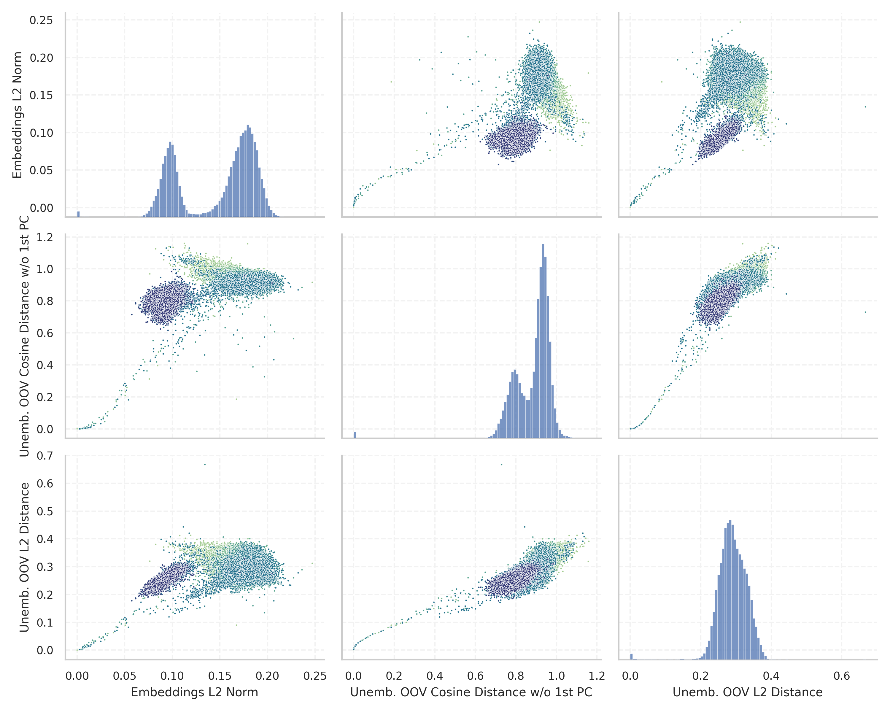
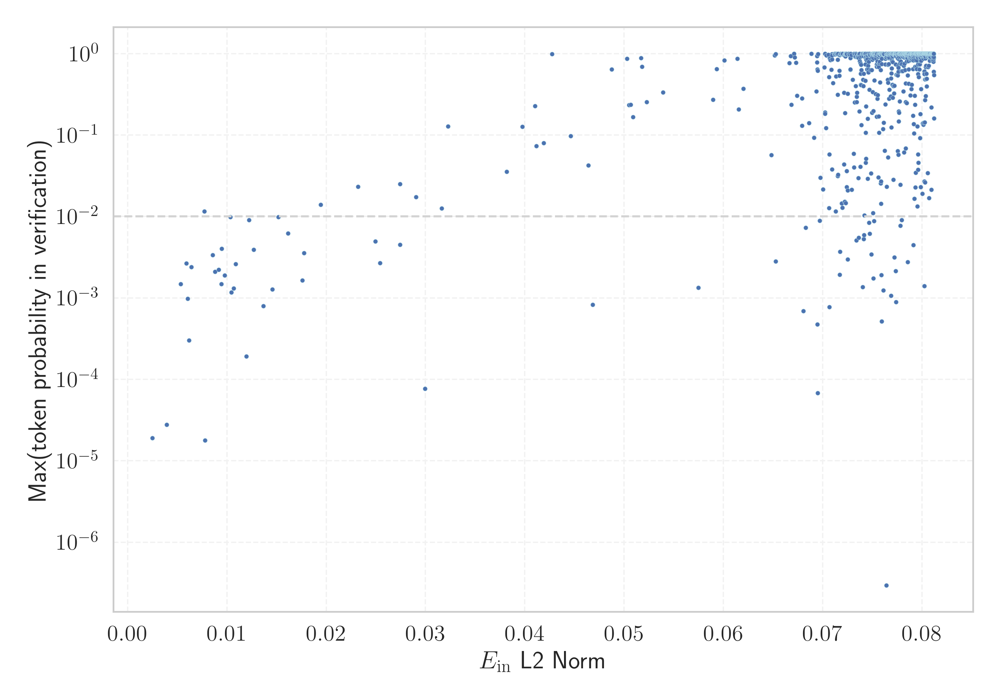

# Report for `Rakuten/RakutenAI-7B`

## Model info

* Tied embeddings: no
* Unembeddings use bias: no
* Metric for under-trained tokens: Embeddings L2 Norm
  * Overall distribution 0.148 +/- 0.040
  * Token used for verification prompt building: `includegraphics`
  * Verification threshold: 0.081
  * Threshold for showing candidate under-trained tokens: 0.016
  * Median verified threshold (for bytes, unreachable and special tokens): 0.068
* Embeddings shape: (48000, 4096)
* Vocabulary size: 48000
  * Number of single byte tokens: 380, of which 145 below metric threshold
  * Number of special tokens: 3, of which 1 below metric threshold
  * Number of tested under-trained tokens: 950, 59 below p = 0.01 threshold, 21 below soft metric threshold

## Metrics plot


## Verification plot


## Under-trained token verification results
21 entries below threshold of 0.016

|   token_id | token              |     metric | max_prob                                                         | in_other_tokens                                                             |
|------------|--------------------|------------|------------------------------------------------------------------|-----------------------------------------------------------------------------|
|      31738 | ````` \uefc0 ````` | 0.00250616 | <span style='border: 1px solid rgb(169, 68, 66);'>1.9e-05</span> |                                                                             |
|      20418 | ````` ▁/**\r ````` | 0.00394453 | <span style='border: 1px solid rgb(169, 68, 66);'>2.8e-05</span> |                                                                             |
|      26636 | ````` });\r `````  | 0.00592599 | <span style='border: 1px solid rgb(255, 145, 0);'>0.0027</span>  |                                                                             |
|      26083 | ````` ▁//\r `````  | 0.00604375 | <span style='border: 1px solid rgb(169, 68, 66);'>0.00098</span> |                                                                             |
|      26407 | ````` };\r `````   | 0.00617504 | <span style='border: 1px solid rgb(169, 68, 66);'>0.0003</span>  |                                                                             |
|      26392 | ````` ▁});\r ````` | 0.00643216 | <span style='border: 1px solid rgb(255, 145, 0);'>0.0024</span>  |                                                                             |
|      18759 | ````` ';\r `````   | 0.00772922 | <span style='border: 1px solid rgb(251, 189, 8);'>0.012</span>   |                                                                             |
|      25833 | ````` >?[< `````   | 0.00780517 | <span style='border: 1px solid rgb(169, 68, 66);'>1.8e-05</span> |                                                                             |
|       9823 | ````` */\r `````   | 0.00857488 | <span style='border: 1px solid rgb(255, 145, 0);'>0.0034</span>  |                                                                             |
|      28171 | ````` ]);\r `````  | 0.00881899 | <span style='border: 1px solid rgb(255, 145, 0);'>0.0021</span>  |                                                                             |
|      23139 | ````` ▁};\r `````  | 0.00918194 | <span style='border: 1px solid rgb(255, 145, 0);'>0.0022</span>  |                                                                             |
|      17695 | ````` },\r `````   | 0.00945253 | <span style='border: 1px solid rgb(255, 145, 0);'>0.0015</span>  | <span style='border: 1px solid rgb(255, 145, 0);'>````` ▁},\r `````</span>  |
|       7608 | ````` ▁*/\r `````  | 0.00947291 | <span style='border: 1px solid rgb(255, 145, 0);'>0.004</span>   |                                                                             |
|      15056 | ````` ());\r ````` | 0.00977244 | <span style='border: 1px solid rgb(255, 145, 0);'>0.0019</span>  |                                                                             |
|      12193 | ````` ▁);\r `````  | 0.0103586  | <span style='border: 1px solid rgb(255, 145, 0);'>0.0098</span>  |                                                                             |
|      14756 | ````` /**\r `````  | 0.0104544  | <span style='border: 1px solid rgb(255, 145, 0);'>0.0012</span>  | <span style='border: 1px solid rgb(169, 68, 66);'>````` ▁/**\r `````</span> |
|      20692 | ````` ▁},\r `````  | 0.0108981  | <span style='border: 1px solid rgb(255, 145, 0);'>0.0026</span>  |                                                                             |
|      16943 | ````` ');\r `````  | 0.0122234  | <span style='border: 1px solid rgb(255, 145, 0);'>0.0091</span>  |                                                                             |
|      10278 | ````` ',\r `````   | 0.0127086  | <span style='border: 1px solid rgb(255, 145, 0);'>0.0039</span>  |                                                                             |
|      30929 | ````` ᥀ `````      | 0.0145792  | <span style='border: 1px solid rgb(255, 145, 0);'>0.0013</span>  |                                                                             |
<details><summary>1 additional entries below threshold</summary>

|   token_id | token            |   metric | max_prob                                                        |
|------------|------------------|----------|-----------------------------------------------------------------|
|      11880 | ````` ";\r ````` | 0.015188 | <span style='border: 1px solid rgb(255, 145, 0);'>0.0098</span> |
</details>
<details><summary>929 additional entries above threshold</summary>

|   token_id | token                          |    metric | max_prob                                                         | in_other_tokens                                                                                                                                                                                                                                                                                                                                                                                                                 |
|------------|--------------------------------|-----------|------------------------------------------------------------------|---------------------------------------------------------------------------------------------------------------------------------------------------------------------------------------------------------------------------------------------------------------------------------------------------------------------------------------------------------------------------------------------------------------------------------|
|      14420 | ````` ];\r `````               | 0.0161559 | <span style='border: 1px solid rgb(255, 145, 0);'>0.0062</span>  |                                                                                                                                                                                                                                                                                                                                                                                                                                 |
|      10941 | ````` ));\r `````              | 0.0177598 | <span style='border: 1px solid rgb(255, 145, 0);'>0.0036</span>  | <span style='border: 1px solid rgb(255, 145, 0);'>````` ());\r `````</span>                                                                                                                                                                                                                                                                                                                                                     |
|      18055 | ````` ){\r `````               | 0.0194587 | <span style='border: 1px solid rgb(251, 189, 8);'>0.014</span>   |                                                                                                                                                                                                                                                                                                                                                                                                                                 |
|      14980 | ````` ">\r `````               | 0.023214  | <span style='border: 1px solid rgb(251, 189, 8);'>0.023</span>   |                                                                                                                                                                                                                                                                                                                                                                                                                                 |
|      25900 | ````` iNdEx `````              | 0.0254039 | <span style='border: 1px solid rgb(255, 145, 0);'>0.0027</span>  |                                                                                                                                                                                                                                                                                                                                                                                                                                 |
|       6913 | ````` ");\r `````              | 0.0274205 | <span style='border: 1px solid rgb(251, 189, 8);'>0.025</span>   |                                                                                                                                                                                                                                                                                                                                                                                                                                 |
|      22186 | ````` ')\r `````               | 0.0274315 | <span style='border: 1px solid rgb(255, 145, 0);'>0.0045</span>  |                                                                                                                                                                                                                                                                                                                                                                                                                                 |
|      10939 | ````` ",\r `````               | 0.0290431 | <span style='border: 1px solid rgb(251, 189, 8);'>0.017</span>   |                                                                                                                                                                                                                                                                                                                                                                                                                                 |
|      26831 | ````` ▁febbra `````            | 0.0299563 | <span style='border: 1px solid rgb(169, 68, 66);'>7.7e-05</span> | ````` ▁febbraio `````                                                                                                                                                                                                                                                                                                                                                                                                           |
|      19248 | ````` NdEx `````               | 0.0316446 | <span style='border: 1px solid rgb(251, 189, 8);'>0.013</span>   | <span style='border: 1px solid rgb(255, 145, 0);'>````` iNdEx `````</span>                                                                                                                                                                                                                                                                                                                                                      |
|       4420 | ````` ();\r `````              | 0.0322802 | <span style='border: 1px solid rgb(40, 167, 69);'>0.13</span>    |                                                                                                                                                                                                                                                                                                                                                                                                                                 |
|       3426 | ````` ▁}\r `````               | 0.0381879 | <span style='border: 1px solid rgb(251, 189, 8);'>0.035</span>   |                                                                                                                                                                                                                                                                                                                                                                                                                                 |
|      31853 | ````` ⇽ `````                  | 0.0397406 | <span style='border: 1px solid rgb(40, 167, 69);'>0.13</span>    |                                                                                                                                                                                                                                                                                                                                                                                                                                 |
|       9962 | ````` ()\r `````               | 0.0410376 | <span style='border: 1px solid rgb(40, 167, 69);'>0.23</span>    |                                                                                                                                                                                                                                                                                                                                                                                                                                 |
|       4441 | ````` {\r `````                | 0.0411616 | <span style='border: 1px solid rgb(251, 189, 8);'>0.074</span>   | <span style='border: 1px solid rgb(251, 189, 8);'>````` ){\r `````</span>                                                                                                                                                                                                                                                                                                                                                       |
|      23486 | ````` ),\r `````               | 0.0418947 | <span style='border: 1px solid rgb(251, 189, 8);'>0.08</span>    |                                                                                                                                                                                                                                                                                                                                                                                                                                 |
|      31363 | ````` \x85 `````               | 0.0427519 | <span style='border: 1px solid rgb(40, 167, 69);'>0.99</span>    |                                                                                                                                                                                                                                                                                                                                                                                                                                 |
|      14619 | ````` ▁)\r `````               | 0.0446117 | <span style='border: 1px solid rgb(251, 189, 8);'>0.097</span>   |                                                                                                                                                                                                                                                                                                                                                                                                                                 |
|      17334 | ````` (\r `````                | 0.0463994 | <span style='border: 1px solid rgb(251, 189, 8);'>0.042</span>   |                                                                                                                                                                                                                                                                                                                                                                                                                                 |
|      15641 | ````` ▁uitgen `````            | 0.0468323 | <span style='border: 1px solid rgb(169, 68, 66);'>0.00082</span> | ````` ▁uitgenodigd `````                                                                                                                                                                                                                                                                                                                                                                                                        |
|      27732 | ````` '\r `````                | 0.0487512 | <span style='border: 1px solid rgb(40, 167, 69);'>0.64</span>    |                                                                                                                                                                                                                                                                                                                                                                                                                                 |
|      31656 | ````` ≮ `````                  | 0.050307  | <span style='border: 1px solid rgb(40, 167, 69);'>0.87</span>    |                                                                                                                                                                                                                                                                                                                                                                                                                                 |
|       2519 | ````` }\r `````                | 0.0505091 | <span style='border: 1px solid rgb(40, 167, 69);'>0.23</span>    | <span style='border: 1px solid rgb(251, 189, 8);'>````` ▁}\r `````</span>                                                                                                                                                                                                                                                                                                                                                       |
|       1969 | ````` ▁{\r `````               | 0.0506745 | <span style='border: 1px solid rgb(40, 167, 69);'>0.24</span>    |                                                                                                                                                                                                                                                                                                                                                                                                                                 |
|      16949 | ````` ")\r `````               | 0.050891  | <span style='border: 1px solid rgb(40, 167, 69);'>0.17</span>    |                                                                                                                                                                                                                                                                                                                                                                                                                                 |
|      31645 | ````` ≯ `````                  | 0.0516961 | <span style='border: 1px solid rgb(40, 167, 69);'>0.88</span>    |                                                                                                                                                                                                                                                                                                                                                                                                                                 |
|      30413 | ````` ⌁ `````                  | 0.0517949 | <span style='border: 1px solid rgb(40, 167, 69);'>0.69</span>    |                                                                                                                                                                                                                                                                                                                                                                                                                                 |
|       1761 | ````` );\r `````               | 0.0522675 | <span style='border: 1px solid rgb(40, 167, 69);'>0.26</span>    | <span style='border: 1px solid rgb(40, 167, 69);'>````` ();\r `````</span>, <span style='border: 1px solid rgb(251, 189, 8);'>````` ");\r `````</span>, <span style='border: 1px solid rgb(255, 145, 0);'>````` ));\r `````</span>, <span style='border: 1px solid rgb(255, 145, 0);'>````` ▁);\r `````</span>, <span style='border: 1px solid rgb(255, 145, 0);'>````` ());\r `````</span>, ...                                |
|      27456 | ````` :%.*]] `````             | 0.0539253 | <span style='border: 1px solid rgb(40, 167, 69);'>0.34</span>    |                                                                                                                                                                                                                                                                                                                                                                                                                                 |
|      42724 | ````` 院議員総選挙 `````       | 0.0574906 | <span style='border: 1px solid rgb(255, 145, 0);'>0.0013</span>  | <span style='border: 1px solid rgb(40, 167, 69);'>````` 衆議院議員総選挙 `````</span>, <span style='border: 1px solid rgb(40, 167, 69);'>````` 回衆議院議員総選挙 `````</span>                                                                                                                                                                                                                                                  |
|      14668 | ````` ))\r `````               | 0.0589474 | <span style='border: 1px solid rgb(40, 167, 69);'>0.27</span>    |                                                                                                                                                                                                                                                                                                                                                                                                                                 |
|      16724 | ````` tagHelper `````          | 0.0593214 | <span style='border: 1px solid rgb(40, 167, 69);'>0.65</span>    |                                                                                                                                                                                                                                                                                                                                                                                                                                 |
|      16772 | ````` :%.* `````               | 0.0600799 | <span style='border: 1px solid rgb(40, 167, 69);'>0.83</span>    | <span style='border: 1px solid rgb(40, 167, 69);'>````` :%.*]] `````</span>                                                                                                                                                                                                                                                                                                                                                     |
|      42725 | ````` 衆議院議員総選挙 `````   | 0.061412  | <span style='border: 1px solid rgb(40, 167, 69);'>0.86</span>    | <span style='border: 1px solid rgb(40, 167, 69);'>````` 回衆議院議員総選挙 `````</span>                                                                                                                                                                                                                                                                                                                                         |
|      43036 | ````` 回衆議院議員総選挙 ````` | 0.0615562 | <span style='border: 1px solid rgb(40, 167, 69);'>0.21</span>    |                                                                                                                                                                                                                                                                                                                                                                                                                                 |
|      15880 | ````` >:]< `````               | 0.0619932 | <span style='border: 1px solid rgb(40, 167, 69);'>0.37</span>    |                                                                                                                                                                                                                                                                                                                                                                                                                                 |
|      42217 | ````` 院議員総 `````           | 0.0648277 | <span style='border: 1px solid rgb(251, 189, 8);'>0.057</span>   | <span style='border: 1px solid rgb(255, 145, 0);'>````` 院議員総選挙 `````</span>, <span style='border: 1px solid rgb(40, 167, 69);'>````` 衆議院議員総選挙 `````</span>, <span style='border: 1px solid rgb(40, 167, 69);'>````` 回衆議院議員総選挙 `````</span>                                                                                                                                                               |
|      41336 | ````` アメリカ合衆国の `````   | 0.0651734 | <span style='border: 1px solid rgb(40, 167, 69);'>0.95</span>    |                                                                                                                                                                                                                                                                                                                                                                                                                                 |
|      30813 | ````` ︙ `````                 | 0.0652648 | <span style='border: 1px solid rgb(40, 167, 69);'>0.99</span>    |                                                                                                                                                                                                                                                                                                                                                                                                                                 |
|      47903 | ````` 領選挙 `````             | 0.0652755 | <span style='border: 1px solid rgb(255, 145, 0);'>0.0028</span>  |                                                                                                                                                                                                                                                                                                                                                                                                                                 |
|      42051 | ````` 議員総 `````             | 0.0666427 | <span style='border: 1px solid rgb(40, 167, 69);'>0.77</span>    | <span style='border: 1px solid rgb(251, 189, 8);'>````` 院議員総 `````</span>, <span style='border: 1px solid rgb(255, 145, 0);'>````` 院議員総選挙 `````</span>, <span style='border: 1px solid rgb(40, 167, 69);'>````` 衆議院議員総選挙 `````</span>, <span style='border: 1px solid rgb(40, 167, 69);'>````` 回衆議院議員総選挙 `````</span>                                                                                |
|      39486 | ````` 貢献した `````           | 0.0667761 | <span style='border: 1px solid rgb(40, 167, 69);'>0.93</span>    | <span style='border: 1px solid rgb(40, 167, 69);'>````` に貢献した `````</span>                                                                                                                                                                                                                                                                                                                                                 |
|      33727 | ````` アメリカ合衆 `````       | 0.0668564 | <span style='border: 1px solid rgb(40, 167, 69);'>0.24</span>    | <span style='border: 1px solid rgb(40, 167, 69);'>````` アメリカ合衆国 `````</span>, <span style='border: 1px solid rgb(40, 167, 69);'>````` アメリカ合衆国の `````</span>                                                                                                                                                                                                                                                      |
|      31932 | ````` ҽ `````                  | 0.0671132 | <span style='border: 1px solid rgb(40, 167, 69);'>1</span>       |                                                                                                                                                                                                                                                                                                                                                                                                                                 |
|      41976 | ````` に貢献した `````         | 0.0671898 | <span style='border: 1px solid rgb(40, 167, 69);'>0.9</span>     |                                                                                                                                                                                                                                                                                                                                                                                                                                 |
|      47480 | ````` 契約を結んだ `````       | 0.0673243 | <span style='border: 1px solid rgb(40, 167, 69);'>0.77</span>    |                                                                                                                                                                                                                                                                                                                                                                                                                                 |
|      40879 | ````` 合衆国の `````           | 0.067424  | <span style='border: 1px solid rgb(40, 167, 69);'>0.3</span>     | <span style='border: 1px solid rgb(40, 167, 69);'>````` アメリカ合衆国の `````</span>                                                                                                                                                                                                                                                                                                                                           |
|      42941 | ````` 回衆議院議員 `````       | 0.0679246 | <span style='border: 1px solid rgb(40, 167, 69);'>0.13</span>    | <span style='border: 1px solid rgb(40, 167, 69);'>````` 回衆議院議員総選挙 `````</span>                                                                                                                                                                                                                                                                                                                                         |
|      46713 | ````` エト連邦 `````           | 0.0679302 | <span style='border: 1px solid rgb(40, 167, 69);'>0.28</span>    |                                                                                                                                                                                                                                                                                                                                                                                                                                 |
|      46231 | ````` 稲田大学 `````           | 0.068055  | <span style='border: 1px solid rgb(169, 68, 66);'>0.00069</span> | <span style='border: 1px solid rgb(40, 167, 69);'>````` 早稲田大学 `````</span>                                                                                                                                                                                                                                                                                                                                                 |
|      36801 | ````` 戸時代 `````             | 0.0682958 | <span style='border: 1px solid rgb(255, 145, 0);'>0.0073</span>  | <span style='border: 1px solid rgb(40, 167, 69);'>````` 江戸時代 `````</span>                                                                                                                                                                                                                                                                                                                                                   |
|      42259 | ````` 売されている `````       | 0.0686103 | <span style='border: 1px solid rgb(40, 167, 69);'>0.14</span>    |                                                                                                                                                                                                                                                                                                                                                                                                                                 |
|      44529 | ````` 廃止された `````         | 0.0688449 | <span style='border: 1px solid rgb(40, 167, 69);'>0.99</span>    |                                                                                                                                                                                                                                                                                                                                                                                                                                 |
|      37978 | ````` 逐艦 `````               | 0.0691161 | <span style='border: 1px solid rgb(251, 189, 8);'>0.093</span>   | <span style='border: 1px solid rgb(40, 167, 69);'>````` 駆逐艦 `````</span>                                                                                                                                                                                                                                                                                                                                                     |
|      47385 | ````` メダルを獲得した `````   | 0.0693627 | <span style='border: 1px solid rgb(40, 167, 69);'>0.34</span>    |                                                                                                                                                                                                                                                                                                                                                                                                                                 |
|       7941 | ````` ICENSE `````             | 0.0694394 | <span style='border: 1px solid rgb(40, 167, 69);'>0.78</span>    | ````` LICENSE `````, ````` ▁LICENSE `````                                                                                                                                                                                                                                                                                                                                                                                       |
|      39383 | ````` を受賞した `````         | 0.0694401 | <span style='border: 1px solid rgb(40, 167, 69);'>0.94</span>    | <span style='border: 1px solid rgb(40, 167, 69);'>````` 賞を受賞した `````</span>                                                                                                                                                                                                                                                                                                                                               |
|      43532 | ````` 選手権では `````         | 0.0694577 | <span style='border: 1px solid rgb(40, 167, 69);'>0.64</span>    |                                                                                                                                                                                                                                                                                                                                                                                                                                 |
|      42934 | ````` 回衆議 `````             | 0.0694773 | <span style='border: 1px solid rgb(169, 68, 66);'>0.00047</span> | <span style='border: 1px solid rgb(40, 167, 69);'>````` 回衆議院議員 `````</span>, <span style='border: 1px solid rgb(40, 167, 69);'>````` 回衆議院議員総選挙 `````</span>                                                                                                                                                                                                                                                      |
|      46706 | ````` 應義塾 `````             | 0.0694861 | <span style='border: 1px solid rgb(169, 68, 66);'>6.8e-05</span> | <span style='border: 1px solid rgb(40, 167, 69);'>````` 慶應義塾 `````</span>                                                                                                                                                                                                                                                                                                                                                   |
|      36561 | ````` 締役 `````               | 0.0695042 | <span style='border: 1px solid rgb(40, 167, 69);'>0.61</span>    | <span style='border: 1px solid rgb(40, 167, 69);'>````` 取締役 `````</span>, <span style='border: 1px solid rgb(40, 167, 69);'>````` 代表取締役 `````</span>                                                                                                                                                                                                                                                                    |
|      45615 | ````` 搭載した `````           | 0.0695376 | <span style='border: 1px solid rgb(40, 167, 69);'>0.99</span>    |                                                                                                                                                                                                                                                                                                                                                                                                                                 |
|      47828 | ````` 帯電話 `````             | 0.0697091 | <span style='border: 1px solid rgb(255, 145, 0);'>0.0089</span>  | <span style='border: 1px solid rgb(40, 167, 69);'>````` 携帯電話 `````</span>                                                                                                                                                                                                                                                                                                                                                   |
|      33972 | ````` ニューヨ `````           | 0.0697616 | <span style='border: 1px solid rgb(251, 189, 8);'>0.03</span>    | <span style='border: 1px solid rgb(40, 167, 69);'>````` ニューヨーク `````</span>                                                                                                                                                                                                                                                                                                                                               |
|      39065 | ````` 献した `````             | 0.0700245 | <span style='border: 1px solid rgb(251, 189, 8);'>0.021</span>   | <span style='border: 1px solid rgb(40, 167, 69);'>````` 貢献した `````</span>, <span style='border: 1px solid rgb(40, 167, 69);'>````` に貢献した `````</span>                                                                                                                                                                                                                                                                  |
|      27265 | ````` ▁SDValue `````           | 0.0701688 | <span style='border: 1px solid rgb(40, 167, 69);'>0.68</span>    |                                                                                                                                                                                                                                                                                                                                                                                                                                 |
|      46408 | ````` 砲撃 `````               | 0.0702285 | <span style='border: 1px solid rgb(40, 167, 69);'>1</span>       |                                                                                                                                                                                                                                                                                                                                                                                                                                 |
|      45931 | ````` ト連邦 `````             | 0.0702299 | <span style='border: 1px solid rgb(40, 167, 69);'>0.19</span>    | <span style='border: 1px solid rgb(40, 167, 69);'>````` エト連邦 `````</span>                                                                                                                                                                                                                                                                                                                                                   |
|      47902 | ````` 産主義 `````             | 0.0702434 | <span style='border: 1px solid rgb(40, 167, 69);'>0.18</span>    |                                                                                                                                                                                                                                                                                                                                                                                                                                 |
|      40741 | ````` 極的に `````             | 0.07035   | <span style='border: 1px solid rgb(40, 167, 69);'>0.12</span>    | <span style='border: 1px solid rgb(40, 167, 69);'>````` 積極的に `````</span>                                                                                                                                                                                                                                                                                                                                                   |
|      46235 | ````` 収録された `````         | 0.0703832 | <span style='border: 1px solid rgb(40, 167, 69);'>0.95</span>    |                                                                                                                                                                                                                                                                                                                                                                                                                                 |
|      34383 | ````` アメリカ合衆国 `````     | 0.070564  | <span style='border: 1px solid rgb(40, 167, 69);'>0.97</span>    | <span style='border: 1px solid rgb(40, 167, 69);'>````` アメリカ合衆国の `````</span>                                                                                                                                                                                                                                                                                                                                           |
|      47423 | ````` 大学名誉 `````           | 0.0706264 | <span style='border: 1px solid rgb(40, 167, 69);'>0.52</span>    |                                                                                                                                                                                                                                                                                                                                                                                                                                 |
|      40852 | ````` 衆国の `````             | 0.0706268 | <span style='border: 1px solid rgb(251, 189, 8);'>0.013</span>   | <span style='border: 1px solid rgb(40, 167, 69);'>````` 合衆国の `````</span>, <span style='border: 1px solid rgb(40, 167, 69);'>````` アメリカ合衆国の `````</span>                                                                                                                                                                                                                                                            |
|      40591 | ````` 響を受け `````           | 0.0706685 | <span style='border: 1px solid rgb(169, 68, 66);'>0.00077</span> | <span style='border: 1px solid rgb(40, 167, 69);'>````` 影響を受け `````</span>                                                                                                                                                                                                                                                                                                                                                 |
|      40407 | ````` 捕され `````             | 0.0706836 | <span style='border: 1px solid rgb(251, 189, 8);'>0.058</span>   |                                                                                                                                                                                                                                                                                                                                                                                                                                 |
|      43439 | ````` 代表取締 `````           | 0.0706896 | <span style='border: 1px solid rgb(40, 167, 69);'>0.88</span>    | <span style='border: 1px solid rgb(40, 167, 69);'>````` 代表取締役 `````</span>                                                                                                                                                                                                                                                                                                                                                 |
|      43966 | ````` 移籍した `````           | 0.0707847 | <span style='border: 1px solid rgb(40, 167, 69);'>0.83</span>    |                                                                                                                                                                                                                                                                                                                                                                                                                                 |
|      42004 | ````` で開催された `````       | 0.0708685 | <span style='border: 1px solid rgb(40, 167, 69);'>0.63</span>    |                                                                                                                                                                                                                                                                                                                                                                                                                                 |
|      45584 | ````` 勝ちを収 `````           | 0.0709257 | <span style='border: 1px solid rgb(251, 189, 8);'>0.038</span>   |                                                                                                                                                                                                                                                                                                                                                                                                                                 |
|      42606 | ````` 選手権大会 `````         | 0.0709311 | <span style='border: 1px solid rgb(40, 167, 69);'>0.99</span>    |                                                                                                                                                                                                                                                                                                                                                                                                                                 |
|      41799 | ````` 選挙では `````           | 0.0709381 | <span style='border: 1px solid rgb(40, 167, 69);'>0.85</span>    |                                                                                                                                                                                                                                                                                                                                                                                                                                 |
|      46320 | ````` に昇格 `````             | 0.0709517 | <span style='border: 1px solid rgb(40, 167, 69);'>0.95</span>    |                                                                                                                                                                                                                                                                                                                                                                                                                                 |
|      35266 | ````` 催された `````           | 0.0710502 | <span style='border: 1px solid rgb(40, 167, 69);'>0.44</span>    | <span style='border: 1px solid rgb(40, 167, 69);'>````` 開催された `````</span>, <span style='border: 1px solid rgb(40, 167, 69);'>````` で開催された `````</span>                                                                                                                                                                                                                                                              |
|      10762 | ````` qpoint `````             | 0.0711779 | <span style='border: 1px solid rgb(40, 167, 69);'>0.99</span>    | ````` pgfqpoint `````                                                                                                                                                                                                                                                                                                                                                                                                           |
|      39649 | ````` 潜水艦 `````             | 0.0711962 | <span style='border: 1px solid rgb(40, 167, 69);'>1</span>       |                                                                                                                                                                                                                                                                                                                                                                                                                                 |
|      41392 | ````` 巡洋艦 `````             | 0.0712259 | <span style='border: 1px solid rgb(40, 167, 69);'>0.98</span>    |                                                                                                                                                                                                                                                                                                                                                                                                                                 |
|      42882 | ````` 採用された `````         | 0.0712349 | <span style='border: 1px solid rgb(40, 167, 69);'>0.98</span>    |                                                                                                                                                                                                                                                                                                                                                                                                                                 |
|      33971 | ````` ューヨ `````             | 0.0713015 | <span style='border: 1px solid rgb(251, 189, 8);'>0.012</span>   | <span style='border: 1px solid rgb(251, 189, 8);'>````` ニューヨ `````</span>, <span style='border: 1px solid rgb(40, 167, 69);'>````` ニューヨーク `````</span>                                                                                                                                                                                                                                                                |
|      47883 | ````` 逐隊 `````               | 0.0713293 | <span style='border: 1px solid rgb(40, 167, 69);'>0.53</span>    |                                                                                                                                                                                                                                                                                                                                                                                                                                 |
|      44456 | ````` 掲載された `````         | 0.0713408 | <span style='border: 1px solid rgb(40, 167, 69);'>1</span>       |                                                                                                                                                                                                                                                                                                                                                                                                                                 |
|      45745 | ````` 採用した `````           | 0.0713989 | <span style='border: 1px solid rgb(40, 167, 69);'>0.99</span>    |                                                                                                                                                                                                                                                                                                                                                                                                                                 |
|      46186 | ````` 復帰した `````           | 0.0714804 | <span style='border: 1px solid rgb(40, 167, 69);'>0.99</span>    |                                                                                                                                                                                                                                                                                                                                                                                                                                 |
|      42549 | ````` 権大会 `````             | 0.0715025 | <span style='border: 1px solid rgb(251, 189, 8);'>0.031</span>   | <span style='border: 1px solid rgb(40, 167, 69);'>````` 選手権大会 `````</span>                                                                                                                                                                                                                                                                                                                                                 |
|      42808 | ````` 催される `````           | 0.0715131 | <span style='border: 1px solid rgb(40, 167, 69);'>0.31</span>    | <span style='border: 1px solid rgb(40, 167, 69);'>````` 開催される `````</span>                                                                                                                                                                                                                                                                                                                                                 |
|      45095 | ````` に昇進 `````             | 0.0715214 | <span style='border: 1px solid rgb(40, 167, 69);'>0.84</span>    |                                                                                                                                                                                                                                                                                                                                                                                                                                 |
|      33730 | ````` ヨーロッ `````           | 0.0715302 | <span style='border: 1px solid rgb(251, 189, 8);'>0.033</span>   | <span style='border: 1px solid rgb(40, 167, 69);'>````` ヨーロッパ `````</span>                                                                                                                                                                                                                                                                                                                                                 |
|      44021 | ````` 捕虜 `````               | 0.0715469 | <span style='border: 1px solid rgb(40, 167, 69);'>1</span>       |                                                                                                                                                                                                                                                                                                                                                                                                                                 |
|      44489 | ````` 部卒業 `````             | 0.071685  | <span style='border: 1px solid rgb(40, 167, 69);'>0.54</span>    | <span style='border: 1px solid rgb(40, 167, 69);'>````` 学部卒業 `````</span>                                                                                                                                                                                                                                                                                                                                                   |
|      35345 | ````` 売された `````           | 0.071691  | <span style='border: 1px solid rgb(40, 167, 69);'>0.61</span>    | <span style='border: 1px solid rgb(40, 167, 69);'>````` 発売された `````</span>                                                                                                                                                                                                                                                                                                                                                 |
|      41442 | ````` 撃を受 `````             | 0.071697  | <span style='border: 1px solid rgb(255, 145, 0);'>0.0019</span>  | <span style='border: 1px solid rgb(251, 189, 8);'>````` 撃を受け `````</span>                                                                                                                                                                                                                                                                                                                                                   |
|      43120 | ````` 選挙に `````             | 0.0717121 | <span style='border: 1px solid rgb(40, 167, 69);'>0.96</span>    |                                                                                                                                                                                                                                                                                                                                                                                                                                 |
|      41795 | ````` 挙では `````             | 0.0717607 | <span style='border: 1px solid rgb(255, 145, 0);'>0.0037</span>  | <span style='border: 1px solid rgb(40, 167, 69);'>````` 選挙では `````</span>                                                                                                                                                                                                                                                                                                                                                   |
|      37203 | ````` 発売された `````         | 0.0717897 | <span style='border: 1px solid rgb(40, 167, 69);'>0.99</span>    |                                                                                                                                                                                                                                                                                                                                                                                                                                 |
|      45943 | ````` 導入された `````         | 0.0718024 | <span style='border: 1px solid rgb(40, 167, 69);'>1</span>       |                                                                                                                                                                                                                                                                                                                                                                                                                                 |
|      41357 | ````` 収録されている `````     | 0.0718828 | <span style='border: 1px solid rgb(40, 167, 69);'>0.99</span>    |                                                                                                                                                                                                                                                                                                                                                                                                                                 |
|      38006 | ````` 済学 `````               | 0.0719081 | <span style='border: 1px solid rgb(251, 189, 8);'>0.014</span>   | <span style='border: 1px solid rgb(40, 167, 69);'>````` 経済学 `````</span>                                                                                                                                                                                                                                                                                                                                                     |
|      46357 | ````` 哨戒 `````               | 0.0719657 | <span style='border: 1px solid rgb(40, 167, 69);'>0.99</span>    |                                                                                                                                                                                                                                                                                                                                                                                                                                 |
|      38064 | ````` 駆逐艦 `````             | 0.0719734 | <span style='border: 1px solid rgb(40, 167, 69);'>1</span>       |                                                                                                                                                                                                                                                                                                                                                                                                                                 |
|      46286 | ````` 環として `````           | 0.0719907 | <span style='border: 1px solid rgb(251, 189, 8);'>0.013</span>   |                                                                                                                                                                                                                                                                                                                                                                                                                                 |
|      39571 | ````` 世界選手権 `````         | 0.0719984 | <span style='border: 1px solid rgb(40, 167, 69);'>1</span>       |                                                                                                                                                                                                                                                                                                                                                                                                                                 |
|      46987 | ````` デビューを果た `````     | 0.0721474 | <span style='border: 1px solid rgb(40, 167, 69);'>0.33</span>    |                                                                                                                                                                                                                                                                                                                                                                                                                                 |
|      42463 | ````` 挙区 `````               | 0.0721603 | <span style='border: 1px solid rgb(251, 189, 8);'>0.043</span>   | <span style='border: 1px solid rgb(40, 167, 69);'>````` 選挙区 `````</span>                                                                                                                                                                                                                                                                                                                                                     |
|      41623 | ````` を挙げた `````           | 0.0721695 | <span style='border: 1px solid rgb(40, 167, 69);'>0.95</span>    |                                                                                                                                                                                                                                                                                                                                                                                                                                 |
|      43893 | ````` に入団 `````             | 0.0721994 | <span style='border: 1px solid rgb(40, 167, 69);'>0.99</span>    |                                                                                                                                                                                                                                                                                                                                                                                                                                 |
|      46799 | ````` 徴である `````           | 0.0722084 | <span style='border: 1px solid rgb(251, 189, 8);'>0.015</span>   |                                                                                                                                                                                                                                                                                                                                                                                                                                 |
|      47910 | ````` て扱 `````               | 0.072211  | <span style='border: 1px solid rgb(251, 189, 8);'>0.015</span>   |                                                                                                                                                                                                                                                                                                                                                                                                                                 |
|      41077 | ````` 戻った `````             | 0.0722352 | <span style='border: 1px solid rgb(40, 167, 69);'>1</span>       |                                                                                                                                                                                                                                                                                                                                                                                                                                 |
|      33679 | ````` 催され `````             | 0.0722635 | <span style='border: 1px solid rgb(40, 167, 69);'>0.19</span>    | <span style='border: 1px solid rgb(40, 167, 69);'>````` 催された `````</span>, <span style='border: 1px solid rgb(40, 167, 69);'>````` 開催された `````</span>, <span style='border: 1px solid rgb(40, 167, 69);'>````` で開催された `````</span>, <span style='border: 1px solid rgb(40, 167, 69);'>````` 催される `````</span>, <span style='border: 1px solid rgb(40, 167, 69);'>````` 開催される `````</span>               |
|      40787 | ````` ー賞 `````               | 0.0722665 | <span style='border: 1px solid rgb(40, 167, 69);'>0.92</span>    |                                                                                                                                                                                                                                                                                                                                                                                                                                 |
|      45585 | ````` 誕生した `````           | 0.0722672 | <span style='border: 1px solid rgb(40, 167, 69);'>0.99</span>    |                                                                                                                                                                                                                                                                                                                                                                                                                                 |
|      41167 | ````` に復帰 `````             | 0.0722795 | <span style='border: 1px solid rgb(40, 167, 69);'>0.98</span>    |                                                                                                                                                                                                                                                                                                                                                                                                                                 |
|      45927 | ````` 騎乗 `````               | 0.0723155 | <span style='border: 1px solid rgb(40, 167, 69);'>0.99</span>    |                                                                                                                                                                                                                                                                                                                                                                                                                                 |
|      42025 | ````` 摘され `````             | 0.0723184 | <span style='border: 1px solid rgb(251, 189, 8);'>0.015</span>   |                                                                                                                                                                                                                                                                                                                                                                                                                                 |
|      38022 | ````` 総選挙 `````             | 0.0723555 | <span style='border: 1px solid rgb(40, 167, 69);'>1</span>       | <span style='border: 1px solid rgb(255, 145, 0);'>````` 院議員総選挙 `````</span>, <span style='border: 1px solid rgb(40, 167, 69);'>````` 衆議院議員総選挙 `````</span>, <span style='border: 1px solid rgb(40, 167, 69);'>````` 回衆議院議員総選挙 `````</span>                                                                                                                                                               |
|      41116 | ````` 襲撃 `````               | 0.0723846 | <span style='border: 1px solid rgb(40, 167, 69);'>1</span>       |                                                                                                                                                                                                                                                                                                                                                                                                                                 |
|      47030 | ````` 績を残 `````             | 0.072413  | <span style='border: 1px solid rgb(251, 189, 8);'>0.023</span>   |                                                                                                                                                                                                                                                                                                                                                                                                                                 |
|      44962 | ````` 撃を受け `````           | 0.0724273 | <span style='border: 1px solid rgb(251, 189, 8);'>0.036</span>   |                                                                                                                                                                                                                                                                                                                                                                                                                                 |
|      42966 | ````` 殺された `````           | 0.0724306 | <span style='border: 1px solid rgb(40, 167, 69);'>0.99</span>    |                                                                                                                                                                                                                                                                                                                                                                                                                                 |
|      47467 | ````` 評され `````             | 0.0725304 | <span style='border: 1px solid rgb(40, 167, 69);'>0.32</span>    |                                                                                                                                                                                                                                                                                                                                                                                                                                 |
|      46719 | ````` ルを獲得した `````       | 0.0725308 | <span style='border: 1px solid rgb(255, 145, 0);'>0.003</span>   | <span style='border: 1px solid rgb(40, 167, 69);'>````` メダルを獲得した `````</span>                                                                                                                                                                                                                                                                                                                                           |
|      44311 | ````` り扱 `````               | 0.0725317 | <span style='border: 1px solid rgb(251, 189, 8);'>0.021</span>   | <span style='border: 1px solid rgb(40, 167, 69);'>````` 取り扱 `````</span>                                                                                                                                                                                                                                                                                                                                                     |
|      47693 | ````` 鎮圧 `````               | 0.0726015 | <span style='border: 1px solid rgb(40, 167, 69);'>0.99</span>    |                                                                                                                                                                                                                                                                                                                                                                                                                                 |
|      35436 | ````` 開催された `````         | 0.0726548 | <span style='border: 1px solid rgb(40, 167, 69);'>0.97</span>    | <span style='border: 1px solid rgb(40, 167, 69);'>````` で開催された `````</span>                                                                                                                                                                                                                                                                                                                                               |
|      34045 | ````` 合衆国 `````             | 0.0726792 | <span style='border: 1px solid rgb(40, 167, 69);'>0.98</span>    | <span style='border: 1px solid rgb(40, 167, 69);'>````` アメリカ合衆国 `````</span>, <span style='border: 1px solid rgb(40, 167, 69);'>````` 合衆国の `````</span>, <span style='border: 1px solid rgb(40, 167, 69);'>````` アメリカ合衆国の `````</span>                                                                                                                                                                       |
|      40383 | ````` 誉教授 `````             | 0.0727806 | <span style='border: 1px solid rgb(40, 167, 69);'>0.64</span>    | <span style='border: 1px solid rgb(40, 167, 69);'>````` 名誉教授 `````</span>                                                                                                                                                                                                                                                                                                                                                   |
|      43400 | ````` 賞を受賞した `````       | 0.0727851 | <span style='border: 1px solid rgb(40, 167, 69);'>0.64</span>    |                                                                                                                                                                                                                                                                                                                                                                                                                                 |
|      45010 | ````` 学部卒業 `````           | 0.072801  | <span style='border: 1px solid rgb(40, 167, 69);'>0.89</span>    |                                                                                                                                                                                                                                                                                                                                                                                                                                 |
|      43399 | ````` 開催される `````         | 0.0728108 | <span style='border: 1px solid rgb(40, 167, 69);'>0.99</span>    |                                                                                                                                                                                                                                                                                                                                                                                                                                 |
|      39568 | ````` 会議員 `````             | 0.0728858 | <span style='border: 1px solid rgb(40, 167, 69);'>0.96</span>    | <span style='border: 1px solid rgb(40, 167, 69);'>````` 議会議員 `````</span>                                                                                                                                                                                                                                                                                                                                                   |
|      35916 | ````` 賞を受 `````             | 0.0729158 | <span style='border: 1px solid rgb(251, 189, 8);'>0.021</span>   | <span style='border: 1px solid rgb(40, 167, 69);'>````` 賞を受賞 `````</span>, <span style='border: 1px solid rgb(40, 167, 69);'>````` 賞を受賞した `````</span>                                                                                                                                                                                                                                                                |
|      46428 | ````` 影響を与 `````           | 0.0730279 | <span style='border: 1px solid rgb(40, 167, 69);'>0.48</span>    |                                                                                                                                                                                                                                                                                                                                                                                                                                 |
|      40063 | ````` 価され `````             | 0.0731313 | <span style='border: 1px solid rgb(251, 189, 8);'>0.059</span>   |                                                                                                                                                                                                                                                                                                                                                                                                                                 |
|      46717 | ````` 慶應義塾 `````           | 0.0731546 | <span style='border: 1px solid rgb(40, 167, 69);'>1</span>       |                                                                                                                                                                                                                                                                                                                                                                                                                                 |
|      42846 | ````` 遣され `````             | 0.0731708 | <span style='border: 1px solid rgb(251, 189, 8);'>0.04</span>    |                                                                                                                                                                                                                                                                                                                                                                                                                                 |
|      45610 | ````` 産され `````             | 0.0732313 | <span style='border: 1px solid rgb(40, 167, 69);'>0.25</span>    |                                                                                                                                                                                                                                                                                                                                                                                                                                 |
|      47247 | ````` 取り戻 `````             | 0.0732338 | <span style='border: 1px solid rgb(40, 167, 69);'>0.99</span>    |                                                                                                                                                                                                                                                                                                                                                                                                                                 |
|      47144 | ````` とする説 `````           | 0.0732709 | <span style='border: 1px solid rgb(40, 167, 69);'>0.91</span>    |                                                                                                                                                                                                                                                                                                                                                                                                                                 |
|      47299 | ````` 売した `````             | 0.0732848 | <span style='border: 1px solid rgb(40, 167, 69);'>0.92</span>    |                                                                                                                                                                                                                                                                                                                                                                                                                                 |
|      42055 | ````` 第一次世界大戦 `````     | 0.0732853 | <span style='border: 1px solid rgb(40, 167, 69);'>0.93</span>    |                                                                                                                                                                                                                                                                                                                                                                                                                                 |
|      46372 | ````` 学校卒 `````             | 0.0733192 | <span style='border: 1px solid rgb(40, 167, 69);'>0.4</span>     |                                                                                                                                                                                                                                                                                                                                                                                                                                 |
|      45975 | ````` の車両 `````             | 0.0733662 | <span style='border: 1px solid rgb(40, 167, 69);'>1</span>       |                                                                                                                                                                                                                                                                                                                                                                                                                                 |
|      42511 | ````` 揮官 `````               | 0.0734037 | <span style='border: 1px solid rgb(255, 145, 0);'>0.0051</span>  | <span style='border: 1px solid rgb(40, 167, 69);'>````` 指揮官 `````</span>                                                                                                                                                                                                                                                                                                                                                     |
|      15500 | ````` itempty `````            | 0.0734322 | <span style='border: 1px solid rgb(40, 167, 69);'>0.3</span>     | ````` omitempty `````                                                                                                                                                                                                                                                                                                                                                                                                           |
|      33488 | ````` 合衆 `````               | 0.073434  | <span style='border: 1px solid rgb(40, 167, 69);'>0.25</span>    | <span style='border: 1px solid rgb(40, 167, 69);'>````` アメリカ合衆 `````</span>, <span style='border: 1px solid rgb(40, 167, 69);'>````` 合衆国 `````</span>, <span style='border: 1px solid rgb(40, 167, 69);'>````` アメリカ合衆国 `````</span>, <span style='border: 1px solid rgb(40, 167, 69);'>````` 合衆国の `````</span>, <span style='border: 1px solid rgb(40, 167, 69);'>````` アメリカ合衆国の `````</span>       |
|      44966 | ````` シーズン終了 `````       | 0.0734366 | <span style='border: 1px solid rgb(40, 167, 69);'>0.98</span>    |                                                                                                                                                                                                                                                                                                                                                                                                                                 |
|      40766 | ````` 挙で `````               | 0.0734403 | <span style='border: 1px solid rgb(40, 167, 69);'>0.33</span>    | <span style='border: 1px solid rgb(40, 167, 69);'>````` 選挙で `````</span>, <span style='border: 1px solid rgb(255, 145, 0);'>````` 挙では `````</span>, <span style='border: 1px solid rgb(40, 167, 69);'>````` 選挙では `````</span>                                                                                                                                                                                         |
|      47955 | ````` 卒業し `````             | 0.0734432 | <span style='border: 1px solid rgb(40, 167, 69);'>0.91</span>    |                                                                                                                                                                                                                                                                                                                                                                                                                                 |
|      39097 | ````` 挙げた `````             | 0.0735288 | <span style='border: 1px solid rgb(40, 167, 69);'>0.92</span>    | <span style='border: 1px solid rgb(40, 167, 69);'>````` を挙げた `````</span>                                                                                                                                                                                                                                                                                                                                                   |
|      46811 | ````` り戻 `````               | 0.0735373 | <span style='border: 1px solid rgb(40, 167, 69);'>0.93</span>    | <span style='border: 1px solid rgb(40, 167, 69);'>````` 取り戻 `````</span>                                                                                                                                                                                                                                                                                                                                                     |
|      40648 | ````` 名誉教授 `````           | 0.0735889 | <span style='border: 1px solid rgb(40, 167, 69);'>0.97</span>    |                                                                                                                                                                                                                                                                                                                                                                                                                                 |
|      37587 | ````` を搭 `````               | 0.073602  | <span style='border: 1px solid rgb(251, 189, 8);'>0.03</span>    | <span style='border: 1px solid rgb(40, 167, 69);'>````` を搭載 `````</span>                                                                                                                                                                                                                                                                                                                                                     |
|      40124 | ````` へ移籍 `````             | 0.0736063 | <span style='border: 1px solid rgb(40, 167, 69);'>0.89</span>    |                                                                                                                                                                                                                                                                                                                                                                                                                                 |
|      46539 | ````` に搭 `````               | 0.0736129 | <span style='border: 1px solid rgb(40, 167, 69);'>0.99</span>    |                                                                                                                                                                                                                                                                                                                                                                                                                                 |
|      44237 | ````` 領選 `````               | 0.0736328 | <span style='border: 1px solid rgb(255, 145, 0);'>0.0055</span>  | <span style='border: 1px solid rgb(255, 145, 0);'>````` 領選挙 `````</span>                                                                                                                                                                                                                                                                                                                                                     |
|      47838 | ````` 卒業した `````           | 0.0736506 | <span style='border: 1px solid rgb(40, 167, 69);'>0.99</span>    |                                                                                                                                                                                                                                                                                                                                                                                                                                 |
|      46892 | ````` の誕 `````               | 0.0737065 | <span style='border: 1px solid rgb(40, 167, 69);'>0.2</span>     |                                                                                                                                                                                                                                                                                                                                                                                                                                 |
|      37378 | ````` に貢献 `````             | 0.0737123 | <span style='border: 1px solid rgb(40, 167, 69);'>0.99</span>    | <span style='border: 1px solid rgb(40, 167, 69);'>````` に貢献した `````</span>                                                                                                                                                                                                                                                                                                                                                 |
|      47063 | ````` 歳没 `````               | 0.073736  | <span style='border: 1px solid rgb(40, 167, 69);'>0.81</span>    |                                                                                                                                                                                                                                                                                                                                                                                                                                 |
|      42730 | ````` の漫 `````               | 0.0737626 | <span style='border: 1px solid rgb(40, 167, 69);'>0.91</span>    |                                                                                                                                                                                                                                                                                                                                                                                                                                 |
|      40818 | ````` 壊され `````             | 0.0737793 | <span style='border: 1px solid rgb(40, 167, 69);'>0.76</span>    |                                                                                                                                                                                                                                                                                                                                                                                                                                 |
|      43107 | ````` 化財 `````               | 0.0737976 | <span style='border: 1px solid rgb(251, 189, 8);'>0.041</span>   | <span style='border: 1px solid rgb(40, 167, 69);'>````` 文化財 `````</span>                                                                                                                                                                                                                                                                                                                                                     |
|      39737 | ````` 躍した `````             | 0.0738297 | <span style='border: 1px solid rgb(40, 167, 69);'>0.41</span>    | <span style='border: 1px solid rgb(40, 167, 69);'>````` 活躍した `````</span>                                                                                                                                                                                                                                                                                                                                                   |
|      46506 | ````` 撃機 `````               | 0.0738303 | <span style='border: 1px solid rgb(40, 167, 69);'>0.57</span>    |                                                                                                                                                                                                                                                                                                                                                                                                                                 |
|      47082 | ````` 科卒業 `````             | 0.073869  | <span style='border: 1px solid rgb(40, 167, 69);'>0.73</span>    |                                                                                                                                                                                                                                                                                                                                                                                                                                 |
|      37305 | ````` 較的 `````               | 0.0738701 | <span style='border: 1px solid rgb(40, 167, 69);'>0.41</span>    | <span style='border: 1px solid rgb(40, 167, 69);'>````` 比較的 `````</span>                                                                                                                                                                                                                                                                                                                                                     |
|      37558 | ````` に移籍 `````             | 0.0738892 | <span style='border: 1px solid rgb(40, 167, 69);'>0.94</span>    |                                                                                                                                                                                                                                                                                                                                                                                                                                 |
|      41279 | ````` 働者 `````               | 0.0739012 | <span style='border: 1px solid rgb(40, 167, 69);'>0.13</span>    | <span style='border: 1px solid rgb(40, 167, 69);'>````` 労働者 `````</span>                                                                                                                                                                                                                                                                                                                                                     |
|      46842 | ````` た頃 `````               | 0.0739022 | <span style='border: 1px solid rgb(40, 167, 69);'>0.63</span>    |                                                                                                                                                                                                                                                                                                                                                                                                                                 |
|      43754 | ````` 隣接する `````           | 0.0739664 | <span style='border: 1px solid rgb(40, 167, 69);'>0.99</span>    |                                                                                                                                                                                                                                                                                                                                                                                                                                 |
|      40485 | ````` 活躍した `````           | 0.0739823 | <span style='border: 1px solid rgb(40, 167, 69);'>0.98</span>    |                                                                                                                                                                                                                                                                                                                                                                                                                                 |
|      40945 | ````` 選挙で `````             | 0.0740137 | <span style='border: 1px solid rgb(40, 167, 69);'>0.97</span>    | <span style='border: 1px solid rgb(40, 167, 69);'>````` 選挙では `````</span>                                                                                                                                                                                                                                                                                                                                                   |
|      38952 | ````` 響を受 `````             | 0.074017  | <span style='border: 1px solid rgb(255, 145, 0);'>0.0014</span>  | <span style='border: 1px solid rgb(169, 68, 66);'>````` 響を受け `````</span>, <span style='border: 1px solid rgb(40, 167, 69);'>````` 影響を受け `````</span>                                                                                                                                                                                                                                                                  |
|      46356 | ````` 入植 `````               | 0.0740752 | <span style='border: 1px solid rgb(40, 167, 69);'>1</span>       |                                                                                                                                                                                                                                                                                                                                                                                                                                 |
|      40734 | ````` 歳以 `````               | 0.0740753 | <span style='border: 1px solid rgb(40, 167, 69);'>0.48</span>    |                                                                                                                                                                                                                                                                                                                                                                                                                                 |
|      46467 | ````` 籍し `````               | 0.0740811 | <span style='border: 1px solid rgb(40, 167, 69);'>0.4</span>     |                                                                                                                                                                                                                                                                                                                                                                                                                                 |
|      40665 | ````` 挙げられる `````         | 0.0741108 | <span style='border: 1px solid rgb(40, 167, 69);'>0.93</span>    |                                                                                                                                                                                                                                                                                                                                                                                                                                 |
|      47043 | ````` て働 `````               | 0.0741285 | <span style='border: 1px solid rgb(40, 167, 69);'>0.57</span>    | <span style='border: 1px solid rgb(40, 167, 69);'>````` して働 `````</span>                                                                                                                                                                                                                                                                                                                                                     |
|      39748 | ````` 洋艦 `````               | 0.0741403 | <span style='border: 1px solid rgb(255, 145, 0);'>0.0053</span>  | <span style='border: 1px solid rgb(40, 167, 69);'>````` 巡洋艦 `````</span>                                                                                                                                                                                                                                                                                                                                                     |
|      43927 | ````` リースされた `````       | 0.0741526 | <span style='border: 1px solid rgb(255, 145, 0);'>0.0059</span>  | <span style='border: 1px solid rgb(40, 167, 69);'>````` リリースされた `````</span>                                                                                                                                                                                                                                                                                                                                             |
|      45229 | ````` 殺した `````             | 0.074169  | <span style='border: 1px solid rgb(40, 167, 69);'>0.99</span>    |                                                                                                                                                                                                                                                                                                                                                                                                                                 |
|      47879 | ````` 継ぐ `````               | 0.0741777 | <span style='border: 1px solid rgb(40, 167, 69);'>0.98</span>    |                                                                                                                                                                                                                                                                                                                                                                                                                                 |
|      41824 | ````` と契 `````               | 0.0741926 | <span style='border: 1px solid rgb(251, 189, 8);'>0.01</span>    | <span style='border: 1px solid rgb(40, 167, 69);'>````` と契約 `````</span>                                                                                                                                                                                                                                                                                                                                                     |
|      43323 | ````` を攻撃 `````             | 0.0742203 | <span style='border: 1px solid rgb(40, 167, 69);'>0.99</span>    |                                                                                                                                                                                                                                                                                                                                                                                                                                 |
|      38737 | ````` 奴隷 `````               | 0.0742481 | <span style='border: 1px solid rgb(40, 167, 69);'>1</span>       |                                                                                                                                                                                                                                                                                                                                                                                                                                 |
|      33559 | ````` 売され `````             | 0.0742837 | <span style='border: 1px solid rgb(40, 167, 69);'>0.9</span>     | <span style='border: 1px solid rgb(40, 167, 69);'>````` 売された `````</span>, <span style='border: 1px solid rgb(40, 167, 69);'>````` 発売された `````</span>, <span style='border: 1px solid rgb(40, 167, 69);'>````` 売されている `````</span>                                                                                                                                                                               |
|      43259 | ````` 帰した `````             | 0.0742889 | <span style='border: 1px solid rgb(40, 167, 69);'>0.46</span>    | <span style='border: 1px solid rgb(40, 167, 69);'>````` 復帰した `````</span>                                                                                                                                                                                                                                                                                                                                                   |
|      47071 | ````` を経験 `````             | 0.074306  | <span style='border: 1px solid rgb(40, 167, 69);'>1</span>       |                                                                                                                                                                                                                                                                                                                                                                                                                                 |
|      37738 | ````` 賞した `````             | 0.0743113 | <span style='border: 1px solid rgb(40, 167, 69);'>0.74</span>    | <span style='border: 1px solid rgb(40, 167, 69);'>````` を受賞した `````</span>, <span style='border: 1px solid rgb(40, 167, 69);'>````` 賞を受賞した `````</span>                                                                                                                                                                                                                                                              |
|      38683 | ````` き継 `````               | 0.0743166 | <span style='border: 1px solid rgb(40, 167, 69);'>0.11</span>    | ````` 引き継 `````                                                                                                                                                                                                                                                                                                                                                                                                              |
|      43190 | ````` 権では `````             | 0.0743252 | <span style='border: 1px solid rgb(251, 189, 8);'>0.046</span>   | <span style='border: 1px solid rgb(40, 167, 69);'>````` 選手権では `````</span>                                                                                                                                                                                                                                                                                                                                                 |
|      45799 | ````` を披 `````               | 0.0743517 | <span style='border: 1px solid rgb(251, 189, 8);'>0.051</span>   |                                                                                                                                                                                                                                                                                                                                                                                                                                 |
|      45356 | ````` 奪三振 `````             | 0.074353  | <span style='border: 1px solid rgb(40, 167, 69);'>0.92</span>    |                                                                                                                                                                                                                                                                                                                                                                                                                                 |
|      37958 | ````` いわゆ `````             | 0.0743564 | <span style='border: 1px solid rgb(40, 167, 69);'>0.22</span>    | ````` いわゆる `````                                                                                                                                                                                                                                                                                                                                                                                                            |
|      44717 | ````` 滅した `````             | 0.0743789 | <span style='border: 1px solid rgb(40, 167, 69);'>0.85</span>    |                                                                                                                                                                                                                                                                                                                                                                                                                                 |
|      46918 | ````` が挙げ `````             | 0.0743854 | <span style='border: 1px solid rgb(40, 167, 69);'>0.83</span>    |                                                                                                                                                                                                                                                                                                                                                                                                                                 |
|      39134 | ````` 衆議院議員 `````         | 0.0744205 | <span style='border: 1px solid rgb(40, 167, 69);'>0.97</span>    | <span style='border: 1px solid rgb(40, 167, 69);'>````` 衆議院議員総選挙 `````</span>, <span style='border: 1px solid rgb(40, 167, 69);'>````` 回衆議院議員 `````</span>, <span style='border: 1px solid rgb(40, 167, 69);'>````` 回衆議院議員総選挙 `````</span>                                                                                                                                                               |
|      39675 | ````` 契約を結 `````           | 0.0744526 | <span style='border: 1px solid rgb(40, 167, 69);'>0.64</span>    | <span style='border: 1px solid rgb(40, 167, 69);'>````` 契約を結んだ `````</span>                                                                                                                                                                                                                                                                                                                                               |
|      47840 | ````` 携帯電話 `````           | 0.0744625 | <span style='border: 1px solid rgb(40, 167, 69);'>1</span>       |                                                                                                                                                                                                                                                                                                                                                                                                                                 |
|      47661 | ````` 卒業後は `````           | 0.0745005 | <span style='border: 1px solid rgb(40, 167, 69);'>0.86</span>    |                                                                                                                                                                                                                                                                                                                                                                                                                                 |
|      34028 | ````` 衆国 `````               | 0.0745196 | <span style='border: 1px solid rgb(40, 167, 69);'>0.16</span>    | <span style='border: 1px solid rgb(40, 167, 69);'>````` 合衆国 `````</span>, <span style='border: 1px solid rgb(40, 167, 69);'>````` アメリカ合衆国 `````</span>, <span style='border: 1px solid rgb(251, 189, 8);'>````` 衆国の `````</span>, <span style='border: 1px solid rgb(40, 167, 69);'>````` 合衆国の `````</span>, <span style='border: 1px solid rgb(40, 167, 69);'>````` アメリカ合衆国の `````</span>             |
|      44571 | ````` ケットボール `````       | 0.0745221 | <span style='border: 1px solid rgb(251, 189, 8);'>0.029</span>   | <span style='border: 1px solid rgb(40, 167, 69);'>````` バスケットボール `````</span>                                                                                                                                                                                                                                                                                                                                           |
|      44251 | ````` イギリス軍 `````         | 0.0745397 | <span style='border: 1px solid rgb(40, 167, 69);'>0.96</span>    |                                                                                                                                                                                                                                                                                                                                                                                                                                 |
|      36985 | ````` 衆議 `````               | 0.0745548 | <span style='border: 1px solid rgb(40, 167, 69);'>0.71</span>    | <span style='border: 1px solid rgb(40, 167, 69);'>````` 衆議院議員 `````</span>, <span style='border: 1px solid rgb(40, 167, 69);'>````` 衆議院議員総選挙 `````</span>, <span style='border: 1px solid rgb(169, 68, 66);'>````` 回衆議 `````</span>, <span style='border: 1px solid rgb(40, 167, 69);'>````` 回衆議院議員 `````</span>, <span style='border: 1px solid rgb(40, 167, 69);'>````` 回衆議院議員総選挙 `````</span> |
|      47942 | ````` して働 `````             | 0.0745938 | <span style='border: 1px solid rgb(40, 167, 69);'>0.64</span>    |                                                                                                                                                                                                                                                                                                                                                                                                                                 |
|      38012 | ````` 経済学 `````             | 0.0745942 | <span style='border: 1px solid rgb(40, 167, 69);'>1</span>       |                                                                                                                                                                                                                                                                                                                                                                                                                                 |
|      42760 | ````` 回衆 `````               | 0.0745988 | <span style='border: 1px solid rgb(40, 167, 69);'>0.59</span>    | <span style='border: 1px solid rgb(169, 68, 66);'>````` 回衆議 `````</span>, <span style='border: 1px solid rgb(40, 167, 69);'>````` 回衆議院議員 `````</span>, <span style='border: 1px solid rgb(40, 167, 69);'>````` 回衆議院議員総選挙 `````</span>                                                                                                                                                                         |
|      46793 | ````` 沿って `````             | 0.074622  | <span style='border: 1px solid rgb(40, 167, 69);'>0.8</span>     |                                                                                                                                                                                                                                                                                                                                                                                                                                 |
|      38020 | ````` 総選 `````               | 0.0746547 | <span style='border: 1px solid rgb(255, 145, 0);'>0.0084</span>  | <span style='border: 1px solid rgb(40, 167, 69);'>````` 総選挙 `````</span>, <span style='border: 1px solid rgb(255, 145, 0);'>````` 院議員総選挙 `````</span>, <span style='border: 1px solid rgb(40, 167, 69);'>````` 衆議院議員総選挙 `````</span>, <span style='border: 1px solid rgb(40, 167, 69);'>````` 回衆議院議員総選挙 `````</span>                                                                                  |
|      44910 | ````` 伴って `````             | 0.074677  | <span style='border: 1px solid rgb(40, 167, 69);'>0.97</span>    |                                                                                                                                                                                                                                                                                                                                                                                                                                 |
|      45746 | ````` 説もある `````           | 0.0747133 | <span style='border: 1px solid rgb(40, 167, 69);'>0.36</span>    |                                                                                                                                                                                                                                                                                                                                                                                                                                 |
|      45179 | ````` 成績を `````             | 0.0747134 | <span style='border: 1px solid rgb(40, 167, 69);'>0.99</span>    |                                                                                                                                                                                                                                                                                                                                                                                                                                 |
|      45618 | ````` フォルニア州 `````       | 0.0747402 | <span style='border: 1px solid rgb(255, 145, 0);'>0.0061</span>  | <span style='border: 1px solid rgb(40, 167, 69);'>````` カリフォルニア州 `````</span>                                                                                                                                                                                                                                                                                                                                           |
|      47524 | ````` 漫画家 `````             | 0.0747412 | <span style='border: 1px solid rgb(40, 167, 69);'>1</span>       |                                                                                                                                                                                                                                                                                                                                                                                                                                 |
|      46413 | ````` が採用 `````             | 0.0747708 | <span style='border: 1px solid rgb(40, 167, 69);'>0.97</span>    |                                                                                                                                                                                                                                                                                                                                                                                                                                 |
|      37528 | ````` 籍した `````             | 0.0747898 | <span style='border: 1px solid rgb(40, 167, 69);'>0.63</span>    | <span style='border: 1px solid rgb(40, 167, 69);'>````` 移籍した `````</span>                                                                                                                                                                                                                                                                                                                                                   |
|      42379 | ````` 撃した `````             | 0.0748609 | <span style='border: 1px solid rgb(40, 167, 69);'>0.87</span>    |                                                                                                                                                                                                                                                                                                                                                                                                                                 |
|      36448 | ````` 産党 `````               | 0.0748648 | <span style='border: 1px solid rgb(251, 189, 8);'>0.034</span>   | <span style='border: 1px solid rgb(40, 167, 69);'>````` 共産党 `````</span>                                                                                                                                                                                                                                                                                                                                                     |
|      42241 | ````` 士課 `````               | 0.0749071 | <span style='border: 1px solid rgb(255, 145, 0);'>0.0034</span>  |                                                                                                                                                                                                                                                                                                                                                                                                                                 |
|      47670 | ````` の拠 `````               | 0.0749144 | <span style='border: 1px solid rgb(40, 167, 69);'>0.99</span>    |                                                                                                                                                                                                                                                                                                                                                                                                                                 |
|      40857 | ````` 積極的に `````           | 0.0749196 | <span style='border: 1px solid rgb(40, 167, 69);'>0.99</span>    |                                                                                                                                                                                                                                                                                                                                                                                                                                 |
|      46935 | ````` 放送されていた `````     | 0.0749259 | <span style='border: 1px solid rgb(40, 167, 69);'>0.63</span>    |                                                                                                                                                                                                                                                                                                                                                                                                                                 |
|      45904 | ````` 歳の時に `````           | 0.0749701 | <span style='border: 1px solid rgb(40, 167, 69);'>0.19</span>    |                                                                                                                                                                                                                                                                                                                                                                                                                                 |
|      41846 | ````` 大学卒業 `````           | 0.0749916 | <span style='border: 1px solid rgb(40, 167, 69);'>0.99</span>    |                                                                                                                                                                                                                                                                                                                                                                                                                                 |
|      43395 | ````` 売して `````             | 0.0750004 | <span style='border: 1px solid rgb(40, 167, 69);'>0.84</span>    |                                                                                                                                                                                                                                                                                                                                                                                                                                 |
|      40341 | ````` 転じ `````               | 0.0750022 | <span style='border: 1px solid rgb(40, 167, 69);'>0.89</span>    |                                                                                                                                                                                                                                                                                                                                                                                                                                 |
|      44018 | ````` 埋葬 `````               | 0.0750134 | <span style='border: 1px solid rgb(40, 167, 69);'>1</span>       |                                                                                                                                                                                                                                                                                                                                                                                                                                 |
|      47743 | ````` 湾に `````               | 0.0750233 | <span style='border: 1px solid rgb(40, 167, 69);'>0.98</span>    |                                                                                                                                                                                                                                                                                                                                                                                                                                 |
|      44078 | ````` 儀なく `````             | 0.0750252 | <span style='border: 1px solid rgb(40, 167, 69);'>0.34</span>    |                                                                                                                                                                                                                                                                                                                                                                                                                                 |
|      38339 | ````` 負傷 `````               | 0.0750719 | <span style='border: 1px solid rgb(40, 167, 69);'>1</span>       |                                                                                                                                                                                                                                                                                                                                                                                                                                 |
|      47813 | ````` 産主 `````               | 0.075082  | <span style='border: 1px solid rgb(251, 189, 8);'>0.011</span>   | <span style='border: 1px solid rgb(40, 167, 69);'>````` 産主義 `````</span>                                                                                                                                                                                                                                                                                                                                                     |
|      33150 | ````` 手権 `````               | 0.075091  | <span style='border: 1px solid rgb(255, 145, 0);'>0.0017</span>  | <span style='border: 1px solid rgb(40, 167, 69);'>````` 選手権 `````</span>, <span style='border: 1px solid rgb(40, 167, 69);'>````` 世界選手権 `````</span>, <span style='border: 1px solid rgb(40, 167, 69);'>````` 選手権大会 `````</span>, <span style='border: 1px solid rgb(40, 167, 69);'>````` 選手権では `````</span>                                                                                                  |
|      37927 | ````` 江戸時代 `````           | 0.0751064 | <span style='border: 1px solid rgb(40, 167, 69);'>1</span>       |                                                                                                                                                                                                                                                                                                                                                                                                                                 |
|      42132 | ````` た経 `````               | 0.075108  | <span style='border: 1px solid rgb(40, 167, 69);'>0.2</span>     |                                                                                                                                                                                                                                                                                                                                                                                                                                 |
|      34673 | ````` を受賞 `````             | 0.0751336 | <span style='border: 1px solid rgb(40, 167, 69);'>0.98</span>    | <span style='border: 1px solid rgb(40, 167, 69);'>````` 賞を受賞 `````</span>, <span style='border: 1px solid rgb(40, 167, 69);'>````` を受賞した `````</span>, <span style='border: 1px solid rgb(40, 167, 69);'>````` 賞を受賞した `````</span>                                                                                                                                                                               |
|      43854 | ````` する説 `````             | 0.0751384 | <span style='border: 1px solid rgb(40, 167, 69);'>0.87</span>    | <span style='border: 1px solid rgb(40, 167, 69);'>````` とする説 `````</span>                                                                                                                                                                                                                                                                                                                                                   |
|      44289 | ````` ヨハン `````             | 0.0751405 | <span style='border: 1px solid rgb(40, 167, 69);'>1</span>       |                                                                                                                                                                                                                                                                                                                                                                                                                                 |
|      46423 | ````` 転した `````             | 0.0751444 | <span style='border: 1px solid rgb(40, 167, 69);'>0.98</span>    |                                                                                                                                                                                                                                                                                                                                                                                                                                 |
|      40628 | ````` 影響を受け `````         | 0.0751612 | <span style='border: 1px solid rgb(40, 167, 69);'>0.99</span>    |                                                                                                                                                                                                                                                                                                                                                                                                                                 |
|      43219 | ````` 抗議 `````               | 0.0751762 | <span style='border: 1px solid rgb(40, 167, 69);'>1</span>       |                                                                                                                                                                                                                                                                                                                                                                                                                                 |
|      47175 | ````` 聴率 `````               | 0.0751851 | <span style='border: 1px solid rgb(255, 145, 0);'>0.0088</span>  | <span style='border: 1px solid rgb(40, 167, 69);'>````` 視聴率 `````</span>                                                                                                                                                                                                                                                                                                                                                     |
|      38540 | ````` を歴 `````               | 0.0751901 | <span style='border: 1px solid rgb(40, 167, 69);'>0.47</span>    |                                                                                                                                                                                                                                                                                                                                                                                                                                 |
|      44389 | ````` 競馬場 `````             | 0.0752019 | <span style='border: 1px solid rgb(40, 167, 69);'>1</span>       |                                                                                                                                                                                                                                                                                                                                                                                                                                 |
|      45264 | ````` の調査 `````             | 0.0752738 | <span style='border: 1px solid rgb(40, 167, 69);'>1</span>       |                                                                                                                                                                                                                                                                                                                                                                                                                                 |
|      45364 | ````` 結婚した `````           | 0.0752821 | <span style='border: 1px solid rgb(40, 167, 69);'>1</span>       |                                                                                                                                                                                                                                                                                                                                                                                                                                 |
|      44743 | ````` ン酸 `````               | 0.07531   | <span style='border: 1px solid rgb(40, 167, 69);'>0.96</span>    |                                                                                                                                                                                                                                                                                                                                                                                                                                 |
|      44867 | ````` 飾った `````             | 0.075314  | <span style='border: 1px solid rgb(40, 167, 69);'>0.96</span>    |                                                                                                                                                                                                                                                                                                                                                                                                                                 |
|      45403 | ````` の砲 `````               | 0.0753286 | <span style='border: 1px solid rgb(40, 167, 69);'>0.99</span>    |                                                                                                                                                                                                                                                                                                                                                                                                                                 |
|      38450 | ````` 歴任 `````               | 0.0753332 | <span style='border: 1px solid rgb(40, 167, 69);'>0.9</span>     |                                                                                                                                                                                                                                                                                                                                                                                                                                 |
|      41207 | ````` 試合に出場 `````         | 0.0753348 | <span style='border: 1px solid rgb(40, 167, 69);'>0.32</span>    |                                                                                                                                                                                                                                                                                                                                                                                                                                 |
|      46331 | ````` 古墳群 `````             | 0.0753432 | <span style='border: 1px solid rgb(40, 167, 69);'>0.99</span>    |                                                                                                                                                                                                                                                                                                                                                                                                                                 |
|      47535 | ````` 平方マイル `````         | 0.0753847 | <span style='border: 1px solid rgb(40, 167, 69);'>0.95</span>    |                                                                                                                                                                                                                                                                                                                                                                                                                                 |
|      44677 | ````` に選出された `````       | 0.0753862 | <span style='border: 1px solid rgb(40, 167, 69);'>0.87</span>    |                                                                                                                                                                                                                                                                                                                                                                                                                                 |
|      42473 | ````` 選挙区 `````             | 0.0754147 | <span style='border: 1px solid rgb(40, 167, 69);'>1</span>       |                                                                                                                                                                                                                                                                                                                                                                                                                                 |
|      46383 | ````` ビューした `````         | 0.0754223 | <span style='border: 1px solid rgb(40, 167, 69);'>0.17</span>    | <span style='border: 1px solid rgb(40, 167, 69);'>````` デビューした `````</span>                                                                                                                                                                                                                                                                                                                                               |
|      34819 | ````` 院議員 `````             | 0.0754324 | <span style='border: 1px solid rgb(40, 167, 69);'>0.74</span>    | <span style='border: 1px solid rgb(40, 167, 69);'>````` 議院議員 `````</span>, <span style='border: 1px solid rgb(40, 167, 69);'>````` 衆議院議員 `````</span>, <span style='border: 1px solid rgb(251, 189, 8);'>````` 院議員総 `````</span>, <span style='border: 1px solid rgb(255, 145, 0);'>````` 院議員総選挙 `````</span>, <span style='border: 1px solid rgb(40, 167, 69);'>````` 衆議院議員総選挙 `````</span>, ...    |
|      38130 | ````` 植民地 `````             | 0.0754408 | <span style='border: 1px solid rgb(40, 167, 69);'>0.99</span>    |                                                                                                                                                                                                                                                                                                                                                                                                                                 |
|      46452 | ````` ー＝ `````               | 0.0754463 | <span style='border: 1px solid rgb(40, 167, 69);'>0.69</span>    |                                                                                                                                                                                                                                                                                                                                                                                                                                 |
|      37527 | ````` 殺され `````             | 0.0754705 | <span style='border: 1px solid rgb(40, 167, 69);'>0.99</span>    | <span style='border: 1px solid rgb(40, 167, 69);'>````` 殺された `````</span>                                                                                                                                                                                                                                                                                                                                                   |
|      47832 | ````` 議会は `````             | 0.0754739 | <span style='border: 1px solid rgb(40, 167, 69);'>1</span>       |                                                                                                                                                                                                                                                                                                                                                                                                                                 |
|      39964 | ````` として活躍 `````         | 0.0754777 | <span style='border: 1px solid rgb(40, 167, 69);'>0.94</span>    |                                                                                                                                                                                                                                                                                                                                                                                                                                 |
|      33961 | ````` 来歴 `````               | 0.0754816 | <span style='border: 1px solid rgb(40, 167, 69);'>1</span>       |                                                                                                                                                                                                                                                                                                                                                                                                                                 |
|      43176 | ````` 催の `````               | 0.0754892 | <span style='border: 1px solid rgb(40, 167, 69);'>0.28</span>    |                                                                                                                                                                                                                                                                                                                                                                                                                                 |
|      47230 | ````` 種牡 `````               | 0.0755088 | <span style='border: 1px solid rgb(40, 167, 69);'>0.8</span>     |                                                                                                                                                                                                                                                                                                                                                                                                                                 |
|      45309 | ````` 務大臣 `````             | 0.0755341 | <span style='border: 1px solid rgb(40, 167, 69);'>0.31</span>    |                                                                                                                                                                                                                                                                                                                                                                                                                                 |
|      40687 | ````` 婚した `````             | 0.0755555 | <span style='border: 1px solid rgb(40, 167, 69);'>0.7</span>     | <span style='border: 1px solid rgb(40, 167, 69);'>````` 結婚した `````</span>                                                                                                                                                                                                                                                                                                                                                   |
|      42745 | ````` 収めた `````             | 0.0755771 | <span style='border: 1px solid rgb(40, 167, 69);'>0.73</span>    | <span style='border: 1px solid rgb(40, 167, 69);'>````` を収めた `````</span>                                                                                                                                                                                                                                                                                                                                                   |
|      44659 | ````` 賞受 `````               | 0.0755955 | <span style='border: 1px solid rgb(251, 189, 8);'>0.03</span>    | ````` 賞受賞 `````                                                                                                                                                                                                                                                                                                                                                                                                              |
|      44176 | ````` を収めた `````           | 0.0755986 | <span style='border: 1px solid rgb(40, 167, 69);'>0.92</span>    |                                                                                                                                                                                                                                                                                                                                                                                                                                 |
|      42742 | ````` と契約 `````             | 0.0756164 | <span style='border: 1px solid rgb(40, 167, 69);'>1</span>       |                                                                                                                                                                                                                                                                                                                                                                                                                                 |
|      47198 | ````` フランス軍 `````         | 0.0756339 | <span style='border: 1px solid rgb(40, 167, 69);'>0.96</span>    |                                                                                                                                                                                                                                                                                                                                                                                                                                 |
|      42671 | ````` 優勝を果た `````         | 0.0756386 | <span style='border: 1px solid rgb(40, 167, 69);'>0.69</span>    |                                                                                                                                                                                                                                                                                                                                                                                                                                 |
|      42828 | ````` 拠地 `````               | 0.0756439 | <span style='border: 1px solid rgb(40, 167, 69);'>0.17</span>    |                                                                                                                                                                                                                                                                                                                                                                                                                                 |
|      40436 | ````` の指揮 `````             | 0.0756559 | <span style='border: 1px solid rgb(40, 167, 69);'>1</span>       |                                                                                                                                                                                                                                                                                                                                                                                                                                 |
|      39569 | ````` 継いだ `````             | 0.0756657 | <span style='border: 1px solid rgb(40, 167, 69);'>0.77</span>    |                                                                                                                                                                                                                                                                                                                                                                                                                                 |
|      46943 | ````` で販 `````               | 0.0756676 | <span style='border: 1px solid rgb(40, 167, 69);'>0.11</span>    | <span style='border: 1px solid rgb(40, 167, 69);'>````` で販売 `````</span>                                                                                                                                                                                                                                                                                                                                                     |
|      35814 | ````` 第二次世界大戦 `````     | 0.0756776 | <span style='border: 1px solid rgb(40, 167, 69);'>0.97</span>    |                                                                                                                                                                                                                                                                                                                                                                                                                                 |
|      47596 | ````` 鉄道は `````             | 0.0756778 | <span style='border: 1px solid rgb(40, 167, 69);'>1</span>       |                                                                                                                                                                                                                                                                                                                                                                                                                                 |
|      42775 | ````` という説 `````           | 0.0756901 | <span style='border: 1px solid rgb(40, 167, 69);'>0.94</span>    |                                                                                                                                                                                                                                                                                                                                                                                                                                 |
|      45281 | ````` 放送されてい `````       | 0.0756952 | <span style='border: 1px solid rgb(40, 167, 69);'>0.77</span>    | <span style='border: 1px solid rgb(40, 167, 69);'>````` 放送されていた `````</span>                                                                                                                                                                                                                                                                                                                                             |
|      46661 | ````` 鉄道が `````             | 0.0757158 | <span style='border: 1px solid rgb(40, 167, 69);'>0.98</span>    |                                                                                                                                                                                                                                                                                                                                                                                                                                 |
|      34324 | ````` を挙 `````               | 0.07572   | <span style='border: 1px solid rgb(40, 167, 69);'>0.96</span>    | <span style='border: 1px solid rgb(40, 167, 69);'>````` を挙げ `````</span>, <span style='border: 1px solid rgb(40, 167, 69);'>````` を挙げた `````</span>                                                                                                                                                                                                                                                                      |
|      45260 | ````` 査を `````               | 0.0757387 | <span style='border: 1px solid rgb(40, 167, 69);'>0.79</span>    |                                                                                                                                                                                                                                                                                                                                                                                                                                 |
|      47088 | ````` ード大学 `````           | 0.0757798 | <span style='border: 1px solid rgb(40, 167, 69);'>0.44</span>    |                                                                                                                                                                                                                                                                                                                                                                                                                                 |
|      45928 | ````` が導入 `````             | 0.0758064 | <span style='border: 1px solid rgb(40, 167, 69);'>1</span>       |                                                                                                                                                                                                                                                                                                                                                                                                                                 |
|      43291 | ````` 大震災 `````             | 0.0758105 | <span style='border: 1px solid rgb(40, 167, 69);'>0.99</span>    |                                                                                                                                                                                                                                                                                                                                                                                                                                 |
|      46755 | ````` 戦闘機 `````             | 0.075815  | <span style='border: 1px solid rgb(40, 167, 69);'>1</span>       |                                                                                                                                                                                                                                                                                                                                                                                                                                 |
|      45334 | ````` 奪三 `````               | 0.0758382 | <span style='border: 1px solid rgb(251, 189, 8);'>0.026</span>   | <span style='border: 1px solid rgb(40, 167, 69);'>````` 奪三振 `````</span>                                                                                                                                                                                                                                                                                                                                                     |
|      47189 | ````` 面積は `````             | 0.0758466 | <span style='border: 1px solid rgb(40, 167, 69);'>0.99</span>    |                                                                                                                                                                                                                                                                                                                                                                                                                                 |
|      45620 | ````` が設置されている `````   | 0.0758471 | <span style='border: 1px solid rgb(40, 167, 69);'>0.63</span>    |                                                                                                                                                                                                                                                                                                                                                                                                                                 |
|      47574 | ````` 画監 `````               | 0.075872  | <span style='border: 1px solid rgb(251, 189, 8);'>0.027</span>   |                                                                                                                                                                                                                                                                                                                                                                                                                                 |
|      40612 | ````` を維 `````               | 0.0758737 | <span style='border: 1px solid rgb(251, 189, 8);'>0.014</span>   | <span style='border: 1px solid rgb(40, 167, 69);'>````` を維持 `````</span>                                                                                                                                                                                                                                                                                                                                                     |
|      40603 | ````` の成績 `````             | 0.0758867 | <span style='border: 1px solid rgb(40, 167, 69);'>1</span>       |                                                                                                                                                                                                                                                                                                                                                                                                                                 |
|      36270 | ````` 入団 `````               | 0.0758885 | <span style='border: 1px solid rgb(40, 167, 69);'>1</span>       | <span style='border: 1px solid rgb(40, 167, 69);'>````` に入団 `````</span>                                                                                                                                                                                                                                                                                                                                                     |
|      46038 | ````` け継 `````               | 0.0758936 | <span style='border: 1px solid rgb(255, 145, 0);'>0.0019</span>  |                                                                                                                                                                                                                                                                                                                                                                                                                                 |
|      46189 | ````` カリフォルニア州 `````   | 0.0759088 | <span style='border: 1px solid rgb(40, 167, 69);'>0.99</span>    |                                                                                                                                                                                                                                                                                                                                                                                                                                 |
|      41650 | ````` の販 `````               | 0.0759307 | <span style='border: 1px solid rgb(40, 167, 69);'>0.98</span>    |                                                                                                                                                                                                                                                                                                                                                                                                                                 |
|      46862 | ````` 画祭 `````               | 0.0759398 | <span style='border: 1px solid rgb(169, 68, 66);'>0.00051</span> | <span style='border: 1px solid rgb(40, 167, 69);'>````` 映画祭 `````</span>                                                                                                                                                                                                                                                                                                                                                     |
|      46278 | ````` 位置づ `````             | 0.075941  | <span style='border: 1px solid rgb(40, 167, 69);'>0.86</span>    |                                                                                                                                                                                                                                                                                                                                                                                                                                 |
|      45340 | ````` 評家 `````               | 0.0759437 | <span style='border: 1px solid rgb(40, 167, 69);'>0.75</span>    |                                                                                                                                                                                                                                                                                                                                                                                                                                 |
|      46580 | ````` 早稲田大学 `````         | 0.0760025 | <span style='border: 1px solid rgb(40, 167, 69);'>1</span>       |                                                                                                                                                                                                                                                                                                                                                                                                                                 |
|      44156 | ````` 処刑 `````               | 0.0760193 | <span style='border: 1px solid rgb(40, 167, 69);'>1</span>       |                                                                                                                                                                                                                                                                                                                                                                                                                                 |
|      42685 | ````` 発揮 `````               | 0.0760301 | <span style='border: 1px solid rgb(40, 167, 69);'>0.99</span>    | <span style='border: 1px solid rgb(40, 167, 69);'>````` を発揮 `````</span>                                                                                                                                                                                                                                                                                                                                                     |
|      42595 | ````` 掲げ `````               | 0.0760362 | <span style='border: 1px solid rgb(40, 167, 69);'>1</span>       |                                                                                                                                                                                                                                                                                                                                                                                                                                 |
|      47632 | ````` 湾の `````               | 0.076053  | <span style='border: 1px solid rgb(40, 167, 69);'>0.99</span>    |                                                                                                                                                                                                                                                                                                                                                                                                                                 |
|      47931 | ````` 州刺 `````               | 0.076073  | <span style='border: 1px solid rgb(40, 167, 69);'>0.12</span>    |                                                                                                                                                                                                                                                                                                                                                                                                                                 |
|      46265 | ````` 置づ `````               | 0.0761238 | <span style='border: 1px solid rgb(255, 145, 0);'>0.0012</span>  | <span style='border: 1px solid rgb(40, 167, 69);'>````` 位置づ `````</span>                                                                                                                                                                                                                                                                                                                                                     |
|      47188 | ````` 視聴率 `````             | 0.0761251 | <span style='border: 1px solid rgb(40, 167, 69);'>1</span>       |                                                                                                                                                                                                                                                                                                                                                                                                                                 |
|      46538 | ````` に拡 `````               | 0.0761332 | <span style='border: 1px solid rgb(40, 167, 69);'>0.98</span>    |                                                                                                                                                                                                                                                                                                                                                                                                                                 |
|      47084 | ````` がそれぞ `````           | 0.076143  | <span style='border: 1px solid rgb(40, 167, 69);'>0.14</span>    | ````` がそれぞれ `````                                                                                                                                                                                                                                                                                                                                                                                                          |
|      43983 | ````` 損傷 `````               | 0.0761481 | <span style='border: 1px solid rgb(40, 167, 69);'>1</span>       |                                                                                                                                                                                                                                                                                                                                                                                                                                 |
|      47132 | ````` に戻り `````             | 0.0761714 | <span style='border: 1px solid rgb(40, 167, 69);'>0.99</span>    |                                                                                                                                                                                                                                                                                                                                                                                                                                 |
|      47985 | ````` 年契 `````               | 0.0762498 | <span style='border: 1px solid rgb(251, 189, 8);'>0.064</span>   |                                                                                                                                                                                                                                                                                                                                                                                                                                 |
|      47340 | ````` 撃に `````               | 0.076299  | <span style='border: 1px solid rgb(40, 167, 69);'>0.74</span>    |                                                                                                                                                                                                                                                                                                                                                                                                                                 |
|      36829 | ````` に貢 `````               | 0.0763111 | <span style='border: 1px solid rgb(40, 167, 69);'>0.24</span>    | <span style='border: 1px solid rgb(40, 167, 69);'>````` に貢献 `````</span>, <span style='border: 1px solid rgb(40, 167, 69);'>````` に貢献した `````</span>                                                                                                                                                                                                                                                                    |
|      46884 | ````` 役として `````           | 0.0763115 | <span style='border: 1px solid rgb(40, 167, 69);'>0.86</span>    |                                                                                                                                                                                                                                                                                                                                                                                                                                 |
|      43786 | ````` を収め `````             | 0.076377  | <span style='border: 1px solid rgb(40, 167, 69);'>0.9</span>     | <span style='border: 1px solid rgb(40, 167, 69);'>````` を収めた `````</span>                                                                                                                                                                                                                                                                                                                                                   |
|      43275 | ````` 伯爵 `````               | 0.076378  | <span style='border: 1px solid rgb(40, 167, 69);'>1</span>       |                                                                                                                                                                                                                                                                                                                                                                                                                                 |
|      41433 | ````` に収録 `````             | 0.0763884 | <span style='border: 1px solid rgb(40, 167, 69);'>0.99</span>    |                                                                                                                                                                                                                                                                                                                                                                                                                                 |
|      42979 | ````` り広 `````               | 0.0764183 | <span style='border: 1px solid rgb(40, 167, 69);'>0.9</span>     |                                                                                                                                                                                                                                                                                                                                                                                                                                 |
|      39513 | ````` 水艦 `````               | 0.0764294 | <span style='border: 1px solid rgb(251, 189, 8);'>0.023</span>   | <span style='border: 1px solid rgb(40, 167, 69);'>````` 潜水艦 `````</span>                                                                                                                                                                                                                                                                                                                                                     |
|      46138 | ````` 議会の `````             | 0.0764383 | <span style='border: 1px solid rgb(40, 167, 69);'>0.98</span>    |                                                                                                                                                                                                                                                                                                                                                                                                                                 |
|      44593 | ````` が収録 `````             | 0.0764564 | <span style='border: 1px solid rgb(40, 167, 69);'>0.97</span>    |                                                                                                                                                                                                                                                                                                                                                                                                                                 |
|      44770 | ````` 翌年の `````             | 0.0764728 | <span style='border: 1px solid rgb(40, 167, 69);'>0.93</span>    |                                                                                                                                                                                                                                                                                                                                                                                                                                 |
|      46660 | ````` 車両の `````             | 0.0765047 | <span style='border: 1px solid rgb(40, 167, 69);'>0.98</span>    |                                                                                                                                                                                                                                                                                                                                                                                                                                 |
|      44079 | ````` 歴史的 `````             | 0.0765099 | <span style='border: 1px solid rgb(40, 167, 69);'>0.99</span>    |                                                                                                                                                                                                                                                                                                                                                                                                                                 |
|      41603 | ````` う説 `````               | 0.0765312 | <span style='border: 1px solid rgb(40, 167, 69);'>0.48</span>    | <span style='border: 1px solid rgb(40, 167, 69);'>````` という説 `````</span>                                                                                                                                                                                                                                                                                                                                                   |
|      40448 | ````` 督に `````               | 0.0765624 | <span style='border: 1px solid rgb(40, 167, 69);'>0.44</span>    | <span style='border: 1px solid rgb(40, 167, 69);'>````` 監督に `````</span>                                                                                                                                                                                                                                                                                                                                                     |
|      45417 | ````` の後継 `````             | 0.0765679 | <span style='border: 1px solid rgb(40, 167, 69);'>0.99</span>    |                                                                                                                                                                                                                                                                                                                                                                                                                                 |
|      45860 | ````` の鉄道 `````             | 0.0765865 | <span style='border: 1px solid rgb(40, 167, 69);'>0.99</span>    |                                                                                                                                                                                                                                                                                                                                                                                                                                 |
|      46003 | ````` 婚し `````               | 0.0765868 | <span style='border: 1px solid rgb(40, 167, 69);'>0.73</span>    |                                                                                                                                                                                                                                                                                                                                                                                                                                 |
|      43163 | ````` シーズン終 `````         | 0.0765929 | <span style='border: 1px solid rgb(251, 189, 8);'>0.053</span>   | <span style='border: 1px solid rgb(40, 167, 69);'>````` シーズン終了 `````</span>                                                                                                                                                                                                                                                                                                                                               |
|      45096 | ````` に移転 `````             | 0.0766024 | <span style='border: 1px solid rgb(40, 167, 69);'>0.99</span>    |                                                                                                                                                                                                                                                                                                                                                                                                                                 |
|      38393 | ````` 買収 `````               | 0.0766198 | <span style='border: 1px solid rgb(40, 167, 69);'>1</span>       |                                                                                                                                                                                                                                                                                                                                                                                                                                 |
|      44672 | ````` 撃する `````             | 0.0766387 | <span style='border: 1px solid rgb(40, 167, 69);'>0.98</span>    |                                                                                                                                                                                                                                                                                                                                                                                                                                 |
|      42409 | ````` 収され `````             | 0.0766423 | <span style='border: 1px solid rgb(40, 167, 69);'>0.74</span>    |                                                                                                                                                                                                                                                                                                                                                                                                                                 |
|      46092 | ````` に拠 `````               | 0.0766546 | <span style='border: 1px solid rgb(40, 167, 69);'>0.98</span>    |                                                                                                                                                                                                                                                                                                                                                                                                                                 |
|      46264 | ````` 継者 `````               | 0.0766559 | <span style='border: 1px solid rgb(40, 167, 69);'>0.88</span>    |                                                                                                                                                                                                                                                                                                                                                                                                                                 |
|      39493 | ````` 徐々 `````               | 0.0766671 | <span style='border: 1px solid rgb(40, 167, 69);'>0.9</span>     | <span style='border: 1px solid rgb(40, 167, 69);'>````` 徐々に `````</span>                                                                                                                                                                                                                                                                                                                                                     |
|      44207 | ````` 営して `````             | 0.0766796 | <span style='border: 1px solid rgb(40, 167, 69);'>0.28</span>    |                                                                                                                                                                                                                                                                                                                                                                                                                                 |
|      41756 | ````` 部卒 `````               | 0.0766999 | <span style='border: 1px solid rgb(40, 167, 69);'>0.36</span>    | <span style='border: 1px solid rgb(40, 167, 69);'>````` 部卒業 `````</span>, <span style='border: 1px solid rgb(40, 167, 69);'>````` 学部卒業 `````</span>                                                                                                                                                                                                                                                                      |
|      45108 | ````` 日本プロレス `````       | 0.0767201 | <span style='border: 1px solid rgb(40, 167, 69);'>0.97</span>    |                                                                                                                                                                                                                                                                                                                                                                                                                                 |
|      47536 | ````` デビューした `````       | 0.0767516 | <span style='border: 1px solid rgb(40, 167, 69);'>0.97</span>    |                                                                                                                                                                                                                                                                                                                                                                                                                                 |
|      45968 | ````` 従軍 `````               | 0.0767681 | <span style='border: 1px solid rgb(40, 167, 69);'>1</span>       |                                                                                                                                                                                                                                                                                                                                                                                                                                 |
|      45467 | ````` に基づいて `````         | 0.0767861 | <span style='border: 1px solid rgb(40, 167, 69);'>0.99</span>    |                                                                                                                                                                                                                                                                                                                                                                                                                                 |
|      38969 | ````` を搭載 `````             | 0.0768281 | <span style='border: 1px solid rgb(40, 167, 69);'>1</span>       |                                                                                                                                                                                                                                                                                                                                                                                                                                 |
|      31733 | ````` ⵙ `````                  | 0.0768363 | <span style='border: 1px solid rgb(40, 167, 69);'>0.3</span>     |                                                                                                                                                                                                                                                                                                                                                                                                                                 |
|      43755 | ````` 代表取締役 `````         | 0.0768668 | <span style='border: 1px solid rgb(40, 167, 69);'>0.99</span>    |                                                                                                                                                                                                                                                                                                                                                                                                                                 |
|      46303 | ````` 墳群 `````               | 0.0768709 | <span style='border: 1px solid rgb(255, 145, 0);'>0.0011</span>  | <span style='border: 1px solid rgb(40, 167, 69);'>````` 古墳群 `````</span>                                                                                                                                                                                                                                                                                                                                                     |
|      45531 | ````` 闘機 `````               | 0.0768737 | <span style='border: 1px solid rgb(40, 167, 69);'>0.5</span>     | <span style='border: 1px solid rgb(40, 167, 69);'>````` 戦闘機 `````</span>                                                                                                                                                                                                                                                                                                                                                     |
|      44689 | ````` 下鉄 `````               | 0.0768988 | <span style='border: 1px solid rgb(40, 167, 69);'>0.12</span>    | ````` 地下鉄 `````                                                                                                                                                                                                                                                                                                                                                                                                              |
|      47944 | ````` で販売 `````             | 0.0769269 | <span style='border: 1px solid rgb(40, 167, 69);'>1</span>       |                                                                                                                                                                                                                                                                                                                                                                                                                                 |
|      39575 | ````` 校卒 `````               | 0.0769287 | <span style='border: 1px solid rgb(40, 167, 69);'>0.57</span>    | <span style='border: 1px solid rgb(40, 167, 69);'>````` 学校卒 `````</span>                                                                                                                                                                                                                                                                                                                                                     |
|      47062 | ````` 捕ら `````               | 0.0769303 | <span style='border: 1px solid rgb(40, 167, 69);'>0.99</span>    |                                                                                                                                                                                                                                                                                                                                                                                                                                 |
|      39144 | ````` とは異 `````             | 0.0769462 | <span style='border: 1px solid rgb(40, 167, 69);'>0.66</span>    | <span style='border: 1px solid rgb(40, 167, 69);'>````` とは異なり `````</span>                                                                                                                                                                                                                                                                                                                                                 |
|      47735 | ````` 奪取 `````               | 0.0769482 | <span style='border: 1px solid rgb(40, 167, 69);'>1</span>       |                                                                                                                                                                                                                                                                                                                                                                                                                                 |
|      45390 | ````` 領に `````               | 0.0769559 | <span style='border: 1px solid rgb(40, 167, 69);'>0.96</span>    |                                                                                                                                                                                                                                                                                                                                                                                                                                 |
|      40138 | ````` 権大 `````               | 0.0769616 | <span style='border: 1px solid rgb(40, 167, 69);'>0.84</span>    | <span style='border: 1px solid rgb(251, 189, 8);'>````` 権大会 `````</span>, <span style='border: 1px solid rgb(40, 167, 69);'>````` 選手権大会 `````</span>                                                                                                                                                                                                                                                                    |
|      42746 | ````` 営する `````             | 0.0769653 | <span style='border: 1px solid rgb(40, 167, 69);'>0.8</span>     |                                                                                                                                                                                                                                                                                                                                                                                                                                 |
|      42518 | ````` 指揮官 `````             | 0.0769896 | <span style='border: 1px solid rgb(40, 167, 69);'>1</span>       |                                                                                                                                                                                                                                                                                                                                                                                                                                 |
|      42555 | ````` 日に行われた `````       | 0.077012  | <span style='border: 1px solid rgb(40, 167, 69);'>0.42</span>    |                                                                                                                                                                                                                                                                                                                                                                                                                                 |
|      42956 | ````` 提唱 `````               | 0.0770234 | <span style='border: 1px solid rgb(40, 167, 69);'>1</span>       |                                                                                                                                                                                                                                                                                                                                                                                                                                 |
|      40614 | ````` 本拠 `````               | 0.0770312 | <span style='border: 1px solid rgb(40, 167, 69);'>0.99</span>    |                                                                                                                                                                                                                                                                                                                                                                                                                                 |
|      47205 | ````` て彼 `````               | 0.0770386 | <span style='border: 1px solid rgb(40, 167, 69);'>0.29</span>    |                                                                                                                                                                                                                                                                                                                                                                                                                                 |
|      46142 | ````` とは異なり `````         | 0.0770414 | <span style='border: 1px solid rgb(40, 167, 69);'>0.98</span>    |                                                                                                                                                                                                                                                                                                                                                                                                                                 |
|      47878 | ````` 督は `````               | 0.0770488 | <span style='border: 1px solid rgb(40, 167, 69);'>0.79</span>    |                                                                                                                                                                                                                                                                                                                                                                                                                                 |
|      41452 | ````` 団法 `````               | 0.0770545 | <span style='border: 1px solid rgb(40, 167, 69);'>0.92</span>    | ````` 団法人 `````                                                                                                                                                                                                                                                                                                                                                                                                              |
|      31179 | ````` ┈ `````                  | 0.0770663 | <span style='border: 1px solid rgb(40, 167, 69);'>1</span>       |                                                                                                                                                                                                                                                                                                                                                                                                                                 |
|      36805 | ````` 本塁 `````               | 0.0771026 | <span style='border: 1px solid rgb(40, 167, 69);'>0.4</span>     | <span style='border: 1px solid rgb(40, 167, 69);'>````` 本塁打 `````</span>                                                                                                                                                                                                                                                                                                                                                     |
|      43037 | ````` た彼 `````               | 0.0771212 | <span style='border: 1px solid rgb(251, 189, 8);'>0.028</span>   |                                                                                                                                                                                                                                                                                                                                                                                                                                 |
|      35906 | ````` に昇 `````               | 0.0771225 | <span style='border: 1px solid rgb(40, 167, 69);'>0.98</span>    | <span style='border: 1px solid rgb(40, 167, 69);'>````` に昇進 `````</span>, <span style='border: 1px solid rgb(40, 167, 69);'>````` に昇格 `````</span>                                                                                                                                                                                                                                                                        |
|      46094 | ````` の撮 `````               | 0.0771519 | <span style='border: 1px solid rgb(40, 167, 69);'>1</span>       |                                                                                                                                                                                                                                                                                                                                                                                                                                 |
|      44190 | ````` を紹 `````               | 0.0771879 | <span style='border: 1px solid rgb(40, 167, 69);'>0.33</span>    | ````` を紹介 `````                                                                                                                                                                                                                                                                                                                                                                                                              |
|      41160 | ````` 参議 `````               | 0.0772164 | <span style='border: 1px solid rgb(40, 167, 69);'>0.96</span>    |                                                                                                                                                                                                                                                                                                                                                                                                                                 |
|      42227 | ````` 攻撃を `````             | 0.0772213 | <span style='border: 1px solid rgb(40, 167, 69);'>0.98</span>    |                                                                                                                                                                                                                                                                                                                                                                                                                                 |
|      45649 | ````` 催する `````             | 0.0772248 | <span style='border: 1px solid rgb(40, 167, 69);'>0.41</span>    |                                                                                                                                                                                                                                                                                                                                                                                                                                 |
|      45215 | ````` 響力 `````               | 0.0772266 | <span style='border: 1px solid rgb(255, 145, 0);'>0.0032</span>  | <span style='border: 1px solid rgb(40, 167, 69);'>````` 影響力 `````</span>                                                                                                                                                                                                                                                                                                                                                     |
|      45603 | ````` に掲載 `````             | 0.0772334 | <span style='border: 1px solid rgb(40, 167, 69);'>1</span>       |                                                                                                                                                                                                                                                                                                                                                                                                                                 |
|      47871 | ````` 抗争 `````               | 0.0772409 | <span style='border: 1px solid rgb(40, 167, 69);'>1</span>       |                                                                                                                                                                                                                                                                                                                                                                                                                                 |
|      40919 | ````` 大学卒 `````             | 0.0772452 | <span style='border: 1px solid rgb(40, 167, 69);'>0.96</span>    | <span style='border: 1px solid rgb(40, 167, 69);'>````` 大学卒業 `````</span>                                                                                                                                                                                                                                                                                                                                                   |
|      38855 | ````` 悪化 `````               | 0.0772457 | <span style='border: 1px solid rgb(40, 167, 69);'>1</span>       |                                                                                                                                                                                                                                                                                                                                                                                                                                 |
|      43324 | ````` を維持 `````             | 0.0772564 | <span style='border: 1px solid rgb(40, 167, 69);'>1</span>       |                                                                                                                                                                                                                                                                                                                                                                                                                                 |
|      39616 | ````` が発売 `````             | 0.0772579 | <span style='border: 1px solid rgb(40, 167, 69);'>1</span>       |                                                                                                                                                                                                                                                                                                                                                                                                                                 |
|      47689 | ````` 砲を `````               | 0.0772632 | <span style='border: 1px solid rgb(40, 167, 69);'>0.99</span>    |                                                                                                                                                                                                                                                                                                                                                                                                                                 |
|      47629 | ````` 東條 `````               | 0.077281  | <span style='border: 1px solid rgb(40, 167, 69);'>1</span>       |                                                                                                                                                                                                                                                                                                                                                                                                                                 |
|      40447 | ````` 爆撃 `````               | 0.077297  | <span style='border: 1px solid rgb(40, 167, 69);'>1</span>       |                                                                                                                                                                                                                                                                                                                                                                                                                                 |
|      46974 | ````` を発売 `````             | 0.0773005 | <span style='border: 1px solid rgb(40, 167, 69);'>1</span>       |                                                                                                                                                                                                                                                                                                                                                                                                                                 |
|      44195 | ````` 単行 `````               | 0.0773152 | <span style='border: 1px solid rgb(40, 167, 69);'>0.93</span>    |                                                                                                                                                                                                                                                                                                                                                                                                                                 |
|      37038 | ````` 本塁打 `````             | 0.0773167 | <span style='border: 1px solid rgb(40, 167, 69);'>0.99</span>    |                                                                                                                                                                                                                                                                                                                                                                                                                                 |
|      38222 | ````` 殺害 `````               | 0.0773306 | <span style='border: 1px solid rgb(40, 167, 69);'>0.99</span>    |                                                                                                                                                                                                                                                                                                                                                                                                                                 |
|      35827 | ````` 昇格 `````               | 0.0773309 | <span style='border: 1px solid rgb(40, 167, 69);'>1</span>       | <span style='border: 1px solid rgb(40, 167, 69);'>````` に昇格 `````</span>                                                                                                                                                                                                                                                                                                                                                     |
|      45867 | ````` 試合に登 `````           | 0.0773364 | <span style='border: 1px solid rgb(255, 145, 0);'>0.0021</span>  |                                                                                                                                                                                                                                                                                                                                                                                                                                 |
|      40584 | ````` 東側 `````               | 0.0773371 | <span style='border: 1px solid rgb(40, 167, 69);'>0.99</span>    |                                                                                                                                                                                                                                                                                                                                                                                                                                 |
|      40217 | ````` 設置されている `````     | 0.0773471 | <span style='border: 1px solid rgb(40, 167, 69);'>0.96</span>    | <span style='border: 1px solid rgb(40, 167, 69);'>````` が設置されている `````</span>                                                                                                                                                                                                                                                                                                                                           |
|      36752 | ````` 督の `````               | 0.077351  | <span style='border: 1px solid rgb(40, 167, 69);'>0.74</span>    | ````` 監督の `````                                                                                                                                                                                                                                                                                                                                                                                                              |
|      33685 | ````` 統領 `````               | 0.0773514 | <span style='border: 1px solid rgb(40, 167, 69);'>0.99</span>    | <span style='border: 1px solid rgb(40, 167, 69);'>````` 大統領 `````</span>                                                                                                                                                                                                                                                                                                                                                     |
|      44112 | ````` に逃 `````               | 0.077357  | <span style='border: 1px solid rgb(40, 167, 69);'>0.99</span>    |                                                                                                                                                                                                                                                                                                                                                                                                                                 |
|      46674 | ````` の責 `````               | 0.0773692 | <span style='border: 1px solid rgb(40, 167, 69);'>0.98</span>    |                                                                                                                                                                                                                                                                                                                                                                                                                                 |
|      40569 | ````` 徐々に `````             | 0.0773707 | <span style='border: 1px solid rgb(40, 167, 69);'>0.94</span>    |                                                                                                                                                                                                                                                                                                                                                                                                                                 |
|      39320 | ````` 阪府 `````               | 0.0773734 | <span style='border: 1px solid rgb(169, 68, 66);'>0.00089</span> | ````` 大阪府 `````                                                                                                                                                                                                                                                                                                                                                                                                              |
|      44846 | ````` 況を `````               | 0.0773749 | <span style='border: 1px solid rgb(40, 167, 69);'>0.95</span>    |                                                                                                                                                                                                                                                                                                                                                                                                                                 |
|      37036 | ````` 歩兵 `````               | 0.0773838 | <span style='border: 1px solid rgb(40, 167, 69);'>1</span>       |                                                                                                                                                                                                                                                                                                                                                                                                                                 |
|      47370 | ````` 勢力を `````             | 0.0773981 | <span style='border: 1px solid rgb(40, 167, 69);'>0.93</span>    |                                                                                                                                                                                                                                                                                                                                                                                                                                 |
|      40060 | ````` 挙に `````               | 0.0774235 | <span style='border: 1px solid rgb(40, 167, 69);'>0.55</span>    | <span style='border: 1px solid rgb(40, 167, 69);'>````` 選挙に `````</span>                                                                                                                                                                                                                                                                                                                                                     |
|      44703 | ````` 評議 `````               | 0.0774347 | <span style='border: 1px solid rgb(40, 167, 69);'>0.99</span>    |                                                                                                                                                                                                                                                                                                                                                                                                                                 |
|      41907 | ````` 船団 `````               | 0.0774599 | <span style='border: 1px solid rgb(40, 167, 69);'>1</span>       |                                                                                                                                                                                                                                                                                                                                                                                                                                 |
|      42931 | ````` に従事 `````             | 0.0774688 | <span style='border: 1px solid rgb(40, 167, 69);'>0.98</span>    |                                                                                                                                                                                                                                                                                                                                                                                                                                 |
|      45645 | ````` を発揮 `````             | 0.0775018 | <span style='border: 1px solid rgb(40, 167, 69);'>0.95</span>    |                                                                                                                                                                                                                                                                                                                                                                                                                                 |
|      42144 | ````` 慶長 `````               | 0.0775152 | <span style='border: 1px solid rgb(40, 167, 69);'>1</span>       |                                                                                                                                                                                                                                                                                                                                                                                                                                 |
|      40260 | ````` と考えられている `````   | 0.0775193 | <span style='border: 1px solid rgb(40, 167, 69);'>0.55</span>    |                                                                                                                                                                                                                                                                                                                                                                                                                                 |
|      43476 | ````` を拡 `````               | 0.0775319 | <span style='border: 1px solid rgb(40, 167, 69);'>0.98</span>    |                                                                                                                                                                                                                                                                                                                                                                                                                                 |
|      45722 | ````` 聞社 `````               | 0.0775435 | <span style='border: 1px solid rgb(251, 189, 8);'>0.064</span>   | ````` 新聞社 `````                                                                                                                                                                                                                                                                                                                                                                                                              |
|      45218 | ````` を支援 `````             | 0.0775437 | <span style='border: 1px solid rgb(40, 167, 69);'>1</span>       |                                                                                                                                                                                                                                                                                                                                                                                                                                 |
|      46937 | ````` が勃 `````               | 0.0775568 | <span style='border: 1px solid rgb(40, 167, 69);'>0.87</span>    |                                                                                                                                                                                                                                                                                                                                                                                                                                 |
|      46638 | ````` 両は `````               | 0.0775622 | <span style='border: 1px solid rgb(40, 167, 69);'>0.54</span>    |                                                                                                                                                                                                                                                                                                                                                                                                                                 |
|      38357 | ````` と結婚 `````             | 0.0775663 | <span style='border: 1px solid rgb(40, 167, 69);'>1</span>       |                                                                                                                                                                                                                                                                                                                                                                                                                                 |
|      40652 | ````` の契 `````               | 0.0775794 | <span style='border: 1px solid rgb(40, 167, 69);'>0.97</span>    |                                                                                                                                                                                                                                                                                                                                                                                                                                 |
|      44308 | ````` に叙 `````               | 0.0775954 | <span style='border: 1px solid rgb(40, 167, 69);'>0.7</span>     |                                                                                                                                                                                                                                                                                                                                                                                                                                 |
|      39768 | ````` ざまな `````             | 0.0776025 | <span style='border: 1px solid rgb(40, 167, 69);'>0.6</span>     | ````` さまざまな `````                                                                                                                                                                                                                                                                                                                                                                                                          |
|      47958 | ````` 継いで `````             | 0.0776214 | <span style='border: 1px solid rgb(40, 167, 69);'>0.67</span>    |                                                                                                                                                                                                                                                                                                                                                                                                                                 |
|      46901 | ````` を浴 `````               | 0.0776241 | <span style='border: 1px solid rgb(40, 167, 69);'>0.97</span>    |                                                                                                                                                                                                                                                                                                                                                                                                                                 |
|      34889 | ````` 伴い `````               | 0.077634  | <span style='border: 1px solid rgb(40, 167, 69);'>0.97</span>    | <span style='border: 1px solid rgb(40, 167, 69);'>````` に伴い `````</span>                                                                                                                                                                                                                                                                                                                                                     |
|      44246 | ````` リス軍 `````             | 0.0776356 | <span style='border: 1px solid rgb(251, 189, 8);'>0.058</span>   | <span style='border: 1px solid rgb(40, 167, 69);'>````` イギリス軍 `````</span>                                                                                                                                                                                                                                                                                                                                                 |
|      41099 | ````` ルを獲得 `````           | 0.0776443 | <span style='border: 1px solid rgb(40, 167, 69);'>0.15</span>    | <span style='border: 1px solid rgb(255, 145, 0);'>````` ルを獲得した `````</span>, <span style='border: 1px solid rgb(40, 167, 69);'>````` メダルを獲得した `````</span>                                                                                                                                                                                                                                                        |
|      42162 | ````` と述べている `````       | 0.0776445 | <span style='border: 1px solid rgb(40, 167, 69);'>0.19</span>    |                                                                                                                                                                                                                                                                                                                                                                                                                                 |
|      37072 | ````` 議院議員 `````           | 0.0776828 | <span style='border: 1px solid rgb(40, 167, 69);'>0.19</span>    | <span style='border: 1px solid rgb(40, 167, 69);'>````` 衆議院議員 `````</span>, <span style='border: 1px solid rgb(40, 167, 69);'>````` 衆議院議員総選挙 `````</span>, <span style='border: 1px solid rgb(40, 167, 69);'>````` 回衆議院議員 `````</span>, <span style='border: 1px solid rgb(40, 167, 69);'>````` 回衆議院議員総選挙 `````</span>                                                                              |
|      40010 | ````` 学卒 `````               | 0.0776896 | <span style='border: 1px solid rgb(40, 167, 69);'>0.85</span>    | <span style='border: 1px solid rgb(40, 167, 69);'>````` 大学卒 `````</span>, <span style='border: 1px solid rgb(40, 167, 69);'>````` 大学卒業 `````</span>                                                                                                                                                                                                                                                                      |
|      45453 | ````` 義塾 `````               | 0.0776934 | <span style='border: 1px solid rgb(40, 167, 69);'>1</span>       | <span style='border: 1px solid rgb(169, 68, 66);'>````` 應義塾 `````</span>, <span style='border: 1px solid rgb(40, 167, 69);'>````` 慶應義塾 `````</span>                                                                                                                                                                                                                                                                      |
|      46930 | ````` 映画祭 `````             | 0.0776967 | <span style='border: 1px solid rgb(40, 167, 69);'>1</span>       |                                                                                                                                                                                                                                                                                                                                                                                                                                 |
|      45995 | ````` 年シーズン `````         | 0.0776996 | <span style='border: 1px solid rgb(40, 167, 69);'>0.91</span>    |                                                                                                                                                                                                                                                                                                                                                                                                                                 |
|      40868 | ````` 弦楽 `````               | 0.0777317 | <span style='border: 1px solid rgb(40, 167, 69);'>1</span>       |                                                                                                                                                                                                                                                                                                                                                                                                                                 |
|      38698 | ````` 昇進 `````               | 0.0777377 | <span style='border: 1px solid rgb(40, 167, 69);'>1</span>       | <span style='border: 1px solid rgb(40, 167, 69);'>````` に昇進 `````</span>                                                                                                                                                                                                                                                                                                                                                     |
|      44697 | ````` 牡馬 `````               | 0.0777429 | <span style='border: 1px solid rgb(40, 167, 69);'>0.99</span>    |                                                                                                                                                                                                                                                                                                                                                                                                                                 |
|      45464 | ````` 売り上げ `````           | 0.0777439 | <span style='border: 1px solid rgb(40, 167, 69);'>1</span>       |                                                                                                                                                                                                                                                                                                                                                                                                                                 |
|      41698 | ````` に廃 `````               | 0.0777519 | <span style='border: 1px solid rgb(40, 167, 69);'>0.99</span>    |                                                                                                                                                                                                                                                                                                                                                                                                                                 |
|      42680 | ````` 南側 `````               | 0.0777585 | <span style='border: 1px solid rgb(40, 167, 69);'>0.99</span>    |                                                                                                                                                                                                                                                                                                                                                                                                                                 |
|      41159 | ````` の拡 `````               | 0.0777603 | <span style='border: 1px solid rgb(40, 167, 69);'>1</span>       |                                                                                                                                                                                                                                                                                                                                                                                                                                 |
|      40007 | ````` 係者 `````               | 0.0777655 | <span style='border: 1px solid rgb(40, 167, 69);'>0.26</span>    | ````` 関係者 `````                                                                                                                                                                                                                                                                                                                                                                                                              |
|      40755 | ````` 立候補 `````             | 0.0777679 | <span style='border: 1px solid rgb(40, 167, 69);'>1</span>       |                                                                                                                                                                                                                                                                                                                                                                                                                                 |
|      39109 | ````` 楽団 `````               | 0.077779  | <span style='border: 1px solid rgb(40, 167, 69);'>1</span>       |                                                                                                                                                                                                                                                                                                                                                                                                                                 |
|      35356 | ````` の歴 `````               | 0.077786  | <span style='border: 1px solid rgb(40, 167, 69);'>0.99</span>    | <span style='border: 1px solid rgb(40, 167, 69);'>````` の歴史 `````</span>                                                                                                                                                                                                                                                                                                                                                     |
|      44626 | ````` 間帯 `````               | 0.0777982 | <span style='border: 1px solid rgb(40, 167, 69);'>0.76</span>    |                                                                                                                                                                                                                                                                                                                                                                                                                                 |
|      47050 | ````` る傾 `````               | 0.0778052 | <span style='border: 1px solid rgb(255, 145, 0);'>0.0077</span>  |                                                                                                                                                                                                                                                                                                                                                                                                                                 |
|      47531 | ````` 方マイル `````           | 0.0778142 | <span style='border: 1px solid rgb(251, 189, 8);'>0.025</span>   | <span style='border: 1px solid rgb(40, 167, 69);'>````` 平方マイル `````</span>                                                                                                                                                                                                                                                                                                                                                 |
|      45465 | ````` 年ぶりの `````           | 0.0778307 | <span style='border: 1px solid rgb(40, 167, 69);'>0.92</span>    |                                                                                                                                                                                                                                                                                                                                                                                                                                 |
|      43147 | ````` を経由 `````             | 0.0778401 | <span style='border: 1px solid rgb(40, 167, 69);'>0.98</span>    |                                                                                                                                                                                                                                                                                                                                                                                                                                 |
|      46908 | ````` 焼失 `````               | 0.0778528 | <span style='border: 1px solid rgb(40, 167, 69);'>1</span>       |                                                                                                                                                                                                                                                                                                                                                                                                                                 |
|      45687 | ````` 戻って `````             | 0.0778576 | <span style='border: 1px solid rgb(40, 167, 69);'>1</span>       |                                                                                                                                                                                                                                                                                                                                                                                                                                 |
|      46959 | ````` 入賞 `````               | 0.0778584 | <span style='border: 1px solid rgb(40, 167, 69);'>1</span>       |                                                                                                                                                                                                                                                                                                                                                                                                                                 |
|      42761 | ````` 売を `````               | 0.0778584 | <span style='border: 1px solid rgb(40, 167, 69);'>0.8</span>     |                                                                                                                                                                                                                                                                                                                                                                                                                                 |
|      44440 | ````` 満州 `````               | 0.0778762 | <span style='border: 1px solid rgb(40, 167, 69);'>1</span>       |                                                                                                                                                                                                                                                                                                                                                                                                                                 |
|      44332 | ````` 沿革 `````               | 0.0778986 | <span style='border: 1px solid rgb(40, 167, 69);'>1</span>       |                                                                                                                                                                                                                                                                                                                                                                                                                                 |
|      45573 | ````` 遺体 `````               | 0.0779232 | <span style='border: 1px solid rgb(40, 167, 69);'>1</span>       |                                                                                                                                                                                                                                                                                                                                                                                                                                 |
|      47508 | ````` 進歩 `````               | 0.0779232 | <span style='border: 1px solid rgb(40, 167, 69);'>1</span>       |                                                                                                                                                                                                                                                                                                                                                                                                                                 |
|      34587 | ````` 院議 `````               | 0.0779268 | <span style='border: 1px solid rgb(40, 167, 69);'>0.95</span>    | <span style='border: 1px solid rgb(40, 167, 69);'>````` 院議員 `````</span>, <span style='border: 1px solid rgb(40, 167, 69);'>````` 議院議員 `````</span>, <span style='border: 1px solid rgb(40, 167, 69);'>````` 衆議院議員 `````</span>, <span style='border: 1px solid rgb(251, 189, 8);'>````` 院議員総 `````</span>, <span style='border: 1px solid rgb(255, 145, 0);'>````` 院議員総選挙 `````</span>, ...              |
|      46647 | ````` 臣の `````               | 0.0779311 | <span style='border: 1px solid rgb(40, 167, 69);'>0.99</span>    |                                                                                                                                                                                                                                                                                                                                                                                                                                 |
|      39394 | ````` が挙 `````               | 0.077947  | <span style='border: 1px solid rgb(40, 167, 69);'>0.95</span>    | <span style='border: 1px solid rgb(40, 167, 69);'>````` が挙げ `````</span>                                                                                                                                                                                                                                                                                                                                                     |
|      45792 | ````` 行われていた `````       | 0.0779478 | <span style='border: 1px solid rgb(40, 167, 69);'>0.75</span>    |                                                                                                                                                                                                                                                                                                                                                                                                                                 |
|      33721 | ````` アメリカ合 `````         | 0.0779544 | <span style='border: 1px solid rgb(255, 145, 0);'>0.0091</span>  | <span style='border: 1px solid rgb(40, 167, 69);'>````` アメリカ合衆 `````</span>, <span style='border: 1px solid rgb(40, 167, 69);'>````` アメリカ合衆国 `````</span>, <span style='border: 1px solid rgb(40, 167, 69);'>````` アメリカ合衆国の `````</span>                                                                                                                                                                   |
|      47815 | ````` 覇を `````               | 0.0779676 | <span style='border: 1px solid rgb(40, 167, 69);'>0.61</span>    |                                                                                                                                                                                                                                                                                                                                                                                                                                 |
|      44951 | ````` 領を `````               | 0.0780013 | <span style='border: 1px solid rgb(40, 167, 69);'>0.98</span>    |                                                                                                                                                                                                                                                                                                                                                                                                                                 |
|      45954 | ````` の騎 `````               | 0.0780193 | <span style='border: 1px solid rgb(40, 167, 69);'>0.98</span>    |                                                                                                                                                                                                                                                                                                                                                                                                                                 |
|      35725 | ````` を卒業 `````             | 0.0780231 | <span style='border: 1px solid rgb(40, 167, 69);'>0.99</span>    |                                                                                                                                                                                                                                                                                                                                                                                                                                 |
|      38690 | ````` を採用 `````             | 0.0780465 | <span style='border: 1px solid rgb(40, 167, 69);'>0.99</span>    |                                                                                                                                                                                                                                                                                                                                                                                                                                 |
|      47870 | ````` 庁舎 `````               | 0.0780599 | <span style='border: 1px solid rgb(40, 167, 69);'>1</span>       |                                                                                                                                                                                                                                                                                                                                                                                                                                 |
|      42984 | ````` 両が `````               | 0.0780676 | <span style='border: 1px solid rgb(40, 167, 69);'>0.92</span>    |                                                                                                                                                                                                                                                                                                                                                                                                                                 |
|      41647 | ````` 使用されている `````     | 0.078071  | <span style='border: 1px solid rgb(40, 167, 69);'>0.98</span>    |                                                                                                                                                                                                                                                                                                                                                                                                                                 |
|      46238 | ````` として生まれる `````     | 0.078072  | <span style='border: 1px solid rgb(40, 167, 69);'>0.61</span>    |                                                                                                                                                                                                                                                                                                                                                                                                                                 |
|      45505 | ````` 太平洋戦争 `````         | 0.0780844 | <span style='border: 1px solid rgb(40, 167, 69);'>0.99</span>    |                                                                                                                                                                                                                                                                                                                                                                                                                                 |
|      41915 | ````` る説 `````               | 0.0781258 | <span style='border: 1px solid rgb(40, 167, 69);'>0.35</span>    | <span style='border: 1px solid rgb(40, 167, 69);'>````` する説 `````</span>, <span style='border: 1px solid rgb(40, 167, 69);'>````` とする説 `````</span>                                                                                                                                                                                                                                                                      |
|      45930 | ````` を収録 `````             | 0.0781272 | <span style='border: 1px solid rgb(40, 167, 69);'>0.98</span>    |                                                                                                                                                                                                                                                                                                                                                                                                                                 |
|      46143 | ````` スコットランド `````     | 0.0781338 | <span style='border: 1px solid rgb(40, 167, 69);'>1</span>       |                                                                                                                                                                                                                                                                                                                                                                                                                                 |
|      46470 | ````` 観点 `````               | 0.0781341 | <span style='border: 1px solid rgb(40, 167, 69);'>1</span>       |                                                                                                                                                                                                                                                                                                                                                                                                                                 |
|      46607 | ````` に対抗 `````             | 0.0781361 | <span style='border: 1px solid rgb(40, 167, 69);'>0.99</span>    |                                                                                                                                                                                                                                                                                                                                                                                                                                 |
|      42652 | ````` 科卒 `````               | 0.0781472 | <span style='border: 1px solid rgb(40, 167, 69);'>0.71</span>    | <span style='border: 1px solid rgb(40, 167, 69);'>````` 科卒業 `````</span>                                                                                                                                                                                                                                                                                                                                                     |
|      40641 | ````` 震災 `````               | 0.0781523 | <span style='border: 1px solid rgb(40, 167, 69);'>0.96</span>    | <span style='border: 1px solid rgb(40, 167, 69);'>````` 大震災 `````</span>                                                                                                                                                                                                                                                                                                                                                     |
|      41792 | ````` が開催 `````             | 0.0781751 | <span style='border: 1px solid rgb(40, 167, 69);'>0.99</span>    |                                                                                                                                                                                                                                                                                                                                                                                                                                 |
|      47842 | ````` ことが発表 `````         | 0.078186  | <span style='border: 1px solid rgb(251, 189, 8);'>0.061</span>   |                                                                                                                                                                                                                                                                                                                                                                                                                                 |
|      44024 | ````` 浜市 `````               | 0.0781941 | <span style='border: 1px solid rgb(40, 167, 69);'>0.96</span>    |                                                                                                                                                                                                                                                                                                                                                                                                                                 |
|      47128 | ````` 験の `````               | 0.0781974 | <span style='border: 1px solid rgb(40, 167, 69);'>0.9</span>     |                                                                                                                                                                                                                                                                                                                                                                                                                                 |
|      41386 | ````` 権に `````               | 0.0782147 | <span style='border: 1px solid rgb(40, 167, 69);'>0.99</span>    |                                                                                                                                                                                                                                                                                                                                                                                                                                 |
|      40231 | ````` 軍団 `````               | 0.0782358 | <span style='border: 1px solid rgb(40, 167, 69);'>1</span>       |                                                                                                                                                                                                                                                                                                                                                                                                                                 |
|      47488 | ````` に隣 `````               | 0.0782379 | <span style='border: 1px solid rgb(40, 167, 69);'>0.75</span>    |                                                                                                                                                                                                                                                                                                                                                                                                                                 |
|      41508 | ````` 艦長 `````               | 0.0782404 | <span style='border: 1px solid rgb(40, 167, 69);'>1</span>       |                                                                                                                                                                                                                                                                                                                                                                                                                                 |
|      44458 | ````` 長を務めた `````         | 0.0782676 | <span style='border: 1px solid rgb(40, 167, 69);'>0.93</span>    |                                                                                                                                                                                                                                                                                                                                                                                                                                 |
|      45378 | ````` 宮廷 `````               | 0.0782712 | <span style='border: 1px solid rgb(40, 167, 69);'>0.99</span>    |                                                                                                                                                                                                                                                                                                                                                                                                                                 |
|      43049 | ````` 岸に `````               | 0.0782747 | <span style='border: 1px solid rgb(40, 167, 69);'>0.99</span>    |                                                                                                                                                                                                                                                                                                                                                                                                                                 |
|      45777 | ````` を導入 `````             | 0.0782819 | <span style='border: 1px solid rgb(40, 167, 69);'>0.99</span>    |                                                                                                                                                                                                                                                                                                                                                                                                                                 |
|      46623 | ````` チューセッツ `````       | 0.0782861 | <span style='border: 1px solid rgb(40, 167, 69);'>0.63</span>    |                                                                                                                                                                                                                                                                                                                                                                                                                                 |
|      38584 | ````` 弁護 `````               | 0.0782876 | <span style='border: 1px solid rgb(40, 167, 69);'>1</span>       | ````` 弁護士 `````                                                                                                                                                                                                                                                                                                                                                                                                              |
|      45878 | ````` の価 `````               | 0.0783097 | <span style='border: 1px solid rgb(40, 167, 69);'>1</span>       |                                                                                                                                                                                                                                                                                                                                                                                                                                 |
|      41092 | ````` 連覇 `````               | 0.0783197 | <span style='border: 1px solid rgb(40, 167, 69);'>0.97</span>    |                                                                                                                                                                                                                                                                                                                                                                                                                                 |
|      46912 | ````` 編纂 `````               | 0.0783248 | <span style='border: 1px solid rgb(40, 167, 69);'>0.99</span>    |                                                                                                                                                                                                                                                                                                                                                                                                                                 |
|      44086 | ````` に採 `````               | 0.0783318 | <span style='border: 1px solid rgb(40, 167, 69);'>0.99</span>    |                                                                                                                                                                                                                                                                                                                                                                                                                                 |
|      45973 | ````` 賀県 `````               | 0.078344  | <span style='border: 1px solid rgb(251, 189, 8);'>0.069</span>   |                                                                                                                                                                                                                                                                                                                                                                                                                                 |
|      37521 | ````` ーヌ `````               | 0.0783526 | <span style='border: 1px solid rgb(40, 167, 69);'>0.98</span>    |                                                                                                                                                                                                                                                                                                                                                                                                                                 |
|      40276 | ````` サンゼルス `````         | 0.0783556 | <span style='border: 1px solid rgb(40, 167, 69);'>0.25</span>    | <span style='border: 1px solid rgb(40, 167, 69);'>````` ロサンゼルス `````</span>                                                                                                                                                                                                                                                                                                                                               |
|      42476 | ````` 式ホーム `````           | 0.0783665 | <span style='border: 1px solid rgb(40, 167, 69);'>0.43</span>    |                                                                                                                                                                                                                                                                                                                                                                                                                                 |
|      46386 | ````` として生まれた `````     | 0.0783681 | <span style='border: 1px solid rgb(40, 167, 69);'>0.93</span>    |                                                                                                                                                                                                                                                                                                                                                                                                                                 |
|      38618 | ````` を繰 `````               | 0.0783745 | <span style='border: 1px solid rgb(40, 167, 69);'>0.95</span>    | ````` を繰り `````                                                                                                                                                                                                                                                                                                                                                                                                              |
|      43956 | ````` 重賞 `````               | 0.078375  | <span style='border: 1px solid rgb(40, 167, 69);'>0.99</span>    |                                                                                                                                                                                                                                                                                                                                                                                                                                 |
|      40284 | ````` 巡洋 `````               | 0.078377  | <span style='border: 1px solid rgb(40, 167, 69);'>0.98</span>    | <span style='border: 1px solid rgb(40, 167, 69);'>````` 巡洋艦 `````</span>                                                                                                                                                                                                                                                                                                                                                     |
|      47120 | ````` 総長 `````               | 0.0783832 | <span style='border: 1px solid rgb(40, 167, 69);'>1</span>       |                                                                                                                                                                                                                                                                                                                                                                                                                                 |
|      46361 | ````` 織の `````               | 0.0783966 | <span style='border: 1px solid rgb(40, 167, 69);'>0.99</span>    |                                                                                                                                                                                                                                                                                                                                                                                                                                 |
|      46007 | ````` 権で `````               | 0.0784013 | <span style='border: 1px solid rgb(40, 167, 69);'>0.99</span>    |                                                                                                                                                                                                                                                                                                                                                                                                                                 |
|      44964 | ````` でデビュー `````         | 0.0784017 | <span style='border: 1px solid rgb(40, 167, 69);'>1</span>       |                                                                                                                                                                                                                                                                                                                                                                                                                                 |
|      36124 | ````` 植民 `````               | 0.0784039 | <span style='border: 1px solid rgb(40, 167, 69);'>0.97</span>    | <span style='border: 1px solid rgb(40, 167, 69);'>````` 植民地 `````</span>                                                                                                                                                                                                                                                                                                                                                     |
|      46831 | ````` 最高裁 `````             | 0.0784176 | <span style='border: 1px solid rgb(40, 167, 69);'>1</span>       |                                                                                                                                                                                                                                                                                                                                                                                                                                 |
|      41877 | ````` 家臣 `````               | 0.078434  | <span style='border: 1px solid rgb(40, 167, 69);'>1</span>       |                                                                                                                                                                                                                                                                                                                                                                                                                                 |
|      46882 | ````` ドイツ軍 `````           | 0.0784372 | <span style='border: 1px solid rgb(40, 167, 69);'>0.95</span>    |                                                                                                                                                                                                                                                                                                                                                                                                                                 |
|      43905 | ````` の危 `````               | 0.0784444 | <span style='border: 1px solid rgb(40, 167, 69);'>1</span>       |                                                                                                                                                                                                                                                                                                                                                                                                                                 |
|      44775 | ````` ガポール `````           | 0.0784593 | <span style='border: 1px solid rgb(40, 167, 69);'>0.25</span>    | <span style='border: 1px solid rgb(40, 167, 69);'>````` シンガポール `````</span>                                                                                                                                                                                                                                                                                                                                               |
|      40474 | ````` 両の `````               | 0.0784639 | <span style='border: 1px solid rgb(40, 167, 69);'>0.8</span>     | <span style='border: 1px solid rgb(40, 167, 69);'>````` 車両の `````</span>                                                                                                                                                                                                                                                                                                                                                     |
|      40424 | ````` アメリカ軍 `````         | 0.0784659 | <span style='border: 1px solid rgb(40, 167, 69);'>0.97</span>    |                                                                                                                                                                                                                                                                                                                                                                                                                                 |
|      42385 | ````` の艦 `````               | 0.0784726 | <span style='border: 1px solid rgb(40, 167, 69);'>0.95</span>    |                                                                                                                                                                                                                                                                                                                                                                                                                                 |
|      39056 | ````` 鉄道の `````             | 0.078474  | <span style='border: 1px solid rgb(40, 167, 69);'>0.99</span>    |                                                                                                                                                                                                                                                                                                                                                                                                                                 |
|      47770 | ````` 広島県 `````             | 0.0784875 | <span style='border: 1px solid rgb(40, 167, 69);'>1</span>       |                                                                                                                                                                                                                                                                                                                                                                                                                                 |
|      41946 | ````` 艦の `````               | 0.0785061 | <span style='border: 1px solid rgb(40, 167, 69);'>0.94</span>    |                                                                                                                                                                                                                                                                                                                                                                                                                                 |
|      44281 | ````` 転向 `````               | 0.078514  | <span style='border: 1px solid rgb(40, 167, 69);'>1</span>       |                                                                                                                                                                                                                                                                                                                                                                                                                                 |
|      41326 | ````` 駅舎 `````               | 0.0785304 | <span style='border: 1px solid rgb(40, 167, 69);'>1</span>       |                                                                                                                                                                                                                                                                                                                                                                                                                                 |
|      42488 | ````` 制覇 `````               | 0.0785315 | <span style='border: 1px solid rgb(40, 167, 69);'>0.99</span>    |                                                                                                                                                                                                                                                                                                                                                                                                                                 |
|      46344 | ````` と説 `````               | 0.0785327 | <span style='border: 1px solid rgb(40, 167, 69);'>0.96</span>    |                                                                                                                                                                                                                                                                                                                                                                                                                                 |
|      38837 | ````` 建設された `````         | 0.0785382 | <span style='border: 1px solid rgb(40, 167, 69);'>0.91</span>    |                                                                                                                                                                                                                                                                                                                                                                                                                                 |
|      45014 | ````` 用いられた `````         | 0.0785401 | <span style='border: 1px solid rgb(40, 167, 69);'>0.93</span>    |                                                                                                                                                                                                                                                                                                                                                                                                                                 |
|      37953 | ````` 督を `````               | 0.0785413 | <span style='border: 1px solid rgb(40, 167, 69);'>0.89</span>    |                                                                                                                                                                                                                                                                                                                                                                                                                                 |
|      35620 | ````` 駆逐 `````               | 0.0785485 | <span style='border: 1px solid rgb(40, 167, 69);'>1</span>       | <span style='border: 1px solid rgb(40, 167, 69);'>````` 駆逐艦 `````</span>                                                                                                                                                                                                                                                                                                                                                     |
|      37217 | ````` リスト教 `````           | 0.0785541 | <span style='border: 1px solid rgb(40, 167, 69);'>0.54</span>    | ````` キリスト教 `````                                                                                                                                                                                                                                                                                                                                                                                                          |
|      45639 | ````` 減ら `````               | 0.0785553 | <span style='border: 1px solid rgb(40, 167, 69);'>1</span>       |                                                                                                                                                                                                                                                                                                                                                                                                                                 |
|      43965 | ````` ェスター `````           | 0.0785594 | <span style='border: 1px solid rgb(255, 145, 0);'>0.0028</span>  | ````` チェスター `````                                                                                                                                                                                                                                                                                                                                                                                                          |
|      43543 | ````` の芸 `````               | 0.0785602 | <span style='border: 1px solid rgb(40, 167, 69);'>1</span>       |                                                                                                                                                                                                                                                                                                                                                                                                                                 |
|      37641 | ````` わゆ `````               | 0.0785651 | <span style='border: 1px solid rgb(40, 167, 69);'>0.96</span>    | <span style='border: 1px solid rgb(40, 167, 69);'>````` いわゆ `````</span>, ````` いわゆる `````                                                                                                                                                                                                                                                                                                                               |
|      45494 | ````` の生産 `````             | 0.0785925 | <span style='border: 1px solid rgb(40, 167, 69);'>0.99</span>    |                                                                                                                                                                                                                                                                                                                                                                                                                                 |
|      44955 | ````` の一環 `````             | 0.0786116 | <span style='border: 1px solid rgb(40, 167, 69);'>0.81</span>    |                                                                                                                                                                                                                                                                                                                                                                                                                                 |
|      47284 | ````` 有権 `````               | 0.0786248 | <span style='border: 1px solid rgb(40, 167, 69);'>1</span>       |                                                                                                                                                                                                                                                                                                                                                                                                                                 |
|      43028 | ````` の人々 `````             | 0.0786387 | <span style='border: 1px solid rgb(40, 167, 69);'>1</span>       |                                                                                                                                                                                                                                                                                                                                                                                                                                 |
|      36087 | ````` を挙げ `````             | 0.0786454 | <span style='border: 1px solid rgb(40, 167, 69);'>0.94</span>    | <span style='border: 1px solid rgb(40, 167, 69);'>````` を挙げた `````</span>                                                                                                                                                                                                                                                                                                                                                   |
|      47602 | ````` 行されている `````       | 0.0786491 | <span style='border: 1px solid rgb(40, 167, 69);'>0.43</span>    |                                                                                                                                                                                                                                                                                                                                                                                                                                 |
|      35599 | ````` を卒 `````               | 0.0786552 | <span style='border: 1px solid rgb(40, 167, 69);'>0.64</span>    | <span style='border: 1px solid rgb(40, 167, 69);'>````` を卒業 `````</span>                                                                                                                                                                                                                                                                                                                                                     |
|      38161 | ````` 導者 `````               | 0.0786568 | <span style='border: 1px solid rgb(40, 167, 69);'>0.94</span>    | <span style='border: 1px solid rgb(40, 167, 69);'>````` 指導者 `````</span>                                                                                                                                                                                                                                                                                                                                                     |
|      47912 | ````` の翌 `````               | 0.0786629 | <span style='border: 1px solid rgb(40, 167, 69);'>0.93</span>    |                                                                                                                                                                                                                                                                                                                                                                                                                                 |
|      41387 | ````` 締結 `````               | 0.0786688 | <span style='border: 1px solid rgb(40, 167, 69);'>1</span>       |                                                                                                                                                                                                                                                                                                                                                                                                                                 |
|      42968 | ````` 中心とした `````         | 0.078671  | <span style='border: 1px solid rgb(40, 167, 69);'>0.92</span>    | ````` を中心とした `````                                                                                                                                                                                                                                                                                                                                                                                                        |
|      43864 | ````` 影響で `````             | 0.0786835 | <span style='border: 1px solid rgb(40, 167, 69);'>0.95</span>    |                                                                                                                                                                                                                                                                                                                                                                                                                                 |
|      39514 | ````` 護衛 `````               | 0.0786957 | <span style='border: 1px solid rgb(40, 167, 69);'>1</span>       |                                                                                                                                                                                                                                                                                                                                                                                                                                 |
|      40980 | ````` 子孫 `````               | 0.0787393 | <span style='border: 1px solid rgb(40, 167, 69);'>1</span>       |                                                                                                                                                                                                                                                                                                                                                                                                                                 |
|      46907 | ````` 沈没 `````               | 0.0787435 | <span style='border: 1px solid rgb(40, 167, 69);'>1</span>       |                                                                                                                                                                                                                                                                                                                                                                                                                                 |
|      44879 | ````` が誕 `````               | 0.0787579 | <span style='border: 1px solid rgb(40, 167, 69);'>0.9</span>     |                                                                                                                                                                                                                                                                                                                                                                                                                                 |
|      47775 | ````` この試合 `````           | 0.0787591 | <span style='border: 1px solid rgb(40, 167, 69);'>0.95</span>    |                                                                                                                                                                                                                                                                                                                                                                                                                                 |
|      45835 | ````` が開始された `````       | 0.0787649 | <span style='border: 1px solid rgb(40, 167, 69);'>0.91</span>    |                                                                                                                                                                                                                                                                                                                                                                                                                                 |
|      38443 | ````` ールドカップ `````       | 0.0787899 | <span style='border: 1px solid rgb(40, 167, 69);'>0.9</span>     | <span style='border: 1px solid rgb(40, 167, 69);'>````` ワールドカップ `````</span>                                                                                                                                                                                                                                                                                                                                             |
|      39239 | ````` この頃 `````             | 0.0788102 | <span style='border: 1px solid rgb(40, 167, 69);'>0.98</span>    |                                                                                                                                                                                                                                                                                                                                                                                                                                 |
|      36710 | ````` 継い `````               | 0.0788172 | <span style='border: 1px solid rgb(40, 167, 69);'>0.83</span>    | <span style='border: 1px solid rgb(40, 167, 69);'>````` 継いだ `````</span>, <span style='border: 1px solid rgb(40, 167, 69);'>````` 継いで `````</span>                                                                                                                                                                                                                                                                        |
|      43092 | ````` 日新聞 `````             | 0.0788204 | <span style='border: 1px solid rgb(40, 167, 69);'>0.97</span>    |                                                                                                                                                                                                                                                                                                                                                                                                                                 |
|      42478 | ````` デビューを `````         | 0.0788328 | <span style='border: 1px solid rgb(40, 167, 69);'>0.88</span>    | <span style='border: 1px solid rgb(40, 167, 69);'>````` デビューを果た `````</span>                                                                                                                                                                                                                                                                                                                                             |
|      46161 | ````` 慶應 `````               | 0.078833  | <span style='border: 1px solid rgb(40, 167, 69);'>1</span>       | <span style='border: 1px solid rgb(40, 167, 69);'>````` 慶應義塾 `````</span>                                                                                                                                                                                                                                                                                                                                                   |
|      42853 | ````` 載されている `````       | 0.0788349 | <span style='border: 1px solid rgb(40, 167, 69);'>0.31</span>    |                                                                                                                                                                                                                                                                                                                                                                                                                                 |
|      38605 | ````` 収め `````               | 0.0788395 | <span style='border: 1px solid rgb(40, 167, 69);'>0.94</span>    | <span style='border: 1px solid rgb(40, 167, 69);'>````` 収めた `````</span>, <span style='border: 1px solid rgb(40, 167, 69);'>````` を収め `````</span>, <span style='border: 1px solid rgb(40, 167, 69);'>````` を収めた `````</span>                                                                                                                                                                                         |
|      36677 | ````` 諸島 `````               | 0.0788431 | <span style='border: 1px solid rgb(40, 167, 69);'>0.99</span>    |                                                                                                                                                                                                                                                                                                                                                                                                                                 |
|      43919 | ````` 議席 `````               | 0.078854  | <span style='border: 1px solid rgb(40, 167, 69);'>0.99</span>    |                                                                                                                                                                                                                                                                                                                                                                                                                                 |
|      46629 | ````` の負 `````               | 0.0788625 | <span style='border: 1px solid rgb(40, 167, 69);'>1</span>       |                                                                                                                                                                                                                                                                                                                                                                                                                                 |
|      44377 | ````` 陥落 `````               | 0.0788653 | <span style='border: 1px solid rgb(40, 167, 69);'>0.96</span>    |                                                                                                                                                                                                                                                                                                                                                                                                                                 |
|      47622 | ````` 増大 `````               | 0.0788675 | <span style='border: 1px solid rgb(40, 167, 69);'>1</span>       |                                                                                                                                                                                                                                                                                                                                                                                                                                 |
|      45568 | ````` 示唆 `````               | 0.0788762 | <span style='border: 1px solid rgb(40, 167, 69);'>1</span>       |                                                                                                                                                                                                                                                                                                                                                                                                                                 |
|      35262 | ````` 貢献 `````               | 0.0788954 | <span style='border: 1px solid rgb(40, 167, 69);'>1</span>       | <span style='border: 1px solid rgb(40, 167, 69);'>````` に貢献 `````</span>, <span style='border: 1px solid rgb(40, 167, 69);'>````` 貢献した `````</span>, <span style='border: 1px solid rgb(40, 167, 69);'>````` に貢献した `````</span>                                                                                                                                                                                     |
|      43298 | ````` はイギリス `````         | 0.0789033 | <span style='border: 1px solid rgb(40, 167, 69);'>1</span>       |                                                                                                                                                                                                                                                                                                                                                                                                                                 |
|      42898 | ````` 逃亡 `````               | 0.0789068 | <span style='border: 1px solid rgb(40, 167, 69);'>1</span>       |                                                                                                                                                                                                                                                                                                                                                                                                                                 |
|      46644 | ````` 漁業 `````               | 0.0789094 | <span style='border: 1px solid rgb(40, 167, 69);'>1</span>       |                                                                                                                                                                                                                                                                                                                                                                                                                                 |
|      45315 | ````` ートルの `````           | 0.0789285 | <span style='border: 1px solid rgb(40, 167, 69);'>0.86</span>    | <span style='border: 1px solid rgb(40, 167, 69);'>````` メートルの `````</span>                                                                                                                                                                                                                                                                                                                                                 |
|      44530 | ````` 成されている `````       | 0.0789299 | <span style='border: 1px solid rgb(40, 167, 69);'>0.37</span>    |                                                                                                                                                                                                                                                                                                                                                                                                                                 |
|      41342 | ````` に挑 `````               | 0.0789509 | <span style='border: 1px solid rgb(40, 167, 69);'>0.99</span>    |                                                                                                                                                                                                                                                                                                                                                                                                                                 |
|      44256 | ````` リリースされた `````     | 0.0789601 | <span style='border: 1px solid rgb(40, 167, 69);'>1</span>       |                                                                                                                                                                                                                                                                                                                                                                                                                                 |
|      45999 | ````` が掲 `````               | 0.0789677 | <span style='border: 1px solid rgb(40, 167, 69);'>0.42</span>    |                                                                                                                                                                                                                                                                                                                                                                                                                                 |
|      44777 | ````` 年ぶりに `````           | 0.0789805 | <span style='border: 1px solid rgb(40, 167, 69);'>0.85</span>    |                                                                                                                                                                                                                                                                                                                                                                                                                                 |
|      42395 | ````` 家督 `````               | 0.0789868 | <span style='border: 1px solid rgb(40, 167, 69);'>0.99</span>    |                                                                                                                                                                                                                                                                                                                                                                                                                                 |
|      45200 | ````` 削減 `````               | 0.0789912 | <span style='border: 1px solid rgb(40, 167, 69);'>1</span>       |                                                                                                                                                                                                                                                                                                                                                                                                                                 |
|      46114 | ````` 議で `````               | 0.0789915 | <span style='border: 1px solid rgb(40, 167, 69);'>0.97</span>    |                                                                                                                                                                                                                                                                                                                                                                                                                                 |
|      47899 | ````` 広がり `````             | 0.0789926 | <span style='border: 1px solid rgb(40, 167, 69);'>1</span>       |                                                                                                                                                                                                                                                                                                                                                                                                                                 |
|      40073 | ````` 暗殺 `````               | 0.0789933 | <span style='border: 1px solid rgb(40, 167, 69);'>1</span>       |                                                                                                                                                                                                                                                                                                                                                                                                                                 |
|      46468 | ````` 紋章 `````               | 0.0789957 | <span style='border: 1px solid rgb(40, 167, 69);'>1</span>       |                                                                                                                                                                                                                                                                                                                                                                                                                                 |
|      42735 | ````` 大震 `````               | 0.0789958 | <span style='border: 1px solid rgb(40, 167, 69);'>0.99</span>    | <span style='border: 1px solid rgb(40, 167, 69);'>````` 大震災 `````</span>                                                                                                                                                                                                                                                                                                                                                     |
|      47445 | ````` 民衆 `````               | 0.0790149 | <span style='border: 1px solid rgb(40, 167, 69);'>0.99</span>    |                                                                                                                                                                                                                                                                                                                                                                                                                                 |
|      42539 | ````` 射撃 `````               | 0.0790174 | <span style='border: 1px solid rgb(40, 167, 69);'>1</span>       |                                                                                                                                                                                                                                                                                                                                                                                                                                 |
|      44162 | ````` 毎週 `````               | 0.0790207 | <span style='border: 1px solid rgb(40, 167, 69);'>1</span>       |                                                                                                                                                                                                                                                                                                                                                                                                                                 |
|      47286 | ````` 熱帯 `````               | 0.0790236 | <span style='border: 1px solid rgb(40, 167, 69);'>1</span>       |                                                                                                                                                                                                                                                                                                                                                                                                                                 |
|      41065 | ````` 功績 `````               | 0.0790237 | <span style='border: 1px solid rgb(40, 167, 69);'>1</span>       |                                                                                                                                                                                                                                                                                                                                                                                                                                 |
|      42380 | ````` 行われている `````       | 0.0790271 | <span style='border: 1px solid rgb(40, 167, 69);'>0.9</span>     | <span style='border: 1px solid rgb(40, 167, 69);'>````` が行われている `````</span>                                                                                                                                                                                                                                                                                                                                             |
|      47575 | ````` 発症 `````               | 0.0790336 | <span style='border: 1px solid rgb(40, 167, 69);'>1</span>       |                                                                                                                                                                                                                                                                                                                                                                                                                                 |
|      37133 | ````` 共産党 `````             | 0.0790527 | <span style='border: 1px solid rgb(40, 167, 69);'>0.99</span>    |                                                                                                                                                                                                                                                                                                                                                                                                                                 |
|      43398 | ````` プロ入り `````           | 0.079057  | <span style='border: 1px solid rgb(40, 167, 69);'>0.98</span>    |                                                                                                                                                                                                                                                                                                                                                                                                                                 |
|      41055 | ````` ロサンゼルス `````       | 0.0790616 | <span style='border: 1px solid rgb(40, 167, 69);'>0.98</span>    |                                                                                                                                                                                                                                                                                                                                                                                                                                 |
|      43996 | ````` 協会の `````             | 0.0790633 | <span style='border: 1px solid rgb(40, 167, 69);'>1</span>       |                                                                                                                                                                                                                                                                                                                                                                                                                                 |
|      46263 | ````` 競輪 `````               | 0.0790634 | <span style='border: 1px solid rgb(40, 167, 69);'>1</span>       |                                                                                                                                                                                                                                                                                                                                                                                                                                 |
|      35669 | ````` 略歴 `````               | 0.0790689 | <span style='border: 1px solid rgb(40, 167, 69);'>1</span>       |                                                                                                                                                                                                                                                                                                                                                                                                                                 |
|      40903 | ````` の植 `````               | 0.0790749 | <span style='border: 1px solid rgb(40, 167, 69);'>1</span>       |                                                                                                                                                                                                                                                                                                                                                                                                                                 |
|      45755 | ````` の採 `````               | 0.0790808 | <span style='border: 1px solid rgb(40, 167, 69);'>1</span>       |                                                                                                                                                                                                                                                                                                                                                                                                                                 |
|      46540 | ````` の侵 `````               | 0.0790809 | <span style='border: 1px solid rgb(40, 167, 69);'>1</span>       |                                                                                                                                                                                                                                                                                                                                                                                                                                 |
|      45616 | ````` ジーランド `````         | 0.0790814 | <span style='border: 1px solid rgb(40, 167, 69);'>0.65</span>    | ````` ニュージーランド `````                                                                                                                                                                                                                                                                                                                                                                                                    |
|      45857 | ````` 響曲 `````               | 0.0790944 | <span style='border: 1px solid rgb(40, 167, 69);'>0.17</span>    |                                                                                                                                                                                                                                                                                                                                                                                                                                 |
|      41832 | ````` 員総 `````               | 0.0791102 | <span style='border: 1px solid rgb(40, 167, 69);'>0.94</span>    | <span style='border: 1px solid rgb(40, 167, 69);'>````` 議員総 `````</span>, <span style='border: 1px solid rgb(251, 189, 8);'>````` 院議員総 `````</span>, <span style='border: 1px solid rgb(255, 145, 0);'>````` 院議員総選挙 `````</span>, <span style='border: 1px solid rgb(40, 167, 69);'>````` 衆議院議員総選挙 `````</span>, <span style='border: 1px solid rgb(40, 167, 69);'>````` 回衆議院議員総選挙 `````</span>   |
|      37584 | ````` ターネット `````         | 0.079113  | <span style='border: 1px solid rgb(40, 167, 69);'>0.91</span>    | ````` インターネット `````                                                                                                                                                                                                                                                                                                                                                                                                      |
|      46796 | ````` が異なる `````           | 0.0791389 | <span style='border: 1px solid rgb(40, 167, 69);'>1</span>       |                                                                                                                                                                                                                                                                                                                                                                                                                                 |
|      36319 | ````` ン＝ `````               | 0.0791408 | <span style='border: 1px solid rgb(40, 167, 69);'>0.87</span>    |                                                                                                                                                                                                                                                                                                                                                                                                                                 |
|      36442 | ````` 逮捕 `````               | 0.0791423 | <span style='border: 1px solid rgb(40, 167, 69);'>1</span>       |                                                                                                                                                                                                                                                                                                                                                                                                                                 |
|      44543 | ````` 売の `````               | 0.0791424 | <span style='border: 1px solid rgb(40, 167, 69);'>0.83</span>    |                                                                                                                                                                                                                                                                                                                                                                                                                                 |
|      42053 | ````` 第一次世界 `````         | 0.0791433 | <span style='border: 1px solid rgb(255, 145, 0);'>0.0045</span>  | <span style='border: 1px solid rgb(40, 167, 69);'>````` 第一次世界大戦 `````</span>                                                                                                                                                                                                                                                                                                                                             |
|      41687 | ````` ぶこと `````             | 0.0791537 | <span style='border: 1px solid rgb(40, 167, 69);'>0.14</span>    |                                                                                                                                                                                                                                                                                                                                                                                                                                 |
|      43104 | ````` 一環 `````               | 0.0791581 | <span style='border: 1px solid rgb(40, 167, 69);'>0.99</span>    | <span style='border: 1px solid rgb(40, 167, 69);'>````` の一環 `````</span>                                                                                                                                                                                                                                                                                                                                                     |
|      38885 | ````` 使用された `````         | 0.0791788 | <span style='border: 1px solid rgb(40, 167, 69);'>0.98</span>    |                                                                                                                                                                                                                                                                                                                                                                                                                                 |
|      42088 | ````` 包囲 `````               | 0.0791908 | <span style='border: 1px solid rgb(40, 167, 69);'>1</span>       |                                                                                                                                                                                                                                                                                                                                                                                                                                 |
|      40139 | ````` 総督 `````               | 0.0792013 | <span style='border: 1px solid rgb(40, 167, 69);'>0.99</span>    |                                                                                                                                                                                                                                                                                                                                                                                                                                 |
|      34429 | ````` 次世界大戦 `````         | 0.0792042 | <span style='border: 1px solid rgb(40, 167, 69);'>0.1</span>     | <span style='border: 1px solid rgb(40, 167, 69);'>````` 第二次世界大戦 `````</span>, <span style='border: 1px solid rgb(40, 167, 69);'>````` 第一次世界大戦 `````</span>                                                                                                                                                                                                                                                        |
|      42713 | ````` 辞任 `````               | 0.0792066 | <span style='border: 1px solid rgb(40, 167, 69);'>1</span>       |                                                                                                                                                                                                                                                                                                                                                                                                                                 |
|      44826 | ````` 所属していた `````       | 0.0792067 | <span style='border: 1px solid rgb(40, 167, 69);'>0.91</span>    |                                                                                                                                                                                                                                                                                                                                                                                                                                 |
|      43558 | ````` 績は `````               | 0.07921   | <span style='border: 1px solid rgb(40, 167, 69);'>0.97</span>    |                                                                                                                                                                                                                                                                                                                                                                                                                                 |
|      47382 | ````` 定であった `````         | 0.0792288 | <span style='border: 1px solid rgb(251, 189, 8);'>0.016</span>   |                                                                                                                                                                                                                                                                                                                                                                                                                                 |
|      37308 | ````` オーストリア `````       | 0.0792544 | <span style='border: 1px solid rgb(40, 167, 69);'>0.97</span>    |                                                                                                                                                                                                                                                                                                                                                                                                                                 |
|      44442 | ````` 藩の `````               | 0.0792605 | <span style='border: 1px solid rgb(40, 167, 69);'>0.99</span>    |                                                                                                                                                                                                                                                                                                                                                                                                                                 |
|      47316 | ````` 置されてい `````         | 0.0792675 | <span style='border: 1px solid rgb(40, 167, 69);'>0.31</span>    |                                                                                                                                                                                                                                                                                                                                                                                                                                 |
|      46537 | ````` に協 `````               | 0.0792815 | <span style='border: 1px solid rgb(40, 167, 69);'>0.94</span>    |                                                                                                                                                                                                                                                                                                                                                                                                                                 |
|      38043 | ````` を結ぶ `````             | 0.0792822 | <span style='border: 1px solid rgb(40, 167, 69);'>0.99</span>    |                                                                                                                                                                                                                                                                                                                                                                                                                                 |
|      44174 | ````` 頃には `````             | 0.0792911 | <span style='border: 1px solid rgb(40, 167, 69);'>0.69</span>    |                                                                                                                                                                                                                                                                                                                                                                                                                                 |
|      42018 | ````` 転車 `````               | 0.0792912 | <span style='border: 1px solid rgb(40, 167, 69);'>1</span>       | ````` 自転車 `````                                                                                                                                                                                                                                                                                                                                                                                                              |
|      38665 | ````` 置されている `````       | 0.0793076 | <span style='border: 1px solid rgb(40, 167, 69);'>0.24</span>    | <span style='border: 1px solid rgb(40, 167, 69);'>````` 設置されている `````</span>, <span style='border: 1px solid rgb(40, 167, 69);'>````` が設置されている `````</span>                                                                                                                                                                                                                                                      |
|      33453 | ````` 経て `````               | 0.0793094 | <span style='border: 1px solid rgb(40, 167, 69);'>0.84</span>    | ````` を経て `````                                                                                                                                                                                                                                                                                                                                                                                                              |
|      45243 | ````` と呼ばれている `````     | 0.0793115 | <span style='border: 1px solid rgb(40, 167, 69);'>0.94</span>    |                                                                                                                                                                                                                                                                                                                                                                                                                                 |
|      44914 | ````` 徳川家 `````             | 0.0793127 | <span style='border: 1px solid rgb(40, 167, 69);'>1</span>       |                                                                                                                                                                                                                                                                                                                                                                                                                                 |
|      46765 | ````` を廃 `````               | 0.0793144 | <span style='border: 1px solid rgb(40, 167, 69);'>0.99</span>    |                                                                                                                                                                                                                                                                                                                                                                                                                                 |
|      36918 | ````` イギリスの `````         | 0.0793277 | <span style='border: 1px solid rgb(40, 167, 69);'>1</span>       |                                                                                                                                                                                                                                                                                                                                                                                                                                 |
|      36485 | ````` ストラリア `````         | 0.0793302 | <span style='border: 1px solid rgb(251, 189, 8);'>0.023</span>   | ````` オーストラリア `````                                                                                                                                                                                                                                                                                                                                                                                                      |
|      41791 | ````` 騎手 `````               | 0.0793562 | <span style='border: 1px solid rgb(40, 167, 69);'>1</span>       |                                                                                                                                                                                                                                                                                                                                                                                                                                 |
|      39445 | ````` タビュー `````           | 0.0793628 | <span style='border: 1px solid rgb(251, 189, 8);'>0.034</span>   | ````` インタビュー `````                                                                                                                                                                                                                                                                                                                                                                                                        |
|      45711 | ````` 刺史 `````               | 0.0793642 | <span style='border: 1px solid rgb(40, 167, 69);'>0.97</span>    |                                                                                                                                                                                                                                                                                                                                                                                                                                 |
|      44104 | ````` に基づき `````           | 0.0793976 | <span style='border: 1px solid rgb(40, 167, 69);'>0.99</span>    |                                                                                                                                                                                                                                                                                                                                                                                                                                 |
|      38743 | ````` の議 `````               | 0.079415  | <span style='border: 1px solid rgb(40, 167, 69);'>0.99</span>    |                                                                                                                                                                                                                                                                                                                                                                                                                                 |
|      43883 | ````` 余儀 `````               | 0.0794192 | <span style='border: 1px solid rgb(40, 167, 69);'>0.65</span>    |                                                                                                                                                                                                                                                                                                                                                                                                                                 |
|      40421 | ````` 年シーズ `````           | 0.0794213 | <span style='border: 1px solid rgb(40, 167, 69);'>0.69</span>    | <span style='border: 1px solid rgb(40, 167, 69);'>````` 年シーズン `````</span>                                                                                                                                                                                                                                                                                                                                                 |
|      44849 | ````` 補給 `````               | 0.0794225 | <span style='border: 1px solid rgb(40, 167, 69);'>1</span>       |                                                                                                                                                                                                                                                                                                                                                                                                                                 |
|      45227 | ````` 影響力 `````             | 0.0794235 | <span style='border: 1px solid rgb(40, 167, 69);'>1</span>       |                                                                                                                                                                                                                                                                                                                                                                                                                                 |
|      39078 | ````` ーズンは `````           | 0.079449  | <span style='border: 1px solid rgb(40, 167, 69);'>0.65</span>    | <span style='border: 1px solid rgb(40, 167, 69);'>````` シーズンは `````</span>                                                                                                                                                                                                                                                                                                                                                 |
|      47561 | ````` 係に `````               | 0.0794704 | <span style='border: 1px solid rgb(40, 167, 69);'>0.82</span>    |                                                                                                                                                                                                                                                                                                                                                                                                                                 |
|      41751 | ````` 帰還 `````               | 0.0794795 | <span style='border: 1px solid rgb(40, 167, 69);'>1</span>       |                                                                                                                                                                                                                                                                                                                                                                                                                                 |
|      42455 | ````` を扱 `````               | 0.0794817 | <span style='border: 1px solid rgb(40, 167, 69);'>1</span>       |                                                                                                                                                                                                                                                                                                                                                                                                                                 |
|      41564 | ````` を喫 `````               | 0.0794876 | <span style='border: 1px solid rgb(40, 167, 69);'>0.93</span>    |                                                                                                                                                                                                                                                                                                                                                                                                                                 |
|      43463 | ````` 指導者 `````             | 0.0794916 | <span style='border: 1px solid rgb(40, 167, 69);'>1</span>       |                                                                                                                                                                                                                                                                                                                                                                                                                                 |
|      41230 | ````` 極めて `````             | 0.0794971 | <span style='border: 1px solid rgb(40, 167, 69);'>1</span>       |                                                                                                                                                                                                                                                                                                                                                                                                                                 |
|      38644 | ````` 参謀 `````               | 0.0794987 | <span style='border: 1px solid rgb(40, 167, 69);'>1</span>       |                                                                                                                                                                                                                                                                                                                                                                                                                                 |
|      42092 | ````` 自殺 `````               | 0.0794991 | <span style='border: 1px solid rgb(40, 167, 69);'>1</span>       |                                                                                                                                                                                                                                                                                                                                                                                                                                 |
|      45488 | ````` 賞の `````               | 0.0795165 | <span style='border: 1px solid rgb(40, 167, 69);'>0.99</span>    |                                                                                                                                                                                                                                                                                                                                                                                                                                 |
|      38494 | ````` プロデュー `````         | 0.0795223 | <span style='border: 1px solid rgb(251, 189, 8);'>0.013</span>   | ````` プロデューサー `````, ````` プロデュース `````                                                                                                                                                                                                                                                                                                                                                                            |
|      44932 | ````` に譲 `````               | 0.0795279 | <span style='border: 1px solid rgb(40, 167, 69);'>1</span>       |                                                                                                                                                                                                                                                                                                                                                                                                                                 |
|      39993 | ````` 発掘 `````               | 0.0795284 | <span style='border: 1px solid rgb(40, 167, 69);'>1</span>       |                                                                                                                                                                                                                                                                                                                                                                                                                                 |
|      36269 | ````` 考えられている `````     | 0.0795443 | <span style='border: 1px solid rgb(40, 167, 69);'>0.91</span>    | <span style='border: 1px solid rgb(40, 167, 69);'>````` と考えられている `````</span>                                                                                                                                                                                                                                                                                                                                           |
|      44925 | ````` 送されてい `````         | 0.0795478 | <span style='border: 1px solid rgb(40, 167, 69);'>0.13</span>    | <span style='border: 1px solid rgb(40, 167, 69);'>````` 放送されてい `````</span>, <span style='border: 1px solid rgb(40, 167, 69);'>````` 放送されていた `````</span>                                                                                                                                                                                                                                                          |
|      40157 | ````` 領の `````               | 0.0795808 | <span style='border: 1px solid rgb(40, 167, 69);'>0.98</span>    |                                                                                                                                                                                                                                                                                                                                                                                                                                 |
|      45840 | ````` の劇 `````               | 0.0795837 | <span style='border: 1px solid rgb(40, 167, 69);'>1</span>       |                                                                                                                                                                                                                                                                                                                                                                                                                                 |
|      40970 | ````` 用されてい `````         | 0.079587  | <span style='border: 1px solid rgb(40, 167, 69);'>0.74</span>    | <span style='border: 1px solid rgb(40, 167, 69);'>````` 使用されている `````</span>                                                                                                                                                                                                                                                                                                                                             |
|      35572 | ````` 卒業後 `````             | 0.0795893 | <span style='border: 1px solid rgb(40, 167, 69);'>0.9</span>     | <span style='border: 1px solid rgb(40, 167, 69);'>````` 卒業後は `````</span>                                                                                                                                                                                                                                                                                                                                                   |
|      47660 | ````` ントラル `````           | 0.0795945 | <span style='border: 1px solid rgb(251, 189, 8);'>0.037</span>   | ````` セントラル `````                                                                                                                                                                                                                                                                                                                                                                                                          |
|      33852 | ````` ーヨ `````               | 0.0795996 | <span style='border: 1px solid rgb(40, 167, 69);'>0.89</span>    | <span style='border: 1px solid rgb(251, 189, 8);'>````` ューヨ `````</span>, <span style='border: 1px solid rgb(251, 189, 8);'>````` ニューヨ `````</span>, <span style='border: 1px solid rgb(40, 167, 69);'>````` ニューヨーク `````</span>                                                                                                                                                                                   |
|      37770 | ````` ピュータ `````           | 0.0796001 | <span style='border: 1px solid rgb(40, 167, 69);'>0.56</span>    | ````` コンピュータ `````                                                                                                                                                                                                                                                                                                                                                                                                        |
|      47393 | ````` は陸 `````               | 0.0796094 | <span style='border: 1px solid rgb(40, 167, 69);'>0.99</span>    |                                                                                                                                                                                                                                                                                                                                                                                                                                 |
|      46601 | ````` 籍を `````               | 0.0796126 | <span style='border: 1px solid rgb(40, 167, 69);'>0.99</span>    |                                                                                                                                                                                                                                                                                                                                                                                                                                 |
|      40310 | ````` リカ軍 `````             | 0.0796131 | <span style='border: 1px solid rgb(251, 189, 8);'>0.058</span>   | <span style='border: 1px solid rgb(40, 167, 69);'>````` アメリカ軍 `````</span>                                                                                                                                                                                                                                                                                                                                                 |
|      41633 | ````` ル＝ `````               | 0.0796152 | <span style='border: 1px solid rgb(40, 167, 69);'>0.99</span>    |                                                                                                                                                                                                                                                                                                                                                                                                                                 |
|      43288 | ````` プロ入 `````             | 0.079639  | <span style='border: 1px solid rgb(251, 189, 8);'>0.046</span>   | <span style='border: 1px solid rgb(40, 167, 69);'>````` プロ入り `````</span>                                                                                                                                                                                                                                                                                                                                                   |
|      46230 | ````` ーズンに `````           | 0.0796593 | <span style='border: 1px solid rgb(40, 167, 69);'>0.51</span>    | <span style='border: 1px solid rgb(40, 167, 69);'>````` シーズンに `````</span>                                                                                                                                                                                                                                                                                                                                                 |
|      44081 | ````` 伝統的な `````           | 0.07966   | <span style='border: 1px solid rgb(40, 167, 69);'>1</span>       |                                                                                                                                                                                                                                                                                                                                                                                                                                 |
|      36635 | ````` 取締役 `````             | 0.0796608 | <span style='border: 1px solid rgb(40, 167, 69);'>1</span>       | <span style='border: 1px solid rgb(40, 167, 69);'>````` 代表取締役 `````</span>                                                                                                                                                                                                                                                                                                                                                 |
|      45021 | ````` に売 `````               | 0.0796705 | <span style='border: 1px solid rgb(40, 167, 69);'>1</span>       |                                                                                                                                                                                                                                                                                                                                                                                                                                 |
|      40086 | ````` 権力 `````               | 0.0796733 | <span style='border: 1px solid rgb(40, 167, 69);'>1</span>       |                                                                                                                                                                                                                                                                                                                                                                                                                                 |
|      40650 | ````` ハンガリー `````         | 0.0796751 | <span style='border: 1px solid rgb(40, 167, 69);'>1</span>       |                                                                                                                                                                                                                                                                                                                                                                                                                                 |
|      44410 | ````` 管弦 `````               | 0.0796811 | <span style='border: 1px solid rgb(40, 167, 69);'>1</span>       |                                                                                                                                                                                                                                                                                                                                                                                                                                 |
|      39651 | ````` アイルランド `````       | 0.0797024 | <span style='border: 1px solid rgb(40, 167, 69);'>0.99</span>    |                                                                                                                                                                                                                                                                                                                                                                                                                                 |
|      40587 | ````` 退団 `````               | 0.0797027 | <span style='border: 1px solid rgb(40, 167, 69);'>0.99</span>    |                                                                                                                                                                                                                                                                                                                                                                                                                                 |
|      42202 | ````` 山脈 `````               | 0.0797141 | <span style='border: 1px solid rgb(40, 167, 69);'>1</span>       |                                                                                                                                                                                                                                                                                                                                                                                                                                 |
|      45659 | ````` 発見された `````         | 0.0797158 | <span style='border: 1px solid rgb(40, 167, 69);'>1</span>       |                                                                                                                                                                                                                                                                                                                                                                                                                                 |
|      42945 | ````` の導 `````               | 0.0797288 | <span style='border: 1px solid rgb(40, 167, 69);'>1</span>       |                                                                                                                                                                                                                                                                                                                                                                                                                                 |
|      40749 | ````` 団に `````               | 0.0797295 | <span style='border: 1px solid rgb(40, 167, 69);'>0.99</span>    |                                                                                                                                                                                                                                                                                                                                                                                                                                 |
|      42274 | ````` 魚雷 `````               | 0.0797329 | <span style='border: 1px solid rgb(40, 167, 69);'>1</span>       |                                                                                                                                                                                                                                                                                                                                                                                                                                 |
|      37039 | ````` 設立された `````         | 0.0797337 | <span style='border: 1px solid rgb(40, 167, 69);'>0.96</span>    |                                                                                                                                                                                                                                                                                                                                                                                                                                 |
|      34016 | ````` 大統領 `````             | 0.0797351 | <span style='border: 1px solid rgb(40, 167, 69);'>1</span>       |                                                                                                                                                                                                                                                                                                                                                                                                                                 |
|      42811 | ````` が行われている `````     | 0.0797424 | <span style='border: 1px solid rgb(40, 167, 69);'>0.98</span>    |                                                                                                                                                                                                                                                                                                                                                                                                                                 |
|      42723 | ````` 務めていた `````         | 0.0797459 | <span style='border: 1px solid rgb(40, 167, 69);'>0.64</span>    |                                                                                                                                                                                                                                                                                                                                                                                                                                 |
|      42992 | ````` 誌の `````               | 0.0797467 | <span style='border: 1px solid rgb(40, 167, 69);'>1</span>       |                                                                                                                                                                                                                                                                                                                                                                                                                                 |
|      47500 | ````` 帯電 `````               | 0.0797509 | <span style='border: 1px solid rgb(40, 167, 69);'>1</span>       | <span style='border: 1px solid rgb(255, 145, 0);'>````` 帯電話 `````</span>, <span style='border: 1px solid rgb(40, 167, 69);'>````` 携帯電話 `````</span>                                                                                                                                                                                                                                                                      |
|      46667 | ````` バーとして `````         | 0.0797519 | <span style='border: 1px solid rgb(40, 167, 69);'>0.9</span>     |                                                                                                                                                                                                                                                                                                                                                                                                                                 |
|      38808 | ````` 彼女の `````             | 0.0797651 | <span style='border: 1px solid rgb(40, 167, 69);'>1</span>       |                                                                                                                                                                                                                                                                                                                                                                                                                                 |
|      42400 | ````` で活躍 `````             | 0.079771  | <span style='border: 1px solid rgb(40, 167, 69);'>0.95</span>    |                                                                                                                                                                                                                                                                                                                                                                                                                                 |
|      47720 | ````` の裁 `````               | 0.0797729 | <span style='border: 1px solid rgb(40, 167, 69);'>1</span>       |                                                                                                                                                                                                                                                                                                                                                                                                                                 |
|      40589 | ````` ネルギー `````           | 0.0797736 | <span style='border: 1px solid rgb(40, 167, 69);'>0.74</span>    | ````` エネルギー `````                                                                                                                                                                                                                                                                                                                                                                                                          |
|      41704 | ````` 北側 `````               | 0.0797846 | <span style='border: 1px solid rgb(40, 167, 69);'>0.99</span>    |                                                                                                                                                                                                                                                                                                                                                                                                                                 |
|      46213 | ````` アイヌ `````             | 0.0797848 | <span style='border: 1px solid rgb(40, 167, 69);'>1</span>       |                                                                                                                                                                                                                                                                                                                                                                                                                                 |
|      38133 | ````` カリフォル `````         | 0.0797931 | <span style='border: 1px solid rgb(251, 189, 8);'>0.091</span>   | ````` カリフォルニア `````, <span style='border: 1px solid rgb(40, 167, 69);'>````` カリフォルニア州 `````</span>                                                                                                                                                                                                                                                                                                               |
|      40000 | ````` 行われてい `````         | 0.0798035 | <span style='border: 1px solid rgb(40, 167, 69);'>0.88</span>    | <span style='border: 1px solid rgb(40, 167, 69);'>````` 行われている `````</span>, <span style='border: 1px solid rgb(40, 167, 69);'>````` が行われている `````</span>, <span style='border: 1px solid rgb(40, 167, 69);'>````` 行われていた `````</span>                                                                                                                                                                       |
|      42667 | ````` 監督に `````             | 0.0798042 | <span style='border: 1px solid rgb(40, 167, 69);'>0.99</span>    |                                                                                                                                                                                                                                                                                                                                                                                                                                 |
|      44882 | ````` の廃 `````               | 0.0798051 | <span style='border: 1px solid rgb(40, 167, 69);'>1</span>       |                                                                                                                                                                                                                                                                                                                                                                                                                                 |
|      46257 | ````` 圧縮 `````               | 0.0798082 | <span style='border: 1px solid rgb(40, 167, 69);'>1</span>       |                                                                                                                                                                                                                                                                                                                                                                                                                                 |
|      46577 | ````` に従って `````           | 0.0798145 | <span style='border: 1px solid rgb(40, 167, 69);'>0.99</span>    |                                                                                                                                                                                                                                                                                                                                                                                                                                 |
|      44249 | ````` ケストラ `````           | 0.0798171 | <span style='border: 1px solid rgb(40, 167, 69);'>0.9</span>     | <span style='border: 1px solid rgb(40, 167, 69);'>````` オーケストラ `````</span>                                                                                                                                                                                                                                                                                                                                               |
|      42856 | ````` は廃 `````               | 0.0798254 | <span style='border: 1px solid rgb(40, 167, 69);'>0.98</span>    |                                                                                                                                                                                                                                                                                                                                                                                                                                 |
|      45981 | ````` ビー級 `````             | 0.0798323 | <span style='border: 1px solid rgb(40, 167, 69);'>0.18</span>    |                                                                                                                                                                                                                                                                                                                                                                                                                                 |
|      46012 | ````` 賞に `````               | 0.0798325 | <span style='border: 1px solid rgb(40, 167, 69);'>0.98</span>    |                                                                                                                                                                                                                                                                                                                                                                                                                                 |
|      45279 | ````` 議会議員 `````           | 0.07984   | <span style='border: 1px solid rgb(40, 167, 69);'>0.9</span>     |                                                                                                                                                                                                                                                                                                                                                                                                                                 |
|      45574 | ````` と比較 `````             | 0.0798417 | <span style='border: 1px solid rgb(40, 167, 69);'>1</span>       |                                                                                                                                                                                                                                                                                                                                                                                                                                 |
|      37980 | ````` 異なり `````             | 0.0798455 | <span style='border: 1px solid rgb(40, 167, 69);'>0.99</span>    | <span style='border: 1px solid rgb(40, 167, 69);'>````` とは異なり `````</span>                                                                                                                                                                                                                                                                                                                                                 |
|      17779 | ````` ▁gepublice `````         | 0.0798562 | <span style='border: 1px solid rgb(251, 189, 8);'>0.023</span>   | ````` ▁gepubliceerd `````                                                                                                                                                                                                                                                                                                                                                                                                       |
|      42477 | ````` を獲得した `````         | 0.0798577 | <span style='border: 1px solid rgb(40, 167, 69);'>0.97</span>    | <span style='border: 1px solid rgb(255, 145, 0);'>````` ルを獲得した `````</span>, <span style='border: 1px solid rgb(40, 167, 69);'>````` メダルを獲得した `````</span>                                                                                                                                                                                                                                                        |
|      43297 | ````` に出場した `````         | 0.0798734 | <span style='border: 1px solid rgb(40, 167, 69);'>0.81</span>    |                                                                                                                                                                                                                                                                                                                                                                                                                                 |
|      43802 | ````` が廃 `````               | 0.0798837 | <span style='border: 1px solid rgb(40, 167, 69);'>0.98</span>    |                                                                                                                                                                                                                                                                                                                                                                                                                                 |
|      43955 | ````` 議の `````               | 0.0798857 | <span style='border: 1px solid rgb(40, 167, 69);'>0.95</span>    |                                                                                                                                                                                                                                                                                                                                                                                                                                 |
|      45660 | ````` と語っている `````       | 0.0798902 | <span style='border: 1px solid rgb(40, 167, 69);'>0.37</span>    |                                                                                                                                                                                                                                                                                                                                                                                                                                 |
|      47040 | ````` ナイテッド `````         | 0.0798945 | <span style='border: 1px solid rgb(40, 167, 69);'>0.82</span>    | ````` ユナイテッド `````                                                                                                                                                                                                                                                                                                                                                                                                        |
|      43144 | ````` 積は `````               | 0.0799134 | <span style='border: 1px solid rgb(40, 167, 69);'>1</span>       | <span style='border: 1px solid rgb(40, 167, 69);'>````` 面積は `````</span>                                                                                                                                                                                                                                                                                                                                                     |
|      40688 | ````` 彼らの `````             | 0.0799324 | <span style='border: 1px solid rgb(40, 167, 69);'>0.98</span>    |                                                                                                                                                                                                                                                                                                                                                                                                                                 |
|      44874 | ````` オーケストラ `````       | 0.0799382 | <span style='border: 1px solid rgb(40, 167, 69);'>1</span>       |                                                                                                                                                                                                                                                                                                                                                                                                                                 |
|      47152 | ````` を達成した `````         | 0.0799404 | <span style='border: 1px solid rgb(40, 167, 69);'>0.98</span>    |                                                                                                                                                                                                                                                                                                                                                                                                                                 |
|      43051 | ````` 説の `````               | 0.0799504 | <span style='border: 1px solid rgb(40, 167, 69);'>0.97</span>    |                                                                                                                                                                                                                                                                                                                                                                                                                                 |
|      45258 | ````` 数々 `````               | 0.0799671 | <span style='border: 1px solid rgb(40, 167, 69);'>0.96</span>    |                                                                                                                                                                                                                                                                                                                                                                                                                                 |
|      40232 | ````` の指導 `````             | 0.0799776 | <span style='border: 1px solid rgb(40, 167, 69);'>1</span>       |                                                                                                                                                                                                                                                                                                                                                                                                                                 |
|      45643 | ````` あらゆ `````             | 0.0799833 | <span style='border: 1px solid rgb(40, 167, 69);'>0.94</span>    | ````` あらゆる `````                                                                                                                                                                                                                                                                                                                                                                                                            |
|      39133 | ````` シーズンは `````         | 0.0799878 | <span style='border: 1px solid rgb(40, 167, 69);'>0.99</span>    |                                                                                                                                                                                                                                                                                                                                                                                                                                 |
|      33507 | ````` 経歴 `````               | 0.0799897 | <span style='border: 1px solid rgb(40, 167, 69);'>1</span>       |                                                                                                                                                                                                                                                                                                                                                                                                                                 |
|      46084 | ````` パーソナリ `````         | 0.0800173 | <span style='border: 1px solid rgb(40, 167, 69);'>0.97</span>    | ````` パーソナリティ `````                                                                                                                                                                                                                                                                                                                                                                                                      |
|      39111 | ````` 西側 `````               | 0.0800185 | <span style='border: 1px solid rgb(40, 167, 69);'>0.99</span>    |                                                                                                                                                                                                                                                                                                                                                                                                                                 |
|      46233 | ````` として参加 `````         | 0.0800194 | <span style='border: 1px solid rgb(40, 167, 69);'>0.95</span>    |                                                                                                                                                                                                                                                                                                                                                                                                                                 |
|      43943 | ````` 係は `````               | 0.0800226 | <span style='border: 1px solid rgb(40, 167, 69);'>0.95</span>    | <span style='border: 1px solid rgb(40, 167, 69);'>````` 関係は `````</span>                                                                                                                                                                                                                                                                                                                                                     |
|      43591 | ````` 合唱 `````               | 0.0800288 | <span style='border: 1px solid rgb(40, 167, 69);'>1</span>       |                                                                                                                                                                                                                                                                                                                                                                                                                                 |
|      36705 | ````` で開催 `````             | 0.0800306 | <span style='border: 1px solid rgb(40, 167, 69);'>0.99</span>    | <span style='border: 1px solid rgb(40, 167, 69);'>````` で開催された `````</span>                                                                                                                                                                                                                                                                                                                                               |
|      46176 | ````` マン帝 `````             | 0.0800458 | <span style='border: 1px solid rgb(251, 189, 8);'>0.019</span>   |                                                                                                                                                                                                                                                                                                                                                                                                                                 |
|      35834 | ````` 師団 `````               | 0.0800479 | <span style='border: 1px solid rgb(40, 167, 69);'>1</span>       |                                                                                                                                                                                                                                                                                                                                                                                                                                 |
|      44209 | ````` 鹿児島 `````             | 0.0800698 | <span style='border: 1px solid rgb(40, 167, 69);'>1</span>       |                                                                                                                                                                                                                                                                                                                                                                                                                                 |
|      41798 | ````` 日に行わ `````           | 0.0800741 | <span style='border: 1px solid rgb(40, 167, 69);'>0.14</span>    | <span style='border: 1px solid rgb(40, 167, 69);'>````` 日に行われた `````</span>                                                                                                                                                                                                                                                                                                                                               |
|      33992 | ````` ニューヨーク `````       | 0.0800791 | <span style='border: 1px solid rgb(40, 167, 69);'>1</span>       |                                                                                                                                                                                                                                                                                                                                                                                                                                 |
|      42908 | ````` 勝利した `````           | 0.0801225 | <span style='border: 1px solid rgb(40, 167, 69);'>0.98</span>    |                                                                                                                                                                                                                                                                                                                                                                                                                                 |
|      45806 | ````` 団長 `````               | 0.0801237 | <span style='border: 1px solid rgb(40, 167, 69);'>1</span>       |                                                                                                                                                                                                                                                                                                                                                                                                                                 |
|      46800 | ````` イタリアの `````         | 0.0801238 | <span style='border: 1px solid rgb(40, 167, 69);'>0.98</span>    |                                                                                                                                                                                                                                                                                                                                                                                                                                 |
|      41375 | ````` 描かれている `````       | 0.0801262 | <span style='border: 1px solid rgb(40, 167, 69);'>0.99</span>    |                                                                                                                                                                                                                                                                                                                                                                                                                                 |
|      43698 | ````` 響で `````               | 0.0801296 | <span style='border: 1px solid rgb(40, 167, 69);'>0.87</span>    | <span style='border: 1px solid rgb(40, 167, 69);'>````` 影響で `````</span>                                                                                                                                                                                                                                                                                                                                                     |
|      47792 | ````` の祭 `````               | 0.080143  | <span style='border: 1px solid rgb(40, 167, 69);'>1</span>       |                                                                                                                                                                                                                                                                                                                                                                                                                                 |
|      40444 | ````` 両者 `````               | 0.0801443 | <span style='border: 1px solid rgb(40, 167, 69);'>0.96</span>    |                                                                                                                                                                                                                                                                                                                                                                                                                                 |
|      45432 | ````` ュースト `````           | 0.0801456 | <span style='border: 1px solid rgb(40, 167, 69);'>0.13</span>    |                                                                                                                                                                                                                                                                                                                                                                                                                                 |
|      44154 | ````` を逃 `````               | 0.080148  | <span style='border: 1px solid rgb(40, 167, 69);'>0.98</span>    |                                                                                                                                                                                                                                                                                                                                                                                                                                 |
|      43307 | ````` を救 `````               | 0.0801559 | <span style='border: 1px solid rgb(40, 167, 69);'>1</span>       |                                                                                                                                                                                                                                                                                                                                                                                                                                 |
|      40754 | ````` ン大学 `````             | 0.0801582 | <span style='border: 1px solid rgb(40, 167, 69);'>0.14</span>    |                                                                                                                                                                                                                                                                                                                                                                                                                                 |
|      41723 | ````` と異 `````               | 0.0801587 | <span style='border: 1px solid rgb(40, 167, 69);'>0.99</span>    |                                                                                                                                                                                                                                                                                                                                                                                                                                 |
|      44640 | ````` バージニア `````         | 0.0801713 | <span style='border: 1px solid rgb(40, 167, 69);'>0.99</span>    |                                                                                                                                                                                                                                                                                                                                                                                                                                 |
|      36676 | ````` 結ぶ `````               | 0.0801888 | <span style='border: 1px solid rgb(40, 167, 69);'>0.98</span>    | <span style='border: 1px solid rgb(40, 167, 69);'>````` を結ぶ `````</span>                                                                                                                                                                                                                                                                                                                                                     |
|      45137 | ````` 領主 `````               | 0.0801956 | <span style='border: 1px solid rgb(40, 167, 69);'>1</span>       |                                                                                                                                                                                                                                                                                                                                                                                                                                 |
|      43678 | ````` フランス語 `````         | 0.0802037 | <span style='border: 1px solid rgb(40, 167, 69);'>1</span>       |                                                                                                                                                                                                                                                                                                                                                                                                                                 |
|      39406 | ````` 開始された `````         | 0.0802042 | <span style='border: 1px solid rgb(40, 167, 69);'>0.91</span>    | <span style='border: 1px solid rgb(40, 167, 69);'>````` が開始された `````</span>                                                                                                                                                                                                                                                                                                                                               |
|      41788 | ````` 満た `````               | 0.0802048 | <span style='border: 1px solid rgb(40, 167, 69);'>0.99</span>    |                                                                                                                                                                                                                                                                                                                                                                                                                                 |
|      45694 | ````` も存在する `````         | 0.0802113 | <span style='border: 1px solid rgb(40, 167, 69);'>0.98</span>    |                                                                                                                                                                                                                                                                                                                                                                                                                                 |
|      47547 | ````` に赴 `````               | 0.0802179 | <span style='border: 1px solid rgb(40, 167, 69);'>0.96</span>    |                                                                                                                                                                                                                                                                                                                                                                                                                                 |
|      43061 | ````` に携 `````               | 0.080218  | <span style='border: 1px solid rgb(40, 167, 69);'>0.94</span>    |                                                                                                                                                                                                                                                                                                                                                                                                                                 |
|      40451 | ````` に基づく `````           | 0.0802183 | <span style='border: 1px solid rgb(40, 167, 69);'>0.99</span>    |                                                                                                                                                                                                                                                                                                                                                                                                                                 |
|      39254 | ````` 鹿児 `````               | 0.0802217 | <span style='border: 1px solid rgb(40, 167, 69);'>0.98</span>    | <span style='border: 1px solid rgb(40, 167, 69);'>````` 鹿児島 `````</span>                                                                                                                                                                                                                                                                                                                                                     |
|      46620 | ````` チューセ `````           | 0.0802232 | <span style='border: 1px solid rgb(251, 189, 8);'>0.027</span>   | <span style='border: 1px solid rgb(40, 167, 69);'>````` チューセッツ `````</span>                                                                                                                                                                                                                                                                                                                                               |
|      42281 | ````` ーズンの `````           | 0.0802257 | <span style='border: 1px solid rgb(40, 167, 69);'>0.61</span>    | <span style='border: 1px solid rgb(40, 167, 69);'>````` シーズンの `````</span>                                                                                                                                                                                                                                                                                                                                                 |
|      41366 | ````` 稲田 `````               | 0.0802315 | <span style='border: 1px solid rgb(40, 167, 69);'>1</span>       | ````` 早稲田 `````, <span style='border: 1px solid rgb(169, 68, 66);'>````` 稲田大学 `````</span>, <span style='border: 1px solid rgb(40, 167, 69);'>````` 早稲田大学 `````</span>                                                                                                                                                                                                                                              |
|      41493 | ````` テレビドラ `````         | 0.0802386 | <span style='border: 1px solid rgb(255, 145, 0);'>0.0014</span>  | ````` テレビドラマ `````                                                                                                                                                                                                                                                                                                                                                                                                        |
|      46837 | ````` 代表に選 `````           | 0.0802412 | <span style='border: 1px solid rgb(40, 167, 69);'>0.56</span>    |                                                                                                                                                                                                                                                                                                                                                                                                                                 |
|      44904 | ````` 高裁 `````               | 0.0802444 | <span style='border: 1px solid rgb(40, 167, 69);'>0.96</span>    | <span style='border: 1px solid rgb(40, 167, 69);'>````` 最高裁 `````</span>                                                                                                                                                                                                                                                                                                                                                     |
|      41517 | ````` シューマン `````         | 0.0802463 | <span style='border: 1px solid rgb(40, 167, 69);'>1</span>       |                                                                                                                                                                                                                                                                                                                                                                                                                                 |
|      38813 | ````` 児島 `````               | 0.0802511 | <span style='border: 1px solid rgb(40, 167, 69);'>1</span>       | <span style='border: 1px solid rgb(40, 167, 69);'>````` 鹿児島 `````</span>                                                                                                                                                                                                                                                                                                                                                     |
|      31922 | ````` ⵓ `````                  | 0.0802544 | <span style='border: 1px solid rgb(40, 167, 69);'>0.14</span>    |                                                                                                                                                                                                                                                                                                                                                                                                                                 |
|      47570 | ````` 所蔵 `````               | 0.0802711 | <span style='border: 1px solid rgb(40, 167, 69);'>1</span>       |                                                                                                                                                                                                                                                                                                                                                                                                                                 |
|      42438 | ````` 離脱 `````               | 0.080277  | <span style='border: 1px solid rgb(40, 167, 69);'>1</span>       |                                                                                                                                                                                                                                                                                                                                                                                                                                 |
|      40765 | ````` 戦艦 `````               | 0.080285  | <span style='border: 1px solid rgb(40, 167, 69);'>1</span>       |                                                                                                                                                                                                                                                                                                                                                                                                                                 |
|      44459 | ````` 示されている `````       | 0.0802886 | <span style='border: 1px solid rgb(40, 167, 69);'>0.99</span>    |                                                                                                                                                                                                                                                                                                                                                                                                                                 |
|      46578 | ````` トされた `````           | 0.0802942 | <span style='border: 1px solid rgb(251, 189, 8);'>0.026</span>   |                                                                                                                                                                                                                                                                                                                                                                                                                                 |
|      46675 | ````` は経 `````               | 0.0803007 | <span style='border: 1px solid rgb(40, 167, 69);'>1</span>       |                                                                                                                                                                                                                                                                                                                                                                                                                                 |
|      47056 | ````` 佐々 `````               | 0.0803041 | <span style='border: 1px solid rgb(40, 167, 69);'>1</span>       |                                                                                                                                                                                                                                                                                                                                                                                                                                 |
|      47410 | ````` 豊臣 `````               | 0.0803056 | <span style='border: 1px solid rgb(40, 167, 69);'>1</span>       |                                                                                                                                                                                                                                                                                                                                                                                                                                 |
|      40275 | ````` 領土 `````               | 0.080306  | <span style='border: 1px solid rgb(40, 167, 69);'>1</span>       |                                                                                                                                                                                                                                                                                                                                                                                                                                 |
|      41734 | ````` の監督 `````             | 0.0803097 | <span style='border: 1px solid rgb(40, 167, 69);'>1</span>       |                                                                                                                                                                                                                                                                                                                                                                                                                                 |
|      39840 | ````` ューマン `````           | 0.0803181 | <span style='border: 1px solid rgb(40, 167, 69);'>0.49</span>    | <span style='border: 1px solid rgb(40, 167, 69);'>````` シューマン `````</span>                                                                                                                                                                                                                                                                                                                                                 |
|      46618 | ````` サチュー `````           | 0.0803186 | <span style='border: 1px solid rgb(40, 167, 69);'>0.27</span>    |                                                                                                                                                                                                                                                                                                                                                                                                                                 |
|      39614 | ````` 惑星 `````               | 0.0803221 | <span style='border: 1px solid rgb(40, 167, 69);'>1</span>       |                                                                                                                                                                                                                                                                                                                                                                                                                                 |
|      45437 | ````` を専 `````               | 0.0803323 | <span style='border: 1px solid rgb(40, 167, 69);'>0.94</span>    |                                                                                                                                                                                                                                                                                                                                                                                                                                 |
|      41126 | ````` 優勝した `````           | 0.0803356 | <span style='border: 1px solid rgb(40, 167, 69);'>0.94</span>    |                                                                                                                                                                                                                                                                                                                                                                                                                                 |
|      41640 | ````` 説も `````               | 0.0803365 | <span style='border: 1px solid rgb(40, 167, 69);'>0.92</span>    | <span style='border: 1px solid rgb(40, 167, 69);'>````` 説もある `````</span>                                                                                                                                                                                                                                                                                                                                                   |
|      43512 | ````` を擁 `````               | 0.0803373 | <span style='border: 1px solid rgb(40, 167, 69);'>0.98</span>    |                                                                                                                                                                                                                                                                                                                                                                                                                                 |
|      46109 | ````` 改札 `````               | 0.0803379 | <span style='border: 1px solid rgb(40, 167, 69);'>1</span>       |                                                                                                                                                                                                                                                                                                                                                                                                                                 |
|      47028 | ````` 次々と `````             | 0.0803451 | <span style='border: 1px solid rgb(40, 167, 69);'>0.87</span>    |                                                                                                                                                                                                                                                                                                                                                                                                                                 |
|      46337 | ````` シーズンに `````         | 0.0803475 | <span style='border: 1px solid rgb(40, 167, 69);'>0.99</span>    |                                                                                                                                                                                                                                                                                                                                                                                                                                 |
|      40096 | ````` が採 `````               | 0.0803476 | <span style='border: 1px solid rgb(40, 167, 69);'>0.92</span>    | <span style='border: 1px solid rgb(40, 167, 69);'>````` が採用 `````</span>                                                                                                                                                                                                                                                                                                                                                     |
|      39047 | ````` として生ま `````         | 0.080359  | <span style='border: 1px solid rgb(40, 167, 69);'>0.3</span>     | <span style='border: 1px solid rgb(40, 167, 69);'>````` として生まれる `````</span>, <span style='border: 1px solid rgb(40, 167, 69);'>````` として生まれた `````</span>                                                                                                                                                                                                                                                        |
|      43872 | ````` 主張した `````           | 0.0803669 | <span style='border: 1px solid rgb(40, 167, 69);'>1</span>       |                                                                                                                                                                                                                                                                                                                                                                                                                                 |
|      36719 | ````` の歴史 `````             | 0.0803751 | <span style='border: 1px solid rgb(40, 167, 69);'>1</span>       |                                                                                                                                                                                                                                                                                                                                                                                                                                 |
|      38241 | ````` 試合に出 `````           | 0.0803813 | <span style='border: 1px solid rgb(40, 167, 69);'>0.69</span>    | <span style='border: 1px solid rgb(40, 167, 69);'>````` 試合に出場 `````</span>                                                                                                                                                                                                                                                                                                                                                 |
|      42245 | ````` 脱退 `````               | 0.0803867 | <span style='border: 1px solid rgb(40, 167, 69);'>0.99</span>    |                                                                                                                                                                                                                                                                                                                                                                                                                                 |
|      45747 | ````` のアルバム `````         | 0.0803904 | <span style='border: 1px solid rgb(40, 167, 69);'>0.99</span>    |                                                                                                                                                                                                                                                                                                                                                                                                                                 |
|      43299 | ````` フォーマンス `````       | 0.0803921 | <span style='border: 1px solid rgb(40, 167, 69);'>0.49</span>    | ````` パフォーマンス `````                                                                                                                                                                                                                                                                                                                                                                                                      |
|      31841 | ````` ❒ `````                  | 0.0803924 | <span style='border: 1px solid rgb(40, 167, 69);'>1</span>       |                                                                                                                                                                                                                                                                                                                                                                                                                                 |
|      36068 | ````` 賞を受賞 `````           | 0.0804053 | <span style='border: 1px solid rgb(40, 167, 69);'>0.71</span>    | <span style='border: 1px solid rgb(40, 167, 69);'>````` 賞を受賞した `````</span>                                                                                                                                                                                                                                                                                                                                               |
|      36467 | ````` オーストラ `````         | 0.0804081 | <span style='border: 1px solid rgb(40, 167, 69);'>0.98</span>    | ````` オーストラリア `````                                                                                                                                                                                                                                                                                                                                                                                                      |
|      40844 | ````` 騎兵 `````               | 0.0804096 | <span style='border: 1px solid rgb(40, 167, 69);'>1</span>       |                                                                                                                                                                                                                                                                                                                                                                                                                                 |
|      40156 | ````` 護士 `````               | 0.0804225 | <span style='border: 1px solid rgb(40, 167, 69);'>1</span>       | ````` 弁護士 `````                                                                                                                                                                                                                                                                                                                                                                                                              |
|      42686 | ````` 空襲 `````               | 0.0804228 | <span style='border: 1px solid rgb(40, 167, 69);'>1</span>       |                                                                                                                                                                                                                                                                                                                                                                                                                                 |
|      38896 | ````` の妻 `````               | 0.0804306 | <span style='border: 1px solid rgb(40, 167, 69);'>1</span>       |                                                                                                                                                                                                                                                                                                                                                                                                                                 |
|      44742 | ````` ン郡 `````               | 0.0804355 | <span style='border: 1px solid rgb(40, 167, 69);'>0.57</span>    |                                                                                                                                                                                                                                                                                                                                                                                                                                 |
|      46593 | ````` 乗客 `````               | 0.0804438 | <span style='border: 1px solid rgb(40, 167, 69);'>1</span>       |                                                                                                                                                                                                                                                                                                                                                                                                                                 |
|      33731 | ````` ヨーロッパ `````         | 0.0804441 | <span style='border: 1px solid rgb(40, 167, 69);'>1</span>       |                                                                                                                                                                                                                                                                                                                                                                                                                                 |
|      43237 | ````` に創 `````               | 0.0804459 | <span style='border: 1px solid rgb(40, 167, 69);'>1</span>       |                                                                                                                                                                                                                                                                                                                                                                                                                                 |
|      46290 | ````` の孫 `````               | 0.0804569 | <span style='border: 1px solid rgb(40, 167, 69);'>1</span>       |                                                                                                                                                                                                                                                                                                                                                                                                                                 |
|      43874 | ````` ストとして `````         | 0.0804574 | <span style='border: 1px solid rgb(40, 167, 69);'>0.4</span>     |                                                                                                                                                                                                                                                                                                                                                                                                                                 |
|      47273 | ````` 元禄 `````               | 0.0804633 | <span style='border: 1px solid rgb(40, 167, 69);'>1</span>       |                                                                                                                                                                                                                                                                                                                                                                                                                                 |
|      45743 | ````` ューした `````           | 0.0804637 | <span style='border: 1px solid rgb(40, 167, 69);'>0.49</span>    | <span style='border: 1px solid rgb(40, 167, 69);'>````` ビューした `````</span>, <span style='border: 1px solid rgb(40, 167, 69);'>````` デビューした `````</span>                                                                                                                                                                                                                                                              |
|      44559 | ````` 取り扱 `````             | 0.0804689 | <span style='border: 1px solid rgb(40, 167, 69);'>0.99</span>    |                                                                                                                                                                                                                                                                                                                                                                                                                                 |
|      47577 | ````` 石炭 `````               | 0.0804835 | <span style='border: 1px solid rgb(40, 167, 69);'>1</span>       |                                                                                                                                                                                                                                                                                                                                                                                                                                 |
|      37877 | ````` 遺跡 `````               | 0.0804898 | <span style='border: 1px solid rgb(40, 167, 69);'>1</span>       |                                                                                                                                                                                                                                                                                                                                                                                                                                 |
|      39910 | ````` 諸国 `````               | 0.0804941 | <span style='border: 1px solid rgb(40, 167, 69);'>0.99</span>    |                                                                                                                                                                                                                                                                                                                                                                                                                                 |
|      43129 | ````` 犠 `````                 | 0.0804992 | <span style='border: 1px solid rgb(40, 167, 69);'>0.98</span>    | ````` 犠牲 `````                                                                                                                                                                                                                                                                                                                                                                                                                |
|      36882 | ````` 放送された `````         | 0.0805029 | <span style='border: 1px solid rgb(40, 167, 69);'>0.98</span>    |                                                                                                                                                                                                                                                                                                                                                                                                                                 |
|      45282 | ````` レコーディング `````     | 0.0805045 | <span style='border: 1px solid rgb(40, 167, 69);'>1</span>       |                                                                                                                                                                                                                                                                                                                                                                                                                                 |
|      36744 | ````` 占領 `````               | 0.0805046 | <span style='border: 1px solid rgb(40, 167, 69);'>1</span>       |                                                                                                                                                                                                                                                                                                                                                                                                                                 |
|      43264 | ````` ットランド `````         | 0.0805056 | <span style='border: 1px solid rgb(40, 167, 69);'>0.97</span>    | <span style='border: 1px solid rgb(40, 167, 69);'>````` スコットランド `````</span>                                                                                                                                                                                                                                                                                                                                             |
|      35731 | ````` に伴い `````             | 0.0805266 | <span style='border: 1px solid rgb(40, 167, 69);'>0.93</span>    |                                                                                                                                                                                                                                                                                                                                                                                                                                 |
|      42331 | ````` シーズンの `````         | 0.0805314 | <span style='border: 1px solid rgb(40, 167, 69);'>0.99</span>    |                                                                                                                                                                                                                                                                                                                                                                                                                                 |
|      42073 | ````` 降伏 `````               | 0.0805456 | <span style='border: 1px solid rgb(40, 167, 69);'>1</span>       |                                                                                                                                                                                                                                                                                                                                                                                                                                 |
|      45072 | ````` 参加している `````       | 0.080546  | <span style='border: 1px solid rgb(40, 167, 69);'>1</span>       |                                                                                                                                                                                                                                                                                                                                                                                                                                 |
|      38692 | ````` ワールドカップ `````     | 0.0805529 | <span style='border: 1px solid rgb(40, 167, 69);'>1</span>       |                                                                                                                                                                                                                                                                                                                                                                                                                                 |
|      44424 | ````` 記されている `````       | 0.0805615 | <span style='border: 1px solid rgb(40, 167, 69);'>0.96</span>    |                                                                                                                                                                                                                                                                                                                                                                                                                                 |
|      43342 | ````` を捕 `````               | 0.0805633 | <span style='border: 1px solid rgb(40, 167, 69);'>1</span>       |                                                                                                                                                                                                                                                                                                                                                                                                                                 |
|      41030 | ````` 阪市 `````               | 0.0805665 | <span style='border: 1px solid rgb(251, 189, 8);'>0.034</span>   | ````` 大阪市 `````                                                                                                                                                                                                                                                                                                                                                                                                              |
|      42540 | ````` 殺人 `````               | 0.0805742 | <span style='border: 1px solid rgb(40, 167, 69);'>1</span>       |                                                                                                                                                                                                                                                                                                                                                                                                                                 |
|      37540 | ````` 繰り返 `````             | 0.0805968 | <span style='border: 1px solid rgb(40, 167, 69);'>0.98</span>    | ````` 繰り返し `````                                                                                                                                                                                                                                                                                                                                                                                                            |
|      36189 | ````` 契約を `````             | 0.0806    | <span style='border: 1px solid rgb(40, 167, 69);'>0.98</span>    | <span style='border: 1px solid rgb(40, 167, 69);'>````` 契約を結 `````</span>, <span style='border: 1px solid rgb(40, 167, 69);'>````` 契約を結んだ `````</span>                                                                                                                                                                                                                                                                |
|      46358 | ````` 廃車 `````               | 0.0806005 | <span style='border: 1px solid rgb(40, 167, 69);'>1</span>       |                                                                                                                                                                                                                                                                                                                                                                                                                                 |
|      34782 | ````` に基づ `````             | 0.0806103 | <span style='border: 1px solid rgb(40, 167, 69);'>0.92</span>    | <span style='border: 1px solid rgb(40, 167, 69);'>````` に基づく `````</span>, <span style='border: 1px solid rgb(40, 167, 69);'>````` に基づき `````</span>, <span style='border: 1px solid rgb(40, 167, 69);'>````` に基づいて `````</span>                                                                                                                                                                                   |
|      37635 | ````` ットボール `````         | 0.0806194 | <span style='border: 1px solid rgb(40, 167, 69);'>0.68</span>    | <span style='border: 1px solid rgb(251, 189, 8);'>````` ケットボール `````</span>, <span style='border: 1px solid rgb(40, 167, 69);'>````` バスケットボール `````</span>, ````` フットボール `````                                                                                                                                                                                                                              |
|      33928 | ````` 陸軍 `````               | 0.0806217 | <span style='border: 1px solid rgb(40, 167, 69);'>1</span>       |                                                                                                                                                                                                                                                                                                                                                                                                                                 |
|      44224 | ````` ヨタ `````               | 0.0806221 | <span style='border: 1px solid rgb(40, 167, 69);'>0.99</span>    | ````` トヨタ `````                                                                                                                                                                                                                                                                                                                                                                                                              |
|      46845 | ````` の従 `````               | 0.0806291 | <span style='border: 1px solid rgb(40, 167, 69);'>1</span>       |                                                                                                                                                                                                                                                                                                                                                                                                                                 |
|      45433 | ````` メートルの `````         | 0.080635  | <span style='border: 1px solid rgb(40, 167, 69);'>0.99</span>    |                                                                                                                                                                                                                                                                                                                                                                                                                                 |
|      41002 | ````` 創刊 `````               | 0.0806575 | <span style='border: 1px solid rgb(40, 167, 69);'>1</span>       |                                                                                                                                                                                                                                                                                                                                                                                                                                 |
|      38945 | ````` を殺 `````               | 0.0806582 | <span style='border: 1px solid rgb(40, 167, 69);'>1</span>       |                                                                                                                                                                                                                                                                                                                                                                                                                                 |
|      40291 | ````` 従って `````             | 0.0806694 | <span style='border: 1px solid rgb(40, 167, 69);'>1</span>       | <span style='border: 1px solid rgb(40, 167, 69);'>````` に従って `````</span>                                                                                                                                                                                                                                                                                                                                                   |
|      44676 | ````` 務めている `````         | 0.0806773 | <span style='border: 1px solid rgb(40, 167, 69);'>0.71</span>    |                                                                                                                                                                                                                                                                                                                                                                                                                                 |
|      45769 | ````` 終盤 `````               | 0.0806786 | <span style='border: 1px solid rgb(40, 167, 69);'>0.96</span>    |                                                                                                                                                                                                                                                                                                                                                                                                                                 |
|      47238 | ````` づいた `````             | 0.0806802 | <span style='border: 1px solid rgb(40, 167, 69);'>0.93</span>    |                                                                                                                                                                                                                                                                                                                                                                                                                                 |
|      45632 | ````` 不詳 `````               | 0.080688  | <span style='border: 1px solid rgb(40, 167, 69);'>1</span>       |                                                                                                                                                                                                                                                                                                                                                                                                                                 |
|      38062 | ````` 潜水 `````               | 0.0806892 | <span style='border: 1px solid rgb(40, 167, 69);'>1</span>       | <span style='border: 1px solid rgb(40, 167, 69);'>````` 潜水艦 `````</span>                                                                                                                                                                                                                                                                                                                                                     |
|      42852 | ````` スウェーデン `````       | 0.0806912 | <span style='border: 1px solid rgb(40, 167, 69);'>1</span>       |                                                                                                                                                                                                                                                                                                                                                                                                                                 |
|      47091 | ````` 指定された `````         | 0.0806933 | <span style='border: 1px solid rgb(40, 167, 69);'>1</span>       |                                                                                                                                                                                                                                                                                                                                                                                                                                 |
|      44796 | ````` が導 `````               | 0.0806937 | <span style='border: 1px solid rgb(40, 167, 69);'>0.93</span>    | <span style='border: 1px solid rgb(40, 167, 69);'>````` が導入 `````</span>                                                                                                                                                                                                                                                                                                                                                     |
|      46766 | ````` を減 `````               | 0.0806979 | <span style='border: 1px solid rgb(40, 167, 69);'>1</span>       |                                                                                                                                                                                                                                                                                                                                                                                                                                 |
|      46871 | ````` イツ軍 `````             | 0.0806989 | <span style='border: 1px solid rgb(251, 189, 8);'>0.017</span>   | <span style='border: 1px solid rgb(40, 167, 69);'>````` ドイツ軍 `````</span>                                                                                                                                                                                                                                                                                                                                                   |
|      40416 | ````` を開催 `````             | 0.080706  | <span style='border: 1px solid rgb(40, 167, 69);'>1</span>       |                                                                                                                                                                                                                                                                                                                                                                                                                                 |
|      46399 | ````` ヨル `````               | 0.0807108 | <span style='border: 1px solid rgb(40, 167, 69);'>1</span>       |                                                                                                                                                                                                                                                                                                                                                                                                                                 |
|      45945 | ````` 諏 `````                 | 0.0807268 | <span style='border: 1px solid rgb(40, 167, 69);'>0.97</span>    | ````` 諏訪 `````                                                                                                                                                                                                                                                                                                                                                                                                                |
|      38373 | ````` 侵攻 `````               | 0.0807325 | <span style='border: 1px solid rgb(40, 167, 69);'>1</span>       |                                                                                                                                                                                                                                                                                                                                                                                                                                 |
|      38397 | ````` 設置された `````         | 0.080738  | <span style='border: 1px solid rgb(40, 167, 69);'>0.97</span>    |                                                                                                                                                                                                                                                                                                                                                                                                                                 |
|      40586 | ````` 賞を `````               | 0.0807393 | <span style='border: 1px solid rgb(40, 167, 69);'>0.97</span>    | <span style='border: 1px solid rgb(40, 167, 69);'>````` 賞を受賞した `````</span>                                                                                                                                                                                                                                                                                                                                               |
|      41091 | ````` 戻り `````               | 0.080744  | <span style='border: 1px solid rgb(40, 167, 69);'>1</span>       | <span style='border: 1px solid rgb(40, 167, 69);'>````` に戻り `````</span>                                                                                                                                                                                                                                                                                                                                                     |
|      41983 | ````` の農 `````               | 0.0807502 | <span style='border: 1px solid rgb(40, 167, 69);'>1</span>       |                                                                                                                                                                                                                                                                                                                                                                                                                                 |
|      47007 | ````` 市議 `````               | 0.0807585 | <span style='border: 1px solid rgb(40, 167, 69);'>0.99</span>    |                                                                                                                                                                                                                                                                                                                                                                                                                                 |
|      44730 | ````` 定されてい `````         | 0.0807621 | <span style='border: 1px solid rgb(40, 167, 69);'>0.9</span>     |                                                                                                                                                                                                                                                                                                                                                                                                                                 |
|      44875 | ````` バスケットボール `````   | 0.0807678 | <span style='border: 1px solid rgb(40, 167, 69);'>1</span>       |                                                                                                                                                                                                                                                                                                                                                                                                                                 |
|      45013 | ````` 代表として `````         | 0.0807691 | <span style='border: 1px solid rgb(40, 167, 69);'>1</span>       |                                                                                                                                                                                                                                                                                                                                                                                                                                 |
|      39031 | ````` 藩主 `````               | 0.0807789 | <span style='border: 1px solid rgb(40, 167, 69);'>1</span>       |                                                                                                                                                                                                                                                                                                                                                                                                                                 |
|      45817 | ````` 男爵 `````               | 0.0807799 | <span style='border: 1px solid rgb(40, 167, 69);'>1</span>       |                                                                                                                                                                                                                                                                                                                                                                                                                                 |
|      47086 | ````` ハーフェ `````           | 0.08078   | <span style='border: 1px solid rgb(40, 167, 69);'>0.82</span>    |                                                                                                                                                                                                                                                                                                                                                                                                                                 |
|      36934 | ````` 述べている `````         | 0.0808032 | <span style='border: 1px solid rgb(40, 167, 69);'>0.91</span>    | <span style='border: 1px solid rgb(40, 167, 69);'>````` と述べている `````</span>                                                                                                                                                                                                                                                                                                                                               |
|      47172 | ````` 撃の `````               | 0.0808138 | <span style='border: 1px solid rgb(40, 167, 69);'>0.98</span>    |                                                                                                                                                                                                                                                                                                                                                                                                                                 |
|      44787 | ````` シンガポール `````       | 0.0808239 | <span style='border: 1px solid rgb(40, 167, 69);'>1</span>       |                                                                                                                                                                                                                                                                                                                                                                                                                                 |
|      45802 | ````` ゥル `````               | 0.0808298 | <span style='border: 1px solid rgb(40, 167, 69);'>0.97</span>    |                                                                                                                                                                                                                                                                                                                                                                                                                                 |
|      44269 | ````` 係が `````               | 0.0808446 | <span style='border: 1px solid rgb(40, 167, 69);'>0.93</span>    | <span style='border: 1px solid rgb(40, 167, 69);'>````` 関係が `````</span>                                                                                                                                                                                                                                                                                                                                                     |
|      43756 | ````` 用すること `````         | 0.0808462 | <span style='border: 1px solid rgb(40, 167, 69);'>0.91</span>    |                                                                                                                                                                                                                                                                                                                                                                                                                                 |
|      44609 | ````` に侵 `````               | 0.0808767 | <span style='border: 1px solid rgb(40, 167, 69);'>0.99</span>    |                                                                                                                                                                                                                                                                                                                                                                                                                                 |
|      44804 | ````` 動産 `````               | 0.0809038 | <span style='border: 1px solid rgb(40, 167, 69);'>1</span>       |                                                                                                                                                                                                                                                                                                                                                                                                                                 |
|      46731 | ````` 主役 `````               | 0.0809048 | <span style='border: 1px solid rgb(40, 167, 69);'>1</span>       |                                                                                                                                                                                                                                                                                                                                                                                                                                 |
|      44919 | ````` 関係が `````             | 0.0809204 | <span style='border: 1px solid rgb(40, 167, 69);'>1</span>       |                                                                                                                                                                                                                                                                                                                                                                                                                                 |
|      44491 | ````` 目的として `````         | 0.0809213 | <span style='border: 1px solid rgb(40, 167, 69);'>0.97</span>    |                                                                                                                                                                                                                                                                                                                                                                                                                                 |
|      47153 | ````` 実施された `````         | 0.0809246 | <span style='border: 1px solid rgb(40, 167, 69);'>0.99</span>    |                                                                                                                                                                                                                                                                                                                                                                                                                                 |
|      44042 | ````` 関係は `````             | 0.0809366 | <span style='border: 1px solid rgb(40, 167, 69);'>1</span>       |                                                                                                                                                                                                                                                                                                                                                                                                                                 |
|      43295 | ````` ューアル `````           | 0.0809403 | <span style='border: 1px solid rgb(251, 189, 8);'>0.021</span>   | ````` ニューアル `````                                                                                                                                                                                                                                                                                                                                                                                                          |
|      40137 | ````` 捜査 `````               | 0.0809444 | <span style='border: 1px solid rgb(40, 167, 69);'>1</span>       |                                                                                                                                                                                                                                                                                                                                                                                                                                 |
|      46875 | ````` ーナリ `````             | 0.0809546 | <span style='border: 1px solid rgb(40, 167, 69);'>0.22</span>    |                                                                                                                                                                                                                                                                                                                                                                                                                                 |
|      42915 | ````` の墓 `````               | 0.0809708 | <span style='border: 1px solid rgb(40, 167, 69);'>1</span>       |                                                                                                                                                                                                                                                                                                                                                                                                                                 |
|      37908 | ````` 撤退 `````               | 0.0809719 | <span style='border: 1px solid rgb(40, 167, 69);'>1</span>       |                                                                                                                                                                                                                                                                                                                                                                                                                                 |
|      47719 | ````` の圧 `````               | 0.0809912 | <span style='border: 1px solid rgb(40, 167, 69);'>1</span>       |                                                                                                                                                                                                                                                                                                                                                                                                                                 |
|      43119 | ````` 文化財 `````             | 0.0810042 | <span style='border: 1px solid rgb(40, 167, 69);'>1</span>       |                                                                                                                                                                                                                                                                                                                                                                                                                                 |
|      47956 | ````` 年ぶり `````             | 0.0810046 | <span style='border: 1px solid rgb(40, 167, 69);'>0.86</span>    |                                                                                                                                                                                                                                                                                                                                                                                                                                 |
|      37307 | ````` 比較的 `````             | 0.0810163 | <span style='border: 1px solid rgb(40, 167, 69);'>0.99</span>    |                                                                                                                                                                                                                                                                                                                                                                                                                                 |
|      38513 | ````` の説 `````               | 0.0810208 | <span style='border: 1px solid rgb(40, 167, 69);'>0.95</span>    |                                                                                                                                                                                                                                                                                                                                                                                                                                 |
|      37425 | ````` と呼ぶ `````             | 0.0810221 | <span style='border: 1px solid rgb(40, 167, 69);'>0.94</span>    |                                                                                                                                                                                                                                                                                                                                                                                                                                 |
|      44526 | ````` 労働者 `````             | 0.0810226 | <span style='border: 1px solid rgb(40, 167, 69);'>1</span>       |                                                                                                                                                                                                                                                                                                                                                                                                                                 |
|      37330 | ````` と評 `````               | 0.0810262 | <span style='border: 1px solid rgb(40, 167, 69);'>0.99</span>    |                                                                                                                                                                                                                                                                                                                                                                                                                                 |
|      34547 | ````` 艦隊 `````               | 0.0810298 | <span style='border: 1px solid rgb(40, 167, 69);'>1</span>       |                                                                                                                                                                                                                                                                                                                                                                                                                                 |
|      46669 | ````` 用いられている `````     | 0.0810396 | <span style='border: 1px solid rgb(40, 167, 69);'>0.82</span>    |                                                                                                                                                                                                                                                                                                                                                                                                                                 |
|      39089 | ````` 係を `````               | 0.0810468 | <span style='border: 1px solid rgb(40, 167, 69);'>0.93</span>    | ````` 関係を `````                                                                                                                                                                                                                                                                                                                                                                                                              |
|      47977 | ````` は極 `````               | 0.0810565 | <span style='border: 1px solid rgb(40, 167, 69);'>0.99</span>    |                                                                                                                                                                                                                                                                                                                                                                                                                                 |
|      45801 | ````` を譲 `````               | 0.0810642 | <span style='border: 1px solid rgb(40, 167, 69);'>0.99</span>    |                                                                                                                                                                                                                                                                                                                                                                                                                                 |
|      33151 | ````` 選手権 `````             | 0.0810671 | <span style='border: 1px solid rgb(40, 167, 69);'>0.98</span>    | <span style='border: 1px solid rgb(40, 167, 69);'>````` 世界選手権 `````</span>, <span style='border: 1px solid rgb(40, 167, 69);'>````` 選手権大会 `````</span>, <span style='border: 1px solid rgb(40, 167, 69);'>````` 選手権では `````</span>                                                                                                                                                                               |
|      40881 | ````` シリーズの `````         | 0.0810695 | <span style='border: 1px solid rgb(40, 167, 69);'>1</span>       |                                                                                                                                                                                                                                                                                                                                                                                                                                 |
|      45583 | ````` リニュー `````           | 0.0810842 | <span style='border: 1px solid rgb(40, 167, 69);'>0.96</span>    |                                                                                                                                                                                                                                                                                                                                                                                                                                 |
|      43185 | ````` 近郊 `````               | 0.0810864 | <span style='border: 1px solid rgb(40, 167, 69);'>1</span>       |                                                                                                                                                                                                                                                                                                                                                                                                                                 |
|      46250 | ````` は従 `````               | 0.0810871 | <span style='border: 1px solid rgb(40, 167, 69);'>0.99</span>    |                                                                                                                                                                                                                                                                                                                                                                                                                                 |
|      42866 | ````` 岸の `````               | 0.0810924 | <span style='border: 1px solid rgb(40, 167, 69);'>0.99</span>    |                                                                                                                                                                                                                                                                                                                                                                                                                                 |
|      45073 | ````` オーディション `````     | 0.0810968 | <span style='border: 1px solid rgb(40, 167, 69);'>1</span>       |                                                                                                                                                                                                                                                                                                                                                                                                                                 |
|      41274 | ````` に彼 `````               | 0.0811006 | <span style='border: 1px solid rgb(40, 167, 69);'>0.99</span>    |                                                                                                                                                                                                                                                                                                                                                                                                                                 |
|      43169 | ````` に勤 `````               | 0.0811278 | <span style='border: 1px solid rgb(40, 167, 69);'>0.99</span>    |                                                                                                                                                                                                                                                                                                                                                                                                                                 |
|      40518 | ````` を掲 `````               | 0.0811306 | <span style='border: 1px solid rgb(40, 167, 69);'>0.99</span>    |                                                                                                                                                                                                                                                                                                                                                                                                                                 |
|      46111 | ````` 演説 `````               | 0.0811318 | <span style='border: 1px solid rgb(40, 167, 69);'>1</span>       |                                                                                                                                                                                                                                                                                                                                                                                                                                 |
|      41896 | ````` の側 `````               | 0.081136  | <span style='border: 1px solid rgb(40, 167, 69);'>1</span>       |                                                                                                                                                                                                                                                                                                                                                                                                                                 |
|      37846 | ````` フォルニア `````         | 0.0811467 | <span style='border: 1px solid rgb(40, 167, 69);'>0.79</span>    | ````` カリフォルニア `````, <span style='border: 1px solid rgb(255, 145, 0);'>````` フォルニア州 `````</span>, <span style='border: 1px solid rgb(40, 167, 69);'>````` カリフォルニア州 `````</span>                                                                                                                                                                                                                            |
|      33165 | ````` れぞ `````               | 0.081147  | <span style='border: 1px solid rgb(40, 167, 69);'>0.84</span>    | ````` それぞ `````, ````` それぞれ `````, ````` それぞれの `````, <span style='border: 1px solid rgb(40, 167, 69);'>````` がそれぞ `````</span>, ````` がそれぞれ `````                                                                                                                                                                                                                                                         |
|      41802 | ````` 開発された `````         | 0.0811507 | <span style='border: 1px solid rgb(40, 167, 69);'>0.98</span>    |                                                                                                                                                                                                                                                                                                                                                                                                                                 |
|      39235 | ````` 伴う `````               | 0.0811827 | <span style='border: 1px solid rgb(40, 167, 69);'>0.98</span>    | ````` に伴う `````                                                                                                                                                                                                                                                                                                                                                                                                              |
|      36640 | ````` 撃を `````               | 0.0811835 | <span style='border: 1px solid rgb(40, 167, 69);'>0.88</span>    | <span style='border: 1px solid rgb(255, 145, 0);'>````` 撃を受 `````</span>, <span style='border: 1px solid rgb(40, 167, 69);'>````` 攻撃を `````</span>, <span style='border: 1px solid rgb(251, 189, 8);'>````` 撃を受け `````</span>                                                                                                                                                                                         |
|      45962 | ````` 先駆 `````               | 0.0811857 | <span style='border: 1px solid rgb(40, 167, 69);'>1</span>       |                                                                                                                                                                                                                                                                                                                                                                                                                                 |
|      43573 | ````` レクター `````           | 0.0811865 | <span style='border: 1px solid rgb(40, 167, 69);'>0.91</span>    |                                                                                                                                                                                                                                                                                                                                                                                                                                 |
|      43353 | ````` 放棄 `````               | 0.0811878 | <span style='border: 1px solid rgb(40, 167, 69);'>1</span>       |                                                                                                                                                                                                                                                                                                                                                                                                                                 |
|      45953 | ````` の財 `````               | 0.0811907 | <span style='border: 1px solid rgb(40, 167, 69);'>1</span>       |                                                                                                                                                                                                                                                                                                                                                                                                                                 |
|      38396 | ````` ェスト `````             | 0.0811919 | <span style='border: 1px solid rgb(40, 167, 69);'>0.6</span>     | ````` ウェスト `````                                                                                                                                                                                                                                                                                                                                                                                                            |
|      42189 | ````` デンマーク `````         | 0.0811923 | <span style='border: 1px solid rgb(40, 167, 69);'>1</span>       |                                                                                                                                                                                                                                                                                                                                                                                                                                 |
|      42028 | ````` な役 `````               | 0.0811958 | <span style='border: 1px solid rgb(40, 167, 69);'>0.54</span>    |                                                                                                                                                                                                                                                                                                                                                                                                                                 |
|      37604 | ````` イルランド `````         | 0.0812036 | <span style='border: 1px solid rgb(40, 167, 69);'>0.16</span>    | <span style='border: 1px solid rgb(40, 167, 69);'>````` アイルランド `````</span>                                                                                                                                                                                                                                                                                                                                               |
</details>

## Byte tokens
145 entries below threshold of 0.068

|   token_id | token              |   metric |   ord | hex   | byte_type   | reencoded               |
|------------|--------------------|----------|-------|-------|-------------|-------------------------|
|          4 | ````` <0x01> ````` |        0 |     1 | 0x01  | ascii       | 29534: ````` \x01 ````` |
|          5 | ````` <0x02> ````` |        0 |     2 | 0x02  | ascii       | 30551: ````` \x02 ````` |
|          6 | ````` <0x03> ````` |        0 |     3 | 0x03  | ascii       | 30662: ````` \x03 ````` |
|          7 | ````` <0x04> ````` |        0 |     4 | 0x04  | ascii       | 30724: ````` \x04 ````` |
|          8 | ````` <0x05> ````` |        0 |     5 | 0x05  | ascii       | 30550: ````` \x05 ````` |
|          9 | ````` <0x06> ````` |        0 |     6 | 0x06  | ascii       | 30314: ````` \x06 ````` |
|         10 | ````` <0x07> ````` |        0 |     7 | 0x07  | ascii       | 30963: ````` \x07 ````` |
|         11 | ````` <0x08> ````` |        0 |     8 | 0x08  | ascii       | 31129: ````` \x08 ````` |
|         14 | ````` <0x0B> ````` |        0 |    11 | 0x0B  | ascii       | 30638: ````` \x0b ````` |
|         15 | ````` <0x0C> ````` |        0 |    12 | 0x0C  | ascii       | 29683: ````` \x0c ````` |
|         16 | ````` <0x0D> ````` |        0 |    13 | 0x0D  | ascii       | 28801: ````` \r `````   |
|         17 | ````` <0x0E> ````` |        0 |    14 | 0x0E  | ascii       | 30517: ````` \x0e ````` |
|         18 | ````` <0x0F> ````` |        0 |    15 | 0x0F  | ascii       | 30698: ````` \x0f ````` |
|         19 | ````` <0x10> ````` |        0 |    16 | 0x10  | ascii       | 30388: ````` \x10 ````` |
|         20 | ````` <0x11> ````` |        0 |    17 | 0x11  | ascii       | 30557: ````` \x11 ````` |
|         21 | ````` <0x12> ````` |        0 |    18 | 0x12  | ascii       | 30298: ````` \x12 ````` |
|         22 | ````` <0x13> ````` |        0 |    19 | 0x13  | ascii       | 30453: ````` \x13 ````` |
|         23 | ````` <0x14> ````` |        0 |    20 | 0x14  | ascii       | 30721: ````` \x14 ````` |
|         24 | ````` <0x15> ````` |        0 |    21 | 0x15  | ascii       | 30675: ````` \x15 ````` |
|         25 | ````` <0x16> ````` |        0 |    22 | 0x16  | ascii       | 30935: ````` \x16 ````` |
<details><summary>125 additional entries below threshold</summary>

|   token_id | token              |    metric |   ord | hex   | byte_type   | reencoded               |
|------------|--------------------|-----------|-------|-------|-------------|-------------------------|
|         26 | ````` <0x17> ````` | 0         |    23 | 0x17  | ascii       | 30841: ````` \x17 ````` |
|         27 | ````` <0x18> ````` | 0         |    24 | 0x18  | ascii       | 30555: ````` \x18 ````` |
|         28 | ````` <0x19> ````` | 0         |    25 | 0x19  | ascii       | 30969: ````` \x19 ````` |
|         29 | ````` <0x1A> ````` | 0         |    26 | 0x1A  | ascii       | 30759: ````` \x1a ````` |
|         30 | ````` <0x1B> ````` | 0         |    27 | 0x1B  | ascii       | 30246: ````` \x1b ````` |
|         31 | ````` <0x1C> ````` | 0         |    28 | 0x1C  | ascii       | 31134: ````` \x1c ````` |
|         32 | ````` <0x1D> ````` | 0         |    29 | 0x1D  | ascii       | 31236: ````` \x1d ````` |
|         33 | ````` <0x1E> ````` | 0         |    30 | 0x1E  | ascii       | 31150: ````` \x1e ````` |
|         34 | ````` <0x1F> ````` | 0         |    31 | 0x1F  | ascii       | 31217: ````` \x1f ````` |
|         35 | ````` <0x20> ````` | 0         |    32 | 0x20  | ascii       | 28705: ````` ▁ `````    |
|         36 | ````` <0x21> ````` | 0         |    33 | 0x21  | ascii       | 28808: ````` ! `````    |
|         37 | ````` <0x22> ````` | 0         |    34 | 0x22  | ascii       | 28739: ````` " `````    |
|         38 | ````` <0x23> ````` | 0         |    35 | 0x23  | ascii       | 28771: ````` # `````    |
|         39 | ````` <0x24> ````` | 0         |    36 | 0x24  | ascii       | 28776: ````` $ `````    |
|         40 | ````` <0x25> ````` | 0         |    37 | 0x25  | ascii       | 28823: ````` % `````    |
|         41 | ````` <0x26> ````` | 0         |    38 | 0x26  | ascii       | 28800: ````` & `````    |
|         42 | ````` <0x27> ````` | 0         |    39 | 0x27  | ascii       | 28742: ````` ' `````    |
|         43 | ````` <0x28> ````` | 0         |    40 | 0x28  | ascii       | 28732: ````` ( `````    |
|         44 | ````` <0x29> ````` | 0         |    41 | 0x29  | ascii       | 28731: ````` ) `````    |
|         45 | ````` <0x2A> ````` | 0         |    42 | 0x2A  | ascii       | 28736: ````` * `````    |
|         46 | ````` <0x2B> ````` | 0         |    43 | 0x2B  | ascii       | 28806: ````` + `````    |
|         47 | ````` <0x2C> ````` | 0         |    44 | 0x2C  | ascii       | 28725: ````` , `````    |
|         48 | ````` <0x2D> ````` | 0         |    45 | 0x2D  | ascii       | 28733: ````` - `````    |
|         49 | ````` <0x2E> ````` | 0         |    46 | 0x2E  | ascii       | 28723: ````` . `````    |
|         50 | ````` <0x2F> ````` | 0         |    47 | 0x2F  | ascii       | 28748: ````` / `````    |
|         51 | ````` <0x30> ````` | 0         |    48 | 0x30  | ascii       | 28734: ````` 0 `````    |
|         52 | ````` <0x31> ````` | 0         |    49 | 0x31  | ascii       | 28740: ````` 1 `````    |
|         53 | ````` <0x32> ````` | 0         |    50 | 0x32  | ascii       | 28750: ````` 2 `````    |
|         54 | ````` <0x33> ````` | 0         |    51 | 0x33  | ascii       | 28770: ````` 3 `````    |
|         55 | ````` <0x34> ````` | 0         |    52 | 0x34  | ascii       | 28781: ````` 4 `````    |
|         56 | ````` <0x35> ````` | 0         |    53 | 0x35  | ascii       | 28782: ````` 5 `````    |
|         57 | ````` <0x36> ````` | 0         |    54 | 0x36  | ascii       | 28784: ````` 6 `````    |
|         58 | ````` <0x37> ````` | 0         |    55 | 0x37  | ascii       | 28787: ````` 7 `````    |
|         59 | ````` <0x38> ````` | 0         |    56 | 0x38  | ascii       | 28783: ````` 8 `````    |
|         60 | ````` <0x39> ````` | 0         |    57 | 0x39  | ascii       | 28774: ````` 9 `````    |
|         61 | ````` <0x3A> ````` | 0         |    58 | 0x3A  | ascii       | 28747: ````` : `````    |
|         62 | ````` <0x3B> ````` | 0         |    59 | 0x3B  | ascii       | 28745: ````` ; `````    |
|         63 | ````` <0x3C> ````` | 0         |    60 | 0x3C  | ascii       | 28789: ````` < `````    |
|         64 | ````` <0x3D> ````` | 0         |    61 | 0x3D  | ascii       | 28746: ````` = `````    |
|         65 | ````` <0x3E> ````` | 0         |    62 | 0x3E  | ascii       | 28767: ````` > `````    |
|         66 | ````` <0x3F> ````` | 0         |    63 | 0x3F  | ascii       | 28804: ````` ? `````    |
|         67 | ````` <0x40> ````` | 0         |    64 | 0x40  | ascii       | 28818: ````` @ `````    |
|         68 | ````` <0x41> ````` | 0         |    65 | 0x41  | ascii       | 28741: ````` A `````    |
|         69 | ````` <0x42> ````` | 0         |    66 | 0x42  | ascii       | 28760: ````` B `````    |
|         70 | ````` <0x43> ````` | 0         |    67 | 0x43  | ascii       | 28743: ````` C `````    |
|         71 | ````` <0x44> ````` | 0         |    68 | 0x44  | ascii       | 28757: ````` D `````    |
|         72 | ````` <0x45> ````` | 0         |    69 | 0x45  | ascii       | 28749: ````` E `````    |
|         73 | ````` <0x46> ````` | 0         |    70 | 0x46  | ascii       | 28765: ````` F `````    |
|         74 | ````` <0x47> ````` | 0         |    71 | 0x47  | ascii       | 28777: ````` G `````    |
|         75 | ````` <0x48> ````` | 0         |    72 | 0x48  | ascii       | 28769: ````` H `````    |
|         76 | ````` <0x49> ````` | 0         |    73 | 0x49  | ascii       | 28737: ````` I `````    |
|         77 | ````` <0x4A> ````` | 0         |    74 | 0x4A  | ascii       | 28798: ````` J `````    |
|         78 | ````` <0x4B> ````` | 0         |    75 | 0x4B  | ascii       | 28796: ````` K `````    |
|         79 | ````` <0x4C> ````` | 0         |    76 | 0x4C  | ascii       | 28758: ````` L `````    |
|         80 | ````` <0x4D> ````` | 0         |    77 | 0x4D  | ascii       | 28755: ````` M `````    |
|         81 | ````` <0x4E> ````` | 0         |    78 | 0x4E  | ascii       | 28759: ````` N `````    |
|         82 | ````` <0x4F> ````` | 0         |    79 | 0x4F  | ascii       | 28762: ````` O `````    |
|         83 | ````` <0x50> ````` | 0         |    80 | 0x50  | ascii       | 28753: ````` P `````    |
|         84 | ````` <0x51> ````` | 0         |    81 | 0x51  | ascii       | 28824: ````` Q `````    |
|         85 | ````` <0x52> ````` | 0         |    82 | 0x52  | ascii       | 28754: ````` R `````    |
|         86 | ````` <0x53> ````` | 0         |    83 | 0x53  | ascii       | 28735: ````` S `````    |
|         87 | ````` <0x54> ````` | 0         |    84 | 0x54  | ascii       | 28738: ````` T `````    |
|         88 | ````` <0x55> ````` | 0         |    85 | 0x55  | ascii       | 28779: ````` U `````    |
|         89 | ````` <0x56> ````` | 0         |    86 | 0x56  | ascii       | 28790: ````` V `````    |
|         90 | ````` <0x57> ````` | 0         |    87 | 0x57  | ascii       | 28780: ````` W `````    |
|         91 | ````` <0x58> ````` | 0         |    88 | 0x58  | ascii       | 28814: ````` X `````    |
|         92 | ````` <0x59> ````` | 0         |    89 | 0x59  | ascii       | 28802: ````` Y `````    |
|         93 | ````` <0x5A> ````` | 0         |    90 | 0x5A  | ascii       | 28828: ````` Z `````    |
|         94 | ````` <0x5B> ````` | 0         |    91 | 0x5B  | ascii       | 28792: ````` [ `````    |
|         95 | ````` <0x5C> ````` | 0         |    92 | 0x5C  | ascii       | 28756: ````` \ `````    |
|         96 | ````` <0x5D> ````` | 0         |    93 | 0x5D  | ascii       | 28793: ````` ] `````    |
|         97 | ````` <0x5E> ````` | 0         |    94 | 0x5E  | ascii       | 28815: ````` ^ `````    |
|         98 | ````` <0x5F> ````` | 0         |    95 | 0x5F  | ascii       | 28730: ````` _ `````    |
|         99 | ````` <0x60> ````` | 0         |    96 | 0x60  | ascii       | 28832: ````` ` `````    |
|        100 | ````` <0x61> ````` | 0         |    97 | 0x61  | ascii       | 28708: ````` a `````    |
|        101 | ````` <0x62> ````` | 0         |    98 | 0x62  | ascii       | 28726: ````` b `````    |
|        102 | ````` <0x63> ````` | 0         |    99 | 0x63  | ascii       | 28717: ````` c `````    |
|        103 | ````` <0x64> ````` | 0         |   100 | 0x64  | ascii       | 28715: ````` d `````    |
|        104 | ````` <0x65> ````` | 0         |   101 | 0x65  | ascii       | 28706: ````` e `````    |
|        105 | ````` <0x66> ````` | 0         |   102 | 0x66  | ascii       | 28722: ````` f `````    |
|        106 | ````` <0x67> ````` | 0         |   103 | 0x67  | ascii       | 28721: ````` g `````    |
|        107 | ````` <0x68> ````` | 0         |   104 | 0x68  | ascii       | 28716: ````` h `````    |
|        108 | ````` <0x69> ````` | 0         |   105 | 0x69  | ascii       | 28710: ````` i `````    |
|        109 | ````` <0x6A> ````` | 0         |   106 | 0x6A  | ascii       | 28768: ````` j `````    |
|        110 | ````` <0x6B> ````` | 0         |   107 | 0x6B  | ascii       | 28729: ````` k `````    |
|        111 | ````` <0x6C> ````` | 0         |   108 | 0x6C  | ascii       | 28714: ````` l `````    |
|        112 | ````` <0x6D> ````` | 0         |   109 | 0x6D  | ascii       | 28719: ````` m `````    |
|        113 | ````` <0x6E> ````` | 0         |   110 | 0x6E  | ascii       | 28711: ````` n `````    |
|        114 | ````` <0x6F> ````` | 0         |   111 | 0x6F  | ascii       | 28709: ````` o `````    |
|        115 | ````` <0x70> ````` | 0         |   112 | 0x70  | ascii       | 28720: ````` p `````    |
|        116 | ````` <0x71> ````` | 0         |   113 | 0x71  | ascii       | 28775: ````` q `````    |
|        117 | ````` <0x72> ````` | 0         |   114 | 0x72  | ascii       | 28712: ````` r `````    |
|        118 | ````` <0x73> ````` | 0         |   115 | 0x73  | ascii       | 28713: ````` s `````    |
|        119 | ````` <0x74> ````` | 0         |   116 | 0x74  | ascii       | 28707: ````` t `````    |
|        120 | ````` <0x75> ````` | 0         |   117 | 0x75  | ascii       | 28718: ````` u `````    |
|        121 | ````` <0x76> ````` | 0         |   118 | 0x76  | ascii       | 28728: ````` v `````    |
|        122 | ````` <0x77> ````` | 0         |   119 | 0x77  | ascii       | 28727: ````` w `````    |
|        123 | ````` <0x78> ````` | 0         |   120 | 0x78  | ascii       | 28744: ````` x `````    |
|        124 | ````` <0x79> ````` | 0         |   121 | 0x79  | ascii       | 28724: ````` y `````    |
|        125 | ````` <0x7A> ````` | 0         |   122 | 0x7A  | ascii       | 28764: ````` z `````    |
|        126 | ````` <0x7B> ````` | 0         |   123 | 0x7B  | ascii       | 28751: ````` { `````    |
|        127 | ````` <0x7C> ````` | 0         |   124 | 0x7C  | ascii       | 28766: ````` \| `````   |
|        128 | ````` <0x7D> ````` | 0         |   125 | 0x7D  | ascii       | 28752: ````` } `````    |
|        129 | ````` <0x7E> ````` | 0         |   126 | 0x7E  | ascii       | 28845: ````` ~ `````    |
|        130 | ````` <0x7F> ````` | 0         |   127 | 0x7F  | ascii       | 30982: ````` \x7f ````` |
|        195 | ````` <0xC0> ````` | 0         |   192 | 0xC0  | unused_utf8 |                         |
|        196 | ````` <0xC1> ````` | 0         |   193 | 0xC1  | unused_utf8 |                         |
|        197 | ````` <0xC2> ````` | 0         |   194 | 0xC2  | utf8        |                         |
|        198 | ````` <0xC3> ````` | 0         |   195 | 0xC3  | utf8        |                         |
|        248 | ````` <0xF5> ````` | 0         |   245 | 0xF5  | unused_utf8 |                         |
|        249 | ````` <0xF6> ````` | 0         |   246 | 0xF6  | unused_utf8 |                         |
|        250 | ````` <0xF7> ````` | 0         |   247 | 0xF7  | unused_utf8 |                         |
|        251 | ````` <0xF8> ````` | 0         |   248 | 0xF8  | unused_utf8 |                         |
|        252 | ````` <0xF9> ````` | 0         |   249 | 0xF9  | unused_utf8 |                         |
|        253 | ````` <0xFA> ````` | 0         |   250 | 0xFA  | unused_utf8 |                         |
|        254 | ````` <0xFB> ````` | 0         |   251 | 0xFB  | unused_utf8 |                         |
|        255 | ````` <0xFC> ````` | 0         |   252 | 0xFC  | unused_utf8 |                         |
|        256 | ````` <0xFD> ````` | 0         |   253 | 0xFD  | unused_utf8 |                         |
|        257 | ````` <0xFE> ````` | 0         |   254 | 0xFE  | unused_utf8 |                         |
|        258 | ````` <0xFF> ````` | 0         |   255 | 0xFF  | unused_utf8 |                         |
|      31134 | ````` \x1c `````   | 0.0106912 |    28 | 0x1C  | ascii       |                         |
|      31150 | ````` \x1e `````   | 0.0119617 |    30 | 0x1E  | ascii       |                         |
|      31236 | ````` \x1d `````   | 0.0136711 |    29 | 0x1D  | ascii       |                         |
|      29683 | ````` \x0c `````   | 0.0176149 |    12 | 0x0C  | ascii       |                         |
|      30638 | ````` \x0b `````   | 0.0249381 |    11 | 0x0B  | ascii       |                         |
</details>
<details><summary>235 additional entries above threshold</summary>

|   token_id | token              |    metric |   ord | hex   | byte_type   |
|------------|--------------------|-----------|-------|-------|-------------|
|        244 | ````` <0xF1> ````` | 0.0758801 |   241 | 0xF1  | utf8        |
|        245 | ````` <0xF2> ````` | 0.0846176 |   242 | 0xF2  | utf8        |
|      28713 | ````` s `````      | 0.0882796 |   115 | 0x73  | ascii       |
|      28740 | ````` 1 `````      | 0.0911762 |    49 | 0x31  | ascii       |
|      28723 | ````` . `````      | 0.0936733 |    46 | 0x2E  | ascii       |
|      28750 | ````` 2 `````      | 0.0967689 |    50 | 0x32  | ascii       |
|      28725 | ````` , `````      | 0.0981462 |    44 | 0x2C  | ascii       |
|      28724 | ````` y `````      | 0.0981851 |   121 | 0x79  | ascii       |
|      28708 | ````` a `````      | 0.10007   |    97 | 0x61  | ascii       |
|      28710 | ````` i `````      | 0.101673  |   105 | 0x69  | ascii       |
|      28731 | ````` ) `````      | 0.101944  |    41 | 0x29  | ascii       |
|      28707 | ````` t `````      | 0.102035  |   116 | 0x74  | ascii       |
|      28735 | ````` S `````      | 0.102661  |    83 | 0x53  | ascii       |
|      30841 | ````` \x17 `````   | 0.102802  |    23 | 0x17  | ascii       |
|      28706 | ````` e `````      | 0.103286  |   101 | 0x65  | ascii       |
|      28734 | ````` 0 `````      | 0.103324  |    48 | 0x30  | ascii       |
|      28709 | ````` o `````      | 0.103379  |   111 | 0x6F  | ascii       |
|      31217 | ````` \x1f `````   | 0.104132  |    31 | 0x1F  | ascii       |
|      30453 | ````` \x13 `````   | 0.105875  |    19 | 0x13  | ascii       |
|      30935 | ````` \x16 `````   | 0.106403  |    22 | 0x16  | ascii       |
|      30298 | ````` \x12 `````   | 0.106768  |    18 | 0x12  | ascii       |
|      28719 | ````` m `````      | 0.107159  |   109 | 0x6D  | ascii       |
|      30675 | ````` \x15 `````   | 0.107554  |    21 | 0x15  | ascii       |
|      28802 | ````` Y `````      | 0.107556  |    89 | 0x59  | ascii       |
|         13 | ````` <0x0A> ````` | 0.107844  |    10 | 0x0A  | ascii       |
|      28747 | ````` : `````      | 0.107897  |    58 | 0x3A  | ascii       |
|      28770 | ````` 3 `````      | 0.108069  |    51 | 0x33  | ascii       |
|      28711 | ````` n `````      | 0.108554  |   110 | 0x6E  | ascii       |
|      30517 | ````` \x0e `````   | 0.109095  |    14 | 0x0E  | ascii       |
|      28741 | ````` A `````      | 0.109701  |    65 | 0x41  | ascii       |
|      30698 | ````` \x0f `````   | 0.109819  |    15 | 0x0F  | ascii       |
|      28781 | ````` 4 `````      | 0.110045  |    52 | 0x34  | ascii       |
|      28717 | ````` c `````      | 0.110668  |    99 | 0x63  | ascii       |
|      30314 | ````` \x06 `````   | 0.110806  |     6 | 0x06  | ascii       |
|      30721 | ````` \x14 `````   | 0.110823  |    20 | 0x14  | ascii       |
|      28782 | ````` 5 `````      | 0.110994  |    53 | 0x35  | ascii       |
|      28715 | ````` d `````      | 0.111733  |   100 | 0x64  | ascii       |
|      28718 | ````` u `````      | 0.111969  |   117 | 0x75  | ascii       |
|      28738 | ````` T `````      | 0.11221   |    84 | 0x54  | ascii       |
|      28757 | ````` D `````      | 0.112531  |    68 | 0x44  | ascii       |
|      28729 | ````` k `````      | 0.112844  |   107 | 0x6B  | ascii       |
|      30557 | ````` \x11 `````   | 0.113385  |    17 | 0x11  | ascii       |
|      28749 | ````` E `````      | 0.113492  |    69 | 0x45  | ascii       |
|      28720 | ````` p `````      | 0.114035  |   112 | 0x70  | ascii       |
|      28714 | ````` l `````      | 0.114495  |   108 | 0x6C  | ascii       |
|      28712 | ````` r `````      | 0.114526  |   114 | 0x72  | ascii       |
|      28762 | ````` O `````      | 0.114852  |    79 | 0x4F  | ascii       |
|      28784 | ````` 6 `````      | 0.115182  |    54 | 0x36  | ascii       |
|      28764 | ````` z `````      | 0.115778  |   122 | 0x7A  | ascii       |
|      28726 | ````` b `````      | 0.115793  |    98 | 0x62  | ascii       |
|      30724 | ````` \x04 `````   | 0.1158    |     4 | 0x04  | ascii       |
|      28755 | ````` M `````      | 0.11629   |    77 | 0x4D  | ascii       |
|      28743 | ````` C `````      | 0.116827  |    67 | 0x43  | ascii       |
|      28783 | ````` 8 `````      | 0.117382  |    56 | 0x38  | ascii       |
|      28721 | ````` g `````      | 0.11772   |   103 | 0x67  | ascii       |
|      28733 | ````` - `````      | 0.117744  |    45 | 0x2D  | ascii       |
|      28759 | ````` N `````      | 0.118187  |    78 | 0x4E  | ascii       |
|      28716 | ````` h `````      | 0.118665  |   104 | 0x68  | ascii       |
|      30969 | ````` \x19 `````   | 0.119398  |    25 | 0x19  | ascii       |
|      28742 | ````` ' `````      | 0.11962   |    39 | 0x27  | ascii       |
|      28744 | ````` x `````      | 0.1197    |   120 | 0x78  | ascii       |
|      28769 | ````` H `````      | 0.119773  |    72 | 0x48  | ascii       |
|      28737 | ````` I `````      | 0.120085  |    73 | 0x49  | ascii       |
|      28753 | ````` P `````      | 0.120529  |    80 | 0x50  | ascii       |
|      28787 | ````` 7 `````      | 0.120607  |    55 | 0x37  | ascii       |
|      28765 | ````` F `````      | 0.120616  |    70 | 0x46  | ascii       |
|      28732 | ````` ( `````      | 0.120885  |    40 | 0x28  | ascii       |
|      28758 | ````` L `````      | 0.121586  |    76 | 0x4C  | ascii       |
|      28728 | ````` v `````      | 0.121669  |   118 | 0x76  | ascii       |
|      28796 | ````` K `````      | 0.121876  |    75 | 0x4B  | ascii       |
|      28777 | ````` G `````      | 0.121894  |    71 | 0x47  | ascii       |
|      30963 | ````` \x07 `````   | 0.122087  |     7 | 0x07  | ascii       |
|      28774 | ````` 9 `````      | 0.122103  |    57 | 0x39  | ascii       |
|      28756 | ````` \ `````      | 0.122321  |    92 | 0x5C  | ascii       |
|      28727 | ````` w `````      | 0.122823  |   119 | 0x77  | ascii       |
|      28722 | ````` f `````      | 0.123008  |   102 | 0x66  | ascii       |
|      28779 | ````` U `````      | 0.123388  |    85 | 0x55  | ascii       |
|      28754 | ````` R `````      | 0.123836  |    82 | 0x52  | ascii       |
|      28760 | ````` B `````      | 0.123844  |    66 | 0x42  | ascii       |
|      28745 | ````` ; `````      | 0.123938  |    59 | 0x3B  | ascii       |
|      28793 | ````` ] `````      | 0.124016  |    93 | 0x5D  | ascii       |
|      28739 | ````` " `````      | 0.12412   |    34 | 0x22  | ascii       |
|      28751 | ````` { `````      | 0.124227  |   123 | 0x7B  | ascii       |
|      28767 | ````` > `````      | 0.124229  |    62 | 0x3E  | ascii       |
|        224 | ````` <0xDD> ````` | 0.125265  |   221 | 0xDD  | utf8        |
|      28828 | ````` Z `````      | 0.125298  |    90 | 0x5A  | ascii       |
|      28780 | ````` W `````      | 0.126135  |    87 | 0x57  | ascii       |
|      28790 | ````` V `````      | 0.127014  |    86 | 0x56  | ascii       |
|      28752 | ````` } `````      | 0.127262  |   125 | 0x7D  | ascii       |
|      28768 | ````` j `````      | 0.127432  |   106 | 0x6A  | ascii       |
|      28730 | ````` _ `````      | 0.127907  |    95 | 0x5F  | ascii       |
|      30555 | ````` \x18 `````   | 0.127971  |    24 | 0x18  | ascii       |
|      30662 | ````` \x03 `````   | 0.128808  |     3 | 0x03  | ascii       |
|      30388 | ````` \x10 `````   | 0.128908  |    16 | 0x10  | ascii       |
|      30550 | ````` \x05 `````   | 0.129082  |     5 | 0x05  | ascii       |
|      28814 | ````` X `````      | 0.129121  |    88 | 0x58  | ascii       |
|      28748 | ````` / `````      | 0.129617  |    47 | 0x2F  | ascii       |
|      28804 | ````` ? `````      | 0.130219  |    63 | 0x3F  | ascii       |
|      28808 | ````` ! `````      | 0.13331   |    33 | 0x21  | ascii       |
|      28736 | ````` * `````      | 0.133801  |    42 | 0x2A  | ascii       |
|      28775 | ````` q `````      | 0.133897  |   113 | 0x71  | ascii       |
|      28798 | ````` J `````      | 0.1345    |    74 | 0x4A  | ascii       |
|      28776 | ````` $ `````      | 0.135796  |    36 | 0x24  | ascii       |
|         12 | ````` <0x09> ````` | 0.136089  |     9 | 0x09  | ascii       |
|        226 | ````` <0xDF> ````` | 0.136609  |   223 | 0xDF  | utf8        |
|      28771 | ````` # `````      | 0.136803  |    35 | 0x23  | ascii       |
|      28746 | ````` = `````      | 0.138203  |    61 | 0x3D  | ascii       |
|        225 | ````` <0xDE> ````` | 0.138844  |   222 | 0xDE  | utf8        |
|      30246 | ````` \x1b `````   | 0.140116  |    27 | 0x1B  | ascii       |
|      30551 | ````` \x02 `````   | 0.140236  |     2 | 0x02  | ascii       |
|      28792 | ````` [ `````      | 0.140615  |    91 | 0x5B  | ascii       |
|      28824 | ````` Q `````      | 0.142126  |    81 | 0x51  | ascii       |
|        247 | ````` <0xF4> ````` | 0.143053  |   244 | 0xF4  | utf8        |
|      28832 | ````` ` `````      | 0.143408  |    96 | 0x60  | ascii       |
|          3 | ````` <0x00> ````` | 0.143617  |       | 0x00  | ascii       |
|      28766 | ````` \| `````     | 0.14631   |   124 | 0x7C  | ascii       |
|      28789 | ````` < `````      | 0.1464    |    60 | 0x3C  | ascii       |
|      29534 | ````` \x01 `````   | 0.146702  |     1 | 0x01  | ascii       |
|      28806 | ````` + `````      | 0.147158  |    43 | 0x2B  | ascii       |
|      28815 | ````` ^ `````      | 0.147944  |    94 | 0x5E  | ascii       |
|      30759 | ````` \x1a `````   | 0.148956  |    26 | 0x1A  | ascii       |
|        131 | ````` <0x80> ````` | 0.149336  |   128 | 0x80  | utf8        |
|        163 | ````` <0xA0> ````` | 0.149337  |   160 | 0xA0  | utf8        |
|        223 | ````` <0xDC> ````` | 0.149505  |   220 | 0xDC  | utf8        |
|        233 | ````` <0xE6> ````` | 0.150333  |   230 | 0xE6  | utf8        |
|      28845 | ````` ~ `````      | 0.151883  |   126 | 0x7E  | ascii       |
|        152 | ````` <0x95> ````` | 0.155902  |   149 | 0x95  | utf8        |
|      28823 | ````` % `````      | 0.156164  |    37 | 0x25  | ascii       |
|        147 | ````` <0x90> ````` | 0.156651  |   144 | 0x90  | utf8        |
|        175 | ````` <0xAC> ````` | 0.157371  |   172 | 0xAC  | utf8        |
|        139 | ````` <0x88> ````` | 0.157502  |   136 | 0x88  | utf8        |
|        155 | ````` <0x98> ````` | 0.158089  |   152 | 0x98  | utf8        |
|        179 | ````` <0xB0> ````` | 0.158777  |   176 | 0xB0  | utf8        |
|        167 | ````` <0xA4> ````` | 0.159017  |   164 | 0xA4  | utf8        |
|        178 | ````` <0xAF> ````` | 0.159158  |   175 | 0xAF  | utf8        |
|        180 | ````` <0xB1> ````` | 0.159396  |   177 | 0xB1  | utf8        |
|        137 | ````` <0x86> ````` | 0.15985   |   134 | 0x86  | utf8        |
|        174 | ````` <0xAB> ````` | 0.16018   |   171 | 0xAB  | utf8        |
|      28800 | ````` & `````      | 0.160276  |    38 | 0x26  | ascii       |
|        159 | ````` <0x9C> ````` | 0.160367  |   156 | 0x9C  | utf8        |
|        144 | ````` <0x8D> ````` | 0.160585  |   141 | 0x8D  | utf8        |
|        168 | ````` <0xA5> ````` | 0.160625  |   165 | 0xA5  | utf8        |
|        140 | ````` <0x89> ````` | 0.160703  |   137 | 0x89  | utf8        |
|        161 | ````` <0x9E> ````` | 0.160746  |   158 | 0x9E  | utf8        |
|        191 | ````` <0xBC> ````` | 0.160936  |   188 | 0xBC  | utf8        |
|        171 | ````` <0xA8> ````` | 0.161002  |   168 | 0xA8  | utf8        |
|        184 | ````` <0xB5> ````` | 0.161263  |   181 | 0xB5  | utf8        |
|        181 | ````` <0xB2> ````` | 0.161365  |   178 | 0xB2  | utf8        |
|      28818 | ````` @ `````      | 0.161456  |    64 | 0x40  | ascii       |
|        148 | ````` <0x91> ````` | 0.161457  |   145 | 0x91  | utf8        |
|        183 | ````` <0xB4> ````` | 0.161779  |   180 | 0xB4  | utf8        |
|        138 | ````` <0x87> ````` | 0.161824  |   135 | 0x87  | utf8        |
|        135 | ````` <0x84> ````` | 0.16212   |   132 | 0x84  | utf8        |
|        169 | ````` <0xA6> ````` | 0.162331  |   166 | 0xA6  | utf8        |
|        229 | ````` <0xE2> ````` | 0.162352  |   226 | 0xE2  | utf8        |
|        154 | ````` <0x97> ````` | 0.162737  |   151 | 0x97  | utf8        |
|        164 | ````` <0xA1> ````` | 0.162739  |   161 | 0xA1  | utf8        |
|        166 | ````` <0xA3> ````` | 0.163014  |   163 | 0xA3  | utf8        |
|        187 | ````` <0xB8> ````` | 0.16313   |   184 | 0xB8  | utf8        |
|        173 | ````` <0xAA> ````` | 0.16335   |   170 | 0xAA  | utf8        |
|        234 | ````` <0xE7> ````` | 0.163396  |   231 | 0xE7  | utf8        |
|        153 | ````` <0x96> ````` | 0.1634    |   150 | 0x96  | utf8        |
|        188 | ````` <0xB9> ````` | 0.16343   |   185 | 0xB9  | utf8        |
|        143 | ````` <0x8C> ````` | 0.163556  |   140 | 0x8C  | utf8        |
|        134 | ````` <0x83> ````` | 0.163595  |   131 | 0x83  | utf8        |
|        219 | ````` <0xD8> ````` | 0.163729  |   216 | 0xD8  | utf8        |
|        189 | ````` <0xBA> ````` | 0.163923  |   186 | 0xBA  | utf8        |
|        211 | ````` <0xD0> ````` | 0.164021  |   208 | 0xD0  | utf8        |
|        151 | ````` <0x94> ````` | 0.164126  |   148 | 0x94  | utf8        |
|        157 | ````` <0x9A> ````` | 0.16425   |   154 | 0x9A  | utf8        |
|        177 | ````` <0xAE> ````` | 0.164262  |   174 | 0xAE  | utf8        |
|        182 | ````` <0xB3> ````` | 0.164379  |   179 | 0xB3  | utf8        |
|        176 | ````` <0xAD> ````` | 0.164406  |   173 | 0xAD  | utf8        |
|        162 | ````` <0x9F> ````` | 0.164774  |   159 | 0x9F  | utf8        |
|        156 | ````` <0x99> ````` | 0.164811  |   153 | 0x99  | utf8        |
|        150 | ````` <0x93> ````` | 0.164816  |   147 | 0x93  | utf8        |
|        185 | ````` <0xB6> ````` | 0.165177  |   182 | 0xB6  | utf8        |
|        172 | ````` <0xA9> ````` | 0.165256  |   169 | 0xA9  | utf8        |
|        170 | ````` <0xA7> ````` | 0.165452  |   167 | 0xA7  | utf8        |
|        136 | ````` <0x85> ````` | 0.165568  |   133 | 0x85  | utf8        |
|        132 | ````` <0x81> ````` | 0.16566   |   129 | 0x81  | utf8        |
|        149 | ````` <0x92> ````` | 0.165673  |   146 | 0x92  | utf8        |
|        193 | ````` <0xBE> ````` | 0.165694  |   190 | 0xBE  | utf8        |
|        141 | ````` <0x8A> ````` | 0.165848  |   138 | 0x8A  | utf8        |
|        145 | ````` <0x8E> ````` | 0.165988  |   142 | 0x8E  | utf8        |
|        158 | ````` <0x9B> ````` | 0.166039  |   155 | 0x9B  | utf8        |
|        186 | ````` <0xB7> ````` | 0.166752  |   183 | 0xB7  | utf8        |
|        160 | ````` <0x9D> ````` | 0.166772  |   157 | 0x9D  | utf8        |
|        232 | ````` <0xE5> ````` | 0.166886  |   229 | 0xE5  | utf8        |
|        190 | ````` <0xBB> ````` | 0.166977  |   187 | 0xBB  | utf8        |
|        142 | ````` <0x8B> ````` | 0.167026  |   139 | 0x8B  | utf8        |
|        192 | ````` <0xBD> ````` | 0.167125  |   189 | 0xBD  | utf8        |
|        235 | ````` <0xE8> ````` | 0.167214  |   232 | 0xE8  | utf8        |
|      31129 | ````` \x08 `````   | 0.167831  |     8 | 0x08  | ascii       |
|        165 | ````` <0xA2> ````` | 0.168325  |   162 | 0xA2  | utf8        |
|        212 | ````` <0xD1> ````` | 0.168645  |   209 | 0xD1  | utf8        |
|        133 | ````` <0x82> ````` | 0.168712  |   130 | 0x82  | utf8        |
|        194 | ````` <0xBF> ````` | 0.169865  |   191 | 0xBF  | utf8        |
|        146 | ````` <0x8F> ````` | 0.169936  |   143 | 0x8F  | utf8        |
|        221 | ````` <0xDA> ````` | 0.17      |   218 | 0xDA  | utf8        |
|        227 | ````` <0xE0> ````` | 0.171156  |   224 | 0xE0  | utf8        |
|        215 | ````` <0xD4> ````` | 0.171213  |   212 | 0xD4  | utf8        |
|        239 | ````` <0xEC> ````` | 0.172188  |   236 | 0xEC  | utf8        |
|        242 | ````` <0xEF> ````` | 0.173604  |   239 | 0xEF  | utf8        |
|        236 | ````` <0xE9> ````` | 0.174067  |   233 | 0xE9  | utf8        |
|        243 | ````` <0xF0> ````` | 0.174378  |   240 | 0xF0  | utf8        |
|        213 | ````` <0xD2> ````` | 0.17502   |   210 | 0xD2  | utf8        |
|        216 | ````` <0xD5> ````` | 0.175604  |   213 | 0xD5  | utf8        |
|        238 | ````` <0xEB> ````` | 0.176543  |   235 | 0xEB  | utf8        |
|        246 | ````` <0xF3> ````` | 0.177072  |   243 | 0xF3  | utf8        |
|        240 | ````` <0xED> ````` | 0.177792  |   237 | 0xED  | utf8        |
|        237 | ````` <0xEA> ````` | 0.178572  |   234 | 0xEA  | utf8        |
|        228 | ````` <0xE1> ````` | 0.179162  |   225 | 0xE1  | utf8        |
|        218 | ````` <0xD7> ````` | 0.179509  |   215 | 0xD7  | utf8        |
|        220 | ````` <0xD9> ````` | 0.181076  |   217 | 0xD9  | utf8        |
|        214 | ````` <0xD3> ````` | 0.183211  |   211 | 0xD3  | utf8        |
|        217 | ````` <0xD6> ````` | 0.183358  |   214 | 0xD6  | utf8        |
|        231 | ````` <0xE4> ````` | 0.183364  |   228 | 0xE4  | utf8        |
|        203 | ````` <0xC8> ````` | 0.184343  |   200 | 0xC8  | utf8        |
|        202 | ````` <0xC7> ````` | 0.186421  |   199 | 0xC7  | utf8        |
|        222 | ````` <0xDB> ````` | 0.186736  |   219 | 0xDB  | utf8        |
|        201 | ````` <0xC6> ````` | 0.187058  |   198 | 0xC6  | utf8        |
|        209 | ````` <0xCE> ````` | 0.188356  |   206 | 0xCE  | utf8        |
|        208 | ````` <0xCD> ````` | 0.188967  |   205 | 0xCD  | utf8        |
|        204 | ````` <0xC9> ````` | 0.189961  |   201 | 0xC9  | utf8        |
|        206 | ````` <0xCB> ````` | 0.192912  |   203 | 0xCB  | utf8        |
|        210 | ````` <0xCF> ````` | 0.194831  |   207 | 0xCF  | utf8        |
|        230 | ````` <0xE3> ````` | 0.195104  |   227 | 0xE3  | utf8        |
|        207 | ````` <0xCC> ````` | 0.195552  |   204 | 0xCC  | utf8        |
|        205 | ````` <0xCA> ````` | 0.196224  |   202 | 0xCA  | utf8        |
|        241 | ````` <0xEE> ````` | 0.196584  |   238 | 0xEE  | utf8        |
|        200 | ````` <0xC5> ````` | 0.197026  |   197 | 0xC5  | utf8        |
|      30982 | ````` \x7f `````   | 0.197068  |   127 | 0x7F  | ascii       |
|        199 | ````` <0xC4> ````` | 0.197651  |   196 | 0xC4  | utf8        |
|      28801 | ````` \r `````     | 0.207919  |    13 | 0x0D  | ascii       |
</details>

## Special tokens
1 entries below threshold of 0.068

|   token_id | token             |     metric | max_prob                                                        |
|------------|-------------------|------------|-----------------------------------------------------------------|
|          0 | ````` <unk> ````` | 0.00535286 | <span style='border: 1px solid rgb(255, 145, 0);'>0.0015</span> |
<details><summary>2 additional entries above threshold</summary>

|   token_id | token            |    metric | max_prob                                                       |
|------------|------------------|-----------|----------------------------------------------------------------|
|          2 | ````` </s> ````` | 0.0764093 | <span style='border: 1px solid rgb(169, 68, 66);'>3e-07</span> |
|          1 | ````` <s> `````  | 0.167393  |                                                                |
</details>
