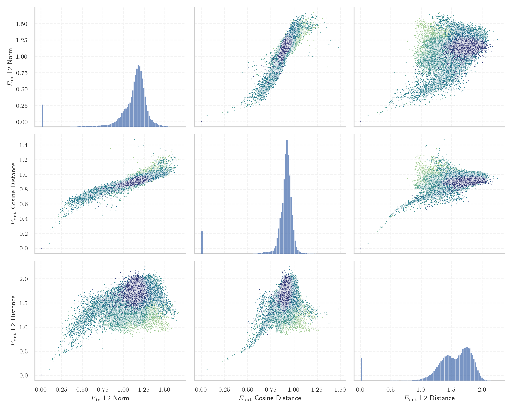
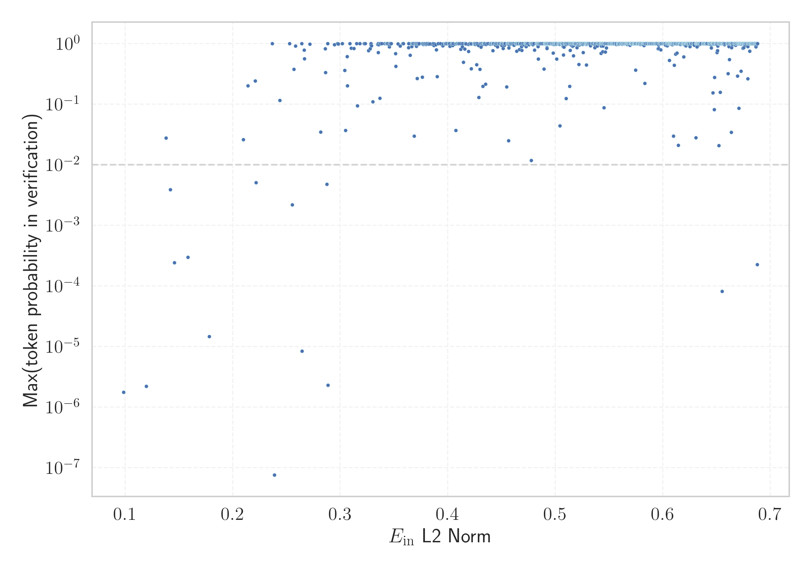

# Report for `Skywork/Skywork-13B-base`

## Model info

* Model Info: 
  * Tied embeddings: False
  * LM head uses bias: False
  * Embeddings shape: [65519, 4608]
* Tokenizer Info: 
  * Vocab Size: 65519
  * Tokenizer Class: SkyworkTokenizer
  * Tokenizer Type: BPE
  * Token for verification prompt building: springframework
  * Token id for verification prompt building: 6688
* Indicator summary: 
  * Indicator for under-trained tokens: E_{in} L2 Norm
  * Overall distribution: 1.105 +/- 0.233
* Detected Token Counts: 
  * Number of tested under-trained tokens: 1274, 1274 non-special, 14 below p = 0.01 threshold, 11 below soft indicator threshold
  * Number of single byte tokens: 351, of which 110 below indicator threshold
  * Number of special tokens: 1629, of which 1629 below indicator threshold
  * Number of non-single-byte unreachable tokens: 1629, of which 1629 below indicator threshold

## Under-trained token indicators plot


## Verification plot


## Under-trained token verification results
11 entries below threshold of 0.237

|   token_id | token                       |   indicator | max_prob                                                         | in_other_tokens                                                                                                                                                                                                                                     |
|------------|-----------------------------|-------------|------------------------------------------------------------------|-----------------------------------------------------------------------------------------------------------------------------------------------------------------------------------------------------------------------------------------------------|
|      28574 | ````` ▁Mediabestanden ````` |   0.0985739 | <span style='border: 1px solid rgb(169, 68, 66);'>1.8e-06</span> |                                                                                                                                                                                                                                                     |
|      20528 | ````` ▁autorytatywna `````  |   0.119586  | <span style='border: 1px solid rgb(169, 68, 66);'>2.2e-06</span> |                                                                                                                                                                                                                                                     |
|      27914 | ````` ▁archiválva `````     |   0.137971  | <span style='border: 1px solid rgb(251, 189, 8);'>0.028</span>   |                                                                                                                                                                                                                                                     |
|      24294 | ````` Webachiv `````        |   0.141914  | <span style='border: 1px solid rgb(255, 145, 0);'>0.0039</span>  |                                                                                                                                                                                                                                                     |
|      11804 | ````` Архівовано `````      |   0.145727  | <span style='border: 1px solid rgb(169, 68, 66);'>0.00024</span> |                                                                                                                                                                                                                                                     |
|      20609 | ````` ▁Portály `````        |   0.158442  | <span style='border: 1px solid rgb(169, 68, 66);'>0.0003</span>  |                                                                                                                                                                                                                                                     |
|      28354 | ````` ▁Расподела `````      |   0.178203  | <span style='border: 1px solid rgb(169, 68, 66);'>1.5e-05</span> |                                                                                                                                                                                                                                                     |
|      12731 | ````` ederbörd `````        |   0.209895  | <span style='border: 1px solid rgb(251, 189, 8);'>0.026</span>   | <span style='border: 1px solid rgb(40, 167, 69);'>````` ▁nederbörd `````</span>, <span style='border: 1px solid rgb(255, 145, 0);'>````` nederbörd `````</span>, <span style='border: 1px solid rgb(169, 68, 66);'>````` ▁årsnederbörd `````</span> |
|      39379 | ````` 耲 `````              |   0.21422   | <span style='border: 1px solid rgb(40, 167, 69);'>0.2</span>     |                                                                                                                                                                                                                                                     |
|      24291 | ````` IABot `````           |   0.220878  | <span style='border: 1px solid rgb(40, 167, 69);'>0.24</span>    |                                                                                                                                                                                                                                                     |
|      28633 | ````` nederbörd `````       |   0.221565  | <span style='border: 1px solid rgb(255, 145, 0);'>0.0051</span>  | <span style='border: 1px solid rgb(169, 68, 66);'>````` ▁årsnederbörd `````</span>                                                                                                                                                                  |
<details><summary>1263 additional entries above threshold</summary>

|   token_id | token                        |   indicator | max_prob                                                         | in_other_tokens                                                                                                                                                                                                                                                                         |
|------------|------------------------------|-------------|------------------------------------------------------------------|-----------------------------------------------------------------------------------------------------------------------------------------------------------------------------------------------------------------------------------------------------------------------------------------|
|      38487 | ````` 饍 `````               |    0.236802 | <span style='border: 1px solid rgb(40, 167, 69);'>1</span>       |                                                                                                                                                                                                                                                                                         |
|      19539 | ````` ▁demsel `````          |    0.23869  | <span style='border: 1px solid rgb(169, 68, 66);'>7.6e-08</span> | ````` ▁demselben `````                                                                                                                                                                                                                                                                  |
|      17916 | ````` abestanden `````       |    0.243805 | <span style='border: 1px solid rgb(40, 167, 69);'>0.11</span>    | <span style='border: 1px solid rgb(169, 68, 66);'>````` ▁Mediabestanden `````</span>                                                                                                                                                                                                    |
|      38657 | ````` 鰾 `````               |    0.252932 | <span style='border: 1px solid rgb(40, 167, 69);'>1</span>       |                                                                                                                                                                                                                                                                                         |
|      27900 | ````` ▁eredetiből `````      |    0.255476 | <span style='border: 1px solid rgb(255, 145, 0);'>0.0022</span>  |                                                                                                                                                                                                                                                                                         |
|      40307 | ````` 塮 `````               |    0.256819 | <span style='border: 1px solid rgb(40, 167, 69);'>0.38</span>    |                                                                                                                                                                                                                                                                                         |
|      39720 | ````` 塃 `````               |    0.258387 | <span style='border: 1px solid rgb(40, 167, 69);'>0.91</span>    |                                                                                                                                                                                                                                                                                         |
|      31664 | ````` ߬ `````                 |    0.264171 | <span style='border: 1px solid rgb(40, 167, 69);'>1</span>       |                                                                                                                                                                                                                                                                                         |
|      28642 | ````` ▁regnig `````          |    0.264346 | <span style='border: 1px solid rgb(169, 68, 66);'>8.5e-06</span> | <span style='border: 1px solid rgb(255, 145, 0);'>````` ▁regnigaste `````</span>                                                                                                                                                                                                        |
|      21858 | ````` archiviato `````       |    0.266431 | <span style='border: 1px solid rgb(40, 167, 69);'>0.78</span>    |                                                                                                                                                                                                                                                                                         |
|      11193 | ````` ▁Normdaten `````       |    0.266582 | <span style='border: 1px solid rgb(40, 167, 69);'>0.56</span>    |                                                                                                                                                                                                                                                                                         |
|      32015 | ````` ᄈ `````               |    0.271645 | <span style='border: 1px solid rgb(40, 167, 69);'>0.98</span>    |                                                                                                                                                                                                                                                                                         |
|      11766 | ````` хівовано `````         |    0.281826 | <span style='border: 1px solid rgb(251, 189, 8);'>0.035</span>   | <span style='border: 1px solid rgb(169, 68, 66);'>````` Архівовано `````</span>                                                                                                                                                                                                         |
|      32033 | ````` ᅬ `````                 |    0.285991 | <span style='border: 1px solid rgb(40, 167, 69);'>0.82</span>    |                                                                                                                                                                                                                                                                                         |
|      32047 | ````` ᆻ `````                 |    0.286369 | <span style='border: 1px solid rgb(40, 167, 69);'>0.33</span>    |                                                                                                                                                                                                                                                                                         |
|      20486 | ````` tatywna `````          |    0.287626 | <span style='border: 1px solid rgb(255, 145, 0);'>0.0047</span>  | <span style='border: 1px solid rgb(169, 68, 66);'>````` ▁autorytatywna `````</span>                                                                                                                                                                                                     |
|      37996 | ````` 鍺 `````               |    0.2882   | <span style='border: 1px solid rgb(40, 167, 69);'>1</span>       |                                                                                                                                                                                                                                                                                         |
|      16110 | ````` ▁Спољашње `````        |    0.288476 | <span style='border: 1px solid rgb(169, 68, 66);'>2.3e-06</span> |                                                                                                                                                                                                                                                                                         |
|      32036 | ````` ᅯ `````                 |    0.294584 | <span style='border: 1px solid rgb(40, 167, 69);'>0.95</span>    |                                                                                                                                                                                                                                                                                         |
|      35702 | ````` 皰 `````               |    0.297301 | <span style='border: 1px solid rgb(40, 167, 69);'>1</span>       |                                                                                                                                                                                                                                                                                         |
|      32039 | ````` ᅴ `````                 |    0.298134 | <span style='border: 1px solid rgb(40, 167, 69);'>0.97</span>    |                                                                                                                                                                                                                                                                                         |
|      23313 | ````` Obrázky `````          |    0.298146 | <span style='border: 1px solid rgb(40, 167, 69);'>0.99</span>    |                                                                                                                                                                                                                                                                                         |
|      36785 | ````` 莧 `````               |    0.302015 | <span style='border: 1px solid rgb(40, 167, 69);'>1</span>       |                                                                                                                                                                                                                                                                                         |
|       3798 | ````` oreferrer `````        |    0.304275 | <span style='border: 1px solid rgb(40, 167, 69);'>0.36</span>    | <span style='border: 1px solid rgb(40, 167, 69);'>````` ▁noreferrer `````</span>, <span style='border: 1px solid rgb(40, 167, 69);'>````` noreferrer `````</span>                                                                                                                       |
|      17981 | ````` ▁Externí `````         |    0.304974 | <span style='border: 1px solid rgb(251, 189, 8);'>0.037</span>   |                                                                                                                                                                                                                                                                                         |
|      36250 | ````` 縴 `````               |    0.306328 | <span style='border: 1px solid rgb(40, 167, 69);'>0.61</span>    |                                                                                                                                                                                                                                                                                         |
|      38710 | ````` 鶘 `````               |    0.306751 | <span style='border: 1px solid rgb(40, 167, 69);'>0.2</span>     |                                                                                                                                                                                                                                                                                         |
|      39900 | ````` 膙 `````               |    0.30888  | <span style='border: 1px solid rgb(40, 167, 69);'>1</span>       |                                                                                                                                                                                                                                                                                         |
|      32009 | ````` ᄁ `````               |    0.310253 | <span style='border: 1px solid rgb(40, 167, 69);'>0.83</span>    |                                                                                                                                                                                                                                                                                         |
|      32030 | ````` ᅨ `````                 |    0.312759 | <span style='border: 1px solid rgb(40, 167, 69);'>0.83</span>    |                                                                                                                                                                                                                                                                                         |
|      35685 | ````` 癬 `````               |    0.31512  | <span style='border: 1px solid rgb(40, 167, 69);'>1</span>       |                                                                                                                                                                                                                                                                                         |
|      23654 | ````` ▁dátummal `````        |    0.315965 | <span style='border: 1px solid rgb(251, 189, 8);'>0.094</span>   |                                                                                                                                                                                                                                                                                         |
|      37943 | ````` 鈾 `````               |    0.318175 | <span style='border: 1px solid rgb(40, 167, 69);'>1</span>       |                                                                                                                                                                                                                                                                                         |
|      32633 | ````` 劊 `````               |    0.322274 | <span style='border: 1px solid rgb(40, 167, 69);'>1</span>       |                                                                                                                                                                                                                                                                                         |
|      35532 | ````` 璉 `````               |    0.323345 | <span style='border: 1px solid rgb(40, 167, 69);'>1</span>       |                                                                                                                                                                                                                                                                                         |
|      28623 | ````` ▁Genomsnitt `````      |    0.326267 | <span style='border: 1px solid rgb(40, 167, 69);'>0.76</span>    | <span style='border: 1px solid rgb(251, 189, 8);'>````` ▁Genomsnittlig `````</span>                                                                                                                                                                                                     |
|      26847 | ````` .:\u200a `````         |    0.32792  | <span style='border: 1px solid rgb(40, 167, 69);'>0.82</span>    |                                                                                                                                                                                                                                                                                         |
|      32034 | ````` ᅭ `````                 |    0.328519 | <span style='border: 1px solid rgb(40, 167, 69);'>0.94</span>    |                                                                                                                                                                                                                                                                                         |
|      36832 | ````` 萵 `````               |    0.32852  | <span style='border: 1px solid rgb(40, 167, 69);'>1</span>       |                                                                                                                                                                                                                                                                                         |
|      32037 | ````` ᅲ `````                 |    0.328991 | <span style='border: 1px solid rgb(40, 167, 69);'>0.92</span>    |                                                                                                                                                                                                                                                                                         |
|      20645 | ````` ▁Przypisy `````        |    0.330431 | <span style='border: 1px solid rgb(40, 167, 69);'>0.11</span>    |                                                                                                                                                                                                                                                                                         |
|      14414 | ````` ▁Archivlink `````      |    0.334791 | <span style='border: 1px solid rgb(40, 167, 69);'>0.97</span>    |                                                                                                                                                                                                                                                                                         |
|      32032 | ````` ᅪ `````                 |    0.335318 | <span style='border: 1px solid rgb(40, 167, 69);'>0.71</span>    |                                                                                                                                                                                                                                                                                         |
|      38014 | ````` 鏞 `````               |    0.335442 | <span style='border: 1px solid rgb(40, 167, 69);'>1</span>       |                                                                                                                                                                                                                                                                                         |
|      12497 | ````` ▁Audiodateien `````    |    0.335899 | <span style='border: 1px solid rgb(40, 167, 69);'>0.96</span>    |                                                                                                                                                                                                                                                                                         |
|      27918 | ````` ▁Хронологија `````     |    0.336775 | <span style='border: 1px solid rgb(40, 167, 69);'>0.13</span>    |                                                                                                                                                                                                                                                                                         |
|      40127 | ````` 銝 `````               |    0.337001 | <span style='border: 1px solid rgb(40, 167, 69);'>1</span>       |                                                                                                                                                                                                                                                                                         |
|      39833 | ````` 饻 `````               |    0.337385 | <span style='border: 1px solid rgb(40, 167, 69);'>1</span>       |                                                                                                                                                                                                                                                                                         |
|      37931 | ````` 鈀 `````               |    0.338496 | <span style='border: 1px solid rgb(40, 167, 69);'>1</span>       |                                                                                                                                                                                                                                                                                         |
|      33026 | ````` 嘜 `````               |    0.338702 | <span style='border: 1px solid rgb(40, 167, 69);'>1</span>       |                                                                                                                                                                                                                                                                                         |
|      36379 | ````` 罌 `````               |    0.341308 | <span style='border: 1px solid rgb(40, 167, 69);'>1</span>       |                                                                                                                                                                                                                                                                                         |
|      36274 | ````` 纍 `````               |    0.342753 | <span style='border: 1px solid rgb(40, 167, 69);'>1</span>       |                                                                                                                                                                                                                                                                                         |
|      38002 | ````` 鎔 `````               |    0.34289  | <span style='border: 1px solid rgb(40, 167, 69);'>0.99</span>    |                                                                                                                                                                                                                                                                                         |
|       9831 | ````` ▁челов `````           |    0.343044 | <span style='border: 1px solid rgb(40, 167, 69);'>1</span>       | ````` ▁человек `````, ````` ▁челове `````, ````` ▁человека `````                                                                                                                                                                                                                        |
|      12882 | ````` ITableView `````       |    0.343653 | <span style='border: 1px solid rgb(40, 167, 69);'>1</span>       | ````` ▁UITableView `````, ````` UITableView `````                                                                                                                                                                                                                                       |
|      38650 | ````` 鯰 `````               |    0.344203 | <span style='border: 1px solid rgb(40, 167, 69);'>1</span>       |                                                                                                                                                                                                                                                                                         |
|      36117 | ````` 籮 `````               |    0.345549 | <span style='border: 1px solid rgb(40, 167, 69);'>1</span>       |                                                                                                                                                                                                                                                                                         |
|      32045 | ````` ᆸ `````                 |    0.345626 | <span style='border: 1px solid rgb(40, 167, 69);'>0.88</span>    |                                                                                                                                                                                                                                                                                         |
|      39340 | ````` 膪 `````               |    0.345896 | <span style='border: 1px solid rgb(40, 167, 69);'>0.96</span>    |                                                                                                                                                                                                                                                                                         |
|      34739 | ````` 櫸 `````               |    0.346294 | <span style='border: 1px solid rgb(40, 167, 69);'>1</span>       |                                                                                                                                                                                                                                                                                         |
|      38406 | ````` 顴 `````               |    0.346662 | <span style='border: 1px solid rgb(40, 167, 69);'>1</span>       |                                                                                                                                                                                                                                                                                         |
|      37047 | ````` 蝨 `````               |    0.347298 | <span style='border: 1px solid rgb(40, 167, 69);'>1</span>       |                                                                                                                                                                                                                                                                                         |
|      20721 | ````` ▁bezeichneter `````    |    0.351318 | <span style='border: 1px solid rgb(40, 167, 69);'>0.68</span>    |                                                                                                                                                                                                                                                                                         |
|      37317 | ````` 讞 `````               |    0.351702 | <span style='border: 1px solid rgb(40, 167, 69);'>0.42</span>    |                                                                                                                                                                                                                                                                                         |
|      36953 | ````` 蘚 `````               |    0.353821 | <span style='border: 1px solid rgb(40, 167, 69);'>0.99</span>    |                                                                                                                                                                                                                                                                                         |
|      37163 | ````` 襠 `````               |    0.355719 | <span style='border: 1px solid rgb(40, 167, 69);'>0.91</span>    |                                                                                                                                                                                                                                                                                         |
|      38542 | ````` 騏 `````               |    0.358032 | <span style='border: 1px solid rgb(40, 167, 69);'>1</span>       |                                                                                                                                                                                                                                                                                         |
|      33042 | ````` 嘸 `````               |    0.358419 | <span style='border: 1px solid rgb(40, 167, 69);'>1</span>       |                                                                                                                                                                                                                                                                                         |
|      38697 | ````` 鴕 `````               |    0.35882  | <span style='border: 1px solid rgb(40, 167, 69);'>1</span>       |                                                                                                                                                                                                                                                                                         |
|      37128 | ````` 裊 `````               |    0.363474 | <span style='border: 1px solid rgb(40, 167, 69);'>1</span>       |                                                                                                                                                                                                                                                                                         |
|      37165 | ````` 襬 `````               |    0.363488 | <span style='border: 1px solid rgb(40, 167, 69);'>0.85</span>    |                                                                                                                                                                                                                                                                                         |
|      36404 | ````` 羥 `````               |    0.363632 | <span style='border: 1px solid rgb(40, 167, 69);'>1</span>       |                                                                                                                                                                                                                                                                                         |
|      35666 | ````` 瘧 `````               |    0.363806 | <span style='border: 1px solid rgb(40, 167, 69);'>1</span>       |                                                                                                                                                                                                                                                                                         |
|      32026 | ````` ᅣ `````                 |    0.365093 | <span style='border: 1px solid rgb(40, 167, 69);'>0.64</span>    |                                                                                                                                                                                                                                                                                         |
|      32043 | ````` ᆯ `````                 |    0.366482 | <span style='border: 1px solid rgb(40, 167, 69);'>0.89</span>    |                                                                                                                                                                                                                                                                                         |
|      36694 | ````` 芻 `````               |    0.366604 | <span style='border: 1px solid rgb(40, 167, 69);'>1</span>       |                                                                                                                                                                                                                                                                                         |
|      32021 | ````` ᄐ `````               |    0.366951 | <span style='border: 1px solid rgb(40, 167, 69);'>0.99</span>    |                                                                                                                                                                                                                                                                                         |
|      33441 | ````` 孿 `````               |    0.366969 | <span style='border: 1px solid rgb(40, 167, 69);'>1</span>       |                                                                                                                                                                                                                                                                                         |
|      36922 | ````` 薊 `````               |    0.367409 | <span style='border: 1px solid rgb(40, 167, 69);'>0.99</span>    |                                                                                                                                                                                                                                                                                         |
|      38157 | ````` 閎 `````               |    0.367515 | <span style='border: 1px solid rgb(40, 167, 69);'>1</span>       |                                                                                                                                                                                                                                                                                         |
|      31477 | ````` ⸮ `````                |    0.368265 | <span style='border: 1px solid rgb(40, 167, 69);'>1</span>       |                                                                                                                                                                                                                                                                                         |
|      37175 | ````` 覦 `````               |    0.368892 | <span style='border: 1px solid rgb(251, 189, 8);'>0.03</span>    |                                                                                                                                                                                                                                                                                         |
|      38660 | ````` 鱔 `````               |    0.369625 | <span style='border: 1px solid rgb(40, 167, 69);'>1</span>       |                                                                                                                                                                                                                                                                                         |
|      21169 | ````` ▁prüfe `````           |    0.36997  | <span style='border: 1px solid rgb(40, 167, 69);'>0.98</span>    |                                                                                                                                                                                                                                                                                         |
|      37065 | ````` 蟎 `````               |    0.370225 | <span style='border: 1px solid rgb(40, 167, 69);'>1</span>       |                                                                                                                                                                                                                                                                                         |
|      32041 | ````` ᆨ `````                 |    0.370673 | <span style='border: 1px solid rgb(40, 167, 69);'>0.9</span>     |                                                                                                                                                                                                                                                                                         |
|      32044 | ````` ᆷ `````                 |    0.37068  | <span style='border: 1px solid rgb(40, 167, 69);'>0.98</span>    |                                                                                                                                                                                                                                                                                         |
|      33578 | ````` 峴 `````               |    0.371259 | <span style='border: 1px solid rgb(40, 167, 69);'>1</span>       |                                                                                                                                                                                                                                                                                         |
|      34685 | ````` 槤 `````               |    0.371518 | <span style='border: 1px solid rgb(40, 167, 69);'>0.27</span>    |                                                                                                                                                                                                                                                                                         |
|      38954 | ````` 峂 `````               |    0.372111 | <span style='border: 1px solid rgb(40, 167, 69);'>1</span>       |                                                                                                                                                                                                                                                                                         |
|      38484 | ````` 饈 `````               |    0.372257 | <span style='border: 1px solid rgb(40, 167, 69);'>0.97</span>    |                                                                                                                                                                                                                                                                                         |
|      26821 | ````` ▁Enllaços `````        |    0.372981 | <span style='border: 1px solid rgb(40, 167, 69);'>0.98</span>    |                                                                                                                                                                                                                                                                                         |
|      33939 | ````` 慟 `````               |    0.373352 | <span style='border: 1px solid rgb(40, 167, 69);'>1</span>       |                                                                                                                                                                                                                                                                                         |
|      38612 | ````` 髖 `````               |    0.373394 | <span style='border: 1px solid rgb(40, 167, 69);'>1</span>       |                                                                                                                                                                                                                                                                                         |
|      37643 | ````` 躪 `````               |    0.376367 | <span style='border: 1px solid rgb(40, 167, 69);'>0.28</span>    |                                                                                                                                                                                                                                                                                         |
|      32013 | ````` ᄆ `````               |    0.37637  | <span style='border: 1px solid rgb(40, 167, 69);'>0.99</span>    |                                                                                                                                                                                                                                                                                         |
|      35656 | ````` 瘍 `````               |    0.376474 | <span style='border: 1px solid rgb(40, 167, 69);'>0.98</span>    |                                                                                                                                                                                                                                                                                         |
|      38652 | ````` 鰍 `````               |    0.376617 | <span style='border: 1px solid rgb(40, 167, 69);'>1</span>       |                                                                                                                                                                                                                                                                                         |
|      32029 | ````` ᅧ `````                 |    0.377272 | <span style='border: 1px solid rgb(40, 167, 69);'>0.97</span>    |                                                                                                                                                                                                                                                                                         |
|      32022 | ````` ᄑ `````               |    0.377535 | <span style='border: 1px solid rgb(40, 167, 69);'>0.99</span>    |                                                                                                                                                                                                                                                                                         |
|      35674 | ````` 癇 `````               |    0.378405 | <span style='border: 1px solid rgb(40, 167, 69);'>0.99</span>    |                                                                                                                                                                                                                                                                                         |
|      38653 | ````` 鰓 `````               |    0.378956 | <span style='border: 1px solid rgb(40, 167, 69);'>0.99</span>    |                                                                                                                                                                                                                                                                                         |
|      32025 | ````` ᅢ `````                 |    0.379735 | <span style='border: 1px solid rgb(40, 167, 69);'>0.97</span>    |                                                                                                                                                                                                                                                                                         |
|      38711 | ````` 鶩 `````               |    0.380432 | <span style='border: 1px solid rgb(40, 167, 69);'>0.99</span>    |                                                                                                                                                                                                                                                                                         |
|      58059 | ````` 蟹妖 `````             |    0.380615 | <span style='border: 1px solid rgb(40, 167, 69);'>1</span>       |                                                                                                                                                                                                                                                                                         |
|      36213 | ````` 綬 `````               |    0.382073 | <span style='border: 1px solid rgb(40, 167, 69);'>1</span>       |                                                                                                                                                                                                                                                                                         |
|      35700 | ````` 皚 `````               |    0.382162 | <span style='border: 1px solid rgb(40, 167, 69);'>1</span>       |                                                                                                                                                                                                                                                                                         |
|      21173 | ````` ▁entferne `````        |    0.382318 | <span style='border: 1px solid rgb(40, 167, 69);'>0.98</span>    |                                                                                                                                                                                                                                                                                         |
|      37302 | ````` 譙 `````               |    0.383664 | <span style='border: 1px solid rgb(40, 167, 69);'>0.98</span>    |                                                                                                                                                                                                                                                                                         |
|      34736 | ````` 櫚 `````               |    0.38595  | <span style='border: 1px solid rgb(40, 167, 69);'>0.97</span>    |                                                                                                                                                                                                                                                                                         |
|      36160 | ````` 紂 `````               |    0.386441 | <span style='border: 1px solid rgb(40, 167, 69);'>1</span>       |                                                                                                                                                                                                                                                                                         |
|      38473 | ````` 餒 `````               |    0.38713  | <span style='border: 1px solid rgb(40, 167, 69);'>0.93</span>    |                                                                                                                                                                                                                                                                                         |
|      38315 | ````` 霑 `````               |    0.387577 | <span style='border: 1px solid rgb(40, 167, 69);'>0.99</span>    |                                                                                                                                                                                                                                                                                         |
|      35172 | ````` 濘 `````               |    0.388968 | <span style='border: 1px solid rgb(40, 167, 69);'>0.96</span>    |                                                                                                                                                                                                                                                                                         |
|      23217 | ````` ▁zvuky `````           |    0.389439 | <span style='border: 1px solid rgb(40, 167, 69);'>0.79</span>    |                                                                                                                                                                                                                                                                                         |
|      38460 | ````` 飩 `````               |    0.390224 | <span style='border: 1px solid rgb(40, 167, 69);'>0.28</span>    |                                                                                                                                                                                                                                                                                         |
|      34648 | ````` 楨 `````               |    0.390994 | <span style='border: 1px solid rgb(40, 167, 69);'>1</span>       |                                                                                                                                                                                                                                                                                         |
|      37044 | ````` 蝟 `````               |    0.391065 | <span style='border: 1px solid rgb(40, 167, 69);'>1</span>       |                                                                                                                                                                                                                                                                                         |
|      32019 | ````` ᄎ `````               |    0.391202 | <span style='border: 1px solid rgb(40, 167, 69);'>0.99</span>    |                                                                                                                                                                                                                                                                                         |
|      34315 | ````` 攣 `````               |    0.393114 | <span style='border: 1px solid rgb(40, 167, 69);'>1</span>       |                                                                                                                                                                                                                                                                                         |
|      36097 | ````` 簍 `````               |    0.395122 | <span style='border: 1px solid rgb(40, 167, 69);'>0.92</span>    |                                                                                                                                                                                                                                                                                         |
|      37082 | ````` 蠣 `````               |    0.395459 | <span style='border: 1px solid rgb(40, 167, 69);'>0.92</span>    |                                                                                                                                                                                                                                                                                         |
|      38478 | ````` 餞 `````               |    0.39559  | <span style='border: 1px solid rgb(40, 167, 69);'>0.98</span>    |                                                                                                                                                                                                                                                                                         |
|      35442 | ````` 獺 `````               |    0.397225 | <span style='border: 1px solid rgb(40, 167, 69);'>1</span>       |                                                                                                                                                                                                                                                                                         |
|      38663 | ````` 鱸 `````               |    0.397523 | <span style='border: 1px solid rgb(40, 167, 69);'>1</span>       |                                                                                                                                                                                                                                                                                         |
|      35324 | ````` 燜 `````               |    0.397657 | <span style='border: 1px solid rgb(40, 167, 69);'>1</span>       |                                                                                                                                                                                                                                                                                         |
|      35143 | ````` 潧 `````               |    0.397833 | <span style='border: 1px solid rgb(40, 167, 69);'>0.99</span>    |                                                                                                                                                                                                                                                                                         |
|      37655 | ````` 軼 `````               |    0.398446 | <span style='border: 1px solid rgb(40, 167, 69);'>1</span>       |                                                                                                                                                                                                                                                                                         |
|      38469 | ````` 餉 `````               |    0.39921  | <span style='border: 1px solid rgb(40, 167, 69);'>1</span>       |                                                                                                                                                                                                                                                                                         |
|      38326 | ````` 霽 `````               |    0.400763 | <span style='border: 1px solid rgb(40, 167, 69);'>1</span>       |                                                                                                                                                                                                                                                                                         |
|      32020 | ````` ᄏ `````               |    0.400793 | <span style='border: 1px solid rgb(40, 167, 69);'>0.99</span>    |                                                                                                                                                                                                                                                                                         |
|      36205 | ````` 綑 `````               |    0.400841 | <span style='border: 1px solid rgb(40, 167, 69);'>1</span>       |                                                                                                                                                                                                                                                                                         |
|      31899 | ````` ⥤ `````                |    0.401104 | <span style='border: 1px solid rgb(40, 167, 69);'>1</span>       |                                                                                                                                                                                                                                                                                         |
|      37661 | ````` 輓 `````               |    0.401161 | <span style='border: 1px solid rgb(40, 167, 69);'>1</span>       |                                                                                                                                                                                                                                                                                         |
|      37929 | ````` 釧 `````               |    0.401755 | <span style='border: 1px solid rgb(40, 167, 69);'>1</span>       |                                                                                                                                                                                                                                                                                         |
|      40063 | ````` 靽 `````               |    0.402082 | <span style='border: 1px solid rgb(40, 167, 69);'>0.9</span>     |                                                                                                                                                                                                                                                                                         |
|      36102 | ````` 簫 `````               |    0.403427 | <span style='border: 1px solid rgb(40, 167, 69);'>1</span>       |                                                                                                                                                                                                                                                                                         |
|      26011 | ````` ▁Архивная `````        |    0.403466 | <span style='border: 1px solid rgb(40, 167, 69);'>0.97</span>    |                                                                                                                                                                                                                                                                                         |
|      37946 | ````` 鉉 `````               |    0.40426  | <span style='border: 1px solid rgb(40, 167, 69);'>0.99</span>    |                                                                                                                                                                                                                                                                                         |
|      39960 | ````` 鞁 `````               |    0.40441  | <span style='border: 1px solid rgb(40, 167, 69);'>0.92</span>    |                                                                                                                                                                                                                                                                                         |
|      38177 | ````` 闍 `````               |    0.404439 | <span style='border: 1px solid rgb(40, 167, 69);'>1</span>       |                                                                                                                                                                                                                                                                                         |
|      38486 | ````` 饌 `````               |    0.404579 | <span style='border: 1px solid rgb(40, 167, 69);'>0.99</span>    |                                                                                                                                                                                                                                                                                         |
|      36902 | ````` 蕁 `````               |    0.404998 | <span style='border: 1px solid rgb(40, 167, 69);'>1</span>       |                                                                                                                                                                                                                                                                                         |
|      37961 | ````` 銬 `````               |    0.406623 | <span style='border: 1px solid rgb(40, 167, 69);'>0.97</span>    |                                                                                                                                                                                                                                                                                         |
|      20716 | ````` ▁Begriffsklär `````    |    0.40745  | <span style='border: 1px solid rgb(251, 189, 8);'>0.037</span>   |                                                                                                                                                                                                                                                                                         |
|      34761 | ````` 歛 `````               |    0.407781 | <span style='border: 1px solid rgb(40, 167, 69);'>0.99</span>    |                                                                                                                                                                                                                                                                                         |
|      36604 | ````` 膿 `````               |    0.408133 | <span style='border: 1px solid rgb(40, 167, 69);'>1</span>       |                                                                                                                                                                                                                                                                                         |
|      38819 | ````` 龕 `````               |    0.408157 | <span style='border: 1px solid rgb(40, 167, 69);'>1</span>       |                                                                                                                                                                                                                                                                                         |
|      38477 | ````` 餛 `````               |    0.408354 | <span style='border: 1px solid rgb(40, 167, 69);'>1</span>       |                                                                                                                                                                                                                                                                                         |
|      34703 | ````` 樫 `````               |    0.408912 | <span style='border: 1px solid rgb(40, 167, 69);'>1</span>       |                                                                                                                                                                                                                                                                                         |
|      37934 | ````` 鈎 `````               |    0.409668 | <span style='border: 1px solid rgb(40, 167, 69);'>1</span>       |                                                                                                                                                                                                                                                                                         |
|      35331 | ````` 燴 `````               |    0.409714 | <span style='border: 1px solid rgb(40, 167, 69);'>1</span>       |                                                                                                                                                                                                                                                                                         |
|      35505 | ````` 琺 `````               |    0.410078 | <span style='border: 1px solid rgb(40, 167, 69);'>1</span>       |                                                                                                                                                                                                                                                                                         |
|      37923 | ````` 釗 `````               |    0.410601 | <span style='border: 1px solid rgb(40, 167, 69);'>1</span>       |                                                                                                                                                                                                                                                                                         |
|      37250 | ````` 誥 `````               |    0.411724 | <span style='border: 1px solid rgb(40, 167, 69);'>1</span>       |                                                                                                                                                                                                                                                                                         |
|      39125 | ````` 鸼 `````               |    0.411991 | <span style='border: 1px solid rgb(40, 167, 69);'>0.8</span>     |                                                                                                                                                                                                                                                                                         |
|      37457 | ````` 貰 `````               |    0.412954 | <span style='border: 1px solid rgb(40, 167, 69);'>1</span>       |                                                                                                                                                                                                                                                                                         |
|      36376 | ````` 缽 `````               |    0.413632 | <span style='border: 1px solid rgb(40, 167, 69);'>0.88</span>    |                                                                                                                                                                                                                                                                                         |
|      37208 | ````` 訥 `````               |    0.414008 | <span style='border: 1px solid rgb(40, 167, 69);'>1</span>       |                                                                                                                                                                                                                                                                                         |
|      37994 | ````` 鍰 `````               |    0.414469 | <span style='border: 1px solid rgb(40, 167, 69);'>0.49</span>    |                                                                                                                                                                                                                                                                                         |
|      27706 | ````` ]{' `````              |    0.415715 | <span style='border: 1px solid rgb(40, 167, 69);'>0.81</span>    |                                                                                                                                                                                                                                                                                         |
|      34303 | ````` 擼 `````               |    0.415929 | <span style='border: 1px solid rgb(40, 167, 69);'>1</span>       |                                                                                                                                                                                                                                                                                         |
|      33781 | ````` 徠 `````               |    0.416    | <span style='border: 1px solid rgb(40, 167, 69);'>1</span>       |                                                                                                                                                                                                                                                                                         |
|      30994 | ````` 𝕜 `````                |    0.416932 | <span style='border: 1px solid rgb(40, 167, 69);'>1</span>       |                                                                                                                                                                                                                                                                                         |
|      37468 | ````` 賂 `````               |    0.4171   | <span style='border: 1px solid rgb(40, 167, 69);'>0.99</span>    |                                                                                                                                                                                                                                                                                         |
|      35635 | ````` 痙 `````               |    0.41925  | <span style='border: 1px solid rgb(40, 167, 69);'>0.96</span>    |                                                                                                                                                                                                                                                                                         |
|      39176 | ````` 鹝 `````               |    0.419287 | <span style='border: 1px solid rgb(40, 167, 69);'>0.74</span>    |                                                                                                                                                                                                                                                                                         |
|      36784 | ````` 莢 `````               |    0.420223 | <span style='border: 1px solid rgb(40, 167, 69);'>0.98</span>    |                                                                                                                                                                                                                                                                                         |
|      38771 | ````` 麩 `````               |    0.420275 | <span style='border: 1px solid rgb(40, 167, 69);'>1</span>       |                                                                                                                                                                                                                                                                                         |
|      37657 | ````` 軾 `````               |    0.421566 | <span style='border: 1px solid rgb(40, 167, 69);'>0.99</span>    |                                                                                                                                                                                                                                                                                         |
|      24029 | ````` ▁Jegyzetek `````       |    0.421841 | <span style='border: 1px solid rgb(40, 167, 69);'>0.38</span>    |                                                                                                                                                                                                                                                                                         |
|      35657 | ````` 瘓 `````               |    0.421939 | <span style='border: 1px solid rgb(40, 167, 69);'>0.98</span>    |                                                                                                                                                                                                                                                                                         |
|      38706 | ````` 鵡 `````               |    0.424217 | <span style='border: 1px solid rgb(40, 167, 69);'>0.99</span>    |                                                                                                                                                                                                                                                                                         |
|      37987 | ````` 錳 `````               |    0.42437  | <span style='border: 1px solid rgb(40, 167, 69);'>1</span>       |                                                                                                                                                                                                                                                                                         |
|      40023 | ````` 桊 `````               |    0.424666 | <span style='border: 1px solid rgb(40, 167, 69);'>0.98</span>    |                                                                                                                                                                                                                                                                                         |
|      39820 | ````` 齉 `````               |    0.42468  | <span style='border: 1px solid rgb(40, 167, 69);'>1</span>       |                                                                                                                                                                                                                                                                                         |
|      35558 | ````` 甌 `````               |    0.424953 | <span style='border: 1px solid rgb(40, 167, 69);'>0.99</span>    |                                                                                                                                                                                                                                                                                         |
|      37016 | ````` 蜆 `````               |    0.42504  | <span style='border: 1px solid rgb(40, 167, 69);'>1</span>       |                                                                                                                                                                                                                                                                                         |
|      40328 | ````` 腒 `````               |    0.425673 | <span style='border: 1px solid rgb(40, 167, 69);'>0.96</span>    |                                                                                                                                                                                                                                                                                         |
|      30301 | ````` ₉ `````                |    0.426216 | <span style='border: 1px solid rgb(40, 167, 69);'>1</span>       |                                                                                                                                                                                                                                                                                         |
|      37639 | ````` 躊 `````               |    0.426223 | <span style='border: 1px solid rgb(40, 167, 69);'>1</span>       |                                                                                                                                                                                                                                                                                         |
|      32048 | ````` ᆼ `````                 |    0.426771 | <span style='border: 1px solid rgb(40, 167, 69);'>0.45</span>    |                                                                                                                                                                                                                                                                                         |
|      32010 | ````` ᄂ `````               |    0.427123 | <span style='border: 1px solid rgb(40, 167, 69);'>1</span>       |                                                                                                                                                                                                                                                                                         |
|      36232 | ````` 緞 `````               |    0.427482 | <span style='border: 1px solid rgb(40, 167, 69);'>1</span>       |                                                                                                                                                                                                                                                                                         |
|      36276 | ````` 纓 `````               |    0.427927 | <span style='border: 1px solid rgb(40, 167, 69);'>0.96</span>    |                                                                                                                                                                                                                                                                                         |
|      38550 | ````` 驊 `````               |    0.428693 | <span style='border: 1px solid rgb(40, 167, 69);'>0.93</span>    |                                                                                                                                                                                                                                                                                         |
|      28331 | ````` ▁Normdatei `````       |    0.428953 | <span style='border: 1px solid rgb(40, 167, 69);'>0.13</span>    |                                                                                                                                                                                                                                                                                         |
|      36163 | ````` 紉 `````               |    0.429962 | <span style='border: 1px solid rgb(40, 167, 69);'>0.38</span>    |                                                                                                                                                                                                                                                                                         |
|      37871 | ````` 鄲 `````               |    0.430115 | <span style='border: 1px solid rgb(40, 167, 69);'>1</span>       |                                                                                                                                                                                                                                                                                         |
|      36945 | ````` 藹 `````               |    0.430757 | <span style='border: 1px solid rgb(40, 167, 69);'>1</span>       |                                                                                                                                                                                                                                                                                         |
|      38447 | ````` 颼 `````               |    0.430858 | <span style='border: 1px solid rgb(40, 167, 69);'>0.88</span>    |                                                                                                                                                                                                                                                                                         |
|      38005 | ````` 鎚 `````               |    0.431671 | <span style='border: 1px solid rgb(40, 167, 69);'>0.99</span>    |                                                                                                                                                                                                                                                                                         |
|      37278 | ````` 諺 `````               |    0.431952 | <span style='border: 1px solid rgb(40, 167, 69);'>1</span>       |                                                                                                                                                                                                                                                                                         |
|      32031 | ````` ᅩ `````                 |    0.432615 | <span style='border: 1px solid rgb(40, 167, 69);'>0.97</span>    |                                                                                                                                                                                                                                                                                         |
|      33067 | ````` 嚀 `````               |    0.432689 | <span style='border: 1px solid rgb(40, 167, 69);'>0.2</span>     |                                                                                                                                                                                                                                                                                         |
|      36611 | ````` 臍 `````               |    0.433049 | <span style='border: 1px solid rgb(40, 167, 69);'>1</span>       |                                                                                                                                                                                                                                                                                         |
|      37944 | ````` 鉀 `````               |    0.433153 | <span style='border: 1px solid rgb(40, 167, 69);'>1</span>       |                                                                                                                                                                                                                                                                                         |
|      32014 | ````` ᄇ `````               |    0.433389 | <span style='border: 1px solid rgb(40, 167, 69);'>1</span>       |                                                                                                                                                                                                                                                                                         |
|      36171 | ````` 紘 `````               |    0.433559 | <span style='border: 1px solid rgb(40, 167, 69);'>1</span>       |                                                                                                                                                                                                                                                                                         |
|      37261 | ````` 諄 `````               |    0.433905 | <span style='border: 1px solid rgb(40, 167, 69);'>0.99</span>    |                                                                                                                                                                                                                                                                                         |
|      32035 | ````` ᅮ `````                 |    0.434052 | <span style='border: 1px solid rgb(40, 167, 69);'>0.98</span>    |                                                                                                                                                                                                                                                                                         |
|      38655 | ````` 鰲 `````               |    0.43434  | <span style='border: 1px solid rgb(40, 167, 69);'>1</span>       |                                                                                                                                                                                                                                                                                         |
|      10688 | ````` ▁gepublic `````        |    0.43509  | <span style='border: 1px solid rgb(40, 167, 69);'>0.21</span>    | ````` ▁gepubliceerd `````                                                                                                                                                                                                                                                               |
|      32028 | ````` ᅦ `````                 |    0.43562  | <span style='border: 1px solid rgb(40, 167, 69);'>0.98</span>    |                                                                                                                                                                                                                                                                                         |
|      32011 | ````` ᄃ `````               |    0.435664 | <span style='border: 1px solid rgb(40, 167, 69);'>0.96</span>    |                                                                                                                                                                                                                                                                                         |
|      38658 | ````` 鱈 `````               |    0.43673  | <span style='border: 1px solid rgb(40, 167, 69);'>1</span>       |                                                                                                                                                                                                                                                                                         |
|      32012 | ````` ᄅ `````               |    0.437658 | <span style='border: 1px solid rgb(40, 167, 69);'>1</span>       |                                                                                                                                                                                                                                                                                         |
|      37293 | ````` 謨 `````               |    0.439558 | <span style='border: 1px solid rgb(40, 167, 69);'>0.98</span>    |                                                                                                                                                                                                                                                                                         |
|      38704 | ````` 鵜 `````               |    0.439943 | <span style='border: 1px solid rgb(40, 167, 69);'>1</span>       |                                                                                                                                                                                                                                                                                         |
|      11162 | ````` ▁Referências `````     |    0.44013  | <span style='border: 1px solid rgb(40, 167, 69);'>0.97</span>    |                                                                                                                                                                                                                                                                                         |
|      37676 | ````` 轆 `````               |    0.440429 | <span style='border: 1px solid rgb(40, 167, 69);'>1</span>       |                                                                                                                                                                                                                                                                                         |
|      35188 | ````` 瀋 `````               |    0.440529 | <span style='border: 1px solid rgb(40, 167, 69);'>1</span>       |                                                                                                                                                                                                                                                                                         |
|      18596 | ````` ципа `````             |    0.441375 | <span style='border: 1px solid rgb(40, 167, 69);'>1</span>       | <span style='border: 1px solid rgb(255, 145, 0);'>````` ніципа `````</span>, <span style='border: 1px solid rgb(40, 167, 69);'>````` ніципалі `````</span>, ````` ▁муніципалі `````, <span style='border: 1px solid rgb(251, 189, 8);'>````` ниципа `````</span>, ````` ▁муниципа ````` |
|      33010 | ````` 嗶 `````               |    0.441429 | <span style='border: 1px solid rgb(40, 167, 69);'>1</span>       |                                                                                                                                                                                                                                                                                         |
|      37957 | ````` 銓 `````               |    0.441643 | <span style='border: 1px solid rgb(40, 167, 69);'>0.99</span>    |                                                                                                                                                                                                                                                                                         |
|      32962 | ````` 喎 `````               |    0.441974 | <span style='border: 1px solid rgb(40, 167, 69);'>0.99</span>    |                                                                                                                                                                                                                                                                                         |
|      38445 | ````` 颳 `````               |    0.44201  | <span style='border: 1px solid rgb(40, 167, 69);'>0.76</span>    |                                                                                                                                                                                                                                                                                         |
|      35185 | ````` 瀅 `````               |    0.442036 | <span style='border: 1px solid rgb(40, 167, 69);'>1</span>       |                                                                                                                                                                                                                                                                                         |
|      39487 | ````` 轷 `````               |    0.44228  | <span style='border: 1px solid rgb(40, 167, 69);'>1</span>       |                                                                                                                                                                                                                                                                                         |
|      33284 | ````` 奬 `````               |    0.44245  | <span style='border: 1px solid rgb(40, 167, 69);'>1</span>       |                                                                                                                                                                                                                                                                                         |
|      39378 | ````` 鹐 `````               |    0.442459 | <span style='border: 1px solid rgb(40, 167, 69);'>1</span>       |                                                                                                                                                                                                                                                                                         |
|      37624 | ````` 蹣 `````               |    0.443677 | <span style='border: 1px solid rgb(40, 167, 69);'>0.99</span>    |                                                                                                                                                                                                                                                                                         |
|      32027 | ````` ᅥ `````                 |    0.443766 | <span style='border: 1px solid rgb(40, 167, 69);'>0.98</span>    |                                                                                                                                                                                                                                                                                         |
|      36856 | ````` 蒔 `````               |    0.444072 | <span style='border: 1px solid rgb(40, 167, 69);'>1</span>       |                                                                                                                                                                                                                                                                                         |
|      38340 | ````` 靦 `````               |    0.444557 | <span style='border: 1px solid rgb(40, 167, 69);'>0.94</span>    |                                                                                                                                                                                                                                                                                         |
|      35186 | ````` 瀆 `````               |    0.444791 | <span style='border: 1px solid rgb(40, 167, 69);'>1</span>       |                                                                                                                                                                                                                                                                                         |
|      38037 | ````` 鑾 `````               |    0.445129 | <span style='border: 1px solid rgb(40, 167, 69);'>1</span>       |                                                                                                                                                                                                                                                                                         |
|      37970 | ````` 鋤 `````               |    0.445978 | <span style='border: 1px solid rgb(40, 167, 69);'>1</span>       |                                                                                                                                                                                                                                                                                         |
|      32046 | ````` ᆺ `````                 |    0.446306 | <span style='border: 1px solid rgb(40, 167, 69);'>0.88</span>    |                                                                                                                                                                                                                                                                                         |
|      38599 | ````` 骯 `````               |    0.447013 | <span style='border: 1px solid rgb(40, 167, 69);'>1</span>       |                                                                                                                                                                                                                                                                                         |
|      32635 | ````` 劏 `````               |    0.447496 | <span style='border: 1px solid rgb(40, 167, 69);'>1</span>       |                                                                                                                                                                                                                                                                                         |
|      38007 | ````` 鎬 `````               |    0.447576 | <span style='border: 1px solid rgb(40, 167, 69);'>1</span>       |                                                                                                                                                                                                                                                                                         |
|      38158 | ````` 閏 `````               |    0.447884 | <span style='border: 1px solid rgb(40, 167, 69);'>1</span>       |                                                                                                                                                                                                                                                                                         |
|      38028 | ````` 鑊 `````               |    0.448144 | <span style='border: 1px solid rgb(40, 167, 69);'>1</span>       |                                                                                                                                                                                                                                                                                         |
|      38709 | ````` 鵲 `````               |    0.449375 | <span style='border: 1px solid rgb(40, 167, 69);'>1</span>       |                                                                                                                                                                                                                                                                                         |
|      38642 | ````` 鮪 `````               |    0.449763 | <span style='border: 1px solid rgb(40, 167, 69);'>1</span>       |                                                                                                                                                                                                                                                                                         |
|      37288 | ````` 謗 `````               |    0.449774 | <span style='border: 1px solid rgb(40, 167, 69);'>1</span>       |                                                                                                                                                                                                                                                                                         |
|      38699 | ````` 鴦 `````               |    0.450064 | <span style='border: 1px solid rgb(40, 167, 69);'>0.98</span>    |                                                                                                                                                                                                                                                                                         |
|      38648 | ````` 鯛 `````               |    0.450281 | <span style='border: 1px solid rgb(40, 167, 69);'>1</span>       |                                                                                                                                                                                                                                                                                         |
|      36780 | ````` 莖 `````               |    0.450304 | <span style='border: 1px solid rgb(40, 167, 69);'>0.93</span>    |                                                                                                                                                                                                                                                                                         |
|      39694 | ````` 鹲 `````               |    0.450438 | <span style='border: 1px solid rgb(40, 167, 69);'>1</span>       |                                                                                                                                                                                                                                                                                         |
|      33018 | ````` 嘍 `````               |    0.450512 | <span style='border: 1px solid rgb(40, 167, 69);'>1</span>       |                                                                                                                                                                                                                                                                                         |
|      38022 | ````` 鐲 `````               |    0.450668 | <span style='border: 1px solid rgb(40, 167, 69);'>0.99</span>    |                                                                                                                                                                                                                                                                                         |
|      32042 | ````` ᆫ `````                 |    0.451596 | <span style='border: 1px solid rgb(40, 167, 69);'>0.83</span>    |                                                                                                                                                                                                                                                                                         |
|      35206 | ````` 灝 `````               |    0.45183  | <span style='border: 1px solid rgb(40, 167, 69);'>1</span>       |                                                                                                                                                                                                                                                                                         |
|      35284 | ````` 煒 `````               |    0.452125 | <span style='border: 1px solid rgb(40, 167, 69);'>0.98</span>    |                                                                                                                                                                                                                                                                                         |
|      37177 | ````` 覬 `````               |    0.452672 | <span style='border: 1px solid rgb(40, 167, 69);'>1</span>       |                                                                                                                                                                                                                                                                                         |
|      38703 | ````` 鵑 `````               |    0.452794 | <span style='border: 1px solid rgb(40, 167, 69);'>0.94</span>    |                                                                                                                                                                                                                                                                                         |
|      37638 | ````` 躉 `````               |    0.452897 | <span style='border: 1px solid rgb(40, 167, 69);'>1</span>       |                                                                                                                                                                                                                                                                                         |
|      38809 | ````` 齦 `````               |    0.453083 | <span style='border: 1px solid rgb(40, 167, 69);'>0.99</span>    |                                                                                                                                                                                                                                                                                         |
|      37281 | ````` 謁 `````               |    0.453238 | <span style='border: 1px solid rgb(40, 167, 69);'>1</span>       |                                                                                                                                                                                                                                                                                         |
|      32606 | ````` 剉 `````               |    0.453281 | <span style='border: 1px solid rgb(40, 167, 69);'>1</span>       |                                                                                                                                                                                                                                                                                         |
|      37252 | ````` 誨 `````               |    0.454713 | <span style='border: 1px solid rgb(40, 167, 69);'>0.19</span>    |                                                                                                                                                                                                                                                                                         |
|      39413 | ````` 蹜 `````               |    0.455234 | <span style='border: 1px solid rgb(40, 167, 69);'>1</span>       |                                                                                                                                                                                                                                                                                         |
|      34737 | ````` 櫛 `````               |    0.455406 | <span style='border: 1px solid rgb(40, 167, 69);'>1</span>       |                                                                                                                                                                                                                                                                                         |
|      37496 | ````` 贓 `````               |    0.455639 | <span style='border: 1px solid rgb(40, 167, 69);'>0.99</span>    |                                                                                                                                                                                                                                                                                         |
|      38714 | ````` 鷗 `````               |    0.455774 | <span style='border: 1px solid rgb(40, 167, 69);'>1</span>       |                                                                                                                                                                                                                                                                                         |
|      36851 | ````` 葷 `````               |    0.456212 | <span style='border: 1px solid rgb(40, 167, 69);'>0.96</span>    |                                                                                                                                                                                                                                                                                         |
|      33656 | ````` 幀 `````               |    0.456318 | <span style='border: 1px solid rgb(40, 167, 69);'>1</span>       |                                                                                                                                                                                                                                                                                         |
|       8806 | ````` ▁Archivado `````       |    0.456329 | <span style='border: 1px solid rgb(40, 167, 69);'>1</span>       |                                                                                                                                                                                                                                                                                         |
|      36112 | ````` 籐 `````               |    0.456353 | <span style='border: 1px solid rgb(40, 167, 69);'>1</span>       |                                                                                                                                                                                                                                                                                         |
|      35192 | ````` 瀘 `````               |    0.456551 | <span style='border: 1px solid rgb(40, 167, 69);'>0.97</span>    |                                                                                                                                                                                                                                                                                         |
|      23117 | ````` brázky `````           |    0.456636 | <span style='border: 1px solid rgb(251, 189, 8);'>0.025</span>   | <span style='border: 1px solid rgb(40, 167, 69);'>````` Obrázky `````</span>                                                                                                                                                                                                            |
|      37819 | ````` 邇 `````               |    0.456777 | <span style='border: 1px solid rgb(40, 167, 69);'>0.99</span>    |                                                                                                                                                                                                                                                                                         |
|      36603 | ````` 膾 `````               |    0.456783 | <span style='border: 1px solid rgb(40, 167, 69);'>0.85</span>    |                                                                                                                                                                                                                                                                                         |
|      37930 | ````` 釵 `````               |    0.457172 | <span style='border: 1px solid rgb(40, 167, 69);'>1</span>       |                                                                                                                                                                                                                                                                                         |
|      39871 | ````` 脶 `````               |    0.457417 | <span style='border: 1px solid rgb(40, 167, 69);'>0.96</span>    |                                                                                                                                                                                                                                                                                         |
|      38656 | ````` 鰻 `````               |    0.457819 | <span style='border: 1px solid rgb(40, 167, 69);'>1</span>       |                                                                                                                                                                                                                                                                                         |
|      37159 | ````` 褻 `````               |    0.458038 | <span style='border: 1px solid rgb(40, 167, 69);'>1</span>       |                                                                                                                                                                                                                                                                                         |
|      35157 | ````` 澗 `````               |    0.4581   | <span style='border: 1px solid rgb(40, 167, 69);'>1</span>       |                                                                                                                                                                                                                                                                                         |
|      38624 | ````` 鬢 `````               |    0.458223 | <span style='border: 1px solid rgb(40, 167, 69);'>1</span>       |                                                                                                                                                                                                                                                                                         |
|      36199 | ````` 絳 `````               |    0.458228 | <span style='border: 1px solid rgb(40, 167, 69);'>1</span>       |                                                                                                                                                                                                                                                                                         |
|      37938 | ````` 鈣 `````               |    0.458419 | <span style='border: 1px solid rgb(40, 167, 69);'>1</span>       |                                                                                                                                                                                                                                                                                         |
|      12472 | ````` ateien `````           |    0.458965 | <span style='border: 1px solid rgb(40, 167, 69);'>0.99</span>    | <span style='border: 1px solid rgb(40, 167, 69);'>````` ▁Audiodateien `````</span>                                                                                                                                                                                                      |
|      34790 | ````` 殯 `````               |    0.459582 | <span style='border: 1px solid rgb(40, 167, 69);'>1</span>       |                                                                                                                                                                                                                                                                                         |
|      38647 | ````` 鯖 `````               |    0.460413 | <span style='border: 1px solid rgb(40, 167, 69);'>1</span>       |                                                                                                                                                                                                                                                                                         |
|      36239 | ````` 緹 `````               |    0.461051 | <span style='border: 1px solid rgb(40, 167, 69);'>1</span>       |                                                                                                                                                                                                                                                                                         |
|      38009 | ````` 鎳 `````               |    0.461171 | <span style='border: 1px solid rgb(40, 167, 69);'>0.99</span>    |                                                                                                                                                                                                                                                                                         |
|      32988 | ````` 嗇 `````               |    0.461542 | <span style='border: 1px solid rgb(40, 167, 69);'>1</span>       |                                                                                                                                                                                                                                                                                         |
|      37237 | ````` 詼 `````               |    0.46163  | <span style='border: 1px solid rgb(40, 167, 69);'>0.94</span>    |                                                                                                                                                                                                                                                                                         |
|      35198 | ````` 瀧 `````               |    0.462791 | <span style='border: 1px solid rgb(40, 167, 69);'>1</span>       |                                                                                                                                                                                                                                                                                         |
|      35843 | ````` 硯 `````               |    0.463057 | <span style='border: 1px solid rgb(40, 167, 69);'>1</span>       |                                                                                                                                                                                                                                                                                         |
|      38446 | ````` 颶 `````               |    0.463538 | <span style='border: 1px solid rgb(40, 167, 69);'>1</span>       |                                                                                                                                                                                                                                                                                         |
|      37296 | ````` 謾 `````               |    0.463878 | <span style='border: 1px solid rgb(40, 167, 69);'>0.99</span>    |                                                                                                                                                                                                                                                                                         |
|      37863 | ````` 鄔 `````               |    0.464136 | <span style='border: 1px solid rgb(40, 167, 69);'>1</span>       |                                                                                                                                                                                                                                                                                         |
|      36842 | ````` 葦 `````               |    0.464175 | <span style='border: 1px solid rgb(40, 167, 69);'>1</span>       |                                                                                                                                                                                                                                                                                         |
|      37932 | ````` 鈉 `````               |    0.46418  | <span style='border: 1px solid rgb(40, 167, 69);'>0.75</span>    |                                                                                                                                                                                                                                                                                         |
|      34310 | ````` 攙 `````               |    0.464754 | <span style='border: 1px solid rgb(40, 167, 69);'>1</span>       |                                                                                                                                                                                                                                                                                         |
|      38170 | ````` 閹 `````               |    0.465018 | <span style='border: 1px solid rgb(40, 167, 69);'>1</span>       |                                                                                                                                                                                                                                                                                         |
|      38012 | ````` 鏗 `````               |    0.465169 | <span style='border: 1px solid rgb(40, 167, 69);'>1</span>       |                                                                                                                                                                                                                                                                                         |
|      32661 | ````` 勛 `````               |    0.465527 | <span style='border: 1px solid rgb(40, 167, 69);'>1</span>       |                                                                                                                                                                                                                                                                                         |
|      38759 | ````` 鹼 `````               |    0.465702 | <span style='border: 1px solid rgb(40, 167, 69);'>1</span>       |                                                                                                                                                                                                                                                                                         |
|      23715 | ````` ▁Källor `````          |    0.466521 | <span style='border: 1px solid rgb(40, 167, 69);'>0.8</span>     |                                                                                                                                                                                                                                                                                         |
|      30278 | ````` ₈ `````                |    0.466821 | <span style='border: 1px solid rgb(40, 167, 69);'>1</span>       |                                                                                                                                                                                                                                                                                         |
|      38708 | ````` 鵰 `````               |    0.467061 | <span style='border: 1px solid rgb(40, 167, 69);'>1</span>       |                                                                                                                                                                                                                                                                                         |
|      36907 | ````` 蕎 `````               |    0.467071 | <span style='border: 1px solid rgb(40, 167, 69);'>1</span>       |                                                                                                                                                                                                                                                                                         |
|      24631 | ````` ▁Források `````        |    0.467255 | <span style='border: 1px solid rgb(40, 167, 69);'>0.99</span>    |                                                                                                                                                                                                                                                                                         |
|      37474 | ````` 賑 `````               |    0.46782  | <span style='border: 1px solid rgb(40, 167, 69);'>0.99</span>    |                                                                                                                                                                                                                                                                                         |
|      32080 | ````` ⋈ `````                |    0.467961 | <span style='border: 1px solid rgb(40, 167, 69);'>1</span>       |                                                                                                                                                                                                                                                                                         |
|      20638 | ````` ungsseite `````        |    0.468638 | <span style='border: 1px solid rgb(40, 167, 69);'>0.89</span>    |                                                                                                                                                                                                                                                                                         |
|      32049 | ````` ᗜ `````                |    0.468971 | <span style='border: 1px solid rgb(40, 167, 69);'>0.77</span>    |                                                                                                                                                                                                                                                                                         |
|      40131 | ````` 脎 `````               |    0.469269 | <span style='border: 1px solid rgb(40, 167, 69);'>0.96</span>    |                                                                                                                                                                                                                                                                                         |
|      39398 | ````` 鳈 `````               |    0.469331 | <span style='border: 1px solid rgb(40, 167, 69);'>0.99</span>    |                                                                                                                                                                                                                                                                                         |
|      34728 | ````` 檜 `````               |    0.470231 | <span style='border: 1px solid rgb(40, 167, 69);'>1</span>       |                                                                                                                                                                                                                                                                                         |
|      33607 | ````` 嶇 `````               |    0.470963 | <span style='border: 1px solid rgb(40, 167, 69);'>0.96</span>    |                                                                                                                                                                                                                                                                                         |
|      36871 | ````` 蓆 `````               |    0.471828 | <span style='border: 1px solid rgb(40, 167, 69);'>1</span>       |                                                                                                                                                                                                                                                                                         |
|      38559 | ````` 驥 `````               |    0.471898 | <span style='border: 1px solid rgb(40, 167, 69);'>1</span>       |                                                                                                                                                                                                                                                                                         |
|      40296 | ````` 瀌 `````               |    0.471934 | <span style='border: 1px solid rgb(40, 167, 69);'>1</span>       |                                                                                                                                                                                                                                                                                         |
|      38917 | ````` ﾙ `````                |    0.472241 | <span style='border: 1px solid rgb(40, 167, 69);'>1</span>       |                                                                                                                                                                                                                                                                                         |
|      38540 | ````` 騁 `````               |    0.472294 | <span style='border: 1px solid rgb(40, 167, 69);'>0.98</span>    |                                                                                                                                                                                                                                                                                         |
|      37062 | ````` 蟄 `````               |    0.472623 | <span style='border: 1px solid rgb(40, 167, 69);'>1</span>       |                                                                                                                                                                                                                                                                                         |
|      37202 | ````` 訖 `````               |    0.472783 | <span style='border: 1px solid rgb(40, 167, 69);'>0.89</span>    |                                                                                                                                                                                                                                                                                         |
|      35412 | ````` 猙 `````               |    0.472853 | <span style='border: 1px solid rgb(40, 167, 69);'>1</span>       |                                                                                                                                                                                                                                                                                         |
|       7764 | ````` ▁Collegamenti `````    |    0.47308  | <span style='border: 1px solid rgb(40, 167, 69);'>0.97</span>    |                                                                                                                                                                                                                                                                                         |
|      39982 | ````` 鲾 `````               |    0.473376 | <span style='border: 1px solid rgb(40, 167, 69);'>1</span>       |                                                                                                                                                                                                                                                                                         |
|      32018 | ````` ᄌ `````               |    0.473523 | <span style='border: 1px solid rgb(40, 167, 69);'>0.99</span>    |                                                                                                                                                                                                                                                                                         |
|      36261 | ````` 繚 `````               |    0.473958 | <span style='border: 1px solid rgb(40, 167, 69);'>1</span>       |                                                                                                                                                                                                                                                                                         |
|      34743 | ````` 欒 `````               |    0.474643 | <span style='border: 1px solid rgb(40, 167, 69);'>1</span>       |                                                                                                                                                                                                                                                                                         |
|      37287 | ````` 謔 `````               |    0.475634 | <span style='border: 1px solid rgb(40, 167, 69);'>0.96</span>    |                                                                                                                                                                                                                                                                                         |
|      36267 | ````` 繭 `````               |    0.476822 | <span style='border: 1px solid rgb(40, 167, 69);'>1</span>       |                                                                                                                                                                                                                                                                                         |
|      33331 | ````` 姦 `````               |    0.476989 | <span style='border: 1px solid rgb(40, 167, 69);'>1</span>       |                                                                                                                                                                                                                                                                                         |
|      36245 | ````` 縝 `````               |    0.477294 | <span style='border: 1px solid rgb(40, 167, 69);'>0.99</span>    |                                                                                                                                                                                                                                                                                         |
|      37494 | ````` 贍 `````               |    0.477399 | <span style='border: 1px solid rgb(40, 167, 69);'>1</span>       |                                                                                                                                                                                                                                                                                         |
|      37928 | ````` 釦 `````               |    0.477572 | <span style='border: 1px solid rgb(40, 167, 69);'>1</span>       |                                                                                                                                                                                                                                                                                         |
|      33097 | ````` 囪 `````               |    0.477582 | <span style='border: 1px solid rgb(251, 189, 8);'>0.012</span>   |                                                                                                                                                                                                                                                                                         |
|      33411 | ````` 嬪 `````               |    0.478068 | <span style='border: 1px solid rgb(40, 167, 69);'>1</span>       |                                                                                                                                                                                                                                                                                         |
|      39993 | ````` 鱾 `````               |    0.478363 | <span style='border: 1px solid rgb(40, 167, 69);'>1</span>       |                                                                                                                                                                                                                                                                                         |
|      35117 | ````` 漣 `````               |    0.478898 | <span style='border: 1px solid rgb(40, 167, 69);'>1</span>       |                                                                                                                                                                                                                                                                                         |
|      32040 | ````` ᅵ `````                 |    0.479186 | <span style='border: 1px solid rgb(40, 167, 69);'>0.95</span>    |                                                                                                                                                                                                                                                                                         |
|      37984 | ````` 錮 `````               |    0.479561 | <span style='border: 1px solid rgb(40, 167, 69);'>1</span>       |                                                                                                                                                                                                                                                                                         |
|      35888 | ````` 礫 `````               |    0.4802   | <span style='border: 1px solid rgb(40, 167, 69);'>1</span>       |                                                                                                                                                                                                                                                                                         |
|      26498 | ````` >\<^ `````             |    0.48077  | <span style='border: 1px solid rgb(40, 167, 69);'>0.78</span>    |                                                                                                                                                                                                                                                                                         |
|      36064 | ````` 箋 `````               |    0.482526 | <span style='border: 1px solid rgb(40, 167, 69);'>1</span>       |                                                                                                                                                                                                                                                                                         |
|      35887 | ````` 礪 `````               |    0.482536 | <span style='border: 1px solid rgb(40, 167, 69);'>1</span>       |                                                                                                                                                                                                                                                                                         |
|      34325 | ````` 敎 `````               |    0.482852 | <span style='border: 1px solid rgb(40, 167, 69);'>1</span>       |                                                                                                                                                                                                                                                                                         |
|      33615 | ````` 巒 `````               |    0.483046 | <span style='border: 1px solid rgb(40, 167, 69);'>0.99</span>    |                                                                                                                                                                                                                                                                                         |
|      32627 | ````` 剷 `````               |    0.483074 | <span style='border: 1px solid rgb(40, 167, 69);'>1</span>       |                                                                                                                                                                                                                                                                                         |
|      39999 | ````` 鞧 `````               |    0.483418 | <span style='border: 1px solid rgb(40, 167, 69);'>1</span>       |                                                                                                                                                                                                                                                                                         |
|      37949 | ````` 鉚 `````               |    0.483758 | <span style='border: 1px solid rgb(40, 167, 69);'>0.98</span>    |                                                                                                                                                                                                                                                                                         |
|      34688 | ````` 槳 `````               |    0.483868 | <span style='border: 1px solid rgb(40, 167, 69);'>0.96</span>    |                                                                                                                                                                                                                                                                                         |
|      35407 | ````` 狽 `````               |    0.483996 | <span style='border: 1px solid rgb(40, 167, 69);'>0.89</span>    |                                                                                                                                                                                                                                                                                         |
|      39700 | ````` 牚 `````               |    0.484027 | <span style='border: 1px solid rgb(40, 167, 69);'>1</span>       |                                                                                                                                                                                                                                                                                         |
|      38163 | ````` 閡 `````               |    0.484128 | <span style='border: 1px solid rgb(40, 167, 69);'>0.56</span>    |                                                                                                                                                                                                                                                                                         |
|      31772 | ````` ₗ `````                |    0.484134 | <span style='border: 1px solid rgb(40, 167, 69);'>1</span>       |                                                                                                                                                                                                                                                                                         |
|      38643 | ````` 鮭 `````               |    0.484249 | <span style='border: 1px solid rgb(40, 167, 69);'>1</span>       |                                                                                                                                                                                                                                                                                         |
|      21721 | ````` archivi `````          |    0.484601 | <span style='border: 1px solid rgb(40, 167, 69);'>1</span>       | <span style='border: 1px solid rgb(40, 167, 69);'>````` archiviato `````</span>                                                                                                                                                                                                         |
|      37268 | ````` 諡 `````               |    0.48462  | <span style='border: 1px solid rgb(40, 167, 69);'>0.99</span>    |                                                                                                                                                                                                                                                                                         |
|      37271 | ````` 諫 `````               |    0.484756 | <span style='border: 1px solid rgb(40, 167, 69);'>0.99</span>    |                                                                                                                                                                                                                                                                                         |
|      20448 | ````` ▁Kontrola `````        |    0.485229 | <span style='border: 1px solid rgb(40, 167, 69);'>1</span>       |                                                                                                                                                                                                                                                                                         |
|      38492 | ````` 饞 `````               |    0.485377 | <span style='border: 1px solid rgb(40, 167, 69);'>0.99</span>    |                                                                                                                                                                                                                                                                                         |
|      38654 | ````` 鰭 `````               |    0.486013 | <span style='border: 1px solid rgb(40, 167, 69);'>1</span>       |                                                                                                                                                                                                                                                                                         |
|      38775 | ````` 麺 `````               |    0.486071 | <span style='border: 1px solid rgb(40, 167, 69);'>1</span>       |                                                                                                                                                                                                                                                                                         |
|      37953 | ````` 鉻 `````               |    0.486811 | <span style='border: 1px solid rgb(40, 167, 69);'>1</span>       |                                                                                                                                                                                                                                                                                         |
|      38715 | ````` 鷲 `````               |    0.487669 | <span style='border: 1px solid rgb(40, 167, 69);'>1</span>       |                                                                                                                                                                                                                                                                                         |
|      16013 | ````` temperaturen `````     |    0.488826 | <span style='border: 1px solid rgb(40, 167, 69);'>1</span>       | <span style='border: 1px solid rgb(40, 167, 69);'>````` eltemperaturen `````</span>                                                                                                                                                                                                     |
|      34281 | ````` 擄 `````               |    0.48939  | <span style='border: 1px solid rgb(40, 167, 69);'>0.38</span>    |                                                                                                                                                                                                                                                                                         |
|      38023 | ````` 鐳 `````               |    0.490046 | <span style='border: 1px solid rgb(40, 167, 69);'>1</span>       |                                                                                                                                                                                                                                                                                         |
|      39753 | ````` 葓 `````               |    0.490156 | <span style='border: 1px solid rgb(40, 167, 69);'>0.99</span>    |                                                                                                                                                                                                                                                                                         |
|      17331 | ````` ▁Linki `````           |    0.49029  | <span style='border: 1px solid rgb(40, 167, 69);'>1</span>       |                                                                                                                                                                                                                                                                                         |
|      36202 | ````` 絹 `````               |    0.490596 | <span style='border: 1px solid rgb(40, 167, 69);'>1</span>       |                                                                                                                                                                                                                                                                                         |
|      38013 | ````` 鏘 `````               |    0.490605 | <span style='border: 1px solid rgb(40, 167, 69);'>0.99</span>    |                                                                                                                                                                                                                                                                                         |
|      39441 | ````` 袯 `````               |    0.490719 | <span style='border: 1px solid rgb(40, 167, 69);'>1</span>       |                                                                                                                                                                                                                                                                                         |
|      37999 | ````` 鎊 `````               |    0.490748 | <span style='border: 1px solid rgb(40, 167, 69);'>1</span>       |                                                                                                                                                                                                                                                                                         |
|      37940 | ````` 鈪 `````               |    0.490863 | <span style='border: 1px solid rgb(40, 167, 69);'>1</span>       |                                                                                                                                                                                                                                                                                         |
|      39089 | ````` 骣 `````               |    0.49094  | <span style='border: 1px solid rgb(40, 167, 69);'>1</span>       |                                                                                                                                                                                                                                                                                         |
|      35332 | ````` 燻 `````               |    0.49127  | <span style='border: 1px solid rgb(40, 167, 69);'>1</span>       |                                                                                                                                                                                                                                                                                         |
|      36921 | ````` 薈 `````               |    0.491582 | <span style='border: 1px solid rgb(40, 167, 69);'>1</span>       |                                                                                                                                                                                                                                                                                         |
|      33947 | ````` 慳 `````               |    0.49165  | <span style='border: 1px solid rgb(40, 167, 69);'>1</span>       |                                                                                                                                                                                                                                                                                         |
|      33237 | ````` 壢 `````               |    0.492325 | <span style='border: 1px solid rgb(40, 167, 69);'>0.85</span>    |                                                                                                                                                                                                                                                                                         |
|      37467 | ````` 賁 `````               |    0.492332 | <span style='border: 1px solid rgb(40, 167, 69);'>1</span>       |                                                                                                                                                                                                                                                                                         |
|      32024 | ````` ᅡ `````                 |    0.492336 | <span style='border: 1px solid rgb(40, 167, 69);'>0.83</span>    |                                                                                                                                                                                                                                                                                         |
|      37464 | ````` 貽 `````               |    0.492583 | <span style='border: 1px solid rgb(40, 167, 69);'>1</span>       |                                                                                                                                                                                                                                                                                         |
|      35444 | ````` 獼 `````               |    0.493074 | <span style='border: 1px solid rgb(40, 167, 69);'>1</span>       |                                                                                                                                                                                                                                                                                         |
|      32362 | ````` 侖 `````               |    0.493568 | <span style='border: 1px solid rgb(40, 167, 69);'>1</span>       |                                                                                                                                                                                                                                                                                         |
|      34275 | ````` 撻 `````               |    0.493988 | <span style='border: 1px solid rgb(40, 167, 69);'>1</span>       |                                                                                                                                                                                                                                                                                         |
|      33239 | ````` 壩 `````               |    0.494257 | <span style='border: 1px solid rgb(40, 167, 69);'>1</span>       |                                                                                                                                                                                                                                                                                         |
|      37286 | ````` 謐 `````               |    0.494607 | <span style='border: 1px solid rgb(40, 167, 69);'>1</span>       |                                                                                                                                                                                                                                                                                         |
|      37283 | ````` 謄 `````               |    0.494645 | <span style='border: 1px solid rgb(40, 167, 69);'>1</span>       |                                                                                                                                                                                                                                                                                         |
|      37217 | ````` 詆 `````               |    0.495543 | <span style='border: 1px solid rgb(40, 167, 69);'>1</span>       |                                                                                                                                                                                                                                                                                         |
|      38698 | ````` 鴛 `````               |    0.496148 | <span style='border: 1px solid rgb(40, 167, 69);'>1</span>       |                                                                                                                                                                                                                                                                                         |
|      37258 | ````` 誹 `````               |    0.49666  | <span style='border: 1px solid rgb(40, 167, 69);'>0.99</span>    |                                                                                                                                                                                                                                                                                         |
|      36471 | ````` 聾 `````               |    0.497114 | <span style='border: 1px solid rgb(40, 167, 69);'>1</span>       |                                                                                                                                                                                                                                                                                         |
|      37213 | ````` 訶 `````               |    0.497272 | <span style='border: 1px solid rgb(40, 167, 69);'>1</span>       |                                                                                                                                                                                                                                                                                         |
|      38757 | ````` 鹵 `````               |    0.497671 | <span style='border: 1px solid rgb(40, 167, 69);'>0.99</span>    |                                                                                                                                                                                                                                                                                         |
|      38461 | ````` 飪 `````               |    0.49799  | <span style='border: 1px solid rgb(40, 167, 69);'>0.69</span>    |                                                                                                                                                                                                                                                                                         |
|      32038 | ````` ᅳ `````                 |    0.49847  | <span style='border: 1px solid rgb(40, 167, 69);'>0.99</span>    |                                                                                                                                                                                                                                                                                         |
|      36546 | ````` 脛 `````               |    0.498494 | <span style='border: 1px solid rgb(40, 167, 69);'>1</span>       |                                                                                                                                                                                                                                                                                         |
|      38383 | ````` 頜 `````               |    0.498531 | <span style='border: 1px solid rgb(40, 167, 69);'>0.96</span>    |                                                                                                                                                                                                                                                                                         |
|      38718 | ````` 鸚 `````               |    0.498546 | <span style='border: 1px solid rgb(40, 167, 69);'>1</span>       |                                                                                                                                                                                                                                                                                         |
|      35542 | ````` 璽 `````               |    0.498597 | <span style='border: 1px solid rgb(40, 167, 69);'>1</span>       |                                                                                                                                                                                                                                                                                         |
|      32023 | ````` ᄒ `````               |    0.498786 | <span style='border: 1px solid rgb(40, 167, 69);'>1</span>       |                                                                                                                                                                                                                                                                                         |
|      37721 | ````` 辮 `````               |    0.498821 | <span style='border: 1px solid rgb(40, 167, 69);'>1</span>       |                                                                                                                                                                                                                                                                                         |
|      31926 | ````` 𝓝 `````                |    0.498854 | <span style='border: 1px solid rgb(40, 167, 69);'>1</span>       |                                                                                                                                                                                                                                                                                         |
|      34246 | ````` 摳 `````               |    0.499262 | <span style='border: 1px solid rgb(40, 167, 69);'>1</span>       |                                                                                                                                                                                                                                                                                         |
|      34788 | ````` 殤 `````               |    0.499773 | <span style='border: 1px solid rgb(40, 167, 69);'>1</span>       |                                                                                                                                                                                                                                                                                         |
|      32016 | ````` ᄉ `````               |    0.499785 | <span style='border: 1px solid rgb(40, 167, 69);'>0.98</span>    |                                                                                                                                                                                                                                                                                         |
|      33054 | ````` 噠 `````               |    0.500052 | <span style='border: 1px solid rgb(40, 167, 69);'>1</span>       |                                                                                                                                                                                                                                                                                         |
|      40048 | ````` 鱽 `````               |    0.500206 | <span style='border: 1px solid rgb(40, 167, 69);'>1</span>       |                                                                                                                                                                                                                                                                                         |
|      38717 | ````` 鷺 `````               |    0.500867 | <span style='border: 1px solid rgb(40, 167, 69);'>1</span>       |                                                                                                                                                                                                                                                                                         |
|      35796 | ````` 瞼 `````               |    0.501048 | <span style='border: 1px solid rgb(40, 167, 69);'>1</span>       |                                                                                                                                                                                                                                                                                         |
|      37224 | ````` 詡 `````               |    0.501074 | <span style='border: 1px solid rgb(40, 167, 69);'>0.98</span>    |                                                                                                                                                                                                                                                                                         |
|      28263 | ````` ▁Odkazy `````          |    0.501179 | <span style='border: 1px solid rgb(40, 167, 69);'>0.56</span>    |                                                                                                                                                                                                                                                                                         |
|      38916 | ````` ﾗ `````                |    0.501423 | <span style='border: 1px solid rgb(40, 167, 69);'>1</span>       |                                                                                                                                                                                                                                                                                         |
|      32494 | ````` 儷 `````               |    0.502411 | <span style='border: 1px solid rgb(40, 167, 69);'>1</span>       |                                                                                                                                                                                                                                                                                         |
|      39921 | ````` 劐 `````               |    0.502929 | <span style='border: 1px solid rgb(40, 167, 69);'>1</span>       |                                                                                                                                                                                                                                                                                         |
|      32008 | ````` ᄀ `````               |    0.502972 | <span style='border: 1px solid rgb(40, 167, 69);'>1</span>       |                                                                                                                                                                                                                                                                                         |
|      40148 | ````` 鳂 `````               |    0.503001 | <span style='border: 1px solid rgb(40, 167, 69);'>1</span>       |                                                                                                                                                                                                                                                                                         |
|      39204 | ````` 蹅 `````               |    0.503334 | <span style='border: 1px solid rgb(40, 167, 69);'>1</span>       |                                                                                                                                                                                                                                                                                         |
|      37633 | ````` 蹺 `````               |    0.50378  | <span style='border: 1px solid rgb(40, 167, 69);'>1</span>       |                                                                                                                                                                                                                                                                                         |
|      31884 | ````` ѫ `````                |    0.503831 | <span style='border: 1px solid rgb(40, 167, 69);'>1</span>       |                                                                                                                                                                                                                                                                                         |
|      36966 | ````` 虜 `````               |    0.504076 | <span style='border: 1px solid rgb(40, 167, 69);'>0.97</span>    |                                                                                                                                                                                                                                                                                         |
|      33319 | ````` 姍 `````               |    0.504167 | <span style='border: 1px solid rgb(40, 167, 69);'>1</span>       |                                                                                                                                                                                                                                                                                         |
|      33037 | ````` 嘰 `````               |    0.504285 | <span style='border: 1px solid rgb(40, 167, 69);'>1</span>       |                                                                                                                                                                                                                                                                                         |
|      38692 | ````` 鳩 `````               |    0.504305 | <span style='border: 1px solid rgb(40, 167, 69);'>0.99</span>    |                                                                                                                                                                                                                                                                                         |
|      27660 | ````` ckså `````             |    0.504338 | <span style='border: 1px solid rgb(251, 189, 8);'>0.044</span>   | ````` ▁också `````                                                                                                                                                                                                                                                                      |
|      37998 | ````` 鎂 `````               |    0.504452 | <span style='border: 1px solid rgb(40, 167, 69);'>1</span>       |                                                                                                                                                                                                                                                                                         |
|      37084 | ````` 蠶 `````               |    0.504496 | <span style='border: 1px solid rgb(40, 167, 69);'>1</span>       |                                                                                                                                                                                                                                                                                         |
|      31591 | ````` ⍵ `````                |    0.504546 | <span style='border: 1px solid rgb(40, 167, 69);'>1</span>       |                                                                                                                                                                                                                                                                                         |
|      31625 | ````` ൾ `````                |    0.504576 | <span style='border: 1px solid rgb(40, 167, 69);'>0.99</span>    |                                                                                                                                                                                                                                                                                         |
|      36157 | ````` 糰 `````               |    0.505247 | <span style='border: 1px solid rgb(40, 167, 69);'>1</span>       |                                                                                                                                                                                                                                                                                         |
|      30284 | ````` ₇ `````                |    0.505632 | <span style='border: 1px solid rgb(40, 167, 69);'>1</span>       |                                                                                                                                                                                                                                                                                         |
|      35681 | ````` 癢 `````               |    0.506059 | <span style='border: 1px solid rgb(40, 167, 69);'>0.99</span>    |                                                                                                                                                                                                                                                                                         |
|      37956 | ````` 銑 `````               |    0.506263 | <span style='border: 1px solid rgb(40, 167, 69);'>0.99</span>    |                                                                                                                                                                                                                                                                                         |
|      38471 | ````` 餌 `````               |    0.506554 | <span style='border: 1px solid rgb(40, 167, 69);'>1</span>       |                                                                                                                                                                                                                                                                                         |
|      33882 | ````` 悵 `````               |    0.506596 | <span style='border: 1px solid rgb(40, 167, 69);'>0.98</span>    |                                                                                                                                                                                                                                                                                         |
|      39980 | ````` 狉 `````               |    0.506739 | <span style='border: 1px solid rgb(40, 167, 69);'>0.99</span>    |                                                                                                                                                                                                                                                                                         |
|      61468 | ````` 砲塔 `````             |    0.506761 | <span style='border: 1px solid rgb(40, 167, 69);'>1</span>       |                                                                                                                                                                                                                                                                                         |
|      38172 | ````` 閾 `````               |    0.507253 | <span style='border: 1px solid rgb(40, 167, 69);'>1</span>       |                                                                                                                                                                                                                                                                                         |
|       9236 | ````` ▁pobla `````           |    0.507372 | <span style='border: 1px solid rgb(40, 167, 69);'>0.89</span>    | ````` ▁población `````, ````` ▁població `````                                                                                                                                                                                                                                           |
|      37947 | ````` 鉑 `````               |    0.507453 | <span style='border: 1px solid rgb(40, 167, 69);'>1</span>       |                                                                                                                                                                                                                                                                                         |
|      37479 | ````` 賡 `````               |    0.507607 | <span style='border: 1px solid rgb(40, 167, 69);'>0.65</span>    |                                                                                                                                                                                                                                                                                         |
|      38476 | ````` 餚 `````               |    0.508162 | <span style='border: 1px solid rgb(40, 167, 69);'>0.88</span>    |                                                                                                                                                                                                                                                                                         |
|      37993 | ````` 鍥 `````               |    0.508246 | <span style='border: 1px solid rgb(40, 167, 69);'>1</span>       |                                                                                                                                                                                                                                                                                         |
|      14562 | ````` ▁Посилання `````       |    0.508516 | <span style='border: 1px solid rgb(40, 167, 69);'>1</span>       |                                                                                                                                                                                                                                                                                         |
|      35777 | ````` 瞇 `````               |    0.508554 | <span style='border: 1px solid rgb(40, 167, 69);'>1</span>       |                                                                                                                                                                                                                                                                                         |
|      37230 | ````` 詬 `````               |    0.508565 | <span style='border: 1px solid rgb(40, 167, 69);'>0.99</span>    |                                                                                                                                                                                                                                                                                         |
|      36230 | ````` 緘 `````               |    0.508967 | <span style='border: 1px solid rgb(40, 167, 69);'>0.99</span>    |                                                                                                                                                                                                                                                                                         |
|      34961 | ````` 涇 `````               |    0.509268 | <span style='border: 1px solid rgb(40, 167, 69);'>1</span>       |                                                                                                                                                                                                                                                                                         |
|      38999 | ````` 鳤 `````               |    0.50947  | <span style='border: 1px solid rgb(40, 167, 69);'>0.99</span>    |                                                                                                                                                                                                                                                                                         |
|      36087 | ````` 篠 `````               |    0.509561 | <span style='border: 1px solid rgb(40, 167, 69);'>1</span>       |                                                                                                                                                                                                                                                                                         |
|      38488 | ````` 饑 `````               |    0.509754 | <span style='border: 1px solid rgb(40, 167, 69);'>0.99</span>    |                                                                                                                                                                                                                                                                                         |
|      33200 | ````` 塢 `````               |    0.509869 | <span style='border: 1px solid rgb(40, 167, 69);'>1</span>       |                                                                                                                                                                                                                                                                                         |
|      33415 | ````` 嬸 `````               |    0.509871 | <span style='border: 1px solid rgb(40, 167, 69);'>1</span>       |                                                                                                                                                                                                                                                                                         |
|      18044 | ````` ▁Становништво `````    |    0.510025 | <span style='border: 1px solid rgb(40, 167, 69);'>0.12</span>    |                                                                                                                                                                                                                                                                                         |
|      39886 | ````` 眍 `````               |    0.510467 | <span style='border: 1px solid rgb(40, 167, 69);'>0.96</span>    |                                                                                                                                                                                                                                                                                         |
|      34815 | ````` 氈 `````               |    0.510734 | <span style='border: 1px solid rgb(40, 167, 69);'>1</span>       |                                                                                                                                                                                                                                                                                         |
|      35922 | ````` 禎 `````               |    0.511254 | <span style='border: 1px solid rgb(40, 167, 69);'>0.99</span>    |                                                                                                                                                                                                                                                                                         |
|      34708 | ````` 樺 `````               |    0.511479 | <span style='border: 1px solid rgb(40, 167, 69);'>1</span>       |                                                                                                                                                                                                                                                                                         |
|      35379 | ````` 犢 `````               |    0.512127 | <span style='border: 1px solid rgb(40, 167, 69);'>1</span>       |                                                                                                                                                                                                                                                                                         |
|      39787 | ````` 茓 `````               |    0.512275 | <span style='border: 1px solid rgb(40, 167, 69);'>1</span>       |                                                                                                                                                                                                                                                                                         |
|      37264 | ````` 諏 `````               |    0.513446 | <span style='border: 1px solid rgb(40, 167, 69);'>1</span>       |                                                                                                                                                                                                                                                                                         |
|       6663 | ````` ▁Einzelnach `````      |    0.513466 | <span style='border: 1px solid rgb(40, 167, 69);'>0.2</span>     | <span style='border: 1px solid rgb(40, 167, 69);'>````` ▁Einzelnachweise `````</span>                                                                                                                                                                                                   |
|      35687 | ````` 癱 `````               |    0.513551 | <span style='border: 1px solid rgb(40, 167, 69);'>1</span>       |                                                                                                                                                                                                                                                                                         |
|      39457 | ````` 鲪 `````               |    0.513649 | <span style='border: 1px solid rgb(40, 167, 69);'>1</span>       |                                                                                                                                                                                                                                                                                         |
|      39513 | ````` 饳 `````               |    0.513699 | <span style='border: 1px solid rgb(40, 167, 69);'>1</span>       |                                                                                                                                                                                                                                                                                         |
|      38651 | ````` 鯽 `````               |    0.513739 | <span style='border: 1px solid rgb(40, 167, 69);'>1</span>       |                                                                                                                                                                                                                                                                                         |
|      19614 | ````` ▁Википедии `````       |    0.513921 | <span style='border: 1px solid rgb(40, 167, 69);'>0.77</span>    |                                                                                                                                                                                                                                                                                         |
|      37266 | ````` 諗 `````               |    0.514062 | <span style='border: 1px solid rgb(40, 167, 69);'>1</span>       |                                                                                                                                                                                                                                                                                         |
|      37498 | ````` 贛 `````               |    0.514445 | <span style='border: 1px solid rgb(40, 167, 69);'>1</span>       |                                                                                                                                                                                                                                                                                         |
|      30772 | ````` ╌ `````                |    0.514464 | <span style='border: 1px solid rgb(40, 167, 69);'>1</span>       |                                                                                                                                                                                                                                                                                         |
|      37968 | ````` 鋅 `````               |    0.514551 | <span style='border: 1px solid rgb(40, 167, 69);'>0.94</span>    |                                                                                                                                                                                                                                                                                         |
|      38491 | ````` 饗 `````               |    0.514804 | <span style='border: 1px solid rgb(40, 167, 69);'>1</span>       |                                                                                                                                                                                                                                                                                         |
|      33535 | ````` 屜 `````               |    0.515367 | <span style='border: 1px solid rgb(40, 167, 69);'>0.98</span>    |                                                                                                                                                                                                                                                                                         |
|      36767 | ````` 荳 `````               |    0.515476 | <span style='border: 1px solid rgb(40, 167, 69);'>1</span>       |                                                                                                                                                                                                                                                                                         |
|      37872 | ````` 鄺 `````               |    0.515691 | <span style='border: 1px solid rgb(40, 167, 69);'>1</span>       |                                                                                                                                                                                                                                                                                         |
|      37247 | ````` 誡 `````               |    0.515741 | <span style='border: 1px solid rgb(40, 167, 69);'>1</span>       |                                                                                                                                                                                                                                                                                         |
|      34242 | ````` 摟 `````               |    0.516089 | <span style='border: 1px solid rgb(40, 167, 69);'>0.9</span>     |                                                                                                                                                                                                                                                                                         |
|      38608 | ````` 髏 `````               |    0.516213 | <span style='border: 1px solid rgb(40, 167, 69);'>1</span>       |                                                                                                                                                                                                                                                                                         |
|      35440 | ````` 獷 `````               |    0.516791 | <span style='border: 1px solid rgb(40, 167, 69);'>0.63</span>    |                                                                                                                                                                                                                                                                                         |
|      35768 | ````` 睪 `````               |    0.516793 | <span style='border: 1px solid rgb(40, 167, 69);'>1</span>       |                                                                                                                                                                                                                                                                                         |
|      33077 | ````` 嚨 `````               |    0.516827 | <span style='border: 1px solid rgb(40, 167, 69);'>0.93</span>    |                                                                                                                                                                                                                                                                                         |
|      33983 | ````` 懺 `````               |    0.516881 | <span style='border: 1px solid rgb(40, 167, 69);'>1</span>       |                                                                                                                                                                                                                                                                                         |
|      38405 | ````` 顱 `````               |    0.516908 | <span style='border: 1px solid rgb(40, 167, 69);'>1</span>       |                                                                                                                                                                                                                                                                                         |
|      33964 | ````` 憫 `````               |    0.517232 | <span style='border: 1px solid rgb(40, 167, 69);'>1</span>       |                                                                                                                                                                                                                                                                                         |
|      37765 | ````` 逕 `````               |    0.517348 | <span style='border: 1px solid rgb(40, 167, 69);'>0.99</span>    |                                                                                                                                                                                                                                                                                         |
|      38639 | ````` 魷 `````               |    0.517568 | <span style='border: 1px solid rgb(40, 167, 69);'>1</span>       |                                                                                                                                                                                                                                                                                         |
|      35741 | ````` 眞 `````               |    0.517695 | <span style='border: 1px solid rgb(40, 167, 69);'>1</span>       |                                                                                                                                                                                                                                                                                         |
|      38659 | ````` 鱉 `````               |    0.518101 | <span style='border: 1px solid rgb(40, 167, 69);'>1</span>       |                                                                                                                                                                                                                                                                                         |
|      38384 | ````` 頡 `````               |    0.518405 | <span style='border: 1px solid rgb(40, 167, 69);'>1</span>       |                                                                                                                                                                                                                                                                                         |
|      32482 | ````` 儂 `````               |    0.518468 | <span style='border: 1px solid rgb(40, 167, 69);'>1</span>       |                                                                                                                                                                                                                                                                                         |
|      37908 | ````` 醣 `````               |    0.518683 | <span style='border: 1px solid rgb(40, 167, 69);'>1</span>       |                                                                                                                                                                                                                                                                                         |
|      33724 | ````` 弔 `````               |    0.518745 | <span style='border: 1px solid rgb(40, 167, 69);'>1</span>       |                                                                                                                                                                                                                                                                                         |
|      39926 | ````` 铞 `````               |    0.518788 | <span style='border: 1px solid rgb(40, 167, 69);'>0.99</span>    |                                                                                                                                                                                                                                                                                         |
|      38712 | ````` 鶯 `````               |    0.518932 | <span style='border: 1px solid rgb(40, 167, 69);'>1</span>       |                                                                                                                                                                                                                                                                                         |
|      37954 | ````` 銃 `````               |    0.519641 | <span style='border: 1px solid rgb(40, 167, 69);'>1</span>       |                                                                                                                                                                                                                                                                                         |
|      33953 | ````` 憊 `````               |    0.520236 | <span style='border: 1px solid rgb(40, 167, 69);'>0.85</span>    |                                                                                                                                                                                                                                                                                         |
|      39141 | ````` 庤 `````               |    0.520292 | <span style='border: 1px solid rgb(40, 167, 69);'>1</span>       |                                                                                                                                                                                                                                                                                         |
|      37907 | ````` 醞 `````               |    0.520958 | <span style='border: 1px solid rgb(40, 167, 69);'>1</span>       |                                                                                                                                                                                                                                                                                         |
|      38396 | ````` 顎 `````               |    0.521064 | <span style='border: 1px solid rgb(40, 167, 69);'>1</span>       |                                                                                                                                                                                                                                                                                         |
|      38018 | ````` 鏤 `````               |    0.52116  | <span style='border: 1px solid rgb(40, 167, 69);'>1</span>       |                                                                                                                                                                                                                                                                                         |
|      37470 | ````` 賄 `````               |    0.521236 | <span style='border: 1px solid rgb(40, 167, 69);'>0.99</span>    |                                                                                                                                                                                                                                                                                         |
|      15394 | ````` usetts `````           |    0.521256 | <span style='border: 1px solid rgb(40, 167, 69);'>0.94</span>    | ````` achusetts `````, ````` ▁Massachusetts `````                                                                                                                                                                                                                                       |
|      35369 | ````` 牴 `````               |    0.521718 | <span style='border: 1px solid rgb(40, 167, 69);'>0.97</span>    |                                                                                                                                                                                                                                                                                         |
|      25069 | ````` $}}% `````             |    0.521889 | <span style='border: 1px solid rgb(40, 167, 69);'>0.45</span>    |                                                                                                                                                                                                                                                                                         |
|      38329 | ````` 靄 `````               |    0.522119 | <span style='border: 1px solid rgb(40, 167, 69);'>0.99</span>    |                                                                                                                                                                                                                                                                                         |
|      38026 | ````` 鐺 `````               |    0.522312 | <span style='border: 1px solid rgb(40, 167, 69);'>1</span>       |                                                                                                                                                                                                                                                                                         |
|      34250 | ````` 摻 `````               |    0.522325 | <span style='border: 1px solid rgb(40, 167, 69);'>0.99</span>    |                                                                                                                                                                                                                                                                                         |
|      35958 | ````` 稜 `````               |    0.522399 | <span style='border: 1px solid rgb(40, 167, 69);'>1</span>       |                                                                                                                                                                                                                                                                                         |
|      31646 | ````` ൻ `````                |    0.522413 | <span style='border: 1px solid rgb(40, 167, 69);'>0.94</span>    |                                                                                                                                                                                                                                                                                         |
|      36888 | ````` 蔘 `````               |    0.522463 | <span style='border: 1px solid rgb(40, 167, 69);'>1</span>       |                                                                                                                                                                                                                                                                                         |
|      33938 | ````` 慚 `````               |    0.522597 | <span style='border: 1px solid rgb(40, 167, 69);'>0.99</span>    |                                                                                                                                                                                                                                                                                         |
|      35183 | ````` 濺 `````               |    0.522707 | <span style='border: 1px solid rgb(40, 167, 69);'>1</span>       |                                                                                                                                                                                                                                                                                         |
|      37979 | ````` 錠 `````               |    0.522774 | <span style='border: 1px solid rgb(40, 167, 69);'>0.99</span>    |                                                                                                                                                                                                                                                                                         |
|      36014 | ````` 竇 `````               |    0.523034 | <span style='border: 1px solid rgb(40, 167, 69);'>1</span>       |                                                                                                                                                                                                                                                                                         |
|      36007 | ````` 窪 `````               |    0.523591 | <span style='border: 1px solid rgb(40, 167, 69);'>1</span>       |                                                                                                                                                                                                                                                                                         |
|      36116 | ````` 籬 `````               |    0.523942 | <span style='border: 1px solid rgb(40, 167, 69);'>1</span>       |                                                                                                                                                                                                                                                                                         |
|      35559 | ````` 甕 `````               |    0.524073 | <span style='border: 1px solid rgb(40, 167, 69);'>1</span>       |                                                                                                                                                                                                                                                                                         |
|      38176 | ````` 闌 `````               |    0.524086 | <span style='border: 1px solid rgb(40, 167, 69);'>1</span>       |                                                                                                                                                                                                                                                                                         |
|      38791 | ````` 黴 `````               |    0.524216 | <span style='border: 1px solid rgb(40, 167, 69);'>1</span>       |                                                                                                                                                                                                                                                                                         |
|      34447 | ````` 暱 `````               |    0.52422  | <span style='border: 1px solid rgb(40, 167, 69);'>1</span>       | <span style='border: 1px solid rgb(251, 189, 8);'>````` 暱称 `````</span>                                                                                                                                                                                                               |
|      37248 | ````` 誣 `````               |    0.524444 | <span style='border: 1px solid rgb(40, 167, 69);'>0.99</span>    |                                                                                                                                                                                                                                                                                         |
|      35724 | ````` 盞 `````               |    0.524477 | <span style='border: 1px solid rgb(40, 167, 69);'>1</span>       |                                                                                                                                                                                                                                                                                         |
|      38271 | ````` 隴 `````               |    0.524847 | <span style='border: 1px solid rgb(40, 167, 69);'>1</span>       |                                                                                                                                                                                                                                                                                         |
|      39721 | ````` 阢 `````               |    0.524858 | <span style='border: 1px solid rgb(40, 167, 69);'>0.98</span>    |                                                                                                                                                                                                                                                                                         |
|      32257 | ````` 亙 `````               |    0.525125 | <span style='border: 1px solid rgb(40, 167, 69);'>1</span>       |                                                                                                                                                                                                                                                                                         |
|      34477 | ````` 朮 `````               |    0.525155 | <span style='border: 1px solid rgb(40, 167, 69);'>1</span>       |                                                                                                                                                                                                                                                                                         |
|      37275 | ````` 諳 `````               |    0.52535  | <span style='border: 1px solid rgb(40, 167, 69);'>0.97</span>    |                                                                                                                                                                                                                                                                                         |
|      25756 | ````` )». `````              |    0.525827 | <span style='border: 1px solid rgb(40, 167, 69);'>0.71</span>    |                                                                                                                                                                                                                                                                                         |
|      38021 | ````` 鐮 `````               |    0.52599  | <span style='border: 1px solid rgb(40, 167, 69);'>0.99</span>    |                                                                                                                                                                                                                                                                                         |
|      37808 | ````` 遶 `````               |    0.526245 | <span style='border: 1px solid rgb(40, 167, 69);'>1</span>       |                                                                                                                                                                                                                                                                                         |
|      34614 | ````` 棗 `````               |    0.526498 | <span style='border: 1px solid rgb(40, 167, 69);'>1</span>       |                                                                                                                                                                                                                                                                                         |
|      36243 | ````` 縈 `````               |    0.526522 | <span style='border: 1px solid rgb(40, 167, 69);'>0.99</span>    |                                                                                                                                                                                                                                                                                         |
|      38161 | ````` 閔 `````               |    0.527124 | <span style='border: 1px solid rgb(40, 167, 69);'>1</span>       |                                                                                                                                                                                                                                                                                         |
|      33410 | ````` 嬤 `````               |    0.527168 | <span style='border: 1px solid rgb(40, 167, 69);'>1</span>       |                                                                                                                                                                                                                                                                                         |
|      20045 | ````` ▁Externe `````         |    0.527976 | <span style='border: 1px solid rgb(40, 167, 69);'>1</span>       |                                                                                                                                                                                                                                                                                         |
|      36066 | ````` 箏 `````               |    0.528262 | <span style='border: 1px solid rgb(40, 167, 69);'>1</span>       |                                                                                                                                                                                                                                                                                         |
|      38282 | ````` 雋 `````               |    0.528361 | <span style='border: 1px solid rgb(40, 167, 69);'>1</span>       |                                                                                                                                                                                                                                                                                         |
|      37939 | ````` 鈦 `````               |    0.528777 | <span style='border: 1px solid rgb(40, 167, 69);'>1</span>       |                                                                                                                                                                                                                                                                                         |
|      35199 | ````` 瀨 `````               |    0.528835 | <span style='border: 1px solid rgb(40, 167, 69);'>0.45</span>    |                                                                                                                                                                                                                                                                                         |
|      33959 | ````` 憚 `````               |    0.529014 | <span style='border: 1px solid rgb(40, 167, 69);'>0.97</span>    |                                                                                                                                                                                                                                                                                         |
|      31638 | ````` ൽ `````                |    0.529092 | <span style='border: 1px solid rgb(40, 167, 69);'>0.98</span>    |                                                                                                                                                                                                                                                                                         |
|      39226 | ````` 浕 `````               |    0.52929  | <span style='border: 1px solid rgb(40, 167, 69);'>1</span>       |                                                                                                                                                                                                                                                                                         |
|      35761 | ````` 睞 `````               |    0.529545 | <span style='border: 1px solid rgb(40, 167, 69);'>0.98</span>    |                                                                                                                                                                                                                                                                                         |
|      32904 | ````` 唄 `````               |    0.529563 | <span style='border: 1px solid rgb(40, 167, 69);'>1</span>       |                                                                                                                                                                                                                                                                                         |
|      38385 | ````` 頤 `````               |    0.529639 | <span style='border: 1px solid rgb(40, 167, 69);'>1</span>       |                                                                                                                                                                                                                                                                                         |
|      33383 | ````` 媧 `````               |    0.529865 | <span style='border: 1px solid rgb(40, 167, 69);'>1</span>       |                                                                                                                                                                                                                                                                                         |
|      39206 | ````` 辁 `````               |    0.529929 | <span style='border: 1px solid rgb(40, 167, 69);'>1</span>       |                                                                                                                                                                                                                                                                                         |
|      33944 | ````` 慫 `````               |    0.530063 | <span style='border: 1px solid rgb(40, 167, 69);'>0.99</span>    |                                                                                                                                                                                                                                                                                         |
|      18315 | ````` ▁Ligações `````        |    0.530549 | <span style='border: 1px solid rgb(40, 167, 69);'>1</span>       |                                                                                                                                                                                                                                                                                         |
|      38636 | ````` 魘 `````               |    0.530753 | <span style='border: 1px solid rgb(40, 167, 69);'>1</span>       |                                                                                                                                                                                                                                                                                         |
|      21042 | ````` lês `````              |    0.53124  | <span style='border: 1px solid rgb(40, 167, 69);'>1</span>       | ````` ▁inglês `````                                                                                                                                                                                                                                                                     |
|      37226 | ````` 詣 `````               |    0.53177  | <span style='border: 1px solid rgb(40, 167, 69);'>0.99</span>    |                                                                                                                                                                                                                                                                                         |
|      24971 | ````` ▁Джерела `````         |    0.531861 | <span style='border: 1px solid rgb(40, 167, 69);'>1</span>       |                                                                                                                                                                                                                                                                                         |
|      35104 | ````` 滷 `````               |    0.532404 | <span style='border: 1px solid rgb(40, 167, 69);'>0.99</span>    |                                                                                                                                                                                                                                                                                         |
|      36175 | ````` 紜 `````               |    0.53267  | <span style='border: 1px solid rgb(40, 167, 69);'>0.92</span>    |                                                                                                                                                                                                                                                                                         |
|      38818 | ````` 龔 `````               |    0.534086 | <span style='border: 1px solid rgb(40, 167, 69);'>1</span>       |                                                                                                                                                                                                                                                                                         |
|      34345 | ````` 斃 `````               |    0.534109 | <span style='border: 1px solid rgb(40, 167, 69);'>1</span>       |                                                                                                                                                                                                                                                                                         |
|      37201 | ````` 訕 `````               |    0.534231 | <span style='border: 1px solid rgb(40, 167, 69);'>0.99</span>    |                                                                                                                                                                                                                                                                                         |
|      38019 | ````` 鏽 `````               |    0.534795 | <span style='border: 1px solid rgb(40, 167, 69);'>1</span>       |                                                                                                                                                                                                                                                                                         |
|      38483 | ````` 饅 `````               |    0.535344 | <span style='border: 1px solid rgb(40, 167, 69);'>1</span>       |                                                                                                                                                                                                                                                                                         |
|      39104 | ````` 剟 `````               |    0.536214 | <span style='border: 1px solid rgb(40, 167, 69);'>1</span>       |                                                                                                                                                                                                                                                                                         |
|      35510 | ````` 瑋 `````               |    0.5365   | <span style='border: 1px solid rgb(40, 167, 69);'>0.99</span>    |                                                                                                                                                                                                                                                                                         |
|      37170 | ````` 覇 `````               |    0.536628 | <span style='border: 1px solid rgb(40, 167, 69);'>1</span>       |                                                                                                                                                                                                                                                                                         |
|      19895 | ````` ▁фамилией `````        |    0.536661 | <span style='border: 1px solid rgb(40, 167, 69);'>0.86</span>    |                                                                                                                                                                                                                                                                                         |
|      35662 | ````` 瘡 `````               |    0.536737 | <span style='border: 1px solid rgb(40, 167, 69);'>0.99</span>    |                                                                                                                                                                                                                                                                                         |
|      38482 | ````` 餾 `````               |    0.53674  | <span style='border: 1px solid rgb(40, 167, 69);'>0.96</span>    |                                                                                                                                                                                                                                                                                         |
|      39794 | ````` 耠 `````               |    0.537145 | <span style='border: 1px solid rgb(40, 167, 69);'>1</span>       |                                                                                                                                                                                                                                                                                         |
|      36210 | ````` 綢 `````               |    0.537197 | <span style='border: 1px solid rgb(40, 167, 69);'>1</span>       |                                                                                                                                                                                                                                                                                         |
|      36204 | ````` 綏 `````               |    0.53748  | <span style='border: 1px solid rgb(40, 167, 69);'>1</span>       |                                                                                                                                                                                                                                                                                         |
|      36219 | ````` 綸 `````               |    0.537554 | <span style='border: 1px solid rgb(40, 167, 69);'>0.99</span>    |                                                                                                                                                                                                                                                                                         |
|      38640 | ````` 鮑 `````               |    0.537581 | <span style='border: 1px solid rgb(40, 167, 69);'>1</span>       |                                                                                                                                                                                                                                                                                         |
|      33225 | ````` 墾 `````               |    0.538417 | <span style='border: 1px solid rgb(40, 167, 69);'>1</span>       |                                                                                                                                                                                                                                                                                         |
|      32017 | ````` ᄋ `````               |    0.538816 | <span style='border: 1px solid rgb(40, 167, 69);'>1</span>       |                                                                                                                                                                                                                                                                                         |
|      36935 | ````` 薹 `````               |    0.538918 | <span style='border: 1px solid rgb(40, 167, 69);'>0.91</span>    |                                                                                                                                                                                                                                                                                         |
|      35686 | ````` 癮 `````               |    0.539583 | <span style='border: 1px solid rgb(40, 167, 69);'>1</span>       |                                                                                                                                                                                                                                                                                         |
|      36009 | ````` 窯 `````               |    0.53977  | <span style='border: 1px solid rgb(40, 167, 69);'>1</span>       |                                                                                                                                                                                                                                                                                         |
|      38525 | ````` 馭 `````               |    0.540041 | <span style='border: 1px solid rgb(40, 167, 69);'>1</span>       |                                                                                                                                                                                                                                                                                         |
|      38360 | ````` 韜 `````               |    0.540059 | <span style='border: 1px solid rgb(40, 167, 69);'>1</span>       |                                                                                                                                                                                                                                                                                         |
|      36562 | ````` 腎 `````               |    0.540615 | <span style='border: 1px solid rgb(40, 167, 69);'>1</span>       |                                                                                                                                                                                                                                                                                         |
|      38551 | ````` 驍 `````               |    0.540666 | <span style='border: 1px solid rgb(40, 167, 69);'>1</span>       |                                                                                                                                                                                                                                                                                         |
|      37219 | ````` 詔 `````               |    0.541715 | <span style='border: 1px solid rgb(40, 167, 69);'>1</span>       |                                                                                                                                                                                                                                                                                         |
|      39180 | ````` 勚 `````               |    0.541916 | <span style='border: 1px solid rgb(40, 167, 69);'>1</span>       |                                                                                                                                                                                                                                                                                         |
|      38702 | ````` 鴿 `````               |    0.542333 | <span style='border: 1px solid rgb(40, 167, 69);'>1</span>       |                                                                                                                                                                                                                                                                                         |
|      31528 | ````` ℚ `````                |    0.542527 | <span style='border: 1px solid rgb(40, 167, 69);'>1</span>       |                                                                                                                                                                                                                                                                                         |
|      23441 | ````` któber `````           |    0.542636 | <span style='border: 1px solid rgb(40, 167, 69);'>0.69</span>    | ````` ▁október `````                                                                                                                                                                                                                                                                    |
|      37120 | ````` 袞 `````               |    0.542743 | <span style='border: 1px solid rgb(40, 167, 69);'>0.91</span>    |                                                                                                                                                                                                                                                                                         |
|      33922 | ````` 愜 `````               |    0.542767 | <span style='border: 1px solid rgb(40, 167, 69);'>0.98</span>    |                                                                                                                                                                                                                                                                                         |
|      32987 | ````` 嗆 `````               |    0.543239 | <span style='border: 1px solid rgb(40, 167, 69);'>1</span>       |                                                                                                                                                                                                                                                                                         |
|      33403 | ````` 嫻 `````               |    0.543319 | <span style='border: 1px solid rgb(40, 167, 69);'>1</span>       |                                                                                                                                                                                                                                                                                         |
|      39954 | ````` 韂 `````               |    0.543425 | <span style='border: 1px solid rgb(40, 167, 69);'>1</span>       |                                                                                                                                                                                                                                                                                         |
|      37972 | ````` 鋰 `````               |    0.54377  | <span style='border: 1px solid rgb(40, 167, 69);'>1</span>       |                                                                                                                                                                                                                                                                                         |
|      34451 | ````` 曄 `````               |    0.543932 | <span style='border: 1px solid rgb(40, 167, 69);'>1</span>       |                                                                                                                                                                                                                                                                                         |
|      33271 | ````` 奐 `````               |    0.544142 | <span style='border: 1px solid rgb(40, 167, 69);'>0.73</span>    |                                                                                                                                                                                                                                                                                         |
|      37300 | ````` 譏 `````               |    0.54423  | <span style='border: 1px solid rgb(40, 167, 69);'>0.9</span>     |                                                                                                                                                                                                                                                                                         |
|      32473 | ````` 僥 `````               |    0.544661 | <span style='border: 1px solid rgb(40, 167, 69);'>1</span>       |                                                                                                                                                                                                                                                                                         |
|      37948 | ````` 鉗 `````               |    0.545022 | <span style='border: 1px solid rgb(40, 167, 69);'>1</span>       |                                                                                                                                                                                                                                                                                         |
|      36847 | ````` 葯 `````               |    0.545074 | <span style='border: 1px solid rgb(40, 167, 69);'>0.99</span>    |                                                                                                                                                                                                                                                                                         |
|      19523 | ````` ▁людях `````           |    0.545361 | <span style='border: 1px solid rgb(251, 189, 8);'>0.087</span>   |                                                                                                                                                                                                                                                                                         |
|      28294 | ````` usztus `````           |    0.545504 | <span style='border: 1px solid rgb(40, 167, 69);'>0.99</span>    | ````` ▁augusztus `````                                                                                                                                                                                                                                                                  |
|      37610 | ````` 踴 `````               |    0.545901 | <span style='border: 1px solid rgb(40, 167, 69);'>1</span>       |                                                                                                                                                                                                                                                                                         |
|      35916 | ````` 祿 `````               |    0.546114 | <span style='border: 1px solid rgb(40, 167, 69);'>0.99</span>    |                                                                                                                                                                                                                                                                                         |
|      37666 | ````` 輟 `````               |    0.546338 | <span style='border: 1px solid rgb(40, 167, 69);'>1</span>       |                                                                                                                                                                                                                                                                                         |
|      35027 | ````` 渙 `````               |    0.546571 | <span style='border: 1px solid rgb(40, 167, 69);'>0.73</span>    |                                                                                                                                                                                                                                                                                         |
|      35583 | ````` 畝 `````               |    0.547437 | <span style='border: 1px solid rgb(40, 167, 69);'>1</span>       |                                                                                                                                                                                                                                                                                         |
|      23105 | ````` ▁videa `````           |    0.54769  | <span style='border: 1px solid rgb(40, 167, 69);'>0.84</span>    |                                                                                                                                                                                                                                                                                         |
|      36655 | ````` 舺 `````               |    0.547854 | <span style='border: 1px solid rgb(40, 167, 69);'>1</span>       | ````` 艋舺 `````                                                                                                                                                                                                                                                                        |
|      36895 | ````` 蔭 `````               |    0.548521 | <span style='border: 1px solid rgb(40, 167, 69);'>1</span>       |                                                                                                                                                                                                                                                                                         |
|      35313 | ````` 燁 `````               |    0.549384 | <span style='border: 1px solid rgb(40, 167, 69);'>1</span>       |                                                                                                                                                                                                                                                                                         |
|      13263 | ````` ▁Externa `````         |    0.54996  | <span style='border: 1px solid rgb(40, 167, 69);'>1</span>       |                                                                                                                                                                                                                                                                                         |
|      31956 | ````` ഞ `````                |    0.549997 | <span style='border: 1px solid rgb(40, 167, 69);'>1</span>       |                                                                                                                                                                                                                                                                                         |
|      36231 | ````` 緝 `````               |    0.550107 | <span style='border: 1px solid rgb(40, 167, 69);'>1</span>       |                                                                                                                                                                                                                                                                                         |
|      37221 | ````` 詛 `````               |    0.550203 | <span style='border: 1px solid rgb(40, 167, 69);'>1</span>       |                                                                                                                                                                                                                                                                                         |
|      38015 | ````` 鏟 `````               |    0.550459 | <span style='border: 1px solid rgb(40, 167, 69);'>0.99</span>    |                                                                                                                                                                                                                                                                                         |
|      32540 | ````` 冪 `````               |    0.550768 | <span style='border: 1px solid rgb(40, 167, 69);'>0.99</span>    |                                                                                                                                                                                                                                                                                         |
|      38443 | ````` 颯 `````               |    0.551079 | <span style='border: 1px solid rgb(40, 167, 69);'>1</span>       |                                                                                                                                                                                                                                                                                         |
|      38539 | ````` 駿 `````               |    0.55108  | <span style='border: 1px solid rgb(40, 167, 69);'>1</span>       |                                                                                                                                                                                                                                                                                         |
|      37675 | ````` 轅 `````               |    0.551084 | <span style='border: 1px solid rgb(40, 167, 69);'>0.99</span>    |                                                                                                                                                                                                                                                                                         |
|      37076 | ````` 蠔 `````               |    0.55189  | <span style='border: 1px solid rgb(40, 167, 69);'>1</span>       |                                                                                                                                                                                                                                                                                         |
|      35105 | ````` 滸 `````               |    0.551927 | <span style='border: 1px solid rgb(40, 167, 69);'>1</span>       |                                                                                                                                                                                                                                                                                         |
|      35934 | ````` 禿 `````               |    0.552248 | <span style='border: 1px solid rgb(40, 167, 69);'>1</span>       |                                                                                                                                                                                                                                                                                         |
|      39505 | ````` 黇 `````               |    0.552803 | <span style='border: 1px solid rgb(40, 167, 69);'>1</span>       |                                                                                                                                                                                                                                                                                         |
|      35650 | ````` 痺 `````               |    0.552893 | <span style='border: 1px solid rgb(40, 167, 69);'>0.99</span>    |                                                                                                                                                                                                                                                                                         |
|      33663 | ````` 幟 `````               |    0.553118 | <span style='border: 1px solid rgb(40, 167, 69);'>1</span>       |                                                                                                                                                                                                                                                                                         |
|      35878 | ````` 磯 `````               |    0.55326  | <span style='border: 1px solid rgb(40, 167, 69);'>1</span>       |                                                                                                                                                                                                                                                                                         |
|      36186 | ````` 絃 `````               |    0.553517 | <span style='border: 1px solid rgb(40, 167, 69);'>1</span>       |                                                                                                                                                                                                                                                                                         |
|      13729 | ````` ▁homonymes `````       |    0.554047 | <span style='border: 1px solid rgb(40, 167, 69);'>1</span>       |                                                                                                                                                                                                                                                                                         |
|      35543 | ````` 璿 `````               |    0.554387 | <span style='border: 1px solid rgb(40, 167, 69);'>1</span>       |                                                                                                                                                                                                                                                                                         |
|      34801 | ````` 毆 `````               |    0.554534 | <span style='border: 1px solid rgb(40, 167, 69);'>1</span>       |                                                                                                                                                                                                                                                                                         |
|      37206 | ````` 訟 `````               |    0.554941 | <span style='border: 1px solid rgb(40, 167, 69);'>1</span>       |                                                                                                                                                                                                                                                                                         |
|      38031 | ````` 鑣 `````               |    0.555797 | <span style='border: 1px solid rgb(40, 167, 69);'>0.99</span>    |                                                                                                                                                                                                                                                                                         |
|      37958 | ````` 銖 `````               |    0.556194 | <span style='border: 1px solid rgb(40, 167, 69);'>1</span>       |                                                                                                                                                                                                                                                                                         |
|      35437 | ````` 獰 `````               |    0.556362 | <span style='border: 1px solid rgb(40, 167, 69);'>1</span>       |                                                                                                                                                                                                                                                                                         |
|      35151 | ````` 澀 `````               |    0.556374 | <span style='border: 1px solid rgb(40, 167, 69);'>1</span>       |                                                                                                                                                                                                                                                                                         |
|      36193 | ````` 絢 `````               |    0.556416 | <span style='border: 1px solid rgb(40, 167, 69);'>1</span>       |                                                                                                                                                                                                                                                                                         |
|      38772 | ````` 麴 `````               |    0.556552 | <span style='border: 1px solid rgb(40, 167, 69);'>1</span>       |                                                                                                                                                                                                                                                                                         |
|      34997 | ````` 淒 `````               |    0.556569 | <span style='border: 1px solid rgb(40, 167, 69);'>0.96</span>    |                                                                                                                                                                                                                                                                                         |
|      34301 | ````` 擷 `````               |    0.556579 | <span style='border: 1px solid rgb(40, 167, 69);'>1</span>       |                                                                                                                                                                                                                                                                                         |
|      36260 | ````` 繕 `````               |    0.556589 | <span style='border: 1px solid rgb(40, 167, 69);'>1</span>       |                                                                                                                                                                                                                                                                                         |
|      38912 | ````` ｽ `````                |    0.557874 | <span style='border: 1px solid rgb(40, 167, 69);'>1</span>       |                                                                                                                                                                                                                                                                                         |
|      33049 | ````` 噓 `````               |    0.558171 | <span style='border: 1px solid rgb(40, 167, 69);'>0.98</span>    |                                                                                                                                                                                                                                                                                         |
|      40093 | ````` 耥 `````               |    0.558209 | <span style='border: 1px solid rgb(40, 167, 69);'>1</span>       |                                                                                                                                                                                                                                                                                         |
|      37862 | ````` 鄒 `````               |    0.558248 | <span style='border: 1px solid rgb(40, 167, 69);'>1</span>       |                                                                                                                                                                                                                                                                                         |
|      38662 | ````` 鱷 `````               |    0.558335 | <span style='border: 1px solid rgb(40, 167, 69);'>1</span>       |                                                                                                                                                                                                                                                                                         |
|      20072 | ````` ywna `````             |    0.558646 | <span style='border: 1px solid rgb(40, 167, 69);'>1</span>       | <span style='border: 1px solid rgb(255, 145, 0);'>````` tatywna `````</span>, <span style='border: 1px solid rgb(169, 68, 66);'>````` ▁autorytatywna `````</span>                                                                                                                       |
|      34134 | ````` 挾 `````               |    0.5588   | <span style='border: 1px solid rgb(40, 167, 69);'>0.98</span>    |                                                                                                                                                                                                                                                                                         |
|      37083 | ````` 蠱 `````               |    0.558948 | <span style='border: 1px solid rgb(40, 167, 69);'>1</span>       |                                                                                                                                                                                                                                                                                         |
|      39807 | ````` 塥 `````               |    0.558964 | <span style='border: 1px solid rgb(40, 167, 69);'>1</span>       |                                                                                                                                                                                                                                                                                         |
|      35980 | ````` 穢 `````               |    0.559428 | <span style='border: 1px solid rgb(40, 167, 69);'>1</span>       |                                                                                                                                                                                                                                                                                         |
|      27248 | ````` données `````          |    0.559573 | <span style='border: 1px solid rgb(40, 167, 69);'>1</span>       |                                                                                                                                                                                                                                                                                         |
|      34453 | ````` 曇 `````               |    0.55971  | <span style='border: 1px solid rgb(40, 167, 69);'>1</span>       |                                                                                                                                                                                                                                                                                         |
|      35638 | ````` 痠 `````               |    0.559738 | <span style='border: 1px solid rgb(40, 167, 69);'>0.98</span>    |                                                                                                                                                                                                                                                                                         |
|      36013 | ````` 竅 `````               |    0.560022 | <span style='border: 1px solid rgb(40, 167, 69);'>1</span>       |                                                                                                                                                                                                                                                                                         |
|      34786 | ````` 殞 `````               |    0.560063 | <span style='border: 1px solid rgb(40, 167, 69);'>1</span>       |                                                                                                                                                                                                                                                                                         |
|      34297 | ````` 擰 `````               |    0.560247 | <span style='border: 1px solid rgb(40, 167, 69);'>1</span>       |                                                                                                                                                                                                                                                                                         |
|      36886 | ````` 蔔 `````               |    0.561109 | <span style='border: 1px solid rgb(40, 167, 69);'>1</span>       |                                                                                                                                                                                                                                                                                         |
|      24075 | ````` Wikispecies `````      |    0.561116 | <span style='border: 1px solid rgb(40, 167, 69);'>1</span>       |                                                                                                                                                                                                                                                                                         |
|      40010 | ````` 庼 `````               |    0.561302 | <span style='border: 1px solid rgb(40, 167, 69);'>1</span>       |                                                                                                                                                                                                                                                                                         |
|      35323 | ````` 燙 `````               |    0.561304 | <span style='border: 1px solid rgb(40, 167, 69);'>0.99</span>    |                                                                                                                                                                                                                                                                                         |
|      35121 | ````` 漬 `````               |    0.561425 | <span style='border: 1px solid rgb(40, 167, 69);'>1</span>       |                                                                                                                                                                                                                                                                                         |
|      37679 | ````` 轎 `````               |    0.561438 | <span style='border: 1px solid rgb(40, 167, 69);'>1</span>       |                                                                                                                                                                                                                                                                                         |
|      33033 | ````` 嘩 `````               |    0.561716 | <span style='border: 1px solid rgb(40, 167, 69);'>0.99</span>    |                                                                                                                                                                                                                                                                                         |
|      32328 | ````` 佇 `````               |    0.561747 | <span style='border: 1px solid rgb(40, 167, 69);'>1</span>       |                                                                                                                                                                                                                                                                                         |
|      37978 | ````` 錚 `````               |    0.562064 | <span style='border: 1px solid rgb(40, 167, 69);'>1</span>       |                                                                                                                                                                                                                                                                                         |
|      16006 | ````` ,\u200e `````          |    0.562064 | <span style='border: 1px solid rgb(40, 167, 69);'>0.98</span>    |                                                                                                                                                                                                                                                                                         |
|      33928 | ````` 愷 `````               |    0.562178 | <span style='border: 1px solid rgb(40, 167, 69);'>1</span>       |                                                                                                                                                                                                                                                                                         |
|      33073 | ````` 嚕 `````               |    0.562573 | <span style='border: 1px solid rgb(40, 167, 69);'>1</span>       |                                                                                                                                                                                                                                                                                         |
|      36168 | ````` 紓 `````               |    0.563064 | <span style='border: 1px solid rgb(40, 167, 69);'>1</span>       |                                                                                                                                                                                                                                                                                         |
|      12479 | ````` ▁Audiod `````          |    0.563314 | <span style='border: 1px solid rgb(40, 167, 69);'>1</span>       | <span style='border: 1px solid rgb(40, 167, 69);'>````` ▁Audiodateien `````</span>                                                                                                                                                                                                      |
|      36184 | ````` 紺 `````               |    0.563536 | <span style='border: 1px solid rgb(40, 167, 69);'>1</span>       |                                                                                                                                                                                                                                                                                         |
|      39030 | ````` 潵 `````               |    0.563566 | <span style='border: 1px solid rgb(40, 167, 69);'>1</span>       |                                                                                                                                                                                                                                                                                         |
|      27600 | ````` prilis `````           |    0.56367  | <span style='border: 1px solid rgb(40, 167, 69);'>1</span>       | ````` ▁április `````                                                                                                                                                                                                                                                                    |
|      32688 | ````` 匱 `````               |    0.563913 | <span style='border: 1px solid rgb(40, 167, 69);'>1</span>       |                                                                                                                                                                                                                                                                                         |
|      34220 | ````` 搗 `````               |    0.563935 | <span style='border: 1px solid rgb(40, 167, 69);'>1</span>       |                                                                                                                                                                                                                                                                                         |
|      38808 | ````` 齣 `````               |    0.563952 | <span style='border: 1px solid rgb(40, 167, 69);'>0.99</span>    |                                                                                                                                                                                                                                                                                         |
|      34620 | ````` 棧 `````               |    0.56399  | <span style='border: 1px solid rgb(40, 167, 69);'>1</span>       |                                                                                                                                                                                                                                                                                         |
|      33722 | ````` 弒 `````               |    0.564682 | <span style='border: 1px solid rgb(40, 167, 69);'>1</span>       |                                                                                                                                                                                                                                                                                         |
|      39351 | ````` 溠 `````               |    0.56472  | <span style='border: 1px solid rgb(40, 167, 69);'>1</span>       |                                                                                                                                                                                                                                                                                         |
|      37482 | ````` 賤 `````               |    0.564838 | <span style='border: 1px solid rgb(40, 167, 69);'>1</span>       |                                                                                                                                                                                                                                                                                         |
|      38910 | ````` ｸ `````                |    0.565538 | <span style='border: 1px solid rgb(40, 167, 69);'>1</span>       |                                                                                                                                                                                                                                                                                         |
|      37055 | ````` 螞 `````               |    0.566012 | <span style='border: 1px solid rgb(40, 167, 69);'>1</span>       |                                                                                                                                                                                                                                                                                         |
|      37942 | ````` 鈺 `````               |    0.566028 | <span style='border: 1px solid rgb(40, 167, 69);'>1</span>       |                                                                                                                                                                                                                                                                                         |
|      35333 | ````` 燼 `````               |    0.56607  | <span style='border: 1px solid rgb(40, 167, 69);'>1</span>       |                                                                                                                                                                                                                                                                                         |
|      10553 | ````` \<^ `````              |    0.566071 | <span style='border: 1px solid rgb(40, 167, 69);'>1</span>       | <span style='border: 1px solid rgb(40, 167, 69);'>````` >\<^ `````</span>                                                                                                                                                                                                               |
|      31808 | ````` എ `````                |    0.566724 | <span style='border: 1px solid rgb(40, 167, 69);'>1</span>       |                                                                                                                                                                                                                                                                                         |
|      36113 | ````` 籟 `````               |    0.566804 | <span style='border: 1px solid rgb(40, 167, 69);'>1</span>       |                                                                                                                                                                                                                                                                                         |
|      35545 | ````` 瓏 `````               |    0.566818 | <span style='border: 1px solid rgb(40, 167, 69);'>1</span>       |                                                                                                                                                                                                                                                                                         |
|      39917 | ````` 蹾 `````               |    0.566934 | <span style='border: 1px solid rgb(40, 167, 69);'>1</span>       |                                                                                                                                                                                                                                                                                         |
|       7368 | ````` ября `````             |    0.566978 | <span style='border: 1px solid rgb(40, 167, 69);'>0.97</span>    | ````` ▁сентября `````, ````` ▁октября `````, ````` ▁ноября `````                                                                                                                                                                                                                        |
|      38004 | ````` 鎗 `````               |    0.567288 | <span style='border: 1px solid rgb(40, 167, 69);'>1</span>       |                                                                                                                                                                                                                                                                                         |
|      35100 | ````` 滬 `````               |    0.567509 | <span style='border: 1px solid rgb(40, 167, 69);'>1</span>       |                                                                                                                                                                                                                                                                                         |
|      38017 | ````` 鏢 `````               |    0.56772  | <span style='border: 1px solid rgb(40, 167, 69);'>1</span>       |                                                                                                                                                                                                                                                                                         |
|      38536 | ````` 駝 `````               |    0.567783 | <span style='border: 1px solid rgb(40, 167, 69);'>1</span>       |                                                                                                                                                                                                                                                                                         |
|      37079 | ````` 蠟 `````               |    0.567819 | <span style='border: 1px solid rgb(40, 167, 69);'>1</span>       |                                                                                                                                                                                                                                                                                         |
|      38038 | ````` 鑿 `````               |    0.567907 | <span style='border: 1px solid rgb(40, 167, 69);'>1</span>       |                                                                                                                                                                                                                                                                                         |
|      37982 | ````` 錨 `````               |    0.568384 | <span style='border: 1px solid rgb(40, 167, 69);'>1</span>       |                                                                                                                                                                                                                                                                                         |
|      30231 | ````` ₅ `````                |    0.568826 | <span style='border: 1px solid rgb(40, 167, 69);'>0.99</span>    |                                                                                                                                                                                                                                                                                         |
|      39222 | ````` 蹢 `````               |    0.568943 | <span style='border: 1px solid rgb(40, 167, 69);'>1</span>       |                                                                                                                                                                                                                                                                                         |
|      39737 | ````` 瓻 `````               |    0.568961 | <span style='border: 1px solid rgb(40, 167, 69);'>1</span>       |                                                                                                                                                                                                                                                                                         |
|      34299 | ````` 擲 `````               |    0.569213 | <span style='border: 1px solid rgb(40, 167, 69);'>1</span>       |                                                                                                                                                                                                                                                                                         |
|      34738 | ````` 櫥 `````               |    0.569229 | <span style='border: 1px solid rgb(40, 167, 69);'>1</span>       |                                                                                                                                                                                                                                                                                         |
|      32397 | ````` 俬 `````               |    0.569508 | <span style='border: 1px solid rgb(40, 167, 69);'>0.94</span>    |                                                                                                                                                                                                                                                                                         |
|      40255 | ````` 铻 `````               |    0.569862 | <span style='border: 1px solid rgb(40, 167, 69);'>1</span>       |                                                                                                                                                                                                                                                                                         |
|      33611 | ````` 嶼 `````               |    0.570199 | <span style='border: 1px solid rgb(40, 167, 69);'>1</span>       |                                                                                                                                                                                                                                                                                         |
|      38390 | ````` 頹 `````               |    0.570226 | <span style='border: 1px solid rgb(40, 167, 69);'>1</span>       |                                                                                                                                                                                                                                                                                         |
|      34717 | ````` 橢 `````               |    0.570359 | <span style='border: 1px solid rgb(40, 167, 69);'>1</span>       |                                                                                                                                                                                                                                                                                         |
|      40091 | ````` 滫 `````               |    0.570455 | <span style='border: 1px solid rgb(40, 167, 69);'>1</span>       |                                                                                                                                                                                                                                                                                         |
|      34314 | ````` 攢 `````               |    0.570631 | <span style='border: 1px solid rgb(40, 167, 69);'>1</span>       |                                                                                                                                                                                                                                                                                         |
|      36223 | ````` 綾 `````               |    0.570727 | <span style='border: 1px solid rgb(40, 167, 69);'>0.99</span>    |                                                                                                                                                                                                                                                                                         |
|      38913 | ````` ﾄ `````                |    0.571068 | <span style='border: 1px solid rgb(40, 167, 69);'>1</span>       |                                                                                                                                                                                                                                                                                         |
|      35338 | ````` 爛 `````               |    0.571109 | <span style='border: 1px solid rgb(40, 167, 69);'>1</span>       |                                                                                                                                                                                                                                                                                         |
|      34437 | ````` 暐 `````               |    0.571192 | <span style='border: 1px solid rgb(40, 167, 69);'>1</span>       |                                                                                                                                                                                                                                                                                         |
|      32485 | ````` 儉 `````               |    0.57134  | <span style='border: 1px solid rgb(40, 167, 69);'>1</span>       |                                                                                                                                                                                                                                                                                         |
|      39705 | ````` 螠 `````               |    0.57142  | <span style='border: 1px solid rgb(40, 167, 69);'>1</span>       |                                                                                                                                                                                                                                                                                         |
|      37205 | ````` 訝 `````               |    0.571737 | <span style='border: 1px solid rgb(40, 167, 69);'>1</span>       |                                                                                                                                                                                                                                                                                         |
|      36188 | ````` 絆 `````               |    0.572379 | <span style='border: 1px solid rgb(40, 167, 69);'>1</span>       |                                                                                                                                                                                                                                                                                         |
|      38356 | ````` 韆 `````               |    0.572711 | <span style='border: 1px solid rgb(40, 167, 69);'>0.99</span>    |                                                                                                                                                                                                                                                                                         |
|      39804 | ````` 悢 `````               |    0.572802 | <span style='border: 1px solid rgb(40, 167, 69);'>1</span>       |                                                                                                                                                                                                                                                                                         |
|      34692 | ````` 樁 `````               |    0.573209 | <span style='border: 1px solid rgb(40, 167, 69);'>1</span>       |                                                                                                                                                                                                                                                                                         |
|      36666 | ````` 艷 `````               |    0.573317 | <span style='border: 1px solid rgb(40, 167, 69);'>1</span>       |                                                                                                                                                                                                                                                                                         |
|      39649 | ````` 殣 `````               |    0.57351  | <span style='border: 1px solid rgb(40, 167, 69);'>1</span>       |                                                                                                                                                                                                                                                                                         |
|      37310 | ````` 譴 `````               |    0.573734 | <span style='border: 1px solid rgb(40, 167, 69);'>0.99</span>    |                                                                                                                                                                                                                                                                                         |
|      34435 | ````` 暉 `````               |    0.573983 | <span style='border: 1px solid rgb(40, 167, 69);'>1</span>       |                                                                                                                                                                                                                                                                                         |
|      32052 | ````` ᵏ `````                |    0.574097 | <span style='border: 1px solid rgb(40, 167, 69);'>1</span>       |                                                                                                                                                                                                                                                                                         |
|      33402 | ````` 嫵 `````               |    0.57424  | <span style='border: 1px solid rgb(40, 167, 69);'>1</span>       |                                                                                                                                                                                                                                                                                         |
|      38184 | ````` 闢 `````               |    0.574415 | <span style='border: 1px solid rgb(40, 167, 69);'>1</span>       |                                                                                                                                                                                                                                                                                         |
|      33076 | ````` 嚥 `````               |    0.574603 | <span style='border: 1px solid rgb(40, 167, 69);'>1</span>       |                                                                                                                                                                                                                                                                                         |
|      33236 | ````` 壟 `````               |    0.574697 | <span style='border: 1px solid rgb(40, 167, 69);'>1</span>       |                                                                                                                                                                                                                                                                                         |
|      37660 | ````` 輒 `````               |    0.574704 | <span style='border: 1px solid rgb(40, 167, 69);'>0.37</span>    |                                                                                                                                                                                                                                                                                         |
|      35315 | ````` 燄 `````               |    0.575406 | <span style='border: 1px solid rgb(40, 167, 69);'>1</span>       |                                                                                                                                                                                                                                                                                         |
|      38909 | ````` ｲ `````                |    0.576176 | <span style='border: 1px solid rgb(40, 167, 69);'>1</span>       |                                                                                                                                                                                                                                                                                         |
|      32932 | ````` 啞 `````               |    0.576257 | <span style='border: 1px solid rgb(40, 167, 69);'>1</span>       |                                                                                                                                                                                                                                                                                         |
|      35688 | ````` 癲 `````               |    0.576415 | <span style='border: 1px solid rgb(40, 167, 69);'>0.99</span>    |                                                                                                                                                                                                                                                                                         |
|      36912 | ````` 蕪 `````               |    0.576534 | <span style='border: 1px solid rgb(40, 167, 69);'>1</span>       |                                                                                                                                                                                                                                                                                         |
|      37973 | ````` 鋸 `````               |    0.576722 | <span style='border: 1px solid rgb(40, 167, 69);'>1</span>       |                                                                                                                                                                                                                                                                                         |
|      37251 | ````` 誦 `````               |    0.576757 | <span style='border: 1px solid rgb(40, 167, 69);'>1</span>       |                                                                                                                                                                                                                                                                                         |
|      31336 | ````` ʐ `````                |    0.576821 | <span style='border: 1px solid rgb(40, 167, 69);'>1</span>       |                                                                                                                                                                                                                                                                                         |
|      29669 | ````` engelsk `````          |    0.576985 | <span style='border: 1px solid rgb(40, 167, 69);'>1</span>       |                                                                                                                                                                                                                                                                                         |
|      36131 | ````` 粧 `````               |    0.577048 | <span style='border: 1px solid rgb(40, 167, 69);'>1</span>       |                                                                                                                                                                                                                                                                                         |
|      34734 | ````` 檻 `````               |    0.577108 | <span style='border: 1px solid rgb(40, 167, 69);'>1</span>       |                                                                                                                                                                                                                                                                                         |
|      37075 | ````` 蠍 `````               |    0.577153 | <span style='border: 1px solid rgb(40, 167, 69);'>1</span>       |                                                                                                                                                                                                                                                                                         |
|      35153 | ````` 澆 `````               |    0.577382 | <span style='border: 1px solid rgb(40, 167, 69);'>1</span>       |                                                                                                                                                                                                                                                                                         |
|      37991 | ````` 鍍 `````               |    0.578184 | <span style='border: 1px solid rgb(40, 167, 69);'>1</span>       |                                                                                                                                                                                                                                                                                         |
|      37050 | ````` 蝸 `````               |    0.578435 | <span style='border: 1px solid rgb(40, 167, 69);'>1</span>       |                                                                                                                                                                                                                                                                                         |
|      30238 | ````` ₆ `````                |    0.578687 | <span style='border: 1px solid rgb(40, 167, 69);'>0.99</span>    |                                                                                                                                                                                                                                                                                         |
|      10164 | ````` loyee `````            |    0.578729 | <span style='border: 1px solid rgb(40, 167, 69);'>1</span>       | ````` ▁employee `````, ````` Employee `````, ````` ▁employees `````, ````` ▁Employee `````, ````` employee `````                                                                                                                                                                        |
|      36012 | ````` 竄 `````               |    0.579077 | <span style='border: 1px solid rgb(40, 167, 69);'>1</span>       |                                                                                                                                                                                                                                                                                         |
|      38328 | ````` 靂 `````               |    0.579181 | <span style='border: 1px solid rgb(40, 167, 69);'>0.97</span>    |                                                                                                                                                                                                                                                                                         |
|      39780 | ````` 鲬 `````               |    0.579384 | <span style='border: 1px solid rgb(40, 167, 69);'>1</span>       |                                                                                                                                                                                                                                                                                         |
|      38458 | ````` 飢 `````               |    0.579406 | <span style='border: 1px solid rgb(40, 167, 69);'>0.99</span>    |                                                                                                                                                                                                                                                                                         |
|      38237 | ````` 陝 `````               |    0.579735 | <span style='border: 1px solid rgb(40, 167, 69);'>1</span>       |                                                                                                                                                                                                                                                                                         |
|      36103 | ````` 簷 `````               |    0.580337 | <span style='border: 1px solid rgb(40, 167, 69);'>1</span>       |                                                                                                                                                                                                                                                                                         |
|      32051 | ````` ᵍ `````                |    0.58065  | <span style='border: 1px solid rgb(40, 167, 69);'>0.99</span>    |                                                                                                                                                                                                                                                                                         |
|      35524 | ````` 瑯 `````               |    0.581151 | <span style='border: 1px solid rgb(40, 167, 69);'>1</span>       |                                                                                                                                                                                                                                                                                         |
|      36466 | ````` 聳 `````               |    0.58131  | <span style='border: 1px solid rgb(40, 167, 69);'>1</span>       |                                                                                                                                                                                                                                                                                         |
|      39476 | ````` 簉 `````               |    0.581598 | <span style='border: 1px solid rgb(40, 167, 69);'>1</span>       |                                                                                                                                                                                                                                                                                         |
|      33188 | ````` 堯 `````               |    0.581669 | <span style='border: 1px solid rgb(40, 167, 69);'>1</span>       |                                                                                                                                                                                                                                                                                         |
|      38025 | ````` 鐸 `````               |    0.581741 | <span style='border: 1px solid rgb(40, 167, 69);'>0.97</span>    |                                                                                                                                                                                                                                                                                         |
|      36222 | ````` 綽 `````               |    0.58213  | <span style='border: 1px solid rgb(40, 167, 69);'>1</span>       |                                                                                                                                                                                                                                                                                         |
|      32805 | ````` 吶 `````               |    0.582375 | <span style='border: 1px solid rgb(40, 167, 69);'>1</span>       |                                                                                                                                                                                                                                                                                         |
|      34474 | ````` 朧 `````               |    0.582376 | <span style='border: 1px solid rgb(40, 167, 69);'>1</span>       |                                                                                                                                                                                                                                                                                         |
|      40041 | ````` 铹 `````               |    0.582386 | <span style='border: 1px solid rgb(40, 167, 69);'>1</span>       |                                                                                                                                                                                                                                                                                         |
|      33576 | ````` 峯 `````               |    0.582395 | <span style='border: 1px solid rgb(40, 167, 69);'>1</span>       |                                                                                                                                                                                                                                                                                         |
|       6675 | ````` ▁Einzelnachweise ````` |    0.582429 | <span style='border: 1px solid rgb(40, 167, 69);'>0.93</span>    |                                                                                                                                                                                                                                                                                         |
|      38558 | ````` 驢 `````               |    0.582685 | <span style='border: 1px solid rgb(40, 167, 69);'>1</span>       |                                                                                                                                                                                                                                                                                         |
|      37299 | ````` 譎 `````               |    0.583213 | <span style='border: 1px solid rgb(40, 167, 69);'>0.22</span>    |                                                                                                                                                                                                                                                                                         |
|      38474 | ````` 餓 `````               |    0.583217 | <span style='border: 1px solid rgb(40, 167, 69);'>1</span>       |                                                                                                                                                                                                                                                                                         |
|      39852 | ````` 飗 `````               |    0.583381 | <span style='border: 1px solid rgb(40, 167, 69);'>0.99</span>    |                                                                                                                                                                                                                                                                                         |
|      38915 | ````` ﾌ `````                |    0.583704 | <span style='border: 1px solid rgb(40, 167, 69);'>1</span>       |                                                                                                                                                                                                                                                                                         |
|      38918 | ````` ﾝ `````                |    0.5838   | <span style='border: 1px solid rgb(40, 167, 69);'>0.99</span>    |                                                                                                                                                                                                                                                                                         |
|      38646 | ````` 鯊 `````               |    0.584057 | <span style='border: 1px solid rgb(40, 167, 69);'>1</span>       |                                                                                                                                                                                                                                                                                         |
|      17835 | ````` ▁Станов `````          |    0.585007 | <span style='border: 1px solid rgb(40, 167, 69);'>1</span>       | <span style='border: 1px solid rgb(40, 167, 69);'>````` ▁Становништво `````</span>                                                                                                                                                                                                      |
|      38238 | ````` 陞 `````               |    0.585118 | <span style='border: 1px solid rgb(40, 167, 69);'>1</span>       |                                                                                                                                                                                                                                                                                         |
|      37272 | ````` 諭 `````               |    0.585565 | <span style='border: 1px solid rgb(40, 167, 69);'>0.99</span>    |                                                                                                                                                                                                                                                                                         |
|      34744 | ````` 欖 `````               |    0.585655 | <span style='border: 1px solid rgb(40, 167, 69);'>1</span>       |                                                                                                                                                                                                                                                                                         |
|      35312 | ````` 熾 `````               |    0.586478 | <span style='border: 1px solid rgb(40, 167, 69);'>1</span>       |                                                                                                                                                                                                                                                                                         |
|      34681 | ````` 槓 `````               |    0.586776 | <span style='border: 1px solid rgb(40, 167, 69);'>1</span>       |                                                                                                                                                                                                                                                                                         |
|      37269 | ````` 諦 `````               |    0.587017 | <span style='border: 1px solid rgb(40, 167, 69);'>1</span>       |                                                                                                                                                                                                                                                                                         |
|      38528 | ````` 馴 `````               |    0.5871   | <span style='border: 1px solid rgb(40, 167, 69);'>1</span>       |                                                                                                                                                                                                                                                                                         |
|      35317 | ````` 燉 `````               |    0.587328 | <span style='border: 1px solid rgb(40, 167, 69);'>1</span>       |                                                                                                                                                                                                                                                                                         |
|      40382 | ````` 嚗 `````               |    0.587418 | <span style='border: 1px solid rgb(40, 167, 69);'>1</span>       |                                                                                                                                                                                                                                                                                         |
|      33985 | ````` 懾 `````               |    0.587878 | <span style='border: 1px solid rgb(40, 167, 69);'>1</span>       |                                                                                                                                                                                                                                                                                         |
|      38719 | ````` 鸞 `````               |    0.58789  | <span style='border: 1px solid rgb(40, 167, 69);'>1</span>       |                                                                                                                                                                                                                                                                                         |
|      36251 | ````` 縷 `````               |    0.588299 | <span style='border: 1px solid rgb(40, 167, 69);'>1</span>       |                                                                                                                                                                                                                                                                                         |
|      36046 | ````` 筍 `````               |    0.589079 | <span style='border: 1px solid rgb(40, 167, 69);'>0.99</span>    |                                                                                                                                                                                                                                                                                         |
|      32565 | ````` 凜 `````               |    0.589156 | <span style='border: 1px solid rgb(40, 167, 69);'>0.99</span>    |                                                                                                                                                                                                                                                                                         |
|      36217 | ````` 綴 `````               |    0.589254 | <span style='border: 1px solid rgb(40, 167, 69);'>1</span>       |                                                                                                                                                                                                                                                                                         |
|      34227 | ````` 搵 `````               |    0.589326 | <span style='border: 1px solid rgb(40, 167, 69);'>1</span>       |                                                                                                                                                                                                                                                                                         |
|      39522 | ````` 靿 `````               |    0.589342 | <span style='border: 1px solid rgb(40, 167, 69);'>1</span>       |                                                                                                                                                                                                                                                                                         |
|      38548 | ````` 驀 `````               |    0.589808 | <span style='border: 1px solid rgb(40, 167, 69);'>1</span>       |                                                                                                                                                                                                                                                                                         |
|      37933 | ````` 鈍 `````               |    0.590493 | <span style='border: 1px solid rgb(40, 167, 69);'>1</span>       |                                                                                                                                                                                                                                                                                         |
|      40378 | ````` 瘃 `````               |    0.591049 | <span style='border: 1px solid rgb(40, 167, 69);'>1</span>       |                                                                                                                                                                                                                                                                                         |
|      37303 | ````` 譚 `````               |    0.591329 | <span style='border: 1px solid rgb(40, 167, 69);'>1</span>       |                                                                                                                                                                                                                                                                                         |
|      37976 | ````` 錐 `````               |    0.591902 | <span style='border: 1px solid rgb(40, 167, 69);'>1</span>       |                                                                                                                                                                                                                                                                                         |
|      37074 | ````` 蠅 `````               |    0.592472 | <span style='border: 1px solid rgb(40, 167, 69);'>1</span>       |                                                                                                                                                                                                                                                                                         |
|      31670 | ````` ʑ `````                |    0.59256  | <span style='border: 1px solid rgb(40, 167, 69);'>1</span>       |                                                                                                                                                                                                                                                                                         |
|      32066 | ````` ⅳ `````                |    0.592991 | <span style='border: 1px solid rgb(40, 167, 69);'>1</span>       |                                                                                                                                                                                                                                                                                         |
|      38538 | ````` 駱 `````               |    0.59301  | <span style='border: 1px solid rgb(40, 167, 69);'>1</span>       |                                                                                                                                                                                                                                                                                         |
|      37267 | ````` 諜 `````               |    0.593132 | <span style='border: 1px solid rgb(40, 167, 69);'>1</span>       |                                                                                                                                                                                                                                                                                         |
|      37935 | ````` 鈔 `````               |    0.593352 | <span style='border: 1px solid rgb(40, 167, 69);'>1</span>       |                                                                                                                                                                                                                                                                                         |
|      35195 | ````` 瀝 `````               |    0.593417 | <span style='border: 1px solid rgb(40, 167, 69);'>1</span>       |                                                                                                                                                                                                                                                                                         |
|      38334 | ````` 靚 `````               |    0.593616 | <span style='border: 1px solid rgb(40, 167, 69);'>1</span>       |                                                                                                                                                                                                                                                                                         |
|      36269 | ````` 繹 `````               |    0.593647 | <span style='border: 1px solid rgb(40, 167, 69);'>1</span>       |                                                                                                                                                                                                                                                                                         |
|      33248 | ````` 壺 `````               |    0.593815 | <span style='border: 1px solid rgb(40, 167, 69);'>1</span>       |                                                                                                                                                                                                                                                                                         |
|      16196 | ````` textt `````            |    0.594529 | <span style='border: 1px solid rgb(40, 167, 69);'>1</span>       | ````` texttt `````                                                                                                                                                                                                                                                                      |
|      35756 | ````` 睏 `````               |    0.594557 | <span style='border: 1px solid rgb(40, 167, 69);'>1</span>       |                                                                                                                                                                                                                                                                                         |
|      34831 | ````` 氫 `````               |    0.594765 | <span style='border: 1px solid rgb(40, 167, 69);'>1</span>       |                                                                                                                                                                                                                                                                                         |
|      37897 | ````` 醃 `````               |    0.594842 | <span style='border: 1px solid rgb(40, 167, 69);'>1</span>       |                                                                                                                                                                                                                                                                                         |
|      33035 | ````` 嘮 `````               |    0.595353 | <span style='border: 1px solid rgb(40, 167, 69);'>0.98</span>    |                                                                                                                                                                                                                                                                                         |
|      17798 | ````` ▁consultato `````      |    0.595532 | <span style='border: 1px solid rgb(40, 167, 69);'>0.82</span>    |                                                                                                                                                                                                                                                                                         |
|      37179 | ````` 覷 `````               |    0.596094 | <span style='border: 1px solid rgb(40, 167, 69);'>0.83</span>    |                                                                                                                                                                                                                                                                                         |
|      37917 | ````` 釁 `````               |    0.596216 | <span style='border: 1px solid rgb(40, 167, 69);'>0.95</span>    |                                                                                                                                                                                                                                                                                         |
|      34324 | ````` 敍 `````               |    0.596241 | <span style='border: 1px solid rgb(40, 167, 69);'>1</span>       |                                                                                                                                                                                                                                                                                         |
|      36271 | ````` 繽 `````               |    0.596463 | <span style='border: 1px solid rgb(40, 167, 69);'>1</span>       |                                                                                                                                                                                                                                                                                         |
|      38803 | ````` 齋 `````               |    0.596677 | <span style='border: 1px solid rgb(40, 167, 69);'>0.99</span>    |                                                                                                                                                                                                                                                                                         |
|      39693 | ````` 踶 `````               |    0.597293 | <span style='border: 1px solid rgb(40, 167, 69);'>1</span>       |                                                                                                                                                                                                                                                                                         |
|      35083 | ````` 滌 `````               |    0.597399 | <span style='border: 1px solid rgb(40, 167, 69);'>1</span>       |                                                                                                                                                                                                                                                                                         |
|      34789 | ````` 殭 `````               |    0.597646 | <span style='border: 1px solid rgb(40, 167, 69);'>1</span>       |                                                                                                                                                                                                                                                                                         |
|      33020 | ````` 嘔 `````               |    0.597945 | <span style='border: 1px solid rgb(40, 167, 69);'>1</span>       |                                                                                                                                                                                                                                                                                         |
|      33086 | ````` 囑 `````               |    0.597997 | <span style='border: 1px solid rgb(40, 167, 69);'>1</span>       |                                                                                                                                                                                                                                                                                         |
|      37937 | ````` 鈞 `````               |    0.598075 | <span style='border: 1px solid rgb(40, 167, 69);'>1</span>       |                                                                                                                                                                                                                                                                                         |
|      64533 | ````` 左支流 `````           |    0.598126 | <span style='border: 1px solid rgb(40, 167, 69);'>0.78</span>    |                                                                                                                                                                                                                                                                                         |
|      40239 | ````` 胲 `````               |    0.598679 | <span style='border: 1px solid rgb(40, 167, 69);'>1</span>       |                                                                                                                                                                                                                                                                                         |
|      30695 | ````` ⁸ `````                |    0.599533 | <span style='border: 1px solid rgb(40, 167, 69);'>0.99</span>    |                                                                                                                                                                                                                                                                                         |
|      36195 | ````` 絨 `````               |    0.599615 | <span style='border: 1px solid rgb(40, 167, 69);'>1</span>       |                                                                                                                                                                                                                                                                                         |
|      38000 | ````` 鎌 `````               |    0.600074 | <span style='border: 1px solid rgb(40, 167, 69);'>1</span>       |                                                                                                                                                                                                                                                                                         |
|      38907 | ````` ｯ `````                |    0.600969 | <span style='border: 1px solid rgb(40, 167, 69);'>0.99</span>    |                                                                                                                                                                                                                                                                                         |
|      33234 | ````` 壘 `````               |    0.600982 | <span style='border: 1px solid rgb(40, 167, 69);'>1</span>       |                                                                                                                                                                                                                                                                                         |
|       9674 | ````` ▁Ссылки `````          |    0.60135  | <span style='border: 1px solid rgb(40, 167, 69);'>1</span>       |                                                                                                                                                                                                                                                                                         |
|      39525 | ````` 拤 `````               |    0.601686 | <span style='border: 1px solid rgb(40, 167, 69);'>1</span>       |                                                                                                                                                                                                                                                                                         |
|      38449 | ````` 飆 `````               |    0.601885 | <span style='border: 1px solid rgb(40, 167, 69);'>1</span>       |                                                                                                                                                                                                                                                                                         |
|      37649 | ````` 軋 `````               |    0.601985 | <span style='border: 1px solid rgb(40, 167, 69);'>1</span>       |                                                                                                                                                                                                                                                                                         |
|      37966 | ````` 銹 `````               |    0.602349 | <span style='border: 1px solid rgb(40, 167, 69);'>1</span>       |                                                                                                                                                                                                                                                                                         |
|      63214 | ````` 解析度 `````           |    0.602473 | <span style='border: 1px solid rgb(40, 167, 69);'>1</span>       |                                                                                                                                                                                                                                                                                         |
|      37640 | ````` 躋 `````               |    0.602644 | <span style='border: 1px solid rgb(40, 167, 69);'>0.94</span>    |                                                                                                                                                                                                                                                                                         |
|      35076 | ````` 溼 `````               |    0.603363 | <span style='border: 1px solid rgb(40, 167, 69);'>1</span>       |                                                                                                                                                                                                                                                                                         |
|      40072 | ````` 剕 `````               |    0.603441 | <span style='border: 1px solid rgb(40, 167, 69);'>1</span>       |                                                                                                                                                                                                                                                                                         |
|      36182 | ````` 紳 `````               |    0.60353  | <span style='border: 1px solid rgb(40, 167, 69);'>1</span>       |                                                                                                                                                                                                                                                                                         |
|      37229 | ````` 詫 `````               |    0.603635 | <span style='border: 1px solid rgb(40, 167, 69);'>0.97</span>    |                                                                                                                                                                                                                                                                                         |
|      13606 | ````` oreign `````           |    0.604022 | <span style='border: 1px solid rgb(40, 167, 69);'>1</span>       | ````` ▁Foreign `````, ````` Foreign `````                                                                                                                                                                                                                                               |
|      38479 | ````` 餡 `````               |    0.604146 | <span style='border: 1px solid rgb(40, 167, 69);'>1</span>       |                                                                                                                                                                                                                                                                                         |
|      23658 | ````` ▁geprüft `````         |    0.604187 | <span style='border: 1px solid rgb(40, 167, 69);'>0.92</span>    |                                                                                                                                                                                                                                                                                         |
|      32667 | ````` 勳 `````               |    0.604482 | <span style='border: 1px solid rgb(40, 167, 69);'>1</span>       |                                                                                                                                                                                                                                                                                         |
|      36660 | ````` 艙 `````               |    0.604508 | <span style='border: 1px solid rgb(40, 167, 69);'>0.98</span>    |                                                                                                                                                                                                                                                                                         |
|      39897 | ````` 揳 `````               |    0.604836 | <span style='border: 1px solid rgb(40, 167, 69);'>1</span>       |                                                                                                                                                                                                                                                                                         |
|      33372 | ````` 婭 `````               |    0.605233 | <span style='border: 1px solid rgb(40, 167, 69);'>1</span>       |                                                                                                                                                                                                                                                                                         |
|      32469 | ````` 僑 `````               |    0.605358 | <span style='border: 1px solid rgb(40, 167, 69);'>1</span>       |                                                                                                                                                                                                                                                                                         |
|      35960 | ````` 稟 `````               |    0.605792 | <span style='border: 1px solid rgb(40, 167, 69);'>1</span>       |                                                                                                                                                                                                                                                                                         |
|      37292 | ````` 謠 `````               |    0.606094 | <span style='border: 1px solid rgb(40, 167, 69);'>1</span>       |                                                                                                                                                                                                                                                                                         |
|      24353 | ````` ▁článku `````          |    0.606222 | <span style='border: 1px solid rgb(40, 167, 69);'>0.53</span>    |                                                                                                                                                                                                                                                                                         |
|      37678 | ````` 轍 `````               |    0.606505 | <span style='border: 1px solid rgb(40, 167, 69);'>1</span>       |                                                                                                                                                                                                                                                                                         |
|      38388 | ````` 頷 `````               |    0.606613 | <span style='border: 1px solid rgb(40, 167, 69);'>1</span>       |                                                                                                                                                                                                                                                                                         |
|      36468 | ````` 聶 `````               |    0.606892 | <span style='border: 1px solid rgb(40, 167, 69);'>1</span>       |                                                                                                                                                                                                                                                                                         |
|       6966 | ````` ▁Referencias `````     |    0.60693  | <span style='border: 1px solid rgb(40, 167, 69);'>0.99</span>    |                                                                                                                                                                                                                                                                                         |
|      35290 | ````` 煥 `````               |    0.60715  | <span style='border: 1px solid rgb(40, 167, 69);'>1</span>       |                                                                                                                                                                                                                                                                                         |
|      36391 | ````` 罵 `````               |    0.607161 | <span style='border: 1px solid rgb(40, 167, 69);'>1</span>       |                                                                                                                                                                                                                                                                                         |
|      33704 | ````` 廝 `````               |    0.607369 | <span style='border: 1px solid rgb(40, 167, 69);'>0.99</span>    |                                                                                                                                                                                                                                                                                         |
|      35088 | ````` 滙 `````               |    0.60745  | <span style='border: 1px solid rgb(40, 167, 69);'>1</span>       |                                                                                                                                                                                                                                                                                         |
|      36859 | ````` 蒞 `````               |    0.607777 | <span style='border: 1px solid rgb(40, 167, 69);'>0.99</span>    |                                                                                                                                                                                                                                                                                         |
|      27422 | ````` шп `````               |    0.607884 | <span style='border: 1px solid rgb(40, 167, 69);'>1</span>       |                                                                                                                                                                                                                                                                                         |
|      35191 | ````` 瀕 `````               |    0.608248 | <span style='border: 1px solid rgb(40, 167, 69);'>1</span>       |                                                                                                                                                                                                                                                                                         |
|      38556 | ````` 驛 `````               |    0.608397 | <span style='border: 1px solid rgb(40, 167, 69);'>1</span>       |                                                                                                                                                                                                                                                                                         |
|      38035 | ````` 鑼 `````               |    0.60879  | <span style='border: 1px solid rgb(40, 167, 69);'>1</span>       |                                                                                                                                                                                                                                                                                         |
|      31585 | ````` ർ `````                |    0.608889 | <span style='border: 1px solid rgb(40, 167, 69);'>0.96</span>    |                                                                                                                                                                                                                                                                                         |
|      34520 | ````` 枱 `````               |    0.609025 | <span style='border: 1px solid rgb(40, 167, 69);'>1</span>       |                                                                                                                                                                                                                                                                                         |
|      36089 | ````` 篤 `````               |    0.609376 | <span style='border: 1px solid rgb(40, 167, 69);'>1</span>       |                                                                                                                                                                                                                                                                                         |
|      34188 | ````` 揀 `````               |    0.609407 | <span style='border: 1px solid rgb(40, 167, 69);'>1</span>       |                                                                                                                                                                                                                                                                                         |
|      34544 | ````` 柵 `````               |    0.609548 | <span style='border: 1px solid rgb(40, 167, 69);'>1</span>       |                                                                                                                                                                                                                                                                                         |
|      36598 | ````` 膩 `````               |    0.609617 | <span style='border: 1px solid rgb(40, 167, 69);'>0.98</span>    |                                                                                                                                                                                                                                                                                         |
|      37297 | ````` 譁 `````               |    0.609731 | <span style='border: 1px solid rgb(40, 167, 69);'>1</span>       |                                                                                                                                                                                                                                                                                         |
|       9462 | ````` Hozzáférés `````       |    0.60983  | <span style='border: 1px solid rgb(40, 167, 69);'>1</span>       |                                                                                                                                                                                                                                                                                         |
|      38695 | ````` 鳶 `````               |    0.609863 | <span style='border: 1px solid rgb(40, 167, 69);'>1</span>       |                                                                                                                                                                                                                                                                                         |
|      38960 | ````` 喤 `````               |    0.609942 | <span style='border: 1px solid rgb(40, 167, 69);'>1</span>       |                                                                                                                                                                                                                                                                                         |
|      33021 | ````` 嘖 `````               |    0.609972 | <span style='border: 1px solid rgb(40, 167, 69);'>0.99</span>    |                                                                                                                                                                                                                                                                                         |
|      17047 | ````` omsnitt `````          |    0.610037 | <span style='border: 1px solid rgb(251, 189, 8);'>0.03</span>    | ````` ▁genomsnitt `````, <span style='border: 1px solid rgb(40, 167, 69);'>````` ▁Genomsnitt `````</span>, <span style='border: 1px solid rgb(251, 189, 8);'>````` ▁Genomsnittlig `````</span>                                                                                          |
|      31342 | ````` അ `````                |    0.610732 | <span style='border: 1px solid rgb(40, 167, 69);'>1</span>       |                                                                                                                                                                                                                                                                                         |
|      18894 | ````` sklär `````            |    0.61077  | <span style='border: 1px solid rgb(40, 167, 69);'>0.44</span>    | <span style='border: 1px solid rgb(251, 189, 8);'>````` ▁Begriffsklär `````</span>                                                                                                                                                                                                      |
|      33362 | ````` 婁 `````               |    0.611016 | <span style='border: 1px solid rgb(40, 167, 69);'>1</span>       |                                                                                                                                                                                                                                                                                         |
|      39689 | ````` 毪 `````               |    0.611496 | <span style='border: 1px solid rgb(40, 167, 69);'>1</span>       |                                                                                                                                                                                                                                                                                         |
|      30957 | ````` ങ `````                |    0.611553 | <span style='border: 1px solid rgb(40, 167, 69);'>1</span>       |                                                                                                                                                                                                                                                                                         |
|      38609 | ````` 髒 `````               |    0.611571 | <span style='border: 1px solid rgb(40, 167, 69);'>1</span>       |                                                                                                                                                                                                                                                                                         |
|      38911 | ````` ｼ `````                |    0.611615 | <span style='border: 1px solid rgb(40, 167, 69);'>1</span>       |                                                                                                                                                                                                                                                                                         |
|      33007 | ````` 嗰 `````               |    0.611875 | <span style='border: 1px solid rgb(40, 167, 69);'>1</span>       |                                                                                                                                                                                                                                                                                         |
|      34418 | ````` 晝 `````               |    0.61189  | <span style='border: 1px solid rgb(40, 167, 69);'>0.67</span>    |                                                                                                                                                                                                                                                                                         |
|      38622 | ````` 鬚 `````               |    0.612995 | <span style='border: 1px solid rgb(40, 167, 69);'>1</span>       |                                                                                                                                                                                                                                                                                         |
|      32495 | ````` 儼 `````               |    0.613053 | <span style='border: 1px solid rgb(40, 167, 69);'>0.99</span>    |                                                                                                                                                                                                                                                                                         |
|      35302 | ````` 熒 `````               |    0.61314  | <span style='border: 1px solid rgb(40, 167, 69);'>1</span>       |                                                                                                                                                                                                                                                                                         |
|      22891 | ````` ();` `````             |    0.613166 | <span style='border: 1px solid rgb(40, 167, 69);'>0.7</span>     |                                                                                                                                                                                                                                                                                         |
|      27645 | ````` ▁Попис `````           |    0.613296 | <span style='border: 1px solid rgb(40, 167, 69);'>0.99</span>    |                                                                                                                                                                                                                                                                                         |
|      31921 | ````` ഷ `````                |    0.613703 | <span style='border: 1px solid rgb(40, 167, 69);'>1</span>       |                                                                                                                                                                                                                                                                                         |
|      36925 | ````` 薔 `````               |    0.614221 | <span style='border: 1px solid rgb(40, 167, 69);'>1</span>       |                                                                                                                                                                                                                                                                                         |
|      38034 | ````` 鑲 `````               |    0.614515 | <span style='border: 1px solid rgb(40, 167, 69);'>1</span>       |                                                                                                                                                                                                                                                                                         |
|      23015 | ````` ▁tématu `````          |    0.614547 | <span style='border: 1px solid rgb(251, 189, 8);'>0.021</span>   |                                                                                                                                                                                                                                                                                         |
|      34595 | ````` 梟 `````               |    0.614777 | <span style='border: 1px solid rgb(40, 167, 69);'>1</span>       |                                                                                                                                                                                                                                                                                         |
|      39369 | ````` 冁 `````               |    0.615341 | <span style='border: 1px solid rgb(40, 167, 69);'>1</span>       |                                                                                                                                                                                                                                                                                         |
|      37164 | ````` 襪 `````               |    0.615595 | <span style='border: 1px solid rgb(40, 167, 69);'>1</span>       |                                                                                                                                                                                                                                                                                         |
|      36263 | ````` 繡 `````               |    0.615605 | <span style='border: 1px solid rgb(40, 167, 69);'>1</span>       |                                                                                                                                                                                                                                                                                         |
|      37458 | ````` 貳 `````               |    0.615856 | <span style='border: 1px solid rgb(40, 167, 69);'>1</span>       |                                                                                                                                                                                                                                                                                         |
|      38179 | ````` 闕 `````               |    0.615896 | <span style='border: 1px solid rgb(40, 167, 69);'>1</span>       |                                                                                                                                                                                                                                                                                         |
|      36948 | ````` 蘆 `````               |    0.615903 | <span style='border: 1px solid rgb(40, 167, 69);'>0.99</span>    |                                                                                                                                                                                                                                                                                         |
|      38358 | ````` 韌 `````               |    0.616283 | <span style='border: 1px solid rgb(40, 167, 69);'>1</span>       |                                                                                                                                                                                                                                                                                         |
|      35133 | ````` 潑 `````               |    0.616372 | <span style='border: 1px solid rgb(40, 167, 69);'>1</span>       |                                                                                                                                                                                                                                                                                         |
|       5529 | ````` consulté `````         |    0.616516 | <span style='border: 1px solid rgb(40, 167, 69);'>0.99</span>    | ````` ▁consulté `````                                                                                                                                                                                                                                                                   |
|      38929 | ````` 鲏 `````               |    0.616573 | <span style='border: 1px solid rgb(40, 167, 69);'>0.96</span>    |                                                                                                                                                                                                                                                                                         |
|      37284 | ````` 謊 `````               |    0.616935 | <span style='border: 1px solid rgb(40, 167, 69);'>1</span>       |                                                                                                                                                                                                                                                                                         |
|      34277 | ````` 撿 `````               |    0.617299 | <span style='border: 1px solid rgb(40, 167, 69);'>1</span>       |                                                                                                                                                                                                                                                                                         |
|      38467 | ````` 餃 `````               |    0.617353 | <span style='border: 1px solid rgb(40, 167, 69);'>1</span>       |                                                                                                                                                                                                                                                                                         |
|      35336 | ````` 爍 `````               |    0.618101 | <span style='border: 1px solid rgb(40, 167, 69);'>1</span>       |                                                                                                                                                                                                                                                                                         |
|      34459 | ````` 曠 `````               |    0.618404 | <span style='border: 1px solid rgb(40, 167, 69);'>1</span>       |                                                                                                                                                                                                                                                                                         |
|      37472 | ````` 賈 `````               |    0.618608 | <span style='border: 1px solid rgb(40, 167, 69);'>1</span>       |                                                                                                                                                                                                                                                                                         |
|      35166 | ````` 濁 `````               |    0.618727 | <span style='border: 1px solid rgb(40, 167, 69);'>1</span>       |                                                                                                                                                                                                                                                                                         |
|      37476 | ````` 賜 `````               |    0.619085 | <span style='border: 1px solid rgb(40, 167, 69);'>1</span>       |                                                                                                                                                                                                                                                                                         |
|      28090 | ````` ▁Савезне `````         |    0.619409 | <span style='border: 1px solid rgb(40, 167, 69);'>0.6</span>     |                                                                                                                                                                                                                                                                                         |
|      17576 | ````` Vorlage `````          |    0.619453 | <span style='border: 1px solid rgb(40, 167, 69);'>1</span>       |                                                                                                                                                                                                                                                                                         |
|      38387 | ````` 頰 `````               |    0.61952  | <span style='border: 1px solid rgb(40, 167, 69);'>1</span>       |                                                                                                                                                                                                                                                                                         |
|      36255 | ````` 繃 `````               |    0.619597 | <span style='border: 1px solid rgb(40, 167, 69);'>1</span>       |                                                                                                                                                                                                                                                                                         |
|      35520 | ````` 瑣 `````               |    0.619744 | <span style='border: 1px solid rgb(40, 167, 69);'>1</span>       |                                                                                                                                                                                                                                                                                         |
|      32666 | ````` 勧 `````               |    0.619883 | <span style='border: 1px solid rgb(40, 167, 69);'>1</span>       |                                                                                                                                                                                                                                                                                         |
|      39972 | ````` 稆 `````               |    0.620111 | <span style='border: 1px solid rgb(40, 167, 69);'>1</span>       |                                                                                                                                                                                                                                                                                         |
|      38386 | ````` 頫 `````               |    0.620184 | <span style='border: 1px solid rgb(40, 167, 69);'>1</span>       |                                                                                                                                                                                                                                                                                         |
|      36010 | ````` 窺 `````               |    0.620218 | <span style='border: 1px solid rgb(40, 167, 69);'>1</span>       |                                                                                                                                                                                                                                                                                         |
|      37456 | ````` 貯 `````               |    0.620312 | <span style='border: 1px solid rgb(40, 167, 69);'>1</span>       |                                                                                                                                                                                                                                                                                         |
|      35201 | ````` 瀾 `````               |    0.620402 | <span style='border: 1px solid rgb(40, 167, 69);'>1</span>       |                                                                                                                                                                                                                                                                                         |
|      39486 | ````` 挦 `````               |    0.620402 | <span style='border: 1px solid rgb(40, 167, 69);'>0.95</span>    |                                                                                                                                                                                                                                                                                         |
|      36151 | ````` 糞 `````               |    0.620598 | <span style='border: 1px solid rgb(40, 167, 69);'>1</span>       |                                                                                                                                                                                                                                                                                         |
|      38376 | ````` 頌 `````               |    0.621001 | <span style='border: 1px solid rgb(40, 167, 69);'>1</span>       |                                                                                                                                                                                                                                                                                         |
|      39850 | ````` 镩 `````               |    0.621155 | <span style='border: 1px solid rgb(40, 167, 69);'>0.92</span>    |                                                                                                                                                                                                                                                                                         |
|      34320 | ````` 攬 `````               |    0.621525 | <span style='border: 1px solid rgb(40, 167, 69);'>1</span>       |                                                                                                                                                                                                                                                                                         |
|      37172 | ````` 覓 `````               |    0.621541 | <span style='border: 1px solid rgb(40, 167, 69);'>1</span>       |                                                                                                                                                                                                                                                                                         |
|      35874 | ````` 磚 `````               |    0.621589 | <span style='border: 1px solid rgb(40, 167, 69);'>1</span>       |                                                                                                                                                                                                                                                                                         |
|      33479 | ````` 寢 `````               |    0.621599 | <span style='border: 1px solid rgb(40, 167, 69);'>0.92</span>    |                                                                                                                                                                                                                                                                                         |
|      33514 | ````` 尷 `````               |    0.621634 | <span style='border: 1px solid rgb(40, 167, 69);'>0.99</span>    |                                                                                                                                                                                                                                                                                         |
|      33063 | ````` 噸 `````               |    0.621638 | <span style='border: 1px solid rgb(40, 167, 69);'>1</span>       |                                                                                                                                                                                                                                                                                         |
|      37259 | ````` 誼 `````               |    0.622012 | <span style='border: 1px solid rgb(40, 167, 69);'>1</span>       |                                                                                                                                                                                                                                                                                         |
|      37951 | ````` 鉤 `````               |    0.622184 | <span style='border: 1px solid rgb(40, 167, 69);'>1</span>       |                                                                                                                                                                                                                                                                                         |
|       6009 | ````` perties `````          |    0.622219 | <span style='border: 1px solid rgb(40, 167, 69);'>1</span>       | ````` properties `````, ````` Properties `````, ````` ▁Properties `````                                                                                                                                                                                                                 |
|      38167 | ````` 閩 `````               |    0.622392 | <span style='border: 1px solid rgb(40, 167, 69);'>1</span>       |                                                                                                                                                                                                                                                                                         |
|      38354 | ````` 鞦 `````               |    0.622393 | <span style='border: 1px solid rgb(40, 167, 69);'>1</span>       |                                                                                                                                                                                                                                                                                         |
|      22918 | ````` prüft `````            |    0.622475 | <span style='border: 1px solid rgb(40, 167, 69);'>0.99</span>    | <span style='border: 1px solid rgb(40, 167, 69);'>````` ▁geprüft `````</span>                                                                                                                                                                                                           |
|      30720 | ````` ⁹ `````                |    0.622542 | <span style='border: 1px solid rgb(40, 167, 69);'>0.98</span>    |                                                                                                                                                                                                                                                                                         |
|      39325 | ````` 嘡 `````               |    0.622911 | <span style='border: 1px solid rgb(40, 167, 69);'>1</span>       |                                                                                                                                                                                                                                                                                         |
|       8867 | ````` ▁Enlaces `````         |    0.622989 | <span style='border: 1px solid rgb(40, 167, 69);'>1</span>       |                                                                                                                                                                                                                                                                                         |
|      26964 | ````` ▁Хронологи `````       |    0.623266 | <span style='border: 1px solid rgb(40, 167, 69);'>1</span>       | <span style='border: 1px solid rgb(40, 167, 69);'>````` ▁Хронологија `````</span>                                                                                                                                                                                                       |
|      27853 | ````` ▁Gemeinsame `````      |    0.623549 | <span style='border: 1px solid rgb(40, 167, 69);'>1</span>       |                                                                                                                                                                                                                                                                                         |
|      36429 | ````` 翹 `````               |    0.62401  | <span style='border: 1px solid rgb(40, 167, 69);'>1</span>       |                                                                                                                                                                                                                                                                                         |
|      34791 | ````` 殲 `````               |    0.624501 | <span style='border: 1px solid rgb(40, 167, 69);'>1</span>       |                                                                                                                                                                                                                                                                                         |
|      57051 | ````` 公厘 `````             |    0.624545 | <span style='border: 1px solid rgb(40, 167, 69);'>1</span>       |                                                                                                                                                                                                                                                                                         |
|      38649 | ````` 鯨 `````               |    0.624707 | <span style='border: 1px solid rgb(40, 167, 69);'>1</span>       |                                                                                                                                                                                                                                                                                         |
|      37069 | ````` 蟬 `````               |    0.624866 | <span style='border: 1px solid rgb(40, 167, 69);'>1</span>       |                                                                                                                                                                                                                                                                                         |
|      39450 | ````` 锧 `````               |    0.625113 | <span style='border: 1px solid rgb(40, 167, 69);'>0.99</span>    |                                                                                                                                                                                                                                                                                         |
|      35597 | ````` 疇 `````               |    0.625282 | <span style='border: 1px solid rgb(40, 167, 69);'>0.89</span>    |                                                                                                                                                                                                                                                                                         |
|      63887 | ````` 绯雨 `````             |    0.626108 | <span style='border: 1px solid rgb(40, 167, 69);'>1</span>       |                                                                                                                                                                                                                                                                                         |
|      36228 | ````` 緑 `````               |    0.626166 | <span style='border: 1px solid rgb(40, 167, 69);'>1</span>       |                                                                                                                                                                                                                                                                                         |
|      37276 | ````` 諷 `````               |    0.626196 | <span style='border: 1px solid rgb(40, 167, 69);'>1</span>       |                                                                                                                                                                                                                                                                                         |
|      35205 | ````` 灘 `````               |    0.626337 | <span style='border: 1px solid rgb(40, 167, 69);'>0.97</span>    |                                                                                                                                                                                                                                                                                         |
|      38533 | ````` 駒 `````               |    0.626406 | <span style='border: 1px solid rgb(40, 167, 69);'>1</span>       |                                                                                                                                                                                                                                                                                         |
|      35187 | ````` 瀉 `````               |    0.626414 | <span style='border: 1px solid rgb(40, 167, 69);'>1</span>       |                                                                                                                                                                                                                                                                                         |
|      33071 | ````` 嚐 `````               |    0.626648 | <span style='border: 1px solid rgb(40, 167, 69);'>1</span>       |                                                                                                                                                                                                                                                                                         |
|      35683 | ````` 癥 `````               |    0.626869 | <span style='border: 1px solid rgb(40, 167, 69);'>1</span>       |                                                                                                                                                                                                                                                                                         |
|      33696 | ````` 廂 `````               |    0.627807 | <span style='border: 1px solid rgb(40, 167, 69);'>1</span>       |                                                                                                                                                                                                                                                                                         |
|      37011 | ````` 蛻 `````               |    0.628491 | <span style='border: 1px solid rgb(40, 167, 69);'>1</span>       |                                                                                                                                                                                                                                                                                         |
|      31889 | ````` ദ `````                |    0.628645 | <span style='border: 1px solid rgb(40, 167, 69);'>1</span>       |                                                                                                                                                                                                                                                                                         |
|      36244 | ````` 縛 `````               |    0.628702 | <span style='border: 1px solid rgb(40, 167, 69);'>1</span>       |                                                                                                                                                                                                                                                                                         |
|      31913 | ````` ശ `````                |    0.628985 | <span style='border: 1px solid rgb(40, 167, 69);'>1</span>       |                                                                                                                                                                                                                                                                                         |
|      38645 | ````` 鯉 `````               |    0.629159 | <span style='border: 1px solid rgb(40, 167, 69);'>1</span>       |                                                                                                                                                                                                                                                                                         |
|      35162 | ````` 澱 `````               |    0.629338 | <span style='border: 1px solid rgb(40, 167, 69);'>0.94</span>    |                                                                                                                                                                                                                                                                                         |
|      28650 | ````` ▁Genomsnittlig `````   |    0.630684 | <span style='border: 1px solid rgb(251, 189, 8);'>0.028</span>   |                                                                                                                                                                                                                                                                                         |
|      34245 | ````` 摯 `````               |    0.630693 | <span style='border: 1px solid rgb(40, 167, 69);'>1</span>       |                                                                                                                                                                                                                                                                                         |
|      34255 | ````` 撈 `````               |    0.630803 | <span style='border: 1px solid rgb(40, 167, 69);'>1</span>       |                                                                                                                                                                                                                                                                                         |
|      38822 | ````` 龜 `````               |    0.630986 | <span style='border: 1px solid rgb(40, 167, 69);'>0.99</span>    |                                                                                                                                                                                                                                                                                         |
|       2639 | ````` Portail `````          |    0.631016 | <span style='border: 1px solid rgb(40, 167, 69);'>1</span>       |                                                                                                                                                                                                                                                                                         |
|      39364 | ````` 帡 `````               |    0.631028 | <span style='border: 1px solid rgb(40, 167, 69);'>1</span>       |                                                                                                                                                                                                                                                                                         |
|      39288 | ````` 厾 `````               |    0.631058 | <span style='border: 1px solid rgb(40, 167, 69);'>1</span>       |                                                                                                                                                                                                                                                                                         |
|      35994 | ````` 窓 `````               |    0.631408 | <span style='border: 1px solid rgb(40, 167, 69);'>1</span>       |                                                                                                                                                                                                                                                                                         |
|      38481 | ````` 餵 `````               |    0.631433 | <span style='border: 1px solid rgb(40, 167, 69);'>1</span>       |                                                                                                                                                                                                                                                                                         |
|      36614 | ````` 臟 `````               |    0.631451 | <span style='border: 1px solid rgb(40, 167, 69);'>0.99</span>    |                                                                                                                                                                                                                                                                                         |
|      36106 | ````` 簾 `````               |    0.631485 | <span style='border: 1px solid rgb(40, 167, 69);'>0.91</span>    |                                                                                                                                                                                                                                                                                         |
|      38292 | ````` 雛 `````               |    0.631634 | <span style='border: 1px solid rgb(40, 167, 69);'>1</span>       |                                                                                                                                                                                                                                                                                         |
|      38526 | ````` 馮 `````               |    0.631851 | <span style='border: 1px solid rgb(40, 167, 69);'>1</span>       |                                                                                                                                                                                                                                                                                         |
|      19330 | ````` ▁Википеди `````        |    0.631886 | <span style='border: 1px solid rgb(40, 167, 69);'>0.88</span>    | <span style='border: 1px solid rgb(40, 167, 69);'>````` ▁Википедии `````</span>                                                                                                                                                                                                         |
|      37223 | ````` 詠 `````               |    0.632136 | <span style='border: 1px solid rgb(40, 167, 69);'>1</span>       |                                                                                                                                                                                                                                                                                         |
|      40096 | ````` 湨 `````               |    0.632188 | <span style='border: 1px solid rgb(40, 167, 69);'>1</span>       |                                                                                                                                                                                                                                                                                         |
|      33709 | ````` 廬 `````               |    0.632223 | <span style='border: 1px solid rgb(40, 167, 69);'>1</span>       |                                                                                                                                                                                                                                                                                         |
|      35978 | ````` 穎 `````               |    0.632482 | <span style='border: 1px solid rgb(40, 167, 69);'>1</span>       |                                                                                                                                                                                                                                                                                         |
|      36176 | ````` 紡 `````               |    0.63262  | <span style='border: 1px solid rgb(40, 167, 69);'>1</span>       |                                                                                                                                                                                                                                                                                         |
|      32453 | ````` 傚 `````               |    0.632641 | <span style='border: 1px solid rgb(40, 167, 69);'>1</span>       |                                                                                                                                                                                                                                                                                         |
|      40374 | ````` 艴 `````               |    0.632705 | <span style='border: 1px solid rgb(40, 167, 69);'>1</span>       |                                                                                                                                                                                                                                                                                         |
|      38006 | ````` 鎧 `````               |    0.632774 | <span style='border: 1px solid rgb(40, 167, 69);'>1</span>       |                                                                                                                                                                                                                                                                                         |
|      33064 | ````` 噹 `````               |    0.632794 | <span style='border: 1px solid rgb(40, 167, 69);'>1</span>       |                                                                                                                                                                                                                                                                                         |
|      34838 | ````` 氾 `````               |    0.63295  | <span style='border: 1px solid rgb(40, 167, 69);'>0.98</span>    |                                                                                                                                                                                                                                                                                         |
|      36395 | ````` 羈 `````               |    0.633078 | <span style='border: 1px solid rgb(40, 167, 69);'>1</span>       |                                                                                                                                                                                                                                                                                         |
|      37238 | ````` 誅 `````               |    0.633199 | <span style='border: 1px solid rgb(40, 167, 69);'>1</span>       |                                                                                                                                                                                                                                                                                         |
|      38946 | ````` 耢 `````               |    0.633243 | <span style='border: 1px solid rgb(40, 167, 69);'>1</span>       |                                                                                                                                                                                                                                                                                         |
|      37924 | ````` 釘 `````               |    0.633847 | <span style='border: 1px solid rgb(40, 167, 69);'>1</span>       |                                                                                                                                                                                                                                                                                         |
|      36891 | ````` 蔣 `````               |    0.633853 | <span style='border: 1px solid rgb(40, 167, 69);'>1</span>       |                                                                                                                                                                                                                                                                                         |
|      32488 | ````` 儕 `````               |    0.633917 | <span style='border: 1px solid rgb(40, 167, 69);'>0.95</span>    |                                                                                                                                                                                                                                                                                         |
|      36220 | ````` 綺 `````               |    0.63405  | <span style='border: 1px solid rgb(40, 167, 69);'>1</span>       |                                                                                                                                                                                                                                                                                         |
|      32977 | ````` 喲 `````               |    0.634461 | <span style='border: 1px solid rgb(40, 167, 69);'>0.98</span>    |                                                                                                                                                                                                                                                                                         |
|      35197 | ````` 瀟 `````               |    0.634487 | <span style='border: 1px solid rgb(40, 167, 69);'>1</span>       |                                                                                                                                                                                                                                                                                         |
|      39494 | ````` 鄌 `````               |    0.634605 | <span style='border: 1px solid rgb(40, 167, 69);'>1</span>       |                                                                                                                                                                                                                                                                                         |
|      38527 | ````` 馳 `````               |    0.634716 | <span style='border: 1px solid rgb(40, 167, 69);'>1</span>       |                                                                                                                                                                                                                                                                                         |
|      37157 | ````` 褲 `````               |    0.63484  | <span style='border: 1px solid rgb(40, 167, 69);'>1</span>       |                                                                                                                                                                                                                                                                                         |
|      33910 | ````` 惱 `````               |    0.63507  | <span style='border: 1px solid rgb(40, 167, 69);'>0.99</span>    |                                                                                                                                                                                                                                                                                         |
|      34455 | ````` 曖 `````               |    0.635554 | <span style='border: 1px solid rgb(40, 167, 69);'>1</span>       |                                                                                                                                                                                                                                                                                         |
|      40327 | ````` 唣 `````               |    0.637048 | <span style='border: 1px solid rgb(40, 167, 69);'>1</span>       |                                                                                                                                                                                                                                                                                         |
|      33082 | ````` 囂 `````               |    0.637241 | <span style='border: 1px solid rgb(40, 167, 69);'>1</span>       |                                                                                                                                                                                                                                                                                         |
|      34847 | ````` 汙 `````               |    0.637325 | <span style='border: 1px solid rgb(40, 167, 69);'>1</span>       |                                                                                                                                                                                                                                                                                         |
|      10775 | ````` ▁formatt `````         |    0.637331 | <span style='border: 1px solid rgb(40, 167, 69);'>1</span>       | ````` ▁formatting `````, ````` ▁formatted `````                                                                                                                                                                                                                                         |
|      37274 | ````` 諱 `````               |    0.637401 | <span style='border: 1px solid rgb(40, 167, 69);'>1</span>       |                                                                                                                                                                                                                                                                                         |
|      38758 | ````` 鹹 `````               |    0.637561 | <span style='border: 1px solid rgb(40, 167, 69);'>1</span>       |                                                                                                                                                                                                                                                                                         |
|      39015 | ````` 鲯 `````               |    0.63806  | <span style='border: 1px solid rgb(40, 167, 69);'>1</span>       |                                                                                                                                                                                                                                                                                         |
|      35784 | ````` 瞞 `````               |    0.638244 | <span style='border: 1px solid rgb(40, 167, 69);'>1</span>       |                                                                                                                                                                                                                                                                                         |
|      31575 | ````` Մ `````                |    0.638946 | <span style='border: 1px solid rgb(40, 167, 69);'>1</span>       |                                                                                                                                                                                                                                                                                         |
|      36118 | ````` 籲 `````               |    0.639244 | <span style='border: 1px solid rgb(40, 167, 69);'>1</span>       |                                                                                                                                                                                                                                                                                         |
|      33616 | ````` 巔 `````               |    0.639357 | <span style='border: 1px solid rgb(40, 167, 69);'>1</span>       |                                                                                                                                                                                                                                                                                         |
|      36957 | ````` 蘿 `````               |    0.639777 | <span style='border: 1px solid rgb(40, 167, 69);'>0.99</span>    |                                                                                                                                                                                                                                                                                         |
|      36015 | ````` 竊 `````               |    0.639997 | <span style='border: 1px solid rgb(40, 167, 69);'>1</span>       |                                                                                                                                                                                                                                                                                         |
|      33083 | ````` 囉 `````               |    0.6403   | <span style='border: 1px solid rgb(40, 167, 69);'>1</span>       |                                                                                                                                                                                                                                                                                         |
|      34344 | ````` 斂 `````               |    0.640347 | <span style='border: 1px solid rgb(40, 167, 69);'>0.99</span>    |                                                                                                                                                                                                                                                                                         |
|      33930 | ````` 慄 `````               |    0.640556 | <span style='border: 1px solid rgb(40, 167, 69);'>1</span>       |                                                                                                                                                                                                                                                                                         |
|      36555 | ````` 脹 `````               |    0.640558 | <span style='border: 1px solid rgb(40, 167, 69);'>1</span>       |                                                                                                                                                                                                                                                                                         |
|      34461 | ````` 曬 `````               |    0.64081  | <span style='border: 1px solid rgb(40, 167, 69);'>0.99</span>    |                                                                                                                                                                                                                                                                                         |
|      32552 | ````` 冾 `````               |    0.640992 | <span style='border: 1px solid rgb(40, 167, 69);'>1</span>       |                                                                                                                                                                                                                                                                                         |
|      36547 | ````` 脣 `````               |    0.642358 | <span style='border: 1px solid rgb(40, 167, 69);'>0.99</span>    |                                                                                                                                                                                                                                                                                         |
|      32451 | ````` 傘 `````               |    0.643094 | <span style='border: 1px solid rgb(40, 167, 69);'>1</span>       |                                                                                                                                                                                                                                                                                         |
|      37491 | ````` 贅 `````               |    0.64312  | <span style='border: 1px solid rgb(40, 167, 69);'>1</span>       |                                                                                                                                                                                                                                                                                         |
|      38537 | ````` 駭 `````               |    0.643179 | <span style='border: 1px solid rgb(40, 167, 69);'>1</span>       |                                                                                                                                                                                                                                                                                         |
|      37977 | ````` 錘 `````               |    0.643329 | <span style='border: 1px solid rgb(40, 167, 69);'>1</span>       |                                                                                                                                                                                                                                                                                         |
|      34752 | ````` 欽 `````               |    0.643363 | <span style='border: 1px solid rgb(40, 167, 69);'>1</span>       |                                                                                                                                                                                                                                                                                         |
|      34259 | ````` 撓 `````               |    0.643383 | <span style='border: 1px solid rgb(40, 167, 69);'>1</span>       |                                                                                                                                                                                                                                                                                         |
|      32460 | ````` 傭 `````               |    0.64382  | <span style='border: 1px solid rgb(40, 167, 69);'>0.98</span>    |                                                                                                                                                                                                                                                                                         |
|      36236 | ````` 緬 `````               |    0.644089 | <span style='border: 1px solid rgb(40, 167, 69);'>1</span>       |                                                                                                                                                                                                                                                                                         |
|      34929 | ````` 洶 `````               |    0.644169 | <span style='border: 1px solid rgb(40, 167, 69);'>1</span>       |                                                                                                                                                                                                                                                                                         |
|      31586 | ````` ∉ `````                |    0.644176 | <span style='border: 1px solid rgb(40, 167, 69);'>1</span>       |                                                                                                                                                                                                                                                                                         |
|      37232 | ````` 詮 `````               |    0.644394 | <span style='border: 1px solid rgb(40, 167, 69);'>1</span>       |                                                                                                                                                                                                                                                                                         |
|      39940 | ````` 犋 `````               |    0.644507 | <span style='border: 1px solid rgb(40, 167, 69);'>1</span>       |                                                                                                                                                                                                                                                                                         |
|      38162 | ````` 閘 `````               |    0.644724 | <span style='border: 1px solid rgb(40, 167, 69);'>0.99</span>    |                                                                                                                                                                                                                                                                                         |
|      35329 | ````` 燭 `````               |    0.64473  | <span style='border: 1px solid rgb(40, 167, 69);'>1</span>       |                                                                                                                                                                                                                                                                                         |
|      23280 | ````` ździer `````           |    0.644778 | <span style='border: 1px solid rgb(40, 167, 69);'>0.96</span>    | <span style='border: 1px solid rgb(40, 167, 69);'>````` ▁paździer `````</span>, ````` ▁października `````                                                                                                                                                                               |
|      38349 | ````` 鞏 `````               |    0.6448   | <span style='border: 1px solid rgb(40, 167, 69);'>1</span>       |                                                                                                                                                                                                                                                                                         |
|      32154 | ````` ⦿ `````                |    0.644822 | <span style='border: 1px solid rgb(40, 167, 69);'>1</span>       |                                                                                                                                                                                                                                                                                         |
|      40364 | ````` 辌 `````               |    0.645029 | <span style='border: 1px solid rgb(40, 167, 69);'>0.85</span>    |                                                                                                                                                                                                                                                                                         |
|      38620 | ````` 鬍 `````               |    0.64567  | <span style='border: 1px solid rgb(40, 167, 69);'>1</span>       |                                                                                                                                                                                                                                                                                         |
|      34306 | ````` 攏 `````               |    0.645807 | <span style='border: 1px solid rgb(40, 167, 69);'>1</span>       |                                                                                                                                                                                                                                                                                         |
|      31673 | ````` ℂ `````                |    0.645873 | <span style='border: 1px solid rgb(40, 167, 69);'>1</span>       |                                                                                                                                                                                                                                                                                         |
|      38547 | ````` 騷 `````               |    0.645992 | <span style='border: 1px solid rgb(40, 167, 69);'>0.98</span>    |                                                                                                                                                                                                                                                                                         |
|      38705 | ````` 鵝 `````               |    0.646225 | <span style='border: 1px solid rgb(40, 167, 69);'>1</span>       |                                                                                                                                                                                                                                                                                         |
|      31892 | ````` ҡ `````                |    0.646372 | <span style='border: 1px solid rgb(40, 167, 69);'>1</span>       |                                                                                                                                                                                                                                                                                         |
|      37673 | ````` 輿 `````               |    0.646433 | <span style='border: 1px solid rgb(40, 167, 69);'>1</span>       |                                                                                                                                                                                                                                                                                         |
|      33198 | ````` 塚 `````               |    0.64644  | <span style='border: 1px solid rgb(40, 167, 69);'>1</span>       |                                                                                                                                                                                                                                                                                         |
|      33078 | ````` 嚮 `````               |    0.646464 | <span style='border: 1px solid rgb(40, 167, 69);'>1</span>       |                                                                                                                                                                                                                                                                                         |
|      17578 | ````` estanden `````         |    0.646526 | <span style='border: 1px solid rgb(40, 167, 69);'>0.15</span>    | <span style='border: 1px solid rgb(40, 167, 69);'>````` abestanden `````</span>, <span style='border: 1px solid rgb(169, 68, 66);'>````` ▁Mediabestanden `````</span>                                                                                                                   |
|      35128 | ````` 漿 `````               |    0.646558 | <span style='border: 1px solid rgb(40, 167, 69);'>0.99</span>    |                                                                                                                                                                                                                                                                                         |
|      33762 | ````` 彿 `````               |    0.646733 | <span style='border: 1px solid rgb(40, 167, 69);'>1</span>       |                                                                                                                                                                                                                                                                                         |
|      31806 | ````` ӏ `````                |    0.646766 | <span style='border: 1px solid rgb(40, 167, 69);'>1</span>       |                                                                                                                                                                                                                                                                                         |
|      32002 | ````` ˍ `````                |    0.646892 | <span style='border: 1px solid rgb(40, 167, 69);'>1</span>       |                                                                                                                                                                                                                                                                                         |
|      37056 | ````` 螢 `````               |    0.647034 | <span style='border: 1px solid rgb(40, 167, 69);'>1</span>       |                                                                                                                                                                                                                                                                                         |
|      34924 | ````` 洩 `````               |    0.64725  | <span style='border: 1px solid rgb(40, 167, 69);'>1</span>       |                                                                                                                                                                                                                                                                                         |
|      30749 | ````` ⁷ `````                |    0.647288 | <span style='border: 1px solid rgb(40, 167, 69);'>0.97</span>    |                                                                                                                                                                                                                                                                                         |
|      24364 | ````` ▁Licencia `````        |    0.647513 | <span style='border: 1px solid rgb(40, 167, 69);'>1</span>       |                                                                                                                                                                                                                                                                                         |
|      25145 | ````` ▁kwiet `````           |    0.647968 | <span style='border: 1px solid rgb(251, 189, 8);'>0.082</span>   | ````` ▁kwietnia `````                                                                                                                                                                                                                                                                   |
|      34617 | ````` 棟 `````               |    0.648011 | <span style='border: 1px solid rgb(40, 167, 69);'>1</span>       |                                                                                                                                                                                                                                                                                         |
|      14545 | ````` ewnę `````             |    0.648259 | <span style='border: 1px solid rgb(40, 167, 69);'>0.27</span>    | <span style='border: 1px solid rgb(40, 167, 69);'>````` ewnętrz `````</span>, <span style='border: 1px solid rgb(40, 167, 69);'>````` ▁zewnętrz `````</span>, ````` ▁zewnętrzne `````                                                                                                   |
|      30770 | ````` ℤ `````                |    0.648556 | <span style='border: 1px solid rgb(40, 167, 69);'>1</span>       |                                                                                                                                                                                                                                                                                         |
|      36226 | ````` 緋 `````               |    0.648972 | <span style='border: 1px solid rgb(40, 167, 69);'>1</span>       |                                                                                                                                                                                                                                                                                         |
|      34732 | ````` 檳 `````               |    0.649083 | <span style='border: 1px solid rgb(40, 167, 69);'>1</span>       |                                                                                                                                                                                                                                                                                         |
|      37497 | ````` 贖 `````               |    0.649116 | <span style='border: 1px solid rgb(40, 167, 69);'>1</span>       |                                                                                                                                                                                                                                                                                         |
|      38444 | ````` 颱 `````               |    0.649237 | <span style='border: 1px solid rgb(40, 167, 69);'>1</span>       |                                                                                                                                                                                                                                                                                         |
|      27563 | ````` datei `````            |    0.649418 | <span style='border: 1px solid rgb(40, 167, 69);'>1</span>       | <span style='border: 1px solid rgb(40, 167, 69);'>````` ▁Normdatei `````</span>                                                                                                                                                                                                         |
|      38178 | ````` 闔 `````               |    0.649493 | <span style='border: 1px solid rgb(40, 167, 69);'>1</span>       |                                                                                                                                                                                                                                                                                         |
|      34153 | ````` 捱 `````               |    0.649817 | <span style='border: 1px solid rgb(40, 167, 69);'>1</span>       |                                                                                                                                                                                                                                                                                         |
|      38030 | ````` 鑒 `````               |    0.649851 | <span style='border: 1px solid rgb(40, 167, 69);'>1</span>       |                                                                                                                                                                                                                                                                                         |
|       8129 | ````` ▁Abgerufen `````       |    0.649938 | <span style='border: 1px solid rgb(40, 167, 69);'>0.99</span>    |                                                                                                                                                                                                                                                                                         |
|      37231 | ````` 詭 `````               |    0.650185 | <span style='border: 1px solid rgb(40, 167, 69);'>1</span>       |                                                                                                                                                                                                                                                                                         |
|      34298 | ````` 擱 `````               |    0.650227 | <span style='border: 1px solid rgb(40, 167, 69);'>1</span>       |                                                                                                                                                                                                                                                                                         |
|      26711 | ````` gså `````              |    0.650294 | <span style='border: 1px solid rgb(40, 167, 69);'>0.71</span>    | ````` ▁også `````                                                                                                                                                                                                                                                                       |
|      40055 | ````` 洴 `````               |    0.650364 | <span style='border: 1px solid rgb(40, 167, 69);'>1</span>       |                                                                                                                                                                                                                                                                                         |
|       9035 | ````` férés `````            |    0.650513 | <span style='border: 1px solid rgb(40, 167, 69);'>0.96</span>    | <span style='border: 1px solid rgb(40, 167, 69);'>````` ozzáférés `````</span>, <span style='border: 1px solid rgb(40, 167, 69);'>````` Hozzáférés `````</span>                                                                                                                         |
|      27865 | ````` ]`. `````              |    0.650821 | <span style='border: 1px solid rgb(40, 167, 69);'>0.76</span>    |                                                                                                                                                                                                                                                                                         |
|      40229 | ````` 糵 `````               |    0.651189 | <span style='border: 1px solid rgb(40, 167, 69);'>0.91</span>    |                                                                                                                                                                                                                                                                                         |
|      38171 | ````` 閻 `````               |    0.651314 | <span style='border: 1px solid rgb(40, 167, 69);'>1</span>       |                                                                                                                                                                                                                                                                                         |
|      33970 | ````` 懇 `````               |    0.651366 | <span style='border: 1px solid rgb(40, 167, 69);'>1</span>       |                                                                                                                                                                                                                                                                                         |
|      32619 | ````` 剤 `````               |    0.65194  | <span style='border: 1px solid rgb(40, 167, 69);'>1</span>       |                                                                                                                                                                                                                                                                                         |
|      33750 | ````` 彥 `````               |    0.652002 | <span style='border: 1px solid rgb(40, 167, 69);'>0.97</span>    |                                                                                                                                                                                                                                                                                         |
|      15571 | ````` ▁февра `````           |    0.652093 | <span style='border: 1px solid rgb(251, 189, 8);'>0.021</span>   | ````` ▁февраля `````                                                                                                                                                                                                                                                                    |
|      37983 | ````` 錫 `````               |    0.652198 | <span style='border: 1px solid rgb(40, 167, 69);'>1</span>       |                                                                                                                                                                                                                                                                                         |
|      36179 | ````` 紮 `````               |    0.652472 | <span style='border: 1px solid rgb(40, 167, 69);'>1</span>       |                                                                                                                                                                                                                                                                                         |
|      32995 | ````` 嗚 `````               |    0.652619 | <span style='border: 1px solid rgb(40, 167, 69);'>1</span>       |                                                                                                                                                                                                                                                                                         |
|      38707 | ````` 鵬 `````               |    0.653212 | <span style='border: 1px solid rgb(40, 167, 69);'>1</span>       |                                                                                                                                                                                                                                                                                         |
|      35380 | ````` 犧 `````               |    0.653236 | <span style='border: 1px solid rgb(40, 167, 69);'>1</span>       |                                                                                                                                                                                                                                                                                         |
|      36170 | ````` 紗 `````               |    0.653485 | <span style='border: 1px solid rgb(40, 167, 69);'>1</span>       |                                                                                                                                                                                                                                                                                         |
|       9147 | ````` ozzáférés `````        |    0.653545 | <span style='border: 1px solid rgb(40, 167, 69);'>0.16</span>    | <span style='border: 1px solid rgb(40, 167, 69);'>````` Hozzáférés `````</span>                                                                                                                                                                                                         |
|      36571 | ````` 腫 `````               |    0.653546 | <span style='border: 1px solid rgb(40, 167, 69);'>0.99</span>    |                                                                                                                                                                                                                                                                                         |
|      40100 | ````` 瘭 `````               |    0.653858 | <span style='border: 1px solid rgb(40, 167, 69);'>1</span>       |                                                                                                                                                                                                                                                                                         |
|      37431 | ````` 豔 `````               |    0.654336 | <span style='border: 1px solid rgb(40, 167, 69);'>1</span>       |                                                                                                                                                                                                                                                                                         |
|      33036 | ````` 嘯 `````               |    0.654644 | <span style='border: 1px solid rgb(40, 167, 69);'>1</span>       |                                                                                                                                                                                                                                                                                         |
|      37867 | ````` 鄧 `````               |    0.654945 | <span style='border: 1px solid rgb(40, 167, 69);'>1</span>       |                                                                                                                                                                                                                                                                                         |
|      28416 | ````` ▁Мексичка `````        |    0.655273 | <span style='border: 1px solid rgb(169, 68, 66);'>8.1e-05</span> |                                                                                                                                                                                                                                                                                         |
|      36534 | ````` 脇 `````               |    0.655397 | <span style='border: 1px solid rgb(40, 167, 69);'>1</span>       |                                                                                                                                                                                                                                                                                         |
|      21765 | ````` ▁(\< `````             |    0.655588 | <span style='border: 1px solid rgb(40, 167, 69);'>0.99</span>    |                                                                                                                                                                                                                                                                                         |
|      36256 | ````` 繆 `````               |    0.655693 | <span style='border: 1px solid rgb(40, 167, 69);'>1</span>       |                                                                                                                                                                                                                                                                                         |
|      32055 | ````` ᵘ `````                |    0.655974 | <span style='border: 1px solid rgb(40, 167, 69);'>1</span>       |                                                                                                                                                                                                                                                                                         |
|      31663 | ````` Ս `````                |    0.656058 | <span style='border: 1px solid rgb(40, 167, 69);'>1</span>       |                                                                                                                                                                                                                                                                                         |
|      37945 | ````` 鉅 `````               |    0.656077 | <span style='border: 1px solid rgb(40, 167, 69);'>1</span>       |                                                                                                                                                                                                                                                                                         |
|      31106 | ````` ച `````                |    0.656183 | <span style='border: 1px solid rgb(40, 167, 69);'>1</span>       |                                                                                                                                                                                                                                                                                         |
|      33223 | ````` 墳 `````               |    0.6563   | <span style='border: 1px solid rgb(40, 167, 69);'>1</span>       |                                                                                                                                                                                                                                                                                         |
|      34733 | ````` 檸 `````               |    0.656339 | <span style='border: 1px solid rgb(40, 167, 69);'>1</span>       |                                                                                                                                                                                                                                                                                         |
|      39339 | ````` 鼫 `````               |    0.65638  | <span style='border: 1px solid rgb(40, 167, 69);'>1</span>       |                                                                                                                                                                                                                                                                                         |
|      38713 | ````` 鶴 `````               |    0.656499 | <span style='border: 1px solid rgb(40, 167, 69);'>1</span>       |                                                                                                                                                                                                                                                                                         |
|      36279 | ````` 纜 `````               |    0.656527 | <span style='border: 1px solid rgb(40, 167, 69);'>1</span>       |                                                                                                                                                                                                                                                                                         |
|      37990 | ````` 鍋 `````               |    0.656558 | <span style='border: 1px solid rgb(40, 167, 69);'>1</span>       |                                                                                                                                                                                                                                                                                         |
|      39761 | ````` 峧 `````               |    0.656798 | <span style='border: 1px solid rgb(40, 167, 69);'>1</span>       |                                                                                                                                                                                                                                                                                         |
|      37294 | ````` 謬 `````               |    0.657243 | <span style='border: 1px solid rgb(40, 167, 69);'>0.99</span>    |                                                                                                                                                                                                                                                                                         |
|      33606 | ````` 嶄 `````               |    0.657382 | <span style='border: 1px solid rgb(40, 167, 69);'>0.96</span>    |                                                                                                                                                                                                                                                                                         |
|      35982 | ````` 穫 `````               |    0.657432 | <span style='border: 1px solid rgb(40, 167, 69);'>1</span>       |                                                                                                                                                                                                                                                                                         |
|      25337 | ````` ))` `````              |    0.657831 | <span style='border: 1px solid rgb(40, 167, 69);'>0.98</span>    |                                                                                                                                                                                                                                                                                         |
|      31771 | ````` ⊤ `````                |    0.65919  | <span style='border: 1px solid rgb(40, 167, 69);'>1</span>       |                                                                                                                                                                                                                                                                                         |
|      38166 | ````` 閨 `````               |    0.659869 | <span style='border: 1px solid rgb(40, 167, 69);'>1</span>       |                                                                                                                                                                                                                                                                                         |
|      36406 | ````` 羨 `````               |    0.659942 | <span style='border: 1px solid rgb(40, 167, 69);'>1</span>       |                                                                                                                                                                                                                                                                                         |
|      32972 | ````` 喫 `````               |    0.660118 | <span style='border: 1px solid rgb(40, 167, 69);'>1</span>       |                                                                                                                                                                                                                                                                                         |
|      32198 | ````` ㆍ `````               |    0.660407 | <span style='border: 1px solid rgb(40, 167, 69);'>1</span>       |                                                                                                                                                                                                                                                                                         |
|      38134 | ````` 锺 `````               |    0.660665 | <span style='border: 1px solid rgb(40, 167, 69);'>0.32</span>    |                                                                                                                                                                                                                                                                                         |
|      31794 | ````` ˠ `````                |    0.660791 | <span style='border: 1px solid rgb(40, 167, 69);'>1</span>       |                                                                                                                                                                                                                                                                                         |
|      38700 | ````` 鴨 `````               |    0.660826 | <span style='border: 1px solid rgb(40, 167, 69);'>1</span>       |                                                                                                                                                                                                                                                                                         |
|      39271 | ````` 穄 `````               |    0.660882 | <span style='border: 1px solid rgb(40, 167, 69);'>1</span>       |                                                                                                                                                                                                                                                                                         |
|      35801 | ````` 矚 `````               |    0.661499 | <span style='border: 1px solid rgb(40, 167, 69);'>0.89</span>    |                                                                                                                                                                                                                                                                                         |
|      33333 | ````` 姪 `````               |    0.661626 | <span style='border: 1px solid rgb(40, 167, 69);'>1</span>       |                                                                                                                                                                                                                                                                                         |
|      16916 | ````` ▁invån `````           |    0.662004 | <span style='border: 1px solid rgb(40, 167, 69);'>0.55</span>    | ````` ▁invånare `````                                                                                                                                                                                                                                                                   |
|      33863 | ````` 悅 `````               |    0.662222 | <span style='border: 1px solid rgb(40, 167, 69);'>1</span>       |                                                                                                                                                                                                                                                                                         |
|      39199 | ````` 韨 `````               |    0.662403 | <span style='border: 1px solid rgb(40, 167, 69);'>1</span>       |                                                                                                                                                                                                                                                                                         |
|      35204 | ````` 灑 `````               |    0.662619 | <span style='border: 1px solid rgb(40, 167, 69);'>1</span>       |                                                                                                                                                                                                                                                                                         |
|      18206 | ````` braio `````            |    0.662729 | <span style='border: 1px solid rgb(40, 167, 69);'>1</span>       | ````` ▁febbraio `````                                                                                                                                                                                                                                                                   |
|      36212 | ````` 綫 `````               |    0.663424 | <span style='border: 1px solid rgb(40, 167, 69);'>1</span>       |                                                                                                                                                                                                                                                                                         |
|      33883 | ````` 悶 `````               |    0.663431 | <span style='border: 1px solid rgb(40, 167, 69);'>1</span>       |                                                                                                                                                                                                                                                                                         |
|      34836 | ````` 氷 `````               |    0.66369  | <span style='border: 1px solid rgb(40, 167, 69);'>1</span>       |                                                                                                                                                                                                                                                                                         |
|      33046 | ````` 噁 `````               |    0.663692 | <span style='border: 1px solid rgb(40, 167, 69);'>1</span>       |                                                                                                                                                                                                                                                                                         |
|      64264 | ````` 暱称 `````             |    0.663788 | <span style='border: 1px solid rgb(251, 189, 8);'>0.034</span>   |                                                                                                                                                                                                                                                                                         |
|      28592 | ````` »). `````              |    0.664019 | <span style='border: 1px solid rgb(40, 167, 69);'>0.85</span>    |                                                                                                                                                                                                                                                                                         |
|      37469 | ````` 賃 `````               |    0.664093 | <span style='border: 1px solid rgb(40, 167, 69);'>1</span>       |                                                                                                                                                                                                                                                                                         |
|      38033 | ````` 鑰 `````               |    0.664157 | <span style='border: 1px solid rgb(40, 167, 69);'>1</span>       |                                                                                                                                                                                                                                                                                         |
|      38403 | ````` 顫 `````               |    0.664445 | <span style='border: 1px solid rgb(40, 167, 69);'>1</span>       |                                                                                                                                                                                                                                                                                         |
|      39576 | ````` 鸤 `````               |    0.664534 | <span style='border: 1px solid rgb(40, 167, 69);'>1</span>       |                                                                                                                                                                                                                                                                                         |
|      31444 | ````` ḩ `````                |    0.664887 | <span style='border: 1px solid rgb(40, 167, 69);'>0.96</span>    |                                                                                                                                                                                                                                                                                         |
|      34731 | ````` 檯 `````               |    0.66556  | <span style='border: 1px solid rgb(40, 167, 69);'>1</span>       |                                                                                                                                                                                                                                                                                         |
|      39096 | ````` 靰 `````               |    0.66632  | <span style='border: 1px solid rgb(40, 167, 69);'>1</span>       |                                                                                                                                                                                                                                                                                         |
|      34588 | ````` 桿 `````               |    0.666414 | <span style='border: 1px solid rgb(40, 167, 69);'>0.99</span>    |                                                                                                                                                                                                                                                                                         |
|      38806 | ````` 齡 `````               |    0.666618 | <span style='border: 1px solid rgb(40, 167, 69);'>1</span>       |                                                                                                                                                                                                                                                                                         |
|      38696 | ````` 鴉 `````               |    0.666935 | <span style='border: 1px solid rgb(40, 167, 69);'>0.99</span>    |                                                                                                                                                                                                                                                                                         |
|      35899 | ````` 祕 `````               |    0.666976 | <span style='border: 1px solid rgb(40, 167, 69);'>1</span>       |                                                                                                                                                                                                                                                                                         |
|      35177 | ````` 濤 `````               |    0.667416 | <span style='border: 1px solid rgb(40, 167, 69);'>0.99</span>    |                                                                                                                                                                                                                                                                                         |
|      31146 | ````` ണ `````                |    0.667428 | <span style='border: 1px solid rgb(40, 167, 69);'>1</span>       |                                                                                                                                                                                                                                                                                         |
|      30964 | ````` േ `````                 |    0.6676   | <span style='border: 1px solid rgb(40, 167, 69);'>1</span>       |                                                                                                                                                                                                                                                                                         |
|      34757 | ````` 歎 `````               |    0.667708 | <span style='border: 1px solid rgb(40, 167, 69);'>0.94</span>    |                                                                                                                                                                                                                                                                                         |
|      37218 | ````` 詐 `````               |    0.668087 | <span style='border: 1px solid rgb(40, 167, 69);'>0.99</span>    |                                                                                                                                                                                                                                                                                         |
|      37459 | ````` 貶 `````               |    0.668095 | <span style='border: 1px solid rgb(40, 167, 69);'>0.99</span>    |                                                                                                                                                                                                                                                                                         |
|      38266 | ````` 隣 `````               |    0.668307 | <span style='border: 1px solid rgb(40, 167, 69);'>1</span>       |                                                                                                                                                                                                                                                                                         |
|      29054 | ````` ▁Bibliografía `````    |    0.668896 | <span style='border: 1px solid rgb(40, 167, 69);'>1</span>       |                                                                                                                                                                                                                                                                                         |
|      35521 | ````` 瑤 `````               |    0.668924 | <span style='border: 1px solid rgb(40, 167, 69);'>1</span>       |                                                                                                                                                                                                                                                                                         |
|      32071 | ````` ∟ `````                |    0.669066 | <span style='border: 1px solid rgb(40, 167, 69);'>1</span>       |                                                                                                                                                                                                                                                                                         |
|      33317 | ````` 姉 `````               |    0.669105 | <span style='border: 1px solid rgb(40, 167, 69);'>1</span>       |                                                                                                                                                                                                                                                                                         |
|      33956 | ````` 憐 `````               |    0.669109 | <span style='border: 1px solid rgb(40, 167, 69);'>0.99</span>    |                                                                                                                                                                                                                                                                                         |
|      39686 | ````` 搛 `````               |    0.669442 | <span style='border: 1px solid rgb(40, 167, 69);'>1</span>       |                                                                                                                                                                                                                                                                                         |
|      39541 | ````` 骒 `````               |    0.669576 | <span style='border: 1px solid rgb(40, 167, 69);'>1</span>       |                                                                                                                                                                                                                                                                                         |
|      37072 | ````` 蟻 `````               |    0.669585 | <span style='border: 1px solid rgb(40, 167, 69);'>1</span>       |                                                                                                                                                                                                                                                                                         |
|      15022 | ````` ▁zewnętrz `````        |    0.669586 | <span style='border: 1px solid rgb(40, 167, 69);'>0.29</span>    | ````` ▁zewnętrzne `````                                                                                                                                                                                                                                                                 |
|      33588 | ````` 崗 `````               |    0.669958 | <span style='border: 1px solid rgb(40, 167, 69);'>1</span>       |                                                                                                                                                                                                                                                                                         |
|      33754 | ````` 彫 `````               |    0.670259 | <span style='border: 1px solid rgb(40, 167, 69);'>1</span>       |                                                                                                                                                                                                                                                                                         |
|      39036 | ````` 陧 `````               |    0.670323 | <span style='border: 1px solid rgb(40, 167, 69);'>0.99</span>    |                                                                                                                                                                                                                                                                                         |
|      37960 | ````` 銜 `````               |    0.670419 | <span style='border: 1px solid rgb(40, 167, 69);'>1</span>       |                                                                                                                                                                                                                                                                                         |
|      31489 | ````` Ḩ `````                |    0.670451 | <span style='border: 1px solid rgb(40, 167, 69);'>1</span>       |                                                                                                                                                                                                                                                                                         |
|      33222 | ````` 墮 `````               |    0.670472 | <span style='border: 1px solid rgb(40, 167, 69);'>0.99</span>    |                                                                                                                                                                                                                                                                                         |
|       7654 | ````` ▁beskre `````          |    0.670651 | <span style='border: 1px solid rgb(251, 189, 8);'>0.085</span>   | ````` ▁beskrevs `````                                                                                                                                                                                                                                                                   |
|      37446 | ````` 貞 `````               |    0.670715 | <span style='border: 1px solid rgb(40, 167, 69);'>1</span>       |                                                                                                                                                                                                                                                                                         |
|      38661 | ````` 鱗 `````               |    0.670997 | <span style='border: 1px solid rgb(40, 167, 69);'>1</span>       |                                                                                                                                                                                                                                                                                         |
|      37233 | ````` 詰 `````               |    0.671215 | <span style='border: 1px solid rgb(40, 167, 69);'>0.99</span>    |                                                                                                                                                                                                                                                                                         |
|      36237 | ````` 緯 `````               |    0.671317 | <span style='border: 1px solid rgb(40, 167, 69);'>1</span>       |                                                                                                                                                                                                                                                                                         |
|      28361 | ````` ▁Zobacz `````          |    0.671428 | <span style='border: 1px solid rgb(40, 167, 69);'>1</span>       |                                                                                                                                                                                                                                                                                         |
|      37664 | ````` 輛 `````               |    0.671701 | <span style='border: 1px solid rgb(40, 167, 69);'>1</span>       |                                                                                                                                                                                                                                                                                         |
|      33211 | ````` 墊 `````               |    0.671834 | <span style='border: 1px solid rgb(40, 167, 69);'>1</span>       |                                                                                                                                                                                                                                                                                         |
|      40295 | ````` 墈 `````               |    0.672098 | <span style='border: 1px solid rgb(40, 167, 69);'>1</span>       |                                                                                                                                                                                                                                                                                         |
|      33585 | ````` 崑 `````               |    0.672151 | <span style='border: 1px solid rgb(40, 167, 69);'>1</span>       |                                                                                                                                                                                                                                                                                         |
|      35760 | ````` 睜 `````               |    0.672155 | <span style='border: 1px solid rgb(40, 167, 69);'>1</span>       |                                                                                                                                                                                                                                                                                         |
|      39582 | ````` 墦 `````               |    0.672206 | <span style='border: 1px solid rgb(40, 167, 69);'>1</span>       |                                                                                                                                                                                                                                                                                         |
|      31284 | ````` ള `````                |    0.672328 | <span style='border: 1px solid rgb(40, 167, 69);'>1</span>       |                                                                                                                                                                                                                                                                                         |
|      37823 | ````` 邏 `````               |    0.672357 | <span style='border: 1px solid rgb(40, 167, 69);'>0.99</span>    |                                                                                                                                                                                                                                                                                         |
|      38805 | ````` 齒 `````               |    0.672515 | <span style='border: 1px solid rgb(40, 167, 69);'>0.99</span>    |                                                                                                                                                                                                                                                                                         |
|      20070 | ````` ▁autory `````          |    0.672766 | <span style='border: 1px solid rgb(40, 167, 69);'>0.35</span>    | <span style='border: 1px solid rgb(169, 68, 66);'>````` ▁autorytatywna `````</span>                                                                                                                                                                                                     |
|      32783 | ````` 吒 `````               |    0.672777 | <span style='border: 1px solid rgb(40, 167, 69);'>1</span>       | ````` 哪吒 `````                                                                                                                                                                                                                                                                        |
|      33538 | ````` 屢 `````               |    0.672829 | <span style='border: 1px solid rgb(40, 167, 69);'>1</span>       |                                                                                                                                                                                                                                                                                         |
|      37950 | ````` 鉛 `````               |    0.673165 | <span style='border: 1px solid rgb(40, 167, 69);'>1</span>       |                                                                                                                                                                                                                                                                                         |
|      33846 | ````` 恥 `````               |    0.673233 | <span style='border: 1px solid rgb(40, 167, 69);'>1</span>       |                                                                                                                                                                                                                                                                                         |
|      39322 | ````` 胩 `````               |    0.673249 | <span style='border: 1px solid rgb(40, 167, 69);'>0.98</span>    |                                                                                                                                                                                                                                                                                         |
|      23247 | ````` ▁dátum `````           |    0.673477 | <span style='border: 1px solid rgb(40, 167, 69);'>1</span>       | <span style='border: 1px solid rgb(251, 189, 8);'>````` ▁dátummal `````</span>                                                                                                                                                                                                          |
|      39207 | ````` 怊 `````               |    0.673702 | <span style='border: 1px solid rgb(40, 167, 69);'>1</span>       |                                                                                                                                                                                                                                                                                         |
|      38553 | ````` 驕 `````               |    0.673752 | <span style='border: 1px solid rgb(40, 167, 69);'>1</span>       |                                                                                                                                                                                                                                                                                         |
|      38159 | ````` 閑 `````               |    0.673795 | <span style='border: 1px solid rgb(40, 167, 69);'>1</span>       |                                                                                                                                                                                                                                                                                         |
|      32060 | ````` ⁱ `````                |    0.674034 | <span style='border: 1px solid rgb(40, 167, 69);'>1</span>       |                                                                                                                                                                                                                                                                                         |
|      35079 | ````` 滄 `````               |    0.674137 | <span style='border: 1px solid rgb(40, 167, 69);'>1</span>       |                                                                                                                                                                                                                                                                                         |
|      35101 | ````` 滯 `````               |    0.674227 | <span style='border: 1px solid rgb(40, 167, 69);'>0.99</span>    |                                                                                                                                                                                                                                                                                         |
|      28409 | ````` Sito `````             |    0.674401 | <span style='border: 1px solid rgb(40, 167, 69);'>1</span>       |                                                                                                                                                                                                                                                                                         |
|      18578 | ````` ▁Références `````      |    0.674543 | <span style='border: 1px solid rgb(40, 167, 69);'>0.84</span>    |                                                                                                                                                                                                                                                                                         |
|      34434 | ````` 暈 `````               |    0.674634 | <span style='border: 1px solid rgb(40, 167, 69);'>1</span>       |                                                                                                                                                                                                                                                                                         |
|      38169 | ````` 閲 `````               |    0.675079 | <span style='border: 1px solid rgb(40, 167, 69);'>1</span>       |                                                                                                                                                                                                                                                                                         |
|      37265 | ````` 諒 `````               |    0.675223 | <span style='border: 1px solid rgb(40, 167, 69);'>0.99</span>    |                                                                                                                                                                                                                                                                                         |
|      32378 | ````` 侷 `````               |    0.675274 | <span style='border: 1px solid rgb(40, 167, 69);'>0.85</span>    |                                                                                                                                                                                                                                                                                         |
|      37273 | ````` 諮 `````               |    0.675425 | <span style='border: 1px solid rgb(40, 167, 69);'>1</span>       |                                                                                                                                                                                                                                                                                         |
|      40054 | ````` 馌 `````               |    0.675465 | <span style='border: 1px solid rgb(40, 167, 69);'>1</span>       |                                                                                                                                                                                                                                                                                         |
|      35921 | ````` 禍 `````               |    0.675489 | <span style='border: 1px solid rgb(40, 167, 69);'>1</span>       |                                                                                                                                                                                                                                                                                         |
|      37811 | ````` 遼 `````               |    0.67553  | <span style='border: 1px solid rgb(40, 167, 69);'>1</span>       |                                                                                                                                                                                                                                                                                         |
|      39613 | ````` 啴 `````               |    0.675792 | <span style='border: 1px solid rgb(40, 167, 69);'>1</span>       |                                                                                                                                                                                                                                                                                         |
|      34843 | ````` 汎 `````               |    0.676069 | <span style='border: 1px solid rgb(40, 167, 69);'>1</span>       |                                                                                                                                                                                                                                                                                         |
|      33530 | ````` 屍 `````               |    0.676207 | <span style='border: 1px solid rgb(40, 167, 69);'>1</span>       |                                                                                                                                                                                                                                                                                         |
|      38904 | ````` ｣ `````                |    0.676312 | <span style='border: 1px solid rgb(40, 167, 69);'>1</span>       |                                                                                                                                                                                                                                                                                         |
|      20933 | ````` ")` `````              |    0.67654  | <span style='border: 1px solid rgb(40, 167, 69);'>0.95</span>    |                                                                                                                                                                                                                                                                                         |
|      40340 | ````` 湝 `````               |    0.676934 | <span style='border: 1px solid rgb(40, 167, 69);'>1</span>       |                                                                                                                                                                                                                                                                                         |
|      33951 | ````` 慾 `````               |    0.677    | <span style='border: 1px solid rgb(40, 167, 69);'>1</span>       |                                                                                                                                                                                                                                                                                         |
|      26338 | ````` ▁Års `````             |    0.677104 | <span style='border: 1px solid rgb(40, 167, 69);'>0.99</span>    | <span style='border: 1px solid rgb(169, 68, 66);'>````` ▁Årsmed `````</span>                                                                                                                                                                                                            |
|      36221 | ````` 綻 `````               |    0.677133 | <span style='border: 1px solid rgb(40, 167, 69);'>1</span>       |                                                                                                                                                                                                                                                                                         |
|      35178 | ````` 濫 `````               |    0.677514 | <span style='border: 1px solid rgb(40, 167, 69);'>0.99</span>    |                                                                                                                                                                                                                                                                                         |
|      27365 | ````` ▁Ressource `````       |    0.677628 | <span style='border: 1px solid rgb(40, 167, 69);'>0.99</span>    |                                                                                                                                                                                                                                                                                         |
|      39481 | ````` 镋 `````               |    0.67821  | <span style='border: 1px solid rgb(40, 167, 69);'>1</span>       |                                                                                                                                                                                                                                                                                         |
|      35731 | ````` 盪 `````               |    0.678793 | <span style='border: 1px solid rgb(40, 167, 69);'>1</span>       |                                                                                                                                                                                                                                                                                         |
|      37648 | ````` 軀 `````               |    0.679107 | <span style='border: 1px solid rgb(40, 167, 69);'>0.89</span>    |                                                                                                                                                                                                                                                                                         |
|      23795 | ````` ▁paździer `````        |    0.679187 | <span style='border: 1px solid rgb(40, 167, 69);'>0.26</span>    | ````` ▁października `````                                                                                                                                                                                                                                                               |
|      37916 | ````` 釀 `````               |    0.679357 | <span style='border: 1px solid rgb(40, 167, 69);'>1</span>       |                                                                                                                                                                                                                                                                                         |
|      32377 | ````` 侶 `````               |    0.679422 | <span style='border: 1px solid rgb(40, 167, 69);'>1</span>       |                                                                                                                                                                                                                                                                                         |
|      35405 | ````` 狹 `````               |    0.679622 | <span style='border: 1px solid rgb(40, 167, 69);'>1</span>       |                                                                                                                                                                                                                                                                                         |
|      24723 | ````` ▁копия `````           |    0.679707 | <span style='border: 1px solid rgb(40, 167, 69);'>1</span>       |                                                                                                                                                                                                                                                                                         |
|      40290 | ````` 鼒 `````               |    0.680129 | <span style='border: 1px solid rgb(40, 167, 69);'>1</span>       |                                                                                                                                                                                                                                                                                         |
|      31470 | ````` ʋ `````                |    0.680307 | <span style='border: 1px solid rgb(40, 167, 69);'>0.99</span>    |                                                                                                                                                                                                                                                                                         |
|      14755 | ````` ewnętrz `````          |    0.68075  | <span style='border: 1px solid rgb(40, 167, 69);'>0.75</span>    | <span style='border: 1px solid rgb(40, 167, 69);'>````` ▁zewnętrz `````</span>, ````` ▁zewnętrzne `````                                                                                                                                                                                 |
|      35572 | ````` 甯 `````               |    0.680797 | <span style='border: 1px solid rgb(40, 167, 69);'>1</span>       |                                                                                                                                                                                                                                                                                         |
|      39937 | ````` 耰 `````               |    0.68137  | <span style='border: 1px solid rgb(40, 167, 69);'>1</span>       |                                                                                                                                                                                                                                                                                         |
|      39134 | ````` 垯 `````               |    0.68155  | <span style='border: 1px solid rgb(40, 167, 69);'>1</span>       |                                                                                                                                                                                                                                                                                         |
|      19836 | ````` ▁Fichier `````         |    0.682024 | <span style='border: 1px solid rgb(40, 167, 69);'>1</span>       |                                                                                                                                                                                                                                                                                         |
|      37086 | ````` 蠻 `````               |    0.682108 | <span style='border: 1px solid rgb(40, 167, 69);'>1</span>       |                                                                                                                                                                                                                                                                                         |
|      39246 | ````` 慭 `````               |    0.682171 | <span style='border: 1px solid rgb(40, 167, 69);'>1</span>       |                                                                                                                                                                                                                                                                                         |
|      40230 | ````` 剅 `````               |    0.682348 | <span style='border: 1px solid rgb(40, 167, 69);'>1</span>       |                                                                                                                                                                                                                                                                                         |
|      37041 | ````` 蝕 `````               |    0.682371 | <span style='border: 1px solid rgb(40, 167, 69);'>1</span>       |                                                                                                                                                                                                                                                                                         |
|      38027 | ````` 鑄 `````               |    0.682392 | <span style='border: 1px solid rgb(40, 167, 69);'>1</span>       |                                                                                                                                                                                                                                                                                         |
|      37207 | ````` 訣 `````               |    0.682565 | <span style='border: 1px solid rgb(40, 167, 69);'>1</span>       |                                                                                                                                                                                                                                                                                         |
|      32617 | ````` 剝 `````               |    0.682715 | <span style='border: 1px solid rgb(40, 167, 69);'>0.99</span>    |                                                                                                                                                                                                                                                                                         |
|      36006 | ````` 窩 `````               |    0.682938 | <span style='border: 1px solid rgb(40, 167, 69);'>1</span>       |                                                                                                                                                                                                                                                                                         |
|      33412 | ````` 嬰 `````               |    0.683004 | <span style='border: 1px solid rgb(40, 167, 69);'>1</span>       |                                                                                                                                                                                                                                                                                         |
|      38183 | ````` 闡 `````               |    0.683529 | <span style='border: 1px solid rgb(40, 167, 69);'>1</span>       |                                                                                                                                                                                                                                                                                         |
|      39927 | ````` 靸 `````               |    0.684102 | <span style='border: 1px solid rgb(40, 167, 69);'>1</span>       |                                                                                                                                                                                                                                                                                         |
|      34795 | ````` 殼 `````               |    0.684118 | <span style='border: 1px solid rgb(40, 167, 69);'>1</span>       |                                                                                                                                                                                                                                                                                         |
|      37967 | ````` 鋁 `````               |    0.684154 | <span style='border: 1px solid rgb(40, 167, 69);'>1</span>       |                                                                                                                                                                                                                                                                                         |
|      37796 | ````` 遜 `````               |    0.684576 | <span style='border: 1px solid rgb(40, 167, 69);'>1</span>       |                                                                                                                                                                                                                                                                                         |
|      36892 | ````` 蔥 `````               |    0.684654 | <span style='border: 1px solid rgb(40, 167, 69);'>1</span>       |                                                                                                                                                                                                                                                                                         |
|      39432 | ````` 腽 `````               |    0.684841 | <span style='border: 1px solid rgb(40, 167, 69);'>1</span>       |                                                                                                                                                                                                                                                                                         |
|      39962 | ````` 鲰 `````               |    0.684898 | <span style='border: 1px solid rgb(40, 167, 69);'>1</span>       |                                                                                                                                                                                                                                                                                         |
|      39853 | ````` 蘘 `````               |    0.685529 | <span style='border: 1px solid rgb(40, 167, 69);'>1</span>       |                                                                                                                                                                                                                                                                                         |
|      32557 | ````` 凈 `````               |    0.685595 | <span style='border: 1px solid rgb(40, 167, 69);'>1</span>       |                                                                                                                                                                                                                                                                                         |
|      33224 | ````` 墻 `````               |    0.685706 | <span style='border: 1px solid rgb(40, 167, 69);'>1</span>       |                                                                                                                                                                                                                                                                                         |
|      32393 | ````` 俠 `````               |    0.685894 | <span style='border: 1px solid rgb(40, 167, 69);'>1</span>       |                                                                                                                                                                                                                                                                                         |
|      36613 | ````` 臘 `````               |    0.686053 | <span style='border: 1px solid rgb(40, 167, 69);'>1</span>       |                                                                                                                                                                                                                                                                                         |
|      35976 | ````` 穌 `````               |    0.686145 | <span style='border: 1px solid rgb(40, 167, 69);'>0.99</span>    |                                                                                                                                                                                                                                                                                         |
|      35810 | ````` 矯 `````               |    0.686277 | <span style='border: 1px solid rgb(40, 167, 69);'>1</span>       |                                                                                                                                                                                                                                                                                         |
|      33617 | ````` 巖 `````               |    0.686286 | <span style='border: 1px solid rgb(40, 167, 69);'>0.99</span>    |                                                                                                                                                                                                                                                                                         |
|      26641 | ````` ▁Мексика `````         |    0.686555 | <span style='border: 1px solid rgb(40, 167, 69);'>0.93</span>    |                                                                                                                                                                                                                                                                                         |
|      35327 | ````` 燦 `````               |    0.6866   | <span style='border: 1px solid rgb(40, 167, 69);'>1</span>       |                                                                                                                                                                                                                                                                                         |
|      39191 | ````` 疭 `````               |    0.686698 | <span style='border: 1px solid rgb(40, 167, 69);'>0.89</span>    |                                                                                                                                                                                                                                                                                         |
|      36262 | ````` 繞 `````               |    0.686894 | <span style='border: 1px solid rgb(40, 167, 69);'>1</span>       |                                                                                                                                                                                                                                                                                         |
|      35705 | ````` 皺 `````               |    0.686905 | <span style='border: 1px solid rgb(40, 167, 69);'>1</span>       |                                                                                                                                                                                                                                                                                         |
|      56711 | ````` 著手 `````             |    0.687496 | <span style='border: 1px solid rgb(40, 167, 69);'>0.96</span>    |                                                                                                                                                                                                                                                                                         |
|      35730 | ````` 盧 `````               |    0.687519 | <span style='border: 1px solid rgb(40, 167, 69);'>1</span>       |                                                                                                                                                                                                                                                                                         |
|      38357 | ````` 韋 `````               |    0.687677 | <span style='border: 1px solid rgb(40, 167, 69);'>1</span>       |                                                                                                                                                                                                                                                                                         |
|       2781 | ````` ugust `````            |    0.687705 | <span style='border: 1px solid rgb(40, 167, 69);'>1</span>       | ````` ▁August `````, ````` ▁august `````, ````` August `````, ````` ▁augusti `````                                                                                                                                                                                                      |
|      26734 | ````` ▁Årsmed `````          |    0.687846 | <span style='border: 1px solid rgb(169, 68, 66);'>0.00023</span> |                                                                                                                                                                                                                                                                                         |
|      38175 | ````` 闊 `````               |    0.687998 | <span style='border: 1px solid rgb(40, 167, 69);'>1</span>       |                                                                                                                                                                                                                                                                                         |
|      32067 | ````` ⅴ `````                |    0.688017 | <span style='border: 1px solid rgb(40, 167, 69);'>1</span>       |                                                                                                                                                                                                                                                                                         |
|      34707 | ````` 樸 `````               |    0.688058 | <span style='border: 1px solid rgb(40, 167, 69);'>1</span>       |                                                                                                                                                                                                                                                                                         |
|      39358 | ````` 蹐 `````               |    0.68807  | <span style='border: 1px solid rgb(40, 167, 69);'>1</span>       |                                                                                                                                                                                                                                                                                         |
</details>

## Byte tokens
110 entries below threshold of 0.230

|   token_id | token              |   indicator |   ord | hex   | byte_type   | reencoded            |
|------------|--------------------|-------------|-------|-------|-------------|----------------------|
|        256 | ````` <0xFD> ````` |  0.00733826 |   253 | 0xFD  | unused_utf8 |                      |
|         75 | ````` <0x48> ````` |  0.00739791 |    72 | 0x48  | ascii       | 29950: ````` H ````` |
|         82 | ````` <0x4F> ````` |  0.00740097 |    79 | 0x4F  | ascii       | 29949: ````` O ````` |
|         70 | ````` <0x43> ````` |  0.00740686 |    67 | 0x43  | ascii       | 29907: ````` C ````` |
|         76 | ````` <0x49> ````` |  0.00740771 |    73 | 0x49  | ascii       | 29902: ````` I ````` |
|         50 | ````` <0x2F> ````` |  0.00743451 |    47 | 0x2F  | ascii       | 29914: ````` / ````` |
|         47 | ````` <0x2C> ````` |  0.00743491 |    44 | 0x2C  | ascii       | 29892: ````` , ````` |
|         92 | ````` <0x59> ````` |  0.00743625 |    89 | 0x59  | ascii       | 29979: ````` Y ````` |
|         66 | ````` <0x3F> ````` |  0.0074406  |    63 | 0x3F  | ascii       | 29973: ````` ? ````` |
|         54 | ````` <0x33> ````` |  0.007444   |    51 | 0x33  | ascii       | 29941: ````` 3 ````` |
|         69 | ````` <0x42> ````` |  0.00744801 |    66 | 0x42  | ascii       | 29933: ````` B ````` |
|        114 | ````` <0x6F> ````` |  0.00744888 |   111 | 0x6F  | ascii       | 29877: ````` o ````` |
|        109 | ````` <0x6A> ````` |  0.00745138 |   106 | 0x6A  | ascii       | 29926: ````` j ````` |
|         87 | ````` <0x54> ````` |  0.00745503 |    84 | 0x54  | ascii       | 29911: ````` T ````` |
|         91 | ````` <0x58> ````` |  0.0074553  |    88 | 0x58  | ascii       | 29990: ````` X ````` |
|        112 | ````` <0x6D> ````` |  0.00745727 |   109 | 0x6D  | ascii       | 29885: ````` m ````` |
|        196 | ````` <0xC1> ````` |  0.00746095 |   193 | 0xC1  | unused_utf8 |                      |
|         99 | ````` <0x60> ````` |  0.00746393 |    96 | 0x60  | ascii       | 29952: ````` ` ````` |
|        108 | ````` <0x69> ````` |  0.0074648  |   105 | 0x69  | ascii       | 29875: ````` i ````` |
|         85 | ````` <0x52> ````` |  0.00746752 |    82 | 0x52  | ascii       | 29934: ````` R ````` |
<details><summary>90 additional entries below threshold</summary>

|   token_id | token              |   indicator |   ord | hex   | byte_type   | reencoded             |
|------------|--------------------|-------------|-------|-------|-------------|-----------------------|
|         88 | ````` <0x55> ````` |  0.00746882 |    85 | 0x55  | ascii       | 29965: ````` U `````  |
|         71 | ````` <0x44> ````` |  0.00747056 |    68 | 0x44  | ascii       | 29928: ````` D `````  |
|         36 | ````` <0x21> ````` |  0.00747931 |    33 | 0x21  | ascii       | 29991: ````` ! `````  |
|        121 | ````` <0x76> ````` |  0.00748025 |   118 | 0x76  | ascii       | 29894: ````` v `````  |
|        125 | ````` <0x7A> ````` |  0.00748342 |   122 | 0x7A  | ascii       | 29920: ````` z `````  |
|         44 | ````` <0x29> ````` |  0.00748442 |    41 | 0x29  | ascii       | 29897: ````` ) `````  |
|        198 | ````` <0xC3> ````` |  0.00748544 |   195 | 0xC3  | utf8        |                       |
|        254 | ````` <0xFB> ````` |  0.00748594 |   251 | 0xFB  | unused_utf8 |                       |
|         56 | ````` <0x35> ````` |  0.00748707 |    53 | 0x35  | ascii       | 29945: ````` 5 `````  |
|        126 | ````` <0x7B> ````` |  0.00749074 |   123 | 0x7B  | ascii       | 29912: ````` { `````  |
|         67 | ````` <0x40> ````` |  0.00749221 |    64 | 0x40  | ascii       | 29992: ````` @ `````  |
|        115 | ````` <0x70> ````` |  0.00749329 |   112 | 0x70  | ascii       | 29886: ````` p `````  |
|        252 | ````` <0xF9> ````` |  0.00749632 |   249 | 0xF9  | unused_utf8 |                       |
|        104 | ````` <0x65> ````` |  0.00749988 |   101 | 0x65  | ascii       | 29872: ````` e `````  |
|         42 | ````` <0x27> ````` |  0.00750261 |    39 | 0x27  | ascii       | 29915: ````` ' `````  |
|         45 | ````` <0x2A> ````` |  0.00750375 |    42 | 0x2A  | ascii       | 29930: ````` * `````  |
|        103 | ````` <0x64> ````` |  0.00750955 |   100 | 0x64  | ascii       | 29881: ````` d `````  |
|        249 | ````` <0xF6> ````` |  0.00751045 |   246 | 0xF6  | unused_utf8 |                       |
|        106 | ````` <0x67> ````` |  0.00751594 |   103 | 0x67  | ascii       | 29887: ````` g `````  |
|         73 | ````` <0x46> ````` |  0.00751709 |    70 | 0x46  | ascii       | 29943: ````` F `````  |
|        257 | ````` <0xFE> ````` |  0.00751845 |   254 | 0xFE  | unused_utf8 |                       |
|         57 | ````` <0x36> ````` |  0.00752214 |    54 | 0x36  | ascii       | 29953: ````` 6 `````  |
|         35 | ````` <0x20> ````` |  0.00752273 |    32 | 0x20  | ascii       | 29871: ````` ▁ `````  |
|        100 | ````` <0x61> ````` |  0.00752447 |    97 | 0x61  | ascii       | 29874: ````` a `````  |
|        250 | ````` <0xF7> ````` |  0.00752468 |   247 | 0xF7  | unused_utf8 |                       |
|         77 | ````` <0x4A> ````` |  0.0075296  |    74 | 0x4A  | ascii       | 29967: ````` J `````  |
|        122 | ````` <0x77> ````` |  0.00753128 |   119 | 0x77  | ascii       | 29893: ````` w `````  |
|         81 | ````` <0x4E> ````` |  0.00753423 |    78 | 0x4E  | ascii       | 29940: ````` N `````  |
|        116 | ````` <0x71> ````` |  0.00753589 |   113 | 0x71  | ascii       | 29939: ````` q `````  |
|         86 | ````` <0x53> ````` |  0.00753623 |    83 | 0x53  | ascii       | 29903: ````` S `````  |
|         59 | ````` <0x38> ````` |  0.0075371  |    56 | 0x38  | ascii       | 29947: ````` 8 `````  |
|        128 | ````` <0x7D> ````` |  0.00753716 |   125 | 0x7D  | ascii       | 29913: ````` } `````  |
|         58 | ````` <0x37> ````` |  0.0075383  |    55 | 0x37  | ascii       | 29955: ````` 7 `````  |
|        258 | ````` <0xFF> ````` |  0.00754068 |   255 | 0xFF  | unused_utf8 |                       |
|         51 | ````` <0x30> ````` |  0.00754201 |    48 | 0x30  | ascii       | 29900: ````` 0 `````  |
|        107 | ````` <0x68> ````` |  0.00754436 |   104 | 0x68  | ascii       | 29882: ````` h `````  |
|         60 | ````` <0x39> ````` |  0.00755382 |    57 | 0x39  | ascii       | 29929: ````` 9 `````  |
|         49 | ````` <0x2E> ````` |  0.00755426 |    46 | 0x2E  | ascii       | 29889: ````` . `````  |
|        124 | ````` <0x79> ````` |  0.0075557  |   121 | 0x79  | ascii       | 29891: ````` y `````  |
|         89 | ````` <0x56> ````` |  0.00755757 |    86 | 0x56  | ascii       | 29963: ````` V `````  |
|         55 | ````` <0x34> ````` |  0.00756008 |    52 | 0x34  | ascii       | 29946: ````` 4 `````  |
|         16 | ````` <0x0D> ````` |  0.00756076 |    13 | 0x0D  | ascii       | 30004: ````` \r ````` |
|        195 | ````` <0xC0> ````` |  0.00756304 |   192 | 0xC0  | unused_utf8 |                       |
|        110 | ````` <0x6B> ````` |  0.00756455 |   107 | 0x6B  | ascii       | 29895: ````` k `````  |
|         63 | ````` <0x3C> ````` |  0.00757362 |    60 | 0x3C  | ascii       | 29966: ````` < `````  |
|         72 | ````` <0x45> ````` |  0.00757755 |    69 | 0x45  | ascii       | 29923: ````` E `````  |
|         41 | ````` <0x26> ````` |  0.0075791  |    38 | 0x26  | ascii       | 29987: ````` & `````  |
|         62 | ````` <0x3B> ````` |  0.00757967 |    59 | 0x3B  | ascii       | 29936: ````` ; `````  |
|        120 | ````` <0x75> ````` |  0.00758198 |   117 | 0x75  | ascii       | 29884: ````` u `````  |
|         43 | ````` <0x28> ````` |  0.00758242 |    40 | 0x28  | ascii       | 29898: ````` ( `````  |
|         61 | ````` <0x3A> ````` |  0.00758586 |    58 | 0x3A  | ascii       | 29901: ````` : `````  |
|         53 | ````` <0x32> ````` |  0.00758928 |    50 | 0x32  | ascii       | 29906: ````` 2 `````  |
|         38 | ````` <0x23> ````` |  0.00758939 |    35 | 0x23  | ascii       | 29937: ````` # `````  |
|         98 | ````` <0x5F> ````` |  0.00758944 |    95 | 0x5F  | ascii       | 29918: ````` _ `````  |
|         52 | ````` <0x31> ````` |  0.0075932  |    49 | 0x31  | ascii       | 29896: ````` 1 `````  |
|         94 | ````` <0x5B> ````` |  0.00759362 |    91 | 0x5B  | ascii       | 29961: ````` [ `````  |
|         64 | ````` <0x3D> ````` |  0.00759453 |    61 | 0x3D  | ascii       | 29922: ````` = `````  |
|        255 | ````` <0xFC> ````` |  0.00759533 |   252 | 0xFC  | unused_utf8 |                       |
|        113 | ````` <0x6E> ````` |  0.00759737 |   110 | 0x6E  | ascii       | 29876: ````` n `````  |
|         40 | ````` <0x25> ````` |  0.0076016  |    37 | 0x25  | ascii       | 29995: ````` % `````  |
|        129 | ````` <0x7E> ````` |  0.00760242 |   126 | 0x7E  | ascii       | 30022: ````` ~ `````  |
|         97 | ````` <0x5E> ````` |  0.00760369 |    94 | 0x5E  | ascii       | 29985: ````` ^ `````  |
|         48 | ````` <0x2D> ````` |  0.00760702 |    45 | 0x2D  | ascii       | 29899: ````` - `````  |
|        105 | ````` <0x66> ````` |  0.00760793 |   102 | 0x66  | ascii       | 29888: ````` f `````  |
|         74 | ````` <0x47> ````` |  0.00760876 |    71 | 0x47  | ascii       | 29954: ````` G `````  |
|         80 | ````` <0x4D> ````` |  0.00760991 |    77 | 0x4D  | ascii       | 29924: ````` M `````  |
|         96 | ````` <0x5D> ````` |  0.00760996 |    93 | 0x5D  | ascii       | 29962: ````` ] `````  |
|         83 | ````` <0x50> ````` |  0.00761272 |    80 | 0x50  | ascii       | 29925: ````` P `````  |
|        119 | ````` <0x74> ````` |  0.00761605 |   116 | 0x74  | ascii       | 29873: ````` t `````  |
|         84 | ````` <0x51> ````` |  0.00761613 |    81 | 0x51  | ascii       | 29984: ````` Q `````  |
|        102 | ````` <0x63> ````` |  0.0076181  |    99 | 0x63  | ascii       | 29883: ````` c `````  |
|         90 | ````` <0x57> ````` |  0.00762444 |    87 | 0x57  | ascii       | 29956: ````` W `````  |
|        253 | ````` <0xFA> ````` |  0.00762653 |   250 | 0xFA  | unused_utf8 |                       |
|        118 | ````` <0x73> ````` |  0.00762836 |   115 | 0x73  | ascii       | 29879: ````` s `````  |
|        123 | ````` <0x78> ````` |  0.00762857 |   120 | 0x78  | ascii       | 29916: ````` x `````  |
|         78 | ````` <0x4B> ````` |  0.00762986 |    75 | 0x4B  | ascii       | 29968: ````` K `````  |
|         37 | ````` <0x22> ````` |  0.00763302 |    34 | 0x22  | ascii       | 29908: ````` " `````  |
|         68 | ````` <0x41> ````` |  0.00763361 |    65 | 0x41  | ascii       | 29909: ````` A `````  |
|        117 | ````` <0x72> ````` |  0.00763757 |   114 | 0x72  | ascii       | 29878: ````` r `````  |
|        127 | ````` <0x7C> ````` |  0.00765865 |   124 | 0x7C  | ascii       | 29989: ````` \| ````` |
|        248 | ````` <0xF5> ````` |  0.00766278 |   245 | 0xF5  | unused_utf8 |                       |
|         95 | ````` <0x5C> ````` |  0.00767028 |    92 | 0x5C  | ascii       | 29905: ````` \ `````  |
|         79 | ````` <0x4C> ````` |  0.00767584 |    76 | 0x4C  | ascii       | 29931: ````` L `````  |
|        101 | ````` <0x62> ````` |  0.00767692 |    98 | 0x62  | ascii       | 29890: ````` b `````  |
|        251 | ````` <0xF8> ````` |  0.00768002 |   248 | 0xF8  | unused_utf8 |                       |
|         93 | ````` <0x5A> ````` |  0.00769022 |    90 | 0x5A  | ascii       | 29999: ````` Z `````  |
|         46 | ````` <0x2B> ````` |  0.00770391 |    43 | 0x2B  | ascii       | 29974: ````` + `````  |
|         65 | ````` <0x3E> ````` |  0.00771389 |    62 | 0x3E  | ascii       | 29958: ````` > `````  |
|         39 | ````` <0x24> ````` |  0.00771397 |    36 | 0x24  | ascii       | 29938: ````` $ `````  |
|        111 | ````` <0x6C> ````` |  0.00773648 |   108 | 0x6C  | ascii       | 29880: ````` l `````  |
</details>
<details><summary>241 additional entries above threshold</summary>

|   token_id | token              |   indicator |   ord | hex   | byte_type   |
|------------|--------------------|-------------|-------|-------|-------------|
|        244 | ````` <0xF1> ````` |    0.459356 |   241 | 0xF1  | utf8        |
|        245 | ````` <0xF2> ````` |    0.631034 |   242 | 0xF2  | utf8        |
|        225 | ````` <0xDE> ````` |    0.754588 |   222 | 0xDE  | utf8        |
|        224 | ````` <0xDD> ````` |    0.787647 |   221 | 0xDD  | utf8        |
|        247 | ````` <0xF4> ````` |    0.811042 |   244 | 0xF4  | utf8        |
|        246 | ````` <0xF3> ````` |    0.831816 |   243 | 0xF3  | utf8        |
|         13 | ````` <0x0A> ````` |    0.838999 |    10 | 0x0A  | ascii       |
|        226 | ````` <0xDF> ````` |    0.905303 |   223 | 0xDF  | utf8        |
|          3 | ````` <0x00> ````` |    0.92757  |       | 0x00  | ascii       |
|        211 | ````` <0xD0> ````` |    0.928386 |   208 | 0xD0  | utf8        |
|        223 | ````` <0xDC> ````` |    0.945171 |   220 | 0xDC  | utf8        |
|          7 | ````` <0x04> ````` |    0.956848 |     4 | 0x04  | ascii       |
|         17 | ````` <0x0E> ````` |    0.966323 |    14 | 0x0E  | ascii       |
|        219 | ````` <0xD8> ````` |    0.984434 |   216 | 0xD8  | utf8        |
|         26 | ````` <0x17> ````` |    0.98854  |    23 | 0x17  | ascii       |
|         33 | ````` <0x1E> ````` |    0.989591 |    30 | 0x1E  | ascii       |
|        221 | ````` <0xDA> ````` |    0.993395 |   218 | 0xDA  | utf8        |
|        218 | ````` <0xD7> ````` |    0.995009 |   215 | 0xD7  | utf8        |
|        214 | ````` <0xD3> ````` |    0.995377 |   211 | 0xD3  | utf8        |
|         23 | ````` <0x14> ````` |    1.00659  |    20 | 0x14  | ascii       |
|         14 | ````` <0x0B> ````` |    1.01041  |    11 | 0x0B  | ascii       |
|        216 | ````` <0xD5> ````` |    1.01256  |   213 | 0xD5  | utf8        |
|         21 | ````` <0x12> ````` |    1.01268  |    18 | 0x12  | ascii       |
|         27 | ````` <0x18> ````` |    1.01421  |    24 | 0x18  | ascii       |
|        209 | ````` <0xCE> ````` |    1.01795  |   206 | 0xCE  | utf8        |
|         18 | ````` <0x0F> ````` |    1.01926  |    15 | 0x0F  | ascii       |
|         29 | ````` <0x1A> ````` |    1.02353  |    26 | 0x1A  | ascii       |
|         24 | ````` <0x15> ````` |    1.02574  |    21 | 0x15  | ascii       |
|        222 | ````` <0xDB> ````` |    1.02678  |   219 | 0xDB  | utf8        |
|        220 | ````` <0xD9> ````` |    1.02904  |   217 | 0xD9  | utf8        |
|        203 | ````` <0xC8> ````` |    1.04041  |   200 | 0xC8  | utf8        |
|          4 | ````` <0x01> ````` |    1.04474  |     1 | 0x01  | ascii       |
|         31 | ````` <0x1C> ````` |    1.04723  |    28 | 0x1C  | ascii       |
|         25 | ````` <0x16> ````` |    1.04783  |    22 | 0x16  | ascii       |
|        204 | ````` <0xC9> ````` |    1.05097  |   201 | 0xC9  | utf8        |
|        215 | ````` <0xD4> ````` |    1.05177  |   212 | 0xD4  | utf8        |
|        217 | ````` <0xD6> ````` |    1.05399  |   214 | 0xD6  | utf8        |
|         30 | ````` <0x1B> ````` |    1.05478  |    27 | 0x1B  | ascii       |
|         32 | ````` <0x1D> ````` |    1.0565   |    29 | 0x1D  | ascii       |
|         34 | ````` <0x1F> ````` |    1.06139  |    31 | 0x1F  | ascii       |
|         28 | ````` <0x19> ````` |    1.06374  |    25 | 0x19  | ascii       |
|        207 | ````` <0xCC> ````` |    1.07686  |   204 | 0xCC  | utf8        |
|         20 | ````` <0x11> ````` |    1.07762  |    17 | 0x11  | ascii       |
|        200 | ````` <0xC5> ````` |    1.08284  |   197 | 0xC5  | utf8        |
|        205 | ````` <0xCA> ````` |    1.08601  |   202 | 0xCA  | utf8        |
|        199 | ````` <0xC4> ````` |    1.08771  |   196 | 0xC4  | utf8        |
|         22 | ````` <0x13> ````` |    1.0882   |    19 | 0x13  | ascii       |
|        213 | ````` <0xD2> ````` |    1.08897  |   210 | 0xD2  | utf8        |
|        206 | ````` <0xCB> ````` |    1.08926  |   203 | 0xCB  | utf8        |
|        240 | ````` <0xED> ````` |    1.09166  |   237 | 0xED  | utf8        |
|        130 | ````` <0x7F> ````` |    1.09323  |   127 | 0x7F  | ascii       |
|        197 | ````` <0xC2> ````` |    1.09715  |   194 | 0xC2  | utf8        |
|          6 | ````` <0x03> ````` |    1.09755  |     3 | 0x03  | ascii       |
|        202 | ````` <0xC7> ````` |    1.112    |   199 | 0xC7  | utf8        |
|        237 | ````` <0xEA> ````` |    1.11327  |   234 | 0xEA  | utf8        |
|        210 | ````` <0xCF> ````` |    1.11464  |   207 | 0xCF  | utf8        |
|        161 | ````` <0x9E> ````` |    1.11589  |   158 | 0x9E  | utf8        |
|        212 | ````` <0xD1> ````` |    1.11994  |   209 | 0xD1  | utf8        |
|        146 | ````` <0x8F> ````` |    1.12015  |   143 | 0x8F  | utf8        |
|        201 | ````` <0xC6> ````` |    1.1213   |   198 | 0xC6  | utf8        |
|         15 | ````` <0x0C> ````` |    1.12938  |    12 | 0x0C  | ascii       |
|        189 | ````` <0xBA> ````` |    1.13     |   186 | 0xBA  | utf8        |
|        227 | ````` <0xE0> ````` |    1.13191  |   224 | 0xE0  | utf8        |
|        208 | ````` <0xCD> ````` |    1.13424  |   205 | 0xCD  | utf8        |
|         19 | ````` <0x10> ````` |    1.13452  |    16 | 0x10  | ascii       |
|        149 | ````` <0x92> ````` |    1.13917  |   146 | 0x92  | utf8        |
|        156 | ````` <0x99> ````` |    1.14064  |   153 | 0x99  | utf8        |
|        144 | ````` <0x8D> ````` |    1.14415  |   141 | 0x8D  | utf8        |
|        138 | ````` <0x87> ````` |    1.14949  |   135 | 0x87  | utf8        |
|        145 | ````` <0x8E> ````` |    1.14984  |   142 | 0x8E  | utf8        |
|        158 | ````` <0x9B> ````` |    1.15091  |   155 | 0x9B  | utf8        |
|        134 | ````` <0x83> ````` |    1.15362  |   131 | 0x83  | utf8        |
|        166 | ````` <0xA3> ````` |    1.15432  |   163 | 0xA3  | utf8        |
|        160 | ````` <0x9D> ````` |    1.1552   |   157 | 0x9D  | utf8        |
|          9 | ````` <0x06> ````` |    1.15529  |     6 | 0x06  | ascii       |
|        228 | ````` <0xE1> ````` |    1.15837  |   225 | 0xE1  | utf8        |
|        150 | ````` <0x93> ````` |    1.15915  |   147 | 0x93  | utf8        |
|        135 | ````` <0x84> ````` |    1.1647   |   132 | 0x84  | utf8        |
|        230 | ````` <0xE3> ````` |    1.16536  |   227 | 0xE3  | utf8        |
|        239 | ````` <0xEC> ````` |    1.16586  |   236 | 0xEC  | utf8        |
|        238 | ````` <0xEB> ````` |    1.16593  |   235 | 0xEB  | utf8        |
|         10 | ````` <0x07> ````` |    1.16659  |     7 | 0x07  | ascii       |
|        157 | ````` <0x9A> ````` |    1.16663  |   154 | 0x9A  | utf8        |
|        153 | ````` <0x96> ````` |    1.16727  |   150 | 0x96  | utf8        |
|        181 | ````` <0xB2> ````` |    1.1676   |   178 | 0xB2  | utf8        |
|        163 | ````` <0xA0> ````` |    1.16764  |   160 | 0xA0  | utf8        |
|        186 | ````` <0xB7> ````` |    1.16924  |   183 | 0xB7  | utf8        |
|        154 | ````` <0x97> ````` |    1.16934  |   151 | 0x97  | utf8        |
|        141 | ````` <0x8A> ````` |    1.16984  |   138 | 0x8A  | utf8        |
|        231 | ````` <0xE4> ````` |    1.17005  |   228 | 0xE4  | utf8        |
|        177 | ````` <0xAE> ````` |    1.17139  |   174 | 0xAE  | utf8        |
|        176 | ````` <0xAD> ````` |    1.17214  |   173 | 0xAD  | utf8        |
|        133 | ````` <0x82> ````` |    1.17307  |   130 | 0x82  | utf8        |
|        142 | ````` <0x8B> ````` |    1.17424  |   139 | 0x8B  | utf8        |
|        194 | ````` <0xBF> ````` |    1.1747   |   191 | 0xBF  | utf8        |
|        137 | ````` <0x86> ````` |    1.17523  |   134 | 0x86  | utf8        |
|          5 | ````` <0x02> ````` |    1.17526  |     2 | 0x02  | ascii       |
|        169 | ````` <0xA6> ````` |    1.17626  |   166 | 0xA6  | utf8        |
|        151 | ````` <0x94> ````` |    1.17706  |   148 | 0x94  | utf8        |
|        179 | ````` <0xB0> ````` |    1.17785  |   176 | 0xB0  | utf8        |
|          8 | ````` <0x05> ````` |    1.18002  |     5 | 0x05  | ascii       |
|        148 | ````` <0x91> ````` |    1.18029  |   145 | 0x91  | utf8        |
|         11 | ````` <0x08> ````` |    1.18073  |     8 | 0x08  | ascii       |
|        185 | ````` <0xB6> ````` |    1.18109  |   182 | 0xB6  | utf8        |
|        164 | ````` <0xA1> ````` |    1.18143  |   161 | 0xA1  | utf8        |
|      29889 | ````` . `````      |    1.18328  |    46 | 0x2E  | ascii       |
|        175 | ````` <0xAC> ````` |    1.18362  |   172 | 0xAC  | utf8        |
|        159 | ````` <0x9C> ````` |    1.18456  |   156 | 0x9C  | utf8        |
|        140 | ````` <0x89> ````` |    1.18464  |   137 | 0x89  | utf8        |
|        168 | ````` <0xA5> ````` |    1.18475  |   165 | 0xA5  | utf8        |
|        184 | ````` <0xB5> ````` |    1.18622  |   181 | 0xB5  | utf8        |
|        147 | ````` <0x90> ````` |    1.18816  |   144 | 0x90  | utf8        |
|        171 | ````` <0xA8> ````` |    1.18831  |   168 | 0xA8  | utf8        |
|        190 | ````` <0xBB> ````` |    1.18848  |   187 | 0xBB  | utf8        |
|        180 | ````` <0xB1> ````` |    1.19033  |   177 | 0xB1  | utf8        |
|        173 | ````` <0xAA> ````` |    1.19209  |   170 | 0xAA  | utf8        |
|        165 | ````` <0xA2> ````` |    1.19255  |   162 | 0xA2  | utf8        |
|        188 | ````` <0xB9> ````` |    1.19274  |   185 | 0xB9  | utf8        |
|        139 | ````` <0x88> ````` |    1.19598  |   136 | 0x88  | utf8        |
|        155 | ````` <0x98> ````` |    1.19648  |   152 | 0x98  | utf8        |
|        183 | ````` <0xB4> ````` |    1.19866  |   180 | 0xB4  | utf8        |
|        178 | ````` <0xAF> ````` |    1.19909  |   175 | 0xAF  | utf8        |
|        143 | ````` <0x8C> ````` |    1.1993   |   140 | 0x8C  | utf8        |
|        152 | ````` <0x95> ````` |    1.19951  |   149 | 0x95  | utf8        |
|        174 | ````` <0xAB> ````` |    1.20092  |   171 | 0xAB  | utf8        |
|        170 | ````` <0xA7> ````` |    1.20205  |   167 | 0xA7  | utf8        |
|        236 | ````` <0xE9> ````` |    1.20445  |   233 | 0xE9  | utf8        |
|        132 | ````` <0x81> ````` |    1.20445  |   129 | 0x81  | utf8        |
|        187 | ````` <0xB8> ````` |    1.20449  |   184 | 0xB8  | utf8        |
|        136 | ````` <0x85> ````` |    1.20538  |   133 | 0x85  | utf8        |
|        192 | ````` <0xBD> ````` |    1.20667  |   189 | 0xBD  | utf8        |
|        131 | ````` <0x80> ````` |    1.20681  |   128 | 0x80  | utf8        |
|        182 | ````` <0xB3> ````` |    1.20972  |   179 | 0xB3  | utf8        |
|        235 | ````` <0xE8> ````` |    1.21081  |   232 | 0xE8  | utf8        |
|        234 | ````` <0xE7> ````` |    1.21165  |   231 | 0xE7  | utf8        |
|        167 | ````` <0xA4> ````` |    1.21478  |   164 | 0xA4  | utf8        |
|        232 | ````` <0xE5> ````` |    1.21518  |   229 | 0xE5  | utf8        |
|        172 | ````` <0xA9> ````` |    1.21885  |   169 | 0xA9  | utf8        |
|        241 | ````` <0xEE> ````` |    1.22187  |   238 | 0xEE  | utf8        |
|        162 | ````` <0x9F> ````` |    1.23865  |   159 | 0x9F  | utf8        |
|        243 | ````` <0xF0> ````` |    1.24163  |   240 | 0xF0  | utf8        |
|        193 | ````` <0xBE> ````` |    1.24179  |   190 | 0xBE  | utf8        |
|      29892 | ````` , `````      |    1.24536  |    44 | 0x2C  | ascii       |
|        229 | ````` <0xE2> ````` |    1.24641  |   226 | 0xE2  | utf8        |
|        233 | ````` <0xE6> ````` |    1.25667  |   230 | 0xE6  | utf8        |
|        242 | ````` <0xEF> ````` |    1.25839  |   239 | 0xEF  | utf8        |
|        191 | ````` <0xBC> ````` |    1.26778  |   188 | 0xBC  | utf8        |
|      29952 | ````` ` `````      |    1.30466  |    96 | 0x60  | ascii       |
|      29985 | ````` ^ `````      |    1.32729  |    94 | 0x5E  | ascii       |
|      29900 | ````` 0 `````      |    1.34193  |    48 | 0x30  | ascii       |
|      29926 | ````` j `````      |    1.36008  |   106 | 0x6A  | ascii       |
|      29941 | ````` 3 `````      |    1.36521  |    51 | 0x33  | ascii       |
|      29939 | ````` q `````      |    1.36657  |   113 | 0x71  | ascii       |
|      29984 | ````` Q `````      |    1.36661  |    81 | 0x51  | ascii       |
|      29961 | ````` [ `````      |    1.36913  |    91 | 0x5B  | ascii       |
|      29987 | ````` & `````      |    1.37442  |    38 | 0x26  | ascii       |
|      29992 | ````` @ `````      |    1.3813   |    64 | 0x40  | ascii       |
|      29940 | ````` N `````      |    1.39135  |    78 | 0x4E  | ascii       |
|      29967 | ````` J `````      |    1.39206  |    74 | 0x4A  | ascii       |
|      30022 | ````` ~ `````      |    1.39243  |   126 | 0x7E  | ascii       |
|      30004 | ````` \r `````     |    1.39359  |    13 | 0x0D  | ascii       |
|      29938 | ````` $ `````      |    1.41336  |    36 | 0x24  | ascii       |
|      29956 | ````` W `````      |    1.41505  |    87 | 0x57  | ascii       |
|      29965 | ````` U `````      |    1.41573  |    85 | 0x55  | ascii       |
|      29999 | ````` Z `````      |    1.41779  |    90 | 0x5A  | ascii       |
|      29893 | ````` w `````      |    1.42098  |   119 | 0x77  | ascii       |
|      29920 | ````` z `````      |    1.42107  |   122 | 0x7A  | ascii       |
|      29963 | ````` V `````      |    1.4225   |    86 | 0x56  | ascii       |
|      29943 | ````` F `````      |    1.42467  |    70 | 0x46  | ascii       |
|      29949 | ````` O `````      |    1.42506  |    79 | 0x4F  | ascii       |
|      29929 | ````` 9 `````      |    1.42691  |    57 | 0x39  | ascii       |
|      29912 | ````` { `````      |    1.42707  |   123 | 0x7B  | ascii       |
|      29894 | ````` v `````      |    1.42747  |   118 | 0x76  | ascii       |
|      29968 | ````` K `````      |    1.42754  |    75 | 0x4B  | ascii       |
|      29990 | ````` X `````      |    1.43026  |    88 | 0x58  | ascii       |
|      29931 | ````` L `````      |    1.43066  |    76 | 0x4C  | ascii       |
|      29880 | ````` l `````      |    1.43134  |   108 | 0x6C  | ascii       |
|      29878 | ````` r `````      |    1.43581  |   114 | 0x72  | ascii       |
|      29887 | ````` g `````      |    1.43995  |   103 | 0x67  | ascii       |
|      29902 | ````` I `````      |    1.44041  |    73 | 0x49  | ascii       |
|      29896 | ````` 1 `````      |    1.44161  |    49 | 0x31  | ascii       |
|      29925 | ````` P `````      |    1.44263  |    80 | 0x50  | ascii       |
|      29979 | ````` Y `````      |    1.44383  |    89 | 0x59  | ascii       |
|      29974 | ````` + `````      |    1.44413  |    43 | 0x2B  | ascii       |
|      29950 | ````` H `````      |    1.44584  |    72 | 0x48  | ascii       |
|      29966 | ````` < `````      |    1.44743  |    60 | 0x3C  | ascii       |
|      29905 | ````` \ `````      |    1.44805  |    92 | 0x5C  | ascii       |
|         12 | ````` <0x09> ````` |    1.45014  |     9 | 0x09  | ascii       |
|      29928 | ````` D `````      |    1.4506   |    68 | 0x44  | ascii       |
|      29991 | ````` ! `````      |    1.45238  |    33 | 0x21  | ascii       |
|      29888 | ````` f `````      |    1.45635  |   102 | 0x66  | ascii       |
|      29882 | ````` h `````      |    1.45745  |   104 | 0x68  | ascii       |
|      29989 | ````` \| `````     |    1.45754  |   124 | 0x7C  | ascii       |
|      29923 | ````` E `````      |    1.45916  |    69 | 0x45  | ascii       |
|      29937 | ````` # `````      |    1.46019  |    35 | 0x23  | ascii       |
|      29934 | ````` R `````      |    1.46334  |    82 | 0x52  | ascii       |
|      29913 | ````` } `````      |    1.46409  |   125 | 0x7D  | ascii       |
|      29930 | ````` * `````      |    1.46565  |    42 | 0x2A  | ascii       |
|      29947 | ````` 8 `````      |    1.46609  |    56 | 0x38  | ascii       |
|      29958 | ````` > `````      |    1.46637  |    62 | 0x3E  | ascii       |
|      29881 | ````` d `````      |    1.46689  |   100 | 0x64  | ascii       |
|      29924 | ````` M `````      |    1.46978  |    77 | 0x4D  | ascii       |
|      29884 | ````` u `````      |    1.47027  |   117 | 0x75  | ascii       |
|      29955 | ````` 7 `````      |    1.47406  |    55 | 0x37  | ascii       |
|      29898 | ````` ( `````      |    1.47573  |    40 | 0x28  | ascii       |
|      29890 | ````` b `````      |    1.47678  |    98 | 0x62  | ascii       |
|      29885 | ````` m `````      |    1.47776  |   109 | 0x6D  | ascii       |
|      29895 | ````` k `````      |    1.47887  |   107 | 0x6B  | ascii       |
|      29922 | ````` = `````      |    1.4802   |    61 | 0x3D  | ascii       |
|      29886 | ````` p `````      |    1.48024  |   112 | 0x70  | ascii       |
|      29909 | ````` A `````      |    1.48035  |    65 | 0x41  | ascii       |
|      29907 | ````` C `````      |    1.48141  |    67 | 0x43  | ascii       |
|      29883 | ````` c `````      |    1.48178  |    99 | 0x63  | ascii       |
|      29954 | ````` G `````      |    1.48283  |    71 | 0x47  | ascii       |
|      29911 | ````` T `````      |    1.48402  |    84 | 0x54  | ascii       |
|      29945 | ````` 5 `````      |    1.48882  |    53 | 0x35  | ascii       |
|      29953 | ````` 6 `````      |    1.49022  |    54 | 0x36  | ascii       |
|      29933 | ````` B `````      |    1.49075  |    66 | 0x42  | ascii       |
|      29873 | ````` t `````      |    1.49196  |   116 | 0x74  | ascii       |
|      29903 | ````` S `````      |    1.49408  |    83 | 0x53  | ascii       |
|      29872 | ````` e `````      |    1.49921  |   101 | 0x65  | ascii       |
|      29916 | ````` x `````      |    1.50061  |   120 | 0x78  | ascii       |
|      29906 | ````` 2 `````      |    1.51258  |    50 | 0x32  | ascii       |
|      29876 | ````` n `````      |    1.51651  |   110 | 0x6E  | ascii       |
|      29918 | ````` _ `````      |    1.51803  |    95 | 0x5F  | ascii       |
|      29962 | ````` ] `````      |    1.52182  |    93 | 0x5D  | ascii       |
|      29875 | ````` i `````      |    1.52287  |   105 | 0x69  | ascii       |
|      29946 | ````` 4 `````      |    1.52494  |    52 | 0x34  | ascii       |
|      29877 | ````` o `````      |    1.52564  |   111 | 0x6F  | ascii       |
|      29995 | ````` % `````      |    1.54482  |    37 | 0x25  | ascii       |
|      29879 | ````` s `````      |    1.54549  |   115 | 0x73  | ascii       |
|      29915 | ````` ' `````      |    1.58011  |    39 | 0x27  | ascii       |
|      29899 | ````` - `````      |    1.58599  |    45 | 0x2D  | ascii       |
|      29936 | ````` ; `````      |    1.59237  |    59 | 0x3B  | ascii       |
|      29874 | ````` a `````      |    1.59428  |    97 | 0x61  | ascii       |
|      29891 | ````` y `````      |    1.59891  |   121 | 0x79  | ascii       |
|      29914 | ````` / `````      |    1.60962  |    47 | 0x2F  | ascii       |
|      29901 | ````` : `````      |    1.61847  |    58 | 0x3A  | ascii       |
|      29973 | ````` ? `````      |    1.62879  |    63 | 0x3F  | ascii       |
|      29908 | ````` " `````      |    1.6333   |    34 | 0x22  | ascii       |
|      29897 | ````` ) `````      |    1.64449  |    41 | 0x29  | ascii       |
</details>

## Special tokens
0 entries below threshold of 0.230


<details><summary>3 additional entries above threshold</summary>

|   token_id | token             |   indicator | max_prob                                                   |
|------------|-------------------|-------------|------------------------------------------------------------|
|          1 | ````` <s> `````   |     1.10261 |                                                            |
|          0 | ````` <unk> ````` |     1.11617 | <span style='border: 1px solid rgb(40, 167, 69);'>1</span> |
|          2 | ````` </s> `````  |     1.16726 |                                                            |
</details>

## Unreachable tokens
1629 entries below threshold of 0.230

|   token_id | token                  |   indicator | reencoded                                                                                                         |
|------------|------------------------|-------------|-------------------------------------------------------------------------------------------------------------------|
|      65384 | ````` 棕榈油 `````     |  0.0072951  | 34613: ````` 棕 `````, 34659: ````` 榈 `````, 34888: ````` 油 `````                                               |
|      60174 | ````` 布伦特 `````     |  0.00730304 | 31454: ````` 布 `````, 32315: ````` 伦 `````, 31141: ````` 特 `````                                               |
|      55463 | ````` 塞维利亚 `````   |  0.00731259 | 33199: ````` 塞 `````, 36336: ````` 维 `````, 31107: ````` 利 `````, 32258: ````` 亚 `````                        |
|      55951 | ````` 银保监局 `````   |  0.00731559 | 38101: ````` 银 `````, 30982: ````` 保 `````, 35716: ````` 监 `````, 31655: ````` 局 `````                        |
|      50456 | ````` 预选赛 `````     |  0.00731577 | 38417: ````` 预 `````, 31333: ````` 选 `````, 37546: ````` 赛 `````                                               |
|      61689 | ````` 天马行空 `````   |  0.00732402 | 61344: ````` 天马 `````, 30448: ````` 行 `````, 30816: ````` 空 `````                                             |
|      57796 | ````` 佼佼者 `````     |  0.00732778 | 32354: ````` 佼 `````, 32354: ````` 佼 `````, 30767: ````` 者 `````                                               |
|      58021 | ````` 哔哩哔哩 `````   |  0.00732975 | 32887: ````` 哔 `````, 32895: ````` 哩 `````, 32887: ````` 哔 `````, 32895: ````` 哩 `````                        |
|      51289 | ````` 李世民 `````     |  0.00732981 | 30864: ````` 李 `````, 30793: ````` 世 `````, 30855: ````` 民 `````                                               |
|      55296 | ````` 伯明翰 `````     |  0.0073379  | 32318: ````` 伯 `````, 30592: ````` 明 `````, 36426: ````` 翰 `````                                               |
|      60298 | ````` 与生俱来 `````   |  0.00734365 | 31267: ````` 与 `````, 30486: ````` 生 `````, 32400: ````` 俱 `````, 30805: ````` 来 `````                        |
|      61488 | ````` 记忆犹新 `````   |  0.00734553 | 42168: ````` 记忆 `````, 35385: ````` 犹 `````, 30374: ````` 新 `````                                             |
|      47155 | ````` 混凝土 `````     |  0.00735006 | 35014: ````` 混 `````, 32566: ````` 凝 `````, 31181: ````` 土 `````                                               |
|      61228 | ````` 香格里拉 `````   |  0.00735102 | 31113: ````` 香 `````, 31168: ````` 格 `````, 30755: ````` 里 `````, 31543: ````` 拉 `````                        |
|      62716 | ````` 以此类推 `````   |  0.00735356 | 43318: ````` 以此 `````, 30832: ````` 类 `````, 34177: ````` 推 `````                                             |
|      64381 | ````` 印第安纳州 ````` |  0.0073629  | 32718: ````` 印 `````, 30622: ````` 第 `````, 30670: ````` 安 `````, 36294: ````` 纳 `````, 30765: ````` 州 ````` |
|      58071 | ````` 龙卷风 `````     |  0.00736969 | 31300: ````` 龙 `````, 32723: ````` 卷 `````, 38450: ````` 风 `````                                               |
|      64133 | ````` 杂货店 `````     |  0.00737133 | 34483: ````` 杂 `````, 37507: ````` 货 `````, 31758: ````` 店 `````                                               |
|      60302 | ````` 波希米亚 `````   |  0.00737173 | 31529: ````` 波 `````, 31841: ````` 希 `````, 31902: ````` 米 `````, 32258: ````` 亚 `````                        |
|      53696 | ````` 连衣裙 `````     |  0.00737622 | 31903: ````` 连 `````, 37098: ````` 衣 `````, 37133: ````` 裙 `````                                               |
<details><summary>1609 additional entries below threshold</summary>

|   token_id | token                  |   indicator | reencoded                                                                                                               |
|------------|------------------------|-------------|-------------------------------------------------------------------------------------------------------------------------|
|      58928 | ````` 马歇尔 `````     |  0.00738081 | 31530: ````` 马 `````, 34755: ````` 歇 `````, 31814: ````` 尔 `````                                                     |
|      58105 | ````` 哈布斯堡 `````   |  0.00738122 | 32877: ````` 哈 `````, 31454: ````` 布 `````, 31824: ````` 斯 `````, 33185: ````` 堡 `````                              |
|      61263 | ````` 相辅相成 `````   |  0.00738226 | 30990: ````` 相 `````, 37697: ````` 辅 `````, 30990: ````` 相 `````, 30494: ````` 成 `````                              |
|      55392 | ````` 三文鱼 `````     |  0.00738347 | 30457: ````` 三 `````, 30333: ````` 文 `````, 38664: ````` 鱼 `````                                                     |
|      61243 | ````` 内华达州 `````   |  0.00738435 | 30728: ````` 内 `````, 31266: ````` 华 `````, 31798: ````` 达 `````, 30765: ````` 州 `````                              |
|      57507 | ````` 协奏曲 `````     |  0.00738548 | 32699: ````` 协 `````, 33270: ````` 奏 `````, 31467: ````` 曲 `````                                                     |
|      43567 | ````` 巴基斯坦 `````   |  0.00738612 | 31885: ````` 巴 `````, 31359: ````` 基 `````, 56292: ````` 斯坦 `````                                                   |
|      58576 | ````` 独生子女 `````   |  0.00738734 | 35399: ````` 独 `````, 49966: ````` 生子 `````, 30647: ````` 女 `````                                                   |
|      56570 | ````` 力所能及 `````   |  0.00738977 | 31074: ````` 力 `````, 30744: ````` 所 `````, 30815: ````` 能 `````, 31436: ````` 及 `````                              |
|      57522 | ````` 查尔斯 `````     |  0.00739019 | 31213: ````` 查 `````, 31814: ````` 尔 `````, 31824: ````` 斯 `````                                                     |
|      63550 | ````` 祁同伟 `````     |  0.00739058 | 35892: ````` 祁 `````, 30980: ````` 同 `````, 32312: ````` 伟 `````                                                     |
|      56507 | ````` 布达佩斯 `````   |  0.00739144 | 31454: ````` 布 `````, 31798: ````` 达 `````, 32346: ````` 佩 `````, 31824: ````` 斯 `````                              |
|      63387 | ````` 费莱尼 `````     |  0.007392   | 37523: ````` 费 `````, 36788: ````` 莱 `````, 33519: ````` 尼 `````                                                     |
|      50022 | ````` 西伯利亚 `````   |  0.00739229 | 30602: ````` 西 `````, 32318: ````` 伯 `````, 31107: ````` 利 `````, 32258: ````` 亚 `````                              |
|      63456 | ````` 狂犬病 `````     |  0.00739349 | 35387: ````` 狂 `````, 35381: ````` 犬 `````, 35625: ````` 病 `````                                                     |
|      54538 | ````` 加利福尼亚 ````` |  0.00739433 | 30666: ````` 加 `````, 31107: ````` 利 `````, 31121: ````` 福 `````, 33519: ````` 尼 `````, 32258: ````` 亚 `````       |
|      53540 | ````` 守门员 `````     |  0.00739504 | 31703: ````` 守 `````, 31649: ````` 门 `````, 31911: ````` 员 `````                                                     |
|      49962 | ````` 氨基酸 `````     |  0.00739756 | 34829: ````` 氨 `````, 31359: ````` 基 `````, 37895: ````` 酸 `````                                                     |
|      58487 | ````` 乌托邦 `````     |  0.00739792 | 32231: ````` 乌 `````, 34020: ````` 托 `````, 37830: ````` 邦 `````                                                     |
|      56308 | ````` 重男轻女 `````   |  0.00739947 | 30908: ````` 重 `````, 31203: ````` 男 `````, 37692: ````` 轻 `````, 30647: ````` 女 `````                              |
|      52982 | ````` 市场占有率 ````` |  0.00740077 | 40546: ````` 市场 `````, 45859: ````` 占有 `````, 35447: ````` 率 `````                                                 |
|      58023 | ````` 数一数二 `````   |  0.00740135 | 30354: ````` 数 `````, 30287: ````` 一 `````, 30354: ````` 数 `````, 30685: ````` 二 `````                              |
|      61569 | ````` 口口声声 `````   |  0.00740154 | 30856: ````` 口 `````, 30856: ````` 口 `````, 33243: ````` 声 `````, 33243: ````` 声 `````                              |
|      54648 | ````` 罗志祥 `````     |  0.00740241 | 36383: ````` 罗 `````, 31096: ````` 志 `````, 35909: ````` 祥 `````                                                     |
|      59638 | ````` 抗美援朝 `````   |  0.00740616 | 34048: ````` 抗 `````, 30630: ````` 美 `````, 34205: ````` 援 `````, 31163: ````` 朝 `````                              |
|      63257 | ````` 张文宏 `````     |  0.00740641 | 31328: ````` 张 `````, 30333: ````` 文 `````, 33446: ````` 宏 `````                                                     |
|      56454 | ````` 赵立坚 `````     |  0.00740739 | 37560: ````` 赵 `````, 30939: ````` 立 `````, 33133: ````` 坚 `````                                                     |
|      53097 | ````` 取而代之 `````   |  0.00740782 | 30683: ````` 取 `````, 31325: ````` 而 `````, 30690: ````` 代 `````, 30577: ````` 之 `````                              |
|      50561 | ````` 肯德基 `````     |  0.00740802 | 36496: ````` 肯 `````, 31169: ````` 德 `````, 31359: ````` 基 `````                                                     |
|      54196 | ````` 汪精卫 `````     |  0.00740816 | 34855: ````` 汪 `````, 36141: ````` 精 `````, 32715: ````` 卫 `````                                                     |
|      62325 | ````` 尼罗河 `````     |  0.00740825 | 33519: ````` 尼 `````, 36383: ````` 罗 `````, 30828: ````` 河 `````                                                     |
|      43613 | ````` 华盛顿 `````     |  0.00740876 | 31266: ````` 华 `````, 35722: ````` 盛 `````, 38414: ````` 顿 `````                                                     |
|      59276 | ````` 东帝汶 `````     |  0.007409   | 30979: ````` 东 `````, 31456: ````` 帝 `````, 34859: ````` 汶 `````                                                     |
|      53362 | ````` 几内亚 `````     |  0.00740925 | 32567: ````` 几 `````, 30728: ````` 内 `````, 32258: ````` 亚 `````                                                     |
|      51822 | ````` 斯洛伐克 `````   |  0.00740984 | 31824: ````` 斯 `````, 34923: ````` 洛 `````, 32305: ````` 伐 `````, 31510: ````` 克 `````                              |
|      56712 | ````` 摩托罗拉 `````   |  0.00741009 | 53505: ````` 摩托 `````, 36383: ````` 罗 `````, 31543: ````` 拉 `````                                                   |
|      47695 | ````` 前所未有 `````   |  0.00741018 | 30658: ````` 前 `````, 30744: ````` 所 `````, 31295: ````` 未 `````, 30417: ````` 有 `````                              |
|      59683 | ````` 日托米尔州 ````` |  0.00741018 | 30325: ````` 日 `````, 34020: ````` 托 `````, 31902: ````` 米 `````, 31814: ````` 尔 `````, 30765: ````` 州 `````       |
|      57494 | ````` 张建利 `````     |  0.00741035 | 31328: ````` 张 `````, 30886: ````` 建 `````, 31107: ````` 利 `````                                                     |
|      54047 | ````` 成千上万 `````   |  0.0074107  | 30494: ````` 成 `````, 31159: ````` 千 `````, 50312: ````` 上万 `````                                                   |
|      50900 | ````` 航站楼 `````     |  0.00741099 | 31727: ````` 航 `````, 31433: ````` 站 `````, 34655: ````` 楼 `````                                                     |
|      59408 | ````` 肾上腺素 `````   |  0.00741172 | 36501: ````` 肾 `````, 30429: ````` 上 `````, 36580: ````` 腺 `````, 31605: ````` 素 `````                              |
|      50221 | ````` 试机号 `````     |  0.00741219 | 31787: ````` 试 `````, 31429: ````` 机 `````, 30850: ````` 号 `````                                                     |
|      62463 | ````` 奥德赛 `````     |  0.00741341 | 33281: ````` 奥 `````, 31169: ````` 德 `````, 37546: ````` 赛 `````                                                     |
|      61630 | ````` 兰博基尼 `````   |  0.0074138  | 32516: ````` 兰 `````, 31196: ````` 博 `````, 31359: ````` 基 `````, 33519: ````` 尼 `````                              |
|      43880 | ````` 詹姆斯 `````     |  0.00741404 | 37236: ````` 詹 `````, 33316: ````` 姆 `````, 31824: ````` 斯 `````                                                     |
|      57118 | ````` 后遗症 `````     |  0.00741501 | 30822: ````` 后 `````, 37793: ````` 遗 `````, 35626: ````` 症 `````                                                     |
|      50843 | ````` 摩洛哥 `````     |  0.00741563 | 34244: ````` 摩 `````, 34923: ````` 洛 `````, 32891: ````` 哥 `````                                                     |
|      60614 | ````` 津津乐道 `````   |  0.00741597 | 31365: ````` 津 `````, 31365: ````` 津 `````, 31616: ````` 乐 `````, 30397: ````` 道 `````                              |
|      50606 | ````` 不知不觉 `````   |  0.00741602 | 42508: ````` 不知 `````, 30413: ````` 不 `````, 37188: ````` 觉 `````                                                   |
|      63582 | ````` 省部级 `````     |  0.00741608 | 31600: ````` 省 `````, 30636: ````` 部 `````, 36284: ````` 级 `````                                                     |
|      48639 | ````` 证监局 `````     |  0.00741635 | 37340: ````` 证 `````, 35716: ````` 监 `````, 31655: ````` 局 `````                                                     |
|      61844 | ````` 文尼察州 `````   |  0.00741643 | 30333: ````` 文 `````, 33519: ````` 尼 `````, 33477: ````` 察 `````, 30765: ````` 州 `````                              |
|      59162 | ````` 张家界 `````     |  0.00741643 | 31328: ````` 张 `````, 30613: ````` 家 `````, 30967: ````` 界 `````                                                     |
|      42088 | ````` 特斯拉 `````     |  0.00741827 | 31141: ````` 特 `````, 31824: ````` 斯 `````, 31543: ````` 拉 `````                                                     |
|      50032 | ````` 凯尔特人 `````   |  0.00741876 | 32573: ````` 凯 `````, 31814: ````` 尔 `````, 31141: ````` 特 `````, 30313: ````` 人 `````                              |
|      58779 | ````` 哥特式 `````     |  0.00741918 | 32891: ````` 哥 `````, 31141: ````` 特 `````, 30607: ````` 式 `````                                                     |
|      62211 | ````` 克洛普 `````     |  0.00741983 | 31510: ````` 克 `````, 34923: ````` 洛 `````, 34425: ````` 普 `````                                                     |
|      52402 | ````` 少不了 `````     |  0.00742011 | 31022: ````` 少 `````, 30413: ````` 不 `````, 30743: ````` 了 `````                                                     |
|      52226 | ````` 古兰经 `````     |  0.00742033 | 30960: ````` 古 `````, 32516: ````` 兰 `````, 31412: ````` 经 `````                                                     |
|      60467 | ````` 丰臣秀吉 `````   |  0.00742057 | 32221: ````` 丰 `````, 36615: ````` 臣 `````, 56602: ````` 秀吉 `````                                                   |
|      64495 | ````` 麦克阿瑟 `````   |  0.00742167 | 58715: ````` 麦克 `````, 31227: ````` 阿 `````, 35518: ````` 瑟 `````                                                   |
|      62126 | ````` 打喷嚏 `````     |  0.0074232  | 31656: ````` 打 `````, 32981: ````` 喷 `````, 33070: ````` 嚏 `````                                                     |
|      63062 | ````` 皮尔斯 `````     |  0.00742334 | 35701: ````` 皮 `````, 31814: ````` 尔 `````, 31824: ````` 斯 `````                                                     |
|      57913 | ````` 伊斯坦布尔 ````` |  0.00742366 | 31308: ````` 伊 `````, 56292: ````` 斯坦 `````, 64246: ````` 布尔 `````                                                 |
|      47280 | ````` 委内瑞拉 `````   |  0.00742408 | 33324: ````` 委 `````, 30728: ````` 内 `````, 35517: ````` 瑞 `````, 31543: ````` 拉 `````                              |
|      58443 | ````` 马六甲 `````     |  0.00742428 | 31530: ````` 马 `````, 31304: ````` 六 `````, 31843: ````` 甲 `````                                                     |
|      47188 | ````` 世锦赛 `````     |  0.00742455 | 30793: ````` 世 `````, 38126: ````` 锦 `````, 37546: ````` 赛 `````                                                     |
|      59812 | ````` 道格拉斯 `````   |  0.00742464 | 30397: ````` 道 `````, 31168: ````` 格 `````, 31543: ````` 拉 `````, 31824: ````` 斯 `````                              |
|      62698 | ````` 欧阳娜娜 `````   |  0.00742477 | 34748: ````` 欧 `````, 31430: ````` 阳 `````, 33350: ````` 娜 `````, 33350: ````` 娜 `````                              |
|      54705 | ````` 对得起 `````     |  0.00742507 | 30783: ````` 对 `````, 31050: ````` 得 `````, 31558: ````` 起 `````                                                     |
|      49791 | ````` 沃尔沃 `````     |  0.00742524 | 34866: ````` 沃 `````, 31814: ````` 尔 `````, 34866: ````` 沃 `````                                                     |
|      62959 | ````` 拉卡拉 `````     |  0.00742526 | 31543: ````` 拉 `````, 32710: ````` 卡 `````, 31543: ````` 拉 `````                                                     |
|      59170 | ````` 刘少奇 `````     |  0.00742617 | 32590: ````` 刘 `````, 31022: ````` 少 `````, 31984: ````` 奇 `````                                                     |
|      65432 | ````` 三里屯 `````     |  0.00742699 | 30457: ````` 三 `````, 30755: ````` 里 `````, 33542: ````` 屯 `````                                                     |
|      61480 | ````` 特鲁多 `````     |  0.0074272  | 31141: ````` 特 `````, 38666: ````` 鲁 `````, 30923: ````` 多 `````                                                     |
|      63782 | ````` 梦寐以求 `````   |  0.00742774 | 34597: ````` 梦 `````, 33471: ````` 寐 `````, 30651: ````` 以 `````, 31376: ````` 求 `````                              |
|      58674 | ````` 看得见 `````     |  0.00742792 | 31811: ````` 看 `````, 31050: ````` 得 `````, 37183: ````` 见 `````                                                     |
|      65266 | ````` 伯恩茅斯 `````   |  0.0074281  | 32318: ````` 伯 `````, 33848: ````` 恩 `````, 36725: ````` 茅 `````, 31824: ````` 斯 `````                              |
|      58887 | ````` 无期徒刑 `````   |  0.00742841 | 31352: ````` 无 `````, 31117: ````` 期 `````, 33774: ````` 徒 `````, 32588: ````` 刑 `````                              |
|      56818 | ````` 实事求是 `````   |  0.00742848 | 63184: ````` 实事 `````, 31376: ````` 求 `````, 30392: ````` 是 `````                                                   |
|      59709 | ````` 海德堡 `````     |  0.00742883 | 30581: ````` 海 `````, 31169: ````` 德 `````, 33185: ````` 堡 `````                                                     |
|      51393 | ````` 陈奕迅 `````     |  0.00742894 | 31862: ````` 陈 `````, 33274: ````` 奕 `````, 37733: ````` 迅 `````                                                     |
|      64205 | ````` 巴哈伊 `````     |  0.00742914 | 31885: ````` 巴 `````, 32877: ````` 哈 `````, 31308: ````` 伊 `````                                                     |
|      60145 | ````` 巴拉巴拉 `````   |  0.00742938 | 31885: ````` 巴 `````, 31543: ````` 拉 `````, 31885: ````` 巴 `````, 31543: ````` 拉 `````                              |
|      63382 | ````` 丘吉尔 `````     |  0.00742953 | 32208: ````` 丘 `````, 31033: ````` 吉 `````, 31814: ````` 尔 `````                                                     |
|      46921 | ````` 诺基亚 `````     |  0.00742976 | 37376: ````` 诺 `````, 31359: ````` 基 `````, 32258: ````` 亚 `````                                                     |
|      62023 | ````` 农贸市场 `````   |  0.00742977 | 32534: ````` 农 `````, 37522: ````` 贸 `````, 40546: ````` 市场 `````                                                   |
|      57183 | ````` 无处不在 `````   |  0.00743062 | 54758: ````` 无处 `````, 30413: ````` 不 `````, 30505: ````` 在 `````                                                   |
|      49522 | ````` 獐子岛 `````     |  0.00743079 | 35430: ````` 獐 `````, 30319: ````` 子 `````, 33557: ````` 岛 `````                                                     |
|      63879 | ````` 深思熟虑 `````   |  0.00743079 | 63130: ````` 深思 `````, 35305: ````` 熟 `````, 36961: ````` 虑 `````                                                   |
|      65383 | ````` 全聚德 `````     |  0.00743119 | 30753: ````` 全 `````, 36460: ````` 聚 `````, 31169: ````` 德 `````                                                     |
|      58128 | ````` 谈笑风生 `````   |  0.00743147 | 37386: ````` 谈 `````, 36033: ````` 笑 `````, 38450: ````` 风 `````, 30486: ````` 生 `````                              |
|      57656 | ````` 不遗余力 `````   |  0.00743165 | 30413: ````` 不 `````, 37793: ````` 遗 `````, 32336: ````` 余 `````, 31074: ````` 力 `````                              |
|      50208 | ````` 巴菲特 `````     |  0.00743246 | 31885: ````` 巴 `````, 36811: ````` 菲 `````, 31141: ````` 特 `````                                                     |
|      58201 | ````` 王安石 `````     |  0.00743261 | 30462: ````` 王 `````, 30670: ````` 安 `````, 30814: ````` 石 `````                                                     |
|      56811 | ````` 大屿山 `````     |  0.0074338  | 30257: ````` 大 `````, 33544: ````` 屿 `````, 30329: ````` 山 `````                                                     |
|      58448 | ````` 瓦伦西亚 `````   |  0.00743435 | 35551: ````` 瓦 `````, 32315: ````` 伦 `````, 56416: ````` 西亚 `````                                                   |
|      50055 | ````` 脱颖而出 `````   |  0.0074348  | 36551: ````` 脱 `````, 38430: ````` 颖 `````, 31325: ````` 而 `````, 30544: ````` 出 `````                              |
|      62219 | ````` 吴彦祖 `````     |  0.0074357  | 32803: ````` 吴 `````, 31898: ````` 彦 `````, 35900: ````` 祖 `````                                                     |
|      59689 | ````` 鄂图曼 `````     |  0.00743638 | 37860: ````` 鄂 `````, 30861: ````` 图 `````, 34465: ````` 曼 `````                                                     |
|      55157 | ````` 长长的 `````     |  0.00743659 | 31143: ````` 长 `````, 31143: ````` 长 `````, 30210: ````` 的 `````                                                     |
|      65038 | ````` 无纺布 `````     |  0.00743674 | 31352: ````` 无 `````, 36300: ````` 纺 `````, 31454: ````` 布 `````                                                     |
|      55221 | ````` 变压器 `````     |  0.00743717 | 31462: ````` 变 `````, 32732: ````` 压 `````, 30943: ````` 器 `````                                                     |
|      56187 | ````` 白富美 `````     |  0.00743734 | 30868: ````` 白 `````, 31730: ````` 富 `````, 30630: ````` 美 `````                                                     |
|      64037 | ````` 口香糖 `````     |  0.00743735 | 30856: ````` 口 `````, 31113: ````` 香 `````, 36147: ````` 糖 `````                                                     |
|      61796 | ````` 高高在上 `````   |  0.00743747 | 54880: ````` 高高 `````, 30505: ````` 在 `````, 30429: ````` 上 `````                                                   |
|      63564 | ````` 寄存器 `````     |  0.00743756 | 33468: ````` 寄 `````, 30946: ````` 存 `````, 30943: ````` 器 `````                                                     |
|      57865 | ````` 西班牙人 `````   |  0.0074381  | 30602: ````` 西 `````, 35480: ````` 班 `````, 35358: ````` 牙 `````, 30313: ````` 人 `````                              |
|      62713 | ````` 诺丁汉 `````     |  0.00743842 | 37376: ````` 诺 `````, 31968: ````` 丁 `````, 31593: ````` 汉 `````                                                     |
|      56767 | ````` 惨不忍睹 `````   |  0.00743842 | 33902: ````` 惨 `````, 52560: ````` 不忍 `````, 35771: ````` 睹 `````                                                   |
|      59826 | ````` 一天到晚 `````   |  0.00743882 | 30287: ````` 一 `````, 30408: ````` 天 `````, 30780: ````` 到 `````, 34417: ````` 晚 `````                              |
|      57278 | ````` 马萨诸塞州 ````` |  0.0074391  | 31530: ````` 马 `````, 36828: ````` 萨 `````, 37375: ````` 诸 `````, 33199: ````` 塞 `````, 30765: ````` 州 `````       |
|      50280 | ````` 与众不同 `````   |  0.00743914 | 31267: ````` 与 `````, 32308: ````` 众 `````, 40593: ````` 不同 `````                                                   |
|      61108 | ````` 答非所问 `````   |  0.00743993 | 36051: ````` 答 `````, 31838: ````` 非 `````, 30744: ````` 所 `````, 31658: ````` 问 `````                              |
|      52044 | ````` 巴伐利亚 `````   |  0.00744014 | 31885: ````` 巴 `````, 32305: ````` 伐 `````, 31107: ````` 利 `````, 32258: ````` 亚 `````                              |
|      61705 | ````` 自欺欺人 `````   |  0.00744021 | 30688: ````` 自 `````, 34751: ````` 欺 `````, 34751: ````` 欺 `````, 30313: ````` 人 `````                              |
|      43137 | ````` 叙利亚 `````     |  0.00744062 | 32754: ````` 叙 `````, 31107: ````` 利 `````, 32258: ````` 亚 `````                                                     |
|      50238 | ````` 富二代 `````     |  0.00744155 | 31730: ````` 富 `````, 30685: ````` 二 `````, 30690: ````` 代 `````                                                     |
|      52735 | ````` 自来水 `````     |  0.00744158 | 30688: ````` 自 `````, 30805: ````` 来 `````, 30716: ````` 水 `````                                                     |
|      50668 | ````` 博物院 `````     |  0.00744166 | 31196: ````` 博 `````, 30834: ````` 物 `````, 30963: ````` 院 `````                                                     |
|      65056 | ````` 义愤填膺 `````   |  0.00744209 | 31349: ````` 义 `````, 33925: ````` 愤 `````, 33202: ````` 填 `````, 36600: ````` 膺 `````                              |
|      50860 | ````` 马自达 `````     |  0.0074423  | 31530: ````` 马 `````, 30688: ````` 自 `````, 31798: ````` 达 `````                                                     |
|      47638 | ````` 工信部 `````     |  0.00744261 | 31041: ````` 工 `````, 30689: ````` 信 `````, 30636: ````` 部 `````                                                     |
|      55191 | ````` 达尔文 `````     |  0.00744313 | 31798: ````` 达 `````, 31814: ````` 尔 `````, 30333: ````` 文 `````                                                     |
|      47084 | ````` 奥委会 `````     |  0.00744317 | 33281: ````` 奥 `````, 33324: ````` 委 `````, 30437: ````` 会 `````                                                     |
|      63294 | ````` 游刃有余 `````   |  0.00744343 | 35041: ````` 游 `````, 32583: ````` 刃 `````, 52922: ````` 有余 `````                                                   |
|      44548 | ````` 西班牙语 `````   |  0.00744354 | 30602: ````` 西 `````, 35480: ````` 班 `````, 35358: ````` 牙 `````, 31505: ````` 语 `````                              |
|      61197 | ````` 圣日耳曼 `````   |  0.00744362 | 33118: ````` 圣 `````, 30325: ````` 日 `````, 36446: ````` 耳 `````, 34465: ````` 曼 `````                              |
|      47336 | ````` 乒乓球 `````     |  0.00744384 | 32235: ````` 乒 `````, 32236: ````` 乓 `````, 31539: ````` 球 `````                                                     |
|      57476 | ````` 章子怡 `````     |  0.00744404 | 31374: ````` 章 `````, 30319: ````` 子 `````, 33826: ````` 怡 `````                                                     |
|      45454 | ````` 众议院 `````     |  0.00744407 | 32308: ````` 众 `````, 37326: ````` 议 `````, 30963: ````` 院 `````                                                     |
|      57364 | ````` 埃弗顿 `````     |  0.00744418 | 33164: ````` 埃 `````, 33725: ````` 弗 `````, 38414: ````` 顿 `````                                                     |
|      65204 | ````` 傅里叶 `````     |  0.00744463 | 32448: ````` 傅 `````, 30755: ````` 里 `````, 32770: ````` 叶 `````                                                     |
|      64459 | ````` 死去活来 `````   |  0.00744474 | 45836: ````` 死去 `````, 31704: ````` 活 `````, 30805: ````` 来 `````                                                   |
|      53067 | ````` 羽绒服 `````     |  0.00744482 | 36411: ````` 羽 `````, 36313: ````` 绒 `````, 31520: ````` 服 `````                                                     |
|      63357 | ````` 背靠背 `````     |  0.00744516 | 36508: ````` 背 `````, 38337: ````` 靠 `````, 36508: ````` 背 `````                                                     |
|      52620 | ````` 自以为是 `````   |  0.00744528 | 30688: ````` 自 `````, 41043: ````` 以为 `````, 30392: ````` 是 `````                                                   |
|      56634 | ````` 法兰克 `````     |  0.00744549 | 30545: ````` 法 `````, 32516: ````` 兰 `````, 31510: ````` 克 `````                                                     |
|      62664 | ````` 瓦格纳 `````     |  0.0074457  | 35551: ````` 瓦 `````, 31168: ````` 格 `````, 36294: ````` 纳 `````                                                     |
|      65191 | ````` 科罗拉多 `````   |  0.00744611 | 31030: ````` 科 `````, 36383: ````` 罗 `````, 31543: ````` 拉 `````, 30923: ````` 多 `````                              |
|      61781 | ````` 王力宏 `````     |  0.00744619 | 30462: ````` 王 `````, 31074: ````` 力 `````, 33446: ````` 宏 `````                                                     |
|      53787 | ````` 中概股 `````     |  0.00744626 | 30275: ````` 中 `````, 34656: ````` 概 `````, 36489: ````` 股 `````                                                     |
|      59820 | ````` 亚巡赛 `````     |  0.00744653 | 32258: ````` 亚 `````, 33618: ````` 巡 `````, 37546: ````` 赛 `````                                                     |
|      59862 | ````` 义和团 `````     |  0.00744674 | 31349: ````` 义 `````, 30503: ````` 和 `````, 33093: ````` 团 `````                                                     |
|      64987 | ````` 顺其自然 `````   |  0.00744688 | 38409: ````` 顺 `````, 31149: ````` 其 `````, 40968: ````` 自然 `````                                                   |
|      65161 | ````` 喵星人 `````     |  0.00744697 | 32979: ````` 喵 `````, 30900: ````` 星 `````, 30313: ````` 人 `````                                                     |
|      63803 | ````` 准噶尔 `````     |  0.00744764 | 32555: ````` 准 `````, 33062: ````` 噶 `````, 31814: ````` 尔 `````                                                     |
|      63157 | ````` 达芬奇 `````     |  0.00744806 | 31798: ````` 达 `````, 36686: ````` 芬 `````, 31984: ````` 奇 `````                                                     |
|      57168 | ````` 唯品会 `````     |  0.00744842 | 32916: ````` 唯 `````, 31399: ````` 品 `````, 30437: ````` 会 `````                                                     |
|      50207 | ````` 一国两制 `````   |  0.00744849 | 30287: ````` 一 `````, 30356: ````` 国 `````, 31977: ````` 两 `````, 31072: ````` 制 `````                              |
|      61281 | ````` 苏门答腊 `````   |  0.00744852 | 36702: ````` 苏 `````, 31649: ````` 门 `````, 36051: ````` 答 `````, 36559: ````` 腊 `````                              |
|      53521 | ````` 一年一度 `````   |  0.00744857 | 30287: ````` 一 `````, 30470: ````` 年 `````, 42095: ````` 一度 `````                                                   |
|      62182 | ````` 李宇春 `````     |  0.0074486  | 30864: ````` 李 `````, 31503: ````` 宇 `````, 31031: ````` 春 `````                                                     |
|      52434 | ````` 铜锣湾 `````     |  0.00744908 | 38086: ````` 铜 `````, 38123: ````` 锣 `````, 35056: ````` 湾 `````                                                     |
|      60998 | ````` 归因于 `````     |  0.00744912 | 33745: ````` 归 `````, 31570: ````` 因 `````, 30909: ````` 于 `````                                                     |
|      53382 | ````` 感同身受 `````   |  0.00744915 | 33923: ````` 感 `````, 30980: ````` 同 `````, 31687: ````` 身 `````, 32753: ````` 受 `````                              |
|      50367 | ````` 法西斯 `````     |  0.00744962 | 30545: ````` 法 `````, 30602: ````` 西 `````, 31824: ````` 斯 `````                                                     |
|      52265 | ````` 冰淇淋 `````     |  0.00744997 | 32543: ````` 冰 `````, 34993: ````` 淇 `````, 34994: ````` 淋 `````                                                     |
|      58665 | ````` 多瑙河 `````     |  0.00745085 | 30923: ````` 多 `````, 35513: ````` 瑙 `````, 30828: ````` 河 `````                                                     |
|      64398 | ````` 不计其数 `````   |  0.00745134 | 30413: ````` 不 `````, 31466: ````` 计 `````, 31149: ````` 其 `````, 30354: ````` 数 `````                              |
|      49888 | ````` 瑞德西韦 `````   |  0.00745149 | 35517: ````` 瑞 `````, 31169: ````` 德 `````, 30602: ````` 西 `````, 38361: ````` 韦 `````                              |
|      53872 | ````` 买不起 `````     |  0.00745193 | 32246: ````` 买 `````, 30413: ````` 不 `````, 31558: ````` 起 `````                                                     |
|      60531 | ````` 小册子 `````     |  0.00745234 | 30446: ````` 小 `````, 32529: ````` 册 `````, 30319: ````` 子 `````                                                     |
|      62900 | ````` 猫头鹰 `````     |  0.00745253 | 35419: ````` 猫 `````, 31584: ````` 头 `````, 38755: ````` 鹰 `````                                                     |
|      54702 | ````` 英伟达 `````     |  0.00745263 | 31144: ````` 英 `````, 32312: ````` 伟 `````, 31798: ````` 达 `````                                                     |
|      59073 | ````` 琅琊榜 `````     |  0.00745277 | 35484: ````` 琅 `````, 35487: ````` 琊 `````, 34665: ````` 榜 `````                                                     |
|      57331 | ````` 比利牛斯 `````   |  0.00745353 | 63054: ````` 比利 `````, 35359: ````` 牛 `````, 31824: ````` 斯 `````                                                   |
|      56313 | ````` 法新社 `````     |  0.00745401 | 30545: ````` 法 `````, 30374: ````` 新 `````, 30564: ````` 社 `````                                                     |
|      59103 | ````` 巴尔的摩 `````   |  0.00745446 | 31885: ````` 巴 `````, 31814: ````` 尔 `````, 30210: ````` 的 `````, 34244: ````` 摩 `````                              |
|      48387 | ````` 墨尔本 `````     |  0.00745473 | 33220: ````` 墨 `````, 31814: ````` 尔 `````, 30346: ````` 本 `````                                                     |
|      56482 | ````` 可见一斑 `````   |  0.00745475 | 42916: ````` 可见 `````, 30287: ````` 一 `````, 34350: ````` 斑 `````                                                   |
|      63861 | ````` 慰安妇 `````     |  0.00745532 | 33946: ````` 慰 `````, 30670: ````` 安 `````, 33293: ````` 妇 `````                                                     |
|      65037 | ````` 王哲林 `````     |  0.00745565 | 30462: ````` 王 `````, 32899: ````` 哲 `````, 30853: ````` 林 `````                                                     |
|      60666 | ````` 周冬雨 `````     |  0.00745579 | 31109: ````` 周 `````, 32541: ````` 冬 `````, 38297: ````` 雨 `````                                                     |
|      52390 | ````` 耶和华 `````     |  0.00745583 | 36447: ````` 耶 `````, 30503: ````` 和 `````, 31266: ````` 华 `````                                                     |
|      55423 | ````` 释迦牟尼 `````   |  0.00745601 | 37920: ````` 释 `````, 37742: ````` 迦 `````, 35361: ````` 牟 `````, 33519: ````` 尼 `````                              |
|      59323 | ````` 家乐福 `````     |  0.00745645 | 30613: ````` 家 `````, 31616: ````` 乐 `````, 31121: ````` 福 `````                                                     |
|      64556 | ````` 李宗伟 `````     |  0.00745736 | 30864: ````` 李 `````, 31296: ````` 宗 `````, 32312: ````` 伟 `````                                                     |
|      63552 | ````` 缺一不可 `````   |  0.00745767 | 36375: ````` 缺 `````, 30287: ````` 一 `````, 41712: ````` 不可 `````                                                   |
|      59294 | ````` 电饭煲 `````     |  0.00745786 | 31679: ````` 电 `````, 38497: ````` 饭 `````, 35296: ````` 煲 `````                                                     |
|      58400 | ````` 按察使 `````     |  0.00745842 | 31590: ````` 按 `````, 33477: ````` 察 `````, 30785: ````` 使 `````                                                     |
|      59905 | ````` 告一段落 `````   |  0.00745898 | 31785: ````` 告 `````, 49054: ````` 一段 `````, 36835: ````` 落 `````                                                   |
|      50117 | ````` 武则天 `````     |  0.00745948 | 30819: ````` 武 `````, 31403: ````` 则 `````, 30408: ````` 天 `````                                                     |
|      65439 | ````` 同父异母 `````   |  0.00745982 | 30980: ````` 同 `````, 35346: ````` 父 `````, 33715: ````` 异 `````, 31763: ````` 母 `````                              |
|      57382 | ````` 张继科 `````     |  0.00745995 | 31328: ````` 张 `````, 36327: ````` 继 `````, 31030: ````` 科 `````                                                     |
|      50861 | ````` 阿尔及利亚 ````` |  0.00745997 | 31227: ````` 阿 `````, 31814: ````` 尔 `````, 31436: ````` 及 `````, 31107: ````` 利 `````, 32258: ````` 亚 `````       |
|      59808 | ````` 愈演愈烈 `````   |  0.00746002 | 33917: ````` 愈 `````, 35114: ````` 演 `````, 33917: ````` 愈 `````, 35246: ````` 烈 `````                              |
|      45429 | ````` 原住民 `````     |  0.00746036 | 30667: ````` 原 `````, 32331: ````` 住 `````, 30855: ````` 民 `````                                                     |
|      57076 | ````` 富兰克林 `````   |  0.00746036 | 31730: ````` 富 `````, 32516: ````` 兰 `````, 31510: ````` 克 `````, 30853: ````` 林 `````                              |
|      61568 | ````` 宋庆龄 `````     |  0.0074607  | 33445: ````` 宋 `````, 33677: ````` 庆 `````, 38811: ````` 龄 `````                                                     |
|      60532 | ````` 二进制 `````     |  0.00746084 | 30685: ````` 二 `````, 31174: ````` 进 `````, 31072: ````` 制 `````                                                     |
|      55331 | ````` 科威特 `````     |  0.00746092 | 31030: ````` 科 `````, 33339: ````` 威 `````, 31141: ````` 特 `````                                                     |
|      62773 | ````` 左下角 `````     |  0.00746143 | 31651: ````` 左 `````, 30557: ````` 下 `````, 31432: ````` 角 `````                                                     |
|      64441 | ````` 劳力士 `````     |  0.00746157 | 32645: ````` 劳 `````, 31074: ````` 力 `````, 30927: ````` 士 `````                                                     |
|      58447 | ````` 寒武纪 `````     |  0.00746173 | 33472: ````` 寒 `````, 30819: ````` 武 `````, 36286: ````` 纪 `````                                                     |
|      48850 | ````` 了不起 `````     |  0.00746237 | 30743: ````` 了 `````, 30413: ````` 不 `````, 31558: ````` 起 `````                                                     |
|      51530 | ````` 不可或缺 `````   |  0.00746255 | 41712: ````` 不可 `````, 31391: ````` 或 `````, 36375: ````` 缺 `````                                                   |
|      56136 | ````` 阿尔卑斯 `````   |  0.00746263 | 31227: ````` 阿 `````, 31814: ````` 尔 `````, 32700: ````` 卑 `````, 31824: ````` 斯 `````                              |
|      54284 | ````` 下定决心 `````   |  0.00746324 | 30557: ````` 下 `````, 30495: ````` 定 `````, 44464: ````` 决心 `````                                                   |
|      62245 | ````` 首当其冲 `````   |  0.0074633  | 31688: ````` 首 `````, 30948: ````` 当 `````, 31149: ````` 其 `````, 32544: ````` 冲 `````                              |
|      56859 | ````` 迪丽热巴 `````   |  0.00746358 | 37744: ````` 迪 `````, 32226: ````` 丽 `````, 58226: ````` 热巴 `````                                                   |
|      63053 | ````` 前前后后 `````   |  0.00746425 | 30658: ````` 前 `````, 42540: ````` 前后 `````, 30822: ````` 后 `````                                                   |
|      59879 | ````` 马戏团 `````     |  0.00746427 | 31530: ````` 马 `````, 33993: ````` 戏 `````, 33093: ````` 团 `````                                                     |
|      64516 | ````` 海洛因 `````     |  0.0074645  | 30581: ````` 海 `````, 34923: ````` 洛 `````, 31570: ````` 因 `````                                                     |
|      59423 | ````` 无一例外 `````   |  0.00746479 | 31352: ````` 无 `````, 30287: ````` 一 `````, 45240: ````` 例外 `````                                                   |
|      52661 | ````` 意大利语 `````   |  0.00746504 | 31474: ````` 意 `````, 30257: ````` 大 `````, 31107: ````` 利 `````, 31505: ````` 语 `````                              |
|      65310 | ````` 冰激凌 `````     |  0.00746538 | 32543: ````` 冰 `````, 35165: ````` 激 `````, 32560: ````` 凌 `````                                                     |
|      49506 | ````` 爱因斯坦 `````   |  0.00746585 | 35343: ````` 爱 `````, 31570: ````` 因 `````, 56292: ````` 斯坦 `````                                                   |
|      63593 | ````` 康奈尔 `````     |  0.00746626 | 31577: ````` 康 `````, 31696: ````` 奈 `````, 31814: ````` 尔 `````                                                     |
|      64116 | ````` 戴高乐 `````     |  0.00746707 | 34007: ````` 戴 `````, 30528: ````` 高 `````, 31616: ````` 乐 `````                                                     |
|      59173 | ````` 大名鼎鼎 `````   |  0.00746721 | 49299: ````` 大名 `````, 38793: ````` 鼎 `````, 38793: ````` 鼎 `````                                                   |
|      54742 | ````` 蒋经国 `````     |  0.00746727 | 36854: ````` 蒋 `````, 31412: ````` 经 `````, 30356: ````` 国 `````                                                     |
|      59666 | ````` 李世石 `````     |  0.00746761 | 30864: ````` 李 `````, 30793: ````` 世 `````, 30814: ````` 石 `````                                                     |
|      59568 | ````` 安安静静 `````   |  0.0074678  | 30670: ````` 安 `````, 44431: ````` 安静 `````, 38333: ````` 静 `````                                                   |
|      65244 | ````` 宇航局 `````     |  0.00746808 | 31503: ````` 宇 `````, 31727: ````` 航 `````, 31655: ````` 局 `````                                                     |
|      49090 | ````` 罗永浩 `````     |  0.00746817 | 36383: ````` 罗 `````, 31156: ````` 永 `````, 34952: ````` 浩 `````                                                     |
|      63616 | ````` 寥寥无几 `````   |  0.00746842 | 58478: ````` 寥寥 `````, 31352: ````` 无 `````, 32567: ````` 几 `````                                                   |
|      63810 | ````` 多米尼加 `````   |  0.00746845 | 30923: ````` 多 `````, 31902: ````` 米 `````, 33519: ````` 尼 `````, 30666: ````` 加 `````                              |
|      51400 | ````` 圣彼得堡 `````   |  0.00746871 | 33118: ````` 圣 `````, 52715: ````` 彼得 `````, 33185: ````` 堡 `````                                                   |
|      42000 | ````` 澳大利亚 `````   |  0.00746884 | 35163: ````` 澳 `````, 30257: ````` 大 `````, 31107: ````` 利 `````, 32258: ````` 亚 `````                              |
|      62279 | ````` 内流区 `````     |  0.00746891 | 30728: ````` 内 `````, 31151: ````` 流 `````, 30467: ````` 区 `````                                                     |
|      52210 | ````` 不经意 `````     |  0.00746935 | 30413: ````` 不 `````, 31412: ````` 经 `````, 31474: ````` 意 `````                                                     |
|      60700 | ````` 列宁格勒 `````   |  0.00746948 | 51216: ````` 列宁 `````, 31168: ````` 格 `````, 32657: ````` 勒 `````                                                   |
|      61006 | ````` 彭德怀 `````     |  0.00746948 | 33756: ````` 彭 `````, 31169: ````` 德 `````, 33813: ````` 怀 `````                                                     |
|      57441 | ````` 时时刻刻 `````   |  0.00746972 | 56178: ````` 时时 `````, 32600: ````` 刻 `````, 32600: ````` 刻 `````                                                   |
|      64623 | ````` 以偏概全 `````   |  0.00746977 | 30651: ````` 以 `````, 32436: ````` 偏 `````, 34656: ````` 概 `````, 30753: ````` 全 `````                              |
|      46870 | ````` 切尔西 `````     |  0.00746985 | 31757: ````` 切 `````, 31814: ````` 尔 `````, 30602: ````` 西 `````                                                     |
|      58129 | ````` 亚里士多德 ````` |  0.00746989 | 32258: ````` 亚 `````, 30755: ````` 里 `````, 30927: ````` 士 `````, 30923: ````` 多 `````, 31169: ````` 德 `````       |
|      47568 | ````` 维多利亚 `````   |  0.00747033 | 36336: ````` 维 `````, 30923: ````` 多 `````, 31107: ````` 利 `````, 32258: ````` 亚 `````                              |
|      64801 | ````` 赵匡胤 `````     |  0.00747036 | 37560: ````` 赵 `````, 32683: ````` 匡 `````, 36518: ````` 胤 `````                                                     |
|      65205 | ````` 目脂鲤科 `````   |  0.00747053 | 59321: ````` 目脂 `````, 38674: ````` 鲤 `````, 31030: ````` 科 `````                                                   |
|      54253 | ````` 哈萨克 `````     |  0.00747081 | 32877: ````` 哈 `````, 36828: ````` 萨 `````, 31510: ````` 克 `````                                                     |
|      56049 | ````` 易建联 `````     |  0.00747095 | 34393: ````` 易 `````, 30886: ````` 建 `````, 31986: ````` 联 `````                                                     |
|      45267 | ````` 比亚迪 `````     |  0.00747101 | 31419: ````` 比 `````, 32258: ````` 亚 `````, 37744: ````` 迪 `````                                                     |
|      43939 | ````` 苏格兰 `````     |  0.00747102 | 36702: ````` 苏 `````, 31168: ````` 格 `````, 32516: ````` 兰 `````                                                     |
|      46687 | ````` 印度尼西亚 ````` |  0.00747123 | 40929: ````` 印度 `````, 33519: ````` 尼 `````, 56416: ````` 西亚 `````                                                 |
|      63649 | ````` 白矮星 `````     |  0.00747133 | 30868: ````` 白 `````, 35809: ````` 矮 `````, 30900: ````` 星 `````                                                     |
|      64616 | ````` 史蒂芬森 `````   |  0.00747134 | 30911: ````` 史 `````, 36853: ````` 蒂 `````, 36686: ````` 芬 `````, 31484: ````` 森 `````                              |
|      60241 | ````` 滑铁卢 `````     |  0.00747137 | 35084: ````` 滑 `````, 38076: ````` 铁 `````, 32711: ````` 卢 `````                                                     |
|      49611 | ````` 福克斯 `````     |  0.00747155 | 31121: ````` 福 `````, 31510: ````` 克 `````, 31824: ````` 斯 `````                                                     |
|      59317 | ````` 美巡赛 `````     |  0.00747199 | 30630: ````` 美 `````, 33618: ````` 巡 `````, 37546: ````` 赛 `````                                                     |
|      60122 | ````` 飞利浦 `````     |  0.00747235 | 38457: ````` 飞 `````, 31107: ````` 利 `````, 34951: ````` 浦 `````                                                     |
|      65023 | ````` 神雕侠侣 `````   |  0.00747245 | 30648: ````` 神 `````, 38289: ````` 雕 `````, 32366: ````` 侠 `````, 32368: ````` 侣 `````                              |
|      53337 | ````` 交响乐团 `````   |  0.00747253 | 31398: ````` 交 `````, 32881: ````` 响 `````, 43156: ````` 乐团 `````                                                   |
|      56131 | ````` 佳兆业 `````     |  0.00747286 | 32350: ````` 佳 `````, 32501: ````` 兆 `````, 31729: ````` 业 `````                                                     |
|      62515 | ````` 不来梅 `````     |  0.00747288 | 30413: ````` 不 `````, 30805: ````` 来 `````, 31948: ````` 梅 `````                                                     |
|      64376 | ````` 尘埃落定 `````   |  0.00747324 | 52190: ````` 尘埃 `````, 36835: ````` 落 `````, 30495: ````` 定 `````                                                   |
|      49829 | ````` 拜占庭 `````     |  0.00747345 | 34089: ````` 拜 `````, 32709: ````` 占 `````, 33689: ````` 庭 `````                                                     |
|      57592 | ````` 护城河 `````     |  0.00747364 | 34058: ````` 护 `````, 30626: ````` 城 `````, 30828: ````` 河 `````                                                     |
|      58206 | ````` 安倍晋三 `````   |  0.00747371 | 53672: ````` 安倍 `````, 34408: ````` 晋 `````, 30457: ````` 三 `````                                                   |
|      61771 | ````` 无所事事 `````   |  0.00747379 | 31352: ````` 无 `````, 30744: ````` 所 `````, 61523: ````` 事事 `````                                                   |
|      60060 | ````` 张柏芝 `````     |  0.00747489 | 31328: ````` 张 `````, 34526: ````` 柏 `````, 36679: ````` 芝 `````                                                     |
|      55768 | ````` 记不清 `````     |  0.00747519 | 31410: ````` 记 `````, 30413: ````` 不 `````, 30989: ````` 清 `````                                                     |
|      63588 | ````` 向日葵 `````     |  0.00747543 | 31331: ````` 向 `````, 30325: ````` 日 `````, 36850: ````` 葵 `````                                                     |
|      54414 | ````` 内马尔 `````     |  0.00747558 | 30728: ````` 内 `````, 31530: ````` 马 `````, 31814: ````` 尔 `````                                                     |
|      61396 | ````` 浦发银行 `````   |  0.00747664 | 34951: ````` 浦 `````, 30910: ````` 发 `````, 40731: ````` 银行 `````                                                   |
|      56020 | ````` 戴姆勒 `````     |  0.00747676 | 34007: ````` 戴 `````, 33316: ````` 姆 `````, 32657: ````` 勒 `````                                                     |
|      60440 | ````` 张作霖 `````     |  0.00747704 | 31328: ````` 张 `````, 30732: ````` 作 `````, 38317: ````` 霖 `````                                                     |
|      58624 | ````` 硬生生 `````     |  0.00747716 | 35842: ````` 硬 `````, 30486: ````` 生 `````, 30486: ````` 生 `````                                                     |
|      58459 | ````` 中微子 `````     |  0.00747751 | 30275: ````` 中 `````, 31935: ````` 微 `````, 30319: ````` 子 `````                                                     |
|      59110 | ````` 三叉戟 `````     |  0.00747834 | 30457: ````` 三 `````, 32750: ````` 叉 `````, 33999: ````` 戟 `````                                                     |
|      57606 | ````` 斯图加特 `````   |  0.00747839 | 31824: ````` 斯 `````, 30861: ````` 图 `````, 30666: ````` 加 `````, 31141: ````` 特 `````                              |
|      52214 | ````` 纳达尔 `````     |  0.00747856 | 36294: ````` 纳 `````, 31798: ````` 达 `````, 31814: ````` 尔 `````                                                     |
|      60808 | ````` 雪佛兰 `````     |  0.00747873 | 31731: ````` 雪 `````, 32338: ````` 佛 `````, 32516: ````` 兰 `````                                                     |
|      60927 | ````` 卢旺达 `````     |  0.00747906 | 32711: ````` 卢 `````, 34384: ````` 旺 `````, 31798: ````` 达 `````                                                     |
|      57016 | ````` 拉塞尔 `````     |  0.00747934 | 31543: ````` 拉 `````, 33199: ````` 塞 `````, 31814: ````` 尔 `````                                                     |
|      53555 | ````` 佛罗里达 `````   |  0.00747992 | 32338: ````` 佛 `````, 36383: ````` 罗 `````, 30755: ````` 里 `````, 31798: ````` 达 `````                              |
|      58289 | ````` 收音机 `````     |  0.00748029 | 31997: ````` 收 `````, 30941: ````` 音 `````, 31429: ````` 机 `````                                                     |
|      58906 | ````` 摩天大楼 `````   |  0.00748035 | 34244: ````` 摩 `````, 59130: ````` 天大 `````, 34655: ````` 楼 `````                                                   |
|      64963 | ````` 巴恩斯 `````     |  0.0074807  | 31885: ````` 巴 `````, 33848: ````` 恩 `````, 31824: ````` 斯 `````                                                     |
|      57227 | ````` 申万宏源 `````   |  0.00748146 | 57661: ````` 申万 `````, 33446: ````` 宏 `````, 31193: ````` 源 `````                                                   |
|      51386 | ````` 上个月 `````     |  0.00748178 | 30429: ````` 上 `````, 30502: ````` 个 `````, 30534: ````` 月 `````                                                     |
|      60688 | ````` 马布里 `````     |  0.00748205 | 31530: ````` 马 `````, 31454: ````` 布 `````, 30755: ````` 里 `````                                                     |
|      63034 | ````` 新墨西哥州 ````` |  0.00748205 | 30374: ````` 新 `````, 33220: ````` 墨 `````, 30602: ````` 西 `````, 32891: ````` 哥 `````, 30765: ````` 州 `````       |
|      64996 | ````` 列斯联 `````     |  0.0074824  | 31025: ````` 列 `````, 31824: ````` 斯 `````, 31986: ````` 联 `````                                                     |
|      64152 | ````` 字里行间 `````   |  0.00748246 | 30578: ````` 字 `````, 30755: ````` 里 `````, 30448: ````` 行 `````, 31016: ````` 间 `````                              |
|      56920 | ````` 伊德利卜 `````   |  0.00748273 | 31308: ````` 伊 `````, 31169: ````` 德 `````, 31107: ````` 利 `````, 32706: ````` 卜 `````                              |
|      54344 | ````` 残奥会 `````     |  0.00748304 | 34781: ````` 残 `````, 33281: ````` 奥 `````, 30437: ````` 会 `````                                                     |
|      51828 | ````` 张家口 `````     |  0.00748305 | 31328: ````` 张 `````, 30613: ````` 家 `````, 30856: ````` 口 `````                                                     |
|      64062 | ````` 无所不能 `````   |  0.00748316 | 31352: ````` 无 `````, 30744: ````` 所 `````, 30413: ````` 不 `````, 30815: ````` 能 `````                              |
|      62190 | ````` 希伯来 `````     |  0.00748317 | 31841: ````` 希 `````, 32318: ````` 伯 `````, 30805: ````` 来 `````                                                     |
|      54593 | ````` 库尔德 `````     |  0.00748343 | 31700: ````` 库 `````, 31814: ````` 尔 `````, 31169: ````` 德 `````                                                     |
|      63313 | ````` 一分为二 `````   |  0.00748401 | 30287: ````` 一 `````, 41326: ````` 分为 `````, 30685: ````` 二 `````                                                   |
|      62363 | ````` 斯特拉斯堡 ````` |  0.0074841  | 31824: ````` 斯 `````, 31141: ````` 特 `````, 31543: ````` 拉 `````, 31824: ````` 斯 `````, 33185: ````` 堡 `````       |
|      62054 | ````` 艾泽拉斯 `````   |  0.00748437 | 36669: ````` 艾 `````, 34916: ````` 泽 `````, 31543: ````` 拉 `````, 31824: ````` 斯 `````                              |
|      43526 | ````` 第三方 `````     |  0.00748437 | 30622: ````` 第 `````, 30457: ````` 三 `````, 30525: ````` 方 `````                                                     |
|      53106 | ````` 蓬佩奥 `````     |  0.00748456 | 36880: ````` 蓬 `````, 32346: ````` 佩 `````, 33281: ````` 奥 `````                                                     |
|      54406 | ````` 君士坦丁堡 ````` |  0.00748468 | 31240: ````` 君 `````, 30927: ````` 士 `````, 33141: ````` 坦 `````, 31968: ````` 丁 `````, 33185: ````` 堡 `````       |
|      63701 | ````` 墓志铭 `````     |  0.00748482 | 33213: ````` 墓 `````, 31096: ````` 志 `````, 38096: ````` 铭 `````                                                     |
|      61754 | ````` 小卖部 `````     |  0.00748522 | 30446: ````` 小 `````, 32704: ````` 卖 `````, 30636: ````` 部 `````                                                     |
|      53912 | ````` 看不惯 `````     |  0.00748577 | 31811: ````` 看 `````, 30413: ````` 不 `````, 33908: ````` 惯 `````                                                     |
|      58495 | ````` 不切实际 `````   |  0.00748607 | 30413: ````` 不 `````, 43913: ````` 切实 `````, 38229: ````` 际 `````                                                   |
|      60869 | ````` 德云社 `````     |  0.00748628 | 31169: ````` 德 `````, 31784: ````` 云 `````, 30564: ````` 社 `````                                                     |
|      64502 | ````` 邓紫棋 `````     |  0.00748631 | 37825: ````` 邓 `````, 36178: ````` 紫 `````, 34610: ````` 棋 `````                                                     |
|      55926 | ````` 胡说八道 `````   |  0.00748642 | 36517: ````` 胡 `````, 31639: ````` 说 `````, 31044: ````` 八 `````, 30397: ````` 道 `````                              |
|      60990 | ````` 症候群 `````     |  0.00748643 | 35626: ````` 症 `````, 31974: ````` 候 `````, 31829: ````` 群 `````                                                     |
|      62448 | ````` 特立独行 `````   |  0.0074867  | 31141: ````` 特 `````, 30939: ````` 立 `````, 35399: ````` 独 `````, 30448: ````` 行 `````                              |
|      63634 | ````` 林则徐 `````     |  0.00748696 | 30853: ````` 林 `````, 31403: ````` 则 `````, 33772: ````` 徐 `````                                                     |
|      64579 | ````` 泰坦尼克号 ````` |  0.0074872  | 52594: ````` 泰坦 `````, 58199: ````` 尼克 `````, 30850: ````` 号 `````                                                 |
|      61473 | ````` 萨尔茨堡 `````   |  0.00748721 | 36828: ````` 萨 `````, 31814: ````` 尔 `````, 36732: ````` 茨 `````, 33185: ````` 堡 `````                              |
|      60939 | ````` 直布罗陀 `````   |  0.00748727 | 31157: ````` 直 `````, 31454: ````` 布 `````, 36383: ````` 罗 `````, 38226: ````` 陀 `````                              |
|      52376 | ````` 阿波罗 `````     |  0.00748735 | 31227: ````` 阿 `````, 31529: ````` 波 `````, 36383: ````` 罗 `````                                                     |
|      55262 | ````` 米其林 `````     |  0.00748759 | 31902: ````` 米 `````, 31149: ````` 其 `````, 30853: ````` 林 `````                                                     |
|      63337 | ````` 硬着头皮 `````   |  0.00748775 | 35842: ````` 硬 `````, 35753: ````` 着 `````, 53581: ````` 头皮 `````                                                   |
|      52381 | ````` 大不了 `````     |  0.00748777 | 30257: ````` 大 `````, 30413: ````` 不 `````, 30743: ````` 了 `````                                                     |
|      44397 | ````` 新西兰 `````     |  0.00748797 | 30374: ````` 新 `````, 30602: ````` 西 `````, 32516: ````` 兰 `````                                                     |
|      59735 | ````` 郑亚鹏 `````     |  0.00748844 | 37847: ````` 郑 `````, 32258: ````` 亚 `````, 38744: ````` 鹏 `````                                                     |
|      57513 | ````` 薛之谦 `````     |  0.00748858 | 36927: ````` 薛 `````, 30577: ````` 之 `````, 37410: ````` 谦 `````                                                     |
|      52976 | ````` 康宝莱 `````     |  0.00748873 | 31577: ````` 康 `````, 31647: ````` 宝 `````, 36788: ````` 莱 `````                                                     |
|      61166 | ````` 随随便便 `````   |  0.00748888 | 38257: ````` 随 `````, 41951: ````` 随便 `````, 32379: ````` 便 `````                                                   |
|      65275 | ````` 异曲同工 `````   |  0.00748891 | 33715: ````` 异 `````, 31467: ````` 曲 `````, 30980: ````` 同 `````, 31041: ````` 工 `````                              |
|      55748 | ````` 博格巴 `````     |  0.00748905 | 31196: ````` 博 `````, 31168: ````` 格 `````, 31885: ````` 巴 `````                                                     |
|      63074 | ````` 克里夫兰 `````   |  0.00748938 | 31510: ````` 克 `````, 30755: ````` 里 `````, 31176: ````` 夫 `````, 32516: ````` 兰 `````                              |
|      58719 | ````` 上议院 `````     |  0.00748941 | 30429: ````` 上 `````, 37326: ````` 议 `````, 30963: ````` 院 `````                                                     |
|      55119 | ````` 一无所知 `````   |  0.00748948 | 30287: ````` 一 `````, 31352: ````` 无 `````, 30744: ````` 所 `````, 31043: ````` 知 `````                              |
|      64864 | ````` 胡耀邦 `````     |  0.0074895  | 36517: ````` 胡 `````, 36432: ````` 耀 `````, 37830: ````` 邦 `````                                                     |
|      64077 | ````` 贝克汉姆 `````   |  0.00748963 | 63505: ````` 贝克 `````, 31593: ````` 汉 `````, 33316: ````` 姆 `````                                                   |
|      54870 | ````` 多特蒙德 `````   |  0.00748975 | 58538: ````` 多特 `````, 36857: ````` 蒙 `````, 31169: ````` 德 `````                                                   |
|      61456 | ````` 愚人节 `````     |  0.00748998 | 33921: ````` 愚 `````, 30313: ````` 人 `````, 31669: ````` 节 `````                                                     |
|      57590 | ````` 陆陆续续 `````   |  0.0074902  | 38230: ````` 陆 `````, 42360: ````` 陆续 `````, 36331: ````` 续 `````                                                   |
|      51428 | ````` 克里米亚 `````   |  0.00749044 | 31510: ````` 克 `````, 30755: ````` 里 `````, 31902: ````` 米 `````, 32258: ````` 亚 `````                              |
|      65397 | ````` 白热化 `````     |  0.00749063 | 30868: ````` 白 `````, 35260: ````` 热 `````, 30705: ````` 化 `````                                                     |
|      59625 | ````` 仙剑奇侠传 ````` |  0.00749098 | 54958: ````` 仙剑 `````, 31984: ````` 奇 `````, 32366: ````` 侠 `````, 31471: ````` 传 `````                            |
|      49496 | ````` 印第安 `````     |  0.0074911  | 32718: ````` 印 `````, 30622: ````` 第 `````, 30670: ````` 安 `````                                                     |
|      58762 | ````` 总领馆 `````     |  0.00749116 | 33832: ````` 总 `````, 38419: ````` 领 `````, 38515: ````` 馆 `````                                                     |
|      44396 | ````` 奥斯卡 `````     |  0.00749137 | 33281: ````` 奥 `````, 31824: ````` 斯 `````, 32710: ````` 卡 `````                                                     |
|      56388 | ````` 联发科 `````     |  0.00749146 | 31986: ````` 联 `````, 30910: ````` 发 `````, 31030: ````` 科 `````                                                     |
|      61916 | ````` 布鲁克斯 `````   |  0.00749157 | 31454: ````` 布 `````, 38666: ````` 鲁 `````, 31510: ````` 克 `````, 31824: ````` 斯 `````                              |
|      54726 | ````` 巴格达 `````     |  0.00749163 | 31885: ````` 巴 `````, 31168: ````` 格 `````, 31798: ````` 达 `````                                                     |
|      52847 | ````` 辛亥革命 `````   |  0.0074922  | 37711: ````` 辛 `````, 32264: ````` 亥 `````, 41767: ````` 革命 `````                                                   |
|      49997 | ````` 打交道 `````     |  0.00749228 | 31656: ````` 打 `````, 31398: ````` 交 `````, 30397: ````` 道 `````                                                     |
|      61897 | ````` 无外乎 `````     |  0.00749243 | 31352: ````` 无 `````, 31066: ````` 外 `````, 32233: ````` 乎 `````                                                     |
|      44484 | ````` 下半年 `````     |  0.0074925  | 30557: ````` 下 `````, 32697: ````` 半 `````, 30470: ````` 年 `````                                                     |
|      64891 | ````` 耳目一新 `````   |  0.00749253 | 36446: ````` 耳 `````, 30895: ````` 目 `````, 30287: ````` 一 `````, 30374: ````` 新 `````                              |
|      64935 | ````` 波尔图 `````     |  0.00749292 | 31529: ````` 波 `````, 31814: ````` 尔 `````, 30861: ````` 图 `````                                                     |
|      59226 | ````` 中规中矩 `````   |  0.00749336 | 30275: ````` 中 `````, 37185: ````` 规 `````, 30275: ````` 中 `````, 35806: ````` 矩 `````                              |
|      64563 | ````` 加尔各答 `````   |  0.00749342 | 30666: ````` 加 `````, 31814: ````` 尔 `````, 32777: ````` 各 `````, 36051: ````` 答 `````                              |
|      54229 | ````` 离不开 `````     |  0.00749348 | 35931: ````` 离 `````, 30413: ````` 不 `````, 31026: ````` 开 `````                                                     |
|      63884 | ````` 蒙大拿州 `````   |  0.00749351 | 36857: ````` 蒙 `````, 30257: ````` 大 `````, 34109: ````` 拿 `````, 30765: ````` 州 `````                              |
|      61471 | ````` 卷土重来 `````   |  0.00749376 | 32723: ````` 卷 `````, 31181: ````` 土 `````, 60375: ````` 重来 `````                                                   |
|      60000 | ````` 张艺谋 `````     |  0.00749408 | 31328: ````` 张 `````, 36668: ````` 艺 `````, 37388: ````` 谋 `````                                                     |
|      54579 | ````` 汉密尔顿 `````   |  0.00749452 | 31593: ````` 汉 `````, 31461: ````` 密 `````, 31814: ````` 尔 `````, 38414: ````` 顿 `````                              |
|      62518 | ````` 莫桑比克 `````   |  0.00749476 | 36787: ````` 莫 `````, 34575: ````` 桑 `````, 59711: ````` 比克 `````                                                   |
|      61402 | ````` 起落架 `````     |  0.00749515 | 31558: ````` 起 `````, 36835: ````` 落 `````, 34522: ````` 架 `````                                                     |
|      55982 | ````` 达拉斯 `````     |  0.00749521 | 31798: ````` 达 `````, 31543: ````` 拉 `````, 31824: ````` 斯 `````                                                     |
|      56202 | ````` 圣地亚哥 `````   |  0.00749542 | 49172: ````` 圣地 `````, 32258: ````` 亚 `````, 32891: ````` 哥 `````                                                   |
|      62525 | ````` 贫民窟 `````     |  0.00749574 | 37511: ````` 贫 `````, 30855: ````` 民 `````, 36001: ````` 窟 `````                                                     |
|      61795 | ````` 斗恶龙 `````     |  0.00749575 | 34352: ````` 斗 `````, 33856: ````` 恶 `````, 31300: ````` 龙 `````                                                     |
|      65142 | ````` 巨无霸 `````     |  0.00749589 | 33621: ````` 巨 `````, 31352: ````` 无 `````, 38324: ````` 霸 `````                                                     |
|      54369 | ````` 接班人 `````     |  0.00749621 | 31092: ````` 接 `````, 35480: ````` 班 `````, 30313: ````` 人 `````                                                     |
|      44794 | ````` 民进党 `````     |  0.00749673 | 30855: ````` 民 `````, 31174: ````` 进 `````, 32510: ````` 党 `````                                                     |
|      63574 | ````` 白手起家 `````   |  0.00749691 | 30868: ````` 白 `````, 30880: ````` 手 `````, 55289: ````` 起家 `````                                                   |
|      61286 | ````` 四合院 `````     |  0.00749692 | 30928: ````` 四 `````, 30733: ````` 合 `````, 30963: ````` 院 `````                                                     |
|      63885 | ````` 巴尔干 `````     |  0.00749713 | 31885: ````` 巴 `````, 31814: ````` 尔 `````, 33668: ````` 干 `````                                                     |
|      50513 | ````` 费德勒 `````     |  0.0074972  | 37523: ````` 费 `````, 31169: ````` 德 `````, 32657: ````` 勒 `````                                                     |
|      63343 | ````` 得克萨斯州 ````` |  0.00749727 | 31050: ````` 得 `````, 31510: ````` 克 `````, 36828: ````` 萨 `````, 31824: ````` 斯 `````, 30765: ````` 州 `````       |
|      52002 | ````` 不锈钢 `````     |  0.00749738 | 30413: ````` 不 `````, 38112: ````` 锈 `````, 38055: ````` 钢 `````                                                     |
|      63690 | ````` 先入为主 `````   |  0.00749794 | 31244: ````` 先 `````, 30752: ````` 入 `````, 41406: ````` 为主 `````                                                   |
|      56256 | ````` 源源不断 `````   |  0.00749812 | 31193: ````` 源 `````, 31193: ````` 源 `````, 40905: ````` 不断 `````                                                   |
|      61638 | ````` 欧巡赛 `````     |  0.0074983  | 34748: ````` 欧 `````, 33618: ````` 巡 `````, 37546: ````` 赛 `````                                                     |
|      56664 | ````` 王俊凯 `````     |  0.00749865 | 30462: ````` 王 `````, 32383: ````` 俊 `````, 32573: ````` 凯 `````                                                     |
|      61954 | ````` 导火索 `````     |  0.00749912 | 31943: ````` 导 `````, 31313: ````` 火 `````, 31836: ````` 索 `````                                                     |
|      58981 | ````` 石勒苏益格 ````` |  0.0074992  | 30814: ````` 石 `````, 32657: ````` 勒 `````, 36702: ````` 苏 `````, 35712: ````` 益 `````, 31168: ````` 格 `````       |
|      58203 | ````` 花岗岩 `````     |  0.00749926 | 30830: ````` 花 `````, 33553: ````` 岗 `````, 31753: ````` 岩 `````                                                     |
|      51062 | ````` 集装箱 `````     |  0.00749935 | 30893: ````` 集 `````, 31905: ````` 装 `````, 36074: ````` 箱 `````                                                     |
|      64104 | ````` 恍然大悟 `````   |  0.00749946 | 33837: ````` 恍 `````, 31516: ````` 然 `````, 30257: ````` 大 `````, 33870: ````` 悟 `````                              |
|      60781 | ````` 特洛伊 `````     |  0.0074996  | 31141: ````` 特 `````, 34923: ````` 洛 `````, 31308: ````` 伊 `````                                                     |
|      64663 | ````` 道听途说 `````   |  0.00749961 | 30397: ````` 道 `````, 32797: ````` 听 `````, 37764: ````` 途 `````, 31639: ````` 说 `````                              |
|      63247 | ````` 李世辉 `````     |  0.00749962 | 30864: ````` 李 `````, 30793: ````` 世 `````, 37701: ````` 辉 `````                                                     |
|      49988 | ````` 保时捷 `````     |  0.00749994 | 30982: ````` 保 `````, 30594: ````` 时 `````, 34156: ````` 捷 `````                                                     |
|      62227 | ````` 雄安新区 `````   |  0.00749999 | 31322: ````` 雄 `````, 30670: ````` 安 `````, 45548: ````` 新区 `````                                                   |
|      65461 | ````` 老生常谈 `````   |  0.00750009 | 31506: ````` 老 `````, 30486: ````` 生 `````, 31190: ````` 常 `````, 37386: ````` 谈 `````                              |
|      52303 | ````` 阿塞拜疆 `````   |  0.00750037 | 31227: ````` 阿 `````, 33199: ````` 塞 `````, 34089: ````` 拜 `````, 35596: ````` 疆 `````                              |
|      63149 | ````` 奥斯陆 `````     |  0.00750047 | 33281: ````` 奥 `````, 31824: ````` 斯 `````, 38230: ````` 陆 `````                                                     |
|      52797 | ````` 顾名思义 `````   |  0.0075005  | 38413: ````` 顾 `````, 30548: ````` 名 `````, 31579: ````` 思 `````, 31349: ````` 义 `````                              |
|      62646 | ````` 说不清 `````     |  0.00750054 | 31639: ````` 说 `````, 30413: ````` 不 `````, 30989: ````` 清 `````                                                     |
|      54307 | ````` 马尼拉 `````     |  0.0075006  | 31530: ````` 马 `````, 33519: ````` 尼 `````, 31543: ````` 拉 `````                                                     |
|      62355 | ````` 如火如荼 `````   |  0.00750083 | 30847: ````` 如 `````, 31313: ````` 火 `````, 30847: ````` 如 `````, 36771: ````` 荼 `````                              |
|      52064 | ````` 突如其来 `````   |  0.0075011  | 35987: ````` 突 `````, 30847: ````` 如 `````, 31149: ````` 其 `````, 30805: ````` 来 `````                              |
|      62372 | ````` 打火机 `````     |  0.00750118 | 31656: ````` 打 `````, 31313: ````` 火 `````, 31429: ````` 机 `````                                                     |
|      62223 | ````` 玻尿酸 `````     |  0.00750119 | 35462: ````` 玻 `````, 33521: ````` 尿 `````, 37895: ````` 酸 `````                                                     |
|      65331 | ````` 喜怒哀乐 `````   |  0.00750122 | 31823: ````` 喜 `````, 33819: ````` 怒 `````, 32872: ````` 哀 `````, 31616: ````` 乐 `````                              |
|      60537 | ````` 第三产业 `````   |  0.00750126 | 30622: ````` 第 `````, 30457: ````` 三 `````, 40917: ````` 产业 `````                                                   |
|      54039 | ````` 神奈川 `````     |  0.00750128 | 30648: ````` 神 `````, 31696: ````` 奈 `````, 30575: ````` 川 `````                                                     |
|      53151 | ````` 马达加斯加 ````` |  0.00750149 | 52781: ````` 马达 `````, 30666: ````` 加 `````, 31824: ````` 斯 `````, 30666: ````` 加 `````                            |
|      65443 | ````` 黄浦区 `````     |  0.00750161 | 31491: ````` 黄 `````, 34951: ````` 浦 `````, 30467: ````` 区 `````                                                     |
|      62958 | ````` 维吉尼亚州 ````` |  0.0075017  | 36336: ````` 维 `````, 31033: ````` 吉 `````, 33519: ````` 尼 `````, 32258: ````` 亚 `````, 30765: ````` 州 `````       |
|      53138 | ````` 吞吐量 `````     |  0.00750201 | 32789: ````` 吞 `````, 32782: ````` 吐 `````, 31180: ````` 量 `````                                                     |
|      51745 | ````` 全力以赴 `````   |  0.00750202 | 43099: ````` 全力 `````, 30651: ````` 以 `````, 37559: ````` 赴 `````                                                   |
|      58266 | ````` 密苏里州 `````   |  0.00750209 | 31461: ````` 密 `````, 36702: ````` 苏 `````, 30755: ````` 里 `````, 30765: ````` 州 `````                              |
|      62210 | ````` 塞琉古 `````     |  0.0075021  | 33199: ````` 塞 `````, 35486: ````` 琉 `````, 30960: ````` 古 `````                                                     |
|      57643 | ````` 威士忌 `````     |  0.00750214 | 33339: ````` 威 `````, 30927: ````` 士 `````, 33793: ````` 忌 `````                                                     |
|      57526 | ````` 文言文 `````     |  0.00750221 | 30333: ````` 文 `````, 31243: ````` 言 `````, 30333: ````` 文 `````                                                     |
|      64274 | ````` 轻而易举 `````   |  0.00750229 | 37692: ````` 轻 `````, 31325: ````` 而 `````, 34393: ````` 易 `````, 32227: ````` 举 `````                              |
|      45812 | ````` 各种各样 `````   |  0.00750231 | 40702: ````` 各种 `````, 32777: ````` 各 `````, 31819: ````` 样 `````                                                   |
|      59528 | ````` 朴槿惠 `````     |  0.00750236 | 34479: ````` 朴 `````, 34691: ````` 槿 `````, 33898: ````` 惠 `````                                                     |
|      51343 | ````` 显而易见 `````   |  0.00750241 | 31542: ````` 显 `````, 31325: ````` 而 `````, 34393: ````` 易 `````, 37183: ````` 见 `````                              |
|      61373 | ````` 轰轰烈烈 `````   |  0.00750248 | 37688: ````` 轰 `````, 37688: ````` 轰 `````, 35246: ````` 烈 `````, 35246: ````` 烈 `````                              |
|      58108 | ````` 不起眼 `````     |  0.00750254 | 30413: ````` 不 `````, 31558: ````` 起 `````, 35751: ````` 眼 `````                                                     |
|      54740 | ````` 李登辉 `````     |  0.00750263 | 30864: ````` 李 `````, 31451: ````` 登 `````, 37701: ````` 辉 `````                                                     |
|      52482 | ````` 匈牙利语 `````   |  0.00750265 | 32676: ````` 匈 `````, 35358: ````` 牙 `````, 31107: ````` 利 `````, 31505: ````` 语 `````                              |
|      49985 | ````` 温哥华 `````     |  0.00750272 | 35036: ````` 温 `````, 32891: ````` 哥 `````, 31266: ````` 华 `````                                                     |
|      44050 | ````` 阿拉伯 `````     |  0.00750272 | 31227: ````` 阿 `````, 31543: ````` 拉 `````, 32318: ````` 伯 `````                                                     |
|      48990 | ````` 备忘录 `````     |  0.00750276 | 33250: ````` 备 `````, 33800: ````` 忘 `````, 31283: ````` 录 `````                                                     |
|      49634 | ````` 苏维埃 `````     |  0.00750283 | 36702: ````` 苏 `````, 36336: ````` 维 `````, 33164: ````` 埃 `````                                                     |
|      63229 | ````` 卡纳瓦罗 `````   |  0.00750284 | 32710: ````` 卡 `````, 36294: ````` 纳 `````, 35551: ````` 瓦 `````, 36383: ````` 罗 `````                              |
|      54850 | ````` 牙买加 `````     |  0.00750308 | 35358: ````` 牙 `````, 32246: ````` 买 `````, 30666: ````` 加 `````                                                     |
|      56610 | ````` 除此以外 `````   |  0.00750316 | 31152: ````` 除 `````, 31389: ````` 此 `````, 41982: ````` 以外 `````                                                   |
|      52697 | ````` 佛罗伦萨 `````   |  0.00750324 | 32338: ````` 佛 `````, 36383: ````` 罗 `````, 32315: ````` 伦 `````, 36828: ````` 萨 `````                              |
|      49081 | ````` 全日制 `````     |  0.00750359 | 30753: ````` 全 `````, 30325: ````` 日 `````, 31072: ````` 制 `````                                                     |
|      60362 | ````` 克利夫兰 `````   |  0.00750371 | 31510: ````` 克 `````, 31107: ````` 利 `````, 31176: ````` 夫 `````, 32516: ````` 兰 `````                              |
|      58370 | ````` 义无反顾 `````   |  0.0075039  | 31349: ````` 义 `````, 31352: ````` 无 `````, 31908: ````` 反 `````, 38413: ````` 顾 `````                              |
|      60838 | ````` 圆明园 `````     |  0.007504   | 33110: ````` 圆 `````, 30592: ````` 明 `````, 33099: ````` 园 `````                                                     |
|      63429 | ````` 全军覆没 `````   |  0.00750426 | 53214: ````` 全军 `````, 37169: ````` 覆 `````, 31423: ````` 没 `````                                                   |
|      56179 | ````` 摩根士丹利 ````` |  0.00750451 | 48030: ````` 摩根 `````, 30927: ````` 士 `````, 32224: ````` 丹 `````, 31107: ````` 利 `````                            |
|      54926 | ````` 张无忌 `````     |  0.00750454 | 31328: ````` 张 `````, 31352: ````` 无 `````, 33793: ````` 忌 `````                                                     |
|      46223 | ````` 波士顿 `````     |  0.00750486 | 31529: ````` 波 `````, 30927: ````` 士 `````, 38414: ````` 顿 `````                                                     |
|      65119 | ````` 赵本山 `````     |  0.00750487 | 37560: ````` 赵 `````, 30346: ````` 本 `````, 30329: ````` 山 `````                                                     |
|      62154 | ````` 一言不合 `````   |  0.00750512 | 30287: ````` 一 `````, 31243: ````` 言 `````, 47381: ````` 不合 `````                                                   |
|      60699 | ````` 编年史 `````     |  0.00750513 | 31795: ````` 编 `````, 30470: ````` 年 `````, 30911: ````` 史 `````                                                     |
|      64923 | ````` 穿甲弹 `````     |  0.00750526 | 35986: ````` 穿 `````, 31843: ````` 甲 `````, 33736: ````` 弹 `````                                                     |
|      57366 | ````` 哥伦布 `````     |  0.00750526 | 32891: ````` 哥 `````, 32315: ````` 伦 `````, 31454: ````` 布 `````                                                     |
|      53041 | ````` 层出不穷 `````   |  0.00750528 | 33523: ````` 层 `````, 30544: ````` 出 `````, 30413: ````` 不 `````, 35984: ````` 穷 `````                              |
|      46970 | ````` 希拉里 `````     |  0.00750536 | 31841: ````` 希 `````, 31543: ````` 拉 `````, 30755: ````` 里 `````                                                     |
|      53955 | ````` 西红柿 `````     |  0.00750569 | 30602: ````` 西 `````, 31869: ````` 红 `````, 34546: ````` 柿 `````                                                     |
|      63929 | ````` 归根到底 `````   |  0.0075059  | 33745: ````` 归 `````, 31393: ````` 根 `````, 41513: ````` 到底 `````                                                   |
|      58780 | ````` 林郑月娥 `````   |  0.00750593 | 30853: ````` 林 `````, 37847: ````` 郑 `````, 30534: ````` 月 `````, 33354: ````` 娥 `````                              |
|      58861 | ````` 起跑线 `````     |  0.00750634 | 31558: ````` 起 `````, 37580: ````` 跑 `````, 31532: ````` 线 `````                                                     |
|      56273 | ````` 机务段 `````     |  0.00750671 | 31429: ````` 机 `````, 31358: ````` 务 `````, 31559: ````` 段 `````                                                     |
|      65276 | ````` 鬼吹灯 `````     |  0.00750673 | 31820: ````` 鬼 `````, 32807: ````` 吹 `````, 35211: ````` 灯 `````                                                     |
|      60646 | ````` 心血来潮 `````   |  0.00750679 | 55798: ````` 心血 `````, 30805: ````` 来 `````, 35145: ````` 潮 `````                                                   |
|      62601 | ````` 农林牧渔 `````   |  0.00750682 | 53407: ````` 农林 `````, 35366: ````` 牧 `````, 35025: ````` 渔 `````                                                   |
|      49027 | ````` 星巴克 `````     |  0.00750694 | 30900: ````` 星 `````, 31885: ````` 巴 `````, 31510: ````` 克 `````                                                     |
|      51511 | ````` 有木有 `````     |  0.00750705 | 30417: ````` 有 `````, 30710: ````` 木 `````, 30417: ````` 有 `````                                                     |
|      58979 | ````` 说不上 `````     |  0.00750716 | 31639: ````` 说 `````, 30413: ````` 不 `````, 30429: ````` 上 `````                                                     |
|      63166 | ````` 阿扎尔 `````     |  0.00750722 | 31227: ````` 阿 `````, 34015: ````` 扎 `````, 31814: ````` 尔 `````                                                     |
|      54536 | ````` 白血病 `````     |  0.00750729 | 30868: ````` 白 `````, 37087: ````` 血 `````, 35625: ````` 病 `````                                                     |
|      60524 | ````` 遥遥领先 `````   |  0.00750742 | 37800: ````` 遥 `````, 37800: ````` 遥 `````, 41785: ````` 领先 `````                                                   |
|      53590 | ````` 托马斯 `````     |  0.00750742 | 34020: ````` 托 `````, 31530: ````` 马 `````, 31824: ````` 斯 `````                                                     |
|      62326 | ````` 崔永元 `````     |  0.00750756 | 33586: ````` 崔 `````, 31156: ````` 永 `````, 30824: ````` 元 `````                                                     |
|      57426 | ````` 努尔哈赤 `````   |  0.00750763 | 32640: ````` 努 `````, 31814: ````` 尔 `````, 32877: ````` 哈 `````, 31682: ````` 赤 `````                              |
|      62954 | ````` 柯文哲 `````     |  0.00750768 | 34540: ````` 柯 `````, 30333: ````` 文 `````, 32899: ````` 哲 `````                                                     |
|      57298 | ````` 志同道合 `````   |  0.00750776 | 31096: ````` 志 `````, 30980: ````` 同 `````, 30397: ````` 道 `````, 30733: ````` 合 `````                              |
|      61408 | ````` 帕尔马 `````     |  0.00750811 | 33638: ````` 帕 `````, 31814: ````` 尔 `````, 31530: ````` 马 `````                                                     |
|      62572 | ````` 葛拉汉 `````     |  0.00750828 | 36839: ````` 葛 `````, 31543: ````` 拉 `````, 31593: ````` 汉 `````                                                     |
|      59153 | ````` 萨尔瓦多 `````   |  0.0075083  | 36828: ````` 萨 `````, 31814: ````` 尔 `````, 35551: ````` 瓦 `````, 30923: ````` 多 `````                              |
|      49148 | ````` 小提琴 `````     |  0.00750837 | 30446: ````` 小 `````, 31302: ````` 提 `````, 35502: ````` 琴 `````                                                     |
|      51848 | ````` 实实在在 `````   |  0.00750862 | 31195: ````` 实 `````, 41399: ````` 实在 `````, 30505: ````` 在 `````                                                   |
|      63090 | ````` 迦太基 `````     |  0.00750865 | 37742: ````` 迦 `````, 30654: ````` 太 `````, 31359: ````` 基 `````                                                     |
|      61662 | ````` 内燃机 `````     |  0.00750883 | 30728: ````` 内 `````, 35314: ````` 燃 `````, 31429: ````` 机 `````                                                     |
|      54339 | ````` 迫不及待 `````   |  0.00750883 | 37745: ````` 迫 `````, 45402: ````` 不及 `````, 33766: ````` 待 `````                                                   |
|      51931 | ````` 独行侠 `````     |  0.00750885 | 35399: ````` 独 `````, 30448: ````` 行 `````, 32366: ````` 侠 `````                                                     |
|      65152 | ````` 爱迪生 `````     |  0.00750887 | 35343: ````` 爱 `````, 37744: ````` 迪 `````, 30486: ````` 生 `````                                                     |
|      61572 | ````` 呼伦贝尔 `````   |  0.00750925 | 32835: ````` 呼 `````, 32315: ````` 伦 `````, 49773: ````` 贝尔 `````                                                   |
|      49352 | ````` 艾滋病 `````     |  0.00750948 | 36669: ````` 艾 `````, 35082: ````` 滋 `````, 35625: ````` 病 `````                                                     |
|      57385 | ````` 理直气壮 `````   |  0.00750958 | 30687: ````` 理 `````, 31157: ````` 直 `````, 34818: ````` 气 `````, 33241: ````` 壮 `````                              |
|      48633 | ````` 杜兰特 `````     |  0.00750967 | 34492: ````` 杜 `````, 32516: ````` 兰 `````, 31141: ````` 特 `````                                                     |
|      52221 | ````` 爱丁堡 `````     |  0.00750969 | 35343: ````` 爱 `````, 31968: ````` 丁 `````, 33185: ````` 堡 `````                                                     |
|      61997 | ````` 阿弥陀佛 `````   |  0.00750999 | 31227: ````` 阿 `````, 33728: ````` 弥 `````, 38226: ````` 陀 `````, 32338: ````` 佛 `````                              |
|      58581 | ````` 潜移默化 `````   |  0.00751033 | 35137: ````` 潜 `````, 31618: ````` 移 `````, 31735: ````` 默 `````, 30705: ````` 化 `````                              |
|      58600 | ````` 认认真真 `````   |  0.00751043 | 31439: ````` 认 `````, 41487: ````` 认真 `````, 30848: ````` 真 `````                                                   |
|      52667 | ````` 卢森堡 `````     |  0.0075107  | 32711: ````` 卢 `````, 31484: ````` 森 `````, 33185: ````` 堡 `````                                                     |
|      57131 | ````` 弗吉尼亚 `````   |  0.0075108  | 33725: ````` 弗 `````, 31033: ````` 吉 `````, 33519: ````` 尼 `````, 32258: ````` 亚 `````                              |
|      63447 | ````` 君士坦丁 `````   |  0.00751082 | 31240: ````` 君 `````, 30927: ````` 士 `````, 33141: ````` 坦 `````, 31968: ````` 丁 `````                              |
|      48667 | ````` 黎巴嫩 `````     |  0.00751085 | 38780: ````` 黎 `````, 31885: ````` 巴 `````, 33400: ````` 嫩 `````                                                     |
|      58784 | ````` 罗伯特 `````     |  0.00751088 | 36383: ````` 罗 `````, 32318: ````` 伯 `````, 31141: ````` 特 `````                                                     |
|      62636 | ````` 计程车 `````     |  0.00751097 | 31466: ````` 计 `````, 31101: ````` 程 `````, 37681: ````` 车 `````                                                     |
|      42659 | ````` 以色列 `````     |  0.00751105 | 30651: ````` 以 `````, 31085: ````` 色 `````, 31025: ````` 列 `````                                                     |
|      64837 | ````` 巴厘岛 `````     |  0.00751117 | 31885: ````` 巴 `````, 32735: ````` 厘 `````, 33557: ````` 岛 `````                                                     |
|      61595 | ````` 莱斯特城 `````   |  0.00751119 | 36788: ````` 莱 `````, 31824: ````` 斯 `````, 31141: ````` 特 `````, 30626: ````` 城 `````                              |
|      63027 | ````` 轴心国 `````     |  0.00751131 | 37690: ````` 轴 `````, 30869: ````` 心 `````, 30356: ````` 国 `````                                                     |
|      51935 | ````` 酒鬼酒 `````     |  0.00751138 | 37878: ````` 酒 `````, 31820: ````` 鬼 `````, 37878: ````` 酒 `````                                                     |
|      64797 | ````` 首屈一指 `````   |  0.00751159 | 31688: ````` 首 `````, 33526: ````` 屈 `````, 30287: ````` 一 `````, 31084: ````` 指 `````                              |
|      59725 | ````` 断章取义 `````   |  0.00751167 | 31683: ````` 断 `````, 31374: ````` 章 `````, 30683: ````` 取 `````, 31349: ````` 义 `````                              |
|      49215 | ````` 法兰克福 `````   |  0.00751168 | 30545: ````` 法 `````, 32516: ````` 兰 `````, 31510: ````` 克 `````, 31121: ````` 福 `````                              |
|      58802 | ````` 托尔金 `````     |  0.00751172 | 34020: ````` 托 `````, 31814: ````` 尔 `````, 30659: ````` 金 `````                                                     |
|      61240 | ````` 建档立卡 `````   |  0.00751178 | 30886: ````` 建 `````, 34582: ````` 档 `````, 30939: ````` 立 `````, 32710: ````` 卡 `````                              |
|      48924 | ````` 普鲁士 `````     |  0.0075119  | 34425: ````` 普 `````, 38666: ````` 鲁 `````, 30927: ````` 士 `````                                                     |
|      46792 | ````` 奥斯曼 `````     |  0.00751208 | 33281: ````` 奥 `````, 31824: ````` 斯 `````, 34465: ````` 曼 `````                                                     |
|      54471 | ````` 被执行人 `````   |  0.00751236 | 31407: ````` 被 `````, 41078: ````` 执行 `````, 30313: ````` 人 `````                                                   |
|      60709 | ````` 不择手段 `````   |  0.00751248 | 30413: ````` 不 `````, 34098: ````` 择 `````, 41835: ````` 手段 `````                                                   |
|      52995 | ````` 李易峰 `````     |  0.00751252 | 30864: ````` 李 `````, 34393: ````` 易 `````, 33577: ````` 峰 `````                                                     |
|      61353 | ````` 马尔代夫 `````   |  0.00751258 | 31530: ````` 马 `````, 31814: ````` 尔 `````, 30690: ````` 代 `````, 31176: ````` 夫 `````                              |
|      57817 | ````` 一无所有 `````   |  0.0075126  | 30287: ````` 一 `````, 31352: ````` 无 `````, 40583: ````` 所有 `````                                                   |
|      62011 | ````` 铁达尼号 `````   |  0.0075127  | 38076: ````` 铁 `````, 31798: ````` 达 `````, 33519: ````` 尼 `````, 30850: ````` 号 `````                              |
|      44931 | ````` 芝加哥 `````     |  0.00751295 | 36679: ````` 芝 `````, 30666: ````` 加 `````, 32891: ````` 哥 `````                                                     |
|      65086 | ````` 布莱恩 `````     |  0.00751298 | 31454: ````` 布 `````, 36788: ````` 莱 `````, 33848: ````` 恩 `````                                                     |
|      53358 | ````` 阿姆斯特丹 ````` |  0.00751307 | 31227: ````` 阿 `````, 33316: ````` 姆 `````, 31824: ````` 斯 `````, 31141: ````` 特 `````, 32224: ````` 丹 `````       |
|      57086 | ````` 梵蒂冈 `````     |  0.00751307 | 34604: ````` 梵 `````, 36853: ````` 蒂 `````, 32526: ````` 冈 `````                                                     |
|      56522 | ````` 里斯本 `````     |  0.00751312 | 30755: ````` 里 `````, 31824: ````` 斯 `````, 30346: ````` 本 `````                                                     |
|      65157 | ````` 席尔瓦 `````     |  0.00751333 | 33647: ````` 席 `````, 31814: ````` 尔 `````, 35551: ````` 瓦 `````                                                     |
|      63525 | ````` 东阿阿胶 `````   |  0.00751333 | 30979: ````` 东 `````, 31227: ````` 阿 `````, 31227: ````` 阿 `````, 36528: ````` 胶 `````                              |
|      60059 | ````` 爱马仕 `````     |  0.00751364 | 35343: ````` 爱 `````, 31530: ````` 马 `````, 32287: ````` 仕 `````                                                     |
|      60089 | ````` 竭尽全力 `````   |  0.00751374 | 36022: ````` 竭 `````, 33520: ````` 尽 `````, 43099: ````` 全力 `````                                                   |
|      59765 | ````` 哥斯达黎加 ````` |  0.00751376 | 32891: ````` 哥 `````, 31824: ````` 斯 `````, 31798: ````` 达 `````, 38780: ````` 黎 `````, 30666: ````` 加 `````       |
|      57684 | ````` 海王星 `````     |  0.00751382 | 30581: ````` 海 `````, 30462: ````` 王 `````, 30900: ````` 星 `````                                                     |
|      59904 | ````` 凯迪拉克 `````   |  0.00751382 | 32573: ````` 凯 `````, 37744: ````` 迪 `````, 31543: ````` 拉 `````, 31510: ````` 克 `````                              |
|      44497 | ````` 哥伦比亚 `````   |  0.00751384 | 32891: ````` 哥 `````, 32315: ````` 伦 `````, 31419: ````` 比 `````, 32258: ````` 亚 `````                              |
|      53119 | ````` 金正恩 `````     |  0.00751398 | 30659: ````` 金 `````, 30724: ````` 正 `````, 33848: ````` 恩 `````                                                     |
|      48334 | ````` 斯大林 `````     |  0.00751408 | 31824: ````` 斯 `````, 30257: ````` 大 `````, 30853: ````` 林 `````                                                     |
|      59303 | ````` 乘风破浪 `````   |  0.0075141  | 32240: ````` 乘 `````, 38450: ````` 风 `````, 35829: ````` 破 `````, 34953: ````` 浪 `````                              |
|      51616 | ````` 各式各样 `````   |  0.00751448 | 52478: ````` 各式 `````, 32777: ````` 各 `````, 31819: ````` 样 `````                                                   |
|      46181 | ````` 公积金 `````     |  0.00751451 | 30539: ````` 公 `````, 35948: ````` 积 `````, 30659: ````` 金 `````                                                     |
|      63398 | ````` 丹尼士 `````     |  0.00751462 | 32224: ````` 丹 `````, 33519: ````` 尼 `````, 30927: ````` 士 `````                                                     |
|      43407 | ````` 墨西哥 `````     |  0.00751464 | 33220: ````` 墨 `````, 30602: ````` 西 `````, 32891: ````` 哥 `````                                                     |
|      61372 | ````` 爆米花 `````     |  0.00751478 | 35335: ````` 爆 `````, 31902: ````` 米 `````, 30830: ````` 花 `````                                                     |
|      64991 | ````` 美其名曰 `````   |  0.00751492 | 30630: ````` 美 `````, 31149: ````` 其 `````, 64931: ````` 名曰 `````                                                   |
|      57674 | ````` 随处可见 `````   |  0.00751502 | 38257: ````` 随 `````, 31548: ````` 处 `````, 42916: ````` 可见 `````                                                   |
|      60155 | ````` 赵慧芳 `````     |  0.0075158  | 37560: ````` 赵 `````, 33942: ````` 慧 `````, 36690: ````` 芳 `````                                                     |
|      64114 | ````` 帕洛马山 `````   |  0.00751609 | 33638: ````` 帕 `````, 34923: ````` 洛 `````, 31530: ````` 马 `````, 30329: ````` 山 `````                              |
|      50385 | ````` 管委会 `````     |  0.00751615 | 31624: ````` 管 `````, 33324: ````` 委 `````, 30437: ````` 会 `````                                                     |
|      51378 | ````` 碧桂园 `````     |  0.00751618 | 35859: ````` 碧 `````, 34566: ````` 桂 `````, 33099: ````` 园 `````                                                     |
|      57699 | ````` 伽利略 `````     |  0.0075163  | 32325: ````` 伽 `````, 31107: ````` 利 `````, 35585: ````` 略 `````                                                     |
|      44808 | ````` 迪士尼 `````     |  0.00751638 | 37744: ````` 迪 `````, 30927: ````` 士 `````, 33519: ````` 尼 `````                                                     |
|      65338 | ````` 奥地利州 `````   |  0.00751643 | 33281: ````` 奥 `````, 30533: ````` 地 `````, 31107: ````` 利 `````, 30765: ````` 州 `````                              |
|      60722 | ````` 明尼苏达 `````   |  0.00751667 | 30592: ````` 明 `````, 33519: ````` 尼 `````, 36702: ````` 苏 `````, 31798: ````` 达 `````                              |
|      52807 | ````` 俄亥俄州 `````   |  0.00751678 | 32382: ````` 俄 `````, 32264: ````` 亥 `````, 32382: ````` 俄 `````, 30765: ````` 州 `````                              |
|      62139 | ````` 昆士兰 `````     |  0.00751681 | 34388: ````` 昆 `````, 30927: ````` 士 `````, 32516: ````` 兰 `````                                                     |
|      57471 | ````` 不耐烦 `````     |  0.00751691 | 30413: ````` 不 `````, 36438: ````` 耐 `````, 35254: ````` 烦 `````                                                     |
|      50881 | ````` 马英九 `````     |  0.0075173  | 31530: ````` 马 `````, 31144: ````` 英 `````, 31321: ````` 九 `````                                                     |
|      47646 | ````` 华尔街 `````     |  0.00751763 | 31266: ````` 华 `````, 31814: ````` 尔 `````, 30813: ````` 街 `````                                                     |
|      63894 | ````` 凯瑟琳 `````     |  0.00751771 | 32573: ````` 凯 `````, 35518: ````` 瑟 `````, 35501: ````` 琳 `````                                                     |
|      51605 | ````` 一不小心 `````   |  0.00751781 | 30287: ````` 一 `````, 30413: ````` 不 `````, 43650: ````` 小心 `````                                                   |
|      56227 | ````` 新陈代谢 `````   |  0.00751781 | 30374: ````` 新 `````, 31862: ````` 陈 `````, 46002: ````` 代谢 `````                                                   |
|      59225 | ````` 匪夷所思 `````   |  0.00751804 | 32685: ````` 匪 `````, 33260: ````` 夷 `````, 30744: ````` 所 `````, 31579: ````` 思 `````                              |
|      63988 | ````` 布兰妮 `````     |  0.00751804 | 31454: ````` 布 `````, 32516: ````` 兰 `````, 33310: ````` 妮 `````                                                     |
|      55314 | ````` 斯科特 `````     |  0.00751812 | 31824: ````` 斯 `````, 31030: ````` 科 `````, 31141: ````` 特 `````                                                     |
|      51690 | ````` 可想而知 `````   |  0.00751818 | 30682: ````` 可 `````, 31522: ````` 想 `````, 31325: ````` 而 `````, 31043: ````` 知 `````                              |
|      59047 | ````` 甲午战争 `````   |  0.0075182  | 31843: ````` 甲 `````, 32695: ````` 午 `````, 40984: ````` 战争 `````                                                   |
|      61306 | ````` 对号入座 `````   |  0.00751883 | 30783: ````` 对 `````, 30850: ````` 号 `````, 30752: ````` 入 `````, 31780: ````` 座 `````                              |
|      59629 | ````` 绥芬河 `````     |  0.00751904 | 36325: ````` 绥 `````, 36686: ````` 芬 `````, 30828: ````` 河 `````                                                     |
|      64966 | ````` 杜塞尔多夫 ````` |  0.00751921 | 34492: ````` 杜 `````, 33199: ````` 塞 `````, 31814: ````` 尔 `````, 30923: ````` 多 `````, 31176: ````` 夫 `````       |
|      47637 | ````` 奥巴马 `````     |  0.00751959 | 33281: ````` 奥 `````, 31885: ````` 巴 `````, 31530: ````` 马 `````                                                     |
|      52811 | ````` 玻利维亚 `````   |  0.00751971 | 35462: ````` 玻 `````, 31107: ````` 利 `````, 36336: ````` 维 `````, 32258: ````` 亚 `````                              |
|      62994 | ````` 下萨克森州 ````` |  0.00751979 | 30557: ````` 下 `````, 36828: ````` 萨 `````, 31510: ````` 克 `````, 31484: ````` 森 `````, 30765: ````` 州 `````       |
|      56871 | ````` 扬声器 `````     |  0.00751999 | 34028: ````` 扬 `````, 33243: ````` 声 `````, 30943: ````` 器 `````                                                     |
|      62762 | ````` 灌篮高手 `````   |  0.00752003 | 35202: ````` 灌 `````, 36092: ````` 篮 `````, 44539: ````` 高手 `````                                                   |
|      49449 | ````` 斯里兰卡 `````   |  0.00752004 | 31824: ````` 斯 `````, 30755: ````` 里 `````, 32516: ````` 兰 `````, 32710: ````` 卡 `````                              |
|      63075 | ````` 丈母娘 `````     |  0.00752007 | 32203: ````` 丈 `````, 31763: ````` 母 `````, 33348: ````` 娘 `````                                                     |
|      65230 | ````` 后顾之忧 `````   |  0.00752008 | 30822: ````` 后 `````, 38413: ````` 顾 `````, 30577: ````` 之 `````, 33805: ````` 忧 `````                              |
|      51620 | ````` 因人而异 `````   |  0.00752054 | 31570: ````` 因 `````, 30313: ````` 人 `````, 31325: ````` 而 `````, 33715: ````` 异 `````                              |
|      60815 | ````` 格格不入 `````   |  0.00752077 | 31168: ````` 格 `````, 31168: ````` 格 `````, 30413: ````` 不 `````, 30752: ````` 入 `````                              |
|      59375 | ````` 泪流满面 `````   |  0.00752079 | 34905: ````` 泪 `````, 31151: ````` 流 `````, 35093: ````` 满 `````, 30806: ````` 面 `````                              |
|      42334 | ````` 土耳其 `````     |  0.00752099 | 31181: ````` 土 `````, 36446: ````` 耳 `````, 31149: ````` 其 `````                                                     |
|      49814 | ````` 高跟鞋 `````     |  0.00752149 | 30528: ````` 高 `````, 37585: ````` 跟 `````, 38347: ````` 鞋 `````                                                     |
|      63534 | ````` 婆罗洲 `````     |  0.00752162 | 33363: ````` 婆 `````, 36383: ````` 罗 `````, 31952: ````` 洲 `````                                                     |
|      51679 | ````` 孟加拉 `````     |  0.00752177 | 33427: ````` 孟 `````, 30666: ````` 加 `````, 31543: ````` 拉 `````                                                     |
|      64750 | ````` 大放异彩 `````   |  0.00752225 | 30257: ````` 大 `````, 31182: ````` 放 `````, 33715: ````` 异 `````, 33752: ````` 彩 `````                              |
|      47141 | ````` 猪笼草 `````     |  0.00752232 | 35418: ````` 猪 `````, 36042: ````` 笼 `````, 31710: ````` 草 `````                                                     |
|      64865 | ````` 拉什福德 `````   |  0.0075224  | 31543: ````` 拉 `````, 32276: ````` 什 `````, 64562: ````` 福德 `````                                                   |
|      57607 | ````` 宾夕法尼亚 ````` |  0.00752259 | 33466: ````` 宾 `````, 33252: ````` 夕 `````, 30545: ````` 法 `````, 33519: ````` 尼 `````, 32258: ````` 亚 `````       |
|      54621 | ````` 浓浓的 `````     |  0.00752272 | 34945: ````` 浓 `````, 34945: ````` 浓 `````, 30210: ````` 的 `````                                                     |
|      57011 | ````` 江泽民 `````     |  0.00752282 | 30775: ````` 江 `````, 34916: ````` 泽 `````, 30855: ````` 民 `````                                                     |
|      58966 | ````` 众志成城 `````   |  0.00752284 | 32308: ````` 众 `````, 31096: ````` 志 `````, 30494: ````` 成 `````, 30626: ````` 城 `````                              |
|      53729 | ````` 雷克萨斯 `````   |  0.00752285 | 38302: ````` 雷 `````, 31510: ````` 克 `````, 36828: ````` 萨 `````, 31824: ````` 斯 `````                              |
|      45955 | ````` 柬埔寨 `````     |  0.00752288 | 34539: ````` 柬 `````, 33166: ````` 埔 `````, 33483: ````` 寨 `````                                                     |
|      47678 | ````` 看不起 `````     |  0.00752288 | 31811: ````` 看 `````, 30413: ````` 不 `````, 31558: ````` 起 `````                                                     |
|      64024 | ````` 全心全意 `````   |  0.00752305 | 30753: ````` 全 `````, 30869: ````` 心 `````, 30753: ````` 全 `````, 31474: ````` 意 `````                              |
|      65491 | ````` 鄱阳湖 `````     |  0.00752305 | 37870: ````` 鄱 `````, 31430: ````` 阳 `````, 31496: ````` 湖 `````                                                     |
|      58601 | ````` 阿拉贡 `````     |  0.00752329 | 31227: ````` 阿 `````, 31543: ````` 拉 `````, 37502: ````` 贡 `````                                                     |
|      58662 | ````` 马化腾 `````     |  0.00752333 | 31530: ````` 马 `````, 30705: ````` 化 `````, 36583: ````` 腾 `````                                                     |
|      53058 | ````` 范冰冰 `````     |  0.00752341 | 36723: ````` 范 `````, 32543: ````` 冰 `````, 32543: ````` 冰 `````                                                     |
|      57965 | ````` 无神论 `````     |  0.00752363 | 31352: ````` 无 `````, 30648: ````` 神 `````, 37335: ````` 论 `````                                                     |
|      52246 | ````` 白垩纪 `````     |  0.00752366 | 30868: ````` 白 `````, 33158: ````` 垩 `````, 36286: ````` 纪 `````                                                     |
|      62970 | ````` 格拉纳达 `````   |  0.00752367 | 31168: ````` 格 `````, 31543: ````` 拉 `````, 36294: ````` 纳 `````, 31798: ````` 达 `````                              |
|      61619 | ````` 逊尼派 `````     |  0.00752371 | 37759: ````` 逊 `````, 33519: ````` 尼 `````, 34934: ````` 派 `````                                                     |
|      49930 | ````` 哈萨克斯坦 ````` |  0.00752379 | 32877: ````` 哈 `````, 36828: ````` 萨 `````, 31510: ````` 克 `````, 56292: ````` 斯坦 `````                            |
|      65017 | ````` 沸沸扬扬 `````   |  0.00752383 | 34887: ````` 沸 `````, 34887: ````` 沸 `````, 34028: ````` 扬 `````, 34028: ````` 扬 `````                              |
|      52098 | ````` 教科文 `````     |  0.00752383 | 31023: ````` 教 `````, 31030: ````` 科 `````, 30333: ````` 文 `````                                                     |
|      54303 | ````` 断断续续 `````   |  0.00752391 | 31683: ````` 断 `````, 31683: ````` 断 `````, 36331: ````` 续 `````, 36331: ````` 续 `````                              |
|      60644 | ````` 尼加拉瓜 `````   |  0.00752409 | 33519: ````` 尼 `````, 30666: ````` 加 `````, 31543: ````` 拉 `````, 35547: ````` 瓜 `````                              |
|      43538 | ````` 直升机 `````     |  0.00752414 | 31157: ````` 直 `````, 32694: ````` 升 `````, 31429: ````` 机 `````                                                     |
|      65212 | ````` 扑面而来 `````   |  0.00752424 | 34016: ````` 扑 `````, 30806: ````` 面 `````, 31325: ````` 而 `````, 30805: ````` 来 `````                              |
|      47250 | ````` 有期徒刑 `````   |  0.00752427 | 30417: ````` 有 `````, 31117: ````` 期 `````, 33774: ````` 徒 `````, 32588: ````` 刑 `````                              |
|      41491 | ````` 西班牙 `````     |  0.00752429 | 30602: ````` 西 `````, 35480: ````` 班 `````, 35358: ````` 牙 `````                                                     |
|      58319 | ````` 高利贷 `````     |  0.00752433 | 30528: ````` 高 `````, 31107: ````` 利 `````, 37521: ````` 贷 `````                                                     |
|      62072 | ````` 一句话 `````     |  0.00752434 | 30287: ````` 一 `````, 32760: ````` 句 `````, 31852: ````` 话 `````                                                     |
|      54501 | ````` 托勒密 `````     |  0.00752436 | 34020: ````` 托 `````, 32657: ````` 勒 `````, 31461: ````` 密 `````                                                     |
|      55880 | ````` 齐达内 `````     |  0.00752444 | 38804: ````` 齐 `````, 31798: ````` 达 `````, 30728: ````` 内 `````                                                     |
|      62269 | ````` 香奈儿 `````     |  0.00752448 | 31113: ````` 香 `````, 31696: ````` 奈 `````, 32496: ````` 儿 `````                                                     |
|      51688 | ````` 毋庸置疑 `````   |  0.00752474 | 34802: ````` 毋 `````, 33692: ````` 庸 `````, 30669: ````` 置 `````, 35600: ````` 疑 `````                              |
|      47903 | ````` 戴维斯 `````     |  0.00752498 | 34007: ````` 戴 `````, 36336: ````` 维 `````, 31824: ````` 斯 `````                                                     |
|      58172 | ````` 摩泽尔 `````     |  0.007525   | 34244: ````` 摩 `````, 34916: ````` 泽 `````, 31814: ````` 尔 `````                                                     |
|      61640 | ````` 塞尔达 `````     |  0.00752501 | 33199: ````` 塞 `````, 31814: ````` 尔 `````, 31798: ````` 达 `````                                                     |
|      56980 | ````` 汉诺威 `````     |  0.00752507 | 31593: ````` 汉 `````, 37376: ````` 诺 `````, 33339: ````` 威 `````                                                     |
|      47103 | ````` 阿森纳 `````     |  0.00752509 | 31227: ````` 阿 `````, 31484: ````` 森 `````, 36294: ````` 纳 `````                                                     |
|      52518 | ````` 同位素 `````     |  0.00752516 | 30980: ````` 同 `````, 30956: ````` 位 `````, 31605: ````` 素 `````                                                     |
|      55783 | ````` 波多黎各 `````   |  0.00752539 | 31529: ````` 波 `````, 30923: ````` 多 `````, 38780: ````` 黎 `````, 32777: ````` 各 `````                              |
|      62401 | ````` 德克萨斯 `````   |  0.00752541 | 31169: ````` 德 `````, 31510: ````` 克 `````, 36828: ````` 萨 `````, 31824: ````` 斯 `````                              |
|      64979 | ````` 斯蒂芬 `````     |  0.00752563 | 31824: ````` 斯 `````, 36853: ````` 蒂 `````, 36686: ````` 芬 `````                                                     |
|      61128 | ````` 阿勒颇 `````     |  0.00752579 | 31227: ````` 阿 `````, 32657: ````` 勒 `````, 38420: ````` 颇 `````                                                     |
|      56913 | ````` 格拉斯哥 `````   |  0.00752582 | 31168: ````` 格 `````, 31543: ````` 拉 `````, 31824: ````` 斯 `````, 32891: ````` 哥 `````                              |
|      60175 | ````` 居高不下 `````   |  0.00752584 | 31924: ````` 居 `````, 30528: ````` 高 `````, 30413: ````` 不 `````, 30557: ````` 下 `````                              |
|      60577 | ````` 密不可分 `````   |  0.00752591 | 31461: ````` 密 `````, 41712: ````` 不可 `````, 30748: ````` 分 `````                                                   |
|      59641 | ````` 埃博拉 `````     |  0.00752603 | 33164: ````` 埃 `````, 31196: ````` 博 `````, 31543: ````` 拉 `````                                                     |
|      54772 | ````` 卫斯理 `````     |  0.00752629 | 32715: ````` 卫 `````, 31824: ````` 斯 `````, 30687: ````` 理 `````                                                     |
|      60156 | ````` 右下角 `````     |  0.00752634 | 31803: ````` 右 `````, 30557: ````` 下 `````, 31432: ````` 角 `````                                                     |
|      57629 | ````` 恶作剧 `````     |  0.00752648 | 33856: ````` 恶 `````, 30732: ````` 作 `````, 32621: ````` 剧 `````                                                     |
|      65452 | ````` 国奥队 `````     |  0.00752656 | 30356: ````` 国 `````, 33281: ````` 奥 `````, 38216: ````` 队 `````                                                     |
|      60216 | ````` 完完全全 `````   |  0.00752665 | 31366: ````` 完 `````, 40710: ````` 完全 `````, 30753: ````` 全 `````                                                   |
|      53752 | ````` 李鸿章 `````     |  0.00752671 | 30864: ````` 李 `````, 38735: ````` 鸿 `````, 31374: ````` 章 `````                                                     |
|      59431 | ````` 玛格丽特 `````   |  0.00752674 | 35450: ````` 玛 `````, 31168: ````` 格 `````, 32226: ````` 丽 `````, 31141: ````` 特 `````                              |
|      52202 | ````` 骨子里 `````     |  0.00752678 | 38598: ````` 骨 `````, 30319: ````` 子 `````, 30755: ````` 里 `````                                                     |
|      57430 | ````` 赛博朋克 `````   |  0.00752698 | 37546: ````` 赛 `````, 31196: ````` 博 `````, 59131: ````` 朋克 `````                                                   |
|      55093 | ````` 塞浦路斯 `````   |  0.00752723 | 33199: ````` 塞 `````, 34951: ````` 浦 `````, 30874: ````` 路 `````, 31824: ````` 斯 `````                              |
|      64736 | ````` 身体力行 `````   |  0.00752736 | 41016: ````` 身体 `````, 31074: ````` 力 `````, 30448: ````` 行 `````                                                   |
|      61998 | ````` 李宗仁 `````     |  0.00752768 | 30864: ````` 李 `````, 31296: ````` 宗 `````, 31337: ````` 仁 `````                                                     |
|      54749 | ````` 广为人知 `````   |  0.00752773 | 58454: ````` 广为 `````, 30313: ````` 人 `````, 31043: ````` 知 `````                                                   |
|      58889 | ````` 塞内加尔 `````   |  0.00752788 | 33199: ````` 塞 `````, 30728: ````` 内 `````, 30666: ````` 加 `````, 31814: ````` 尔 `````                              |
|      59316 | ````` 克罗埃西亚 ````` |  0.00752801 | 31510: ````` 克 `````, 36383: ````` 罗 `````, 33164: ````` 埃 `````, 56416: ````` 西亚 `````                            |
|      51167 | ````` 一站式 `````     |  0.00752803 | 30287: ````` 一 `````, 31433: ````` 站 `````, 30607: ````` 式 `````                                                     |
|      56165 | ````` 蒙特利尔 `````   |  0.00752805 | 36857: ````` 蒙 `````, 31141: ````` 特 `````, 31107: ````` 利 `````, 31814: ````` 尔 `````                              |
|      61333 | ````` 本泽马 `````     |  0.00752806 | 30346: ````` 本 `````, 34916: ````` 泽 `````, 31530: ````` 马 `````                                                     |
|      61181 | ````` 邓丽君 `````     |  0.00752813 | 37825: ````` 邓 `````, 32226: ````` 丽 `````, 31240: ````` 君 `````                                                     |
|      59379 | ````` 津巴布韦 `````   |  0.00752853 | 31365: ````` 津 `````, 31885: ````` 巴 `````, 31454: ````` 布 `````, 38361: ````` 韦 `````                              |
|      65302 | ````` 卡宾枪 `````     |  0.00752867 | 32710: ````` 卡 `````, 33466: ````` 宾 `````, 34515: ````` 枪 `````                                                     |
|      51072 | ````` 迈阿密 `````     |  0.00752891 | 37734: ````` 迈 `````, 31227: ````` 阿 `````, 31461: ````` 密 `````                                                     |
|      60347 | ````` 因地制宜 `````   |  0.00752892 | 31570: ````` 因 `````, 30533: ````` 地 `````, 31072: ````` 制 `````, 33451: ````` 宜 `````                              |
|      61743 | ````` 田纳西州 `````   |  0.0075291  | 30395: ````` 田 `````, 36294: ````` 纳 `````, 30602: ````` 西 `````, 30765: ````` 州 `````                              |
|      57160 | ````` 默克尔 `````     |  0.00752914 | 31735: ````` 默 `````, 31510: ````` 克 `````, 31814: ````` 尔 `````                                                     |
|      57749 | ````` 弗吉尼亚州 ````` |  0.00752936 | 33725: ````` 弗 `````, 31033: ````` 吉 `````, 33519: ````` 尼 `````, 32258: ````` 亚 `````, 30765: ````` 州 `````       |
|      59574 | ````` 格莱美 `````     |  0.00752937 | 31168: ````` 格 `````, 36788: ````` 莱 `````, 30630: ````` 美 `````                                                     |
|      53332 | ````` 老龄化 `````     |  0.00752967 | 31506: ````` 老 `````, 38811: ````` 龄 `````, 30705: ````` 化 `````                                                     |
|      63755 | ````` 一帆风顺 `````   |  0.00752972 | 30287: ````` 一 `````, 33634: ````` 帆 `````, 38450: ````` 风 `````, 38409: ````` 顺 `````                              |
|      62390 | ````` 习以为常 `````   |  0.00752989 | 32244: ````` 习 `````, 41043: ````` 以为 `````, 31190: ````` 常 `````                                                   |
|      55818 | ````` 克什米尔 `````   |  0.00753007 | 31510: ````` 克 `````, 32276: ````` 什 `````, 31902: ````` 米 `````, 31814: ````` 尔 `````                              |
|      60783 | ````` 干干净净 `````   |  0.00753014 | 33668: ````` 干 `````, 42825: ````` 干净 `````, 32553: ````` 净 `````                                                   |
|      54527 | ````` 老一辈 `````     |  0.00753044 | 31506: ````` 老 `````, 30287: ````` 一 `````, 37700: ````` 辈 `````                                                     |
|      54242 | ````` 喜马拉雅 `````   |  0.00753074 | 31823: ````` 喜 `````, 31530: ````` 马 `````, 31543: ````` 拉 `````, 31847: ````` 雅 `````                              |
|      56161 | ````` 右上角 `````     |  0.00753087 | 31803: ````` 右 `````, 30429: ````` 上 `````, 31432: ````` 角 `````                                                     |
|      49251 | ````` 史密斯 `````     |  0.00753093 | 30911: ````` 史 `````, 31461: ````` 密 `````, 31824: ````` 斯 `````                                                     |
|      53552 | ````` 奥克兰 `````     |  0.00753097 | 33281: ````` 奥 `````, 31510: ````` 克 `````, 32516: ````` 兰 `````                                                     |
|      59805 | ````` 多面体 `````     |  0.00753105 | 30923: ````` 多 `````, 30806: ````` 面 `````, 30988: ````` 体 `````                                                     |
|      45612 | ````` 巧克力 `````     |  0.0075311  | 33620: ````` 巧 `````, 31510: ````` 克 `````, 31074: ````` 力 `````                                                     |
|      62903 | ````` 惊为天人 `````   |  0.00753125 | 33890: ````` 惊 `````, 30573: ````` 为 `````, 30408: ````` 天 `````, 30313: ````` 人 `````                              |
|      62552 | ````` 颐和园 `````     |  0.00753161 | 38426: ````` 颐 `````, 30503: ````` 和 `````, 33099: ````` 园 `````                                                     |
|      65183 | ````` 招商引资 `````   |  0.00753174 | 45108: ````` 招商 `````, 31674: ````` 引 `````, 37532: ````` 资 `````                                                   |
|      58798 | ````` 阿尔法 `````     |  0.00753203 | 31227: ````` 阿 `````, 31814: ````` 尔 `````, 30545: ````` 法 `````                                                     |
|      55630 | ````` 拭目以待 `````   |  0.00753227 | 34100: ````` 拭 `````, 30895: ````` 目 `````, 30651: ````` 以 `````, 33766: ````` 待 `````                              |
|      63776 | ````` 猪八戒 `````     |  0.00753232 | 35418: ````` 猪 `````, 31044: ````` 八 `````, 33994: ````` 戒 `````                                                     |
|      44162 | ````` 阿根廷 `````     |  0.00753239 | 31227: ````` 阿 `````, 31393: ````` 根 `````, 33712: ````` 廷 `````                                                     |
|      57464 | ````` 青梅竹马 `````   |  0.0075327  | 30986: ````` 青 `````, 31948: ````` 梅 `````, 31709: ````` 竹 `````, 31530: ````` 马 `````                              |
|      56491 | ````` 亲朋好友 `````   |  0.00753271 | 32272: ````` 亲 `````, 34468: ````` 朋 `````, 43024: ````` 好友 `````                                                   |
|      58074 | ````` 卢瓦尔 `````     |  0.00753271 | 32711: ````` 卢 `````, 35551: ````` 瓦 `````, 31814: ````` 尔 `````                                                     |
|      48280 | ````` 宇航员 `````     |  0.00753303 | 31503: ````` 宇 `````, 31727: ````` 航 `````, 31911: ````` 员 `````                                                     |
|      56330 | ````` 土生土长 `````   |  0.00753309 | 31181: ````` 土 `````, 30486: ````` 生 `````, 31181: ````` 土 `````, 31143: ````` 长 `````                              |
|      62123 | ````` 杜父鱼 `````     |  0.00753337 | 34492: ````` 杜 `````, 35346: ````` 父 `````, 38664: ````` 鱼 `````                                                     |
|      60660 | ````` 约瑟夫 `````     |  0.00753346 | 36283: ````` 约 `````, 35518: ````` 瑟 `````, 31176: ````` 夫 `````                                                     |
|      65189 | ````` 家常便饭 `````   |  0.00753363 | 59634: ````` 家常 `````, 32379: ````` 便 `````, 38497: ````` 饭 `````                                                   |
|      48955 | ````` 动不动 `````     |  0.0075339  | 30846: ````` 动 `````, 30413: ````` 不 `````, 30846: ````` 动 `````                                                     |
|      61928 | ````` 宋徽宗 `````     |  0.0075342  | 33445: ````` 宋 `````, 33791: ````` 徽 `````, 31296: ````` 宗 `````                                                     |
|      55894 | ````` 活生生 `````     |  0.00753437 | 31704: ````` 活 `````, 30486: ````` 生 `````, 30486: ````` 生 `````                                                     |
|      62950 | ````` 经得起 `````     |  0.00753456 | 31412: ````` 经 `````, 31050: ````` 得 `````, 31558: ````` 起 `````                                                     |
|      65306 | ````` 泸州老窖 `````   |  0.00753467 | 58745: ````` 泸州 `````, 31506: ````` 老 `````, 35996: ````` 窖 `````                                                   |
|      64019 | ````` 阿兹特克 `````   |  0.00753478 | 31227: ````` 阿 `````, 32519: ````` 兹 `````, 31141: ````` 特 `````, 31510: ````` 克 `````                              |
|      48809 | ````` 卡塔尔 `````     |  0.00753503 | 32710: ````` 卡 `````, 31831: ````` 塔 `````, 31814: ````` 尔 `````                                                     |
|      63655 | ````` 孟晚舟 `````     |  0.00753523 | 33427: ````` 孟 `````, 34417: ````` 晚 `````, 36645: ````` 舟 `````                                                     |
|      48492 | ````` 乌鲁木齐 `````   |  0.0075353  | 32231: ````` 乌 `````, 38666: ````` 鲁 `````, 30710: ````` 木 `````, 38804: ````` 齐 `````                              |
|      47534 | ````` 大满贯 `````     |  0.00753536 | 30257: ````` 大 `````, 35093: ````` 满 `````, 37515: ````` 贯 `````                                                     |
|      58482 | ````` 名列前茅 `````   |  0.00753539 | 47899: ````` 名列 `````, 30658: ````` 前 `````, 36725: ````` 茅 `````                                                   |
|      55550 | ````` 科罗拉多州 ````` |  0.00753575 | 31030: ````` 科 `````, 36383: ````` 罗 `````, 31543: ````` 拉 `````, 30923: ````` 多 `````, 30765: ````` 州 `````       |
|      54475 | ````` 总而言之 `````   |  0.00753583 | 33832: ````` 总 `````, 41348: ````` 而言 `````, 30577: ````` 之 `````                                                   |
|      61757 | ````` 第三世界 `````   |  0.00753591 | 30622: ````` 第 `````, 30457: ````` 三 `````, 40560: ````` 世界 `````                                                   |
|      61524 | ````` 陈冠希 `````     |  0.00753605 | 31862: ````` 陈 `````, 32535: ````` 冠 `````, 31841: ````` 希 `````                                                     |
|      59318 | ````` 查克拉 `````     |  0.00753609 | 31213: ````` 查 `````, 31510: ````` 克 `````, 31543: ````` 拉 `````                                                     |
|      62868 | ````` 不可抗力 `````   |  0.0075361  | 41712: ````` 不可 `````, 34048: ````` 抗 `````, 31074: ````` 力 `````                                                   |
|      61631 | ````` 阿德莱德 `````   |  0.00753612 | 31227: ````` 阿 `````, 31169: ````` 德 `````, 36788: ````` 莱 `````, 31169: ````` 德 `````                              |
|      56950 | ````` 易烊千玺 `````   |  0.00753622 | 34393: ````` 易 `````, 35247: ````` 烊 `````, 31159: ````` 千 `````, 35461: ````` 玺 `````                              |
|      50970 | ````` 陈水扁 `````     |  0.00753627 | 31862: ````` 陈 `````, 30716: ````` 水 `````, 34011: ````` 扁 `````                                                     |
|      65098 | ````` 无忧无虑 `````   |  0.00753636 | 53285: ````` 无忧 `````, 31352: ````` 无 `````, 36961: ````` 虑 `````                                                   |
|      47055 | ````` 至关重要 `````   |  0.00753647 | 36621: ````` 至 `````, 31057: ````` 关 `````, 40589: ````` 重要 `````                                                   |
|      55758 | ````` 自闭症 `````     |  0.00753686 | 30688: ````` 自 `````, 38187: ````` 闭 `````, 35626: ````` 症 `````                                                     |
|      51199 | ````` 威尔士 `````     |  0.00753688 | 33339: ````` 威 `````, 31814: ````` 尔 `````, 30927: ````` 士 `````                                                     |
|      59651 | ````` 拉齐奥 `````     |  0.00753689 | 31543: ````` 拉 `````, 38804: ````` 齐 `````, 33281: ````` 奥 `````                                                     |
|      63492 | ````` 科特迪瓦 `````   |  0.00753697 | 31030: ````` 科 `````, 31141: ````` 特 `````, 37744: ````` 迪 `````, 35551: ````` 瓦 `````                              |
|      60775 | ````` 热泪盈眶 `````   |  0.00753703 | 35260: ````` 热 `````, 34905: ````` 泪 `````, 35711: ````` 盈 `````, 35747: ````` 眶 `````                              |
|      61487 | ````` 热那亚 `````     |  0.00753718 | 35260: ````` 热 `````, 31356: ````` 那 `````, 32258: ````` 亚 `````                                                     |
|      60800 | ````` 根深蒂固 `````   |  0.00753734 | 31393: ````` 根 `````, 31947: ````` 深 `````, 36853: ````` 蒂 `````, 33106: ````` 固 `````                              |
|      59859 | ````` 资治通鉴 `````   |  0.00753772 | 37532: ````` 资 `````, 31032: ````` 治 `````, 30768: ````` 通 `````, 37952: ````` 鉴 `````                              |
|      61846 | ````` 空空导弹 `````   |  0.00753776 | 30816: ````` 空 `````, 30816: ````` 空 `````, 42101: ````` 导弹 `````                                                   |
|      61602 | ````` 气溶胶 `````     |  0.00753782 | 34818: ````` 气 `````, 35074: ````` 溶 `````, 36528: ````` 胶 `````                                                     |
|      59021 | ````` 王家卫 `````     |  0.00753783 | 30462: ````` 王 `````, 30613: ````` 家 `````, 32715: ````` 卫 `````                                                     |
|      63322 | ````` 错综复杂 `````   |  0.00753785 | 31745: ````` 错 `````, 36342: ````` 综 `````, 41511: ````` 复杂 `````                                                   |
|      64030 | ````` 三叠纪 `````     |  0.00753791 | 30457: ````` 三 `````, 32757: ````` 叠 `````, 36286: ````` 纪 `````                                                     |
|      61194 | ````` 一无是处 `````   |  0.00753803 | 30287: ````` 一 `````, 31352: ````` 无 `````, 30392: ````` 是 `````, 31548: ````` 处 `````                              |
|      59293 | ````` 莫扎特 `````     |  0.00753834 | 36787: ````` 莫 `````, 34015: ````` 扎 `````, 31141: ````` 特 `````                                                     |
|      59705 | ````` 加泰罗尼亚 ````` |  0.00753862 | 30666: ````` 加 `````, 31988: ````` 泰 `````, 36383: ````` 罗 `````, 33519: ````` 尼 `````, 32258: ````` 亚 `````       |
|      60242 | ````` 无时无刻 `````   |  0.00753873 | 31352: ````` 无 `````, 30594: ````` 时 `````, 31352: ````` 无 `````, 32600: ````` 刻 `````                              |
|      64806 | ````` 马杜罗 `````     |  0.00753907 | 31530: ````` 马 `````, 34492: ````` 杜 `````, 36383: ````` 罗 `````                                                     |
|      51232 | ````` 波罗的海 `````   |  0.00753914 | 31529: ````` 波 `````, 36383: ````` 罗 `````, 30210: ````` 的 `````, 30581: ````` 海 `````                              |
|      50281 | ````` 双胞胎 `````     |  0.00753918 | 31960: ````` 双 `````, 36516: ````` 胞 `````, 36510: ````` 胎 `````                                                     |
|      61845 | ````` 李项玲 `````     |  0.00753949 | 30864: ````` 李 `````, 31888: ````` 项 `````, 35458: ````` 玲 `````                                                     |
|      61399 | ````` 电解质 `````     |  0.00753958 | 31679: ````` 电 `````, 31201: ````` 解 `````, 37508: ````` 质 `````                                                     |
|      52701 | ````` 时至今日 `````   |  0.00753961 | 30594: ````` 时 `````, 41394: ````` 至今 `````, 30325: ````` 日 `````                                                   |
|      63487 | ````` 猎户座 `````     |  0.00753972 | 35408: ````` 猎 `````, 31229: ````` 户 `````, 31780: ````` 座 `````                                                     |
|      63789 | ````` 百慕大 `````     |  0.00753988 | 31047: ````` 百 `````, 33936: ````` 慕 `````, 30257: ````` 大 `````                                                     |
|      55047 | ````` 巴伐利亚州 ````` |  0.00753991 | 31885: ````` 巴 `````, 32305: ````` 伐 `````, 31107: ````` 利 `````, 32258: ````` 亚 `````, 30765: ````` 州 `````       |
|      54476 | ````` 结售汇 `````     |  0.00754008 | 31320: ````` 结 `````, 32915: ````` 售 `````, 34842: ````` 汇 `````                                                     |
|      62750 | ````` 萨达姆 `````     |  0.00754014 | 36828: ````` 萨 `````, 31798: ````` 达 `````, 33316: ````` 姆 `````                                                     |
|      58618 | ````` 巴特勒 `````     |  0.00754019 | 31885: ````` 巴 `````, 31141: ````` 特 `````, 32657: ````` 勒 `````                                                     |
|      61851 | ````` 别有用心 `````   |  0.00754023 | 32594: ````` 别 `````, 43206: ````` 有用 `````, 30869: ````` 心 `````                                                   |
|      60562 | ````` 雅居乐 `````     |  0.00754031 | 31847: ````` 雅 `````, 31924: ````` 居 `````, 31616: ````` 乐 `````                                                     |
|      56753 | ````` 换手率 `````     |  0.00754051 | 31640: ````` 换 `````, 30880: ````` 手 `````, 35447: ````` 率 `````                                                     |
|      62804 | ````` 洛佩斯 `````     |  0.00754057 | 34923: ````` 洛 `````, 32346: ````` 佩 `````, 31824: ````` 斯 `````                                                     |
|      63942 | ````` 凡尔赛 `````     |  0.0075406  | 32568: ````` 凡 `````, 31814: ````` 尔 `````, 37546: ````` 赛 `````                                                     |
|      43926 | ````` 称之为 `````     |  0.00754065 | 31685: ````` 称 `````, 30577: ````` 之 `````, 30573: ````` 为 `````                                                     |
|      59030 | ````` 挺身而出 `````   |  0.00754075 | 34132: ````` 挺 `````, 31687: ````` 身 `````, 31325: ````` 而 `````, 30544: ````` 出 `````                              |
|      63753 | ````` 海珠区 `````     |  0.00754092 | 30581: ````` 海 `````, 35475: ````` 珠 `````, 30467: ````` 区 `````                                                     |
|      57108 | ````` 西西里 `````     |  0.00754096 | 30602: ````` 西 `````, 30602: ````` 西 `````, 30755: ````` 里 `````                                                     |
|      58395 | ````` 撒哈拉 `````     |  0.00754114 | 34258: ````` 撒 `````, 32877: ````` 哈 `````, 31543: ````` 拉 `````                                                     |
|      60902 | ````` 不外乎 `````     |  0.00754123 | 30413: ````` 不 `````, 31066: ````` 外 `````, 32233: ````` 乎 `````                                                     |
|      42581 | ````` 证监会 `````     |  0.00754125 | 37340: ````` 证 `````, 35716: ````` 监 `````, 30437: ````` 会 `````                                                     |
|      52146 | ````` 莱比锡 `````     |  0.00754132 | 36788: ````` 莱 `````, 31419: ````` 比 `````, 38121: ````` 锡 `````                                                     |
|      59823 | ````` 博洛尼亚 `````   |  0.00754143 | 31196: ````` 博 `````, 34923: ````` 洛 `````, 33519: ````` 尼 `````, 32258: ````` 亚 `````                              |
|      60009 | ````` 慈鲷科 `````     |  0.00754172 | 33931: ````` 慈 `````, 38680: ````` 鲷 `````, 31030: ````` 科 `````                                                     |
|      63140 | ````` 发际线 `````     |  0.00754174 | 30910: ````` 发 `````, 38229: ````` 际 `````, 31532: ````` 线 `````                                                     |
|      51286 | ````` 吉隆坡 `````     |  0.00754176 | 31033: ````` 吉 `````, 31788: ````` 隆 `````, 33139: ````` 坡 `````                                                     |
|      58097 | ````` 巴塞尔 `````     |  0.0075421  | 31885: ````` 巴 `````, 33199: ````` 塞 `````, 31814: ````` 尔 `````                                                     |
|      61404 | ````` 张义凌 `````     |  0.00754216 | 31328: ````` 张 `````, 31349: ````` 义 `````, 32560: ````` 凌 `````                                                     |
|      64648 | ````` 一氧化碳 `````   |  0.00754246 | 30287: ````` 一 `````, 47469: ````` 氧化 `````, 35863: ````` 碳 `````                                                   |
|      55524 | ````` 淋漓尽致 `````   |  0.00754246 | 34994: ````` 淋 `````, 35113: ````` 漓 `````, 33520: ````` 尽 `````, 36622: ````` 致 `````                              |
|      64112 | ````` 平心而论 `````   |  0.00754266 | 30606: ````` 平 `````, 30869: ````` 心 `````, 31325: ````` 而 `````, 37335: ````` 论 `````                              |
|      50275 | ````` 郭德纲 `````     |  0.00754269 | 37855: ````` 郭 `````, 31169: ````` 德 `````, 36293: ````` 纲 `````                                                     |
|      48178 | ````` 亚美尼亚 `````   |  0.00754273 | 32258: ````` 亚 `````, 30630: ````` 美 `````, 33519: ````` 尼 `````, 32258: ````` 亚 `````                              |
|      54752 | ````` 滤波器 `````     |  0.00754297 | 35095: ````` 滤 `````, 31529: ````` 波 `````, 30943: ````` 器 `````                                                     |
|      56983 | ````` 扭亏为盈 `````   |  0.007543   | 34029: ````` 扭 `````, 32254: ````` 亏 `````, 30573: ````` 为 `````, 35711: ````` 盈 `````                              |
|      64478 | ````` 二极管 `````     |  0.00754329 | 30685: ````` 二 `````, 34505: ````` 极 `````, 31624: ````` 管 `````                                                     |
|      51751 | ````` 霍华德 `````     |  0.0075434  | 38312: ````` 霍 `````, 31266: ````` 华 `````, 31169: ````` 德 `````                                                     |
|      62658 | ````` 无厘头 `````     |  0.00754367 | 31352: ````` 无 `````, 32735: ````` 厘 `````, 31584: ````` 头 `````                                                     |
|      50629 | ````` 周星驰 `````     |  0.00754374 | 31109: ````` 周 `````, 30900: ````` 星 `````, 38563: ````` 驰 `````                                                     |
|      53522 | ````` 伊斯兰国 `````   |  0.00754377 | 31308: ````` 伊 `````, 31824: ````` 斯 `````, 32516: ````` 兰 `````, 30356: ````` 国 `````                              |
|      64413 | ````` 莱纳德 `````     |  0.00754402 | 36788: ````` 莱 `````, 36294: ````` 纳 `````, 31169: ````` 德 `````                                                     |
|      63704 | ````` 保利尼奥 `````   |  0.00754412 | 51574: ````` 保利 `````, 33519: ````` 尼 `````, 33281: ````` 奥 `````                                                   |
|      54676 | ````` 奥尼尔 `````     |  0.00754414 | 33281: ````` 奥 `````, 33519: ````` 尼 `````, 31814: ````` 尔 `````                                                     |
|      52447 | ````` 饿了么 `````     |  0.0075445  | 38510: ````` 饿 `````, 30743: ````` 了 `````, 31882: ````` 么 `````                                                     |
|      64899 | ````` 潘金莲 `````     |  0.00754482 | 35135: ````` 潘 `````, 30659: ````` 金 `````, 36789: ````` 莲 `````                                                     |
|      53745 | ````` 布鲁塞尔 `````   |  0.00754492 | 31454: ````` 布 `````, 38666: ````` 鲁 `````, 33199: ````` 塞 `````, 31814: ````` 尔 `````                              |
|      57043 | ````` 威尔逊 `````     |  0.0075451  | 33339: ````` 威 `````, 31814: ````` 尔 `````, 37759: ````` 逊 `````                                                     |
|      65365 | ````` 鼓浪屿 `````     |  0.00754514 | 38795: ````` 鼓 `````, 34953: ````` 浪 `````, 33544: ````` 屿 `````                                                     |
|      53027 | ````` 瞧不起 `````     |  0.00754529 | 35788: ````` 瞧 `````, 30413: ````` 不 `````, 31558: ````` 起 `````                                                     |
|      61649 | ````` 瓦妮莎 `````     |  0.00754537 | 35551: ````` 瓦 `````, 33310: ````` 妮 `````, 36777: ````` 莎 `````                                                     |
|      65430 | ````` 事半功倍 `````   |  0.00754542 | 30745: ````` 事 `````, 32697: ````` 半 `````, 31134: ````` 功 `````, 32409: ````` 倍 `````                              |
|      44394 | ````` 糖尿病 `````     |  0.0075456  | 36147: ````` 糖 `````, 33521: ````` 尿 `````, 35625: ````` 病 `````                                                     |
|      62665 | ````` 如出一辙 `````   |  0.00754569 | 30847: ````` 如 `````, 30544: ````` 出 `````, 30287: ````` 一 `````, 37710: ````` 辙 `````                              |
|      59868 | ````` 恩比德 `````     |  0.00754583 | 33848: ````` 恩 `````, 31419: ````` 比 `````, 31169: ````` 德 `````                                                     |
|      65420 | ````` 古天乐 `````     |  0.00754591 | 30960: ````` 古 `````, 30408: ````` 天 `````, 31616: ````` 乐 `````                                                     |
|      64842 | ````` 一小撮 `````     |  0.00754598 | 30287: ````` 一 `````, 30446: ````` 小 `````, 34269: ````` 撮 `````                                                     |
|      59289 | ````` 家喻户晓 `````   |  0.007546   | 30613: ````` 家 `````, 32984: ````` 喻 `````, 31229: ````` 户 `````, 34412: ````` 晓 `````                              |
|      55738 | ````` 汇添富 `````     |  0.00754601 | 34842: ````` 汇 `````, 31538: ````` 添 `````, 31730: ````` 富 `````                                                     |
|      58781 | ````` 殡仪馆 `````     |  0.00754604 | 34787: ````` 殡 `````, 32294: ````` 仪 `````, 38515: ````` 馆 `````                                                     |
|      44049 | ````` 匈牙利 `````     |  0.00754615 | 32676: ````` 匈 `````, 35358: ````` 牙 `````, 31107: ````` 利 `````                                                     |
|      62397 | ````` 污名化 `````     |  0.00754621 | 34851: ````` 污 `````, 30548: ````` 名 `````, 30705: ````` 化 `````                                                     |
|      62886 | ````` 陈伟霆 `````     |  0.00754623 | 31862: ````` 陈 `````, 32312: ````` 伟 `````, 38307: ````` 霆 `````                                                     |
|      60792 | ````` 千方百计 `````   |  0.00754633 | 31159: ````` 千 `````, 30525: ````` 方 `````, 31047: ````` 百 `````, 31466: ````` 计 `````                              |
|      63614 | ````` 克劳德 `````     |  0.00754633 | 31510: ````` 克 `````, 32645: ````` 劳 `````, 31169: ````` 德 `````                                                     |
|      49209 | ````` 共青团 `````     |  0.00754642 | 31611: ````` 共 `````, 30986: ````` 青 `````, 33093: ````` 团 `````                                                     |
|      47372 | ````` 英特尔 `````     |  0.00754647 | 31144: ````` 英 `````, 31141: ````` 特 `````, 31814: ````` 尔 `````                                                     |
|      59768 | ````` 苏亚雷斯 `````   |  0.00754649 | 36702: ````` 苏 `````, 32258: ````` 亚 `````, 38302: ````` 雷 `````, 31824: ````` 斯 `````                              |
|      59362 | ````` 天龙八部 `````   |  0.00754652 | 59727: ````` 天龙 `````, 31044: ````` 八 `````, 30636: ````` 部 `````                                                   |
|      53230 | ````` 华盛顿州 `````   |  0.00754663 | 31266: ````` 华 `````, 35722: ````` 盛 `````, 38414: ````` 顿 `````, 30765: ````` 州 `````                              |
|      61430 | ````` 世俱杯 `````     |  0.00754701 | 30793: ````` 世 `````, 32400: ````` 俱 `````, 34498: ````` 杯 `````                                                     |
|      64745 | ````` 翻来覆去 `````   |  0.00754701 | 36430: ````` 翻 `````, 30805: ````` 来 `````, 37169: ````` 覆 `````, 31475: ````` 去 `````                              |
|      60633 | ````` 默默无闻 `````   |  0.00754715 | 43683: ````` 默默 `````, 31352: ````` 无 `````, 38196: ````` 闻 `````                                                   |
|      52805 | ````` 有别于 `````     |  0.00754739 | 30417: ````` 有 `````, 32594: ````` 别 `````, 30909: ````` 于 `````                                                     |
|      60002 | ````` 侏罗纪 `````     |  0.00754743 | 32360: ````` 侏 `````, 36383: ````` 罗 `````, 36286: ````` 纪 `````                                                     |
|      50786 | ````` 抗生素 `````     |  0.00754746 | 34048: ````` 抗 `````, 30486: ````` 生 `````, 31605: ````` 素 `````                                                     |
|      56159 | ````` 黄子韬 `````     |  0.00754748 | 31491: ````` 黄 `````, 30319: ````` 子 `````, 38364: ````` 韬 `````                                                     |
|      65019 | ````` 擦肩而过 `````   |  0.00754756 | 34295: ````` 擦 `````, 36493: ````` 肩 `````, 31325: ````` 而 `````, 31138: ````` 过 `````                              |
|      64439 | ````` 西里西亚 `````   |  0.00754756 | 30602: ````` 西 `````, 30755: ````` 里 `````, 56416: ````` 西亚 `````                                                   |
|      57087 | ````` 梁启超 `````     |  0.00754764 | 34589: ````` 梁 `````, 32800: ````` 启 `````, 31480: ````` 超 `````                                                     |
|      59798 | ````` 总参谋部 `````   |  0.00754769 | 33832: ````` 总 `````, 48373: ````` 参谋 `````, 30636: ````` 部 `````                                                   |
|      64120 | ````` 万圣节 `````     |  0.00754769 | 31535: ````` 万 `````, 33118: ````` 圣 `````, 31669: ````` 节 `````                                                     |
|      49406 | ````` 或多或少 `````   |  0.00754776 | 31391: ````` 或 `````, 30923: ````` 多 `````, 31391: ````` 或 `````, 31022: ````` 少 `````                              |
|      54387 | ````` 莎士比亚 `````   |  0.00754786 | 36777: ````` 莎 `````, 30927: ````` 士 `````, 31419: ````` 比 `````, 32258: ````` 亚 `````                              |
|      62825 | ````` 卡罗拉 `````     |  0.00754792 | 32710: ````` 卡 `````, 36383: ````` 罗 `````, 31543: ````` 拉 `````                                                     |
|      62230 | ````` 大势所趋 `````   |  0.00754794 | 55370: ````` 大势 `````, 30744: ````` 所 `````, 37563: ````` 趋 `````                                                   |
|      62813 | ````` 所罗门 `````     |  0.00754803 | 30744: ````` 所 `````, 36383: ````` 罗 `````, 31649: ````` 门 `````                                                     |
|      56435 | ````` 学前教育 `````   |  0.00754813 | 30415: ````` 学 `````, 30658: ````` 前 `````, 40652: ````` 教育 `````                                                   |
|      56290 | ````` 三位一体 `````   |  0.00754836 | 30457: ````` 三 `````, 30956: ````` 位 `````, 45138: ````` 一体 `````                                                   |
|      53176 | ````` 林书豪 `````     |  0.00754851 | 30853: ````` 林 `````, 31900: ````` 书 `````, 37434: ````` 豪 `````                                                     |
|      55213 | ````` 辛普森 `````     |  0.00754853 | 37711: ````` 辛 `````, 34425: ````` 普 `````, 31484: ````` 森 `````                                                     |
|      59102 | ````` 梁朝伟 `````     |  0.0075486  | 34589: ````` 梁 `````, 31163: ````` 朝 `````, 32312: ````` 伟 `````                                                     |
|      65487 | ````` 劳塔罗 `````     |  0.00754883 | 32645: ````` 劳 `````, 31831: ````` 塔 `````, 36383: ````` 罗 `````                                                     |
|      41592 | ````` 加拿大 `````     |  0.00754896 | 30666: ````` 加 `````, 34109: ````` 拿 `````, 30257: ````` 大 `````                                                     |
|      59050 | ````` 无与伦比 `````   |  0.00754901 | 31352: ````` 无 `````, 31267: ````` 与 `````, 32315: ````` 伦 `````, 31419: ````` 比 `````                              |
|      62934 | ````` 大悦城 `````     |  0.00754915 | 30257: ````` 大 `````, 33873: ````` 悦 `````, 30626: ````` 城 `````                                                     |
|      51106 | ````` 阿拉巴马州 ````` |  0.00754959 | 31227: ````` 阿 `````, 31543: ````` 拉 `````, 31885: ````` 巴 `````, 31530: ````` 马 `````, 30765: ````` 州 `````       |
|      55732 | ````` 俯卧撑 `````     |  0.00754974 | 32399: ````` 俯 `````, 32714: ````` 卧 `````, 34257: ````` 撑 `````                                                     |
|      58628 | ````` 景德镇 `````     |  0.00754992 | 31495: ````` 景 `````, 31169: ````` 德 `````, 30411: ````` 镇 `````                                                     |
|      53339 | ````` 村委会 `````     |  0.00754993 | 30402: ````` 村 `````, 33324: ````` 委 `````, 30437: ````` 会 `````                                                     |
|      60950 | ````` 笑傲江湖 `````   |  0.00755002 | 36033: ````` 笑 `````, 32461: ````` 傲 `````, 44549: ````` 江湖 `````                                                   |
|      59035 | ````` 分水岭 `````     |  0.00755009 | 30748: ````` 分 `````, 30716: ````` 水 `````, 33560: ````` 岭 `````                                                     |
|      48723 | ````` 南斯拉夫 `````   |  0.00755009 | 30601: ````` 南 `````, 31824: ````` 斯 `````, 31543: ````` 拉 `````, 31176: ````` 夫 `````                              |
|      57552 | ````` 四中全会 `````   |  0.00755032 | 30928: ````` 四 `````, 30275: ````` 中 `````, 58714: ````` 全会 `````                                                   |
|      47046 | ````` 石家庄 `````     |  0.00755036 | 30814: ````` 石 `````, 30613: ````` 家 `````, 31868: ````` 庄 `````                                                     |
|      52251 | ````` 吴金明 `````     |  0.0075508  | 32803: ````` 吴 `````, 30659: ````` 金 `````, 30592: ````` 明 `````                                                     |
|      64379 | ````` 手电筒 `````     |  0.00755088 | 30880: ````` 手 `````, 31679: ````` 电 `````, 36050: ````` 筒 `````                                                     |
|      53963 | ````` 曼彻斯特 `````   |  0.00755096 | 34465: ````` 曼 `````, 33760: ````` 彻 `````, 31824: ````` 斯 `````, 31141: ````` 特 `````                              |
|      57482 | ````` 史无前例 `````   |  0.00755104 | 30911: ````` 史 `````, 31352: ````` 无 `````, 30658: ````` 前 `````, 31507: ````` 例 `````                              |
|      55898 | ````` 胡志明 `````     |  0.00755114 | 36517: ````` 胡 `````, 31096: ````` 志 `````, 30592: ````` 明 `````                                                     |
|      51531 | ````` 尼日利亚 `````   |  0.00755123 | 33519: ````` 尼 `````, 30325: ````` 日 `````, 31107: ````` 利 `````, 32258: ````` 亚 `````                              |
|      63253 | ````` 实话实说 `````   |  0.00755136 | 48650: ````` 实话 `````, 31195: ````` 实 `````, 31639: ````` 说 `````                                                   |
|      55257 | ````` 多多少少 `````   |  0.0075515  | 44231: ````` 多多 `````, 31022: ````` 少 `````, 31022: ````` 少 `````                                                   |
|      61729 | ````` 连日来 `````     |  0.00755154 | 31903: ````` 连 `````, 30325: ````` 日 `````, 30805: ````` 来 `````                                                     |
|      63537 | ````` 勒沃库森 `````   |  0.00755164 | 32657: ````` 勒 `````, 34866: ````` 沃 `````, 31700: ````` 库 `````, 31484: ````` 森 `````                              |
|      57338 | ````` 踏踏实实 `````   |  0.00755168 | 37600: ````` 踏 `````, 50184: ````` 踏实 `````, 31195: ````` 实 `````                                                   |
|      63566 | ````` 夏朗德 `````     |  0.00755201 | 31241: ````` 夏 `````, 34472: ````` 朗 `````, 31169: ````` 德 `````                                                     |
|      64008 | ````` 郭富城 `````     |  0.0075521  | 37855: ````` 郭 `````, 31730: ````` 富 `````, 30626: ````` 城 `````                                                     |
|      49857 | ````` 独一无二 `````   |  0.00755227 | 35399: ````` 独 `````, 30287: ````` 一 `````, 31352: ````` 无 `````, 30685: ````` 二 `````                              |
|      53939 | ````` 东正教 `````     |  0.00755228 | 30979: ````` 东 `````, 30724: ````` 正 `````, 31023: ````` 教 `````                                                     |
|      65238 | ````` 隔三差五 `````   |  0.00755245 | 38259: ````` 隔 `````, 30457: ````` 三 `````, 33624: ````` 差 `````, 30904: ````` 五 `````                              |
|      58847 | ````` 隋炀帝 `````     |  0.00755252 | 38254: ````` 隋 `````, 35220: ````` 炀 `````, 31456: ````` 帝 `````                                                     |
|      60584 | ````` 一揽子 `````     |  0.00755255 | 30287: ````` 一 `````, 34209: ````` 揽 `````, 30319: ````` 子 `````                                                     |
|      43780 | ````` 习近平 `````     |  0.00755275 | 32244: ````` 习 `````, 31830: ````` 近 `````, 30606: ````` 平 `````                                                     |
|      59947 | ````` 京畿道 `````     |  0.00755329 | 30675: ````` 京 `````, 35595: ````` 畿 `````, 30397: ````` 道 `````                                                     |
|      62012 | ````` 雪铁龙 `````     |  0.00755334 | 31731: ````` 雪 `````, 38076: ````` 铁 `````, 31300: ````` 龙 `````                                                     |
|      60594 | ````` 卡洛斯 `````     |  0.00755342 | 32710: ````` 卡 `````, 34923: ````` 洛 `````, 31824: ````` 斯 `````                                                     |
|      64880 | ````` 实至名归 `````   |  0.00755345 | 31195: ````` 实 `````, 36621: ````` 至 `````, 30548: ````` 名 `````, 33745: ````` 归 `````                              |
|      52599 | ````` 通货膨胀 `````   |  0.00755354 | 30768: ````` 通 `````, 37507: ````` 货 `````, 47315: ````` 膨胀 `````                                                   |
|      62386 | ````` 原汁原味 `````   |  0.00755362 | 30667: ````` 原 `````, 34840: ````` 汁 `````, 65163: ````` 原味 `````                                                   |
|      63977 | ````` 格鲁派 `````     |  0.00755385 | 31168: ````` 格 `````, 38666: ````` 鲁 `````, 34934: ````` 派 `````                                                     |
|      49643 | ````` 克罗地亚 `````   |  0.00755392 | 31510: ````` 克 `````, 36383: ````` 罗 `````, 30533: ````` 地 `````, 32258: ````` 亚 `````                              |
|      51051 | ````` 截然不同 `````   |  0.00755397 | 34001: ````` 截 `````, 31516: ````` 然 `````, 40593: ````` 不同 `````                                                   |
|      64096 | ````` 麦卡锡 `````     |  0.00755397 | 38770: ````` 麦 `````, 32710: ````` 卡 `````, 38121: ````` 锡 `````                                                     |
|      54706 | ````` 百老汇 `````     |  0.00755399 | 31047: ````` 百 `````, 31506: ````` 老 `````, 34842: ````` 汇 `````                                                     |
|      61520 | ````` 沃尔夫 `````     |  0.00755414 | 34866: ````` 沃 `````, 31814: ````` 尔 `````, 31176: ````` 夫 `````                                                     |
|      59956 | ````` 哈尔科夫州 ````` |  0.00755445 | 32877: ````` 哈 `````, 31814: ````` 尔 `````, 31030: ````` 科 `````, 31176: ````` 夫 `````, 30765: ````` 州 `````       |
|      64830 | ````` 杨振宁 `````     |  0.00755447 | 34496: ````` 杨 `````, 34129: ````` 振 `````, 33442: ````` 宁 `````                                                     |
|      53819 | ````` 一塌糊涂 `````   |  0.00755455 | 30287: ````` 一 `````, 33194: ````` 塌 `````, 60353: ````` 糊涂 `````                                                   |
|      60579 | ````` 有生之年 `````   |  0.00755457 | 30417: ````` 有 `````, 30486: ````` 生 `````, 30577: ````` 之 `````, 30470: ````` 年 `````                              |
|      60748 | ````` 眼睁睁 `````     |  0.00755469 | 35751: ````` 眼 `````, 35754: ````` 睁 `````, 35754: ````` 睁 `````                                                     |
|      63668 | ````` 桑切斯 `````     |  0.0075547  | 34575: ````` 桑 `````, 31757: ````` 切 `````, 31824: ````` 斯 `````                                                     |
|      54051 | ````` 新四军 `````     |  0.00755475 | 30374: ````` 新 `````, 30928: ````` 四 `````, 31867: ````` 军 `````                                                     |
|      50974 | ````` 德克萨斯州 ````` |  0.00755481 | 31169: ````` 德 `````, 31510: ````` 克 `````, 36828: ````` 萨 `````, 31824: ````` 斯 `````, 30765: ````` 州 `````       |
|      65510 | ````` 卢卡库 `````     |  0.00755482 | 32711: ````` 卢 `````, 32710: ````` 卡 `````, 31700: ````` 库 `````                                                     |
|      63877 | ````` 风口浪尖 `````   |  0.00755491 | 51534: ````` 风口 `````, 34953: ````` 浪 `````, 33506: ````` 尖 `````                                                   |
|      59092 | ````` 卢卡斯 `````     |  0.00755507 | 32711: ````` 卢 `````, 32710: ````` 卡 `````, 31824: ````` 斯 `````                                                     |
|      58965 | ````` 董监高 `````     |  0.00755508 | 36841: ````` 董 `````, 35716: ````` 监 `````, 30528: ````` 高 `````                                                     |
|      56064 | ````` 喀麦隆 `````     |  0.00755536 | 32953: ````` 喀 `````, 38770: ````` 麦 `````, 31788: ````` 隆 `````                                                     |
|      64228 | ````` 经不起 `````     |  0.00755539 | 31412: ````` 经 `````, 30413: ````` 不 `````, 31558: ````` 起 `````                                                     |
|      58529 | ````` 俄亥俄 `````     |  0.00755568 | 32382: ````` 俄 `````, 32264: ````` 亥 `````, 32382: ````` 俄 `````                                                     |
|      61530 | ````` 一举一动 `````   |  0.00755579 | 49180: ````` 一举 `````, 30287: ````` 一 `````, 30846: ````` 动 `````                                                   |
|      57785 | ````` 加勒比 `````     |  0.00755602 | 30666: ````` 加 `````, 32657: ````` 勒 `````, 31419: ````` 比 `````                                                     |
|      47112 | ````` 多伦多 `````     |  0.00755606 | 30923: ````` 多 `````, 32315: ````` 伦 `````, 30923: ````` 多 `````                                                     |
|      51954 | ````` 郭敬明 `````     |  0.00755614 | 37855: ````` 郭 `````, 34338: ````` 敬 `````, 30592: ````` 明 `````                                                     |
|      57818 | ````` 无神论者 `````   |  0.00755634 | 31352: ````` 无 `````, 30648: ````` 神 `````, 60339: ````` 论者 `````                                                   |
|      61012 | ````` 台式机 `````     |  0.00755641 | 31037: ````` 台 `````, 30607: ````` 式 `````, 31429: ````` 机 `````                                                     |
|      65344 | ````` 先决条件 `````   |  0.00755651 | 31244: ````` 先 `````, 32545: ````` 决 `````, 40896: ````` 条件 `````                                                   |
|      58467 | ````` 后视镜 `````     |  0.00755653 | 30822: ````` 后 `````, 31568: ````` 视 `````, 38148: ````` 镜 `````                                                     |
|      62228 | ````` 当务之急 `````   |  0.00755679 | 30948: ````` 当 `````, 31358: ````` 务 `````, 30577: ````` 之 `````, 33827: ````` 急 `````                              |
|      56725 | ````` 鹿儿岛 `````     |  0.00755693 | 38761: ````` 鹿 `````, 32496: ````` 儿 `````, 33557: ````` 岛 `````                                                     |
|      54875 | ````` 洗发水 `````     |  0.00755695 | 34921: ````` 洗 `````, 30910: ````` 发 `````, 30716: ````` 水 `````                                                     |
|      51281 | ````` 各行各业 `````   |  0.00755697 | 32777: ````` 各 `````, 30448: ````` 行 `````, 32777: ````` 各 `````, 31729: ````` 业 `````                              |
|      65307 | ````` 施华洛世奇 ````` |  0.00755724 | 34365: ````` 施 `````, 31266: ````` 华 `````, 34923: ````` 洛 `````, 30793: ````` 世 `````, 31984: ````` 奇 `````       |
|      57566 | ````` 令狐冲 `````     |  0.00755727 | 31650: ````` 令 `````, 35391: ````` 狐 `````, 32544: ````` 冲 `````                                                     |
|      64601 | ````` 十有八九 `````   |  0.0075574  | 30802: ````` 十 `````, 30417: ````` 有 `````, 31044: ````` 八 `````, 31321: ````` 九 `````                              |
|      47366 | ````` 亚历山大 `````   |  0.00755741 | 32258: ````` 亚 `````, 32730: ````` 历 `````, 30329: ````` 山 `````, 30257: ````` 大 `````                              |
|      44308 | ````` 利物浦 `````     |  0.0075576  | 31107: ````` 利 `````, 30834: ````` 物 `````, 34951: ````` 浦 `````                                                     |
|      59612 | ````` 顺理成章 `````   |  0.0075578  | 38409: ````` 顺 `````, 30687: ````` 理 `````, 30494: ````` 成 `````, 31374: ````` 章 `````                              |
|      62106 | ````` 博尔顿 `````     |  0.00755793 | 31196: ````` 博 `````, 31814: ````` 尔 `````, 38414: ````` 顿 `````                                                     |
|      52354 | ````` 含金量 `````     |  0.007558   | 32796: ````` 含 `````, 30659: ````` 金 `````, 31180: ````` 量 `````                                                     |
|      60073 | ````` 奥斯汀 `````     |  0.00755842 | 33281: ````` 奥 `````, 31824: ````` 斯 `````, 34839: ````` 汀 `````                                                     |
|      63058 | ````` 玛莎拉蒂 `````   |  0.00755867 | 35450: ````` 玛 `````, 36777: ````` 莎 `````, 31543: ````` 拉 `````, 36853: ````` 蒂 `````                              |
|      62657 | ````` 俄勒冈州 `````   |  0.00755903 | 32382: ````` 俄 `````, 32657: ````` 勒 `````, 32526: ````` 冈 `````, 30765: ````` 州 `````                              |
|      62149 | ````` 毕加索 `````     |  0.00755909 | 34806: ````` 毕 `````, 30666: ````` 加 `````, 31836: ````` 索 `````                                                     |
|      54838 | ````` 地平线 `````     |  0.0075591  | 30533: ````` 地 `````, 30606: ````` 平 `````, 31532: ````` 线 `````                                                     |
|      49316 | ````` 高尔夫球 `````   |  0.00755942 | 30528: ````` 高 `````, 31814: ````` 尔 `````, 31176: ````` 夫 `````, 31539: ````` 球 `````                              |
|      52141 | ````` 秦始皇 `````     |  0.00755946 | 35944: ````` 秦 `````, 31020: ````` 始 `````, 31140: ````` 皇 `````                                                     |
|      62932 | ````` 石灰岩 `````     |  0.00755954 | 30814: ````` 石 `````, 35212: ````` 灰 `````, 31753: ````` 岩 `````                                                     |
|      60318 | ````` 愈来愈 `````     |  0.0075596  | 33917: ````` 愈 `````, 30805: ````` 来 `````, 33917: ````` 愈 `````                                                     |
|      64893 | ````` 深入浅出 `````   |  0.00755982 | 41993: ````` 深入 `````, 34937: ````` 浅 `````, 30544: ````` 出 `````                                                   |
|      64250 | ````` 跌宕起伏 `````   |  0.00755984 | 37578: ````` 跌 `````, 33448: ````` 宕 `````, 50202: ````` 起伏 `````                                                   |
|      50395 | ````` 必不可少 `````   |  0.00755984 | 31641: ````` 必 `````, 41712: ````` 不可 `````, 31022: ````` 少 `````                                                   |
|      44322 | ````` 伊斯兰 `````     |  0.00755987 | 31308: ````` 伊 `````, 31824: ````` 斯 `````, 32516: ````` 兰 `````                                                     |
|      55634 | ````` 甲骨文 `````     |  0.00756033 | 31843: ````` 甲 `````, 38598: ````` 骨 `````, 30333: ````` 文 `````                                                     |
|      54331 | ````` 北爱尔兰 `````   |  0.00756035 | 30662: ````` 北 `````, 35343: ````` 爱 `````, 31814: ````` 尔 `````, 32516: ````` 兰 `````                              |
|      65349 | ````` 鲜为人知 `````   |  0.00756039 | 38671: ````` 鲜 `````, 44045: ````` 为人 `````, 31043: ````` 知 `````                                                   |
|      54814 | ````` 无能为力 `````   |  0.00756039 | 49660: ````` 无能 `````, 30573: ````` 为 `````, 31074: ````` 力 `````                                                   |
|      55564 | ````` 全垒打 `````     |  0.00756041 | 30753: ````` 全 `````, 33151: ````` 垒 `````, 31656: ````` 打 `````                                                     |
|      62352 | ````` 财华社 `````     |  0.00756048 | 37503: ````` 财 `````, 31266: ````` 华 `````, 30564: ````` 社 `````                                                     |
|      61016 | ````` 嗤之以鼻 `````   |  0.00756087 | 33001: ````` 嗤 `````, 30577: ````` 之 `````, 30651: ````` 以 `````, 38799: ````` 鼻 `````                              |
|      63951 | ````` 张大奕 `````     |  0.00756088 | 31328: ````` 张 `````, 30257: ````` 大 `````, 33274: ````` 奕 `````                                                     |
|      57112 | ````` 一目了然 `````   |  0.00756088 | 30287: ````` 一 `````, 30895: ````` 目 `````, 30743: ````` 了 `````, 31516: ````` 然 `````                              |
|      59675 | ````` 心甘情愿 `````   |  0.00756116 | 30869: ````` 心 `````, 35560: ````` 甘 `````, 55457: ````` 情愿 `````                                                   |
|      52177 | ````` 梅赛德斯 `````   |  0.00756153 | 31948: ````` 梅 `````, 37546: ````` 赛 `````, 31169: ````` 德 `````, 31824: ````` 斯 `````                              |
|      59463 | ````` 随心所欲 `````   |  0.00756156 | 63876: ````` 随心 `````, 30744: ````` 所 `````, 34749: ````` 欲 `````                                                   |
|      51932 | ````` 近些年 `````     |  0.00756168 | 31830: ````` 近 `````, 31959: ````` 些 `````, 30470: ````` 年 `````                                                     |
|      64064 | ````` 比基尼 `````     |  0.00756171 | 31419: ````` 比 `````, 31359: ````` 基 `````, 33519: ````` 尼 `````                                                     |
|      54750 | ````` 药监局 `````     |  0.00756173 | 36766: ````` 药 `````, 35716: ````` 监 `````, 31655: ````` 局 `````                                                     |
|      59989 | ````` 线粒体 `````     |  0.00756179 | 31532: ````` 线 `````, 36124: ````` 粒 `````, 30988: ````` 体 `````                                                     |
|      53716 | ````` 相提并论 `````   |  0.007562   | 30990: ````` 相 `````, 31302: ````` 提 `````, 31666: ````` 并 `````, 37335: ````` 论 `````                              |
|      43584 | ````` 哈尔滨 `````     |  0.00756209 | 32877: ````` 哈 `````, 31814: ````` 尔 `````, 35098: ````` 滨 `````                                                     |
|      52151 | ````` 称得上 `````     |  0.00756215 | 31685: ````` 称 `````, 31050: ````` 得 `````, 30429: ````` 上 `````                                                     |
|      58337 | ````` 美利坚 `````     |  0.00756273 | 30630: ````` 美 `````, 31107: ````` 利 `````, 33133: ````` 坚 `````                                                     |
|      58913 | ````` 施罗德 `````     |  0.00756287 | 34365: ````` 施 `````, 36383: ````` 罗 `````, 31169: ````` 德 `````                                                     |
|      61485 | ````` 轻轻松松 `````   |  0.00756306 | 46412: ````` 轻轻 `````, 31018: ````` 松 `````, 31018: ````` 松 `````                                                   |
|      62168 | ````` 休斯顿 `````     |  0.00756306 | 32306: ````` 休 `````, 31824: ````` 斯 `````, 38414: ````` 顿 `````                                                     |
|      64470 | ````` 大不列颠 `````   |  0.00756328 | 30257: ````` 大 `````, 30413: ````` 不 `````, 31025: ````` 列 `````, 38437: ````` 颠 `````                              |
|      60525 | ````` 年夜饭 `````     |  0.00756356 | 30470: ````` 年 `````, 31390: ````` 夜 `````, 38497: ````` 饭 `````                                                     |
|      51686 | ````` 穆罕默德 `````   |  0.00756386 | 35975: ````` 穆 `````, 36382: ````` 罕 `````, 31735: ````` 默 `````, 31169: ````` 德 `````                              |
|      58764 | ````` 克里斯 `````     |  0.00756417 | 31510: ````` 克 `````, 30755: ````` 里 `````, 31824: ````` 斯 `````                                                     |
|      60340 | ````` 德川家康 `````   |  0.00756435 | 55048: ````` 德川 `````, 30613: ````` 家 `````, 31577: ````` 康 `````                                                   |
|      61814 | ````` 德累斯顿 `````   |  0.00756445 | 31169: ````` 德 `````, 36180: ````` 累 `````, 31824: ````` 斯 `````, 38414: ````` 顿 `````                              |
|      61225 | ````` 尼米兹 `````     |  0.00756458 | 33519: ````` 尼 `````, 31902: ````` 米 `````, 32519: ````` 兹 `````                                                     |
|      56995 | ````` 不请自来 `````   |  0.00756467 | 30413: ````` 不 `````, 31088: ````` 请 `````, 30688: ````` 自 `````, 30805: ````` 来 `````                              |
|      55225 | ````` 循序渐进 `````   |  0.00756486 | 33784: ````` 循 `````, 31463: ````` 序 `````, 63595: ````` 渐进 `````                                                   |
|      63981 | ````` 不失为 `````     |  0.00756497 | 30413: ````` 不 `````, 31369: ````` 失 `````, 30573: ````` 为 `````                                                     |
|      53633 | ````` 拉脱维亚 `````   |  0.0075652  | 31543: ````` 拉 `````, 36551: ````` 脱 `````, 36336: ````` 维 `````, 32258: ````` 亚 `````                              |
|      62093 | ````` 纽卡斯尔 `````   |  0.00756523 | 36301: ````` 纽 `````, 32710: ````` 卡 `````, 31824: ````` 斯 `````, 31814: ````` 尔 `````                              |
|      59223 | ````` 供不应求 `````   |  0.00756525 | 32364: ````` 供 `````, 30413: ````` 不 `````, 31370: ````` 应 `````, 31376: ````` 求 `````                              |
|      63081 | ````` 任正非 `````     |  0.00756527 | 31450: ````` 任 `````, 30724: ````` 正 `````, 31838: ````` 非 `````                                                     |
|      41737 | ````` 特朗普 `````     |  0.00756528 | 31141: ````` 特 `````, 34472: ````` 朗 `````, 34425: ````` 普 `````                                                     |
|      56898 | ````` 有目共睹 `````   |  0.0075653  | 30417: ````` 有 `````, 30895: ````` 目 `````, 31611: ````` 共 `````, 35771: ````` 睹 `````                              |
|      45411 | ````` 好莱坞 `````     |  0.00756533 | 31076: ````` 好 `````, 36788: ````` 莱 `````, 33136: ````` 坞 `````                                                     |
|      58433 | ````` 赫尔辛基 `````   |  0.0075654  | 37555: ````` 赫 `````, 31814: ````` 尔 `````, 37711: ````` 辛 `````, 31359: ````` 基 `````                              |
|      63439 | ````` 姜子牙 `````     |  0.00756543 | 33327: ````` 姜 `````, 30319: ````` 子 `````, 35358: ````` 牙 `````                                                     |
|      58464 | ````` 不了了之 `````   |  0.00756551 | 30413: ````` 不 `````, 30743: ````` 了 `````, 30743: ````` 了 `````, 30577: ````` 之 `````                              |
|      64004 | ````` 集水区 `````     |  0.00756566 | 30893: ````` 集 `````, 30716: ````` 水 `````, 30467: ````` 区 `````                                                     |
|      63486 | ````` 本职工作 `````   |  0.00756575 | 30346: ````` 本 `````, 44543: ````` 职工 `````, 30732: ````` 作 `````                                                   |
|      54694 | ````` 庶吉士 `````     |  0.00756577 | 33691: ````` 庶 `````, 31033: ````` 吉 `````, 30927: ````` 士 `````                                                     |
|      54399 | ````` 丝绸之路 `````   |  0.00756581 | 56128: ````` 丝绸 `````, 30577: ````` 之 `````, 30874: ````` 路 `````                                                   |
|      62076 | ````` 猕猴桃 `````     |  0.00756596 | 35409: ````` 猕 `````, 35422: ````` 猴 `````, 34567: ````` 桃 `````                                                     |
|      61289 | ````` 阿贾克斯 `````   |  0.007566   | 31227: ````` 阿 `````, 37527: ````` 贾 `````, 31510: ````` 克 `````, 31824: ````` 斯 `````                              |
|      60482 | ````` 隋文帝 `````     |  0.00756613 | 38254: ````` 隋 `````, 30333: ````` 文 `````, 31456: ````` 帝 `````                                                     |
|      47683 | ````` 居委会 `````     |  0.00756616 | 31924: ````` 居 `````, 33324: ````` 委 `````, 30437: ````` 会 `````                                                     |
|      59881 | ````` 令人发指 `````   |  0.00756635 | 52642: ````` 令人 `````, 30910: ````` 发 `````, 31084: ````` 指 `````                                                   |
|      58426 | ````` 微不足道 `````   |  0.0075665  | 31935: ````` 微 `````, 41608: ````` 不足 `````, 30397: ````` 道 `````                                                   |
|      44133 | ````` 高尔夫 `````     |  0.00756651 | 30528: ````` 高 `````, 31814: ````` 尔 `````, 31176: ````` 夫 `````                                                     |
|      58907 | ````` 迷迷糊糊 `````   |  0.00756659 | 37749: ````` 迷 `````, 65287: ````` 迷糊 `````, 36144: ````` 糊 `````                                                   |
|      62789 | ````` 松花江 `````     |  0.00756683 | 31018: ````` 松 `````, 30830: ````` 花 `````, 30775: ````` 江 `````                                                     |
|      58547 | ````` 奥组委 `````     |  0.00756701 | 33281: ````` 奥 `````, 31263: ````` 组 `````, 33324: ````` 委 `````                                                     |
|      50709 | ````` 游民星空 `````   |  0.0075671  | 35041: ````` 游 `````, 30855: ````` 民 `````, 48971: ````` 星空 `````                                                   |
|      62745 | ````` 单片机 `````     |  0.00756725 | 31166: ````` 单 `````, 31122: ````` 片 `````, 31429: ````` 机 `````                                                     |
|      56406 | ````` 密歇根 `````     |  0.00756742 | 31461: ````` 密 `````, 34755: ````` 歇 `````, 31393: ````` 根 `````                                                     |
|      55516 | ````` 辛辛苦苦 `````   |  0.00756795 | 37711: ````` 辛 `````, 43838: ````` 辛苦 `````, 36715: ````` 苦 `````                                                   |
|      44615 | ````` 深交所 `````     |  0.00756823 | 31947: ````` 深 `````, 31398: ````` 交 `````, 30744: ````` 所 `````                                                     |
|      49376 | ````` 巴塞罗那 `````   |  0.00756847 | 31885: ````` 巴 `````, 33199: ````` 塞 `````, 36383: ````` 罗 `````, 31356: ````` 那 `````                              |
|      59996 | ````` 可圈可点 `````   |  0.00756849 | 30682: ````` 可 `````, 33111: ````` 圈 `````, 30682: ````` 可 `````, 30940: ````` 点 `````                              |
|      61902 | ````` 阿布扎比 `````   |  0.00756862 | 31227: ````` 阿 `````, 31454: ````` 布 `````, 34015: ````` 扎 `````, 31419: ````` 比 `````                              |
|      46360 | ````` 受不了 `````     |  0.00756862 | 32753: ````` 受 `````, 30413: ````` 不 `````, 30743: ````` 了 `````                                                     |
|      53649 | ````` 显微镜 `````     |  0.00756865 | 31542: ````` 显 `````, 31935: ````` 微 `````, 38148: ````` 镜 `````                                                     |
|      62866 | ````` 两码事 `````     |  0.0075687  | 31977: ````` 两 `````, 31183: ````` 码 `````, 30745: ````` 事 `````                                                     |
|      49305 | ````` 袁世凯 `````     |  0.00756894 | 37110: ````` 袁 `````, 30793: ````` 世 `````, 32573: ````` 凯 `````                                                     |
|      54463 | ````` 简而言之 `````   |  0.00756896 | 36062: ````` 简 `````, 41348: ````` 而言 `````, 30577: ````` 之 `````                                                   |
|      57403 | ````` 不知所措 `````   |  0.00756899 | 42508: ````` 不知 `````, 30744: ````` 所 `````, 34179: ````` 措 `````                                                   |
|      48311 | ````` 受访者 `````     |  0.00756919 | 32753: ````` 受 `````, 37338: ````` 访 `````, 30767: ````` 者 `````                                                     |
|      65485 | ````` 人云亦云 `````   |  0.0075692  | 30313: ````` 人 `````, 31784: ````` 云 `````, 32265: ````` 亦 `````, 31784: ````` 云 `````                              |
|      53157 | ````` 威廉姆斯 `````   |  0.00756926 | 47267: ````` 威廉 `````, 33316: ````` 姆 `````, 31824: ````` 斯 `````                                                   |
|      47798 | ````` 路透社 `````     |  0.00756949 | 30874: ````` 路 `````, 37761: ````` 透 `````, 30564: ````` 社 `````                                                     |
|      62000 | ````` 苏格拉底 `````   |  0.00756958 | 36702: ````` 苏 `````, 31168: ````` 格 `````, 31543: ````` 拉 `````, 33681: ````` 底 `````                              |
|      51194 | ````` 埃塞俄比亚 ````` |  0.00756981 | 33164: ````` 埃 `````, 33199: ````` 塞 `````, 32382: ````` 俄 `````, 31419: ````` 比 `````, 32258: ````` 亚 `````       |
|      52732 | ````` 贾跃亭 `````     |  0.00757013 | 37527: ````` 贾 `````, 37574: ````` 跃 `````, 32270: ````` 亭 `````                                                     |
|      48016 | ````` 巴勒斯坦 `````   |  0.00757017 | 31885: ````` 巴 `````, 32657: ````` 勒 `````, 56292: ````` 斯坦 `````                                                   |
|      64172 | ````` 伏地魔 `````     |  0.00757029 | 32304: ````` 伏 `````, 30533: ````` 地 `````, 31098: ````` 魔 `````                                                     |
|      54667 | ````` 坚定不移 `````   |  0.00757035 | 43594: ````` 坚定 `````, 30413: ````` 不 `````, 31618: ````` 移 `````                                                   |
|      63177 | ````` 局域网 `````     |  0.00757052 | 31655: ````` 局 `````, 33169: ````` 域 `````, 31222: ````` 网 `````                                                     |
|      63411 | ````` 自始至终 `````   |  0.00757057 | 30688: ````` 自 `````, 31020: ````` 始 `````, 36621: ````` 至 `````, 36308: ````` 终 `````                              |
|      58323 | ````` 纽伦堡 `````     |  0.00757061 | 36301: ````` 纽 `````, 32315: ````` 伦 `````, 33185: ````` 堡 `````                                                     |
|      46684 | ````` 维也纳 `````     |  0.00757087 | 36336: ````` 维 `````, 30953: ````` 也 `````, 36294: ````` 纳 `````                                                     |
|      60420 | ````` 扎克伯格 `````   |  0.00757115 | 34015: ````` 扎 `````, 31510: ````` 克 `````, 32318: ````` 伯 `````, 31168: ````` 格 `````                              |
|      57128 | ````` 半衰期 `````     |  0.00757131 | 32697: ````` 半 `````, 37104: ````` 衰 `````, 31117: ````` 期 `````                                                     |
|      56394 | ````` 利拉德 `````     |  0.00757131 | 31107: ````` 利 `````, 31543: ````` 拉 `````, 31169: ````` 德 `````                                                     |
|      56441 | ````` 刘强东 `````     |  0.00757142 | 32590: ````` 刘 `````, 33737: ````` 强 `````, 30979: ````` 东 `````                                                     |
|      62599 | ````` 亚细亚 `````     |  0.0075715  | 32258: ````` 亚 `````, 36306: ````` 细 `````, 32258: ````` 亚 `````                                                     |
|      62770 | ````` 胡锦涛 `````     |  0.00757161 | 36517: ````` 胡 `````, 38126: ````` 锦 `````, 34969: ````` 涛 `````                                                     |
|      61149 | ````` 玛丹娜 `````     |  0.00757178 | 35450: ````` 玛 `````, 32224: ````` 丹 `````, 33350: ````` 娜 `````                                                     |
|      60260 | ````` 冯小刚 `````     |  0.00757195 | 32542: ````` 冯 `````, 30446: ````` 小 `````, 32591: ````` 刚 `````                                                     |
|      56299 | ````` 布鲁克林 `````   |  0.00757202 | 31454: ````` 布 `````, 38666: ````` 鲁 `````, 31510: ````` 克 `````, 30853: ````` 林 `````                              |
|      44897 | ````` 仅次于 `````     |  0.00757228 | 32279: ````` 仅 `````, 30936: ````` 次 `````, 30909: ````` 于 `````                                                     |
|      65153 | ````` 西西里岛 `````   |  0.00757232 | 30602: ````` 西 `````, 30602: ````` 西 `````, 30755: ````` 里 `````, 33557: ````` 岛 `````                              |
|      63979 | ````` 维特尔 `````     |  0.00757239 | 36336: ````` 维 `````, 31141: ````` 特 `````, 31814: ````` 尔 `````                                                     |
|      60511 | ````` 脚踏实地 `````   |  0.00757276 | 36545: ````` 脚 `````, 50184: ````` 踏实 `````, 30533: ````` 地 `````                                                   |
|      57745 | ````` 忘不了 `````     |  0.00757343 | 33800: ````` 忘 `````, 30413: ````` 不 `````, 30743: ````` 了 `````                                                     |
|      63373 | ````` 亲和力 `````     |  0.00757363 | 32272: ````` 亲 `````, 30503: ````` 和 `````, 31074: ````` 力 `````                                                     |
|      43295 | ````` 奥林匹克 `````   |  0.00757387 | 33281: ````` 奥 `````, 30853: ````` 林 `````, 32689: ````` 匹 `````, 31510: ````` 克 `````                              |
|      55441 | ````` 脱口秀 `````     |  0.00757401 | 36551: ````` 脱 `````, 30856: ````` 口 `````, 31701: ````` 秀 `````                                                     |
|      64596 | ````` 擦边球 `````     |  0.00757403 | 34295: ````` 擦 `````, 31993: ````` 边 `````, 31539: ````` 球 `````                                                     |
|      42006 | ````` 乌克兰 `````     |  0.00757404 | 32231: ````` 乌 `````, 31510: ````` 克 `````, 32516: ````` 兰 `````                                                     |
|      59745 | ````` 择优录取 `````   |  0.00757423 | 34098: ````` 择 `````, 32309: ````` 优 `````, 41516: ````` 录取 `````                                                   |
|      57899 | ````` 冥王星 `````     |  0.00757427 | 32538: ````` 冥 `````, 30462: ````` 王 `````, 30900: ````` 星 `````                                                     |
|      65444 | ````` 尼古拉 `````     |  0.00757433 | 33519: ````` 尼 `````, 30960: ````` 古 `````, 31543: ````` 拉 `````                                                     |
|      61318 | ````` 谢霆锋 `````     |  0.00757452 | 37406: ````` 谢 `````, 38307: ````` 霆 `````, 38114: ````` 锋 `````                                                     |
|      62541 | ````` 索尔斯克亚 ````` |  0.00757457 | 31836: ````` 索 `````, 31814: ````` 尔 `````, 31824: ````` 斯 `````, 31510: ````` 克 `````, 32258: ````` 亚 `````       |
|      63167 | ````` 凯美瑞 `````     |  0.0075746  | 32573: ````` 凯 `````, 30630: ````` 美 `````, 35517: ````` 瑞 `````                                                     |
|      63798 | ````` 彭于晏 `````     |  0.00757464 | 33756: ````` 彭 `````, 30909: ````` 于 `````, 34410: ````` 晏 `````                                                     |
|      61253 | ````` 相控阵 `````     |  0.00757466 | 30990: ````` 相 `````, 31617: ````` 控 `````, 38223: ````` 阵 `````                                                     |
|      52461 | ````` 底特律 `````     |  0.00757508 | 33681: ````` 底 `````, 31141: ````` 特 `````, 33771: ````` 律 `````                                                     |
|      62553 | ````` 风生水 `````     |  0.00757511 | 38450: ````` 风 `````, 30486: ````` 生 `````, 30716: ````` 水 `````                                                     |
|      63329 | ````` 功不可没 `````   |  0.00757513 | 31134: ````` 功 `````, 41712: ````` 不可 `````, 31423: ````` 没 `````                                                   |
|      64903 | ````` 独树一帜 `````   |  0.00757517 | 35399: ````` 独 `````, 34556: ````` 树 `````, 30287: ````` 一 `````, 33643: ````` 帜 `````                              |
|      62921 | ````` 千篇一律 `````   |  0.00757539 | 31159: ````` 千 `````, 36081: ````` 篇 `````, 46064: ````` 一律 `````                                                   |
|      63044 | ````` 纳米比亚 `````   |  0.00757541 | 48733: ````` 纳米 `````, 31419: ````` 比 `````, 32258: ````` 亚 `````                                                   |
|      63349 | ````` 分道扬镳 `````   |  0.00757558 | 30748: ````` 分 `````, 30397: ````` 道 `````, 34028: ````` 扬 `````, 38153: ````` 镳 `````                              |
|      50053 | ````` 纽西兰 `````     |  0.00757575 | 36301: ````` 纽 `````, 30602: ````` 西 `````, 32516: ````` 兰 `````                                                     |
|      55485 | ````` 秦皇岛 `````     |  0.00757576 | 35944: ````` 秦 `````, 31140: ````` 皇 `````, 33557: ````` 岛 `````                                                     |
|      59185 | ````` 愚公移山 `````   |  0.0075759  | 33921: ````` 愚 `````, 30539: ````` 公 `````, 31618: ````` 移 `````, 30329: ````` 山 `````                              |
|      52448 | ````` 高句丽 `````     |  0.0075759  | 30528: ````` 高 `````, 32760: ````` 句 `````, 32226: ````` 丽 `````                                                     |
|      51078 | ````` 跟不上 `````     |  0.00757591 | 37585: ````` 跟 `````, 30413: ````` 不 `````, 30429: ````` 上 `````                                                     |
|      61759 | ````` 天行道 `````     |  0.00757594 | 30408: ````` 天 `````, 30448: ````` 行 `````, 30397: ````` 道 `````                                                     |
|      64694 | ````` 都江堰 `````     |  0.00757601 | 30769: ````` 都 `````, 30775: ````` 江 `````, 33189: ````` 堰 `````                                                     |
|      60613 | ````` 索菲亚 `````     |  0.00757603 | 31836: ````` 索 `````, 36811: ````` 菲 `````, 32258: ````` 亚 `````                                                     |
|      50287 | ````` 听证会 `````     |  0.00757637 | 32797: ````` 听 `````, 37340: ````` 证 `````, 30437: ````` 会 `````                                                     |
|      57908 | ````` 张爱玲 `````     |  0.00757644 | 31328: ````` 张 `````, 35343: ````` 爱 `````, 35458: ````` 玲 `````                                                     |
|      60675 | ````` 无理取闹 `````   |  0.0075766  | 59298: ````` 无理 `````, 30683: ````` 取 `````, 38194: ````` 闹 `````                                                   |
|      54261 | ````` 斯洛文尼亚 ````` |  0.00757667 | 31824: ````` 斯 `````, 34923: ````` 洛 `````, 30333: ````` 文 `````, 33519: ````` 尼 `````, 32258: ````` 亚 `````       |
|      48566 | ````` 港交所 `````     |  0.00757671 | 31449: ````` 港 `````, 31398: ````` 交 `````, 30744: ````` 所 `````                                                     |
|      53879 | ````` 甲状腺 `````     |  0.00757696 | 31843: ````` 甲 `````, 31531: ````` 状 `````, 36580: ````` 腺 `````                                                     |
|      51890 | ````` 肯尼亚 `````     |  0.00757696 | 36496: ````` 肯 `````, 33519: ````` 尼 `````, 32258: ````` 亚 `````                                                     |
|      53061 | ````` 弗洛伊德 `````   |  0.00757715 | 33725: ````` 弗 `````, 34923: ````` 洛 `````, 31308: ````` 伊 `````, 31169: ````` 德 `````                              |
|      58250 | ````` 马耳他 `````     |  0.00757721 | 31530: ````` 马 `````, 36446: ````` 耳 `````, 31221: ````` 他 `````                                                     |
|      63424 | ````` 安德鲁 `````     |  0.00757726 | 30670: ````` 安 `````, 31169: ````` 德 `````, 38666: ````` 鲁 `````                                                     |
|      45128 | ````` 罗马尼亚 `````   |  0.00757743 | 41686: ````` 罗马 `````, 33519: ````` 尼 `````, 32258: ````` 亚 `````                                                   |
|      54848 | ````` 新泽西州 `````   |  0.00757751 | 30374: ````` 新 `````, 34916: ````` 泽 `````, 30602: ````` 西 `````, 30765: ````` 州 `````                              |
|      53299 | ````` 伺服器 `````     |  0.00757758 | 32323: ````` 伺 `````, 31520: ````` 服 `````, 30943: ````` 器 `````                                                     |
|      53565 | ````` 鲍威尔 `````     |  0.00757771 | 38668: ````` 鲍 `````, 33339: ````` 威 `````, 31814: ````` 尔 `````                                                     |
|      55347 | ````` 恰到好处 `````   |  0.00757802 | 33853: ````` 恰 `````, 30780: ````` 到 `````, 42971: ````` 好处 `````                                                   |
|      60293 | ````` 综上所述 `````   |  0.00757812 | 56619: ````` 综上 `````, 30744: ````` 所 `````, 37747: ````` 述 `````                                                   |
|      63420 | ````` 齐心协力 `````   |  0.00757827 | 38804: ````` 齐 `````, 30869: ````` 心 `````, 64595: ````` 协力 `````                                                   |
|      59898 | ````` 贝尔格莱德 ````` |  0.00757833 | 49773: ````` 贝尔 `````, 31168: ````` 格 `````, 36788: ````` 莱 `````, 31169: ````` 德 `````                            |
|      58138 | ````` 莫里斯 `````     |  0.00757849 | 36787: ````` 莫 `````, 30755: ````` 里 `````, 31824: ````` 斯 `````                                                     |
|      61123 | ````` 雪上加霜 `````   |  0.00757854 | 31731: ````` 雪 `````, 30429: ````` 上 `````, 30666: ````` 加 `````, 38318: ````` 霜 `````                              |
|      65372 | ````` 等离子体 `````   |  0.0075787  | 31184: ````` 等 `````, 45845: ````` 离子 `````, 30988: ````` 体 `````                                                   |
|      64872 | ````` 绞尽脑汁 `````   |  0.00757873 | 36321: ````` 绞 `````, 33520: ````` 尽 `````, 36541: ````` 脑 `````, 34840: ````` 汁 `````                              |
|      45147 | ````` 季后赛 `````     |  0.00757877 | 33429: ````` 季 `````, 30822: ````` 后 `````, 37546: ````` 赛 `````                                                     |
|      63235 | ````` 防腐剂 `````     |  0.00757883 | 38221: ````` 防 `````, 36563: ````` 腐 `````, 32603: ````` 剂 `````                                                     |
|      56574 | ````` 代牧区 `````     |  0.00757884 | 30690: ````` 代 `````, 35366: ````` 牧 `````, 30467: ````` 区 `````                                                     |
|      64679 | ````` 八国联军 `````   |  0.00757888 | 31044: ````` 八 `````, 53252: ````` 国联 `````, 31867: ````` 军 `````                                                   |
|      64168 | ````` 售楼处 `````     |  0.00757888 | 32915: ````` 售 `````, 34655: ````` 楼 `````, 31548: ````` 处 `````                                                     |
|      51112 | ````` 不动产 `````     |  0.0075789  | 30413: ````` 不 `````, 30846: ````` 动 `````, 32266: ````` 产 `````                                                     |
|      64463 | ````` 一成不变 `````   |  0.00757908 | 30287: ````` 一 `````, 30494: ````` 成 `````, 46446: ````` 不变 `````                                                   |
|      56730 | ````` 随之而来 `````   |  0.00757915 | 45537: ````` 随之 `````, 31325: ````` 而 `````, 30805: ````` 来 `````                                                   |
|      61979 | ````` 卡路里 `````     |  0.00757952 | 32710: ````` 卡 `````, 30874: ````` 路 `````, 30755: ````` 里 `````                                                     |
|      64696 | ````` 必经之路 `````   |  0.00757962 | 64294: ````` 必经 `````, 30577: ````` 之 `````, 30874: ````` 路 `````                                                   |
|      56334 | ````` 护目镜 `````     |  0.0075797  | 34058: ````` 护 `````, 30895: ````` 目 `````, 38148: ````` 镜 `````                                                     |
|      46812 | ````` 换句话说 `````   |  0.0075798  | 31640: ````` 换 `````, 32760: ````` 句 `````, 44150: ````` 话说 `````                                                   |
|      61786 | ````` 帖木儿 `````     |  0.00758022 | 33639: ````` 帖 `````, 30710: ````` 木 `````, 32496: ````` 儿 `````                                                     |
|      65297 | ````` 中宣部 `````     |  0.0075805  | 30275: ````` 中 `````, 33454: ````` 宣 `````, 30636: ````` 部 `````                                                     |
|      62803 | ````` 中央集权 `````   |  0.00758121 | 40909: ````` 中央 `````, 30893: ````` 集 `````, 34484: ````` 权 `````                                                   |
|      63956 | ````` 疗养院 `````     |  0.00758128 | 35603: ````` 疗 `````, 32520: ````` 养 `````, 30963: ````` 院 `````                                                     |
|      63757 | ````` 迫击炮 `````     |  0.00758141 | 37745: ````` 迫 `````, 31768: ````` 击 `````, 35235: ````` 炮 `````                                                     |
|      42745 | ````` 英格兰 `````     |  0.00758151 | 31144: ````` 英 `````, 31168: ````` 格 `````, 32516: ````` 兰 `````                                                     |
|      52300 | ````` 魁北克 `````     |  0.0075816  | 38629: ````` 魁 `````, 30662: ````` 北 `````, 31510: ````` 克 `````                                                     |
|      62741 | ````` 大手笔 `````     |  0.00758162 | 30257: ````` 大 `````, 30880: ````` 手 `````, 36034: ````` 笔 `````                                                     |
|      51177 | ````` 名古屋 `````     |  0.00758165 | 30548: ````` 名 `````, 30960: ````` 古 `````, 31654: ````` 屋 `````                                                     |
|      43773 | ````` 取决于 `````     |  0.00758171 | 30683: ````` 取 `````, 32545: ````` 决 `````, 30909: ````` 于 `````                                                     |
|      43381 | ````` 上半年 `````     |  0.00758172 | 30429: ````` 上 `````, 32697: ````` 半 `````, 30470: ````` 年 `````                                                     |
|      52825 | ````` 呼和浩特 `````   |  0.00758173 | 32835: ````` 呼 `````, 30503: ````` 和 `````, 34952: ````` 浩 `````, 31141: ````` 特 `````                              |
|      55218 | ````` 么么哒 `````     |  0.00758184 | 31882: ````` 么 `````, 31882: ````` 么 `````, 32886: ````` 哒 `````                                                     |
|      64989 | ````` 在野党 `````     |  0.00758189 | 30505: ````` 在 `````, 30661: ````` 野 `````, 32510: ````` 党 `````                                                     |
|      57228 | ````` 陆正耀 `````     |  0.00758195 | 38230: ````` 陆 `````, 30724: ````` 正 `````, 36432: ````` 耀 `````                                                     |
|      62297 | ````` 一视同仁 `````   |  0.00758196 | 30287: ````` 一 `````, 31568: ````` 视 `````, 57876: ````` 同仁 `````                                                   |
|      61862 | ````` 亚伯拉罕 `````   |  0.00758201 | 32258: ````` 亚 `````, 32318: ````` 伯 `````, 31543: ````` 拉 `````, 36382: ````` 罕 `````                              |
|      63554 | ````` 吐鲁番 `````     |  0.00758206 | 32782: ````` 吐 `````, 38666: ````` 鲁 `````, 31982: ````` 番 `````                                                     |
|      60816 | ````` 欧佩克 `````     |  0.00758209 | 34748: ````` 欧 `````, 32346: ````` 佩 `````, 31510: ````` 克 `````                                                     |
|      56115 | ````` 柏拉图 `````     |  0.00758216 | 34526: ````` 柏 `````, 31543: ````` 拉 `````, 30861: ````` 图 `````                                                     |
|      57296 | ````` 专升本 `````     |  0.00758225 | 31756: ````` 专 `````, 32694: ````` 升 `````, 30346: ````` 本 `````                                                     |
|      65050 | ````` 中情局 `````     |  0.00758234 | 30275: ````` 中 `````, 30993: ````` 情 `````, 31655: ````` 局 `````                                                     |
|      60271 | ````` 见仁见智 `````   |  0.00758259 | 37183: ````` 见 `````, 31337: ````` 仁 `````, 37183: ````` 见 `````, 31676: ````` 智 `````                              |
|      57806 | ````` 喜闻乐见 `````   |  0.00758266 | 31823: ````` 喜 `````, 38196: ````` 闻 `````, 31616: ````` 乐 `````, 37183: ````` 见 `````                              |
|      46988 | ````` 拿破仑 `````     |  0.00758274 | 34109: ````` 拿 `````, 35829: ````` 破 `````, 32284: ````` 仑 `````                                                     |
|      62396 | ````` 农夫山泉 `````   |  0.00758283 | 58582: ````` 农夫 `````, 30329: ````` 山 `````, 31637: ````` 泉 `````                                                   |
|      55778 | ````` 受宠若惊 `````   |  0.00758291 | 32753: ````` 受 `````, 33452: ````` 宠 `````, 31653: ````` 若 `````, 33890: ````` 惊 `````                              |
|      61819 | ````` 南南西 `````     |  0.00758328 | 30601: ````` 南 `````, 30601: ````` 南 `````, 30602: ````` 西 `````                                                     |
|      51251 | ````` 下议院 `````     |  0.00758343 | 30557: ````` 下 `````, 37326: ````` 议 `````, 30963: ````` 院 `````                                                     |
|      41275 | ````` 俱乐部 `````     |  0.00758349 | 32400: ````` 俱 `````, 31616: ````` 乐 `````, 30636: ````` 部 `````                                                     |
|      43754 | ````` 值得一提 `````   |  0.00758353 | 41279: ````` 值得 `````, 30287: ````` 一 `````, 31302: ````` 提 `````                                                   |
|      62499 | ````` 波尔多 `````     |  0.00758373 | 31529: ````` 波 `````, 31814: ````` 尔 `````, 30923: ````` 多 `````                                                     |
|      53117 | ````` 尖沙咀 `````     |  0.00758388 | 33506: ````` 尖 `````, 31476: ````` 沙 `````, 32836: ````` 咀 `````                                                     |
|      64357 | ````` 核聚变 `````     |  0.00758395 | 34561: ````` 核 `````, 36460: ````` 聚 `````, 31462: ````` 变 `````                                                     |
|      46425 | ````` 尼泊尔 `````     |  0.00758395 | 33519: ````` 尼 `````, 34895: ````` 泊 `````, 31814: ````` 尔 `````                                                     |
|      47924 | ````` 麦当劳 `````     |  0.00758407 | 38770: ````` 麦 `````, 30948: ````` 当 `````, 32645: ````` 劳 `````                                                     |
|      57277 | ````` 不言而喻 `````   |  0.00758407 | 30413: ````` 不 `````, 31243: ````` 言 `````, 31325: ````` 而 `````, 32984: ````` 喻 `````                              |
|      60906 | ````` 举足轻重 `````   |  0.0075842  | 32227: ````` 举 `````, 31722: ````` 足 `````, 56887: ````` 轻重 `````                                                   |
|      53437 | ````` 贝多芬 `````     |  0.00758423 | 37499: ````` 贝 `````, 30923: ````` 多 `````, 36686: ````` 芬 `````                                                     |
|      43989 | ````` 阿里巴巴 `````   |  0.00758447 | 42463: ````` 阿里 `````, 31885: ````` 巴 `````, 31885: ````` 巴 `````                                                   |
|      53325 | ````` 更衣室 `````     |  0.00758448 | 31100: ````` 更 `````, 37098: ````` 衣 `````, 33455: ````` 室 `````                                                     |
|      62367 | ````` 符腾堡州 `````   |  0.00758456 | 31277: ````` 符 `````, 36583: ````` 腾 `````, 33185: ````` 堡 `````, 30765: ````` 州 `````                              |
|      56318 | ````` 李嘉诚 `````     |  0.00758464 | 30864: ````` 李 `````, 31961: ````` 嘉 `````, 37355: ````` 诚 `````                                                     |
|      65351 | ````` 印第安纳 `````   |  0.00758467 | 32718: ````` 印 `````, 30622: ````` 第 `````, 30670: ````` 安 `````, 36294: ````` 纳 `````                              |
|      55838 | ````` 高晓松 `````     |  0.00758476 | 30528: ````` 高 `````, 34412: ````` 晓 `````, 31018: ````` 松 `````                                                     |
|      54793 | ````` 安哥拉 `````     |  0.00758487 | 30670: ````` 安 `````, 32891: ````` 哥 `````, 31543: ````` 拉 `````                                                     |
|      60846 | ````` 不以为然 `````   |  0.00758489 | 30413: ````` 不 `````, 41043: ````` 以为 `````, 31516: ````` 然 `````                                                   |
|      60445 | ````` 发大财 `````     |  0.00758512 | 30910: ````` 发 `````, 30257: ````` 大 `````, 37503: ````` 财 `````                                                     |
|      63022 | ````` 衣食住行 `````   |  0.00758535 | 61938: ````` 衣食 `````, 32331: ````` 住 `````, 30448: ````` 行 `````                                                   |
|      54504 | ````` 一本正经 `````   |  0.00758537 | 30287: ````` 一 `````, 30346: ````` 本 `````, 45594: ````` 正经 `````                                                   |
|      63297 | ````` 萤火虫 `````     |  0.00758544 | 36824: ````` 萤 `````, 31313: ````` 火 `````, 36971: ````` 虫 `````                                                     |
|      61091 | ````` 救世主 `````     |  0.00758547 | 34327: ````` 救 `````, 30793: ````` 世 `````, 30888: ````` 主 `````                                                     |
|      52181 | ````` 塔利班 `````     |  0.00758551 | 31831: ````` 塔 `````, 31107: ````` 利 `````, 35480: ````` 班 `````                                                     |
|      55755 | ````` 旁观者 `````     |  0.00758574 | 34366: ````` 旁 `````, 37184: ````` 观 `````, 30767: ````` 者 `````                                                     |
|      60324 | ````` 安条克 `````     |  0.00758576 | 30670: ````` 安 `````, 31217: ````` 条 `````, 31510: ````` 克 `````                                                     |
|      60326 | ````` 自上而下 `````   |  0.0075859  | 30688: ````` 自 `````, 30429: ````` 上 `````, 31325: ````` 而 `````, 30557: ````` 下 `````                              |
|      56332 | ````` 专卖店 `````     |  0.00758595 | 31756: ````` 专 `````, 32704: ````` 卖 `````, 31758: ````` 店 `````                                                     |
|      60520 | ````` 奥尔良 `````     |  0.00758599 | 33281: ````` 奥 `````, 31814: ````` 尔 `````, 31400: ````` 良 `````                                                     |
|      51624 | ````` 穆里尼奥 `````   |  0.00758605 | 35975: ````` 穆 `````, 30755: ````` 里 `````, 33519: ````` 尼 `````, 33281: ````` 奥 `````                              |
|      48902 | ````` 张国荣 `````     |  0.00758607 | 31328: ````` 张 `````, 30356: ````` 国 `````, 36759: ````` 荣 `````                                                     |
|      47578 | ````` 利比亚 `````     |  0.00758617 | 31107: ````` 利 `````, 31419: ````` 比 `````, 32258: ````` 亚 `````                                                     |
|      60879 | ````` 保质期 `````     |  0.00758647 | 30982: ````` 保 `````, 37508: ````` 质 `````, 31117: ````` 期 `````                                                     |
|      53837 | ````` 得票率 `````     |  0.00758656 | 31050: ````` 得 `````, 35910: ````` 票 `````, 35447: ````` 率 `````                                                     |
|      49128 | ````` 吴亦凡 `````     |  0.00758656 | 32803: ````` 吴 `````, 32265: ````` 亦 `````, 32568: ````` 凡 `````                                                     |
|      62385 | ````` 刘德宾 `````     |  0.00758693 | 32590: ````` 刘 `````, 31169: ````` 德 `````, 33466: ````` 宾 `````                                                     |
|      62885 | ````` 弗格森 `````     |  0.007587   | 33725: ````` 弗 `````, 31168: ````` 格 `````, 31484: ````` 森 `````                                                     |
|      50883 | ````` 国泰君安 `````   |  0.00758716 | 49619: ````` 国泰 `````, 31240: ````` 君 `````, 30670: ````` 安 `````                                                   |
|      54328 | ````` 拉斯维加斯 ````` |  0.00758733 | 31543: ````` 拉 `````, 31824: ````` 斯 `````, 36336: ````` 维 `````, 30666: ````` 加 `````, 31824: ````` 斯 `````       |
|      64499 | ````` 横空出世 `````   |  0.00758741 | 34702: ````` 横 `````, 30816: ````` 空 `````, 58415: ````` 出世 `````                                                   |
|      56535 | ````` 奥兰多 `````     |  0.00758769 | 33281: ````` 奥 `````, 32516: ````` 兰 `````, 30923: ````` 多 `````                                                     |
|      59231 | ````` 谭德塞 `````     |  0.00758783 | 37416: ````` 谭 `````, 31169: ````` 德 `````, 33199: ````` 塞 `````                                                     |
|      44179 | ````` 爱尔兰 `````     |  0.00758792 | 35343: ````` 爱 `````, 31814: ````` 尔 `````, 32516: ````` 兰 `````                                                     |
|      52452 | ````` 老干妈 `````     |  0.00758798 | 31506: ````` 老 `````, 33668: ````` 干 `````, 33294: ````` 妈 `````                                                     |
|      43460 | ````` 黑龙江 `````     |  0.00758806 | 38782: ````` 黑 `````, 31300: ````` 龙 `````, 30775: ````` 江 `````                                                     |
|      65113 | ````` 北达科他州 ````` |  0.00758807 | 30662: ````` 北 `````, 31798: ````` 达 `````, 31030: ````` 科 `````, 31221: ````` 他 `````, 30765: ````` 州 `````       |
|      61811 | ````` 左上角 `````     |  0.00758808 | 31651: ````` 左 `````, 30429: ````` 上 `````, 31432: ````` 角 `````                                                     |
|      46633 | ````` 保加利亚 `````   |  0.00758826 | 30982: ````` 保 `````, 30666: ````` 加 `````, 31107: ````` 利 `````, 32258: ````` 亚 `````                              |
|      54408 | ````` 哥本哈根 `````   |  0.00758846 | 32891: ````` 哥 `````, 30346: ````` 本 `````, 32877: ````` 哈 `````, 31393: ````` 根 `````                              |
|      56286 | ````` 名副其实 `````   |  0.0075885  | 30548: ````` 名 `````, 32624: ````` 副 `````, 40576: ````` 其实 `````                                                   |
|      59876 | ````` 密歇根州 `````   |  0.00758924 | 31461: ````` 密 `````, 34755: ````` 歇 `````, 31393: ````` 根 `````, 30765: ````` 州 `````                              |
|      58358 | ````` 足不出户 `````   |  0.00758947 | 31722: ````` 足 `````, 30413: ````` 不 `````, 30544: ````` 出 `````, 31229: ````` 户 `````                              |
|      57410 | ````` 赵丽颖 `````     |  0.00758963 | 37560: ````` 赵 `````, 32226: ````` 丽 `````, 38430: ````` 颖 `````                                                     |
|      63142 | ````` 海明威 `````     |  0.00759012 | 30581: ````` 海 `````, 30592: ````` 明 `````, 33339: ````` 威 `````                                                     |
|      45244 | ````` 望远镜 `````     |  0.00759019 | 31839: ````` 望 `````, 37736: ````` 远 `````, 38148: ````` 镜 `````                                                     |
|      52101 | ````` 福布斯 `````     |  0.0075904  | 31121: ````` 福 `````, 31454: ````` 布 `````, 31824: ````` 斯 `````                                                     |
|      58825 | ````` 匹兹堡 `````     |  0.0075904  | 32689: ````` 匹 `````, 32519: ````` 兹 `````, 33185: ````` 堡 `````                                                     |
|      58456 | ````` 高以翔 `````     |  0.00759048 | 30528: ````` 高 `````, 30651: ````` 以 `````, 36419: ````` 翔 `````                                                     |
|      52194 | ````` 中关村 `````     |  0.00759066 | 30275: ````` 中 `````, 31057: ````` 关 `````, 30402: ````` 村 `````                                                     |
|      56500 | ````` 东道主 `````     |  0.00759073 | 30979: ````` 东 `````, 30397: ````` 道 `````, 30888: ````` 主 `````                                                     |
|      60233 | ````` 形目隆头鱼 ````` |  0.00759076 | 60925: ````` 形目 `````, 31788: ````` 隆 `````, 31584: ````` 头 `````, 38664: ````` 鱼 `````                            |
|      63037 | ````` 五花肉 `````     |  0.00759131 | 30904: ````` 五 `````, 30830: ````` 花 `````, 36478: ````` 肉 `````                                                     |
|      57337 | ````` 厚厚的 `````     |  0.00759133 | 32736: ````` 厚 `````, 32736: ````` 厚 `````, 30210: ````` 的 `````                                                     |
|      55984 | ````` 爱立信 `````     |  0.00759168 | 35343: ````` 爱 `````, 30939: ````` 立 `````, 30689: ````` 信 `````                                                     |
|      54338 | ````` 唐玄宗 `````     |  0.00759185 | 31932: ````` 唐 `````, 35446: ````` 玄 `````, 31296: ````` 宗 `````                                                     |
|      52227 | ````` 李克强 `````     |  0.0075921  | 30864: ````` 李 `````, 31510: ````` 克 `````, 33737: ````` 强 `````                                                     |
|      65333 | ````` 辛辛那提 `````   |  0.00759213 | 37711: ````` 辛 `````, 37711: ````` 辛 `````, 31356: ````` 那 `````, 31302: ````` 提 `````                              |
|      45292 | ````` 巡洋舰 `````     |  0.00759219 | 33618: ````` 巡 `````, 31534: ````` 洋 `````, 36648: ````` 舰 `````                                                     |
|      50631 | ````` 黄晓冬 `````     |  0.00759222 | 31491: ````` 黄 `````, 34412: ````` 晓 `````, 32541: ````` 冬 `````                                                     |
|      62757 | ````` 梅克伦堡 `````   |  0.00759224 | 31948: ````` 梅 `````, 31510: ````` 克 `````, 32315: ````` 伦 `````, 33185: ````` 堡 `````                              |
|      61348 | ````` 屈指可数 `````   |  0.00759225 | 33526: ````` 屈 `````, 31084: ````` 指 `````, 30682: ````` 可 `````, 30354: ````` 数 `````                              |
|      47879 | ````` 马斯克 `````     |  0.00759275 | 31530: ````` 马 `````, 31824: ````` 斯 `````, 31510: ````` 克 `````                                                     |
|      53959 | ````` 归根结底 `````   |  0.0075928  | 33745: ````` 归 `````, 31393: ````` 根 `````, 31320: ````` 结 `````, 33681: ````` 底 `````                              |
|      56728 | ````` 范斯腾 `````     |  0.00759291 | 36723: ````` 范 `````, 31824: ````` 斯 `````, 36583: ````` 腾 `````                                                     |
|      50497 | ````` 自然而然 `````   |  0.00759305 | 40968: ````` 自然 `````, 31325: ````` 而 `````, 31516: ````` 然 `````                                                   |
|      52999 | ````` 张学良 `````     |  0.00759317 | 31328: ````` 张 `````, 30415: ````` 学 `````, 31400: ````` 良 `````                                                     |
|      62701 | ````` 布莱顿 `````     |  0.00759319 | 31454: ````` 布 `````, 36788: ````` 莱 `````, 38414: ````` 顿 `````                                                     |
|      56772 | ````` 明尼苏达州 ````` |  0.00759325 | 30592: ````` 明 `````, 33519: ````` 尼 `````, 36702: ````` 苏 `````, 31798: ````` 达 `````, 30765: ````` 州 `````       |
|      49453 | ````` 法兰西 `````     |  0.00759352 | 30545: ````` 法 `````, 32516: ````` 兰 `````, 30602: ````` 西 `````                                                     |
|      62457 | ````` 大跃进 `````     |  0.00759374 | 30257: ````` 大 `````, 37574: ````` 跃 `````, 31174: ````` 进 `````                                                     |
|      64048 | ````` 肺结核 `````     |  0.00759389 | 36499: ````` 肺 `````, 31320: ````` 结 `````, 34561: ````` 核 `````                                                     |
|      63446 | ````` 波斯尼亚 `````   |  0.00759391 | 48075: ````` 波斯 `````, 33519: ````` 尼 `````, 32258: ````` 亚 `````                                                   |
|      65496 | ````` 自暴自弃 `````   |  0.00759391 | 30688: ````` 自 `````, 34448: ````` 暴 `````, 30688: ````` 自 `````, 33716: ````` 弃 `````                              |
|      63765 | ````` 新奥尔良 `````   |  0.00759406 | 30374: ````` 新 `````, 33281: ````` 奥 `````, 31814: ````` 尔 `````, 31400: ````` 良 `````                              |
|      58517 | ````` 梅开二度 `````   |  0.00759408 | 31948: ````` 梅 `````, 31026: ````` 开 `````, 30685: ````` 二 `````, 30898: ````` 度 `````                              |
|      46087 | ````` 蒋介石 `````     |  0.00759426 | 36854: ````` 蒋 `````, 31633: ````` 介 `````, 30814: ````` 石 `````                                                     |
|      65277 | ````` 鹿特丹 `````     |  0.00759428 | 38761: ````` 鹿 `````, 31141: ````` 特 `````, 32224: ````` 丹 `````                                                     |
|      61082 | ````` 摩尔多瓦 `````   |  0.00759437 | 52933: ````` 摩尔 `````, 30923: ````` 多 `````, 35551: ````` 瓦 `````                                                   |
|      64193 | ````` 托洛茨基 `````   |  0.00759437 | 34020: ````` 托 `````, 34923: ````` 洛 `````, 36732: ````` 茨 `````, 31359: ````` 基 `````                              |
|      53917 | ````` 一见钟情 `````   |  0.00759454 | 30287: ````` 一 `````, 37183: ````` 见 `````, 38052: ````` 钟 `````, 30993: ````` 情 `````                              |
|      53799 | ````` 成吉思汗 `````   |  0.00759455 | 30494: ````` 成 `````, 31033: ````` 吉 `````, 31579: ````` 思 `````, 34846: ````` 汗 `````                              |
|      47811 | ````` 博览会 `````     |  0.00759528 | 31196: ````` 博 `````, 37187: ````` 览 `````, 30437: ````` 会 `````                                                     |
|      62909 | ````` 资生堂 `````     |  0.0075953  | 37532: ````` 资 `````, 30486: ````` 生 `````, 31338: ````` 堂 `````                                                     |
|      52285 | ````` 福尔摩斯 `````   |  0.00759533 | 31121: ````` 福 `````, 31814: ````` 尔 `````, 34244: ````` 摩 `````, 31824: ````` 斯 `````                              |
|      52616 | ````` 肯塔基州 `````   |  0.00759551 | 36496: ````` 肯 `````, 31831: ````` 塔 `````, 31359: ````` 基 `````, 30765: ````` 州 `````                              |
|      60890 | ````` 丁俊晖 `````     |  0.0075956  | 31968: ````` 丁 `````, 32383: ````` 俊 `````, 34415: ````` 晖 `````                                                     |
|      48095 | ````` 发改委 `````     |  0.0075957  | 30910: ````` 发 `````, 31264: ````` 改 `````, 33324: ````` 委 `````                                                     |
|      50529 | ````` 孟加拉国 `````   |  0.00759596 | 33427: ````` 孟 `````, 30666: ````` 加 `````, 31543: ````` 拉 `````, 30356: ````` 国 `````                              |
|      53901 | ````` 沃尔玛 `````     |  0.00759598 | 34866: ````` 沃 `````, 31814: ````` 尔 `````, 35450: ````` 玛 `````                                                     |
|      52193 | ````` 台积电 `````     |  0.0075961  | 31037: ````` 台 `````, 35948: ````` 积 `````, 31679: ````` 电 `````                                                     |
|      56545 | ````` 多巴胺 `````     |  0.00759613 | 30923: ````` 多 `````, 31885: ````` 巴 `````, 36530: ````` 胺 `````                                                     |
|      59106 | ````` 巴伦西亚 `````   |  0.00759616 | 31885: ````` 巴 `````, 32315: ````` 伦 `````, 56416: ````` 西亚 `````                                                   |
|      55594 | ````` 资产负债率 ````` |  0.00759638 | 40875: ````` 资产 `````, 44530: ````` 负债 `````, 35447: ````` 率 `````                                                 |
|      61677 | ````` 薛定谔 `````     |  0.00759641 | 36927: ````` 薛 `````, 30495: ````` 定 `````, 37397: ````` 谔 `````                                                     |
|      57412 | ````` 阿拉斯加州 ````` |  0.00759642 | 31227: ````` 阿 `````, 31543: ````` 拉 `````, 31824: ````` 斯 `````, 43491: ````` 加州 `````                            |
|      56467 | ````` 黄晓明 `````     |  0.0075965  | 31491: ````` 黄 `````, 34412: ````` 晓 `````, 30592: ````` 明 `````                                                     |
|      62887 | ````` 情不自禁 `````   |  0.00759676 | 30993: ````` 情 `````, 30413: ````` 不 `````, 30688: ````` 自 `````, 35918: ````` 禁 `````                              |
|      64177 | ````` 得不偿失 `````   |  0.00759695 | 31050: ````` 得 `````, 30413: ````` 不 `````, 32446: ````` 偿 `````, 31369: ````` 失 `````                              |
|      65033 | ````` 安达卢西亚 ````` |  0.00759713 | 30670: ````` 安 `````, 31798: ````` 达 `````, 32711: ````` 卢 `````, 56416: ````` 西亚 `````                            |
|      63477 | ````` 光明正大 `````   |  0.00759713 | 45599: ````` 光明 `````, 30724: ````` 正 `````, 30257: ````` 大 `````                                                   |
|      55701 | ````` 自民党 `````     |  0.00759742 | 30688: ````` 自 `````, 30855: ````` 民 `````, 32510: ````` 党 `````                                                     |
|      50118 | ````` 足总杯 `````     |  0.00759743 | 31722: ````` 足 `````, 33832: ````` 总 `````, 34498: ````` 杯 `````                                                     |
|      46183 | ````` 义大利 `````     |  0.00759777 | 31349: ````` 义 `````, 30257: ````` 大 `````, 31107: ````` 利 `````                                                     |
|      55237 | ````` 苏莱曼尼 `````   |  0.00759779 | 36702: ````` 苏 `````, 36788: ````` 莱 `````, 34465: ````` 曼 `````, 33519: ````` 尼 `````                              |
|      54862 | ````` 克拉克 `````     |  0.0075978  | 31510: ````` 克 `````, 31543: ````` 拉 `````, 31510: ````` 克 `````                                                     |
|      57959 | ````` 德约科维奇 ````` |  0.00759811 | 31169: ````` 德 `````, 36283: ````` 约 `````, 31030: ````` 科 `````, 36336: ````` 维 `````, 31984: ````` 奇 `````       |
|      52978 | ````` 无可厚非 `````   |  0.00759846 | 51159: ````` 无可 `````, 32736: ````` 厚 `````, 31838: ````` 非 `````                                                   |
|      51496 | ````` 一如既往 `````   |  0.00759847 | 30287: ````` 一 `````, 30847: ````` 如 `````, 61413: ````` 既往 `````                                                   |
|      44176 | ````` 毛泽东 `````     |  0.00759849 | 34810: ````` 毛 `````, 34916: ````` 泽 `````, 30979: ````` 东 `````                                                     |
|      53476 | ````` 自贸区 `````     |  0.00759856 | 30688: ````` 自 `````, 37522: ````` 贸 `````, 30467: ````` 区 `````                                                     |
|      61291 | ````` 不折不扣 `````   |  0.00759874 | 30413: ````` 不 `````, 34049: ````` 折 `````, 30413: ````` 不 `````, 34022: ````` 扣 `````                              |
|      58076 | ````` 伊利诺伊州 ````` |  0.00759944 | 57289: ````` 伊利 `````, 37376: ````` 诺 `````, 31308: ````` 伊 `````, 30765: ````` 州 `````                            |
|      57279 | ````` 肆无忌惮 `````   |  0.00759952 | 36476: ````` 肆 `````, 31352: ````` 无 `````, 65295: ````` 忌惮 `````                                                   |
|      43509 | ````` 伊拉克 `````     |  0.00759954 | 31308: ````` 伊 `````, 31543: ````` 拉 `````, 31510: ````` 克 `````                                                     |
|      53920 | ````` 爱丽丝 `````     |  0.0075998  | 35343: ````` 爱 `````, 32226: ````` 丽 `````, 32211: ````` 丝 `````                                                     |
|      65367 | ````` 布拉德利 `````   |  0.00760005 | 31454: ````` 布 `````, 31543: ````` 拉 `````, 31169: ````` 德 `````, 31107: ````` 利 `````                              |
|      55884 | ````` 摩纳哥 `````     |  0.00760009 | 34244: ````` 摩 `````, 36294: ````` 纳 `````, 32891: ````` 哥 `````                                                     |
|      55255 | ````` 腓特烈 `````     |  0.00760016 | 36565: ````` 腓 `````, 31141: ````` 特 `````, 35246: ````` 烈 `````                                                     |
|      49602 | ````` 一连串 `````     |  0.00760031 | 30287: ````` 一 `````, 31903: ````` 连 `````, 31767: ````` 串 `````                                                     |
|      59924 | ````` 大提琴 `````     |  0.00760042 | 30257: ````` 大 `````, 31302: ````` 提 `````, 35502: ````` 琴 `````                                                     |
|      59188 | ````` 麦迪逊 `````     |  0.00760046 | 38770: ````` 麦 `````, 37744: ````` 迪 `````, 37759: ````` 逊 `````                                                     |
|      58094 | ````` 冯玉祥 `````     |  0.00760072 | 32542: ````` 冯 `````, 31395: ````` 玉 `````, 35909: ````` 祥 `````                                                     |
|      63006 | ````` 无家可归 `````   |  0.00760153 | 31352: ````` 无 `````, 30613: ````` 家 `````, 30682: ````` 可 `````, 33745: ````` 归 `````                              |
|      61329 | ````` 形形色色 `````   |  0.00760169 | 31305: ````` 形 `````, 31305: ````` 形 `````, 31085: ````` 色 `````, 31085: ````` 色 `````                              |
|      64652 | ````` 蔡徐坤 `````     |  0.00760221 | 36890: ````` 蔡 `````, 33772: ````` 徐 `````, 33140: ````` 坤 `````                                                     |
|      59154 | ````` 赫鲁晓夫 `````   |  0.00760241 | 37555: ````` 赫 `````, 38666: ````` 鲁 `````, 34412: ````` 晓 `````, 31176: ````` 夫 `````                              |
|      45359 | ````` 伊斯兰教 `````   |  0.00760262 | 31308: ````` 伊 `````, 31824: ````` 斯 `````, 32516: ````` 兰 `````, 31023: ````` 教 `````                              |
|      57816 | ````` 念念不忘 `````   |  0.00760262 | 33809: ````` 念 `````, 33809: ````` 念 `````, 30413: ````` 不 `````, 33800: ````` 忘 `````                              |
|      63959 | ````` 社会保障部 ````` |  0.00760264 | 40604: ````` 社会 `````, 41198: ````` 保障 `````, 30636: ````` 部 `````                                                 |
|      60134 | ````` 中成药 `````     |  0.0076031  | 30275: ````` 中 `````, 30494: ````` 成 `````, 36766: ````` 药 `````                                                     |
|      62881 | ````` 泰晤士报 `````   |  0.00760313 | 31988: ````` 泰 `````, 34421: ````` 晤 `````, 30927: ````` 士 `````, 34059: ````` 报 `````                              |
|      65018 | ````` 泥石流 `````     |  0.00760316 | 34904: ````` 泥 `````, 30814: ````` 石 `````, 31151: ````` 流 `````                                                     |
|      64200 | ````` 不相上下 `````   |  0.00760324 | 30413: ````` 不 `````, 30990: ````` 相 `````, 43221: ````` 上下 `````                                                   |
|      53703 | ````` 胆固醇 `````     |  0.0076035  | 36507: ````` 胆 `````, 33106: ````` 固 `````, 37898: ````` 醇 `````                                                     |
|      44888 | ````` 阿富汗 `````     |  0.00760366 | 31227: ````` 阿 `````, 31730: ````` 富 `````, 34846: ````` 汗 `````                                                     |
|      59532 | ````` 危地马拉 `````   |  0.007604   | 32719: ````` 危 `````, 30533: ````` 地 `````, 31530: ````` 马 `````, 31543: ````` 拉 `````                              |
|      50290 | ````` 亚利桑那州 ````` |  0.00760416 | 32258: ````` 亚 `````, 31107: ````` 利 `````, 34575: ````` 桑 `````, 31356: ````` 那 `````, 30765: ````` 州 `````       |
|      61138 | ````` 简简单单 `````   |  0.00760426 | 36062: ````` 简 `````, 40771: ````` 简单 `````, 31166: ````` 单 `````                                                   |
|      58548 | ````` 米切尔 `````     |  0.00760432 | 31902: ````` 米 `````, 31757: ````` 切 `````, 31814: ````` 尔 `````                                                     |
|      62024 | ````` 自下而上 `````   |  0.00760457 | 30688: ````` 自 `````, 30557: ````` 下 `````, 31325: ````` 而 `````, 30429: ````` 上 `````                              |
|      54921 | ````` 厄瓜多尔 `````   |  0.00760484 | 32728: ````` 厄 `````, 35547: ````` 瓜 `````, 30923: ````` 多 `````, 31814: ````` 尔 `````                              |
|      64599 | ````` 反之亦然 `````   |  0.00760492 | 49405: ````` 反之 `````, 32265: ````` 亦 `````, 31516: ````` 然 `````                                                   |
|      63730 | ````` 莱斯特 `````     |  0.00760513 | 36788: ````` 莱 `````, 31824: ````` 斯 `````, 31141: ````` 特 `````                                                     |
|      53190 | ````` 阿拉斯加 `````   |  0.00760537 | 31227: ````` 阿 `````, 31543: ````` 拉 `````, 31824: ````` 斯 `````, 30666: ````` 加 `````                              |
|      60820 | ````` 霰弹枪 `````     |  0.00760538 | 38322: ````` 霰 `````, 33736: ````` 弹 `````, 34515: ````` 枪 `````                                                     |
|      63972 | ````` 黑格尔 `````     |  0.00760562 | 38782: ````` 黑 `````, 31168: ````` 格 `````, 31814: ````` 尔 `````                                                     |
|      61627 | ````` 无关紧要 `````   |  0.00760581 | 43237: ````` 无关 `````, 36177: ````` 紧 `````, 30698: ````` 要 `````                                                   |
|      59907 | ````` 拖拉机 `````     |  0.00760586 | 34083: ````` 拖 `````, 31543: ````` 拉 `````, 31429: ````` 机 `````                                                     |
|      63089 | ````` 印书馆 `````     |  0.00760594 | 32718: ````` 印 `````, 31900: ````` 书 `````, 38515: ````` 馆 `````                                                     |
|      51315 | ````` 白皮书 `````     |  0.00760614 | 30868: ````` 白 `````, 35701: ````` 皮 `````, 31900: ````` 书 `````                                                     |
|      64537 | ````` 有朝一日 `````   |  0.00760624 | 30417: ````` 有 `````, 31163: ````` 朝 `````, 30287: ````` 一 `````, 30325: ````` 日 `````                              |
|      55340 | ````` 巴比伦 `````     |  0.00760632 | 31885: ````` 巴 `````, 31419: ````` 比 `````, 32315: ````` 伦 `````                                                     |
|      61350 | ````` 无印良品 `````   |  0.00760636 | 31352: ````` 无 `````, 32718: ````` 印 `````, 62305: ````` 良品 `````                                                   |
|      64857 | ````` 二话不说 `````   |  0.00760677 | 30685: ````` 二 `````, 31852: ````` 话 `````, 57630: ````` 不说 `````                                                   |
|      52886 | ````` 加勒比海 `````   |  0.00760681 | 30666: ````` 加 `````, 32657: ````` 勒 `````, 31419: ````` 比 `````, 30581: ````` 海 `````                              |
|      58646 | ````` 卡普空 `````     |  0.0076069  | 32710: ````` 卡 `````, 34425: ````` 普 `````, 30816: ````` 空 `````                                                     |
|      62927 | ````` 反反复复 `````   |  0.00760715 | 31908: ````` 反 `````, 43223: ````` 反复 `````, 31810: ````` 复 `````                                                   |
|      53342 | ````` 跆拳道 `````     |  0.00760722 | 37576: ````` 跆 `````, 31848: ````` 拳 `````, 30397: ````` 道 `````                                                     |
|      61898 | ````` 普朗克 `````     |  0.00760741 | 34425: ````` 普 `````, 34472: ````` 朗 `````, 31510: ````` 克 `````                                                     |
|      63605 | ````` 更新换代 `````   |  0.00760743 | 40911: ````` 更新 `````, 31640: ````` 换 `````, 30690: ````` 代 `````                                                   |
|      47242 | ````` 总的来说 `````   |  0.00760768 | 33832: ````` 总 `````, 30210: ````` 的 `````, 40688: ````` 来说 `````                                                   |
|      46507 | ````` 爱奇艺 `````     |  0.00760783 | 35343: ````` 爱 `````, 31984: ````` 奇 `````, 36668: ````` 艺 `````                                                     |
|      55882 | ````` 当之无愧 `````   |  0.00760801 | 30948: ````` 当 `````, 30577: ````` 之 `````, 31352: ````` 无 `````, 33926: ````` 愧 `````                              |
|      49372 | ````` 阿联酋 `````     |  0.00760903 | 31227: ````` 阿 `````, 31986: ````` 联 `````, 37875: ````` 酋 `````                                                     |
|      57162 | ````` 说了算 `````     |  0.00760909 | 31639: ````` 说 `````, 30743: ````` 了 `````, 31565: ````` 算 `````                                                     |
|      41937 | ````` 新加坡 `````     |  0.00760947 | 30374: ````` 新 `````, 30666: ````` 加 `````, 33139: ````` 坡 `````                                                     |
|      64527 | ````` 渥太华 `````     |  0.00760958 | 35034: ````` 渥 `````, 30654: ````` 太 `````, 31266: ````` 华 `````                                                     |
|      50178 | ````` 王思聪 `````     |  0.0076097  | 30462: ````` 王 `````, 31579: ````` 思 `````, 36462: ````` 聪 `````                                                     |
|      61393 | ````` 金正日 `````     |  0.00760987 | 30659: ````` 金 `````, 30724: ````` 正 `````, 30325: ````` 日 `````                                                     |
|      64067 | ````` 混为一谈 `````   |  0.0076099  | 35014: ````` 混 `````, 30573: ````` 为 `````, 30287: ````` 一 `````, 37386: ````` 谈 `````                              |
|      59350 | ````` 黑眼圈 `````     |  0.00761009 | 38782: ````` 黑 `````, 35751: ````` 眼 `````, 33111: ````` 圈 `````                                                     |
|      64137 | ````` 门当户对 `````   |  0.00761018 | 31649: ````` 门 `````, 30948: ````` 当 `````, 31229: ````` 户 `````, 30783: ````` 对 `````                              |
|      63019 | ````` 情理之中 `````   |  0.00761024 | 30993: ````` 情 `````, 30687: ````` 理 `````, 41969: ````` 之中 `````                                                   |
|      50295 | ````` 西雅图 `````     |  0.00761033 | 30602: ````` 西 `````, 31847: ````` 雅 `````, 30861: ````` 图 `````                                                     |
|      63256 | ````` 石秀珍 `````     |  0.00761056 | 30814: ````` 石 `````, 31701: ````` 秀 `````, 35469: ````` 珍 `````                                                     |
|      59365 | ````` 勃艮第 `````     |  0.00761056 | 32652: ````` 勃 `````, 36662: ````` 艮 `````, 30622: ````` 第 `````                                                     |
|      49722 | ````` 株式会社 `````   |  0.00761081 | 31409: ````` 株 `````, 30607: ````` 式 `````, 30437: ````` 会 `````, 30564: ````` 社 `````                              |
|      58606 | ````` 菲利普 `````     |  0.00761085 | 36811: ````` 菲 `````, 31107: ````` 利 `````, 34425: ````` 普 `````                                                     |
|      56556 | ````` 孙兴慜 `````     |  0.00761088 | 33423: ````` 孙 `````, 31914: ````` 兴 `````, 233: ````` <0xE6> `````, 136: ````` <0x85> `````, 159: ````` <0x9C> ````` |
|      55717 | ````` 冰原岛峰 `````   |  0.00761096 | 62699: ````` 冰原 `````, 33557: ````` 岛 `````, 33577: ````` 峰 `````                                                   |
|      64961 | ````` 康有为 `````     |  0.00761103 | 31577: ````` 康 `````, 30417: ````` 有 `````, 30573: ````` 为 `````                                                     |
|      58013 | ````` 铺天盖地 `````   |  0.00761108 | 38103: ````` 铺 `````, 30408: ````` 天 `````, 35719: ````` 盖 `````, 30533: ````` 地 `````                              |
|      61038 | ````` 浑浑噩噩 `````   |  0.00761114 | 34943: ````` 浑 `````, 34943: ````` 浑 `````, 33057: ````` 噩 `````, 33057: ````` 噩 `````                              |
|      60556 | ````` 崭露头角 `````   |  0.00761115 | 33593: ````` 崭 `````, 38323: ````` 露 `````, 31584: ````` 头 `````, 31432: ````` 角 `````                              |
|      55562 | ````` 巴拉圭 `````     |  0.00761136 | 31885: ````` 巴 `````, 31543: ````` 拉 `````, 33121: ````` 圭 `````                                                     |
|      50945 | ````` 奥特曼 `````     |  0.00761153 | 33281: ````` 奥 `````, 31141: ````` 特 `````, 34465: ````` 曼 `````                                                     |
|      57343 | ````` 全运会 `````     |  0.00761156 | 30753: ````` 全 `````, 31894: ````` 运 `````, 30437: ````` 会 `````                                                     |
|      64714 | ````` 柳宝庆 `````     |  0.00761167 | 34542: ````` 柳 `````, 31647: ````` 宝 `````, 33677: ````` 庆 `````                                                     |
|      41754 | ````` 博物馆 `````     |  0.00761188 | 31196: ````` 博 `````, 30834: ````` 物 `````, 38515: ````` 馆 `````                                                     |
|      58398 | ````` 不为人知 `````   |  0.00761285 | 30413: ````` 不 `````, 44045: ````` 为人 `````, 31043: ````` 知 `````                                                   |
|      49092 | ````` 耶路撒冷 `````   |  0.00761309 | 36447: ````` 耶 `````, 30874: ````` 路 `````, 34258: ````` 撒 `````, 32548: ````` 冷 `````                              |
|      43741 | ````` 性价比 `````     |  0.00761311 | 30952: ````` 性 `````, 32297: ````` 价 `````, 31419: ````` 比 `````                                                     |
|      62496 | ````` 王健林 `````     |  0.00761337 | 30462: ````` 王 `````, 31863: ````` 健 `````, 30853: ````` 林 `````                                                     |
|      57081 | ````` 言归正传 `````   |  0.00761347 | 31243: ````` 言 `````, 33745: ````` 归 `````, 58959: ````` 正传 `````                                                   |
|      46384 | ````` 卫健委 `````     |  0.00761348 | 32715: ````` 卫 `````, 31863: ````` 健 `````, 33324: ````` 委 `````                                                     |
|      43533 | ````` 奥地利 `````     |  0.00761349 | 33281: ````` 奥 `````, 30533: ````` 地 `````, 31107: ````` 利 `````                                                     |
|      41128 | ````` 越来越 `````     |  0.00761356 | 31844: ````` 越 `````, 30805: ````` 来 `````, 31844: ````` 越 `````                                                     |
|      52708 | ````` 布拉格 `````     |  0.00761375 | 31454: ````` 布 `````, 31543: ````` 拉 `````, 31168: ````` 格 `````                                                     |
|      53593 | ````` 荷尔蒙 `````     |  0.00761385 | 36768: ````` 荷 `````, 31814: ````` 尔 `````, 36857: ````` 蒙 `````                                                     |
|      51770 | ````` 堪萨斯州 `````   |  0.00761387 | 33187: ````` 堪 `````, 36828: ````` 萨 `````, 31824: ````` 斯 `````, 30765: ````` 州 `````                              |
|      62545 | ````` 毛里求斯 `````   |  0.00761394 | 34810: ````` 毛 `````, 30755: ````` 里 `````, 31376: ````` 求 `````, 31824: ````` 斯 `````                              |
|      61411 | ````` 哈士奇 `````     |  0.00761421 | 32877: ````` 哈 `````, 30927: ````` 士 `````, 31984: ````` 奇 `````                                                     |
|      61651 | ````` 斯特林 `````     |  0.00761422 | 31824: ````` 斯 `````, 31141: ````` 特 `````, 30853: ````` 林 `````                                                     |
|      60647 | ````` 姆巴佩 `````     |  0.0076143  | 33316: ````` 姆 `````, 31885: ````` 巴 `````, 32346: ````` 佩 `````                                                     |
|      47813 | ````` 马其顿 `````     |  0.00761456 | 31530: ````` 马 `````, 31149: ````` 其 `````, 38414: ````` 顿 `````                                                     |
|      52896 | ````` 卡斯蒂利亚 ````` |  0.00761475 | 32710: ````` 卡 `````, 31824: ````` 斯 `````, 36853: ````` 蒂 `````, 31107: ````` 利 `````, 32258: ````` 亚 `````       |
|      56192 | ````` 克林顿 `````     |  0.00761476 | 31510: ````` 克 `````, 30853: ````` 林 `````, 38414: ````` 顿 `````                                                     |
|      56699 | ````` 什叶派 `````     |  0.00761499 | 32276: ````` 什 `````, 32770: ````` 叶 `````, 34934: ````` 派 `````                                                     |
|      58767 | ````` 新英格兰 `````   |  0.00761516 | 30374: ````` 新 `````, 31144: ````` 英 `````, 31168: ````` 格 `````, 32516: ````` 兰 `````                              |
|      54207 | ````` 久而久之 `````   |  0.00761519 | 31347: ````` 久 `````, 31325: ````` 而 `````, 31347: ````` 久 `````, 30577: ````` 之 `````                              |
|      60597 | ````` 鸡尾酒 `````     |  0.00761521 | 38722: ````` 鸡 `````, 31631: ````` 尾 `````, 37878: ````` 酒 `````                                                     |
|      60541 | ````` 用不着 `````     |  0.00761534 | 30406: ````` 用 `````, 30413: ````` 不 `````, 35753: ````` 着 `````                                                     |
|      50527 | ````` 爱沙尼亚 `````   |  0.00761591 | 35343: ````` 爱 `````, 31476: ````` 沙 `````, 33519: ````` 尼 `````, 32258: ````` 亚 `````                              |
|      58171 | ````` 长篇大论 `````   |  0.00761593 | 50743: ````` 长篇 `````, 30257: ````` 大 `````, 37335: ````` 论 `````                                                   |
|      54993 | ````` 引人注目 `````   |  0.00761607 | 31674: ````` 引 `````, 30313: ````` 人 `````, 59505: ````` 注目 `````                                                   |
|      64850 | ````` 罪魁祸首 `````   |  0.00761615 | 36388: ````` 罪 `````, 38629: ````` 魁 `````, 35914: ````` 祸 `````, 31688: ````` 首 `````                              |
|      55464 | ````` 不得而知 `````   |  0.00761621 | 41680: ````` 不得 `````, 31325: ````` 而 `````, 31043: ````` 知 `````                                                   |
|      64190 | ````` 锦衣卫 `````     |  0.0076163  | 38126: ````` 锦 `````, 37098: ````` 衣 `````, 32715: ````` 卫 `````                                                     |
|      55231 | ````` 大马士革 `````   |  0.00761644 | 54786: ````` 大马 `````, 30927: ````` 士 `````, 38341: ````` 革 `````                                                   |
|      63577 | ````` 阴差阳错 `````   |  0.00761653 | 38222: ````` 阴 `````, 33624: ````` 差 `````, 31430: ````` 阳 `````, 31745: ````` 错 `````                              |
|      58654 | ````` 布鲁斯 `````     |  0.00761673 | 31454: ````` 布 `````, 38666: ````` 鲁 `````, 31824: ````` 斯 `````                                                     |
|      65416 | ````` 吸尘器 `````     |  0.00761719 | 32806: ````` 吸 `````, 33507: ````` 尘 `````, 30943: ````` 器 `````                                                     |
|      60098 | ````` 金日成 `````     |  0.0076173  | 30659: ````` 金 `````, 30325: ````` 日 `````, 30494: ````` 成 `````                                                     |
|      62148 | ````` 执委会 `````     |  0.00761738 | 34024: ````` 执 `````, 33324: ````` 委 `````, 30437: ````` 会 `````                                                     |
|      63106 | ````` 西沙群岛 `````   |  0.00761741 | 30602: ````` 西 `````, 31476: ````` 沙 `````, 45589: ````` 群岛 `````                                                   |
|      55481 | ````` 苏宁易购 `````   |  0.00761749 | 45049: ````` 苏宁 `````, 34393: ````` 易 `````, 37513: ````` 购 `````                                                   |
|      57563 | ````` 大同小异 `````   |  0.0076175  | 47024: ````` 大同 `````, 30446: ````` 小 `````, 33715: ````` 异 `````                                                   |
|      64515 | ````` 南达科他州 ````` |  0.00761751 | 30601: ````` 南 `````, 31798: ````` 达 `````, 31030: ````` 科 `````, 31221: ````` 他 `````, 30765: ````` 州 `````       |
|      62793 | ````` 日喀则 `````     |  0.00761791 | 30325: ````` 日 `````, 32953: ````` 喀 `````, 31403: ````` 则 `````                                                     |
|      55775 | ````` 斯诺克 `````     |  0.00761812 | 31824: ````` 斯 `````, 37376: ````` 诺 `````, 31510: ````` 克 `````                                                     |
|      55860 | ````` 明信片 `````     |  0.00761826 | 30592: ````` 明 `````, 30689: ````` 信 `````, 31122: ````` 片 `````                                                     |
|      62135 | ````` 密西西比州 ````` |  0.00761857 | 31461: ````` 密 `````, 30602: ````` 西 `````, 30602: ````` 西 `````, 31419: ````` 比 `````, 30765: ````` 州 `````       |
|      57212 | ````` 乌干达 `````     |  0.00761862 | 32231: ````` 乌 `````, 33668: ````` 干 `````, 31798: ````` 达 `````                                                     |
|      49836 | ````` 那不勒斯 `````   |  0.00761866 | 31356: ````` 那 `````, 30413: ````` 不 `````, 32657: ````` 勒 `````, 31824: ````` 斯 `````                              |
|      64753 | ````` 血红蛋白 `````   |  0.00761882 | 37087: ````` 血 `````, 31869: ````` 红 `````, 43546: ````` 蛋白 `````                                                   |
|      60272 | ````` 郭沫若 `````     |  0.00761905 | 37855: ````` 郭 `````, 34883: ````` 沫 `````, 31653: ````` 若 `````                                                     |
|      55168 | ````` 伯克利 `````     |  0.00761908 | 32318: ````` 伯 `````, 31510: ````` 克 `````, 31107: ````` 利 `````                                                     |
|      58095 | ````` 埃尔多安 `````   |  0.00761921 | 33164: ````` 埃 `````, 31814: ````` 尔 `````, 30923: ````` 多 `````, 30670: ````` 安 `````                              |
|      58796 | ````` 城隍庙 `````     |  0.00761924 | 30626: ````` 城 `````, 38255: ````` 隍 `````, 33683: ````` 庙 `````                                                     |
|      47332 | ````` 周恩来 `````     |  0.00761968 | 31109: ````` 周 `````, 33848: ````` 恩 `````, 30805: ````` 来 `````                                                     |
|      64902 | ````` 轩然大波 `````   |  0.00762014 | 37684: ````` 轩 `````, 31516: ````` 然 `````, 30257: ````` 大 `````, 31529: ````` 波 `````                              |
|      58406 | ````` 刘万里 `````     |  0.00762031 | 32590: ````` 刘 `````, 31535: ````` 万 `````, 30755: ````` 里 `````                                                     |
|      46959 | ````` 维吾尔 `````     |  0.00762036 | 36336: ````` 维 `````, 32811: ````` 吾 `````, 31814: ````` 尔 `````                                                     |
|      61667 | ````` 格陵兰 `````     |  0.0076205  | 31168: ````` 格 `````, 38247: ````` 陵 `````, 32516: ````` 兰 `````                                                     |
|      61151 | ````` 与时俱进 `````   |  0.00762079 | 31267: ````` 与 `````, 30594: ````` 时 `````, 32400: ````` 俱 `````, 31174: ````` 进 `````                              |
|      48153 | ````` 夏威夷 `````     |  0.00762087 | 31241: ````` 夏 `````, 33339: ````` 威 `````, 33260: ````` 夷 `````                                                     |
|      62611 | ````` 微乎其微 `````   |  0.00762115 | 31935: ````` 微 `````, 32233: ````` 乎 `````, 31149: ````` 其 `````, 31935: ````` 微 `````                              |
|      49115 | ````` 纳斯达克 `````   |  0.00762131 | 36294: ````` 纳 `````, 31824: ````` 斯 `````, 31798: ````` 达 `````, 31510: ````` 克 `````                              |
|      54627 | ````` 陈志杰 `````     |  0.00762183 | 31862: ````` 陈 `````, 31096: ````` 志 `````, 34499: ````` 杰 `````                                                     |
|      53782 | ````` 刘亦菲 `````     |  0.00762192 | 32590: ````` 刘 `````, 32265: ````` 亦 `````, 36811: ````` 菲 `````                                                     |
|      46096 | ````` 众所周知 `````   |  0.00762194 | 32308: ````` 众 `````, 30744: ````` 所 `````, 31109: ````` 周 `````, 31043: ````` 知 `````                              |
|      64386 | ````` 白岩松 `````     |  0.00762237 | 30868: ````` 白 `````, 31753: ````` 岩 `````, 31018: ````` 松 `````                                                     |
|      64804 | ````` 印地安 `````     |  0.00762241 | 32718: ````` 印 `````, 30533: ````` 地 `````, 30670: ````` 安 `````                                                     |
|      60839 | ````` 阿方索 `````     |  0.00762284 | 31227: ````` 阿 `````, 30525: ````` 方 `````, 31836: ````` 索 `````                                                     |
|      55014 | ````` 张学友 `````     |  0.00762319 | 31328: ````` 张 `````, 30415: ````` 学 `````, 31373: ````` 友 `````                                                     |
|      60180 | ````` 紫禁城 `````     |  0.00762336 | 36178: ````` 紫 `````, 35918: ````` 禁 `````, 30626: ````` 城 `````                                                     |
|      59602 | ````` 比比皆是 `````   |  0.00762367 | 31419: ````` 比 `````, 31419: ````` 比 `````, 35692: ````` 皆 `````, 30392: ````` 是 `````                              |
|      41425 | ````` 意大利 `````     |  0.00762416 | 31474: ````` 意 `````, 30257: ````` 大 `````, 31107: ````` 利 `````                                                     |
|      55113 | ````` 龙虎榜 `````     |  0.00762489 | 31300: ````` 龙 `````, 36958: ````` 虎 `````, 34665: ````` 榜 `````                                                     |
|      62205 | ````` 奇奇怪怪 `````   |  0.00762505 | 31984: ````` 奇 `````, 42740: ````` 奇怪 `````, 31985: ````` 怪 `````                                                   |
|      65323 | ````` 格兰特 `````     |  0.0076251  | 31168: ````` 格 `````, 32516: ````` 兰 `````, 31141: ````` 特 `````                                                     |
|      53044 | ````` 尤文图斯 `````   |  0.00762521 | 49599: ````` 尤文 `````, 30861: ````` 图 `````, 31824: ````` 斯 `````                                                   |
|      54718 | ````` 东契奇 `````     |  0.00762543 | 30979: ````` 东 `````, 33272: ````` 契 `````, 31984: ````` 奇 `````                                                     |
|      51820 | ````` 老老实实 `````   |  0.00762587 | 31506: ````` 老 `````, 46744: ````` 老实 `````, 31195: ````` 实 `````                                                   |
|      64557 | ````` 来龙去脉 `````   |  0.00762597 | 30805: ````` 来 `````, 31300: ````` 龙 `````, 31475: ````` 去 `````, 36536: ````` 脉 `````                              |
|      56498 | ````` 难以置信 `````   |  0.00762648 | 41888: ````` 难以 `````, 30669: ````` 置 `````, 30689: ````` 信 `````                                                   |
|      63578 | ````` 大有人在 `````   |  0.00762666 | 30257: ````` 大 `````, 40827: ````` 有人 `````, 30505: ````` 在 `````                                                   |
|      63030 | ````` 不约而同 `````   |  0.00762689 | 30413: ````` 不 `````, 36283: ````` 约 `````, 31325: ````` 而 `````, 30980: ````` 同 `````                              |
|      57691 | ````` 连云港 `````     |  0.00762709 | 31903: ````` 连 `````, 31784: ````` 云 `````, 31449: ````` 港 `````                                                     |
|      56743 | ````` 高加索 `````     |  0.00762716 | 30528: ````` 高 `````, 30666: ````` 加 `````, 31836: ````` 索 `````                                                     |
|      42963 | ````` 与此同时 `````   |  0.00762795 | 31267: ````` 与 `````, 31389: ````` 此 `````, 40574: ````` 同时 `````                                                   |
|      62645 | ````` 一厢情愿 `````   |  0.00762862 | 30287: ````` 一 `````, 32738: ````` 厢 `````, 55457: ````` 情愿 `````                                                   |
|      61890 | ````` 赞比亚 `````     |  0.00762936 | 37548: ````` 赞 `````, 31419: ````` 比 `````, 32258: ````` 亚 `````                                                     |
|      51880 | ````` 阿肯色州 `````   |  0.00762948 | 31227: ````` 阿 `````, 36496: ````` 肯 `````, 31085: ````` 色 `````, 30765: ````` 州 `````                              |
|      47862 | ````` 立陶宛 `````     |  0.00762951 | 30939: ````` 立 `````, 38248: ````` 陶 `````, 33450: ````` 宛 `````                                                     |
|      61613 | ````` 希伯来语 `````   |  0.00763003 | 31841: ````` 希 `````, 32318: ````` 伯 `````, 30805: ````` 来 `````, 31505: ````` 语 `````                              |
|      64992 | ````` 披头士 `````     |  0.00763017 | 34061: ````` 披 `````, 31584: ````` 头 `````, 30927: ````` 士 `````                                                     |
|      53115 | ````` 乌拉圭 `````     |  0.00763025 | 32231: ````` 乌 `````, 31543: ````` 拉 `````, 33121: ````` 圭 `````                                                     |
|      62647 | ````` 实打实 `````     |  0.00763044 | 31195: ````` 实 `````, 31656: ````` 打 `````, 31195: ````` 实 `````                                                     |
|      59853 | ````` 过山车 `````     |  0.00763072 | 31138: ````` 过 `````, 30329: ````` 山 `````, 37681: ````` 车 `````                                                     |
|      55601 | ````` 欧莱雅 `````     |  0.00763078 | 34748: ````` 欧 `````, 36788: ````` 莱 `````, 31847: ````` 雅 `````                                                     |
|      53686 | ````` 肯尼迪 `````     |  0.00763097 | 36496: ````` 肯 `````, 33519: ````` 尼 `````, 37744: ````` 迪 `````                                                     |
|      55810 | ````` 蔡依林 `````     |  0.0076312  | 36890: ````` 蔡 `````, 32365: ````` 依 `````, 30853: ````` 林 `````                                                     |
|      63153 | ````` 赵忠祥 `````     |  0.0076312  | 37560: ````` 赵 `````, 31744: ````` 忠 `````, 35909: ````` 祥 `````                                                     |
|      57325 | ````` 伊哈洛 `````     |  0.00763134 | 31308: ````` 伊 `````, 32877: ````` 哈 `````, 34923: ````` 洛 `````                                                     |
|      56440 | ````` 同花顺 `````     |  0.00763181 | 30980: ````` 同 `````, 30830: ````` 花 `````, 38409: ````` 顺 `````                                                     |
|      58986 | ````` 拉莫斯 `````     |  0.00763193 | 31543: ````` 拉 `````, 36787: ````` 莫 `````, 31824: ````` 斯 `````                                                     |
|      55335 | ````` 斯巴达 `````     |  0.00763244 | 31824: ````` 斯 `````, 31885: ````` 巴 `````, 31798: ````` 达 `````                                                     |
|      64621 | ````` 梅艳芳 `````     |  0.00763275 | 31948: ````` 梅 `````, 36665: ````` 艳 `````, 36690: ````` 芳 `````                                                     |
|      62669 | ````` 仰卧起坐 `````   |  0.00763302 | 32295: ````` 仰 `````, 32714: ````` 卧 `````, 31558: ````` 起 `````, 33130: ````` 坐 `````                              |
|      63440 | ````` 世乒赛 `````     |  0.00763307 | 30793: ````` 世 `````, 32235: ````` 乒 `````, 37546: ````` 赛 `````                                                     |
|      44485 | ````` 对不起 `````     |  0.00763325 | 30783: ````` 对 `````, 30413: ````` 不 `````, 31558: ````` 起 `````                                                     |
|      44003 | ````` 格隆汇 `````     |  0.00763327 | 31168: ````` 格 `````, 31788: ````` 隆 `````, 34842: ````` 汇 `````                                                     |
|      57628 | ````` 齐齐哈尔 `````   |  0.00763335 | 38804: ````` 齐 `````, 38804: ````` 齐 `````, 32877: ````` 哈 `````, 31814: ````` 尔 `````                              |
|      62202 | ````` 奥格斯堡 `````   |  0.00763372 | 33281: ````` 奥 `````, 31168: ````` 格 `````, 31824: ````` 斯 `````, 33185: ````` 堡 `````                              |
|      63764 | ````` 按部就班 `````   |  0.007634   | 31590: ````` 按 `````, 30636: ````` 部 `````, 31238: ````` 就 `````, 35480: ````` 班 `````                              |
|      64139 | ````` 突飞猛进 `````   |  0.00763401 | 35987: ````` 突 `````, 38457: ````` 飞 `````, 35413: ````` 猛 `````, 31174: ````` 进 `````                              |
|      52885 | ````` 从头到尾 `````   |  0.00763418 | 49796: ````` 从头 `````, 30780: ````` 到 `````, 31631: ````` 尾 `````                                                   |
|      63540 | ````` 圣安东尼奥 ````` |  0.0076348  | 33118: ````` 圣 `````, 49874: ````` 安东尼 `````, 33281: ````` 奥 `````                                                 |
|      63680 | ````` 印度支那 `````   |  0.00763544 | 40929: ````` 印度 `````, 31541: ````` 支 `````, 31356: ````` 那 `````                                                   |
|      56911 | ````` 就事论事 `````   |  0.00763547 | 31238: ````` 就 `````, 30745: ````` 事 `````, 37335: ````` 论 `````, 30745: ````` 事 `````                              |
|      58751 | ````` 鄂尔多斯 `````   |  0.00763558 | 37860: ````` 鄂 `````, 31814: ````` 尔 `````, 30923: ````` 多 `````, 31824: ````` 斯 `````                              |
|      63845 | ````` 胡思乱想 `````   |  0.0076356  | 36517: ````` 胡 `````, 31579: ````` 思 `````, 32247: ````` 乱 `````, 31522: ````` 想 `````                              |
|      62078 | ````` 许许多多 `````   |  0.0076358  | 37333: ````` 许 `````, 40798: ````` 许多 `````, 30923: ````` 多 `````                                                   |
|      63958 | ````` 天经地义 `````   |  0.00763619 | 30408: ````` 天 `````, 31412: ````` 经 `````, 30533: ````` 地 `````, 31349: ````` 义 `````                              |
|      58691 | ````` 忽必烈 `````     |  0.00763623 | 33811: ````` 忽 `````, 31641: ````` 必 `````, 35246: ````` 烈 `````                                                     |
|      52901 | ````` 王宝强 `````     |  0.00763656 | 30462: ````` 王 `````, 31647: ````` 宝 `````, 33737: ````` 强 `````                                                     |
|      57978 | ````` 猎球者 `````     |  0.00763664 | 35408: ````` 猎 `````, 31539: ````` 球 `````, 30767: ````` 者 `````                                                     |
|      57456 | ````` 林俊杰 `````     |  0.00763665 | 30853: ````` 林 `````, 32383: ````` 俊 `````, 34499: ````` 杰 `````                                                     |
|      49823 | ````` 伊丽莎白 `````   |  0.0076367  | 31308: ````` 伊 `````, 32226: ````` 丽 `````, 36777: ````` 莎 `````, 30868: ````` 白 `````                              |
|      42790 | ````` 穆斯林 `````     |  0.00763684 | 35975: ````` 穆 `````, 31824: ````` 斯 `````, 30853: ````` 林 `````                                                     |
|      65474 | ````` 佩洛西 `````     |  0.00763691 | 32346: ````` 佩 `````, 34923: ````` 洛 `````, 30602: ````` 西 `````                                                     |
|      43733 | ````` 莫斯科 `````     |  0.00763702 | 36787: ````` 莫 `````, 31824: ````` 斯 `````, 31030: ````` 科 `````                                                     |
|      59351 | ````` 铸币局 `````     |  0.00763741 | 38102: ````` 铸 `````, 33632: ````` 币 `````, 31655: ````` 局 `````                                                     |
|      62763 | ````` 岳云鹏 `````     |  0.00763743 | 33562: ````` 岳 `````, 31784: ````` 云 `````, 38744: ````` 鹏 `````                                                     |
|      43783 | ````` 大乐透 `````     |  0.00763771 | 30257: ````` 大 `````, 31616: ````` 乐 `````, 37761: ````` 透 `````                                                     |
|      60165 | ````` 桑德斯 `````     |  0.0076379  | 34575: ````` 桑 `````, 31169: ````` 德 `````, 31824: ````` 斯 `````                                                     |
|      56461 | ````` 纸尿裤 `````     |  0.0076379  | 36298: ````` 纸 `````, 33521: ````` 尿 `````, 37138: ````` 裤 `````                                                     |
|      42801 | ````` 菲律宾 `````     |  0.00763829 | 36811: ````` 菲 `````, 33771: ````` 律 `````, 33466: ````` 宾 `````                                                     |
|      64611 | ````` 温家宝 `````     |  0.00763832 | 35036: ````` 温 `````, 30613: ````` 家 `````, 31647: ````` 宝 `````                                                     |
|      63041 | ````` 众说纷纭 `````   |  0.00763835 | 32308: ````` 众 `````, 31639: ````` 说 `````, 36297: ````` 纷 `````, 36289: ````` 纭 `````                              |
|      51775 | ````` 格鲁吉亚 `````   |  0.00763853 | 31168: ````` 格 `````, 38666: ````` 鲁 `````, 31033: ````` 吉 `````, 32258: ````` 亚 `````                              |
|      61850 | ````` 融为一体 `````   |  0.00763857 | 37054: ````` 融 `````, 30573: ````` 为 `````, 45138: ````` 一体 `````                                                   |
|      60610 | ````` 阎锡山 `````     |  0.0076388  | 38207: ````` 阎 `````, 38121: ````` 锡 `````, 30329: ````` 山 `````                                                     |
|      62700 | ````` 斯柯达 `````     |  0.0076389  | 31824: ````` 斯 `````, 34540: ````` 柯 `````, 31798: ````` 达 `````                                                     |
|      45833 | ````` 莫名其妙 `````   |  0.00763892 | 47067: ````` 莫名 `````, 31149: ````` 其 `````, 33301: ````` 妙 `````                                                   |
|      48339 | ````` 好不容易 `````   |  0.00763896 | 31076: ````` 好 `````, 49384: ````` 不容 `````, 34393: ````` 易 `````                                                   |
|      56575 | ````` 独角兽 `````     |  0.00763896 | 35399: ````` 独 `````, 31432: ````` 角 `````, 32522: ````` 兽 `````                                                     |
|      43561 | ````` 除此之外 `````   |  0.00763899 | 31152: ````` 除 `````, 31389: ````` 此 `````, 41485: ````` 之外 `````                                                   |
|      62063 | ````` 张雨绮 `````     |  0.00763932 | 31328: ````` 张 `````, 38297: ````` 雨 `````, 36332: ````` 绮 `````                                                     |
|      65225 | ````` 不亦乐乎 `````   |  0.00763934 | 30413: ````` 不 `````, 32265: ````` 亦 `````, 31616: ````` 乐 `````, 32233: ````` 乎 `````                              |
|      53823 | ````` 日耳曼 `````     |  0.00763979 | 30325: ````` 日 `````, 36446: ````` 耳 `````, 34465: ````` 曼 `````                                                     |
|      43763 | ````` 亚马逊 `````     |  0.0076401  | 32258: ````` 亚 `````, 31530: ````` 马 `````, 37759: ````` 逊 `````                                                     |
|      58862 | ````` 想方设法 `````   |  0.00764011 | 31522: ````` 想 `````, 30525: ````` 方 `````, 52035: ````` 设法 `````                                                   |
|      60221 | ````` 一概而论 `````   |  0.00764051 | 59037: ````` 一概 `````, 31325: ````` 而 `````, 37335: ````` 论 `````                                                   |
|      57166 | ````` 天下第一 `````   |  0.0076407  | 42499: ````` 天下 `````, 30622: ````` 第 `````, 30287: ````` 一 `````                                                   |
|      62831 | ````` 日复一日 `````   |  0.00764174 | 30325: ````` 日 `````, 31810: ````` 复 `````, 30287: ````` 一 `````, 30325: ````` 日 `````                              |
|      64301 | ````` 双性恋 `````     |  0.00764189 | 31960: ````` 双 `````, 30952: ````` 性 `````, 31659: ````` 恋 `````                                                     |
|      46747 | ````` 航空母舰 `````   |  0.00764224 | 41175: ````` 航空 `````, 31763: ````` 母 `````, 36648: ````` 舰 `````                                                   |
|      64763 | ````` 马卡报 `````     |  0.0076424  | 31530: ````` 马 `````, 32710: ````` 卡 `````, 34059: ````` 报 `````                                                     |
|      60845 | ````` 按理说 `````     |  0.00764276 | 31590: ````` 按 `````, 30687: ````` 理 `````, 31639: ````` 说 `````                                                     |
|      54018 | ````` 李佳琦 `````     |  0.00764281 | 30864: ````` 李 `````, 32350: ````` 佳 `````, 35494: ````` 琦 `````                                                     |
|      59180 | ````` 杜鲁门 `````     |  0.00764312 | 34492: ````` 杜 `````, 38666: ````` 鲁 `````, 31649: ````` 门 `````                                                     |
|      53830 | ````` 交响曲 `````     |  0.00764335 | 31398: ````` 交 `````, 32881: ````` 响 `````, 31467: ````` 曲 `````                                                     |
|      57576 | ````` 利沃夫州 `````   |  0.00764336 | 31107: ````` 利 `````, 34866: ````` 沃 `````, 31176: ````` 夫 `````, 30765: ````` 州 `````                              |
|      46324 | ````` 慕尼黑 `````     |  0.00764359 | 33936: ````` 慕 `````, 33519: ````` 尼 `````, 38782: ````` 黑 `````                                                     |
|      57698 | ````` 雅加达 `````     |  0.00764379 | 31847: ````` 雅 `````, 30666: ````` 加 `````, 31798: ````` 达 `````                                                     |
|      58161 | ````` 正儿八经 `````   |  0.00764461 | 30724: ````` 正 `````, 32496: ````` 儿 `````, 31044: ````` 八 `````, 31412: ````` 经 `````                              |
|      48944 | ````` 有史以来 `````   |  0.00764493 | 30417: ````` 有 `````, 30911: ````` 史 `````, 40860: ````` 以来 `````                                                   |
|      41650 | ````` 差不多 `````     |  0.00764495 | 33624: ````` 差 `````, 30413: ````` 不 `````, 30923: ````` 多 `````                                                     |
|      58391 | ````` 华春莹 `````     |  0.00764501 | 31266: ````` 华 `````, 31031: ````` 春 `````, 36791: ````` 莹 `````                                                     |
|      64149 | ````` 曾荫权 `````     |  0.00764609 | 34466: ````` 曾 `````, 36765: ````` 荫 `````, 34484: ````` 权 `````                                                     |
|      61725 | ````` 欲罢不能 `````   |  0.00764615 | 34749: ````` 欲 `````, 36386: ````` 罢 `````, 30413: ````` 不 `````, 30815: ````` 能 `````                              |
|      63150 | ````` 普罗旺斯 `````   |  0.00764692 | 34425: ````` 普 `````, 36383: ````` 罗 `````, 34384: ````` 旺 `````, 31824: ````` 斯 `````                              |
|      50973 | ````` 大本营 `````     |  0.00764782 | 30257: ````` 大 `````, 30346: ````` 本 `````, 36825: ````` 营 `````                                                     |
|      48940 | ````` 一模一样 `````   |  0.00764808 | 30287: ````` 一 `````, 31382: ````` 模 `````, 40621: ````` 一样 `````                                                   |
|      65115 | ````` 黎智英 `````     |  0.0076485  | 38780: ````` 黎 `````, 31676: ````` 智 `````, 31144: ````` 英 `````                                                     |
|      60583 | ````` 哈兰德 `````     |  0.007649   | 32877: ````` 哈 `````, 32516: ````` 兰 `````, 31169: ````` 德 `````                                                     |
|      53378 | ````` 汤普森 `````     |  0.0076491  | 34852: ````` 汤 `````, 34425: ````` 普 `````, 31484: ````` 森 `````                                                     |
|      51480 | ````` 为数不多 `````   |  0.0076491  | 30573: ````` 为 `````, 30354: ````` 数 `````, 30413: ````` 不 `````, 30923: ````` 多 `````                              |
|      59342 | ````` 里约热内卢 ````` |  0.00764921 | 52493: ````` 里约 `````, 35260: ````` 热 `````, 30728: ````` 内 `````, 32711: ````` 卢 `````                            |
|      62875 | ````` 交响乐 `````     |  0.00764941 | 31398: ````` 交 `````, 32881: ````` 响 `````, 31616: ````` 乐 `````                                                     |
|      61721 | ````` 受试者 `````     |  0.00764962 | 32753: ````` 受 `````, 31787: ````` 试 `````, 30767: ````` 者 `````                                                     |
|      61482 | ````` 城商行 `````     |  0.00764984 | 30626: ````` 城 `````, 31427: ````` 商 `````, 30448: ````` 行 `````                                                     |
|      45561 | ````` 塞尔维亚 `````   |  0.00764987 | 33199: ````` 塞 `````, 31814: ````` 尔 `````, 36336: ````` 维 `````, 32258: ````` 亚 `````                              |
|      49657 | ````` 阿尔巴尼亚 ````` |  0.00764987 | 31227: ````` 阿 `````, 31814: ````` 尔 `````, 31885: ````` 巴 `````, 33519: ````` 尼 `````, 32258: ````` 亚 `````       |
|      50634 | ````` 曼哈顿 `````     |  0.00765029 | 34465: ````` 曼 `````, 32877: ````` 哈 `````, 38414: ````` 顿 `````                                                     |
|      62157 | ````` 偏股型 `````     |  0.00765048 | 32436: ````` 偏 `````, 36489: ````` 股 `````, 30883: ````` 型 `````                                                     |
|      64964 | ````` 甄子丹 `````     |  0.00765122 | 35557: ````` 甄 `````, 30319: ````` 子 `````, 32224: ````` 丹 `````                                                     |
|      64157 | ````` 敖德萨州 `````   |  0.00765135 | 34329: ````` 敖 `````, 31169: ````` 德 `````, 36828: ````` 萨 `````, 30765: ````` 州 `````                              |
|      56052 | ````` 丧心病狂 `````   |  0.00765141 | 32218: ````` 丧 `````, 30869: ````` 心 `````, 35625: ````` 病 `````, 35387: ````` 狂 `````                              |
|      55016 | ````` 科索沃 `````     |  0.00765145 | 31030: ````` 科 `````, 31836: ````` 索 `````, 34866: ````` 沃 `````                                                     |
|      61653 | ````` 刘诗诗 `````     |  0.00765149 | 32590: ````` 刘 `````, 37352: ````` 诗 `````, 37352: ````` 诗 `````                                                     |
|      53247 | ````` 普林斯顿 `````   |  0.00765158 | 34425: ````` 普 `````, 30853: ````` 林 `````, 31824: ````` 斯 `````, 38414: ````` 顿 `````                              |
|      53536 | ````` 联交所 `````     |  0.00765159 | 31986: ````` 联 `````, 31398: ````` 交 `````, 30744: ````` 所 `````                                                     |
|      50557 | ````` 巴拿马 `````     |  0.00765176 | 31885: ````` 巴 `````, 34109: ````` 拿 `````, 31530: ````` 马 `````                                                     |
|      63266 | ````` 李小璐 `````     |  0.00765198 | 30864: ````` 李 `````, 30446: ````` 小 `````, 35535: ````` 璐 `````                                                     |
|      52188 | ````` 沙特阿拉伯 ````` |  0.00765199 | 45696: ````` 沙特 `````, 31227: ````` 阿 `````, 31543: ````` 拉 `````, 32318: ````` 伯 `````                            |
|      59194 | ````` 墨西哥湾 `````   |  0.00765201 | 33220: ````` 墨 `````, 30602: ````` 西 `````, 32891: ````` 哥 `````, 35056: ````` 湾 `````                              |
|      58792 | ````` 锦上添花 `````   |  0.00765207 | 38126: ````` 锦 `````, 30429: ````` 上 `````, 31538: ````` 添 `````, 30830: ````` 花 `````                              |
|      58068 | ````` 劳斯莱斯 `````   |  0.00765314 | 32645: ````` 劳 `````, 31824: ````` 斯 `````, 36788: ````` 莱 `````, 31824: ````` 斯 `````                              |
|      63975 | ````` 明目张胆 `````   |  0.00765325 | 30592: ````` 明 `````, 30895: ````` 目 `````, 31328: ````` 张 `````, 36507: ````` 胆 `````                              |
|      61571 | ````` 数不胜数 `````   |  0.00765373 | 30354: ````` 数 `````, 52302: ````` 不胜 `````, 30354: ````` 数 `````                                                   |
|      54319 | ````` 可视化 `````     |  0.00765421 | 30682: ````` 可 `````, 31568: ````` 视 `````, 30705: ````` 化 `````                                                     |
|      63104 | ````` 哭笑不得 `````   |  0.00765536 | 32897: ````` 哭 `````, 36033: ````` 笑 `````, 41680: ````` 不得 `````                                                   |
|      62082 | ````` 既得利益 `````   |  0.00765562 | 34374: ````` 既 `````, 31050: ````` 得 `````, 41307: ````` 利益 `````                                                   |
|      56840 | ````` 陪审团 `````     |  0.00765567 | 38244: ````` 陪 `````, 33453: ````` 审 `````, 33093: ````` 团 `````                                                     |
|      58110 | ````` 穿山甲 `````     |  0.00765593 | 35986: ````` 穿 `````, 30329: ````` 山 `````, 31843: ````` 甲 `````                                                     |
|      53927 | ````` 息息相关 `````   |  0.00765677 | 31021: ````` 息 `````, 31021: ````` 息 `````, 40601: ````` 相关 `````                                                   |
|      46451 | ````` 教科书 `````     |  0.00765732 | 31023: ````` 教 `````, 31030: ````` 科 `````, 31900: ````` 书 `````                                                     |
|      51548 | ````` 小心翼翼 `````   |  0.00765733 | 43650: ````` 小心 `````, 36431: ````` 翼 `````, 36431: ````` 翼 `````                                                   |
|      65260 | ````` 合情合理 `````   |  0.00765735 | 30733: ````` 合 `````, 30993: ````` 情 `````, 41609: ````` 合理 `````                                                   |
|      59238 | ````` 坦桑尼亚 `````   |  0.00765749 | 33141: ````` 坦 `````, 34575: ````` 桑 `````, 33519: ````` 尼 `````, 32258: ````` 亚 `````                              |
|      62048 | ````` 两回事 `````     |  0.00765751 | 31977: ````` 两 `````, 30742: ````` 回 `````, 30745: ````` 事 `````                                                     |
|      59405 | ````` 高尔夫球场 ````` |  0.00765753 | 30528: ````` 高 `````, 31814: ````` 尔 `````, 31176: ````` 夫 `````, 42622: ````` 球场 `````                            |
|      60147 | ````` 应运而生 `````   |  0.0076579  | 31370: ````` 应 `````, 31894: ````` 运 `````, 31325: ````` 而 `````, 30486: ````` 生 `````                              |
|      53791 | ````` 德黑兰 `````     |  0.00765804 | 31169: ````` 德 `````, 38782: ````` 黑 `````, 32516: ````` 兰 `````                                                     |
|      51143 | ````` 市盈率 `````     |  0.00765818 | 30461: ````` 市 `````, 35711: ````` 盈 `````, 35447: ````` 率 `````                                                     |
|      49259 | ````` 胰岛素 `````     |  0.00765834 | 36524: ````` 胰 `````, 33557: ````` 岛 `````, 31605: ````` 素 `````                                                     |
|      57191 | ````` 布尔什维克 ````` |  0.00765873 | 64246: ````` 布尔 `````, 32276: ````` 什 `````, 36336: ````` 维 `````, 31510: ````` 克 `````                            |
|      65256 | ````` 落到实处 `````   |  0.00765891 | 36835: ````` 落 `````, 30780: ````` 到 `````, 31195: ````` 实 `````, 31548: ````` 处 `````                              |
|      56345 | ````` 视网膜 `````     |  0.0076593  | 31568: ````` 视 `````, 31222: ````` 网 `````, 36593: ````` 膜 `````                                                     |
|      54013 | ````` 唐人街 `````     |  0.00765956 | 31932: ````` 唐 `````, 30313: ````` 人 `````, 30813: ````` 街 `````                                                     |
|      59399 | ````` 一席之地 `````   |  0.00765957 | 30287: ````` 一 `````, 33647: ````` 席 `````, 30577: ````` 之 `````, 30533: ````` 地 `````                              |
|      62344 | ````` 刘光博 `````     |  0.00765957 | 32590: ````` 刘 `````, 30867: ````` 光 `````, 31196: ````` 博 `````                                                     |
|      49810 | ````` 组委会 `````     |  0.00765957 | 31263: ````` 组 `````, 33324: ````` 委 `````, 30437: ````` 会 `````                                                     |
|      57642 | ````` 参差不齐 `````   |  0.00765975 | 31125: ````` 参 `````, 33624: ````` 差 `````, 30413: ````` 不 `````, 38804: ````` 齐 `````                              |
|      60572 | ````` 洪都拉斯 `````   |  0.00766043 | 34925: ````` 洪 `````, 30769: ````` 都 `````, 31543: ````` 拉 `````, 31824: ````` 斯 `````                              |
|      59660 | ````` 五花八门 `````   |  0.00766044 | 30904: ````` 五 `````, 30830: ````` 花 `````, 31044: ````` 八 `````, 31649: ````` 门 `````                              |
|      49658 | ````` 亚特兰大 `````   |  0.00766052 | 32258: ````` 亚 `````, 31141: ````` 特 `````, 32516: ````` 兰 `````, 30257: ````` 大 `````                              |
|      40937 | ````` 进一步 `````     |  0.00766107 | 31174: ````` 进 `````, 30287: ````` 一 `````, 34763: ````` 步 `````                                                     |
|      65132 | ````` 王阳明 `````     |  0.00766139 | 30462: ````` 王 `````, 31430: ````` 阳 `````, 30592: ````` 明 `````                                                     |
|      56324 | ````` 红卫兵 `````     |  0.00766157 | 31869: ````` 红 `````, 32715: ````` 卫 `````, 31660: ````` 兵 `````                                                     |
|      61494 | ````` 傅立叶 `````     |  0.00766176 | 32448: ````` 傅 `````, 30939: ````` 立 `````, 32770: ````` 叶 `````                                                     |
|      54871 | ````` 夏令营 `````     |  0.00766211 | 31241: ````` 夏 `````, 31650: ````` 令 `````, 36825: ````` 营 `````                                                     |
|      50813 | ````` 从小到大 `````   |  0.00766353 | 42253: ````` 从小 `````, 30780: ````` 到 `````, 30257: ````` 大 `````                                                   |
|      59882 | ````` 有理有据 `````   |  0.00766379 | 53363: ````` 有理 `````, 30417: ````` 有 `````, 30763: ````` 据 `````                                                   |
|      59312 | ````` 湄公河 `````     |  0.00766451 | 35045: ````` 湄 `````, 30539: ````` 公 `````, 30828: ````` 河 `````                                                     |
|      64075 | ````` 输卵管 `````     |  0.00766457 | 31573: ````` 输 `````, 32722: ````` 卵 `````, 31624: ````` 管 `````                                                     |
|      63982 | ````` 张伯伦 `````     |  0.00766471 | 31328: ````` 张 `````, 32318: ````` 伯 `````, 32315: ````` 伦 `````                                                     |
|      48576 | ````` 比不上 `````     |  0.00766501 | 31419: ````` 比 `````, 30413: ````` 不 `````, 30429: ````` 上 `````                                                     |
|      48539 | ````` 三部曲 `````     |  0.00766512 | 30457: ````` 三 `````, 30636: ````` 部 `````, 31467: ````` 曲 `````                                                     |
|      64182 | ````` 曲棍球 `````     |  0.00766545 | 31467: ````` 曲 `````, 34611: ````` 棍 `````, 31539: ````` 球 `````                                                     |
|      50091 | ````` 爱德华 `````     |  0.007666   | 35343: ````` 爱 `````, 31169: ````` 德 `````, 31266: ````` 华 `````                                                     |
|      59468 | ````` 陆家嘴 `````     |  0.00766605 | 38230: ````` 陆 `````, 30613: ````` 家 `````, 33040: ````` 嘴 `````                                                     |
|      49571 | ````` 邓小平 `````     |  0.00766703 | 37825: ````` 邓 `````, 30446: ````` 小 `````, 30606: ````` 平 `````                                                     |
|      54479 | ````` 很难说 `````     |  0.00766778 | 33768: ````` 很 `````, 38277: ````` 难 `````, 31639: ````` 说 `````                                                     |
|      62759 | ````` 同舟共济 `````   |  0.00766815 | 30980: ````` 同 `````, 36645: ````` 舟 `````, 31611: ````` 共 `````, 34941: ````` 济 `````                              |
|      60135 | ````` 加时赛 `````     |  0.00766817 | 30666: ````` 加 `````, 30594: ````` 时 `````, 37546: ````` 赛 `````                                                     |
|      63624 | ````` 无话可说 `````   |  0.00766843 | 31352: ````` 无 `````, 31852: ````` 话 `````, 30682: ````` 可 `````, 31639: ````` 说 `````                              |
|      46353 | ````` 希特勒 `````     |  0.00766855 | 31841: ````` 希 `````, 31141: ````` 特 `````, 32657: ````` 勒 `````                                                     |
|      60799 | ````` 视而不见 `````   |  0.00766916 | 31568: ````` 视 `````, 31325: ````` 而 `````, 44361: ````` 不见 `````                                                   |
|      48648 | ````` 法拉利 `````     |  0.00767016 | 30545: ````` 法 `````, 31543: ````` 拉 `````, 31107: ````` 利 `````                                                     |
|      54553 | ````` 反舰导弹 `````   |  0.00767017 | 31908: ````` 反 `````, 36648: ````` 舰 `````, 42101: ````` 导弹 `````                                                   |
|      61320 | ````` 自给自足 `````   |  0.00767028 | 30688: ````` 自 `````, 31999: ````` 给 `````, 30688: ````` 自 `````, 31722: ````` 足 `````                              |
|      62185 | ````` 忍无可忍 `````   |  0.00767035 | 33794: ````` 忍 `````, 51159: ````` 无可 `````, 33794: ````` 忍 `````                                                   |
|      56423 | ````` 李自成 `````     |  0.00767039 | 30864: ````` 李 `````, 30688: ````` 自 `````, 30494: ````` 成 `````                                                     |
|      45040 | ````` 奖学金 `````     |  0.00767104 | 33275: ````` 奖 `````, 30415: ````` 学 `````, 30659: ````` 金 `````                                                     |
|      62198 | ````` 春暖花开 `````   |  0.00767123 | 31031: ````` 春 `````, 34439: ````` 暖 `````, 30830: ````` 花 `````, 31026: ````` 开 `````                              |
|      63954 | ````` 战利品 `````     |  0.00767227 | 33996: ````` 战 `````, 31107: ````` 利 `````, 31399: ````` 品 `````                                                     |
|      53433 | ````` 方方面面 `````   |  0.00767233 | 30525: ````` 方 `````, 40602: ````` 方面 `````, 30806: ````` 面 `````                                                   |
|      58836 | ````` 曾国藩 `````     |  0.0076738  | 34466: ````` 曾 `````, 30356: ````` 国 `````, 36944: ````` 藩 `````                                                     |
|      60492 | ````` 枢密院 `````     |  0.00767466 | 34513: ````` 枢 `````, 31461: ````` 密 `````, 30963: ````` 院 `````                                                     |
|      51886 | ````` 更进一步 `````   |  0.00767512 | 31100: ````` 更 `````, 31174: ````` 进 `````, 30287: ````` 一 `````, 34763: ````` 步 `````                              |
|      65298 | ````` 议定书 `````     |  0.00767567 | 37326: ````` 议 `````, 30495: ````` 定 `````, 31900: ````` 书 `````                                                     |
|      61501 | ````` 白居易 `````     |  0.00767681 | 30868: ````` 白 `````, 31924: ````` 居 `````, 34393: ````` 易 `````                                                     |
|      54737 | ````` 重中之重 `````   |  0.00767694 | 30908: ````` 重 `````, 30275: ````` 中 `````, 30577: ````` 之 `````, 30908: ````` 重 `````                              |
|      59900 | ````` 马铃薯 `````     |  0.00767711 | 31530: ````` 马 `````, 38078: ````` 铃 `````, 36933: ````` 薯 `````                                                     |
|      51956 | ````` 威尔斯 `````     |  0.00767714 | 33339: ````` 威 `````, 31814: ````` 尔 `````, 31824: ````` 斯 `````                                                     |
|      61936 | ````` 屈臣氏 `````     |  0.00767731 | 33526: ````` 屈 `````, 36615: ````` 臣 `````, 31052: ````` 氏 `````                                                     |
|      60852 | ````` 库兹马 `````     |  0.00767733 | 31700: ````` 库 `````, 32519: ````` 兹 `````, 31530: ````` 马 `````                                                     |
|      50025 | ````` 金字塔 `````     |  0.00767764 | 30659: ````` 金 `````, 30578: ````` 字 `````, 31831: ````` 塔 `````                                                     |
|      60078 | ````` 褒贬不一 `````   |  0.00767789 | 37150: ````` 褒 `````, 37512: ````` 贬 `````, 47639: ````` 不一 `````                                                   |
|      54514 | ````` 高富帅 `````     |  0.00767953 | 30528: ````` 高 `````, 31730: ````` 富 `````, 33633: ````` 帅 `````                                                     |
|      64241 | ````` 心电图 `````     |  0.00767985 | 30869: ````` 心 `````, 31679: ````` 电 `````, 30861: ````` 图 `````                                                     |
|      54673 | ````` 五粮液 `````     |  0.00767998 | 30904: ````` 五 `````, 36133: ````` 粮 `````, 34984: ````` 液 `````                                                     |
|      61147 | ````` 长白山 `````     |  0.00768075 | 31143: ````` 长 `````, 30868: ````` 白 `````, 30329: ````` 山 `````                                                     |
|      49198 | ````` 二氧化碳 `````   |  0.00768153 | 30685: ````` 二 `````, 47469: ````` 氧化 `````, 35863: ````` 碳 `````                                                   |
|      63239 | ````` 明成祖 `````     |  0.00768264 | 30592: ````` 明 `````, 30494: ````` 成 `````, 35900: ````` 祖 `````                                                     |
|      64609 | ````` 前些年 `````     |  0.0076832  | 30658: ````` 前 `````, 31959: ````` 些 `````, 30470: ````` 年 `````                                                     |
|      62612 | ````` 违和感 `````     |  0.00768343 | 37737: ````` 违 `````, 30503: ````` 和 `````, 33923: ````` 感 `````                                                     |
|      61528 | ````` 日全食 `````     |  0.00768354 | 30325: ````` 日 `````, 30753: ````` 全 `````, 31855: ````` 食 `````                                                     |
|      50356 | ````` 阿拉伯语 `````   |  0.00768354 | 31227: ````` 阿 `````, 31543: ````` 拉 `````, 32318: ````` 伯 `````, 31505: ````` 语 `````                              |
|      58261 | ````` 过不去 `````     |  0.00768436 | 31138: ````` 过 `````, 30413: ````` 不 `````, 31475: ````` 去 `````                                                     |
|      56758 | ````` 安德森 `````     |  0.00768439 | 30670: ````` 安 `````, 31169: ````` 德 `````, 31484: ````` 森 `````                                                     |
|      62383 | ````` 吴三桂 `````     |  0.00768563 | 32803: ````` 吴 `````, 30457: ````` 三 `````, 34566: ````` 桂 `````                                                     |
|      48832 | ````` 乱七八糟 `````   |  0.00768565 | 32247: ````` 乱 `````, 31425: ````` 七 `````, 31044: ````` 八 `````, 36152: ````` 糟 `````                              |
|      54055 | ````` 火神山 `````     |  0.00768599 | 31313: ````` 火 `````, 30648: ````` 神 `````, 30329: ````` 山 `````                                                     |
|      59681 | ````` 理所应当 `````   |  0.00768825 | 30687: ````` 理 `````, 30744: ````` 所 `````, 42117: ````` 应当 `````                                                   |
|      63262 | ````` 错别字 `````     |  0.00768885 | 31745: ````` 错 `````, 32594: ````` 别 `````, 30578: ````` 字 `````                                                     |
|      63065 | ````` 安德烈 `````     |  0.00768938 | 30670: ````` 安 `````, 31169: ````` 德 `````, 35246: ````` 烈 `````                                                     |
|      59814 | ````` 异闻录 `````     |  0.00768968 | 33715: ````` 异 `````, 38196: ````` 闻 `````, 31283: ````` 录 `````                                                     |
|      56852 | ````` 所作所为 `````   |  0.00768975 | 30744: ````` 所 `````, 30732: ````` 作 `````, 30744: ````` 所 `````, 30573: ````` 为 `````                              |
|      51721 | ````` 乔布斯 `````     |  0.00769027 | 32237: ````` 乔 `````, 31454: ````` 布 `````, 31824: ````` 斯 `````                                                     |
|      52176 | ````` 洗面奶 `````     |  0.00769029 | 34921: ````` 洗 `````, 30806: ````` 面 `````, 33287: ````` 奶 `````                                                     |
|      60826 | ````` 林志玲 `````     |  0.00769183 | 30853: ````` 林 `````, 31096: ````` 志 `````, 35458: ````` 玲 `````                                                     |
|      63992 | ````` 迈凯伦 `````     |  0.007692   | 37734: ````` 迈 `````, 32573: ````` 凯 `````, 32315: ````` 伦 `````                                                     |
|      63132 | ````` 哗众取宠 `````   |  0.00769202 | 32888: ````` 哗 `````, 32308: ````` 众 `````, 30683: ````` 取 `````, 33452: ````` 宠 `````                              |
|      64593 | ````` 椎名林檎 `````   |  0.00769232 | 34630: ````` 椎 `````, 30548: ````` 名 `````, 30853: ````` 林 `````, 34724: ````` 檎 `````                              |
|      45268 | ````` 传感器 `````     |  0.00769257 | 31471: ````` 传 `````, 33923: ````` 感 `````, 30943: ````` 器 `````                                                     |
|      61284 | ````` 出人意料 `````   |  0.00769371 | 30544: ````` 出 `````, 30313: ````` 人 `````, 61401: ````` 意料 `````                                                   |
|      60753 | ````` 同质化 `````     |  0.00769394 | 30980: ````` 同 `````, 37508: ````` 质 `````, 30705: ````` 化 `````                                                     |
|      56425 | ````` 王小波 `````     |  0.00769428 | 30462: ````` 王 `````, 30446: ````` 小 `````, 31529: ````` 波 `````                                                     |
|      65451 | ````` 来之不易 `````   |  0.00769484 | 30805: ````` 来 `````, 30577: ````` 之 `````, 45293: ````` 不易 `````                                                   |
|      51359 | ````` 无产阶级 `````   |  0.00769501 | 31352: ````` 无 `````, 32266: ````` 产 `````, 44498: ````` 阶级 `````                                                   |
|      43537 | ````` 洛杉矶 `````     |  0.00769521 | 34923: ````` 洛 `````, 34487: ````` 杉 `````, 35811: ````` 矶 `````                                                     |
|      64778 | ````` 劳伦斯 `````     |  0.00769582 | 32645: ````` 劳 `````, 32315: ````` 伦 `````, 31824: ````` 斯 `````                                                     |
|      61650 | ````` 弄虚作假 `````   |  0.00769815 | 33717: ````` 弄 `````, 36964: ````` 虚 `````, 30732: ````` 作 `````, 32431: ````` 假 `````                              |
|      63225 | ````` 李宗盛 `````     |  0.00769828 | 30864: ````` 李 `````, 31296: ````` 宗 `````, 35722: ````` 盛 `````                                                     |
|      49338 | ````` 易方达 `````     |  0.00769865 | 34393: ````` 易 `````, 30525: ````` 方 `````, 31798: ````` 达 `````                                                     |
|      53783 | ````` 优衣库 `````     |  0.00770058 | 32309: ````` 优 `````, 37098: ````` 衣 `````, 31700: ````` 库 `````                                                     |
|      56096 | ````` 普法尔茨州 ````` |  0.00770078 | 60878: ````` 普法 `````, 31814: ````` 尔 `````, 36732: ````` 茨 `````, 30765: ````` 州 `````                            |
|      60070 | ````` 武夷山 `````     |  0.00770105 | 30819: ````` 武 `````, 33260: ````` 夷 `````, 30329: ````` 山 `````                                                     |
|      56189 | ````` 苏黎世 `````     |  0.00770193 | 36702: ````` 苏 `````, 38780: ````` 黎 `````, 30793: ````` 世 `````                                                     |
|      53374 | ````` 天安门 `````     |  0.00770205 | 30408: ````` 天 `````, 30670: ````` 安 `````, 31649: ````` 门 `````                                                     |
|      53254 | ````` 刘德华 `````     |  0.00770556 | 32590: ````` 刘 `````, 31169: ````` 德 `````, 31266: ````` 华 `````                                                     |
|      44258 | ````` 马拉松 `````     |  0.00770577 | 31530: ````` 马 `````, 31543: ````` 拉 `````, 31018: ````` 松 `````                                                     |
|      60705 | ````` 李彦宏 `````     |  0.00770647 | 30864: ````` 李 `````, 31898: ````` 彦 `````, 33446: ````` 宏 `````                                                     |
|      54552 | ````` 阿仙奴 `````     |  0.0077078  | 31227: ````` 阿 `````, 32289: ````` 仙 `````, 33286: ````` 奴 `````                                                     |
|      47507 | ````` 佛罗里达州 ````` |  0.00771013 | 32338: ````` 佛 `````, 36383: ````` 罗 `````, 30755: ````` 里 `````, 31798: ````` 达 `````, 30765: ````` 州 `````       |
|      57042 | ````` 瓜迪奥拉 `````   |  0.0077104  | 35547: ````` 瓜 `````, 65231: ````` 迪奥 `````, 31543: ````` 拉 `````                                                   |
|      64506 | ````` 杜特尔特 `````   |  0.00771223 | 34492: ````` 杜 `````, 31141: ````` 特 `````, 31814: ````` 尔 `````, 31141: ````` 特 `````                              |
|      62833 | ````` 墨西哥城 `````   |  0.00771334 | 33220: ````` 墨 `````, 30602: ````` 西 `````, 32891: ````` 哥 `````, 30626: ````` 城 `````                              |
|      57935 | ````` 乘务员 `````     |  0.00771369 | 32240: ````` 乘 `````, 31358: ````` 务 `````, 31911: ````` 员 `````                                                     |
|      58769 | ````` 领头羊 `````     |  0.00771477 | 38419: ````` 领 `````, 31584: ````` 头 `````, 36396: ````` 羊 `````                                                     |
|      53608 | ````` 斯德哥尔摩 ````` |  0.00771633 | 31824: ````` 斯 `````, 31169: ````` 德 `````, 32891: ````` 哥 `````, 31814: ````` 尔 `````, 34244: ````` 摩 `````       |
|      51436 | ````` 抛砖引玉 `````   |  0.0077168  | 34051: ````` 抛 `````, 35819: ````` 砖 `````, 31674: ````` 引 `````, 31395: ````` 玉 `````                              |
|      61864 | ````` 普普通通 `````   |  0.00771756 | 34425: ````` 普 `````, 40969: ````` 普通 `````, 30768: ````` 通 `````                                                   |
|      57893 | ````` 耳熟能详 `````   |  0.00771825 | 36446: ````` 耳 `````, 35305: ````` 熟 `````, 30815: ````` 能 `````, 37364: ````` 详 `````                              |
|      48577 | ````` 朱元璋 `````     |  0.00772228 | 31759: ````` 朱 `````, 30824: ````` 元 `````, 35533: ````` 璋 `````                                                     |
|      60850 | ````` 管弦乐团 `````   |  0.00772307 | 31624: ````` 管 `````, 63719: ````` 弦乐 `````, 33093: ````` 团 `````                                                   |
|      63639 | ````` 沃特福德 `````   |  0.00772352 | 34866: ````` 沃 `````, 31141: ````` 特 `````, 64562: ````` 福德 `````                                                   |
|      64848 | ````` 措手不及 `````   |  0.00772389 | 34179: ````` 措 `````, 30880: ````` 手 `````, 45402: ````` 不及 `````                                                   |
|      44351 | ````` 化合物 `````     |  0.00772404 | 30705: ````` 化 `````, 30733: ````` 合 `````, 30834: ````` 物 `````                                                     |
|      55766 | ````` 梁振英 `````     |  0.00772419 | 34589: ````` 梁 `````, 34129: ````` 振 `````, 31144: ````` 英 `````                                                     |
|      62579 | ````` 联谊会 `````     |  0.00772439 | 31986: ````` 联 `````, 37387: ````` 谊 `````, 30437: ````` 会 `````                                                     |
|      62006 | ````` 霸王别姬 `````   |  0.00772649 | 51918: ````` 霸王 `````, 32594: ````` 别 `````, 33335: ````` 姬 `````                                                   |
|      51560 | ````` 不列颠 `````     |  0.0077273  | 30413: ````` 不 `````, 31025: ````` 列 `````, 38437: ````` 颠 `````                                                     |
|      63224 | ````` 朴正熙 `````     |  0.00772804 | 34479: ````` 朴 `````, 30724: ````` 正 `````, 35304: ````` 熙 `````                                                     |
|      63503 | ````` 一丁点 `````     |  0.00772881 | 30287: ````` 一 `````, 31968: ````` 丁 `````, 30940: ````` 点 `````                                                     |
|      60363 | ````` 免不了 `````     |  0.00773075 | 32504: ````` 免 `````, 30413: ````` 不 `````, 30743: ````` 了 `````                                                     |
|      62931 | ````` 段祺瑞 `````     |  0.0077334  | 31559: ````` 段 `````, 35915: ````` 祺 `````, 35517: ````` 瑞 `````                                                     |
|      50420 | ````` 理所当然 `````   |  0.00773379 | 30687: ````` 理 `````, 30744: ````` 所 `````, 40734: ````` 当然 `````                                                   |
|      61869 | ````` 乌兹别克 `````   |  0.00773988 | 32231: ````` 乌 `````, 32519: ````` 兹 `````, 60913: ````` 别克 `````                                                   |
|      63101 | ````` 周扬青 `````     |  0.00774    | 31109: ````` 周 `````, 34028: ````` 扬 `````, 30986: ````` 青 `````                                                     |
|      58512 | ````` 玛利亚 `````     |  0.00774204 | 35450: ````` 玛 `````, 31107: ````` 利 `````, 32258: ````` 亚 `````                                                     |
|      55640 | ````` 萨克森 `````     |  0.00774634 | 36828: ````` 萨 `````, 31510: ````` 克 `````, 31484: ````` 森 `````                                                     |
|      63652 | ````` 萨摩亚 `````     |  0.00775515 | 36828: ````` 萨 `````, 34244: ````` 摩 `````, 32258: ````` 亚 `````                                                     |
|      56218 | ````` 冷嘲热讽 `````   |  0.0077634  | 32548: ````` 冷 `````, 33039: ````` 嘲 `````, 35260: ````` 热 `````, 37337: ````` 讽 `````                              |
|      63739 | ````` 樊振东 `````     |  0.00778078 | 34694: ````` 樊 `````, 34129: ````` 振 `````, 30979: ````` 东 `````                                                     |
|      63024 | ````` 清清楚楚 `````   |  0.00778699 | 30989: ````` 清 `````, 41180: ````` 清楚 `````, 34643: ````` 楚 `````                                                   |
|      63048 | ````` 丹尼尔 `````     |  0.00779841 | 32224: ````` 丹 `````, 33519: ````` 尼 `````, 31814: ````` 尔 `````                                                     |
|      46381 | ````` 保监会 `````     |  0.00780986 | 30982: ````` 保 `````, 35716: ````` 监 `````, 30437: ````` 会 `````                                                     |
|      63354 | ````` 安第斯山脉 ````` |  0.00781293 | 30670: ````` 安 `````, 30622: ````` 第 `````, 31824: ````` 斯 `````, 44576: ````` 山脉 `````                            |
</details>

