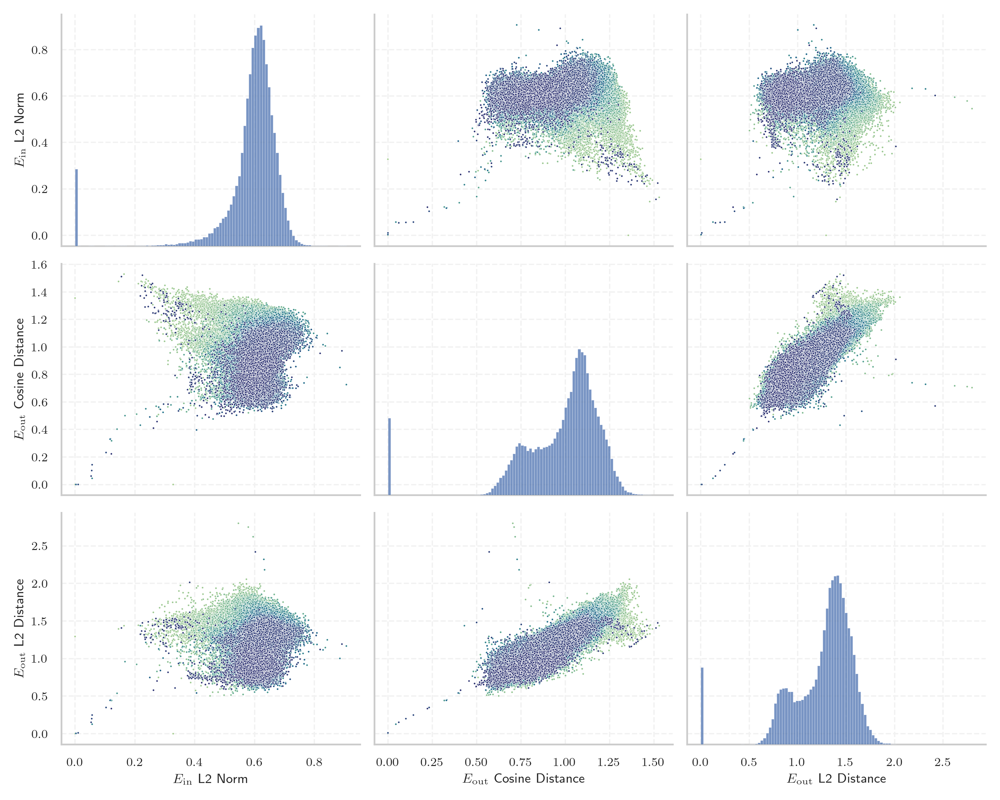
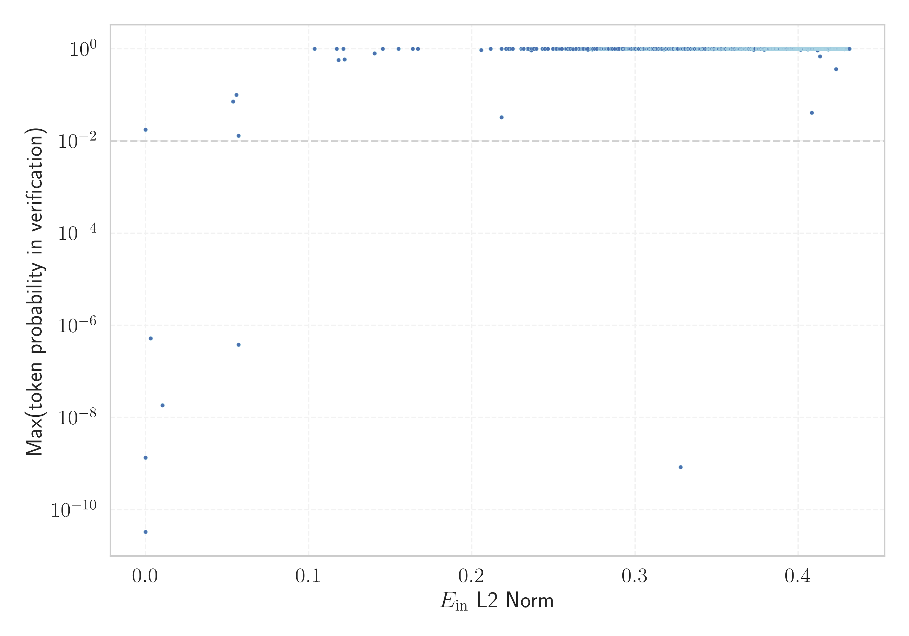

# Report for `ai21labs/Jamba-v0.1`

## Model info

* Model Info: 
  * Tied embeddings: False
  * LM head uses bias: False
  * Embeddings shape: [65536, 4096]
* Tokenizer Info: 
  * Vocab Size: 65536
  * Tokenizer Class: LlamaTokenizer
  * Tokenizer Type: BPE
  * Bytes handling: Byte Fallback
  * Token for verification prompt building: ArgumentException
  * Token id for verification prompt building: 38226
* Indicator summary: 
  * Indicator for under-trained tokens: E_{in} L2 Norm
  * Overall distribution: 0.588 +/- 0.114
* Detected Token Counts: 
  * Number of tested under-trained tokens: 1280, 1176 non-special, 3 below p = 0.01 threshold, 11 below soft indicator threshold
  * Number of single byte tokens: 355, of which 113 below indicator threshold
  * Number of special tokens: 0, of which 0 below indicator threshold

## Under-trained token indicators plot


## Verification plot


## Under-trained token verification results
11 entries below threshold of 0.140

|   token_id | token                    |   indicator | max_prob                                                         | in_other_tokens                                                               |
|------------|--------------------------|-------------|------------------------------------------------------------------|-------------------------------------------------------------------------------|
|      50544 | ````` derrelsc `````     |  0.00302123 | <span style='border: 1px solid rgb(169, 68, 66);'>5.2e-07</span> |                                                                               |
|      58002 | ````` .\xa0(\[ `````     |  0.0103792  | <span style='border: 1px solid rgb(169, 68, 66);'>1.9e-08</span> |                                                                               |
|      61130 | ````` ]{}]{} `````       |  0.0537106  | <span style='border: 1px solid rgb(251, 189, 8);'>0.072</span>   |                                                                               |
|      59180 | ````` .*]{} `````        |  0.0557112  | <span style='border: 1px solid rgb(251, 189, 8);'>0.1</span>     |                                                                               |
|      33631 | ````` .\xa0\[ `````      |  0.0570433  | <span style='border: 1px solid rgb(251, 189, 8);'>0.013</span>   |                                                                               |
|      58810 | ````` ronicsystems ````` |  0.0570511  | <span style='border: 1px solid rgb(169, 68, 66);'>3.8e-07</span> |                                                                               |
|      57848 | ````` ▁cppVar `````      |  0.103601   | <span style='border: 1px solid rgb(40, 167, 69);'>1</span>       |                                                                               |
|      46222 | ````` derrel `````       |  0.117093   | <span style='border: 1px solid rgb(40, 167, 69);'>1</span>       | <span style='border: 1px solid rgb(169, 68, 66);'>````` derrelsc `````</span> |
|      45270 | ````` =\u200a `````      |  0.118303   | <span style='border: 1px solid rgb(40, 167, 69);'>0.57</span>    | ````` \u200a=\u200a `````                                                     |
|      65490 | ````` ≎ `````            |  0.121283   | <span style='border: 1px solid rgb(40, 167, 69);'>1</span>       |                                                                               |
|      24430 | ````` **]{} `````        |  0.12206    | <span style='border: 1px solid rgb(40, 167, 69);'>0.58</span>    |                                                                               |
<details><summary>1165 additional entries above threshold</summary>

|   token_id | token                     |   indicator | max_prob                                                       | in_other_tokens                                                                                                                                                                                                                                                                                                                                                                                    |
|------------|---------------------------|-------------|----------------------------------------------------------------|----------------------------------------------------------------------------------------------------------------------------------------------------------------------------------------------------------------------------------------------------------------------------------------------------------------------------------------------------------------------------------------------------|
|      25552 | ````` *]{} `````          |    0.140371 | <span style='border: 1px solid rgb(40, 167, 69);'>0.79</span>  | <span style='border: 1px solid rgb(251, 189, 8);'>````` .*]{} `````</span>                                                                                                                                                                                                                                                                                                                         |
|      25933 | ````` ▁municíp `````      |    0.166882 | <span style='border: 1px solid rgb(40, 167, 69);'>0.99</span>  | <span style='border: 1px solid rgb(40, 167, 69);'>````` ▁município `````</span>, <span style='border: 1px solid rgb(40, 167, 69);'>````` ▁municípios `````</span>                                                                                                                                                                                                                                  |
|      16909 | ````` ▁dével `````        |    0.205818 | <span style='border: 1px solid rgb(40, 167, 69);'>0.94</span>  | ````` ▁développ `````, ````` ▁développement `````, <span style='border: 1px solid rgb(40, 167, 69);'>````` ▁développer `````</span>                                                                                                                                                                                                                                                                |
|       1837 | ````` ▁and `````          |    0.211493 | <span style='border: 1px solid rgb(40, 167, 69);'>1</span>     | ````` ▁android `````, <span style='border: 1px solid rgb(40, 167, 69);'>````` ▁andere `````</span>, ````` ▁anderen `````, ````` ▁anders `````, ````` ▁androidx `````, ...                                                                                                                                                                                                                          |
|      33905 | ````` REDIRECCIÓN `````   |    0.218141 | <span style='border: 1px solid rgb(251, 189, 8);'>0.033</span> |                                                                                                                                                                                                                                                                                                                                                                                                    |
|       1831 | ````` ▁to `````           |    0.220908 | <span style='border: 1px solid rgb(40, 167, 69);'>1</span>     | ````` ▁too `````, ````` ▁top `````, ````` ▁today `````, ````` ▁tot `````, ````` ▁toget `````, ...                                                                                                                                                                                                                                                                                                  |
|       1808 | ````` ▁the `````          |    0.22421  | <span style='border: 1px solid rgb(40, 167, 69);'>1</span>     | <span style='border: 1px solid rgb(40, 167, 69);'>````` ▁they `````</span>, <span style='border: 1px solid rgb(40, 167, 69);'>````` ▁their `````</span>, <span style='border: 1px solid rgb(40, 167, 69);'>````` ▁there `````</span>, <span style='border: 1px solid rgb(40, 167, 69);'>````` ▁them `````</span>, <span style='border: 1px solid rgb(40, 167, 69);'>````` ▁these `````</span>, ... |
|      62934 | ````` ▁ `````             |    0.225052 | <span style='border: 1px solid rgb(40, 167, 69);'>1</span>     |                                                                                                                                                                                                                                                                                                                                                                                                    |
|       1885 | ````` ▁that `````         |    0.230189 | <span style='border: 1px solid rgb(40, 167, 69);'>1</span>     | ````` ▁thats `````                                                                                                                                                                                                                                                                                                                                                                                 |
|       1836 | ````` ▁of `````           |    0.231834 | <span style='border: 1px solid rgb(40, 167, 69);'>1</span>     | <span style='border: 1px solid rgb(40, 167, 69);'>````` ▁off `````</span>, ````` ▁often `````, ````` ▁offic `````, ````` ▁offer `````, ````` ▁official `````, ...                                                                                                                                                                                                                                  |
|       1801 | ````` ▁a `````            |    0.234565 | <span style='border: 1px solid rgb(40, 167, 69);'>1</span>     | <span style='border: 1px solid rgb(40, 167, 69);'>````` ▁an `````</span>, <span style='border: 1px solid rgb(40, 167, 69);'>````` ▁and `````</span>, <span style='border: 1px solid rgb(40, 167, 69);'>````` ▁al `````</span>, <span style='border: 1px solid rgb(40, 167, 69);'>````` ▁as `````</span>, <span style='border: 1px solid rgb(40, 167, 69);'>````` ▁are `````</span>, ...            |
|      32799 | ````` ▁herramient `````   |    0.236356 | <span style='border: 1px solid rgb(40, 167, 69);'>0.93</span>  | ````` ▁herramientas `````, ````` ▁herramienta `````                                                                                                                                                                                                                                                                                                                                                |
|       1874 | ````` ▁for `````          |    0.236557 | <span style='border: 1px solid rgb(40, 167, 69);'>1</span>     | <span style='border: 1px solid rgb(40, 167, 69);'>````` ▁form `````</span>, ````` ▁fore `````, ````` ▁forward `````, ````` ▁former `````, ````` ▁force `````, ...                                                                                                                                                                                                                                  |
|       1832 | ````` ▁in `````           |    0.237488 | <span style='border: 1px solid rgb(40, 167, 69);'>1</span>     | <span style='border: 1px solid rgb(40, 167, 69);'>````` ▁into `````</span>, ````` ▁ind `````, ````` ▁includ `````, ````` ▁inv `````, ````` ▁inst `````, ...                                                                                                                                                                                                                                        |
|       3399 | ````` ). `````            |    0.239498 | <span style='border: 1px solid rgb(40, 167, 69);'>1</span>     | ````` (). `````, ````` "). `````, ````` '). `````, ````` )). `````, ````` ▁). `````, ...                                                                                                                                                                                                                                                                                                           |
|       1902 | ````` ▁as `````           |    0.243216 | <span style='border: 1px solid rgb(40, 167, 69);'>1</span>     | ````` ▁ass `````, ````` ▁ask `````, ````` ▁associ `````, ````` ▁asked `````, ````` ▁assist `````, ...                                                                                                                                                                                                                                                                                              |
|       1913 | ````` ▁( `````            |    0.244637 | <span style='border: 1px solid rgb(40, 167, 69);'>1</span>     | ````` ▁() `````, ````` ▁($ `````, ````` ▁(! `````, ````` ▁(" `````, ````` ▁(* `````, ...                                                                                                                                                                                                                                                                                                           |
|       1865 | ````` ▁is `````           |    0.244665 | <span style='border: 1px solid rgb(40, 167, 69);'>1</span>     | ````` ▁iss `````, <span style='border: 1px solid rgb(40, 167, 69);'>````` ▁issue `````</span>, ````` ▁issues `````, <span style='border: 1px solid rgb(40, 167, 69);'>````` ▁isn `````</span>, ````` ▁ist `````, ...                                                                                                                                                                               |
|       1896 | ````` ▁with `````         |    0.246426 | <span style='border: 1px solid rgb(40, 167, 69);'>1</span>     | <span style='border: 1px solid rgb(40, 167, 69);'>````` ▁without `````</span>, ````` ▁within `````, ````` ▁withdraw `````, ````` ▁withdrawal `````, ````` ▁withstand `````, ...                                                                                                                                                                                                                    |
|       6605 | ````` ." `````            |    0.24662  | <span style='border: 1px solid rgb(40, 167, 69);'>1</span>     | ````` .") `````, ````` ."" `````, ````` ."); `````, ````` ..." `````, ````` ."[ `````, ...                                                                                                                                                                                                                                                                                                         |
|       1870 | ````` ▁on `````           |    0.24977  | <span style='border: 1px solid rgb(40, 167, 69);'>1</span>     | <span style='border: 1px solid rgb(40, 167, 69);'>````` ▁one `````</span>, <span style='border: 1px solid rgb(40, 167, 69);'>````` ▁only `````</span>, ````` ▁online `````, <span style='border: 1px solid rgb(40, 167, 69);'>````` ▁once `````</span>, ````` ▁ones `````, ...                                                                                                                     |
|      49033 | ````` "}]( `````          |    0.249802 | <span style='border: 1px solid rgb(40, 167, 69);'>1</span>     |                                                                                                                                                                                                                                                                                                                                                                                                    |
|       2137 | ````` ▁- `````            |    0.253991 | <span style='border: 1px solid rgb(40, 167, 69);'>1</span>     | <span style='border: 1px solid rgb(40, 167, 69);'>````` ▁-- `````</span>, ````` ▁-> `````, ````` ▁--> `````, ````` ▁--- `````, ````` ▁---------------- `````, ...                                                                                                                                                                                                                                  |
|      62999 | ````` ’ `````             |    0.255223 | <span style='border: 1px solid rgb(40, 167, 69);'>1</span>     |                                                                                                                                                                                                                                                                                                                                                                                                    |
|       1876 | ````` ▁you `````          |    0.257582 | <span style='border: 1px solid rgb(40, 167, 69);'>1</span>     | <span style='border: 1px solid rgb(40, 167, 69);'>````` ▁your `````</span>, ````` ▁young `````, ````` ▁yourself `````, ````` ▁youth `````, ````` ▁younger `````, ...                                                                                                                                                                                                                               |
|       1895 | ````` ▁it `````           |    0.257949 | <span style='border: 1px solid rgb(40, 167, 69);'>1</span>     | <span style='border: 1px solid rgb(40, 167, 69);'>````` ▁its `````</span>, ````` ▁itself `````, ````` ▁items `````, ````` ▁item `````, ````` ▁iter `````, ...                                                                                                                                                                                                                                      |
|       1988 | ````` ▁" `````            |    0.258842 | <span style='border: 1px solid rgb(40, 167, 69);'>1</span>     | ````` ▁"" `````, ````` ▁"/ `````, ````` ▁"\ `````, ````` ▁"< `````, ````` ▁"$ `````, ...                                                                                                                                                                                                                                                                                                           |
|       1857 | ````` ▁I `````            |    0.258864 | <span style='border: 1px solid rgb(40, 167, 69);'>1</span>     | <span style='border: 1px solid rgb(40, 167, 69);'>````` ▁In `````</span>, <span style='border: 1px solid rgb(40, 167, 69);'>````` ▁It `````</span>, <span style='border: 1px solid rgb(40, 167, 69);'>````` ▁If `````</span>, ````` ▁Ind `````, <span style='border: 1px solid rgb(40, 167, 69);'>````` ▁Is `````</span>, ...                                                                      |
|       2175 | ````` ▁que `````          |    0.259767 | <span style='border: 1px solid rgb(40, 167, 69);'>1</span>     | ````` ▁quest `````, ````` ▁question `````, ````` ▁questions `````, ````` ▁query `````, ````` ▁quel `````, ...                                                                                                                                                                                                                                                                                      |
|      63039 | ````` ” `````             |    0.260405 | <span style='border: 1px solid rgb(40, 167, 69);'>1</span>     |                                                                                                                                                                                                                                                                                                                                                                                                    |
|       1881 | ````` ▁de `````           |    0.261566 | <span style='border: 1px solid rgb(40, 167, 69);'>1</span>     | <span style='border: 1px solid rgb(40, 167, 69);'>````` ▁des `````</span>, <span style='border: 1px solid rgb(40, 167, 69);'>````` ▁del `````</span>, ````` ▁dec `````, ````` ▁def `````, ````` ▁det `````, ...                                                                                                                                                                                    |
|      65256 | ````` Ꮝ `````             |    0.262039 | <span style='border: 1px solid rgb(40, 167, 69);'>0.99</span>  |                                                                                                                                                                                                                                                                                                                                                                                                    |
|       2311 | ````` ▁– `````            |    0.263913 | <span style='border: 1px solid rgb(40, 167, 69);'>1</span>     |                                                                                                                                                                                                                                                                                                                                                                                                    |
|       1987 | ````` ▁by `````           |    0.266508 | <span style='border: 1px solid rgb(40, 167, 69);'>1</span>     | ````` ▁bytes `````, ````` ▁byte `````, ````` ▁bypass `````, ````` ▁bye `````                                                                                                                                                                                                                                                                                                                       |
|       1954 | ````` ▁was `````          |    0.267416 | <span style='border: 1px solid rgb(40, 167, 69);'>1</span>     | <span style='border: 1px solid rgb(40, 167, 69);'>````` ▁wasn `````</span>, ````` ▁waste `````, ````` ▁wash `````, ````` ▁washing `````, ````` ▁washed `````, ...                                                                                                                                                                                                                                  |
|       1815 | ````` es `````            |    0.267635 | <span style='border: 1px solid rgb(40, 167, 69);'>1</span>     | <span style='border: 1px solid rgb(40, 167, 69);'>````` est `````</span>, <span style='border: 1px solid rgb(40, 167, 69);'>````` res `````</span>, <span style='border: 1px solid rgb(40, 167, 69);'>````` ess `````</span>, <span style='border: 1px solid rgb(40, 167, 69);'>````` ies `````</span>, ````` ▁res `````, ...                                                                      |
|       1929 | ````` ▁are `````          |    0.26788  | <span style='border: 1px solid rgb(40, 167, 69);'>1</span>     | <span style='border: 1px solid rgb(40, 167, 69);'>````` ▁area `````</span>, ````` ▁areas `````, ````` ▁aren `````, ````` ▁arena `````, ````` ▁arenas `````                                                                                                                                                                                                                                         |
|       1980 | ````` ▁from `````         |    0.268364 | <span style='border: 1px solid rgb(40, 167, 69);'>1</span>     |                                                                                                                                                                                                                                                                                                                                                                                                    |
|       1943 | ````` ▁at `````           |    0.270581 | <span style='border: 1px solid rgb(40, 167, 69);'>1</span>     | ````` ▁att `````, ````` ▁attack `````, ````` ▁attempt `````, ````` ▁attention `````, ````` ▁attract `````, ...                                                                                                                                                                                                                                                                                     |
|      24026 | ````` ▁películ `````      |    0.27104  | <span style='border: 1px solid rgb(40, 167, 69);'>0.95</span>  | ````` ▁película `````, ````` ▁películas `````                                                                                                                                                                                                                                                                                                                                                      |
|       1871 | ````` ▁be `````           |    0.271053 | <span style='border: 1px solid rgb(40, 167, 69);'>1</span>     | <span style='border: 1px solid rgb(40, 167, 69);'>````` ▁been `````</span>, ````` ▁bec `````, ````` ▁bet `````, <span style='border: 1px solid rgb(40, 167, 69);'>````` ▁because `````</span>, <span style='border: 1px solid rgb(40, 167, 69);'>````` ▁being `````</span>, ...                                                                                                                    |
|       2044 | ````` ▁but `````          |    0.273152 | <span style='border: 1px solid rgb(40, 167, 69);'>1</span>     | ````` ▁button `````, ````` ▁butter `````, ````` ▁butt `````, ````` ▁buttons `````, ````` ▁butterfly `````, ...                                                                                                                                                                                                                                                                                     |
|       1809 | ````` en `````            |    0.273472 | <span style='border: 1px solid rgb(40, 167, 69);'>1</span>     | <span style='border: 1px solid rgb(40, 167, 69);'>````` ent `````</span>, <span style='border: 1px solid rgb(40, 167, 69);'>````` ▁en `````</span>, <span style='border: 1px solid rgb(40, 167, 69);'>````` ment `````</span>, <span style='border: 1px solid rgb(40, 167, 69);'>````` end `````</span>, <span style='border: 1px solid rgb(40, 167, 69);'>````` ens `````</span>, ...             |
|      14520 | ````` ICENSE `````        |    0.273639 | <span style='border: 1px solid rgb(40, 167, 69);'>0.96</span>  | ````` LICENSE `````, ````` ▁LICENSE `````                                                                                                                                                                                                                                                                                                                                                          |
|      65472 | ````` 𝙴 `````             |    0.273977 | <span style='border: 1px solid rgb(40, 167, 69);'>1</span>     |                                                                                                                                                                                                                                                                                                                                                                                                    |
|       1833 | ````` as `````            |    0.27414  | <span style='border: 1px solid rgb(40, 167, 69);'>1</span>     | <span style='border: 1px solid rgb(40, 167, 69);'>````` ▁as `````</span>, <span style='border: 1px solid rgb(40, 167, 69);'>````` ▁was `````</span>, <span style='border: 1px solid rgb(40, 167, 69);'>````` ast `````</span>, <span style='border: 1px solid rgb(40, 167, 69);'>````` ass `````</span>, <span style='border: 1px solid rgb(40, 167, 69);'>````` ▁has `````</span>, ...            |
|       2844 | ````` ES `````            |    0.274191 | <span style='border: 1px solid rgb(40, 167, 69);'>1</span>     | <span style='border: 1px solid rgb(40, 167, 69);'>````` EST `````</span>, <span style='border: 1px solid rgb(40, 167, 69);'>````` ESS `````</span>, <span style='border: 1px solid rgb(40, 167, 69);'>````` IES `````</span>, ````` RES `````, ````` ▁ES `````, ...                                                                                                                                |
|       1946 | ````` ▁The `````          |    0.275177 | <span style='border: 1px solid rgb(40, 167, 69);'>1</span>     | <span style='border: 1px solid rgb(40, 167, 69);'>````` ▁They `````</span>, <span style='border: 1px solid rgb(40, 167, 69);'>````` ▁There `````</span>, ````` ▁These `````, ````` ▁Then `````, ````` ▁Their `````, ...                                                                                                                                                                            |
|       1825 | ````` ing `````           |    0.276515 | <span style='border: 1px solid rgb(40, 167, 69);'>1</span>     | <span style='border: 1px solid rgb(40, 167, 69);'>````` ings `````</span>, <span style='border: 1px solid rgb(40, 167, 69);'>````` ring `````</span>, <span style='border: 1px solid rgb(40, 167, 69);'>````` ning `````</span>, <span style='border: 1px solid rgb(40, 167, 69);'>````` ating `````</span>, <span style='border: 1px solid rgb(40, 167, 69);'>````` ting `````</span>, ...        |
|       1893 | ````` os `````            |    0.278902 | <span style='border: 1px solid rgb(40, 167, 69);'>1</span>     | ````` ost `````, <span style='border: 1px solid rgb(40, 167, 69);'>````` ose `````</span>, <span style='border: 1px solid rgb(40, 167, 69);'>````` ▁most `````</span>, ````` oss `````, <span style='border: 1px solid rgb(40, 167, 69);'>````` ▁those `````</span>, ...                                                                                                                           |
|      39836 | ````` ▁évén `````         |    0.279477 | <span style='border: 1px solid rgb(40, 167, 69);'>1</span>     | ````` ▁événements `````, ````` ▁événement `````                                                                                                                                                                                                                                                                                                                                                    |
|      63029 | ````` “ `````             |    0.279539 | <span style='border: 1px solid rgb(40, 167, 69);'>1</span>     |                                                                                                                                                                                                                                                                                                                                                                                                    |
|       1898 | ````` ▁he `````           |    0.280057 | <span style='border: 1px solid rgb(40, 167, 69);'>1</span>     | <span style='border: 1px solid rgb(40, 167, 69);'>````` ▁her `````</span>, ````` ▁hel `````, <span style='border: 1px solid rgb(40, 167, 69);'>````` ▁help `````</span>, <span style='border: 1px solid rgb(40, 167, 69);'>````` ▁here `````</span>, <span style='border: 1px solid rgb(40, 167, 69);'>````` ▁head `````</span>, ...                                                               |
|       1973 | ````` ▁have `````         |    0.280365 | <span style='border: 1px solid rgb(40, 167, 69);'>1</span>     | ````` ▁haven `````, ````` ▁haver `````                                                                                                                                                                                                                                                                                                                                                             |
|       1944 | ````` ▁or `````           |    0.280583 | <span style='border: 1px solid rgb(40, 167, 69);'>1</span>     | ````` ▁organ `````, <span style='border: 1px solid rgb(40, 167, 69);'>````` ▁order `````</span>, ````` ▁orig `````, ````` ▁original `````, ````` ▁organiz `````, ...                                                                                                                                                                                                                               |
|       4285 | ````` ING `````           |    0.280685 | <span style='border: 1px solid rgb(40, 167, 69);'>1</span>     | <span style='border: 1px solid rgb(40, 167, 69);'>````` INGS `````</span>, ````` NING `````, ````` CLUDING `````, ````` INGTON `````, ````` STRING `````, ...                                                                                                                                                                                                                                      |
|      17457 | ````` .” `````            |    0.281523 | <span style='border: 1px solid rgb(40, 167, 69);'>1</span>     |                                                                                                                                                                                                                                                                                                                                                                                                    |
|       2305 | ````` ▁“ `````            |    0.281531 | <span style='border: 1px solid rgb(40, 167, 69);'>1</span>     | ````` ▁“[ `````                                                                                                                                                                                                                                                                                                                                                                                    |
|       1845 | ````` ▁e `````            |    0.281648 | <span style='border: 1px solid rgb(40, 167, 69);'>1</span>     | ````` ▁ex `````, <span style='border: 1px solid rgb(40, 167, 69);'>````` ▁en `````</span>, ````` ▁ev `````, <span style='border: 1px solid rgb(40, 167, 69);'>````` ▁em `````</span>, <span style='border: 1px solid rgb(40, 167, 69);'>````` ▁el `````</span>, ...                                                                                                                                |
|       1923 | ````` ▁we `````           |    0.281916 | <span style='border: 1px solid rgb(40, 167, 69);'>1</span>     | <span style='border: 1px solid rgb(40, 167, 69);'>````` ▁were `````</span>, <span style='border: 1px solid rgb(40, 167, 69);'>````` ▁well `````</span>, <span style='border: 1px solid rgb(40, 167, 69);'>````` ▁week `````</span>, ````` ▁webs `````, ````` ▁went `````, ...                                                                                                                      |
|       5781 | ````` ebruary `````       |    0.282206 | <span style='border: 1px solid rgb(40, 167, 69);'>1</span>     | ````` ▁February `````, ````` February `````                                                                                                                                                                                                                                                                                                                                                        |
|       1856 | ````` ▁y `````            |    0.282594 | <span style='border: 1px solid rgb(40, 167, 69);'>1</span>     | <span style='border: 1px solid rgb(40, 167, 69);'>````` ▁you `````</span>, <span style='border: 1px solid rgb(40, 167, 69);'>````` ▁your `````</span>, <span style='border: 1px solid rgb(40, 167, 69);'>````` ▁year `````</span>, <span style='border: 1px solid rgb(40, 167, 69);'>````` ▁years `````</span>, ````` ▁young `````, ...                                                            |
|       2074 | ````` ▁they `````         |    0.283112 | <span style='border: 1px solid rgb(40, 167, 69);'>1</span>     |                                                                                                                                                                                                                                                                                                                                                                                                    |
|       1830 | ````` ed `````            |    0.283593 | <span style='border: 1px solid rgb(40, 167, 69);'>1</span>     | <span style='border: 1px solid rgb(40, 167, 69);'>````` red `````</span>, <span style='border: 1px solid rgb(40, 167, 69);'>````` ated `````</span>, <span style='border: 1px solid rgb(40, 167, 69);'>````` ▁need `````</span>, ````` ced `````, ````` ased `````, ...                                                                                                                            |
|       2075 | ````` ▁up `````           |    0.283796 | <span style='border: 1px solid rgb(40, 167, 69);'>1</span>     | ````` ▁upon `````, ````` ▁upd `````, ````` ▁update `````, ````` ▁updated `````, ````` ▁updates `````, ...                                                                                                                                                                                                                                                                                          |
|       1829 | ````` ▁an `````           |    0.285175 | <span style='border: 1px solid rgb(40, 167, 69);'>1</span>     | <span style='border: 1px solid rgb(40, 167, 69);'>````` ▁and `````</span>, <span style='border: 1px solid rgb(40, 167, 69);'>````` ▁any `````</span>, <span style='border: 1px solid rgb(40, 167, 69);'>````` ▁another `````</span>, ````` ▁ann `````, ````` ▁ant `````, ...                                                                                                                       |
|      49256 | ````` rsfs `````          |    0.285183 | <span style='border: 1px solid rgb(40, 167, 69);'>1</span>     | <span style='border: 1px solid rgb(40, 167, 69);'>````` mathrsfs `````</span>                                                                                                                                                                                                                                                                                                                      |
|       3090 | ````` ▁. `````            |    0.285593 | <span style='border: 1px solid rgb(40, 167, 69);'>1</span>     | <span style='border: 1px solid rgb(40, 167, 69);'>````` ▁... `````</span>, ````` ▁.. `````, ````` ▁.... `````, ````` ▁./ `````, ````` ▁.= `````, ...                                                                                                                                                                                                                                               |
|       2120 | ````` ▁about `````        |    0.28616  | <span style='border: 1px solid rgb(40, 167, 69);'>1</span>     |                                                                                                                                                                                                                                                                                                                                                                                                    |
|       1806 | ````` er `````            |    0.287507 | <span style='border: 1px solid rgb(40, 167, 69);'>1</span>     | <span style='border: 1px solid rgb(40, 167, 69);'>````` ver `````</span>, <span style='border: 1px solid rgb(40, 167, 69);'>````` ter `````</span>, <span style='border: 1px solid rgb(40, 167, 69);'>````` ers `````</span>, <span style='border: 1px solid rgb(40, 167, 69);'>````` her `````</span>, <span style='border: 1px solid rgb(40, 167, 69);'>````` per `````</span>, ...              |
|       1827 | ````` ar `````            |    0.287558 | <span style='border: 1px solid rgb(40, 167, 69);'>1</span>     | <span style='border: 1px solid rgb(40, 167, 69);'>````` ▁are `````</span>, <span style='border: 1px solid rgb(40, 167, 69);'>````` art `````</span>, <span style='border: 1px solid rgb(40, 167, 69);'>````` ard `````</span>, <span style='border: 1px solid rgb(40, 167, 69);'>````` ear `````</span>, <span style='border: 1px solid rgb(40, 167, 69);'>````` are `````</span>, ...             |
|       2058 | ````` ▁out `````          |    0.287607 | <span style='border: 1px solid rgb(40, 167, 69);'>1</span>     | ````` ▁outside `````, ````` ▁output `````, ````` ▁outdoor `````, ````` ▁outcomes `````, ````` ▁outcome `````, ...                                                                                                                                                                                                                                                                                  |
|       1802 | ````` in `````            |    0.288886 | <span style='border: 1px solid rgb(40, 167, 69);'>1</span>     | <span style='border: 1px solid rgb(40, 167, 69);'>````` ing `````</span>, <span style='border: 1px solid rgb(40, 167, 69);'>````` ▁in `````</span>, <span style='border: 1px solid rgb(40, 167, 69);'>````` ain `````</span>, <span style='border: 1px solid rgb(40, 167, 69);'>````` ine `````</span>, <span style='border: 1px solid rgb(40, 167, 69);'>````` ind `````</span>, ...              |
|       1970 | ````` ▁this `````         |    0.289515 | <span style='border: 1px solid rgb(40, 167, 69);'>1</span>     |                                                                                                                                                                                                                                                                                                                                                                                                    |
|       1963 | ````` ▁en `````           |    0.290221 | <span style='border: 1px solid rgb(40, 167, 69);'>1</span>     | ````` ▁ent `````, <span style='border: 1px solid rgb(40, 167, 69);'>````` ▁end `````</span>, ````` ▁eng `````, ````` ▁enc `````, ````` ▁enough `````, ...                                                                                                                                                                                                                                          |
|       2176 | ````` ▁if `````           |    0.29226  | <span style='border: 1px solid rgb(40, 167, 69);'>1</span>     |                                                                                                                                                                                                                                                                                                                                                                                                    |
|       2193 | ````` ▁when `````         |    0.293438 | <span style='border: 1px solid rgb(40, 167, 69);'>1</span>     | ````` ▁whenever `````                                                                                                                                                                                                                                                                                                                                                                              |
|      40005 | ````` embros `````        |    0.294135 | <span style='border: 1px solid rgb(40, 167, 69);'>1</span>     | ````` ▁miembros `````, ````` ▁membros `````                                                                                                                                                                                                                                                                                                                                                        |
|       2581 | ````` ER `````            |    0.294144 | <span style='border: 1px solid rgb(40, 167, 69);'>1</span>     | ````` VER `````, <span style='border: 1px solid rgb(40, 167, 69);'>````` TER `````</span>, <span style='border: 1px solid rgb(40, 167, 69);'>````` ERS `````</span>, ````` ERE `````, ````` ERT `````, ...                                                                                                                                                                                         |
|       1975 | ````` ▁not `````          |    0.295212 | <span style='border: 1px solid rgb(40, 167, 69);'>1</span>     | ````` ▁nothing `````, ````` ▁note `````, ````` ▁notice `````, ````` ▁notes `````, ````` ▁noted `````, ...                                                                                                                                                                                                                                                                                          |
|       1994 | ````` ▁your `````         |    0.295488 | <span style='border: 1px solid rgb(40, 167, 69);'>1</span>     | ````` ▁yourself `````, ````` ▁yours `````, ````` ▁yourselves `````, ````` ▁youre `````                                                                                                                                                                                                                                                                                                             |
|      59281 | ````` WEITER `````        |    0.295803 | <span style='border: 1px solid rgb(40, 167, 69);'>1</span>     | <span style='border: 1px solid rgb(251, 189, 8);'>````` WEITERLEITUNG `````</span>                                                                                                                                                                                                                                                                                                                 |
|       2123 | ````` ▁who `````          |    0.297373 | <span style='border: 1px solid rgb(40, 167, 69);'>1</span>     | ````` ▁whole `````, ````` ▁whose `````, ````` ▁whom `````, ````` ▁wholes `````, ````` ▁wholesale `````, ...                                                                                                                                                                                                                                                                                        |
|      13543 | ````` ". `````            |    0.297955 | <span style='border: 1px solid rgb(40, 167, 69);'>1</span>     | <span style='border: 1px solid rgb(40, 167, 69);'>````` ="../../ `````</span>, <span style='border: 1px solid rgb(40, 167, 69);'>````` ="../ `````</span>, ````` ▁". `````, ````` ▁"./ `````, ````` (". `````, ...                                                                                                                                                                                 |
|       2010 | ````` ▁will `````         |    0.298157 | <span style='border: 1px solid rgb(40, 167, 69);'>1</span>     | ````` ▁willing `````, ````` ▁willingness `````, ````` ▁willen `````, ````` ▁willingly `````                                                                                                                                                                                                                                                                                                        |
|       2477 | ````` ado `````           |    0.299138 | <span style='border: 1px solid rgb(40, 167, 69);'>1</span>     | <span style='border: 1px solid rgb(40, 167, 69);'>````` ados `````</span>, <span style='border: 1px solid rgb(40, 167, 69);'>````` ador `````</span>, ````` ▁adopt `````, <span style='border: 1px solid rgb(40, 167, 69);'>````` adores `````</span>, ````` adow `````, ...                                                                                                                       |
|       1996 | ````` ▁do `````           |    0.299176 | <span style='border: 1px solid rgb(40, 167, 69);'>1</span>     | <span style='border: 1px solid rgb(40, 167, 69);'>````` ▁don `````</span>, <span style='border: 1px solid rgb(40, 167, 69);'>````` ▁down `````</span>, <span style='border: 1px solid rgb(40, 167, 69);'>````` ▁does `````</span>, <span style='border: 1px solid rgb(40, 167, 69);'>````` ▁done `````</span>, <span style='border: 1px solid rgb(40, 167, 69);'>````` ▁doesn `````</span>, ...    |
|       2353 | ````` ... `````           |    0.299337 | <span style='border: 1px solid rgb(40, 167, 69);'>1</span>     | <span style='border: 1px solid rgb(40, 167, 69);'>````` ▁... `````</span>, ````` .... `````, ````` ........ `````, ````` ...) `````, ````` ...] `````, ...                                                                                                                                                                                                                                         |
|       2164 | ````` ▁were `````         |    0.299424 | <span style='border: 1px solid rgb(40, 167, 69);'>1</span>     | ````` ▁weren `````, ````` ▁wereld `````                                                                                                                                                                                                                                                                                                                                                            |
|       2060 | ````` ▁la `````           |    0.299424 | <span style='border: 1px solid rgb(40, 167, 69);'>1</span>     | <span style='border: 1px solid rgb(40, 167, 69);'>````` ▁last `````</span>, ````` ▁law `````, <span style='border: 1px solid rgb(40, 167, 69);'>````` ▁las `````</span>, ````` ▁large `````, ````` ▁later `````, ...                                                                                                                                                                               |
|       2116 | ````` ▁which `````        |    0.299435 | <span style='border: 1px solid rgb(40, 167, 69);'>1</span>     | ````` ▁whichever `````                                                                                                                                                                                                                                                                                                                                                                             |
|       1818 | ````` an `````            |    0.299734 | <span style='border: 1px solid rgb(40, 167, 69);'>1</span>     | <span style='border: 1px solid rgb(40, 167, 69);'>````` ▁an `````</span>, <span style='border: 1px solid rgb(40, 167, 69);'>````` ▁and `````</span>, <span style='border: 1px solid rgb(40, 167, 69);'>````` and `````</span>, <span style='border: 1px solid rgb(40, 167, 69);'>````` ant `````</span>, <span style='border: 1px solid rgb(40, 167, 69);'>````` ▁can `````</span>, ...            |
|       1824 | ````` ▁o `````            |    0.299749 | <span style='border: 1px solid rgb(40, 167, 69);'>1</span>     | <span style='border: 1px solid rgb(40, 167, 69);'>````` ▁of `````</span>, <span style='border: 1px solid rgb(40, 167, 69);'>````` ▁on `````</span>, <span style='border: 1px solid rgb(40, 167, 69);'>````` ▁or `````</span>, <span style='border: 1px solid rgb(40, 167, 69);'>````` ▁out `````</span>, <span style='border: 1px solid rgb(40, 167, 69);'>````` ▁one `````</span>, ...            |
|       2094 | ````` ▁one `````          |    0.300256 | <span style='border: 1px solid rgb(40, 167, 69);'>1</span>     | ````` ▁ones `````, ````` ▁oneself `````                                                                                                                                                                                                                                                                                                                                                            |
|       2101 | ````` ▁his `````          |    0.301362 | <span style='border: 1px solid rgb(40, 167, 69);'>1</span>     | ````` ▁hist `````, ````` ▁history `````, ````` ▁histor `````, ````` ▁historical `````, ````` ▁historic `````, ...                                                                                                                                                                                                                                                                                  |
|       1986 | ````` ▁can `````          |    0.301712 | <span style='border: 1px solid rgb(40, 167, 69);'>1</span>     | ````` ▁cannot `````, ````` ▁cand `````, ````` ▁candid `````, ````` ▁cancer `````, ````` ▁candidate `````, ...                                                                                                                                                                                                                                                                                      |
|       2155 | ````` ▁time `````         |    0.301764 | <span style='border: 1px solid rgb(40, 167, 69);'>1</span>     | <span style='border: 1px solid rgb(40, 167, 69);'>````` ▁times `````</span>, ````` ▁timely `````, ````` ▁timer `````, ````` ▁timeline `````, ````` ▁timeout `````, ...                                                                                                                                                                                                                             |
|       1805 | ````` on `````            |    0.301911 | <span style='border: 1px solid rgb(40, 167, 69);'>1</span>     | <span style='border: 1px solid rgb(40, 167, 69);'>````` ion `````</span>, <span style='border: 1px solid rgb(40, 167, 69);'>````` ▁on `````</span>, <span style='border: 1px solid rgb(40, 167, 69);'>````` ation `````</span>, <span style='border: 1px solid rgb(40, 167, 69);'>````` ▁con `````</span>, ````` ction `````, ...                                                                  |
|       2028 | ````` ▁= `````            |    0.302201 | <span style='border: 1px solid rgb(40, 167, 69);'>1</span>     | ````` ▁=> `````, ````` ▁== `````, ````` ▁=== `````                                                                                                                                                                                                                                                                                                                                                 |
|       1922 | ````` ers `````           |    0.302382 | <span style='border: 1px solid rgb(40, 167, 69);'>1</span>     | <span style='border: 1px solid rgb(40, 167, 69);'>````` vers `````</span>, ````` erson `````, <span style='border: 1px solid rgb(40, 167, 69);'>````` ▁person `````</span>, <span style='border: 1px solid rgb(40, 167, 69);'>````` ters `````</span>, ````` ivers `````, ...                                                                                                                      |
|       2078 | ````` to `````            |    0.303557 | <span style='border: 1px solid rgb(40, 167, 69);'>1</span>     | <span style='border: 1px solid rgb(40, 167, 69);'>````` ▁into `````</span>, ````` ton `````, ````` ▁too `````, <span style='border: 1px solid rgb(40, 167, 69);'>````` ator `````</span>, ````` ustom `````, ...                                                                                                                                                                                   |
|       2366 | ````` ▁et `````           |    0.304303 | <span style='border: 1px solid rgb(40, 167, 69);'>1</span>     | ````` ▁etc `````, ````` ▁eth `````, ````` ▁ethnic `````, ````` ▁ethical `````, ````` ▁ethics `````, ...                                                                                                                                                                                                                                                                                            |
|       2222 | ````` ▁' `````            |    0.304365 | <span style='border: 1px solid rgb(40, 167, 69);'>1</span>     | ````` ▁'' `````, ````` ▁'/ `````, ````` ▁'./ `````, ````` ▁'< `````, ````` ▁'@ `````, ...                                                                                                                                                                                                                                                                                                          |
|       1804 | ````` re `````            |    0.304465 | <span style='border: 1px solid rgb(40, 167, 69);'>1</span>     | ````` ▁re `````, <span style='border: 1px solid rgb(40, 167, 69);'>````` res `````</span>, <span style='border: 1px solid rgb(40, 167, 69);'>````` ▁are `````</span>, <span style='border: 1px solid rgb(40, 167, 69);'>````` ore `````</span>, <span style='border: 1px solid rgb(40, 167, 69);'>````` red `````</span>, ...                                                                      |
|       2191 | ````` ▁like `````         |    0.304841 | <span style='border: 1px solid rgb(40, 167, 69);'>1</span>     | ````` ▁likely `````, ````` ▁liked `````, ````` ▁likes `````, ````` ▁likewise `````, ````` ▁likelihood `````, ...                                                                                                                                                                                                                                                                                   |
|      63003 | ````` é `````             |    0.304887 | <span style='border: 1px solid rgb(40, 167, 69);'>1</span>     |                                                                                                                                                                                                                                                                                                                                                                                                    |
|       2083 | ````` ▁my `````           |    0.304992 | <span style='border: 1px solid rgb(40, 167, 69);'>1</span>     | ````` ▁myself `````, ````` ▁myst `````, ````` ▁myth `````, ````` ▁mystery `````, ````` ▁myster `````, ...                                                                                                                                                                                                                                                                                          |
|       1819 | ````` is `````            |    0.305416 | <span style='border: 1px solid rgb(40, 167, 69);'>1</span>     | <span style='border: 1px solid rgb(40, 167, 69);'>````` ▁is `````</span>, <span style='border: 1px solid rgb(40, 167, 69);'>````` ist `````</span>, <span style='border: 1px solid rgb(40, 167, 69);'>````` ▁this `````</span>, <span style='border: 1px solid rgb(40, 167, 69);'>````` ▁his `````</span>, ````` ▁dis `````, ...                                                                   |
|       3684 | ````` ED `````            |    0.307286 | <span style='border: 1px solid rgb(40, 167, 69);'>1</span>     | ````` ▁LED `````, ````` ▁ED `````, ````` LED `````, ````` ATED `````, ````` RED `````, ...                                                                                                                                                                                                                                                                                                         |
|       1878 | ````` ▁A `````            |    0.308038 | <span style='border: 1px solid rgb(40, 167, 69);'>1</span>     | <span style='border: 1px solid rgb(40, 167, 69);'>````` ▁And `````</span>, ````` ▁Al `````, <span style='border: 1px solid rgb(40, 167, 69);'>````` ▁As `````</span>, ````` ▁Ar `````, <span style='border: 1px solid rgb(40, 167, 69);'>````` ▁An `````</span>, ...                                                                                                                               |
|       1927 | ````` and `````           |    0.308226 | <span style='border: 1px solid rgb(40, 167, 69);'>1</span>     | <span style='border: 1px solid rgb(40, 167, 69);'>````` ▁hand `````</span>, ````` land `````, ````` stand `````, ````` ▁stand `````, <span style='border: 1px solid rgb(40, 167, 69);'>````` ando `````</span>, ...                                                                                                                                                                                |
|       2056 | ````` ▁so `````           |    0.308499 | <span style='border: 1px solid rgb(40, 167, 69);'>1</span>     | <span style='border: 1px solid rgb(40, 167, 69);'>````` ▁some `````</span>, ````` ▁som `````, ````` ▁sol `````, ````` ▁something `````, ````` ▁social `````, ...                                                                                                                                                                                                                                   |
|       2086 | ````` ▁their `````        |    0.308928 | <span style='border: 1px solid rgb(40, 167, 69);'>1</span>     | ````` ▁theirs `````                                                                                                                                                                                                                                                                                                                                                                                |
|       3004 | ````` EN `````            |    0.309405 | <span style='border: 1px solid rgb(40, 167, 69);'>1</span>     | <span style='border: 1px solid rgb(40, 167, 69);'>````` ENT `````</span>, ````` ▁EN `````, ````` END `````, <span style='border: 1px solid rgb(40, 167, 69);'>````` MENT `````</span>, ````` ENSE `````, ...                                                                                                                                                                                       |
|       2031 | ````` ▁me `````           |    0.309956 | <span style='border: 1px solid rgb(40, 167, 69);'>1</span>     | ````` ▁med `````, ````` ▁mem `````, <span style='border: 1px solid rgb(40, 167, 69);'>````` ▁met `````</span>, <span style='border: 1px solid rgb(40, 167, 69);'>````` ▁men `````</span>, ````` ▁meet `````, ...                                                                                                                                                                                   |
|       6572 | ````` ortunately `````    |    0.31006  | <span style='border: 1px solid rgb(40, 167, 69);'>1</span>     | ````` fortunately `````, ````` ▁Unfortunately `````, ````` ▁unfortunately `````, ````` Unfortunately `````, ````` ▁Fortunately `````, ...                                                                                                                                                                                                                                                          |
|       1816 | ````` it `````            |    0.310259 | <span style='border: 1px solid rgb(40, 167, 69);'>1</span>     | ````` ith `````, <span style='border: 1px solid rgb(40, 167, 69);'>````` ▁it `````</span>, <span style='border: 1px solid rgb(40, 167, 69);'>````` ▁with `````</span>, <span style='border: 1px solid rgb(40, 167, 69);'>````` ity `````</span>, <span style='border: 1px solid rgb(40, 167, 69);'>````` ite `````</span>, ...                                                                     |
|       2534 | ````` ▁▁▁ `````           |    0.310504 | <span style='border: 1px solid rgb(40, 167, 69);'>1</span>     | <span style='border: 1px solid rgb(40, 167, 69);'>````` ▁▁▁▁▁▁▁ `````</span>, ````` ▁▁▁▁▁▁▁▁▁▁▁▁▁▁▁▁▁▁▁▁ `````, ````` ▁▁▁▁▁▁▁▁▁▁ `````, ````` ▁▁▁▁▁▁▁▁▁▁▁▁▁▁▁▁▁▁▁▁▁▁▁▁▁▁▁▁▁▁▁▁ `````, <span style='border: 1px solid rgb(40, 167, 69);'>````` ▁▁▁▁▁▁▁▁▁▁▁ `````</span>, ...                                                                                                                        |
|      63756 | ````` ⇌ `````             |    0.310721 | <span style='border: 1px solid rgb(40, 167, 69);'>1</span>     |                                                                                                                                                                                                                                                                                                                                                                                                    |
|       2183 | ````` ▁there `````        |    0.311581 | <span style='border: 1px solid rgb(40, 167, 69);'>1</span>     | ````` ▁therefore `````, ````` ▁thereby `````, ````` ▁thereof `````, ````` ▁thereafter `````, ````` ▁therein `````, ...                                                                                                                                                                                                                                                                             |
|       2174 | ````` ▁her `````          |    0.31161  | <span style='border: 1px solid rgb(40, 167, 69);'>1</span>     | <span style='border: 1px solid rgb(40, 167, 69);'>````` ▁here `````</span>, ````` ▁herself `````, ````` ▁hero `````, ````` ▁heritage `````, ````` ▁heroes `````, ...                                                                                                                                                                                                                               |
|       2259 | ````` ▁she `````          |    0.312471 | <span style='border: 1px solid rgb(40, 167, 69);'>1</span>     | ````` ▁shel `````, ````` ▁sheet `````, ````` ▁shell `````, ````` ▁shed `````, ````` ▁sheets `````, ...                                                                                                                                                                                                                                                                                             |
|       2173 | ````` ▁It `````           |    0.312591 | <span style='border: 1px solid rgb(40, 167, 69);'>1</span>     | ````` ▁Its `````, ````` ▁Ital `````, ````` ▁Italian `````, ````` ▁Italy `````, ````` ▁Item `````, ...                                                                                                                                                                                                                                                                                              |
|       2186 | ````` ▁them `````         |    0.313003 | <span style='border: 1px solid rgb(40, 167, 69);'>1</span>     | ````` ▁themselves `````, ````` ▁theme `````, ````` ▁themes `````, ````` ▁themed `````, ````` ▁thematic `````                                                                                                                                                                                                                                                                                       |
|       1812 | ````` or `````            |    0.313565 | <span style='border: 1px solid rgb(40, 167, 69);'>1</span>     | <span style='border: 1px solid rgb(40, 167, 69);'>````` ▁for `````</span>, <span style='border: 1px solid rgb(40, 167, 69);'>````` ort `````</span>, <span style='border: 1px solid rgb(40, 167, 69);'>````` ▁or `````</span>, <span style='border: 1px solid rgb(40, 167, 69);'>````` ore `````</span>, ````` ▁wor `````, ...                                                                     |
|       2219 | ````` ▁than `````         |    0.314608 | <span style='border: 1px solid rgb(40, 167, 69);'>1</span>     | ````` ▁thank `````, ````` ▁thanks `````, ````` ▁thankful `````, ````` ▁thanked `````, ````` ▁thankfully `````, ...                                                                                                                                                                                                                                                                                 |
|       1992 | ````` te `````            |    0.315424 | <span style='border: 1px solid rgb(40, 167, 69);'>1</span>     | <span style='border: 1px solid rgb(40, 167, 69);'>````` ated `````</span>, <span style='border: 1px solid rgb(40, 167, 69);'>````` ite `````</span>, ````` ▁te `````, ````` fter `````, <span style='border: 1px solid rgb(40, 167, 69);'>````` ater `````</span>, ...                                                                                                                             |
|       1974 | ````` ie `````            |    0.315648 | <span style='border: 1px solid rgb(40, 167, 69);'>1</span>     | <span style='border: 1px solid rgb(40, 167, 69);'>````` ies `````</span>, <span style='border: 1px solid rgb(40, 167, 69);'>````` ient `````</span>, ````` iew `````, <span style='border: 1px solid rgb(40, 167, 69);'>````` ities `````</span>, <span style='border: 1px solid rgb(40, 167, 69);'>````` ier `````</span>, ...                                                                    |
|       1826 | ````` al `````            |    0.316546 | <span style='border: 1px solid rgb(40, 167, 69);'>1</span>     | <span style='border: 1px solid rgb(40, 167, 69);'>````` ▁al `````</span>, <span style='border: 1px solid rgb(40, 167, 69);'>````` all `````</span>, <span style='border: 1px solid rgb(40, 167, 69);'>````` ial `````</span>, <span style='border: 1px solid rgb(40, 167, 69);'>````` ▁all `````</span>, <span style='border: 1px solid rgb(40, 167, 69);'>````` ally `````</span>, ...            |
|       2041 | ````` The `````           |    0.317607 | <span style='border: 1px solid rgb(40, 167, 69);'>1</span>     | <span style='border: 1px solid rgb(40, 167, 69);'>````` ▁They `````</span>, <span style='border: 1px solid rgb(40, 167, 69);'>````` ▁There `````</span>, ````` ▁These `````, ````` There `````, ````` ▁Then `````, ...                                                                                                                                                                             |
|       6422 | ````` .\r `````           |    0.317801 | <span style='border: 1px solid rgb(40, 167, 69);'>0.97</span>  | ````` ).\r `````, ````` ...\r `````                                                                                                                                                                                                                                                                                                                                                                |
|       2579 | ````` ▁: `````            |    0.318112 | <span style='border: 1px solid rgb(40, 167, 69);'>1</span>     | ````` ▁:= `````, ````` ▁:) `````, ````` ▁:: `````, ````` ▁:-) `````, ````` ▁:- `````, ...                                                                                                                                                                                                                                                                                                          |
|       2133 | ````` ▁no `````           |    0.31833  | <span style='border: 1px solid rgb(40, 167, 69);'>1</span>     | <span style='border: 1px solid rgb(40, 167, 69);'>````` ▁now `````</span>, ````` ▁non `````, ````` ▁norm `````, ````` ▁nothing `````, ````` ▁normal `````, ...                                                                                                                                                                                                                                     |
|      24707 | ````` \xa0[@ `````        |    0.318598 | <span style='border: 1px solid rgb(40, 167, 69);'>1</span>     |                                                                                                                                                                                                                                                                                                                                                                                                    |
|      10432 | ````` ?" `````            |    0.318908 | <span style='border: 1px solid rgb(40, 167, 69);'>1</span>     |                                                                                                                                                                                                                                                                                                                                                                                                    |
|       2680 | ````` the `````           |    0.319089 | <span style='border: 1px solid rgb(40, 167, 69);'>1</span>     | <span style='border: 1px solid rgb(40, 167, 69);'>````` ▁another `````</span>, <span style='border: 1px solid rgb(40, 167, 69);'>````` ▁together `````</span>, ````` ither `````, ````` ▁others `````, ````` urther `````, ...                                                                                                                                                                     |
|       1930 | ````` ate `````           |    0.319777 | <span style='border: 1px solid rgb(40, 167, 69);'>1</span>     | <span style='border: 1px solid rgb(40, 167, 69);'>````` ated `````</span>, <span style='border: 1px solid rgb(40, 167, 69);'>````` ater `````</span>, <span style='border: 1px solid rgb(40, 167, 69);'>````` ates `````</span>, ````` ateg `````, ````` ately `````, ...                                                                                                                          |
|       3072 | ````` AN `````            |    0.320455 | <span style='border: 1px solid rgb(40, 167, 69);'>1</span>     | ````` ▁AN `````, <span style='border: 1px solid rgb(40, 167, 69);'>````` ▁AND `````</span>, <span style='border: 1px solid rgb(40, 167, 69);'>````` ANT `````</span>, <span style='border: 1px solid rgb(40, 167, 69);'>````` AND `````</span>, ````` ▁ANY `````, ...                                                                                                                              |
|      26312 | ````` gredients `````     |    0.320531 | <span style='border: 1px solid rgb(40, 167, 69);'>1</span>     | ````` Ingredients `````, ````` ▁Ingredients `````                                                                                                                                                                                                                                                                                                                                                  |
|       1861 | ````` am `````            |    0.321511 | <span style='border: 1px solid rgb(40, 167, 69);'>1</span>     | <span style='border: 1px solid rgb(40, 167, 69);'>````` ame `````</span>, <span style='border: 1px solid rgb(40, 167, 69);'>````` ▁am `````</span>, ````` amp `````, ````` ▁fam `````, ````` ames `````, ...                                                                                                                                                                                       |
|       2177 | ````` ▁had `````          |    0.321725 | <span style='border: 1px solid rgb(40, 167, 69);'>1</span>     | ````` ▁hadn `````                                                                                                                                                                                                                                                                                                                                                                                  |
|       2030 | ````` ia `````            |    0.322393 | <span style='border: 1px solid rgb(40, 167, 69);'>1</span>     | <span style='border: 1px solid rgb(40, 167, 69);'>````` ian `````</span>, ````` cial `````, ````` ential `````, ````` ocial `````, ````` pecial `````, ...                                                                                                                                                                                                                                         |
|       2182 | ````` ▁$ `````            |    0.32295  | <span style='border: 1px solid rgb(40, 167, 69);'>1</span>     | ````` ▁$\ `````, ````` ▁$( `````, ````` ▁$$\ `````, ````` ▁${ `````, ````` ▁${\ `````, ...                                                                                                                                                                                                                                                                                                         |
|       2099 | ````` ); `````            |    0.323168 | <span style='border: 1px solid rgb(40, 167, 69);'>0.99</span>  | <span style='border: 1px solid rgb(40, 167, 69);'>````` (); `````</span>, <span style='border: 1px solid rgb(40, 167, 69);'>````` "); `````</span>, ````` )); `````, ````` '); `````, ````` }); `````, ...                                                                                                                                                                                         |
|       2710 | ````` ada `````           |    0.32319  | <span style='border: 1px solid rgb(40, 167, 69);'>1</span>     | <span style='border: 1px solid rgb(40, 167, 69);'>````` adas `````</span>, ````` ▁Canada `````, ````` ▁adapt `````, ````` ▁cada `````, ````` adata `````, ...                                                                                                                                                                                                                                      |
|       1984 | ````` ies `````           |    0.323258 | <span style='border: 1px solid rgb(40, 167, 69);'>1</span>     | <span style='border: 1px solid rgb(40, 167, 69);'>````` ities `````</span>, ````` ries `````, ````` ories `````, ````` ▁series `````, ````` ilities `````, ...                                                                                                                                                                                                                                     |
|       1886 | ````` ation `````         |    0.324661 | <span style='border: 1px solid rgb(40, 167, 69);'>1</span>     | <span style='border: 1px solid rgb(40, 167, 69);'>````` ations `````</span>, ````` ational `````, ````` ▁information `````, <span style='border: 1px solid rgb(40, 167, 69);'>````` ization `````</span>, ````` ination `````, ...                                                                                                                                                                 |
|       3289 | ````` AS `````            |    0.324873 | <span style='border: 1px solid rgb(40, 167, 69);'>1</span>     | ````` ▁AS `````, ````` ASS `````, ````` ASE `````, ````` ▁NAS `````, ````` ASH `````, ...                                                                                                                                                                                                                                                                                                          |
|       1844 | ````` ent `````           |    0.325046 | <span style='border: 1px solid rgb(40, 167, 69);'>1</span>     | <span style='border: 1px solid rgb(40, 167, 69);'>````` ment `````</span>, <span style='border: 1px solid rgb(40, 167, 69);'>````` ents `````</span>, ````` rent `````, <span style='border: 1px solid rgb(40, 167, 69);'>````` ient `````</span>, ````` ▁ent `````, ...                                                                                                                           |
|       2151 | ````` ▁our `````          |    0.325211 | <span style='border: 1px solid rgb(40, 167, 69);'>1</span>     | ````` ▁ourselves `````, ````` ▁ours `````, ````` ▁ouro `````                                                                                                                                                                                                                                                                                                                                       |
|       2023 | ````` ▁all `````          |    0.325245 | <span style='border: 1px solid rgb(40, 167, 69);'>1</span>     | ````` ▁allow `````, ````` ▁allows `````, ````` ▁allowed `````, ````` ▁alleg `````, ````` ▁alle `````, ...                                                                                                                                                                                                                                                                                          |
|       2446 | ````` ▁because `````      |    0.325378 | <span style='border: 1px solid rgb(40, 167, 69);'>1</span>     |                                                                                                                                                                                                                                                                                                                                                                                                    |
|       2435 | ````` ▁him `````          |    0.325904 | <span style='border: 1px solid rgb(40, 167, 69);'>1</span>     | ````` ▁himself `````                                                                                                                                                                                                                                                                                                                                                                               |
|       2230 | ````` ▁into `````         |    0.32597  | <span style='border: 1px solid rgb(40, 167, 69);'>1</span>     | ````` ▁intoler `````, ````` ▁intox `````, ````` ▁intolerance `````, ````` ▁intoxicated `````                                                                                                                                                                                                                                                                                                       |
|       1810 | ````` at `````            |    0.32609  | <span style='border: 1px solid rgb(40, 167, 69);'>1</span>     | <span style='border: 1px solid rgb(40, 167, 69);'>````` ▁that `````</span>, <span style='border: 1px solid rgb(40, 167, 69);'>````` ation `````</span>, <span style='border: 1px solid rgb(40, 167, 69);'>````` ate `````</span>, <span style='border: 1px solid rgb(40, 167, 69);'>````` ▁at `````</span>, <span style='border: 1px solid rgb(40, 167, 69);'>````` ated `````</span>, ...         |
|       2256 | ````` ▁el `````           |    0.326126 | <span style='border: 1px solid rgb(40, 167, 69);'>1</span>     | ````` ▁ele `````, ````` ▁elect `````, ````` ▁else `````, ````` ▁element `````, ````` ▁elements `````, ...                                                                                                                                                                                                                                                                                          |
|       1834 | ````` le `````            |    0.327594 | <span style='border: 1px solid rgb(40, 167, 69);'>1</span>     | <span style='border: 1px solid rgb(40, 167, 69);'>````` ▁le `````</span>, <span style='border: 1px solid rgb(40, 167, 69);'>````` able `````</span>, <span style='border: 1px solid rgb(40, 167, 69);'>````` ile `````</span>, ````` ople `````, ````` ple `````, ...                                                                                                                              |
|       1938 | ````` ant `````           |    0.328027 | <span style='border: 1px solid rgb(40, 167, 69);'>1</span>     | <span style='border: 1px solid rgb(40, 167, 69);'>````` ▁want `````</span>, <span style='border: 1px solid rgb(40, 167, 69);'>````` ants `````</span>, ````` ▁important `````, <span style='border: 1px solid rgb(40, 167, 69);'>````` ante `````</span>, ````` ▁ant `````, ...                                                                                                                    |
|       2719 | ````` ON `````            |    0.328164 | <span style='border: 1px solid rgb(40, 167, 69);'>1</span>     | <span style='border: 1px solid rgb(40, 167, 69);'>````` ION `````</span>, ````` ▁CON `````, <span style='border: 1px solid rgb(40, 167, 69);'>````` ATION `````</span>, <span style='border: 1px solid rgb(40, 167, 69);'>````` ▁ON `````</span>, <span style='border: 1px solid rgb(40, 167, 69);'>````` SON `````</span>, ...                                                                    |
|       2419 | ````` ▁where `````        |    0.328531 | <span style='border: 1px solid rgb(40, 167, 69);'>1</span>     | ````` ▁whereas `````, ````` ▁wherever `````, ````` ▁wherein `````, ````` ▁whereby `````, ````` ▁whereabouts `````                                                                                                                                                                                                                                                                                  |
|       2165 | ````` ▁{ `````            |    0.328906 | <span style='border: 1px solid rgb(40, 167, 69);'>1</span>     | <span style='border: 1px solid rgb(40, 167, 69);'>````` ▁{\r `````</span>, ````` ▁{# `````, ````` ▁{} `````, ````` ▁{\ `````, ````` ▁{@ `````, ...                                                                                                                                                                                                                                                 |
|       3504 | ````` ados `````          |    0.329283 | <span style='border: 1px solid rgb(40, 167, 69);'>1</span>     | ````` ▁Estados `````, ````` ▁resultados `````, ````` ▁dados `````, ````` izados `````, ````` ificados `````, ...                                                                                                                                                                                                                                                                                   |
|       5658 | ````` ▁OF `````           |    0.329302 | <span style='border: 1px solid rgb(40, 167, 69);'>1</span>     | ````` ▁OFF `````                                                                                                                                                                                                                                                                                                                                                                                   |
|       2357 | ````` ▁after `````        |    0.330028 | <span style='border: 1px solid rgb(40, 167, 69);'>1</span>     | ````` ▁afternoon `````, ````` ▁afterwards `````, ````` ▁aftermath `````, ````` ▁afterward `````, ````` ▁aftermarket `````, ...                                                                                                                                                                                                                                                                     |
|       2091 | ````` ▁more `````         |    0.330255 | <span style='border: 1px solid rgb(40, 167, 69);'>1</span>     | ````` ▁moreover `````                                                                                                                                                                                                                                                                                                                                                                              |
|       1879 | ````` se `````            |    0.330291 | <span style='border: 1px solid rgb(40, 167, 69);'>1</span>     | <span style='border: 1px solid rgb(40, 167, 69);'>````` ▁se `````</span>, <span style='border: 1px solid rgb(40, 167, 69);'>````` ase `````</span>, <span style='border: 1px solid rgb(40, 167, 69);'>````` ose `````</span>, ````` ▁ser `````, ````` ause `````, ...                                                                                                                              |
|       3097 | ````` ▁— `````            |    0.330749 | <span style='border: 1px solid rgb(40, 167, 69);'>1</span>     |                                                                                                                                                                                                                                                                                                                                                                                                    |
|       2458 | ````` ▁You `````          |    0.331802 | <span style='border: 1px solid rgb(40, 167, 69);'>1</span>     | <span style='border: 1px solid rgb(40, 167, 69);'>````` ▁Your `````</span>, ````` ▁YouTube `````, ````` ▁Young `````, ````` ▁Youth `````, ````` ▁Youtube `````, ...                                                                                                                                                                                                                                |
|       1887 | ````` ir `````            |    0.33203  | <span style='border: 1px solid rgb(40, 167, 69);'>1</span>     | <span style='border: 1px solid rgb(40, 167, 69);'>````` ire `````</span>, <span style='border: 1px solid rgb(40, 167, 69);'>````` ▁their `````</span>, ````` irst `````, <span style='border: 1px solid rgb(40, 167, 69);'>````` ▁first `````</span>, ````` air `````, ...                                                                                                                         |
|       1851 | ````` et `````            |    0.332488 | <span style='border: 1px solid rgb(40, 167, 69);'>1</span>     | <span style='border: 1px solid rgb(40, 167, 69);'>````` ▁get `````</span>, ````` get `````, ````` ▁bet `````, ````` ret `````, ````` eth `````, ...                                                                                                                                                                                                                                                |
|       2615 | ````` ▁para `````         |    0.332513 | <span style='border: 1px solid rgb(40, 167, 69);'>1</span>     | ````` ▁param `````, ````` ▁parameters `````, ````` ▁parameter `````, ````` ▁parallel `````, ````` ▁paragraph `````, ...                                                                                                                                                                                                                                                                            |
|       1919 | ````` us `````            |    0.333371 | <span style='border: 1px solid rgb(40, 167, 69);'>1</span>     | ````` ust `````, <span style='border: 1px solid rgb(40, 167, 69);'>````` ▁us `````</span>, <span style='border: 1px solid rgb(40, 167, 69);'>````` ous `````</span>, <span style='border: 1px solid rgb(40, 167, 69);'>````` ▁just `````</span>, ````` ause `````, ...                                                                                                                             |
|      63105 | ````` ، `````             |    0.334191 | <span style='border: 1px solid rgb(40, 167, 69);'>1</span>     |                                                                                                                                                                                                                                                                                                                                                                                                    |
|       1850 | ````` el `````            |    0.335192 | <span style='border: 1px solid rgb(40, 167, 69);'>1</span>     | <span style='border: 1px solid rgb(40, 167, 69);'>````` ell `````</span>, ````` vel `````, <span style='border: 1px solid rgb(40, 167, 69);'>````` ely `````</span>, <span style='border: 1px solid rgb(40, 167, 69);'>````` ▁el `````</span>, ````` elf `````, ...                                                                                                                                |
|       4022 | ````` OS `````            |    0.335269 | <span style='border: 1px solid rgb(40, 167, 69);'>1</span>     | ````` ▁OS `````, ````` ▁iOS `````, ````` OST `````, ````` POST `````, ````` POS `````, ...                                                                                                                                                                                                                                                                                                         |
|       3192 | ````` AL `````            |    0.335539 | <span style='border: 1px solid rgb(40, 167, 69);'>1</span>     | <span style='border: 1px solid rgb(40, 167, 69);'>````` ALL `````</span>, ````` ▁AL `````, ````` ▁ALL `````, ````` VAL `````, ````` IAL `````, ...                                                                                                                                                                                                                                                 |
|       2286 | ````` ▁said `````         |    0.335565 | <span style='border: 1px solid rgb(40, 167, 69);'>1</span>     |                                                                                                                                                                                                                                                                                                                                                                                                    |
|       1872 | ````` ly `````            |    0.336072 | <span style='border: 1px solid rgb(40, 167, 69);'>1</span>     | <span style='border: 1px solid rgb(40, 167, 69);'>````` ally `````</span>, <span style='border: 1px solid rgb(40, 167, 69);'>````` ely `````</span>, <span style='border: 1px solid rgb(40, 167, 69);'>````` ▁only `````</span>, ````` ily `````, ````` ually `````, ...                                                                                                                           |
|      63047 | ````` — `````             |    0.336149 | <span style='border: 1px solid rgb(40, 167, 69);'>1</span>     |                                                                                                                                                                                                                                                                                                                                                                                                    |
|       3442 | ````` ido `````           |    0.336204 | <span style='border: 1px solid rgb(40, 167, 69);'>1</span>     | <span style='border: 1px solid rgb(40, 167, 69);'>````` idos `````</span>, <span style='border: 1px solid rgb(40, 167, 69);'>````` ▁sido `````</span>, ````` cido `````, ````` ▁Unidos `````, ````` idores `````, ...                                                                                                                                                                              |
|       2036 | ````` ▁us `````           |    0.33622  | <span style='border: 1px solid rgb(40, 167, 69);'>1</span>     | <span style='border: 1px solid rgb(40, 167, 69);'>````` ▁use `````</span>, <span style='border: 1px solid rgb(40, 167, 69);'>````` ▁used `````</span>, <span style='border: 1px solid rgb(40, 167, 69);'>````` ▁using `````</span>, ````` ▁user `````, ````` ▁usually `````, ...                                                                                                                   |
|       2210 | ````` ▁what `````         |    0.336615 | <span style='border: 1px solid rgb(40, 167, 69);'>1</span>     | ````` ▁whatever `````, ````` ▁whatsoever `````, ````` ▁whats `````, ````` ▁whatsapp `````                                                                                                                                                                                                                                                                                                          |
|       1821 | ````` ▁d `````            |    0.337662 | <span style='border: 1px solid rgb(40, 167, 69);'>1</span>     | <span style='border: 1px solid rgb(40, 167, 69);'>````` ▁de `````</span>, <span style='border: 1px solid rgb(40, 167, 69);'>````` ▁do `````</span>, <span style='border: 1px solid rgb(40, 167, 69);'>````` ▁des `````</span>, ````` ▁dis `````, ````` ▁dif `````, ...                                                                                                                             |
|       2689 | ````` IN `````            |    0.33786  | <span style='border: 1px solid rgb(40, 167, 69);'>1</span>     | <span style='border: 1px solid rgb(40, 167, 69);'>````` ING `````</span>, <span style='border: 1px solid rgb(40, 167, 69);'>````` ▁IN `````</span>, ````` INT `````, <span style='border: 1px solid rgb(40, 167, 69);'>````` INE `````</span>, ````` IND `````, ...                                                                                                                                |
|       2750 | ````` ▁da `````           |    0.337869 | <span style='border: 1px solid rgb(40, 167, 69);'>1</span>     | <span style='border: 1px solid rgb(40, 167, 69);'>````` ▁days `````</span>, <span style='border: 1px solid rgb(40, 167, 69);'>````` ▁dans `````</span>, ````` ▁dat `````, ````` ▁dam `````, ````` ▁date `````, ...                                                                                                                                                                                 |
|       6303 | ````` IA `````            |    0.338468 | <span style='border: 1px solid rgb(40, 167, 69);'>1</span>     | ````` IAL `````, ````` ▁CIA `````, ````` IAN `````, ````` ▁IA `````, ````` ▁LIABILITY `````, ...                                                                                                                                                                                                                                                                                                   |
|       2198 | ````` ▁over `````         |    0.338588 | <span style='border: 1px solid rgb(40, 167, 69);'>1</span>     | ````` ▁overall `````, ````` ▁overwhel `````, ````` ▁overcome `````, ````` ▁overse `````, ````` ▁overnight `````, ...                                                                                                                                                                                                                                                                               |
|       1928 | ````` res `````           |    0.338692 | <span style='border: 1px solid rgb(40, 167, 69);'>1</span>     | ````` ▁res `````, ````` ress `````, <span style='border: 1px solid rgb(40, 167, 69);'>````` ures `````</span>, ````` ▁pres `````, ````` rest `````, ...                                                                                                                                                                                                                                            |
|       2190 | ````` ▁been `````         |    0.339184 | <span style='border: 1px solid rgb(40, 167, 69);'>1</span>     |                                                                                                                                                                                                                                                                                                                                                                                                    |
|       2221 | ````` io `````            |    0.339194 | <span style='border: 1px solid rgb(40, 167, 69);'>1</span>     | ````` ious `````, ````` ption `````, ````` ational `````, ````` ctions `````, ````` ution `````, ...                                                                                                                                                                                                                                                                                               |
|       2390 | ````` ▁then `````         |    0.33923  | <span style='border: 1px solid rgb(40, 167, 69);'>1</span>     |                                                                                                                                                                                                                                                                                                                                                                                                    |
|       2100 | ````` ▁In `````           |    0.339528 | <span style='border: 1px solid rgb(40, 167, 69);'>1</span>     | ````` ▁Ind `````, ````` ▁Inst `````, ````` ▁Intern `````, ````` ▁Int `````, ````` ▁India `````, ...                                                                                                                                                                                                                                                                                                |
|       2354 | ````` ▁see `````          |    0.339842 | <span style='border: 1px solid rgb(40, 167, 69);'>1</span>     | <span style='border: 1px solid rgb(40, 167, 69);'>````` ▁seen `````</span>, ````` ▁seem `````, ````` ▁seems `````, ````` ▁seeing `````, ````` ▁seemed `````, ...                                                                                                                                                                                                                                   |
|       3070 | ````` és `````            |    0.340277 | <span style='border: 1px solid rgb(40, 167, 69);'>1</span>     | ````` ▁prés `````, ````` ▁rés `````, ````` ités `````, <span style='border: 1px solid rgb(40, 167, 69);'>````` pués `````</span>, ````` ▁dés `````, ...                                                                                                                                                                                                                                            |
|      13762 | ````` ▁lawsu `````        |    0.340418 | <span style='border: 1px solid rgb(40, 167, 69);'>0.99</span>  | ````` ▁lawsuit `````, ````` ▁lawsuits `````                                                                                                                                                                                                                                                                                                                                                        |
|      20754 | ````` '. `````            |    0.340961 | <span style='border: 1px solid rgb(40, 167, 69);'>1</span>     | ````` ('. `````, ````` ▁'../ `````, ````` ▁'. `````, ````` ('./ `````, ````` ▁'../../ `````, ...                                                                                                                                                                                                                                                                                                   |
|       1911 | ````` em `````            |    0.341091 | <span style='border: 1px solid rgb(40, 167, 69);'>1</span>     | <span style='border: 1px solid rgb(40, 167, 69);'>````` ▁them `````</span>, <span style='border: 1px solid rgb(40, 167, 69);'>````` ▁em `````</span>, ````` ▁rem `````, <span style='border: 1px solid rgb(40, 167, 69);'>````` ement `````</span>, ````` ystem `````, ...                                                                                                                         |
|       3802 | ````` ée `````            |    0.341394 | <span style='border: 1px solid rgb(40, 167, 69);'>1</span>     | <span style='border: 1px solid rgb(40, 167, 69);'>````` ées `````</span>, ````` ▁années `````, ````` ▁données `````, ````` ▁année `````, ````` année `````, ...                                                                                                                                                                                                                                    |
|       9806 | ````` ERS `````           |    0.341677 | <span style='border: 1px solid rgb(40, 167, 69);'>1</span>     | ````` VERSION `````, ````` IVERS `````, ````` ▁HOLDERS `````, ````` ▁PERSON `````                                                                                                                                                                                                                                                                                                                  |
|      28803 | ````` \u2009± `````       |    0.342492 | <span style='border: 1px solid rgb(40, 167, 69);'>0.99</span>  | ````` \u2009±\u2009 `````                                                                                                                                                                                                                                                                                                                                                                          |
|       5880 | ````` .' `````            |    0.342632 | <span style='border: 1px solid rgb(40, 167, 69);'>1</span>     | ````` .'' `````, ````` .') `````, ````` .\'" `````, ````` ...' `````, ````` .'); `````                                                                                                                                                                                                                                                                                                             |
|       1842 | ````` ▁l `````            |    0.342643 | <span style='border: 1px solid rgb(40, 167, 69);'>1</span>     | <span style='border: 1px solid rgb(40, 167, 69);'>````` ▁le `````</span>, <span style='border: 1px solid rgb(40, 167, 69);'>````` ▁la `````</span>, ````` ▁li `````, <span style='border: 1px solid rgb(40, 167, 69);'>````` ▁like `````</span>, <span style='border: 1px solid rgb(40, 167, 69);'>````` ▁look `````</span>, ...                                                                   |
|       2273 | ````` ons `````           |    0.342689 | <span style='border: 1px solid rgb(40, 167, 69);'>1</span>     | ````` ▁cons `````, ````` ctions `````, ````` ▁const `````, <span style='border: 1px solid rgb(40, 167, 69);'>````` itions `````</span>, ````` ▁consider `````, ...                                                                                                                                                                                                                                 |
|       2135 | ````` ▁get `````          |    0.343552 | <span style='border: 1px solid rgb(40, 167, 69);'>1</span>     | <span style='border: 1px solid rgb(40, 167, 69);'>````` ▁getting `````</span>, ````` ▁gets `````, ````` ▁getaway `````                                                                                                                                                                                                                                                                             |
|       2128 | ````` ations `````        |    0.343572 | <span style='border: 1px solid rgb(40, 167, 69);'>1</span>     | ````` ▁relations `````, ````` ▁relationship `````, ````` ▁applications `````, ````` ▁operations `````, ````` ▁organizations `````, ...                                                                                                                                                                                                                                                             |
|       2412 | ````` ▁way `````          |    0.344466 | <span style='border: 1px solid rgb(40, 167, 69);'>1</span>     | ````` ▁ways `````                                                                                                                                                                                                                                                                                                                                                                                  |
|       1883 | ````` ur `````            |    0.344579 | <span style='border: 1px solid rgb(40, 167, 69);'>1</span>     | <span style='border: 1px solid rgb(40, 167, 69);'>````` our `````</span>, <span style='border: 1px solid rgb(40, 167, 69);'>````` ▁your `````</span>, <span style='border: 1px solid rgb(40, 167, 69);'>````` ure `````</span>, <span style='border: 1px solid rgb(40, 167, 69);'>````` ▁our `````</span>, ````` urn `````, ...                                                                    |
|       2979 | ````` OR `````            |    0.344772 | <span style='border: 1px solid rgb(40, 167, 69);'>1</span>     | ````` ▁OR `````, <span style='border: 1px solid rgb(40, 167, 69);'>````` ▁FOR `````</span>, ````` ORT `````, ````` ORD `````, ````` ORE `````, ...                                                                                                                                                                                                                                                 |
|       2553 | ````` ▁before `````       |    0.345175 | <span style='border: 1px solid rgb(40, 167, 69);'>1</span>     | ````` ▁beforehand `````                                                                                                                                                                                                                                                                                                                                                                            |
|      63056 | ````` … `````             |    0.345296 | <span style='border: 1px solid rgb(40, 167, 69);'>1</span>     |                                                                                                                                                                                                                                                                                                                                                                                                    |
|       2302 | ````` ▁use `````          |    0.345395 | <span style='border: 1px solid rgb(40, 167, 69);'>1</span>     | <span style='border: 1px solid rgb(40, 167, 69);'>````` ▁used `````</span>, ````` ▁user `````, ````` ▁users `````, ````` ▁uses `````, ````` ▁useful `````, ...                                                                                                                                                                                                                                     |
|       2022 | ````` ▁un `````           |    0.345442 | <span style='border: 1px solid rgb(40, 167, 69);'>1</span>     | <span style='border: 1px solid rgb(40, 167, 69);'>````` ▁und `````</span>, <span style='border: 1px solid rgb(40, 167, 69);'>````` ▁under `````</span>, ````` ▁unt `````, <span style='border: 1px solid rgb(40, 167, 69);'>````` ▁until `````</span>, <span style='border: 1px solid rgb(40, 167, 69);'>````` ▁una `````</span>, ...                                                              |
|       2231 | ````` ▁its `````          |    0.345491 | <span style='border: 1px solid rgb(40, 167, 69);'>1</span>     | ````` ▁itself `````                                                                                                                                                                                                                                                                                                                                                                                |
|       2326 | ````` ▁back `````         |    0.345521 | <span style='border: 1px solid rgb(40, 167, 69);'>1</span>     | ````` ▁background `````, ````` ▁backup `````, ````` ▁backed `````, ````` ▁backing `````, ````` ▁backs `````, ...                                                                                                                                                                                                                                                                                   |
|       2912 | ````` AR `````            |    0.345542 | <span style='border: 1px solid rgb(40, 167, 69);'>1</span>     | ````` ▁AR `````, ````` ART `````, ````` ▁WAR `````, ````` ARE `````, ````` ▁WARRANT `````, ...                                                                                                                                                                                                                                                                                                     |
|      59445 | ````` LEITUNG `````       |    0.345607 | <span style='border: 1px solid rgb(40, 167, 69);'>1</span>     | <span style='border: 1px solid rgb(251, 189, 8);'>````` WEITERLEITUNG `````</span>                                                                                                                                                                                                                                                                                                                 |
|       1915 | ````` ra `````            |    0.346137 | <span style='border: 1px solid rgb(40, 167, 69);'>1</span>     | ````` ▁tra `````, ````` ract `````, ````` ▁trans `````, ````` ▁ra `````, <span style='border: 1px solid rgb(40, 167, 69);'>````` ▁para `````</span>, ...                                                                                                                                                                                                                                           |
|       1846 | ````` il `````            |    0.346147 | <span style='border: 1px solid rgb(40, 167, 69);'>1</span>     | <span style='border: 1px solid rgb(40, 167, 69);'>````` ill `````</span>, <span style='border: 1px solid rgb(40, 167, 69);'>````` ▁will `````</span>, <span style='border: 1px solid rgb(40, 167, 69);'>````` ile `````</span>, ````` ail `````, ````` ild `````, ...                                                                                                                              |
|       2871 | ````` of `````            |    0.346151 | <span style='border: 1px solid rgb(40, 167, 69);'>1</span>     | ````` ▁often `````, ````` ▁offic `````, ````` ▁profess `````, ````` ▁soft `````, ````` ▁offer `````, ...                                                                                                                                                                                                                                                                                           |
|       2345 | ````` ▁two `````          |    0.346398 | <span style='border: 1px solid rgb(40, 167, 69);'>1</span>     |                                                                                                                                                                                                                                                                                                                                                                                                    |
|       3521 | ````` LE `````            |    0.346537 | <span style='border: 1px solid rgb(40, 167, 69);'>1</span>     | ````` ABLE `````, ````` ▁LED `````, ````` LECT `````, ````` ▁LE `````, ````` LED `````, ...                                                                                                                                                                                                                                                                                                        |
|       2201 | ````` ▁would `````        |    0.34665  | <span style='border: 1px solid rgb(40, 167, 69);'>1</span>     | ````` ▁wouldn `````                                                                                                                                                                                                                                                                                                                                                                                |
|       2027 | ````` age `````           |    0.346852 | <span style='border: 1px solid rgb(40, 167, 69);'>1</span>     | <span style='border: 1px solid rgb(40, 167, 69);'>````` ages `````</span>, ````` essage `````, ````` ▁page `````, ````` verage `````, ````` ▁age `````, ...                                                                                                                                                                                                                                        |
|       1905 | ````` ▁con `````          |    0.347021 | <span style='border: 1px solid rgb(40, 167, 69);'>1</span>     | ````` ▁cont `````, ````` ▁cons `````, ````` ▁conf `````, ````` ▁const `````, ````` ▁contin `````, ...                                                                                                                                                                                                                                                                                              |
|       2296 | ````` ▁We `````           |    0.34729  | <span style='border: 1px solid rgb(40, 167, 69);'>1</span>     | ````` ▁West `````, ````` ▁Wed `````, ````` ▁Well `````, ````` ▁Web `````, ````` ▁Wednesday `````, ...                                                                                                                                                                                                                                                                                              |
|       4573 | ````` ;\r `````           |    0.347834 | <span style='border: 1px solid rgb(40, 167, 69);'>0.98</span>  | <span style='border: 1px solid rgb(40, 167, 69);'>````` );\r `````</span>, ````` ();\r `````, ````` ");\r `````, <span style='border: 1px solid rgb(40, 167, 69);'>````` ));\r `````</span>, ````` ";\r `````, ...                                                                                                                                                                                 |
|       1858 | ````` ve `````            |    0.347862 | <span style='border: 1px solid rgb(40, 167, 69);'>1</span>     | <span style='border: 1px solid rgb(40, 167, 69);'>````` ver `````</span>, <span style='border: 1px solid rgb(40, 167, 69);'>````` ▁have `````</span>, <span style='border: 1px solid rgb(40, 167, 69);'>````` ive `````</span>, ````` very `````, ````` vel `````, ...                                                                                                                             |
|       1976 | ````` ▁le `````           |    0.348063 | <span style='border: 1px solid rgb(40, 167, 69);'>1</span>     | ````` ▁lead `````, <span style='border: 1px solid rgb(40, 167, 69);'>````` ▁les `````</span>, <span style='border: 1px solid rgb(40, 167, 69);'>````` ▁let `````</span>, <span style='border: 1px solid rgb(40, 167, 69);'>````` ▁level `````</span>, ````` ▁leg `````, ...                                                                                                                        |
|       8012 | ````` ATION `````         |    0.348168 | <span style='border: 1px solid rgb(40, 167, 69);'>1</span>     | ````` ATIONS `````, ````` FORMATION `````, ````` ATIONAL `````, ````` ▁INFORMATION `````, ````` PLICATION `````, ...                                                                                                                                                                                                                                                                               |
|       3150 | ````` ando `````          |    0.348274 | <span style='border: 1px solid rgb(40, 167, 69);'>1</span>     | ````` andom `````, ````` ▁random `````, ````` andon `````, <span style='border: 1px solid rgb(40, 167, 69);'>````` ▁quando `````</span>, ````` ▁abandon `````, ...                                                                                                                                                                                                                                 |
|       2197 | ````` ▁* `````            |    0.348542 | <span style='border: 1px solid rgb(40, 167, 69);'>1</span>     | ````` ▁*/ `````, ````` ▁** `````, ````` ▁*) `````, ````` ▁*/\r `````, ````` ▁*** `````, ...                                                                                                                                                                                                                                                                                                        |
|       1817 | ````` ou `````            |    0.348595 | <span style='border: 1px solid rgb(40, 167, 69);'>1</span>     | <span style='border: 1px solid rgb(40, 167, 69);'>````` ▁you `````</span>, <span style='border: 1px solid rgb(40, 167, 69);'>````` out `````</span>, <span style='border: 1px solid rgb(40, 167, 69);'>````` our `````</span>, <span style='border: 1px solid rgb(40, 167, 69);'>````` ▁your `````</span>, ````` ould `````, ...                                                                   |
|       2049 | ````` are `````           |    0.348625 | <span style='border: 1px solid rgb(40, 167, 69);'>1</span>     | ````` ▁care `````, ````` ared `````, ````` ware `````, ````` arent `````, <span style='border: 1px solid rgb(40, 167, 69);'>````` ▁area `````</span>, ...                                                                                                                                                                                                                                          |
|      35885 | ````` ▁ferrament `````    |    0.349249 | <span style='border: 1px solid rgb(40, 167, 69);'>1</span>     | ````` ▁ferramentas `````, ````` ▁ferramenta `````                                                                                                                                                                                                                                                                                                                                                  |
|       2513 | ````` ▁i `````            |    0.350179 | <span style='border: 1px solid rgb(40, 167, 69);'>1</span>     | ````` ▁inter `````, ````` ▁ins `````, ````` ▁inform `````, ````` ▁import `````, ````` ▁inte `````, ...                                                                                                                                                                                                                                                                                             |
|       2290 | ````` ▁This `````         |    0.350491 | <span style='border: 1px solid rgb(40, 167, 69);'>1</span>     |                                                                                                                                                                                                                                                                                                                                                                                                    |
|       1901 | ````` ter `````           |    0.350671 | <span style='border: 1px solid rgb(40, 167, 69);'>1</span>     | ````` fter `````, <span style='border: 1px solid rgb(40, 167, 69);'>````` ater `````</span>, ````` tern `````, <span style='border: 1px solid rgb(40, 167, 69);'>````` ▁after `````</span>, ````` ▁inter `````, ...                                                                                                                                                                                |
|       2264 | ````` ▁He `````           |    0.350754 | <span style='border: 1px solid rgb(40, 167, 69);'>1</span>     | ````` ▁Here `````, ````` ▁Her `````, ````` ▁Health `````, ````` ▁Hel `````, ````` ▁Hen `````, ...                                                                                                                                                                                                                                                                                                  |
|       1848 | ````` st `````            |    0.350772 | <span style='border: 1px solid rgb(40, 167, 69);'>1</span>     | ````` ▁st `````, <span style='border: 1px solid rgb(40, 167, 69);'>````` est `````</span>, <span style='border: 1px solid rgb(40, 167, 69);'>````` ist `````</span>, ````` ust `````, ````` ost `````, ...                                                                                                                                                                                         |
|       2427 | ````` up `````            |    0.350818 | <span style='border: 1px solid rgb(40, 167, 69);'>1</span>     | ````` roup `````, <span style='border: 1px solid rgb(40, 167, 69);'>````` ▁support `````</span>, <span style='border: 1px solid rgb(40, 167, 69);'>````` ▁group `````</span>, ````` ▁super `````, ````` ▁couple `````, ...                                                                                                                                                                         |
|       1849 | ````` ro `````            |    0.350986 | <span style='border: 1px solid rgb(40, 167, 69);'>1</span>     | ````` ▁pro `````, ````` rom `````, <span style='border: 1px solid rgb(40, 167, 69);'>````` ▁from `````</span>, ````` rou `````, ````` ▁ro `````, ...                                                                                                                                                                                                                                               |
|       2338 | ````` ão `````            |    0.350997 | <span style='border: 1px solid rgb(40, 167, 69);'>1</span>     | <span style='border: 1px solid rgb(40, 167, 69);'>````` ção `````</span>, <span style='border: 1px solid rgb(40, 167, 69);'>````` ação `````</span>, <span style='border: 1px solid rgb(40, 167, 69);'>````` ▁não `````</span>, <span style='border: 1px solid rgb(40, 167, 69);'>````` ▁são `````</span>, ````` ição `````, ...                                                                   |
|       2227 | ````` de `````            |    0.351172 | <span style='border: 1px solid rgb(40, 167, 69);'>1</span>     | ````` ode `````, <span style='border: 1px solid rgb(40, 167, 69);'>````` ▁under `````</span>, <span style='border: 1px solid rgb(40, 167, 69);'>````` ▁del `````</span>, ````` ident `````, ````` ▁dec `````, ...                                                                                                                                                                                  |
|       2184 | ````` ings `````          |    0.351173 | <span style='border: 1px solid rgb(40, 167, 69);'>1</span>     | <span style='border: 1px solid rgb(40, 167, 69);'>````` ▁things `````</span>, ````` ▁settings `````, ````` ▁brings `````, ````` ▁buildings `````, ````` ▁feelings `````, ...                                                                                                                                                                                                                       |
|       1835 | ````` ic `````            |    0.351191 | <span style='border: 1px solid rgb(40, 167, 69);'>1</span>     | ````` ich `````, <span style='border: 1px solid rgb(40, 167, 69);'>````` ice `````</span>, <span style='border: 1px solid rgb(40, 167, 69);'>````` ▁which `````</span>, ````` lic `````, <span style='border: 1px solid rgb(40, 167, 69);'>````` ical `````</span>, ...                                                                                                                            |
|       2368 | ````` ▁through `````      |    0.351404 | <span style='border: 1px solid rgb(40, 167, 69);'>1</span>     | ````` ▁throughout `````, ````` ▁throughput `````                                                                                                                                                                                                                                                                                                                                                   |
|       3179 | ````` ▁▁▁▁▁▁▁ `````       |    0.351999 | <span style='border: 1px solid rgb(40, 167, 69);'>1</span>     | ````` ▁▁▁▁▁▁▁▁▁▁▁▁▁▁▁▁▁▁▁▁ `````, ````` ▁▁▁▁▁▁▁▁▁▁ `````, ````` ▁▁▁▁▁▁▁▁▁▁▁▁▁▁▁▁▁▁▁▁▁▁▁▁▁▁▁▁▁▁▁▁ `````, <span style='border: 1px solid rgb(40, 167, 69);'>````` ▁▁▁▁▁▁▁▁▁▁▁ `````</span>, ````` ▁▁▁▁▁▁▁▁▁▁▁▁▁▁▁▁▁▁▁▁▁▁▁▁ `````, ...                                                                                                                                                                |
|       3162 | ````` ▁To `````           |    0.35235  | <span style='border: 1px solid rgb(40, 167, 69);'>1</span>     | ````` ▁Tom `````, ````` ▁Top `````, ````` ▁Tor `````, ````` ▁Today `````, ````` ▁Town `````, ...                                                                                                                                                                                                                                                                                                   |
|       2565 | ````` ▁day `````          |    0.352365 | <span style='border: 1px solid rgb(40, 167, 69);'>1</span>     | <span style='border: 1px solid rgb(40, 167, 69);'>````` ▁days `````</span>, ````` ▁daylight `````, ````` ▁daytime `````, ````` ▁daycare `````, ````` ▁daydream `````                                                                                                                                                                                                                               |
|       3447 | ````` ación `````         |    0.35254  | <span style='border: 1px solid rgb(40, 167, 69);'>0.99</span>  | ````` ización `````, ````` ▁información `````, ````` ificación `````, ````` ▁situación `````, ````` ▁relación `````, ...                                                                                                                                                                                                                                                                           |
|       2333 | ````` ating `````         |    0.352571 | <span style='border: 1px solid rgb(40, 167, 69);'>1</span>     | ````` ▁creating `````, ````` ▁dating `````, ````` ▁operating `````, ````` ▁eating `````, ````` inating `````, ...                                                                                                                                                                                                                                                                                  |
|       1839 | ````` ion `````           |    0.352743 | <span style='border: 1px solid rgb(40, 167, 69);'>1</span>     | <span style='border: 1px solid rgb(40, 167, 69);'>````` ation `````</span>, ````` ction `````, <span style='border: 1px solid rgb(40, 167, 69);'>````` ions `````</span>, <span style='border: 1px solid rgb(40, 167, 69);'>````` ations `````</span>, <span style='border: 1px solid rgb(40, 167, 69);'>````` ition `````</span>, ...                                                             |
|       3623 | ````` IS `````            |    0.352815 | <span style='border: 1px solid rgb(40, 167, 69);'>1</span>     | ````` ▁IS `````, ````` IST `````, ````` ▁THIS `````, ````` ▁ISO `````, ````` ▁DIS `````, ...                                                                                                                                                                                                                                                                                                       |
|       2125 | ````` ens `````           |    0.352833 | <span style='border: 1px solid rgb(40, 167, 69);'>1</span>     | ````` ense `````, ````` ▁ens `````, ````` ensive `````, ````` ▁sens `````, ````` ension `````, ...                                                                                                                                                                                                                                                                                                 |
|       2599 | ````` ▁à `````            |    0.352897 | <span style='border: 1px solid rgb(40, 167, 69);'>1</span>     | ````` ▁às `````                                                                                                                                                                                                                                                                                                                                                                                    |
|      26443 | ````` $. `````            |    0.352914 | <span style='border: 1px solid rgb(40, 167, 69);'>1</span>     | ````` ▁$. `````                                                                                                                                                                                                                                                                                                                                                                                    |
|       3680 | ````` ía `````            |    0.353084 | <span style='border: 1px solid rgb(40, 167, 69);'>1</span>     | ````` ías `````, ````` ▁día `````, <span style='border: 1px solid rgb(40, 167, 69);'>````` ían `````</span>, ````` ▁días `````, ````` ología `````, ...                                                                                                                                                                                                                                            |
|      17188 | ````` ▁tradem `````       |    0.35351  | <span style='border: 1px solid rgb(40, 167, 69);'>1</span>     | ````` ▁trademark `````, ````` ▁trademarks `````                                                                                                                                                                                                                                                                                                                                                    |
|       5405 | ````` ▁THE `````          |    0.354177 | <span style='border: 1px solid rgb(40, 167, 69);'>1</span>     | ````` ▁THEN `````, ````` ▁THEY `````, ````` ▁THERE `````, ````` ▁THEM `````, ````` ▁THEIR `````                                                                                                                                                                                                                                                                                                    |
|       2480 | ````` ▁down `````         |    0.354392 | <span style='border: 1px solid rgb(40, 167, 69);'>1</span>     | ````` ▁download `````, ````` ▁downt `````, ````` ▁downtown `````, ````` ▁downloaded `````, ````` ▁downloading `````, ...                                                                                                                                                                                                                                                                           |
|      63025 | ````` ó `````             |    0.354459 | <span style='border: 1px solid rgb(40, 167, 69);'>1</span>     |                                                                                                                                                                                                                                                                                                                                                                                                    |
|       2068 | ````` ated `````          |    0.354638 | <span style='border: 1px solid rgb(40, 167, 69);'>1</span>     | ````` ▁created `````, ````` ▁related `````, ````` ▁located `````, ````` ▁associated `````, ````` inated `````, ...                                                                                                                                                                                                                                                                                 |
|       3726 | ````` ▁‘ `````            |    0.35464  | <span style='border: 1px solid rgb(40, 167, 69);'>1</span>     |                                                                                                                                                                                                                                                                                                                                                                                                    |
|       2004 | ````` ine `````           |    0.354759 | <span style='border: 1px solid rgb(40, 167, 69);'>1</span>     | <span style='border: 1px solid rgb(40, 167, 69);'>````` line `````</span>, ````` iness `````, <span style='border: 1px solid rgb(40, 167, 69);'>````` ines `````</span>, ````` ined `````, ````` ▁business `````, ...                                                                                                                                                                              |
|       1906 | ````` est `````           |    0.354962 | <span style='border: 1px solid rgb(40, 167, 69);'>1</span>     | <span style='border: 1px solid rgb(40, 167, 69);'>````` ▁est `````</span>, <span style='border: 1px solid rgb(40, 167, 69);'>````` ▁best `````</span>, ````` rest `````, ````` ▁test `````, ````` ▁rest `````, ...                                                                                                                                                                                 |
|       2047 | ````` ▁has `````          |    0.355121 | <span style='border: 1px solid rgb(40, 167, 69);'>1</span>     | ````` ▁hasn `````, ````` ▁hasta `````, ````` ▁hash `````, ````` ▁hass `````, ````` ▁hassle `````, ...                                                                                                                                                                                                                                                                                              |
|       2154 | ````` ▁other `````        |    0.355326 | <span style='border: 1px solid rgb(40, 167, 69);'>1</span>     | ````` ▁others `````, ````` ▁otherwise `````                                                                                                                                                                                                                                                                                                                                                        |
|       7266 | ````` that `````          |    0.355626 | <span style='border: 1px solid rgb(40, 167, 69);'>1</span>     | ````` ▁thats `````                                                                                                                                                                                                                                                                                                                                                                                 |
|       3554 | ````` ): `````            |    0.355682 | <span style='border: 1px solid rgb(40, 167, 69);'>1</span>     | ````` (): `````, ````` ):\r `````, ````` )): `````, ````` '): `````, ````` "): `````, ...                                                                                                                                                                                                                                                                                                          |
|       1966 | ````` ment `````          |    0.355768 | <span style='border: 1px solid rgb(40, 167, 69);'>1</span>     | <span style='border: 1px solid rgb(40, 167, 69);'>````` ement `````</span>, <span style='border: 1px solid rgb(40, 167, 69);'>````` ments `````</span>, ````` ament `````, ````` ument `````, ````` iment `````, ...                                                                                                                                                                               |
|       1891 | ````` ce `````            |    0.356475 | <span style='border: 1px solid rgb(40, 167, 69);'>1</span>     | <span style='border: 1px solid rgb(40, 167, 69);'>````` ice `````</span>, <span style='border: 1px solid rgb(40, 167, 69);'>````` ace `````</span>, <span style='border: 1px solid rgb(40, 167, 69);'>````` ance `````</span>, <span style='border: 1px solid rgb(40, 167, 69);'>````` ence `````</span>, <span style='border: 1px solid rgb(40, 167, 69);'>````` ces `````</span>, ...            |
|       4780 | ````` adas `````          |    0.35649  | <span style='border: 1px solid rgb(40, 167, 69);'>1</span>     | ````` izadas `````, ````` ▁realizadas `````, ````` ▁relacionadas `````, ````` ▁décadas `````, ````` gadas `````, ...                                                                                                                                                                                                                                                                               |
|       4067 | ````` ION `````           |    0.356661 | <span style='border: 1px solid rgb(40, 167, 69);'>1</span>     | <span style='border: 1px solid rgb(40, 167, 69);'>````` ATION `````</span>, <span style='border: 1px solid rgb(40, 167, 69);'>````` IONS `````</span>, ````` SION `````, ````` CTION `````, ````` VERSION `````, ...                                                                                                                                                                               |
|       2242 | ````` ▁how `````          |    0.356736 | <span style='border: 1px solid rgb(40, 167, 69);'>1</span>     | ````` ▁however `````                                                                                                                                                                                                                                                                                                                                                                               |
|       4944 | ````` EL `````            |    0.356764 | <span style='border: 1px solid rgb(40, 167, 69);'>1</span>     | ````` SELECT `````, ````` ▁EL `````, ````` ▁DEL `````, ````` VEL `````, ````` ELD `````, ...                                                                                                                                                                                                                                                                                                       |
|       2152 | ````` ▁also `````         |    0.35697  | <span style='border: 1px solid rgb(40, 167, 69);'>1</span>     |                                                                                                                                                                                                                                                                                                                                                                                                    |
|       2304 | ````` ▁know `````         |    0.357194 | <span style='border: 1px solid rgb(40, 167, 69);'>1</span>     | ````` ▁known `````, ````` ▁knowledge `````, ````` ▁knows `````, ````` ▁knowing `````, ````` ▁knowledgeable `````, ...                                                                                                                                                                                                                                                                              |
|       2053 | ````` one `````           |    0.357227 | <span style='border: 1px solid rgb(40, 167, 69);'>1</span>     | <span style='border: 1px solid rgb(40, 167, 69);'>````` ▁one `````</span>, ````` oney `````, <span style='border: 1px solid rgb(40, 167, 69);'>````` ▁money `````</span>, <span style='border: 1px solid rgb(40, 167, 69);'>````` ▁done `````</span>, <span style='border: 1px solid rgb(40, 167, 69);'>````` ones `````</span>, ...                                                               |
|       2461 | ````` ▁& `````            |    0.357408 | <span style='border: 1px solid rgb(40, 167, 69);'>1</span>     | ````` ▁&& `````, ````` ▁&# `````, ````` ▁&= `````, ````` ▁&\ `````, ````` ▁&=& `````                                                                                                                                                                                                                                                                                                               |
|       5936 | ````` ▁? `````            |    0.357692 | <span style='border: 1px solid rgb(40, 167, 69);'>1</span>     | ````` ▁?? `````, ````` ▁?> `````, <span style='border: 1px solid rgb(40, 167, 69);'>````` ▁?></ `````</span>, ````` ▁??? `````, ````` ▁?????? `````, ...                                                                                                                                                                                                                                           |
|       2050 | ````` able `````          |    0.357758 | <span style='border: 1px solid rgb(40, 167, 69);'>1</span>     | ````` ailable `````, <span style='border: 1px solid rgb(40, 167, 69);'>````` ▁able `````</span>, ````` ▁available `````, <span style='border: 1px solid rgb(40, 167, 69);'>````` ables `````</span>, ````` ▁table `````, ...                                                                                                                                                                       |
|       2098 | ````` ions `````          |    0.35779  | <span style='border: 1px solid rgb(40, 167, 69);'>1</span>     | <span style='border: 1px solid rgb(40, 167, 69);'>````` ations `````</span>, ````` ctions `````, <span style='border: 1px solid rgb(40, 167, 69);'>````` itions `````</span>, ````` ▁relations `````, ````` utions `````, ...                                                                                                                                                                      |
|      26206 | ````` ▁careg `````        |    0.358019 | <span style='border: 1px solid rgb(40, 167, 69);'>1</span>     | ````` ▁caregivers `````, ````` ▁caregiver `````                                                                                                                                                                                                                                                                                                                                                    |
|       2731 | ````` ▁\ `````            |    0.358122 | <span style='border: 1px solid rgb(40, 167, 69);'>1</span>     | ````` ▁\[ `````, ````` ▁\[[@ `````, ````` ▁\\ `````, ````` ▁\" `````, ````` ▁\< `````, ...                                                                                                                                                                                                                                                                                                         |
|      16270 | ````` ▁practition `````   |    0.35825  | <span style='border: 1px solid rgb(40, 167, 69);'>1</span>     | ````` ▁practitioners `````, ````` ▁practitioner `````                                                                                                                                                                                                                                                                                                                                              |
|       2236 | ````` ▁und `````          |    0.35831  | <span style='border: 1px solid rgb(40, 167, 69);'>1</span>     | <span style='border: 1px solid rgb(40, 167, 69);'>````` ▁under `````</span>, ````` ▁understand `````, ````` ▁understanding `````, ````` ▁underst `````, ````` ▁understood `````, ...                                                                                                                                                                                                               |
|       2293 | ````` ▁only `````         |    0.358326 | <span style='border: 1px solid rgb(40, 167, 69);'>1</span>     |                                                                                                                                                                                                                                                                                                                                                                                                    |
|       2289 | ````` ates `````          |    0.358599 | <span style='border: 1px solid rgb(40, 167, 69);'>1</span>     | ````` ▁States `````, ````` ▁latest `````, ````` ▁states `````, ````` ▁rates `````, ````` ▁greatest `````, ...                                                                                                                                                                                                                                                                                      |
|       2737 | ````` ▁say `````          |    0.358609 | <span style='border: 1px solid rgb(40, 167, 69);'>1</span>     | <span style='border: 1px solid rgb(40, 167, 69);'>````` ▁says `````</span>, ````` ▁saying `````                                                                                                                                                                                                                                                                                                    |
|       2196 | ````` ▁work `````         |    0.358681 | <span style='border: 1px solid rgb(40, 167, 69);'>1</span>     | ````` ▁working `````, ````` ▁works `````, ````` ▁worked `````, ````` ▁workers `````, ````` ▁worker `````, ...                                                                                                                                                                                                                                                                                      |
|       2079 | ````` ite `````           |    0.358697 | <span style='border: 1px solid rgb(40, 167, 69);'>1</span>     | ````` ited `````, <span style='border: 1px solid rgb(40, 167, 69);'>````` ▁site `````</span>, ````` ▁website `````, ````` iter `````, ````` ▁United `````, ...                                                                                                                                                                                                                                     |
|       2778 | ````` ▁They `````         |    0.358748 | <span style='border: 1px solid rgb(40, 167, 69);'>1</span>     |                                                                                                                                                                                                                                                                                                                                                                                                    |
|       2310 | ````` les `````           |    0.358751 | <span style='border: 1px solid rgb(40, 167, 69);'>1</span>     | ````` less `````, <span style='border: 1px solid rgb(40, 167, 69);'>````` ▁les `````</span>, ````` ▁less `````, ````` ples `````, <span style='border: 1px solid rgb(40, 167, 69);'>````` ables `````</span>, ...                                                                                                                                                                                  |
|       3410 | ````` ato `````           |    0.358813 | <span style='border: 1px solid rgb(40, 167, 69);'>1</span>     | <span style='border: 1px solid rgb(40, 167, 69);'>````` ators `````</span>, ````` atory `````, ````` atoes `````, ````` ▁operator `````, ````` atos `````, ...                                                                                                                                                                                                                                     |
|       2747 | ````` ▁place `````        |    0.359119 | <span style='border: 1px solid rgb(40, 167, 69);'>1</span>     | ````` ▁places `````, ````` ▁placed `````, ````` ▁placement `````, ````` ▁placeholder `````, ````` ▁placebo `````, ...                                                                                                                                                                                                                                                                              |
|      26703 | ````` ▁resemb `````       |    0.35939  | <span style='border: 1px solid rgb(40, 167, 69);'>0.99</span>  | ````` ▁resembles `````, ````` ▁resemble `````, ````` ▁resemblance `````, ````` ▁resembling `````, ````` ▁resembled `````                                                                                                                                                                                                                                                                           |
|       2625 | ````` ▁while `````        |    0.359469 | <span style='border: 1px solid rgb(40, 167, 69);'>1</span>     |                                                                                                                                                                                                                                                                                                                                                                                                    |
|       2517 | ````` ▁And `````          |    0.359555 | <span style='border: 1px solid rgb(40, 167, 69);'>1</span>     | ````` ▁Android `````, ````` ▁Andrew `````, ````` ▁Anderson `````, ````` ▁Andy `````, ````` ▁Andrea `````, ...                                                                                                                                                                                                                                                                                      |
|       2169 | ````` ▁off `````          |    0.359686 | <span style='border: 1px solid rgb(40, 167, 69);'>1</span>     | ````` ▁offic `````, ````` ▁offer `````, ````` ▁official `````, ````` ▁offers `````, ````` ▁office `````, ...                                                                                                                                                                                                                                                                                       |
|       7456 | ````` ▁TO `````           |    0.359727 | <span style='border: 1px solid rgb(40, 167, 69);'>1</span>     | ````` ▁TOD `````, ````` ▁TODO `````, ````` ▁TOP `````, ````` ▁TODAY `````, ````` ▁TORT `````, ...                                                                                                                                                                                                                                                                                                  |
|       2724 | ````` ▁For `````          |    0.36065  | <span style='border: 1px solid rgb(40, 167, 69);'>1</span>     | ````` ▁Form `````, ````` ▁Fore `````, ````` ▁Fort `````, ````` ▁Ford `````, ````` ▁Force `````, ...                                                                                                                                                                                                                                                                                                |
|       2393 | ````` ▁[ `````            |    0.360828 | <span style='border: 1px solid rgb(40, 167, 69);'>1</span>     | ````` ▁[@ `````, ````` ▁[] `````, ````` ▁[…] `````, ````` ▁[' `````, ````` ▁[" `````, ...                                                                                                                                                                                                                                                                                                          |
|       2396 | ````` ▁don `````          |    0.360846 | <span style='border: 1px solid rgb(40, 167, 69);'>1</span>     | <span style='border: 1px solid rgb(40, 167, 69);'>````` ▁done `````</span>, ````` ▁dont `````, ````` ▁donde `````, ````` ▁donc `````, ````` ▁donn `````, ...                                                                                                                                                                                                                                       |
|       2407 | ````` ▁del `````          |    0.360902 | <span style='border: 1px solid rgb(40, 167, 69);'>1</span>     | ````` ▁deliver `````, ````` ▁delivery `````, ````` ▁della `````, ````` ▁delay `````, ````` ▁delivered `````, ...                                                                                                                                                                                                                                                                                   |
|      52357 | ````` iedereen `````      |    0.361234 | <span style='border: 1px solid rgb(40, 167, 69);'>1</span>     | <span style='border: 1px solid rgb(40, 167, 69);'>````` ▁iedereen `````</span>                                                                                                                                                                                                                                                                                                                     |
|       2445 | ````` its `````           |    0.361311 | <span style='border: 1px solid rgb(40, 167, 69);'>1</span>     | ````` ▁itself `````, ````` ▁benefits `````, ````` ▁units `````, ````` ▁hits `````, ````` ▁limits `````, ...                                                                                                                                                                                                                                                                                        |
|       2588 | ````` ▁here `````         |    0.361437 | <span style='border: 1px solid rgb(40, 167, 69);'>1</span>     | ````` ▁herein `````, ````` ▁hereby `````, ````` ▁hered `````, ````` ▁hereditary `````                                                                                                                                                                                                                                                                                                              |
|       2071 | ````` ne `````            |    0.361866 | <span style='border: 1px solid rgb(40, 167, 69);'>1</span>     | <span style='border: 1px solid rgb(40, 167, 69);'>````` ▁one `````</span>, <span style='border: 1px solid rgb(40, 167, 69);'>````` ▁new `````</span>, <span style='border: 1px solid rgb(40, 167, 69);'>````` ▁need `````</span>, ````` ener `````, <span style='border: 1px solid rgb(40, 167, 69);'>````` line `````</span>, ...                                                                 |
|       1983 | ````` end `````           |    0.362064 | <span style='border: 1px solid rgb(40, 167, 69);'>1</span>     | <span style='border: 1px solid rgb(40, 167, 69);'>````` ▁end `````</span>, ````` riend `````, ````` ▁friend `````, ````` ending `````, ````` ended `````, ...                                                                                                                                                                                                                                      |
|       7024 | ````` ▁AND `````          |    0.362516 | <span style='border: 1px solid rgb(40, 167, 69);'>1</span>     |                                                                                                                                                                                                                                                                                                                                                                                                    |
|       1855 | ````` id `````            |    0.362517 | <span style='border: 1px solid rgb(40, 167, 69);'>1</span>     | <span style='border: 1px solid rgb(40, 167, 69);'>````` ide `````</span>, <span style='border: 1px solid rgb(40, 167, 69);'>````` ▁said `````</span>, ````` ident `````, <span style='border: 1px solid rgb(40, 167, 69);'>````` ▁did `````</span>, ````` ider `````, ...                                                                                                                          |
|       2102 | ````` ance `````          |    0.362825 | <span style='border: 1px solid rgb(40, 167, 69);'>1</span>     | <span style='border: 1px solid rgb(40, 167, 69);'>````` ances `````</span>, ````` ▁performance `````, ````` anced `````, ````` urance `````, ````` ▁chance `````, ...                                                                                                                                                                                                                              |
|       2270 | ````` ▁people `````       |    0.362914 | <span style='border: 1px solid rgb(40, 167, 69);'>1</span>     | ````` ▁peoples `````                                                                                                                                                                                                                                                                                                                                                                               |
|       2929 | ````` ▁since `````        |    0.362937 | <span style='border: 1px solid rgb(40, 167, 69);'>1</span>     | ````` ▁sincere `````, ````` ▁sincerely `````, ````` ▁sincer `````, ````` ▁sincerity `````                                                                                                                                                                                                                                                                                                          |
|       1807 | ````` ▁s `````            |    0.363157 | <span style='border: 1px solid rgb(40, 167, 69);'>1</span>     | ````` ▁st `````, <span style='border: 1px solid rgb(40, 167, 69);'>````` ▁se `````</span>, <span style='border: 1px solid rgb(40, 167, 69);'>````` ▁su `````</span>, ````` ▁sh `````, <span style='border: 1px solid rgb(40, 167, 69);'>````` ▁so `````</span>, ...                                                                                                                                |
|       2947 | ````` for `````           |    0.363204 | <span style='border: 1px solid rgb(40, 167, 69);'>1</span>     | ````` ▁perform `````, ````` ▁fore `````, ````` fort `````, ````` atform `````, ````` ▁performance `````, ...                                                                                                                                                                                                                                                                                       |
|       1917 | ````` out `````           |    0.363257 | <span style='border: 1px solid rgb(40, 167, 69);'>1</span>     | <span style='border: 1px solid rgb(40, 167, 69);'>````` ▁out `````</span>, <span style='border: 1px solid rgb(40, 167, 69);'>````` ▁about `````</span>, <span style='border: 1px solid rgb(40, 167, 69);'>````` ▁without `````</span>, ````` outh `````, ````` ▁South `````, ...                                                                                                                   |
|       6915 | ````` porary `````        |    0.363514 | <span style='border: 1px solid rgb(40, 167, 69);'>1</span>     | ````` emporary `````, ````` ▁contemporary `````, ````` ▁temporary `````, ````` ▁Contemporary `````, ````` ▁Temporary `````                                                                                                                                                                                                                                                                         |
|       2900 | ````` ung `````           |    0.363552 | <span style='border: 1px solid rgb(40, 167, 69);'>1</span>     | ````` ▁young `````, ````` ▁younger `````, ````` ungen `````, ````` ▁hung `````, ````` ▁Young `````, ...                                                                                                                                                                                                                                                                                            |
|       1972 | ````` th `````            |    0.363553 | <span style='border: 1px solid rgb(40, 167, 69);'>1</span>     | ````` ther `````, <span style='border: 1px solid rgb(40, 167, 69);'>````` ▁they `````</span>, <span style='border: 1px solid rgb(40, 167, 69);'>````` ▁their `````</span>, <span style='border: 1px solid rgb(40, 167, 69);'>````` ▁other `````</span>, <span style='border: 1px solid rgb(40, 167, 69);'>````` ▁there `````</span>, ...                                                           |
|       2199 | ````` ors `````           |    0.363568 | <span style='border: 1px solid rgb(40, 167, 69);'>1</span>     | <span style='border: 1px solid rgb(40, 167, 69);'>````` ators `````</span>, ````` ▁factors `````, ````` ctors `````, ````` itors `````, ````` ▁colors `````, ...                                                                                                                                                                                                                                   |
|       1889 | ````` ch `````            |    0.363591 | <span style='border: 1px solid rgb(40, 167, 69);'>1</span>     | ````` ▁ch `````, ````` ich `````, <span style='border: 1px solid rgb(40, 167, 69);'>````` ▁which `````</span>, <span style='border: 1px solid rgb(40, 167, 69);'>````` ach `````</span>, <span style='border: 1px solid rgb(40, 167, 69);'>````` che `````</span>, ...                                                                                                                             |
|       2212 | ````` ▁just `````         |    0.363619 | <span style='border: 1px solid rgb(40, 167, 69);'>1</span>     | ````` ▁justice `````, ````` ▁justify `````, ````` ▁justified `````, ````` ▁juste `````, ````` ▁justification `````, ...                                                                                                                                                                                                                                                                            |
|       2656 | ````` It `````            |    0.363905 | <span style='border: 1px solid rgb(40, 167, 69);'>1</span>     | ````` Item `````, ````` ▁Its `````, ````` ▁Ital `````, ````` ▁Italian `````, ````` ▁Italy `````, ...                                                                                                                                                                                                                                                                                               |
|       1981 | ````` ive `````           |    0.364069 | <span style='border: 1px solid rgb(40, 167, 69);'>1</span>     | <span style='border: 1px solid rgb(40, 167, 69);'>````` ative `````</span>, <span style='border: 1px solid rgb(40, 167, 69);'>````` ives `````</span>, ````` ivers `````, <span style='border: 1px solid rgb(40, 167, 69);'>````` ▁give `````</span>, ````` iven `````, ...                                                                                                                        |
|      20144 | ````` ?” `````            |    0.364071 | <span style='border: 1px solid rgb(40, 167, 69);'>1</span>     |                                                                                                                                                                                                                                                                                                                                                                                                    |
|       2437 | ````` ▁now `````          |    0.364125 | <span style='border: 1px solid rgb(40, 167, 69);'>1</span>     | ````` ▁nowhere `````, ````` ▁nowadays `````                                                                                                                                                                                                                                                                                                                                                        |
|       2881 | ````` ▁los `````          |    0.364429 | <span style='border: 1px solid rgb(40, 167, 69);'>1</span>     | ````` ▁loss `````, ````` ▁lost `````, ````` ▁lose `````, ````` ▁losing `````, ````` ▁losses `````, ...                                                                                                                                                                                                                                                                                             |
|       2443 | ````` que `````           |    0.364702 | <span style='border: 1px solid rgb(40, 167, 69);'>1</span>     | ````` ▁quest `````, <span style='border: 1px solid rgb(40, 167, 69);'>````` ique `````</span>, ````` ▁question `````, ````` ▁request `````, ````` ▁questions `````, ...                                                                                                                                                                                                                            |
|       2706 | ````` ▁using `````        |    0.365005 | <span style='border: 1px solid rgb(40, 167, 69);'>1</span>     |                                                                                                                                                                                                                                                                                                                                                                                                    |
|       4974 | ````` ▁Of `````           |    0.365338 | <span style='border: 1px solid rgb(40, 167, 69);'>1</span>     | ````` ▁Off `````, ````` ▁Office `````, ````` ▁Offic `````, ````` ▁Officer `````, ````` ▁Often `````, ...                                                                                                                                                                                                                                                                                           |
|       2300 | ````` ise `````           |    0.365598 | <span style='border: 1px solid rgb(40, 167, 69);'>1</span>     | <span style='border: 1px solid rgb(40, 167, 69);'>````` ised `````</span>, <span style='border: 1px solid rgb(40, 167, 69);'>````` ises `````</span>, ````` ▁dise `````, ````` wise `````, ````` ▁disease `````, ...                                                                                                                                                                               |
|       2856 | ````` ▁\| `````           |    0.365696 | <span style='border: 1px solid rgb(40, 167, 69);'>1</span>     | ````` ▁\|\| `````, ````` ▁\|= `````, ````` ▁\|\r `````                                                                                                                                                                                                                                                                                                                                             |
|       3425 | ````` ida `````           |    0.365817 | <span style='border: 1px solid rgb(40, 167, 69);'>1</span>     | ````` iday `````, <span style='border: 1px solid rgb(40, 167, 69);'>````` idad `````</span>, <span style='border: 1px solid rgb(40, 167, 69);'>````` idade `````</span>, ````` ▁Friday `````, ````` idades `````, ...                                                                                                                                                                              |
|       1971 | ````` ity `````           |    0.366125 | <span style='border: 1px solid rgb(40, 167, 69);'>1</span>     | ````` ility `````, ````` ality `````, ````` ability `````, ````` iversity `````, ````` ▁community `````, ...                                                                                                                                                                                                                                                                                       |
|       2346 | ````` ▁well `````         |    0.366309 | <span style='border: 1px solid rgb(40, 167, 69);'>1</span>     | ````` ▁wellness `````, ````` ▁wellbeing `````, ````` ▁wells `````                                                                                                                                                                                                                                                                                                                                  |
|       2439 | ````` ▁did `````          |    0.366309 | <span style='border: 1px solid rgb(40, 167, 69);'>1</span>     | <span style='border: 1px solid rgb(40, 167, 69);'>````` ▁didn `````</span>, ````` ▁didnt `````                                                                                                                                                                                                                                                                                                     |
|       1803 | ````` he `````            |    0.366354 | <span style='border: 1px solid rgb(40, 167, 69);'>1</span>     | <span style='border: 1px solid rgb(40, 167, 69);'>````` ▁the `````</span>, <span style='border: 1px solid rgb(40, 167, 69);'>````` ▁he `````</span>, <span style='border: 1px solid rgb(40, 167, 69);'>````` her `````</span>, <span style='border: 1px solid rgb(40, 167, 69);'>````` ▁The `````</span>, <span style='border: 1px solid rgb(40, 167, 69);'>````` The `````</span>, ...            |
|       2316 | ````` ▁make `````         |    0.366573 | <span style='border: 1px solid rgb(40, 167, 69);'>1</span>     | <span style='border: 1px solid rgb(40, 167, 69);'>````` ▁makes `````</span>, ````` ▁makeup `````, ````` ▁maker `````, ````` ▁makers `````, ````` ▁maken `````, ...                                                                                                                                                                                                                                 |
|       1935 | ````` um `````            |    0.366722 | <span style='border: 1px solid rgb(40, 167, 69);'>1</span>     | ````` ▁num `````, <span style='border: 1px solid rgb(40, 167, 69);'>````` ▁number `````</span>, ````` ument `````, ````` ▁hum `````, ````` ump `````, ...                                                                                                                                                                                                                                          |
|       3246 | ````` ▁una `````          |    0.366733 | <span style='border: 1px solid rgb(40, 167, 69);'>1</span>     | ````` ▁unable `````, ````` ▁unanim `````, ````` ▁unaware `````, ````` ▁unas `````, ````` ▁unavailable `````, ...                                                                                                                                                                                                                                                                                   |
|       2019 | ````` ue `````            |    0.366749 | <span style='border: 1px solid rgb(40, 167, 69);'>1</span>     | <span style='border: 1px solid rgb(40, 167, 69);'>````` ▁que `````</span>, <span style='border: 1px solid rgb(40, 167, 69);'>````` que `````</span>, <span style='border: 1px solid rgb(40, 167, 69);'>````` ues `````</span>, ````` ▁quest `````, <span style='border: 1px solid rgb(40, 167, 69);'>````` ique `````</span>, ...                                                                  |
|       2352 | ````` ▁could `````        |    0.366904 | <span style='border: 1px solid rgb(40, 167, 69);'>1</span>     | ````` ▁couldn `````                                                                                                                                                                                                                                                                                                                                                                                |
|       2367 | ````` ▁es `````           |    0.367142 | <span style='border: 1px solid rgb(40, 167, 69);'>1</span>     | ````` ▁ess `````, ````` ▁especial `````, ````` ▁especially `````, ````` ▁estab `````, ````` ▁esc `````, ...                                                                                                                                                                                                                                                                                        |
|       2082 | ````` ire `````           |    0.367416 | <span style='border: 1px solid rgb(40, 167, 69);'>1</span>     | ````` irect `````, ````` ired `````, ````` ▁direct `````, ````` ▁require `````, ````` ires `````, ...                                                                                                                                                                                                                                                                                              |
|       2584 | ````` ▁If `````           |    0.367606 | <span style='border: 1px solid rgb(40, 167, 69);'>1</span>     |                                                                                                                                                                                                                                                                                                                                                                                                    |
|       1859 | ````` ad `````            |    0.367642 | <span style='border: 1px solid rgb(40, 167, 69);'>1</span>     | ````` ▁ad `````, <span style='border: 1px solid rgb(40, 167, 69);'>````` ▁had `````</span>, <span style='border: 1px solid rgb(40, 167, 69);'>````` ade `````</span>, <span style='border: 1px solid rgb(40, 167, 69);'>````` ▁add `````</span>, <span style='border: 1px solid rgb(40, 167, 69);'>````` ado `````</span>, ...                                                                     |
|       1863 | ````` im `````            |    0.367939 | <span style='border: 1px solid rgb(40, 167, 69);'>1</span>     | <span style='border: 1px solid rgb(40, 167, 69);'>````` ime `````</span>, ````` ▁im `````, <span style='border: 1px solid rgb(40, 167, 69);'>````` ▁time `````</span>, <span style='border: 1px solid rgb(40, 167, 69);'>````` ▁him `````</span>, ````` ▁sim `````, ...                                                                                                                            |
|       1934 | ````` ist `````           |    0.368063 | <span style='border: 1px solid rgb(40, 167, 69);'>1</span>     | <span style='border: 1px solid rgb(40, 167, 69);'>````` ▁list `````</span>, ````` ▁dist `````, <span style='border: 1px solid rgb(40, 167, 69);'>````` ists `````</span>, ````` rist `````, ````` ▁hist `````, ...                                                                                                                                                                                 |
|       2797 | ````` ▁les `````          |    0.368278 | <span style='border: 1px solid rgb(40, 167, 69);'>1</span>     | ````` ▁less `````, ````` ▁lessons `````, ````` ▁lesson `````, ````` ▁lesser `````, ````` ▁lesbian `````, ...                                                                                                                                                                                                                                                                                       |
|       3911 | ````` ET `````            |    0.368546 | <span style='border: 1px solid rgb(40, 167, 69);'>1</span>     | ````` GET `````, ````` ▁ET `````, ````` NET `````, ````` SET `````, ````` ETH `````, ...                                                                                                                                                                                                                                                                                                           |
|       2404 | ````` als `````           |    0.368724 | <span style='border: 1px solid rgb(40, 167, 69);'>1</span>     | ````` alse `````, ````` ▁false `````, ````` ▁individuals `````, ````` ▁materials `````, ````` ▁goals `````, ...                                                                                                                                                                                                                                                                                    |
|       2189 | ````` ▁year `````         |    0.368998 | <span style='border: 1px solid rgb(40, 167, 69);'>1</span>     | <span style='border: 1px solid rgb(40, 167, 69);'>````` ▁years `````</span>, ````` ▁yearly `````, ````` ▁yearning `````                                                                                                                                                                                                                                                                            |
|       3197 | ````` ante `````          |    0.369164 | <span style='border: 1px solid rgb(40, 167, 69);'>1</span>     | ````` ▁wanted `````, <span style='border: 1px solid rgb(40, 167, 69);'>````` antes `````</span>, ````` arante `````, ````` ▁guarante `````, ````` ▁durante `````, ...                                                                                                                                                                                                                              |
|       1907 | ````` un `````            |    0.369218 | <span style='border: 1px solid rgb(40, 167, 69);'>1</span>     | <span style='border: 1px solid rgb(40, 167, 69);'>````` ▁un `````</span>, ````` ount `````, ````` ound `````, <span style='border: 1px solid rgb(40, 167, 69);'>````` ▁und `````</span>, ````` round `````, ...                                                                                                                                                                                    |
|       2156 | ````` ▁some `````         |    0.369222 | <span style='border: 1px solid rgb(40, 167, 69);'>1</span>     | ````` ▁something `````, ````` ▁someone `````, ````` ▁sometimes `````, ````` ▁somewhere `````, ````` ▁somewhat `````, ...                                                                                                                                                                                                                                                                           |
|       1847 | ````` ▁n `````            |    0.369326 | <span style='border: 1px solid rgb(40, 167, 69);'>1</span>     | ````` ▁ne `````, <span style='border: 1px solid rgb(40, 167, 69);'>````` ▁not `````</span>, <span style='border: 1px solid rgb(40, 167, 69);'>````` ▁no `````</span>, <span style='border: 1px solid rgb(40, 167, 69);'>````` ▁new `````</span>, <span style='border: 1px solid rgb(40, 167, 69);'>````` ▁need `````</span>, ...                                                                   |
|       3421 | ````` ▁die `````          |    0.369537 | <span style='border: 1px solid rgb(40, 167, 69);'>1</span>     | ````` ▁died `````, ````` ▁diet `````, ````` ▁dies `````, ````` ▁dietary `````, ````` ▁diesel `````, ...                                                                                                                                                                                                                                                                                            |
|       3281 | ````` ▁um `````           |    0.369617 | <span style='border: 1px solid rgb(40, 167, 69);'>1</span>     | <span style='border: 1px solid rgb(40, 167, 69);'>````` ▁uma `````</span>, ````` ▁umbrella `````                                                                                                                                                                                                                                                                                                   |
|       2603 | ````` me `````            |    0.36971  | <span style='border: 1px solid rgb(40, 167, 69);'>1</span>     | ````` ames `````, ````` imes `````, ````` ▁mem `````, <span style='border: 1px solid rgb(40, 167, 69);'>````` ▁home `````</span>, ````` ▁same `````, ...                                                                                                                                                                                                                                           |
|       2735 | ````` ▁+ `````            |    0.369727 | <span style='border: 1px solid rgb(40, 167, 69);'>1</span>     | ````` ▁+= `````, ````` ▁++ `````, ````` ▁+/- `````                                                                                                                                                                                                                                                                                                                                                 |
|       2464 | ````` ▁years `````        |    0.370162 | <span style='border: 1px solid rgb(40, 167, 69);'>1</span>     |                                                                                                                                                                                                                                                                                                                                                                                                    |
|       2288 | ````` ▁first `````        |    0.370707 | <span style='border: 1px solid rgb(40, 167, 69);'>1</span>     | ````` ▁firsthand `````, ````` ▁firstly `````                                                                                                                                                                                                                                                                                                                                                       |
|       4306 | ````` US `````            |    0.370738 | <span style='border: 1px solid rgb(40, 167, 69);'>1</span>     | ````` ▁USA `````, ````` ▁USB `````, ````` UST `````, ````` ▁USD `````, ````` USE `````, ...                                                                                                                                                                                                                                                                                                        |
|       2466 | ````` ale `````           |    0.370779 | <span style='border: 1px solid rgb(40, 167, 69);'>1</span>     | <span style='border: 1px solid rgb(40, 167, 69);'>````` ales `````</span>, ````` ▁sales `````, ````` aled `````, ````` ▁sale `````, ````` ▁scale `````, ...                                                                                                                                                                                                                                        |
|       8103 | ````` ▁volunte `````      |    0.370792 | <span style='border: 1px solid rgb(40, 167, 69);'>1</span>     | ````` ▁volunteers `````, ````` ▁volunteer `````, ````` ▁volunteering `````, ````` ▁volunteered `````                                                                                                                                                                                                                                                                                               |
|       2179 | ````` ▁any `````          |    0.37105  | <span style='border: 1px solid rgb(40, 167, 69);'>1</span>     | ````` ▁anything `````, ````` ▁anyone `````, ````` ▁anywhere `````, ````` ▁anyway `````, ````` ▁anymore `````, ...                                                                                                                                                                                                                                                                                  |
|       2188 | ````` ren `````           |    0.37106  | <span style='border: 1px solid rgb(40, 167, 69);'>1</span>     | ````` rent `````, <span style='border: 1px solid rgb(40, 167, 69);'>````` ▁different `````</span>, ````` rence `````, ````` ▁current `````, ````` arent `````, ...                                                                                                                                                                                                                                 |
|       2485 | ````` ins `````           |    0.371201 | <span style='border: 1px solid rgb(40, 167, 69);'>1</span>     | ````` ▁ins `````, <span style='border: 1px solid rgb(40, 167, 69);'>````` ▁against `````</span>, ````` ains `````, ````` ▁install `````, ````` ▁inside `````, ...                                                                                                                                                                                                                                  |
|      12704 | ````` !" `````            |    0.371727 | <span style='border: 1px solid rgb(40, 167, 69);'>1</span>     | ````` !"); `````, ````` !") `````                                                                                                                                                                                                                                                                                                                                                                  |
|       2814 | ````` ▁por `````          |    0.371788 | <span style='border: 1px solid rgb(40, 167, 69);'>1</span>     | ````` ▁port `````, ````` ▁porn `````, ````` ▁portion `````, ````` ▁porque `````, ````` ▁portfolio `````, ...                                                                                                                                                                                                                                                                                       |
|       3592 | ````` ▁como `````         |    0.37195  | <span style='border: 1px solid rgb(40, 167, 69);'>1</span>     | ````` ▁comod `````                                                                                                                                                                                                                                                                                                                                                                                 |
|       2364 | ````` ▁these `````        |    0.371957 | <span style='border: 1px solid rgb(40, 167, 69);'>1</span>     |                                                                                                                                                                                                                                                                                                                                                                                                    |
|       5638 | ````` ées `````           |    0.372147 | <span style='border: 1px solid rgb(40, 167, 69);'>1</span>     | ````` ▁années `````, ````` ▁données `````, ````` ▁idées `````, <span style='border: 1px solid rgb(40, 167, 69);'>````` isées `````</span>                                                                                                                                                                                                                                                          |
|      63022 | ````` – `````             |    0.372193 | <span style='border: 1px solid rgb(40, 167, 69);'>1</span>     |                                                                                                                                                                                                                                                                                                                                                                                                    |
|       3172 | ````` IT `````            |    0.372431 | <span style='border: 1px solid rgb(40, 167, 69);'>1</span>     | ````` ▁IT `````, <span style='border: 1px solid rgb(40, 167, 69);'>````` ITY `````</span>, ````` ▁WIT `````, <span style='border: 1px solid rgb(40, 167, 69);'>````` ITE `````</span>, ````` ILITY `````, ...                                                                                                                                                                                      |
|       2682 | ````` ▁But `````          |    0.372519 | <span style='border: 1px solid rgb(40, 167, 69);'>1</span>     | ````` ▁Butter `````, ````` ▁Button `````, ````` ▁Butler `````, ````` ▁Butterfly `````, ````` ▁Butt `````                                                                                                                                                                                                                                                                                           |
|       2713 | ````` ants `````          |    0.372522 | <span style='border: 1px solid rgb(40, 167, 69);'>1</span>     | ````` ▁wants `````, ````` ▁plants `````, ````` ▁participants `````, ````` ▁restaurants `````, ````` ▁pants `````, ...                                                                                                                                                                                                                                                                              |
|       2522 | ````` ▁does `````         |    0.372549 | <span style='border: 1px solid rgb(40, 167, 69);'>1</span>     | <span style='border: 1px solid rgb(40, 167, 69);'>````` ▁doesn `````</span>, ````` ▁doesnt `````                                                                                                                                                                                                                                                                                                   |
|       3468 | ````` IC `````            |    0.372561 | <span style='border: 1px solid rgb(40, 167, 69);'>1</span>     | <span style='border: 1px solid rgb(40, 167, 69);'>````` ICE `````</span>, <span style='border: 1px solid rgb(40, 167, 69);'>````` ICENSE `````</span>, ````` ▁IC `````, ````` ICK `````, ````` LICENSE `````, ...                                                                                                                                                                                  |
|       1899 | ````` if `````            |    0.372594 | <span style='border: 1px solid rgb(40, 167, 69);'>1</span>     | <span style='border: 1px solid rgb(40, 167, 69);'>````` ▁if `````</span>, ````` ific `````, ````` ▁dif `````, ````` ife `````, ````` ▁diffe `````, ...                                                                                                                                                                                                                                             |
|      14420 | ````` usetts `````        |    0.37262  | <span style='border: 1px solid rgb(40, 167, 69);'>0.95</span>  | ````` achusetts `````, ````` ▁Massachusetts `````                                                                                                                                                                                                                                                                                                                                                  |
|       4257 | ````` ente `````          |    0.372759 | <span style='border: 1px solid rgb(40, 167, 69);'>1</span>     | <span style='border: 1px solid rgb(40, 167, 69);'>````` amente `````</span>, <span style='border: 1px solid rgb(40, 167, 69);'>````` mente `````</span>, ````` ▁center `````, ````` ▁Center `````, ````` ▁enter `````, ...                                                                                                                                                                         |
|       2017 | ````` ge `````            |    0.372901 | <span style='border: 1px solid rgb(40, 167, 69);'>1</span>     | <span style='border: 1px solid rgb(40, 167, 69);'>````` age `````</span>, <span style='border: 1px solid rgb(40, 167, 69);'>````` ▁get `````</span>, ````` get `````, ````` ange `````, <span style='border: 1px solid rgb(40, 167, 69);'>````` ages `````</span>, ...                                                                                                                             |
|       4126 | ````` LL `````            |    0.372907 | <span style='border: 1px solid rgb(40, 167, 69);'>1</span>     | ````` ULL `````, ````` ▁NULL `````, <span style='border: 1px solid rgb(40, 167, 69);'>````` ALL `````</span>, ````` ILL `````, ````` ▁ALL `````, ...                                                                                                                                                                                                                                               |
|       3183 | ````` ▁pour `````         |    0.372923 | <span style='border: 1px solid rgb(40, 167, 69);'>1</span>     | ````` ▁poured `````, ````` ▁pouring `````, ````` ▁pours `````, <span style='border: 1px solid rgb(40, 167, 69);'>````` ▁pourrait `````</span>, ````` ▁pourquoi `````, ...                                                                                                                                                                                                                          |
|      19713 | ````` ▁earthqu `````      |    0.37294  | <span style='border: 1px solid rgb(40, 167, 69);'>1</span>     | ````` ▁earthquake `````, ````` ▁earthquakes `````                                                                                                                                                                                                                                                                                                                                                  |
|       1869 | ````` ig `````            |    0.373009 | <span style='border: 1px solid rgb(40, 167, 69);'>1</span>     | <span style='border: 1px solid rgb(40, 167, 69);'>````` ight `````</span>, ````` ign `````, ````` igh `````, <span style='border: 1px solid rgb(40, 167, 69);'>````` ▁right `````</span>, ````` ▁high `````, ...                                                                                                                                                                                   |
|       2622 | ````` ets `````           |    0.373049 | <span style='border: 1px solid rgb(40, 167, 69);'>1</span>     | ````` ▁gets `````, ````` ▁sets `````, ````` ▁markets `````, ````` lets `````, ````` ▁assets `````, ...                                                                                                                                                                                                                                                                                             |
|       5940 | ````` ]. `````            |    0.373191 | <span style='border: 1px solid rgb(40, 167, 69);'>1</span>     | ````` ']. `````, ````` "]. `````, ````` ].[ `````, ````` ▁]. `````                                                                                                                                                                                                                                                                                                                                 |
|       3784 | ````` ▁os `````           |    0.373257 | <span style='border: 1px solid rgb(40, 167, 69);'>1</span>     | ````` ▁osc `````, ````` ▁oste `````, ````` ▁oscill `````, ````` ▁ost `````, ````` ▁osp `````, ...                                                                                                                                                                                                                                                                                                  |
|       2172 | ````` .. `````            |    0.373272 | <span style='border: 1px solid rgb(40, 167, 69);'>1</span>     | <span style='border: 1px solid rgb(40, 167, 69);'>````` ... `````</span>, <span style='border: 1px solid rgb(40, 167, 69);'>````` ▁... `````</span>, ````` .... `````, ````` ../ `````, ````` ../../ `````, ...                                                                                                                                                                                    |
|       2510 | ````` ▁find `````         |    0.373529 | <span style='border: 1px solid rgb(40, 167, 69);'>1</span>     | ````` ▁finding `````, ````` ▁findings `````, ````` ▁finds `````, ````` ▁finden `````, ````` ▁finder `````, ...                                                                                                                                                                                                                                                                                     |
|       2808 | ````` ▁three `````        |    0.373719 | <span style='border: 1px solid rgb(40, 167, 69);'>1</span>     |                                                                                                                                                                                                                                                                                                                                                                                                    |
|       1933 | ````` ▁se `````           |    0.37472  | <span style='border: 1px solid rgb(40, 167, 69);'>1</span>     | ````` ▁ser `````, <span style='border: 1px solid rgb(40, 167, 69);'>````` ▁see `````</span>, <span style='border: 1px solid rgb(40, 167, 69);'>````` ▁set `````</span>, ````` ▁serv `````, ````` ▁sec `````, ...                                                                                                                                                                                   |
|       2150 | ````` ▁new `````          |    0.374722 | <span style='border: 1px solid rgb(40, 167, 69);'>1</span>     | ````` ▁news `````, ````` ▁newsp `````, ````` ▁newly `````, ````` ▁newspaper `````, ````` ▁newest `````, ...                                                                                                                                                                                                                                                                                        |
|       2052 | ````` ans `````           |    0.374836 | <span style='border: 1px solid rgb(40, 167, 69);'>1</span>     | ````` ▁trans `````, <span style='border: 1px solid rgb(40, 167, 69);'>````` ▁means `````</span>, <span style='border: 1px solid rgb(40, 167, 69);'>````` ▁dans `````</span>, ````` ians `````, ````` ▁answ `````, ...                                                                                                                                                                              |
|       3261 | ````` ▁didn `````         |    0.374842 | <span style='border: 1px solid rgb(40, 167, 69);'>1</span>     | ````` ▁didnt `````                                                                                                                                                                                                                                                                                                                                                                                 |
|       2562 | ````` ▁take `````         |    0.374853 | <span style='border: 1px solid rgb(40, 167, 69);'>1</span>     | ````` ▁taken `````, ````` ▁takes `````, ````` ▁takeover `````, ````` ▁takeaway `````                                                                                                                                                                                                                                                                                                               |
|       2716 | ````` ica `````           |    0.374922 | <span style='border: 1px solid rgb(40, 167, 69);'>1</span>     | ````` ically `````, ````` ican `````, ````` ▁American `````, ````` ification `````, ````` ▁significant `````, ...                                                                                                                                                                                                                                                                                  |
|       3359 | ````` ico `````           |    0.374996 | <span style='border: 1px solid rgb(40, 167, 69);'>1</span>     | ````` icon `````, <span style='border: 1px solid rgb(40, 167, 69);'>````` icos `````</span>, ````` ▁icon `````, ````` ▁Mexico `````, ````` ▁iconic `````, ...                                                                                                                                                                                                                                      |
|       2942 | ````` AT `````            |    0.375194 | <span style='border: 1px solid rgb(40, 167, 69);'>1</span>     | <span style='border: 1px solid rgb(40, 167, 69);'>````` ATE `````</span>, <span style='border: 1px solid rgb(40, 167, 69);'>````` ATION `````</span>, ````` ▁AT `````, ````` ATA `````, ````` ATH `````, ...                                                                                                                                                                                       |
|       1877 | ````` ut `````            |    0.375413 | <span style='border: 1px solid rgb(40, 167, 69);'>1</span>     | <span style='border: 1px solid rgb(40, 167, 69);'>````` out `````</span>, <span style='border: 1px solid rgb(40, 167, 69);'>````` ▁but `````</span>, <span style='border: 1px solid rgb(40, 167, 69);'>````` ▁out `````</span>, <span style='border: 1px solid rgb(40, 167, 69);'>````` ▁about `````</span>, ````` ▁aut `````, ...                                                                 |
|       2038 | ````` ▁go `````           |    0.375422 | <span style='border: 1px solid rgb(40, 167, 69);'>1</span>     | <span style='border: 1px solid rgb(40, 167, 69);'>````` ▁good `````</span>, <span style='border: 1px solid rgb(40, 167, 69);'>````` ▁going `````</span>, <span style='border: 1px solid rgb(40, 167, 69);'>````` ▁got `````</span>, ````` ▁govern `````, ````` ▁government `````, ...                                                                                                              |
|       2018 | ````` ure `````           |    0.37561  | <span style='border: 1px solid rgb(40, 167, 69);'>1</span>     | <span style='border: 1px solid rgb(40, 167, 69);'>````` ures `````</span>, ````` ature `````, <span style='border: 1px solid rgb(40, 167, 69);'>````` ▁sure `````</span>, ````` ured `````, ````` ▁future `````, ...                                                                                                                                                                               |
|       2536 | ````` ▁being `````        |    0.375831 | <span style='border: 1px solid rgb(40, 167, 69);'>1</span>     | ````` ▁beings `````                                                                                                                                                                                                                                                                                                                                                                                |
|       3408 | ````` ais `````           |    0.375902 | <span style='border: 1px solid rgb(40, 167, 69);'>1</span>     | <span style='border: 1px solid rgb(40, 167, 69);'>````` ▁mais `````</span>, ````` ▁raised `````, ````` ▁raise `````, ````` ▁raising `````, ````` ▁Mais `````, ...                                                                                                                                                                                                                                  |
|       2131 | ````` ▁des `````          |    0.375961 | <span style='border: 1px solid rgb(40, 167, 69);'>1</span>     | ````` ▁design `````, ````` ▁dest `````, ````` ▁describ `````, ````` ▁designed `````, ````` ▁described `````, ...                                                                                                                                                                                                                                                                                   |
|      63093 | ````` ן `````             |    0.375972 | <span style='border: 1px solid rgb(40, 167, 69);'>1</span>     |                                                                                                                                                                                                                                                                                                                                                                                                    |
|       2862 | ````` ▁There `````        |    0.376098 | <span style='border: 1px solid rgb(40, 167, 69);'>1</span>     | ````` ▁Therefore `````, ````` ▁Theresa `````                                                                                                                                                                                                                                                                                                                                                       |
|       2139 | ````` ▁part `````         |    0.376483 | <span style='border: 1px solid rgb(40, 167, 69);'>1</span>     | ````` ▁partic `````, ````` ▁particular `````, ````` ▁particip `````, ````` ▁party `````, ````` ▁parts `````, ...                                                                                                                                                                                                                                                                                   |
|       2687 | ````` ten `````           |    0.376667 | <span style='border: 1px solid rgb(40, 167, 69);'>1</span>     | ````` ▁often `````, ````` ▁content `````, ````` ▁potential `````, ````` itten `````, ````` ▁ten `````, ...                                                                                                                                                                                                                                                                                         |
|       1811 | ````` ▁▁ `````            |    0.376741 | <span style='border: 1px solid rgb(40, 167, 69);'>1</span>     | <span style='border: 1px solid rgb(40, 167, 69);'>````` ▁▁▁▁ `````</span>, ````` ▁▁▁▁▁▁▁▁ `````, ````` ▁▁▁▁▁▁▁▁▁▁▁▁▁▁▁▁ `````, ````` ▁▁▁▁▁▁▁▁▁▁▁▁ `````, ````` ▁▁▁▁▁▁ `````, ...                                                                                                                                                                                                                   |
|       1838 | ````` om `````            |    0.376929 | <span style='border: 1px solid rgb(40, 167, 69);'>1</span>     | <span style='border: 1px solid rgb(40, 167, 69);'>````` ▁com `````</span>, ````` rom `````, <span style='border: 1px solid rgb(40, 167, 69);'>````` ▁from `````</span>, <span style='border: 1px solid rgb(40, 167, 69);'>````` ome `````</span>, ````` ▁comp `````, ...                                                                                                                           |
|       3942 | ````` ▁... `````          |    0.37708  | <span style='border: 1px solid rgb(40, 167, 69);'>1</span>     | ````` ▁.... `````, ````` ▁...) `````, ````` ▁..... `````                                                                                                                                                                                                                                                                                                                                           |
|       3543 | ````` ▁-- `````           |    0.377155 | <span style='border: 1px solid rgb(40, 167, 69);'>1</span>     | ````` ▁--> `````, ````` ▁--- `````, ````` ▁---------------- `````, ````` ▁-->\r `````, ````` ▁---- `````, ...                                                                                                                                                                                                                                                                                      |
|       2277 | ````` ient `````          |    0.377182 | <span style='border: 1px solid rgb(40, 167, 69);'>1</span>     | ````` ients `````, ````` ▁patients `````, ````` fficient `````, ````` ▁client `````, ````` ▁clients `````, ...                                                                                                                                                                                                                                                                                     |
|       3210 | ````` RE `````            |    0.377313 | <span style='border: 1px solid rgb(40, 167, 69);'>1</span>     | ````` ▁RE `````, ````` ERE `````, ````` REE `````, ````` ORE `````, ````` ARE `````, ...                                                                                                                                                                                                                                                                                                           |
|       2170 | ````` ence `````          |    0.377384 | <span style='border: 1px solid rgb(40, 167, 69);'>1</span>     | ````` ience `````, ````` rence `````, ````` ▁experience `````, ````` ference `````, ````` idence `````, ...                                                                                                                                                                                                                                                                                        |
|       3264 | ````` ▁las `````          |    0.377392 | <span style='border: 1px solid rgb(40, 167, 69);'>1</span>     | ````` ▁laser `````, ````` ▁lasting `````, ````` ▁lasted `````, ````` ▁lasts `````, ````` ▁lassen `````, ...                                                                                                                                                                                                                                                                                        |
|      21955 | ````` }. `````            |    0.377924 | <span style='border: 1px solid rgb(40, 167, 69);'>1</span>     | <span style='border: 1px solid rgb(40, 167, 69);'>````` }.$$ `````</span>                                                                                                                                                                                                                                                                                                                          |
|       2610 | ````` ts `````            |    0.37797  | <span style='border: 1px solid rgb(40, 167, 69);'>1</span>     | <span style='border: 1px solid rgb(40, 167, 69);'>````` ets `````</span>, <span style='border: 1px solid rgb(40, 167, 69);'>````` ants `````</span>, <span style='border: 1px solid rgb(40, 167, 69);'>````` ists `````</span>, <span style='border: 1px solid rgb(40, 167, 69);'>````` ats `````</span>, ````` ients `````, ...                                                                   |
|       3482 | ````` ▁With `````         |    0.378026 | <span style='border: 1px solid rgb(40, 167, 69);'>1</span>     | ````` ▁Without `````, ````` ▁Within `````                                                                                                                                                                                                                                                                                                                                                          |
|       2666 | ````` ▁between `````      |    0.378112 | <span style='border: 1px solid rgb(40, 167, 69);'>1</span>     |                                                                                                                                                                                                                                                                                                                                                                                                    |
|      63128 | ````` ， `````            |    0.378172 | <span style='border: 1px solid rgb(40, 167, 69);'>1</span>     |                                                                                                                                                                                                                                                                                                                                                                                                    |
|       4792 | ````` ENT `````           |    0.378184 | <span style='border: 1px solid rgb(40, 167, 69);'>1</span>     | <span style='border: 1px solid rgb(40, 167, 69);'>````` MENT `````</span>, ````` EMENT `````, ````` ENTS `````, ````` IENT `````, ````` IDENT `````, ...                                                                                                                                                                                                                                           |
|       5071 | ````` with `````          |    0.378208 | <span style='border: 1px solid rgb(40, 167, 69);'>1</span>     | ````` ▁withdraw `````, ````` ▁withdrawal `````, ````` without `````, ````` ▁withstand `````, ````` ▁withdrawn `````, ...                                                                                                                                                                                                                                                                           |
|       2560 | ````` ▁used `````         |    0.378395 | <span style='border: 1px solid rgb(40, 167, 69);'>1</span>     |                                                                                                                                                                                                                                                                                                                                                                                                    |
|       4124 | ````` ▁dos `````          |    0.37864  | <span style='border: 1px solid rgb(40, 167, 69);'>1</span>     | ````` ▁dose `````, ````` ▁doses `````, ````` ▁dosage `````, ````` ▁doss `````, ````` ▁dossier `````, ...                                                                                                                                                                                                                                                                                           |
|       3664 | ````` ação `````          |    0.3789   | <span style='border: 1px solid rgb(40, 167, 69);'>1</span>     | ````` ização `````, ````` eração `````, <span style='border: 1px solid rgb(40, 167, 69);'>````` icação `````</span>, ````` ração `````, ````` ▁relação `````, ...                                                                                                                                                                                                                                  |
|       4258 | ````` .) `````            |    0.378956 | <span style='border: 1px solid rgb(40, 167, 69);'>1</span>     | ````` ...) `````, ````` ▁(...) `````, ````` ▁...) `````, ````` ..) `````, ````` (...) `````                                                                                                                                                                                                                                                                                                        |
|       1920 | ````` ▁com `````          |    0.378965 | <span style='border: 1px solid rgb(40, 167, 69);'>1</span>     | ````` ▁comp `````, ````` ▁comm `````, ````` ▁commun `````, <span style='border: 1px solid rgb(40, 167, 69);'>````` ▁come `````</span>, <span style='border: 1px solid rgb(40, 167, 69);'>````` ▁company `````</span>, ...                                                                                                                                                                          |
|       2454 | ````` ier `````           |    0.379185 | <span style='border: 1px solid rgb(40, 167, 69);'>1</span>     | ````` lier `````, ````` iers `````, ````` ▁earlier `````, ````` ▁easier `````, ````` rier `````, ...                                                                                                                                                                                                                                                                                               |
|      14784 | ````` ▁técn `````         |    0.379243 | <span style='border: 1px solid rgb(40, 167, 69);'>0.95</span>  | ````` ▁técnica `````, ````` ▁técnico `````, ````` ▁técnicas `````, ````` ▁técnicos `````                                                                                                                                                                                                                                                                                                           |
|       2378 | ````` ▁di `````           |    0.379278 | <span style='border: 1px solid rgb(40, 167, 69);'>1</span>     | <span style='border: 1px solid rgb(40, 167, 69);'>````` ▁did `````</span>, ````` ▁diffe `````, <span style='border: 1px solid rgb(40, 167, 69);'>````` ▁different `````</span>, ````` ▁dist `````, ````` ▁disc `````, ...                                                                                                                                                                          |
|       1990 | ````` all `````           |    0.379525 | <span style='border: 1px solid rgb(40, 167, 69);'>1</span>     | <span style='border: 1px solid rgb(40, 167, 69);'>````` ▁all `````</span>, <span style='border: 1px solid rgb(40, 167, 69);'>````` ally `````</span>, ````` ually `````, <span style='border: 1px solid rgb(40, 167, 69);'>````` ▁call `````</span>, ````` ▁really `````, ...                                                                                                                      |
|       2422 | ````` ments `````         |    0.379711 | <span style='border: 1px solid rgb(40, 167, 69);'>1</span>     | ````` ements `````, ````` uments `````, ````` ▁comments `````, ````` ▁elements `````, ````` ▁requirements `````, ...                                                                                                                                                                                                                                                                               |
|      63063 | ````` د `````             |    0.379793 | <span style='border: 1px solid rgb(40, 167, 69);'>1</span>     |                                                                                                                                                                                                                                                                                                                                                                                                    |
|       2291 | ````` ▁may `````          |    0.380003 | <span style='border: 1px solid rgb(40, 167, 69);'>1</span>     | ````` ▁maybe `````, ````` ▁mayor `````, ````` ▁mayo `````, ````` ▁mayoría `````, ````` ▁mayores `````, ...                                                                                                                                                                                                                                                                                         |
|       2417 | ````` ▁should `````       |    0.380366 | <span style='border: 1px solid rgb(40, 167, 69);'>1</span>     | ````` ▁shouldn `````, ````` ▁shoulder `````, ````` ▁shoulders `````                                                                                                                                                                                                                                                                                                                                |
|      10417 | ````` IES `````           |    0.380444 | <span style='border: 1px solid rgb(40, 167, 69);'>1</span>     | ````` ▁WARRANTIES `````, ````` ITIES `````, ````` ORIES `````                                                                                                                                                                                                                                                                                                                                      |
|       2037 | ````` -- `````            |    0.380529 | <span style='border: 1px solid rgb(40, 167, 69);'>1</span>     | ````` ---- `````, ````` -------- `````, <span style='border: 1px solid rgb(40, 167, 69);'>````` ▁-- `````</span>, ````` ---------------- `````, ````` --- `````, ...                                                                                                                                                                                                                               |
|      63023 | ````` á `````             |    0.380564 | <span style='border: 1px solid rgb(40, 167, 69);'>1</span>     |                                                                                                                                                                                                                                                                                                                                                                                                    |
|       2235 | ````` ▁need `````         |    0.380704 | <span style='border: 1px solid rgb(40, 167, 69);'>1</span>     | ````` ▁needs `````, ````` ▁needed `````, ````` ▁needing `````, ````` ▁needle `````, ````` ▁needles `````, ...                                                                                                                                                                                                                                                                                      |
|      25526 | ````` ▁unbeliev `````     |    0.380742 | <span style='border: 1px solid rgb(40, 167, 69);'>1</span>     | ````` ▁unbelievable `````, ````` ▁unbelievably `````                                                                                                                                                                                                                                                                                                                                               |
|       2124 | ````` ll `````            |    0.380773 | <span style='border: 1px solid rgb(40, 167, 69);'>1</span>     | ````` oll `````, <span style='border: 1px solid rgb(40, 167, 69);'>````` ▁well `````</span>, ````` ull `````, ````` ually `````, <span style='border: 1px solid rgb(40, 167, 69);'>````` ▁call `````</span>, ...                                                                                                                                                                                   |
|      32994 | ````` ▁Entreprene `````   |    0.380998 | <span style='border: 1px solid rgb(40, 167, 69);'>1</span>     | ````` ▁Entrepreneurs `````, ````` ▁Entrepreneur `````                                                                                                                                                                                                                                                                                                                                              |
|      63066 | ````` ם `````             |    0.381093 | <span style='border: 1px solid rgb(40, 167, 69);'>1</span>     |                                                                                                                                                                                                                                                                                                                                                                                                    |
|       1903 | ````` ag `````            |    0.381174 | <span style='border: 1px solid rgb(40, 167, 69);'>1</span>     | <span style='border: 1px solid rgb(40, 167, 69);'>````` age `````</span>, ````` ▁ag `````, <span style='border: 1px solid rgb(40, 167, 69);'>````` ▁again `````</span>, <span style='border: 1px solid rgb(40, 167, 69);'>````` ages `````</span>, <span style='border: 1px solid rgb(40, 167, 69);'>````` ▁against `````</span>, ...                                                              |
|       1860 | ````` ot `````            |    0.381265 | <span style='border: 1px solid rgb(40, 167, 69);'>1</span>     | <span style='border: 1px solid rgb(40, 167, 69);'>````` ▁not `````</span>, <span style='border: 1px solid rgb(40, 167, 69);'>````` ▁other `````</span>, ````` oth `````, ````` other `````, ````` ▁both `````, ...                                                                                                                                                                                 |
|       9435 | ````` :\r `````           |    0.381392 | <span style='border: 1px solid rgb(40, 167, 69);'>1</span>     | ````` ):\r `````                                                                                                                                                                                                                                                                                                                                                                                   |
|       2526 | ````` ▁show `````         |    0.381713 | <span style='border: 1px solid rgb(40, 167, 69);'>1</span>     | <span style='border: 1px solid rgb(40, 167, 69);'>````` ▁shows `````</span>, ````` ▁shown `````, ````` ▁showed `````, ````` ▁showing `````, ````` ▁shower `````, ...                                                                                                                                                                                                                               |
|       2046 | ````` ice `````           |    0.381742 | <span style='border: 1px solid rgb(40, 167, 69);'>1</span>     | <span style='border: 1px solid rgb(40, 167, 69);'>````` ices `````</span>, ````` ▁service `````, ````` ▁services `````, ````` ▁price `````, ````` ervice `````, ...                                                                                                                                                                                                                                |
|       2570 | ````` ▁made `````         |    0.381796 | <span style='border: 1px solid rgb(40, 167, 69);'>1</span>     | ````` ▁madera `````, ````` ▁madeira `````                                                                                                                                                                                                                                                                                                                                                          |
|       2287 | ````` ps `````            |    0.381813 | <span style='border: 1px solid rgb(40, 167, 69);'>1</span>     | ````` aps `````, ````` ips `````, ````` ops `````, ````` https `````, ````` roups `````, ...                                                                                                                                                                                                                                                                                                       |
|       3279 | ````` ▁times `````        |    0.381836 | <span style='border: 1px solid rgb(40, 167, 69);'>1</span>     | ````` ▁timestamp `````                                                                                                                                                                                                                                                                                                                                                                             |
|       2077 | ````` so `````            |    0.38204  | <span style='border: 1px solid rgb(40, 167, 69);'>1</span>     | <span style='border: 1px solid rgb(40, 167, 69);'>````` ▁also `````</span>, <span style='border: 1px solid rgb(40, 167, 69);'>````` ▁some `````</span>, ````` erson `````, <span style='border: 1px solid rgb(40, 167, 69);'>````` ▁person `````</span>, ````` ason `````, ...                                                                                                                     |
|       3493 | ````` AM `````            |    0.382072 | <span style='border: 1px solid rgb(40, 167, 69);'>1</span>     | ````` AME `````, ````` NAME `````, ````` ▁AM `````, ````` ▁RAM `````, ````` AMP `````, ...                                                                                                                                                                                                                                                                                                         |
|      63034 | ````` ה `````             |    0.382104 | <span style='border: 1px solid rgb(40, 167, 69);'>1</span>     |                                                                                                                                                                                                                                                                                                                                                                                                    |
|      30795 | ````` ▁Thous `````        |    0.38216  | <span style='border: 1px solid rgb(40, 167, 69);'>1</span>     | ````` ▁Thousands `````, ````` ▁Thousand `````                                                                                                                                                                                                                                                                                                                                                      |
|       2430 | ````` ▁many `````         |    0.382272 | <span style='border: 1px solid rgb(40, 167, 69);'>1</span>     |                                                                                                                                                                                                                                                                                                                                                                                                    |
|       2742 | ````` ina `````           |    0.382647 | <span style='border: 1px solid rgb(40, 167, 69);'>1</span>     | ````` inal `````, ````` ination `````, ````` ▁final `````, ````` ▁original `````, ````` ▁financial `````, ...                                                                                                                                                                                                                                                                                      |
|      20399 | ````` ▁embod `````        |    0.382661 | <span style='border: 1px solid rgb(40, 167, 69);'>1</span>     | ````` ▁embodiment `````, ````` ▁embody `````, ````` ▁embodied `````, ````` ▁embodies `````, ````` ▁embodiments `````                                                                                                                                                                                                                                                                               |
|       1950 | ````` ore `````           |    0.382785 | <span style='border: 1px solid rgb(40, 167, 69);'>1</span>     | <span style='border: 1px solid rgb(40, 167, 69);'>````` ▁more `````</span>, ````` fore `````, <span style='border: 1px solid rgb(40, 167, 69);'>````` ▁before `````</span>, ````` ored `````, <span style='border: 1px solid rgb(40, 167, 69);'>````` ores `````</span>, ...                                                                                                                       |
|       3679 | ````` ito `````           |    0.38308  | <span style='border: 1px solid rgb(40, 167, 69);'>1</span>     | ````` ▁monitor `````, ````` itors `````, ````` ▁editor `````, ````` itos `````, <span style='border: 1px solid rgb(40, 167, 69);'>````` ▁muito `````</span>, ...                                                                                                                                                                                                                                   |
|       2613 | ````` els `````           |    0.383209 | <span style='border: 1px solid rgb(40, 167, 69);'>1</span>     | ````` ▁else `````, ````` ▁levels `````, ````` ▁models `````, ````` else `````, ````` ▁feels `````, ...                                                                                                                                                                                                                                                                                             |
|       3060 | ````` ▁case `````         |    0.383362 | <span style='border: 1px solid rgb(40, 167, 69);'>1</span>     | ````` ▁cases `````                                                                                                                                                                                                                                                                                                                                                                                 |
|       2669 | ````` ▁around `````       |    0.383412 | <span style='border: 1px solid rgb(40, 167, 69);'>1</span>     |                                                                                                                                                                                                                                                                                                                                                                                                    |
|       3571 | ````` ות `````            |    0.383442 | <span style='border: 1px solid rgb(40, 167, 69);'>1</span>     | ````` נות `````, ````` יות `````, <span style='border: 1px solid rgb(40, 167, 69);'>````` עות `````</span>, <span style='border: 1px solid rgb(40, 167, 69);'>````` ▁אות `````</span>, <span style='border: 1px solid rgb(40, 167, 69);'>````` בות `````</span>, ...                                                                                                                               |
|      10553 | ````` INE `````           |    0.383568 | <span style='border: 1px solid rgb(40, 167, 69);'>1</span>     | ````` LINE `````, ````` INESS `````, ````` USINESS `````, ````` ▁BUSINESS `````, ````` ▁LINE `````, ...                                                                                                                                                                                                                                                                                            |
|       4397 | ````` ita `````           |    0.383594 | <span style='border: 1px solid rgb(40, 167, 69);'>1</span>     | ````` ospital `````, ````` ▁digital `````, ````` itation `````, ````` itar `````, ````` itary `````, ...                                                                                                                                                                                                                                                                                           |
|      63050 | ````` ت `````             |    0.383616 | <span style='border: 1px solid rgb(40, 167, 69);'>1</span>     |                                                                                                                                                                                                                                                                                                                                                                                                    |
|       2934 | ````` ique `````          |    0.383797 | <span style='border: 1px solid rgb(40, 167, 69);'>1</span>     | ````` ▁unique `````, <span style='border: 1px solid rgb(40, 167, 69);'>````` iques `````</span>, ````` ▁techniques `````, ````` ▁technique `````, ````` rique `````, ...                                                                                                                                                                                                                           |
|       2325 | ````` ▁want `````         |    0.383829 | <span style='border: 1px solid rgb(40, 167, 69);'>1</span>     | ````` ▁wanted `````, ````` ▁wants `````, ````` ▁wanting `````                                                                                                                                                                                                                                                                                                                                      |
|      63141 | ````` 。 `````            |    0.383946 | <span style='border: 1px solid rgb(40, 167, 69);'>1</span>     |                                                                                                                                                                                                                                                                                                                                                                                                    |
|       2906 | ````` ▁She `````          |    0.384019 | <span style='border: 1px solid rgb(40, 167, 69);'>1</span>     | ````` ▁Sher `````, ````` ▁Shel `````, ````` ▁Sheriff `````, ````` ▁Sheet `````, ````` ▁Shell `````, ...                                                                                                                                                                                                                                                                                            |
|       7132 | ````` ATE `````           |    0.384143 | <span style='border: 1px solid rgb(40, 167, 69);'>1</span>     | ````` ATED `````, ````` DATE `````, ````` UPDATE `````, ````` ATER `````, ````` CREATE `````, ...                                                                                                                                                                                                                                                                                                  |
|       3373 | ````` ▁il `````           |    0.384243 | <span style='border: 1px solid rgb(40, 167, 69);'>1</span>     | ````` ▁ill `````, ````` ▁illustr `````, ````` ▁illness `````, ````` ▁illegal `````, ````` ▁ils `````, ...                                                                                                                                                                                                                                                                                          |
|      63020 | ````` ו `````             |    0.38444  | <span style='border: 1px solid rgb(40, 167, 69);'>1</span>     |                                                                                                                                                                                                                                                                                                                                                                                                    |
|       2257 | ````` ata `````           |    0.384444 | <span style='border: 1px solid rgb(40, 167, 69);'>1</span>     | <span style='border: 1px solid rgb(40, 167, 69);'>````` ▁data `````</span>, ````` data `````, ````` Data `````, ````` ▁Data `````, ````` atal `````, ...                                                                                                                                                                                                                                           |
|       3155 | ````` era `````           |    0.384484 | <span style='border: 1px solid rgb(40, 167, 69);'>1</span>     | ````` veral `````, ````` ▁several `````, ````` eral `````, ````` verage `````, ````` ▁general `````, ...                                                                                                                                                                                                                                                                                           |
|       9647 | ````` ITY `````           |    0.384703 | <span style='border: 1px solid rgb(40, 167, 69);'>1</span>     | ````` ILITY `````, ````` ABILITY `````, <span style='border: 1px solid rgb(40, 167, 69);'>````` CHANTABILITY `````</span>, ````` ▁MERCHANTABILITY `````, ````` ▁LIABILITY `````, ...                                                                                                                                                                                                               |
|       2939 | ````` ▁On `````           |    0.384728 | <span style='border: 1px solid rgb(40, 167, 69);'>1</span>     | <span style='border: 1px solid rgb(40, 167, 69);'>````` ▁One `````</span>, ````` ▁Once `````, ````` ▁Online `````, ````` ▁Only `````, ````` ▁Ont `````, ...                                                                                                                                                                                                                                        |
|       3419 | ````` ▁says `````         |    0.384764 | <span style='border: 1px solid rgb(40, 167, 69);'>1</span>     |                                                                                                                                                                                                                                                                                                                                                                                                    |
|      63071 | ````` ד `````             |    0.384901 | <span style='border: 1px solid rgb(40, 167, 69);'>1</span>     |                                                                                                                                                                                                                                                                                                                                                                                                    |
|      24972 | ````` ▁lefto `````        |    0.385231 | <span style='border: 1px solid rgb(40, 167, 69);'>1</span>     | ````` ▁leftover `````, ````` ▁leftovers `````                                                                                                                                                                                                                                                                                                                                                      |
|      21151 | ````` ▁subur `````        |    0.38536  | <span style='border: 1px solid rgb(40, 167, 69);'>1</span>     | ````` ▁suburban `````, ````` ▁suburbs `````, ````` ▁suburb `````                                                                                                                                                                                                                                                                                                                                   |
|       1868 | ````` ol `````            |    0.385393 | <span style='border: 1px solid rgb(40, 167, 69);'>1</span>     | <span style='border: 1px solid rgb(40, 167, 69);'>````` old `````</span>, ````` oll `````, ````` ▁col `````, ````` ool `````, ````` olog `````, ...                                                                                                                                                                                                                                                |
|       3596 | ````` ים `````            |    0.385414 | <span style='border: 1px solid rgb(40, 167, 69);'>0.99</span>  | <span style='border: 1px solid rgb(40, 167, 69);'>````` נים `````</span>, <span style='border: 1px solid rgb(40, 167, 69);'>````` רים `````</span>, <span style='border: 1px solid rgb(40, 167, 69);'>````` שים `````</span>, <span style='border: 1px solid rgb(40, 167, 69);'>````` דים `````</span>, <span style='border: 1px solid rgb(40, 167, 69);'>````` מים `````</span>, ...              |
|       3702 | ````` ios `````           |    0.385522 | <span style='border: 1px solid rgb(40, 167, 69);'>1</span>     | ````` arios `````, ````` ários `````, ````` icios `````, ````` cios `````, ````` ▁curios `````, ...                                                                                                                                                                                                                                                                                                |
|       3092 | ````` ▁days `````         |    0.385586 | <span style='border: 1px solid rgb(40, 167, 69);'>1</span>     |                                                                                                                                                                                                                                                                                                                                                                                                    |
|      63016 | ````` ا `````             |    0.385586 | <span style='border: 1px solid rgb(40, 167, 69);'>1</span>     |                                                                                                                                                                                                                                                                                                                                                                                                    |
|      54899 | ````` bted `````          |    0.385693 | <span style='border: 1px solid rgb(40, 167, 69);'>1</span>     | ````` ▁indebted `````, ````` ▁doubted `````                                                                                                                                                                                                                                                                                                                                                        |
|       2508 | ````` ▁such `````         |    0.385955 | <span style='border: 1px solid rgb(40, 167, 69);'>1</span>     |                                                                                                                                                                                                                                                                                                                                                                                                    |
|       1800 | ````` ▁t `````            |    0.386014 | <span style='border: 1px solid rgb(40, 167, 69);'>1</span>     | <span style='border: 1px solid rgb(40, 167, 69);'>````` ▁the `````</span>, <span style='border: 1px solid rgb(40, 167, 69);'>````` ▁to `````</span>, ````` ▁th `````, <span style='border: 1px solid rgb(40, 167, 69);'>````` ▁that `````</span>, <span style='border: 1px solid rgb(40, 167, 69);'>````` ▁this `````</span>, ...                                                                  |
|       2413 | ````` ement `````         |    0.386092 | <span style='border: 1px solid rgb(40, 167, 69);'>1</span>     | ````` lement `````, ````` plement `````, ````` ▁management `````, ````` ements `````, ````` ▁implement `````, ...                                                                                                                                                                                                                                                                                  |
|       2686 | ````` ▁point `````        |    0.38616  | <span style='border: 1px solid rgb(40, 167, 69);'>1</span>     | <span style='border: 1px solid rgb(40, 167, 69);'>````` ▁points `````</span>, ````` ▁pointed `````, ````` ▁pointing `````, ````` ▁pointer `````, ````` ▁pointers `````, ...                                                                                                                                                                                                                        |
|       3218 | ````` ▁That `````         |    0.386324 | <span style='border: 1px solid rgb(40, 167, 69);'>1</span>     | ````` ▁Thatcher `````                                                                                                                                                                                                                                                                                                                                                                              |
|      23556 | ````` ▁carbohyd `````     |    0.386661 | <span style='border: 1px solid rgb(40, 167, 69);'>1</span>     | ````` ▁carbohydrates `````, ````` ▁carbohydrate `````                                                                                                                                                                                                                                                                                                                                              |
|      63049 | ````` ר `````             |    0.386754 | <span style='border: 1px solid rgb(40, 167, 69);'>1</span>     |                                                                                                                                                                                                                                                                                                                                                                                                    |
|       4061 | ````` ias `````           |    0.386792 | <span style='border: 1px solid rgb(40, 167, 69);'>1</span>     | ````` cias `````, ````` ▁dias `````, ````` encias `````, ````` ências `````, ````` ▁bias `````, ...                                                                                                                                                                                                                                                                                                |
|       2192 | ````` ▁em `````           |    0.387033 | <span style='border: 1px solid rgb(40, 167, 69);'>1</span>     | ````` ▁employ `````, ````` ▁email `````, ````` ▁employe `````, ````` ▁emb `````, ````` ▁emp `````, ...                                                                                                                                                                                                                                                                                             |
|       1866 | ````` ▁S `````            |    0.387184 | <span style='border: 1px solid rgb(40, 167, 69);'>1</span>     | ````` ▁St `````, ````` ▁Se `````, ````` ▁Sh `````, <span style='border: 1px solid rgb(40, 167, 69);'>````` ▁She `````</span>, <span style='border: 1px solid rgb(40, 167, 69);'>````` ▁So `````</span>, ...                                                                                                                                                                                        |
|       4670 | ````` ية `````            |    0.387191 | <span style='border: 1px solid rgb(40, 167, 69);'>1</span>     | ````` انية `````, <span style='border: 1px solid rgb(40, 167, 69);'>````` الية `````</span>, ````` وية `````, <span style='border: 1px solid rgb(40, 167, 69);'>````` نية `````</span>, <span style='border: 1px solid rgb(40, 167, 69);'>````` سية `````</span>, ...                                                                                                                              |
|       2779 | ````` urs `````           |    0.387339 | <span style='border: 1px solid rgb(40, 167, 69);'>1</span>     | ````` ours `````, <span style='border: 1px solid rgb(40, 167, 69);'>````` ▁course `````</span>, ````` ▁hours `````, ````` ▁yourself `````, ````` ursday `````, ...                                                                                                                                                                                                                                 |
|       2126 | ````` ks `````            |    0.387431 | <span style='border: 1px solid rgb(40, 167, 69);'>1</span>     | ````` ▁works `````, ````` anks `````, ````` eks `````, ````` inks `````, ````` ▁weeks `````, ...                                                                                                                                                                                                                                                                                                   |
|       4589 | ````` IL `````            |    0.387479 | <span style='border: 1px solid rgb(40, 167, 69);'>1</span>     | ````` AIL `````, ````` ILL `````, ````` ▁IL `````, ````` EMAIL `````, ````` ILITY `````, ...                                                                                                                                                                                                                                                                                                       |
|       3460 | ````` ▁van `````          |    0.38752  | <span style='border: 1px solid rgb(40, 167, 69);'>1</span>     | ````` ▁vanilla `````, ````` ▁vant `````, ````` ▁vanity `````, ````` ▁vanished `````, ````` ▁vanaf `````, ...                                                                                                                                                                                                                                                                                       |
|       2020 | ````` ide `````           |    0.387601 | <span style='border: 1px solid rgb(40, 167, 69);'>1</span>     | ````` ident `````, ````` ider `````, ````` ▁ide `````, ````` ▁vide `````, <span style='border: 1px solid rgb(40, 167, 69);'>````` ▁provide `````</span>, ...                                                                                                                                                                                                                                       |
|       2847 | ````` ção `````           |    0.387758 | <span style='border: 1px solid rgb(40, 167, 69);'>1</span>     | <span style='border: 1px solid rgb(40, 167, 69);'>````` ação `````</span>, ````` ição `````, ````` ização `````, <span style='border: 1px solid rgb(40, 167, 69);'>````` ução `````</span>, <span style='border: 1px solid rgb(40, 167, 69);'>````` uição `````</span>, ...                                                                                                                        |
|       2956 | ````` ▁/ `````            |    0.387836 | <span style='border: 1px solid rgb(40, 167, 69);'>1</span>     | <span style='border: 1px solid rgb(40, 167, 69);'>````` ▁// `````</span>, ````` ▁/> `````, ````` ▁/* `````, ````` ▁/>< `````, ````` ▁/></ `````, ...                                                                                                                                                                                                                                               |
|       3056 | ````` ▁against `````      |    0.387911 | <span style='border: 1px solid rgb(40, 167, 69);'>1</span>     |                                                                                                                                                                                                                                                                                                                                                                                                    |
|       4041 | ````` OT `````            |    0.387916 | <span style='border: 1px solid rgb(40, 167, 69);'>1</span>     | ````` ▁NOT `````, ````` NOT `````, ````` ▁OTHER `````, ````` NOTE `````, ````` ▁OT `````, ...                                                                                                                                                                                                                                                                                                      |
|       6006 | ````` idos `````          |    0.387936 | <span style='border: 1px solid rgb(40, 167, 69);'>1</span>     | ````` ▁Unidos `````, ````` cidos `````, ````` ▁partidos `````, ````` ▁contenidos `````                                                                                                                                                                                                                                                                                                             |
|       2431 | ````` ize `````           |    0.388001 | <span style='border: 1px solid rgb(40, 167, 69);'>1</span>     | <span style='border: 1px solid rgb(40, 167, 69);'>````` ized `````</span>, ````` ▁size `````, ````` size `````, ````` izes `````, ````` izer `````, ...                                                                                                                                                                                                                                            |
|       6454 | ````` )\r `````           |    0.388057 | <span style='border: 1px solid rgb(40, 167, 69);'>1</span>     | ````` ()\r `````, ````` ))\r `````, ````` ")\r `````, ````` ')\r `````, ````` ▁)\r `````                                                                                                                                                                                                                                                                                                           |
|       2487 | ````` ▁right `````        |    0.388089 | <span style='border: 1px solid rgb(40, 167, 69);'>1</span>     | ````` ▁rights `````, ````` ▁righteous `````, ````` ▁rightly `````, ````` ▁righteousness `````, ````` ▁rightfully `````                                                                                                                                                                                                                                                                             |
|       3190 | ````` You `````           |    0.388158 | <span style='border: 1px solid rgb(40, 167, 69);'>1</span>     | <span style='border: 1px solid rgb(40, 167, 69);'>````` ▁Your `````</span>, ````` Your `````, ````` ▁YouTube `````, ````` ▁Young `````, ````` ▁Youth `````, ...                                                                                                                                                                                                                                    |
|       2673 | ````` ▁going `````        |    0.38817  | <span style='border: 1px solid rgb(40, 167, 69);'>1</span>     |                                                                                                                                                                                                                                                                                                                                                                                                    |
|       2262 | ````` ian `````           |    0.388197 | <span style='border: 1px solid rgb(40, 167, 69);'>1</span>     | ````` ians `````, ````` iant `````, ````` iance `````, ````` ▁Indian `````, ````` rian `````, ...                                                                                                                                                                                                                                                                                                  |
|       4079 | ````` AD `````            |    0.388263 | <span style='border: 1px solid rgb(40, 167, 69);'>1</span>     | ````` ▁AD `````, ````` READ `````, <span style='border: 1px solid rgb(40, 167, 69);'>````` ADE `````</span>, ````` ▁READ `````, ````` ADA `````, ...                                                                                                                                                                                                                                               |
|      13480 | ````` tocol `````         |    0.388447 | <span style='border: 1px solid rgb(40, 167, 69);'>1</span>     | ````` ▁protocols `````, ````` ▁Protocol `````, ````` protocol `````, ````` Protocol `````                                                                                                                                                                                                                                                                                                          |
|       2648 | ````` ▁As `````           |    0.38853  | <span style='border: 1px solid rgb(40, 167, 69);'>1</span>     | ````` ▁Ass `````, ````` ▁Associ `````, ````` ▁Association `````, ````` ▁Asia `````, ````` ▁Asian `````, ...                                                                                                                                                                                                                                                                                        |
|       1873 | ````` ay `````            |    0.38858  | <span style='border: 1px solid rgb(40, 167, 69);'>1</span>     | <span style='border: 1px solid rgb(40, 167, 69);'>````` ays `````</span>, <span style='border: 1px solid rgb(40, 167, 69);'>````` ▁may `````</span>, <span style='border: 1px solid rgb(40, 167, 69);'>````` day `````</span>, <span style='border: 1px solid rgb(40, 167, 69);'>````` ▁play `````</span>, <span style='border: 1px solid rgb(40, 167, 69);'>````` ▁way `````</span>, ...          |
|       3976 | ````` ▁! `````            |    0.388607 | <span style='border: 1px solid rgb(40, 167, 69);'>1</span>     | ````` ▁!= `````, ````` ▁!! `````, ````` ▁!== `````, ````` ▁!!! `````, ````` ▁![ `````                                                                                                                                                                                                                                                                                                              |
|       2707 | ````` We `````            |    0.3887   | <span style='border: 1px solid rgb(40, 167, 69);'>1</span>     | ````` ▁West `````, ````` ▁Wed `````, ````` ▁Well `````, ````` ▁Web `````, ````` ▁Wednesday `````, ...                                                                                                                                                                                                                                                                                              |
|      63051 | ````` ر `````             |    0.388874 | <span style='border: 1px solid rgb(40, 167, 69);'>1</span>     |                                                                                                                                                                                                                                                                                                                                                                                                    |
|       2511 | ````` ▁own `````          |    0.388931 | <span style='border: 1px solid rgb(40, 167, 69);'>1</span>     | ````` ▁owners `````, ````` ▁owner `````, ````` ▁owned `````, ````` ▁ownership `````, ````` ▁owns `````, ...                                                                                                                                                                                                                                                                                        |
|       2726 | ````` ión `````           |    0.388951 | <span style='border: 1px solid rgb(40, 167, 69);'>1</span>     | <span style='border: 1px solid rgb(40, 167, 69);'>````` ación `````</span>, ````` cción `````, ````` ición `````, <span style='border: 1px solid rgb(40, 167, 69);'>````` ución `````</span>, ````` ización `````, ...                                                                                                                                                                             |
|       2936 | ````` ats `````           |    0.389221 | <span style='border: 1px solid rgb(40, 167, 69);'>1</span>     | ````` ▁seats `````, ````` ▁Democrats `````, ````` ▁cats `````, ````` ▁threats `````, ````` ▁formats `````, ...                                                                                                                                                                                                                                                                                     |
|       3958 | ````` ales `````          |    0.389426 | <span style='border: 1px solid rgb(40, 167, 69);'>1</span>     | ````` ▁sales `````, ````` ▁Palest `````, ````` ▁Sales `````, ````` ▁males `````, ````` ▁Wales `````, ...                                                                                                                                                                                                                                                                                           |
|       7541 | ````` TER `````           |    0.389487 | <span style='border: 1px solid rgb(40, 167, 69);'>1</span>     | ````` INTER `````, ````` ▁INTER `````, ````` ATER `````, ````` APTER `````, ````` ITER `````, ...                                                                                                                                                                                                                                                                                                  |
|      63088 | ````` ס `````             |    0.389501 | <span style='border: 1px solid rgb(40, 167, 69);'>1</span>     |                                                                                                                                                                                                                                                                                                                                                                                                    |
|      23774 | ````` cedure `````        |    0.38951  | <span style='border: 1px solid rgb(40, 167, 69);'>1</span>     | ````` ▁Procedure `````, ````` cedures `````, ````` procedure `````, ````` ▁Procedures `````, ````` Procedure `````                                                                                                                                                                                                                                                                                 |
|       6440 | ````` EST `````           |    0.389592 | <span style='border: 1px solid rgb(40, 167, 69);'>1</span>     | ````` TEST `````, ````` ▁EST `````, ````` QUEST `````, ````` ▁REST `````, ````` ▁BEST `````, ...                                                                                                                                                                                                                                                                                                   |
|       4229 | ````` ▁) `````            |    0.389704 | <span style='border: 1px solid rgb(40, 167, 69);'>1</span>     | ````` ▁); `````, ````` ▁). `````, <span style='border: 1px solid rgb(40, 167, 69);'>````` ▁);\r `````</span>, ````` ▁)\r `````, ````` ▁){ `````, ...                                                                                                                                                                                                                                               |
|      63062 | ````` ة `````             |    0.389733 | <span style='border: 1px solid rgb(40, 167, 69);'>1</span>     |                                                                                                                                                                                                                                                                                                                                                                                                    |
|      63042 | ````` ל `````             |    0.389824 | <span style='border: 1px solid rgb(40, 167, 69);'>1</span>     |                                                                                                                                                                                                                                                                                                                                                                                                    |
|       3215 | ````` ling `````          |    0.389852 | <span style='border: 1px solid rgb(40, 167, 69);'>1</span>     | ````` elling `````, ````` illing `````, ````` aling `````, ````` ▁feeling `````, ````` bling `````, ...                                                                                                                                                                                                                                                                                            |
|       2541 | ````` ▁end `````          |    0.389919 | <span style='border: 1px solid rgb(40, 167, 69);'>1</span>     | ````` ▁ended `````, ````` ▁ends `````, ````` ▁ending `````, ````` ▁ende `````, ````` ▁endless `````, ...                                                                                                                                                                                                                                                                                           |
|       2966 | ````` ▁du `````           |    0.38995  | <span style='border: 1px solid rgb(40, 167, 69);'>1</span>     | <span style='border: 1px solid rgb(40, 167, 69);'>````` ▁due `````</span>, ````` ▁dur `````, ````` ▁durante `````, ````` ▁dump `````, ````` ▁duty `````, ...                                                                                                                                                                                                                                       |
|       2632 | ````` led `````           |    0.390095 | <span style='border: 1px solid rgb(40, 167, 69);'>1</span>     | <span style='border: 1px solid rgb(40, 167, 69);'>````` ▁called `````</span>, ````` illed `````, ````` ledge `````, ````` ▁knowledge `````, ````` ▁led `````, ...                                                                                                                                                                                                                                  |
|       2770 | ````` ters `````          |    0.390104 | <span style='border: 1px solid rgb(40, 167, 69);'>1</span>     | ````` eters `````, ````` acters `````, ````` ▁characters `````, ````` isters `````, ````` ▁parameters `````, ...                                                                                                                                                                                                                                                                                   |
|       8478 | ````` AND `````           |    0.390112 | <span style='border: 1px solid rgb(40, 167, 69);'>1</span>     | ````` HAND `````, ````` LAND `````, ````` COMMAND `````, ````` HANDLE `````, ````` ANDO `````, ...                                                                                                                                                                                                                                                                                                 |
|       2660 | ````` ▁é `````            |    0.390226 | <span style='border: 1px solid rgb(40, 167, 69);'>1</span>     | ````` ▁ét `````, <span style='border: 1px solid rgb(40, 167, 69);'>````` ▁été `````</span>, ````` ▁él `````, <span style='border: 1px solid rgb(40, 167, 69);'>````` ▁également `````</span>, ````` ▁ép `````, ...                                                                                                                                                                                 |
|       2723 | ````` ized `````          |    0.390264 | <span style='border: 1px solid rgb(40, 167, 69);'>1</span>     | ````` ▁realized `````, ````` ▁recognized `````, ````` ▁organized `````, ````` sized `````, ````` ▁utilized `````, ...                                                                                                                                                                                                                                                                              |
|       7196 | ````` IO `````            |    0.3904   | <span style='border: 1px solid rgb(40, 167, 69);'>1</span>     | <span style='border: 1px solid rgb(40, 167, 69);'>````` ATION `````</span>, <span style='border: 1px solid rgb(40, 167, 69);'>````` IONS `````</span>, ````` SION `````, ````` CTION `````, ````` ▁IO `````, ...                                                                                                                                                                                   |
|       2519 | ````` co `````            |    0.390435 | <span style='border: 1px solid rgb(40, 167, 69);'>1</span>     | ````` ▁cor `````, ````` ▁cour `````, ````` ▁count `````, ````` ▁conf `````, ````` cond `````, ...                                                                                                                                                                                                                                                                                                  |
|      63019 | ````` י `````             |    0.390447 | <span style='border: 1px solid rgb(40, 167, 69);'>1</span>     |                                                                                                                                                                                                                                                                                                                                                                                                    |
|      27321 | ````` nector `````        |    0.390627 | <span style='border: 1px solid rgb(40, 167, 69);'>1</span>     | ````` ▁connectors `````, ````` Connector `````, ````` ▁Connector `````, ````` connector `````                                                                                                                                                                                                                                                                                                      |
|       6154 | ````` ▁DE `````           |    0.390706 | <span style='border: 1px solid rgb(40, 167, 69);'>1</span>     | ````` ▁DES `````, ````` ▁DEL `````, ````` ▁DEFAULT `````, ````` ▁DEC `````, ````` ▁DET `````, ...                                                                                                                                                                                                                                                                                                  |
|       2855 | ````` ait `````           |    0.390766 | <span style='border: 1px solid rgb(40, 167, 69);'>1</span>     | ````` ▁wait `````, ````` ▁waiting `````, ````` ▁faith `````, ````` ▁fait `````, ````` ▁await `````, ...                                                                                                                                                                                                                                                                                            |
|       2831 | ````` ▁come `````         |    0.390931 | <span style='border: 1px solid rgb(40, 167, 69);'>1</span>     | ````` ▁comes `````, ````` ▁comedy `````, ````` ▁coment `````, ````` ▁comer `````, <span style='border: 1px solid rgb(40, 167, 69);'>````` ▁começ `````</span>, ...                                                                                                                                                                                                                                 |
|       4138 | ````` UR `````            |    0.390961 | <span style='border: 1px solid rgb(40, 167, 69);'>1</span>     | ````` URL `````, ````` ▁URL `````, ````` OUR `````, <span style='border: 1px solid rgb(40, 167, 69);'>````` URE `````</span>, ````` ▁YOUR `````, ...                                                                                                                                                                                                                                               |
|       4365 | ````` la `````            |    0.391137 | <span style='border: 1px solid rgb(40, 167, 69);'>1</span>     | ````` ▁players `````, ````` ▁platform `````, ````` ▁regular `````, ````` ▁plant `````, ````` ▁late `````, ...                                                                                                                                                                                                                                                                                      |
|      63102 | ````` е `````             |    0.391181 | <span style='border: 1px solid rgb(40, 167, 69);'>1</span>     |                                                                                                                                                                                                                                                                                                                                                                                                    |
|       2463 | ````` ▁much `````         |    0.391246 | <span style='border: 1px solid rgb(40, 167, 69);'>1</span>     | ````` ▁mucho `````, <span style='border: 1px solid rgb(40, 167, 69);'>````` ▁muchos `````</span>, ````` ▁muchas `````, ````` ▁mucha `````                                                                                                                                                                                                                                                          |
|       3389 | ````` ▁# `````            |    0.391263 | <span style='border: 1px solid rgb(40, 167, 69);'>1</span>     | ````` ▁## `````, ````` ▁### `````, ````` ▁#{ `````                                                                                                                                                                                                                                                                                                                                                 |
|       2115 | ````` ry `````            |    0.391285 | <span style='border: 1px solid rgb(40, 167, 69);'>1</span>     | <span style='border: 1px solid rgb(40, 167, 69);'>````` ary `````</span>, <span style='border: 1px solid rgb(40, 167, 69);'>````` ory `````</span>, <span style='border: 1px solid rgb(40, 167, 69);'>````` ▁every `````</span>, ````` ▁very `````, ````` ery `````, ...                                                                                                                           |
|       2263 | ````` ▁est `````          |    0.39132  | <span style='border: 1px solid rgb(40, 167, 69);'>1</span>     | ````` ▁estab `````, ````` ▁está `````, ````` ▁este `````, ````` ▁estim `````, ````` ▁established `````, ...                                                                                                                                                                                                                                                                                        |
|       2492 | ````` ues `````           |    0.391397 | <span style='border: 1px solid rgb(40, 167, 69);'>1</span>     | ````` ▁quest `````, ````` ▁question `````, ````` ▁issues `````, ````` ▁request `````, ````` ▁questions `````, ...                                                                                                                                                                                                                                                                                  |
|       4197 | ````` ca `````            |    0.391733 | <span style='border: 1px solid rgb(40, 167, 69);'>1</span>     | ````` ▁application `````, ````` ▁cannot `````, ````` ication `````, ````` ocal `````, ````` ▁cases `````, ...                                                                                                                                                                                                                                                                                      |
|       2314 | ````` ▁most `````         |    0.391884 | <span style='border: 1px solid rgb(40, 167, 69);'>1</span>     | ````` ▁mostly `````, ````` ▁mostra `````, ````` ▁mostrar `````, ````` ▁mostr `````                                                                                                                                                                                                                                                                                                                 |
|       4497 | ````` ano `````           |    0.391998 | <span style='border: 1px solid rgb(40, 167, 69);'>1</span>     | ````` iano `````, ````` ▁anos `````, ````` ▁ano `````, ````` ▁piano `````, ````` anos `````, ...                                                                                                                                                                                                                                                                                                   |
|       2024 | ````` ak `````            |    0.392039 | <span style='border: 1px solid rgb(40, 167, 69);'>1</span>     | ````` ake `````, <span style='border: 1px solid rgb(40, 167, 69);'>````` ▁make `````</span>, ````` aking `````, <span style='border: 1px solid rgb(40, 167, 69);'>````` ▁take `````</span>, ````` akes `````, ...                                                                                                                                                                                  |
|       1960 | ````` nt `````            |    0.392171 | <span style='border: 1px solid rgb(40, 167, 69);'>1</span>     | <span style='border: 1px solid rgb(40, 167, 69);'>````` ment `````</span>, ````` ▁cont `````, <span style='border: 1px solid rgb(40, 167, 69);'>````` int `````</span>, <span style='border: 1px solid rgb(40, 167, 69);'>````` ents `````</span>, ````` ount `````, ...                                                                                                                           |
|       2908 | ````` ▁name `````         |    0.392224 | <span style='border: 1px solid rgb(40, 167, 69);'>1</span>     | ````` ▁names `````, ````` ▁named `````, ````` ▁namespace `````, ````` ▁namely `````, ````` ▁namelijk `````                                                                                                                                                                                                                                                                                         |
|       2382 | ````` ▁set `````          |    0.392307 | <span style='border: 1px solid rgb(40, 167, 69);'>1</span>     | ````` ▁sett `````, ````` ▁setting `````, ````` ▁sets `````, ````` ▁settings `````, ````` ▁setup `````, ...                                                                                                                                                                                                                                                                                         |
|       2129 | ````` ary `````           |    0.392372 | <span style='border: 1px solid rgb(40, 167, 69);'>1</span>     | ````` inary `````, ````` uary `````, ````` ▁necessary `````, ````` ibrary `````, ````` mary `````, ...                                                                                                                                                                                                                                                                                             |
|       1937 | ````` our `````           |    0.392467 | <span style='border: 1px solid rgb(40, 167, 69);'>1</span>     | <span style='border: 1px solid rgb(40, 167, 69);'>````` ▁your `````</span>, <span style='border: 1px solid rgb(40, 167, 69);'>````` ▁our `````</span>, ````` ▁cour `````, ````` ource `````, ````` ours `````, ...                                                                                                                                                                                 |
|       3174 | ````` ▁away `````         |    0.392513 | <span style='border: 1px solid rgb(40, 167, 69);'>1</span>     |                                                                                                                                                                                                                                                                                                                                                                                                    |
|       2280 | ````` In `````            |    0.392578 | <span style='border: 1px solid rgb(40, 167, 69);'>1</span>     | ````` ▁Ind `````, ````` ▁Inst `````, ````` ▁Intern `````, ````` ▁Int `````, ````` Int `````, ...                                                                                                                                                                                                                                                                                                   |
|       2652 | ````` ▁life `````         |    0.392761 | <span style='border: 1px solid rgb(40, 167, 69);'>1</span>     | ````` ▁lifestyle `````, ````` ▁lifetime `````, ````` ▁lifelong `````, ````` ▁lifes `````, ````` ▁lifespan `````, ...                                                                                                                                                                                                                                                                               |
|       2208 | ````` ade `````           |    0.392912 | <span style='border: 1px solid rgb(40, 167, 69);'>1</span>     | <span style='border: 1px solid rgb(40, 167, 69);'>````` ▁made `````</span>, <span style='border: 1px solid rgb(40, 167, 69);'>````` ades `````</span>, <span style='border: 1px solid rgb(40, 167, 69);'>````` idade `````</span>, ````` ader `````, ````` ▁leaders `````, ...                                                                                                                     |
|       3126 | ````` by `````            |    0.393059 | <span style='border: 1px solid rgb(40, 167, 69);'>1</span>     | ````` aby `````, ````` ▁baby `````, ````` ▁nearby `````, ````` obby `````, ````` byte `````, ...                                                                                                                                                                                                                                                                                                   |
|       2204 | ````` ▁am `````           |    0.39308  | <span style='border: 1px solid rgb(40, 167, 69);'>1</span>     | ````` ▁amount `````, ````` ▁among `````, ````` ▁amaz `````, ````` ▁amazing `````, ````` ▁amb `````, ...                                                                                                                                                                                                                                                                                            |
|       2229 | ````` ert `````           |    0.393084 | <span style='border: 1px solid rgb(40, 167, 69);'>1</span>     | ````` ertain `````, ````` ▁certain `````, ````` vert `````, ````` ▁property `````, ````` ▁certainly `````, ...                                                                                                                                                                                                                                                                                     |
|      63069 | ````` س `````             |    0.393176 | <span style='border: 1px solid rgb(40, 167, 69);'>1</span>     |                                                                                                                                                                                                                                                                                                                                                                                                    |
|       1931 | ````` ▁D `````            |    0.393183 | <span style='border: 1px solid rgb(40, 167, 69);'>1</span>     | ````` ▁De `````, ````` ▁Do `````, ````` ▁Des `````, ````` ▁Dr `````, ````` ▁Dep `````, ...                                                                                                                                                                                                                                                                                                         |
|       3544 | ````` ores `````          |    0.393308 | <span style='border: 1px solid rgb(40, 167, 69);'>1</span>     | <span style='border: 1px solid rgb(40, 167, 69);'>````` adores `````</span>, ````` ▁stores `````, ````` ▁forest `````, ````` ▁scores `````, ````` ▁Forest `````, ...                                                                                                                                                                                                                               |
|       2757 | ````` man `````           |    0.393403 | <span style='border: 1px solid rgb(40, 167, 69);'>1</span>     | ````` ▁manag `````, ````` ▁human `````, ````` ▁performance `````, ````` ▁management `````, ````` ▁woman `````, ...                                                                                                                                                                                                                                                                                 |
|       2618 | ````` ah `````            |    0.393675 | <span style='border: 1px solid rgb(40, 167, 69);'>1</span>     | ````` ▁ahead `````, ````` eah `````, ````` ▁Mah `````, ````` ahr `````, ````` ahl `````, ...                                                                                                                                                                                                                                                                                                       |
|      63091 | ````` ט `````             |    0.393865 | <span style='border: 1px solid rgb(40, 167, 69);'>1</span>     |                                                                                                                                                                                                                                                                                                                                                                                                    |
|       3317 | ````` ▁When `````         |    0.393939 | <span style='border: 1px solid rgb(40, 167, 69);'>1</span>     | ````` ▁Whenever `````                                                                                                                                                                                                                                                                                                                                                                              |
|       2089 | ````` ile `````           |    0.39397  | <span style='border: 1px solid rgb(40, 167, 69);'>1</span>     | <span style='border: 1px solid rgb(40, 167, 69);'>````` ▁while `````</span>, ````` ▁file `````, ````` obile `````, <span style='border: 1px solid rgb(40, 167, 69);'>````` iles `````</span>, ````` file `````, ...                                                                                                                                                                                |
|       1924 | ````` ke `````            |    0.394053 | <span style='border: 1px solid rgb(40, 167, 69);'>1</span>     | ````` ake `````, <span style='border: 1px solid rgb(40, 167, 69);'>````` ▁like `````</span>, <span style='border: 1px solid rgb(40, 167, 69);'>````` ▁make `````</span>, ````` ▁ke `````, <span style='border: 1px solid rgb(40, 167, 69);'>````` ▁take `````</span>, ...                                                                                                                          |
|       3542 | ````` ▁na `````           |    0.394165 | <span style='border: 1px solid rgb(40, 167, 69);'>1</span>     | ````` ▁natural `````, ````` ▁national `````, ````` ▁nature `````, ````` ▁nation `````, ````` ▁names `````, ...                                                                                                                                                                                                                                                                                     |
|       2628 | ````` ien `````           |    0.394347 | <span style='border: 1px solid rgb(40, 167, 69);'>1</span>     | ````` riend `````, ````` ▁friend `````, ````` ients `````, ````` ▁experience `````, ````` ▁friends `````, ...                                                                                                                                                                                                                                                                                      |
|       2223 | ````` che `````           |    0.394485 | <span style='border: 1px solid rgb(40, 167, 69);'>1</span>     | <span style='border: 1px solid rgb(40, 167, 69);'>````` ▁che `````</span>, <span style='border: 1px solid rgb(40, 167, 69);'>````` ches `````</span>, ````` ▁check `````, ````` ched `````, ````` ache `````, ...                                                                                                                                                                                  |
|       3807 | ````` ▁uma `````          |    0.394496 | <span style='border: 1px solid rgb(40, 167, 69);'>1</span>     |                                                                                                                                                                                                                                                                                                                                                                                                    |
|       2665 | ````` ▁home `````         |    0.394701 | <span style='border: 1px solid rgb(40, 167, 69);'>1</span>     | ````` ▁homes `````, ````` ▁homem `````, ````` ▁homeless `````, ````` ▁homework `````, ````` ▁homeowners `````, ...                                                                                                                                                                                                                                                                                 |
|       3122 | ````` ▁line `````         |    0.394761 | <span style='border: 1px solid rgb(40, 167, 69);'>1</span>     | ````` ▁lines `````, ````` ▁linear `````, ````` ▁lineup `````, ````` ▁lined `````, ````` ▁liner `````, ...                                                                                                                                                                                                                                                                                          |
|       4530 | ````` endo `````          |    0.394916 | <span style='border: 1px solid rgb(40, 167, 69);'>1</span>     | ````` iendo `````, ````` ▁vendors `````, <span style='border: 1px solid rgb(40, 167, 69);'>````` ▁sendo `````</span>, ````` ▁tremendous `````, ````` intendo `````, ...                                                                                                                                                                                                                            |
|       5373 | ````` DE `````            |    0.394931 | <span style='border: 1px solid rgb(40, 167, 69);'>1</span>     | <span style='border: 1px solid rgb(40, 167, 69);'>````` ▁DE `````</span>, ````` ▁DES `````, ````` DER `````, <span style='border: 1px solid rgb(40, 167, 69);'>````` IDE `````</span>, <span style='border: 1px solid rgb(40, 167, 69);'>````` ADE `````</span>, ...                                                                                                                               |
|       2521 | ````` ▁think `````        |    0.395093 | <span style='border: 1px solid rgb(40, 167, 69);'>1</span>     | ````` ▁thinking `````, ````` ▁thinks `````, ````` ▁thinkers `````, ````` ▁thinker `````                                                                                                                                                                                                                                                                                                            |
|       2601 | ````` ines `````          |    0.395336 | <span style='border: 1px solid rgb(40, 167, 69);'>1</span>     | ````` ▁business `````, ````` ▁lines `````, ````` ▁businesses `````, ````` usiness `````, ````` inese `````, ...                                                                                                                                                                                                                                                                                    |
|       3989 | ````` ▁mais `````         |    0.395536 | <span style='border: 1px solid rgb(40, 167, 69);'>1</span>     | ````` ▁maison `````, ````` ▁maisons `````                                                                                                                                                                                                                                                                                                                                                          |
|       1894 | ````` ul `````            |    0.395559 | <span style='border: 1px solid rgb(40, 167, 69);'>1</span>     | ````` ould `````, ````` ult `````, <span style='border: 1px solid rgb(40, 167, 69);'>````` ▁would `````</span>, <span style='border: 1px solid rgb(40, 167, 69);'>````` ful `````</span>, <span style='border: 1px solid rgb(40, 167, 69);'>````` ▁could `````</span>, ...                                                                                                                         |
|       4586 | ````` ▁das `````          |    0.395561 | <span style='border: 1px solid rgb(40, 167, 69);'>1</span>     | ````` ▁dass `````, ````` ▁dash `````, ````` ▁dashboard `````, ````` ▁dashed `````                                                                                                                                                                                                                                                                                                                  |
|       2616 | ````` ▁last `````         |    0.395597 | <span style='border: 1px solid rgb(40, 167, 69);'>1</span>     | ````` ▁lasting `````, ````` ▁lasted `````, ````` ▁lasts `````, ````` ▁lastly `````                                                                                                                                                                                                                                                                                                                 |
|       3562 | ````` ▁ou `````           |    0.395611 | <span style='border: 1px solid rgb(40, 167, 69);'>1</span>     | ````` ▁outside `````, ````` ▁output `````, ````` ▁ourselves `````, ````` ▁outdoor `````, ````` ▁outcomes `````, ...                                                                                                                                                                                                                                                                                |
|       1964 | ````` ▁E `````            |    0.395612 | <span style='border: 1px solid rgb(40, 167, 69);'>1</span>     | ````` ▁Ex `````, ````` ▁En `````, ````` ▁Eng `````, ````` ▁Euro `````, ````` ▁El `````, ...                                                                                                                                                                                                                                                                                                        |
|       1900 | ````` ▁al `````           |    0.395649 | <span style='border: 1px solid rgb(40, 167, 69);'>1</span>     | <span style='border: 1px solid rgb(40, 167, 69);'>````` ▁all `````</span>, <span style='border: 1px solid rgb(40, 167, 69);'>````` ▁also `````</span>, ````` ▁always `````, ````` ▁allow `````, ````` ▁along `````, ...                                                                                                                                                                            |
|       3428 | ````` ▁} `````            |    0.395889 | <span style='border: 1px solid rgb(40, 167, 69);'>1</span>     | ````` ▁}} `````, ````` ▁}; `````, ````` ▁}); `````, ````` ▁}) `````, ````` ▁}\r `````, ...                                                                                                                                                                                                                                                                                                         |
|       2867 | ````` ▁game `````         |    0.395896 | <span style='border: 1px solid rgb(40, 167, 69);'>1</span>     | <span style='border: 1px solid rgb(40, 167, 69);'>````` ▁games `````</span>, ````` ▁gamers `````, ````` ▁gameplay `````, ````` ▁gamer `````                                                                                                                                                                                                                                                        |
|       3394 | ````` ▁son `````          |    0.395905 | <span style='border: 1px solid rgb(40, 167, 69);'>1</span>     | ````` ▁song `````, <span style='border: 1px solid rgb(40, 167, 69);'>````` ▁sont `````</span>, ````` ▁songs `````, ````` ▁sono `````, ````` ▁sons `````, ...                                                                                                                                                                                                                                       |
|      63048 | ````` ن `````             |    0.395943 | <span style='border: 1px solid rgb(40, 167, 69);'>1</span>     |                                                                                                                                                                                                                                                                                                                                                                                                    |
|       3229 | ````` ches `````          |    0.396322 | <span style='border: 1px solid rgb(40, 167, 69);'>1</span>     | ````` aches `````, ````` ▁matches `````, ````` ▁inches `````, ````` chester `````, ````` ▁approaches `````, ...                                                                                                                                                                                                                                                                                    |
|      12426 | ````` IE `````            |    0.396353 | <span style='border: 1px solid rgb(40, 167, 69);'>1</span>     | ````` ▁WARRANTIES `````, ````` ▁IE `````, ````` VIEW `````, ````` IENT `````, <span style='border: 1px solid rgb(40, 167, 69);'>````` LIED `````</span>, ...                                                                                                                                                                                                                                       |
|       5575 | ````` IR `````            |    0.396499 | <span style='border: 1px solid rgb(40, 167, 69);'>1</span>     | ````` DIR `````, ````` ▁IR `````, ````` DIRE `````, ````` ▁IRS `````, ````` ▁IRA `````, ...                                                                                                                                                                                                                                                                                                        |
|       1880 | ````` ▁C `````            |    0.396652 | <span style='border: 1px solid rgb(40, 167, 69);'>1</span>     | ````` ▁Ch `````, ````` ▁Com `````, ````` ▁Cl `````, ````` ▁Con `````, ````` ▁Col `````, ...                                                                                                                                                                                                                                                                                                        |
|       3195 | ````` ▁thing `````        |    0.396791 | <span style='border: 1px solid rgb(40, 167, 69);'>1</span>     |                                                                                                                                                                                                                                                                                                                                                                                                    |
|       2095 | ````` ▁per `````          |    0.396868 | <span style='border: 1px solid rgb(40, 167, 69);'>1</span>     | <span style='border: 1px solid rgb(40, 167, 69);'>````` ▁person `````</span>, ````` ▁perform `````, ````` ▁personal `````, ````` ▁perfect `````, ````` ▁period `````, ...                                                                                                                                                                                                                          |
|      10039 | ````` AGE `````           |    0.39688  | <span style='border: 1px solid rgb(40, 167, 69);'>1</span>     | ````` AGES `````, ````` PACKAGE `````, ````` ▁DAMAGES `````, ````` IMAGE `````, ````` ESSAGE `````, ...                                                                                                                                                                                                                                                                                            |
|       3566 | ````` ▁une `````          |    0.396987 | <span style='border: 1px solid rgb(40, 167, 69);'>1</span>     | ````` ▁unexpected `````, ````` ▁unem `````, ````` ▁unemployment `````, ````` ▁unemployed `````, ````` ▁uneven `````, ...                                                                                                                                                                                                                                                                           |
|       1926 | ````` nd `````            |    0.397085 | <span style='border: 1px solid rgb(40, 167, 69);'>1</span>     | <span style='border: 1px solid rgb(40, 167, 69);'>````` and `````</span>, <span style='border: 1px solid rgb(40, 167, 69);'>````` end `````</span>, <span style='border: 1px solid rgb(40, 167, 69);'>````` ind `````</span>, ````` ound `````, <span style='border: 1px solid rgb(40, 167, 69);'>````` ▁und `````</span>, ...                                                                     |
|       2501 | ````` ied `````           |    0.397219 | <span style='border: 1px solid rgb(40, 167, 69);'>1</span>     | ````` ified `````, ````` ried `````, ````` ▁tried `````, ````` lied `````, ````` ▁died `````, ...                                                                                                                                                                                                                                                                                                  |
|       2898 | ````` ▁got `````          |    0.397489 | <span style='border: 1px solid rgb(40, 167, 69);'>1</span>     | ````` ▁gotten `````, ````` ▁gotta `````, ````` ▁goth `````, ````` ▁gothic `````                                                                                                                                                                                                                                                                                                                    |
|      13891 | ````` ?' `````            |    0.39755  | <span style='border: 1px solid rgb(40, 167, 69);'>1</span>     |                                                                                                                                                                                                                                                                                                                                                                                                    |
|      11669 | ````` reponame `````      |    0.397578 | <span style='border: 1px solid rgb(40, 167, 69);'>1</span>     |                                                                                                                                                                                                                                                                                                                                                                                                    |
|       4883 | ````` ções `````          |    0.397624 | <span style='border: 1px solid rgb(40, 167, 69);'>1</span>     | ````` ações `````, <span style='border: 1px solid rgb(40, 167, 69);'>````` ições `````</span>, <span style='border: 1px solid rgb(40, 167, 69);'>````` ▁informações `````</span>, <span style='border: 1px solid rgb(40, 167, 69);'>````` ▁ações `````</span>, ````` ▁opções `````, ...                                                                                                            |
|       1999 | ````` ard `````           |    0.397633 | <span style='border: 1px solid rgb(40, 167, 69);'>1</span>     | ````` ward `````, ````` ▁hard `````, ````` ards `````, ````` wards `````, ````` ▁card `````, ...                                                                                                                                                                                                                                                                                                   |
|       6771 | ````` TS `````            |    0.397673 | <span style='border: 1px solid rgb(40, 167, 69);'>1</span>     | ````` ENTS `````, ````` ▁TS `````, ````` ITS `````, ````` TSD `````, ````` ▁PTSD `````, ...                                                                                                                                                                                                                                                                                                        |
|       2016 | ````` per `````           |    0.397687 | <span style='border: 1px solid rgb(40, 167, 69);'>1</span>     | <span style='border: 1px solid rgb(40, 167, 69);'>````` ▁per `````</span>, ````` ▁exper `````, <span style='border: 1px solid rgb(40, 167, 69);'>````` ▁person `````</span>, ````` ▁perform `````, ````` ▁oper `````, ...                                                                                                                                                                          |
|       2106 | ````` ▁man `````          |    0.397887 | <span style='border: 1px solid rgb(40, 167, 69);'>1</span>     | <span style='border: 1px solid rgb(40, 167, 69);'>````` ▁many `````</span>, ````` ▁manag `````, ````` ▁management `````, ````` ▁manufact `````, ````` ▁manufacture `````, ...                                                                                                                                                                                                                      |
|      11990 | ````` IVE `````           |    0.397924 | <span style='border: 1px solid rgb(40, 167, 69);'>1</span>     | ````` ▁LIVE `````, ````` IVER `````, ````` ATIVE `````, ````` IVERS `````, ````` IVES `````, ...                                                                                                                                                                                                                                                                                                   |
|       2035 | ````` ally `````          |    0.398023 | <span style='border: 1px solid rgb(40, 167, 69);'>1</span>     | ````` ually `````, ````` ▁really `````, ````` ically `````, ````` ▁actually `````, ````` ▁especially `````, ...                                                                                                                                                                                                                                                                                    |
|       3849 | ````` no `````            |    0.39817  | <span style='border: 1px solid rgb(40, 167, 69);'>1</span>     | ````` now `````, ````` ▁norm `````, ````` ▁nothing `````, ````` ▁technology `````, ````` ▁announ `````, ...                                                                                                                                                                                                                                                                                        |
|       1945 | ````` op `````            |    0.398262 | <span style='border: 1px solid rgb(40, 167, 69);'>1</span>     | ````` ople `````, <span style='border: 1px solid rgb(40, 167, 69);'>````` ▁people `````</span>, ````` ▁op `````, ````` velop `````, ````` ▁develop `````, ...                                                                                                                                                                                                                                      |
|      33567 | ````` LIED `````          |    0.39837  | <span style='border: 1px solid rgb(40, 167, 69);'>1</span>     | ````` ▁IMPLIED `````                                                                                                                                                                                                                                                                                                                                                                               |
|       2000 | ````` red `````           |    0.398382 | <span style='border: 1px solid rgb(40, 167, 69);'>1</span>     | ````` ired `````, ````` ared `````, ````` ured `````, <span style='border: 1px solid rgb(40, 167, 69);'>````` ered `````</span>, ````` ored `````, ...                                                                                                                                                                                                                                             |
|      63018 | ````` ل `````             |    0.398486 | <span style='border: 1px solid rgb(40, 167, 69);'>1</span>     |                                                                                                                                                                                                                                                                                                                                                                                                    |
|       3124 | ````` ") `````            |    0.398616 | <span style='border: 1px solid rgb(40, 167, 69);'>1</span>     | <span style='border: 1px solid rgb(40, 167, 69);'>````` "); `````</span>, ````` "). `````, ````` ")) `````, ````` ")); `````, ````` ");\r `````, ...                                                                                                                                                                                                                                               |
|      30204 | ````` ▁newcom `````       |    0.398785 | <span style='border: 1px solid rgb(40, 167, 69);'>1</span>     | ````` ▁newcomers `````, ````` ▁newcomer `````                                                                                                                                                                                                                                                                                                                                                      |
|       2450 | ````` ures `````          |    0.398872 | <span style='border: 1px solid rgb(40, 167, 69);'>1</span>     | ````` ▁features `````, ````` ▁pictures `````, ````` atures `````, ````` ▁measures `````, ````` ▁figures `````, ...                                                                                                                                                                                                                                                                                 |
|       1828 | ````` ▁m `````            |    0.399021 | <span style='border: 1px solid rgb(40, 167, 69);'>1</span>     | <span style='border: 1px solid rgb(40, 167, 69);'>````` ▁me `````</span>, <span style='border: 1px solid rgb(40, 167, 69);'>````` ▁my `````</span>, <span style='border: 1px solid rgb(40, 167, 69);'>````` ▁more `````</span>, <span style='border: 1px solid rgb(40, 167, 69);'>````` ▁man `````</span>, <span style='border: 1px solid rgb(40, 167, 69);'>````` ▁may `````</span>, ...          |
|       3235 | ````` ha `````            |    0.399044 | <span style='border: 1px solid rgb(40, 167, 69);'>1</span>     | <span style='border: 1px solid rgb(40, 167, 69);'>````` ▁having `````</span>, ````` What `````, <span style='border: 1px solid rgb(40, 167, 69);'>````` ▁What `````</span>, ````` ▁happen `````, ````` ▁share `````, ...                                                                                                                                                                           |
|       1918 | ````` ill `````           |    0.399078 | <span style='border: 1px solid rgb(40, 167, 69);'>1</span>     | <span style='border: 1px solid rgb(40, 167, 69);'>````` ▁will `````</span>, ````` ▁still `````, ````` illion `````, ````` ills `````, ````` ▁million `````, ...                                                                                                                                                                                                                                    |
|       3591 | ````` ▁include `````      |    0.399199 | <span style='border: 1px solid rgb(40, 167, 69);'>1</span>     | ````` ▁includes `````, ````` ▁included `````                                                                                                                                                                                                                                                                                                                                                       |
|      18396 | ````` ANCE `````          |    0.399262 | <span style='border: 1px solid rgb(40, 167, 69);'>1</span>     | ````` INSTANCE `````                                                                                                                                                                                                                                                                                                                                                                               |
|       1993 | ````` ▁O `````            |    0.399279 | <span style='border: 1px solid rgb(40, 167, 69);'>1</span>     | <span style='border: 1px solid rgb(40, 167, 69);'>````` ▁On `````</span>, ````` ▁Or `````, <span style='border: 1px solid rgb(40, 167, 69);'>````` ▁One `````</span>, ````` ▁Our `````, ````` ▁Oct `````, ...                                                                                                                                                                                      |
|       2578 | ````` be `````            |    0.399311 | <span style='border: 1px solid rgb(40, 167, 69);'>1</span>     | <span style='border: 1px solid rgb(40, 167, 69);'>````` ▁between `````</span>, <span style='border: 1px solid rgb(40, 167, 69);'>````` ▁number `````</span>, <span style='border: 1px solid rgb(40, 167, 69);'>````` ▁better `````</span>, ````` bers `````, ````` ▁belie `````, ...                                                                                                               |
|      63573 | ````` ∷ `````             |    0.399393 | <span style='border: 1px solid rgb(40, 167, 69);'>1</span>     |                                                                                                                                                                                                                                                                                                                                                                                                    |
|       8802 | ````` ió `````            |    0.399574 | <span style='border: 1px solid rgb(40, 167, 69);'>1</span>     | ````` cción `````, ````` ición `````, <span style='border: 1px solid rgb(40, 167, 69);'>````` ución `````</span>, ````` ización `````, ````` ención `````, ...                                                                                                                                                                                                                                     |
|       1912 | ````` ri `````            |    0.399653 | <span style='border: 1px solid rgb(40, 167, 69);'>1</span>     | <span style='border: 1px solid rgb(40, 167, 69);'>````` ring `````</span>, ````` rit `````, ````` rib `````, ````` riv `````, <span style='border: 1px solid rgb(40, 167, 69);'>````` ▁right `````</span>, ...                                                                                                                                                                                     |
|      13613 | ````` ARD `````           |    0.39966  | <span style='border: 1px solid rgb(40, 167, 69);'>1</span>     | ````` WARD `````                                                                                                                                                                                                                                                                                                                                                                                   |
|       1936 | ````` her `````           |    0.399707 | <span style='border: 1px solid rgb(40, 167, 69);'>1</span>     | ````` ther `````, <span style='border: 1px solid rgb(40, 167, 69);'>````` ▁other `````</span>, <span style='border: 1px solid rgb(40, 167, 69);'>````` ▁her `````</span>, <span style='border: 1px solid rgb(40, 167, 69);'>````` ▁there `````</span>, <span style='border: 1px solid rgb(40, 167, 69);'>````` ▁where `````</span>, ...                                                            |
|       4720 | ````` but `````           |    0.399823 | <span style='border: 1px solid rgb(40, 167, 69);'>1</span>     | ````` ribute `````, ````` ribution `````, ````` ributed `````, ````` ▁button `````, ````` ▁distribution `````, ...                                                                                                                                                                                                                                                                                 |
|       3593 | ````` ▁qui `````          |    0.399853 | <span style='border: 1px solid rgb(40, 167, 69);'>1</span>     | ````` ▁quick `````, ````` ▁quite `````, ````` ▁quickly `````, ````` ▁quiet `````, ````` ▁quit `````, ...                                                                                                                                                                                                                                                                                           |
|      11359 | ````` GE `````            |    0.399866 | <span style='border: 1px solid rgb(40, 167, 69);'>1</span>     | ````` GET `````, ````` ▁GET `````, ````` AGES `````, ````` ▁GE `````, ````` GEN `````, ...                                                                                                                                                                                                                                                                                                         |
|       3028 | ````` ai `````            |    0.399976 | <span style='border: 1px solid rgb(40, 167, 69);'>1</span>     | ````` tain `````, <span style='border: 1px solid rgb(40, 167, 69);'>````` ▁against `````</span>, ````` ▁available `````, ````` ains `````, ````` ▁certain `````, ...                                                                                                                                                                                                                               |
|       3368 | ````` ▁called `````       |    0.400138 | <span style='border: 1px solid rgb(40, 167, 69);'>1</span>     |                                                                                                                                                                                                                                                                                                                                                                                                    |
|      63083 | ````` ‘ `````             |    0.400202 | <span style='border: 1px solid rgb(40, 167, 69);'>1</span>     |                                                                                                                                                                                                                                                                                                                                                                                                    |
|       2387 | ````` ▁play `````         |    0.400273 | <span style='border: 1px solid rgb(40, 167, 69);'>1</span>     | ````` ▁players `````, ````` ▁playing `````, ````` ▁played `````, ````` ▁player `````, ````` ▁plays `````, ...                                                                                                                                                                                                                                                                                      |
|       1882 | ````` ver `````           |    0.400281 | <span style='border: 1px solid rgb(40, 167, 69);'>1</span>     | ````` very `````, <span style='border: 1px solid rgb(40, 167, 69);'>````` ▁over `````</span>, <span style='border: 1px solid rgb(40, 167, 69);'>````` vers `````</span>, <span style='border: 1px solid rgb(40, 167, 69);'>````` ▁every `````</span>, ````` ▁very `````, ...                                                                                                                       |
|       2414 | ````` ma `````            |    0.400282 | <span style='border: 1px solid rgb(40, 167, 69);'>1</span>     | <span style='border: 1px solid rgb(40, 167, 69);'>````` ▁many `````</span>, ````` ▁ma `````, <span style='border: 1px solid rgb(40, 167, 69);'>````` ▁made `````</span>, ````` ▁mark `````, <span style='border: 1px solid rgb(40, 167, 69);'>````` man `````</span>, ...                                                                                                                          |
|       2409 | ````` ting `````          |    0.400295 | <span style='border: 1px solid rgb(40, 167, 69);'>1</span>     | <span style='border: 1px solid rgb(40, 167, 69);'>````` ▁getting `````</span>, ````` iting `````, ````` itting `````, ````` ▁writing `````, ````` ▁meeting `````, ...                                                                                                                                                                                                                              |
|       7324 | ````` ANT `````           |    0.400412 | <span style='border: 1px solid rgb(40, 167, 69);'>1</span>     | ````` RANT `````, ````` ▁WARRANT `````, ````` ▁WARRANTIES `````, ````` CHANT `````, <span style='border: 1px solid rgb(40, 167, 69);'>````` CHANTABILITY `````</span>, ...                                                                                                                                                                                                                         |
|       2005 | ````` ial `````           |    0.400436 | <span style='border: 1px solid rgb(40, 167, 69);'>1</span>     | ````` cial `````, ````` ential `````, ````` ocial `````, ````` pecial `````, ````` ▁social `````, ...                                                                                                                                                                                                                                                                                              |
|       3899 | ````` RO `````            |    0.400447 | <span style='border: 1px solid rgb(40, 167, 69);'>1</span>     | ````` ▁PRO `````, ````` ROM `````, ````` PRO `````, ````` ▁FROM `````, ````` ERROR `````, ...                                                                                                                                                                                                                                                                                                      |
|       5809 | ````` OD `````            |    0.400521 | <span style='border: 1px solid rgb(40, 167, 69);'>1</span>     | ````` ▁TOD `````, ````` ▁TODO `````, ````` MOD `````, ````` CODE `````, ````` ▁MOD `````, ...                                                                                                                                                                                                                                                                                                      |
|       2597 | ````` ars `````           |    0.400597 | <span style='border: 1px solid rgb(40, 167, 69);'>1</span>     | ````` ▁appears `````, ````` ▁cars `````, ````` ▁stars `````, ````` ears `````, ````` ▁dollars `````, ...                                                                                                                                                                                                                                                                                           |
|       1862 | ````` ▁T `````            |    0.400644 | <span style='border: 1px solid rgb(40, 167, 69);'>1</span>     | <span style='border: 1px solid rgb(40, 167, 69);'>````` ▁The `````</span>, ````` ▁Th `````, <span style='border: 1px solid rgb(40, 167, 69);'>````` ▁This `````</span>, <span style='border: 1px solid rgb(40, 167, 69);'>````` ▁They `````</span>, <span style='border: 1px solid rgb(40, 167, 69);'>````` ▁There `````</span>, ...                                                               |
|      63030 | ````` ي `````             |    0.400645 | <span style='border: 1px solid rgb(40, 167, 69);'>1</span>     |                                                                                                                                                                                                                                                                                                                                                                                                    |
|       4559 | ````` ité `````           |    0.400769 | <span style='border: 1px solid rgb(40, 167, 69);'>1</span>     | ````` ités `````, ````` ▁qualité `````, ````` ▁sécurité `````, <span style='border: 1px solid rgb(40, 167, 69);'>````` ibilité `````</span>, ````` ▁activités `````, ...                                                                                                                                                                                                                           |
|       3135 | ````` ST `````            |    0.400848 | <span style='border: 1px solid rgb(40, 167, 69);'>1</span>     | ````` ▁ST `````, <span style='border: 1px solid rgb(40, 167, 69);'>````` EST `````</span>, ````` IST `````, ````` UST `````, ````` STR `````, ...                                                                                                                                                                                                                                                  |
|       2067 | ````` ap `````            |    0.400859 | <span style='border: 1px solid rgb(40, 167, 69);'>1</span>     | ````` ▁app `````, ````` app `````, ````` ▁happ `````, ````` ▁appro `````, ````` raph `````, ...                                                                                                                                                                                                                                                                                                    |
|       5090 | ````` SE `````            |    0.400864 | <span style='border: 1px solid rgb(40, 167, 69);'>1</span>     | ````` ▁SE `````, ````` ASE `````, ````` ENSE `````, <span style='border: 1px solid rgb(40, 167, 69);'>````` ICENSE `````</span>, ````` ▁SEO `````, ...                                                                                                                                                                                                                                             |
|       5126 | ````` amos `````          |    0.400886 | <span style='border: 1px solid rgb(40, 167, 69);'>1</span>     | <span style='border: 1px solid rgb(40, 167, 69);'>````` ▁estamos `````</span>, ````` ▁vamos `````, ````` íamos `````, ````` ▁Ramos `````, ````` ramos `````, ...                                                                                                                                                                                                                                   |
|       2330 | ````` ** `````            |    0.400928 | <span style='border: 1px solid rgb(40, 167, 69);'>1</span>     | ````` **** `````, ````` /** `````, ````` ******** `````, ````` ▁** `````, ````` **************** `````, ...                                                                                                                                                                                                                                                                                        |
|       1813 | ````` ▁c `````            |    0.40107  | <span style='border: 1px solid rgb(40, 167, 69);'>1</span>     | <span style='border: 1px solid rgb(40, 167, 69);'>````` ▁con `````</span>, <span style='border: 1px solid rgb(40, 167, 69);'>````` ▁com `````</span>, ````` ▁ch `````, <span style='border: 1px solid rgb(40, 167, 69);'>````` ▁can `````</span>, ````` ▁cl `````, ...                                                                                                                             |
|       3407 | ````` ros `````           |    0.401104 | <span style='border: 1px solid rgb(40, 167, 69);'>1</span>     | ````` ▁across `````, ````` ▁cross `````, ````` icrosoft `````, ````` ▁pros `````, ````` ▁Microsoft `````, ...                                                                                                                                                                                                                                                                                      |
|       2582 | ````` ▁those `````        |    0.401186 | <span style='border: 1px solid rgb(40, 167, 69);'>1</span>     |                                                                                                                                                                                                                                                                                                                                                                                                    |
|      63078 | ````` ק `````             |    0.401187 | <span style='border: 1px solid rgb(40, 167, 69);'>1</span>     |                                                                                                                                                                                                                                                                                                                                                                                                    |
|       1967 | ````` ain `````           |    0.401195 | <span style='border: 1px solid rgb(40, 167, 69);'>1</span>     | <span style='border: 1px solid rgb(40, 167, 69);'>````` ▁again `````</span>, ````` ▁main `````, ````` ertain `````, ````` tain `````, <span style='border: 1px solid rgb(40, 167, 69);'>````` ▁against `````</span>, ...                                                                                                                                                                           |
|       8031 | ````` KE `````            |    0.401416 | <span style='border: 1px solid rgb(40, 167, 69);'>1</span>     | ````` KEY `````, ````` ▁KE `````, ````` ▁KEY `````, ````` KEN `````, ````` MAKE `````, ...                                                                                                                                                                                                                                                                                                         |
|       4503 | ````` ta `````            |    0.401463 | <span style='border: 1px solid rgb(40, 167, 69);'>1</span>     | ````` ▁attack `````, ````` ▁staff `````, ````` ▁obtain `````, ````` ▁details `````, ````` ospital `````, ...                                                                                                                                                                                                                                                                                       |
|       7100 | ````` ESS `````           |    0.401501 | <span style='border: 1px solid rgb(40, 167, 69);'>1</span>     | ````` NESS `````, ````` PRESS `````, ````` CCESS `````, ````` ▁FITNESS `````, ````` SUCCESS `````, ...                                                                                                                                                                                                                                                                                             |
|      23904 | ````` ▁misunder `````     |    0.401514 | <span style='border: 1px solid rgb(40, 167, 69);'>0.95</span>  | ````` ▁misunderstanding `````, ````` ▁misunderstood `````, ````` ▁misunderstand `````                                                                                                                                                                                                                                                                                                              |
|       2789 | ````` ▁met `````          |    0.401571 | <span style='border: 1px solid rgb(40, 167, 69);'>1</span>     | ````` ▁method `````, ````` ▁methods `````, ````` ▁metal `````, ````` ▁metab `````, ````` ▁metabol `````, ...                                                                                                                                                                                                                                                                                       |
|       2424 | ````` ▁help `````         |    0.401589 | <span style='border: 1px solid rgb(40, 167, 69);'>1</span>     | ````` ▁helps `````, ````` ▁helped `````, ````` ▁helping `````, ````` ▁helpful `````, ````` ▁helper `````, ...                                                                                                                                                                                                                                                                                      |
|       3171 | ````` ▁four `````         |    0.401724 | <span style='border: 1px solid rgb(40, 167, 69);'>1</span>     | ````` ▁fourth `````, ````` ▁fourn `````, ````` ▁fourteen `````, ````` ▁fours `````, ````` ▁fournir `````                                                                                                                                                                                                                                                                                           |
|       2421 | ````` ities `````         |    0.401742 | <span style='border: 1px solid rgb(40, 167, 69);'>1</span>     | ````` ilities `````, ````` ▁activities `````, ````` ▁opportunities `````, ````` ▁communities `````, ````` abilities `````, ...                                                                                                                                                                                                                                                                     |
|       3567 | ````` time `````          |    0.401757 | <span style='border: 1px solid rgb(40, 167, 69);'>1</span>     | ````` etimes `````, ````` ▁sometimes `````, ````` etime `````, ````` ▁Sometimes `````, ````` ▁lifetime `````, ...                                                                                                                                                                                                                                                                                  |
|      63032 | ````` í `````             |    0.401865 | <span style='border: 1px solid rgb(40, 167, 69);'>1</span>     |                                                                                                                                                                                                                                                                                                                                                                                                    |
|      63046 | ````` ת `````             |    0.401997 | <span style='border: 1px solid rgb(40, 167, 69);'>1</span>     |                                                                                                                                                                                                                                                                                                                                                                                                    |
|       2365 | ````` </ `````            |    0.402009 | <span style='border: 1px solid rgb(40, 167, 69);'>1</span>     | ````` ></ `````, ````` "></ `````, ````` ▁</ `````, ````` .</ `````, ````` ;</ `````, ...                                                                                                                                                                                                                                                                                                          |
|       2836 | ````` ▁number `````       |    0.402034 | <span style='border: 1px solid rgb(40, 167, 69);'>1</span>     | ````` ▁numbers `````, ````` ▁numbered `````, ````` ▁numbering `````                                                                                                                                                                                                                                                                                                                                |
|       3151 | ````` ID `````            |    0.402051 | <span style='border: 1px solid rgb(40, 167, 69);'>1</span>     | ````` VID `````, ````` ▁COVID `````, ````` ▁ID `````, ````` UID `````, ````` IDS `````, ...                                                                                                                                                                                                                                                                                                        |
|       2166 | ````` ition `````         |    0.402075 | <span style='border: 1px solid rgb(40, 167, 69);'>1</span>     | ````` ▁addition `````, <span style='border: 1px solid rgb(40, 167, 69);'>````` itions `````</span>, ````` ▁position `````, ````` itional `````, ````` ▁additional `````, ...                                                                                                                                                                                                                       |
|      63070 | ````` ه `````             |    0.402215 | <span style='border: 1px solid rgb(40, 167, 69);'>1</span>     |                                                                                                                                                                                                                                                                                                                                                                                                    |
|       3412 | ````` ▁der `````          |    0.402309 | <span style='border: 1px solid rgb(40, 167, 69);'>1</span>     | ````` ▁dern `````, ````` ▁derived `````, ````` ▁deriv `````, ````` ▁dere `````, ````` ▁dernier `````, ...                                                                                                                                                                                                                                                                                          |
|      63045 | ````` و `````             |    0.402347 | <span style='border: 1px solid rgb(40, 167, 69);'>1</span>     |                                                                                                                                                                                                                                                                                                                                                                                                    |
|       5466 | ````` OL `````            |    0.402445 | <span style='border: 1px solid rgb(40, 167, 69);'>1</span>     | ````` OLD `````, ````` COL `````, ````` ▁COL `````, ````` ▁LOL `````, ````` ▁POL `````, ...                                                                                                                                                                                                                                                                                                        |
|       2426 | ````` ▁che `````          |    0.402504 | <span style='border: 1px solid rgb(40, 167, 69);'>1</span>     | ````` ▁check `````, ````` ▁chem `````, ````` ▁cheap `````, ````` ▁chemical `````, ````` ▁cheese `````, ...                                                                                                                                                                                                                                                                                         |
|       4044 | ````` ura `````           |    0.402509 | <span style='border: 1px solid rgb(40, 167, 69);'>1</span>     | ````` ▁natural `````, ````` urance `````, ````` uration `````, ````` ▁insurance `````, ````` ▁restaurant `````, ...                                                                                                                                                                                                                                                                                |
|       1955 | ````` ▁R `````            |    0.402527 | <span style='border: 1px solid rgb(40, 167, 69);'>1</span>     | ````` ▁Re `````, ````` ▁Res `````, ````` ▁Ro `````, ````` ▁Rep `````, ````` ▁Reg `````, ...                                                                                                                                                                                                                                                                                                        |
|       5931 | ````` ين `````            |    0.402539 | <span style='border: 1px solid rgb(40, 167, 69);'>1</span>     | <span style='border: 1px solid rgb(40, 167, 69);'>````` ▁بين `````</span>, <span style='border: 1px solid rgb(40, 167, 69);'>````` ينة `````</span>, <span style='border: 1px solid rgb(40, 167, 69);'>````` ▁ين `````</span>, ````` يني `````, ````` ينا `````, ...                                                                                                                               |
|       3080 | ````` ▁order `````        |    0.402542 | <span style='border: 1px solid rgb(40, 167, 69);'>1</span>     | ````` ▁orders `````, ````` ▁ordered `````, ````` ▁ordering `````, ````` ▁orderly `````                                                                                                                                                                                                                                                                                                             |
|       2145 | ````` ents `````          |    0.402628 | <span style='border: 1px solid rgb(40, 167, 69);'>1</span>     | <span style='border: 1px solid rgb(40, 167, 69);'>````` ments `````</span>, ````` ients `````, ````` ▁students `````, ````` ▁patients `````, ````` ▁events `````, ...                                                                                                                                                                                                                              |
|      63041 | ````` م `````             |    0.402912 | <span style='border: 1px solid rgb(40, 167, 69);'>1</span>     |                                                                                                                                                                                                                                                                                                                                                                                                    |
|       2021 | ````` ast `````           |    0.403244 | <span style='border: 1px solid rgb(40, 167, 69);'>1</span>     | <span style='border: 1px solid rgb(40, 167, 69);'>````` ▁last `````</span>, ````` aster `````, ````` ▁past `````, ````` ▁least `````, ````` astic `````, ...                                                                                                                                                                                                                                       |
|       1867 | ````` ac `````            |    0.403377 | <span style='border: 1px solid rgb(40, 167, 69);'>1</span>     | ````` ack `````, ````` act `````, <span style='border: 1px solid rgb(40, 167, 69);'>````` ace `````</span>, <span style='border: 1px solid rgb(40, 167, 69);'>````` ach `````</span>, ````` ▁acc `````, ...                                                                                                                                                                                        |
|       4762 | ````` ivo `````           |    0.403383 | <span style='border: 1px solid rgb(40, 167, 69);'>1</span>     | ````` ivos `````, ````` ▁divor `````, ````` ativo `````, ````` ▁divorce `````, ````` ▁objetivo `````, ...                                                                                                                                                                                                                                                                                          |
|       4636 | ````` ▁IN `````           |    0.403437 | <span style='border: 1px solid rgb(40, 167, 69);'>1</span>     | ````` ▁INT `````, ````` ▁INTO `````, ````` ▁INTER `````, ````` ▁INC `````, ````` ▁IND `````, ...                                                                                                                                                                                                                                                                                                   |
|       5772 | ````` OM `````            |    0.403442 | <span style='border: 1px solid rgb(40, 167, 69);'>1</span>     | ````` ROM `````, ````` ▁FROM `````, ````` OME `````, ````` ▁COMP `````, ````` COMP `````, ...                                                                                                                                                                                                                                                                                                      |
|       4106 | ````` ▁si `````           |    0.403446 | <span style='border: 1px solid rgb(40, 167, 69);'>1</span>     | ````` ▁simply `````, ````` ▁similar `````, <span style='border: 1px solid rgb(40, 167, 69);'>````` ▁six `````</span>, ````` ▁sil `````, ````` ▁situation `````, ...                                                                                                                                                                                                                                |
|       2577 | ````` lo `````            |    0.403469 | <span style='border: 1px solid rgb(40, 167, 69);'>1</span>     | ````` ▁lo `````, ````` ▁follow `````, ````` ▁develop `````, ````` ▁lot `````, <span style='border: 1px solid rgb(40, 167, 69);'>````` ▁los `````</span>, ...                                                                                                                                                                                                                                       |
|      15010 | ````` ▁meille `````       |    0.403491 | <span style='border: 1px solid rgb(40, 167, 69);'>1</span>     | ````` ▁meilleur `````, ````` ▁meilleurs `````, ````` ▁meilleure `````, ````` ▁meilleures `````                                                                                                                                                                                                                                                                                                     |
|       1908 | ````` od `````            |    0.403878 | <span style='border: 1px solid rgb(40, 167, 69);'>1</span>     | ````` ood `````, ````` ode `````, ````` ▁produ `````, <span style='border: 1px solid rgb(40, 167, 69);'>````` ▁good `````</span>, ````` ▁mod `````, ...                                                                                                                                                                                                                                            |
|       2557 | ````` ▁call `````         |    0.403975 | <span style='border: 1px solid rgb(40, 167, 69);'>1</span>     | <span style='border: 1px solid rgb(40, 167, 69);'>````` ▁called `````</span>, ````` ▁calls `````, ````` ▁calling `````, ````` ▁callback `````, ````` ▁caller `````, ...                                                                                                                                                                                                                            |
|       2688 | ````` ▁run `````          |    0.404065 | <span style='border: 1px solid rgb(40, 167, 69);'>1</span>     | ````` ▁running `````, ````` ▁runs `````, ````` ▁runner `````, ````` ▁runners `````, ````` ▁runtime `````, ...                                                                                                                                                                                                                                                                                      |
|       1909 | ````` ▁B `````            |    0.40409  | <span style='border: 1px solid rgb(40, 167, 69);'>1</span>     | <span style='border: 1px solid rgb(40, 167, 69);'>````` ▁But `````</span>, ````` ▁Be `````, ````` ▁Bl `````, ````` ▁Br `````, ````` ▁Bo `````, ...                                                                                                                                                                                                                                                 |
|       1892 | ````` ▁M `````            |    0.404175 | <span style='border: 1px solid rgb(40, 167, 69);'>1</span>     | ````` ▁Mar `````, ````` ▁Man `````, <span style='border: 1px solid rgb(40, 167, 69);'>````` ▁My `````</span>, ````` ▁May `````, ````` ▁Me `````, ...                                                                                                                                                                                                                                               |
|       2624 | ````` ón `````            |    0.404202 | <span style='border: 1px solid rgb(40, 167, 69);'>1</span>     | <span style='border: 1px solid rgb(40, 167, 69);'>````` ión `````</span>, <span style='border: 1px solid rgb(40, 167, 69);'>````` ación `````</span>, ````` cción `````, ````` ición `````, <span style='border: 1px solid rgb(40, 167, 69);'>````` ución `````</span>, ...                                                                                                                        |
|       3202 | ````` den `````           |    0.404217 | <span style='border: 1px solid rgb(40, 167, 69);'>1</span>     | ````` ▁ident `````, ````` ▁students `````, ````` idence `````, ````` ▁den `````, ````` ▁President `````, ...                                                                                                                                                                                                                                                                                       |
|       4321 | ````` ador `````          |    0.404456 | <span style='border: 1px solid rgb(40, 167, 69);'>1</span>     | <span style='border: 1px solid rgb(40, 167, 69);'>````` adores `````</span>, ````` adora `````, ````` assador `````, ````` ▁adorable `````, ````` adoras `````, ...                                                                                                                                                                                                                                |
|       2051 | ````` ip `````            |    0.404477 | <span style='border: 1px solid rgb(40, 167, 69);'>1</span>     | <span style='border: 1px solid rgb(40, 167, 69);'>````` hip `````</span>, ````` ips `````, ````` ▁particip `````, ````` ▁relationship `````, ````` iple `````, ...                                                                                                                                                                                                                                 |
|       2059 | ````` ous `````           |    0.404501 | <span style='border: 1px solid rgb(40, 167, 69);'>1</span>     | ````` ious `````, ````` ouse `````, ````` vious `````, <span style='border: 1px solid rgb(40, 167, 69);'>````` ▁house `````</span>, ````` ▁various `````, ...                                                                                                                                                                                                                                      |
|       5698 | ````` ▁; `````            |    0.404579 | <span style='border: 1px solid rgb(40, 167, 69);'>1</span>     | ````` ▁;) `````, ````` ▁;-) `````                                                                                                                                                                                                                                                                                                                                                                  |
|       2709 | ````` ▁found `````        |    0.404623 | <span style='border: 1px solid rgb(40, 167, 69);'>1</span>     | ````` ▁foundation `````, ````` ▁founded `````, ````` ▁founder `````, ````` ▁founding `````, ````` ▁foundations `````, ...                                                                                                                                                                                                                                                                          |
|       7444 | ````` you `````           |    0.404637 | <span style='border: 1px solid rgb(40, 167, 69);'>1</span>     | ````` ▁youth `````, ````` ▁younger `````, ````` Layout `````, ````` layout `````, ````` ▁layout `````, ...                                                                                                                                                                                                                                                                                         |
|      13073 | ````` ONE `````           |    0.404641 | <span style='border: 1px solid rgb(40, 167, 69);'>1</span>     | ````` ▁ONE `````, ````` NONE `````, ````` ONEY `````, ````` ONES `````                                                                                                                                                                                                                                                                                                                             |
|       1820 | ````` ▁p `````            |    0.404643 | <span style='border: 1px solid rgb(40, 167, 69);'>1</span>     | ````` ▁pro `````, ````` ▁pl `````, <span style='border: 1px solid rgb(40, 167, 69);'>````` ▁per `````</span>, <span style='border: 1px solid rgb(40, 167, 69);'>````` ▁part `````</span>, ````` ▁pre `````, ...                                                                                                                                                                                    |
|       2497 | ````` line `````          |    0.404656 | <span style='border: 1px solid rgb(40, 167, 69);'>1</span>     | ````` ▁online `````, <span style='border: 1px solid rgb(40, 167, 69);'>````` ▁line `````</span>, ````` ▁lines `````, ````` eline `````, ````` ▁Online `````, ...                                                                                                                                                                                                                                   |
|       1962 | ````` pe `````            |    0.40472  | <span style='border: 1px solid rgb(40, 167, 69);'>1</span>     | <span style='border: 1px solid rgb(40, 167, 69);'>````` per `````</span>, <span style='border: 1px solid rgb(40, 167, 69);'>````` ▁per `````</span>, ````` ▁pe `````, ````` ▁spe `````, <span style='border: 1px solid rgb(40, 167, 69);'>````` ▁people `````</span>, ...                                                                                                                          |
|       3713 | ````` za `````            |    0.404727 | <span style='border: 1px solid rgb(40, 167, 69);'>1</span>     | ````` ▁organization `````, ````` izar `````, ````` ▁organizations `````, ````` aza `````, ````` izza `````, ...                                                                                                                                                                                                                                                                                    |
|       1951 | ````` ▁r `````            |    0.404876 | <span style='border: 1px solid rgb(40, 167, 69);'>1</span>     | ````` ▁res `````, ````` ▁ro `````, ````` ▁rec `````, ````` ▁reg `````, ````` ▁rel `````, ...                                                                                                                                                                                                                                                                                                       |
|       2661 | ````` ives `````          |    0.404928 | <span style='border: 1px solid rgb(40, 167, 69);'>1</span>     | ````` ▁lives `````, ````` atives `````, ````` ▁gives `````, ````` ▁drives `````, ````` ▁alternatives `````, ...                                                                                                                                                                                                                                                                                    |
|       4715 | ````` ات `````            |    0.405042 | <span style='border: 1px solid rgb(40, 167, 69);'>1</span>     | ````` يات `````, <span style='border: 1px solid rgb(40, 167, 69);'>````` ارات `````</span>, ````` وات `````, <span style='border: 1px solid rgb(40, 167, 69);'>````` قات `````</span>, ````` رات `````, ...                                                                                                                                                                                        |
|       5905 | ````` ige `````           |    0.405042 | <span style='border: 1px solid rgb(40, 167, 69);'>1</span>     | <span style='border: 1px solid rgb(40, 167, 69);'>````` igen `````</span>, ````` ▁intelligence `````, ````` ▁Niger `````, ````` riger `````, ````` ▁Nigeria `````, ...                                                                                                                                                                                                                             |
|       2921 | ````` ▁another `````      |    0.405112 | <span style='border: 1px solid rgb(40, 167, 69);'>1</span>     |                                                                                                                                                                                                                                                                                                                                                                                                    |
|       3486 | ````` ▁doesn `````        |    0.405191 | <span style='border: 1px solid rgb(40, 167, 69);'>1</span>     | ````` ▁doesnt `````                                                                                                                                                                                                                                                                                                                                                                                |
|       3032 | ````` ▁able `````         |    0.405211 | <span style='border: 1px solid rgb(40, 167, 69);'>1</span>     |                                                                                                                                                                                                                                                                                                                                                                                                    |
|       2566 | ````` ages `````          |    0.405303 | <span style='border: 1px solid rgb(40, 167, 69);'>1</span>     | ````` ▁images `````, ````` ▁pages `````, ````` ▁messages `````, ````` anguages `````, ````` ▁ages `````, ...                                                                                                                                                                                                                                                                                       |
|       3466 | ````` ▁though `````       |    0.405387 | <span style='border: 1px solid rgb(40, 167, 69);'>1</span>     | ````` ▁thoughts `````, ````` ▁thoughtful `````, ````` ▁thoughtfully `````                                                                                                                                                                                                                                                                                                                          |
|       2144 | ````` ose `````           |    0.405398 | <span style='border: 1px solid rgb(40, 167, 69);'>1</span>     | <span style='border: 1px solid rgb(40, 167, 69);'>````` ▁those `````</span>, ````` osed `````, ````` ▁close `````, ````` ▁choose `````, ````` pose `````, ...                                                                                                                                                                                                                                      |
|       2639 | ````` ▁system `````       |    0.405582 | <span style='border: 1px solid rgb(40, 167, 69);'>1</span>     | ````` ▁systems `````, ````` ▁systematic `````, ````` ▁systemic `````, ````` ▁systematically `````                                                                                                                                                                                                                                                                                                  |
|      27564 | ````` ▁ninete `````       |    0.405736 | <span style='border: 1px solid rgb(40, 167, 69);'>1</span>     | ````` ▁nineteenth `````, ````` ▁nineteen `````                                                                                                                                                                                                                                                                                                                                                     |
|       4510 | ````` da `````            |    0.405816 | <span style='border: 1px solid rgb(40, 167, 69);'>1</span>     | <span style='border: 1px solid rgb(40, 167, 69);'>````` idade `````</span>, <span style='border: 1px solid rgb(40, 167, 69);'>````` ▁das `````</span>, <span style='border: 1px solid rgb(40, 167, 69);'>````` adas `````</span>, ````` ▁standard `````, ````` ▁dark `````, ...                                                                                                                    |
|       1958 | ````` ▁L `````            |    0.405888 | <span style='border: 1px solid rgb(40, 167, 69);'>1</span>     | ````` ▁Le `````, ````` ▁La `````, ````` ▁Let `````, ````` ▁London `````, ````` ▁License `````, ...                                                                                                                                                                                                                                                                                                 |
|       2408 | ````` ▁even `````         |    0.405913 | <span style='border: 1px solid rgb(40, 167, 69);'>1</span>     | <span style='border: 1px solid rgb(40, 167, 69);'>````` ▁event `````</span>, ````` ▁events `````, ````` ▁evening `````, ````` ▁eventually `````, ````` ▁evento `````, ...                                                                                                                                                                                                                          |
|       4172 | ````` ▁▁▁▁▁▁▁▁▁▁▁ `````   |    0.405925 | <span style='border: 1px solid rgb(40, 167, 69);'>1</span>     | ````` ▁▁▁▁▁▁▁▁▁▁▁▁▁▁▁▁▁▁▁▁▁▁▁▁ `````, ````` ▁▁▁▁▁▁▁▁▁▁▁▁▁▁ `````, ````` ▁▁▁▁▁▁▁▁▁▁▁▁▁▁▁▁▁▁▁▁▁▁▁▁▁▁▁▁ `````, ````` ▁▁▁▁▁▁▁▁▁▁▁▁▁▁▁ `````, ````` ▁▁▁▁▁▁▁▁▁▁▁▁▁▁▁▁▁▁ `````, ...                                                                                                                                                                                                                       |
|       2249 | ````` ces `````           |    0.405943 | <span style='border: 1px solid rgb(40, 167, 69);'>1</span>     | ````` cess `````, <span style='border: 1px solid rgb(40, 167, 69);'>````` ices `````</span>, ````` ▁process `````, ````` ccess `````, ````` ▁access `````, ...                                                                                                                                                                                                                                     |
|      48227 | ````` idemargin `````     |    0.406017 | <span style='border: 1px solid rgb(40, 167, 69);'>0.97</span>  | <span style='border: 1px solid rgb(40, 167, 69);'>````` oddsidemargin `````</span>                                                                                                                                                                                                                                                                                                                 |
|       2312 | ````` ning `````          |    0.406049 | <span style='border: 1px solid rgb(40, 167, 69);'>1</span>     | ````` ining `````, ````` arning `````, ````` ▁running `````, ````` aining `````, ````` ▁training `````, ...                                                                                                                                                                                                                                                                                        |
|       4407 | ````` ira `````           |    0.406125 | <span style='border: 1px solid rgb(40, 167, 69);'>1</span>     | ````` ▁inspiration `````, ````` feira `````, ````` iras `````, ````` irable `````, ````` irates `````, ...                                                                                                                                                                                                                                                                                         |
|       4741 | ````` ▁avec `````         |    0.406305 | <span style='border: 1px solid rgb(40, 167, 69);'>1</span>     |                                                                                                                                                                                                                                                                                                                                                                                                    |
|      63061 | ````` ع `````             |    0.406335 | <span style='border: 1px solid rgb(40, 167, 69);'>1</span>     |                                                                                                                                                                                                                                                                                                                                                                                                    |
|      12706 | ````` IGHT `````          |    0.406473 | <span style='border: 1px solid rgb(40, 167, 69);'>1</span>     | ````` RIGHT `````, ````` ▁COPYRIGHT `````, ````` ▁RIGHT `````, ````` IGHTS `````                                                                                                                                                                                                                                                                                                                   |
|       5107 | ````` amento `````        |    0.406508 | <span style='border: 1px solid rgb(40, 167, 69);'>1</span>     | ````` amentos `````, ````` ▁Sacramento `````, ````` ▁pagamento `````, ````` ▁tratamento `````, <span style='border: 1px solid rgb(40, 167, 69);'>````` iamento `````</span>, ...                                                                                                                                                                                                                   |
|       2245 | ````` we `````            |    0.406592 | <span style='border: 1px solid rgb(40, 167, 69);'>1</span>     | <span style='border: 1px solid rgb(40, 167, 69);'>````` ▁well `````</span>, ````` ower `````, ````` ween `````, <span style='border: 1px solid rgb(40, 167, 69);'>````` ▁between `````</span>, <span style='border: 1px solid rgb(40, 167, 69);'>````` ▁week `````</span>, ...                                                                                                                     |
|       2322 | ````` ▁look `````         |    0.40662  | <span style='border: 1px solid rgb(40, 167, 69);'>1</span>     | ````` ▁looking `````, ````` ▁looks `````, ````` ▁looked `````, ````` ▁lookup `````, ````` ▁lookout `````                                                                                                                                                                                                                                                                                           |
|       3146 | ````` As `````            |    0.406704 | <span style='border: 1px solid rgb(40, 167, 69);'>1</span>     | ````` ▁Ass `````, ````` ▁Associ `````, ````` Ass `````, ````` ▁Association `````, ````` ▁Asia `````, ...                                                                                                                                                                                                                                                                                           |
|       5241 | ````` ▁From `````         |    0.40678  | <span style='border: 1px solid rgb(40, 167, 69);'>1</span>     |                                                                                                                                                                                                                                                                                                                                                                                                    |
|       4691 | ````` EM `````            |    0.406915 | <span style='border: 1px solid rgb(40, 167, 69);'>1</span>     | ````` EMAIL `````, ````` ▁EM `````, ````` EMENT `````, ````` ▁OEM `````, ````` MEM `````, ...                                                                                                                                                                                                                                                                                                      |
|       4587 | ````` men `````           |    0.406996 | <span style='border: 1px solid rgb(40, 167, 69);'>1</span>     | ````` ements `````, <span style='border: 1px solid rgb(40, 167, 69);'>````` mente `````</span>, ````` uments `````, ````` ▁mention `````, ````` ▁implement `````, ...                                                                                                                                                                                                                              |
|       6135 | ````` encia `````         |    0.407091 | <span style='border: 1px solid rgb(40, 167, 69);'>1</span>     | ````` encias `````, ````` encial `````, ````` ▁experiencia `````, ````` ▁Valencia `````, ````` ▁potencial `````, ...                                                                                                                                                                                                                                                                               |
|       2096 | ````` ase `````           |    0.407167 | <span style='border: 1px solid rgb(40, 167, 69);'>1</span>     | ````` ased `````, ````` lease `````, <span style='border: 1px solid rgb(40, 167, 69);'>````` ▁case `````</span>, ````` ▁based `````, <span style='border: 1px solid rgb(40, 167, 69);'>````` ases `````</span>, ...                                                                                                                                                                                |
|      13343 | ````` .’ `````            |    0.407301 | <span style='border: 1px solid rgb(40, 167, 69);'>1</span>     |                                                                                                                                                                                                                                                                                                                                                                                                    |
|       9535 | ````` TE `````            |    0.407447 | <span style='border: 1px solid rgb(40, 167, 69);'>1</span>     | <span style='border: 1px solid rgb(40, 167, 69);'>````` ITE `````</span>, ````` ATED `````, ````` TEST `````, ````` ▁TE `````, ````` DATE `````, ...                                                                                                                                                                                                                                               |
|       2643 | ````` ▁each `````         |    0.407502 | <span style='border: 1px solid rgb(40, 167, 69);'>1</span>     |                                                                                                                                                                                                                                                                                                                                                                                                    |
|       2335 | ````` () `````            |    0.407531 | <span style='border: 1px solid rgb(40, 167, 69);'>1</span>     | <span style='border: 1px solid rgb(40, 167, 69);'>````` (); `````</span>, ````` (). `````, ````` ()) `````, ````` ()); `````, ````` ▁() `````, ...                                                                                                                                                                                                                                                 |
|       1921 | ````` ab `````            |    0.407691 | <span style='border: 1px solid rgb(40, 167, 69);'>1</span>     | ````` ▁ab `````, <span style='border: 1px solid rgb(40, 167, 69);'>````` able `````</span>, <span style='border: 1px solid rgb(40, 167, 69);'>````` ▁about `````</span>, ````` ailable `````, <span style='border: 1px solid rgb(40, 167, 69);'>````` ▁able `````</span>, ...                                                                                                                      |
|       3339 | ````` ▁side `````         |    0.407742 | <span style='border: 1px solid rgb(40, 167, 69);'>1</span>     | ````` ▁sides `````, ````` ▁sidewalk `````, ````` ▁sidebar `````, ````` ▁sideways `````, ````` ▁sidelines `````, ...                                                                                                                                                                                                                                                                                |
|       4377 | ````` izing `````         |    0.4078   | <span style='border: 1px solid rgb(40, 167, 69);'>1</span>     | ````` ▁utilizing `````, ````` ▁organizing `````, ````` ▁realizing `````, ````` ▁recognizing `````, ````` ▁specializing `````, ...                                                                                                                                                                                                                                                                  |
|       3325 | ````` ze `````            |    0.407832 | <span style='border: 1px solid rgb(40, 167, 69);'>1</span>     | ````` ▁size `````, ````` size `````, ````` izes `````, <span style='border: 1px solid rgb(40, 167, 69);'>````` zen `````</span>, ````` izer `````, ...                                                                                                                                                                                                                                             |
|      13505 | ````` MENT `````          |    0.407869 | <span style='border: 1px solid rgb(40, 167, 69);'>1</span>     | ````` EMENT `````, ````` AMENT `````, <span style='border: 1px solid rgb(40, 167, 69);'>````` AMENTO `````</span>, ````` MENTS `````, ````` UMENT `````, ...                                                                                                                                                                                                                                       |
|       2515 | ````` ner `````           |    0.407878 | <span style='border: 1px solid rgb(40, 167, 69);'>1</span>     | ````` ▁gener `````, ````` ▁energ `````, ````` ners `````, ````` ▁energy `````, ````` ▁general `````, ...                                                                                                                                                                                                                                                                                           |
|       4312 | ````` amente `````        |    0.407929 | <span style='border: 1px solid rgb(40, 167, 69);'>1</span>     | ````` ivamente `````, ````` adamente `````, ````` icamente `````, ````` ▁completamente `````, ````` ariamente `````, ...                                                                                                                                                                                                                                                                           |
|       3088 | ````` ino `````           |    0.407938 | <span style='border: 1px solid rgb(40, 167, 69);'>1</span>     | ````` ▁casino `````, ````` inos `````, ````` ▁minor `````, ````` ▁casinos `````, ````` ▁Casino `````, ...                                                                                                                                                                                                                                                                                          |
|       2239 | ````` old `````           |    0.407947 | <span style='border: 1px solid rgb(40, 167, 69);'>1</span>     | <span style='border: 1px solid rgb(40, 167, 69);'>````` ▁old `````</span>, ````` ▁hold `````, ````` ▁told `````, ````` hold `````, ````` ▁sold `````, ...                                                                                                                                                                                                                                          |
|       3211 | ````` ▁until `````        |    0.407977 | <span style='border: 1px solid rgb(40, 167, 69);'>1</span>     |                                                                                                                                                                                                                                                                                                                                                                                                    |
|       3869 | ````` ') `````            |    0.408081 | <span style='border: 1px solid rgb(40, 167, 69);'>1</span>     | ````` '); `````, ````` '). `````, ````` ')) `````, ````` ')-> `````, ````` ')); `````, ...                                                                                                                                                                                                                                                                                                         |
|       3763 | ````` na `````            |    0.408217 | <span style='border: 1px solid rgb(40, 167, 69);'>1</span>     | ````` ername `````, ````` itional `````, ````` ▁original `````, ````` ▁natural `````, ````` ▁National `````, ...                                                                                                                                                                                                                                                                                   |
|       2178 | ````` ang `````           |    0.408243 | <span style='border: 1px solid rgb(40, 167, 69);'>1</span>     | ````` ange `````, ````` ▁chang `````, <span style='border: 1px solid rgb(40, 167, 69);'>````` ▁change `````</span>, ````` angu `````, ````` ▁range `````, ...                                                                                                                                                                                                                                      |
|       3863 | ````` ▁five `````         |    0.40827  | <span style='border: 1px solid rgb(40, 167, 69);'>1</span>     |                                                                                                                                                                                                                                                                                                                                                                                                    |
|      59540 | ````` WEITERLEITUNG ````` |    0.408342 | <span style='border: 1px solid rgb(251, 189, 8);'>0.041</span> |                                                                                                                                                                                                                                                                                                                                                                                                    |
|       2110 | ````` au `````            |    0.408356 | <span style='border: 1px solid rgb(40, 167, 69);'>1</span>     | ````` ause `````, <span style='border: 1px solid rgb(40, 167, 69);'>````` ▁because `````</span>, ````` ▁aut `````, ````` aut `````, ````` ault `````, ...                                                                                                                                                                                                                                          |
|       4201 | ````` ken `````           |    0.408361 | <span style='border: 1px solid rgb(40, 167, 69);'>1</span>     | ````` oken `````, ````` ▁weekend `````, ````` icken `````, ````` ▁broken `````, ````` ▁chicken `````, ...                                                                                                                                                                                                                                                                                          |
|       2405 | ````` ible `````          |    0.40862  | <span style='border: 1px solid rgb(40, 167, 69);'>1</span>     | ````` ▁possible `````, ````` ▁responsible `````, ````` ossible `````, ````` rible `````, ````` ▁impossible `````, ...                                                                                                                                                                                                                                                                              |
|       2777 | ````` ator `````          |    0.408958 | <span style='border: 1px solid rgb(40, 167, 69);'>1</span>     | <span style='border: 1px solid rgb(40, 167, 69);'>````` ators `````</span>, ````` atory `````, ````` ▁operator `````, ````` inator `````, ````` ulator `````, ...                                                                                                                                                                                                                                  |
|       3676 | ````` ana `````           |    0.408993 | <span style='border: 1px solid rgb(40, 167, 69);'>1</span>     | ````` ▁management `````, ````` ▁analysis `````, ````` ▁Canada `````, ````` ▁analy `````, ````` ▁manager `````, ...                                                                                                                                                                                                                                                                                 |
|       2999 | ````` ering `````         |    0.409013 | <span style='border: 1px solid rgb(40, 167, 69);'>1</span>     | ````` ▁offering `````, ````` ▁considering `````, ````` ▁engineering `````, ````` ▁suffering `````, ````` ▁wondering `````, ...                                                                                                                                                                                                                                                                     |
|       3880 | ````` ites `````          |    0.409084 | <span style='border: 1px solid rgb(40, 167, 69);'>1</span>     | ````` ▁sites `````, ````` ▁websites `````, ````` ▁writes `````, ````` ▁favorites `````, ````` ▁whites `````, ...                                                                                                                                                                                                                                                                                   |
|       2160 | ````` ical `````          |    0.409101 | <span style='border: 1px solid rgb(40, 167, 69);'>1</span>     | ````` ically `````, ````` ological `````, ````` ▁medical `````, ````` ▁political `````, ````` ▁physical `````, ...                                                                                                                                                                                                                                                                                 |
|       2806 | ````` (" `````            |    0.40911  | <span style='border: 1px solid rgb(40, 167, 69);'>1</span>     | ````` ▁(" `````, ````` ("# `````, ````` ("/ `````, ````` ("% `````, ````` ("\ `````, ...                                                                                                                                                                                                                                                                                                           |
|       4746 | ````` mente `````         |    0.40916  | <span style='border: 1px solid rgb(40, 167, 69);'>1</span>     | ````` ▁implemented `````, ````` emente `````, ````` ivamente `````, ````` mented `````, ````` ualmente `````, ...                                                                                                                                                                                                                                                                                  |
|      63059 | ````` ب `````             |    0.409161 | <span style='border: 1px solid rgb(40, 167, 69);'>1</span>     |                                                                                                                                                                                                                                                                                                                                                                                                    |
|       3801 | ````` ▁One `````          |    0.409222 | <span style='border: 1px solid rgb(40, 167, 69);'>1</span>     | ````` ▁Ones `````, ````` ▁OnePlus `````                                                                                                                                                                                                                                                                                                                                                            |
|       8510 | ````` ALL `````           |    0.409328 | <span style='border: 1px solid rgb(40, 167, 69);'>1</span>     | ````` ▁ALL `````, ````` ALLY `````, ````` CALL `````, ````` ▁SHALL `````, ````` ▁REALLY `````, ...                                                                                                                                                                                                                                                                                                 |
|       2118 | ````` ach `````           |    0.409437 | <span style='border: 1px solid rgb(40, 167, 69);'>1</span>     | <span style='border: 1px solid rgb(40, 167, 69);'>````` ▁each `````</span>, ````` ache `````, ````` ▁mach `````, ````` ▁achie `````, ````` aching `````, ...                                                                                                                                                                                                                                       |
|       3258 | ````` ▁left `````         |    0.40959  | <span style='border: 1px solid rgb(40, 167, 69);'>1</span>     | <span style='border: 1px solid rgb(40, 167, 69);'>````` ▁lefto `````</span>, ````` ▁leftover `````, ````` ▁leftovers `````                                                                                                                                                                                                                                                                         |
|       2527 | ````` ▁person `````       |    0.409686 | <span style='border: 1px solid rgb(40, 167, 69);'>1</span>     | ````` ▁personal `````, ````` ▁personally `````, ````` ▁persons `````, ````` ▁personality `````, ````` ▁personnel `````, ...                                                                                                                                                                                                                                                                        |
|       4249 | ````` UT `````            |    0.409742 | <span style='border: 1px solid rgb(40, 167, 69);'>1</span>     | ````` HOUT `````, ````` ▁WITHOUT `````, ````` OUT `````, ````` UTH `````, ````` ▁OUT `````, ...                                                                                                                                                                                                                                                                                                    |
|       2764 | ````` This `````          |    0.40983  | <span style='border: 1px solid rgb(40, 167, 69);'>1</span>     |                                                                                                                                                                                                                                                                                                                                                                                                    |
|       3471 | ````` ▁means `````        |    0.409968 | <span style='border: 1px solid rgb(40, 167, 69);'>1</span>     |                                                                                                                                                                                                                                                                                                                                                                                                    |
|       5416 | ````` iva `````           |    0.409983 | <span style='border: 1px solid rgb(40, 167, 69);'>1</span>     | ````` estival `````, ````` ▁Festival `````, ````` ▁equival `````, ````` ▁privacy `````, ````` ativa `````, ...                                                                                                                                                                                                                                                                                     |
|       3216 | ````` ▁why `````          |    0.410013 | <span style='border: 1px solid rgb(40, 167, 69);'>1</span>     |                                                                                                                                                                                                                                                                                                                                                                                                    |
|       2620 | ````` ▁world `````        |    0.410208 | <span style='border: 1px solid rgb(40, 167, 69);'>1</span>     | ````` ▁worldwide `````, ````` ▁worlds `````, ````` ▁worldview `````, ````` ▁worldly `````                                                                                                                                                                                                                                                                                                          |
|       2476 | ````` ics `````           |    0.410209 | <span style='border: 1px solid rgb(40, 167, 69);'>1</span>     | ````` istics `````, ````` rics `````, ````` ▁topics `````, ````` ▁politics `````, ````` ▁characteristics `````, ...                                                                                                                                                                                                                                                                                |
|       4580 | ````` va `````            |    0.410323 | <span style='border: 1px solid rgb(40, 167, 69);'>1</span>     | ````` ▁private `````, ````` value `````, ````` private `````, ````` vant `````, ````` ▁values `````, ...                                                                                                                                                                                                                                                                                           |
|       3008 | ````` He `````            |    0.410331 | <span style='border: 1px solid rgb(40, 167, 69);'>1</span>     | ````` ▁Here `````, ````` ▁Her `````, ````` ▁Health `````, ````` Here `````, ````` ▁Hel `````, ...                                                                                                                                                                                                                                                                                                  |
|       1969 | ````` ▁N `````            |    0.410428 | <span style='border: 1px solid rgb(40, 167, 69);'>1</span>     | ````` ▁New `````, <span style='border: 1px solid rgb(40, 167, 69);'>````` ▁No `````</span>, ````` ▁Not `````, ````` ▁Ne `````, ````` ▁National `````, ...                                                                                                                                                                                                                                          |
|       2416 | ````` ▁sur `````          |    0.410736 | <span style='border: 1px solid rgb(40, 167, 69);'>1</span>     | <span style='border: 1px solid rgb(40, 167, 69);'>````` ▁sure `````</span>, ````` ▁surpr `````, ````` ▁surv `````, ````` ▁surface `````, ````` ▁surround `````, ...                                                                                                                                                                                                                                |
|       7864 | ````` ون `````            |    0.410737 | <span style='border: 1px solid rgb(40, 167, 69);'>1</span>     | <span style='border: 1px solid rgb(40, 167, 69);'>````` كون `````</span>, <span style='border: 1px solid rgb(40, 167, 69);'>````` ▁ون `````</span>, ````` وني `````, <span style='border: 1px solid rgb(40, 167, 69);'>````` ▁يكون `````</span>, ````` ▁دون `````, ...                                                                                                                             |
|       4275 | ````` idad `````          |    0.410838 | <span style='border: 1px solid rgb(40, 167, 69);'>1</span>     | <span style='border: 1px solid rgb(40, 167, 69);'>````` idade `````</span>, ````` idades `````, ````` ▁cidade `````, ````` ividades `````, ````` ividad `````, ...                                                                                                                                                                                                                                 |
|       3483 | ````` ones `````          |    0.410944 | <span style='border: 1px solid rgb(40, 167, 69);'>1</span>     | ````` iones `````, ````` ▁ones `````, <span style='border: 1px solid rgb(40, 167, 69);'>````` aciones `````</span>, ````` ▁honest `````, ````` ▁Jones `````, ...                                                                                                                                                                                                                                   |
|       6679 | ````` ית `````            |    0.410958 | <span style='border: 1px solid rgb(40, 167, 69);'>1</span>     | ````` נית `````, ````` בית `````, <span style='border: 1px solid rgb(40, 167, 69);'>````` יתה `````</span>, <span style='border: 1px solid rgb(40, 167, 69);'>````` ניתן `````</span>, <span style='border: 1px solid rgb(40, 167, 69);'>````` ▁בית `````</span>, ...                                                                                                                              |
|       9419 | ````` ון `````            |    0.410981 | <span style='border: 1px solid rgb(40, 167, 69);'>1</span>     | <span style='border: 1px solid rgb(40, 167, 69);'>````` יון `````</span>, <span style='border: 1px solid rgb(40, 167, 69);'>````` רון `````</span>, <span style='border: 1px solid rgb(40, 167, 69);'>````` כון `````</span>, <span style='border: 1px solid rgb(40, 167, 69);'>````` שון `````</span>, <span style='border: 1px solid rgb(40, 167, 69);'>````` נון `````</span>, ...              |
|       2863 | ````` hes `````           |    0.411064 | <span style='border: 1px solid rgb(40, 167, 69);'>1</span>     | <span style='border: 1px solid rgb(40, 167, 69);'>````` ches `````</span>, ````` ▁These `````, ````` aches `````, ````` hest `````, ````` ▁highest `````, ...                                                                                                                                                                                                                                      |
|       2504 | ````` ern `````           |    0.411134 | <span style='border: 1px solid rgb(40, 167, 69);'>1</span>     | ````` vern `````, ````` ▁intern `````, ````` ▁govern `````, ````` ▁government `````, ````` ▁Intern `````, ...                                                                                                                                                                                                                                                                                      |
|       8638 | ````` ▁FOR `````          |    0.411172 | <span style='border: 1px solid rgb(40, 167, 69);'>1</span>     |                                                                                                                                                                                                                                                                                                                                                                                                    |
|       2486 | ````` der `````           |    0.41126  | <span style='border: 1px solid rgb(40, 167, 69);'>1</span>     | ````` ider `````, <span style='border: 1px solid rgb(40, 167, 69);'>````` ▁order `````</span>, ````` ▁understand `````, ````` ▁consider `````, <span style='border: 1px solid rgb(40, 167, 69);'>````` ▁der `````</span>, ...                                                                                                                                                                      |
|       1904 | ````` ▁P `````            |    0.411267 | <span style='border: 1px solid rgb(40, 167, 69);'>1</span>     | ````` ▁Pro `````, ````` ▁Pl `````, ````` ▁Ph `````, ````` ▁Pr `````, ````` ▁Par `````, ...                                                                                                                                                                                                                                                                                                         |
|       7666 | ````` aba `````           |    0.411328 | <span style='border: 1px solid rgb(40, 167, 69);'>1</span>     | ````` ▁trabal `````, ````` ▁trabaj `````, ````` ▁abandon `````, <span style='border: 1px solid rgb(40, 167, 69);'>````` ▁trabalho `````</span>, ````` abama `````, ...                                                                                                                                                                                                                             |
|       5995 | ````` antes `````         |    0.411353 | <span style='border: 1px solid rgb(40, 167, 69);'>1</span>     | ````` ▁antes `````, ````` ▁importantes `````, ````` iantes `````, ````` ▁participantes `````, ````` ▁habitantes `````, ...                                                                                                                                                                                                                                                                         |
|       3170 | ````` ised `````          |    0.411426 | <span style='border: 1px solid rgb(40, 167, 69);'>1</span>     | ````` ▁raised `````, ````` ▁surprised `````, ````` ▁promised `````, ````` ▁advised `````, ````` vised `````, ...                                                                                                                                                                                                                                                                                   |
|       3049 | ````` ▁state `````        |    0.411447 | <span style='border: 1px solid rgb(40, 167, 69);'>1</span>     | ````` ▁states `````, ````` ▁statement `````, ````` ▁stated `````, ````` ▁statements `````, ````` ▁statewide `````                                                                                                                                                                                                                                                                                  |
|       3152 | ````` ▁change `````       |    0.411599 | <span style='border: 1px solid rgb(40, 167, 69);'>1</span>     | ````` ▁changes `````, ````` ▁changed `````, ````` ▁changer `````, ````` ▁changement `````                                                                                                                                                                                                                                                                                                          |
|       3457 | ````` ▁x `````            |    0.411633 | <span style='border: 1px solid rgb(40, 167, 69);'>1</span>     | ````` ▁xx `````, ````` ▁xml `````, ````` ▁xxx `````, ````` ▁xmlns `````, ````` ▁xen `````, ...                                                                                                                                                                                                                                                                                                     |
|       2734 | ````` ness `````          |    0.41167  | <span style='border: 1px solid rgb(40, 167, 69);'>1</span>     | ````` ▁business `````, ````` ▁businesses `````, ````` usiness `````, ````` itness `````, ````` ▁Business `````, ...                                                                                                                                                                                                                                                                                |
|       3074 | ````` If `````            |    0.411891 | <span style='border: 1px solid rgb(40, 167, 69);'>1</span>     |                                                                                                                                                                                                                                                                                                                                                                                                    |
|       7914 | ````` TO `````            |    0.4119   | <span style='border: 1px solid rgb(40, 167, 69);'>1</span>     | ````` ▁TOD `````, ````` TON `````, ````` ATO `````, ````` ▁TODO `````, ````` ▁INTO `````, ...                                                                                                                                                                                                                                                                                                      |
|      63054 | ````` ב `````             |    0.411923 | <span style='border: 1px solid rgb(40, 167, 69);'>1</span>     |                                                                                                                                                                                                                                                                                                                                                                                                    |
|       6954 | ````` );\r `````          |    0.411988 | <span style='border: 1px solid rgb(40, 167, 69);'>0.93</span>  | ````` ();\r `````, ````` ");\r `````, <span style='border: 1px solid rgb(40, 167, 69);'>````` ));\r `````</span>, ````` ');\r `````, <span style='border: 1px solid rgb(40, 167, 69);'>````` ());\r `````</span>, ...                                                                                                                                                                              |
|       5316 | ````` ▁▁▁▁▁ `````         |    0.412073 | <span style='border: 1px solid rgb(40, 167, 69);'>1</span>     | ````` ▁▁▁▁▁▁▁▁▁▁▁▁▁▁▁▁▁▁▁▁▁▁▁▁▁▁▁▁ `````, ````` ▁▁▁▁▁▁▁▁▁▁▁▁▁▁▁ `````, ````` ▁▁▁▁▁▁▁▁▁▁▁▁▁▁▁▁▁▁ `````, ````` ▁▁▁▁▁▁▁▁▁ `````, ````` ▁▁▁▁▁▁▁▁▁▁▁▁▁▁▁▁▁▁▁▁▁▁ `````, ...                                                                                                                                                                                                                              |
|       2216 | ````` je `````            |    0.412162 | <span style='border: 1px solid rgb(40, 167, 69);'>1</span>     | ````` ject `````, ````` ▁project `````, <span style='border: 1px solid rgb(40, 167, 69);'>````` ▁je `````</span>, ````` ▁object `````, ````` ▁subject `````, ...                                                                                                                                                                                                                                   |
|       2823 | ````` ▁things `````       |    0.412178 | <span style='border: 1px solid rgb(40, 167, 69);'>1</span>     |                                                                                                                                                                                                                                                                                                                                                                                                    |
|       5623 | ````` ende `````          |    0.412181 | <span style='border: 1px solid rgb(40, 167, 69);'>1</span>     | ````` ▁ended `````, ````` ▁independent `````, ````` ▁recommended `````, ````` ▁intended `````, ````` ▁extended `````, ...                                                                                                                                                                                                                                                                          |
|       3741 | ````` ava `````           |    0.412294 | <span style='border: 1px solid rgb(40, 167, 69);'>1</span>     | ````` ▁java `````, ````` java `````, ````` ▁Java `````, ````` avas `````, ````` ▁availability `````, ...                                                                                                                                                                                                                                                                                           |
|       5176 | ````` CH `````            |    0.412428 | <span style='border: 1px solid rgb(40, 167, 69);'>1</span>     | ````` ▁CH `````, ````` ACH `````, ````` ARCH `````, ````` ATCH `````, ````` CHECK `````, ...                                                                                                                                                                                                                                                                                                       |
|       3308 | ````` ances `````         |    0.412473 | <span style='border: 1px solid rgb(40, 167, 69);'>1</span>     | ````` ▁circumstances `````, ````` ▁chances `````, ````` ▁performances `````, ````` ▁instances `````, ````` iances `````, ...                                                                                                                                                                                                                                                                       |
|      63057 | ````` ש `````             |    0.412532 | <span style='border: 1px solid rgb(40, 167, 69);'>1</span>     |                                                                                                                                                                                                                                                                                                                                                                                                    |
|       2428 | ````` ▁good `````         |    0.41258  | <span style='border: 1px solid rgb(40, 167, 69);'>1</span>     | ````` ▁goods `````, ````` ▁goodness `````, ````` ▁goodbye `````, ````` ▁goodies `````, ````` ▁goodwill `````                                                                                                                                                                                                                                                                                       |
|       3564 | ````` ▁My `````           |    0.412621 | <span style='border: 1px solid rgb(40, 167, 69);'>1</span>     | ````` ▁Myst `````, ````` ▁MySQL `````, ````` ▁Myers `````, ````` ▁Myanmar `````, ````` ▁Mystery `````, ...                                                                                                                                                                                                                                                                                         |
|      13518 | ````` ían `````           |    0.412661 | <span style='border: 1px solid rgb(40, 167, 69);'>0.99</span>  | <span style='border: 1px solid rgb(40, 167, 69);'>````` ▁habían `````</span>, ````` ▁podrían `````                                                                                                                                                                                                                                                                                                 |
|       6809 | ````` aron `````          |    0.412669 | <span style='border: 1px solid rgb(40, 167, 69);'>1</span>     | ````` ▁Aaron `````, ````` ▁Sharon `````, ````` ▁Baron `````, ````` Aaron `````                                                                                                                                                                                                                                                                                                                     |
|       2989 | ````` ▁sure `````         |    0.412976 | <span style='border: 1px solid rgb(40, 167, 69);'>1</span>     | ````` ▁surely `````                                                                                                                                                                                                                                                                                                                                                                                |
|       2791 | ````` ▁book `````         |    0.413    | <span style='border: 1px solid rgb(40, 167, 69);'>1</span>     | ````` ▁books `````, ````` ▁booking `````, ````` ▁booked `````, ````` ▁bookmark `````, ````` ▁bookings `````, ...                                                                                                                                                                                                                                                                                   |
|       1985 | ````` ight `````          |    0.413022 | <span style='border: 1px solid rgb(40, 167, 69);'>1</span>     | <span style='border: 1px solid rgb(40, 167, 69);'>````` ▁right `````</span>, ````` ▁might `````, ````` ▁light `````, <span style='border: 1px solid rgb(40, 167, 69);'>````` ▁night `````</span>, ````` right `````, ...                                                                                                                                                                           |
|       2767 | ````` ▁team `````         |    0.413059 | <span style='border: 1px solid rgb(40, 167, 69);'>1</span>     | ````` ▁teams `````, ````` ▁teammates `````, ````` ▁teamed `````, ````` ▁teammate `````, ````` ▁teamwork `````, ...                                                                                                                                                                                                                                                                                 |
|       1959 | ````` art `````           |    0.413094 | <span style='border: 1px solid rgb(40, 167, 69);'>1</span>     | <span style='border: 1px solid rgb(40, 167, 69);'>````` ▁part `````</span>, <span style='border: 1px solid rgb(40, 167, 69);'>````` ▁start `````</span>, ````` ▁art `````, ````` ▁partic `````, ````` ▁particular `````, ...                                                                                                                                                                       |
|       7721 | ````` AY `````            |    0.413095 | <span style='border: 1px solid rgb(40, 167, 69);'>1</span>     | ````` DAY `````, ````` WAY `````, ````` RAY `````, ````` ▁DAY `````, ````` ▁WAY `````, ...                                                                                                                                                                                                                                                                                                         |
|       4125 | ````` ises `````          |    0.413107 | <span style='border: 1px solid rgb(40, 167, 69);'>1</span>     | ````` prises `````, ````` ▁exercises `````, ````` ▁promises `````, ````` ▁raises `````, ````` ▁comprises `````, ...                                                                                                                                                                                                                                                                                |
|      29146 | ````` ▁invalu `````       |    0.413133 | <span style='border: 1px solid rgb(40, 167, 69);'>1</span>     | ````` ▁invaluable `````                                                                                                                                                                                                                                                                                                                                                                            |
|       5064 | ````` ora `````           |    0.413261 | <span style='border: 1px solid rgb(40, 167, 69);'>1</span>     | ````` ▁storage `````, <span style='border: 1px solid rgb(40, 167, 69);'>````` porary `````</span>, ````` oration `````, ````` ▁corporate `````, ````` oral `````, ...                                                                                                                                                                                                                              |
|      12091 | ````` IONS `````          |    0.413323 | <span style='border: 1px solid rgb(40, 167, 69);'>1</span>     | ````` ▁CONDITIONS `````, ````` ATIONS `````                                                                                                                                                                                                                                                                                                                                                        |
|      13821 | ````` ▁númer `````        |    0.413355 | <span style='border: 1px solid rgb(40, 167, 69);'>0.68</span>  | ````` ▁número `````, ````` ▁números `````                                                                                                                                                                                                                                                                                                                                                          |
|       2438 | ````` ▁class `````        |    0.413432 | <span style='border: 1px solid rgb(40, 167, 69);'>1</span>     | ````` ▁classes `````, ````` ▁classic `````, ````` ▁classroom `````, ````` ▁classical `````, ````` ▁classified `````, ...                                                                                                                                                                                                                                                                           |
|       6575 | ````` TH `````            |    0.41355  | <span style='border: 1px solid rgb(40, 167, 69);'>1</span>     | ````` ▁TH `````, ````` ATH `````, ````` THE `````, ````` ▁THIS `````, ````` ▁WITHOUT `````, ...                                                                                                                                                                                                                                                                                                    |
|       2880 | ````` ▁without `````      |    0.413558 | <span style='border: 1px solid rgb(40, 167, 69);'>1</span>     |                                                                                                                                                                                                                                                                                                                                                                                                    |
|       5009 | ````` }$ `````            |    0.413621 | <span style='border: 1px solid rgb(40, 167, 69);'>1</span>     | ````` }$$ `````, ````` }}$ `````, ````` \}$ `````, ````` )}$ `````, <span style='border: 1px solid rgb(40, 167, 69);'>````` }}}$ `````</span>, ...                                                                                                                                                                                                                                                 |
|       3422 | ````` over `````          |    0.413636 | <span style='border: 1px solid rgb(40, 167, 69);'>1</span>     | ````` ▁government `````, ````` overed `````, ````` ▁cover `````, ````` cover `````, ````` ▁overall `````, ...                                                                                                                                                                                                                                                                                      |
|       4167 | ````` off `````           |    0.413705 | <span style='border: 1px solid rgb(40, 167, 69);'>1</span>     | ````` ▁official `````, ````` ▁offers `````, ````` ▁office `````, ````` ▁offered `````, ````` ▁offering `````, ...                                                                                                                                                                                                                                                                                  |
|       2484 | ````` ▁long `````         |    0.413742 | <span style='border: 1px solid rgb(40, 167, 69);'>1</span>     | ````` ▁longer `````, ````` ▁longest `````, ````` ▁longe `````, ````` ▁longtime `````, ````` ▁longo `````, ...                                                                                                                                                                                                                                                                                      |
|       2457 | ````` ▁start `````        |    0.413945 | <span style='border: 1px solid rgb(40, 167, 69);'>1</span>     | ````` ▁started `````, ````` ▁starting `````, ````` ▁starts `````, ````` ▁startup `````, ````` ▁starter `````, ...                                                                                                                                                                                                                                                                                  |
|       1997 | ````` ell `````           |    0.413953 | <span style='border: 1px solid rgb(40, 167, 69);'>1</span>     | <span style='border: 1px solid rgb(40, 167, 69);'>````` ▁well `````</span>, ````` ▁tell `````, ````` ▁cell `````, ````` elling `````, ````` ella `````, ...                                                                                                                                                                                                                                        |
|       6159 | ````` RA `````            |    0.41398  | <span style='border: 1px solid rgb(40, 167, 69);'>1</span>     | ````` RANT `````, ````` ▁WARRANT `````, ````` ▁WARRANTIES `````, ````` ▁RAM `````, ````` ▁RA `````, ...                                                                                                                                                                                                                                                                                            |
|       3110 | ````` ▁give `````         |    0.414058 | <span style='border: 1px solid rgb(40, 167, 69);'>1</span>     | <span style='border: 1px solid rgb(40, 167, 69);'>````` ▁given `````</span>, ````` ▁gives `````, ````` ▁giveaway `````, ````` ▁giveaways `````                                                                                                                                                                                                                                                     |
|       7299 | ````` icos `````          |    0.414076 | <span style='border: 1px solid rgb(40, 167, 69);'>1</span>     | ````` ticos `````, ````` áticos `````, ````` ricos `````, ````` ▁públicos `````, ````` ▁políticos `````, ...                                                                                                                                                                                                                                                                                       |
|      63106 | ````` ى `````             |    0.414096 | <span style='border: 1px solid rgb(40, 167, 69);'>1</span>     |                                                                                                                                                                                                                                                                                                                                                                                                    |
|       6934 | ````` idas `````          |    0.414212 | <span style='border: 1px solid rgb(40, 167, 69);'>1</span>     | ````` ▁medidas `````, ````` ▁Adidas `````, ````` vidas `````, ````` cidas `````, ````` ▁vidas `````, ...                                                                                                                                                                                                                                                                                           |
|      25236 | ````` ventory `````       |    0.414238 | <span style='border: 1px solid rgb(40, 167, 69);'>1</span>     | ````` ▁Inventory `````, ````` Inventory `````, ````` inventory `````                                                                                                                                                                                                                                                                                                                               |
|       5119 | ````` ja `````            |    0.414296 | <span style='border: 1px solid rgb(40, 167, 69);'>1</span>     | ````` ▁java `````, ````` java `````, ````` ▁jack `````, ````` jar `````, ````` ▁jam `````, ...                                                                                                                                                                                                                                                                                                     |
|       2241 | ````` ish `````           |    0.414308 | <span style='border: 1px solid rgb(40, 167, 69);'>1</span>     | ````` ished `````, ````` lish `````, ````` lished `````, ````` ▁English `````, ````` ishing `````, ...                                                                                                                                                                                                                                                                                             |
|       5214 | ````` ان `````            |    0.414403 | <span style='border: 1px solid rgb(40, 167, 69);'>1</span>     | <span style='border: 1px solid rgb(40, 167, 69);'>````` ▁ان `````</span>, <span style='border: 1px solid rgb(40, 167, 69);'>````` ▁كان `````</span>, ````` اني `````, <span style='border: 1px solid rgb(40, 167, 69);'>````` كان `````</span>, ````` انية `````, ...                                                                                                                              |
|       4482 | ````` ▁Your `````         |    0.414439 | <span style='border: 1px solid rgb(40, 167, 69);'>1</span>     | ````` ▁Yourself `````                                                                                                                                                                                                                                                                                                                                                                              |
|       3745 | ````` do `````            |    0.414462 | <span style='border: 1px solid rgb(40, 167, 69);'>1</span>     | ````` ▁dou `````, ````` ▁dom `````, <span style='border: 1px solid rgb(40, 167, 69);'>````` ▁dos `````</span>, <span style='border: 1px solid rgb(40, 167, 69);'>````` ador `````</span>, ````` ▁document `````, ...                                                                                                                                                                               |
|      63067 | ````` ע `````             |    0.414494 | <span style='border: 1px solid rgb(40, 167, 69);'>1</span>     |                                                                                                                                                                                                                                                                                                                                                                                                    |
|       2520 | ````` ▁again `````        |    0.414505 | <span style='border: 1px solid rgb(40, 167, 69);'>1</span>     | <span style='border: 1px solid rgb(40, 167, 69);'>````` ▁against `````</span>                                                                                                                                                                                                                                                                                                                      |
|       2114 | ````` int `````           |    0.414533 | <span style='border: 1px solid rgb(40, 167, 69);'>1</span>     | <span style='border: 1px solid rgb(40, 167, 69);'>````` ▁into `````</span>, ````` oint `````, ````` ▁int `````, ````` ▁inter `````, ````` ▁inte `````, ...                                                                                                                                                                                                                                         |
|       1932 | ````` ess `````           |    0.414708 | <span style='border: 1px solid rgb(40, 167, 69);'>1</span>     | ````` ress `````, ````` cess `````, ````` iness `````, <span style='border: 1px solid rgb(40, 167, 69);'>````` ness `````</span>, ````` ▁process `````, ...                                                                                                                                                                                                                                        |
|      11005 | ````` ICE `````           |    0.41473  | <span style='border: 1px solid rgb(40, 167, 69);'>1</span>     | <span style='border: 1px solid rgb(40, 167, 69);'>````` ICENSE `````</span>, ````` LICENSE `````, ````` ICES `````, ````` ▁LICENSE `````, ````` ▁ICE `````, ...                                                                                                                                                                                                                                    |
|       2444 | ````` ng `````            |    0.41477  | <span style='border: 1px solid rgb(40, 167, 69);'>1</span>     | ````` aking `````, <span style='border: 1px solid rgb(40, 167, 69);'>````` ▁long `````</span>, ````` uring `````, <span style='border: 1px solid rgb(40, 167, 69);'>````` ▁being `````</span>, <span style='border: 1px solid rgb(40, 167, 69);'>````` ▁going `````</span>, ...                                                                                                                    |
|       8052 | ````` ▁ON `````           |    0.41477  | <span style='border: 1px solid rgb(40, 167, 69);'>1</span>     | ````` ▁ONE `````, ````` ▁ONLY `````                                                                                                                                                                                                                                                                                                                                                                |
|       3027 | ````` ci `````            |    0.414784 | <span style='border: 1px solid rgb(40, 167, 69);'>1</span>     | ````` ocial `````, ````` pecial `````, ````` ▁social `````, ````` ▁special `````, <span style='border: 1px solid rgb(40, 167, 69);'>````` ación `````</span>, ...                                                                                                                                                                                                                                  |
|       3193 | ````` ▁group `````        |    0.414922 | <span style='border: 1px solid rgb(40, 167, 69);'>1</span>     | ````` ▁groups `````, ````` ▁groupe `````, ````` ▁grouped `````, ````` ▁grouping `````, ````` ▁groupes `````                                                                                                                                                                                                                                                                                        |
|       2525 | ````` ative `````         |    0.414965 | <span style='border: 1px solid rgb(40, 167, 69);'>1</span>     | ````` atives `````, ````` atively `````, ````` ▁negative `````, ````` ▁alternative `````, ````` ▁creative `````, ...                                                                                                                                                                                                                                                                               |
|       1953 | ````` oc `````            |    0.415048 | <span style='border: 1px solid rgb(40, 167, 69);'>1</span>     | ````` ock `````, ````` ▁loc `````, ````` ▁process `````, ````` oci `````, ````` ocial `````, ...                                                                                                                                                                                                                                                                                                   |
|       3305 | ````` ▁house `````        |    0.415189 | <span style='border: 1px solid rgb(40, 167, 69);'>1</span>     | ````` ▁household `````, ````` ▁houses `````, ````` ▁households `````, ````` ▁housed `````, ````` ▁housekeeping `````                                                                                                                                                                                                                                                                               |
|       2838 | ````` ism `````           |    0.415232 | <span style='border: 1px solid rgb(40, 167, 69);'>1</span>     | ````` ismo `````, ````` isms `````, ````` ▁mechanism `````, ````` ▁dismiss `````, ````` ▁mechanisms `````, ...                                                                                                                                                                                                                                                                                     |
|       8022 | ````` DS `````            |    0.41528  | <span style='border: 1px solid rgb(40, 167, 69);'>1</span>     | ````` IDS `````, ````` ▁DS `````, ````` ▁AIDS `````, ````` ▁DSL `````, ````` AIDS `````, ...                                                                                                                                                                                                                                                                                                       |
|       2400 | ````` ys `````            |    0.415372 | <span style='border: 1px solid rgb(40, 167, 69);'>1</span>     | ````` ystem `````, <span style='border: 1px solid rgb(40, 167, 69);'>````` ▁system `````</span>, ````` ways `````, ````` ▁always `````, <span style='border: 1px solid rgb(40, 167, 69);'>````` ▁days `````</span>, ...                                                                                                                                                                            |
|       2544 | ````` ▁read `````         |    0.415414 | <span style='border: 1px solid rgb(40, 167, 69);'>1</span>     | ````` ▁ready `````, ````` ▁reading `````, ````` ▁readers `````, ````` ▁reader `````, ````` ▁reads `````, ...                                                                                                                                                                                                                                                                                       |
|       3569 | ````` cer `````           |    0.415427 | <span style='border: 1px solid rgb(40, 167, 69);'>1</span>     | ````` ▁concern `````, ````` ▁certainly `````, ````` ▁cert `````, ````` ▁cancer `````, ````` acer `````, ...                                                                                                                                                                                                                                                                                        |
|       6510 | ````` ência `````         |    0.4155   | <span style='border: 1px solid rgb(40, 167, 69);'>1</span>     | ````` ências `````, ````` ▁experiência `````, <span style='border: 1px solid rgb(40, 167, 69);'>````` iência `````</span>, <span style='border: 1px solid rgb(40, 167, 69);'>````` idência `````</span>, ````` ▁referência `````, ...                                                                                                                                                              |
|       2107 | ````` ber `````           |    0.415543 | <span style='border: 1px solid rgb(40, 167, 69);'>1</span>     | <span style='border: 1px solid rgb(40, 167, 69);'>````` ▁number `````</span>, ````` bers `````, ````` ember `````, ````` mber `````, ````` ▁members `````, ...                                                                                                                                                                                                                                     |
|       3598 | ````` ▁given `````        |    0.415545 | <span style='border: 1px solid rgb(40, 167, 69);'>1</span>     |                                                                                                                                                                                                                                                                                                                                                                                                    |
|       3040 | ````` (); `````           |    0.415669 | <span style='border: 1px solid rgb(40, 167, 69);'>1</span>     | ````` ();\r `````, <span style='border: 1px solid rgb(40, 167, 69);'>````` >(); `````</span>, <span style='border: 1px solid rgb(40, 167, 69);'>````` <>(); `````</span>, ````` ▁(); `````                                                                                                                                                                                                         |
|       3153 | ````` go `````            |    0.415754 | <span style='border: 1px solid rgb(40, 167, 69);'>1</span>     | ````` ▁govern `````, ````` ▁government `````, ````` ▁ago `````, ````` ▁goes `````, ````` ▁goal `````, ...                                                                                                                                                                                                                                                                                          |
|       3605 | ````` ▁took `````         |    0.415756 | <span style='border: 1px solid rgb(40, 167, 69);'>1</span>     |                                                                                                                                                                                                                                                                                                                                                                                                    |
|       3926 | ````` ero `````           |    0.415803 | <span style='border: 1px solid rgb(40, 167, 69);'>1</span>     | ````` ▁numerous `````, ````` ▁pero `````, ````` ▁hero `````, ````` ▁zero `````, ````` ▁dangerous `````, ...                                                                                                                                                                                                                                                                                        |
|       2308 | ````` mer `````           |    0.416076 | <span style='border: 1px solid rgb(40, 167, 69);'>1</span>     | ````` ▁Amer `````, ````` ▁American `````, ````` ▁customers `````, ````` ▁former `````, ````` ▁America `````, ...                                                                                                                                                                                                                                                                                   |
|       2815 | ````` ▁week `````         |    0.416152 | <span style='border: 1px solid rgb(40, 167, 69);'>1</span>     | ````` ▁weeks `````, ````` ▁weekend `````, ````` ▁weekly `````, ````` ▁weekends `````, ````` ▁weekday `````, ...                                                                                                                                                                                                                                                                                    |
|       2907 | ````` ▁So `````           |    0.416153 | <span style='border: 1px solid rgb(40, 167, 69);'>1</span>     | ````` ▁South `````, ````` ▁Some `````, ````` ▁Sol `````, ````` ▁Som `````, ````` ▁Social `````, ...                                                                                                                                                                                                                                                                                                |
|       3038 | ````` ▁second `````       |    0.41616  | <span style='border: 1px solid rgb(40, 167, 69);'>1</span>     | ````` ▁seconds `````, ````` ▁secondary `````, ````` ▁secondo `````, ````` ▁seconde `````, ````` ▁seconda `````, ...                                                                                                                                                                                                                                                                                |
|      12884 | ````` URE `````           |    0.416218 | <span style='border: 1px solid rgb(40, 167, 69);'>1</span>     | ````` ATURE `````, ````` URES `````, ````` ATURES `````, ````` FAILURE `````                                                                                                                                                                                                                                                                                                                       |
|       2902 | ````` ▁head `````         |    0.416259 | <span style='border: 1px solid rgb(40, 167, 69);'>1</span>     | ````` ▁heads `````, ````` ▁headed `````, ````` ▁heading `````, ````` ▁header `````, ````` ▁headquarters `````, ...                                                                                                                                                                                                                                                                                 |
|      59784 | ````` âns `````           |    0.416261 | <span style='border: 1px solid rgb(40, 167, 69);'>1</span>     | <span style='border: 1px solid rgb(40, 167, 69);'>````` ânsito `````</span>                                                                                                                                                                                                                                                                                                                        |
|       7504 | ````` UM `````            |    0.416292 | <span style='border: 1px solid rgb(40, 167, 69);'>1</span>     | ````` NUM `````, ````` ▁UM `````, ````` ▁NUM `````, ````` ▁SUM `````, ````` SUM `````, ...                                                                                                                                                                                                                                                                                                         |
|      65407 | ````` \uf0d2 `````        |    0.416311 | <span style='border: 1px solid rgb(40, 167, 69);'>1</span>     |                                                                                                                                                                                                                                                                                                                                                                                                    |
|       4317 | ````` cia `````           |    0.416395 | <span style='border: 1px solid rgb(40, 167, 69);'>1</span>     | ````` ▁financial `````, ````` ▁associated `````, ````` ▁commercial `````, <span style='border: 1px solid rgb(40, 167, 69);'>````` encia `````</span>, <span style='border: 1px solid rgb(40, 167, 69);'>````` ência `````</span>, ...                                                                                                                                                              |
|       5113 | ````` "; `````            |    0.416462 | <span style='border: 1px solid rgb(40, 167, 69);'>1</span>     | ````` ▁""; `````, ````` ";\r `````, ````` >"; `````, ````` ▁"; `````, ````` ."; `````                                                                                                                                                                                                                                                                                                              |
|       1841 | ````` ▁▁▁▁ `````          |    0.416462 | <span style='border: 1px solid rgb(40, 167, 69);'>1</span>     | ````` ▁▁▁▁▁▁▁▁ `````, ````` ▁▁▁▁▁▁▁▁▁▁▁▁▁▁▁▁ `````, ````` ▁▁▁▁▁▁▁▁▁▁▁▁ `````, ````` ▁▁▁▁▁▁ `````, <span style='border: 1px solid rgb(40, 167, 69);'>````` ▁▁▁▁▁▁▁ `````</span>, ...                                                                                                                                                                                                                |
|       3461 | ````` ides `````          |    0.416496 | <span style='border: 1px solid rgb(40, 167, 69);'>1</span>     | ````` ▁provides `````, ````` ▁sides `````, ````` ▁guides `````, ````` ▁Besides `````, ````` ▁wides `````, ...                                                                                                                                                                                                                                                                                      |
|      26891 | ````` ▁nephe `````        |    0.416648 | <span style='border: 1px solid rgb(40, 167, 69);'>1</span>     | ````` ▁nephew `````, ````` ▁nephews `````                                                                                                                                                                                                                                                                                                                                                          |
|       3068 | ````` ▁return `````       |    0.416648 | <span style='border: 1px solid rgb(40, 167, 69);'>1</span>     | ````` ▁returned `````, ````` ▁returns `````, ````` ▁returning `````                                                                                                                                                                                                                                                                                                                                |
|       3093 | ````` ▁function `````     |    0.416717 | <span style='border: 1px solid rgb(40, 167, 69);'>1</span>     | ````` ▁functions `````, ````` ▁functional `````, ````` ▁functionality `````, ````` ▁functioning `````, ````` ▁functionalities `````, ...                                                                                                                                                                                                                                                           |
|       4620 | ````` IM `````            |    0.416733 | <span style='border: 1px solid rgb(40, 167, 69);'>1</span>     | ````` IME `````, ````` ▁IM `````, ````` ▁IMP `````, ````` IMIT `````, ````` ▁LIMIT `````, ...                                                                                                                                                                                                                                                                                                      |
|      14947 | ````` VE `````            |    0.416897 | <span style='border: 1px solid rgb(40, 167, 69);'>1</span>     | ````` AVE `````, ````` VERSION `````, ````` ▁LOVE `````, ````` VEL `````, ````` ▁EVER `````, ...                                                                                                                                                                                                                                                                                                   |
|       3585 | ````` this `````          |    0.416995 | <span style='border: 1px solid rgb(40, 167, 69);'>1</span>     |                                                                                                                                                                                                                                                                                                                                                                                                    |
|       1875 | ````` ow `````            |    0.416999 | <span style='border: 1px solid rgb(40, 167, 69);'>1</span>     | ````` own `````, <span style='border: 1px solid rgb(40, 167, 69);'>````` ▁how `````</span>, <span style='border: 1px solid rgb(40, 167, 69);'>````` ▁know `````</span>, ````` row `````, <span style='border: 1px solid rgb(40, 167, 69);'>````` ▁now `````</span>, ...                                                                                                                            |
|       7970 | ````` UE `````            |    0.417065 | <span style='border: 1px solid rgb(40, 167, 69);'>1</span>     | ````` UES `````, ````` QUE `````, ````` ▁UE `````, ````` QUEST `````, ````` VALUE `````, ...                                                                                                                                                                                                                                                                                                       |
|       2949 | ````` ves `````           |    0.417201 | <span style='border: 1px solid rgb(40, 167, 69);'>1</span>     | ````` ▁invest `````, ````` selves `````, ````` ▁investig `````, ````` aves `````, ````` ▁lives `````, ...                                                                                                                                                                                                                                                                                          |
|      12870 | ````` ACE `````           |    0.417359 | <span style='border: 1px solid rgb(40, 167, 69);'>1</span>     | ````` ▁ACE `````, ````` FACE `````, ````` PACE `````, ````` TRACE `````, ````` PLACE `````                                                                                                                                                                                                                                                                                                         |
|      25214 | ````` !” `````            |    0.417371 | <span style='border: 1px solid rgb(40, 167, 69);'>1</span>     |                                                                                                                                                                                                                                                                                                                                                                                                    |
|       5066 | ````` elle `````          |    0.417503 | <span style='border: 1px solid rgb(40, 167, 69);'>1</span>     | ````` ▁excellent `````, ````` elled `````, ````` eller `````, ````` elles `````, ````` ▁elle `````, ...                                                                                                                                                                                                                                                                                            |
|       1941 | ````` ▁H `````            |    0.417527 | <span style='border: 1px solid rgb(40, 167, 69);'>1</span>     | <span style='border: 1px solid rgb(40, 167, 69);'>````` ▁He `````</span>, ````` ▁How `````, ````` ▁However `````, <span style='border: 1px solid rgb(40, 167, 69);'>````` ▁His `````</span>, ````` ▁Here `````, ...                                                                                                                                                                                |
|       5030 | ````` ista `````          |    0.417622 | <span style='border: 1px solid rgb(40, 167, 69);'>1</span>     | ````` ▁distance `````, ````` istan `````, ````` ▁assistance `````, ````` istas `````, ````` ▁resistance `````, ...                                                                                                                                                                                                                                                                                 |
|       3163 | ````` une `````           |    0.417696 | <span style='border: 1px solid rgb(40, 167, 69);'>1</span>     | <span style='border: 1px solid rgb(40, 167, 69);'>````` ▁une `````</span>, ````` ▁June `````, ````` unes `````, ````` ▁immune `````, ````` ▁unexpected `````, ...                                                                                                                                                                                                                                  |
|       3205 | ````` ▁making `````       |    0.417698 | <span style='border: 1px solid rgb(40, 167, 69);'>1</span>     |                                                                                                                                                                                                                                                                                                                                                                                                    |
|       2568 | ````` way `````           |    0.417803 | <span style='border: 1px solid rgb(40, 167, 69);'>1</span>     | ````` ways `````, ````` ▁always `````, <span style='border: 1px solid rgb(40, 167, 69);'>````` ▁away `````</span>, ````` ▁ways `````, ````` ▁anyway `````, ...                                                                                                                                                                                                                                     |
|       2773 | ````` ▁few `````          |    0.417865 | <span style='border: 1px solid rgb(40, 167, 69);'>1</span>     | ````` ▁fewer `````                                                                                                                                                                                                                                                                                                                                                                                 |
|      16599 | ````` UND `````           |    0.417943 | <span style='border: 1px solid rgb(40, 167, 69);'>1</span>     | ````` ▁UNDER `````, ````` GROUND `````, ````` FOUND `````                                                                                                                                                                                                                                                                                                                                          |
|       2894 | ````` ists `````          |    0.418115 | <span style='border: 1px solid rgb(40, 167, 69);'>1</span>     | ````` ▁artists `````, ````` ▁exists `````, ````` ▁consists `````, ````` ▁lists `````, ````` ▁scientists `````, ...                                                                                                                                                                                                                                                                                 |
|       2243 | ````` ont `````           |    0.41812  | <span style='border: 1px solid rgb(40, 167, 69);'>1</span>     | ````` ▁month `````, ````` ▁contin `````, ````` cont `````, ````` ▁control `````, ````` ▁months `````, ...                                                                                                                                                                                                                                                                                          |
|      28102 | ````` ADO `````           |    0.418152 | <span style='border: 1px solid rgb(40, 167, 69);'>1</span>     | ````` ADOS `````                                                                                                                                                                                                                                                                                                                                                                                   |
|       2684 | ````` ute `````           |    0.418388 | <span style='border: 1px solid rgb(40, 167, 69);'>1</span>     | ````` utes `````, ````` ▁minutes `````, ````` ribute `````, ````` ▁computer `````, ````` itute `````, ...                                                                                                                                                                                                                                                                                          |
|       6822 | ````` aire `````          |    0.4184   | <span style='border: 1px solid rgb(40, 167, 69);'>1</span>     | ````` aires `````, ````` ▁faire `````, ````` aired `````, ````` naire `````, ````` ▁paired `````, ...                                                                                                                                                                                                                                                                                              |
|       2725 | ````` ▁support `````      |    0.418413 | <span style='border: 1px solid rgb(40, 167, 69);'>1</span>     | ````` ▁supported `````, ````` ▁supporting `````, ````` ▁supports `````, ````` ▁supporters `````, ````` ▁supportive `````, ...                                                                                                                                                                                                                                                                      |
|       7305 | ````` ▁{\r `````          |    0.418436 | <span style='border: 1px solid rgb(40, 167, 69);'>0.96</span>  |                                                                                                                                                                                                                                                                                                                                                                                                    |
|       2348 | ````` day `````           |    0.418486 | <span style='border: 1px solid rgb(40, 167, 69);'>1</span>     | <span style='border: 1px solid rgb(40, 167, 69);'>````` ▁day `````</span>, <span style='border: 1px solid rgb(40, 167, 69);'>````` ▁days `````</span>, ````` ▁today `````, ````` iday `````, ````` ▁Friday `````, ...                                                                                                                                                                              |
|       4113 | ````` AP `````            |    0.418556 | <span style='border: 1px solid rgb(40, 167, 69);'>1</span>     | ````` ▁AP `````, ````` ▁API `````, ````` API `````, ````` APP `````, ````` ▁SAP `````, ...                                                                                                                                                                                                                                                                                                         |
|       3767 | ````` ▁> `````            |    0.418637 | <span style='border: 1px solid rgb(40, 167, 69);'>1</span>     | ````` ▁>> `````, ````` ▁>= `````, ````` ▁>>> `````                                                                                                                                                                                                                                                                                                                                                 |
|       1910 | ````` ▁v `````            |    0.41873  | <span style='border: 1px solid rgb(40, 167, 69);'>1</span>     | ````` ▁very `````, ````` ▁val `````, ````` ▁vis `````, ````` ▁ve `````, ````` ▁ver `````, ...                                                                                                                                                                                                                                                                                                      |
|       3169 | ````` ▁men `````          |    0.418772 | <span style='border: 1px solid rgb(40, 167, 69);'>1</span>     | ````` ▁mention `````, ````` ▁mentioned `````, ````` ▁mental `````, ````` ▁menu `````, ````` ▁ment `````, ...                                                                                                                                                                                                                                                                                       |
|       2398 | ````` ble `````           |    0.418812 | <span style='border: 1px solid rgb(40, 167, 69);'>1</span>     | <span style='border: 1px solid rgb(40, 167, 69);'>````` ible `````</span>, ````` ▁proble `````, ````` ailable `````, <span style='border: 1px solid rgb(40, 167, 69);'>````` ▁able `````</span>, ````` ▁available `````, ...                                                                                                                                                                       |
|       1947 | ````` ▁F `````            |    0.418818 | <span style='border: 1px solid rgb(40, 167, 69);'>1</span>     | <span style='border: 1px solid rgb(40, 167, 69);'>````` ▁For `````</span>, ````` ▁Fr `````, ````` ▁Fl `````, ````` ▁Fin `````, <span style='border: 1px solid rgb(40, 167, 69);'>````` ▁From `````</span>, ...                                                                                                                                                                                     |
|       3836 | ````` ▁dans `````         |    0.418855 | <span style='border: 1px solid rgb(40, 167, 69);'>1</span>     | ````` ▁danse `````                                                                                                                                                                                                                                                                                                                                                                                 |
|      11516 | ````` נים `````           |    0.418912 | <span style='border: 1px solid rgb(40, 167, 69);'>1</span>     | <span style='border: 1px solid rgb(40, 167, 69);'>````` ונים `````</span>, <span style='border: 1px solid rgb(40, 167, 69);'>````` ▁שנים `````</span>                                                                                                                                                                                                                                              |
|       6384 | ````` ati `````           |    0.419073 | <span style='border: 1px solid rgb(40, 167, 69);'>1</span>     | ````` atically `````, ````` ▁station `````, ````` iation `````, ````` ▁negative `````, ````` ▁operations `````, ...                                                                                                                                                                                                                                                                                |
|       3563 | ````` ▁once `````         |    0.419098 | <span style='border: 1px solid rgb(40, 167, 69);'>1</span>     |                                                                                                                                                                                                                                                                                                                                                                                                    |
|       5752 | ````` rer `````           |    0.419173 | <span style='border: 1px solid rgb(40, 167, 69);'>1</span>     | ````` ▁manufacturer `````, ````` ▁manufacturers `````, ````` urer `````, ````` orer `````, ````` arer `````, ...                                                                                                                                                                                                                                                                                   |
|       1965 | ````` iv `````            |    0.41947  | <span style='border: 1px solid rgb(40, 167, 69);'>1</span>     | <span style='border: 1px solid rgb(40, 167, 69);'>````` ive `````</span>, ````` riv `````, <span style='border: 1px solid rgb(40, 167, 69);'>````` ative `````</span>, <span style='border: 1px solid rgb(40, 167, 69);'>````` ives `````</span>, ````` ivers `````, ...                                                                                                                           |
|       3392 | ````` ▁following `````    |    0.419518 | <span style='border: 1px solid rgb(40, 167, 69);'>1</span>     |                                                                                                                                                                                                                                                                                                                                                                                                    |
|       3749 | ````` ▁face `````         |    0.41957  | <span style='border: 1px solid rgb(40, 167, 69);'>1</span>     | ````` ▁faces `````, ````` ▁faced `````, ````` ▁facebook `````, ````` ▁facet `````, ````` ▁facets `````                                                                                                                                                                                                                                                                                             |
|       3267 | ````` ▁having `````       |    0.419598 | <span style='border: 1px solid rgb(40, 167, 69);'>1</span>     |                                                                                                                                                                                                                                                                                                                                                                                                    |
|       2415 | ````` hen `````           |    0.419855 | <span style='border: 1px solid rgb(40, 167, 69);'>1</span>     | <span style='border: 1px solid rgb(40, 167, 69);'>````` ▁When `````</span>, ````` When `````, ````` chen `````, ````` ▁Then `````, ````` ▁kitchen `````, ...                                                                                                                                                                                                                                       |
|       2647 | ````` ms `````            |    0.419893 | <span style='border: 1px solid rgb(40, 167, 69);'>1</span>     | ````` ems `````, ````` ams `````, ````` ▁seems `````, ````` ▁problems `````, ````` ▁terms `````, ...                                                                                                                                                                                                                                                                                               |
|       2062 | ````` ime `````           |    0.419903 | <span style='border: 1px solid rgb(40, 167, 69);'>1</span>     | <span style='border: 1px solid rgb(40, 167, 69);'>````` ▁time `````</span>, ````` imes `````, <span style='border: 1px solid rgb(40, 167, 69);'>````` ▁times `````</span>, ````` iment `````, <span style='border: 1px solid rgb(40, 167, 69);'>````` time `````</span>, ...                                                                                                                       |
|      13288 | ````` LY `````            |    0.419997 | <span style='border: 1px solid rgb(40, 167, 69);'>1</span>     | ````` ALLY `````, ````` ▁ONLY `````, ````` ▁REALLY `````, ````` ELY `````, ````` ILY `````, ...                                                                                                                                                                                                                                                                                                    |
|       2104 | ````` ▁K `````            |    0.420014 | <span style='border: 1px solid rgb(40, 167, 69);'>1</span>     | ````` ▁Ke `````, ````` ▁King `````, ````` ▁Kore `````, ````` ▁Key `````, ````` ▁Ken `````, ...                                                                                                                                                                                                                                                                                                     |
|       4232 | ````` iles `````          |    0.420067 | <span style='border: 1px solid rgb(40, 167, 69);'>1</span>     | ````` ▁files `````, ````` ▁miles `````, ````` files `````, ````` ▁profiles `````, ````` Files `````, ...                                                                                                                                                                                                                                                                                           |
|       2285 | ````` ty `````            |    0.420192 | <span style='border: 1px solid rgb(40, 167, 69);'>1</span>     | ````` ility `````, ````` ety `````, ````` ality `````, <span style='border: 1px solid rgb(40, 167, 69);'>````` ▁type `````</span>, ````` ability `````, ...                                                                                                                                                                                                                                        |
|      63055 | ````` א `````             |    0.420218 | <span style='border: 1px solid rgb(40, 167, 69);'>1</span>     |                                                                                                                                                                                                                                                                                                                                                                                                    |
|       3191 | ````` use `````           |    0.420263 | <span style='border: 1px solid rgb(40, 167, 69);'>1</span>     | <span style='border: 1px solid rgb(40, 167, 69);'>````` ▁house `````</span>, ````` used `````, ````` ▁user `````, ````` ▁users `````, <span style='border: 1px solid rgb(40, 167, 69);'>````` uses `````</span>, ...                                                                                                                                                                               |
|       3104 | ````` ▁type `````         |    0.420263 | <span style='border: 1px solid rgb(40, 167, 69);'>1</span>     | ````` ▁types `````, ````` ▁typed `````, ````` ▁typeof `````, ````` ▁typename `````, ````` ▁typedef `````                                                                                                                                                                                                                                                                                           |
|       4112 | ````` ▁points `````       |    0.420273 | <span style='border: 1px solid rgb(40, 167, 69);'>1</span>     |                                                                                                                                                                                                                                                                                                                                                                                                    |
|       2442 | ````` let `````           |    0.420282 | <span style='border: 1px solid rgb(40, 167, 69);'>1</span>     | <span style='border: 1px solid rgb(40, 167, 69);'>````` ▁let `````</span>, ````` ▁complet `````, ````` ▁complete `````, ````` ▁completely `````, ````` lete `````, ...                                                                                                                                                                                                                             |
|      18347 | ````` ailure `````        |    0.420382 | <span style='border: 1px solid rgb(40, 167, 69);'>1</span>     | ````` ▁failures `````, ````` Failure `````, ````` ▁Failure `````, ````` failure `````                                                                                                                                                                                                                                                                                                              |
|       1968 | ````` ▁G `````            |    0.420415 | <span style='border: 1px solid rgb(40, 167, 69);'>1</span>     | ````` ▁Go `````, ````` ▁Gr `````, ````` ▁God `````, ````` ▁Gu `````, ````` ▁Ge `````, ...                                                                                                                                                                                                                                                                                                          |
|       2148 | ````` com `````           |    0.420456 | <span style='border: 1px solid rgb(40, 167, 69);'>1</span>     | ````` ▁comm `````, ````` ▁commun `````, <span style='border: 1px solid rgb(40, 167, 69);'>````` ▁come `````</span>, <span style='border: 1px solid rgb(40, 167, 69);'>````` ▁company `````</span>, ````` comm `````, ...                                                                                                                                                                           |
|       3012 | ````` ▁including `````    |    0.420471 | <span style='border: 1px solid rgb(40, 167, 69);'>1</span>     |                                                                                                                                                                                                                                                                                                                                                                                                    |
|       2849 | ````` ▁during `````       |    0.420876 | <span style='border: 1px solid rgb(40, 167, 69);'>1</span>     |                                                                                                                                                                                                                                                                                                                                                                                                    |
|       1995 | ````` pt `````            |    0.42088  | <span style='border: 1px solid rgb(40, 167, 69);'>1</span>     | ````` ption `````, ````` cept `````, ````` ▁opt `````, ````` ception `````, ````` opt `````, ...                                                                                                                                                                                                                                                                                                   |
|       4607 | ````` ares `````          |    0.420923 | <span style='border: 1px solid rgb(40, 167, 69);'>1</span>     | ````` ▁shares `````, ````` arest `````, ````` ▁nearest `````, ````` ▁cares `````, ````` ▁squares `````, ...                                                                                                                                                                                                                                                                                        |
|       3413 | ````` ▁done `````         |    0.421129 | <span style='border: 1px solid rgb(40, 167, 69);'>1</span>     |                                                                                                                                                                                                                                                                                                                                                                                                    |
|       4481 | ````` ging `````          |    0.421171 | <span style='border: 1px solid rgb(40, 167, 69);'>1</span>     | ````` anging `````, ````` ▁changing `````, ````` ▁bringing `````, ````` ▁challenging `````, ````` ▁managing `````, ...                                                                                                                                                                                                                                                                             |
|       2451 | ````` ices `````          |    0.421244 | <span style='border: 1px solid rgb(40, 167, 69);'>1</span>     | ````` ▁services `````, ````` ▁prices `````, ````` ▁devices `````, ````` ▁Services `````, ````` ▁practices `````, ...                                                                                                                                                                                                                                                                               |
|       3160 | ````` ole `````           |    0.421264 | <span style='border: 1px solid rgb(40, 167, 69);'>1</span>     | ````` ▁whole `````, ````` ▁role `````, ````` oles `````, ````` sole `````, ````` olean `````, ...                                                                                                                                                                                                                                                                                                  |
|       2571 | ````` ▁form `````         |    0.421315 | <span style='border: 1px solid rgb(40, 167, 69);'>1</span>     | ````` ▁former `````, ````` ▁format `````, ````` ▁forms `````, ````` ▁forma `````, ````` ▁formed `````, ...                                                                                                                                                                                                                                                                                         |
|       2163 | ````` ays `````           |    0.42145  | <span style='border: 1px solid rgb(40, 167, 69);'>1</span>     | ````` ways `````, ````` ▁always `````, <span style='border: 1px solid rgb(40, 167, 69);'>````` ▁days `````</span>, <span style='border: 1px solid rgb(40, 167, 69);'>````` ▁says `````</span>, ````` ▁ways `````, ...                                                                                                                                                                              |
|       2032 | ````` fe `````            |    0.421465 | <span style='border: 1px solid rgb(40, 167, 69);'>1</span>     | ````` ▁fe `````, ````` fect `````, ````` ife `````, ````` ▁diffe `````, ````` ffect `````, ...                                                                                                                                                                                                                                                                                                     |
|       8917 | ````` יה `````            |    0.421526 | <span style='border: 1px solid rgb(40, 167, 69);'>1</span>     | <span style='border: 1px solid rgb(40, 167, 69);'>````` ▁היה `````</span>, ````` ניה `````, ````` ▁יה `````, <span style='border: 1px solid rgb(40, 167, 69);'>````` ציה `````</span>, ````` ליה `````, ...                                                                                                                                                                                        |
|       3619 | ````` ▁due `````          |    0.421535 | <span style='border: 1px solid rgb(40, 167, 69);'>1</span>     | ````` ▁dues `````, ````` ▁duel `````                                                                                                                                                                                                                                                                                                                                                               |
|       1939 | ````` ort `````           |    0.421644 | <span style='border: 1px solid rgb(40, 167, 69);'>1</span>     | ````` port `````, ````` ▁import `````, <span style='border: 1px solid rgb(40, 167, 69);'>````` ▁support `````</span>, ````` orth `````, ````` ▁report `````, ...                                                                                                                                                                                                                                   |
|      23537 | ````` izontal `````       |    0.421692 | <span style='border: 1px solid rgb(40, 167, 69);'>0.99</span>  | ````` horizontal `````, ````` ▁horizontally `````, ````` Horizontal `````, ````` ▁Horizontal `````                                                                                                                                                                                                                                                                                                 |
|       6021 | ````` }\r `````           |    0.421735 | <span style='border: 1px solid rgb(40, 167, 69);'>1</span>     | ````` ▁}\r `````                                                                                                                                                                                                                                                                                                                                                                                   |
|       1991 | ````` ud `````            |    0.421737 | <span style='border: 1px solid rgb(40, 167, 69);'>1</span>     | ````` clud `````, ````` ▁includ `````, ````` ▁stud `````, <span style='border: 1px solid rgb(40, 167, 69);'>````` ▁including `````</span>, ````` ▁students `````, ...                                                                                                                                                                                                                              |
|       3371 | ````` ered `````          |    0.421798 | <span style='border: 1px solid rgb(40, 167, 69);'>1</span>     | ````` overed `````, ````` idered `````, ````` ▁considered `````, ````` fered `````, ````` ▁offered `````, ...                                                                                                                                                                                                                                                                                      |
|       2014 | ````` og `````            |    0.421906 | <span style='border: 1px solid rgb(40, 167, 69);'>1</span>     | ````` olog `````, ````` ▁program `````, ````` ology `````, ````` ▁toget `````, <span style='border: 1px solid rgb(40, 167, 69);'>````` ▁together `````</span>, ...                                                                                                                                                                                                                                 |
|       2026 | ````` iz `````            |    0.421908 | <span style='border: 1px solid rgb(40, 167, 69);'>1</span>     | <span style='border: 1px solid rgb(40, 167, 69);'>````` ize `````</span>, <span style='border: 1px solid rgb(40, 167, 69);'>````` ized `````</span>, <span style='border: 1px solid rgb(40, 167, 69);'>````` ization `````</span>, ````` ▁size `````, <span style='border: 1px solid rgb(40, 167, 69);'>````` izing `````</span>, ...                                                              |
|       6750 | ````` aciones `````       |    0.421936 | <span style='border: 1px solid rgb(40, 167, 69);'>1</span>     | ````` ▁relaciones `````, ````` ▁aplicaciones `````, ````` ▁instalaciones `````, ````` ▁habitaciones `````, ````` izaciones `````, ...                                                                                                                                                                                                                                                              |
|       2039 | ````` ass `````           |    0.421973 | <span style='border: 1px solid rgb(40, 167, 69);'>1</span>     | ````` ▁ass `````, <span style='border: 1px solid rgb(40, 167, 69);'>````` ▁class `````</span>, ````` ▁pass `````, ````` class `````, ````` ▁associ `````, ...                                                                                                                                                                                                                                      |
|       6876 | ````` נו `````            |    0.422014 | <span style='border: 1px solid rgb(40, 167, 69);'>1</span>     | ````` נות `````, ````` ▁נו `````, <span style='border: 1px solid rgb(40, 167, 69);'>````` חנו `````</span>, ````` ▁בנו `````, <span style='border: 1px solid rgb(40, 167, 69);'>````` ▁לנו `````</span>, ...                                                                                                                                                                                       |
|       2349 | ````` ▁every `````        |    0.422093 | <span style='border: 1px solid rgb(40, 167, 69);'>1</span>     | ````` ▁everything `````, ````` ▁everyone `````, ````` ▁everyday `````, ````` ▁everywhere `````, ````` ▁everybody `````, ...                                                                                                                                                                                                                                                                        |
|      63075 | ````` ك `````             |    0.422118 | <span style='border: 1px solid rgb(40, 167, 69);'>1</span>     |                                                                                                                                                                                                                                                                                                                                                                                                    |
|       3782 | ````` ara `````           |    0.422181 | <span style='border: 1px solid rgb(40, 167, 69);'>1</span>     | ````` ▁character `````, ````` param `````, ````` ▁param `````, ````` ▁characters `````, ````` arante `````, ...                                                                                                                                                                                                                                                                                    |
|       2048 | ````` ear `````           |    0.422201 | <span style='border: 1px solid rgb(40, 167, 69);'>1</span>     | <span style='border: 1px solid rgb(40, 167, 69);'>````` ▁year `````</span>, <span style='border: 1px solid rgb(40, 167, 69);'>````` ▁years `````</span>, ````` ▁learn `````, ````` ▁research `````, ````` ▁early `````, ...                                                                                                                                                                        |
|       2502 | ````` ven `````           |    0.422299 | <span style='border: 1px solid rgb(40, 167, 69);'>1</span>     | ````` vent `````, ````` iven `````, <span style='border: 1px solid rgb(40, 167, 69);'>````` ▁event `````</span>, <span style='border: 1px solid rgb(40, 167, 69);'>````` ▁given `````</span>, ````` ▁events `````, ...                                                                                                                                                                             |
|       4334 | ````` ▁shows `````        |    0.422303 | <span style='border: 1px solid rgb(40, 167, 69);'>1</span>     |                                                                                                                                                                                                                                                                                                                                                                                                    |
|       2233 | ````` ft `````            |    0.422346 | <span style='border: 1px solid rgb(40, 167, 69);'>1</span>     | <span style='border: 1px solid rgb(40, 167, 69);'>````` ▁after `````</span>, <span style='border: 1px solid rgb(40, 167, 69);'>````` ▁left `````</span>, ````` ▁often `````, ````` ift `````, ````` ▁soft `````, ...                                                                                                                                                                               |
|       2013 | ````` ame `````           |    0.422377 | <span style='border: 1px solid rgb(40, 167, 69);'>1</span>     | ````` ames `````, ````` ▁same `````, ````` ament `````, <span style='border: 1px solid rgb(40, 167, 69);'>````` ▁game `````</span>, <span style='border: 1px solid rgb(40, 167, 69);'>````` ▁name `````</span>, ...                                                                                                                                                                                |
|       3255 | ````` ▁No `````           |    0.422389 | <span style='border: 1px solid rgb(40, 167, 69);'>1</span>     | ````` ▁Not `````, ````` ▁North `````, ````` ▁Now `````, ````` ▁November `````, ````` ▁Nov `````, ...                                                                                                                                                                                                                                                                                               |
|       5990 | ````` ▁// `````           |    0.422461 | <span style='border: 1px solid rgb(40, 167, 69);'>1</span>     |                                                                                                                                                                                                                                                                                                                                                                                                    |
|       3765 | ````` ▁je `````           |    0.422521 | <span style='border: 1px solid rgb(40, 167, 69);'>1</span>     | ````` ▁jew `````, ````` ▁jet `````, ````` ▁jer `````, ````` ▁jewelry `````, ````` ▁jeans `````, ...                                                                                                                                                                                                                                                                                                |
|       3479 | ````` To `````            |    0.422571 | <span style='border: 1px solid rgb(40, 167, 69);'>1</span>     | ````` ▁Tom `````, ````` ▁Top `````, ````` ▁Tor `````, ````` ▁Today `````, ````` ▁Town `````, ...                                                                                                                                                                                                                                                                                                   |
|       4208 | ````` rs `````            |    0.422631 | <span style='border: 1px solid rgb(40, 167, 69);'>1</span>     | ````` ▁offers `````, ````` ▁pers `````, ````` ▁players `````, ````` ▁yourself `````, ````` ▁users `````, ...                                                                                                                                                                                                                                                                                       |
|       2113 | ````` ep `````            |    0.422679 | <span style='border: 1px solid rgb(40, 167, 69);'>1</span>     | ````` cept `````, ````` ▁dep `````, ````` ▁rep `````, <span style='border: 1px solid rgb(40, 167, 69);'>````` ▁keep `````</span>, ````` ▁report `````, ...                                                                                                                                                                                                                                         |
|       3751 | ````` ables `````         |    0.422733 | <span style='border: 1px solid rgb(40, 167, 69);'>1</span>     | ````` ▁tables `````, ````` ▁variables `````, ````` ▁enables `````, ````` ▁vegetables `````, ````` ▁cables `````, ...                                                                                                                                                                                                                                                                               |
|       2278 | ````` ring `````          |    0.422779 | <span style='border: 1px solid rgb(40, 167, 69);'>1</span>     | ````` uring `````, <span style='border: 1px solid rgb(40, 167, 69);'>````` ▁during `````</span>, <span style='border: 1px solid rgb(40, 167, 69);'>````` ering `````</span>, ````` aring `````, ````` String `````, ...                                                                                                                                                                            |
|       2626 | ````` ds `````            |    0.422878 | <span style='border: 1px solid rgb(40, 167, 69);'>1</span>     | ````` ards `````, <span style='border: 1px solid rgb(40, 167, 69);'>````` ids `````</span>, ````` ands `````, ````` wards `````, ````` ▁needs `````, ...                                                                                                                                                                                                                                           |
|       2932 | ````` ▁must `````         |    0.423053 | <span style='border: 1px solid rgb(40, 167, 69);'>1</span>     | ````` ▁mustard `````, ````` ▁muster `````                                                                                                                                                                                                                                                                                                                                                          |
|       3489 | ````` ▁What `````         |    0.423068 | <span style='border: 1px solid rgb(40, 167, 69);'>1</span>     | ````` ▁Whatever `````, ````` ▁Whats `````, ````` ▁WhatsApp `````, ````` ▁Whatsapp `````                                                                                                                                                                                                                                                                                                            |
|       3158 | ````` ane `````           |    0.423078 | <span style='border: 1px solid rgb(40, 167, 69);'>1</span>     | ````` ▁panel `````, ````` ▁Japanese `````, ````` ▁planet `````, ````` ▁plane `````, ````` anes `````, ...                                                                                                                                                                                                                                                                                          |
|       2679 | ````` ▁data `````         |    0.423178 | <span style='border: 1px solid rgb(40, 167, 69);'>1</span>     | ````` ▁database `````, ````` ▁dataset `````, ````` ▁databases `````, ````` ▁datas `````, ````` ▁datasets `````, ...                                                                                                                                                                                                                                                                                |
|      65352 | ````` 𝗲 `````             |    0.423197 | <span style='border: 1px solid rgb(40, 167, 69);'>0.36</span>  |                                                                                                                                                                                                                                                                                                                                                                                                    |
|       3548 | ````` ▁mind `````         |    0.423198 | <span style='border: 1px solid rgb(40, 167, 69);'>1</span>     | ````` ▁minds `````, ````` ▁mindset `````, ````` ▁mindful `````, ````` ▁minded `````, ````` ▁mindfulness `````, ...                                                                                                                                                                                                                                                                                 |
|      63044 | ````` à `````             |    0.423283 | <span style='border: 1px solid rgb(40, 167, 69);'>1</span>     |                                                                                                                                                                                                                                                                                                                                                                                                    |
|       7174 | ````` iente `````         |    0.423309 | <span style='border: 1px solid rgb(40, 167, 69);'>1</span>     | ````` ientes `````, ````` ▁clientes `````, ````` oriented `````, ````` ▁ambiente `````, ````` ▁cliente `````, ...                                                                                                                                                                                                                                                                                  |
|       2600 | ````` ▁hand `````         |    0.423365 | <span style='border: 1px solid rgb(40, 167, 69);'>1</span>     | ````` ▁hands `````, ````` ▁handle `````, ````` ▁handling `````, ````` ▁handy `````, ````` ▁handed `````, ...                                                                                                                                                                                                                                                                                       |
|       3078 | ````` ▁Is `````           |    0.42337  | <span style='border: 1px solid rgb(40, 167, 69);'>1</span>     | ````` ▁Israel `````, ````` ▁Island `````, ````` ▁Islam `````, ````` ▁Iss `````, ````` ▁Islamic `````, ...                                                                                                                                                                                                                                                                                          |
|       3586 | ````` AC `````            |    0.423382 | <span style='border: 1px solid rgb(40, 167, 69);'>1</span>     | ````` ACK `````, ````` ACT `````, ````` ▁AC `````, <span style='border: 1px solid rgb(40, 167, 69);'>````` ACE `````</span>, ````` ACH `````, ...                                                                                                                                                                                                                                                  |
|       6685 | ````` icas `````          |    0.423455 | <span style='border: 1px solid rgb(40, 167, 69);'>1</span>     | ````` ticas `````, <span style='border: 1px solid rgb(40, 167, 69);'>````` ísticas `````</span>, <span style='border: 1px solid rgb(40, 167, 69);'>````` áticas `````</span>, ````` ▁características `````, ````` ▁Americas `````, ...                                                                                                                                                             |
|       4520 | ````` idade `````         |    0.423581 | <span style='border: 1px solid rgb(40, 167, 69);'>1</span>     | ````` idades `````, ````` ▁cidade `````, ````` ividades `````, ````` ividade `````, ````` ▁qualidade `````, ...                                                                                                                                                                                                                                                                                    |
|       8494 | ````` נה `````            |    0.423672 | <span style='border: 1px solid rgb(40, 167, 69);'>0.99</span>  | <span style='border: 1px solid rgb(40, 167, 69);'>````` ונה `````</span>, <span style='border: 1px solid rgb(40, 167, 69);'>````` שונה `````</span>, ````` ▁נה `````, ````` ▁שנה `````                                                                                                                                                                                                             |
|       3766 | ````` ▁seen `````         |    0.423709 | <span style='border: 1px solid rgb(40, 167, 69);'>1</span>     |                                                                                                                                                                                                                                                                                                                                                                                                    |
|       3743 | ````` ▁plus `````         |    0.423753 | <span style='border: 1px solid rgb(40, 167, 69);'>1</span>     | <span style='border: 1px solid rgb(40, 167, 69);'>````` ▁plusieurs `````</span>, ````` ▁plush `````                                                                                                                                                                                                                                                                                                |
|       2281 | ````` ▁add `````          |    0.423781 | <span style='border: 1px solid rgb(40, 167, 69);'>1</span>     | ````` ▁addition `````, ````` ▁address `````, ````` ▁added `````, ````` ▁additional `````, ````` ▁adding `````, ...                                                                                                                                                                                                                                                                                 |
|       2255 | ````` ▁par `````          |    0.423812 | <span style='border: 1px solid rgb(40, 167, 69);'>1</span>     | <span style='border: 1px solid rgb(40, 167, 69);'>````` ▁para `````</span>, ````` ▁partic `````, ````` ▁particular `````, ````` ▁particip `````, ````` ▁parent `````, ...                                                                                                                                                                                                                          |
|       3385 | ````` ▁mean `````         |    0.42391  | <span style='border: 1px solid rgb(40, 167, 69);'>1</span>     | <span style='border: 1px solid rgb(40, 167, 69);'>````` ▁means `````</span>, ````` ▁meaning `````, ````` ▁meant `````, ````` ▁meaningful `````, ````` ▁meantime `````, ...                                                                                                                                                                                                                         |
|       3227 | ````` ▁area `````         |    0.423937 | <span style='border: 1px solid rgb(40, 167, 69);'>1</span>     | ````` ▁areas `````                                                                                                                                                                                                                                                                                                                                                                                 |
|      63077 | ````` ق `````             |    0.423938 | <span style='border: 1px solid rgb(40, 167, 69);'>1</span>     |                                                                                                                                                                                                                                                                                                                                                                                                    |
|       9243 | ````` ao `````            |    0.424015 | <span style='border: 1px solid rgb(40, 167, 69);'>1</span>     | ````` ▁aos `````, ````` ▁extraord `````, ````` ▁extraordinary `````, ````` ▁chaos `````, ````` iao `````, ...                                                                                                                                                                                                                                                                                      |
|      20828 | ````` ADE `````           |    0.424016 | <span style='border: 1px solid rgb(40, 167, 69);'>1</span>     | ````` HEADER `````, ````` ADER `````                                                                                                                                                                                                                                                                                                                                                               |
|       3346 | ````` ▁course `````       |    0.424146 | <span style='border: 1px solid rgb(40, 167, 69);'>1</span>     | ````` ▁courses `````, ````` ▁coursework `````                                                                                                                                                                                                                                                                                                                                                      |
|       3969 | ````` ho `````            |    0.424179 | <span style='border: 1px solid rgb(40, 167, 69);'>1</span>     | ````` ▁host `````, ````` ▁hope `````, ````` ▁hor `````, <span style='border: 1px solid rgb(40, 167, 69);'>````` ▁shows `````</span>, ````` ▁hon `````, ...                                                                                                                                                                                                                                         |
|       1823 | ````` ▁b `````            |    0.424192 | <span style='border: 1px solid rgb(40, 167, 69);'>1</span>     | <span style='border: 1px solid rgb(40, 167, 69);'>````` ▁be `````</span>, <span style='border: 1px solid rgb(40, 167, 69);'>````` ▁by `````</span>, <span style='border: 1px solid rgb(40, 167, 69);'>````` ▁but `````</span>, <span style='border: 1px solid rgb(40, 167, 69);'>````` ▁been `````</span>, ````` ▁bl `````, ...                                                                    |
|       2640 | ````` ▁different `````    |    0.424226 | <span style='border: 1px solid rgb(40, 167, 69);'>1</span>     | ````` ▁differently `````, ````` ▁differential `````, ````` ▁differentiation `````, ````` ▁differentiate `````, ````` ▁differentiated `````                                                                                                                                                                                                                                                         |
|       3445 | ````` ▁getting `````      |    0.424228 | <span style='border: 1px solid rgb(40, 167, 69);'>1</span>     |                                                                                                                                                                                                                                                                                                                                                                                                    |
|       3361 | ````` ▁together `````     |    0.424265 | <span style='border: 1px solid rgb(40, 167, 69);'>1</span>     |                                                                                                                                                                                                                                                                                                                                                                                                    |
|       4291 | ````` ils `````           |    0.424288 | <span style='border: 1px solid rgb(40, 167, 69);'>1</span>     | ````` ▁details `````, ````` ilst `````, ````` ▁emails `````, ````` ▁whilst `````, ````` ▁Wilson `````, ...                                                                                                                                                                                                                                                                                         |
|       5001 | ````` ère `````           |    0.424349 | <span style='border: 1px solid rgb(40, 167, 69);'>1</span>     | ````` ière `````, ````` ères `````, ````` ières `````, ````` ▁première `````, ````` rière `````, ...                                                                                                                                                                                                                                                                                               |
|       2012 | ````` ▁k `````            |    0.424425 | <span style='border: 1px solid rgb(40, 167, 69);'>1</span>     | ````` ▁kn `````, <span style='border: 1px solid rgb(40, 167, 69);'>````` ▁know `````</span>, ````` ▁ke `````, <span style='border: 1px solid rgb(40, 167, 69);'>````` ▁keep `````</span>, ````` ▁kind `````, ...                                                                                                                                                                                   |
|       4014 | ````` gen `````           |    0.424431 | <span style='border: 1px solid rgb(40, 167, 69);'>1</span>     | ````` ▁general `````, <span style='border: 1px solid rgb(40, 167, 69);'>````` igen `````</span>, ````` ▁generally `````, ````` ogen `````, ````` agen `````, ...                                                                                                                                                                                                                                   |
|       4075 | ````` ▁field `````        |    0.424463 | <span style='border: 1px solid rgb(40, 167, 69);'>1</span>     | ````` ▁fields `````                                                                                                                                                                                                                                                                                                                                                                                |
|       9697 | ````` entes `````         |    0.424744 | <span style='border: 1px solid rgb(40, 167, 69);'>1</span>     | ````` ientes `````, ````` rentes `````, ````` ▁diferentes `````, ````` ▁clientes `````, ````` ▁différentes `````, ...                                                                                                                                                                                                                                                                              |
|       8469 | ````` SON `````           |    0.42491  | <span style='border: 1px solid rgb(40, 167, 69);'>1</span>     | ````` ▁JSON `````, ````` JSON `````, ````` ASON `````, ````` ▁PERSON `````, <span style='border: 1px solid rgb(40, 167, 69);'>````` JSONObject `````</span>, ...                                                                                                                                                                                                                                   |
|       4130 | ````` ▁isn `````          |    0.424944 | <span style='border: 1px solid rgb(40, 167, 69);'>1</span>     | ````` ▁isnt `````                                                                                                                                                                                                                                                                                                                                                                                  |
|       5986 | ````` igen `````          |    0.425038 | <span style='border: 1px solid rgb(40, 167, 69);'>1</span>     | ````` ▁intelligence `````, ````` ▁intelligent `````, ````` igenous `````, ````` ▁eigen `````, ````` ▁Intelligence `````, ...                                                                                                                                                                                                                                                                       |
|       2555 | ````` ▁best `````         |    0.425078 | <span style='border: 1px solid rgb(40, 167, 69);'>1</span>     | ````` ▁beste `````, ````` ▁bestselling `````, ````` ▁besten `````, ````` ▁bestseller `````, ````` ▁bestaat `````, ...                                                                                                                                                                                                                                                                              |
|      20894 | ````` hentication `````   |    0.425124 | <span style='border: 1px solid rgb(40, 167, 69);'>1</span>     | ````` Authentication `````, ````` ▁Authentication `````, ````` authentication `````                                                                                                                                                                                                                                                                                                                |
|       5440 | ````` ור `````            |    0.425262 | <span style='border: 1px solid rgb(40, 167, 69);'>0.99</span>  | ````` בור `````, ````` ורה `````, ````` פור `````, <span style='border: 1px solid rgb(40, 167, 69);'>````` ורים `````</span>, <span style='border: 1px solid rgb(40, 167, 69);'>````` זור `````</span>, ...                                                                                                                                                                                        |
|       4019 | ````` ators `````         |    0.425383 | <span style='border: 1px solid rgb(40, 167, 69);'>1</span>     | ````` ▁operators `````, ````` ▁indicators `````, ````` ▁investigators `````, ````` ▁creators `````, ````` ▁administrators `````, ...                                                                                                                                                                                                                                                               |
|       4819 | ````` ario `````          |    0.425453 | <span style='border: 1px solid rgb(40, 167, 69);'>1</span>     | ````` arios `````, ````` ▁scenario `````, ````` ▁Ontario `````, ````` ▁scenarios `````, ````` ▁Mario `````, ...                                                                                                                                                                                                                                                                                    |
|      31769 | ````` ▁QUE `````          |    0.425498 | <span style='border: 1px solid rgb(40, 167, 69);'>1</span>     | ````` ▁QUEST `````                                                                                                                                                                                                                                                                                                                                                                                 |
|       3491 | ````` ades `````          |    0.425549 | <span style='border: 1px solid rgb(40, 167, 69);'>1</span>     | ````` idades `````, ````` ▁decades `````, ````` adesh `````, ````` ividades `````, ````` ▁grades `````, ...                                                                                                                                                                                                                                                                                        |
|       4444 | ````` ▁By `````           |    0.425558 | <span style='border: 1px solid rgb(40, 167, 69);'>1</span>     | ````` ▁Byte `````, ````` ▁Byr `````, ````` ▁Byron `````, ````` ▁Byz `````, ````` ▁Byrne `````, ...                                                                                                                                                                                                                                                                                                 |
|       2890 | ````` ▁put `````          |    0.42557  | <span style='border: 1px solid rgb(40, 167, 69);'>1</span>     | ````` ▁putting `````, ````` ▁puts `````, ````` ▁pute `````, ````` ▁putas `````, ````` ▁putative `````                                                                                                                                                                                                                                                                                              |
|      21279 | ````` ENCE `````          |    0.425616 | <span style='border: 1px solid rgb(40, 167, 69);'>1</span>     | ````` IENCE `````, ````` ENCES `````                                                                                                                                                                                                                                                                                                                                                               |
|       3725 | ````` ▁_ `````            |    0.425718 | <span style='border: 1px solid rgb(40, 167, 69);'>1</span>     | ````` ▁__ `````, ````` ▁____ `````, ````` ▁_{ `````, ````` ▁_. `````, ````` ▁___ `````, ...                                                                                                                                                                                                                                                                                                        |
|       3141 | ````` ization `````       |    0.425798 | <span style='border: 1px solid rgb(40, 167, 69);'>1</span>     | ````` ▁organization `````, ````` ▁organizations `````, ````` izations `````, ````` ▁Organization `````, ````` ▁optimization `````, ...                                                                                                                                                                                                                                                             |
|       2990 | ````` ▁level `````        |    0.425845 | <span style='border: 1px solid rgb(40, 167, 69);'>1</span>     | ````` ▁levels `````, ````` ▁leveling `````                                                                                                                                                                                                                                                                                                                                                         |
|       2090 | ````` ace `````           |    0.42585  | <span style='border: 1px solid rgb(40, 167, 69);'>1</span>     | <span style='border: 1px solid rgb(40, 167, 69);'>````` ▁place `````</span>, <span style='border: 1px solid rgb(40, 167, 69);'>````` aces `````</span>, ````` face `````, <span style='border: 1px solid rgb(40, 167, 69);'>````` ▁face `````</span>, ````` ▁space `````, ...                                                                                                                      |
|      63072 | ````` ח `````             |    0.426013 | <span style='border: 1px solid rgb(40, 167, 69);'>1</span>     |                                                                                                                                                                                                                                                                                                                                                                                                    |
|       4300 | ````` ▁His `````          |    0.426084 | <span style='border: 1px solid rgb(40, 167, 69);'>1</span>     | ````` ▁Hist `````, ````` ▁History `````, ````` ▁Historical `````, ````` ▁Historic `````, ````` ▁Hispanic `````, ...                                                                                                                                                                                                                                                                                |
|      13853 | ````` ITE `````           |    0.426092 | <span style='border: 1px solid rgb(40, 167, 69);'>1</span>     | ````` ▁LIMITED `````, ````` ITER `````, ````` WRITE `````, ````` ITEM `````, <span style='border: 1px solid rgb(40, 167, 69);'>````` WEITER `````</span>, ...                                                                                                                                                                                                                                      |
|       5578 | ````` ete `````           |    0.426097 | <span style='border: 1px solid rgb(40, 167, 69);'>1</span>     | ````` lete `````, ````` ▁determine `````, ````` ▁completed `````, ````` ▁determined `````, ````` rete `````, ...                                                                                                                                                                                                                                                                                   |
|       4870 | ````` iro `````           |    0.426117 | <span style='border: 1px solid rgb(40, 167, 69);'>1</span>     | ````` ▁environmental `````, ````` ▁iron `````, ````` vironment `````, ````` ▁environ `````, ````` iros `````, ...                                                                                                                                                                                                                                                                                  |
|       5822 | ````` zen `````           |    0.426124 | <span style='border: 1px solid rgb(40, 167, 69);'>1</span>     | ````` ▁citizens `````, ````` ▁dozen `````, ````` ▁frozen `````, ````` zens `````, ````` ▁dozens `````, ...                                                                                                                                                                                                                                                                                         |
|       2963 | ````` ▁let `````          |    0.426129 | <span style='border: 1px solid rgb(40, 167, 69);'>1</span>     | ````` ▁letter `````, ````` ▁letters `````, ````` ▁lets `````, ````` ▁letting `````, ````` ▁lett `````, ...                                                                                                                                                                                                                                                                                         |
|       1961 | ````` ▁su `````           |    0.426155 | <span style='border: 1px solid rgb(40, 167, 69);'>1</span>     | ````` ▁supp `````, <span style='border: 1px solid rgb(40, 167, 69);'>````` ▁sur `````</span>, ````` ▁sub `````, <span style='border: 1px solid rgb(40, 167, 69);'>````` ▁such `````</span>, <span style='border: 1px solid rgb(40, 167, 69);'>````` ▁support `````</span>, ...                                                                                                                     |
|       4788 | ````` ▁… `````            |    0.426218 | <span style='border: 1px solid rgb(40, 167, 69);'>1</span>     | ````` ▁…. `````                                                                                                                                                                                                                                                                                                                                                                                    |
|       3269 | ````` back `````          |    0.426252 | <span style='border: 1px solid rgb(40, 167, 69);'>1</span>     | ````` ▁background `````, ````` ▁feedback `````, ````` background `````, ````` backs `````, ````` ▁backup `````, ...                                                                                                                                                                                                                                                                                |
|       6894 | ````` which `````         |    0.426275 | <span style='border: 1px solid rgb(40, 167, 69);'>1</span>     | ````` ▁whichever `````                                                                                                                                                                                                                                                                                                                                                                             |
|       3015 | ````` ▁old `````          |    0.426336 | <span style='border: 1px solid rgb(40, 167, 69);'>1</span>     | ````` ▁older `````, ````` ▁oldest `````, ````` ▁olds `````                                                                                                                                                                                                                                                                                                                                         |
|       2209 | ````` vers `````          |    0.426345 | <span style='border: 1px solid rgb(40, 167, 69);'>1</span>     | ````` ivers `````, ````` ▁vers `````, ````` iversity `````, ````` ▁University `````, ````` ▁version `````, ...                                                                                                                                                                                                                                                                                     |
|       3651 | ````` ▁games `````        |    0.426374 | <span style='border: 1px solid rgb(40, 167, 69);'>1</span>     |                                                                                                                                                                                                                                                                                                                                                                                                    |
|       3298 | ````` ▁night `````        |    0.426416 | <span style='border: 1px solid rgb(40, 167, 69);'>1</span>     | ````` ▁nights `````, ````` ▁nightmare `````, ````` ▁nightly `````, ````` ▁nightmares `````, ````` ▁nightlife `````, ...                                                                                                                                                                                                                                                                            |
|       3629 | ````` my `````            |    0.426428 | <span style='border: 1px solid rgb(40, 167, 69);'>1</span>     | ````` ▁myself `````, ````` emy `````, ````` ▁economy `````, ````` omy `````, ````` ▁Academy `````, ...                                                                                                                                                                                                                                                                                             |
|       3588 | ````` ler `````           |    0.426433 | <span style='border: 1px solid rgb(40, 167, 69);'>1</span>     | ````` roller `````, ````` iller `````, ````` iler `````, ````` ▁smaller `````, ````` eler `````, ...                                                                                                                                                                                                                                                                                               |
|       3352 | ````` ids `````           |    0.426483 | <span style='border: 1px solid rgb(40, 167, 69);'>1</span>     | ````` ▁kids `````, ````` oids `````, ````` ▁Kids `````, ````` ▁acids `````, ````` ▁midst `````, ...                                                                                                                                                                                                                                                                                                |
|       2033 | ````` ind `````           |    0.426522 | <span style='border: 1px solid rgb(40, 167, 69);'>1</span>     | ````` ▁ind `````, <span style='border: 1px solid rgb(40, 167, 69);'>````` ▁find `````</span>, ````` ▁kind `````, ````` ▁individ `````, ````` ▁individual `````, ...                                                                                                                                                                                                                                |
|      17148 | ````` ▁WITH `````         |    0.426656 | <span style='border: 1px solid rgb(40, 167, 69);'>1</span>     |                                                                                                                                                                                                                                                                                                                                                                                                    |
|       2317 | ````` ful `````           |    0.426688 | <span style='border: 1px solid rgb(40, 167, 69);'>1</span>     | ````` ▁full `````, ````` fully `````, ````` iful `````, ````` ▁beautiful `````, ````` ▁ful `````, ...                                                                                                                                                                                                                                                                                              |
|       4496 | ````` ▁saw `````          |    0.426706 | <span style='border: 1px solid rgb(40, 167, 69);'>1</span>     |                                                                                                                                                                                                                                                                                                                                                                                                    |
|       2271 | ````` ond `````           |    0.426821 | <span style='border: 1px solid rgb(40, 167, 69);'>1</span>     | ````` cond `````, <span style='border: 1px solid rgb(40, 167, 69);'>````` ▁second `````</span>, ````` ▁cond `````, ````` onder `````, ````` ▁conditions `````, ...                                                                                                                                                                                                                                 |
|      63101 | ````` • `````             |    0.426822 | <span style='border: 1px solid rgb(40, 167, 69);'>1</span>     |                                                                                                                                                                                                                                                                                                                                                                                                    |
|       2753 | ````` ▁< `````            |    0.426859 | <span style='border: 1px solid rgb(40, 167, 69);'>1</span>     | ````` ▁<< `````, ````` ▁</ `````, ````` ▁<= `````, ````` ▁<- `````, ````` ▁<!-- `````, ...                                                                                                                                                                                                                                                                                                         |
|       4036 | ````` ▁een `````          |    0.426882 | <span style='border: 1px solid rgb(40, 167, 69);'>0.99</span>  | ````` ▁eens `````, ````` ▁eenvoud `````                                                                                                                                                                                                                                                                                                                                                            |
|       4894 | ````` tes `````           |    0.42694  | <span style='border: 1px solid rgb(40, 167, 69);'>1</span>     | ````` ▁latest `````, ````` ▁sites `````, ````` ▁states `````, ````` ▁rates `````, <span style='border: 1px solid rgb(40, 167, 69);'>````` antes `````</span>, ...                                                                                                                                                                                                                                  |
|      17677 | ````` ORY `````           |    0.426942 | <span style='border: 1px solid rgb(40, 167, 69);'>1</span>     |                                                                                                                                                                                                                                                                                                                                                                                                    |
|      33929 | ````` ommod `````         |    0.427036 | <span style='border: 1px solid rgb(40, 167, 69);'>1</span>     | ````` ▁accommodating `````, ````` Accommod `````, ````` ▁Accommod `````, ````` ▁Commod `````, ````` Accommodates `````                                                                                                                                                                                                                                                                             |
|       4392 | ````` ▁não `````          |    0.427093 | <span style='border: 1px solid rgb(40, 167, 69);'>1</span>     |                                                                                                                                                                                                                                                                                                                                                                                                    |
|       3245 | ````` ▁site `````         |    0.42715  | <span style='border: 1px solid rgb(40, 167, 69);'>1</span>     | ````` ▁sites `````                                                                                                                                                                                                                                                                                                                                                                                 |
|       4697 | ````` ▁wasn `````         |    0.427154 | <span style='border: 1px solid rgb(40, 167, 69);'>1</span>     |                                                                                                                                                                                                                                                                                                                                                                                                    |
|       3187 | ````` ▁event `````        |    0.427186 | <span style='border: 1px solid rgb(40, 167, 69);'>1</span>     | ````` ▁events `````, ````` ▁eventually `````, ````` ▁evento `````, ````` ▁eventual `````, ````` ▁eventos `````                                                                                                                                                                                                                                                                                     |
|       6803 | ````` ques `````          |    0.427265 | <span style='border: 1px solid rgb(40, 167, 69);'>1</span>     | ````` ▁techniques `````, ````` request `````, ````` ▁requests `````, ````` ▁requested `````, <span style='border: 1px solid rgb(40, 167, 69);'>````` ▁quelques `````</span>, ...                                                                                                                                                                                                                   |
|       3247 | ````` ▁money `````        |    0.42728  | <span style='border: 1px solid rgb(40, 167, 69);'>1</span>     |                                                                                                                                                                                                                                                                                                                                                                                                    |
|       2436 | ````` hed `````           |    0.427395 | <span style='border: 1px solid rgb(40, 167, 69);'>1</span>     | ````` ished `````, ````` ched `````, ````` lished `````, ````` ached `````, ````` ▁published `````, ...                                                                                                                                                                                                                                                                                            |
|       4733 | ````` ges `````           |    0.427427 | <span style='border: 1px solid rgb(40, 167, 69);'>1</span>     | ````` gest `````, ````` ▁images `````, ````` ▁largest `````, ````` ▁pages `````, ````` ▁biggest `````, ...                                                                                                                                                                                                                                                                                         |
|       3710 | ````` And `````           |    0.427456 | <span style='border: 1px solid rgb(40, 167, 69);'>1</span>     | ````` ▁Android `````, ````` ▁Andrew `````, ````` ▁Anderson `````, ````` ▁Andy `````, ````` Android `````, ...                                                                                                                                                                                                                                                                                      |
|       1978 | ````` ▁qu `````           |    0.427473 | <span style='border: 1px solid rgb(40, 167, 69);'>1</span>     | <span style='border: 1px solid rgb(40, 167, 69);'>````` ▁que `````</span>, ````` ▁quest `````, <span style='border: 1px solid rgb(40, 167, 69);'>````` ▁qui `````</span>, ````` ▁quick `````, ````` ▁quality `````, ...                                                                                                                                                                            |
|       7073 | ````` adores `````        |    0.427506 | <span style='border: 1px solid rgb(40, 167, 69);'>1</span>     | <span style='border: 1px solid rgb(40, 167, 69);'>````` ▁jogadores `````</span>, <span style='border: 1px solid rgb(40, 167, 69);'>````` ▁trabajadores `````</span>, ````` ▁jugadores `````, ````` ▁trabalhadores `````, ````` ▁moradores `````, ...                                                                                                                                               |
|       3383 | ````` ▁try `````          |    0.427536 | <span style='border: 1px solid rgb(40, 167, 69);'>1</span>     | ````` ▁trying `````                                                                                                                                                                                                                                                                                                                                                                                |
|       4823 | ````` iques `````         |    0.427545 | <span style='border: 1px solid rgb(40, 167, 69);'>1</span>     | ````` ▁techniques `````, ````` atiques `````, <span style='border: 1px solid rgb(40, 167, 69);'>````` ifiques `````</span>, ````` ▁critiques `````, ````` ▁politiques `````, ...                                                                                                                                                                                                                   |
|       2879 | ````` ▁keep `````         |    0.427691 | <span style='border: 1px solid rgb(40, 167, 69);'>1</span>     | ````` ▁keeping `````, ````` ▁keeps `````, ````` ▁keeper `````                                                                                                                                                                                                                                                                                                                                      |
|       3271 | ````` ots `````           |    0.427855 | <span style='border: 1px solid rgb(40, 167, 69);'>1</span>     | ````` ▁lots `````, ````` ▁shots `````, ````` ▁slots `````, ````` ▁spots `````, ````` ▁roots `````, ...                                                                                                                                                                                                                                                                                             |
|       2935 | ````` ▁love `````         |    0.427915 | <span style='border: 1px solid rgb(40, 167, 69);'>1</span>     | ````` ▁loved `````, ````` ▁lovely `````, ````` ▁loves `````, ````` ▁lovers `````, ````` ▁lover `````                                                                                                                                                                                                                                                                                               |
|       2121 | ````` ord `````           |    0.427951 | <span style='border: 1px solid rgb(40, 167, 69);'>1</span>     | <span style='border: 1px solid rgb(40, 167, 69);'>````` ▁order `````</span>, ````` ording `````, ````` ▁record `````, ````` word `````, ````` ▁according `````, ...                                                                                                                                                                                                                                |
|       3381 | ````` ▁move `````         |    0.428018 | <span style='border: 1px solid rgb(40, 167, 69);'>1</span>     | ````` ▁moved `````, ````` ▁movement `````, ````` ▁moves `````, ````` ▁movements `````, ````` ▁movers `````, ...                                                                                                                                                                                                                                                                                    |
|       6339 | ````` DA `````            |    0.428069 | <span style='border: 1px solid rgb(40, 167, 69);'>1</span>     | ````` ▁DA `````, ````` ▁FDA `````, ````` DATE `````, ````` DATA `````, ````` UPDATE `````, ...                                                                                                                                                                                                                                                                                                     |
|      21625 | ````` INGS `````          |    0.428133 | <span style='border: 1px solid rgb(40, 167, 69);'>1</span>     |                                                                                                                                                                                                                                                                                                                                                                                                    |
|       5159 | ````` jo `````            |    0.428136 | <span style='border: 1px solid rgb(40, 167, 69);'>1</span>     | ````` ▁jour `````, ````` ▁join `````, ````` ▁jobs `````, ````` ▁journey `````, ````` ▁majority `````, ...                                                                                                                                                                                                                                                                                          |
|       4144 | ````` ões `````           |    0.428142 | <span style='border: 1px solid rgb(40, 167, 69);'>1</span>     | <span style='border: 1px solid rgb(40, 167, 69);'>````` ções `````</span>, ````` ações `````, <span style='border: 1px solid rgb(40, 167, 69);'>````` ições `````</span>, <span style='border: 1px solid rgb(40, 167, 69);'>````` hões `````</span>, <span style='border: 1px solid rgb(40, 167, 69);'>````` ▁informações `````</span>, ...                                                        |
|       4834 | ````` ▁mas `````          |    0.428292 | <span style='border: 1px solid rgb(40, 167, 69);'>1</span>     | ````` ▁master `````, ````` ▁massive `````, ````` ▁mask `````, ````` ▁massage `````, ````` ▁masks `````, ...                                                                                                                                                                                                                                                                                        |
|       3643 | ````` ases `````          |    0.428302 | <span style='border: 1px solid rgb(40, 167, 69);'>1</span>     | ````` ▁cases `````, ````` ▁increases `````, ````` ▁diseases `````, ````` ▁releases `````, ````` ▁purchases `````, ...                                                                                                                                                                                                                                                                              |
|      14858 | ````` רים `````           |    0.428414 | <span style='border: 1px solid rgb(40, 167, 69);'>0.98</span>  | <span style='border: 1px solid rgb(40, 167, 69);'>````` ורים `````</span>, <span style='border: 1px solid rgb(40, 167, 69);'>````` ברים `````</span>, <span style='border: 1px solid rgb(40, 167, 69);'>````` ירים `````</span>                                                                                                                                                                    |
|       3107 | ````` ger `````           |    0.428438 | <span style='border: 1px solid rgb(40, 167, 69);'>1</span>     | ````` ager `````, ````` ▁longer `````, ````` anger `````, ````` iger `````, ````` inger `````, ...                                                                                                                                                                                                                                                                                                 |
|       4860 | ````` ça `````            |    0.428515 | <span style='border: 1px solid rgb(40, 167, 69);'>1</span>     | ````` ança `````, ````` ças `````, ````` ▁ça `````, <span style='border: 1px solid rgb(40, 167, 69);'>````` ançais `````</span>, ````` ▁français `````, ...                                                                                                                                                                                                                                        |
|       2362 | ````` ▁under `````        |    0.428655 | <span style='border: 1px solid rgb(40, 167, 69);'>1</span>     | ````` ▁understand `````, ````` ▁understanding `````, ````` ▁underst `````, ````` ▁understood `````, ````` ▁undert `````, ...                                                                                                                                                                                                                                                                       |
|       5919 | ````` ls `````            |    0.428748 | <span style='border: 1px solid rgb(40, 167, 69);'>1</span>     | ````` else `````, ````` ▁goals `````, ````` ▁schools `````, ````` ▁girls `````, ````` ▁calls `````, ...                                                                                                                                                                                                                                                                                            |
|       1853 | ````` ct `````            |    0.428826 | <span style='border: 1px solid rgb(40, 167, 69);'>1</span>     | ````` ction `````, ````` act `````, ````` ject `````, ````` ▁act `````, ````` ict `````, ...                                                                                                                                                                                                                                                                                                       |
|       2247 | ````` ater `````          |    0.428842 | <span style='border: 1px solid rgb(40, 167, 69);'>1</span>     | ````` ▁water `````, ````` aterial `````, ````` ▁later `````, ````` ▁material `````, ````` ▁materials `````, ...                                                                                                                                                                                                                                                                                    |
|       3400 | ````` ▁room `````         |    0.428894 | <span style='border: 1px solid rgb(40, 167, 69);'>1</span>     | ````` ▁rooms `````, ````` ▁roommate `````                                                                                                                                                                                                                                                                                                                                                          |
|       4754 | ````` ga `````            |    0.428901 | <span style='border: 1px solid rgb(40, 167, 69);'>1</span>     | ````` ▁began `````, ````` gar `````, ````` ▁gave `````, ````` ▁legal `````, ````` ▁gar `````, ...                                                                                                                                                                                                                                                                                                  |
|       2003 | ````` ome `````           |    0.428922 | <span style='border: 1px solid rgb(40, 167, 69);'>1</span>     | <span style='border: 1px solid rgb(40, 167, 69);'>````` ▁some `````</span>, <span style='border: 1px solid rgb(40, 167, 69);'>````` ▁home `````</span>, <span style='border: 1px solid rgb(40, 167, 69);'>````` ▁come `````</span>, ````` ▁something `````, ````` ▁become `````, ...                                                                                                               |
|       4829 | ````` ras `````           |    0.428958 | <span style='border: 1px solid rgb(40, 167, 69);'>1</span>     | ````` ▁contrast `````, ````` ▁infrastructure `````, ````` ▁Bras `````, ````` eras `````, ````` ▁grass `````, ...                                                                                                                                                                                                                                                                                   |
|       5551 | ````` They `````          |    0.428988 | <span style='border: 1px solid rgb(40, 167, 69);'>1</span>     |                                                                                                                                                                                                                                                                                                                                                                                                    |
|       1822 | ````` ▁f `````            |    0.429007 | <span style='border: 1px solid rgb(40, 167, 69);'>1</span>     | <span style='border: 1px solid rgb(40, 167, 69);'>````` ▁for `````</span>, <span style='border: 1px solid rgb(40, 167, 69);'>````` ▁from `````</span>, ````` ▁fe `````, <span style='border: 1px solid rgb(40, 167, 69);'>````` ▁first `````</span>, ````` ▁fl `````, ...                                                                                                                          |
|       2225 | ````` ual `````           |    0.429023 | <span style='border: 1px solid rgb(40, 167, 69);'>1</span>     | ````` ually `````, ````` ▁actually `````, ````` ▁individual `````, ````` ▁quality `````, ````` ▁qual `````, ...                                                                                                                                                                                                                                                                                    |
|       8875 | ````` iu `````            |    0.429025 | <span style='border: 1px solid rgb(40, 167, 69);'>1</span>     | ````` ▁premium `````, ````` adium `````, ````` ▁ciudad `````, ````` ▁Stadium `````, ````` cium `````, ...                                                                                                                                                                                                                                                                                          |
|       2194 | ````` ick `````           |    0.429028 | <span style='border: 1px solid rgb(40, 167, 69);'>1</span>     | ````` ▁quick `````, ````` ▁pick `````, ````` ▁quickly `````, ````` lick `````, ````` ▁click `````, ...                                                                                                                                                                                                                                                                                             |
|       3017 | ````` ▁company `````      |    0.429051 | <span style='border: 1px solid rgb(40, 167, 69);'>1</span>     |                                                                                                                                                                                                                                                                                                                                                                                                    |
|       2213 | ````` ory `````           |    0.42906  | <span style='border: 1px solid rgb(40, 167, 69);'>1</span>     | ````` ▁story `````, ````` ▁history `````, ````` atory `````, ````` ▁memory `````, ````` actory `````, ...                                                                                                                                                                                                                                                                                          |
|       4068 | ````` where `````         |    0.429068 | <span style='border: 1px solid rgb(40, 167, 69);'>1</span>     | ````` ▁anywhere `````, ````` ▁somewhere `````, ````` ▁everywhere `````, ````` ▁whereas `````, ````` ▁elsewhere `````, ...                                                                                                                                                                                                                                                                          |
|       4289 | ````` "); `````           |    0.429095 | <span style='border: 1px solid rgb(40, 167, 69);'>1</span>     | ````` ");\r `````, ````` ."); `````, ````` ▁"); `````, ````` !"); `````, ````` ▁""); `````                                                                                                                                                                                                                                                                                                         |
|       3435 | ````` aces `````          |    0.429162 | <span style='border: 1px solid rgb(40, 167, 69);'>1</span>     | ````` ▁places `````, ````` ▁spaces `````, ````` ▁faces `````, ````` ▁races `````, ````` faces `````, ...                                                                                                                                                                                                                                                                                           |
|       3947 | ````` ▁issue `````        |    0.429194 | <span style='border: 1px solid rgb(40, 167, 69);'>1</span>     | ````` ▁issues `````, ````` ▁issued `````, ````` ▁issuer `````                                                                                                                                                                                                                                                                                                                                      |
|       2741 | ````` ▁post `````         |    0.429203 | <span style='border: 1px solid rgb(40, 167, 69);'>1</span>     | ````` ▁posted `````, ````` ▁posts `````, ````` ▁posting `````, ````` ▁poster `````, ````` ▁posterior `````, ...                                                                                                                                                                                                                                                                                    |
|       3268 | ````` ▁provide `````      |    0.429328 | <span style='border: 1px solid rgb(40, 167, 69);'>1</span>     | ````` ▁provides `````, ````` ▁provided `````, ````` ▁provider `````, ````` ▁providers `````                                                                                                                                                                                                                                                                                                        |
|      64705 | ````` ҽ `````             |    0.429399 | <span style='border: 1px solid rgb(40, 167, 69);'>1</span>     |                                                                                                                                                                                                                                                                                                                                                                                                    |
|       2914 | ````` ▁better `````       |    0.429509 | <span style='border: 1px solid rgb(40, 167, 69);'>1</span>     |                                                                                                                                                                                                                                                                                                                                                                                                    |
|       2159 | ````` ely `````           |    0.429521 | <span style='border: 1px solid rgb(40, 167, 69);'>1</span>     | ````` ately `````, ````` ively `````, ````` ▁likely `````, ````` ▁completely `````, ````` initely `````, ...                                                                                                                                                                                                                                                                                       |
|       5019 | ````` IP `````            |    0.429539 | <span style='border: 1px solid rgb(40, 167, 69);'>1</span>     | ````` ▁IP `````, ````` ▁VIP `````, ````` IPT `````, ````` CRIPT `````, ````` IPS `````, ...                                                                                                                                                                                                                                                                                                        |
|       3143 | ````` ▁value `````        |    0.429553 | <span style='border: 1px solid rgb(40, 167, 69);'>1</span>     | ````` ▁values `````, ````` ▁valued `````                                                                                                                                                                                                                                                                                                                                                           |
|       4468 | ````` uses `````          |    0.429585 | <span style='border: 1px solid rgb(40, 167, 69);'>1</span>     | ````` ▁uses `````, ````` ▁causes `````, ````` ▁houses `````, ````` ▁focuses `````, ````` ouses `````, ...                                                                                                                                                                                                                                                                                          |
|       3386 | ````` ▁At `````           |    0.429663 | <span style='border: 1px solid rgb(40, 167, 69);'>1</span>     | ````` ▁Att `````, ````` ▁Atl `````, ````` ▁Atlanta `````, ````` ▁Atlantic `````, ````` ▁Attorney `````, ...                                                                                                                                                                                                                                                                                        |
|       6533 | ````` án `````            |    0.429805 | <span style='border: 1px solid rgb(40, 167, 69);'>1</span>     | <span style='border: 1px solid rgb(40, 167, 69);'>````` ▁están `````</span>, ````` ánd `````, ````` arán `````, ````` ánt `````, <span style='border: 1px solid rgb(40, 167, 69);'>````` ández `````</span>, ...                                                                                                                                                                                   |
|      12412 | ````` ▁YOU `````          |    0.42994  | <span style='border: 1px solid rgb(40, 167, 69);'>1</span>     | ````` ▁YOUR `````                                                                                                                                                                                                                                                                                                                                                                                  |
|      20981 | ````` ICA `````           |    0.429991 | <span style='border: 1px solid rgb(40, 167, 69);'>1</span>     | ````` ICAL `````, ````` PLICATION `````                                                                                                                                                                                                                                                                                                                                                            |
|       2112 | ````` ▁V `````            |    0.430038 | <span style='border: 1px solid rgb(40, 167, 69);'>1</span>     | ````` ▁Val `````, ````` ▁Ve `````, ````` ▁Ver `````, ````` ▁Vol `````, ````` ▁Vir `````, ...                                                                                                                                                                                                                                                                                                       |
|       2069 | ````` ong `````           |    0.430092 | <span style='border: 1px solid rgb(40, 167, 69);'>1</span>     | <span style='border: 1px solid rgb(40, 167, 69);'>````` ▁long `````</span>, ````` ▁along `````, ````` ▁strong `````, ````` ▁among `````, ````` ▁longer `````, ...                                                                                                                                                                                                                                  |
|       6598 | ````` CE `````            |    0.43023  | <span style='border: 1px solid rgb(40, 167, 69);'>1</span>     | ````` ▁CEO `````, <span style='border: 1px solid rgb(40, 167, 69);'>````` ICE `````</span>, <span style='border: 1px solid rgb(40, 167, 69);'>````` ACE `````</span>, <span style='border: 1px solid rgb(40, 167, 69);'>````` ICENSE `````</span>, ````` LICENSE `````, ...                                                                                                                        |
|       3186 | ````` itions `````        |    0.430426 | <span style='border: 1px solid rgb(40, 167, 69);'>1</span>     | ````` ▁conditions `````, ````` ▁positions `````, ````` ▁traditions `````, ````` ▁definitions `````, ````` ▁competitions `````, ...                                                                                                                                                                                                                                                                 |
|       2313 | ````` li `````            |    0.430444 | <span style='border: 1px solid rgb(40, 167, 69);'>1</span>     | ````` ublic `````, ````` ility `````, <span style='border: 1px solid rgb(40, 167, 69);'>````` line `````</span>, <span style='border: 1px solid rgb(40, 167, 69);'>````` ▁life `````</span>, <span style='border: 1px solid rgb(40, 167, 69);'>````` ▁list `````</span>, ...                                                                                                                       |
|      20226 | ````` IDE `````           |    0.430448 | <span style='border: 1px solid rgb(40, 167, 69);'>1</span>     | ````` ▁IDE `````, ````` IDENT `````, ````` ▁PROVIDED `````, ````` ▁VIDEO `````, ````` VIDEO `````, ...                                                                                                                                                                                                                                                                                             |
|       2085 | ````` av `````            |    0.430627 | <span style='border: 1px solid rgb(40, 167, 69);'>1</span>     | ````` ▁av `````, ````` ave `````, ````` ▁available `````, <span style='border: 1px solid rgb(40, 167, 69);'>````` ▁having `````</span>, ````` ▁fav `````, ...                                                                                                                                                                                                                                      |
|       2848 | ````` ik `````            |    0.430654 | <span style='border: 1px solid rgb(40, 167, 69);'>1</span>     | ````` ▁lik `````, ````` ike `````, ````` ▁likely `````, ````` like `````, ````` ▁Like `````, ...                                                                                                                                                                                                                                                                                                   |
|       3391 | ````` ▁create `````       |    0.430701 | <span style='border: 1px solid rgb(40, 167, 69);'>1</span>     | ````` ▁created `````, ````` ▁creates `````                                                                                                                                                                                                                                                                                                                                                         |
|       3478 | ````` ▁makes `````        |    0.430727 | <span style='border: 1px solid rgb(40, 167, 69);'>1</span>     | ````` ▁makeshift `````                                                                                                                                                                                                                                                                                                                                                                             |
|      11317 | ````` מה `````            |    0.430773 | <span style='border: 1px solid rgb(40, 167, 69);'>1</span>     | <span style='border: 1px solid rgb(40, 167, 69);'>````` ▁מה `````</span>, <span style='border: 1px solid rgb(40, 167, 69);'>````` ▁כמה `````</span>, <span style='border: 1px solid rgb(40, 167, 69);'>````` ▁במה `````</span>                                                                                                                                                                     |
|      19241 | ````` hicle `````         |    0.430942 | <span style='border: 1px solid rgb(40, 167, 69);'>1</span>     | ````` ▁Vehicle `````, ````` hicles `````, ````` vehicle `````, ````` ▁Vehicles `````, ````` Vehicle `````                                                                                                                                                                                                                                                                                          |
|       2552 | ````` hip `````           |    0.430943 | <span style='border: 1px solid rgb(40, 167, 69);'>1</span>     | ````` ▁relationship `````, ````` hips `````, ````` ▁ship `````, ````` ▁relationships `````, ````` ▁leadership `````, ...                                                                                                                                                                                                                                                                           |
|       4191 | ````` ▁six `````          |    0.430943 | <span style='border: 1px solid rgb(40, 167, 69);'>1</span>     | ````` ▁sixth `````, ````` ▁sixty `````, ````` ▁sixteen `````                                                                                                                                                                                                                                                                                                                                       |
|       1890 | ````` qu `````            |    0.430949 | <span style='border: 1px solid rgb(40, 167, 69);'>1</span>     | <span style='border: 1px solid rgb(40, 167, 69);'>````` ▁qu `````</span>, <span style='border: 1px solid rgb(40, 167, 69);'>````` ▁que `````</span>, <span style='border: 1px solid rgb(40, 167, 69);'>````` que `````</span>, ````` ▁requ `````, ````` ▁quest `````, ...                                                                                                                          |
|       4574 | ````` ▁leave `````        |    0.43106  | <span style='border: 1px solid rgb(40, 167, 69);'>1</span>     | ````` ▁leaves `````                                                                                                                                                                                                                                                                                                                                                                                |
|       3225 | ````` ": `````            |    0.431126 | <span style='border: 1px solid rgb(40, 167, 69);'>1</span>     | ````` ":" `````, ````` \": `````, ````` ":{" `````, ````` ":[ `````, <span style='border: 1px solid rgb(40, 167, 69);'>````` \":\" `````</span>, ...                                                                                                                                                                                                                                               |
|       4347 | ````` ged `````           |    0.431193 | <span style='border: 1px solid rgb(40, 167, 69);'>1</span>     | ````` ▁changed `````, ````` anged `````, ````` ▁managed `````, ````` ▁charged `````, ````` ▁engaged `````, ...                                                                                                                                                                                                                                                                                     |
|       9257 | ````` TA `````            |    0.431279 | <span style='border: 1px solid rgb(40, 167, 69);'>1</span>     | ````` ATA `````, ````` STAT `````, ````` DATA `````, ````` ▁TABLE `````, ````` ▁STAT `````, ...                                                                                                                                                                                                                                                                                                    |
|       2693 | ````` ▁An `````           |    0.431292 | <span style='border: 1px solid rgb(40, 167, 69);'>1</span>     | ````` ▁Ant `````, ````` ▁Ang `````, ````` ▁Any `````, ````` ▁Ann `````, ````` ▁Android `````, ...                                                                                                                                                                                                                                                                                                  |
|       3003 | ````` ▁school `````       |    0.431322 | <span style='border: 1px solid rgb(40, 167, 69);'>1</span>     | ````` ▁schools `````, ````` ▁schooling `````                                                                                                                                                                                                                                                                                                                                                       |
|       2704 | ````` ▁list `````         |    0.43133  | <span style='border: 1px solid rgb(40, 167, 69);'>1</span>     | ````` ▁listed `````, ````` ▁listen `````, ````` ▁listening `````, ````` ▁lists `````, ````` ▁listing `````, ...                                                                                                                                                                                                                                                                                    |
|       2220 | ````` ck `````            |    0.431378 | <span style='border: 1px solid rgb(40, 167, 69);'>1</span>     | ````` ock `````, <span style='border: 1px solid rgb(40, 167, 69);'>````` ▁back `````</span>, ````` uck `````, <span style='border: 1px solid rgb(40, 167, 69);'>````` back `````</span>, ````` ▁check `````, ...                                                                                                                                                                                   |
</details>

## Byte tokens
113 entries below threshold of 0.010

|   token_id | token              |   indicator |   ord | hex   | byte_type   | reencoded               |
|------------|--------------------|-------------|-------|-------|-------------|-------------------------|
|       1656 | ````` <0x70> ````` | 2.72003e-07 |   112 | 0x70  | ascii       | 62949: ````` p `````    |
|       1593 | ````` <0x31> ````` | 2.73909e-07 |    49 | 0x31  | ascii       | 62965: ````` 1 `````    |
|       1798 | ````` <0xFE> ````` | 2.74166e-07 |   254 | 0xFE  | unused_utf8 |                         |
|       1603 | ````` <0x3B> ````` | 2.74325e-07 |    59 | 0x3B  | ascii       | 62994: ````` ; `````    |
|       1571 | ````` <0x1B> ````` | 2.74437e-07 |    27 | 0x1B  | ascii       | 64244: ````` \x1b ````` |
|       1655 | ````` <0x6F> ````` | 2.7446e-07  |   111 | 0x6F  | ascii       | 62938: ````` o `````    |
|       1595 | ````` <0x33> ````` | 2.74619e-07 |    51 | 0x33  | ascii       | 62992: ````` 3 `````    |
|       1671 | ````` <0x7F> ````` | 2.74664e-07 |   127 | 0x7F  | ascii       | 64836: ````` \x7f ````` |
|       1585 | ````` <0x29> ````` | 2.75117e-07 |    41 | 0x29  | ascii       | 62968: ````` ) `````    |
|       1618 | ````` <0x4A> ````` | 2.75155e-07 |    74 | 0x4A  | ascii       | 63006: ````` J `````    |
|       1641 | ````` <0x61> ````` | 2.75267e-07 |    97 | 0x61  | ascii       | 62937: ````` a `````    |
|       1628 | ````` <0x54> ````` | 2.75614e-07 |    84 | 0x54  | ascii       | 62957: ````` T `````    |
|       1620 | ````` <0x4C> ````` | 2.75696e-07 |    76 | 0x4C  | ascii       | 62979: ````` L `````    |
|       1659 | ````` <0x73> ````` | 2.75781e-07 |   115 | 0x73  | ascii       | 62941: ````` s `````    |
|       1790 | ````` <0xF6> ````` | 2.76035e-07 |   246 | 0xF6  | unused_utf8 |                         |
|       1594 | ````` <0x32> ````` | 2.7615e-07  |    50 | 0x32  | ascii       | 62970: ````` 2 `````    |
|       1586 | ````` <0x2A> ````` | 2.76184e-07 |    42 | 0x2A  | ascii       | 62998: ````` * `````    |
|       1649 | ````` <0x69> ````` | 2.76312e-07 |   105 | 0x69  | ascii       | 62939: ````` i `````    |
|       1580 | ````` <0x24> ````` | 2.76486e-07 |    36 | 0x24  | ascii       | 63011: ````` $ `````    |
|       1791 | ````` <0xF7> ````` | 2.7653e-07  |   247 | 0xF7  | unused_utf8 |                         |
<details><summary>93 additional entries below threshold</summary>

|   token_id | token              |   indicator |   ord | hex   | byte_type   | reencoded               |
|------------|--------------------|-------------|-------|-------|-------------|-------------------------|
|       1663 | ````` <0x77> ````` | 2.76594e-07 |   119 | 0x77  | ascii       | 62953: ````` w `````    |
|       1640 | ````` <0x60> ````` | 2.76999e-07 |    96 | 0x60  | ascii       | 63035: ````` ` `````    |
|       1652 | ````` <0x6C> ````` | 2.77013e-07 |   108 | 0x6C  | ascii       | 62943: ````` l `````    |
|       1794 | ````` <0xFA> ````` | 2.77192e-07 |   250 | 0xFA  | unused_utf8 |                         |
|       1635 | ````` <0x5B> ````` | 2.7734e-07  |    91 | 0x5B  | ascii       | 63014: ````` [ `````    |
|       1654 | ````` <0x6E> ````` | 2.77456e-07 |   110 | 0x6E  | ascii       | 62940: ````` n `````    |
|       1601 | ````` <0x39> ````` | 2.77523e-07 |    57 | 0x39  | ascii       | 62996: ````` 9 `````    |
|       1587 | ````` <0x2B> ````` | 2.77527e-07 |    43 | 0x2B  | ascii       | 63027: ````` + `````    |
|       1797 | ````` <0xFD> ````` | 2.77611e-07 |   253 | 0xFD  | unused_utf8 |                         |
|       1610 | ````` <0x42> ````` | 2.77737e-07 |    66 | 0x42  | ascii       | 62977: ````` B `````    |
|       1604 | ````` <0x3C> ````` | 2.77755e-07 |    60 | 0x3C  | ascii       | 63010: ````` < `````    |
|       1590 | ````` <0x2E> ````` | 2.77839e-07 |    46 | 0x2E  | ascii       | 62959: ````` . `````    |
|       1660 | ````` <0x74> ````` | 2.77914e-07 |   116 | 0x74  | ascii       | 62936: ````` t `````    |
|       1578 | ````` <0x22> ````` | 2.7797e-07  |    34 | 0x22  | ascii       | 62974: ````` " `````    |
|       1624 | ````` <0x50> ````` | 2.77973e-07 |    80 | 0x50  | ascii       | 62972: ````` P `````    |
|       1645 | ````` <0x65> ````` | 2.77977e-07 |   101 | 0x65  | ascii       | 62935: ````` e `````    |
|       1577 | ````` <0x21> ````` | 2.77989e-07 |    33 | 0x21  | ascii       | 63028: ````` ! `````    |
|       1615 | ````` <0x47> ````` | 2.78162e-07 |    71 | 0x47  | ascii       | 62990: ````` G `````    |
|       1634 | ````` <0x5A> ````` | 2.78339e-07 |    90 | 0x5A  | ascii       | 63043: ````` Z `````    |
|       1644 | ````` <0x64> ````` | 2.78416e-07 |   100 | 0x64  | ascii       | 62945: ````` d `````    |
|       1665 | ````` <0x79> ````` | 2.78505e-07 |   121 | 0x79  | ascii       | 62952: ````` y `````    |
|       1642 | ````` <0x62> ````` | 2.7854e-07  |    98 | 0x62  | ascii       | 62954: ````` b `````    |
|       1637 | ````` <0x5D> ````` | 2.78556e-07 |    93 | 0x5D  | ascii       | 63015: ````` ] `````    |
|       1632 | ````` <0x58> ````` | 2.78772e-07 |    88 | 0x58  | ascii       | 63036: ````` X `````    |
|       1608 | ````` <0x40> ````` | 2.78846e-07 |    64 | 0x40  | ascii       | 63037: ````` @ `````    |
|       1614 | ````` <0x46> ````` | 2.78872e-07 |    70 | 0x46  | ascii       | 62984: ````` F `````    |
|       1639 | ````` <0x5F> ````` | 2.79041e-07 |    95 | 0x5F  | ascii       | 62988: ````` _ `````    |
|       1609 | ````` <0x41> ````` | 2.79106e-07 |    65 | 0x41  | ascii       | 62962: ````` A `````    |
|       1602 | ````` <0x3A> ````` | 2.79109e-07 |    58 | 0x3A  | ascii       | 62978: ````` : `````    |
|       1662 | ````` <0x76> ````` | 2.79177e-07 |   118 | 0x76  | ascii       | 62955: ````` v `````    |
|       1619 | ````` <0x4B> ````` | 2.79277e-07 |    75 | 0x4B  | ascii       | 63009: ````` K `````    |
|       1670 | ````` <0x7E> ````` | 2.79299e-07 |   126 | 0x7E  | ascii       | 63085: ````` ~ `````    |
|       1625 | ````` <0x51> ````` | 2.79345e-07 |    81 | 0x51  | ascii       | 63031: ````` Q `````    |
|       1613 | ````` <0x45> ````` | 2.79367e-07 |    69 | 0x45  | ascii       | 62973: ````` E `````    |
|       1661 | ````` <0x75> ````` | 2.79604e-07 |   117 | 0x75  | ascii       | 62947: ````` u `````    |
|       1638 | ````` <0x5E> ````` | 2.79656e-07 |    94 | 0x5E  | ascii       | 63060: ````` ^ `````    |
|       1657 | ````` <0x71> ````` | 2.79668e-07 |   113 | 0x71  | ascii       | 62983: ````` q `````    |
|       1581 | ````` <0x25> ````` | 2.79687e-07 |    37 | 0x25  | ascii       | 63026: ````` % `````    |
|       1799 | ````` <0xFF> ````` | 2.79738e-07 |   255 | 0xFF  | unused_utf8 |                         |
|       1588 | ````` <0x2C> ````` | 2.7974e-07  |    44 | 0x2C  | ascii       | 1543: ````` , `````     |
|       1664 | ````` <0x78> ````` | 2.79755e-07 |   120 | 0x78  | ascii       | 62967: ````` x `````    |
|       1600 | ````` <0x38> ````` | 2.79759e-07 |    56 | 0x38  | ascii       | 63001: ````` 8 `````    |
|       1793 | ````` <0xF9> ````` | 2.79781e-07 |   249 | 0xF9  | unused_utf8 |                         |
|       1650 | ````` <0x6A> ````` | 2.79797e-07 |   106 | 0x6A  | ascii       | 62985: ````` j `````    |
|       1629 | ````` <0x55> ````` | 2.79884e-07 |    85 | 0x55  | ascii       | 62997: ````` U `````    |
|       1636 | ````` <0x5C> ````` | 2.79974e-07 |    92 | 0x5C  | ascii       | 63013: ````` \ `````    |
|       1611 | ````` <0x43> ````` | 2.80027e-07 |    67 | 0x43  | ascii       | 62964: ````` C `````    |
|       1643 | ````` <0x63> ````` | 2.80256e-07 |    99 | 0x63  | ascii       | 62946: ````` c `````    |
|       1789 | ````` <0xF5> ````` | 2.80272e-07 |   245 | 0xF5  | unused_utf8 |                         |
|       1551 | ````` <0x07> ````` | 2.80307e-07 |     7 | 0x07  | ascii       | 65513: ````` \x07 ````` |
|       1597 | ````` <0x35> ````` | 2.80337e-07 |    53 | 0x35  | ascii       | 62993: ````` 5 `````    |
|       1583 | ````` <0x27> ````` | 2.80367e-07 |    39 | 0x27  | ascii       | 62966: ````` ' `````    |
|       1633 | ````` <0x59> ````` | 2.80614e-07 |    89 | 0x59  | ascii       | 63012: ````` Y `````    |
|       1653 | ````` <0x6D> ````` | 2.80674e-07 |   109 | 0x6D  | ascii       | 62948: ````` m `````    |
|       1599 | ````` <0x37> ````` | 2.80723e-07 |    55 | 0x37  | ascii       | 63004: ````` 7 `````    |
|       1622 | ````` <0x4E> ````` | 2.80777e-07 |    78 | 0x4E  | ascii       | 62980: ````` N `````    |
|       1631 | ````` <0x57> ````` | 2.80789e-07 |    87 | 0x57  | ascii       | 62987: ````` W `````    |
|       1647 | ````` <0x67> ````` | 2.80829e-07 |   103 | 0x67  | ascii       | 62950: ````` g `````    |
|       1607 | ````` <0x3F> ````` | 2.8083e-07  |    63 | 0x3F  | ascii       | 63052: ````` ? `````    |
|       1658 | ````` <0x72> ````` | 2.80858e-07 |   114 | 0x72  | ascii       | 62942: ````` r `````    |
|       1736 | ````` <0xC0> ````` | 2.80862e-07 |   192 | 0xC0  | unused_utf8 |                         |
|       1796 | ````` <0xFC> ````` | 2.8089e-07  |   252 | 0xFC  | unused_utf8 |                         |
|       1582 | ````` <0x26> ````` | 2.81071e-07 |    38 | 0x26  | ascii       | 63024: ````` & `````    |
|       1598 | ````` <0x36> ````` | 2.81283e-07 |    54 | 0x36  | ascii       | 63000: ````` 6 `````    |
|       1648 | ````` <0x68> ````` | 2.81326e-07 |   104 | 0x68  | ascii       | 62944: ````` h `````    |
|       1669 | ````` <0x7D> ````` | 2.81327e-07 |   125 | 0x7D  | ascii       | 63008: ````` } `````    |
|       1605 | ````` <0x3D> ````` | 2.81378e-07 |    61 | 0x3D  | ascii       | 62991: ````` = `````    |
|       1617 | ````` <0x49> ````` | 2.81396e-07 |    73 | 0x49  | ascii       | 62958: ````` I `````    |
|       1737 | ````` <0xC1> ````` | 2.81456e-07 |   193 | 0xC1  | unused_utf8 |                         |
|       1651 | ````` <0x6B> ````` | 2.81515e-07 |   107 | 0x6B  | ascii       | 62956: ````` k `````    |
|       1795 | ````` <0xFB> ````` | 2.81996e-07 |   251 | 0xFB  | unused_utf8 |                         |
|       1616 | ````` <0x48> ````` | 2.82126e-07 |    72 | 0x48  | ascii       | 62986: ````` H `````    |
|       1576 | ````` <0x20> ````` | 2.82149e-07 |    32 | 0x20  | ascii       | 62934: ````` ▁ `````    |
|       1557 | ````` <0x0D> ````` | 2.82166e-07 |    13 | 0x0D  | ascii       | 63021: ````` \r `````   |
|       1556 | ````` <0x0C> ````` | 2.8237e-07  |    12 | 0x0C  | ascii       | 63286: ````` \x0c ````` |
|       1596 | ````` <0x34> ````` | 2.82395e-07 |    52 | 0x34  | ascii       | 62995: ````` 4 `````    |
|       1606 | ````` <0x3E> ````` | 2.82464e-07 |    62 | 0x3E  | ascii       | 63002: ````` > `````    |
|       1591 | ````` <0x2F> ````` | 2.82535e-07 |    47 | 0x2F  | ascii       | 62981: ````` / `````    |
|       1579 | ````` <0x23> ````` | 2.82821e-07 |    35 | 0x23  | ascii       | 63017: ````` # `````    |
|       1584 | ````` <0x28> ````` | 2.8326e-07  |    40 | 0x28  | ascii       | 62969: ````` ( `````    |
|       1589 | ````` <0x2D> ````` | 2.8353e-07  |    45 | 0x2D  | ascii       | 62960: ````` - `````    |
|       1630 | ````` <0x56> ````` | 2.83689e-07 |    86 | 0x56  | ascii       | 63005: ````` V `````    |
|       1623 | ````` <0x4F> ````` | 2.83871e-07 |    79 | 0x4F  | ascii       | 62982: ````` O `````    |
|       1627 | ````` <0x53> ````` | 2.84043e-07 |    83 | 0x53  | ascii       | 62961: ````` S `````    |
|       1792 | ````` <0xF8> ````` | 2.84745e-07 |   248 | 0xF8  | unused_utf8 |                         |
|       1626 | ````` <0x52> ````` | 2.84858e-07 |    82 | 0x52  | ascii       | 62976: ````` R `````    |
|       1621 | ````` <0x4D> ````` | 2.85077e-07 |    77 | 0x4D  | ascii       | 62971: ````` M `````    |
|       1592 | ````` <0x30> ````` | 2.85164e-07 |    48 | 0x30  | ascii       | 62963: ````` 0 `````    |
|       1612 | ````` <0x44> ````` | 2.85351e-07 |    68 | 0x44  | ascii       | 62975: ````` D `````    |
|       1666 | ````` <0x7A> ````` | 2.85574e-07 |   122 | 0x7A  | ascii       | 62989: ````` z `````    |
|       1646 | ````` <0x66> ````` | 2.85667e-07 |   102 | 0x66  | ascii       | 62951: ````` f `````    |
|       1667 | ````` <0x7B> ````` | 2.86041e-07 |   123 | 0x7B  | ascii       | 63007: ````` { `````    |
|       1668 | ````` <0x7C> ````` | 2.86798e-07 |   124 | 0x7C  | ascii       | 63038: ````` \| `````   |
</details>
<details><summary>242 additional entries above threshold</summary>

|   token_id | token              |   indicator |   ord | hex   | byte_type   |
|------------|--------------------|-------------|-------|-------|-------------|
|       1554 | ````` <0x0A> ````` |    0.145306 |    10 | 0x0A  | ascii       |
|      62959 | ````` . `````      |    0.154987 |    46 | 0x2E  | ascii       |
|       1543 | ````` , `````      |    0.163688 |    44 | 0x2C  | ascii       |
|      63052 | ````` ? `````      |    0.218205 |    63 | 0x3F  | ascii       |
|      62978 | ````` : `````      |    0.222456 |    58 | 0x3A  | ascii       |
|      62974 | ````` " `````      |    0.231031 |    34 | 0x22  | ascii       |
|      62966 | ````` ' `````      |    0.233918 |    39 | 0x27  | ascii       |
|      62968 | ````` ) `````      |    0.233941 |    41 | 0x29  | ascii       |
|      62994 | ````` ; `````      |    0.234338 |    59 | 0x3B  | ascii       |
|      63028 | ````` ! `````      |    0.238022 |    33 | 0x21  | ascii       |
|      62941 | ````` s `````      |    0.244612 |   115 | 0x73  | ascii       |
|      62970 | ````` 2 `````      |    0.251836 |    50 | 0x32  | ascii       |
|      62963 | ````` 0 `````      |    0.253681 |    48 | 0x30  | ascii       |
|      62965 | ````` 1 `````      |    0.254536 |    49 | 0x31  | ascii       |
|      62960 | ````` - `````      |    0.258809 |    45 | 0x2D  | ascii       |
|      62937 | ````` a `````      |    0.265673 |    97 | 0x61  | ascii       |
|      62938 | ````` o `````      |    0.267606 |   111 | 0x6F  | ascii       |
|      62936 | ````` t `````      |    0.270214 |   116 | 0x74  | ascii       |
|      62935 | ````` e `````      |    0.278418 |   101 | 0x65  | ascii       |
|       1786 | ````` <0xF2> ````` |    0.278607 |   242 | 0xF2  | utf8        |
|      62939 | ````` i `````      |    0.278743 |   105 | 0x69  | ascii       |
|      62969 | ````` ( `````      |    0.280549 |    40 | 0x28  | ascii       |
|      62992 | ````` 3 `````      |    0.285177 |    51 | 0x33  | ascii       |
|      62958 | ````` I `````      |    0.292087 |    73 | 0x49  | ascii       |
|      62995 | ````` 4 `````      |    0.294208 |    52 | 0x34  | ascii       |
|      62993 | ````` 5 `````      |    0.294913 |    53 | 0x35  | ascii       |
|      63002 | ````` > `````      |    0.295944 |    62 | 0x3E  | ascii       |
|      62940 | ````` n `````      |    0.29632  |   110 | 0x6E  | ascii       |
|      62988 | ````` _ `````      |    0.296731 |    95 | 0x5F  | ascii       |
|      62962 | ````` A `````      |    0.297373 |    65 | 0x41  | ascii       |
|      62996 | ````` 9 `````      |    0.301997 |    57 | 0x39  | ascii       |
|      63015 | ````` ] `````      |    0.303378 |    93 | 0x5D  | ascii       |
|      63021 | ````` \r `````     |    0.303551 |    13 | 0x0D  | ascii       |
|      62952 | ````` y `````      |    0.304639 |   121 | 0x79  | ascii       |
|      62945 | ````` d `````      |    0.305141 |   100 | 0x64  | ascii       |
|      63004 | ````` 7 `````      |    0.305621 |    55 | 0x37  | ascii       |
|      62981 | ````` / `````      |    0.306585 |    47 | 0x2F  | ascii       |
|      63000 | ````` 6 `````      |    0.306604 |    54 | 0x36  | ascii       |
|      63012 | ````` Y `````      |    0.306977 |    89 | 0x59  | ascii       |
|      63001 | ````` 8 `````      |    0.307221 |    56 | 0x38  | ascii       |
|      62948 | ````` m `````      |    0.307708 |   109 | 0x6D  | ascii       |
|      62961 | ````` S `````      |    0.308148 |    83 | 0x53  | ascii       |
|       1553 | ````` <0x09> ````` |    0.310735 |     9 | 0x09  | ascii       |
|      62982 | ````` O `````      |    0.311192 |    79 | 0x4F  | ascii       |
|      63008 | ````` } `````      |    0.313054 |   125 | 0x7D  | ascii       |
|      62942 | ````` r `````      |    0.314685 |   114 | 0x72  | ascii       |
|      62947 | ````` u `````      |    0.316255 |   117 | 0x75  | ascii       |
|      63011 | ````` $ `````      |    0.32014  |    36 | 0x24  | ascii       |
|      62973 | ````` E `````      |    0.320731 |    69 | 0x45  | ascii       |
|      62946 | ````` c `````      |    0.321835 |    99 | 0x63  | ascii       |
|      62956 | ````` k `````      |    0.323555 |   107 | 0x6B  | ascii       |
|      62943 | ````` l `````      |    0.325505 |   108 | 0x6C  | ascii       |
|      62967 | ````` x `````      |    0.332442 |   120 | 0x78  | ascii       |
|      62949 | ````` p `````      |    0.332664 |   112 | 0x70  | ascii       |
|      62950 | ````` g `````      |    0.333944 |   103 | 0x67  | ascii       |
|      62951 | ````` f `````      |    0.334143 |   102 | 0x66  | ascii       |
|      63013 | ````` \ `````      |    0.335553 |    92 | 0x5C  | ascii       |
|      62944 | ````` h `````      |    0.336003 |   104 | 0x68  | ascii       |
|      62975 | ````` D `````      |    0.336638 |    68 | 0x44  | ascii       |
|      62957 | ````` T `````      |    0.337584 |    84 | 0x54  | ascii       |
|      63007 | ````` { `````      |    0.337784 |   123 | 0x7B  | ascii       |
|      62954 | ````` b `````      |    0.33866  |    98 | 0x62  | ascii       |
|      62989 | ````` z `````      |    0.33885  |   122 | 0x7A  | ascii       |
|      62998 | ````` * `````      |    0.341836 |    42 | 0x2A  | ascii       |
|      62964 | ````` C `````      |    0.345218 |    67 | 0x43  | ascii       |
|      63009 | ````` K `````      |    0.345539 |    75 | 0x4B  | ascii       |
|      62971 | ````` M `````      |    0.346183 |    77 | 0x4D  | ascii       |
|      62980 | ````` N `````      |    0.346619 |    78 | 0x4E  | ascii       |
|      62955 | ````` v `````      |    0.349266 |   118 | 0x76  | ascii       |
|      62997 | ````` U `````      |    0.349891 |    85 | 0x55  | ascii       |
|      62984 | ````` F `````      |    0.350127 |    70 | 0x46  | ascii       |
|      62977 | ````` B `````      |    0.35013  |    66 | 0x42  | ascii       |
|      62979 | ````` L `````      |    0.354975 |    76 | 0x4C  | ascii       |
|      62976 | ````` R `````      |    0.355065 |    82 | 0x52  | ascii       |
|       1785 | ````` <0xF1> ````` |    0.35527  |   241 | 0xF1  | utf8        |
|      62986 | ````` H `````      |    0.357423 |    72 | 0x48  | ascii       |
|      62990 | ````` G `````      |    0.360183 |    71 | 0x47  | ascii       |
|      62972 | ````` P `````      |    0.36064  |    80 | 0x50  | ascii       |
|      62991 | ````` = `````      |    0.360822 |    61 | 0x3D  | ascii       |
|      62953 | ````` w `````      |    0.364263 |   119 | 0x77  | ascii       |
|      63043 | ````` Z `````      |    0.36813  |    90 | 0x5A  | ascii       |
|      63005 | ````` V `````      |    0.369042 |    86 | 0x56  | ascii       |
|      63036 | ````` X `````      |    0.375356 |    88 | 0x58  | ascii       |
|      62985 | ````` j `````      |    0.37808  |   106 | 0x6A  | ascii       |
|      63014 | ````` [ `````      |    0.381437 |    91 | 0x5B  | ascii       |
|      63010 | ````` < `````      |    0.383028 |    60 | 0x3C  | ascii       |
|      63017 | ````` # `````      |    0.38316  |    35 | 0x23  | ascii       |
|      62987 | ````` W `````      |    0.383386 |    87 | 0x57  | ascii       |
|      63035 | ````` ` `````      |    0.385125 |    96 | 0x60  | ascii       |
|      63038 | ````` \| `````     |    0.385333 |   124 | 0x7C  | ascii       |
|       1574 | ````` <0x1E> ````` |    0.386348 |    30 | 0x1E  | ascii       |
|      63026 | ````` % `````      |    0.388295 |    37 | 0x25  | ascii       |
|      63027 | ````` + `````      |    0.392427 |    43 | 0x2B  | ascii       |
|      63006 | ````` J `````      |    0.39387  |    74 | 0x4A  | ascii       |
|       1567 | ````` <0x17> ````` |    0.402731 |    23 | 0x17  | ascii       |
|      62983 | ````` q `````      |    0.403086 |   113 | 0x71  | ascii       |
|       1555 | ````` <0x0B> ````` |    0.414562 |    11 | 0x0B  | ascii       |
|      63024 | ````` & `````      |    0.414933 |    38 | 0x26  | ascii       |
|       1573 | ````` <0x1D> ````` |    0.419092 |    29 | 0x1D  | ascii       |
|       1566 | ````` <0x16> ````` |    0.420898 |    22 | 0x16  | ascii       |
|      63031 | ````` Q `````      |    0.427695 |    81 | 0x51  | ascii       |
|       1572 | ````` <0x1C> ````` |    0.430472 |    28 | 0x1C  | ascii       |
|       1565 | ````` <0x15> ````` |    0.436815 |    21 | 0x15  | ascii       |
|      63060 | ````` ^ `````      |    0.437079 |    94 | 0x5E  | ascii       |
|       1561 | ````` <0x11> ````` |    0.442016 |    17 | 0x11  | ascii       |
|      63085 | ````` ~ `````      |    0.444188 |   126 | 0x7E  | ascii       |
|      63037 | ````` @ `````      |    0.448189 |    64 | 0x40  | ascii       |
|       1703 | ````` <0x9F> ````` |    0.449959 |   159 | 0x9F  | utf8        |
|       1705 | ````` <0xA1> ````` |    0.450522 |   161 | 0xA1  | utf8        |
|       1564 | ````` <0x14> ````` |    0.455298 |    20 | 0x14  | ascii       |
|       1716 | ````` <0xAC> ````` |    0.456893 |   172 | 0xAC  | utf8        |
|       1558 | ````` <0x0E> ````` |    0.459188 |    14 | 0x0E  | ascii       |
|       1701 | ````` <0x9D> ````` |    0.460583 |   157 | 0x9D  | utf8        |
|       1568 | ````` <0x18> ````` |    0.463956 |    24 | 0x18  | ascii       |
|       1706 | ````` <0xA2> ````` |    0.474919 |   162 | 0xA2  | utf8        |
|       1696 | ````` <0x98> ````` |    0.478585 |   152 | 0x98  | utf8        |
|       1690 | ````` <0x92> ````` |    0.478606 |   146 | 0x92  | utf8        |
|       1709 | ````` <0xA5> ````` |    0.478966 |   165 | 0xA5  | utf8        |
|       1711 | ````` <0xA7> ````` |    0.480411 |   167 | 0xA7  | utf8        |
|       1718 | ````` <0xAE> ````` |    0.480544 |   174 | 0xAE  | utf8        |
|       1720 | ````` <0xB0> ````` |    0.48078  |   176 | 0xB0  | utf8        |
|       1685 | ````` <0x8D> ````` |    0.481515 |   141 | 0x8D  | utf8        |
|       1699 | ````` <0x9B> ````` |    0.482604 |   155 | 0x9B  | utf8        |
|       1724 | ````` <0xB4> ````` |    0.482708 |   180 | 0xB4  | utf8        |
|       1708 | ````` <0xA4> ````` |    0.483049 |   164 | 0xA4  | utf8        |
|       1760 | ````` <0xD8> ````` |    0.483123 |   216 | 0xD8  | utf8        |
|       1713 | ````` <0xA9> ````` |    0.48316  |   169 | 0xA9  | utf8        |
|       1766 | ````` <0xDE> ````` |    0.483253 |   222 | 0xDE  | utf8        |
|       1700 | ````` <0x9C> ````` |    0.483575 |   156 | 0x9C  | utf8        |
|       1562 | ````` <0x12> ````` |    0.483898 |    18 | 0x12  | ascii       |
|       1677 | ````` <0x85> ````` |    0.48441  |   133 | 0x85  | utf8        |
|       1698 | ````` <0x9A> ````` |    0.485916 |   154 | 0x9A  | utf8        |
|       1559 | ````` <0x0F> ````` |    0.486043 |    15 | 0x0F  | ascii       |
|       1765 | ````` <0xDD> ````` |    0.487146 |   221 | 0xDD  | utf8        |
|       1714 | ````` <0xAA> ````` |    0.487265 |   170 | 0xAA  | utf8        |
|       1697 | ````` <0x99> ````` |    0.487944 |   153 | 0x99  | utf8        |
|       1712 | ````` <0xA8> ````` |    0.488208 |   168 | 0xA8  | utf8        |
|       1721 | ````` <0xB1> ````` |    0.488635 |   177 | 0xB1  | utf8        |
|       1672 | ````` <0x80> ````` |    0.48867  |   128 | 0x80  | utf8        |
|       1688 | ````` <0x90> ````` |    0.489501 |   144 | 0x90  | utf8        |
|       1673 | ````` <0x81> ````` |    0.489576 |   129 | 0x81  | utf8        |
|       1694 | ````` <0x96> ````` |    0.489642 |   150 | 0x96  | utf8        |
|       1675 | ````` <0x83> ````` |    0.492189 |   131 | 0x83  | utf8        |
|       1722 | ````` <0xB2> ````` |    0.492515 |   178 | 0xB2  | utf8        |
|       1717 | ````` <0xAD> ````` |    0.493294 |   173 | 0xAD  | utf8        |
|       1710 | ````` <0xA6> ````` |    0.494384 |   166 | 0xA6  | utf8        |
|       1687 | ````` <0x8F> ````` |    0.495206 |   143 | 0x8F  | utf8        |
|       1679 | ````` <0x87> ````` |    0.496083 |   135 | 0x87  | utf8        |
|       1723 | ````` <0xB3> ````` |    0.496143 |   179 | 0xB3  | utf8        |
|       1676 | ````` <0x84> ````` |    0.497138 |   132 | 0x84  | utf8        |
|       1678 | ````` <0x86> ````` |    0.497491 |   134 | 0x86  | utf8        |
|       1725 | ````` <0xB5> ````` |    0.497705 |   181 | 0xB5  | utf8        |
|       1550 | ````` <0x06> ````` |    0.498098 |     6 | 0x06  | ascii       |
|       1548 | ````` <0x04> ````` |    0.498776 |     4 | 0x04  | ascii       |
|       1729 | ````` <0xB9> ````` |    0.498824 |   185 | 0xB9  | utf8        |
|       1704 | ````` <0xA0> ````` |    0.501344 |   160 | 0xA0  | utf8        |
|       1563 | ````` <0x13> ````` |    0.501393 |    19 | 0x13  | ascii       |
|       1702 | ````` <0x9E> ````` |    0.501536 |   158 | 0x9E  | utf8        |
|       1683 | ````` <0x8B> ````` |    0.501925 |   139 | 0x8B  | utf8        |
|       1707 | ````` <0xA3> ````` |    0.502246 |   163 | 0xA3  | utf8        |
|       1680 | ````` <0x88> ````` |    0.502373 |   136 | 0x88  | utf8        |
|       1731 | ````` <0xBB> ````` |    0.503167 |   187 | 0xBB  | utf8        |
|       1727 | ````` <0xB7> ````` |    0.503247 |   183 | 0xB7  | utf8        |
|       1689 | ````` <0x91> ````` |    0.503328 |   145 | 0x91  | utf8        |
|       1695 | ````` <0x97> ````` |    0.503497 |   151 | 0x97  | utf8        |
|       1691 | ````` <0x93> ````` |    0.505508 |   147 | 0x93  | utf8        |
|       1726 | ````` <0xB6> ````` |    0.506056 |   182 | 0xB6  | utf8        |
|       1728 | ````` <0xB8> ````` |    0.507011 |   184 | 0xB8  | utf8        |
|       1684 | ````` <0x8C> ````` |    0.508021 |   140 | 0x8C  | utf8        |
|       1715 | ````` <0xAB> ````` |    0.508661 |   171 | 0xAB  | utf8        |
|       1575 | ````` <0x1F> ````` |    0.509982 |    31 | 0x1F  | ascii       |
|       1681 | ````` <0x89> ````` |    0.510208 |   137 | 0x89  | utf8        |
|       1693 | ````` <0x95> ````` |    0.511305 |   149 | 0x95  | utf8        |
|       1686 | ````` <0x8E> ````` |    0.512767 |   142 | 0x8E  | utf8        |
|       1735 | ````` <0xBF> ````` |    0.513535 |   191 | 0xBF  | utf8        |
|       1719 | ````` <0xAF> ````` |    0.513609 |   175 | 0xAF  | utf8        |
|       1674 | ````` <0x82> ````` |    0.514168 |   130 | 0x82  | utf8        |
|       1682 | ````` <0x8A> ````` |    0.514442 |   138 | 0x8A  | utf8        |
|       1732 | ````` <0xBC> ````` |    0.514758 |   188 | 0xBC  | utf8        |
|       1733 | ````` <0xBD> ````` |    0.515045 |   189 | 0xBD  | utf8        |
|       1692 | ````` <0x94> ````` |    0.517231 |   148 | 0x94  | utf8        |
|       1734 | ````` <0xBE> ````` |    0.522471 |   190 | 0xBE  | utf8        |
|       1560 | ````` <0x10> ````` |    0.529343 |    16 | 0x10  | ascii       |
|       1549 | ````` <0x05> ````` |    0.531922 |     5 | 0x05  | ascii       |
|       1569 | ````` <0x19> ````` |    0.532449 |    25 | 0x19  | ascii       |
|       1788 | ````` <0xF4> ````` |    0.535607 |   244 | 0xF4  | utf8        |
|       1730 | ````` <0xBA> ````` |    0.538136 |   186 | 0xBA  | utf8        |
|       1767 | ````` <0xDF> ````` |    0.558281 |   223 | 0xDF  | utf8        |
|       1764 | ````` <0xDC> ````` |    0.55885  |   220 | 0xDC  | utf8        |
|       1784 | ````` <0xF0> ````` |    0.558994 |   240 | 0xF0  | utf8        |
|       1545 | ````` <0x01> ````` |    0.567058 |     1 | 0x01  | ascii       |
|       1770 | ````` <0xE2> ````` |    0.571339 |   226 | 0xE2  | utf8        |
|       1755 | ````` <0xD3> ````` |    0.586545 |   211 | 0xD3  | utf8        |
|       1769 | ````` <0xE1> ````` |    0.587175 |   225 | 0xE1  | utf8        |
|       1757 | ````` <0xD5> ````` |    0.589177 |   213 | 0xD5  | utf8        |
|       1570 | ````` <0x1A> ````` |    0.591291 |    26 | 0x1A  | ascii       |
|       1771 | ````` <0xE3> ````` |    0.591471 |   227 | 0xE3  | utf8        |
|       1752 | ````` <0xD0> ````` |    0.592878 |   208 | 0xD0  | utf8        |
|       1739 | ````` <0xC3> ````` |    0.594322 |   195 | 0xC3  | utf8        |
|       1763 | ````` <0xDB> ````` |    0.594484 |   219 | 0xDB  | utf8        |
|       1773 | ````` <0xE5> ````` |    0.597956 |   229 | 0xE5  | utf8        |
|      63286 | ````` \x0c `````   |    0.598508 |    12 | 0x0C  | ascii       |
|       1753 | ````` <0xD1> ````` |    0.598565 |   209 | 0xD1  | utf8        |
|       1787 | ````` <0xF3> ````` |    0.599063 |   243 | 0xF3  | utf8        |
|       1783 | ````` <0xEF> ````` |    0.600024 |   239 | 0xEF  | utf8        |
|       1777 | ````` <0xE9> ````` |    0.600574 |   233 | 0xE9  | utf8        |
|       1754 | ````` <0xD2> ````` |    0.60188  |   210 | 0xD2  | utf8        |
|       1740 | ````` <0xC4> ````` |    0.602108 |   196 | 0xC4  | utf8        |
|      65513 | ````` \x07 `````   |    0.602787 |     7 | 0x07  | ascii       |
|       1768 | ````` <0xE0> ````` |    0.603145 |   224 | 0xE0  | utf8        |
|       1756 | ````` <0xD4> ````` |    0.603294 |   212 | 0xD4  | utf8        |
|       1761 | ````` <0xD9> ````` |    0.604745 |   217 | 0xD9  | utf8        |
|       1759 | ````` <0xD7> ````` |    0.604803 |   215 | 0xD7  | utf8        |
|       1750 | ````` <0xCE> ````` |    0.607539 |   206 | 0xCE  | utf8        |
|       1544 | ````` <0x00> ````` |    0.608899 |       | 0x00  | ascii       |
|       1776 | ````` <0xE8> ````` |    0.609016 |   232 | 0xE8  | utf8        |
|       1774 | ````` <0xE6> ````` |    0.610135 |   230 | 0xE6  | utf8        |
|       1748 | ````` <0xCC> ````` |    0.614221 |   204 | 0xCC  | utf8        |
|       1775 | ````` <0xE7> ````` |    0.618328 |   231 | 0xE7  | utf8        |
|       1780 | ````` <0xEC> ````` |    0.619183 |   236 | 0xEC  | utf8        |
|       1779 | ````` <0xEB> ````` |    0.619457 |   235 | 0xEB  | utf8        |
|       1546 | ````` <0x02> ````` |    0.619891 |     2 | 0x02  | ascii       |
|       1751 | ````` <0xCF> ````` |    0.621926 |   207 | 0xCF  | utf8        |
|       1744 | ````` <0xC8> ````` |    0.622432 |   200 | 0xC8  | utf8        |
|       1738 | ````` <0xC2> ````` |    0.622895 |   194 | 0xC2  | utf8        |
|       1749 | ````` <0xCD> ````` |    0.624213 |   205 | 0xCD  | utf8        |
|      64244 | ````` \x1b `````   |    0.624913 |    27 | 0x1B  | ascii       |
|       1741 | ````` <0xC5> ````` |    0.626172 |   197 | 0xC5  | utf8        |
|      64836 | ````` \x7f `````   |    0.626289 |   127 | 0x7F  | ascii       |
|       1743 | ````` <0xC7> ````` |    0.627453 |   199 | 0xC7  | utf8        |
|       1758 | ````` <0xD6> ````` |    0.630247 |   214 | 0xD6  | utf8        |
|       1742 | ````` <0xC6> ````` |    0.637168 |   198 | 0xC6  | utf8        |
|       1747 | ````` <0xCB> ````` |    0.637979 |   203 | 0xCB  | utf8        |
|       1782 | ````` <0xEE> ````` |    0.641715 |   238 | 0xEE  | utf8        |
|       1781 | ````` <0xED> ````` |    0.644823 |   237 | 0xED  | utf8        |
|       1762 | ````` <0xDA> ````` |    0.64497  |   218 | 0xDA  | utf8        |
|       1746 | ````` <0xCA> ````` |    0.65155  |   202 | 0xCA  | utf8        |
|       1745 | ````` <0xC9> ````` |    0.652742 |   201 | 0xC9  | utf8        |
|       1547 | ````` <0x03> ````` |    0.656682 |     3 | 0x03  | ascii       |
|       1778 | ````` <0xEA> ````` |    0.661698 |   234 | 0xEA  | utf8        |
|       1772 | ````` <0xE4> ````` |    0.666457 |   228 | 0xE4  | utf8        |
|       1552 | ````` <0x08> ````` |    0.667601 |     8 | 0x08  | ascii       |
</details>

## Special tokens
1542 entries below threshold of 0.010

|   token_id | token                           |   indicator |
|------------|---------------------------------|-------------|
|        344 | ````` <\|mask_340\|> `````      | 2.69289e-07 |
|        743 | ````` <\|reserved_227\|> `````  | 2.69703e-07 |
|          7 | ````` <\|mask_3\|> `````        | 2.70257e-07 |
|        651 | ````` <\|reserved_135\|> `````  | 2.71423e-07 |
|         80 | ````` <\|mask_76\|> `````       | 2.71529e-07 |
|        383 | ````` <\|mask_379\|> `````      | 2.71952e-07 |
|       1366 | ````` <\|reserved_850\|> `````  | 2.72081e-07 |
|       1156 | ````` <\|reserved_640\|> `````  | 2.72128e-07 |
|        402 | ````` <\|mask_398\|> `````      | 2.72172e-07 |
|        272 | ````` <\|mask_268\|> `````      | 2.72197e-07 |
|        776 | ````` <\|reserved_260\|> `````  | 2.72329e-07 |
|        836 | ````` <\|reserved_320\|> `````  | 2.72357e-07 |
|        483 | ````` <\|mask_479\|> `````      | 2.72448e-07 |
|        323 | ````` <\|mask_319\|> `````      | 2.72461e-07 |
|       1534 | ````` <\|reserved_1018\|> ````` | 2.72526e-07 |
|        461 | ````` <\|mask_457\|> `````      | 2.72709e-07 |
|        580 | ````` <\|reserved_64\|> `````   | 2.72749e-07 |
|       1370 | ````` <\|reserved_854\|> `````  | 2.72776e-07 |
|        317 | ````` <\|mask_313\|> `````      | 2.72792e-07 |
|       1411 | ````` <\|reserved_895\|> `````  | 2.72816e-07 |
<details><summary>1522 additional entries below threshold</summary>

|   token_id | token                           |   indicator | max_prob                                                         |
|------------|---------------------------------|-------------|------------------------------------------------------------------|
|         56 | ````` <\|mask_52\|> `````       | 2.72976e-07 |                                                                  |
|        149 | ````` <\|mask_145\|> `````      | 2.73039e-07 |                                                                  |
|        666 | ````` <\|reserved_150\|> `````  | 2.73178e-07 |                                                                  |
|        335 | ````` <\|mask_331\|> `````      | 2.73226e-07 |                                                                  |
|        921 | ````` <\|reserved_405\|> `````  | 2.73245e-07 |                                                                  |
|       1497 | ````` <\|reserved_981\|> `````  | 2.73292e-07 |                                                                  |
|        160 | ````` <\|mask_156\|> `````      | 2.73307e-07 |                                                                  |
|        659 | ````` <\|reserved_143\|> `````  | 2.73319e-07 |                                                                  |
|          3 | ````` <\|unk\|> `````           | 2.73372e-07 | <span style='border: 1px solid rgb(169, 68, 66);'>3.3e-11</span> |
|        481 | ````` <\|mask_477\|> `````      | 2.73482e-07 |                                                                  |
|        313 | ````` <\|mask_309\|> `````      | 2.73512e-07 |                                                                  |
|        184 | ````` <\|mask_180\|> `````      | 2.73546e-07 |                                                                  |
|       1203 | ````` <\|reserved_687\|> `````  | 2.73568e-07 |                                                                  |
|       1062 | ````` <\|reserved_546\|> `````  | 2.73598e-07 |                                                                  |
|        847 | ````` <\|reserved_331\|> `````  | 2.736e-07   |                                                                  |
|        499 | ````` <\|mask_495\|> `````      | 2.7363e-07  |                                                                  |
|        449 | ````` <\|mask_445\|> `````      | 2.73652e-07 |                                                                  |
|       1360 | ````` <\|reserved_844\|> `````  | 2.73657e-07 |                                                                  |
|       1059 | ````` <\|reserved_543\|> `````  | 2.73663e-07 |                                                                  |
|        952 | ````` <\|reserved_436\|> `````  | 2.73675e-07 |                                                                  |
|         33 | ````` <\|mask_29\|> `````       | 2.73698e-07 |                                                                  |
|        102 | ````` <\|mask_98\|> `````       | 2.73742e-07 |                                                                  |
|        827 | ````` <\|reserved_311\|> `````  | 2.73808e-07 |                                                                  |
|        767 | ````` <\|reserved_251\|> `````  | 2.73814e-07 |                                                                  |
|        348 | ````` <\|mask_344\|> `````      | 2.73821e-07 |                                                                  |
|        657 | ````` <\|reserved_141\|> `````  | 2.73876e-07 |                                                                  |
|         74 | ````` <\|mask_70\|> `````       | 2.73989e-07 |                                                                  |
|        831 | ````` <\|reserved_315\|> `````  | 2.73995e-07 |                                                                  |
|        857 | ````` <\|reserved_341\|> `````  | 2.73996e-07 |                                                                  |
|       1106 | ````` <\|reserved_590\|> `````  | 2.73997e-07 |                                                                  |
|        680 | ````` <\|reserved_164\|> `````  | 2.74e-07    |                                                                  |
|        351 | ````` <\|mask_347\|> `````      | 2.74009e-07 |                                                                  |
|        129 | ````` <\|mask_125\|> `````      | 2.74015e-07 |                                                                  |
|        452 | ````` <\|mask_448\|> `````      | 2.74041e-07 |                                                                  |
|       1328 | ````` <\|reserved_812\|> `````  | 2.74073e-07 |                                                                  |
|        225 | ````` <\|mask_221\|> `````      | 2.74074e-07 |                                                                  |
|        783 | ````` <\|reserved_267\|> `````  | 2.74086e-07 |                                                                  |
|       1052 | ````` <\|reserved_536\|> `````  | 2.74095e-07 |                                                                  |
|        881 | ````` <\|reserved_365\|> `````  | 2.7411e-07  |                                                                  |
|       1095 | ````` <\|reserved_579\|> `````  | 2.74112e-07 |                                                                  |
|       1484 | ````` <\|reserved_968\|> `````  | 2.7413e-07  |                                                                  |
|        655 | ````` <\|reserved_139\|> `````  | 2.74208e-07 |                                                                  |
|        753 | ````` <\|reserved_237\|> `````  | 2.74258e-07 |                                                                  |
|        968 | ````` <\|reserved_452\|> `````  | 2.74289e-07 |                                                                  |
|       1352 | ````` <\|reserved_836\|> `````  | 2.74337e-07 |                                                                  |
|        222 | ````` <\|mask_218\|> `````      | 2.7435e-07  |                                                                  |
|       1013 | ````` <\|reserved_497\|> `````  | 2.74405e-07 |                                                                  |
|       1171 | ````` <\|reserved_655\|> `````  | 2.74406e-07 |                                                                  |
|        448 | ````` <\|mask_444\|> `````      | 2.74443e-07 |                                                                  |
|        551 | ````` <\|reserved_35\|> `````   | 2.74449e-07 |                                                                  |
|         71 | ````` <\|mask_67\|> `````       | 2.74473e-07 |                                                                  |
|        213 | ````` <\|mask_209\|> `````      | 2.74575e-07 |                                                                  |
|       1235 | ````` <\|reserved_719\|> `````  | 2.74584e-07 |                                                                  |
|         68 | ````` <\|mask_64\|> `````       | 2.74594e-07 |                                                                  |
|       1393 | ````` <\|reserved_877\|> `````  | 2.74603e-07 |                                                                  |
|        922 | ````` <\|reserved_406\|> `````  | 2.74607e-07 |                                                                  |
|       1423 | ````` <\|reserved_907\|> `````  | 2.7464e-07  |                                                                  |
|        349 | ````` <\|mask_345\|> `````      | 2.74701e-07 |                                                                  |
|       1262 | ````` <\|reserved_746\|> `````  | 2.74705e-07 |                                                                  |
|       1112 | ````` <\|reserved_596\|> `````  | 2.74719e-07 |                                                                  |
|        911 | ````` <\|reserved_395\|> `````  | 2.74752e-07 |                                                                  |
|        482 | ````` <\|mask_478\|> `````      | 2.74766e-07 |                                                                  |
|         42 | ````` <\|mask_38\|> `````       | 2.74797e-07 |                                                                  |
|        820 | ````` <\|reserved_304\|> `````  | 2.74819e-07 |                                                                  |
|        523 | ````` <\|reserved_7\|> `````    | 2.74822e-07 |                                                                  |
|       1232 | ````` <\|reserved_716\|> `````  | 2.74831e-07 |                                                                  |
|         67 | ````` <\|mask_63\|> `````       | 2.74892e-07 |                                                                  |
|        556 | ````` <\|reserved_40\|> `````   | 2.74901e-07 |                                                                  |
|        751 | ````` <\|reserved_235\|> `````  | 2.74913e-07 |                                                                  |
|       1270 | ````` <\|reserved_754\|> `````  | 2.74914e-07 |                                                                  |
|       1249 | ````` <\|reserved_733\|> `````  | 2.74936e-07 |                                                                  |
|        837 | ````` <\|reserved_321\|> `````  | 2.74955e-07 |                                                                  |
|       1437 | ````` <\|reserved_921\|> `````  | 2.74964e-07 |                                                                  |
|       1346 | ````` <\|reserved_830\|> `````  | 2.74974e-07 |                                                                  |
|        287 | ````` <\|mask_283\|> `````      | 2.7499e-07  |                                                                  |
|        778 | ````` <\|reserved_262\|> `````  | 2.75001e-07 |                                                                  |
|        797 | ````` <\|reserved_281\|> `````  | 2.75008e-07 |                                                                  |
|        889 | ````` <\|reserved_373\|> `````  | 2.75016e-07 |                                                                  |
|        552 | ````` <\|reserved_36\|> `````   | 2.75021e-07 |                                                                  |
|        364 | ````` <\|mask_360\|> `````      | 2.75049e-07 |                                                                  |
|        517 | ````` <\|reserved_1\|> `````    | 2.75055e-07 |                                                                  |
|       1504 | ````` <\|reserved_988\|> `````  | 2.7512e-07  |                                                                  |
|        132 | ````` <\|mask_128\|> `````      | 2.75135e-07 |                                                                  |
|       1213 | ````` <\|reserved_697\|> `````  | 2.75144e-07 |                                                                  |
|        701 | ````` <\|reserved_185\|> `````  | 2.75145e-07 |                                                                  |
|        760 | ````` <\|reserved_244\|> `````  | 2.7515e-07  |                                                                  |
|       1077 | ````` <\|reserved_561\|> `````  | 2.75207e-07 |                                                                  |
|       1239 | ````` <\|reserved_723\|> `````  | 2.75226e-07 |                                                                  |
|       1018 | ````` <\|reserved_502\|> `````  | 2.75244e-07 |                                                                  |
|        894 | ````` <\|reserved_378\|> `````  | 2.75253e-07 |                                                                  |
|        512 | ````` <\|mask_508\|> `````      | 2.75262e-07 |                                                                  |
|        260 | ````` <\|mask_256\|> `````      | 2.75285e-07 |                                                                  |
|        616 | ````` <\|reserved_100\|> `````  | 2.75296e-07 |                                                                  |
|        207 | ````` <\|mask_203\|> `````      | 2.75303e-07 |                                                                  |
|        830 | ````` <\|reserved_314\|> `````  | 2.75336e-07 |                                                                  |
|         11 | ````` <\|mask_7\|> `````        | 2.75345e-07 |                                                                  |
|        515 | ````` <\|mask_511\|> `````      | 2.75357e-07 |                                                                  |
|        726 | ````` <\|reserved_210\|> `````  | 2.75357e-07 |                                                                  |
|       1483 | ````` <\|reserved_967\|> `````  | 2.75414e-07 |                                                                  |
|       1452 | ````` <\|reserved_936\|> `````  | 2.7542e-07  |                                                                  |
|       1480 | ````` <\|reserved_964\|> `````  | 2.75429e-07 |                                                                  |
|       1294 | ````` <\|reserved_778\|> `````  | 2.75437e-07 |                                                                  |
|        365 | ````` <\|mask_361\|> `````      | 2.75452e-07 |                                                                  |
|        445 | ````` <\|mask_441\|> `````      | 2.75464e-07 |                                                                  |
|        221 | ````` <\|mask_217\|> `````      | 2.75473e-07 |                                                                  |
|        957 | ````` <\|reserved_441\|> `````  | 2.75481e-07 |                                                                  |
|        509 | ````` <\|mask_505\|> `````      | 2.75492e-07 |                                                                  |
|       1293 | ````` <\|reserved_777\|> `````  | 2.75523e-07 |                                                                  |
|       1329 | ````` <\|reserved_813\|> `````  | 2.75525e-07 |                                                                  |
|        468 | ````` <\|mask_464\|> `````      | 2.75535e-07 |                                                                  |
|        249 | ````` <\|mask_245\|> `````      | 2.75537e-07 |                                                                  |
|       1412 | ````` <\|reserved_896\|> `````  | 2.75554e-07 |                                                                  |
|        641 | ````` <\|reserved_125\|> `````  | 2.75556e-07 |                                                                  |
|       1415 | ````` <\|reserved_899\|> `````  | 2.75596e-07 |                                                                  |
|        423 | ````` <\|mask_419\|> `````      | 2.75606e-07 |                                                                  |
|        406 | ````` <\|mask_402\|> `````      | 2.7563e-07  |                                                                  |
|       1154 | ````` <\|reserved_638\|> `````  | 2.75632e-07 |                                                                  |
|        718 | ````` <\|reserved_202\|> `````  | 2.75633e-07 |                                                                  |
|        980 | ````` <\|reserved_464\|> `````  | 2.7564e-07  |                                                                  |
|         28 | ````` <\|mask_24\|> `````       | 2.7565e-07  |                                                                  |
|        297 | ````` <\|mask_293\|> `````      | 2.75653e-07 |                                                                  |
|       1133 | ````` <\|reserved_617\|> `````  | 2.7566e-07  |                                                                  |
|        671 | ````` <\|reserved_155\|> `````  | 2.75665e-07 |                                                                  |
|       1320 | ````` <\|reserved_804\|> `````  | 2.75674e-07 |                                                                  |
|       1017 | ````` <\|reserved_501\|> `````  | 2.75678e-07 |                                                                  |
|        985 | ````` <\|reserved_469\|> `````  | 2.75684e-07 |                                                                  |
|         65 | ````` <\|mask_61\|> `````       | 2.75733e-07 |                                                                  |
|        315 | ````` <\|mask_311\|> `````      | 2.75755e-07 |                                                                  |
|        803 | ````` <\|reserved_287\|> `````  | 2.75755e-07 |                                                                  |
|       1212 | ````` <\|reserved_696\|> `````  | 2.75757e-07 |                                                                  |
|        813 | ````` <\|reserved_297\|> `````  | 2.75778e-07 |                                                                  |
|       1513 | ````` <\|reserved_997\|> `````  | 2.75778e-07 |                                                                  |
|        434 | ````` <\|mask_430\|> `````      | 2.75779e-07 |                                                                  |
|       1459 | ````` <\|reserved_943\|> `````  | 2.75811e-07 |                                                                  |
|       1433 | ````` <\|reserved_917\|> `````  | 2.75821e-07 |                                                                  |
|        425 | ````` <\|mask_421\|> `````      | 2.75825e-07 |                                                                  |
|       1340 | ````` <\|reserved_824\|> `````  | 2.75832e-07 |                                                                  |
|       1131 | ````` <\|reserved_615\|> `````  | 2.75856e-07 |                                                                  |
|        226 | ````` <\|mask_222\|> `````      | 2.75866e-07 |                                                                  |
|       1011 | ````` <\|reserved_495\|> `````  | 2.75903e-07 |                                                                  |
|        558 | ````` <\|reserved_42\|> `````   | 2.75906e-07 |                                                                  |
|        405 | ````` <\|mask_401\|> `````      | 2.75912e-07 |                                                                  |
|       1233 | ````` <\|reserved_717\|> `````  | 2.75916e-07 |                                                                  |
|       1301 | ````` <\|reserved_785\|> `````  | 2.75926e-07 |                                                                  |
|        475 | ````` <\|mask_471\|> `````      | 2.75934e-07 |                                                                  |
|        191 | ````` <\|mask_187\|> `````      | 2.75966e-07 |                                                                  |
|       1419 | ````` <\|reserved_903\|> `````  | 2.75977e-07 |                                                                  |
|        690 | ````` <\|reserved_174\|> `````  | 2.75997e-07 |                                                                  |
|        619 | ````` <\|reserved_103\|> `````  | 2.76015e-07 |                                                                  |
|        871 | ````` <\|reserved_355\|> `````  | 2.76016e-07 |                                                                  |
|        944 | ````` <\|reserved_428\|> `````  | 2.76017e-07 |                                                                  |
|       1049 | ````` <\|reserved_533\|> `````  | 2.76023e-07 |                                                                  |
|        177 | ````` <\|mask_173\|> `````      | 2.76024e-07 |                                                                  |
|       1190 | ````` <\|reserved_674\|> `````  | 2.76035e-07 |                                                                  |
|        320 | ````` <\|mask_316\|> `````      | 2.76059e-07 |                                                                  |
|        311 | ````` <\|mask_307\|> `````      | 2.76077e-07 |                                                                  |
|         58 | ````` <\|mask_54\|> `````       | 2.761e-07   |                                                                  |
|       1501 | ````` <\|reserved_985\|> `````  | 2.76103e-07 |                                                                  |
|        729 | ````` <\|reserved_213\|> `````  | 2.76119e-07 |                                                                  |
|        976 | ````` <\|reserved_460\|> `````  | 2.76142e-07 |                                                                  |
|        559 | ````` <\|reserved_43\|> `````   | 2.76171e-07 |                                                                  |
|       1127 | ````` <\|reserved_611\|> `````  | 2.76197e-07 |                                                                  |
|        382 | ````` <\|mask_378\|> `````      | 2.76198e-07 |                                                                  |
|        442 | ````` <\|mask_438\|> `````      | 2.76199e-07 |                                                                  |
|       1388 | ````` <\|reserved_872\|> `````  | 2.76208e-07 |                                                                  |
|       1384 | ````` <\|reserved_868\|> `````  | 2.76212e-07 |                                                                  |
|        923 | ````` <\|reserved_407\|> `````  | 2.76214e-07 |                                                                  |
|       1004 | ````` <\|reserved_488\|> `````  | 2.76217e-07 |                                                                  |
|       1355 | ````` <\|reserved_839\|> `````  | 2.76221e-07 |                                                                  |
|        135 | ````` <\|mask_131\|> `````      | 2.76231e-07 |                                                                  |
|        727 | ````` <\|reserved_211\|> `````  | 2.76235e-07 |                                                                  |
|       1056 | ````` <\|reserved_540\|> `````  | 2.76241e-07 |                                                                  |
|       1428 | ````` <\|reserved_912\|> `````  | 2.76245e-07 |                                                                  |
|        639 | ````` <\|reserved_123\|> `````  | 2.76249e-07 |                                                                  |
|        223 | ````` <\|mask_219\|> `````      | 2.76298e-07 |                                                                  |
|       1005 | ````` <\|reserved_489\|> `````  | 2.76301e-07 |                                                                  |
|        353 | ````` <\|mask_349\|> `````      | 2.76307e-07 |                                                                  |
|        613 | ````` <\|reserved_97\|> `````   | 2.76312e-07 |                                                                  |
|        494 | ````` <\|mask_490\|> `````      | 2.76316e-07 |                                                                  |
|         51 | ````` <\|mask_47\|> `````       | 2.76317e-07 |                                                                  |
|        202 | ````` <\|mask_198\|> `````      | 2.7632e-07  |                                                                  |
|       1485 | ````` <\|reserved_969\|> `````  | 2.76324e-07 |                                                                  |
|       1426 | ````` <\|reserved_910\|> `````  | 2.76326e-07 |                                                                  |
|        511 | ````` <\|mask_507\|> `````      | 2.76331e-07 |                                                                  |
|        679 | ````` <\|reserved_163\|> `````  | 2.76332e-07 |                                                                  |
|        366 | ````` <\|mask_362\|> `````      | 2.76342e-07 |                                                                  |
|       1479 | ````` <\|reserved_963\|> `````  | 2.76345e-07 |                                                                  |
|       1324 | ````` <\|reserved_808\|> `````  | 2.76346e-07 |                                                                  |
|        195 | ````` <\|mask_191\|> `````      | 2.76351e-07 |                                                                  |
|         81 | ````` <\|mask_77\|> `````       | 2.76359e-07 |                                                                  |
|        601 | ````` <\|reserved_85\|> `````   | 2.76361e-07 |                                                                  |
|        724 | ````` <\|reserved_208\|> `````  | 2.76368e-07 |                                                                  |
|         96 | ````` <\|mask_92\|> `````       | 2.76389e-07 |                                                                  |
|        798 | ````` <\|reserved_282\|> `````  | 2.7639e-07  |                                                                  |
|        826 | ````` <\|reserved_310\|> `````  | 2.76394e-07 |                                                                  |
|        524 | ````` <\|reserved_8\|> `````    | 2.76404e-07 |                                                                  |
|       1205 | ````` <\|reserved_689\|> `````  | 2.76411e-07 |                                                                  |
|        825 | ````` <\|reserved_309\|> `````  | 2.76416e-07 |                                                                  |
|        357 | ````` <\|mask_353\|> `````      | 2.76419e-07 |                                                                  |
|        465 | ````` <\|mask_461\|> `````      | 2.7642e-07  |                                                                  |
|        877 | ````` <\|reserved_361\|> `````  | 2.76438e-07 |                                                                  |
|        146 | ````` <\|mask_142\|> `````      | 2.76441e-07 |                                                                  |
|        715 | ````` <\|reserved_199\|> `````  | 2.7646e-07  |                                                                  |
|        125 | ````` <\|mask_121\|> `````      | 2.76484e-07 |                                                                  |
|         69 | ````` <\|mask_65\|> `````       | 2.7649e-07  |                                                                  |
|       1250 | ````` <\|reserved_734\|> `````  | 2.76507e-07 |                                                                  |
|         23 | ````` <\|mask_19\|> `````       | 2.76512e-07 |                                                                  |
|        490 | ````` <\|mask_486\|> `````      | 2.76514e-07 |                                                                  |
|          6 | ````` <\|mask_2\|> `````        | 2.76533e-07 |                                                                  |
|         76 | ````` <\|mask_72\|> `````       | 2.76549e-07 |                                                                  |
|        809 | ````` <\|reserved_293\|> `````  | 2.76553e-07 |                                                                  |
|        603 | ````` <\|reserved_87\|> `````   | 2.76569e-07 |                                                                  |
|       1255 | ````` <\|reserved_739\|> `````  | 2.76591e-07 |                                                                  |
|        739 | ````` <\|reserved_223\|> `````  | 2.76615e-07 |                                                                  |
|        525 | ````` <\|reserved_9\|> `````    | 2.76632e-07 |                                                                  |
|       1120 | ````` <\|reserved_604\|> `````  | 2.76633e-07 |                                                                  |
|       1356 | ````` <\|reserved_840\|> `````  | 2.76634e-07 |                                                                  |
|         10 | ````` <\|mask_6\|> `````        | 2.76654e-07 |                                                                  |
|        269 | ````` <\|mask_265\|> `````      | 2.76679e-07 |                                                                  |
|       1054 | ````` <\|reserved_538\|> `````  | 2.76707e-07 |                                                                  |
|       1507 | ````` <\|reserved_991\|> `````  | 2.76714e-07 |                                                                  |
|        864 | ````` <\|reserved_348\|> `````  | 2.76729e-07 |                                                                  |
|        916 | ````` <\|reserved_400\|> `````  | 2.76731e-07 |                                                                  |
|        271 | ````` <\|mask_267\|> `````      | 2.76746e-07 |                                                                  |
|       1199 | ````` <\|reserved_683\|> `````  | 2.76753e-07 |                                                                  |
|       1518 | ````` <\|reserved_1002\|> ````` | 2.76765e-07 |                                                                  |
|        876 | ````` <\|reserved_360\|> `````  | 2.76768e-07 |                                                                  |
|       1404 | ````` <\|reserved_888\|> `````  | 2.76794e-07 |                                                                  |
|       1389 | ````` <\|reserved_873\|> `````  | 2.768e-07   |                                                                  |
|        879 | ````` <\|reserved_363\|> `````  | 2.76803e-07 |                                                                  |
|       1060 | ````` <\|reserved_544\|> `````  | 2.76803e-07 |                                                                  |
|       1008 | ````` <\|reserved_492\|> `````  | 2.76804e-07 |                                                                  |
|        572 | ````` <\|reserved_56\|> `````   | 2.76812e-07 |                                                                  |
|       1422 | ````` <\|reserved_906\|> `````  | 2.76814e-07 |                                                                  |
|        233 | ````` <\|mask_229\|> `````      | 2.76827e-07 |                                                                  |
|        245 | ````` <\|mask_241\|> `````      | 2.76836e-07 |                                                                  |
|        873 | ````` <\|reserved_357\|> `````  | 2.76858e-07 |                                                                  |
|       1159 | ````` <\|reserved_643\|> `````  | 2.76866e-07 |                                                                  |
|        258 | ````` <\|mask_254\|> `````      | 2.76877e-07 |                                                                  |
|       1065 | ````` <\|reserved_549\|> `````  | 2.76891e-07 |                                                                  |
|       1152 | ````` <\|reserved_636\|> `````  | 2.76891e-07 |                                                                  |
|       1451 | ````` <\|reserved_935\|> `````  | 2.76905e-07 |                                                                  |
|        426 | ````` <\|mask_422\|> `````      | 2.76905e-07 |                                                                  |
|        631 | ````` <\|reserved_115\|> `````  | 2.76907e-07 |                                                                  |
|         95 | ````` <\|mask_91\|> `````       | 2.7691e-07  |                                                                  |
|        602 | ````` <\|reserved_86\|> `````   | 2.76917e-07 |                                                                  |
|        697 | ````` <\|reserved_181\|> `````  | 2.76934e-07 |                                                                  |
|       1541 | ````` <\|MID\|> `````           | 2.76944e-07 |                                                                  |
|        733 | ````` <\|reserved_217\|> `````  | 2.76947e-07 |                                                                  |
|        151 | ````` <\|mask_147\|> `````      | 2.76965e-07 |                                                                  |
|       1160 | ````` <\|reserved_644\|> `````  | 2.76967e-07 |                                                                  |
|       1306 | ````` <\|reserved_790\|> `````  | 2.76977e-07 |                                                                  |
|       1014 | ````` <\|reserved_498\|> `````  | 2.76989e-07 |                                                                  |
|        840 | ````` <\|reserved_324\|> `````  | 2.77016e-07 |                                                                  |
|       1074 | ````` <\|reserved_558\|> `````  | 2.77016e-07 |                                                                  |
|       1020 | ````` <\|reserved_504\|> `````  | 2.77023e-07 |                                                                  |
|        833 | ````` <\|reserved_317\|> `````  | 2.77028e-07 |                                                                  |
|       1172 | ````` <\|reserved_656\|> `````  | 2.77031e-07 |                                                                  |
|        115 | ````` <\|mask_111\|> `````      | 2.77065e-07 |                                                                  |
|        158 | ````` <\|mask_154\|> `````      | 2.77074e-07 |                                                                  |
|        615 | ````` <\|reserved_99\|> `````   | 2.77079e-07 |                                                                  |
|       1405 | ````` <\|reserved_889\|> `````  | 2.7708e-07  |                                                                  |
|       1207 | ````` <\|reserved_691\|> `````  | 2.77089e-07 |                                                                  |
|       1234 | ````` <\|reserved_718\|> `````  | 2.77101e-07 |                                                                  |
|        652 | ````` <\|reserved_136\|> `````  | 2.77108e-07 |                                                                  |
|        698 | ````` <\|reserved_182\|> `````  | 2.77123e-07 |                                                                  |
|        140 | ````` <\|mask_136\|> `````      | 2.77129e-07 |                                                                  |
|        165 | ````` <\|mask_161\|> `````      | 2.77136e-07 |                                                                  |
|        600 | ````` <\|reserved_84\|> `````   | 2.77146e-07 |                                                                  |
|        210 | ````` <\|mask_206\|> `````      | 2.77148e-07 |                                                                  |
|         60 | ````` <\|mask_56\|> `````       | 2.7715e-07  |                                                                  |
|        835 | ````` <\|reserved_319\|> `````  | 2.77154e-07 |                                                                  |
|       1519 | ````` <\|reserved_1003\|> ````` | 2.77157e-07 |                                                                  |
|        912 | ````` <\|reserved_396\|> `````  | 2.77186e-07 |                                                                  |
|       1292 | ````` <\|reserved_776\|> `````  | 2.77192e-07 |                                                                  |
|        371 | ````` <\|mask_367\|> `````      | 2.77202e-07 |                                                                  |
|       1468 | ````` <\|reserved_952\|> `````  | 2.77204e-07 |                                                                  |
|        850 | ````` <\|reserved_334\|> `````  | 2.77213e-07 |                                                                  |
|       1179 | ````` <\|reserved_663\|> `````  | 2.77213e-07 |                                                                  |
|        337 | ````` <\|mask_333\|> `````      | 2.77218e-07 |                                                                  |
|       1182 | ````` <\|reserved_666\|> `````  | 2.77237e-07 |                                                                  |
|       1408 | ````` <\|reserved_892\|> `````  | 2.77241e-07 |                                                                  |
|       1517 | ````` <\|reserved_1001\|> ````` | 2.77248e-07 |                                                                  |
|        667 | ````` <\|reserved_151\|> `````  | 2.77254e-07 |                                                                  |
|       1180 | ````` <\|reserved_664\|> `````  | 2.77266e-07 |                                                                  |
|        897 | ````` <\|reserved_381\|> `````  | 2.77267e-07 |                                                                  |
|        904 | ````` <\|reserved_388\|> `````  | 2.77271e-07 |                                                                  |
|       1300 | ````` <\|reserved_784\|> `````  | 2.77287e-07 |                                                                  |
|        367 | ````` <\|mask_363\|> `````      | 2.77308e-07 |                                                                  |
|       1261 | ````` <\|reserved_745\|> `````  | 2.77309e-07 |                                                                  |
|        507 | ````` <\|mask_503\|> `````      | 2.77317e-07 |                                                                  |
|        591 | ````` <\|reserved_75\|> `````   | 2.77326e-07 |                                                                  |
|       1417 | ````` <\|reserved_901\|> `````  | 2.77335e-07 |                                                                  |
|        787 | ````` <\|reserved_271\|> `````  | 2.77337e-07 |                                                                  |
|        474 | ````` <\|mask_470\|> `````      | 2.77342e-07 |                                                                  |
|       1471 | ````` <\|reserved_955\|> `````  | 2.77343e-07 |                                                                  |
|         45 | ````` <\|mask_41\|> `````       | 2.77347e-07 |                                                                  |
|       1153 | ````` <\|reserved_637\|> `````  | 2.77355e-07 |                                                                  |
|        647 | ````` <\|reserved_131\|> `````  | 2.77356e-07 |                                                                  |
|        704 | ````` <\|reserved_188\|> `````  | 2.77358e-07 |                                                                  |
|        296 | ````` <\|mask_292\|> `````      | 2.7736e-07  |                                                                  |
|        550 | ````` <\|reserved_34\|> `````   | 2.77362e-07 |                                                                  |
|        279 | ````` <\|mask_275\|> `````      | 2.77382e-07 |                                                                  |
|        254 | ````` <\|mask_250\|> `````      | 2.77385e-07 |                                                                  |
|        100 | ````` <\|mask_96\|> `````       | 2.774e-07   |                                                                  |
|       1339 | ````` <\|reserved_823\|> `````  | 2.77431e-07 |                                                                  |
|        526 | ````` <\|reserved_10\|> `````   | 2.77432e-07 |                                                                  |
|        973 | ````` <\|reserved_457\|> `````  | 2.77441e-07 |                                                                  |
|         72 | ````` <\|mask_68\|> `````       | 2.77442e-07 |                                                                  |
|          8 | ````` <\|mask_4\|> `````        | 2.77443e-07 |                                                                  |
|       1401 | ````` <\|reserved_885\|> `````  | 2.7745e-07  |                                                                  |
|        198 | ````` <\|mask_194\|> `````      | 2.77456e-07 |                                                                  |
|       1396 | ````` <\|reserved_880\|> `````  | 2.77465e-07 |                                                                  |
|        561 | ````` <\|reserved_45\|> `````   | 2.77471e-07 |                                                                  |
|       1044 | ````` <\|reserved_528\|> `````  | 2.77473e-07 |                                                                  |
|       1409 | ````` <\|reserved_893\|> `````  | 2.77512e-07 |                                                                  |
|        358 | ````` <\|mask_354\|> `````      | 2.77518e-07 |                                                                  |
|       1175 | ````` <\|reserved_659\|> `````  | 2.77536e-07 |                                                                  |
|       1456 | ````` <\|reserved_940\|> `````  | 2.77543e-07 |                                                                  |
|       1498 | ````` <\|reserved_982\|> `````  | 2.77544e-07 |                                                                  |
|        993 | ````` <\|reserved_477\|> `````  | 2.77558e-07 |                                                                  |
|       1511 | ````` <\|reserved_995\|> `````  | 2.77571e-07 |                                                                  |
|        440 | ````` <\|mask_436\|> `````      | 2.77577e-07 |                                                                  |
|       1332 | ````` <\|reserved_816\|> `````  | 2.77586e-07 |                                                                  |
|        812 | ````` <\|reserved_296\|> `````  | 2.77591e-07 |                                                                  |
|       1002 | ````` <\|reserved_486\|> `````  | 2.77594e-07 |                                                                  |
|       1510 | ````` <\|reserved_994\|> `````  | 2.77647e-07 |                                                                  |
|         59 | ````` <\|mask_55\|> `````       | 2.77649e-07 |                                                                  |
|        200 | ````` <\|mask_196\|> `````      | 2.77651e-07 |                                                                  |
|       1506 | ````` <\|reserved_990\|> `````  | 2.77651e-07 |                                                                  |
|        763 | ````` <\|reserved_247\|> `````  | 2.77657e-07 |                                                                  |
|        312 | ````` <\|mask_308\|> `````      | 2.77663e-07 |                                                                  |
|       1521 | ````` <\|reserved_1005\|> ````` | 2.77663e-07 |                                                                  |
|        672 | ````` <\|reserved_156\|> `````  | 2.77666e-07 |                                                                  |
|        725 | ````` <\|reserved_209\|> `````  | 2.77676e-07 |                                                                  |
|       1430 | ````` <\|reserved_914\|> `````  | 2.77696e-07 |                                                                  |
|        943 | ````` <\|reserved_427\|> `````  | 2.77705e-07 |                                                                  |
|        133 | ````` <\|mask_129\|> `````      | 2.7772e-07  |                                                                  |
|        626 | ````` <\|reserved_110\|> `````  | 2.77725e-07 |                                                                  |
|        867 | ````` <\|reserved_351\|> `````  | 2.7773e-07  |                                                                  |
|       1431 | ````` <\|reserved_915\|> `````  | 2.77736e-07 |                                                                  |
|        381 | ````` <\|mask_377\|> `````      | 2.7774e-07  |                                                                  |
|        173 | ````` <\|mask_169\|> `````      | 2.7774e-07  |                                                                  |
|        391 | ````` <\|mask_387\|> `````      | 2.7775e-07  |                                                                  |
|       1081 | ````` <\|reserved_565\|> `````  | 2.77752e-07 |                                                                  |
|       1222 | ````` <\|reserved_706\|> `````  | 2.77753e-07 |                                                                  |
|        609 | ````` <\|reserved_93\|> `````   | 2.7776e-07  |                                                                  |
|        304 | ````` <\|mask_300\|> `````      | 2.77762e-07 |                                                                  |
|        608 | ````` <\|reserved_92\|> `````   | 2.77768e-07 |                                                                  |
|        745 | ````` <\|reserved_229\|> `````  | 2.77782e-07 |                                                                  |
|       1028 | ````` <\|reserved_512\|> `````  | 2.77788e-07 |                                                                  |
|       1093 | ````` <\|reserved_577\|> `````  | 2.77794e-07 |                                                                  |
|       1413 | ````` <\|reserved_897\|> `````  | 2.77795e-07 |                                                                  |
|        907 | ````` <\|reserved_391\|> `````  | 2.77811e-07 |                                                                  |
|       1488 | ````` <\|reserved_972\|> `````  | 2.77815e-07 |                                                                  |
|        627 | ````` <\|reserved_111\|> `````  | 2.77819e-07 |                                                                  |
|        218 | ````` <\|mask_214\|> `````      | 2.77831e-07 |                                                                  |
|       1174 | ````` <\|reserved_658\|> `````  | 2.77831e-07 |                                                                  |
|        505 | ````` <\|mask_501\|> `````      | 2.77836e-07 |                                                                  |
|       1310 | ````` <\|reserved_794\|> `````  | 2.77839e-07 |                                                                  |
|        872 | ````` <\|reserved_356\|> `````  | 2.7785e-07  |                                                                  |
|        989 | ````` <\|reserved_473\|> `````  | 2.77856e-07 |                                                                  |
|       1314 | ````` <\|reserved_798\|> `````  | 2.7787e-07  |                                                                  |
|        762 | ````` <\|reserved_246\|> `````  | 2.77874e-07 |                                                                  |
|        645 | ````` <\|reserved_129\|> `````  | 2.77877e-07 |                                                                  |
|        239 | ````` <\|mask_235\|> `````      | 2.77881e-07 |                                                                  |
|        535 | ````` <\|reserved_19\|> `````   | 2.77884e-07 |                                                                  |
|        607 | ````` <\|reserved_91\|> `````   | 2.77892e-07 |                                                                  |
|        159 | ````` <\|mask_155\|> `````      | 2.77895e-07 |                                                                  |
|       1094 | ````` <\|reserved_578\|> `````  | 2.77897e-07 |                                                                  |
|       1499 | ````` <\|reserved_983\|> `````  | 2.77916e-07 |                                                                  |
|        917 | ````` <\|reserved_401\|> `````  | 2.77916e-07 |                                                                  |
|       1091 | ````` <\|reserved_575\|> `````  | 2.77931e-07 |                                                                  |
|       1526 | ````` <\|reserved_1010\|> ````` | 2.77932e-07 |                                                                  |
|        920 | ````` <\|reserved_404\|> `````  | 2.77937e-07 |                                                                  |
|       1126 | ````` <\|reserved_610\|> `````  | 2.77941e-07 |                                                                  |
|       1427 | ````` <\|reserved_911\|> `````  | 2.77942e-07 |                                                                  |
|        118 | ````` <\|mask_114\|> `````      | 2.77947e-07 |                                                                  |
|        163 | ````` <\|mask_159\|> `````      | 2.77955e-07 |                                                                  |
|        719 | ````` <\|reserved_203\|> `````  | 2.77959e-07 |                                                                  |
|         27 | ````` <\|mask_23\|> `````       | 2.77968e-07 |                                                                  |
|       1173 | ````` <\|reserved_657\|> `````  | 2.7797e-07  |                                                                  |
|       1079 | ````` <\|reserved_563\|> `````  | 2.77971e-07 |                                                                  |
|       1539 | ````` <\|reserved_1023\|> ````` | 2.77972e-07 |                                                                  |
|        428 | ````` <\|mask_424\|> `````      | 2.7798e-07  |                                                                  |
|        138 | ````` <\|mask_134\|> `````      | 2.77982e-07 |                                                                  |
|        563 | ````` <\|reserved_47\|> `````   | 2.77987e-07 |                                                                  |
|        429 | ````` <\|mask_425\|> `````      | 2.77995e-07 |                                                                  |
|        984 | ````` <\|reserved_468\|> `````  | 2.77999e-07 |                                                                  |
|       1145 | ````` <\|reserved_629\|> `````  | 2.78006e-07 |                                                                  |
|       1457 | ````` <\|reserved_941\|> `````  | 2.78009e-07 |                                                                  |
|        342 | ````` <\|mask_338\|> `````      | 2.78017e-07 |                                                                  |
|        120 | ````` <\|mask_116\|> `````      | 2.78017e-07 |                                                                  |
|        929 | ````` <\|reserved_413\|> `````  | 2.78018e-07 |                                                                  |
|        111 | ````` <\|mask_107\|> `````      | 2.78034e-07 |                                                                  |
|        241 | ````` <\|mask_237\|> `````      | 2.78039e-07 |                                                                  |
|        469 | ````` <\|mask_465\|> `````      | 2.7804e-07  |                                                                  |
|        196 | ````` <\|mask_192\|> `````      | 2.78049e-07 |                                                                  |
|        673 | ````` <\|reserved_157\|> `````  | 2.7805e-07  |                                                                  |
|       1275 | ````` <\|reserved_759\|> `````  | 2.78055e-07 |                                                                  |
|        611 | ````` <\|reserved_95\|> `````   | 2.78059e-07 |                                                                  |
|        612 | ````` <\|reserved_96\|> `````   | 2.78068e-07 |                                                                  |
|        628 | ````` <\|reserved_112\|> `````  | 2.78069e-07 |                                                                  |
|        982 | ````` <\|reserved_466\|> `````  | 2.78073e-07 |                                                                  |
|       1268 | ````` <\|reserved_752\|> `````  | 2.78074e-07 |                                                                  |
|        938 | ````` <\|reserved_422\|> `````  | 2.78087e-07 |                                                                  |
|        986 | ````` <\|reserved_470\|> `````  | 2.78096e-07 |                                                                  |
|        959 | ````` <\|reserved_443\|> `````  | 2.78099e-07 |                                                                  |
|         53 | ````` <\|mask_49\|> `````       | 2.781e-07   |                                                                  |
|       1482 | ````` <\|reserved_966\|> `````  | 2.7811e-07  |                                                                  |
|        858 | ````` <\|reserved_342\|> `````  | 2.78112e-07 |                                                                  |
|        378 | ````` <\|mask_374\|> `````      | 2.78117e-07 |                                                                  |
|       1224 | ````` <\|reserved_708\|> `````  | 2.78122e-07 |                                                                  |
|        682 | ````` <\|reserved_166\|> `````  | 2.78137e-07 |                                                                  |
|        781 | ````` <\|reserved_265\|> `````  | 2.78137e-07 |                                                                  |
|       1092 | ````` <\|reserved_576\|> `````  | 2.78145e-07 |                                                                  |
|        700 | ````` <\|reserved_184\|> `````  | 2.78156e-07 |                                                                  |
|       1185 | ````` <\|reserved_669\|> `````  | 2.7816e-07  |                                                                  |
|        821 | ````` <\|reserved_305\|> `````  | 2.78161e-07 |                                                                  |
|        108 | ````` <\|mask_104\|> `````      | 2.78164e-07 |                                                                  |
|        537 | ````` <\|reserved_21\|> `````   | 2.78164e-07 |                                                                  |
|       1464 | ````` <\|reserved_948\|> `````  | 2.78165e-07 |                                                                  |
|        435 | ````` <\|mask_431\|> `````      | 2.7817e-07  |                                                                  |
|       1344 | ````` <\|reserved_828\|> `````  | 2.78173e-07 |                                                                  |
|        851 | ````` <\|reserved_335\|> `````  | 2.78174e-07 |                                                                  |
|       1315 | ````` <\|reserved_799\|> `````  | 2.7819e-07  |                                                                  |
|        691 | ````` <\|reserved_175\|> `````  | 2.78191e-07 |                                                                  |
|        915 | ````` <\|reserved_399\|> `````  | 2.78193e-07 |                                                                  |
|       1064 | ````` <\|reserved_548\|> `````  | 2.78206e-07 |                                                                  |
|       1380 | ````` <\|reserved_864\|> `````  | 2.78213e-07 |                                                                  |
|       1469 | ````` <\|reserved_953\|> `````  | 2.78229e-07 |                                                                  |
|        617 | ````` <\|reserved_101\|> `````  | 2.78235e-07 |                                                                  |
|        987 | ````` <\|reserved_471\|> `````  | 2.78238e-07 |                                                                  |
|        592 | ````` <\|reserved_76\|> `````   | 2.78238e-07 |                                                                  |
|        654 | ````` <\|reserved_138\|> `````  | 2.7824e-07  |                                                                  |
|        250 | ````` <\|mask_246\|> `````      | 2.78256e-07 |                                                                  |
|        598 | ````` <\|reserved_82\|> `````   | 2.78282e-07 |                                                                  |
|       1436 | ````` <\|reserved_920\|> `````  | 2.7829e-07  |                                                                  |
|         13 | ````` <\|mask_9\|> `````        | 2.783e-07   |                                                                  |
|        294 | ````` <\|mask_290\|> `````      | 2.78308e-07 |                                                                  |
|         17 | ````` <\|mask_13\|> `````       | 2.78312e-07 |                                                                  |
|        131 | ````` <\|mask_127\|> `````      | 2.78314e-07 |                                                                  |
|        605 | ````` <\|reserved_89\|> `````   | 2.78327e-07 |                                                                  |
|       1297 | ````` <\|reserved_781\|> `````  | 2.78335e-07 |                                                                  |
|        309 | ````` <\|mask_305\|> `````      | 2.78355e-07 |                                                                  |
|       1425 | ````` <\|reserved_909\|> `````  | 2.78367e-07 |                                                                  |
|       1359 | ````` <\|reserved_843\|> `````  | 2.78371e-07 |                                                                  |
|         55 | ````` <\|mask_51\|> `````       | 2.78382e-07 |                                                                  |
|       1505 | ````` <\|reserved_989\|> `````  | 2.78387e-07 |                                                                  |
|        590 | ````` <\|reserved_74\|> `````   | 2.78391e-07 |                                                                  |
|       1067 | ````` <\|reserved_551\|> `````  | 2.78392e-07 |                                                                  |
|       1373 | ````` <\|reserved_857\|> `````  | 2.78392e-07 |                                                                  |
|        888 | ````` <\|reserved_372\|> `````  | 2.78392e-07 |                                                                  |
|       1445 | ````` <\|reserved_929\|> `````  | 2.78405e-07 |                                                                  |
|        832 | ````` <\|reserved_316\|> `````  | 2.78405e-07 |                                                                  |
|       1134 | ````` <\|reserved_618\|> `````  | 2.78408e-07 |                                                                  |
|       1238 | ````` <\|reserved_722\|> `````  | 2.78417e-07 |                                                                  |
|       1371 | ````` <\|reserved_855\|> `````  | 2.78426e-07 |                                                                  |
|       1003 | ````` <\|reserved_487\|> `````  | 2.78442e-07 |                                                                  |
|         22 | ````` <\|mask_18\|> `````       | 2.78448e-07 |                                                                  |
|        963 | ````` <\|reserved_447\|> `````  | 2.78455e-07 |                                                                  |
|       1387 | ````` <\|reserved_871\|> `````  | 2.78458e-07 |                                                                  |
|        350 | ````` <\|mask_346\|> `````      | 2.78463e-07 |                                                                  |
|        974 | ````` <\|reserved_458\|> `````  | 2.78474e-07 |                                                                  |
|       1130 | ````` <\|reserved_614\|> `````  | 2.78477e-07 |                                                                  |
|        141 | ````` <\|mask_137\|> `````      | 2.78482e-07 |                                                                  |
|        852 | ````` <\|reserved_336\|> `````  | 2.78482e-07 |                                                                  |
|         79 | ````` <\|mask_75\|> `````       | 2.78485e-07 |                                                                  |
|        689 | ````` <\|reserved_173\|> `````  | 2.78485e-07 |                                                                  |
|        811 | ````` <\|reserved_295\|> `````  | 2.78491e-07 |                                                                  |
|       1149 | ````` <\|reserved_633\|> `````  | 2.78493e-07 |                                                                  |
|       1282 | ````` <\|reserved_766\|> `````  | 2.78497e-07 |                                                                  |
|       1045 | ````` <\|reserved_529\|> `````  | 2.78498e-07 |                                                                  |
|        441 | ````` <\|mask_437\|> `````      | 2.78502e-07 |                                                                  |
|        789 | ````` <\|reserved_273\|> `````  | 2.78521e-07 |                                                                  |
|        170 | ````` <\|mask_166\|> `````      | 2.78521e-07 |                                                                  |
|       1102 | ````` <\|reserved_586\|> `````  | 2.78528e-07 |                                                                  |
|        906 | ````` <\|reserved_390\|> `````  | 2.78534e-07 |                                                                  |
|        951 | ````` <\|reserved_435\|> `````  | 2.78536e-07 |                                                                  |
|        299 | ````` <\|mask_295\|> `````      | 2.78549e-07 |                                                                  |
|       1338 | ````` <\|reserved_822\|> `````  | 2.7856e-07  |                                                                  |
|       1241 | ````` <\|reserved_725\|> `````  | 2.78563e-07 |                                                                  |
|        669 | ````` <\|reserved_153\|> `````  | 2.7857e-07  |                                                                  |
|        542 | ````` <\|reserved_26\|> `````   | 2.78575e-07 |                                                                  |
|       1254 | ````` <\|reserved_738\|> `````  | 2.78575e-07 |                                                                  |
|         35 | ````` <\|mask_31\|> `````       | 2.78594e-07 |                                                                  |
|       1086 | ````` <\|reserved_570\|> `````  | 2.78596e-07 |                                                                  |
|        436 | ````` <\|mask_432\|> `````      | 2.78601e-07 |                                                                  |
|         30 | ````` <\|mask_26\|> `````       | 2.78611e-07 |                                                                  |
|       1198 | ````` <\|reserved_682\|> `````  | 2.78623e-07 |                                                                  |
|        243 | ````` <\|mask_239\|> `````      | 2.78628e-07 |                                                                  |
|        209 | ````` <\|mask_205\|> `````      | 2.7865e-07  |                                                                  |
|       1403 | ````` <\|reserved_887\|> `````  | 2.78655e-07 |                                                                  |
|        808 | ````` <\|reserved_292\|> `````  | 2.78659e-07 |                                                                  |
|        231 | ````` <\|mask_227\|> `````      | 2.78661e-07 |                                                                  |
|        319 | ````` <\|mask_315\|> `````      | 2.78669e-07 |                                                                  |
|        587 | ````` <\|reserved_71\|> `````   | 2.7867e-07  |                                                                  |
|        266 | ````` <\|mask_262\|> `````      | 2.78679e-07 |                                                                  |
|        547 | ````` <\|reserved_31\|> `````   | 2.78679e-07 |                                                                  |
|       1477 | ````` <\|reserved_961\|> `````  | 2.78682e-07 |                                                                  |
|        637 | ````` <\|reserved_121\|> `````  | 2.7869e-07  |                                                                  |
|        513 | ````` <\|mask_509\|> `````      | 2.78698e-07 |                                                                  |
|       1027 | ````` <\|reserved_511\|> `````  | 2.78699e-07 |                                                                  |
|        802 | ````` <\|reserved_286\|> `````  | 2.78705e-07 |                                                                  |
|       1302 | ````` <\|reserved_786\|> `````  | 2.78705e-07 |                                                                  |
|        814 | ````` <\|reserved_298\|> `````  | 2.78712e-07 |                                                                  |
|       1225 | ````` <\|reserved_709\|> `````  | 2.78713e-07 |                                                                  |
|       1449 | ````` <\|reserved_933\|> `````  | 2.78722e-07 |                                                                  |
|       1532 | ````` <\|reserved_1016\|> ````` | 2.78736e-07 |                                                                  |
|        518 | ````` <\|reserved_2\|> `````    | 2.78736e-07 |                                                                  |
|       1097 | ````` <\|reserved_581\|> `````  | 2.78742e-07 |                                                                  |
|        633 | ````` <\|reserved_117\|> `````  | 2.78743e-07 |                                                                  |
|        737 | ````` <\|reserved_221\|> `````  | 2.78749e-07 |                                                                  |
|        758 | ````` <\|reserved_242\|> `````  | 2.78753e-07 |                                                                  |
|        285 | ````` <\|mask_281\|> `````      | 2.78756e-07 |                                                                  |
|        109 | ````` <\|mask_105\|> `````      | 2.78765e-07 |                                                                  |
|         64 | ````` <\|mask_60\|> `````       | 2.78767e-07 |                                                                  |
|       1193 | ````` <\|reserved_677\|> `````  | 2.78773e-07 |                                                                  |
|          9 | ````` <\|mask_5\|> `````        | 2.78775e-07 |                                                                  |
|       1260 | ````` <\|reserved_744\|> `````  | 2.7878e-07  |                                                                  |
|       1299 | ````` <\|reserved_783\|> `````  | 2.78781e-07 |                                                                  |
|        807 | ````` <\|reserved_291\|> `````  | 2.78791e-07 |                                                                  |
|        175 | ````` <\|mask_171\|> `````      | 2.78797e-07 |                                                                  |
|        352 | ````` <\|mask_348\|> `````      | 2.78798e-07 |                                                                  |
|        453 | ````` <\|mask_449\|> `````      | 2.78801e-07 |                                                                  |
|        650 | ````` <\|reserved_134\|> `````  | 2.78804e-07 |                                                                  |
|        966 | ````` <\|reserved_450\|> `````  | 2.78819e-07 |                                                                  |
|       1362 | ````` <\|reserved_846\|> `````  | 2.78825e-07 |                                                                  |
|         26 | ````` <\|mask_22\|> `````       | 2.78832e-07 |                                                                  |
|       1253 | ````` <\|reserved_737\|> `````  | 2.78835e-07 |                                                                  |
|        634 | ````` <\|reserved_118\|> `````  | 2.78843e-07 |                                                                  |
|         82 | ````` <\|mask_78\|> `````       | 2.78848e-07 |                                                                  |
|        527 | ````` <\|reserved_11\|> `````   | 2.7885e-07  |                                                                  |
|        869 | ````` <\|reserved_353\|> `````  | 2.78852e-07 |                                                                  |
|       1032 | ````` <\|reserved_516\|> `````  | 2.78856e-07 |                                                                  |
|       1343 | ````` <\|reserved_827\|> `````  | 2.78859e-07 |                                                                  |
|       1358 | ````` <\|reserved_842\|> `````  | 2.78862e-07 |                                                                  |
|        782 | ````` <\|reserved_266\|> `````  | 2.78863e-07 |                                                                  |
|       1025 | ````` <\|reserved_509\|> `````  | 2.78863e-07 |                                                                  |
|       1391 | ````` <\|reserved_875\|> `````  | 2.78873e-07 |                                                                  |
|       1209 | ````` <\|reserved_693\|> `````  | 2.78882e-07 |                                                                  |
|         63 | ````` <\|mask_59\|> `````       | 2.78884e-07 |                                                                  |
|       1386 | ````` <\|reserved_870\|> `````  | 2.78885e-07 |                                                                  |
|        178 | ````` <\|mask_174\|> `````      | 2.78889e-07 |                                                                  |
|        390 | ````` <\|mask_386\|> `````      | 2.78901e-07 |                                                                  |
|        805 | ````` <\|reserved_289\|> `````  | 2.78901e-07 |                                                                  |
|       1311 | ````` <\|reserved_795\|> `````  | 2.78906e-07 |                                                                  |
|       1240 | ````` <\|reserved_724\|> `````  | 2.78906e-07 |                                                                  |
|        981 | ````` <\|reserved_465\|> `````  | 2.78907e-07 |                                                                  |
|       1143 | ````` <\|reserved_627\|> `````  | 2.78912e-07 |                                                                  |
|       1251 | ````` <\|reserved_735\|> `````  | 2.78913e-07 |                                                                  |
|       1334 | ````` <\|reserved_818\|> `````  | 2.78914e-07 |                                                                  |
|       1085 | ````` <\|reserved_569\|> `````  | 2.78919e-07 |                                                                  |
|       1007 | ````` <\|reserved_491\|> `````  | 2.7892e-07  |                                                                  |
|        681 | ````` <\|reserved_165\|> `````  | 2.78925e-07 |                                                                  |
|        774 | ````` <\|reserved_258\|> `````  | 2.78939e-07 |                                                                  |
|        403 | ````` <\|mask_399\|> `````      | 2.78945e-07 |                                                                  |
|        255 | ````` <\|mask_251\|> `````      | 2.78952e-07 |                                                                  |
|        674 | ````` <\|reserved_158\|> `````  | 2.78956e-07 |                                                                  |
|       1491 | ````` <\|reserved_975\|> `````  | 2.78958e-07 |                                                                  |
|        208 | ````` <\|mask_204\|> `````      | 2.78961e-07 |                                                                  |
|        306 | ````` <\|mask_302\|> `````      | 2.7898e-07  |                                                                  |
|       1288 | ````` <\|reserved_772\|> `````  | 2.78986e-07 |                                                                  |
|        878 | ````` <\|reserved_362\|> `````  | 2.78987e-07 |                                                                  |
|        164 | ````` <\|mask_160\|> `````      | 2.78987e-07 |                                                                  |
|         37 | ````` <\|mask_33\|> `````       | 2.78987e-07 |                                                                  |
|        988 | ````` <\|reserved_472\|> `````  | 2.78991e-07 |                                                                  |
|        553 | ````` <\|reserved_37\|> `````   | 2.79006e-07 |                                                                  |
|        723 | ````` <\|reserved_207\|> `````  | 2.79012e-07 |                                                                  |
|        908 | ````` <\|reserved_392\|> `````  | 2.79014e-07 |                                                                  |
|        318 | ````` <\|mask_314\|> `````      | 2.79017e-07 |                                                                  |
|       1327 | ````` <\|reserved_811\|> `````  | 2.79017e-07 |                                                                  |
|        495 | ````` <\|mask_491\|> `````      | 2.79023e-07 |                                                                  |
|        359 | ````` <\|mask_355\|> `````      | 2.79037e-07 |                                                                  |
|        418 | ````` <\|mask_414\|> `````      | 2.79044e-07 |                                                                  |
|       1406 | ````` <\|reserved_890\|> `````  | 2.79045e-07 |                                                                  |
|       1523 | ````` <\|reserved_1007\|> ````` | 2.79052e-07 |                                                                  |
|        800 | ````` <\|reserved_284\|> `````  | 2.79053e-07 |                                                                  |
|        770 | ````` <\|reserved_254\|> `````  | 2.79054e-07 |                                                                  |
|          0 | ````` <\|pad\|> `````           | 2.79059e-07 | <span style='border: 1px solid rgb(169, 68, 66);'>1.3e-09</span> |
|         20 | ````` <\|mask_16\|> `````       | 2.79063e-07 |                                                                  |
|        219 | ````` <\|mask_215\|> `````      | 2.79065e-07 |                                                                  |
|       1407 | ````` <\|reserved_891\|> `````  | 2.79083e-07 |                                                                  |
|       1335 | ````` <\|reserved_819\|> `````  | 2.79097e-07 |                                                                  |
|       1267 | ````` <\|reserved_751\|> `````  | 2.791e-07   |                                                                  |
|         46 | ````` <\|mask_42\|> `````       | 2.79107e-07 |                                                                  |
|         73 | ````` <\|mask_69\|> `````       | 2.79109e-07 |                                                                  |
|       1461 | ````` <\|reserved_945\|> `````  | 2.79125e-07 |                                                                  |
|       1246 | ````` <\|reserved_730\|> `````  | 2.79131e-07 |                                                                  |
|        290 | ````` <\|mask_286\|> `````      | 2.79137e-07 |                                                                  |
|       1058 | ````` <\|reserved_542\|> `````  | 2.79139e-07 |                                                                  |
|        130 | ````` <\|mask_126\|> `````      | 2.7914e-07  |                                                                  |
|        788 | ````` <\|reserved_272\|> `````  | 2.79141e-07 |                                                                  |
|        379 | ````` <\|mask_375\|> `````      | 2.79157e-07 |                                                                  |
|        197 | ````` <\|mask_193\|> `````      | 2.79165e-07 |                                                                  |
|        955 | ````` <\|reserved_439\|> `````  | 2.79168e-07 |                                                                  |
|        571 | ````` <\|reserved_55\|> `````   | 2.79173e-07 |                                                                  |
|       1029 | ````` <\|reserved_513\|> `````  | 2.79173e-07 |                                                                  |
|        422 | ````` <\|mask_418\|> `````      | 2.79182e-07 |                                                                  |
|        162 | ````` <\|mask_158\|> `````      | 2.79184e-07 |                                                                  |
|       1202 | ````` <\|reserved_686\|> `````  | 2.79184e-07 |                                                                  |
|       1278 | ````` <\|reserved_762\|> `````  | 2.79188e-07 |                                                                  |
|        594 | ````` <\|reserved_78\|> `````   | 2.7919e-07  |                                                                  |
|       1392 | ````` <\|reserved_876\|> `````  | 2.79192e-07 |                                                                  |
|       1191 | ````` <\|reserved_675\|> `````  | 2.79195e-07 |                                                                  |
|       1218 | ````` <\|reserved_702\|> `````  | 2.79195e-07 |                                                                  |
|        804 | ````` <\|reserved_288\|> `````  | 2.79198e-07 |                                                                  |
|       1122 | ````` <\|reserved_606\|> `````  | 2.79198e-07 |                                                                  |
|        772 | ````` <\|reserved_256\|> `````  | 2.7922e-07  |                                                                  |
|       1187 | ````` <\|reserved_671\|> `````  | 2.79225e-07 |                                                                  |
|        400 | ````` <\|mask_396\|> `````      | 2.79226e-07 |                                                                  |
|        884 | ````` <\|reserved_368\|> `````  | 2.79235e-07 |                                                                  |
|        325 | ````` <\|mask_321\|> `````      | 2.79235e-07 |                                                                  |
|       1372 | ````` <\|reserved_856\|> `````  | 2.79242e-07 |                                                                  |
|        168 | ````` <\|mask_164\|> `````      | 2.79243e-07 |                                                                  |
|       1542 | ````` <\|SUF\|> `````           | 2.79261e-07 |                                                                  |
|         97 | ````` <\|mask_93\|> `````       | 2.79268e-07 |                                                                  |
|        455 | ````` <\|mask_451\|> `````      | 2.79269e-07 |                                                                  |
|        322 | ````` <\|mask_318\|> `````      | 2.79269e-07 |                                                                  |
|       1158 | ````` <\|reserved_642\|> `````  | 2.79279e-07 |                                                                  |
|       1316 | ````` <\|reserved_800\|> `````  | 2.79281e-07 |                                                                  |
|        498 | ````` <\|mask_494\|> `````      | 2.79282e-07 |                                                                  |
|        398 | ````` <\|mask_394\|> `````      | 2.79284e-07 |                                                                  |
|       1088 | ````` <\|reserved_572\|> `````  | 2.79294e-07 |                                                                  |
|        331 | ````` <\|mask_327\|> `````      | 2.79301e-07 |                                                                  |
|        500 | ````` <\|mask_496\|> `````      | 2.79303e-07 |                                                                  |
|       1367 | ````` <\|reserved_851\|> `````  | 2.79304e-07 |                                                                  |
|        998 | ````` <\|reserved_482\|> `````  | 2.79309e-07 |                                                                  |
|        259 | ````` <\|mask_255\|> `````      | 2.79328e-07 |                                                                  |
|       1325 | ````` <\|reserved_809\|> `````  | 2.79334e-07 |                                                                  |
|       1323 | ````` <\|reserved_807\|> `````  | 2.79334e-07 |                                                                  |
|       1216 | ````` <\|reserved_700\|> `````  | 2.79337e-07 |                                                                  |
|        946 | ````` <\|reserved_430\|> `````  | 2.79339e-07 |                                                                  |
|        996 | ````` <\|reserved_480\|> `````  | 2.7934e-07  |                                                                  |
|        914 | ````` <\|reserved_398\|> `````  | 2.79347e-07 |                                                                  |
|         54 | ````` <\|mask_50\|> `````       | 2.79348e-07 |                                                                  |
|        947 | ````` <\|reserved_431\|> `````  | 2.79349e-07 |                                                                  |
|        267 | ````` <\|mask_263\|> `````      | 2.79351e-07 |                                                                  |
|       1186 | ````` <\|reserved_670\|> `````  | 2.79352e-07 |                                                                  |
|       1348 | ````` <\|reserved_832\|> `````  | 2.79359e-07 |                                                                  |
|        372 | ````` <\|mask_368\|> `````      | 2.79364e-07 |                                                                  |
|       1277 | ````` <\|reserved_761\|> `````  | 2.79367e-07 |                                                                  |
|        829 | ````` <\|reserved_313\|> `````  | 2.79371e-07 |                                                                  |
|        868 | ````` <\|reserved_352\|> `````  | 2.79376e-07 |                                                                  |
|        706 | ````` <\|reserved_190\|> `````  | 2.79376e-07 |                                                                  |
|       1177 | ````` <\|reserved_661\|> `````  | 2.79378e-07 |                                                                  |
|       1525 | ````` <\|reserved_1009\|> ````` | 2.7939e-07  |                                                                  |
|        928 | ````` <\|reserved_412\|> `````  | 2.79391e-07 |                                                                  |
|        431 | ````` <\|mask_427\|> `````      | 2.79397e-07 |                                                                  |
|       1400 | ````` <\|reserved_884\|> `````  | 2.79406e-07 |                                                                  |
|       1111 | ````` <\|reserved_595\|> `````  | 2.7941e-07  |                                                                  |
|       1252 | ````` <\|reserved_736\|> `````  | 2.7941e-07  |                                                                  |
|        282 | ````` <\|mask_278\|> `````      | 2.79413e-07 |                                                                  |
|       1284 | ````` <\|reserved_768\|> `````  | 2.79418e-07 |                                                                  |
|       1438 | ````` <\|reserved_922\|> `````  | 2.79427e-07 |                                                                  |
|       1298 | ````` <\|reserved_782\|> `````  | 2.79429e-07 |                                                                  |
|       1208 | ````` <\|reserved_692\|> `````  | 2.79429e-07 |                                                                  |
|        172 | ````` <\|mask_168\|> `````      | 2.79434e-07 |                                                                  |
|       1283 | ````` <\|reserved_767\|> `````  | 2.7944e-07  |                                                                  |
|        972 | ````` <\|reserved_456\|> `````  | 2.79454e-07 |                                                                  |
|        961 | ````` <\|reserved_445\|> `````  | 2.79456e-07 |                                                                  |
|       1125 | ````` <\|reserved_609\|> `````  | 2.79466e-07 |                                                                  |
|        843 | ````` <\|reserved_327\|> `````  | 2.79466e-07 |                                                                  |
|       1129 | ````` <\|reserved_613\|> `````  | 2.79469e-07 |                                                                  |
|        747 | ````` <\|reserved_231\|> `````  | 2.79472e-07 |                                                                  |
|        712 | ````` <\|reserved_196\|> `````  | 2.79482e-07 |                                                                  |
|       1231 | ````` <\|reserved_715\|> `````  | 2.79492e-07 |                                                                  |
|        865 | ````` <\|reserved_349\|> `````  | 2.79504e-07 |                                                                  |
|        305 | ````` <\|mask_301\|> `````      | 2.79504e-07 |                                                                  |
|        806 | ````` <\|reserved_290\|> `````  | 2.79508e-07 |                                                                  |
|       1031 | ````` <\|reserved_515\|> `````  | 2.7952e-07  |                                                                  |
|        430 | ````` <\|mask_426\|> `````      | 2.79525e-07 |                                                                  |
|        530 | ````` <\|reserved_14\|> `````   | 2.7953e-07  |                                                                  |
|         62 | ````` <\|mask_58\|> `````       | 2.79533e-07 |                                                                  |
|        799 | ````` <\|reserved_283\|> `````  | 2.79535e-07 |                                                                  |
|       1424 | ````` <\|reserved_908\|> `````  | 2.79536e-07 |                                                                  |
|        754 | ````` <\|reserved_238\|> `````  | 2.79551e-07 |                                                                  |
|       1266 | ````` <\|reserved_750\|> `````  | 2.79552e-07 |                                                                  |
|        362 | ````` <\|mask_358\|> `````      | 2.79554e-07 |                                                                  |
|        324 | ````` <\|mask_320\|> `````      | 2.79561e-07 |                                                                  |
|        855 | ````` <\|reserved_339\|> `````  | 2.79562e-07 |                                                                  |
|       1317 | ````` <\|reserved_801\|> `````  | 2.79565e-07 |                                                                  |
|        529 | ````` <\|reserved_13\|> `````   | 2.79575e-07 |                                                                  |
|        329 | ````` <\|mask_325\|> `````      | 2.79575e-07 |                                                                  |
|       1072 | ````` <\|reserved_556\|> `````  | 2.79602e-07 |                                                                  |
|        393 | ````` <\|mask_389\|> `````      | 2.79609e-07 |                                                                  |
|         86 | ````` <\|mask_82\|> `````       | 2.7961e-07  |                                                                  |
|        338 | ````` <\|mask_334\|> `````      | 2.7962e-07  |                                                                  |
|        137 | ````` <\|mask_133\|> `````      | 2.79622e-07 |                                                                  |
|        903 | ````` <\|reserved_387\|> `````  | 2.7964e-07  |                                                                  |
|        251 | ````` <\|mask_247\|> `````      | 2.79648e-07 |                                                                  |
|        702 | ````` <\|reserved_186\|> `````  | 2.79668e-07 |                                                                  |
|        415 | ````` <\|mask_411\|> `````      | 2.7969e-07  |                                                                  |
|        629 | ````` <\|reserved_113\|> `````  | 2.79695e-07 |                                                                  |
|        749 | ````` <\|reserved_233\|> `````  | 2.79695e-07 |                                                                  |
|        932 | ````` <\|reserved_416\|> `````  | 2.79695e-07 |                                                                  |
|        585 | ````` <\|reserved_69\|> `````   | 2.79698e-07 |                                                                  |
|        801 | ````` <\|reserved_285\|> `````  | 2.79709e-07 |                                                                  |
|       1151 | ````` <\|reserved_635\|> `````  | 2.79709e-07 |                                                                  |
|        777 | ````` <\|reserved_261\|> `````  | 2.7971e-07  |                                                                  |
|       1330 | ````` <\|reserved_814\|> `````  | 2.79711e-07 |                                                                  |
|       1309 | ````` <\|reserved_793\|> `````  | 2.79714e-07 |                                                                  |
|        640 | ````` <\|reserved_124\|> `````  | 2.79716e-07 |                                                                  |
|       1114 | ````` <\|reserved_598\|> `````  | 2.79733e-07 |                                                                  |
|        477 | ````` <\|mask_473\|> `````      | 2.79738e-07 |                                                                  |
|        693 | ````` <\|reserved_177\|> `````  | 2.79744e-07 |                                                                  |
|       1321 | ````` <\|reserved_805\|> `````  | 2.79744e-07 |                                                                  |
|       1220 | ````` <\|reserved_704\|> `````  | 2.79748e-07 |                                                                  |
|       1204 | ````` <\|reserved_688\|> `````  | 2.79753e-07 |                                                                  |
|       1022 | ````` <\|reserved_506\|> `````  | 2.79754e-07 |                                                                  |
|       1161 | ````` <\|reserved_645\|> `````  | 2.79754e-07 |                                                                  |
|        280 | ````` <\|mask_276\|> `````      | 2.79754e-07 |                                                                  |
|       1353 | ````` <\|reserved_837\|> `````  | 2.7976e-07  |                                                                  |
|        248 | ````` <\|mask_244\|> `````      | 2.79762e-07 |                                                                  |
|        548 | ````` <\|reserved_32\|> `````   | 2.79763e-07 |                                                                  |
|        302 | ````` <\|mask_298\|> `````      | 2.79766e-07 |                                                                  |
|       1289 | ````` <\|reserved_773\|> `````  | 2.79768e-07 |                                                                  |
|       1435 | ````` <\|reserved_919\|> `````  | 2.79769e-07 |                                                                  |
|        193 | ````` <\|mask_189\|> `````      | 2.79772e-07 |                                                                  |
|        454 | ````` <\|mask_450\|> `````      | 2.79775e-07 |                                                                  |
|       1083 | ````` <\|reserved_567\|> `````  | 2.79775e-07 |                                                                  |
|       1016 | ````` <\|reserved_500\|> `````  | 2.79776e-07 |                                                                  |
|        274 | ````` <\|mask_270\|> `````      | 2.79781e-07 |                                                                  |
|        560 | ````` <\|reserved_44\|> `````   | 2.79785e-07 |                                                                  |
|       1242 | ````` <\|reserved_726\|> `````  | 2.79798e-07 |                                                                  |
|        642 | ````` <\|reserved_126\|> `````  | 2.7981e-07  |                                                                  |
|       1455 | ````` <\|reserved_939\|> `````  | 2.79821e-07 |                                                                  |
|        688 | ````` <\|reserved_172\|> `````  | 2.79837e-07 |                                                                  |
|        246 | ````` <\|mask_242\|> `````      | 2.7984e-07  |                                                                  |
|        728 | ````` <\|reserved_212\|> `````  | 2.79843e-07 |                                                                  |
|       1276 | ````` <\|reserved_760\|> `````  | 2.79847e-07 |                                                                  |
|       1166 | ````` <\|reserved_650\|> `````  | 2.79849e-07 |                                                                  |
|        301 | ````` <\|mask_297\|> `````      | 2.79855e-07 |                                                                  |
|        457 | ````` <\|mask_453\|> `````      | 2.79859e-07 |                                                                  |
|        206 | ````` <\|mask_202\|> `````      | 2.79864e-07 |                                                                  |
|       1128 | ````` <\|reserved_612\|> `````  | 2.79869e-07 |                                                                  |
|       1136 | ````` <\|reserved_620\|> `````  | 2.79883e-07 |                                                                  |
|        695 | ````` <\|reserved_179\|> `````  | 2.79885e-07 |                                                                  |
|       1259 | ````` <\|reserved_743\|> `````  | 2.79903e-07 |                                                                  |
|       1076 | ````` <\|reserved_560\|> `````  | 2.79907e-07 |                                                                  |
|        333 | ````` <\|mask_329\|> `````      | 2.79908e-07 |                                                                  |
|        734 | ````` <\|reserved_218\|> `````  | 2.79913e-07 |                                                                  |
|        203 | ````` <\|mask_199\|> `````      | 2.79916e-07 |                                                                  |
|       1068 | ````` <\|reserved_552\|> `````  | 2.79917e-07 |                                                                  |
|       1226 | ````` <\|reserved_710\|> `````  | 2.79936e-07 |                                                                  |
|        404 | ````` <\|mask_400\|> `````      | 2.79941e-07 |                                                                  |
|        902 | ````` <\|reserved_386\|> `````  | 2.79942e-07 |                                                                  |
|        678 | ````` <\|reserved_162\|> `````  | 2.79945e-07 |                                                                  |
|        856 | ````` <\|reserved_340\|> `````  | 2.79948e-07 |                                                                  |
|        354 | ````` <\|mask_350\|> `````      | 2.79956e-07 |                                                                  |
|       1230 | ````` <\|reserved_714\|> `````  | 2.79957e-07 |                                                                  |
|       1537 | ````` <\|reserved_1021\|> ````` | 2.79962e-07 |                                                                  |
|       1307 | ````` <\|reserved_791\|> `````  | 2.79962e-07 |                                                                  |
|       1050 | ````` <\|reserved_534\|> `````  | 2.7997e-07  |                                                                  |
|        577 | ````` <\|reserved_61\|> `````   | 2.79974e-07 |                                                                  |
|        546 | ````` <\|reserved_30\|> `````   | 2.7998e-07  |                                                                  |
|        658 | ````` <\|reserved_142\|> `````  | 2.79981e-07 |                                                                  |
|       1429 | ````` <\|reserved_913\|> `````  | 2.79981e-07 |                                                                  |
|        990 | ````` <\|reserved_474\|> `````  | 2.79986e-07 |                                                                  |
|        844 | ````` <\|reserved_328\|> `````  | 2.79989e-07 |                                                                  |
|       1319 | ````` <\|reserved_803\|> `````  | 2.80001e-07 |                                                                  |
|        399 | ````` <\|mask_395\|> `````      | 2.80004e-07 |                                                                  |
|       1163 | ````` <\|reserved_647\|> `````  | 2.80014e-07 |                                                                  |
|        597 | ````` <\|reserved_81\|> `````   | 2.80014e-07 |                                                                  |
|        861 | ````` <\|reserved_345\|> `````  | 2.80018e-07 |                                                                  |
|        796 | ````` <\|reserved_280\|> `````  | 2.80019e-07 |                                                                  |
|        134 | ````` <\|mask_130\|> `````      | 2.8002e-07  |                                                                  |
|       1463 | ````` <\|reserved_947\|> `````  | 2.80041e-07 |                                                                  |
|        310 | ````` <\|mask_306\|> `````      | 2.80041e-07 |                                                                  |
|        721 | ````` <\|reserved_205\|> `````  | 2.80043e-07 |                                                                  |
|        898 | ````` <\|reserved_382\|> `````  | 2.80047e-07 |                                                                  |
|        292 | ````` <\|mask_288\|> `````      | 2.80053e-07 |                                                                  |
|        199 | ````` <\|mask_195\|> `````      | 2.80059e-07 |                                                                  |
|        824 | ````` <\|reserved_308\|> `````  | 2.8006e-07  |                                                                  |
|       1318 | ````` <\|reserved_802\|> `````  | 2.80066e-07 |                                                                  |
|       1512 | ````` <\|reserved_996\|> `````  | 2.80077e-07 |                                                                  |
|        237 | ````` <\|mask_233\|> `````      | 2.80079e-07 |                                                                  |
|        771 | ````` <\|reserved_255\|> `````  | 2.80092e-07 |                                                                  |
|        340 | ````` <\|mask_336\|> `````      | 2.80093e-07 |                                                                  |
|       1142 | ````` <\|reserved_626\|> `````  | 2.80095e-07 |                                                                  |
|        126 | ````` <\|mask_122\|> `````      | 2.80101e-07 |                                                                  |
|        451 | ````` <\|mask_447\|> `````      | 2.80111e-07 |                                                                  |
|        752 | ````` <\|reserved_236\|> `````  | 2.80111e-07 |                                                                  |
|       1524 | ````` <\|reserved_1008\|> ````` | 2.80116e-07 |                                                                  |
|        167 | ````` <\|mask_163\|> `````      | 2.80118e-07 |                                                                  |
|       1057 | ````` <\|reserved_541\|> `````  | 2.8012e-07  |                                                                  |
|       1402 | ````` <\|reserved_886\|> `````  | 2.8013e-07  |                                                                  |
|        694 | ````` <\|reserved_178\|> `````  | 2.80132e-07 |                                                                  |
|         39 | ````` <\|mask_35\|> `````       | 2.80134e-07 |                                                                  |
|        536 | ````` <\|reserved_20\|> `````   | 2.80141e-07 |                                                                  |
|        228 | ````` <\|mask_224\|> `````      | 2.80147e-07 |                                                                  |
|        979 | ````` <\|reserved_463\|> `````  | 2.80156e-07 |                                                                  |
|        995 | ````` <\|reserved_479\|> `````  | 2.80157e-07 |                                                                  |
|        169 | ````` <\|mask_165\|> `````      | 2.8016e-07  |                                                                  |
|       1313 | ````` <\|reserved_797\|> `````  | 2.80161e-07 |                                                                  |
|        345 | ````` <\|mask_341\|> `````      | 2.80164e-07 |                                                                  |
|        408 | ````` <\|mask_404\|> `````      | 2.80167e-07 |                                                                  |
|        593 | ````` <\|reserved_77\|> `````   | 2.8017e-07  |                                                                  |
|        470 | ````` <\|mask_466\|> `````      | 2.80172e-07 |                                                                  |
|       1515 | ````` <\|reserved_999\|> `````  | 2.80177e-07 |                                                                  |
|       1038 | ````` <\|reserved_522\|> `````  | 2.80195e-07 |                                                                  |
|        648 | ````` <\|reserved_132\|> `````  | 2.80201e-07 |                                                                  |
|       1024 | ````` <\|reserved_508\|> `````  | 2.80213e-07 |                                                                  |
|        520 | ````` <\|reserved_4\|> `````    | 2.80217e-07 |                                                                  |
|        480 | ````` <\|mask_476\|> `````      | 2.80222e-07 |                                                                  |
|        588 | ````` <\|reserved_72\|> `````   | 2.80229e-07 |                                                                  |
|        224 | ````` <\|mask_220\|> `````      | 2.80235e-07 |                                                                  |
|        156 | ````` <\|mask_152\|> `````      | 2.80239e-07 |                                                                  |
|       1375 | ````` <\|reserved_859\|> `````  | 2.80241e-07 |                                                                  |
|       1245 | ````` <\|reserved_729\|> `````  | 2.80242e-07 |                                                                  |
|        244 | ````` <\|mask_240\|> `````      | 2.80245e-07 |                                                                  |
|        567 | ````` <\|reserved_51\|> `````   | 2.80248e-07 |                                                                  |
|       1109 | ````` <\|reserved_593\|> `````  | 2.80259e-07 |                                                                  |
|        685 | ````` <\|reserved_169\|> `````  | 2.80263e-07 |                                                                  |
|       1508 | ````` <\|reserved_992\|> `````  | 2.80265e-07 |                                                                  |
|       1291 | ````` <\|reserved_775\|> `````  | 2.80273e-07 |                                                                  |
|       1520 | ````` <\|reserved_1004\|> ````` | 2.80274e-07 |                                                                  |
|       1432 | ````` <\|reserved_916\|> `````  | 2.80288e-07 |                                                                  |
|        661 | ````` <\|reserved_145\|> `````  | 2.80292e-07 |                                                                  |
|       1069 | ````` <\|reserved_553\|> `````  | 2.80295e-07 |                                                                  |
|        583 | ````` <\|reserved_67\|> `````   | 2.803e-07   |                                                                  |
|        978 | ````` <\|reserved_462\|> `````  | 2.80302e-07 |                                                                  |
|        326 | ````` <\|mask_322\|> `````      | 2.80304e-07 |                                                                  |
|       1090 | ````` <\|reserved_574\|> `````  | 2.80313e-07 |                                                                  |
|        573 | ````` <\|reserved_57\|> `````   | 2.80314e-07 |                                                                  |
|         98 | ````` <\|mask_94\|> `````       | 2.80317e-07 |                                                                  |
|        891 | ````` <\|reserved_375\|> `````  | 2.80321e-07 |                                                                  |
|       1073 | ````` <\|reserved_557\|> `````  | 2.80322e-07 |                                                                  |
|       1296 | ````` <\|reserved_780\|> `````  | 2.80341e-07 |                                                                  |
|       1082 | ````` <\|reserved_566\|> `````  | 2.80342e-07 |                                                                  |
|        238 | ````` <\|mask_234\|> `````      | 2.8035e-07  |                                                                  |
|        355 | ````` <\|mask_351\|> `````      | 2.80358e-07 |                                                                  |
|        933 | ````` <\|reserved_417\|> `````  | 2.8036e-07  |                                                                  |
|        295 | ````` <\|mask_291\|> `````      | 2.80362e-07 |                                                                  |
|        181 | ````` <\|mask_177\|> `````      | 2.80368e-07 |                                                                  |
|        717 | ````` <\|reserved_201\|> `````  | 2.8037e-07  |                                                                  |
|        544 | ````` <\|reserved_28\|> `````   | 2.80375e-07 |                                                                  |
|        532 | ````` <\|reserved_16\|> `````   | 2.80382e-07 |                                                                  |
|        410 | ````` <\|mask_406\|> `````      | 2.80383e-07 |                                                                  |
|       1194 | ````` <\|reserved_678\|> `````  | 2.80388e-07 |                                                                  |
|        632 | ````` <\|reserved_116\|> `````  | 2.80392e-07 |                                                                  |
|        264 | ````` <\|mask_260\|> `````      | 2.80394e-07 |                                                                  |
|        779 | ````` <\|reserved_263\|> `````  | 2.804e-07   |                                                                  |
|       1141 | ````` <\|reserved_625\|> `````  | 2.804e-07   |                                                                  |
|       1169 | ````` <\|reserved_653\|> `````  | 2.80401e-07 |                                                                  |
|        614 | ````` <\|reserved_98\|> `````   | 2.80411e-07 |                                                                  |
|       1256 | ````` <\|reserved_740\|> `````  | 2.8042e-07  |                                                                  |
|        649 | ````` <\|reserved_133\|> `````  | 2.80424e-07 |                                                                  |
|        540 | ````` <\|reserved_24\|> `````   | 2.80443e-07 |                                                                  |
|        934 | ````` <\|reserved_418\|> `````  | 2.80451e-07 |                                                                  |
|       1243 | ````` <\|reserved_727\|> `````  | 2.80453e-07 |                                                                  |
|        579 | ````` <\|reserved_63\|> `````   | 2.80453e-07 |                                                                  |
|       1053 | ````` <\|reserved_537\|> `````  | 2.80465e-07 |                                                                  |
|         25 | ````` <\|mask_21\|> `````       | 2.80467e-07 |                                                                  |
|        846 | ````` <\|reserved_330\|> `````  | 2.80473e-07 |                                                                  |
|       1273 | ````` <\|reserved_757\|> `````  | 2.80474e-07 |                                                                  |
|        308 | ````` <\|mask_304\|> `````      | 2.80474e-07 |                                                                  |
|        439 | ````` <\|mask_435\|> `````      | 2.80476e-07 |                                                                  |
|        273 | ````` <\|mask_269\|> `````      | 2.80489e-07 |                                                                  |
|       1227 | ````` <\|reserved_711\|> `````  | 2.80492e-07 |                                                                  |
|       1503 | ````` <\|reserved_987\|> `````  | 2.80492e-07 |                                                                  |
|       1365 | ````` <\|reserved_849\|> `````  | 2.80493e-07 |                                                                  |
|        816 | ````` <\|reserved_300\|> `````  | 2.80497e-07 |                                                                  |
|        570 | ````` <\|reserved_54\|> `````   | 2.80506e-07 |                                                                  |
|        388 | ````` <\|mask_384\|> `````      | 2.80525e-07 |                                                                  |
|       1322 | ````` <\|reserved_806\|> `````  | 2.80526e-07 |                                                                  |
|       1303 | ````` <\|reserved_787\|> `````  | 2.8053e-07  |                                                                  |
|        991 | ````` <\|reserved_475\|> `````  | 2.80531e-07 |                                                                  |
|       1046 | ````` <\|reserved_530\|> `````  | 2.80533e-07 |                                                                  |
|        341 | ````` <\|mask_337\|> `````      | 2.80535e-07 |                                                                  |
|        687 | ````` <\|reserved_171\|> `````  | 2.80547e-07 |                                                                  |
|       1075 | ````` <\|reserved_559\|> `````  | 2.80552e-07 |                                                                  |
|       1326 | ````` <\|reserved_810\|> `````  | 2.80558e-07 |                                                                  |
|         84 | ````` <\|mask_80\|> `````       | 2.80562e-07 |                                                                  |
|       1440 | ````` <\|reserved_924\|> `````  | 2.80575e-07 |                                                                  |
|         52 | ````` <\|mask_48\|> `````       | 2.80578e-07 |                                                                  |
|        670 | ````` <\|reserved_154\|> `````  | 2.80588e-07 |                                                                  |
|        554 | ````` <\|reserved_38\|> `````   | 2.80588e-07 |                                                                  |
|        720 | ````` <\|reserved_204\|> `````  | 2.80589e-07 |                                                                  |
|       1117 | ````` <\|reserved_601\|> `````  | 2.80591e-07 |                                                                  |
|       1121 | ````` <\|reserved_605\|> `````  | 2.80601e-07 |                                                                  |
|        139 | ````` <\|mask_135\|> `````      | 2.80601e-07 |                                                                  |
|       1012 | ````` <\|reserved_496\|> `````  | 2.80611e-07 |                                                                  |
|       1183 | ````` <\|reserved_667\|> `````  | 2.80627e-07 |                                                                  |
|       1450 | ````` <\|reserved_934\|> `````  | 2.80634e-07 |                                                                  |
|        373 | ````` <\|mask_369\|> `````      | 2.80635e-07 |                                                                  |
|        420 | ````` <\|mask_416\|> `````      | 2.80636e-07 |                                                                  |
|        692 | ````` <\|reserved_176\|> `````  | 2.80637e-07 |                                                                  |
|        575 | ````` <\|reserved_59\|> `````   | 2.80649e-07 |                                                                  |
|       1118 | ````` <\|reserved_602\|> `````  | 2.8065e-07  |                                                                  |
|         14 | ````` <\|mask_10\|> `````       | 2.80651e-07 |                                                                  |
|       1535 | ````` <\|reserved_1019\|> ````` | 2.80661e-07 |                                                                  |
|        895 | ````` <\|reserved_379\|> `````  | 2.80666e-07 |                                                                  |
|         89 | ````` <\|mask_85\|> `````       | 2.80671e-07 |                                                                  |
|        204 | ````` <\|mask_200\|> `````      | 2.80674e-07 |                                                                  |
|       1189 | ````` <\|reserved_673\|> `````  | 2.80679e-07 |                                                                  |
|        793 | ````` <\|reserved_277\|> `````  | 2.80682e-07 |                                                                  |
|       1522 | ````` <\|reserved_1006\|> ````` | 2.80684e-07 |                                                                  |
|       1527 | ````` <\|reserved_1011\|> ````` | 2.80685e-07 |                                                                  |
|       1221 | ````` <\|reserved_705\|> `````  | 2.80689e-07 |                                                                  |
|        123 | ````` <\|mask_119\|> `````      | 2.80692e-07 |                                                                  |
|        970 | ````` <\|reserved_454\|> `````  | 2.80692e-07 |                                                                  |
|        606 | ````` <\|reserved_90\|> `````   | 2.80695e-07 |                                                                  |
|        741 | ````` <\|reserved_225\|> `````  | 2.80696e-07 |                                                                  |
|        261 | ````` <\|mask_257\|> `````      | 2.80705e-07 |                                                                  |
|        521 | ````` <\|reserved_5\|> `````    | 2.80706e-07 |                                                                  |
|       1124 | ````` <\|reserved_608\|> `````  | 2.80712e-07 |                                                                  |
|       1010 | ````` <\|reserved_494\|> `````  | 2.80735e-07 |                                                                  |
|       1492 | ````` <\|reserved_976\|> `````  | 2.80735e-07 |                                                                  |
|        555 | ````` <\|reserved_39\|> `````   | 2.80735e-07 |                                                                  |
|        568 | ````` <\|reserved_52\|> `````   | 2.80738e-07 |                                                                  |
|        485 | ````` <\|mask_481\|> `````      | 2.80756e-07 |                                                                  |
|         49 | ````` <\|mask_45\|> `````       | 2.80762e-07 |                                                                  |
|        401 | ````` <\|mask_397\|> `````      | 2.80764e-07 |                                                                  |
|        212 | ````` <\|mask_208\|> `````      | 2.8078e-07  |                                                                  |
|        508 | ````` <\|mask_504\|> `````      | 2.80792e-07 |                                                                  |
|        361 | ````` <\|mask_357\|> `````      | 2.80804e-07 |                                                                  |
|        386 | ````` <\|mask_382\|> `````      | 2.80805e-07 |                                                                  |
|        818 | ````` <\|reserved_302\|> `````  | 2.80805e-07 |                                                                  |
|        166 | ````` <\|mask_162\|> `````      | 2.80818e-07 |                                                                  |
|       1037 | ````` <\|reserved_521\|> `````  | 2.8082e-07  |                                                                  |
|        790 | ````` <\|reserved_274\|> `````  | 2.80822e-07 |                                                                  |
|        905 | ````` <\|reserved_389\|> `````  | 2.80822e-07 |                                                                  |
|        472 | ````` <\|mask_468\|> `````      | 2.80826e-07 |                                                                  |
|        142 | ````` <\|mask_138\|> `````      | 2.80829e-07 |                                                                  |
|        786 | ````` <\|reserved_270\|> `````  | 2.8083e-07  |                                                                  |
|         50 | ````` <\|mask_46\|> `````       | 2.80837e-07 |                                                                  |
|        967 | ````` <\|reserved_451\|> `````  | 2.80838e-07 |                                                                  |
|         88 | ````` <\|mask_84\|> `````       | 2.80839e-07 |                                                                  |
|        992 | ````` <\|reserved_476\|> `````  | 2.80842e-07 |                                                                  |
|        969 | ````` <\|reserved_453\|> `````  | 2.80844e-07 |                                                                  |
|        662 | ````` <\|reserved_146\|> `````  | 2.80848e-07 |                                                                  |
|        413 | ````` <\|mask_409\|> `````      | 2.80857e-07 |                                                                  |
|       1055 | ````` <\|reserved_539\|> `````  | 2.80865e-07 |                                                                  |
|        101 | ````` <\|mask_97\|> `````       | 2.8087e-07  |                                                                  |
|         77 | ````` <\|mask_73\|> `````       | 2.80875e-07 |                                                                  |
|        489 | ````` <\|mask_485\|> `````      | 2.80879e-07 |                                                                  |
|        722 | ````` <\|reserved_206\|> `````  | 2.80881e-07 |                                                                  |
|        740 | ````` <\|reserved_224\|> `````  | 2.80882e-07 |                                                                  |
|        289 | ````` <\|mask_285\|> `````      | 2.80887e-07 |                                                                  |
|        711 | ````` <\|reserved_195\|> `````  | 2.80888e-07 |                                                                  |
|        106 | ````` <\|mask_102\|> `````      | 2.80894e-07 |                                                                  |
|       1351 | ````` <\|reserved_835\|> `````  | 2.80895e-07 |                                                                  |
|       1470 | ````` <\|reserved_954\|> `````  | 2.80909e-07 |                                                                  |
|        437 | ````` <\|mask_433\|> `````      | 2.80914e-07 |                                                                  |
|       1502 | ````` <\|reserved_986\|> `````  | 2.80915e-07 |                                                                  |
|       1113 | ````` <\|reserved_597\|> `````  | 2.80925e-07 |                                                                  |
|        926 | ````` <\|reserved_410\|> `````  | 2.80934e-07 |                                                                  |
|        578 | ````` <\|reserved_62\|> `````   | 2.80935e-07 |                                                                  |
|        810 | ````` <\|reserved_294\|> `````  | 2.80942e-07 |                                                                  |
|        268 | ````` <\|mask_264\|> `````      | 2.80946e-07 |                                                                  |
|        945 | ````` <\|reserved_429\|> `````  | 2.80952e-07 |                                                                  |
|       1184 | ````` <\|reserved_668\|> `````  | 2.80952e-07 |                                                                  |
|         93 | ````` <\|mask_89\|> `````       | 2.80961e-07 |                                                                  |
|        522 | ````` <\|reserved_6\|> `````    | 2.80965e-07 |                                                                  |
|       1308 | ````` <\|reserved_792\|> `````  | 2.80966e-07 |                                                                  |
|       1376 | ````` <\|reserved_860\|> `````  | 2.80972e-07 |                                                                  |
|       1538 | ````` <\|reserved_1022\|> ````` | 2.80976e-07 |                                                                  |
|        901 | ````` <\|reserved_385\|> `````  | 2.80978e-07 |                                                                  |
|        216 | ````` <\|mask_212\|> `````      | 2.80985e-07 |                                                                  |
|       1210 | ````` <\|reserved_694\|> `````  | 2.80986e-07 |                                                                  |
|       1041 | ````` <\|reserved_525\|> `````  | 2.80987e-07 |                                                                  |
|        432 | ````` <\|mask_428\|> `````      | 2.80987e-07 |                                                                  |
|        676 | ````` <\|reserved_160\|> `````  | 2.8099e-07  |                                                                  |
|       1331 | ````` <\|reserved_815\|> `````  | 2.80997e-07 |                                                                  |
|        104 | ````` <\|mask_100\|> `````      | 2.81e-07    |                                                                  |
|       1467 | ````` <\|reserved_951\|> `````  | 2.81e-07    |                                                                  |
|       1530 | ````` <\|reserved_1014\|> ````` | 2.81013e-07 |                                                                  |
|        144 | ````` <\|mask_140\|> `````      | 2.81027e-07 |                                                                  |
|        205 | ````` <\|mask_201\|> `````      | 2.81028e-07 |                                                                  |
|        941 | ````` <\|reserved_425\|> `````  | 2.81038e-07 |                                                                  |
|        119 | ````` <\|mask_115\|> `````      | 2.81042e-07 |                                                                  |
|       1001 | ````` <\|reserved_485\|> `````  | 2.81043e-07 |                                                                  |
|        416 | ````` <\|mask_412\|> `````      | 2.8105e-07  |                                                                  |
|         32 | ````` <\|mask_28\|> `````       | 2.81053e-07 |                                                                  |
|        791 | ````` <\|reserved_275\|> `````  | 2.8106e-07  |                                                                  |
|         19 | ````` <\|mask_15\|> `````       | 2.81064e-07 |                                                                  |
|        394 | ````` <\|mask_390\|> `````      | 2.81066e-07 |                                                                  |
|          2 | ````` <\|endoftext\|> `````     | 2.81068e-07 | <span style='border: 1px solid rgb(251, 189, 8);'>0.018</span>   |
|         90 | ````` <\|mask_86\|> `````       | 2.81073e-07 |                                                                  |
|        466 | ````` <\|mask_462\|> `````      | 2.81076e-07 |                                                                  |
|         12 | ````` <\|mask_8\|> `````        | 2.81077e-07 |                                                                  |
|         38 | ````` <\|mask_34\|> `````       | 2.81083e-07 |                                                                  |
|        154 | ````` <\|mask_150\|> `````      | 2.81087e-07 |                                                                  |
|       1439 | ````` <\|reserved_923\|> `````  | 2.81098e-07 |                                                                  |
|        586 | ````` <\|reserved_70\|> `````   | 2.81102e-07 |                                                                  |
|        370 | ````` <\|mask_366\|> `````      | 2.81106e-07 |                                                                  |
|       1271 | ````` <\|reserved_755\|> `````  | 2.81112e-07 |                                                                  |
|        866 | ````` <\|reserved_350\|> `````  | 2.81116e-07 |                                                                  |
|       1098 | ````` <\|reserved_582\|> `````  | 2.81121e-07 |                                                                  |
|        516 | ````` <\|reserved_0\|> `````    | 2.81123e-07 |                                                                  |
|       1487 | ````` <\|reserved_971\|> `````  | 2.81131e-07 |                                                                  |
|       1514 | ````` <\|reserved_998\|> `````  | 2.81133e-07 |                                                                  |
|        883 | ````` <\|reserved_367\|> `````  | 2.81142e-07 |                                                                  |
|         34 | ````` <\|mask_30\|> `````       | 2.81147e-07 |                                                                  |
|       1286 | ````` <\|reserved_770\|> `````  | 2.81155e-07 |                                                                  |
|       1030 | ````` <\|reserved_514\|> `````  | 2.81157e-07 |                                                                  |
|        817 | ````` <\|reserved_301\|> `````  | 2.81164e-07 |                                                                  |
|       1420 | ````` <\|reserved_904\|> `````  | 2.81167e-07 |                                                                  |
|        859 | ````` <\|reserved_343\|> `````  | 2.81167e-07 |                                                                  |
|        664 | ````` <\|reserved_148\|> `````  | 2.81168e-07 |                                                                  |
|       1448 | ````` <\|reserved_932\|> `````  | 2.81172e-07 |                                                                  |
|        716 | ````` <\|reserved_200\|> `````  | 2.81185e-07 |                                                                  |
|        150 | ````` <\|mask_146\|> `````      | 2.81186e-07 |                                                                  |
|          4 | ````` <\|mask_0\|> `````        | 2.81188e-07 |                                                                  |
|       1486 | ````` <\|reserved_970\|> `````  | 2.81192e-07 |                                                                  |
|       1333 | ````` <\|reserved_817\|> `````  | 2.81196e-07 |                                                                  |
|       1347 | ````` <\|reserved_831\|> `````  | 2.81197e-07 |                                                                  |
|        492 | ````` <\|mask_488\|> `````      | 2.81202e-07 |                                                                  |
|        994 | ````` <\|reserved_478\|> `````  | 2.81204e-07 |                                                                  |
|       1047 | ````` <\|reserved_531\|> `````  | 2.81213e-07 |                                                                  |
|       1048 | ````` <\|reserved_532\|> `````  | 2.81217e-07 |                                                                  |
|       1357 | ````` <\|reserved_841\|> `````  | 2.8122e-07  |                                                                  |
|         18 | ````` <\|mask_14\|> `````       | 2.8122e-07  |                                                                  |
|        503 | ````` <\|mask_499\|> `````      | 2.81221e-07 |                                                                  |
|        242 | ````` <\|mask_238\|> `````      | 2.8123e-07  |                                                                  |
|        270 | ````` <\|mask_266\|> `````      | 2.81234e-07 |                                                                  |
|        909 | ````` <\|reserved_393\|> `````  | 2.81235e-07 |                                                                  |
|       1304 | ````` <\|reserved_788\|> `````  | 2.81235e-07 |                                                                  |
|        638 | ````` <\|reserved_122\|> `````  | 2.81237e-07 |                                                                  |
|       1476 | ````` <\|reserved_960\|> `````  | 2.81257e-07 |                                                                  |
|       1531 | ````` <\|reserved_1015\|> ````` | 2.81259e-07 |                                                                  |
|       1279 | ````` <\|reserved_763\|> `````  | 2.81264e-07 |                                                                  |
|        582 | ````` <\|reserved_66\|> `````   | 2.81265e-07 |                                                                  |
|        484 | ````` <\|mask_480\|> `````      | 2.81269e-07 |                                                                  |
|        185 | ````` <\|mask_181\|> `````      | 2.81271e-07 |                                                                  |
|         24 | ````` <\|mask_20\|> `````       | 2.81274e-07 |                                                                  |
|         66 | ````` <\|mask_62\|> `````       | 2.81279e-07 |                                                                  |
|        328 | ````` <\|mask_324\|> `````      | 2.8128e-07  |                                                                  |
|       1443 | ````` <\|reserved_927\|> `````  | 2.81288e-07 |                                                                  |
|        414 | ````` <\|mask_410\|> `````      | 2.81288e-07 |                                                                  |
|        281 | ````` <\|mask_277\|> `````      | 2.8129e-07  |                                                                  |
|       1135 | ````` <\|reserved_619\|> `````  | 2.81296e-07 |                                                                  |
|       1349 | ````` <\|reserved_833\|> `````  | 2.81314e-07 |                                                                  |
|       1395 | ````` <\|reserved_879\|> `````  | 2.81322e-07 |                                                                  |
|         99 | ````` <\|mask_95\|> `````       | 2.81334e-07 |                                                                  |
|        510 | ````` <\|mask_506\|> `````      | 2.81343e-07 |                                                                  |
|       1040 | ````` <\|reserved_524\|> `````  | 2.81344e-07 |                                                                  |
|        784 | ````` <\|reserved_268\|> `````  | 2.81349e-07 |                                                                  |
|        389 | ````` <\|mask_385\|> `````      | 2.81349e-07 |                                                                  |
|         78 | ````` <\|mask_74\|> `````       | 2.81369e-07 |                                                                  |
|       1540 | ````` <\|PRE\|> `````           | 2.81375e-07 |                                                                  |
|        501 | ````` <\|mask_497\|> `````      | 2.81379e-07 |                                                                  |
|        882 | ````` <\|reserved_366\|> `````  | 2.81389e-07 |                                                                  |
|       1217 | ````` <\|reserved_701\|> `````  | 2.81403e-07 |                                                                  |
|         85 | ````` <\|mask_81\|> `````       | 2.81406e-07 |                                                                  |
|        977 | ````` <\|reserved_461\|> `````  | 2.81408e-07 |                                                                  |
|        562 | ````` <\|reserved_46\|> `````   | 2.81409e-07 |                                                                  |
|       1418 | ````` <\|reserved_902\|> `````  | 2.81434e-07 |                                                                  |
|        566 | ````` <\|reserved_50\|> `````   | 2.81437e-07 |                                                                  |
|        845 | ````` <\|reserved_329\|> `````  | 2.81437e-07 |                                                                  |
|        148 | ````` <\|mask_144\|> `````      | 2.81438e-07 |                                                                  |
|       1042 | ````` <\|reserved_526\|> `````  | 2.81439e-07 |                                                                  |
|       1096 | ````` <\|reserved_580\|> `````  | 2.81441e-07 |                                                                  |
|       1441 | ````` <\|reserved_925\|> `````  | 2.81449e-07 |                                                                  |
|        533 | ````` <\|reserved_17\|> `````   | 2.81454e-07 |                                                                  |
|       1378 | ````` <\|reserved_862\|> `````  | 2.8146e-07  |                                                                  |
|        113 | ````` <\|mask_109\|> `````      | 2.81466e-07 |                                                                  |
|        939 | ````` <\|reserved_423\|> `````  | 2.81467e-07 |                                                                  |
|       1272 | ````` <\|reserved_756\|> `````  | 2.81475e-07 |                                                                  |
|        232 | ````` <\|mask_228\|> `````      | 2.8148e-07  |                                                                  |
|        201 | ````` <\|mask_197\|> `````      | 2.81487e-07 |                                                                  |
|         87 | ````` <\|mask_83\|> `````       | 2.81492e-07 |                                                                  |
|        217 | ````` <\|mask_213\|> `````      | 2.81496e-07 |                                                                  |
|         61 | ````` <\|mask_57\|> `````       | 2.81506e-07 |                                                                  |
|        663 | ````` <\|reserved_147\|> `````  | 2.81511e-07 |                                                                  |
|       1489 | ````` <\|reserved_973\|> `````  | 2.81512e-07 |                                                                  |
|       1263 | ````` <\|reserved_747\|> `````  | 2.81519e-07 |                                                                  |
|       1078 | ````` <\|reserved_562\|> `````  | 2.8153e-07  |                                                                  |
|       1442 | ````` <\|reserved_926\|> `````  | 2.81532e-07 |                                                                  |
|       1361 | ````` <\|reserved_845\|> `````  | 2.81538e-07 |                                                                  |
|        999 | ````` <\|reserved_483\|> `````  | 2.81539e-07 |                                                                  |
|        220 | ````` <\|mask_216\|> `````      | 2.81543e-07 |                                                                  |
|        759 | ````` <\|reserved_243\|> `````  | 2.81545e-07 |                                                                  |
|       1478 | ````` <\|reserved_962\|> `````  | 2.81549e-07 |                                                                  |
|        636 | ````` <\|reserved_120\|> `````  | 2.8155e-07  |                                                                  |
|        635 | ````` <\|reserved_119\|> `````  | 2.81552e-07 |                                                                  |
|        155 | ````` <\|mask_151\|> `````      | 2.81554e-07 |                                                                  |
|        950 | ````` <\|reserved_434\|> `````  | 2.81559e-07 |                                                                  |
|       1368 | ````` <\|reserved_852\|> `````  | 2.81569e-07 |                                                                  |
|       1496 | ````` <\|reserved_980\|> `````  | 2.81574e-07 |                                                                  |
|        755 | ````` <\|reserved_239\|> `````  | 2.81581e-07 |                                                                  |
|       1105 | ````` <\|reserved_589\|> `````  | 2.81593e-07 |                                                                  |
|        458 | ````` <\|mask_454\|> `````      | 2.8161e-07  |                                                                  |
|        443 | ````` <\|mask_439\|> `````      | 2.81613e-07 |                                                                  |
|        502 | ````` <\|mask_498\|> `````      | 2.81618e-07 |                                                                  |
|        411 | ````` <\|mask_407\|> `````      | 2.81619e-07 |                                                                  |
|       1280 | ````` <\|reserved_764\|> `````  | 2.81627e-07 |                                                                  |
|        768 | ````` <\|reserved_252\|> `````  | 2.81642e-07 |                                                                  |
|        330 | ````` <\|mask_326\|> `````      | 2.81653e-07 |                                                                  |
|        839 | ````` <\|reserved_323\|> `````  | 2.81656e-07 |                                                                  |
|        870 | ````` <\|reserved_354\|> `````  | 2.81661e-07 |                                                                  |
|        699 | ````` <\|reserved_183\|> `````  | 2.81663e-07 |                                                                  |
|       1458 | ````` <\|reserved_942\|> `````  | 2.81679e-07 |                                                                  |
|        236 | ````` <\|mask_232\|> `````      | 2.81702e-07 |                                                                  |
|       1536 | ````` <\|reserved_1020\|> ````` | 2.81715e-07 |                                                                  |
|       1398 | ````` <\|reserved_882\|> `````  | 2.81741e-07 |                                                                  |
|        180 | ````` <\|mask_176\|> `````      | 2.81747e-07 |                                                                  |
|        253 | ````` <\|mask_249\|> `````      | 2.81758e-07 |                                                                  |
|        247 | ````` <\|mask_243\|> `````      | 2.81773e-07 |                                                                  |
|        622 | ````` <\|reserved_106\|> `````  | 2.81793e-07 |                                                                  |
|        478 | ````` <\|mask_474\|> `````      | 2.81797e-07 |                                                                  |
|        748 | ````` <\|reserved_232\|> `````  | 2.818e-07   |                                                                  |
|       1399 | ````` <\|reserved_883\|> `````  | 2.818e-07   |                                                                  |
|       1228 | ````` <\|reserved_712\|> `````  | 2.81808e-07 |                                                                  |
|       1035 | ````` <\|reserved_519\|> `````  | 2.81823e-07 |                                                                  |
|       1244 | ````` <\|reserved_728\|> `````  | 2.81847e-07 |                                                                  |
|       1039 | ````` <\|reserved_523\|> `````  | 2.81848e-07 |                                                                  |
|       1223 | ````` <\|reserved_707\|> `````  | 2.81849e-07 |                                                                  |
|        545 | ````` <\|reserved_29\|> `````   | 2.81851e-07 |                                                                  |
|       1033 | ````` <\|reserved_517\|> `````  | 2.81856e-07 |                                                                  |
|       1080 | ````` <\|reserved_564\|> `````  | 2.81859e-07 |                                                                  |
|       1462 | ````` <\|reserved_946\|> `````  | 2.81868e-07 |                                                                  |
|        491 | ````` <\|mask_487\|> `````      | 2.81871e-07 |                                                                  |
|       1416 | ````` <\|reserved_900\|> `````  | 2.81872e-07 |                                                                  |
|        823 | ````` <\|reserved_307\|> `````  | 2.81887e-07 |                                                                  |
|        874 | ````` <\|reserved_358\|> `````  | 2.81888e-07 |                                                                  |
|       1493 | ````` <\|reserved_977\|> `````  | 2.81901e-07 |                                                                  |
|        584 | ````` <\|reserved_68\|> `````   | 2.81902e-07 |                                                                  |
|        756 | ````` <\|reserved_240\|> `````  | 2.81911e-07 |                                                                  |
|       1214 | ````` <\|reserved_698\|> `````  | 2.81919e-07 |                                                                  |
|       1155 | ````` <\|reserved_639\|> `````  | 2.81922e-07 |                                                                  |
|        860 | ````` <\|reserved_344\|> `````  | 2.81923e-07 |                                                                  |
|        334 | ````` <\|mask_330\|> `````      | 2.81929e-07 |                                                                  |
|        377 | ````` <\|mask_373\|> `````      | 2.8194e-07  |                                                                  |
|        493 | ````` <\|mask_489\|> `````      | 2.81949e-07 |                                                                  |
|       1192 | ````` <\|reserved_676\|> `````  | 2.81949e-07 |                                                                  |
|       1350 | ````` <\|reserved_834\|> `````  | 2.81958e-07 |                                                                  |
|         21 | ````` <\|mask_17\|> `````       | 2.8197e-07  |                                                                  |
|        230 | ````` <\|mask_226\|> `````      | 2.81983e-07 |                                                                  |
|        161 | ````` <\|mask_157\|> `````      | 2.82001e-07 |                                                                  |
|        438 | ````` <\|mask_434\|> `````      | 2.82018e-07 |                                                                  |
|        473 | ````` <\|mask_469\|> `````      | 2.82031e-07 |                                                                  |
|        384 | ````` <\|mask_380\|> `````      | 2.82047e-07 |                                                                  |
|       1206 | ````` <\|reserved_690\|> `````  | 2.82052e-07 |                                                                  |
|        775 | ````` <\|reserved_259\|> `````  | 2.82061e-07 |                                                                  |
|        143 | ````` <\|mask_139\|> `````      | 2.82063e-07 |                                                                  |
|       1446 | ````` <\|reserved_930\|> `````  | 2.82072e-07 |                                                                  |
|        746 | ````` <\|reserved_230\|> `````  | 2.82082e-07 |                                                                  |
|        182 | ````` <\|mask_178\|> `````      | 2.82088e-07 |                                                                  |
|        623 | ````` <\|reserved_107\|> `````  | 2.82089e-07 |                                                                  |
|        731 | ````` <\|reserved_215\|> `````  | 2.82091e-07 |                                                                  |
|        227 | ````` <\|mask_223\|> `````      | 2.82099e-07 |                                                                  |
|       1019 | ````` <\|reserved_503\|> `````  | 2.82099e-07 |                                                                  |
|        105 | ````` <\|mask_101\|> `````      | 2.82103e-07 |                                                                  |
|         70 | ````` <\|mask_66\|> `````       | 2.82121e-07 |                                                                  |
|        665 | ````` <\|reserved_149\|> `````  | 2.82125e-07 |                                                                  |
|        157 | ````` <\|mask_153\|> `````      | 2.82129e-07 |                                                                  |
|       1108 | ````` <\|reserved_592\|> `````  | 2.8213e-07  |                                                                  |
|        497 | ````` <\|mask_493\|> `````      | 2.82137e-07 |                                                                  |
|        347 | ````` <\|mask_343\|> `````      | 2.82147e-07 |                                                                  |
|        128 | ````` <\|mask_124\|> `````      | 2.82149e-07 |                                                                  |
|        668 | ````` <\|reserved_152\|> `````  | 2.8216e-07  |                                                                  |
|       1381 | ````` <\|reserved_865\|> `````  | 2.82164e-07 |                                                                  |
|        190 | ````` <\|mask_186\|> `````      | 2.82173e-07 |                                                                  |
|         75 | ````` <\|mask_71\|> `````       | 2.8218e-07  |                                                                  |
|        595 | ````` <\|reserved_79\|> `````   | 2.82189e-07 |                                                                  |
|        953 | ````` <\|reserved_437\|> `````  | 2.82191e-07 |                                                                  |
|         94 | ````` <\|mask_90\|> `````       | 2.82195e-07 |                                                                  |
|       1176 | ````` <\|reserved_660\|> `````  | 2.82212e-07 |                                                                  |
|        766 | ````` <\|reserved_250\|> `````  | 2.82218e-07 |                                                                  |
|        815 | ````` <\|reserved_299\|> `````  | 2.82221e-07 |                                                                  |
|        136 | ````` <\|mask_132\|> `````      | 2.82227e-07 |                                                                  |
|        930 | ````` <\|reserved_414\|> `````  | 2.8223e-07  |                                                                  |
|        153 | ````` <\|mask_149\|> `````      | 2.82257e-07 |                                                                  |
|        971 | ````` <\|reserved_455\|> `````  | 2.82283e-07 |                                                                  |
|        278 | ````` <\|mask_274\|> `````      | 2.82291e-07 |                                                                  |
|        275 | ````` <\|mask_271\|> `````      | 2.82292e-07 |                                                                  |
|       1345 | ````` <\|reserved_829\|> `````  | 2.82305e-07 |                                                                  |
|         16 | ````` <\|mask_12\|> `````       | 2.82335e-07 |                                                                  |
|        284 | ````` <\|mask_280\|> `````      | 2.82339e-07 |                                                                  |
|         31 | ````` <\|mask_27\|> `````       | 2.82339e-07 |                                                                  |
|        433 | ````` <\|mask_429\|> `````      | 2.82341e-07 |                                                                  |
|       1383 | ````` <\|reserved_867\|> `````  | 2.82349e-07 |                                                                  |
|        543 | ````` <\|reserved_27\|> `````   | 2.82356e-07 |                                                                  |
|       1269 | ````` <\|reserved_753\|> `````  | 2.82358e-07 |                                                                  |
|         15 | ````` <\|mask_11\|> `````       | 2.82384e-07 |                                                                  |
|       1382 | ````` <\|reserved_866\|> `````  | 2.82387e-07 |                                                                  |
|       1290 | ````` <\|reserved_774\|> `````  | 2.8239e-07  |                                                                  |
|        599 | ````` <\|reserved_83\|> `````   | 2.82396e-07 |                                                                  |
|       1453 | ````` <\|reserved_937\|> `````  | 2.824e-07   |                                                                  |
|        940 | ````` <\|reserved_424\|> `````  | 2.82401e-07 |                                                                  |
|       1421 | ````` <\|reserved_905\|> `````  | 2.82411e-07 |                                                                  |
|        910 | ````` <\|reserved_394\|> `````  | 2.82423e-07 |                                                                  |
|        949 | ````` <\|reserved_433\|> `````  | 2.82426e-07 |                                                                  |
|       1036 | ````` <\|reserved_520\|> `````  | 2.82439e-07 |                                                                  |
|       1248 | ````` <\|reserved_732\|> `````  | 2.8244e-07  |                                                                  |
|        794 | ````` <\|reserved_278\|> `````  | 2.82443e-07 |                                                                  |
|        519 | ````` <\|reserved_3\|> `````    | 2.82444e-07 |                                                                  |
|        893 | ````` <\|reserved_377\|> `````  | 2.82456e-07 |                                                                  |
|        765 | ````` <\|reserved_249\|> `````  | 2.82459e-07 |                                                                  |
|        471 | ````` <\|mask_467\|> `````      | 2.82461e-07 |                                                                  |
|       1021 | ````` <\|reserved_505\|> `````  | 2.82465e-07 |                                                                  |
|        677 | ````` <\|reserved_161\|> `````  | 2.82476e-07 |                                                                  |
|        918 | ````` <\|reserved_402\|> `````  | 2.82482e-07 |                                                                  |
|       1528 | ````` <\|reserved_1012\|> ````` | 2.82485e-07 |                                                                  |
|        121 | ````` <\|mask_117\|> `````      | 2.8249e-07  |                                                                  |
|       1170 | ````` <\|reserved_654\|> `````  | 2.8252e-07  |                                                                  |
|       1006 | ````` <\|reserved_490\|> `````  | 2.82534e-07 |                                                                  |
|       1466 | ````` <\|reserved_950\|> `````  | 2.82536e-07 |                                                                  |
|        769 | ````` <\|reserved_253\|> `````  | 2.82539e-07 |                                                                  |
|         41 | ````` <\|mask_37\|> `````       | 2.82544e-07 |                                                                  |
|        886 | ````` <\|reserved_370\|> `````  | 2.82547e-07 |                                                                  |
|       1265 | ````` <\|reserved_749\|> `````  | 2.82558e-07 |                                                                  |
|        183 | ````` <\|mask_179\|> `````      | 2.82561e-07 |                                                                  |
|        919 | ````` <\|reserved_403\|> `````  | 2.82564e-07 |                                                                  |
|         43 | ````` <\|mask_39\|> `````       | 2.82568e-07 |                                                                  |
|        531 | ````` <\|reserved_15\|> `````   | 2.82575e-07 |                                                                  |
|       1132 | ````` <\|reserved_616\|> `````  | 2.82583e-07 |                                                                  |
|        122 | ````` <\|mask_118\|> `````      | 2.82593e-07 |                                                                  |
|        792 | ````` <\|reserved_276\|> `````  | 2.82609e-07 |                                                                  |
|        392 | ````` <\|mask_388\|> `````      | 2.82619e-07 |                                                                  |
|        644 | ````` <\|reserved_128\|> `````  | 2.82623e-07 |                                                                  |
|        848 | ````` <\|reserved_332\|> `````  | 2.82631e-07 |                                                                  |
|         48 | ````` <\|mask_44\|> `````       | 2.82633e-07 |                                                                  |
|        276 | ````` <\|mask_272\|> `````      | 2.82638e-07 |                                                                  |
|       1116 | ````` <\|reserved_600\|> `````  | 2.82639e-07 |                                                                  |
|       1034 | ````` <\|reserved_518\|> `````  | 2.8264e-07  |                                                                  |
|        899 | ````` <\|reserved_383\|> `````  | 2.82647e-07 |                                                                  |
|        456 | ````` <\|mask_452\|> `````      | 2.8265e-07  |                                                                  |
|        462 | ````` <\|mask_458\|> `````      | 2.82654e-07 |                                                                  |
|        948 | ````` <\|reserved_432\|> `````  | 2.82692e-07 |                                                                  |
|        549 | ````` <\|reserved_33\|> `````   | 2.82705e-07 |                                                                  |
|        286 | ````` <\|mask_282\|> `````      | 2.82706e-07 |                                                                  |
|       1084 | ````` <\|reserved_568\|> `````  | 2.82719e-07 |                                                                  |
|       1103 | ````` <\|reserved_587\|> `````  | 2.82723e-07 |                                                                  |
|       1071 | ````` <\|reserved_555\|> `````  | 2.82725e-07 |                                                                  |
|       1063 | ````` <\|reserved_547\|> `````  | 2.82728e-07 |                                                                  |
|       1337 | ````` <\|reserved_821\|> `````  | 2.82734e-07 |                                                                  |
|       1144 | ````` <\|reserved_628\|> `````  | 2.82736e-07 |                                                                  |
|       1181 | ````` <\|reserved_665\|> `````  | 2.8274e-07  |                                                                  |
|        890 | ````` <\|reserved_374\|> `````  | 2.8274e-07  |                                                                  |
|        459 | ````` <\|mask_455\|> `````      | 2.82741e-07 |                                                                  |
|        450 | ````` <\|mask_446\|> `````      | 2.82746e-07 |                                                                  |
|       1087 | ````` <\|reserved_571\|> `````  | 2.82755e-07 |                                                                  |
|       1023 | ````` <\|reserved_507\|> `````  | 2.82767e-07 |                                                                  |
|        896 | ````` <\|reserved_380\|> `````  | 2.82771e-07 |                                                                  |
|        538 | ````` <\|reserved_22\|> `````   | 2.82783e-07 |                                                                  |
|       1211 | ````` <\|reserved_695\|> `````  | 2.82785e-07 |                                                                  |
|         29 | ````` <\|mask_25\|> `````       | 2.82788e-07 |                                                                  |
|        696 | ````` <\|reserved_180\|> `````  | 2.82795e-07 |                                                                  |
|        300 | ````` <\|mask_296\|> `````      | 2.82805e-07 |                                                                  |
|        565 | ````` <\|reserved_49\|> `````   | 2.82835e-07 |                                                                  |
|        983 | ````` <\|reserved_467\|> `````  | 2.82839e-07 |                                                                  |
|        822 | ````` <\|reserved_306\|> `````  | 2.82842e-07 |                                                                  |
|        757 | ````` <\|reserved_241\|> `````  | 2.82843e-07 |                                                                  |
|       1089 | ````` <\|reserved_573\|> `````  | 2.82846e-07 |                                                                  |
|        291 | ````` <\|mask_287\|> `````      | 2.8285e-07  |                                                                  |
|        862 | ````` <\|reserved_346\|> `````  | 2.82862e-07 |                                                                  |
|       1146 | ````` <\|reserved_630\|> `````  | 2.82864e-07 |                                                                  |
|       1336 | ````` <\|reserved_820\|> `````  | 2.82869e-07 |                                                                  |
|       1281 | ````` <\|reserved_765\|> `````  | 2.8287e-07  |                                                                  |
|        107 | ````` <\|mask_103\|> `````      | 2.82871e-07 |                                                                  |
|       1061 | ````` <\|reserved_545\|> `````  | 2.82912e-07 |                                                                  |
|        189 | ````` <\|mask_185\|> `````      | 2.82919e-07 |                                                                  |
|        610 | ````` <\|reserved_94\|> `````   | 2.8293e-07  |                                                                  |
|       1364 | ````` <\|reserved_848\|> `````  | 2.82935e-07 |                                                                  |
|        174 | ````` <\|mask_170\|> `````      | 2.82945e-07 |                                                                  |
|        785 | ````` <\|reserved_269\|> `````  | 2.82951e-07 |                                                                  |
|        424 | ````` <\|mask_420\|> `````      | 2.8297e-07  |                                                                  |
|        321 | ````` <\|mask_317\|> `````      | 2.82978e-07 |                                                                  |
|        954 | ````` <\|reserved_438\|> `````  | 2.82984e-07 |                                                                  |
|        467 | ````` <\|mask_463\|> `````      | 2.82991e-07 |                                                                  |
|        735 | ````` <\|reserved_219\|> `````  | 2.83013e-07 |                                                                  |
|       1274 | ````` <\|reserved_758\|> `````  | 2.83015e-07 |                                                                  |
|       1379 | ````` <\|reserved_863\|> `````  | 2.83016e-07 |                                                                  |
|       1139 | ````` <\|reserved_623\|> `````  | 2.83023e-07 |                                                                  |
|       1247 | ````` <\|reserved_731\|> `````  | 2.83038e-07 |                                                                  |
|        229 | ````` <\|mask_225\|> `````      | 2.83041e-07 |                                                                  |
|        487 | ````` <\|mask_483\|> `````      | 2.83041e-07 |                                                                  |
|       1410 | ````` <\|reserved_894\|> `````  | 2.83047e-07 |                                                                  |
|        387 | ````` <\|mask_383\|> `````      | 2.83053e-07 |                                                                  |
|        842 | ````` <\|reserved_326\|> `````  | 2.83066e-07 |                                                                  |
|        880 | ````` <\|reserved_364\|> `````  | 2.83067e-07 |                                                                  |
|        147 | ````` <\|mask_143\|> `````      | 2.83072e-07 |                                                                  |
|       1157 | ````` <\|reserved_641\|> `````  | 2.83081e-07 |                                                                  |
|        620 | ````` <\|reserved_104\|> `````  | 2.8309e-07  |                                                                  |
|        962 | ````` <\|reserved_446\|> `````  | 2.83093e-07 |                                                                  |
|       1119 | ````` <\|reserved_603\|> `````  | 2.83111e-07 |                                                                  |
|        112 | ````` <\|mask_108\|> `````      | 2.83113e-07 |                                                                  |
|         36 | ````` <\|mask_32\|> `````       | 2.83127e-07 |                                                                  |
|        479 | ````` <\|mask_475\|> `````      | 2.83139e-07 |                                                                  |
|         83 | ````` <\|mask_79\|> `````       | 2.8314e-07  |                                                                  |
|        187 | ````` <\|mask_183\|> `````      | 2.83158e-07 |                                                                  |
|        397 | ````` <\|mask_393\|> `````      | 2.8316e-07  |                                                                  |
|        581 | ````` <\|reserved_65\|> `````   | 2.83188e-07 |                                                                  |
|        569 | ````` <\|reserved_53\|> `````   | 2.83191e-07 |                                                                  |
|        964 | ````` <\|reserved_448\|> `````  | 2.83198e-07 |                                                                  |
|        618 | ````` <\|reserved_102\|> `````  | 2.832e-07   |                                                                  |
|        828 | ````` <\|reserved_312\|> `````  | 2.832e-07   |                                                                  |
|        841 | ````` <\|reserved_325\|> `````  | 2.83201e-07 |                                                                  |
|       1341 | ````` <\|reserved_825\|> `````  | 2.83223e-07 |                                                                  |
|        819 | ````` <\|reserved_303\|> `````  | 2.83233e-07 |                                                                  |
|        624 | ````` <\|reserved_108\|> `````  | 2.83238e-07 |                                                                  |
|       1178 | ````` <\|reserved_662\|> `````  | 2.83241e-07 |                                                                  |
|       1100 | ````` <\|reserved_584\|> `````  | 2.83243e-07 |                                                                  |
|        298 | ````` <\|mask_294\|> `````      | 2.83247e-07 |                                                                  |
|       1140 | ````` <\|reserved_624\|> `````  | 2.83256e-07 |                                                                  |
|        188 | ````` <\|mask_184\|> `````      | 2.83257e-07 |                                                                  |
|         40 | ````` <\|mask_36\|> `````       | 2.83273e-07 |                                                                  |
|        714 | ````` <\|reserved_198\|> `````  | 2.83276e-07 |                                                                  |
|        528 | ````` <\|reserved_12\|> `````   | 2.83283e-07 |                                                                  |
|        643 | ````` <\|reserved_127\|> `````  | 2.83299e-07 |                                                                  |
|        738 | ````` <\|reserved_222\|> `````  | 2.83306e-07 |                                                                  |
|        707 | ````` <\|reserved_191\|> `````  | 2.8332e-07  |                                                                  |
|        736 | ````` <\|reserved_220\|> `````  | 2.83331e-07 |                                                                  |
|        713 | ````` <\|reserved_197\|> `````  | 2.83343e-07 |                                                                  |
|        975 | ````` <\|reserved_459\|> `````  | 2.83361e-07 |                                                                  |
|        152 | ````` <\|mask_148\|> `````      | 2.83362e-07 |                                                                  |
|        708 | ````` <\|reserved_192\|> `````  | 2.83364e-07 |                                                                  |
|        277 | ````` <\|mask_273\|> `````      | 2.83367e-07 |                                                                  |
|       1104 | ````` <\|reserved_588\|> `````  | 2.83377e-07 |                                                                  |
|       1115 | ````` <\|reserved_599\|> `````  | 2.83399e-07 |                                                                  |
|        564 | ````` <\|reserved_48\|> `````   | 2.83419e-07 |                                                                  |
|        885 | ````` <\|reserved_369\|> `````  | 2.83428e-07 |                                                                  |
|        369 | ````` <\|mask_365\|> `````      | 2.83434e-07 |                                                                  |
|        834 | ````` <\|reserved_318\|> `````  | 2.83436e-07 |                                                                  |
|        589 | ````` <\|reserved_73\|> `````   | 2.83457e-07 |                                                                  |
|        234 | ````` <\|mask_230\|> `````      | 2.83464e-07 |                                                                  |
|        541 | ````` <\|reserved_25\|> `````   | 2.83474e-07 |                                                                  |
|       1354 | ````` <\|reserved_838\|> `````  | 2.83474e-07 |                                                                  |
|       1150 | ````` <\|reserved_634\|> `````  | 2.83482e-07 |                                                                  |
|        504 | ````` <\|mask_500\|> `````      | 2.83492e-07 |                                                                  |
|       1147 | ````` <\|reserved_631\|> `````  | 2.83495e-07 |                                                                  |
|          5 | ````` <\|mask_1\|> `````        | 2.83506e-07 |                                                                  |
|       1494 | ````` <\|reserved_978\|> `````  | 2.8351e-07  |                                                                  |
|        795 | ````` <\|reserved_279\|> `````  | 2.83538e-07 |                                                                  |
|       1369 | ````` <\|reserved_853\|> `````  | 2.8354e-07  |                                                                  |
|        215 | ````` <\|mask_211\|> `````      | 2.83555e-07 |                                                                  |
|       1015 | ````` <\|reserved_499\|> `````  | 2.83564e-07 |                                                                  |
|        186 | ````` <\|mask_182\|> `````      | 2.83571e-07 |                                                                  |
|        576 | ````` <\|reserved_60\|> `````   | 2.83579e-07 |                                                                  |
|       1107 | ````` <\|reserved_591\|> `````  | 2.83589e-07 |                                                                  |
|       1236 | ````` <\|reserved_720\|> `````  | 2.83607e-07 |                                                                  |
|        960 | ````` <\|reserved_444\|> `````  | 2.83622e-07 |                                                                  |
|        574 | ````` <\|reserved_58\|> `````   | 2.83624e-07 |                                                                  |
|        686 | ````` <\|reserved_170\|> `````  | 2.8364e-07  |                                                                  |
|       1529 | ````` <\|reserved_1013\|> ````` | 2.83692e-07 |                                                                  |
|       1164 | ````` <\|reserved_648\|> `````  | 2.83693e-07 |                                                                  |
|        646 | ````` <\|reserved_130\|> `````  | 2.83699e-07 |                                                                  |
|        127 | ````` <\|mask_123\|> `````      | 2.83703e-07 |                                                                  |
|        417 | ````` <\|mask_413\|> `````      | 2.83705e-07 |                                                                  |
|        343 | ````` <\|mask_339\|> `````      | 2.83714e-07 |                                                                  |
|        235 | ````` <\|mask_231\|> `````      | 2.83716e-07 |                                                                  |
|        913 | ````` <\|reserved_397\|> `````  | 2.83722e-07 |                                                                  |
|       1168 | ````` <\|reserved_652\|> `````  | 2.83728e-07 |                                                                  |
|       1473 | ````` <\|reserved_957\|> `````  | 2.83729e-07 |                                                                  |
|        854 | ````` <\|reserved_338\|> `````  | 2.83741e-07 |                                                                  |
|        412 | ````` <\|mask_408\|> `````      | 2.83747e-07 |                                                                  |
|       1342 | ````` <\|reserved_826\|> `````  | 2.83774e-07 |                                                                  |
|       1200 | ````` <\|reserved_684\|> `````  | 2.83777e-07 |                                                                  |
|       1475 | ````` <\|reserved_959\|> `````  | 2.83792e-07 |                                                                  |
|        596 | ````` <\|reserved_80\|> `````   | 2.83805e-07 |                                                                  |
|       1454 | ````` <\|reserved_938\|> `````  | 2.83822e-07 |                                                                  |
|        194 | ````` <\|mask_190\|> `````      | 2.83836e-07 |                                                                  |
|        764 | ````` <\|reserved_248\|> `````  | 2.83839e-07 |                                                                  |
|       1305 | ````` <\|reserved_789\|> `````  | 2.83857e-07 |                                                                  |
|       1312 | ````` <\|reserved_796\|> `````  | 2.83857e-07 |                                                                  |
|       1434 | ````` <\|reserved_918\|> `````  | 2.8387e-07  |                                                                  |
|        703 | ````` <\|reserved_187\|> `````  | 2.83881e-07 |                                                                  |
|        965 | ````` <\|reserved_449\|> `````  | 2.83882e-07 |                                                                  |
|         92 | ````` <\|mask_88\|> `````       | 2.83887e-07 |                                                                  |
|        116 | ````` <\|mask_112\|> `````      | 2.83889e-07 |                                                                  |
|        557 | ````` <\|reserved_41\|> `````   | 2.83891e-07 |                                                                  |
|        288 | ````` <\|mask_284\|> `````      | 2.83926e-07 |                                                                  |
|       1229 | ````` <\|reserved_713\|> `````  | 2.83939e-07 |                                                                  |
|       1162 | ````` <\|reserved_646\|> `````  | 2.83946e-07 |                                                                  |
|        427 | ````` <\|mask_423\|> `````      | 2.83946e-07 |                                                                  |
|        117 | ````` <\|mask_113\|> `````      | 2.83956e-07 |                                                                  |
|         44 | ````` <\|mask_40\|> `````       | 2.83996e-07 |                                                                  |
|        360 | ````` <\|mask_356\|> `````      | 2.84019e-07 |                                                                  |
|        936 | ````` <\|reserved_420\|> `````  | 2.84021e-07 |                                                                  |
|        621 | ````` <\|reserved_105\|> `````  | 2.8403e-07  |                                                                  |
|        683 | ````` <\|reserved_167\|> `````  | 2.84071e-07 |                                                                  |
|        958 | ````` <\|reserved_442\|> `````  | 2.8408e-07  |                                                                  |
|        332 | ````` <\|mask_328\|> `````      | 2.84087e-07 |                                                                  |
|        942 | ````` <\|reserved_426\|> `````  | 2.84098e-07 |                                                                  |
|        380 | ````` <\|mask_376\|> `````      | 2.84103e-07 |                                                                  |
|        124 | ````` <\|mask_120\|> `````      | 2.8411e-07  |                                                                  |
|       1197 | ````` <\|reserved_681\|> `````  | 2.84145e-07 |                                                                  |
|        256 | ````` <\|mask_252\|> `````      | 2.84149e-07 |                                                                  |
|        924 | ````` <\|reserved_408\|> `````  | 2.8415e-07  |                                                                  |
|        339 | ````` <\|mask_335\|> `````      | 2.84158e-07 |                                                                  |
|        314 | ````` <\|mask_310\|> `````      | 2.84162e-07 |                                                                  |
|       1043 | ````` <\|reserved_527\|> `````  | 2.84183e-07 |                                                                  |
|       1390 | ````` <\|reserved_874\|> `````  | 2.84192e-07 |                                                                  |
|        684 | ````` <\|reserved_168\|> `````  | 2.84206e-07 |                                                                  |
|       1474 | ````` <\|reserved_958\|> `````  | 2.84209e-07 |                                                                  |
|       1509 | ````` <\|reserved_993\|> `````  | 2.84209e-07 |                                                                  |
|       1394 | ````` <\|reserved_878\|> `````  | 2.84247e-07 |                                                                  |
|       1460 | ````` <\|reserved_944\|> `````  | 2.84264e-07 |                                                                  |
|        539 | ````` <\|reserved_23\|> `````   | 2.84271e-07 |                                                                  |
|       1258 | ````` <\|reserved_742\|> `````  | 2.84284e-07 |                                                                  |
|       1237 | ````` <\|reserved_721\|> `````  | 2.84302e-07 |                                                                  |
|       1137 | ````` <\|reserved_621\|> `````  | 2.84337e-07 |                                                                  |
|        240 | ````` <\|mask_236\|> `````      | 2.84345e-07 |                                                                  |
|        875 | ````` <\|reserved_359\|> `````  | 2.84349e-07 |                                                                  |
|       1465 | ````` <\|reserved_949\|> `````  | 2.84364e-07 |                                                                  |
|        744 | ````` <\|reserved_228\|> `````  | 2.84368e-07 |                                                                  |
|       1287 | ````` <\|reserved_771\|> `````  | 2.84378e-07 |                                                                  |
|        730 | ````` <\|reserved_214\|> `````  | 2.84399e-07 |                                                                  |
|        396 | ````` <\|mask_392\|> `````      | 2.84402e-07 |                                                                  |
|       1363 | ````` <\|reserved_847\|> `````  | 2.84404e-07 |                                                                  |
|        656 | ````` <\|reserved_140\|> `````  | 2.84405e-07 |                                                                  |
|        252 | ````` <\|mask_248\|> `````      | 2.84456e-07 |                                                                  |
|        385 | ````` <\|mask_381\|> `````      | 2.84468e-07 |                                                                  |
|        307 | ````` <\|mask_303\|> `````      | 2.84477e-07 |                                                                  |
|        863 | ````` <\|reserved_347\|> `````  | 2.84478e-07 |                                                                  |
|       1201 | ````` <\|reserved_685\|> `````  | 2.84484e-07 |                                                                  |
|        506 | ````` <\|mask_502\|> `````      | 2.84515e-07 |                                                                  |
|       1500 | ````` <\|reserved_984\|> `````  | 2.84524e-07 |                                                                  |
|       1167 | ````` <\|reserved_651\|> `````  | 2.84535e-07 |                                                                  |
|        900 | ````` <\|reserved_384\|> `````  | 2.84548e-07 |                                                                  |
|        265 | ````` <\|mask_261\|> `````      | 2.84559e-07 |                                                                  |
|        257 | ````` <\|mask_253\|> `````      | 2.84561e-07 |                                                                  |
|        780 | ````` <\|reserved_264\|> `````  | 2.84564e-07 |                                                                  |
|        346 | ````` <\|mask_342\|> `````      | 2.84585e-07 |                                                                  |
|       1533 | ````` <\|reserved_1017\|> ````` | 2.84619e-07 |                                                                  |
|        773 | ````` <\|reserved_257\|> `````  | 2.84619e-07 |                                                                  |
|       1414 | ````` <\|reserved_898\|> `````  | 2.84621e-07 |                                                                  |
|        997 | ````` <\|reserved_481\|> `````  | 2.84651e-07 |                                                                  |
|       1026 | ````` <\|reserved_510\|> `````  | 2.8468e-07  |                                                                  |
|        421 | ````` <\|mask_417\|> `````      | 2.84709e-07 |                                                                  |
|       1051 | ````` <\|reserved_535\|> `````  | 2.84737e-07 |                                                                  |
|        464 | ````` <\|mask_460\|> `````      | 2.84761e-07 |                                                                  |
|        363 | ````` <\|mask_359\|> `````      | 2.8477e-07  |                                                                  |
|       1385 | ````` <\|reserved_869\|> `````  | 2.84772e-07 |                                                                  |
|        419 | ````` <\|mask_415\|> `````      | 2.84781e-07 |                                                                  |
|        179 | ````` <\|mask_175\|> `````      | 2.84787e-07 |                                                                  |
|        705 | ````` <\|reserved_189\|> `````  | 2.84811e-07 |                                                                  |
|        460 | ````` <\|mask_456\|> `````      | 2.84827e-07 |                                                                  |
|        192 | ````` <\|mask_188\|> `````      | 2.8485e-07  |                                                                  |
|       1495 | ````` <\|reserved_979\|> `````  | 2.84889e-07 |                                                                  |
|       1123 | ````` <\|reserved_607\|> `````  | 2.84912e-07 |                                                                  |
|        171 | ````` <\|mask_167\|> `````      | 2.84913e-07 |                                                                  |
|        145 | ````` <\|mask_141\|> `````      | 2.84926e-07 |                                                                  |
|        732 | ````` <\|reserved_216\|> `````  | 2.8493e-07  |                                                                  |
|       1397 | ````` <\|reserved_881\|> `````  | 2.84939e-07 |                                                                  |
|        849 | ````` <\|reserved_333\|> `````  | 2.84974e-07 |                                                                  |
|       1481 | ````` <\|reserved_965\|> `````  | 2.84979e-07 |                                                                  |
|        110 | ````` <\|mask_106\|> `````      | 2.84984e-07 |                                                                  |
|        211 | ````` <\|mask_207\|> `````      | 2.84984e-07 |                                                                  |
|        925 | ````` <\|reserved_409\|> `````  | 2.84999e-07 |                                                                  |
|        376 | ````` <\|mask_372\|> `````      | 2.85006e-07 |                                                                  |
|        935 | ````` <\|reserved_419\|> `````  | 2.85135e-07 |                                                                  |
|       1219 | ````` <\|reserved_703\|> `````  | 2.85186e-07 |                                                                  |
|       1444 | ````` <\|reserved_928\|> `````  | 2.85212e-07 |                                                                  |
|        750 | ````` <\|reserved_234\|> `````  | 2.85217e-07 |                                                                  |
|        374 | ````` <\|mask_370\|> `````      | 2.85231e-07 |                                                                  |
|        336 | ````` <\|mask_332\|> `````      | 2.85245e-07 |                                                                  |
|        931 | ````` <\|reserved_415\|> `````  | 2.85291e-07 |                                                                  |
|       1066 | ````` <\|reserved_550\|> `````  | 2.85293e-07 |                                                                  |
|        853 | ````` <\|reserved_337\|> `````  | 2.8532e-07  |                                                                  |
|        660 | ````` <\|reserved_144\|> `````  | 2.8534e-07  |                                                                  |
|        709 | ````` <\|reserved_193\|> `````  | 2.85346e-07 |                                                                  |
|        262 | ````` <\|mask_258\|> `````      | 2.85348e-07 |                                                                  |
|        368 | ````` <\|mask_364\|> `````      | 2.85354e-07 |                                                                  |
|         47 | ````` <\|mask_43\|> `````       | 2.85355e-07 |                                                                  |
|        604 | ````` <\|reserved_88\|> `````   | 2.85361e-07 |                                                                  |
|       1000 | ````` <\|reserved_484\|> `````  | 2.85381e-07 |                                                                  |
|       1257 | ````` <\|reserved_741\|> `````  | 2.85409e-07 |                                                                  |
|        444 | ````` <\|mask_440\|> `````      | 2.85412e-07 |                                                                  |
|        630 | ````` <\|reserved_114\|> `````  | 2.85412e-07 |                                                                  |
|        675 | ````` <\|reserved_159\|> `````  | 2.85464e-07 |                                                                  |
|       1377 | ````` <\|reserved_861\|> `````  | 2.85498e-07 |                                                                  |
|       1148 | ````` <\|reserved_632\|> `````  | 2.85503e-07 |                                                                  |
|        514 | ````` <\|mask_510\|> `````      | 2.85508e-07 |                                                                  |
|        409 | ````` <\|mask_405\|> `````      | 2.8552e-07  |                                                                  |
|        114 | ````` <\|mask_110\|> `````      | 2.85579e-07 |                                                                  |
|        534 | ````` <\|reserved_18\|> `````   | 2.85626e-07 |                                                                  |
|       1215 | ````` <\|reserved_699\|> `````  | 2.85674e-07 |                                                                  |
|        356 | ````` <\|mask_352\|> `````      | 2.85785e-07 |                                                                  |
|       1447 | ````` <\|reserved_931\|> `````  | 2.85787e-07 |                                                                  |
|       1070 | ````` <\|reserved_554\|> `````  | 2.85787e-07 |                                                                  |
|         91 | ````` <\|mask_87\|> `````       | 2.85844e-07 |                                                                  |
|        263 | ````` <\|mask_259\|> `````      | 2.85879e-07 |                                                                  |
|        956 | ````` <\|reserved_440\|> `````  | 2.8588e-07  |                                                                  |
|        407 | ````` <\|mask_403\|> `````      | 2.85907e-07 |                                                                  |
|       1195 | ````` <\|reserved_679\|> `````  | 2.85936e-07 |                                                                  |
|       1264 | ````` <\|reserved_748\|> `````  | 2.85977e-07 |                                                                  |
|        103 | ````` <\|mask_99\|> `````       | 2.85977e-07 |                                                                  |
|        375 | ````` <\|mask_371\|> `````      | 2.85994e-07 |                                                                  |
|       1009 | ````` <\|reserved_493\|> `````  | 2.86008e-07 |                                                                  |
|        838 | ````` <\|reserved_322\|> `````  | 2.86016e-07 |                                                                  |
|        887 | ````` <\|reserved_371\|> `````  | 2.8609e-07  |                                                                  |
|        283 | ````` <\|mask_279\|> `````      | 2.86095e-07 |                                                                  |
|       1110 | ````` <\|reserved_594\|> `````  | 2.86124e-07 |                                                                  |
|       1188 | ````` <\|reserved_672\|> `````  | 2.86132e-07 |                                                                  |
|        214 | ````` <\|mask_210\|> `````      | 2.8615e-07  |                                                                  |
|       1285 | ````` <\|reserved_769\|> `````  | 2.86151e-07 |                                                                  |
|       1101 | ````` <\|reserved_585\|> `````  | 2.8616e-07  |                                                                  |
|       1165 | ````` <\|reserved_649\|> `````  | 2.86199e-07 |                                                                  |
|        892 | ````` <\|reserved_376\|> `````  | 2.86228e-07 |                                                                  |
|       1196 | ````` <\|reserved_680\|> `````  | 2.86382e-07 |                                                                  |
|       1138 | ````` <\|reserved_622\|> `````  | 2.86403e-07 |                                                                  |
|        446 | ````` <\|mask_442\|> `````      | 2.86434e-07 |                                                                  |
|         57 | ````` <\|mask_53\|> `````       | 2.86436e-07 |                                                                  |
|       1099 | ````` <\|reserved_583\|> `````  | 2.86488e-07 |                                                                  |
|        927 | ````` <\|reserved_411\|> `````  | 2.86491e-07 |                                                                  |
|        463 | ````` <\|mask_459\|> `````      | 2.86577e-07 |                                                                  |
|        710 | ````` <\|reserved_194\|> `````  | 2.8663e-07  |                                                                  |
|        395 | ````` <\|mask_391\|> `````      | 2.86705e-07 |                                                                  |
|       1516 | ````` <\|reserved_1000\|> ````` | 2.86779e-07 |                                                                  |
|        327 | ````` <\|mask_323\|> `````      | 2.8684e-07  |                                                                  |
|        625 | ````` <\|reserved_109\|> `````  | 2.86973e-07 |                                                                  |
|        293 | ````` <\|mask_289\|> `````      | 2.87036e-07 |                                                                  |
|        496 | ````` <\|mask_492\|> `````      | 2.8708e-07  |                                                                  |
|       1374 | ````` <\|reserved_858\|> `````  | 2.87149e-07 |                                                                  |
|        742 | ````` <\|reserved_226\|> `````  | 2.87282e-07 |                                                                  |
|        316 | ````` <\|mask_312\|> `````      | 2.87287e-07 |                                                                  |
|       1295 | ````` <\|reserved_779\|> `````  | 2.87392e-07 |                                                                  |
|        761 | ````` <\|reserved_245\|> `````  | 2.87422e-07 |                                                                  |
|        653 | ````` <\|reserved_137\|> `````  | 2.87457e-07 |                                                                  |
|        488 | ````` <\|mask_484\|> `````      | 2.87605e-07 |                                                                  |
|        303 | ````` <\|mask_299\|> `````      | 2.8784e-07  |                                                                  |
|        447 | ````` <\|mask_443\|> `````      | 2.87981e-07 |                                                                  |
|        476 | ````` <\|mask_472\|> `````      | 2.88159e-07 |                                                                  |
|        176 | ````` <\|mask_172\|> `````      | 2.88857e-07 |                                                                  |
|        486 | ````` <\|mask_482\|> `````      | 2.88954e-07 |                                                                  |
|       1490 | ````` <\|reserved_974\|> `````  | 2.90024e-07 |                                                                  |
|        937 | ````` <\|reserved_421\|> `````  | 2.90265e-07 |                                                                  |
|       1472 | ````` <\|reserved_956\|> `````  | 2.91508e-07 |                                                                  |
</details>
<details><summary>1 additional entries above threshold</summary>

|   token_id | token                         |   indicator | max_prob                                                         |
|------------|-------------------------------|-------------|------------------------------------------------------------------|
|          1 | ````` <\|startoftext\|> ````` |    0.327878 | <span style='border: 1px solid rgb(169, 68, 66);'>8.4e-10</span> |
</details>
