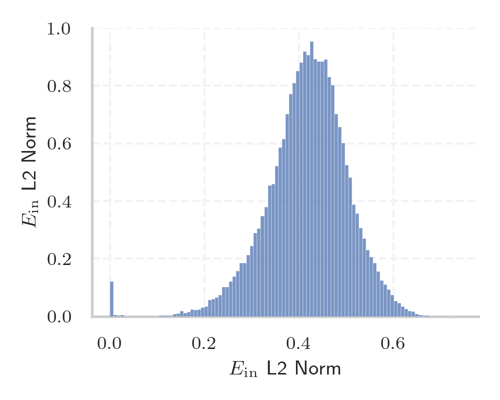
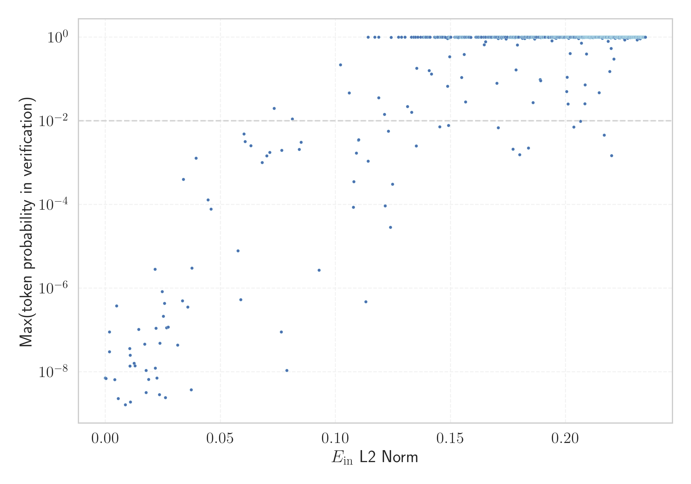

# Report for `allenai/OLMoE-1B-7B-0924`

## Model info

* Model Info: 
  * Tied embeddings: False
  * LM head uses bias: False
  * Embeddings shape: [50304, 2048]
* Tokenizer Info: 
  * Vocab Size: 50280
  * Tokenizer Class: GPTNeoXTokenizer
  * Tokenizer Type: BPE
  * Bytes handling: Byte Input
  * Token for verification prompt building: ArgumentException
  * Token id for verification prompt building: 43411
* Indicator summary: 
  * Indicator for under-trained tokens: E_{in} L2 Norm
  * Overall distribution: 0.418 +/- 0.087
* Detected Token Counts: 
  * Number of tested under-trained tokens: 993, 905 non-special, 79 below p = 0.01 threshold, 64 below soft indicator threshold
  * Number of single byte tokens: 243, of which 1 below indicator threshold
  * Number of special tokens: 221, of which 221 below indicator threshold
  * Number of non-single-byte unreachable tokens: 221, of which 221 below indicator threshold
  * Number of non-single-byte UTF-fragment tokens:  369, of which 0 below soft indicator threshold

## Under-trained token indicators plot


## Verification plot


## Under-trained token verification results
64 entries below threshold of 0.110

|   token_id | token                                 |   indicator | max_prob                                                         | in_other_tokens                                                             |
|------------|---------------------------------------|-------------|------------------------------------------------------------------|-----------------------------------------------------------------------------|
|      50277 | ````` \|\|\|EMAIL_ADDRESS\|\|\| ````` | 3.26556e-12 | <span style='border: 1px solid rgb(169, 68, 66);'>7.1e-09</span> |                                                                             |
|      50278 | ````` \|\|\|PHONE_NUMBER\|\|\| `````  | 3.31081e-12 | <span style='border: 1px solid rgb(169, 68, 66);'>7.1e-09</span> |                                                                             |
|          0 | ````` \|\|\|IP_ADDRESS\|\|\| `````    | 3.32035e-12 | <span style='border: 1px solid rgb(169, 68, 66);'>7.1e-09</span> |                                                                             |
|      43782 | ````` .^\[[@ `````                    | 3.37307e-12 | <span style='border: 1px solid rgb(169, 68, 66);'>7.1e-09</span> |                                                                             |
|      34761 | ````` ▁()](\ `````                    | 6.50407e-07 | <span style='border: 1px solid rgb(169, 68, 66);'>7.1e-09</span> |                                                                             |
|      45382 | ````` ]{}\_ `````                     | 0.000251962 | <span style='border: 1px solid rgb(169, 68, 66);'>6.9e-09</span> |                                                                             |
|      41305 | ````` ]{}\_[ `````                    | 0.00173999  | <span style='border: 1px solid rgb(169, 68, 66);'>3e-08</span>   |                                                                             |
|      44162 | ````` ]{}\^[ `````                    | 0.00177225  | <span style='border: 1px solid rgb(169, 68, 66);'>9e-08</span>   |                                                                             |
|      46468 | ````` \])]{} `````                    | 0.00405953  | <span style='border: 1px solid rgb(169, 68, 66);'>6.5e-09</span> |                                                                             |
|      32214 | ````` ]\]^ `````                      | 0.00488323  | <span style='border: 1px solid rgb(169, 68, 66);'>3.8e-07</span> |                                                                             |
|      42041 | ````` ▁§\[ `````                      | 0.00555188  | <span style='border: 1px solid rgb(169, 68, 66);'>2.3e-09</span> |                                                                             |
|      31096 | ````` ^\[[@ `````                     | 0.00869182  | <span style='border: 1px solid rgb(169, 68, 66);'>1.6e-09</span> | <span style='border: 1px solid rgb(169, 68, 66);'>````` .^\[[@ `````</span> |
|      36487 | ````` .**]{} `````                    | 0.0106      | <span style='border: 1px solid rgb(169, 68, 66);'>3.6e-08</span> |                                                                             |
|      39310 | ````` "}**). `````                    | 0.0106532   | <span style='border: 1px solid rgb(169, 68, 66);'>1.4e-08</span> |                                                                             |
|      48471 | ````` :**]{} `````                    | 0.0108193   | <span style='border: 1px solid rgb(169, 68, 66);'>2.5e-08</span> |                                                                             |
|      47686 | ````` \^[- `````                      | 0.0108545   | <span style='border: 1px solid rgb(169, 68, 66);'>1.9e-09</span> |                                                                             |
|      38475 | ````` "}\]. `````                     | 0.012513    | <span style='border: 1px solid rgb(169, 68, 66);'>1.6e-08</span> |                                                                             |
|      27720 | ````` .*]{}, `````                    | 0.012884    | <span style='border: 1px solid rgb(169, 68, 66);'>1.4e-08</span> |                                                                             |
|      49021 | ````` $.[]{ `````                     | 0.0144505   | <span style='border: 1px solid rgb(169, 68, 66);'>1e-07</span>   |                                                                             |
|      13663 | ````` .*]{} `````                     | 0.017064    | <span style='border: 1px solid rgb(169, 68, 66);'>4.6e-08</span> | <span style='border: 1px solid rgb(169, 68, 66);'>````` .*]{}, `````</span> |
<details><summary>44 additional entries below threshold</summary>

|   token_id | token                                           |   indicator | max_prob                                                         | in_other_tokens                                                                                                                                                                                                                                                                                                                                                                                    |
|------------|-------------------------------------------------|-------------|------------------------------------------------------------------|----------------------------------------------------------------------------------------------------------------------------------------------------------------------------------------------------------------------------------------------------------------------------------------------------------------------------------------------------------------------------------------------------|
|      15775 | ````` .\[[@ `````                               |   0.0176572 | <span style='border: 1px solid rgb(169, 68, 66);'>1.1e-08</span> |                                                                                                                                                                                                                                                                                                                                                                                                    |
|      33805 | ````` ]{}\^ `````                               |   0.0187539 | <span style='border: 1px solid rgb(169, 68, 66);'>6.6e-09</span> | <span style='border: 1px solid rgb(169, 68, 66);'>````` ]{}\^[ `````</span>                                                                                                                                                                                                                                                                                                                        |
|      43134 | ````` ▁()]{} `````                              |   0.0216054 | <span style='border: 1px solid rgb(169, 68, 66);'>2.8e-06</span> |                                                                                                                                                                                                                                                                                                                                                                                                    |
|      28912 | ````` ^−/−^ `````                               |   0.0216632 | <span style='border: 1px solid rgb(169, 68, 66);'>1.2e-08</span> |                                                                                                                                                                                                                                                                                                                                                                                                    |
|      49824 | ````` ▁[(\[ `````                               |   0.0219517 | <span style='border: 1px solid rgb(169, 68, 66);'>1.1e-07</span> |                                                                                                                                                                                                                                                                                                                                                                                                    |
|      34607 | ````` ▁^[@ `````                                |   0.0223939 | <span style='border: 1px solid rgb(169, 68, 66);'>7.1e-09</span> |                                                                                                                                                                                                                                                                                                                                                                                                    |
|      34494 | ````` ]\]). `````                               |   0.0234972 | <span style='border: 1px solid rgb(169, 68, 66);'>2.8e-09</span> |                                                                                                                                                                                                                                                                                                                                                                                                    |
|      42804 | ````` )^[@ `````                                |   0.0237317 | <span style='border: 1px solid rgb(169, 68, 66);'>4.9e-08</span> |                                                                                                                                                                                                                                                                                                                                                                                                    |
|      23734 | ````` ▁[****, `````                             |   0.0247065 | <span style='border: 1px solid rgb(169, 68, 66);'>8.3e-07</span> |                                                                                                                                                                                                                                                                                                                                                                                                    |
|      23286 | ````` ^−/− `````                                |   0.0251578 | <span style='border: 1px solid rgb(169, 68, 66);'>2.1e-07</span> | <span style='border: 1px solid rgb(169, 68, 66);'>````` ^−/−^ `````</span>                                                                                                                                                                                                                                                                                                                         |
|       9899 | ````` ]{}]{} `````                              |   0.0256897 | <span style='border: 1px solid rgb(169, 68, 66);'>4.3e-07</span> |                                                                                                                                                                                                                                                                                                                                                                                                    |
|      26119 | ````` *]{}. `````                               |   0.0260736 | <span style='border: 1px solid rgb(169, 68, 66);'>2.4e-09</span> |                                                                                                                                                                                                                                                                                                                                                                                                    |
|       8088 | ````` \[[@ `````                                |   0.0266252 | <span style='border: 1px solid rgb(169, 68, 66);'>1.1e-07</span> | <span style='border: 1px solid rgb(169, 68, 66);'>````` .\[[@ `````</span>, <span style='border: 1px solid rgb(169, 68, 66);'>````` .^\[[@ `````</span>, <span style='border: 1px solid rgb(169, 68, 66);'>````` ^\[[@ `````</span>                                                                                                                                                                |
|      24994 | ````` ^−^ `````                                 |   0.0272642 | <span style='border: 1px solid rgb(169, 68, 66);'>1.2e-07</span> |                                                                                                                                                                                                                                                                                                                                                                                                    |
|      33653 | ````` ^\*^ `````                                |   0.0313944 | <span style='border: 1px solid rgb(169, 68, 66);'>4.3e-08</span> |                                                                                                                                                                                                                                                                                                                                                                                                    |
|      11661 | ````` *]{}, `````                               |   0.0334585 | <span style='border: 1px solid rgb(169, 68, 66);'>5e-07</span>   | <span style='border: 1px solid rgb(169, 68, 66);'>````` .*]{}, `````</span>                                                                                                                                                                                                                                                                                                                        |
|      39083 | ````` "}](# `````                               |   0.0339465 | <span style='border: 1px solid rgb(169, 68, 66);'>0.0004</span>  |                                                                                                                                                                                                                                                                                                                                                                                                    |
|      29547 | ````` ]\]; `````                                |   0.0358426 | <span style='border: 1px solid rgb(169, 68, 66);'>3.5e-07</span> |                                                                                                                                                                                                                                                                                                                                                                                                    |
|      28696 | ````` FFIRMED `````                             |   0.0373021 | <span style='border: 1px solid rgb(169, 68, 66);'>3.7e-09</span> | ````` AFFIRMED `````, ````` ▁AFFIRMED `````                                                                                                                                                                                                                                                                                                                                                        |
|      29013 | ````` \]]{} `````                               |   0.0375594 | <span style='border: 1px solid rgb(169, 68, 66);'>3e-06</span>   |                                                                                                                                                                                                                                                                                                                                                                                                    |
|       6257 | ````` **]{}, `````                              |   0.0394041 | <span style='border: 1px solid rgb(255, 145, 0);'>0.0013</span>  |                                                                                                                                                                                                                                                                                                                                                                                                    |
|      38710 | ````` ▁\*\** `````                              |   0.0446091 | <span style='border: 1px solid rgb(169, 68, 66);'>0.00013</span> |                                                                                                                                                                                                                                                                                                                                                                                                    |
|      36134 | ````` [\*\* `````                               |   0.0459502 | <span style='border: 1px solid rgb(169, 68, 66);'>7.8e-05</span> |                                                                                                                                                                                                                                                                                                                                                                                                    |
|      16079 | ````` .[]{ `````                                |   0.0576784 | <span style='border: 1px solid rgb(169, 68, 66);'>7.8e-06</span> | <span style='border: 1px solid rgb(169, 68, 66);'>````` $.[]{ `````</span>                                                                                                                                                                                                                                                                                                                         |
|      34833 | ````` ▁xcex `````                               |   0.0588395 | <span style='border: 1px solid rgb(169, 68, 66);'>5.3e-07</span> |                                                                                                                                                                                                                                                                                                                                                                                                    |
|       7444 | ````` **]{} `````                               |   0.0602686 | <span style='border: 1px solid rgb(255, 145, 0);'>0.0048</span>  | <span style='border: 1px solid rgb(169, 68, 66);'>````` :**]{} `````</span>, <span style='border: 1px solid rgb(169, 68, 66);'>````` .**]{} `````</span>                                                                                                                                                                                                                                           |
|       4622 | ````` *]{} `````                                |   0.060784  | <span style='border: 1px solid rgb(255, 145, 0);'>0.0032</span>  | <span style='border: 1px solid rgb(169, 68, 66);'>````` :**]{} `````</span>, <span style='border: 1px solid rgb(169, 68, 66);'>````` .**]{} `````</span>, <span style='border: 1px solid rgb(169, 68, 66);'>````` *]{}. `````</span>, <span style='border: 1px solid rgb(255, 145, 0);'>````` **]{} `````</span>, <span style='border: 1px solid rgb(255, 145, 0);'>````` **]{}, `````</span>, ... |
|      27468 | ````` ▁\_[ `````                                |   0.0632219 | <span style='border: 1px solid rgb(255, 145, 0);'>0.0025</span>  |                                                                                                                                                                                                                                                                                                                                                                                                    |
|      30996 | ````` ,^[@ `````                                |   0.0681098 | <span style='border: 1px solid rgb(255, 145, 0);'>0.001</span>   |                                                                                                                                                                                                                                                                                                                                                                                                    |
|      25416 | ````` [\*](# `````                              |   0.0701186 | <span style='border: 1px solid rgb(255, 145, 0);'>0.0014</span>  |                                                                                                                                                                                                                                                                                                                                                                                                    |
|      24237 | ````` .]{} `````                                |   0.0714346 | <span style='border: 1px solid rgb(255, 145, 0);'>0.0018</span>  |                                                                                                                                                                                                                                                                                                                                                                                                    |
|      42010 | ````` ▁BytePtrFromString `````                  |   0.0733204 | <span style='border: 1px solid rgb(251, 189, 8);'>0.02</span>    |                                                                                                                                                                                                                                                                                                                                                                                                    |
|      33835 | ````` doibase `````                             |   0.0764219 | <span style='border: 1px solid rgb(169, 68, 66);'>9e-08</span>   |                                                                                                                                                                                                                                                                                                                                                                                                    |
|      18022 | ````` \*](# `````                               |   0.0766461 | <span style='border: 1px solid rgb(255, 145, 0);'>0.002</span>   | <span style='border: 1px solid rgb(255, 145, 0);'>````` [\*](# `````</span>                                                                                                                                                                                                                                                                                                                        |
|      37570 | ````` ▁0000000000000000000000000000000000 ````` |   0.0788121 | <span style='border: 1px solid rgb(169, 68, 66);'>1.1e-08</span> |                                                                                                                                                                                                                                                                                                                                                                                                    |
|      27114 | ````` .(\[ `````                                |   0.0812475 | <span style='border: 1px solid rgb(251, 189, 8);'>0.011</span>   |                                                                                                                                                                                                                                                                                                                                                                                                    |
|      45509 | ````` "}^ `````                                 |   0.084292  | <span style='border: 1px solid rgb(255, 145, 0);'>0.0021</span>  |                                                                                                                                                                                                                                                                                                                                                                                                    |
|       5413 | ````` ]\], `````                                |   0.0850352 | <span style='border: 1px solid rgb(255, 145, 0);'>0.0031</span>  |                                                                                                                                                                                                                                                                                                                                                                                                    |
|      37406 | ````` medscimonit `````                         |   0.0928832 | <span style='border: 1px solid rgb(169, 68, 66);'>2.7e-06</span> |                                                                                                                                                                                                                                                                                                                                                                                                    |
|      17278 | ````` ^](# `````                                |   0.102155  | <span style='border: 1px solid rgb(40, 167, 69);'>0.22</span>    |                                                                                                                                                                                                                                                                                                                                                                                                    |
|      22702 | ````` ▁errnoErr `````                           |   0.106006  | <span style='border: 1px solid rgb(251, 189, 8);'>0.046</span>   |                                                                                                                                                                                                                                                                                                                                                                                                    |
|      26868 | ````` ÃÂÃÂÃÂÃÂ `````                            |   0.107773  | <span style='border: 1px solid rgb(169, 68, 66);'>8.6e-05</span> | <span style='border: 1px solid rgb(40, 167, 69);'>````` ÃÂÃÂÃÂÃÂÃÂÃÂÃÂÃÂ `````</span>                                                                                                                                                                                                                                                                                                              |
|      17548 | ````` ]-[@ `````                                |   0.107978  | <span style='border: 1px solid rgb(169, 68, 66);'>0.00035</span> |                                                                                                                                                                                                                                                                                                                                                                                                    |
|      35487 | ````` \]\]. `````                               |   0.109137  | <span style='border: 1px solid rgb(255, 145, 0);'>0.0017</span>  |                                                                                                                                                                                                                                                                                                                                                                                                    |
</details>
<details><summary>841 additional entries above threshold</summary>

|   token_id | token                          |   indicator | max_prob                                                         | in_other_tokens                                                                                                                                                                                                                                                                                                                                                                                                                                |
|------------|--------------------------------|-------------|------------------------------------------------------------------|------------------------------------------------------------------------------------------------------------------------------------------------------------------------------------------------------------------------------------------------------------------------------------------------------------------------------------------------------------------------------------------------------------------------------------------------|
|      20977 | ````` }$]{} `````              |    0.109972 | <span style='border: 1px solid rgb(255, 145, 0);'>0.0034</span>  |                                                                                                                                                                                                                                                                                                                                                                                                                                                |
|       1254 | ````` ▁\[[@ `````              |    0.110098 | <span style='border: 1px solid rgb(255, 145, 0);'>0.0035</span>  |                                                                                                                                                                                                                                                                                                                                                                                                                                                |
|      38913 | ````` \x98¯ `````              |    0.113157 | <span style='border: 1px solid rgb(169, 68, 66);'>4.7e-07</span> |                                                                                                                                                                                                                                                                                                                                                                                                                                                |
|      31743 | ````` ^®^ `````                |    0.114192 | <span style='border: 1px solid rgb(255, 145, 0);'>0.0011</span>  |                                                                                                                                                                                                                                                                                                                                                                                                                                                |
|      35496 | ````` **--** `````             |    0.118832 | <span style='border: 1px solid rgb(251, 189, 8);'>0.035</span>   |                                                                                                                                                                                                                                                                                                                                                                                                                                                |
|      13488 | ````` $]{} `````               |    0.12133  | <span style='border: 1px solid rgb(251, 189, 8);'>0.014</span>   | <span style='border: 1px solid rgb(255, 145, 0);'>````` }$]{} `````</span>, <span style='border: 1px solid rgb(255, 145, 0);'>````` $]{}; `````</span>                                                                                                                                                                                                                                                                                         |
|      39743 | ````` 14514500 `````           |    0.121616 | <span style='border: 1px solid rgb(169, 68, 66);'>9.2e-05</span> | <span style='border: 1px solid rgb(251, 189, 8);'>````` 1451450014514500 `````</span>                                                                                                                                                                                                                                                                                                                                                          |
|       1656 | ````` ]\]. `````               |    0.123053 | <span style='border: 1px solid rgb(255, 145, 0);'>0.0056</span>  | <span style='border: 1px solid rgb(255, 145, 0);'>````` \]\]. `````</span>                                                                                                                                                                                                                                                                                                                                                                     |
|       7254 | ````` ]--[@ `````              |    0.123914 | <span style='border: 1px solid rgb(169, 68, 66);'>2.8e-05</span> |                                                                                                                                                                                                                                                                                                                                                                                                                                                |
|        535 | ````` \n\n `````               |    0.124205 | <span style='border: 1px solid rgb(40, 167, 69);'>0.99</span>    | ````` \n\n\t\t `````, ````` \n\n\n▁▁▁▁▁▁▁ `````, ````` \n\n▁▁▁▁▁▁▁▁▁▁▁▁▁▁▁▁▁▁▁▁▁▁▁▁▁▁▁▁▁▁▁ `````, ````` \n\n▁▁▁▁▁▁▁▁▁▁▁▁▁▁▁▁▁ `````, ````` ▁\n\n `````, ...                                                                                                                                                                                                                                                                                    |
|      35088 | ````` ...\...\ `````           |    0.124821 | <span style='border: 1px solid rgb(169, 68, 66);'>0.0003</span>  |                                                                                                                                                                                                                                                                                                                                                                                                                                                |
|        326 | ````` ▁that `````              |    0.127452 | <span style='border: 1px solid rgb(40, 167, 69);'>1</span>       | ````` ▁thats `````                                                                                                                                                                                                                                                                                                                                                                                                                             |
|        281 | ````` ▁to `````                |    0.130208 | <span style='border: 1px solid rgb(40, 167, 69);'>1</span>       | ````` ▁tox `````, ````` ▁tongue `````, ````` ▁toddler `````, ````` ▁tough `````, ````` ▁totally `````, ...                                                                                                                                                                                                                                                                                                                                     |
|      47389 | ````` ~\] `````                |    0.131303 | <span style='border: 1px solid rgb(251, 189, 8);'>0.022</span>   |                                                                                                                                                                                                                                                                                                                                                                                                                                                |
|      39922 | ````` 1451450014514500 `````   |    0.133147 | <span style='border: 1px solid rgb(251, 189, 8);'>0.016</span>   |                                                                                                                                                                                                                                                                                                                                                                                                                                                |
|        310 | ````` ▁is `````                |    0.134025 | <span style='border: 1px solid rgb(40, 167, 69);'>1</span>       | <span style='border: 1px solid rgb(40, 167, 69);'>````` ▁issue `````</span>, ````` ▁issuing `````, ````` ▁isinstance `````, ````` ▁isso `````, ````` ▁islets `````, ...                                                                                                                                                                                                                                                                        |
|        285 | ````` ▁and `````               |    0.134067 | <span style='border: 1px solid rgb(40, 167, 69);'>1</span>       | ````` ▁android `````, ````` ▁androgen `````, ````` ▁andere `````, ````` ▁andra `````                                                                                                                                                                                                                                                                                                                                                           |
|      50274 | ````` ¿▁▁▁▁? `````             |    0.134795 | <span style='border: 1px solid rgb(40, 167, 69);'>0.99</span>    |                                                                                                                                                                                                                                                                                                                                                                                                                                                |
|      25349 | ````` ))/((- `````             |    0.135173 | <span style='border: 1px solid rgb(255, 145, 0);'>0.0025</span>  |                                                                                                                                                                                                                                                                                                                                                                                                                                                |
|      41606 | ````` ÃÂÃÂÃÂÃÂÃÂÃÂÃÂÃÂ `````   |    0.135314 | <span style='border: 1px solid rgb(40, 167, 69);'>0.18</span>    |                                                                                                                                                                                                                                                                                                                                                                                                                                                |
|        352 | ````` ▁it `````                |    0.135796 | <span style='border: 1px solid rgb(40, 167, 69);'>1</span>       | ````` ▁iterations `````, <span style='border: 1px solid rgb(40, 167, 69);'>````` ▁itself `````</span>, <span style='border: 1px solid rgb(40, 167, 69);'>````` ▁its `````</span>, ````` ▁ital `````, ````` ▁iterate `````, ...                                                                                                                                                                                                                 |
|        273 | ````` ▁of `````                |    0.137064 | <span style='border: 1px solid rgb(40, 167, 69);'>1</span>       | ````` ▁offender `````, ````` ▁offending `````, ````` ▁offices `````, ````` ▁offer `````, ````` ▁offence `````, ...                                                                                                                                                                                                                                                                                                                             |
|        347 | ````` ▁as `````                |    0.13811  | <span style='border: 1px solid rgb(40, 167, 69);'>1</span>       | ````` ▁assumptions `````, ````` ▁assaulted `````, ````` ▁asteroid `````, ````` ▁asynchron `````, ````` ▁async `````, ...                                                                                                                                                                                                                                                                                                                       |
|        369 | ````` ▁was `````               |    0.13878  | <span style='border: 1px solid rgb(40, 167, 69);'>1</span>       | ````` ▁wash `````, ````` ▁waste `````, ````` ▁wastewater `````, ````` ▁wastes `````, ````` ▁wasting `````, ...                                                                                                                                                                                                                                                                                                                                 |
|        368 | ````` ▁you `````               |    0.139022 | <span style='border: 1px solid rgb(40, 167, 69);'>1</span>       | <span style='border: 1px solid rgb(40, 167, 69);'>````` ▁your `````</span>, ````` ▁yours `````, ````` ▁younger `````, <span style='border: 1px solid rgb(40, 167, 69);'>````` ▁yourself `````</span>, ````` ▁youths `````, ...                                                                                                                                                                                                                 |
|        597 | ````` ▁they `````              |    0.139111 | <span style='border: 1px solid rgb(40, 167, 69);'>1</span>       |                                                                                                                                                                                                                                                                                                                                                                                                                                                |
|        342 | ````` ▁with `````              |    0.139341 | <span style='border: 1px solid rgb(40, 167, 69);'>1</span>       | ````` ▁withholding `````, ````` ▁withdraw `````, ````` ▁withdrew `````, ````` ▁withdrawn `````, ````` ▁withheld `````, ...                                                                                                                                                                                                                                                                                                                     |
|        323 | ````` ▁for `````               |    0.139885 | <span style='border: 1px solid rgb(40, 167, 69);'>1</span>       | ````` ▁fort `````, ````` ▁force `````, ````` ▁forums `````, ````` ▁forwarded `````, ````` ▁forest `````, ...                                                                                                                                                                                                                                                                                                                                   |
|        403 | ````` ▁are `````               |    0.140555 | <span style='border: 1px solid rgb(40, 167, 69);'>1</span>       | ````` ▁area `````, ````` ▁arena `````, ````` ▁aren `````, ````` ▁areas `````                                                                                                                                                                                                                                                                                                                                                                   |
|      49411 | ````` *‐ `````                 |    0.140743 | <span style='border: 1px solid rgb(40, 167, 69);'>0.16</span>    |                                                                                                                                                                                                                                                                                                                                                                                                                                                |
|        309 | ````` ▁I `````                 |    0.14112  | <span style='border: 1px solid rgb(40, 167, 69);'>1</span>       | ````` ▁IFN `````, ````` ▁Iron `````, ````` ▁ISP `````, ````` ▁Ia `````, ````` ▁INFO `````, ...                                                                                                                                                                                                                                                                                                                                                 |
|      42274 | ````` ]{}[ `````               |    0.141687 | <span style='border: 1px solid rgb(40, 167, 69);'>0.13</span>    |                                                                                                                                                                                                                                                                                                                                                                                                                                                |
|        344 | ````` ▁he `````                |    0.143013 | <span style='border: 1px solid rgb(40, 167, 69);'>1</span>       | ````` ▁hepat `````, ````` ▁hence `````, ````` ▁hero `````, ````` ▁helical `````, ````` ▁healed `````, ...                                                                                                                                                                                                                                                                                                                                      |
|        533 | ````` ▁but `````               |    0.143294 | <span style='border: 1px solid rgb(40, 167, 69);'>0.98</span>    | ````` ▁buttons `````, ````` ▁butt `````, ````` ▁butcher `````, ````` ▁butterfly `````, ````` ▁button `````, ...                                                                                                                                                                                                                                                                                                                                |
|        481 | ````` ). `````                 |    0.143581 | <span style='border: 1px solid rgb(40, 167, 69);'>0.98</span>    | ````` ▁(). `````, ````` ))). `````, ````` "}). `````, ````` ()). `````, ````` .). `````, ...                                                                                                                                                                                                                                                                                                                                                   |
|        247 | ````` ▁a `````                 |    0.144041 | <span style='border: 1px solid rgb(40, 167, 69);'>1</span>       | ````` ▁ancestry `````, ````` ▁airst `````, ````` ▁appointed `````, ````` ▁advocates `````, ````` ▁armies `````, ...                                                                                                                                                                                                                                                                                                                            |
|        359 | ````` ▁we `````                |    0.144233 | <span style='border: 1px solid rgb(40, 167, 69);'>1</span>       | ````` ▁weak `````, ````` ▁wenn `````, ````` ▁weapon `````, ````` ▁wear `````, ````` ▁weighing `````, ...                                                                                                                                                                                                                                                                                                                                       |
|        432 | ````` ▁from `````              |    0.144466 | <span style='border: 1px solid rgb(40, 167, 69);'>1</span>       |                                                                                                                                                                                                                                                                                                                                                                                                                                                |
|        733 | ````` ▁It `````                |    0.145159 | <span style='border: 1px solid rgb(40, 167, 69);'>1</span>       | ````` ▁Italian `````, ````` ▁Italy `````, ````` ▁Items `````, ````` ▁Iter `````, <span style='border: 1px solid rgb(40, 167, 69);'>````` ▁Its `````</span>, ...                                                                                                                                                                                                                                                                                |
|      46230 | ````` \x88\x91 `````           |    0.14535  | <span style='border: 1px solid rgb(255, 145, 0);'>0.0072</span>  |                                                                                                                                                                                                                                                                                                                                                                                                                                                |
|      50276 | ````` ¿▁▁? `````               |    0.145624 | <span style='border: 1px solid rgb(40, 167, 69);'>1</span>       |                                                                                                                                                                                                                                                                                                                                                                                                                                                |
|        731 | ````` ▁them `````              |    0.14567  | <span style='border: 1px solid rgb(40, 167, 69);'>1</span>       | ````` ▁themes `````, <span style='border: 1px solid rgb(40, 167, 69);'>````` ▁themselves `````</span>, ````` ▁theme `````                                                                                                                                                                                                                                                                                                                      |
|        275 | ````` ▁in `````                |    0.145835 | <span style='border: 1px solid rgb(40, 167, 69);'>1</span>       | ````` ▁insists `````, ````` ▁integr `````, ````` ▁institutions `````, ````` ▁invading `````, ````` ▁inducing `````, ...                                                                                                                                                                                                                                                                                                                        |
|        534 | ````` ▁which `````             |    0.145983 | <span style='border: 1px solid rgb(40, 167, 69);'>1</span>       | ````` ▁whichever `````                                                                                                                                                                                                                                                                                                                                                                                                                         |
|        452 | ````` ▁have `````              |    0.14607  | <span style='border: 1px solid rgb(40, 167, 69);'>1</span>       | ````` ▁haven `````                                                                                                                                                                                                                                                                                                                                                                                                                             |
|       5817 | ````` • `````                  |    0.146574 | <span style='border: 1px solid rgb(40, 167, 69);'>1</span>       | ````` ▁• `````                                                                                                                                                                                                                                                                                                                                                                                                                                 |
|        449 | ````` ." `````                 |    0.146601 | <span style='border: 1px solid rgb(40, 167, 69);'>0.99</span>    | ````` .." `````, ````` ...." `````, ````` ."; `````, ````` .""" `````, ````` .", `````, ...                                                                                                                                                                                                                                                                                                                                                    |
|      21304 | ````` \xa0\n `````             |    0.147352 | <span style='border: 1px solid rgb(40, 167, 69);'>0.99</span>    | <span style='border: 1px solid rgb(40, 167, 69);'>````` \xa0\n▁ `````</span>                                                                                                                                                                                                                                                                                                                                                                   |
|        407 | ````` ▁by `````                |    0.147633 | <span style='border: 1px solid rgb(40, 167, 69);'>0.99</span>    | ````` ▁bytes `````, ````` ▁bypass `````, ````` ▁bye `````, ````` ▁byte `````                                                                                                                                                                                                                                                                                                                                                                   |
|        497 | ````` ▁were `````              |    0.147645 | <span style='border: 1px solid rgb(40, 167, 69);'>1</span>       | ````` ▁weren `````                                                                                                                                                                                                                                                                                                                                                                                                                             |
|        327 | ````` ▁on `````                |    0.147882 | <span style='border: 1px solid rgb(40, 167, 69);'>0.99</span>    | ````` ▁onboard `````, ````` ▁onions `````, ````` ▁onset `````, ````` ▁oneself `````, <span style='border: 1px solid rgb(40, 167, 69);'>````` ▁only `````</span>, ...                                                                                                                                                                                                                                                                           |
|       2756 | ````` \n\n\n `````             |    0.148722 | <span style='border: 1px solid rgb(40, 167, 69);'>0.92</span>    | ````` \n\n\n▁▁▁▁▁▁▁ `````, <span style='border: 1px solid rgb(40, 167, 69);'>````` \n\n\n\n\n\n\n `````</span>, ````` \n\n\n▁▁▁ `````, ````` \n\n\n▁ `````, <span style='border: 1px solid rgb(40, 167, 69);'>````` \n\n\n\n\n `````</span>, ...                                                                                                                                                                                               |
|      22367 | ````` ![** `````               |    0.148796 | <span style='border: 1px solid rgb(251, 189, 8);'>0.067</span>   |                                                                                                                                                                                                                                                                                                                                                                                                                                                |
|        320 | ````` ▁be `````                |    0.149082 | <span style='border: 1px solid rgb(40, 167, 69);'>1</span>       | ````` ▁bee `````, ````` ▁behaviours `````, ````` ▁beautiful `````, <span style='border: 1px solid rgb(40, 167, 69);'>````` ▁behind `````</span>, ````` ▁bench `````, ...                                                                                                                                                                                                                                                                       |
|      31350 | ````` $]{}; `````              |    0.149194 | <span style='border: 1px solid rgb(255, 145, 0);'>0.0078</span>  |                                                                                                                                                                                                                                                                                                                                                                                                                                                |
|        434 | ````` 's `````                 |    0.149305 | <span style='border: 1px solid rgb(40, 167, 69);'>0.95</span>    |                                                                                                                                                                                                                                                                                                                                                                                                                                                |
|        457 | ````` ’ `````                  |    0.149545 | <span style='border: 1px solid rgb(40, 167, 69);'>0.97</span>    | ````` !’ `````, <span style='border: 1px solid rgb(40, 167, 69);'>````` ?’ `````</span>, <span style='border: 1px solid rgb(40, 167, 69);'>````` ’. `````</span>, ````` ▁’ `````, ````` .’” `````, ...                                                                                                                                                                                                                                         |
|        665 | ````` ▁who `````               |    0.149561 | <span style='border: 1px solid rgb(40, 167, 69);'>1</span>       | ````` ▁wholly `````, ````` ▁wholesale `````, ````` ▁whom `````, <span style='border: 1px solid rgb(40, 167, 69);'>````` ▁whose `````</span>, ````` ▁whole `````, ...                                                                                                                                                                                                                                                                           |
|        670 | ````` ▁about `````             |    0.149602 | <span style='border: 1px solid rgb(40, 167, 69);'>1</span>       |                                                                                                                                                                                                                                                                                                                                                                                                                                                |
|      39945 | ````` ~}{~ `````               |    0.14961  | <span style='border: 1px solid rgb(40, 167, 69);'>0.34</span>    |                                                                                                                                                                                                                                                                                                                                                                                                                                                |
|        703 | ````` ▁she `````               |    0.149736 | <span style='border: 1px solid rgb(40, 167, 69);'>1</span>       | ````` ▁shelter `````, ````` ▁sheep `````, ````` ▁shed `````, ````` ▁shell `````, ````` ▁sheath `````, ...                                                                                                                                                                                                                                                                                                                                      |
|        575 | ````` \xa0 `````               |    0.150076 | <span style='border: 1px solid rgb(40, 167, 69);'>1</span>       | ````` \xa0\xa0\xa0\xa0\xa0\xa0\xa0\xa0\xa0\xa0\xa0\xa0\xa0\xa0\xa0\xa0\xa0\xa0\xa0\xa0\xa0\xa0\xa0\xa0\xa0\xa0\xa0\xa0\xa0\xa0\xa0\xa0 `````, ````` \xa0\xa0\xa0\xa0\xa0\xa0\xa0\xa0\xa0\xa0\xa0\xa0\xa0\xa0\xa0\xa0 `````, <span style='border: 1px solid rgb(40, 167, 69);'>````` \xa0\n▁ `````</span>, ````` ▁\xa0\xa0▁\xa0\xa0▁\xa0\xa0▁\xa0\xa0 `````, <span style='border: 1px solid rgb(40, 167, 69);'>````` \xa0\xa0 `````</span>, ... |
|        672 | ````` ▁when `````              |    0.150102 | <span style='border: 1px solid rgb(40, 167, 69);'>1</span>       | ````` ▁whenever `````, ````` ▁whence `````                                                                                                                                                                                                                                                                                                                                                                                                     |
|        428 | ````` ▁- `````                 |    0.151878 | <span style='border: 1px solid rgb(40, 167, 69);'>1</span>       | ````` ▁------------- `````, ````` ▁------------ `````, <span style='border: 1px solid rgb(40, 167, 69);'>````` ▁-- `````</span>, ````` ▁-------------------------------- `````, ````` ▁-*- `````, ...                                                                                                                                                                                                                                          |
|       1425 | ````` .” `````                 |    0.152205 | <span style='border: 1px solid rgb(40, 167, 69);'>0.99</span>    | ````` .”). `````                                                                                                                                                                                                                                                                                                                                                                                                                               |
|        556 | ````` ▁has `````               |    0.152264 | <span style='border: 1px solid rgb(40, 167, 69);'>1</span>       | ````` ▁hass `````, ````` ▁hastily `````, ````` ▁hasht `````, ````` ▁hash `````, ````` ▁hasta `````, ...                                                                                                                                                                                                                                                                                                                                        |
|        582 | ````` ), `````                 |    0.152467 | <span style='border: 1px solid rgb(40, 167, 69);'>0.99</span>    | ````` }), `````, <span style='border: 1px solid rgb(255, 145, 0);'>````` \]), `````</span>, ````` *), `````, ````` ),\ `````, ````` ),$ `````, ...                                                                                                                                                                                                                                                                                             |
|        588 | ````` ▁will `````              |    0.152585 | <span style='border: 1px solid rgb(40, 167, 69);'>1</span>       | ````` ▁willingness `````, ````` ▁willing `````, ````` ▁willingly `````, ````` ▁willful `````                                                                                                                                                                                                                                                                                                                                                   |
|        436 | ````` ▁this `````              |    0.15308  | <span style='border: 1px solid rgb(40, 167, 69);'>1</span>       |                                                                                                                                                                                                                                                                                                                                                                                                                                                |
|        604 | ````` ▁if `````                |    0.153164 | <span style='border: 1px solid rgb(40, 167, 69);'>1</span>       | ````` ▁iff `````                                                                                                                                                                                                                                                                                                                                                                                                                               |
|       2379 | ````` \r\n `````               |    0.153497 | <span style='border: 1px solid rgb(40, 167, 69);'>0.97</span>    | ````` \r\n▁▁▁▁▁▁▁▁▁▁▁▁▁▁▁▁▁▁▁▁▁▁▁ `````, ````` \r\n▁▁▁▁▁▁▁▁▁▁▁▁▁▁▁▁▁▁▁ `````, ````` \r\n▁▁ `````, ````` \r\n▁▁▁ `````, ````` \r\n▁▁▁▁▁▁▁▁▁▁▁▁▁ `````, ...                                                                                                                                                                                                                                                                                      |
|        779 | ````` ▁him `````               |    0.153773 | <span style='border: 1px solid rgb(40, 167, 69);'>1</span>       | <span style='border: 1px solid rgb(40, 167, 69);'>````` ▁himself `````</span>                                                                                                                                                                                                                                                                                                                                                                  |
|        521 | ````` ▁his `````               |    0.15409  | <span style='border: 1px solid rgb(40, 167, 69);'>1</span>       | ````` ▁historic `````, ````` ▁histogram `````, ````` ▁hist `````, ````` ▁historians `````, ````` ▁historically `````, ...                                                                                                                                                                                                                                                                                                                      |
|        840 | ````` ▁then `````              |    0.154417 | <span style='border: 1px solid rgb(40, 167, 69);'>1</span>       |                                                                                                                                                                                                                                                                                                                                                                                                                                                |
|        313 | ````` ▁( `````                 |    0.154563 | <span style='border: 1px solid rgb(40, 167, 69);'>1</span>       | ````` ▁(). `````, ````` ▁(# `````, ````` ▁([ `````, ````` ▁(- `````, ````` ▁(< `````, ...                                                                                                                                                                                                                                                                                                                                                      |
|        476 | ````` ▁can `````               |    0.154651 | <span style='border: 1px solid rgb(40, 167, 69);'>1</span>       | ````` ▁canine `````, ````` ▁candidate `````, ````` ▁candy `````, ````` ▁candidates `````, ````` ▁canceled `````, ...                                                                                                                                                                                                                                                                                                                           |
|        651 | ````` ▁would `````             |    0.154742 | <span style='border: 1px solid rgb(40, 167, 69);'>1</span>       | ````` ▁wouldn `````                                                                                                                                                                                                                                                                                                                                                                                                                            |
|      15707 | ````` ▁]{} `````               |    0.154811 | <span style='border: 1px solid rgb(40, 167, 69);'>0.11</span>    |                                                                                                                                                                                                                                                                                                                                                                                                                                                |
|        668 | ````` ” `````                  |    0.15498  | <span style='border: 1px solid rgb(40, 167, 69);'>0.98</span>    | <span style='border: 1px solid rgb(40, 167, 69);'>````` ▁” `````</span>, <span style='border: 1px solid rgb(40, 167, 69);'>````` ”, `````</span>, ````` ”), `````, <span style='border: 1px solid rgb(40, 167, 69);'>````` ,” `````</span>, ````` .’” `````, ...                                                                                                                                                                               |
|       1628 | ````` “ `````                  |    0.155009 | <span style='border: 1px solid rgb(40, 167, 69);'>1</span>       | ````` “[ `````, ````` ▁“[ `````, ````` ▁(“ `````, ````` .“ `````                                                                                                                                                                                                                                                                                                                                                                               |
|        390 | ````` ▁or `````                |    0.155166 | <span style='border: 1px solid rgb(40, 167, 69);'>1</span>       | ````` ▁ori `````, ````` ▁ordained `````, ````` ▁originated `````, ````` ▁orchestr `````, ````` ▁originate `````, ...                                                                                                                                                                                                                                                                                                                           |
|        617 | ````` ▁her `````               |    0.155392 | <span style='border: 1px solid rgb(40, 167, 69);'>1</span>       | ````` ▁hero `````, ````` ▁heroic `````, <span style='border: 1px solid rgb(40, 167, 69);'>````` ▁herself `````</span>, ````` ▁herein `````, ````` ▁herd `````, ...                                                                                                                                                                                                                                                                             |
|        594 | ````` ▁so `````                |    0.155671 | <span style='border: 1px solid rgb(40, 167, 69);'>1</span>       | ````` ▁solved `````, ````` ▁sock `````, ````` ▁socially `````, ````` ▁sources `````, ````` ▁solidarity `````, ...                                                                                                                                                                                                                                                                                                                              |
|        417 | ````` ▁not `````               |    0.155758 | <span style='border: 1px solid rgb(40, 167, 69);'>1</span>       | ````` ▁notify `````, ````` ▁notorious `````, ````` ▁notion `````, ````` ▁notre `````, ````` ▁notable `````, ...                                                                                                                                                                                                                                                                                                                                |
|        271 | ````` ▁an `````                |    0.155785 | <span style='border: 1px solid rgb(40, 167, 69);'>1</span>       | ````` ▁ancestry `````, ````` ▁anxious `````, ````` ▁ang `````, ````` ▁announcements `````, ````` ▁anticipated `````, ...                                                                                                                                                                                                                                                                                                                       |
|        626 | ````` 't `````                 |    0.155913 | <span style='border: 1px solid rgb(40, 167, 69);'>0.38</span>    |                                                                                                                                                                                                                                                                                                                                                                                                                                                |
|        616 | ````` ▁their `````             |    0.15607  | <span style='border: 1px solid rgb(40, 167, 69);'>1</span>       | ````` ▁theirs `````                                                                                                                                                                                                                                                                                                                                                                                                                            |
|        346 | ````` ▁" `````                 |    0.156079 | <span style='border: 1px solid rgb(40, 167, 69);'>1</span>       | ````` ▁"," `````, ````` ▁"!" `````, ````` ▁", `````, ````` ▁"../ `````, ````` ▁"@ `````, ...                                                                                                                                                                                                                                                                                                                                                   |
|        627 | ````` ▁there `````             |    0.156107 | <span style='border: 1px solid rgb(40, 167, 69);'>1</span>       | ````` ▁thereby `````, ````` ▁thereafter `````, ````` ▁thereof `````, ````` ▁thereon `````, ````` ▁therein `````, ...                                                                                                                                                                                                                                                                                                                           |
|      35869 | ````` ]{}( `````               |    0.156534 | <span style='border: 1px solid rgb(251, 189, 8);'>0.028</span>   |                                                                                                                                                                                                                                                                                                                                                                                                                                                |
|        984 | ````` ▁because `````           |    0.156637 | <span style='border: 1px solid rgb(40, 167, 69);'>1</span>       |                                                                                                                                                                                                                                                                                                                                                                                                                                                |
|        479 | ````` ▁me `````                |    0.156756 | <span style='border: 1px solid rgb(40, 167, 69);'>0.99</span>    | ````` ▁meaningless `````, ````` ▁metabolites `````, ````` ▁mechanics `````, ````` ▁mellitus `````, ````` ▁medals `````, ...                                                                                                                                                                                                                                                                                                                    |
|       1051 | ````` ... `````                |    0.15712  | <span style='border: 1px solid rgb(40, 167, 69);'>1</span>       | ````` ...." `````, ````` ▁.... `````, ````` ,..., `````, <span style='border: 1px solid rgb(40, 167, 69);'>````` .... `````</span>, ````` ...\ `````, ...                                                                                                                                                                                                                                                                                      |
|        272 | ````` ing `````                |    0.157604 | <span style='border: 1px solid rgb(40, 167, 69);'>0.99</span>    | ````` ething `````, ````` ▁clicking `````, ````` ▁waiting `````, ````` ▁clamping `````, ````` ▁meaningless `````, ...                                                                                                                                                                                                                                                                                                                          |
|        685 | ````` ▁than `````              |    0.157691 | <span style='border: 1px solid rgb(40, 167, 69);'>1</span>       | ````` ▁thank `````, ````` ▁thankful `````, ````` ▁thanked `````, ````` ▁thanks `````                                                                                                                                                                                                                                                                                                                                                           |
|        751 | ````` ▁like `````              |    0.157726 | <span style='border: 1px solid rgb(40, 167, 69);'>1</span>       | ````` ▁likewise `````, ````` ▁likes `````, ````` ▁liked `````, ````` ▁likelihood `````, ````` ▁likely `````                                                                                                                                                                                                                                                                                                                                    |
|        835 | ````` ▁where `````             |    0.157952 | <span style='border: 1px solid rgb(40, 167, 69);'>1</span>       | ````` ▁whereas `````, ````` ▁wherever `````, ````` ▁whereabouts `````, ````` ▁whereby `````, ````` ▁wherein `````                                                                                                                                                                                                                                                                                                                              |
|        574 | ````` ▁had `````               |    0.158234 | <span style='border: 1px solid rgb(40, 167, 69);'>1</span>       | ````` ▁hadronic `````, ````` ▁hadn `````, ````` ▁hade `````                                                                                                                                                                                                                                                                                                                                                                                    |
|        387 | ````` ▁at `````                |    0.158795 | <span style='border: 1px solid rgb(40, 167, 69);'>1</span>       | ````` ▁atmosp `````, ````` ▁atmosphere `````, ````` ▁attacking `````, ````` ▁attackers `````, ````` ▁attracts `````, ...                                                                                                                                                                                                                                                                                                                       |
|        634 | ````` ▁your `````              |    0.158874 | <span style='border: 1px solid rgb(40, 167, 69);'>0.99</span>    | ````` ▁yours `````, <span style='border: 1px solid rgb(40, 167, 69);'>````` ▁yourself `````</span>, ````` ▁yourselves `````                                                                                                                                                                                                                                                                                                                    |
|        253 | ````` ▁the `````               |    0.16094  | <span style='border: 1px solid rgb(40, 167, 69);'>1</span>       | ````` ▁themes `````, ````` ▁theolog `````, ````` ▁thereby `````, ````` ▁theory `````, ````` ▁theoretical `````, ...                                                                                                                                                                                                                                                                                                                            |
|        715 | ````` ▁into `````              |    0.16114  | <span style='border: 1px solid rgb(40, 167, 69);'>0.99</span>    | ````` ▁intolerance `````, ````` ▁intoxication `````, ````` ▁intox `````, ````` ▁intoxicated `````, ````` ▁intoler `````                                                                                                                                                                                                                                                                                                                        |
|        937 | ````` ," `````                 |    0.161555 | <span style='border: 1px solid rgb(40, 167, 69);'>1</span>       | ````` ▁"," `````, ````` "," `````, ````` ▁," `````, ````` ."," `````                                                                                                                                                                                                                                                                                                                                                                           |
|        264 | ````` ed `````                 |    0.161568 | <span style='border: 1px solid rgb(40, 167, 69);'>0.99</span>    | ````` contained `````, ````` ▁appointed `````, ````` ▁tied `````, ````` ▁Wed `````, ````` ▁cared `````, ...                                                                                                                                                                                                                                                                                                                                    |
|        619 | ````` ▁my `````                |    0.162015 | <span style='border: 1px solid rgb(40, 167, 69);'>1</span>       | ````` ▁myel `````, ````` ▁mysterious `````, ````` ▁myth `````, ````` ▁mysteries `````, ````` ▁myths `````, ...                                                                                                                                                                                                                                                                                                                                 |
|       1583 | ````` ▁They `````              |    0.162195 | <span style='border: 1px solid rgb(40, 167, 69);'>1</span>       |                                                                                                                                                                                                                                                                                                                                                                                                                                                |
|        773 | ````` ▁“ `````                 |    0.162898 | <span style='border: 1px solid rgb(40, 167, 69);'>1</span>       | ````` ▁“[ `````                                                                                                                                                                                                                                                                                                                                                                                                                                |
|        380 | ````` ▁The `````               |    0.163002 | <span style='border: 1px solid rgb(40, 167, 69);'>1</span>       | ````` ▁Theresa `````, <span style='border: 1px solid rgb(40, 167, 69);'>````` ▁Then `````</span>, ````` ▁Thereafter `````, <span style='border: 1px solid rgb(40, 167, 69);'>````` ▁Their `````</span>, ````` ▁Therapy `````, ...                                                                                                                                                                                                              |
|        812 | ````` ▁could `````             |    0.16311  | <span style='border: 1px solid rgb(40, 167, 69);'>1</span>       | ````` ▁couldn `````                                                                                                                                                                                                                                                                                                                                                                                                                            |
|        562 | ````` ▁out `````               |    0.16333  | <span style='border: 1px solid rgb(40, 167, 69);'>1</span>       | ````` ▁outpatient `````, ````` ▁output `````, ````` ▁outcomes `````, ````` ▁outflow `````, ````` ▁outset `````, ...                                                                                                                                                                                                                                                                                                                            |
|       1707 | ````` ▁There `````             |    0.163423 | <span style='border: 1px solid rgb(40, 167, 69);'>1</span>       | ````` ▁Theresa `````, ````` ▁Thereafter `````, ````` ▁Therefore `````                                                                                                                                                                                                                                                                                                                                                                          |
|        752 | ````` ▁what `````              |    0.163488 | <span style='border: 1px solid rgb(40, 167, 69);'>1</span>       | ````` ▁whats `````, ````` ▁whatsoever `````, ````` ▁whatever `````                                                                                                                                                                                                                                                                                                                                                                             |
|        265 | ````` es `````                 |    0.164437 | <span style='border: 1px solid rgb(40, 167, 69);'>1</span>       | ````` brities `````, ````` ▁ancestry `````, ````` ▁diodes `````, ````` ▁meaningless `````, ````` ▁Palestine `````, ...                                                                                                                                                                                                                                                                                                                         |
|        441 | ````` ▁us `````                |    0.164499 | <span style='border: 1px solid rgb(40, 167, 69);'>0.99</span>    | ````` ▁usefulness `````, ````` ▁usb `````, ````` ▁username `````, ````` ▁usable `````, ````` ▁users `````, ...                                                                                                                                                                                                                                                                                                                                 |
|      17030 | ````` ÃÂÃÂ `````               |    0.164665 | <span style='border: 1px solid rgb(40, 167, 69);'>0.65</span>    | <span style='border: 1px solid rgb(40, 167, 69);'>````` ÃÂÃÂÃÂÃÂÃÂÃÂÃÂÃÂ `````</span>, <span style='border: 1px solid rgb(169, 68, 66);'>````` ÃÂÃÂÃÂÃÂ `````</span>                                                                                                                                                                                                                                                                           |
|       3446 | ````` ". `````                 |    0.165084 | <span style='border: 1px solid rgb(40, 167, 69);'>0.99</span>    | ````` ▁"../ `````, ````` ="../ `````, ````` ="../../../../../ `````, ````` ="../../ `````, ````` ="../../../../ `````, ...                                                                                                                                                                                                                                                                                                                     |
|        598 | ````` ▁up `````                |    0.165293 | <span style='border: 1px solid rgb(40, 167, 69);'>1</span>       | ````` ▁updated `````, ````` ▁upgrad `````, ````` ▁upgrade `````, ````` ▁upd `````, ````` ▁updating `````, ...                                                                                                                                                                                                                                                                                                                                  |
|      46608 | ````` *~( `````                |    0.165303 | <span style='border: 1px solid rgb(40, 167, 69);'>0.77</span>    |                                                                                                                                                                                                                                                                                                                                                                                                                                                |
|        581 | ````` ▁one `````               |    0.166025 | <span style='border: 1px solid rgb(40, 167, 69);'>0.99</span>    | ````` ▁oneself `````, <span style='border: 1px solid rgb(40, 167, 69);'>````` ▁ones `````</span>                                                                                                                                                                                                                                                                                                                                               |
|        513 | ````` ▁do `````                |    0.166378 | <span style='border: 1px solid rgb(40, 167, 69);'>1</span>       | ````` ▁doi `````, ````` ▁dominate `````, <span style='border: 1px solid rgb(40, 167, 69);'>````` ▁done `````</span>, ````` ▁downloading `````, ````` ▁dormant `````, ...                                                                                                                                                                                                                                                                       |
|      50272 | ````` ¿▁▁▁▁▁▁? `````           |    0.16666  | <span style='border: 1px solid rgb(40, 167, 69);'>0.99</span>    |                                                                                                                                                                                                                                                                                                                                                                                                                                                |
|        776 | ````` ▁our `````               |    0.166704 | <span style='border: 1px solid rgb(40, 167, 69);'>1</span>       | ````` ▁ours `````, ````` ▁ourselves `````                                                                                                                                                                                                                                                                                                                                                                                                      |
|        697 | ````` ▁its `````               |    0.167111 | <span style='border: 1px solid rgb(40, 167, 69);'>1</span>       | <span style='border: 1px solid rgb(40, 167, 69);'>````` ▁itself `````</span>                                                                                                                                                                                                                                                                                                                                                                   |
|       2698 | ````` .) `````                 |    0.167372 | <span style='border: 1px solid rgb(40, 167, 69);'>1</span>       | ````` .). `````, ````` ).) `````, ````` ].) `````, ````` ▁...) `````, ````` ...) `````, ...                                                                                                                                                                                                                                                                                                                                                    |
|        995 | ````` ", `````                 |    0.167661 | <span style='border: 1px solid rgb(40, 167, 69);'>0.98</span>    | ````` ▁"," `````, ````` ▁", `````, ````` "," `````, ````` .", `````, ````` ":"", `````, ...                                                                                                                                                                                                                                                                                                                                                    |
|        644 | ````` ▁been `````              |    0.167676 | <span style='border: 1px solid rgb(40, 167, 69);'>0.99</span>    |                                                                                                                                                                                                                                                                                                                                                                                                                                                |
|        849 | ````` ▁how `````               |    0.168407 | <span style='border: 1px solid rgb(40, 167, 69);'>1</span>       | <span style='border: 1px solid rgb(40, 167, 69);'>````` ▁however `````</span>                                                                                                                                                                                                                                                                                                                                                                  |
|        865 | ````` ?" `````                 |    0.168732 | <span style='border: 1px solid rgb(40, 167, 69);'>1</span>       | ````` "?" `````, ````` ▁?" `````, ````` ?", `````, ````` ...?" `````, ````` \'?" `````                                                                                                                                                                                                                                                                                                                                                         |
|       1108 | ````` ▁– `````                 |    0.168907 | <span style='border: 1px solid rgb(40, 167, 69);'>0.99</span>    | ````` ▁–, `````                                                                                                                                                                                                                                                                                                                                                                                                                                |
|       1806 | ````` ,” `````                 |    0.168984 | <span style='border: 1px solid rgb(40, 167, 69);'>1</span>       |                                                                                                                                                                                                                                                                                                                                                                                                                                                |
|        754 | ````` ▁He `````                |    0.169064 | <span style='border: 1px solid rgb(40, 167, 69);'>1</span>       | ````` ▁Helen `````, ````` ▁Hercules `````, ````` ▁Hers `````, ````` ▁Header `````, ````` ▁Hep `````, ...                                                                                                                                                                                                                                                                                                                                       |
|       2866 | ````` … `````                  |    0.169165 | <span style='border: 1px solid rgb(40, 167, 69);'>1</span>       | ````` ….. `````, ````` …… `````, <span style='border: 1px solid rgb(40, 167, 69);'>````` …. `````</span>, ````` ………… `````, <span style='border: 1px solid rgb(40, 167, 69);'>````` ▁… `````</span>, ...                                                                                                                                                                                                                                       |
|      50270 | ````` ¿▁▁▁▁▁▁▁▁? `````         |    0.169271 | <span style='border: 1px solid rgb(40, 167, 69);'>1</span>       |                                                                                                                                                                                                                                                                                                                                                                                                                                                |
|       1128 | ````` — `````                  |    0.169774 | <span style='border: 1px solid rgb(40, 167, 69);'>1</span>       | ````` —. `````, ````` "— `````, ````` —" `````, ````` —' `````, ````` —— `````, ...                                                                                                                                                                                                                                                                                                                                                            |
|      21687 | ````` )]{} `````               |    0.170139 | <span style='border: 1px solid rgb(251, 189, 8);'>0.079</span>   | <span style='border: 1px solid rgb(169, 68, 66);'>````` ▁()]{} `````</span>, <span style='border: 1px solid rgb(169, 68, 66);'>````` \])]{} `````</span>                                                                                                                                                                                                                                                                                       |
|       4725 | ````` ▁/> `````                |    0.170177 | <span style='border: 1px solid rgb(40, 167, 69);'>0.99</span>    | <span style='border: 1px solid rgb(40, 167, 69);'>````` ▁/>< `````</span>, ````` ▁/></ `````                                                                                                                                                                                                                                                                                                                                                   |
|        673 | ````` ▁time `````              |    0.170617 | <span style='border: 1px solid rgb(40, 167, 69);'>1</span>       | ````` ▁timer `````, ````` ▁timescale `````, ````` ▁timeline `````, ````` ▁timeout `````, ````` ▁timestamp `````, ...                                                                                                                                                                                                                                                                                                                           |
|       5429 | ````` \n\n\n\n `````           |    0.170724 | <span style='border: 1px solid rgb(40, 167, 69);'>0.92</span>    | <span style='border: 1px solid rgb(40, 167, 69);'>````` \n\n\n\n\n\n\n `````</span>, <span style='border: 1px solid rgb(40, 167, 69);'>````` \n\n\n\n\n `````</span>, <span style='border: 1px solid rgb(40, 167, 69);'>````` \n\n\n\n\n\n\n\n `````</span>                                                                                                                                                                                    |
|      37087 | ````` medsc `````              |    0.170756 | <span style='border: 1px solid rgb(255, 145, 0);'>0.0068</span>  | <span style='border: 1px solid rgb(169, 68, 66);'>````` medscimonit `````</span>                                                                                                                                                                                                                                                                                                                                                               |
|        841 | ````` ▁these `````             |    0.170927 | <span style='border: 1px solid rgb(40, 167, 69);'>0.98</span>    |                                                                                                                                                                                                                                                                                                                                                                                                                                                |
|        936 | ````` to `````                 |    0.17102  | <span style='border: 1px solid rgb(40, 167, 69);'>1</span>       | ````` ▁Thornton `````, ````` ▁tox `````, ````` descriptor `````, ````` ▁receptor `````, ````` ▁estoppel `````, ...                                                                                                                                                                                                                                                                                                                             |
|        846 | ````` ▁after `````             |    0.171105 | <span style='border: 1px solid rgb(40, 167, 69);'>0.99</span>    | ````` ▁aftermath `````, ````` ▁afterward `````, ````` ▁afterwards `````, ````` ▁afternoon `````                                                                                                                                                                                                                                                                                                                                                |
|        254 | ````` er `````                 |    0.171154 | <span style='border: 1px solid rgb(40, 167, 69);'>1</span>       | ````` Americans `````, ````` ▁characterization `````, ````` ▁terrorists `````, ````` ▁cover `````, ````` ▁primers `````, ...                                                                                                                                                                                                                                                                                                                   |
|       3529 | ````` that `````               |    0.171669 | <span style='border: 1px solid rgb(40, 167, 69);'>1</span>       | ````` ▁thats `````                                                                                                                                                                                                                                                                                                                                                                                                                             |
|        964 | ````` ▁. `````                 |    0.171852 | <span style='border: 1px solid rgb(40, 167, 69);'>1</span>       | ````` ▁.... `````, ````` ▁../../ `````, <span style='border: 1px solid rgb(40, 167, 69);'>````` ▁... `````</span>, ````` ▁./ `````, ````` ▁.\ `````, ...                                                                                                                                                                                                                                                                                       |
|       1422 | ````` ▁You `````               |    0.171976 | <span style='border: 1px solid rgb(40, 167, 69);'>1</span>       | <span style='border: 1px solid rgb(40, 167, 69);'>````` ▁Your `````</span>, ````` ▁YouTube `````, ````` ▁Youth `````, ````` ▁Youtube `````, ````` ▁Young `````                                                                                                                                                                                                                                                                                 |
|       1078 | ````` ▁before `````            |    0.172021 | <span style='border: 1px solid rgb(40, 167, 69);'>0.98</span>    | ````` ▁beforehand `````                                                                                                                                                                                                                                                                                                                                                                                                                        |
|       1570 | ````` ]. `````                 |    0.172159 | <span style='border: 1px solid rgb(40, 167, 69);'>0.94</span>    | <span style='border: 1px solid rgb(255, 145, 0);'>````` \]\]. `````</span>, ````` "]. `````, <span style='border: 1px solid rgb(169, 68, 66);'>````` "}\]. `````</span>, <span style='border: 1px solid rgb(251, 189, 8);'>````` )\]. `````</span>, ````` ']. `````, ...                                                                                                                                                                       |
|        512 | ````` ▁all `````               |    0.172214 | <span style='border: 1px solid rgb(40, 167, 69);'>1</span>       | ````` ▁allegations `````, ````` ▁alle `````, ````` ▁allows `````, ````` ▁allegiance `````, ````` ▁alloc `````, ...                                                                                                                                                                                                                                                                                                                             |
|       1057 | ````` ▁does `````              |    0.172766 | <span style='border: 1px solid rgb(40, 167, 69);'>1</span>       | ````` ▁doesn `````, ````` ▁doesnt `````                                                                                                                                                                                                                                                                                                                                                                                                        |
|        426 | ````` ▁= `````                 |    0.172915 | <span style='border: 1px solid rgb(40, 167, 69);'>1</span>       | ````` ▁================================================================ `````, ````` ▁=& `````, ````` ▁=> `````, ````` ▁=== `````, ````` ▁== `````, ...                                                                                                                                                                                                                                                                                        |
|       2262 | ````` ): `````                 |    0.172932 | <span style='border: 1px solid rgb(40, 167, 69);'>0.99</span>    | ````` ]): `````, ````` )): `````, ````` ):=\ `````, ````` (): `````, ````` ):= `````, ...                                                                                                                                                                                                                                                                                                                                                      |
|        943 | ````` ▁should `````            |    0.173103 | <span style='border: 1px solid rgb(40, 167, 69);'>1</span>       | ````` ▁shoulders `````, ````` ▁shoulder `````, ````` ▁shouldn `````                                                                                                                                                                                                                                                                                                                                                                            |
|       1223 | ````` ▁while `````             |    0.17346  | <span style='border: 1px solid rgb(40, 167, 69);'>1</span>       |                                                                                                                                                                                                                                                                                                                                                                                                                                                |
|        858 | ````` ▁did `````               |    0.173538 | <span style='border: 1px solid rgb(40, 167, 69);'>0.99</span>    | ````` ▁didnt `````, ````` ▁didn `````                                                                                                                                                                                                                                                                                                                                                                                                          |
|       1969 | ````` ▁-- `````                |    0.173795 | <span style='border: 1px solid rgb(40, 167, 69);'>0.99</span>    | ````` ▁------------- `````, ````` ▁------------ `````, ````` ▁-------------------------------- `````, ````` ▁--------------- `````, ````` ▁---------------- `````, ...                                                                                                                                                                                                                                                                         |
|        783 | ````` the `````                |    0.173876 | <span style='border: 1px solid rgb(40, 167, 69);'>1</span>       | ````` othermal `````, ````` ▁Nevertheless `````, ````` othetical `````, ````` ▁gather `````, ````` ▁feather `````, ...                                                                                                                                                                                                                                                                                                                         |
|       6598 | ````` ”. `````                 |    0.174151 | <span style='border: 1px solid rgb(40, 167, 69);'>0.9</span>     |                                                                                                                                                                                                                                                                                                                                                                                                                                                |
|        249 | ````` in `````                 |    0.174651 | <span style='border: 1px solid rgb(40, 167, 69);'>1</span>       | ````` contained `````, ````` ▁Clint `````, ````` ething `````, ````` ▁vind `````, ````` ▁clicking `````, ...                                                                                                                                                                                                                                                                                                                                   |
|        904 | ````` ., `````                 |    0.174672 | <span style='border: 1px solid rgb(40, 167, 69);'>0.99</span>    | ````` ,..., `````, ````` *., `````, ````` ▁..., `````, ````` ..., `````                                                                                                                                                                                                                                                                                                                                                                        |
|        398 | ````` ers `````                |    0.174709 | <span style='border: 1px solid rgb(40, 167, 69);'>1</span>       | ````` ▁primers `````, ````` ▁subscribers `````, ````` omers `````, ````` holders `````, ````` ▁immers `````, ...                                                                                                                                                                                                                                                                                                                               |
|        283 | ````` -- `````                 |    0.175635 | <span style='border: 1px solid rgb(40, 167, 69);'>0.99</span>    | ````` ▁------------- `````, ````` ▁------------ `````, ````` ---------------------- `````, ````` ----------------------------------------- `````, <span style='border: 1px solid rgb(40, 167, 69);'>````` ▁-- `````</span>, ...                                                                                                                                                                                                                |
|        643 | ````` ▁other `````             |    0.175815 | <span style='border: 1px solid rgb(40, 167, 69);'>0.99</span>    | <span style='border: 1px solid rgb(40, 167, 69);'>````` ▁others `````</span>, ````` ▁otherwise `````                                                                                                                                                                                                                                                                                                                                           |
|        251 | ````` on `````                 |    0.175856 | <span style='border: 1px solid rgb(40, 167, 69);'>1</span>       | ````` contained `````, ````` ▁colonel `````, ````` ▁concord `````, ````` anson `````, ````` ▁Chronic `````, ...                                                                                                                                                                                                                                                                                                                                |
|       1110 | ````` ▁those `````             |    0.176039 | <span style='border: 1px solid rgb(40, 167, 69);'>0.99</span>    |                                                                                                                                                                                                                                                                                                                                                                                                                                                |
|        689 | ````` ▁over `````              |    0.176201 | <span style='border: 1px solid rgb(40, 167, 69);'>0.99</span>    | ````` ▁overload `````, ````` ▁overwrite `````, ````` ▁overtime `````, ````` ▁oversight `````, ````` ▁overweight `````, ...                                                                                                                                                                                                                                                                                                                     |
|        844 | ````` ▁We `````                |    0.176216 | <span style='border: 1px solid rgb(40, 167, 69);'>1</span>       | ````` ▁Wed `````, ````` ▁Welcome `````, ````` ▁Week `````, ````` ▁Wet `````, ````` ▁Weather `````, ...                                                                                                                                                                                                                                                                                                                                         |
|       1024 | ````` ▁now `````               |    0.176251 | <span style='border: 1px solid rgb(40, 167, 69);'>0.99</span>    | ````` ▁nowadays `````, ````` ▁nowhere `````                                                                                                                                                                                                                                                                                                                                                                                                    |
|       1292 | ````` ▁But `````               |    0.176668 | <span style='border: 1px solid rgb(40, 167, 69);'>0.99</span>    | ````` ▁Butter `````, ````` ▁Butler `````, ````` ▁Button `````                                                                                                                                                                                                                                                                                                                                                                                  |
|        625 | ````` ▁more `````              |    0.176684 | <span style='border: 1px solid rgb(40, 167, 69);'>0.99</span>    | ````` ▁moreover `````                                                                                                                                                                                                                                                                                                                                                                                                                          |
|       5983 | ````` '. `````                 |    0.176687 | <span style='border: 1px solid rgb(40, 167, 69);'>0.99</span>    | ````` ('./ `````, ````` ▁'. `````, ````` ▁'../ `````, ````` \'." `````, ````` ▁$('. `````, ...                                                                                                                                                                                                                                                                                                                                                 |
|       7721 | ````` ?” `````                 |    0.176812 | <span style='border: 1px solid rgb(40, 167, 69);'>0.99</span>    |                                                                                                                                                                                                                                                                                                                                                                                                                                                |
|        923 | ````` ▁see `````               |    0.176929 | <span style='border: 1px solid rgb(40, 167, 69);'>1</span>       | ````` ▁seeds `````, ````` ▁seeded `````, ````` ▁seemed `````, ````` ▁seemingly `````, ````` ▁seed `````, ...                                                                                                                                                                                                                                                                                                                                   |
|        510 | ````` The `````                |    0.177055 | <span style='border: 1px solid rgb(40, 167, 69);'>1</span>       | <span style='border: 1px solid rgb(40, 167, 69);'>````` They `````</span>, ````` ▁Theresa `````, <span style='border: 1px solid rgb(40, 167, 69);'>````` There `````</span>, <span style='border: 1px solid rgb(40, 167, 69);'>````` Then `````</span>, ````` Thermo `````, ...                                                                                                                                                                |
|      19181 | ````` ]{}. `````               |    0.177209 | <span style='border: 1px solid rgb(255, 145, 0);'>0.0021</span>  | <span style='border: 1px solid rgb(169, 68, 66);'>````` *]{}. `````</span>                                                                                                                                                                                                                                                                                                                                                                     |
|        395 | ````` and `````                |    0.17736  | <span style='border: 1px solid rgb(40, 167, 69);'>1</span>       | ````` ▁lands `````, ````` ▁Thailand `````, ````` ▁thousands `````, ````` ▁Queensland `````, ````` ▁handed `````, ...                                                                                                                                                                                                                                                                                                                           |
|        690 | ````` ▁some `````              |    0.177378 | <span style='border: 1px solid rgb(40, 167, 69);'>0.98</span>    | ````` ▁sometimes `````, ````` ▁somewhere `````, ````` ▁sometime `````, ````` ▁somehow `````, <span style='border: 1px solid rgb(40, 167, 69);'>````` ▁someone `````</span>, ...                                                                                                                                                                                                                                                                |
|       1146 | ````` ▁being `````             |    0.17743  | <span style='border: 1px solid rgb(40, 167, 69);'>0.99</span>    | ````` ▁beings `````                                                                                                                                                                                                                                                                                                                                                                                                                            |
|       1147 | ````` It `````                 |    0.177568 | <span style='border: 1px solid rgb(40, 167, 69);'>1</span>       | ````` MenuItem `````, ````` Item `````, ````` ▁Italian `````, ````` Items `````, ````` ▁Italy `````, ...                                                                                                                                                                                                                                                                                                                                       |
|        314 | ````` ly `````                 |    0.177962 | <span style='border: 1px solid rgb(40, 167, 69);'>0.99</span>    | ````` bly `````, ````` ▁polymorphisms `````, ````` ▁glycogen `````, ````` ▁supposedly `````, ````` lessly `````, ...                                                                                                                                                                                                                                                                                                                           |
|       1383 | ````` ', `````                 |    0.178124 | <span style='border: 1px solid rgb(40, 167, 69);'>0.98</span>    | ````` ',' `````, ````` )', `````, ````` ▁'', `````, ````` ▁', `````, ````` ',\ `````, ...                                                                                                                                                                                                                                                                                                                                                      |
|       1476 | ````` !" `````                 |    0.178156 | <span style='border: 1px solid rgb(40, 167, 69);'>1</span>       | ````` ▁"!" `````, ````` ▁!" `````, ````` !"); `````                                                                                                                                                                                                                                                                                                                                                                                            |
|       1580 | ````` ▁since `````             |    0.178197 | <span style='border: 1px solid rgb(40, 167, 69);'>1</span>       | ````` ▁sincere `````, ````` ▁sincerely `````                                                                                                                                                                                                                                                                                                                                                                                                   |
|       1157 | ````` ▁, `````                 |    0.178293 | <span style='border: 1px solid rgb(40, 167, 69);'>1</span>       | ````` ▁," `````, ````` ▁,$$ `````, ````` ▁,\ `````                                                                                                                                                                                                                                                                                                                                                                                             |
|        671 | ````` ▁also `````              |    0.178397 | <span style='border: 1px solid rgb(40, 167, 69);'>0.99</span>    |                                                                                                                                                                                                                                                                                                                                                                                                                                                |
|      41284 | ````` /((- `````               |    0.178508 | <span style='border: 1px solid rgb(40, 167, 69);'>0.16</span>    |                                                                                                                                                                                                                                                                                                                                                                                                                                                |
|       1039 | ````` ▁way `````               |    0.178918 | <span style='border: 1px solid rgb(40, 167, 69);'>1</span>       | <span style='border: 1px solid rgb(40, 167, 69);'>````` ▁ways `````</span>                                                                                                                                                                                                                                                                                                                                                                     |
|        778 | ````` ▁may `````               |    0.178922 | <span style='border: 1px solid rgb(40, 167, 69);'>1</span>       | ````` ▁mayor `````, ````` ▁maybe `````                                                                                                                                                                                                                                                                                                                                                                                                         |
|      26362 | ````` ▁{¶ `````                |    0.179039 | <span style='border: 1px solid rgb(40, 167, 69);'>0.65</span>    |                                                                                                                                                                                                                                                                                                                                                                                                                                                |
|       2490 | ````` ▁\n `````                |    0.17918  | <span style='border: 1px solid rgb(40, 167, 69);'>0.99</span>    | ````` ▁▁▁▁▁▁▁\n▁ `````, ````` ▁\n▁▁▁▁▁▁▁▁▁▁▁ `````, ````` ▁\n▁▁▁▁▁▁▁▁ `````, ````` ▁\n\n `````, ````` \n▁▁▁▁▁▁▁▁\n▁▁▁▁▁▁▁ `````, ...                                                                                                                                                                                                                                                                                                           |
|       1333 | ````` ▁say `````               |    0.179241 | <span style='border: 1px solid rgb(40, 167, 69);'>1</span>       | <span style='border: 1px solid rgb(40, 167, 69);'>````` ▁saying `````</span>, <span style='border: 1px solid rgb(40, 167, 69);'>````` ▁says `````</span>                                                                                                                                                                                                                                                                                       |
|        284 | ````` as `````                 |    0.179399 | <span style='border: 1px solid rgb(40, 167, 69);'>1</span>       | ````` ▁Newcastle `````, ````` canvas `````, ````` ▁class `````, ````` ▁basketball `````, ````` atase `````, ...                                                                                                                                                                                                                                                                                                                                |
|        831 | ````` ▁This `````              |    0.179673 | <span style='border: 1px solid rgb(40, 167, 69);'>1</span>       |                                                                                                                                                                                                                                                                                                                                                                                                                                                |
|        891 | ````` ▁i `````                 |    0.179686 | <span style='border: 1px solid rgb(40, 167, 69);'>1</span>       | ````` ▁impact `````, ````` ▁insists `````, ````` ▁integr `````, ````` ▁institutions `````, ````` ▁invading `````, ...                                                                                                                                                                                                                                                                                                                          |
|      10148 | ````` "}]( `````               |    0.180092 | <span style='border: 1px solid rgb(255, 145, 0);'>0.0015</span>  | <span style='border: 1px solid rgb(169, 68, 66);'>````` "}](# `````</span>                                                                                                                                                                                                                                                                                                                                                                     |
|       1060 | ````` ▁here `````              |    0.180681 | <span style='border: 1px solid rgb(40, 167, 69);'>1</span>       | ````` ▁herein `````, ````` ▁hereto `````, ````` ▁heretofore `````, ````` ▁hereditary `````, ````` ▁hereafter `````, ...                                                                                                                                                                                                                                                                                                                        |
|        745 | ````` ▁off `````               |    0.180818 | <span style='border: 1px solid rgb(40, 167, 69);'>1</span>       | ````` ▁offender `````, ````` ▁offending `````, ````` ▁offices `````, ````` ▁offer `````, ````` ▁offence `````, ...                                                                                                                                                                                                                                                                                                                             |
|        686 | ````` ▁' `````                 |    0.18101  | <span style='border: 1px solid rgb(40, 167, 69);'>1</span>       | ````` ▁'' `````, ````` ▁'[ `````, ````` ▁''; `````, ````` ▁'# `````, ````` ▁'. `````, ...                                                                                                                                                                                                                                                                                                                                                      |
|        558 | ````` ); `````                 |    0.181287 | <span style='border: 1px solid rgb(40, 167, 69);'>1</span>       | ````` )); `````, <span style='border: 1px solid rgb(40, 167, 69);'>````` (); `````</span>, ````` '); `````, ````` >(); `````, ````` ']); `````, ...                                                                                                                                                                                                                                                                                            |
|      26997 | ````` \^[ `````                |    0.181291 | <span style='border: 1px solid rgb(40, 167, 69);'>0.94</span>    | <span style='border: 1px solid rgb(169, 68, 66);'>````` ]{}\^[ `````</span>, <span style='border: 1px solid rgb(169, 68, 66);'>````` \^[- `````</span>                                                                                                                                                                                                                                                                                         |
|        871 | ````` ▁know `````              |    0.181487 | <span style='border: 1px solid rgb(40, 167, 69);'>0.99</span>    | ````` ▁knowledgeable `````, ````` ▁knowing `````, ````` ▁knowingly `````, ````` ▁knowledge `````, ````` ▁known `````, ...                                                                                                                                                                                                                                                                                                                      |
|       2167 | ````` ▁though `````            |    0.18178  | <span style='border: 1px solid rgb(40, 167, 69);'>1</span>       | ````` ▁thoughtful `````, ````` ▁thoughts `````                                                                                                                                                                                                                                                                                                                                                                                                 |
|       1244 | ````` ▁And `````               |    0.182029 | <span style='border: 1px solid rgb(40, 167, 69);'>1</span>       | ````` ▁Andrea `````, ````` ▁André `````, ````` ▁Anderson `````, ````` ▁Andreas `````, ````` ▁Andrew `````, ...                                                                                                                                                                                                                                                                                                                                 |
|        667 | ````` ▁any `````               |    0.182092 | <span style='border: 1px solid rgb(40, 167, 69);'>0.99</span>    | <span style='border: 1px solid rgb(40, 167, 69);'>````` ▁anything `````</span>, ````` ▁anyway `````, ````` ▁anybody `````, ````` ▁anytime `````, ````` ▁anymore `````, ...                                                                                                                                                                                                                                                                     |
|       7521 | ````` ”, `````                 |    0.182263 | <span style='border: 1px solid rgb(40, 167, 69);'>0.93</span>    |                                                                                                                                                                                                                                                                                                                                                                                                                                                |
|       1500 | ````` ▁She `````               |    0.182316 | <span style='border: 1px solid rgb(40, 167, 69);'>1</span>       | ````` ▁Shen `````, ````` ▁Sheriff `````, ````` ▁Shepherd `````, ````` ▁Sher `````, ````` ▁Sheets `````, ...                                                                                                                                                                                                                                                                                                                                    |
|       1066 | ````` ▁down `````              |    0.182374 | <span style='border: 1px solid rgb(40, 167, 69);'>0.99</span>    | ````` ▁downloading `````, ````` ▁downloaded `````, ````` ▁downloads `````, ````` ▁downtown `````, ````` ▁download `````, ...                                                                                                                                                                                                                                                                                                                   |
|        875 | ````` ▁between `````           |    0.182819 | <span style='border: 1px solid rgb(40, 167, 69);'>0.99</span>    |                                                                                                                                                                                                                                                                                                                                                                                                                                                |
|        266 | ````` an `````                 |    0.182875 | <span style='border: 1px solid rgb(40, 167, 69);'>1</span>       | ````` ▁ancestry `````, ````` anson `````, ````` ▁lands `````, ````` Americans `````, ````` ▁manual `````, ...                                                                                                                                                                                                                                                                                                                                  |
|       1905 | ````` ▁— `````                 |    0.182944 | <span style='border: 1px solid rgb(40, 167, 69);'>1</span>       |                                                                                                                                                                                                                                                                                                                                                                                                                                                |
|       1142 | ````` ▁many `````              |    0.183304 | <span style='border: 1px solid rgb(40, 167, 69);'>1</span>       |                                                                                                                                                                                                                                                                                                                                                                                                                                                |
|       2464 | ````` .' `````                 |    0.183537 | <span style='border: 1px solid rgb(40, 167, 69);'>0.99</span>    | ````` .'' `````, ````` .\'" `````, ````` ...' `````, ````` .', `````                                                                                                                                                                                                                                                                                                                                                                           |
|        263 | ````` or `````                 |    0.183555 | <span style='border: 1px solid rgb(40, 167, 69);'>1</span>       | ````` ▁concord `````, ````` ▁terrorists `````, ````` ▁Thornton `````, ````` ▁deform `````, ````` ▁minors `````, ...                                                                                                                                                                                                                                                                                                                            |
|      45472 | ````` ]{}) `````               |    0.183891 | <span style='border: 1px solid rgb(255, 145, 0);'>0.0022</span>  |                                                                                                                                                                                                                                                                                                                                                                                                                                                |
|        261 | ````` is `````                 |    0.184059 | <span style='border: 1px solid rgb(40, 167, 69);'>1</span>       | ````` ▁terrorists `````, ````` ▁insists `````, ````` Christ `````, ````` ▁Disk `````, ````` ▁specialists `````, ...                                                                                                                                                                                                                                                                                                                            |
|        537 | ````` .. `````                 |    0.184242 | <span style='border: 1px solid rgb(40, 167, 69);'>0.97</span>    | ````` .." `````, ````` ...." `````, ````` ▁.... `````, ````` ▁../../ `````, ````` ▁"../ `````, ...                                                                                                                                                                                                                                                                                                                                             |
|        753 | ````` ▁said `````              |    0.18437  | <span style='border: 1px solid rgb(40, 167, 69);'>1</span>       |                                                                                                                                                                                                                                                                                                                                                                                                                                                |
|        366 | ````` ate `````                |    0.184573 | <span style='border: 1px solid rgb(40, 167, 69);'>1</span>       | ````` ▁collaborate `````, ````` ▁advocates `````, ````` ▁navigate `````, ````` ▁certificate `````, ````` ▁pirates `````, ...                                                                                                                                                                                                                                                                                                                   |
|        949 | ````` ▁through `````           |    0.18479  | <span style='border: 1px solid rgb(40, 167, 69);'>0.99</span>    | ````` ▁throughout `````, ````` ▁throughput `````                                                                                                                                                                                                                                                                                                                                                                                               |
|        571 | ````` ia `````                 |    0.184828 | <span style='border: 1px solid rgb(40, 167, 69);'>1</span>       | ````` ▁diagram `````, ````` ▁specialists `````, ````` iative `````, ````` ▁parliamentary `````, ````` ▁appreciate `````, ...                                                                                                                                                                                                                                                                                                                   |
|        257 | ````` en `````                 |    0.1852   | <span style='border: 1px solid rgb(40, 167, 69);'>1</span>       | ````` ▁tremend `````, ````` fen `````, ````` ▁violent `````, ````` ▁Helen `````, ````` ▁client `````, ...                                                                                                                                                                                                                                                                                                                                      |
|        447 | ````` ies `````                |    0.185213 | <span style='border: 1px solid rgb(40, 167, 69);'>0.99</span>    | ````` brities `````, ````` ▁armies `````, ````` abilities `````, ````` ▁families `````, ````` ▁qualities `````, ...                                                                                                                                                                                                                                                                                                                            |
|       2139 | ````` ▁why `````               |    0.185237 | <span style='border: 1px solid rgb(40, 167, 69);'>1</span>       |                                                                                                                                                                                                                                                                                                                                                                                                                                                |
|       1171 | ````` of `````                 |    0.185468 | <span style='border: 1px solid rgb(40, 167, 69);'>1</span>       | ````` Prof `````, ````` ▁offender `````, ````` Microsoft `````, ````` ▁nonprofit `````, ````` ▁Professional `````, ...                                                                                                                                                                                                                                                                                                                         |
|        329 | ````` ▁A `````                 |    0.185619 | <span style='border: 1px solid rgb(40, 167, 69);'>1</span>       | ````` ▁AFM `````, ````` ▁Am `````, ````` ▁Adventures `````, ````` ▁ASSERT `````, ````` ▁AF `````, ...                                                                                                                                                                                                                                                                                                                                          |
|      50275 | ````` ¿▁▁▁? `````              |    0.185769 | <span style='border: 1px solid rgb(40, 167, 69);'>0.99</span>    |                                                                                                                                                                                                                                                                                                                                                                                                                                                |
|       1537 | ````` ▁might `````             |    0.185789 | <span style='border: 1px solid rgb(40, 167, 69);'>1</span>       | ````` ▁mighty `````                                                                                                                                                                                                                                                                                                                                                                                                                            |
|      10174 | ````` .^[@ `````               |    0.185876 | <span style='border: 1px solid rgb(251, 189, 8);'>0.027</span>   |                                                                                                                                                                                                                                                                                                                                                                                                                                                |
|       2064 | ````` ▁That `````              |    0.185922 | <span style='border: 1px solid rgb(40, 167, 69);'>1</span>       |                                                                                                                                                                                                                                                                                                                                                                                                                                                |
|        494 | ````` able `````               |    0.185988 | <span style='border: 1px solid rgb(40, 167, 69);'>1</span>       | ````` ▁remarkable `````, ````` readable `````, ````` ordable `````, ````` stable `````, ````` ▁tables `````, ...                                                                                                                                                                                                                                                                                                                               |
|       1092 | ````` ], `````                 |    0.186061 | <span style='border: 1px solid rgb(40, 167, 69);'>0.98</span>    | ````` ▁], `````, ````` ],\ `````, ````` ]], `````, ````` ],[@ `````, ````` )], `````, ...                                                                                                                                                                                                                                                                                                                                                      |
|       1472 | ````` 're `````                |    0.18627  | <span style='border: 1px solid rgb(40, 167, 69);'>0.97</span>    |                                                                                                                                                                                                                                                                                                                                                                                                                                                |
|        760 | ````` ▁only `````              |    0.186395 | <span style='border: 1px solid rgb(40, 167, 69);'>0.99</span>    |                                                                                                                                                                                                                                                                                                                                                                                                                                                |
|      15385 | ````` ’. `````                 |    0.186626 | <span style='border: 1px solid rgb(40, 167, 69);'>0.91</span>    |                                                                                                                                                                                                                                                                                                                                                                                                                                                |
|        316 | ````` us `````                 |    0.186641 | <span style='border: 1px solid rgb(40, 167, 69);'>1</span>       | ````` ▁suspicious `````, ````` ▁minus `````, ````` ▁anxious `````, ````` ▁thousands `````, ````` ▁vous `````, ...                                                                                                                                                                                                                                                                                                                              |
|        996 | ````` \n\t `````               |    0.186768 | <span style='border: 1px solid rgb(40, 167, 69);'>0.98</span>    | ````` \n\n\t\t `````, ````` \n\t\t\t\t\t\t\t\t `````, ````` \r\n\t\t\t `````, ````` \n\t\t\t\t\t\t\t `````, ````` \r\n\t `````, ...                                                                                                                                                                                                                                                                                                            |
|        642 | ````` ▁no `````                |    0.186878 | <span style='border: 1px solid rgb(40, 167, 69);'>0.99</span>    | ````` ▁nombre `````, ````` ▁nonnegative `````, ````` ▁notify `````, ````` ▁notorious `````, ````` ▁nonprofit `````, ...                                                                                                                                                                                                                                                                                                                        |
|       1542 | ````` for `````                |    0.186903 | <span style='border: 1px solid rgb(40, 167, 69);'>1</span>       | ````` ▁deform `````, ````` ▁transformed `````, ````` oxford `````, ````` format `````, ````` ▁fort `````, ...                                                                                                                                                                                                                                                                                                                                  |
|        267 | ````` al `````                 |    0.186916 | <span style='border: 1px solid rgb(40, 167, 69);'>1</span>       | ````` ▁manual `````, ````` ▁Palestine `````, ````` ▁retal `````, ````` alsa `````, ````` othermal `````, ...                                                                                                                                                                                                                                                                                                                                   |
|        755 | ````` ▁get `````               |    0.187232 | <span style='border: 1px solid rgb(40, 167, 69);'>0.99</span>    | <span style='border: 1px solid rgb(40, 167, 69);'>````` ▁gets `````</span>, <span style='border: 1px solid rgb(40, 167, 69);'>````` ▁getting `````</span>                                                                                                                                                                                                                                                                                      |
|       1916 | ````` ▁To `````                |    0.187452 | <span style='border: 1px solid rgb(40, 167, 69);'>1</span>       | ````` ▁Toronto `````, ````` ▁Torah `````, ````` ▁Touch `````, ````` ▁Tour `````, ````` ▁Tory `````, ...                                                                                                                                                                                                                                                                                                                                        |
|        816 | ````` ▁just `````              |    0.188179 | <span style='border: 1px solid rgb(40, 167, 69);'>1</span>       | ````` ▁justified `````, ````` ▁justice `````, ````` ▁justices `````, ````` ▁justification `````, ````` ▁justify `````                                                                                                                                                                                                                                                                                                                          |
|       1199 | ````` ▁much `````              |    0.188228 | <span style='border: 1px solid rgb(40, 167, 69);'>1</span>       | ````` ▁mucho `````                                                                                                                                                                                                                                                                                                                                                                                                                             |
|        282 | ````` le `````                 |    0.188583 | <span style='border: 1px solid rgb(40, 167, 69);'>0.99</span>    | ````` ▁violent `````, ````` ▁Helen `````, ````` ▁meaningless `````, ````` ▁Palestine `````, ````` while `````, ...                                                                                                                                                                                                                                                                                                                             |
|      27655 | ````` ▁$[]$ `````              |    0.188968 | <span style='border: 1px solid rgb(251, 189, 8);'>0.097</span>   |                                                                                                                                                                                                                                                                                                                                                                                                                                                |
|       1163 | ````` ▁: `````                 |    0.189053 | <span style='border: 1px solid rgb(40, 167, 69);'>1</span>       | ````` ▁:( `````, ````` ▁:-) `````, ````` ▁:= `````, ````` ▁:- `````, ````` ▁:: `````, ...                                                                                                                                                                                                                                                                                                                                                      |
|      41557 | ````` PtrFromString `````      |    0.189186 | <span style='border: 1px solid rgb(251, 189, 8);'>0.09</span>    | <span style='border: 1px solid rgb(251, 189, 8);'>````` ▁BytePtrFromString `````</span>                                                                                                                                                                                                                                                                                                                                                        |
|       3113 | ````` with `````               |    0.189243 | <span style='border: 1px solid rgb(40, 167, 69);'>1</span>       | ````` ▁withholding `````, ````` ▁withdraw `````, ````` without `````, ````` ▁withdrew `````, ````` ▁withdrawn `````, ...                                                                                                                                                                                                                                                                                                                       |
|        460 | ````` ine `````                |    0.189262 | <span style='border: 1px solid rgb(40, 167, 69);'>1</span>       | ````` contained `````, ````` ▁Palestine `````, ````` ▁canine `````, ````` ▁lineages `````, ````` ▁affine `````, ...                                                                                                                                                                                                                                                                                                                            |
|      11602 | ````` !” `````                 |    0.189265 | <span style='border: 1px solid rgb(40, 167, 69);'>0.97</span>    |                                                                                                                                                                                                                                                                                                                                                                                                                                                |
|        544 | ````` ▁[ `````                 |    0.189463 | <span style='border: 1px solid rgb(40, 167, 69);'>1</span>       | ````` ▁[# `````, <span style='border: 1px solid rgb(169, 68, 66);'>````` ▁[(\[ `````</span>, ````` ▁[* `````, ````` ▁[{ `````, ````` ▁[[ `````, ...                                                                                                                                                                                                                                                                                            |
|        767 | ````` ▁two `````               |    0.189501 | <span style='border: 1px solid rgb(40, 167, 69);'>1</span>       |                                                                                                                                                                                                                                                                                                                                                                                                                                                |
|        280 | ````` ic `````                 |    0.189724 | <span style='border: 1px solid rgb(40, 167, 69);'>1</span>       | ````` ▁Chronic `````, ````` ▁sacrific `````, ````` ▁clicking `````, ````` Americans `````, ````` ▁Dick `````, ...                                                                                                                                                                                                                                                                                                                              |
|        466 | ````` ie `````                 |    0.189833 | <span style='border: 1px solid rgb(40, 167, 69);'>1</span>       | ````` brities `````, ````` ▁tied `````, ````` negie `````, ````` ▁armies `````, ````` ▁client `````, ...                                                                                                                                                                                                                                                                                                                                       |
|        952 | ````` ▁people `````            |    0.190028 | <span style='border: 1px solid rgb(40, 167, 69);'>1</span>       | ````` ▁peoples `````                                                                                                                                                                                                                                                                                                                                                                                                                           |
|       2296 | ````` ▁says `````              |    0.190031 | <span style='border: 1px solid rgb(40, 167, 69);'>0.99</span>    |                                                                                                                                                                                                                                                                                                                                                                                                                                                |
|      50266 | ````` ¿▁▁▁▁▁▁▁▁▁▁▁▁? `````     |    0.190095 | <span style='border: 1px solid rgb(40, 167, 69);'>0.99</span>    |                                                                                                                                                                                                                                                                                                                                                                                                                                                |
|        318 | ````` ation `````              |    0.190216 | <span style='border: 1px solid rgb(40, 167, 69);'>0.98</span>    | ````` ▁characterization `````, ````` ▁computations `````, ````` ▁nationalist `````, ````` ▁correlation `````, ````` ▁recommendations `````, ...                                                                                                                                                                                                                                                                                                |
|       1529 | ````` ▁another `````           |    0.19029  | <span style='border: 1px solid rgb(40, 167, 69);'>1</span>       |                                                                                                                                                                                                                                                                                                                                                                                                                                                |
|        551 | ````` ▁{ `````                 |    0.190336 | <span style='border: 1px solid rgb(40, 167, 69);'>1</span>       | ````` ▁{: `````, ````` ▁{$ `````, ````` ▁{@ `````, ````` ▁{' `````, ````` ▁{# `````, ...                                                                                                                                                                                                                                                                                                                                                       |
|       3726 | ````` They `````               |    0.190582 | <span style='border: 1px solid rgb(40, 167, 69);'>1</span>       |                                                                                                                                                                                                                                                                                                                                                                                                                                                |
|       1253 | ````` – `````                  |    0.190695 | <span style='border: 1px solid rgb(40, 167, 69);'>0.99</span>    | ````` )– `````, ````` –––––––– `````, ````` $– `````, ````` ▁–, `````, ````` –– `````, ...                                                                                                                                                                                                                                                                                                                                                     |
|        954 | ````` ▁most `````              |    0.190878 | <span style='border: 1px solid rgb(40, 167, 69);'>1</span>       | ````` ▁mostly `````                                                                                                                                                                                                                                                                                                                                                                                                                            |
|        897 | ````` ▁use `````               |    0.191093 | <span style='border: 1px solid rgb(40, 167, 69);'>0.99</span>    | ````` ▁usefulness `````, ````` ▁username `````, ````` ▁users `````, ````` ▁useless `````, <span style='border: 1px solid rgb(40, 167, 69);'>````` ▁used `````</span>, ...                                                                                                                                                                                                                                                                      |
|       1056 | ````` ▁make `````              |    0.191963 | <span style='border: 1px solid rgb(40, 167, 69);'>0.99</span>    | <span style='border: 1px solid rgb(40, 167, 69);'>````` ▁makes `````</span>, ````` ▁makers `````, ````` ▁makeup `````, ````` ▁maker `````                                                                                                                                                                                                                                                                                                      |
|       1328 | ````` He `````                 |    0.192048 | <span style='border: 1px solid rgb(40, 167, 69);'>1</span>       | ````` ▁Helen `````, ````` Heat `````, ````` ▁Hercules `````, ````` ▁Hers `````, ````` ▁Header `````, ...                                                                                                                                                                                                                                                                                                                                       |
|       1919 | ````` ▁until `````             |    0.19217  | <span style='border: 1px solid rgb(40, 167, 69);'>0.99</span>    |                                                                                                                                                                                                                                                                                                                                                                                                                                                |
|       1158 | ````` ▁think `````             |    0.192273 | <span style='border: 1px solid rgb(40, 167, 69);'>1</span>       | ````` ▁thinks `````, ````` ▁thinking `````, ````` ▁thinkers `````                                                                                                                                                                                                                                                                                                                                                                              |
|       1364 | ````` ▁must `````              |    0.192385 | <span style='border: 1px solid rgb(40, 167, 69);'>1</span>       | ````` ▁mustard `````                                                                                                                                                                                                                                                                                                                                                                                                                           |
|        971 | ````` ▁want `````              |    0.192504 | <span style='border: 1px solid rgb(40, 167, 69);'>1</span>       | <span style='border: 1px solid rgb(40, 167, 69);'>````` ▁wanted `````</span>, <span style='border: 1px solid rgb(40, 167, 69);'>````` ▁wants `````</span>, ````` ▁wanting `````                                                                                                                                                                                                                                                                |
|        375 | ````` os `````                 |    0.192618 | <span style='border: 1px solid rgb(40, 167, 69);'>1</span>       | ````` ▁Proposition `````, ````` ▁post `````, ````` ▁supposedly `````, ````` ▁impossible `````, ````` osure `````, ...                                                                                                                                                                                                                                                                                                                          |
|      16236 | ````` ’, `````                 |    0.19272  | <span style='border: 1px solid rgb(40, 167, 69);'>0.99</span>    |                                                                                                                                                                                                                                                                                                                                                                                                                                                |
|        757 | ````` ian `````                |    0.193301 | <span style='border: 1px solid rgb(40, 167, 69);'>1</span>       | ````` ▁appliance `````, ````` ▁variant `````, ````` liance `````, ````` Brian `````, ````` ▁compliant `````, ...                                                                                                                                                                                                                                                                                                                               |
|        475 | ````` ▁* `````                 |    0.19354  | <span style='border: 1px solid rgb(40, 167, 69);'>0.99</span>    | ````` ▁*_ `````, ````` ▁*** `````, ````` ▁*" `````, ````` ▁**_ `````, ````` ▁*. `````, ...                                                                                                                                                                                                                                                                                                                                                     |
|        839 | ````` ating `````              |    0.193554 | <span style='border: 1px solid rgb(40, 167, 69);'>0.98</span>    | ````` stating `````, ````` ▁differentiating `````, ````` ▁mediating `````, ````` ▁violating `````, ````` ▁migrating `````, ...                                                                                                                                                                                                                                                                                                                 |
|       1231 | ````` We `````                 |    0.193828 | <span style='border: 1px solid rgb(40, 167, 69);'>1</span>       | ````` ▁Wed `````, ````` ▁Welcome `````, ````` ▁Week `````, ````` ▁Wet `````, ````` ▁Weather `````, ...                                                                                                                                                                                                                                                                                                                                         |
|       1310 | ````` ▁If `````                |    0.193901 | <span style='border: 1px solid rgb(40, 167, 69);'>1</span>       |                                                                                                                                                                                                                                                                                                                                                                                                                                                |
|       8863 | ````` \n\n\n\n\n `````         |    0.194084 | <span style='border: 1px solid rgb(40, 167, 69);'>0.81</span>    | <span style='border: 1px solid rgb(40, 167, 69);'>````` \n\n\n\n\n\n\n `````</span>, <span style='border: 1px solid rgb(40, 167, 69);'>````` \n\n\n\n\n\n\n\n `````</span>                                                                                                                                                                                                                                                                     |
|        250 | ````` re `````                 |    0.194308 | <span style='border: 1px solid rgb(40, 167, 69);'>1</span>       | ````` ▁tremend `````, ````` rev `````, ````` ▁retal `````, ````` ▁Greens `````, ````` ▁remarkable `````, ...                                                                                                                                                                                                                                                                                                                                   |
|       2802 | ````` ▁‘ `````                 |    0.19435  | <span style='border: 1px solid rgb(40, 167, 69);'>0.99</span>    |                                                                                                                                                                                                                                                                                                                                                                                                                                                |
|       1293 | ````` ▁without `````           |    0.194388 | <span style='border: 1px solid rgb(40, 167, 69);'>0.99</span>    |                                                                                                                                                                                                                                                                                                                                                                                                                                                |
|        337 | ````` ▁1 `````                 |    0.194496 | <span style='border: 1px solid rgb(40, 167, 69);'>1</span>       | ````` ▁1932 `````, ````` ▁14 `````, ````` ▁181 `````, ````` ▁1946 `````, ````` ▁1975 `````, ...                                                                                                                                                                                                                                                                                                                                                |
|       1089 | ````` ▁find `````              |    0.19467  | <span style='border: 1px solid rgb(40, 167, 69);'>1</span>       | ````` ▁finder `````, ````` ▁findings `````, ````` ▁finds `````, ````` ▁finding `````, ````` ▁findViewById `````                                                                                                                                                                                                                                                                                                                                |
|      50273 | ````` ¿▁▁▁▁▁? `````            |    0.194895 | <span style='border: 1px solid rgb(40, 167, 69);'>0.99</span>    |                                                                                                                                                                                                                                                                                                                                                                                                                                                |
|        293 | ````` el `````                 |    0.195109 | <span style='border: 1px solid rgb(40, 167, 69);'>1</span>       | ````` ▁colonel `````, ````` ▁Helen `````, <span style='border: 1px solid rgb(40, 167, 69);'>````` ▁tell `````</span>, ````` ello `````, ````` ▁Welcome `````, ...                                                                                                                                                                                                                                                                              |
|       2858 | ````` but `````                |    0.195135 | <span style='border: 1px solid rgb(40, 167, 69);'>1</span>       | ````` ributions `````, ````` ▁tribute `````, ````` ributor `````, ````` ributors `````, ````` ▁contribut `````, ...                                                                                                                                                                                                                                                                                                                            |
|       1989 | ````` But `````                |    0.195362 | <span style='border: 1px solid rgb(40, 167, 69);'>1</span>       | ````` Button `````, ````` ▁Butter `````, ````` ▁Butler `````, ````` ▁Button `````                                                                                                                                                                                                                                                                                                                                                              |
|       1871 | ````` 'd `````                 |    0.195519 | <span style='border: 1px solid rgb(40, 167, 69);'>0.96</span>    |                                                                                                                                                                                                                                                                                                                                                                                                                                                |
|        970 | ````` ▁using `````             |    0.195557 | <span style='border: 1px solid rgb(40, 167, 69);'>1</span>       |                                                                                                                                                                                                                                                                                                                                                                                                                                                |
|       4683 | ````` ▁Of `````                |    0.195643 | <span style='border: 1px solid rgb(40, 167, 69);'>1</span>       | ````` ▁Officer `````, ````` ▁Official `````, ````` ▁Officers `````, ````` ▁Offic `````, ````` ▁Offer `````, ...                                                                                                                                                                                                                                                                                                                                |
|        806 | ````` ▁first `````             |    0.195719 | <span style='border: 1px solid rgb(40, 167, 69);'>1</span>       | ````` ▁firstly `````                                                                                                                                                                                                                                                                                                                                                                                                                           |
|        496 | ````` ▁In `````                |    0.195742 | <span style='border: 1px solid rgb(40, 167, 69);'>1</span>       | ````` ▁Inhib `````, ````` ▁Inner `````, ````` ▁Info `````, ````` ▁Integrated `````, ````` ▁Investigation `````, ...                                                                                                                                                                                                                                                                                                                            |
|        456 | ````` ated `````               |    0.19576  | <span style='border: 1px solid rgb(40, 167, 69);'>0.98</span>    | ````` ▁vacated `````, ````` ▁accumulated `````, ````` ▁Related `````, ````` ▁anticipated `````, ````` operated `````, ...                                                                                                                                                                                                                                                                                                                      |
|       9027 | ````` .’ `````                 |    0.195827 | <span style='border: 1px solid rgb(40, 167, 69);'>0.98</span>    | ````` .’” `````                                                                                                                                                                                                                                                                                                                                                                                                                                |
|       1475 | ````` ▁around `````            |    0.195887 | <span style='border: 1px solid rgb(40, 167, 69);'>1</span>       |                                                                                                                                                                                                                                                                                                                                                                                                                                                |
|       1833 | ````` 'll `````                |    0.195926 | <span style='border: 1px solid rgb(40, 167, 69);'>0.93</span>    |                                                                                                                                                                                                                                                                                                                                                                                                                                                |
|       1907 | ````` ▁having `````            |    0.195927 | <span style='border: 1px solid rgb(40, 167, 69);'>1</span>       |                                                                                                                                                                                                                                                                                                                                                                                                                                                |
|        382 | ````` ist `````                |    0.195947 | <span style='border: 1px solid rgb(40, 167, 69);'>1</span>       | ````` ▁terrorists `````, ````` ▁insists `````, ````` Christ `````, ````` ▁specialists `````, ````` ▁Christie `````, ...                                                                                                                                                                                                                                                                                                                        |
|       1198 | ````` ▁For `````               |    0.196134 | <span style='border: 1px solid rgb(40, 167, 69);'>1</span>       | ````` ▁Forbes `````, ````` ▁Forms `````, ````` ▁Former `````, ````` ▁Fore `````, ````` ▁Forward `````, ...                                                                                                                                                                                                                                                                                                                                     |
|        262 | ````` it `````                 |    0.196206 | <span style='border: 1px solid rgb(40, 167, 69);'>1</span>       | ````` brities `````, ````` opacity `````, ````` Suite `````, ````` ▁waiting `````, ````` ▁Proposition `````, ...                                                                                                                                                                                                                                                                                                                               |
|       1411 | ````` ▁against `````           |    0.196254 | <span style='border: 1px solid rgb(40, 167, 69);'>1</span>       |                                                                                                                                                                                                                                                                                                                                                                                                                                                |
|        564 | ````` ▁go `````                |    0.196309 | <span style='border: 1px solid rgb(40, 167, 69);'>1</span>       | ````` ▁gond `````, ````` ▁golf `````, ````` ▁goose `````, <span style='border: 1px solid rgb(40, 167, 69);'>````` ▁got `````</span>, ````` ▁gods `````, ...                                                                                                                                                                                                                                                                                    |
|        374 | ````` ▁2 `````                 |    0.196543 | <span style='border: 1px solid rgb(40, 167, 69);'>0.99</span>    | ````` ▁258 `````, ````` ▁29 `````, ````` ▁244 `````, ````` ▁276 `````, ````` ▁227 `````, ...                                                                                                                                                                                                                                                                                                                                                   |
|       1394 | ````` You `````                |    0.196604 | <span style='border: 1px solid rgb(40, 167, 69);'>1</span>       | <span style='border: 1px solid rgb(40, 167, 69);'>````` ▁Your `````</span>, <span style='border: 1px solid rgb(40, 167, 69);'>````` ▁You `````</span>, ````` ▁YouTube `````, ````` ▁Youth `````, ````` ▁Youtube `````, ...                                                                                                                                                                                                                     |
|        973 | ````` ▁well `````              |    0.196868 | <span style='border: 1px solid rgb(40, 167, 69);'>1</span>       | ````` ▁wells `````, ````` ▁wellbeing `````, ````` ▁wellness `````                                                                                                                                                                                                                                                                                                                                                                              |
|        292 | ````` et `````                 |    0.196917 | <span style='border: 1px solid rgb(40, 167, 69);'>1</span>       | ````` ething `````, ````` ▁retal `````, ````` ▁detail `````, ````` ▁metabolites `````, ````` vette `````, ...                                                                                                                                                                                                                                                                                                                                  |
|       1014 | ````` ▁even `````              |    0.197116 | <span style='border: 1px solid rgb(40, 167, 69);'>0.99</span>    | ````` ▁evenings `````, ````` ▁events `````, ````` ▁evenly `````, ````` ▁eventually `````, ````` ▁event `````, ...                                                                                                                                                                                                                                                                                                                              |
|       9328 | ````` they `````               |    0.197134 | <span style='border: 1px solid rgb(40, 167, 69);'>1</span>       |                                                                                                                                                                                                                                                                                                                                                                                                                                                |
|       1388 | ````` ▁day `````               |    0.197139 | <span style='border: 1px solid rgb(40, 167, 69);'>1</span>       | ````` ▁daytime `````, ````` ▁daylight `````, <span style='border: 1px solid rgb(40, 167, 69);'>````` ▁days `````</span>                                                                                                                                                                                                                                                                                                                        |
|        878 | ````` ▁need `````              |    0.197447 | <span style='border: 1px solid rgb(40, 167, 69);'>0.99</span>    | ````` ▁needle `````, ````` ▁needles `````, <span style='border: 1px solid rgb(40, 167, 69);'>````` ▁needed `````</span>, ````` ▁needing `````, <span style='border: 1px solid rgb(40, 167, 69);'>````` ▁needs `````</span>                                                                                                                                                                                                                     |
|       2023 | ````` }, `````                 |    0.197535 | <span style='border: 1px solid rgb(40, 167, 69);'>0.98</span>    | ````` }},$$ `````, ````` },{\ `````, ````` },\\ `````, ````` ]{}, `````, ````` )},\ `````, ...                                                                                                                                                                                                                                                                                                                                                 |
|       3032 | ````` ▁His `````               |    0.197838 | <span style='border: 1px solid rgb(40, 167, 69);'>1</span>       | ````` ▁History `````, ````` ▁Historic `````, ````` ▁Histor `````, ````` ▁Hist `````, ````` ▁Historical `````, ...                                                                                                                                                                                                                                                                                                                              |
|       4609 | ````` which `````              |    0.198074 | <span style='border: 1px solid rgb(40, 167, 69);'>1</span>       | ````` ▁whichever `````                                                                                                                                                                                                                                                                                                                                                                                                                         |
|       1379 | ````` ▁take `````              |    0.198096 | <span style='border: 1px solid rgb(40, 167, 69);'>1</span>       | ````` ▁taken `````, ````` ▁takeover `````, <span style='border: 1px solid rgb(40, 167, 69);'>````` ▁takes `````</span>                                                                                                                                                                                                                                                                                                                         |
|        274 | ````` ar `````                 |    0.198378 | <span style='border: 1px solid rgb(40, 167, 69);'>1</span>       | ````` ▁scary `````, ````` ▁characterization `````, ````` ▁armies `````, ````` ▁baryon `````, ````` ▁remarkable `````, ...                                                                                                                                                                                                                                                                                                                      |
|        789 | ````` ▁work `````              |    0.198561 | <span style='border: 1px solid rgb(40, 167, 69);'>1</span>       | ````` ▁workshops `````, <span style='border: 1px solid rgb(40, 167, 69);'>````` ▁works `````</span>, ````` ▁working `````, ````` ▁workshop `````, ````` ▁workpiece `````, ...                                                                                                                                                                                                                                                                  |
|       2391 | ````` .... `````               |    0.19875  | <span style='border: 1px solid rgb(40, 167, 69);'>0.99</span>    | ````` ...." `````, ````` ▁.... `````, ````` ...... `````, ````` ................ `````, ````` ........ `````, ...                                                                                                                                                                                                                                                                                                                              |
|      50268 | ````` ¿▁▁▁▁▁▁▁▁▁▁? `````       |    0.198779 | <span style='border: 1px solid rgb(40, 167, 69);'>1</span>       |                                                                                                                                                                                                                                                                                                                                                                                                                                                |
|        908 | ````` ▁used `````              |    0.198996 | <span style='border: 1px solid rgb(40, 167, 69);'>0.99</span>    |                                                                                                                                                                                                                                                                                                                                                                                                                                                |
|       1849 | ````` 've `````                |    0.199033 | <span style='border: 1px solid rgb(40, 167, 69);'>0.99</span>    |                                                                                                                                                                                                                                                                                                                                                                                                                                                |
|       1898 | ````` And `````                |    0.199295 | <span style='border: 1px solid rgb(40, 167, 69);'>1</span>       | ````` ▁Andrea `````, ````` Android `````, ````` ▁André `````, ````` ▁Anderson `````, ````` Anderson `````, ...                                                                                                                                                                                                                                                                                                                                 |
|        896 | ````` ▁back `````              |    0.199336 | <span style='border: 1px solid rgb(40, 167, 69);'>1</span>       | ````` ▁backpack `````, ````` ▁backbone `````, ````` ▁background `````, ````` ▁backwards `````, ````` ▁backward `````, ...                                                                                                                                                                                                                                                                                                                      |
|        684 | ````` ates `````               |    0.199394 | <span style='border: 1px solid rgb(40, 167, 69);'>1</span>       | ````` ▁advocates `````, ````` ▁pirates `````, ````` ▁latest `````, ````` ▁Bates `````, ````` mates `````, ...                                                                                                                                                                                                                                                                                                                                  |
|        969 | ````` ▁again `````             |    0.199494 | <span style='border: 1px solid rgb(40, 167, 69);'>0.99</span>    | <span style='border: 1px solid rgb(40, 167, 69);'>````` ▁against `````</span>                                                                                                                                                                                                                                                                                                                                                                  |
|       3346 | ````` ▁... `````               |    0.19974  | <span style='border: 1px solid rgb(40, 167, 69);'>1</span>       | ````` ▁.... `````, ````` ▁..., `````, ````` ▁...) `````, ````` ▁..." `````                                                                                                                                                                                                                                                                                                                                                                     |
|       4117 | ````` ,' `````                 |    0.200099 | <span style='border: 1px solid rgb(40, 167, 69);'>0.99</span>    | ````` ',' `````, ````` ,'' `````, ````` ,\'" `````                                                                                                                                                                                                                                                                                                                                                                                             |
|        255 | ````` at `````                 |    0.200318 | <span style='border: 1px solid rgb(40, 167, 69);'>1</span>       | ````` ▁bathrooms `````, ````` ▁characterization `````, ````` ▁hepat `````, ````` ▁collaborate `````, ````` ▁advocates `````, ...                                                                                                                                                                                                                                                                                                               |
|       2181 | ````` ▁thing `````             |    0.200518 | <span style='border: 1px solid rgb(40, 167, 69);'>1</span>       |                                                                                                                                                                                                                                                                                                                                                                                                                                                |
|      42691 | ````` jcmm `````               |    0.200529 | <span style='border: 1px solid rgb(251, 189, 8);'>0.05</span>    |                                                                                                                                                                                                                                                                                                                                                                                                                                                |
|       1040 | ````` ▁\| `````                |    0.200614 | <span style='border: 1px solid rgb(40, 167, 69);'>1</span>       | ````` ▁\|= `````, ````` ▁\|\| `````, ````` ▁\|\ `````                                                                                                                                                                                                                                                                                                                                                                                          |
|       1160 | ````` ▁made `````              |    0.200646 | <span style='border: 1px solid rgb(40, 167, 69);'>0.99</span>    |                                                                                                                                                                                                                                                                                                                                                                                                                                                |
|      18031 | ````` :"){ `````               |    0.200753 | <span style='border: 1px solid rgb(40, 167, 69);'>0.11</span>    |                                                                                                                                                                                                                                                                                                                                                                                                                                                |
|        868 | ````` les `````                |    0.200823 | <span style='border: 1px solid rgb(40, 167, 69);'>1</span>       | ````` ▁meaningless `````, ````` ▁Palestine `````, ````` lessly `````, ````` elesc `````, ````` molecules `````, ...                                                                                                                                                                                                                                                                                                                            |
|       2726 | ````` ▁With `````              |    0.200874 | <span style='border: 1px solid rgb(40, 167, 69);'>1</span>       | ````` ▁Within `````, ````` ▁Without `````                                                                                                                                                                                                                                                                                                                                                                                                      |
|       1893 | ````` ▁So `````                |    0.201089 | <span style='border: 1px solid rgb(40, 167, 69);'>1</span>       | ````` ▁Someone `````, ````` ▁Solo `````, ````` ▁Sold `````, ````` ▁Socialist `````, ````` ▁Soon `````, ...                                                                                                                                                                                                                                                                                                                                     |
|      41163 | ````` micromachines `````      |    0.201098 | <span style='border: 1px solid rgb(251, 189, 8);'>0.025</span>   |                                                                                                                                                                                                                                                                                                                                                                                                                                                |
|       1127 | ````` ▁point `````             |    0.201109 | <span style='border: 1px solid rgb(40, 167, 69);'>1</span>       | ````` ▁pointer `````, ````` ▁pointing `````, ````` ▁pointed `````, <span style='border: 1px solid rgb(40, 167, 69);'>````` ▁points `````</span>, ````` ▁pointers `````, ...                                                                                                                                                                                                                                                                    |
|       3622 | ````` ▁ago `````               |    0.20126  | <span style='border: 1px solid rgb(40, 167, 69);'>0.99</span>    | ````` ▁agony `````, ````` ▁agon `````, ````` ▁agonist `````, ````` ▁agonists `````                                                                                                                                                                                                                                                                                                                                                             |
|       1977 | ````` ▁away `````              |    0.201264 | <span style='border: 1px solid rgb(40, 167, 69);'>0.99</span>    |                                                                                                                                                                                                                                                                                                                                                                                                                                                |
|        495 | ````` ▁3 `````                 |    0.201294 | <span style='border: 1px solid rgb(40, 167, 69);'>1</span>       | ````` ▁390 `````, ````` ▁314 `````, ````` ▁339 `````, ````` ▁365 `````, ````` ▁338 `````, ...                                                                                                                                                                                                                                                                                                                                                  |
|        569 | ````` ations `````             |    0.201406 | <span style='border: 1px solid rgb(40, 167, 69);'>0.93</span>    | ````` ▁computations `````, ````` ▁recommendations `````, ````` ▁allegations `````, ````` ▁motivations `````, ````` urations `````, ...                                                                                                                                                                                                                                                                                                         |
|       1659 | ````` ▁place `````             |    0.201477 | <span style='border: 1px solid rgb(40, 167, 69);'>1</span>       | ````` ▁placent `````, ````` ▁places `````, ````` ▁placeholder `````, ````` ▁placenta `````, ````` ▁placed `````, ...                                                                                                                                                                                                                                                                                                                           |
|       1615 | ````` by `````                 |    0.201506 | <span style='border: 1px solid rgb(40, 167, 69);'>1</span>       | ````` oby `````, ````` ruby `````, ````` ▁thereby `````, ````` ▁bytes `````, ````` byte `````, ...                                                                                                                                                                                                                                                                                                                                             |
|       7165 | ````` }. `````                 |    0.201604 | <span style='border: 1px solid rgb(40, 167, 69);'>0.98</span>    | <span style='border: 1px solid rgb(255, 145, 0);'>````` ]{}. `````</span>, <span style='border: 1px solid rgb(169, 68, 66);'>````` *]{}. `````</span>, ````` }.$$ `````, ````` }}.$$ `````, ````` }.$ `````, ...                                                                                                                                                                                                                               |
|        386 | ````` ant `````                |    0.20173  | <span style='border: 1px solid rgb(40, 167, 69);'>1</span>       | ````` ▁Pursuant `````, ````` ▁supernatant `````, ````` ▁mutants `````, ````` ▁elephant `````, ````` ▁Restaurant `````, ...                                                                                                                                                                                                                                                                                                                     |
|       1025 | ````` ized `````               |    0.201735 | <span style='border: 1px solid rgb(40, 167, 69);'>0.99</span>    | ````` ▁sized `````, ````` ▁categorized `````, ````` ▁decentralized `````, ````` ▁visualized `````, ````` ▁apologized `````, ...                                                                                                                                                                                                                                                                                                                |
|       1841 | ````` ▁things `````            |    0.201847 | <span style='border: 1px solid rgb(40, 167, 69);'>0.99</span>    |                                                                                                                                                                                                                                                                                                                                                                                                                                                |
|       5658 | ````` you `````                |    0.201847 | <span style='border: 1px solid rgb(40, 167, 69);'>1</span>       | ````` Layout `````, ````` ▁yours `````, ````` ▁younger `````, ````` ▁youths `````, ````` ▁youtube `````, ...                                                                                                                                                                                                                                                                                                                                   |
|        824 | ````` ▁such `````              |    0.201924 | <span style='border: 1px solid rgb(40, 167, 69);'>0.99</span>    |                                                                                                                                                                                                                                                                                                                                                                                                                                                |
|       1353 | ````` 'm `````                 |    0.201975 | <span style='border: 1px solid rgb(40, 167, 69);'>0.41</span>    |                                                                                                                                                                                                                                                                                                                                                                                                                                                |
|       2637 | ````` ING `````                |    0.202228 | <span style='border: 1px solid rgb(40, 167, 69);'>1</span>       | ````` STRING `````, ````` ▁ARISING `````, ````` ISING `````, ````` SING `````, ````` INGTON `````, ...                                                                                                                                                                                                                                                                                                                                         |
|       1107 | ````` ▁years `````             |    0.202574 | <span style='border: 1px solid rgb(40, 167, 69);'>0.99</span>    |                                                                                                                                                                                                                                                                                                                                                                                                                                                |
|       2097 | ````` ▁means `````             |    0.202947 | <span style='border: 1px solid rgb(40, 167, 69);'>0.99</span>    |                                                                                                                                                                                                                                                                                                                                                                                                                                                |
|       1346 | ````` ists `````               |    0.203036 | <span style='border: 1px solid rgb(40, 167, 69);'>0.99</span>    | ````` ▁terrorists `````, ````` ▁insists `````, ````` ▁specialists `````, ````` ▁lists `````, ````` Exists `````, ...                                                                                                                                                                                                                                                                                                                           |
|       1335 | ````` ▁still `````             |    0.203048 | <span style='border: 1px solid rgb(40, 167, 69);'>1</span>       |                                                                                                                                                                                                                                                                                                                                                                                                                                                |
|       1211 | ````` ▁own `````               |    0.203271 | <span style='border: 1px solid rgb(40, 167, 69);'>1</span>       | ````` ▁owners `````, ````` ▁ownership `````, ````` ▁owner `````, ````` ▁owns `````, ````` ▁owned `````, ...                                                                                                                                                                                                                                                                                                                                    |
|        414 | ````` ity `````                |    0.203283 | <span style='border: 1px solid rgb(40, 167, 69);'>0.99</span>    | ````` opacity `````, ````` ▁Opportunity `````, ````` priority `````, ````` ortunity `````, ````` ▁sanity `````, ...                                                                                                                                                                                                                                                                                                                            |
|       4064 | ````` from `````               |    0.203603 | <span style='border: 1px solid rgb(40, 167, 69);'>1</span>       | ````` ▁therefrom `````                                                                                                                                                                                                                                                                                                                                                                                                                         |
|      41456 | ````` ))*- `````               |    0.203609 | <span style='border: 1px solid rgb(255, 145, 0);'>0.007</span>   |                                                                                                                                                                                                                                                                                                                                                                                                                                                |
|       1072 | ````` ▁same `````              |    0.203756 | <span style='border: 1px solid rgb(40, 167, 69);'>0.99</span>    |                                                                                                                                                                                                                                                                                                                                                                                                                                                |
|        907 | ````` ize `````                |    0.203862 | <span style='border: 1px solid rgb(40, 167, 69);'>1</span>       | ````` ▁sized `````, ````` ▁categorized `````, ````` ▁prizes `````, ````` ▁citizen `````, ````` ▁Citizen `````, ...                                                                                                                                                                                                                                                                                                                             |
|       2091 | ````` ▁When `````              |    0.204285 | <span style='border: 1px solid rgb(40, 167, 69);'>1</span>       | ````` ▁Whenever `````                                                                                                                                                                                                                                                                                                                                                                                                                          |
|       1552 | ````` This `````               |    0.204432 | <span style='border: 1px solid rgb(40, 167, 69);'>1</span>       |                                                                                                                                                                                                                                                                                                                                                                                                                                                |
|        528 | ````` ous `````                |    0.204555 | <span style='border: 1px solid rgb(40, 167, 69);'>0.99</span>    | ````` ▁suspicious `````, ````` ▁anxious `````, ````` ▁thousands `````, ````` ▁vous `````, ````` ▁erroneous `````, ...                                                                                                                                                                                                                                                                                                                          |
|       1097 | ````` ▁both `````              |    0.204801 | <span style='border: 1px solid rgb(40, 167, 69);'>0.99</span>    | ````` ▁bothered `````, ````` ▁bother `````                                                                                                                                                                                                                                                                                                                                                                                                     |
|        531 | ````` one `````                |    0.205009 | <span style='border: 1px solid rgb(40, 167, 69);'>1</span>       | ````` ▁colonel `````, ````` ▁drones `````, ````` ▁acetone `````, ````` ▁erroneous `````, <span style='border: 1px solid rgb(40, 167, 69);'>````` ▁done `````</span>, ...                                                                                                                                                                                                                                                                       |
|       3736 | ````` ▁? `````                 |    0.205087 | <span style='border: 1px solid rgb(40, 167, 69);'>0.99</span>    | ````` ▁?" `````, ````` ▁?? `````, ````` ▁?> `````                                                                                                                                                                                                                                                                                                                                                                                              |
|       1694 | ````` ▁got `````               |    0.205249 | <span style='border: 1px solid rgb(40, 167, 69);'>1</span>       | ````` ▁gotten `````, ````` ▁gotta `````, ````` ▁goto `````                                                                                                                                                                                                                                                                                                                                                                                     |
|       1204 | ````` ism `````                |    0.205531 | <span style='border: 1px solid rgb(40, 167, 69);'>1</span>       | ````` ▁polymorphisms `````, ````` ▁polymorphism `````, ````` ismo `````, ````` itism `````, ````` ▁journalism `````, ...                                                                                                                                                                                                                                                                                                                       |
|        723 | ````` ings `````               |    0.205536 | <span style='border: 1px solid rgb(40, 167, 69);'>0.99</span>    | ````` ▁rulings `````, ````` ▁strings `````, ````` ▁mornings `````, ````` ▁listings `````, ````` ▁feelings `````, ...                                                                                                                                                                                                                                                                                                                           |
|       2807 | ````` ") `````                 |    0.205542 | <span style='border: 1px solid rgb(40, 167, 69);'>0.99</span>    | ````` :") `````, ````` "){ `````, ````` .") `````, ````` ")); `````, ````` ▁") `````, ...                                                                                                                                                                                                                                                                                                                                                      |
|       2069 | ````` ▁times `````             |    0.205603 | <span style='border: 1px solid rgb(40, 167, 69);'>1</span>       | ````` ▁timescale `````, ````` ▁timestamp `````                                                                                                                                                                                                                                                                                                                                                                                                 |
|       1620 | ````` ▁never `````             |    0.205642 | <span style='border: 1px solid rgb(40, 167, 69);'>0.98</span>    | ````` ▁nevertheless `````                                                                                                                                                                                                                                                                                                                                                                                                                      |
|       3951 | ````` ^[@ `````                |    0.20576  | <span style='border: 1px solid rgb(40, 167, 69);'>0.93</span>    | <span style='border: 1px solid rgb(251, 189, 8);'>````` .^[@ `````</span>, <span style='border: 1px solid rgb(169, 68, 66);'>````` )^[@ `````</span>, <span style='border: 1px solid rgb(255, 145, 0);'>````` ,^[@ `````</span>, <span style='border: 1px solid rgb(169, 68, 66);'>````` ▁^[@ `````</span>                                                                                                                                     |
|        306 | ````` ve `````                 |    0.205772 | <span style='border: 1px solid rgb(40, 167, 69);'>1</span>       | ````` ▁cover `````, ````` ▁Survey `````, ````` ▁receive `````, ````` ▁approve `````, ````` vette `````, ...                                                                                                                                                                                                                                                                                                                                    |
|       2993 | ````` She `````                |    0.205882 | <span style='border: 1px solid rgb(40, 167, 69);'>1</span>       | ````` ▁Shen `````, ````` ▁Sheriff `````, ````` Sher `````, ````` ▁Shepherd `````, ````` ▁Sher `````, ...                                                                                                                                                                                                                                                                                                                                       |
|        486 | ````` age `````                |    0.206114 | <span style='border: 1px solid rgb(40, 167, 69);'>1</span>       | ````` ▁percentages `````, ````` ▁lineages `````, ````` ▁cabbage `````, ````` ▁images `````, ````` ▁engaged `````, ...                                                                                                                                                                                                                                                                                                                          |
|       1119 | ````` ▁found `````             |    0.2064   | <span style='border: 1px solid rgb(40, 167, 69);'>0.99</span>    | ````` ▁foundations `````, ````` ▁founding `````, ````` ▁foundation `````, ````` ▁founded `````, ````` ▁founders `````, ...                                                                                                                                                                                                                                                                                                                     |
|       9453 | ````` when `````               |    0.206504 | <span style='border: 1px solid rgb(40, 167, 69);'>1</span>       | ````` ▁whenever `````, ````` ▁whence `````                                                                                                                                                                                                                                                                                                                                                                                                     |
|      30707 | ````` \x9a\x84 `````           |    0.206538 | <span style='border: 1px solid rgb(255, 145, 0);'>0.0098</span>  |                                                                                                                                                                                                                                                                                                                                                                                                                                                |
|       2512 | ````` There `````              |    0.206742 | <span style='border: 1px solid rgb(40, 167, 69);'>1</span>       | ````` ▁Theresa `````, ````` ▁Thereafter `````, ````` Therefore `````, ````` ▁Therefore `````                                                                                                                                                                                                                                                                                                                                                   |
|       1925 | ````` ▁called `````            |    0.206803 | <span style='border: 1px solid rgb(40, 167, 69);'>1</span>       |                                                                                                                                                                                                                                                                                                                                                                                                                                                |
|      35138 | ````` ▁\[* `````               |    0.206937 | <span style='border: 1px solid rgb(40, 167, 69);'>0.72</span>    |                                                                                                                                                                                                                                                                                                                                                                                                                                                |
|       1046 | ````` ▁every `````             |    0.206993 | <span style='border: 1px solid rgb(40, 167, 69);'>1</span>       | <span style='border: 1px solid rgb(40, 167, 69);'>````` ▁everyone `````</span>, ````` ▁everyday `````, <span style='border: 1px solid rgb(40, 167, 69);'>````` ▁everything `````</span>, ````` ▁everybody `````, ````` ▁everywhere `````                                                                                                                                                                                                       |
|        577 | ````` ▁4 `````                 |    0.207011 | <span style='border: 1px solid rgb(40, 167, 69);'>1</span>       | ````` ▁432 `````, ````` ▁449 `````, ````` ▁417 `````, ````` ▁454 `````, ````` ▁439 `````, ...                                                                                                                                                                                                                                                                                                                                                  |
|       2326 | ````` ▁seen `````              |    0.207027 | <span style='border: 1px solid rgb(40, 167, 69);'>0.99</span>    |                                                                                                                                                                                                                                                                                                                                                                                                                                                |
|        717 | ````` ▁am `````                |    0.20711  | <span style='border: 1px solid rgb(40, 167, 69);'>1</span>       | ````` ▁ambition `````, ````` ▁amyl `````, ````` ▁ambiguous `````, ````` ▁amenable `````, ````` ▁amateur `````, ...                                                                                                                                                                                                                                                                                                                             |
|       1264 | ````` ▁three `````             |    0.207212 | <span style='border: 1px solid rgb(40, 167, 69);'>1</span>       |                                                                                                                                                                                                                                                                                                                                                                                                                                                |
|      19884 | ````` ▁/>< `````               |    0.207462 | <span style='border: 1px solid rgb(40, 167, 69);'>0.98</span>    | ````` ▁/></ `````                                                                                                                                                                                                                                                                                                                                                                                                                              |
|       2568 | ````` ▁yet `````               |    0.207474 | <span style='border: 1px solid rgb(40, 167, 69);'>0.98</span>    |                                                                                                                                                                                                                                                                                                                                                                                                                                                |
|        641 | ````` ors `````                |    0.207539 | <span style='border: 1px solid rgb(40, 167, 69);'>1</span>       | ````` ▁minors `````, ````` ▁wors `````, ````` errors `````, ````` ▁worsening `````, ````` authors `````, ...                                                                                                                                                                                                                                                                                                                                   |
|        279 | ````` ion `````                |    0.207582 | <span style='border: 1px solid rgb(40, 167, 69);'>0.99</span>    | ````` ▁characterization `````, ````` ▁Proposition `````, ````` ▁constructions `````, ````` ▁evolution `````, ````` Question `````, ...                                                                                                                                                                                                                                                                                                         |
|        312 | ````` am `````                 |    0.207644 | <span style='border: 1px solid rgb(40, 167, 69);'>1</span>       | ````` ▁clamping `````, ````` ▁diagram `````, ````` ▁families `````, ````` ▁parliamentary `````, ````` ▁Hammer `````, ...                                                                                                                                                                                                                                                                                                                       |
|       1599 | ````` ▁mean `````              |    0.207966 | <span style='border: 1px solid rgb(40, 167, 69);'>1</span>       | ````` ▁meaningless `````, <span style='border: 1px solid rgb(40, 167, 69);'>````` ▁means `````</span>, ````` ▁meant `````, ````` ▁meanings `````, ````` ▁meaning `````, ...                                                                                                                                                                                                                                                                    |
|        947 | ````` ER `````                 |    0.207966 | <span style='border: 1px solid rgb(40, 167, 69);'>1</span>       | ````` USER `````, ````` SERVER `````, ````` ERC `````, ````` KERNEL `````, ````` ▁ASSERT `````, ...                                                                                                                                                                                                                                                                                                                                            |
|       2789 | ````` ▁makes `````             |    0.207981 | <span style='border: 1px solid rgb(40, 167, 69);'>1</span>       |                                                                                                                                                                                                                                                                                                                                                                                                                                                |
|       1016 | ````` ▁each `````              |    0.208137 | <span style='border: 1px solid rgb(40, 167, 69);'>1</span>       |                                                                                                                                                                                                                                                                                                                                                                                                                                                |
|       1805 | ````` ▁better `````            |    0.208198 | <span style='border: 1px solid rgb(40, 167, 69);'>1</span>       |                                                                                                                                                                                                                                                                                                                                                                                                                                                |
|       1643 | ````` ▁few `````               |    0.208348 | <span style='border: 1px solid rgb(40, 167, 69);'>0.99</span>    | ````` ▁fewer `````                                                                                                                                                                                                                                                                                                                                                                                                                             |
|      28128 | ````` ))**(- `````             |    0.208448 | <span style='border: 1px solid rgb(251, 189, 8);'>0.026</span>   |                                                                                                                                                                                                                                                                                                                                                                                                                                                |
|        790 | ````` ons `````                |    0.208484 | <span style='border: 1px solid rgb(40, 167, 69);'>1</span>       | ````` ▁constructions `````, ````` ▁Commons `````, ````` ▁institutions `````, ````` ▁construction `````, ````` ▁computations `````, ...                                                                                                                                                                                                                                                                                                         |
|      16986 | ````` )/((- `````              |    0.208499 | <span style='border: 1px solid rgb(251, 189, 8);'>0.072</span>   | <span style='border: 1px solid rgb(255, 145, 0);'>````` ))/((- `````</span>                                                                                                                                                                                                                                                                                                                                                                    |
|       2378 | ````` ▁once `````              |    0.208603 | <span style='border: 1px solid rgb(40, 167, 69);'>1</span>       |                                                                                                                                                                                                                                                                                                                                                                                                                                                |
|       7160 | ````` ▁Their `````             |    0.208668 | <span style='border: 1px solid rgb(40, 167, 69);'>0.99</span>    |                                                                                                                                                                                                                                                                                                                                                                                                                                                |
|        747 | ````` ▁new `````               |    0.208686 | <span style='border: 1px solid rgb(40, 167, 69);'>0.99</span>    | ````` ▁newly `````, ````` ▁newspapers `````, ````` ▁newcom `````, ````` ▁newspaper `````, ````` ▁newsp `````, ...                                                                                                                                                                                                                                                                                                                              |
|       1352 | ````` $. `````                 |    0.208731 | <span style='border: 1px solid rgb(40, 167, 69);'>1</span>       | ````` }$. `````, ````` \}$. `````, <span style='border: 1px solid rgb(169, 68, 66);'>````` $.[]{ `````</span>, ````` ]$. `````, ````` }})$. `````, ...                                                                                                                                                                                                                                                                                         |
|       2010 | ````` ▁else `````              |    0.208882 | <span style='border: 1px solid rgb(40, 167, 69);'>1</span>       | ````` ▁elsewhere `````                                                                                                                                                                                                                                                                                                                                                                                                                         |
|       1679 | ````` ▁less `````              |    0.208883 | <span style='border: 1px solid rgb(40, 167, 69);'>1</span>       | ````` ▁lesson `````, ````` ▁lesser `````, ````` ▁lessons `````                                                                                                                                                                                                                                                                                                                                                                                 |
|        290 | ````` ent `````                |    0.208977 | <span style='border: 1px solid rgb(40, 167, 69);'>1</span>       | ````` ▁violent `````, ````` ▁client `````, ````` ▁percentages `````, ````` Documents `````, ````` ▁respondents `````, ...                                                                                                                                                                                                                                                                                                                      |
|       5562 | ````` \xa0\xa0\xa0\xa0 `````   |    0.208982 | <span style='border: 1px solid rgb(40, 167, 69);'>0.99</span>    | ````` \xa0\xa0\xa0\xa0\xa0\xa0\xa0\xa0\xa0\xa0\xa0\xa0\xa0\xa0\xa0\xa0\xa0\xa0\xa0\xa0\xa0\xa0\xa0\xa0\xa0\xa0\xa0\xa0\xa0\xa0\xa0\xa0 `````, ````` \xa0\xa0\xa0\xa0\xa0\xa0\xa0\xa0\xa0\xa0\xa0\xa0\xa0\xa0\xa0\xa0 `````, ````` \xa0\xa0\xa0\xa0\xa0\xa0\xa0\xa0 `````                                                                                                                                                                       |
|       2635 | ````` ▁Then `````              |    0.209022 | <span style='border: 1px solid rgb(40, 167, 69);'>0.99</span>    |                                                                                                                                                                                                                                                                                                                                                                                                                                                |
|        559 | ````` ▁+ `````                 |    0.209035 | <span style='border: 1px solid rgb(40, 167, 69);'>1</span>       | ````` ▁++ `````, ````` ▁+\ `````, ````` ▁+= `````, ````` ▁+/- `````                                                                                                                                                                                                                                                                                                                                                                            |
|       1083 | ````` ▁case `````              |    0.209086 | <span style='border: 1px solid rgb(40, 167, 69);'>1</span>       | ````` ▁cases `````                                                                                                                                                                                                                                                                                                                                                                                                                             |
|      18413 | ````` ]^, `````                |    0.209097 | <span style='border: 1px solid rgb(40, 167, 69);'>0.4</span>     |                                                                                                                                                                                                                                                                                                                                                                                                                                                |
|       1321 | ````` ier `````                |    0.209161 | <span style='border: 1px solid rgb(40, 167, 69);'>1</span>       | ````` quier `````, ````` carrier `````, ````` arlier `````, ````` ▁hier `````, ````` ▁happier `````, ...                                                                                                                                                                                                                                                                                                                                       |
|       1633 | ````` ▁something `````         |    0.209365 | <span style='border: 1px solid rgb(40, 167, 69);'>0.99</span>    |                                                                                                                                                                                                                                                                                                                                                                                                                                                |
|        595 | ````` ally `````               |    0.20937  | <span style='border: 1px solid rgb(40, 167, 69);'>1</span>       | ````` ▁Typically `````, ````` ▁universally `````, ````` ▁politically `````, ````` ▁socially `````, ````` ▁Especially `````, ...                                                                                                                                                                                                                                                                                                                |
|       1900 | ````` ▁always `````            |    0.209392 | <span style='border: 1px solid rgb(40, 167, 69);'>1</span>       |                                                                                                                                                                                                                                                                                                                                                                                                                                                |
|        932 | ````` als `````                |    0.209497 | <span style='border: 1px solid rgb(40, 167, 69);'>1</span>       | ````` alsa `````, ````` ▁Liberals `````, ````` ▁medals `````, ````` ▁materials `````, ````` entials `````, ...                                                                                                                                                                                                                                                                                                                                 |
|        708 | ````` ▁& `````                 |    0.209509 | <span style='border: 1px solid rgb(40, 167, 69);'>1</span>       | ````` ▁&# `````, ````` ▁&=& `````, ````` ▁&\ `````, ````` ▁&& `````, ````` ▁&= `````, ...                                                                                                                                                                                                                                                                                                                                                      |
|       3481 | ````` ▁OF `````                |    0.209621 | <span style='border: 1px solid rgb(40, 167, 69);'>1</span>       | ````` ▁OFF `````                                                                                                                                                                                                                                                                                                                                                                                                                               |
|       1737 | ````` ▁What `````              |    0.209646 | <span style='border: 1px solid rgb(40, 167, 69);'>1</span>       | ````` ▁Whats `````, ````` ▁Whatever `````                                                                                                                                                                                                                                                                                                                                                                                                      |
|       3664 | ````` "; `````                 |    0.209726 | <span style='border: 1px solid rgb(40, 167, 69);'>0.99</span>    | ````` ."; `````, ````` ▁""; `````, ````` ▁"; `````, ````` >"; `````                                                                                                                                                                                                                                                                                                                                                                            |
|       1284 | ````` ▁As `````                |    0.209809 | <span style='border: 1px solid rgb(40, 167, 69);'>1</span>       | ````` ▁Ass `````, ````` ▁Associate `````, ````` ▁Assert `````, ````` ▁Asp `````, ````` ▁Association `````, ...                                                                                                                                                                                                                                                                                                                                 |
|        762 | ````` ▁under `````             |    0.209832 | <span style='border: 1px solid rgb(40, 167, 69);'>1</span>       | ````` ▁understands `````, <span style='border: 1px solid rgb(40, 167, 69);'>````` ▁understand `````</span>, ````` ▁undert `````, ````` ▁underm `````, ````` ▁understood `````, ...                                                                                                                                                                                                                                                             |
|        383 | ````` est `````                |    0.209885 | <span style='border: 1px solid rgb(40, 167, 69);'>1</span>       | ````` ▁ancestry `````, ````` ▁Palestine `````, ````` test `````, ````` Question `````, ````` ▁estoppel `````, ...                                                                                                                                                                                                                                                                                                                              |
|       8924 | ````` ‘ `````                  |    0.209932 | <span style='border: 1px solid rgb(40, 167, 69);'>0.99</span>    |                                                                                                                                                                                                                                                                                                                                                                                                                                                |
|        688 | ````` In `````                 |    0.210088 | <span style='border: 1px solid rgb(40, 167, 69);'>1</span>       | ````` UInt `````, ````` ▁Inhib `````, ````` ▁Inner `````, ````` Inner `````, ````` ▁Info `````, ...                                                                                                                                                                                                                                                                                                                                            |
|       2868 | ````` ▁believe `````           |    0.210153 | <span style='border: 1px solid rgb(40, 167, 69);'>0.99</span>    | ````` ▁believer `````, ````` ▁believes `````, ````` ▁believers `````, ````` ▁believed `````                                                                                                                                                                                                                                                                                                                                                    |
|       2387 | ````` ▁) `````                 |    0.210164 | <span style='border: 1px solid rgb(40, 167, 69);'>0.99</span>    | ````` ▁)) `````, ````` ▁); `````, ````` ▁), `````, ````` ▁). `````, ````` ▁)$ `````, ...                                                                                                                                                                                                                                                                                                                                                       |
|        885 | ````` ise `````                |    0.21019  | <span style='border: 1px solid rgb(40, 167, 69);'>1</span>       | ````` ▁advise `````, ````` ▁likewise `````, ````` ▁criticised `````, ````` ▁Kaiser `````, ````` ▁Eisen `````, ...                                                                                                                                                                                                                                                                                                                              |
|       1410 | ````` ES `````                 |    0.210229 | <span style='border: 1px solid rgb(40, 167, 69);'>1</span>       | <span style='border: 1px solid rgb(169, 68, 66);'>````` \|\|\|EMAIL_ADDRESS\|\|\| `````</span>, ````` CCESS `````, ````` ▁EST `````, ````` ▁SES `````, ````` ESH `````, ...                                                                                                                                                                                                                                                                    |
|        637 | ````` ▁man `````               |    0.210361 | <span style='border: 1px solid rgb(40, 167, 69);'>1</span>       | ````` ▁manual `````, ````` ▁manufacturers `````, ````` ▁manually `````, ````` ▁managed `````, ````` ▁manages `````, ...                                                                                                                                                                                                                                                                                                                        |
|       1175 | ````` ▁good `````              |    0.210567 | <span style='border: 1px solid rgb(40, 167, 69);'>0.99</span>    | ````` ▁goods `````, ````` ▁goodness `````, ````` ▁goodbye `````                                                                                                                                                                                                                                                                                                                                                                                |
|        422 | ````` ive `````                |    0.21063  | <span style='border: 1px solid rgb(40, 167, 69);'>1</span>       | ````` ▁receive `````, ````` iative `````, ````` iveness `````, ````` ▁nonnegative `````, ````` ▁executive `````, ...                                                                                                                                                                                                                                                                                                                           |
|       2550 | ````` ▁cannot `````            |    0.210752 | <span style='border: 1px solid rgb(40, 167, 69);'>0.97</span>    |                                                                                                                                                                                                                                                                                                                                                                                                                                                |
|       1495 | ````` ▁life `````              |    0.210856 | <span style='border: 1px solid rgb(40, 167, 69);'>1</span>       | ````` ▁lifespan `````, ````` ▁lifes `````, ````` ▁lifetime `````, ````` ▁lifelong `````, ````` ▁lifestyle `````, ...                                                                                                                                                                                                                                                                                                                           |
|       2205 | ````` ley `````                |    0.210867 | <span style='border: 1px solid rgb(40, 167, 69);'>0.99</span>    | ````` ▁valley `````, ````` ▁Berkeley `````, ````` keley `````, ````` ▁Bailey `````, ````` ▁parsley `````, ...                                                                                                                                                                                                                                                                                                                                  |
|       1342 | ````` man `````                |    0.21088  | <span style='border: 1px solid rgb(40, 167, 69);'>1</span>       | ````` ▁manual `````, ````` management `````, ````` ▁dormant `````, ````` ermann `````, ````` ▁perman `````, ...                                                                                                                                                                                                                                                                                                                                |
|        608 | ````` ▁5 `````                 |    0.211019 | <span style='border: 1px solid rgb(40, 167, 69);'>1</span>       | ````` ▁518 `````, ````` ▁568 `````, ````` ▁531 `````, ````` ▁555 `````, ````` ▁547 `````, ...                                                                                                                                                                                                                                                                                                                                                  |
|       2455 | ````` ▁ever `````              |    0.211063 | <span style='border: 1px solid rgb(40, 167, 69);'>1</span>       | <span style='border: 1px solid rgb(40, 167, 69);'>````` ▁everyone `````</span>, ````` ▁everyday `````, <span style='border: 1px solid rgb(40, 167, 69);'>````` ▁everything `````</span>, ````` ▁everybody `````, ````` ▁everywhere `````                                                                                                                                                                                                       |
|       2773 | ````` That `````               |    0.211065 | <span style='border: 1px solid rgb(40, 167, 69);'>1</span>       |                                                                                                                                                                                                                                                                                                                                                                                                                                                |
|       1869 | ````` ▁thought `````           |    0.21107  | <span style='border: 1px solid rgb(40, 167, 69);'>1</span>       | ````` ▁thoughtful `````, ````` ▁thoughts `````                                                                                                                                                                                                                                                                                                                                                                                                 |
|       1512 | ````` ▁too `````               |    0.211135 | <span style='border: 1px solid rgb(40, 167, 69);'>1</span>       | ````` ▁tool `````, ````` ▁tooth `````, ````` ▁tools `````, <span style='border: 1px solid rgb(40, 167, 69);'>````` ▁took `````</span>, ````` ▁toolbar `````                                                                                                                                                                                                                                                                                    |
|       1992 | ````` To `````                 |    0.21124  | <span style='border: 1px solid rgb(40, 167, 69);'>1</span>       | ````` ▁Toronto `````, ````` ▁Torah `````, ````` ▁Touch `````, ````` ▁Tour `````, ````` ▁Tory `````, ...                                                                                                                                                                                                                                                                                                                                        |
|       6177 | ````` )? `````                 |    0.211251 | <span style='border: 1px solid rgb(40, 167, 69);'>0.99</span>    | ````` ))? `````                                                                                                                                                                                                                                                                                                                                                                                                                                |
|       2218 | ````` ▁done `````              |    0.211287 | <span style='border: 1px solid rgb(40, 167, 69);'>0.99</span>    |                                                                                                                                                                                                                                                                                                                                                                                                                                                |
|        370 | ````` ▁$ `````                 |    0.211307 | <span style='border: 1px solid rgb(40, 167, 69);'>1</span>       | ````` ▁$[ `````, ````` ▁$$\| `````, ````` ▁$_ `````, ````` ▁$\\| `````, ````` ▁$("# `````, ...                                                                                                                                                                                                                                                                                                                                                 |
|       3255 | ````` ..." `````               |    0.211393 | <span style='border: 1px solid rgb(40, 167, 69);'>1</span>       | ````` ...." `````, ````` ▁..." `````                                                                                                                                                                                                                                                                                                                                                                                                           |
|        921 | ````` ▁show `````              |    0.211587 | <span style='border: 1px solid rgb(40, 167, 69);'>1</span>       | ````` ▁shower `````, ````` ▁shown `````, <span style='border: 1px solid rgb(40, 167, 69);'>````` ▁shows `````</span>, ````` ▁showcase `````, ````` ▁showing `````, ...                                                                                                                                                                                                                                                                         |
|       4340 | ````` 。 `````                 |    0.211588 | <span style='border: 1px solid rgb(40, 167, 69);'>0.99</span>    |                                                                                                                                                                                                                                                                                                                                                                                                                                                |
|       5402 | ````` ▁Your `````              |    0.211666 | <span style='border: 1px solid rgb(40, 167, 69);'>0.99</span>    |                                                                                                                                                                                                                                                                                                                                                                                                                                                |
|       3981 | ````` ▁saying `````            |    0.2118   | <span style='border: 1px solid rgb(40, 167, 69);'>0.99</span>    |                                                                                                                                                                                                                                                                                                                                                                                                                                                |
|        360 | ````` um `````                 |    0.211998 | <span style='border: 1px solid rgb(40, 167, 69);'>1</span>       | ````` ▁lumbar `````, ````` Documents `````, ````` ▁circumstance `````, ````` ▁accumulated `````, ````` columnwidth `````, ...                                                                                                                                                                                                                                                                                                                  |
|       1309 | ````` ▁during `````            |    0.212032 | <span style='border: 1px solid rgb(40, 167, 69);'>0.97</span>    |                                                                                                                                                                                                                                                                                                                                                                                                                                                |
|       1663 | ````` ▁really `````            |    0.212083 | <span style='border: 1px solid rgb(40, 167, 69);'>1</span>       |                                                                                                                                                                                                                                                                                                                                                                                                                                                |
|       1070 | ````` led `````                |    0.212185 | <span style='border: 1px solid rgb(40, 167, 69);'>1</span>       | ````` ▁troubled `````, ````` irled `````, ````` ▁recycled `````, ````` ▁emailed `````, ````` ▁fueled `````, ...                                                                                                                                                                                                                                                                                                                                |
|       6238 | ````` ， `````                 |    0.212204 | <span style='border: 1px solid rgb(40, 167, 69);'>0.98</span>    |                                                                                                                                                                                                                                                                                                                                                                                                                                                |
|       1981 | ````` ling `````               |    0.212419 | <span style='border: 1px solid rgb(40, 167, 69);'>1</span>       | ````` ▁rulings `````, ````` ellington `````, ````` ▁signalling `````, ````` ▁installing `````, ````` eling `````, ...                                                                                                                                                                                                                                                                                                                          |
|        394 | ````` th `````                 |    0.212423 | <span style='border: 1px solid rgb(40, 167, 69);'>1</span>       | ````` ething `````, ````` ▁bathrooms `````, ````` ▁Both `````, ````` othermal `````, ````` ▁Nathan `````, ...                                                                                                                                                                                                                                                                                                                                  |
|       2519 | ````` \xa0\xa0 `````           |    0.212456 | <span style='border: 1px solid rgb(40, 167, 69);'>1</span>       | ````` \xa0\xa0\xa0\xa0\xa0\xa0\xa0\xa0\xa0\xa0\xa0\xa0\xa0\xa0\xa0\xa0\xa0\xa0\xa0\xa0\xa0\xa0\xa0\xa0\xa0\xa0\xa0\xa0\xa0\xa0\xa0\xa0 `````, ````` \xa0\xa0\xa0\xa0\xa0\xa0\xa0\xa0\xa0\xa0\xa0\xa0\xa0\xa0\xa0\xa0 `````, ````` ▁\xa0\xa0▁\xa0\xa0▁\xa0\xa0▁\xa0\xa0 `````, <span style='border: 1px solid rgb(40, 167, 69);'>````` \xa0\xa0\xa0\xa0 `````</span>, ````` ▁\xa0\xa0 `````, ...                                                |
|       1897 | ````` ▁days `````              |    0.212457 | <span style='border: 1px solid rgb(40, 167, 69);'>0.99</span>    |                                                                                                                                                                                                                                                                                                                                                                                                                                                |
|      50271 | ````` ¿▁▁▁▁▁▁▁? `````          |    0.212542 | <span style='border: 1px solid rgb(40, 167, 69);'>1</span>       |                                                                                                                                                                                                                                                                                                                                                                                                                                                |
|       2686 | ````` ▁actually `````          |    0.212598 | <span style='border: 1px solid rgb(40, 167, 69);'>0.99</span>    |                                                                                                                                                                                                                                                                                                                                                                                                                                                |
|       3006 | ````` izing `````              |    0.212701 | <span style='border: 1px solid rgb(40, 167, 69);'>1</span>       | ````` ▁realizing `````, ````` ▁neutralizing `````, ````` ▁organizing `````, ````` ▁stabilizing `````, ````` ▁emphasizing `````, ...                                                                                                                                                                                                                                                                                                            |
|        987 | ````` ▁right `````             |    0.212751 | <span style='border: 1px solid rgb(40, 167, 69);'>1</span>       | ````` ▁rightly `````, ````` ▁righteous `````, ````` ▁rights `````, ````` ▁righteousness `````                                                                                                                                                                                                                                                                                                                                                  |
|       3047 | ````` ▁saw `````               |    0.212796 | <span style='border: 1px solid rgb(40, 167, 69);'>1</span>       |                                                                                                                                                                                                                                                                                                                                                                                                                                                |
|       2335 | ````` ▁took `````              |    0.212945 | <span style='border: 1px solid rgb(40, 167, 69);'>1</span>       |                                                                                                                                                                                                                                                                                                                                                                                                                                                |
|       1680 | ````` ▁Is `````                |    0.213078 | <span style='border: 1px solid rgb(40, 167, 69);'>1</span>       | ````` ▁Israelis `````, ````` ▁Israel `````, ````` ▁Issue `````, ````` ▁Islamic `````, ````` ▁Iss `````, ...                                                                                                                                                                                                                                                                                                                                    |
|       1216 | ````` ner `````                |    0.213107 | <span style='border: 1px solid rgb(40, 167, 69);'>1</span>       | ````` ▁scanner `````, ````` ▁partners `````, ````` ener `````, ````` ▁genera `````, ````` ▁runner `````, ...                                                                                                                                                                                                                                                                                                                                   |
|       1227 | ````` ▁/ `````                 |    0.213185 | <span style='border: 1px solid rgb(40, 167, 69);'>1</span>       | ````` ▁///< `````, <span style='border: 1px solid rgb(40, 167, 69);'>````` ▁/>< `````</span>, ````` ▁/></ `````, ````` ▁/*! `````, ````` ▁/* `````, ...                                                                                                                                                                                                                                                                                        |
|        301 | ````` id `````                 |    0.213236 | <span style='border: 1px solid rgb(40, 167, 69);'>1</span>       | ````` slide `````, ````` ▁liquid `````, ````` idx `````, ````` ▁grid `````, ````` idem `````, ...                                                                                                                                                                                                                                                                                                                                              |
|        807 | ````` ▁year `````              |    0.213237 | <span style='border: 1px solid rgb(40, 167, 69);'>1</span>       | <span style='border: 1px solid rgb(40, 167, 69);'>````` ▁years `````</span>, ````` ▁yearly `````                                                                                                                                                                                                                                                                                                                                               |
|        555 | ````` ty `````                 |    0.213449 | <span style='border: 1px solid rgb(40, 167, 69);'>1</span>       | ````` opacity `````, ````` ▁royalty `````, ````` ▁Opportunity `````, ````` priority `````, ````` ortunity `````, ...                                                                                                                                                                                                                                                                                                                           |
|       4325 | ````` ▁From `````              |    0.213515 | <span style='border: 1px solid rgb(40, 167, 69);'>1</span>       |                                                                                                                                                                                                                                                                                                                                                                                                                                                |
|       2403 | ````` ▁making `````            |    0.213516 | <span style='border: 1px solid rgb(40, 167, 69);'>0.99</span>    |                                                                                                                                                                                                                                                                                                                                                                                                                                                |
|       2053 | ````` ▁These `````             |    0.213786 | <span style='border: 1px solid rgb(40, 167, 69);'>0.99</span>    |                                                                                                                                                                                                                                                                                                                                                                                                                                                |
|       2042 | ````` If `````                 |    0.213816 | <span style='border: 1px solid rgb(40, 167, 69);'>1</span>       |                                                                                                                                                                                                                                                                                                                                                                                                                                                |
|       1027 | ````` ▁different `````         |    0.213873 | <span style='border: 1px solid rgb(40, 167, 69);'>0.99</span>    | ````` ▁differentiating `````, ````` ▁differentiated `````, ````` ▁differential `````, ````` ▁differentiable `````, ````` ▁differently `````, ...                                                                                                                                                                                                                                                                                               |
|       2752 | ````` ▁My `````                |    0.213935 | <span style='border: 1px solid rgb(40, 167, 69);'>1</span>       | ````` ▁Mystery `````, ````` ▁Myc `````, ````` ▁Myers `````, ````` ▁Myanmar `````, ````` ▁Mys `````, ...                                                                                                                                                                                                                                                                                                                                        |
|        763 | ````` ish `````                |    0.214019 | <span style='border: 1px solid rgb(40, 167, 69);'>0.99</span>    | ````` ▁accomplished `````, ````` ▁wished `````, ````` ▁dishon `````, ````` ▁publisher `````, ````` ▁wishing `````, ...                                                                                                                                                                                                                                                                                                                         |
|        654 | ````` ▁< `````                 |    0.214053 | <span style='border: 1px solid rgb(40, 167, 69);'>1</span>       | ````` ▁<%= `````, ````` ▁</ `````, ````` ▁<!-- `````, ````` ▁<- `````, ````` ▁<= `````, ...                                                                                                                                                                                                                                                                                                                                                    |
|       1703 | ````` ED `````                 |    0.21414  | <span style='border: 1px solid rgb(40, 167, 69);'>1</span>       | ````` ▁GENERATED `````, ````` AFFIRMED `````, ````` ▁ORDERED `````, <span style='border: 1px solid rgb(169, 68, 66);'>````` FFIRMED `````</span>, ````` PLIED `````, ...                                                                                                                                                                                                                                                                       |
|        620 | ````` ll `````                 |    0.214143 | <span style='border: 1px solid rgb(40, 167, 69);'>1</span>       | ````` ▁Doll `````, <span style='border: 1px solid rgb(40, 167, 69);'>````` ▁tell `````</span>, ````` ello `````, ````` ▁collaborate `````, ````` Mill `````, ...                                                                                                                                                                                                                                                                               |
|       2146 | ````` ler `````                |    0.214264 | <span style='border: 1px solid rgb(40, 167, 69);'>1</span>       | ````` ▁intolerance `````, ````` ▁ruler `````, ````` ▁settlers `````, ````` ▁toddler `````, ````` ▁gallery `````, ...                                                                                                                                                                                                                                                                                                                           |
|       1390 | ````` ▁last `````              |    0.214299 | <span style='border: 1px solid rgb(40, 167, 69);'>1</span>       | ````` ▁lasting `````, ````` ▁lasts `````, ````` ▁lasted `````                                                                                                                                                                                                                                                                                                                                                                                  |
|      17345 | ````` ▁\xa0 `````              |    0.214321 | <span style='border: 1px solid rgb(40, 167, 69);'>1</span>       | ````` ▁\xa0\xa0▁\xa0\xa0▁\xa0\xa0▁\xa0\xa0 `````, ````` \n▁▁\xa0 `````, ````` \n▁▁\xa0\xa0\xa0 `````                                                                                                                                                                                                                                                                                                                                           |
|        333 | ````` ay `````                 |    0.214337 | <span style='border: 1px solid rgb(40, 167, 69);'>1</span>       | ````` Layout `````, ````` nesday `````, ````` ▁Cay `````, ````` ▁prayers `````, ````` aya `````, ...                                                                                                                                                                                                                                                                                                                                           |
|        507 | ````` ans `````                |    0.214492 | <span style='border: 1px solid rgb(40, 167, 69);'>1</span>       | ````` anson `````, ````` Americans `````, ````` ▁transformed `````, ````` ▁transgene `````, ````` ▁Transmission `````, ...                                                                                                                                                                                                                                                                                                                     |
|       3706 | ````` ▁; `````                 |    0.214615 | <span style='border: 1px solid rgb(40, 167, 69);'>1</span>       | ````` ▁;) `````, ````` ▁;; `````                                                                                                                                                                                                                                                                                                                                                                                                               |
|      37077 | ````` )\]. `````               |    0.214675 | <span style='border: 1px solid rgb(251, 189, 8);'>0.047</span>   |                                                                                                                                                                                                                                                                                                                                                                                                                                                |
|       1623 | ````` ▁On `````                |    0.214821 | <span style='border: 1px solid rgb(40, 167, 69);'>1</span>       | ````` ▁Once `````, ````` ▁Ontario `````, ````` ▁Online `````, ````` ▁Ont `````, ````` ▁Only `````, ...                                                                                                                                                                                                                                                                                                                                         |
|       1533 | ````` ▁world `````             |    0.214949 | <span style='border: 1px solid rgb(40, 167, 69);'>1</span>       | ````` ▁worldwide `````, ````` ▁worlds `````                                                                                                                                                                                                                                                                                                                                                                                                    |
|        350 | ````` ter `````                |    0.214956 | <span style='border: 1px solid rgb(40, 167, 69);'>1</span>       | ````` ▁characterization `````, ````` ▁terrorists `````, ````` Pattern `````, ````` ▁shelter `````, ````` ▁matter `````, ...                                                                                                                                                                                                                                                                                                                    |
|        609 | ````` are `````                |    0.215258 | <span style='border: 1px solid rgb(40, 167, 69);'>1</span>       | ````` ▁cared `````, ````` ▁appeared `````, ````` ared `````, ````` areness `````, ````` arently `````, ...                                                                                                                                                                                                                                                                                                                                     |
|      10002 | ````` who `````                |    0.215262 | <span style='border: 1px solid rgb(40, 167, 69);'>1</span>       | ````` ▁wholly `````, ````` ▁wholesale `````, ````` whole `````, ````` whose `````, ````` ▁whoever `````, ...                                                                                                                                                                                                                                                                                                                                   |
|      16296 | ````` "? `````                 |    0.215274 | <span style='border: 1px solid rgb(40, 167, 69);'>0.99</span>    | ````` "?" `````, ````` "?> `````                                                                                                                                                                                                                                                                                                                                                                                                               |
|        988 | ````` \n\t\t `````             |    0.215393 | <span style='border: 1px solid rgb(40, 167, 69);'>0.99</span>    | ````` \n\n\t\t `````, ````` \n\t\t\t\t\t\t\t\t `````, ````` \r\n\t\t\t `````, ````` \n\t\t\t\t\t\t\t `````, ````` \r\n\t\t\t\t\t `````, ...                                                                                                                                                                                                                                                                                                    |
|        621 | ````` ions `````               |    0.215527 | <span style='border: 1px solid rgb(40, 167, 69);'>1</span>       | ````` ▁constructions `````, ````` ▁institutions `````, ````` ▁computations `````, ````` ributions `````, ````` ▁recommendations `````, ...                                                                                                                                                                                                                                                                                                     |
|      21469 | ````` \xa0\xa0\xa0 `````       |    0.215588 | <span style='border: 1px solid rgb(40, 167, 69);'>0.99</span>    | ````` \xa0\xa0\xa0\xa0\xa0\xa0\xa0\xa0\xa0\xa0\xa0\xa0\xa0\xa0\xa0\xa0\xa0\xa0\xa0\xa0\xa0\xa0\xa0\xa0\xa0\xa0\xa0\xa0\xa0\xa0\xa0\xa0 `````, ````` \n▁▁\xa0\xa0\xa0 `````                                                                                                                                                                                                                                                                     |
|       4394 | ````` ▁ones `````              |    0.215746 | <span style='border: 1px solid rgb(40, 167, 69);'>0.99</span>    | ````` ▁oneself `````                                                                                                                                                                                                                                                                                                                                                                                                                           |
|       1677 | ````` ▁given `````             |    0.215809 | <span style='border: 1px solid rgb(40, 167, 69);'>1</span>       |                                                                                                                                                                                                                                                                                                                                                                                                                                                |
|      15933 | ````` ,’ `````                 |    0.215838 | <span style='border: 1px solid rgb(40, 167, 69);'>0.99</span>    |                                                                                                                                                                                                                                                                                                                                                                                                                                                |
|       1705 | ````` ▁come `````              |    0.215877 | <span style='border: 1px solid rgb(40, 167, 69);'>0.99</span>    | ````` ▁comet `````, ````` ▁comeback `````, <span style='border: 1px solid rgb(40, 167, 69);'>````` ▁comes `````</span>, ````` ▁comedy `````, ````` ▁comedian `````, ...                                                                                                                                                                                                                                                                        |
|       2520 | ````` this `````               |    0.215951 | <span style='border: 1px solid rgb(40, 167, 69);'>1</span>       |                                                                                                                                                                                                                                                                                                                                                                                                                                                |
|       2926 | ````` ▁story `````             |    0.215978 | <span style='border: 1px solid rgb(40, 167, 69);'>0.99</span>    | ````` ▁storyline `````, ````` ▁storytelling `````                                                                                                                                                                                                                                                                                                                                                                                              |
|       1918 | ````` ▁give `````              |    0.215979 | <span style='border: 1px solid rgb(40, 167, 69);'>0.99</span>    | <span style='border: 1px solid rgb(40, 167, 69);'>````` ▁gives `````</span>                                                                                                                                                                                                                                                                                                                                                                    |
|       2994 | ````` ▁himself `````           |    0.215983 | <span style='border: 1px solid rgb(40, 167, 69);'>0.94</span>    |                                                                                                                                                                                                                                                                                                                                                                                                                                                |
|       1239 | ````` ▁read `````              |    0.216004 | <span style='border: 1px solid rgb(40, 167, 69);'>1</span>       | ````` ▁reader `````, ````` ▁readable `````, ````` ▁reading `````, ````` ▁readings `````, ````` ▁readiness `````, ...                                                                                                                                                                                                                                                                                                                           |
|       2220 | ````` ▁upon `````              |    0.216109 | <span style='border: 1px solid rgb(40, 167, 69);'>0.99</span>    |                                                                                                                                                                                                                                                                                                                                                                                                                                                |
|       2119 | ````` ▁sure `````              |    0.216241 | <span style='border: 1px solid rgb(40, 167, 69);'>1</span>       | ````` ▁surely `````                                                                                                                                                                                                                                                                                                                                                                                                                            |
|       5554 | ````` ?' `````                 |    0.216275 | <span style='border: 1px solid rgb(40, 167, 69);'>1</span>       |                                                                                                                                                                                                                                                                                                                                                                                                                                                |
|       1701 | ````` ised `````               |    0.216309 | <span style='border: 1px solid rgb(40, 167, 69);'>1</span>       | ````` ▁criticised `````, ````` ▁comprised `````, ````` vised `````, ````` ▁randomised `````, ````` ▁organised `````, ...                                                                                                                                                                                                                                                                                                                       |
|        338 | ````` if `````                 |    0.216332 | <span style='border: 1px solid rgb(40, 167, 69);'>1</span>       | ````` ▁sacrific `````, ````` ▁certificate `````, ````` Plaintiffs `````, ````` ▁drift `````, ````` ▁Shift `````, ...                                                                                                                                                                                                                                                                                                                           |
|      15971 | ````` \r\n\r\n `````           |    0.216337 | <span style='border: 1px solid rgb(40, 167, 69);'>0.99</span>    | ````` \r\n\r\n▁▁▁▁▁▁▁ `````, ````` \r\n\r\n▁▁▁▁▁▁▁▁▁▁▁ `````, ````` \r\n\r\n▁▁▁ `````, ````` \r\n\r\n\r `````, ````` \r\n\r\n\t `````, ...                                                                                                                                                                                                                                                                                                     |
|       2486 | ````` ▁include `````           |    0.216682 | <span style='border: 1px solid rgb(40, 167, 69);'>0.99</span>    | ````` ▁includes `````, ````` ▁included `````                                                                                                                                                                                                                                                                                                                                                                                                   |
|        968 | ````` ins `````                |    0.216707 | <span style='border: 1px solid rgb(40, 167, 69);'>1</span>       | ````` ▁insists `````, ````` ▁institutions `````, ````` rains `````, ````` ▁instrumentation `````, ````` ▁installing `````, ...                                                                                                                                                                                                                                                                                                                 |
|       9014 | ````` \]), `````               |    0.216833 | <span style='border: 1px solid rgb(255, 145, 0);'>0.0045</span>  |                                                                                                                                                                                                                                                                                                                                                                                                                                                |
|        721 | ````` ▁6 `````                 |    0.216904 | <span style='border: 1px solid rgb(40, 167, 69);'>1</span>       | ````` ▁612 `````, ````` ▁605 `````, ````` ▁600 `````, ````` ▁675 `````, ````` ▁614 `````, ...                                                                                                                                                                                                                                                                                                                                                  |
|       1436 | ````` ▁person `````            |    0.216918 | <span style='border: 1px solid rgb(40, 167, 69);'>1</span>       | ````` ▁personalities `````, ````` ▁personalized `````, ````` ▁personally `````, ````` ▁personal `````, ````` ▁personas `````, ...                                                                                                                                                                                                                                                                                                              |
|        248 | ````` he `````                 |    0.216996 | <span style='border: 1px solid rgb(40, 167, 69);'>1</span>       | ````` ▁hepat `````, ````` othermal `````, ````` heit `````, ````` ▁shelter `````, <span style='border: 1px solid rgb(40, 167, 69);'>````` ▁where `````</span>, ...                                                                                                                                                                                                                                                                             |
|       1366 | ````` $, `````                 |    0.217014 | <span style='border: 1px solid rgb(40, 167, 69);'>0.99</span>    | ````` ^*$, `````, ````` }$, `````, ````` ]$, `````, ````` }})$, `````, ````` })$, `````, ...                                                                                                                                                                                                                                                                                                                                                   |
|        958 | ````` ▁fact `````              |    0.217055 | <span style='border: 1px solid rgb(40, 167, 69);'>1</span>       | ````` ▁factorization `````, ````` ▁factor `````, ````` ▁factors `````, ````` ▁facto `````, ````` ▁factory `````, ...                                                                                                                                                                                                                                                                                                                           |
|        379 | ````` her `````                |    0.217056 | <span style='border: 1px solid rgb(40, 167, 69);'>1</span>       | ````` othermal `````, <span style='border: 1px solid rgb(40, 167, 69);'>````` ▁where `````</span>, ````` hereinafter `````, ````` ▁atmosphere `````, ````` here `````, ...                                                                                                                                                                                                                                                                     |
|       1416 | ````` ▁name `````              |    0.217204 | <span style='border: 1px solid rgb(40, 167, 69);'>1</span>       | ````` ▁names `````, ````` ▁namespace `````, ````` ▁namely `````, ````` ▁named `````                                                                                                                                                                                                                                                                                                                                                            |
|       2096 | ````` ▁understand `````        |    0.217231 | <span style='border: 1px solid rgb(40, 167, 69);'>1</span>       | ````` ▁understands `````, ````` ▁understanding `````, ````` ▁understandable `````                                                                                                                                                                                                                                                                                                                                                              |
|       1138 | ````` "> `````                 |    0.217382 | <span style='border: 1px solid rgb(40, 167, 69);'>1</span>       | ````` /"> `````, ````` ()"> `````, ````` =""> `````, ````` "></ `````, ````` ;"> `````, ...                                                                                                                                                                                                                                                                                                                                                    |
|       2223 | ````` ▁often `````             |    0.217401 | <span style='border: 1px solid rgb(40, 167, 69);'>1</span>       |                                                                                                                                                                                                                                                                                                                                                                                                                                                |
|       1682 | ````` ▁best `````              |    0.217426 | <span style='border: 1px solid rgb(40, 167, 69);'>0.99</span>    |                                                                                                                                                                                                                                                                                                                                                                                                                                                |
|        593 | ````` ance `````               |    0.217441 | <span style='border: 1px solid rgb(40, 167, 69);'>0.98</span>    | ````` ▁ancestry `````, ````` ▁circumstance `````, ````` ▁Frances `````, ````` ▁intolerance `````, ````` ▁avoidance `````, ...                                                                                                                                                                                                                                                                                                                  |
|       1953 | ````` ▁question `````          |    0.217452 | <span style='border: 1px solid rgb(40, 167, 69);'>0.99</span>    | ````` ▁questioned `````, ````` ▁questionnaires `````, ````` ▁questionable `````, ````` ▁questionnaire `````, ````` ▁questioning `````, ...                                                                                                                                                                                                                                                                                                     |
|       1880 | ````` ▁whether `````           |    0.21748  | <span style='border: 1px solid rgb(40, 167, 69);'>0.99</span>    |                                                                                                                                                                                                                                                                                                                                                                                                                                                |
|        420 | ````` ment `````               |    0.217506 | <span style='border: 1px solid rgb(40, 167, 69);'>1</span>       | ````` Documents `````, ````` ement `````, ````` ▁parliamentary `````, ````` ▁announcements `````, ````` ▁implementation `````, ...                                                                                                                                                                                                                                                                                                             |
|       4850 | ````` ▁gets `````              |    0.217561 | <span style='border: 1px solid rgb(40, 167, 69);'>1</span>       |                                                                                                                                                                                                                                                                                                                                                                                                                                                |
|       1080 | ````` ator `````               |    0.217661 | <span style='border: 1px solid rgb(40, 167, 69);'>1</span>       | ````` ▁predator `````, ````` ▁inflammatory `````, ````` piratory `````, ````` atore `````, ````` ▁compensatory `````, ...                                                                                                                                                                                                                                                                                                                      |
|       2239 | ````` ▁> `````                 |    0.217664 | <span style='border: 1px solid rgb(40, 167, 69);'>0.98</span>    | ````` ▁>> `````, ````` ▁>= `````, ````` ▁>>> `````, ````` ▁>:: `````                                                                                                                                                                                                                                                                                                                                                                           |
|        740 | ````` 10 `````                 |    0.217702 | <span style='border: 1px solid rgb(40, 167, 69);'>1</span>       | ````` 109 `````, ````` 0100 `````, ````` 10000 `````, ````` 1000 `````, ````` ▁100000 `````, ...                                                                                                                                                                                                                                                                                                                                               |
|       1048 | ````` ▁long `````              |    0.217716 | <span style='border: 1px solid rgb(40, 167, 69);'>0.99</span>    | ````` ▁longitudinal `````, ````` ▁longevity `````, ````` ▁longe `````, ````` ▁longitude `````, ````` ▁longest `````, ...                                                                                                                                                                                                                                                                                                                       |
|       2183 | ````` ▁told `````              |    0.217792 | <span style='border: 1px solid rgb(40, 167, 69);'>0.99</span>    |                                                                                                                                                                                                                                                                                                                                                                                                                                                |
|       5618 | ````` '; `````                 |    0.21783  | <span style='border: 1px solid rgb(40, 167, 69);'>0.98</span>    | ````` ▁''; `````, ````` >'; `````                                                                                                                                                                                                                                                                                                                                                                                                              |
|        982 | ````` ics `````                |    0.217845 | <span style='border: 1px solid rgb(40, 167, 69);'>1</span>       | ````` ▁mechanics `````, ````` graphics `````, ````` matics `````, ````` ▁mathematics `````, ````` etics `````, ...                                                                                                                                                                                                                                                                                                                             |
|        610 | ````` ry `````                 |    0.217849 | <span style='border: 1px solid rgb(40, 167, 69);'>1</span>       | ````` ▁ancestry `````, ````` ▁scary `````, ````` ▁baryon `````, ````` ▁parliamentary `````, ````` ▁slavery `````, ...                                                                                                                                                                                                                                                                                                                          |
|       2489 | ````` ▁become `````            |    0.218113 | <span style='border: 1px solid rgb(40, 167, 69);'>1</span>       | ````` ▁becomes `````                                                                                                                                                                                                                                                                                                                                                                                                                           |
|       2564 | ````` ▁mind `````              |    0.218137 | <span style='border: 1px solid rgb(40, 167, 69);'>1</span>       | ````` ▁mindful `````, ````` ▁minds `````, ````` ▁minded `````, ````` ▁mindfulness `````, ````` ▁mindset `````                                                                                                                                                                                                                                                                                                                                  |
|       1381 | ````` ": `````                 |    0.21829  | <span style='border: 1px solid rgb(40, 167, 69);'>0.99</span>    | ````` ":{" `````, ````` \": `````, ````` ":"", `````, ````` ":" `````, ````` ▁": `````, ...                                                                                                                                                                                                                                                                                                                                                    |
|        942 | ````` ments `````              |    0.218333 | <span style='border: 1px solid rgb(40, 167, 69);'>0.97</span>    | ````` Documents `````, ````` ▁announcements `````, ````` elements `````, ````` ▁measurements `````, ````` ▁movements `````, ...                                                                                                                                                                                                                                                                                                                |
|       6788 | ````` "). `````                |    0.218374 | <span style='border: 1px solid rgb(40, 167, 69);'>0.98</span>    | ````` ."). `````                                                                                                                                                                                                                                                                                                                                                                                                                               |
|        472 | ````` ard `````                |    0.218488 | <span style='border: 1px solid rgb(40, 167, 69);'>1</span>       | ````` ▁garden `````, ````` hardt `````, ````` yard `````, ````` cardia `````, ````` ▁wardrobe `````, ...                                                                                                                                                                                                                                                                                                                                       |
|       1361 | ````` ▁help `````              |    0.218502 | <span style='border: 1px solid rgb(40, 167, 69);'>0.99</span>    | ````` ▁helpful `````, ````` ▁helpless `````, ````` ▁helped `````, ````` ▁helper `````, ````` ▁helps `````, ...                                                                                                                                                                                                                                                                                                                                 |
|      46658 | ````` "}* `````                |    0.218534 | <span style='border: 1px solid rgb(40, 167, 69);'>0.79</span>    |                                                                                                                                                                                                                                                                                                                                                                                                                                                |
|       1598 | ````` ably `````               |    0.21854  | <span style='border: 1px solid rgb(40, 167, 69);'>0.99</span>    | ````` ▁inevitably `````, ````` ▁arguably `````, ````` ▁reasonably `````, ````` ▁Notably `````, ````` ▁considerably `````, ...                                                                                                                                                                                                                                                                                                                  |
|        300 | ````` il `````                 |    0.218548 | <span style='border: 1px solid rgb(40, 167, 69);'>0.99</span>    | ````` ▁devil `````, ````` while `````, ````` ▁detail `````, ````` ▁milieu `````, ````` ▁Thailand `````, ...                                                                                                                                                                                                                                                                                                                                    |
|       1240 | ````` ah `````                 |    0.21863  | <span style='border: 1px solid rgb(40, 167, 69);'>1</span>       | ````` yahoo `````, ````` ▁Torah `````, ````` ▁Graham `````, ````` maha `````, ````` ahoo `````, ...                                                                                                                                                                                                                                                                                                                                            |
|       3078 | ````` ▁wanted `````            |    0.21872  | <span style='border: 1px solid rgb(40, 167, 69);'>1</span>       |                                                                                                                                                                                                                                                                                                                                                                                                                                                |
|       1067 | ````` ▁call `````              |    0.218752 | <span style='border: 1px solid rgb(40, 167, 69);'>0.99</span>    | ````` ▁calls `````, ````` ▁calling `````, ````` ▁caller `````, ````` ▁callback `````, <span style='border: 1px solid rgb(40, 167, 69);'>````` ▁called `````</span>                                                                                                                                                                                                                                                                             |
|        552 | ````` ary `````                |    0.218783 | <span style='border: 1px solid rgb(40, 167, 69);'>1</span>       | ````` ▁scary `````, ````` ▁baryon `````, ````` ▁parliamentary `````, ````` Mary `````, ````` inary `````, ...                                                                                                                                                                                                                                                                                                                                  |
|       1921 | ````` ▁reason `````            |    0.218794 | <span style='border: 1px solid rgb(40, 167, 69);'>1</span>       | ````` ▁reasons `````, ````` ▁reasonably `````, ````` ▁reasonable `````, ````` ▁reasoned `````, ````` ▁reasoning `````, ...                                                                                                                                                                                                                                                                                                                     |
|       4923 | ````` ▁Because `````           |    0.21886  | <span style='border: 1px solid rgb(40, 167, 69);'>1</span>       |                                                                                                                                                                                                                                                                                                                                                                                                                                                |
|       1740 | ````` ▁four `````              |    0.218904 | <span style='border: 1px solid rgb(40, 167, 69);'>0.99</span>    | ````` ▁fourteen `````, ````` ▁fourth `````                                                                                                                                                                                                                                                                                                                                                                                                     |
|       1336 | ````` ters `````               |    0.218986 | <span style='border: 1px solid rgb(40, 167, 69);'>0.99</span>    | ````` ▁voters `````, ````` ▁promoters `````, ````` ▁Petersburg `````, ````` ▁Patterson `````, ````` parameters `````, ...                                                                                                                                                                                                                                                                                                                      |
|      13724 | ````` !) `````                 |    0.219041 | <span style='border: 1px solid rgb(40, 167, 69);'>1</span>       | ````` !), `````, ````` !). `````                                                                                                                                                                                                                                                                                                                                                                                                               |
|        470 | ````` ▁0 `````                 |    0.2192   | <span style='border: 1px solid rgb(40, 167, 69);'>0.99</span>    | <span style='border: 1px solid rgb(169, 68, 66);'>````` ▁0000000000000000000000000000000000 `````</span>, ````` ▁03 `````, ````` ▁01 `````, ````` ▁000 `````, ````` ▁00000000 `````, ...                                                                                                                                                                                                                                                       |
|      50262 | ````` ¿▁▁▁▁▁▁▁▁▁▁▁▁▁▁▁▁? ````` |    0.219221 | <span style='border: 1px solid rgb(40, 167, 69);'>1</span>       |                                                                                                                                                                                                                                                                                                                                                                                                                                                |
|        990 | ````` ▁end `````               |    0.219224 | <span style='border: 1px solid rgb(40, 167, 69);'>1</span>       | ````` ▁endurance `````, ````` ▁endors `````, ````` ▁endure `````, ````` ▁endif `````, ````` ▁endeav `````, ...                                                                                                                                                                                                                                                                                                                                 |
|      34985 | ````` \xa0\n▁ `````            |    0.219244 | <span style='border: 1px solid rgb(40, 167, 69);'>0.15</span>    |                                                                                                                                                                                                                                                                                                                                                                                                                                                |
|      10943 | ````` .] `````                 |    0.219518 | <span style='border: 1px solid rgb(40, 167, 69);'>1</span>       | ````` ...] `````, ````` ...]( `````, ````` ).]( `````, <span style='border: 1px solid rgb(255, 145, 0);'>````` .]{} `````</span>, ````` ▁[...] `````                                                                                                                                                                                                                                                                                           |
|       1852 | ````` ▁# `````                 |    0.219536 | <span style='border: 1px solid rgb(40, 167, 69);'>1</span>       | ````` ▁#{ `````, ````` ▁## `````, ````` ▁#" `````                                                                                                                                                                                                                                                                                                                                                                                              |
|       2970 | ````` ▁getting `````           |    0.219651 | <span style='border: 1px solid rgb(40, 167, 69);'>1</span>       |                                                                                                                                                                                                                                                                                                                                                                                                                                                |
|       3746 | ````` ▁themselves `````        |    0.219746 | <span style='border: 1px solid rgb(40, 167, 69);'>0.96</span>    |                                                                                                                                                                                                                                                                                                                                                                                                                                                |
|       3936 | ````` ▁takes `````             |    0.219771 | <span style='border: 1px solid rgb(40, 167, 69);'>0.99</span>    |                                                                                                                                                                                                                                                                                                                                                                                                                                                |
|      38572 | ````` \\x03 `````              |    0.219807 | <span style='border: 1px solid rgb(40, 167, 69);'>0.53</span>    |                                                                                                                                                                                                                                                                                                                                                                                                                                                |
|       3692 | ````` ▁whose `````             |    0.219811 | <span style='border: 1px solid rgb(40, 167, 69);'>0.99</span>    |                                                                                                                                                                                                                                                                                                                                                                                                                                                |
|       2028 | ````` ▁tell `````              |    0.219934 | <span style='border: 1px solid rgb(40, 167, 69);'>1</span>       | ````` ▁telling `````, ````` ▁tells `````                                                                                                                                                                                                                                                                                                                                                                                                       |
|        296 | ````` st `````                 |    0.219974 | <span style='border: 1px solid rgb(40, 167, 69);'>1</span>       | ````` ▁ancestry `````, ````` ▁airst `````, ````` ▁terrorists `````, ````` ▁insists `````, ````` Christ `````, ...                                                                                                                                                                                                                                                                                                                              |
|       3401 | ````` ') `````                 |    0.220017 | <span style='border: 1px solid rgb(40, 167, 69);'>1</span>       | ````` ')\ `````, ````` '); `````, ````` ▁'') `````, ````` ')-> `````, ````` ▁') `````, ...                                                                                                                                                                                                                                                                                                                                                     |
|      30371 | ````` marinedrugs `````        |    0.22003  | <span style='border: 1px solid rgb(255, 145, 0);'>0.0015</span>  |                                                                                                                                                                                                                                                                                                                                                                                                                                                |
|       1652 | ````` ▁little `````            |    0.220035 | <span style='border: 1px solid rgb(40, 167, 69);'>1</span>       |                                                                                                                                                                                                                                                                                                                                                                                                                                                |
|       3095 | ````` ▁someone `````           |    0.22005  | <span style='border: 1px solid rgb(40, 167, 69);'>1</span>       |                                                                                                                                                                                                                                                                                                                                                                                                                                                |
|       1669 | ````` ▁left `````              |    0.22019  | <span style='border: 1px solid rgb(40, 167, 69);'>0.99</span>    |                                                                                                                                                                                                                                                                                                                                                                                                                                                |
|       2598 | ````` So `````                 |    0.220247 | <span style='border: 1px solid rgb(40, 167, 69);'>1</span>       | ````` Sound `````, ````` ▁Someone `````, ````` ▁Solo `````, ````` ▁Sold `````, ````` ▁Socialist `````, ...                                                                                                                                                                                                                                                                                                                                     |
|        376 | ````` ra `````                 |    0.22037  | <span style='border: 1px solid rgb(40, 167, 69);'>1</span>       | ````` ▁characterization `````, ````` ▁collaborate `````, ````` ▁diagram `````, ````` Drag `````, ````` ▁transformed `````, ...                                                                                                                                                                                                                                                                                                                 |
|       5605 | ````` ▁wants `````             |    0.220451 | <span style='border: 1px solid rgb(40, 167, 69);'>1</span>       |                                                                                                                                                                                                                                                                                                                                                                                                                                                |
|        614 | ````` ite `````                |    0.220489 | <span style='border: 1px solid rgb(40, 167, 69);'>1</span>       | ````` Suite `````, ````` ▁metabolites `````, ````` pite `````, ````` ▁writer `````, ````` ▁whites `````, ...                                                                                                                                                                                                                                                                                                                                   |
|       6057 | ````` ▁knows `````             |    0.220563 | <span style='border: 1px solid rgb(40, 167, 69);'>0.98</span>    |                                                                                                                                                                                                                                                                                                                                                                                                                                                |
|       1265 | ````` ▁start `````             |    0.220568 | <span style='border: 1px solid rgb(40, 167, 69);'>0.99</span>    | ````` ▁starters `````, ````` ▁startled `````, ````` ▁starter `````, ````` ▁startling `````, ````` ▁startups `````, ...                                                                                                                                                                                                                                                                                                                         |
|       1928 | ````` ▁feel `````              |    0.220607 | <span style='border: 1px solid rgb(40, 167, 69);'>1</span>       | ````` ▁feelings `````, ````` ▁feels `````, ````` ▁feeling `````                                                                                                                                                                                                                                                                                                                                                                                |
|        474 | ````` ical `````               |    0.220734 | <span style='border: 1px solid rgb(40, 167, 69);'>0.99</span>    | ````` ▁Electrical `````, ````` ▁statistical `````, ````` ▁chemical `````, ````` othetical `````, ````` ▁Typically `````, ...                                                                                                                                                                                                                                                                                                                   |
|        985 | ````` ▁system `````            |    0.220755 | <span style='border: 1px solid rgb(40, 167, 69);'>1</span>       | ````` ▁systematically `````, ````` ▁systems `````, ````` ▁systematic `````, ````` ▁systemic `````                                                                                                                                                                                                                                                                                                                                              |
|       8139 | ````` ▁… `````                 |    0.220828 | <span style='border: 1px solid rgb(40, 167, 69);'>0.99</span>    |                                                                                                                                                                                                                                                                                                                                                                                                                                                |
|      19639 | ````` …. `````                 |    0.220872 | <span style='border: 1px solid rgb(40, 167, 69);'>0.99</span>    | ````` ….. `````                                                                                                                                                                                                                                                                                                                                                                                                                                |
|       2794 | ````` ▁create `````            |    0.220879 | <span style='border: 1px solid rgb(40, 167, 69);'>1</span>       | <span style='border: 1px solid rgb(40, 167, 69);'>````` ▁created `````</span>, ````` ▁creates `````                                                                                                                                                                                                                                                                                                                                            |
|       2712 | ````` ▁anything `````          |    0.220979 | <span style='border: 1px solid rgb(40, 167, 69);'>0.99</span>    |                                                                                                                                                                                                                                                                                                                                                                                                                                                |
|      37402 | ````` imonit `````             |    0.22103  | <span style='border: 1px solid rgb(40, 167, 69);'>0.3</span>     | <span style='border: 1px solid rgb(169, 68, 66);'>````` medscimonit `````</span>                                                                                                                                                                                                                                                                                                                                                               |
|        884 | ````` ▁10 `````                |    0.221127 | <span style='border: 1px solid rgb(40, 167, 69);'>1</span>       | ````` ▁100000 `````, ````` ▁10000 `````, ````` ▁109 `````, ````` ▁1080 `````, ````` ▁1000000 `````, ...                                                                                                                                                                                                                                                                                                                                        |
|       1386 | ````` ▁line `````              |    0.221129 | <span style='border: 1px solid rgb(40, 167, 69);'>1</span>       | ````` ▁lineages `````, ````` ▁lineback `````, ````` ▁liner `````, ````` ▁linebacker `````, ````` ▁lines `````, ...                                                                                                                                                                                                                                                                                                                             |
|       1007 | ````` ▁look `````              |    0.221172 | <span style='border: 1px solid rgb(40, 167, 69);'>1</span>       | ````` ▁looked `````, ````` ▁lookup `````, ````` ▁looking `````, ````` ▁looks `````                                                                                                                                                                                                                                                                                                                                                             |
|       3000 | ````` ▁words `````             |    0.221289 | <span style='border: 1px solid rgb(40, 167, 69);'>1</span>       |                                                                                                                                                                                                                                                                                                                                                                                                                                                |
|       2722 | ````` ▁shows `````             |    0.22132  | <span style='border: 1px solid rgb(40, 167, 69);'>1</span>       |                                                                                                                                                                                                                                                                                                                                                                                                                                                |
|        605 | ````` // `````                 |    0.221478 | <span style='border: 1px solid rgb(40, 167, 69);'>0.99</span>    | ````` ▁///< `````, ````` //////// `````, ````` :// `````, ````` ▁//! `````, ````` //////////////////////////////// `````, ...                                                                                                                                                                                                                                                                                                                  |
|       4266 | ````` ▁myself `````            |    0.221594 | <span style='border: 1px solid rgb(40, 167, 69);'>0.94</span>    |                                                                                                                                                                                                                                                                                                                                                                                                                                                |
|       1255 | ````` ness `````               |    0.221835 | <span style='border: 1px solid rgb(40, 167, 69);'>1</span>       | ````` iveness `````, ````` areness `````, ````` ▁illness `````, ````` ▁usefulness `````, ````` ateness `````, ...                                                                                                                                                                                                                                                                                                                              |
|       3260 | ````` ▁knew `````              |    0.221837 | <span style='border: 1px solid rgb(40, 167, 69);'>0.99</span>    |                                                                                                                                                                                                                                                                                                                                                                                                                                                |
|       1650 | ````` ▁example `````           |    0.221883 | <span style='border: 1px solid rgb(40, 167, 69);'>0.99</span>    | ````` ▁examples `````                                                                                                                                                                                                                                                                                                                                                                                                                          |
|       1996 | ````` ▁later `````             |    0.221909 | <span style='border: 1px solid rgb(40, 167, 69);'>0.99</span>    | ````` ▁laterally `````, ````` ▁lateral `````                                                                                                                                                                                                                                                                                                                                                                                                   |
|       1020 | ````` ful `````                |    0.222058 | <span style='border: 1px solid rgb(40, 167, 69);'>1</span>       | ````` ▁beautiful `````, ````` ▁usefulness `````, ````` eful `````, ````` ▁awful `````, ````` ▁fully `````, ...                                                                                                                                                                                                                                                                                                                                 |
|        302 | ````` ot `````                 |    0.222114 | <span style='border: 1px solid rgb(40, 167, 69);'>1</span>       | ````` ▁Both `````, ````` othermal `````, ````` Prot `````, ````` ▁motto `````, ````` otimes `````, ...                                                                                                                                                                                                                                                                                                                                         |
|       4088 | ````` ▁ways `````              |    0.222132 | <span style='border: 1px solid rgb(40, 167, 69);'>1</span>       |                                                                                                                                                                                                                                                                                                                                                                                                                                                |
|       1878 | ````` ▁least `````             |    0.222272 | <span style='border: 1px solid rgb(40, 167, 69);'>0.99</span>    |                                                                                                                                                                                                                                                                                                                                                                                                                                                |
|       2509 | ````` ▁doing `````             |    0.222395 | <span style='border: 1px solid rgb(40, 167, 69);'>0.99</span>    |                                                                                                                                                                                                                                                                                                                                                                                                                                                |
|        818 | ````` ▁7 `````                 |    0.222408 | <span style='border: 1px solid rgb(40, 167, 69);'>1</span>       | ````` ▁76 `````, ````` ▁79 `````, ````` ▁750 `````, ````` ▁71 `````, ````` ▁74 `````, ...                                                                                                                                                                                                                                                                                                                                                      |
|        953 | ````` its `````                |    0.222573 | <span style='border: 1px solid rgb(40, 167, 69);'>1</span>       | ````` ▁fits `````, ````` ▁exits `````, ````` ▁rabbits `````, ````` ▁Units `````, ````` ▁commits `````, ...                                                                                                                                                                                                                                                                                                                                     |
|       2896 | ````` ▁By `````                |    0.222593 | <span style='border: 1px solid rgb(40, 167, 69);'>1</span>       | ````` ▁Byzantine `````, <span style='border: 1px solid rgb(251, 189, 8);'>````` ▁BytePtrFromString `````</span>, ````` ▁Byr `````, ````` ▁Byte `````, ````` ▁Byz `````, ...                                                                                                                                                                                                                                                                    |
|       1273 | ````` ▁second `````            |    0.222811 | <span style='border: 1px solid rgb(40, 167, 69);'>1</span>       | ````` ▁secondary `````, ````` ▁seconds `````                                                                                                                                                                                                                                                                                                                                                                                                   |
|       1320 | ````` ization `````            |    0.222817 | <span style='border: 1px solid rgb(40, 167, 69);'>1</span>       | ````` ▁characterization `````, ````` ▁immunization `````, ````` imization `````, ````` ▁mobilization `````, ````` rization `````, ...                                                                                                                                                                                                                                                                                                          |
|        518 | ````` ak `````                 |    0.22283  | <span style='border: 1px solid rgb(40, 167, 69);'>1</span>       | ````` ▁weak `````, ````` ▁awakening `````, ````` akt `````, ````` ▁baked `````, ````` ▁sneak `````, ...                                                                                                                                                                                                                                                                                                                                        |
|       1818 | ````` ▁change `````            |    0.222873 | <span style='border: 1px solid rgb(40, 167, 69);'>1</span>       | ````` ▁changes `````, ````` ▁changed `````                                                                                                                                                                                                                                                                                                                                                                                                     |
|       4404 | ````` ▁towards `````           |    0.222973 | <span style='border: 1px solid rgb(40, 167, 69);'>0.98</span>    |                                                                                                                                                                                                                                                                                                                                                                                                                                                |
|       1359 | ````` ▁How `````               |    0.223017 | <span style='border: 1px solid rgb(40, 167, 69);'>1</span>       | ````` ▁Howard `````, ````` ▁Howe `````, ````` ▁However `````                                                                                                                                                                                                                                                                                                                                                                                   |
|       1984 | ````` ▁book `````              |    0.223064 | <span style='border: 1px solid rgb(40, 167, 69);'>1</span>       | ````` ▁booking `````, ````` ▁booked `````, ````` ▁books `````                                                                                                                                                                                                                                                                                                                                                                                  |
|        900 | ````` io `````                 |    0.223082 | <span style='border: 1px solid rgb(40, 167, 69);'>1</span>       | ````` ▁diodes `````, ````` ▁characterization `````, ````` ▁violent `````, ````` ▁Proposition `````, ````` ▁constructions `````, ...                                                                                                                                                                                                                                                                                                            |
|       1139 | ````` ON `````                 |    0.22317  | <span style='border: 1px solid rgb(40, 167, 69);'>1</span>       | ````` FUNCTION `````, ````` ▁NON `````, ````` ACTION `````, ````` ENRON `````, ````` CUSSION `````, ...                                                                                                                                                                                                                                                                                                                                        |
|        299 | ````` ▁e `````                 |    0.223197 | <span style='border: 1px solid rgb(40, 167, 69);'>1</span>       | ````` ▁evolution `````, ````` ▁eggs `````, ````` ▁estoppel `````, ````` ▁estado `````, ````` ▁erroneous `````, ...                                                                                                                                                                                                                                                                                                                             |
|       1469 | ````` ▁going `````             |    0.223235 | <span style='border: 1px solid rgb(40, 167, 69);'>1</span>       |                                                                                                                                                                                                                                                                                                                                                                                                                                                |
|       4648 | ````` ▁uses `````              |    0.223252 | <span style='border: 1px solid rgb(40, 167, 69);'>0.99</span>    |                                                                                                                                                                                                                                                                                                                                                                                                                                                |
|       4834 | ````` ▁yourself `````          |    0.223277 | <span style='border: 1px solid rgb(40, 167, 69);'>0.96</span>    |                                                                                                                                                                                                                                                                                                                                                                                                                                                |
|      50269 | ````` ¿▁▁▁▁▁▁▁▁▁? `````        |    0.223319 | <span style='border: 1px solid rgb(40, 167, 69);'>1</span>       |                                                                                                                                                                                                                                                                                                                                                                                                                                                |
|       1076 | ````` ting `````               |    0.22343  | <span style='border: 1px solid rgb(40, 167, 69);'>0.99</span>    | ````` ▁waiting `````, ````` utting `````, ````` stituting `````, ````` fitting `````, ````` stating `````, ...                                                                                                                                                                                                                                                                                                                                 |
|        629 | ````` ▁part `````              |    0.223474 | <span style='border: 1px solid rgb(40, 167, 69);'>1</span>       | ````` ▁partners `````, ````` ▁participates `````, ````` ▁participated `````, ````` ▁participant `````, ````` ▁particular `````, ...                                                                                                                                                                                                                                                                                                            |
|       1690 | ````` ▁including `````         |    0.223698 | <span style='border: 1px solid rgb(40, 167, 69);'>1</span>       |                                                                                                                                                                                                                                                                                                                                                                                                                                                |
|       7850 | ````` ▁Its `````               |    0.2237   | <span style='border: 1px solid rgb(40, 167, 69);'>1</span>       |                                                                                                                                                                                                                                                                                                                                                                                                                                                |
|       4672 | ````` !! `````                 |    0.223747 | <span style='border: 1px solid rgb(40, 167, 69);'>0.96</span>    | ````` !!!! `````, ````` !!!!!!!! `````, ````` ▁!! `````, ````` !!! `````                                                                                                                                                                                                                                                                                                                                                                       |
|        600 | ````` ely `````                |    0.223806 | <span style='border: 1px solid rgb(40, 167, 69);'>1</span>       | ````` initely `````, ````` ▁routinely `````, ````` inely `````, ````` completely `````, ````` ▁Approximately `````, ...                                                                                                                                                                                                                                                                                                                        |
|      14677 | ````` ?) `````                 |    0.223889 | <span style='border: 1px solid rgb(40, 167, 69);'>1</span>       | ````` ?). `````                                                                                                                                                                                                                                                                                                                                                                                                                                |
|       1735 | ````` ▁next `````              |    0.223955 | <span style='border: 1px solid rgb(40, 167, 69);'>0.99</span>    |                                                                                                                                                                                                                                                                                                                                                                                                                                                |
|       2546 | ````` ▁asked `````             |    0.224078 | <span style='border: 1px solid rgb(40, 167, 69);'>0.99</span>    |                                                                                                                                                                                                                                                                                                                                                                                                                                                |
|       3738 | ````` ▁although `````          |    0.224141 | <span style='border: 1px solid rgb(40, 167, 69);'>0.99</span>    |                                                                                                                                                                                                                                                                                                                                                                                                                                                |
|        854 | ````` ▁8 `````                 |    0.224235 | <span style='border: 1px solid rgb(40, 167, 69);'>1</span>       | ````` ▁802 `````, ````` ▁83 `````, ````` ▁820 `````, ````` ▁82 `````, ````` ▁8000 `````, ...                                                                                                                                                                                                                                                                                                                                                   |
|       2299 | ````` ▁however `````           |    0.224296 | <span style='border: 1px solid rgb(40, 167, 69);'>1</span>       |                                                                                                                                                                                                                                                                                                                                                                                                                                                |
|       2214 | ````` For `````                |    0.224359 | <span style='border: 1px solid rgb(40, 167, 69);'>1</span>       | ````` ▁Forbes `````, ````` ▁Forms `````, ````` Formatter `````, ````` Fore `````, ````` ▁Former `````, ...                                                                                                                                                                                                                                                                                                                                     |
|       3198 | ````` ▁needs `````             |    0.224461 | <span style='border: 1px solid rgb(40, 167, 69);'>0.99</span>    |                                                                                                                                                                                                                                                                                                                                                                                                                                                |
|        661 | ````` ks `````                 |    0.224593 | <span style='border: 1px solid rgb(40, 167, 69);'>1</span>       | ````` acks `````, ````` ▁checks `````, ````` asks `````, ````` ▁workshops `````, ````` ▁ranks `````, ...                                                                                                                                                                                                                                                                                                                                       |
|       2165 | ````` ▁game `````              |    0.224646 | <span style='border: 1px solid rgb(40, 167, 69);'>1</span>       | ````` ▁gamers `````, ````` ▁games `````, ````` ▁gameplay `````                                                                                                                                                                                                                                                                                                                                                                                 |
|       2571 | ````` ▁others `````            |    0.224655 | <span style='border: 1px solid rgb(40, 167, 69);'>0.99</span>    |                                                                                                                                                                                                                                                                                                                                                                                                                                                |
|       3053 | ````` ▁started `````           |    0.224695 | <span style='border: 1px solid rgb(40, 167, 69);'>0.99</span>    |                                                                                                                                                                                                                                                                                                                                                                                                                                                |
|       3824 | ````` ▁Our `````               |    0.224738 | <span style='border: 1px solid rgb(40, 167, 69);'>1</span>       |                                                                                                                                                                                                                                                                                                                                                                                                                                                |
|       1561 | ````` ▁within `````            |    0.224839 | <span style='border: 1px solid rgb(40, 167, 69);'>0.99</span>    |                                                                                                                                                                                                                                                                                                                                                                                                                                                |
|       2210 | ````` ▁came `````              |    0.225038 | <span style='border: 1px solid rgb(40, 167, 69);'>1</span>       | ````` ▁camel `````, ````` ▁cameras `````, ````` ▁camera `````                                                                                                                                                                                                                                                                                                                                                                                  |
|       3039 | ````` When `````               |    0.225141 | <span style='border: 1px solid rgb(40, 167, 69);'>1</span>       | ````` ▁Whenever `````, ````` Whenever `````                                                                                                                                                                                                                                                                                                                                                                                                    |
|       3192 | ````` ▁taking `````            |    0.22523  | <span style='border: 1px solid rgb(40, 167, 69);'>0.99</span>    |                                                                                                                                                                                                                                                                                                                                                                                                                                                |
|       2596 | ````` ▁One `````               |    0.225248 | <span style='border: 1px solid rgb(40, 167, 69);'>1</span>       |                                                                                                                                                                                                                                                                                                                                                                                                                                                |
|       2427 | ````` ▁went `````              |    0.225268 | <span style='border: 1px solid rgb(40, 167, 69);'>1</span>       |                                                                                                                                                                                                                                                                                                                                                                                                                                                |
|       1821 | ````` ▁men `````               |    0.225424 | <span style='border: 1px solid rgb(40, 167, 69);'>1</span>       | ````` ▁menos `````, ````` ▁menu `````, ````` ▁mention `````, ````` ▁mental `````, ````` ▁menstrual `````, ...                                                                                                                                                                                                                                                                                                                                  |
|        459 | ````` ure `````                |    0.225467 | <span style='border: 1px solid rgb(40, 167, 69);'>0.98</span>    | ````` ▁Adventures `````, ````` osure `````, ````` ▁gesture `````, ````` structure `````, ````` ▁Feature `````, ...                                                                                                                                                                                                                                                                                                                             |
|       1241 | ````` els `````                |    0.225541 | <span style='border: 1px solid rgb(40, 167, 69);'>1</span>       | ````` ▁pixels `````, ````` ▁heels `````, ````` ▁elsewhere `````, ````` gels `````, ````` ▁fuels `````, ...                                                                                                                                                                                                                                                                                                                                     |
|       3356 | ````` ▁longer `````            |    0.225575 | <span style='border: 1px solid rgb(40, 167, 69);'>1</span>       |                                                                                                                                                                                                                                                                                                                                                                                                                                                |
|      29200 | ````` ?’ `````                 |    0.225582 | <span style='border: 1px solid rgb(40, 167, 69);'>0.93</span>    |                                                                                                                                                                                                                                                                                                                                                                                                                                                |
|        455 | ````` all `````                |    0.225585 | <span style='border: 1px solid rgb(40, 167, 69);'>1</span>       | ````` ▁valley `````, ````` alleg `````, ````` ▁basketball `````, ````` Football `````, ````` ▁Dallas `````, ...                                                                                                                                                                                                                                                                                                                                |
|       2067 | ````` ▁several `````           |    0.225603 | <span style='border: 1px solid rgb(40, 167, 69);'>0.99</span>    |                                                                                                                                                                                                                                                                                                                                                                                                                                                |
|       1978 | ````` ▁keep `````              |    0.225616 | <span style='border: 1px solid rgb(40, 167, 69);'>1</span>       | ````` ▁keeper `````, ````` ▁keeps `````, ````` ▁keeping `````                                                                                                                                                                                                                                                                                                                                                                                  |
|       1587 | ````` (" `````                 |    0.225648 | <span style='border: 1px solid rgb(40, 167, 69);'>1</span>       | ````` ▁$("# `````, ````` ("/ `````, ````` (". `````, ````` ▁(" `````, ````` ("# `````, ...                                                                                                                                                                                                                                                                                                                                                     |
|       2085 | ````` ▁provide `````           |    0.22571  | <span style='border: 1px solid rgb(40, 167, 69);'>0.99</span>    | ````` ▁providers `````, ````` ▁provides `````, ````` ▁provider `````, ````` ▁provided `````                                                                                                                                                                                                                                                                                                                                                    |
|       1037 | ````` ically `````             |    0.22571  | <span style='border: 1px solid rgb(40, 167, 69);'>0.85</span>    | ````` ▁Typically `````, ````` ▁politically `````, ````` ▁specifically `````, ````` atically `````, ````` ▁identically `````, ...                                                                                                                                                                                                                                                                                                               |
|       1042 | ````` IN `````                 |    0.225801 | <span style='border: 1px solid rgb(40, 167, 69);'>1</span>       | ````` ▁INFO `````, ````` STRING `````, ````` ▁JOIN `````, ````` WIND `````, ````` ▁ARISING `````, ...                                                                                                                                                                                                                                                                                                                                          |
|        561 | ````` ens `````                |    0.225851 | <span style='border: 1px solid rgb(40, 167, 69);'>1</span>       | ````` ▁Greens `````, ````` ▁Queensland `````, ````` ▁specimens `````, ````` ▁defensive `````, ````` ▁extensions `````, ...                                                                                                                                                                                                                                                                                                                     |
|       2934 | ````` ▁idea `````              |    0.225885 | <span style='border: 1px solid rgb(40, 167, 69);'>1</span>       | ````` ▁ideally `````, ````` ▁ideas `````, ````` ▁ideal `````, ````` ▁ideals `````                                                                                                                                                                                                                                                                                                                                                              |
|       1439 | ````` not `````                |    0.22594  | <span style='border: 1px solid rgb(40, 167, 69);'>1</span>       | ````` cannot `````, ````` ▁notify `````, ````` ▁annotation `````, ````` ▁annotated `````, ````` ▁notorious `````, ...                                                                                                                                                                                                                                                                                                                          |
|        343 | ````` ir `````                 |    0.225949 | <span style='border: 1px solid rgb(40, 167, 69);'>1</span>       | ````` ▁pairs `````, ````` ▁airst `````, ````` ▁pirates `````, ````` ▁circumstance `````, ````` ▁spirit `````, ...                                                                                                                                                                                                                                                                                                                              |
|       1908 | ````` ▁consider `````          |    0.225982 | <span style='border: 1px solid rgb(40, 167, 69);'>1</span>       | ````` ▁consideration `````, ````` ▁considerable `````, ````` ▁considerably `````, ````` ▁considerations `````, ````` ▁considered `````, ...                                                                                                                                                                                                                                                                                                    |
|       1642 | ````` ▁ask `````               |    0.226006 | <span style='border: 1px solid rgb(40, 167, 69);'>0.99</span>    | ````` ▁asks `````, <span style='border: 1px solid rgb(40, 167, 69);'>````` ▁asked `````</span>, ````` ▁asking `````                                                                                                                                                                                                                                                                                                                            |
|       1103 | ````` ants `````               |    0.226033 | <span style='border: 1px solid rgb(40, 167, 69);'>1</span>       | ````` ▁mutants `````, ````` ▁supernatants `````, ````` ▁variants `````, ````` plants `````, ````` ▁militants `````, ...                                                                                                                                                                                                                                                                                                                        |
|       2182 | ````` ising `````              |    0.226074 | <span style='border: 1px solid rgb(40, 167, 69);'>1</span>       | ````` ▁rising `````, ````` ▁surprising `````, ````` ▁surprisingly `````, ````` ▁advertising `````, ````` ▁compromising `````, ...                                                                                                                                                                                                                                                                                                              |
|       2620 | ````` ▁five `````              |    0.226195 | <span style='border: 1px solid rgb(40, 167, 69);'>1</span>       |                                                                                                                                                                                                                                                                                                                                                                                                                                                |
|       3954 | ````` ▁Now `````               |    0.22622  | <span style='border: 1px solid rgb(40, 167, 69);'>1</span>       |                                                                                                                                                                                                                                                                                                                                                                                                                                                |
|       1400 | ````` EN `````                 |    0.226268 | <span style='border: 1px solid rgb(40, 167, 69);'>1</span>       | ````` VENT `````, ````` ENRON `````, ````` IDENT `````, ````` ▁GENERATED `````, ````` END `````, ...                                                                                                                                                                                                                                                                                                                                           |
|        393 | ````` ▁\ `````                 |    0.226316 | <span style='border: 1px solid rgb(40, 167, 69);'>1</span>       | ````` ▁\* `````, ````` ▁\' `````, ````` ▁\% `````, ````` ▁\: `````, ````` ▁\" `````, ...                                                                                                                                                                                                                                                                                                                                                       |
|       1375 | ````` ▁state `````             |    0.226362 | <span style='border: 1px solid rgb(40, 167, 69);'>1</span>       | ````` ▁states `````, ````` ▁statements `````, ````` ▁stated `````, ````` ▁statement `````, ````` ▁statewide `````                                                                                                                                                                                                                                                                                                                              |
|       9944 | ````` .; `````                 |    0.22637  | <span style='border: 1px solid rgb(40, 167, 69);'>0.98</span>    |                                                                                                                                                                                                                                                                                                                                                                                                                                                |
|       1909 | ````` As `````                 |    0.226393 | <span style='border: 1px solid rgb(40, 167, 69);'>1</span>       | ````` ▁Ass `````, ````` ▁Associate `````, ````` Asc `````, ````` ▁Assert `````, ````` Asia `````, ...                                                                                                                                                                                                                                                                                                                                          |
|       2392 | ````` ators `````              |    0.226408 | <span style='border: 1px solid rgb(40, 167, 69);'>1</span>       | ````` ▁administrators `````, ````` ulators `````, ````` ▁regulators `````, ````` ▁commentators `````, ````` ▁educators `````, ...                                                                                                                                                                                                                                                                                                              |
|       1507 | ````` ets `````                |    0.226419 | <span style='border: 1px solid rgb(40, 167, 69);'>0.99</span>    | ````` rets `````, ````` ▁buckets `````, ````` ▁bullets `````, ````` ▁Jets `````, ````` ▁diets `````, ...                                                                                                                                                                                                                                                                                                                                       |
|       1895 | ````` ▁problem `````           |    0.226444 | <span style='border: 1px solid rgb(40, 167, 69);'>1</span>       | ````` ▁problems `````, ````` ▁problema `````, ````` ▁problematic `````                                                                                                                                                                                                                                                                                                                                                                         |
|       1077 | ````` ▁very `````              |    0.226462 | <span style='border: 1px solid rgb(40, 167, 69);'>0.99</span>    |                                                                                                                                                                                                                                                                                                                                                                                                                                                |
|        805 | ````` 12 `````                 |    0.226538 | <span style='border: 1px solid rgb(40, 167, 69);'>1</span>       | ````` ▁612 `````, ````` 312 `````, ````` 012 `````, ````` 912 `````, ````` 125 `````, ...                                                                                                                                                                                                                                                                                                                                                      |
|        483 | ````` out `````                |    0.22664  | <span style='border: 1px solid rgb(40, 167, 69);'>1</span>       | ````` Layout `````, ````` ▁routinely `````, ````` ▁throughout `````, ````` ▁outpatient `````, ````` ▁output `````, ...                                                                                                                                                                                                                                                                                                                         |
|       8375 | ````` "), `````                |    0.226674 | <span style='border: 1px solid rgb(40, 167, 69);'>0.99</span>    |                                                                                                                                                                                                                                                                                                                                                                                                                                                |
|       3630 | ````` ▁write `````             |    0.226752 | <span style='border: 1px solid rgb(40, 167, 69);'>0.99</span>    | ````` ▁writer `````, ````` ▁writers `````, ````` ▁writes `````                                                                                                                                                                                                                                                                                                                                                                                 |
|       2168 | ````` ▁already `````           |    0.226796 | <span style='border: 1px solid rgb(40, 167, 69);'>0.99</span>    |                                                                                                                                                                                                                                                                                                                                                                                                                                                |
|        883 | ````` 11 `````                 |    0.226863 | <span style='border: 1px solid rgb(40, 167, 69);'>1</span>       | ````` 211 `````, ````` ▁119 `````, ````` 80211 `````, ````` 0011 `````, ````` 011 `````, ...                                                                                                                                                                                                                                                                                                                                                   |
|       5935 | ````` ▁TO `````                |    0.226933 | <span style='border: 1px solid rgb(40, 167, 69);'>1</span>       | ````` ▁TODAY `````, ````` ▁TORT `````, ````` ▁TODO `````, ````` ▁TOD `````, ````` ▁TOP `````                                                                                                                                                                                                                                                                                                                                                   |
|       2282 | ````` ▁course `````            |    0.226974 | <span style='border: 1px solid rgb(40, 167, 69);'>1</span>       | ````` ▁courses `````                                                                                                                                                                                                                                                                                                                                                                                                                           |
|       7739 | ````` %. `````                 |    0.226984 | <span style='border: 1px solid rgb(40, 167, 69);'>0.99</span>    | ````` ▁%. `````                                                                                                                                                                                                                                                                                                                                                                                                                                |
|       3164 | ````` ▁probably `````          |    0.226987 | <span style='border: 1px solid rgb(40, 167, 69);'>1</span>       |                                                                                                                                                                                                                                                                                                                                                                                                                                                |
|      43820 | ````` ”? `````                 |    0.227037 | <span style='border: 1px solid rgb(40, 167, 69);'>0.94</span>    |                                                                                                                                                                                                                                                                                                                                                                                                                                                |
|        451 | ````` ial `````                |    0.227054 | <span style='border: 1px solid rgb(40, 167, 69);'>1</span>       | ````` ▁specialists `````, ````` Financial `````, ````` ovial `````, ````` ▁materials `````, ````` entials `````, ...                                                                                                                                                                                                                                                                                                                           |
|        324 | ````` ad `````                 |    0.227061 | <span style='border: 1px solid rgb(40, 167, 69);'>1</span>       | ````` ▁advocates `````, ````` added `````, ````` ▁invading `````, ````` Road `````, ````` ▁overload `````, ...                                                                                                                                                                                                                                                                                                                                 |
|       2730 | ````` >< `````                 |    0.227199 | <span style='border: 1px solid rgb(40, 167, 69);'>0.99</span>    | <span style='border: 1px solid rgb(40, 167, 69);'>````` ▁/>< `````</span>, ````` ▁/></ `````, ````` ></ `````, ````` "></ `````, ````` ">< `````, ...                                                                                                                                                                                                                                                                                          |
|        348 | ````` ch `````                 |    0.22728  | <span style='border: 1px solid rgb(40, 167, 69);'>1</span>       | ````` ▁mach `````, ````` ▁characterization `````, ````` ▁Gesch `````, ````` ▁tech `````, ````` ▁cheap `````, ...                                                                                                                                                                                                                                                                                                                               |
|       1691 | ````` ▁put `````               |    0.227378 | <span style='border: 1px solid rgb(40, 167, 69);'>1</span>       | ````` ▁puts `````, ````` ▁putative `````, ````` ▁putting `````                                                                                                                                                                                                                                                                                                                                                                                 |
|        484 | ````` up `````                 |    0.227393 | <span style='border: 1px solid rgb(40, 167, 69);'>1</span>       | ````` ▁supernatant `````, ````` ▁supposedly `````, ````` ▁grouped `````, ````` ▁pupils `````, ````` ▁supp `````, ...                                                                                                                                                                                                                                                                                                                           |
|       2366 | ````` ▁together `````          |    0.227427 | <span style='border: 1px solid rgb(40, 167, 69);'>0.99</span>    |                                                                                                                                                                                                                                                                                                                                                                                                                                                |
|       1133 | ````` ▁hand `````              |    0.227439 | <span style='border: 1px solid rgb(40, 167, 69);'>1</span>       | ````` ▁handed `````, ````` ▁handler `````, ````` ▁handling `````, ````` ▁handheld `````, ````` ▁handwriting `````, ...                                                                                                                                                                                                                                                                                                                         |
|       1563 | ````` ▁following `````         |    0.227442 | <span style='border: 1px solid rgb(40, 167, 69);'>1</span>       |                                                                                                                                                                                                                                                                                                                                                                                                                                                |
|        870 | ````` </ `````                 |    0.227452 | <span style='border: 1px solid rgb(40, 167, 69);'>0.97</span>    | ````` ▁/></ `````, ````` "</ `````, ````` ></ `````, ````` ▁</ `````, ````` ;</ `````, ...                                                                                                                                                                                                                                                                                                                                                     |
|        373 | ````` res `````                |    0.227514 | <span style='border: 1px solid rgb(40, 167, 69);'>1</span>       | ````` ▁respondents `````, ````` ▁Adventures `````, ````` interest `````, ````` ▁suppress `````, ````` pires `````, ...                                                                                                                                                                                                                                                                                                                         |
|       1641 | ````` ts `````                 |    0.22759  | <span style='border: 1px solid rgb(40, 167, 69);'>1</span>       | ````` ▁terrorists `````, ````` ▁insists `````, ````` fts `````, ````` ▁specialists `````, ````` ▁mutants `````, ...                                                                                                                                                                                                                                                                                                                            |
|       1728 | ````` ▁home `````              |    0.227687 | <span style='border: 1px solid rgb(40, 167, 69);'>1</span>       | ````` ▁homeless `````, ````` ▁homemade `````, ````` ▁homeost `````, ````` ▁homem `````, ````` ▁hometown `````, ...                                                                                                                                                                                                                                                                                                                             |
|       4089 | ````` ▁hear `````              |    0.227878 | <span style='border: 1px solid rgb(40, 167, 69);'>1</span>       | ````` ▁hearts `````, ````` ▁hearing `````, ````` ▁hearings `````, ````` ▁hearty `````, ````` ▁hears `````, ...                                                                                                                                                                                                                                                                                                                                 |
|       9983 | ````` >, `````                 |    0.228036 | <span style='border: 1px solid rgb(40, 167, 69);'>0.99</span>    |                                                                                                                                                                                                                                                                                                                                                                                                                                                |
|       1408 | ````` ▁run `````               |    0.228178 | <span style='border: 1px solid rgb(40, 167, 69);'>1</span>       | ````` ▁runner `````, ````` ▁runners `````, ````` ▁runway `````, ````` ▁runs `````, ````` ▁runtime `````, ...                                                                                                                                                                                                                                                                                                                                   |
|       1180 | ````` ▁number `````            |    0.228215 | <span style='border: 1px solid rgb(40, 167, 69);'>1</span>       | ````` ▁numbered `````, ````` ▁numbers `````                                                                                                                                                                                                                                                                                                                                                                                                    |
|       2194 | ````` ]; `````                 |    0.228226 | <span style='border: 1px solid rgb(40, 167, 69);'>0.98</span>    | ````` ]]; `````, ````` ']; `````, ````` "]; `````, ````` ▁]; `````, ````` ▁[]; `````, ...                                                                                                                                                                                                                                                                                                                                                      |
|       1100 | ````` ines `````               |    0.228261 | <span style='border: 1px solid rgb(40, 167, 69);'>0.99</span>    | ````` aines `````, ````` ▁combines `````, ````` liness `````, ````` ▁Chinese `````, ````` ▁business `````, ...                                                                                                                                                                                                                                                                                                                                 |
|       1874 | ````` (); `````                |    0.228287 | <span style='border: 1px solid rgb(40, 167, 69);'>0.97</span>    | ````` >(); `````, ````` ▁(); `````, ````` <>(); `````                                                                                                                                                                                                                                                                                                                                                                                          |
|      50264 | ````` ¿▁▁▁▁▁▁▁▁▁▁▁▁▁▁? `````   |    0.228304 | <span style='border: 1px solid rgb(40, 167, 69);'>1</span>       |                                                                                                                                                                                                                                                                                                                                                                                                                                                |
|       1132 | ````` ▁play `````              |    0.228314 | <span style='border: 1px solid rgb(40, 167, 69);'>1</span>       | ````` ▁playback `````, ````` ▁player `````, ````` ▁plays `````, ````` ▁players `````, ````` ▁playing `````, ...                                                                                                                                                                                                                                                                                                                                |
|       1340 | ````` ▁order `````             |    0.22836  | <span style='border: 1px solid rgb(40, 167, 69);'>1</span>       | ````` ▁ordered `````, ````` ▁ordering `````, ````` ▁orderly `````, ````` ▁orders `````                                                                                                                                                                                                                                                                                                                                                         |
|        328 | ````` un `````                 |    0.228371 | <span style='border: 1px solid rgb(40, 167, 69);'>1</span>       | ````` unning `````, ````` ▁Bruno `````, ````` Sound `````, ````` ▁Opportunity `````, ````` ▁unknown `````, ...                                                                                                                                                                                                                                                                                                                                 |
|       2792 | ````` ▁points `````            |    0.22843  | <span style='border: 1px solid rgb(40, 167, 69);'>1</span>       |                                                                                                                                                                                                                                                                                                                                                                                                                                                |
|       1711 | ````` ▁old `````               |    0.228589 | <span style='border: 1px solid rgb(40, 167, 69);'>0.98</span>    | ````` ▁older `````, ````` ▁oldest `````                                                                                                                                                                                                                                                                                                                                                                                                        |
|        454 | ````` our `````                |    0.22862  | <span style='border: 1px solid rgb(40, 167, 69);'>1</span>       | ````` ▁behaviours `````, ````` Four `````, ````` ourage `````, ````` ▁journal `````, <span style='border: 1px solid rgb(40, 167, 69);'>````` ▁your `````</span>, ...                                                                                                                                                                                                                                                                           |
|       3662 | ````` ▁answer `````            |    0.228672 | <span style='border: 1px solid rgb(40, 167, 69);'>1</span>       | ````` ▁answers `````, ````` ▁answering `````, ````` ▁answered `````                                                                                                                                                                                                                                                                                                                                                                            |
|       2458 | ````` ians `````               |    0.22872  | <span style='border: 1px solid rgb(40, 167, 69);'>0.99</span>    | ````` ▁pedestrians `````, ````` icians `````, ````` ▁musicians `````, ````` ▁civilians `````, ````` ▁Indians `````, ...                                                                                                                                                                                                                                                                                                                        |
|       2257 | ````` ▁lot `````               |    0.228959 | <span style='border: 1px solid rgb(40, 167, 69);'>1</span>       | ````` ▁lots `````, ````` ▁lottery `````                                                                                                                                                                                                                                                                                                                                                                                                        |
|       5295 | ````` ': `````                 |    0.228973 | <span style='border: 1px solid rgb(40, 167, 69);'>1</span>       | ````` ▁': `````, ````` ':' `````                                                                                                                                                                                                                                                                                                                                                                                                               |
|      13380 | ````` \_[ `````                |    0.22898  | <span style='border: 1px solid rgb(40, 167, 69);'>0.98</span>    | <span style='border: 1px solid rgb(255, 145, 0);'>````` ▁\_[ `````</span>, <span style='border: 1px solid rgb(169, 68, 66);'>````` ]{}\_[ `````</span>                                                                                                                                                                                                                                                                                         |
|       6523 | ````` ▁seeing `````            |    0.229004 | <span style='border: 1px solid rgb(40, 167, 69);'>1</span>       |                                                                                                                                                                                                                                                                                                                                                                                                                                                |
|       2987 | ````` ▁works `````             |    0.229132 | <span style='border: 1px solid rgb(40, 167, 69);'>0.99</span>    | ````` ▁workshops `````, ````` ▁workshop `````, ````` ▁workspace `````                                                                                                                                                                                                                                                                                                                                                                          |
|       3533 | ````` ▁questions `````         |    0.229183 | <span style='border: 1px solid rgb(40, 167, 69);'>0.99</span>    |                                                                                                                                                                                                                                                                                                                                                                                                                                                |
|       3063 | ````` ▁today `````             |    0.229211 | <span style='border: 1px solid rgb(40, 167, 69);'>1</span>       |                                                                                                                                                                                                                                                                                                                                                                                                                                                |
|       3553 | ````` ▁leave `````             |    0.22935  | <span style='border: 1px solid rgb(40, 167, 69);'>1</span>       | ````` ▁leaves `````                                                                                                                                                                                                                                                                                                                                                                                                                            |
|        489 | ````` ue `````                 |    0.229411 | <span style='border: 1px solid rgb(40, 167, 69);'>0.99</span>    | ````` Question `````, ````` igue `````, <span style='border: 1px solid rgb(40, 167, 69);'>````` ▁issue `````</span>, ````` ▁tongue `````, ````` blue `````, ...                                                                                                                                                                                                                                                                                |
|       3230 | ````` ana `````                |    0.229468 | <span style='border: 1px solid rgb(40, 167, 69);'>1</span>       | ````` management `````, ````` ▁Canad `````, ````` avanaugh `````, ````` ▁analgesic `````, ````` manager `````, ...                                                                                                                                                                                                                                                                                                                             |
|        358 | ````` em `````                 |    0.229548 | <span style='border: 1px solid rgb(40, 167, 69);'>1</span>       | ````` ▁tremend `````, ````` ▁remarkable `````, ````` idem `````, ````` ement `````, ````` ▁feminine `````, ...                                                                                                                                                                                                                                                                                                                                 |
|       6272 | ````` ▁Are `````               |    0.229625 | <span style='border: 1px solid rgb(40, 167, 69);'>1</span>       | ````` ▁Arena `````, ````` ▁Areas `````, ````` ▁Area `````                                                                                                                                                                                                                                                                                                                                                                                      |
|       1556 | ````` AL `````                 |    0.229625 | <span style='border: 1px solid rgb(40, 167, 69);'>1</span>       | ````` ▁AL `````, ````` ENTIAL `````, ````` ALL `````, ````` LOCAL `````, ````` ▁CONSEQUENTIAL `````, ...                                                                                                                                                                                                                                                                                                                                       |
|       2774 | ````` ▁moment `````            |    0.229654 | <span style='border: 1px solid rgb(40, 167, 69);'>1</span>       | ````` ▁momentum `````, ````` ▁momento `````, ````` ▁momenta `````, ````` ▁moments `````                                                                                                                                                                                                                                                                                                                                                        |
|        873 | ````` ▁set `````               |    0.229688 | <span style='border: 1px solid rgb(40, 167, 69);'>1</span>       | ````` ▁settlers `````, ````` ▁settling `````, ````` ▁settlement `````, ````` ▁settlements `````, ````` ▁settled `````, ...                                                                                                                                                                                                                                                                                                                     |
|        311 | ````` ol `````                 |    0.229689 | <span style='border: 1px solid rgb(40, 167, 69);'>1</span>       | ````` ▁colonel `````, ````` ▁violent `````, ````` ▁Doll `````, ````` ▁collaborate `````, ````` ▁evolution `````, ...                                                                                                                                                                                                                                                                                                                           |
|       5371 | ````` what `````               |    0.229833 | <span style='border: 1px solid rgb(40, 167, 69);'>1</span>       | ````` ▁whats `````, ````` ▁whatsoever `````, ````` ▁somewhat `````, ````` ▁whatever `````, ````` whatever `````                                                                                                                                                                                                                                                                                                                                |
|       3105 | ````` ▁Not `````               |    0.229835 | <span style='border: 1px solid rgb(40, 167, 69);'>1</span>       | ````` ▁Notably `````, ````` ▁Notes `````, ````` ▁Notice `````, ````` ▁Notch `````, ````` ▁Notre `````, ...                                                                                                                                                                                                                                                                                                                                     |
|       2732 | ````` ▁After `````             |    0.229871 | <span style='border: 1px solid rgb(40, 167, 69);'>0.99</span>    | ````` ▁Afterwards `````                                                                                                                                                                                                                                                                                                                                                                                                                        |
|        504 | ````` ide `````                |    0.229973 | <span style='border: 1px solid rgb(40, 167, 69);'>1</span>       | ````` slide `````, ````` idem `````, ````` ▁slides `````, ````` esides `````, ````` ▁wider `````, ...                                                                                                                                                                                                                                                                                                                                          |
|       5715 | ````` (), `````                |    0.230089 | <span style='border: 1px solid rgb(40, 167, 69);'>0.98</span>    | ````` ▁(), `````                                                                                                                                                                                                                                                                                                                                                                                                                               |
|        321 | ````` ur `````                 |    0.230108 | <span style='border: 1px solid rgb(40, 167, 69);'>0.99</span>    | ````` ▁neurode `````, ````` ▁burns `````, ````` ▁Pursuant `````, ````` ursor `````, ````` ▁Survey `````, ...                                                                                                                                                                                                                                                                                                                                   |
|       2057 | ````` ▁either `````            |    0.230117 | <span style='border: 1px solid rgb(40, 167, 69);'>0.98</span>    |                                                                                                                                                                                                                                                                                                                                                                                                                                                |
|       4238 | ````` was `````                |    0.230123 | <span style='border: 1px solid rgb(40, 167, 69);'>1</span>       | ````` wasysym `````, ````` ▁wash `````, ````` ▁waste `````, ````` ▁wastewater `````, ````` ▁wastes `````, ...                                                                                                                                                                                                                                                                                                                                  |
|        917 | ````` ible `````               |    0.23022  | <span style='border: 1px solid rgb(40, 167, 69);'>0.99</span>    | ````` cible `````, ````` ▁impossible `````, ````` Visible `````, ````` isible `````, ````` ▁negligible `````, ...                                                                                                                                                                                                                                                                                                                              |
|      34857 | ````` …” `````                 |    0.230373 | <span style='border: 1px solid rgb(40, 167, 69);'>1</span>       |                                                                                                                                                                                                                                                                                                                                                                                                                                                |
|       2583 | ````` ▁money `````             |    0.23039  | <span style='border: 1px solid rgb(40, 167, 69);'>0.99</span>    |                                                                                                                                                                                                                                                                                                                                                                                                                                                |
|       1840 | ````` ▁above `````             |    0.230475 | <span style='border: 1px solid rgb(40, 167, 69);'>0.99</span>    |                                                                                                                                                                                                                                                                                                                                                                                                                                                |
|       1032 | ````` ars `````                |    0.230522 | <span style='border: 1px solid rgb(40, 167, 69);'>1</span>       | ````` ▁sugars `````, ````` Parser `````, ````` ▁parse `````, ````` arshal `````, ````` ▁arsen `````, ...                                                                                                                                                                                                                                                                                                                                       |
|       1276 | ````` What `````               |    0.230546 | <span style='border: 1px solid rgb(40, 167, 69);'>1</span>       | <span style='border: 1px solid rgb(40, 167, 69);'>````` ▁What `````</span>, ````` Whatever `````, ````` ▁Whats `````, ````` ▁Whatever `````                                                                                                                                                                                                                                                                                                    |
|      18365 | ````` ▁” `````                 |    0.230561 | <span style='border: 1px solid rgb(40, 167, 69);'>0.99</span>    |                                                                                                                                                                                                                                                                                                                                                                                                                                                |
|       1896 | ````` ▁possible `````          |    0.23076  | <span style='border: 1px solid rgb(40, 167, 69);'>0.99</span>    |                                                                                                                                                                                                                                                                                                                                                                                                                                                |
|       2523 | ````` ▁issue `````             |    0.230813 | <span style='border: 1px solid rgb(40, 167, 69);'>0.99</span>    | ````` ▁issued `````, ````` ▁issues `````                                                                                                                                                                                                                                                                                                                                                                                                       |
|       9088 | ````` there `````              |    0.230924 | <span style='border: 1px solid rgb(40, 167, 69);'>1</span>       | ````` ▁gathered `````, ````` ▁thereafter `````, ````` ▁thereof `````, ````` ▁bothered `````, ````` othered `````, ...                                                                                                                                                                                                                                                                                                                          |
|       3562 | ````` ▁created `````           |    0.230972 | <span style='border: 1px solid rgb(40, 167, 69);'>1</span>       |                                                                                                                                                                                                                                                                                                                                                                                                                                                |
|       1387 | ````` ▁group `````             |    0.231022 | <span style='border: 1px solid rgb(40, 167, 69);'>1</span>       | ````` ▁grouped `````, ````` ▁groups `````, ````` ▁grouping `````                                                                                                                                                                                                                                                                                                                                                                               |
|       7461 | ````` then `````               |    0.231039 | <span style='border: 1px solid rgb(40, 167, 69);'>1</span>       | ````` thens `````, ````` ▁authentication `````, ````` ▁authenticity `````, ````` ▁strengthened `````, ````` ▁authentic `````, ...                                                                                                                                                                                                                                                                                                              |
|       1539 | ````` AN `````                 |    0.231064 | <span style='border: 1px solid rgb(40, 167, 69);'>1</span>       | ````` ANY `````, ````` ▁COMPANY `````, ````` ▁WARRANTY `````, ````` ANI `````, ````` ICAN `````, ...                                                                                                                                                                                                                                                                                                                                           |
|       5972 | ````` ▁herself `````           |    0.231186 | <span style='border: 1px solid rgb(40, 167, 69);'>0.86</span>    |                                                                                                                                                                                                                                                                                                                                                                                                                                                |
|        405 | ````` ess `````                |    0.231188 | <span style='border: 1px solid rgb(40, 167, 69);'>1</span>       | ````` ▁meaningless `````, ````` lessly `````, ````` iveness `````, ````` ▁suppress `````, ````` ▁Depression `````, ...                                                                                                                                                                                                                                                                                                                         |
|       1010 | ````` 15 `````                 |    0.231215 | <span style='border: 1px solid rgb(40, 167, 69);'>1</span>       | ````` ▁157 `````, ````` 315 `````, ````` 415 `````, ````` ▁415 `````, ````` 155 `````, ...                                                                                                                                                                                                                                                                                                                                                     |
|       1082 | ````` () `````                 |    0.231238 | <span style='border: 1px solid rgb(40, 167, 69);'>0.99</span>    | ````` ▁(). `````, ````` ()"> `````, ````` ()` `````, ````` ()[ `````, <span style='border: 1px solid rgb(40, 167, 69);'>````` (); `````</span>, ...                                                                                                                                                                                                                                                                                            |
|       6267 | ````` '' `````                 |    0.231293 | <span style='border: 1px solid rgb(40, 167, 69);'>1</span>       | ````` ▁'' `````, ````` ▁''; `````, ````` ''$ `````, ````` ▁'') `````, ````` ,'' `````, ...                                                                                                                                                                                                                                                                                                                                                     |
|       2581 | ````` ▁rather `````            |    0.231326 | <span style='border: 1px solid rgb(40, 167, 69);'>1</span>       |                                                                                                                                                                                                                                                                                                                                                                                                                                                |
|       1514 | ````` ium `````                |    0.231345 | <span style='border: 1px solid rgb(40, 167, 69);'>1</span>       | ````` obacterium `````, ````` rium `````, ````` Medium `````, ````` ▁selenium `````, ````` posium `````, ...                                                                                                                                                                                                                                                                                                                                   |
|       3022 | ````` like `````               |    0.23135  | <span style='border: 1px solid rgb(40, 167, 69);'>1</span>       | ````` ▁likewise `````, ````` ▁alike `````, ````` ▁likes `````, ````` elike `````, ````` ▁liked `````, ...                                                                                                                                                                                                                                                                                                                                      |
|       1611 | ````` ▁try `````               |    0.231355 | <span style='border: 1px solid rgb(40, 167, 69);'>1</span>       | ````` ▁trypsin `````, ````` ▁trypt `````, ````` ▁trying `````                                                                                                                                                                                                                                                                                                                                                                                  |
|        336 | ````` ce `````                 |    0.231361 | <span style='border: 1px solid rgb(40, 167, 69);'>1</span>       | ````` ▁ancestry `````, ````` ▁percentages `````, ````` ▁certificate `````, ````` ▁receptor `````, ````` ▁receive `````, ...                                                                                                                                                                                                                                                                                                                    |
|       2129 | ````` ▁week `````              |    0.231403 | <span style='border: 1px solid rgb(40, 167, 69);'>1</span>       | ````` ▁weekly `````, ````` ▁weeks `````, ````` ▁weekend `````, ````` ▁weekends `````                                                                                                                                                                                                                                                                                                                                                           |
|        800 | ````` ative `````              |    0.231454 | <span style='border: 1px solid rgb(40, 167, 69);'>0.98</span>    | ````` iative `````, ````` ▁nonnegative `````, ````` ▁degenerative `````, ````` ▁multiplicative `````, ````` ▁Conservative `````, ...                                                                                                                                                                                                                                                                                                           |
|        437 | ````` ell `````                |    0.231475 | <span style='border: 1px solid rgb(40, 167, 69);'>1</span>       | <span style='border: 1px solid rgb(40, 167, 69);'>````` ▁tell `````</span>, ````` ello `````, ````` ellington `````, ````` ▁mellitus `````, ````` shell `````, ...                                                                                                                                                                                                                                                                             |
|       4566 | ````` ▁goes `````              |    0.231478 | <span style='border: 1px solid rgb(40, 167, 69);'>1</span>       |                                                                                                                                                                                                                                                                                                                                                                                                                                                |
|        297 | ````` om `````                 |    0.231491 | <span style='border: 1px solid rgb(40, 167, 69);'>1</span>       | ````` ▁bathrooms `````, ````` ▁Welcome `````, ````` ▁Commons `````, ````` ▁computations `````, ````` income `````, ...                                                                                                                                                                                                                                                                                                                         |
|      25330 | ````` \n\n\n\n\n\n\n\n `````   |    0.231527 | <span style='border: 1px solid rgb(40, 167, 69);'>0.97</span>    |                                                                                                                                                                                                                                                                                                                                                                                                                                                |
|       2217 | ````` ▁enough `````            |    0.231606 | <span style='border: 1px solid rgb(40, 167, 69);'>1</span>       |                                                                                                                                                                                                                                                                                                                                                                                                                                                |
|       3798 | ````` ▁usually `````           |    0.231654 | <span style='border: 1px solid rgb(40, 167, 69);'>0.99</span>    |                                                                                                                                                                                                                                                                                                                                                                                                                                                |
|        898 | ````` ▁9 `````                 |    0.23167  | <span style='border: 1px solid rgb(40, 167, 69);'>1</span>       | ````` ▁922 `````, ````` ▁94 `````, ````` ▁92 `````, ````` ▁950 `````, ````` ▁90 `````, ...                                                                                                                                                                                                                                                                                                                                                     |
|       1270 | ````` ▁great `````             |    0.231719 | <span style='border: 1px solid rgb(40, 167, 69);'>1</span>       | ````` ▁greatness `````, ````` ▁greatest `````, ````` ▁greatly `````, ````` ▁greater `````                                                                                                                                                                                                                                                                                                                                                      |
|       4456 | ````` ▁remember `````          |    0.231733 | <span style='border: 1px solid rgb(40, 167, 69);'>0.99</span>    | ````` ▁remembers `````, ````` ▁remembering `````, ````` ▁remembered `````                                                                                                                                                                                                                                                                                                                                                                      |
|        566 | ````` ence `````               |    0.231839 | <span style='border: 1px solid rgb(40, 167, 69);'>0.93</span>    | ````` ▁hence `````, ````` dependence `````, ````` ▁inference `````, ````` istence `````, ````` ▁persistence `````, ...                                                                                                                                                                                                                                                                                                                         |
|       2118 | ````` ▁move `````              |    0.231948 | <span style='border: 1px solid rgb(40, 167, 69);'>0.99</span>    | ````` ▁movements `````, ````` ▁moves `````, ````` ▁moved `````, ````` ▁movement `````                                                                                                                                                                                                                                                                                                                                                          |
|        748 | ````` ▁} `````                 |    0.232048 | <span style='border: 1px solid rgb(40, 167, 69);'>0.98</span>    | ````` ▁}\ `````, ````` ▁}) `````, ````` ▁}} `````, ````` ▁}_ `````, ````` ▁}{ `````, ...                                                                                                                                                                                                                                                                                                                                                       |
|        830 | ````` ▁form `````              |    0.232068 | <span style='border: 1px solid rgb(40, 167, 69);'>1</span>       | ````` ▁format `````, ````` ▁formul `````, ````` ▁formulate `````, ````` ▁forming `````, ````` ▁forms `````, ...                                                                                                                                                                                                                                                                                                                                |
|       3534 | ````` ▁gave `````              |    0.232078 | <span style='border: 1px solid rgb(40, 167, 69);'>1</span>       |                                                                                                                                                                                                                                                                                                                                                                                                                                                |
|       2920 | ````` fully `````              |    0.232086 | <span style='border: 1px solid rgb(40, 167, 69);'>1</span>       | ````` ▁fully `````, ````` ▁painfully `````, ````` ▁gratefully `````, ````` ▁beautifully `````, ````` ▁respectfully `````, ...                                                                                                                                                                                                                                                                                                                  |
|        784 | ````` ious `````               |    0.232111 | <span style='border: 1px solid rgb(40, 167, 69);'>0.99</span>    | ````` ▁suspicious `````, ````` ▁anxious `````, ````` ▁capricious `````, ````` ▁obviously `````, ````` ▁notorious `````, ...                                                                                                                                                                                                                                                                                                                    |
|       1930 | ````` ▁side `````              |    0.232298 | <span style='border: 1px solid rgb(40, 167, 69);'>1</span>       | ````` ▁sidebar `````, ````` ▁sidewalk `````, ````` ▁sideways `````, ````` ▁sides `````                                                                                                                                                                                                                                                                                                                                                         |
|       3780 | ````` ▁anyone `````            |    0.232304 | <span style='border: 1px solid rgb(40, 167, 69);'>0.99</span>    |                                                                                                                                                                                                                                                                                                                                                                                                                                                |
|       1581 | ````` ▁allow `````             |    0.232333 | <span style='border: 1px solid rgb(40, 167, 69);'>0.99</span>    | ````` ▁allows `````, ````` ▁allowed `````, ````` ▁allowance `````, ````` ▁allowing `````                                                                                                                                                                                                                                                                                                                                                       |
|       1005 | ````` ities `````              |    0.232351 | <span style='border: 1px solid rgb(40, 167, 69);'>0.96</span>    | ````` brities `````, ````` abilities `````, ````` ▁qualities `````, ````` inities `````, ````` ▁extremities `````, ...                                                                                                                                                                                                                                                                                                                         |
|        728 | ````` ied `````                |    0.232413 | <span style='border: 1px solid rgb(40, 167, 69);'>0.99</span>    | ````` ▁tied `````, ````` classified `````, ````` ▁justified `````, ````` ▁simplified `````, ````` ▁purified `````, ...                                                                                                                                                                                                                                                                                                                         |
|       3013 | ````` ises `````               |    0.232425 | <span style='border: 1px solid rgb(40, 167, 69);'>0.99</span>    | ````` ▁noises `````, ````` prises `````, ````` isesti `````, ````` ▁raises `````, ````` ▁exercises `````, ...                                                                                                                                                                                                                                                                                                                                  |
|      35451 | ````` \n\n\n\n\n\n\n `````     |    0.23244  | <span style='border: 1px solid rgb(40, 167, 69);'>0.91</span>    |                                                                                                                                                                                                                                                                                                                                                                                                                                                |
|       3058 | ````` ▁needed `````            |    0.232441 | <span style='border: 1px solid rgb(40, 167, 69);'>0.98</span>    |                                                                                                                                                                                                                                                                                                                                                                                                                                                |
|       3139 | ````` ▁itself `````            |    0.232575 | <span style='border: 1px solid rgb(40, 167, 69);'>0.98</span>    |                                                                                                                                                                                                                                                                                                                                                                                                                                                |
|       3249 | ````` ▁comes `````             |    0.23258  | <span style='border: 1px solid rgb(40, 167, 69);'>1</span>       |                                                                                                                                                                                                                                                                                                                                                                                                                                                |
|       3395 | ````` ▁became `````            |    0.232625 | <span style='border: 1px solid rgb(40, 167, 69);'>1</span>       |                                                                                                                                                                                                                                                                                                                                                                                                                                                |
|        361 | ````` 00 `````                 |    0.23286  | <span style='border: 1px solid rgb(40, 167, 69);'>1</span>       | ````` 006 `````, ````` 2500 `````, ````` 2004 `````, ````` 0100 `````, ````` ▁600 `````, ...                                                                                                                                                                                                                                                                                                                                                   |
|       4245 | ````` ▁gives `````             |    0.232878 | <span style='border: 1px solid rgb(40, 167, 69);'>1</span>       |                                                                                                                                                                                                                                                                                                                                                                                                                                                |
|       4742 | ````` ky `````                 |    0.232886 | <span style='border: 1px solid rgb(40, 167, 69);'>1</span>       | ````` ▁sticky `````, ````` oky `````, ````` ▁Milky `````, ````` ▁Lucky `````, ````` ▁Kentucky `````, ...                                                                                                                                                                                                                                                                                                                                       |
|       2080 | ````` ▁far `````               |    0.232887 | <span style='border: 1px solid rgb(40, 167, 69);'>1</span>       | ````` ▁farm `````, ````` ▁farms `````, ````` ▁farther `````, ````` ▁fart `````, ````` ▁farmer `````, ...                                                                                                                                                                                                                                                                                                                                       |
|       5872 | ````` Then `````               |    0.232896 | <span style='border: 1px solid rgb(40, 167, 69);'>1</span>       |                                                                                                                                                                                                                                                                                                                                                                                                                                                |
|        601 | ````` so `````                 |    0.232901 | <span style='border: 1px solid rgb(40, 167, 69);'>1</span>       | ````` anson `````, ````` ursor `````, ````` ▁reasons `````, ````` ▁Davidson `````, ````` ▁advisory `````, ...                                                                                                                                                                                                                                                                                                                                  |
|        463 | ````` ge `````                 |    0.233012 | <span style='border: 1px solid rgb(40, 167, 69);'>1</span>       | ````` ▁percentages `````, ````` ▁glycogen `````, ````` ▁lineages `````, ````` ▁cabbage `````, ````` ▁images `````, ...                                                                                                                                                                                                                                                                                                                         |
|       2606 | ````` time `````               |    0.233068 | <span style='border: 1px solid rgb(40, 167, 69);'>1</span>       | ````` ometimes `````, ````` otimes `````, ````` Runtime `````, ````` itime `````, ````` ▁overtime `````, ...                                                                                                                                                                                                                                                                                                                                   |
|       3133 | ````` ▁seems `````             |    0.233102 | <span style='border: 1px solid rgb(40, 167, 69);'>0.99</span>    |                                                                                                                                                                                                                                                                                                                                                                                                                                                |
|       3735 | ````` ▁heard `````             |    0.233161 | <span style='border: 1px solid rgb(40, 167, 69);'>1</span>       |                                                                                                                                                                                                                                                                                                                                                                                                                                                |
|       1758 | ````` ina `````                |    0.233192 | <span style='border: 1px solid rgb(40, 167, 69);'>1</span>       | ````` ▁criminal `````, ````` final `````, ````` ▁dominate `````, ````` hereinafter `````, ````` ▁elimination `````, ...                                                                                                                                                                                                                                                                                                                        |
|      11388 | ````` !' `````                 |    0.233218 | <span style='border: 1px solid rgb(40, 167, 69);'>1</span>       |                                                                                                                                                                                                                                                                                                                                                                                                                                                |
|       4130 | ````` ▁everyone `````          |    0.233234 | <span style='border: 1px solid rgb(40, 167, 69);'>0.99</span>    |                                                                                                                                                                                                                                                                                                                                                                                                                                                |
|        743 | ````` ▁An `````                |    0.233265 | <span style='border: 1px solid rgb(40, 167, 69);'>1</span>       | ````` ▁Andrea `````, ````` ▁Anal `````, ````` ▁Angela `````, ````` ▁Anne `````, ````` ▁Anti `````, ...                                                                                                                                                                                                                                                                                                                                         |
|       1047 | ````` 14 `````                 |    0.233274 | <span style='border: 1px solid rgb(40, 167, 69);'>1</span>       | ````` ▁14 `````, ````` 142 `````, ````` ▁314 `````, ````` ▁614 `````, ````` 1471 `````, ...                                                                                                                                                                                                                                                                                                                                                    |
|       8389 | ````` His `````                |    0.233299 | <span style='border: 1px solid rgb(40, 167, 69);'>1</span>       | ````` ▁History `````, ````` ▁Historic `````, ````` Hist `````, ````` Histor `````, ````` ▁Histor `````, ...                                                                                                                                                                                                                                                                                                                                    |
|        413 | ````` ke `````                 |    0.2333   | <span style='border: 1px solid rgb(40, 167, 69);'>1</span>       | ````` ▁hooked `````, ````` ▁basketball `````, ````` ▁Berkeley `````, ````` ▁likewise `````, ````` Luke `````, ...                                                                                                                                                                                                                                                                                                                              |
|       2374 | ````` On `````                 |    0.233366 | <span style='border: 1px solid rgb(40, 167, 69);'>0.99</span>    | ````` ▁Once `````, ````` ▁Ontario `````, ````` One `````, ````` Only `````, ````` Once `````, ...                                                                                                                                                                                                                                                                                                                                              |
|        404 | ````` ain `````                |    0.233374 | <span style='border: 1px solid rgb(40, 167, 69);'>1</span>       | ````` contained `````, ````` Plaintiffs `````, ````` rains `````, ````` ▁certainty `````, ````` ▁ordained `````, ...                                                                                                                                                                                                                                                                                                                           |
|        664 | ````` we `````                 |    0.233377 | <span style='border: 1px solid rgb(40, 167, 69);'>1</span>       | ````` ▁weak `````, ````` ▁wenn `````, ````` ▁narrowed `````, ````` ▁shower `````, ````` ▁flowers `````, ...                                                                                                                                                                                                                                                                                                                                    |
|       4219 | ````` izes `````               |    0.233428 | <span style='border: 1px solid rgb(40, 167, 69);'>0.99</span>    | ````` ▁prizes `````, ````` ▁recognizes `````, ````` ▁utilizes `````, ````` ▁realizes `````, ````` ▁emphasizes `````, ...                                                                                                                                                                                                                                                                                                                       |
|        339 | ````` se `````                 |    0.233442 | <span style='border: 1px solid rgb(40, 167, 69);'>1</span>       | ````` ▁Himself `````, ````` ▁supposedly `````, ````` ▁serop `````, ````` ▁advise `````, ````` atase `````, ...                                                                                                                                                                                                                                                                                                                                 |
|       3416 | ````` ▁woman `````             |    0.233452 | <span style='border: 1px solid rgb(40, 167, 69);'>1</span>       |                                                                                                                                                                                                                                                                                                                                                                                                                                                |
|        933 | ````` 000 `````                |    0.23352  | <span style='border: 1px solid rgb(40, 167, 69);'>1</span>       | ````` 10000 `````, <span style='border: 1px solid rgb(169, 68, 66);'>````` ▁0000000000000000000000000000000000 `````</span>, ````` 1000 `````, ````` ▁100000 `````, ````` ▁10000 `````, ...                                                                                                                                                                                                                                                    |
|       2058 | ````` ▁At `````                |    0.233565 | <span style='border: 1px solid rgb(40, 167, 69);'>1</span>       | ````` ▁Athe `````, ````` ▁Attempt `````, ````` ▁Athlet `````, ````` ▁Attorneys `````, ````` ▁Atl `````, ...                                                                                                                                                                                                                                                                                                                                    |
|       9802 | ````` have `````               |    0.233617 | <span style='border: 1px solid rgb(40, 167, 69);'>0.99</span>    | ````` ▁behaved `````, ````` haven `````, ````` ▁behaves `````, ````` ▁behave `````                                                                                                                                                                                                                                                                                                                                                             |
|       1339 | ````` ▁let `````               |    0.23368  | <span style='border: 1px solid rgb(40, 167, 69);'>1</span>       | ````` ▁lets `````, ````` ▁lett `````, ````` ▁lettuce `````, ````` ▁letting `````, ````` ▁letters `````, ...                                                                                                                                                                                                                                                                                                                                    |
|       3220 | ````` My `````                 |    0.233715 | <span style='border: 1px solid rgb(40, 167, 69);'>1</span>       | ````` Myc `````, ````` ▁Mystery `````, ````` ▁Myc `````, ````` ▁Myers `````, ````` ▁Myanmar `````, ...                                                                                                                                                                                                                                                                                                                                         |
|       1263 | ````` ▁study `````             |    0.233768 | <span style='border: 1px solid rgb(40, 167, 69);'>1</span>       | ````` ▁studying `````                                                                                                                                                                                                                                                                                                                                                                                                                          |
|       2430 | ````` ▁require `````           |    0.233822 | <span style='border: 1px solid rgb(40, 167, 69);'>1</span>       | ````` ▁requirements `````, ````` ▁requirement `````, ````` ▁requires `````                                                                                                                                                                                                                                                                                                                                                                     |
|       3212 | ````` ▁behind `````            |    0.233894 | <span style='border: 1px solid rgb(40, 167, 69);'>0.99</span>    |                                                                                                                                                                                                                                                                                                                                                                                                                                                |
|       3253 | ````` ▁everything `````        |    0.233984 | <span style='border: 1px solid rgb(40, 167, 69);'>0.99</span>    |                                                                                                                                                                                                                                                                                                                                                                                                                                                |
|       1481 | ````` ▁head `````              |    0.23411  | <span style='border: 1px solid rgb(40, 167, 69);'>1</span>       | ````` ▁heads `````, ````` ▁headlines `````, ````` ▁headquarters `````, ````` ▁headset `````, ````` ▁headaches `````, ...                                                                                                                                                                                                                                                                                                                       |
|       2151 | ````` ▁children `````          |    0.234231 | <span style='border: 1px solid rgb(40, 167, 69);'>1</span>       |                                                                                                                                                                                                                                                                                                                                                                                                                                                |
|        330 | ````` ▁C `````                 |    0.234278 | <span style='border: 1px solid rgb(40, 167, 69);'>1</span>       | ````` ▁Clint `````, ````` ▁Chronic `````, ````` ▁Cou `````, ````` ▁Commons `````, ````` ▁Christie `````, ...                                                                                                                                                                                                                                                                                                                                   |
|        956 | ````` ▁follow `````            |    0.234344 | <span style='border: 1px solid rgb(40, 167, 69);'>0.99</span>    | ````` ▁follows `````, ````` ▁follower `````, <span style='border: 1px solid rgb(40, 167, 69);'>````` ▁following `````</span>, ````` ▁followers `````, ````` ▁followed `````                                                                                                                                                                                                                                                                    |
|        547 | ````` ice `````                |    0.234401 | <span style='border: 1px solid rgb(40, 167, 69);'>0.99</span>    | ````` ▁spice `````, ````` ▁dice `````, ````` ▁Nice `````, ````` Slice `````, ````` ▁malice `````, ...                                                                                                                                                                                                                                                                                                                                          |
|        256 | ````` ▁s `````                 |    0.234467 | <span style='border: 1px solid rgb(40, 167, 69);'>1</span>       | ````` ▁sav `````, ````` ▁sacrific `````, ````` ▁scary `````, ````` ▁snd `````, ````` ▁suspicious `````, ...                                                                                                                                                                                                                                                                                                                                    |
|       1232 | ````` ▁process `````           |    0.234489 | <span style='border: 1px solid rgb(40, 167, 69);'>1</span>       | ````` ▁procession `````, ````` ▁processors `````, ````` ▁processed `````, ````` ▁processing `````, ````` ▁processor `````, ...                                                                                                                                                                                                                                                                                                                 |
|       1249 | ````` ▁12 `````                |    0.234512 | <span style='border: 1px solid rgb(40, 167, 69);'>1</span>       | ````` ▁125 `````, ````` ▁128 `````, ````` ▁123 `````, ````` ▁1200 `````, ````` ▁121 `````, ...                                                                                                                                                                                                                                                                                                                                                 |
|        656 | ````` ys `````                 |    0.234567 | <span style='border: 1px solid rgb(40, 167, 69);'>1</span>       | ````` ▁lysis `````, ````` yst `````, ````` wasysym `````, ````` ▁Keys `````, ````` ▁dys `````, ...                                                                                                                                                                                                                                                                                                                                             |
|        980 | ````` ures `````               |    0.234731 | <span style='border: 1px solid rgb(40, 167, 69);'>1</span>       | ````` ▁Adventures `````, ````` ▁creatures `````, ````` ▁expenditures `````, ````` ▁fixtures `````, ````` asures `````, ...                                                                                                                                                                                                                                                                                                                     |
</details>

## Tokens with partial UTF-8 sequences
0 entries below threshold of 0.110


<details><summary>369 additional entries above threshold</summary>

|   token_id | token                           |   indicator | in_other_tokens                                                                                                                                                                                                    |
|------------|---------------------------------|-------------|--------------------------------------------------------------------------------------------------------------------------------------------------------------------------------------------------------------------|
|      16141 | ````` ▁<0xEF> `````             |    0.341301 | ````` ▁\ufeff `````                                                                                                                                                                                                |
|       6280 | ````` ▁<0xE0><0xA4> `````       |    0.358524 | ````` ▁ह `````, ````` ▁स `````, ````` ▁म `````, ````` ▁क `````, ````` ▁प `````                                                                                                                                     |
|       3384 | ````` ▁<0xE2> `````             |    0.366853 | ````` ▁\u200b `````, ````` ▁≤ `````, ````` ▁♪ `````, ````` \n▁▁\u2003 `````, ````` ▁― `````, ...                                                                                                                   |
|      19675 | ````` <0xBF><0xBD> `````        |    0.374924 | ````` � `````, ````` �� `````                                                                                                                                                                                      |
|      15911 | ````` <0x83><0xBD> `````        |    0.38524  | ````` 能 `````, ````` 可能 `````, ````` 都 `````                                                                                                                                                                   |
|       1454 | ````` ▁<0xCE> `````             |    0.392278 | ````` ▁μL `````, ````` ▁αν `````, ````` ▁θα `````, ````` ▁γ `````, ````` ▁μ `````, ...                                                                                                                             |
|       6810 | ````` ▁<0xD7> `````             |    0.393097 | ````` ▁מ `````, ````` ▁ו `````, ````` ▁ב `````, ````` ▁ל `````, ````` ▁ש `````, ...                                                                                                                                |
|      13246 | ````` ▁<0xE2><0x88> `````       |    0.393801 | ````` ▁∼ `````                                                                                                                                                                                                     |
|       7775 | ````` ▁<0xEC> `````             |    0.394998 | ````` ▁<0xEC><0x9D> `````, ````` ▁<0xEC><0xA0> `````, ````` ▁이 `````, ````` ▁있 `````, ````` ▁<0xEC><0x9E> `````, ...                                                                                             |
|        325 | ````` <0xE2><0x80> `````        |    0.395647 | ````` ▁\u200b `````, ````` ″ `````, ````` ′, `````, ````` † `````, ````` \n▁▁\u2003 `````, ...                                                                                                                     |
|        541 | ````` ▁<0xE2><0x80> `````       |    0.407167 | ````` ▁\u200b `````, ````` \n▁▁\u2003 `````, ````` ▁― `````, <span style='border: 1px solid rgb(40, 167, 69);'>````` ▁” `````</span>, <span style='border: 1px solid rgb(40, 167, 69);'>````` ▁“ `````</span>, ... |
|       1853 | ````` <0xE2><0x88> `````        |    0.416162 | ````` )− `````, ````` ^− `````, ````` ∗∗ `````, <span style='border: 1px solid rgb(169, 68, 66);'>````` ^−/−^ `````</span>, ````` − `````, ...                                                                     |
|      10608 | ````` ▁<0xEB> `````             |    0.41756  | ````` ▁<0xEB><0xA7> `````, ````` ▁<0xEB><0xB0> `````                                                                                                                                                               |
|      22692 | ````` ▁<0xF0><0x9F> `````       |    0.418047 | ````` ▁🙂 `````, ````` ▁<0xF0><0x9F><0x98> `````                                                                                                                                                                   |
|       1191 | ````` ▁<0xC2> `````             |    0.42243  | ````` ▁¶¶ `````, ````` ▁¥ `````, ````` ▁½ `````, ````` ▁± `````, ````` ▁», `````, ...                                                                                                                              |
|      14931 | ````` <0xF0><0x9F> `````        |    0.423534 | ````` ▁<0xF0><0x9F> `````, ````` ▁🙂 `````, ````` ▁<0xF0><0x9F><0x98> `````                                                                                                                                        |
|       1325 | ````` ▁<0xC3> `````             |    0.431785 | ````` ▁és `````, ````` ▁über `````, ````` ▁últ `````, ````` ▁Ð `````, ````` ▁Ä `````, ...                                                                                                                          |
|       2483 | ````` <0xE0><0xA4> `````        |    0.432805 | ````` ▁ह `````, ````` त `````, ````` द `````, ````` ▁स `````, ````` प `````, ...                                                                                                                                   |
|       2155 | ````` <0xE3><0x80> `````        |    0.432894 | ````` \u3000 `````, <span style='border: 1px solid rgb(40, 167, 69);'>````` 。 `````</span>, ````` 『 `````, ````` 」 `````, ````` \u3000\u3000 `````, ...                                                         |
|        929 | ````` ▁<0xD0> `````             |    0.435041 | ````` ▁не `````, ````` ▁пред `````, ````` ▁е `````, ````` ▁ко `````, ````` ▁м `````, ...                                                                                                                           |
|       9799 | ````` <0xE2><0x94> `````        |    0.437485 | ````` ──── `````, ````` ▁│ `````, ````` ─ `````, ````` ▁<0xE2><0x94> `````, ````` ──────── `````, ...                                                                                                              |
|      25516 | ````` ▁<0xE2><0x96> `````       |    0.439745 | ````` ▁■ `````                                                                                                                                                                                                     |
|       9223 | ````` <0x82><0xAC> `````        |    0.440904 | ````` € `````, ````` ▁€ `````, ````` -€ `````, ````` €™ `````                                                                                                                                                      |
|      49042 | ````` ▁<0xF0><0x9F><0x98> ````` |    0.444336 |                                                                                                                                                                                                                    |
|      44140 | ````` <0x88><0x98> `````        |    0.449417 |                                                                                                                                                                                                                    |
|      23969 | ````` ▁<0xE0><0xA6> `````       |    0.459505 |                                                                                                                                                                                                                    |
|      10897 | ````` <0xE2><0x96> `````        |    0.459677 | ````` ▪ `````, ````` █ `````, ````` ▁■ `````, ````` ■ `````, ````` ██ `````, ...                                                                                                                                   |
|       4954 | ````` ▁<0xD8> `````             |    0.462486 | ````` ▁ال `````, ````` ▁أ `````, ````` ▁خ `````, ````` ▁الأ `````, ````` ▁ب `````, ...                                                                                                                             |
|      31165 | ````` ▁<0xE0><0xAE> `````       |    0.465065 |                                                                                                                                                                                                                    |
|      26473 | ````` ▁<0xE2><0x86> `````       |    0.467517 | ````` ▁↑ `````                                                                                                                                                                                                     |
|       9053 | ````` <0xE0><0xAE> `````        |    0.468689 | ````` ▁<0xE0><0xAE> `````, ````` க `````, ````` த `````, ````` ி `````                                                                                                                                              |
|       8611 | ````` ▁<0xE2><0x89> `````       |    0.46901  | ````` ▁≤ `````, ````` ▁≥ `````                                                                                                                                                                                     |
|      27582 | ````` <0xE2><0x99> `````        |    0.47064  | ````` ▁<0xE2><0x99> `````                                                                                                                                                                                          |
|      25811 | ````` ▁<0xED> `````             |    0.471012 |                                                                                                                                                                                                                    |
|       8082 | ````` <0xE0><0xA6> `````        |    0.472546 | ````` ি `````, ````` র `````, ````` া `````, ````` ▁<0xE0><0xA6> `````                                                                                                                                               |
|      13963 | ````` י<0xD7> `````             |    0.473641 | ````` ים `````                                                                                                                                                                                                     |
|      31963 | ````` ▁<0xE2><0x99> `````       |    0.474209 |                                                                                                                                                                                                                    |
|      10681 | ````` <0xE0><0xB0> `````        |    0.475498 | ````` ి `````, ````` ▁<0xE0><0xB0> `````                                                                                                                                                                            |
|      18081 | ````` <0xE1><0x9E> `````        |    0.476051 |                                                                                                                                                                                                                    |
|      18713 | ````` <0x99><0x82> `````        |    0.479248 | ````` ▁🙂 `````, ````` 時 `````                                                                                                                                                                                    |
|      46992 | ````` <0xEF><0xAC> `````        |    0.480163 |                                                                                                                                                                                                                    |
|      25558 | ````` ン<0xE3><0x83> `````      |    0.481724 | ````` ント `````                                                                                                                                                                                                   |
|       6078 | ````` ▁<0xC5> `````             |    0.482927 | ````` ▁że `````, ````` ▁Š `````, ````` ▁ż `````, ````` ▁şi `````, ````` ▁že `````, ...                                                                                                                             |
|      16857 | ````` ▁<0xEA> `````             |    0.484585 | ````` ▁<0xEA><0xB2> `````, ````` ▁<0xEA><0xB0> `````                                                                                                                                                               |
|      15868 | ````` <0xE1><0xB9> `````        |    0.485407 |                                                                                                                                                                                                                    |
|      12859 | ````` ו<0xD7> `````             |    0.485545 | ````` ות `````                                                                                                                                                                                                     |
|       1769 | ````` <0xE3><0x83> `````        |    0.486349 | ````` ー<0xE3><0x83> `````, ````` メ `````, ````` ージ `````, ````` フ `````, ````` ット `````, ...                                                                                                                |
|      14239 | ````` ▁<0xE1><0xBC> `````       |    0.486606 | ````` ▁ἐ `````, ````` ▁ἀ `````                                                                                                                                                                                     |
|       6829 | ````` <0xE1><0xBB> `````        |    0.48836  | ````` ố `````, ````` ộ `````, ````` ề `````, ````` ể `````, ````` ệ `````, ...                                                                                                                                     |
|      11437 | ````` ▁<0xC4> `````             |    0.488362 | ````` ▁č `````, ````` ▁đ `````                                                                                                                                                                                     |
|       3193 | ````` <0xEF><0xBC> `````        |    0.490219 | ````` （ `````, <span style='border: 1px solid rgb(40, 167, 69);'>````` ， `````</span>, ````` ： `````, ````` １ `````, ````` ） `````, ...                                                                       |
|      33089 | ````` <0xE2><0x86> `````        |    0.49222  | ````` ▁↑ `````                                                                                                                                                                                                     |
|      19621 | ````` ▁ال<0xD8> `````           |    0.492249 | ````` ▁الأ `````, ````` ▁الت `````                                                                                                                                                                                 |
|      12984 | ````` <0xE2><0x89> `````        |    0.492689 | ````` ▁≤ `````, ````` ≥ `````, ````` ≤ `````, ````` ▁(≥ `````                                                                                                                                                      |
|      39068 | ````` <0xB7><0xB8> `````        |    0.494221 |                                                                                                                                                                                                                    |
|       6123 | ````` <0xE0><0xA5> `````        |    0.494667 | ````` ी `````, ````` ु `````, ````` े `````, ````` ् `````, ````` ो `````, ...                                                                                                                                          |
|      18537 | ````` <0xE0><0xA8> `````        |    0.496779 |                                                                                                                                                                                                                    |
|      11894 | ````` <0xE8><0xAF> `````        |    0.496863 | ````` 请 `````, ````` 说 `````                                                                                                                                                                                     |
|      46979 | ````` <0xE2><0x82> `````        |    0.497903 | ````` -€ `````, ````` €™ `````                                                                                                                                                                                     |
|      25086 | ````` <0xE2><0x81> `````        |    0.498562 | ````` ▁<0xE2><0x81> `````, ````` ▁\u2062 `````, ````` ⁄ `````                                                                                                                                                      |
|      12272 | ````` <0xE1><0xBC> `````        |    0.498759 | ````` ▁ἐ `````, ````` ▁<0xE1><0xBC> `````, ````` ▁ἀ `````                                                                                                                                                          |
|      34749 | ````` ▁<0xE0><0xB0> `````       |    0.499695 |                                                                                                                                                                                                                    |
|      12363 | ````` <0xE5><0x8D> `````        |    0.499992 | ````` 单 `````, ````` 十 `````                                                                                                                                                                                     |
|      12483 | ````` <0xE0><0xB4> `````        |    0.500776 | ````` ▁<0xE0><0xB4> `````                                                                                                                                                                                          |
|      44028 | ````` <0xEB><0x82> `````        |    0.501762 |                                                                                                                                                                                                                    |
|      24384 | ````` <0xBB><0xBF> `````        |    0.502075 | ````` ▁\ufeff `````, ````` \ufeff `````                                                                                                                                                                            |
|      34918 | ````` <0x9C><0x93> `````        |    0.502121 | ````` ▁✓ `````                                                                                                                                                                                                     |
|      17865 | ````` <0xE2><0x95> `````        |    0.504071 | ````` ═ `````, ````` ══ `````, ````` ════ `````                                                                                                                                                                    |
|      10714 | ````` ا<0xD8> `````             |    0.504089 | ````` اب `````, ````` اد `````, ````` اس `````, ````` ات `````, ````` ▁ا<0xD8> `````, ...                                                                                                                          |
|       2871 | ````` е<0xD0> `````             |    0.504103 | ````` ед `````, ````` его `````, ````` ▁пред `````, ````` ег `````, ````` ект `````, ...                                                                                                                           |
|       5690 | ````` <0xE4><0xBB> `````        |    0.504251 | ````` 我们 `````, ````` 今 `````, ````` 件 `````, ````` 代 `````, ````` 可以 `````, ...                                                                                                                            |
|       1819 | ````` о<0xD0> `````             |    0.504347 | ````` овор `````, ````` об `````, ````` ной `````, ````` он `````, ````` ог `````, ...                                                                                                                             |
|      14489 | ````` <0xE0><0xB2> `````        |    0.504437 | ````` ▁<0xE0><0xB2> `````                                                                                                                                                                                          |
|       3218 | ````` <0xE4><0xB8> `````        |    0.504503 | ````` 上 `````, ````` 与 `````, ````` 个 `````, ````` 不 `````, ````` 中 `````, ...                                                                                                                                |
|      13076 | ````` <0x86><0x92> `````        |    0.5048   | ````` ▁→ `````, ````` → `````                                                                                                                                                                                      |
|      48807 | ````` ▁<0xE0><0xB4> `````       |    0.50504  |                                                                                                                                                                                                                    |
|      32262 | ````` ▁ا<0xD8> `````            |    0.506084 |                                                                                                                                                                                                                    |
|      14129 | ````` <0xE8><0xAE> `````        |    0.507106 | ````` 设 `````                                                                                                                                                                                                     |
|      22760 | ````` ▁<0xE2><0x94> `````       |    0.507248 | ````` ▁│ `````                                                                                                                                                                                                     |
|      12268 | ````` <0xE0><0xAA> `````        |    0.507944 | ````` ા `````, ````` ▁<0xE0><0xAA> `````                                                                                                                                                                            |
|      31828 | ````` ▁<0xE0><0xAA> `````       |    0.508483 |                                                                                                                                                                                                                    |
|      26601 | ````` <0xE0><0xAC> `````        |    0.509953 |                                                                                                                                                                                                                    |
|      20422 | ````` <0xEF><0xBD> `````        |    0.510745 | ````` ｡ `````                                                                                                                                                                                                      |
|       7056 | ````` <0xE5><0x85> `````        |    0.512326 | ````` 关 `````, ````` 其 `````, ````` 入 `````, ````` 先 `````, ````` 全 `````, ...                                                                                                                                |
|      31498 | ````` <0xE1><0xB8> `````        |    0.513062 |                                                                                                                                                                                                                    |
|      32141 | ````` ა<0xE1><0x83> `````       |    0.51317  |                                                                                                                                                                                                                    |
|      34996 | ````` ▁<0xE1><0xBD> `````       |    0.513625 |                                                                                                                                                                                                                    |
|      31600 | ````` <0xE2><0x98> `````        |    0.513741 | ````` ★ `````                                                                                                                                                                                                      |
|      12448 | ````` ー<0xE3><0x83> `````      |    0.515068 | ````` ード `````, ````` ート `````, ````` ール `````                                                                                                                                                               |
|      10623 | ````` <0xE1><0xBD> `````        |    0.515271 | ````` ▁<0xE1><0xBD> `````, ````` ὸ `````, ````` ὶ `````, ````` ὰ `````, ````` ὐ `````, ...                                                                                                                         |
|       6765 | ````` <0xE5><0x88> `````        |    0.515495 | ````` 制 `````, ````` 列 `````, ````` 分 `````, ````` 到 `````, ````` 初 `````, ...                                                                                                                                |
|       9078 | ````` <0xE8><0xBF> `````        |    0.515499 | ````` 进 `````, ````` 过 `````, ````` 返 `````, ````` 这 `````                                                                                                                                                     |
|      12005 | ````` <0xE5><0xBE> `````        |    0.51575  | ````` 很 `````, ````` 得 `````, ````` 後 `````                                                                                                                                                                     |
|      35169 | ````` <0xEC><0x8B> `````        |    0.515862 |                                                                                                                                                                                                                    |
|      27997 | ````` <0xEC><0x9A> `````        |    0.51599  | ````` 요 `````                                                                                                                                                                                                     |
|      27739 | ````` <0xE2><0x97> `````        |    0.517296 | ````` ● `````                                                                                                                                                                                                      |
|      44633 | ````` <0xEC><0x9C> `````        |    0.517483 |                                                                                                                                                                                                                    |
|      38892 | ````` フ<0xE3><0x82> `````      |    0.51839  |                                                                                                                                                                                                                    |
|       5941 | ````` <0xE5><0x8F> `````        |    0.51889  | ````` 参 `````, ````` 及 `````, ````` 发 `````, ````` 可 `````, ````` 口 `````, ...                                                                                                                                |
|       9702 | ````` <0xE1><0xBA> `````        |    0.51907  | ````` ế `````, ````` ả `````, ````` ạ `````, ````` ấ `````                                                                                                                                                         |
|      11016 | ````` <0xE9><0x80> `````        |    0.5201   | ````` 通 `````, ````` 选 `````                                                                                                                                                                                     |
|      20516 | ````` า<0xE0><0xB8> `````       |    0.521701 |                                                                                                                                                                                                                    |
|      10361 | ````` <0xEC><0x9D> `````        |    0.522439 | ````` ▁<0xEC><0x9D> `````, ````` ▁이 `````, ````` 의 `````, ````` 이 `````, ````` 을 `````, ...                                                                                                                    |
|       7249 | ````` <0xE5><0xA4> `````        |    0.52246  | ````` 外 `````, ````` 多 `````, ````` 大 `````, ````` 変 `````, ````` 天 `````                                                                                                                                     |
|       5959 | ````` <0xE6><0x9C> `````        |    0.524062 | ````` 最 `````, ````` 本 `````, ````` 日本 `````, ````` 月 `````, ````` 有 `````, ...                                                                                                                              |
|       2869 | ````` <0xE0><0xB8> `````        |    0.524441 | ````` ี่ `````, ````` ิ `````, ````` า `````, ````` ก `````, ````` า<0xE0><0xB8> `````, ...                                                                                                                           |
|      31956 | ````` <0xEB><0xA5> `````        |    0.525046 | ````` 를 `````                                                                                                                                                                                                     |
|      13262 | ````` <0xE2><0x84> `````        |    0.526373 | ````` €™ `````, ````` ™ `````                                                                                                                                                                                      |
|       7719 | ````` <0xE5><0x90> `````        |    0.526762 | ````` 名 `````, ````` 向 `````, ````` 合 `````, ````` 同 `````, ````` 后 `````                                                                                                                                     |
|      33104 | ````` <0xEC><0x95> `````        |    0.526782 | ````` ▁<0xEC><0x95> `````                                                                                                                                                                                          |
|       7786 | ````` ▁<0xD1> `````             |    0.527998 | ````` ▁у `````, ````` ▁і `````, ````` ▁эт `````, ````` ▁сам `````, ````` ▁р `````, ...                                                                                                                             |
|      23825 | ````` <0xE6><0x8B> `````        |    0.528226 |                                                                                                                                                                                                                    |
|       2467 | ````` а<0xD0> `````             |    0.528813 | ````` аль `````, ````` ан `````, ````` ам `````, ````` ▁сам `````, ````` аб `````, ...                                                                                                                             |
|      43710 | ````` ▁<0xEC><0xA0> `````       |    0.52894  |                                                                                                                                                                                                                    |
|       7183 | ````` <0xE1><0x80> `````        |    0.528987 | ````` း `````, ````` ာ `````, ````` တ `````, ````` ု `````, ````` ် `````, ...                                                                                                                                         |
|      12755 | ````` <0xE7><0xBB> `````        |    0.529317 | ````` 组 `````, ````` 经 `````, ````` 结 `````                                                                                                                                                                     |
|      29333 | ````` <0xEC><0xA0> `````        |    0.529558 | ````` ▁<0xEC><0xA0> `````                                                                                                                                                                                          |
|      34556 | ````` <0xE0><0xBA> `````        |    0.529655 |                                                                                                                                                                                                                    |
|      42490 | ````` ი<0xE1><0x83> `````       |    0.5307   |                                                                                                                                                                                                                    |
|      34431 | ````` <0xEB><0x93> `````        |    0.53142  |                                                                                                                                                                                                                    |
|      39936 | ````` <0xE1><0x9F> `````        |    0.532255 |                                                                                                                                                                                                                    |
|      21053 | ````` <0xEC><0x97> `````        |    0.532365 | ````` 에 `````                                                                                                                                                                                                     |
|      11827 | ````` <0xE6><0x89> `````        |    0.533809 | ````` 所 `````, ````` 手 `````                                                                                                                                                                                     |
|      19218 | ````` <0xE7><0x99> `````        |    0.534183 | ````` 発 `````                                                                                                                                                                                                     |
|      17955 | ````` <0xE5><0xB1> `````        |    0.535271 |                                                                                                                                                                                                                    |
|      18751 | ````` <0xE6><0x8A> `````        |    0.535332 |                                                                                                                                                                                                                    |
|      48672 | ````` <0xEB><0xA9> `````        |    0.53556  |                                                                                                                                                                                                                    |
|      39146 | ````` ე<0xE1><0x83> `````       |    0.53629  |                                                                                                                                                                                                                    |
|      30834 | ````` ư<0xE1><0xBB> `````       |    0.53629  |                                                                                                                                                                                                                    |
|      41514 | ````` ▁<0xEC><0x95> `````       |    0.536647 |                                                                                                                                                                                                                    |
|      15446 | ````` <0xE5><0xB8> `````        |    0.53686  | ````` 常 `````, ````` 市 `````                                                                                                                                                                                     |
|      47568 | ````` ▁<0xE0><0xB2> `````       |    0.537068 |                                                                                                                                                                                                                    |
|      29597 | ````` <0xEC><0x84> `````        |    0.53748  | ````` 서 `````                                                                                                                                                                                                     |
|      32654 | ````` <0xEB><0xA6> `````        |    0.539527 | ````` 리 `````                                                                                                                                                                                                     |
|      28774 | ````` <0xEC><0x9E> `````        |    0.539899 | ````` ▁있 `````, ````` ▁<0xEC><0x9E> `````                                                                                                                                                                         |
|      42984 | ````` ▁<0xEA><0xB0> `````       |    0.540029 |                                                                                                                                                                                                                    |
|       5494 | ````` <0xE4><0xBA> `````        |    0.540089 | ````` 了 `````, ````` 些 `````, ````` 交 `````, ````` 人 `````, ````` 二 `````, ...                                                                                                                                |
|      11871 | ````` <0xE4><0xB9> `````        |    0.541713 | ````` 么 `````, ````` 之 `````, ````` 也 `````                                                                                                                                                                     |
|      17559 | ````` <0xE8><0xA7> `````        |    0.54185  | ````` 解 `````                                                                                                                                                                                                     |
|      14262 | ````` <0xE5><0x86> `````        |    0.542612 | ````` 内 `````, ````` 再 `````                                                                                                                                                                                     |
|       1357 | ````` <0xE3><0x82> `````        |    0.542738 | ````` ら `````, ````` さん `````, ````` ージ `````, ````` によ `````, ````` ス `````, ...                                                                                                                          |
|      14318 | ````` <0xE5><0xBD> `````        |    0.543124 | ````` 当 `````                                                                                                                                                                                                     |
|      13127 | ````` <0xE4><0xBC> `````        |    0.543176 | ````` 会 `````                                                                                                                                                                                                     |
|      19780 | ````` <0xE9><0xA1> `````        |    0.544281 |                                                                                                                                                                                                                    |
|      12676 | ````` <0xE6><0x9D> `````        |    0.544651 | ````` 条 `````, ````` 来 `````                                                                                                                                                                                     |
|      35259 | ````` シ<0xE3><0x83> `````      |    0.545491 |                                                                                                                                                                                                                    |
|      21365 | ````` <0xE8><0xBE> `````        |    0.546187 |                                                                                                                                                                                                                    |
|      23101 | ````` เ<0xE0><0xB8> `````       |    0.547    |                                                                                                                                                                                                                    |
|      49460 | ````` ▁<0xEB><0xB0> `````       |    0.547103 |                                                                                                                                                                                                                    |
|      34271 | ````` ▁<0xE1><0x83> `````       |    0.547411 |                                                                                                                                                                                                                    |
|      26532 | ````` <0xEA><0xB0> `````        |    0.547529 | ````` ▁<0xEA><0xB0> `````, ````` 가 `````                                                                                                                                                                          |
|      27750 | ````` <0xEC><0xA7> `````        |    0.54788  | ````` 지 `````                                                                                                                                                                                                     |
|      15074 | ````` <0xED><0x95> `````        |    0.548167 | ````` 해 `````, ````` 한 `````, ````` 하 `````                                                                                                                                                                     |
|       7297 | ````` <0xE7><0x94> `````        |    0.548411 | ````` 用 `````, ````` 生 `````, ````` 画 `````, ````` 由 `````, ````` 使用 `````                                                                                                                                   |
|      13486 | ````` <0xE5><0x87> `````        |    0.549358 | ````` 出 `````                                                                                                                                                                                                     |
|      16482 | ````` <0xE1><0xBF> `````        |    0.549589 | ````` ῦ `````, ````` ῶ `````, ````` ῶν `````, ````` ῖ `````                                                                                                                                                        |
|      33057 | ````` <0xEC><0x8A> `````        |    0.550583 |                                                                                                                                                                                                                    |
|      29832 | ````` <0xE8><0xB4> `````        |    0.550595 |                                                                                                                                                                                                                    |
|      19957 | ````` <0xE7><0xBD> `````        |    0.550723 | ````` 置 `````                                                                                                                                                                                                     |
|      20031 | ````` <0xE9><0x9B> `````        |    0.552202 | ````` 集 `````                                                                                                                                                                                                     |
|      18617 | ````` <0xE5><0x91> `````        |    0.55274  |                                                                                                                                                                                                                    |
|      10673 | ````` <0xE5><0xB0> `````        |    0.553801 | ````` 少 `````, ````` 小 `````, ````` 将 `````, ````` 就 `````                                                                                                                                                     |
|      23692 | ````` <0xE8><0xB5> `````        |    0.553812 | ````` 起 `````                                                                                                                                                                                                     |
|      26437 | ````` <0xEA><0xB3> `````        |    0.554327 | ````` 고 `````                                                                                                                                                                                                     |
|      15899 | ````` <0xE5><0x8C> `````        |    0.554446 | ````` 化 `````                                                                                                                                                                                                     |
|      16998 | ````` <0xE7><0xA7> `````        |    0.554687 | ````` 种 `````, ````` 私 `````                                                                                                                                                                                     |
|      27344 | ````` ▁<0xE2><0x81> `````       |    0.554821 | ````` ▁\u2062 `````                                                                                                                                                                                                |
|      15957 | ````` <0xE7><0x89> `````        |    0.555154 | ````` 特 `````, ````` 物 `````                                                                                                                                                                                     |
|       6916 | ````` <0xE5><0xAE> `````        |    0.55523  | ````` 安 `````, ````` 它 `````, ````` 実 `````, ````` 容 `````, ````` 实 `````, ...                                                                                                                                |
|      35305 | ````` ▁<0xEC><0x9D> `````       |    0.555261 | ````` ▁이 `````                                                                                                                                                                                                    |
|      38672 | ````` <0xE8><0x8B> `````        |    0.555418 |                                                                                                                                                                                                                    |
|      10962 | ````` <0xE6><0x95> `````        |    0.556186 | ````` 数 `````, ````` 教 `````, ````` 数据 `````                                                                                                                                                                   |
|      10041 | ````` <0xE5><0x9B> `````        |    0.556747 | ````` 图 `````, ````` 因 `````, ````` 国 `````, ````` 回 `````                                                                                                                                                     |
|       7226 | ````` <0xE1><0x83> `````        |    0.556923 | ````` ე<0xE1><0x83> `````, ````` ა<0xE1><0x83> `````, ````` ი<0xE1><0x83> `````, ````` ▁<0xE1><0x83> `````, ````` ა `````, ...                                                                                     |
|      14378 | ````` <0xE9><0x81> `````        |    0.557174 | ````` 道 `````                                                                                                                                                                                                     |
|      29852 | ````` <0xE9><0x98> `````        |    0.557294 |                                                                                                                                                                                                                    |
|      16549 | ````` <0xE5><0xBF> `````        |    0.557852 | ````` 必 `````, ````` 心 `````                                                                                                                                                                                     |
|      25657 | ````` <0xE0><0xAB> `````        |    0.557892 | ````` ે `````                                                                                                                                                                                                       |
|      37661 | ````` <0xE7><0xBC> `````        |    0.558073 |                                                                                                                                                                                                                    |
|      22985 | ````` <0xE6><0xAF> `````        |    0.558112 | ````` 比 `````                                                                                                                                                                                                     |
|      50152 | ````` <0xEB><0xA0> `````        |    0.558116 |                                                                                                                                                                                                                    |
|      17598 | ````` <0xE6><0x8E> `````        |    0.558307 | ````` 接 `````                                                                                                                                                                                                     |
|      35458 | ````` <0xEA><0xB2> `````        |    0.559191 | ````` ▁<0xEA><0xB2> `````                                                                                                                                                                                          |
|      30255 | ````` <0xE7><0xBE> `````        |    0.559525 |                                                                                                                                                                                                                    |
|       8841 | ````` <0xE6><0x98> `````        |    0.559913 | ````` 明 `````, ````` 是 `````                                                                                                                                                                                     |
|      38897 | ````` <0xE0><0xA9> `````        |    0.560051 |                                                                                                                                                                                                                    |
|      38262 | ````` <0xE2><0x8B> `````        |    0.560061 | ````` ⋯ `````                                                                                                                                                                                                      |
|      28915 | ````` <0xE5><0x81> `````        |    0.560098 |                                                                                                                                                                                                                    |
|       8587 | ````` <0xE6><0x96> `````        |    0.560459 | ````` 方 `````, ````` 新 `````, ````` 文 `````, ````` 方法 `````, ````` 文件 `````                                                                                                                                 |
|       8318 | ````` <0x99><0xAA> `````        |    0.560583 | ````` ▁♪ `````, ````` ▁♪" `````, ````` ♪ `````, ````` ▁"♪ `````                                                                                                                                                    |
|      12811 | ````` <0xE5><0xBC> `````        |    0.560669 | ````` 式 `````, ````` 开 `````, ````` 引 `````                                                                                                                                                                     |
|      36771 | ````` ա<0xD5> `````             |    0.560741 |                                                                                                                                                                                                                    |
|      27258 | ````` <0xE8><0xBD> `````        |    0.56128  |                                                                                                                                                                                                                    |
|      32115 | ````` ▁<0xEC><0x9E> `````       |    0.561378 | ````` ▁있 `````                                                                                                                                                                                                    |
|      12613 | ````` <0xE5><0xBA> `````        |    0.562191 | ````` 度 `````, ````` 序 `````, ````` 应 `````                                                                                                                                                                     |
|      27107 | ````` <0xE9><0xA2> `````        |    0.56228  |                                                                                                                                                                                                                    |
|       9504 | ````` <0xE5><0x9C> `````        |    0.562396 | ````` 地 `````, ````` 在 `````                                                                                                                                                                                     |
|      11043 | ````` <0xE5><0x8A> `````        |    0.562883 | ````` 动 `````, ````` 加 `````, ````` 务 `````, ````` 力 `````                                                                                                                                                     |
|      41986 | ````` <0xEB><0xA7> `````        |    0.562894 | ````` ▁<0xEB><0xA7> `````                                                                                                                                                                                          |
|      35257 | ````` ▁<0xD5> `````             |    0.56314  |                                                                                                                                                                                                                    |
|      37215 | ````` <0xE9><0xBB> `````        |    0.563272 |                                                                                                                                                                                                                    |
|      16849 | ````` <0xE5><0x80> `````        |    0.563421 | ````` 個 `````, ````` 值 `````                                                                                                                                                                                     |
|      26151 | ````` <0xE6><0xB8> `````        |    0.564156 |                                                                                                                                                                                                                    |
|      28888 | ````` <0xE0><0xB3> `````        |    0.564545 |                                                                                                                                                                                                                    |
|      22379 | ````` <0xE0><0xB1> `````        |    0.564814 | ````` ్ `````, ````` ు `````                                                                                                                                                                                         |
|      16385 | ````` <0xE5><0xB7> `````        |    0.565674 | ````` 已 `````, ````` 工 `````                                                                                                                                                                                     |
|      21700 | ````` <0xE7><0xB5> `````        |    0.565691 |                                                                                                                                                                                                                    |
|      13258 | ````` <0xE6><0x80> `````        |    0.565704 | ````` 思 `````, ````` 性 `````                                                                                                                                                                                     |
|      49233 | ````` <0xE0><0xBD> `````        |    0.565707 |                                                                                                                                                                                                                    |
|       7772 | ````` <0xE0><0xB9> `````        |    0.566016 | ````` ี่ `````, ````` ่ `````, ````` แ `````, ````` ้ `````, ````` เ<0xE0><0xB8> `````, ...                                                                                                                            |
|      34138 | ````` <0xE8><0xB6> `````        |    0.566563 |                                                                                                                                                                                                                    |
|      13744 | ````` <0xE5><0xAF> `````        |    0.566622 | ````` 对 `````, ````` 対 `````                                                                                                                                                                                     |
|      44020 | ````` <0xE7><0xA6> `````        |    0.56672  |                                                                                                                                                                                                                    |
|      21998 | ````` <0xE6><0xB5> `````        |    0.567045 | ````` 流 `````                                                                                                                                                                                                     |
|      46927 | ````` ▁<0xEB><0xA7> `````       |    0.567158 |                                                                                                                                                                                                                    |
|      20241 | ````` <0xE7><0x8E> `````        |    0.568805 | ````` 现 `````                                                                                                                                                                                                     |
|      17783 | ````` <0xE9><0x99> `````        |    0.569145 | ````` 限 `````, ````` 除 `````                                                                                                                                                                                     |
|      17321 | ````` <0xE6><0x9E> `````        |    0.569626 | ````` 果 `````, ````` 如果 `````                                                                                                                                                                                   |
|      22701 | ````` <0xE7><0xAB> `````        |    0.569698 | ````` 立 `````                                                                                                                                                                                                     |
|      36337 | ````` <0xE6><0xBA> `````        |    0.570175 |                                                                                                                                                                                                                    |
|      14486 | ````` <0xE6><0xAD> `````        |    0.570291 | ````` 此 `````, ````` 正 `````                                                                                                                                                                                     |
|      16787 | ````` <0xE8><0x87> `````        |    0.570555 | ````` 自 `````                                                                                                                                                                                                     |
|      36178 | ````` <0xEA><0xB8> `````        |    0.571126 | ````` 기 `````                                                                                                                                                                                                     |
|      29268 | ````` <0xE7><0xBA> `````        |    0.57114  |                                                                                                                                                                                                                    |
|      40843 | ````` <0xE9><0xA6> `````        |    0.571736 |                                                                                                                                                                                                                    |
|      15756 | ````` <0xE6><0xA0> `````        |    0.572016 | ````` 样 `````, ````` 格 `````, ````` 标 `````                                                                                                                                                                     |
|        765 | ````` <0xE3><0x81> `````        |    0.572185 | ````` け `````, ````` そう `````, ````` さん `````, ````` した `````, ````` によ `````, ...                                                                                                                        |
|      19119 | ````` <0xE8><0xAA> `````        |    0.572635 |                                                                                                                                                                                                                    |
|      15176 | ````` <0xE0><0xAF> `````        |    0.57272  | ````` ு `````, ````` ் `````                                                                                                                                                                                         |
|      14945 | ````` <0xE8><0xA8> `````        |    0.572788 | ````` 記 `````, ````` 言 `````                                                                                                                                                                                     |
|      28812 | ````` <0xE8><0xA9> `````        |    0.572888 |                                                                                                                                                                                                                    |
|      32403 | ````` <0xE6><0x82> `````        |    0.57318  |                                                                                                                                                                                                                    |
|      14394 | ````` <0xEB><0x8B> `````        |    0.573376 | ````` 니다 `````, ````` 니 `````, ````` 다 `````                                                                                                                                                                   |
|      17474 | ````` <0xE5><0xA5> `````        |    0.574012 | ````` 好 `````, ````` 女 `````                                                                                                                                                                                     |
|      30590 | ````` <0xE8><0x81> `````        |    0.575377 |                                                                                                                                                                                                                    |
|      21367 | ````` <0xE0><0xB5> `````        |    0.575961 | ````` ് `````                                                                                                                                                                                                       |
|      26335 | ````` <0xE9><0x9A> `````        |    0.576349 |                                                                                                                                                                                                                    |
|      23956 | ````` <0xE7><0x95> `````        |    0.576365 | ````` 界 `````                                                                                                                                                                                                     |
|      40153 | ````` <0xE9><0x9F> `````        |    0.576581 |                                                                                                                                                                                                                    |
|      45128 | ````` <0xE6><0x92> `````        |    0.577148 |                                                                                                                                                                                                                    |
|      13764 | ````` <0xE7><0x9B> `````        |    0.577362 | ````` 相 `````, ````` 目 `````, ````` 直 `````                                                                                                                                                                     |
|      31902 | ````` <0xE5><0x9D> `````        |    0.578178 |                                                                                                                                                                                                                    |
|      39915 | ````` <0xE9><0x94> `````        |    0.578197 |                                                                                                                                                                                                                    |
|      40025 | ````` <0xEB><0x8F> `````        |    0.578983 | ````` 도 `````                                                                                                                                                                                                     |
|       7111 | ````` <0xE4><0xBD> `````        |    0.579259 | ````` 你 `````, ````` 何 `````, ````` 但 `````, ````` 位 `````, ````` 使 `````, ...                                                                                                                                |
|      44966 | ````` <0xE8><0x8E> `````        |    0.579302 |                                                                                                                                                                                                                    |
|       8650 | ````` <0xE6><0x88> `````        |    0.579313 | ````` 或 `````, ````` 我们 `````, ````` 户 `````, ````` 我 `````, ````` 成 `````                                                                                                                                   |
|      16818 | ````` <0xE4><0xBF> `````        |    0.579517 | ````` 保 `````, ````` 信 `````                                                                                                                                                                                     |
|      25541 | ````` <0xE7><0xAE> `````        |    0.580038 | ````` 算 `````, ````` 管 `````                                                                                                                                                                                     |
|      31554 | ````` <0xEB><0xA1> `````        |    0.580616 | ````` 로 `````                                                                                                                                                                                                     |
|      21283 | ````` <0xE0><0xA7> `````        |    0.580826 | ````` ্ `````, ````` ে `````                                                                                                                                                                                         |
|      12462 | ````` <0xE5><0xB9> `````        |    0.581677 | ````` 平 `````, ````` 年 `````, ````` 并 `````                                                                                                                                                                     |
|      32363 | ````` <0xE8><0xB2> `````        |    0.581678 |                                                                                                                                                                                                                    |
|      37895 | ````` <0xE6><0x99> `````        |    0.582825 |                                                                                                                                                                                                                    |
|      22305 | ````` <0xE6><0xB2> `````        |    0.583372 | ````` 没 `````                                                                                                                                                                                                     |
|      36087 | ````` <0xE6><0xB7> `````        |    0.583735 |                                                                                                                                                                                                                    |
|      36387 | ````` <0xE8><0x8A> `````        |    0.584065 |                                                                                                                                                                                                                    |
|      16800 | ````` <0xE4><0xBE> `````        |    0.584462 | ````` 例 `````, ````` 供 `````                                                                                                                                                                                     |
|      35392 | ````` <0xE7><0xB6> `````        |    0.584476 |                                                                                                                                                                                                                    |
|      24545 | ````` <0xE6><0xB1> `````        |    0.585378 | ````` 求 `````                                                                                                                                                                                                     |
|      31811 | ````` <0xE8><0xB7> `````        |    0.585482 | ````` 路 `````                                                                                                                                                                                                     |
|      20557 | ````` <0xE7><0xB4> `````        |    0.585626 | ````` 素 `````                                                                                                                                                                                                     |
|      11800 | ````` <0xE8><0xA6> `````        |    0.585717 | ````` 見 `````, ````` 需要 `````, ````` 要 `````                                                                                                                                                                   |
|      44508 | ````` <0xE6><0x93> `````        |    0.587104 |                                                                                                                                                                                                                    |
|      46438 | ````` ▁<0xEA><0xB2> `````       |    0.58839  |                                                                                                                                                                                                                    |
|      19127 | ````` <0xE9><0x9D> `````        |    0.588932 | ````` 非 `````, ````` 面 `````                                                                                                                                                                                     |
|      16805 | ````` <0xE5><0x89> `````        |    0.589196 | ````` 前 `````                                                                                                                                                                                                     |
|      28917 | ````` <0xE5><0xA3> `````        |    0.589602 |                                                                                                                                                                                                                    |
|      33700 | ````` <0xE9><0xA3> `````        |    0.589647 |                                                                                                                                                                                                                    |
|      49113 | ````` <0xE1><0xBE> `````        |    0.58978  |                                                                                                                                                                                                                    |
|      35072 | ````` <0xE6><0xA1> `````        |    0.58986  |                                                                                                                                                                                                                    |
|      18245 | ````` <0xE6><0x8C> `````        |    0.590833 | ````` 持 `````, ````` 指 `````                                                                                                                                                                                     |
|      22470 | ````` <0xE6><0x8F> `````        |    0.590856 | ````` 提 `````                                                                                                                                                                                                     |
|      10674 | ````` <0xE5><0xAD> `````        |    0.591305 | ````` 存 `````, ````` 学 `````, ````` 字 `````, ````` 子 `````                                                                                                                                                     |
|      10460 | ````` <0xE6><0x97> `````        |    0.591877 | ````` 日本 `````, ````` 时 `````, ````` 无 `````, ````` 日 `````                                                                                                                                                   |
|      34372 | ````` <0xE8><0x88> `````        |    0.592021 |                                                                                                                                                                                                                    |
|      42025 | ````` <0xE7><0x88> `````        |    0.592182 |                                                                                                                                                                                                                    |
|      24379 | ````` <0xE7><0xAD> `````        |    0.592425 | ````` 等 `````                                                                                                                                                                                                     |
|      20647 | ````` <0xE5><0x8E> `````        |    0.592427 | ````` 去 `````, ````` 原 `````                                                                                                                                                                                     |
|      33656 | ````` <0xE8><0xB0> `````        |    0.592643 |                                                                                                                                                                                                                    |
|      28607 | ````` <0xE9><0x95> `````        |    0.595049 | ````` 長 `````                                                                                                                                                                                                     |
|      33836 | ````` <0xE8><0xB3> `````        |    0.595069 |                                                                                                                                                                                                                    |
|      34693 | ````` <0xE5><0xA2> `````        |    0.595673 |                                                                                                                                                                                                                    |
|      35973 | ````` <0x96><0xB4> `````        |    0.595802 | ````` 어 `````                                                                                                                                                                                                     |
|      26487 | ````` <0xE6><0xA8> `````        |    0.595938 | ````` 模 `````                                                                                                                                                                                                     |
|      37769 | ````` <0xE7><0xA5> `````        |    0.596779 |                                                                                                                                                                                                                    |
|      20286 | ````` <0xE6><0x9B> `````        |    0.597035 | ````` 更 `````, ````` 書 `````                                                                                                                                                                                     |
|      20616 | ````` <0xE9><0x97> `````        |    0.597535 | ````` 间 `````, ````` 问 `````                                                                                                                                                                                     |
|      26581 | ````` <0xE5><0x9F> `````        |    0.597896 | ````` 基 `````                                                                                                                                                                                                     |
|      13180 | ````` <0xE8><0x80> `````        |    0.598025 | ````` 者 `````, ````` 而 `````, ````` 考 `````                                                                                                                                                                     |
|      25715 | ````` <0xE6><0xAC> `````        |    0.598071 | ````` 次 `````                                                                                                                                                                                                     |
|      38822 | ````` <0xE8><0x83> `````        |    0.598534 | ````` 可能 `````                                                                                                                                                                                                   |
|      49835 | ````` <0xE7><0xA1> `````        |    0.599064 |                                                                                                                                                                                                                    |
|      46291 | ````` <0xE6><0xA3> `````        |    0.599262 |                                                                                                                                                                                                                    |
|      17289 | ````` <0xE6><0xB0> `````        |    0.599409 | ````` 気 `````, ````` 水 `````, ````` 民 `````, ````` 氏 `````                                                                                                                                                     |
|      48078 | ````` <0xE7><0x81> `````        |    0.59969  |                                                                                                                                                                                                                    |
|      29626 | ````` <0xE8><0xA3> `````        |    0.600369 |                                                                                                                                                                                                                    |
|      21163 | ````` <0xE5><0x8B> `````        |    0.600399 | ````` 動 `````                                                                                                                                                                                                     |
|      20833 | ````` <0xE5><0x93> `````        |    0.60118  | ````` 品 `````                                                                                                                                                                                                     |
|      43894 | ````` <0xE8><0xAB> `````        |    0.60122  |                                                                                                                                                                                                                    |
|      48604 | ````` <0xE9><0xAA> `````        |    0.601308 |                                                                                                                                                                                                                    |
|      45387 | ````` <0xE6><0xBC> `````        |    0.601367 |                                                                                                                                                                                                                    |
|      27661 | ````` <0xE9><0xA0> `````        |    0.602076 |                                                                                                                                                                                                                    |
|      14670 | ````` <0xE6><0xB3> `````        |    0.602324 | ````` 法 `````, ````` 方法 `````, ````` 注 `````                                                                                                                                                                   |
|      20827 | ````` <0xE7><0x9C> `````        |    0.602441 | ````` 看 `````, ````` 真 `````                                                                                                                                                                                     |
|      16127 | ````` <0xE6><0x94> `````        |    0.602549 | ````` 放 `````, ````` 政 `````, ````` 改 `````, ````` 支 `````                                                                                                                                                     |
|      10716 | ````` <0xE8><0xA1> `````        |    0.602696 | ````` 表 `````, ````` 行 `````                                                                                                                                                                                     |
|      27374 | ````` <0xE7><0xA0> `````        |    0.602845 | ````` 码 `````                                                                                                                                                                                                     |
|      30093 | ````` <0xE6><0xB4> `````        |    0.603777 | ````` 活 `````                                                                                                                                                                                                     |
|      22983 | ````` <0xEB><0x8A> `````        |    0.603781 | ````` 는 `````                                                                                                                                                                                                     |
|      21683 | ````` <0xE5><0xA6> `````        |    0.604019 | ````` 如 `````, ````` 如果 `````                                                                                                                                                                                   |
|      32026 | ````` <0xE8><0x82> `````        |    0.6056   |                                                                                                                                                                                                                    |
|      30086 | ````` <0xE9><0x82> `````        |    0.605829 | ````` 那 `````                                                                                                                                                                                                     |
|      30088 | ````` <0xE9><0x85> `````        |    0.606798 | ````` 配 `````                                                                                                                                                                                                     |
|      18947 | ````` <0xE7><0xAC> `````        |    0.607152 | ````` 第 `````                                                                                                                                                                                                     |
|      23823 | ````` <0xE6><0x8D> `````        |    0.607747 | ````` 数据 `````, ````` 据 `````                                                                                                                                                                                   |
|      43641 | ````` <0xE8><0x84> `````        |    0.608109 |                                                                                                                                                                                                                    |
|      30676 | ````` <0xE5><0x95> `````        |    0.608452 | ````` 問 `````                                                                                                                                                                                                     |
|      22580 | ````` <0xE7><0xA8> `````        |    0.609125 | ````` 程 `````                                                                                                                                                                                                     |
|      44246 | ````` <0xE5><0x82> `````        |    0.609387 |                                                                                                                                                                                                                    |
|      40162 | ````` <0xE7><0x97> `````        |    0.609588 |                                                                                                                                                                                                                    |
|      33369 | ````` <0xE6><0xAE> `````        |    0.610109 |                                                                                                                                                                                                                    |
|      38675 | ````` <0xE7><0xB7> `````        |    0.610193 |                                                                                                                                                                                                                    |
|      26844 | ````` <0xE7><0xB1> `````        |    0.61156  | ````` 类 `````                                                                                                                                                                                                     |
|      28492 | ````` <0xE6><0xA5> `````        |    0.612251 | ````` 業 `````                                                                                                                                                                                                     |
|      32750 | ````` <0xE8><0xAD> `````        |    0.612795 |                                                                                                                                                                                                                    |
|      37933 | ````` <0xE6><0xB6> `````        |    0.612879 |                                                                                                                                                                                                                    |
|      32417 | ````` <0xE8><0x89> `````        |    0.613743 | ````` 色 `````                                                                                                                                                                                                     |
|      39429 | ````` <0xE5><0x96> `````        |    0.613901 |                                                                                                                                                                                                                    |
|      26974 | ````` <0xE6><0x9F> `````        |    0.615286 | ````` 查 `````                                                                                                                                                                                                     |
|      21944 | ````` <0xE7><0x82> `````        |    0.616483 | ````` 点 `````                                                                                                                                                                                                     |
|      46982 | ````` <0xE8><0x99> `````        |    0.617505 |                                                                                                                                                                                                                    |
|      28215 | ````` <0xE7><0xA9> `````        |    0.618376 | ````` 空 `````                                                                                                                                                                                                     |
|      29785 | ````` <0xE6><0x81> `````        |    0.618596 | ````` 息 `````                                                                                                                                                                                                     |
|      13499 | ````` <0xE9><0x87> `````        |    0.619654 | ````` 里 `````, ````` 量 `````, ````` 重 `````, ````` 金 `````                                                                                                                                                     |
|      28650 | ````` <0xE5><0xA7> `````        |    0.621209 | ````` 始 `````                                                                                                                                                                                                     |
|      43033 | ````` <0xE6><0xA7> `````        |    0.621275 |                                                                                                                                                                                                                    |
|      40329 | ````` <0xE8><0xBB> `````        |    0.623499 |                                                                                                                                                                                                                    |
|      48153 | ````` <0xE7><0xB2> `````        |    0.624961 |                                                                                                                                                                                                                    |
|      46791 | ````` <0xE6><0x85> `````        |    0.627151 |                                                                                                                                                                                                                    |
|      49070 | ````` <0xE8><0xBC> `````        |    0.628547 |                                                                                                                                                                                                                    |
|      21422 | ````` <0xE7><0x90> `````        |    0.629224 | ````` 理 `````                                                                                                                                                                                                     |
|      39393 | ````` <0xE7><0x96> `````        |    0.629583 |                                                                                                                                                                                                                    |
|      19597 | ````` <0xE6><0x84> `````        |    0.631116 | ````` 意 `````, ````` 感 `````                                                                                                                                                                                     |
|      32653 | ````` <0xE5><0x83> `````        |    0.633165 | ````` 像 `````                                                                                                                                                                                                     |
|      25762 | ````` <0xE7><0x9F> `````        |    0.63444  | ````` 知 `````                                                                                                                                                                                                     |
|      48897 | ````` <0xE5><0x84> `````        |    0.634623 |                                                                                                                                                                                                                    |
|      35801 | ````` <0xE7><0x8F> `````        |    0.634713 | ````` 現 `````                                                                                                                                                                                                     |
|      15954 | ````` <0xE9><0x96> `````        |    0.635959 | ````` 関 `````, ````` 間 `````, ````` 開 `````                                                                                                                                                                     |
|      27712 | ````` <0xE9><0xAB> `````        |    0.636646 | ````` 高 `````                                                                                                                                                                                                     |
|      24299 | ````` <0xE9><0x83> `````        |    0.637249 | ````` 部 `````, ````` 都 `````                                                                                                                                                                                     |
|      21121 | ````` <0xE7><0xA4> `````        |    0.637619 | ````` 社 `````, ````` 示 `````                                                                                                                                                                                     |
|      46180 | ````` <0xE7><0xA2> `````        |    0.637933 |                                                                                                                                                                                                                    |
|      37300 | ````` <0xE8><0xB1> `````        |    0.638169 | ````` 象 `````                                                                                                                                                                                                     |
|      37679 | ````` <0xE7><0xB3> `````        |    0.639429 | ````` 系 `````                                                                                                                                                                                                     |
|       5138 | ````` <0xE7><0x9A> `````        |    0.639461 | ````` 的 `````                                                                                                                                                                                                     |
|      37531 | ````` <0xE7><0x9D> `````        |    0.639949 | ````` 着 `````                                                                                                                                                                                                     |
|      36720 | ````` <0xE7><0x8A> `````        |    0.640373 | ````` 状 `````                                                                                                                                                                                                     |
|      22150 | ````` <0xE5><0xA0> `````        |    0.640875 | ````` 報 `````, ````` 場 `````                                                                                                                                                                                     |
|      32790 | ````` <0xE9><0x9C> `````        |    0.641008 | ````` 需要 `````, ````` 需 `````                                                                                                                                                                                   |
|      38053 | ````` <0xE8><0xA2> `````        |    0.642553 | ````` 被 `````                                                                                                                                                                                                     |
|      41777 | ````` <0xE8><0xBA> `````        |    0.644008 | ````` 身 `````                                                                                                                                                                                                     |
|      21555 | ````` <0xE6><0x83> `````        |    0.644517 | ````` 情 `````, ````` 想 `````                                                                                                                                                                                     |
|      32053 | ````` <0xE5><0x99> `````        |    0.647601 | ````` 器 `````                                                                                                                                                                                                     |
|      20345 | ````` <0xE5><0x92> `````        |    0.648331 | ````` 和 `````                                                                                                                                                                                                     |
|      32120 | ````` <0xE5><0x9E> `````        |    0.649625 | ````` 型 `````                                                                                                                                                                                                     |
|      32283 | ````` <0xE5><0xBB> `````        |    0.650237 | ````` 建 `````                                                                                                                                                                                                     |
|      26036 | ````` <0xE7><0x84> `````        |    0.664247 | ````` 然 `````, ````` 無 `````                                                                                                                                                                                     |
|      37794 | ````` <0xE6><0xA9> `````        |    0.675005 | ````` 機 `````                                                                                                                                                                                                     |
</details>

## Byte tokens
1 entries below threshold of 0.038

|   token_id | token              |   indicator |   ord | hex   | byte_type   |
|------------|--------------------|-------------|-------|-------|-------------|
|        126 | ````` <0xC2> ````` | 3.29524e-12 |   194 | 0xC2  | utf8        |
<details><summary>242 additional entries above threshold</summary>

|   token_id | token              |   indicator |   ord | hex   | byte_type   |
|------------|--------------------|-------------|-------|-------|-------------|
|        187 | ````` \n `````     |    0.114209 |    10 | 0x0A  | ascii       |
|         15 | ````` . `````      |    0.117088 |    46 | 0x2E  | ascii       |
|         13 | ````` , `````      |    0.118783 |    44 | 0x2C  | ascii       |
|         27 | ````` : `````      |    0.128683 |    58 | 0x3A  | ascii       |
|         32 | ````` ? `````      |    0.133021 |    63 | 0x3F  | ascii       |
|          3 | ````` " `````      |    0.138732 |    34 | 0x22  | ascii       |
|         28 | ````` ; `````      |    0.138819 |    59 | 0x3B  | ascii       |
|         10 | ````` ) `````      |    0.140801 |    41 | 0x29  | ascii       |
|          2 | ````` ! `````      |    0.149866 |    33 | 0x21  | ascii       |
|         31 | ````` > `````      |    0.152801 |    62 | 0x3E  | ascii       |
|         84 | ````` s `````      |    0.153044 |   115 | 0x73  | ascii       |
|          8 | ````` ' `````      |    0.153426 |    39 | 0x27  | ascii       |
|         62 | ````` ] `````      |    0.155923 |    93 | 0x5D  | ascii       |
|         85 | ````` t `````      |    0.167744 |   116 | 0x74  | ascii       |
|         66 | ````` a `````      |    0.168946 |    97 | 0x61  | ascii       |
|         90 | ````` y `````      |    0.169062 |   121 | 0x79  | ascii       |
|         42 | ````` I `````      |    0.169245 |    73 | 0x49  | ascii       |
|        186 | ````` \t `````     |    0.169668 |     9 | 0x09  | ascii       |
|          9 | ````` ( `````      |    0.1724   |    40 | 0x28  | ascii       |
|         74 | ````` i `````      |    0.177003 |   105 | 0x69  | ascii       |
|         94 | ````` } `````      |    0.177858 |   125 | 0x7D  | ascii       |
|         70 | ````` e `````      |    0.177944 |   101 | 0x65  | ascii       |
|         80 | ````` o `````      |    0.178128 |   111 | 0x6F  | ascii       |
|         16 | ````` / `````      |    0.179172 |    47 | 0x2F  | ascii       |
|         14 | ````` - `````      |    0.181385 |    45 | 0x2D  | ascii       |
|         11 | ````` * `````      |    0.183351 |    42 | 0x2A  | ascii       |
|        209 | ````` ▁ `````      |    0.183463 |    32 | 0x20  | ascii       |
|         34 | ````` A `````      |    0.185152 |    65 | 0x41  | ascii       |
|         18 | ````` 1 `````      |    0.18684  |    49 | 0x31  | ascii       |
|         92 | ````` { `````      |    0.191    |   123 | 0x7B  | ascii       |
|         79 | ````` n `````      |    0.1925   |   110 | 0x6E  | ascii       |
|         69 | ````` d `````      |    0.192569 |   100 | 0x64  | ascii       |
|         19 | ````` 2 `````      |    0.195193 |    50 | 0x32  | ascii       |
|         86 | ````` u `````      |    0.195363 |   117 | 0x75  | ascii       |
|         52 | ````` S `````      |    0.195847 |    83 | 0x53  | ascii       |
|         30 | ````` = `````      |    0.197406 |    61 | 0x3D  | ascii       |
|         93 | ````` \| `````     |    0.199028 |   124 | 0x7C  | ascii       |
|         20 | ````` 3 `````      |    0.19921  |    51 | 0x33  | ascii       |
|         60 | ````` [ `````      |    0.199356 |    91 | 0x5B  | ascii       |
|         78 | ````` m `````      |    0.200517 |   109 | 0x6D  | ascii       |
|         58 | ````` Y `````      |    0.201984 |    89 | 0x59  | ascii       |
|         21 | ````` 4 `````      |    0.203383 |    52 | 0x34  | ascii       |
|         68 | ````` c `````      |    0.206048 |    99 | 0x63  | ascii       |
|         29 | ````` < `````      |    0.206248 |    60 | 0x3C  | ascii       |
|          4 | ````` # `````      |    0.206821 |    35 | 0x23  | ascii       |
|         48 | ````` O `````      |    0.206882 |    79 | 0x4F  | ascii       |
|          5 | ````` $ `````      |    0.20795  |    36 | 0x24  | ascii       |
|         22 | ````` 5 `````      |    0.208257 |    53 | 0x35  | ascii       |
|         17 | ````` 0 `````      |    0.208483 |    48 | 0x30  | ascii       |
|         76 | ````` k `````      |    0.208544 |   107 | 0x6B  | ascii       |
|         81 | ````` p `````      |    0.208595 |   112 | 0x70  | ascii       |
|         37 | ````` D `````      |    0.208932 |    68 | 0x44  | ascii       |
|         36 | ````` C `````      |    0.208942 |    67 | 0x43  | ascii       |
|          6 | ````` % `````      |    0.209228 |    37 | 0x25  | ascii       |
|         65 | ````` ` `````      |    0.20994  |    96 | 0x60  | ascii       |
|         73 | ````` h `````      |    0.209945 |   104 | 0x68  | ascii       |
|         83 | ````` r `````      |    0.209995 |   114 | 0x72  | ascii       |
|         77 | ````` l `````      |    0.210611 |   108 | 0x6C  | ascii       |
|         89 | ````` x `````      |    0.210759 |   120 | 0x78  | ascii       |
|         53 | ````` T `````      |    0.210922 |    84 | 0x54  | ascii       |
|         38 | ````` E `````      |    0.211683 |    69 | 0x45  | ascii       |
|         72 | ````` g `````      |    0.212446 |   103 | 0x67  | ascii       |
|         71 | ````` f `````      |    0.213194 |   102 | 0x66  | ascii       |
|         23 | ````` 6 `````      |    0.213544 |    54 | 0x36  | ascii       |
|         64 | ````` _ `````      |    0.214165 |    95 | 0x5F  | ascii       |
|         67 | ````` b `````      |    0.21454  |    98 | 0x62  | ascii       |
|         46 | ````` M `````      |    0.214838 |    77 | 0x4D  | ascii       |
|         25 | ````` 8 `````      |    0.216499 |    56 | 0x38  | ascii       |
|         24 | ````` 7 `````      |    0.216666 |    55 | 0x37  | ascii       |
|         12 | ````` + `````      |    0.216701 |    43 | 0x2B  | ascii       |
|         61 | ````` \ `````      |    0.217026 |    92 | 0x5C  | ascii       |
|         39 | ````` F `````      |    0.217481 |    70 | 0x46  | ascii       |
|         47 | ````` N `````      |    0.218437 |    78 | 0x4E  | ascii       |
|         35 | ````` B `````      |    0.218537 |    66 | 0x42  | ascii       |
|         49 | ````` P `````      |    0.220116 |    80 | 0x50  | ascii       |
|        190 | ````` \r `````     |    0.22206  |    13 | 0x0D  | ascii       |
|         91 | ````` z `````      |    0.22226  |   122 | 0x7A  | ascii       |
|         88 | ````` w `````      |    0.223365 |   119 | 0x77  | ascii       |
|         45 | ````` L `````      |    0.223789 |    76 | 0x4C  | ascii       |
|         26 | ````` 9 `````      |    0.223925 |    57 | 0x39  | ascii       |
|         87 | ````` v `````      |    0.225225 |   118 | 0x76  | ascii       |
|         40 | ````` G `````      |    0.22543  |    71 | 0x47  | ascii       |
|         44 | ````` K `````      |    0.225449 |    75 | 0x4B  | ascii       |
|         54 | ````` U `````      |    0.227111 |    85 | 0x55  | ascii       |
|         51 | ````` R `````      |    0.227929 |    82 | 0x52  | ascii       |
|         41 | ````` H `````      |    0.230234 |    72 | 0x48  | ascii       |
|         56 | ````` W `````      |    0.234288 |    87 | 0x57  | ascii       |
|         57 | ````` X `````      |    0.234742 |    88 | 0x58  | ascii       |
|         55 | ````` V `````      |    0.236561 |    86 | 0x56  | ascii       |
|         33 | ````` @ `````      |    0.239703 |    64 | 0x40  | ascii       |
|          7 | ````` & `````      |    0.24119  |    38 | 0x26  | ascii       |
|        174 | ````` <0xF2> ````` |    0.242949 |   242 | 0xF2  | utf8        |
|         75 | ````` j `````      |    0.247506 |   106 | 0x6A  | ascii       |
|         59 | ````` Z `````      |    0.247992 |    90 | 0x5A  | ascii       |
|        212 | ````` <0x81> ````` |    0.24916  |   129 | 0x81  | utf8        |
|         43 | ````` J `````      |    0.250107 |    74 | 0x4A  | ascii       |
|        239 | ````` <0x9C> ````` |    0.250598 |   156 | 0x9C  | utf8        |
|         82 | ````` q `````      |    0.250643 |   113 | 0x71  | ascii       |
|        211 | ````` <0x80> ````` |    0.251449 |   128 | 0x80  | utf8        |
|        122 | ````` <0xBC> ````` |    0.253396 |   188 | 0xBC  | utf8        |
|        232 | ````` <0x95> ````` |    0.253674 |   149 | 0x95  | utf8        |
|         99 | ````` <0xA4> ````` |    0.256952 |   164 | 0xA4  | utf8        |
|        228 | ````` <0x91> ````` |    0.258332 |   145 | 0x91  | utf8        |
|        219 | ````` <0x88> ````` |    0.259243 |   136 | 0x88  | utf8        |
|         95 | ````` ~ `````      |    0.260629 |   126 | 0x7E  | ascii       |
|        216 | ````` <0x85> ````` |    0.26351  |   133 | 0x85  | utf8        |
|         50 | ````` Q `````      |    0.265087 |    81 | 0x51  | ascii       |
|        215 | ````` <0x84> ````` |    0.265174 |   132 | 0x84  | utf8        |
|        118 | ````` <0xB8> ````` |    0.265237 |   184 | 0xB8  | utf8        |
|        227 | ````` <0x90> ````` |    0.266335 |   144 | 0x90  | utf8        |
|        237 | ````` <0x9A> ````` |    0.267699 |   154 | 0x9A  | utf8        |
|        103 | ````` <0xA8> ````` |    0.268575 |   168 | 0xA8  | utf8        |
|        100 | ````` <0xA5> ````` |    0.268788 |   165 | 0xA5  | utf8        |
|        243 | ````` <0xA0> ````` |    0.269094 |   160 | 0xA0  | utf8        |
|        242 | ````` <0x9F> ````` |    0.269109 |   159 | 0x9F  | utf8        |
|        236 | ````` <0x99> ````` |    0.270371 |   153 | 0x99  | utf8        |
|        214 | ````` <0x83> ````` |    0.270667 |   131 | 0x83  | utf8        |
|        104 | ````` <0xA9> ````` |    0.271513 |   169 | 0xA9  | utf8        |
|        223 | ````` <0x8C> ````` |    0.271949 |   140 | 0x8C  | utf8        |
|        231 | ````` <0x94> ````` |    0.272277 |   148 | 0x94  | utf8        |
|        220 | ````` <0x89> ````` |    0.272459 |   137 | 0x89  | utf8        |
|        229 | ````` <0x92> ````` |    0.27264  |   146 | 0x92  | utf8        |
|        225 | ````` <0x8E> ````` |    0.273587 |   142 | 0x8E  | utf8        |
|        213 | ````` <0x82> ````` |    0.27472  |   130 | 0x82  | utf8        |
|        224 | ````` <0x8D> ````` |    0.274935 |   141 | 0x8D  | utf8        |
|        110 | ````` <0xB0> ````` |    0.275372 |   176 | 0xB0  | utf8        |
|        113 | ````` <0xB3> ````` |    0.276168 |   179 | 0xB3  | utf8        |
|        235 | ````` <0x98> ````` |    0.276969 |   152 | 0x98  | utf8        |
|        217 | ````` <0x86> ````` |    0.27744  |   134 | 0x86  | utf8        |
|        114 | ````` <0xB4> ````` |    0.277554 |   180 | 0xB4  | utf8        |
|         96 | ````` <0xA1> ````` |    0.278146 |   161 | 0xA1  | utf8        |
|        218 | ````` <0x87> ````` |    0.279189 |   135 | 0x87  | utf8        |
|        244 | ````` <0xAD> ````` |    0.279631 |   173 | 0xAD  | utf8        |
|        112 | ````` <0xB2> ````` |    0.27964  |   178 | 0xB2  | utf8        |
|        125 | ````` <0xBF> ````` |    0.279755 |   191 | 0xBF  | utf8        |
|        230 | ````` <0x93> ````` |    0.280624 |   147 | 0x93  | utf8        |
|        234 | ````` <0x97> ````` |    0.2815   |   151 | 0x97  | utf8        |
|        101 | ````` <0xA6> ````` |    0.281614 |   166 | 0xA6  | utf8        |
|        238 | ````` <0x9B> ````` |    0.282471 |   155 | 0x9B  | utf8        |
|         63 | ````` ^ `````      |    0.282738 |    94 | 0x5E  | ascii       |
|        241 | ````` <0x9E> ````` |    0.283096 |   158 | 0x9E  | utf8        |
|        109 | ````` <0xAF> ````` |    0.283626 |   175 | 0xAF  | utf8        |
|         98 | ````` <0xA3> ````` |    0.283778 |   163 | 0xA3  | utf8        |
|        102 | ````` <0xA7> ````` |    0.28411  |   167 | 0xA7  | utf8        |
|        120 | ````` <0xBA> ````` |    0.284204 |   186 | 0xBA  | utf8        |
|        106 | ````` <0xAB> ````` |    0.284735 |   171 | 0xAB  | utf8        |
|        222 | ````` <0x8B> ````` |    0.286069 |   139 | 0x8B  | utf8        |
|        108 | ````` <0xAE> ````` |    0.286973 |   174 | 0xAE  | utf8        |
|        111 | ````` <0xB1> ````` |    0.287077 |   177 | 0xB1  | utf8        |
|        240 | ````` <0x9D> ````` |    0.287266 |   157 | 0x9D  | utf8        |
|        115 | ````` <0xB5> ````` |    0.287459 |   181 | 0xB5  | utf8        |
|        107 | ````` <0xAC> ````` |    0.288379 |   172 | 0xAC  | utf8        |
|        123 | ````` <0xBD> ````` |    0.288981 |   189 | 0xBD  | utf8        |
|        121 | ````` <0xBB> ````` |    0.289292 |   187 | 0xBB  | utf8        |
|        226 | ````` <0x8F> ````` |    0.289428 |   143 | 0x8F  | utf8        |
|         97 | ````` <0xA2> ````` |    0.289905 |   162 | 0xA2  | utf8        |
|        105 | ````` <0xAA> ````` |    0.290015 |   170 | 0xAA  | utf8        |
|        124 | ````` <0xBE> ````` |    0.291145 |   190 | 0xBE  | utf8        |
|        117 | ````` <0xB7> ````` |    0.292774 |   183 | 0xB7  | utf8        |
|        221 | ````` <0x8A> ````` |    0.294526 |   138 | 0x8A  | utf8        |
|        119 | ````` <0xB9> ````` |    0.296665 |   185 | 0xB9  | utf8        |
|        116 | ````` <0xB6> ````` |    0.296739 |   182 | 0xB6  | utf8        |
|        173 | ````` <0xF1> ````` |    0.297307 |   241 | 0xF1  | utf8        |
|        233 | ````` <0x96> ````` |    0.30082  |   150 | 0x96  | utf8        |
|        171 | ````` <0xEF> ````` |    0.369117 |   239 | 0xEF  | utf8        |
|        188 | ````` \x0b `````   |    0.382194 |    11 | 0x0B  | ascii       |
|        177 | ````` \x00 `````   |    0.389004 |       | 0x00  | ascii       |
|        158 | ````` <0xE2> ````` |    0.389255 |   226 | 0xE2  | utf8        |
|        138 | ````` <0xCE> ````` |    0.411104 |   206 | 0xCE  | utf8        |
|        146 | ````` <0xD6> ````` |    0.420033 |   214 | 0xD6  | utf8        |
|        140 | ````` <0xD0> ````` |    0.429173 |   208 | 0xD0  | utf8        |
|        135 | ````` <0xCB> ````` |    0.431828 |   203 | 0xCB  | utf8        |
|        149 | ````` <0xD9> ````` |    0.435527 |   217 | 0xD9  | utf8        |
|        127 | ````` <0xC3> ````` |    0.444162 |   195 | 0xC3  | utf8        |
|        157 | ````` <0xE1> ````` |    0.451378 |   225 | 0xE1  | utf8        |
|        180 | ````` \x03 `````   |    0.454187 |     3 | 0x03  | ascii       |
|        179 | ````` \x02 `````   |    0.456233 |     2 | 0x02  | ascii       |
|        205 | ````` \x1c `````   |    0.456567 |    28 | 0x1C  | ascii       |
|        167 | ````` <0xEB> ````` |    0.456625 |   235 | 0xEB  | utf8        |
|        194 | ````` \x11 `````   |    0.458804 |    17 | 0x11  | ascii       |
|        198 | ````` \x15 `````   |    0.459218 |    21 | 0x15  | ascii       |
|        181 | ````` \x04 `````   |    0.460486 |     4 | 0x04  | ascii       |
|        168 | ````` <0xEC> ````` |    0.462064 |   236 | 0xEC  | utf8        |
|        197 | ````` \x14 `````   |    0.463013 |    20 | 0x14  | ascii       |
|        196 | ````` \x13 `````   |    0.463621 |    19 | 0x13  | ascii       |
|        206 | ````` \x1d `````   |    0.464646 |    29 | 0x1D  | ascii       |
|        129 | ````` <0xC5> ````` |    0.465037 |   197 | 0xC5  | utf8        |
|        200 | ````` \x17 `````   |    0.465075 |    23 | 0x17  | ascii       |
|        134 | ````` <0xCA> ````` |    0.466321 |   202 | 0xCA  | utf8        |
|        185 | ````` \x08 `````   |    0.466472 |     8 | 0x08  | ascii       |
|        189 | ````` \x0c `````   |    0.466776 |    12 | 0x0C  | ascii       |
|        178 | ````` \x01 `````   |    0.472183 |     1 | 0x01  | ascii       |
|        136 | ````` <0xCC> ````` |    0.473456 |   204 | 0xCC  | utf8        |
|        201 | ````` \x18 `````   |    0.473634 |    24 | 0x18  | ascii       |
|        207 | ````` \x1e `````   |    0.474528 |    30 | 0x1E  | ascii       |
|        192 | ````` \x0f `````   |    0.477554 |    15 | 0x0F  | ascii       |
|        165 | ````` <0xE9> ````` |    0.478852 |   233 | 0xE9  | utf8        |
|        128 | ````` <0xC4> ````` |    0.480767 |   196 | 0xC4  | utf8        |
|        199 | ````` \x16 `````   |    0.480851 |    22 | 0x16  | ascii       |
|        183 | ````` \x06 `````   |    0.482119 |     6 | 0x06  | ascii       |
|        141 | ````` <0xD1> ````` |    0.482469 |   209 | 0xD1  | utf8        |
|        182 | ````` \x05 `````   |    0.482612 |     5 | 0x05  | ascii       |
|        184 | ````` \x07 `````   |    0.484244 |     7 | 0x07  | ascii       |
|        172 | ````` <0xF0> ````` |    0.485734 |   240 | 0xF0  | utf8        |
|        175 | ````` <0xF3> ````` |    0.487796 |   243 | 0xF3  | utf8        |
|        169 | ````` <0xED> ````` |    0.487844 |   237 | 0xED  | utf8        |
|        208 | ````` \x1f `````   |    0.488822 |    31 | 0x1F  | ascii       |
|        154 | ````` <0xDE> ````` |    0.492789 |   222 | 0xDE  | utf8        |
|        160 | ````` <0xE4> ````` |    0.494409 |   228 | 0xE4  | utf8        |
|        133 | ````` <0xC9> ````` |    0.495038 |   201 | 0xC9  | utf8        |
|        195 | ````` \x12 `````   |    0.495178 |    18 | 0x12  | ascii       |
|        202 | ````` \x19 `````   |    0.496923 |    25 | 0x19  | ascii       |
|        163 | ````` <0xE7> ````` |    0.498382 |   231 | 0xE7  | utf8        |
|        164 | ````` <0xE8> ````` |    0.498565 |   232 | 0xE8  | utf8        |
|        170 | ````` <0xEE> ````` |    0.504316 |   238 | 0xEE  | utf8        |
|        191 | ````` \x0e `````   |    0.504509 |    14 | 0x0E  | ascii       |
|        147 | ````` <0xD7> ````` |    0.507801 |   215 | 0xD7  | utf8        |
|        162 | ````` <0xE6> ````` |    0.508855 |   230 | 0xE6  | utf8        |
|        148 | ````` <0xD8> ````` |    0.50894  |   216 | 0xD8  | utf8        |
|        153 | ````` <0xDD> ````` |    0.510685 |   221 | 0xDD  | utf8        |
|        204 | ````` \x1b `````   |    0.512262 |    27 | 0x1B  | ascii       |
|        166 | ````` <0xEA> ````` |    0.514455 |   234 | 0xEA  | utf8        |
|        156 | ````` <0xE0> ````` |    0.51472  |   224 | 0xE0  | utf8        |
|        193 | ````` \x10 `````   |    0.52512  |    16 | 0x10  | ascii       |
|        145 | ````` <0xD5> ````` |    0.528091 |   213 | 0xD5  | utf8        |
|        210 | ````` \x7f `````   |    0.528835 |   127 | 0x7F  | ascii       |
|        176 | ````` <0xF4> ````` |    0.529708 |   244 | 0xF4  | utf8        |
|        161 | ````` <0xE5> ````` |    0.535223 |   229 | 0xE5  | utf8        |
|        131 | ````` <0xC7> ````` |    0.535427 |   199 | 0xC7  | utf8        |
|        142 | ````` <0xD2> ````` |    0.538327 |   210 | 0xD2  | utf8        |
|        144 | ````` <0xD4> ````` |    0.540278 |   212 | 0xD4  | utf8        |
|        151 | ````` <0xDB> ````` |    0.54083  |   219 | 0xDB  | utf8        |
|        130 | ````` <0xC6> ````` |    0.545962 |   198 | 0xC6  | utf8        |
|        137 | ````` <0xCD> ````` |    0.551884 |   205 | 0xCD  | utf8        |
|        132 | ````` <0xC8> ````` |    0.56145  |   200 | 0xC8  | utf8        |
|        159 | ````` <0xE3> ````` |    0.562913 |   227 | 0xE3  | utf8        |
|        152 | ````` <0xDC> ````` |    0.564282 |   220 | 0xDC  | utf8        |
|        203 | ````` \x1a `````   |    0.56753  |    26 | 0x1A  | ascii       |
|        150 | ````` <0xDA> ````` |    0.570257 |   218 | 0xDA  | utf8        |
|        139 | ````` <0xCF> ````` |    0.57202  |   207 | 0xCF  | utf8        |
|        143 | ````` <0xD3> ````` |    0.576345 |   211 | 0xD3  | utf8        |
|        155 | ````` <0xDF> ````` |    0.596454 |   223 | 0xDF  | utf8        |
</details>

## Special tokens
1 entries below threshold of 0.038

|   token_id | token                     |   indicator | max_prob                                                         |
|------------|---------------------------|-------------|------------------------------------------------------------------|
|          1 | ````` <\|padding\|> ````` |   0.0176608 | <span style='border: 1px solid rgb(169, 68, 66);'>3.2e-09</span> |
<details><summary>1 additional entries above threshold</summary>

|   token_id | token                       |   indicator |
|------------|-----------------------------|-------------|
|      50279 | ````` <\|endoftext\|> ````` |    0.256302 |
</details>

## Unreachable tokens
221 entries below threshold of 0.038

|   token_id | token                                                                                   |   indicator | reencoded                                                                                                                                                             |
|------------|-----------------------------------------------------------------------------------------|-------------|-----------------------------------------------------------------------------------------------------------------------------------------------------------------------|
|       8129 | ````` ▁\n▁▁▁ `````                                                                      | 3.23167e-12 | 2490: ````` ▁\n `````, 50275: ````` ¿▁▁▁? `````                                                                                                                       |
|      22672 | ````` \n▁▁▁▁▁▁▁▁▁▁▁▁▁▁▁▁▁▁▁▁▁▁▁▁▁▁▁▁▁▁▁▁▁▁▁▁▁▁▁▁▁▁▁ `````                               | 3.23713e-12 | 187: ````` \n `````, 50254: ````` ¿▁▁▁▁▁▁▁▁▁▁▁▁▁▁▁▁▁▁▁▁▁▁▁▁? `````, 50259: ````` ¿▁▁▁▁▁▁▁▁▁▁▁▁▁▁▁▁▁▁▁? `````                                                          |
|      17067 | ````` ▁▁▁▁▁▁▁▁▁▁▁▁▁▁▁▁▁▁▁▁▁▁▁▁▁▁▁▁▁▁▁▁▁▁▁▁▁▁▁▁▁▁▁▁▁▁ `````                              | 3.24363e-12 | 50254: ````` ¿▁▁▁▁▁▁▁▁▁▁▁▁▁▁▁▁▁▁▁▁▁▁▁▁? `````, 50256: ````` ¿▁▁▁▁▁▁▁▁▁▁▁▁▁▁▁▁▁▁▁▁▁▁? `````                                                                            |
|      13475 | ````` ▁▁▁▁▁▁▁▁▁▁▁▁▁▁▁▁▁▁▁▁▁▁▁▁▁▁▁▁▁▁▁▁▁▁▁▁▁▁▁ `````                                     | 3.24678e-12 | 50254: ````` ¿▁▁▁▁▁▁▁▁▁▁▁▁▁▁▁▁▁▁▁▁▁▁▁▁? `````, 50263: ````` ¿▁▁▁▁▁▁▁▁▁▁▁▁▁▁▁? `````                                                                                   |
|       9660 | ````` \n▁▁▁▁▁▁▁▁▁▁▁▁▁▁ `````                                                            | 3.24987e-12 | 187: ````` \n `````, 50264: ````` ¿▁▁▁▁▁▁▁▁▁▁▁▁▁▁? `````                                                                                                              |
|      24675 | ````` \n▁▁▁▁▁▁▁▁\n▁▁▁▁▁▁▁ `````                                                         | 3.26133e-12 | 187: ````` \n `````, 50270: ````` ¿▁▁▁▁▁▁▁▁? `````, 187: ````` \n `````, 50271: ````` ¿▁▁▁▁▁▁▁? `````                                                                 |
|      15533 | ````` ▁▁▁▁▁▁▁▁▁▁▁▁▁▁▁▁▁▁▁▁▁▁▁▁▁▁▁▁▁▁▁▁▁▁▁▁▁▁▁▁▁▁▁▁ `````                                | 3.26356e-12 | 50254: ````` ¿▁▁▁▁▁▁▁▁▁▁▁▁▁▁▁▁▁▁▁▁▁▁▁▁? `````, 50258: ````` ¿▁▁▁▁▁▁▁▁▁▁▁▁▁▁▁▁▁▁▁▁? `````                                                                              |
|       3059 | ````` ▁▁▁▁▁▁▁▁▁▁▁▁ `````                                                                | 3.26471e-12 | 50266: ````` ¿▁▁▁▁▁▁▁▁▁▁▁▁? `````                                                                                                                                     |
|      11261 | ````` \n▁▁▁▁▁▁▁▁▁▁▁▁▁▁▁▁▁▁▁▁▁▁▁▁▁▁▁▁▁▁▁▁▁▁▁▁▁▁▁▁▁▁▁▁▁▁▁▁▁▁▁▁▁▁▁▁▁▁▁▁▁▁▁▁ `````          | 3.26634e-12 | 187: ````` \n `````, 50254: ````` ¿▁▁▁▁▁▁▁▁▁▁▁▁▁▁▁▁▁▁▁▁▁▁▁▁? `````, 50254: ````` ¿▁▁▁▁▁▁▁▁▁▁▁▁▁▁▁▁▁▁▁▁▁▁▁▁? `````, 50262: ````` ¿▁▁▁▁▁▁▁▁▁▁▁▁▁▁▁▁? `````              |
|      21981 | ````` \r\n▁▁▁▁▁▁▁▁▁▁▁▁▁▁▁▁▁▁▁ `````                                                     | 3.2676e-12  | 2379: ````` \r\n `````, 50259: ````` ¿▁▁▁▁▁▁▁▁▁▁▁▁▁▁▁▁▁▁▁? `````                                                                                                      |
|      18118 | ````` \n▁▁▁▁▁▁▁▁▁▁▁▁▁▁▁▁▁▁▁▁▁▁▁▁ `````                                                  | 3.2692e-12  | 187: ````` \n `````, 50254: ````` ¿▁▁▁▁▁▁▁▁▁▁▁▁▁▁▁▁▁▁▁▁▁▁▁▁? `````                                                                                                    |
|      48458 | ````` \n\n▁▁▁▁▁▁▁▁▁▁▁▁▁▁▁▁▁▁▁▁ `````                                                    | 3.273e-12   | 535: ````` \n\n `````, 50258: ````` ¿▁▁▁▁▁▁▁▁▁▁▁▁▁▁▁▁▁▁▁▁? `````                                                                                                      |
|      17723 | ````` \r\n▁▁▁▁ `````                                                                    | 3.27579e-12 | 2379: ````` \r\n `````, 50274: ````` ¿▁▁▁▁? `````                                                                                                                     |
|      41499 | ````` \r\r▁▁▁▁▁▁▁▁▁ `````                                                               | 3.2769e-12  | 16981: ````` \r\r `````, 50269: ````` ¿▁▁▁▁▁▁▁▁▁? `````                                                                                                               |
|      33634 | ````` \n▁▁▁▁▁▁▁▁▁▁▁▁▁▁▁▁▁▁▁▁▁▁▁▁▁▁▁▁▁▁▁▁▁▁▁▁▁▁▁▁▁ `````                                 | 3.2786e-12  | 187: ````` \n `````, 50254: ````` ¿▁▁▁▁▁▁▁▁▁▁▁▁▁▁▁▁▁▁▁▁▁▁▁▁? `````, 50261: ````` ¿▁▁▁▁▁▁▁▁▁▁▁▁▁▁▁▁▁? `````                                                            |
|      43068 | ````` \n▁▁▁▁▁▁▁▁▁▁▁▁▁▁▁▁▁▁▁▁▁▁▁▁▁▁▁▁▁▁▁▁▁▁▁▁▁▁▁▁▁▁▁▁▁▁▁▁▁▁▁▁▁▁▁ `````                   | 3.28003e-12 | 187: ````` \n `````, 50254: ````` ¿▁▁▁▁▁▁▁▁▁▁▁▁▁▁▁▁▁▁▁▁▁▁▁▁? `````, 50254: ````` ¿▁▁▁▁▁▁▁▁▁▁▁▁▁▁▁▁▁▁▁▁▁▁▁▁? `````, 50271: ````` ¿▁▁▁▁▁▁▁? `````                       |
|      43833 | ````` ▁▁▁▁▁▁▁▁▁▁▁▁▁▁▁▁▁▁▁▁▁▁▁▁▁▁▁▁▁▁▁▁▁▁▁▁▁▁▁▁▁▁▁▁▁▁▁▁▁▁▁▁▁▁▁▁▁▁▁▁▁▁▁▁▁▁▁▁▁▁▁▁▁▁▁ ````` | 3.28018e-12 | 50254: ````` ¿▁▁▁▁▁▁▁▁▁▁▁▁▁▁▁▁▁▁▁▁▁▁▁▁? `````, 50254: ````` ¿▁▁▁▁▁▁▁▁▁▁▁▁▁▁▁▁▁▁▁▁▁▁▁▁? `````, 50254: ````` ¿▁▁▁▁▁▁▁▁▁▁▁▁▁▁▁▁▁▁▁▁▁▁▁▁? `````, 50275: ````` ¿▁▁▁? ````` |
|      16085 | ````` ▁▁▁▁▁▁▁▁▁▁▁▁▁▁▁▁▁▁▁▁▁▁▁▁▁▁▁▁▁▁▁▁▁▁▁▁▁▁▁▁▁▁▁▁▁ `````                               | 3.28269e-12 | 50254: ````` ¿▁▁▁▁▁▁▁▁▁▁▁▁▁▁▁▁▁▁▁▁▁▁▁▁? `````, 50257: ````` ¿▁▁▁▁▁▁▁▁▁▁▁▁▁▁▁▁▁▁▁▁▁? `````                                                                             |
|      14243 | ````` \n▁▁▁▁▁▁▁▁▁▁▁▁▁▁▁▁▁▁▁▁ `````                                                      | 3.28363e-12 | 187: ````` \n `````, 50258: ````` ¿▁▁▁▁▁▁▁▁▁▁▁▁▁▁▁▁▁▁▁▁? `````                                                                                                        |
|       6596 | ````` \n▁▁▁▁▁▁▁▁▁▁▁▁▁▁▁▁▁▁▁▁▁▁▁▁▁▁▁ `````                                               | 3.28388e-12 | 187: ````` \n `````, 50254: ````` ¿▁▁▁▁▁▁▁▁▁▁▁▁▁▁▁▁▁▁▁▁▁▁▁▁? `````, 50275: ````` ¿▁▁▁? `````                                                                          |
<details><summary>201 additional entries below threshold</summary>

|   token_id | token                                                                                                                                                                                                                                                                                                                                                                                                                                                                                                                                        |   indicator | reencoded                                                                                                                                                                                                                                                                                                                                                                                                                                                                                                                                                                                                                                                                                                                                                                                                                                                                                                                                                                                                                                                |
|------------|----------------------------------------------------------------------------------------------------------------------------------------------------------------------------------------------------------------------------------------------------------------------------------------------------------------------------------------------------------------------------------------------------------------------------------------------------------------------------------------------------------------------------------------------|-------------|----------------------------------------------------------------------------------------------------------------------------------------------------------------------------------------------------------------------------------------------------------------------------------------------------------------------------------------------------------------------------------------------------------------------------------------------------------------------------------------------------------------------------------------------------------------------------------------------------------------------------------------------------------------------------------------------------------------------------------------------------------------------------------------------------------------------------------------------------------------------------------------------------------------------------------------------------------------------------------------------------------------------------------------------------------|
|      20170 | ````` ▁▁▁▁▁▁▁▁▁▁▁▁▁▁▁▁▁▁▁▁▁▁▁▁▁▁▁▁▁▁▁▁▁▁▁▁▁▁▁▁▁▁▁▁▁▁▁▁▁▁▁▁▁▁▁▁▁▁▁▁▁▁▁▁▁▁▁▁▁▁▁▁▁▁▁▁▁▁▁▁▁▁▁▁▁▁▁▁▁▁▁▁▁▁▁▁▁▁▁▁▁▁▁▁▁▁▁▁▁▁▁▁▁▁▁▁▁▁▁▁▁▁▁▁▁▁▁▁▁▁▁▁▁▁▁▁▁▁▁▁▁▁▁▁▁▁▁▁▁▁▁▁▁▁▁▁▁▁▁▁▁▁▁▁▁▁▁▁▁▁▁▁▁▁▁▁▁▁▁▁▁▁▁▁▁▁▁▁▁▁▁▁ `````                                                                                                                                                                                                                                                                                                                                 | 3.28406e-12 | 50254: ````` ¿▁▁▁▁▁▁▁▁▁▁▁▁▁▁▁▁▁▁▁▁▁▁▁▁? `````, 50254: ````` ¿▁▁▁▁▁▁▁▁▁▁▁▁▁▁▁▁▁▁▁▁▁▁▁▁? `````, 50254: ````` ¿▁▁▁▁▁▁▁▁▁▁▁▁▁▁▁▁▁▁▁▁▁▁▁▁? `````, 50254: ````` ¿▁▁▁▁▁▁▁▁▁▁▁▁▁▁▁▁▁▁▁▁▁▁▁▁? `````, 50254: ````` ¿▁▁▁▁▁▁▁▁▁▁▁▁▁▁▁▁▁▁▁▁▁▁▁▁? `````, 50254: ````` ¿▁▁▁▁▁▁▁▁▁▁▁▁▁▁▁▁▁▁▁▁▁▁▁▁? `````, 50254: ````` ¿▁▁▁▁▁▁▁▁▁▁▁▁▁▁▁▁▁▁▁▁▁▁▁▁? `````, 50254: ````` ¿▁▁▁▁▁▁▁▁▁▁▁▁▁▁▁▁▁▁▁▁▁▁▁▁? `````                                                                                                                                                                                                                                                                                                                                                                                                                                                                                                                                                                                                                                                                   |
|       2580 | ````` \n▁▁▁▁▁▁▁▁▁▁▁▁▁▁▁▁▁▁▁ `````                                                                                                                                                                                                                                                                                                                                                                                                                                                                                                            | 3.28554e-12 | 187: ````` \n `````, 50259: ````` ¿▁▁▁▁▁▁▁▁▁▁▁▁▁▁▁▁▁▁▁? `````                                                                                                                                                                                                                                                                                                                                                                                                                                                                                                                                                                                                                                                                                                                                                                                                                                                                                                                                                                                            |
|      47464 | ````` \n▁▁▁▁▁▁▁▁▁▁▁▁▁▁▁▁▁▁▁▁▁▁▁▁▁▁▁▁▁▁▁▁▁▁▁▁▁▁▁▁▁▁▁▁▁▁▁▁▁▁ `````                                                                                                                                                                                                                                                                                                                                                                                                                                                                             | 3.28641e-12 | 187: ````` \n `````, 50254: ````` ¿▁▁▁▁▁▁▁▁▁▁▁▁▁▁▁▁▁▁▁▁▁▁▁▁? `````, 50254: ````` ¿▁▁▁▁▁▁▁▁▁▁▁▁▁▁▁▁▁▁▁▁▁▁▁▁? `````, 50276: ````` ¿▁▁? `````                                                                                                                                                                                                                                                                                                                                                                                                                                                                                                                                                                                                                                                                                                                                                                                                                                                                                                               |
|      44919 | ````` \n▁▁▁▁▁▁▁▁▁▁▁▁▁▁▁▁▁▁▁▁▁▁▁▁▁▁▁▁▁▁▁▁▁▁▁▁▁▁▁▁▁▁▁▁▁▁▁▁▁▁▁▁▁▁▁▁▁▁▁▁▁▁▁▁▁▁▁▁▁▁▁▁▁▁▁▁▁▁▁▁▁▁▁▁▁▁▁▁▁▁▁▁▁▁▁▁▁▁▁▁▁▁▁▁▁▁▁▁▁▁▁▁▁▁▁▁▁▁▁▁▁▁▁▁▁▁▁▁▁▁▁▁▁▁▁▁▁▁▁▁▁▁▁▁▁▁▁▁▁▁▁▁▁▁▁▁▁▁▁▁▁▁▁▁▁▁▁▁▁▁▁▁▁▁▁▁▁▁▁▁▁▁▁▁▁▁▁▁▁▁▁▁▁▁▁▁▁▁▁▁▁▁▁▁▁▁▁▁▁▁▁▁▁▁▁▁▁▁▁▁▁▁▁▁▁▁▁▁▁▁▁▁▁▁▁▁▁▁▁▁▁▁▁▁▁▁▁▁▁▁▁▁▁▁▁▁ `````                                                                                                                                                                                                                                                               | 3.28749e-12 | 187: ````` \n `````, 50254: ````` ¿▁▁▁▁▁▁▁▁▁▁▁▁▁▁▁▁▁▁▁▁▁▁▁▁? `````, 50254: ````` ¿▁▁▁▁▁▁▁▁▁▁▁▁▁▁▁▁▁▁▁▁▁▁▁▁? `````, 50254: ````` ¿▁▁▁▁▁▁▁▁▁▁▁▁▁▁▁▁▁▁▁▁▁▁▁▁? `````, 50254: ````` ¿▁▁▁▁▁▁▁▁▁▁▁▁▁▁▁▁▁▁▁▁▁▁▁▁? `````, 50254: ````` ¿▁▁▁▁▁▁▁▁▁▁▁▁▁▁▁▁▁▁▁▁▁▁▁▁? `````, 50254: ````` ¿▁▁▁▁▁▁▁▁▁▁▁▁▁▁▁▁▁▁▁▁▁▁▁▁? `````, 50254: ````` ¿▁▁▁▁▁▁▁▁▁▁▁▁▁▁▁▁▁▁▁▁▁▁▁▁? `````, 50254: ````` ¿▁▁▁▁▁▁▁▁▁▁▁▁▁▁▁▁▁▁▁▁▁▁▁▁? `````, 50254: ````` ¿▁▁▁▁▁▁▁▁▁▁▁▁▁▁▁▁▁▁▁▁▁▁▁▁? `````, 50254: ````` ¿▁▁▁▁▁▁▁▁▁▁▁▁▁▁▁▁▁▁▁▁▁▁▁▁? `````, 50262: ````` ¿▁▁▁▁▁▁▁▁▁▁▁▁▁▁▁▁? `````                                                                                                                                                                                                                                                                                                                                                                                                                                                                                                         |
|       1760 | ````` \n▁▁▁▁ `````                                                                                                                                                                                                                                                                                                                                                                                                                                                                                                                           | 3.29223e-12 | 187: ````` \n `````, 50274: ````` ¿▁▁▁▁? `````                                                                                                                                                                                                                                                                                                                                                                                                                                                                                                                                                                                                                                                                                                                                                                                                                                                                                                                                                                                                           |
|       4643 | ````` ▁▁▁▁▁▁▁▁▁▁▁▁▁▁▁▁▁▁ `````                                                                                                                                                                                                                                                                                                                                                                                                                                                                                                               | 3.29269e-12 | 50260: ````` ¿▁▁▁▁▁▁▁▁▁▁▁▁▁▁▁▁▁▁? `````                                                                                                                                                                                                                                                                                                                                                                                                                                                                                                                                                                                                                                                                                                                                                                                                                                                                                                                                                                                                                  |
|      12849 | ````` ▁▁▁▁▁▁▁▁▁▁▁▁▁▁▁▁▁▁▁▁▁▁▁▁▁▁▁▁▁▁▁▁▁ `````                                                                                                                                                                                                                                                                                                                                                                                                                                                                                                | 3.2937e-12  | 50254: ````` ¿▁▁▁▁▁▁▁▁▁▁▁▁▁▁▁▁▁▁▁▁▁▁▁▁? `````, 50269: ````` ¿▁▁▁▁▁▁▁▁▁? `````                                                                                                                                                                                                                                                                                                                                                                                                                                                                                                                                                                                                                                                                                                                                                                                                                                                                                                                                                                            |
|      50133 | ````` \n\n▁▁▁▁▁▁▁▁▁▁▁▁▁▁▁▁▁ `````                                                                                                                                                                                                                                                                                                                                                                                                                                                                                                            | 3.29425e-12 | 535: ````` \n\n `````, 50261: ````` ¿▁▁▁▁▁▁▁▁▁▁▁▁▁▁▁▁▁? `````                                                                                                                                                                                                                                                                                                                                                                                                                                                                                                                                                                                                                                                                                                                                                                                                                                                                                                                                                                                            |
|      40960 | ````` ▁▁▁▁▁▁▁▁▁▁▁▁▁▁▁▁▁▁▁▁▁▁▁▁▁▁▁▁▁▁▁▁▁▁▁▁▁▁▁▁▁▁▁▁▁▁▁▁▁▁▁▁▁▁▁▁▁▁▁▁▁▁▁▁▁▁▁▁ `````                                                                                                                                                                                                                                                                                                                                                                                                                                                             | 3.29438e-12 | 50254: ````` ¿▁▁▁▁▁▁▁▁▁▁▁▁▁▁▁▁▁▁▁▁▁▁▁▁? `````, 50254: ````` ¿▁▁▁▁▁▁▁▁▁▁▁▁▁▁▁▁▁▁▁▁▁▁▁▁? `````, 50258: ````` ¿▁▁▁▁▁▁▁▁▁▁▁▁▁▁▁▁▁▁▁▁? `````                                                                                                                                                                                                                                                                                                                                                                                                                                                                                                                                                                                                                                                                                                                                                                                                                                                                                                                  |
|      36411 | ````` \n▁▁▁▁▁▁▁▁▁▁▁▁▁▁▁▁▁▁▁▁▁▁▁▁▁▁▁▁▁▁▁▁▁▁▁▁▁▁▁▁▁▁▁▁▁▁▁▁▁▁▁ `````                                                                                                                                                                                                                                                                                                                                                                                                                                                                            | 3.29448e-12 | 187: ````` \n `````, 50254: ````` ¿▁▁▁▁▁▁▁▁▁▁▁▁▁▁▁▁▁▁▁▁▁▁▁▁? `````, 50254: ````` ¿▁▁▁▁▁▁▁▁▁▁▁▁▁▁▁▁▁▁▁▁▁▁▁▁? `````, 50275: ````` ¿▁▁▁? `````                                                                                                                                                                                                                                                                                                                                                                                                                                                                                                                                                                                                                                                                                                                                                                                                                                                                                                              |
|      39229 | ````` \n▁▁▁▁▁▁▁▁▁▁▁▁▁▁▁▁▁▁▁▁▁▁▁▁▁▁▁▁▁▁▁▁▁▁▁▁▁▁▁▁▁▁▁▁ `````                                                                                                                                                                                                                                                                                                                                                                                                                                                                                   | 3.29512e-12 | 187: ````` \n `````, 50254: ````` ¿▁▁▁▁▁▁▁▁▁▁▁▁▁▁▁▁▁▁▁▁▁▁▁▁? `````, 50258: ````` ¿▁▁▁▁▁▁▁▁▁▁▁▁▁▁▁▁▁▁▁▁? `````                                                                                                                                                                                                                                                                                                                                                                                                                                                                                                                                                                                                                                                                                                                                                                                                                                                                                                                                            |
|       2707 | ````` \n\n▁▁▁▁▁▁▁ `````                                                                                                                                                                                                                                                                                                                                                                                                                                                                                                                      | 3.29515e-12 | 535: ````` \n\n `````, 50271: ````` ¿▁▁▁▁▁▁▁? `````                                                                                                                                                                                                                                                                                                                                                                                                                                                                                                                                                                                                                                                                                                                                                                                                                                                                                                                                                                                                      |
|      16310 | ````` \n▁▁▁▁▁▁▁▁▁▁▁▁▁▁▁▁▁▁▁▁▁▁▁▁▁ `````                                                                                                                                                                                                                                                                                                                                                                                                                                                                                                      | 3.2982e-12  | 187: ````` \n `````, 50254: ````` ¿▁▁▁▁▁▁▁▁▁▁▁▁▁▁▁▁▁▁▁▁▁▁▁▁? `````, 209: ````` ▁ `````                                                                                                                                                                                                                                                                                                                                                                                                                                                                                                                                                                                                                                                                                                                                                                                                                                                                                                                                                                   |
|      44782 | ````` ▁▁▁▁▁▁▁▁▁▁▁▁\n▁ `````                                                                                                                                                                                                                                                                                                                                                                                                                                                                                                                  | 3.29871e-12 | 50266: ````` ¿▁▁▁▁▁▁▁▁▁▁▁▁? `````, 586: ````` \n▁ `````                                                                                                                                                                                                                                                                                                                                                                                                                                                                                                                                                                                                                                                                                                                                                                                                                                                                                                                                                                                                  |
|      48581 | ````` ▁\n▁▁▁▁▁▁▁▁▁ `````                                                                                                                                                                                                                                                                                                                                                                                                                                                                                                                     | 3.29907e-12 | 2490: ````` ▁\n `````, 50269: ````` ¿▁▁▁▁▁▁▁▁▁? `````                                                                                                                                                                                                                                                                                                                                                                                                                                                                                                                                                                                                                                                                                                                                                                                                                                                                                                                                                                                                    |
|      21024 | ````` ▁\n▁▁▁▁▁▁▁▁▁▁▁ `````                                                                                                                                                                                                                                                                                                                                                                                                                                                                                                                   | 3.3031e-12  | 2490: ````` ▁\n `````, 50267: ````` ¿▁▁▁▁▁▁▁▁▁▁▁? `````                                                                                                                                                                                                                                                                                                                                                                                                                                                                                                                                                                                                                                                                                                                                                                                                                                                                                                                                                                                                  |
|      25835 | ````` \n▁▁▁▁▁▁▁▁▁▁▁▁▁▁▁▁▁▁▁▁▁▁▁▁▁▁▁▁▁▁▁▁▁▁▁▁▁▁▁▁▁▁▁▁▁▁▁▁▁▁▁▁▁▁▁▁▁▁▁▁▁▁▁▁▁▁▁▁▁▁▁▁▁▁▁▁▁▁▁▁▁▁▁▁▁▁▁▁▁▁▁▁▁▁▁▁▁▁▁▁▁▁▁▁▁▁▁▁▁▁▁▁▁▁▁▁▁▁▁▁▁▁▁▁▁▁▁▁ `````                                                                                                                                                                                                                                                                                                                                                                                               | 3.304e-12   | 187: ````` \n `````, 50254: ````` ¿▁▁▁▁▁▁▁▁▁▁▁▁▁▁▁▁▁▁▁▁▁▁▁▁? `````, 50254: ````` ¿▁▁▁▁▁▁▁▁▁▁▁▁▁▁▁▁▁▁▁▁▁▁▁▁? `````, 50254: ````` ¿▁▁▁▁▁▁▁▁▁▁▁▁▁▁▁▁▁▁▁▁▁▁▁▁? `````, 50254: ````` ¿▁▁▁▁▁▁▁▁▁▁▁▁▁▁▁▁▁▁▁▁▁▁▁▁? `````, 50254: ````` ¿▁▁▁▁▁▁▁▁▁▁▁▁▁▁▁▁▁▁▁▁▁▁▁▁? `````, 50270: ````` ¿▁▁▁▁▁▁▁▁? `````                                                                                                                                                                                                                                                                                                                                                                                                                                                                                                                                                                                                                                                                                                                                                            |
|      32776 | ````` ▁▁\n▁ `````                                                                                                                                                                                                                                                                                                                                                                                                                                                                                                                            | 3.30476e-12 | 50276: ````` ¿▁▁? `````, 586: ````` \n▁ `````                                                                                                                                                                                                                                                                                                                                                                                                                                                                                                                                                                                                                                                                                                                                                                                                                                                                                                                                                                                                            |
|      38827 | ````` \r\n\r\n▁▁▁▁▁▁▁▁▁▁▁ `````                                                                                                                                                                                                                                                                                                                                                                                                                                                                                                              | 3.3054e-12  | 15971: ````` \r\n\r\n `````, 50267: ````` ¿▁▁▁▁▁▁▁▁▁▁▁? `````                                                                                                                                                                                                                                                                                                                                                                                                                                                                                                                                                                                                                                                                                                                                                                                                                                                                                                                                                                                            |
|      37505 | ````` ▁▁▁▁▁▁▁▁▁▁▁▁▁▁▁▁▁▁▁▁▁▁▁▁▁▁▁▁▁▁▁▁▁▁▁▁▁▁▁▁▁▁▁▁▁▁▁▁▁▁▁▁▁▁▁▁▁▁▁▁▁▁▁▁▁▁▁▁▁▁▁▁ `````                                                                                                                                                                                                                                                                                                                                                                                                                                                         | 3.30649e-12 | 50254: ````` ¿▁▁▁▁▁▁▁▁▁▁▁▁▁▁▁▁▁▁▁▁▁▁▁▁? `````, 50254: ````` ¿▁▁▁▁▁▁▁▁▁▁▁▁▁▁▁▁▁▁▁▁▁▁▁▁? `````, 50254: ````` ¿▁▁▁▁▁▁▁▁▁▁▁▁▁▁▁▁▁▁▁▁▁▁▁▁? `````                                                                                                                                                                                                                                                                                                                                                                                                                                                                                                                                                                                                                                                                                                                                                                                                                                                                                                              |
|      16413 | ````` \r\n▁▁ `````                                                                                                                                                                                                                                                                                                                                                                                                                                                                                                                           | 3.30658e-12 | 2379: ````` \r\n `````, 50276: ````` ¿▁▁? `````                                                                                                                                                                                                                                                                                                                                                                                                                                                                                                                                                                                                                                                                                                                                                                                                                                                                                                                                                                                                          |
|      27401 | ````` ▁\n▁▁▁▁ `````                                                                                                                                                                                                                                                                                                                                                                                                                                                                                                                          | 3.30712e-12 | 2490: ````` ▁\n `````, 50274: ````` ¿▁▁▁▁? `````                                                                                                                                                                                                                                                                                                                                                                                                                                                                                                                                                                                                                                                                                                                                                                                                                                                                                                                                                                                                         |
|      38531 | ````` \n▁▁▁▁▁▁▁▁▁▁▁▁▁▁▁▁▁▁▁▁▁▁▁▁▁▁▁▁▁▁▁▁▁▁▁▁▁▁▁▁▁▁▁▁▁ `````                                                                                                                                                                                                                                                                                                                                                                                                                                                                                  | 3.30717e-12 | 187: ````` \n `````, 50254: ````` ¿▁▁▁▁▁▁▁▁▁▁▁▁▁▁▁▁▁▁▁▁▁▁▁▁? `````, 50257: ````` ¿▁▁▁▁▁▁▁▁▁▁▁▁▁▁▁▁▁▁▁▁▁? `````                                                                                                                                                                                                                                                                                                                                                                                                                                                                                                                                                                                                                                                                                                                                                                                                                                                                                                                                           |
|      13113 | ````` ▁▁▁▁▁▁▁▁▁▁▁▁▁▁▁▁▁▁▁▁▁▁▁▁▁▁▁▁▁▁▁▁▁▁▁▁▁ `````                                                                                                                                                                                                                                                                                                                                                                                                                                                                                            | 3.30815e-12 | 50254: ````` ¿▁▁▁▁▁▁▁▁▁▁▁▁▁▁▁▁▁▁▁▁▁▁▁▁? `````, 50265: ````` ¿▁▁▁▁▁▁▁▁▁▁▁▁▁? `````                                                                                                                                                                                                                                                                                                                                                                                                                                                                                                                                                                                                                                                                                                                                                                                                                                                                                                                                                                        |
|      13769 | ````` ▁▁\n `````                                                                                                                                                                                                                                                                                                                                                                                                                                                                                                                             | 3.31057e-12 | 50276: ````` ¿▁▁? `````, 187: ````` \n `````                                                                                                                                                                                                                                                                                                                                                                                                                                                                                                                                                                                                                                                                                                                                                                                                                                                                                                                                                                                                             |
|      49176 | ````` ▁▁▁▁▁▁▁▁\n▁ `````                                                                                                                                                                                                                                                                                                                                                                                                                                                                                                                      | 3.31283e-12 | 50270: ````` ¿▁▁▁▁▁▁▁▁? `````, 586: ````` \n▁ `````                                                                                                                                                                                                                                                                                                                                                                                                                                                                                                                                                                                                                                                                                                                                                                                                                                                                                                                                                                                                      |
|      29424 | ````` \n▁▁▁▁▁▁▁▁▁▁▁▁▁▁▁▁▁▁▁▁▁▁▁▁▁▁▁▁▁▁▁▁▁▁ `````                                                                                                                                                                                                                                                                                                                                                                                                                                                                                             | 3.31306e-12 | 187: ````` \n `````, 50254: ````` ¿▁▁▁▁▁▁▁▁▁▁▁▁▁▁▁▁▁▁▁▁▁▁▁▁? `````, 50268: ````` ¿▁▁▁▁▁▁▁▁▁▁? `````                                                                                                                                                                                                                                                                                                                                                                                                                                                                                                                                                                                                                                                                                                                                                                                                                                                                                                                                                      |
|      37129 | ````` ▁▁▁▁▁▁▁▁▁▁▁▁▁▁▁▁▁▁▁▁▁▁▁▁▁▁▁▁▁▁▁▁▁▁▁▁▁▁▁▁▁▁▁▁▁▁▁▁▁▁▁▁▁▁▁▁▁▁▁▁▁▁▁▁▁▁▁ `````                                                                                                                                                                                                                                                                                                                                                                                                                                                              | 3.31386e-12 | 50254: ````` ¿▁▁▁▁▁▁▁▁▁▁▁▁▁▁▁▁▁▁▁▁▁▁▁▁? `````, 50254: ````` ¿▁▁▁▁▁▁▁▁▁▁▁▁▁▁▁▁▁▁▁▁▁▁▁▁? `````, 50259: ````` ¿▁▁▁▁▁▁▁▁▁▁▁▁▁▁▁▁▁▁▁? `````                                                                                                                                                                                                                                                                                                                                                                                                                                                                                                                                                                                                                                                                                                                                                                                                                                                                                                                   |
|      20426 | ````` ▁▁▁\n▁ `````                                                                                                                                                                                                                                                                                                                                                                                                                                                                                                                           | 3.31487e-12 | 50275: ````` ¿▁▁▁? `````, 586: ````` \n▁ `````                                                                                                                                                                                                                                                                                                                                                                                                                                                                                                                                                                                                                                                                                                                                                                                                                                                                                                                                                                                                           |
|      18411 | ````` ▁▁▁▁▁▁▁▁▁▁▁▁▁▁▁▁▁▁▁▁▁▁▁▁▁▁▁▁▁▁▁▁▁▁▁▁▁▁▁▁▁▁▁▁▁▁▁▁▁ `````                                                                                                                                                                                                                                                                                                                                                                                                                                                                                | 3.31653e-12 | 50254: ````` ¿▁▁▁▁▁▁▁▁▁▁▁▁▁▁▁▁▁▁▁▁▁▁▁▁? `````, 50254: ````` ¿▁▁▁▁▁▁▁▁▁▁▁▁▁▁▁▁▁▁▁▁▁▁▁▁? `````, 209: ````` ▁ `````                                                                                                                                                                                                                                                                                                                                                                                                                                                                                                                                                                                                                                                                                                                                                                                                                                                                                                                                         |
|       5640 | ````` ▁▁▁▁▁▁▁▁▁▁▁▁▁▁▁▁▁▁▁▁▁▁▁ `````                                                                                                                                                                                                                                                                                                                                                                                                                                                                                                          | 3.31716e-12 | 50255: ````` ¿▁▁▁▁▁▁▁▁▁▁▁▁▁▁▁▁▁▁▁▁▁▁▁? `````                                                                                                                                                                                                                                                                                                                                                                                                                                                                                                                                                                                                                                                                                                                                                                                                                                                                                                                                                                                                             |
|        477 | ````` \n▁▁▁ `````                                                                                                                                                                                                                                                                                                                                                                                                                                                                                                                            | 3.31751e-12 | 187: ````` \n `````, 50275: ````` ¿▁▁▁? `````                                                                                                                                                                                                                                                                                                                                                                                                                                                                                                                                                                                                                                                                                                                                                                                                                                                                                                                                                                                                            |
|      14686 | ````` ▁▁▁▁▁▁▁▁▁▁▁▁▁▁▁▁▁▁▁▁▁▁▁▁▁▁▁▁▁▁▁▁▁▁▁▁▁▁▁▁▁▁ `````                                                                                                                                                                                                                                                                                                                                                                                                                                                                                       | 3.31795e-12 | 50254: ````` ¿▁▁▁▁▁▁▁▁▁▁▁▁▁▁▁▁▁▁▁▁▁▁▁▁? `````, 50260: ````` ¿▁▁▁▁▁▁▁▁▁▁▁▁▁▁▁▁▁▁? `````                                                                                                                                                                                                                                                                                                                                                                                                                                                                                                                                                                                                                                                                                                                                                                                                                                                                                                                                                                   |
|       5144 | ````` ▁▁▁▁▁▁▁▁▁▁▁▁▁▁▁▁▁▁▁▁▁ `````                                                                                                                                                                                                                                                                                                                                                                                                                                                                                                            | 3.31834e-12 | 50257: ````` ¿▁▁▁▁▁▁▁▁▁▁▁▁▁▁▁▁▁▁▁▁▁? `````                                                                                                                                                                                                                                                                                                                                                                                                                                                                                                                                                                                                                                                                                                                                                                                                                                                                                                                                                                                                               |
|      32972 | ````` \n\n▁▁▁▁▁▁▁▁▁▁▁▁ `````                                                                                                                                                                                                                                                                                                                                                                                                                                                                                                                 | 3.31916e-12 | 535: ````` \n\n `````, 50266: ````` ¿▁▁▁▁▁▁▁▁▁▁▁▁? `````                                                                                                                                                                                                                                                                                                                                                                                                                                                                                                                                                                                                                                                                                                                                                                                                                                                                                                                                                                                                 |
|      34229 | ````` ▁▁▁▁▁▁▁▁▁▁\n▁ `````                                                                                                                                                                                                                                                                                                                                                                                                                                                                                                                    | 3.31952e-12 | 50268: ````` ¿▁▁▁▁▁▁▁▁▁▁? `````, 586: ````` \n▁ `````                                                                                                                                                                                                                                                                                                                                                                                                                                                                                                                                                                                                                                                                                                                                                                                                                                                                                                                                                                                                    |
|      27728 | ````` \n▁▁▁▁▁▁▁▁▁▁▁▁▁▁▁▁▁▁▁▁▁▁▁▁▁▁▁▁▁▁▁▁▁▁▁▁▁▁▁▁▁▁▁▁▁▁▁▁▁▁▁▁▁▁▁▁▁▁▁▁▁▁▁▁▁▁▁▁▁▁▁▁▁▁▁▁▁▁▁▁▁▁▁▁▁▁▁▁▁▁▁▁▁▁▁▁ `````                                                                                                                                                                                                                                                                                                                                                                                                                               | 3.32023e-12 | 187: ````` \n `````, 50254: ````` ¿▁▁▁▁▁▁▁▁▁▁▁▁▁▁▁▁▁▁▁▁▁▁▁▁? `````, 50254: ````` ¿▁▁▁▁▁▁▁▁▁▁▁▁▁▁▁▁▁▁▁▁▁▁▁▁? `````, 50254: ````` ¿▁▁▁▁▁▁▁▁▁▁▁▁▁▁▁▁▁▁▁▁▁▁▁▁? `````, 50254: ````` ¿▁▁▁▁▁▁▁▁▁▁▁▁▁▁▁▁▁▁▁▁▁▁▁▁? `````                                                                                                                                                                                                                                                                                                                                                                                                                                                                                                                                                                                                                                                                                                                                                                                                                                          |
|      28272 | ````` ▁▁▁▁▁▁▁▁▁▁▁▁▁▁▁▁▁▁▁▁▁▁▁▁▁▁▁▁▁▁▁▁▁▁▁▁▁▁▁▁▁▁▁▁▁▁▁▁▁▁▁▁▁▁▁▁▁▁▁▁▁▁▁ `````                                                                                                                                                                                                                                                                                                                                                                                                                                                                  | 3.32039e-12 | 50254: ````` ¿▁▁▁▁▁▁▁▁▁▁▁▁▁▁▁▁▁▁▁▁▁▁▁▁? `````, 50254: ````` ¿▁▁▁▁▁▁▁▁▁▁▁▁▁▁▁▁▁▁▁▁▁▁▁▁? `````, 50263: ````` ¿▁▁▁▁▁▁▁▁▁▁▁▁▁▁▁? `````                                                                                                                                                                                                                                                                                                                                                                                                                                                                                                                                                                                                                                                                                                                                                                                                                                                                                                                       |
|      42820 | ````` \n\t\t\t▁▁▁ `````                                                                                                                                                                                                                                                                                                                                                                                                                                                                                                                      | 3.32179e-12 | 2657: ````` \n\t\t\t `````, 50275: ````` ¿▁▁▁? `````                                                                                                                                                                                                                                                                                                                                                                                                                                                                                                                                                                                                                                                                                                                                                                                                                                                                                                                                                                                                     |
|      17677 | ````` ▁▁▁▁▁▁▁▁▁▁▁▁▁▁▁▁▁▁▁▁▁▁▁▁▁▁▁▁▁▁▁▁▁▁▁▁▁▁▁▁▁▁▁▁▁▁▁▁ `````                                                                                                                                                                                                                                                                                                                                                                                                                                                                                 | 3.32257e-12 | 50254: ````` ¿▁▁▁▁▁▁▁▁▁▁▁▁▁▁▁▁▁▁▁▁▁▁▁▁? `````, 50254: ````` ¿▁▁▁▁▁▁▁▁▁▁▁▁▁▁▁▁▁▁▁▁▁▁▁▁? `````                                                                                                                                                                                                                                                                                                                                                                                                                                                                                                                                                                                                                                                                                                                                                                                                                                                                                                                                                             |
|      35950 | ````` ▁▁\n▁▁▁ `````                                                                                                                                                                                                                                                                                                                                                                                                                                                                                                                          | 3.32271e-12 | 50276: ````` ¿▁▁? `````, 187: ````` \n `````, 50275: ````` ¿▁▁▁? `````                                                                                                                                                                                                                                                                                                                                                                                                                                                                                                                                                                                                                                                                                                                                                                                                                                                                                                                                                                                   |
|      12703 | ````` ▁▁▁▁▁▁▁▁▁▁▁▁▁▁▁▁▁▁▁▁▁▁▁▁▁▁▁▁▁▁▁▁▁▁ `````                                                                                                                                                                                                                                                                                                                                                                                                                                                                                               | 3.32399e-12 | 50254: ````` ¿▁▁▁▁▁▁▁▁▁▁▁▁▁▁▁▁▁▁▁▁▁▁▁▁? `````, 50268: ````` ¿▁▁▁▁▁▁▁▁▁▁? `````                                                                                                                                                                                                                                                                                                                                                                                                                                                                                                                                                                                                                                                                                                                                                                                                                                                                                                                                                                           |
|      38411 | ````` \r\n▁▁▁▁▁▁▁▁▁▁▁▁▁ `````                                                                                                                                                                                                                                                                                                                                                                                                                                                                                                                | 3.32453e-12 | 2379: ````` \r\n `````, 50265: ````` ¿▁▁▁▁▁▁▁▁▁▁▁▁▁? `````                                                                                                                                                                                                                                                                                                                                                                                                                                                                                                                                                                                                                                                                                                                                                                                                                                                                                                                                                                                               |
|       5452 | ````` \r\n▁▁▁▁▁▁▁ `````                                                                                                                                                                                                                                                                                                                                                                                                                                                                                                                      | 3.32465e-12 | 2379: ````` \r\n `````, 50271: ````` ¿▁▁▁▁▁▁▁? `````                                                                                                                                                                                                                                                                                                                                                                                                                                                                                                                                                                                                                                                                                                                                                                                                                                                                                                                                                                                                     |
|      30324 | ````` \n▁▁\n▁ `````                                                                                                                                                                                                                                                                                                                                                                                                                                                                                                                          | 3.32485e-12 | 187: ````` \n `````, 50276: ````` ¿▁▁? `````, 586: ````` \n▁ `````                                                                                                                                                                                                                                                                                                                                                                                                                                                                                                                                                                                                                                                                                                                                                                                                                                                                                                                                                                                       |
|      22597 | ````` \n▁▁▁▁▁▁▁▁▁▁▁▁▁▁▁▁▁▁▁▁▁▁▁▁▁▁▁▁▁▁ `````                                                                                                                                                                                                                                                                                                                                                                                                                                                                                                 | 3.3252e-12  | 187: ````` \n `````, 50254: ````` ¿▁▁▁▁▁▁▁▁▁▁▁▁▁▁▁▁▁▁▁▁▁▁▁▁? `````, 50272: ````` ¿▁▁▁▁▁▁? `````                                                                                                                                                                                                                                                                                                                                                                                                                                                                                                                                                                                                                                                                                                                                                                                                                                                                                                                                                          |
|       1015 | ````` \n▁▁▁▁▁▁▁▁▁▁▁▁▁▁▁ `````                                                                                                                                                                                                                                                                                                                                                                                                                                                                                                                | 3.32702e-12 | 187: ````` \n `````, 50263: ````` ¿▁▁▁▁▁▁▁▁▁▁▁▁▁▁▁? `````                                                                                                                                                                                                                                                                                                                                                                                                                                                                                                                                                                                                                                                                                                                                                                                                                                                                                                                                                                                                |
|       5980 | ````` ▁▁▁▁▁▁▁▁▁▁▁▁▁▁▁▁▁▁▁▁▁▁▁▁▁▁▁▁▁▁▁▁▁▁▁▁▁▁▁▁▁▁▁▁▁▁▁▁▁▁▁▁▁▁▁▁ `````                                                                                                                                                                                                                                                                                                                                                                                                                                                                         | 3.32782e-12 | 50254: ````` ¿▁▁▁▁▁▁▁▁▁▁▁▁▁▁▁▁▁▁▁▁▁▁▁▁? `````, 50254: ````` ¿▁▁▁▁▁▁▁▁▁▁▁▁▁▁▁▁▁▁▁▁▁▁▁▁? `````, 50270: ````` ¿▁▁▁▁▁▁▁▁? `````                                                                                                                                                                                                                                                                                                                                                                                                                                                                                                                                                                                                                                                                                                                                                                                                                                                                                                                              |
|      12826 | ````` \n▁▁▁▁▁▁▁▁▁▁▁▁▁▁▁▁▁▁▁▁▁ `````                                                                                                                                                                                                                                                                                                                                                                                                                                                                                                          | 3.32802e-12 | 187: ````` \n `````, 50257: ````` ¿▁▁▁▁▁▁▁▁▁▁▁▁▁▁▁▁▁▁▁▁▁? `````                                                                                                                                                                                                                                                                                                                                                                                                                                                                                                                                                                                                                                                                                                                                                                                                                                                                                                                                                                                          |
|      33528 | ````` \r\n▁▁▁▁▁▁▁▁▁▁▁▁▁▁▁▁▁▁▁▁▁▁▁ `````                                                                                                                                                                                                                                                                                                                                                                                                                                                                                                      | 3.3287e-12  | 2379: ````` \r\n `````, 50255: ````` ¿▁▁▁▁▁▁▁▁▁▁▁▁▁▁▁▁▁▁▁▁▁▁▁? `````                                                                                                                                                                                                                                                                                                                                                                                                                                                                                                                                                                                                                                                                                                                                                                                                                                                                                                                                                                                     |
|      48513 | ````` \n\n▁▁▁▁▁▁▁▁▁▁▁▁▁▁▁▁▁▁▁▁▁▁▁▁▁▁▁▁▁▁▁▁▁▁▁▁▁▁▁▁▁▁▁▁▁ `````                                                                                                                                                                                                                                                                                                                                                                                                                                                                                | 3.3292e-12  | 535: ````` \n\n `````, 50254: ````` ¿▁▁▁▁▁▁▁▁▁▁▁▁▁▁▁▁▁▁▁▁▁▁▁▁? `````, 50257: ````` ¿▁▁▁▁▁▁▁▁▁▁▁▁▁▁▁▁▁▁▁▁▁? `````                                                                                                                                                                                                                                                                                                                                                                                                                                                                                                                                                                                                                                                                                                                                                                                                                                                                                                                                         |
|       8173 | ````` \r\n▁▁▁▁▁▁▁▁▁▁▁ `````                                                                                                                                                                                                                                                                                                                                                                                                                                                                                                                  | 3.3296e-12  | 2379: ````` \r\n `````, 50267: ````` ¿▁▁▁▁▁▁▁▁▁▁▁? `````                                                                                                                                                                                                                                                                                                                                                                                                                                                                                                                                                                                                                                                                                                                                                                                                                                                                                                                                                                                                 |
|      47245 | ````` ▁▁▁▁▁▁▁\n▁ `````                                                                                                                                                                                                                                                                                                                                                                                                                                                                                                                       | 3.3312e-12  | 50271: ````` ¿▁▁▁▁▁▁▁? `````, 586: ````` \n▁ `````                                                                                                                                                                                                                                                                                                                                                                                                                                                                                                                                                                                                                                                                                                                                                                                                                                                                                                                                                                                                       |
|      24245 | ````` ▁▁▁▁▁▁▁▁▁▁▁▁▁▁▁▁▁▁▁▁▁▁▁▁▁▁▁▁▁▁▁▁▁▁▁▁▁▁▁▁▁▁▁▁▁▁▁▁▁▁▁▁▁▁▁▁▁▁▁▁▁ `````                                                                                                                                                                                                                                                                                                                                                                                                                                                                    | 3.33133e-12 | 50254: ````` ¿▁▁▁▁▁▁▁▁▁▁▁▁▁▁▁▁▁▁▁▁▁▁▁▁? `````, 50254: ````` ¿▁▁▁▁▁▁▁▁▁▁▁▁▁▁▁▁▁▁▁▁▁▁▁▁? `````, 50265: ````` ¿▁▁▁▁▁▁▁▁▁▁▁▁▁? `````                                                                                                                                                                                                                                                                                                                                                                                                                                                                                                                                                                                                                                                                                                                                                                                                                                                                                                                         |
|      41689 | ````` \r\n▁▁▁▁▁▁ `````                                                                                                                                                                                                                                                                                                                                                                                                                                                                                                                       | 3.33278e-12 | 2379: ````` \r\n `````, 50272: ````` ¿▁▁▁▁▁▁? `````                                                                                                                                                                                                                                                                                                                                                                                                                                                                                                                                                                                                                                                                                                                                                                                                                                                                                                                                                                                                      |
|      25927 | ````` \n▁▁▁▁▁▁▁▁▁▁▁▁▁▁▁▁▁▁▁▁▁▁▁▁▁▁▁▁▁▁▁▁▁▁▁▁ `````                                                                                                                                                                                                                                                                                                                                                                                                                                                                                           | 3.33348e-12 | 187: ````` \n `````, 50254: ````` ¿▁▁▁▁▁▁▁▁▁▁▁▁▁▁▁▁▁▁▁▁▁▁▁▁? `````, 50266: ````` ¿▁▁▁▁▁▁▁▁▁▁▁▁? `````                                                                                                                                                                                                                                                                                                                                                                                                                                                                                                                                                                                                                                                                                                                                                                                                                                                                                                                                                    |
|      37242 | ````` ▁▁▁▁▁▁▁▁▁▁▁▁▁▁▁▁▁▁▁▁▁▁▁▁▁▁▁▁▁▁▁▁▁▁▁▁▁▁▁▁▁▁▁▁▁▁▁▁▁▁▁▁▁▁▁▁▁▁▁▁▁▁▁▁▁▁▁▁▁▁▁ `````                                                                                                                                                                                                                                                                                                                                                                                                                                                          | 3.33355e-12 | 50254: ````` ¿▁▁▁▁▁▁▁▁▁▁▁▁▁▁▁▁▁▁▁▁▁▁▁▁? `````, 50254: ````` ¿▁▁▁▁▁▁▁▁▁▁▁▁▁▁▁▁▁▁▁▁▁▁▁▁? `````, 50255: ````` ¿▁▁▁▁▁▁▁▁▁▁▁▁▁▁▁▁▁▁▁▁▁▁▁? `````                                                                                                                                                                                                                                                                                                                                                                                                                                                                                                                                                                                                                                                                                                                                                                                                                                                                                                               |
|      14222 | ````` \n▁▁▁▁▁▁▁▁▁▁▁▁▁▁▁▁▁▁▁▁▁▁▁▁▁▁▁▁▁▁▁▁▁▁▁ `````                                                                                                                                                                                                                                                                                                                                                                                                                                                                                            | 3.33585e-12 | 187: ````` \n `````, 50254: ````` ¿▁▁▁▁▁▁▁▁▁▁▁▁▁▁▁▁▁▁▁▁▁▁▁▁? `````, 50267: ````` ¿▁▁▁▁▁▁▁▁▁▁▁? `````                                                                                                                                                                                                                                                                                                                                                                                                                                                                                                                                                                                                                                                                                                                                                                                                                                                                                                                                                     |
|      39472 | ````` \n\t▁▁▁▁▁ `````                                                                                                                                                                                                                                                                                                                                                                                                                                                                                                                        | 3.33614e-12 | 996: ````` \n\t `````, 50273: ````` ¿▁▁▁▁▁? `````                                                                                                                                                                                                                                                                                                                                                                                                                                                                                                                                                                                                                                                                                                                                                                                                                                                                                                                                                                                                        |
|      37293 | ````` \n\n\n▁▁▁▁▁▁ `````                                                                                                                                                                                                                                                                                                                                                                                                                                                                                                                     | 3.33636e-12 | 2756: ````` \n\n\n `````, 50272: ````` ¿▁▁▁▁▁▁? `````                                                                                                                                                                                                                                                                                                                                                                                                                                                                                                                                                                                                                                                                                                                                                                                                                                                                                                                                                                                                    |
|      43993 | ````` ▁▁▁▁▁\n▁ `````                                                                                                                                                                                                                                                                                                                                                                                                                                                                                                                         | 3.33655e-12 | 50273: ````` ¿▁▁▁▁▁? `````, 586: ````` \n▁ `````                                                                                                                                                                                                                                                                                                                                                                                                                                                                                                                                                                                                                                                                                                                                                                                                                                                                                                                                                                                                         |
|      45936 | ````` \n\n\n▁▁▁▁▁ `````                                                                                                                                                                                                                                                                                                                                                                                                                                                                                                                      | 3.33669e-12 | 2756: ````` \n\n\n `````, 50273: ````` ¿▁▁▁▁▁? `````                                                                                                                                                                                                                                                                                                                                                                                                                                                                                                                                                                                                                                                                                                                                                                                                                                                                                                                                                                                                     |
|      14352 | ````` \n\t▁▁▁ `````                                                                                                                                                                                                                                                                                                                                                                                                                                                                                                                          | 3.33733e-12 | 996: ````` \n\t `````, 50275: ````` ¿▁▁▁? `````                                                                                                                                                                                                                                                                                                                                                                                                                                                                                                                                                                                                                                                                                                                                                                                                                                                                                                                                                                                                          |
|      26046 | ````` \n\n\n▁▁▁ `````                                                                                                                                                                                                                                                                                                                                                                                                                                                                                                                        | 3.33818e-12 | 2756: ````` \n\n\n `````, 50275: ````` ¿▁▁▁? `````                                                                                                                                                                                                                                                                                                                                                                                                                                                                                                                                                                                                                                                                                                                                                                                                                                                                                                                                                                                                       |
|       7643 | ````` ▁▁▁▁▁▁▁▁▁▁▁▁▁▁▁▁▁▁▁▁▁▁▁▁▁ `````                                                                                                                                                                                                                                                                                                                                                                                                                                                                                                        | 3.33883e-12 | 50254: ````` ¿▁▁▁▁▁▁▁▁▁▁▁▁▁▁▁▁▁▁▁▁▁▁▁▁? `````, 209: ````` ▁ `````                                                                                                                                                                                                                                                                                                                                                                                                                                                                                                                                                                                                                                                                                                                                                                                                                                                                                                                                                                                        |
|      44863 | ````` ▁\n▁▁▁▁▁▁ `````                                                                                                                                                                                                                                                                                                                                                                                                                                                                                                                        | 3.33908e-12 | 2490: ````` ▁\n `````, 50272: ````` ¿▁▁▁▁▁▁? `````                                                                                                                                                                                                                                                                                                                                                                                                                                                                                                                                                                                                                                                                                                                                                                                                                                                                                                                                                                                                       |
|       1188 | ````` \n▁▁▁▁▁▁▁▁▁▁▁▁▁▁▁▁ `````                                                                                                                                                                                                                                                                                                                                                                                                                                                                                                               | 3.33921e-12 | 187: ````` \n `````, 50262: ````` ¿▁▁▁▁▁▁▁▁▁▁▁▁▁▁▁▁? `````                                                                                                                                                                                                                                                                                                                                                                                                                                                                                                                                                                                                                                                                                                                                                                                                                                                                                                                                                                                               |
|      33640 | ````` \n▁▁▁▁▁▁▁▁▁▁▁▁▁▁▁▁▁▁▁▁▁▁▁▁▁▁▁▁▁▁▁▁▁▁▁▁▁▁▁▁ `````                                                                                                                                                                                                                                                                                                                                                                                                                                                                                       | 3.34007e-12 | 187: ````` \n `````, 50254: ````` ¿▁▁▁▁▁▁▁▁▁▁▁▁▁▁▁▁▁▁▁▁▁▁▁▁? `````, 50262: ````` ¿▁▁▁▁▁▁▁▁▁▁▁▁▁▁▁▁? `````                                                                                                                                                                                                                                                                                                                                                                                                                                                                                                                                                                                                                                                                                                                                                                                                                                                                                                                                                |
|      11475 | ````` \n\n▁▁▁▁▁▁▁▁▁▁▁▁▁▁▁ `````                                                                                                                                                                                                                                                                                                                                                                                                                                                                                                              | 3.34021e-12 | 535: ````` \n\n `````, 50263: ````` ¿▁▁▁▁▁▁▁▁▁▁▁▁▁▁▁? `````                                                                                                                                                                                                                                                                                                                                                                                                                                                                                                                                                                                                                                                                                                                                                                                                                                                                                                                                                                                              |
|      18774 | ````` \n▁▁▁▁▁▁▁▁▁▁▁▁▁▁▁▁▁▁▁▁▁▁▁▁▁▁▁▁▁ `````                                                                                                                                                                                                                                                                                                                                                                                                                                                                                                  | 3.34365e-12 | 187: ````` \n `````, 50254: ````` ¿▁▁▁▁▁▁▁▁▁▁▁▁▁▁▁▁▁▁▁▁▁▁▁▁? `````, 50273: ````` ¿▁▁▁▁▁? `````                                                                                                                                                                                                                                                                                                                                                                                                                                                                                                                                                                                                                                                                                                                                                                                                                                                                                                                                                           |
|      10204 | ````` ▁▁▁▁▁▁▁▁▁▁▁▁▁▁▁▁▁▁▁▁▁▁▁▁▁▁▁▁▁▁ `````                                                                                                                                                                                                                                                                                                                                                                                                                                                                                                   | 3.34385e-12 | 50254: ````` ¿▁▁▁▁▁▁▁▁▁▁▁▁▁▁▁▁▁▁▁▁▁▁▁▁? `````, 50272: ````` ¿▁▁▁▁▁▁? `````                                                                                                                                                                                                                                                                                                                                                                                                                                                                                                                                                                                                                                                                                                                                                                                                                                                                                                                                                                               |
|      17293 | ````` \r\n\r\n▁▁▁ `````                                                                                                                                                                                                                                                                                                                                                                                                                                                                                                                      | 3.3456e-12  | 15971: ````` \r\n\r\n `````, 50275: ````` ¿▁▁▁? `````                                                                                                                                                                                                                                                                                                                                                                                                                                                                                                                                                                                                                                                                                                                                                                                                                                                                                                                                                                                                    |
|      46209 | ````` ▁▁▁▁▁▁▁▁▁\n▁ `````                                                                                                                                                                                                                                                                                                                                                                                                                                                                                                                     | 3.3458e-12  | 50269: ````` ¿▁▁▁▁▁▁▁▁▁? `````, 586: ````` \n▁ `````                                                                                                                                                                                                                                                                                                                                                                                                                                                                                                                                                                                                                                                                                                                                                                                                                                                                                                                                                                                                     |
|      30462 | ````` \n\n▁▁▁▁▁▁▁▁▁▁▁▁▁▁▁▁▁▁▁▁▁▁▁ `````                                                                                                                                                                                                                                                                                                                                                                                                                                                                                                      | 3.34606e-12 | 535: ````` \n\n `````, 50255: ````` ¿▁▁▁▁▁▁▁▁▁▁▁▁▁▁▁▁▁▁▁▁▁▁▁? `````                                                                                                                                                                                                                                                                                                                                                                                                                                                                                                                                                                                                                                                                                                                                                                                                                                                                                                                                                                                      |
|       7833 | ````` \n▁▁▁▁▁▁▁▁▁▁▁▁ `````                                                                                                                                                                                                                                                                                                                                                                                                                                                                                                                   | 3.34614e-12 | 187: ````` \n `````, 50266: ````` ¿▁▁▁▁▁▁▁▁▁▁▁▁? `````                                                                                                                                                                                                                                                                                                                                                                                                                                                                                                                                                                                                                                                                                                                                                                                                                                                                                                                                                                                                   |
|      47729 | ````` \n\n▁▁▁▁▁▁▁▁▁▁▁▁▁▁▁▁▁▁▁▁▁▁▁▁▁▁▁▁▁▁▁ `````                                                                                                                                                                                                                                                                                                                                                                                                                                                                                              | 3.34629e-12 | 535: ````` \n\n `````, 50254: ````` ¿▁▁▁▁▁▁▁▁▁▁▁▁▁▁▁▁▁▁▁▁▁▁▁▁? `````, 50271: ````` ¿▁▁▁▁▁▁▁? `````                                                                                                                                                                                                                                                                                                                                                                                                                                                                                                                                                                                                                                                                                                                                                                                                                                                                                                                                                       |
|       4356 | ````` ▁▁▁▁▁▁▁▁▁▁▁▁▁▁▁▁▁ `````                                                                                                                                                                                                                                                                                                                                                                                                                                                                                                                | 3.34652e-12 | 50261: ````` ¿▁▁▁▁▁▁▁▁▁▁▁▁▁▁▁▁▁? `````                                                                                                                                                                                                                                                                                                                                                                                                                                                                                                                                                                                                                                                                                                                                                                                                                                                                                                                                                                                                                   |
|        467 | ````` ▁▁▁▁▁▁▁ `````                                                                                                                                                                                                                                                                                                                                                                                                                                                                                                                          | 3.34683e-12 | 50271: ````` ¿▁▁▁▁▁▁▁? `````                                                                                                                                                                                                                                                                                                                                                                                                                                                                                                                                                                                                                                                                                                                                                                                                                                                                                                                                                                                                                             |
|      22177 | ````` ▁▁▁▁▁▁▁▁▁▁▁▁▁▁▁▁▁▁▁▁▁▁▁▁▁▁▁▁▁▁▁▁▁▁▁▁▁▁▁▁▁▁▁▁▁▁▁▁▁▁▁▁ `````                                                                                                                                                                                                                                                                                                                                                                                                                                                                             | 3.34775e-12 | 50254: ````` ¿▁▁▁▁▁▁▁▁▁▁▁▁▁▁▁▁▁▁▁▁▁▁▁▁? `````, 50254: ````` ¿▁▁▁▁▁▁▁▁▁▁▁▁▁▁▁▁▁▁▁▁▁▁▁▁? `````, 50274: ````` ¿▁▁▁▁? `````                                                                                                                                                                                                                                                                                                                                                                                                                                                                                                                                                                                                                                                                                                                                                                                                                                                                                                                                  |
|      25766 | ````` ▁▁▁▁▁▁▁▁▁▁▁▁▁▁\n▁ `````                                                                                                                                                                                                                                                                                                                                                                                                                                                                                                                | 3.34849e-12 | 50264: ````` ¿▁▁▁▁▁▁▁▁▁▁▁▁▁▁? `````, 586: ````` \n▁ `````                                                                                                                                                                                                                                                                                                                                                                                                                                                                                                                                                                                                                                                                                                                                                                                                                                                                                                                                                                                                |
|      37682 | ````` \n\x0c▁▁▁▁▁▁ `````                                                                                                                                                                                                                                                                                                                                                                                                                                                                                                                     | 3.34855e-12 | 8675: ````` \n\x0c `````, 50272: ````` ¿▁▁▁▁▁▁? `````                                                                                                                                                                                                                                                                                                                                                                                                                                                                                                                                                                                                                                                                                                                                                                                                                                                                                                                                                                                                    |
|      28655 | ````` \n\t\t▁▁▁ `````                                                                                                                                                                                                                                                                                                                                                                                                                                                                                                                        | 3.34906e-12 | 988: ````` \n\t\t `````, 50275: ````` ¿▁▁▁? `````                                                                                                                                                                                                                                                                                                                                                                                                                                                                                                                                                                                                                                                                                                                                                                                                                                                                                                                                                                                                        |
|       5121 | ````` ▁▁▁▁▁▁▁▁▁▁▁▁▁▁▁▁▁▁▁▁ `````                                                                                                                                                                                                                                                                                                                                                                                                                                                                                                             | 3.35012e-12 | 50258: ````` ¿▁▁▁▁▁▁▁▁▁▁▁▁▁▁▁▁▁▁▁▁? `````                                                                                                                                                                                                                                                                                                                                                                                                                                                                                                                                                                                                                                                                                                                                                                                                                                                                                                                                                                                                                |
|        979 | ````` ▁▁▁▁▁▁ `````                                                                                                                                                                                                                                                                                                                                                                                                                                                                                                                           | 3.35038e-12 | 50272: ````` ¿▁▁▁▁▁▁? `````                                                                                                                                                                                                                                                                                                                                                                                                                                                                                                                                                                                                                                                                                                                                                                                                                                                                                                                                                                                                                              |
|       1496 | ````` \n\n▁▁▁ `````                                                                                                                                                                                                                                                                                                                                                                                                                                                                                                                          | 3.35046e-12 | 535: ````` \n\n `````, 50275: ````` ¿▁▁▁? `````                                                                                                                                                                                                                                                                                                                                                                                                                                                                                                                                                                                                                                                                                                                                                                                                                                                                                                                                                                                                          |
|       2857 | ````` ▁▁▁▁▁▁▁▁▁▁▁▁▁▁▁ `````                                                                                                                                                                                                                                                                                                                                                                                                                                                                                                                  | 3.35054e-12 | 50263: ````` ¿▁▁▁▁▁▁▁▁▁▁▁▁▁▁▁? `````                                                                                                                                                                                                                                                                                                                                                                                                                                                                                                                                                                                                                                                                                                                                                                                                                                                                                                                                                                                                                     |
|      17482 | ````` \n▁▁▁▁▁▁▁▁▁▁▁▁▁▁▁▁▁▁▁▁▁▁ `````                                                                                                                                                                                                                                                                                                                                                                                                                                                                                                         | 3.35191e-12 | 187: ````` \n `````, 50256: ````` ¿▁▁▁▁▁▁▁▁▁▁▁▁▁▁▁▁▁▁▁▁▁▁? `````                                                                                                                                                                                                                                                                                                                                                                                                                                                                                                                                                                                                                                                                                                                                                                                                                                                                                                                                                                                         |
|      23893 | ````` ▁▁▁▁▁▁▁▁▁▁▁\n▁ `````                                                                                                                                                                                                                                                                                                                                                                                                                                                                                                                   | 3.35338e-12 | 50267: ````` ¿▁▁▁▁▁▁▁▁▁▁▁? `````, 586: ````` \n▁ `````                                                                                                                                                                                                                                                                                                                                                                                                                                                                                                                                                                                                                                                                                                                                                                                                                                                                                                                                                                                                   |
|      38679 | ````` ▁▁▁\n `````                                                                                                                                                                                                                                                                                                                                                                                                                                                                                                                            | 3.35452e-12 | 50275: ````` ¿▁▁▁? `````, 187: ````` \n `````                                                                                                                                                                                                                                                                                                                                                                                                                                                                                                                                                                                                                                                                                                                                                                                                                                                                                                                                                                                                            |
|      21120 | ````` \n\n▁▁▁▁▁▁▁▁ `````                                                                                                                                                                                                                                                                                                                                                                                                                                                                                                                     | 3.35459e-12 | 535: ````` \n\n `````, 50270: ````` ¿▁▁▁▁▁▁▁▁? `````                                                                                                                                                                                                                                                                                                                                                                                                                                                                                                                                                                                                                                                                                                                                                                                                                                                                                                                                                                                                     |
|        935 | ````` \n▁▁▁▁▁▁▁▁▁▁▁ `````                                                                                                                                                                                                                                                                                                                                                                                                                                                                                                                    | 3.35511e-12 | 187: ````` \n `````, 50267: ````` ¿▁▁▁▁▁▁▁▁▁▁▁? `````                                                                                                                                                                                                                                                                                                                                                                                                                                                                                                                                                                                                                                                                                                                                                                                                                                                                                                                                                                                                    |
|        576 | ````` \n▁▁▁▁▁▁▁▁ `````                                                                                                                                                                                                                                                                                                                                                                                                                                                                                                                       | 3.35532e-12 | 187: ````` \n `````, 50270: ````` ¿▁▁▁▁▁▁▁▁? `````                                                                                                                                                                                                                                                                                                                                                                                                                                                                                                                                                                                                                                                                                                                                                                                                                                                                                                                                                                                                       |
|       3263 | ````` \n▁▁▁▁▁▁▁▁▁▁▁▁▁▁▁▁▁▁▁▁▁▁▁▁▁▁▁▁▁▁▁▁ `````                                                                                                                                                                                                                                                                                                                                                                                                                                                                                               | 3.35691e-12 | 187: ````` \n `````, 50254: ````` ¿▁▁▁▁▁▁▁▁▁▁▁▁▁▁▁▁▁▁▁▁▁▁▁▁? `````, 50270: ````` ¿▁▁▁▁▁▁▁▁? `````                                                                                                                                                                                                                                                                                                                                                                                                                                                                                                                                                                                                                                                                                                                                                                                                                                                                                                                                                        |
|       2286 | ````` ▁▁▁▁▁▁▁▁▁ `````                                                                                                                                                                                                                                                                                                                                                                                                                                                                                                                        | 3.35723e-12 | 50269: ````` ¿▁▁▁▁▁▁▁▁▁? `````                                                                                                                                                                                                                                                                                                                                                                                                                                                                                                                                                                                                                                                                                                                                                                                                                                                                                                                                                                                                                           |
|      31072 | ````` \n\n▁▁▁▁▁▁▁▁▁▁▁▁▁ `````                                                                                                                                                                                                                                                                                                                                                                                                                                                                                                                | 3.35771e-12 | 535: ````` \n\n `````, 50265: ````` ¿▁▁▁▁▁▁▁▁▁▁▁▁▁? `````                                                                                                                                                                                                                                                                                                                                                                                                                                                                                                                                                                                                                                                                                                                                                                                                                                                                                                                                                                                                |
|      29223 | ````` \n▁▁\u2003 `````                                                                                                                                                                                                                                                                                                                                                                                                                                                                                                                       | 3.35856e-12 | 187: ````` \n `````, 50276: ````` ¿▁▁? `````, 3930: ````` \u2003 `````                                                                                                                                                                                                                                                                                                                                                                                                                                                                                                                                                                                                                                                                                                                                                                                                                                                                                                                                                                                   |
|        648 | ````` \n▁▁▁▁▁▁▁ `````                                                                                                                                                                                                                                                                                                                                                                                                                                                                                                                        | 3.3589e-12  | 187: ````` \n `````, 50271: ````` ¿▁▁▁▁▁▁▁? `````                                                                                                                                                                                                                                                                                                                                                                                                                                                                                                                                                                                                                                                                                                                                                                                                                                                                                                                                                                                                        |
|      17091 | ````` \n\n▁▁▁▁▁▁▁▁▁ `````                                                                                                                                                                                                                                                                                                                                                                                                                                                                                                                    | 3.3593e-12  | 535: ````` \n\n `````, 50269: ````` ¿▁▁▁▁▁▁▁▁▁? `````                                                                                                                                                                                                                                                                                                                                                                                                                                                                                                                                                                                                                                                                                                                                                                                                                                                                                                                                                                                                    |
|       8431 | ````` \r\n▁▁▁▁▁ `````                                                                                                                                                                                                                                                                                                                                                                                                                                                                                                                        | 3.35945e-12 | 2379: ````` \r\n `````, 50273: ````` ¿▁▁▁▁▁? `````                                                                                                                                                                                                                                                                                                                                                                                                                                                                                                                                                                                                                                                                                                                                                                                                                                                                                                                                                                                                       |
|       6530 | ````` \n\n▁▁▁▁▁▁ `````                                                                                                                                                                                                                                                                                                                                                                                                                                                                                                                       | 3.35981e-12 | 535: ````` \n\n `````, 50272: ````` ¿▁▁▁▁▁▁? `````                                                                                                                                                                                                                                                                                                                                                                                                                                                                                                                                                                                                                                                                                                                                                                                                                                                                                                                                                                                                       |
|      23883 | ````` \r\n\r\n▁▁▁▁▁▁▁ `````                                                                                                                                                                                                                                                                                                                                                                                                                                                                                                                  | 3.36045e-12 | 15971: ````` \r\n\r\n `````, 50271: ````` ¿▁▁▁▁▁▁▁? `````                                                                                                                                                                                                                                                                                                                                                                                                                                                                                                                                                                                                                                                                                                                                                                                                                                                                                                                                                                                                |
|      24356 | ````` ▁▁▁▁▁▁▁▁▁▁▁▁▁▁▁▁▁▁▁▁▁▁▁▁▁▁▁▁▁▁▁▁▁▁▁▁▁▁▁▁▁▁▁▁▁▁▁▁▁▁▁▁▁▁ `````                                                                                                                                                                                                                                                                                                                                                                                                                                                                           | 3.3612e-12  | 50254: ````` ¿▁▁▁▁▁▁▁▁▁▁▁▁▁▁▁▁▁▁▁▁▁▁▁▁? `````, 50254: ````` ¿▁▁▁▁▁▁▁▁▁▁▁▁▁▁▁▁▁▁▁▁▁▁▁▁? `````, 50272: ````` ¿▁▁▁▁▁▁? `````                                                                                                                                                                                                                                                                                                                                                                                                                                                                                                                                                                                                                                                                                                                                                                                                                                                                                                                                |
|      10033 | ````` ▁▁▁▁▁▁▁▁▁▁▁▁▁▁▁▁▁▁▁▁▁▁▁▁▁▁▁▁▁▁▁ `````                                                                                                                                                                                                                                                                                                                                                                                                                                                                                                  | 3.36164e-12 | 50254: ````` ¿▁▁▁▁▁▁▁▁▁▁▁▁▁▁▁▁▁▁▁▁▁▁▁▁? `````, 50271: ````` ¿▁▁▁▁▁▁▁? `````                                                                                                                                                                                                                                                                                                                                                                                                                                                                                                                                                                                                                                                                                                                                                                                                                                                                                                                                                                              |
|      41642 | ````` \n▁▁▁▁▁▁▁▁▁▁▁▁▁▁▁▁▁▁▁▁▁▁▁▁▁▁▁▁▁▁▁▁▁▁▁▁▁▁▁▁▁▁▁▁▁▁ `````                                                                                                                                                                                                                                                                                                                                                                                                                                                                                 | 3.36216e-12 | 187: ````` \n `````, 50254: ````` ¿▁▁▁▁▁▁▁▁▁▁▁▁▁▁▁▁▁▁▁▁▁▁▁▁? `````, 50256: ````` ¿▁▁▁▁▁▁▁▁▁▁▁▁▁▁▁▁▁▁▁▁▁▁? `````                                                                                                                                                                                                                                                                                                                                                                                                                                                                                                                                                                                                                                                                                                                                                                                                                                                                                                                                          |
|      21898 | ````` ▁\n▁▁ `````                                                                                                                                                                                                                                                                                                                                                                                                                                                                                                                            | 3.36345e-12 | 2490: ````` ▁\n `````, 50276: ````` ¿▁▁? `````                                                                                                                                                                                                                                                                                                                                                                                                                                                                                                                                                                                                                                                                                                                                                                                                                                                                                                                                                                                                           |
|       1085 | ````` ▁▁▁▁▁▁▁▁▁▁▁▁▁▁▁▁▁▁▁▁▁▁▁▁▁▁▁▁▁▁▁▁▁▁▁▁▁▁▁▁▁▁▁▁▁▁▁▁▁▁▁▁▁▁▁▁▁▁▁▁▁▁▁▁ `````                                                                                                                                                                                                                                                                                                                                                                                                                                                                 | 3.36417e-12 | 50254: ````` ¿▁▁▁▁▁▁▁▁▁▁▁▁▁▁▁▁▁▁▁▁▁▁▁▁? `````, 50254: ````` ¿▁▁▁▁▁▁▁▁▁▁▁▁▁▁▁▁▁▁▁▁▁▁▁▁? `````, 50262: ````` ¿▁▁▁▁▁▁▁▁▁▁▁▁▁▁▁▁? `````                                                                                                                                                                                                                                                                                                                                                                                                                                                                                                                                                                                                                                                                                                                                                                                                                                                                                                                      |
|       4333 | ````` ▁▁▁▁▁▁▁▁▁▁▁▁▁▁▁▁▁▁▁ `````                                                                                                                                                                                                                                                                                                                                                                                                                                                                                                              | 3.36428e-12 | 50259: ````` ¿▁▁▁▁▁▁▁▁▁▁▁▁▁▁▁▁▁▁▁? `````                                                                                                                                                                                                                                                                                                                                                                                                                                                                                                                                                                                                                                                                                                                                                                                                                                                                                                                                                                                                                 |
|      31617 | ````` ▁▁▁▁▁▁▁▁▁▁▁▁▁▁▁▁▁▁▁▁▁▁▁▁▁▁▁▁▁▁▁▁▁▁▁▁▁▁▁▁▁▁▁▁▁▁▁▁▁▁▁▁▁▁▁▁▁▁▁▁▁▁▁▁▁▁▁▁▁▁ `````                                                                                                                                                                                                                                                                                                                                                                                                                                                           | 3.36585e-12 | 50254: ````` ¿▁▁▁▁▁▁▁▁▁▁▁▁▁▁▁▁▁▁▁▁▁▁▁▁? `````, 50254: ````` ¿▁▁▁▁▁▁▁▁▁▁▁▁▁▁▁▁▁▁▁▁▁▁▁▁? `````, 50256: ````` ¿▁▁▁▁▁▁▁▁▁▁▁▁▁▁▁▁▁▁▁▁▁▁? `````                                                                                                                                                                                                                                                                                                                                                                                                                                                                                                                                                                                                                                                                                                                                                                                                                                                                                                                |
|      47231 | ````` ▁\n▁▁▁▁▁▁▁▁ `````                                                                                                                                                                                                                                                                                                                                                                                                                                                                                                                      | 3.36629e-12 | 2490: ````` ▁\n `````, 50270: ````` ¿▁▁▁▁▁▁▁▁? `````                                                                                                                                                                                                                                                                                                                                                                                                                                                                                                                                                                                                                                                                                                                                                                                                                                                                                                                                                                                                     |
|      22937 | ````` ▁\n▁▁▁▁▁ `````                                                                                                                                                                                                                                                                                                                                                                                                                                                                                                                         | 3.36844e-12 | 2490: ````` ▁\n `````, 50273: ````` ¿▁▁▁▁▁? `````                                                                                                                                                                                                                                                                                                                                                                                                                                                                                                                                                                                                                                                                                                                                                                                                                                                                                                                                                                                                        |
|      41727 | ````` ▁▁▁▁▁▁▁▁▁▁▁▁▁▁▁▁▁▁▁▁▁▁▁▁▁▁▁▁▁▁▁▁▁▁▁▁▁▁▁▁▁▁▁▁▁▁▁▁▁▁▁▁▁▁▁▁▁▁▁▁▁▁▁▁▁▁▁▁▁▁▁▁▁▁ `````                                                                                                                                                                                                                                                                                                                                                                                                                                                       | 3.36895e-12 | 50254: ````` ¿▁▁▁▁▁▁▁▁▁▁▁▁▁▁▁▁▁▁▁▁▁▁▁▁? `````, 50254: ````` ¿▁▁▁▁▁▁▁▁▁▁▁▁▁▁▁▁▁▁▁▁▁▁▁▁? `````, 50254: ````` ¿▁▁▁▁▁▁▁▁▁▁▁▁▁▁▁▁▁▁▁▁▁▁▁▁? `````, 50276: ````` ¿▁▁? `````                                                                                                                                                                                                                                                                                                                                                                                                                                                                                                                                                                                                                                                                                                                                                                                                                                                                                     |
|       5808 | ````` ▁▁▁▁▁▁▁▁▁▁▁▁▁▁▁▁▁▁▁▁▁▁ `````                                                                                                                                                                                                                                                                                                                                                                                                                                                                                                           | 3.36973e-12 | 50256: ````` ¿▁▁▁▁▁▁▁▁▁▁▁▁▁▁▁▁▁▁▁▁▁▁? `````                                                                                                                                                                                                                                                                                                                                                                                                                                                                                                                                                                                                                                                                                                                                                                                                                                                                                                                                                                                                              |
|      22686 | ````` ▁▁▁▁▁▁▁▁▁▁▁▁▁▁▁▁▁▁▁▁▁▁▁▁▁▁▁▁▁▁▁▁▁▁▁▁▁▁▁▁▁▁▁▁▁▁▁▁▁▁▁▁▁ `````                                                                                                                                                                                                                                                                                                                                                                                                                                                                            | 3.37208e-12 | 50254: ````` ¿▁▁▁▁▁▁▁▁▁▁▁▁▁▁▁▁▁▁▁▁▁▁▁▁? `````, 50254: ````` ¿▁▁▁▁▁▁▁▁▁▁▁▁▁▁▁▁▁▁▁▁▁▁▁▁? `````, 50273: ````` ¿▁▁▁▁▁? `````                                                                                                                                                                                                                                                                                                                                                                                                                                                                                                                                                                                                                                                                                                                                                                                                                                                                                                                                 |
|      47147 | ````` \n\n\n▁▁▁▁▁▁▁ `````                                                                                                                                                                                                                                                                                                                                                                                                                                                                                                                    | 3.3723e-12  | 2756: ````` \n\n\n `````, 50271: ````` ¿▁▁▁▁▁▁▁? `````                                                                                                                                                                                                                                                                                                                                                                                                                                                                                                                                                                                                                                                                                                                                                                                                                                                                                                                                                                                                   |
|       8044 | ````` ▁▁▁▁▁▁▁▁▁▁▁▁▁▁▁▁▁▁▁▁▁▁▁▁▁▁▁ `````                                                                                                                                                                                                                                                                                                                                                                                                                                                                                                      | 3.37398e-12 | 50254: ````` ¿▁▁▁▁▁▁▁▁▁▁▁▁▁▁▁▁▁▁▁▁▁▁▁▁? `````, 50275: ````` ¿▁▁▁? `````                                                                                                                                                                                                                                                                                                                                                                                                                                                                                                                                                                                                                                                                                                                                                                                                                                                                                                                                                                                  |
|        252 | ````` ▁▁▁▁ `````                                                                                                                                                                                                                                                                                                                                                                                                                                                                                                                             | 3.37412e-12 | 50274: ````` ¿▁▁▁▁? `````                                                                                                                                                                                                                                                                                                                                                                                                                                                                                                                                                                                                                                                                                                                                                                                                                                                                                                                                                                                                                                |
|      13075 | ````` ▁▁▁▁▁▁▁▁▁▁▁▁▁▁▁▁▁▁▁▁▁▁▁▁▁▁▁▁▁▁▁▁▁▁▁▁▁▁▁▁▁ `````                                                                                                                                                                                                                                                                                                                                                                                                                                                                                        | 3.37488e-12 | 50254: ````` ¿▁▁▁▁▁▁▁▁▁▁▁▁▁▁▁▁▁▁▁▁▁▁▁▁? `````, 50261: ````` ¿▁▁▁▁▁▁▁▁▁▁▁▁▁▁▁▁▁? `````                                                                                                                                                                                                                                                                                                                                                                                                                                                                                                                                                                                                                                                                                                                                                                                                                                                                                                                                                                    |
|       2674 | ````` ▁▁▁▁▁▁▁▁▁▁ `````                                                                                                                                                                                                                                                                                                                                                                                                                                                                                                                       | 3.3749e-12  | 50268: ````` ¿▁▁▁▁▁▁▁▁▁▁? `````                                                                                                                                                                                                                                                                                                                                                                                                                                                                                                                                                                                                                                                                                                                                                                                                                                                                                                                                                                                                                          |
|       3893 | ````` \n▁▁▁▁▁▁ `````                                                                                                                                                                                                                                                                                                                                                                                                                                                                                                                         | 3.37496e-12 | 187: ````` \n `````, 50272: ````` ¿▁▁▁▁▁▁? `````                                                                                                                                                                                                                                                                                                                                                                                                                                                                                                                                                                                                                                                                                                                                                                                                                                                                                                                                                                                                         |
|      13095 | ````` ▁▁▁▁▁▁▁▁▁▁▁▁▁▁▁▁▁▁▁▁▁▁▁▁▁▁▁▁▁▁▁▁▁▁▁▁ `````                                                                                                                                                                                                                                                                                                                                                                                                                                                                                             | 3.37539e-12 | 50254: ````` ¿▁▁▁▁▁▁▁▁▁▁▁▁▁▁▁▁▁▁▁▁▁▁▁▁? `````, 50266: ````` ¿▁▁▁▁▁▁▁▁▁▁▁▁? `````                                                                                                                                                                                                                                                                                                                                                                                                                                                                                                                                                                                                                                                                                                                                                                                                                                                                                                                                                                         |
|       3990 | ````` ▁\n▁▁▁▁▁▁▁▁▁▁▁▁▁▁▁ `````                                                                                                                                                                                                                                                                                                                                                                                                                                                                                                               | 3.3793e-12  | 2490: ````` ▁\n `````, 50263: ````` ¿▁▁▁▁▁▁▁▁▁▁▁▁▁▁▁? `````                                                                                                                                                                                                                                                                                                                                                                                                                                                                                                                                                                                                                                                                                                                                                                                                                                                                                                                                                                                              |
|       1932 | ````` ▁▁▁▁▁▁▁▁▁▁▁ `````                                                                                                                                                                                                                                                                                                                                                                                                                                                                                                                      | 3.37966e-12 | 50267: ````` ¿▁▁▁▁▁▁▁▁▁▁▁? `````                                                                                                                                                                                                                                                                                                                                                                                                                                                                                                                                                                                                                                                                                                                                                                                                                                                                                                                                                                                                                         |
|        674 | ````` ▁▁▁▁▁ `````                                                                                                                                                                                                                                                                                                                                                                                                                                                                                                                            | 3.3798e-12  | 50273: ````` ¿▁▁▁▁▁? `````                                                                                                                                                                                                                                                                                                                                                                                                                                                                                                                                                                                                                                                                                                                                                                                                                                                                                                                                                                                                                               |
|      42897 | ````` \n\n▁▁▁▁▁▁▁▁▁▁▁▁▁▁▁▁▁▁▁▁▁▁▁▁▁▁▁ `````                                                                                                                                                                                                                                                                                                                                                                                                                                                                                                  | 3.38066e-12 | 535: ````` \n\n `````, 50254: ````` ¿▁▁▁▁▁▁▁▁▁▁▁▁▁▁▁▁▁▁▁▁▁▁▁▁? `````, 50275: ````` ¿▁▁▁? `````                                                                                                                                                                                                                                                                                                                                                                                                                                                                                                                                                                                                                                                                                                                                                                                                                                                                                                                                                           |
|      43566 | ````` \n▁▁\xa0\xa0\xa0 `````                                                                                                                                                                                                                                                                                                                                                                                                                                                                                                                 | 3.38308e-12 | 187: ````` \n `````, 50276: ````` ¿▁▁? `````, 21469: ````` \xa0\xa0\xa0 `````                                                                                                                                                                                                                                                                                                                                                                                                                                                                                                                                                                                                                                                                                                                                                                                                                                                                                                                                                                            |
|       9740 | ````` \n▁▁▁▁▁▁▁▁▁▁▁▁▁▁▁▁▁▁▁▁▁▁▁▁▁▁▁▁▁▁▁ `````                                                                                                                                                                                                                                                                                                                                                                                                                                                                                                | 3.38348e-12 | 187: ````` \n `````, 50254: ````` ¿▁▁▁▁▁▁▁▁▁▁▁▁▁▁▁▁▁▁▁▁▁▁▁▁? `````, 50271: ````` ¿▁▁▁▁▁▁▁? `````                                                                                                                                                                                                                                                                                                                                                                                                                                                                                                                                                                                                                                                                                                                                                                                                                                                                                                                                                         |
|      19617 | ````` ▁▁▁▁▁▁▁▁▁▁▁▁▁▁▁▁▁▁▁▁▁▁▁▁▁▁▁▁▁▁▁▁▁▁▁▁▁▁▁▁▁▁▁▁▁▁▁▁▁▁ `````                                                                                                                                                                                                                                                                                                                                                                                                                                                                               | 3.38363e-12 | 50254: ````` ¿▁▁▁▁▁▁▁▁▁▁▁▁▁▁▁▁▁▁▁▁▁▁▁▁? `````, 50254: ````` ¿▁▁▁▁▁▁▁▁▁▁▁▁▁▁▁▁▁▁▁▁▁▁▁▁? `````, 50276: ````` ¿▁▁? `````                                                                                                                                                                                                                                                                                                                                                                                                                                                                                                                                                                                                                                                                                                                                                                                                                                                                                                                                    |
|        245 | ````` ▁▁ `````                                                                                                                                                                                                                                                                                                                                                                                                                                                                                                                               | 3.38422e-12 | 50276: ````` ¿▁▁? `````                                                                                                                                                                                                                                                                                                                                                                                                                                                                                                                                                                                                                                                                                                                                                                                                                                                                                                                                                                                                                                  |
|      46336 | ````` \n▁▁▁▁▁▁▁▁▁▁▁▁\n▁▁▁▁▁▁▁▁▁▁▁ `````                                                                                                                                                                                                                                                                                                                                                                                                                                                                                                      | 3.38426e-12 | 187: ````` \n `````, 50266: ````` ¿▁▁▁▁▁▁▁▁▁▁▁▁? `````, 187: ````` \n `````, 50267: ````` ¿▁▁▁▁▁▁▁▁▁▁▁? `````                                                                                                                                                                                                                                                                                                                                                                                                                                                                                                                                                                                                                                                                                                                                                                                                                                                                                                                                            |
|       2763 | ````` ▁▁▁▁▁▁▁▁▁▁▁▁▁▁▁▁▁▁▁▁▁▁▁▁▁▁▁▁▁▁▁▁▁▁▁▁▁▁▁▁▁▁▁▁▁▁▁▁▁▁▁▁▁▁▁▁▁▁▁▁▁▁▁▁▁▁▁▁▁▁▁▁▁▁▁▁▁▁▁▁▁▁▁▁▁▁▁▁▁▁▁▁▁▁▁▁▁▁▁▁▁▁▁▁▁▁▁▁▁▁▁▁▁▁▁▁▁▁▁▁▁▁▁▁▁▁▁▁ `````                                                                                                                                                                                                                                                                                                                                                                                                 | 3.38573e-12 | 50254: ````` ¿▁▁▁▁▁▁▁▁▁▁▁▁▁▁▁▁▁▁▁▁▁▁▁▁? `````, 50254: ````` ¿▁▁▁▁▁▁▁▁▁▁▁▁▁▁▁▁▁▁▁▁▁▁▁▁? `````, 50254: ````` ¿▁▁▁▁▁▁▁▁▁▁▁▁▁▁▁▁▁▁▁▁▁▁▁▁? `````, 50254: ````` ¿▁▁▁▁▁▁▁▁▁▁▁▁▁▁▁▁▁▁▁▁▁▁▁▁? `````, 50254: ````` ¿▁▁▁▁▁▁▁▁▁▁▁▁▁▁▁▁▁▁▁▁▁▁▁▁? `````, 50270: ````` ¿▁▁▁▁▁▁▁▁? `````                                                                                                                                                                                                                                                                                                                                                                                                                                                                                                                                                                                                                                                                                                                                                                                 |
|      33235 | ````` \r\n▁▁▁▁▁▁▁▁ `````                                                                                                                                                                                                                                                                                                                                                                                                                                                                                                                     | 3.38648e-12 | 2379: ````` \r\n `````, 50270: ````` ¿▁▁▁▁▁▁▁▁? `````                                                                                                                                                                                                                                                                                                                                                                                                                                                                                                                                                                                                                                                                                                                                                                                                                                                                                                                                                                                                    |
|      44652 | ````` ▁▁▁▁▁▁▁▁▁▁▁▁▁▁▁▁▁▁▁▁▁▁▁▁▁▁▁▁▁▁▁▁▁▁▁▁▁▁▁▁▁▁▁▁▁▁▁▁▁▁▁▁▁▁▁▁▁▁▁▁▁▁▁▁▁▁▁▁▁▁▁▁▁▁▁▁▁ `````                                                                                                                                                                                                                                                                                                                                                                                                                                                    | 3.3866e-12  | 50254: ````` ¿▁▁▁▁▁▁▁▁▁▁▁▁▁▁▁▁▁▁▁▁▁▁▁▁? `````, 50254: ````` ¿▁▁▁▁▁▁▁▁▁▁▁▁▁▁▁▁▁▁▁▁▁▁▁▁? `````, 50254: ````` ¿▁▁▁▁▁▁▁▁▁▁▁▁▁▁▁▁▁▁▁▁▁▁▁▁? `````, 50273: ````` ¿▁▁▁▁▁? `````                                                                                                                                                                                                                                                                                                                                                                                                                                                                                                                                                                                                                                                                                                                                                                                                                                                                                  |
|      48018 | ````` ▁▁▁▁▁▁\n▁ `````                                                                                                                                                                                                                                                                                                                                                                                                                                                                                                                        | 3.38809e-12 | 50272: ````` ¿▁▁▁▁▁▁? `````, 586: ````` \n▁ `````                                                                                                                                                                                                                                                                                                                                                                                                                                                                                                                                                                                                                                                                                                                                                                                                                                                                                                                                                                                                        |
|      49051 | ````` ▁▁▁▁▁▁▁▁▁▁▁▁▁▁▁▁▁▁▁▁▁▁▁▁▁▁▁▁▁▁▁▁▁▁▁▁▁▁▁▁▁▁▁▁▁▁▁▁▁▁▁▁▁▁▁▁▁▁▁▁▁▁▁▁▁▁▁▁▁▁▁▁▁▁▁▁▁▁ `````                                                                                                                                                                                                                                                                                                                                                                                                                                                   | 3.38845e-12 | 50254: ````` ¿▁▁▁▁▁▁▁▁▁▁▁▁▁▁▁▁▁▁▁▁▁▁▁▁? `````, 50254: ````` ¿▁▁▁▁▁▁▁▁▁▁▁▁▁▁▁▁▁▁▁▁▁▁▁▁? `````, 50254: ````` ¿▁▁▁▁▁▁▁▁▁▁▁▁▁▁▁▁▁▁▁▁▁▁▁▁? `````, 50272: ````` ¿▁▁▁▁▁▁? `````                                                                                                                                                                                                                                                                                                                                                                                                                                                                                                                                                                                                                                                                                                                                                                                                                                                                                 |
|       7633 | ````` \n▁▁▁▁▁▁▁▁▁▁ `````                                                                                                                                                                                                                                                                                                                                                                                                                                                                                                                     | 3.38898e-12 | 187: ````` \n `````, 50268: ````` ¿▁▁▁▁▁▁▁▁▁▁? `````                                                                                                                                                                                                                                                                                                                                                                                                                                                                                                                                                                                                                                                                                                                                                                                                                                                                                                                                                                                                     |
|       9219 | ````` ▁▁▁▁▁▁▁▁▁▁▁▁▁▁▁▁▁▁▁▁▁▁▁▁▁▁▁▁ `````                                                                                                                                                                                                                                                                                                                                                                                                                                                                                                     | 3.38983e-12 | 50254: ````` ¿▁▁▁▁▁▁▁▁▁▁▁▁▁▁▁▁▁▁▁▁▁▁▁▁? `````, 50274: ````` ¿▁▁▁▁? `````                                                                                                                                                                                                                                                                                                                                                                                                                                                                                                                                                                                                                                                                                                                                                                                                                                                                                                                                                                                 |
|      37992 | ````` ▁▁▁▁▁▁▁▁▁▁▁▁▁▁▁▁▁▁▁▁▁▁▁▁▁▁▁▁▁▁▁▁▁▁▁▁▁▁▁▁▁▁▁▁▁▁▁▁▁▁▁▁▁▁▁▁▁▁▁▁▁▁▁▁▁▁▁▁▁ `````                                                                                                                                                                                                                                                                                                                                                                                                                                                            | 3.38998e-12 | 50254: ````` ¿▁▁▁▁▁▁▁▁▁▁▁▁▁▁▁▁▁▁▁▁▁▁▁▁? `````, 50254: ````` ¿▁▁▁▁▁▁▁▁▁▁▁▁▁▁▁▁▁▁▁▁▁▁▁▁? `````, 50257: ````` ¿▁▁▁▁▁▁▁▁▁▁▁▁▁▁▁▁▁▁▁▁▁? `````                                                                                                                                                                                                                                                                                                                                                                                                                                                                                                                                                                                                                                                                                                                                                                                                                                                                                                                 |
|      19979 | ````` ▁▁▁▁▁▁▁▁▁▁▁▁▁▁▁▁▁▁▁▁▁▁▁▁▁▁▁▁▁▁▁▁▁▁▁▁▁▁▁▁▁▁▁▁▁▁▁▁▁▁▁▁▁▁▁▁▁▁▁▁▁▁▁▁▁▁▁▁▁▁▁▁▁▁▁▁▁▁▁▁▁▁▁▁▁▁▁▁▁▁▁▁▁▁▁▁▁▁▁▁▁▁▁▁▁▁▁▁▁▁▁▁▁▁▁▁▁▁▁▁▁▁▁▁▁▁▁▁▁▁▁▁▁▁▁▁▁▁▁▁▁▁▁▁▁▁▁▁▁▁▁▁▁▁▁▁▁▁▁▁▁▁▁▁▁▁▁▁▁▁▁▁▁▁▁▁▁▁▁▁▁▁▁▁▁▁▁▁▁▁▁▁▁▁▁▁▁▁▁▁▁▁▁▁▁▁▁▁▁▁▁▁▁▁▁▁▁▁▁▁▁▁▁▁▁▁▁▁▁▁▁▁▁▁▁▁▁▁▁▁▁▁▁▁▁▁▁▁▁▁▁▁▁▁▁▁▁▁▁▁▁▁▁▁▁▁▁▁▁▁▁▁▁▁▁▁▁▁▁▁▁▁▁▁▁▁▁▁▁▁▁▁▁▁▁▁▁▁▁▁▁▁▁▁▁▁▁▁▁▁▁▁▁▁▁▁▁▁▁▁▁▁▁▁▁▁▁▁▁▁▁▁▁▁▁▁▁▁▁▁▁▁▁▁▁▁▁▁▁▁▁▁▁▁▁▁▁▁▁▁▁▁▁▁▁▁▁▁▁▁▁▁▁▁▁▁▁▁▁▁▁▁▁▁▁▁▁▁▁▁▁▁▁▁▁▁▁▁▁▁▁▁▁▁▁▁▁▁▁▁▁▁▁▁▁▁▁▁▁▁▁▁▁▁▁▁▁▁▁▁▁▁▁▁▁▁▁▁▁▁▁▁▁▁▁▁▁▁▁▁▁▁▁▁▁▁▁▁▁▁▁▁▁▁▁▁▁▁▁▁▁▁▁▁▁▁▁▁▁▁▁▁▁▁▁▁▁▁▁▁▁▁▁▁▁▁▁▁▁▁▁▁▁▁▁▁▁▁▁▁▁▁ ````` | 3.3915e-12  | 50254: ````` ¿▁▁▁▁▁▁▁▁▁▁▁▁▁▁▁▁▁▁▁▁▁▁▁▁? `````, 50254: ````` ¿▁▁▁▁▁▁▁▁▁▁▁▁▁▁▁▁▁▁▁▁▁▁▁▁? `````, 50254: ````` ¿▁▁▁▁▁▁▁▁▁▁▁▁▁▁▁▁▁▁▁▁▁▁▁▁? `````, 50254: ````` ¿▁▁▁▁▁▁▁▁▁▁▁▁▁▁▁▁▁▁▁▁▁▁▁▁? `````, 50254: ````` ¿▁▁▁▁▁▁▁▁▁▁▁▁▁▁▁▁▁▁▁▁▁▁▁▁? `````, 50254: ````` ¿▁▁▁▁▁▁▁▁▁▁▁▁▁▁▁▁▁▁▁▁▁▁▁▁? `````, 50254: ````` ¿▁▁▁▁▁▁▁▁▁▁▁▁▁▁▁▁▁▁▁▁▁▁▁▁? `````, 50254: ````` ¿▁▁▁▁▁▁▁▁▁▁▁▁▁▁▁▁▁▁▁▁▁▁▁▁? `````, 50254: ````` ¿▁▁▁▁▁▁▁▁▁▁▁▁▁▁▁▁▁▁▁▁▁▁▁▁? `````, 50254: ````` ¿▁▁▁▁▁▁▁▁▁▁▁▁▁▁▁▁▁▁▁▁▁▁▁▁? `````, 50254: ````` ¿▁▁▁▁▁▁▁▁▁▁▁▁▁▁▁▁▁▁▁▁▁▁▁▁? `````, 50254: ````` ¿▁▁▁▁▁▁▁▁▁▁▁▁▁▁▁▁▁▁▁▁▁▁▁▁? `````, 50254: ````` ¿▁▁▁▁▁▁▁▁▁▁▁▁▁▁▁▁▁▁▁▁▁▁▁▁? `````, 50254: ````` ¿▁▁▁▁▁▁▁▁▁▁▁▁▁▁▁▁▁▁▁▁▁▁▁▁? `````, 50254: ````` ¿▁▁▁▁▁▁▁▁▁▁▁▁▁▁▁▁▁▁▁▁▁▁▁▁? `````, 50254: ````` ¿▁▁▁▁▁▁▁▁▁▁▁▁▁▁▁▁▁▁▁▁▁▁▁▁? `````, 50254: ````` ¿▁▁▁▁▁▁▁▁▁▁▁▁▁▁▁▁▁▁▁▁▁▁▁▁? `````, 50254: ````` ¿▁▁▁▁▁▁▁▁▁▁▁▁▁▁▁▁▁▁▁▁▁▁▁▁? `````, 50254: ````` ¿▁▁▁▁▁▁▁▁▁▁▁▁▁▁▁▁▁▁▁▁▁▁▁▁? `````, 50254: ````` ¿▁▁▁▁▁▁▁▁▁▁▁▁▁▁▁▁▁▁▁▁▁▁▁▁? `````, 50254: ````` ¿▁▁▁▁▁▁▁▁▁▁▁▁▁▁▁▁▁▁▁▁▁▁▁▁? `````, 50270: ````` ¿▁▁▁▁▁▁▁▁? ````` |
|      12375 | ````` ▁▁▁▁▁▁▁▁▁▁▁▁▁▁▁▁▁▁▁▁▁▁▁▁▁▁▁▁▁▁▁▁▁▁▁ `````                                                                                                                                                                                                                                                                                                                                                                                                                                                                                              | 3.39171e-12 | 50254: ````` ¿▁▁▁▁▁▁▁▁▁▁▁▁▁▁▁▁▁▁▁▁▁▁▁▁? `````, 50267: ````` ¿▁▁▁▁▁▁▁▁▁▁▁? `````                                                                                                                                                                                                                                                                                                                                                                                                                                                                                                                                                                                                                                                                                                                                                                                                                                                                                                                                                                          |
|      18761 | ````` \r\n▁▁▁▁▁▁▁▁▁ `````                                                                                                                                                                                                                                                                                                                                                                                                                                                                                                                    | 3.39226e-12 | 2379: ````` \r\n `````, 50269: ````` ¿▁▁▁▁▁▁▁▁▁? `````                                                                                                                                                                                                                                                                                                                                                                                                                                                                                                                                                                                                                                                                                                                                                                                                                                                                                                                                                                                                   |
|       3380 | ````` ▁▁▁▁▁▁▁▁▁▁▁▁▁▁ `````                                                                                                                                                                                                                                                                                                                                                                                                                                                                                                                   | 3.39229e-12 | 50264: ````` ¿▁▁▁▁▁▁▁▁▁▁▁▁▁▁? `````                                                                                                                                                                                                                                                                                                                                                                                                                                                                                                                                                                                                                                                                                                                                                                                                                                                                                                                                                                                                                      |
|      47666 | ````` ▁▁▁▁▁▁▁▁▁▁▁▁▁▁▁▁▁▁▁▁▁▁▁▁▁▁▁▁▁▁▁▁▁▁▁▁▁▁▁▁▁▁▁▁▁▁▁▁▁▁▁▁▁▁▁▁▁▁▁▁▁▁▁▁▁▁▁▁▁▁▁▁▁▁▁▁ `````                                                                                                                                                                                                                                                                                                                                                                                                                                                     | 3.39273e-12 | 50254: ````` ¿▁▁▁▁▁▁▁▁▁▁▁▁▁▁▁▁▁▁▁▁▁▁▁▁? `````, 50254: ````` ¿▁▁▁▁▁▁▁▁▁▁▁▁▁▁▁▁▁▁▁▁▁▁▁▁? `````, 50254: ````` ¿▁▁▁▁▁▁▁▁▁▁▁▁▁▁▁▁▁▁▁▁▁▁▁▁? `````, 50274: ````` ¿▁▁▁▁? `````                                                                                                                                                                                                                                                                                                                                                                                                                                                                                                                                                                                                                                                                                                                                                                                                                                                                                   |
|       1636 | ````` ▁▁▁▁▁▁▁▁▁▁▁▁▁▁▁▁▁▁▁▁▁▁▁▁ `````                                                                                                                                                                                                                                                                                                                                                                                                                                                                                                         | 3.39277e-12 | 50254: ````` ¿▁▁▁▁▁▁▁▁▁▁▁▁▁▁▁▁▁▁▁▁▁▁▁▁? `````                                                                                                                                                                                                                                                                                                                                                                                                                                                                                                                                                                                                                                                                                                                                                                                                                                                                                                                                                                                                            |
|       4119 | ````` \n▁▁▁▁▁▁▁▁▁▁▁▁▁▁▁▁▁▁▁▁▁▁▁ `````                                                                                                                                                                                                                                                                                                                                                                                                                                                                                                        | 3.39425e-12 | 187: ````` \n `````, 50255: ````` ¿▁▁▁▁▁▁▁▁▁▁▁▁▁▁▁▁▁▁▁▁▁▁▁? `````                                                                                                                                                                                                                                                                                                                                                                                                                                                                                                                                                                                                                                                                                                                                                                                                                                                                                                                                                                                        |
|        341 | ````` ▁▁▁ `````                                                                                                                                                                                                                                                                                                                                                                                                                                                                                                                              | 3.39434e-12 | 50275: ````` ¿▁▁▁? `````                                                                                                                                                                                                                                                                                                                                                                                                                                                                                                                                                                                                                                                                                                                                                                                                                                                                                                                                                                                                                                 |
|      20102 | ````` \n▁▁▁▁▁▁▁▁▁▁▁▁▁▁▁▁▁▁▁▁▁▁▁▁▁▁▁▁ `````                                                                                                                                                                                                                                                                                                                                                                                                                                                                                                   | 3.39449e-12 | 187: ````` \n `````, 50254: ````` ¿▁▁▁▁▁▁▁▁▁▁▁▁▁▁▁▁▁▁▁▁▁▁▁▁? `````, 50274: ````` ¿▁▁▁▁? `````                                                                                                                                                                                                                                                                                                                                                                                                                                                                                                                                                                                                                                                                                                                                                                                                                                                                                                                                                            |
|       3203 | ````` ▁▁▁▁▁▁▁▁▁▁▁▁▁ `````                                                                                                                                                                                                                                                                                                                                                                                                                                                                                                                    | 3.39514e-12 | 50265: ````` ¿▁▁▁▁▁▁▁▁▁▁▁▁▁? `````                                                                                                                                                                                                                                                                                                                                                                                                                                                                                                                                                                                                                                                                                                                                                                                                                                                                                                                                                                                                                       |
|       6066 | ````` \n\n▁▁▁▁▁▁▁▁▁▁▁ `````                                                                                                                                                                                                                                                                                                                                                                                                                                                                                                                  | 3.3979e-12  | 535: ````` \n\n `````, 50267: ````` ¿▁▁▁▁▁▁▁▁▁▁▁? `````                                                                                                                                                                                                                                                                                                                                                                                                                                                                                                                                                                                                                                                                                                                                                                                                                                                                                                                                                                                                  |
|      15398 | ````` \n▁▁▁▁\n▁▁▁ `````                                                                                                                                                                                                                                                                                                                                                                                                                                                                                                                      | 3.39799e-12 | 187: ````` \n `````, 50274: ````` ¿▁▁▁▁? `````, 187: ````` \n `````, 50275: ````` ¿▁▁▁? `````                                                                                                                                                                                                                                                                                                                                                                                                                                                                                                                                                                                                                                                                                                                                                                                                                                                                                                                                                            |
|      39992 | ````` \n▁▁▁▁▁▁▁▁▁▁▁▁▁▁▁▁▁▁▁▁▁▁▁▁▁▁▁▁▁▁▁▁▁▁▁▁▁▁▁▁▁▁▁▁▁▁▁▁ `````                                                                                                                                                                                                                                                                                                                                                                                                                                                                               | 3.3987e-12  | 187: ````` \n `````, 50254: ````` ¿▁▁▁▁▁▁▁▁▁▁▁▁▁▁▁▁▁▁▁▁▁▁▁▁? `````, 50254: ````` ¿▁▁▁▁▁▁▁▁▁▁▁▁▁▁▁▁▁▁▁▁▁▁▁▁? `````                                                                                                                                                                                                                                                                                                                                                                                                                                                                                                                                                                                                                                                                                                                                                                                                                                                                                                                                        |
|       8369 | ````` ▁▁▁▁▁▁▁▁▁▁▁▁▁▁▁▁▁▁▁▁▁▁▁▁▁▁▁▁▁▁▁▁▁▁▁▁▁▁▁▁▁▁▁▁▁▁▁▁▁▁▁▁▁▁▁▁▁▁▁▁▁▁▁▁▁▁▁▁▁▁▁▁▁▁▁▁▁▁▁▁▁▁▁▁▁▁▁▁▁▁▁▁▁▁▁▁ `````                                                                                                                                                                                                                                                                                                                                                                                                                                 | 3.3988e-12  | 50254: ````` ¿▁▁▁▁▁▁▁▁▁▁▁▁▁▁▁▁▁▁▁▁▁▁▁▁? `````, 50254: ````` ¿▁▁▁▁▁▁▁▁▁▁▁▁▁▁▁▁▁▁▁▁▁▁▁▁? `````, 50254: ````` ¿▁▁▁▁▁▁▁▁▁▁▁▁▁▁▁▁▁▁▁▁▁▁▁▁? `````, 50254: ````` ¿▁▁▁▁▁▁▁▁▁▁▁▁▁▁▁▁▁▁▁▁▁▁▁▁? `````                                                                                                                                                                                                                                                                                                                                                                                                                                                                                                                                                                                                                                                                                                                                                                                                                                                               |
|      23913 | ````` ▁▁▁▁▁▁▁▁▁▁▁▁▁▁▁▁▁▁▁▁▁▁▁▁▁▁▁▁▁▁▁▁▁▁▁▁▁▁▁▁▁▁▁▁▁▁▁▁▁▁▁▁▁▁▁ `````                                                                                                                                                                                                                                                                                                                                                                                                                                                                          | 3.39913e-12 | 50254: ````` ¿▁▁▁▁▁▁▁▁▁▁▁▁▁▁▁▁▁▁▁▁▁▁▁▁? `````, 50254: ````` ¿▁▁▁▁▁▁▁▁▁▁▁▁▁▁▁▁▁▁▁▁▁▁▁▁? `````, 50271: ````` ¿▁▁▁▁▁▁▁? `````                                                                                                                                                                                                                                                                                                                                                                                                                                                                                                                                                                                                                                                                                                                                                                                                                                                                                                                               |
|      46500 | ````` \n▁▁▁▁▁▁▁▁▁▁▁▁▁▁▁▁▁▁▁▁▁▁▁▁▁▁▁▁▁▁▁▁▁▁▁▁▁▁▁▁▁▁▁▁▁▁▁▁▁ `````                                                                                                                                                                                                                                                                                                                                                                                                                                                                              | 3.39918e-12 | 187: ````` \n `````, 50254: ````` ¿▁▁▁▁▁▁▁▁▁▁▁▁▁▁▁▁▁▁▁▁▁▁▁▁? `````, 50254: ````` ¿▁▁▁▁▁▁▁▁▁▁▁▁▁▁▁▁▁▁▁▁▁▁▁▁? `````, 209: ````` ▁ `````                                                                                                                                                                                                                                                                                                                                                                                                                                                                                                                                                                                                                                                                                                                                                                                                                                                                                                                    |
|       1772 | ````` \n▁▁ `````                                                                                                                                                                                                                                                                                                                                                                                                                                                                                                                             | 3.40166e-12 | 187: ````` \n `````, 50276: ````` ¿▁▁? `````                                                                                                                                                                                                                                                                                                                                                                                                                                                                                                                                                                                                                                                                                                                                                                                                                                                                                                                                                                                                             |
|        349 | ````` ▁▁▁▁▁▁▁▁▁▁▁▁▁▁▁▁ `````                                                                                                                                                                                                                                                                                                                                                                                                                                                                                                                 | 3.40185e-12 | 50262: ````` ¿▁▁▁▁▁▁▁▁▁▁▁▁▁▁▁▁? `````                                                                                                                                                                                                                                                                                                                                                                                                                                                                                                                                                                                                                                                                                                                                                                                                                                                                                                                                                                                                                    |
|      27323 | ````` \n▁▁▁▁▁▁▁▁▁▁▁▁▁▁▁▁▁▁▁▁▁▁▁▁▁▁▁▁▁▁▁▁▁▁▁▁▁ `````                                                                                                                                                                                                                                                                                                                                                                                                                                                                                          | 3.40261e-12 | 187: ````` \n `````, 50254: ````` ¿▁▁▁▁▁▁▁▁▁▁▁▁▁▁▁▁▁▁▁▁▁▁▁▁? `````, 50265: ````` ¿▁▁▁▁▁▁▁▁▁▁▁▁▁? `````                                                                                                                                                                                                                                                                                                                                                                                                                                                                                                                                                                                                                                                                                                                                                                                                                                                                                                                                                   |
|      31988 | ````` ▁▁▁▁\n▁ `````                                                                                                                                                                                                                                                                                                                                                                                                                                                                                                                          | 3.40352e-12 | 50274: ````` ¿▁▁▁▁? `````, 586: ````` \n▁ `````                                                                                                                                                                                                                                                                                                                                                                                                                                                                                                                                                                                                                                                                                                                                                                                                                                                                                                                                                                                                          |
|      14921 | ````` ▁▁▁▁▁▁▁▁▁▁▁▁▁▁▁▁▁▁▁▁▁▁▁▁▁▁▁▁▁▁▁▁▁▁▁▁▁▁▁▁▁▁▁ `````                                                                                                                                                                                                                                                                                                                                                                                                                                                                                      | 3.40365e-12 | 50254: ````` ¿▁▁▁▁▁▁▁▁▁▁▁▁▁▁▁▁▁▁▁▁▁▁▁▁? `````, 50259: ````` ¿▁▁▁▁▁▁▁▁▁▁▁▁▁▁▁▁▁▁▁? `````                                                                                                                                                                                                                                                                                                                                                                                                                                                                                                                                                                                                                                                                                                                                                                                                                                                                                                                                                                  |
|      24262 | ````` ▁▁▁▁▁▁▁▁▁▁▁▁▁▁▁▁▁▁▁▁▁▁▁▁▁▁▁▁▁▁▁▁▁▁▁▁▁▁▁▁▁▁▁▁▁▁▁▁▁▁▁▁▁▁▁▁▁▁ `````                                                                                                                                                                                                                                                                                                                                                                                                                                                                       | 3.40395e-12 | 50254: ````` ¿▁▁▁▁▁▁▁▁▁▁▁▁▁▁▁▁▁▁▁▁▁▁▁▁? `````, 50254: ````` ¿▁▁▁▁▁▁▁▁▁▁▁▁▁▁▁▁▁▁▁▁▁▁▁▁? `````, 50268: ````` ¿▁▁▁▁▁▁▁▁▁▁? `````                                                                                                                                                                                                                                                                                                                                                                                                                                                                                                                                                                                                                                                                                                                                                                                                                                                                                                                            |
|      44898 | ````` \n\t▁▁ `````                                                                                                                                                                                                                                                                                                                                                                                                                                                                                                                           | 3.4059e-12  | 996: ````` \n\t `````, 50276: ````` ¿▁▁? `````                                                                                                                                                                                                                                                                                                                                                                                                                                                                                                                                                                                                                                                                                                                                                                                                                                                                                                                                                                                                           |
|      26213 | ````` \n▁▁▁▁▁▁▁▁▁▁▁▁▁▁▁▁▁▁▁▁▁▁▁▁▁▁▁▁▁▁▁▁▁ `````                                                                                                                                                                                                                                                                                                                                                                                                                                                                                              | 3.40735e-12 | 187: ````` \n `````, 50254: ````` ¿▁▁▁▁▁▁▁▁▁▁▁▁▁▁▁▁▁▁▁▁▁▁▁▁? `````, 50269: ````` ¿▁▁▁▁▁▁▁▁▁? `````                                                                                                                                                                                                                                                                                                                                                                                                                                                                                                                                                                                                                                                                                                                                                                                                                                                                                                                                                       |
|       7828 | ````` ▁▁▁▁▁▁▁▁▁▁▁▁▁▁▁▁▁▁▁▁▁▁▁▁▁▁ `````                                                                                                                                                                                                                                                                                                                                                                                                                                                                                                       | 3.40898e-12 | 50254: ````` ¿▁▁▁▁▁▁▁▁▁▁▁▁▁▁▁▁▁▁▁▁▁▁▁▁? `````, 50276: ````` ¿▁▁? `````                                                                                                                                                                                                                                                                                                                                                                                                                                                                                                                                                                                                                                                                                                                                                                                                                                                                                                                                                                                   |
|      19738 | ````` \n\n▁▁▁▁▁▁▁▁▁▁▁▁▁▁▁▁▁▁▁ `````                                                                                                                                                                                                                                                                                                                                                                                                                                                                                                          | 3.40948e-12 | 535: ````` \n\n `````, 50259: ````` ¿▁▁▁▁▁▁▁▁▁▁▁▁▁▁▁▁▁▁▁? `````                                                                                                                                                                                                                                                                                                                                                                                                                                                                                                                                                                                                                                                                                                                                                                                                                                                                                                                                                                                          |
|      36209 | ````` \n\n▁▁▁▁▁▁▁▁▁▁ `````                                                                                                                                                                                                                                                                                                                                                                                                                                                                                                                   | 3.40982e-12 | 535: ````` \n\n `````, 50268: ````` ¿▁▁▁▁▁▁▁▁▁▁? `````                                                                                                                                                                                                                                                                                                                                                                                                                                                                                                                                                                                                                                                                                                                                                                                                                                                                                                                                                                                                   |
|      36732 | ````` ▁▁▁▁▁▁▁▁▁▁▁▁▁▁▁▁▁▁▁▁▁▁▁▁▁▁▁▁▁▁▁▁▁▁▁▁▁▁▁▁▁▁▁▁▁▁▁▁▁▁▁▁▁▁▁▁▁▁▁▁▁▁▁▁▁▁ `````                                                                                                                                                                                                                                                                                                                                                                                                                                                               | 3.40991e-12 | 50254: ````` ¿▁▁▁▁▁▁▁▁▁▁▁▁▁▁▁▁▁▁▁▁▁▁▁▁? `````, 50254: ````` ¿▁▁▁▁▁▁▁▁▁▁▁▁▁▁▁▁▁▁▁▁▁▁▁▁? `````, 50260: ````` ¿▁▁▁▁▁▁▁▁▁▁▁▁▁▁▁▁▁▁? `````                                                                                                                                                                                                                                                                                                                                                                                                                                                                                                                                                                                                                                                                                                                                                                                                                                                                                                                    |
|      26625 | ````` ▁▁▁▁▁▁▁▁▁▁▁▁▁▁▁▁▁▁▁▁▁▁▁▁▁▁▁▁▁▁▁▁▁▁▁▁▁▁▁▁▁▁▁▁▁▁▁▁▁▁▁▁▁▁▁▁▁▁▁▁▁▁ `````                                                                                                                                                                                                                                                                                                                                                                                                                                                                   | 3.41054e-12 | 50254: ````` ¿▁▁▁▁▁▁▁▁▁▁▁▁▁▁▁▁▁▁▁▁▁▁▁▁? `````, 50254: ````` ¿▁▁▁▁▁▁▁▁▁▁▁▁▁▁▁▁▁▁▁▁▁▁▁▁? `````, 50264: ````` ¿▁▁▁▁▁▁▁▁▁▁▁▁▁▁? `````                                                                                                                                                                                                                                                                                                                                                                                                                                                                                                                                                                                                                                                                                                                                                                                                                                                                                                                        |
|       8926 | ````` \n\n▁▁ `````                                                                                                                                                                                                                                                                                                                                                                                                                                                                                                                           | 3.41296e-12 | 535: ````` \n\n `````, 50276: ````` ¿▁▁? `````                                                                                                                                                                                                                                                                                                                                                                                                                                                                                                                                                                                                                                                                                                                                                                                                                                                                                                                                                                                                           |
|       1043 | ````` \n▁▁▁▁▁ `````                                                                                                                                                                                                                                                                                                                                                                                                                                                                                                                          | 3.41355e-12 | 187: ````` \n `````, 50273: ````` ¿▁▁▁▁▁? `````                                                                                                                                                                                                                                                                                                                                                                                                                                                                                                                                                                                                                                                                                                                                                                                                                                                                                                                                                                                                          |
|      21336 | ````` ▁▁▁▁▁▁▁▁▁▁▁▁▁▁▁▁▁▁▁▁▁▁▁▁▁▁▁▁▁▁▁▁▁▁▁▁▁▁▁▁▁▁▁▁▁▁▁▁▁▁▁ `````                                                                                                                                                                                                                                                                                                                                                                                                                                                                              | 3.41446e-12 | 50254: ````` ¿▁▁▁▁▁▁▁▁▁▁▁▁▁▁▁▁▁▁▁▁▁▁▁▁? `````, 50254: ````` ¿▁▁▁▁▁▁▁▁▁▁▁▁▁▁▁▁▁▁▁▁▁▁▁▁? `````, 50275: ````` ¿▁▁▁? `````                                                                                                                                                                                                                                                                                                                                                                                                                                                                                                                                                                                                                                                                                                                                                                                                                                                                                                                                   |
|      29942 | ````` \n▁▁▁▁▁▁▁▁▁▁▁▁▁▁▁▁▁▁▁▁▁▁▁▁▁▁▁▁▁▁▁▁▁▁▁▁▁▁ `````                                                                                                                                                                                                                                                                                                                                                                                                                                                                                         | 3.41477e-12 | 187: ````` \n `````, 50254: ````` ¿▁▁▁▁▁▁▁▁▁▁▁▁▁▁▁▁▁▁▁▁▁▁▁▁? `````, 50264: ````` ¿▁▁▁▁▁▁▁▁▁▁▁▁▁▁? `````                                                                                                                                                                                                                                                                                                                                                                                                                                                                                                                                                                                                                                                                                                                                                                                                                                                                                                                                                  |
|      13286 | ````` \r\n▁▁▁▁▁▁▁▁▁▁▁▁▁▁▁ `````                                                                                                                                                                                                                                                                                                                                                                                                                                                                                                              | 3.41555e-12 | 2379: ````` \r\n `````, 50263: ````` ¿▁▁▁▁▁▁▁▁▁▁▁▁▁▁▁? `````                                                                                                                                                                                                                                                                                                                                                                                                                                                                                                                                                                                                                                                                                                                                                                                                                                                                                                                                                                                             |
|       2463 | ````` \n▁▁▁▁▁▁▁▁▁ `````                                                                                                                                                                                                                                                                                                                                                                                                                                                                                                                      | 3.41566e-12 | 187: ````` \n `````, 50269: ````` ¿▁▁▁▁▁▁▁▁▁? `````                                                                                                                                                                                                                                                                                                                                                                                                                                                                                                                                                                                                                                                                                                                                                                                                                                                                                                                                                                                                      |
|      48303 | ````` ▁▁▁▁▁▁▁▁▁▁▁▁▁▁▁▁▁▁▁▁▁▁▁▁▁▁▁▁▁▁▁▁▁▁▁▁▁▁▁▁▁▁▁▁▁▁▁▁▁▁▁▁▁▁▁▁▁▁▁▁▁▁▁▁▁▁▁▁▁▁▁▁▁▁▁▁▁▁▁ `````                                                                                                                                                                                                                                                                                                                                                                                                                                                  | 3.41814e-12 | 50254: ````` ¿▁▁▁▁▁▁▁▁▁▁▁▁▁▁▁▁▁▁▁▁▁▁▁▁? `````, 50254: ````` ¿▁▁▁▁▁▁▁▁▁▁▁▁▁▁▁▁▁▁▁▁▁▁▁▁? `````, 50254: ````` ¿▁▁▁▁▁▁▁▁▁▁▁▁▁▁▁▁▁▁▁▁▁▁▁▁? `````, 50271: ````` ¿▁▁▁▁▁▁▁? `````                                                                                                                                                                                                                                                                                                                                                                                                                                                                                                                                                                                                                                                                                                                                                                                                                                                                                |
|        542 | ````` ▁▁▁▁▁▁▁▁▁▁▁▁▁▁▁▁▁▁▁▁▁▁▁▁▁▁▁▁▁▁▁▁ `````                                                                                                                                                                                                                                                                                                                                                                                                                                                                                                 | 3.41821e-12 | 50254: ````` ¿▁▁▁▁▁▁▁▁▁▁▁▁▁▁▁▁▁▁▁▁▁▁▁▁? `````, 50270: ````` ¿▁▁▁▁▁▁▁▁? `````                                                                                                                                                                                                                                                                                                                                                                                                                                                                                                                                                                                                                                                                                                                                                                                                                                                                                                                                                                             |
|      25878 | ````` ▁▁▁▁▁▁▁▁▁▁▁▁▁▁▁▁▁▁▁▁▁▁▁▁▁▁▁▁▁▁▁▁▁▁▁▁▁▁▁▁▁▁▁▁▁▁▁▁▁▁▁▁▁▁▁▁▁▁▁▁ `````                                                                                                                                                                                                                                                                                                                                                                                                                                                                     | 3.41882e-12 | 50254: ````` ¿▁▁▁▁▁▁▁▁▁▁▁▁▁▁▁▁▁▁▁▁▁▁▁▁? `````, 50254: ````` ¿▁▁▁▁▁▁▁▁▁▁▁▁▁▁▁▁▁▁▁▁▁▁▁▁? `````, 50266: ````` ¿▁▁▁▁▁▁▁▁▁▁▁▁? `````                                                                                                                                                                                                                                                                                                                                                                                                                                                                                                                                                                                                                                                                                                                                                                                                                                                                                                                          |
|      15518 | ````` \n▁▁▁▁▁▁▁▁▁▁▁▁▁▁▁▁▁▁ `````                                                                                                                                                                                                                                                                                                                                                                                                                                                                                                             | 3.41889e-12 | 187: ````` \n `````, 50260: ````` ¿▁▁▁▁▁▁▁▁▁▁▁▁▁▁▁▁▁▁? `````                                                                                                                                                                                                                                                                                                                                                                                                                                                                                                                                                                                                                                                                                                                                                                                                                                                                                                                                                                                             |
|      30871 | ````` \n\n▁▁▁▁▁▁▁▁▁▁▁▁▁▁ `````                                                                                                                                                                                                                                                                                                                                                                                                                                                                                                               | 3.42033e-12 | 535: ````` \n\n `````, 50264: ````` ¿▁▁▁▁▁▁▁▁▁▁▁▁▁▁? `````                                                                                                                                                                                                                                                                                                                                                                                                                                                                                                                                                                                                                                                                                                                                                                                                                                                                                                                                                                                               |
|      13582 | ````` ▁▁▁▁▁▁▁▁▁▁▁▁▁▁▁▁▁▁▁▁▁▁▁▁▁▁▁▁▁▁▁▁▁▁▁▁▁▁▁▁ `````                                                                                                                                                                                                                                                                                                                                                                                                                                                                                         | 3.42076e-12 | 50254: ````` ¿▁▁▁▁▁▁▁▁▁▁▁▁▁▁▁▁▁▁▁▁▁▁▁▁? `````, 50262: ````` ¿▁▁▁▁▁▁▁▁▁▁▁▁▁▁▁▁? `````                                                                                                                                                                                                                                                                                                                                                                                                                                                                                                                                                                                                                                                                                                                                                                                                                                                                                                                                                                     |
|      37974 | ````` \n▁▁▁▁▁▁▁▁▁▁▁▁▁▁▁▁▁▁▁▁▁▁▁▁▁▁▁▁▁▁▁▁▁▁▁▁▁▁▁▁▁▁ `````                                                                                                                                                                                                                                                                                                                                                                                                                                                                                     | 3.4218e-12  | 187: ````` \n `````, 50254: ````` ¿▁▁▁▁▁▁▁▁▁▁▁▁▁▁▁▁▁▁▁▁▁▁▁▁? `````, 50260: ````` ¿▁▁▁▁▁▁▁▁▁▁▁▁▁▁▁▁▁▁? `````                                                                                                                                                                                                                                                                                                                                                                                                                                                                                                                                                                                                                                                                                                                                                                                                                                                                                                                                              |
|      36393 | ````` ▁▁▁▁▁▁▁▁▁▁▁▁▁▁▁▁▁▁▁▁▁▁▁▁▁▁▁▁▁▁▁▁▁▁▁▁▁▁▁▁▁▁▁▁▁▁▁▁▁▁▁▁▁▁▁▁▁▁▁▁▁▁▁▁▁▁▁▁▁▁▁▁▁▁▁▁▁▁▁▁▁▁▁▁▁▁▁▁▁▁▁▁▁▁▁▁▁▁▁▁▁▁▁▁▁▁▁▁▁▁▁▁▁▁▁▁▁▁▁▁▁▁▁▁▁▁▁▁▁▁▁▁▁▁▁▁▁▁▁▁▁▁▁▁▁▁▁▁▁▁▁▁▁▁▁▁▁▁▁▁▁▁▁▁▁▁▁▁▁▁▁▁▁▁▁▁▁▁▁▁▁▁▁▁▁▁▁▁▁▁▁▁▁▁▁▁▁▁▁▁▁▁▁▁▁▁▁▁▁▁▁▁▁▁▁▁▁▁▁▁▁▁▁▁ `````                                                                                                                                                                                                                                                                                                 | 3.42241e-12 | 50254: ````` ¿▁▁▁▁▁▁▁▁▁▁▁▁▁▁▁▁▁▁▁▁▁▁▁▁? `````, 50254: ````` ¿▁▁▁▁▁▁▁▁▁▁▁▁▁▁▁▁▁▁▁▁▁▁▁▁? `````, 50254: ````` ¿▁▁▁▁▁▁▁▁▁▁▁▁▁▁▁▁▁▁▁▁▁▁▁▁? `````, 50254: ````` ¿▁▁▁▁▁▁▁▁▁▁▁▁▁▁▁▁▁▁▁▁▁▁▁▁? `````, 50254: ````` ¿▁▁▁▁▁▁▁▁▁▁▁▁▁▁▁▁▁▁▁▁▁▁▁▁? `````, 50254: ````` ¿▁▁▁▁▁▁▁▁▁▁▁▁▁▁▁▁▁▁▁▁▁▁▁▁? `````, 50254: ````` ¿▁▁▁▁▁▁▁▁▁▁▁▁▁▁▁▁▁▁▁▁▁▁▁▁? `````, 50254: ````` ¿▁▁▁▁▁▁▁▁▁▁▁▁▁▁▁▁▁▁▁▁▁▁▁▁? `````, 50254: ````` ¿▁▁▁▁▁▁▁▁▁▁▁▁▁▁▁▁▁▁▁▁▁▁▁▁? `````, 50270: ````` ¿▁▁▁▁▁▁▁▁? `````                                                                                                                                                                                                                                                                                                                                                                                                                                                                                                                                                                                     |
|       5814 | ````` \n\n▁▁▁▁▁ `````                                                                                                                                                                                                                                                                                                                                                                                                                                                                                                                        | 3.4237e-12  | 535: ````` \n\n `````, 50273: ````` ¿▁▁▁▁▁? `````                                                                                                                                                                                                                                                                                                                                                                                                                                                                                                                                                                                                                                                                                                                                                                                                                                                                                                                                                                                                        |
|       8940 | ````` \n▁▁▁▁▁▁▁▁▁▁▁▁▁▁▁▁▁ `````                                                                                                                                                                                                                                                                                                                                                                                                                                                                                                              | 3.42407e-12 | 187: ````` \n `````, 50261: ````` ¿▁▁▁▁▁▁▁▁▁▁▁▁▁▁▁▁▁? `````                                                                                                                                                                                                                                                                                                                                                                                                                                                                                                                                                                                                                                                                                                                                                                                                                                                                                                                                                                                              |
|      13873 | ````` ▁▁▁▁▁▁▁▁▁▁▁▁▁▁▁▁▁▁▁▁▁▁▁▁▁▁▁▁▁▁▁▁▁▁▁▁▁▁ `````                                                                                                                                                                                                                                                                                                                                                                                                                                                                                           | 3.42627e-12 | 50254: ````` ¿▁▁▁▁▁▁▁▁▁▁▁▁▁▁▁▁▁▁▁▁▁▁▁▁? `````, 50264: ````` ¿▁▁▁▁▁▁▁▁▁▁▁▁▁▁? `````                                                                                                                                                                                                                                                                                                                                                                                                                                                                                                                                                                                                                                                                                                                                                                                                                                                                                                                                                                       |
|      16727 | ````` ▁▁▁▁▁▁▁▁▁▁▁▁▁▁▁▁▁▁▁▁▁▁▁▁▁▁▁▁▁▁▁▁▁▁▁▁▁▁▁▁▁▁▁▁▁▁▁ `````                                                                                                                                                                                                                                                                                                                                                                                                                                                                                  | 3.42742e-12 | 50254: ````` ¿▁▁▁▁▁▁▁▁▁▁▁▁▁▁▁▁▁▁▁▁▁▁▁▁? `````, 50255: ````` ¿▁▁▁▁▁▁▁▁▁▁▁▁▁▁▁▁▁▁▁▁▁▁▁? `````                                                                                                                                                                                                                                                                                                                                                                                                                                                                                                                                                                                                                                                                                                                                                                                                                                                                                                                                                              |
|      39454 | ````` ▁▁▁▁▁▁▁▁▁▁▁▁▁▁▁▁▁▁▁▁▁▁▁▁▁▁▁▁▁▁▁▁▁▁▁▁▁▁▁▁▁▁▁▁▁▁▁▁▁▁▁▁▁▁▁▁▁▁▁▁▁▁▁▁▁▁▁▁▁▁▁▁▁ `````                                                                                                                                                                                                                                                                                                                                                                                                                                                        | 3.42861e-12 | 50254: ````` ¿▁▁▁▁▁▁▁▁▁▁▁▁▁▁▁▁▁▁▁▁▁▁▁▁? `````, 50254: ````` ¿▁▁▁▁▁▁▁▁▁▁▁▁▁▁▁▁▁▁▁▁▁▁▁▁? `````, 50254: ````` ¿▁▁▁▁▁▁▁▁▁▁▁▁▁▁▁▁▁▁▁▁▁▁▁▁? `````, 209: ````` ▁ `````                                                                                                                                                                                                                                                                                                                                                                                                                                                                                                                                                                                                                                                                                                                                                                                                                                                                                          |
|      10072 | ````` \n\n▁▁▁▁ `````                                                                                                                                                                                                                                                                                                                                                                                                                                                                                                                         | 3.42931e-12 | 535: ````` \n\n `````, 50274: ````` ¿▁▁▁▁? `````                                                                                                                                                                                                                                                                                                                                                                                                                                                                                                                                                                                                                                                                                                                                                                                                                                                                                                                                                                                                         |
|      36321 | ````` ▁▁▁▁▁▁▁▁▁▁▁▁▁▁▁▁▁▁▁▁▁▁▁▁▁▁▁▁▁▁▁▁▁▁▁▁▁▁▁▁▁▁▁▁▁▁▁▁▁▁▁▁▁▁▁▁▁▁▁▁▁▁▁▁▁ `````                                                                                                                                                                                                                                                                                                                                                                                                                                                                | 3.4305e-12  | 50254: ````` ¿▁▁▁▁▁▁▁▁▁▁▁▁▁▁▁▁▁▁▁▁▁▁▁▁? `````, 50254: ````` ¿▁▁▁▁▁▁▁▁▁▁▁▁▁▁▁▁▁▁▁▁▁▁▁▁? `````, 50261: ````` ¿▁▁▁▁▁▁▁▁▁▁▁▁▁▁▁▁▁? `````                                                                                                                                                                                                                                                                                                                                                                                                                                                                                                                                                                                                                                                                                                                                                                                                                                                                                                                     |
|       8533 | ````` \n\n▁▁▁▁▁▁▁▁▁▁▁▁▁▁▁▁▁▁▁▁▁▁▁▁▁▁▁▁▁▁▁▁ `````                                                                                                                                                                                                                                                                                                                                                                                                                                                                                             | 3.43832e-12 | 535: ````` \n\n `````, 50254: ````` ¿▁▁▁▁▁▁▁▁▁▁▁▁▁▁▁▁▁▁▁▁▁▁▁▁? `````, 50270: ````` ¿▁▁▁▁▁▁▁▁? `````                                                                                                                                                                                                                                                                                                                                                                                                                                                                                                                                                                                                                                                                                                                                                                                                                                                                                                                                                      |
|      24546 | ````` ▁▁▁▁▁▁▁▁▁▁▁▁▁▁▁▁▁▁▁▁▁▁▁▁▁▁▁▁▁▁▁▁▁▁▁▁▁▁▁▁▁▁▁▁▁▁▁▁▁▁▁▁▁▁▁▁▁ `````                                                                                                                                                                                                                                                                                                                                                                                                                                                                        | 3.44146e-12 | 50254: ````` ¿▁▁▁▁▁▁▁▁▁▁▁▁▁▁▁▁▁▁▁▁▁▁▁▁? `````, 50254: ````` ¿▁▁▁▁▁▁▁▁▁▁▁▁▁▁▁▁▁▁▁▁▁▁▁▁? `````, 50269: ````` ¿▁▁▁▁▁▁▁▁▁? `````                                                                                                                                                                                                                                                                                                                                                                                                                                                                                                                                                                                                                                                                                                                                                                                                                                                                                                                             |
|       3568 | ````` \r\n▁▁▁ `````                                                                                                                                                                                                                                                                                                                                                                                                                                                                                                                          | 3.44227e-12 | 2379: ````` \r\n `````, 50275: ````` ¿▁▁▁? `````                                                                                                                                                                                                                                                                                                                                                                                                                                                                                                                                                                                                                                                                                                                                                                                                                                                                                                                                                                                                         |
|       7421 | ````` ▁▁▁▁▁▁▁▁▁▁▁▁▁▁▁▁▁▁▁▁▁▁▁▁▁▁▁▁▁▁▁▁▁▁▁▁▁▁▁▁▁▁▁▁▁▁▁▁▁▁▁▁▁▁▁▁▁▁▁▁▁▁▁▁▁▁▁▁▁▁▁▁▁▁▁▁▁▁▁▁▁▁▁▁▁▁▁▁▁▁▁▁▁▁▁▁▁▁▁▁▁▁▁▁▁▁▁▁▁▁▁▁▁▁▁▁▁▁▁▁▁▁▁▁▁▁▁▁▁▁▁▁▁▁▁▁▁▁▁▁▁▁▁▁▁▁▁▁▁▁▁▁▁▁▁▁▁▁▁▁▁▁▁▁▁▁▁▁▁▁▁▁▁▁▁▁▁▁▁▁▁▁▁▁▁▁▁▁▁▁▁▁▁▁▁▁▁▁▁▁▁▁▁▁▁▁▁▁▁▁▁▁▁▁▁▁▁▁▁▁▁▁▁▁▁▁▁▁▁▁▁▁▁▁▁▁▁▁▁▁▁▁▁▁▁▁▁▁▁▁▁▁▁▁▁▁ `````                                                                                                                                                                                                                                                                 | 3.44339e-12 | 50254: ````` ¿▁▁▁▁▁▁▁▁▁▁▁▁▁▁▁▁▁▁▁▁▁▁▁▁? `````, 50254: ````` ¿▁▁▁▁▁▁▁▁▁▁▁▁▁▁▁▁▁▁▁▁▁▁▁▁? `````, 50254: ````` ¿▁▁▁▁▁▁▁▁▁▁▁▁▁▁▁▁▁▁▁▁▁▁▁▁? `````, 50254: ````` ¿▁▁▁▁▁▁▁▁▁▁▁▁▁▁▁▁▁▁▁▁▁▁▁▁? `````, 50254: ````` ¿▁▁▁▁▁▁▁▁▁▁▁▁▁▁▁▁▁▁▁▁▁▁▁▁? `````, 50254: ````` ¿▁▁▁▁▁▁▁▁▁▁▁▁▁▁▁▁▁▁▁▁▁▁▁▁? `````, 50254: ````` ¿▁▁▁▁▁▁▁▁▁▁▁▁▁▁▁▁▁▁▁▁▁▁▁▁? `````, 50254: ````` ¿▁▁▁▁▁▁▁▁▁▁▁▁▁▁▁▁▁▁▁▁▁▁▁▁? `````, 50254: ````` ¿▁▁▁▁▁▁▁▁▁▁▁▁▁▁▁▁▁▁▁▁▁▁▁▁? `````, 50254: ````` ¿▁▁▁▁▁▁▁▁▁▁▁▁▁▁▁▁▁▁▁▁▁▁▁▁? `````, 50262: ````` ¿▁▁▁▁▁▁▁▁▁▁▁▁▁▁▁▁? `````                                                                                                                                                                                                                                                                                                                                                                                                                                                                                                                              |
|      29162 | ````` \n▁▁▁▁▁▁▁▁▁▁▁▁▁▁▁▁▁▁▁▁▁▁▁▁▁▁▁▁▁▁▁▁▁▁▁▁▁▁▁▁▁▁▁▁▁▁▁ `````                                                                                                                                                                                                                                                                                                                                                                                                                                                                                | 3.44817e-12 | 187: ````` \n `````, 50254: ````` ¿▁▁▁▁▁▁▁▁▁▁▁▁▁▁▁▁▁▁▁▁▁▁▁▁? `````, 50255: ````` ¿▁▁▁▁▁▁▁▁▁▁▁▁▁▁▁▁▁▁▁▁▁▁▁? `````                                                                                                                                                                                                                                                                                                                                                                                                                                                                                                                                                                                                                                                                                                                                                                                                                                                                                                                                         |
|      29683 | ````` \n▁▁\xa0 `````                                                                                                                                                                                                                                                                                                                                                                                                                                                                                                                         | 3.44839e-12 | 187: ````` \n `````, 50276: ````` ¿▁▁? `````, 575: ````` \xa0 `````                                                                                                                                                                                                                                                                                                                                                                                                                                                                                                                                                                                                                                                                                                                                                                                                                                                                                                                                                                                      |
|        286 | ````` ▁▁▁▁▁▁▁▁ `````                                                                                                                                                                                                                                                                                                                                                                                                                                                                                                                         | 3.45026e-12 | 50270: ````` ¿▁▁▁▁▁▁▁▁? `````                                                                                                                                                                                                                                                                                                                                                                                                                                                                                                                                                                                                                                                                                                                                                                                                                                                                                                                                                                                                                            |
|       9531 | ````` ▁▁▁▁▁▁▁▁▁▁▁▁▁▁▁▁▁▁▁▁▁▁▁▁▁▁▁▁▁ `````                                                                                                                                                                                                                                                                                                                                                                                                                                                                                                    | 3.45133e-12 | 50254: ````` ¿▁▁▁▁▁▁▁▁▁▁▁▁▁▁▁▁▁▁▁▁▁▁▁▁? `````, 50273: ````` ¿▁▁▁▁▁? `````                                                                                                                                                                                                                                                                                                                                                                                                                                                                                                                                                                                                                                                                                                                                                                                                                                                                                                                                                                                |
|      17240 | ````` \n▁▁▁▁▁▁▁▁▁▁▁▁▁▁▁▁▁▁▁▁▁▁▁▁▁▁▁▁▁▁▁▁▁▁▁▁▁▁▁ `````                                                                                                                                                                                                                                                                                                                                                                                                                                                                                        | 3.45428e-12 | 187: ````` \n `````, 50254: ````` ¿▁▁▁▁▁▁▁▁▁▁▁▁▁▁▁▁▁▁▁▁▁▁▁▁? `````, 50263: ````` ¿▁▁▁▁▁▁▁▁▁▁▁▁▁▁▁? `````                                                                                                                                                                                                                                                                                                                                                                                                                                                                                                                                                                                                                                                                                                                                                                                                                                                                                                                                                 |
|      13300 | ````` ▁\n▁▁▁▁▁▁▁ `````                                                                                                                                                                                                                                                                                                                                                                                                                                                                                                                       | 3.45723e-12 | 2490: ````` ▁\n `````, 50271: ````` ¿▁▁▁▁▁▁▁? `````                                                                                                                                                                                                                                                                                                                                                                                                                                                                                                                                                                                                                                                                                                                                                                                                                                                                                                                                                                                                      |
|      25511 | ````` ▁▁▁▁▁▁▁▁▁▁▁▁▁▁▁▁▁▁▁▁▁▁▁▁▁▁▁▁▁▁▁▁▁▁▁▁▁▁▁▁▁▁▁▁▁▁▁▁▁▁▁▁▁▁▁▁▁▁▁ `````                                                                                                                                                                                                                                                                                                                                                                                                                                                                      | 3.46344e-12 | 50254: ````` ¿▁▁▁▁▁▁▁▁▁▁▁▁▁▁▁▁▁▁▁▁▁▁▁▁? `````, 50254: ````` ¿▁▁▁▁▁▁▁▁▁▁▁▁▁▁▁▁▁▁▁▁▁▁▁▁? `````, 50267: ````` ¿▁▁▁▁▁▁▁▁▁▁▁? `````                                                                                                                                                                                                                                                                                                                                                                                                                                                                                                                                                                                                                                                                                                                                                                                                                                                                                                                           |
|      48523 | ````` \n\n▁▁▁▁▁▁▁▁▁▁▁▁▁▁▁▁▁▁▁▁▁▁▁▁▁▁▁▁▁▁▁▁▁▁▁▁▁▁▁▁▁ `````                                                                                                                                                                                                                                                                                                                                                                                                                                                                                    | 3.47256e-12 | 535: ````` \n\n `````, 50254: ````` ¿▁▁▁▁▁▁▁▁▁▁▁▁▁▁▁▁▁▁▁▁▁▁▁▁? `````, 50261: ````` ¿▁▁▁▁▁▁▁▁▁▁▁▁▁▁▁▁▁? `````                                                                                                                                                                                                                                                                                                                                                                                                                                                                                                                                                                                                                                                                                                                                                                                                                                                                                                                                             |
|       4945 | ````` \n▁▁▁▁▁▁▁▁▁▁▁▁▁ `````                                                                                                                                                                                                                                                                                                                                                                                                                                                                                                                  | 3.50222e-12 | 187: ````` \n `````, 50265: ````` ¿▁▁▁▁▁▁▁▁▁▁▁▁▁? `````                                                                                                                                                                                                                                                                                                                                                                                                                                                                                                                                                                                                                                                                                                                                                                                                                                                                                                                                                                                                  |
|      20380 | ````` \n▁▁▁▁▁▁▁▁▁▁▁▁▁▁▁▁▁▁▁▁▁▁▁▁▁▁ `````                                                                                                                                                                                                                                                                                                                                                                                                                                                                                                     | 3.51562e-12 | 187: ````` \n `````, 50254: ````` ¿▁▁▁▁▁▁▁▁▁▁▁▁▁▁▁▁▁▁▁▁▁▁▁▁? `````, 50276: ````` ¿▁▁? `````                                                                                                                                                                                                                                                                                                                                                                                                                                                                                                                                                                                                                                                                                                                                                                                                                                                                                                                                                              |
</details>

