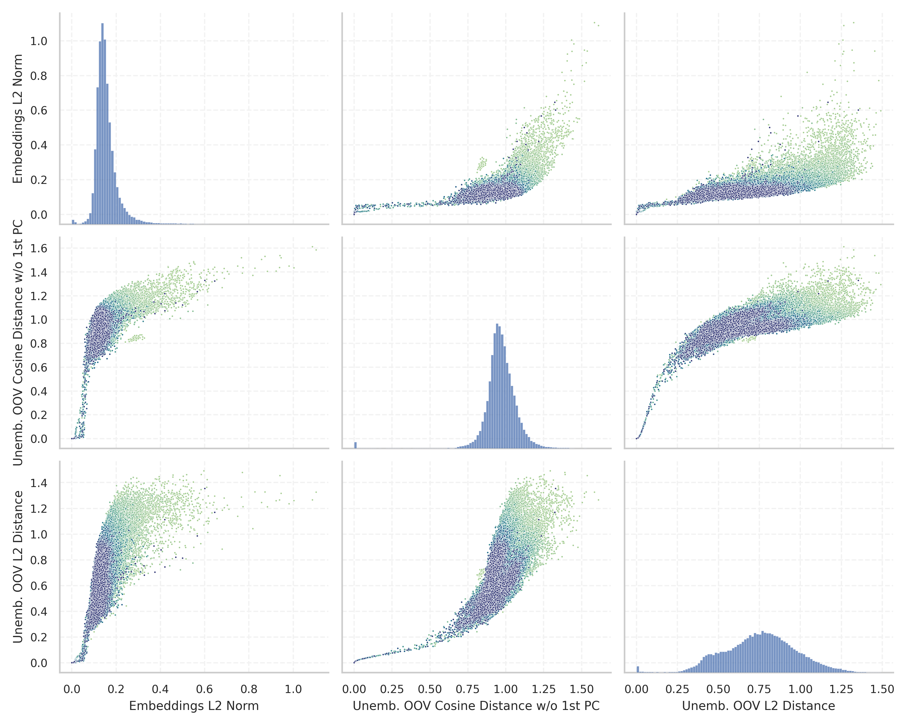

# Report for `allenai/OLMo-1.7-7B-hf`

## Model info

* Tied embeddings: no
* Unembeddings use bias: no
* Metric for under-trained tokens: Unemb. OOV Cosine Distance w/o 1st PC
  * Overall distribution 0.965 +/- 0.118
  * Token used for verification prompt building: `ArgumentException`
  * Verification threshold: 0.782
  * Threshold for showing candidate under-trained tokens: 0.433
  * Median verified threshold (for bytes, unreachable and special tokens): 0.103
* Embeddings shape: (50304, 4096)
* Vocabulary size: 50280
  * Number of single byte tokens: 243, of which 1 below metric threshold
  * Number of special tokens: 2, of which 1 below metric threshold
  * Number of unreachable non-single-byte tokens: 221, of which 162 below metric threshold
  * Number of non-single-byte UTF-fragment tokens: 369, 0 below soft metric threshold
  * Number of tested under-trained tokens: 991, 177 below p = 0.01 threshold, 138 below soft metric threshold

## Metrics plot


## Verification plot


## Under-trained token verification results
138 entries below threshold of 0.433

|   token_id | token               |       metric | max_prob                                                         | in_other_tokens                                                             |
|------------|---------------------|--------------|------------------------------------------------------------------|-----------------------------------------------------------------------------|
|      34761 | ````` ▁()](\ `````  | -1.19209e-07 | <span style='border: 1px solid rgb(169, 68, 66);'>1.1e-05</span> |                                                                             |
|      31096 | ````` ^\[[@ `````   | -1.19209e-07 | <span style='border: 1px solid rgb(169, 68, 66);'>4.1e-06</span> | <span style='border: 1px solid rgb(169, 68, 66);'>````` .^\[[@ `````</span> |
|      45382 | ````` ]{}\_ `````   |  3.57628e-07 | <span style='border: 1px solid rgb(169, 68, 66);'>9.8e-06</span> |                                                                             |
|      47686 | ````` \^[- `````    |  5.96046e-07 | <span style='border: 1px solid rgb(169, 68, 66);'>3.2e-06</span> |                                                                             |
|      42041 | ````` ▁§\[ `````    |  1.43051e-06 | <span style='border: 1px solid rgb(169, 68, 66);'>3.5e-06</span> |                                                                             |
|      44162 | ````` ]{}\^[ `````  |  1.54972e-06 | <span style='border: 1px solid rgb(169, 68, 66);'>6.8e-06</span> |                                                                             |
|      32214 | ````` ]\]^ `````    |  3.21865e-06 | <span style='border: 1px solid rgb(169, 68, 66);'>2.9e-06</span> |                                                                             |
|      43782 | ````` .^\[[@ `````  |  3.8147e-06  | <span style='border: 1px solid rgb(169, 68, 66);'>5.6e-06</span> |                                                                             |
|      46468 | ````` \])]{} `````  |  4.05312e-06 | <span style='border: 1px solid rgb(169, 68, 66);'>8.6e-06</span> |                                                                             |
|      41305 | ````` ]{}\_[ `````  |  7.15256e-06 | <span style='border: 1px solid rgb(169, 68, 66);'>1.5e-06</span> |                                                                             |
|      33805 | ````` ]{}\^ `````   |  9.95398e-06 | <span style='border: 1px solid rgb(169, 68, 66);'>3.4e-06</span> | <span style='border: 1px solid rgb(169, 68, 66);'>````` ]{}\^[ `````</span> |
|      23286 | ````` ^−/− `````    |  1.00732e-05 | <span style='border: 1px solid rgb(169, 68, 66);'>1.9e-06</span> | <span style='border: 1px solid rgb(169, 68, 66);'>````` ^−/−^ `````</span>  |
|      39310 | ````` "}**). `````  |  1.04308e-05 | <span style='border: 1px solid rgb(169, 68, 66);'>7.8e-06</span> |                                                                             |
|      48471 | ````` :**]{} `````  |  1.24574e-05 | <span style='border: 1px solid rgb(169, 68, 66);'>3.5e-06</span> |                                                                             |
|      23734 | ````` ▁[****, ````` |  2.40207e-05 | <span style='border: 1px solid rgb(169, 68, 66);'>4.2e-06</span> |                                                                             |
|      49021 | ````` $.[]{ `````   |  2.5928e-05  | <span style='border: 1px solid rgb(169, 68, 66);'>3.1e-06</span> |                                                                             |
|      28912 | ````` ^−/−^ `````   |  3.31402e-05 | <span style='border: 1px solid rgb(169, 68, 66);'>4.6e-06</span> |                                                                             |
|      49824 | ````` ▁[(\[ `````   |  4.68493e-05 | <span style='border: 1px solid rgb(169, 68, 66);'>8.8e-06</span> |                                                                             |
|      36487 | ````` .**]{} `````  |  5.34654e-05 | <span style='border: 1px solid rgb(169, 68, 66);'>3.3e-06</span> |                                                                             |
|      34607 | ````` ▁^[@ `````    |  6.70552e-05 | <span style='border: 1px solid rgb(169, 68, 66);'>6.3e-06</span> |                                                                             |
<details><summary>118 additional entries below threshold</summary>

|   token_id | token                                            |      metric | max_prob                                                         | in_other_tokens                                                                                                                                                                                                                                                                                                                                                                                                       |
|------------|--------------------------------------------------|-------------|------------------------------------------------------------------|-----------------------------------------------------------------------------------------------------------------------------------------------------------------------------------------------------------------------------------------------------------------------------------------------------------------------------------------------------------------------------------------------------------------------|
|      34494 | ````` ]\]). `````                                | 7.01547e-05 | <span style='border: 1px solid rgb(169, 68, 66);'>5.3e-06</span> |                                                                                                                                                                                                                                                                                                                                                                                                                       |
|      42804 | ````` )^[@ `````                                 | 7.24196e-05 | <span style='border: 1px solid rgb(169, 68, 66);'>2e-06</span>   |                                                                                                                                                                                                                                                                                                                                                                                                                       |
|      15775 | ````` .\[[@ `````                                | 8.9705e-05  | <span style='border: 1px solid rgb(169, 68, 66);'>4.3e-06</span> |                                                                                                                                                                                                                                                                                                                                                                                                                       |
|      27720 | ````` .*]{}, `````                               | 0.000100493 | <span style='border: 1px solid rgb(169, 68, 66);'>4.3e-06</span> |                                                                                                                                                                                                                                                                                                                                                                                                                       |
|      43134 | ````` ▁()]{} `````                               | 0.000104129 | <span style='border: 1px solid rgb(169, 68, 66);'>7.3e-06</span> |                                                                                                                                                                                                                                                                                                                                                                                                                       |
|      24994 | ````` ^−^ `````                                  | 0.000186861 | <span style='border: 1px solid rgb(169, 68, 66);'>6.6e-06</span> |                                                                                                                                                                                                                                                                                                                                                                                                                       |
|      38475 | ````` "}\]. `````                                | 0.000192225 | <span style='border: 1px solid rgb(169, 68, 66);'>4.1e-06</span> |                                                                                                                                                                                                                                                                                                                                                                                                                       |
|      28696 | ````` FFIRMED `````                              | 0.000200748 | <span style='border: 1px solid rgb(169, 68, 66);'>4e-06</span>   | <span style='border: 1px solid rgb(251, 189, 8);'>````` AFFIRMED `````</span>, <span style='border: 1px solid rgb(40, 167, 69);'>````` ▁AFFIRMED `````</span>                                                                                                                                                                                                                                                         |
|      26119 | ````` *]{}. `````                                | 0.000208914 | <span style='border: 1px solid rgb(169, 68, 66);'>5.2e-06</span> |                                                                                                                                                                                                                                                                                                                                                                                                                       |
|      39083 | ````` "}](# `````                                | 0.000226021 | <span style='border: 1px solid rgb(169, 68, 66);'>4.9e-07</span> |                                                                                                                                                                                                                                                                                                                                                                                                                       |
|      16079 | ````` .[]{ `````                                 | 0.000236869 | <span style='border: 1px solid rgb(169, 68, 66);'>7.1e-06</span> | <span style='border: 1px solid rgb(169, 68, 66);'>````` $.[]{ `````</span>                                                                                                                                                                                                                                                                                                                                            |
|      29547 | ````` ]\]; `````                                 | 0.000285387 | <span style='border: 1px solid rgb(169, 68, 66);'>6.8e-06</span> |                                                                                                                                                                                                                                                                                                                                                                                                                       |
|       8088 | ````` \[[@ `````                                 | 0.000411749 | <span style='border: 1px solid rgb(169, 68, 66);'>6.6e-06</span> | <span style='border: 1px solid rgb(169, 68, 66);'>````` .^\[[@ `````</span>, <span style='border: 1px solid rgb(169, 68, 66);'>````` .\[[@ `````</span>, <span style='border: 1px solid rgb(169, 68, 66);'>````` ^\[[@ `````</span>                                                                                                                                                                                   |
|       9899 | ````` ]{}]{} `````                               | 0.000487149 | <span style='border: 1px solid rgb(169, 68, 66);'>4.3e-06</span> |                                                                                                                                                                                                                                                                                                                                                                                                                       |
|      34833 | ````` ▁xcex `````                                | 0.000576615 | <span style='border: 1px solid rgb(169, 68, 66);'>6e-06</span>   |                                                                                                                                                                                                                                                                                                                                                                                                                       |
|      29013 | ````` \]]{} `````                                | 0.000595093 | <span style='border: 1px solid rgb(169, 68, 66);'>6.8e-06</span> |                                                                                                                                                                                                                                                                                                                                                                                                                       |
|      33653 | ````` ^\*^ `````                                 | 0.000604331 | <span style='border: 1px solid rgb(169, 68, 66);'>3.9e-06</span> |                                                                                                                                                                                                                                                                                                                                                                                                                       |
|      27114 | ````` .(\[ `````                                 | 0.00103164  | <span style='border: 1px solid rgb(169, 68, 66);'>8.6e-06</span> |                                                                                                                                                                                                                                                                                                                                                                                                                       |
|      37406 | ````` medscimonit `````                          | 0.00112849  | <span style='border: 1px solid rgb(169, 68, 66);'>3.2e-06</span> |                                                                                                                                                                                                                                                                                                                                                                                                                       |
|      30371 | ````` marinedrugs `````                          | 0.00128502  | <span style='border: 1px solid rgb(169, 68, 66);'>1.4e-06</span> |                                                                                                                                                                                                                                                                                                                                                                                                                       |
|      13663 | ````` .*]{} `````                                | 0.0013079   | <span style='border: 1px solid rgb(169, 68, 66);'>4.6e-06</span> | <span style='border: 1px solid rgb(169, 68, 66);'>````` .*]{}, `````</span>                                                                                                                                                                                                                                                                                                                                           |
|      30996 | ````` ,^[@ `````                                 | 0.00136024  | <span style='border: 1px solid rgb(169, 68, 66);'>6.4e-06</span> |                                                                                                                                                                                                                                                                                                                                                                                                                       |
|      27468 | ````` ▁\_[ `````                                 | 0.00170624  | <span style='border: 1px solid rgb(169, 68, 66);'>6.7e-06</span> |                                                                                                                                                                                                                                                                                                                                                                                                                       |
|      25416 | ````` [\*](# `````                               | 0.00185657  | <span style='border: 1px solid rgb(169, 68, 66);'>6.3e-06</span> |                                                                                                                                                                                                                                                                                                                                                                                                                       |
|      36134 | ````` [\*\* `````                                | 0.00275952  | <span style='border: 1px solid rgb(169, 68, 66);'>8.9e-06</span> |                                                                                                                                                                                                                                                                                                                                                                                                                       |
|      41163 | ````` micromachines `````                        | 0.00378454  | <span style='border: 1px solid rgb(169, 68, 66);'>4e-06</span>   |                                                                                                                                                                                                                                                                                                                                                                                                                       |
|      33835 | ````` doibase `````                              | 0.00416434  | <span style='border: 1px solid rgb(169, 68, 66);'>9.8e-06</span> |                                                                                                                                                                                                                                                                                                                                                                                                                       |
|      32334 | ````` ubottu `````                               | 0.00463355  | <span style='border: 1px solid rgb(169, 68, 66);'>3.9e-05</span> |                                                                                                                                                                                                                                                                                                                                                                                                                       |
|      31743 | ````` ^®^ `````                                  | 0.00510347  | <span style='border: 1px solid rgb(169, 68, 66);'>8.9e-06</span> |                                                                                                                                                                                                                                                                                                                                                                                                                       |
|      38710 | ````` ▁\*\** `````                               | 0.00542688  | <span style='border: 1px solid rgb(169, 68, 66);'>9.2e-06</span> |                                                                                                                                                                                                                                                                                                                                                                                                                       |
|      40743 | ````` ubotu `````                                | 0.0054279   | <span style='border: 1px solid rgb(169, 68, 66);'>2.6e-06</span> |                                                                                                                                                                                                                                                                                                                                                                                                                       |
|      37570 | ````` ▁0000000000000000000000000000000000 `````  | 0.00624913  | <span style='border: 1px solid rgb(169, 68, 66);'>1e-05</span>   |                                                                                                                                                                                                                                                                                                                                                                                                                       |
|      11661 | ````` *]{}, `````                                | 0.00671178  | <span style='border: 1px solid rgb(169, 68, 66);'>1.1e-05</span> | <span style='border: 1px solid rgb(169, 68, 66);'>````` .*]{}, `````</span>                                                                                                                                                                                                                                                                                                                                           |
|      24237 | ````` .]{} `````                                 | 0.00744992  | <span style='border: 1px solid rgb(169, 68, 66);'>1.9e-05</span> |                                                                                                                                                                                                                                                                                                                                                                                                                       |
|      46924 | ````` obbsee `````                               | 0.00787455  | <span style='border: 1px solid rgb(169, 68, 66);'>3.7e-06</span> |                                                                                                                                                                                                                                                                                                                                                                                                                       |
|       4622 | ````` *]{} `````                                 | 0.00899285  | <span style='border: 1px solid rgb(169, 68, 66);'>1.8e-05</span> | <span style='border: 1px solid rgb(169, 68, 66);'>````` *]{}, `````</span>, <span style='border: 1px solid rgb(169, 68, 66);'>````` **]{}, `````</span>, <span style='border: 1px solid rgb(169, 68, 66);'>````` **]{} `````</span>, <span style='border: 1px solid rgb(169, 68, 66);'>````` .**]{} `````</span>, <span style='border: 1px solid rgb(169, 68, 66);'>````` :**]{} `````</span>, ...                    |
|      47389 | ````` ~\] `````                                  | 0.0096516   | <span style='border: 1px solid rgb(169, 68, 66);'>1.3e-05</span> |                                                                                                                                                                                                                                                                                                                                                                                                                       |
|      30119 | ````` ▁(\> `````                                 | 0.01195     | <span style='border: 1px solid rgb(169, 68, 66);'>2.3e-05</span> |                                                                                                                                                                                                                                                                                                                                                                                                                       |
|       6257 | ````` **]{}, `````                               | 0.0130578   | <span style='border: 1px solid rgb(169, 68, 66);'>8.8e-06</span> |                                                                                                                                                                                                                                                                                                                                                                                                                       |
|      18022 | ````` \*](# `````                                | 0.0137845   | <span style='border: 1px solid rgb(169, 68, 66);'>9.9e-05</span> | <span style='border: 1px solid rgb(169, 68, 66);'>````` [\*](# `````</span>                                                                                                                                                                                                                                                                                                                                           |
|       5413 | ````` ]\], `````                                 | 0.0139623   | <span style='border: 1px solid rgb(169, 68, 66);'>7e-05</span>   |                                                                                                                                                                                                                                                                                                                                                                                                                       |
|      45509 | ````` "}^ `````                                  | 0.0147704   | <span style='border: 1px solid rgb(169, 68, 66);'>0.0001</span>  |                                                                                                                                                                                                                                                                                                                                                                                                                       |
|      17548 | ````` ]-[@ `````                                 | 0.018194    | <span style='border: 1px solid rgb(169, 68, 66);'>4.9e-05</span> |                                                                                                                                                                                                                                                                                                                                                                                                                       |
|      42010 | ````` ▁BytePtrFromString `````                   | 0.0216736   | <span style='border: 1px solid rgb(169, 68, 66);'>0.00013</span> |                                                                                                                                                                                                                                                                                                                                                                                                                       |
|      46608 | ````` *~( `````                                  | 0.0223712   | <span style='border: 1px solid rgb(169, 68, 66);'>2.6e-05</span> |                                                                                                                                                                                                                                                                                                                                                                                                                       |
|       7444 | ````` **]{} `````                                | 0.0241698   | <span style='border: 1px solid rgb(169, 68, 66);'>1.4e-05</span> | <span style='border: 1px solid rgb(169, 68, 66);'>````` .**]{} `````</span>, <span style='border: 1px solid rgb(169, 68, 66);'>````` :**]{} `````</span>                                                                                                                                                                                                                                                              |
|      14434 | ````` ▁"♪ `````                                  | 0.0245069   | <span style='border: 1px solid rgb(169, 68, 66);'>4.1e-05</span> |                                                                                                                                                                                                                                                                                                                                                                                                                       |
|      37087 | ````` medsc `````                                | 0.026929    | <span style='border: 1px solid rgb(169, 68, 66);'>2.1e-05</span> | <span style='border: 1px solid rgb(169, 68, 66);'>````` medscimonit `````</span>                                                                                                                                                                                                                                                                                                                                      |
|      26997 | ````` \^[ `````                                  | 0.0271014   | <span style='border: 1px solid rgb(169, 68, 66);'>2.6e-05</span> | <span style='border: 1px solid rgb(169, 68, 66);'>````` ]{}\^[ `````</span>, <span style='border: 1px solid rgb(169, 68, 66);'>````` \^[- `````</span>                                                                                                                                                                                                                                                                |
|      15479 | ````` ▁taxp `````                                | 0.0309681   | <span style='border: 1px solid rgb(169, 68, 66);'>2.2e-05</span> | <span style='border: 1px solid rgb(40, 167, 69);'>````` ▁taxpayers `````</span>, <span style='border: 1px solid rgb(40, 167, 69);'>````` ▁taxpayer `````</span>                                                                                                                                                                                                                                                       |
|      37402 | ````` imonit `````                               | 0.0325503   | <span style='border: 1px solid rgb(169, 68, 66);'>7e-05</span>   | <span style='border: 1px solid rgb(169, 68, 66);'>````` medscimonit `````</span>                                                                                                                                                                                                                                                                                                                                      |
|      35496 | ````` **--** `````                               | 0.0334911   | <span style='border: 1px solid rgb(169, 68, 66);'>3.6e-05</span> |                                                                                                                                                                                                                                                                                                                                                                                                                       |
|      17278 | ````` ^](# `````                                 | 0.049364    | <span style='border: 1px solid rgb(169, 68, 66);'>0.00029</span> |                                                                                                                                                                                                                                                                                                                                                                                                                       |
|      34985 | ````` \xa0\n▁ `````                              | 0.052065    | <span style='border: 1px solid rgb(169, 68, 66);'>6.7e-05</span> |                                                                                                                                                                                                                                                                                                                                                                                                                       |
|      14798 | ````` ▁affidav `````                             | 0.0561904   | <span style='border: 1px solid rgb(169, 68, 66);'>8.8e-06</span> | <span style='border: 1px solid rgb(40, 167, 69);'>````` ▁affidavits `````</span>, <span style='border: 1px solid rgb(40, 167, 69);'>````` ▁affidavit `````</span>                                                                                                                                                                                                                                                     |
|      49411 | ````` *‐ `````                                   | 0.0575816   | <span style='border: 1px solid rgb(169, 68, 66);'>7.7e-05</span> |                                                                                                                                                                                                                                                                                                                                                                                                                       |
|      26939 | ````` ▁\xa0\xa0▁\xa0\xa0▁\xa0\xa0▁\xa0\xa0 ````` | 0.0582853   | <span style='border: 1px solid rgb(169, 68, 66);'>0.00033</span> |                                                                                                                                                                                                                                                                                                                                                                                                                       |
|      27655 | ````` ▁$[]$ `````                                | 0.0587922   | <span style='border: 1px solid rgb(169, 68, 66);'>3.9e-05</span> |                                                                                                                                                                                                                                                                                                                                                                                                                       |
|      35088 | ````` ...\...\ `````                             | 0.0655055   | <span style='border: 1px solid rgb(169, 68, 66);'>0.00014</span> |                                                                                                                                                                                                                                                                                                                                                                                                                       |
|      43421 | ````` Sportspeople `````                         | 0.068917    | <span style='border: 1px solid rgb(169, 68, 66);'>4.1e-06</span> |                                                                                                                                                                                                                                                                                                                                                                                                                       |
|       1254 | ````` ▁\[[@ `````                                | 0.0759877   | <span style='border: 1px solid rgb(169, 68, 66);'>7.3e-05</span> |                                                                                                                                                                                                                                                                                                                                                                                                                       |
|      41284 | ````` /((- `````                                 | 0.0760665   | <span style='border: 1px solid rgb(169, 68, 66);'>7.3e-05</span> |                                                                                                                                                                                                                                                                                                                                                                                                                       |
|      18781 | ````` ▁♪" `````                                  | 0.0767634   | <span style='border: 1px solid rgb(169, 68, 66);'>4.2e-05</span> |                                                                                                                                                                                                                                                                                                                                                                                                                       |
|       7254 | ````` ]--[@ `````                                | 0.0787902   | <span style='border: 1px solid rgb(169, 68, 66);'>9e-05</span>   |                                                                                                                                                                                                                                                                                                                                                                                                                       |
|      22367 | ````` ![** `````                                 | 0.0809525   | <span style='border: 1px solid rgb(169, 68, 66);'>0.00011</span> |                                                                                                                                                                                                                                                                                                                                                                                                                       |
|      42691 | ````` jcmm `````                                 | 0.0877572   | <span style='border: 1px solid rgb(169, 68, 66);'>3.3e-05</span> |                                                                                                                                                                                                                                                                                                                                                                                                                       |
|      15236 | ````` ▁biomark `````                             | 0.0900361   | <span style='border: 1px solid rgb(169, 68, 66);'>1.2e-05</span> | <span style='border: 1px solid rgb(40, 167, 69);'>````` ▁biomarker `````</span>, <span style='border: 1px solid rgb(40, 167, 69);'>````` ▁biomarkers `````</span>                                                                                                                                                                                                                                                     |
|      19181 | ````` ]{}. `````                                 | 0.0958087   | <span style='border: 1px solid rgb(169, 68, 66);'>0.00011</span> | <span style='border: 1px solid rgb(169, 68, 66);'>````` *]{}. `````</span>                                                                                                                                                                                                                                                                                                                                            |
|      38913 | ````` \x98¯ `````                                | 0.102996    | <span style='border: 1px solid rgb(169, 68, 66);'>7.7e-05</span> |                                                                                                                                                                                                                                                                                                                                                                                                                       |
|      39614 | ````` pitti `````                                | 0.104481    | <span style='border: 1px solid rgb(169, 68, 66);'>7e-05</span>   |                                                                                                                                                                                                                                                                                                                                                                                                                       |
|       3951 | ````` ^[@ `````                                  | 0.11318     | <span style='border: 1px solid rgb(169, 68, 66);'>7e-05</span>   | <span style='border: 1px solid rgb(169, 68, 66);'>````` .^[@ `````</span>, <span style='border: 1px solid rgb(169, 68, 66);'>````` ,^[@ `````</span>, <span style='border: 1px solid rgb(169, 68, 66);'>````` ▁^[@ `````</span>, <span style='border: 1px solid rgb(169, 68, 66);'>````` )^[@ `````</span>                                                                                                            |
|      25349 | ````` ))/((- `````                               | 0.117054    | <span style='border: 1px solid rgb(169, 68, 66);'>0.00031</span> |                                                                                                                                                                                                                                                                                                                                                                                                                       |
|      38747 | ````` cjwatson `````                             | 0.122352    | <span style='border: 1px solid rgb(169, 68, 66);'>0.00011</span> |                                                                                                                                                                                                                                                                                                                                                                                                                       |
|      39743 | ````` 14514500 `````                             | 0.126182    | <span style='border: 1px solid rgb(169, 68, 66);'>0.00017</span> | <span style='border: 1px solid rgb(40, 167, 69);'>````` 1451450014514500 `````</span>                                                                                                                                                                                                                                                                                                                                 |
|       1656 | ````` ]\]. `````                                 | 0.130368    | <span style='border: 1px solid rgb(169, 68, 66);'>0.00029</span> | <span style='border: 1px solid rgb(255, 145, 0);'>````` \]\]. `````</span>                                                                                                                                                                                                                                                                                                                                            |
|      18413 | ````` ]^, `````                                  | 0.131975    | <span style='border: 1px solid rgb(169, 68, 66);'>0.00017</span> |                                                                                                                                                                                                                                                                                                                                                                                                                       |
|      42274 | ````` ]{}[ `````                                 | 0.132099    | <span style='border: 1px solid rgb(169, 68, 66);'>0.00048</span> |                                                                                                                                                                                                                                                                                                                                                                                                                       |
|      46045 | ````` brainsci `````                             | 0.133791    | <span style='border: 1px solid rgb(169, 68, 66);'>7.9e-05</span> |                                                                                                                                                                                                                                                                                                                                                                                                                       |
|      10174 | ````` .^[@ `````                                 | 0.134221    | <span style='border: 1px solid rgb(169, 68, 66);'>7.5e-05</span> |                                                                                                                                                                                                                                                                                                                                                                                                                       |
|      30356 | ````` marined `````                              | 0.139311    | <span style='border: 1px solid rgb(169, 68, 66);'>9.2e-05</span> | <span style='border: 1px solid rgb(169, 68, 66);'>````` marinedrugs `````</span>                                                                                                                                                                                                                                                                                                                                      |
|      12253 | ````` ▁questionna `````                          | 0.173158    | <span style='border: 1px solid rgb(169, 68, 66);'>1.4e-05</span> | <span style='border: 1px solid rgb(40, 167, 69);'>````` ▁questionnaire `````</span>, <span style='border: 1px solid rgb(40, 167, 69);'>````` ▁questionnaires `````</span>                                                                                                                                                                                                                                             |
|      45472 | ````` ]{}) `````                                 | 0.191496    | <span style='border: 1px solid rgb(169, 68, 66);'>0.0002</span>  |                                                                                                                                                                                                                                                                                                                                                                                                                       |
|      22372 | ````` ,[@ `````                                  | 0.191535    | <span style='border: 1px solid rgb(169, 68, 66);'>0.00046</span> |                                                                                                                                                                                                                                                                                                                                                                                                                       |
|      41456 | ````` ))*- `````                                 | 0.205139    | <span style='border: 1px solid rgb(169, 68, 66);'>0.00032</span> |                                                                                                                                                                                                                                                                                                                                                                                                                       |
|      41137 | ````` *~, `````                                  | 0.207206    | <span style='border: 1px solid rgb(169, 68, 66);'>0.0002</span>  |                                                                                                                                                                                                                                                                                                                                                                                                                       |
|      46230 | ````` \x88\x91 `````                             | 0.214529    | <span style='border: 1px solid rgb(169, 68, 66);'>0.00038</span> |                                                                                                                                                                                                                                                                                                                                                                                                                       |
|      27092 | ````` ▁glimp `````                               | 0.216073    | <span style='border: 1px solid rgb(169, 68, 66);'>6.6e-05</span> | <span style='border: 1px solid rgb(40, 167, 69);'>````` ▁glimpse `````</span>, <span style='border: 1px solid rgb(40, 167, 69);'>````` ▁glimps `````</span>                                                                                                                                                                                                                                                           |
|      20637 | ````` ▁supernat `````                            | 0.217414    | <span style='border: 1px solid rgb(169, 68, 66);'>4.4e-05</span> | <span style='border: 1px solid rgb(40, 167, 69);'>````` ▁supernatants `````</span>, <span style='border: 1px solid rgb(40, 167, 69);'>````` ▁supernatural `````</span>, <span style='border: 1px solid rgb(40, 167, 69);'>````` ▁supernatant `````</span>                                                                                                                                                             |
|      41625 | ````` ¸\x8d `````                                | 0.226723    | <span style='border: 1px solid rgb(169, 68, 66);'>0.00043</span> |                                                                                                                                                                                                                                                                                                                                                                                                                       |
|      37425 | ````` ENRON `````                                | 0.226978    | <span style='border: 1px solid rgb(169, 68, 66);'>9.8e-05</span> |                                                                                                                                                                                                                                                                                                                                                                                                                       |
|      26868 | ````` ÃÂÃÂÃÂÃÂ `````                             | 0.229247    | <span style='border: 1px solid rgb(255, 145, 0);'>0.0013</span>  | <span style='border: 1px solid rgb(255, 145, 0);'>````` ÃÂÃÂÃÂÃÂÃÂÃÂÃÂÃÂ `````</span>                                                                                                                                                                                                                                                                                                                                 |
|      22702 | ````` ▁errnoErr `````                            | 0.245816    | <span style='border: 1px solid rgb(255, 145, 0);'>0.0024</span>  |                                                                                                                                                                                                                                                                                                                                                                                                                       |
|      44965 | ````` ▁[[* `````                                 | 0.25201     | <span style='border: 1px solid rgb(169, 68, 66);'>0.00034</span> |                                                                                                                                                                                                                                                                                                                                                                                                                       |
|      15707 | ````` ▁]{} `````                                 | 0.264323    | <span style='border: 1px solid rgb(255, 145, 0);'>0.0027</span>  |                                                                                                                                                                                                                                                                                                                                                                                                                       |
|      46658 | ````` "}* `````                                  | 0.268068    | <span style='border: 1px solid rgb(169, 68, 66);'>0.00028</span> |                                                                                                                                                                                                                                                                                                                                                                                                                       |
|      21687 | ````` )]{} `````                                 | 0.271851    | <span style='border: 1px solid rgb(255, 145, 0);'>0.0018</span>  | <span style='border: 1px solid rgb(169, 68, 66);'>````` ▁()]{} `````</span>, <span style='border: 1px solid rgb(169, 68, 66);'>````` \])]{} `````</span>                                                                                                                                                                                                                                                              |
|      18031 | ````` :"){ `````                                 | 0.284024    | <span style='border: 1px solid rgb(169, 68, 66);'>0.00088</span> |                                                                                                                                                                                                                                                                                                                                                                                                                       |
|      41557 | ````` PtrFromString `````                        | 0.287997    | <span style='border: 1px solid rgb(255, 145, 0);'>0.0084</span>  | <span style='border: 1px solid rgb(169, 68, 66);'>````` ▁BytePtrFromString `````</span>                                                                                                                                                                                                                                                                                                                               |
|      26384 | ````` ▁remn `````                                | 0.289477    | <span style='border: 1px solid rgb(169, 68, 66);'>0.00022</span> | <span style='border: 1px solid rgb(40, 167, 69);'>````` ▁remnants `````</span>, <span style='border: 1px solid rgb(40, 167, 69);'>````` ▁remnant `````</span>                                                                                                                                                                                                                                                         |
|      23063 | ````` ▁careg `````                               | 0.292332    | <span style='border: 1px solid rgb(169, 68, 66);'>8.4e-05</span> | <span style='border: 1px solid rgb(40, 167, 69);'>````` ▁caregiver `````</span>, <span style='border: 1px solid rgb(40, 167, 69);'>````` ▁caregivers `````</span>                                                                                                                                                                                                                                                     |
|      21895 | ````` ▁predecess `````                           | 0.297142    | <span style='border: 1px solid rgb(169, 68, 66);'>8.5e-05</span> | <span style='border: 1px solid rgb(40, 167, 69);'>````` ▁predecessors `````</span>, <span style='border: 1px solid rgb(40, 167, 69);'>````` ▁predecessor `````</span>                                                                                                                                                                                                                                                 |
|      13488 | ````` $]{} `````                                 | 0.303747    | <span style='border: 1px solid rgb(255, 145, 0);'>0.0031</span>  | <span style='border: 1px solid rgb(251, 189, 8);'>````` }$]{} `````</span>, <span style='border: 1px solid rgb(40, 167, 69);'>````` $]{}; `````</span>                                                                                                                                                                                                                                                                |
|      43189 | ````` )[@ `````                                  | 0.305068    | <span style='border: 1px solid rgb(169, 68, 66);'>0.00089</span> |                                                                                                                                                                                                                                                                                                                                                                                                                       |
|      20977 | ````` }$]{} `````                                | 0.322688    | <span style='border: 1px solid rgb(251, 189, 8);'>0.029</span>   |                                                                                                                                                                                                                                                                                                                                                                                                                       |
|      16986 | ````` )/((- `````                                | 0.332532    | <span style='border: 1px solid rgb(255, 145, 0);'>0.0018</span>  | <span style='border: 1px solid rgb(169, 68, 66);'>````` ))/((- `````</span>                                                                                                                                                                                                                                                                                                                                           |
|       8562 | ````` ]^. `````                                  | 0.33701     | <span style='border: 1px solid rgb(255, 145, 0);'>0.0024</span>  |                                                                                                                                                                                                                                                                                                                                                                                                                       |
|      48628 | ````` ▁doxor `````                               | 0.349404    | <span style='border: 1px solid rgb(169, 68, 66);'>0.00012</span> | <span style='border: 1px solid rgb(40, 167, 69);'>````` ▁doxorubicin `````</span>                                                                                                                                                                                                                                                                                                                                     |
|      18112 | ````` ▁practition `````                          | 0.357798    | <span style='border: 1px solid rgb(169, 68, 66);'>3.7e-05</span> | <span style='border: 1px solid rgb(40, 167, 69);'>````` ▁practitioner `````</span>, <span style='border: 1px solid rgb(40, 167, 69);'>````` ▁practitioners `````</span>                                                                                                                                                                                                                                               |
|      45659 | ````` ▁Spacewatch `````                          | 0.359044    | <span style='border: 1px solid rgb(169, 68, 66);'>0.00024</span> |                                                                                                                                                                                                                                                                                                                                                                                                                       |
|      41606 | ````` ÃÂÃÂÃÂÃÂÃÂÃÂÃÂÃÂ `````                     | 0.359562    | <span style='border: 1px solid rgb(255, 145, 0);'>0.0077</span>  |                                                                                                                                                                                                                                                                                                                                                                                                                       |
|      42680 | ````` ▁Comiss `````                              | 0.366686    | <span style='border: 1px solid rgb(169, 68, 66);'>0.00036</span> | <span style='border: 1px solid rgb(255, 145, 0);'>````` ▁Comissão `````</span>                                                                                                                                                                                                                                                                                                                                        |
|      22066 | ````` ▁resemb `````                              | 0.37268     | <span style='border: 1px solid rgb(169, 68, 66);'>5.1e-05</span> | <span style='border: 1px solid rgb(40, 167, 69);'>````` ▁resemblance `````</span>, <span style='border: 1px solid rgb(40, 167, 69);'>````` ▁resemble `````</span>, <span style='border: 1px solid rgb(40, 167, 69);'>````` ▁resembled `````</span>, <span style='border: 1px solid rgb(40, 167, 69);'>````` ▁resembles `````</span>, <span style='border: 1px solid rgb(40, 167, 69);'>````` ▁resembling `````</span> |
|      10148 | ````` "}]( `````                                 | 0.400433    | <span style='border: 1px solid rgb(251, 189, 8);'>0.015</span>   | <span style='border: 1px solid rgb(169, 68, 66);'>````` "}](# `````</span>                                                                                                                                                                                                                                                                                                                                            |
|      21852 | ````` ▁earthqu `````                             | 0.409753    | <span style='border: 1px solid rgb(169, 68, 66);'>8.5e-05</span> | <span style='border: 1px solid rgb(40, 167, 69);'>````` ▁earthquakes `````</span>, <span style='border: 1px solid rgb(40, 167, 69);'>````` ▁earthquake `````</span>                                                                                                                                                                                                                                                   |
|      38327 | ````` ))/(- `````                                | 0.412136    | <span style='border: 1px solid rgb(255, 145, 0);'>0.0071</span>  |                                                                                                                                                                                                                                                                                                                                                                                                                       |
|       6334 | ````` .[@ `````                                  | 0.413406    | <span style='border: 1px solid rgb(169, 68, 66);'>0.00062</span> |                                                                                                                                                                                                                                                                                                                                                                                                                       |
|      27596 | ````` ^® `````                                   | 0.428065    | <span style='border: 1px solid rgb(169, 68, 66);'>0.00087</span> | <span style='border: 1px solid rgb(169, 68, 66);'>````` ^®^ `````</span>                                                                                                                                                                                                                                                                                                                                              |
|      14457 | ````` bibr `````                                 | 0.429501    | <span style='border: 1px solid rgb(251, 189, 8);'>0.013</span>   |                                                                                                                                                                                                                                                                                                                                                                                                                       |
</details>
<details><summary>853 additional entries above threshold</summary>

|   token_id | token                                                                                                                                                                                                                                                                         |   metric | max_prob                                                         | in_other_tokens                                                                                                                                                                                                                                                                                                                                                                                                                        |
|------------|-------------------------------------------------------------------------------------------------------------------------------------------------------------------------------------------------------------------------------------------------------------------------------|----------|------------------------------------------------------------------|----------------------------------------------------------------------------------------------------------------------------------------------------------------------------------------------------------------------------------------------------------------------------------------------------------------------------------------------------------------------------------------------------------------------------------------|
|      39427 | ````` gså `````                                                                                                                                                                                                                                                               | 0.433097 | <span style='border: 1px solid rgb(169, 68, 66);'>0.00011</span> | <span style='border: 1px solid rgb(40, 167, 69);'>````` ▁også `````</span>                                                                                                                                                                                                                                                                                                                                                             |
|      30707 | ````` \x9a\x84 `````                                                                                                                                                                                                                                                          | 0.444467 | <span style='border: 1px solid rgb(255, 145, 0);'>0.0024</span>  |                                                                                                                                                                                                                                                                                                                                                                                                                                        |
|      10248 | ````` ▁specim `````                                                                                                                                                                                                                                                           | 0.447941 | <span style='border: 1px solid rgb(169, 68, 66);'>0.00016</span> | <span style='border: 1px solid rgb(40, 167, 69);'>````` ▁specimen `````</span>, <span style='border: 1px solid rgb(40, 167, 69);'>````` ▁specimens `````</span>                                                                                                                                                                                                                                                                        |
|      22596 | ````` ▁opio `````                                                                                                                                                                                                                                                             | 0.45665  | <span style='border: 1px solid rgb(169, 68, 66);'>0.0004</span>  | <span style='border: 1px solid rgb(40, 167, 69);'>````` ▁opioids `````</span>, <span style='border: 1px solid rgb(40, 167, 69);'>````` ▁opioid `````</span>                                                                                                                                                                                                                                                                            |
|      13380 | ````` \_[ `````                                                                                                                                                                                                                                                               | 0.459593 | <span style='border: 1px solid rgb(251, 189, 8);'>0.023</span>   | <span style='border: 1px solid rgb(169, 68, 66);'>````` ▁\_[ `````</span>, <span style='border: 1px solid rgb(169, 68, 66);'>````` ]{}\_[ `````</span>                                                                                                                                                                                                                                                                                 |
|      44578 | ````` ▁\u2009 `````                                                                                                                                                                                                                                                           | 0.470943 | <span style='border: 1px solid rgb(255, 145, 0);'>0.0082</span>  |                                                                                                                                                                                                                                                                                                                                                                                                                                        |
|      10365 | ````` ▁embod `````                                                                                                                                                                                                                                                            | 0.474611 | <span style='border: 1px solid rgb(169, 68, 66);'>0.00014</span> | <span style='border: 1px solid rgb(40, 167, 69);'>````` ▁embodiments `````</span>, <span style='border: 1px solid rgb(40, 167, 69);'>````` ▁embodied `````</span>, <span style='border: 1px solid rgb(40, 167, 69);'>````` ▁embodiment `````</span>                                                                                                                                                                                    |
|      39922 | ````` 1451450014514500 `````                                                                                                                                                                                                                                                  | 0.477252 | <span style='border: 1px solid rgb(40, 167, 69);'>0.27</span>    |                                                                                                                                                                                                                                                                                                                                                                                                                                        |
|      26362 | ````` ▁{¶ `````                                                                                                                                                                                                                                                               | 0.480168 | <span style='border: 1px solid rgb(251, 189, 8);'>0.014</span>   |                                                                                                                                                                                                                                                                                                                                                                                                                                        |
|       2947 | ````` ],[@ `````                                                                                                                                                                                                                                                              | 0.481412 | <span style='border: 1px solid rgb(251, 189, 8);'>0.012</span>   |                                                                                                                                                                                                                                                                                                                                                                                                                                        |
|      44988 | ````` NFTA `````                                                                                                                                                                                                                                                              | 0.482949 | <span style='border: 1px solid rgb(251, 189, 8);'>0.097</span>   |                                                                                                                                                                                                                                                                                                                                                                                                                                        |
|       7433 | ````` ^+^ `````                                                                                                                                                                                                                                                               | 0.484118 | <span style='border: 1px solid rgb(251, 189, 8);'>0.034</span>   |                                                                                                                                                                                                                                                                                                                                                                                                                                        |
|      45094 | ````` ▁ocks `````                                                                                                                                                                                                                                                             | 0.485277 | <span style='border: 1px solid rgb(169, 68, 66);'>0.00015</span> | <span style='border: 1px solid rgb(40, 167, 69);'>````` ▁också `````</span>                                                                                                                                                                                                                                                                                                                                                            |
|       8865 | ````` idemargin `````                                                                                                                                                                                                                                                         | 0.493558 | <span style='border: 1px solid rgb(251, 189, 8);'>0.064</span>   | <span style='border: 1px solid rgb(40, 167, 69);'>````` oddsidemargin `````</span>                                                                                                                                                                                                                                                                                                                                                     |
|      33053 | ````` biomolecules `````                                                                                                                                                                                                                                                      | 0.495463 | <span style='border: 1px solid rgb(251, 189, 8);'>0.024</span>   |                                                                                                                                                                                                                                                                                                                                                                                                                                        |
|      12370 | ````` ICENSE `````                                                                                                                                                                                                                                                            | 0.505345 | <span style='border: 1px solid rgb(251, 189, 8);'>0.055</span>   | <span style='border: 1px solid rgb(40, 167, 69);'>````` LICENSE `````</span>, <span style='border: 1px solid rgb(40, 167, 69);'>````` ▁LICENSE `````</span>                                                                                                                                                                                                                                                                            |
|      23125 | ````` pntd `````                                                                                                                                                                                                                                                              | 0.50701  | <span style='border: 1px solid rgb(40, 167, 69);'>0.33</span>    |                                                                                                                                                                                                                                                                                                                                                                                                                                        |
|      49169 | ````` GLIGENCE `````                                                                                                                                                                                                                                                          | 0.515805 | <span style='border: 1px solid rgb(255, 145, 0);'>0.0026</span>  | <span style='border: 1px solid rgb(40, 167, 69);'>````` ▁NEGLIGENCE `````</span>                                                                                                                                                                                                                                                                                                                                                       |
|      26808 | ````` nanomaterials `````                                                                                                                                                                                                                                                     | 0.52034  | <span style='border: 1px solid rgb(255, 145, 0);'>0.0011</span>  |                                                                                                                                                                                                                                                                                                                                                                                                                                        |
|      20386 | ````` CHANTABILITY `````                                                                                                                                                                                                                                                      | 0.520924 | <span style='border: 1px solid rgb(251, 189, 8);'>0.043</span>   | <span style='border: 1px solid rgb(40, 167, 69);'>````` ▁MERCHANTABILITY `````</span>                                                                                                                                                                                                                                                                                                                                                  |
|       6761 | ````` ortunately `````                                                                                                                                                                                                                                                        | 0.532471 | <span style='border: 1px solid rgb(169, 68, 66);'>0.00011</span> | <span style='border: 1px solid rgb(40, 167, 69);'>````` ▁Unfortunately `````</span>, <span style='border: 1px solid rgb(40, 167, 69);'>````` fortunately `````</span>, <span style='border: 1px solid rgb(40, 167, 69);'>````` ▁unfortunately `````</span>, <span style='border: 1px solid rgb(40, 167, 69);'>````` Unfortunately `````</span>, <span style='border: 1px solid rgb(40, 167, 69);'>````` ▁Fortunately `````</span>, ... |
|      13270 | ````` MOESM `````                                                                                                                                                                                                                                                             | 0.535761 | <span style='border: 1px solid rgb(40, 167, 69);'>0.5</span>     |                                                                                                                                                                                                                                                                                                                                                                                                                                        |
|       8827 | ````` rsfs `````                                                                                                                                                                                                                                                              | 0.540308 | <span style='border: 1px solid rgb(40, 167, 69);'>0.42</span>    | <span style='border: 1px solid rgb(40, 167, 69);'>````` mathrsfs `````</span>                                                                                                                                                                                                                                                                                                                                                          |
|      37596 | ````` \]- `````                                                                                                                                                                                                                                                               | 0.542057 | <span style='border: 1px solid rgb(251, 189, 8);'>0.037</span>   |                                                                                                                                                                                                                                                                                                                                                                                                                                        |
|       9014 | ````` \]), `````                                                                                                                                                                                                                                                              | 0.549315 | <span style='border: 1px solid rgb(255, 145, 0);'>0.0039</span>  |                                                                                                                                                                                                                                                                                                                                                                                                                                        |
|      35869 | ````` ]{}( `````                                                                                                                                                                                                                                                              | 0.549742 | <span style='border: 1px solid rgb(40, 167, 69);'>0.25</span>    |                                                                                                                                                                                                                                                                                                                                                                                                                                        |
|      28128 | ````` ))**(- `````                                                                                                                                                                                                                                                            | 0.550955 | <span style='border: 1px solid rgb(251, 189, 8);'>0.03</span>    |                                                                                                                                                                                                                                                                                                                                                                                                                                        |
|      31236 | ````` ▁triglycer `````                                                                                                                                                                                                                                                        | 0.553757 | <span style='border: 1px solid rgb(169, 68, 66);'>0.00054</span> | <span style='border: 1px solid rgb(40, 167, 69);'>````` ▁triglyceride `````</span>, <span style='border: 1px solid rgb(40, 167, 69);'>````` ▁triglycerides `````</span>                                                                                                                                                                                                                                                                |
|      35245 | ````` ίναι `````                                                                                                                                                                                                                                                              | 0.554003 | <span style='border: 1px solid rgb(255, 145, 0);'>0.0064</span>  | <span style='border: 1px solid rgb(40, 167, 69);'>````` ▁είναι `````</span>                                                                                                                                                                                                                                                                                                                                                            |
|      18381 | ````` pcbi `````                                                                                                                                                                                                                                                              | 0.557035 | <span style='border: 1px solid rgb(40, 167, 69);'>0.44</span>    |                                                                                                                                                                                                                                                                                                                                                                                                                                        |
|      33939 | ````` \x80\x82 `````                                                                                                                                                                                                                                                          | 0.557445 | <span style='border: 1px solid rgb(40, 167, 69);'>0.38</span>    |                                                                                                                                                                                                                                                                                                                                                                                                                                        |
|      31350 | ````` $]{}; `````                                                                                                                                                                                                                                                             | 0.560534 | <span style='border: 1px solid rgb(40, 167, 69);'>0.26</span>    |                                                                                                                                                                                                                                                                                                                                                                                                                                        |
|      44847 | ````` ▁Commissie `````                                                                                                                                                                                                                                                        | 0.563387 | <span style='border: 1px solid rgb(255, 145, 0);'>0.001</span>   |                                                                                                                                                                                                                                                                                                                                                                                                                                        |
|      38438 | ````` ORAND `````                                                                                                                                                                                                                                                             | 0.56381  | <span style='border: 1px solid rgb(251, 189, 8);'>0.091</span>   | <span style='border: 1px solid rgb(255, 145, 0);'>````` ORANDUM `````</span>                                                                                                                                                                                                                                                                                                                                                           |
|       8844 | ````` amsbsy `````                                                                                                                                                                                                                                                            | 0.564011 | <span style='border: 1px solid rgb(40, 167, 69);'>0.25</span>    |                                                                                                                                                                                                                                                                                                                                                                                                                                        |
|       8861 | ````` upgreek `````                                                                                                                                                                                                                                                           | 0.564894 | <span style='border: 1px solid rgb(40, 167, 69);'>0.52</span>    |                                                                                                                                                                                                                                                                                                                                                                                                                                        |
|      49694 | ````` ▁([* `````                                                                                                                                                                                                                                                              | 0.566211 | <span style='border: 1px solid rgb(251, 189, 8);'>0.065</span>   |                                                                                                                                                                                                                                                                                                                                                                                                                                        |
|      48963 | ````` )\|$( `````                                                                                                                                                                                                                                                             | 0.566516 | <span style='border: 1px solid rgb(40, 167, 69);'>0.57</span>    |                                                                                                                                                                                                                                                                                                                                                                                                                                        |
|      45330 | ````` ETHERTYPE `````                                                                                                                                                                                                                                                         | 0.568174 | <span style='border: 1px solid rgb(40, 167, 69);'>0.55</span>    |                                                                                                                                                                                                                                                                                                                                                                                                                                        |
|      13704 | ````` ▁\xa0\xa0▁\xa0\xa0 `````                                                                                                                                                                                                                                                | 0.568618 | <span style='border: 1px solid rgb(40, 167, 69);'>0.75</span>    | <span style='border: 1px solid rgb(169, 68, 66);'>````` ▁\xa0\xa0▁\xa0\xa0▁\xa0\xa0▁\xa0\xa0 `````</span>                                                                                                                                                                                                                                                                                                                              |
|      48738 | ````` \u2003\u2003\u2003 `````                                                                                                                                                                                                                                                | 0.570215 | <span style='border: 1px solid rgb(40, 167, 69);'>0.36</span>    |                                                                                                                                                                                                                                                                                                                                                                                                                                        |
|      37075 | ````` RSOS `````                                                                                                                                                                                                                                                              | 0.573514 | <span style='border: 1px solid rgb(40, 167, 69);'>0.25</span>    |                                                                                                                                                                                                                                                                                                                                                                                                                                        |
|      34319 | ````` ▁CURIAM `````                                                                                                                                                                                                                                                           | 0.576074 | <span style='border: 1px solid rgb(255, 145, 0);'>0.0013</span>  |                                                                                                                                                                                                                                                                                                                                                                                                                                        |
|      11763 | ````` ijerph `````                                                                                                                                                                                                                                                            | 0.578331 | <span style='border: 1px solid rgb(251, 189, 8);'>0.079</span>   |                                                                                                                                                                                                                                                                                                                                                                                                                                        |
|      48622 | ````` Kilos `````                                                                                                                                                                                                                                                             | 0.579131 | <span style='border: 1px solid rgb(251, 189, 8);'>0.081</span>   |                                                                                                                                                                                                                                                                                                                                                                                                                                        |
|      17365 | ````` ▁errone `````                                                                                                                                                                                                                                                           | 0.581451 | <span style='border: 1px solid rgb(255, 145, 0);'>0.0091</span>  | <span style='border: 1px solid rgb(40, 167, 69);'>````` ▁erroneously `````</span>, <span style='border: 1px solid rgb(40, 167, 69);'>````` ▁erroneous `````</span>                                                                                                                                                                                                                                                                     |
|      35138 | ````` ▁\[* `````                                                                                                                                                                                                                                                              | 0.585604 | <span style='border: 1px solid rgb(251, 189, 8);'>0.095</span>   |                                                                                                                                                                                                                                                                                                                                                                                                                                        |
|      18249 | ````` ▁reluct `````                                                                                                                                                                                                                                                           | 0.585724 | <span style='border: 1px solid rgb(255, 145, 0);'>0.0011</span>  | <span style='border: 1px solid rgb(40, 167, 69);'>````` ▁reluctantly `````</span>, <span style='border: 1px solid rgb(40, 167, 69);'>````` ▁reluctant `````</span>, <span style='border: 1px solid rgb(40, 167, 69);'>````` ▁reluctance `````</span>                                                                                                                                                                                   |
|       8860 | ````` wasysym `````                                                                                                                                                                                                                                                           | 0.586626 | <span style='border: 1px solid rgb(40, 167, 69);'>0.29</span>    |                                                                                                                                                                                                                                                                                                                                                                                                                                        |
|      44658 | ````` ませ `````                                                                                                                                                                                                                                                              | 0.590808 | <span style='border: 1px solid rgb(40, 167, 69);'>0.16</span>    | <span style='border: 1px solid rgb(40, 167, 69);'>````` ません `````</span>                                                                                                                                                                                                                                                                                                                                                            |
|      35539 | ````` NdEx `````                                                                                                                                                                                                                                                              | 0.593992 | <span style='border: 1px solid rgb(40, 167, 69);'>0.13</span>    | <span style='border: 1px solid rgb(40, 167, 69);'>````` iNdEx `````</span>                                                                                                                                                                                                                                                                                                                                                             |
|       2481 | ````` aintiff `````                                                                                                                                                                                                                                                           | 0.596657 | <span style='border: 1px solid rgb(255, 145, 0);'>0.0076</span>  | <span style='border: 1px solid rgb(40, 167, 69);'>````` ▁plaintiff `````</span>, <span style='border: 1px solid rgb(40, 167, 69);'>````` Plaintiff `````</span>, <span style='border: 1px solid rgb(40, 167, 69);'>````` plaintiff `````</span>, <span style='border: 1px solid rgb(40, 167, 69);'>````` ▁Plaintiffs `````</span>, <span style='border: 1px solid rgb(40, 167, 69);'>````` Plaintiffs `````</span>, ...                |
|      38572 | ````` \\x03 `````                                                                                                                                                                                                                                                             | 0.599544 | <span style='border: 1px solid rgb(251, 189, 8);'>0.011</span>   |                                                                                                                                                                                                                                                                                                                                                                                                                                        |
|      21284 | ````` FPar `````                                                                                                                                                                                                                                                              | 0.600593 | <span style='border: 1px solid rgb(40, 167, 69);'>0.32</span>    |                                                                                                                                                                                                                                                                                                                                                                                                                                        |
|      45099 | ````` }}({{\ `````                                                                                                                                                                                                                                                            | 0.600797 | <span style='border: 1px solid rgb(40, 167, 69);'>0.37</span>    |                                                                                                                                                                                                                                                                                                                                                                                                                                        |
|      17030 | ````` ÃÂÃÂ `````                                                                                                                                                                                                                                                              | 0.605702 | <span style='border: 1px solid rgb(40, 167, 69);'>0.44</span>    | <span style='border: 1px solid rgb(255, 145, 0);'>````` ÃÂÃÂÃÂÃÂ `````</span>, <span style='border: 1px solid rgb(255, 145, 0);'>````` ÃÂÃÂÃÂÃÂÃÂÃÂÃÂÃÂ `````</span>                                                                                                                                                                                                                                                                   |
|      32399 | ````` ▁---------------------------------------------------------------------------------------------------------------------------------------------------------------------------------------------------------------------------------------------------------------- ````` | 0.607283 | <span style='border: 1px solid rgb(40, 167, 69);'>0.35</span>    |                                                                                                                                                                                                                                                                                                                                                                                                                                        |
|      43005 | ````` ουμε `````                                                                                                                                                                                                                                                              | 0.607589 | <span style='border: 1px solid rgb(251, 189, 8);'>0.076</span>   |                                                                                                                                                                                                                                                                                                                                                                                                                                        |
|      30316 | ````` ▁oligonucle `````                                                                                                                                                                                                                                                       | 0.614681 | <span style='border: 1px solid rgb(255, 145, 0);'>0.0063</span>  | <span style='border: 1px solid rgb(40, 167, 69);'>````` ▁oligonucleotide `````</span>, <span style='border: 1px solid rgb(40, 167, 69);'>````` ▁oligonucleotides `````</span>                                                                                                                                                                                                                                                          |
|      27889 | ````` pbio `````                                                                                                                                                                                                                                                              | 0.615308 | <span style='border: 1px solid rgb(40, 167, 69);'>0.71</span>    |                                                                                                                                                                                                                                                                                                                                                                                                                                        |
|      10900 | ````` ▁occas `````                                                                                                                                                                                                                                                            | 0.618807 | <span style='border: 1px solid rgb(169, 68, 66);'>0.00021</span> | <span style='border: 1px solid rgb(40, 167, 69);'>````` ▁occasionally `````</span>, <span style='border: 1px solid rgb(40, 167, 69);'>````` ▁occasional `````</span>, <span style='border: 1px solid rgb(40, 167, 69);'>````` ▁occasions `````</span>                                                                                                                                                                                  |
|      48346 | ````` ▁Comissão `````                                                                                                                                                                                                                                                         | 0.619547 | <span style='border: 1px solid rgb(255, 145, 0);'>0.0063</span>  |                                                                                                                                                                                                                                                                                                                                                                                                                                        |
|      37294 | ````` íses `````                                                                                                                                                                                                                                                              | 0.619729 | <span style='border: 1px solid rgb(251, 189, 8);'>0.019</span>   | <span style='border: 1px solid rgb(40, 167, 69);'>````` ▁países `````</span>                                                                                                                                                                                                                                                                                                                                                           |
|      21237 | ````` *^* `````                                                                                                                                                                                                                                                               | 0.620133 | <span style='border: 1px solid rgb(251, 189, 8);'>0.024</span>   |                                                                                                                                                                                                                                                                                                                                                                                                                                        |
|      37077 | ````` )\]. `````                                                                                                                                                                                                                                                              | 0.623265 | <span style='border: 1px solid rgb(251, 189, 8);'>0.043</span>   |                                                                                                                                                                                                                                                                                                                                                                                                                                        |
|      33763 | ````` ="../../../../../../ `````                                                                                                                                                                                                                                              | 0.62409  | <span style='border: 1px solid rgb(40, 167, 69);'>0.7</span>     |                                                                                                                                                                                                                                                                                                                                                                                                                                        |
|      47403 | ````` πει `````                                                                                                                                                                                                                                                               | 0.626704 | <span style='border: 1px solid rgb(40, 167, 69);'>0.72</span>    |                                                                                                                                                                                                                                                                                                                                                                                                                                        |
|      39740 | ````` visiae `````                                                                                                                                                                                                                                                            | 0.627029 | <span style='border: 1px solid rgb(40, 167, 69);'>0.13</span>    | <span style='border: 1px solid rgb(40, 167, 69);'>````` ▁cerevisiae `````</span>                                                                                                                                                                                                                                                                                                                                                       |
|      48201 | ````` ="\'$( `````                                                                                                                                                                                                                                                            | 0.628289 | <span style='border: 1px solid rgb(40, 167, 69);'>0.68</span>    |                                                                                                                                                                                                                                                                                                                                                                                                                                        |
|      28118 | ````` \][ `````                                                                                                                                                                                                                                                               | 0.628316 | <span style='border: 1px solid rgb(40, 167, 69);'>0.42</span>    |                                                                                                                                                                                                                                                                                                                                                                                                                                        |
|       7440 | ````` ▁researc `````                                                                                                                                                                                                                                                          | 0.628522 | <span style='border: 1px solid rgb(169, 68, 66);'>0.00031</span> | <span style='border: 1px solid rgb(40, 167, 69);'>````` ▁researchers `````</span>, <span style='border: 1px solid rgb(40, 167, 69);'>````` ▁researcher `````</span>, <span style='border: 1px solid rgb(40, 167, 69);'>````` ▁researching `````</span>, <span style='border: 1px solid rgb(40, 167, 69);'>````` ▁researched `````</span>                                                                                               |
|      35386 | ````` Rptr `````                                                                                                                                                                                                                                                              | 0.630737 | <span style='border: 1px solid rgb(40, 167, 69);'>0.71</span>    | <span style='border: 1px solid rgb(40, 167, 69);'>````` ▁Rptr `````</span>                                                                                                                                                                                                                                                                                                                                                             |
|      34500 | ````` ές `````                                                                                                                                                                                                                                                                | 0.632309 | <span style='border: 1px solid rgb(40, 167, 69);'>0.68</span>    |                                                                                                                                                                                                                                                                                                                                                                                                                                        |
|      33059 | ````` \x11\x03 `````                                                                                                                                                                                                                                                          | 0.632389 | <span style='border: 1px solid rgb(251, 189, 8);'>0.046</span>   |                                                                                                                                                                                                                                                                                                                                                                                                                                        |
|      38173 | ````` ClCompile `````                                                                                                                                                                                                                                                         | 0.635391 | <span style='border: 1px solid rgb(40, 167, 69);'>0.88</span>    |                                                                                                                                                                                                                                                                                                                                                                                                                                        |
|      43978 | ````` ciparum `````                                                                                                                                                                                                                                                           | 0.636472 | <span style='border: 1px solid rgb(251, 189, 8);'>0.013</span>   | <span style='border: 1px solid rgb(40, 167, 69);'>````` ▁falciparum `````</span>                                                                                                                                                                                                                                                                                                                                                       |
|      31779 | ````` ="../../../../../ `````                                                                                                                                                                                                                                                 | 0.638536 | <span style='border: 1px solid rgb(40, 167, 69);'>0.81</span>    | <span style='border: 1px solid rgb(40, 167, 69);'>````` ="../../../../../../ `````</span>                                                                                                                                                                                                                                                                                                                                              |
|      31713 | ````` ▁\** `````                                                                                                                                                                                                                                                              | 0.640966 | <span style='border: 1px solid rgb(40, 167, 69);'>0.11</span>    |                                                                                                                                                                                                                                                                                                                                                                                                                                        |
|      45488 | ````` ▁([** `````                                                                                                                                                                                                                                                             | 0.642332 | <span style='border: 1px solid rgb(40, 167, 69);'>0.41</span>    |                                                                                                                                                                                                                                                                                                                                                                                                                                        |
|      47748 | ````` olymers `````                                                                                                                                                                                                                                                           | 0.646162 | <span style='border: 1px solid rgb(251, 189, 8);'>0.013</span>   | <span style='border: 1px solid rgb(40, 167, 69);'>````` ▁copolymers `````</span>                                                                                                                                                                                                                                                                                                                                                       |
|      35280 | ````` ουν `````                                                                                                                                                                                                                                                               | 0.648362 | <span style='border: 1px solid rgb(40, 167, 69);'>0.68</span>    |                                                                                                                                                                                                                                                                                                                                                                                                                                        |
|      36017 | ````` ე `````                                                                                                                                                                                                                                                                 | 0.649093 | <span style='border: 1px solid rgb(40, 167, 69);'>0.63</span>    | ````` ე<0xE1><0x83> `````                                                                                                                                                                                                                                                                                                                                                                                                              |
|      49100 | ````` ρώ `````                                                                                                                                                                                                                                                                | 0.649245 | <span style='border: 1px solid rgb(40, 167, 69);'>0.8</span>     |                                                                                                                                                                                                                                                                                                                                                                                                                                        |
|      28653 | ````` \]; `````                                                                                                                                                                                                                                                               | 0.652639 | <span style='border: 1px solid rgb(40, 167, 69);'>0.18</span>    | <span style='border: 1px solid rgb(169, 68, 66);'>````` ]\]; `````</span>                                                                                                                                                                                                                                                                                                                                                              |
|      50169 | ````` っている `````                                                                                                                                                                                                                                                          | 0.653973 | <span style='border: 1px solid rgb(40, 167, 69);'>0.5</span>     |                                                                                                                                                                                                                                                                                                                                                                                                                                        |
|      11278 | ````` estinal `````                                                                                                                                                                                                                                                           | 0.654145 | <span style='border: 1px solid rgb(40, 167, 69);'>0.15</span>    | <span style='border: 1px solid rgb(40, 167, 69);'>````` intestinal `````</span>, <span style='border: 1px solid rgb(40, 167, 69);'>````` ▁intestinal `````</span>, <span style='border: 1px solid rgb(40, 167, 69);'>````` ▁gastrointestinal `````</span>                                                                                                                                                                              |
|      46552 | ````` pmed `````                                                                                                                                                                                                                                                              | 0.654925 | <span style='border: 1px solid rgb(40, 167, 69);'>0.68</span>    |                                                                                                                                                                                                                                                                                                                                                                                                                                        |
|      30843 | ````` \x0f\x03 `````                                                                                                                                                                                                                                                          | 0.658269 | <span style='border: 1px solid rgb(40, 167, 69);'>0.11</span>    |                                                                                                                                                                                                                                                                                                                                                                                                                                        |
|      37982 | ````` ![\[ `````                                                                                                                                                                                                                                                              | 0.660583 | <span style='border: 1px solid rgb(40, 167, 69);'>0.3</span>     |                                                                                                                                                                                                                                                                                                                                                                                                                                        |
|      18231 | ````` ellees `````                                                                                                                                                                                                                                                            | 0.660721 | <span style='border: 1px solid rgb(40, 167, 69);'>0.21</span>    | <span style='border: 1px solid rgb(40, 167, 69);'>````` ▁Appellees `````</span>, <span style='border: 1px solid rgb(40, 167, 69);'>````` ▁appellees `````</span>, <span style='border: 1px solid rgb(40, 167, 69);'>````` Appellees `````</span>                                                                                                                                                                                       |
|      39834 | ````` ▁Europese `````                                                                                                                                                                                                                                                         | 0.660907 | <span style='border: 1px solid rgb(251, 189, 8);'>0.029</span>   |                                                                                                                                                                                                                                                                                                                                                                                                                                        |
|      43242 | ````` τή `````                                                                                                                                                                                                                                                                | 0.661227 | <span style='border: 1px solid rgb(40, 167, 69);'>0.94</span>    |                                                                                                                                                                                                                                                                                                                                                                                                                                        |
|      41620 | ````` ρέ `````                                                                                                                                                                                                                                                                | 0.661487 | <span style='border: 1px solid rgb(40, 167, 69);'>0.83</span>    |                                                                                                                                                                                                                                                                                                                                                                                                                                        |
|      38444 | ````` σης `````                                                                                                                                                                                                                                                               | 0.661621 | <span style='border: 1px solid rgb(40, 167, 69);'>0.74</span>    |                                                                                                                                                                                                                                                                                                                                                                                                                                        |
|       7702 | ````` ▁encoun `````                                                                                                                                                                                                                                                           | 0.66205  | <span style='border: 1px solid rgb(169, 68, 66);'>0.0006</span>  | <span style='border: 1px solid rgb(40, 167, 69);'>````` ▁encounter `````</span>, <span style='border: 1px solid rgb(40, 167, 69);'>````` ▁encountered `````</span>, <span style='border: 1px solid rgb(40, 167, 69);'>````` ▁encounters `````</span>                                                                                                                                                                                   |
|       8001 | ````` \]). `````                                                                                                                                                                                                                                                              | 0.662507 | <span style='border: 1px solid rgb(40, 167, 69);'>0.1</span>     | <span style='border: 1px solid rgb(169, 68, 66);'>````` ]\]). `````</span>                                                                                                                                                                                                                                                                                                                                                             |
|      40301 | ````` ίας `````                                                                                                                                                                                                                                                               | 0.663483 | <span style='border: 1px solid rgb(40, 167, 69);'>0.67</span>    |                                                                                                                                                                                                                                                                                                                                                                                                                                        |
|      38560 | ````` ORANDUM `````                                                                                                                                                                                                                                                           | 0.663526 | <span style='border: 1px solid rgb(255, 145, 0);'>0.0063</span>  |                                                                                                                                                                                                                                                                                                                                                                                                                                        |
|      45609 | ````` zitter `````                                                                                                                                                                                                                                                            | 0.665508 | <span style='border: 1px solid rgb(251, 189, 8);'>0.015</span>   |                                                                                                                                                                                                                                                                                                                                                                                                                                        |
|      47056 | ````` }}}({\ `````                                                                                                                                                                                                                                                            | 0.667273 | <span style='border: 1px solid rgb(40, 167, 69);'>0.19</span>    |                                                                                                                                                                                                                                                                                                                                                                                                                                        |
|      33221 | ````` ής `````                                                                                                                                                                                                                                                                | 0.668581 | <span style='border: 1px solid rgb(40, 167, 69);'>0.75</span>    |                                                                                                                                                                                                                                                                                                                                                                                                                                        |
|      30935 | ````` υτ `````                                                                                                                                                                                                                                                                | 0.66893  | <span style='border: 1px solid rgb(40, 167, 69);'>0.76</span>    | <span style='border: 1px solid rgb(40, 167, 69);'>````` ▁αυτ `````</span>                                                                                                                                                                                                                                                                                                                                                              |
|      16815 | ````` ="../../../../ `````                                                                                                                                                                                                                                                    | 0.669246 | <span style='border: 1px solid rgb(40, 167, 69);'>0.78</span>    | <span style='border: 1px solid rgb(40, 167, 69);'>````` ="../../../../../../ `````</span>, <span style='border: 1px solid rgb(40, 167, 69);'>````` ="../../../../../ `````</span>                                                                                                                                                                                                                                                      |
|       3455 | ````` ]{}, `````                                                                                                                                                                                                                                                              | 0.669719 | <span style='border: 1px solid rgb(40, 167, 69);'>0.11</span>    | <span style='border: 1px solid rgb(169, 68, 66);'>````` *]{}, `````</span>, <span style='border: 1px solid rgb(169, 68, 66);'>````` **]{}, `````</span>, <span style='border: 1px solid rgb(169, 68, 66);'>````` .*]{}, `````</span>                                                                                                                                                                                                   |
|      26051 | ````` YRIGHT `````                                                                                                                                                                                                                                                            | 0.66995  | <span style='border: 1px solid rgb(251, 189, 8);'>0.03</span>    | <span style='border: 1px solid rgb(40, 167, 69);'>````` ▁COPYRIGHT `````</span>                                                                                                                                                                                                                                                                                                                                                        |
|      33629 | ````` σει `````                                                                                                                                                                                                                                                               | 0.670441 | <span style='border: 1px solid rgb(40, 167, 69);'>0.75</span>    |                                                                                                                                                                                                                                                                                                                                                                                                                                        |
|      26097 | ````` ίν `````                                                                                                                                                                                                                                                                | 0.67419  | <span style='border: 1px solid rgb(40, 167, 69);'>0.83</span>    | <span style='border: 1px solid rgb(255, 145, 0);'>````` ίναι `````</span>, <span style='border: 1px solid rgb(40, 167, 69);'>````` ▁είναι `````</span>                                                                                                                                                                                                                                                                                 |
|      47632 | ````` ---\|---\|--- `````                                                                                                                                                                                                                                                     | 0.674503 | <span style='border: 1px solid rgb(40, 167, 69);'>0.9</span>     |                                                                                                                                                                                                                                                                                                                                                                                                                                        |
|      41862 | ````` ῶ `````                                                                                                                                                                                                                                                                 | 0.67517  | <span style='border: 1px solid rgb(40, 167, 69);'>0.82</span>    | <span style='border: 1px solid rgb(40, 167, 69);'>````` ῶν `````</span>                                                                                                                                                                                                                                                                                                                                                                |
|      36530 | ````` uginosa `````                                                                                                                                                                                                                                                           | 0.676141 | <span style='border: 1px solid rgb(40, 167, 69);'>0.16</span>    | <span style='border: 1px solid rgb(40, 167, 69);'>````` ▁aeruginosa `````</span>                                                                                                                                                                                                                                                                                                                                                       |
|      45332 | ````` **~ `````                                                                                                                                                                                                                                                               | 0.677386 | <span style='border: 1px solid rgb(40, 167, 69);'>0.36</span>    |                                                                                                                                                                                                                                                                                                                                                                                                                                        |
|      47946 | ````` φο `````                                                                                                                                                                                                                                                                | 0.678488 | <span style='border: 1px solid rgb(40, 167, 69);'>0.78</span>    |                                                                                                                                                                                                                                                                                                                                                                                                                                        |
|      40557 | ````` ▁ότι `````                                                                                                                                                                                                                                                              | 0.678549 | <span style='border: 1px solid rgb(251, 189, 8);'>0.042</span>   |                                                                                                                                                                                                                                                                                                                                                                                                                                        |
|      22206 | ````` τικ `````                                                                                                                                                                                                                                                               | 0.678874 | <span style='border: 1px solid rgb(40, 167, 69);'>0.93</span>    |                                                                                                                                                                                                                                                                                                                                                                                                                                        |
|      44595 | ````` TIOC `````                                                                                                                                                                                                                                                              | 0.679052 | <span style='border: 1px solid rgb(40, 167, 69);'>0.69</span>    |                                                                                                                                                                                                                                                                                                                                                                                                                                        |
|      26867 | ````` ών `````                                                                                                                                                                                                                                                                | 0.679135 | <span style='border: 1px solid rgb(40, 167, 69);'>0.94</span>    |                                                                                                                                                                                                                                                                                                                                                                                                                                        |
|      45707 | ````` }}})$ `````                                                                                                                                                                                                                                                             | 0.679677 | <span style='border: 1px solid rgb(255, 145, 0);'>0.0073</span>  |                                                                                                                                                                                                                                                                                                                                                                                                                                        |
|      17318 | ````` smallcaps `````                                                                                                                                                                                                                                                         | 0.680127 | <span style='border: 1px solid rgb(40, 167, 69);'>0.93</span>    |                                                                                                                                                                                                                                                                                                                                                                                                                                        |
|      37384 | ````` ▁στη `````                                                                                                                                                                                                                                                              | 0.681045 | <span style='border: 1px solid rgb(40, 167, 69);'>0.34</span>    | <span style='border: 1px solid rgb(40, 167, 69);'>````` ▁στην `````</span>                                                                                                                                                                                                                                                                                                                                                             |
|      47221 | ````` ると `````                                                                                                                                                                                                                                                              | 0.681301 | <span style='border: 1px solid rgb(40, 167, 69);'>0.76</span>    |                                                                                                                                                                                                                                                                                                                                                                                                                                        |
|      35998 | ````` ▁Rptr `````                                                                                                                                                                                                                                                             | 0.681692 | <span style='border: 1px solid rgb(40, 167, 69);'>0.35</span>    |                                                                                                                                                                                                                                                                                                                                                                                                                                        |
|      33211 | ````` ολ `````                                                                                                                                                                                                                                                                | 0.682998 | <span style='border: 1px solid rgb(40, 167, 69);'>0.94</span>    | <span style='border: 1px solid rgb(40, 167, 69);'>````` ▁πολ `````</span>                                                                                                                                                                                                                                                                                                                                                              |
|      16793 | ````` ▁entreprene `````                                                                                                                                                                                                                                                       | 0.683292 | <span style='border: 1px solid rgb(255, 145, 0);'>0.004</span>   | <span style='border: 1px solid rgb(40, 167, 69);'>````` ▁entrepreneur `````</span>, <span style='border: 1px solid rgb(40, 167, 69);'>````` ▁entrepreneurs `````</span>                                                                                                                                                                                                                                                                |
|      30850 | ````` oietic `````                                                                                                                                                                                                                                                            | 0.684257 | <span style='border: 1px solid rgb(251, 189, 8);'>0.063</span>   | <span style='border: 1px solid rgb(40, 167, 69);'>````` ▁hematopoietic `````</span>, <span style='border: 1px solid rgb(40, 167, 69);'>````` opoietic `````</span>                                                                                                                                                                                                                                                                     |
|      49929 | ````` ▁επι `````                                                                                                                                                                                                                                                              | 0.685009 | <span style='border: 1px solid rgb(40, 167, 69);'>0.73</span>    |                                                                                                                                                                                                                                                                                                                                                                                                                                        |
|      49249 | ````` ▁BGCOLOR `````                                                                                                                                                                                                                                                          | 0.685298 | <span style='border: 1px solid rgb(40, 167, 69);'>0.93</span>    |                                                                                                                                                                                                                                                                                                                                                                                                                                        |
|      49171 | ````` ု `````                                                                                                                                                                                                                                                                  | 0.685645 | <span style='border: 1px solid rgb(40, 167, 69);'>0.71</span>    |                                                                                                                                                                                                                                                                                                                                                                                                                                        |
|      38052 | ````` ödinger `````                                                                                                                                                                                                                                                           | 0.685794 | <span style='border: 1px solid rgb(251, 189, 8);'>0.014</span>   | <span style='border: 1px solid rgb(40, 167, 69);'>````` ▁Schrödinger `````</span>                                                                                                                                                                                                                                                                                                                                                      |
|      34575 | ````` ▁00000000000000000000000000000000 `````                                                                                                                                                                                                                                 | 0.686066 | <span style='border: 1px solid rgb(40, 167, 69);'>0.82</span>    | <span style='border: 1px solid rgb(169, 68, 66);'>````` ▁0000000000000000000000000000000000 `````</span>                                                                                                                                                                                                                                                                                                                               |
|      35487 | ````` \]\]. `````                                                                                                                                                                                                                                                             | 0.68615  | <span style='border: 1px solid rgb(255, 145, 0);'>0.0081</span>  |                                                                                                                                                                                                                                                                                                                                                                                                                                        |
|      20033 | ````` ▁tradem `````                                                                                                                                                                                                                                                           | 0.686587 | <span style='border: 1px solid rgb(251, 189, 8);'>0.011</span>   | <span style='border: 1px solid rgb(40, 167, 69);'>````` ▁trademark `````</span>, <span style='border: 1px solid rgb(40, 167, 69);'>````` ▁trademarks `````</span>                                                                                                                                                                                                                                                                      |
|      23401 | ````` \u2003\u2003 `````                                                                                                                                                                                                                                                      | 0.686608 | <span style='border: 1px solid rgb(40, 167, 69);'>0.86</span>    | <span style='border: 1px solid rgb(40, 167, 69);'>````` \u2003\u2003\u2003 `````</span>                                                                                                                                                                                                                                                                                                                                                |
|      37833 | ````` ους `````                                                                                                                                                                                                                                                               | 0.686888 | <span style='border: 1px solid rgb(40, 167, 69);'>0.72</span>    |                                                                                                                                                                                                                                                                                                                                                                                                                                        |
|      43485 | ````` ))**( `````                                                                                                                                                                                                                                                             | 0.687639 | <span style='border: 1px solid rgb(40, 167, 69);'>0.31</span>    |                                                                                                                                                                                                                                                                                                                                                                                                                                        |
|      30031 | ````` ViewById `````                                                                                                                                                                                                                                                          | 0.687724 | <span style='border: 1px solid rgb(40, 167, 69);'>0.83</span>    | <span style='border: 1px solid rgb(40, 167, 69);'>````` ▁findViewById `````</span>, <span style='border: 1px solid rgb(40, 167, 69);'>````` findViewById `````</span>                                                                                                                                                                                                                                                                  |
|      49390 | ````` ател `````                                                                                                                                                                                                                                                              | 0.687897 | <span style='border: 1px solid rgb(40, 167, 69);'>0.76</span>    |                                                                                                                                                                                                                                                                                                                                                                                                                                        |
|      45950 | ````` ていた `````                                                                                                                                                                                                                                                            | 0.687929 | <span style='border: 1px solid rgb(40, 167, 69);'>0.48</span>    |                                                                                                                                                                                                                                                                                                                                                                                                                                        |
|      41897 | ````` ÐµÑ `````                                                                                                                                                                                                                                                               | 0.688083 | <span style='border: 1px solid rgb(40, 167, 69);'>0.88</span>    |                                                                                                                                                                                                                                                                                                                                                                                                                                        |
|      20550 | ````` ている `````                                                                                                                                                                                                                                                            | 0.688361 | <span style='border: 1px solid rgb(40, 167, 69);'>0.8</span>     | <span style='border: 1px solid rgb(40, 167, 69);'>````` している `````</span>, <span style='border: 1px solid rgb(40, 167, 69);'>````` っている `````</span>                                                                                                                                                                                                                                                                           |
|       3891 | ````` ▁(\[ `````                                                                                                                                                                                                                                                              | 0.688704 | <span style='border: 1px solid rgb(40, 167, 69);'>0.28</span>    |                                                                                                                                                                                                                                                                                                                                                                                                                                        |
|      22514 | ````` ▁Leban `````                                                                                                                                                                                                                                                            | 0.688903 | <span style='border: 1px solid rgb(251, 189, 8);'>0.017</span>   | <span style='border: 1px solid rgb(40, 167, 69);'>````` ▁Lebanese `````</span>, <span style='border: 1px solid rgb(40, 167, 69);'>````` ▁Lebanon `````</span>                                                                                                                                                                                                                                                                          |
|       7610 | ````` ijms `````                                                                                                                                                                                                                                                              | 0.689247 | <span style='border: 1px solid rgb(40, 167, 69);'>0.54</span>    |                                                                                                                                                                                                                                                                                                                                                                                                                                        |
|      36313 | ````` いて `````                                                                                                                                                                                                                                                              | 0.689901 | <span style='border: 1px solid rgb(40, 167, 69);'>0.85</span>    |                                                                                                                                                                                                                                                                                                                                                                                                                                        |
|      49437 | ````` ῶν `````                                                                                                                                                                                                                                                                | 0.690656 | <span style='border: 1px solid rgb(40, 167, 69);'>0.81</span>    |                                                                                                                                                                                                                                                                                                                                                                                                                                        |
|      43029 | ````` AFFIRMED `````                                                                                                                                                                                                                                                          | 0.690675 | <span style='border: 1px solid rgb(251, 189, 8);'>0.041</span>   | <span style='border: 1px solid rgb(40, 167, 69);'>````` ▁AFFIRMED `````</span>                                                                                                                                                                                                                                                                                                                                                         |
|      34353 | ````` -\-\ `````                                                                                                                                                                                                                                                              | 0.691551 | <span style='border: 1px solid rgb(40, 167, 69);'>0.91</span>    |                                                                                                                                                                                                                                                                                                                                                                                                                                        |
|      39692 | ````` られ `````                                                                                                                                                                                                                                                              | 0.691624 | <span style='border: 1px solid rgb(40, 167, 69);'>0.95</span>    |                                                                                                                                                                                                                                                                                                                                                                                                                                        |
|       8867 | ````` oddsidemargin `````                                                                                                                                                                                                                                                     | 0.691633 | <span style='border: 1px solid rgb(40, 167, 69);'>0.73</span>    |                                                                                                                                                                                                                                                                                                                                                                                                                                        |
|      19250 | ````` PDATE `````                                                                                                                                                                                                                                                             | 0.691814 | <span style='border: 1px solid rgb(40, 167, 69);'>0.49</span>    | <span style='border: 1px solid rgb(40, 167, 69);'>````` UPDATE `````</span>, <span style='border: 1px solid rgb(40, 167, 69);'>````` ▁UPDATE `````</span>                                                                                                                                                                                                                                                                              |
|      49030 | ````` ージ `````                                                                                                                                                                                                                                                              | 0.69183  | <span style='border: 1px solid rgb(40, 167, 69);'>0.96</span>    |                                                                                                                                                                                                                                                                                                                                                                                                                                        |
|      47446 | ````` *](# `````                                                                                                                                                                                                                                                              | 0.692369 | <span style='border: 1px solid rgb(40, 167, 69);'>0.58</span>    |                                                                                                                                                                                                                                                                                                                                                                                                                                        |
|      41330 | ````` fefefe `````                                                                                                                                                                                                                                                            | 0.692497 | <span style='border: 1px solid rgb(40, 167, 69);'>0.81</span>    |                                                                                                                                                                                                                                                                                                                                                                                                                                        |
|      43766 | ````` ὲ `````                                                                                                                                                                                                                                                                 | 0.692675 | <span style='border: 1px solid rgb(40, 167, 69);'>0.63</span>    |                                                                                                                                                                                                                                                                                                                                                                                                                                        |
|      29148 | ````` 14514 `````                                                                                                                                                                                                                                                             | 0.693092 | <span style='border: 1px solid rgb(40, 167, 69);'>0.75</span>    | <span style='border: 1px solid rgb(169, 68, 66);'>````` 14514500 `````</span>, <span style='border: 1px solid rgb(40, 167, 69);'>````` 1451450014514500 `````</span>                                                                                                                                                                                                                                                                   |
|      46597 | ````` ▁${{{\ `````                                                                                                                                                                                                                                                            | 0.693295 | <span style='border: 1px solid rgb(40, 167, 69);'>0.24</span>    |                                                                                                                                                                                                                                                                                                                                                                                                                                        |
|      46440 | ````` ▁απο `````                                                                                                                                                                                                                                                              | 0.6933   | <span style='border: 1px solid rgb(40, 167, 69);'>0.65</span>    |                                                                                                                                                                                                                                                                                                                                                                                                                                        |
|      38033 | ````` لى `````                                                                                                                                                                                                                                                                | 0.693533 | <span style='border: 1px solid rgb(40, 167, 69);'>0.95</span>    |                                                                                                                                                                                                                                                                                                                                                                                                                                        |
|      43077 | ````` ῖ `````                                                                                                                                                                                                                                                                 | 0.69418  | <span style='border: 1px solid rgb(40, 167, 69);'>0.82</span>    |                                                                                                                                                                                                                                                                                                                                                                                                                                        |
|      29179 | ````` rbrack `````                                                                                                                                                                                                                                                            | 0.694239 | <span style='border: 1px solid rgb(40, 167, 69);'>0.95</span>    |                                                                                                                                                                                                                                                                                                                                                                                                                                        |
|      35320 | ````` ydrates `````                                                                                                                                                                                                                                                           | 0.694578 | <span style='border: 1px solid rgb(251, 189, 8);'>0.031</span>   | <span style='border: 1px solid rgb(40, 167, 69);'>````` ▁carbohydrates `````</span>                                                                                                                                                                                                                                                                                                                                                    |
|      41505 | ````` овор `````                                                                                                                                                                                                                                                              | 0.69478  | <span style='border: 1px solid rgb(40, 167, 69);'>0.92</span>    |                                                                                                                                                                                                                                                                                                                                                                                                                                        |
|      43215 | ````` ▁curiam `````                                                                                                                                                                                                                                                           | 0.6954   | <span style='border: 1px solid rgb(251, 189, 8);'>0.018</span>   |                                                                                                                                                                                                                                                                                                                                                                                                                                        |
|      45133 | ````` κε `````                                                                                                                                                                                                                                                                | 0.695463 | <span style='border: 1px solid rgb(40, 167, 69);'>0.93</span>    |                                                                                                                                                                                                                                                                                                                                                                                                                                        |
|      30729 | ````` ი `````                                                                                                                                                                                                                                                                 | 0.695617 | <span style='border: 1px solid rgb(40, 167, 69);'>0.81</span>    | ````` ი<0xE1><0x83> `````                                                                                                                                                                                                                                                                                                                                                                                                              |
|      49798 | ````` ρχ `````                                                                                                                                                                                                                                                                | 0.695941 | <span style='border: 1px solid rgb(40, 167, 69);'>0.89</span>    |                                                                                                                                                                                                                                                                                                                                                                                                                                        |
|      27718 | ````` πό `````                                                                                                                                                                                                                                                                | 0.696053 | <span style='border: 1px solid rgb(40, 167, 69);'>0.9</span>     | <span style='border: 1px solid rgb(40, 167, 69);'>````` ▁από `````</span>                                                                                                                                                                                                                                                                                                                                                              |
|      19976 | ````` ETHOD `````                                                                                                                                                                                                                                                             | 0.696064 | <span style='border: 1px solid rgb(251, 189, 8);'>0.065</span>   | <span style='border: 1px solid rgb(40, 167, 69);'>````` METHOD `````</span>, <span style='border: 1px solid rgb(40, 167, 69);'>````` ▁METHODS `````</span>, <span style='border: 1px solid rgb(40, 167, 69);'>````` ▁METHOD `````</span>                                                                                                                                                                                               |
|      37990 | ````` ferroni `````                                                                                                                                                                                                                                                           | 0.696073 | <span style='border: 1px solid rgb(251, 189, 8);'>0.081</span>   | <span style='border: 1px solid rgb(40, 167, 69);'>````` ▁Bonferroni `````</span>                                                                                                                                                                                                                                                                                                                                                       |
|      37980 | ````` еР`````                                                                                                                                                                                                                                                               | 0.696219 | <span style='border: 1px solid rgb(40, 167, 69);'>0.88</span>    |                                                                                                                                                                                                                                                                                                                                                                                                                                        |
|      33160 | ````` ် `````                                                                                                                                                                                                                                                                  | 0.696221 | <span style='border: 1px solid rgb(40, 167, 69);'>0.85</span>    |                                                                                                                                                                                                                                                                                                                                                                                                                                        |
|      26038 | ````` ="@+ `````                                                                                                                                                                                                                                                              | 0.696877 | <span style='border: 1px solid rgb(40, 167, 69);'>0.95</span>    |                                                                                                                                                                                                                                                                                                                                                                                                                                        |
|      29354 | ````` ρά `````                                                                                                                                                                                                                                                                | 0.696965 | <span style='border: 1px solid rgb(40, 167, 69);'>0.95</span>    |                                                                                                                                                                                                                                                                                                                                                                                                                                        |
|      49456 | ````` ▁δεν `````                                                                                                                                                                                                                                                              | 0.697531 | <span style='border: 1px solid rgb(40, 167, 69);'>0.17</span>    |                                                                                                                                                                                                                                                                                                                                                                                                                                        |
|      44206 | ````` ρη `````                                                                                                                                                                                                                                                                | 0.698012 | <span style='border: 1px solid rgb(40, 167, 69);'>0.97</span>    |                                                                                                                                                                                                                                                                                                                                                                                                                                        |
|      48128 | ````` ▁CONSEQUENTIAL `````                                                                                                                                                                                                                                                    | 0.698041 | <span style='border: 1px solid rgb(40, 167, 69);'>0.42</span>    |                                                                                                                                                                                                                                                                                                                                                                                                                                        |
|      48002 | ````` ▁τις `````                                                                                                                                                                                                                                                              | 0.698477 | <span style='border: 1px solid rgb(40, 167, 69);'>0.38</span>    |                                                                                                                                                                                                                                                                                                                                                                                                                                        |
|      36003 | ````` ργ `````                                                                                                                                                                                                                                                                | 0.698658 | <span style='border: 1px solid rgb(40, 167, 69);'>0.97</span>    |                                                                                                                                                                                                                                                                                                                                                                                                                                        |
|      38093 | ````` ρω `````                                                                                                                                                                                                                                                                | 0.698855 | <span style='border: 1px solid rgb(40, 167, 69);'>0.96</span>    |                                                                                                                                                                                                                                                                                                                                                                                                                                        |
|      48756 | ````` げ `````                                                                                                                                                                                                                                                                | 0.698884 | <span style='border: 1px solid rgb(40, 167, 69);'>0.97</span>    |                                                                                                                                                                                                                                                                                                                                                                                                                                        |
|      20377 | ````` yscall `````                                                                                                                                                                                                                                                            | 0.698997 | <span style='border: 1px solid rgb(40, 167, 69);'>0.37</span>    | <span style='border: 1px solid rgb(40, 167, 69);'>````` ▁Syscall `````</span>, <span style='border: 1px solid rgb(40, 167, 69);'>````` syscall `````</span>, <span style='border: 1px solid rgb(40, 167, 69);'>````` ▁syscall `````</span>, <span style='border: 1px solid rgb(40, 167, 69);'>````` Syscall `````</span>                                                                                                               |
|      44306 | ````` ))/(( `````                                                                                                                                                                                                                                                             | 0.699211 | <span style='border: 1px solid rgb(40, 167, 69);'>0.63</span>    |                                                                                                                                                                                                                                                                                                                                                                                                                                        |
|      46120 | ````` лем `````                                                                                                                                                                                                                                                               | 0.699417 | <span style='border: 1px solid rgb(40, 167, 69);'>0.98</span>    |                                                                                                                                                                                                                                                                                                                                                                                                                                        |
|      12159 | ````` ]{}\ `````                                                                                                                                                                                                                                                              | 0.699449 | <span style='border: 1px solid rgb(40, 167, 69);'>0.65</span>    | <span style='border: 1px solid rgb(169, 68, 66);'>````` ]{}\_ `````</span>, <span style='border: 1px solid rgb(169, 68, 66);'>````` ]{}\^[ `````</span>, <span style='border: 1px solid rgb(169, 68, 66);'>````` ]{}\^ `````</span>, <span style='border: 1px solid rgb(169, 68, 66);'>````` ]{}\_[ `````</span>                                                                                                                       |
|      42313 | ````` άν `````                                                                                                                                                                                                                                                                | 0.699781 | <span style='border: 1px solid rgb(40, 167, 69);'>0.93</span>    |                                                                                                                                                                                                                                                                                                                                                                                                                                        |
|      48070 | ````` smallmatrix `````                                                                                                                                                                                                                                                       | 0.699809 | <span style='border: 1px solid rgb(40, 167, 69);'>0.96</span>    |                                                                                                                                                                                                                                                                                                                                                                                                                                        |
|      16525 | ````` ---------------------------------------------------------------------------------------------------------------------------------------------------------------------------------------------------------------------------------------------------------------- `````  | 0.700098 | <span style='border: 1px solid rgb(40, 167, 69);'>0.95</span>    | <span style='border: 1px solid rgb(40, 167, 69);'>````` ▁---------------------------------------------------------------------------------------------------------------------------------------------------------------------------------------------------------------------------------------------------------------- `````</span>                                                                                                 |
|      46558 | ````` Appellees `````                                                                                                                                                                                                                                                         | 0.700261 | <span style='border: 1px solid rgb(40, 167, 69);'>0.62</span>    |                                                                                                                                                                                                                                                                                                                                                                                                                                        |
|      40413 | ````` к `````                                                                                                                                                                                                                                                                | 0.700696 | <span style='border: 1px solid rgb(40, 167, 69);'>0.83</span>    |                                                                                                                                                                                                                                                                                                                                                                                                                                        |
|      47167 | ````` IGENCE `````                                                                                                                                                                                                                                                            | 0.700969 | <span style='border: 1px solid rgb(40, 167, 69);'>0.37</span>    | <span style='border: 1px solid rgb(40, 167, 69);'>````` ▁NEGLIGENCE `````</span>, <span style='border: 1px solid rgb(255, 145, 0);'>````` GLIGENCE `````</span>                                                                                                                                                                                                                                                                        |
|      37447 | ````` ە `````                                                                                                                                                                                                                                                                 | 0.701273 | <span style='border: 1px solid rgb(40, 167, 69);'>0.88</span>    |                                                                                                                                                                                                                                                                                                                                                                                                                                        |
|       6211 | ````` ▁citiz `````                                                                                                                                                                                                                                                            | 0.701474 | <span style='border: 1px solid rgb(255, 145, 0);'>0.0035</span>  | <span style='border: 1px solid rgb(40, 167, 69);'>````` ▁citizens `````</span>, <span style='border: 1px solid rgb(40, 167, 69);'>````` ▁citizenship `````</span>, <span style='border: 1px solid rgb(40, 167, 69);'>````` ▁citizen `````</span>                                                                                                                                                                                       |
|      26781 | ````` ა `````                                                                                                                                                                                                                                                                 | 0.701546 | <span style='border: 1px solid rgb(40, 167, 69);'>0.83</span>    | ````` ა<0xE1><0x83> `````                                                                                                                                                                                                                                                                                                                                                                                                              |
|      47909 | ````` ▁συν `````                                                                                                                                                                                                                                                              | 0.702262 | <span style='border: 1px solid rgb(40, 167, 69);'>0.8</span>     |                                                                                                                                                                                                                                                                                                                                                                                                                                        |
|      47607 | ````` ▁στην `````                                                                                                                                                                                                                                                             | 0.702288 | <span style='border: 1px solid rgb(40, 167, 69);'>0.24</span>    |                                                                                                                                                                                                                                                                                                                                                                                                                                        |
|      45492 | ````` ာ `````                                                                                                                                                                                                                                                                  | 0.702361 | <span style='border: 1px solid rgb(40, 167, 69);'>0.72</span>    |                                                                                                                                                                                                                                                                                                                                                                                                                                        |
|      36324 | ````` абот `````                                                                                                                                                                                                                                                              | 0.702716 | <span style='border: 1px solid rgb(40, 167, 69);'>0.88</span>    | <span style='border: 1px solid rgb(40, 167, 69);'>````` ▁работ `````</span>                                                                                                                                                                                                                                                                                                                                                            |
|      32681 | ````` ▁των `````                                                                                                                                                                                                                                                              | 0.703171 | <span style='border: 1px solid rgb(40, 167, 69);'>0.52</span>    |                                                                                                                                                                                                                                                                                                                                                                                                                                        |
|      47851 | ````` ▁εν `````                                                                                                                                                                                                                                                               | 0.703695 | <span style='border: 1px solid rgb(40, 167, 69);'>0.69</span>    |                                                                                                                                                                                                                                                                                                                                                                                                                                        |
|       8828 | ````` mathrsfs `````                                                                                                                                                                                                                                                          | 0.703799 | <span style='border: 1px solid rgb(40, 167, 69);'>0.96</span>    |                                                                                                                                                                                                                                                                                                                                                                                                                                        |
|      37097 | ````` ρε `````                                                                                                                                                                                                                                                                | 0.703838 | <span style='border: 1px solid rgb(40, 167, 69);'>0.97</span>    |                                                                                                                                                                                                                                                                                                                                                                                                                                        |
|      28832 | ````` ρό `````                                                                                                                                                                                                                                                                | 0.704203 | <span style='border: 1px solid rgb(40, 167, 69);'>0.95</span>    |                                                                                                                                                                                                                                                                                                                                                                                                                                        |
|      43972 | ````` ょ `````                                                                                                                                                                                                                                                                | 0.704284 | <span style='border: 1px solid rgb(40, 167, 69);'>0.94</span>    |                                                                                                                                                                                                                                                                                                                                                                                                                                        |
|      18530 | ````` FTWARE `````                                                                                                                                                                                                                                                            | 0.704342 | <span style='border: 1px solid rgb(40, 167, 69);'>0.69</span>    | <span style='border: 1px solid rgb(40, 167, 69);'>````` ▁SOFTWARE `````</span>                                                                                                                                                                                                                                                                                                                                                         |
|      34299 | ````` ρί `````                                                                                                                                                                                                                                                                | 0.704374 | <span style='border: 1px solid rgb(40, 167, 69);'>0.92</span>    |                                                                                                                                                                                                                                                                                                                                                                                                                                        |
|      27435 | ````` ού `````                                                                                                                                                                                                                                                                | 0.704497 | <span style='border: 1px solid rgb(40, 167, 69);'>0.96</span>    |                                                                                                                                                                                                                                                                                                                                                                                                                                        |
|      28328 | ````` idopsis `````                                                                                                                                                                                                                                                           | 0.704535 | <span style='border: 1px solid rgb(40, 167, 69);'>0.33</span>    | <span style='border: 1px solid rgb(40, 167, 69);'>````` ▁Arabidopsis `````</span>, <span style='border: 1px solid rgb(40, 167, 69);'>````` Arabidopsis `````</span>                                                                                                                                                                                                                                                                    |
|      33011 | ````` ως `````                                                                                                                                                                                                                                                                | 0.704555 | <span style='border: 1px solid rgb(40, 167, 69);'>0.93</span>    |                                                                                                                                                                                                                                                                                                                                                                                                                                        |
|      41722 | ````` hetized `````                                                                                                                                                                                                                                                           | 0.704579 | <span style='border: 1px solid rgb(40, 167, 69);'>0.12</span>    | <span style='border: 1px solid rgb(40, 167, 69);'>````` ▁anesthetized `````</span>                                                                                                                                                                                                                                                                                                                                                     |
|      16658 | ````` tocol `````                                                                                                                                                                                                                                                             | 0.704691 | <span style='border: 1px solid rgb(40, 167, 69);'>0.47</span>    | <span style='border: 1px solid rgb(40, 167, 69);'>````` Protocol `````</span>, <span style='border: 1px solid rgb(40, 167, 69);'>````` protocol `````</span>, <span style='border: 1px solid rgb(40, 167, 69);'>````` ▁Protocol `````</span>                                                                                                                                                                                           |
|      23996 | ````` utative `````                                                                                                                                                                                                                                                           | 0.704723 | <span style='border: 1px solid rgb(251, 189, 8);'>0.076</span>   | <span style='border: 1px solid rgb(40, 167, 69);'>````` commutative `````</span>, <span style='border: 1px solid rgb(40, 167, 69);'>````` ▁commutative `````</span>                                                                                                                                                                                                                                                                    |
|      28555 | ````` ὶ `````                                                                                                                                                                                                                                                                 | 0.704802 | <span style='border: 1px solid rgb(40, 167, 69);'>0.86</span>    | <span style='border: 1px solid rgb(40, 167, 69);'>````` ▁καὶ `````</span>                                                                                                                                                                                                                                                                                                                                                              |
|      41760 | ````` ャ `````                                                                                                                                                                                                                                                                | 0.704865 | <span style='border: 1px solid rgb(40, 167, 69);'>0.94</span>    |                                                                                                                                                                                                                                                                                                                                                                                                                                        |
|      46357 | ````` ント `````                                                                                                                                                                                                                                                              | 0.705168 | <span style='border: 1px solid rgb(40, 167, 69);'>0.95</span>    |                                                                                                                                                                                                                                                                                                                                                                                                                                        |
|      34004 | ````` ^** `````                                                                                                                                                                                                                                                               | 0.705251 | <span style='border: 1px solid rgb(251, 189, 8);'>0.089</span>   |                                                                                                                                                                                                                                                                                                                                                                                                                                        |
|      43182 | ````` ὐ `````                                                                                                                                                                                                                                                                 | 0.705462 | <span style='border: 1px solid rgb(40, 167, 69);'>0.79</span>    |                                                                                                                                                                                                                                                                                                                                                                                                                                        |
|      48367 | ````` }}^{{\ `````                                                                                                                                                                                                                                                            | 0.705488 | <span style='border: 1px solid rgb(40, 167, 69);'>0.91</span>    |                                                                                                                                                                                                                                                                                                                                                                                                                                        |
|      27045 | ````` ▁Syscall `````                                                                                                                                                                                                                                                          | 0.705548 | <span style='border: 1px solid rgb(40, 167, 69);'>0.84</span>    |                                                                                                                                                                                                                                                                                                                                                                                                                                        |
|      42696 | ````` ,\[ `````                                                                                                                                                                                                                                                               | 0.70567  | <span style='border: 1px solid rgb(40, 167, 69);'>0.41</span>    |                                                                                                                                                                                                                                                                                                                                                                                                                                        |
|       5782 | ````` ▁proport `````                                                                                                                                                                                                                                                          | 0.705874 | <span style='border: 1px solid rgb(251, 189, 8);'>0.014</span>   | <span style='border: 1px solid rgb(40, 167, 69);'>````` ▁proportional `````</span>, <span style='border: 1px solid rgb(40, 167, 69);'>````` ▁proportion `````</span>, <span style='border: 1px solid rgb(40, 167, 69);'>````` ▁proportions `````</span>                                                                                                                                                                                |
|      28042 | ````` rVert `````                                                                                                                                                                                                                                                             | 0.706526 | <span style='border: 1px solid rgb(40, 167, 69);'>0.95</span>    |                                                                                                                                                                                                                                                                                                                                                                                                                                        |
|      43255 | ````` rceil `````                                                                                                                                                                                                                                                             | 0.706716 | <span style='border: 1px solid rgb(40, 167, 69);'>0.96</span>    |                                                                                                                                                                                                                                                                                                                                                                                                                                        |
|      48969 | ````` း `````                                                                                                                                                                                                                                                                  | 0.707003 | <span style='border: 1px solid rgb(40, 167, 69);'>0.71</span>    |                                                                                                                                                                                                                                                                                                                                                                                                                                        |
|      36587 | ````` ="../../../ `````                                                                                                                                                                                                                                                       | 0.707519 | <span style='border: 1px solid rgb(40, 167, 69);'>0.82</span>    |                                                                                                                                                                                                                                                                                                                                                                                                                                        |
|      49560 | ````` äsident `````                                                                                                                                                                                                                                                           | 0.707764 | <span style='border: 1px solid rgb(251, 189, 8);'>0.023</span>   |                                                                                                                                                                                                                                                                                                                                                                                                                                        |
|      31977 | ````` herichia `````                                                                                                                                                                                                                                                          | 0.70804  | <span style='border: 1px solid rgb(255, 145, 0);'>0.0072</span>  | <span style='border: 1px solid rgb(40, 167, 69);'>````` ▁Escherichia `````</span>                                                                                                                                                                                                                                                                                                                                                      |
|      29495 | ````` ▁επ `````                                                                                                                                                                                                                                                               | 0.708243 | <span style='border: 1px solid rgb(40, 167, 69);'>0.82</span>    | <span style='border: 1px solid rgb(40, 167, 69);'>````` ▁επι `````</span>                                                                                                                                                                                                                                                                                                                                                              |
|      41060 | ````` ольз `````                                                                                                                                                                                                                                                              | 0.708739 | <span style='border: 1px solid rgb(40, 167, 69);'>0.66</span>    |                                                                                                                                                                                                                                                                                                                                                                                                                                        |
|      24745 | ````` εί `````                                                                                                                                                                                                                                                                | 0.708807 | <span style='border: 1px solid rgb(40, 167, 69);'>0.97</span>    | <span style='border: 1px solid rgb(40, 167, 69);'>````` ▁είναι `````</span>                                                                                                                                                                                                                                                                                                                                                            |
|      48016 | ````` ี่ `````                                                                                                                                                                                                                                                                  | 0.709088 | <span style='border: 1px solid rgb(40, 167, 69);'>0.87</span>    |                                                                                                                                                                                                                                                                                                                                                                                                                                        |
|      46686 | ````` люч `````                                                                                                                                                                                                                                                               | 0.709807 | <span style='border: 1px solid rgb(40, 167, 69);'>0.88</span>    |                                                                                                                                                                                                                                                                                                                                                                                                                                        |
|      44580 | ````` ERTYPE `````                                                                                                                                                                                                                                                            | 0.709853 | <span style='border: 1px solid rgb(40, 167, 69);'>0.85</span>    | <span style='border: 1px solid rgb(40, 167, 69);'>````` ETHERTYPE `````</span>                                                                                                                                                                                                                                                                                                                                                         |
|      48234 | ````` ῦ `````                                                                                                                                                                                                                                                                 | 0.710299 | <span style='border: 1px solid rgb(40, 167, 69);'>0.9</span>     |                                                                                                                                                                                                                                                                                                                                                                                                                                        |
|      41449 | ````` )[$ `````                                                                                                                                                                                                                                                               | 0.71038  | <span style='border: 1px solid rgb(40, 167, 69);'>0.69</span>    |                                                                                                                                                                                                                                                                                                                                                                                                                                        |
|      36204 | ````` ιο `````                                                                                                                                                                                                                                                                | 0.710412 | <span style='border: 1px solid rgb(40, 167, 69);'>0.95</span>    |                                                                                                                                                                                                                                                                                                                                                                                                                                        |
|      17186 | ````` ση `````                                                                                                                                                                                                                                                                | 0.710688 | <span style='border: 1px solid rgb(40, 167, 69);'>0.95</span>    | <span style='border: 1px solid rgb(40, 167, 69);'>````` σης `````</span>                                                                                                                                                                                                                                                                                                                                                               |
|      30656 | ````` ται `````                                                                                                                                                                                                                                                               | 0.710997 | <span style='border: 1px solid rgb(40, 167, 69);'>0.83</span>    |                                                                                                                                                                                                                                                                                                                                                                                                                                        |
|      33627 | ````` τά `````                                                                                                                                                                                                                                                                | 0.71148  | <span style='border: 1px solid rgb(40, 167, 69);'>0.96</span>    |                                                                                                                                                                                                                                                                                                                                                                                                                                        |
|      29346 | ````` ισ `````                                                                                                                                                                                                                                                                | 0.711529 | <span style='border: 1px solid rgb(40, 167, 69);'>0.97</span>    |                                                                                                                                                                                                                                                                                                                                                                                                                                        |
|      40052 | ````` ▁judicata `````                                                                                                                                                                                                                                                         | 0.711579 | <span style='border: 1px solid rgb(251, 189, 8);'>0.01</span>    |                                                                                                                                                                                                                                                                                                                                                                                                                                        |
|      46673 | ````` ὰ `````                                                                                                                                                                                                                                                                 | 0.711602 | <span style='border: 1px solid rgb(40, 167, 69);'>0.88</span>    |                                                                                                                                                                                                                                                                                                                                                                                                                                        |
|      41451 | ````` νη `````                                                                                                                                                                                                                                                                | 0.711947 | <span style='border: 1px solid rgb(40, 167, 69);'>0.97</span>    |                                                                                                                                                                                                                                                                                                                                                                                                                                        |
|      44192 | ````` ード `````                                                                                                                                                                                                                                                              | 0.712305 | <span style='border: 1px solid rgb(40, 167, 69);'>0.9</span>     |                                                                                                                                                                                                                                                                                                                                                                                                                                        |
|      33463 | ````` ▁Parlamento `````                                                                                                                                                                                                                                                       | 0.71242  | <span style='border: 1px solid rgb(40, 167, 69);'>0.27</span>    |                                                                                                                                                                                                                                                                                                                                                                                                                                        |
|      13442 | ````` てい `````                                                                                                                                                                                                                                                              | 0.71255  | <span style='border: 1px solid rgb(40, 167, 69);'>0.94</span>    | <span style='border: 1px solid rgb(40, 167, 69);'>````` ていた `````</span>, <span style='border: 1px solid rgb(40, 167, 69);'>````` ている `````</span>, <span style='border: 1px solid rgb(40, 167, 69);'>````` ています `````</span>, <span style='border: 1px solid rgb(40, 167, 69);'>````` している `````</span>, <span style='border: 1px solid rgb(40, 167, 69);'>````` っている `````</span>                                  |
|      20782 | ````` ---\|--- `````                                                                                                                                                                                                                                                          | 0.712592 | <span style='border: 1px solid rgb(40, 167, 69);'>0.92</span>    | <span style='border: 1px solid rgb(40, 167, 69);'>````` ---\|---\|--- `````</span>                                                                                                                                                                                                                                                                                                                                                     |
|      47760 | ````` ェ `````                                                                                                                                                                                                                                                                | 0.713052 | <span style='border: 1px solid rgb(40, 167, 69);'>0.98</span>    |                                                                                                                                                                                                                                                                                                                                                                                                                                        |
|      40237 | ````` μο `````                                                                                                                                                                                                                                                                | 0.713194 | <span style='border: 1px solid rgb(40, 167, 69);'>0.94</span>    |                                                                                                                                                                                                                                                                                                                                                                                                                                        |
|      39242 | ````` ας `````                                                                                                                                                                                                                                                                | 0.713513 | <span style='border: 1px solid rgb(40, 167, 69);'>0.9</span>     | <span style='border: 1px solid rgb(40, 167, 69);'>````` ίας `````</span>                                                                                                                                                                                                                                                                                                                                                               |
|      18184 | ````` ία `````                                                                                                                                                                                                                                                                | 0.714178 | <span style='border: 1px solid rgb(40, 167, 69);'>0.77</span>    | <span style='border: 1px solid rgb(40, 167, 69);'>````` ίας `````</span>                                                                                                                                                                                                                                                                                                                                                               |
|      38929 | ````` λη `````                                                                                                                                                                                                                                                                | 0.714238 | <span style='border: 1px solid rgb(40, 167, 69);'>0.98</span>    |                                                                                                                                                                                                                                                                                                                                                                                                                                        |
|      13348 | ````` \x8c `````                                                                                                                                                                                                                                                              | 0.71437  | <span style='border: 1px solid rgb(40, 167, 69);'>0.92</span>    |                                                                                                                                                                                                                                                                                                                                                                                                                                        |
|       8834 | ````` amsfonts `````                                                                                                                                                                                                                                                          | 0.714461 | <span style='border: 1px solid rgb(40, 167, 69);'>0.93</span>    |                                                                                                                                                                                                                                                                                                                                                                                                                                        |
|      37677 | ````` ▁αυτ `````                                                                                                                                                                                                                                                              | 0.714499 | <span style='border: 1px solid rgb(40, 167, 69);'>0.54</span>    |                                                                                                                                                                                                                                                                                                                                                                                                                                        |
|      47343 | ````` ゃ `````                                                                                                                                                                                                                                                                | 0.71469  | <span style='border: 1px solid rgb(40, 167, 69);'>0.92</span>    |                                                                                                                                                                                                                                                                                                                                                                                                                                        |
|      42098 | ````` )))** `````                                                                                                                                                                                                                                                             | 0.714973 | <span style='border: 1px solid rgb(40, 167, 69);'>0.26</span>    |                                                                                                                                                                                                                                                                                                                                                                                                                                        |
|      48952 | ````` ства `````                                                                                                                                                                                                                                                              | 0.715266 | <span style='border: 1px solid rgb(40, 167, 69);'>0.84</span>    |                                                                                                                                                                                                                                                                                                                                                                                                                                        |
|      27618 | ````` []$ `````                                                                                                                                                                                                                                                               | 0.71614  | <span style='border: 1px solid rgb(40, 167, 69);'>0.74</span>    | <span style='border: 1px solid rgb(169, 68, 66);'>````` ▁$[]$ `````</span>                                                                                                                                                                                                                                                                                                                                                             |
|      18514 | ````` った `````                                                                                                                                                                                                                                                              | 0.716334 | <span style='border: 1px solid rgb(40, 167, 69);'>0.94</span>    |                                                                                                                                                                                                                                                                                                                                                                                                                                        |
|      47546 | ````` **^ `````                                                                                                                                                                                                                                                               | 0.717141 | <span style='border: 1px solid rgb(40, 167, 69);'>0.49</span>    |                                                                                                                                                                                                                                                                                                                                                                                                                                        |
|      44862 | ````` **,** `````                                                                                                                                                                                                                                                             | 0.717205 | <span style='border: 1px solid rgb(40, 167, 69);'>0.18</span>    |                                                                                                                                                                                                                                                                                                                                                                                                                                        |
|      28434 | ````` ες `````                                                                                                                                                                                                                                                                | 0.717453 | <span style='border: 1px solid rgb(40, 167, 69);'>0.69</span>    |                                                                                                                                                                                                                                                                                                                                                                                                                                        |
|      41663 | ````` ър `````                                                                                                                                                                                                                                                                | 0.717606 | <span style='border: 1px solid rgb(40, 167, 69);'>0.93</span>    |                                                                                                                                                                                                                                                                                                                                                                                                                                        |
|      25628 | ````` ▁την `````                                                                                                                                                                                                                                                              | 0.717784 | <span style='border: 1px solid rgb(40, 167, 69);'>0.57</span>    |                                                                                                                                                                                                                                                                                                                                                                                                                                        |
|      28013 | ````` astolic `````                                                                                                                                                                                                                                                           | 0.717921 | <span style='border: 1px solid rgb(255, 145, 0);'>0.0078</span>  | <span style='border: 1px solid rgb(40, 167, 69);'>````` ▁diastolic `````</span>                                                                                                                                                                                                                                                                                                                                                        |
|      45366 | ````` осс `````                                                                                                                                                                                                                                                               | 0.717937 | <span style='border: 1px solid rgb(40, 167, 69);'>0.91</span>    |                                                                                                                                                                                                                                                                                                                                                                                                                                        |
|      22625 | ````` ения `````                                                                                                                                                                                                                                                              | 0.718285 | <span style='border: 1px solid rgb(40, 167, 69);'>0.96</span>    |                                                                                                                                                                                                                                                                                                                                                                                                                                        |
|      13236 | ````` ▁teasp `````                                                                                                                                                                                                                                                            | 0.718419 | <span style='border: 1px solid rgb(251, 189, 8);'>0.081</span>   | <span style='border: 1px solid rgb(40, 167, 69);'>````` ▁teaspoons `````</span>, <span style='border: 1px solid rgb(40, 167, 69);'>````` ▁teaspoon `````</span>                                                                                                                                                                                                                                                                        |
|      24759 | ````` }}}^ `````                                                                                                                                                                                                                                                              | 0.718429 | <span style='border: 1px solid rgb(40, 167, 69);'>0.55</span>    | <span style='border: 1px solid rgb(40, 167, 69);'>````` }}}^{ `````</span>                                                                                                                                                                                                                                                                                                                                                             |
|      37276 | ````` }}}_{\ `````                                                                                                                                                                                                                                                            | 0.718733 | <span style='border: 1px solid rgb(40, 167, 69);'>0.53</span>    |                                                                                                                                                                                                                                                                                                                                                                                                                                        |
|      29304 | ````` uvant `````                                                                                                                                                                                                                                                             | 0.718804 | <span style='border: 1px solid rgb(40, 167, 69);'>0.33</span>    | <span style='border: 1px solid rgb(40, 167, 69);'>````` ▁adjuvant `````</span>, <span style='border: 1px solid rgb(40, 167, 69);'>````` juvant `````</span>                                                                                                                                                                                                                                                                            |
|      48765 | ````` IPPROTO `````                                                                                                                                                                                                                                                           | 0.718841 | <span style='border: 1px solid rgb(40, 167, 69);'>0.83</span>    |                                                                                                                                                                                                                                                                                                                                                                                                                                        |
|      36894 | ````` ות `````                                                                                                                                                                                                                                                                | 0.718863 | <span style='border: 1px solid rgb(40, 167, 69);'>0.99</span>    |                                                                                                                                                                                                                                                                                                                                                                                                                                        |
|      45002 | ````` ▁πολ `````                                                                                                                                                                                                                                                              | 0.719033 | <span style='border: 1px solid rgb(40, 167, 69);'>0.69</span>    |                                                                                                                                                                                                                                                                                                                                                                                                                                        |
|      31318 | ````` еск `````                                                                                                                                                                                                                                                               | 0.719534 | <span style='border: 1px solid rgb(40, 167, 69);'>0.99</span>    | <span style='border: 1px solid rgb(40, 167, 69);'>````` ическ `````</span>                                                                                                                                                                                                                                                                                                                                                             |
|      33307 | ````` \x9b `````                                                                                                                                                                                                                                                              | 0.719554 | <span style='border: 1px solid rgb(40, 167, 69);'>0.84</span>    |                                                                                                                                                                                                                                                                                                                                                                                                                                        |
|      32229 | ````` ية `````                                                                                                                                                                                                                                                                | 0.719666 | <span style='border: 1px solid rgb(40, 167, 69);'>0.98</span>    |                                                                                                                                                                                                                                                                                                                                                                                                                                        |
|      36399 | ````` )\[ `````                                                                                                                                                                                                                                                               | 0.719781 | <span style='border: 1px solid rgb(40, 167, 69);'>0.53</span>    |                                                                                                                                                                                                                                                                                                                                                                                                                                        |
|      48377 | ````` roviral `````                                                                                                                                                                                                                                                           | 0.720188 | <span style='border: 1px solid rgb(251, 189, 8);'>0.012</span>   |                                                                                                                                                                                                                                                                                                                                                                                                                                        |
|      33147 | ````` oblot `````                                                                                                                                                                                                                                                             | 0.720235 | <span style='border: 1px solid rgb(40, 167, 69);'>0.28</span>    | <span style='border: 1px solid rgb(40, 167, 69);'>````` ▁immunoblot `````</span>                                                                                                                                                                                                                                                                                                                                                       |
|      36030 | ````` λε `````                                                                                                                                                                                                                                                                | 0.720314 | <span style='border: 1px solid rgb(40, 167, 69);'>0.98</span>    |                                                                                                                                                                                                                                                                                                                                                                                                                                        |
|      14198 | ````` ▁Palestin `````                                                                                                                                                                                                                                                         | 0.72081  | <span style='border: 1px solid rgb(169, 68, 66);'>0.00033</span> | <span style='border: 1px solid rgb(40, 167, 69);'>````` ▁Palestinians `````</span>, <span style='border: 1px solid rgb(40, 167, 69);'>````` ▁Palestinian `````</span>, <span style='border: 1px solid rgb(40, 167, 69);'>````` ▁Palestine `````</span>                                                                                                                                                                                 |
|      16302 | ````` }}}_ `````                                                                                                                                                                                                                                                              | 0.720865 | <span style='border: 1px solid rgb(40, 167, 69);'>0.49</span>    | <span style='border: 1px solid rgb(40, 167, 69);'>````` }}}_{\ `````</span>, <span style='border: 1px solid rgb(40, 167, 69);'>````` }}}_{ `````</span>                                                                                                                                                                                                                                                                                |
|      39545 | ````` руг `````                                                                                                                                                                                                                                                               | 0.720887 | <span style='border: 1px solid rgb(40, 167, 69);'>0.94</span>    | <span style='border: 1px solid rgb(40, 167, 69);'>````` ▁друг `````</span>                                                                                                                                                                                                                                                                                                                                                             |
|      34210 | ````` \x9e `````                                                                                                                                                                                                                                                              | 0.720921 | <span style='border: 1px solid rgb(40, 167, 69);'>0.87</span>    |                                                                                                                                                                                                                                                                                                                                                                                                                                        |
|      38906 | ````` ット `````                                                                                                                                                                                                                                                              | 0.72103  | <span style='border: 1px solid rgb(40, 167, 69);'>0.98</span>    |                                                                                                                                                                                                                                                                                                                                                                                                                                        |
|      32309 | ````` ▁που `````                                                                                                                                                                                                                                                              | 0.721118 | <span style='border: 1px solid rgb(40, 167, 69);'>0.35</span>    |                                                                                                                                                                                                                                                                                                                                                                                                                                        |
|      33116 | ````` ции `````                                                                                                                                                                                                                                                               | 0.721134 | <span style='border: 1px solid rgb(40, 167, 69);'>0.87</span>    |                                                                                                                                                                                                                                                                                                                                                                                                                                        |
|       8822 | ````` amssymb `````                                                                                                                                                                                                                                                           | 0.721222 | <span style='border: 1px solid rgb(40, 167, 69);'>0.81</span>    |                                                                                                                                                                                                                                                                                                                                                                                                                                        |
|      42348 | ````` )}.$$ `````                                                                                                                                                                                                                                                             | 0.721483 | <span style='border: 1px solid rgb(251, 189, 8);'>0.013</span>   |                                                                                                                                                                                                                                                                                                                                                                                                                                        |
|      44586 | ````` σι `````                                                                                                                                                                                                                                                                | 0.721549 | <span style='border: 1px solid rgb(40, 167, 69);'>0.97</span>    |                                                                                                                                                                                                                                                                                                                                                                                                                                        |
|      49349 | ````` ител `````                                                                                                                                                                                                                                                              | 0.721992 | <span style='border: 1px solid rgb(40, 167, 69);'>0.92</span>    |                                                                                                                                                                                                                                                                                                                                                                                                                                        |
|      26855 | ````` ▁συ `````                                                                                                                                                                                                                                                               | 0.72221  | <span style='border: 1px solid rgb(40, 167, 69);'>0.82</span>    | <span style='border: 1px solid rgb(40, 167, 69);'>````` ▁συν `````</span>                                                                                                                                                                                                                                                                                                                                                              |
|      22394 | ````` ▁cryptocur `````                                                                                                                                                                                                                                                        | 0.722318 | <span style='border: 1px solid rgb(251, 189, 8);'>0.015</span>   | <span style='border: 1px solid rgb(40, 167, 69);'>````` ▁cryptocurrencies `````</span>, <span style='border: 1px solid rgb(40, 167, 69);'>````` ▁cryptocurrency `````</span>                                                                                                                                                                                                                                                           |
|      42465 | ````` }},$$ `````                                                                                                                                                                                                                                                             | 0.722341 | <span style='border: 1px solid rgb(251, 189, 8);'>0.029</span>   |                                                                                                                                                                                                                                                                                                                                                                                                                                        |
|      19650 | ````` izontal `````                                                                                                                                                                                                                                                           | 0.722387 | <span style='border: 1px solid rgb(40, 167, 69);'>0.31</span>    | <span style='border: 1px solid rgb(40, 167, 69);'>````` ▁Horizontal `````</span>, <span style='border: 1px solid rgb(40, 167, 69);'>````` ▁horizontally `````</span>, <span style='border: 1px solid rgb(40, 167, 69);'>````` Horizontal `````</span>, <span style='border: 1px solid rgb(40, 167, 69);'>````` horizontal `````</span>                                                                                                 |
|      38632 | ````` ubicin `````                                                                                                                                                                                                                                                            | 0.722537 | <span style='border: 1px solid rgb(40, 167, 69);'>0.79</span>    | <span style='border: 1px solid rgb(40, 167, 69);'>````` ▁doxorubicin `````</span>                                                                                                                                                                                                                                                                                                                                                      |
|      29945 | ````` enchymal `````                                                                                                                                                                                                                                                          | 0.722579 | <span style='border: 1px solid rgb(251, 189, 8);'>0.046</span>   | <span style='border: 1px solid rgb(40, 167, 69);'>````` ▁mesenchymal `````</span>                                                                                                                                                                                                                                                                                                                                                      |
|      21929 | ````` ozygous `````                                                                                                                                                                                                                                                           | 0.722822 | <span style='border: 1px solid rgb(40, 167, 69);'>0.16</span>    | <span style='border: 1px solid rgb(40, 167, 69);'>````` ▁heterozygous `````</span>, <span style='border: 1px solid rgb(40, 167, 69);'>````` ▁homozygous `````</span>                                                                                                                                                                                                                                                                   |
|      13810 | ````` ▁τη `````                                                                                                                                                                                                                                                               | 0.723062 | <span style='border: 1px solid rgb(40, 167, 69);'>0.65</span>    | <span style='border: 1px solid rgb(40, 167, 69);'>````` ▁της `````</span>, <span style='border: 1px solid rgb(40, 167, 69);'>````` ▁την `````</span>                                                                                                                                                                                                                                                                                   |
|      49760 | ````` IRQHandler `````                                                                                                                                                                                                                                                        | 0.723168 | <span style='border: 1px solid rgb(40, 167, 69);'>0.89</span>    |                                                                                                                                                                                                                                                                                                                                                                                                                                        |
|      21908 | ````` ══ `````                                                                                                                                                                                                                                                                | 0.723248 | <span style='border: 1px solid rgb(40, 167, 69);'>0.98</span>    | <span style='border: 1px solid rgb(40, 167, 69);'>````` ════ `````</span>                                                                                                                                                                                                                                                                                                                                                              |
|      46212 | ````` ません `````                                                                                                                                                                                                                                                            | 0.723353 | <span style='border: 1px solid rgb(40, 167, 69);'>0.81</span>    |                                                                                                                                                                                                                                                                                                                                                                                                                                        |
|      42364 | ````` ート `````                                                                                                                                                                                                                                                              | 0.723374 | <span style='border: 1px solid rgb(40, 167, 69);'>0.97</span>    |                                                                                                                                                                                                                                                                                                                                                                                                                                        |
|      20758 | ````` CLUDING `````                                                                                                                                                                                                                                                           | 0.723596 | <span style='border: 1px solid rgb(40, 167, 69);'>0.14</span>    | <span style='border: 1px solid rgb(40, 167, 69);'>````` INCLUDING `````</span>, <span style='border: 1px solid rgb(40, 167, 69);'>````` ▁INCLUDING `````</span>                                                                                                                                                                                                                                                                        |
|      49626 | ````` θη `````                                                                                                                                                                                                                                                                | 0.723608 | <span style='border: 1px solid rgb(40, 167, 69);'>0.96</span>    |                                                                                                                                                                                                                                                                                                                                                                                                                                        |
|      40063 | ````` ις `````                                                                                                                                                                                                                                                                | 0.723738 | <span style='border: 1px solid rgb(40, 167, 69);'>0.75</span>    | <span style='border: 1px solid rgb(40, 167, 69);'>````` ▁τις `````</span>                                                                                                                                                                                                                                                                                                                                                              |
|      45437 | ````` ▁AFFIRMED `````                                                                                                                                                                                                                                                         | 0.723921 | <span style='border: 1px solid rgb(40, 167, 69);'>0.11</span>    |                                                                                                                                                                                                                                                                                                                                                                                                                                        |
|      36059 | ````` VERTISEMENT `````                                                                                                                                                                                                                                                       | 0.723929 | <span style='border: 1px solid rgb(251, 189, 8);'>0.025</span>   | <span style='border: 1px solid rgb(40, 167, 69);'>````` ADVERTISEMENT `````</span>                                                                                                                                                                                                                                                                                                                                                     |
|      43601 | ````` овать `````                                                                                                                                                                                                                                                             | 0.724549 | <span style='border: 1px solid rgb(40, 167, 69);'>0.79</span>    |                                                                                                                                                                                                                                                                                                                                                                                                                                        |
|      39626 | ````` pués `````                                                                                                                                                                                                                                                              | 0.724639 | <span style='border: 1px solid rgb(255, 145, 0);'>0.007</span>   | <span style='border: 1px solid rgb(40, 167, 69);'>````` ▁después `````</span>                                                                                                                                                                                                                                                                                                                                                          |
|      36663 | ````` ется `````                                                                                                                                                                                                                                                              | 0.724779 | <span style='border: 1px solid rgb(40, 167, 69);'>0.3</span>     |                                                                                                                                                                                                                                                                                                                                                                                                                                        |
|      33471 | ````` }}}$. `````                                                                                                                                                                                                                                                             | 0.724844 | <span style='border: 1px solid rgb(251, 189, 8);'>0.048</span>   |                                                                                                                                                                                                                                                                                                                                                                                                                                        |
|      48911 | ````` ▁μέ `````                                                                                                                                                                                                                                                               | 0.72496  | <span style='border: 1px solid rgb(40, 167, 69);'>0.76</span>    |                                                                                                                                                                                                                                                                                                                                                                                                                                        |
|      44740 | ````` ▁/*!< `````                                                                                                                                                                                                                                                             | 0.72515  | <span style='border: 1px solid rgb(40, 167, 69);'>0.73</span>    |                                                                                                                                                                                                                                                                                                                                                                                                                                        |
|      29291 | ````` )**(- `````                                                                                                                                                                                                                                                             | 0.725543 | <span style='border: 1px solid rgb(40, 167, 69);'>0.87</span>    |                                                                                                                                                                                                                                                                                                                                                                                                                                        |
|      37714 | ````` ▁antican `````                                                                                                                                                                                                                                                          | 0.725968 | <span style='border: 1px solid rgb(40, 167, 69);'>0.13</span>    | <span style='border: 1px solid rgb(40, 167, 69);'>````` ▁anticancer `````</span>                                                                                                                                                                                                                                                                                                                                                       |
|      31782 | ````` äº `````                                                                                                                                                                                                                                                                | 0.725983 | <span style='border: 1px solid rgb(40, 167, 69);'>0.3</span>     |                                                                                                                                                                                                                                                                                                                                                                                                                                        |
|      42479 | ````` ὸ `````                                                                                                                                                                                                                                                                 | 0.726116 | <span style='border: 1px solid rgb(40, 167, 69);'>0.83</span>    |                                                                                                                                                                                                                                                                                                                                                                                                                                        |
|      37988 | ````` ック `````                                                                                                                                                                                                                                                              | 0.726198 | <span style='border: 1px solid rgb(40, 167, 69);'>0.88</span>    |                                                                                                                                                                                                                                                                                                                                                                                                                                        |
|      41783 | ````` σε `````                                                                                                                                                                                                                                                                | 0.72677  | <span style='border: 1px solid rgb(40, 167, 69);'>0.96</span>    |                                                                                                                                                                                                                                                                                                                                                                                                                                        |
|      39586 | ````` }{~ `````                                                                                                                                                                                                                                                               | 0.7272   | <span style='border: 1px solid rgb(40, 167, 69);'>0.88</span>    | <span style='border: 1px solid rgb(40, 167, 69);'>````` ~}{~ `````</span>                                                                                                                                                                                                                                                                                                                                                              |
|      37604 | ````` ане `````                                                                                                                                                                                                                                                               | 0.727358 | <span style='border: 1px solid rgb(40, 167, 69);'>0.94</span>    |                                                                                                                                                                                                                                                                                                                                                                                                                                        |
|      34476 | ````` ![( `````                                                                                                                                                                                                                                                               | 0.727949 | <span style='border: 1px solid rgb(40, 167, 69);'>0.72</span>    |                                                                                                                                                                                                                                                                                                                                                                                                                                        |
|      41713 | ````` oxylin `````                                                                                                                                                                                                                                                            | 0.727972 | <span style='border: 1px solid rgb(40, 167, 69);'>0.37</span>    |                                                                                                                                                                                                                                                                                                                                                                                                                                        |
|      45476 | ````` ствен `````                                                                                                                                                                                                                                                             | 0.728024 | <span style='border: 1px solid rgb(40, 167, 69);'>0.9</span>     |                                                                                                                                                                                                                                                                                                                                                                                                                                        |
|      38012 | ````` ▁MNRAS `````                                                                                                                                                                                                                                                            | 0.728204 | <span style='border: 1px solid rgb(40, 167, 69);'>0.89</span>    |                                                                                                                                                                                                                                                                                                                                                                                                                                        |
|      20080 | ````` izoph `````                                                                                                                                                                                                                                                             | 0.728212 | <span style='border: 1px solid rgb(40, 167, 69);'>0.5</span>     | <span style='border: 1px solid rgb(40, 167, 69);'>````` izophren `````</span>, <span style='border: 1px solid rgb(40, 167, 69);'>````` ▁schizophrenia `````</span>, <span style='border: 1px solid rgb(40, 167, 69);'>````` ▁schizophren `````</span>                                                                                                                                                                                  |
|      38833 | ````` ▁θα `````                                                                                                                                                                                                                                                               | 0.728328 | <span style='border: 1px solid rgb(40, 167, 69);'>0.64</span>    |                                                                                                                                                                                                                                                                                                                                                                                                                                        |
|      38850 | ````` Bankr `````                                                                                                                                                                                                                                                             | 0.728527 | <span style='border: 1px solid rgb(251, 189, 8);'>0.096</span>   |                                                                                                                                                                                                                                                                                                                                                                                                                                        |
|      28107 | ````` Appellee `````                                                                                                                                                                                                                                                          | 0.728572 | <span style='border: 1px solid rgb(40, 167, 69);'>0.79</span>    | <span style='border: 1px solid rgb(40, 167, 69);'>````` ▁Appellees `````</span>, <span style='border: 1px solid rgb(40, 167, 69);'>````` Appellees `````</span>                                                                                                                                                                                                                                                                        |
|      39111 | ````` }}}(\ `````                                                                                                                                                                                                                                                             | 0.728885 | <span style='border: 1px solid rgb(40, 167, 69);'>0.23</span>    |                                                                                                                                                                                                                                                                                                                                                                                                                                        |
|      41093 | ````` oarth `````                                                                                                                                                                                                                                                             | 0.729041 | <span style='border: 1px solid rgb(40, 167, 69);'>0.54</span>    | <span style='border: 1px solid rgb(251, 189, 8);'>````` oarthritis `````</span>                                                                                                                                                                                                                                                                                                                                                        |
|      12388 | ````` ικ `````                                                                                                                                                                                                                                                                | 0.72907  | <span style='border: 1px solid rgb(40, 167, 69);'>0.97</span>    | <span style='border: 1px solid rgb(40, 167, 69);'>````` τικ `````</span>                                                                                                                                                                                                                                                                                                                                                               |
|      49669 | ````` တ `````                                                                                                                                                                                                                                                                 | 0.729127 | <span style='border: 1px solid rgb(40, 167, 69);'>0.83</span>    |                                                                                                                                                                                                                                                                                                                                                                                                                                        |
|      21394 | ````` ρι `````                                                                                                                                                                                                                                                                | 0.729172 | <span style='border: 1px solid rgb(40, 167, 69);'>0.95</span>    |                                                                                                                                                                                                                                                                                                                                                                                                                                        |
|      37450 | ````` }}}^{ `````                                                                                                                                                                                                                                                             | 0.729214 | <span style='border: 1px solid rgb(40, 167, 69);'>0.59</span>    |                                                                                                                                                                                                                                                                                                                                                                                                                                        |
|       7927 | ````` helial `````                                                                                                                                                                                                                                                            | 0.729437 | <span style='border: 1px solid rgb(251, 189, 8);'>0.04</span>    | <span style='border: 1px solid rgb(40, 167, 69);'>````` epithelial `````</span>, <span style='border: 1px solid rgb(40, 167, 69);'>````` ▁epithelial `````</span>, <span style='border: 1px solid rgb(40, 167, 69);'>````` ▁endothelial `````</span>, <span style='border: 1px solid rgb(40, 167, 69);'>````` othelial `````</span>                                                                                                    |
|      26261 | ````` \x8a `````                                                                                                                                                                                                                                                              | 0.729575 | <span style='border: 1px solid rgb(40, 167, 69);'>0.95</span>    |                                                                                                                                                                                                                                                                                                                                                                                                                                        |
|      39049 | ````` }})$. `````                                                                                                                                                                                                                                                             | 0.729582 | <span style='border: 1px solid rgb(251, 189, 8);'>0.049</span>   |                                                                                                                                                                                                                                                                                                                                                                                                                                        |
|      41878 | ````` ▁δια `````                                                                                                                                                                                                                                                              | 0.729959 | <span style='border: 1px solid rgb(40, 167, 69);'>0.85</span>    |                                                                                                                                                                                                                                                                                                                                                                                                                                        |
|      21027 | ````` νο `````                                                                                                                                                                                                                                                                | 0.730137 | <span style='border: 1px solid rgb(40, 167, 69);'>0.97</span>    |                                                                                                                                                                                                                                                                                                                                                                                                                                        |
|      31008 | ````` μέ `````                                                                                                                                                                                                                                                                | 0.730228 | <span style='border: 1px solid rgb(40, 167, 69);'>0.97</span>    | <span style='border: 1px solid rgb(40, 167, 69);'>````` ▁μέ `````</span>                                                                                                                                                                                                                                                                                                                                                               |
|      32556 | ````` aphragm `````                                                                                                                                                                                                                                                           | 0.730255 | <span style='border: 1px solid rgb(40, 167, 69);'>0.93</span>    | <span style='border: 1px solid rgb(40, 167, 69);'>````` ▁diaphragm `````</span>                                                                                                                                                                                                                                                                                                                                                        |
|      20587 | ````` \x8b `````                                                                                                                                                                                                                                                              | 0.730498 | <span style='border: 1px solid rgb(40, 167, 69);'>0.94</span>    |                                                                                                                                                                                                                                                                                                                                                                                                                                        |
|      47312 | ````` iNdEx `````                                                                                                                                                                                                                                                             | 0.730922 | <span style='border: 1px solid rgb(40, 167, 69);'>0.96</span>    |                                                                                                                                                                                                                                                                                                                                                                                                                                        |
|      35420 | ````` }({{\ `````                                                                                                                                                                                                                                                             | 0.730934 | <span style='border: 1px solid rgb(40, 167, 69);'>0.54</span>    | <span style='border: 1px solid rgb(40, 167, 69);'>````` }}({{\ `````</span>                                                                                                                                                                                                                                                                                                                                                            |
|      35278 | ````` ▁από `````                                                                                                                                                                                                                                                              | 0.731091 | <span style='border: 1px solid rgb(40, 167, 69);'>0.86</span>    |                                                                                                                                                                                                                                                                                                                                                                                                                                        |
|      43751 | ````` ipsych `````                                                                                                                                                                                                                                                            | 0.731179 | <span style='border: 1px solid rgb(251, 189, 8);'>0.043</span>   | <span style='border: 1px solid rgb(40, 167, 69);'>````` ▁antipsych `````</span>                                                                                                                                                                                                                                                                                                                                                        |
|      44737 | ````` litaxel `````                                                                                                                                                                                                                                                           | 0.731314 | <span style='border: 1px solid rgb(255, 145, 0);'>0.0033</span>  |                                                                                                                                                                                                                                                                                                                                                                                                                                        |
|      45251 | ````` }})$, `````                                                                                                                                                                                                                                                             | 0.731336 | <span style='border: 1px solid rgb(251, 189, 8);'>0.032</span>   |                                                                                                                                                                                                                                                                                                                                                                                                                                        |
|      44129 | ````` ioxidants `````                                                                                                                                                                                                                                                         | 0.731785 | <span style='border: 1px solid rgb(251, 189, 8);'>0.032</span>   | <span style='border: 1px solid rgb(40, 167, 69);'>````` antioxidants `````</span>                                                                                                                                                                                                                                                                                                                                                      |
|      43830 | ````` MBOL `````                                                                                                                                                                                                                                                              | 0.732153 | <span style='border: 1px solid rgb(40, 167, 69);'>0.32</span>    | <span style='border: 1px solid rgb(40, 167, 69);'>````` SYMBOL `````</span>                                                                                                                                                                                                                                                                                                                                                            |
|      14733 | ````` ρο `````                                                                                                                                                                                                                                                                | 0.732235 | <span style='border: 1px solid rgb(40, 167, 69);'>0.97</span>    | <span style='border: 1px solid rgb(40, 167, 69);'>````` ▁προ `````</span>                                                                                                                                                                                                                                                                                                                                                              |
|      40895 | ````` ール `````                                                                                                                                                                                                                                                              | 0.732436 | <span style='border: 1px solid rgb(40, 167, 69);'>0.98</span>    |                                                                                                                                                                                                                                                                                                                                                                                                                                        |
|      43214 | ````` }).$$ `````                                                                                                                                                                                                                                                             | 0.732553 | <span style='border: 1px solid rgb(255, 145, 0);'>0.0029</span>  |                                                                                                                                                                                                                                                                                                                                                                                                                                        |
|      22254 | ````` }}}_{ `````                                                                                                                                                                                                                                                             | 0.732554 | <span style='border: 1px solid rgb(40, 167, 69);'>0.67</span>    | <span style='border: 1px solid rgb(40, 167, 69);'>````` }}}_{\ `````</span>                                                                                                                                                                                                                                                                                                                                                            |
|      38377 | ````` θε `````                                                                                                                                                                                                                                                                | 0.73259  | <span style='border: 1px solid rgb(40, 167, 69);'>0.98</span>    |                                                                                                                                                                                                                                                                                                                                                                                                                                        |
|      35799 | ````` }}}$, `````                                                                                                                                                                                                                                                             | 0.732601 | <span style='border: 1px solid rgb(251, 189, 8);'>0.033</span>   |                                                                                                                                                                                                                                                                                                                                                                                                                                        |
|      41344 | ````` ュ `````                                                                                                                                                                                                                                                                | 0.733013 | <span style='border: 1px solid rgb(40, 167, 69);'>0.96</span>    |                                                                                                                                                                                                                                                                                                                                                                                                                                        |
|      26594 | ````` とい `````                                                                                                                                                                                                                                                              | 0.733075 | <span style='border: 1px solid rgb(40, 167, 69);'>0.57</span>    | <span style='border: 1px solid rgb(40, 167, 69);'>````` という `````</span>                                                                                                                                                                                                                                                                                                                                                            |
|      47169 | ````` ています `````                                                                                                                                                                                                                                                          | 0.733317 | <span style='border: 1px solid rgb(40, 167, 69);'>0.55</span>    |                                                                                                                                                                                                                                                                                                                                                                                                                                        |
|      37134 | ````` ▁είναι `````                                                                                                                                                                                                                                                            | 0.733582 | <span style='border: 1px solid rgb(40, 167, 69);'>0.79</span>    |                                                                                                                                                                                                                                                                                                                                                                                                                                        |
|      41601 | ````` олько `````                                                                                                                                                                                                                                                             | 0.733944 | <span style='border: 1px solid rgb(251, 189, 8);'>0.074</span>   |                                                                                                                                                                                                                                                                                                                                                                                                                                        |
|      49709 | ````` ampsia `````                                                                                                                                                                                                                                                            | 0.734077 | <span style='border: 1px solid rgb(40, 167, 69);'>0.2</span>     |                                                                                                                                                                                                                                                                                                                                                                                                                                        |
|      27172 | ````` ▁pestic `````                                                                                                                                                                                                                                                           | 0.734145 | <span style='border: 1px solid rgb(40, 167, 69);'>0.29</span>    | <span style='border: 1px solid rgb(40, 167, 69);'>````` ▁pesticides `````</span>, <span style='border: 1px solid rgb(40, 167, 69);'>````` ▁pesticide `````</span>                                                                                                                                                                                                                                                                      |
|      20054 | ````` \x9a `````                                                                                                                                                                                                                                                              | 0.73416  | <span style='border: 1px solid rgb(40, 167, 69);'>0.94</span>    | <span style='border: 1px solid rgb(255, 145, 0);'>````` \x9a\x84 `````</span>                                                                                                                                                                                                                                                                                                                                                          |
|      15876 | ````` binant `````                                                                                                                                                                                                                                                            | 0.734196 | <span style='border: 1px solid rgb(251, 189, 8);'>0.084</span>   | <span style='border: 1px solid rgb(40, 167, 69);'>````` ▁recombinant `````</span>                                                                                                                                                                                                                                                                                                                                                      |
|      42191 | ````` ▁στο `````                                                                                                                                                                                                                                                              | 0.734489 | <span style='border: 1px solid rgb(40, 167, 69);'>0.78</span>    |                                                                                                                                                                                                                                                                                                                                                                                                                                        |
|      20863 | ````` ▁MERCHANTABILITY `````                                                                                                                                                                                                                                                  | 0.734701 | <span style='border: 1px solid rgb(40, 167, 69);'>0.46</span>    |                                                                                                                                                                                                                                                                                                                                                                                                                                        |
|      22515 | ````` ение `````                                                                                                                                                                                                                                                              | 0.734796 | <span style='border: 1px solid rgb(40, 167, 69);'>0.98</span>    |                                                                                                                                                                                                                                                                                                                                                                                                                                        |
|      38660 | ````` орм `````                                                                                                                                                                                                                                                               | 0.734856 | <span style='border: 1px solid rgb(40, 167, 69);'>0.94</span>    |                                                                                                                                                                                                                                                                                                                                                                                                                                        |
|      31827 | ````` TEGER `````                                                                                                                                                                                                                                                             | 0.73536  | <span style='border: 1px solid rgb(251, 189, 8);'>0.054</span>   | <span style='border: 1px solid rgb(40, 167, 69);'>````` ▁INTEGER `````</span>                                                                                                                                                                                                                                                                                                                                                          |
|      43644 | ````` srep `````                                                                                                                                                                                                                                                              | 0.735376 | <span style='border: 1px solid rgb(40, 167, 69);'>0.8</span>     |                                                                                                                                                                                                                                                                                                                                                                                                                                        |
|      32964 | ````` }}.$$ `````                                                                                                                                                                                                                                                             | 0.735529 | <span style='border: 1px solid rgb(251, 189, 8);'>0.02</span>    |                                                                                                                                                                                                                                                                                                                                                                                                                                        |
|      47640 | ````` otransferase `````                                                                                                                                                                                                                                                      | 0.735567 | <span style='border: 1px solid rgb(40, 167, 69);'>0.48</span>    |                                                                                                                                                                                                                                                                                                                                                                                                                                        |
|      38077 | ````` ция `````                                                                                                                                                                                                                                                               | 0.736059 | <span style='border: 1px solid rgb(40, 167, 69);'>0.94</span>    |                                                                                                                                                                                                                                                                                                                                                                                                                                        |
|      43738 | ````` iorari `````                                                                                                                                                                                                                                                            | 0.736146 | <span style='border: 1px solid rgb(251, 189, 8);'>0.022</span>   |                                                                                                                                                                                                                                                                                                                                                                                                                                        |
|      32419 | ````` uitary `````                                                                                                                                                                                                                                                            | 0.736264 | <span style='border: 1px solid rgb(40, 167, 69);'>0.86</span>    | <span style='border: 1px solid rgb(40, 167, 69);'>````` ▁pituitary `````</span>                                                                                                                                                                                                                                                                                                                                                        |
|      13913 | ````` ώ `````                                                                                                                                                                                                                                                                 | 0.736418 | <span style='border: 1px solid rgb(40, 167, 69);'>0.97</span>    | <span style='border: 1px solid rgb(40, 167, 69);'>````` ών `````</span>, <span style='border: 1px solid rgb(40, 167, 69);'>````` ρώ `````</span>                                                                                                                                                                                                                                                                                       |
|      47682 | ````` аю `````                                                                                                                                                                                                                                                                | 0.736421 | <span style='border: 1px solid rgb(40, 167, 69);'>0.89</span>    |                                                                                                                                                                                                                                                                                                                                                                                                                                        |
|      48763 | ````` eLife `````                                                                                                                                                                                                                                                             | 0.736474 | <span style='border: 1px solid rgb(40, 167, 69);'>0.72</span>    |                                                                                                                                                                                                                                                                                                                                                                                                                                        |
|      27790 | ````` }}_{{\ `````                                                                                                                                                                                                                                                            | 0.736481 | <span style='border: 1px solid rgb(40, 167, 69);'>0.92</span>    |                                                                                                                                                                                                                                                                                                                                                                                                                                        |
|      46674 | ````` び `````                                                                                                                                                                                                                                                                | 0.736499 | <span style='border: 1px solid rgb(40, 167, 69);'>0.97</span>    |                                                                                                                                                                                                                                                                                                                                                                                                                                        |
|      41348 | ````` oresist `````                                                                                                                                                                                                                                                           | 0.736815 | <span style='border: 1px solid rgb(40, 167, 69);'>0.17</span>    | <span style='border: 1px solid rgb(40, 167, 69);'>````` ▁photoresist `````</span>                                                                                                                                                                                                                                                                                                                                                      |
|      33358 | ````` ै `````                                                                                                                                                                                                                                                                  | 0.736988 | <span style='border: 1px solid rgb(40, 167, 69);'>0.97</span>    |                                                                                                                                                                                                                                                                                                                                                                                                                                        |
|      50231 | ````` ете `````                                                                                                                                                                                                                                                               | 0.73744  | <span style='border: 1px solid rgb(40, 167, 69);'>0.99</span>    |                                                                                                                                                                                                                                                                                                                                                                                                                                        |
|      35326 | ````` VERTIS `````                                                                                                                                                                                                                                                            | 0.737475 | <span style='border: 1px solid rgb(40, 167, 69);'>0.21</span>    | <span style='border: 1px solid rgb(251, 189, 8);'>````` VERTISEMENT `````</span>, <span style='border: 1px solid rgb(40, 167, 69);'>````` ADVERTISEMENT `````</span>                                                                                                                                                                                                                                                                   |
|      40017 | ````` ство `````                                                                                                                                                                                                                                                              | 0.737573 | <span style='border: 1px solid rgb(40, 167, 69);'>0.82</span>    |                                                                                                                                                                                                                                                                                                                                                                                                                                        |
|      24036 | ````` ▁ό `````                                                                                                                                                                                                                                                                | 0.737666 | <span style='border: 1px solid rgb(40, 167, 69);'>0.79</span>    | <span style='border: 1px solid rgb(251, 189, 8);'>````` ▁ότι `````</span>                                                                                                                                                                                                                                                                                                                                                              |
|      44158 | ````` ід `````                                                                                                                                                                                                                                                                | 0.737832 | <span style='border: 1px solid rgb(40, 167, 69);'>0.96</span>    |                                                                                                                                                                                                                                                                                                                                                                                                                                        |
|      17141 | ````` า `````                                                                                                                                                                                                                                                                 | 0.737989 | <span style='border: 1px solid rgb(40, 167, 69);'>0.91</span>    | ````` า<0xE0><0xB8> `````                                                                                                                                                                                                                                                                                                                                                                                                              |
|      24073 | ````` ▁της `````                                                                                                                                                                                                                                                              | 0.738161 | <span style='border: 1px solid rgb(40, 167, 69);'>0.81</span>    |                                                                                                                                                                                                                                                                                                                                                                                                                                        |
|      48181 | ````` UTERS `````                                                                                                                                                                                                                                                             | 0.738364 | <span style='border: 1px solid rgb(40, 167, 69);'>0.13</span>    |                                                                                                                                                                                                                                                                                                                                                                                                                                        |
|      33301 | ````` --** `````                                                                                                                                                                                                                                                              | 0.738413 | <span style='border: 1px solid rgb(40, 167, 69);'>0.76</span>    | <span style='border: 1px solid rgb(169, 68, 66);'>````` **--** `````</span>                                                                                                                                                                                                                                                                                                                                                            |
|      35937 | ````` }}}}$ `````                                                                                                                                                                                                                                                             | 0.738552 | <span style='border: 1px solid rgb(40, 167, 69);'>0.14</span>    |                                                                                                                                                                                                                                                                                                                                                                                                                                        |
|      28372 | ````` \x8e `````                                                                                                                                                                                                                                                              | 0.738906 | <span style='border: 1px solid rgb(40, 167, 69);'>0.93</span>    |                                                                                                                                                                                                                                                                                                                                                                                                                                        |
|      41259 | ````` othelium `````                                                                                                                                                                                                                                                          | 0.739064 | <span style='border: 1px solid rgb(40, 167, 69);'>0.16</span>    | <span style='border: 1px solid rgb(40, 167, 69);'>````` ▁endothelium `````</span>                                                                                                                                                                                                                                                                                                                                                      |
|      34745 | ````` ▁LIABLE `````                                                                                                                                                                                                                                                           | 0.739065 | <span style='border: 1px solid rgb(40, 167, 69);'>0.32</span>    |                                                                                                                                                                                                                                                                                                                                                                                                                                        |
|      31047 | ````` ա `````                                                                                                                                                                                                                                                                 | 0.739092 | <span style='border: 1px solid rgb(40, 167, 69);'>0.9</span>     | ````` ա<0xD5> `````                                                                                                                                                                                                                                                                                                                                                                                                                    |
|       1184 | ````` ]\] `````                                                                                                                                                                                                                                                               | 0.739818 | <span style='border: 1px solid rgb(40, 167, 69);'>0.61</span>    | <span style='border: 1px solid rgb(255, 145, 0);'>````` \]\]. `````</span>, <span style='border: 1px solid rgb(169, 68, 66);'>````` ]\]). `````</span>, <span style='border: 1px solid rgb(169, 68, 66);'>````` ]\]^ `````</span>, <span style='border: 1px solid rgb(169, 68, 66);'>````` ]\]; `````</span>, <span style='border: 1px solid rgb(169, 68, 66);'>````` ]\]. `````</span>, ...                                           |
|      30793 | ````` οι `````                                                                                                                                                                                                                                                                | 0.739892 | <span style='border: 1px solid rgb(40, 167, 69);'>0.93</span>    |                                                                                                                                                                                                                                                                                                                                                                                                                                        |
|      46249 | ````` ▁være `````                                                                                                                                                                                                                                                             | 0.73997  | <span style='border: 1px solid rgb(40, 167, 69);'>0.14</span>    |                                                                                                                                                                                                                                                                                                                                                                                                                                        |
|      38619 | ````` ु `````                                                                                                                                                                                                                                                                  | 0.739986 | <span style='border: 1px solid rgb(40, 167, 69);'>0.94</span>    |                                                                                                                                                                                                                                                                                                                                                                                                                                        |
|      46201 | ````` )}/\ `````                                                                                                                                                                                                                                                              | 0.740027 | <span style='border: 1px solid rgb(40, 167, 69);'>0.11</span>    |                                                                                                                                                                                                                                                                                                                                                                                                                                        |
|      40286 | ````` ени `````                                                                                                                                                                                                                                                               | 0.740252 | <span style='border: 1px solid rgb(40, 167, 69);'>0.99</span>    |                                                                                                                                                                                                                                                                                                                                                                                                                                        |
|       6396 | ````` ▁jurisd `````                                                                                                                                                                                                                                                           | 0.740361 | <span style='border: 1px solid rgb(251, 189, 8);'>0.063</span>   | <span style='border: 1px solid rgb(40, 167, 69);'>````` ▁jurisdiction `````</span>, <span style='border: 1px solid rgb(40, 167, 69);'>````` ▁jurisdictions `````</span>, <span style='border: 1px solid rgb(40, 167, 69);'>````` ▁jurisdictional `````</span>                                                                                                                                                                          |
|      48784 | ````` なく `````                                                                                                                                                                                                                                                              | 0.740505 | <span style='border: 1px solid rgb(40, 167, 69);'>0.93</span>    |                                                                                                                                                                                                                                                                                                                                                                                                                                        |
|      15815 | ````` ッ `````                                                                                                                                                                                                                                                                | 0.740538 | <span style='border: 1px solid rgb(40, 167, 69);'>0.99</span>    | <span style='border: 1px solid rgb(40, 167, 69);'>````` ック `````</span>, <span style='border: 1px solid rgb(40, 167, 69);'>````` ット `````</span>                                                                                                                                                                                                                                                                                   |
|      22490 | ````` itoneal `````                                                                                                                                                                                                                                                           | 0.74063  | <span style='border: 1px solid rgb(251, 189, 8);'>0.053</span>   | <span style='border: 1px solid rgb(40, 167, 69);'>````` peritoneal `````</span>, <span style='border: 1px solid rgb(40, 167, 69);'>````` ▁peritoneal `````</span>                                                                                                                                                                                                                                                                      |
|      49505 | ````` ▁NEGLIGENCE `````                                                                                                                                                                                                                                                       | 0.74066  | <span style='border: 1px solid rgb(40, 167, 69);'>0.68</span>    |                                                                                                                                                                                                                                                                                                                                                                                                                                        |
|      46119 | ````` ESULT `````                                                                                                                                                                                                                                                             | 0.740701 | <span style='border: 1px solid rgb(40, 167, 69);'>0.23</span>    | <span style='border: 1px solid rgb(40, 167, 69);'>````` RESULT `````</span>                                                                                                                                                                                                                                                                                                                                                            |
|      48451 | ````` ե `````                                                                                                                                                                                                                                                                 | 0.740724 | <span style='border: 1px solid rgb(40, 167, 69);'>0.89</span>    |                                                                                                                                                                                                                                                                                                                                                                                                                                        |
|      39286 | ````` ект `````                                                                                                                                                                                                                                                               | 0.740742 | <span style='border: 1px solid rgb(40, 167, 69);'>0.98</span>    |                                                                                                                                                                                                                                                                                                                                                                                                                                        |
|      38084 | ````` ые `````                                                                                                                                                                                                                                                                | 0.740939 | <span style='border: 1px solid rgb(40, 167, 69);'>0.95</span>    |                                                                                                                                                                                                                                                                                                                                                                                                                                        |
|      25326 | ````` λο `````                                                                                                                                                                                                                                                                | 0.741025 | <span style='border: 1px solid rgb(40, 167, 69);'>0.96</span>    |                                                                                                                                                                                                                                                                                                                                                                                                                                        |
|      48734 | ````` aceutics `````                                                                                                                                                                                                                                                          | 0.741125 | <span style='border: 1px solid rgb(40, 167, 69);'>0.29</span>    |                                                                                                                                                                                                                                                                                                                                                                                                                                        |
|      28732 | ````` ют `````                                                                                                                                                                                                                                                                | 0.741305 | <span style='border: 1px solid rgb(40, 167, 69);'>0.98</span>    |                                                                                                                                                                                                                                                                                                                                                                                                                                        |
|      15234 | ````` ων `````                                                                                                                                                                                                                                                                | 0.741382 | <span style='border: 1px solid rgb(40, 167, 69);'>0.98</span>    | <span style='border: 1px solid rgb(40, 167, 69);'>````` ▁των `````</span>                                                                                                                                                                                                                                                                                                                                                              |
|      11486 | ````` ARRANT `````                                                                                                                                                                                                                                                            | 0.741527 | <span style='border: 1px solid rgb(40, 167, 69);'>0.34</span>    | <span style='border: 1px solid rgb(40, 167, 69);'>````` ▁WARRANTIES `````</span>, <span style='border: 1px solid rgb(40, 167, 69);'>````` ▁WARRANT `````</span>, <span style='border: 1px solid rgb(40, 167, 69);'>````` ▁WARRANTY `````</span>                                                                                                                                                                                        |
|      39945 | ````` ~}{~ `````                                                                                                                                                                                                                                                              | 0.741644 | <span style='border: 1px solid rgb(40, 167, 69);'>0.75</span>    |                                                                                                                                                                                                                                                                                                                                                                                                                                        |
|      25609 | ````` oresis `````                                                                                                                                                                                                                                                            | 0.741743 | <span style='border: 1px solid rgb(40, 167, 69);'>0.55</span>    | <span style='border: 1px solid rgb(40, 167, 69);'>````` oresist `````</span>, <span style='border: 1px solid rgb(40, 167, 69);'>````` ▁electrophoresis `````</span>, <span style='border: 1px solid rgb(40, 167, 69);'>````` ▁photoresist `````</span>                                                                                                                                                                                 |
|      28175 | ````` CUSSION `````                                                                                                                                                                                                                                                           | 0.741791 | <span style='border: 1px solid rgb(40, 167, 69);'>0.31</span>    | <span style='border: 1px solid rgb(40, 167, 69);'>````` DISCUSSION `````</span>                                                                                                                                                                                                                                                                                                                                                        |
|      46770 | ````` ことが `````                                                                                                                                                                                                                                                            | 0.74205  | <span style='border: 1px solid rgb(40, 167, 69);'>0.54</span>    |                                                                                                                                                                                                                                                                                                                                                                                                                                        |
|      25748 | ````` ofluorescence `````                                                                                                                                                                                                                                                     | 0.742108 | <span style='border: 1px solid rgb(40, 167, 69);'>0.3</span>     | <span style='border: 1px solid rgb(40, 167, 69);'>````` ▁immunofluorescence `````</span>                                                                                                                                                                                                                                                                                                                                               |
|      25160 | ````` ั `````                                                                                                                                                                                                                                                                  | 0.742189 | <span style='border: 1px solid rgb(40, 167, 69);'>1</span>       |                                                                                                                                                                                                                                                                                                                                                                                                                                        |
|      17648 | ````` τη `````                                                                                                                                                                                                                                                                | 0.742316 | <span style='border: 1px solid rgb(40, 167, 69);'>0.99</span>    | <span style='border: 1px solid rgb(40, 167, 69);'>````` ▁της `````</span>, <span style='border: 1px solid rgb(40, 167, 69);'>````` ▁την `````</span>, <span style='border: 1px solid rgb(40, 167, 69);'>````` ▁στη `````</span>, <span style='border: 1px solid rgb(40, 167, 69);'>````` ▁στην `````</span>                                                                                                                            |
|      18994 | ````` \x87 `````                                                                                                                                                                                                                                                              | 0.742396 | <span style='border: 1px solid rgb(40, 167, 69);'>0.95</span>    |                                                                                                                                                                                                                                                                                                                                                                                                                                        |
|      44524 | ````` ].$$ `````                                                                                                                                                                                                                                                              | 0.742416 | <span style='border: 1px solid rgb(251, 189, 8);'>0.048</span>   |                                                                                                                                                                                                                                                                                                                                                                                                                                        |
|      49763 | ````` ે `````                                                                                                                                                                                                                                                                  | 0.742515 | <span style='border: 1px solid rgb(40, 167, 69);'>0.27</span>    |                                                                                                                                                                                                                                                                                                                                                                                                                                        |
|      43591 | ````` LRQ `````                                                                                                                                                                                                                                                               | 0.742948 | <span style='border: 1px solid rgb(40, 167, 69);'>0.77</span>    |                                                                                                                                                                                                                                                                                                                                                                                                                                        |
|      45028 | ````` otransfer `````                                                                                                                                                                                                                                                         | 0.743056 | <span style='border: 1px solid rgb(40, 167, 69);'>0.69</span>    | <span style='border: 1px solid rgb(40, 167, 69);'>````` otransferase `````</span>                                                                                                                                                                                                                                                                                                                                                      |
|      41102 | ````` している `````                                                                                                                                                                                                                                                          | 0.743123 | <span style='border: 1px solid rgb(40, 167, 69);'>0.84</span>    |                                                                                                                                                                                                                                                                                                                                                                                                                                        |
|      46068 | ````` SEQUENTIAL `````                                                                                                                                                                                                                                                        | 0.743273 | <span style='border: 1px solid rgb(40, 167, 69);'>0.92</span>    | <span style='border: 1px solid rgb(40, 167, 69);'>````` ▁CONSEQUENTIAL `````</span>                                                                                                                                                                                                                                                                                                                                                    |
|      34400 | ````` kubuntu `````                                                                                                                                                                                                                                                           | 0.743499 | <span style='border: 1px solid rgb(40, 167, 69);'>0.31</span>    |                                                                                                                                                                                                                                                                                                                                                                                                                                        |
|      25391 | ````` iferase `````                                                                                                                                                                                                                                                           | 0.744157 | <span style='border: 1px solid rgb(40, 167, 69);'>0.33</span>    | <span style='border: 1px solid rgb(40, 167, 69);'>````` ▁luciferase `````</span>                                                                                                                                                                                                                                                                                                                                                       |
|      16160 | ````` *\< `````                                                                                                                                                                                                                                                               | 0.744306 | <span style='border: 1px solid rgb(40, 167, 69);'>0.66</span>    |                                                                                                                                                                                                                                                                                                                                                                                                                                        |
|      31882 | ````` orandum `````                                                                                                                                                                                                                                                           | 0.744429 | <span style='border: 1px solid rgb(251, 189, 8);'>0.04</span>    | <span style='border: 1px solid rgb(40, 167, 69);'>````` ▁Memorandum `````</span>                                                                                                                                                                                                                                                                                                                                                       |
|      49788 | ````` ود `````                                                                                                                                                                                                                                                                | 0.744725 | <span style='border: 1px solid rgb(40, 167, 69);'>0.99</span>    |                                                                                                                                                                                                                                                                                                                                                                                                                                        |
|      30266 | ````` rfloor `````                                                                                                                                                                                                                                                            | 0.744737 | <span style='border: 1px solid rgb(40, 167, 69);'>0.97</span>    |                                                                                                                                                                                                                                                                                                                                                                                                                                        |
|      39125 | ````` сть `````                                                                                                                                                                                                                                                               | 0.74475  | <span style='border: 1px solid rgb(40, 167, 69);'>0.96</span>    |                                                                                                                                                                                                                                                                                                                                                                                                                                        |
|       4253 | ````` ){# `````                                                                                                                                                                                                                                                               | 0.744989 | <span style='border: 1px solid rgb(40, 167, 69);'>0.75</span>    |                                                                                                                                                                                                                                                                                                                                                                                                                                        |
|       5789 | ````` )/(- `````                                                                                                                                                                                                                                                              | 0.745074 | <span style='border: 1px solid rgb(40, 167, 69);'>0.63</span>    | <span style='border: 1px solid rgb(255, 145, 0);'>````` ))/(- `````</span>                                                                                                                                                                                                                                                                                                                                                             |
|      40869 | ````` plicial `````                                                                                                                                                                                                                                                           | 0.745107 | <span style='border: 1px solid rgb(40, 167, 69);'>0.47</span>    | <span style='border: 1px solid rgb(40, 167, 69);'>````` ▁simplicial `````</span>                                                                                                                                                                                                                                                                                                                                                       |
|      35550 | ````` ました `````                                                                                                                                                                                                                                                            | 0.745129 | <span style='border: 1px solid rgb(40, 167, 69);'>0.8</span>     |                                                                                                                                                                                                                                                                                                                                                                                                                                        |
|      27969 | ````` ает `````                                                                                                                                                                                                                                                               | 0.745179 | <span style='border: 1px solid rgb(40, 167, 69);'>0.87</span>    |                                                                                                                                                                                                                                                                                                                                                                                                                                        |
|      49650 | ````` 氏 `````                                                                                                                                                                                                                                                                | 0.745194 | <span style='border: 1px solid rgb(40, 167, 69);'>0.99</span>    |                                                                                                                                                                                                                                                                                                                                                                                                                                        |
|      15480 | ````` ▁infil `````                                                                                                                                                                                                                                                            | 0.745209 | <span style='border: 1px solid rgb(40, 167, 69);'>0.64</span>    | <span style='border: 1px solid rgb(40, 167, 69);'>````` ▁infiltr `````</span>, <span style='border: 1px solid rgb(40, 167, 69);'>````` ▁infiltration `````</span>                                                                                                                                                                                                                                                                      |
|      38749 | ````` сли `````                                                                                                                                                                                                                                                               | 0.745233 | <span style='border: 1px solid rgb(40, 167, 69);'>0.94</span>    |                                                                                                                                                                                                                                                                                                                                                                                                                                        |
|      35379 | ````` )}^{( `````                                                                                                                                                                                                                                                             | 0.745382 | <span style='border: 1px solid rgb(40, 167, 69);'>0.63</span>    |                                                                                                                                                                                                                                                                                                                                                                                                                                        |
|      11630 | ````` ύ `````                                                                                                                                                                                                                                                                 | 0.745475 | <span style='border: 1px solid rgb(40, 167, 69);'>0.98</span>    | <span style='border: 1px solid rgb(40, 167, 69);'>````` ού `````</span>                                                                                                                                                                                                                                                                                                                                                                |
|      37148 | ````` inguishable `````                                                                                                                                                                                                                                                       | 0.745612 | <span style='border: 1px solid rgb(251, 189, 8);'>0.087</span>   | <span style='border: 1px solid rgb(40, 167, 69);'>````` ▁distinguishable `````</span>, <span style='border: 1px solid rgb(40, 167, 69);'>````` ▁indistinguishable `````</span>                                                                                                                                                                                                                                                         |
|      35883 | ````` ическ `````                                                                                                                                                                                                                                                             | 0.745869 | <span style='border: 1px solid rgb(40, 167, 69);'>0.98</span>    |                                                                                                                                                                                                                                                                                                                                                                                                                                        |
|      14858 | ````` ια `````                                                                                                                                                                                                                                                                | 0.745955 | <span style='border: 1px solid rgb(40, 167, 69);'>0.97</span>    | <span style='border: 1px solid rgb(40, 167, 69);'>````` ▁δια `````</span>, <span style='border: 1px solid rgb(40, 167, 69);'>````` ▁για `````</span>                                                                                                                                                                                                                                                                                   |
|      30493 | ````` athione `````                                                                                                                                                                                                                                                           | 0.746381 | <span style='border: 1px solid rgb(40, 167, 69);'>0.18</span>    | <span style='border: 1px solid rgb(40, 167, 69);'>````` ▁glutathione `````</span>                                                                                                                                                                                                                                                                                                                                                      |
|      40146 | ````` ▁πε `````                                                                                                                                                                                                                                                               | 0.746562 | <span style='border: 1px solid rgb(40, 167, 69);'>0.91</span>    |                                                                                                                                                                                                                                                                                                                                                                                                                                        |
|      21137 | ````` oclonal `````                                                                                                                                                                                                                                                           | 0.746573 | <span style='border: 1px solid rgb(251, 189, 8);'>0.056</span>   | <span style='border: 1px solid rgb(40, 167, 69);'>````` ▁monoclonal `````</span>                                                                                                                                                                                                                                                                                                                                                       |
|      43250 | ````` итель `````                                                                                                                                                                                                                                                             | 0.746732 | <span style='border: 1px solid rgb(40, 167, 69);'>0.98</span>    |                                                                                                                                                                                                                                                                                                                                                                                                                                        |
|      21227 | ````` τι `````                                                                                                                                                                                                                                                                | 0.74691  | <span style='border: 1px solid rgb(40, 167, 69);'>0.99</span>    | <span style='border: 1px solid rgb(40, 167, 69);'>````` ▁τις `````</span>, <span style='border: 1px solid rgb(251, 189, 8);'>````` ▁ότι `````</span>, <span style='border: 1px solid rgb(40, 167, 69);'>````` τικ `````</span>                                                                                                                                                                                                         |
|      27372 | ````` ата `````                                                                                                                                                                                                                                                               | 0.747145 | <span style='border: 1px solid rgb(40, 167, 69);'>0.98</span>    |                                                                                                                                                                                                                                                                                                                                                                                                                                        |
|      29733 | ````` ィ `````                                                                                                                                                                                                                                                                | 0.74731  | <span style='border: 1px solid rgb(40, 167, 69);'>0.99</span>    |                                                                                                                                                                                                                                                                                                                                                                                                                                        |
|      22880 | ````` ▁του `````                                                                                                                                                                                                                                                              | 0.747409 | <span style='border: 1px solid rgb(40, 167, 69);'>0.84</span>    |                                                                                                                                                                                                                                                                                                                                                                                                                                        |
|      36922 | ````` ным `````                                                                                                                                                                                                                                                               | 0.747444 | <span style='border: 1px solid rgb(40, 167, 69);'>0.88</span>    |                                                                                                                                                                                                                                                                                                                                                                                                                                        |
|      19551 | ````` ่ `````                                                                                                                                                                                                                                                                  | 0.747466 | <span style='border: 1px solid rgb(40, 167, 69);'>1</span>       | <span style='border: 1px solid rgb(40, 167, 69);'>````` ี่ `````</span>                                                                                                                                                                                                                                                                                                                                                                  |
|      50201 | ````` ▁mycket `````                                                                                                                                                                                                                                                           | 0.747501 | <span style='border: 1px solid rgb(40, 167, 69);'>0.84</span>    |                                                                                                                                                                                                                                                                                                                                                                                                                                        |
|      11910 | ````` ει `````                                                                                                                                                                                                                                                                | 0.747641 | <span style='border: 1px solid rgb(40, 167, 69);'>0.98</span>    | <span style='border: 1px solid rgb(40, 167, 69);'>````` πει `````</span>, <span style='border: 1px solid rgb(40, 167, 69);'>````` σει `````</span>                                                                                                                                                                                                                                                                                     |
|      46077 | ````` рос `````                                                                                                                                                                                                                                                               | 0.747948 | <span style='border: 1px solid rgb(40, 167, 69);'>0.99</span>    |                                                                                                                                                                                                                                                                                                                                                                                                                                        |
|      22406 | ````` ocarcin `````                                                                                                                                                                                                                                                           | 0.748416 | <span style='border: 1px solid rgb(40, 167, 69);'>0.88</span>    | <span style='border: 1px solid rgb(40, 167, 69);'>````` ocarcinoma `````</span>, <span style='border: 1px solid rgb(40, 167, 69);'>````` ▁adenocarcinoma `````</span>                                                                                                                                                                                                                                                                  |
|      38063 | ````` ะ `````                                                                                                                                                                                                                                                                 | 0.748507 | <span style='border: 1px solid rgb(40, 167, 69);'>1</span>       |                                                                                                                                                                                                                                                                                                                                                                                                                                        |
|      49405 | ````` ésident `````                                                                                                                                                                                                                                                           | 0.74851  | <span style='border: 1px solid rgb(40, 167, 69);'>0.13</span>    |                                                                                                                                                                                                                                                                                                                                                                                                                                        |
|      16354 | ````` \]( `````                                                                                                                                                                                                                                                               | 0.748567 | <span style='border: 1px solid rgb(40, 167, 69);'>0.81</span>    |                                                                                                                                                                                                                                                                                                                                                                                                                                        |
|      48058 | ````` ు `````                                                                                                                                                                                                                                                                  | 0.748735 | <span style='border: 1px solid rgb(40, 167, 69);'>0.11</span>    |                                                                                                                                                                                                                                                                                                                                                                                                                                        |
|      46016 | ````` しい `````                                                                                                                                                                                                                                                              | 0.748813 | <span style='border: 1px solid rgb(40, 167, 69);'>0.92</span>    |                                                                                                                                                                                                                                                                                                                                                                                                                                        |
|      44766 | ````` }}}= `````                                                                                                                                                                                                                                                              | 0.749207 | <span style='border: 1px solid rgb(40, 167, 69);'>0.28</span>    |                                                                                                                                                                                                                                                                                                                                                                                                                                        |
|      20327 | ````` otides `````                                                                                                                                                                                                                                                            | 0.749354 | <span style='border: 1px solid rgb(40, 167, 69);'>0.69</span>    | <span style='border: 1px solid rgb(40, 167, 69);'>````` ▁nucleotides `````</span>, <span style='border: 1px solid rgb(40, 167, 69);'>````` ▁oligonucleotides `````</span>                                                                                                                                                                                                                                                              |
|      33207 | ````` али `````                                                                                                                                                                                                                                                               | 0.749418 | <span style='border: 1px solid rgb(40, 167, 69);'>0.97</span>    |                                                                                                                                                                                                                                                                                                                                                                                                                                        |
|      14681 | ````` \x88 `````                                                                                                                                                                                                                                                              | 0.749511 | <span style='border: 1px solid rgb(40, 167, 69);'>0.97</span>    | <span style='border: 1px solid rgb(169, 68, 66);'>````` \x88\x91 `````</span>                                                                                                                                                                                                                                                                                                                                                          |
|      33576 | ````` ому `````                                                                                                                                                                                                                                                               | 0.749518 | <span style='border: 1px solid rgb(40, 167, 69);'>0.97</span>    |                                                                                                                                                                                                                                                                                                                                                                                                                                        |
|      38568 | ````` ▁Appellees `````                                                                                                                                                                                                                                                        | 0.749759 | <span style='border: 1px solid rgb(40, 167, 69);'>0.54</span>    |                                                                                                                                                                                                                                                                                                                                                                                                                                        |
|      46858 | ````` biamo `````                                                                                                                                                                                                                                                             | 0.750088 | <span style='border: 1px solid rgb(255, 145, 0);'>0.0045</span>  |                                                                                                                                                                                                                                                                                                                                                                                                                                        |
|      48716 | ````` က `````                                                                                                                                                                                                                                                                 | 0.750309 | <span style='border: 1px solid rgb(40, 167, 69);'>0.96</span>    |                                                                                                                                                                                                                                                                                                                                                                                                                                        |
|      21387 | ````` ите `````                                                                                                                                                                                                                                                               | 0.75046  | <span style='border: 1px solid rgb(40, 167, 69);'>0.98</span>    | <span style='border: 1px solid rgb(40, 167, 69);'>````` итель `````</span>, <span style='border: 1px solid rgb(40, 167, 69);'>````` ител `````</span>                                                                                                                                                                                                                                                                                  |
|      28354 | ````` ▁προ `````                                                                                                                                                                                                                                                              | 0.750472 | <span style='border: 1px solid rgb(40, 167, 69);'>0.93</span>    |                                                                                                                                                                                                                                                                                                                                                                                                                                        |
|      14879 | ````` APTER `````                                                                                                                                                                                                                                                             | 0.750748 | <span style='border: 1px solid rgb(40, 167, 69);'>0.64</span>    | <span style='border: 1px solid rgb(40, 167, 69);'>````` ▁CHAPTER `````</span>, <span style='border: 1px solid rgb(40, 167, 69);'>````` CHAPTER `````</span>                                                                                                                                                                                                                                                                            |
|      45693 | ````` ظ `````                                                                                                                                                                                                                                                                 | 0.750795 | <span style='border: 1px solid rgb(40, 167, 69);'>1</span>       |                                                                                                                                                                                                                                                                                                                                                                                                                                        |
|       6006 | ````` ^− `````                                                                                                                                                                                                                                                                | 0.750798 | <span style='border: 1px solid rgb(40, 167, 69);'>0.77</span>    | <span style='border: 1px solid rgb(169, 68, 66);'>````` ^−/−^ `````</span>, <span style='border: 1px solid rgb(169, 68, 66);'>````` ^−^ `````</span>, <span style='border: 1px solid rgb(169, 68, 66);'>````` ^−/− `````</span>                                                                                                                                                                                                        |
|      45581 | ````` dAtA `````                                                                                                                                                                                                                                                              | 0.750916 | <span style='border: 1px solid rgb(40, 167, 69);'>0.89</span>    |                                                                                                                                                                                                                                                                                                                                                                                                                                        |
|      33721 | ````` iotensin `````                                                                                                                                                                                                                                                          | 0.750917 | <span style='border: 1px solid rgb(40, 167, 69);'>0.9</span>     | <span style='border: 1px solid rgb(40, 167, 69);'>````` ▁angiotensin `````</span>                                                                                                                                                                                                                                                                                                                                                      |
|      40123 | ````` ень `````                                                                                                                                                                                                                                                               | 0.751266 | <span style='border: 1px solid rgb(40, 167, 69);'>0.99</span>    |                                                                                                                                                                                                                                                                                                                                                                                                                                        |
|      33593 | ````` cibility `````                                                                                                                                                                                                                                                          | 0.751335 | <span style='border: 1px solid rgb(40, 167, 69);'>0.38</span>    | <span style='border: 1px solid rgb(40, 167, 69);'>````` ▁reproducibility `````</span>                                                                                                                                                                                                                                                                                                                                                  |
|      28797 | ````` raviolet `````                                                                                                                                                                                                                                                          | 0.751447 | <span style='border: 1px solid rgb(40, 167, 69);'>0.85</span>    | <span style='border: 1px solid rgb(40, 167, 69);'>````` ▁ultraviolet `````</span>                                                                                                                                                                                                                                                                                                                                                      |
|      44949 | ````` вр `````                                                                                                                                                                                                                                                                | 0.75145  | <span style='border: 1px solid rgb(40, 167, 69);'>0.97</span>    |                                                                                                                                                                                                                                                                                                                                                                                                                                        |
|      23039 | ````` ้ `````                                                                                                                                                                                                                                                                  | 0.751669 | <span style='border: 1px solid rgb(40, 167, 69);'>1</span>       |                                                                                                                                                                                                                                                                                                                                                                                                                                        |
|      36699 | ````` aucoma `````                                                                                                                                                                                                                                                            | 0.751819 | <span style='border: 1px solid rgb(251, 189, 8);'>0.015</span>   | <span style='border: 1px solid rgb(40, 167, 69);'>````` ▁glaucoma `````</span>                                                                                                                                                                                                                                                                                                                                                         |
|      14895 | ````` )*- `````                                                                                                                                                                                                                                                               | 0.752171 | <span style='border: 1px solid rgb(40, 167, 69);'>0.76</span>    | <span style='border: 1px solid rgb(169, 68, 66);'>````` ))*- `````</span>                                                                                                                                                                                                                                                                                                                                                              |
|      47810 | ````` ▁också `````                                                                                                                                                                                                                                                            | 0.752384 | <span style='border: 1px solid rgb(40, 167, 69);'>0.65</span>    |                                                                                                                                                                                                                                                                                                                                                                                                                                        |
|      25554 | ````` ocarcinoma `````                                                                                                                                                                                                                                                        | 0.752549 | <span style='border: 1px solid rgb(40, 167, 69);'>0.49</span>    | <span style='border: 1px solid rgb(40, 167, 69);'>````` ▁adenocarcinoma `````</span>                                                                                                                                                                                                                                                                                                                                                   |
|      38196 | ````` ▁países `````                                                                                                                                                                                                                                                           | 0.752829 | <span style='border: 1px solid rgb(40, 167, 69);'>0.76</span>    |                                                                                                                                                                                                                                                                                                                                                                                                                                        |
|      43136 | ````` 息 `````                                                                                                                                                                                                                                                                | 0.752851 | <span style='border: 1px solid rgb(40, 167, 69);'>0.99</span>    |                                                                                                                                                                                                                                                                                                                                                                                                                                        |
|      46099 | ````` ▁JHEP `````                                                                                                                                                                                                                                                             | 0.753001 | <span style='border: 1px solid rgb(40, 167, 69);'>0.26</span>    |                                                                                                                                                                                                                                                                                                                                                                                                                                        |
|      44555 | ````` osidase `````                                                                                                                                                                                                                                                           | 0.753018 | <span style='border: 1px solid rgb(40, 167, 69);'>0.74</span>    |                                                                                                                                                                                                                                                                                                                                                                                                                                        |
|      40439 | ````` ше `````                                                                                                                                                                                                                                                                | 0.75314  | <span style='border: 1px solid rgb(40, 167, 69);'>0.94</span>    |                                                                                                                                                                                                                                                                                                                                                                                                                                        |
|      17946 | ````` ρα `````                                                                                                                                                                                                                                                                | 0.753163 | <span style='border: 1px solid rgb(40, 167, 69);'>0.95</span>    |                                                                                                                                                                                                                                                                                                                                                                                                                                        |
|      46428 | ````` Riddell `````                                                                                                                                                                                                                                                           | 0.753212 | <span style='border: 1px solid rgb(40, 167, 69);'>0.56</span>    |                                                                                                                                                                                                                                                                                                                                                                                                                                        |
|      29910 | ````` ▁counc `````                                                                                                                                                                                                                                                            | 0.753223 | <span style='border: 1px solid rgb(255, 145, 0);'>0.0031</span>  | <span style='border: 1px solid rgb(40, 167, 69);'>````` ▁councils `````</span>, <span style='border: 1px solid rgb(40, 167, 69);'>````` ▁councill `````</span>                                                                                                                                                                                                                                                                         |
|      45485 | ````` иц `````                                                                                                                                                                                                                                                                | 0.753229 | <span style='border: 1px solid rgb(40, 167, 69);'>0.99</span>    |                                                                                                                                                                                                                                                                                                                                                                                                                                        |
|      28048 | ````` ustomed `````                                                                                                                                                                                                                                                           | 0.753335 | <span style='border: 1px solid rgb(251, 189, 8);'>0.036</span>   | <span style='border: 1px solid rgb(40, 167, 69);'>````` ▁accustomed `````</span>                                                                                                                                                                                                                                                                                                                                                       |
|      31904 | ````` ▁\*\*\* `````                                                                                                                                                                                                                                                           | 0.753359 | <span style='border: 1px solid rgb(40, 167, 69);'>0.69</span>    |                                                                                                                                                                                                                                                                                                                                                                                                                                        |
|      47951 | ````` ند `````                                                                                                                                                                                                                                                                | 0.753396 | <span style='border: 1px solid rgb(40, 167, 69);'>1</span>       |                                                                                                                                                                                                                                                                                                                                                                                                                                        |
|      47259 | ````` STITUTE `````                                                                                                                                                                                                                                                           | 0.753439 | <span style='border: 1px solid rgb(40, 167, 69);'>0.77</span>    |                                                                                                                                                                                                                                                                                                                                                                                                                                        |
|      36796 | ````` ▁τα `````                                                                                                                                                                                                                                                               | 0.753446 | <span style='border: 1px solid rgb(40, 167, 69);'>0.92</span>    |                                                                                                                                                                                                                                                                                                                                                                                                                                        |
|      41154 | ````` isciplinary `````                                                                                                                                                                                                                                                       | 0.753481 | <span style='border: 1px solid rgb(251, 189, 8);'>0.063</span>   | <span style='border: 1px solid rgb(40, 167, 69);'>````` ▁multidisciplinary `````</span>                                                                                                                                                                                                                                                                                                                                                |
|      32013 | ````` idepress `````                                                                                                                                                                                                                                                          | 0.753549 | <span style='border: 1px solid rgb(251, 189, 8);'>0.04</span>    | <span style='border: 1px solid rgb(40, 167, 69);'>````` ▁antidepress `````</span>                                                                                                                                                                                                                                                                                                                                                      |
|      29589 | ````` blockList `````                                                                                                                                                                                                                                                         | 0.753769 | <span style='border: 1px solid rgb(40, 167, 69);'>0.96</span>    |                                                                                                                                                                                                                                                                                                                                                                                                                                        |
|      34198 | ````` ろ `````                                                                                                                                                                                                                                                                | 0.753933 | <span style='border: 1px solid rgb(40, 167, 69);'>0.98</span>    |                                                                                                                                                                                                                                                                                                                                                                                                                                        |
|       8675 | ````` \n\x0c `````                                                                                                                                                                                                                                                            | 0.754009 | <span style='border: 1px solid rgb(40, 167, 69);'>0.43</span>    | ````` \n\x0c▁▁▁▁▁▁ `````                                                                                                                                                                                                                                                                                                                                                                                                               |
|       9000 | ````` ▁apopt `````                                                                                                                                                                                                                                                            | 0.75405  | <span style='border: 1px solid rgb(40, 167, 69);'>0.61</span>    | <span style='border: 1px solid rgb(40, 167, 69);'>````` ▁apoptosis `````</span>, <span style='border: 1px solid rgb(40, 167, 69);'>````` ▁apoptotic `````</span>                                                                                                                                                                                                                                                                       |
|      41974 | ````` ▁förs `````                                                                                                                                                                                                                                                             | 0.754399 | <span style='border: 1px solid rgb(40, 167, 69);'>0.89</span>    |                                                                                                                                                                                                                                                                                                                                                                                                                                        |
|      40647 | ````` ▁σε `````                                                                                                                                                                                                                                                               | 0.754447 | <span style='border: 1px solid rgb(40, 167, 69);'>0.75</span>    |                                                                                                                                                                                                                                                                                                                                                                                                                                        |
|      10803 | ````` monary `````                                                                                                                                                                                                                                                            | 0.754563 | <span style='border: 1px solid rgb(40, 167, 69);'>0.38</span>    | <span style='border: 1px solid rgb(40, 167, 69);'>````` ▁pulmonary `````</span>, <span style='border: 1px solid rgb(251, 189, 8);'>````` ulmonary `````</span>                                                                                                                                                                                                                                                                         |
|      45177 | ````` лед `````                                                                                                                                                                                                                                                               | 0.754673 | <span style='border: 1px solid rgb(40, 167, 69);'>0.93</span>    |                                                                                                                                                                                                                                                                                                                                                                                                                                        |
|      20030 | ````` cticut `````                                                                                                                                                                                                                                                            | 0.754749 | <span style='border: 1px solid rgb(40, 167, 69);'>0.13</span>    | <span style='border: 1px solid rgb(40, 167, 69);'>````` ▁Connecticut `````</span>                                                                                                                                                                                                                                                                                                                                                      |
|       9736 | ````` っ `````                                                                                                                                                                                                                                                                | 0.754943 | <span style='border: 1px solid rgb(40, 167, 69);'>0.97</span>    | <span style='border: 1px solid rgb(40, 167, 69);'>````` った `````</span>, <span style='border: 1px solid rgb(40, 167, 69);'>````` って `````</span>, <span style='border: 1px solid rgb(40, 167, 69);'>````` っている `````</span>                                                                                                                                                                                                    |
|      39251 | ````` ิ `````                                                                                                                                                                                                                                                                  | 0.754974 | <span style='border: 1px solid rgb(40, 167, 69);'>0.98</span>    |                                                                                                                                                                                                                                                                                                                                                                                                                                        |
|      41581 | ````` ず `````                                                                                                                                                                                                                                                                | 0.75503  | <span style='border: 1px solid rgb(40, 167, 69);'>0.99</span>    |                                                                                                                                                                                                                                                                                                                                                                                                                                        |
|      37766 | ````` ▁hydrocar `````                                                                                                                                                                                                                                                         | 0.755086 | <span style='border: 1px solid rgb(40, 167, 69);'>0.64</span>    | <span style='border: 1px solid rgb(40, 167, 69);'>````` ▁hydrocarbons `````</span>                                                                                                                                                                                                                                                                                                                                                     |
|      30681 | ````` εν `````                                                                                                                                                                                                                                                                | 0.755189 | <span style='border: 1px solid rgb(40, 167, 69);'>0.96</span>    | <span style='border: 1px solid rgb(40, 167, 69);'>````` ▁δεν `````</span>, <span style='border: 1px solid rgb(40, 167, 69);'>````` ▁εν `````</span>                                                                                                                                                                                                                                                                                    |
|      43645 | ````` べ `````                                                                                                                                                                                                                                                                | 0.755321 | <span style='border: 1px solid rgb(40, 167, 69);'>0.98</span>    |                                                                                                                                                                                                                                                                                                                                                                                                                                        |
|      42916 | ````` ్ `````                                                                                                                                                                                                                                                                  | 0.755346 | <span style='border: 1px solid rgb(40, 167, 69);'>0.11</span>    |                                                                                                                                                                                                                                                                                                                                                                                                                                        |
|      39077 | ````` \}.$$ `````                                                                                                                                                                                                                                                             | 0.755772 | <span style='border: 1px solid rgb(251, 189, 8);'>0.017</span>   |                                                                                                                                                                                                                                                                                                                                                                                                                                        |
|      33036 | ````` ован `````                                                                                                                                                                                                                                                              | 0.755881 | <span style='border: 1px solid rgb(40, 167, 69);'>0.97</span>    |                                                                                                                                                                                                                                                                                                                                                                                                                                        |
|      47827 | ````` mathchoice `````                                                                                                                                                                                                                                                        | 0.756181 | <span style='border: 1px solid rgb(40, 167, 69);'>0.96</span>    |                                                                                                                                                                                                                                                                                                                                                                                                                                        |
|      33992 | ````` ים `````                                                                                                                                                                                                                                                                | 0.756385 | <span style='border: 1px solid rgb(40, 167, 69);'>0.97</span>    |                                                                                                                                                                                                                                                                                                                                                                                                                                        |
|      44951 | ````` огда `````                                                                                                                                                                                                                                                              | 0.756393 | <span style='border: 1px solid rgb(40, 167, 69);'>0.58</span>    |                                                                                                                                                                                                                                                                                                                                                                                                                                        |
|      34984 | ````` ▁ARISING `````                                                                                                                                                                                                                                                          | 0.756494 | <span style='border: 1px solid rgb(40, 167, 69);'>0.67</span>    |                                                                                                                                                                                                                                                                                                                                                                                                                                        |
|      44835 | ````` ր `````                                                                                                                                                                                                                                                                 | 0.756721 | <span style='border: 1px solid rgb(40, 167, 69);'>0.98</span>    |                                                                                                                                                                                                                                                                                                                                                                                                                                        |
|      32222 | ````` }},{\ `````                                                                                                                                                                                                                                                             | 0.756723 | <span style='border: 1px solid rgb(40, 167, 69);'>0.93</span>    |                                                                                                                                                                                                                                                                                                                                                                                                                                        |
|      16265 | ````` }}}( `````                                                                                                                                                                                                                                                              | 0.756739 | <span style='border: 1px solid rgb(40, 167, 69);'>0.52</span>    | <span style='border: 1px solid rgb(40, 167, 69);'>````` }}}(\ `````</span>, <span style='border: 1px solid rgb(40, 167, 69);'>````` }}}({\ `````</span>                                                                                                                                                                                                                                                                                |
|      46893 | ````` acycline `````                                                                                                                                                                                                                                                          | 0.75676  | <span style='border: 1px solid rgb(40, 167, 69);'>0.7</span>     |                                                                                                                                                                                                                                                                                                                                                                                                                                        |
|      50054 | ````` odenal `````                                                                                                                                                                                                                                                            | 0.756815 | <span style='border: 1px solid rgb(40, 167, 69);'>0.14</span>    |                                                                                                                                                                                                                                                                                                                                                                                                                                        |
|      21447 | ````` って `````                                                                                                                                                                                                                                                              | 0.757078 | <span style='border: 1px solid rgb(40, 167, 69);'>0.98</span>    | <span style='border: 1px solid rgb(40, 167, 69);'>````` っている `````</span>                                                                                                                                                                                                                                                                                                                                                          |
|      27501 | ````` ▁[]{ `````                                                                                                                                                                                                                                                              | 0.757412 | <span style='border: 1px solid rgb(40, 167, 69);'>0.9</span>     |                                                                                                                                                                                                                                                                                                                                                                                                                                        |
|      22180 | ````` _{{{\ `````                                                                                                                                                                                                                                                             | 0.757443 | <span style='border: 1px solid rgb(40, 167, 69);'>0.82</span>    |                                                                                                                                                                                                                                                                                                                                                                                                                                        |
|      26941 | ````` NRAS `````                                                                                                                                                                                                                                                              | 0.757487 | <span style='border: 1px solid rgb(40, 167, 69);'>0.6</span>     | <span style='border: 1px solid rgb(40, 167, 69);'>````` ▁MNRAS `````</span>, <span style='border: 1px solid rgb(40, 167, 69);'>````` MNRAS `````</span>                                                                                                                                                                                                                                                                                |
|      23719 | ````` ▁ApJ `````                                                                                                                                                                                                                                                              | 0.757595 | <span style='border: 1px solid rgb(40, 167, 69);'>0.64</span>    |                                                                                                                                                                                                                                                                                                                                                                                                                                        |
|      44369 | ````` ActivityThread `````                                                                                                                                                                                                                                                    | 0.757698 | <span style='border: 1px solid rgb(40, 167, 69);'>1</span>       |                                                                                                                                                                                                                                                                                                                                                                                                                                        |
|      44483 | ````` oarthritis `````                                                                                                                                                                                                                                                        | 0.757746 | <span style='border: 1px solid rgb(251, 189, 8);'>0.086</span>   |                                                                                                                                                                                                                                                                                                                                                                                                                                        |
|      49170 | ````` ા `````                                                                                                                                                                                                                                                                  | 0.757767 | <span style='border: 1px solid rgb(251, 189, 8);'>0.034</span>   |                                                                                                                                                                                                                                                                                                                                                                                                                                        |
|      44579 | ````` ▁msgid `````                                                                                                                                                                                                                                                            | 0.757898 | <span style='border: 1px solid rgb(40, 167, 69);'>0.98</span>    |                                                                                                                                                                                                                                                                                                                                                                                                                                        |
|      48939 | ````` された `````                                                                                                                                                                                                                                                            | 0.758171 | <span style='border: 1px solid rgb(40, 167, 69);'>0.88</span>    |                                                                                                                                                                                                                                                                                                                                                                                                                                        |
|      43437 | ````` ала `````                                                                                                                                                                                                                                                               | 0.758185 | <span style='border: 1px solid rgb(40, 167, 69);'>0.98</span>    |                                                                                                                                                                                                                                                                                                                                                                                                                                        |
|      39272 | ````` }}}}\ `````                                                                                                                                                                                                                                                             | 0.758272 | <span style='border: 1px solid rgb(40, 167, 69);'>0.7</span>     |                                                                                                                                                                                                                                                                                                                                                                                                                                        |
|      30180 | ````` ïve `````                                                                                                                                                                                                                                                               | 0.758398 | <span style='border: 1px solid rgb(251, 189, 8);'>0.064</span>   | <span style='border: 1px solid rgb(40, 167, 69);'>````` ▁naïve `````</span>                                                                                                                                                                                                                                                                                                                                                            |
|      49977 | ````` ям `````                                                                                                                                                                                                                                                                | 0.758613 | <span style='border: 1px solid rgb(40, 167, 69);'>0.98</span>    |                                                                                                                                                                                                                                                                                                                                                                                                                                        |
|      40251 | ````` chrane `````                                                                                                                                                                                                                                                            | 0.75865  | <span style='border: 1px solid rgb(251, 189, 8);'>0.019</span>   | <span style='border: 1px solid rgb(40, 167, 69);'>````` ▁Cochrane `````</span>                                                                                                                                                                                                                                                                                                                                                         |
|      35613 | ````` ▁/*! `````                                                                                                                                                                                                                                                              | 0.758792 | <span style='border: 1px solid rgb(40, 167, 69);'>0.93</span>    | <span style='border: 1px solid rgb(40, 167, 69);'>````` ▁/*!< `````</span>                                                                                                                                                                                                                                                                                                                                                             |
|      42395 | ````` renthood `````                                                                                                                                                                                                                                                          | 0.759057 | <span style='border: 1px solid rgb(251, 189, 8);'>0.054</span>   | <span style='border: 1px solid rgb(40, 167, 69);'>````` ▁Parenthood `````</span>                                                                                                                                                                                                                                                                                                                                                       |
|      35768 | ````` ,{{\ `````                                                                                                                                                                                                                                                              | 0.759109 | <span style='border: 1px solid rgb(40, 167, 69);'>0.88</span>    |                                                                                                                                                                                                                                                                                                                                                                                                                                        |
|      31912 | ````` 니다 `````                                                                                                                                                                                                                                                              | 0.759119 | <span style='border: 1px solid rgb(40, 167, 69);'>0.56</span>    |                                                                                                                                                                                                                                                                                                                                                                                                                                        |
|      45486 | ````` chrotron `````                                                                                                                                                                                                                                                          | 0.759248 | <span style='border: 1px solid rgb(40, 167, 69);'>0.26</span>    |                                                                                                                                                                                                                                                                                                                                                                                                                                        |
|      19073 | ````` ▁να `````                                                                                                                                                                                                                                                               | 0.759254 | <span style='border: 1px solid rgb(40, 167, 69);'>0.85</span>    |                                                                                                                                                                                                                                                                                                                                                                                                                                        |
|      27527 | ````` CUSS `````                                                                                                                                                                                                                                                              | 0.75927  | <span style='border: 1px solid rgb(40, 167, 69);'>0.57</span>    | <span style='border: 1px solid rgb(40, 167, 69);'>````` CUSSION `````</span>, <span style='border: 1px solid rgb(40, 167, 69);'>````` DISCUSSION `````</span>                                                                                                                                                                                                                                                                          |
|      40051 | ````` ασ `````                                                                                                                                                                                                                                                                | 0.759382 | <span style='border: 1px solid rgb(40, 167, 69);'>0.97</span>    |                                                                                                                                                                                                                                                                                                                                                                                                                                        |
|      28649 | ````` ον `````                                                                                                                                                                                                                                                                | 0.759569 | <span style='border: 1px solid rgb(40, 167, 69);'>0.93</span>    |                                                                                                                                                                                                                                                                                                                                                                                                                                        |
|      45712 | ````` itars `````                                                                                                                                                                                                                                                             | 0.759873 | <span style='border: 1px solid rgb(40, 167, 69);'>0.7</span>     | <span style='border: 1px solid rgb(40, 167, 69);'>````` ▁guitars `````</span>                                                                                                                                                                                                                                                                                                                                                          |
|      15669 | ````` ailure `````                                                                                                                                                                                                                                                            | 0.760066 | <span style='border: 1px solid rgb(40, 167, 69);'>0.25</span>    | <span style='border: 1px solid rgb(40, 167, 69);'>````` ▁Failure `````</span>, <span style='border: 1px solid rgb(40, 167, 69);'>````` failure `````</span>, <span style='border: 1px solid rgb(40, 167, 69);'>````` ▁failures `````</span>, <span style='border: 1px solid rgb(40, 167, 69);'>````` Failure `````</span>                                                                                                              |
|      30639 | ````` IBUT `````                                                                                                                                                                                                                                                              | 0.760074 | <span style='border: 1px solid rgb(40, 167, 69);'>0.91</span>    | <span style='border: 1px solid rgb(40, 167, 69);'>````` ▁CONTRIBUT `````</span>, <span style='border: 1px solid rgb(40, 167, 69);'>````` ▁CONTRIBUTORS `````</span>                                                                                                                                                                                                                                                                    |
|      10298 | ````` αι `````                                                                                                                                                                                                                                                                | 0.760101 | <span style='border: 1px solid rgb(40, 167, 69);'>0.97</span>    | <span style='border: 1px solid rgb(40, 167, 69);'>````` ▁και `````</span>, <span style='border: 1px solid rgb(40, 167, 69);'>````` ται `````</span>, <span style='border: 1px solid rgb(255, 145, 0);'>````` ίναι `````</span>, <span style='border: 1px solid rgb(40, 167, 69);'>````` ▁είναι `````</span>                                                                                                                            |
|      46130 | ````` rbrace `````                                                                                                                                                                                                                                                            | 0.760288 | <span style='border: 1px solid rgb(40, 167, 69);'>0.95</span>    |                                                                                                                                                                                                                                                                                                                                                                                                                                        |
|      48138 | ````` )}}{\ `````                                                                                                                                                                                                                                                             | 0.760361 | <span style='border: 1px solid rgb(40, 167, 69);'>0.53</span>    |                                                                                                                                                                                                                                                                                                                                                                                                                                        |
|      37420 | ````` isdiction `````                                                                                                                                                                                                                                                         | 0.760454 | <span style='border: 1px solid rgb(40, 167, 69);'>0.95</span>    |                                                                                                                                                                                                                                                                                                                                                                                                                                        |
|      21742 | ````` ▁carboh `````                                                                                                                                                                                                                                                           | 0.760485 | <span style='border: 1px solid rgb(40, 167, 69);'>0.43</span>    | <span style='border: 1px solid rgb(40, 167, 69);'>````` ▁carbohydrates `````</span>, <span style='border: 1px solid rgb(40, 167, 69);'>````` ▁carbohydrate `````</span>                                                                                                                                                                                                                                                                |
|      40494 | ````` bersome `````                                                                                                                                                                                                                                                           | 0.760494 | <span style='border: 1px solid rgb(251, 189, 8);'>0.012</span>   | <span style='border: 1px solid rgb(40, 167, 69);'>````` ▁cumbersome `````</span>                                                                                                                                                                                                                                                                                                                                                       |
|      20521 | ````` erculosis `````                                                                                                                                                                                                                                                         | 0.760622 | <span style='border: 1px solid rgb(251, 189, 8);'>0.045</span>   | <span style='border: 1px solid rgb(40, 167, 69);'>````` ▁tuberculosis `````</span>                                                                                                                                                                                                                                                                                                                                                     |
|      48162 | ````` onitrile `````                                                                                                                                                                                                                                                          | 0.760624 | <span style='border: 1px solid rgb(40, 167, 69);'>0.55</span>    |                                                                                                                                                                                                                                                                                                                                                                                                                                        |
|       9345 | ````` れ `````                                                                                                                                                                                                                                                                | 0.760635 | <span style='border: 1px solid rgb(40, 167, 69);'>1</span>       | <span style='border: 1px solid rgb(40, 167, 69);'>````` された `````</span>, <span style='border: 1px solid rgb(40, 167, 69);'>````` これ `````</span>, <span style='border: 1px solid rgb(40, 167, 69);'>````` それ `````</span>, <span style='border: 1px solid rgb(40, 167, 69);'>````` られ `````</span>, <span style='border: 1px solid rgb(40, 167, 69);'>````` され `````</span>                                                |
|      34917 | ````` ▁καὶ `````                                                                                                                                                                                                                                                              | 0.760645 | <span style='border: 1px solid rgb(40, 167, 69);'>0.87</span>    |                                                                                                                                                                                                                                                                                                                                                                                                                                        |
|      25357 | ````` othetical `````                                                                                                                                                                                                                                                         | 0.760699 | <span style='border: 1px solid rgb(251, 189, 8);'>0.037</span>   | <span style='border: 1px solid rgb(40, 167, 69);'>````` ▁hypothetical `````</span>                                                                                                                                                                                                                                                                                                                                                     |
|      18455 | ````` \x86 `````                                                                                                                                                                                                                                                              | 0.760789 | <span style='border: 1px solid rgb(40, 167, 69);'>0.95</span>    |                                                                                                                                                                                                                                                                                                                                                                                                                                        |
|      49815 | ````` agulant `````                                                                                                                                                                                                                                                           | 0.760847 | <span style='border: 1px solid rgb(40, 167, 69);'>0.43</span>    |                                                                                                                                                                                                                                                                                                                                                                                                                                        |
|      50230 | ````` анд `````                                                                                                                                                                                                                                                               | 0.761014 | <span style='border: 1px solid rgb(40, 167, 69);'>0.9</span>     |                                                                                                                                                                                                                                                                                                                                                                                                                                        |
|      46578 | ````` ▁Syrac `````                                                                                                                                                                                                                                                            | 0.761185 | <span style='border: 1px solid rgb(40, 167, 69);'>0.1</span>     | <span style='border: 1px solid rgb(40, 167, 69);'>````` ▁Syracuse `````</span>                                                                                                                                                                                                                                                                                                                                                         |
|      43227 | ````` ▁HOLDERS `````                                                                                                                                                                                                                                                          | 0.761453 | <span style='border: 1px solid rgb(40, 167, 69);'>0.39</span>    |                                                                                                                                                                                                                                                                                                                                                                                                                                        |
|      32195 | ````` уж `````                                                                                                                                                                                                                                                                | 0.761724 | <span style='border: 1px solid rgb(40, 167, 69);'>0.99</span>    |                                                                                                                                                                                                                                                                                                                                                                                                                                        |
|      34174 | ````` brities `````                                                                                                                                                                                                                                                           | 0.761895 | <span style='border: 1px solid rgb(251, 189, 8);'>0.073</span>   | <span style='border: 1px solid rgb(40, 167, 69);'>````` ▁celebrities `````</span>                                                                                                                                                                                                                                                                                                                                                      |
|      25862 | ````` FFIR `````                                                                                                                                                                                                                                                              | 0.761957 | <span style='border: 1px solid rgb(40, 167, 69);'>0.3</span>     | <span style='border: 1px solid rgb(251, 189, 8);'>````` AFFIRMED `````</span>, <span style='border: 1px solid rgb(169, 68, 66);'>````` FFIRMED `````</span>, <span style='border: 1px solid rgb(40, 167, 69);'>````` ▁AFFIRMED `````</span>                                                                                                                                                                                            |
|      44909 | ````` ле `````                                                                                                                                                                                                                                                                | 0.761995 | <span style='border: 1px solid rgb(40, 167, 69);'>0.99</span>    | <span style='border: 1px solid rgb(40, 167, 69);'>````` лем `````</span>, <span style='border: 1px solid rgb(40, 167, 69);'>````` лед `````</span>                                                                                                                                                                                                                                                                                     |
|      45662 | ````` \]]( `````                                                                                                                                                                                                                                                              | 0.762011 | <span style='border: 1px solid rgb(40, 167, 69);'>0.41</span>    |                                                                                                                                                                                                                                                                                                                                                                                                                                        |
|      15309 | ````` ать `````                                                                                                                                                                                                                                                               | 0.762121 | <span style='border: 1px solid rgb(40, 167, 69);'>0.95</span>    | <span style='border: 1px solid rgb(40, 167, 69);'>````` овать `````</span>                                                                                                                                                                                                                                                                                                                                                             |
|      41428 | ````` idemia `````                                                                                                                                                                                                                                                            | 0.762157 | <span style='border: 1px solid rgb(40, 167, 69);'>0.84</span>    | <span style='border: 1px solid rgb(40, 167, 69);'>````` lipidemia `````</span>                                                                                                                                                                                                                                                                                                                                                         |
|      44353 | ````` ير `````                                                                                                                                                                                                                                                                | 0.762268 | <span style='border: 1px solid rgb(40, 167, 69);'>1</span>       |                                                                                                                                                                                                                                                                                                                                                                                                                                        |
|      31522 | ````` ▁\u2062 `````                                                                                                                                                                                                                                                           | 0.76234  | <span style='border: 1px solid rgb(40, 167, 69);'>0.97</span>    |                                                                                                                                                                                                                                                                                                                                                                                                                                        |
|      34682 | ````` ▁Redistributions `````                                                                                                                                                                                                                                                  | 0.762348 | <span style='border: 1px solid rgb(40, 167, 69);'>0.84</span>    |                                                                                                                                                                                                                                                                                                                                                                                                                                        |
|      47028 | ````` )\\|_{ `````                                                                                                                                                                                                                                                            | 0.762564 | <span style='border: 1px solid rgb(40, 167, 69);'>0.36</span>    |                                                                                                                                                                                                                                                                                                                                                                                                                                        |
|      36684 | ````` ▁αν `````                                                                                                                                                                                                                                                               | 0.762568 | <span style='border: 1px solid rgb(40, 167, 69);'>0.91</span>    |                                                                                                                                                                                                                                                                                                                                                                                                                                        |
|      32194 | ````` ▁assertEquals `````                                                                                                                                                                                                                                                     | 0.762568 | <span style='border: 1px solid rgb(40, 167, 69);'>0.97</span>    |                                                                                                                                                                                                                                                                                                                                                                                                                                        |
|      43994 | ````` λα `````                                                                                                                                                                                                                                                                | 0.762682 | <span style='border: 1px solid rgb(40, 167, 69);'>0.97</span>    |                                                                                                                                                                                                                                                                                                                                                                                                                                        |
|      35916 | ````` AndroidRuntime `````                                                                                                                                                                                                                                                    | 0.762712 | <span style='border: 1px solid rgb(40, 167, 69);'>0.97</span>    |                                                                                                                                                                                                                                                                                                                                                                                                                                        |
|      18003 | ````` ▁fibrobl `````                                                                                                                                                                                                                                                          | 0.762913 | <span style='border: 1px solid rgb(40, 167, 69);'>0.38</span>    | <span style='border: 1px solid rgb(40, 167, 69);'>````` ▁fibroblast `````</span>, <span style='border: 1px solid rgb(40, 167, 69);'>````` ▁fibroblasts `````</span>                                                                                                                                                                                                                                                                    |
|      33695 | ````` ് `````                                                                                                                                                                                                                                                                  | 0.76295  | <span style='border: 1px solid rgb(40, 167, 69);'>0.39</span>    |                                                                                                                                                                                                                                                                                                                                                                                                                                        |
|      40404 | ````` ね `````                                                                                                                                                                                                                                                                | 0.763002 | <span style='border: 1px solid rgb(40, 167, 69);'>0.99</span>    |                                                                                                                                                                                                                                                                                                                                                                                                                                        |
|      18251 | ````` е `````                                                                                                                                                                                                                                                                | 0.763127 | <span style='border: 1px solid rgb(40, 167, 69);'>0.82</span>    | <span style='border: 1px solid rgb(40, 167, 69);'>````` ÐµÑ `````</span>, <span style='border: 1px solid rgb(40, 167, 69);'>````` еР`````</span>                                                                                                                                                                                                                                                                                     |
|      32465 | ````` APDH `````                                                                                                                                                                                                                                                              | 0.763178 | <span style='border: 1px solid rgb(251, 189, 8);'>0.075</span>   | <span style='border: 1px solid rgb(40, 167, 69);'>````` ▁GAPDH `````</span>                                                                                                                                                                                                                                                                                                                                                            |
|      10653 | ````` msgstr `````                                                                                                                                                                                                                                                            | 0.763201 | <span style='border: 1px solid rgb(40, 167, 69);'>0.98</span>    |                                                                                                                                                                                                                                                                                                                                                                                                                                        |
|      21030 | ````` ить `````                                                                                                                                                                                                                                                               | 0.763549 | <span style='border: 1px solid rgb(40, 167, 69);'>0.98</span>    |                                                                                                                                                                                                                                                                                                                                                                                                                                        |
|      30723 | ````` ば `````                                                                                                                                                                                                                                                                | 0.763579 | <span style='border: 1px solid rgb(40, 167, 69);'>0.99</span>    |                                                                                                                                                                                                                                                                                                                                                                                                                                        |
|      48167 | ````` ][^ `````                                                                                                                                                                                                                                                               | 0.763805 | <span style='border: 1px solid rgb(40, 167, 69);'>0.83</span>    |                                                                                                                                                                                                                                                                                                                                                                                                                                        |
|       6094 | ````` ▁behavi `````                                                                                                                                                                                                                                                           | 0.763916 | <span style='border: 1px solid rgb(40, 167, 69);'>0.46</span>    | <span style='border: 1px solid rgb(40, 167, 69);'>````` ▁behavioral `````</span>, <span style='border: 1px solid rgb(40, 167, 69);'>````` ▁behaviours `````</span>, <span style='border: 1px solid rgb(40, 167, 69);'>````` ▁behaving `````</span>, <span style='border: 1px solid rgb(40, 167, 69);'>````` ▁behaviors `````</span>, <span style='border: 1px solid rgb(40, 167, 69);'>````` ▁behaviour `````</span>, ...              |
|      31530 | ````` ▁hogy `````                                                                                                                                                                                                                                                             | 0.764026 | <span style='border: 1px solid rgb(40, 167, 69);'>0.28</span>    |                                                                                                                                                                                                                                                                                                                                                                                                                                        |
|      16411 | ````` τε `````                                                                                                                                                                                                                                                                | 0.764036 | <span style='border: 1px solid rgb(40, 167, 69);'>0.99</span>    |                                                                                                                                                                                                                                                                                                                                                                                                                                        |
|      26863 | ````` ี `````                                                                                                                                                                                                                                                                  | 0.76405  | <span style='border: 1px solid rgb(40, 167, 69);'>0.98</span>    | <span style='border: 1px solid rgb(40, 167, 69);'>````` ี่ `````</span>                                                                                                                                                                                                                                                                                                                                                                  |
|      42732 | ````` асс `````                                                                                                                                                                                                                                                               | 0.764059 | <span style='border: 1px solid rgb(40, 167, 69);'>0.99</span>    |                                                                                                                                                                                                                                                                                                                                                                                                                                        |
|      40837 | ````` ть `````                                                                                                                                                                                                                                                                | 0.764059 | <span style='border: 1px solid rgb(40, 167, 69);'>0.96</span>    | <span style='border: 1px solid rgb(40, 167, 69);'>````` овать `````</span>                                                                                                                                                                                                                                                                                                                                                             |
|      44899 | ````` 気 `````                                                                                                                                                                                                                                                                | 0.764202 | <span style='border: 1px solid rgb(40, 167, 69);'>1</span>       |                                                                                                                                                                                                                                                                                                                                                                                                                                        |
|      46070 | ````` ых `````                                                                                                                                                                                                                                                                | 0.76433  | <span style='border: 1px solid rgb(40, 167, 69);'>0.98</span>    |                                                                                                                                                                                                                                                                                                                                                                                                                                        |
|      38320 | ````` ▁¶¶ `````                                                                                                                                                                                                                                                               | 0.764342 | <span style='border: 1px solid rgb(40, 167, 69);'>0.2</span>     |                                                                                                                                                                                                                                                                                                                                                                                                                                        |
|      33604 | ````` ▁że `````                                                                                                                                                                                                                                                               | 0.764577 | <span style='border: 1px solid rgb(40, 167, 69);'>0.53</span>    |                                                                                                                                                                                                                                                                                                                                                                                                                                        |
|      42920 | ````` ி `````                                                                                                                                                                                                                                                                  | 0.7648   | <span style='border: 1px solid rgb(40, 167, 69);'>0.65</span>    |                                                                                                                                                                                                                                                                                                                                                                                                                                        |
|      24719 | ````` ▁atheros `````                                                                                                                                                                                                                                                          | 0.764838 | <span style='border: 1px solid rgb(40, 167, 69);'>0.57</span>    | <span style='border: 1px solid rgb(40, 167, 69);'>````` ▁atherosclerotic `````</span>, <span style='border: 1px solid rgb(40, 167, 69);'>````` ▁atherosclerosis `````</span>                                                                                                                                                                                                                                                           |
|      29220 | ````` ные `````                                                                                                                                                                                                                                                               | 0.764848 | <span style='border: 1px solid rgb(40, 167, 69);'>0.89</span>    |                                                                                                                                                                                                                                                                                                                                                                                                                                        |
|      12635 | ````` ariju `````                                                                                                                                                                                                                                                             | 0.764922 | <span style='border: 1px solid rgb(251, 189, 8);'>0.03</span>    | <span style='border: 1px solid rgb(40, 167, 69);'>````` ▁marijuana `````</span>, <span style='border: 1px solid rgb(40, 167, 69);'>````` arijuana `````</span>                                                                                                                                                                                                                                                                         |
|      34106 | ````` ontally `````                                                                                                                                                                                                                                                           | 0.764959 | <span style='border: 1px solid rgb(40, 167, 69);'>0.89</span>    | <span style='border: 1px solid rgb(40, 167, 69);'>````` ▁horizontally `````</span>                                                                                                                                                                                                                                                                                                                                                     |
|      20158 | ````` rocytes `````                                                                                                                                                                                                                                                           | 0.764963 | <span style='border: 1px solid rgb(40, 167, 69);'>0.66</span>    | <span style='border: 1px solid rgb(40, 167, 69);'>````` ▁astrocytes `````</span>, <span style='border: 1px solid rgb(40, 167, 69);'>````` ▁erythrocytes `````</span>                                                                                                                                                                                                                                                                   |
|      29685 | ````` аст `````                                                                                                                                                                                                                                                               | 0.765006 | <span style='border: 1px solid rgb(40, 167, 69);'>0.99</span>    |                                                                                                                                                                                                                                                                                                                                                                                                                                        |
|      25900 | ````` ▁IMPLIED `````                                                                                                                                                                                                                                                          | 0.765043 | <span style='border: 1px solid rgb(40, 167, 69);'>0.97</span>    |                                                                                                                                                                                                                                                                                                                                                                                                                                        |
|      39468 | ````` 業 `````                                                                                                                                                                                                                                                                | 0.765094 | <span style='border: 1px solid rgb(40, 167, 69);'>1</span>       |                                                                                                                                                                                                                                                                                                                                                                                                                                        |
|      46153 | ````` idegger `````                                                                                                                                                                                                                                                           | 0.765123 | <span style='border: 1px solid rgb(40, 167, 69);'>0.2</span>     | <span style='border: 1px solid rgb(40, 167, 69);'>````` ▁Heidegger `````</span>                                                                                                                                                                                                                                                                                                                                                        |
|      32400 | ````` WKH `````                                                                                                                                                                                                                                                               | 0.76533  | <span style='border: 1px solid rgb(40, 167, 69);'>0.6</span>     |                                                                                                                                                                                                                                                                                                                                                                                                                                        |
|      49504 | ````` Affirmed `````                                                                                                                                                                                                                                                          | 0.765429 | <span style='border: 1px solid rgb(40, 167, 69);'>0.42</span>    |                                                                                                                                                                                                                                                                                                                                                                                                                                        |
|      43762 | ````` نا `````                                                                                                                                                                                                                                                                | 0.766067 | <span style='border: 1px solid rgb(40, 167, 69);'>0.97</span>    |                                                                                                                                                                                                                                                                                                                                                                                                                                        |
|      40888 | ````` ruvate `````                                                                                                                                                                                                                                                            | 0.766145 | <span style='border: 1px solid rgb(251, 189, 8);'>0.062</span>   |                                                                                                                                                                                                                                                                                                                                                                                                                                        |
|      11647 | ````` ны `````                                                                                                                                                                                                                                                                | 0.76619  | <span style='border: 1px solid rgb(40, 167, 69);'>0.98</span>    | <span style='border: 1px solid rgb(40, 167, 69);'>````` ный `````</span>, <span style='border: 1px solid rgb(40, 167, 69);'>````` ных `````</span>, <span style='border: 1px solid rgb(40, 167, 69);'>````` ные `````</span>, <span style='border: 1px solid rgb(40, 167, 69);'>````` ным `````</span>                                                                                                                                 |
|      37927 | ````` ين `````                                                                                                                                                                                                                                                                | 0.766276 | <span style='border: 1px solid rgb(40, 167, 69);'>0.99</span>    |                                                                                                                                                                                                                                                                                                                                                                                                                                        |
|      27927 | ````` }})\ `````                                                                                                                                                                                                                                                              | 0.766307 | <span style='border: 1px solid rgb(40, 167, 69);'>0.13</span>    |                                                                                                                                                                                                                                                                                                                                                                                                                                        |
|      46187 | ````` ▁Comisión `````                                                                                                                                                                                                                                                         | 0.766321 | <span style='border: 1px solid rgb(40, 167, 69);'>0.75</span>    |                                                                                                                                                                                                                                                                                                                                                                                                                                        |
|      31355 | ````` じ `````                                                                                                                                                                                                                                                                | 0.766366 | <span style='border: 1px solid rgb(40, 167, 69);'>0.99</span>    |                                                                                                                                                                                                                                                                                                                                                                                                                                        |
|      49565 | ````` 7554 `````                                                                                                                                                                                                                                                              | 0.766372 | <span style='border: 1px solid rgb(40, 167, 69);'>0.98</span>    |                                                                                                                                                                                                                                                                                                                                                                                                                                        |
|      42499 | ````` ▁måste `````                                                                                                                                                                                                                                                            | 0.766399 | <span style='border: 1px solid rgb(40, 167, 69);'>0.79</span>    |                                                                                                                                                                                                                                                                                                                                                                                                                                        |
|      24730 | ````` ▁APPEALS `````                                                                                                                                                                                                                                                          | 0.766423 | <span style='border: 1px solid rgb(40, 167, 69);'>0.72</span>    |                                                                                                                                                                                                                                                                                                                                                                                                                                        |
|      31295 | ````` onectin `````                                                                                                                                                                                                                                                           | 0.766476 | <span style='border: 1px solid rgb(40, 167, 69);'>0.52</span>    |                                                                                                                                                                                                                                                                                                                                                                                                                                        |
|      39656 | ````` же `````                                                                                                                                                                                                                                                                | 0.766539 | <span style='border: 1px solid rgb(40, 167, 69);'>0.96</span>    |                                                                                                                                                                                                                                                                                                                                                                                                                                        |
|      46738 | ````` atchewan `````                                                                                                                                                                                                                                                          | 0.766541 | <span style='border: 1px solid rgb(251, 189, 8);'>0.013</span>   | <span style='border: 1px solid rgb(40, 167, 69);'>````` ▁Saskatchewan `````</span>                                                                                                                                                                                                                                                                                                                                                     |
|      38761 | ````` IBILITY `````                                                                                                                                                                                                                                                           | 0.766541 | <span style='border: 1px solid rgb(40, 167, 69);'>0.85</span>    |                                                                                                                                                                                                                                                                                                                                                                                                                                        |
|      48603 | ````` culoskeletal `````                                                                                                                                                                                                                                                      | 0.766573 | <span style='border: 1px solid rgb(251, 189, 8);'>0.053</span>   |                                                                                                                                                                                                                                                                                                                                                                                                                                        |
|      34045 | ````` ▁skulle `````                                                                                                                                                                                                                                                           | 0.766588 | <span style='border: 1px solid rgb(40, 167, 69);'>0.45</span>    |                                                                                                                                                                                                                                                                                                                                                                                                                                        |
|       9926 | ````` perties `````                                                                                                                                                                                                                                                           | 0.766667 | <span style='border: 1px solid rgb(40, 167, 69);'>0.57</span>    | <span style='border: 1px solid rgb(40, 167, 69);'>````` ▁Properties `````</span>, <span style='border: 1px solid rgb(40, 167, 69);'>````` Properties `````</span>, <span style='border: 1px solid rgb(40, 167, 69);'>````` properties `````</span>                                                                                                                                                                                     |
|      32255 | ````` ая `````                                                                                                                                                                                                                                                                | 0.766674 | <span style='border: 1px solid rgb(40, 167, 69);'>0.98</span>    | <span style='border: 1px solid rgb(40, 167, 69);'>````` ная `````</span>                                                                                                                                                                                                                                                                                                                                                               |
|      25634 | ````` ност `````                                                                                                                                                                                                                                                              | 0.766819 | <span style='border: 1px solid rgb(40, 167, 69);'>1</span>       |                                                                                                                                                                                                                                                                                                                                                                                                                                        |
|      50024 | ````` javase `````                                                                                                                                                                                                                                                            | 0.766839 | <span style='border: 1px solid rgb(40, 167, 69);'>0.92</span>    |                                                                                                                                                                                                                                                                                                                                                                                                                                        |
|      31602 | ````` ذ `````                                                                                                                                                                                                                                                                 | 0.766872 | <span style='border: 1px solid rgb(40, 167, 69);'>1</span>       |                                                                                                                                                                                                                                                                                                                                                                                                                                        |
|      37739 | ````` roidism `````                                                                                                                                                                                                                                                           | 0.76689  | <span style='border: 1px solid rgb(40, 167, 69);'>0.57</span>    |                                                                                                                                                                                                                                                                                                                                                                                                                                        |
|      42063 | ````` ্ `````                                                                                                                                                                                                                                                                  | 0.766989 | <span style='border: 1px solid rgb(40, 167, 69);'>0.42</span>    |                                                                                                                                                                                                                                                                                                                                                                                                                                        |
|      37483 | ````` ietzsche `````                                                                                                                                                                                                                                                          | 0.767109 | <span style='border: 1px solid rgb(255, 145, 0);'>0.0083</span>  | <span style='border: 1px solid rgb(40, 167, 69);'>````` ▁Nietzsche `````</span>                                                                                                                                                                                                                                                                                                                                                        |
|      10131 | ````` ▁uintptr `````                                                                                                                                                                                                                                                          | 0.767284 | <span style='border: 1px solid rgb(40, 167, 69);'>0.98</span>    |                                                                                                                                                                                                                                                                                                                                                                                                                                        |
|      31439 | ````` iseconds `````                                                                                                                                                                                                                                                          | 0.7673   | <span style='border: 1px solid rgb(40, 167, 69);'>0.7</span>     | <span style='border: 1px solid rgb(40, 167, 69);'>````` ▁milliseconds `````</span>                                                                                                                                                                                                                                                                                                                                                     |
|      43218 | ````` иб `````                                                                                                                                                                                                                                                                | 0.767384 | <span style='border: 1px solid rgb(40, 167, 69);'>1</span>       |                                                                                                                                                                                                                                                                                                                                                                                                                                        |
|      49773 | ````` ً `````                                                                                                                                                                                                                                                                  | 0.767522 | <span style='border: 1px solid rgb(40, 167, 69);'>0.81</span>    |                                                                                                                                                                                                                                                                                                                                                                                                                                        |
|      46058 | ````` ▁econó `````                                                                                                                                                                                                                                                            | 0.767642 | <span style='border: 1px solid rgb(40, 167, 69);'>0.7</span>     |                                                                                                                                                                                                                                                                                                                                                                                                                                        |
|      26995 | ````` INION `````                                                                                                                                                                                                                                                             | 0.767696 | <span style='border: 1px solid rgb(40, 167, 69);'>0.41</span>    | <span style='border: 1px solid rgb(40, 167, 69);'>````` ▁OPINION `````</span>                                                                                                                                                                                                                                                                                                                                                          |
|      29477 | ````` ▁había `````                                                                                                                                                                                                                                                            | 0.767776 | <span style='border: 1px solid rgb(40, 167, 69);'>0.77</span>    |                                                                                                                                                                                                                                                                                                                                                                                                                                        |
|      46649 | ````` ズ `````                                                                                                                                                                                                                                                                | 0.767817 | <span style='border: 1px solid rgb(40, 167, 69);'>0.98</span>    |                                                                                                                                                                                                                                                                                                                                                                                                                                        |
|      16996 | ````` }})$ `````                                                                                                                                                                                                                                                              | 0.767902 | <span style='border: 1px solid rgb(40, 167, 69);'>0.39</span>    | <span style='border: 1px solid rgb(251, 189, 8);'>````` }})$. `````</span>, <span style='border: 1px solid rgb(255, 145, 0);'>````` }}})$ `````</span>, <span style='border: 1px solid rgb(251, 189, 8);'>````` }})$, `````</span>                                                                                                                                                                                                     |
|      22015 | ````` \x8d `````                                                                                                                                                                                                                                                              | 0.768106 | <span style='border: 1px solid rgb(40, 167, 69);'>0.98</span>    | <span style='border: 1px solid rgb(169, 68, 66);'>````` ¸\x8d `````</span>                                                                                                                                                                                                                                                                                                                                                             |
|      21824 | ````` \x8f `````                                                                                                                                                                                                                                                              | 0.768249 | <span style='border: 1px solid rgb(40, 167, 69);'>0.94</span>    |                                                                                                                                                                                                                                                                                                                                                                                                                                        |
|      49076 | ````` ophils `````                                                                                                                                                                                                                                                            | 0.768263 | <span style='border: 1px solid rgb(40, 167, 69);'>0.86</span>    |                                                                                                                                                                                                                                                                                                                                                                                                                                        |
|      13310 | ````` ▁traject `````                                                                                                                                                                                                                                                          | 0.7683   | <span style='border: 1px solid rgb(40, 167, 69);'>0.85</span>    | <span style='border: 1px solid rgb(40, 167, 69);'>````` ▁trajectories `````</span>, <span style='border: 1px solid rgb(40, 167, 69);'>````` ▁trajectory `````</span>                                                                                                                                                                                                                                                                   |
|      28167 | ````` ных `````                                                                                                                                                                                                                                                               | 0.768642 | <span style='border: 1px solid rgb(40, 167, 69);'>0.8</span>     |                                                                                                                                                                                                                                                                                                                                                                                                                                        |
|      41864 | ````` ры `````                                                                                                                                                                                                                                                                | 0.768664 | <span style='border: 1px solid rgb(40, 167, 69);'>0.99</span>    |                                                                                                                                                                                                                                                                                                                                                                                                                                        |
|      10139 | ````` ή `````                                                                                                                                                                                                                                                                 | 0.768666 | <span style='border: 1px solid rgb(40, 167, 69);'>0.99</span>    | <span style='border: 1px solid rgb(40, 167, 69);'>````` ής `````</span>, <span style='border: 1px solid rgb(40, 167, 69);'>````` τή `````</span>                                                                                                                                                                                                                                                                                       |
|      16287 | ````` πο `````                                                                                                                                                                                                                                                                | 0.768682 | <span style='border: 1px solid rgb(40, 167, 69);'>0.98</span>    | <span style='border: 1px solid rgb(40, 167, 69);'>````` ▁πολ `````</span>, <span style='border: 1px solid rgb(40, 167, 69);'>````` ▁απο `````</span>, <span style='border: 1px solid rgb(40, 167, 69);'>````` ▁που `````</span>                                                                                                                                                                                                        |
|      30583 | ````` CCESS `````                                                                                                                                                                                                                                                             | 0.768892 | <span style='border: 1px solid rgb(40, 167, 69);'>0.53</span>    | <span style='border: 1px solid rgb(40, 167, 69);'>````` ACCESS `````</span>, <span style='border: 1px solid rgb(40, 167, 69);'>````` SUCCESS `````</span>                                                                                                                                                                                                                                                                              |
|       8321 | ````` ▁disappe `````                                                                                                                                                                                                                                                          | 0.769061 | <span style='border: 1px solid rgb(255, 145, 0);'>0.0018</span>  | <span style='border: 1px solid rgb(40, 167, 69);'>````` ▁disappears `````</span>, <span style='border: 1px solid rgb(40, 167, 69);'>````` ▁disappeared `````</span>, <span style='border: 1px solid rgb(40, 167, 69);'>````` ▁disappearance `````</span>, <span style='border: 1px solid rgb(40, 167, 69);'>````` ▁disappear `````</span>, <span style='border: 1px solid rgb(40, 167, 69);'>````` ▁disappearing `````</span>          |
|      22323 | ````` され `````                                                                                                                                                                                                                                                              | 0.76909  | <span style='border: 1px solid rgb(40, 167, 69);'>0.93</span>    | <span style='border: 1px solid rgb(40, 167, 69);'>````` された `````</span>                                                                                                                                                                                                                                                                                                                                                            |
|      24282 | ````` IDTH `````                                                                                                                                                                                                                                                              | 0.769104 | <span style='border: 1px solid rgb(40, 167, 69);'>0.61</span>    | <span style='border: 1px solid rgb(40, 167, 69);'>````` WIDTH `````</span>                                                                                                                                                                                                                                                                                                                                                             |
|      30175 | ````` ▁για `````                                                                                                                                                                                                                                                              | 0.769276 | <span style='border: 1px solid rgb(40, 167, 69);'>0.79</span>    |                                                                                                                                                                                                                                                                                                                                                                                                                                        |
|      11050 | ````` )*(- `````                                                                                                                                                                                                                                                              | 0.769338 | <span style='border: 1px solid rgb(40, 167, 69);'>0.92</span>    |                                                                                                                                                                                                                                                                                                                                                                                                                                        |
|      42617 | ````` boBox `````                                                                                                                                                                                                                                                             | 0.769371 | <span style='border: 1px solid rgb(40, 167, 69);'>0.16</span>    |                                                                                                                                                                                                                                                                                                                                                                                                                                        |
|      22706 | ````` ▁Appellee `````                                                                                                                                                                                                                                                         | 0.769373 | <span style='border: 1px solid rgb(40, 167, 69);'>0.88</span>    | <span style='border: 1px solid rgb(40, 167, 69);'>````` ▁Appellees `````</span>                                                                                                                                                                                                                                                                                                                                                        |
|      38736 | ````` databind `````                                                                                                                                                                                                                                                          | 0.769445 | <span style='border: 1px solid rgb(40, 167, 69);'>0.84</span>    |                                                                                                                                                                                                                                                                                                                                                                                                                                        |
|      12227 | ````` ="../../ `````                                                                                                                                                                                                                                                          | 0.769483 | <span style='border: 1px solid rgb(40, 167, 69);'>0.85</span>    | <span style='border: 1px solid rgb(40, 167, 69);'>````` ="../../../ `````</span>, <span style='border: 1px solid rgb(40, 167, 69);'>````` ="../../../../../../ `````</span>, <span style='border: 1px solid rgb(40, 167, 69);'>````` ="../../../../ `````</span>, <span style='border: 1px solid rgb(40, 167, 69);'>````` ="../../../../../ `````</span>                                                                               |
|      39972 | ````` imester `````                                                                                                                                                                                                                                                           | 0.769558 | <span style='border: 1px solid rgb(40, 167, 69);'>0.44</span>    | <span style='border: 1px solid rgb(40, 167, 69);'>````` ▁trimester `````</span>                                                                                                                                                                                                                                                                                                                                                        |
|      47553 | ````` вет `````                                                                                                                                                                                                                                                               | 0.769856 | <span style='border: 1px solid rgb(40, 167, 69);'>0.98</span>    |                                                                                                                                                                                                                                                                                                                                                                                                                                        |
|      33652 | ````` ова `````                                                                                                                                                                                                                                                               | 0.769886 | <span style='border: 1px solid rgb(40, 167, 69);'>0.97</span>    | <span style='border: 1px solid rgb(40, 167, 69);'>````` овать `````</span>                                                                                                                                                                                                                                                                                                                                                             |
|      45008 | ````` 务 `````                                                                                                                                                                                                                                                                | 0.769947 | <span style='border: 1px solid rgb(40, 167, 69);'>0.99</span>    |                                                                                                                                                                                                                                                                                                                                                                                                                                        |
|      47943 | ````` roelectric `````                                                                                                                                                                                                                                                        | 0.770011 | <span style='border: 1px solid rgb(251, 189, 8);'>0.047</span>   |                                                                                                                                                                                                                                                                                                                                                                                                                                        |
|      49043 | ````` ▁أن `````                                                                                                                                                                                                                                                               | 0.770023 | <span style='border: 1px solid rgb(40, 167, 69);'>0.95</span>    |                                                                                                                                                                                                                                                                                                                                                                                                                                        |
|      28487 | ````` arrhea `````                                                                                                                                                                                                                                                            | 0.770089 | <span style='border: 1px solid rgb(251, 189, 8);'>0.064</span>   | <span style='border: 1px solid rgb(40, 167, 69);'>````` ▁diarrhea `````</span>                                                                                                                                                                                                                                                                                                                                                         |
|      14887 | ````` ств `````                                                                                                                                                                                                                                                               | 0.770373 | <span style='border: 1px solid rgb(40, 167, 69);'>0.99</span>    | <span style='border: 1px solid rgb(40, 167, 69);'>````` ствен `````</span>, <span style='border: 1px solid rgb(40, 167, 69);'>````` ство `````</span>, <span style='border: 1px solid rgb(40, 167, 69);'>````` ства `````</span>                                                                                                                                                                                                       |
|      47519 | ````` ター `````                                                                                                                                                                                                                                                              | 0.770385 | <span style='border: 1px solid rgb(40, 167, 69);'>1</span>       |                                                                                                                                                                                                                                                                                                                                                                                                                                        |
|      21527 | ````` ент `````                                                                                                                                                                                                                                                               | 0.770397 | <span style='border: 1px solid rgb(40, 167, 69);'>0.86</span>    |                                                                                                                                                                                                                                                                                                                                                                                                                                        |
|      29367 | ````` OOGLE `````                                                                                                                                                                                                                                                             | 0.77072  | <span style='border: 1px solid rgb(40, 167, 69);'>0.38</span>    | <span style='border: 1px solid rgb(40, 167, 69);'>````` ▁GOOGLE `````</span>                                                                                                                                                                                                                                                                                                                                                           |
|      20214 | ````` –––– `````                                                                                                                                                                                                                                                              | 0.770805 | <span style='border: 1px solid rgb(40, 167, 69);'>0.88</span>    | <span style='border: 1px solid rgb(40, 167, 69);'>````` –––––––– `````</span>                                                                                                                                                                                                                                                                                                                                                          |
|      40412 | ````` рем `````                                                                                                                                                                                                                                                               | 0.770893 | <span style='border: 1px solid rgb(40, 167, 69);'>0.99</span>    |                                                                                                                                                                                                                                                                                                                                                                                                                                        |
|      22189 | ````` INVAL `````                                                                                                                                                                                                                                                             | 0.770935 | <span style='border: 1px solid rgb(40, 167, 69);'>0.95</span>    | <span style='border: 1px solid rgb(40, 167, 69);'>````` INVALID `````</span>, <span style='border: 1px solid rgb(40, 167, 69);'>````` EINVAL `````</span>                                                                                                                                                                                                                                                                              |
|      22069 | ````` plitudes `````                                                                                                                                                                                                                                                          | 0.771117 | <span style='border: 1px solid rgb(40, 167, 69);'>0.8</span>     | <span style='border: 1px solid rgb(40, 167, 69);'>````` ▁amplitudes `````</span>                                                                                                                                                                                                                                                                                                                                                       |
|      42252 | ````` ם `````                                                                                                                                                                                                                                                                 | 0.771168 | <span style='border: 1px solid rgb(40, 167, 69);'>0.99</span>    |                                                                                                                                                                                                                                                                                                                                                                                                                                        |
|      25159 | ````` ो `````                                                                                                                                                                                                                                                                  | 0.771287 | <span style='border: 1px solid rgb(40, 167, 69);'>0.36</span>    |                                                                                                                                                                                                                                                                                                                                                                                                                                        |
|      24617 | ````` せ `````                                                                                                                                                                                                                                                                | 0.771344 | <span style='border: 1px solid rgb(40, 167, 69);'>0.99</span>    | <span style='border: 1px solid rgb(40, 167, 69);'>````` ませ `````</span>, <span style='border: 1px solid rgb(40, 167, 69);'>````` ません `````</span>                                                                                                                                                                                                                                                                                 |
|      33446 | ````` levard `````                                                                                                                                                                                                                                                            | 0.771449 | <span style='border: 1px solid rgb(40, 167, 69);'>0.16</span>    | <span style='border: 1px solid rgb(40, 167, 69);'>````` ▁Boulevard `````</span>                                                                                                                                                                                                                                                                                                                                                        |
|      47263 | ````` ricanes `````                                                                                                                                                                                                                                                           | 0.771531 | <span style='border: 1px solid rgb(40, 167, 69);'>0.19</span>    |                                                                                                                                                                                                                                                                                                                                                                                                                                        |
|      19753 | ````` }}({\ `````                                                                                                                                                                                                                                                             | 0.771593 | <span style='border: 1px solid rgb(40, 167, 69);'>0.77</span>    | <span style='border: 1px solid rgb(40, 167, 69);'>````` }}}({\ `````</span>                                                                                                                                                                                                                                                                                                                                                            |
|      27455 | ````` arynge `````                                                                                                                                                                                                                                                            | 0.771603 | <span style='border: 1px solid rgb(40, 167, 69);'>0.43</span>    | <span style='border: 1px solid rgb(40, 167, 69);'>````` aryngeal `````</span>                                                                                                                                                                                                                                                                                                                                                          |
|      27650 | ````` ▁že `````                                                                                                                                                                                                                                                               | 0.771621 | <span style='border: 1px solid rgb(40, 167, 69);'>0.56</span>    |                                                                                                                                                                                                                                                                                                                                                                                                                                        |
|      33480 | ````` CRIPTION `````                                                                                                                                                                                                                                                          | 0.771669 | <span style='border: 1px solid rgb(40, 167, 69);'>0.75</span>    |                                                                                                                                                                                                                                                                                                                                                                                                                                        |
|      16882 | ````` havior `````                                                                                                                                                                                                                                                            | 0.771731 | <span style='border: 1px solid rgb(40, 167, 69);'>0.32</span>    | <span style='border: 1px solid rgb(40, 167, 69);'>````` Behavior `````</span>, <span style='border: 1px solid rgb(40, 167, 69);'>````` behavior `````</span>, <span style='border: 1px solid rgb(40, 167, 69);'>````` ▁Behavior `````</span>                                                                                                                                                                                           |
|       8520 | ````` ου `````                                                                                                                                                                                                                                                                | 0.77179  | <span style='border: 1px solid rgb(40, 167, 69);'>0.99</span>    | <span style='border: 1px solid rgb(251, 189, 8);'>````` ουμε `````</span>, <span style='border: 1px solid rgb(40, 167, 69);'>````` ▁του `````</span>, <span style='border: 1px solid rgb(40, 167, 69);'>````` ους `````</span>, <span style='border: 1px solid rgb(40, 167, 69);'>````` ▁που `````</span>, <span style='border: 1px solid rgb(40, 167, 69);'>````` ουν `````</span>                                                    |
|      43495 | ````` ина `````                                                                                                                                                                                                                                                               | 0.771808 | <span style='border: 1px solid rgb(40, 167, 69);'>0.98</span>    |                                                                                                                                                                                                                                                                                                                                                                                                                                        |
|      30594 | ````` ще `````                                                                                                                                                                                                                                                                | 0.771812 | <span style='border: 1px solid rgb(40, 167, 69);'>0.98</span>    |                                                                                                                                                                                                                                                                                                                                                                                                                                        |
|       9923 | ````` fficients `````                                                                                                                                                                                                                                                         | 0.771941 | <span style='border: 1px solid rgb(40, 167, 69);'>0.55</span>    | <span style='border: 1px solid rgb(40, 167, 69);'>````` ▁coefficients `````</span>                                                                                                                                                                                                                                                                                                                                                     |
|      40415 | ````` ▁også `````                                                                                                                                                                                                                                                             | 0.772049 | <span style='border: 1px solid rgb(40, 167, 69);'>0.51</span>    |                                                                                                                                                                                                                                                                                                                                                                                                                                        |
|      30775 | ````` $– `````                                                                                                                                                                                                                                                                | 0.772071 | <span style='border: 1px solid rgb(40, 167, 69);'>0.78</span>    |                                                                                                                                                                                                                                                                                                                                                                                                                                        |
|      49764 | ````` ので `````                                                                                                                                                                                                                                                              | 0.772196 | <span style='border: 1px solid rgb(40, 167, 69);'>0.6</span>     |                                                                                                                                                                                                                                                                                                                                                                                                                                        |
|      27328 | ````` ного `````                                                                                                                                                                                                                                                              | 0.772315 | <span style='border: 1px solid rgb(40, 167, 69);'>0.73</span>    |                                                                                                                                                                                                                                                                                                                                                                                                                                        |
|      13942 | ````` orneys `````                                                                                                                                                                                                                                                            | 0.772323 | <span style='border: 1px solid rgb(40, 167, 69);'>0.13</span>    | <span style='border: 1px solid rgb(40, 167, 69);'>````` ▁attorneys `````</span>, <span style='border: 1px solid rgb(40, 167, 69);'>````` ▁Attorneys `````</span>                                                                                                                                                                                                                                                                       |
|      29947 | ````` tochrome `````                                                                                                                                                                                                                                                          | 0.77235  | <span style='border: 1px solid rgb(40, 167, 69);'>0.12</span>    | <span style='border: 1px solid rgb(40, 167, 69);'>````` ▁cytochrome `````</span>                                                                                                                                                                                                                                                                                                                                                       |
|      45424 | ````` uximab `````                                                                                                                                                                                                                                                            | 0.77237  | <span style='border: 1px solid rgb(40, 167, 69);'>0.64</span>    |                                                                                                                                                                                                                                                                                                                                                                                                                                        |
|       3851 | ````` \]) `````                                                                                                                                                                                                                                                               | 0.772453 | <span style='border: 1px solid rgb(40, 167, 69);'>0.85</span>    | <span style='border: 1px solid rgb(40, 167, 69);'>````` \]). `````</span>, <span style='border: 1px solid rgb(169, 68, 66);'>````` ]\]). `````</span>, <span style='border: 1px solid rgb(169, 68, 66);'>````` \])]{} `````</span>, <span style='border: 1px solid rgb(255, 145, 0);'>````` \]), `````</span>                                                                                                                          |
|      24248 | ````` ят `````                                                                                                                                                                                                                                                                | 0.772576 | <span style='border: 1px solid rgb(40, 167, 69);'>0.98</span>    |                                                                                                                                                                                                                                                                                                                                                                                                                                        |
|      11881 | ````` *~* `````                                                                                                                                                                                                                                                               | 0.772664 | <span style='border: 1px solid rgb(40, 167, 69);'>0.77</span>    |                                                                                                                                                                                                                                                                                                                                                                                                                                        |
|      48711 | ````` そう `````                                                                                                                                                                                                                                                              | 0.772676 | <span style='border: 1px solid rgb(40, 167, 69);'>0.97</span>    |                                                                                                                                                                                                                                                                                                                                                                                                                                        |
|      17592 | ````` ▁hippocamp `````                                                                                                                                                                                                                                                        | 0.772693 | <span style='border: 1px solid rgb(40, 167, 69);'>0.81</span>    | <span style='border: 1px solid rgb(40, 167, 69);'>````` ▁hippocampal `````</span>, <span style='border: 1px solid rgb(40, 167, 69);'>````` ▁hippocampus `````</span>                                                                                                                                                                                                                                                                   |
|      24162 | ````` ▁invari `````                                                                                                                                                                                                                                                           | 0.772751 | <span style='border: 1px solid rgb(40, 167, 69);'>0.23</span>    | <span style='border: 1px solid rgb(40, 167, 69);'>````` ▁invariance `````</span>, <span style='border: 1px solid rgb(40, 167, 69);'>````` ▁invariants `````</span>, <span style='border: 1px solid rgb(40, 167, 69);'>````` ▁invariably `````</span>                                                                                                                                                                                   |
|      34640 | ````` monella `````                                                                                                                                                                                                                                                           | 0.772807 | <span style='border: 1px solid rgb(255, 145, 0);'>0.0083</span>  | <span style='border: 1px solid rgb(40, 167, 69);'>````` Salmonella `````</span>                                                                                                                                                                                                                                                                                                                                                        |
|      26199 | ````` ую `````                                                                                                                                                                                                                                                                | 0.772817 | <span style='border: 1px solid rgb(40, 167, 69);'>0.97</span>    |                                                                                                                                                                                                                                                                                                                                                                                                                                        |
|      47382 | ````` ropathy `````                                                                                                                                                                                                                                                           | 0.772842 | <span style='border: 1px solid rgb(40, 167, 69);'>0.15</span>    |                                                                                                                                                                                                                                                                                                                                                                                                                                        |
|      37944 | ````` ▁/**< `````                                                                                                                                                                                                                                                             | 0.77285  | <span style='border: 1px solid rgb(40, 167, 69);'>0.83</span>    |                                                                                                                                                                                                                                                                                                                                                                                                                                        |
|      33874 | ````` aporation `````                                                                                                                                                                                                                                                         | 0.772861 | <span style='border: 1px solid rgb(40, 167, 69);'>0.58</span>    | <span style='border: 1px solid rgb(40, 167, 69);'>````` ▁evaporation `````</span>                                                                                                                                                                                                                                                                                                                                                      |
|      26136 | ````` }}_\ `````                                                                                                                                                                                                                                                              | 0.772901 | <span style='border: 1px solid rgb(40, 167, 69);'>0.88</span>    |                                                                                                                                                                                                                                                                                                                                                                                                                                        |
|      24292 | ````` ▁έ `````                                                                                                                                                                                                                                                                | 0.773026 | <span style='border: 1px solid rgb(40, 167, 69);'>0.96</span>    |                                                                                                                                                                                                                                                                                                                                                                                                                                        |
|      16605 | ````` \x9c `````                                                                                                                                                                                                                                                              | 0.773293 | <span style='border: 1px solid rgb(40, 167, 69);'>0.96</span>    |                                                                                                                                                                                                                                                                                                                                                                                                                                        |
|      19865 | ````` pendicular `````                                                                                                                                                                                                                                                        | 0.773373 | <span style='border: 1px solid rgb(255, 145, 0);'>0.0041</span>  | <span style='border: 1px solid rgb(40, 167, 69);'>````` ▁perpendicular `````</span>                                                                                                                                                                                                                                                                                                                                                    |
|      15147 | ````` ого `````                                                                                                                                                                                                                                                               | 0.773578 | <span style='border: 1px solid rgb(40, 167, 69);'>0.97</span>    | <span style='border: 1px solid rgb(40, 167, 69);'>````` ного `````</span>                                                                                                                                                                                                                                                                                                                                                              |
|      48150 | ````` htaking `````                                                                                                                                                                                                                                                           | 0.77361  | <span style='border: 1px solid rgb(251, 189, 8);'>0.022</span>   |                                                                                                                                                                                                                                                                                                                                                                                                                                        |
|      24644 | ````` entieth `````                                                                                                                                                                                                                                                           | 0.773671 | <span style='border: 1px solid rgb(251, 189, 8);'>0.058</span>   | <span style='border: 1px solid rgb(40, 167, 69);'>````` ▁twentieth `````</span>                                                                                                                                                                                                                                                                                                                                                        |
|      38223 | ````` ு `````                                                                                                                                                                                                                                                                  | 0.773713 | <span style='border: 1px solid rgb(40, 167, 69);'>0.37</span>    |                                                                                                                                                                                                                                                                                                                                                                                                                                        |
|      16776 | ````` ozyg `````                                                                                                                                                                                                                                                              | 0.77375  | <span style='border: 1px solid rgb(40, 167, 69);'>0.62</span>    | <span style='border: 1px solid rgb(40, 167, 69);'>````` ▁heterozyg `````</span>, <span style='border: 1px solid rgb(40, 167, 69);'>````` ▁heterozygous `````</span>, <span style='border: 1px solid rgb(40, 167, 69);'>````` ozygous `````</span>, <span style='border: 1px solid rgb(40, 167, 69);'>````` ▁homozygous `````</span>                                                                                                    |
|      36723 | ````` лен `````                                                                                                                                                                                                                                                               | 0.773792 | <span style='border: 1px solid rgb(40, 167, 69);'>0.99</span>    |                                                                                                                                                                                                                                                                                                                                                                                                                                        |
|      26818 | ````` iviral `````                                                                                                                                                                                                                                                            | 0.773951 | <span style='border: 1px solid rgb(40, 167, 69);'>0.67</span>    | <span style='border: 1px solid rgb(40, 167, 69);'>````` ▁antiviral `````</span>                                                                                                                                                                                                                                                                                                                                                        |
|      42685 | ````` ▁europea `````                                                                                                                                                                                                                                                          | 0.773976 | <span style='border: 1px solid rgb(40, 167, 69);'>0.59</span>    |                                                                                                                                                                                                                                                                                                                                                                                                                                        |
|      44973 | ````` ి `````                                                                                                                                                                                                                                                                  | 0.774298 | <span style='border: 1px solid rgb(255, 145, 0);'>0.0098</span>  |                                                                                                                                                                                                                                                                                                                                                                                                                                        |
|      16343 | ````` gebras `````                                                                                                                                                                                                                                                            | 0.774398 | <span style='border: 1px solid rgb(40, 167, 69);'>0.5</span>     | <span style='border: 1px solid rgb(40, 167, 69);'>````` ▁algebras `````</span>, <span style='border: 1px solid rgb(40, 167, 69);'>````` algebras `````</span>                                                                                                                                                                                                                                                                          |
|      20868 | ````` %"} `````                                                                                                                                                                                                                                                               | 0.774516 | <span style='border: 1px solid rgb(40, 167, 69);'>0.4</span>     |                                                                                                                                                                                                                                                                                                                                                                                                                                        |
|      45962 | ````` ▁belang `````                                                                                                                                                                                                                                                           | 0.774527 | <span style='border: 1px solid rgb(40, 167, 69);'>0.3</span>     |                                                                                                                                                                                                                                                                                                                                                                                                                                        |
|      26266 | ````` ▁frå `````                                                                                                                                                                                                                                                              | 0.774538 | <span style='border: 1px solid rgb(40, 167, 69);'>0.5</span>     | <span style='border: 1px solid rgb(40, 167, 69);'>````` ▁från `````</span>                                                                                                                                                                                                                                                                                                                                                             |
|      42007 | ````` itosan `````                                                                                                                                                                                                                                                            | 0.774545 | <span style='border: 1px solid rgb(251, 189, 8);'>0.097</span>   | <span style='border: 1px solid rgb(40, 167, 69);'>````` ▁chitosan `````</span>                                                                                                                                                                                                                                                                                                                                                         |
|      28554 | ````` }}$- `````                                                                                                                                                                                                                                                              | 0.774647 | <span style='border: 1px solid rgb(251, 189, 8);'>0.098</span>   |                                                                                                                                                                                                                                                                                                                                                                                                                                        |
|      44532 | ````` рав `````                                                                                                                                                                                                                                                               | 0.77469  | <span style='border: 1px solid rgb(40, 167, 69);'>1</span>       | <span style='border: 1px solid rgb(40, 167, 69);'>````` прав `````</span>                                                                                                                                                                                                                                                                                                                                                              |
|      37760 | ````` ها `````                                                                                                                                                                                                                                                                | 0.774706 | <span style='border: 1px solid rgb(40, 167, 69);'>0.99</span>    |                                                                                                                                                                                                                                                                                                                                                                                                                                        |
|      19927 | ````` να `````                                                                                                                                                                                                                                                                | 0.77471  | <span style='border: 1px solid rgb(40, 167, 69);'>0.99</span>    | <span style='border: 1px solid rgb(255, 145, 0);'>````` ίναι `````</span>, <span style='border: 1px solid rgb(40, 167, 69);'>````` ▁είναι `````</span>                                                                                                                                                                                                                                                                                 |
|      18358 | ````` ercul `````                                                                                                                                                                                                                                                             | 0.77473  | <span style='border: 1px solid rgb(40, 167, 69);'>0.6</span>     | <span style='border: 1px solid rgb(40, 167, 69);'>````` ▁tuberculosis `````</span>, <span style='border: 1px solid rgb(40, 167, 69);'>````` ▁Hercules `````</span>, <span style='border: 1px solid rgb(251, 189, 8);'>````` erculosis `````</span>                                                                                                                                                                                     |
|      10055 | ````` iscussion `````                                                                                                                                                                                                                                                         | 0.774753 | <span style='border: 1px solid rgb(40, 167, 69);'>0.29</span>    | <span style='border: 1px solid rgb(40, 167, 69);'>````` Discussion `````</span>, <span style='border: 1px solid rgb(40, 167, 69);'>````` ▁discussions `````</span>, <span style='border: 1px solid rgb(40, 167, 69);'>````` ▁Discussion `````</span>, <span style='border: 1px solid rgb(40, 167, 69);'>````` discussion `````</span>                                                                                                  |
|      26468 | ````` agulation `````                                                                                                                                                                                                                                                         | 0.774784 | <span style='border: 1px solid rgb(40, 167, 69);'>0.46</span>    | <span style='border: 1px solid rgb(40, 167, 69);'>````` ▁coagulation `````</span>                                                                                                                                                                                                                                                                                                                                                      |
|      23637 | ````` PLIED `````                                                                                                                                                                                                                                                             | 0.774842 | <span style='border: 1px solid rgb(40, 167, 69);'>0.66</span>    | <span style='border: 1px solid rgb(40, 167, 69);'>````` ▁IMPLIED `````</span>                                                                                                                                                                                                                                                                                                                                                          |
|      43742 | ````` })$$ `````                                                                                                                                                                                                                                                              | 0.774929 | <span style='border: 1px solid rgb(251, 189, 8);'>0.074</span>   |                                                                                                                                                                                                                                                                                                                                                                                                                                        |
|      46538 | ````` )}^{ `````                                                                                                                                                                                                                                                              | 0.775027 | <span style='border: 1px solid rgb(40, 167, 69);'>0.74</span>    |                                                                                                                                                                                                                                                                                                                                                                                                                                        |
|      40739 | ````` SIOC `````                                                                                                                                                                                                                                                              | 0.775168 | <span style='border: 1px solid rgb(40, 167, 69);'>0.78</span>    |                                                                                                                                                                                                                                                                                                                                                                                                                                        |
|      46800 | ````` ач `````                                                                                                                                                                                                                                                                | 0.775342 | <span style='border: 1px solid rgb(40, 167, 69);'>0.99</span>    |                                                                                                                                                                                                                                                                                                                                                                                                                                        |
|      26260 | ````` ▁-------------------------------------------------------------------------------------------------------------------------------- `````                                                                                                                                 | 0.775576 | <span style='border: 1px solid rgb(40, 167, 69);'>0.96</span>    | <span style='border: 1px solid rgb(40, 167, 69);'>````` ▁---------------------------------------------------------------------------------------------------------------------------------------------------------------------------------------------------------------------------------------------------------------- `````</span>                                                                                                 |
|      36283 | ````` ▁få `````                                                                                                                                                                                                                                                               | 0.775666 | <span style='border: 1px solid rgb(40, 167, 69);'>0.55</span>    |                                                                                                                                                                                                                                                                                                                                                                                                                                        |
|      29753 | ````` rvert `````                                                                                                                                                                                                                                                             | 0.775752 | <span style='border: 1px solid rgb(40, 167, 69);'>0.93</span>    |                                                                                                                                                                                                                                                                                                                                                                                                                                        |
|      41410 | ````` PropertyGroup `````                                                                                                                                                                                                                                                     | 0.775824 | <span style='border: 1px solid rgb(40, 167, 69);'>0.99</span>    |                                                                                                                                                                                                                                                                                                                                                                                                                                        |
|      43246 | ````` ست `````                                                                                                                                                                                                                                                                | 0.775832 | <span style='border: 1px solid rgb(40, 167, 69);'>1</span>       |                                                                                                                                                                                                                                                                                                                                                                                                                                        |
|      20584 | ````` め `````                                                                                                                                                                                                                                                                | 0.775929 | <span style='border: 1px solid rgb(40, 167, 69);'>0.99</span>    | <span style='border: 1px solid rgb(40, 167, 69);'>````` ため `````</span>                                                                                                                                                                                                                                                                                                                                                              |
|      40227 | ````` )}$$ `````                                                                                                                                                                                                                                                              | 0.775966 | <span style='border: 1px solid rgb(40, 167, 69);'>0.24</span>    |                                                                                                                                                                                                                                                                                                                                                                                                                                        |
|      24816 | ````` ophageal `````                                                                                                                                                                                                                                                          | 0.776001 | <span style='border: 1px solid rgb(40, 167, 69);'>0.83</span>    | <span style='border: 1px solid rgb(40, 167, 69);'>````` ▁esophageal `````</span>                                                                                                                                                                                                                                                                                                                                                       |
|      25401 | ````` pancy `````                                                                                                                                                                                                                                                             | 0.776045 | <span style='border: 1px solid rgb(40, 167, 69);'>0.18</span>    | <span style='border: 1px solid rgb(40, 167, 69);'>````` ▁occupancy `````</span>, <span style='border: 1px solid rgb(40, 167, 69);'>````` ▁discrepancy `````</span>                                                                                                                                                                                                                                                                     |
|      37926 | ````` َ `````                                                                                                                                                                                                                                                                  | 0.776219 | <span style='border: 1px solid rgb(40, 167, 69);'>0.98</span>    |                                                                                                                                                                                                                                                                                                                                                                                                                                        |
|      27447 | ````` oprecip `````                                                                                                                                                                                                                                                           | 0.776224 | <span style='border: 1px solid rgb(40, 167, 69);'>0.57</span>    | <span style='border: 1px solid rgb(40, 167, 69);'>````` ▁immunoprecip `````</span>                                                                                                                                                                                                                                                                                                                                                     |
|      40546 | ````` ун `````                                                                                                                                                                                                                                                                | 0.776325 | <span style='border: 1px solid rgb(40, 167, 69);'>0.97</span>    |                                                                                                                                                                                                                                                                                                                                                                                                                                        |
|      38443 | ````` ∗∗ `````                                                                                                                                                                                                                                                                | 0.776528 | <span style='border: 1px solid rgb(40, 167, 69);'>0.91</span>    |                                                                                                                                                                                                                                                                                                                                                                                                                                        |
|      31390 | ````` opoietic `````                                                                                                                                                                                                                                                          | 0.776595 | <span style='border: 1px solid rgb(40, 167, 69);'>0.59</span>    | <span style='border: 1px solid rgb(40, 167, 69);'>````` ▁hematopoietic `````</span>                                                                                                                                                                                                                                                                                                                                                    |
|      36963 | ````` ════ `````                                                                                                                                                                                                                                                              | 0.776601 | <span style='border: 1px solid rgb(40, 167, 69);'>0.99</span>    |                                                                                                                                                                                                                                                                                                                                                                                                                                        |
|       9318 | ````` ][@ `````                                                                                                                                                                                                                                                               | 0.77675  | <span style='border: 1px solid rgb(40, 167, 69);'>0.85</span>    |                                                                                                                                                                                                                                                                                                                                                                                                                                        |
|      44418 | ````` ))$, `````                                                                                                                                                                                                                                                              | 0.776796 | <span style='border: 1px solid rgb(40, 167, 69);'>0.22</span>    |                                                                                                                                                                                                                                                                                                                                                                                                                                        |
|      24215 | ````` ии `````                                                                                                                                                                                                                                                                | 0.776798 | <span style='border: 1px solid rgb(40, 167, 69);'>0.97</span>    | <span style='border: 1px solid rgb(40, 167, 69);'>````` ции `````</span>                                                                                                                                                                                                                                                                                                                                                               |
|      34443 | ````` ▁appellees `````                                                                                                                                                                                                                                                        | 0.776844 | <span style='border: 1px solid rgb(40, 167, 69);'>0.91</span>    |                                                                                                                                                                                                                                                                                                                                                                                                                                        |
|      18643 | ````` ALSE `````                                                                                                                                                                                                                                                              | 0.776859 | <span style='border: 1px solid rgb(40, 167, 69);'>0.85</span>    | <span style='border: 1px solid rgb(40, 167, 69);'>````` ▁FALSE `````</span>, <span style='border: 1px solid rgb(40, 167, 69);'>````` FALSE `````</span>                                                                                                                                                                                                                                                                                |
|       6599 | ````` icrosoft `````                                                                                                                                                                                                                                                          | 0.777132 | <span style='border: 1px solid rgb(40, 167, 69);'>0.19</span>    | <span style='border: 1px solid rgb(40, 167, 69);'>````` Microsoft `````</span>, <span style='border: 1px solid rgb(40, 167, 69);'>````` ▁Microsoft `````</span>, <span style='border: 1px solid rgb(40, 167, 69);'>````` microsoft `````</span>                                                                                                                                                                                        |
|      44797 | ````` ▁ktor `````                                                                                                                                                                                                                                                             | 0.777192 | <span style='border: 1px solid rgb(40, 167, 69);'>0.54</span>    |                                                                                                                                                                                                                                                                                                                                                                                                                                        |
|      38709 | ````` ="#"> `````                                                                                                                                                                                                                                                             | 0.77725  | <span style='border: 1px solid rgb(40, 167, 69);'>0.36</span>    |                                                                                                                                                                                                                                                                                                                                                                                                                                        |
|      36801 | ````` amacare `````                                                                                                                                                                                                                                                           | 0.777253 | <span style='border: 1px solid rgb(251, 189, 8);'>0.036</span>   | <span style='border: 1px solid rgb(40, 167, 69);'>````` ▁Obamacare `````</span>                                                                                                                                                                                                                                                                                                                                                        |
|      42833 | ````` irubin `````                                                                                                                                                                                                                                                            | 0.777307 | <span style='border: 1px solid rgb(40, 167, 69);'>0.4</span>     |                                                                                                                                                                                                                                                                                                                                                                                                                                        |
|      44825 | ````` IMARY `````                                                                                                                                                                                                                                                             | 0.777316 | <span style='border: 1px solid rgb(40, 167, 69);'>0.88</span>    |                                                                                                                                                                                                                                                                                                                                                                                                                                        |
|      44228 | ````` ipeg `````                                                                                                                                                                                                                                                              | 0.77733  | <span style='border: 1px solid rgb(40, 167, 69);'>0.39</span>    | <span style='border: 1px solid rgb(40, 167, 69);'>````` ▁Winnipeg `````</span>                                                                                                                                                                                                                                                                                                                                                         |
|      43167 | ````` ная `````                                                                                                                                                                                                                                                               | 0.777335 | <span style='border: 1px solid rgb(40, 167, 69);'>0.85</span>    |                                                                                                                                                                                                                                                                                                                                                                                                                                        |
|      48844 | ````` ▁photoresist `````                                                                                                                                                                                                                                                      | 0.777365 | <span style='border: 1px solid rgb(40, 167, 69);'>0.93</span>    |                                                                                                                                                                                                                                                                                                                                                                                                                                        |
|      47898 | ````` ▁hå `````                                                                                                                                                                                                                                                               | 0.777517 | <span style='border: 1px solid rgb(40, 167, 69);'>0.9</span>     |                                                                                                                                                                                                                                                                                                                                                                                                                                        |
|      28735 | ````` ptides `````                                                                                                                                                                                                                                                            | 0.777552 | <span style='border: 1px solid rgb(40, 167, 69);'>0.92</span>    |                                                                                                                                                                                                                                                                                                                                                                                                                                        |
|      39291 | ````` ｡ `````                                                                                                                                                                                                                                                                 | 0.777592 | <span style='border: 1px solid rgb(40, 167, 69);'>0.95</span>    |                                                                                                                                                                                                                                                                                                                                                                                                                                        |
|      46782 | ````` reptococcus `````                                                                                                                                                                                                                                                       | 0.777797 | <span style='border: 1px solid rgb(251, 189, 8);'>0.064</span>   |                                                                                                                                                                                                                                                                                                                                                                                                                                        |
|      40912 | ````` ে `````                                                                                                                                                                                                                                                                  | 0.777813 | <span style='border: 1px solid rgb(40, 167, 69);'>0.19</span>    |                                                                                                                                                                                                                                                                                                                                                                                                                                        |
|      36640 | ````` anyahu `````                                                                                                                                                                                                                                                            | 0.777878 | <span style='border: 1px solid rgb(40, 167, 69);'>0.13</span>    | <span style='border: 1px solid rgb(40, 167, 69);'>````` ▁Netanyahu `````</span>                                                                                                                                                                                                                                                                                                                                                        |
|      10767 | ````` iratory `````                                                                                                                                                                                                                                                           | 0.777966 | <span style='border: 1px solid rgb(40, 167, 69);'>0.39</span>    | <span style='border: 1px solid rgb(40, 167, 69);'>````` piratory `````</span>, <span style='border: 1px solid rgb(40, 167, 69);'>````` ▁respiratory `````</span>                                                                                                                                                                                                                                                                       |
|      29432 | ````` *., `````                                                                                                                                                                                                                                                               | 0.777969 | <span style='border: 1px solid rgb(40, 167, 69);'>0.3</span>     |                                                                                                                                                                                                                                                                                                                                                                                                                                        |
|      12011 | ````` }}}$ `````                                                                                                                                                                                                                                                              | 0.778035 | <span style='border: 1px solid rgb(40, 167, 69);'>0.47</span>    | <span style='border: 1px solid rgb(251, 189, 8);'>````` }}}$. `````</span>, <span style='border: 1px solid rgb(40, 167, 69);'>````` }}}}$ `````</span>, <span style='border: 1px solid rgb(251, 189, 8);'>````` }}}$, `````</span>                                                                                                                                                                                                     |
|      18757 | ````` ない `````                                                                                                                                                                                                                                                              | 0.778091 | <span style='border: 1px solid rgb(40, 167, 69);'>0.98</span>    |                                                                                                                                                                                                                                                                                                                                                                                                                                        |
|      30499 | ````` еш `````                                                                                                                                                                                                                                                                | 0.778135 | <span style='border: 1px solid rgb(40, 167, 69);'>0.99</span>    |                                                                                                                                                                                                                                                                                                                                                                                                                                        |
|      20608 | ````` ▁corrid `````                                                                                                                                                                                                                                                           | 0.778338 | <span style='border: 1px solid rgb(40, 167, 69);'>0.71</span>    | <span style='border: 1px solid rgb(40, 167, 69);'>````` ▁corridors `````</span>, <span style='border: 1px solid rgb(40, 167, 69);'>````` ▁corridor `````</span>                                                                                                                                                                                                                                                                        |
|      35691 | ````` ▁πα `````                                                                                                                                                                                                                                                               | 0.778357 | <span style='border: 1px solid rgb(40, 167, 69);'>0.95</span>    |                                                                                                                                                                                                                                                                                                                                                                                                                                        |
|      29862 | ````` ной `````                                                                                                                                                                                                                                                               | 0.77836  | <span style='border: 1px solid rgb(40, 167, 69);'>0.96</span>    |                                                                                                                                                                                                                                                                                                                                                                                                                                        |
|      32200 | ````` CLUSION `````                                                                                                                                                                                                                                                           | 0.778374 | <span style='border: 1px solid rgb(40, 167, 69);'>0.69</span>    | <span style='border: 1px solid rgb(40, 167, 69);'>````` ▁CONCLUSION `````</span>                                                                                                                                                                                                                                                                                                                                                       |
|      46019 | ````` Argued `````                                                                                                                                                                                                                                                            | 0.778394 | <span style='border: 1px solid rgb(40, 167, 69);'>0.13</span>    |                                                                                                                                                                                                                                                                                                                                                                                                                                        |
|      44111 | ````` ি `````                                                                                                                                                                                                                                                                  | 0.778398 | <span style='border: 1px solid rgb(40, 167, 69);'>0.21</span>    |                                                                                                                                                                                                                                                                                                                                                                                                                                        |
|      13639 | ````` ん `````                                                                                                                                                                                                                                                                | 0.778411 | <span style='border: 1px solid rgb(40, 167, 69);'>0.99</span>    | <span style='border: 1px solid rgb(40, 167, 69);'>````` さん `````</span>, <span style='border: 1px solid rgb(40, 167, 69);'>````` ません `````</span>                                                                                                                                                                                                                                                                                 |
|      41627 | ````` ное `````                                                                                                                                                                                                                                                               | 0.778462 | <span style='border: 1px solid rgb(40, 167, 69);'>0.72</span>    |                                                                                                                                                                                                                                                                                                                                                                                                                                        |
|      29229 | ````` ithmic `````                                                                                                                                                                                                                                                            | 0.778502 | <span style='border: 1px solid rgb(40, 167, 69);'>0.67</span>    | <span style='border: 1px solid rgb(40, 167, 69);'>````` ▁logarithmic `````</span>                                                                                                                                                                                                                                                                                                                                                      |
|      15466 | ````` ▁WARRANTIES `````                                                                                                                                                                                                                                                       | 0.778505 | <span style='border: 1px solid rgb(40, 167, 69);'>0.95</span>    |                                                                                                                                                                                                                                                                                                                                                                                                                                        |
|      35594 | ````` phrine `````                                                                                                                                                                                                                                                            | 0.778521 | <span style='border: 1px solid rgb(40, 167, 69);'>0.51</span>    |                                                                                                                                                                                                                                                                                                                                                                                                                                        |
|      27580 | ````` αν `````                                                                                                                                                                                                                                                                | 0.778765 | <span style='border: 1px solid rgb(40, 167, 69);'>0.98</span>    | <span style='border: 1px solid rgb(40, 167, 69);'>````` ▁αν `````</span>                                                                                                                                                                                                                                                                                                                                                               |
|      34160 | ````` 発 `````                                                                                                                                                                                                                                                                | 0.77877  | <span style='border: 1px solid rgb(40, 167, 69);'>1</span>       |                                                                                                                                                                                                                                                                                                                                                                                                                                        |
|      18584 | ````` оль `````                                                                                                                                                                                                                                                               | 0.778955 | <span style='border: 1px solid rgb(40, 167, 69);'>1</span>       | <span style='border: 1px solid rgb(40, 167, 69);'>````` ольз `````</span>, <span style='border: 1px solid rgb(251, 189, 8);'>````` олько `````</span>                                                                                                                                                                                                                                                                                  |
|      27673 | ````` )/(( `````                                                                                                                                                                                                                                                              | 0.779054 | <span style='border: 1px solid rgb(40, 167, 69);'>0.82</span>    | <span style='border: 1px solid rgb(40, 167, 69);'>````` ))/(( `````</span>                                                                                                                                                                                                                                                                                                                                                             |
|      42059 | ````` odegrad `````                                                                                                                                                                                                                                                           | 0.779132 | <span style='border: 1px solid rgb(40, 167, 69);'>0.52</span>    | <span style='border: 1px solid rgb(40, 167, 69);'>````` ▁biodegrad `````</span>                                                                                                                                                                                                                                                                                                                                                        |
|      30523 | ````` ODUCTION `````                                                                                                                                                                                                                                                          | 0.77916  | <span style='border: 1px solid rgb(40, 167, 69);'>0.88</span>    | <span style='border: 1px solid rgb(255, 145, 0);'>````` TRODUCTION `````</span>, <span style='border: 1px solid rgb(40, 167, 69);'>````` ▁INTRODUCTION `````</span>                                                                                                                                                                                                                                                                    |
|      19067 | ````` こと `````                                                                                                                                                                                                                                                              | 0.77917  | <span style='border: 1px solid rgb(40, 167, 69);'>0.97</span>    | <span style='border: 1px solid rgb(40, 167, 69);'>````` ことが `````</span>                                                                                                                                                                                                                                                                                                                                                            |
|      15625 | ````` ます `````                                                                                                                                                                                                                                                              | 0.779242 | <span style='border: 1px solid rgb(40, 167, 69);'>0.95</span>    | <span style='border: 1px solid rgb(40, 167, 69);'>````` ています `````</span>, <span style='border: 1px solid rgb(40, 167, 69);'>````` します `````</span>                                                                                                                                                                                                                                                                             |
|      14886 | ````` ▁discharg `````                                                                                                                                                                                                                                                         | 0.779272 | <span style='border: 1px solid rgb(40, 167, 69);'>0.13</span>    | <span style='border: 1px solid rgb(40, 167, 69);'>````` ▁discharging `````</span>, <span style='border: 1px solid rgb(40, 167, 69);'>````` ▁discharged `````</span>, <span style='border: 1px solid rgb(40, 167, 69);'>````` ▁discharges `````</span>                                                                                                                                                                                  |
|      15294 | ````` rifug `````                                                                                                                                                                                                                                                             | 0.779282 | <span style='border: 1px solid rgb(40, 167, 69);'>0.39</span>    | <span style='border: 1px solid rgb(40, 167, 69);'>````` ▁centrifug `````</span>, <span style='border: 1px solid rgb(40, 167, 69);'>````` ▁centrifuged `````</span>, <span style='border: 1px solid rgb(40, 167, 69);'>````` ▁centrifugation `````</span>                                                                                                                                                                               |
|      22792 | ````` iplinary `````                                                                                                                                                                                                                                                          | 0.779425 | <span style='border: 1px solid rgb(251, 189, 8);'>0.031</span>   | <span style='border: 1px solid rgb(251, 189, 8);'>````` isciplinary `````</span>, <span style='border: 1px solid rgb(40, 167, 69);'>````` disciplinary `````</span>, <span style='border: 1px solid rgb(40, 167, 69);'>````` ▁disciplinary `````</span>, <span style='border: 1px solid rgb(40, 167, 69);'>````` ▁multidisciplinary `````</span>                                                                                       |
|      22120 | ````` emetery `````                                                                                                                                                                                                                                                           | 0.779703 | <span style='border: 1px solid rgb(251, 189, 8);'>0.022</span>   | <span style='border: 1px solid rgb(40, 167, 69);'>````` ▁cemetery `````</span>, <span style='border: 1px solid rgb(40, 167, 69);'>````` ▁Cemetery `````</span>                                                                                                                                                                                                                                                                         |
|      17757 | ````` μα `````                                                                                                                                                                                                                                                                | 0.779823 | <span style='border: 1px solid rgb(40, 167, 69);'>0.99</span>    |                                                                                                                                                                                                                                                                                                                                                                                                                                        |
|      34491 | ````` ри `````                                                                                                                                                                                                                                                                | 0.780067 | <span style='border: 1px solid rgb(40, 167, 69);'>0.99</span>    | <span style='border: 1px solid rgb(40, 167, 69);'>````` ▁при `````</span>                                                                                                                                                                                                                                                                                                                                                              |
|      36419 | ````` ▁país `````                                                                                                                                                                                                                                                             | 0.780098 | <span style='border: 1px solid rgb(40, 167, 69);'>0.94</span>    | <span style='border: 1px solid rgb(40, 167, 69);'>````` ▁países `````</span>                                                                                                                                                                                                                                                                                                                                                           |
|      24972 | ````` rendum `````                                                                                                                                                                                                                                                            | 0.780127 | <span style='border: 1px solid rgb(40, 167, 69);'>0.63</span>    | <span style='border: 1px solid rgb(40, 167, 69);'>````` ▁referendum `````</span>                                                                                                                                                                                                                                                                                                                                                       |
|      43654 | ````` \\|_{\ `````                                                                                                                                                                                                                                                            | 0.780164 | <span style='border: 1px solid rgb(40, 167, 69);'>0.73</span>    |                                                                                                                                                                                                                                                                                                                                                                                                                                        |
|      32493 | ````` ня `````                                                                                                                                                                                                                                                                | 0.780259 | <span style='border: 1px solid rgb(40, 167, 69);'>0.99</span>    |                                                                                                                                                                                                                                                                                                                                                                                                                                        |
|      33403 | ````` にな `````                                                                                                                                                                                                                                                              | 0.780298 | <span style='border: 1px solid rgb(40, 167, 69);'>0.9</span>     |                                                                                                                                                                                                                                                                                                                                                                                                                                        |
|      30422 | ````` ▁væ `````                                                                                                                                                                                                                                                               | 0.78031  | <span style='border: 1px solid rgb(40, 167, 69);'>0.85</span>    | <span style='border: 1px solid rgb(40, 167, 69);'>````` ▁være `````</span>                                                                                                                                                                                                                                                                                                                                                             |
|      40802 | ````` اد `````                                                                                                                                                                                                                                                                | 0.780362 | <span style='border: 1px solid rgb(40, 167, 69);'>1</span>       |                                                                                                                                                                                                                                                                                                                                                                                                                                        |
|      16423 | ````` ив `````                                                                                                                                                                                                                                                                | 0.780385 | <span style='border: 1px solid rgb(40, 167, 69);'>1</span>       |                                                                                                                                                                                                                                                                                                                                                                                                                                        |
|      35781 | ````` rivolous `````                                                                                                                                                                                                                                                          | 0.780531 | <span style='border: 1px solid rgb(255, 145, 0);'>0.0039</span>  | <span style='border: 1px solid rgb(40, 167, 69);'>````` ▁frivolous `````</span>                                                                                                                                                                                                                                                                                                                                                        |
|      23379 | ````` ки `````                                                                                                                                                                                                                                                                | 0.780555 | <span style='border: 1px solid rgb(40, 167, 69);'>0.99</span>    |                                                                                                                                                                                                                                                                                                                                                                                                                                        |
|      35411 | ````` ами `````                                                                                                                                                                                                                                                               | 0.780628 | <span style='border: 1px solid rgb(40, 167, 69);'>0.97</span>    |                                                                                                                                                                                                                                                                                                                                                                                                                                        |
|      13151 | ````` othelial `````                                                                                                                                                                                                                                                          | 0.780825 | <span style='border: 1px solid rgb(40, 167, 69);'>0.11</span>    | <span style='border: 1px solid rgb(40, 167, 69);'>````` ▁endothelial `````</span>                                                                                                                                                                                                                                                                                                                                                      |
|      38685 | ````` ITERATION `````                                                                                                                                                                                                                                                         | 0.780863 | <span style='border: 1px solid rgb(40, 167, 69);'>0.99</span>    |                                                                                                                                                                                                                                                                                                                                                                                                                                        |
|      28062 | ````` eanor `````                                                                                                                                                                                                                                                             | 0.781001 | <span style='border: 1px solid rgb(251, 189, 8);'>0.081</span>   | <span style='border: 1px solid rgb(40, 167, 69);'>````` ▁Eleanor `````</span>, <span style='border: 1px solid rgb(40, 167, 69);'>````` ▁misdemeanor `````</span>                                                                                                                                                                                                                                                                       |
|      29119 | ````` )}$, `````                                                                                                                                                                                                                                                              | 0.781073 | <span style='border: 1px solid rgb(40, 167, 69);'>0.39</span>    |                                                                                                                                                                                                                                                                                                                                                                                                                                        |
|      37086 | ````` RUPT `````                                                                                                                                                                                                                                                              | 0.781102 | <span style='border: 1px solid rgb(40, 167, 69);'>0.9</span>     |                                                                                                                                                                                                                                                                                                                                                                                                                                        |
|      41941 | ````` osarcoma `````                                                                                                                                                                                                                                                          | 0.781283 | <span style='border: 1px solid rgb(40, 167, 69);'>0.52</span>    |                                                                                                                                                                                                                                                                                                                                                                                                                                        |
|      39938 | ````` CLUDE `````                                                                                                                                                                                                                                                             | 0.781346 | <span style='border: 1px solid rgb(40, 167, 69);'>0.15</span>    | <span style='border: 1px solid rgb(40, 167, 69);'>````` INCLUDE `````</span>                                                                                                                                                                                                                                                                                                                                                           |
|      39162 | ````` ム `````                                                                                                                                                                                                                                                                | 0.781487 | <span style='border: 1px solid rgb(40, 167, 69);'>1</span>       |                                                                                                                                                                                                                                                                                                                                                                                                                                        |
|      47034 | ````` \n▁\n▁\n▁\n▁\n▁\n▁\n▁\n▁ `````                                                                                                                                                                                                                                          | 0.781503 | <span style='border: 1px solid rgb(40, 167, 69);'>0.67</span>    |                                                                                                                                                                                                                                                                                                                                                                                                                                        |
|      37207 | ````` }\|^ `````                                                                                                                                                                                                                                                              | 0.781554 | <span style='border: 1px solid rgb(40, 167, 69);'>0.9</span>     |                                                                                                                                                                                                                                                                                                                                                                                                                                        |
|      37786 | ````` **](# `````                                                                                                                                                                                                                                                             | 0.7816   | <span style='border: 1px solid rgb(40, 167, 69);'>0.61</span>    |                                                                                                                                                                                                                                                                                                                                                                                                                                        |
|      49581 | ````` ocyanate `````                                                                                                                                                                                                                                                          | 0.781604 | <span style='border: 1px solid rgb(40, 167, 69);'>0.54</span>    |                                                                                                                                                                                                                                                                                                                                                                                                                                        |
|      46195 | ````` rokee `````                                                                                                                                                                                                                                                             | 0.781617 | <span style='border: 1px solid rgb(251, 189, 8);'>0.093</span>   | <span style='border: 1px solid rgb(40, 167, 69);'>````` ▁Cherokee `````</span>                                                                                                                                                                                                                                                                                                                                                         |
|      28162 | ````` 니 `````                                                                                                                                                                                                                                                                | 0.781713 | <span style='border: 1px solid rgb(40, 167, 69);'>0.99</span>    | <span style='border: 1px solid rgb(40, 167, 69);'>````` 니다 `````</span>                                                                                                                                                                                                                                                                                                                                                              |
|      34172 | ````` ENTIAL `````                                                                                                                                                                                                                                                            | 0.781866 | <span style='border: 1px solid rgb(40, 167, 69);'>0.73</span>    | <span style='border: 1px solid rgb(40, 167, 69);'>````` SEQUENTIAL `````</span>, <span style='border: 1px solid rgb(40, 167, 69);'>````` ▁CONSEQUENTIAL `````</span>                                                                                                                                                                                                                                                                   |
|      32673 | ````` }}^{( `````                                                                                                                                                                                                                                                             | 0.781996 | <span style='border: 1px solid rgb(40, 167, 69);'>0.93</span>    |                                                                                                                                                                                                                                                                                                                                                                                                                                        |
|      15472 | ````` े `````                                                                                                                                                                                                                                                                  | 0.782016 | <span style='border: 1px solid rgb(40, 167, 69);'>0.57</span>    |                                                                                                                                                                                                                                                                                                                                                                                                                                        |
|      50062 | ````` ո `````                                                                                                                                                                                                                                                                 | 0.782017 | <span style='border: 1px solid rgb(40, 167, 69);'>0.95</span>    |                                                                                                                                                                                                                                                                                                                                                                                                                                        |
|      34847 | ````` gesterone `````                                                                                                                                                                                                                                                         | 0.78205  | <span style='border: 1px solid rgb(40, 167, 69);'>0.53</span>    | <span style='border: 1px solid rgb(40, 167, 69);'>````` ▁progesterone `````</span>                                                                                                                                                                                                                                                                                                                                                     |
|      41780 | ````` )}=\ `````                                                                                                                                                                                                                                                              | 0.782109 | <span style='border: 1px solid rgb(40, 167, 69);'>0.43</span>    |                                                                                                                                                                                                                                                                                                                                                                                                                                        |
|      35810 | ````` ocellular `````                                                                                                                                                                                                                                                         | 0.782195 | <span style='border: 1px solid rgb(40, 167, 69);'>0.41</span>    | <span style='border: 1px solid rgb(40, 167, 69);'>````` ▁hepatocellular `````</span>                                                                                                                                                                                                                                                                                                                                                   |
</details>

## Undecodable tokens
0 entries below threshold of 0.433


<details><summary>369 additional entries above threshold</summary>

|   token_id | token                           |   metric | in_other_tokens                                                                                                                                                                                                                                                                                                                                                                            |
|------------|---------------------------------|----------|--------------------------------------------------------------------------------------------------------------------------------------------------------------------------------------------------------------------------------------------------------------------------------------------------------------------------------------------------------------------------------------------|
|      15911 | ````` <0x83><0xBD> `````        | 0.483728 | <span style='border: 1px solid rgb(40, 167, 69);'>````` 可能 `````</span>, <span style='border: 1px solid rgb(40, 167, 69);'>````` 能 `````</span>, <span style='border: 1px solid rgb(40, 167, 69);'>````` 都 `````</span>                                                                                                                                                                |
|      24384 | ````` <0xBB><0xBF> `````        | 0.591383 | <span style='border: 1px solid rgb(40, 167, 69);'>````` \ufeff `````</span>, <span style='border: 1px solid rgb(40, 167, 69);'>````` ▁\ufeff `````</span>                                                                                                                                                                                                                                  |
|       8318 | ````` <0x99><0xAA> `````        | 0.616483 | <span style='border: 1px solid rgb(169, 68, 66);'>````` ▁"♪ `````</span>, <span style='border: 1px solid rgb(40, 167, 69);'>````` ▁♪ `````</span>, <span style='border: 1px solid rgb(40, 167, 69);'>````` ♪ `````</span>, <span style='border: 1px solid rgb(169, 68, 66);'>````` ▁♪" `````</span>                                                                                        |
|      34918 | ````` <0x9C><0x93> `````        | 0.641083 | <span style='border: 1px solid rgb(40, 167, 69);'>````` ▁✓ `````</span>                                                                                                                                                                                                                                                                                                                    |
|      13076 | ````` <0x86><0x92> `````        | 0.665993 | <span style='border: 1px solid rgb(40, 167, 69);'>````` ▁→ `````</span>, <span style='border: 1px solid rgb(40, 167, 69);'>````` → `````</span>                                                                                                                                                                                                                                            |
|      35973 | ````` <0x96><0xB4> `````        | 0.667005 | <span style='border: 1px solid rgb(40, 167, 69);'>````` 어 `````</span>                                                                                                                                                                                                                                                                                                                    |
|      39068 | ````` <0xB7><0xB8> `````        | 0.671157 |                                                                                                                                                                                                                                                                                                                                                                                            |
|      18713 | ````` <0x99><0x82> `````        | 0.67862  | <span style='border: 1px solid rgb(40, 167, 69);'>````` ▁🙂 `````</span>, <span style='border: 1px solid rgb(40, 167, 69);'>````` 時 `````</span>                                                                                                                                                                                                                                          |
|       1819 | ````` о<0xD0> `````             | 0.692726 | <span style='border: 1px solid rgb(40, 167, 69);'>````` ного `````</span>, <span style='border: 1px solid rgb(40, 167, 69);'>````` ой `````</span>, <span style='border: 1px solid rgb(40, 167, 69);'>````` ▁год `````</span>, <span style='border: 1px solid rgb(40, 167, 69);'>````` ▁пол `````</span>, <span style='border: 1px solid rgb(40, 167, 69);'>````` ▁об `````</span>, ...    |
|      44140 | ````` <0x88><0x98> `````        | 0.708898 |                                                                                                                                                                                                                                                                                                                                                                                            |
|       2871 | ````` е<0xD0> `````             | 0.709554 | <span style='border: 1px solid rgb(40, 167, 69);'>````` ствен `````</span>, <span style='border: 1px solid rgb(40, 167, 69);'>````` еп `````</span>, <span style='border: 1px solid rgb(40, 167, 69);'>````` ез `````</span>, <span style='border: 1px solid rgb(40, 167, 69);'>````` лем `````</span>, <span style='border: 1px solid rgb(40, 167, 69);'>````` ения `````</span>, ...     |
|      42490 | ````` ი<0xE1><0x83> `````       | 0.716791 |                                                                                                                                                                                                                                                                                                                                                                                            |
|      39146 | ````` ე<0xE1><0x83> `````       | 0.722066 |                                                                                                                                                                                                                                                                                                                                                                                            |
|      36771 | ````` ա<0xD5> `````             | 0.722967 |                                                                                                                                                                                                                                                                                                                                                                                            |
|      19675 | ````` <0xBF><0xBD> `````        | 0.728563 | <span style='border: 1px solid rgb(40, 167, 69);'>````` � `````</span>, <span style='border: 1px solid rgb(40, 167, 69);'>````` �� `````</span>                                                                                                                                                                                                                                            |
|      32141 | ````` ა<0xE1><0x83> `````       | 0.73282  |                                                                                                                                                                                                                                                                                                                                                                                            |
|       9223 | ````` <0x82><0xAC> `````        | 0.733055 | <span style='border: 1px solid rgb(40, 167, 69);'>````` -€ `````</span>, <span style='border: 1px solid rgb(40, 167, 69);'>````` ▁€ `````</span>, <span style='border: 1px solid rgb(40, 167, 69);'>````` €™ `````</span>, <span style='border: 1px solid rgb(40, 167, 69);'>````` € `````</span>                                                                                          |
|      25558 | ````` ン<0xE3><0x83> `````      | 0.739159 | <span style='border: 1px solid rgb(40, 167, 69);'>````` ント `````</span>                                                                                                                                                                                                                                                                                                                  |
|      41777 | ````` <0xE8><0xBA> `````        | 0.741494 | <span style='border: 1px solid rgb(40, 167, 69);'>````` 身 `````</span>                                                                                                                                                                                                                                                                                                                    |
|      32053 | ````` <0xE5><0x99> `````        | 0.749415 | <span style='border: 1px solid rgb(40, 167, 69);'>````` 器 `````</span>                                                                                                                                                                                                                                                                                                                    |
|      22379 | ````` <0xE0><0xB1> `````        | 0.753783 | <span style='border: 1px solid rgb(40, 167, 69);'>````` ు `````</span>, <span style='border: 1px solid rgb(40, 167, 69);'>````` ్ `````</span>                                                                                                                                                                                                                                               |
|      12448 | ````` ー<0xE3><0x83> `````      | 0.754156 | <span style='border: 1px solid rgb(40, 167, 69);'>````` ール `````</span>, <span style='border: 1px solid rgb(40, 167, 69);'>````` ート `````</span>, <span style='border: 1px solid rgb(40, 167, 69);'>````` ード `````</span>                                                                                                                                                            |
|      20516 | ````` า<0xE0><0xB8> `````       | 0.760429 |                                                                                                                                                                                                                                                                                                                                                                                            |
|       2467 | ````` а<0xD0> `````             | 0.762917 | <span style='border: 1px solid rgb(40, 167, 69);'>````` аб `````</span>, <span style='border: 1px solid rgb(40, 167, 69);'>````` ами `````</span>, <span style='border: 1px solid rgb(40, 167, 69);'>````` аг `````</span>, <span style='border: 1px solid rgb(40, 167, 69);'>````` анд `````</span>, <span style='border: 1px solid rgb(40, 167, 69);'>````` ▁работ `````</span>, ...     |
|      25657 | ````` <0xE0><0xAB> `````        | 0.768915 | <span style='border: 1px solid rgb(40, 167, 69);'>````` ે `````</span>                                                                                                                                                                                                                                                                                                                      |
|      39936 | ````` <0xE1><0x9F> `````        | 0.769319 |                                                                                                                                                                                                                                                                                                                                                                                            |
|      28888 | ````` <0xE0><0xB3> `````        | 0.773663 |                                                                                                                                                                                                                                                                                                                                                                                            |
|      21121 | ````` <0xE7><0xA4> `````        | 0.777953 | <span style='border: 1px solid rgb(40, 167, 69);'>````` 社 `````</span>, <span style='border: 1px solid rgb(40, 167, 69);'>````` 示 `````</span>                                                                                                                                                                                                                                           |
|      15176 | ````` <0xE0><0xAF> `````        | 0.778948 | <span style='border: 1px solid rgb(40, 167, 69);'>````` ் `````</span>, <span style='border: 1px solid rgb(40, 167, 69);'>````` ு `````</span>                                                                                                                                                                                                                                               |
|      22983 | ````` <0xEB><0x8A> `````        | 0.783549 | <span style='border: 1px solid rgb(40, 167, 69);'>````` 는 `````</span>                                                                                                                                                                                                                                                                                                                    |
|      21367 | ````` <0xE0><0xB5> `````        | 0.783908 | <span style='border: 1px solid rgb(40, 167, 69);'>````` ് `````</span>                                                                                                                                                                                                                                                                                                                      |
|      36720 | ````` <0xE7><0x8A> `````        | 0.788612 | <span style='border: 1px solid rgb(40, 167, 69);'>````` 状 `````</span>                                                                                                                                                                                                                                                                                                                    |
|      16482 | ````` <0xE1><0xBF> `````        | 0.79229  | <span style='border: 1px solid rgb(40, 167, 69);'>````` ῦ `````</span>, <span style='border: 1px solid rgb(40, 167, 69);'>````` ῶ `````</span>, <span style='border: 1px solid rgb(40, 167, 69);'>````` ῖ `````</span>, <span style='border: 1px solid rgb(40, 167, 69);'>````` ῶν `````</span>                                                                                            |
|      31956 | ````` <0xEB><0xA5> `````        | 0.793157 | <span style='border: 1px solid rgb(40, 167, 69);'>````` 를 `````</span>                                                                                                                                                                                                                                                                                                                    |
|      37531 | ````` <0xE7><0x9D> `````        | 0.796403 | <span style='border: 1px solid rgb(40, 167, 69);'>````` 着 `````</span>                                                                                                                                                                                                                                                                                                                    |
|      27712 | ````` <0xE9><0xAB> `````        | 0.796594 | <span style='border: 1px solid rgb(40, 167, 69);'>````` 高 `````</span>                                                                                                                                                                                                                                                                                                                    |
|      38897 | ````` <0xE0><0xA9> `````        | 0.797426 |                                                                                                                                                                                                                                                                                                                                                                                            |
|      37794 | ````` <0xE6><0xA9> `````        | 0.799121 | <span style='border: 1px solid rgb(40, 167, 69);'>````` 機 `````</span>                                                                                                                                                                                                                                                                                                                    |
|      37679 | ````` <0xE7><0xB3> `````        | 0.799639 | <span style='border: 1px solid rgb(40, 167, 69);'>````` 系 `````</span>                                                                                                                                                                                                                                                                                                                    |
|      31554 | ````` <0xEB><0xA1> `````        | 0.799764 | <span style='border: 1px solid rgb(40, 167, 69);'>````` 로 `````</span>                                                                                                                                                                                                                                                                                                                    |
|      34996 | ````` ▁<0xE1><0xBD> `````       | 0.803055 |                                                                                                                                                                                                                                                                                                                                                                                            |
|      32654 | ````` <0xEB><0xA6> `````        | 0.807547 | <span style='border: 1px solid rgb(40, 167, 69);'>````` 리 `````</span>                                                                                                                                                                                                                                                                                                                    |
|      38053 | ````` <0xE8><0xA2> `````        | 0.8111   | <span style='border: 1px solid rgb(40, 167, 69);'>````` 被 `````</span>                                                                                                                                                                                                                                                                                                                    |
|      21555 | ````` <0xE6><0x83> `````        | 0.811983 | <span style='border: 1px solid rgb(40, 167, 69);'>````` 情 `````</span>, <span style='border: 1px solid rgb(40, 167, 69);'>````` 想 `````</span>                                                                                                                                                                                                                                           |
|      32120 | ````` <0xE5><0x9E> `````        | 0.812564 | <span style='border: 1px solid rgb(40, 167, 69);'>````` 型 `````</span>                                                                                                                                                                                                                                                                                                                    |
|      32790 | ````` <0xE9><0x9C> `````        | 0.813104 | <span style='border: 1px solid rgb(40, 167, 69);'>````` 需 `````</span>, <span style='border: 1px solid rgb(40, 167, 69);'>````` 需要 `````</span>                                                                                                                                                                                                                                         |
|      14239 | ````` ▁<0xE1><0xBC> `````       | 0.817185 | <span style='border: 1px solid rgb(40, 167, 69);'>````` ▁ἀ `````</span>, <span style='border: 1px solid rgb(40, 167, 69);'>````` ▁ἐ `````</span>                                                                                                                                                                                                                                           |
|      49233 | ````` <0xE0><0xBD> `````        | 0.817369 |                                                                                                                                                                                                                                                                                                                                                                                            |
|      13963 | ````` י<0xD7> `````             | 0.818476 | <span style='border: 1px solid rgb(40, 167, 69);'>````` ים `````</span>                                                                                                                                                                                                                                                                                                                    |
|      21683 | ````` <0xE5><0xA6> `````        | 0.820143 | <span style='border: 1px solid rgb(40, 167, 69);'>````` 如 `````</span>, <span style='border: 1px solid rgb(40, 167, 69);'>````` 如果 `````</span>                                                                                                                                                                                                                                         |
|      12859 | ````` ו<0xD7> `````             | 0.820334 | <span style='border: 1px solid rgb(40, 167, 69);'>````` ות `````</span>                                                                                                                                                                                                                                                                                                                    |
|      32653 | ````` <0xE5><0x83> `````        | 0.820501 | <span style='border: 1px solid rgb(40, 167, 69);'>````` 像 `````</span>                                                                                                                                                                                                                                                                                                                    |
|      26036 | ````` <0xE7><0x84> `````        | 0.821158 | <span style='border: 1px solid rgb(40, 167, 69);'>````` 無 `````</span>, <span style='border: 1px solid rgb(40, 167, 69);'>````` 然 `````</span>                                                                                                                                                                                                                                           |
|      39393 | ````` <0xE7><0x96> `````        | 0.823927 |                                                                                                                                                                                                                                                                                                                                                                                            |
|      19597 | ````` <0xE6><0x84> `````        | 0.824733 | <span style='border: 1px solid rgb(40, 167, 69);'>````` 意 `````</span>, <span style='border: 1px solid rgb(40, 167, 69);'>````` 感 `````</span>                                                                                                                                                                                                                                           |
|      49070 | ````` <0xE8><0xBC> `````        | 0.825647 |                                                                                                                                                                                                                                                                                                                                                                                            |
|      34271 | ````` ▁<0xE1><0x83> `````       | 0.827219 |                                                                                                                                                                                                                                                                                                                                                                                            |
|      35801 | ````` <0xE7><0x8F> `````        | 0.827292 | <span style='border: 1px solid rgb(40, 167, 69);'>````` 現 `````</span>                                                                                                                                                                                                                                                                                                                    |
|      40162 | ````` <0xE7><0x97> `````        | 0.829158 |                                                                                                                                                                                                                                                                                                                                                                                            |
|      24299 | ````` <0xE9><0x83> `````        | 0.831969 | <span style='border: 1px solid rgb(40, 167, 69);'>````` 部 `````</span>, <span style='border: 1px solid rgb(40, 167, 69);'>````` 都 `````</span>                                                                                                                                                                                                                                           |
|      10623 | ````` <0xE1><0xBD> `````        | 0.833606 | <span style='border: 1px solid rgb(40, 167, 69);'>````` ὶ `````</span>, ````` ▁<0xE1><0xBD> `````, <span style='border: 1px solid rgb(40, 167, 69);'>````` ὲ `````</span>, <span style='border: 1px solid rgb(40, 167, 69);'>````` ὸ `````</span>, <span style='border: 1px solid rgb(40, 167, 69);'>````` ὐ `````</span>, ...                                                             |
|      28215 | ````` <0xE7><0xA9> `````        | 0.835855 | <span style='border: 1px solid rgb(40, 167, 69);'>````` 空 `````</span>                                                                                                                                                                                                                                                                                                                    |
|      40329 | ````` <0xE8><0xBB> `````        | 0.837247 |                                                                                                                                                                                                                                                                                                                                                                                            |
|      21422 | ````` <0xE7><0x90> `````        | 0.837474 | <span style='border: 1px solid rgb(40, 167, 69);'>````` 理 `````</span>                                                                                                                                                                                                                                                                                                                    |
|      37300 | ````` <0xE8><0xB1> `````        | 0.838597 | <span style='border: 1px solid rgb(40, 167, 69);'>````` 象 `````</span>                                                                                                                                                                                                                                                                                                                    |
|      43033 | ````` <0xE6><0xA7> `````        | 0.838682 |                                                                                                                                                                                                                                                                                                                                                                                            |
|      19621 | ````` ▁ال<0xD8> `````           | 0.838898 | <span style='border: 1px solid rgb(40, 167, 69);'>````` ▁الأ `````</span>, <span style='border: 1px solid rgb(40, 167, 69);'>````` ▁الت `````</span>                                                                                                                                                                                                                                       |
|      46791 | ````` <0xE6><0x85> `````        | 0.839799 |                                                                                                                                                                                                                                                                                                                                                                                            |
|      36178 | ````` <0xEA><0xB8> `````        | 0.840024 | <span style='border: 1px solid rgb(40, 167, 69);'>````` 기 `````</span>                                                                                                                                                                                                                                                                                                                    |
|      46438 | ````` ▁<0xEA><0xB2> `````       | 0.840397 |                                                                                                                                                                                                                                                                                                                                                                                            |
|      26844 | ````` <0xE7><0xB1> `````        | 0.840848 | <span style='border: 1px solid rgb(40, 167, 69);'>````` 类 `````</span>                                                                                                                                                                                                                                                                                                                    |
|      22150 | ````` <0xE5><0xA0> `````        | 0.840851 | <span style='border: 1px solid rgb(40, 167, 69);'>````` 報 `````</span>, <span style='border: 1px solid rgb(40, 167, 69);'>````` 場 `````</span>                                                                                                                                                                                                                                           |
|      15954 | ````` <0xE9><0x96> `````        | 0.842132 | <span style='border: 1px solid rgb(40, 167, 69);'>````` 間 `````</span>, <span style='border: 1px solid rgb(40, 167, 69);'>````` 開 `````</span>, <span style='border: 1px solid rgb(40, 167, 69);'>````` 関 `````</span>                                                                                                                                                                  |
|      43894 | ````` <0xE8><0xAB> `````        | 0.842154 |                                                                                                                                                                                                                                                                                                                                                                                            |
|      34556 | ````` <0xE0><0xBA> `````        | 0.843101 |                                                                                                                                                                                                                                                                                                                                                                                            |
|      39429 | ````` <0xE5><0x96> `````        | 0.843648 |                                                                                                                                                                                                                                                                                                                                                                                            |
|      30088 | ````` <0xE9><0x85> `````        | 0.844618 | <span style='border: 1px solid rgb(40, 167, 69);'>````` 配 `````</span>                                                                                                                                                                                                                                                                                                                    |
|      49113 | ````` <0xE1><0xBE> `````        | 0.845488 |                                                                                                                                                                                                                                                                                                                                                                                            |
|      20345 | ````` <0xE5><0x92> `````        | 0.846642 | <span style='border: 1px solid rgb(40, 167, 69);'>````` 和 `````</span>                                                                                                                                                                                                                                                                                                                    |
|      35259 | ````` シ<0xE3><0x83> `````      | 0.846656 |                                                                                                                                                                                                                                                                                                                                                                                            |
|      10714 | ````` ا<0xD8> `````             | 0.847452 | ````` ▁ا<0xD8> `````, <span style='border: 1px solid rgb(40, 167, 69);'>````` ار `````</span>, <span style='border: 1px solid rgb(40, 167, 69);'>````` اد `````</span>, <span style='border: 1px solid rgb(40, 167, 69);'>````` اب `````</span>, <span style='border: 1px solid rgb(40, 167, 69);'>````` اس `````</span>, ...                                                              |
|      30093 | ````` <0xE6><0xB4> `````        | 0.848304 | <span style='border: 1px solid rgb(40, 167, 69);'>````` 活 `````</span>                                                                                                                                                                                                                                                                                                                    |
|      21283 | ````` <0xE0><0xA7> `````        | 0.85342  | <span style='border: 1px solid rgb(40, 167, 69);'>````` ্ `````</span>, <span style='border: 1px solid rgb(40, 167, 69);'>````` ে `````</span>                                                                                                                                                                                                                                               |
|       5138 | ````` <0xE7><0x9A> `````        | 0.853479 | <span style='border: 1px solid rgb(40, 167, 69);'>````` 的 `````</span>                                                                                                                                                                                                                                                                                                                    |
|      32750 | ````` <0xE8><0xAD> `````        | 0.853621 |                                                                                                                                                                                                                                                                                                                                                                                            |
|      32115 | ````` ▁<0xEC><0x9E> `````       | 0.85527  | <span style='border: 1px solid rgb(40, 167, 69);'>````` ▁있 `````</span>                                                                                                                                                                                                                                                                                                                   |
|      21163 | ````` <0xE5><0x8B> `````        | 0.855302 | <span style='border: 1px solid rgb(40, 167, 69);'>````` 動 `````</span>                                                                                                                                                                                                                                                                                                                    |
|      32363 | ````` <0xE8><0xB2> `````        | 0.855478 |                                                                                                                                                                                                                                                                                                                                                                                            |
|       7183 | ````` <0xE1><0x80> `````        | 0.855675 | <span style='border: 1px solid rgb(40, 167, 69);'>````` ု `````</span>, <span style='border: 1px solid rgb(40, 167, 69);'>````` က `````</span>, <span style='border: 1px solid rgb(40, 167, 69);'>````` ာ `````</span>, <span style='border: 1px solid rgb(40, 167, 69);'>````` တ `````</span>, <span style='border: 1px solid rgb(40, 167, 69);'>````` း `````</span>, ...                   |
|      48897 | ````` <0xE5><0x84> `````        | 0.856305 |                                                                                                                                                                                                                                                                                                                                                                                            |
|      46927 | ````` ▁<0xEB><0xA7> `````       | 0.856767 |                                                                                                                                                                                                                                                                                                                                                                                            |
|      50152 | ````` <0xEB><0xA0> `````        | 0.856976 |                                                                                                                                                                                                                                                                                                                                                                                            |
|      33369 | ````` <0xE6><0xAE> `````        | 0.857199 |                                                                                                                                                                                                                                                                                                                                                                                            |
|      33836 | ````` <0xE8><0xB3> `````        | 0.858553 |                                                                                                                                                                                                                                                                                                                                                                                            |
|      45128 | ````` <0xE6><0x92> `````        | 0.859001 |                                                                                                                                                                                                                                                                                                                                                                                            |
|      31828 | ````` ▁<0xE0><0xAA> `````       | 0.859029 |                                                                                                                                                                                                                                                                                                                                                                                            |
|      46180 | ````` <0xE7><0xA2> `````        | 0.859738 |                                                                                                                                                                                                                                                                                                                                                                                            |
|      28650 | ````` <0xE5><0xA7> `````        | 0.860442 | <span style='border: 1px solid rgb(40, 167, 69);'>````` 始 `````</span>                                                                                                                                                                                                                                                                                                                    |
|      43710 | ````` ▁<0xEC><0xA0> `````       | 0.861039 |                                                                                                                                                                                                                                                                                                                                                                                            |
|      38675 | ````` <0xE7><0xB7> `````        | 0.8613   |                                                                                                                                                                                                                                                                                                                                                                                            |
|      32417 | ````` <0xE8><0x89> `````        | 0.861371 | <span style='border: 1px solid rgb(40, 167, 69);'>````` 色 `````</span>                                                                                                                                                                                                                                                                                                                    |
|      28492 | ````` <0xE6><0xA5> `````        | 0.86145  | <span style='border: 1px solid rgb(40, 167, 69);'>````` 業 `````</span>                                                                                                                                                                                                                                                                                                                    |
|      32283 | ````` <0xE5><0xBB> `````        | 0.862423 | <span style='border: 1px solid rgb(40, 167, 69);'>````` 建 `````</span>                                                                                                                                                                                                                                                                                                                    |
|      40025 | ````` <0xEB><0x8F> `````        | 0.863214 | <span style='border: 1px solid rgb(40, 167, 69);'>````` 도 `````</span>                                                                                                                                                                                                                                                                                                                    |
|      40153 | ````` <0xE9><0x9F> `````        | 0.864488 |                                                                                                                                                                                                                                                                                                                                                                                            |
|      38822 | ````` <0xE8><0x83> `````        | 0.86453  | <span style='border: 1px solid rgb(40, 167, 69);'>````` 可能 `````</span>                                                                                                                                                                                                                                                                                                                  |
|      11800 | ````` <0xE8><0xA6> `````        | 0.864668 | <span style='border: 1px solid rgb(40, 167, 69);'>````` 見 `````</span>, <span style='border: 1px solid rgb(40, 167, 69);'>````` 要 `````</span>, <span style='border: 1px solid rgb(40, 167, 69);'>````` 需要 `````</span>                                                                                                                                                                |
|      27750 | ````` <0xEC><0xA7> `````        | 0.865147 | <span style='border: 1px solid rgb(40, 167, 69);'>````` 지 `````</span>                                                                                                                                                                                                                                                                                                                    |
|      48807 | ````` ▁<0xE0><0xB4> `````       | 0.865308 |                                                                                                                                                                                                                                                                                                                                                                                            |
|      30834 | ````` ư<0xE1><0xBB> `````       | 0.867673 |                                                                                                                                                                                                                                                                                                                                                                                            |
|      14670 | ````` <0xE6><0xB3> `````        | 0.868493 | <span style='border: 1px solid rgb(40, 167, 69);'>````` 法 `````</span>, <span style='border: 1px solid rgb(40, 167, 69);'>````` 方法 `````</span>, <span style='border: 1px solid rgb(40, 167, 69);'>````` 注 `````</span>                                                                                                                                                                |
|      32262 | ````` ▁ا<0xD8> `````            | 0.868674 |                                                                                                                                                                                                                                                                                                                                                                                            |
|      22580 | ````` <0xE7><0xA8> `````        | 0.868841 | <span style='border: 1px solid rgb(40, 167, 69);'>````` 程 `````</span>                                                                                                                                                                                                                                                                                                                    |
|      26601 | ````` <0xE0><0xAC> `````        | 0.868917 |                                                                                                                                                                                                                                                                                                                                                                                            |
|      10674 | ````` <0xE5><0xAD> `````        | 0.869069 | <span style='border: 1px solid rgb(40, 167, 69);'>````` 学 `````</span>, <span style='border: 1px solid rgb(40, 167, 69);'>````` 存 `````</span>, <span style='border: 1px solid rgb(40, 167, 69);'>````` 子 `````</span>, <span style='border: 1px solid rgb(40, 167, 69);'>````` 字 `````</span>                                                                                         |
|      44246 | ````` <0xE5><0x82> `````        | 0.869082 |                                                                                                                                                                                                                                                                                                                                                                                            |
|      34749 | ````` ▁<0xE0><0xB0> `````       | 0.869235 |                                                                                                                                                                                                                                                                                                                                                                                            |
|      27374 | ````` <0xE7><0xA0> `````        | 0.869391 | <span style='border: 1px solid rgb(40, 167, 69);'>````` 码 `````</span>                                                                                                                                                                                                                                                                                                                    |
|      38892 | ````` フ<0xE3><0x82> `````      | 0.869527 |                                                                                                                                                                                                                                                                                                                                                                                            |
|        765 | ````` <0xE3><0x81> `````        | 0.870066 | <span style='border: 1px solid rgb(40, 167, 69);'>````` ま `````</span>, <span style='border: 1px solid rgb(40, 167, 69);'>````` された `````</span>, <span style='border: 1px solid rgb(40, 167, 69);'>````` これ `````</span>, <span style='border: 1px solid rgb(40, 167, 69);'>````` では `````</span>, <span style='border: 1px solid rgb(40, 167, 69);'>````` など `````</span>, ... |
|      48078 | ````` <0xE7><0x81> `````        | 0.870228 |                                                                                                                                                                                                                                                                                                                                                                                            |
|      43641 | ````` <0xE8><0x84> `````        | 0.870703 |                                                                                                                                                                                                                                                                                                                                                                                            |
|      37769 | ````` <0xE7><0xA5> `````        | 0.870938 |                                                                                                                                                                                                                                                                                                                                                                                            |
|      27661 | ````` <0xE9><0xA0> `````        | 0.870983 |                                                                                                                                                                                                                                                                                                                                                                                            |
|      34431 | ````` <0xEB><0x93> `````        | 0.871055 |                                                                                                                                                                                                                                                                                                                                                                                            |
|      35392 | ````` <0xE7><0xB6> `````        | 0.872362 |                                                                                                                                                                                                                                                                                                                                                                                            |
|      41514 | ````` ▁<0xEC><0x95> `````       | 0.872408 |                                                                                                                                                                                                                                                                                                                                                                                            |
|      23823 | ````` <0xE6><0x8D> `````        | 0.872551 | <span style='border: 1px solid rgb(40, 167, 69);'>````` 据 `````</span>, <span style='border: 1px solid rgb(40, 167, 69);'>````` 数据 `````</span>                                                                                                                                                                                                                                         |
|      21700 | ````` <0xE7><0xB5> `````        | 0.873    |                                                                                                                                                                                                                                                                                                                                                                                            |
|      29785 | ````` <0xE6><0x81> `````        | 0.873276 | <span style='border: 1px solid rgb(40, 167, 69);'>````` 息 `````</span>                                                                                                                                                                                                                                                                                                                    |
|      26487 | ````` <0xE6><0xA8> `````        | 0.873349 | <span style='border: 1px solid rgb(40, 167, 69);'>````` 模 `````</span>                                                                                                                                                                                                                                                                                                                    |
|      48604 | ````` <0xE9><0xAA> `````        | 0.873448 |                                                                                                                                                                                                                                                                                                                                                                                            |
|      35257 | ````` ▁<0xD5> `````             | 0.87345  |                                                                                                                                                                                                                                                                                                                                                                                            |
|      34372 | ````` <0xE8><0x88> `````        | 0.873657 |                                                                                                                                                                                                                                                                                                                                                                                            |
|       6123 | ````` <0xE0><0xA5> `````        | 0.875013 | <span style='border: 1px solid rgb(40, 167, 69);'>````` ु `````</span>, <span style='border: 1px solid rgb(40, 167, 69);'>````` ो `````</span>, <span style='border: 1px solid rgb(40, 167, 69);'>````` ् `````</span>, <span style='border: 1px solid rgb(40, 167, 69);'>````` ी `````</span>, <span style='border: 1px solid rgb(40, 167, 69);'>````` ै `````</span>, ...                     |
|      32026 | ````` <0xE8><0x82> `````        | 0.875905 |                                                                                                                                                                                                                                                                                                                                                                                            |
|      17289 | ````` <0xE6><0xB0> `````        | 0.875932 | <span style='border: 1px solid rgb(40, 167, 69);'>````` 民 `````</span>, <span style='border: 1px solid rgb(40, 167, 69);'>````` 水 `````</span>, <span style='border: 1px solid rgb(40, 167, 69);'>````` 氏 `````</span>, <span style='border: 1px solid rgb(40, 167, 69);'>````` 気 `````</span>                                                                                         |
|      36337 | ````` <0xE6><0xBA> `````        | 0.876314 |                                                                                                                                                                                                                                                                                                                                                                                            |
|      10716 | ````` <0xE8><0xA1> `````        | 0.876696 | <span style='border: 1px solid rgb(40, 167, 69);'>````` 行 `````</span>, <span style='border: 1px solid rgb(40, 167, 69);'>````` 表 `````</span>                                                                                                                                                                                                                                           |
|      21944 | ````` <0xE7><0x82> `````        | 0.877043 | <span style='border: 1px solid rgb(40, 167, 69);'>````` 点 `````</span>                                                                                                                                                                                                                                                                                                                    |
|      28917 | ````` <0xE5><0xA3> `````        | 0.877511 |                                                                                                                                                                                                                                                                                                                                                                                            |
|      29626 | ````` <0xE8><0xA3> `````        | 0.877608 |                                                                                                                                                                                                                                                                                                                                                                                            |
|      47568 | ````` ▁<0xE0><0xB2> `````       | 0.877766 |                                                                                                                                                                                                                                                                                                                                                                                            |
|      30086 | ````` <0xE9><0x82> `````        | 0.87895  | <span style='border: 1px solid rgb(40, 167, 69);'>````` 那 `````</span>                                                                                                                                                                                                                                                                                                                    |
|      35458 | ````` <0xEA><0xB2> `````        | 0.879159 | ````` ▁<0xEA><0xB2> `````                                                                                                                                                                                                                                                                                                                                                                  |
|      44020 | ````` <0xE7><0xA6> `````        | 0.879165 |                                                                                                                                                                                                                                                                                                                                                                                            |
|      42984 | ````` ▁<0xEA><0xB0> `````       | 0.879458 |                                                                                                                                                                                                                                                                                                                                                                                            |
|      20827 | ````` <0xE7><0x9C> `````        | 0.879573 | <span style='border: 1px solid rgb(40, 167, 69);'>````` 真 `````</span>, <span style='border: 1px solid rgb(40, 167, 69);'>````` 看 `````</span>                                                                                                                                                                                                                                           |
|      45387 | ````` <0xE6><0xBC> `````        | 0.880025 |                                                                                                                                                                                                                                                                                                                                                                                            |
|      48672 | ````` <0xEB><0xA9> `````        | 0.880049 |                                                                                                                                                                                                                                                                                                                                                                                            |
|      18947 | ````` <0xE7><0xAC> `````        | 0.880649 | <span style='border: 1px solid rgb(40, 167, 69);'>````` 第 `````</span>                                                                                                                                                                                                                                                                                                                    |
|      37933 | ````` <0xE6><0xB6> `````        | 0.881064 |                                                                                                                                                                                                                                                                                                                                                                                            |
|      19119 | ````` <0xE8><0xAA> `````        | 0.881185 |                                                                                                                                                                                                                                                                                                                                                                                            |
|      20616 | ````` <0xE9><0x97> `````        | 0.881707 | <span style='border: 1px solid rgb(40, 167, 69);'>````` 问 `````</span>, <span style='border: 1px solid rgb(40, 167, 69);'>````` 间 `````</span>                                                                                                                                                                                                                                           |
|      13499 | ````` <0xE9><0x87> `````        | 0.881886 | <span style='border: 1px solid rgb(40, 167, 69);'>````` 重 `````</span>, <span style='border: 1px solid rgb(40, 167, 69);'>````` 金 `````</span>, <span style='border: 1px solid rgb(40, 167, 69);'>````` 里 `````</span>, <span style='border: 1px solid rgb(40, 167, 69);'>````` 量 `````</span>                                                                                         |
|      35305 | ````` ▁<0xEC><0x9D> `````       | 0.881899 | <span style='border: 1px solid rgb(40, 167, 69);'>````` ▁이 `````</span>                                                                                                                                                                                                                                                                                                                   |
|      31165 | ````` ▁<0xE0><0xAE> `````       | 0.882488 |                                                                                                                                                                                                                                                                                                                                                                                            |
|      26581 | ````` <0xE5><0x9F> `````        | 0.882644 | <span style='border: 1px solid rgb(40, 167, 69);'>````` 基 `````</span>                                                                                                                                                                                                                                                                                                                    |
|      14945 | ````` <0xE8><0xA8> `````        | 0.883002 | <span style='border: 1px solid rgb(40, 167, 69);'>````` 言 `````</span>, <span style='border: 1px solid rgb(40, 167, 69);'>````` 記 `````</span>                                                                                                                                                                                                                                           |
|      20647 | ````` <0xE5><0x8E> `````        | 0.883118 | <span style='border: 1px solid rgb(40, 167, 69);'>````` 去 `````</span>, <span style='border: 1px solid rgb(40, 167, 69);'>````` 原 `````</span>                                                                                                                                                                                                                                           |
|      24379 | ````` <0xE7><0xAD> `````        | 0.883533 | <span style='border: 1px solid rgb(40, 167, 69);'>````` 等 `````</span>                                                                                                                                                                                                                                                                                                                    |
|      26974 | ````` <0xE6><0x9F> `````        | 0.883578 | <span style='border: 1px solid rgb(40, 167, 69);'>````` 查 `````</span>                                                                                                                                                                                                                                                                                                                    |
|      49835 | ````` <0xE7><0xA1> `````        | 0.883857 |                                                                                                                                                                                                                                                                                                                                                                                            |
|       7111 | ````` <0xE4><0xBD> `````        | 0.884215 | <span style='border: 1px solid rgb(40, 167, 69);'>````` 使用 `````</span>, <span style='border: 1px solid rgb(40, 167, 69);'>````` 但 `````</span>, <span style='border: 1px solid rgb(40, 167, 69);'>````` 使 `````</span>, <span style='border: 1px solid rgb(40, 167, 69);'>````` 何 `````</span>, <span style='border: 1px solid rgb(40, 167, 69);'>````` 作 `````</span>, ...         |
|      34693 | ````` <0xE5><0xA2> `````        | 0.884255 |                                                                                                                                                                                                                                                                                                                                                                                            |
|      22305 | ````` <0xE6><0xB2> `````        | 0.884723 | <span style='border: 1px solid rgb(40, 167, 69);'>````` 没 `````</span>                                                                                                                                                                                                                                                                                                                    |
|      23956 | ````` <0xE7><0x95> `````        | 0.88532  | <span style='border: 1px solid rgb(40, 167, 69);'>````` 界 `````</span>                                                                                                                                                                                                                                                                                                                    |
|      49460 | ````` ▁<0xEB><0xB0> `````       | 0.886241 |                                                                                                                                                                                                                                                                                                                                                                                            |
|      44508 | ````` <0xE6><0x93> `````        | 0.886468 |                                                                                                                                                                                                                                                                                                                                                                                            |
|       1357 | ````` <0xE3><0x82> `````        | 0.886505 | <span style='border: 1px solid rgb(40, 167, 69);'>````` された `````</span>, <span style='border: 1px solid rgb(40, 167, 69);'>````` これ `````</span>, <span style='border: 1px solid rgb(40, 167, 69);'>````` ック `````</span>, <span style='border: 1px solid rgb(40, 167, 69);'>````` イ `````</span>, <span style='border: 1px solid rgb(40, 167, 69);'>````` それ `````</span>, ... |
|      28607 | ````` <0xE9><0x95> `````        | 0.887534 | <span style='border: 1px solid rgb(40, 167, 69);'>````` 長 `````</span>                                                                                                                                                                                                                                                                                                                    |
|      11043 | ````` <0xE5><0x8A> `````        | 0.887661 | <span style='border: 1px solid rgb(40, 167, 69);'>````` 加 `````</span>, <span style='border: 1px solid rgb(40, 167, 69);'>````` 务 `````</span>, <span style='border: 1px solid rgb(40, 167, 69);'>````` 力 `````</span>, <span style='border: 1px solid rgb(40, 167, 69);'>````` 动 `````</span>                                                                                         |
|      12268 | ````` <0xE0><0xAA> `````        | 0.887681 | <span style='border: 1px solid rgb(251, 189, 8);'>````` ા `````</span>, ````` ▁<0xE0><0xAA> `````                                                                                                                                                                                                                                                                                           |
|      46291 | ````` <0xE6><0xA3> `````        | 0.887696 |                                                                                                                                                                                                                                                                                                                                                                                            |
|       8587 | ````` <0xE6><0x96> `````        | 0.887832 | <span style='border: 1px solid rgb(40, 167, 69);'>````` 文 `````</span>, <span style='border: 1px solid rgb(40, 167, 69);'>````` 文件 `````</span>, <span style='border: 1px solid rgb(40, 167, 69);'>````` 方 `````</span>, <span style='border: 1px solid rgb(40, 167, 69);'>````` 方法 `````</span>, <span style='border: 1px solid rgb(40, 167, 69);'>````` 新 `````</span>            |
|      15074 | ````` <0xED><0x95> `````        | 0.888371 | <span style='border: 1px solid rgb(40, 167, 69);'>````` 하 `````</span>, <span style='border: 1px solid rgb(40, 167, 69);'>````` 한 `````</span>, <span style='border: 1px solid rgb(40, 167, 69);'>````` 해 `````</span>                                                                                                                                                                  |
|      33700 | ````` <0xE9><0xA3> `````        | 0.888455 |                                                                                                                                                                                                                                                                                                                                                                                            |
|      17474 | ````` <0xE5><0xA5> `````        | 0.88895  | <span style='border: 1px solid rgb(40, 167, 69);'>````` 好 `````</span>, <span style='border: 1px solid rgb(40, 167, 69);'>````` 女 `````</span>                                                                                                                                                                                                                                           |
|      25715 | ````` <0xE6><0xAC> `````        | 0.889102 | <span style='border: 1px solid rgb(40, 167, 69);'>````` 次 `````</span>                                                                                                                                                                                                                                                                                                                    |
|       7786 | ````` ▁<0xD1> `````             | 0.889388 | <span style='border: 1px solid rgb(40, 167, 69);'>````` ▁то `````</span>, <span style='border: 1px solid rgb(40, 167, 69);'>````` ▁ч `````</span>, <span style='border: 1px solid rgb(40, 167, 69);'>````` ▁щ `````</span>, <span style='border: 1px solid rgb(40, 167, 69);'>````` ▁работ `````</span>, <span style='border: 1px solid rgb(40, 167, 69);'>````` ▁см `````</span>, ...     |
|      20286 | ````` <0xE6><0x9B> `````        | 0.889671 | <span style='border: 1px solid rgb(40, 167, 69);'>````` 書 `````</span>, <span style='border: 1px solid rgb(40, 167, 69);'>````` 更 `````</span>                                                                                                                                                                                                                                           |
|      46982 | ````` <0xE8><0x99> `````        | 0.88986  |                                                                                                                                                                                                                                                                                                                                                                                            |
|      24545 | ````` <0xE6><0xB1> `````        | 0.889869 | <span style='border: 1px solid rgb(40, 167, 69);'>````` 求 `````</span>                                                                                                                                                                                                                                                                                                                    |
|      32403 | ````` <0xE6><0x82> `````        | 0.889894 |                                                                                                                                                                                                                                                                                                                                                                                            |
|      13180 | ````` <0xE8><0x80> `````        | 0.890183 | <span style='border: 1px solid rgb(40, 167, 69);'>````` 考 `````</span>, <span style='border: 1px solid rgb(40, 167, 69);'>````` 而 `````</span>, <span style='border: 1px solid rgb(40, 167, 69);'>````` 者 `````</span>                                                                                                                                                                  |
|      12272 | ````` <0xE1><0xBC> `````        | 0.89111  | <span style='border: 1px solid rgb(40, 167, 69);'>````` ▁ἀ `````</span>, ````` ▁<0xE1><0xBC> `````, <span style='border: 1px solid rgb(40, 167, 69);'>````` ▁ἐ `````</span>                                                                                                                                                                                                                |
|      13764 | ````` <0xE7><0x9B> `````        | 0.891597 | <span style='border: 1px solid rgb(40, 167, 69);'>````` 目 `````</span>, <span style='border: 1px solid rgb(40, 167, 69);'>````` 相 `````</span>, <span style='border: 1px solid rgb(40, 167, 69);'>````` 直 `````</span>                                                                                                                                                                  |
|      16787 | ````` <0xE8><0x87> `````        | 0.891665 | <span style='border: 1px solid rgb(40, 167, 69);'>````` 自 `````</span>                                                                                                                                                                                                                                                                                                                    |
|      31811 | ````` <0xE8><0xB7> `````        | 0.891926 | <span style='border: 1px solid rgb(40, 167, 69);'>````` 路 `````</span>                                                                                                                                                                                                                                                                                                                    |
|      28812 | ````` <0xE8><0xA9> `````        | 0.892461 |                                                                                                                                                                                                                                                                                                                                                                                            |
|      18081 | ````` <0xE1><0x9E> `````        | 0.892631 |                                                                                                                                                                                                                                                                                                                                                                                            |
|      48153 | ````` <0xE7><0xB2> `````        | 0.892751 |                                                                                                                                                                                                                                                                                                                                                                                            |
|      19127 | ````` <0xE9><0x9D> `````        | 0.892942 | <span style='border: 1px solid rgb(40, 167, 69);'>````` 非 `````</span>, <span style='border: 1px solid rgb(40, 167, 69);'>````` 面 `````</span>                                                                                                                                                                                                                                           |
|      16800 | ````` <0xE4><0xBE> `````        | 0.893071 | <span style='border: 1px solid rgb(40, 167, 69);'>````` 例 `````</span>, <span style='border: 1px solid rgb(40, 167, 69);'>````` 供 `````</span>                                                                                                                                                                                                                                           |
|       7226 | ````` <0xE1><0x83> `````        | 0.893148 | ````` ე<0xE1><0x83> `````, ````` ა<0xE1><0x83> `````, <span style='border: 1px solid rgb(40, 167, 69);'>````` ე `````</span>, <span style='border: 1px solid rgb(40, 167, 69);'>````` ა `````</span>, <span style='border: 1px solid rgb(40, 167, 69);'>````` ი `````</span>, ...                                                                                                          |
|      26335 | ````` <0xE9><0x9A> `````        | 0.894496 |                                                                                                                                                                                                                                                                                                                                                                                            |
|       8650 | ````` <0xE6><0x88> `````        | 0.894698 | <span style='border: 1px solid rgb(40, 167, 69);'>````` 或 `````</span>, <span style='border: 1px solid rgb(40, 167, 69);'>````` 我们 `````</span>, <span style='border: 1px solid rgb(40, 167, 69);'>````` 户 `````</span>, <span style='border: 1px solid rgb(40, 167, 69);'>````` 我 `````</span>, <span style='border: 1px solid rgb(40, 167, 69);'>````` 成 `````</span>              |
|      31902 | ````` <0xE5><0x9D> `````        | 0.895099 |                                                                                                                                                                                                                                                                                                                                                                                            |
|      29597 | ````` <0xEC><0x84> `````        | 0.895112 | <span style='border: 1px solid rgb(40, 167, 69);'>````` 서 `````</span>                                                                                                                                                                                                                                                                                                                    |
|      14394 | ````` <0xEB><0x8B> `````        | 0.895178 | <span style='border: 1px solid rgb(40, 167, 69);'>````` 니 `````</span>, <span style='border: 1px solid rgb(40, 167, 69);'>````` 다 `````</span>, <span style='border: 1px solid rgb(40, 167, 69);'>````` 니다 `````</span>                                                                                                                                                                |
|      37895 | ````` <0xE6><0x99> `````        | 0.895571 |                                                                                                                                                                                                                                                                                                                                                                                            |
|      14486 | ````` <0xE6><0xAD> `````        | 0.895727 | <span style='border: 1px solid rgb(40, 167, 69);'>````` 正 `````</span>, <span style='border: 1px solid rgb(40, 167, 69);'>````` 此 `````</span>                                                                                                                                                                                                                                           |
|      42025 | ````` <0xE7><0x88> `````        | 0.895761 |                                                                                                                                                                                                                                                                                                                                                                                            |
|      25762 | ````` <0xE7><0x9F> `````        | 0.895791 | <span style='border: 1px solid rgb(40, 167, 69);'>````` 知 `````</span>                                                                                                                                                                                                                                                                                                                    |
|      17783 | ````` <0xE9><0x99> `````        | 0.896307 | <span style='border: 1px solid rgb(40, 167, 69);'>````` 除 `````</span>, <span style='border: 1px solid rgb(40, 167, 69);'>````` 限 `````</span>                                                                                                                                                                                                                                           |
|      25541 | ````` <0xE7><0xAE> `````        | 0.896357 | <span style='border: 1px solid rgb(40, 167, 69);'>````` 算 `````</span>, <span style='border: 1px solid rgb(40, 167, 69);'>````` 管 `````</span>                                                                                                                                                                                                                                           |
|      22470 | ````` <0xE6><0x8F> `````        | 0.898211 | <span style='border: 1px solid rgb(40, 167, 69);'>````` 提 `````</span>                                                                                                                                                                                                                                                                                                                    |
|      16805 | ````` <0xE5><0x89> `````        | 0.898652 | <span style='border: 1px solid rgb(40, 167, 69);'>````` 前 `````</span>                                                                                                                                                                                                                                                                                                                    |
|      16549 | ````` <0xE5><0xBF> `````        | 0.899149 | <span style='border: 1px solid rgb(40, 167, 69);'>````` 必 `````</span>, <span style='border: 1px solid rgb(40, 167, 69);'>````` 心 `````</span>                                                                                                                                                                                                                                           |
|      16127 | ````` <0xE6><0x94> `````        | 0.899156 | <span style='border: 1px solid rgb(40, 167, 69);'>````` 放 `````</span>, <span style='border: 1px solid rgb(40, 167, 69);'>````` 改 `````</span>, <span style='border: 1px solid rgb(40, 167, 69);'>````` 支 `````</span>, <span style='border: 1px solid rgb(40, 167, 69);'>````` 政 `````</span>                                                                                         |
|      27997 | ````` <0xEC><0x9A> `````        | 0.899163 | <span style='border: 1px solid rgb(40, 167, 69);'>````` 요 `````</span>                                                                                                                                                                                                                                                                                                                    |
|      33057 | ````` <0xEC><0x8A> `````        | 0.899522 |                                                                                                                                                                                                                                                                                                                                                                                            |
|      20031 | ````` <0xE9><0x9B> `````        | 0.899618 | <span style='border: 1px solid rgb(40, 167, 69);'>````` 集 `````</span>                                                                                                                                                                                                                                                                                                                    |
|      10460 | ````` <0xE6><0x97> `````        | 0.899921 | <span style='border: 1px solid rgb(40, 167, 69);'>````` 日 `````</span>, <span style='border: 1px solid rgb(40, 167, 69);'>````` 无 `````</span>, <span style='border: 1px solid rgb(40, 167, 69);'>````` 日本 `````</span>, <span style='border: 1px solid rgb(40, 167, 69);'>````` 时 `````</span>                                                                                       |
|      44633 | ````` <0xEC><0x9C> `````        | 0.899928 |                                                                                                                                                                                                                                                                                                                                                                                            |
|      16818 | ````` <0xE4><0xBF> `````        | 0.899937 | <span style='border: 1px solid rgb(40, 167, 69);'>````` 保 `````</span>, <span style='border: 1px solid rgb(40, 167, 69);'>````` 信 `````</span>                                                                                                                                                                                                                                           |
|      16385 | ````` <0xE5><0xB7> `````        | 0.900238 | <span style='border: 1px solid rgb(40, 167, 69);'>````` 工 `````</span>, <span style='border: 1px solid rgb(40, 167, 69);'>````` 已 `````</span>                                                                                                                                                                                                                                           |
|      30255 | ````` <0xE7><0xBE> `````        | 0.90037  |                                                                                                                                                                                                                                                                                                                                                                                            |
|      30676 | ````` <0xE5><0x95> `````        | 0.900436 | <span style='border: 1px solid rgb(40, 167, 69);'>````` 問 `````</span>                                                                                                                                                                                                                                                                                                                    |
|      16849 | ````` <0xE5><0x80> `````        | 0.901035 | <span style='border: 1px solid rgb(40, 167, 69);'>````` 值 `````</span>, <span style='border: 1px solid rgb(40, 167, 69);'>````` 個 `````</span>                                                                                                                                                                                                                                           |
|      23969 | ````` ▁<0xE0><0xA6> `````       | 0.901281 |                                                                                                                                                                                                                                                                                                                                                                                            |
|      12613 | ````` <0xE5><0xBA> `````        | 0.901503 | <span style='border: 1px solid rgb(40, 167, 69);'>````` 序 `````</span>, <span style='border: 1px solid rgb(40, 167, 69);'>````` 度 `````</span>, <span style='border: 1px solid rgb(40, 167, 69);'>````` 应 `````</span>                                                                                                                                                                  |
|      21053 | ````` <0xEC><0x97> `````        | 0.901931 | <span style='border: 1px solid rgb(40, 167, 69);'>````` 에 `````</span>                                                                                                                                                                                                                                                                                                                    |
|       9504 | ````` <0xE5><0x9C> `````        | 0.902183 | <span style='border: 1px solid rgb(40, 167, 69);'>````` 在 `````</span>, <span style='border: 1px solid rgb(40, 167, 69);'>````` 地 `````</span>                                                                                                                                                                                                                                           |
|      12462 | ````` <0xE5><0xB9> `````        | 0.902363 | <span style='border: 1px solid rgb(40, 167, 69);'>````` 年 `````</span>, <span style='border: 1px solid rgb(40, 167, 69);'>````` 并 `````</span>, <span style='border: 1px solid rgb(40, 167, 69);'>````` 平 `````</span>                                                                                                                                                                  |
|      14378 | ````` <0xE9><0x81> `````        | 0.902886 | <span style='border: 1px solid rgb(40, 167, 69);'>````` 道 `````</span>                                                                                                                                                                                                                                                                                                                    |
|      18537 | ````` <0xE0><0xA8> `````        | 0.903007 |                                                                                                                                                                                                                                                                                                                                                                                            |
|      20557 | ````` <0xE7><0xB4> `````        | 0.903129 | <span style='border: 1px solid rgb(40, 167, 69);'>````` 素 `````</span>                                                                                                                                                                                                                                                                                                                    |
|      18245 | ````` <0xE6><0x8C> `````        | 0.903265 | <span style='border: 1px solid rgb(40, 167, 69);'>````` 持 `````</span>, <span style='border: 1px solid rgb(40, 167, 69);'>````` 指 `````</span>                                                                                                                                                                                                                                           |
|      34138 | ````` <0xE8><0xB6> `````        | 0.904866 |                                                                                                                                                                                                                                                                                                                                                                                            |
|      17321 | ````` <0xE6><0x9E> `````        | 0.90489  | <span style='border: 1px solid rgb(40, 167, 69);'>````` 果 `````</span>, <span style='border: 1px solid rgb(40, 167, 69);'>````` 如果 `````</span>                                                                                                                                                                                                                                         |
|      36387 | ````` <0xE8><0x8A> `````        | 0.905201 |                                                                                                                                                                                                                                                                                                                                                                                            |
|      26437 | ````` <0xEA><0xB3> `````        | 0.905323 | <span style='border: 1px solid rgb(40, 167, 69);'>````` 고 `````</span>                                                                                                                                                                                                                                                                                                                    |
|      44028 | ````` <0xEB><0x82> `````        | 0.906315 |                                                                                                                                                                                                                                                                                                                                                                                            |
|      19957 | ````` <0xE7><0xBD> `````        | 0.906509 | <span style='border: 1px solid rgb(40, 167, 69);'>````` 置 `````</span>                                                                                                                                                                                                                                                                                                                    |
|      35072 | ````` <0xE6><0xA1> `````        | 0.90659  |                                                                                                                                                                                                                                                                                                                                                                                            |
|      10962 | ````` <0xE6><0x95> `````        | 0.906705 | <span style='border: 1px solid rgb(40, 167, 69);'>````` 教 `````</span>, <span style='border: 1px solid rgb(40, 167, 69);'>````` 数 `````</span>, <span style='border: 1px solid rgb(40, 167, 69);'>````` 数据 `````</span>                                                                                                                                                                |
|      10041 | ````` <0xE5><0x9B> `````        | 0.907038 | <span style='border: 1px solid rgb(40, 167, 69);'>````` 回 `````</span>, <span style='border: 1px solid rgb(40, 167, 69);'>````` 因 `````</span>, <span style='border: 1px solid rgb(40, 167, 69);'>````` 图 `````</span>, <span style='border: 1px solid rgb(40, 167, 69);'>````` 国 `````</span>                                                                                         |
|      23101 | ````` เ<0xE0><0xB8> `````       | 0.907777 |                                                                                                                                                                                                                                                                                                                                                                                            |
|      22701 | ````` <0xE7><0xAB> `````        | 0.907911 | <span style='border: 1px solid rgb(40, 167, 69);'>````` 立 `````</span>                                                                                                                                                                                                                                                                                                                    |
|      15446 | ````` <0xE5><0xB8> `````        | 0.908145 | <span style='border: 1px solid rgb(40, 167, 69);'>````` 常 `````</span>, <span style='border: 1px solid rgb(40, 167, 69);'>````` 市 `````</span>                                                                                                                                                                                                                                           |
|      20833 | ````` <0xE5><0x93> `````        | 0.908155 | <span style='border: 1px solid rgb(40, 167, 69);'>````` 品 `````</span>                                                                                                                                                                                                                                                                                                                    |
|      23692 | ````` <0xE8><0xB5> `````        | 0.910403 | <span style='border: 1px solid rgb(40, 167, 69);'>````` 起 `````</span>                                                                                                                                                                                                                                                                                                                    |
|      28915 | ````` <0xE5><0x81> `````        | 0.910929 |                                                                                                                                                                                                                                                                                                                                                                                            |
|      29852 | ````` <0xE9><0x98> `````        | 0.911124 |                                                                                                                                                                                                                                                                                                                                                                                            |
|      26151 | ````` <0xE6><0xB8> `````        | 0.911325 |                                                                                                                                                                                                                                                                                                                                                                                            |
|      30590 | ````` <0xE8><0x81> `````        | 0.91154  |                                                                                                                                                                                                                                                                                                                                                                                            |
|      44966 | ````` <0xE8><0x8E> `````        | 0.912795 |                                                                                                                                                                                                                                                                                                                                                                                            |
|      15957 | ````` <0xE7><0x89> `````        | 0.913479 | <span style='border: 1px solid rgb(40, 167, 69);'>````` 物 `````</span>, <span style='border: 1px solid rgb(40, 167, 69);'>````` 特 `````</span>                                                                                                                                                                                                                                           |
|      13258 | ````` <0xE6><0x80> `````        | 0.913483 | <span style='border: 1px solid rgb(40, 167, 69);'>````` 性 `````</span>, <span style='border: 1px solid rgb(40, 167, 69);'>````` 思 `````</span>                                                                                                                                                                                                                                           |
|      21365 | ````` <0xE8><0xBE> `````        | 0.913926 |                                                                                                                                                                                                                                                                                                                                                                                            |
|      10673 | ````` <0xE5><0xB0> `````        | 0.914589 | <span style='border: 1px solid rgb(40, 167, 69);'>````` 就 `````</span>, <span style='border: 1px solid rgb(40, 167, 69);'>````` 少 `````</span>, <span style='border: 1px solid rgb(40, 167, 69);'>````` 将 `````</span>, <span style='border: 1px solid rgb(40, 167, 69);'>````` 小 `````</span>                                                                                         |
|      23825 | ````` <0xE6><0x8B> `````        | 0.915112 |                                                                                                                                                                                                                                                                                                                                                                                            |
|      13744 | ````` <0xE5><0xAF> `````        | 0.915116 | <span style='border: 1px solid rgb(40, 167, 69);'>````` 対 `````</span>, <span style='border: 1px solid rgb(40, 167, 69);'>````` 对 `````</span>                                                                                                                                                                                                                                           |
|      20241 | ````` <0xE7><0x8E> `````        | 0.915954 | <span style='border: 1px solid rgb(40, 167, 69);'>````` 现 `````</span>                                                                                                                                                                                                                                                                                                                    |
|      16998 | ````` <0xE7><0xA7> `````        | 0.916107 | <span style='border: 1px solid rgb(40, 167, 69);'>````` 种 `````</span>, <span style='border: 1px solid rgb(40, 167, 69);'>````` 私 `````</span>                                                                                                                                                                                                                                           |
|      14318 | ````` <0xE5><0xBD> `````        | 0.916382 | <span style='border: 1px solid rgb(40, 167, 69);'>````` 当 `````</span>                                                                                                                                                                                                                                                                                                                    |
|      29832 | ````` <0xE8><0xB4> `````        | 0.916402 |                                                                                                                                                                                                                                                                                                                                                                                            |
|      41986 | ````` <0xEB><0xA7> `````        | 0.916616 | ````` ▁<0xEB><0xA7> `````                                                                                                                                                                                                                                                                                                                                                                  |
|      17559 | ````` <0xE8><0xA7> `````        | 0.916678 | <span style='border: 1px solid rgb(40, 167, 69);'>````` 解 `````</span>                                                                                                                                                                                                                                                                                                                    |
|      26532 | ````` <0xEA><0xB0> `````        | 0.916742 | <span style='border: 1px solid rgb(40, 167, 69);'>````` 가 `````</span>, ````` ▁<0xEA><0xB0> `````                                                                                                                                                                                                                                                                                         |
|      28774 | ````` <0xEC><0x9E> `````        | 0.916927 | ````` ▁<0xEC><0x9E> `````, <span style='border: 1px solid rgb(40, 167, 69);'>````` ▁있 `````</span>                                                                                                                                                                                                                                                                                        |
|      40843 | ````` <0xE9><0xA6> `````        | 0.91703  |                                                                                                                                                                                                                                                                                                                                                                                            |
|      33656 | ````` <0xE8><0xB0> `````        | 0.917168 |                                                                                                                                                                                                                                                                                                                                                                                            |
|      11871 | ````` <0xE4><0xB9> `````        | 0.918092 | <span style='border: 1px solid rgb(40, 167, 69);'>````` 也 `````</span>, <span style='border: 1px solid rgb(40, 167, 69);'>````` 么 `````</span>, <span style='border: 1px solid rgb(40, 167, 69);'>````` 之 `````</span>                                                                                                                                                                  |
|       8841 | ````` <0xE6><0x98> `````        | 0.918998 | <span style='border: 1px solid rgb(40, 167, 69);'>````` 明 `````</span>, <span style='border: 1px solid rgb(40, 167, 69);'>````` 是 `````</span>                                                                                                                                                                                                                                           |
|      10361 | ````` <0xEC><0x9D> `````        | 0.919007 | <span style='border: 1px solid rgb(40, 167, 69);'>````` 이 `````</span>, <span style='border: 1px solid rgb(40, 167, 69);'>````` 을 `````</span>, ````` ▁<0xEC><0x9D> `````, <span style='border: 1px solid rgb(40, 167, 69);'>````` ▁이 `````</span>, <span style='border: 1px solid rgb(40, 167, 69);'>````` 의 `````</span>, ...                                                        |
|      18617 | ````` <0xE5><0x91> `````        | 0.919971 |                                                                                                                                                                                                                                                                                                                                                                                            |
|      16857 | ````` ▁<0xEA> `````             | 0.92007  | ````` ▁<0xEA><0xB2> `````, ````` ▁<0xEA><0xB0> `````                                                                                                                                                                                                                                                                                                                                       |
|      36087 | ````` <0xE6><0xB7> `````        | 0.920421 |                                                                                                                                                                                                                                                                                                                                                                                            |
|      27258 | ````` <0xE8><0xBD> `````        | 0.920562 |                                                                                                                                                                                                                                                                                                                                                                                            |
|      29333 | ````` <0xEC><0xA0> `````        | 0.920914 | ````` ▁<0xEC><0xA0> `````                                                                                                                                                                                                                                                                                                                                                                  |
|      12811 | ````` <0xE5><0xBC> `````        | 0.920933 | <span style='border: 1px solid rgb(40, 167, 69);'>````` 式 `````</span>, <span style='border: 1px solid rgb(40, 167, 69);'>````` 引 `````</span>, <span style='border: 1px solid rgb(40, 167, 69);'>````` 开 `````</span>                                                                                                                                                                  |
|      35169 | ````` <0xEC><0x8B> `````        | 0.920956 |                                                                                                                                                                                                                                                                                                                                                                                            |
|      19780 | ````` <0xE9><0xA1> `````        | 0.921013 |                                                                                                                                                                                                                                                                                                                                                                                            |
|      39915 | ````` <0xE9><0x94> `````        | 0.921072 |                                                                                                                                                                                                                                                                                                                                                                                            |
|      22985 | ````` <0xE6><0xAF> `````        | 0.922232 | <span style='border: 1px solid rgb(40, 167, 69);'>````` 比 `````</span>                                                                                                                                                                                                                                                                                                                    |
|      33104 | ````` <0xEC><0x95> `````        | 0.922256 | ````` ▁<0xEC><0x95> `````                                                                                                                                                                                                                                                                                                                                                                  |
|      14262 | ````` <0xE5><0x86> `````        | 0.922548 | <span style='border: 1px solid rgb(40, 167, 69);'>````` 再 `````</span>, <span style='border: 1px solid rgb(40, 167, 69);'>````` 内 `````</span>                                                                                                                                                                                                                                           |
|      37661 | ````` <0xE7><0xBC> `````        | 0.922764 |                                                                                                                                                                                                                                                                                                                                                                                            |
|       7772 | ````` <0xE0><0xB9> `````        | 0.924021 | ````` เ<0xE0><0xB8> `````, <span style='border: 1px solid rgb(40, 167, 69);'>````` ่ `````</span>, <span style='border: 1px solid rgb(40, 167, 69);'>````` แ `````</span>, <span style='border: 1px solid rgb(40, 167, 69);'>````` เ `````</span>, <span style='border: 1px solid rgb(40, 167, 69);'>````` ี่ `````</span>, ...                                                               |
|      10681 | ````` <0xE0><0xB0> `````        | 0.924966 | <span style='border: 1px solid rgb(255, 145, 0);'>````` ి `````</span>, ````` ▁<0xE0><0xB0> `````                                                                                                                                                                                                                                                                                           |
|      17955 | ````` <0xE5><0xB1> `````        | 0.925332 |                                                                                                                                                                                                                                                                                                                                                                                            |
|      19218 | ````` <0xE7><0x99> `````        | 0.925533 | <span style='border: 1px solid rgb(40, 167, 69);'>````` 発 `````</span>                                                                                                                                                                                                                                                                                                                    |
|      37215 | ````` <0xE9><0xBB> `````        | 0.925975 |                                                                                                                                                                                                                                                                                                                                                                                            |
|      17598 | ````` <0xE6><0x8E> `````        | 0.926046 | <span style='border: 1px solid rgb(40, 167, 69);'>````` 接 `````</span>                                                                                                                                                                                                                                                                                                                    |
|      29268 | ````` <0xE7><0xBA> `````        | 0.926268 |                                                                                                                                                                                                                                                                                                                                                                                            |
|      15756 | ````` <0xE6><0xA0> `````        | 0.926387 | <span style='border: 1px solid rgb(40, 167, 69);'>````` 样 `````</span>, <span style='border: 1px solid rgb(40, 167, 69);'>````` 格 `````</span>, <span style='border: 1px solid rgb(40, 167, 69);'>````` 标 `````</span>                                                                                                                                                                  |
|      27107 | ````` <0xE9><0xA2> `````        | 0.926389 |                                                                                                                                                                                                                                                                                                                                                                                            |
|      14489 | ````` <0xE0><0xB2> `````        | 0.92673  | ````` ▁<0xE0><0xB2> `````                                                                                                                                                                                                                                                                                                                                                                  |
|      13486 | ````` <0xE5><0x87> `````        | 0.926844 | <span style='border: 1px solid rgb(40, 167, 69);'>````` 出 `````</span>                                                                                                                                                                                                                                                                                                                    |
|       4954 | ````` ▁<0xD8> `````             | 0.928177 | <span style='border: 1px solid rgb(40, 167, 69);'>````` ▁ح `````</span>, <span style='border: 1px solid rgb(40, 167, 69);'>````` ▁خ `````</span>, ````` ▁ا<0xD8> `````, <span style='border: 1px solid rgb(40, 167, 69);'>````` ▁ر `````</span>, <span style='border: 1px solid rgb(40, 167, 69);'>````` ▁الأ `````</span>, ...                                                            |
|      12483 | ````` <0xE0><0xB4> `````        | 0.928268 | ````` ▁<0xE0><0xB4> `````                                                                                                                                                                                                                                                                                                                                                                  |
|      38672 | ````` <0xE8><0x8B> `````        | 0.928355 |                                                                                                                                                                                                                                                                                                                                                                                            |
|      12005 | ````` <0xE5><0xBE> `````        | 0.929115 | <span style='border: 1px solid rgb(40, 167, 69);'>````` 得 `````</span>, <span style='border: 1px solid rgb(40, 167, 69);'>````` 後 `````</span>, <span style='border: 1px solid rgb(40, 167, 69);'>````` 很 `````</span>                                                                                                                                                                  |
|      13127 | ````` <0xE4><0xBC> `````        | 0.929627 | <span style='border: 1px solid rgb(40, 167, 69);'>````` 会 `````</span>                                                                                                                                                                                                                                                                                                                    |
|      12676 | ````` <0xE6><0x9D> `````        | 0.929768 | <span style='border: 1px solid rgb(40, 167, 69);'>````` 来 `````</span>, <span style='border: 1px solid rgb(40, 167, 69);'>````` 条 `````</span>                                                                                                                                                                                                                                           |
|      21998 | ````` <0xE6><0xB5> `````        | 0.929983 | <span style='border: 1px solid rgb(40, 167, 69);'>````` 流 `````</span>                                                                                                                                                                                                                                                                                                                    |
|       7297 | ````` <0xE7><0x94> `````        | 0.930283 | <span style='border: 1px solid rgb(40, 167, 69);'>````` 画 `````</span>, <span style='border: 1px solid rgb(40, 167, 69);'>````` 使用 `````</span>, <span style='border: 1px solid rgb(40, 167, 69);'>````` 由 `````</span>, <span style='border: 1px solid rgb(40, 167, 69);'>````` 生 `````</span>, <span style='border: 1px solid rgb(40, 167, 69);'>````` 用 `````</span>              |
|       6916 | ````` <0xE5><0xAE> `````        | 0.93042  | <span style='border: 1px solid rgb(40, 167, 69);'>````` 定 `````</span>, <span style='border: 1px solid rgb(40, 167, 69);'>````` 容 `````</span>, <span style='border: 1px solid rgb(40, 167, 69);'>````` 完 `````</span>, <span style='border: 1px solid rgb(40, 167, 69);'>````` 実 `````</span>, <span style='border: 1px solid rgb(40, 167, 69);'>````` 安 `````</span>, ...           |
|       2869 | ````` <0xE0><0xB8> `````        | 0.933982 | <span style='border: 1px solid rgb(40, 167, 69);'>````` อ `````</span>, <span style='border: 1px solid rgb(40, 167, 69);'>````` ั `````</span>, ````` เ<0xE0><0xB8> `````, <span style='border: 1px solid rgb(40, 167, 69);'>````` บ `````</span>, <span style='border: 1px solid rgb(40, 167, 69);'>````` ิ `````</span>, ...                                                               |
|      15899 | ````` <0xE5><0x8C> `````        | 0.936181 | <span style='border: 1px solid rgb(40, 167, 69);'>````` 化 `````</span>                                                                                                                                                                                                                                                                                                                    |
|       5959 | ````` <0xE6><0x9C> `````        | 0.938695 | <span style='border: 1px solid rgb(40, 167, 69);'>````` 期 `````</span>, <span style='border: 1px solid rgb(40, 167, 69);'>````` 服 `````</span>, <span style='border: 1px solid rgb(40, 167, 69);'>````` 月 `````</span>, <span style='border: 1px solid rgb(40, 167, 69);'>````` 本 `````</span>, <span style='border: 1px solid rgb(40, 167, 69);'>````` 日本 `````</span>, ...         |
|      11827 | ````` <0xE6><0x89> `````        | 0.938807 | <span style='border: 1px solid rgb(40, 167, 69);'>````` 所 `````</span>, <span style='border: 1px solid rgb(40, 167, 69);'>````` 手 `````</span>                                                                                                                                                                                                                                           |
|      25811 | ````` ▁<0xED> `````             | 0.938903 |                                                                                                                                                                                                                                                                                                                                                                                            |
|       5494 | ````` <0xE4><0xBA> `````        | 0.939845 | <span style='border: 1px solid rgb(40, 167, 69);'>````` 二 `````</span>, <span style='border: 1px solid rgb(40, 167, 69);'>````` 交 `````</span>, <span style='border: 1px solid rgb(40, 167, 69);'>````` 人 `````</span>, <span style='border: 1px solid rgb(40, 167, 69);'>````` 些 `````</span>, <span style='border: 1px solid rgb(40, 167, 69);'>````` 事 `````</span>, ...           |
|      11016 | ````` <0xE9><0x80> `````        | 0.940599 | <span style='border: 1px solid rgb(40, 167, 69);'>````` 选 `````</span>, <span style='border: 1px solid rgb(40, 167, 69);'>````` 通 `````</span>                                                                                                                                                                                                                                           |
|      12755 | ````` <0xE7><0xBB> `````        | 0.941359 | <span style='border: 1px solid rgb(40, 167, 69);'>````` 组 `````</span>, <span style='border: 1px solid rgb(40, 167, 69);'>````` 经 `````</span>, <span style='border: 1px solid rgb(40, 167, 69);'>````` 结 `````</span>                                                                                                                                                                  |
|       8082 | ````` <0xE0><0xA6> `````        | 0.943577 | <span style='border: 1px solid rgb(40, 167, 69);'>````` ি `````</span>, <span style='border: 1px solid rgb(40, 167, 69);'>````` া `````</span>, <span style='border: 1px solid rgb(40, 167, 69);'>````` র `````</span>, ````` ▁<0xE0><0xA6> `````                                                                                                                                            |
|       6810 | ````` ▁<0xD7> `````             | 0.944923 | <span style='border: 1px solid rgb(40, 167, 69);'>````` ▁ל `````</span>, <span style='border: 1px solid rgb(40, 167, 69);'>````` ▁ב `````</span>, <span style='border: 1px solid rgb(40, 167, 69);'>````` ▁ו `````</span>, <span style='border: 1px solid rgb(40, 167, 69);'>````` ▁מ `````</span>, <span style='border: 1px solid rgb(40, 167, 69);'>````` ▁ש `````</span>, ...           |
|       9078 | ````` <0xE8><0xBF> `````        | 0.94566  | <span style='border: 1px solid rgb(40, 167, 69);'>````` 返 `````</span>, <span style='border: 1px solid rgb(40, 167, 69);'>````` 进 `````</span>, <span style='border: 1px solid rgb(40, 167, 69);'>````` 过 `````</span>, <span style='border: 1px solid rgb(40, 167, 69);'>````` 这 `````</span>                                                                                         |
|       7056 | ````` <0xE5><0x85> `````        | 0.946049 | <span style='border: 1px solid rgb(40, 167, 69);'>````` 其 `````</span>, <span style='border: 1px solid rgb(40, 167, 69);'>````` 全 `````</span>, <span style='border: 1px solid rgb(40, 167, 69);'>````` 关 `````</span>, <span style='border: 1px solid rgb(40, 167, 69);'>````` 元 `````</span>, <span style='border: 1px solid rgb(40, 167, 69);'>````` 入 `````</span>, ...           |
|       7249 | ````` <0xE5><0xA4> `````        | 0.946373 | <span style='border: 1px solid rgb(40, 167, 69);'>````` 変 `````</span>, <span style='border: 1px solid rgb(40, 167, 69);'>````` 大 `````</span>, <span style='border: 1px solid rgb(40, 167, 69);'>````` 外 `````</span>, <span style='border: 1px solid rgb(40, 167, 69);'>````` 多 `````</span>, <span style='border: 1px solid rgb(40, 167, 69);'>````` 天 `````</span>                |
|       7719 | ````` <0xE5><0x90> `````        | 0.947422 | <span style='border: 1px solid rgb(40, 167, 69);'>````` 后 `````</span>, <span style='border: 1px solid rgb(40, 167, 69);'>````` 同 `````</span>, <span style='border: 1px solid rgb(40, 167, 69);'>````` 合 `````</span>, <span style='border: 1px solid rgb(40, 167, 69);'>````` 向 `````</span>, <span style='border: 1px solid rgb(40, 167, 69);'>````` 名 `````</span>                |
|       6765 | ````` <0xE5><0x88> `````        | 0.947871 | <span style='border: 1px solid rgb(40, 167, 69);'>````` 列 `````</span>, <span style='border: 1px solid rgb(40, 167, 69);'>````` 初 `````</span>, <span style='border: 1px solid rgb(40, 167, 69);'>````` 分 `````</span>, <span style='border: 1px solid rgb(40, 167, 69);'>````` 利 `````</span>, <span style='border: 1px solid rgb(40, 167, 69);'>````` 到 `````</span>, ...           |
|      14129 | ````` <0xE8><0xAE> `````        | 0.94831  | <span style='border: 1px solid rgb(40, 167, 69);'>````` 设 `````</span>                                                                                                                                                                                                                                                                                                                    |
|       5690 | ````` <0xE4><0xBB> `````        | 0.948616 | <span style='border: 1px solid rgb(40, 167, 69);'>````` 他 `````</span>, <span style='border: 1px solid rgb(40, 167, 69);'>````` 今 `````</span>, <span style='border: 1px solid rgb(40, 167, 69);'>````` 我们 `````</span>, <span style='border: 1px solid rgb(40, 167, 69);'>````` 件 `````</span>, <span style='border: 1px solid rgb(40, 167, 69);'>````` 可以 `````</span>, ...       |
|       6280 | ````` ▁<0xE0><0xA4> `````       | 0.951033 | <span style='border: 1px solid rgb(40, 167, 69);'>````` ▁क `````</span>, <span style='border: 1px solid rgb(40, 167, 69);'>````` ▁स `````</span>, <span style='border: 1px solid rgb(40, 167, 69);'>````` ▁प `````</span>, <span style='border: 1px solid rgb(40, 167, 69);'>````` ▁ह `````</span>, <span style='border: 1px solid rgb(40, 167, 69);'>````` ▁म `````</span>                |
|       1769 | ````` <0xE3><0x83> `````        | 0.95412  | <span style='border: 1px solid rgb(40, 167, 69);'>````` ック `````</span>, <span style='border: 1px solid rgb(40, 167, 69);'>````` ビ `````</span>, <span style='border: 1px solid rgb(40, 167, 69);'>````` ット `````</span>, <span style='border: 1px solid rgb(40, 167, 69);'>````` マ `````</span>, <span style='border: 1px solid rgb(40, 167, 69);'>````` ラ `````</span>, ...       |
|       5941 | ````` <0xE5><0x8F> `````        | 0.955931 | <span style='border: 1px solid rgb(40, 167, 69);'>````` 受 `````</span>, <span style='border: 1px solid rgb(40, 167, 69);'>````` 参 `````</span>, <span style='border: 1px solid rgb(40, 167, 69);'>````` 可以 `````</span>, <span style='border: 1px solid rgb(40, 167, 69);'>````` 发 `````</span>, <span style='border: 1px solid rgb(40, 167, 69);'>````` 可能 `````</span>, ...       |
|      22760 | ````` ▁<0xE2><0x94> `````       | 0.956876 | <span style='border: 1px solid rgb(40, 167, 69);'>````` ▁│ `````</span>                                                                                                                                                                                                                                                                                                                    |
|      18751 | ````` <0xE6><0x8A> `````        | 0.959529 |                                                                                                                                                                                                                                                                                                                                                                                            |
|      17865 | ````` <0xE2><0x95> `````        | 0.96015  | <span style='border: 1px solid rgb(40, 167, 69);'>````` ═ `````</span>, <span style='border: 1px solid rgb(40, 167, 69);'>````` ════ `````</span>, <span style='border: 1px solid rgb(40, 167, 69);'>````` ══ `````</span>                                                                                                                                                                 |
|       9053 | ````` <0xE0><0xAE> `````        | 0.96322  | ````` ▁<0xE0><0xAE> `````, <span style='border: 1px solid rgb(40, 167, 69);'>````` த `````</span>, <span style='border: 1px solid rgb(40, 167, 69);'>````` க `````</span>, <span style='border: 1px solid rgb(40, 167, 69);'>````` ி `````</span>                                                                                                                                           |
|      27344 | ````` ▁<0xE2><0x81> `````       | 0.964741 | <span style='border: 1px solid rgb(40, 167, 69);'>````` ▁\u2062 `````</span>                                                                                                                                                                                                                                                                                                               |
|      12363 | ````` <0xE5><0x8D> `````        | 0.96741  | <span style='border: 1px solid rgb(40, 167, 69);'>````` 单 `````</span>, <span style='border: 1px solid rgb(40, 167, 69);'>````` 十 `````</span>                                                                                                                                                                                                                                           |
|      11894 | ````` <0xE8><0xAF> `````        | 0.968891 | <span style='border: 1px solid rgb(40, 167, 69);'>````` 请 `````</span>, <span style='border: 1px solid rgb(40, 167, 69);'>````` 说 `````</span>                                                                                                                                                                                                                                           |
|       2483 | ````` <0xE0><0xA4> `````        | 0.973267 | <span style='border: 1px solid rgb(40, 167, 69);'>````` ▁क `````</span>, <span style='border: 1px solid rgb(40, 167, 69);'>````` ह `````</span>, <span style='border: 1px solid rgb(40, 167, 69);'>````` र `````</span>, <span style='border: 1px solid rgb(40, 167, 69);'>````` न `````</span>, <span style='border: 1px solid rgb(40, 167, 69);'>````` ा `````</span>, ...                |
|       3218 | ````` <0xE4><0xB8> `````        | 0.974165 | <span style='border: 1px solid rgb(40, 167, 69);'>````` 一个 `````</span>, <span style='border: 1px solid rgb(40, 167, 69);'>````` 世 `````</span>, <span style='border: 1px solid rgb(40, 167, 69);'>````` 三 `````</span>, <span style='border: 1px solid rgb(40, 167, 69);'>````` 上 `````</span>, <span style='border: 1px solid rgb(40, 167, 69);'>````` 中 `````</span>, ...         |
|      31498 | ````` <0xE1><0xB8> `````        | 0.98209  |                                                                                                                                                                                                                                                                                                                                                                                            |
|       8611 | ````` ▁<0xE2><0x89> `````       | 0.988132 | <span style='border: 1px solid rgb(40, 167, 69);'>````` ▁≥ `````</span>, <span style='border: 1px solid rgb(40, 167, 69);'>````` ▁≤ `````</span>                                                                                                                                                                                                                                           |
|      10608 | ````` ▁<0xEB> `````             | 0.990908 | ````` ▁<0xEB><0xB0> `````, ````` ▁<0xEB><0xA7> `````                                                                                                                                                                                                                                                                                                                                       |
|        929 | ````` ▁<0xD0> `````             | 0.993016 | <span style='border: 1px solid rgb(40, 167, 69);'>````` ▁К `````</span>, <span style='border: 1px solid rgb(40, 167, 69);'>````` ▁И `````</span>, <span style='border: 1px solid rgb(40, 167, 69);'>````` ▁ос `````</span>, <span style='border: 1px solid rgb(40, 167, 69);'>````` ▁бы `````</span>, <span style='border: 1px solid rgb(40, 167, 69);'>````` ▁за `````</span>, ...        |
|      26473 | ````` ▁<0xE2><0x86> `````       | 0.995471 | <span style='border: 1px solid rgb(40, 167, 69);'>````` ▁↑ `````</span>                                                                                                                                                                                                                                                                                                                    |
|       9702 | ````` <0xE1><0xBA> `````        | 0.998218 | <span style='border: 1px solid rgb(40, 167, 69);'>````` ạ `````</span>, <span style='border: 1px solid rgb(40, 167, 69);'>````` ả `````</span>, <span style='border: 1px solid rgb(40, 167, 69);'>````` ế `````</span>, <span style='border: 1px solid rgb(40, 167, 69);'>````` ấ `````</span>                                                                                             |
|      15868 | ````` <0xE1><0xB9> `````        | 0.998684 |                                                                                                                                                                                                                                                                                                                                                                                            |
|       6829 | ````` <0xE1><0xBB> `````        | 0.999345 | <span style='border: 1px solid rgb(40, 167, 69);'>````` ố `````</span>, <span style='border: 1px solid rgb(40, 167, 69);'>````` ề `````</span>, <span style='border: 1px solid rgb(40, 167, 69);'>````` ộ `````</span>, ````` ư<0xE1><0xBB> `````, <span style='border: 1px solid rgb(40, 167, 69);'>````` ệ `````</span>, ...                                                             |
|       7775 | ````` ▁<0xEC> `````             | 0.999739 | ````` ▁<0xEC><0x9E> `````, <span style='border: 1px solid rgb(40, 167, 69);'>````` ▁있 `````</span>, ````` ▁<0xEC><0x9D> `````, ````` ▁<0xEC><0xA0> `````, <span style='border: 1px solid rgb(40, 167, 69);'>````` ▁이 `````</span>, ...                                                                                                                                                   |
|      31963 | ````` ▁<0xE2><0x99> `````       | 1.00391  |                                                                                                                                                                                                                                                                                                                                                                                            |
|      38262 | ````` <0xE2><0x8B> `````        | 1.00616  | <span style='border: 1px solid rgb(40, 167, 69);'>````` ⋯ `````</span>                                                                                                                                                                                                                                                                                                                     |
|      25516 | ````` ▁<0xE2><0x96> `````       | 1.00691  | <span style='border: 1px solid rgb(40, 167, 69);'>````` ▁■ `````</span>                                                                                                                                                                                                                                                                                                                    |
|       6078 | ````` ▁<0xC5> `````             | 1.00951  | <span style='border: 1px solid rgb(40, 167, 69);'>````` ▁š `````</span>, <span style='border: 1px solid rgb(40, 167, 69);'>````` ▁ś `````</span>, <span style='border: 1px solid rgb(40, 167, 69);'>````` ▁ş `````</span>, <span style='border: 1px solid rgb(40, 167, 69);'>````` ▁że `````</span>, <span style='border: 1px solid rgb(40, 167, 69);'>````` ▁şi `````</span>, ...         |
|      11437 | ````` ▁<0xC4> `````             | 1.01778  | <span style='border: 1px solid rgb(40, 167, 69);'>````` ▁č `````</span>, <span style='border: 1px solid rgb(40, 167, 69);'>````` ▁đ `````</span>                                                                                                                                                                                                                                           |
|      20422 | ````` <0xEF><0xBD> `````        | 1.01825  | <span style='border: 1px solid rgb(40, 167, 69);'>````` ｡ `````</span>                                                                                                                                                                                                                                                                                                                     |
|       1454 | ````` ▁<0xCE> `````             | 1.02062  | <span style='border: 1px solid rgb(40, 167, 69);'>````` ▁γ `````</span>, <span style='border: 1px solid rgb(40, 167, 69);'>````` ▁μ `````</span>, <span style='border: 1px solid rgb(40, 167, 69);'>````` ▁μέ `````</span>, <span style='border: 1px solid rgb(40, 167, 69);'>````` ▁θα `````</span>, <span style='border: 1px solid rgb(40, 167, 69);'>````` ▁και `````</span>, ...       |
|      12984 | ````` <0xE2><0x89> `````        | 1.02905  | <span style='border: 1px solid rgb(40, 167, 69);'>````` ▁(≥ `````</span>, <span style='border: 1px solid rgb(40, 167, 69);'>````` ≤ `````</span>, <span style='border: 1px solid rgb(40, 167, 69);'>````` ≥ `````</span>, <span style='border: 1px solid rgb(40, 167, 69);'>````` ▁≤ `````</span>                                                                                          |
|       2155 | ````` <0xE3><0x80> `````        | 1.03744  | <span style='border: 1px solid rgb(40, 167, 69);'>````` 」 `````</span>, <span style='border: 1px solid rgb(40, 167, 69);'>````` 、 `````</span>, <span style='border: 1px solid rgb(40, 167, 69);'>````` 。 `````</span>, <span style='border: 1px solid rgb(40, 167, 69);'>````` \u3000\u3000 `````</span>, <span style='border: 1px solid rgb(40, 167, 69);'>````` 「 `````</span>, ... |
|       3193 | ````` <0xEF><0xBC> `````        | 1.03786  | <span style='border: 1px solid rgb(40, 167, 69);'>````` １ `````</span>, <span style='border: 1px solid rgb(40, 167, 69);'>````` ？ `````</span>, <span style='border: 1px solid rgb(40, 167, 69);'>````` ， `````</span>, <span style='border: 1px solid rgb(40, 167, 69);'>````` ： `````</span>, <span style='border: 1px solid rgb(40, 167, 69);'>````` ！ `````</span>, ...           |
|      49042 | ````` ▁<0xF0><0x9F><0x98> ````` | 1.03861  |                                                                                                                                                                                                                                                                                                                                                                                            |
|      27739 | ````` <0xE2><0x97> `````        | 1.042    | <span style='border: 1px solid rgb(40, 167, 69);'>````` ● `````</span>                                                                                                                                                                                                                                                                                                                     |
|       9799 | ````` <0xE2><0x94> `````        | 1.04578  | ````` ▁<0xE2><0x94> `````, <span style='border: 1px solid rgb(40, 167, 69);'>````` ──── `````</span>, <span style='border: 1px solid rgb(40, 167, 69);'>````` ▁│ `````</span>, <span style='border: 1px solid rgb(40, 167, 69);'>````` ─ `````</span>, <span style='border: 1px solid rgb(40, 167, 69);'>````` ──────── `````</span>, ...                                                  |
|      13246 | ````` ▁<0xE2><0x88> `````       | 1.04619  | <span style='border: 1px solid rgb(40, 167, 69);'>````` ▁∼ `````</span>                                                                                                                                                                                                                                                                                                                    |
|      46979 | ````` <0xE2><0x82> `````        | 1.04646  | <span style='border: 1px solid rgb(40, 167, 69);'>````` -€ `````</span>, <span style='border: 1px solid rgb(40, 167, 69);'>````` €™ `````</span>                                                                                                                                                                                                                                           |
|      13262 | ````` <0xE2><0x84> `````        | 1.06576  | <span style='border: 1px solid rgb(40, 167, 69);'>````` ™ `````</span>, <span style='border: 1px solid rgb(40, 167, 69);'>````` €™ `````</span>                                                                                                                                                                                                                                            |
|      22692 | ````` ▁<0xF0><0x9F> `````       | 1.06677  | ````` ▁<0xF0><0x9F><0x98> `````, <span style='border: 1px solid rgb(40, 167, 69);'>````` ▁🙂 `````</span>                                                                                                                                                                                                                                                                                  |
|      46992 | ````` <0xEF><0xAC> `````        | 1.06741  |                                                                                                                                                                                                                                                                                                                                                                                            |
|      31600 | ````` <0xE2><0x98> `````        | 1.07221  | <span style='border: 1px solid rgb(40, 167, 69);'>````` ★ `````</span>                                                                                                                                                                                                                                                                                                                     |
|      25086 | ````` <0xE2><0x81> `````        | 1.07937  | <span style='border: 1px solid rgb(40, 167, 69);'>````` ⁄ `````</span>, ````` ▁<0xE2><0x81> `````, <span style='border: 1px solid rgb(40, 167, 69);'>````` ▁\u2062 `````</span>                                                                                                                                                                                                            |
|      10897 | ````` <0xE2><0x96> `````        | 1.0845   | <span style='border: 1px solid rgb(40, 167, 69);'>````` ▪ `````</span>, ````` ▁<0xE2><0x96> `````, <span style='border: 1px solid rgb(40, 167, 69);'>````` ■ `````</span>, <span style='border: 1px solid rgb(40, 167, 69);'>````` ▁■ `````</span>, <span style='border: 1px solid rgb(40, 167, 69);'>````` █ `````</span>, ...                                                            |
|      27582 | ````` <0xE2><0x99> `````        | 1.08695  | ````` ▁<0xE2><0x99> `````                                                                                                                                                                                                                                                                                                                                                                  |
|      33089 | ````` <0xE2><0x86> `````        | 1.08942  | <span style='border: 1px solid rgb(40, 167, 69);'>````` ▁↑ `````</span>                                                                                                                                                                                                                                                                                                                    |
|        541 | ````` ▁<0xE2><0x80> `````       | 1.09996  | <span style='border: 1px solid rgb(40, 167, 69);'>````` ▁” `````</span>, ````` \n▁▁\u2003 `````, <span style='border: 1px solid rgb(40, 167, 69);'>````` ▁† `````</span>, <span style='border: 1px solid rgb(40, 167, 69);'>````` ▁–, `````</span>, <span style='border: 1px solid rgb(40, 167, 69);'>````` ▁– `````</span>, ...                                                           |
|       1191 | ````` ▁<0xC2> `````             | 1.10457  | <span style='border: 1px solid rgb(40, 167, 69);'>````` ▁\xa0\xa0 `````</span>, <span style='border: 1px solid rgb(40, 167, 69);'>````` ▁½ `````</span>, <span style='border: 1px solid rgb(40, 167, 69);'>````` ▁¶¶ `````</span>, <span style='border: 1px solid rgb(40, 167, 69);'>````` ▁£ `````</span>, <span style='border: 1px solid rgb(40, 167, 69);'>````` ▁§ `````</span>, ...   |
|       1325 | ````` ▁<0xC3> `````             | 1.11081  | <span style='border: 1px solid rgb(40, 167, 69);'>````` ▁ç `````</span>, <span style='border: 1px solid rgb(40, 167, 69);'>````` ▁ét `````</span>, <span style='border: 1px solid rgb(40, 167, 69);'>````` ▁â `````</span>, <span style='border: 1px solid rgb(40, 167, 69);'>````` ▁är `````</span>, <span style='border: 1px solid rgb(40, 167, 69);'>````` ▁ó `````</span>, ...         |
|      16141 | ````` ▁<0xEF> `````             | 1.11221  | <span style='border: 1px solid rgb(40, 167, 69);'>````` ▁\ufeff `````</span>                                                                                                                                                                                                                                                                                                               |
|       1853 | ````` <0xE2><0x88> `````        | 1.12757  | <span style='border: 1px solid rgb(40, 167, 69);'>````` ∼ `````</span>, <span style='border: 1px solid rgb(40, 167, 69);'>````` ▁− `````</span>, <span style='border: 1px solid rgb(40, 167, 69);'>````` ∶ `````</span>, <span style='border: 1px solid rgb(40, 167, 69);'>````` /− `````</span>, ````` ▁<0xE2><0x88> `````, ...                                                           |
|       3384 | ````` ▁<0xE2> `````             | 1.12769  | <span style='border: 1px solid rgb(40, 167, 69);'>````` ▁” `````</span>, ````` \n▁▁\u2003 `````, <span style='border: 1px solid rgb(40, 167, 69);'>````` ▁≥ `````</span>, <span style='border: 1px solid rgb(40, 167, 69);'>````` ▁† `````</span>, <span style='border: 1px solid rgb(40, 167, 69);'>````` ▁–, `````</span>, ...                                                           |
|      14931 | ````` <0xF0><0x9F> `````        | 1.13248  | ````` ▁<0xF0><0x9F> `````, ````` ▁<0xF0><0x9F><0x98> `````, <span style='border: 1px solid rgb(40, 167, 69);'>````` ▁🙂 `````</span>                                                                                                                                                                                                                                                       |
|        325 | ````` <0xE2><0x80> `````        | 1.1957   | <span style='border: 1px solid rgb(40, 167, 69);'>````` ▁(“ `````</span>, <span style='border: 1px solid rgb(40, 167, 69);'>````` .’” `````</span>, <span style='border: 1px solid rgb(40, 167, 69);'>````` ▁” `````</span>, ````` \n▁▁\u2003 `````, <span style='border: 1px solid rgb(40, 167, 69);'>````` ‡ `````</span>, ...                                                           |
</details>

## Byte tokens
1 entries below threshold of 0.103

|   token_id | token              |   metric |   ord | hex   | byte_type   |
|------------|--------------------|----------|-------|-------|-------------|
|        126 | ````` <0xC2> ````` |        0 |   194 | 0xC2  | utf8        |
<details><summary>242 additional entries above threshold</summary>

|   token_id | token              |   metric |   ord | hex   | byte_type   |
|------------|--------------------|----------|-------|-------|-------------|
|        174 | ````` <0xF2> ````` | 0.601321 |   242 | 0xF2  | utf8        |
|        173 | ````` <0xF1> ````` | 0.66906  |   241 | 0xF1  | utf8        |
|        175 | ````` <0xF3> ````` | 0.756095 |   243 | 0xF3  | utf8        |
|        200 | ````` \x17 `````   | 0.762175 |    23 | 0x17  | ascii       |
|        153 | ````` <0xDD> ````` | 0.771968 |   221 | 0xDD  | utf8        |
|        160 | ````` <0xE4> ````` | 0.779915 |   228 | 0xE4  | utf8        |
|        199 | ````` \x16 `````   | 0.783667 |    22 | 0x16  | ascii       |
|        154 | ````` <0xDE> ````` | 0.786954 |   222 | 0xDE  | utf8        |
|        198 | ````` \x15 `````   | 0.789818 |    21 | 0x15  | ascii       |
|        176 | ````` <0xF4> ````` | 0.790481 |   244 | 0xF4  | utf8        |
|        194 | ````` \x11 `````   | 0.79302  |    17 | 0x11  | ascii       |
|        195 | ````` \x12 `````   | 0.807896 |    18 | 0x12  | ascii       |
|        233 | ````` <0x96> ````` | 0.811333 |   150 | 0x96  | utf8        |
|        205 | ````` \x1c `````   | 0.812526 |    28 | 0x1C  | ascii       |
|        106 | ````` <0xAB> ````` | 0.814807 |   171 | 0xAB  | utf8        |
|        108 | ````` <0xAE> ````` | 0.819315 |   174 | 0xAE  | utf8        |
|        117 | ````` <0xB7> ````` | 0.81972  |   183 | 0xB7  | utf8        |
|        123 | ````` <0xBD> ````` | 0.820359 |   189 | 0xBD  | utf8        |
|        120 | ````` <0xBA> ````` | 0.820721 |   186 | 0xBA  | utf8        |
|        113 | ````` <0xB3> ````` | 0.821012 |   179 | 0xB3  | utf8        |
|        242 | ````` <0x9F> ````` | 0.824086 |   159 | 0x9F  | utf8        |
|        121 | ````` <0xBB> ````` | 0.824125 |   187 | 0xBB  | utf8        |
|        111 | ````` <0xB1> ````` | 0.82479  |   177 | 0xB1  | utf8        |
|        207 | ````` \x1e `````   | 0.824958 |    30 | 0x1E  | ascii       |
|        191 | ````` \x0e `````   | 0.825147 |    14 | 0x0E  | ascii       |
|        244 | ````` <0xAD> ````` | 0.826868 |   173 | 0xAD  | utf8        |
|        192 | ````` \x0f `````   | 0.827313 |    15 | 0x0F  | ascii       |
|        196 | ````` \x13 `````   | 0.828447 |    19 | 0x13  | ascii       |
|         97 | ````` <0xA2> ````` | 0.829039 |   162 | 0xA2  | utf8        |
|         96 | ````` <0xA1> ````` | 0.829473 |   161 | 0xA1  | utf8        |
|        201 | ````` \x18 `````   | 0.829581 |    24 | 0x18  | ascii       |
|        100 | ````` <0xA5> ````` | 0.829811 |   165 | 0xA5  | utf8        |
|        222 | ````` <0x8B> ````` | 0.829924 |   139 | 0x8B  | utf8        |
|        220 | ````` <0x89> ````` | 0.830035 |   137 | 0x89  | utf8        |
|         98 | ````` <0xA3> ````` | 0.830047 |   163 | 0xA3  | utf8        |
|        214 | ````` <0x83> ````` | 0.830538 |   131 | 0x83  | utf8        |
|        240 | ````` <0x9D> ````` | 0.830914 |   157 | 0x9D  | utf8        |
|        243 | ````` <0xA0> ````` | 0.831006 |   160 | 0xA0  | utf8        |
|        104 | ````` <0xA9> ````` | 0.831184 |   169 | 0xA9  | utf8        |
|        125 | ````` <0xBF> ````` | 0.831215 |   191 | 0xBF  | utf8        |
|        225 | ````` <0x8E> ````` | 0.83156  |   142 | 0x8E  | utf8        |
|        101 | ````` <0xA6> ````` | 0.831591 |   166 | 0xA6  | utf8        |
|        152 | ````` <0xDC> ````` | 0.831604 |   220 | 0xDC  | utf8        |
|        115 | ````` <0xB5> ````` | 0.832255 |   181 | 0xB5  | utf8        |
|        118 | ````` <0xB8> ````` | 0.833085 |   184 | 0xB8  | utf8        |
|        124 | ````` <0xBE> ````` | 0.83314  |   190 | 0xBE  | utf8        |
|        107 | ````` <0xAC> ````` | 0.83451  |   172 | 0xAC  | utf8        |
|        232 | ````` <0x95> ````` | 0.836744 |   149 | 0x95  | utf8        |
|        103 | ````` <0xA8> ````` | 0.836782 |   168 | 0xA8  | utf8        |
|        234 | ````` <0x97> ````` | 0.836903 |   151 | 0x97  | utf8        |
|        116 | ````` <0xB6> ````` | 0.838102 |   182 | 0xB6  | utf8        |
|        119 | ````` <0xB9> ````` | 0.838103 |   185 | 0xB9  | utf8        |
|        216 | ````` <0x85> ````` | 0.838416 |   133 | 0x85  | utf8        |
|        221 | ````` <0x8A> ````` | 0.838494 |   138 | 0x8A  | utf8        |
|        218 | ````` <0x87> ````` | 0.83914  |   135 | 0x87  | utf8        |
|        102 | ````` <0xA7> ````` | 0.83933  |   167 | 0xA7  | utf8        |
|        237 | ````` <0x9A> ````` | 0.839832 |   154 | 0x9A  | utf8        |
|        122 | ````` <0xBC> ````` | 0.840852 |   188 | 0xBC  | utf8        |
|        241 | ````` <0x9E> ````` | 0.841121 |   158 | 0x9E  | utf8        |
|        238 | ````` <0x9B> ````` | 0.841665 |   155 | 0x9B  | utf8        |
|        109 | ````` <0xAF> ````` | 0.842543 |   175 | 0xAF  | utf8        |
|        236 | ````` <0x99> ````` | 0.844702 |   153 | 0x99  | utf8        |
|        224 | ````` <0x8D> ````` | 0.844724 |   141 | 0x8D  | utf8        |
|        110 | ````` <0xB0> ````` | 0.844777 |   176 | 0xB0  | utf8        |
|        105 | ````` <0xAA> ````` | 0.846359 |   170 | 0xAA  | utf8        |
|        213 | ````` <0x82> ````` | 0.846439 |   130 | 0x82  | utf8        |
|        114 | ````` <0xB4> ````` | 0.846866 |   180 | 0xB4  | utf8        |
|        112 | ````` <0xB2> ````` | 0.848045 |   178 | 0xB2  | utf8        |
|        206 | ````` \x1d `````   | 0.849066 |    29 | 0x1D  | ascii       |
|        229 | ````` <0x92> ````` | 0.850886 |   146 | 0x92  | utf8        |
|        212 | ````` <0x81> ````` | 0.851111 |   129 | 0x81  | utf8        |
|        217 | ````` <0x86> ````` | 0.851225 |   134 | 0x86  | utf8        |
|        231 | ````` <0x94> ````` | 0.851935 |   148 | 0x94  | utf8        |
|        230 | ````` <0x93> ````` | 0.852154 |   147 | 0x93  | utf8        |
|        215 | ````` <0x84> ````` | 0.85227  |   132 | 0x84  | utf8        |
|         99 | ````` <0xA4> ````` | 0.85272  |   164 | 0xA4  | utf8        |
|        226 | ````` <0x8F> ````` | 0.85372  |   143 | 0x8F  | utf8        |
|        239 | ````` <0x9C> ````` | 0.853921 |   156 | 0x9C  | utf8        |
|        182 | ````` \x05 `````   | 0.855877 |     5 | 0x05  | ascii       |
|        150 | ````` <0xDA> ````` | 0.860052 |   218 | 0xDA  | utf8        |
|        183 | ````` \x06 `````   | 0.860651 |     6 | 0x06  | ascii       |
|        235 | ````` <0x98> ````` | 0.862434 |   152 | 0x98  | utf8        |
|        181 | ````` \x04 `````   | 0.864137 |     4 | 0x04  | ascii       |
|        227 | ````` <0x90> ````` | 0.865098 |   144 | 0x90  | utf8        |
|        223 | ````` <0x8C> ````` | 0.865464 |   140 | 0x8C  | utf8        |
|        228 | ````` <0x91> ````` | 0.866293 |   145 | 0x91  | utf8        |
|        197 | ````` \x14 `````   | 0.867439 |    20 | 0x14  | ascii       |
|        188 | ````` \x0b `````   | 0.867488 |    11 | 0x0B  | ascii       |
|        155 | ````` <0xDF> ````` | 0.867798 |   223 | 0xDF  | utf8        |
|        211 | ````` <0x80> ````` | 0.871324 |   128 | 0x80  | utf8        |
|        219 | ````` <0x88> ````` | 0.871405 |   136 | 0x88  | utf8        |
|        193 | ````` \x10 `````   | 0.873955 |    16 | 0x10  | ascii       |
|        203 | ````` \x1a `````   | 0.87736  |    26 | 0x1A  | ascii       |
|        202 | ````` \x19 `````   | 0.882602 |    25 | 0x19  | ascii       |
|        149 | ````` <0xD9> ````` | 0.884277 |   217 | 0xD9  | utf8        |
|        208 | ````` \x1f `````   | 0.89169  |    31 | 0x1F  | ascii       |
|        204 | ````` \x1b `````   | 0.901897 |    27 | 0x1B  | ascii       |
|        177 | ````` \x00 `````   | 0.906218 |       | 0x00  | ascii       |
|        147 | ````` <0xD7> ````` | 0.908756 |   215 | 0xD7  | utf8        |
|        146 | ````` <0xD6> ````` | 0.91385  |   214 | 0xD6  | utf8        |
|        144 | ````` <0xD4> ````` | 0.917376 |   212 | 0xD4  | utf8        |
|        143 | ````` <0xD3> ````` | 0.918035 |   211 | 0xD3  | utf8        |
|        189 | ````` \x0c `````   | 0.919198 |    12 | 0x0C  | ascii       |
|        151 | ````` <0xDB> ````` | 0.927527 |   219 | 0xDB  | utf8        |
|        148 | ````` <0xD8> ````` | 0.932633 |   216 | 0xD8  | utf8        |
|        159 | ````` <0xE3> ````` | 0.935682 |   227 | 0xE3  | utf8        |
|        156 | ````` <0xE0> ````` | 0.938742 |   224 | 0xE0  | utf8        |
|        142 | ````` <0xD2> ````` | 0.947102 |   210 | 0xD2  | utf8        |
|        161 | ````` <0xE5> ````` | 0.948228 |   229 | 0xE5  | utf8        |
|        137 | ````` <0xCD> ````` | 0.948528 |   205 | 0xCD  | utf8        |
|        178 | ````` \x01 `````   | 0.948753 |     1 | 0x01  | ascii       |
|        184 | ````` \x07 `````   | 0.948976 |     7 | 0x07  | ascii       |
|        145 | ````` <0xD5> ````` | 0.958981 |   213 | 0xD5  | utf8        |
|        163 | ````` <0xE7> ````` | 0.964764 |   231 | 0xE7  | utf8        |
|        162 | ````` <0xE6> ````` | 0.968087 |   230 | 0xE6  | utf8        |
|        141 | ````` <0xD1> ````` | 0.969764 |   209 | 0xD1  | utf8        |
|        185 | ````` \x08 `````   | 0.971871 |     8 | 0x08  | ascii       |
|        210 | ````` \x7f `````   | 0.974901 |   127 | 0x7F  | ascii       |
|        166 | ````` <0xEA> ````` | 0.976624 |   234 | 0xEA  | utf8        |
|        179 | ````` \x02 `````   | 0.980439 |     2 | 0x02  | ascii       |
|        164 | ````` <0xE8> ````` | 0.981794 |   232 | 0xE8  | utf8        |
|        180 | ````` \x03 `````   | 0.984196 |     3 | 0x03  | ascii       |
|        169 | ````` <0xED> ````` | 0.986812 |   237 | 0xED  | utf8        |
|        131 | ````` <0xC7> ````` | 0.997753 |   199 | 0xC7  | utf8        |
|        165 | ````` <0xE9> ````` | 0.999861 |   233 | 0xE9  | utf8        |
|        132 | ````` <0xC8> ````` | 1.0008   |   200 | 0xC8  | utf8        |
|        167 | ````` <0xEB> ````` | 1.01701  |   235 | 0xEB  | utf8        |
|        139 | ````` <0xCF> ````` | 1.01777  |   207 | 0xCF  | utf8        |
|        172 | ````` <0xF0> ````` | 1.02094  |   240 | 0xF0  | utf8        |
|        133 | ````` <0xC9> ````` | 1.02196  |   201 | 0xC9  | utf8        |
|        130 | ````` <0xC6> ````` | 1.02427  |   198 | 0xC6  | utf8        |
|        168 | ````` <0xEC> ````` | 1.0307   |   236 | 0xEC  | utf8        |
|        170 | ````` <0xEE> ````` | 1.0549   |   238 | 0xEE  | utf8        |
|        157 | ````` <0xE1> ````` | 1.05546  |   225 | 0xE1  | utf8        |
|        134 | ````` <0xCA> ````` | 1.07725  |   202 | 0xCA  | utf8        |
|        136 | ````` <0xCC> ````` | 1.08928  |   204 | 0xCC  | utf8        |
|        140 | ````` <0xD0> ````` | 1.10803  |   208 | 0xD0  | utf8        |
|        128 | ````` <0xC4> ````` | 1.11391  |   196 | 0xC4  | utf8        |
|        129 | ````` <0xC5> ````` | 1.11754  |   197 | 0xC5  | utf8        |
|        135 | ````` <0xCB> ````` | 1.12544  |   203 | 0xCB  | utf8        |
|        138 | ````` <0xCE> ````` | 1.12686  |   206 | 0xCE  | utf8        |
|        171 | ````` <0xEF> ````` | 1.14081  |   239 | 0xEF  | utf8        |
|        158 | ````` <0xE2> ````` | 1.18463  |   226 | 0xE2  | utf8        |
|        127 | ````` <0xC3> ````` | 1.18933  |   195 | 0xC3  | utf8        |
|        190 | ````` \r `````     | 1.20006  |    13 | 0x0D  | ascii       |
|        186 | ````` \t `````     | 1.21444  |     9 | 0x09  | ascii       |
|         92 | ````` { `````      | 1.2335   |   123 | 0x7B  | ascii       |
|         93 | ````` \| `````     | 1.25386  |   124 | 0x7C  | ascii       |
|         33 | ````` @ `````      | 1.25742  |    64 | 0x40  | ascii       |
|         63 | ````` ^ `````      | 1.25743  |    94 | 0x5E  | ascii       |
|         95 | ````` ~ `````      | 1.26157  |   126 | 0x7E  | ascii       |
|          6 | ````` % `````      | 1.26402  |    37 | 0x25  | ascii       |
|         94 | ````` } `````      | 1.26804  |   125 | 0x7D  | ascii       |
|         29 | ````` < `````      | 1.27554  |    60 | 0x3C  | ascii       |
|         50 | ````` Q `````      | 1.27628  |    81 | 0x51  | ascii       |
|         65 | ````` ` `````      | 1.27676  |    96 | 0x60  | ascii       |
|         62 | ````` ] `````      | 1.2773   |    93 | 0x5D  | ascii       |
|         31 | ````` > `````      | 1.2803   |    62 | 0x3E  | ascii       |
|         86 | ````` u `````      | 1.28499  |   117 | 0x75  | ascii       |
|          5 | ````` $ `````      | 1.28505  |    36 | 0x24  | ascii       |
|         61 | ````` \ `````      | 1.29259  |    92 | 0x5C  | ascii       |
|          4 | ````` # `````      | 1.29428  |    35 | 0x23  | ascii       |
|         82 | ````` q `````      | 1.29469  |   113 | 0x71  | ascii       |
|         30 | ````` = `````      | 1.30356  |    61 | 0x3D  | ascii       |
|          7 | ````` & `````      | 1.30543  |    38 | 0x26  | ascii       |
|         80 | ````` o `````      | 1.30708  |   111 | 0x6F  | ascii       |
|         54 | ````` U `````      | 1.30948  |    85 | 0x55  | ascii       |
|         12 | ````` + `````      | 1.30952  |    43 | 0x2B  | ascii       |
|         90 | ````` y `````      | 1.31419  |   121 | 0x79  | ascii       |
|         57 | ````` X `````      | 1.31447  |    88 | 0x58  | ascii       |
|         59 | ````` Z `````      | 1.31695  |    90 | 0x5A  | ascii       |
|         58 | ````` Y `````      | 1.31696  |    89 | 0x59  | ascii       |
|         91 | ````` z `````      | 1.32543  |   122 | 0x7A  | ascii       |
|         60 | ````` [ `````      | 1.33026  |    91 | 0x5B  | ascii       |
|        209 | ````` ▁ `````      | 1.33931  |    32 | 0x20  | ascii       |
|         48 | ````` O `````      | 1.34178  |    79 | 0x4F  | ascii       |
|         83 | ````` r `````      | 1.34331  |   114 | 0x72  | ascii       |
|         70 | ````` e `````      | 1.34619  |   101 | 0x65  | ascii       |
|         75 | ````` j `````      | 1.34729  |   106 | 0x6A  | ascii       |
|          8 | ````` ' `````      | 1.34782  |    39 | 0x27  | ascii       |
|         11 | ````` * `````      | 1.34825  |    42 | 0x2A  | ascii       |
|         26 | ````` 9 `````      | 1.35758  |    57 | 0x39  | ascii       |
|         76 | ````` k `````      | 1.35805  |   107 | 0x6B  | ascii       |
|          3 | ````` " `````      | 1.35826  |    34 | 0x22  | ascii       |
|         43 | ````` J `````      | 1.3637   |    74 | 0x4A  | ascii       |
|         72 | ````` g `````      | 1.36425  |   103 | 0x67  | ascii       |
|         17 | ````` 0 `````      | 1.36618  |    48 | 0x30  | ascii       |
|         55 | ````` V `````      | 1.36797  |    86 | 0x56  | ascii       |
|         87 | ````` v `````      | 1.36892  |   118 | 0x76  | ascii       |
|         38 | ````` E `````      | 1.36918  |    69 | 0x45  | ascii       |
|         89 | ````` x `````      | 1.36932  |   120 | 0x78  | ascii       |
|         10 | ````` ) `````      | 1.371    |    41 | 0x29  | ascii       |
|         73 | ````` h `````      | 1.37171  |   104 | 0x68  | ascii       |
|         25 | ````` 8 `````      | 1.37359  |    56 | 0x38  | ascii       |
|         85 | ````` t `````      | 1.37548  |   116 | 0x74  | ascii       |
|         56 | ````` W `````      | 1.37835  |    87 | 0x57  | ascii       |
|         24 | ````` 7 `````      | 1.3794   |    55 | 0x37  | ascii       |
|         79 | ````` n `````      | 1.38017  |   110 | 0x6E  | ascii       |
|         74 | ````` i `````      | 1.38041  |   105 | 0x69  | ascii       |
|         88 | ````` w `````      | 1.38194  |   119 | 0x77  | ascii       |
|         47 | ````` N `````      | 1.38325  |    78 | 0x4E  | ascii       |
|         23 | ````` 6 `````      | 1.38518  |    54 | 0x36  | ascii       |
|         40 | ````` G `````      | 1.38772  |    71 | 0x47  | ascii       |
|         44 | ````` K `````      | 1.38985  |    75 | 0x4B  | ascii       |
|         16 | ````` / `````      | 1.38995  |    47 | 0x2F  | ascii       |
|         77 | ````` l `````      | 1.39065  |   108 | 0x6C  | ascii       |
|         84 | ````` s `````      | 1.39158  |   115 | 0x73  | ascii       |
|         28 | ````` ; `````      | 1.39296  |    59 | 0x3B  | ascii       |
|         69 | ````` d `````      | 1.39673  |   100 | 0x64  | ascii       |
|         49 | ````` P `````      | 1.39895  |    80 | 0x50  | ascii       |
|         41 | ````` H `````      | 1.40057  |    72 | 0x48  | ascii       |
|         32 | ````` ? `````      | 1.40092  |    63 | 0x3F  | ascii       |
|         39 | ````` F `````      | 1.40145  |    70 | 0x46  | ascii       |
|         81 | ````` p `````      | 1.40155  |   112 | 0x70  | ascii       |
|         51 | ````` R `````      | 1.40165  |    82 | 0x52  | ascii       |
|         45 | ````` L `````      | 1.40429  |    76 | 0x4C  | ascii       |
|         64 | ````` _ `````      | 1.40502  |    95 | 0x5F  | ascii       |
|         78 | ````` m `````      | 1.40616  |   109 | 0x6D  | ascii       |
|         22 | ````` 5 `````      | 1.40617  |    53 | 0x35  | ascii       |
|         68 | ````` c `````      | 1.41071  |    99 | 0x63  | ascii       |
|         71 | ````` f `````      | 1.41271  |   102 | 0x66  | ascii       |
|         37 | ````` D `````      | 1.41349  |    68 | 0x44  | ascii       |
|         36 | ````` C `````      | 1.41686  |    67 | 0x43  | ascii       |
|         67 | ````` b `````      | 1.41686  |    98 | 0x62  | ascii       |
|         52 | ````` S `````      | 1.41815  |    83 | 0x53  | ascii       |
|         46 | ````` M `````      | 1.41946  |    77 | 0x4D  | ascii       |
|          2 | ````` ! `````      | 1.42177  |    33 | 0x21  | ascii       |
|         53 | ````` T `````      | 1.42483  |    84 | 0x54  | ascii       |
|         21 | ````` 4 `````      | 1.42854  |    52 | 0x34  | ascii       |
|          9 | ````` ( `````      | 1.42865  |    40 | 0x28  | ascii       |
|         35 | ````` B `````      | 1.43056  |    66 | 0x42  | ascii       |
|         27 | ````` : `````      | 1.43129  |    58 | 0x3A  | ascii       |
|         66 | ````` a `````      | 1.43911  |    97 | 0x61  | ascii       |
|         20 | ````` 3 `````      | 1.44397  |    51 | 0x33  | ascii       |
|         34 | ````` A `````      | 1.44936  |    65 | 0x41  | ascii       |
|         42 | ````` I `````      | 1.46525  |    73 | 0x49  | ascii       |
|         19 | ````` 2 `````      | 1.47152  |    50 | 0x32  | ascii       |
|         18 | ````` 1 `````      | 1.4865   |    49 | 0x31  | ascii       |
|        187 | ````` \n `````     | 1.5188   |    10 | 0x0A  | ascii       |
|         14 | ````` - `````      | 1.53745  |    45 | 0x2D  | ascii       |
|         13 | ````` , `````      | 1.58504  |    44 | 0x2C  | ascii       |
|         15 | ````` . `````      | 1.61154  |    46 | 0x2E  | ascii       |
</details>

## Special tokens
1 entries below threshold of 0.103

|   token_id | token                     |      metric | max_prob                                                         |
|------------|---------------------------|-------------|------------------------------------------------------------------|
|          1 | ````` <\|padding\|> ````` | 0.000614822 | <span style='border: 1px solid rgb(169, 68, 66);'>2.1e-06</span> |
<details><summary>1 additional entries above threshold</summary>

|   token_id | token                       |   metric | max_prob                                                      |
|------------|-----------------------------|----------|---------------------------------------------------------------|
|      50279 | ````` <\|endoftext\|> ````` |  1.32355 | <span style='border: 1px solid rgb(40, 167, 69);'>0.29</span> |
</details>

## Unreachable tokens
162 entries below threshold of 0.103

|   token_id | token                                                                                                                                          |       metric | reencoded                                                                                                                                                                                                                                                                                     |
|------------|------------------------------------------------------------------------------------------------------------------------------------------------|--------------|-----------------------------------------------------------------------------------------------------------------------------------------------------------------------------------------------------------------------------------------------------------------------------------------------|
|      41642 | ````` \n▁▁▁▁▁▁▁▁▁▁▁▁▁▁▁▁▁▁▁▁▁▁▁▁▁▁▁▁▁▁▁▁▁▁▁▁▁▁▁▁▁▁▁▁▁▁ `````                                                                                   | -3.57628e-07 | 187: ````` \n `````, 50254: ````` ¿▁▁▁▁▁▁▁▁▁▁▁▁▁▁▁▁▁▁▁▁▁▁▁▁? `````, 50256: ````` ¿▁▁▁▁▁▁▁▁▁▁▁▁▁▁▁▁▁▁▁▁▁▁? `````                                                                                                                                                                               |
|      25835 | ````` \n▁▁▁▁▁▁▁▁▁▁▁▁▁▁▁▁▁▁▁▁▁▁▁▁▁▁▁▁▁▁▁▁▁▁▁▁▁▁▁▁▁▁▁▁▁▁▁▁▁▁▁▁▁▁▁▁▁▁▁▁▁▁▁▁▁▁▁▁▁▁▁▁▁▁▁▁▁▁▁▁▁▁▁▁▁▁▁▁▁▁▁▁▁▁▁▁▁▁▁▁▁▁▁▁▁▁▁▁▁▁▁▁▁▁▁▁▁▁▁▁▁▁▁▁▁▁▁▁ ````` | -2.38419e-07 | 187: ````` \n `````, 50254: ````` ¿▁▁▁▁▁▁▁▁▁▁▁▁▁▁▁▁▁▁▁▁▁▁▁▁? `````, 50254: ````` ¿▁▁▁▁▁▁▁▁▁▁▁▁▁▁▁▁▁▁▁▁▁▁▁▁? `````, 50254: ````` ¿▁▁▁▁▁▁▁▁▁▁▁▁▁▁▁▁▁▁▁▁▁▁▁▁? `````, 50254: ````` ¿▁▁▁▁▁▁▁▁▁▁▁▁▁▁▁▁▁▁▁▁▁▁▁▁? `````, 50254: ````` ¿▁▁▁▁▁▁▁▁▁▁▁▁▁▁▁▁▁▁▁▁▁▁▁▁? `````, 50270: ````` ¿▁▁▁▁▁▁▁▁? ````` |
|      48523 | ````` \n\n▁▁▁▁▁▁▁▁▁▁▁▁▁▁▁▁▁▁▁▁▁▁▁▁▁▁▁▁▁▁▁▁▁▁▁▁▁▁▁▁▁ `````                                                                                      | -2.38419e-07 | 535: ````` \n\n `````, 50254: ````` ¿▁▁▁▁▁▁▁▁▁▁▁▁▁▁▁▁▁▁▁▁▁▁▁▁? `````, 50261: ````` ¿▁▁▁▁▁▁▁▁▁▁▁▁▁▁▁▁▁? `````                                                                                                                                                                                  |
|      32972 | ````` \n\n▁▁▁▁▁▁▁▁▁▁▁▁ `````                                                                                                                   | -2.38419e-07 | 535: ````` \n\n `````, 50266: ````` ¿▁▁▁▁▁▁▁▁▁▁▁▁? `````                                                                                                                                                                                                                                      |
|      21981 | ````` \r\n▁▁▁▁▁▁▁▁▁▁▁▁▁▁▁▁▁▁▁ `````                                                                                                            | -2.38419e-07 | 2379: ````` \r\n `````, 50259: ````` ¿▁▁▁▁▁▁▁▁▁▁▁▁▁▁▁▁▁▁▁? `````                                                                                                                                                                                                                              |
|      38531 | ````` \n▁▁▁▁▁▁▁▁▁▁▁▁▁▁▁▁▁▁▁▁▁▁▁▁▁▁▁▁▁▁▁▁▁▁▁▁▁▁▁▁▁▁▁▁▁ `````                                                                                    | -1.19209e-07 | 187: ````` \n `````, 50254: ````` ¿▁▁▁▁▁▁▁▁▁▁▁▁▁▁▁▁▁▁▁▁▁▁▁▁? `````, 50257: ````` ¿▁▁▁▁▁▁▁▁▁▁▁▁▁▁▁▁▁▁▁▁▁? `````                                                                                                                                                                                |
|      29223 | ````` \n▁▁\u2003 `````                                                                                                                         | -1.19209e-07 | 187: ````` \n `````, 50276: ````` ¿▁▁? `````, 3930: ````` \u2003 `````                                                                                                                                                                                                                        |
|      13286 | ````` \r\n▁▁▁▁▁▁▁▁▁▁▁▁▁▁▁ `````                                                                                                                | -1.19209e-07 | 2379: ````` \r\n `````, 50263: ````` ¿▁▁▁▁▁▁▁▁▁▁▁▁▁▁▁? `````                                                                                                                                                                                                                                  |
|      30871 | ````` \n\n▁▁▁▁▁▁▁▁▁▁▁▁▁▁ `````                                                                                                                 | -1.19209e-07 | 535: ````` \n\n `````, 50264: ````` ¿▁▁▁▁▁▁▁▁▁▁▁▁▁▁? `````                                                                                                                                                                                                                                    |
|      48513 | ````` \n\n▁▁▁▁▁▁▁▁▁▁▁▁▁▁▁▁▁▁▁▁▁▁▁▁▁▁▁▁▁▁▁▁▁▁▁▁▁▁▁▁▁▁▁▁▁ `````                                                                                  | -1.19209e-07 | 535: ````` \n\n `````, 50254: ````` ¿▁▁▁▁▁▁▁▁▁▁▁▁▁▁▁▁▁▁▁▁▁▁▁▁? `````, 50257: ````` ¿▁▁▁▁▁▁▁▁▁▁▁▁▁▁▁▁▁▁▁▁▁? `````                                                                                                                                                                              |
|      33235 | ````` \r\n▁▁▁▁▁▁▁▁ `````                                                                                                                       | -1.19209e-07 | 2379: ````` \r\n `````, 50270: ````` ¿▁▁▁▁▁▁▁▁? `````                                                                                                                                                                                                                                         |
|      37682 | ````` \n\x0c▁▁▁▁▁▁ `````                                                                                                                       | -1.19209e-07 | 8675: ````` \n\x0c `````, 50272: ````` ¿▁▁▁▁▁▁? `````                                                                                                                                                                                                                                         |
|      17240 | ````` \n▁▁▁▁▁▁▁▁▁▁▁▁▁▁▁▁▁▁▁▁▁▁▁▁▁▁▁▁▁▁▁▁▁▁▁▁▁▁▁ `````                                                                                          | -1.19209e-07 | 187: ````` \n `````, 50254: ````` ¿▁▁▁▁▁▁▁▁▁▁▁▁▁▁▁▁▁▁▁▁▁▁▁▁? `````, 50263: ````` ¿▁▁▁▁▁▁▁▁▁▁▁▁▁▁▁? `````                                                                                                                                                                                      |
|      16413 | ````` \r\n▁▁ `````                                                                                                                             | -1.19209e-07 | 2379: ````` \r\n `````, 50276: ````` ¿▁▁? `````                                                                                                                                                                                                                                               |
|      37293 | ````` \n\n\n▁▁▁▁▁▁ `````                                                                                                                       | -1.19209e-07 | 2756: ````` \n\n\n `````, 50272: ````` ¿▁▁▁▁▁▁? `````                                                                                                                                                                                                                                         |
|      38827 | ````` \r\n\r\n▁▁▁▁▁▁▁▁▁▁▁ `````                                                                                                                | -1.19209e-07 | 15971: ````` \r\n\r\n `````, 50267: ````` ¿▁▁▁▁▁▁▁▁▁▁▁? `````                                                                                                                                                                                                                                 |
|      17723 | ````` \r\n▁▁▁▁ `````                                                                                                                           | -1.19209e-07 | 2379: ````` \r\n `````, 50274: ````` ¿▁▁▁▁? `````                                                                                                                                                                                                                                             |
|       6596 | ````` \n▁▁▁▁▁▁▁▁▁▁▁▁▁▁▁▁▁▁▁▁▁▁▁▁▁▁▁ `````                                                                                                      | -1.19209e-07 | 187: ````` \n `````, 50254: ````` ¿▁▁▁▁▁▁▁▁▁▁▁▁▁▁▁▁▁▁▁▁▁▁▁▁? `````, 50275: ````` ¿▁▁▁? `````                                                                                                                                                                                                  |
|      27323 | ````` \n▁▁▁▁▁▁▁▁▁▁▁▁▁▁▁▁▁▁▁▁▁▁▁▁▁▁▁▁▁▁▁▁▁▁▁▁▁ `````                                                                                            | -1.19209e-07 | 187: ````` \n `````, 50254: ````` ¿▁▁▁▁▁▁▁▁▁▁▁▁▁▁▁▁▁▁▁▁▁▁▁▁? `````, 50265: ````` ¿▁▁▁▁▁▁▁▁▁▁▁▁▁? `````                                                                                                                                                                                        |
|      38411 | ````` \r\n▁▁▁▁▁▁▁▁▁▁▁▁▁ `````                                                                                                                  | -1.19209e-07 | 2379: ````` \r\n `````, 50265: ````` ¿▁▁▁▁▁▁▁▁▁▁▁▁▁? `````                                                                                                                                                                                                                                    |
<details><summary>142 additional entries below threshold</summary>

|   token_id | token                                                                                                                                                                                                                                                                                                                                                                                                                                                                                                                                        |       metric | reencoded                                                                                                                                                                                                                                                                                                                                                                                                                                                                                                                                                                                                                                                                                                                                                                                                                                                                                                                                                                                                                                                |
|------------|----------------------------------------------------------------------------------------------------------------------------------------------------------------------------------------------------------------------------------------------------------------------------------------------------------------------------------------------------------------------------------------------------------------------------------------------------------------------------------------------------------------------------------------------|--------------|----------------------------------------------------------------------------------------------------------------------------------------------------------------------------------------------------------------------------------------------------------------------------------------------------------------------------------------------------------------------------------------------------------------------------------------------------------------------------------------------------------------------------------------------------------------------------------------------------------------------------------------------------------------------------------------------------------------------------------------------------------------------------------------------------------------------------------------------------------------------------------------------------------------------------------------------------------------------------------------------------------------------------------------------------------|
|       8533 | ````` \n\n▁▁▁▁▁▁▁▁▁▁▁▁▁▁▁▁▁▁▁▁▁▁▁▁▁▁▁▁▁▁▁▁ `````                                                                                                                                                                                                                                                                                                                                                                                                                                                                                             | -1.19209e-07 | 535: ````` \n\n `````, 50254: ````` ¿▁▁▁▁▁▁▁▁▁▁▁▁▁▁▁▁▁▁▁▁▁▁▁▁? `````, 50270: ````` ¿▁▁▁▁▁▁▁▁? `````                                                                                                                                                                                                                                                                                                                                                                                                                                                                                                                                                                                                                                                                                                                                                                                                                                                                                                                                                      |
|      47464 | ````` \n▁▁▁▁▁▁▁▁▁▁▁▁▁▁▁▁▁▁▁▁▁▁▁▁▁▁▁▁▁▁▁▁▁▁▁▁▁▁▁▁▁▁▁▁▁▁▁▁▁▁ `````                                                                                                                                                                                                                                                                                                                                                                                                                                                                             | -1.19209e-07 | 187: ````` \n `````, 50254: ````` ¿▁▁▁▁▁▁▁▁▁▁▁▁▁▁▁▁▁▁▁▁▁▁▁▁? `````, 50254: ````` ¿▁▁▁▁▁▁▁▁▁▁▁▁▁▁▁▁▁▁▁▁▁▁▁▁? `````, 50276: ````` ¿▁▁? `````                                                                                                                                                                                                                                                                                                                                                                                                                                                                                                                                                                                                                                                                                                                                                                                                                                                                                                               |
|      16310 | ````` \n▁▁▁▁▁▁▁▁▁▁▁▁▁▁▁▁▁▁▁▁▁▁▁▁▁ `````                                                                                                                                                                                                                                                                                                                                                                                                                                                                                                      | -1.19209e-07 | 187: ````` \n `````, 50254: ````` ¿▁▁▁▁▁▁▁▁▁▁▁▁▁▁▁▁▁▁▁▁▁▁▁▁? `````, 209: ````` ▁ `````                                                                                                                                                                                                                                                                                                                                                                                                                                                                                                                                                                                                                                                                                                                                                                                                                                                                                                                                                                   |
|      18761 | ````` \r\n▁▁▁▁▁▁▁▁▁ `````                                                                                                                                                                                                                                                                                                                                                                                                                                                                                                                    | -1.19209e-07 | 2379: ````` \r\n `````, 50269: ````` ¿▁▁▁▁▁▁▁▁▁? `````                                                                                                                                                                                                                                                                                                                                                                                                                                                                                                                                                                                                                                                                                                                                                                                                                                                                                                                                                                                                   |
|      36209 | ````` \n\n▁▁▁▁▁▁▁▁▁▁ `````                                                                                                                                                                                                                                                                                                                                                                                                                                                                                                                   | -1.19209e-07 | 535: ````` \n\n `````, 50268: ````` ¿▁▁▁▁▁▁▁▁▁▁? `````                                                                                                                                                                                                                                                                                                                                                                                                                                                                                                                                                                                                                                                                                                                                                                                                                                                                                                                                                                                                   |
|      37974 | ````` \n▁▁▁▁▁▁▁▁▁▁▁▁▁▁▁▁▁▁▁▁▁▁▁▁▁▁▁▁▁▁▁▁▁▁▁▁▁▁▁▁▁▁ `````                                                                                                                                                                                                                                                                                                                                                                                                                                                                                     | -1.19209e-07 | 187: ````` \n `````, 50254: ````` ¿▁▁▁▁▁▁▁▁▁▁▁▁▁▁▁▁▁▁▁▁▁▁▁▁? `````, 50260: ````` ¿▁▁▁▁▁▁▁▁▁▁▁▁▁▁▁▁▁▁? `````                                                                                                                                                                                                                                                                                                                                                                                                                                                                                                                                                                                                                                                                                                                                                                                                                                                                                                                                              |
|      29162 | ````` \n▁▁▁▁▁▁▁▁▁▁▁▁▁▁▁▁▁▁▁▁▁▁▁▁▁▁▁▁▁▁▁▁▁▁▁▁▁▁▁▁▁▁▁▁▁▁▁ `````                                                                                                                                                                                                                                                                                                                                                                                                                                                                                | -1.19209e-07 | 187: ````` \n `````, 50254: ````` ¿▁▁▁▁▁▁▁▁▁▁▁▁▁▁▁▁▁▁▁▁▁▁▁▁? `````, 50255: ````` ¿▁▁▁▁▁▁▁▁▁▁▁▁▁▁▁▁▁▁▁▁▁▁▁? `````                                                                                                                                                                                                                                                                                                                                                                                                                                                                                                                                                                                                                                                                                                                                                                                                                                                                                                                                         |
|      48458 | ````` \n\n▁▁▁▁▁▁▁▁▁▁▁▁▁▁▁▁▁▁▁▁ `````                                                                                                                                                                                                                                                                                                                                                                                                                                                                                                         | -1.19209e-07 | 535: ````` \n\n `````, 50258: ````` ¿▁▁▁▁▁▁▁▁▁▁▁▁▁▁▁▁▁▁▁▁? `````                                                                                                                                                                                                                                                                                                                                                                                                                                                                                                                                                                                                                                                                                                                                                                                                                                                                                                                                                                                         |
|      33640 | ````` \n▁▁▁▁▁▁▁▁▁▁▁▁▁▁▁▁▁▁▁▁▁▁▁▁▁▁▁▁▁▁▁▁▁▁▁▁▁▁▁▁ `````                                                                                                                                                                                                                                                                                                                                                                                                                                                                                       | -1.19209e-07 | 187: ````` \n `````, 50254: ````` ¿▁▁▁▁▁▁▁▁▁▁▁▁▁▁▁▁▁▁▁▁▁▁▁▁? `````, 50262: ````` ¿▁▁▁▁▁▁▁▁▁▁▁▁▁▁▁▁? `````                                                                                                                                                                                                                                                                                                                                                                                                                                                                                                                                                                                                                                                                                                                                                                                                                                                                                                                                                |
|      17091 | ````` \n\n▁▁▁▁▁▁▁▁▁ `````                                                                                                                                                                                                                                                                                                                                                                                                                                                                                                                    | -1.19209e-07 | 535: ````` \n\n `````, 50269: ````` ¿▁▁▁▁▁▁▁▁▁? `````                                                                                                                                                                                                                                                                                                                                                                                                                                                                                                                                                                                                                                                                                                                                                                                                                                                                                                                                                                                                    |
|      23893 | ````` ▁▁▁▁▁▁▁▁▁▁▁\n▁ `````                                                                                                                                                                                                                                                                                                                                                                                                                                                                                                                   | -1.19209e-07 | 50267: ````` ¿▁▁▁▁▁▁▁▁▁▁▁? `````, 586: ````` \n▁ `````                                                                                                                                                                                                                                                                                                                                                                                                                                                                                                                                                                                                                                                                                                                                                                                                                                                                                                                                                                                                   |
|      33634 | ````` \n▁▁▁▁▁▁▁▁▁▁▁▁▁▁▁▁▁▁▁▁▁▁▁▁▁▁▁▁▁▁▁▁▁▁▁▁▁▁▁▁▁ `````                                                                                                                                                                                                                                                                                                                                                                                                                                                                                      | -1.19209e-07 | 187: ````` \n `````, 50254: ````` ¿▁▁▁▁▁▁▁▁▁▁▁▁▁▁▁▁▁▁▁▁▁▁▁▁? `````, 50261: ````` ¿▁▁▁▁▁▁▁▁▁▁▁▁▁▁▁▁▁? `````                                                                                                                                                                                                                                                                                                                                                                                                                                                                                                                                                                                                                                                                                                                                                                                                                                                                                                                                               |
|      25766 | ````` ▁▁▁▁▁▁▁▁▁▁▁▁▁▁\n▁ `````                                                                                                                                                                                                                                                                                                                                                                                                                                                                                                                | -1.19209e-07 | 50264: ````` ¿▁▁▁▁▁▁▁▁▁▁▁▁▁▁? `````, 586: ````` \n▁ `````                                                                                                                                                                                                                                                                                                                                                                                                                                                                                                                                                                                                                                                                                                                                                                                                                                                                                                                                                                                                |
|      28655 | ````` \n\t\t▁▁▁ `````                                                                                                                                                                                                                                                                                                                                                                                                                                                                                                                        |  0           | 988: ````` \n\t\t `````, 50275: ````` ¿▁▁▁? `````                                                                                                                                                                                                                                                                                                                                                                                                                                                                                                                                                                                                                                                                                                                                                                                                                                                                                                                                                                                                        |
|       9740 | ````` \n▁▁▁▁▁▁▁▁▁▁▁▁▁▁▁▁▁▁▁▁▁▁▁▁▁▁▁▁▁▁▁ `````                                                                                                                                                                                                                                                                                                                                                                                                                                                                                                |  0           | 187: ````` \n `````, 50254: ````` ¿▁▁▁▁▁▁▁▁▁▁▁▁▁▁▁▁▁▁▁▁▁▁▁▁? `````, 50271: ````` ¿▁▁▁▁▁▁▁? `````                                                                                                                                                                                                                                                                                                                                                                                                                                                                                                                                                                                                                                                                                                                                                                                                                                                                                                                                                         |
|      34229 | ````` ▁▁▁▁▁▁▁▁▁▁\n▁ `````                                                                                                                                                                                                                                                                                                                                                                                                                                                                                                                    |  0           | 50268: ````` ¿▁▁▁▁▁▁▁▁▁▁? `````, 586: ````` \n▁ `````                                                                                                                                                                                                                                                                                                                                                                                                                                                                                                                                                                                                                                                                                                                                                                                                                                                                                                                                                                                                    |
|       8173 | ````` \r\n▁▁▁▁▁▁▁▁▁▁▁ `````                                                                                                                                                                                                                                                                                                                                                                                                                                                                                                                  |  0           | 2379: ````` \r\n `````, 50267: ````` ¿▁▁▁▁▁▁▁▁▁▁▁? `````                                                                                                                                                                                                                                                                                                                                                                                                                                                                                                                                                                                                                                                                                                                                                                                                                                                                                                                                                                                                 |
|      43068 | ````` \n▁▁▁▁▁▁▁▁▁▁▁▁▁▁▁▁▁▁▁▁▁▁▁▁▁▁▁▁▁▁▁▁▁▁▁▁▁▁▁▁▁▁▁▁▁▁▁▁▁▁▁▁▁▁▁ `````                                                                                                                                                                                                                                                                                                                                                                                                                                                                        |  0           | 187: ````` \n `````, 50254: ````` ¿▁▁▁▁▁▁▁▁▁▁▁▁▁▁▁▁▁▁▁▁▁▁▁▁? `````, 50254: ````` ¿▁▁▁▁▁▁▁▁▁▁▁▁▁▁▁▁▁▁▁▁▁▁▁▁? `````, 50271: ````` ¿▁▁▁▁▁▁▁? `````                                                                                                                                                                                                                                                                                                                                                                                                                                                                                                                                                                                                                                                                                                                                                                                                                                                                                                          |
|      33528 | ````` \r\n▁▁▁▁▁▁▁▁▁▁▁▁▁▁▁▁▁▁▁▁▁▁▁ `````                                                                                                                                                                                                                                                                                                                                                                                                                                                                                                      |  0           | 2379: ````` \r\n `````, 50255: ````` ¿▁▁▁▁▁▁▁▁▁▁▁▁▁▁▁▁▁▁▁▁▁▁▁? `````                                                                                                                                                                                                                                                                                                                                                                                                                                                                                                                                                                                                                                                                                                                                                                                                                                                                                                                                                                                     |
|      23883 | ````` \r\n\r\n▁▁▁▁▁▁▁ `````                                                                                                                                                                                                                                                                                                                                                                                                                                                                                                                  |  0           | 15971: ````` \r\n\r\n `````, 50271: ````` ¿▁▁▁▁▁▁▁? `````                                                                                                                                                                                                                                                                                                                                                                                                                                                                                                                                                                                                                                                                                                                                                                                                                                                                                                                                                                                                |
|      14222 | ````` \n▁▁▁▁▁▁▁▁▁▁▁▁▁▁▁▁▁▁▁▁▁▁▁▁▁▁▁▁▁▁▁▁▁▁▁ `````                                                                                                                                                                                                                                                                                                                                                                                                                                                                                            |  0           | 187: ````` \n `````, 50254: ````` ¿▁▁▁▁▁▁▁▁▁▁▁▁▁▁▁▁▁▁▁▁▁▁▁▁? `````, 50267: ````` ¿▁▁▁▁▁▁▁▁▁▁▁? `````                                                                                                                                                                                                                                                                                                                                                                                                                                                                                                                                                                                                                                                                                                                                                                                                                                                                                                                                                     |
|      36411 | ````` \n▁▁▁▁▁▁▁▁▁▁▁▁▁▁▁▁▁▁▁▁▁▁▁▁▁▁▁▁▁▁▁▁▁▁▁▁▁▁▁▁▁▁▁▁▁▁▁▁▁▁▁ `````                                                                                                                                                                                                                                                                                                                                                                                                                                                                            |  0           | 187: ````` \n `````, 50254: ````` ¿▁▁▁▁▁▁▁▁▁▁▁▁▁▁▁▁▁▁▁▁▁▁▁▁? `````, 50254: ````` ¿▁▁▁▁▁▁▁▁▁▁▁▁▁▁▁▁▁▁▁▁▁▁▁▁? `````, 50275: ````` ¿▁▁▁? `````                                                                                                                                                                                                                                                                                                                                                                                                                                                                                                                                                                                                                                                                                                                                                                                                                                                                                                              |
|      22597 | ````` \n▁▁▁▁▁▁▁▁▁▁▁▁▁▁▁▁▁▁▁▁▁▁▁▁▁▁▁▁▁▁ `````                                                                                                                                                                                                                                                                                                                                                                                                                                                                                                 |  0           | 187: ````` \n `````, 50254: ````` ¿▁▁▁▁▁▁▁▁▁▁▁▁▁▁▁▁▁▁▁▁▁▁▁▁? `````, 50272: ````` ¿▁▁▁▁▁▁? `````                                                                                                                                                                                                                                                                                                                                                                                                                                                                                                                                                                                                                                                                                                                                                                                                                                                                                                                                                          |
|      43566 | ````` \n▁▁\xa0\xa0\xa0 `````                                                                                                                                                                                                                                                                                                                                                                                                                                                                                                                 |  0           | 187: ````` \n `````, 50276: ````` ¿▁▁? `````, 21469: ````` \xa0\xa0\xa0 `````                                                                                                                                                                                                                                                                                                                                                                                                                                                                                                                                                                                                                                                                                                                                                                                                                                                                                                                                                                            |
|      14352 | ````` \n\t▁▁▁ `````                                                                                                                                                                                                                                                                                                                                                                                                                                                                                                                          |  0           | 996: ````` \n\t `````, 50275: ````` ¿▁▁▁? `````                                                                                                                                                                                                                                                                                                                                                                                                                                                                                                                                                                                                                                                                                                                                                                                                                                                                                                                                                                                                          |
|      19738 | ````` \n\n▁▁▁▁▁▁▁▁▁▁▁▁▁▁▁▁▁▁▁ `````                                                                                                                                                                                                                                                                                                                                                                                                                                                                                                          |  0           | 535: ````` \n\n `````, 50259: ````` ¿▁▁▁▁▁▁▁▁▁▁▁▁▁▁▁▁▁▁▁? `````                                                                                                                                                                                                                                                                                                                                                                                                                                                                                                                                                                                                                                                                                                                                                                                                                                                                                                                                                                                          |
|      42820 | ````` \n\t\t\t▁▁▁ `````                                                                                                                                                                                                                                                                                                                                                                                                                                                                                                                      |  0           | 2657: ````` \n\t\t\t `````, 50275: ````` ¿▁▁▁? `````                                                                                                                                                                                                                                                                                                                                                                                                                                                                                                                                                                                                                                                                                                                                                                                                                                                                                                                                                                                                     |
|      41499 | ````` \r\r▁▁▁▁▁▁▁▁▁ `````                                                                                                                                                                                                                                                                                                                                                                                                                                                                                                                    |  0           | 16981: ````` \r\r `````, 50269: ````` ¿▁▁▁▁▁▁▁▁▁? `````                                                                                                                                                                                                                                                                                                                                                                                                                                                                                                                                                                                                                                                                                                                                                                                                                                                                                                                                                                                                  |
|      44898 | ````` \n\t▁▁ `````                                                                                                                                                                                                                                                                                                                                                                                                                                                                                                                           |  0           | 996: ````` \n\t `````, 50276: ````` ¿▁▁? `````                                                                                                                                                                                                                                                                                                                                                                                                                                                                                                                                                                                                                                                                                                                                                                                                                                                                                                                                                                                                           |
|      26213 | ````` \n▁▁▁▁▁▁▁▁▁▁▁▁▁▁▁▁▁▁▁▁▁▁▁▁▁▁▁▁▁▁▁▁▁ `````                                                                                                                                                                                                                                                                                                                                                                                                                                                                                              |  1.19209e-07 | 187: ````` \n `````, 50254: ````` ¿▁▁▁▁▁▁▁▁▁▁▁▁▁▁▁▁▁▁▁▁▁▁▁▁? `````, 50269: ````` ¿▁▁▁▁▁▁▁▁▁? `````                                                                                                                                                                                                                                                                                                                                                                                                                                                                                                                                                                                                                                                                                                                                                                                                                                                                                                                                                       |
|      29942 | ````` \n▁▁▁▁▁▁▁▁▁▁▁▁▁▁▁▁▁▁▁▁▁▁▁▁▁▁▁▁▁▁▁▁▁▁▁▁▁▁ `````                                                                                                                                                                                                                                                                                                                                                                                                                                                                                         |  1.19209e-07 | 187: ````` \n `````, 50254: ````` ¿▁▁▁▁▁▁▁▁▁▁▁▁▁▁▁▁▁▁▁▁▁▁▁▁? `````, 50264: ````` ¿▁▁▁▁▁▁▁▁▁▁▁▁▁▁? `````                                                                                                                                                                                                                                                                                                                                                                                                                                                                                                                                                                                                                                                                                                                                                                                                                                                                                                                                                  |
|      17293 | ````` \r\n\r\n▁▁▁ `````                                                                                                                                                                                                                                                                                                                                                                                                                                                                                                                      |  1.19209e-07 | 15971: ````` \r\n\r\n `````, 50275: ````` ¿▁▁▁? `````                                                                                                                                                                                                                                                                                                                                                                                                                                                                                                                                                                                                                                                                                                                                                                                                                                                                                                                                                                                                    |
|      31072 | ````` \n\n▁▁▁▁▁▁▁▁▁▁▁▁▁ `````                                                                                                                                                                                                                                                                                                                                                                                                                                                                                                                |  1.19209e-07 | 535: ````` \n\n `````, 50265: ````` ¿▁▁▁▁▁▁▁▁▁▁▁▁▁? `````                                                                                                                                                                                                                                                                                                                                                                                                                                                                                                                                                                                                                                                                                                                                                                                                                                                                                                                                                                                                |
|      44782 | ````` ▁▁▁▁▁▁▁▁▁▁▁▁\n▁ `````                                                                                                                                                                                                                                                                                                                                                                                                                                                                                                                  |  1.19209e-07 | 50266: ````` ¿▁▁▁▁▁▁▁▁▁▁▁▁? `````, 586: ````` \n▁ `````                                                                                                                                                                                                                                                                                                                                                                                                                                                                                                                                                                                                                                                                                                                                                                                                                                                                                                                                                                                                  |
|       8431 | ````` \r\n▁▁▁▁▁ `````                                                                                                                                                                                                                                                                                                                                                                                                                                                                                                                        |  1.19209e-07 | 2379: ````` \r\n `````, 50273: ````` ¿▁▁▁▁▁? `````                                                                                                                                                                                                                                                                                                                                                                                                                                                                                                                                                                                                                                                                                                                                                                                                                                                                                                                                                                                                       |
|      20102 | ````` \n▁▁▁▁▁▁▁▁▁▁▁▁▁▁▁▁▁▁▁▁▁▁▁▁▁▁▁▁ `````                                                                                                                                                                                                                                                                                                                                                                                                                                                                                                   |  1.19209e-07 | 187: ````` \n `````, 50254: ````` ¿▁▁▁▁▁▁▁▁▁▁▁▁▁▁▁▁▁▁▁▁▁▁▁▁? `````, 50274: ````` ¿▁▁▁▁? `````                                                                                                                                                                                                                                                                                                                                                                                                                                                                                                                                                                                                                                                                                                                                                                                                                                                                                                                                                            |
|      47729 | ````` \n\n▁▁▁▁▁▁▁▁▁▁▁▁▁▁▁▁▁▁▁▁▁▁▁▁▁▁▁▁▁▁▁ `````                                                                                                                                                                                                                                                                                                                                                                                                                                                                                              |  1.19209e-07 | 535: ````` \n\n `````, 50254: ````` ¿▁▁▁▁▁▁▁▁▁▁▁▁▁▁▁▁▁▁▁▁▁▁▁▁? `````, 50271: ````` ¿▁▁▁▁▁▁▁? `````                                                                                                                                                                                                                                                                                                                                                                                                                                                                                                                                                                                                                                                                                                                                                                                                                                                                                                                                                       |
|       3568 | ````` \r\n▁▁▁ `````                                                                                                                                                                                                                                                                                                                                                                                                                                                                                                                          |  1.19209e-07 | 2379: ````` \r\n `````, 50275: ````` ¿▁▁▁? `````                                                                                                                                                                                                                                                                                                                                                                                                                                                                                                                                                                                                                                                                                                                                                                                                                                                                                                                                                                                                         |
|      39992 | ````` \n▁▁▁▁▁▁▁▁▁▁▁▁▁▁▁▁▁▁▁▁▁▁▁▁▁▁▁▁▁▁▁▁▁▁▁▁▁▁▁▁▁▁▁▁▁▁▁▁ `````                                                                                                                                                                                                                                                                                                                                                                                                                                                                               |  1.19209e-07 | 187: ````` \n `````, 50254: ````` ¿▁▁▁▁▁▁▁▁▁▁▁▁▁▁▁▁▁▁▁▁▁▁▁▁? `````, 50254: ````` ¿▁▁▁▁▁▁▁▁▁▁▁▁▁▁▁▁▁▁▁▁▁▁▁▁? `````                                                                                                                                                                                                                                                                                                                                                                                                                                                                                                                                                                                                                                                                                                                                                                                                                                                                                                                                        |
|       5452 | ````` \r\n▁▁▁▁▁▁▁ `````                                                                                                                                                                                                                                                                                                                                                                                                                                                                                                                      |  1.19209e-07 | 2379: ````` \r\n `````, 50271: ````` ¿▁▁▁▁▁▁▁? `````                                                                                                                                                                                                                                                                                                                                                                                                                                                                                                                                                                                                                                                                                                                                                                                                                                                                                                                                                                                                     |
|      46336 | ````` \n▁▁▁▁▁▁▁▁▁▁▁▁\n▁▁▁▁▁▁▁▁▁▁▁ `````                                                                                                                                                                                                                                                                                                                                                                                                                                                                                                      |  1.19209e-07 | 187: ````` \n `````, 50266: ````` ¿▁▁▁▁▁▁▁▁▁▁▁▁? `````, 187: ````` \n `````, 50267: ````` ¿▁▁▁▁▁▁▁▁▁▁▁? `````                                                                                                                                                                                                                                                                                                                                                                                                                                                                                                                                                                                                                                                                                                                                                                                                                                                                                                                                            |
|      18774 | ````` \n▁▁▁▁▁▁▁▁▁▁▁▁▁▁▁▁▁▁▁▁▁▁▁▁▁▁▁▁▁ `````                                                                                                                                                                                                                                                                                                                                                                                                                                                                                                  |  1.19209e-07 | 187: ````` \n `````, 50254: ````` ¿▁▁▁▁▁▁▁▁▁▁▁▁▁▁▁▁▁▁▁▁▁▁▁▁? `````, 50273: ````` ¿▁▁▁▁▁? `````                                                                                                                                                                                                                                                                                                                                                                                                                                                                                                                                                                                                                                                                                                                                                                                                                                                                                                                                                           |
|      30462 | ````` \n\n▁▁▁▁▁▁▁▁▁▁▁▁▁▁▁▁▁▁▁▁▁▁▁ `````                                                                                                                                                                                                                                                                                                                                                                                                                                                                                                      |  1.19209e-07 | 535: ````` \n\n `````, 50255: ````` ¿▁▁▁▁▁▁▁▁▁▁▁▁▁▁▁▁▁▁▁▁▁▁▁? `````                                                                                                                                                                                                                                                                                                                                                                                                                                                                                                                                                                                                                                                                                                                                                                                                                                                                                                                                                                                      |
|      42897 | ````` \n\n▁▁▁▁▁▁▁▁▁▁▁▁▁▁▁▁▁▁▁▁▁▁▁▁▁▁▁ `````                                                                                                                                                                                                                                                                                                                                                                                                                                                                                                  |  1.19209e-07 | 535: ````` \n\n `````, 50254: ````` ¿▁▁▁▁▁▁▁▁▁▁▁▁▁▁▁▁▁▁▁▁▁▁▁▁? `````, 50275: ````` ¿▁▁▁? `````                                                                                                                                                                                                                                                                                                                                                                                                                                                                                                                                                                                                                                                                                                                                                                                                                                                                                                                                                           |
|       3263 | ````` \n▁▁▁▁▁▁▁▁▁▁▁▁▁▁▁▁▁▁▁▁▁▁▁▁▁▁▁▁▁▁▁▁ `````                                                                                                                                                                                                                                                                                                                                                                                                                                                                                               |  1.19209e-07 | 187: ````` \n `````, 50254: ````` ¿▁▁▁▁▁▁▁▁▁▁▁▁▁▁▁▁▁▁▁▁▁▁▁▁? `````, 50270: ````` ¿▁▁▁▁▁▁▁▁? `````                                                                                                                                                                                                                                                                                                                                                                                                                                                                                                                                                                                                                                                                                                                                                                                                                                                                                                                                                        |
|      39472 | ````` \n\t▁▁▁▁▁ `````                                                                                                                                                                                                                                                                                                                                                                                                                                                                                                                        |  1.19209e-07 | 996: ````` \n\t `````, 50273: ````` ¿▁▁▁▁▁? `````                                                                                                                                                                                                                                                                                                                                                                                                                                                                                                                                                                                                                                                                                                                                                                                                                                                                                                                                                                                                        |
|      41689 | ````` \r\n▁▁▁▁▁▁ `````                                                                                                                                                                                                                                                                                                                                                                                                                                                                                                                       |  1.19209e-07 | 2379: ````` \r\n `````, 50272: ````` ¿▁▁▁▁▁▁? `````                                                                                                                                                                                                                                                                                                                                                                                                                                                                                                                                                                                                                                                                                                                                                                                                                                                                                                                                                                                                      |
|      20380 | ````` \n▁▁▁▁▁▁▁▁▁▁▁▁▁▁▁▁▁▁▁▁▁▁▁▁▁▁ `````                                                                                                                                                                                                                                                                                                                                                                                                                                                                                                     |  1.19209e-07 | 187: ````` \n `````, 50254: ````` ¿▁▁▁▁▁▁▁▁▁▁▁▁▁▁▁▁▁▁▁▁▁▁▁▁? `````, 50276: ````` ¿▁▁? `````                                                                                                                                                                                                                                                                                                                                                                                                                                                                                                                                                                                                                                                                                                                                                                                                                                                                                                                                                              |
|      47147 | ````` \n\n\n▁▁▁▁▁▁▁ `````                                                                                                                                                                                                                                                                                                                                                                                                                                                                                                                    |  1.19209e-07 | 2756: ````` \n\n\n `````, 50271: ````` ¿▁▁▁▁▁▁▁? `````                                                                                                                                                                                                                                                                                                                                                                                                                                                                                                                                                                                                                                                                                                                                                                                                                                                                                                                                                                                                   |
|      44919 | ````` \n▁▁▁▁▁▁▁▁▁▁▁▁▁▁▁▁▁▁▁▁▁▁▁▁▁▁▁▁▁▁▁▁▁▁▁▁▁▁▁▁▁▁▁▁▁▁▁▁▁▁▁▁▁▁▁▁▁▁▁▁▁▁▁▁▁▁▁▁▁▁▁▁▁▁▁▁▁▁▁▁▁▁▁▁▁▁▁▁▁▁▁▁▁▁▁▁▁▁▁▁▁▁▁▁▁▁▁▁▁▁▁▁▁▁▁▁▁▁▁▁▁▁▁▁▁▁▁▁▁▁▁▁▁▁▁▁▁▁▁▁▁▁▁▁▁▁▁▁▁▁▁▁▁▁▁▁▁▁▁▁▁▁▁▁▁▁▁▁▁▁▁▁▁▁▁▁▁▁▁▁▁▁▁▁▁▁▁▁▁▁▁▁▁▁▁▁▁▁▁▁▁▁▁▁▁▁▁▁▁▁▁▁▁▁▁▁▁▁▁▁▁▁▁▁▁▁▁▁▁▁▁▁▁▁▁▁▁▁▁▁▁▁▁▁▁▁▁▁▁▁▁▁▁▁▁▁ `````                                                                                                                                                                                                                                                               |  2.38419e-07 | 187: ````` \n `````, 50254: ````` ¿▁▁▁▁▁▁▁▁▁▁▁▁▁▁▁▁▁▁▁▁▁▁▁▁? `````, 50254: ````` ¿▁▁▁▁▁▁▁▁▁▁▁▁▁▁▁▁▁▁▁▁▁▁▁▁? `````, 50254: ````` ¿▁▁▁▁▁▁▁▁▁▁▁▁▁▁▁▁▁▁▁▁▁▁▁▁? `````, 50254: ````` ¿▁▁▁▁▁▁▁▁▁▁▁▁▁▁▁▁▁▁▁▁▁▁▁▁? `````, 50254: ````` ¿▁▁▁▁▁▁▁▁▁▁▁▁▁▁▁▁▁▁▁▁▁▁▁▁? `````, 50254: ````` ¿▁▁▁▁▁▁▁▁▁▁▁▁▁▁▁▁▁▁▁▁▁▁▁▁? `````, 50254: ````` ¿▁▁▁▁▁▁▁▁▁▁▁▁▁▁▁▁▁▁▁▁▁▁▁▁? `````, 50254: ````` ¿▁▁▁▁▁▁▁▁▁▁▁▁▁▁▁▁▁▁▁▁▁▁▁▁? `````, 50254: ````` ¿▁▁▁▁▁▁▁▁▁▁▁▁▁▁▁▁▁▁▁▁▁▁▁▁? `````, 50254: ````` ¿▁▁▁▁▁▁▁▁▁▁▁▁▁▁▁▁▁▁▁▁▁▁▁▁? `````, 50262: ````` ¿▁▁▁▁▁▁▁▁▁▁▁▁▁▁▁▁? `````                                                                                                                                                                                                                                                                                                                                                                                                                                                                                                         |
|      48581 | ````` ▁\n▁▁▁▁▁▁▁▁▁ `````                                                                                                                                                                                                                                                                                                                                                                                                                                                                                                                     |  2.38419e-07 | 2490: ````` ▁\n `````, 50269: ````` ¿▁▁▁▁▁▁▁▁▁? `````                                                                                                                                                                                                                                                                                                                                                                                                                                                                                                                                                                                                                                                                                                                                                                                                                                                                                                                                                                                                    |
|      27728 | ````` \n▁▁▁▁▁▁▁▁▁▁▁▁▁▁▁▁▁▁▁▁▁▁▁▁▁▁▁▁▁▁▁▁▁▁▁▁▁▁▁▁▁▁▁▁▁▁▁▁▁▁▁▁▁▁▁▁▁▁▁▁▁▁▁▁▁▁▁▁▁▁▁▁▁▁▁▁▁▁▁▁▁▁▁▁▁▁▁▁▁▁▁▁▁▁▁▁ `````                                                                                                                                                                                                                                                                                                                                                                                                                               |  2.38419e-07 | 187: ````` \n `````, 50254: ````` ¿▁▁▁▁▁▁▁▁▁▁▁▁▁▁▁▁▁▁▁▁▁▁▁▁? `````, 50254: ````` ¿▁▁▁▁▁▁▁▁▁▁▁▁▁▁▁▁▁▁▁▁▁▁▁▁? `````, 50254: ````` ¿▁▁▁▁▁▁▁▁▁▁▁▁▁▁▁▁▁▁▁▁▁▁▁▁? `````, 50254: ````` ¿▁▁▁▁▁▁▁▁▁▁▁▁▁▁▁▁▁▁▁▁▁▁▁▁? `````                                                                                                                                                                                                                                                                                                                                                                                                                                                                                                                                                                                                                                                                                                                                                                                                                                          |
|      29683 | ````` \n▁▁\xa0 `````                                                                                                                                                                                                                                                                                                                                                                                                                                                                                                                         |  2.38419e-07 | 187: ````` \n `````, 50276: ````` ¿▁▁? `````, 575: ````` \xa0 `````                                                                                                                                                                                                                                                                                                                                                                                                                                                                                                                                                                                                                                                                                                                                                                                                                                                                                                                                                                                      |
|      24675 | ````` \n▁▁▁▁▁▁▁▁\n▁▁▁▁▁▁▁ `````                                                                                                                                                                                                                                                                                                                                                                                                                                                                                                              |  2.38419e-07 | 187: ````` \n `````, 50270: ````` ¿▁▁▁▁▁▁▁▁? `````, 187: ````` \n `````, 50271: ````` ¿▁▁▁▁▁▁▁? `````                                                                                                                                                                                                                                                                                                                                                                                                                                                                                                                                                                                                                                                                                                                                                                                                                                                                                                                                                    |
|      50133 | ````` \n\n▁▁▁▁▁▁▁▁▁▁▁▁▁▁▁▁▁ `````                                                                                                                                                                                                                                                                                                                                                                                                                                                                                                            |  3.57628e-07 | 535: ````` \n\n `````, 50261: ````` ¿▁▁▁▁▁▁▁▁▁▁▁▁▁▁▁▁▁? `````                                                                                                                                                                                                                                                                                                                                                                                                                                                                                                                                                                                                                                                                                                                                                                                                                                                                                                                                                                                            |
|      11475 | ````` \n\n▁▁▁▁▁▁▁▁▁▁▁▁▁▁▁ `````                                                                                                                                                                                                                                                                                                                                                                                                                                                                                                              |  3.57628e-07 | 535: ````` \n\n `````, 50263: ````` ¿▁▁▁▁▁▁▁▁▁▁▁▁▁▁▁? `````                                                                                                                                                                                                                                                                                                                                                                                                                                                                                                                                                                                                                                                                                                                                                                                                                                                                                                                                                                                              |
|      22672 | ````` \n▁▁▁▁▁▁▁▁▁▁▁▁▁▁▁▁▁▁▁▁▁▁▁▁▁▁▁▁▁▁▁▁▁▁▁▁▁▁▁▁▁▁▁ `````                                                                                                                                                                                                                                                                                                                                                                                                                                                                                    |  3.57628e-07 | 187: ````` \n `````, 50254: ````` ¿▁▁▁▁▁▁▁▁▁▁▁▁▁▁▁▁▁▁▁▁▁▁▁▁? `````, 50259: ````` ¿▁▁▁▁▁▁▁▁▁▁▁▁▁▁▁▁▁▁▁? `````                                                                                                                                                                                                                                                                                                                                                                                                                                                                                                                                                                                                                                                                                                                                                                                                                                                                                                                                             |
|       1015 | ````` \n▁▁▁▁▁▁▁▁▁▁▁▁▁▁▁ `````                                                                                                                                                                                                                                                                                                                                                                                                                                                                                                                |  3.57628e-07 | 187: ````` \n `````, 50263: ````` ¿▁▁▁▁▁▁▁▁▁▁▁▁▁▁▁? `````                                                                                                                                                                                                                                                                                                                                                                                                                                                                                                                                                                                                                                                                                                                                                                                                                                                                                                                                                                                                |
|       2707 | ````` \n\n▁▁▁▁▁▁▁ `````                                                                                                                                                                                                                                                                                                                                                                                                                                                                                                                      |  4.76837e-07 | 535: ````` \n\n `````, 50271: ````` ¿▁▁▁▁▁▁▁? `````                                                                                                                                                                                                                                                                                                                                                                                                                                                                                                                                                                                                                                                                                                                                                                                                                                                                                                                                                                                                      |
|      12826 | ````` \n▁▁▁▁▁▁▁▁▁▁▁▁▁▁▁▁▁▁▁▁▁ `````                                                                                                                                                                                                                                                                                                                                                                                                                                                                                                          |  8.34465e-07 | 187: ````` \n `````, 50257: ````` ¿▁▁▁▁▁▁▁▁▁▁▁▁▁▁▁▁▁▁▁▁▁? `````                                                                                                                                                                                                                                                                                                                                                                                                                                                                                                                                                                                                                                                                                                                                                                                                                                                                                                                                                                                          |
|      46209 | ````` ▁▁▁▁▁▁▁▁▁\n▁ `````                                                                                                                                                                                                                                                                                                                                                                                                                                                                                                                     |  8.34465e-07 | 50269: ````` ¿▁▁▁▁▁▁▁▁▁? `````, 586: ````` \n▁ `````                                                                                                                                                                                                                                                                                                                                                                                                                                                                                                                                                                                                                                                                                                                                                                                                                                                                                                                                                                                                     |
|       3990 | ````` ▁\n▁▁▁▁▁▁▁▁▁▁▁▁▁▁▁ `````                                                                                                                                                                                                                                                                                                                                                                                                                                                                                                               |  8.34465e-07 | 2490: ````` ▁\n `````, 50263: ````` ¿▁▁▁▁▁▁▁▁▁▁▁▁▁▁▁? `````                                                                                                                                                                                                                                                                                                                                                                                                                                                                                                                                                                                                                                                                                                                                                                                                                                                                                                                                                                                              |
|      47231 | ````` ▁\n▁▁▁▁▁▁▁▁ `````                                                                                                                                                                                                                                                                                                                                                                                                                                                                                                                      |  9.53674e-07 | 2490: ````` ▁\n `````, 50270: ````` ¿▁▁▁▁▁▁▁▁? `````                                                                                                                                                                                                                                                                                                                                                                                                                                                                                                                                                                                                                                                                                                                                                                                                                                                                                                                                                                                                     |
|      21024 | ````` ▁\n▁▁▁▁▁▁▁▁▁▁▁ `````                                                                                                                                                                                                                                                                                                                                                                                                                                                                                                                   |  1.07288e-06 | 2490: ````` ▁\n `````, 50267: ````` ¿▁▁▁▁▁▁▁▁▁▁▁? `````                                                                                                                                                                                                                                                                                                                                                                                                                                                                                                                                                                                                                                                                                                                                                                                                                                                                                                                                                                                                  |
|      29424 | ````` \n▁▁▁▁▁▁▁▁▁▁▁▁▁▁▁▁▁▁▁▁▁▁▁▁▁▁▁▁▁▁▁▁▁▁ `````                                                                                                                                                                                                                                                                                                                                                                                                                                                                                             |  1.07288e-06 | 187: ````` \n `````, 50254: ````` ¿▁▁▁▁▁▁▁▁▁▁▁▁▁▁▁▁▁▁▁▁▁▁▁▁? `````, 50268: ````` ¿▁▁▁▁▁▁▁▁▁▁? `````                                                                                                                                                                                                                                                                                                                                                                                                                                                                                                                                                                                                                                                                                                                                                                                                                                                                                                                                                      |
|      25927 | ````` \n▁▁▁▁▁▁▁▁▁▁▁▁▁▁▁▁▁▁▁▁▁▁▁▁▁▁▁▁▁▁▁▁▁▁▁▁ `````                                                                                                                                                                                                                                                                                                                                                                                                                                                                                           |  1.19209e-06 | 187: ````` \n `````, 50254: ````` ¿▁▁▁▁▁▁▁▁▁▁▁▁▁▁▁▁▁▁▁▁▁▁▁▁? `````, 50266: ````` ¿▁▁▁▁▁▁▁▁▁▁▁▁? `````                                                                                                                                                                                                                                                                                                                                                                                                                                                                                                                                                                                                                                                                                                                                                                                                                                                                                                                                                    |
|      11261 | ````` \n▁▁▁▁▁▁▁▁▁▁▁▁▁▁▁▁▁▁▁▁▁▁▁▁▁▁▁▁▁▁▁▁▁▁▁▁▁▁▁▁▁▁▁▁▁▁▁▁▁▁▁▁▁▁▁▁▁▁▁▁▁▁▁▁ `````                                                                                                                                                                                                                                                                                                                                                                                                                                                               |  1.3113e-06  | 187: ````` \n `````, 50254: ````` ¿▁▁▁▁▁▁▁▁▁▁▁▁▁▁▁▁▁▁▁▁▁▁▁▁? `````, 50254: ````` ¿▁▁▁▁▁▁▁▁▁▁▁▁▁▁▁▁▁▁▁▁▁▁▁▁? `````, 50262: ````` ¿▁▁▁▁▁▁▁▁▁▁▁▁▁▁▁▁? `````                                                                                                                                                                                                                                                                                                                                                                                                                                                                                                                                                                                                                                                                                                                                                                                                                                                                                                 |
|      14243 | ````` \n▁▁▁▁▁▁▁▁▁▁▁▁▁▁▁▁▁▁▁▁ `````                                                                                                                                                                                                                                                                                                                                                                                                                                                                                                           |  1.3113e-06  | 187: ````` \n `````, 50258: ````` ¿▁▁▁▁▁▁▁▁▁▁▁▁▁▁▁▁▁▁▁▁? `````                                                                                                                                                                                                                                                                                                                                                                                                                                                                                                                                                                                                                                                                                                                                                                                                                                                                                                                                                                                           |
|       6066 | ````` \n\n▁▁▁▁▁▁▁▁▁▁▁ `````                                                                                                                                                                                                                                                                                                                                                                                                                                                                                                                  |  1.3113e-06  | 535: ````` \n\n `````, 50267: ````` ¿▁▁▁▁▁▁▁▁▁▁▁? `````                                                                                                                                                                                                                                                                                                                                                                                                                                                                                                                                                                                                                                                                                                                                                                                                                                                                                                                                                                                                  |
|      39229 | ````` \n▁▁▁▁▁▁▁▁▁▁▁▁▁▁▁▁▁▁▁▁▁▁▁▁▁▁▁▁▁▁▁▁▁▁▁▁▁▁▁▁▁▁▁▁ `````                                                                                                                                                                                                                                                                                                                                                                                                                                                                                   |  1.43051e-06 | 187: ````` \n `````, 50254: ````` ¿▁▁▁▁▁▁▁▁▁▁▁▁▁▁▁▁▁▁▁▁▁▁▁▁? `````, 50258: ````` ¿▁▁▁▁▁▁▁▁▁▁▁▁▁▁▁▁▁▁▁▁? `````                                                                                                                                                                                                                                                                                                                                                                                                                                                                                                                                                                                                                                                                                                                                                                                                                                                                                                                                            |
|      45936 | ````` \n\n\n▁▁▁▁▁ `````                                                                                                                                                                                                                                                                                                                                                                                                                                                                                                                      |  1.54972e-06 | 2756: ````` \n\n\n `````, 50273: ````` ¿▁▁▁▁▁? `````                                                                                                                                                                                                                                                                                                                                                                                                                                                                                                                                                                                                                                                                                                                                                                                                                                                                                                                                                                                                     |
|      15518 | ````` \n▁▁▁▁▁▁▁▁▁▁▁▁▁▁▁▁▁▁ `````                                                                                                                                                                                                                                                                                                                                                                                                                                                                                                             |  1.78814e-06 | 187: ````` \n `````, 50260: ````` ¿▁▁▁▁▁▁▁▁▁▁▁▁▁▁▁▁▁▁? `````                                                                                                                                                                                                                                                                                                                                                                                                                                                                                                                                                                                                                                                                                                                                                                                                                                                                                                                                                                                             |
|      18118 | ````` \n▁▁▁▁▁▁▁▁▁▁▁▁▁▁▁▁▁▁▁▁▁▁▁▁ `````                                                                                                                                                                                                                                                                                                                                                                                                                                                                                                       |  1.78814e-06 | 187: ````` \n `````, 50254: ````` ¿▁▁▁▁▁▁▁▁▁▁▁▁▁▁▁▁▁▁▁▁▁▁▁▁? `````                                                                                                                                                                                                                                                                                                                                                                                                                                                                                                                                                                                                                                                                                                                                                                                                                                                                                                                                                                                       |
|       4119 | ````` \n▁▁▁▁▁▁▁▁▁▁▁▁▁▁▁▁▁▁▁▁▁▁▁ `````                                                                                                                                                                                                                                                                                                                                                                                                                                                                                                        |  1.90735e-06 | 187: ````` \n `````, 50255: ````` ¿▁▁▁▁▁▁▁▁▁▁▁▁▁▁▁▁▁▁▁▁▁▁▁? `````                                                                                                                                                                                                                                                                                                                                                                                                                                                                                                                                                                                                                                                                                                                                                                                                                                                                                                                                                                                        |
|      46500 | ````` \n▁▁▁▁▁▁▁▁▁▁▁▁▁▁▁▁▁▁▁▁▁▁▁▁▁▁▁▁▁▁▁▁▁▁▁▁▁▁▁▁▁▁▁▁▁▁▁▁▁ `````                                                                                                                                                                                                                                                                                                                                                                                                                                                                              |  2.02656e-06 | 187: ````` \n `````, 50254: ````` ¿▁▁▁▁▁▁▁▁▁▁▁▁▁▁▁▁▁▁▁▁▁▁▁▁? `````, 50254: ````` ¿▁▁▁▁▁▁▁▁▁▁▁▁▁▁▁▁▁▁▁▁▁▁▁▁? `````, 209: ````` ▁ `````                                                                                                                                                                                                                                                                                                                                                                                                                                                                                                                                                                                                                                                                                                                                                                                                                                                                                                                    |
|       2580 | ````` \n▁▁▁▁▁▁▁▁▁▁▁▁▁▁▁▁▁▁▁ `````                                                                                                                                                                                                                                                                                                                                                                                                                                                                                                            |  2.6226e-06  | 187: ````` \n `````, 50259: ````` ¿▁▁▁▁▁▁▁▁▁▁▁▁▁▁▁▁▁▁▁? `````                                                                                                                                                                                                                                                                                                                                                                                                                                                                                                                                                                                                                                                                                                                                                                                                                                                                                                                                                                                            |
|      17482 | ````` \n▁▁▁▁▁▁▁▁▁▁▁▁▁▁▁▁▁▁▁▁▁▁ `````                                                                                                                                                                                                                                                                                                                                                                                                                                                                                                         |  2.6226e-06  | 187: ````` \n `````, 50256: ````` ¿▁▁▁▁▁▁▁▁▁▁▁▁▁▁▁▁▁▁▁▁▁▁? `````                                                                                                                                                                                                                                                                                                                                                                                                                                                                                                                                                                                                                                                                                                                                                                                                                                                                                                                                                                                         |
|      49176 | ````` ▁▁▁▁▁▁▁▁\n▁ `````                                                                                                                                                                                                                                                                                                                                                                                                                                                                                                                      |  2.6226e-06  | 50270: ````` ¿▁▁▁▁▁▁▁▁? `````, 586: ````` \n▁ `````                                                                                                                                                                                                                                                                                                                                                                                                                                                                                                                                                                                                                                                                                                                                                                                                                                                                                                                                                                                                      |
|      21120 | ````` \n\n▁▁▁▁▁▁▁▁ `````                                                                                                                                                                                                                                                                                                                                                                                                                                                                                                                     |  3.45707e-06 | 535: ````` \n\n `````, 50270: ````` ¿▁▁▁▁▁▁▁▁? `````                                                                                                                                                                                                                                                                                                                                                                                                                                                                                                                                                                                                                                                                                                                                                                                                                                                                                                                                                                                                     |
|       8940 | ````` \n▁▁▁▁▁▁▁▁▁▁▁▁▁▁▁▁▁ `````                                                                                                                                                                                                                                                                                                                                                                                                                                                                                                              |  3.69549e-06 | 187: ````` \n `````, 50261: ````` ¿▁▁▁▁▁▁▁▁▁▁▁▁▁▁▁▁▁? `````                                                                                                                                                                                                                                                                                                                                                                                                                                                                                                                                                                                                                                                                                                                                                                                                                                                                                                                                                                                              |
|       4945 | ````` \n▁▁▁▁▁▁▁▁▁▁▁▁▁ `````                                                                                                                                                                                                                                                                                                                                                                                                                                                                                                                  |  4.88758e-06 | 187: ````` \n `````, 50265: ````` ¿▁▁▁▁▁▁▁▁▁▁▁▁▁? `````                                                                                                                                                                                                                                                                                                                                                                                                                                                                                                                                                                                                                                                                                                                                                                                                                                                                                                                                                                                                  |
|       9660 | ````` \n▁▁▁▁▁▁▁▁▁▁▁▁▁▁ `````                                                                                                                                                                                                                                                                                                                                                                                                                                                                                                                 |  5.126e-06   | 187: ````` \n `````, 50264: ````` ¿▁▁▁▁▁▁▁▁▁▁▁▁▁▁? `````                                                                                                                                                                                                                                                                                                                                                                                                                                                                                                                                                                                                                                                                                                                                                                                                                                                                                                                                                                                                 |
|       6530 | ````` \n\n▁▁▁▁▁▁ `````                                                                                                                                                                                                                                                                                                                                                                                                                                                                                                                       |  5.72205e-06 | 535: ````` \n\n `````, 50272: ````` ¿▁▁▁▁▁▁? `````                                                                                                                                                                                                                                                                                                                                                                                                                                                                                                                                                                                                                                                                                                                                                                                                                                                                                                                                                                                                       |
|      47245 | ````` ▁▁▁▁▁▁▁\n▁ `````                                                                                                                                                                                                                                                                                                                                                                                                                                                                                                                       |  5.96046e-06 | 50271: ````` ¿▁▁▁▁▁▁▁? `````, 586: ````` \n▁ `````                                                                                                                                                                                                                                                                                                                                                                                                                                                                                                                                                                                                                                                                                                                                                                                                                                                                                                                                                                                                       |
|      13300 | ````` ▁\n▁▁▁▁▁▁▁ `````                                                                                                                                                                                                                                                                                                                                                                                                                                                                                                                       |  6.19888e-06 | 2490: ````` ▁\n `````, 50271: ````` ¿▁▁▁▁▁▁▁? `````                                                                                                                                                                                                                                                                                                                                                                                                                                                                                                                                                                                                                                                                                                                                                                                                                                                                                                                                                                                                      |
|        935 | ````` \n▁▁▁▁▁▁▁▁▁▁▁ `````                                                                                                                                                                                                                                                                                                                                                                                                                                                                                                                    |  7.62939e-06 | 187: ````` \n `````, 50267: ````` ¿▁▁▁▁▁▁▁▁▁▁▁? `````                                                                                                                                                                                                                                                                                                                                                                                                                                                                                                                                                                                                                                                                                                                                                                                                                                                                                                                                                                                                    |
|       1188 | ````` \n▁▁▁▁▁▁▁▁▁▁▁▁▁▁▁▁ `````                                                                                                                                                                                                                                                                                                                                                                                                                                                                                                               |  9.0003e-06  | 187: ````` \n `````, 50262: ````` ¿▁▁▁▁▁▁▁▁▁▁▁▁▁▁▁▁? `````                                                                                                                                                                                                                                                                                                                                                                                                                                                                                                                                                                                                                                                                                                                                                                                                                                                                                                                                                                                               |
|      48018 | ````` ▁▁▁▁▁▁\n▁ `````                                                                                                                                                                                                                                                                                                                                                                                                                                                                                                                        |  1.71065e-05 | 50272: ````` ¿▁▁▁▁▁▁? `````, 586: ````` \n▁ `````                                                                                                                                                                                                                                                                                                                                                                                                                                                                                                                                                                                                                                                                                                                                                                                                                                                                                                                                                                                                        |
|       7833 | ````` \n▁▁▁▁▁▁▁▁▁▁▁▁ `````                                                                                                                                                                                                                                                                                                                                                                                                                                                                                                                   |  3.08156e-05 | 187: ````` \n `````, 50266: ````` ¿▁▁▁▁▁▁▁▁▁▁▁▁? `````                                                                                                                                                                                                                                                                                                                                                                                                                                                                                                                                                                                                                                                                                                                                                                                                                                                                                                                                                                                                   |
|       7633 | ````` \n▁▁▁▁▁▁▁▁▁▁ `````                                                                                                                                                                                                                                                                                                                                                                                                                                                                                                                     |  3.23653e-05 | 187: ````` \n `````, 50268: ````` ¿▁▁▁▁▁▁▁▁▁▁? `````                                                                                                                                                                                                                                                                                                                                                                                                                                                                                                                                                                                                                                                                                                                                                                                                                                                                                                                                                                                                     |
|      15398 | ````` \n▁▁▁▁\n▁▁▁ `````                                                                                                                                                                                                                                                                                                                                                                                                                                                                                                                      |  3.40939e-05 | 187: ````` \n `````, 50274: ````` ¿▁▁▁▁? `````, 187: ````` \n `````, 50275: ````` ¿▁▁▁? `````                                                                                                                                                                                                                                                                                                                                                                                                                                                                                                                                                                                                                                                                                                                                                                                                                                                                                                                                                            |
|      44863 | ````` ▁\n▁▁▁▁▁▁ `````                                                                                                                                                                                                                                                                                                                                                                                                                                                                                                                        |  3.89814e-05 | 2490: ````` ▁\n `````, 50272: ````` ¿▁▁▁▁▁▁? `````                                                                                                                                                                                                                                                                                                                                                                                                                                                                                                                                                                                                                                                                                                                                                                                                                                                                                                                                                                                                       |
|       5814 | ````` \n\n▁▁▁▁▁ `````                                                                                                                                                                                                                                                                                                                                                                                                                                                                                                                        |  5.05447e-05 | 535: ````` \n\n `````, 50273: ````` ¿▁▁▁▁▁? `````                                                                                                                                                                                                                                                                                                                                                                                                                                                                                                                                                                                                                                                                                                                                                                                                                                                                                                                                                                                                        |
|       2463 | ````` \n▁▁▁▁▁▁▁▁▁ `````                                                                                                                                                                                                                                                                                                                                                                                                                                                                                                                      |  6.68168e-05 | 187: ````` \n `````, 50269: ````` ¿▁▁▁▁▁▁▁▁▁? `````                                                                                                                                                                                                                                                                                                                                                                                                                                                                                                                                                                                                                                                                                                                                                                                                                                                                                                                                                                                                      |
|      26046 | ````` \n\n\n▁▁▁ `````                                                                                                                                                                                                                                                                                                                                                                                                                                                                                                                        |  0.000106692 | 2756: ````` \n\n\n `````, 50275: ````` ¿▁▁▁? `````                                                                                                                                                                                                                                                                                                                                                                                                                                                                                                                                                                                                                                                                                                                                                                                                                                                                                                                                                                                                       |
|      19979 | ````` ▁▁▁▁▁▁▁▁▁▁▁▁▁▁▁▁▁▁▁▁▁▁▁▁▁▁▁▁▁▁▁▁▁▁▁▁▁▁▁▁▁▁▁▁▁▁▁▁▁▁▁▁▁▁▁▁▁▁▁▁▁▁▁▁▁▁▁▁▁▁▁▁▁▁▁▁▁▁▁▁▁▁▁▁▁▁▁▁▁▁▁▁▁▁▁▁▁▁▁▁▁▁▁▁▁▁▁▁▁▁▁▁▁▁▁▁▁▁▁▁▁▁▁▁▁▁▁▁▁▁▁▁▁▁▁▁▁▁▁▁▁▁▁▁▁▁▁▁▁▁▁▁▁▁▁▁▁▁▁▁▁▁▁▁▁▁▁▁▁▁▁▁▁▁▁▁▁▁▁▁▁▁▁▁▁▁▁▁▁▁▁▁▁▁▁▁▁▁▁▁▁▁▁▁▁▁▁▁▁▁▁▁▁▁▁▁▁▁▁▁▁▁▁▁▁▁▁▁▁▁▁▁▁▁▁▁▁▁▁▁▁▁▁▁▁▁▁▁▁▁▁▁▁▁▁▁▁▁▁▁▁▁▁▁▁▁▁▁▁▁▁▁▁▁▁▁▁▁▁▁▁▁▁▁▁▁▁▁▁▁▁▁▁▁▁▁▁▁▁▁▁▁▁▁▁▁▁▁▁▁▁▁▁▁▁▁▁▁▁▁▁▁▁▁▁▁▁▁▁▁▁▁▁▁▁▁▁▁▁▁▁▁▁▁▁▁▁▁▁▁▁▁▁▁▁▁▁▁▁▁▁▁▁▁▁▁▁▁▁▁▁▁▁▁▁▁▁▁▁▁▁▁▁▁▁▁▁▁▁▁▁▁▁▁▁▁▁▁▁▁▁▁▁▁▁▁▁▁▁▁▁▁▁▁▁▁▁▁▁▁▁▁▁▁▁▁▁▁▁▁▁▁▁▁▁▁▁▁▁▁▁▁▁▁▁▁▁▁▁▁▁▁▁▁▁▁▁▁▁▁▁▁▁▁▁▁▁▁▁▁▁▁▁▁▁▁▁▁▁▁▁▁▁▁▁▁▁▁▁▁▁▁▁▁▁▁▁▁▁▁▁▁▁▁▁▁▁▁▁▁▁▁ ````` |  0.000122249 | 50254: ````` ¿▁▁▁▁▁▁▁▁▁▁▁▁▁▁▁▁▁▁▁▁▁▁▁▁? `````, 50254: ````` ¿▁▁▁▁▁▁▁▁▁▁▁▁▁▁▁▁▁▁▁▁▁▁▁▁? `````, 50254: ````` ¿▁▁▁▁▁▁▁▁▁▁▁▁▁▁▁▁▁▁▁▁▁▁▁▁? `````, 50254: ````` ¿▁▁▁▁▁▁▁▁▁▁▁▁▁▁▁▁▁▁▁▁▁▁▁▁? `````, 50254: ````` ¿▁▁▁▁▁▁▁▁▁▁▁▁▁▁▁▁▁▁▁▁▁▁▁▁? `````, 50254: ````` ¿▁▁▁▁▁▁▁▁▁▁▁▁▁▁▁▁▁▁▁▁▁▁▁▁? `````, 50254: ````` ¿▁▁▁▁▁▁▁▁▁▁▁▁▁▁▁▁▁▁▁▁▁▁▁▁? `````, 50254: ````` ¿▁▁▁▁▁▁▁▁▁▁▁▁▁▁▁▁▁▁▁▁▁▁▁▁? `````, 50254: ````` ¿▁▁▁▁▁▁▁▁▁▁▁▁▁▁▁▁▁▁▁▁▁▁▁▁? `````, 50254: ````` ¿▁▁▁▁▁▁▁▁▁▁▁▁▁▁▁▁▁▁▁▁▁▁▁▁? `````, 50254: ````` ¿▁▁▁▁▁▁▁▁▁▁▁▁▁▁▁▁▁▁▁▁▁▁▁▁? `````, 50254: ````` ¿▁▁▁▁▁▁▁▁▁▁▁▁▁▁▁▁▁▁▁▁▁▁▁▁? `````, 50254: ````` ¿▁▁▁▁▁▁▁▁▁▁▁▁▁▁▁▁▁▁▁▁▁▁▁▁? `````, 50254: ````` ¿▁▁▁▁▁▁▁▁▁▁▁▁▁▁▁▁▁▁▁▁▁▁▁▁? `````, 50254: ````` ¿▁▁▁▁▁▁▁▁▁▁▁▁▁▁▁▁▁▁▁▁▁▁▁▁? `````, 50254: ````` ¿▁▁▁▁▁▁▁▁▁▁▁▁▁▁▁▁▁▁▁▁▁▁▁▁? `````, 50254: ````` ¿▁▁▁▁▁▁▁▁▁▁▁▁▁▁▁▁▁▁▁▁▁▁▁▁? `````, 50254: ````` ¿▁▁▁▁▁▁▁▁▁▁▁▁▁▁▁▁▁▁▁▁▁▁▁▁? `````, 50254: ````` ¿▁▁▁▁▁▁▁▁▁▁▁▁▁▁▁▁▁▁▁▁▁▁▁▁? `````, 50254: ````` ¿▁▁▁▁▁▁▁▁▁▁▁▁▁▁▁▁▁▁▁▁▁▁▁▁? `````, 50254: ````` ¿▁▁▁▁▁▁▁▁▁▁▁▁▁▁▁▁▁▁▁▁▁▁▁▁? `````, 50270: ````` ¿▁▁▁▁▁▁▁▁? ````` |
|        576 | ````` \n▁▁▁▁▁▁▁▁ `````                                                                                                                                                                                                                                                                                                                                                                                                                                                                                                                       |  0.000181437 | 187: ````` \n `````, 50270: ````` ¿▁▁▁▁▁▁▁▁? `````                                                                                                                                                                                                                                                                                                                                                                                                                                                                                                                                                                                                                                                                                                                                                                                                                                                                                                                                                                                                       |
|      43993 | ````` ▁▁▁▁▁\n▁ `````                                                                                                                                                                                                                                                                                                                                                                                                                                                                                                                         |  0.000246465 | 50273: ````` ¿▁▁▁▁▁? `````, 586: ````` \n▁ `````                                                                                                                                                                                                                                                                                                                                                                                                                                                                                                                                                                                                                                                                                                                                                                                                                                                                                                                                                                                                         |
|      10072 | ````` \n\n▁▁▁▁ `````                                                                                                                                                                                                                                                                                                                                                                                                                                                                                                                         |  0.000477314 | 535: ````` \n\n `````, 50274: ````` ¿▁▁▁▁? `````                                                                                                                                                                                                                                                                                                                                                                                                                                                                                                                                                                                                                                                                                                                                                                                                                                                                                                                                                                                                         |
|      22937 | ````` ▁\n▁▁▁▁▁ `````                                                                                                                                                                                                                                                                                                                                                                                                                                                                                                                         |  0.000490546 | 2490: ````` ▁\n `````, 50273: ````` ¿▁▁▁▁▁? `````                                                                                                                                                                                                                                                                                                                                                                                                                                                                                                                                                                                                                                                                                                                                                                                                                                                                                                                                                                                                        |
|        648 | ````` \n▁▁▁▁▁▁▁ `````                                                                                                                                                                                                                                                                                                                                                                                                                                                                                                                        |  0.000694454 | 187: ````` \n `````, 50271: ````` ¿▁▁▁▁▁▁▁? `````                                                                                                                                                                                                                                                                                                                                                                                                                                                                                                                                                                                                                                                                                                                                                                                                                                                                                                                                                                                                        |
|      36393 | ````` ▁▁▁▁▁▁▁▁▁▁▁▁▁▁▁▁▁▁▁▁▁▁▁▁▁▁▁▁▁▁▁▁▁▁▁▁▁▁▁▁▁▁▁▁▁▁▁▁▁▁▁▁▁▁▁▁▁▁▁▁▁▁▁▁▁▁▁▁▁▁▁▁▁▁▁▁▁▁▁▁▁▁▁▁▁▁▁▁▁▁▁▁▁▁▁▁▁▁▁▁▁▁▁▁▁▁▁▁▁▁▁▁▁▁▁▁▁▁▁▁▁▁▁▁▁▁▁▁▁▁▁▁▁▁▁▁▁▁▁▁▁▁▁▁▁▁▁▁▁▁▁▁▁▁▁▁▁▁▁▁▁▁▁▁▁▁▁▁▁▁▁▁▁▁▁▁▁▁▁▁▁▁▁▁▁▁▁▁▁▁▁▁▁▁▁▁▁▁▁▁▁▁▁▁▁▁▁▁▁▁▁▁▁▁▁▁▁▁▁▁▁▁▁▁ `````                                                                                                                                                                                                                                                                                                 |  0.000840664 | 50254: ````` ¿▁▁▁▁▁▁▁▁▁▁▁▁▁▁▁▁▁▁▁▁▁▁▁▁? `````, 50254: ````` ¿▁▁▁▁▁▁▁▁▁▁▁▁▁▁▁▁▁▁▁▁▁▁▁▁? `````, 50254: ````` ¿▁▁▁▁▁▁▁▁▁▁▁▁▁▁▁▁▁▁▁▁▁▁▁▁? `````, 50254: ````` ¿▁▁▁▁▁▁▁▁▁▁▁▁▁▁▁▁▁▁▁▁▁▁▁▁? `````, 50254: ````` ¿▁▁▁▁▁▁▁▁▁▁▁▁▁▁▁▁▁▁▁▁▁▁▁▁? `````, 50254: ````` ¿▁▁▁▁▁▁▁▁▁▁▁▁▁▁▁▁▁▁▁▁▁▁▁▁? `````, 50254: ````` ¿▁▁▁▁▁▁▁▁▁▁▁▁▁▁▁▁▁▁▁▁▁▁▁▁? `````, 50254: ````` ¿▁▁▁▁▁▁▁▁▁▁▁▁▁▁▁▁▁▁▁▁▁▁▁▁? `````, 50254: ````` ¿▁▁▁▁▁▁▁▁▁▁▁▁▁▁▁▁▁▁▁▁▁▁▁▁? `````, 50270: ````` ¿▁▁▁▁▁▁▁▁? `````                                                                                                                                                                                                                                                                                                                                                                                                                                                                                                                                                                                     |
|       7421 | ````` ▁▁▁▁▁▁▁▁▁▁▁▁▁▁▁▁▁▁▁▁▁▁▁▁▁▁▁▁▁▁▁▁▁▁▁▁▁▁▁▁▁▁▁▁▁▁▁▁▁▁▁▁▁▁▁▁▁▁▁▁▁▁▁▁▁▁▁▁▁▁▁▁▁▁▁▁▁▁▁▁▁▁▁▁▁▁▁▁▁▁▁▁▁▁▁▁▁▁▁▁▁▁▁▁▁▁▁▁▁▁▁▁▁▁▁▁▁▁▁▁▁▁▁▁▁▁▁▁▁▁▁▁▁▁▁▁▁▁▁▁▁▁▁▁▁▁▁▁▁▁▁▁▁▁▁▁▁▁▁▁▁▁▁▁▁▁▁▁▁▁▁▁▁▁▁▁▁▁▁▁▁▁▁▁▁▁▁▁▁▁▁▁▁▁▁▁▁▁▁▁▁▁▁▁▁▁▁▁▁▁▁▁▁▁▁▁▁▁▁▁▁▁▁▁▁▁▁▁▁▁▁▁▁▁▁▁▁▁▁▁▁▁▁▁▁▁▁▁▁▁▁▁▁▁▁▁ `````                                                                                                                                                                                                                                                                 |  0.00158268  | 50254: ````` ¿▁▁▁▁▁▁▁▁▁▁▁▁▁▁▁▁▁▁▁▁▁▁▁▁? `````, 50254: ````` ¿▁▁▁▁▁▁▁▁▁▁▁▁▁▁▁▁▁▁▁▁▁▁▁▁? `````, 50254: ````` ¿▁▁▁▁▁▁▁▁▁▁▁▁▁▁▁▁▁▁▁▁▁▁▁▁? `````, 50254: ````` ¿▁▁▁▁▁▁▁▁▁▁▁▁▁▁▁▁▁▁▁▁▁▁▁▁? `````, 50254: ````` ¿▁▁▁▁▁▁▁▁▁▁▁▁▁▁▁▁▁▁▁▁▁▁▁▁? `````, 50254: ````` ¿▁▁▁▁▁▁▁▁▁▁▁▁▁▁▁▁▁▁▁▁▁▁▁▁? `````, 50254: ````` ¿▁▁▁▁▁▁▁▁▁▁▁▁▁▁▁▁▁▁▁▁▁▁▁▁? `````, 50254: ````` ¿▁▁▁▁▁▁▁▁▁▁▁▁▁▁▁▁▁▁▁▁▁▁▁▁? `````, 50254: ````` ¿▁▁▁▁▁▁▁▁▁▁▁▁▁▁▁▁▁▁▁▁▁▁▁▁? `````, 50254: ````` ¿▁▁▁▁▁▁▁▁▁▁▁▁▁▁▁▁▁▁▁▁▁▁▁▁? `````, 50262: ````` ¿▁▁▁▁▁▁▁▁▁▁▁▁▁▁▁▁? `````                                                                                                                                                                                                                                                                                                                                                                                                                                                                                                                              |
|       3893 | ````` \n▁▁▁▁▁▁ `````                                                                                                                                                                                                                                                                                                                                                                                                                                                                                                                         |  0.00226009  | 187: ````` \n `````, 50272: ````` ¿▁▁▁▁▁▁? `````                                                                                                                                                                                                                                                                                                                                                                                                                                                                                                                                                                                                                                                                                                                                                                                                                                                                                                                                                                                                         |
|      31988 | ````` ▁▁▁▁\n▁ `````                                                                                                                                                                                                                                                                                                                                                                                                                                                                                                                          |  0.00229174  | 50274: ````` ¿▁▁▁▁? `````, 586: ````` \n▁ `````                                                                                                                                                                                                                                                                                                                                                                                                                                                                                                                                                                                                                                                                                                                                                                                                                                                                                                                                                                                                          |
|      49051 | ````` ▁▁▁▁▁▁▁▁▁▁▁▁▁▁▁▁▁▁▁▁▁▁▁▁▁▁▁▁▁▁▁▁▁▁▁▁▁▁▁▁▁▁▁▁▁▁▁▁▁▁▁▁▁▁▁▁▁▁▁▁▁▁▁▁▁▁▁▁▁▁▁▁▁▁▁▁▁▁ `````                                                                                                                                                                                                                                                                                                                                                                                                                                                   |  0.00395602  | 50254: ````` ¿▁▁▁▁▁▁▁▁▁▁▁▁▁▁▁▁▁▁▁▁▁▁▁▁? `````, 50254: ````` ¿▁▁▁▁▁▁▁▁▁▁▁▁▁▁▁▁▁▁▁▁▁▁▁▁? `````, 50254: ````` ¿▁▁▁▁▁▁▁▁▁▁▁▁▁▁▁▁▁▁▁▁▁▁▁▁? `````, 50272: ````` ¿▁▁▁▁▁▁? `````                                                                                                                                                                                                                                                                                                                                                                                                                                                                                                                                                                                                                                                                                                                                                                                                                                                                                 |
|      27401 | ````` ▁\n▁▁▁▁ `````                                                                                                                                                                                                                                                                                                                                                                                                                                                                                                                          |  0.00409925  | 2490: ````` ▁\n `````, 50274: ````` ¿▁▁▁▁? `````                                                                                                                                                                                                                                                                                                                                                                                                                                                                                                                                                                                                                                                                                                                                                                                                                                                                                                                                                                                                         |
|      48303 | ````` ▁▁▁▁▁▁▁▁▁▁▁▁▁▁▁▁▁▁▁▁▁▁▁▁▁▁▁▁▁▁▁▁▁▁▁▁▁▁▁▁▁▁▁▁▁▁▁▁▁▁▁▁▁▁▁▁▁▁▁▁▁▁▁▁▁▁▁▁▁▁▁▁▁▁▁▁▁▁▁ `````                                                                                                                                                                                                                                                                                                                                                                                                                                                  |  0.00442326  | 50254: ````` ¿▁▁▁▁▁▁▁▁▁▁▁▁▁▁▁▁▁▁▁▁▁▁▁▁? `````, 50254: ````` ¿▁▁▁▁▁▁▁▁▁▁▁▁▁▁▁▁▁▁▁▁▁▁▁▁? `````, 50254: ````` ¿▁▁▁▁▁▁▁▁▁▁▁▁▁▁▁▁▁▁▁▁▁▁▁▁? `````, 50271: ````` ¿▁▁▁▁▁▁▁? `````                                                                                                                                                                                                                                                                                                                                                                                                                                                                                                                                                                                                                                                                                                                                                                                                                                                                                |
|      47666 | ````` ▁▁▁▁▁▁▁▁▁▁▁▁▁▁▁▁▁▁▁▁▁▁▁▁▁▁▁▁▁▁▁▁▁▁▁▁▁▁▁▁▁▁▁▁▁▁▁▁▁▁▁▁▁▁▁▁▁▁▁▁▁▁▁▁▁▁▁▁▁▁▁▁▁▁▁▁ `````                                                                                                                                                                                                                                                                                                                                                                                                                                                     |  0.00448465  | 50254: ````` ¿▁▁▁▁▁▁▁▁▁▁▁▁▁▁▁▁▁▁▁▁▁▁▁▁? `````, 50254: ````` ¿▁▁▁▁▁▁▁▁▁▁▁▁▁▁▁▁▁▁▁▁▁▁▁▁? `````, 50254: ````` ¿▁▁▁▁▁▁▁▁▁▁▁▁▁▁▁▁▁▁▁▁▁▁▁▁? `````, 50274: ````` ¿▁▁▁▁? `````                                                                                                                                                                                                                                                                                                                                                                                                                                                                                                                                                                                                                                                                                                                                                                                                                                                                                   |
|      35950 | ````` ▁▁\n▁▁▁ `````                                                                                                                                                                                                                                                                                                                                                                                                                                                                                                                          |  0.00510639  | 50276: ````` ¿▁▁? `````, 187: ````` \n `````, 50275: ````` ¿▁▁▁? `````                                                                                                                                                                                                                                                                                                                                                                                                                                                                                                                                                                                                                                                                                                                                                                                                                                                                                                                                                                                   |
|      44652 | ````` ▁▁▁▁▁▁▁▁▁▁▁▁▁▁▁▁▁▁▁▁▁▁▁▁▁▁▁▁▁▁▁▁▁▁▁▁▁▁▁▁▁▁▁▁▁▁▁▁▁▁▁▁▁▁▁▁▁▁▁▁▁▁▁▁▁▁▁▁▁▁▁▁▁▁▁▁▁ `````                                                                                                                                                                                                                                                                                                                                                                                                                                                    |  0.00530231  | 50254: ````` ¿▁▁▁▁▁▁▁▁▁▁▁▁▁▁▁▁▁▁▁▁▁▁▁▁? `````, 50254: ````` ¿▁▁▁▁▁▁▁▁▁▁▁▁▁▁▁▁▁▁▁▁▁▁▁▁? `````, 50254: ````` ¿▁▁▁▁▁▁▁▁▁▁▁▁▁▁▁▁▁▁▁▁▁▁▁▁? `````, 50273: ````` ¿▁▁▁▁▁? `````                                                                                                                                                                                                                                                                                                                                                                                                                                                                                                                                                                                                                                                                                                                                                                                                                                                                                  |
|      41727 | ````` ▁▁▁▁▁▁▁▁▁▁▁▁▁▁▁▁▁▁▁▁▁▁▁▁▁▁▁▁▁▁▁▁▁▁▁▁▁▁▁▁▁▁▁▁▁▁▁▁▁▁▁▁▁▁▁▁▁▁▁▁▁▁▁▁▁▁▁▁▁▁▁▁▁▁ `````                                                                                                                                                                                                                                                                                                                                                                                                                                                       |  0.00678533  | 50254: ````` ¿▁▁▁▁▁▁▁▁▁▁▁▁▁▁▁▁▁▁▁▁▁▁▁▁? `````, 50254: ````` ¿▁▁▁▁▁▁▁▁▁▁▁▁▁▁▁▁▁▁▁▁▁▁▁▁? `````, 50254: ````` ¿▁▁▁▁▁▁▁▁▁▁▁▁▁▁▁▁▁▁▁▁▁▁▁▁? `````, 50276: ````` ¿▁▁? `````                                                                                                                                                                                                                                                                                                                                                                                                                                                                                                                                                                                                                                                                                                                                                                                                                                                                                     |
|      20170 | ````` ▁▁▁▁▁▁▁▁▁▁▁▁▁▁▁▁▁▁▁▁▁▁▁▁▁▁▁▁▁▁▁▁▁▁▁▁▁▁▁▁▁▁▁▁▁▁▁▁▁▁▁▁▁▁▁▁▁▁▁▁▁▁▁▁▁▁▁▁▁▁▁▁▁▁▁▁▁▁▁▁▁▁▁▁▁▁▁▁▁▁▁▁▁▁▁▁▁▁▁▁▁▁▁▁▁▁▁▁▁▁▁▁▁▁▁▁▁▁▁▁▁▁▁▁▁▁▁▁▁▁▁▁▁▁▁▁▁▁▁▁▁▁▁▁▁▁▁▁▁▁▁▁▁▁▁▁▁▁▁▁▁▁▁▁▁▁▁▁▁▁▁▁▁▁▁▁▁▁▁▁▁▁▁▁▁▁▁▁▁▁▁▁ `````                                                                                                                                                                                                                                                                                                                                 |  0.00706625  | 50254: ````` ¿▁▁▁▁▁▁▁▁▁▁▁▁▁▁▁▁▁▁▁▁▁▁▁▁? `````, 50254: ````` ¿▁▁▁▁▁▁▁▁▁▁▁▁▁▁▁▁▁▁▁▁▁▁▁▁? `````, 50254: ````` ¿▁▁▁▁▁▁▁▁▁▁▁▁▁▁▁▁▁▁▁▁▁▁▁▁? `````, 50254: ````` ¿▁▁▁▁▁▁▁▁▁▁▁▁▁▁▁▁▁▁▁▁▁▁▁▁? `````, 50254: ````` ¿▁▁▁▁▁▁▁▁▁▁▁▁▁▁▁▁▁▁▁▁▁▁▁▁? `````, 50254: ````` ¿▁▁▁▁▁▁▁▁▁▁▁▁▁▁▁▁▁▁▁▁▁▁▁▁? `````, 50254: ````` ¿▁▁▁▁▁▁▁▁▁▁▁▁▁▁▁▁▁▁▁▁▁▁▁▁? `````, 50254: ````` ¿▁▁▁▁▁▁▁▁▁▁▁▁▁▁▁▁▁▁▁▁▁▁▁▁? `````                                                                                                                                                                                                                                                                                                                                                                                                                                                                                                                                                                                                                                                                   |
|      43833 | ````` ▁▁▁▁▁▁▁▁▁▁▁▁▁▁▁▁▁▁▁▁▁▁▁▁▁▁▁▁▁▁▁▁▁▁▁▁▁▁▁▁▁▁▁▁▁▁▁▁▁▁▁▁▁▁▁▁▁▁▁▁▁▁▁▁▁▁▁▁▁▁▁▁▁▁▁ `````                                                                                                                                                                                                                                                                                                                                                                                                                                                      |  0.00743771  | 50254: ````` ¿▁▁▁▁▁▁▁▁▁▁▁▁▁▁▁▁▁▁▁▁▁▁▁▁? `````, 50254: ````` ¿▁▁▁▁▁▁▁▁▁▁▁▁▁▁▁▁▁▁▁▁▁▁▁▁? `````, 50254: ````` ¿▁▁▁▁▁▁▁▁▁▁▁▁▁▁▁▁▁▁▁▁▁▁▁▁? `````, 50275: ````` ¿▁▁▁? `````                                                                                                                                                                                                                                                                                                                                                                                                                                                                                                                                                                                                                                                                                                                                                                                                                                                                                    |
|      37505 | ````` ▁▁▁▁▁▁▁▁▁▁▁▁▁▁▁▁▁▁▁▁▁▁▁▁▁▁▁▁▁▁▁▁▁▁▁▁▁▁▁▁▁▁▁▁▁▁▁▁▁▁▁▁▁▁▁▁▁▁▁▁▁▁▁▁▁▁▁▁▁▁▁▁ `````                                                                                                                                                                                                                                                                                                                                                                                                                                                         |  0.00898421  | 50254: ````` ¿▁▁▁▁▁▁▁▁▁▁▁▁▁▁▁▁▁▁▁▁▁▁▁▁? `````, 50254: ````` ¿▁▁▁▁▁▁▁▁▁▁▁▁▁▁▁▁▁▁▁▁▁▁▁▁? `````, 50254: ````` ¿▁▁▁▁▁▁▁▁▁▁▁▁▁▁▁▁▁▁▁▁▁▁▁▁? `````                                                                                                                                                                                                                                                                                                                                                                                                                                                                                                                                                                                                                                                                                                                                                                                                                                                                                                              |
|      31617 | ````` ▁▁▁▁▁▁▁▁▁▁▁▁▁▁▁▁▁▁▁▁▁▁▁▁▁▁▁▁▁▁▁▁▁▁▁▁▁▁▁▁▁▁▁▁▁▁▁▁▁▁▁▁▁▁▁▁▁▁▁▁▁▁▁▁▁▁▁▁▁▁ `````                                                                                                                                                                                                                                                                                                                                                                                                                                                           |  0.0096674   | 50254: ````` ¿▁▁▁▁▁▁▁▁▁▁▁▁▁▁▁▁▁▁▁▁▁▁▁▁? `````, 50254: ````` ¿▁▁▁▁▁▁▁▁▁▁▁▁▁▁▁▁▁▁▁▁▁▁▁▁? `````, 50256: ````` ¿▁▁▁▁▁▁▁▁▁▁▁▁▁▁▁▁▁▁▁▁▁▁? `````                                                                                                                                                                                                                                                                                                                                                                                                                                                                                                                                                                                                                                                                                                                                                                                                                                                                                                                |
|      37242 | ````` ▁▁▁▁▁▁▁▁▁▁▁▁▁▁▁▁▁▁▁▁▁▁▁▁▁▁▁▁▁▁▁▁▁▁▁▁▁▁▁▁▁▁▁▁▁▁▁▁▁▁▁▁▁▁▁▁▁▁▁▁▁▁▁▁▁▁▁▁▁▁▁ `````                                                                                                                                                                                                                                                                                                                                                                                                                                                          |  0.00969189  | 50254: ````` ¿▁▁▁▁▁▁▁▁▁▁▁▁▁▁▁▁▁▁▁▁▁▁▁▁? `````, 50254: ````` ¿▁▁▁▁▁▁▁▁▁▁▁▁▁▁▁▁▁▁▁▁▁▁▁▁? `````, 50255: ````` ¿▁▁▁▁▁▁▁▁▁▁▁▁▁▁▁▁▁▁▁▁▁▁▁? `````                                                                                                                                                                                                                                                                                                                                                                                                                                                                                                                                                                                                                                                                                                                                                                                                                                                                                                               |
|      37992 | ````` ▁▁▁▁▁▁▁▁▁▁▁▁▁▁▁▁▁▁▁▁▁▁▁▁▁▁▁▁▁▁▁▁▁▁▁▁▁▁▁▁▁▁▁▁▁▁▁▁▁▁▁▁▁▁▁▁▁▁▁▁▁▁▁▁▁▁▁▁▁ `````                                                                                                                                                                                                                                                                                                                                                                                                                                                            |  0.0105124   | 50254: ````` ¿▁▁▁▁▁▁▁▁▁▁▁▁▁▁▁▁▁▁▁▁▁▁▁▁? `````, 50254: ````` ¿▁▁▁▁▁▁▁▁▁▁▁▁▁▁▁▁▁▁▁▁▁▁▁▁? `````, 50257: ````` ¿▁▁▁▁▁▁▁▁▁▁▁▁▁▁▁▁▁▁▁▁▁? `````                                                                                                                                                                                                                                                                                                                                                                                                                                                                                                                                                                                                                                                                                                                                                                                                                                                                                                                 |
|       1496 | ````` \n\n▁▁▁ `````                                                                                                                                                                                                                                                                                                                                                                                                                                                                                                                          |  0.0106877   | 535: ````` \n\n `````, 50275: ````` ¿▁▁▁? `````                                                                                                                                                                                                                                                                                                                                                                                                                                                                                                                                                                                                                                                                                                                                                                                                                                                                                                                                                                                                          |
|      39454 | ````` ▁▁▁▁▁▁▁▁▁▁▁▁▁▁▁▁▁▁▁▁▁▁▁▁▁▁▁▁▁▁▁▁▁▁▁▁▁▁▁▁▁▁▁▁▁▁▁▁▁▁▁▁▁▁▁▁▁▁▁▁▁▁▁▁▁▁▁▁▁▁▁▁▁ `````                                                                                                                                                                                                                                                                                                                                                                                                                                                        |  0.0112411   | 50254: ````` ¿▁▁▁▁▁▁▁▁▁▁▁▁▁▁▁▁▁▁▁▁▁▁▁▁? `````, 50254: ````` ¿▁▁▁▁▁▁▁▁▁▁▁▁▁▁▁▁▁▁▁▁▁▁▁▁? `````, 50254: ````` ¿▁▁▁▁▁▁▁▁▁▁▁▁▁▁▁▁▁▁▁▁▁▁▁▁? `````, 209: ````` ▁ `````                                                                                                                                                                                                                                                                                                                                                                                                                                                                                                                                                                                                                                                                                                                                                                                                                                                                                          |
|       1043 | ````` \n▁▁▁▁▁ `````                                                                                                                                                                                                                                                                                                                                                                                                                                                                                                                          |  0.0127399   | 187: ````` \n `````, 50273: ````` ¿▁▁▁▁▁? `````                                                                                                                                                                                                                                                                                                                                                                                                                                                                                                                                                                                                                                                                                                                                                                                                                                                                                                                                                                                                          |
|      40960 | ````` ▁▁▁▁▁▁▁▁▁▁▁▁▁▁▁▁▁▁▁▁▁▁▁▁▁▁▁▁▁▁▁▁▁▁▁▁▁▁▁▁▁▁▁▁▁▁▁▁▁▁▁▁▁▁▁▁▁▁▁▁▁▁▁▁▁▁▁▁ `````                                                                                                                                                                                                                                                                                                                                                                                                                                                             |  0.0157716   | 50254: ````` ¿▁▁▁▁▁▁▁▁▁▁▁▁▁▁▁▁▁▁▁▁▁▁▁▁? `````, 50254: ````` ¿▁▁▁▁▁▁▁▁▁▁▁▁▁▁▁▁▁▁▁▁▁▁▁▁? `````, 50258: ````` ¿▁▁▁▁▁▁▁▁▁▁▁▁▁▁▁▁▁▁▁▁? `````                                                                                                                                                                                                                                                                                                                                                                                                                                                                                                                                                                                                                                                                                                                                                                                                                                                                                                                  |
|      36732 | ````` ▁▁▁▁▁▁▁▁▁▁▁▁▁▁▁▁▁▁▁▁▁▁▁▁▁▁▁▁▁▁▁▁▁▁▁▁▁▁▁▁▁▁▁▁▁▁▁▁▁▁▁▁▁▁▁▁▁▁▁▁▁▁▁▁▁▁ `````                                                                                                                                                                                                                                                                                                                                                                                                                                                               |  0.0184034   | 50254: ````` ¿▁▁▁▁▁▁▁▁▁▁▁▁▁▁▁▁▁▁▁▁▁▁▁▁? `````, 50254: ````` ¿▁▁▁▁▁▁▁▁▁▁▁▁▁▁▁▁▁▁▁▁▁▁▁▁? `````, 50260: ````` ¿▁▁▁▁▁▁▁▁▁▁▁▁▁▁▁▁▁▁? `````                                                                                                                                                                                                                                                                                                                                                                                                                                                                                                                                                                                                                                                                                                                                                                                                                                                                                                                    |
|      37129 | ````` ▁▁▁▁▁▁▁▁▁▁▁▁▁▁▁▁▁▁▁▁▁▁▁▁▁▁▁▁▁▁▁▁▁▁▁▁▁▁▁▁▁▁▁▁▁▁▁▁▁▁▁▁▁▁▁▁▁▁▁▁▁▁▁▁▁▁▁ `````                                                                                                                                                                                                                                                                                                                                                                                                                                                              |  0.0209745   | 50254: ````` ¿▁▁▁▁▁▁▁▁▁▁▁▁▁▁▁▁▁▁▁▁▁▁▁▁? `````, 50254: ````` ¿▁▁▁▁▁▁▁▁▁▁▁▁▁▁▁▁▁▁▁▁▁▁▁▁? `````, 50259: ````` ¿▁▁▁▁▁▁▁▁▁▁▁▁▁▁▁▁▁▁▁? `````                                                                                                                                                                                                                                                                                                                                                                                                                                                                                                                                                                                                                                                                                                                                                                                                                                                                                                                   |
|      36321 | ````` ▁▁▁▁▁▁▁▁▁▁▁▁▁▁▁▁▁▁▁▁▁▁▁▁▁▁▁▁▁▁▁▁▁▁▁▁▁▁▁▁▁▁▁▁▁▁▁▁▁▁▁▁▁▁▁▁▁▁▁▁▁▁▁▁▁ `````                                                                                                                                                                                                                                                                                                                                                                                                                                                                |  0.0214173   | 50254: ````` ¿▁▁▁▁▁▁▁▁▁▁▁▁▁▁▁▁▁▁▁▁▁▁▁▁? `````, 50254: ````` ¿▁▁▁▁▁▁▁▁▁▁▁▁▁▁▁▁▁▁▁▁▁▁▁▁? `````, 50261: ````` ¿▁▁▁▁▁▁▁▁▁▁▁▁▁▁▁▁▁? `````                                                                                                                                                                                                                                                                                                                                                                                                                                                                                                                                                                                                                                                                                                                                                                                                                                                                                                                     |
|      30324 | ````` \n▁▁\n▁ `````                                                                                                                                                                                                                                                                                                                                                                                                                                                                                                                          |  0.0245296   | 187: ````` \n `````, 50276: ````` ¿▁▁? `````, 586: ````` \n▁ `````                                                                                                                                                                                                                                                                                                                                                                                                                                                                                                                                                                                                                                                                                                                                                                                                                                                                                                                                                                                       |
|      28272 | ````` ▁▁▁▁▁▁▁▁▁▁▁▁▁▁▁▁▁▁▁▁▁▁▁▁▁▁▁▁▁▁▁▁▁▁▁▁▁▁▁▁▁▁▁▁▁▁▁▁▁▁▁▁▁▁▁▁▁▁▁▁▁▁▁ `````                                                                                                                                                                                                                                                                                                                                                                                                                                                                  |  0.0282609   | 50254: ````` ¿▁▁▁▁▁▁▁▁▁▁▁▁▁▁▁▁▁▁▁▁▁▁▁▁? `````, 50254: ````` ¿▁▁▁▁▁▁▁▁▁▁▁▁▁▁▁▁▁▁▁▁▁▁▁▁? `````, 50263: ````` ¿▁▁▁▁▁▁▁▁▁▁▁▁▁▁▁? `````                                                                                                                                                                                                                                                                                                                                                                                                                                                                                                                                                                                                                                                                                                                                                                                                                                                                                                                       |
|      25878 | ````` ▁▁▁▁▁▁▁▁▁▁▁▁▁▁▁▁▁▁▁▁▁▁▁▁▁▁▁▁▁▁▁▁▁▁▁▁▁▁▁▁▁▁▁▁▁▁▁▁▁▁▁▁▁▁▁▁▁▁▁▁ `````                                                                                                                                                                                                                                                                                                                                                                                                                                                                     |  0.034704    | 50254: ````` ¿▁▁▁▁▁▁▁▁▁▁▁▁▁▁▁▁▁▁▁▁▁▁▁▁? `````, 50254: ````` ¿▁▁▁▁▁▁▁▁▁▁▁▁▁▁▁▁▁▁▁▁▁▁▁▁? `````, 50266: ````` ¿▁▁▁▁▁▁▁▁▁▁▁▁? `````                                                                                                                                                                                                                                                                                                                                                                                                                                                                                                                                                                                                                                                                                                                                                                                                                                                                                                                          |
|      20426 | ````` ▁▁▁\n▁ `````                                                                                                                                                                                                                                                                                                                                                                                                                                                                                                                           |  0.0370924   | 50275: ````` ¿▁▁▁? `````, 586: ````` \n▁ `````                                                                                                                                                                                                                                                                                                                                                                                                                                                                                                                                                                                                                                                                                                                                                                                                                                                                                                                                                                                                           |
|      24245 | ````` ▁▁▁▁▁▁▁▁▁▁▁▁▁▁▁▁▁▁▁▁▁▁▁▁▁▁▁▁▁▁▁▁▁▁▁▁▁▁▁▁▁▁▁▁▁▁▁▁▁▁▁▁▁▁▁▁▁▁▁▁▁ `````                                                                                                                                                                                                                                                                                                                                                                                                                                                                    |  0.0381459   | 50254: ````` ¿▁▁▁▁▁▁▁▁▁▁▁▁▁▁▁▁▁▁▁▁▁▁▁▁? `````, 50254: ````` ¿▁▁▁▁▁▁▁▁▁▁▁▁▁▁▁▁▁▁▁▁▁▁▁▁? `````, 50265: ````` ¿▁▁▁▁▁▁▁▁▁▁▁▁▁? `````                                                                                                                                                                                                                                                                                                                                                                                                                                                                                                                                                                                                                                                                                                                                                                                                                                                                                                                         |
|      26625 | ````` ▁▁▁▁▁▁▁▁▁▁▁▁▁▁▁▁▁▁▁▁▁▁▁▁▁▁▁▁▁▁▁▁▁▁▁▁▁▁▁▁▁▁▁▁▁▁▁▁▁▁▁▁▁▁▁▁▁▁▁▁▁▁ `````                                                                                                                                                                                                                                                                                                                                                                                                                                                                   |  0.0383157   | 50254: ````` ¿▁▁▁▁▁▁▁▁▁▁▁▁▁▁▁▁▁▁▁▁▁▁▁▁? `````, 50254: ````` ¿▁▁▁▁▁▁▁▁▁▁▁▁▁▁▁▁▁▁▁▁▁▁▁▁? `````, 50264: ````` ¿▁▁▁▁▁▁▁▁▁▁▁▁▁▁? `````                                                                                                                                                                                                                                                                                                                                                                                                                                                                                                                                                                                                                                                                                                                                                                                                                                                                                                                        |
|      24262 | ````` ▁▁▁▁▁▁▁▁▁▁▁▁▁▁▁▁▁▁▁▁▁▁▁▁▁▁▁▁▁▁▁▁▁▁▁▁▁▁▁▁▁▁▁▁▁▁▁▁▁▁▁▁▁▁▁▁▁▁ `````                                                                                                                                                                                                                                                                                                                                                                                                                                                                       |  0.0460024   | 50254: ````` ¿▁▁▁▁▁▁▁▁▁▁▁▁▁▁▁▁▁▁▁▁▁▁▁▁? `````, 50254: ````` ¿▁▁▁▁▁▁▁▁▁▁▁▁▁▁▁▁▁▁▁▁▁▁▁▁? `````, 50268: ````` ¿▁▁▁▁▁▁▁▁▁▁? `````                                                                                                                                                                                                                                                                                                                                                                                                                                                                                                                                                                                                                                                                                                                                                                                                                                                                                                                            |
|      25511 | ````` ▁▁▁▁▁▁▁▁▁▁▁▁▁▁▁▁▁▁▁▁▁▁▁▁▁▁▁▁▁▁▁▁▁▁▁▁▁▁▁▁▁▁▁▁▁▁▁▁▁▁▁▁▁▁▁▁▁▁▁ `````                                                                                                                                                                                                                                                                                                                                                                                                                                                                      |  0.0475628   | 50254: ````` ¿▁▁▁▁▁▁▁▁▁▁▁▁▁▁▁▁▁▁▁▁▁▁▁▁? `````, 50254: ````` ¿▁▁▁▁▁▁▁▁▁▁▁▁▁▁▁▁▁▁▁▁▁▁▁▁? `````, 50267: ````` ¿▁▁▁▁▁▁▁▁▁▁▁? `````                                                                                                                                                                                                                                                                                                                                                                                                                                                                                                                                                                                                                                                                                                                                                                                                                                                                                                                           |
|       8129 | ````` ▁\n▁▁▁ `````                                                                                                                                                                                                                                                                                                                                                                                                                                                                                                                           |  0.0517871   | 2490: ````` ▁\n `````, 50275: ````` ¿▁▁▁? `````                                                                                                                                                                                                                                                                                                                                                                                                                                                                                                                                                                                                                                                                                                                                                                                                                                                                                                                                                                                                          |
|       5980 | ````` ▁▁▁▁▁▁▁▁▁▁▁▁▁▁▁▁▁▁▁▁▁▁▁▁▁▁▁▁▁▁▁▁▁▁▁▁▁▁▁▁▁▁▁▁▁▁▁▁▁▁▁▁▁▁▁▁ `````                                                                                                                                                                                                                                                                                                                                                                                                                                                                         |  0.0553116   | 50254: ````` ¿▁▁▁▁▁▁▁▁▁▁▁▁▁▁▁▁▁▁▁▁▁▁▁▁? `````, 50254: ````` ¿▁▁▁▁▁▁▁▁▁▁▁▁▁▁▁▁▁▁▁▁▁▁▁▁? `````, 50270: ````` ¿▁▁▁▁▁▁▁▁? `````                                                                                                                                                                                                                                                                                                                                                                                                                                                                                                                                                                                                                                                                                                                                                                                                                                                                                                                              |
|      24546 | ````` ▁▁▁▁▁▁▁▁▁▁▁▁▁▁▁▁▁▁▁▁▁▁▁▁▁▁▁▁▁▁▁▁▁▁▁▁▁▁▁▁▁▁▁▁▁▁▁▁▁▁▁▁▁▁▁▁▁ `````                                                                                                                                                                                                                                                                                                                                                                                                                                                                        |  0.056824    | 50254: ````` ¿▁▁▁▁▁▁▁▁▁▁▁▁▁▁▁▁▁▁▁▁▁▁▁▁? `````, 50254: ````` ¿▁▁▁▁▁▁▁▁▁▁▁▁▁▁▁▁▁▁▁▁▁▁▁▁? `````, 50269: ````` ¿▁▁▁▁▁▁▁▁▁? `````                                                                                                                                                                                                                                                                                                                                                                                                                                                                                                                                                                                                                                                                                                                                                                                                                                                                                                                             |
|      24356 | ````` ▁▁▁▁▁▁▁▁▁▁▁▁▁▁▁▁▁▁▁▁▁▁▁▁▁▁▁▁▁▁▁▁▁▁▁▁▁▁▁▁▁▁▁▁▁▁▁▁▁▁▁▁▁▁ `````                                                                                                                                                                                                                                                                                                                                                                                                                                                                           |  0.0608357   | 50254: ````` ¿▁▁▁▁▁▁▁▁▁▁▁▁▁▁▁▁▁▁▁▁▁▁▁▁? `````, 50254: ````` ¿▁▁▁▁▁▁▁▁▁▁▁▁▁▁▁▁▁▁▁▁▁▁▁▁? `````, 50272: ````` ¿▁▁▁▁▁▁? `````                                                                                                                                                                                                                                                                                                                                                                                                                                                                                                                                                                                                                                                                                                                                                                                                                                                                                                                                |
|      23913 | ````` ▁▁▁▁▁▁▁▁▁▁▁▁▁▁▁▁▁▁▁▁▁▁▁▁▁▁▁▁▁▁▁▁▁▁▁▁▁▁▁▁▁▁▁▁▁▁▁▁▁▁▁▁▁▁▁ `````                                                                                                                                                                                                                                                                                                                                                                                                                                                                          |  0.0711495   | 50254: ````` ¿▁▁▁▁▁▁▁▁▁▁▁▁▁▁▁▁▁▁▁▁▁▁▁▁? `````, 50254: ````` ¿▁▁▁▁▁▁▁▁▁▁▁▁▁▁▁▁▁▁▁▁▁▁▁▁? `````, 50271: ````` ¿▁▁▁▁▁▁▁? `````                                                                                                                                                                                                                                                                                                                                                                                                                                                                                                                                                                                                                                                                                                                                                                                                                                                                                                                               |
|      22177 | ````` ▁▁▁▁▁▁▁▁▁▁▁▁▁▁▁▁▁▁▁▁▁▁▁▁▁▁▁▁▁▁▁▁▁▁▁▁▁▁▁▁▁▁▁▁▁▁▁▁▁▁▁▁ `````                                                                                                                                                                                                                                                                                                                                                                                                                                                                             |  0.0831631   | 50254: ````` ¿▁▁▁▁▁▁▁▁▁▁▁▁▁▁▁▁▁▁▁▁▁▁▁▁? `````, 50254: ````` ¿▁▁▁▁▁▁▁▁▁▁▁▁▁▁▁▁▁▁▁▁▁▁▁▁? `````, 50274: ````` ¿▁▁▁▁? `````                                                                                                                                                                                                                                                                                                                                                                                                                                                                                                                                                                                                                                                                                                                                                                                                                                                                                                                                  |
|      22686 | ````` ▁▁▁▁▁▁▁▁▁▁▁▁▁▁▁▁▁▁▁▁▁▁▁▁▁▁▁▁▁▁▁▁▁▁▁▁▁▁▁▁▁▁▁▁▁▁▁▁▁▁▁▁▁ `````                                                                                                                                                                                                                                                                                                                                                                                                                                                                            |  0.0933254   | 50254: ````` ¿▁▁▁▁▁▁▁▁▁▁▁▁▁▁▁▁▁▁▁▁▁▁▁▁? `````, 50254: ````` ¿▁▁▁▁▁▁▁▁▁▁▁▁▁▁▁▁▁▁▁▁▁▁▁▁? `````, 50273: ````` ¿▁▁▁▁▁? `````                                                                                                                                                                                                                                                                                                                                                                                                                                                                                                                                                                                                                                                                                                                                                                                                                                                                                                                                 |
|      21336 | ````` ▁▁▁▁▁▁▁▁▁▁▁▁▁▁▁▁▁▁▁▁▁▁▁▁▁▁▁▁▁▁▁▁▁▁▁▁▁▁▁▁▁▁▁▁▁▁▁▁▁▁▁ `````                                                                                                                                                                                                                                                                                                                                                                                                                                                                              |  0.0948096   | 50254: ````` ¿▁▁▁▁▁▁▁▁▁▁▁▁▁▁▁▁▁▁▁▁▁▁▁▁? `````, 50254: ````` ¿▁▁▁▁▁▁▁▁▁▁▁▁▁▁▁▁▁▁▁▁▁▁▁▁? `````, 50275: ````` ¿▁▁▁? `````                                                                                                                                                                                                                                                                                                                                                                                                                                                                                                                                                                                                                                                                                                                                                                                                                                                                                                                                   |
|      19617 | ````` ▁▁▁▁▁▁▁▁▁▁▁▁▁▁▁▁▁▁▁▁▁▁▁▁▁▁▁▁▁▁▁▁▁▁▁▁▁▁▁▁▁▁▁▁▁▁▁▁▁▁ `````                                                                                                                                                                                                                                                                                                                                                                                                                                                                               |  0.0992408   | 50254: ````` ¿▁▁▁▁▁▁▁▁▁▁▁▁▁▁▁▁▁▁▁▁▁▁▁▁? `````, 50254: ````` ¿▁▁▁▁▁▁▁▁▁▁▁▁▁▁▁▁▁▁▁▁▁▁▁▁? `````, 50276: ````` ¿▁▁? `````                                                                                                                                                                                                                                                                                                                                                                                                                                                                                                                                                                                                                                                                                                                                                                                                                                                                                                                                    |
</details>
<details><summary>59 additional entries above threshold</summary>

|   token_id | token                                                                                                                                        |   metric | reencoded                                                                                                                                                                                                                                                                |
|------------|----------------------------------------------------------------------------------------------------------------------------------------------|----------|--------------------------------------------------------------------------------------------------------------------------------------------------------------------------------------------------------------------------------------------------------------------------|
|       1760 | ````` \n▁▁▁▁ `````                                                                                                                           | 0.119286 | 187: ````` \n `````, 50274: ````` ¿▁▁▁▁? `````                                                                                                                                                                                                                           |
|      18411 | ````` ▁▁▁▁▁▁▁▁▁▁▁▁▁▁▁▁▁▁▁▁▁▁▁▁▁▁▁▁▁▁▁▁▁▁▁▁▁▁▁▁▁▁▁▁▁▁▁▁▁ `````                                                                                | 0.131968 | 50254: ````` ¿▁▁▁▁▁▁▁▁▁▁▁▁▁▁▁▁▁▁▁▁▁▁▁▁? `````, 50254: ````` ¿▁▁▁▁▁▁▁▁▁▁▁▁▁▁▁▁▁▁▁▁▁▁▁▁? `````, 209: ````` ▁ `````                                                                                                                                                         |
|      17067 | ````` ▁▁▁▁▁▁▁▁▁▁▁▁▁▁▁▁▁▁▁▁▁▁▁▁▁▁▁▁▁▁▁▁▁▁▁▁▁▁▁▁▁▁▁▁▁▁ `````                                                                                   | 0.13278  | 50254: ````` ¿▁▁▁▁▁▁▁▁▁▁▁▁▁▁▁▁▁▁▁▁▁▁▁▁? `````, 50256: ````` ¿▁▁▁▁▁▁▁▁▁▁▁▁▁▁▁▁▁▁▁▁▁▁? `````                                                                                                                                                                               |
|      17677 | ````` ▁▁▁▁▁▁▁▁▁▁▁▁▁▁▁▁▁▁▁▁▁▁▁▁▁▁▁▁▁▁▁▁▁▁▁▁▁▁▁▁▁▁▁▁▁▁▁▁ `````                                                                                 | 0.146418 | 50254: ````` ¿▁▁▁▁▁▁▁▁▁▁▁▁▁▁▁▁▁▁▁▁▁▁▁▁? `````, 50254: ````` ¿▁▁▁▁▁▁▁▁▁▁▁▁▁▁▁▁▁▁▁▁▁▁▁▁? `````                                                                                                                                                                             |
|      16727 | ````` ▁▁▁▁▁▁▁▁▁▁▁▁▁▁▁▁▁▁▁▁▁▁▁▁▁▁▁▁▁▁▁▁▁▁▁▁▁▁▁▁▁▁▁▁▁▁▁ `````                                                                                  | 0.157914 | 50254: ````` ¿▁▁▁▁▁▁▁▁▁▁▁▁▁▁▁▁▁▁▁▁▁▁▁▁? `````, 50255: ````` ¿▁▁▁▁▁▁▁▁▁▁▁▁▁▁▁▁▁▁▁▁▁▁▁? `````                                                                                                                                                                              |
|      16085 | ````` ▁▁▁▁▁▁▁▁▁▁▁▁▁▁▁▁▁▁▁▁▁▁▁▁▁▁▁▁▁▁▁▁▁▁▁▁▁▁▁▁▁▁▁▁▁ `````                                                                                    | 0.166005 | 50254: ````` ¿▁▁▁▁▁▁▁▁▁▁▁▁▁▁▁▁▁▁▁▁▁▁▁▁? `````, 50257: ````` ¿▁▁▁▁▁▁▁▁▁▁▁▁▁▁▁▁▁▁▁▁▁? `````                                                                                                                                                                                |
|       2763 | ````` ▁▁▁▁▁▁▁▁▁▁▁▁▁▁▁▁▁▁▁▁▁▁▁▁▁▁▁▁▁▁▁▁▁▁▁▁▁▁▁▁▁▁▁▁▁▁▁▁▁▁▁▁▁▁▁▁▁▁▁▁▁▁▁▁▁▁▁▁▁▁▁▁▁▁▁▁▁▁▁▁▁▁▁▁▁▁▁▁▁▁▁▁▁▁▁▁▁▁▁▁▁▁▁▁▁▁▁▁▁▁▁▁▁▁▁▁▁▁▁▁▁▁▁▁▁▁▁▁ ````` | 0.174556 | 50254: ````` ¿▁▁▁▁▁▁▁▁▁▁▁▁▁▁▁▁▁▁▁▁▁▁▁▁? `````, 50254: ````` ¿▁▁▁▁▁▁▁▁▁▁▁▁▁▁▁▁▁▁▁▁▁▁▁▁? `````, 50254: ````` ¿▁▁▁▁▁▁▁▁▁▁▁▁▁▁▁▁▁▁▁▁▁▁▁▁? `````, 50254: ````` ¿▁▁▁▁▁▁▁▁▁▁▁▁▁▁▁▁▁▁▁▁▁▁▁▁? `````, 50254: ````` ¿▁▁▁▁▁▁▁▁▁▁▁▁▁▁▁▁▁▁▁▁▁▁▁▁? `````, 50270: ````` ¿▁▁▁▁▁▁▁▁? ````` |
|       8926 | ````` \n\n▁▁ `````                                                                                                                           | 0.210463 | 535: ````` \n\n `````, 50276: ````` ¿▁▁? `````                                                                                                                                                                                                                           |
|      15533 | ````` ▁▁▁▁▁▁▁▁▁▁▁▁▁▁▁▁▁▁▁▁▁▁▁▁▁▁▁▁▁▁▁▁▁▁▁▁▁▁▁▁▁▁▁▁ `````                                                                                     | 0.215458 | 50254: ````` ¿▁▁▁▁▁▁▁▁▁▁▁▁▁▁▁▁▁▁▁▁▁▁▁▁? `````, 50258: ````` ¿▁▁▁▁▁▁▁▁▁▁▁▁▁▁▁▁▁▁▁▁? `````                                                                                                                                                                                 |
|       8369 | ````` ▁▁▁▁▁▁▁▁▁▁▁▁▁▁▁▁▁▁▁▁▁▁▁▁▁▁▁▁▁▁▁▁▁▁▁▁▁▁▁▁▁▁▁▁▁▁▁▁▁▁▁▁▁▁▁▁▁▁▁▁▁▁▁▁▁▁▁▁▁▁▁▁▁▁▁▁▁▁▁▁▁▁▁▁▁▁▁▁▁▁▁▁▁▁▁▁ `````                                 | 0.221802 | 50254: ````` ¿▁▁▁▁▁▁▁▁▁▁▁▁▁▁▁▁▁▁▁▁▁▁▁▁? `````, 50254: ````` ¿▁▁▁▁▁▁▁▁▁▁▁▁▁▁▁▁▁▁▁▁▁▁▁▁? `````, 50254: ````` ¿▁▁▁▁▁▁▁▁▁▁▁▁▁▁▁▁▁▁▁▁▁▁▁▁? `````, 50254: ````` ¿▁▁▁▁▁▁▁▁▁▁▁▁▁▁▁▁▁▁▁▁▁▁▁▁? `````                                                                               |
|      14921 | ````` ▁▁▁▁▁▁▁▁▁▁▁▁▁▁▁▁▁▁▁▁▁▁▁▁▁▁▁▁▁▁▁▁▁▁▁▁▁▁▁▁▁▁▁ `````                                                                                      | 0.231295 | 50254: ````` ¿▁▁▁▁▁▁▁▁▁▁▁▁▁▁▁▁▁▁▁▁▁▁▁▁? `````, 50259: ````` ¿▁▁▁▁▁▁▁▁▁▁▁▁▁▁▁▁▁▁▁? `````                                                                                                                                                                                  |
|      14686 | ````` ▁▁▁▁▁▁▁▁▁▁▁▁▁▁▁▁▁▁▁▁▁▁▁▁▁▁▁▁▁▁▁▁▁▁▁▁▁▁▁▁▁▁ `````                                                                                       | 0.238589 | 50254: ````` ¿▁▁▁▁▁▁▁▁▁▁▁▁▁▁▁▁▁▁▁▁▁▁▁▁? `````, 50260: ````` ¿▁▁▁▁▁▁▁▁▁▁▁▁▁▁▁▁▁▁? `````                                                                                                                                                                                   |
|      13075 | ````` ▁▁▁▁▁▁▁▁▁▁▁▁▁▁▁▁▁▁▁▁▁▁▁▁▁▁▁▁▁▁▁▁▁▁▁▁▁▁▁▁▁ `````                                                                                        | 0.257511 | 50254: ````` ¿▁▁▁▁▁▁▁▁▁▁▁▁▁▁▁▁▁▁▁▁▁▁▁▁? `````, 50261: ````` ¿▁▁▁▁▁▁▁▁▁▁▁▁▁▁▁▁▁? `````                                                                                                                                                                                    |
|      38679 | ````` ▁▁▁\n `````                                                                                                                            | 0.332265 | 50275: ````` ¿▁▁▁? `````, 187: ````` \n `````                                                                                                                                                                                                                            |
|      13582 | ````` ▁▁▁▁▁▁▁▁▁▁▁▁▁▁▁▁▁▁▁▁▁▁▁▁▁▁▁▁▁▁▁▁▁▁▁▁▁▁▁▁ `````                                                                                         | 0.352682 | 50254: ````` ¿▁▁▁▁▁▁▁▁▁▁▁▁▁▁▁▁▁▁▁▁▁▁▁▁? `````, 50262: ````` ¿▁▁▁▁▁▁▁▁▁▁▁▁▁▁▁▁? `````                                                                                                                                                                                     |
|      13873 | ````` ▁▁▁▁▁▁▁▁▁▁▁▁▁▁▁▁▁▁▁▁▁▁▁▁▁▁▁▁▁▁▁▁▁▁▁▁▁▁ `````                                                                                           | 0.353698 | 50254: ````` ¿▁▁▁▁▁▁▁▁▁▁▁▁▁▁▁▁▁▁▁▁▁▁▁▁? `````, 50264: ````` ¿▁▁▁▁▁▁▁▁▁▁▁▁▁▁? `````                                                                                                                                                                                       |
|      13475 | ````` ▁▁▁▁▁▁▁▁▁▁▁▁▁▁▁▁▁▁▁▁▁▁▁▁▁▁▁▁▁▁▁▁▁▁▁▁▁▁▁ `````                                                                                          | 0.368418 | 50254: ````` ¿▁▁▁▁▁▁▁▁▁▁▁▁▁▁▁▁▁▁▁▁▁▁▁▁? `````, 50263: ````` ¿▁▁▁▁▁▁▁▁▁▁▁▁▁▁▁? `````                                                                                                                                                                                      |
|      32776 | ````` ▁▁\n▁ `````                                                                                                                            | 0.374359 | 50276: ````` ¿▁▁? `````, 586: ````` \n▁ `````                                                                                                                                                                                                                            |
|      13113 | ````` ▁▁▁▁▁▁▁▁▁▁▁▁▁▁▁▁▁▁▁▁▁▁▁▁▁▁▁▁▁▁▁▁▁▁▁▁▁ `````                                                                                            | 0.398495 | 50254: ````` ¿▁▁▁▁▁▁▁▁▁▁▁▁▁▁▁▁▁▁▁▁▁▁▁▁? `````, 50265: ````` ¿▁▁▁▁▁▁▁▁▁▁▁▁▁? `````                                                                                                                                                                                        |
|       1085 | ````` ▁▁▁▁▁▁▁▁▁▁▁▁▁▁▁▁▁▁▁▁▁▁▁▁▁▁▁▁▁▁▁▁▁▁▁▁▁▁▁▁▁▁▁▁▁▁▁▁▁▁▁▁▁▁▁▁▁▁▁▁▁▁▁▁ `````                                                                 | 0.398741 | 50254: ````` ¿▁▁▁▁▁▁▁▁▁▁▁▁▁▁▁▁▁▁▁▁▁▁▁▁? `````, 50254: ````` ¿▁▁▁▁▁▁▁▁▁▁▁▁▁▁▁▁▁▁▁▁▁▁▁▁? `````, 50262: ````` ¿▁▁▁▁▁▁▁▁▁▁▁▁▁▁▁▁? `````                                                                                                                                      |
|      12703 | ````` ▁▁▁▁▁▁▁▁▁▁▁▁▁▁▁▁▁▁▁▁▁▁▁▁▁▁▁▁▁▁▁▁▁▁ `````                                                                                               | 0.430856 | 50254: ````` ¿▁▁▁▁▁▁▁▁▁▁▁▁▁▁▁▁▁▁▁▁▁▁▁▁? `````, 50268: ````` ¿▁▁▁▁▁▁▁▁▁▁? `````                                                                                                                                                                                           |
|      12375 | ````` ▁▁▁▁▁▁▁▁▁▁▁▁▁▁▁▁▁▁▁▁▁▁▁▁▁▁▁▁▁▁▁▁▁▁▁ `````                                                                                              | 0.435837 | 50254: ````` ¿▁▁▁▁▁▁▁▁▁▁▁▁▁▁▁▁▁▁▁▁▁▁▁▁? `````, 50267: ````` ¿▁▁▁▁▁▁▁▁▁▁▁? `````                                                                                                                                                                                          |
|      12849 | ````` ▁▁▁▁▁▁▁▁▁▁▁▁▁▁▁▁▁▁▁▁▁▁▁▁▁▁▁▁▁▁▁▁▁ `````                                                                                                | 0.449153 | 50254: ````` ¿▁▁▁▁▁▁▁▁▁▁▁▁▁▁▁▁▁▁▁▁▁▁▁▁? `````, 50269: ````` ¿▁▁▁▁▁▁▁▁▁? `````                                                                                                                                                                                            |
|      21898 | ````` ▁\n▁▁ `````                                                                                                                            | 0.452528 | 2490: ````` ▁\n `````, 50276: ````` ¿▁▁? `````                                                                                                                                                                                                                           |
|      13095 | ````` ▁▁▁▁▁▁▁▁▁▁▁▁▁▁▁▁▁▁▁▁▁▁▁▁▁▁▁▁▁▁▁▁▁▁▁▁ `````                                                                                             | 0.453849 | 50254: ````` ¿▁▁▁▁▁▁▁▁▁▁▁▁▁▁▁▁▁▁▁▁▁▁▁▁? `````, 50266: ````` ¿▁▁▁▁▁▁▁▁▁▁▁▁? `````                                                                                                                                                                                         |
|        542 | ````` ▁▁▁▁▁▁▁▁▁▁▁▁▁▁▁▁▁▁▁▁▁▁▁▁▁▁▁▁▁▁▁▁ `````                                                                                                 | 0.476354 | 50254: ````` ¿▁▁▁▁▁▁▁▁▁▁▁▁▁▁▁▁▁▁▁▁▁▁▁▁? `````, 50270: ````` ¿▁▁▁▁▁▁▁▁? `````                                                                                                                                                                                             |
|      10033 | ````` ▁▁▁▁▁▁▁▁▁▁▁▁▁▁▁▁▁▁▁▁▁▁▁▁▁▁▁▁▁▁▁ `````                                                                                                  | 0.505737 | 50254: ````` ¿▁▁▁▁▁▁▁▁▁▁▁▁▁▁▁▁▁▁▁▁▁▁▁▁? `````, 50271: ````` ¿▁▁▁▁▁▁▁? `````                                                                                                                                                                                              |
|      10204 | ````` ▁▁▁▁▁▁▁▁▁▁▁▁▁▁▁▁▁▁▁▁▁▁▁▁▁▁▁▁▁▁ `````                                                                                                   | 0.510459 | 50254: ````` ¿▁▁▁▁▁▁▁▁▁▁▁▁▁▁▁▁▁▁▁▁▁▁▁▁? `````, 50272: ````` ¿▁▁▁▁▁▁? `````                                                                                                                                                                                               |
|       9531 | ````` ▁▁▁▁▁▁▁▁▁▁▁▁▁▁▁▁▁▁▁▁▁▁▁▁▁▁▁▁▁ `````                                                                                                    | 0.515104 | 50254: ````` ¿▁▁▁▁▁▁▁▁▁▁▁▁▁▁▁▁▁▁▁▁▁▁▁▁? `````, 50273: ````` ¿▁▁▁▁▁? `````                                                                                                                                                                                                |
|       9219 | ````` ▁▁▁▁▁▁▁▁▁▁▁▁▁▁▁▁▁▁▁▁▁▁▁▁▁▁▁▁ `````                                                                                                     | 0.530043 | 50254: ````` ¿▁▁▁▁▁▁▁▁▁▁▁▁▁▁▁▁▁▁▁▁▁▁▁▁? `````, 50274: ````` ¿▁▁▁▁? `````                                                                                                                                                                                                 |
|        477 | ````` \n▁▁▁ `````                                                                                                                            | 0.535743 | 187: ````` \n `````, 50275: ````` ¿▁▁▁? `````                                                                                                                                                                                                                            |
|       8044 | ````` ▁▁▁▁▁▁▁▁▁▁▁▁▁▁▁▁▁▁▁▁▁▁▁▁▁▁▁ `````                                                                                                      | 0.541516 | 50254: ````` ¿▁▁▁▁▁▁▁▁▁▁▁▁▁▁▁▁▁▁▁▁▁▁▁▁? `````, 50275: ````` ¿▁▁▁? `````                                                                                                                                                                                                  |
|       7828 | ````` ▁▁▁▁▁▁▁▁▁▁▁▁▁▁▁▁▁▁▁▁▁▁▁▁▁▁ `````                                                                                                       | 0.547054 | 50254: ````` ¿▁▁▁▁▁▁▁▁▁▁▁▁▁▁▁▁▁▁▁▁▁▁▁▁? `````, 50276: ````` ¿▁▁? `````                                                                                                                                                                                                   |
|       7643 | ````` ▁▁▁▁▁▁▁▁▁▁▁▁▁▁▁▁▁▁▁▁▁▁▁▁▁ `````                                                                                                        | 0.570915 | 50254: ````` ¿▁▁▁▁▁▁▁▁▁▁▁▁▁▁▁▁▁▁▁▁▁▁▁▁? `````, 209: ````` ▁ `````                                                                                                                                                                                                        |
|       1636 | ````` ▁▁▁▁▁▁▁▁▁▁▁▁▁▁▁▁▁▁▁▁▁▁▁▁ `````                                                                                                         | 0.596134 | 50254: ````` ¿▁▁▁▁▁▁▁▁▁▁▁▁▁▁▁▁▁▁▁▁▁▁▁▁? `````                                                                                                                                                                                                                            |
|       5640 | ````` ▁▁▁▁▁▁▁▁▁▁▁▁▁▁▁▁▁▁▁▁▁▁▁ `````                                                                                                          | 0.617119 | 50255: ````` ¿▁▁▁▁▁▁▁▁▁▁▁▁▁▁▁▁▁▁▁▁▁▁▁? `````                                                                                                                                                                                                                             |
|       5808 | ````` ▁▁▁▁▁▁▁▁▁▁▁▁▁▁▁▁▁▁▁▁▁▁ `````                                                                                                           | 0.618031 | 50256: ````` ¿▁▁▁▁▁▁▁▁▁▁▁▁▁▁▁▁▁▁▁▁▁▁? `````                                                                                                                                                                                                                              |
|       5144 | ````` ▁▁▁▁▁▁▁▁▁▁▁▁▁▁▁▁▁▁▁▁▁ `````                                                                                                            | 0.621805 | 50257: ````` ¿▁▁▁▁▁▁▁▁▁▁▁▁▁▁▁▁▁▁▁▁▁? `````                                                                                                                                                                                                                               |
|       5121 | ````` ▁▁▁▁▁▁▁▁▁▁▁▁▁▁▁▁▁▁▁▁ `````                                                                                                             | 0.6513   | 50258: ````` ¿▁▁▁▁▁▁▁▁▁▁▁▁▁▁▁▁▁▁▁▁? `````                                                                                                                                                                                                                                |
|       4333 | ````` ▁▁▁▁▁▁▁▁▁▁▁▁▁▁▁▁▁▁▁ `````                                                                                                              | 0.679054 | 50259: ````` ¿▁▁▁▁▁▁▁▁▁▁▁▁▁▁▁▁▁▁▁? `````                                                                                                                                                                                                                                 |
|       4643 | ````` ▁▁▁▁▁▁▁▁▁▁▁▁▁▁▁▁▁▁ `````                                                                                                               | 0.683736 | 50260: ````` ¿▁▁▁▁▁▁▁▁▁▁▁▁▁▁▁▁▁▁? `````                                                                                                                                                                                                                                  |
|       4356 | ````` ▁▁▁▁▁▁▁▁▁▁▁▁▁▁▁▁▁ `````                                                                                                                | 0.691746 | 50261: ````` ¿▁▁▁▁▁▁▁▁▁▁▁▁▁▁▁▁▁? `````                                                                                                                                                                                                                                   |
|      13769 | ````` ▁▁\n `````                                                                                                                             | 0.70058  | 50276: ````` ¿▁▁? `````, 187: ````` \n `````                                                                                                                                                                                                                             |
|        349 | ````` ▁▁▁▁▁▁▁▁▁▁▁▁▁▁▁▁ `````                                                                                                                 | 0.730654 | 50262: ````` ¿▁▁▁▁▁▁▁▁▁▁▁▁▁▁▁▁? `````                                                                                                                                                                                                                                    |
|       3380 | ````` ▁▁▁▁▁▁▁▁▁▁▁▁▁▁ `````                                                                                                                   | 0.748051 | 50264: ````` ¿▁▁▁▁▁▁▁▁▁▁▁▁▁▁? `````                                                                                                                                                                                                                                      |
|       2857 | ````` ▁▁▁▁▁▁▁▁▁▁▁▁▁▁▁ `````                                                                                                                  | 0.749534 | 50263: ````` ¿▁▁▁▁▁▁▁▁▁▁▁▁▁▁▁? `````                                                                                                                                                                                                                                     |
|       1772 | ````` \n▁▁ `````                                                                                                                             | 0.755143 | 187: ````` \n `````, 50276: ````` ¿▁▁? `````                                                                                                                                                                                                                             |
|       3203 | ````` ▁▁▁▁▁▁▁▁▁▁▁▁▁ `````                                                                                                                    | 0.759132 | 50265: ````` ¿▁▁▁▁▁▁▁▁▁▁▁▁▁? `````                                                                                                                                                                                                                                       |
|       3059 | ````` ▁▁▁▁▁▁▁▁▁▁▁▁ `````                                                                                                                     | 0.775944 | 50266: ````` ¿▁▁▁▁▁▁▁▁▁▁▁▁? `````                                                                                                                                                                                                                                        |
|       1932 | ````` ▁▁▁▁▁▁▁▁▁▁▁ `````                                                                                                                      | 0.788116 | 50267: ````` ¿▁▁▁▁▁▁▁▁▁▁▁? `````                                                                                                                                                                                                                                         |
|       2674 | ````` ▁▁▁▁▁▁▁▁▁▁ `````                                                                                                                       | 0.790565 | 50268: ````` ¿▁▁▁▁▁▁▁▁▁▁? `````                                                                                                                                                                                                                                          |
|       2286 | ````` ▁▁▁▁▁▁▁▁▁ `````                                                                                                                        | 0.80794  | 50269: ````` ¿▁▁▁▁▁▁▁▁▁? `````                                                                                                                                                                                                                                           |
|        286 | ````` ▁▁▁▁▁▁▁▁ `````                                                                                                                         | 0.829784 | 50270: ````` ¿▁▁▁▁▁▁▁▁? `````                                                                                                                                                                                                                                            |
|        467 | ````` ▁▁▁▁▁▁▁ `````                                                                                                                          | 0.854384 | 50271: ````` ¿▁▁▁▁▁▁▁? `````                                                                                                                                                                                                                                             |
|        979 | ````` ▁▁▁▁▁▁ `````                                                                                                                           | 0.855828 | 50272: ````` ¿▁▁▁▁▁▁? `````                                                                                                                                                                                                                                              |
|        674 | ````` ▁▁▁▁▁ `````                                                                                                                            | 0.878145 | 50273: ````` ¿▁▁▁▁▁? `````                                                                                                                                                                                                                                               |
|        252 | ````` ▁▁▁▁ `````                                                                                                                             | 0.896225 | 50274: ````` ¿▁▁▁▁? `````                                                                                                                                                                                                                                                |
|        341 | ````` ▁▁▁ `````                                                                                                                              | 0.944553 | 50275: ````` ¿▁▁▁? `````                                                                                                                                                                                                                                                 |
|        245 | ````` ▁▁ `````                                                                                                                               | 0.981561 | 50276: ````` ¿▁▁? `````                                                                                                                                                                                                                                                  |
</details>
