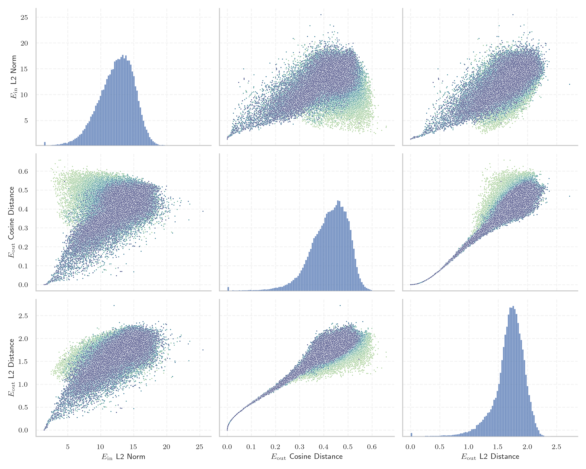
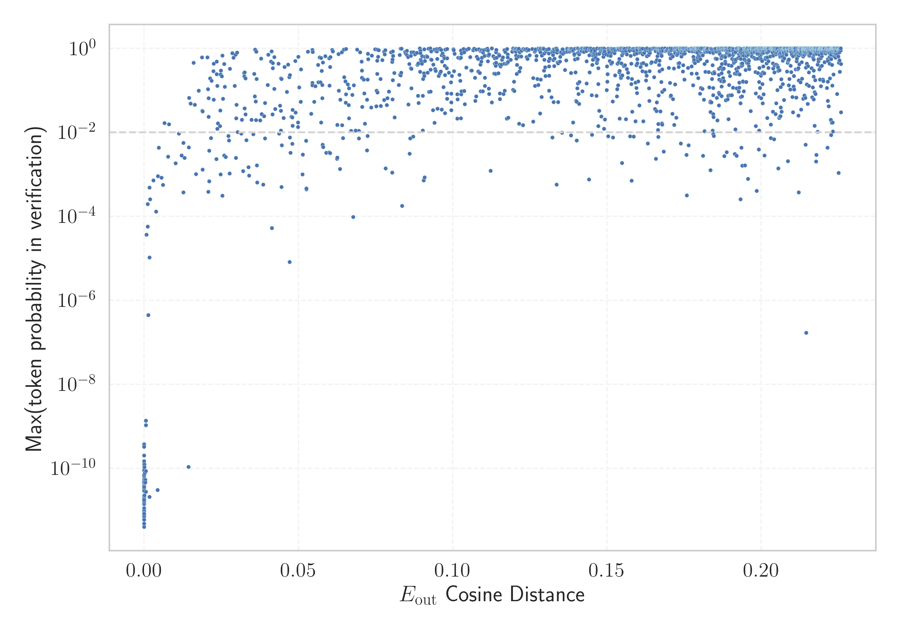

# Report for `allenai/OLMo-2-1124-13B`

## Model info

* Model Info: 
  * Tied embeddings: False
  * LM head uses bias: False
  * Embeddings shape: [100352, 5120]
* Tokenizer Info: 
  * Vocab Size: 100278
  * Tokenizer Class: GPT2Tokenizer
  * Tokenizer Type: BPE
  * Bytes handling: Byte Input
  * Token for verification prompt building: ABCDEFGHIJKLMNOPQRSTUVWXYZ
  * Token id for verification prompt building: 77002
* Indicator summary: 
  * Indicator for under-trained tokens: E_{out} Cosine Distance
  * Overall distribution: 0.421 +/- 0.079
* Detected Token Counts: 
  * Number of tested under-trained tokens: 1992, 1974 non-special, 174 below p = 0.01 threshold, 61 below soft indicator threshold
  * Number of single byte tokens: 256, of which 13 below indicator threshold
  * Number of special tokens: 0, of which 0 below indicator threshold
  * Number of non-single-byte UTF-fragment tokens:  645, of which 3 below soft indicator threshold

## Under-trained token indicators plot


## Verification plot


## Under-trained token verification results
61 entries below threshold of 0.012

|   token_id | token                                |    indicator | max_prob                                                         | in_other_tokens                                                                                                                                                                              |
|------------|--------------------------------------|--------------|------------------------------------------------------------------|----------------------------------------------------------------------------------------------------------------------------------------------------------------------------------------------|
|      41550 | ````` \tRTHOOK `````                 | -2.38419e-07 | <span style='border: 1px solid rgb(169, 68, 66);'>4e-12</span>   |                                                                                                                                                                                              |
|      83315 | ````` richTextPanel `````            | -1.19209e-07 | <span style='border: 1px solid rgb(169, 68, 66);'>2.1e-11</span> |                                                                                                                                                                                              |
|      89471 | ````` useRal `````                   |  0           | <span style='border: 1px solid rgb(169, 68, 66);'>2.1e-11</span> | <span style='border: 1px solid rgb(169, 68, 66);'>````` useRalative `````</span>, <span style='border: 1px solid rgb(169, 68, 66);'>````` useRalativeImagePath `````</span>                  |
|      52362 | ````` SpecWarn `````                 |  0           | <span style='border: 1px solid rgb(169, 68, 66);'>1.4e-11</span> |                                                                                                                                                                                              |
|      50325 | ````` adaptiveStyles `````           |  0           | <span style='border: 1px solid rgb(169, 68, 66);'>1e-11</span>   |                                                                                                                                                                                              |
|      70784 | ````` Japgolly `````                 |  0           | <span style='border: 1px solid rgb(169, 68, 66);'>4.7e-11</span> | <span style='border: 1px solid rgb(169, 68, 66);'>````` ▁typingsJapgolly `````</span>                                                                                                        |
|     100261 | ````` \|\|\|PHONE_NUMBER\|\|\| ````` |  0           | <span style='border: 1px solid rgb(169, 68, 66);'>1.9e-11</span> |                                                                                                                                                                                              |
|      80370 | ````` ▁ForCanBeConvertedToF `````    |  0           | <span style='border: 1px solid rgb(169, 68, 66);'>3.3e-11</span> | <span style='border: 1px solid rgb(169, 68, 66);'>````` ▁ForCanBeConvertedToForeach `````</span>                                                                                             |
|      80369 | ````` ▁ForCanBeConverted `````       |  0           | <span style='border: 1px solid rgb(169, 68, 66);'>4.7e-11</span> | <span style='border: 1px solid rgb(169, 68, 66);'>````` ▁ForCanBeConvertedToF `````</span>, <span style='border: 1px solid rgb(169, 68, 66);'>````` ▁ForCanBeConvertedToForeach `````</span> |
|      47073 | ````` webElementXpaths `````         |  0           | <span style='border: 1px solid rgb(169, 68, 66);'>8.9e-11</span> |                                                                                                                                                                                              |
|      89473 | ````` useRalativeImagePath `````     |  0           | <span style='border: 1px solid rgb(169, 68, 66);'>7.3e-12</span> |                                                                                                                                                                                              |
|      89475 | ````` elementGuidId `````            |  5.96046e-08 | <span style='border: 1px solid rgb(169, 68, 66);'>4.8e-12</span> |                                                                                                                                                                                              |
|     100263 | ````` \|\|\|IP_ADDRESS\|\|\| `````   |  5.96046e-08 | <span style='border: 1px solid rgb(169, 68, 66);'>3.7e-10</span> |                                                                                                                                                                                              |
|      80154 | ````` \tRTLI `````                   |  5.96046e-08 | <span style='border: 1px solid rgb(169, 68, 66);'>7.3e-12</span> |                                                                                                                                                                                              |
|      47072 | ````` webElementX `````              |  5.96046e-08 | <span style='border: 1px solid rgb(169, 68, 66);'>7.7e-12</span> | <span style='border: 1px solid rgb(169, 68, 66);'>````` webElementXpaths `````</span>                                                                                                        |
|      85071 | ````` $PostalCodesNL `````           |  5.96046e-08 | <span style='border: 1px solid rgb(169, 68, 66);'>5.2e-11</span> |                                                                                                                                                                                              |
|      79883 | ````` \tTokenNameIdentifier `````    |  5.96046e-08 | <span style='border: 1px solid rgb(169, 68, 66);'>1.6e-11</span> |                                                                                                                                                                                              |
|      98100 | ````` (stypy `````                   |  5.96046e-08 | <span style='border: 1px solid rgb(169, 68, 66);'>3.6e-11</span> |                                                                                                                                                                                              |
|      67901 | ````` \tRTDBG `````                  |  5.96046e-08 | <span style='border: 1px solid rgb(169, 68, 66);'>4.7e-11</span> |                                                                                                                                                                                              |
|      95812 | ````` \tRTCK `````                   |  5.96046e-08 | <span style='border: 1px solid rgb(169, 68, 66);'>2.3e-11</span> |                                                                                                                                                                                              |
<details><summary>41 additional entries below threshold</summary>

|   token_id | token                                 |   indicator | max_prob                                                         | in_other_tokens                                                                           |
|------------|---------------------------------------|-------------|------------------------------------------------------------------|-------------------------------------------------------------------------------------------|
|     100262 | ````` \|\|\|EMAIL_ADDRESS\|\|\| ````` | 5.96046e-08 | <span style='border: 1px solid rgb(169, 68, 66);'>6.5e-11</span> |                                                                                           |
|      58508 | ````` :-------------</ `````          | 5.96046e-08 | <span style='border: 1px solid rgb(169, 68, 66);'>1.7e-11</span> |                                                                                           |
|      85069 | ````` PostalCodesNL `````             | 5.96046e-08 | <span style='border: 1px solid rgb(169, 68, 66);'>1.4e-11</span> | <span style='border: 1px solid rgb(169, 68, 66);'>````` $PostalCodesNL `````</span>       |
|      95073 | ````` -vesm `````                     | 5.96046e-08 | <span style='border: 1px solid rgb(169, 68, 66);'>2.9e-11</span> |                                                                                           |
|      89472 | ````` useRalative `````               | 1.78814e-07 | <span style='border: 1px solid rgb(169, 68, 66);'>1.2e-10</span> | <span style='border: 1px solid rgb(169, 68, 66);'>````` useRalativeImagePath `````</span> |
|      57779 | ````` \tRTLU `````                    | 1.78814e-07 | <span style='border: 1px solid rgb(169, 68, 66);'>9.4e-12</span> |                                                                                           |
|      33786 | ````` webElementProperties `````      | 1.78814e-07 | <span style='border: 1px solid rgb(169, 68, 66);'>8.5e-12</span> |                                                                                           |
|      93905 | ````` ▁QtAws `````                    | 1.07288e-06 | <span style='border: 1px solid rgb(169, 68, 66);'>8.9e-11</span> |                                                                                           |
|      73018 | ````` ▁StreamLazy `````               | 8.70228e-06 | <span style='border: 1px solid rgb(169, 68, 66);'>7.1e-12</span> |                                                                                           |
|      72740 | ````` ▁typingsJapgolly `````          | 9.89437e-06 | <span style='border: 1px solid rgb(169, 68, 66);'>5.9e-12</span> |                                                                                           |
|      81259 | ````` artisanlib `````                | 1.88947e-05 | <span style='border: 1px solid rgb(169, 68, 66);'>8.3e-12</span> |                                                                                           |
|      84576 | ````` ▁AppMethodBeat `````            | 4.51803e-05 | <span style='border: 1px solid rgb(169, 68, 66);'>1.2e-10</span> |                                                                                           |
|      96656 | ````` methodPointerType `````         | 7.55787e-05 | <span style='border: 1px solid rgb(169, 68, 66);'>1.1e-10</span> |                                                                                           |
|      56930 | ````` \tRTLR `````                    | 8.63075e-05 | <span style='border: 1px solid rgb(169, 68, 66);'>2.2e-11</span> |                                                                                           |
|      80612 | ````` MethodBeat `````                | 0.000123203 | <span style='border: 1px solid rgb(169, 68, 66);'>7.7e-11</span> | <span style='border: 1px solid rgb(169, 68, 66);'>````` ▁AppMethodBeat `````</span>       |
|      71337 | ````` +lsi `````                      | 0.000334442 | <span style='border: 1px solid rgb(169, 68, 66);'>5.3e-11</span> |                                                                                           |
|      90050 | ````` _ComCallableWrapper `````       | 0.000372827 | <span style='border: 1px solid rgb(169, 68, 66);'>4.6e-11</span> |                                                                                           |
|      57361 | ````` _REALTYPE `````                 | 0.000513732 | <span style='border: 1px solid rgb(169, 68, 66);'>8.6e-11</span> |                                                                                           |
|      99202 | ````` (statearr `````                 | 0.000574768 | <span style='border: 1px solid rgb(169, 68, 66);'>1.1e-09</span> |                                                                                           |
|      31960 | ````` quotelev `````                  | 0.000575006 | <span style='border: 1px solid rgb(169, 68, 66);'>2.7e-11</span> |                                                                                           |
|      76371 | ````` LANGADM `````                   | 0.00058496  | <span style='border: 1px solid rgb(169, 68, 66);'>1.4e-09</span> |                                                                                           |
|      56225 | ````` .sulake `````                   | 0.000773251 | <span style='border: 1px solid rgb(169, 68, 66);'>3.6e-05</span> |                                                                                           |
|      82929 | ````` CppMethodIntialized `````       | 0.00112003  | <span style='border: 1px solid rgb(169, 68, 66);'>5.7e-05</span> |                                                                                           |
|      88039 | ````` ♀♀♀♀ `````                      | 0.00117201  | <span style='border: 1px solid rgb(169, 68, 66);'>0.00019</span> |                                                                                           |
|      91817 | ````` (InitializedTypeInfo `````      | 0.00129622  | <span style='border: 1px solid rgb(169, 68, 66);'>4.5e-07</span> |                                                                                           |
|      97736 | ````` \tRTCT `````                    | 0.00167781  | <span style='border: 1px solid rgb(169, 68, 66);'>1e-05</span>   |                                                                                           |
|      88023 | ````` /ayushman `````                 | 0.00169688  | <span style='border: 1px solid rgb(169, 68, 66);'>0.00049</span> |                                                                                           |
|      91198 | ````` externalActionCode `````        | 0.00174791  | <span style='border: 1px solid rgb(169, 68, 66);'>2.1e-11</span> |                                                                                           |
|      90412 | ````` selectorMethod `````            | 0.00189364  | <span style='border: 1px solid rgb(169, 68, 66);'>0.00025</span> |                                                                                           |
|      98668 | ````` );\r\r\r\n `````                | 0.00298029  | <span style='border: 1px solid rgb(169, 68, 66);'>0.00072</span> |                                                                                           |
|      73016 | ````` ▁EnumerableStream `````         | 0.0038389   | <span style='border: 1px solid rgb(169, 68, 66);'>0.00013</span> |                                                                                           |
|      58944 | ````` /Subthreshold `````             | 0.00438571  | <span style='border: 1px solid rgb(169, 68, 66);'>3.1e-11</span> |                                                                                           |
|      87551 | ````` CppGuid `````                   | 0.00448292  | <span style='border: 1px solid rgb(169, 68, 66);'>0.00089</span> |                                                                                           |
|      96737 | ````` departureday `````              | 0.00471997  | <span style='border: 1px solid rgb(255, 145, 0);'>0.0043</span>  |                                                                                           |
|      68896 | ````` ;\r\r\r\n `````                 | 0.00562203  | <span style='border: 1px solid rgb(169, 68, 66);'>0.00083</span> | <span style='border: 1px solid rgb(169, 68, 66);'>````` );\r\r\r\n `````</span>           |
|      89496 | ````` _FieldOffsetTable `````         | 0.00612313  | <span style='border: 1px solid rgb(169, 68, 66);'>0.00056</span> |                                                                                           |
|      67750 | ````` _typeDefinitionSize `````       | 0.00658816  | <span style='border: 1px solid rgb(251, 189, 8);'>0.017</span>   |                                                                                           |
|      26009 | ````` methodVisitor `````             | 0.00777966  | <span style='border: 1px solid rgb(255, 145, 0);'>0.0026</span>  |                                                                                           |
|      73228 | ````` _InternalArray `````            | 0.00800031  | <span style='border: 1px solid rgb(251, 189, 8);'>0.016</span>   |                                                                                           |
|      67705 | ````` _typeDefinition `````           | 0.0102283   | <span style='border: 1px solid rgb(255, 145, 0);'>0.0018</span>  | <span style='border: 1px solid rgb(251, 189, 8);'>````` _typeDefinitionSize `````</span>  |
|      67444 | ````` CppTypeDefinitionSizes `````    | 0.0113      | <span style='border: 1px solid rgb(255, 145, 0);'>0.0093</span>  |                                                                                           |
</details>
<details><summary>1913 additional entries above threshold</summary>

|   token_id | token                                                                                       |   indicator | max_prob                                                         | in_other_tokens                                                                                                                                                                                                                                                                                                                                                                                                                                                                                       |
|------------|---------------------------------------------------------------------------------------------|-------------|------------------------------------------------------------------|-------------------------------------------------------------------------------------------------------------------------------------------------------------------------------------------------------------------------------------------------------------------------------------------------------------------------------------------------------------------------------------------------------------------------------------------------------------------------------------------------------|
|      70316 | ````` erusform `````                                                                        |   0.0121265 | <span style='border: 1px solid rgb(255, 145, 0);'>0.0028</span>  | <span style='border: 1px solid rgb(40, 167, 69);'>````` numerusform `````</span>                                                                                                                                                                                                                                                                                                                                                                                                                      |
|      66235 | ````` CppTypeDefinition `````                                                               |   0.0126819 | <span style='border: 1px solid rgb(255, 145, 0);'>0.0056</span>  | <span style='border: 1px solid rgb(255, 145, 0);'>````` CppTypeDefinitionSizes `````</span>                                                                                                                                                                                                                                                                                                                                                                                                           |
|      81998 | ````` ablytyped `````                                                                       |   0.0127487 | <span style='border: 1px solid rgb(169, 68, 66);'>0.00037</span> | <span style='border: 1px solid rgb(251, 189, 8);'>````` .scalablytyped `````</span>                                                                                                                                                                                                                                                                                                                                                                                                                   |
|      55557 | ````` ((&___ `````                                                                          |   0.0131165 | <span style='border: 1px solid rgb(255, 145, 0);'>0.0024</span>  |                                                                                                                                                                                                                                                                                                                                                                                                                                                                                                       |
|      34956 | ````` ▁+#+#+#+ `````                                                                        |   0.0143433 | <span style='border: 1px solid rgb(169, 68, 66);'>1.1e-10</span> | <span style='border: 1px solid rgb(255, 145, 0);'>````` ▁+#+#+#+#+#+ `````</span>                                                                                                                                                                                                                                                                                                                                                                                                                     |
|      71390 | ````` ▁PodsDummy `````                                                                      |   0.0144738 | <span style='border: 1px solid rgb(255, 145, 0);'>0.0044</span>  |                                                                                                                                                                                                                                                                                                                                                                                                                                                                                                       |
|      85154 | ````` buttonShape `````                                                                     |   0.01458   | <span style='border: 1px solid rgb(251, 189, 8);'>0.066</span>   |                                                                                                                                                                                                                                                                                                                                                                                                                                                                                                       |
|      84993 | ````` rPid `````                                                                            |   0.0150675 | <span style='border: 1px solid rgb(251, 189, 8);'>0.049</span>   |                                                                                                                                                                                                                                                                                                                                                                                                                                                                                                       |
|      81325 | ````` .bindingNavigatorMove `````                                                           |   0.0159861 | <span style='border: 1px solid rgb(40, 167, 69);'>0.45</span>    |                                                                                                                                                                                                                                                                                                                                                                                                                                                                                                       |
|      39866 | ````` .xrLabel `````                                                                        |   0.0164155 | <span style='border: 1px solid rgb(251, 189, 8);'>0.045</span>   |                                                                                                                                                                                                                                                                                                                                                                                                                                                                                                       |
|      98715 | ````` .XRLabel `````                                                                        |   0.0167844 | <span style='border: 1px solid rgb(255, 145, 0);'>0.001</span>   |                                                                                                                                                                                                                                                                                                                                                                                                                                                                                                       |
|      43053 | ````` .layoutControlItem `````                                                              |   0.017718  | <span style='border: 1px solid rgb(251, 189, 8);'>0.098</span>   |                                                                                                                                                                                                                                                                                                                                                                                                                                                                                                       |
|      58194 | ````` InternalEnumerator `````                                                              |   0.0186952 | <span style='border: 1px solid rgb(40, 167, 69);'>0.61</span>    | <span style='border: 1px solid rgb(251, 189, 8);'>````` ▁InternalEnumerator `````</span>                                                                                                                                                                                                                                                                                                                                                                                                              |
|      37370 | ````` \tEIF `````                                                                           |   0.0188083 | <span style='border: 1px solid rgb(251, 189, 8);'>0.032</span>   |                                                                                                                                                                                                                                                                                                                                                                                                                                                                                                       |
|      45146 | ````` %timeout `````                                                                        |   0.0188988 | <span style='border: 1px solid rgb(255, 145, 0);'>0.0013</span>  |                                                                                                                                                                                                                                                                                                                                                                                                                                                                                                       |
|      69679 | ````` /settingsdialog `````                                                                 |   0.0189299 | <span style='border: 1px solid rgb(251, 189, 8);'>0.031</span>   |                                                                                                                                                                                                                                                                                                                                                                                                                                                                                                       |
|      96334 | ````` .bunifuFlatButton `````                                                               |   0.0204998 | <span style='border: 1px solid rgb(40, 167, 69);'>0.61</span>    |                                                                                                                                                                                                                                                                                                                                                                                                                                                                                                       |
|      71664 | ````` \tNdrFc `````                                                                         |   0.0206593 | <span style='border: 1px solid rgb(40, 167, 69);'>0.11</span>    | <span style='border: 1px solid rgb(40, 167, 69);'>````` \tNdrFcShort `````</span>                                                                                                                                                                                                                                                                                                                                                                                                                     |
|      64676 | ````` .AbsoluteConstraints `````                                                            |   0.0207592 | <span style='border: 1px solid rgb(169, 68, 66);'>0.00038</span> |                                                                                                                                                                                                                                                                                                                                                                                                                                                                                                       |
|      44001 | ````` _AdjustorThunk `````                                                                  |   0.0208419 | <span style='border: 1px solid rgb(251, 189, 8);'>0.023</span>   |                                                                                                                                                                                                                                                                                                                                                                                                                                                                                                       |
|      24452 | ````` <lemma `````                                                                          |   0.0208794 | <span style='border: 1px solid rgb(251, 189, 8);'>0.065</span>   |                                                                                                                                                                                                                                                                                                                                                                                                                                                                                                       |
|      43944 | ````` orThunk `````                                                                         |   0.0210595 | <span style='border: 1px solid rgb(255, 145, 0);'>0.0037</span>  | <span style='border: 1px solid rgb(251, 189, 8);'>````` _AdjustorThunk `````</span>                                                                                                                                                                                                                                                                                                                                                                                                                   |
|      95664 | ````` ETweet `````                                                                          |   0.0210806 | <span style='border: 1px solid rgb(169, 68, 66);'>0.00069</span> |                                                                                                                                                                                                                                                                                                                                                                                                                                                                                                       |
|      85731 | ````` (RuntimeObject `````                                                                  |   0.0213732 | <span style='border: 1px solid rgb(40, 167, 69);'>0.19</span>    |                                                                                                                                                                                                                                                                                                                                                                                                                                                                                                       |
|      53974 | ````` CppMethodInitialized `````                                                            |   0.0216789 | <span style='border: 1px solid rgb(255, 145, 0);'>0.0073</span>  |                                                                                                                                                                                                                                                                                                                                                                                                                                                                                                       |
|      76613 | ````` extracomment `````                                                                    |   0.021889  | <span style='border: 1px solid rgb(40, 167, 69);'>0.17</span>    |                                                                                                                                                                                                                                                                                                                                                                                                                                                                                                       |
|      57260 | ````` CppGenericClass `````                                                                 |   0.0224797 | <span style='border: 1px solid rgb(40, 167, 69);'>0.28</span>    |                                                                                                                                                                                                                                                                                                                                                                                                                                                                                                       |
|      91296 | ````` CppI `````                                                                            |   0.0224926 | <span style='border: 1px solid rgb(251, 189, 8);'>0.06</span>    |                                                                                                                                                                                                                                                                                                                                                                                                                                                                                                       |
|      76271 | ````` \tNdrFcShort `````                                                                    |   0.022532  | <span style='border: 1px solid rgb(40, 167, 69);'>0.43</span>    |                                                                                                                                                                                                                                                                                                                                                                                                                                                                                                       |
|      68131 | ````` _MetadataUsageId `````                                                                |   0.023441  | <span style='border: 1px solid rgb(255, 145, 0);'>0.0023</span>  |                                                                                                                                                                                                                                                                                                                                                                                                                                                                                                       |
|      83949 | ````` .panelControl `````                                                                   |   0.0234753 | <span style='border: 1px solid rgb(40, 167, 69);'>0.49</span>    |                                                                                                                                                                                                                                                                                                                                                                                                                                                                                                       |
|      62761 | ````` .layoutControl `````                                                                  |   0.0235492 | <span style='border: 1px solid rgb(40, 167, 69);'>0.24</span>    |                                                                                                                                                                                                                                                                                                                                                                                                                                                                                                       |
|      75520 | ````` ▁NUITKA `````                                                                         |   0.0236543 | <span style='border: 1px solid rgb(40, 167, 69);'>0.13</span>    |                                                                                                                                                                                                                                                                                                                                                                                                                                                                                                       |
|      59839 | ````` ConstraintMaker `````                                                                 |   0.0237355 | <span style='border: 1px solid rgb(251, 189, 8);'>0.012</span>   | <span style='border: 1px solid rgb(40, 167, 69);'>````` MASConstraintMaker `````</span>                                                                                                                                                                                                                                                                                                                                                                                                               |
|      35922 | ````` CppMethodPointer `````                                                                |   0.0238872 | <span style='border: 1px solid rgb(251, 189, 8);'>0.016</span>   |                                                                                                                                                                                                                                                                                                                                                                                                                                                                                                       |
|      84043 | ````` .LayoutControlItem `````                                                              |   0.0245848 | <span style='border: 1px solid rgb(251, 189, 8);'>0.014</span>   |                                                                                                                                                                                                                                                                                                                                                                                                                                                                                                       |
|      76709 | ````` ▁InternalEnumerator `````                                                             |   0.0246747 | <span style='border: 1px solid rgb(251, 189, 8);'>0.033</span>   |                                                                                                                                                                                                                                                                                                                                                                                                                                                                                                       |
|      40036 | ````` CppCodeGenWriteBarrier `````                                                          |   0.024804  | <span style='border: 1px solid rgb(169, 68, 66);'>0.001</span>   |                                                                                                                                                                                                                                                                                                                                                                                                                                                                                                       |
|      59066 | ````` ▁hexatrigesimal `````                                                                 |   0.0248131 | <span style='border: 1px solid rgb(40, 167, 69);'>0.24</span>    |                                                                                                                                                                                                                                                                                                                                                                                                                                                                                                       |
|      97100 | ````` .barDockControl `````                                                                 |   0.0248979 | <span style='border: 1px solid rgb(40, 167, 69);'>0.29</span>    |                                                                                                                                                                                                                                                                                                                                                                                                                                                                                                       |
|      94141 | ````` .XRTableCell `````                                                                    |   0.02512   | <span style='border: 1px solid rgb(40, 167, 69);'>0.21</span>    |                                                                                                                                                                                                                                                                                                                                                                                                                                                                                                       |
|      46705 | ````` .bindingNavigator `````                                                               |   0.0253045 | <span style='border: 1px solid rgb(40, 167, 69);'>0.67</span>    | <span style='border: 1px solid rgb(40, 167, 69);'>````` .bindingNavigatorMove `````</span>                                                                                                                                                                                                                                                                                                                                                                                                            |
|      73303 | ````` .DataGridViewColumnHeadersHeightSizeMode `````                                        |   0.0253442 | <span style='border: 1px solid rgb(169, 68, 66);'>0.00031</span> |                                                                                                                                                                                                                                                                                                                                                                                                                                                                                                       |
|      96165 | ````` ▁HinderedRotor `````                                                                  |   0.0255663 | <span style='border: 1px solid rgb(251, 189, 8);'>0.063</span>   |                                                                                                                                                                                                                                                                                                                                                                                                                                                                                                       |
|      37074 | ````` _GenericClass `````                                                                   |   0.0259333 | <span style='border: 1px solid rgb(40, 167, 69);'>0.42</span>    |                                                                                                                                                                                                                                                                                                                                                                                                                                                                                                       |
|      95656 | ````` .DataGridViewContentAlignment `````                                                   |   0.0259815 | <span style='border: 1px solid rgb(255, 145, 0);'>0.0028</span>  |                                                                                                                                                                                                                                                                                                                                                                                                                                                                                                       |
|      54278 | ````` CppGeneric `````                                                                      |   0.0261222 | <span style='border: 1px solid rgb(40, 167, 69);'>0.12</span>    | <span style='border: 1px solid rgb(40, 167, 69);'>````` CppGenericClass `````</span>                                                                                                                                                                                                                                                                                                                                                                                                                  |
|      87941 | ````` $fdata `````                                                                          |   0.026402  | <span style='border: 1px solid rgb(255, 145, 0);'>0.0026</span>  |                                                                                                                                                                                                                                                                                                                                                                                                                                                                                                       |
|      35338 | ````` CppCodeGen `````                                                                      |   0.0272532 | <span style='border: 1px solid rgb(255, 145, 0);'>0.0081</span>  | <span style='border: 1px solid rgb(169, 68, 66);'>````` CppCodeGenWriteBarrier `````</span>                                                                                                                                                                                                                                                                                                                                                                                                           |
|      71366 | ````` drFc `````                                                                            |   0.0274695 | <span style='border: 1px solid rgb(255, 145, 0);'>0.0064</span>  | <span style='border: 1px solid rgb(40, 167, 69);'>````` \tNdrFc `````</span>, <span style='border: 1px solid rgb(40, 167, 69);'>````` \tNdrFcShort `````</span>                                                                                                                                                                                                                                                                                                                                       |
|      47219 | ````` HeadersHeightSizeMode `````                                                           |   0.027649  | <span style='border: 1px solid rgb(255, 145, 0);'>0.001</span>   | <span style='border: 1px solid rgb(169, 68, 66);'>````` .DataGridViewColumnHeadersHeightSizeMode `````</span>, <span style='border: 1px solid rgb(251, 189, 8);'>````` .ColumnHeadersHeightSizeMode `````</span>                                                                                                                                                                                                                                                                                      |
|      63785 | ````` ▁RTWF `````                                                                           |   0.0277781 | <span style='border: 1px solid rgb(40, 167, 69);'>0.33</span>    |                                                                                                                                                                                                                                                                                                                                                                                                                                                                                                       |
|      48134 | ````` .xrTableCell `````                                                                    |   0.0285987 | <span style='border: 1px solid rgb(40, 167, 69);'>0.77</span>    |                                                                                                                                                                                                                                                                                                                                                                                                                                                                                                       |
|      43382 | ````` .labelControl `````                                                                   |   0.028926  | <span style='border: 1px solid rgb(40, 167, 69);'>0.6</span>     |                                                                                                                                                                                                                                                                                                                                                                                                                                                                                                       |
|      95525 | ````` ▁dataGridViewTextBoxColumn `````                                                      |   0.02937   | <span style='border: 1px solid rgb(40, 167, 69);'>0.13</span>    |                                                                                                                                                                                                                                                                                                                                                                                                                                                                                                       |
|      75630 | ````` 雅黑 `````                                                                            |   0.0296276 | <span style='border: 1px solid rgb(40, 167, 69);'>0.7</span>     | <span style='border: 1px solid rgb(251, 189, 8);'>````` 软雅黑 `````</span>, <span style='border: 1px solid rgb(40, 167, 69);'>````` 微软雅黑 `````</span>                                                                                                                                                                                                                                                                                                                                            |
|      70912 | ````` .PictureBoxSizeMode `````                                                             |   0.0296801 | <span style='border: 1px solid rgb(255, 145, 0);'>0.0024</span>  |                                                                                                                                                                                                                                                                                                                                                                                                                                                                                                       |
|      69215 | ````` .XtraLayout `````                                                                     |   0.0297979 | <span style='border: 1px solid rgb(251, 189, 8);'>0.022</span>   |                                                                                                                                                                                                                                                                                                                                                                                                                                                                                                       |
|      61013 | ````` .StylePriority `````                                                                  |   0.0299366 | <span style='border: 1px solid rgb(251, 189, 8);'>0.045</span>   |                                                                                                                                                                                                                                                                                                                                                                                                                                                                                                       |
|      80750 | ````` .groupControl `````                                                                   |   0.0300854 | <span style='border: 1px solid rgb(40, 167, 69);'>0.79</span>    |                                                                                                                                                                                                                                                                                                                                                                                                                                                                                                       |
|      83878 | ````` .EditorButton `````                                                                   |   0.0303481 | <span style='border: 1px solid rgb(251, 189, 8);'>0.01</span>    |                                                                                                                                                                                                                                                                                                                                                                                                                                                                                                       |
|      74475 | ````` (&___ `````                                                                           |   0.0314531 | <span style='border: 1px solid rgb(255, 145, 0);'>0.0093</span>  |                                                                                                                                                                                                                                                                                                                                                                                                                                                                                                       |
|      61963 | ````` _RGCTX `````                                                                          |   0.0316592 | <span style='border: 1px solid rgb(251, 189, 8);'>0.02</span>    |                                                                                                                                                                                                                                                                                                                                                                                                                                                                                                       |
|      67727 | ````` \|()\n `````                                                                          |   0.0320837 | <span style='border: 1px solid rgb(255, 145, 0);'>0.0012</span>  |                                                                                                                                                                                                                                                                                                                                                                                                                                                                                                       |
|      72745 | ````` ▁XBOOLE `````                                                                         |   0.0323386 | <span style='border: 1px solid rgb(40, 167, 69);'>0.26</span>    |                                                                                                                                                                                                                                                                                                                                                                                                                                                                                                       |
|      95649 | ````` _UFunction `````                                                                      |   0.0324746 | <span style='border: 1px solid rgb(40, 167, 69);'>0.21</span>    |                                                                                                                                                                                                                                                                                                                                                                                                                                                                                                       |
|      71227 | ````` ▁FINSEQ `````                                                                         |   0.0325619 | <span style='border: 1px solid rgb(40, 167, 69);'>0.27</span>    |                                                                                                                                                                                                                                                                                                                                                                                                                                                                                                       |
|      73408 | ````` .ColumnStyle `````                                                                    |   0.0325771 | <span style='border: 1px solid rgb(251, 189, 8);'>0.037</span>   |                                                                                                                                                                                                                                                                                                                                                                                                                                                                                                       |
|      84915 | ````` sPid `````                                                                            |   0.0328475 | <span style='border: 1px solid rgb(40, 167, 69);'>0.19</span>    |                                                                                                                                                                                                                                                                                                                                                                                                                                                                                                       |
|      86849 | ````` \tRuntimeObject `````                                                                 |   0.0328773 | <span style='border: 1px solid rgb(251, 189, 8);'>0.027</span>   |                                                                                                                                                                                                                                                                                                                                                                                                                                                                                                       |
|      66174 | ````` .didReceiveMemoryWarning `````                                                        |   0.0331489 | <span style='border: 1px solid rgb(255, 145, 0);'>0.0065</span>  |                                                                                                                                                                                                                                                                                                                                                                                                                                                                                                       |
|      94226 | ````` /contentassist `````                                                                  |   0.0338311 | <span style='border: 1px solid rgb(255, 145, 0);'>0.0015</span>  |                                                                                                                                                                                                                                                                                                                                                                                                                                                                                                       |
|      99168 | ````` SmartyHeaderCode `````                                                                |   0.0339954 | <span style='border: 1px solid rgb(169, 68, 66);'>0.00093</span> |                                                                                                                                                                                                                                                                                                                                                                                                                                                                                                       |
|      88685 | ````` .ComboBoxStyle `````                                                                  |   0.0347596 | <span style='border: 1px solid rgb(251, 189, 8);'>0.02</span>    |                                                                                                                                                                                                                                                                                                                                                                                                                                                                                                       |
|      43408 | ````` .DotNetBar `````                                                                      |   0.0353665 | <span style='border: 1px solid rgb(255, 145, 0);'>0.009</span>   |                                                                                                                                                                                                                                                                                                                                                                                                                                                                                                       |
|      63216 | ````` \tiVar `````                                                                          |   0.0357033 | <span style='border: 1px solid rgb(40, 167, 69);'>0.25</span>    |                                                                                                                                                                                                                                                                                                                                                                                                                                                                                                       |
|      85275 | ````` .UseText `````                                                                        |   0.035848  | <span style='border: 1px solid rgb(251, 189, 8);'>0.071</span>   |                                                                                                                                                                                                                                                                                                                                                                                                                                                                                                       |
|      25332 | ````` \r\r\r\n `````                                                                        |   0.0359452 | <span style='border: 1px solid rgb(40, 167, 69);'>0.93</span>    | <span style='border: 1px solid rgb(169, 68, 66);'>````` );\r\r\r\n `````</span>, <span style='border: 1px solid rgb(169, 68, 66);'>````` ;\r\r\r\n `````</span>                                                                                                                                                                                                                                                                                                                                       |
|      77666 | ````` okableCall `````                                                                      |   0.0361729 | <span style='border: 1px solid rgb(251, 189, 8);'>0.054</span>   |                                                                                                                                                                                                                                                                                                                                                                                                                                                                                                       |
|      86062 | ````` GameObjectWithTag `````                                                               |   0.0362645 | <span style='border: 1px solid rgb(251, 189, 8);'>0.02</span>    | <span style='border: 1px solid rgb(255, 145, 0);'>````` .FindGameObjectWithTag `````</span>                                                                                                                                                                                                                                                                                                                                                                                                           |
|      82468 | ````` ▁uLocal `````                                                                         |   0.0363237 | <span style='border: 1px solid rgb(40, 167, 69);'>0.83</span>    |                                                                                                                                                                                                                                                                                                                                                                                                                                                                                                       |
|      48077 | ````` .dataGridViewTextBoxColumn `````                                                      |   0.0363948 | <span style='border: 1px solid rgb(40, 167, 69);'>0.19</span>    |                                                                                                                                                                                                                                                                                                                                                                                                                                                                                                       |
|      60107 | ````` .awtextra `````                                                                       |   0.03655   | <span style='border: 1px solid rgb(255, 145, 0);'>0.0016</span>  |                                                                                                                                                                                                                                                                                                                                                                                                                                                                                                       |
|      96037 | ````` .DataGridViewTriState `````                                                           |   0.0366424 | <span style='border: 1px solid rgb(169, 68, 66);'>0.00063</span> |                                                                                                                                                                                                                                                                                                                                                                                                                                                                                                       |
|      86415 | ````` BundleOrNil `````                                                                     |   0.0376108 | <span style='border: 1px solid rgb(251, 189, 8);'>0.019</span>   | <span style='border: 1px solid rgb(255, 145, 0);'>````` ibBundleOrNil `````</span>                                                                                                                                                                                                                                                                                                                                                                                                                    |
|      97913 | ````` .simpleButton `````                                                                   |   0.037942  | <span style='border: 1px solid rgb(40, 167, 69);'>0.57</span>    |                                                                                                                                                                                                                                                                                                                                                                                                                                                                                                       |
|      71927 | ````` ▁guiActive `````                                                                      |   0.0380542 | <span style='border: 1px solid rgb(251, 189, 8);'>0.027</span>   |                                                                                                                                                                                                                                                                                                                                                                                                                                                                                                       |
|      99944 | ````` ▁davidjl `````                                                                        |   0.0385599 | <span style='border: 1px solid rgb(169, 68, 66);'>0.00057</span> |                                                                                                                                                                                                                                                                                                                                                                                                                                                                                                       |
|      31827 | ````` {EIF `````                                                                            |   0.0388784 | <span style='border: 1px solid rgb(251, 189, 8);'>0.024</span>   |                                                                                                                                                                                                                                                                                                                                                                                                                                                                                                       |
|      90490 | ````` ibBundleOrNil `````                                                                   |   0.0391119 | <span style='border: 1px solid rgb(255, 145, 0);'>0.0071</span>  |                                                                                                                                                                                                                                                                                                                                                                                                                                                                                                       |
|      92103 | ````` NavigatorMove `````                                                                   |   0.0391543 | <span style='border: 1px solid rgb(251, 189, 8);'>0.05</span>    |                                                                                                                                                                                                                                                                                                                                                                                                                                                                                                       |
|      60074 | ````` MASConstraintMaker `````                                                              |   0.0400369 | <span style='border: 1px solid rgb(40, 167, 69);'>0.13</span>    |                                                                                                                                                                                                                                                                                                                                                                                                                                                                                                       |
|      81761 | ````` vinfos `````                                                                          |   0.0402009 | <span style='border: 1px solid rgb(40, 167, 69);'>0.7</span>     |                                                                                                                                                                                                                                                                                                                                                                                                                                                                                                       |
|      24283 | ````` SequentialGroup `````                                                                 |   0.0411146 | <span style='border: 1px solid rgb(40, 167, 69);'>0.48</span>    | <span style='border: 1px solid rgb(251, 189, 8);'>````` .createSequentialGroup `````</span>                                                                                                                                                                                                                                                                                                                                                                                                           |
|      62850 | ````` _jButton `````                                                                        |   0.0412892 | <span style='border: 1px solid rgb(40, 167, 69);'>0.84</span>    |                                                                                                                                                                                                                                                                                                                                                                                                                                                                                                       |
|      99072 | ````` 。www `````                                                                           |   0.0413857 | <span style='border: 1px solid rgb(169, 68, 66);'>5.2e-05</span> |                                                                                                                                                                                                                                                                                                                                                                                                                                                                                                       |
|      75631 | ````` 软雅黑 `````                                                                          |   0.0415545 | <span style='border: 1px solid rgb(251, 189, 8);'>0.027</span>   | <span style='border: 1px solid rgb(40, 167, 69);'>````` 微软雅黑 `````</span>                                                                                                                                                                                                                                                                                                                                                                                                                         |
|      89658 | ````` uniacid `````                                                                         |   0.0416391 | <span style='border: 1px solid rgb(40, 167, 69);'>0.44</span>    |                                                                                                                                                                                                                                                                                                                                                                                                                                                                                                       |
|      69790 | ````` .metroLabel `````                                                                     |   0.0417306 | <span style='border: 1px solid rgb(40, 167, 69);'>0.34</span>    |                                                                                                                                                                                                                                                                                                                                                                                                                                                                                                       |
|      37176 | ````` .bunifu `````                                                                         |   0.0421332 | <span style='border: 1px solid rgb(40, 167, 69);'>0.11</span>    | <span style='border: 1px solid rgb(40, 167, 69);'>````` .bunifuFlatButton `````</span>                                                                                                                                                                                                                                                                                                                                                                                                                |
|      92261 | ````` .BorderSide `````                                                                     |   0.0421816 | <span style='border: 1px solid rgb(40, 167, 69);'>0.62</span>    |                                                                                                                                                                                                                                                                                                                                                                                                                                                                                                       |
|      94394 | ````` .DataGridViewAutoSize `````                                                           |   0.042487  | <span style='border: 1px solid rgb(251, 189, 8);'>0.036</span>   |                                                                                                                                                                                                                                                                                                                                                                                                                                                                                                       |
|      84879 | ````` mPid `````                                                                            |   0.0435126 | <span style='border: 1px solid rgb(40, 167, 69);'>0.43</span>    |                                                                                                                                                                                                                                                                                                                                                                                                                                                                                                       |
|      43587 | ````` atrigesimal `````                                                                     |   0.043749  | <span style='border: 1px solid rgb(255, 145, 0);'>0.0092</span>  | <span style='border: 1px solid rgb(169, 68, 66);'>````` ▁Hexatrigesimal `````</span>, <span style='border: 1px solid rgb(40, 167, 69);'>````` ▁hexatrigesimal `````</span>                                                                                                                                                                                                                                                                                                                            |
|      40270 | ````` wcsstore `````                                                                        |   0.0440277 | <span style='border: 1px solid rgb(251, 189, 8);'>0.043</span>   |                                                                                                                                                                                                                                                                                                                                                                                                                                                                                                       |
|      63979 | ````` (iParam `````                                                                         |   0.0442821 | <span style='border: 1px solid rgb(40, 167, 69);'>0.19</span>    |                                                                                                                                                                                                                                                                                                                                                                                                                                                                                                       |
|      45794 | ````` >tagger `````                                                                         |   0.0443239 | <span style='border: 1px solid rgb(251, 189, 8);'>0.011</span>   |                                                                                                                                                                                                                                                                                                                                                                                                                                                                                                       |
|      90013 | ````` _IEnumerator `````                                                                    |   0.044324  | <span style='border: 1px solid rgb(251, 189, 8);'>0.032</span>   |                                                                                                                                                                                                                                                                                                                                                                                                                                                                                                       |
|      42968 | ````` \tNullCheck `````                                                                     |   0.0444599 | <span style='border: 1px solid rgb(40, 167, 69);'>0.19</span>    |                                                                                                                                                                                                                                                                                                                                                                                                                                                                                                       |
|      79740 | ````` ▁Hexatrigesimal `````                                                                 |   0.0445361 | <span style='border: 1px solid rgb(169, 68, 66);'>0.0005</span>  |                                                                                                                                                                                                                                                                                                                                                                                                                                                                                                       |
|      66195 | ````` .FormStartPosition `````                                                              |   0.0446452 | <span style='border: 1px solid rgb(255, 145, 0);'>0.0049</span>  |                                                                                                                                                                                                                                                                                                                                                                                                                                                                                                       |
|      34791 | ````` PreferredGap `````                                                                    |   0.0452133 | <span style='border: 1px solid rgb(251, 189, 8);'>0.022</span>   | <span style='border: 1px solid rgb(40, 167, 69);'>````` addPreferredGap `````</span>                                                                                                                                                                                                                                                                                                                                                                                                                  |
|      68189 | ````` _UClass `````                                                                         |   0.0454758 | <span style='border: 1px solid rgb(40, 167, 69);'>0.36</span>    |                                                                                                                                                                                                                                                                                                                                                                                                                                                                                                       |
|      79423 | ````` ▁thuisontvangst `````                                                                 |   0.0462354 | <span style='border: 1px solid rgb(251, 189, 8);'>0.092</span>   |                                                                                                                                                                                                                                                                                                                                                                                                                                                                                                       |
|      99071 | ````` -cmpr `````                                                                           |   0.046612  | <span style='border: 1px solid rgb(40, 167, 69);'>0.41</span>    |                                                                                                                                                                                                                                                                                                                                                                                                                                                                                                       |
|      91589 | ````` ImageRelation `````                                                                   |   0.0470064 | <span style='border: 1px solid rgb(40, 167, 69);'>0.21</span>    | <span style='border: 1px solid rgb(40, 167, 69);'>````` .TextImageRelation `````</span>                                                                                                                                                                                                                                                                                                                                                                                                               |
|      97784 | ````` ▁JSBracketAccess `````                                                                |   0.0471761 | <span style='border: 1px solid rgb(169, 68, 66);'>8.1e-06</span> |                                                                                                                                                                                                                                                                                                                                                                                                                                                                                                       |
|      34957 | ````` ▁+#+#+#+#+#+ `````                                                                    |   0.0472239 | <span style='border: 1px solid rgb(255, 145, 0);'>0.0075</span>  |                                                                                                                                                                                                                                                                                                                                                                                                                                                                                                       |
|      60837 | ````` .Bunifu `````                                                                         |   0.0472716 | <span style='border: 1px solid rgb(40, 167, 69);'>0.23</span>    |                                                                                                                                                                                                                                                                                                                                                                                                                                                                                                       |
|      96348 | ````` ',\r\r\n `````                                                                        |   0.0474465 | <span style='border: 1px solid rgb(255, 145, 0);'>0.0033</span>  |                                                                                                                                                                                                                                                                                                                                                                                                                                                                                                       |
|      59901 | ````` ▁principalColumn `````                                                                |   0.0476732 | <span style='border: 1px solid rgb(251, 189, 8);'>0.023</span>   |                                                                                                                                                                                                                                                                                                                                                                                                                                                                                                       |
|      92339 | ````` <UFunction `````                                                                      |   0.0479754 | <span style='border: 1px solid rgb(251, 189, 8);'>0.023</span>   |                                                                                                                                                                                                                                                                                                                                                                                                                                                                                                       |
|      59590 | ````` IntoConstraints `````                                                                 |   0.0480294 | <span style='border: 1px solid rgb(255, 145, 0);'>0.0053</span>  | <span style='border: 1px solid rgb(40, 167, 69);'>````` .translatesAutoresizingMaskIntoConstraints `````</span>, <span style='border: 1px solid rgb(251, 189, 8);'>````` latesAutoresizingMaskIntoConstraints `````</span>, <span style='border: 1px solid rgb(255, 145, 0);'>````` AutoresizingMaskIntoConstraints `````</span>                                                                                                                                                                      |
|      83203 | ````` .SetKeyName `````                                                                     |   0.0480981 | <span style='border: 1px solid rgb(251, 189, 8);'>0.014</span>   |                                                                                                                                                                                                                                                                                                                                                                                                                                                                                                       |
|      51840 | ````` $IFn `````                                                                            |   0.0481174 | <span style='border: 1px solid rgb(251, 189, 8);'>0.034</span>   |                                                                                                                                                                                                                                                                                                                                                                                                                                                                                                       |
|      47817 | ````` :semicolon `````                                                                      |   0.048931  | <span style='border: 1px solid rgb(40, 167, 69);'>0.5</span>     |                                                                                                                                                                                                                                                                                                                                                                                                                                                                                                       |
|      97859 | ````` (UIAlertAction `````                                                                  |   0.0490658 | <span style='border: 1px solid rgb(251, 189, 8);'>0.03</span>    |                                                                                                                                                                                                                                                                                                                                                                                                                                                                                                       |
|      96913 | ````` .UltraWin `````                                                                       |   0.0498292 | <span style='border: 1px solid rgb(251, 189, 8);'>0.017</span>   |                                                                                                                                                                                                                                                                                                                                                                                                                                                                                                       |
|      51717 | ````` ▁prostituerte `````                                                                   |   0.0498552 | <span style='border: 1px solid rgb(251, 189, 8);'>0.013</span>   |                                                                                                                                                                                                                                                                                                                                                                                                                                                                                                       |
|      56622 | ````` _equalTo `````                                                                        |   0.0499137 | <span style='border: 1px solid rgb(40, 167, 69);'>0.63</span>    |                                                                                                                                                                                                                                                                                                                                                                                                                                                                                                       |
|      65053 | ````` 监听页面 `````                                                                        |   0.0502632 | <span style='border: 1px solid rgb(40, 167, 69);'>0.12</span>    |                                                                                                                                                                                                                                                                                                                                                                                                                                                                                                       |
|      51486 | ````` .DataGridViewCellStyle `````                                                          |   0.0507556 | <span style='border: 1px solid rgb(251, 189, 8);'>0.053</span>   |                                                                                                                                                                                                                                                                                                                                                                                                                                                                                                       |
|      40729 | ````` \tTokenName `````                                                                     |   0.0507995 | <span style='border: 1px solid rgb(40, 167, 69);'>0.31</span>    | <span style='border: 1px solid rgb(169, 68, 66);'>````` \tTokenNameIdentifier `````</span>                                                                                                                                                                                                                                                                                                                                                                                                            |
|      80371 | ````` ▁ForCanBeConvertedToForeach `````                                                     |   0.0512966 | <span style='border: 1px solid rgb(169, 68, 66);'>0.001</span>   |                                                                                                                                                                                                                                                                                                                                                                                                                                                                                                       |
|      74300 | ````` ['<{ `````                                                                            |   0.0514567 | <span style='border: 1px solid rgb(255, 145, 0);'>0.003</span>   |                                                                                                                                                                                                                                                                                                                                                                                                                                                                                                       |
|      57722 | ````` ▁;;= `````                                                                            |   0.0524396 | <span style='border: 1px solid rgb(255, 145, 0);'>0.0063</span>  |                                                                                                                                                                                                                                                                                                                                                                                                                                                                                                       |
|       7798 | ````` ERCHANTABILITY `````                                                                  |   0.0525298 | <span style='border: 1px solid rgb(169, 68, 66);'>0.00043</span> | ````` ▁MERCHANTABILITY `````, <span style='border: 1px solid rgb(40, 167, 69);'>````` MERCHANTABILITY `````</span>                                                                                                                                                                                                                                                                                                                                                                                    |
|      57473 | ````` :initComponents `````                                                                 |   0.0525734 | <span style='border: 1px solid rgb(169, 68, 66);'>0.00046</span> |                                                                                                                                                                                                                                                                                                                                                                                                                                                                                                       |
|      70528 | ````` _MethodInfo `````                                                                     |   0.0530431 | <span style='border: 1px solid rgb(40, 167, 69);'>0.83</span>    |                                                                                                                                                                                                                                                                                                                                                                                                                                                                                                       |
|      90426 | ````` ibNameOrNil `````                                                                     |   0.0541046 | <span style='border: 1px solid rgb(251, 189, 8);'>0.028</span>   |                                                                                                                                                                                                                                                                                                                                                                                                                                                                                                       |
|      98170 | ````` .StretchImage `````                                                                   |   0.0544884 | <span style='border: 1px solid rgb(40, 167, 69);'>0.15</span>    |                                                                                                                                                                                                                                                                                                                                                                                                                                                                                                       |
|      66330 | ````` 'LBL `````                                                                            |   0.0545354 | <span style='border: 1px solid rgb(40, 167, 69);'>0.13</span>    |                                                                                                                                                                                                                                                                                                                                                                                                                                                                                                       |
|      59870 | ````` ▁ReferentialAction `````                                                              |   0.0545613 | <span style='border: 1px solid rgb(40, 167, 69);'>0.92</span>    |                                                                                                                                                                                                                                                                                                                                                                                                                                                                                                       |
|      77260 | ````` ▁RTAL `````                                                                           |   0.0546468 | <span style='border: 1px solid rgb(40, 167, 69);'>0.82</span>    |                                                                                                                                                                                                                                                                                                                                                                                                                                                                                                       |
|      33694 | ````` .ContentAlignment `````                                                               |   0.055117  | <span style='border: 1px solid rgb(251, 189, 8);'>0.054</span>   |                                                                                                                                                                                                                                                                                                                                                                                                                                                                                                       |
|      14030 | ````` VisualStyleBackColor `````                                                            |   0.0554582 | <span style='border: 1px solid rgb(40, 167, 69);'>0.13</span>    | <span style='border: 1px solid rgb(40, 167, 69);'>````` .UseVisualStyleBackColor `````</span>                                                                                                                                                                                                                                                                                                                                                                                                         |
|      97299 | ````` _OscInitStruct `````                                                                  |   0.0563391 | <span style='border: 1px solid rgb(40, 167, 69);'>0.4</span>     |                                                                                                                                                                                                                                                                                                                                                                                                                                                                                                       |
|      52963 | ````` .DataGridViewColumn `````                                                             |   0.0564362 | <span style='border: 1px solid rgb(40, 167, 69);'>0.16</span>    | <span style='border: 1px solid rgb(169, 68, 66);'>````` .DataGridViewColumnHeadersHeightSizeMode `````</span>                                                                                                                                                                                                                                                                                                                                                                                         |
|      62588 | ````` rgctx `````                                                                           |   0.0568607 | <span style='border: 1px solid rgb(40, 167, 69);'>0.61</span>    |                                                                                                                                                                                                                                                                                                                                                                                                                                                                                                       |
|      64237 | ````` _makeConstraints `````                                                                |   0.0571098 | <span style='border: 1px solid rgb(40, 167, 69);'>0.16</span>    |                                                                                                                                                                                                                                                                                                                                                                                                                                                                                                       |
|      50469 | ````` StoryboardSegue `````                                                                 |   0.0573669 | <span style='border: 1px solid rgb(40, 167, 69);'>0.59</span>    | <span style='border: 1px solid rgb(40, 167, 69);'>````` UIStoryboardSegue `````</span>, <span style='border: 1px solid rgb(40, 167, 69);'>````` ▁UIStoryboardSegue `````</span>                                                                                                                                                                                                                                                                                                                       |
|      35673 | ````` .ComponentPlacement `````                                                             |   0.057375  | <span style='border: 1px solid rgb(251, 189, 8);'>0.017</span>   |                                                                                                                                                                                                                                                                                                                                                                                                                                                                                                       |
|      51005 | ````` .XtraPrinting `````                                                                   |   0.0575681 | <span style='border: 1px solid rgb(40, 167, 69);'>0.29</span>    |                                                                                                                                                                                                                                                                                                                                                                                                                                                                                                       |
|      34306 | ````` ContainerGap `````                                                                    |   0.0577129 | <span style='border: 1px solid rgb(251, 189, 8);'>0.065</span>   | <span style='border: 1px solid rgb(251, 189, 8);'>````` addContainerGap `````</span>                                                                                                                                                                                                                                                                                                                                                                                                                  |
|      19083 | ````` _gshared `````                                                                        |   0.0577571 | <span style='border: 1px solid rgb(40, 167, 69);'>0.13</span>    |                                                                                                                                                                                                                                                                                                                                                                                                                                                                                                       |
|      87361 | ````` :UIButtonType `````                                                                   |   0.0578601 | <span style='border: 1px solid rgb(255, 145, 0);'>0.005</span>   | <span style='border: 1px solid rgb(255, 145, 0);'>````` :UIButtonTypeCustom `````</span>                                                                                                                                                                                                                                                                                                                                                                                                              |
|      14686 | ````` spNet `````                                                                           |   0.057964  | <span style='border: 1px solid rgb(40, 167, 69);'>0.46</span>    | <span style='border: 1px solid rgb(40, 167, 69);'>````` _AspNet `````</span>, ````` .AspNetCore `````, ````` AspNet `````, ````` .AspNet `````                                                                                                                                                                                                                                                                                                                                                        |
|      38835 | ````` _StaticFields `````                                                                   |   0.0580165 | <span style='border: 1px solid rgb(255, 145, 0);'>0.0045</span>  |                                                                                                                                                                                                                                                                                                                                                                                                                                                                                                       |
|      89996 | ````` .trailingAnchor `````                                                                 |   0.058702  | <span style='border: 1px solid rgb(40, 167, 69);'>0.65</span>    |                                                                                                                                                                                                                                                                                                                                                                                                                                                                                                       |
|      54853 | ````` ETwitter `````                                                                        |   0.0589617 | <span style='border: 1px solid rgb(255, 145, 0);'>0.0032</span>  |                                                                                                                                                                                                                                                                                                                                                                                                                                                                                                       |
|      64371 | ````` .LabelControl `````                                                                   |   0.0599182 | <span style='border: 1px solid rgb(40, 167, 69);'>0.58</span>    |                                                                                                                                                                                                                                                                                                                                                                                                                                                                                                       |
|      54421 | ````` (MigrationBuilder `````                                                               |   0.0600091 | <span style='border: 1px solid rgb(255, 145, 0);'>0.0033</span>  |                                                                                                                                                                                                                                                                                                                                                                                                                                                                                                       |
|      73530 | ````` (egt `````                                                                            |   0.0601012 | <span style='border: 1px solid rgb(40, 167, 69);'>0.13</span>    |                                                                                                                                                                                                                                                                                                                                                                                                                                                                                                       |
|      99259 | ````` :UIButtonTypeCustom `````                                                             |   0.0602095 | <span style='border: 1px solid rgb(255, 145, 0);'>0.0032</span>  |                                                                                                                                                                                                                                                                                                                                                                                                                                                                                                       |
|      98797 | ````` APolynomial `````                                                                     |   0.0602762 | <span style='border: 1px solid rgb(40, 167, 69);'>0.36</span>    |                                                                                                                                                                                                                                                                                                                                                                                                                                                                                                       |
|      96444 | ````` %%*/ `````                                                                            |   0.0603443 | <span style='border: 1px solid rgb(40, 167, 69);'>0.62</span>    |                                                                                                                                                                                                                                                                                                                                                                                                                                                                                                       |
|      71819 | ````` numerusform `````                                                                     |   0.0609814 | <span style='border: 1px solid rgb(40, 167, 69);'>0.92</span>    |                                                                                                                                                                                                                                                                                                                                                                                                                                                                                                       |
|      82465 | ````` _marshaled `````                                                                      |   0.0611727 | <span style='border: 1px solid rgb(40, 167, 69);'>0.85</span>    |                                                                                                                                                                                                                                                                                                                                                                                                                                                                                                       |
|      94652 | ````` BracketAccess `````                                                                   |   0.062492  | <span style='border: 1px solid rgb(255, 145, 0);'>0.0023</span>  | <span style='border: 1px solid rgb(169, 68, 66);'>````` ▁JSBracketAccess `````</span>                                                                                                                                                                                                                                                                                                                                                                                                                 |
|      87829 | ````` ▁}\r\r\n `````                                                                        |   0.0625494 | <span style='border: 1px solid rgb(251, 189, 8);'>0.015</span>   |                                                                                                                                                                                                                                                                                                                                                                                                                                                                                                       |
|      57261 | ````` ▁;;^ `````                                                                            |   0.062622  | <span style='border: 1px solid rgb(255, 145, 0);'>0.0025</span>  |                                                                                                                                                                                                                                                                                                                                                                                                                                                                                                       |
|      89476 | ````` .labelX `````                                                                         |   0.0629781 | <span style='border: 1px solid rgb(40, 167, 69);'>0.73</span>    |                                                                                                                                                                                                                                                                                                                                                                                                                                                                                                       |
|      60644 | ````` )localObject `````                                                                    |   0.0631227 | <span style='border: 1px solid rgb(251, 189, 8);'>0.098</span>   |                                                                                                                                                                                                                                                                                                                                                                                                                                                                                                       |
|      56424 | ````` .setHorizontalGroup `````                                                             |   0.0634918 | <span style='border: 1px solid rgb(255, 145, 0);'>0.0013</span>  |                                                                                                                                                                                                                                                                                                                                                                                                                                                                                                       |
|      81885 | ````` ketøy `````                                                                           |   0.0635361 | <span style='border: 1px solid rgb(251, 189, 8);'>0.06</span>    |                                                                                                                                                                                                                                                                                                                                                                                                                                                                                                       |
|      84799 | ````` FilterWhere `````                                                                     |   0.064045  | <span style='border: 1px solid rgb(40, 167, 69);'>0.81</span>    | <span style='border: 1px solid rgb(40, 167, 69);'>````` andFilterWhere `````</span>                                                                                                                                                                                                                                                                                                                                                                                                                   |
|      49453 | ````` EDIATEK `````                                                                         |   0.0641725 | <span style='border: 1px solid rgb(251, 189, 8);'>0.015</span>   | <span style='border: 1px solid rgb(40, 167, 69);'>````` ▁MEDIATEK `````</span>                                                                                                                                                                                                                                                                                                                                                                                                                        |
|      52896 | ````` __(/*! `````                                                                          |   0.0644854 | <span style='border: 1px solid rgb(255, 145, 0);'>0.0072</span>  |                                                                                                                                                                                                                                                                                                                                                                                                                                                                                                       |
|      18927 | ````` ParallelGroup `````                                                                   |   0.0647566 | <span style='border: 1px solid rgb(40, 167, 69);'>0.94</span>    | <span style='border: 1px solid rgb(251, 189, 8);'>````` .createParallelGroup `````</span>                                                                                                                                                                                                                                                                                                                                                                                                             |
|      88879 | ````` ChildScrollView `````                                                                 |   0.0648563 | <span style='border: 1px solid rgb(40, 167, 69);'>0.21</span>    | <span style='border: 1px solid rgb(40, 167, 69);'>````` ▁SingleChildScrollView `````</span>                                                                                                                                                                                                                                                                                                                                                                                                           |
|      77988 | ````` /******/\n `````                                                                      |   0.0651937 | <span style='border: 1px solid rgb(40, 167, 69);'>0.16</span>    |                                                                                                                                                                                                                                                                                                                                                                                                                                                                                                       |
|      87496 | ````` ▁yytype `````                                                                         |   0.0653509 | <span style='border: 1px solid rgb(251, 189, 8);'>0.051</span>   |                                                                                                                                                                                                                                                                                                                                                                                                                                                                                                       |
|      24488 | ````` CppMethod `````                                                                       |   0.0654002 | <span style='border: 1px solid rgb(40, 167, 69);'>0.97</span>    | <span style='border: 1px solid rgb(251, 189, 8);'>````` CppMethodPointer `````</span>, <span style='border: 1px solid rgb(255, 145, 0);'>````` CppMethodInitialized `````</span>, <span style='border: 1px solid rgb(169, 68, 66);'>````` CppMethodIntialized `````</span>                                                                                                                                                                                                                            |
|      92607 | ````` :UIAlert `````                                                                        |   0.0654075 | <span style='border: 1px solid rgb(251, 189, 8);'>0.08</span>    |                                                                                                                                                                                                                                                                                                                                                                                                                                                                                                       |
|      46241 | ````` HeadersHeight `````                                                                   |   0.0659717 | <span style='border: 1px solid rgb(40, 167, 69);'>0.14</span>    | <span style='border: 1px solid rgb(169, 68, 66);'>````` .DataGridViewColumnHeadersHeightSizeMode `````</span>, <span style='border: 1px solid rgb(255, 145, 0);'>````` HeadersHeightSizeMode `````</span>, <span style='border: 1px solid rgb(251, 189, 8);'>````` .ColumnHeadersHeightSizeMode `````</span>                                                                                                                                                                                          |
|      40703 | ````` .ComponentResourceManager `````                                                       |   0.0662684 | <span style='border: 1px solid rgb(251, 189, 8);'>0.045</span>   |                                                                                                                                                                                                                                                                                                                                                                                                                                                                                                       |
|      59751 | ````` ▁principalTable `````                                                                 |   0.0663371 | <span style='border: 1px solid rgb(251, 189, 8);'>0.022</span>   |                                                                                                                                                                                                                                                                                                                                                                                                                                                                                                       |
|      94851 | ````` .ImageTransparentColor `````                                                          |   0.0663893 | <span style='border: 1px solid rgb(40, 167, 69);'>0.11</span>    |                                                                                                                                                                                                                                                                                                                                                                                                                                                                                                       |
|      64424 | ````` ">\r\r\n `````                                                                        |   0.0670709 | <span style='border: 1px solid rgb(251, 189, 8);'>0.011</span>   |                                                                                                                                                                                                                                                                                                                                                                                                                                                                                                       |
|      96283 | ````` ▁fChain `````                                                                         |   0.0674393 | <span style='border: 1px solid rgb(251, 189, 8);'>0.078</span>   |                                                                                                                                                                                                                                                                                                                                                                                                                                                                                                       |
|      62300 | ````` .`\|`\n `````                                                                         |   0.0677851 | <span style='border: 1px solid rgb(169, 68, 66);'>9.5e-05</span> |                                                                                                                                                                                                                                                                                                                                                                                                                                                                                                       |
|      98093 | ````` [iVar `````                                                                           |   0.0679246 | <span style='border: 1px solid rgb(40, 167, 69);'>0.13</span>    |                                                                                                                                                                                                                                                                                                                                                                                                                                                                                                       |
|      93249 | ````` ();\r\r\n `````                                                                       |   0.0685678 | <span style='border: 1px solid rgb(251, 189, 8);'>0.011</span>   |                                                                                                                                                                                                                                                                                                                                                                                                                                                                                                       |
|      82496 | ````` \uB `````                                                                             |   0.0690267 | <span style='border: 1px solid rgb(40, 167, 69);'>0.94</span>    |                                                                                                                                                                                                                                                                                                                                                                                                                                                                                                       |
|      97558 | ````` JSGlobalScope `````                                                                   |   0.0695481 | <span style='border: 1px solid rgb(251, 189, 8);'>0.011</span>   |                                                                                                                                                                                                                                                                                                                                                                                                                                                                                                       |
|      97581 | ````` ▁JSName `````                                                                         |   0.0696172 | <span style='border: 1px solid rgb(255, 145, 0);'>0.0071</span>  |                                                                                                                                                                                                                                                                                                                                                                                                                                                                                                       |
|      69058 | ````` .UseFont `````                                                                        |   0.0699965 | <span style='border: 1px solid rgb(40, 167, 69);'>0.8</span>     |                                                                                                                                                                                                                                                                                                                                                                                                                                                                                                       |
|      86984 | ````` PropertyParams `````                                                                  |   0.0704318 | <span style='border: 1px solid rgb(40, 167, 69);'>0.49</span>    |                                                                                                                                                                                                                                                                                                                                                                                                                                                                                                       |
|      60809 | ````` .guna `````                                                                           |   0.0705655 | <span style='border: 1px solid rgb(40, 167, 69);'>0.29</span>    |                                                                                                                                                                                                                                                                                                                                                                                                                                                                                                       |
|      88941 | ````` ▁invokingState `````                                                                  |   0.0705751 | <span style='border: 1px solid rgb(40, 167, 69);'>0.2</span>     |                                                                                                                                                                                                                                                                                                                                                                                                                                                                                                       |
|      25061 | ````` :UIControl `````                                                                      |   0.070693  | <span style='border: 1px solid rgb(251, 189, 8);'>0.04</span>    | <span style='border: 1px solid rgb(251, 189, 8);'>````` :UIControlStateNormal `````</span>, <span style='border: 1px solid rgb(255, 145, 0);'>````` :UIControlEventTouchUpInside `````</span>, <span style='border: 1px solid rgb(251, 189, 8);'>````` :UIControlEvent `````</span>, <span style='border: 1px solid rgb(251, 189, 8);'>````` :UIControlState `````</span>                                                                                                                             |
|      92783 | ````` .VisibleIndex `````                                                                   |   0.0711278 | <span style='border: 1px solid rgb(40, 167, 69);'>0.18</span>    |                                                                                                                                                                                                                                                                                                                                                                                                                                                                                                       |
|      93304 | ````` VertexUvs `````                                                                       |   0.0713322 | <span style='border: 1px solid rgb(251, 189, 8);'>0.085</span>   | <span style='border: 1px solid rgb(40, 167, 69);'>````` .faceVertexUvs `````</span>                                                                                                                                                                                                                                                                                                                                                                                                                   |
|      39659 | ````` queueReusableCell `````                                                               |   0.0715837 | <span style='border: 1px solid rgb(251, 189, 8);'>0.016</span>   | <span style='border: 1px solid rgb(251, 189, 8);'>````` .dequeueReusableCell `````</span>, <span style='border: 1px solid rgb(40, 167, 69);'>````` ▁dequeueReusableCellWithIdentifier `````</span>, <span style='border: 1px solid rgb(40, 167, 69);'>````` ▁dequeueReusableCell `````</span>                                                                                                                                                                                                         |
|      56428 | ````` .setVerticalGroup `````                                                               |   0.0721745 | <span style='border: 1px solid rgb(255, 145, 0);'>0.0037</span>  |                                                                                                                                                                                                                                                                                                                                                                                                                                                                                                       |
|      85147 | ````` Ubergraph `````                                                                       |   0.0721881 | <span style='border: 1px solid rgb(251, 189, 8);'>0.06</span>    |                                                                                                                                                                                                                                                                                                                                                                                                                                                                                                       |
|      62420 | ````` );\r\r\n `````                                                                        |   0.0723984 | <span style='border: 1px solid rgb(255, 145, 0);'>0.0082</span>  | <span style='border: 1px solid rgb(251, 189, 8);'>````` ();\r\r\n `````</span>                                                                                                                                                                                                                                                                                                                                                                                                                        |
|      90737 | ````` HomeAs `````                                                                          |   0.0724212 | <span style='border: 1px solid rgb(40, 167, 69);'>0.18</span>    | <span style='border: 1px solid rgb(251, 189, 8);'>````` HomeAsUpEnabled `````</span>, <span style='border: 1px solid rgb(40, 167, 69);'>````` HomeAsUp `````</span>                                                                                                                                                                                                                                                                                                                                   |
|      67672 | ````` .toolStripButton `````                                                                |   0.0725267 | <span style='border: 1px solid rgb(40, 167, 69);'>0.74</span>    |                                                                                                                                                                                                                                                                                                                                                                                                                                                                                                       |
|      55287 | ````` -offsetof `````                                                                       |   0.0726345 | <span style='border: 1px solid rgb(40, 167, 69);'>0.55</span>    |                                                                                                                                                                                                                                                                                                                                                                                                                                                                                                       |
|      38285 | ````` queueReusable `````                                                                   |   0.0735353 | <span style='border: 1px solid rgb(251, 189, 8);'>0.039</span>   | <span style='border: 1px solid rgb(251, 189, 8);'>````` .dequeueReusableCell `````</span>, <span style='border: 1px solid rgb(251, 189, 8);'>````` queueReusableCell `````</span>, <span style='border: 1px solid rgb(40, 167, 69);'>````` ▁dequeueReusableCellWithIdentifier `````</span>, <span style='border: 1px solid rgb(40, 167, 69);'>````` ▁dequeueReusableCell `````</span>                                                                                                                 |
|      89531 | ````` _IList `````                                                                          |   0.073762  | <span style='border: 1px solid rgb(40, 167, 69);'>0.68</span>    |                                                                                                                                                                                                                                                                                                                                                                                                                                                                                                       |
|      99874 | ````` ▁MessageLookup `````                                                                  |   0.074887  | <span style='border: 1px solid rgb(40, 167, 69);'>0.95</span>    |                                                                                                                                                                                                                                                                                                                                                                                                                                                                                                       |
|      53355 | ````` igrationBuilder `````                                                                 |   0.0752175 | <span style='border: 1px solid rgb(251, 189, 8);'>0.042</span>   | <span style='border: 1px solid rgb(255, 145, 0);'>````` (MigrationBuilder `````</span>                                                                                                                                                                                                                                                                                                                                                                                                                |
|      41459 | ````` rigesimal `````                                                                       |   0.0753337 | <span style='border: 1px solid rgb(251, 189, 8);'>0.098</span>   | <span style='border: 1px solid rgb(169, 68, 66);'>````` ▁Hexatrigesimal `````</span>, <span style='border: 1px solid rgb(40, 167, 69);'>````` ▁hexatrigesimal `````</span>, <span style='border: 1px solid rgb(255, 145, 0);'>````` atrigesimal `````</span>                                                                                                                                                                                                                                          |
|      43823 | ````` ▁prostituerade `````                                                                  |   0.0754974 | <span style='border: 1px solid rgb(40, 167, 69);'>0.24</span>    |                                                                                                                                                                                                                                                                                                                                                                                                                                                                                                       |
|      96611 | ````` RGBO `````                                                                            |   0.0755197 | <span style='border: 1px solid rgb(40, 167, 69);'>0.51</span>    | <span style='border: 1px solid rgb(251, 189, 8);'>````` .fromRGBO `````</span>                                                                                                                                                                                                                                                                                                                                                                                                                        |
|      95610 | ````` .btnExit `````                                                                        |   0.0755463 | <span style='border: 1px solid rgb(40, 167, 69);'>0.93</span>    |                                                                                                                                                                                                                                                                                                                                                                                                                                                                                                       |
|      96725 | ````` \tZEPHIR `````                                                                        |   0.0755776 | <span style='border: 1px solid rgb(251, 189, 8);'>0.089</span>   |                                                                                                                                                                                                                                                                                                                                                                                                                                                                                                       |
|      90852 | ````` :NSLayout `````                                                                       |   0.0758165 | <span style='border: 1px solid rgb(40, 167, 69);'>0.62</span>    |                                                                                                                                                                                                                                                                                                                                                                                                                                                                                                       |
|      66234 | ````` SetBranchAddress `````                                                                |   0.0760115 | <span style='border: 1px solid rgb(40, 167, 69);'>0.9</span>     |                                                                                                                                                                                                                                                                                                                                                                                                                                                                                                       |
|      13027 | ````` .ISupportInitialize `````                                                             |   0.076636  | <span style='border: 1px solid rgb(40, 167, 69);'>0.18</span>    |                                                                                                                                                                                                                                                                                                                                                                                                                                                                                                       |
|      75572 | ````` aincontri `````                                                                       |   0.0766948 | <span style='border: 1px solid rgb(251, 189, 8);'>0.042</span>   |                                                                                                                                                                                                                                                                                                                                                                                                                                                                                                       |
|      66532 | ````` ,UnityEngine `````                                                                    |   0.0772225 | <span style='border: 1px solid rgb(40, 167, 69);'>0.52</span>    |                                                                                                                                                                                                                                                                                                                                                                                                                                                                                                       |
|      50611 | ````` VMLINUX `````                                                                         |   0.0777335 | <span style='border: 1px solid rgb(40, 167, 69);'>0.83</span>    |                                                                                                                                                                                                                                                                                                                                                                                                                                                                                                       |
|      77995 | ````` (ofSize `````                                                                         |   0.0777608 | <span style='border: 1px solid rgb(251, 189, 8);'>0.059</span>   |                                                                                                                                                                                                                                                                                                                                                                                                                                                                                                       |
|      88268 | ````` ▁jMenuItem `````                                                                      |   0.0779404 | <span style='border: 1px solid rgb(40, 167, 69);'>0.72</span>    |                                                                                                                                                                                                                                                                                                                                                                                                                                                                                                       |
|      76933 | ````` _gchandle `````                                                                       |   0.0781082 | <span style='border: 1px solid rgb(40, 167, 69);'>0.91</span>    |                                                                                                                                                                                                                                                                                                                                                                                                                                                                                                       |
|      59591 | ````` AutoresizingMaskIntoConstraints `````                                                 |   0.0782015 | <span style='border: 1px solid rgb(255, 145, 0);'>0.0014</span>  | <span style='border: 1px solid rgb(40, 167, 69);'>````` .translatesAutoresizingMaskIntoConstraints `````</span>, <span style='border: 1px solid rgb(251, 189, 8);'>````` latesAutoresizingMaskIntoConstraints `````</span>                                                                                                                                                                                                                                                                            |
|      72502 | ````` .AllowGet `````                                                                       |   0.0785955 | <span style='border: 1px solid rgb(251, 189, 8);'>0.044</span>   |                                                                                                                                                                                                                                                                                                                                                                                                                                                                                                       |
|      58775 | ````` _DIPSETTING `````                                                                     |   0.0787835 | <span style='border: 1px solid rgb(251, 189, 8);'>0.065</span>   |                                                                                                                                                                                                                                                                                                                                                                                                                                                                                                       |
|      30772 | ````` .DockStyle `````                                                                      |   0.0792897 | <span style='border: 1px solid rgb(251, 189, 8);'>0.093</span>   |                                                                                                                                                                                                                                                                                                                                                                                                                                                                                                       |
|      80033 | ````` _Parms `````                                                                          |   0.0799521 | <span style='border: 1px solid rgb(40, 167, 69);'>0.81</span>    |                                                                                                                                                                                                                                                                                                                                                                                                                                                                                                       |
|      80408 | ````` =BitConverter `````                                                                   |   0.0803378 | <span style='border: 1px solid rgb(255, 145, 0);'>0.0011</span>  |                                                                                                                                                                                                                                                                                                                                                                                                                                                                                                       |
|      43740 | ````` .XtraBars `````                                                                       |   0.0803712 | <span style='border: 1px solid rgb(40, 167, 69);'>0.47</span>    |                                                                                                                                                                                                                                                                                                                                                                                                                                                                                                       |
|      76631 | ````` }\r\r\n `````                                                                         |   0.0804463 | <span style='border: 1px solid rgb(251, 189, 8);'>0.06</span>    | <span style='border: 1px solid rgb(251, 189, 8);'>````` ▁}\r\r\n `````</span>                                                                                                                                                                                                                                                                                                                                                                                                                         |
|      78105 | ````` .dateTimePicker `````                                                                 |   0.0804718 | <span style='border: 1px solid rgb(40, 167, 69);'>0.55</span>    |                                                                                                                                                                                                                                                                                                                                                                                                                                                                                                       |
|      86467 | ````` _lahir `````                                                                          |   0.0805944 | <span style='border: 1px solid rgb(40, 167, 69);'>0.17</span>    |                                                                                                                                                                                                                                                                                                                                                                                                                                                                                                       |
|      14251 | ````` .AnchorStyles `````                                                                   |   0.0806127 | <span style='border: 1px solid rgb(40, 167, 69);'>0.84</span>    |                                                                                                                                                                                                                                                                                                                                                                                                                                                                                                       |
|      96745 | ````` ,cljs `````                                                                           |   0.0806998 | <span style='border: 1px solid rgb(40, 167, 69);'>0.66</span>    |                                                                                                                                                                                                                                                                                                                                                                                                                                                                                                       |
|      69269 | ````` (ALOAD `````                                                                          |   0.0810522 | <span style='border: 1px solid rgb(40, 167, 69);'>0.26</span>    |                                                                                                                                                                                                                                                                                                                                                                                                                                                                                                       |
|      61207 | ````` latesAutoresizingMaskIntoConstraints `````                                            |   0.0812083 | <span style='border: 1px solid rgb(251, 189, 8);'>0.023</span>   | <span style='border: 1px solid rgb(40, 167, 69);'>````` .translatesAutoresizingMaskIntoConstraints `````</span>                                                                                                                                                                                                                                                                                                                                                                                       |
|       9844 | ````` utowired `````                                                                        |   0.0824875 | <span style='border: 1px solid rgb(40, 167, 69);'>0.13</span>    | ````` Autowired `````, ````` .Autowired `````, ````` @Autowired `````                                                                                                                                                                                                                                                                                                                                                                                                                                 |
|      64537 | ````` ▁preferredStyle `````                                                                 |   0.0828285 | <span style='border: 1px solid rgb(40, 167, 69);'>0.7</span>     |                                                                                                                                                                                                                                                                                                                                                                                                                                                                                                       |
|      94484 | ````` olleyError `````                                                                      |   0.0829479 | <span style='border: 1px solid rgb(40, 167, 69);'>0.24</span>    |                                                                                                                                                                                                                                                                                                                                                                                                                                                                                                       |
|      79702 | ````` (tolua `````                                                                          |   0.0830978 | <span style='border: 1px solid rgb(40, 167, 69);'>0.22</span>    |                                                                                                                                                                                                                                                                                                                                                                                                                                                                                                       |
|      55859 | ````` VarInsn `````                                                                         |   0.0831236 | <span style='border: 1px solid rgb(40, 167, 69);'>0.98</span>    | <span style='border: 1px solid rgb(40, 167, 69);'>````` .visitVarInsn `````</span>                                                                                                                                                                                                                                                                                                                                                                                                                    |
|      96927 | ````` ▁AssemblyTrademark `````                                                              |   0.0832615 | <span style='border: 1px solid rgb(40, 167, 69);'>0.26</span>    |                                                                                                                                                                                                                                                                                                                                                                                                                                                                                                       |
|      48141 | ````` .SizeType `````                                                                       |   0.0833784 | <span style='border: 1px solid rgb(40, 167, 69);'>0.98</span>    |                                                                                                                                                                                                                                                                                                                                                                                                                                                                                                       |
|      64902 | ````` ,'']]],\n `````                                                                       |   0.0835664 | <span style='border: 1px solid rgb(169, 68, 66);'>0.00018</span> |                                                                                                                                                                                                                                                                                                                                                                                                                                                                                                       |
|      30003 | ````` \tHX `````                                                                            |   0.0845783 | <span style='border: 1px solid rgb(40, 167, 69);'>0.82</span>    |                                                                                                                                                                                                                                                                                                                                                                                                                                                                                                       |
|      92488 | ````` ▁GUIDATA `````                                                                        |   0.0848076 | <span style='border: 1px solid rgb(40, 167, 69);'>0.76</span>    |                                                                                                                                                                                                                                                                                                                                                                                                                                                                                                       |
|      92687 | ````` uParam `````                                                                          |   0.0851654 | <span style='border: 1px solid rgb(40, 167, 69);'>0.88</span>    |                                                                                                                                                                                                                                                                                                                                                                                                                                                                                                       |
|      83637 | ````` ▁OutlineInputBorder `````                                                             |   0.0851688 | <span style='border: 1px solid rgb(40, 167, 69);'>0.69</span>    |                                                                                                                                                                                                                                                                                                                                                                                                                                                                                                       |
|      92913 | ````` .TextImageRelation `````                                                              |   0.0855468 | <span style='border: 1px solid rgb(40, 167, 69);'>0.62</span>    |                                                                                                                                                                                                                                                                                                                                                                                                                                                                                                       |
|      81936 | ````` .UNRELATED `````                                                                      |   0.0855984 | <span style='border: 1px solid rgb(251, 189, 8);'>0.046</span>   |                                                                                                                                                                                                                                                                                                                                                                                                                                                                                                       |
|      77717 | ````` ValueGenerationStrategy `````                                                         |   0.0858942 | <span style='border: 1px solid rgb(40, 167, 69);'>0.42</span>    |                                                                                                                                                                                                                                                                                                                                                                                                                                                                                                       |
|      91337 | ````` !*\\n `````                                                                           |   0.0860558 | <span style='border: 1px solid rgb(255, 145, 0);'>0.0031</span>  |                                                                                                                                                                                                                                                                                                                                                                                                                                                                                                       |
|      30166 | ````` ',['../ `````                                                                         |   0.0862513 | <span style='border: 1px solid rgb(255, 145, 0);'>0.0071</span>  |                                                                                                                                                                                                                                                                                                                                                                                                                                                                                                       |
|      96560 | ````` ColumnsMode `````                                                                     |   0.0863813 | <span style='border: 1px solid rgb(40, 167, 69);'>0.66</span>    |                                                                                                                                                                                                                                                                                                                                                                                                                                                                                                       |
|      72488 | ````` .ColumnStyles `````                                                                   |   0.0864084 | <span style='border: 1px solid rgb(40, 167, 69);'>0.34</span>    |                                                                                                                                                                                                                                                                                                                                                                                                                                                                                                       |
|      51574 | ````` ▁{\r\r\n `````                                                                        |   0.0865663 | <span style='border: 1px solid rgb(40, 167, 69);'>0.33</span>    |                                                                                                                                                                                                                                                                                                                                                                                                                                                                                                       |
|      27539 | ````` ▁dataGridViewCellStyle `````                                                          |   0.0866032 | <span style='border: 1px solid rgb(40, 167, 69);'>0.81</span>    |                                                                                                                                                                                                                                                                                                                                                                                                                                                                                                       |
|      84924 | ````` ▁buttonWithType `````                                                                 |   0.086623  | <span style='border: 1px solid rgb(40, 167, 69);'>0.11</span>    |                                                                                                                                                                                                                                                                                                                                                                                                                                                                                                       |
|      58928 | ````` :UIControlEventTouchUpInside `````                                                    |   0.0871865 | <span style='border: 1px solid rgb(255, 145, 0);'>0.0079</span>  |                                                                                                                                                                                                                                                                                                                                                                                                                                                                                                       |
|      55574 | ````` localctx `````                                                                        |   0.0873141 | <span style='border: 1px solid rgb(40, 167, 69);'>0.81</span>    |                                                                                                                                                                                                                                                                                                                                                                                                                                                                                                       |
|      65289 | ````` .RowStyle `````                                                                       |   0.0878109 | <span style='border: 1px solid rgb(40, 167, 69);'>0.71</span>    |                                                                                                                                                                                                                                                                                                                                                                                                                                                                                                       |
|      83482 | ````` (jScrollPane `````                                                                    |   0.0883743 | <span style='border: 1px solid rgb(40, 167, 69);'>0.77</span>    |                                                                                                                                                                                                                                                                                                                                                                                                                                                                                                       |
|      97095 | ````` .Fecha `````                                                                          |   0.0885098 | <span style='border: 1px solid rgb(40, 167, 69);'>0.4</span>     |                                                                                                                                                                                                                                                                                                                                                                                                                                                                                                       |
|      93634 | ````` _HERSHEY `````                                                                        |   0.0887572 | <span style='border: 1px solid rgb(40, 167, 69);'>0.42</span>    |                                                                                                                                                                                                                                                                                                                                                                                                                                                                                                       |
|      82124 | ````` NewUrlParser `````                                                                    |   0.0887867 | <span style='border: 1px solid rgb(251, 189, 8);'>0.075</span>   | <span style='border: 1px solid rgb(40, 167, 69);'>````` ▁useNewUrlParser `````</span>                                                                                                                                                                                                                                                                                                                                                                                                                 |
|      74010 | ````` .debugLine `````                                                                      |   0.0888398 | <span style='border: 1px solid rgb(40, 167, 69);'>0.44</span>    |                                                                                                                                                                                                                                                                                                                                                                                                                                                                                                       |
|      66757 | ````` wingConstants `````                                                                   |   0.08894   | <span style='border: 1px solid rgb(251, 189, 8);'>0.05</span>    | <span style='border: 1px solid rgb(40, 167, 69);'>````` .SwingConstants `````</span>                                                                                                                                                                                                                                                                                                                                                                                                                  |
|      39731 | ````` yyvsp `````                                                                           |   0.0892938 | <span style='border: 1px solid rgb(40, 167, 69);'>0.99</span>    |                                                                                                                                                                                                                                                                                                                                                                                                                                                                                                       |
|      61458 | ````` NICALL `````                                                                          |   0.0894578 | <span style='border: 1px solid rgb(40, 167, 69);'>0.28</span>    | ````` ▁JNICALL `````                                                                                                                                                                                                                                                                                                                                                                                                                                                                                  |
|      70715 | ````` DockControl `````                                                                     |   0.0895047 | <span style='border: 1px solid rgb(40, 167, 69);'>0.88</span>    | <span style='border: 1px solid rgb(40, 167, 69);'>````` .barDockControl `````</span>                                                                                                                                                                                                                                                                                                                                                                                                                  |
|      42842 | ````` enderror `````                                                                        |   0.0895451 | <span style='border: 1px solid rgb(40, 167, 69);'>0.77</span>    |                                                                                                                                                                                                                                                                                                                                                                                                                                                                                                       |
|      64249 | ````` .ToolStripSeparator `````                                                             |   0.0895814 | <span style='border: 1px solid rgb(40, 167, 69);'>0.53</span>    |                                                                                                                                                                                                                                                                                                                                                                                                                                                                                                       |
|      56995 | ````` \tpstmt `````                                                                         |   0.0898408 | <span style='border: 1px solid rgb(40, 167, 69);'>0.48</span>    |                                                                                                                                                                                                                                                                                                                                                                                                                                                                                                       |
|      79639 | ````` \tgbc `````                                                                           |   0.0899707 | <span style='border: 1px solid rgb(40, 167, 69);'>0.43</span>    |                                                                                                                                                                                                                                                                                                                                                                                                                                                                                                       |
|      57419 | ````` _Statics `````                                                                        |   0.0900785 | <span style='border: 1px solid rgb(40, 167, 69);'>0.65</span>    |                                                                                                                                                                                                                                                                                                                                                                                                                                                                                                       |
|      32059 | ````` :UIControlState `````                                                                 |   0.0903408 | <span style='border: 1px solid rgb(251, 189, 8);'>0.011</span>   | <span style='border: 1px solid rgb(251, 189, 8);'>````` :UIControlStateNormal `````</span>                                                                                                                                                                                                                                                                                                                                                                                                            |
|      24308 | ````` .createSequentialGroup `````                                                          |   0.0903416 | <span style='border: 1px solid rgb(251, 189, 8);'>0.074</span>   |                                                                                                                                                                                                                                                                                                                                                                                                                                                                                                       |
|      37616 | ````` .XtraReports `````                                                                    |   0.090434  | <span style='border: 1px solid rgb(40, 167, 69);'>0.19</span>    |                                                                                                                                                                                                                                                                                                                                                                                                                                                                                                       |
|      60894 | ````` ичество `````                                                                         |   0.0906075 | <span style='border: 1px solid rgb(169, 68, 66);'>0.00072</span> | ````` ▁количество `````, ````` оличество `````                                                                                                                                                                                                                                                                                                                                                                                                                                                        |
|      83517 | ````` \tDuel `````                                                                          |   0.0906979 | <span style='border: 1px solid rgb(40, 167, 69);'>0.25</span>    |                                                                                                                                                                                                                                                                                                                                                                                                                                                                                                       |
|      99411 | ````` navbarDropdown `````                                                                  |   0.0907562 | <span style='border: 1px solid rgb(40, 167, 69);'>0.22</span>    |                                                                                                                                                                                                                                                                                                                                                                                                                                                                                                       |
|      64366 | ````` .RowStyles `````                                                                      |   0.0907649 | <span style='border: 1px solid rgb(40, 167, 69);'>0.95</span>    |                                                                                                                                                                                                                                                                                                                                                                                                                                                                                                       |
|      72031 | ````` ▁?>">\r\n `````                                                                       |   0.0908406 | <span style='border: 1px solid rgb(169, 68, 66);'>0.00085</span> |                                                                                                                                                                                                                                                                                                                                                                                                                                                                                                       |
|      93179 | ````` _emlrt `````                                                                          |   0.0909736 | <span style='border: 1px solid rgb(40, 167, 69);'>0.63</span>    |                                                                                                                                                                                                                                                                                                                                                                                                                                                                                                       |
|      24106 | ````` .DataGridViewTextBoxColumn `````                                                      |   0.091025  | <span style='border: 1px solid rgb(40, 167, 69);'>0.5</span>     |                                                                                                                                                                                                                                                                                                                                                                                                                                                                                                       |
|      67223 | ````` .ImageLayout `````                                                                    |   0.0915504 | <span style='border: 1px solid rgb(40, 167, 69);'>0.65</span>    |                                                                                                                                                                                                                                                                                                                                                                                                                                                                                                       |
|      49943 | ````` _flashdata `````                                                                      |   0.0917314 | <span style='border: 1px solid rgb(40, 167, 69);'>0.63</span>    |                                                                                                                                                                                                                                                                                                                                                                                                                                                                                                       |
|      24386 | ````` .XtraEditors `````                                                                    |   0.0918612 | <span style='border: 1px solid rgb(40, 167, 69);'>0.26</span>    |                                                                                                                                                                                                                                                                                                                                                                                                                                                                                                       |
|      90207 | ````` actionDate `````                                                                      |   0.0921858 | <span style='border: 1px solid rgb(40, 167, 69);'>0.98</span>    |                                                                                                                                                                                                                                                                                                                                                                                                                                                                                                       |
|      85591 | ````` ."\',\'".$ `````                                                                      |   0.0923085 | <span style='border: 1px solid rgb(251, 189, 8);'>0.092</span>   |                                                                                                                                                                                                                                                                                                                                                                                                                                                                                                       |
|      68940 | ````` logradouro `````                                                                      |   0.0926856 | <span style='border: 1px solid rgb(40, 167, 69);'>1</span>       |                                                                                                                                                                                                                                                                                                                                                                                                                                                                                                       |
|      44792 | ````` dropIfExists `````                                                                    |   0.0928031 | <span style='border: 1px solid rgb(251, 189, 8);'>0.093</span>   |                                                                                                                                                                                                                                                                                                                                                                                                                                                                                                       |
|      36461 | ````` .XtraGrid `````                                                                       |   0.0928239 | <span style='border: 1px solid rgb(40, 167, 69);'>0.31</span>    |                                                                                                                                                                                                                                                                                                                                                                                                                                                                                                       |
|      60976 | ````` (jButton `````                                                                        |   0.0928866 | <span style='border: 1px solid rgb(40, 167, 69);'>0.54</span>    |                                                                                                                                                                                                                                                                                                                                                                                                                                                                                                       |
|      58593 | ````` <Scalars `````                                                                        |   0.092985  | <span style='border: 1px solid rgb(40, 167, 69);'>0.85</span>    |                                                                                                                                                                                                                                                                                                                                                                                                                                                                                                       |
|      91845 | ````` ▁pornôs `````                                                                         |   0.0930833 | <span style='border: 1px solid rgb(40, 167, 69);'>0.54</span>    |                                                                                                                                                                                                                                                                                                                                                                                                                                                                                                       |
|      52568 | ````` :UIControlEvent `````                                                                 |   0.0936136 | <span style='border: 1px solid rgb(251, 189, 8);'>0.034</span>   | <span style='border: 1px solid rgb(255, 145, 0);'>````` :UIControlEventTouchUpInside `````</span>                                                                                                                                                                                                                                                                                                                                                                                                     |
|      58373 | ````` .ApplyResources `````                                                                 |   0.093721  | <span style='border: 1px solid rgb(40, 167, 69);'>0.41</span>    |                                                                                                                                                                                                                                                                                                                                                                                                                                                                                                       |
|      35129 | ````` :UIControlStateNormal `````                                                           |   0.0941282 | <span style='border: 1px solid rgb(251, 189, 8);'>0.017</span>   |                                                                                                                                                                                                                                                                                                                                                                                                                                                                                                       |
|      56265 | ````` .visitVarInsn `````                                                                   |   0.0941333 | <span style='border: 1px solid rgb(40, 167, 69);'>0.93</span>    |                                                                                                                                                                                                                                                                                                                                                                                                                                                                                                       |
|      52113 | ````` .ToolStripButton `````                                                                |   0.0943226 | <span style='border: 1px solid rgb(40, 167, 69);'>0.32</span>    |                                                                                                                                                                                                                                                                                                                                                                                                                                                                                                       |
|      85797 | ````` andFilterWhere `````                                                                  |   0.0945079 | <span style='border: 1px solid rgb(40, 167, 69);'>0.29</span>    |                                                                                                                                                                                                                                                                                                                                                                                                                                                                                                       |
|      68421 | ````` ▁Bunifu `````                                                                         |   0.0946086 | <span style='border: 1px solid rgb(40, 167, 69);'>0.85</span>    |                                                                                                                                                                                                                                                                                                                                                                                                                                                                                                       |
|      44389 | ````` ▁CrossAxisAlignment `````                                                             |   0.0948549 | <span style='border: 1px solid rgb(40, 167, 69);'>0.85</span>    |                                                                                                                                                                                                                                                                                                                                                                                                                                                                                                       |
|      82836 | ````` Intialized `````                                                                      |   0.094918  | <span style='border: 1px solid rgb(40, 167, 69);'>0.97</span>    | <span style='border: 1px solid rgb(169, 68, 66);'>````` CppMethodIntialized `````</span>                                                                                                                                                                                                                                                                                                                                                                                                              |
|      97312 | ````` ▁emlrt `````                                                                          |   0.0949571 | <span style='border: 1px solid rgb(40, 167, 69);'>0.56</span>    |                                                                                                                                                                                                                                                                                                                                                                                                                                                                                                       |
|      73229 | ````` .ColumnHeadersHeightSizeMode `````                                                    |   0.0950619 | <span style='border: 1px solid rgb(251, 189, 8);'>0.037</span>   |                                                                                                                                                                                                                                                                                                                                                                                                                                                                                                       |
|      48046 | ````` _Tis `````                                                                            |   0.0954352 | <span style='border: 1px solid rgb(40, 167, 69);'>0.96</span>    |                                                                                                                                                                                                                                                                                                                                                                                                                                                                                                       |
|      50174 | ````` PlainOldData `````                                                                    |   0.0954359 | <span style='border: 1px solid rgb(40, 167, 69);'>0.22</span>    | <span style='border: 1px solid rgb(40, 167, 69);'>````` ▁IsPlainOldData `````</span>                                                                                                                                                                                                                                                                                                                                                                                                                  |
|      87827 | ````` .QRect `````                                                                          |   0.095848  | <span style='border: 1px solid rgb(40, 167, 69);'>0.26</span>    |                                                                                                                                                                                                                                                                                                                                                                                                                                                                                                       |
|      57539 | ````` UIAlertAction `````                                                                   |   0.0958776 | <span style='border: 1px solid rgb(40, 167, 69);'>0.99</span>    | <span style='border: 1px solid rgb(251, 189, 8);'>````` (UIAlertAction `````</span>                                                                                                                                                                                                                                                                                                                                                                                                                   |
|      93695 | ````` .faceVertexUvs `````                                                                  |   0.0960895 | <span style='border: 1px solid rgb(40, 167, 69);'>0.28</span>    |                                                                                                                                                                                                                                                                                                                                                                                                                                                                                                       |
|      90444 | ````` .SimpleButton `````                                                                   |   0.0961881 | <span style='border: 1px solid rgb(40, 167, 69);'>0.92</span>    |                                                                                                                                                                                                                                                                                                                                                                                                                                                                                                       |
|      90550 | ````` UIStoryboardSegue `````                                                               |   0.096429  | <span style='border: 1px solid rgb(40, 167, 69);'>0.68</span>    |                                                                                                                                                                                                                                                                                                                                                                                                                                                                                                       |
|      94956 | ````` ▁forCellReuseIdentifier `````                                                         |   0.0964563 | <span style='border: 1px solid rgb(251, 189, 8);'>0.035</span>   |                                                                                                                                                                                                                                                                                                                                                                                                                                                                                                       |
|      83654 | ````` UpEdit `````                                                                          |   0.096489  | <span style='border: 1px solid rgb(40, 167, 69);'>0.48</span>    |                                                                                                                                                                                                                                                                                                                                                                                                                                                                                                       |
|      92617 | ````` (grammarAccess `````                                                                  |   0.0967617 | <span style='border: 1px solid rgb(40, 167, 69);'>0.76</span>    |                                                                                                                                                                                                                                                                                                                                                                                                                                                                                                       |
|      90428 | ````` \GeneratedValue `````                                                                 |   0.0970534 | <span style='border: 1px solid rgb(40, 167, 69);'>0.12</span>    |                                                                                                                                                                                                                                                                                                                                                                                                                                                                                                       |
|      42288 | ````` .gridColumn `````                                                                     |   0.0971476 | <span style='border: 1px solid rgb(40, 167, 69);'>0.64</span>    |                                                                                                                                                                                                                                                                                                                                                                                                                                                                                                       |
|      77520 | ````` _saida `````                                                                          |   0.0972748 | <span style='border: 1px solid rgb(40, 167, 69);'>0.58</span>    |                                                                                                                                                                                                                                                                                                                                                                                                                                                                                                       |
|      52437 | ````` .DataPropertyName `````                                                               |   0.0973942 | <span style='border: 1px solid rgb(40, 167, 69);'>0.38</span>    |                                                                                                                                                                                                                                                                                                                                                                                                                                                                                                       |
|      92963 | ````` InTheDocument `````                                                                   |   0.0974936 | <span style='border: 1px solid rgb(40, 167, 69);'>0.23</span>    | <span style='border: 1px solid rgb(40, 167, 69);'>````` toBeInTheDocument `````</span>                                                                                                                                                                                                                                                                                                                                                                                                                |
|      18946 | ````` .createParallelGroup `````                                                            |   0.0975453 | <span style='border: 1px solid rgb(251, 189, 8);'>0.028</span>   |                                                                                                                                                                                                                                                                                                                                                                                                                                                                                                       |
|      62176 | ````` ERRQ `````                                                                            |   0.0975708 | <span style='border: 1px solid rgb(40, 167, 69);'>0.93</span>    | <span style='border: 1px solid rgb(40, 167, 69);'>````` CHKERRQ `````</span>                                                                                                                                                                                                                                                                                                                                                                                                                          |
|      41373 | ````` NetBar `````                                                                          |   0.0980737 | <span style='border: 1px solid rgb(40, 167, 69);'>0.34</span>    | <span style='border: 1px solid rgb(255, 145, 0);'>````` .DotNetBar `````</span>                                                                                                                                                                                                                                                                                                                                                                                                                       |
|      54307 | ````` localObject `````                                                                     |   0.0981305 | <span style='border: 1px solid rgb(40, 167, 69);'>0.96</span>    | <span style='border: 1px solid rgb(251, 189, 8);'>````` )localObject `````</span>, <span style='border: 1px solid rgb(40, 167, 69);'>````` ▁localObject `````</span>                                                                                                                                                                                                                                                                                                                                  |
|      80946 | ````` ">--}}\n `````                                                                        |   0.0981346 | <span style='border: 1px solid rgb(251, 189, 8);'>0.084</span>   |                                                                                                                                                                                                                                                                                                                                                                                                                                                                                                       |
|      93882 | ````` )prepareForSegue `````                                                                |   0.0981905 | <span style='border: 1px solid rgb(251, 189, 8);'>0.063</span>   |                                                                                                                                                                                                                                                                                                                                                                                                                                                                                                       |
|      79972 | ````` CanBeConverted `````                                                                  |   0.0982183 | <span style='border: 1px solid rgb(40, 167, 69);'>0.58</span>    | <span style='border: 1px solid rgb(169, 68, 66);'>````` ▁ForCanBeConvertedToF `````</span>, <span style='border: 1px solid rgb(169, 68, 66);'>````` ▁ForCanBeConverted `````</span>, <span style='border: 1px solid rgb(169, 68, 66);'>````` ▁ForCanBeConvertedToForeach `````</span>                                                                                                                                                                                                                 |
|      86393 | ````` ▁PropelException `````                                                                |   0.0987307 | <span style='border: 1px solid rgb(40, 167, 69);'>0.26</span>    |                                                                                                                                                                                                                                                                                                                                                                                                                                                                                                       |
|      87914 | ````` ▁YYSTACK `````                                                                        |   0.0994126 | <span style='border: 1px solid rgb(40, 167, 69);'>0.16</span>    |                                                                                                                                                                                                                                                                                                                                                                                                                                                                                                       |
|      92482 | ````` .AddInParameter `````                                                                 |   0.0995482 | <span style='border: 1px solid rgb(251, 189, 8);'>0.083</span>   |                                                                                                                                                                                                                                                                                                                                                                                                                                                                                                       |
|      70962 | ````` .CenterScreen `````                                                                   |   0.099577  | <span style='border: 1px solid rgb(251, 189, 8);'>0.033</span>   |                                                                                                                                                                                                                                                                                                                                                                                                                                                                                                       |
|      98656 | ````` )\r\r\n `````                                                                         |   0.0995845 | <span style='border: 1px solid rgb(251, 189, 8);'>0.051</span>   |                                                                                                                                                                                                                                                                                                                                                                                                                                                                                                       |
|      54723 | ````` ▁IsPlainOldData `````                                                                 |   0.0997062 | <span style='border: 1px solid rgb(40, 167, 69);'>0.22</span>    |                                                                                                                                                                                                                                                                                                                                                                                                                                                                                                       |
|      73881 | ````` .BorderSize `````                                                                     |   0.100204  | <span style='border: 1px solid rgb(40, 167, 69);'>0.95</span>    |                                                                                                                                                                                                                                                                                                                                                                                                                                                                                                       |
|      68515 | ````` \uC `````                                                                             |   0.100361  | <span style='border: 1px solid rgb(40, 167, 69);'>0.9</span>     |                                                                                                                                                                                                                                                                                                                                                                                                                                                                                                       |
|      99649 | ````` .TestCheck `````                                                                      |   0.100445  | <span style='border: 1px solid rgb(40, 167, 69);'>0.29</span>    |                                                                                                                                                                                                                                                                                                                                                                                                                                                                                                       |
|      86004 | ````` .toolStripMenuItem `````                                                              |   0.100626  | <span style='border: 1px solid rgb(40, 167, 69);'>0.74</span>    |                                                                                                                                                                                                                                                                                                                                                                                                                                                                                                       |
|      94129 | ````` ')->__(' `````                                                                        |   0.101519  | <span style='border: 1px solid rgb(251, 189, 8);'>0.021</span>   |                                                                                                                                                                                                                                                                                                                                                                                                                                                                                                       |
|      71285 | ````` ▁!!}</ `````                                                                          |   0.101526  | <span style='border: 1px solid rgb(251, 189, 8);'>0.081</span>   |                                                                                                                                                                                                                                                                                                                                                                                                                                                                                                       |
|      44296 | ````` >--}}\n `````                                                                         |   0.101611  | <span style='border: 1px solid rgb(251, 189, 8);'>0.061</span>   | <span style='border: 1px solid rgb(251, 189, 8);'>````` ">--}}\n `````</span>                                                                                                                                                                                                                                                                                                                                                                                                                         |
|      87095 | ````` .descripcion `````                                                                    |   0.101768  | <span style='border: 1px solid rgb(40, 167, 69);'>0.59</span>    |                                                                                                                                                                                                                                                                                                                                                                                                                                                                                                       |
|      79707 | ````` ButtonTitles `````                                                                    |   0.102198  | <span style='border: 1px solid rgb(40, 167, 69);'>0.23</span>    | <span style='border: 1px solid rgb(40, 167, 69);'>````` ▁otherButtonTitles `````</span>                                                                                                                                                                                                                                                                                                                                                                                                               |
|      88123 | ````` \ActiveForm `````                                                                     |   0.102374  | <span style='border: 1px solid rgb(40, 167, 69);'>0.58</span>    |                                                                                                                                                                                                                                                                                                                                                                                                                                                                                                       |
|      45222 | ````` ;\r\r\n `````                                                                         |   0.102458  | <span style='border: 1px solid rgb(40, 167, 69);'>0.17</span>    | <span style='border: 1px solid rgb(251, 189, 8);'>````` ();\r\r\n `````</span>, <span style='border: 1px solid rgb(255, 145, 0);'>````` );\r\r\n `````</span>                                                                                                                                                                                                                                                                                                                                         |
|      46715 | ````` .ToolStripItem `````                                                                  |   0.102622  | <span style='border: 1px solid rgb(40, 167, 69);'>0.6</span>     |                                                                                                                                                                                                                                                                                                                                                                                                                                                                                                       |
|      73977 | ````` ']>;\n `````                                                                          |   0.102656  | <span style='border: 1px solid rgb(251, 189, 8);'>0.022</span>   |                                                                                                                                                                                                                                                                                                                                                                                                                                                                                                       |
|      89854 | ````` {lng `````                                                                            |   0.102676  | <span style='border: 1px solid rgb(40, 167, 69);'>0.89</span>    |                                                                                                                                                                                                                                                                                                                                                                                                                                                                                                       |
|      58068 | ````` .dequeueReusableCell `````                                                            |   0.102758  | <span style='border: 1px solid rgb(251, 189, 8);'>0.081</span>   |                                                                                                                                                                                                                                                                                                                                                                                                                                                                                                       |
|      83330 | ````` ucursal `````                                                                         |   0.102804  | <span style='border: 1px solid rgb(40, 167, 69);'>0.76</span>    |                                                                                                                                                                                                                                                                                                                                                                                                                                                                                                       |
|      94053 | ````` YLeaf `````                                                                           |   0.102884  | <span style='border: 1px solid rgb(251, 189, 8);'>0.094</span>   |                                                                                                                                                                                                                                                                                                                                                                                                                                                                                                       |
|      83839 | ````` .visitInsn `````                                                                      |   0.103562  | <span style='border: 1px solid rgb(40, 167, 69);'>0.97</span>    |                                                                                                                                                                                                                                                                                                                                                                                                                                                                                                       |
|      97346 | ````` chartInstance `````                                                                   |   0.103715  | <span style='border: 1px solid rgb(40, 167, 69);'>0.81</span>    |                                                                                                                                                                                                                                                                                                                                                                                                                                                                                                       |
|      83883 | ````` stantiateViewController `````                                                         |   0.103755  | <span style='border: 1px solid rgb(251, 189, 8);'>0.097</span>   |                                                                                                                                                                                                                                                                                                                                                                                                                                                                                                       |
|      95791 | ````` ▁\r\r\n `````                                                                         |   0.103895  | <span style='border: 1px solid rgb(251, 189, 8);'>0.047</span>   |                                                                                                                                                                                                                                                                                                                                                                                                                                                                                                       |
|      10302 | ````` oolStrip `````                                                                        |   0.104381  | <span style='border: 1px solid rgb(40, 167, 69);'>0.35</span>    | <span style='border: 1px solid rgb(40, 167, 69);'>````` .ToolStripButton `````</span>, <span style='border: 1px solid rgb(40, 167, 69);'>````` ▁toolStrip `````</span>, <span style='border: 1px solid rgb(40, 167, 69);'>````` toolStrip `````</span>, <span style='border: 1px solid rgb(40, 167, 69);'>````` .ToolStrip `````</span>, <span style='border: 1px solid rgb(40, 167, 69);'>````` .ToolStripSeparator `````</span>, ...                                                                |
|      45684 | ````` ▁sourceMapping `````                                                                  |   0.104575  | <span style='border: 1px solid rgb(40, 167, 69);'>0.94</span>    | ````` ▁sourceMappingURL `````                                                                                                                                                                                                                                                                                                                                                                                                                                                                         |
|      68080 | ````` UsageId `````                                                                         |   0.105149  | <span style='border: 1px solid rgb(40, 167, 69);'>0.98</span>    | <span style='border: 1px solid rgb(255, 145, 0);'>````` _MetadataUsageId `````</span>                                                                                                                                                                                                                                                                                                                                                                                                                 |
|      85945 | ````` .leadingAnchor `````                                                                  |   0.105706  | <span style='border: 1px solid rgb(40, 167, 69);'>0.62</span>    |                                                                                                                                                                                                                                                                                                                                                                                                                                                                                                       |
|      72692 | ````` .numericUpDown `````                                                                  |   0.105994  | <span style='border: 1px solid rgb(40, 167, 69);'>0.29</span>    |                                                                                                                                                                                                                                                                                                                                                                                                                                                                                                       |
|      23057 | ````` .ToolStripMenuItem `````                                                              |   0.106186  | <span style='border: 1px solid rgb(40, 167, 69);'>0.29</span>    |                                                                                                                                                                                                                                                                                                                                                                                                                                                                                                       |
|      76684 | ````` SupportedContent `````                                                                |   0.106673  | <span style='border: 1px solid rgb(40, 167, 69);'>0.9</span>     | <span style='border: 1px solid rgb(251, 189, 8);'>````` navbarSupportedContent `````</span>                                                                                                                                                                                                                                                                                                                                                                                                           |
|      84904 | ````` gMaps `````                                                                           |   0.106945  | <span style='border: 1px solid rgb(40, 167, 69);'>0.97</span>    |                                                                                                                                                                                                                                                                                                                                                                                                                                                                                                       |
|      35375 | ````` addPreferredGap `````                                                                 |   0.107214  | <span style='border: 1px solid rgb(40, 167, 69);'>0.2</span>     |                                                                                                                                                                                                                                                                                                                                                                                                                                                                                                       |
|      34810 | ````` addContainerGap `````                                                                 |   0.107326  | <span style='border: 1px solid rgb(251, 189, 8);'>0.056</span>   |                                                                                                                                                                                                                                                                                                                                                                                                                                                                                                       |
|      60675 | ````` \',\'".$ `````                                                                        |   0.107578  | <span style='border: 1px solid rgb(251, 189, 8);'>0.071</span>   | <span style='border: 1px solid rgb(251, 189, 8);'>````` ."\',\'".$ `````</span>                                                                                                                                                                                                                                                                                                                                                                                                                       |
|      97719 | ````` _pedido `````                                                                         |   0.107587  | <span style='border: 1px solid rgb(40, 167, 69);'>0.93</span>    |                                                                                                                                                                                                                                                                                                                                                                                                                                                                                                       |
|      84860 | ````` .MenuStrip `````                                                                      |   0.107774  | <span style='border: 1px solid rgb(40, 167, 69);'>0.63</span>    |                                                                                                                                                                                                                                                                                                                                                                                                                                                                                                       |
|      99564 | ````` $objPHPExcel `````                                                                    |   0.10821   | <span style='border: 1px solid rgb(40, 167, 69);'>0.56</span>    |                                                                                                                                                                                                                                                                                                                                                                                                                                                                                                       |
|      86547 | ````` ▁"""",\n `````                                                                        |   0.108311  | <span style='border: 1px solid rgb(40, 167, 69);'>0.28</span>    |                                                                                                                                                                                                                                                                                                                                                                                                                                                                                                       |
|      81852 | ````` _produk `````                                                                         |   0.108472  | <span style='border: 1px solid rgb(40, 167, 69);'>0.95</span>    |                                                                                                                                                                                                                                                                                                                                                                                                                                                                                                       |
|      65279 | ````` AnimationsModule `````                                                                |   0.108798  | <span style='border: 1px solid rgb(40, 167, 69);'>0.26</span>    | <span style='border: 1px solid rgb(40, 167, 69);'>````` ▁BrowserAnimationsModule `````</span>                                                                                                                                                                                                                                                                                                                                                                                                         |
|      55359 | ````` ▁gridBagConstraints `````                                                             |   0.108963  | <span style='border: 1px solid rgb(40, 167, 69);'>0.86</span>    |                                                                                                                                                                                                                                                                                                                                                                                                                                                                                                       |
|      57769 | ````` LIBINT `````                                                                          |   0.108996  | <span style='border: 1px solid rgb(40, 167, 69);'>0.41</span>    |                                                                                                                                                                                                                                                                                                                                                                                                                                                                                                       |
|      38718 | ````` .configureTestingModule `````                                                         |   0.109091  | <span style='border: 1px solid rgb(251, 189, 8);'>0.094</span>   |                                                                                                                                                                                                                                                                                                                                                                                                                                                                                                       |
|      23345 | ````` ableOpacity `````                                                                     |   0.109229  | <span style='border: 1px solid rgb(40, 167, 69);'>0.86</span>    | ````` ▁TouchableOpacity `````, <span style='border: 1px solid rgb(40, 167, 69);'>````` TouchableOpacity `````</span>                                                                                                                                                                                                                                                                                                                                                                                  |
|      47598 | ````` NdEx `````                                                                            |   0.109308  | <span style='border: 1px solid rgb(40, 167, 69);'>0.49</span>    | <span style='border: 1px solid rgb(251, 189, 8);'>````` \tiNdEx `````</span>, <span style='border: 1px solid rgb(251, 189, 8);'>````` ▁iNdEx `````</span>                                                                                                                                                                                                                                                                                                                                             |
|      96145 | ````` JEXEC `````                                                                           |   0.109398  | <span style='border: 1px solid rgb(40, 167, 69);'>0.9</span>     |                                                                                                                                                                                                                                                                                                                                                                                                                                                                                                       |
|      99342 | ````` .FirebaseAuth `````                                                                   |   0.109482  | <span style='border: 1px solid rgb(40, 167, 69);'>0.59</span>    |                                                                                                                                                                                                                                                                                                                                                                                                                                                                                                       |
|      53309 | ````` arsimp `````                                                                          |   0.109722  | <span style='border: 1px solid rgb(251, 189, 8);'>0.095</span>   | <span style='border: 1px solid rgb(251, 189, 8);'>````` clarsimp `````</span>                                                                                                                                                                                                                                                                                                                                                                                                                         |
|      95533 | ````` .RowHeaders `````                                                                     |   0.109847  | <span style='border: 1px solid rgb(40, 167, 69);'>0.87</span>    |                                                                                                                                                                                                                                                                                                                                                                                                                                                                                                       |
|      69961 | ````` CHKERRQ `````                                                                         |   0.109891  | <span style='border: 1px solid rgb(40, 167, 69);'>0.8</span>     |                                                                                                                                                                                                                                                                                                                                                                                                                                                                                                       |
|      77961 | ````` _Pods `````                                                                           |   0.110068  | <span style='border: 1px solid rgb(40, 167, 69);'>0.9</span>     |                                                                                                                                                                                                                                                                                                                                                                                                                                                                                                       |
|      84206 | ````` InInspector `````                                                                     |   0.110341  | <span style='border: 1px solid rgb(40, 167, 69);'>0.66</span>    | <span style='border: 1px solid rgb(40, 167, 69);'>````` HideInInspector `````</span>                                                                                                                                                                                                                                                                                                                                                                                                                  |
|      83503 | ````` exampleModalLabel `````                                                               |   0.110429  | <span style='border: 1px solid rgb(40, 167, 69);'>0.2</span>     |                                                                                                                                                                                                                                                                                                                                                                                                                                                                                                       |
|      54396 | ````` .mybatisplus `````                                                                    |   0.110435  | <span style='border: 1px solid rgb(40, 167, 69);'>0.13</span>    |                                                                                                                                                                                                                                                                                                                                                                                                                                                                                                       |
|      91954 | ````` ▁GETGLOBAL `````                                                                      |   0.110713  | <span style='border: 1px solid rgb(40, 167, 69);'>0.93</span>    |                                                                                                                                                                                                                                                                                                                                                                                                                                                                                                       |
|      66030 | ````` DataGridViewTextBoxColumn `````                                                       |   0.111196  | <span style='border: 1px solid rgb(40, 167, 69);'>0.98</span>    |                                                                                                                                                                                                                                                                                                                                                                                                                                                                                                       |
|      55508 | ````` .MiddleCenter `````                                                                   |   0.111361  | <span style='border: 1px solid rgb(40, 167, 69);'>0.49</span>    |                                                                                                                                                                                                                                                                                                                                                                                                                                                                                                       |
|      63621 | ````` SetBranch `````                                                                       |   0.111391  | <span style='border: 1px solid rgb(40, 167, 69);'>0.89</span>    | <span style='border: 1px solid rgb(40, 167, 69);'>````` SetBranchAddress `````</span>                                                                                                                                                                                                                                                                                                                                                                                                                 |
|      61038 | ````` _UnityEngine `````                                                                    |   0.111403  | <span style='border: 1px solid rgb(40, 167, 69);'>0.69</span>    |                                                                                                                                                                                                                                                                                                                                                                                                                                                                                                       |
|      73907 | ````` .bottomAnchor `````                                                                   |   0.111629  | <span style='border: 1px solid rgb(40, 167, 69);'>0.67</span>    |                                                                                                                                                                                                                                                                                                                                                                                                                                                                                                       |
|      46911 | ````` \')}}"></ `````                                                                       |   0.111674  | <span style='border: 1px solid rgb(40, 167, 69);'>0.11</span>    |                                                                                                                                                                                                                                                                                                                                                                                                                                                                                                       |
|      98127 | ````` .setViewportView `````                                                                |   0.111745  | <span style='border: 1px solid rgb(251, 189, 8);'>0.081</span>   |                                                                                                                                                                                                                                                                                                                                                                                                                                                                                                       |
|      78600 | ````` objPHPExcel `````                                                                     |   0.111823  | <span style='border: 1px solid rgb(40, 167, 69);'>0.71</span>    | <span style='border: 1px solid rgb(40, 167, 69);'>````` $objPHPExcel `````</span>                                                                                                                                                                                                                                                                                                                                                                                                                     |
|      70829 | ````` akeFromNib `````                                                                      |   0.112274  | <span style='border: 1px solid rgb(255, 145, 0);'>0.0012</span>  | ````` ▁awakeFromNib `````                                                                                                                                                                                                                                                                                                                                                                                                                                                                             |
|      93997 | ````` (withDuration `````                                                                   |   0.11262   | <span style='border: 1px solid rgb(251, 189, 8);'>0.051</span>   |                                                                                                                                                                                                                                                                                                                                                                                                                                                                                                       |
|      53335 | ````` BitFields `````                                                                       |   0.112688  | <span style='border: 1px solid rgb(40, 167, 69);'>1</span>       |                                                                                                                                                                                                                                                                                                                                                                                                                                                                                                       |
|      99867 | ````` NavigationItemSelectedListener `````                                                  |   0.113111  | <span style='border: 1px solid rgb(40, 167, 69);'>0.64</span>    |                                                                                                                                                                                                                                                                                                                                                                                                                                                                                                       |
|      55814 | ````` ▁ZeroConstructor `````                                                                |   0.113465  | <span style='border: 1px solid rgb(40, 167, 69);'>0.25</span>    |                                                                                                                                                                                                                                                                                                                                                                                                                                                                                                       |
|      87983 | ````` .checkSelfPermission `````                                                            |   0.113605  | <span style='border: 1px solid rgb(40, 167, 69);'>0.57</span>    |                                                                                                                                                                                                                                                                                                                                                                                                                                                                                                       |
|      71037 | ````` (usuario `````                                                                        |   0.113678  | <span style='border: 1px solid rgb(40, 167, 69);'>0.43</span>    |                                                                                                                                                                                                                                                                                                                                                                                                                                                                                                       |
|      24644 | ````` addGap `````                                                                          |   0.113891  | <span style='border: 1px solid rgb(40, 167, 69);'>0.38</span>    |                                                                                                                                                                                                                                                                                                                                                                                                                                                                                                       |
|      94017 | ````` .rightBarButtonItem `````                                                             |   0.113925  | <span style='border: 1px solid rgb(40, 167, 69);'>0.25</span>    |                                                                                                                                                                                                                                                                                                                                                                                                                                                                                                       |
|      53746 | ````` yyval `````                                                                           |   0.113982  | <span style='border: 1px solid rgb(40, 167, 69);'>0.8</span>     |                                                                                                                                                                                                                                                                                                                                                                                                                                                                                                       |
|      73622 | ````` ▁forCell `````                                                                        |   0.114026  | <span style='border: 1px solid rgb(40, 167, 69);'>0.45</span>    | <span style='border: 1px solid rgb(251, 189, 8);'>````` ▁forCellReuseIdentifier `````</span>                                                                                                                                                                                                                                                                                                                                                                                                          |
|      52916 | ````` ▁systemFontOfSize `````                                                               |   0.11416   | <span style='border: 1px solid rgb(40, 167, 69);'>0.91</span>    |                                                                                                                                                                                                                                                                                                                                                                                                                                                                                                       |
|      24926 | ````` matchCondition `````                                                                  |   0.114222  | <span style='border: 1px solid rgb(40, 167, 69);'>0.6</span>     |                                                                                                                                                                                                                                                                                                                                                                                                                                                                                                       |
|      66482 | ````` ▁dequeueReusableCell `````                                                            |   0.114769  | <span style='border: 1px solid rgb(40, 167, 69);'>0.25</span>    | <span style='border: 1px solid rgb(40, 167, 69);'>````` ▁dequeueReusableCellWithIdentifier `````</span>                                                                                                                                                                                                                                                                                                                                                                                               |
|      83456 | ````` .visitMethodInsn `````                                                                |   0.114993  | <span style='border: 1px solid rgb(40, 167, 69);'>0.71</span>    |                                                                                                                                                                                                                                                                                                                                                                                                                                                                                                       |
|      26562 | ````` ▁&___ `````                                                                           |   0.115066  | <span style='border: 1px solid rgb(40, 167, 69);'>0.67</span>    |                                                                                                                                                                                                                                                                                                                                                                                                                                                                                                       |
|      25308 | ````` (jLabel `````                                                                         |   0.115176  | <span style='border: 1px solid rgb(40, 167, 69);'>0.41</span>    |                                                                                                                                                                                                                                                                                                                                                                                                                                                                                                       |
|      12451 | ````` .GraphicsUnit `````                                                                   |   0.115294  | <span style='border: 1px solid rgb(251, 189, 8);'>0.085</span>   |                                                                                                                                                                                                                                                                                                                                                                                                                                                                                                       |
|      59849 | ````` extAlignment `````                                                                    |   0.115321  | <span style='border: 1px solid rgb(251, 189, 8);'>0.061</span>   | <span style='border: 1px solid rgb(40, 167, 69);'>````` ▁NSTextAlignment `````</span>, ````` .TextAlignment `````                                                                                                                                                                                                                                                                                                                                                                                     |
|      65548 | ````` .toolStripSeparator `````                                                             |   0.115465  | <span style='border: 1px solid rgb(40, 167, 69);'>0.37</span>    |                                                                                                                                                                                                                                                                                                                                                                                                                                                                                                       |
|      91388 | ````` .GetCurrentMethod `````                                                               |   0.115741  | <span style='border: 1px solid rgb(40, 167, 69);'>0.41</span>    |                                                                                                                                                                                                                                                                                                                                                                                                                                                                                                       |
|      91743 | ````` (jTextField `````                                                                     |   0.115949  | <span style='border: 1px solid rgb(40, 167, 69);'>0.53</span>    |                                                                                                                                                                                                                                                                                                                                                                                                                                                                                                       |
|      22286 | ````` (jPanel `````                                                                         |   0.11626   | <span style='border: 1px solid rgb(40, 167, 69);'>0.61</span>    |                                                                                                                                                                                                                                                                                                                                                                                                                                                                                                       |
|      85325 | ````` .AddModelError `````                                                                  |   0.116465  | <span style='border: 1px solid rgb(251, 189, 8);'>0.082</span>   |                                                                                                                                                                                                                                                                                                                                                                                                                                                                                                       |
|      55558 | ````` ▁defaultstate `````                                                                   |   0.116731  | <span style='border: 1px solid rgb(40, 167, 69);'>0.43</span>    |                                                                                                                                                                                                                                                                                                                                                                                                                                                                                                       |
|      25436 | ````` .tabPage `````                                                                        |   0.116776  | <span style='border: 1px solid rgb(40, 167, 69);'>0.9</span>     |                                                                                                                                                                                                                                                                                                                                                                                                                                                                                                       |
|      84944 | ````` (HaveOccurred `````                                                                   |   0.11681   | <span style='border: 1px solid rgb(251, 189, 8);'>0.098</span>   |                                                                                                                                                                                                                                                                                                                                                                                                                                                                                                       |
|      83093 | ````` .masksToBounds `````                                                                  |   0.117074  | <span style='border: 1px solid rgb(40, 167, 69);'>0.82</span>    |                                                                                                                                                                                                                                                                                                                                                                                                                                                                                                       |
|      96943 | ````` (resultado `````                                                                      |   0.117325  | <span style='border: 1px solid rgb(40, 167, 69);'>0.43</span>    |                                                                                                                                                                                                                                                                                                                                                                                                                                                                                                       |
|      82996 | ````` .WebServlet `````                                                                     |   0.117491  | <span style='border: 1px solid rgb(251, 189, 8);'>0.021</span>   |                                                                                                                                                                                                                                                                                                                                                                                                                                                                                                       |
|      96761 | ````` _transaksi `````                                                                      |   0.11765   | <span style='border: 1px solid rgb(40, 167, 69);'>0.97</span>    |                                                                                                                                                                                                                                                                                                                                                                                                                                                                                                       |
|      45310 | ````` $arity `````                                                                          |   0.117746  | <span style='border: 1px solid rgb(40, 167, 69);'>0.45</span>    |                                                                                                                                                                                                                                                                                                                                                                                                                                                                                                       |
|      98000 | ````` .Cdecl `````                                                                          |   0.117778  | <span style='border: 1px solid rgb(40, 167, 69);'>0.72</span>    |                                                                                                                                                                                                                                                                                                                                                                                                                                                                                                       |
|      98755 | ````` ▁borderSide `````                                                                     |   0.117796  | <span style='border: 1px solid rgb(40, 167, 69);'>0.61</span>    |                                                                                                                                                                                                                                                                                                                                                                                                                                                                                                       |
|      98448 | ````` (ExpectedConditions `````                                                             |   0.117896  | <span style='border: 1px solid rgb(40, 167, 69);'>0.47</span>    |                                                                                                                                                                                                                                                                                                                                                                                                                                                                                                       |
|      14613 | ````` ▁/*<<< `````                                                                          |   0.118025  | <span style='border: 1px solid rgb(251, 189, 8);'>0.022</span>   |                                                                                                                                                                                                                                                                                                                                                                                                                                                                                                       |
|      55740 | ````` radouro `````                                                                         |   0.118777  | <span style='border: 1px solid rgb(40, 167, 69);'>0.53</span>    | <span style='border: 1px solid rgb(40, 167, 69);'>````` logradouro `````</span>                                                                                                                                                                                                                                                                                                                                                                                                                       |
|      72296 | ````` CallCheck `````                                                                       |   0.119266  | <span style='border: 1px solid rgb(40, 167, 69);'>0.84</span>    | <span style='border: 1px solid rgb(40, 167, 69);'>````` classCallCheck `````</span>                                                                                                                                                                                                                                                                                                                                                                                                                   |
|      83556 | ````` .WinControls `````                                                                    |   0.119573  | <span style='border: 1px solid rgb(40, 167, 69);'>0.1</span>     |                                                                                                                                                                                                                                                                                                                                                                                                                                                                                                       |
|      88721 | ````` _venta `````                                                                          |   0.119581  | <span style='border: 1px solid rgb(40, 167, 69);'>1</span>       |                                                                                                                                                                                                                                                                                                                                                                                                                                                                                                       |
|      87714 | ````` .flowLayoutPanel `````                                                                |   0.11982   | <span style='border: 1px solid rgb(40, 167, 69);'>0.16</span>    |                                                                                                                                                                                                                                                                                                                                                                                                                                                                                                       |
|      99503 | ````` ▁frække `````                                                                         |   0.119941  | <span style='border: 1px solid rgb(251, 189, 8);'>0.097</span>   |                                                                                                                                                                                                                                                                                                                                                                                                                                                                                                       |
|       9644 | ````` ITableView `````                                                                      |   0.11996   | <span style='border: 1px solid rgb(40, 167, 69);'>0.9</span>     | ````` ▁UITableView `````, ````` UITableViewCell `````, ````` ▁UITableViewDataSource `````, ````` ▁UITableViewCell `````, ````` UITableView `````, ...                                                                                                                                                                                                                                                                                                                                                 |
|      66609 | ````` _hresult `````                                                                        |   0.120062  | <span style='border: 1px solid rgb(40, 167, 69);'>0.96</span>    |                                                                                                                                                                                                                                                                                                                                                                                                                                                                                                       |
|      34314 | ````` ▁MainAxisAlignment `````                                                              |   0.120249  | <span style='border: 1px solid rgb(40, 167, 69);'>0.95</span>    |                                                                                                                                                                                                                                                                                                                                                                                                                                                                                                       |
|      99311 | ````` withErrors `````                                                                      |   0.120416  | <span style='border: 1px solid rgb(40, 167, 69);'>0.83</span>    |                                                                                                                                                                                                                                                                                                                                                                                                                                                                                                       |
|      21000 | ````` BeginInit `````                                                                       |   0.12042   | <span style='border: 1px solid rgb(40, 167, 69);'>0.98</span>    |                                                                                                                                                                                                                                                                                                                                                                                                                                                                                                       |
|      48102 | ````` CALLTYPE `````                                                                        |   0.120507  | <span style='border: 1px solid rgb(40, 167, 69);'>0.67</span>    | ````` ▁STDMETHODCALLTYPE `````                                                                                                                                                                                                                                                                                                                                                                                                                                                                        |
|      94225 | ````` ▁BlueprintReadOnly `````                                                              |   0.120679  | <span style='border: 1px solid rgb(40, 167, 69);'>0.57</span>    |                                                                                                                                                                                                                                                                                                                                                                                                                                                                                                       |
|      99756 | ````` ▁forIndexPath `````                                                                   |   0.120711  | <span style='border: 1px solid rgb(40, 167, 69);'>0.25</span>    |                                                                                                                                                                                                                                                                                                                                                                                                                                                                                                       |
|      73356 | ````` \tWebElement `````                                                                    |   0.120807  | <span style='border: 1px solid rgb(40, 167, 69);'>0.4</span>     |                                                                                                                                                                                                                                                                                                                                                                                                                                                                                                       |
|      54701 | ````` HasMaxLength `````                                                                    |   0.120808  | <span style='border: 1px solid rgb(40, 167, 69);'>0.97</span>    |                                                                                                                                                                                                                                                                                                                                                                                                                                                                                                       |
|      74570 | ````` ~":" `````                                                                            |   0.121133  | <span style='border: 1px solid rgb(40, 167, 69);'>0.91</span>    |                                                                                                                                                                                                                                                                                                                                                                                                                                                                                                       |
|      93651 | ````` ▁TextInputType `````                                                                  |   0.121199  | <span style='border: 1px solid rgb(40, 167, 69);'>0.92</span>    |                                                                                                                                                                                                                                                                                                                                                                                                                                                                                                       |
|      90379 | ````` redirectToRoute `````                                                                 |   0.121399  | <span style='border: 1px solid rgb(40, 167, 69);'>0.64</span>    |                                                                                                                                                                                                                                                                                                                                                                                                                                                                                                       |
|      93805 | ````` _TRNS `````                                                                           |   0.121401  | <span style='border: 1px solid rgb(40, 167, 69);'>0.99</span>    |                                                                                                                                                                                                                                                                                                                                                                                                                                                                                                       |
|      72304 | ````` .SpringBootTest `````                                                                 |   0.121512  | <span style='border: 1px solid rgb(251, 189, 8);'>0.016</span>   |                                                                                                                                                                                                                                                                                                                                                                                                                                                                                                       |
|      75985 | ````` getClientOriginal `````                                                               |   0.121644  | <span style='border: 1px solid rgb(40, 167, 69);'>0.28</span>    |                                                                                                                                                                                                                                                                                                                                                                                                                                                                                                       |
|      50210 | ````` .updateDynamic `````                                                                  |   0.121676  | <span style='border: 1px solid rgb(40, 167, 69);'>0.8</span>     |                                                                                                                                                                                                                                                                                                                                                                                                                                                                                                       |
|      84762 | ````` endphp `````                                                                          |   0.12187   | <span style='border: 1px solid rgb(40, 167, 69);'>0.34</span>    |                                                                                                                                                                                                                                                                                                                                                                                                                                                                                                       |
|      86221 | ````` itledBorder `````                                                                     |   0.122176  | <span style='border: 1px solid rgb(40, 167, 69);'>0.63</span>    |                                                                                                                                                                                                                                                                                                                                                                                                                                                                                                       |
|      83846 | ````` ▁GCBO `````                                                                           |   0.122286  | <span style='border: 1px solid rgb(40, 167, 69);'>0.87</span>    |                                                                                                                                                                                                                                                                                                                                                                                                                                                                                                       |
|      65634 | ````` imizeBox `````                                                                        |   0.122798  | <span style='border: 1px solid rgb(251, 189, 8);'>0.015</span>   | <span style='border: 1px solid rgb(251, 189, 8);'>````` .MaximizeBox `````</span>                                                                                                                                                                                                                                                                                                                                                                                                                     |
|      75413 | ````` HasForeignKey `````                                                                   |   0.122865  | <span style='border: 1px solid rgb(40, 167, 69);'>0.96</span>    |                                                                                                                                                                                                                                                                                                                                                                                                                                                                                                       |
|      82287 | ````` ▁otherButtonTitles `````                                                              |   0.1229    | <span style='border: 1px solid rgb(40, 167, 69);'>0.96</span>    |                                                                                                                                                                                                                                                                                                                                                                                                                                                                                                       |
|      32211 | ````` .viewDidLoad `````                                                                    |   0.12323   | <span style='border: 1px solid rgb(40, 167, 69);'>0.94</span>    |                                                                                                                                                                                                                                                                                                                                                                                                                                                                                                       |
|      89541 | ````` .Guna `````                                                                           |   0.123517  | <span style='border: 1px solid rgb(40, 167, 69);'>0.95</span>    |                                                                                                                                                                                                                                                                                                                                                                                                                                                                                                       |
|      67718 | ````` .columnHeader `````                                                                   |   0.123941  | <span style='border: 1px solid rgb(40, 167, 69);'>0.62</span>    |                                                                                                                                                                                                                                                                                                                                                                                                                                                                                                       |
|      73799 | ````` InputBorder `````                                                                     |   0.124035  | <span style='border: 1px solid rgb(40, 167, 69);'>0.89</span>    | <span style='border: 1px solid rgb(40, 167, 69);'>````` ▁OutlineInputBorder `````</span>                                                                                                                                                                                                                                                                                                                                                                                                              |
|      54309 | ````` ontvangst `````                                                                       |   0.124086  | <span style='border: 1px solid rgb(40, 167, 69);'>0.96</span>    | <span style='border: 1px solid rgb(251, 189, 8);'>````` ▁thuisontvangst `````</span>                                                                                                                                                                                                                                                                                                                                                                                                                  |
|      16640 | ````` #+#+ `````                                                                            |   0.124204  | <span style='border: 1px solid rgb(40, 167, 69);'>0.56</span>    | <span style='border: 1px solid rgb(169, 68, 66);'>````` ▁+#+#+#+ `````</span>, <span style='border: 1px solid rgb(255, 145, 0);'>````` ▁+#+#+#+#+#+ `````</span>                                                                                                                                                                                                                                                                                                                                      |
|      77879 | ````` _IMETHOD `````                                                                        |   0.124626  | <span style='border: 1px solid rgb(40, 167, 69);'>0.92</span>    |                                                                                                                                                                                                                                                                                                                                                                                                                                                                                                       |
|      82370 | ````` _kategori `````                                                                       |   0.124895  | <span style='border: 1px solid rgb(40, 167, 69);'>0.69</span>    |                                                                                                                                                                                                                                                                                                                                                                                                                                                                                                       |
|      89779 | ````` RowAnimation `````                                                                    |   0.125768  | <span style='border: 1px solid rgb(40, 167, 69);'>0.96</span>    |                                                                                                                                                                                                                                                                                                                                                                                                                                                                                                       |
|      95115 | ````` \',\'"+ `````                                                                         |   0.126041  | <span style='border: 1px solid rgb(251, 189, 8);'>0.018</span>   |                                                                                                                                                                                                                                                                                                                                                                                                                                                                                                       |
|      95347 | ````` \txtype `````                                                                         |   0.126064  | <span style='border: 1px solid rgb(40, 167, 69);'>0.2</span>     |                                                                                                                                                                                                                                                                                                                                                                                                                                                                                                       |
|      79693 | ````` _:* `````                                                                             |   0.126559  | <span style='border: 1px solid rgb(40, 167, 69);'>0.84</span>    |                                                                                                                                                                                                                                                                                                                                                                                                                                                                                                       |
|      95123 | ````` (pDX `````                                                                            |   0.12668   | <span style='border: 1px solid rgb(40, 167, 69);'>0.13</span>    |                                                                                                                                                                                                                                                                                                                                                                                                                                                                                                       |
|      84000 | ````` .DropDownStyle `````                                                                  |   0.126792  | <span style='border: 1px solid rgb(40, 167, 69);'>0.87</span>    |                                                                                                                                                                                                                                                                                                                                                                                                                                                                                                       |
|      83674 | ````` .linkLabel `````                                                                      |   0.12684   | <span style='border: 1px solid rgb(40, 167, 69);'>0.95</span>    |                                                                                                                                                                                                                                                                                                                                                                                                                                                                                                       |
|      42881 | ````` OptionsItemSelected `````                                                             |   0.127014  | <span style='border: 1px solid rgb(40, 167, 69);'>0.53</span>    | <span style='border: 1px solid rgb(40, 167, 69);'>````` .onOptionsItemSelected `````</span>, ````` ▁onOptionsItemSelected `````                                                                                                                                                                                                                                                                                                                                                                       |
|      94823 | ````` textTheme `````                                                                       |   0.127186  | <span style='border: 1px solid rgb(40, 167, 69);'>0.66</span>    |                                                                                                                                                                                                                                                                                                                                                                                                                                                                                                       |
|      84676 | ````` ▁wannonce `````                                                                       |   0.127459  | <span style='border: 1px solid rgb(40, 167, 69);'>0.19</span>    |                                                                                                                                                                                                                                                                                                                                                                                                                                                                                                       |
|      96156 | ````` Nhap `````                                                                            |   0.127706  | <span style='border: 1px solid rgb(40, 167, 69);'>0.99</span>    |                                                                                                                                                                                                                                                                                                                                                                                                                                                                                                       |
|      45098 | ````` compileComponents `````                                                               |   0.127732  | <span style='border: 1px solid rgb(40, 167, 69);'>0.13</span>    |                                                                                                                                                                                                                                                                                                                                                                                                                                                                                                       |
|      93498 | ````` .SplitContainer `````                                                                 |   0.127741  | <span style='border: 1px solid rgb(40, 167, 69);'>0.97</span>    |                                                                                                                                                                                                                                                                                                                                                                                                                                                                                                       |
|      89274 | ````` GuidId `````                                                                          |   0.128134  | <span style='border: 1px solid rgb(40, 167, 69);'>0.96</span>    | <span style='border: 1px solid rgb(169, 68, 66);'>````` elementGuidId `````</span>                                                                                                                                                                                                                                                                                                                                                                                                                    |
|      59528 | ````` _producto `````                                                                       |   0.128158  | <span style='border: 1px solid rgb(40, 167, 69);'>0.9</span>     |                                                                                                                                                                                                                                                                                                                                                                                                                                                                                                       |
|      91382 | ````` :NSMakeRange `````                                                                    |   0.12832   | <span style='border: 1px solid rgb(251, 189, 8);'>0.028</span>   |                                                                                                                                                                                                                                                                                                                                                                                                                                                                                                       |
|      53715 | ````` .MiddleLeft `````                                                                     |   0.128396  | <span style='border: 1px solid rgb(40, 167, 69);'>0.8</span>     |                                                                                                                                                                                                                                                                                                                                                                                                                                                                                                       |
|      27958 | ````` <LM `````                                                                             |   0.128465  | <span style='border: 1px solid rgb(40, 167, 69);'>1</span>       |                                                                                                                                                                                                                                                                                                                                                                                                                                                                                                       |
|      67199 | ````` :UITableView `````                                                                    |   0.128506  | <span style='border: 1px solid rgb(40, 167, 69);'>0.18</span>    |                                                                                                                                                                                                                                                                                                                                                                                                                                                                                                       |
|      89443 | ````` ▁kutje `````                                                                          |   0.128546  | <span style='border: 1px solid rgb(40, 167, 69);'>0.99</span>    |                                                                                                                                                                                                                                                                                                                                                                                                                                                                                                       |
|      64960 | ````` ▁生命周期函数 `````                                                                   |   0.128829  | <span style='border: 1px solid rgb(251, 189, 8);'>0.069</span>   |                                                                                                                                                                                                                                                                                                                                                                                                                                                                                                       |
|      97004 | ````` oralType `````                                                                        |   0.128881  | <span style='border: 1px solid rgb(40, 167, 69);'>0.67</span>    |                                                                                                                                                                                                                                                                                                                                                                                                                                                                                                       |
|      41492 | ````` THOOK `````                                                                           |   0.129137  | <span style='border: 1px solid rgb(40, 167, 69);'>0.98</span>    | <span style='border: 1px solid rgb(169, 68, 66);'>````` \tRTHOOK `````</span>                                                                                                                                                                                                                                                                                                                                                                                                                         |
|      87781 | ````` getStringExtra `````                                                                  |   0.129348  | <span style='border: 1px solid rgb(40, 167, 69);'>0.99</span>    |                                                                                                                                                                                                                                                                                                                                                                                                                                                                                                       |
|      38763 | ````` \|(\n `````                                                                           |   0.12951   | <span style='border: 1px solid rgb(40, 167, 69);'>0.97</span>    |                                                                                                                                                                                                                                                                                                                                                                                                                                                                                                       |
|      84196 | ````` .cgColor `````                                                                        |   0.129628  | <span style='border: 1px solid rgb(40, 167, 69);'>0.29</span>    |                                                                                                                                                                                                                                                                                                                                                                                                                                                                                                       |
|      62322 | ````` >xpath `````                                                                          |   0.129654  | <span style='border: 1px solid rgb(40, 167, 69);'>0.53</span>    |                                                                                                                                                                                                                                                                                                                                                                                                                                                                                                       |
|      70260 | ````` ▁UIStoryboardSegue `````                                                              |   0.12968   | <span style='border: 1px solid rgb(40, 167, 69);'>0.75</span>    |                                                                                                                                                                                                                                                                                                                                                                                                                                                                                                       |
|      90048 | ````` _EDEFAULT `````                                                                       |   0.129951  | <span style='border: 1px solid rgb(40, 167, 69);'>0.36</span>    |                                                                                                                                                                                                                                                                                                                                                                                                                                                                                                       |
|      76494 | ````` \Seeder `````                                                                         |   0.130039  | <span style='border: 1px solid rgb(40, 167, 69);'>0.22</span>    |                                                                                                                                                                                                                                                                                                                                                                                                                                                                                                       |
|      69927 | ````` (cljs `````                                                                           |   0.130305  | <span style='border: 1px solid rgb(40, 167, 69);'>0.84</span>    |                                                                                                                                                                                                                                                                                                                                                                                                                                                                                                       |
|      75434 | ````` .MiddleRight `````                                                                    |   0.130529  | <span style='border: 1px solid rgb(40, 167, 69);'>0.91</span>    |                                                                                                                                                                                                                                                                                                                                                                                                                                                                                                       |
|      91098 | ````` (Initialized `````                                                                    |   0.1306    | <span style='border: 1px solid rgb(40, 167, 69);'>0.94</span>    | <span style='border: 1px solid rgb(169, 68, 66);'>````` (InitializedTypeInfo `````</span>                                                                                                                                                                                                                                                                                                                                                                                                             |
|      98218 | ````` ▁fontWithName `````                                                                   |   0.131108  | <span style='border: 1px solid rgb(40, 167, 69);'>0.75</span>    |                                                                                                                                                                                                                                                                                                                                                                                                                                                                                                       |
|      50609 | ````` styleType `````                                                                       |   0.131139  | <span style='border: 1px solid rgb(40, 167, 69);'>0.96</span>    |                                                                                                                                                                                                                                                                                                                                                                                                                                                                                                       |
|      91405 | ````` :SetPoint `````                                                                       |   0.131166  | <span style='border: 1px solid rgb(40, 167, 69);'>0.5</span>     |                                                                                                                                                                                                                                                                                                                                                                                                                                                                                                       |
|      25054 | ````` ReceiveMemoryWarning `````                                                            |   0.131198  | <span style='border: 1px solid rgb(251, 189, 8);'>0.098</span>   | <span style='border: 1px solid rgb(255, 145, 0);'>````` .didReceiveMemoryWarning `````</span>, <span style='border: 1px solid rgb(40, 167, 69);'>````` ▁didReceiveMemoryWarning `````</span>, <span style='border: 1px solid rgb(40, 167, 69);'>````` )didReceiveMemoryWarning `````</span>                                                                                                                                                                                                           |
|      95117 | ````` ▁AssemblyCopyright `````                                                              |   0.131206  | <span style='border: 1px solid rgb(40, 167, 69);'>0.37</span>    |                                                                                                                                                                                                                                                                                                                                                                                                                                                                                                       |
|      60260 | ````` .FixedSingle `````                                                                    |   0.131233  | <span style='border: 1px solid rgb(40, 167, 69);'>0.22</span>    |                                                                                                                                                                                                                                                                                                                                                                                                                                                                                                       |
|      78263 | ````` .richTextBox `````                                                                    |   0.131449  | <span style='border: 1px solid rgb(40, 167, 69);'>0.57</span>    |                                                                                                                                                                                                                                                                                                                                                                                                                                                                                                       |
|      82781 | ````` BTTag `````                                                                           |   0.131984  | <span style='border: 1px solid rgb(251, 189, 8);'>0.068</span>   | <span style='border: 1px solid rgb(255, 145, 0);'>````` BTTagCompound `````</span>                                                                                                                                                                                                                                                                                                                                                                                                                    |
|      46118 | ````` CppObject `````                                                                       |   0.13219   | <span style='border: 1px solid rgb(40, 167, 69);'>0.84</span>    |                                                                                                                                                                                                                                                                                                                                                                                                                                                                                                       |
|      53559 | ````` ichTextBox `````                                                                      |   0.132276  | <span style='border: 1px solid rgb(255, 145, 0);'>0.0075</span>  | ````` ▁richTextBox `````, <span style='border: 1px solid rgb(40, 167, 69);'>````` .RichTextBox `````</span>, <span style='border: 1px solid rgb(40, 167, 69);'>````` .richTextBox `````</span>                                                                                                                                                                                                                                                                                                        |
|      81598 | ````` ValueHandling `````                                                                   |   0.132313  | <span style='border: 1px solid rgb(40, 167, 69);'>0.79</span>    |                                                                                                                                                                                                                                                                                                                                                                                                                                                                                                       |
|      70033 | ````` .topAnchor `````                                                                      |   0.132461  | <span style='border: 1px solid rgb(40, 167, 69);'>0.69</span>    |                                                                                                                                                                                                                                                                                                                                                                                                                                                                                                       |
|      51345 | ````` )paren `````                                                                          |   0.132638  | <span style='border: 1px solid rgb(40, 167, 69);'>0.52</span>    |                                                                                                                                                                                                                                                                                                                                                                                                                                                                                                       |
|      80793 | ````` ▁grantResults `````                                                                   |   0.132686  | <span style='border: 1px solid rgb(40, 167, 69);'>0.94</span>    |                                                                                                                                                                                                                                                                                                                                                                                                                                                                                                       |
|      93313 | ````` ."\'";\n `````                                                                        |   0.132697  | <span style='border: 1px solid rgb(251, 189, 8);'>0.052</span>   |                                                                                                                                                                                                                                                                                                                                                                                                                                                                                                       |
|      51809 | ````` ▁MEDIATEK `````                                                                       |   0.132808  | <span style='border: 1px solid rgb(40, 167, 69);'>0.83</span>    |                                                                                                                                                                                                                                                                                                                                                                                                                                                                                                       |
|      49901 | ````` ▁forControlEvents `````                                                               |   0.132913  | <span style='border: 1px solid rgb(40, 167, 69);'>0.38</span>    |                                                                                                                                                                                                                                                                                                                                                                                                                                                                                                       |
|      86662 | ````` DefaultCellStyle `````                                                                |   0.132989  | <span style='border: 1px solid rgb(40, 167, 69);'>0.94</span>    | <span style='border: 1px solid rgb(40, 167, 69);'>````` .DefaultCellStyle `````</span>                                                                                                                                                                                                                                                                                                                                                                                                                |
|      98518 | ````` .DefaultCellStyle `````                                                               |   0.133011  | <span style='border: 1px solid rgb(40, 167, 69);'>0.57</span>    |                                                                                                                                                                                                                                                                                                                                                                                                                                                                                                       |
|      72607 | ````` DECREF `````                                                                          |   0.133465  | <span style='border: 1px solid rgb(40, 167, 69);'>0.99</span>    | <span style='border: 1px solid rgb(40, 167, 69);'>````` _XDECREF `````</span>                                                                                                                                                                                                                                                                                                                                                                                                                         |
|      94887 | ````` HTTPRequestOperation `````                                                            |   0.133682  | <span style='border: 1px solid rgb(40, 167, 69);'>0.98</span>    |                                                                                                                                                                                                                                                                                                                                                                                                                                                                                                       |
|      10412 | ````` ictureBox `````                                                                       |   0.133713  | <span style='border: 1px solid rgb(169, 68, 66);'>0.00057</span> | <span style='border: 1px solid rgb(255, 145, 0);'>````` .PictureBoxSizeMode `````</span>, <span style='border: 1px solid rgb(40, 167, 69);'>````` pictureBox `````</span>, ````` ▁pictureBox `````, ````` ▁PictureBox `````, <span style='border: 1px solid rgb(40, 167, 69);'>````` .pictureBox `````</span>, ...                                                                                                                                                                                    |
|      90645 | ````` ,SLOT `````                                                                           |   0.133719  | <span style='border: 1px solid rgb(40, 167, 69);'>0.79</span>    |                                                                                                                                                                                                                                                                                                                                                                                                                                                                                                       |
|      72782 | ````` .gridy `````                                                                          |   0.133891  | <span style='border: 1px solid rgb(40, 167, 69);'>0.9</span>     |                                                                                                                                                                                                                                                                                                                                                                                                                                                                                                       |
|      90074 | ````` IntervalSince `````                                                                   |   0.133957  | <span style='border: 1px solid rgb(40, 167, 69);'>0.46</span>    |                                                                                                                                                                                                                                                                                                                                                                                                                                                                                                       |
|      94627 | ````` .onViewCreated `````                                                                  |   0.134163  | <span style='border: 1px solid rgb(40, 167, 69);'>0.43</span>    |                                                                                                                                                                                                                                                                                                                                                                                                                                                                                                       |
|      76822 | ````` navbarSupportedContent `````                                                          |   0.134188  | <span style='border: 1px solid rgb(251, 189, 8);'>0.052</span>   |                                                                                                                                                                                                                                                                                                                                                                                                                                                                                                       |
|      86542 | ````` ->___ `````                                                                           |   0.134717  | <span style='border: 1px solid rgb(40, 167, 69);'>0.48</span>    |                                                                                                                                                                                                                                                                                                                                                                                                                                                                                                       |
|      83088 | ````` .statusStrip `````                                                                    |   0.134847  | <span style='border: 1px solid rgb(40, 167, 69);'>0.62</span>    |                                                                                                                                                                                                                                                                                                                                                                                                                                                                                                       |
|      31995 | ````` _TypeInfo `````                                                                       |   0.13487   | <span style='border: 1px solid rgb(40, 167, 69);'>0.82</span>    |                                                                                                                                                                                                                                                                                                                                                                                                                                                                                                       |
|      28450 | ````` .SizeF `````                                                                          |   0.135018  | <span style='border: 1px solid rgb(40, 167, 69);'>0.82</span>    |                                                                                                                                                                                                                                                                                                                                                                                                                                                                                                       |
|      97014 | ````` _kelas `````                                                                          |   0.135031  | <span style='border: 1px solid rgb(40, 167, 69);'>0.77</span>    |                                                                                                                                                                                                                                                                                                                                                                                                                                                                                                       |
|      82774 | ````` .btnDelete `````                                                                      |   0.135153  | <span style='border: 1px solid rgb(40, 167, 69);'>0.8</span>     |                                                                                                                                                                                                                                                                                                                                                                                                                                                                                                       |
|      86395 | ````` .FindGameObjectWithTag `````                                                          |   0.13543   | <span style='border: 1px solid rgb(255, 145, 0);'>0.0097</span>  |                                                                                                                                                                                                                                                                                                                                                                                                                                                                                                       |
|      88997 | ````` ,LOCATION `````                                                                       |   0.135471  | <span style='border: 1px solid rgb(40, 167, 69);'>0.94</span>    |                                                                                                                                                                                                                                                                                                                                                                                                                                                                                                       |
|      67032 | ````` .NumericUpDown `````                                                                  |   0.135584  | <span style='border: 1px solid rgb(40, 167, 69);'>0.94</span>    |                                                                                                                                                                                                                                                                                                                                                                                                                                                                                                       |
|      98963 | ````` .MouseEventHandler `````                                                              |   0.135668  | <span style='border: 1px solid rgb(40, 167, 69);'>0.74</span>    |                                                                                                                                                                                                                                                                                                                                                                                                                                                                                                       |
|      77357 | ````` HasColumnType `````                                                                   |   0.136267  | <span style='border: 1px solid rgb(40, 167, 69);'>0.81</span>    |                                                                                                                                                                                                                                                                                                                                                                                                                                                                                                       |
|      33493 | ````` .bootstrapcdn `````                                                                   |   0.136341  | <span style='border: 1px solid rgb(40, 167, 69);'>0.3</span>     |                                                                                                                                                                                                                                                                                                                                                                                                                                                                                                       |
|      85972 | ````` CallableWrapper `````                                                                 |   0.136763  | <span style='border: 1px solid rgb(40, 167, 69);'>0.52</span>    | <span style='border: 1px solid rgb(169, 68, 66);'>````` _ComCallableWrapper `````</span>                                                                                                                                                                                                                                                                                                                                                                                                              |
|      96993 | ````` HeaderInSection `````                                                                 |   0.13697   | <span style='border: 1px solid rgb(40, 167, 69);'>0.85</span>    |                                                                                                                                                                                                                                                                                                                                                                                                                                                                                                       |
|      95556 | ````` (INVOKE `````                                                                         |   0.137014  | <span style='border: 1px solid rgb(40, 167, 69);'>0.98</span>    |                                                                                                                                                                                                                                                                                                                                                                                                                                                                                                       |
|      62673 | ````` ImplOptions `````                                                                     |   0.137026  | <span style='border: 1px solid rgb(40, 167, 69);'>0.93</span>    | <span style='border: 1px solid rgb(255, 145, 0);'>````` (MethodImplOptions `````</span>                                                                                                                                                                                                                                                                                                                                                                                                               |
|      95998 | ````` *angstrom `````                                                                       |   0.137048  | <span style='border: 1px solid rgb(40, 167, 69);'>0.85</span>    |                                                                                                                                                                                                                                                                                                                                                                                                                                                                                                       |
|      75193 | ````` TableWidgetItem `````                                                                 |   0.137089  | <span style='border: 1px solid rgb(40, 167, 69);'>0.83</span>    | ````` ▁QTableWidgetItem `````                                                                                                                                                                                                                                                                                                                                                                                                                                                                         |
|      77000 | ````` ▁NavParams `````                                                                      |   0.137122  | <span style='border: 1px solid rgb(40, 167, 69);'>0.98</span>    |                                                                                                                                                                                                                                                                                                                                                                                                                                                                                                       |
|      92934 | ````` _registro `````                                                                       |   0.137766  | <span style='border: 1px solid rgb(40, 167, 69);'>0.96</span>    |                                                                                                                                                                                                                                                                                                                                                                                                                                                                                                       |
|     100139 | ````` toBeInTheDocument `````                                                               |   0.137881  | <span style='border: 1px solid rgb(40, 167, 69);'>0.83</span>    |                                                                                                                                                                                                                                                                                                                                                                                                                                                                                                       |
|      96268 | ````` ▁navCtrl `````                                                                        |   0.137948  | <span style='border: 1px solid rgb(40, 167, 69);'>0.95</span>    |                                                                                                                                                                                                                                                                                                                                                                                                                                                                                                       |
|      86780 | ````` conexao `````                                                                         |   0.138171  | <span style='border: 1px solid rgb(40, 167, 69);'>0.96</span>    | <span style='border: 1px solid rgb(40, 167, 69);'>````` ▁conexao `````</span>                                                                                                                                                                                                                                                                                                                                                                                                                         |
|      50832 | ````` getActiveSheet `````                                                                  |   0.13825   | <span style='border: 1px solid rgb(40, 167, 69);'>0.87</span>    |                                                                                                                                                                                                                                                                                                                                                                                                                                                                                                       |
|      95420 | ````` @RequestParam `````                                                                   |   0.138268  | <span style='border: 1px solid rgb(40, 167, 69);'>0.98</span>    |                                                                                                                                                                                                                                                                                                                                                                                                                                                                                                       |
|      96904 | ````` :)]) `````                                                                            |   0.138304  | <span style='border: 1px solid rgb(255, 145, 0);'>0.0084</span>  |                                                                                                                                                                                                                                                                                                                                                                                                                                                                                                       |
|      69567 | ````` .onOptionsItemSelected `````                                                          |   0.138332  | <span style='border: 1px solid rgb(40, 167, 69);'>0.26</span>    |                                                                                                                                                                                                                                                                                                                                                                                                                                                                                                       |
|      42964 | ````` (EIF `````                                                                            |   0.138363  | <span style='border: 1px solid rgb(40, 167, 69);'>0.94</span>    |                                                                                                                                                                                                                                                                                                                                                                                                                                                                                                       |
|      53371 | ````` .fecha `````                                                                          |   0.138566  | <span style='border: 1px solid rgb(40, 167, 69);'>0.97</span>    |                                                                                                                                                                                                                                                                                                                                                                                                                                                                                                       |
|      96571 | ````` _detalle `````                                                                        |   0.138729  | <span style='border: 1px solid rgb(40, 167, 69);'>0.87</span>    |                                                                                                                                                                                                                                                                                                                                                                                                                                                                                                       |
|      67895 | ````` .JpaRepository `````                                                                  |   0.138975  | <span style='border: 1px solid rgb(251, 189, 8);'>0.017</span>   |                                                                                                                                                                                                                                                                                                                                                                                                                                                                                                       |
|      91097 | ````` EmptyEntries `````                                                                    |   0.139034  | <span style='border: 1px solid rgb(40, 167, 69);'>0.91</span>    | <span style='border: 1px solid rgb(251, 189, 8);'>````` .RemoveEmptyEntries `````</span>                                                                                                                                                                                                                                                                                                                                                                                                              |
|      93730 | ````` ▁useNewUrlParser `````                                                                |   0.139407  | <span style='border: 1px solid rgb(40, 167, 69);'>0.69</span>    |                                                                                                                                                                                                                                                                                                                                                                                                                                                                                                       |
|      54759 | ````` ▁RuntimeObject `````                                                                  |   0.139434  | <span style='border: 1px solid rgb(40, 167, 69);'>0.73</span>    |                                                                                                                                                                                                                                                                                                                                                                                                                                                                                                       |
|      56710 | ````` ▁UIAlertAction `````                                                                  |   0.139624  | <span style='border: 1px solid rgb(40, 167, 69);'>0.98</span>    |                                                                                                                                                                                                                                                                                                                                                                                                                                                                                                       |
|      72420 | ````` .Nombre `````                                                                         |   0.139633  | <span style='border: 1px solid rgb(40, 167, 69);'>0.55</span>    |                                                                                                                                                                                                                                                                                                                                                                                                                                                                                                       |
|      93535 | ````` ▁AssemblyProduct `````                                                                |   0.139783  | <span style='border: 1px solid rgb(40, 167, 69);'>0.27</span>    |                                                                                                                                                                                                                                                                                                                                                                                                                                                                                                       |
|      76463 | ````` ForSegue `````                                                                        |   0.139954  | <span style='border: 1px solid rgb(251, 189, 8);'>0.056</span>   | <span style='border: 1px solid rgb(251, 189, 8);'>````` )prepareForSegue `````</span>                                                                                                                                                                                                                                                                                                                                                                                                                 |
|      12971 | ````` upportInitialize `````                                                                |   0.140161  | <span style='border: 1px solid rgb(251, 189, 8);'>0.054</span>   | <span style='border: 1px solid rgb(40, 167, 69);'>````` .ISupportInitialize `````</span>                                                                                                                                                                                                                                                                                                                                                                                                              |
|      98182 | ````` ']}}</ `````                                                                          |   0.140229  | <span style='border: 1px solid rgb(255, 145, 0);'>0.0064</span>  |                                                                                                                                                                                                                                                                                                                                                                                                                                                                                                       |
|      86537 | ````` .CustomButton `````                                                                   |   0.140232  | <span style='border: 1px solid rgb(40, 167, 69);'>0.99</span>    |                                                                                                                                                                                                                                                                                                                                                                                                                                                                                                       |
|      90746 | ````` ▁?>><? `````                                                                          |   0.140386  | <span style='border: 1px solid rgb(40, 167, 69);'>0.11</span>    |                                                                                                                                                                                                                                                                                                                                                                                                                                                                                                       |
|      66527 | ````` AxisSize `````                                                                        |   0.140428  | <span style='border: 1px solid rgb(40, 167, 69);'>0.99</span>    |                                                                                                                                                                                                                                                                                                                                                                                                                                                                                                       |
|      92491 | ````` ▁AssemblyDescription `````                                                            |   0.140507  | <span style='border: 1px solid rgb(40, 167, 69);'>0.56</span>    |                                                                                                                                                                                                                                                                                                                                                                                                                                                                                                       |
|      88584 | ````` BindingUtil `````                                                                     |   0.140528  | <span style='border: 1px solid rgb(40, 167, 69);'>0.78</span>    |                                                                                                                                                                                                                                                                                                                                                                                                                                                                                                       |
|      49245 | ````` ']?></ `````                                                                          |   0.140556  | <span style='border: 1px solid rgb(40, 167, 69);'>0.15</span>    |                                                                                                                                                                                                                                                                                                                                                                                                                                                                                                       |
|      42369 | ````` setCellValue `````                                                                    |   0.140598  | <span style='border: 1px solid rgb(40, 167, 69);'>1</span>       | <span style='border: 1px solid rgb(40, 167, 69);'>````` .setCellValue `````</span>                                                                                                                                                                                                                                                                                                                                                                                                                    |
|      91511 | ````` }}">{{$ `````                                                                         |   0.140796  | <span style='border: 1px solid rgb(251, 189, 8);'>0.082</span>   |                                                                                                                                                                                                                                                                                                                                                                                                                                                                                                       |
|      99245 | ````` ▁ValueEventListener `````                                                             |   0.140919  | <span style='border: 1px solid rgb(40, 167, 69);'>0.72</span>    |                                                                                                                                                                                                                                                                                                                                                                                                                                                                                                       |
|      55714 | ````` apGestureRecognizer `````                                                             |   0.140927  | <span style='border: 1px solid rgb(251, 189, 8);'>0.047</span>   | ````` ▁UITapGestureRecognizer `````                                                                                                                                                                                                                                                                                                                                                                                                                                                                   |
|      60245 | ````` ▁QCOMPARE `````                                                                       |   0.140932  | <span style='border: 1px solid rgb(40, 167, 69);'>0.95</span>    |                                                                                                                                                                                                                                                                                                                                                                                                                                                                                                       |
|      45862 | ````` FontOfSize `````                                                                      |   0.141091  | <span style='border: 1px solid rgb(40, 167, 69);'>0.16</span>    | <span style='border: 1px solid rgb(40, 167, 69);'>````` ▁systemFontOfSize `````</span>                                                                                                                                                                                                                                                                                                                                                                                                                |
|      84057 | ````` ▁RoundedRectangleBorder `````                                                         |   0.141177  | <span style='border: 1px solid rgb(40, 167, 69);'>0.84</span>    |                                                                                                                                                                                                                                                                                                                                                                                                                                                                                                       |
|      56259 | ````` CloseOperation `````                                                                  |   0.141481  | <span style='border: 1px solid rgb(40, 167, 69);'>0.96</span>    | <span style='border: 1px solid rgb(40, 167, 69);'>````` DefaultCloseOperation `````</span>, ````` ▁setDefaultCloseOperation `````                                                                                                                                                                                                                                                                                                                                                                     |
|      98855 | ````` ▁tableLayoutPanel `````                                                               |   0.141558  | <span style='border: 1px solid rgb(40, 167, 69);'>0.87</span>    |                                                                                                                                                                                                                                                                                                                                                                                                                                                                                                       |
|      43696 | ````` _InitStruct `````                                                                     |   0.141679  | <span style='border: 1px solid rgb(40, 167, 69);'>0.85</span>    | <span style='border: 1px solid rgb(40, 167, 69);'>````` _InitStructure `````</span>                                                                                                                                                                                                                                                                                                                                                                                                                   |
|      48928 | ````` KindOfClass `````                                                                     |   0.141698  | <span style='border: 1px solid rgb(40, 167, 69);'>0.87</span>    | ````` ▁isKindOfClass `````                                                                                                                                                                                                                                                                                                                                                                                                                                                                            |
|      98371 | ````` pushViewController `````                                                              |   0.141841  | <span style='border: 1px solid rgb(40, 167, 69);'>1</span>       |                                                                                                                                                                                                                                                                                                                                                                                                                                                                                                       |
|      13765 | ````` TRGL `````                                                                            |   0.14204   | <span style='border: 1px solid rgb(40, 167, 69);'>1</span>       |                                                                                                                                                                                                                                                                                                                                                                                                                                                                                                       |
|      71003 | ````` '];?>\n `````                                                                         |   0.142063  | <span style='border: 1px solid rgb(251, 189, 8);'>0.095</span>   |                                                                                                                                                                                                                                                                                                                                                                                                                                                                                                       |
|      71008 | ````` iParam `````                                                                          |   0.142481  | <span style='border: 1px solid rgb(40, 167, 69);'>0.99</span>    |                                                                                                                                                                                                                                                                                                                                                                                                                                                                                                       |
|      77499 | ````` \FrameworkBundle `````                                                                |   0.142511  | <span style='border: 1px solid rgb(40, 167, 69);'>0.81</span>    |                                                                                                                                                                                                                                                                                                                                                                                                                                                                                                       |
|      24816 | ````` webElement `````                                                                      |   0.142693  | <span style='border: 1px solid rgb(40, 167, 69);'>1</span>       | <span style='border: 1px solid rgb(169, 68, 66);'>````` webElementX `````</span>, <span style='border: 1px solid rgb(169, 68, 66);'>````` webElementXpaths `````</span>, <span style='border: 1px solid rgb(169, 68, 66);'>````` webElementProperties `````</span>                                                                                                                                                                                                                                    |
|      73501 | ````` ▁BorderSide `````                                                                     |   0.142798  | <span style='border: 1px solid rgb(40, 167, 69);'>0.98</span>    |                                                                                                                                                                                                                                                                                                                                                                                                                                                                                                       |
|      63075 | ````` 'gc `````                                                                             |   0.143123  | <span style='border: 1px solid rgb(40, 167, 69);'>0.98</span>    |                                                                                                                                                                                                                                                                                                                                                                                                                                                                                                       |
|      73034 | ````` flashdata `````                                                                       |   0.143124  | <span style='border: 1px solid rgb(40, 167, 69);'>0.99</span>    |                                                                                                                                                                                                                                                                                                                                                                                                                                                                                                       |
|      65869 | ````` MERCHANTABILITY `````                                                                 |   0.143326  | <span style='border: 1px solid rgb(40, 167, 69);'>0.86</span>    |                                                                                                                                                                                                                                                                                                                                                                                                                                                                                                       |
|      55701 | ````` _barang `````                                                                         |   0.143397  | <span style='border: 1px solid rgb(40, 167, 69);'>0.49</span>    |                                                                                                                                                                                                                                                                                                                                                                                                                                                                                                       |
|      28446 | ````` BagConstraints `````                                                                  |   0.143436  | <span style='border: 1px solid rgb(40, 167, 69);'>0.15</span>    | ````` ▁GridBagConstraints `````, <span style='border: 1px solid rgb(40, 167, 69);'>````` ▁gridBagConstraints `````</span>                                                                                                                                                                                                                                                                                                                                                                             |
|      75334 | ````` ▁NSTextAlignment `````                                                                |   0.143604  | <span style='border: 1px solid rgb(40, 167, 69);'>1</span>       |                                                                                                                                                                                                                                                                                                                                                                                                                                                                                                       |
|      88031 | ````` "indices `````                                                                        |   0.144153  | <span style='border: 1px solid rgb(40, 167, 69);'>0.91</span>    |                                                                                                                                                                                                                                                                                                                                                                                                                                                                                                       |
|      72668 | ````` '])){\r\n `````                                                                       |   0.144214  | <span style='border: 1px solid rgb(169, 68, 66);'>0.00075</span> |                                                                                                                                                                                                                                                                                                                                                                                                                                                                                                       |
|      59823 | ````` .DateTimePicker `````                                                                 |   0.144306  | <span style='border: 1px solid rgb(40, 167, 69);'>0.68</span>    |                                                                                                                                                                                                                                                                                                                                                                                                                                                                                                       |
|      94047 | ````` jspb `````                                                                            |   0.144337  | <span style='border: 1px solid rgb(40, 167, 69);'>0.93</span>    |                                                                                                                                                                                                                                                                                                                                                                                                                                                                                                       |
|      23618 | ````` .PerformLayout `````                                                                  |   0.144405  | <span style='border: 1px solid rgb(40, 167, 69);'>0.27</span>    |                                                                                                                                                                                                                                                                                                                                                                                                                                                                                                       |
|      21003 | ````` EndInit `````                                                                         |   0.144478  | <span style='border: 1px solid rgb(40, 167, 69);'>1</span>       |                                                                                                                                                                                                                                                                                                                                                                                                                                                                                                       |
|      76692 | ````` LTRB `````                                                                            |   0.144887  | <span style='border: 1px solid rgb(40, 167, 69);'>0.98</span>    | ````` .fromLTRB `````                                                                                                                                                                                                                                                                                                                                                                                                                                                                                 |
|      42325 | ````` ▁DevComponents `````                                                                  |   0.144984  | <span style='border: 1px solid rgb(40, 167, 69);'>0.83</span>    |                                                                                                                                                                                                                                                                                                                                                                                                                                                                                                       |
|      36123 | ````` NIEnv `````                                                                           |   0.145     | <span style='border: 1px solid rgb(251, 189, 8);'>0.077</span>   | ````` (JNIEnv `````, ````` ▁JNIEnv `````, ````` JNIEnv `````                                                                                                                                                                                                                                                                                                                                                                                                                                          |
|      48640 | ````` brakk `````                                                                           |   0.145092  | <span style='border: 1px solid rgb(40, 167, 69);'>0.89</span>    | ````` lbrakk `````, ````` rbrakk `````                                                                                                                                                                                                                                                                                                                                                                                                                                                                |
|      94475 | ````` BTTagCompound `````                                                                   |   0.145163  | <span style='border: 1px solid rgb(255, 145, 0);'>0.0088</span>  |                                                                                                                                                                                                                                                                                                                                                                                                                                                                                                       |
|      96928 | ````` \tstartActivity `````                                                                 |   0.145261  | <span style='border: 1px solid rgb(40, 167, 69);'>0.41</span>    |                                                                                                                                                                                                                                                                                                                                                                                                                                                                                                       |
|      78974 | ````` \tcontentPane `````                                                                   |   0.1454    | <span style='border: 1px solid rgb(40, 167, 69);'>0.53</span>    |                                                                                                                                                                                                                                                                                                                                                                                                                                                                                                       |
|      60370 | ````` .usuario `````                                                                        |   0.145409  | <span style='border: 1px solid rgb(40, 167, 69);'>0.67</span>    |                                                                                                                                                                                                                                                                                                                                                                                                                                                                                                       |
|      24859 | ````` ▁!!}\n `````                                                                          |   0.14552   | <span style='border: 1px solid rgb(40, 167, 69);'>0.72</span>    |                                                                                                                                                                                                                                                                                                                                                                                                                                                                                                       |
|      87541 | ````` .QLabel `````                                                                         |   0.145694  | <span style='border: 1px solid rgb(40, 167, 69);'>0.97</span>    |                                                                                                                                                                                                                                                                                                                                                                                                                                                                                                       |
|      87579 | ````` importDefault `````                                                                   |   0.14574   | <span style='border: 1px solid rgb(40, 167, 69);'>0.78</span>    |                                                                                                                                                                                                                                                                                                                                                                                                                                                                                                       |
|      90738 | ````` HomeAsUp `````                                                                        |   0.145899  | <span style='border: 1px solid rgb(40, 167, 69);'>0.76</span>    | <span style='border: 1px solid rgb(251, 189, 8);'>````` HomeAsUpEnabled `````</span>                                                                                                                                                                                                                                                                                                                                                                                                                  |
|      61199 | ````` _InitStructure `````                                                                  |   0.146089  | <span style='border: 1px solid rgb(40, 167, 69);'>0.88</span>    |                                                                                                                                                                                                                                                                                                                                                                                                                                                                                                       |
|      59040 | ````` oreferrer `````                                                                       |   0.146124  | <span style='border: 1px solid rgb(40, 167, 69);'>0.66</span>    | ````` ▁noreferrer `````                                                                                                                                                                                                                                                                                                                                                                                                                                                                               |
|      41893 | ````` andExpect `````                                                                       |   0.146345  | <span style='border: 1px solid rgb(40, 167, 69);'>0.6</span>     |                                                                                                                                                                                                                                                                                                                                                                                                                                                                                                       |
|      87474 | ````` 無しさん `````                                                                        |   0.146597  | <span style='border: 1px solid rgb(251, 189, 8);'>0.074</span>   |                                                                                                                                                                                                                                                                                                                                                                                                                                                                                                       |
|      43436 | ````` '].'</ `````                                                                          |   0.146725  | <span style='border: 1px solid rgb(40, 167, 69);'>0.44</span>    |                                                                                                                                                                                                                                                                                                                                                                                                                                                                                                       |
|      76421 | ````` angepicker `````                                                                      |   0.146772  | <span style='border: 1px solid rgb(40, 167, 69);'>0.73</span>    | <span style='border: 1px solid rgb(40, 167, 69);'>````` aterangepicker `````</span>                                                                                                                                                                                                                                                                                                                                                                                                                   |
|      97191 | ````` .getWritableDatabase `````                                                            |   0.146806  | <span style='border: 1px solid rgb(40, 167, 69);'>0.5</span>     |                                                                                                                                                                                                                                                                                                                                                                                                                                                                                                       |
|      80279 | ````` _pago `````                                                                           |   0.146826  | <span style='border: 1px solid rgb(40, 167, 69);'>0.99</span>    |                                                                                                                                                                                                                                                                                                                                                                                                                                                                                                       |
|      82202 | ````` myModalLabel `````                                                                    |   0.14698   | <span style='border: 1px solid rgb(40, 167, 69);'>0.54</span>    |                                                                                                                                                                                                                                                                                                                                                                                                                                                                                                       |
|      69219 | ````` .ModelAdmin `````                                                                     |   0.147136  | <span style='border: 1px solid rgb(40, 167, 69);'>0.33</span>    |                                                                                                                                                                                                                                                                                                                                                                                                                                                                                                       |
|      84877 | ````` "]=$ `````                                                                            |   0.147144  | <span style='border: 1px solid rgb(251, 189, 8);'>0.014</span>   |                                                                                                                                                                                                                                                                                                                                                                                                                                                                                                       |
|      93079 | ````` \ttemplateUrl `````                                                                   |   0.147188  | <span style='border: 1px solid rgb(40, 167, 69);'>0.14</span>    |                                                                                                                                                                                                                                                                                                                                                                                                                                                                                                       |
|      78593 | ````` ISyntaxException `````                                                                |   0.147429  | <span style='border: 1px solid rgb(251, 189, 8);'>0.032</span>   |                                                                                                                                                                                                                                                                                                                                                                                                                                                                                                       |
|      98358 | ````` HeaderCode `````                                                                      |   0.147461  | <span style='border: 1px solid rgb(40, 167, 69);'>0.74</span>    | <span style='border: 1px solid rgb(169, 68, 66);'>````` SmartyHeaderCode `````</span>                                                                                                                                                                                                                                                                                                                                                                                                                 |
|      48386 | ````` Autoresizing `````                                                                    |   0.147481  | <span style='border: 1px solid rgb(40, 167, 69);'>0.97</span>    | <span style='border: 1px solid rgb(40, 167, 69);'>````` .translatesAutoresizingMaskIntoConstraints `````</span>, <span style='border: 1px solid rgb(251, 189, 8);'>````` latesAutoresizingMaskIntoConstraints `````</span>, <span style='border: 1px solid rgb(255, 145, 0);'>````` AutoresizingMaskIntoConstraints `````</span>, <span style='border: 1px solid rgb(40, 167, 69);'>````` AutoresizingMask `````</span>                                                                               |
|      93983 | ````` _pemb `````                                                                           |   0.147746  | <span style='border: 1px solid rgb(40, 167, 69);'>0.97</span>    |                                                                                                                                                                                                                                                                                                                                                                                                                                                                                                       |
|      75811 | ````` .usermodel `````                                                                      |   0.147808  | <span style='border: 1px solid rgb(40, 167, 69);'>0.97</span>    |                                                                                                                                                                                                                                                                                                                                                                                                                                                                                                       |
|      42784 | ````` HasColumnName `````                                                                   |   0.148002  | <span style='border: 1px solid rgb(40, 167, 69);'>0.86</span>    |                                                                                                                                                                                                                                                                                                                                                                                                                                                                                                       |
|      63023 | ````` .SpringBootApplication `````                                                          |   0.148112  | <span style='border: 1px solid rgb(251, 189, 8);'>0.024</span>   |                                                                                                                                                                                                                                                                                                                                                                                                                                                                                                       |
|      84725 | ````` <AudioSource `````                                                                    |   0.148147  | <span style='border: 1px solid rgb(40, 167, 69);'>0.92</span>    |                                                                                                                                                                                                                                                                                                                                                                                                                                                                                                       |
|      96105 | ````` SectionsIn `````                                                                      |   0.148404  | <span style='border: 1px solid rgb(40, 167, 69);'>0.93</span>    |                                                                                                                                                                                                                                                                                                                                                                                                                                                                                                       |
|      64852 | ````` arParams `````                                                                        |   0.148559  | <span style='border: 1px solid rgb(40, 167, 69);'>0.99</span>    |                                                                                                                                                                                                                                                                                                                                                                                                                                                                                                       |
|      93368 | ````` .MapFrom `````                                                                        |   0.148834  | <span style='border: 1px solid rgb(40, 167, 69);'>0.63</span>    |                                                                                                                                                                                                                                                                                                                                                                                                                                                                                                       |
|      77487 | ````` .NVarChar `````                                                                       |   0.148922  | <span style='border: 1px solid rgb(40, 167, 69);'>0.74</span>    |                                                                                                                                                                                                                                                                                                                                                                                                                                                                                                       |
|      77987 | ````` SplitOptions `````                                                                    |   0.148937  | <span style='border: 1px solid rgb(40, 167, 69);'>1</span>       | <span style='border: 1px solid rgb(40, 167, 69);'>````` ▁StringSplitOptions `````</span>                                                                                                                                                                                                                                                                                                                                                                                                              |
|      65507 | ````` apgolly `````                                                                         |   0.149018  | <span style='border: 1px solid rgb(251, 189, 8);'>0.012</span>   | <span style='border: 1px solid rgb(169, 68, 66);'>````` Japgolly `````</span>, <span style='border: 1px solid rgb(169, 68, 66);'>````` ▁typingsJapgolly `````</span>                                                                                                                                                                                                                                                                                                                                  |
|      72529 | ````` .gridx `````                                                                          |   0.149095  | <span style='border: 1px solid rgb(40, 167, 69);'>0.92</span>    |                                                                                                                                                                                                                                                                                                                                                                                                                                                                                                       |
|      59715 | ````` .TableLayoutPanel `````                                                               |   0.149135  | <span style='border: 1px solid rgb(40, 167, 69);'>0.99</span>    |                                                                                                                                                                                                                                                                                                                                                                                                                                                                                                       |
|      97210 | ````` _grupo `````                                                                          |   0.149157  | <span style='border: 1px solid rgb(40, 167, 69);'>0.88</span>    |                                                                                                                                                                                                                                                                                                                                                                                                                                                                                                       |
|      23704 | ````` >';\r\n `````                                                                         |   0.149219  | <span style='border: 1px solid rgb(40, 167, 69);'>0.83</span>    | <span style='border: 1px solid rgb(251, 189, 8);'>````` ">\';\r\n `````</span>                                                                                                                                                                                                                                                                                                                                                                                                                        |
|      60001 | ````` \']."\' `````                                                                         |   0.149319  | <span style='border: 1px solid rgb(251, 189, 8);'>0.02</span>    |                                                                                                                                                                                                                                                                                                                                                                                                                                                                                                       |
|      31664 | ````` DispatchToProps `````                                                                 |   0.149711  | <span style='border: 1px solid rgb(40, 167, 69);'>0.71</span>    | ````` ▁mapDispatchToProps `````                                                                                                                                                                                                                                                                                                                                                                                                                                                                       |
|      36485 | ````` fulWidget `````                                                                       |   0.149925  | <span style='border: 1px solid rgb(40, 167, 69);'>0.1</span>     | ````` ▁StatefulWidget `````                                                                                                                                                                                                                                                                                                                                                                                                                                                                           |
|      60673 | ````` ystatechange `````                                                                    |   0.149956  | <span style='border: 1px solid rgb(40, 167, 69);'>0.37</span>    | ````` .onreadystatechange `````, ````` readystatechange `````                                                                                                                                                                                                                                                                                                                                                                                                                                         |
|      25707 | ````` .toolStrip `````                                                                      |   0.150145  | <span style='border: 1px solid rgb(40, 167, 69);'>0.16</span>    | <span style='border: 1px solid rgb(40, 167, 69);'>````` .toolStripMenuItem `````</span>, <span style='border: 1px solid rgb(40, 167, 69);'>````` .toolStripSeparator `````</span>, <span style='border: 1px solid rgb(40, 167, 69);'>````` .toolStripButton `````</span>                                                                                                                                                                                                                              |
|      79602 | ````` .maxcdn `````                                                                         |   0.150195  | <span style='border: 1px solid rgb(40, 167, 69);'>0.24</span>    |                                                                                                                                                                                                                                                                                                                                                                                                                                                                                                       |
|      98011 | ````` (Schedulers `````                                                                     |   0.15037   | <span style='border: 1px solid rgb(255, 145, 0);'>0.0081</span>  |                                                                                                                                                                                                                                                                                                                                                                                                                                                                                                       |
|      15842 | ````` uspendLayout `````                                                                    |   0.150374  | <span style='border: 1px solid rgb(40, 167, 69);'>0.98</span>    | ````` .SuspendLayout `````                                                                                                                                                                                                                                                                                                                                                                                                                                                                            |
|      17385 | ````` ▁migrationBuilder `````                                                               |   0.150534  | <span style='border: 1px solid rgb(40, 167, 69);'>0.68</span>    |                                                                                                                                                                                                                                                                                                                                                                                                                                                                                                       |
|      92699 | ````` "urls `````                                                                           |   0.15055   | <span style='border: 1px solid rgb(40, 167, 69);'>0.94</span>    |                                                                                                                                                                                                                                                                                                                                                                                                                                                                                                       |
|      72795 | ````` @FindBy `````                                                                         |   0.150587  | <span style='border: 1px solid rgb(40, 167, 69);'>0.89</span>    |                                                                                                                                                                                                                                                                                                                                                                                                                                                                                                       |
|      50055 | ````` vtColor `````                                                                         |   0.1507    | <span style='border: 1px solid rgb(40, 167, 69);'>0.81</span>    | ````` .cvtColor `````                                                                                                                                                                                                                                                                                                                                                                                                                                                                                 |
|      83755 | ````` ▁cellForRowAt `````                                                                   |   0.150915  | <span style='border: 1px solid rgb(40, 167, 69);'>0.5</span>     |                                                                                                                                                                                                                                                                                                                                                                                                                                                                                                       |
|      34043 | ````` vangst `````                                                                          |   0.151163  | <span style='border: 1px solid rgb(40, 167, 69);'>0.66</span>    | ````` ▁ontvangst `````, <span style='border: 1px solid rgb(40, 167, 69);'>````` ontvangst `````</span>, <span style='border: 1px solid rgb(251, 189, 8);'>````` ▁thuisontvangst `````</span>                                                                                                                                                                                                                                                                                                          |
|      93572 | ````` RecognitionException `````                                                            |   0.151223  | <span style='border: 1px solid rgb(40, 167, 69);'>0.98</span>    |                                                                                                                                                                                                                                                                                                                                                                                                                                                                                                       |
|      54142 | ````` .GetKeyDown `````                                                                     |   0.151352  | <span style='border: 1px solid rgb(40, 167, 69);'>0.43</span>    |                                                                                                                                                                                                                                                                                                                                                                                                                                                                                                       |
|      79836 | ````` _categoria `````                                                                      |   0.151368  | <span style='border: 1px solid rgb(40, 167, 69);'>0.95</span>    |                                                                                                                                                                                                                                                                                                                                                                                                                                                                                                       |
|      43637 | ````` .GridColumn `````                                                                     |   0.151546  | <span style='border: 1px solid rgb(40, 167, 69);'>0.79</span>    |                                                                                                                                                                                                                                                                                                                                                                                                                                                                                                       |
|      66348 | ````` managedType `````                                                                     |   0.151573  | <span style='border: 1px solid rgb(40, 167, 69);'>0.98</span>    | <span style='border: 1px solid rgb(40, 167, 69);'>````` (UnmanagedType `````</span>                                                                                                                                                                                                                                                                                                                                                                                                                   |
|      70108 | ````` .forChild `````                                                                       |   0.151609  | <span style='border: 1px solid rgb(40, 167, 69);'>0.46</span>    |                                                                                                                                                                                                                                                                                                                                                                                                                                                                                                       |
|      89287 | ````` .DropDownItems `````                                                                  |   0.151809  | <span style='border: 1px solid rgb(40, 167, 69);'>0.97</span>    |                                                                                                                                                                                                                                                                                                                                                                                                                                                                                                       |
|      98068 | ````` .setPositiveButton `````                                                              |   0.151869  | <span style='border: 1px solid rgb(40, 167, 69);'>0.93</span>    |                                                                                                                                                                                                                                                                                                                                                                                                                                                                                                       |
|      28553 | ````` asterxml `````                                                                        |   0.151869  | <span style='border: 1px solid rgb(251, 189, 8);'>0.055</span>   | ````` .fasterxml `````                                                                                                                                                                                                                                                                                                                                                                                                                                                                                |
|      94664 | ````` .ContextCompat `````                                                                  |   0.151956  | <span style='border: 1px solid rgb(255, 145, 0);'>0.0075</span>  |                                                                                                                                                                                                                                                                                                                                                                                                                                                                                                       |
|      79927 | ````` MFLOAT `````                                                                          |   0.152126  | <span style='border: 1px solid rgb(40, 167, 69);'>0.82</span>    |                                                                                                                                                                                                                                                                                                                                                                                                                                                                                                       |
|      77730 | ````` .globalData `````                                                                     |   0.152357  | <span style='border: 1px solid rgb(40, 167, 69);'>0.96</span>    |                                                                                                                                                                                                                                                                                                                                                                                                                                                                                                       |
|      81302 | ````` ▁HttpStatusCodeResult `````                                                           |   0.152386  | <span style='border: 1px solid rgb(40, 167, 69);'>0.76</span>    |                                                                                                                                                                                                                                                                                                                                                                                                                                                                                                       |
|      62768 | ````` \tUPROPERTY `````                                                                     |   0.152633  | <span style='border: 1px solid rgb(40, 167, 69);'>0.23</span>    |                                                                                                                                                                                                                                                                                                                                                                                                                                                                                                       |
|      56253 | ````` FunctionFlags `````                                                                   |   0.152678  | <span style='border: 1px solid rgb(40, 167, 69);'>0.91</span>    |                                                                                                                                                                                                                                                                                                                                                                                                                                                                                                       |
|      43729 | ````` .menuStrip `````                                                                      |   0.153253  | <span style='border: 1px solid rgb(251, 189, 8);'>0.072</span>   |                                                                                                                                                                                                                                                                                                                                                                                                                                                                                                       |
|      73218 | ````` .CheckedChanged `````                                                                 |   0.153275  | <span style='border: 1px solid rgb(40, 167, 69);'>0.97</span>    |                                                                                                                                                                                                                                                                                                                                                                                                                                                                                                       |
|      57089 | ````` ▁standardUserDefaults `````                                                           |   0.153313  | <span style='border: 1px solid rgb(40, 167, 69);'>0.93</span>    |                                                                                                                                                                                                                                                                                                                                                                                                                                                                                                       |
|      75654 | ````` mpjes `````                                                                           |   0.153345  | <span style='border: 1px solid rgb(40, 167, 69);'>0.11</span>    | ````` ▁filmpjes `````                                                                                                                                                                                                                                                                                                                                                                                                                                                                                 |
|      73749 | ````` .ModelSerializer `````                                                                |   0.15336   | <span style='border: 1px solid rgb(40, 167, 69);'>0.43</span>    |                                                                                                                                                                                                                                                                                                                                                                                                                                                                                                       |
|      83002 | ````` CheckedChangeListener `````                                                           |   0.153567  | <span style='border: 1px solid rgb(40, 167, 69);'>0.98</span>    |                                                                                                                                                                                                                                                                                                                                                                                                                                                                                                       |
|      71601 | ````` \']?>" `````                                                                          |   0.153626  | <span style='border: 1px solid rgb(40, 167, 69);'>0.13</span>    |                                                                                                                                                                                                                                                                                                                                                                                                                                                                                                       |
|      91662 | ````` ▁PdfPCell `````                                                                       |   0.153682  | <span style='border: 1px solid rgb(40, 167, 69);'>0.98</span>    |                                                                                                                                                                                                                                                                                                                                                                                                                                                                                                       |
|      83447 | ````` ▁referencedColumnName `````                                                           |   0.153689  | <span style='border: 1px solid rgb(40, 167, 69);'>0.95</span>    |                                                                                                                                                                                                                                                                                                                                                                                                                                                                                                       |
|      31836 | ````` >\r\r\n `````                                                                         |   0.153828  | <span style='border: 1px solid rgb(40, 167, 69);'>0.46</span>    | <span style='border: 1px solid rgb(251, 189, 8);'>````` ">\r\r\n `````</span>                                                                                                                                                                                                                                                                                                                                                                                                                         |
|      73946 | ````` .KeyChar `````                                                                        |   0.153903  | <span style='border: 1px solid rgb(40, 167, 69);'>0.93</span>    |                                                                                                                                                                                                                                                                                                                                                                                                                                                                                                       |
|      94540 | ````` .DisplayStyle `````                                                                   |   0.153974  | <span style='border: 1px solid rgb(40, 167, 69);'>0.56</span>    |                                                                                                                                                                                                                                                                                                                                                                                                                                                                                                       |
|      83600 | ````` .navCtrl `````                                                                        |   0.154012  | <span style='border: 1px solid rgb(40, 167, 69);'>0.27</span>    |                                                                                                                                                                                                                                                                                                                                                                                                                                                                                                       |
|      46585 | ````` \']."</ `````                                                                         |   0.154038  | <span style='border: 1px solid rgb(251, 189, 8);'>0.021</span>   |                                                                                                                                                                                                                                                                                                                                                                                                                                                                                                       |
|      78955 | ````` SelfPermission `````                                                                  |   0.154072  | <span style='border: 1px solid rgb(40, 167, 69);'>0.29</span>    | <span style='border: 1px solid rgb(40, 167, 69);'>````` .checkSelfPermission `````</span>                                                                                                                                                                                                                                                                                                                                                                                                             |
|      98881 | ````` PermissionsResult `````                                                               |   0.15436   | <span style='border: 1px solid rgb(40, 167, 69);'>0.97</span>    |                                                                                                                                                                                                                                                                                                                                                                                                                                                                                                       |
|      64840 | ````` (AdapterView `````                                                                    |   0.15447   | <span style='border: 1px solid rgb(40, 167, 69);'>0.2</span>     |                                                                                                                                                                                                                                                                                                                                                                                                                                                                                                       |
|      72108 | ````` .MockMvc `````                                                                        |   0.154476  | <span style='border: 1px solid rgb(40, 167, 69);'>0.22</span>    |                                                                                                                                                                                                                                                                                                                                                                                                                                                                                                       |
|      51926 | ````` ValidateAntiForgeryToken `````                                                        |   0.154514  | <span style='border: 1px solid rgb(40, 167, 69);'>1</span>       |                                                                                                                                                                                                                                                                                                                                                                                                                                                                                                       |
|      86160 | ````` .SwingConstants `````                                                                 |   0.154578  | <span style='border: 1px solid rgb(40, 167, 69);'>0.2</span>     |                                                                                                                                                                                                                                                                                                                                                                                                                                                                                                       |
|      86861 | ````` @testable `````                                                                       |   0.154634  | <span style='border: 1px solid rgb(40, 167, 69);'>0.44</span>    |                                                                                                                                                                                                                                                                                                                                                                                                                                                                                                       |
|      25058 | ````` .SystemColors `````                                                                   |   0.154702  | <span style='border: 1px solid rgb(40, 167, 69);'>0.89</span>    |                                                                                                                                                                                                                                                                                                                                                                                                                                                                                                       |
|      62758 | ````` .gridView `````                                                                       |   0.154749  | <span style='border: 1px solid rgb(40, 167, 69);'>1</span>       |                                                                                                                                                                                                                                                                                                                                                                                                                                                                                                       |
|      81039 | ````` "}}>\n `````                                                                          |   0.154829  | <span style='border: 1px solid rgb(255, 145, 0);'>0.0019</span>  |                                                                                                                                                                                                                                                                                                                                                                                                                                                                                                       |
|      44148 | ````` .dgv `````                                                                            |   0.15485   | <span style='border: 1px solid rgb(40, 167, 69);'>0.68</span>    |                                                                                                                                                                                                                                                                                                                                                                                                                                                                                                       |
|      82032 | ````` imeInterval `````                                                                     |   0.154974  | <span style='border: 1px solid rgb(40, 167, 69);'>0.23</span>    | ````` ▁TimeInterval `````                                                                                                                                                                                                                                                                                                                                                                                                                                                                             |
|      77402 | ````` .btnClose `````                                                                       |   0.155164  | <span style='border: 1px solid rgb(40, 167, 69);'>1</span>       |                                                                                                                                                                                                                                                                                                                                                                                                                                                                                                       |
|      99840 | ````` \tUFUNCTION `````                                                                     |   0.155188  | <span style='border: 1px solid rgb(40, 167, 69);'>0.76</span>    |                                                                                                                                                                                                                                                                                                                                                                                                                                                                                                       |
|      70931 | ````` ▁JsonRequestBehavior `````                                                            |   0.155193  | <span style='border: 1px solid rgb(40, 167, 69);'>0.84</span>    |                                                                                                                                                                                                                                                                                                                                                                                                                                                                                                       |
|      68537 | ````` _Msp `````                                                                            |   0.155347  | <span style='border: 1px solid rgb(40, 167, 69);'>0.98</span>    |                                                                                                                                                                                                                                                                                                                                                                                                                                                                                                       |
|      35237 | ````` .LayoutStyle `````                                                                    |   0.155445  | <span style='border: 1px solid rgb(40, 167, 69);'>0.87</span>    |                                                                                                                                                                                                                                                                                                                                                                                                                                                                                                       |
|      21029 | ````` .dataGridView `````                                                                   |   0.155461  | <span style='border: 1px solid rgb(40, 167, 69);'>0.38</span>    | <span style='border: 1px solid rgb(40, 167, 69);'>````` .dataGridViewTextBoxColumn `````</span>                                                                                                                                                                                                                                                                                                                                                                                                       |
|      73617 | ````` _fecha `````                                                                          |   0.155534  | <span style='border: 1px solid rgb(40, 167, 69);'>0.99</span>    |                                                                                                                                                                                                                                                                                                                                                                                                                                                                                                       |
|      98449 | ````` .postValue `````                                                                      |   0.15576   | <span style='border: 1px solid rgb(40, 167, 69);'>0.97</span>    |                                                                                                                                                                                                                                                                                                                                                                                                                                                                                                       |
|      80016 | ````` >');\r\n `````                                                                        |   0.1558    | <span style='border: 1px solid rgb(40, 167, 69);'>0.4</span>     |                                                                                                                                                                                                                                                                                                                                                                                                                                                                                                       |
|      90753 | ````` .JMenuItem `````                                                                      |   0.156105  | <span style='border: 1px solid rgb(40, 167, 69);'>0.86</span>    |                                                                                                                                                                                                                                                                                                                                                                                                                                                                                                       |
|      65922 | ````` \')}}"> `````                                                                         |   0.156144  | <span style='border: 1px solid rgb(251, 189, 8);'>0.021</span>   |                                                                                                                                                                                                                                                                                                                                                                                                                                                                                                       |
|      94882 | ````` .LookAndFeel `````                                                                    |   0.156372  | <span style='border: 1px solid rgb(40, 167, 69);'>0.32</span>    |                                                                                                                                                                                                                                                                                                                                                                                                                                                                                                       |
|      44622 | ````` .FormattingEnabled `````                                                              |   0.156409  | <span style='border: 1px solid rgb(40, 167, 69);'>0.71</span>    |                                                                                                                                                                                                                                                                                                                                                                                                                                                                                                       |
|      92246 | ````` endereco `````                                                                        |   0.15647   | <span style='border: 1px solid rgb(40, 167, 69);'>1</span>       |                                                                                                                                                                                                                                                                                                                                                                                                                                                                                                       |
|      38150 | ````` ▁víde `````                                                                           |   0.156821  | <span style='border: 1px solid rgb(40, 167, 69);'>0.2</span>     | ````` ▁vídeos `````, ````` ▁vídeo `````                                                                                                                                                                                                                                                                                                                                                                                                                                                               |
|      84449 | ````` .CompareTag `````                                                                     |   0.156851  | <span style='border: 1px solid rgb(40, 167, 69);'>0.26</span>    |                                                                                                                                                                                                                                                                                                                                                                                                                                                                                                       |
|      87274 | ````` .ImageAlign `````                                                                     |   0.156879  | <span style='border: 1px solid rgb(40, 167, 69);'>0.97</span>    |                                                                                                                                                                                                                                                                                                                                                                                                                                                                                                       |
|      87525 | ````` BinContent `````                                                                      |   0.15712   | <span style='border: 1px solid rgb(40, 167, 69);'>0.92</span>    |                                                                                                                                                                                                                                                                                                                                                                                                                                                                                                       |
|      84999 | ````` WritableDatabase `````                                                                |   0.157278  | <span style='border: 1px solid rgb(40, 167, 69);'>1</span>       | <span style='border: 1px solid rgb(40, 167, 69);'>````` .getWritableDatabase `````</span>                                                                                                                                                                                                                                                                                                                                                                                                             |
|      97906 | ````` (withId `````                                                                         |   0.157279  | <span style='border: 1px solid rgb(40, 167, 69);'>0.93</span>    |                                                                                                                                                                                                                                                                                                                                                                                                                                                                                                       |
|      39801 | ````` .splitContainer `````                                                                 |   0.157283  | <span style='border: 1px solid rgb(40, 167, 69);'>0.87</span>    |                                                                                                                                                                                                                                                                                                                                                                                                                                                                                                       |
|      67090 | ````` \'].\'" `````                                                                         |   0.15752   | <span style='border: 1px solid rgb(255, 145, 0);'>0.0081</span>  |                                                                                                                                                                                                                                                                                                                                                                                                                                                                                                       |
|      24484 | ````` ++){\r\n `````                                                                        |   0.157716  | <span style='border: 1px solid rgb(40, 167, 69);'>0.66</span>    |                                                                                                                                                                                                                                                                                                                                                                                                                                                                                                       |
|      73433 | ````` \'";\r\n `````                                                                        |   0.157854  | <span style='border: 1px solid rgb(40, 167, 69);'>0.14</span>    |                                                                                                                                                                                                                                                                                                                                                                                                                                                                                                       |
|      74717 | ````` .fastjson `````                                                                       |   0.157906  | <span style='border: 1px solid rgb(40, 167, 69);'>0.43</span>    |                                                                                                                                                                                                                                                                                                                                                                                                                                                                                                       |
|      94489 | ````` )))));\r\n `````                                                                      |   0.158     | <span style='border: 1px solid rgb(169, 68, 66);'>0.00071</span> |                                                                                                                                                                                                                                                                                                                                                                                                                                                                                                       |
|      87190 | ````` ▁defStyleAttr `````                                                                   |   0.158043  | <span style='border: 1px solid rgb(40, 167, 69);'>0.95</span>    |                                                                                                                                                                                                                                                                                                                                                                                                                                                                                                       |
|      95867 | ````` (datos `````                                                                          |   0.158078  | <span style='border: 1px solid rgb(40, 167, 69);'>0.19</span>    |                                                                                                                                                                                                                                                                                                                                                                                                                                                                                                       |
|      60899 | ````` .LoadScene `````                                                                      |   0.158089  | <span style='border: 1px solid rgb(40, 167, 69);'>0.91</span>    |                                                                                                                                                                                                                                                                                                                                                                                                                                                                                                       |
|      95446 | ````` URLOPT `````                                                                          |   0.158186  | <span style='border: 1px solid rgb(251, 189, 8);'>0.031</span>   |                                                                                                                                                                                                                                                                                                                                                                                                                                                                                                       |
|      91165 | ````` ▁sqlSession `````                                                                     |   0.158441  | <span style='border: 1px solid rgb(40, 167, 69);'>0.99</span>    |                                                                                                                                                                                                                                                                                                                                                                                                                                                                                                       |
|      55591 | ````` "]);\r\n `````                                                                        |   0.158648  | <span style='border: 1px solid rgb(255, 145, 0);'>0.008</span>   |                                                                                                                                                                                                                                                                                                                                                                                                                                                                                                       |
|      66668 | ````` .BackgroundImageLayout `````                                                          |   0.158755  | <span style='border: 1px solid rgb(40, 167, 69);'>0.97</span>    |                                                                                                                                                                                                                                                                                                                                                                                                                                                                                                       |
|      93306 | ````` ▁AssetImage `````                                                                     |   0.158769  | <span style='border: 1px solid rgb(40, 167, 69);'>0.87</span>    |                                                                                                                                                                                                                                                                                                                                                                                                                                                                                                       |
|      93600 | ````` ▁kInstruction `````                                                                   |   0.158953  | <span style='border: 1px solid rgb(40, 167, 69);'>0.72</span>    |                                                                                                                                                                                                                                                                                                                                                                                                                                                                                                       |
|      55886 | ````` \')}}">\n `````                                                                       |   0.159256  | <span style='border: 1px solid rgb(251, 189, 8);'>0.018</span>   |                                                                                                                                                                                                                                                                                                                                                                                                                                                                                                       |
|      62121 | ````` ]));\r\n `````                                                                        |   0.159265  | <span style='border: 1px solid rgb(40, 167, 69);'>0.15</span>    |                                                                                                                                                                                                                                                                                                                                                                                                                                                                                                       |
|      64986 | ````` .setCellValue `````                                                                   |   0.159302  | <span style='border: 1px solid rgb(40, 167, 69);'>0.93</span>    |                                                                                                                                                                                                                                                                                                                                                                                                                                                                                                       |
|      35273 | ````` ▁########. `````                                                                      |   0.159485  | <span style='border: 1px solid rgb(40, 167, 69);'>0.4</span>     |                                                                                                                                                                                                                                                                                                                                                                                                                                                                                                       |
|      12161 | ````` yclerView `````                                                                       |   0.159559  | <span style='border: 1px solid rgb(40, 167, 69);'>0.11</span>    | ````` ▁recyclerView `````, ````` ▁mRecyclerView `````, ````` RecyclerView `````, ````` ▁RecyclerView `````, ````` .RecyclerView `````                                                                                                                                                                                                                                                                                                                                                                 |
|      67134 | ````` ▁QVERIFY `````                                                                        |   0.159637  | <span style='border: 1px solid rgb(40, 167, 69);'>0.75</span>    |                                                                                                                                                                                                                                                                                                                                                                                                                                                                                                       |
|      84161 | ````` _documento `````                                                                      |   0.15966   | <span style='border: 1px solid rgb(40, 167, 69);'>0.97</span>    |                                                                                                                                                                                                                                                                                                                                                                                                                                                                                                       |
|      54326 | ````` <Rigidbody `````                                                                      |   0.159661  | <span style='border: 1px solid rgb(40, 167, 69);'>0.99</span>    |                                                                                                                                                                                                                                                                                                                                                                                                                                                                                                       |
|      88334 | ````` .destroyAllWindows `````                                                              |   0.159756  | <span style='border: 1px solid rgb(251, 189, 8);'>0.086</span>   |                                                                                                                                                                                                                                                                                                                                                                                                                                                                                                       |
|      65293 | ````` ▁dataSnapshot `````                                                                   |   0.159799  | <span style='border: 1px solid rgb(40, 167, 69);'>0.99</span>    |                                                                                                                                                                                                                                                                                                                                                                                                                                                                                                       |
|      49752 | ````` .TRAILING `````                                                                       |   0.159823  | <span style='border: 1px solid rgb(40, 167, 69);'>0.55</span>    |                                                                                                                                                                                                                                                                                                                                                                                                                                                                                                       |
|      74566 | ````` ":@" `````                                                                            |   0.159843  | <span style='border: 1px solid rgb(40, 167, 69);'>0.44</span>    |                                                                                                                                                                                                                                                                                                                                                                                                                                                                                                       |
|      87378 | ````` ▁sexkontakte `````                                                                    |   0.159846  | <span style='border: 1px solid rgb(40, 167, 69);'>0.92</span>    |                                                                                                                                                                                                                                                                                                                                                                                                                                                                                                       |
|      36397 | ````` \r\r\n\r\r\n `````                                                                    |   0.160143  | <span style='border: 1px solid rgb(40, 167, 69);'>0.16</span>    |                                                                                                                                                                                                                                                                                                                                                                                                                                                                                                       |
|      82000 | ````` .scalablytyped `````                                                                  |   0.160457  | <span style='border: 1px solid rgb(251, 189, 8);'>0.044</span>   |                                                                                                                                                                                                                                                                                                                                                                                                                                                                                                       |
|      96347 | ````` ListItemIcon `````                                                                    |   0.160551  | <span style='border: 1px solid rgb(40, 167, 69);'>0.99</span>    |                                                                                                                                                                                                                                                                                                                                                                                                                                                                                                       |
|      63480 | ````` .btnSave `````                                                                        |   0.160561  | <span style='border: 1px solid rgb(40, 167, 69);'>0.99</span>    |                                                                                                                                                                                                                                                                                                                                                                                                                                                                                                       |
|      94492 | ````` ModelCreating `````                                                                   |   0.160638  | <span style='border: 1px solid rgb(40, 167, 69);'>0.79</span>    |                                                                                                                                                                                                                                                                                                                                                                                                                                                                                                       |
|      44242 | ````` .TabPage `````                                                                        |   0.160663  | <span style='border: 1px solid rgb(40, 167, 69);'>0.99</span>    |                                                                                                                                                                                                                                                                                                                                                                                                                                                                                                       |
|      69851 | ````` (UnmanagedType `````                                                                  |   0.160817  | <span style='border: 1px solid rgb(40, 167, 69);'>0.84</span>    |                                                                                                                                                                                                                                                                                                                                                                                                                                                                                                       |
|      99532 | ````` .getSharedPreferences `````                                                           |   0.160837  | <span style='border: 1px solid rgb(40, 167, 69);'>0.91</span>    |                                                                                                                                                                                                                                                                                                                                                                                                                                                                                                       |
|      99287 | ````` ▁?>;\n `````                                                                          |   0.160917  | <span style='border: 1px solid rgb(40, 167, 69);'>0.36</span>    |                                                                                                                                                                                                                                                                                                                                                                                                                                                                                                       |
|      94991 | ````` ▁AssemblyCompany `````                                                                |   0.160923  | <span style='border: 1px solid rgb(40, 167, 69);'>0.95</span>    |                                                                                                                                                                                                                                                                                                                                                                                                                                                                                                       |
|      88451 | ````` .toastr `````                                                                         |   0.160933  | <span style='border: 1px solid rgb(40, 167, 69);'>0.93</span>    |                                                                                                                                                                                                                                                                                                                                                                                                                                                                                                       |
|      69615 | ````` .centerY `````                                                                        |   0.16119   | <span style='border: 1px solid rgb(40, 167, 69);'>0.97</span>    |                                                                                                                                                                                                                                                                                                                                                                                                                                                                                                       |
|      97778 | ````` \t▁▁▁▁\t\t\t `````                                                                    |   0.16133   | <span style='border: 1px solid rgb(40, 167, 69);'>0.43</span>    |                                                                                                                                                                                                                                                                                                                                                                                                                                                                                                       |
|      55627 | ````` .AutoField `````                                                                      |   0.161516  | <span style='border: 1px solid rgb(40, 167, 69);'>0.29</span>    |                                                                                                                                                                                                                                                                                                                                                                                                                                                                                                       |
|      72887 | ````` _empresa `````                                                                        |   0.161532  | <span style='border: 1px solid rgb(40, 167, 69);'>0.72</span>    |                                                                                                                                                                                                                                                                                                                                                                                                                                                                                                       |
|      56367 | ````` ▁MaterialPageRoute `````                                                              |   0.161616  | <span style='border: 1px solid rgb(40, 167, 69);'>0.98</span>    |                                                                                                                                                                                                                                                                                                                                                                                                                                                                                                       |
|      89236 | ````` .ReadAsStringAsync `````                                                              |   0.161784  | <span style='border: 1px solid rgb(40, 167, 69);'>0.44</span>    |                                                                                                                                                                                                                                                                                                                                                                                                                                                                                                       |
|      36510 | ````` ::_(' `````                                                                           |   0.161793  | <span style='border: 1px solid rgb(251, 189, 8);'>0.018</span>   |                                                                                                                                                                                                                                                                                                                                                                                                                                                                                                       |
|      23667 | ````` .PictureBox `````                                                                     |   0.162043  | <span style='border: 1px solid rgb(40, 167, 69);'>0.78</span>    | <span style='border: 1px solid rgb(255, 145, 0);'>````` .PictureBoxSizeMode `````</span>                                                                                                                                                                                                                                                                                                                                                                                                              |
|      54697 | ````` SupportedException `````                                                              |   0.162519  | <span style='border: 1px solid rgb(40, 167, 69);'>0.27</span>    | ````` ▁NotSupportedException `````, ````` NotSupportedException `````                                                                                                                                                                                                                                                                                                                                                                                                                                 |
|      20679 | ````` >";\r\n `````                                                                         |   0.162519  | <span style='border: 1px solid rgb(40, 167, 69);'>0.9</span>     |                                                                                                                                                                                                                                                                                                                                                                                                                                                                                                       |
|      21145 | ````` ▁#+# `````                                                                            |   0.162565  | <span style='border: 1px solid rgb(40, 167, 69);'>0.98</span>    |                                                                                                                                                                                                                                                                                                                                                                                                                                                                                                       |
|      44791 | ````` >");\r\n `````                                                                        |   0.16262   | <span style='border: 1px solid rgb(40, 167, 69);'>0.17</span>    |                                                                                                                                                                                                                                                                                                                                                                                                                                                                                                       |
|      70714 | ````` \tafx `````                                                                           |   0.162762  | <span style='border: 1px solid rgb(40, 167, 69);'>0.41</span>    |                                                                                                                                                                                                                                                                                                                                                                                                                                                                                                       |
|      72681 | ````` @endforeach `````                                                                     |   0.162804  | <span style='border: 1px solid rgb(40, 167, 69);'>0.22</span>    |                                                                                                                                                                                                                                                                                                                                                                                                                                                                                                       |
|      76363 | ````` ▁DataGridViewCellStyle `````                                                          |   0.162968  | <span style='border: 1px solid rgb(40, 167, 69);'>0.65</span>    |                                                                                                                                                                                                                                                                                                                                                                                                                                                                                                       |
|      84752 | ````` CHEMY `````                                                                           |   0.163068  | <span style='border: 1px solid rgb(40, 167, 69);'>0.99</span>    | ````` ALCHEMY `````                                                                                                                                                                                                                                                                                                                                                                                                                                                                                   |
|      89503 | ````` .='< `````                                                                            |   0.163195  | <span style='border: 1px solid rgb(255, 145, 0);'>0.0054</span>  |                                                                                                                                                                                                                                                                                                                                                                                                                                                                                                       |
|      87497 | ````` .DecimalField `````                                                                   |   0.163505  | <span style='border: 1px solid rgb(40, 167, 69);'>0.85</span>    |                                                                                                                                                                                                                                                                                                                                                                                                                                                                                                       |
|      83484 | ````` _icall `````                                                                          |   0.163555  | <span style='border: 1px solid rgb(40, 167, 69);'>0.7</span>     |                                                                                                                                                                                                                                                                                                                                                                                                                                                                                                       |
|      56378 | ````` .btnCancel `````                                                                      |   0.163599  | <span style='border: 1px solid rgb(40, 167, 69);'>0.96</span>    |                                                                                                                                                                                                                                                                                                                                                                                                                                                                                                       |
|      63397 | ````` 命周期 `````                                                                          |   0.163644  | <span style='border: 1px solid rgb(40, 167, 69);'>0.11</span>    | ````` ▁生命周期 `````, <span style='border: 1px solid rgb(251, 189, 8);'>````` ▁生命周期函数 `````</span>                                                                                                                                                                                                                                                                                                                                                                                             |
|      82346 | ````` )NSString `````                                                                       |   0.163739  | <span style='border: 1px solid rgb(251, 189, 8);'>0.056</span>   |                                                                                                                                                                                                                                                                                                                                                                                                                                                                                                       |
|      85264 | ````` (OpCodes `````                                                                        |   0.16379   | <span style='border: 1px solid rgb(40, 167, 69);'>0.29</span>    |                                                                                                                                                                                                                                                                                                                                                                                                                                                                                                       |
|      20513 | ````` itempty `````                                                                         |   0.163914  | <span style='border: 1px solid rgb(40, 167, 69);'>0.77</span>    | ````` omitempty `````, ````` ,omitempty `````                                                                                                                                                                                                                                                                                                                                                                                                                                                         |
|      99405 | ````` .contentMode `````                                                                    |   0.163986  | <span style='border: 1px solid rgb(40, 167, 69);'>0.91</span>    |                                                                                                                                                                                                                                                                                                                                                                                                                                                                                                       |
|      64927 | ````` .authService `````                                                                    |   0.164148  | <span style='border: 1px solid rgb(40, 167, 69);'>0.96</span>    |                                                                                                                                                                                                                                                                                                                                                                                                                                                                                                       |
|      16518 | ````` .pictureBox `````                                                                     |   0.164247  | <span style='border: 1px solid rgb(40, 167, 69);'>0.45</span>    |                                                                                                                                                                                                                                                                                                                                                                                                                                                                                                       |
|      87024 | ````` @FXML `````                                                                           |   0.164519  | <span style='border: 1px solid rgb(40, 167, 69);'>0.47</span>    |                                                                                                                                                                                                                                                                                                                                                                                                                                                                                                       |
|      66639 | ````` toolStrip `````                                                                       |   0.164645  | <span style='border: 1px solid rgb(40, 167, 69);'>0.99</span>    | <span style='border: 1px solid rgb(40, 167, 69);'>````` .toolStripMenuItem `````</span>, <span style='border: 1px solid rgb(40, 167, 69);'>````` .toolStripButton `````</span>                                                                                                                                                                                                                                                                                                                        |
|      51519 | ````` AntiForgeryToken `````                                                                |   0.164648  | <span style='border: 1px solid rgb(40, 167, 69);'>0.98</span>    | <span style='border: 1px solid rgb(40, 167, 69);'>````` ValidateAntiForgeryToken `````</span>                                                                                                                                                                                                                                                                                                                                                                                                         |
|      92448 | ````` .GetOrdinal `````                                                                     |   0.165072  | <span style='border: 1px solid rgb(40, 167, 69);'>1</span>       |                                                                                                                                                                                                                                                                                                                                                                                                                                                                                                       |
|      54052 | ````` ']?> `````                                                                            |   0.165297  | <span style='border: 1px solid rgb(40, 167, 69);'>0.21</span>    | <span style='border: 1px solid rgb(40, 167, 69);'>````` \']?>" `````</span>                                                                                                                                                                                                                                                                                                                                                                                                                           |
|      79826 | ````` ▁BCHP `````                                                                           |   0.165303  | <span style='border: 1px solid rgb(40, 167, 69);'>1</span>       |                                                                                                                                                                                                                                                                                                                                                                                                                                                                                                       |
|      55716 | ````` ▁?>\r\n\r\n `````                                                                     |   0.165548  | <span style='border: 1px solid rgb(251, 189, 8);'>0.036</span>   |                                                                                                                                                                                                                                                                                                                                                                                                                                                                                                       |
|      88527 | ````` EditingStyle `````                                                                    |   0.16568   | <span style='border: 1px solid rgb(40, 167, 69);'>0.97</span>    |                                                                                                                                                                                                                                                                                                                                                                                                                                                                                                       |
|      78002 | ````` ▁cancelButtonTitle `````                                                              |   0.165773  | <span style='border: 1px solid rgb(40, 167, 69);'>0.9</span>     |                                                                                                                                                                                                                                                                                                                                                                                                                                                                                                       |
|      33594 | ````` [indexPath `````                                                                      |   0.165783  | <span style='border: 1px solid rgb(40, 167, 69);'>0.47</span>    |                                                                                                                                                                                                                                                                                                                                                                                                                                                                                                       |
|      77912 | ````` .EditValue `````                                                                      |   0.165795  | <span style='border: 1px solid rgb(40, 167, 69);'>0.86</span>    |                                                                                                                                                                                                                                                                                                                                                                                                                                                                                                       |
|      83043 | ````` ▁bakeka `````                                                                         |   0.16586   | <span style='border: 1px solid rgb(255, 145, 0);'>0.0023</span>  |                                                                                                                                                                                                                                                                                                                                                                                                                                                                                                       |
|      83020 | ````` estureRecognizer `````                                                                |   0.166009  | <span style='border: 1px solid rgb(251, 189, 8);'>0.032</span>   |                                                                                                                                                                                                                                                                                                                                                                                                                                                                                                       |
|      92078 | ````` ▁jylland `````                                                                        |   0.166131  | <span style='border: 1px solid rgb(40, 167, 69);'>0.52</span>    |                                                                                                                                                                                                                                                                                                                                                                                                                                                                                                       |
|      80283 | ````` .JComboBox `````                                                                      |   0.166149  | <span style='border: 1px solid rgb(251, 189, 8);'>0.051</span>   |                                                                                                                                                                                                                                                                                                                                                                                                                                                                                                       |
|      64113 | ````` InitStruct `````                                                                      |   0.166155  | <span style='border: 1px solid rgb(40, 167, 69);'>0.98</span>    | <span style='border: 1px solid rgb(40, 167, 69);'>````` _OscInitStruct `````</span>                                                                                                                                                                                                                                                                                                                                                                                                                   |
|      73628 | ````` ▁amatør `````                                                                         |   0.1663    | <span style='border: 1px solid rgb(40, 167, 69);'>0.65</span>    |                                                                                                                                                                                                                                                                                                                                                                                                                                                                                                       |
|      78189 | ````` .SelectedIndexChanged `````                                                           |   0.166303  | <span style='border: 1px solid rgb(40, 167, 69);'>0.96</span>    |                                                                                                                                                                                                                                                                                                                                                                                                                                                                                                       |
|      88606 | ````` <translation `````                                                                    |   0.166489  | <span style='border: 1px solid rgb(40, 167, 69);'>0.87</span>    |                                                                                                                                                                                                                                                                                                                                                                                                                                                                                                       |
|      17234 | ````` arLayout `````                                                                        |   0.16654   | <span style='border: 1px solid rgb(40, 167, 69);'>0.91</span>    | ````` LinearLayout `````, ````` ▁LinearLayout `````, ````` .LinearLayout `````, ````` ▁LinearLayoutManager `````, <span style='border: 1px solid rgb(251, 189, 8);'>````` .LinearLayoutManager `````</span>                                                                                                                                                                                                                                                                                           |
|      79142 | ````` ">\';\r\n `````                                                                       |   0.166545  | <span style='border: 1px solid rgb(251, 189, 8);'>0.011</span>   |                                                                                                                                                                                                                                                                                                                                                                                                                                                                                                       |
|      90728 | ````` .="< `````                                                                            |   0.166591  | <span style='border: 1px solid rgb(255, 145, 0);'>0.0078</span>  |                                                                                                                                                                                                                                                                                                                                                                                                                                                                                                       |
|      65871 | ````` formedURLException `````                                                              |   0.166624  | <span style='border: 1px solid rgb(251, 189, 8);'>0.016</span>   |                                                                                                                                                                                                                                                                                                                                                                                                                                                                                                       |
|      99537 | ````` ScrollIndicator `````                                                                 |   0.166674  | <span style='border: 1px solid rgb(40, 167, 69);'>0.96</span>    |                                                                                                                                                                                                                                                                                                                                                                                                                                                                                                       |
|      52317 | ````` INavigationController `````                                                           |   0.166697  | <span style='border: 1px solid rgb(251, 189, 8);'>0.075</span>   | ````` ▁UINavigationController `````                                                                                                                                                                                                                                                                                                                                                                                                                                                                   |
|      43393 | ````` :indexPath `````                                                                      |   0.166705  | <span style='border: 1px solid rgb(40, 167, 69);'>0.77</span>    |                                                                                                                                                                                                                                                                                                                                                                                                                                                                                                       |
|      22116 | ````` .GroupBox `````                                                                       |   0.166765  | <span style='border: 1px solid rgb(40, 167, 69);'>0.98</span>    |                                                                                                                                                                                                                                                                                                                                                                                                                                                                                                       |
|      86788 | ````` .userdetails `````                                                                    |   0.166895  | <span style='border: 1px solid rgb(40, 167, 69);'>0.92</span>    |                                                                                                                                                                                                                                                                                                                                                                                                                                                                                                       |
|      98819 | ````` .getColumnModel `````                                                                 |   0.166939  | <span style='border: 1px solid rgb(40, 167, 69);'>0.41</span>    |                                                                                                                                                                                                                                                                                                                                                                                                                                                                                                       |
|      45411 | ````` (withIdentifier `````                                                                 |   0.166995  | <span style='border: 1px solid rgb(40, 167, 69);'>0.29</span>    |                                                                                                                                                                                                                                                                                                                                                                                                                                                                                                       |
|      96198 | ````` :SetText `````                                                                        |   0.166996  | <span style='border: 1px solid rgb(40, 167, 69);'>0.97</span>    |                                                                                                                                                                                                                                                                                                                                                                                                                                                                                                       |
|      15467 | ````` TextBoxColumn `````                                                                   |   0.16705   | <span style='border: 1px solid rgb(40, 167, 69);'>0.51</span>    | <span style='border: 1px solid rgb(40, 167, 69);'>````` .DataGridViewTextBoxColumn `````</span>, <span style='border: 1px solid rgb(40, 167, 69);'>````` DataGridViewTextBoxColumn `````</span>, <span style='border: 1px solid rgb(40, 167, 69);'>````` .dataGridViewTextBoxColumn `````</span>, <span style='border: 1px solid rgb(40, 167, 69);'>````` ▁dataGridViewTextBoxColumn `````</span>                                                                                                     |
|      92571 | ````` ▁destinationViewController `````                                                      |   0.167151  | <span style='border: 1px solid rgb(40, 167, 69);'>0.98</span>    |                                                                                                                                                                                                                                                                                                                                                                                                                                                                                                       |
|      44777 | ````` '];?></ `````                                                                         |   0.167288  | <span style='border: 1px solid rgb(251, 189, 8);'>0.031</span>   |                                                                                                                                                                                                                                                                                                                                                                                                                                                                                                       |
|      65622 | ````` AllArgsConstructor `````                                                              |   0.167321  | <span style='border: 1px solid rgb(40, 167, 69);'>0.96</span>    | <span style='border: 1px solid rgb(40, 167, 69);'>````` @AllArgsConstructor `````</span>, ````` .AllArgsConstructor `````                                                                                                                                                                                                                                                                                                                                                                             |
|      87704 | ````` .modelo `````                                                                         |   0.167445  | <span style='border: 1px solid rgb(40, 167, 69);'>0.86</span>    |                                                                                                                                                                                                                                                                                                                                                                                                                                                                                                       |
|      79358 | ````` .habbo `````                                                                          |   0.16749   | <span style='border: 1px solid rgb(40, 167, 69);'>0.86</span>    |                                                                                                                                                                                                                                                                                                                                                                                                                                                                                                       |
|      13712 | ````` .ToolStrip `````                                                                      |   0.167522  | <span style='border: 1px solid rgb(40, 167, 69);'>0.86</span>    | <span style='border: 1px solid rgb(40, 167, 69);'>````` .ToolStripButton `````</span>, <span style='border: 1px solid rgb(40, 167, 69);'>````` .ToolStripSeparator `````</span>, <span style='border: 1px solid rgb(40, 167, 69);'>````` .ToolStripItem `````</span>, <span style='border: 1px solid rgb(40, 167, 69);'>````` .ToolStripMenuItem `````</span>                                                                                                                                         |
|      69355 | ````` .codigo `````                                                                         |   0.167553  | <span style='border: 1px solid rgb(40, 167, 69);'>0.71</span>    |                                                                                                                                                                                                                                                                                                                                                                                                                                                                                                       |
|      68439 | ````` \'];?>" `````                                                                         |   0.167592  | <span style='border: 1px solid rgb(40, 167, 69);'>0.16</span>    |                                                                                                                                                                                                                                                                                                                                                                                                                                                                                                       |
|      95049 | ````` .SetToolTip `````                                                                     |   0.167677  | <span style='border: 1px solid rgb(40, 167, 69);'>0.66</span>    |                                                                                                                                                                                                                                                                                                                                                                                                                                                                                                       |
|      91927 | ````` \');?>" `````                                                                         |   0.167836  | <span style='border: 1px solid rgb(251, 189, 8);'>0.016</span>   |                                                                                                                                                                                                                                                                                                                                                                                                                                                                                                       |
|      65785 | ````` URLException `````                                                                    |   0.167848  | <span style='border: 1px solid rgb(40, 167, 69);'>0.99</span>    | <span style='border: 1px solid rgb(251, 189, 8);'>````` formedURLException `````</span>                                                                                                                                                                                                                                                                                                                                                                                                               |
|      64335 | ````` OptionsResolver `````                                                                 |   0.167905  | <span style='border: 1px solid rgb(40, 167, 69);'>0.98</span>    | <span style='border: 1px solid rgb(40, 167, 69);'>````` \OptionsResolver `````</span>                                                                                                                                                                                                                                                                                                                                                                                                                 |
|      90407 | ````` .MaximizeBox `````                                                                    |   0.16791   | <span style='border: 1px solid rgb(251, 189, 8);'>0.091</span>   |                                                                                                                                                                                                                                                                                                                                                                                                                                                                                                       |
|      50037 | ````` (DialogInterface `````                                                                |   0.167915  | <span style='border: 1px solid rgb(251, 189, 8);'>0.015</span>   |                                                                                                                                                                                                                                                                                                                                                                                                                                                                                                       |
|      70224 | ````` ▁århus `````                                                                          |   0.167935  | <span style='border: 1px solid rgb(40, 167, 69);'>0.31</span>    |                                                                                                                                                                                                                                                                                                                                                                                                                                                                                                       |
|      75632 | ````` _codigo `````                                                                         |   0.168134  | <span style='border: 1px solid rgb(40, 167, 69);'>0.87</span>    |                                                                                                                                                                                                                                                                                                                                                                                                                                                                                                       |
|      68393 | ````` ']))\r\n `````                                                                        |   0.168393  | <span style='border: 1px solid rgb(255, 145, 0);'>0.0035</span>  |                                                                                                                                                                                                                                                                                                                                                                                                                                                                                                       |
|      46127 | ````` '}}>\n `````                                                                          |   0.168587  | <span style='border: 1px solid rgb(40, 167, 69);'>0.1</span>     |                                                                                                                                                                                                                                                                                                                                                                                                                                                                                                       |
|      99006 | ````` ▁authDomain `````                                                                     |   0.168792  | <span style='border: 1px solid rgb(40, 167, 69);'>1</span>       |                                                                                                                                                                                                                                                                                                                                                                                                                                                                                                       |
|      80562 | ````` ▁XCTAssertTrue `````                                                                  |   0.16884   | <span style='border: 1px solid rgb(40, 167, 69);'>0.85</span>    |                                                                                                                                                                                                                                                                                                                                                                                                                                                                                                       |
|      59726 | ````` .DropTable `````                                                                      |   0.169013  | <span style='border: 1px solid rgb(40, 167, 69);'>0.9</span>     |                                                                                                                                                                                                                                                                                                                                                                                                                                                                                                       |
|      15139 | ````` AxisAlignment `````                                                                   |   0.169166  | <span style='border: 1px solid rgb(40, 167, 69);'>0.89</span>    | ````` ▁crossAxisAlignment `````, <span style='border: 1px solid rgb(40, 167, 69);'>````` ▁MainAxisAlignment `````</span>, <span style='border: 1px solid rgb(40, 167, 69);'>````` ▁CrossAxisAlignment `````</span>, ````` ▁mainAxisAlignment `````                                                                                                                                                                                                                                                    |
|      22986 | ````` .LEADING `````                                                                        |   0.169231  | <span style='border: 1px solid rgb(40, 167, 69);'>0.87</span>    |                                                                                                                                                                                                                                                                                                                                                                                                                                                                                                       |
|      60361 | ````` ▁stringByAppending `````                                                              |   0.169477  | <span style='border: 1px solid rgb(40, 167, 69);'>0.89</span>    | <span style='border: 1px solid rgb(40, 167, 69);'>````` ▁stringByAppendingString `````</span>                                                                                                                                                                                                                                                                                                                                                                                                         |
|      88553 | ````` toBeFalsy `````                                                                       |   0.16971   | <span style='border: 1px solid rgb(40, 167, 69);'>0.99</span>    |                                                                                                                                                                                                                                                                                                                                                                                                                                                                                                       |
|      55578 | ````` ▁InputDecoration `````                                                                |   0.169985  | <span style='border: 1px solid rgb(40, 167, 69);'>0.86</span>    |                                                                                                                                                                                                                                                                                                                                                                                                                                                                                                       |
|      83820 | ````` castHit `````                                                                         |   0.169987  | <span style='border: 1px solid rgb(40, 167, 69);'>0.34</span>    | ````` ▁RaycastHit `````                                                                                                                                                                                                                                                                                                                                                                                                                                                                               |
|      78238 | ````` ▁setTitleColor `````                                                                  |   0.170103  | <span style='border: 1px solid rgb(40, 167, 69);'>0.79</span>    |                                                                                                                                                                                                                                                                                                                                                                                                                                                                                                       |
|      78035 | ````` ornecedor `````                                                                       |   0.170272  | <span style='border: 1px solid rgb(40, 167, 69);'>0.78</span>    |                                                                                                                                                                                                                                                                                                                                                                                                                                                                                                       |
|      44720 | ````` .FlatAppearance `````                                                                 |   0.170333  | <span style='border: 1px solid rgb(40, 167, 69);'>0.73</span>    |                                                                                                                                                                                                                                                                                                                                                                                                                                                                                                       |
|      51260 | ````` ▁?>"></ `````                                                                         |   0.170375  | <span style='border: 1px solid rgb(40, 167, 69);'>0.15</span>    |                                                                                                                                                                                                                                                                                                                                                                                                                                                                                                       |
|      83961 | ````` togroup `````                                                                         |   0.170455  | <span style='border: 1px solid rgb(40, 167, 69);'>0.98</span>    | ````` addtogroup `````                                                                                                                                                                                                                                                                                                                                                                                                                                                                                |
|      88460 | ````` ListItemText `````                                                                    |   0.170464  | <span style='border: 1px solid rgb(40, 167, 69);'>0.99</span>    |                                                                                                                                                                                                                                                                                                                                                                                                                                                                                                       |
|      40785 | ````` ♀♀ `````                                                                              |   0.170497  | <span style='border: 1px solid rgb(40, 167, 69);'>1</span>       | <span style='border: 1px solid rgb(169, 68, 66);'>````` ♀♀♀♀ `````</span>                                                                                                                                                                                                                                                                                                                                                                                                                             |
|      73472 | ````` .GenerationType `````                                                                 |   0.170582  | <span style='border: 1px solid rgb(251, 189, 8);'>0.072</span>   |                                                                                                                                                                                                                                                                                                                                                                                                                                                                                                       |
|      64870 | ````` ▁jspb `````                                                                           |   0.170644  | <span style='border: 1px solid rgb(40, 167, 69);'>0.58</span>    |                                                                                                                                                                                                                                                                                                                                                                                                                                                                                                       |
|      90004 | ````` ▁?>:</ `````                                                                          |   0.170669  | <span style='border: 1px solid rgb(251, 189, 8);'>0.075</span>   |                                                                                                                                                                                                                                                                                                                                                                                                                                                                                                       |
|      66428 | ````` .SizeMode `````                                                                       |   0.170776  | <span style='border: 1px solid rgb(40, 167, 69);'>0.9</span>     |                                                                                                                                                                                                                                                                                                                                                                                                                                                                                                       |
|      55230 | ````` ▁?>>\n `````                                                                          |   0.170832  | <span style='border: 1px solid rgb(40, 167, 69);'>0.7</span>     |                                                                                                                                                                                                                                                                                                                                                                                                                                                                                                       |
|      84853 | ````` _SCANCODE `````                                                                       |   0.171068  | <span style='border: 1px solid rgb(40, 167, 69);'>0.99</span>    |                                                                                                                                                                                                                                                                                                                                                                                                                                                                                                       |
|      51408 | ````` ForgeryToken `````                                                                    |   0.171236  | <span style='border: 1px solid rgb(251, 189, 8);'>0.027</span>   | <span style='border: 1px solid rgb(40, 167, 69);'>````` ValidateAntiForgeryToken `````</span>, <span style='border: 1px solid rgb(40, 167, 69);'>````` AntiForgeryToken `````</span>                                                                                                                                                                                                                                                                                                                  |
|      99726 | ````` .MustCompile `````                                                                    |   0.171272  | <span style='border: 1px solid rgb(40, 167, 69);'>0.64</span>    |                                                                                                                                                                                                                                                                                                                                                                                                                                                                                                       |
|      31283 | ````` igDecimal `````                                                                       |   0.171383  | <span style='border: 1px solid rgb(251, 189, 8);'>0.062</span>   | ````` (BigDecimal `````, ````` BigDecimal `````, ````` .BigDecimal `````                                                                                                                                                                                                                                                                                                                                                                                                                              |
|      26727 | ````` ']);\r\n `````                                                                        |   0.171657  | <span style='border: 1px solid rgb(40, 167, 69);'>0.33</span>    |                                                                                                                                                                                                                                                                                                                                                                                                                                                                                                       |
|      98186 | ````` (mappedBy `````                                                                       |   0.171801  | <span style='border: 1px solid rgb(251, 189, 8);'>0.015</span>   |                                                                                                                                                                                                                                                                                                                                                                                                                                                                                                       |
|      44264 | ````` EditingController `````                                                               |   0.171823  | <span style='border: 1px solid rgb(40, 167, 69);'>0.98</span>    | <span style='border: 1px solid rgb(40, 167, 69);'>````` ▁TextEditingController `````</span>                                                                                                                                                                                                                                                                                                                                                                                                           |
|      64728 | ````` setOnClickListener `````                                                              |   0.172005  | <span style='border: 1px solid rgb(40, 167, 69);'>1</span>       |                                                                                                                                                                                                                                                                                                                                                                                                                                                                                                       |
|      10941 | ````` .groupBox `````                                                                       |   0.172043  | <span style='border: 1px solid rgb(40, 167, 69);'>0.85</span>    |                                                                                                                                                                                                                                                                                                                                                                                                                                                                                                       |
|      86818 | ````` ')?></ `````                                                                          |   0.172048  | <span style='border: 1px solid rgb(40, 167, 69);'>0.14</span>    |                                                                                                                                                                                                                                                                                                                                                                                                                                                                                                       |
|      93442 | ````` .SubElement `````                                                                     |   0.172096  | <span style='border: 1px solid rgb(40, 167, 69);'>0.77</span>    |                                                                                                                                                                                                                                                                                                                                                                                                                                                                                                       |
|      76168 | ````` NegativeButton `````                                                                  |   0.172255  | <span style='border: 1px solid rgb(40, 167, 69);'>1</span>       |                                                                                                                                                                                                                                                                                                                                                                                                                                                                                                       |
|      67847 | ````` ]<<" `````                                                                            |   0.172504  | <span style='border: 1px solid rgb(251, 189, 8);'>0.022</span>   |                                                                                                                                                                                                                                                                                                                                                                                                                                                                                                       |
|      81775 | ````` ▁modelAndView `````                                                                   |   0.172539  | <span style='border: 1px solid rgb(40, 167, 69);'>0.93</span>    |                                                                                                                                                                                                                                                                                                                                                                                                                                                                                                       |
|      70897 | ````` ださい `````                                                                          |   0.172609  | <span style='border: 1px solid rgb(40, 167, 69);'>0.99</span>    | ````` ください `````                                                                                                                                                                                                                                                                                                                                                                                                                                                                                  |
|      86378 | ````` .TabControl `````                                                                     |   0.172672  | <span style='border: 1px solid rgb(40, 167, 69);'>0.7</span>     |                                                                                                                                                                                                                                                                                                                                                                                                                                                                                                       |
|      82748 | ````` SpaceItem `````                                                                       |   0.172694  | <span style='border: 1px solid rgb(40, 167, 69);'>0.99</span>    |                                                                                                                                                                                                                                                                                                                                                                                                                                                                                                       |
|      50547 | ````` .tabControl `````                                                                     |   0.172735  | <span style='border: 1px solid rgb(40, 167, 69);'>0.99</span>    |                                                                                                                                                                                                                                                                                                                                                                                                                                                                                                       |
|      26057 | ````` ArgsConstructor `````                                                                 |   0.172871  | <span style='border: 1px solid rgb(40, 167, 69);'>0.75</span>    | <span style='border: 1px solid rgb(251, 189, 8);'>````` .NoArgsConstructor `````</span>, <span style='border: 1px solid rgb(40, 167, 69);'>````` NoArgsConstructor `````</span>, <span style='border: 1px solid rgb(40, 167, 69);'>````` @AllArgsConstructor `````</span>, <span style='border: 1px solid rgb(40, 167, 69);'>````` @NoArgsConstructor `````</span>, ````` .AllArgsConstructor `````, ...                                                                                              |
|      79852 | ````` ▁JSImport `````                                                                       |   0.17295   | <span style='border: 1px solid rgb(40, 167, 69);'>0.74</span>    |                                                                                                                                                                                                                                                                                                                                                                                                                                                                                                       |
|      84865 | ````` .spaceBetween `````                                                                   |   0.173004  | <span style='border: 1px solid rgb(40, 167, 69);'>0.94</span>    |                                                                                                                                                                                                                                                                                                                                                                                                                                                                                                       |
|      98150 | ````` _atual `````                                                                          |   0.173018  | <span style='border: 1px solid rgb(40, 167, 69);'>0.99</span>    |                                                                                                                                                                                                                                                                                                                                                                                                                                                                                                       |
|      85467 | ````` .getJSONArray `````                                                                   |   0.173042  | <span style='border: 1px solid rgb(40, 167, 69);'>0.93</span>    |                                                                                                                                                                                                                                                                                                                                                                                                                                                                                                       |
|      75271 | ````` .getCmp `````                                                                         |   0.173124  | <span style='border: 1px solid rgb(40, 167, 69);'>0.44</span>    |                                                                                                                                                                                                                                                                                                                                                                                                                                                                                                       |
|      88948 | ````` .pushButton `````                                                                     |   0.173254  | <span style='border: 1px solid rgb(40, 167, 69);'>0.36</span>    |                                                                                                                                                                                                                                                                                                                                                                                                                                                                                                       |
|      95272 | ````` .clipsToBounds `````                                                                  |   0.173433  | <span style='border: 1px solid rgb(40, 167, 69);'>0.44</span>    |                                                                                                                                                                                                                                                                                                                                                                                                                                                                                                       |
|      46154 | ````` BootTest `````                                                                        |   0.173478  | <span style='border: 1px solid rgb(40, 167, 69);'>0.81</span>    | <span style='border: 1px solid rgb(40, 167, 69);'>````` @SpringBootTest `````</span>, <span style='border: 1px solid rgb(251, 189, 8);'>````` .SpringBootTest `````</span>                                                                                                                                                                                                                                                                                                                            |
|      55429 | ````` fillType `````                                                                        |   0.173536  | <span style='border: 1px solid rgb(40, 167, 69);'>1</span>       |                                                                                                                                                                                                                                                                                                                                                                                                                                                                                                       |
|      23554 | ````` ICollectionView `````                                                                 |   0.173668  | <span style='border: 1px solid rgb(40, 167, 69);'>1</span>       | ````` ▁UICollectionView `````, ````` UICollectionView `````, ````` ▁UICollectionViewCell `````                                                                                                                                                                                                                                                                                                                                                                                                        |
|      56192 | ````` TouchUpInside `````                                                                   |   0.173695  | <span style='border: 1px solid rgb(40, 167, 69);'>0.99</span>    | <span style='border: 1px solid rgb(255, 145, 0);'>````` :UIControlEventTouchUpInside `````</span>                                                                                                                                                                                                                                                                                                                                                                                                     |
|      64718 | ````` groupBox `````                                                                        |   0.173732  | <span style='border: 1px solid rgb(40, 167, 69);'>0.99</span>    |                                                                                                                                                                                                                                                                                                                                                                                                                                                                                                       |
|      65975 | ````` ▁defStyle `````                                                                       |   0.173811  | <span style='border: 1px solid rgb(40, 167, 69);'>0.96</span>    | <span style='border: 1px solid rgb(40, 167, 69);'>````` ▁defStyleAttr `````</span>                                                                                                                                                                                                                                                                                                                                                                                                                    |
|      85965 | ````` ▁datingsider `````                                                                    |   0.1739    | <span style='border: 1px solid rgb(40, 167, 69);'>0.81</span>    |                                                                                                                                                                                                                                                                                                                                                                                                                                                                                                       |
|      23230 | ````` paredStatement `````                                                                  |   0.173921  | <span style='border: 1px solid rgb(255, 145, 0);'>0.0054</span>  | <span style='border: 1px solid rgb(40, 167, 69);'>````` \tPreparedStatement `````</span>, ````` PreparedStatement `````, ````` ▁preparedStatement `````, ````` .PreparedStatement `````, ````` ▁PreparedStatement `````                                                                                                                                                                                                                                                                               |
|      89608 | ````` ▁JADX `````                                                                           |   0.174037  | <span style='border: 1px solid rgb(40, 167, 69);'>0.91</span>    |                                                                                                                                                                                                                                                                                                                                                                                                                                                                                                       |
|      63617 | ````` umptech `````                                                                         |   0.174083  | <span style='border: 1px solid rgb(40, 167, 69);'>0.64</span>    | ````` .bumptech `````                                                                                                                                                                                                                                                                                                                                                                                                                                                                                 |
|      58932 | ````` weakSelf `````                                                                        |   0.174137  | <span style='border: 1px solid rgb(40, 167, 69);'>0.99</span>    | <span style='border: 1px solid rgb(40, 167, 69);'>````` ▁weakSelf `````</span>                                                                                                                                                                                                                                                                                                                                                                                                                        |
|      72576 | ````` )];\r\n `````                                                                         |   0.174261  | <span style='border: 1px solid rgb(40, 167, 69);'>0.76</span>    |                                                                                                                                                                                                                                                                                                                                                                                                                                                                                                       |
|      94792 | ````` ▁MatButtonModule `````                                                                |   0.174344  | <span style='border: 1px solid rgb(40, 167, 69);'>0.89</span>    |                                                                                                                                                                                                                                                                                                                                                                                                                                                                                                       |
|      92100 | ````` ▁getMenuInflater `````                                                                |   0.174426  | <span style='border: 1px solid rgb(40, 167, 69);'>0.88</span>    |                                                                                                                                                                                                                                                                                                                                                                                                                                                                                                       |
|      88443 | ````` _QMARK `````                                                                          |   0.174446  | <span style='border: 1px solid rgb(40, 167, 69);'>0.99</span>    |                                                                                                                                                                                                                                                                                                                                                                                                                                                                                                       |
|      70597 | ````` .StatusBadRequest `````                                                               |   0.174585  | <span style='border: 1px solid rgb(40, 167, 69);'>0.28</span>    |                                                                                                                                                                                                                                                                                                                                                                                                                                                                                                       |
|      61042 | ````` Apellido `````                                                                        |   0.174612  | <span style='border: 1px solid rgb(40, 167, 69);'>1</span>       |                                                                                                                                                                                                                                                                                                                                                                                                                                                                                                       |
|      74705 | ````` MakeRange `````                                                                       |   0.174619  | <span style='border: 1px solid rgb(40, 167, 69);'>0.99</span>    | <span style='border: 1px solid rgb(251, 189, 8);'>````` :NSMakeRange `````</span>                                                                                                                                                                                                                                                                                                                                                                                                                     |
|      85713 | ````` (inflater `````                                                                       |   0.174713  | <span style='border: 1px solid rgb(40, 167, 69);'>0.39</span>    |                                                                                                                                                                                                                                                                                                                                                                                                                                                                                                       |
|      85461 | ````` WithEmailAndPassword `````                                                            |   0.174716  | <span style='border: 1px solid rgb(40, 167, 69);'>0.73</span>    |                                                                                                                                                                                                                                                                                                                                                                                                                                                                                                       |
|      89332 | ````` .XPATH `````                                                                          |   0.174791  | <span style='border: 1px solid rgb(40, 167, 69);'>0.91</span>    |                                                                                                                                                                                                                                                                                                                                                                                                                                                                                                       |
|      60181 | ````` arResult `````                                                                        |   0.174829  | <span style='border: 1px solid rgb(40, 167, 69);'>0.97</span>    |                                                                                                                                                                                                                                                                                                                                                                                                                                                                                                       |
|      98282 | ````` .getExternalStorage `````                                                             |   0.17502   | <span style='border: 1px solid rgb(40, 167, 69);'>0.91</span>    |                                                                                                                                                                                                                                                                                                                                                                                                                                                                                                       |
|      89037 | ````` probante `````                                                                        |   0.175063  | <span style='border: 1px solid rgb(40, 167, 69);'>0.94</span>    |                                                                                                                                                                                                                                                                                                                                                                                                                                                                                                       |
|      77593 | ````` yntaxException `````                                                                  |   0.175074  | <span style='border: 1px solid rgb(40, 167, 69);'>0.18</span>    | <span style='border: 1px solid rgb(251, 189, 8);'>````` ISyntaxException `````</span>                                                                                                                                                                                                                                                                                                                                                                                                                 |
|      85991 | ````` =findViewById `````                                                                   |   0.175226  | <span style='border: 1px solid rgb(40, 167, 69);'>0.75</span>    |                                                                                                                                                                                                                                                                                                                                                                                                                                                                                                       |
|      80485 | ````` <WebElement `````                                                                     |   0.175376  | <span style='border: 1px solid rgb(40, 167, 69);'>0.91</span>    |                                                                                                                                                                                                                                                                                                                                                                                                                                                                                                       |
|      61646 | ````` SupportFragmentManager `````                                                          |   0.17539   | <span style='border: 1px solid rgb(40, 167, 69);'>0.88</span>    | ````` ▁getSupportFragmentManager `````                                                                                                                                                                                                                                                                                                                                                                                                                                                                |
|      94070 | ````` .ScrollBars `````                                                                     |   0.175406  | <span style='border: 1px solid rgb(40, 167, 69);'>0.99</span>    |                                                                                                                                                                                                                                                                                                                                                                                                                                                                                                       |
|      93656 | ````` IconModule `````                                                                      |   0.17573   | <span style='border: 1px solid rgb(40, 167, 69);'>0.97</span>    |                                                                                                                                                                                                                                                                                                                                                                                                                                                                                                       |
|      66534 | ````` '];\r\n\r\n `````                                                                     |   0.175739  | <span style='border: 1px solid rgb(255, 145, 0);'>0.0029</span>  |                                                                                                                                                                                                                                                                                                                                                                                                                                                                                                       |
|      74805 | ````` Empleado `````                                                                        |   0.175762  | <span style='border: 1px solid rgb(40, 167, 69);'>1</span>       |                                                                                                                                                                                                                                                                                                                                                                                                                                                                                                       |
|      89512 | ````` ▁pickerView `````                                                                     |   0.175823  | <span style='border: 1px solid rgb(40, 167, 69);'>0.93</span>    |                                                                                                                                                                                                                                                                                                                                                                                                                                                                                                       |
|      88203 | ````` .contentOffset `````                                                                  |   0.17583   | <span style='border: 1px solid rgb(40, 167, 69);'>0.96</span>    |                                                                                                                                                                                                                                                                                                                                                                                                                                                                                                       |
|      88791 | ````` .SuppressLint `````                                                                   |   0.17585   | <span style='border: 1px solid rgb(169, 68, 66);'>0.00031</span> |                                                                                                                                                                                                                                                                                                                                                                                                                                                                                                       |
|     100008 | ````` ▁onDataChange `````                                                                   |   0.175961  | <span style='border: 1px solid rgb(40, 167, 69);'>0.94</span>    |                                                                                                                                                                                                                                                                                                                                                                                                                                                                                                       |
|      46455 | ````` CppType `````                                                                         |   0.176289  | <span style='border: 1px solid rgb(40, 167, 69);'>0.92</span>    | <span style='border: 1px solid rgb(255, 145, 0);'>````` CppTypeDefinitionSizes `````</span>, <span style='border: 1px solid rgb(255, 145, 0);'>````` CppTypeDefinition `````</span>                                                                                                                                                                                                                                                                                                                   |
|      60437 | ````` \tPreparedStatement `````                                                             |   0.176301  | <span style='border: 1px solid rgb(40, 167, 69);'>0.34</span>    |                                                                                                                                                                                                                                                                                                                                                                                                                                                                                                       |
|      63576 | ````` /fwlink `````                                                                         |   0.176427  | <span style='border: 1px solid rgb(255, 145, 0);'>0.0049</span>  |                                                                                                                                                                                                                                                                                                                                                                                                                                                                                                       |
|      78322 | ````` .clientY `````                                                                        |   0.176523  | <span style='border: 1px solid rgb(40, 167, 69);'>0.94</span>    |                                                                                                                                                                                                                                                                                                                                                                                                                                                                                                       |
|      90690 | ````` ▁AssemblyTitle `````                                                                  |   0.176713  | <span style='border: 1px solid rgb(40, 167, 69);'>0.96</span>    |                                                                                                                                                                                                                                                                                                                                                                                                                                                                                                       |
|      10908 | ````` .Xtra `````                                                                           |   0.176718  | <span style='border: 1px solid rgb(40, 167, 69);'>0.86</span>    | <span style='border: 1px solid rgb(40, 167, 69);'>````` .XtraReports `````</span>, <span style='border: 1px solid rgb(40, 167, 69);'>````` .XtraPrinting `````</span>, <span style='border: 1px solid rgb(251, 189, 8);'>````` .XtraLayout `````</span>, <span style='border: 1px solid rgb(40, 167, 69);'>````` .XtraEditors `````</span>, <span style='border: 1px solid rgb(40, 167, 69);'>````` .XtraGrid `````</span>, ...                                                                       |
|      92656 | ````` ▁lesbisk `````                                                                        |   0.177148  | <span style='border: 1px solid rgb(40, 167, 69);'>0.95</span>    |                                                                                                                                                                                                                                                                                                                                                                                                                                                                                                       |
|      25049 | ````` MemoryWarning `````                                                                   |   0.177357  | <span style='border: 1px solid rgb(40, 167, 69);'>0.97</span>    | <span style='border: 1px solid rgb(255, 145, 0);'>````` .didReceiveMemoryWarning `````</span>, <span style='border: 1px solid rgb(40, 167, 69);'>````` ▁didReceiveMemoryWarning `````</span>, <span style='border: 1px solid rgb(251, 189, 8);'>````` ReceiveMemoryWarning `````</span>, <span style='border: 1px solid rgb(40, 167, 69);'>````` )didReceiveMemoryWarning `````</span>                                                                                                                |
|      95716 | ````` \tassertFalse `````                                                                   |   0.17738   | <span style='border: 1px solid rgb(40, 167, 69);'>0.37</span>    |                                                                                                                                                                                                                                                                                                                                                                                                                                                                                                       |
|      28294 | ````` atedRoute `````                                                                       |   0.177431  | <span style='border: 1px solid rgb(40, 167, 69);'>0.25</span>    | ````` ▁ActivatedRoute `````                                                                                                                                                                                                                                                                                                                                                                                                                                                                           |
|      80909 | ````` Xã `````                                                                              |   0.177432  | <span style='border: 1px solid rgb(40, 167, 69);'>1</span>       |                                                                                                                                                                                                                                                                                                                                                                                                                                                                                                       |
|      19986 | ````` .AutoScaleMode `````                                                                  |   0.177608  | <span style='border: 1px solid rgb(40, 167, 69);'>0.97</span>    |                                                                                                                                                                                                                                                                                                                                                                                                                                                                                                       |
|      35362 | ````` .addSubview `````                                                                     |   0.177686  | <span style='border: 1px solid rgb(40, 167, 69);'>0.93</span>    |                                                                                                                                                                                                                                                                                                                                                                                                                                                                                                       |
|      33768 | ````` .showMessageDialog `````                                                              |   0.177723  | <span style='border: 1px solid rgb(40, 167, 69);'>0.85</span>    |                                                                                                                                                                                                                                                                                                                                                                                                                                                                                                       |
|      86504 | ````` PointXYZ `````                                                                        |   0.177745  | <span style='border: 1px solid rgb(40, 167, 69);'>0.96</span>    |                                                                                                                                                                                                                                                                                                                                                                                                                                                                                                       |
|      60473 | ````` \tJSONObject `````                                                                    |   0.177907  | <span style='border: 1px solid rgb(40, 167, 69);'>0.13</span>    |                                                                                                                                                                                                                                                                                                                                                                                                                                                                                                       |
|      96758 | ````` RequiredMixin `````                                                                   |   0.177917  | <span style='border: 1px solid rgb(40, 167, 69);'>0.94</span>    |                                                                                                                                                                                                                                                                                                                                                                                                                                                                                                       |
|      96077 | ````` .setImageBitmap `````                                                                 |   0.177965  | <span style='border: 1px solid rgb(40, 167, 69);'>0.93</span>    |                                                                                                                                                                                                                                                                                                                                                                                                                                                                                                       |
|      43556 | ````` UpInside `````                                                                        |   0.178014  | <span style='border: 1px solid rgb(40, 167, 69);'>0.62</span>    | <span style='border: 1px solid rgb(255, 145, 0);'>````` :UIControlEventTouchUpInside `````</span>, <span style='border: 1px solid rgb(40, 167, 69);'>````` TouchUpInside `````</span>                                                                                                                                                                                                                                                                                                                 |
|      47174 | ````` ▁bryster `````                                                                        |   0.178068  | <span style='border: 1px solid rgb(40, 167, 69);'>0.98</span>    |                                                                                                                                                                                                                                                                                                                                                                                                                                                                                                       |
|      96240 | ````` }");\r\n `````                                                                        |   0.178205  | <span style='border: 1px solid rgb(40, 167, 69);'>0.48</span>    |                                                                                                                                                                                                                                                                                                                                                                                                                                                                                                       |
|      43072 | ````` paRepository `````                                                                    |   0.178208  | <span style='border: 1px solid rgb(40, 167, 69);'>0.53</span>    | <span style='border: 1px solid rgb(40, 167, 69);'>````` ▁JpaRepository `````</span>, <span style='border: 1px solid rgb(251, 189, 8);'>````` .JpaRepository `````</span>                                                                                                                                                                                                                                                                                                                              |
|      66151 | ````` .execSQL `````                                                                        |   0.178326  | <span style='border: 1px solid rgb(40, 167, 69);'>0.98</span>    |                                                                                                                                                                                                                                                                                                                                                                                                                                                                                                       |
|      43171 | ````` ?>">\n `````                                                                          |   0.178491  | <span style='border: 1px solid rgb(40, 167, 69);'>0.44</span>    |                                                                                                                                                                                                                                                                                                                                                                                                                                                                                                       |
|      64520 | ````` otionEvent `````                                                                      |   0.178515  | <span style='border: 1px solid rgb(40, 167, 69);'>0.99</span>    |                                                                                                                                                                                                                                                                                                                                                                                                                                                                                                       |
|      68953 | ````` ▁nakne `````                                                                          |   0.178558  | <span style='border: 1px solid rgb(40, 167, 69);'>0.84</span>    |                                                                                                                                                                                                                                                                                                                                                                                                                                                                                                       |
|      91720 | ````` ProducesResponseType `````                                                            |   0.178649  | <span style='border: 1px solid rgb(40, 167, 69);'>0.83</span>    |                                                                                                                                                                                                                                                                                                                                                                                                                                                                                                       |
|      90862 | ````` 래스 `````                                                                            |   0.178702  | <span style='border: 1px solid rgb(40, 167, 69);'>0.92</span>    | ````` ▁클래스 `````                                                                                                                                                                                                                                                                                                                                                                                                                                                                                   |
|      70454 | ````` ▁BoxFit `````                                                                         |   0.178785  | <span style='border: 1px solid rgb(40, 167, 69);'>1</span>       |                                                                                                                                                                                                                                                                                                                                                                                                                                                                                                       |
|      93483 | ````` .IsDBNull `````                                                                       |   0.178827  | <span style='border: 1px solid rgb(40, 167, 69);'>0.96</span>    |                                                                                                                                                                                                                                                                                                                                                                                                                                                                                                       |
|      71811 | ````` .estado `````                                                                         |   0.178973  | <span style='border: 1px solid rgb(40, 167, 69);'>0.97</span>    |                                                                                                                                                                                                                                                                                                                                                                                                                                                                                                       |
|      78508 | ````` <SpriteRenderer `````                                                                 |   0.179062  | <span style='border: 1px solid rgb(40, 167, 69);'>0.99</span>    |                                                                                                                                                                                                                                                                                                                                                                                                                                                                                                       |
|      51821 | ````` <>();\r\n `````                                                                       |   0.179123  | <span style='border: 1px solid rgb(40, 167, 69);'>0.25</span>    |                                                                                                                                                                                                                                                                                                                                                                                                                                                                                                       |
|      94039 | ````` .Tipo `````                                                                           |   0.179143  | <span style='border: 1px solid rgb(40, 167, 69);'>0.83</span>    |                                                                                                                                                                                                                                                                                                                                                                                                                                                                                                       |
|      98703 | ````` ▁MessageBoxButton `````                                                               |   0.179145  | <span style='border: 1px solid rgb(40, 167, 69);'>1</span>       |                                                                                                                                                                                                                                                                                                                                                                                                                                                                                                       |
|      56462 | ````` .reloadData `````                                                                     |   0.179255  | <span style='border: 1px solid rgb(40, 167, 69);'>0.79</span>    |                                                                                                                                                                                                                                                                                                                                                                                                                                                                                                       |
|      90892 | ````` .WebElement `````                                                                     |   0.179258  | <span style='border: 1px solid rgb(40, 167, 69);'>0.51</span>    |                                                                                                                                                                                                                                                                                                                                                                                                                                                                                                       |
|      95367 | ````` convertView `````                                                                     |   0.179264  | <span style='border: 1px solid rgb(40, 167, 69);'>0.99</span>    |                                                                                                                                                                                                                                                                                                                                                                                                                                                                                                       |
|      13274 | ````` .PREFERRED `````                                                                      |   0.179341  | <span style='border: 1px solid rgb(40, 167, 69);'>1</span>       |                                                                                                                                                                                                                                                                                                                                                                                                                                                                                                       |
|      95850 | ````` .DeepEqual `````                                                                      |   0.179344  | <span style='border: 1px solid rgb(40, 167, 69);'>0.96</span>    |                                                                                                                                                                                                                                                                                                                                                                                                                                                                                                       |
|      94884 | ````` .findByIdAndUpdate `````                                                              |   0.179357  | <span style='border: 1px solid rgb(40, 167, 69);'>0.61</span>    |                                                                                                                                                                                                                                                                                                                                                                                                                                                                                                       |
|      33533 | ````` ▁ragaz `````                                                                          |   0.179402  | <span style='border: 1px solid rgb(40, 167, 69);'>0.99</span>    | ````` ▁ragazze `````, ````` ▁ragazzi `````, ````` ▁ragazzo `````, ````` ▁ragazza `````                                                                                                                                                                                                                                                                                                                                                                                                                |
|      90334 | ````` ▁pornofilm `````                                                                      |   0.179452  | <span style='border: 1px solid rgb(40, 167, 69);'>0.95</span>    |                                                                                                                                                                                                                                                                                                                                                                                                                                                                                                       |
|      23036 | ````` unifu `````                                                                           |   0.179529  | <span style='border: 1px solid rgb(40, 167, 69);'>0.2</span>     | <span style='border: 1px solid rgb(40, 167, 69);'>````` .bunifuFlatButton `````</span>, <span style='border: 1px solid rgb(40, 167, 69);'>````` .Bunifu `````</span>, <span style='border: 1px solid rgb(40, 167, 69);'>````` ▁Bunifu `````</span>, <span style='border: 1px solid rgb(40, 167, 69);'>````` .bunifu `````</span>                                                                                                                                                                      |
|      52455 | ````` ▁MetroFramework `````                                                                 |   0.179534  | <span style='border: 1px solid rgb(40, 167, 69);'>0.5</span>     |                                                                                                                                                                                                                                                                                                                                                                                                                                                                                                       |
|      56776 | ````` .Cursors `````                                                                        |   0.17956   | <span style='border: 1px solid rgb(40, 167, 69);'>0.99</span>    |                                                                                                                                                                                                                                                                                                                                                                                                                                                                                                       |
|      96006 | ````` ableViewController `````                                                              |   0.17961   | <span style='border: 1px solid rgb(40, 167, 69);'>0.68</span>    | ````` ▁UITableViewController `````                                                                                                                                                                                                                                                                                                                                                                                                                                                                    |
|      92568 | ````` _pushButton `````                                                                     |   0.179808  | <span style='border: 1px solid rgb(40, 167, 69);'>0.99</span>    |                                                                                                                                                                                                                                                                                                                                                                                                                                                                                                       |
|      81303 | ````` ▁hieronta `````                                                                       |   0.179858  | <span style='border: 1px solid rgb(40, 167, 69);'>0.98</span>    |                                                                                                                                                                                                                                                                                                                                                                                                                                                                                                       |
|      52615 | ````` .VarChar `````                                                                        |   0.179966  | <span style='border: 1px solid rgb(40, 167, 69);'>0.89</span>    |                                                                                                                                                                                                                                                                                                                                                                                                                                                                                                       |
|      42346 | ````` umericUpDown `````                                                                    |   0.18      | <span style='border: 1px solid rgb(40, 167, 69);'>0.64</span>    | <span style='border: 1px solid rgb(40, 167, 69);'>````` .NumericUpDown `````</span>, <span style='border: 1px solid rgb(40, 167, 69);'>````` .numericUpDown `````</span>                                                                                                                                                                                                                                                                                                                              |
|      80318 | ````` ']]);\n `````                                                                         |   0.18014   | <span style='border: 1px solid rgb(251, 189, 8);'>0.084</span>   |                                                                                                                                                                                                                                                                                                                                                                                                                                                                                                       |
|      95442 | ````` requete `````                                                                         |   0.180208  | <span style='border: 1px solid rgb(40, 167, 69);'>1</span>       |                                                                                                                                                                                                                                                                                                                                                                                                                                                                                                       |
|      43623 | ````` aseña `````                                                                           |   0.180237  | <span style='border: 1px solid rgb(40, 167, 69);'>0.55</span>    | ````` ▁contraseña `````                                                                                                                                                                                                                                                                                                                                                                                                                                                                               |
|      72150 | ````` camatan `````                                                                         |   0.18031   | <span style='border: 1px solid rgb(40, 167, 69);'>0.96</span>    |                                                                                                                                                                                                                                                                                                                                                                                                                                                                                                       |
|      78521 | ````` _AspNet `````                                                                         |   0.180408  | <span style='border: 1px solid rgb(40, 167, 69);'>0.99</span>    |                                                                                                                                                                                                                                                                                                                                                                                                                                                                                                       |
|      49882 | ````` ▁?>">< `````                                                                          |   0.180438  | <span style='border: 1px solid rgb(40, 167, 69);'>0.11</span>    | <span style='border: 1px solid rgb(40, 167, 69);'>````` ▁?>"></ `````</span>                                                                                                                                                                                                                                                                                                                                                                                                                          |
|      56800 | ````` ▁GenerationType `````                                                                 |   0.180565  | <span style='border: 1px solid rgb(40, 167, 69);'>0.75</span>    |                                                                                                                                                                                                                                                                                                                                                                                                                                                                                                       |
|      63928 | ````` .JScrollPane `````                                                                    |   0.18069   | <span style='border: 1px solid rgb(40, 167, 69);'>0.71</span>    |                                                                                                                                                                                                                                                                                                                                                                                                                                                                                                       |
|      56591 | ````` .tipo `````                                                                           |   0.1809    | <span style='border: 1px solid rgb(40, 167, 69);'>1</span>       |                                                                                                                                                                                                                                                                                                                                                                                                                                                                                                       |
|      99947 | ````` .setCancelable `````                                                                  |   0.180916  | <span style='border: 1px solid rgb(40, 167, 69);'>0.69</span>    |                                                                                                                                                                                                                                                                                                                                                                                                                                                                                                       |
|      31507 | ````` \')}}" `````                                                                          |   0.180954  | <span style='border: 1px solid rgb(40, 167, 69);'>0.11</span>    | <span style='border: 1px solid rgb(251, 189, 8);'>````` \')}}">\n `````</span>, <span style='border: 1px solid rgb(40, 167, 69);'>````` \')}}"></ `````</span>, <span style='border: 1px solid rgb(251, 189, 8);'>````` \')}}"> `````</span>                                                                                                                                                                                                                                                          |
|      60442 | ````` arDown `````                                                                          |   0.181008  | <span style='border: 1px solid rgb(40, 167, 69);'>0.68</span>    | ````` tearDown `````                                                                                                                                                                                                                                                                                                                                                                                                                                                                                  |
|      79055 | ````` "])){\n `````                                                                         |   0.181105  | <span style='border: 1px solid rgb(255, 145, 0);'>0.0028</span>  |                                                                                                                                                                                                                                                                                                                                                                                                                                                                                                       |
|      91872 | ````` .RemoveEmptyEntries `````                                                             |   0.181419  | <span style='border: 1px solid rgb(251, 189, 8);'>0.06</span>    |                                                                                                                                                                                                                                                                                                                                                                                                                                                                                                       |
|      46833 | ````` .localScale `````                                                                     |   0.181547  | <span style='border: 1px solid rgb(40, 167, 69);'>0.99</span>    |                                                                                                                                                                                                                                                                                                                                                                                                                                                                                                       |
|      84845 | ````` PostalCodes `````                                                                     |   0.181549  | <span style='border: 1px solid rgb(40, 167, 69);'>1</span>       | <span style='border: 1px solid rgb(169, 68, 66);'>````` $PostalCodesNL `````</span>, <span style='border: 1px solid rgb(169, 68, 66);'>````` PostalCodesNL `````</span>                                                                                                                                                                                                                                                                                                                               |
|      99286 | ````` .ButterKnife `````                                                                    |   0.181572  | <span style='border: 1px solid rgb(40, 167, 69);'>0.42</span>    |                                                                                                                                                                                                                                                                                                                                                                                                                                                                                                       |
|      61228 | ````` .LinearLayoutManager `````                                                            |   0.181619  | <span style='border: 1px solid rgb(251, 189, 8);'>0.011</span>   |                                                                                                                                                                                                                                                                                                                                                                                                                                                                                                       |
|      97568 | ````` \tORDER `````                                                                         |   0.181675  | <span style='border: 1px solid rgb(40, 167, 69);'>0.88</span>    |                                                                                                                                                                                                                                                                                                                                                                                                                                                                                                       |
|     100121 | ````` cmpeq `````                                                                           |   0.181767  | <span style='border: 1px solid rgb(40, 167, 69);'>1</span>       |                                                                                                                                                                                                                                                                                                                                                                                                                                                                                                       |
|      67860 | ````` .StatusInternalServerError `````                                                      |   0.181838  | <span style='border: 1px solid rgb(40, 167, 69);'>0.82</span>    |                                                                                                                                                                                                                                                                                                                                                                                                                                                                                                       |
|      80253 | ````` .moveToFirst `````                                                                    |   0.181919  | <span style='border: 1px solid rgb(40, 167, 69);'>0.28</span>    |                                                                                                                                                                                                                                                                                                                                                                                                                                                                                                       |
|      46330 | ````` SupportActionBar `````                                                                |   0.181981  | <span style='border: 1px solid rgb(40, 167, 69);'>0.96</span>    | <span style='border: 1px solid rgb(40, 167, 69);'>````` ▁getSupportActionBar `````</span>, ````` ▁setSupportActionBar `````                                                                                                                                                                                                                                                                                                                                                                           |
|      83991 | ````` <pcl `````                                                                            |   0.182019  | <span style='border: 1px solid rgb(40, 167, 69);'>0.92</span>    |                                                                                                                                                                                                                                                                                                                                                                                                                                                                                                       |
|      70336 | ````` ▁spep `````                                                                           |   0.182037  | <span style='border: 1px solid rgb(40, 167, 69);'>0.97</span>    |                                                                                                                                                                                                                                                                                                                                                                                                                                                                                                       |
|      58792 | ````` exampleInput `````                                                                    |   0.182118  | <span style='border: 1px solid rgb(40, 167, 69);'>0.97</span>    | <span style='border: 1px solid rgb(40, 167, 69);'>````` exampleInputEmail `````</span>                                                                                                                                                                                                                                                                                                                                                                                                                |
|     100221 | ````` ▁navigationOptions `````                                                              |   0.18221   | <span style='border: 1px solid rgb(40, 167, 69);'>0.93</span>    |                                                                                                                                                                                                                                                                                                                                                                                                                                                                                                       |
|      96484 | ````` .setOnAction `````                                                                    |   0.182248  | <span style='border: 1px solid rgb(40, 167, 69);'>0.98</span>    |                                                                                                                                                                                                                                                                                                                                                                                                                                                                                                       |
|      66061 | ````` VertexAttribArray `````                                                               |   0.18233   | <span style='border: 1px solid rgb(40, 167, 69);'>0.85</span>    |                                                                                                                                                                                                                                                                                                                                                                                                                                                                                                       |
|      75798 | ````` .FloatField `````                                                                     |   0.182339  | <span style='border: 1px solid rgb(40, 167, 69);'>0.95</span>    |                                                                                                                                                                                                                                                                                                                                                                                                                                                                                                       |
|      68733 | ````` .setLayoutManager `````                                                               |   0.182401  | <span style='border: 1px solid rgb(40, 167, 69);'>0.49</span>    |                                                                                                                                                                                                                                                                                                                                                                                                                                                                                                       |
|      81569 | ````` isContained `````                                                                     |   0.18256   | <span style='border: 1px solid rgb(40, 167, 69);'>0.83</span>    |                                                                                                                                                                                                                                                                                                                                                                                                                                                                                                       |
|      13410 | ````` ▁+:+ `````                                                                            |   0.182617  | <span style='border: 1px solid rgb(40, 167, 69);'>1</span>       |                                                                                                                                                                                                                                                                                                                                                                                                                                                                                                       |
|      66124 | ````` NoArgsConstructor `````                                                               |   0.182648  | <span style='border: 1px solid rgb(40, 167, 69);'>0.98</span>    | <span style='border: 1px solid rgb(251, 189, 8);'>````` .NoArgsConstructor `````</span>, <span style='border: 1px solid rgb(40, 167, 69);'>````` @NoArgsConstructor `````</span>                                                                                                                                                                                                                                                                                                                      |
|      79364 | ````` --)\r\n `````                                                                         |   0.182932  | <span style='border: 1px solid rgb(40, 167, 69);'>0.27</span>    |                                                                                                                                                                                                                                                                                                                                                                                                                                                                                                       |
|      60535 | ````` \tImGui `````                                                                         |   0.183139  | <span style='border: 1px solid rgb(40, 167, 69);'>0.12</span>    |                                                                                                                                                                                                                                                                                                                                                                                                                                                                                                       |
|      91341 | ````` (ChatColor `````                                                                      |   0.183214  | <span style='border: 1px solid rgb(40, 167, 69);'>0.89</span>    |                                                                                                                                                                                                                                                                                                                                                                                                                                                                                                       |
|      90469 | ````` :CGPoint `````                                                                        |   0.183356  | <span style='border: 1px solid rgb(40, 167, 69);'>0.81</span>    |                                                                                                                                                                                                                                                                                                                                                                                                                                                                                                       |
|      79108 | ````` 设计器 `````                                                                          |   0.183404  | <span style='border: 1px solid rgb(40, 167, 69);'>0.98</span>    |                                                                                                                                                                                                                                                                                                                                                                                                                                                                                                       |
|      89673 | ````` ▁//{\r\n `````                                                                        |   0.183488  | <span style='border: 1px solid rgb(251, 189, 8);'>0.052</span>   |                                                                                                                                                                                                                                                                                                                                                                                                                                                                                                       |
|      98432 | ````` __));\n `````                                                                         |   0.183556  | <span style='border: 1px solid rgb(255, 145, 0);'>0.0012</span>  |                                                                                                                                                                                                                                                                                                                                                                                                                                                                                                       |
|      90136 | ````` :)];\n `````                                                                          |   0.183576  | <span style='border: 1px solid rgb(251, 189, 8);'>0.03</span>    |                                                                                                                                                                                                                                                                                                                                                                                                                                                                                                       |
|      55821 | ````` :@"%@ `````                                                                           |   0.183593  | <span style='border: 1px solid rgb(251, 189, 8);'>0.054</span>   | <span style='border: 1px solid rgb(255, 145, 0);'>````` :@"%@", `````</span>                                                                                                                                                                                                                                                                                                                                                                                                                          |
|      41024 | ````` ▁prostituer `````                                                                     |   0.183614  | <span style='border: 1px solid rgb(40, 167, 69);'>0.98</span>    | <span style='border: 1px solid rgb(40, 167, 69);'>````` ▁prostituerade `````</span>, <span style='border: 1px solid rgb(251, 189, 8);'>````` ▁prostituerte `````</span>                                                                                                                                                                                                                                                                                                                               |
|      33677 | ````` .nombre `````                                                                         |   0.183797  | <span style='border: 1px solid rgb(40, 167, 69);'>0.95</span>    |                                                                                                                                                                                                                                                                                                                                                                                                                                                                                                       |
|      51277 | ````` ')}}</ `````                                                                          |   0.183879  | <span style='border: 1px solid rgb(251, 189, 8);'>0.052</span>   |                                                                                                                                                                                                                                                                                                                                                                                                                                                                                                       |
|      72486 | ````` AlgorithmException `````                                                              |   0.183941  | <span style='border: 1px solid rgb(40, 167, 69);'>0.95</span>    |                                                                                                                                                                                                                                                                                                                                                                                                                                                                                                       |
|      68277 | ````` \tJLabel `````                                                                        |   0.183991  | <span style='border: 1px solid rgb(40, 167, 69);'>0.19</span>    |                                                                                                                                                                                                                                                                                                                                                                                                                                                                                                       |
|      91325 | ````` \tJPanel `````                                                                        |   0.184224  | <span style='border: 1px solid rgb(40, 167, 69);'>0.25</span>    |                                                                                                                                                                                                                                                                                                                                                                                                                                                                                                       |
|      59437 | ````` ")));\r\n `````                                                                       |   0.184239  | <span style='border: 1px solid rgb(251, 189, 8);'>0.011</span>   |                                                                                                                                                                                                                                                                                                                                                                                                                                                                                                       |
|      22937 | ````` .tableLayoutPanel `````                                                               |   0.184266  | <span style='border: 1px solid rgb(40, 167, 69);'>0.39</span>    |                                                                                                                                                                                                                                                                                                                                                                                                                                                                                                       |
|      67150 | ````` ▁aDecoder `````                                                                       |   0.184279  | <span style='border: 1px solid rgb(40, 167, 69);'>0.88</span>    |                                                                                                                                                                                                                                                                                                                                                                                                                                                                                                       |
|      76221 | ````` :NSUTF `````                                                                          |   0.184376  | <span style='border: 1px solid rgb(255, 145, 0);'>0.0092</span>  |                                                                                                                                                                                                                                                                                                                                                                                                                                                                                                       |
|      99385 | ````` .ReactNode `````                                                                      |   0.184394  | <span style='border: 1px solid rgb(40, 167, 69);'>0.11</span>    |                                                                                                                                                                                                                                                                                                                                                                                                                                                                                                       |
|      58449 | ````` AutoresizingMask `````                                                                |   0.184423  | <span style='border: 1px solid rgb(40, 167, 69);'>0.76</span>    | <span style='border: 1px solid rgb(40, 167, 69);'>````` .translatesAutoresizingMaskIntoConstraints `````</span>, <span style='border: 1px solid rgb(251, 189, 8);'>````` latesAutoresizingMaskIntoConstraints `````</span>, <span style='border: 1px solid rgb(255, 145, 0);'>````` AutoresizingMaskIntoConstraints `````</span>                                                                                                                                                                      |
|      59071 | ````` entialAction `````                                                                    |   0.184435  | <span style='border: 1px solid rgb(251, 189, 8);'>0.027</span>   | <span style='border: 1px solid rgb(40, 167, 69);'>````` ▁ReferentialAction `````</span>                                                                                                                                                                                                                                                                                                                                                                                                               |
|      77191 | ````` .SerializedName `````                                                                 |   0.184448  | <span style='border: 1px solid rgb(251, 189, 8);'>0.076</span>   |                                                                                                                                                                                                                                                                                                                                                                                                                                                                                                       |
|      97459 | ````` @PostMapping `````                                                                    |   0.184468  | <span style='border: 1px solid rgb(40, 167, 69);'>0.8</span>     |                                                                                                                                                                                                                                                                                                                                                                                                                                                                                                       |
|      96865 | ````` \tiNdEx `````                                                                         |   0.18454   | <span style='border: 1px solid rgb(251, 189, 8);'>0.023</span>   |                                                                                                                                                                                                                                                                                                                                                                                                                                                                                                       |
|      49371 | ````` '){\r\n `````                                                                         |   0.184592  | <span style='border: 1px solid rgb(255, 145, 0);'>0.0081</span>  |                                                                                                                                                                                                                                                                                                                                                                                                                                                                                                       |
|      59059 | ````` .getStringExtra `````                                                                 |   0.184673  | <span style='border: 1px solid rgb(40, 167, 69);'>0.27</span>    |                                                                                                                                                                                                                                                                                                                                                                                                                                                                                                       |
|      52630 | ````` ','= `````                                                                            |   0.184794  | <span style='border: 1px solid rgb(40, 167, 69);'>0.25</span>    | <span style='border: 1px solid rgb(40, 167, 69);'>````` ','=', `````</span>, <span style='border: 1px solid rgb(40, 167, 69);'>````` ','=',' `````</span>, <span style='border: 1px solid rgb(251, 189, 8);'>````` ','=',$ `````</span>                                                                                                                                                                                                                                                               |
|      67025 | ````` .btnAdd `````                                                                         |   0.184919  | <span style='border: 1px solid rgb(40, 167, 69);'>0.97</span>    |                                                                                                                                                                                                                                                                                                                                                                                                                                                                                                       |
|      89557 | ````` =<?=$ `````                                                                           |   0.185013  | <span style='border: 1px solid rgb(40, 167, 69);'>0.88</span>    |                                                                                                                                                                                                                                                                                                                                                                                                                                                                                                       |
|      60679 | ````` ▁URLWithString `````                                                                  |   0.185098  | <span style='border: 1px solid rgb(40, 167, 69);'>0.84</span>    |                                                                                                                                                                                                                                                                                                                                                                                                                                                                                                       |
|      95424 | ````` .numberOfLines `````                                                                  |   0.185173  | <span style='border: 1px solid rgb(40, 167, 69);'>0.98</span>    |                                                                                                                                                                                                                                                                                                                                                                                                                                                                                                       |
|      72921 | ````` _XDECREF `````                                                                        |   0.1852    | <span style='border: 1px solid rgb(40, 167, 69);'>0.57</span>    |                                                                                                                                                                                                                                                                                                                                                                                                                                                                                                       |
|      95510 | ````` .lineEdit `````                                                                       |   0.185494  | <span style='border: 1px solid rgb(40, 167, 69);'>0.83</span>    |                                                                                                                                                                                                                                                                                                                                                                                                                                                                                                       |
|      57391 | ````` }`}>\n `````                                                                          |   0.185566  | <span style='border: 1px solid rgb(251, 189, 8);'>0.066</span>   |                                                                                                                                                                                                                                                                                                                                                                                                                                                                                                       |
|      95327 | ````` (reordered `````                                                                      |   0.185633  | <span style='border: 1px solid rgb(40, 167, 69);'>0.56</span>    |                                                                                                                                                                                                                                                                                                                                                                                                                                                                                                       |
|      80808 | ````` ']}</ `````                                                                           |   0.185751  | <span style='border: 1px solid rgb(251, 189, 8);'>0.019</span>   |                                                                                                                                                                                                                                                                                                                                                                                                                                                                                                       |
|      35136 | ````` ▁MessageBoxIcon `````                                                                 |   0.185989  | <span style='border: 1px solid rgb(40, 167, 69);'>1</span>       |                                                                                                                                                                                                                                                                                                                                                                                                                                                                                                       |
|      92099 | ````` 删除成功 `````                                                                        |   0.186025  | <span style='border: 1px solid rgb(40, 167, 69);'>0.91</span>    |                                                                                                                                                                                                                                                                                                                                                                                                                                                                                                       |
|      94061 | ````` .ImageField `````                                                                     |   0.186051  | <span style='border: 1px solid rgb(40, 167, 69);'>0.85</span>    |                                                                                                                                                                                                                                                                                                                                                                                                                                                                                                       |
|      90884 | ````` .ToBoolean `````                                                                      |   0.186164  | <span style='border: 1px solid rgb(40, 167, 69);'>0.99</span>    |                                                                                                                                                                                                                                                                                                                                                                                                                                                                                                       |
|     100013 | ````` _ValueChanged `````                                                                   |   0.186168  | <span style='border: 1px solid rgb(40, 167, 69);'>1</span>       |                                                                                                                                                                                                                                                                                                                                                                                                                                                                                                       |
|      87686 | ````` ckså `````                                                                            |   0.186227  | <span style='border: 1px solid rgb(251, 189, 8);'>0.087</span>   | ````` ▁också `````                                                                                                                                                                                                                                                                                                                                                                                                                                                                                    |
|      75031 | ````` .Usuario `````                                                                        |   0.186252  | <span style='border: 1px solid rgb(40, 167, 69);'>0.96</span>    |                                                                                                                                                                                                                                                                                                                                                                                                                                                                                                       |
|      79652 | ````` (dAtA `````                                                                           |   0.186262  | <span style='border: 1px solid rgb(40, 167, 69);'>0.23</span>    |                                                                                                                                                                                                                                                                                                                                                                                                                                                                                                       |
|      50485 | ````` -Javadoc `````                                                                        |   0.186291  | <span style='border: 1px solid rgb(251, 189, 8);'>0.044</span>   |                                                                                                                                                                                                                                                                                                                                                                                                                                                                                                       |
|      91126 | ````` \tVk `````                                                                            |   0.186307  | <span style='border: 1px solid rgb(40, 167, 69);'>0.33</span>    |                                                                                                                                                                                                                                                                                                                                                                                                                                                                                                       |
|      83267 | ````` .BindingSource `````                                                                  |   0.18636   | <span style='border: 1px solid rgb(40, 167, 69);'>0.97</span>    |                                                                                                                                                                                                                                                                                                                                                                                                                                                                                                       |
|      75127 | ````` iationException `````                                                                 |   0.186373  | <span style='border: 1px solid rgb(40, 167, 69);'>0.18</span>    | ````` InstantiationException `````                                                                                                                                                                                                                                                                                                                                                                                                                                                                    |
|      37270 | ````` (hObject `````                                                                        |   0.18648   | <span style='border: 1px solid rgb(251, 189, 8);'>0.08</span>    |                                                                                                                                                                                                                                                                                                                                                                                                                                                                                                       |
|      14421 | ````` '];\r\n `````                                                                         |   0.186525  | <span style='border: 1px solid rgb(40, 167, 69);'>0.85</span>    | <span style='border: 1px solid rgb(255, 145, 0);'>````` '];\r\n\r\n `````</span>                                                                                                                                                                                                                                                                                                                                                                                                                      |
|      85868 | ````` .ModelForm `````                                                                      |   0.186543  | <span style='border: 1px solid rgb(40, 167, 69);'>0.73</span>    |                                                                                                                                                                                                                                                                                                                                                                                                                                                                                                       |
|      81905 | ````` SuccessListener `````                                                                 |   0.186599  | <span style='border: 1px solid rgb(40, 167, 69);'>0.87</span>    |                                                                                                                                                                                                                                                                                                                                                                                                                                                                                                       |
|      40752 | ````` \tglVertex `````                                                                      |   0.186717  | <span style='border: 1px solid rgb(40, 167, 69);'>0.98</span>    |                                                                                                                                                                                                                                                                                                                                                                                                                                                                                                       |
|      71887 | ````` )}}" `````                                                                            |   0.186815  | <span style='border: 1px solid rgb(40, 167, 69);'>0.35</span>    |                                                                                                                                                                                                                                                                                                                                                                                                                                                                                                       |
|      33838 | ````` atLng `````                                                                           |   0.186932  | <span style='border: 1px solid rgb(40, 167, 69);'>0.17</span>    | ````` LatLng `````, ````` ▁LatLng `````, ````` .LatLng `````                                                                                                                                                                                                                                                                                                                                                                                                                                          |
|      61418 | ````` ▁sharedApplication `````                                                              |   0.186991  | <span style='border: 1px solid rgb(40, 167, 69);'>0.92</span>    |                                                                                                                                                                                                                                                                                                                                                                                                                                                                                                       |
|      94835 | ````` ▁JSGlobal `````                                                                       |   0.187029  | <span style='border: 1px solid rgb(40, 167, 69);'>0.62</span>    |                                                                                                                                                                                                                                                                                                                                                                                                                                                                                                       |
|      77962 | ````` <Animator `````                                                                       |   0.187047  | <span style='border: 1px solid rgb(40, 167, 69);'>1</span>       |                                                                                                                                                                                                                                                                                                                                                                                                                                                                                                       |
|      54131 | ````` \tQString `````                                                                       |   0.187058  | <span style='border: 1px solid rgb(40, 167, 69);'>0.58</span>    |                                                                                                                                                                                                                                                                                                                                                                                                                                                                                                       |
|      82766 | ````` .mousePosition `````                                                                  |   0.187093  | <span style='border: 1px solid rgb(40, 167, 69);'>1</span>       |                                                                                                                                                                                                                                                                                                                                                                                                                                                                                                       |
|      40630 | ````` utedString `````                                                                      |   0.187106  | <span style='border: 1px solid rgb(40, 167, 69);'>0.25</span>    | ````` AttributedString `````, ````` ▁NSAttributedString `````, ````` NSAttributedString `````                                                                                                                                                                                                                                                                                                                                                                                                         |
|      53836 | ````` ;?>" `````                                                                            |   0.187112  | <span style='border: 1px solid rgb(40, 167, 69);'>0.12</span>    | <span style='border: 1px solid rgb(40, 167, 69);'>````` \'];?>" `````</span>, <span style='border: 1px solid rgb(251, 189, 8);'>````` \');?>" `````</span>                                                                                                                                                                                                                                                                                                                                            |
|      64839 | ````` .GetMapping `````                                                                     |   0.187127  | <span style='border: 1px solid rgb(40, 167, 69);'>0.64</span>    |                                                                                                                                                                                                                                                                                                                                                                                                                                                                                                       |
|      91543 | ````` ▁iNdEx `````                                                                          |   0.187146  | <span style='border: 1px solid rgb(251, 189, 8);'>0.073</span>   |                                                                                                                                                                                                                                                                                                                                                                                                                                                                                                       |
|      13526 | ````` ▁+#+ `````                                                                            |   0.187187  | <span style='border: 1px solid rgb(40, 167, 69);'>0.94</span>    | <span style='border: 1px solid rgb(169, 68, 66);'>````` ▁+#+#+#+ `````</span>, <span style='border: 1px solid rgb(255, 145, 0);'>````` ▁+#+#+#+#+#+ `````</span>                                                                                                                                                                                                                                                                                                                                      |
|      77540 | ````` )");\r\n `````                                                                        |   0.187209  | <span style='border: 1px solid rgb(40, 167, 69);'>0.43</span>    |                                                                                                                                                                                                                                                                                                                                                                                                                                                                                                       |
|      78581 | ````` JSGlobal `````                                                                        |   0.187291  | <span style='border: 1px solid rgb(40, 167, 69);'>0.97</span>    | <span style='border: 1px solid rgb(251, 189, 8);'>````` JSGlobalScope `````</span>, <span style='border: 1px solid rgb(40, 167, 69);'>````` ▁JSGlobal `````</span>                                                                                                                                                                                                                                                                                                                                    |
|      90924 | ````` _firestore `````                                                                      |   0.187306  | <span style='border: 1px solid rgb(40, 167, 69);'>0.99</span>    |                                                                                                                                                                                                                                                                                                                                                                                                                                                                                                       |
|      96432 | ````` .navigateByUrl `````                                                                  |   0.187453  | <span style='border: 1px solid rgb(40, 167, 69);'>0.31</span>    |                                                                                                                                                                                                                                                                                                                                                                                                                                                                                                       |
|      99377 | ````` ▁numberWithInt `````                                                                  |   0.187464  | <span style='border: 1px solid rgb(40, 167, 69);'>0.65</span>    |                                                                                                                                                                                                                                                                                                                                                                                                                                                                                                       |
|      53797 | ````` .urlencoded `````                                                                     |   0.187487  | <span style='border: 1px solid rgb(40, 167, 69);'>0.93</span>    |                                                                                                                                                                                                                                                                                                                                                                                                                                                                                                       |
|      82556 | ````` ▁animateWithDuration `````                                                            |   0.187621  | <span style='border: 1px solid rgb(40, 167, 69);'>0.99</span>    |                                                                                                                                                                                                                                                                                                                                                                                                                                                                                                       |
|      85618 | ````` \tJButton `````                                                                       |   0.187631  | <span style='border: 1px solid rgb(40, 167, 69);'>0.2</span>     |                                                                                                                                                                                                                                                                                                                                                                                                                                                                                                       |
|      82670 | ````` EPHIR `````                                                                           |   0.187632  | <span style='border: 1px solid rgb(40, 167, 69);'>0.93</span>    | <span style='border: 1px solid rgb(251, 189, 8);'>````` \tZEPHIR `````</span>                                                                                                                                                                                                                                                                                                                                                                                                                         |
|      65521 | ````` .SceneManagement `````                                                                |   0.187711  | <span style='border: 1px solid rgb(40, 167, 69);'>0.16</span>    |                                                                                                                                                                                                                                                                                                                                                                                                                                                                                                       |
|      80927 | ````` .OnItemClickListener `````                                                            |   0.187762  | <span style='border: 1px solid rgb(40, 167, 69);'>0.93</span>    |                                                                                                                                                                                                                                                                                                                                                                                                                                                                                                       |
|      79643 | ````` .ManyToManyField `````                                                                |   0.187841  | <span style='border: 1px solid rgb(40, 167, 69);'>0.33</span>    |                                                                                                                                                                                                                                                                                                                                                                                                                                                                                                       |
|      92256 | ````` '^$', `````                                                                           |   0.18789   | <span style='border: 1px solid rgb(40, 167, 69);'>0.16</span>    |                                                                                                                                                                                                                                                                                                                                                                                                                                                                                                       |
|      87495 | ````` >Nama `````                                                                           |   0.188022  | <span style='border: 1px solid rgb(255, 145, 0);'>0.0027</span>  |                                                                                                                                                                                                                                                                                                                                                                                                                                                                                                       |
|      98470 | ````` .getLongitude `````                                                                   |   0.188092  | <span style='border: 1px solid rgb(40, 167, 69);'>0.99</span>    |                                                                                                                                                                                                                                                                                                                                                                                                                                                                                                       |
|      66808 | ````` .collectionView `````                                                                 |   0.188141  | <span style='border: 1px solid rgb(40, 167, 69);'>0.94</span>    |                                                                                                                                                                                                                                                                                                                                                                                                                                                                                                       |
|      56746 | ````` ▁defaultCenter `````                                                                  |   0.188157  | <span style='border: 1px solid rgb(40, 167, 69);'>1</span>       |                                                                                                                                                                                                                                                                                                                                                                                                                                                                                                       |
|      52704 | ````` \tglBind `````                                                                        |   0.188196  | <span style='border: 1px solid rgb(40, 167, 69);'>0.66</span>    |                                                                                                                                                                                                                                                                                                                                                                                                                                                                                                       |
|      98977 | ````` ▁conexao `````                                                                        |   0.188252  | <span style='border: 1px solid rgb(40, 167, 69);'>0.99</span>    |                                                                                                                                                                                                                                                                                                                                                                                                                                                                                                       |
|      98116 | ````` .lista `````                                                                          |   0.188267  | <span style='border: 1px solid rgb(40, 167, 69);'>0.62</span>    |                                                                                                                                                                                                                                                                                                                                                                                                                                                                                                       |
|      85697 | ````` .setOnItemClickListener `````                                                         |   0.188289  | <span style='border: 1px solid rgb(40, 167, 69);'>0.49</span>    |                                                                                                                                                                                                                                                                                                                                                                                                                                                                                                       |
|      84336 | ````` .TypeString `````                                                                     |   0.18836   | <span style='border: 1px solid rgb(40, 167, 69);'>0.95</span>    |                                                                                                                                                                                                                                                                                                                                                                                                                                                                                                       |
|      92474 | ````` \tonClick `````                                                                       |   0.188373  | <span style='border: 1px solid rgb(40, 167, 69);'>0.43</span>    |                                                                                                                                                                                                                                                                                                                                                                                                                                                                                                       |
|      72072 | ````` \tmysqli `````                                                                        |   0.188431  | <span style='border: 1px solid rgb(40, 167, 69);'>0.91</span>    |                                                                                                                                                                                                                                                                                                                                                                                                                                                                                                       |
|      89917 | ````` ▁porrf `````                                                                          |   0.188489  | <span style='border: 1px solid rgb(251, 189, 8);'>0.058</span>   |                                                                                                                                                                                                                                                                                                                                                                                                                                                                                                       |
|      61968 | ````` ▁onChangeText `````                                                                   |   0.188517  | <span style='border: 1px solid rgb(40, 167, 69);'>1</span>       |                                                                                                                                                                                                                                                                                                                                                                                                                                                                                                       |
|      56283 | ````` .textAlignment `````                                                                  |   0.188577  | <span style='border: 1px solid rgb(40, 167, 69);'>0.99</span>    |                                                                                                                                                                                                                                                                                                                                                                                                                                                                                                       |
|      59068 | ````` (serializers `````                                                                    |   0.188642  | <span style='border: 1px solid rgb(40, 167, 69);'>0.93</span>    |                                                                                                                                                                                                                                                                                                                                                                                                                                                                                                       |
|      29481 | ````` GLIGENCE `````                                                                        |   0.188763  | <span style='border: 1px solid rgb(255, 145, 0);'>0.0033</span>  | ````` ▁NEGLIGENCE `````                                                                                                                                                                                                                                                                                                                                                                                                                                                                               |
|      32203 | ````` .comboBox `````                                                                       |   0.18882   | <span style='border: 1px solid rgb(40, 167, 69);'>0.95</span>    |                                                                                                                                                                                                                                                                                                                                                                                                                                                                                                       |
|      71276 | ````` .getRequestDispatcher `````                                                           |   0.18891   | <span style='border: 1px solid rgb(40, 167, 69);'>0.78</span>    |                                                                                                                                                                                                                                                                                                                                                                                                                                                                                                       |
|      89047 | ````` toHaveLength `````                                                                    |   0.188918  | <span style='border: 1px solid rgb(40, 167, 69);'>0.91</span>    |                                                                                                                                                                                                                                                                                                                                                                                                                                                                                                       |
|      87432 | ````` ','=',$ `````                                                                         |   0.189106  | <span style='border: 1px solid rgb(251, 189, 8);'>0.06</span>    |                                                                                                                                                                                                                                                                                                                                                                                                                                                                                                       |
|      81591 | ````` WillDisappear `````                                                                   |   0.189212  | <span style='border: 1px solid rgb(40, 167, 69);'>0.89</span>    |                                                                                                                                                                                                                                                                                                                                                                                                                                                                                                       |
|      84344 | ````` ).'</ `````                                                                           |   0.18931   | <span style='border: 1px solid rgb(251, 189, 8);'>0.074</span>   |                                                                                                                                                                                                                                                                                                                                                                                                                                                                                                       |
|      33650 | ````` ▁XCTAssertEqual `````                                                                 |   0.189403  | <span style='border: 1px solid rgb(40, 167, 69);'>0.99</span>    |                                                                                                                                                                                                                                                                                                                                                                                                                                                                                                       |
|      57731 | ````` \tResultSet `````                                                                     |   0.189405  | <span style='border: 1px solid rgb(40, 167, 69);'>0.72</span>    |                                                                                                                                                                                                                                                                                                                                                                                                                                                                                                       |
|      67278 | ````` weetalert `````                                                                       |   0.189424  | <span style='border: 1px solid rgb(251, 189, 8);'>0.02</span>    | ````` /sweetalert `````                                                                                                                                                                                                                                                                                                                                                                                                                                                                               |
|      99103 | ````` .AddTransient `````                                                                   |   0.18945   | <span style='border: 1px solid rgb(40, 167, 69);'>0.4</span>     |                                                                                                                                                                                                                                                                                                                                                                                                                                                                                                       |
|      62952 | ````` .ImageIcon `````                                                                      |   0.189488  | <span style='border: 1px solid rgb(40, 167, 69);'>0.27</span>    |                                                                                                                                                                                                                                                                                                                                                                                                                                                                                                       |
|      88492 | ````` .JTable `````                                                                         |   0.189527  | <span style='border: 1px solid rgb(40, 167, 69);'>0.99</span>    |                                                                                                                                                                                                                                                                                                                                                                                                                                                                                                       |
|      91278 | ````` (numero `````                                                                         |   0.189563  | <span style='border: 1px solid rgb(40, 167, 69);'>0.68</span>    |                                                                                                                                                                                                                                                                                                                                                                                                                                                                                                       |
|      99000 | ````` .MouseAdapter `````                                                                   |   0.189586  | <span style='border: 1px solid rgb(40, 167, 69);'>0.13</span>    |                                                                                                                                                                                                                                                                                                                                                                                                                                                                                                       |
|      87510 | ````` .EventSystems `````                                                                   |   0.1896    | <span style='border: 1px solid rgb(40, 167, 69);'>0.88</span>    |                                                                                                                                                                                                                                                                                                                                                                                                                                                                                                       |
|      40002 | ````` .radioButton `````                                                                    |   0.189736  | <span style='border: 1px solid rgb(40, 167, 69);'>0.69</span>    |                                                                                                                                                                                                                                                                                                                                                                                                                                                                                                       |
|      95276 | ````` ▁DropIndex `````                                                                      |   0.189772  | <span style='border: 1px solid rgb(40, 167, 69);'>0.99</span>    |                                                                                                                                                                                                                                                                                                                                                                                                                                                                                                       |
|      45783 | ````` AndFeel `````                                                                         |   0.189836  | <span style='border: 1px solid rgb(251, 189, 8);'>0.076</span>   | <span style='border: 1px solid rgb(40, 167, 69);'>````` .LookAndFeel `````</span>, ````` LookAndFeel `````                                                                                                                                                                                                                                                                                                                                                                                            |
|      94288 | ````` """),\n `````                                                                         |   0.189869  | <span style='border: 1px solid rgb(40, 167, 69);'>0.22</span>    |                                                                                                                                                                                                                                                                                                                                                                                                                                                                                                       |
|      59480 | ````` .AllowUser `````                                                                      |   0.189971  | <span style='border: 1px solid rgb(40, 167, 69);'>0.89</span>    |                                                                                                                                                                                                                                                                                                                                                                                                                                                                                                       |
|      69876 | ````` (tableView `````                                                                      |   0.19034   | <span style='border: 1px solid rgb(40, 167, 69);'>0.39</span>    |                                                                                                                                                                                                                                                                                                                                                                                                                                                                                                       |
|      84655 | ````` ▁***!\n `````                                                                         |   0.190453  | <span style='border: 1px solid rgb(251, 189, 8);'>0.077</span>   |                                                                                                                                                                                                                                                                                                                                                                                                                                                                                                       |
|      74859 | ````` ▁weakSelf `````                                                                       |   0.190471  | <span style='border: 1px solid rgb(40, 167, 69);'>0.99</span>    |                                                                                                                                                                                                                                                                                                                                                                                                                                                                                                       |
|      99978 | ````` \t\t▁▁▁▁\t\t `````                                                                    |   0.190537  | <span style='border: 1px solid rgb(40, 167, 69);'>0.92</span>    |                                                                                                                                                                                                                                                                                                                                                                                                                                                                                                       |
|      14096 | ````` .UseVisualStyleBackColor `````                                                        |   0.190543  | <span style='border: 1px solid rgb(40, 167, 69);'>0.56</span>    |                                                                                                                                                                                                                                                                                                                                                                                                                                                                                                       |
|      91559 | ````` SSFWorkbook `````                                                                     |   0.190796  | <span style='border: 1px solid rgb(40, 167, 69);'>0.11</span>    |                                                                                                                                                                                                                                                                                                                                                                                                                                                                                                       |
|      73186 | ````` %;\r\n `````                                                                          |   0.190803  | <span style='border: 1px solid rgb(40, 167, 69);'>0.98</span>    |                                                                                                                                                                                                                                                                                                                                                                                                                                                                                                       |
|      96856 | ````` .rawQuery `````                                                                       |   0.190835  | <span style='border: 1px solid rgb(40, 167, 69);'>0.7</span>     |                                                                                                                                                                                                                                                                                                                                                                                                                                                                                                       |
|      72104 | ````` ▁dejtings `````                                                                       |   0.190897  | <span style='border: 1px solid rgb(40, 167, 69);'>0.85</span>    | <span style='border: 1px solid rgb(40, 167, 69);'>````` ▁dejtingsaj `````</span>                                                                                                                                                                                                                                                                                                                                                                                                                      |
|      86609 | ````` \tglfw `````                                                                          |   0.190958  | <span style='border: 1px solid rgb(40, 167, 69);'>0.93</span>    |                                                                                                                                                                                                                                                                                                                                                                                                                                                                                                       |
|      70605 | ````` .listBox `````                                                                        |   0.190958  | <span style='border: 1px solid rgb(40, 167, 69);'>0.96</span>    |                                                                                                                                                                                                                                                                                                                                                                                                                                                                                                       |
|      34706 | ````` toHaveBeenCalled `````                                                                |   0.190973  | <span style='border: 1px solid rgb(40, 167, 69);'>0.84</span>    | <span style='border: 1px solid rgb(40, 167, 69);'>````` toHaveBeenCalledTimes `````</span>, <span style='border: 1px solid rgb(40, 167, 69);'>````` toHaveBeenCalledWith `````</span>                                                                                                                                                                                                                                                                                                                 |
|      46213 | ````` ApiModelProperty `````                                                                |   0.191063  | <span style='border: 1px solid rgb(40, 167, 69);'>0.76</span>    |                                                                                                                                                                                                                                                                                                                                                                                                                                                                                                       |
|      55073 | ````` (itemView `````                                                                       |   0.191067  | <span style='border: 1px solid rgb(40, 167, 69);'>0.52</span>    |                                                                                                                                                                                                                                                                                                                                                                                                                                                                                                       |
|      33414 | ````` "];\r\n `````                                                                         |   0.191165  | <span style='border: 1px solid rgb(40, 167, 69);'>0.45</span>    |                                                                                                                                                                                                                                                                                                                                                                                                                                                                                                       |
|      75546 | ````` "]));\n `````                                                                         |   0.191382  | <span style='border: 1px solid rgb(255, 145, 0);'>0.0031</span>  |                                                                                                                                                                                                                                                                                                                                                                                                                                                                                                       |
|      99037 | ````` "};\r\n `````                                                                         |   0.191387  | <span style='border: 1px solid rgb(40, 167, 69);'>0.25</span>    |                                                                                                                                                                                                                                                                                                                                                                                                                                                                                                       |
|      63547 | ````` _);\r\n `````                                                                         |   0.191573  | <span style='border: 1px solid rgb(40, 167, 69);'>0.79</span>    |                                                                                                                                                                                                                                                                                                                                                                                                                                                                                                       |
|      96743 | ````` HomeAsUpEnabled `````                                                                 |   0.191592  | <span style='border: 1px solid rgb(251, 189, 8);'>0.012</span>   |                                                                                                                                                                                                                                                                                                                                                                                                                                                                                                       |
|      87817 | ````` AsStringAsync `````                                                                   |   0.191625  | <span style='border: 1px solid rgb(40, 167, 69);'>0.49</span>    | <span style='border: 1px solid rgb(40, 167, 69);'>````` .ReadAsStringAsync `````</span>                                                                                                                                                                                                                                                                                                                                                                                                               |
|      70657 | ````` ivityManager `````                                                                    |   0.191664  | <span style='border: 1px solid rgb(40, 167, 69);'>0.82</span>    |                                                                                                                                                                                                                                                                                                                                                                                                                                                                                                       |
|      79162 | ````` .RequestParam `````                                                                   |   0.191669  | <span style='border: 1px solid rgb(40, 167, 69);'>0.54</span>    |                                                                                                                                                                                                                                                                                                                                                                                                                                                                                                       |
|      97061 | ````` .getLatitude `````                                                                    |   0.191844  | <span style='border: 1px solid rgb(40, 167, 69);'>0.97</span>    |                                                                                                                                                                                                                                                                                                                                                                                                                                                                                                       |
|       7262 | ````` .GroupLayout `````                                                                    |   0.191897  | <span style='border: 1px solid rgb(40, 167, 69);'>0.32</span>    |                                                                                                                                                                                                                                                                                                                                                                                                                                                                                                       |
|      84900 | ````` .AutoSizeMode `````                                                                   |   0.191914  | <span style='border: 1px solid rgb(40, 167, 69);'>0.98</span>    |                                                                                                                                                                                                                                                                                                                                                                                                                                                                                                       |
|      87085 | ````` .BorderFactory `````                                                                  |   0.191965  | <span style='border: 1px solid rgb(255, 145, 0);'>0.0027</span>  |                                                                                                                                                                                                                                                                                                                                                                                                                                                                                                       |
|      58475 | ````` \tassertThat `````                                                                    |   0.191972  | <span style='border: 1px solid rgb(40, 167, 69);'>0.25</span>    |                                                                                                                                                                                                                                                                                                                                                                                                                                                                                                       |
|      93358 | ````` Descricao `````                                                                       |   0.19204   | <span style='border: 1px solid rgb(40, 167, 69);'>0.99</span>    |                                                                                                                                                                                                                                                                                                                                                                                                                                                                                                       |
|      39789 | ````` ]initWith `````                                                                       |   0.192048  | <span style='border: 1px solid rgb(40, 167, 69);'>0.11</span>    | <span style='border: 1px solid rgb(251, 189, 8);'>````` ]initWithFrame `````</span>                                                                                                                                                                                                                                                                                                                                                                                                                   |
|      97630 | ````` ]):\r\n `````                                                                         |   0.192238  | <span style='border: 1px solid rgb(40, 167, 69);'>0.28</span>    |                                                                                                                                                                                                                                                                                                                                                                                                                                                                                                       |
|      93757 | ````` UIApplicationDelegate `````                                                           |   0.192288  | <span style='border: 1px solid rgb(40, 167, 69);'>0.99</span>    |                                                                                                                                                                                                                                                                                                                                                                                                                                                                                                       |
|      72414 | ````` .sendKeys `````                                                                       |   0.192298  | <span style='border: 1px solid rgb(40, 167, 69);'>0.99</span>    |                                                                                                                                                                                                                                                                                                                                                                                                                                                                                                       |
|      52885 | ````` '];?> `````                                                                           |   0.192462  | <span style='border: 1px solid rgb(40, 167, 69);'>0.59</span>    | <span style='border: 1px solid rgb(40, 167, 69);'>````` \'];?>" `````</span>, <span style='border: 1px solid rgb(251, 189, 8);'>````` '];?>\n `````</span>                                                                                                                                                                                                                                                                                                                                            |
|      94195 | ````` :NSLocalizedString `````                                                              |   0.192557  | <span style='border: 1px solid rgb(40, 167, 69);'>0.35</span>    |                                                                                                                                                                                                                                                                                                                                                                                                                                                                                                       |
|      68812 | ````` @ResponseBody `````                                                                   |   0.192613  | <span style='border: 1px solid rgb(40, 167, 69);'>0.9</span>     |                                                                                                                                                                                                                                                                                                                                                                                                                                                                                                       |
|      63570 | ````` .translatesAutoresizingMaskIntoConstraints `````                                      |   0.192679  | <span style='border: 1px solid rgb(40, 167, 69);'>0.25</span>    |                                                                                                                                                                                                                                                                                                                                                                                                                                                                                                       |
|      93226 | ````` ▁TBranch `````                                                                        |   0.192695  | <span style='border: 1px solid rgb(40, 167, 69);'>1</span>       |                                                                                                                                                                                                                                                                                                                                                                                                                                                                                                       |
|      90133 | ````` DXVECTOR `````                                                                        |   0.192705  | <span style='border: 1px solid rgb(251, 189, 8);'>0.094</span>   |                                                                                                                                                                                                                                                                                                                                                                                                                                                                                                       |
|      77755 | ````` ▁!!} `````                                                                            |   0.192764  | <span style='border: 1px solid rgb(40, 167, 69);'>0.72</span>    |                                                                                                                                                                                                                                                                                                                                                                                                                                                                                                       |
|      82827 | ````` .setStyleSheet `````                                                                  |   0.192794  | <span style='border: 1px solid rgb(40, 167, 69);'>0.98</span>    |                                                                                                                                                                                                                                                                                                                                                                                                                                                                                                       |
|      99017 | ````` edTextBox `````                                                                       |   0.19285   | <span style='border: 1px solid rgb(40, 167, 69);'>0.15</span>    |                                                                                                                                                                                                                                                                                                                                                                                                                                                                                                       |
|      68017 | ````` \'>".$ `````                                                                          |   0.192881  | <span style='border: 1px solid rgb(40, 167, 69);'>0.12</span>    |                                                                                                                                                                                                                                                                                                                                                                                                                                                                                                       |
|      79546 | ````` .AddScoped `````                                                                      |   0.19299   | <span style='border: 1px solid rgb(40, 167, 69);'>0.24</span>    |                                                                                                                                                                                                                                                                                                                                                                                                                                                                                                       |
|      43619 | ````` ()){\r\n `````                                                                        |   0.193017  | <span style='border: 1px solid rgb(40, 167, 69);'>0.62</span>    |                                                                                                                                                                                                                                                                                                                                                                                                                                                                                                       |
|      51985 | ````` ReuseIdentifier `````                                                                 |   0.193023  | <span style='border: 1px solid rgb(40, 167, 69);'>1</span>       | <span style='border: 1px solid rgb(251, 189, 8);'>````` ▁forCellReuseIdentifier `````</span>                                                                                                                                                                                                                                                                                                                                                                                                          |
|      97895 | ````` \tTArray `````                                                                        |   0.193061  | <span style='border: 1px solid rgb(40, 167, 69);'>0.88</span>    |                                                                                                                                                                                                                                                                                                                                                                                                                                                                                                       |
|      80246 | ````` )";\r\n `````                                                                         |   0.193076  | <span style='border: 1px solid rgb(40, 167, 69);'>0.99</span>    |                                                                                                                                                                                                                                                                                                                                                                                                                                                                                                       |
|      94453 | ````` .Nome `````                                                                           |   0.193163  | <span style='border: 1px solid rgb(40, 167, 69);'>0.95</span>    |                                                                                                                                                                                                                                                                                                                                                                                                                                                                                                       |
|      92524 | ````` getMockBuilder `````                                                                  |   0.193191  | <span style='border: 1px solid rgb(40, 167, 69);'>0.95</span>    |                                                                                                                                                                                                                                                                                                                                                                                                                                                                                                       |
|      12180 | ````` .DataGridView `````                                                                   |   0.193226  | <span style='border: 1px solid rgb(40, 167, 69);'>0.78</span>    | <span style='border: 1px solid rgb(169, 68, 66);'>````` .DataGridViewColumnHeadersHeightSizeMode `````</span>, <span style='border: 1px solid rgb(169, 68, 66);'>````` .DataGridViewTriState `````</span>, <span style='border: 1px solid rgb(40, 167, 69);'>````` .DataGridViewTextBoxColumn `````</span>, <span style='border: 1px solid rgb(40, 167, 69);'>````` .DataGridViewColumn `````</span>, <span style='border: 1px solid rgb(251, 189, 8);'>````` .DataGridViewAutoSize `````</span>, ... |
|      73308 | ````` ")){\r\n `````                                                                        |   0.193242  | <span style='border: 1px solid rgb(169, 68, 66);'>0.00025</span> |                                                                                                                                                                                                                                                                                                                                                                                                                                                                                                       |
|      73493 | ````` .NoArgsConstructor `````                                                              |   0.193271  | <span style='border: 1px solid rgb(251, 189, 8);'>0.049</span>   |                                                                                                                                                                                                                                                                                                                                                                                                                                                                                                       |
|      69247 | ````` \tLOGGER `````                                                                        |   0.193284  | <span style='border: 1px solid rgb(40, 167, 69);'>0.96</span>    |                                                                                                                                                                                                                                                                                                                                                                                                                                                                                                       |
|      80211 | ````` .ConnectionStrings `````                                                              |   0.193292  | <span style='border: 1px solid rgb(40, 167, 69);'>0.81</span>    |                                                                                                                                                                                                                                                                                                                                                                                                                                                                                                       |
|     100020 | ````` ▁defaultManager `````                                                                 |   0.193367  | <span style='border: 1px solid rgb(40, 167, 69);'>0.95</span>    |                                                                                                                                                                                                                                                                                                                                                                                                                                                                                                       |
|      41112 | ````` ;?></ `````                                                                           |   0.193378  | <span style='border: 1px solid rgb(40, 167, 69);'>0.56</span>    | <span style='border: 1px solid rgb(251, 189, 8);'>````` ');?></ `````</span>, <span style='border: 1px solid rgb(251, 189, 8);'>````` '];?></ `````</span>                                                                                                                                                                                                                                                                                                                                            |
|      96750 | ````` .fromRGBO `````                                                                       |   0.193381  | <span style='border: 1px solid rgb(251, 189, 8);'>0.07</span>    |                                                                                                                                                                                                                                                                                                                                                                                                                                                                                                       |
|      65557 | ````` (resultSet `````                                                                      |   0.19339   | <span style='border: 1px solid rgb(40, 167, 69);'>0.89</span>    |                                                                                                                                                                                                                                                                                                                                                                                                                                                                                                       |
|      97490 | ````` ]){\r\n `````                                                                         |   0.19353   | <span style='border: 1px solid rgb(255, 145, 0);'>0.0043</span>  |                                                                                                                                                                                                                                                                                                                                                                                                                                                                                                       |
|      16300 | ````` >();\r\n `````                                                                        |   0.193532  | <span style='border: 1px solid rgb(40, 167, 69);'>0.43</span>    | <span style='border: 1px solid rgb(40, 167, 69);'>````` <>();\r\n `````</span>, ````` >();\r\n\r\n `````                                                                                                                                                                                                                                                                                                                                                                                              |
|      31441 | ````` .JTextField `````                                                                     |   0.193543  | <span style='border: 1px solid rgb(40, 167, 69);'>0.38</span>    |                                                                                                                                                                                                                                                                                                                                                                                                                                                                                                       |
|      90020 | ````` rparr `````                                                                           |   0.193615  | <span style='border: 1px solid rgb(40, 167, 69);'>0.97</span>    |                                                                                                                                                                                                                                                                                                                                                                                                                                                                                                       |
|      67270 | ````` adastrar `````                                                                        |   0.193725  | <span style='border: 1px solid rgb(40, 167, 69);'>0.67</span>    |                                                                                                                                                                                                                                                                                                                                                                                                                                                                                                       |
|      83644 | ````` toHaveBeenCalledTimes `````                                                           |   0.193793  | <span style='border: 1px solid rgb(40, 167, 69);'>0.76</span>    |                                                                                                                                                                                                                                                                                                                                                                                                                                                                                                       |
|      79484 | ````` ▁})),\n `````                                                                         |   0.193804  | <span style='border: 1px solid rgb(251, 189, 8);'>0.072</span>   |                                                                                                                                                                                                                                                                                                                                                                                                                                                                                                       |
|      79139 | ````` (ListNode `````                                                                       |   0.193831  | <span style='border: 1px solid rgb(40, 167, 69);'>0.39</span>    |                                                                                                                                                                                                                                                                                                                                                                                                                                                                                                       |
|      78841 | ````` :@"%@", `````                                                                         |   0.193856  | <span style='border: 1px solid rgb(255, 145, 0);'>0.0016</span>  |                                                                                                                                                                                                                                                                                                                                                                                                                                                                                                       |
|      82708 | ````` }")\r\n `````                                                                         |   0.193869  | <span style='border: 1px solid rgb(40, 167, 69);'>0.43</span>    |                                                                                                                                                                                                                                                                                                                                                                                                                                                                                                       |
|      85881 | ````` @GeneratedValue `````                                                                 |   0.194041  | <span style='border: 1px solid rgb(40, 167, 69);'>0.16</span>    |                                                                                                                                                                                                                                                                                                                                                                                                                                                                                                       |
|      62280 | ````` ▁colorWithRed `````                                                                   |   0.194069  | <span style='border: 1px solid rgb(40, 167, 69);'>0.68</span>    |                                                                                                                                                                                                                                                                                                                                                                                                                                                                                                       |
|      87389 | ````` \tUObject `````                                                                       |   0.194077  | <span style='border: 1px solid rgb(40, 167, 69);'>0.16</span>    |                                                                                                                                                                                                                                                                                                                                                                                                                                                                                                       |
|      65707 | ````` ▁?>"\n `````                                                                          |   0.194351  | <span style='border: 1px solid rgb(251, 189, 8);'>0.095</span>   |                                                                                                                                                                                                                                                                                                                                                                                                                                                                                                       |
|      91630 | ````` MeshPro `````                                                                         |   0.194382  | <span style='border: 1px solid rgb(40, 167, 69);'>0.67</span>    |                                                                                                                                                                                                                                                                                                                                                                                                                                                                                                       |
|      80006 | ````` _HandleTypeDef `````                                                                  |   0.194451  | <span style='border: 1px solid rgb(40, 167, 69);'>0.8</span>     |                                                                                                                                                                                                                                                                                                                                                                                                                                                                                                       |
|      61862 | ````` PositiveButton `````                                                                  |   0.194472  | <span style='border: 1px solid rgb(40, 167, 69);'>0.99</span>    | <span style='border: 1px solid rgb(40, 167, 69);'>````` .setPositiveButton `````</span>                                                                                                                                                                                                                                                                                                                                                                                                               |
|      15078 | ````` CompatActivity `````                                                                  |   0.194496  | <span style='border: 1px solid rgb(40, 167, 69);'>0.54</span>    | ````` ▁AppCompatActivity `````, <span style='border: 1px solid rgb(40, 167, 69);'>````` .AppCompatActivity `````</span>                                                                                                                                                                                                                                                                                                                                                                               |
|      86065 | ````` .setEmail `````                                                                       |   0.194541  | <span style='border: 1px solid rgb(40, 167, 69);'>0.98</span>    |                                                                                                                                                                                                                                                                                                                                                                                                                                                                                                       |
|      79900 | ````` .SubItems `````                                                                       |   0.194555  | <span style='border: 1px solid rgb(40, 167, 69);'>0.93</span>    |                                                                                                                                                                                                                                                                                                                                                                                                                                                                                                       |
|      98706 | ````` (QIcon `````                                                                          |   0.194584  | <span style='border: 1px solid rgb(40, 167, 69);'>0.93</span>    |                                                                                                                                                                                                                                                                                                                                                                                                                                                                                                       |
|      32473 | ````` .AutoScaleDimensions `````                                                            |   0.194768  | <span style='border: 1px solid rgb(255, 145, 0);'>0.0016</span>  |                                                                                                                                                                                                                                                                                                                                                                                                                                                                                                       |
|      41850 | ````` ▁paramInt `````                                                                       |   0.194781  | <span style='border: 1px solid rgb(40, 167, 69);'>0.93</span>    |                                                                                                                                                                                                                                                                                                                                                                                                                                                                                                       |
|      99579 | ````` ▁CircularProgressIndicator `````                                                      |   0.19479   | <span style='border: 1px solid rgb(40, 167, 69);'>0.87</span>    |                                                                                                                                                                                                                                                                                                                                                                                                                                                                                                       |
|      29609 | ````` :CGRectMake `````                                                                     |   0.194879  | <span style='border: 1px solid rgb(40, 167, 69);'>0.3</span>     |                                                                                                                                                                                                                                                                                                                                                                                                                                                                                                       |
|      85469 | ````` /tinyos `````                                                                         |   0.194989  | <span style='border: 1px solid rgb(40, 167, 69);'>0.92</span>    |                                                                                                                                                                                                                                                                                                                                                                                                                                                                                                       |
|      12275 | ````` ]);\r\n `````                                                                         |   0.195064  | <span style='border: 1px solid rgb(40, 167, 69);'>0.8</span>     | <span style='border: 1px solid rgb(255, 145, 0);'>````` "]);\r\n `````</span>, <span style='border: 1px solid rgb(40, 167, 69);'>````` ]);\r\n\r\n `````</span>, <span style='border: 1px solid rgb(40, 167, 69);'>````` ']);\r\n `````</span>                                                                                                                                                                                                                                                        |
|      98409 | ````` ▁');\r\n `````                                                                        |   0.195085  | <span style='border: 1px solid rgb(40, 167, 69);'>0.49</span>    |                                                                                                                                                                                                                                                                                                                                                                                                                                                                                                       |
|      36391 | ````` <IActionResult `````                                                                  |   0.195108  | <span style='border: 1px solid rgb(40, 167, 69);'>0.83</span>    |                                                                                                                                                                                                                                                                                                                                                                                                                                                                                                       |
|      99815 | ````` .HtmlControls `````                                                                   |   0.19513   | <span style='border: 1px solid rgb(40, 167, 69);'>0.16</span>    |                                                                                                                                                                                                                                                                                                                                                                                                                                                                                                       |
|      80387 | ````` \tToast `````                                                                         |   0.195148  | <span style='border: 1px solid rgb(40, 167, 69);'>0.99</span>    |                                                                                                                                                                                                                                                                                                                                                                                                                                                                                                       |
|      92793 | ````` ▁▁▁▁▁▁▁▁\t\t\t\t `````                                                                |   0.195213  | <span style='border: 1px solid rgb(40, 167, 69);'>0.66</span>    |                                                                                                                                                                                                                                                                                                                                                                                                                                                                                                       |
|      34916 | ````` bindParam `````                                                                       |   0.19522   | <span style='border: 1px solid rgb(40, 167, 69);'>0.99</span>    |                                                                                                                                                                                                                                                                                                                                                                                                                                                                                                       |
|      50818 | ````` .BASELINE `````                                                                       |   0.195293  | <span style='border: 1px solid rgb(40, 167, 69);'>0.86</span>    |                                                                                                                                                                                                                                                                                                                                                                                                                                                                                                       |
|      66514 | ````` _inicio `````                                                                         |   0.195333  | <span style='border: 1px solid rgb(40, 167, 69);'>0.98</span>    |                                                                                                                                                                                                                                                                                                                                                                                                                                                                                                       |
|      95632 | ````` ▁fragmentManager `````                                                                |   0.195345  | <span style='border: 1px solid rgb(40, 167, 69);'>1</span>       |                                                                                                                                                                                                                                                                                                                                                                                                                                                                                                       |
|      82518 | ````` ▁contentValues `````                                                                  |   0.195358  | <span style='border: 1px solid rgb(40, 167, 69);'>0.99</span>    |                                                                                                                                                                                                                                                                                                                                                                                                                                                                                                       |
|      30852 | ````` :@"% `````                                                                            |   0.19541   | <span style='border: 1px solid rgb(40, 167, 69);'>0.44</span>    | <span style='border: 1px solid rgb(255, 145, 0);'>````` :@"%@", `````</span>, <span style='border: 1px solid rgb(251, 189, 8);'>````` :@"%@ `````</span>                                                                                                                                                                                                                                                                                                                                              |
|      98815 | ````` complexContent `````                                                                  |   0.195551  | <span style='border: 1px solid rgb(40, 167, 69);'>0.99</span>    |                                                                                                                                                                                                                                                                                                                                                                                                                                                                                                       |
|      51653 | ````` .DeserializeObject `````                                                              |   0.195622  | <span style='border: 1px solid rgb(40, 167, 69);'>0.72</span>    |                                                                                                                                                                                                                                                                                                                                                                                                                                                                                                       |
|      60436 | ````` (requestCode `````                                                                    |   0.195727  | <span style='border: 1px solid rgb(40, 167, 69);'>0.71</span>    |                                                                                                                                                                                                                                                                                                                                                                                                                                                                                                       |
|      81320 | ````` (userInfo `````                                                                       |   0.195745  | <span style='border: 1px solid rgb(40, 167, 69);'>0.82</span>    |                                                                                                                                                                                                                                                                                                                                                                                                                                                                                                       |
|      89640 | ````` .PostMapping `````                                                                    |   0.195747  | <span style='border: 1px solid rgb(169, 68, 66);'>0.00078</span> |                                                                                                                                                                                                                                                                                                                                                                                                                                                                                                       |
|      58141 | ````` \t▁▁▁▁\t\t `````                                                                      |   0.195801  | <span style='border: 1px solid rgb(40, 167, 69);'>0.88</span>    | <span style='border: 1px solid rgb(40, 167, 69);'>````` \t\t▁▁▁▁\t\t `````</span>, <span style='border: 1px solid rgb(40, 167, 69);'>````` \t▁▁▁▁\t\t\t `````</span>                                                                                                                                                                                                                                                                                                                                  |
|      42953 | ````` --;\r\n `````                                                                         |   0.195813  | <span style='border: 1px solid rgb(40, 167, 69);'>0.45</span>    |                                                                                                                                                                                                                                                                                                                                                                                                                                                                                                       |
|      63164 | ````` _estado `````                                                                         |   0.195867  | <span style='border: 1px solid rgb(40, 167, 69);'>0.95</span>    |                                                                                                                                                                                                                                                                                                                                                                                                                                                                                                       |
|      87636 | ````` _nama `````                                                                           |   0.195905  | <span style='border: 1px solid rgb(40, 167, 69);'>0.97</span>    |                                                                                                                                                                                                                                                                                                                                                                                                                                                                                                       |
|      84711 | ````` @Setter `````                                                                         |   0.195918  | <span style='border: 1px solid rgb(40, 167, 69);'>0.53</span>    |                                                                                                                                                                                                                                                                                                                                                                                                                                                                                                       |
|      68314 | ````` @NoArgsConstructor `````                                                              |   0.195964  | <span style='border: 1px solid rgb(40, 167, 69);'>0.37</span>    |                                                                                                                                                                                                                                                                                                                                                                                                                                                                                                       |
|      43472 | ````` (bodyParser `````                                                                     |   0.196002  | <span style='border: 1px solid rgb(40, 167, 69);'>0.51</span>    |                                                                                                                                                                                                                                                                                                                                                                                                                                                                                                       |
|      87499 | ````` .setLayoutParams `````                                                                |   0.196058  | <span style='border: 1px solid rgb(40, 167, 69);'>0.32</span>    |                                                                                                                                                                                                                                                                                                                                                                                                                                                                                                       |
|      99389 | ````` .closePath `````                                                                      |   0.196114  | <span style='border: 1px solid rgb(40, 167, 69);'>0.97</span>    |                                                                                                                                                                                                                                                                                                                                                                                                                                                                                                       |
|      64350 | ````` HBoxLayout `````                                                                      |   0.196188  | <span style='border: 1px solid rgb(40, 167, 69);'>0.87</span>    | ````` ▁QHBoxLayout `````                                                                                                                                                                                                                                                                                                                                                                                                                                                                              |
|      78439 | ````` \tIntent `````                                                                        |   0.196226  | <span style='border: 1px solid rgb(40, 167, 69);'>0.93</span>    |                                                                                                                                                                                                                                                                                                                                                                                                                                                                                                       |
|      95599 | ````` ToListAsync `````                                                                     |   0.196314  | <span style='border: 1px solid rgb(40, 167, 69);'>0.99</span>    |                                                                                                                                                                                                                                                                                                                                                                                                                                                                                                       |
|      89221 | ````` \tassertNotNull `````                                                                 |   0.196402  | <span style='border: 1px solid rgb(40, 167, 69);'>0.74</span>    |                                                                                                                                                                                                                                                                                                                                                                                                                                                                                                       |
|      85198 | ````` ▁paddingHorizontal `````                                                              |   0.196514  | <span style='border: 1px solid rgb(40, 167, 69);'>0.91</span>    |                                                                                                                                                                                                                                                                                                                                                                                                                                                                                                       |
|      89210 | ````` toThrow `````                                                                         |   0.196557  | <span style='border: 1px solid rgb(40, 167, 69);'>0.99</span>    |                                                                                                                                                                                                                                                                                                                                                                                                                                                                                                       |
|      70269 | ````` (jsonPath `````                                                                       |   0.19657   | <span style='border: 1px solid rgb(40, 167, 69);'>0.86</span>    |                                                                                                                                                                                                                                                                                                                                                                                                                                                                                                       |
|      29884 | ````` ATFORM `````                                                                          |   0.196581  | <span style='border: 1px solid rgb(40, 167, 69);'>1</span>       | ````` ▁PLATFORM `````, ````` PLATFORM `````, ````` _PLATFORM `````                                                                                                                                                                                                                                                                                                                                                                                                                                    |
|      59301 | ````` ])){\n `````                                                                          |   0.196607  | <span style='border: 1px solid rgb(251, 189, 8);'>0.032</span>   | <span style='border: 1px solid rgb(255, 145, 0);'>````` "])){\n `````</span>                                                                                                                                                                                                                                                                                                                                                                                                                          |
|      45516 | ````` ！");\n `````                                                                         |   0.196722  | <span style='border: 1px solid rgb(40, 167, 69);'>0.76</span>    |                                                                                                                                                                                                                                                                                                                                                                                                                                                                                                       |
|      66753 | ````` ▁erotiske `````                                                                       |   0.196856  | <span style='border: 1px solid rgb(40, 167, 69);'>0.79</span>    |                                                                                                                                                                                                                                                                                                                                                                                                                                                                                                       |
|      41838 | ````` PostMapping `````                                                                     |   0.196876  | <span style='border: 1px solid rgb(40, 167, 69);'>0.99</span>    | <span style='border: 1px solid rgb(40, 167, 69);'>````` @PostMapping `````</span>, <span style='border: 1px solid rgb(169, 68, 66);'>````` .PostMapping `````</span>                                                                                                                                                                                                                                                                                                                                  |
|      23957 | ````` ▁[-]: `````                                                                           |   0.196935  | <span style='border: 1px solid rgb(40, 167, 69);'>0.97</span>    |                                                                                                                                                                                                                                                                                                                                                                                                                                                                                                       |
|      62330 | ````` InteractionEnabled `````                                                              |   0.19698   | <span style='border: 1px solid rgb(40, 167, 69);'>0.63</span>    | <span style='border: 1px solid rgb(40, 167, 69);'>````` .userInteractionEnabled `````</span>                                                                                                                                                                                                                                                                                                                                                                                                          |
|      90384 | ````` \tLCD `````                                                                           |   0.19703   | <span style='border: 1px solid rgb(40, 167, 69);'>0.78</span>    |                                                                                                                                                                                                                                                                                                                                                                                                                                                                                                       |
|      33072 | ````` DMETHOD `````                                                                         |   0.197061  | <span style='border: 1px solid rgb(40, 167, 69);'>0.99</span>    | ````` ▁STDMETHODCALLTYPE `````, ````` ▁STDMETHOD `````                                                                                                                                                                                                                                                                                                                                                                                                                                                |
|      36846 | ````` _OCCURRED `````                                                                       |   0.197101  | <span style='border: 1px solid rgb(40, 167, 69);'>0.99</span>    |                                                                                                                                                                                                                                                                                                                                                                                                                                                                                                       |
|      97574 | ````` .RichTextBox `````                                                                    |   0.197141  | <span style='border: 1px solid rgb(40, 167, 69);'>0.93</span>    |                                                                                                                                                                                                                                                                                                                                                                                                                                                                                                       |
|      74897 | ````` .valor `````                                                                          |   0.197155  | <span style='border: 1px solid rgb(40, 167, 69);'>0.98</span>    |                                                                                                                                                                                                                                                                                                                                                                                                                                                                                                       |
|      70741 | ````` XMLLoader `````                                                                       |   0.197167  | <span style='border: 1px solid rgb(40, 167, 69);'>0.99</span>    | <span style='border: 1px solid rgb(40, 167, 69);'>````` ▁FXMLLoader `````</span>                                                                                                                                                                                                                                                                                                                                                                                                                      |
|      99920 | ````` ▁createStackNavigator `````                                                           |   0.197261  | <span style='border: 1px solid rgb(40, 167, 69);'>0.97</span>    |                                                                                                                                                                                                                                                                                                                                                                                                                                                                                                       |
|      33366 | ````` pleado `````                                                                          |   0.197325  | <span style='border: 1px solid rgb(40, 167, 69);'>0.88</span>    | ````` ▁empleado `````, <span style='border: 1px solid rgb(40, 167, 69);'>````` Empleado `````</span>                                                                                                                                                                                                                                                                                                                                                                                                  |
|      20887 | ````` ▁XCTAssert `````                                                                      |   0.197433  | <span style='border: 1px solid rgb(40, 167, 69);'>0.98</span>    | <span style='border: 1px solid rgb(40, 167, 69);'>````` ▁XCTAssertTrue `````</span>, <span style='border: 1px solid rgb(40, 167, 69);'>````` ▁XCTAssertEqual `````</span>                                                                                                                                                                                                                                                                                                                             |
|      89185 | ````` createQueryBuilder `````                                                              |   0.197495  | <span style='border: 1px solid rgb(40, 167, 69);'>0.98</span>    |                                                                                                                                                                                                                                                                                                                                                                                                                                                                                                       |
|      73573 | ````` ▁';\r\n `````                                                                         |   0.197618  | <span style='border: 1px solid rgb(40, 167, 69);'>0.81</span>    |                                                                                                                                                                                                                                                                                                                                                                                                                                                                                                       |
|      16240 | ````` ▁?>\r\n `````                                                                         |   0.19763   | <span style='border: 1px solid rgb(40, 167, 69);'>0.6</span>     | <span style='border: 1px solid rgb(251, 189, 8);'>````` ▁?>\r\n\r\n `````</span>                                                                                                                                                                                                                                                                                                                                                                                                                      |
|      45110 | ````` ▁providedIn `````                                                                     |   0.197724  | <span style='border: 1px solid rgb(40, 167, 69);'>0.92</span>    |                                                                                                                                                                                                                                                                                                                                                                                                                                                                                                       |
|      89056 | ````` .numero `````                                                                         |   0.197799  | <span style='border: 1px solid rgb(40, 167, 69);'>0.85</span>    |                                                                                                                                                                                                                                                                                                                                                                                                                                                                                                       |
|      75575 | ````` _putstr `````                                                                         |   0.197806  | <span style='border: 1px solid rgb(40, 167, 69);'>0.96</span>    |                                                                                                                                                                                                                                                                                                                                                                                                                                                                                                       |
|      68152 | ````` .TextChanged `````                                                                    |   0.197838  | <span style='border: 1px solid rgb(40, 167, 69);'>0.84</span>    |                                                                                                                                                                                                                                                                                                                                                                                                                                                                                                       |
|      96685 | ````` ]=] `````                                                                             |   0.197856  | <span style='border: 1px solid rgb(40, 167, 69);'>1</span>       |                                                                                                                                                                                                                                                                                                                                                                                                                                                                                                       |
|      56482 | ````` DefaultCloseOperation `````                                                           |   0.198099  | <span style='border: 1px solid rgb(40, 167, 69);'>0.56</span>    | ````` ▁setDefaultCloseOperation `````                                                                                                                                                                                                                                                                                                                                                                                                                                                                 |
|      95845 | ````` (indexPath `````                                                                      |   0.198104  | <span style='border: 1px solid rgb(40, 167, 69);'>0.27</span>    |                                                                                                                                                                                                                                                                                                                                                                                                                                                                                                       |
|      73781 | ````` ▁alertController `````                                                                |   0.198109  | <span style='border: 1px solid rgb(40, 167, 69);'>0.95</span>    |                                                                                                                                                                                                                                                                                                                                                                                                                                                                                                       |
|      29162 | ````` ']=$ `````                                                                            |   0.198255  | <span style='border: 1px solid rgb(251, 189, 8);'>0.014</span>   |                                                                                                                                                                                                                                                                                                                                                                                                                                                                                                       |
|      75382 | ````` ').'</ `````                                                                          |   0.198271  | <span style='border: 1px solid rgb(251, 189, 8);'>0.084</span>   |                                                                                                                                                                                                                                                                                                                                                                                                                                                                                                       |
|      40969 | ````` $MESS `````                                                                           |   0.19829   | <span style='border: 1px solid rgb(40, 167, 69);'>0.99</span>    |                                                                                                                                                                                                                                                                                                                                                                                                                                                                                                       |
|      78384 | ````` .nama `````                                                                           |   0.198291  | <span style='border: 1px solid rgb(40, 167, 69);'>0.9</span>     |                                                                                                                                                                                                                                                                                                                                                                                                                                                                                                       |
|      77519 | ````` .createCell `````                                                                     |   0.198323  | <span style='border: 1px solid rgb(40, 167, 69);'>0.97</span>    |                                                                                                                                                                                                                                                                                                                                                                                                                                                                                                       |
|      71024 | ````` умент `````                                                                           |   0.198383  | <span style='border: 1px solid rgb(40, 167, 69);'>0.99</span>    | ````` окумент `````                                                                                                                                                                                                                                                                                                                                                                                                                                                                                   |
|      68191 | ````` \tcuda `````                                                                          |   0.198531  | <span style='border: 1px solid rgb(40, 167, 69);'>0.84</span>    |                                                                                                                                                                                                                                                                                                                                                                                                                                                                                                       |
|      53340 | ````` ']){\n `````                                                                          |   0.19854   | <span style='border: 1px solid rgb(169, 68, 66);'>0.00041</span> |                                                                                                                                                                                                                                                                                                                                                                                                                                                                                                       |
|      49600 | ````` \tglm `````                                                                           |   0.198577  | <span style='border: 1px solid rgb(40, 167, 69);'>0.81</span>    |                                                                                                                                                                                                                                                                                                                                                                                                                                                                                                       |
|      74931 | ````` [maxn `````                                                                           |   0.198642  | <span style='border: 1px solid rgb(40, 167, 69);'>0.93</span>    |                                                                                                                                                                                                                                                                                                                                                                                                                                                                                                       |
|      55390 | ````` findOrFail `````                                                                      |   0.198693  | <span style='border: 1px solid rgb(40, 167, 69);'>0.99</span>    |                                                                                                                                                                                                                                                                                                                                                                                                                                                                                                       |
|      39376 | ````` .componentInstance `````                                                              |   0.198741  | <span style='border: 1px solid rgb(40, 167, 69);'>0.74</span>    |                                                                                                                                                                                                                                                                                                                                                                                                                                                                                                       |
|      50148 | ````` ;">\r\n `````                                                                         |   0.198795  | <span style='border: 1px solid rgb(40, 167, 69);'>0.57</span>    |                                                                                                                                                                                                                                                                                                                                                                                                                                                                                                       |
|      30172 | ````` outedEventArgs `````                                                                  |   0.198866  | <span style='border: 1px solid rgb(40, 167, 69);'>0.26</span>    | ````` ▁RoutedEventArgs `````                                                                                                                                                                                                                                                                                                                                                                                                                                                                          |
|      59072 | ````` ItemSelectedListener `````                                                            |   0.198872  | <span style='border: 1px solid rgb(40, 167, 69);'>0.98</span>    | <span style='border: 1px solid rgb(40, 167, 69);'>````` NavigationItemSelectedListener `````</span>                                                                                                                                                                                                                                                                                                                                                                                                   |
|      91288 | ````` ▁initWithStyle `````                                                                  |   0.19889   | <span style='border: 1px solid rgb(40, 167, 69);'>0.96</span>    |                                                                                                                                                                                                                                                                                                                                                                                                                                                                                                       |
|      67928 | ````` \t▁▁▁▁▁▁▁▁\t `````                                                                    |   0.198957  | <span style='border: 1px solid rgb(40, 167, 69);'>0.95</span>    |                                                                                                                                                                                                                                                                                                                                                                                                                                                                                                       |
|      66045 | ````` setChecked `````                                                                      |   0.199127  | <span style='border: 1px solid rgb(40, 167, 69);'>0.99</span>    |                                                                                                                                                                                                                                                                                                                                                                                                                                                                                                       |
|      53011 | ````` _CheckedChanged `````                                                                 |   0.199174  | <span style='border: 1px solid rgb(40, 167, 69);'>0.99</span>    |                                                                                                                                                                                                                                                                                                                                                                                                                                                                                                       |
|      71092 | ````` .endDate `````                                                                        |   0.199181  | <span style='border: 1px solid rgb(40, 167, 69);'>0.94</span>    |                                                                                                                                                                                                                                                                                                                                                                                                                                                                                                       |
|      94844 | ````` ▁?>"/>\n `````                                                                        |   0.199249  | <span style='border: 1px solid rgb(255, 145, 0);'>0.0039</span>  |                                                                                                                                                                                                                                                                                                                                                                                                                                                                                                       |
|      95820 | ````` .ToTable `````                                                                        |   0.199268  | <span style='border: 1px solid rgb(40, 167, 69);'>0.73</span>    |                                                                                                                                                                                                                                                                                                                                                                                                                                                                                                       |
|      75635 | ````` requestCode `````                                                                     |   0.199307  | <span style='border: 1px solid rgb(40, 167, 69);'>1</span>       |                                                                                                                                                                                                                                                                                                                                                                                                                                                                                                       |
|      60126 | ````` ');?></ `````                                                                         |   0.199321  | <span style='border: 1px solid rgb(251, 189, 8);'>0.069</span>   |                                                                                                                                                                                                                                                                                                                                                                                                                                                                                                       |
|      94268 | ````` ▁IonicPage `````                                                                      |   0.199323  | <span style='border: 1px solid rgb(251, 189, 8);'>0.011</span>   |                                                                                                                                                                                                                                                                                                                                                                                                                                                                                                       |
|      24696 | ````` .AppCompatActivity `````                                                              |   0.199335  | <span style='border: 1px solid rgb(40, 167, 69);'>0.16</span>    |                                                                                                                                                                                                                                                                                                                                                                                                                                                                                                       |
|      86357 | ````` \tglUniform `````                                                                     |   0.19936   | <span style='border: 1px solid rgb(40, 167, 69);'>0.94</span>    |                                                                                                                                                                                                                                                                                                                                                                                                                                                                                                       |
|      64762 | ````` descricao `````                                                                       |   0.199378  | <span style='border: 1px solid rgb(40, 167, 69);'>1</span>       | ````` ▁descricao `````                                                                                                                                                                                                                                                                                                                                                                                                                                                                                |
|      26601 | ````` specialchars `````                                                                    |   0.199381  | <span style='border: 1px solid rgb(40, 167, 69);'>0.99</span>    | ````` ▁htmlspecialchars `````, ````` htmlspecialchars `````                                                                                                                                                                                                                                                                                                                                                                                                                                           |
|      80054 | ````` .ArrayAdapter `````                                                                   |   0.199417  | <span style='border: 1px solid rgb(40, 167, 69);'>0.34</span>    |                                                                                                                                                                                                                                                                                                                                                                                                                                                                                                       |
|      49050 | ````` igInteger `````                                                                       |   0.199545  | <span style='border: 1px solid rgb(40, 167, 69);'>0.11</span>    | ````` BigInteger `````, ````` .BigInteger `````, ````` (BigInteger `````                                                                                                                                                                                                                                                                                                                                                                                                                              |
|      91696 | ````` \tlcd `````                                                                           |   0.199664  | <span style='border: 1px solid rgb(40, 167, 69);'>0.64</span>    |                                                                                                                                                                                                                                                                                                                                                                                                                                                                                                       |
|      68530 | ````` corlib `````                                                                          |   0.199686  | <span style='border: 1px solid rgb(40, 167, 69);'>0.98</span>    | ````` mscorlib `````                                                                                                                                                                                                                                                                                                                                                                                                                                                                                  |
|      96366 | ````` ▁setBackgroundImage `````                                                             |   0.199712  | <span style='border: 1px solid rgb(40, 167, 69);'>0.89</span>    |                                                                                                                                                                                                                                                                                                                                                                                                                                                                                                       |
|      37661 | ````` .detectChanges `````                                                                  |   0.199804  | <span style='border: 1px solid rgb(40, 167, 69);'>0.97</span>    |                                                                                                                                                                                                                                                                                                                                                                                                                                                                                                       |
|      89834 | ````` .PLL `````                                                                            |   0.199817  | <span style='border: 1px solid rgb(40, 167, 69);'>0.97</span>    |                                                                                                                                                                                                                                                                                                                                                                                                                                                                                                       |
|      30923 | ````` ernetes `````                                                                         |   0.199837  | <span style='border: 1px solid rgb(40, 167, 69);'>0.99</span>    | ````` ▁Kubernetes `````, ````` ubernetes `````, ````` /kubernetes `````                                                                                                                                                                                                                                                                                                                                                                                                                               |
|      59490 | ````` exampleModal `````                                                                    |   0.199858  | <span style='border: 1px solid rgb(40, 167, 69);'>0.22</span>    | <span style='border: 1px solid rgb(40, 167, 69);'>````` exampleModalLabel `````</span>                                                                                                                                                                                                                                                                                                                                                                                                                |
|      45931 | ````` .ColumnHeader `````                                                                   |   0.199901  | <span style='border: 1px solid rgb(40, 167, 69);'>0.97</span>    | <span style='border: 1px solid rgb(251, 189, 8);'>````` .ColumnHeadersHeightSizeMode `````</span>                                                                                                                                                                                                                                                                                                                                                                                                     |
|      21954 | ````` StateToProps `````                                                                    |   0.199913  | <span style='border: 1px solid rgb(40, 167, 69);'>0.55</span>    | <span style='border: 1px solid rgb(40, 167, 69);'>````` (mapStateToProps `````</span>, ````` ▁mapStateToProps `````                                                                                                                                                                                                                                                                                                                                                                                   |
|      82282 | ````` ▁IonicModule `````                                                                    |   0.199966  | <span style='border: 1px solid rgb(251, 189, 8);'>0.065</span>   |                                                                                                                                                                                                                                                                                                                                                                                                                                                                                                       |
|      73913 | ````` \tglEnable `````                                                                      |   0.199975  | <span style='border: 1px solid rgb(40, 167, 69);'>0.91</span>    |                                                                                                                                                                                                                                                                                                                                                                                                                                                                                                       |
|      30439 | ````` $_[' `````                                                                            |   0.200017  | <span style='border: 1px solid rgb(40, 167, 69);'>0.71</span>    |                                                                                                                                                                                                                                                                                                                                                                                                                                                                                                       |
|      92768 | ````` .putText `````                                                                        |   0.200046  | <span style='border: 1px solid rgb(40, 167, 69);'>0.85</span>    |                                                                                                                                                                                                                                                                                                                                                                                                                                                                                                       |
|      61902 | ````` .getMinutes `````                                                                     |   0.200153  | <span style='border: 1px solid rgb(40, 167, 69);'>0.99</span>    |                                                                                                                                                                                                                                                                                                                                                                                                                                                                                                       |
|      77216 | ````` `='$ `````                                                                            |   0.200188  | <span style='border: 1px solid rgb(40, 167, 69);'>0.25</span>    |                                                                                                                                                                                                                                                                                                                                                                                                                                                                                                       |
|      56889 | ````` .textLabel `````                                                                      |   0.200296  | <span style='border: 1px solid rgb(40, 167, 69);'>0.8</span>     |                                                                                                                                                                                                                                                                                                                                                                                                                                                                                                       |
|      71416 | ````` "][$ `````                                                                            |   0.2003    | <span style='border: 1px solid rgb(40, 167, 69);'>0.5</span>     |                                                                                                                                                                                                                                                                                                                                                                                                                                                                                                       |
|      50721 | ````` .StoredProcedure `````                                                                |   0.20032   | <span style='border: 1px solid rgb(40, 167, 69);'>1</span>       |                                                                                                                                                                                                                                                                                                                                                                                                                                                                                                       |
|      83292 | ````` \tonChange `````                                                                      |   0.200346  | <span style='border: 1px solid rgb(40, 167, 69);'>0.14</span>    |                                                                                                                                                                                                                                                                                                                                                                                                                                                                                                       |
|      71460 | ````` .visitMethod `````                                                                    |   0.200401  | <span style='border: 1px solid rgb(40, 167, 69);'>0.77</span>    | <span style='border: 1px solid rgb(40, 167, 69);'>````` .visitMethodInsn `````</span>                                                                                                                                                                                                                                                                                                                                                                                                                 |
|      63400 | ````` .GeneratedValue `````                                                                 |   0.20045   | <span style='border: 1px solid rgb(251, 189, 8);'>0.049</span>   |                                                                                                                                                                                                                                                                                                                                                                                                                                                                                                       |
|      96845 | ````` .setTextSize `````                                                                    |   0.200543  | <span style='border: 1px solid rgb(40, 167, 69);'>0.96</span>    |                                                                                                                                                                                                                                                                                                                                                                                                                                                                                                       |
|      89540 | ````` \tRTE `````                                                                           |   0.200572  | <span style='border: 1px solid rgb(40, 167, 69);'>0.27</span>    |                                                                                                                                                                                                                                                                                                                                                                                                                                                                                                       |
|      94982 | ````` .NotNil `````                                                                         |   0.200632  | <span style='border: 1px solid rgb(40, 167, 69);'>0.37</span>    |                                                                                                                                                                                                                                                                                                                                                                                                                                                                                                       |
|      87571 | ````` StepThrough `````                                                                     |   0.200641  | <span style='border: 1px solid rgb(40, 167, 69);'>0.78</span>    |                                                                                                                                                                                                                                                                                                                                                                                                                                                                                                       |
|      80416 | ````` ▁RecognitionException `````                                                           |   0.200693  | <span style='border: 1px solid rgb(40, 167, 69);'>0.94</span>    |                                                                                                                                                                                                                                                                                                                                                                                                                                                                                                       |
|     100095 | ````` ▁productService `````                                                                 |   0.200725  | <span style='border: 1px solid rgb(40, 167, 69);'>0.98</span>    |                                                                                                                                                                                                                                                                                                                                                                                                                                                                                                       |
|      74504 | ````` \tHashMap `````                                                                       |   0.200746  | <span style='border: 1px solid rgb(251, 189, 8);'>0.08</span>    |                                                                                                                                                                                                                                                                                                                                                                                                                                                                                                       |
|      47223 | ````` .useState `````                                                                       |   0.200847  | <span style='border: 1px solid rgb(40, 167, 69);'>0.89</span>    |                                                                                                                                                                                                                                                                                                                                                                                                                                                                                                       |
|      95469 | ````` .VideoCapture `````                                                                   |   0.200909  | <span style='border: 1px solid rgb(40, 167, 69);'>0.99</span>    |                                                                                                                                                                                                                                                                                                                                                                                                                                                                                                       |
|      94262 | ````` ;\"> `````                                                                            |   0.200978  | <span style='border: 1px solid rgb(40, 167, 69);'>0.26</span>    |                                                                                                                                                                                                                                                                                                                                                                                                                                                                                                       |
|      76746 | ````` .PathVariable `````                                                                   |   0.201044  | <span style='border: 1px solid rgb(255, 145, 0);'>0.0028</span>  |                                                                                                                                                                                                                                                                                                                                                                                                                                                                                                       |
|      97040 | ````` .minLength `````                                                                      |   0.201075  | <span style='border: 1px solid rgb(40, 167, 69);'>0.98</span>    |                                                                                                                                                                                                                                                                                                                                                                                                                                                                                                       |
|      72573 | ````` (EFFECT `````                                                                         |   0.201163  | <span style='border: 1px solid rgb(40, 167, 69);'>0.98</span>    |                                                                                                                                                                                                                                                                                                                                                                                                                                                                                                       |
|      93603 | ````` AndHashCode `````                                                                     |   0.201297  | <span style='border: 1px solid rgb(40, 167, 69);'>0.59</span>    |                                                                                                                                                                                                                                                                                                                                                                                                                                                                                                       |
|      94159 | ````` IsUnicode `````                                                                       |   0.201335  | <span style='border: 1px solid rgb(40, 167, 69);'>0.99</span>    |                                                                                                                                                                                                                                                                                                                                                                                                                                                                                                       |
|      76679 | ````` .DropDownList `````                                                                   |   0.201337  | <span style='border: 1px solid rgb(40, 167, 69);'>0.92</span>    |                                                                                                                                                                                                                                                                                                                                                                                                                                                                                                       |
|      44121 | ````` \tbtn `````                                                                           |   0.201377  | <span style='border: 1px solid rgb(40, 167, 69);'>0.56</span>    |                                                                                                                                                                                                                                                                                                                                                                                                                                                                                                       |
|      59372 | ````` ▁localObject `````                                                                    |   0.20145   | <span style='border: 1px solid rgb(40, 167, 69);'>0.99</span>    |                                                                                                                                                                                                                                                                                                                                                                                                                                                                                                       |
|      74216 | ````` unitOfWork `````                                                                      |   0.201483  | <span style='border: 1px solid rgb(40, 167, 69);'>0.99</span>    | <span style='border: 1px solid rgb(40, 167, 69);'>````` ▁unitOfWork `````</span>                                                                                                                                                                                                                                                                                                                                                                                                                      |
|      58297 | ````` .SetBool `````                                                                        |   0.201542  | <span style='border: 1px solid rgb(40, 167, 69);'>0.98</span>    |                                                                                                                                                                                                                                                                                                                                                                                                                                                                                                       |
|      33031 | ````` ()));\r\n `````                                                                       |   0.201622  | <span style='border: 1px solid rgb(40, 167, 69);'>0.61</span>    |                                                                                                                                                                                                                                                                                                                                                                                                                                                                                                       |
|      87268 | ````` .fromFunction `````                                                                   |   0.20164   | <span style='border: 1px solid rgb(40, 167, 69);'>0.97</span>    |                                                                                                                                                                                                                                                                                                                                                                                                                                                                                                       |
|      76459 | ````` \tGtk `````                                                                           |   0.201664  | <span style='border: 1px solid rgb(40, 167, 69);'>0.87</span>    |                                                                                                                                                                                                                                                                                                                                                                                                                                                                                                       |
|      29194 | ````` )){\r\n `````                                                                         |   0.20175   | <span style='border: 1px solid rgb(40, 167, 69);'>0.44</span>    | <span style='border: 1px solid rgb(169, 68, 66);'>````` '])){\r\n `````</span>, <span style='border: 1px solid rgb(40, 167, 69);'>````` ()){\r\n `````</span>, <span style='border: 1px solid rgb(169, 68, 66);'>````` ")){\r\n `````</span>                                                                                                                                                                                                                                                          |
|      82918 | ````` AccessorType `````                                                                    |   0.20176   | <span style='border: 1px solid rgb(40, 167, 69);'>0.79</span>    |                                                                                                                                                                                                                                                                                                                                                                                                                                                                                                       |
|      52799 | ````` veedor `````                                                                          |   0.201886  | <span style='border: 1px solid rgb(40, 167, 69);'>0.97</span>    | <span style='border: 1px solid rgb(40, 167, 69);'>````` Proveedor `````</span>                                                                                                                                                                                                                                                                                                                                                                                                                        |
|      87574 | ````` ')}>\n `````                                                                          |   0.201904  | <span style='border: 1px solid rgb(251, 189, 8);'>0.022</span>   |                                                                                                                                                                                                                                                                                                                                                                                                                                                                                                       |
|      91339 | ````` ▁FXMLLoader `````                                                                     |   0.201943  | <span style='border: 1px solid rgb(40, 167, 69);'>0.99</span>    |                                                                                                                                                                                                                                                                                                                                                                                                                                                                                                       |
|      89598 | ````` getDrawable `````                                                                     |   0.201958  | <span style='border: 1px solid rgb(40, 167, 69);'>1</span>       |                                                                                                                                                                                                                                                                                                                                                                                                                                                                                                       |
|      86802 | ````` ▁RouteServiceProvider `````                                                           |   0.201971  | <span style='border: 1px solid rgb(40, 167, 69);'>0.79</span>    |                                                                                                                                                                                                                                                                                                                                                                                                                                                                                                       |
|      60640 | ````` /dataTables `````                                                                     |   0.202013  | <span style='border: 1px solid rgb(40, 167, 69);'>0.61</span>    |                                                                                                                                                                                                                                                                                                                                                                                                                                                                                                       |
|      79211 | ````` ▁TextFormField `````                                                                  |   0.202029  | <span style='border: 1px solid rgb(40, 167, 69);'>1</span>       |                                                                                                                                                                                                                                                                                                                                                                                                                                                                                                       |
|      93216 | ````` ▁PropertyChangedEventArgs `````                                                       |   0.20207   | <span style='border: 1px solid rgb(40, 167, 69);'>0.95</span>    |                                                                                                                                                                                                                                                                                                                                                                                                                                                                                                       |
|      73507 | ````` .styleable `````                                                                      |   0.202086  | <span style='border: 1px solid rgb(40, 167, 69);'>1</span>       |                                                                                                                                                                                                                                                                                                                                                                                                                                                                                                       |
|      45134 | ````` RouterModule `````                                                                    |   0.202126  | <span style='border: 1px solid rgb(40, 167, 69);'>0.99</span>    |                                                                                                                                                                                                                                                                                                                                                                                                                                                                                                       |
|      73230 | ````` MethodManager `````                                                                   |   0.202165  | <span style='border: 1px solid rgb(40, 167, 69);'>0.97</span>    |                                                                                                                                                                                                                                                                                                                                                                                                                                                                                                       |
|      91066 | ````` =_(' `````                                                                            |   0.202183  | <span style='border: 1px solid rgb(40, 167, 69);'>0.86</span>    |                                                                                                                                                                                                                                                                                                                                                                                                                                                                                                       |
|      65754 | ````` .userService `````                                                                    |   0.202233  | <span style='border: 1px solid rgb(40, 167, 69);'>0.92</span>    |                                                                                                                                                                                                                                                                                                                                                                                                                                                                                                       |
|      33999 | ````` interopRequire `````                                                                  |   0.20227   | <span style='border: 1px solid rgb(40, 167, 69);'>0.49</span>    | <span style='border: 1px solid rgb(40, 167, 69);'>````` interopRequireDefault `````</span>                                                                                                                                                                                                                                                                                                                                                                                                            |
|      97935 | ````` ▁sextreffen `````                                                                     |   0.202276  | <span style='border: 1px solid rgb(40, 167, 69);'>0.83</span>    |                                                                                                                                                                                                                                                                                                                                                                                                                                                                                                       |
|      93436 | ````` earchBar `````                                                                        |   0.202279  | <span style='border: 1px solid rgb(40, 167, 69);'>0.34</span>    |                                                                                                                                                                                                                                                                                                                                                                                                                                                                                                       |
|      68860 | ````` unprocessable `````                                                                   |   0.202316  | <span style='border: 1px solid rgb(40, 167, 69);'>0.99</span>    |                                                                                                                                                                                                                                                                                                                                                                                                                                                                                                       |
|      81053 | ````` .navigationBar `````                                                                  |   0.202325  | <span style='border: 1px solid rgb(40, 167, 69);'>0.97</span>    |                                                                                                                                                                                                                                                                                                                                                                                                                                                                                                       |
|      57660 | ````` .GetAxis `````                                                                        |   0.202667  | <span style='border: 1px solid rgb(40, 167, 69);'>0.94</span>    |                                                                                                                                                                                                                                                                                                                                                                                                                                                                                                       |
|      41404 | ````` ▁--}}\n `````                                                                         |   0.202702  | <span style='border: 1px solid rgb(40, 167, 69);'>0.88</span>    |                                                                                                                                                                                                                                                                                                                                                                                                                                                                                                       |
|      41350 | ````` (mapStateToProps `````                                                                |   0.202881  | <span style='border: 1px solid rgb(40, 167, 69);'>0.63</span>    |                                                                                                                                                                                                                                                                                                                                                                                                                                                                                                       |
|      55468 | ````` JSONException `````                                                                   |   0.20293   | <span style='border: 1px solid rgb(40, 167, 69);'>0.99</span>    | ````` .JSONException `````, ````` ▁JSONException `````                                                                                                                                                                                                                                                                                                                                                                                                                                                |
|      77841 | ````` ()}>\n `````                                                                          |   0.203061  | <span style='border: 1px solid rgb(251, 189, 8);'>0.015</span>   |                                                                                                                                                                                                                                                                                                                                                                                                                                                                                                       |
|      95773 | ````` -INFRINGEMENT `````                                                                   |   0.20307   | <span style='border: 1px solid rgb(255, 145, 0);'>0.0073</span>  |                                                                                                                                                                                                                                                                                                                                                                                                                                                                                                       |
|      67806 | ````` ▁?>& `````                                                                            |   0.203084  | <span style='border: 1px solid rgb(40, 167, 69);'>0.18</span>    |                                                                                                                                                                                                                                                                                                                                                                                                                                                                                                       |
|      65983 | ````` .Getenv `````                                                                         |   0.203179  | <span style='border: 1px solid rgb(40, 167, 69);'>0.95</span>    |                                                                                                                                                                                                                                                                                                                                                                                                                                                                                                       |
|      89677 | ````` StorageSync `````                                                                     |   0.203184  | <span style='border: 1px solid rgb(40, 167, 69);'>1</span>       |                                                                                                                                                                                                                                                                                                                                                                                                                                                                                                       |
|      83989 | ````` .moveToNext `````                                                                     |   0.20328   | <span style='border: 1px solid rgb(40, 167, 69);'>0.99</span>    |                                                                                                                                                                                                                                                                                                                                                                                                                                                                                                       |
|      76621 | ````` .CurrentRow `````                                                                     |   0.203361  | <span style='border: 1px solid rgb(40, 167, 69);'>0.99</span>    |                                                                                                                                                                                                                                                                                                                                                                                                                                                                                                       |
|      91020 | ````` .LogInformation `````                                                                 |   0.203455  | <span style='border: 1px solid rgb(40, 167, 69);'>0.95</span>    |                                                                                                                                                                                                                                                                                                                                                                                                                                                                                                       |
|      91631 | ````` .userInteractionEnabled `````                                                         |   0.203492  | <span style='border: 1px solid rgb(40, 167, 69);'>0.98</span>    |                                                                                                                                                                                                                                                                                                                                                                                                                                                                                                       |
|      93544 | ````` ▁ActivityCompat `````                                                                 |   0.2035    | <span style='border: 1px solid rgb(40, 167, 69);'>0.97</span>    |                                                                                                                                                                                                                                                                                                                                                                                                                                                                                                       |
|      44691 | ````` BackingField `````                                                                    |   0.203587  | <span style='border: 1px solid rgb(40, 167, 69);'>1</span>       |                                                                                                                                                                                                                                                                                                                                                                                                                                                                                                       |
|      80157 | ````` ▁SubLObject `````                                                                     |   0.203635  | <span style='border: 1px solid rgb(40, 167, 69);'>0.79</span>    |                                                                                                                                                                                                                                                                                                                                                                                                                                                                                                       |
|      60695 | ````` ]initWithFrame `````                                                                  |   0.203741  | <span style='border: 1px solid rgb(251, 189, 8);'>0.031</span>   |                                                                                                                                                                                                                                                                                                                                                                                                                                                                                                       |
|      64154 | ````` sendKeys `````                                                                        |   0.203777  | <span style='border: 1px solid rgb(40, 167, 69);'>1</span>       | <span style='border: 1px solid rgb(40, 167, 69);'>````` .sendKeys `````</span>                                                                                                                                                                                                                                                                                                                                                                                                                        |
|      70749 | ````` .OrdinalIgnoreCase `````                                                              |   0.203803  | <span style='border: 1px solid rgb(40, 167, 69);'>0.44</span>    |                                                                                                                                                                                                                                                                                                                                                                                                                                                                                                       |
|      46636 | ````` _TextChanged `````                                                                    |   0.203812  | <span style='border: 1px solid rgb(40, 167, 69);'>0.99</span>    |                                                                                                                                                                                                                                                                                                                                                                                                                                                                                                       |
|      64891 | ````` \tCString `````                                                                       |   0.203829  | <span style='border: 1px solid rgb(40, 167, 69);'>0.93</span>    |                                                                                                                                                                                                                                                                                                                                                                                                                                                                                                       |
|      98195 | ````` \']");\n `````                                                                        |   0.20383   | <span style='border: 1px solid rgb(40, 167, 69);'>0.33</span>    |                                                                                                                                                                                                                                                                                                                                                                                                                                                                                                       |
|      35466 | ````` .HeaderText `````                                                                     |   0.203836  | <span style='border: 1px solid rgb(40, 167, 69);'>0.66</span>    |                                                                                                                                                                                                                                                                                                                                                                                                                                                                                                       |
|      97949 | ````` ImageSharp `````                                                                      |   0.203854  | <span style='border: 1px solid rgb(40, 167, 69);'>0.96</span>    |                                                                                                                                                                                                                                                                                                                                                                                                                                                                                                       |
|      46535 | ````` FromNib `````                                                                         |   0.203894  | <span style='border: 1px solid rgb(40, 167, 69);'>0.67</span>    | <span style='border: 1px solid rgb(255, 145, 0);'>````` akeFromNib `````</span>, ````` ▁awakeFromNib `````                                                                                                                                                                                                                                                                                                                                                                                            |
|      53771 | ````` ▁ReactiveFormsModule `````                                                            |   0.203917  | <span style='border: 1px solid rgb(40, 167, 69);'>0.99</span>    |                                                                                                                                                                                                                                                                                                                                                                                                                                                                                                       |
|      57710 | ````` .ToDecimal `````                                                                      |   0.20393   | <span style='border: 1px solid rgb(40, 167, 69);'>0.98</span>    |                                                                                                                                                                                                                                                                                                                                                                                                                                                                                                       |
|      36464 | ````` interopRequireDefault `````                                                           |   0.203935  | <span style='border: 1px solid rgb(40, 167, 69);'>0.92</span>    |                                                                                                                                                                                                                                                                                                                                                                                                                                                                                                       |
|      54089 | ````` .StatusOK `````                                                                       |   0.203997  | <span style='border: 1px solid rgb(40, 167, 69);'>0.94</span>    |                                                                                                                                                                                                                                                                                                                                                                                                                                                                                                       |
|      28773 | ````` ricao `````                                                                           |   0.204064  | <span style='border: 1px solid rgb(40, 167, 69);'>0.91</span>    | <span style='border: 1px solid rgb(40, 167, 69);'>````` descricao `````</span>, <span style='border: 1px solid rgb(40, 167, 69);'>````` Descricao `````</span>, ````` ▁descricao `````                                                                                                                                                                                                                                                                                                                |
|      56381 | ````` ▁MutableLiveData `````                                                                |   0.204115  | <span style='border: 1px solid rgb(40, 167, 69);'>0.98</span>    |                                                                                                                                                                                                                                                                                                                                                                                                                                                                                                       |
|      89012 | ````` ▁mAuth `````                                                                          |   0.204174  | <span style='border: 1px solid rgb(40, 167, 69);'>0.97</span>    |                                                                                                                                                                                                                                                                                                                                                                                                                                                                                                       |
|      83507 | ````` .TextEdit `````                                                                       |   0.204184  | <span style='border: 1px solid rgb(40, 167, 69);'>0.99</span>    |                                                                                                                                                                                                                                                                                                                                                                                                                                                                                                       |
|      78506 | ````` '=>$_ `````                                                                           |   0.204198  | <span style='border: 1px solid rgb(255, 145, 0);'>0.0069</span>  |                                                                                                                                                                                                                                                                                                                                                                                                                                                                                                       |
|      19246 | ````` ▁addCriterion `````                                                                   |   0.204254  | <span style='border: 1px solid rgb(40, 167, 69);'>0.27</span>    |                                                                                                                                                                                                                                                                                                                                                                                                                                                                                                       |
|      90448 | ````` refixer `````                                                                         |   0.204258  | <span style='border: 1px solid rgb(40, 167, 69);'>0.94</span>    |                                                                                                                                                                                                                                                                                                                                                                                                                                                                                                       |
|      77616 | ````` ▁PdfP `````                                                                           |   0.204278  | <span style='border: 1px solid rgb(40, 167, 69);'>0.88</span>    | <span style='border: 1px solid rgb(40, 167, 69);'>````` ▁PdfPCell `````</span>                                                                                                                                                                                                                                                                                                                                                                                                                        |
|      73030 | ````` (jsonObject `````                                                                     |   0.204329  | <span style='border: 1px solid rgb(40, 167, 69);'>0.98</span>    |                                                                                                                                                                                                                                                                                                                                                                                                                                                                                                       |
|      16295 | ````` PERTY `````                                                                           |   0.204335  | <span style='border: 1px solid rgb(40, 167, 69);'>0.39</span>    | ````` PROPERTY `````, ````` ROPERTY `````, ````` ▁PROPERTY `````, ````` _PROPERTY `````, <span style='border: 1px solid rgb(40, 167, 69);'>````` \tUPROPERTY `````</span>                                                                                                                                                                                                                                                                                                                             |
|      30346 | ````` _usuario `````                                                                        |   0.204368  | <span style='border: 1px solid rgb(40, 167, 69);'>0.98</span>    |                                                                                                                                                                                                                                                                                                                                                                                                                                                                                                       |
|      49250 | ````` ▁FStar `````                                                                          |   0.20444   | <span style='border: 1px solid rgb(40, 167, 69);'>1</span>       |                                                                                                                                                                                                                                                                                                                                                                                                                                                                                                       |
|      56341 | ````` ={`/ `````                                                                            |   0.204658  | <span style='border: 1px solid rgb(251, 189, 8);'>0.027</span>   |                                                                                                                                                                                                                                                                                                                                                                                                                                                                                                       |
|      93823 | ````` ▁"]");\n `````                                                                        |   0.204699  | <span style='border: 1px solid rgb(40, 167, 69);'>0.72</span>    |                                                                                                                                                                                                                                                                                                                                                                                                                                                                                                       |
|      65140 | ````` @GetMapping `````                                                                     |   0.204702  | <span style='border: 1px solid rgb(40, 167, 69);'>0.78</span>    |                                                                                                                                                                                                                                                                                                                                                                                                                                                                                                       |
|      89654 | ````` ▁SingleChildScrollView `````                                                          |   0.20478   | <span style='border: 1px solid rgb(40, 167, 69);'>0.96</span>    |                                                                                                                                                                                                                                                                                                                                                                                                                                                                                                       |
|      71937 | ````` __.'/ `````                                                                           |   0.204841  | <span style='border: 1px solid rgb(251, 189, 8);'>0.049</span>   |                                                                                                                                                                                                                                                                                                                                                                                                                                                                                                       |
|      90472 | ````` '].'/ `````                                                                           |   0.204882  | <span style='border: 1px solid rgb(40, 167, 69);'>0.41</span>    |                                                                                                                                                                                                                                                                                                                                                                                                                                                                                                       |
|      86417 | ````` StackNavigator `````                                                                  |   0.204907  | <span style='border: 1px solid rgb(40, 167, 69);'>0.99</span>    | <span style='border: 1px solid rgb(40, 167, 69);'>````` ▁createStackNavigator `````</span>                                                                                                                                                                                                                                                                                                                                                                                                            |
|      95740 | ````` =<?= `````                                                                            |   0.204949  | <span style='border: 1px solid rgb(40, 167, 69);'>0.87</span>    |                                                                                                                                                                                                                                                                                                                                                                                                                                                                                                       |
|       6333 | ````` ());\r\n `````                                                                        |   0.205064  | <span style='border: 1px solid rgb(40, 167, 69);'>0.94</span>    | ````` ());\r\n\r\n `````                                                                                                                                                                                                                                                                                                                                                                                                                                                                              |
|      88738 | ````` .DisplayMember `````                                                                  |   0.205171  | <span style='border: 1px solid rgb(40, 167, 69);'>0.8</span>     |                                                                                                                                                                                                                                                                                                                                                                                                                                                                                                       |
|      46526 | ````` "},\r\n `````                                                                         |   0.205199  | <span style='border: 1px solid rgb(40, 167, 69);'>0.39</span>    |                                                                                                                                                                                                                                                                                                                                                                                                                                                                                                       |
|      44307 | ````` ▁AppRoutingModule `````                                                               |   0.205238  | <span style='border: 1px solid rgb(40, 167, 69);'>0.99</span>    |                                                                                                                                                                                                                                                                                                                                                                                                                                                                                                       |
|      27111 | ````` IMARY `````                                                                           |   0.205254  | <span style='border: 1px solid rgb(40, 167, 69);'>0.98</span>    | ````` _PRIMARY `````, ````` PRIMARY `````, ````` ▁PRIMARY `````                                                                                                                                                                                                                                                                                                                                                                                                                                       |
|      60354 | ````` \tdataType `````                                                                      |   0.205267  | <span style='border: 1px solid rgb(40, 167, 69);'>0.1</span>     |                                                                                                                                                                                                                                                                                                                                                                                                                                                                                                       |
|      93725 | ````` ▁@{@" `````                                                                           |   0.205315  | <span style='border: 1px solid rgb(40, 167, 69);'>0.37</span>    |                                                                                                                                                                                                                                                                                                                                                                                                                                                                                                       |
|      87787 | ````` \tJson `````                                                                          |   0.20541   | <span style='border: 1px solid rgb(40, 167, 69);'>0.35</span>    |                                                                                                                                                                                                                                                                                                                                                                                                                                                                                                       |
|      93821 | ````` UsingEncoding `````                                                                   |   0.205491  | <span style='border: 1px solid rgb(40, 167, 69);'>0.29</span>    |                                                                                                                                                                                                                                                                                                                                                                                                                                                                                                       |
|      73830 | ````` ▁initWithTitle `````                                                                  |   0.205548  | <span style='border: 1px solid rgb(40, 167, 69);'>0.86</span>    |                                                                                                                                                                                                                                                                                                                                                                                                                                                                                                       |
|      98289 | ````` '],$_ `````                                                                           |   0.205565  | <span style='border: 1px solid rgb(255, 145, 0);'>0.0014</span>  |                                                                                                                                                                                                                                                                                                                                                                                                                                                                                                       |
|      36796 | ````` '));\r\n `````                                                                        |   0.205596  | <span style='border: 1px solid rgb(40, 167, 69);'>0.85</span>    |                                                                                                                                                                                                                                                                                                                                                                                                                                                                                                       |
|      17700 | ````` adioButton `````                                                                      |   0.205784  | <span style='border: 1px solid rgb(251, 189, 8);'>0.022</span>   | ````` ▁radioButton `````, ````` RadioButton `````, ````` ▁RadioButton `````, <span style='border: 1px solid rgb(40, 167, 69);'>````` .radioButton `````</span>, ````` .RadioButton `````                                                                                                                                                                                                                                                                                                              |
|      73905 | ````` ▁dequeueReusableCellWithIdentifier `````                                              |   0.20585   | <span style='border: 1px solid rgb(40, 167, 69);'>0.74</span>    |                                                                                                                                                                                                                                                                                                                                                                                                                                                                                                       |
|      32782 | ````` "=>$ `````                                                                            |   0.205901  | <span style='border: 1px solid rgb(40, 167, 69);'>0.3</span>     |                                                                                                                                                                                                                                                                                                                                                                                                                                                                                                       |
|      88910 | ````` ▁tabPage `````                                                                        |   0.205935  | <span style='border: 1px solid rgb(40, 167, 69);'>0.95</span>    |                                                                                                                                                                                                                                                                                                                                                                                                                                                                                                       |
|      74668 | ````` ▁HttpNotFound `````                                                                   |   0.205947  | <span style='border: 1px solid rgb(40, 167, 69);'>0.73</span>    |                                                                                                                                                                                                                                                                                                                                                                                                                                                                                                       |
|      97207 | ````` OperationContract `````                                                               |   0.205968  | <span style='border: 1px solid rgb(40, 167, 69);'>1</span>       |                                                                                                                                                                                                                                                                                                                                                                                                                                                                                                       |
|      78982 | ````` '}}> `````                                                                            |   0.205981  | <span style='border: 1px solid rgb(251, 189, 8);'>0.024</span>   |                                                                                                                                                                                                                                                                                                                                                                                                                                                                                                       |
|      78414 | ````` ▁));\r\n `````                                                                        |   0.206143  | <span style='border: 1px solid rgb(40, 167, 69);'>0.63</span>    |                                                                                                                                                                                                                                                                                                                                                                                                                                                                                                       |
|      95457 | ````` .HasPrefix `````                                                                      |   0.206176  | <span style='border: 1px solid rgb(40, 167, 69);'>0.78</span>    |                                                                                                                                                                                                                                                                                                                                                                                                                                                                                                       |
|      84174 | ````` stashop `````                                                                         |   0.20619   | <span style='border: 1px solid rgb(251, 189, 8);'>0.024</span>   | ````` prestashop `````                                                                                                                                                                                                                                                                                                                                                                                                                                                                                |
|     100251 | ````` (newUser `````                                                                        |   0.206258  | <span style='border: 1px solid rgb(40, 167, 69);'>0.86</span>    |                                                                                                                                                                                                                                                                                                                                                                                                                                                                                                       |
|      79354 | ````` .');\r\n `````                                                                        |   0.206258  | <span style='border: 1px solid rgb(251, 189, 8);'>0.039</span>   |                                                                                                                                                                                                                                                                                                                                                                                                                                                                                                       |
|      88258 | ````` HideInInspector `````                                                                 |   0.206276  | <span style='border: 1px solid rgb(40, 167, 69);'>0.97</span>    |                                                                                                                                                                                                                                                                                                                                                                                                                                                                                                       |
|      42347 | ````` \tassertTrue `````                                                                    |   0.206286  | <span style='border: 1px solid rgb(40, 167, 69);'>0.12</span>    |                                                                                                                                                                                                                                                                                                                                                                                                                                                                                                       |
|      70427 | ````` .IsFalse `````                                                                        |   0.206337  | <span style='border: 1px solid rgb(40, 167, 69);'>0.78</span>    |                                                                                                                                                                                                                                                                                                                                                                                                                                                                                                       |
|      98743 | ````` _refptr `````                                                                         |   0.206352  | <span style='border: 1px solid rgb(40, 167, 69);'>0.92</span>    |                                                                                                                                                                                                                                                                                                                                                                                                                                                                                                       |
|      56403 | ````` apellido `````                                                                        |   0.206398  | <span style='border: 1px solid rgb(40, 167, 69);'>1</span>       | ````` ▁apellido `````                                                                                                                                                                                                                                                                                                                                                                                                                                                                                 |
|      77645 | ````` GenerationStrategy `````                                                              |   0.206415  | <span style='border: 1px solid rgb(40, 167, 69);'>0.91</span>    | <span style='border: 1px solid rgb(40, 167, 69);'>````` ValueGenerationStrategy `````</span>                                                                                                                                                                                                                                                                                                                                                                                                          |
|      45761 | ````` _cliente `````                                                                        |   0.206476  | <span style='border: 1px solid rgb(40, 167, 69);'>0.99</span>    |                                                                                                                                                                                                                                                                                                                                                                                                                                                                                                       |
|      62350 | ````` ▁\|--------------------------------------------------------------------------\n ````` |   0.206487  | <span style='border: 1px solid rgb(40, 167, 69);'>0.18</span>    |                                                                                                                                                                                                                                                                                                                                                                                                                                                                                                       |
|      71559 | ````` .AdapterView `````                                                                    |   0.206549  | <span style='border: 1px solid rgb(251, 189, 8);'>0.031</span>   |                                                                                                                                                                                                                                                                                                                                                                                                                                                                                                       |
|      91922 | ````` \tlogrus `````                                                                        |   0.206615  | <span style='border: 1px solid rgb(40, 167, 69);'>0.64</span>    |                                                                                                                                                                                                                                                                                                                                                                                                                                                                                                       |
|      94620 | ````` .deleteById `````                                                                     |   0.206749  | <span style='border: 1px solid rgb(40, 167, 69);'>0.92</span>    |                                                                                                                                                                                                                                                                                                                                                                                                                                                                                                       |
|      99214 | ````` \tdfs `````                                                                           |   0.206827  | <span style='border: 1px solid rgb(40, 167, 69);'>0.94</span>    |                                                                                                                                                                                                                                                                                                                                                                                                                                                                                                       |
|      42741 | ````` DataSetChanged `````                                                                  |   0.206933  | <span style='border: 1px solid rgb(40, 167, 69);'>0.98</span>    | ````` ▁notifyDataSetChanged `````, <span style='border: 1px solid rgb(40, 167, 69);'>````` .notifyDataSetChanged `````</span>                                                                                                                                                                                                                                                                                                                                                                         |
|      84459 | ````` :";\r\n `````                                                                         |   0.206954  | <span style='border: 1px solid rgb(40, 167, 69);'>0.14</span>    |                                                                                                                                                                                                                                                                                                                                                                                                                                                                                                       |
|      47019 | ````` .SimpleDateFormat `````                                                               |   0.206966  | <span style='border: 1px solid rgb(40, 167, 69);'>0.51</span>    |                                                                                                                                                                                                                                                                                                                                                                                                                                                                                                       |
|      93548 | ````` .optString `````                                                                      |   0.206971  | <span style='border: 1px solid rgb(40, 167, 69);'>0.99</span>    |                                                                                                                                                                                                                                                                                                                                                                                                                                                                                                       |
|      68005 | ````` ']];\n `````                                                                          |   0.206992  | <span style='border: 1px solid rgb(40, 167, 69);'>0.63</span>    |                                                                                                                                                                                                                                                                                                                                                                                                                                                                                                       |
|      48140 | ````` _SelectedIndexChanged `````                                                           |   0.207092  | <span style='border: 1px solid rgb(40, 167, 69);'>0.78</span>    |                                                                                                                                                                                                                                                                                                                                                                                                                                                                                                       |
|      59483 | ````` bairro `````                                                                          |   0.207096  | <span style='border: 1px solid rgb(40, 167, 69);'>1</span>       |                                                                                                                                                                                                                                                                                                                                                                                                                                                                                                       |
|      51903 | ````` (Collider `````                                                                       |   0.20722   | <span style='border: 1px solid rgb(40, 167, 69);'>0.78</span>    |                                                                                                                                                                                                                                                                                                                                                                                                                                                                                                       |
|      81298 | ````` classCallCheck `````                                                                  |   0.207222  | <span style='border: 1px solid rgb(40, 167, 69);'>0.98</span>    |                                                                                                                                                                                                                                                                                                                                                                                                                                                                                                       |
|      92281 | ````` .ReadUInt `````                                                                       |   0.207231  | <span style='border: 1px solid rgb(40, 167, 69);'>0.95</span>    |                                                                                                                                                                                                                                                                                                                                                                                                                                                                                                       |
|      89659 | ````` \tholder `````                                                                        |   0.207304  | <span style='border: 1px solid rgb(40, 167, 69);'>0.84</span>    |                                                                                                                                                                                                                                                                                                                                                                                                                                                                                                       |
|      97198 | ````` .withOpacity `````                                                                    |   0.20737   | <span style='border: 1px solid rgb(251, 189, 8);'>0.058</span>   |                                                                                                                                                                                                                                                                                                                                                                                                                                                                                                       |
|      68961 | ````` .MixedReality `````                                                                   |   0.207407  | <span style='border: 1px solid rgb(40, 167, 69);'>0.96</span>    |                                                                                                                                                                                                                                                                                                                                                                                                                                                                                                       |
|      92052 | ````` CppClass `````                                                                        |   0.207425  | <span style='border: 1px solid rgb(40, 167, 69);'>1</span>       |                                                                                                                                                                                                                                                                                                                                                                                                                                                                                                       |
|      46516 | ````` FormsModule `````                                                                     |   0.207483  | <span style='border: 1px solid rgb(40, 167, 69);'>1</span>       | <span style='border: 1px solid rgb(40, 167, 69);'>````` ▁ReactiveFormsModule `````</span>                                                                                                                                                                                                                                                                                                                                                                                                             |
|      93957 | ````` .untracked `````                                                                      |   0.207497  | <span style='border: 1px solid rgb(40, 167, 69);'>1</span>       |                                                                                                                                                                                                                                                                                                                                                                                                                                                                                                       |
|      57961 | ````` .notifyDataSetChanged `````                                                           |   0.207511  | <span style='border: 1px solid rgb(40, 167, 69);'>0.58</span>    |                                                                                                                                                                                                                                                                                                                                                                                                                                                                                                       |
|      95979 | ````` ▁반환 `````                                                                           |   0.207572  | <span style='border: 1px solid rgb(40, 167, 69);'>0.94</span>    |                                                                                                                                                                                                                                                                                                                                                                                                                                                                                                       |
|      88814 | ````` expectException `````                                                                 |   0.207611  | <span style='border: 1px solid rgb(40, 167, 69);'>0.96</span>    |                                                                                                                                                                                                                                                                                                                                                                                                                                                                                                       |
|      46316 | ````` @endif `````                                                                          |   0.20768   | <span style='border: 1px solid rgb(40, 167, 69);'>0.89</span>    |                                                                                                                                                                                                                                                                                                                                                                                                                                                                                                       |
|      80420 | ````` ▁ChatColor `````                                                                      |   0.207692  | <span style='border: 1px solid rgb(40, 167, 69);'>1</span>       |                                                                                                                                                                                                                                                                                                                                                                                                                                                                                                       |
|      69879 | ````` \telem `````                                                                          |   0.207818  | <span style='border: 1px solid rgb(40, 167, 69);'>0.89</span>    |                                                                                                                                                                                                                                                                                                                                                                                                                                                                                                       |
|      68985 | ````` ▁layui `````                                                                          |   0.207879  | <span style='border: 1px solid rgb(40, 167, 69);'>0.88</span>    |                                                                                                                                                                                                                                                                                                                                                                                                                                                                                                       |
|       3155 | ````` );\r\n\r\n `````                                                                      |   0.207944  | <span style='border: 1px solid rgb(40, 167, 69);'>0.85</span>    | ````` ▁});\r\n\r\n `````, ````` "));\r\n\r\n `````, ````` >();\r\n\r\n `````, ````` );\r\n\r\n\r\n `````, ````` ');\r\n\r\n `````, ...                                                                                                                                                                                                                                                                                                                                                                |
|      77672 | ````` AreaView `````                                                                        |   0.207999  | <span style='border: 1px solid rgb(40, 167, 69);'>0.99</span>    |                                                                                                                                                                                                                                                                                                                                                                                                                                                                                                       |
|      92273 | ````` \tintent `````                                                                        |   0.208123  | <span style='border: 1px solid rgb(40, 167, 69);'>0.7</span>     |                                                                                                                                                                                                                                                                                                                                                                                                                                                                                                       |
|      97896 | ````` _kses `````                                                                           |   0.208244  | <span style='border: 1px solid rgb(40, 167, 69);'>0.96</span>    |                                                                                                                                                                                                                                                                                                                                                                                                                                                                                                       |
|      84573 | ````` \tTexture `````                                                                       |   0.208314  | <span style='border: 1px solid rgb(40, 167, 69);'>0.87</span>    |                                                                                                                                                                                                                                                                                                                                                                                                                                                                                                       |
|      76248 | ````` .Raycast `````                                                                        |   0.208337  | <span style='border: 1px solid rgb(40, 167, 69);'>0.28</span>    |                                                                                                                                                                                                                                                                                                                                                                                                                                                                                                       |
|      40338 | ````` descripcion `````                                                                     |   0.208368  | <span style='border: 1px solid rgb(40, 167, 69);'>0.99</span>    | ````` ▁descripcion `````, <span style='border: 1px solid rgb(40, 167, 69);'>````` .descripcion `````</span>                                                                                                                                                                                                                                                                                                                                                                                           |
|      12767 | ````` .textBox `````                                                                        |   0.208416  | <span style='border: 1px solid rgb(40, 167, 69);'>0.95</span>    |                                                                                                                                                                                                                                                                                                                                                                                                                                                                                                       |
|      69064 | ````` .FindElement `````                                                                    |   0.208421  | <span style='border: 1px solid rgb(40, 167, 69);'>0.99</span>    |                                                                                                                                                                                                                                                                                                                                                                                                                                                                                                       |
|      68678 | ````` ▁alignSelf `````                                                                      |   0.208517  | <span style='border: 1px solid rgb(40, 167, 69);'>0.94</span>    |                                                                                                                                                                                                                                                                                                                                                                                                                                                                                                       |
|      87233 | ````` ælland `````                                                                          |   0.20853   | <span style='border: 1px solid rgb(40, 167, 69);'>0.9</span>     |                                                                                                                                                                                                                                                                                                                                                                                                                                                                                                       |
|      65209 | ````` .Itoa `````                                                                           |   0.208567  | <span style='border: 1px solid rgb(40, 167, 69);'>0.45</span>    |                                                                                                                                                                                                                                                                                                                                                                                                                                                                                                       |
|      65700 | ````` (MethodImplOptions `````                                                              |   0.208597  | <span style='border: 1px solid rgb(255, 145, 0);'>0.0021</span>  |                                                                                                                                                                                                                                                                                                                                                                                                                                                                                                       |
|      76376 | ````` '}>\n `````                                                                           |   0.208609  | <span style='border: 1px solid rgb(40, 167, 69);'>0.5</span>     |                                                                                                                                                                                                                                                                                                                                                                                                                                                                                                       |
|      72536 | ````` ▁BrowserAnimationsModule `````                                                        |   0.208631  | <span style='border: 1px solid rgb(40, 167, 69);'>0.91</span>    |                                                                                                                                                                                                                                                                                                                                                                                                                                                                                                       |
|      93199 | ````` (IServiceCollection `````                                                             |   0.208689  | <span style='border: 1px solid rgb(40, 167, 69);'>0.51</span>    |                                                                                                                                                                                                                                                                                                                                                                                                                                                                                                       |
|      44151 | ````` \tgtk `````                                                                           |   0.208733  | <span style='border: 1px solid rgb(40, 167, 69);'>0.98</span>    |                                                                                                                                                                                                                                                                                                                                                                                                                                                                                                       |
|      40641 | ````` BootApplication `````                                                                 |   0.208775  | <span style='border: 1px solid rgb(40, 167, 69);'>0.91</span>    | ````` @SpringBootApplication `````, <span style='border: 1px solid rgb(251, 189, 8);'>````` .SpringBootApplication `````</span>                                                                                                                                                                                                                                                                                                                                                                       |
|      98913 | ````` .mContext `````                                                                       |   0.208812  | <span style='border: 1px solid rgb(40, 167, 69);'>0.87</span>    |                                                                                                                                                                                                                                                                                                                                                                                                                                                                                                       |
|      89953 | ````` ▁}]);\n `````                                                                         |   0.208898  | <span style='border: 1px solid rgb(40, 167, 69);'>0.13</span>    |                                                                                                                                                                                                                                                                                                                                                                                                                                                                                                       |
|      54441 | ````` omidou `````                                                                          |   0.208949  | <span style='border: 1px solid rgb(40, 167, 69);'>0.54</span>    | ````` .baomidou `````                                                                                                                                                                                                                                                                                                                                                                                                                                                                                 |
|       6552 | ````` ');\r\n `````                                                                         |   0.209089  | <span style='border: 1px solid rgb(40, 167, 69);'>0.93</span>    | <span style='border: 1px solid rgb(40, 167, 69);'>````` ▁');\r\n `````</span>, ````` ');\r\n\r\n `````, <span style='border: 1px solid rgb(251, 189, 8);'>````` .');\r\n `````</span>, <span style='border: 1px solid rgb(40, 167, 69);'>````` >');\r\n `````</span>                                                                                                                                                                                                                                  |
|      48284 | ````` ("");\r\n `````                                                                       |   0.20913   | <span style='border: 1px solid rgb(40, 167, 69);'>0.19</span>    |                                                                                                                                                                                                                                                                                                                                                                                                                                                                                                       |
|      59568 | ````` ▁canActivate `````                                                                    |   0.209248  | <span style='border: 1px solid rgb(40, 167, 69);'>1</span>       |                                                                                                                                                                                                                                                                                                                                                                                                                                                                                                       |
|      67985 | ````` @AllArgsConstructor `````                                                             |   0.209301  | <span style='border: 1px solid rgb(40, 167, 69);'>0.93</span>    |                                                                                                                                                                                                                                                                                                                                                                                                                                                                                                       |
|      93588 | ````` .onActivityResult `````                                                               |   0.209305  | <span style='border: 1px solid rgb(40, 167, 69);'>0.93</span>    |                                                                                                                                                                                                                                                                                                                                                                                                                                                                                                       |
|      96599 | ````` ▁호출 `````                                                                           |   0.209312  | <span style='border: 1px solid rgb(40, 167, 69);'>0.88</span>    |                                                                                                                                                                                                                                                                                                                                                                                                                                                                                                       |
|      65842 | ````` =forms `````                                                                          |   0.209377  | <span style='border: 1px solid rgb(40, 167, 69);'>1</span>       |                                                                                                                                                                                                                                                                                                                                                                                                                                                                                                       |
|      83101 | ````` exampleInputEmail `````                                                               |   0.209442  | <span style='border: 1px solid rgb(40, 167, 69);'>0.1</span>     |                                                                                                                                                                                                                                                                                                                                                                                                                                                                                                       |
|      47889 | ````` (fontSize `````                                                                       |   0.209452  | <span style='border: 1px solid rgb(40, 167, 69);'>0.85</span>    |                                                                                                                                                                                                                                                                                                                                                                                                                                                                                                       |
|      88815 | ````` ▁}}>{ `````                                                                           |   0.209475  | <span style='border: 1px solid rgb(40, 167, 69);'>0.39</span>    |                                                                                                                                                                                                                                                                                                                                                                                                                                                                                                       |
|      97442 | ````` ▁mockMvc `````                                                                        |   0.209483  | <span style='border: 1px solid rgb(40, 167, 69);'>0.93</span>    |                                                                                                                                                                                                                                                                                                                                                                                                                                                                                                       |
|      87896 | ````` ,SIGNAL `````                                                                         |   0.209505  | <span style='border: 1px solid rgb(40, 167, 69);'>0.95</span>    |                                                                                                                                                                                                                                                                                                                                                                                                                                                                                                       |
|      57136 | ````` .SerializeObject `````                                                                |   0.209517  | <span style='border: 1px solid rgb(40, 167, 69);'>0.86</span>    |                                                                                                                                                                                                                                                                                                                                                                                                                                                                                                       |
|      32065 | ````` .SEVERE `````                                                                         |   0.20959   | <span style='border: 1px solid rgb(40, 167, 69);'>0.95</span>    |                                                                                                                                                                                                                                                                                                                                                                                                                                                                                                       |
|      39241 | ````` ▁didReceiveMemoryWarning `````                                                        |   0.209598  | <span style='border: 1px solid rgb(40, 167, 69);'>0.99</span>    |                                                                                                                                                                                                                                                                                                                                                                                                                                                                                                       |
|      77135 | ````` ▁datingside `````                                                                     |   0.209629  | <span style='border: 1px solid rgb(40, 167, 69);'>0.98</span>    | <span style='border: 1px solid rgb(40, 167, 69);'>````` ▁datingsider `````</span>                                                                                                                                                                                                                                                                                                                                                                                                                     |
|      57247 | ````` toHaveBeenCalledWith `````                                                            |   0.209663  | <span style='border: 1px solid rgb(40, 167, 69);'>0.82</span>    |                                                                                                                                                                                                                                                                                                                                                                                                                                                                                                       |
|      71455 | ````` imachinery `````                                                                      |   0.20967   | <span style='border: 1px solid rgb(40, 167, 69);'>0.27</span>    | ````` /apimachinery `````                                                                                                                                                                                                                                                                                                                                                                                                                                                                             |
|      66483 | ````` ▁];\r\n `````                                                                         |   0.209729  | <span style='border: 1px solid rgb(40, 167, 69);'>0.94</span>    |                                                                                                                                                                                                                                                                                                                                                                                                                                                                                                       |
|      61181 | ````` ToSelector `````                                                                      |   0.209942  | <span style='border: 1px solid rgb(40, 167, 69);'>0.71</span>    | ````` ▁respondsToSelector `````                                                                                                                                                                                                                                                                                                                                                                                                                                                                       |
|      82799 | ````` ▁errorThrown `````                                                                    |   0.210007  | <span style='border: 1px solid rgb(40, 167, 69);'>0.96</span>    |                                                                                                                                                                                                                                                                                                                                                                                                                                                                                                       |
|      77225 | ````` "}>\n `````                                                                           |   0.21008   | <span style='border: 1px solid rgb(251, 189, 8);'>0.069</span>   |                                                                                                                                                                                                                                                                                                                                                                                                                                                                                                       |
|      65304 | ````` ▁▁▁▁▁▁▁▁\t\t\t `````                                                                  |   0.210143  | <span style='border: 1px solid rgb(40, 167, 69);'>0.89</span>    | <span style='border: 1px solid rgb(40, 167, 69);'>````` ▁▁▁▁▁▁▁▁\t\t\t\t `````</span>                                                                                                                                                                                                                                                                                                                                                                                                                 |
|      84760 | ````` routeProvider `````                                                                   |   0.210153  | <span style='border: 1px solid rgb(40, 167, 69);'>1</span>       |                                                                                                                                                                                                                                                                                                                                                                                                                                                                                                       |
|      78036 | ````` \tBufferedReader `````                                                                |   0.210255  | <span style='border: 1px solid rgb(251, 189, 8);'>0.03</span>    |                                                                                                                                                                                                                                                                                                                                                                                                                                                                                                       |
|      62942 | ````` .randomUUID `````                                                                     |   0.210266  | <span style='border: 1px solid rgb(40, 167, 69);'>0.65</span>    |                                                                                                                                                                                                                                                                                                                                                                                                                                                                                                       |
|      12679 | ````` ▁});\r\n `````                                                                        |   0.21029   | <span style='border: 1px solid rgb(40, 167, 69);'>0.95</span>    | ````` ▁});\r\n\r\n `````                                                                                                                                                                                                                                                                                                                                                                                                                                                                              |
|      90393 | ````` ActivityIndicatorView `````                                                           |   0.210341  | <span style='border: 1px solid rgb(40, 167, 69);'>0.99</span>    |                                                                                                                                                                                                                                                                                                                                                                                                                                                                                                       |
|        741 | ````` );\r\n `````                                                                          |   0.210368  | <span style='border: 1px solid rgb(40, 167, 69);'>0.96</span>    | <span style='border: 1px solid rgb(169, 68, 66);'>````` )))));\r\n `````</span>, <span style='border: 1px solid rgb(40, 167, 69);'>````` }");\r\n `````</span>, ````` ▁});\r\n\r\n `````, ````` ...");\r\n `````, ````` "));\r\n\r\n `````, ...                                                                                                                                                                                                                                                       |
|      98155 | ````` .FragmentManager `````                                                                |   0.210436  | <span style='border: 1px solid rgb(40, 167, 69);'>0.12</span>    |                                                                                                                                                                                                                                                                                                                                                                                                                                                                                                       |
|      54620 | ````` \tGameObject `````                                                                    |   0.210548  | <span style='border: 1px solid rgb(40, 167, 69);'>0.22</span>    |                                                                                                                                                                                                                                                                                                                                                                                                                                                                                                       |
|      69574 | ````` ▁FirebaseDatabase `````                                                               |   0.210606  | <span style='border: 1px solid rgb(40, 167, 69);'>0.97</span>    |                                                                                                                                                                                                                                                                                                                                                                                                                                                                                                       |
|      84518 | ````` .onPause `````                                                                        |   0.210686  | <span style='border: 1px solid rgb(40, 167, 69);'>1</span>       |                                                                                                                                                                                                                                                                                                                                                                                                                                                                                                       |
|      24698 | ````` .AddWithValue `````                                                                   |   0.210694  | <span style='border: 1px solid rgb(40, 167, 69);'>0.79</span>    |                                                                                                                                                                                                                                                                                                                                                                                                                                                                                                       |
|      86207 | ````` aterangepicker `````                                                                  |   0.210716  | <span style='border: 1px solid rgb(40, 167, 69);'>0.1</span>     |                                                                                                                                                                                                                                                                                                                                                                                                                                                                                                       |
|      84928 | ````` xoops `````                                                                           |   0.210717  | <span style='border: 1px solid rgb(40, 167, 69);'>0.99</span>    |                                                                                                                                                                                                                                                                                                                                                                                                                                                                                                       |
|      51049 | ````` \tplt `````                                                                           |   0.21078   | <span style='border: 1px solid rgb(40, 167, 69);'>0.98</span>    |                                                                                                                                                                                                                                                                                                                                                                                                                                                                                                       |
|      95177 | ````` CardBody `````                                                                        |   0.210852  | <span style='border: 1px solid rgb(40, 167, 69);'>1</span>       |                                                                                                                                                                                                                                                                                                                                                                                                                                                                                                       |
|      31923 | ````` BeenCalled `````                                                                      |   0.211052  | <span style='border: 1px solid rgb(40, 167, 69);'>0.75</span>    | <span style='border: 1px solid rgb(40, 167, 69);'>````` toHaveBeenCalledTimes `````</span>, <span style='border: 1px solid rgb(40, 167, 69);'>````` toHaveBeenCalled `````</span>, <span style='border: 1px solid rgb(40, 167, 69);'>````` toHaveBeenCalledWith `````</span>                                                                                                                                                                                                                          |
|      74423 | ````` ObjectOfType `````                                                                    |   0.211065  | <span style='border: 1px solid rgb(40, 167, 69);'>0.7</span>     | ````` ▁FindObjectOfType `````                                                                                                                                                                                                                                                                                                                                                                                                                                                                         |
|      77427 | ````` '},\r\n `````                                                                         |   0.211065  | <span style='border: 1px solid rgb(40, 167, 69);'>0.78</span>    |                                                                                                                                                                                                                                                                                                                                                                                                                                                                                                       |
|      96159 | ````` observeOn `````                                                                       |   0.211084  | <span style='border: 1px solid rgb(40, 167, 69);'>0.99</span>    |                                                                                                                                                                                                                                                                                                                                                                                                                                                                                                       |
|      90696 | ````` .setToolTipText `````                                                                 |   0.211094  | <span style='border: 1px solid rgb(40, 167, 69);'>0.85</span>    |                                                                                                                                                                                                                                                                                                                                                                                                                                                                                                       |
|      99964 | ````` \tdto `````                                                                           |   0.211209  | <span style='border: 1px solid rgb(40, 167, 69);'>0.32</span>    |                                                                                                                                                                                                                                                                                                                                                                                                                                                                                                       |
|      99785 | ````` (^)( `````                                                                            |   0.211302  | <span style='border: 1px solid rgb(40, 167, 69);'>0.75</span>    |                                                                                                                                                                                                                                                                                                                                                                                                                                                                                                       |
|      49998 | ````` ]))\r\n `````                                                                         |   0.2114    | <span style='border: 1px solid rgb(251, 189, 8);'>0.067</span>   | <span style='border: 1px solid rgb(255, 145, 0);'>````` ']))\r\n `````</span>                                                                                                                                                                                                                                                                                                                                                                                                                         |
|      81344 | ````` "])\r\n `````                                                                         |   0.211448  | <span style='border: 1px solid rgb(40, 167, 69);'>0.78</span>    |                                                                                                                                                                                                                                                                                                                                                                                                                                                                                                       |
|      81926 | ````` \tGLuint `````                                                                        |   0.21149   | <span style='border: 1px solid rgb(40, 167, 69);'>0.49</span>    |                                                                                                                                                                                                                                                                                                                                                                                                                                                                                                       |
|      97019 | ````` \tINNER `````                                                                         |   0.211511  | <span style='border: 1px solid rgb(40, 167, 69);'>0.57</span>    |                                                                                                                                                                                                                                                                                                                                                                                                                                                                                                       |
|      82110 | ````` ▁ModelRenderer `````                                                                  |   0.211685  | <span style='border: 1px solid rgb(40, 167, 69);'>0.99</span>    |                                                                                                                                                                                                                                                                                                                                                                                                                                                                                                       |
|      85658 | ````` ++;\r\n\r\n `````                                                                     |   0.211725  | <span style='border: 1px solid rgb(40, 167, 69);'>0.83</span>    |                                                                                                                                                                                                                                                                                                                                                                                                                                                                                                       |
|      92666 | ````` ▁?>' `````                                                                            |   0.211733  | <span style='border: 1px solid rgb(40, 167, 69);'>0.86</span>    |                                                                                                                                                                                                                                                                                                                                                                                                                                                                                                       |
|      62663 | ````` >`;\n `````                                                                           |   0.211781  | <span style='border: 1px solid rgb(40, 167, 69);'>0.99</span>    |                                                                                                                                                                                                                                                                                                                                                                                                                                                                                                       |
|      56489 | ````` .handleSubmit `````                                                                   |   0.211814  | <span style='border: 1px solid rgb(40, 167, 69);'>0.32</span>    |                                                                                                                                                                                                                                                                                                                                                                                                                                                                                                       |
|      64376 | ````` 。",\n `````                                                                          |   0.211864  | <span style='border: 1px solid rgb(40, 167, 69);'>0.79</span>    |                                                                                                                                                                                                                                                                                                                                                                                                                                                                                                       |
|      34312 | ````` .HttpServletRequest `````                                                             |   0.211865  | <span style='border: 1px solid rgb(40, 167, 69);'>0.32</span>    |                                                                                                                                                                                                                                                                                                                                                                                                                                                                                                       |
|      93290 | ````` [])\r\n `````                                                                         |   0.211917  | <span style='border: 1px solid rgb(40, 167, 69);'>0.79</span>    |                                                                                                                                                                                                                                                                                                                                                                                                                                                                                                       |
|      38854 | ````` ▁?>"><? `````                                                                         |   0.211998  | <span style='border: 1px solid rgb(40, 167, 69);'>0.34</span>    |                                                                                                                                                                                                                                                                                                                                                                                                                                                                                                       |
|      88665 | ````` ]}>\n `````                                                                           |   0.212029  | <span style='border: 1px solid rgb(251, 189, 8);'>0.025</span>   |                                                                                                                                                                                                                                                                                                                                                                                                                                                                                                       |
|      99329 | ````` .Parcelable `````                                                                     |   0.2121    | <span style='border: 1px solid rgb(40, 167, 69);'>0.17</span>    |                                                                                                                                                                                                                                                                                                                                                                                                                                                                                                       |
|       4965 | ````` ));\r\n `````                                                                         |   0.212152  | <span style='border: 1px solid rgb(40, 167, 69);'>0.93</span>    | <span style='border: 1px solid rgb(169, 68, 66);'>````` )))));\r\n `````</span>, ````` "));\r\n\r\n `````, <span style='border: 1px solid rgb(40, 167, 69);'>````` ]));\r\n `````</span>, <span style='border: 1px solid rgb(40, 167, 69);'>````` "));\r\n `````</span>, ````` ());\r\n\r\n `````, ...                                                                                                                                                                                                |
|      42049 | ````` \t\t\r\n\t\t\r\n `````                                                                |   0.212161  | <span style='border: 1px solid rgb(40, 167, 69);'>0.67</span>    |                                                                                                                                                                                                                                                                                                                                                                                                                                                                                                       |
|      51118 | ````` getDoctrine `````                                                                     |   0.212164  | <span style='border: 1px solid rgb(40, 167, 69);'>0.98</span>    |                                                                                                                                                                                                                                                                                                                                                                                                                                                                                                       |
|      31488 | ````` EMPLARY `````                                                                         |   0.212169  | <span style='border: 1px solid rgb(169, 68, 66);'>0.00037</span> | ````` ▁EXEMPLARY `````                                                                                                                                                                                                                                                                                                                                                                                                                                                                                |
|      60444 | ````` ibName `````                                                                          |   0.21224   | <span style='border: 1px solid rgb(40, 167, 69);'>0.98</span>    | <span style='border: 1px solid rgb(251, 189, 8);'>````` ibNameOrNil `````</span>, <span style='border: 1px solid rgb(40, 167, 69);'>````` ▁initWithNibName `````</span>, ````` NibName `````                                                                                                                                                                                                                                                                                                          |
|      68682 | ````` \tgpio `````                                                                          |   0.212283  | <span style='border: 1px solid rgb(40, 167, 69);'>0.76</span>    |                                                                                                                                                                                                                                                                                                                                                                                                                                                                                                       |
|      47526 | ````` \t\t\t\t\t\t\r\n `````                                                                |   0.212286  | <span style='border: 1px solid rgb(40, 167, 69);'>0.98</span>    | ````` \t\t\t\t\t\t\t\t\r\n `````, <span style='border: 1px solid rgb(40, 167, 69);'>````` \t\t\t\t\t\t\t\r\n `````</span>                                                                                                                                                                                                                                                                                                                                                                             |
|      73982 | ````` ')}</ `````                                                                           |   0.212375  | <span style='border: 1px solid rgb(40, 167, 69);'>0.42</span>    |                                                                                                                                                                                                                                                                                                                                                                                                                                                                                                       |
|       6088 | ````` ];\r\n `````                                                                          |   0.212404  | <span style='border: 1px solid rgb(40, 167, 69);'>0.99</span>    | ````` [];\r\n `````, <span style='border: 1px solid rgb(255, 145, 0);'>````` '];\r\n\r\n `````</span>, <span style='border: 1px solid rgb(40, 167, 69);'>````` ▁];\r\n `````</span>, <span style='border: 1px solid rgb(40, 167, 69);'>````` '];\r\n `````</span>, <span style='border: 1px solid rgb(40, 167, 69);'>````` "];\r\n `````</span>, ...                                                                                                                                                  |
|      86600 | ````` (JFrame `````                                                                         |   0.212546  | <span style='border: 1px solid rgb(40, 167, 69);'>0.74</span>    |                                                                                                                                                                                                                                                                                                                                                                                                                                                                                                       |
|      52440 | ````` ▁jTextField `````                                                                     |   0.21258   | <span style='border: 1px solid rgb(40, 167, 69);'>0.99</span>    |                                                                                                                                                                                                                                                                                                                                                                                                                                                                                                       |
|      97080 | ````` ▁dbHelper `````                                                                       |   0.212587  | <span style='border: 1px solid rgb(40, 167, 69);'>0.92</span>    |                                                                                                                                                                                                                                                                                                                                                                                                                                                                                                       |
|      28166 | ````` TouchableOpacity `````                                                                |   0.21265   | <span style='border: 1px solid rgb(40, 167, 69);'>0.99</span>    | ````` ▁TouchableOpacity `````                                                                                                                                                                                                                                                                                                                                                                                                                                                                         |
|      76718 | ````` 微软雅黑 `````                                                                        |   0.212683  | <span style='border: 1px solid rgb(40, 167, 69);'>0.99</span>    |                                                                                                                                                                                                                                                                                                                                                                                                                                                                                                       |
|      95131 | ````` assertCount `````                                                                     |   0.212687  | <span style='border: 1px solid rgb(40, 167, 69);'>0.91</span>    |                                                                                                                                                                                                                                                                                                                                                                                                                                                                                                       |
|      85153 | ````` ▁unitOfWork `````                                                                     |   0.212691  | <span style='border: 1px solid rgb(40, 167, 69);'>0.98</span>    |                                                                                                                                                                                                                                                                                                                                                                                                                                                                                                       |
|      85547 | ````` ▁MatTable `````                                                                       |   0.212697  | <span style='border: 1px solid rgb(40, 167, 69);'>0.95</span>    |                                                                                                                                                                                                                                                                                                                                                                                                                                                                                                       |
|      35222 | ````` \Blueprint `````                                                                      |   0.212706  | <span style='border: 1px solid rgb(40, 167, 69);'>0.92</span>    |                                                                                                                                                                                                                                                                                                                                                                                                                                                                                                       |
|      90779 | ````` \tfreopen `````                                                                       |   0.212722  | <span style='border: 1px solid rgb(40, 167, 69);'>0.95</span>    |                                                                                                                                                                                                                                                                                                                                                                                                                                                                                                       |
|      64291 | ````` ▁/>);\n `````                                                                         |   0.212731  | <span style='border: 1px solid rgb(40, 167, 69);'>0.16</span>    |                                                                                                                                                                                                                                                                                                                                                                                                                                                                                                       |
|      39066 | ````` .ArgumentParser `````                                                                 |   0.212741  | <span style='border: 1px solid rgb(40, 167, 69);'>0.99</span>    |                                                                                                                                                                                                                                                                                                                                                                                                                                                                                                       |
|      85517 | ````` \tglColor `````                                                                       |   0.212785  | <span style='border: 1px solid rgb(40, 167, 69);'>0.97</span>    |                                                                                                                                                                                                                                                                                                                                                                                                                                                                                                       |
|      40348 | ````` .HttpServletResponse `````                                                            |   0.212854  | <span style='border: 1px solid rgb(40, 167, 69);'>0.73</span>    |                                                                                                                                                                                                                                                                                                                                                                                                                                                                                                       |
|       2885 | ````` ");\r\n `````                                                                         |   0.212874  | <span style='border: 1px solid rgb(40, 167, 69);'>0.92</span>    | <span style='border: 1px solid rgb(40, 167, 69);'>````` }");\r\n `````</span>, ````` ...");\r\n `````, <span style='border: 1px solid rgb(40, 167, 69);'>````` ▁"");\r\n `````</span>, <span style='border: 1px solid rgb(40, 167, 69);'>````` )");\r\n `````</span>, ````` !");\r\n `````, ...                                                                                                                                                                                                       |
|      79260 | ````` clarsimp `````                                                                        |   0.212903  | <span style='border: 1px solid rgb(251, 189, 8);'>0.035</span>   |                                                                                                                                                                                                                                                                                                                                                                                                                                                                                                       |
|      74316 | ````` @SpringBootTest `````                                                                 |   0.212983  | <span style='border: 1px solid rgb(40, 167, 69);'>0.88</span>    |                                                                                                                                                                                                                                                                                                                                                                                                                                                                                                       |
|      45076 | ````` \tEXPECT `````                                                                        |   0.21307   | <span style='border: 1px solid rgb(40, 167, 69);'>0.46</span>    |                                                                                                                                                                                                                                                                                                                                                                                                                                                                                                       |
|      81030 | ````` RectTransform `````                                                                   |   0.213091  | <span style='border: 1px solid rgb(40, 167, 69);'>1</span>       | ````` ▁RectTransform `````                                                                                                                                                                                                                                                                                                                                                                                                                                                                            |
|      46214 | ````` .FormBorderStyle `````                                                                |   0.213127  | <span style='border: 1px solid rgb(40, 167, 69);'>0.99</span>    |                                                                                                                                                                                                                                                                                                                                                                                                                                                                                                       |
|      92338 | ````` .LAZY `````                                                                           |   0.213131  | <span style='border: 1px solid rgb(40, 167, 69);'>0.98</span>    |                                                                                                                                                                                                                                                                                                                                                                                                                                                                                                       |
|      88432 | ````` \tREQUIRE `````                                                                       |   0.213185  | <span style='border: 1px solid rgb(40, 167, 69);'>0.19</span>    |                                                                                                                                                                                                                                                                                                                                                                                                                                                                                                       |
|      86808 | ````` shouldReceive `````                                                                   |   0.213331  | <span style='border: 1px solid rgb(40, 167, 69);'>0.69</span>    |                                                                                                                                                                                                                                                                                                                                                                                                                                                                                                       |
|      25315 | ````` .GONE `````                                                                           |   0.213497  | <span style='border: 1px solid rgb(40, 167, 69);'>0.99</span>    |                                                                                                                                                                                                                                                                                                                                                                                                                                                                                                       |
|      89109 | ````` \tvertices `````                                                                      |   0.213506  | <span style='border: 1px solid rgb(40, 167, 69);'>0.99</span>    |                                                                                                                                                                                                                                                                                                                                                                                                                                                                                                       |
|      21172 | ````` .ActionEvent `````                                                                    |   0.213519  | <span style='border: 1px solid rgb(40, 167, 69);'>0.9</span>     |                                                                                                                                                                                                                                                                                                                                                                                                                                                                                                       |
|      99047 | ````` .HOUR `````                                                                           |   0.213524  | <span style='border: 1px solid rgb(40, 167, 69);'>0.99</span>    |                                                                                                                                                                                                                                                                                                                                                                                                                                                                                                       |
|      99678 | ````` \|RF `````                                                                            |   0.213575  | <span style='border: 1px solid rgb(40, 167, 69);'>0.97</span>    |                                                                                                                                                                                                                                                                                                                                                                                                                                                                                                       |
|      40673 | ````` '])\r\n `````                                                                         |   0.213582  | <span style='border: 1px solid rgb(40, 167, 69);'>0.9</span>     |                                                                                                                                                                                                                                                                                                                                                                                                                                                                                                       |
|      72101 | ````` .DialogInterface `````                                                                |   0.213608  | <span style='border: 1px solid rgb(251, 189, 8);'>0.062</span>   |                                                                                                                                                                                                                                                                                                                                                                                                                                                                                                       |
|      88350 | ````` .StringVar `````                                                                      |   0.213617  | <span style='border: 1px solid rgb(40, 167, 69);'>0.95</span>    |                                                                                                                                                                                                                                                                                                                                                                                                                                                                                                       |
|      93477 | ````` ActivityCreated `````                                                                 |   0.213619  | <span style='border: 1px solid rgb(40, 167, 69);'>0.99</span>    |                                                                                                                                                                                                                                                                                                                                                                                                                                                                                                       |
|      81643 | ````` bedPane `````                                                                         |   0.213626  | <span style='border: 1px solid rgb(40, 167, 69);'>0.64</span>    |                                                                                                                                                                                                                                                                                                                                                                                                                                                                                                       |
|      47098 | ````` ▁TextEditingController `````                                                          |   0.213666  | <span style='border: 1px solid rgb(40, 167, 69);'>0.99</span>    |                                                                                                                                                                                                                                                                                                                                                                                                                                                                                                       |
|      14179 | ````` ▁jLabel `````                                                                         |   0.213715  | <span style='border: 1px solid rgb(40, 167, 69);'>1</span>       |                                                                                                                                                                                                                                                                                                                                                                                                                                                                                                       |
|      87535 | ````` (pdev `````                                                                           |   0.213751  | <span style='border: 1px solid rgb(40, 167, 69);'>0.94</span>    |                                                                                                                                                                                                                                                                                                                                                                                                                                                                                                       |
|      76539 | ````` .FromResult `````                                                                     |   0.213756  | <span style='border: 1px solid rgb(40, 167, 69);'>0.71</span>    |                                                                                                                                                                                                                                                                                                                                                                                                                                                                                                       |
|      57631 | ````` .INVISIBLE `````                                                                      |   0.213792  | <span style='border: 1px solid rgb(40, 167, 69);'>0.95</span>    |                                                                                                                                                                                                                                                                                                                                                                                                                                                                                                       |
|      92454 | ````` (formData `````                                                                       |   0.213831  | <span style='border: 1px solid rgb(40, 167, 69);'>0.69</span>    |                                                                                                                                                                                                                                                                                                                                                                                                                                                                                                       |
|      45922 | ````` \tlua `````                                                                           |   0.213847  | <span style='border: 1px solid rgb(40, 167, 69);'>0.78</span>    |                                                                                                                                                                                                                                                                                                                                                                                                                                                                                                       |
|      62470 | ````` \tretval `````                                                                        |   0.213874  | <span style='border: 1px solid rgb(40, 167, 69);'>0.87</span>    |                                                                                                                                                                                                                                                                                                                                                                                                                                                                                                       |
|      71677 | ````` \t\t\t\t\t\t\t\t▁▁ `````                                                              |   0.213887  | <span style='border: 1px solid rgb(40, 167, 69);'>0.98</span>    | ````` \t\t\t\t\t\t\t\t\t▁▁ `````                                                                                                                                                                                                                                                                                                                                                                                                                                                                      |
|      28319 | ````` --}}\n `````                                                                          |   0.213901  | <span style='border: 1px solid rgb(40, 167, 69);'>0.88</span>    | <span style='border: 1px solid rgb(251, 189, 8);'>````` >--}}\n `````</span>, <span style='border: 1px solid rgb(251, 189, 8);'>````` ">--}}\n `````</span>, <span style='border: 1px solid rgb(40, 167, 69);'>````` ▁--}}\n `````</span>                                                                                                                                                                                                                                                             |
|      98737 | ````` ','=', `````                                                                          |   0.21391   | <span style='border: 1px solid rgb(40, 167, 69);'>0.69</span>    |                                                                                                                                                                                                                                                                                                                                                                                                                                                                                                       |
|      84313 | ````` ▁"\"> `````                                                                           |   0.213942  | <span style='border: 1px solid rgb(40, 167, 69);'>0.99</span>    |                                                                                                                                                                                                                                                                                                                                                                                                                                                                                                       |
|      44843 | ````` .BooleanField `````                                                                   |   0.213951  | <span style='border: 1px solid rgb(40, 167, 69);'>0.81</span>    |                                                                                                                                                                                                                                                                                                                                                                                                                                                                                                       |
|      80135 | ````` ButtonModule `````                                                                    |   0.213955  | <span style='border: 1px solid rgb(40, 167, 69);'>0.87</span>    | <span style='border: 1px solid rgb(40, 167, 69);'>````` ▁MatButtonModule `````</span>                                                                                                                                                                                                                                                                                                                                                                                                                 |
|      50448 | ````` :^{\n `````                                                                           |   0.214004  | <span style='border: 1px solid rgb(251, 189, 8);'>0.076</span>   |                                                                                                                                                                                                                                                                                                                                                                                                                                                                                                       |
|      76079 | ````` .DateField `````                                                                      |   0.214078  | <span style='border: 1px solid rgb(40, 167, 69);'>0.94</span>    |                                                                                                                                                                                                                                                                                                                                                                                                                                                                                                       |
|      65936 | ````` webtoken `````                                                                        |   0.214122  | <span style='border: 1px solid rgb(40, 167, 69);'>0.99</span>    | <span style='border: 1px solid rgb(40, 167, 69);'>````` jsonwebtoken `````</span>                                                                                                                                                                                                                                                                                                                                                                                                                     |
|      63910 | ````` ▁XCTestCase `````                                                                     |   0.214185  | <span style='border: 1px solid rgb(40, 167, 69);'>0.98</span>    |                                                                                                                                                                                                                                                                                                                                                                                                                                                                                                       |
|      47246 | ````` ProgressHUD `````                                                                     |   0.214185  | <span style='border: 1px solid rgb(40, 167, 69);'>0.99</span>    | <span style='border: 1px solid rgb(40, 167, 69);'>````` MBProgressHUD `````</span>                                                                                                                                                                                                                                                                                                                                                                                                                    |
|      43107 | ````` .cornerRadius `````                                                                   |   0.214231  | <span style='border: 1px solid rgb(40, 167, 69);'>0.91</span>    |                                                                                                                                                                                                                                                                                                                                                                                                                                                                                                       |
|      68207 | ````` .Atoi `````                                                                           |   0.214289  | <span style='border: 1px solid rgb(251, 189, 8);'>0.066</span>   |                                                                                                                                                                                                                                                                                                                                                                                                                                                                                                       |
|      75479 | ````` $LANG `````                                                                           |   0.214316  | <span style='border: 1px solid rgb(40, 167, 69);'>0.99</span>    |                                                                                                                                                                                                                                                                                                                                                                                                                                                                                                       |
|      55303 | ````` .";\r\n `````                                                                         |   0.214322  | <span style='border: 1px solid rgb(40, 167, 69);'>0.75</span>    |                                                                                                                                                                                                                                                                                                                                                                                                                                                                                                       |
|      82968 | ````` ])));\n `````                                                                         |   0.214323  | <span style='border: 1px solid rgb(255, 145, 0);'>0.0051</span>  |                                                                                                                                                                                                                                                                                                                                                                                                                                                                                                       |
|      76199 | ````` ▁keyboardType `````                                                                   |   0.214345  | <span style='border: 1px solid rgb(40, 167, 69);'>0.99</span>    |                                                                                                                                                                                                                                                                                                                                                                                                                                                                                                       |
|      21732 | ````` )));\r\n `````                                                                        |   0.214368  | <span style='border: 1px solid rgb(40, 167, 69);'>0.8</span>     | <span style='border: 1px solid rgb(169, 68, 66);'>````` )))));\r\n `````</span>, <span style='border: 1px solid rgb(40, 167, 69);'>````` ()));\r\n `````</span>, <span style='border: 1px solid rgb(251, 189, 8);'>````` ")));\r\n `````</span>                                                                                                                                                                                                                                                       |
|       9592 | ````` boBox `````                                                                           |   0.214477  | <span style='border: 1px solid rgb(40, 167, 69);'>0.35</span>    | <span style='border: 1px solid rgb(251, 189, 8);'>````` .JComboBox `````</span>, ````` ComboBox `````, ````` ▁JComboBox `````, ````` .ComboBox `````, <span style='border: 1px solid rgb(251, 189, 8);'>````` .ComboBoxStyle `````</span>, ...                                                                                                                                                                                                                                                        |
|      81622 | ````` .firebaseio `````                                                                     |   0.214507  | <span style='border: 1px solid rgb(40, 167, 69);'>0.96</span>    |                                                                                                                                                                                                                                                                                                                                                                                                                                                                                                       |
|      71243 | ````` (optarg `````                                                                         |   0.214551  | <span style='border: 1px solid rgb(40, 167, 69);'>0.91</span>    |                                                                                                                                                                                                                                                                                                                                                                                                                                                                                                       |
|      70149 | ````` ViewInit `````                                                                        |   0.214552  | <span style='border: 1px solid rgb(40, 167, 69);'>0.96</span>    |                                                                                                                                                                                                                                                                                                                                                                                                                                                                                                       |
|      99273 | ````` .StObject `````                                                                       |   0.214607  | <span style='border: 1px solid rgb(169, 68, 66);'>1.7e-07</span> |                                                                                                                                                                                                                                                                                                                                                                                                                                                                                                       |
|      73928 | ````` ▁getSupportActionBar `````                                                            |   0.214648  | <span style='border: 1px solid rgb(40, 167, 69);'>0.93</span>    |                                                                                                                                                                                                                                                                                                                                                                                                                                                                                                       |
|      74153 | ````` .localizedDescription `````                                                           |   0.214662  | <span style='border: 1px solid rgb(40, 167, 69);'>0.82</span>    |                                                                                                                                                                                                                                                                                                                                                                                                                                                                                                       |
|      80877 | ````` ▁dialogRef `````                                                                      |   0.214679  | <span style='border: 1px solid rgb(40, 167, 69);'>0.94</span>    |                                                                                                                                                                                                                                                                                                                                                                                                                                                                                                       |
|     100122 | ````` .WriteAllText `````                                                                   |   0.214728  | <span style='border: 1px solid rgb(40, 167, 69);'>0.43</span>    |                                                                                                                                                                                                                                                                                                                                                                                                                                                                                                       |
|      91422 | ````` asyarak `````                                                                         |   0.214794  | <span style='border: 1px solid rgb(40, 167, 69);'>0.14</span>    | ````` asyarakat `````                                                                                                                                                                                                                                                                                                                                                                                                                                                                                 |
|      34982 | ````` .checkBox `````                                                                       |   0.214806  | <span style='border: 1px solid rgb(40, 167, 69);'>0.9</span>     |                                                                                                                                                                                                                                                                                                                                                                                                                                                                                                       |
|      37193 | ````` ▁BoxDecoration `````                                                                  |   0.214836  | <span style='border: 1px solid rgb(40, 167, 69);'>0.98</span>    |                                                                                                                                                                                                                                                                                                                                                                                                                                                                                                       |
|      32507 | ````` ▁MessageBoxButtons `````                                                              |   0.214858  | <span style='border: 1px solid rgb(40, 167, 69);'>0.99</span>    |                                                                                                                                                                                                                                                                                                                                                                                                                                                                                                       |
|      66546 | ````` PostExecute `````                                                                     |   0.214941  | <span style='border: 1px solid rgb(40, 167, 69);'>1</span>       | ````` ▁onPostExecute `````                                                                                                                                                                                                                                                                                                                                                                                                                                                                            |
|      38721 | ````` "],\r\n `````                                                                         |   0.214951  | <span style='border: 1px solid rgb(40, 167, 69);'>0.94</span>    |                                                                                                                                                                                                                                                                                                                                                                                                                                                                                                       |
|      27098 | ````` ensaje `````                                                                          |   0.215005  | <span style='border: 1px solid rgb(251, 189, 8);'>0.048</span>   | ````` ▁mensajes `````, ````` mensaje `````, ````` ▁mensaje `````, ````` Mensaje `````                                                                                                                                                                                                                                                                                                                                                                                                                 |
|      31811 | ````` \t\t\t\t\t\t\t\t\t\t\t\t\t\t\t `````                                                  |   0.215006  | <span style='border: 1px solid rgb(40, 167, 69);'>0.95</span>    | ````` \t\t\t\t\t\t\t\t\t\t\t\t\t\t\t\t\t\t\t\t `````, ````` \t\t\t\t\t\t\t\t\t\t\t\t\t\t\t\t\t\t `````, ````` \t\t\t\t\t\t\t\t\t\t\t\t\t\t\t\t\t\t\t `````, <span style='border: 1px solid rgb(40, 167, 69);'>````` \t\t\t\t\t\t\t\t\t\t\t\t\t\t\t\t\t `````</span>                                                                                                                                                                                                                                   |
|      89346 | ````` _crossentropy `````                                                                   |   0.215012  | <span style='border: 1px solid rgb(40, 167, 69);'>0.95</span>    |                                                                                                                                                                                                                                                                                                                                                                                                                                                                                                       |
|      98230 | ````` \tglog `````                                                                          |   0.215111  | <span style='border: 1px solid rgb(40, 167, 69);'>0.38</span>    |                                                                                                                                                                                                                                                                                                                                                                                                                                                                                                       |
|      85209 | ````` >;\r\n `````                                                                          |   0.215163  | <span style='border: 1px solid rgb(40, 167, 69);'>0.99</span>    |                                                                                                                                                                                                                                                                                                                                                                                                                                                                                                       |
|      60036 | ````` .waitKey `````                                                                        |   0.215167  | <span style='border: 1px solid rgb(40, 167, 69);'>0.82</span>    |                                                                                                                                                                                                                                                                                                                                                                                                                                                                                                       |
|      69988 | ````` (nombre `````                                                                         |   0.215282  | <span style='border: 1px solid rgb(40, 167, 69);'>0.81</span>    |                                                                                                                                                                                                                                                                                                                                                                                                                                                                                                       |
|      76935 | ````` ▁itemBuilder `````                                                                    |   0.215316  | <span style='border: 1px solid rgb(40, 167, 69);'>0.99</span>    |                                                                                                                                                                                                                                                                                                                                                                                                                                                                                                       |
|      75308 | ````` \tJOptionPane `````                                                                   |   0.215395  | <span style='border: 1px solid rgb(40, 167, 69);'>0.13</span>    |                                                                                                                                                                                                                                                                                                                                                                                                                                                                                                       |
|      53903 | ````` ']][' `````                                                                           |   0.215396  | <span style='border: 1px solid rgb(40, 167, 69);'>0.26</span>    |                                                                                                                                                                                                                                                                                                                                                                                                                                                                                                       |
|      94371 | ````` (DbContext `````                                                                      |   0.215428  | <span style='border: 1px solid rgb(40, 167, 69);'>0.85</span>    |                                                                                                                                                                                                                                                                                                                                                                                                                                                                                                       |
|      90559 | ````` (dateTime `````                                                                       |   0.215429  | <span style='border: 1px solid rgb(40, 167, 69);'>0.95</span>    |                                                                                                                                                                                                                                                                                                                                                                                                                                                                                                       |
|      53897 | ````` (lista `````                                                                          |   0.215445  | <span style='border: 1px solid rgb(40, 167, 69);'>0.67</span>    |                                                                                                                                                                                                                                                                                                                                                                                                                                                                                                       |
|      67027 | ````` ▁ParameterDirection `````                                                             |   0.215529  | <span style='border: 1px solid rgb(40, 167, 69);'>1</span>       |                                                                                                                                                                                                                                                                                                                                                                                                                                                                                                       |
|      78358 | ````` ▁mainBundle `````                                                                     |   0.215619  | <span style='border: 1px solid rgb(40, 167, 69);'>0.99</span>    |                                                                                                                                                                                                                                                                                                                                                                                                                                                                                                       |
|      74082 | ````` .scrollView `````                                                                     |   0.215633  | <span style='border: 1px solid rgb(40, 167, 69);'>0.66</span>    |                                                                                                                                                                                                                                                                                                                                                                                                                                                                                                       |
|      22476 | ````` \tassertEquals `````                                                                  |   0.215644  | <span style='border: 1px solid rgb(40, 167, 69);'>0.78</span>    |                                                                                                                                                                                                                                                                                                                                                                                                                                                                                                       |
|      78805 | ````` \tBYTE `````                                                                          |   0.215645  | <span style='border: 1px solid rgb(40, 167, 69);'>0.68</span>    |                                                                                                                                                                                                                                                                                                                                                                                                                                                                                                       |
|      97467 | ````` .assertIsNot `````                                                                    |   0.215728  | <span style='border: 1px solid rgb(40, 167, 69);'>0.8</span>     |                                                                                                                                                                                                                                                                                                                                                                                                                                                                                                       |
|      31490 | ````` '],\r\n `````                                                                         |   0.215912  | <span style='border: 1px solid rgb(40, 167, 69);'>0.99</span>    |                                                                                                                                                                                                                                                                                                                                                                                                                                                                                                       |
|      80644 | ````` _drvdata `````                                                                        |   0.215943  | <span style='border: 1px solid rgb(40, 167, 69);'>0.75</span>    |                                                                                                                                                                                                                                                                                                                                                                                                                                                                                                       |
|      97885 | ````` getFullYear `````                                                                     |   0.21598   | <span style='border: 1px solid rgb(40, 167, 69);'>1</span>       |                                                                                                                                                                                                                                                                                                                                                                                                                                                                                                       |
|      95038 | ````` .singletonList `````                                                                  |   0.215981  | <span style='border: 1px solid rgb(40, 167, 69);'>0.98</span>    |                                                                                                                                                                                                                                                                                                                                                                                                                                                                                                       |
|      86425 | ````` keterangan `````                                                                      |   0.216059  | <span style='border: 1px solid rgb(40, 167, 69);'>1</span>       |                                                                                                                                                                                                                                                                                                                                                                                                                                                                                                       |
|      39267 | ````` ▁eskorte `````                                                                        |   0.216065  | <span style='border: 1px solid rgb(40, 167, 69);'>0.97</span>    |                                                                                                                                                                                                                                                                                                                                                                                                                                                                                                       |
|       7466 | ````` ();\r\n\r\n `````                                                                     |   0.216068  | <span style='border: 1px solid rgb(40, 167, 69);'>0.97</span>    | ````` >();\r\n\r\n `````, ````` ();\r\n\r\n\r\n `````                                                                                                                                                                                                                                                                                                                                                                                                                                                 |
|       1679 | ````` ();\r\n `````                                                                         |   0.216115  | <span style='border: 1px solid rgb(40, 167, 69);'>0.97</span>    | <span style='border: 1px solid rgb(40, 167, 69);'>````` <>();\r\n `````</span>, ````` >();\r\n\r\n `````, ````` ();\r\n\r\n\r\n `````, <span style='border: 1px solid rgb(40, 167, 69);'>````` >();\r\n `````</span>, <span style='border: 1px solid rgb(40, 167, 69);'>````` ();\r\n\r\n `````</span>, ...                                                                                                                                                                                           |
|      61420 | ````` FontAwesomeIcon `````                                                                 |   0.216265  | <span style='border: 1px solid rgb(40, 167, 69);'>0.97</span>    |                                                                                                                                                                                                                                                                                                                                                                                                                                                                                                       |
|      63926 | ````` .HttpServlet `````                                                                    |   0.216282  | <span style='border: 1px solid rgb(40, 167, 69);'>0.34</span>    |                                                                                                                                                                                                                                                                                                                                                                                                                                                                                                       |
|      28909 | ````` .FlatStyle `````                                                                      |   0.216402  | <span style='border: 1px solid rgb(40, 167, 69);'>0.98</span>    |                                                                                                                                                                                                                                                                                                                                                                                                                                                                                                       |
|      96421 | ````` TreeWidgetItem `````                                                                  |   0.216448  | <span style='border: 1px solid rgb(40, 167, 69);'>0.99</span>    |                                                                                                                                                                                                                                                                                                                                                                                                                                                                                                       |
|      52038 | ````` "){\r\n `````                                                                         |   0.216479  | <span style='border: 1px solid rgb(251, 189, 8);'>0.068</span>   |                                                                                                                                                                                                                                                                                                                                                                                                                                                                                                       |
|      79061 | ````` ▁userDao `````                                                                        |   0.216612  | <span style='border: 1px solid rgb(40, 167, 69);'>0.99</span>    |                                                                                                                                                                                                                                                                                                                                                                                                                                                                                                       |
|      64400 | ````` ultipartFile `````                                                                    |   0.21668   | <span style='border: 1px solid rgb(40, 167, 69);'>0.12</span>    |                                                                                                                                                                                                                                                                                                                                                                                                                                                                                                       |
|      83700 | ````` .tintColor `````                                                                      |   0.216713  | <span style='border: 1px solid rgb(40, 167, 69);'>0.88</span>    |                                                                                                                                                                                                                                                                                                                                                                                                                                                                                                       |
|      15364 | ````` ])\r\n `````                                                                          |   0.216723  | <span style='border: 1px solid rgb(40, 167, 69);'>0.95</span>    | <span style='border: 1px solid rgb(40, 167, 69);'>````` [])\r\n `````</span>, ````` ])\r\n\r\n `````, <span style='border: 1px solid rgb(40, 167, 69);'>````` "])\r\n `````</span>, <span style='border: 1px solid rgb(40, 167, 69);'>````` '])\r\n `````</span>                                                                                                                                                                                                                                      |
|      71059 | ````` .setHorizontalAlignment `````                                                         |   0.216833  | <span style='border: 1px solid rgb(40, 167, 69);'>0.6</span>     |                                                                                                                                                                                                                                                                                                                                                                                                                                                                                                       |
|      48941 | ````` .getJSONObject `````                                                                  |   0.216839  | <span style='border: 1px solid rgb(40, 167, 69);'>0.88</span>    |                                                                                                                                                                                                                                                                                                                                                                                                                                                                                                       |
|      99055 | ````` _mD `````                                                                             |   0.216848  | <span style='border: 1px solid rgb(40, 167, 69);'>0.98</span>    |                                                                                                                                                                                                                                                                                                                                                                                                                                                                                                       |
|      97828 | ````` _numero `````                                                                         |   0.216874  | <span style='border: 1px solid rgb(40, 167, 69);'>0.99</span>    |                                                                                                                                                                                                                                                                                                                                                                                                                                                                                                       |
|      78815 | ````` ▁RoundedRectangle `````                                                               |   0.216976  | <span style='border: 1px solid rgb(40, 167, 69);'>1</span>       | <span style='border: 1px solid rgb(40, 167, 69);'>````` ▁RoundedRectangleBorder `````</span>                                                                                                                                                                                                                                                                                                                                                                                                          |
|      18892 | ````` SerializeField `````                                                                  |   0.216977  | <span style='border: 1px solid rgb(40, 167, 69);'>0.99</span>    | <span style='border: 1px solid rgb(40, 167, 69);'>````` [SerializeField `````</span>                                                                                                                                                                                                                                                                                                                                                                                                                  |
|      97366 | ````` ']}' `````                                                                            |   0.21699   | <span style='border: 1px solid rgb(251, 189, 8);'>0.061</span>   |                                                                                                                                                                                                                                                                                                                                                                                                                                                                                                       |
|      84609 | ````` \trenderer `````                                                                      |   0.21699   | <span style='border: 1px solid rgb(40, 167, 69);'>0.21</span>    |                                                                                                                                                                                                                                                                                                                                                                                                                                                                                                       |
|     100199 | ````` ▁GNUNET `````                                                                         |   0.217015  | <span style='border: 1px solid rgb(40, 167, 69);'>0.97</span>    |                                                                                                                                                                                                                                                                                                                                                                                                                                                                                                       |
|      15759 | ````` "));\r\n `````                                                                        |   0.217035  | <span style='border: 1px solid rgb(40, 167, 69);'>0.54</span>    | ````` "));\r\n\r\n `````                                                                                                                                                                                                                                                                                                                                                                                                                                                                              |
|      68447 | ````` .ResponseEntity `````                                                                 |   0.217044  | <span style='border: 1px solid rgb(40, 167, 69);'>0.3</span>     |                                                                                                                                                                                                                                                                                                                                                                                                                                                                                                       |
|      75071 | ````` (nome `````                                                                           |   0.217045  | <span style='border: 1px solid rgb(40, 167, 69);'>0.87</span>    |                                                                                                                                                                                                                                                                                                                                                                                                                                                                                                       |
|      85848 | ````` ▁dictionaryWith `````                                                                 |   0.217116  | <span style='border: 1px solid rgb(40, 167, 69);'>0.89</span>    |                                                                                                                                                                                                                                                                                                                                                                                                                                                                                                       |
|      70266 | ````` \tfwrite `````                                                                        |   0.21712   | <span style='border: 1px solid rgb(40, 167, 69);'>0.7</span>     |                                                                                                                                                                                                                                                                                                                                                                                                                                                                                                       |
|      93340 | ````` ▁FirebaseFirestore `````                                                              |   0.217147  | <span style='border: 1px solid rgb(40, 167, 69);'>1</span>       |                                                                                                                                                                                                                                                                                                                                                                                                                                                                                                       |
|      78022 | ````` _AURA `````                                                                           |   0.217169  | <span style='border: 1px solid rgb(40, 167, 69);'>1</span>       |                                                                                                                                                                                                                                                                                                                                                                                                                                                                                                       |
|      97545 | ````` \tULONG `````                                                                         |   0.217194  | <span style='border: 1px solid rgb(40, 167, 69);'>0.93</span>    |                                                                                                                                                                                                                                                                                                                                                                                                                                                                                                       |
|      77568 | ````` \tHRESULT `````                                                                       |   0.217199  | <span style='border: 1px solid rgb(40, 167, 69);'>0.93</span>    |                                                                                                                                                                                                                                                                                                                                                                                                                                                                                                       |
|      66718 | ````` ▁JpaRepository `````                                                                  |   0.217217  | <span style='border: 1px solid rgb(40, 167, 69);'>0.9</span>     |                                                                                                                                                                                                                                                                                                                                                                                                                                                                                                       |
|      92852 | ````` )initWithFrame `````                                                                  |   0.217291  | <span style='border: 1px solid rgb(251, 189, 8);'>0.09</span>    |                                                                                                                                                                                                                                                                                                                                                                                                                                                                                                       |
|      95988 | ````` ]});\n `````                                                                          |   0.217322  | <span style='border: 1px solid rgb(251, 189, 8);'>0.014</span>   |                                                                                                                                                                                                                                                                                                                                                                                                                                                                                                       |
|      59407 | ````` ▁MySqlCommand `````                                                                   |   0.217342  | <span style='border: 1px solid rgb(40, 167, 69);'>0.99</span>    |                                                                                                                                                                                                                                                                                                                                                                                                                                                                                                       |
|      59264 | ````` ▁onCreateViewHolder `````                                                             |   0.217395  | <span style='border: 1px solid rgb(40, 167, 69);'>0.87</span>    |                                                                                                                                                                                                                                                                                                                                                                                                                                                                                                       |
|      87006 | ````` .gameserver `````                                                                     |   0.217421  | <span style='border: 1px solid rgb(40, 167, 69);'>0.92</span>    |                                                                                                                                                                                                                                                                                                                                                                                                                                                                                                       |
|      77132 | ````` bedtls `````                                                                          |   0.217466  | <span style='border: 1px solid rgb(40, 167, 69);'>0.17</span>    | ````` ▁mbedtls `````                                                                                                                                                                                                                                                                                                                                                                                                                                                                                  |
|      56337 | ````` (dto `````                                                                            |   0.217472  | <span style='border: 1px solid rgb(40, 167, 69);'>0.74</span>    |                                                                                                                                                                                                                                                                                                                                                                                                                                                                                                       |
|      47408 | ````` ▁DialogInterface `````                                                                |   0.217511  | <span style='border: 1px solid rgb(40, 167, 69);'>0.99</span>    |                                                                                                                                                                                                                                                                                                                                                                                                                                                                                                       |
|      92695 | ````` `"]\n `````                                                                           |   0.217584  | <span style='border: 1px solid rgb(251, 189, 8);'>0.081</span>   |                                                                                                                                                                                                                                                                                                                                                                                                                                                                                                       |
|      71824 | ````` PopMatrix `````                                                                       |   0.217601  | <span style='border: 1px solid rgb(40, 167, 69);'>0.96</span>    |                                                                                                                                                                                                                                                                                                                                                                                                                                                                                                       |
|      98569 | ````` .',\r\n `````                                                                         |   0.217609  | <span style='border: 1px solid rgb(40, 167, 69);'>0.94</span>    |                                                                                                                                                                                                                                                                                                                                                                                                                                                                                                       |
|      99023 | ````` ()=' `````                                                                            |   0.217616  | <span style='border: 1px solid rgb(40, 167, 69);'>0.82</span>    |                                                                                                                                                                                                                                                                                                                                                                                                                                                                                                       |
|      94807 | ````` ▁RTBU `````                                                                           |   0.217637  | <span style='border: 1px solid rgb(40, 167, 69);'>1</span>       |                                                                                                                                                                                                                                                                                                                                                                                                                                                                                                       |
|      83793 | ````` "]){\n `````                                                                          |   0.217794  | <span style='border: 1px solid rgb(255, 145, 0);'>0.002</span>   |                                                                                                                                                                                                                                                                                                                                                                                                                                                                                                       |
|      97758 | ````` .RelativeLayout `````                                                                 |   0.217839  | <span style='border: 1px solid rgb(40, 167, 69);'>0.91</span>    |                                                                                                                                                                                                                                                                                                                                                                                                                                                                                                       |
|      49007 | ````` .SaveChangesAsync `````                                                               |   0.217882  | <span style='border: 1px solid rgb(40, 167, 69);'>0.91</span>    |                                                                                                                                                                                                                                                                                                                                                                                                                                                                                                       |
|      58987 | ````` ()]);\n `````                                                                         |   0.217908  | <span style='border: 1px solid rgb(255, 145, 0);'>0.0029</span>  |                                                                                                                                                                                                                                                                                                                                                                                                                                                                                                       |
|      74498 | ````` ryfall `````                                                                          |   0.21791   | <span style='border: 1px solid rgb(40, 167, 69);'>0.79</span>    |                                                                                                                                                                                                                                                                                                                                                                                                                                                                                                       |
|      67158 | ````` \tVec `````                                                                           |   0.217922  | <span style='border: 1px solid rgb(40, 167, 69);'>0.96</span>    |                                                                                                                                                                                                                                                                                                                                                                                                                                                                                                       |
|      87964 | ````` >/', `````                                                                            |   0.217961  | <span style='border: 1px solid rgb(40, 167, 69);'>0.74</span>    |                                                                                                                                                                                                                                                                                                                                                                                                                                                                                                       |
|      75995 | ````` upaten `````                                                                          |   0.21804   | <span style='border: 1px solid rgb(40, 167, 69);'>0.94</span>    |                                                                                                                                                                                                                                                                                                                                                                                                                                                                                                       |
|      92373 | ````` MBProgressHUD `````                                                                   |   0.21807   | <span style='border: 1px solid rgb(40, 167, 69);'>0.99</span>    |                                                                                                                                                                                                                                                                                                                                                                                                                                                                                                       |
|      81705 | ````` ▁dejtingsaj `````                                                                     |   0.218113  | <span style='border: 1px solid rgb(40, 167, 69);'>0.98</span>    |                                                                                                                                                                                                                                                                                                                                                                                                                                                                                                       |
|      53922 | ````` ▁EditorGUILayout `````                                                                |   0.218169  | <span style='border: 1px solid rgb(40, 167, 69);'>1</span>       |                                                                                                                                                                                                                                                                                                                                                                                                                                                                                                       |
|      94231 | ````` _valor `````                                                                          |   0.218224  | <span style='border: 1px solid rgb(40, 167, 69);'>1</span>       |                                                                                                                                                                                                                                                                                                                                                                                                                                                                                                       |
|      58920 | ````` VBoxLayout `````                                                                      |   0.218226  | <span style='border: 1px solid rgb(40, 167, 69);'>0.89</span>    | ````` ▁QVBoxLayout `````                                                                                                                                                                                                                                                                                                                                                                                                                                                                              |
|      56631 | ````` ]);\r\n\r\n `````                                                                     |   0.21826   | <span style='border: 1px solid rgb(40, 167, 69);'>0.41</span>    |                                                                                                                                                                                                                                                                                                                                                                                                                                                                                                       |
|      69294 | ````` stackpath `````                                                                       |   0.218297  | <span style='border: 1px solid rgb(40, 167, 69);'>0.85</span>    |                                                                                                                                                                                                                                                                                                                                                                                                                                                                                                       |
|      64288 | ````` BrowserRouter `````                                                                   |   0.218302  | <span style='border: 1px solid rgb(40, 167, 69);'>1</span>       |                                                                                                                                                                                                                                                                                                                                                                                                                                                                                                       |
|      32339 | ````` ']));\n `````                                                                         |   0.218302  | <span style='border: 1px solid rgb(251, 189, 8);'>0.01</span>    |                                                                                                                                                                                                                                                                                                                                                                                                                                                                                                       |
|      63489 | ````` setFlash `````                                                                        |   0.218526  | <span style='border: 1px solid rgb(40, 167, 69);'>1</span>       |                                                                                                                                                                                                                                                                                                                                                                                                                                                                                                       |
|      73453 | ````` \t\t\t\t\t\t\t\r\n `````                                                              |   0.21857   | <span style='border: 1px solid rgb(40, 167, 69);'>0.49</span>    | ````` \t\t\t\t\t\t\t\t\r\n `````                                                                                                                                                                                                                                                                                                                                                                                                                                                                      |
|      27749 | ````` :CGRect `````                                                                         |   0.218571  | <span style='border: 1px solid rgb(40, 167, 69);'>0.55</span>    | <span style='border: 1px solid rgb(40, 167, 69);'>````` :CGRectMake `````</span>                                                                                                                                                                                                                                                                                                                                                                                                                      |
|      85030 | ````` .assertIsInstance `````                                                               |   0.218637  | <span style='border: 1px solid rgb(40, 167, 69);'>0.83</span>    |                                                                                                                                                                                                                                                                                                                                                                                                                                                                                                       |
|      92447 | ````` =_(" `````                                                                            |   0.218707  | <span style='border: 1px solid rgb(40, 167, 69);'>0.83</span>    |                                                                                                                                                                                                                                                                                                                                                                                                                                                                                                       |
|      82855 | ````` \tMPI `````                                                                           |   0.218748  | <span style='border: 1px solid rgb(40, 167, 69);'>0.96</span>    |                                                                                                                                                                                                                                                                                                                                                                                                                                                                                                       |
|      87688 | ````` \tlbl `````                                                                           |   0.218801  | <span style='border: 1px solid rgb(40, 167, 69);'>0.71</span>    |                                                                                                                                                                                                                                                                                                                                                                                                                                                                                                       |
|      56922 | ````` \tstmt `````                                                                          |   0.218812  | <span style='border: 1px solid rgb(40, 167, 69);'>0.31</span>    |                                                                                                                                                                                                                                                                                                                                                                                                                                                                                                       |
|      63448 | ````` FlatButton `````                                                                      |   0.218876  | <span style='border: 1px solid rgb(40, 167, 69);'>1</span>       | ````` ▁FlatButton `````, <span style='border: 1px solid rgb(40, 167, 69);'>````` .bunifuFlatButton `````</span>                                                                                                                                                                                                                                                                                                                                                                                       |
|      51017 | ````` '>\r\n `````                                                                          |   0.218936  | <span style='border: 1px solid rgb(40, 167, 69);'>0.95</span>    |                                                                                                                                                                                                                                                                                                                                                                                                                                                                                                       |
|      32694 | ````` ▁BorderRadius `````                                                                   |   0.21901   | <span style='border: 1px solid rgb(40, 167, 69);'>0.99</span>    |                                                                                                                                                                                                                                                                                                                                                                                                                                                                                                       |
|      95781 | ````` tolua `````                                                                           |   0.219029  | <span style='border: 1px solid rgb(40, 167, 69);'>0.99</span>    |                                                                                                                                                                                                                                                                                                                                                                                                                                                                                                       |
|      56604 | ````` )didReceiveMemoryWarning `````                                                        |   0.219031  | <span style='border: 1px solid rgb(40, 167, 69);'>0.18</span>    |                                                                                                                                                                                                                                                                                                                                                                                                                                                                                                       |
|      48002 | ````` ▁toolStrip `````                                                                      |   0.219142  | <span style='border: 1px solid rgb(40, 167, 69);'>0.99</span>    |                                                                                                                                                                                                                                                                                                                                                                                                                                                                                                       |
|      89188 | ````` .HasKey `````                                                                         |   0.219197  | <span style='border: 1px solid rgb(40, 167, 69);'>0.94</span>    |                                                                                                                                                                                                                                                                                                                                                                                                                                                                                                       |
|      79232 | ````` .addMouseListener `````                                                               |   0.219199  | <span style='border: 1px solid rgb(40, 167, 69);'>0.82</span>    |                                                                                                                                                                                                                                                                                                                                                                                                                                                                                                       |
|      54604 | ````` @Repository `````                                                                     |   0.21924   | <span style='border: 1px solid rgb(40, 167, 69);'>0.36</span>    |                                                                                                                                                                                                                                                                                                                                                                                                                                                                                                       |
|      94593 | ````` formulario `````                                                                      |   0.219253  | <span style='border: 1px solid rgb(40, 167, 69);'>1</span>       |                                                                                                                                                                                                                                                                                                                                                                                                                                                                                                       |
|      97897 | ````` .AddSingleton `````                                                                   |   0.21927   | <span style='border: 1px solid rgb(40, 167, 69);'>0.58</span>    |                                                                                                                                                                                                                                                                                                                                                                                                                                                                                                       |
|      99643 | ````` 】,【 `````                                                                           |   0.21933   | <span style='border: 1px solid rgb(40, 167, 69);'>0.13</span>    |                                                                                                                                                                                                                                                                                                                                                                                                                                                                                                       |
|      60834 | ````` .StartPosition `````                                                                  |   0.219341  | <span style='border: 1px solid rgb(40, 167, 69);'>0.99</span>    |                                                                                                                                                                                                                                                                                                                                                                                                                                                                                                       |
|      95195 | ````` printw `````                                                                          |   0.219363  | <span style='border: 1px solid rgb(40, 167, 69);'>0.97</span>    |                                                                                                                                                                                                                                                                                                                                                                                                                                                                                                       |
|      78109 | ````` ▁')\r\n `````                                                                         |   0.21937   | <span style='border: 1px solid rgb(40, 167, 69);'>0.82</span>    |                                                                                                                                                                                                                                                                                                                                                                                                                                                                                                       |
|      63159 | ````` ▁pushViewController `````                                                             |   0.219373  | <span style='border: 1px solid rgb(40, 167, 69);'>0.97</span>    |                                                                                                                                                                                                                                                                                                                                                                                                                                                                                                       |
|      52193 | ````` \t\t\t\t\t\t\t\t▁ `````                                                               |   0.219395  | <span style='border: 1px solid rgb(40, 167, 69);'>0.91</span>    | <span style='border: 1px solid rgb(40, 167, 69);'>````` \t\t\t\t\t\t\t\t\t▁ `````</span>, <span style='border: 1px solid rgb(40, 167, 69);'>````` \t\t\t\t\t\t\t\t▁▁ `````</span>, ````` \t\t\t\t\t\t\t\t\t▁▁ `````, ````` \t\t\t\t\t\t\t\t\t\t▁ `````                                                                                                                                                                                                                                                |
|      70729 | ````` tableFuture `````                                                                     |   0.219397  | <span style='border: 1px solid rgb(40, 167, 69);'>0.98</span>    | ````` ▁CompletableFuture `````                                                                                                                                                                                                                                                                                                                                                                                                                                                                        |
|      84374 | ````` @WebServlet `````                                                                     |   0.219525  | <span style='border: 1px solid rgb(40, 167, 69);'>0.99</span>    |                                                                                                                                                                                                                                                                                                                                                                                                                                                                                                       |
|      52594 | ````` ▁"");\r\n `````                                                                       |   0.219557  | <span style='border: 1px solid rgb(40, 167, 69);'>0.82</span>    |                                                                                                                                                                                                                                                                                                                                                                                                                                                                                                       |
|      41514 | ````` .getColumnIndex `````                                                                 |   0.219599  | <span style='border: 1px solid rgb(40, 167, 69);'>0.99</span>    |                                                                                                                                                                                                                                                                                                                                                                                                                                                                                                       |
|      86718 | ````` \tgui `````                                                                           |   0.219633  | <span style='border: 1px solid rgb(40, 167, 69);'>0.65</span>    |                                                                                                                                                                                                                                                                                                                                                                                                                                                                                                       |
|      57646 | ````` \t\t▁▁▁▁\t `````                                                                      |   0.219637  | <span style='border: 1px solid rgb(40, 167, 69);'>0.39</span>    | <span style='border: 1px solid rgb(40, 167, 69);'>````` \t\t\t▁▁▁▁\t `````</span>, <span style='border: 1px solid rgb(40, 167, 69);'>````` \t\t▁▁▁▁\t\t `````</span>                                                                                                                                                                                                                                                                                                                                  |
|      77145 | ````` \tmesh `````                                                                          |   0.219646  | <span style='border: 1px solid rgb(40, 167, 69);'>0.75</span>    |                                                                                                                                                                                                                                                                                                                                                                                                                                                                                                       |
|      92060 | ````` ▁배열 `````                                                                           |   0.219762  | <span style='border: 1px solid rgb(40, 167, 69);'>0.99</span>    |                                                                                                                                                                                                                                                                                                                                                                                                                                                                                                       |
|      42140 | ````` (KeyCode `````                                                                        |   0.219837  | <span style='border: 1px solid rgb(40, 167, 69);'>0.97</span>    |                                                                                                                                                                                                                                                                                                                                                                                                                                                                                                       |
|      51858 | ````` )animated `````                                                                       |   0.219905  | <span style='border: 1px solid rgb(40, 167, 69);'>0.88</span>    |                                                                                                                                                                                                                                                                                                                                                                                                                                                                                                       |
|      68620 | ````` .mipmap `````                                                                         |   0.219963  | <span style='border: 1px solid rgb(40, 167, 69);'>0.96</span>    |                                                                                                                                                                                                                                                                                                                                                                                                                                                                                                       |
|      88700 | ````` .assertAlmostEqual `````                                                              |   0.219971  | <span style='border: 1px solid rgb(40, 167, 69);'>0.88</span>    |                                                                                                                                                                                                                                                                                                                                                                                                                                                                                                       |
|      81741 | ````` \OptionsResolver `````                                                                |   0.22004   | <span style='border: 1px solid rgb(40, 167, 69);'>0.18</span>    |                                                                                                                                                                                                                                                                                                                                                                                                                                                                                                       |
|      24171 | ````` .VISIBLE `````                                                                        |   0.22008   | <span style='border: 1px solid rgb(40, 167, 69);'>0.98</span>    |                                                                                                                                                                                                                                                                                                                                                                                                                                                                                                       |
|      84559 | ````` onedDateTime `````                                                                    |   0.220093  | <span style='border: 1px solid rgb(40, 167, 69);'>0.17</span>    |                                                                                                                                                                                                                                                                                                                                                                                                                                                                                                       |
|      26284 | ````` INFRINGEMENT `````                                                                    |   0.220132  | <span style='border: 1px solid rgb(40, 167, 69);'>1</span>       | <span style='border: 1px solid rgb(255, 145, 0);'>````` -INFRINGEMENT `````</span>, ````` ▁NONINFRINGEMENT `````                                                                                                                                                                                                                                                                                                                                                                                      |
|      25663 | ````` ▁jButton `````                                                                        |   0.220143  | <span style='border: 1px solid rgb(40, 167, 69);'>0.98</span>    |                                                                                                                                                                                                                                                                                                                                                                                                                                                                                                       |
|      39987 | ````` _DECREF `````                                                                         |   0.220146  | <span style='border: 1px solid rgb(40, 167, 69);'>0.9</span>     |                                                                                                                                                                                                                                                                                                                                                                                                                                                                                                       |
|      68105 | ````` .KeyPress `````                                                                       |   0.220169  | <span style='border: 1px solid rgb(40, 167, 69);'>0.85</span>    |                                                                                                                                                                                                                                                                                                                                                                                                                                                                                                       |
|      74241 | ````` .DoesNotExist `````                                                                   |   0.220176  | <span style='border: 1px solid rgb(40, 167, 69);'>0.99</span>    |                                                                                                                                                                                                                                                                                                                                                                                                                                                                                                       |
|      57666 | ````` adastro `````                                                                         |   0.220289  | <span style='border: 1px solid rgb(40, 167, 69);'>0.94</span>    | ````` Cadastro `````                                                                                                                                                                                                                                                                                                                                                                                                                                                                                  |
|      98463 | ````` ▁CLLocationCoordinate `````                                                           |   0.220294  | <span style='border: 1px solid rgb(40, 167, 69);'>1</span>       |                                                                                                                                                                                                                                                                                                                                                                                                                                                                                                       |
|      83016 | ````` -semibold `````                                                                       |   0.220318  | <span style='border: 1px solid rgb(40, 167, 69);'>1</span>       |                                                                                                                                                                                                                                                                                                                                                                                                                                                                                                       |
|      71115 | ````` ▁paddingRight `````                                                                   |   0.220319  | <span style='border: 1px solid rgb(40, 167, 69);'>1</span>       |                                                                                                                                                                                                                                                                                                                                                                                                                                                                                                       |
|      98206 | ````` Proveedor `````                                                                       |   0.220365  | <span style='border: 1px solid rgb(40, 167, 69);'>1</span>       |                                                                                                                                                                                                                                                                                                                                                                                                                                                                                                       |
|      92377 | ````` ▁.'</ `````                                                                           |   0.220462  | <span style='border: 1px solid rgb(40, 167, 69);'>0.47</span>    |                                                                                                                                                                                                                                                                                                                                                                                                                                                                                                       |
|      78934 | ````` _KeyPress `````                                                                       |   0.220463  | <span style='border: 1px solid rgb(40, 167, 69);'>1</span>       |                                                                                                                                                                                                                                                                                                                                                                                                                                                                                                       |
|      93649 | ````` ▁jTable `````                                                                         |   0.220495  | <span style='border: 1px solid rgb(40, 167, 69);'>0.98</span>    |                                                                                                                                                                                                                                                                                                                                                                                                                                                                                                       |
|      99460 | ````` ▁toItem `````                                                                         |   0.220571  | <span style='border: 1px solid rgb(40, 167, 69);'>0.85</span>    |                                                                                                                                                                                                                                                                                                                                                                                                                                                                                                       |
|      77574 | ````` jsonwebtoken `````                                                                    |   0.220836  | <span style='border: 1px solid rgb(40, 167, 69);'>0.97</span>    |                                                                                                                                                                                                                                                                                                                                                                                                                                                                                                       |
|      81146 | ````` ▁DatabaseReference `````                                                              |   0.2209    | <span style='border: 1px solid rgb(40, 167, 69);'>0.75</span>    |                                                                                                                                                                                                                                                                                                                                                                                                                                                                                                       |
|      93155 | ````` //}} `````                                                                            |   0.220901  | <span style='border: 1px solid rgb(40, 167, 69);'>0.87</span>    |                                                                                                                                                                                                                                                                                                                                                                                                                                                                                                       |
|      99838 | ````` \t\t\t▁▁▁▁\t `````                                                                    |   0.221013  | <span style='border: 1px solid rgb(40, 167, 69);'>0.85</span>    |                                                                                                                                                                                                                                                                                                                                                                                                                                                                                                       |
|      78280 | ````` ▁removeFromSuperview `````                                                            |   0.221126  | <span style='border: 1px solid rgb(40, 167, 69);'>0.98</span>    |                                                                                                                                                                                                                                                                                                                                                                                                                                                                                                       |
|      65226 | ````` .pageY `````                                                                          |   0.221163  | <span style='border: 1px solid rgb(40, 167, 69);'>0.95</span>    |                                                                                                                                                                                                                                                                                                                                                                                                                                                                                                       |
|      97610 | ````` ▁stringByAppendingString `````                                                        |   0.221261  | <span style='border: 1px solid rgb(40, 167, 69);'>1</span>       |                                                                                                                                                                                                                                                                                                                                                                                                                                                                                                       |
|      82236 | ````` ]}</ `````                                                                            |   0.221263  | <span style='border: 1px solid rgb(40, 167, 69);'>0.11</span>    |                                                                                                                                                                                                                                                                                                                                                                                                                                                                                                       |
|      80449 | ````` stateProvider `````                                                                   |   0.22128   | <span style='border: 1px solid rgb(40, 167, 69);'>1</span>       |                                                                                                                                                                                                                                                                                                                                                                                                                                                                                                       |
|      89252 | ````` .MILLISECONDS `````                                                                   |   0.221367  | <span style='border: 1px solid rgb(40, 167, 69);'>0.84</span>    |                                                                                                                                                                                                                                                                                                                                                                                                                                                                                                       |
|      65989 | ````` .fetchone `````                                                                       |   0.221428  | <span style='border: 1px solid rgb(40, 167, 69);'>0.79</span>    |                                                                                                                                                                                                                                                                                                                                                                                                                                                                                                       |
|      77588 | ````` dataGridView `````                                                                    |   0.221479  | <span style='border: 1px solid rgb(40, 167, 69);'>0.99</span>    | <span style='border: 1px solid rgb(40, 167, 69);'>````` ▁dataGridViewTextBoxColumn `````</span>                                                                                                                                                                                                                                                                                                                                                                                                       |
|      26027 | ````` '])){\n `````                                                                         |   0.221509  | <span style='border: 1px solid rgb(255, 145, 0);'>0.0043</span>  |                                                                                                                                                                                                                                                                                                                                                                                                                                                                                                       |
|      52464 | ````` ()?> `````                                                                            |   0.221535  | <span style='border: 1px solid rgb(40, 167, 69);'>0.55</span>    |                                                                                                                                                                                                                                                                                                                                                                                                                                                                                                       |
|      60450 | ````` .SpringApplication `````                                                              |   0.221535  | <span style='border: 1px solid rgb(251, 189, 8);'>0.056</span>   |                                                                                                                                                                                                                                                                                                                                                                                                                                                                                                       |
|      96592 | ````` "]\');\n `````                                                                        |   0.221575  | <span style='border: 1px solid rgb(40, 167, 69);'>0.16</span>    |                                                                                                                                                                                                                                                                                                                                                                                                                                                                                                       |
|      96463 | ````` >'\r\n `````                                                                          |   0.221594  | <span style='border: 1px solid rgb(40, 167, 69);'>0.5</span>     |                                                                                                                                                                                                                                                                                                                                                                                                                                                                                                       |
|      69062 | ````` .setBackgroundResource `````                                                          |   0.221629  | <span style='border: 1px solid rgb(40, 167, 69);'>0.93</span>    |                                                                                                                                                                                                                                                                                                                                                                                                                                                                                                       |
|      60374 | ````` .BorderColor `````                                                                    |   0.2217    | <span style='border: 1px solid rgb(40, 167, 69);'>0.82</span>    |                                                                                                                                                                                                                                                                                                                                                                                                                                                                                                       |
|      46381 | ````` ▁whiteColor `````                                                                     |   0.221701  | <span style='border: 1px solid rgb(40, 167, 69);'>0.98</span>    |                                                                                                                                                                                                                                                                                                                                                                                                                                                                                                       |
|      81393 | ````` UrlParser `````                                                                       |   0.221806  | <span style='border: 1px solid rgb(40, 167, 69);'>0.99</span>    | <span style='border: 1px solid rgb(251, 189, 8);'>````` NewUrlParser `````</span>, <span style='border: 1px solid rgb(40, 167, 69);'>````` ▁useNewUrlParser `````</span>                                                                                                                                                                                                                                                                                                                              |
|      87072 | ````` ▁viewPager `````                                                                      |   0.22187   | <span style='border: 1px solid rgb(40, 167, 69);'>0.97</span>    |                                                                                                                                                                                                                                                                                                                                                                                                                                                                                                       |
|      56656 | ````` ▁}?>\n `````                                                                          |   0.221881  | <span style='border: 1px solid rgb(251, 189, 8);'>0.041</span>   |                                                                                                                                                                                                                                                                                                                                                                                                                                                                                                       |
|      90683 | ````` .itemView `````                                                                       |   0.221909  | <span style='border: 1px solid rgb(40, 167, 69);'>0.78</span>    |                                                                                                                                                                                                                                                                                                                                                                                                                                                                                                       |
|      73811 | ````` \tLEFT `````                                                                          |   0.221937  | <span style='border: 1px solid rgb(40, 167, 69);'>0.94</span>    |                                                                                                                                                                                                                                                                                                                                                                                                                                                                                                       |
|      74507 | ````` (valor `````                                                                          |   0.221946  | <span style='border: 1px solid rgb(40, 167, 69);'>0.86</span>    |                                                                                                                                                                                                                                                                                                                                                                                                                                                                                                       |
|      91142 | ````` .SelectCommand `````                                                                  |   0.22198   | <span style='border: 1px solid rgb(40, 167, 69);'>0.77</span>    |                                                                                                                                                                                                                                                                                                                                                                                                                                                                                                       |
|      43148 | ````` ▁iParam `````                                                                         |   0.222062  | <span style='border: 1px solid rgb(40, 167, 69);'>0.96</span>    |                                                                                                                                                                                                                                                                                                                                                                                                                                                                                                       |
|       1720 | ````` ▁}\r\n `````                                                                          |   0.222066  | <span style='border: 1px solid rgb(40, 167, 69);'>0.95</span>    | ````` ▁}\r\n\r\n\r\n `````, ````` ▁}\r\n\r\n\r\n\r\n `````, ````` ▁}\r\n\r\n `````                                                                                                                                                                                                                                                                                                                                                                                                                    |
|      64128 | ````` ":[- `````                                                                            |   0.222073  | <span style='border: 1px solid rgb(40, 167, 69);'>0.95</span>    |                                                                                                                                                                                                                                                                                                                                                                                                                                                                                                       |
|      58874 | ````` <UnityEngine `````                                                                    |   0.222125  | <span style='border: 1px solid rgb(40, 167, 69);'>0.43</span>    |                                                                                                                                                                                                                                                                                                                                                                                                                                                                                                       |
|      86252 | ````` <ApplicationUser `````                                                                |   0.222142  | <span style='border: 1px solid rgb(40, 167, 69);'>0.63</span>    |                                                                                                                                                                                                                                                                                                                                                                                                                                                                                                       |
|      83706 | ````` >"\r\n `````                                                                          |   0.222195  | <span style='border: 1px solid rgb(40, 167, 69);'>0.76</span>    |                                                                                                                                                                                                                                                                                                                                                                                                                                                                                                       |
|      39878 | ````` ▁RuntimeMethod `````                                                                  |   0.222197  | <span style='border: 1px solid rgb(40, 167, 69);'>0.99</span>    |                                                                                                                                                                                                                                                                                                                                                                                                                                                                                                       |
|      52093 | ````` __*/ `````                                                                            |   0.222212  | <span style='border: 1px solid rgb(40, 167, 69);'>0.19</span>    |                                                                                                                                                                                                                                                                                                                                                                                                                                                                                                       |
|      75290 | ````` JSImport `````                                                                        |   0.222347  | <span style='border: 1px solid rgb(40, 167, 69);'>0.93</span>    | <span style='border: 1px solid rgb(40, 167, 69);'>````` ▁JSImport `````</span>                                                                                                                                                                                                                                                                                                                                                                                                                        |
|      79787 | ````` ▁CGSizeMake `````                                                                     |   0.222394  | <span style='border: 1px solid rgb(40, 167, 69);'>0.96</span>    |                                                                                                                                                                                                                                                                                                                                                                                                                                                                                                       |
|      84002 | ````` .Collapsed `````                                                                      |   0.222421  | <span style='border: 1px solid rgb(40, 167, 69);'>0.97</span>    |                                                                                                                                                                                                                                                                                                                                                                                                                                                                                                       |
|      61728 | ````` ▁"")\r\n `````                                                                        |   0.222468  | <span style='border: 1px solid rgb(40, 167, 69);'>0.7</span>     |                                                                                                                                                                                                                                                                                                                                                                                                                                                                                                       |
|      83673 | ````` .sendRedirect `````                                                                   |   0.22254   | <span style='border: 1px solid rgb(40, 167, 69);'>0.97</span>    |                                                                                                                                                                                                                                                                                                                                                                                                                                                                                                       |
|      93300 | ````` "]==" `````                                                                           |   0.222573  | <span style='border: 1px solid rgb(251, 189, 8);'>0.02</span>    |                                                                                                                                                                                                                                                                                                                                                                                                                                                                                                       |
|      46750 | ````` ▁"\',\'" `````                                                                        |   0.222605  | <span style='border: 1px solid rgb(40, 167, 69);'>0.56</span>    |                                                                                                                                                                                                                                                                                                                                                                                                                                                                                                       |
|      72295 | ````` ▁sexle `````                                                                          |   0.222621  | <span style='border: 1px solid rgb(40, 167, 69);'>0.84</span>    |                                                                                                                                                                                                                                                                                                                                                                                                                                                                                                       |
|      93257 | ````` +='< `````                                                                            |   0.222633  | <span style='border: 1px solid rgb(255, 145, 0);'>0.0086</span>  |                                                                                                                                                                                                                                                                                                                                                                                                                                                                                                       |
|      59228 | ````` ()))\r\n `````                                                                        |   0.222656  | <span style='border: 1px solid rgb(40, 167, 69);'>0.71</span>    |                                                                                                                                                                                                                                                                                                                                                                                                                                                                                                       |
|      82306 | ````` .rmtree `````                                                                         |   0.222666  | <span style='border: 1px solid rgb(40, 167, 69);'>0.96</span>    |                                                                                                                                                                                                                                                                                                                                                                                                                                                                                                       |
|      84686 | ````` ▁wxDefault `````                                                                      |   0.222736  | <span style='border: 1px solid rgb(40, 167, 69);'>0.91</span>    |                                                                                                                                                                                                                                                                                                                                                                                                                                                                                                       |
|      95892 | ````` ):?>\n `````                                                                          |   0.222781  | <span style='border: 1px solid rgb(251, 189, 8);'>0.017</span>   |                                                                                                                                                                                                                                                                                                                                                                                                                                                                                                       |
|      63789 | ````` direccion `````                                                                       |   0.222789  | <span style='border: 1px solid rgb(40, 167, 69);'>1</span>       | ````` ▁direccion `````                                                                                                                                                                                                                                                                                                                                                                                                                                                                                |
|      83361 | ````` printStats `````                                                                      |   0.222789  | <span style='border: 1px solid rgb(40, 167, 69);'>1</span>       |                                                                                                                                                                                                                                                                                                                                                                                                                                                                                                       |
|      66978 | ````` ▁thaimassage `````                                                                    |   0.222797  | <span style='border: 1px solid rgb(40, 167, 69);'>0.95</span>    |                                                                                                                                                                                                                                                                                                                                                                                                                                                                                                       |
|      88522 | ````` autoreleasepool `````                                                                 |   0.222823  | <span style='border: 1px solid rgb(40, 167, 69);'>1</span>       |                                                                                                                                                                                                                                                                                                                                                                                                                                                                                                       |
|      97808 | ````` ▁initWithNibName `````                                                                |   0.222833  | <span style='border: 1px solid rgb(40, 167, 69);'>0.98</span>    |                                                                                                                                                                                                                                                                                                                                                                                                                                                                                                       |
|      80299 | ````` \tsprite `````                                                                        |   0.222963  | <span style='border: 1px solid rgb(40, 167, 69);'>0.4</span>     |                                                                                                                                                                                                                                                                                                                                                                                                                                                                                                       |
|      56242 | ````` \tclassName `````                                                                     |   0.222982  | <span style='border: 1px solid rgb(40, 167, 69);'>0.13</span>    |                                                                                                                                                                                                                                                                                                                                                                                                                                                                                                       |
|      65694 | ````` .textView `````                                                                       |   0.22302   | <span style='border: 1px solid rgb(40, 167, 69);'>0.93</span>    |                                                                                                                                                                                                                                                                                                                                                                                                                                                                                                       |
|      87118 | ````` ▁pathMatch `````                                                                      |   0.22304   | <span style='border: 1px solid rgb(40, 167, 69);'>0.99</span>    |                                                                                                                                                                                                                                                                                                                                                                                                                                                                                                       |
|      68422 | ````` ▁nextProps `````                                                                      |   0.22304   | <span style='border: 1px solid rgb(40, 167, 69);'>1</span>       |                                                                                                                                                                                                                                                                                                                                                                                                                                                                                                       |
|      80670 | ````` .onView `````                                                                         |   0.223082  | <span style='border: 1px solid rgb(40, 167, 69);'>0.99</span>    | <span style='border: 1px solid rgb(40, 167, 69);'>````` .onViewCreated `````</span>                                                                                                                                                                                                                                                                                                                                                                                                                   |
|      79908 | ````` 动生成 `````                                                                          |   0.223087  | <span style='border: 1px solid rgb(251, 189, 8);'>0.017</span>   | ````` ▁自动生成 `````                                                                                                                                                                                                                                                                                                                                                                                                                                                                                 |
|      49280 | ````` \t\t\t\t\t\t\t\t\t\t\t\t\t\t\t\t\t `````                                              |   0.223116  | <span style='border: 1px solid rgb(40, 167, 69);'>0.97</span>    | ````` \t\t\t\t\t\t\t\t\t\t\t\t\t\t\t\t\t\t\t\t `````, ````` \t\t\t\t\t\t\t\t\t\t\t\t\t\t\t\t\t\t `````, ````` \t\t\t\t\t\t\t\t\t\t\t\t\t\t\t\t\t\t\t `````                                                                                                                                                                                                                                                                                                                                            |
|      61033 | ````` pictureBox `````                                                                      |   0.223125  | <span style='border: 1px solid rgb(40, 167, 69);'>1</span>       |                                                                                                                                                                                                                                                                                                                                                                                                                                                                                                       |
|      65942 | ````` [SerializeField `````                                                                 |   0.223199  | <span style='border: 1px solid rgb(40, 167, 69);'>0.96</span>    |                                                                                                                                                                                                                                                                                                                                                                                                                                                                                                       |
|      55337 | ````` Winvalid `````                                                                        |   0.223201  | <span style='border: 1px solid rgb(251, 189, 8);'>0.01</span>    |                                                                                                                                                                                                                                                                                                                                                                                                                                                                                                       |
|      54749 | ````` ▁HttpClientModule `````                                                               |   0.223228  | <span style='border: 1px solid rgb(40, 167, 69);'>1</span>       |                                                                                                                                                                                                                                                                                                                                                                                                                                                                                                       |
|      83434 | ````` nodiscard `````                                                                       |   0.223228  | <span style='border: 1px solid rgb(40, 167, 69);'>0.97</span>    |                                                                                                                                                                                                                                                                                                                                                                                                                                                                                                       |
|      37911 | ````` GUILayout `````                                                                       |   0.223229  | <span style='border: 1px solid rgb(40, 167, 69);'>0.96</span>    | ````` ▁GUILayout `````, <span style='border: 1px solid rgb(40, 167, 69);'>````` ▁EditorGUILayout `````</span>                                                                                                                                                                                                                                                                                                                                                                                         |
|      79558 | ````` (toolbar `````                                                                        |   0.223279  | <span style='border: 1px solid rgb(40, 167, 69);'>0.99</span>    |                                                                                                                                                                                                                                                                                                                                                                                                                                                                                                       |
|      73193 | ````` .progressBar `````                                                                    |   0.223292  | <span style='border: 1px solid rgb(40, 167, 69);'>1</span>       |                                                                                                                                                                                                                                                                                                                                                                                                                                                                                                       |
|      34274 | ````` yclerview `````                                                                       |   0.2233    | <span style='border: 1px solid rgb(40, 167, 69);'>0.77</span>    | ````` .recyclerview `````                                                                                                                                                                                                                                                                                                                                                                                                                                                                             |
|      43834 | ````` ▁groupBox `````                                                                       |   0.223304  | <span style='border: 1px solid rgb(40, 167, 69);'>0.97</span>    |                                                                                                                                                                                                                                                                                                                                                                                                                                                                                                       |
|      45978 | ````` ▁WaitForSeconds `````                                                                 |   0.223324  | <span style='border: 1px solid rgb(40, 167, 69);'>0.99</span>    |                                                                                                                                                                                                                                                                                                                                                                                                                                                                                                       |
|      80976 | ````` ▁StringSplitOptions `````                                                             |   0.223326  | <span style='border: 1px solid rgb(40, 167, 69);'>0.93</span>    |                                                                                                                                                                                                                                                                                                                                                                                                                                                                                                       |
|      54484 | ````` .PropTypes `````                                                                      |   0.223343  | <span style='border: 1px solid rgb(40, 167, 69);'>0.94</span>    |                                                                                                                                                                                                                                                                                                                                                                                                                                                                                                       |
|      82148 | ````` \t\t\n\t\t\n\t\t\n `````                                                              |   0.223379  | <span style='border: 1px solid rgb(40, 167, 69);'>0.24</span>    |                                                                                                                                                                                                                                                                                                                                                                                                                                                                                                       |
|      72040 | ````` .parseColor `````                                                                     |   0.223417  | <span style='border: 1px solid rgb(40, 167, 69);'>1</span>       |                                                                                                                                                                                                                                                                                                                                                                                                                                                                                                       |
|      51250 | ````` ▁numberOfRowsInSection `````                                                          |   0.223466  | <span style='border: 1px solid rgb(40, 167, 69);'>0.99</span>    |                                                                                                                                                                                                                                                                                                                                                                                                                                                                                                       |
|      55503 | ````` (LayoutInflater `````                                                                 |   0.223489  | <span style='border: 1px solid rgb(40, 167, 69);'>0.97</span>    |                                                                                                                                                                                                                                                                                                                                                                                                                                                                                                       |
|      44759 | ````` _tipo `````                                                                           |   0.223527  | <span style='border: 1px solid rgb(40, 167, 69);'>1</span>       |                                                                                                                                                                                                                                                                                                                                                                                                                                                                                                       |
|      63066 | ````` RefreshLayout `````                                                                   |   0.223557  | <span style='border: 1px solid rgb(40, 167, 69);'>0.99</span>    |                                                                                                                                                                                                                                                                                                                                                                                                                                                                                                       |
|      99062 | ````` (productId `````                                                                      |   0.223565  | <span style='border: 1px solid rgb(40, 167, 69);'>0.77</span>    |                                                                                                                                                                                                                                                                                                                                                                                                                                                                                                       |
|       7722 | ````` ';\r\n `````                                                                          |   0.223598  | <span style='border: 1px solid rgb(40, 167, 69);'>0.98</span>    | ````` ';\r\n\r\n `````, <span style='border: 1px solid rgb(40, 167, 69);'>````` >';\r\n `````</span>, <span style='border: 1px solid rgb(251, 189, 8);'>````` ">\';\r\n `````</span>, <span style='border: 1px solid rgb(40, 167, 69);'>````` ▁';\r\n `````</span>, ````` ▁'';\r\n `````                                                                                                                                                                                                              |
|      81306 | ````` \tutils `````                                                                         |   0.223622  | <span style='border: 1px solid rgb(40, 167, 69);'>0.65</span>    |                                                                                                                                                                                                                                                                                                                                                                                                                                                                                                       |
|      76904 | ````` toContain `````                                                                       |   0.223682  | <span style='border: 1px solid rgb(40, 167, 69);'>0.84</span>    |                                                                                                                                                                                                                                                                                                                                                                                                                                                                                                       |
|      96983 | ````` ▁SelectListItem `````                                                                 |   0.223689  | <span style='border: 1px solid rgb(40, 167, 69);'>0.97</span>    |                                                                                                                                                                                                                                                                                                                                                                                                                                                                                                       |
|      88591 | ````` ордин `````                                                                           |   0.223691  | <span style='border: 1px solid rgb(40, 167, 69);'>0.94</span>    |                                                                                                                                                                                                                                                                                                                                                                                                                                                                                                       |
|      94273 | ````` <HTMLInputElement `````                                                               |   0.223711  | <span style='border: 1px solid rgb(40, 167, 69);'>0.98</span>    |                                                                                                                                                                                                                                                                                                                                                                                                                                                                                                       |
|      56973 | ````` .UIManager `````                                                                      |   0.223764  | <span style='border: 1px solid rgb(40, 167, 69);'>0.98</span>    |                                                                                                                                                                                                                                                                                                                                                                                                                                                                                                       |
|      66118 | ````` _^( `````                                                                             |   0.223774  | <span style='border: 1px solid rgb(40, 167, 69);'>1</span>       |                                                                                                                                                                                                                                                                                                                                                                                                                                                                                                       |
|      56437 | ````` \twx `````                                                                            |   0.223793  | <span style='border: 1px solid rgb(40, 167, 69);'>0.74</span>    |                                                                                                                                                                                                                                                                                                                                                                                                                                                                                                       |
|      45953 | ````` willReturn `````                                                                      |   0.223834  | <span style='border: 1px solid rgb(40, 167, 69);'>0.92</span>    |                                                                                                                                                                                                                                                                                                                                                                                                                                                                                                       |
|      36809 | ````` .handleChange `````                                                                   |   0.223878  | <span style='border: 1px solid rgb(40, 167, 69);'>0.93</span>    |                                                                                                                                                                                                                                                                                                                                                                                                                                                                                                       |
|      75583 | ````` <stdlib `````                                                                         |   0.223898  | <span style='border: 1px solid rgb(40, 167, 69);'>0.88</span>    |                                                                                                                                                                                                                                                                                                                                                                                                                                                                                                       |
|      91615 | ````` ![\n `````                                                                            |   0.223989  | <span style='border: 1px solid rgb(40, 167, 69);'>0.91</span>    |                                                                                                                                                                                                                                                                                                                                                                                                                                                                                                       |
|      84407 | ````` \ttexture `````                                                                       |   0.22406   | <span style='border: 1px solid rgb(40, 167, 69);'>0.71</span>    |                                                                                                                                                                                                                                                                                                                                                                                                                                                                                                       |
|      11910 | ````` ++)\r\n `````                                                                         |   0.224101  | <span style='border: 1px solid rgb(40, 167, 69);'>0.78</span>    |                                                                                                                                                                                                                                                                                                                                                                                                                                                                                                       |
|      43586 | ````` .NewGuid `````                                                                        |   0.224102  | <span style='border: 1px solid rgb(40, 167, 69);'>0.76</span>    |                                                                                                                                                                                                                                                                                                                                                                                                                                                                                                       |
|      90606 | ````` leDb `````                                                                            |   0.224135  | <span style='border: 1px solid rgb(40, 167, 69);'>0.6</span>     |                                                                                                                                                                                                                                                                                                                                                                                                                                                                                                       |
|      49192 | ````` .setObjectName `````                                                                  |   0.224172  | <span style='border: 1px solid rgb(40, 167, 69);'>0.87</span>    |                                                                                                                                                                                                                                                                                                                                                                                                                                                                                                       |
|      62162 | ````` RuntimeObject `````                                                                   |   0.224203  | <span style='border: 1px solid rgb(40, 167, 69);'>0.99</span>    | <span style='border: 1px solid rgb(251, 189, 8);'>````` \tRuntimeObject `````</span>, <span style='border: 1px solid rgb(40, 167, 69);'>````` (RuntimeObject `````</span>                                                                                                                                                                                                                                                                                                                             |
|      99243 | ````` ▁AssemblyFileVersion `````                                                            |   0.224257  | <span style='border: 1px solid rgb(40, 167, 69);'>1</span>       |                                                                                                                                                                                                                                                                                                                                                                                                                                                                                                       |
|      65579 | ````` InterfaceOrientation `````                                                            |   0.224294  | <span style='border: 1px solid rgb(40, 167, 69);'>1</span>       |                                                                                                                                                                                                                                                                                                                                                                                                                                                                                                       |
|      87554 | ````` ReceiveProps `````                                                                    |   0.224297  | <span style='border: 1px solid rgb(40, 167, 69);'>0.72</span>    |                                                                                                                                                                                                                                                                                                                                                                                                                                                                                                       |
|      34399 | ````` \tToken `````                                                                         |   0.22438   | <span style='border: 1px solid rgb(40, 167, 69);'>0.89</span>    | <span style='border: 1px solid rgb(169, 68, 66);'>````` \tTokenNameIdentifier `````</span>, <span style='border: 1px solid rgb(40, 167, 69);'>````` \tTokenName `````</span>                                                                                                                                                                                                                                                                                                                          |
|      87461 | ````` ▁NSStringFromClass `````                                                              |   0.224597  | <span style='border: 1px solid rgb(40, 167, 69);'>0.98</span>    |                                                                                                                                                                                                                                                                                                                                                                                                                                                                                                       |
|      79769 | ````` olvimento `````                                                                       |   0.22462   | <span style='border: 1px solid rgb(251, 189, 8);'>0.082</span>   |                                                                                                                                                                                                                                                                                                                                                                                                                                                                                                       |
|      75920 | ````` _regeneration `````                                                                   |   0.224626  | <span style='border: 1px solid rgb(40, 167, 69);'>1</span>       |                                                                                                                                                                                                                                                                                                                                                                                                                                                                                                       |
|      68933 | ````` \tkfree `````                                                                         |   0.224658  | <span style='border: 1px solid rgb(40, 167, 69);'>0.98</span>    |                                                                                                                                                                                                                                                                                                                                                                                                                                                                                                       |
|      62733 | ````` (ierr `````                                                                           |   0.224755  | <span style='border: 1px solid rgb(40, 167, 69);'>0.65</span>    |                                                                                                                                                                                                                                                                                                                                                                                                                                                                                                       |
|      72058 | ````` .ManyToMany `````                                                                     |   0.224766  | <span style='border: 1px solid rgb(40, 167, 69);'>0.74</span>    | <span style='border: 1px solid rgb(40, 167, 69);'>````` .ManyToManyField `````</span>                                                                                                                                                                                                                                                                                                                                                                                                                 |
|      53457 | ````` _IRQn `````                                                                           |   0.224808  | <span style='border: 1px solid rgb(40, 167, 69);'>0.98</span>    |                                                                                                                                                                                                                                                                                                                                                                                                                                                                                                       |
|      89882 | ````` koneksi `````                                                                         |   0.224852  | <span style='border: 1px solid rgb(40, 167, 69);'>1</span>       |                                                                                                                                                                                                                                                                                                                                                                                                                                                                                                       |
|       7849 | ````` ')\r\n `````                                                                          |   0.224882  | <span style='border: 1px solid rgb(40, 167, 69);'>0.99</span>    | ````` ')\r\n\r\n `````, <span style='border: 1px solid rgb(40, 167, 69);'>````` ▁')\r\n `````</span>                                                                                                                                                                                                                                                                                                                                                                                                  |
|      63801 | ````` delivr `````                                                                          |   0.22494   | <span style='border: 1px solid rgb(40, 167, 69);'>0.64</span>    | ````` .jsdelivr `````                                                                                                                                                                                                                                                                                                                                                                                                                                                                                 |
|      80145 | ````` LEncoder `````                                                                        |   0.224976  | <span style='border: 1px solid rgb(40, 167, 69);'>0.88</span>    |                                                                                                                                                                                                                                                                                                                                                                                                                                                                                                       |
|      77559 | ````` ]")]\n `````                                                                          |   0.225021  | <span style='border: 1px solid rgb(255, 145, 0);'>0.0011</span>  |                                                                                                                                                                                                                                                                                                                                                                                                                                                                                                       |
|      77205 | ````` ','=',' `````                                                                         |   0.225027  | <span style='border: 1px solid rgb(40, 167, 69);'>0.9</span>     |                                                                                                                                                                                                                                                                                                                                                                                                                                                                                                       |
|      66326 | ````` \t\t\t\t\t\t\t\t\t▁ `````                                                             |   0.225047  | <span style='border: 1px solid rgb(40, 167, 69);'>0.95</span>    | ````` \t\t\t\t\t\t\t\t\t▁▁ `````, ````` \t\t\t\t\t\t\t\t\t\t▁ `````                                                                                                                                                                                                                                                                                                                                                                                                                                   |
|      62326 | ````` -haspopup `````                                                                       |   0.225149  | <span style='border: 1px solid rgb(40, 167, 69);'>0.45</span>    |                                                                                                                                                                                                                                                                                                                                                                                                                                                                                                       |
|      13417 | ````` ())\r\n `````                                                                         |   0.225193  | <span style='border: 1px solid rgb(40, 167, 69);'>0.88</span>    | ````` ())\r\n\r\n `````                                                                                                                                                                                                                                                                                                                                                                                                                                                                               |
|      61924 | ````` .RowIndex `````                                                                       |   0.225238  | <span style='border: 1px solid rgb(40, 167, 69);'>0.93</span>    |                                                                                                                                                                                                                                                                                                                                                                                                                                                                                                       |
|      54936 | ````` .showToast `````                                                                      |   0.225246  | <span style='border: 1px solid rgb(40, 167, 69);'>0.96</span>    |                                                                                                                                                                                                                                                                                                                                                                                                                                                                                                       |
|      85708 | ````` ▁rootReducer `````                                                                    |   0.225296  | <span style='border: 1px solid rgb(40, 167, 69);'>0.96</span>    |                                                                                                                                                                                                                                                                                                                                                                                                                                                                                                       |
|      97267 | ````` BUTTONDOWN `````                                                                      |   0.22537   | <span style='border: 1px solid rgb(40, 167, 69);'>0.96</span>    |                                                                                                                                                                                                                                                                                                                                                                                                                                                                                                       |
|      26815 | ````` ")]\r\n `````                                                                         |   0.22538   | <span style='border: 1px solid rgb(40, 167, 69);'>0.52</span>    |                                                                                                                                                                                                                                                                                                                                                                                                                                                                                                       |
|      90439 | ````` \tconstexpr `````                                                                     |   0.225386  | <span style='border: 1px solid rgb(40, 167, 69);'>0.8</span>     |                                                                                                                                                                                                                                                                                                                                                                                                                                                                                                       |
|      98318 | ````` createUrl `````                                                                       |   0.225435  | <span style='border: 1px solid rgb(40, 167, 69);'>0.99</span>    |                                                                                                                                                                                                                                                                                                                                                                                                                                                                                                       |
|      27715 | ````` ="{{$ `````                                                                           |   0.225472  | <span style='border: 1px solid rgb(40, 167, 69);'>0.28</span>    |                                                                                                                                                                                                                                                                                                                                                                                                                                                                                                       |
|      16638 | ````` });\r\n `````                                                                         |   0.225485  | <span style='border: 1px solid rgb(40, 167, 69);'>0.94</span>    | ````` ▁});\r\n\r\n `````, ````` });\r\n\r\n `````                                                                                                                                                                                                                                                                                                                                                                                                                                                     |
|      76654 | ````` ▁blackColor `````                                                                     |   0.225524  | <span style='border: 1px solid rgb(40, 167, 69);'>0.98</span>    |                                                                                                                                                                                                                                                                                                                                                                                                                                                                                                       |
|      76316 | ````` _MetaData `````                                                                       |   0.225668  | <span style='border: 1px solid rgb(40, 167, 69);'>1</span>       |                                                                                                                                                                                                                                                                                                                                                                                                                                                                                                       |
|      51298 | ````` _nombre `````                                                                         |   0.225724  | <span style='border: 1px solid rgb(40, 167, 69);'>0.88</span>    |                                                                                                                                                                                                                                                                                                                                                                                                                                                                                                       |
|      99475 | ````` LocalizedMessage `````                                                                |   0.225753  | <span style='border: 1px solid rgb(40, 167, 69);'>1</span>       |                                                                                                                                                                                                                                                                                                                                                                                                                                                                                                       |
|      74716 | ````` .setToolTip `````                                                                     |   0.225762  | <span style='border: 1px solid rgb(40, 167, 69);'>1</span>       | <span style='border: 1px solid rgb(40, 167, 69);'>````` .setToolTipText `````</span>                                                                                                                                                                                                                                                                                                                                                                                                                  |
|      95339 | ````` ▁}])\n `````                                                                          |   0.225818  | <span style='border: 1px solid rgb(40, 167, 69);'>0.42</span>    |                                                                                                                                                                                                                                                                                                                                                                                                                                                                                                       |
|      64893 | ````` orianCalendar `````                                                                   |   0.225831  | <span style='border: 1px solid rgb(251, 189, 8);'>0.03</span>    |                                                                                                                                                                                                                                                                                                                                                                                                                                                                                                       |
</details>

## Tokens with partial UTF-8 sequences
3 entries below threshold of 0.012

|   token_id | token                      |   indicator | in_other_tokens                         |
|------------|----------------------------|-------------|-----------------------------------------|
|      36225 | ````` <0xB7><0xBB>加 ````` | 5.96046e-08 | ````` 添加 `````, ````` ▁添加 `````     |
|      28587 | ````` <0x8E><0xB7>取 ````` | 5.96046e-08 | ````` ▁获取 `````, ````` 获取 `````     |
|      52188 | ````` <0x9D>始化 `````     | 5.96046e-08 | ````` 初始化 `````, ````` ▁初始化 ````` |
<details><summary>642 additional entries above threshold</summary>

|   token_id | token                           |   indicator | in_other_tokens                                                                                                                                                                                                                                                            |
|------------|---------------------------------|-------------|----------------------------------------------------------------------------------------------------------------------------------------------------------------------------------------------------------------------------------------------------------------------------|
|      85663 | ````` 無し<0xE3><0x81> `````    |   0.0777662 | <span style='border: 1px solid rgb(251, 189, 8);'>````` 無しさん `````</span>                                                                                                                                                                                              |
|      85667 | ````` <0x95>ん `````            |   0.162831  | <span style='border: 1px solid rgb(251, 189, 8);'>````` 無しさん `````</span>, ````` さん `````                                                                                                                                                                            |
|      93287 | ````` <0xAB>자 `````            |   0.16627   |                                                                                                                                                                                                                                                                            |
|      74247 | ````` <0x9D>체 `````            |   0.167488  | ````` ▁객체 `````                                                                                                                                                                                                                                                          |
|      25010 | ````` <0xA0>除 `````            |   0.174361  | <span style='border: 1px solid rgb(40, 167, 69);'>````` 删除成功 `````</span>, ````` ▁删除 `````, ````` 删除 `````                                                                                                                                                         |
|      58233 | ````` <0x9C>력 `````            |   0.174446  | ````` ▁출력 `````                                                                                                                                                                                                                                                          |
|      45934 | ````` <0x8F>述 `````            |   0.181248  | ````` 描述 `````                                                                                                                                                                                                                                                           |
|      69272 | ````` <0x90>藏 `````            |   0.187548  | ````` 隐藏 `````                                                                                                                                                                                                                                                           |
|      67735 | ````` <0x8B>试 `````            |   0.197895  | ````` 测试 `````                                                                                                                                                                                                                                                           |
|      66619 | ````` <0x82><0xAD>제 `````      |   0.203463  | ````` ▁삭제 `````                                                                                                                                                                                                                                                          |
|      76232 | ````` <0xA0>택 `````            |   0.20472   | ````` ▁선택 `````                                                                                                                                                                                                                                                          |
|      51462 | ````` <0x8D><0xB0>이터 `````    |   0.208697  | ````` ▁데이터 `````                                                                                                                                                                                                                                                        |
|      47971 | ````` <0xBE>示 `````            |   0.213526  | ````` 显示 `````                                                                                                                                                                                                                                                           |
|      36820 | ````` <0xB1>от `````            |   0.216278  | ````` ▁работ `````, ````` ▁работы `````, ````` работ `````                                                                                                                                                                                                                 |
|      38609 | ````` <0x98>认 `````            |   0.22203   | ````` ，默认 `````, ````` ▁默认 `````, ````` 默认 `````                                                                                                                                                                                                                    |
|      40466 | ````` <0x8A><0xB6>态 `````      |   0.222468  | ````` 状态 `````                                                                                                                                                                                                                                                           |
|      70041 | ````` <0x90><0x9C>索 `````      |   0.223895  | ````` 搜索 `````                                                                                                                                                                                                                                                           |
|      78147 | ````` <0xBD><0x94>드 `````      |   0.233455  | ````` ▁코드 `````                                                                                                                                                                                                                                                          |
|      80979 | ````` <0x84>재 `````            |   0.24542   |                                                                                                                                                                                                                                                                            |
|      80527 | ````` <0x8E><0x98>이지 `````    |   0.247573  | ````` ▁페이지 `````                                                                                                                                                                                                                                                        |
|      44820 | ````` <0xA2>单 `````            |   0.253776  | ````` 订单 `````                                                                                                                                                                                                                                                           |
|      62717 | ````` <0x93>名 `````            |   0.258316  | ````` 姓名 `````                                                                                                                                                                                                                                                           |
|      31041 | ````` <0xBD>数 `````            |   0.259526  | <span style='border: 1px solid rgb(251, 189, 8);'>````` ▁生命周期函数 `````</span>, ````` 函数 `````                                                                                                                                                                       |
|      37648 | ````` <0x93><0x8D>作 `````      |   0.26826   | ````` 操作 `````                                                                                                                                                                                                                                                           |
|      67361 | ````` <0x95>인 `````            |   0.268684  | ````` ▁확인 `````                                                                                                                                                                                                                                                          |
|      49558 | ````` <0xA9>니다 `````          |   0.276197  | ````` 합니다 `````                                                                                                                                                                                                                                                         |
|      44816 | ````` <0x9D>始 `````            |   0.278205  | ````` <0x9D>始化 `````, ````` 初始化 `````, ````` ▁初始化 `````                                                                                                                                                                                                            |
|      80426 | ````` <0xA4>断 `````            |   0.279094  |                                                                                                                                                                                                                                                                            |
|      55570 | ````` <0x80>장 `````            |   0.282378  | ````` ▁저장 `````                                                                                                                                                                                                                                                          |
|      28359 | ````` <0x82>数 `````            |   0.28679   | ````` 参数 `````, ````` ▁参数 `````                                                                                                                                                                                                                                        |
|      83042 | ````` <0x88>权 `````            |   0.287994  |                                                                                                                                                                                                                                                                            |
|      90463 | ````` <0x88>습니다 `````        |   0.288269  |                                                                                                                                                                                                                                                                            |
|      94537 | ````` <0x84>件 `````            |   0.290262  |                                                                                                                                                                                                                                                                            |
|      32438 | ````` <0x9B>建 `````            |   0.290767  | ````` 创建 `````, ````` ▁创建 `````                                                                                                                                                                                                                                        |
|      59622 | ````` <0xA7>行 `````            |   0.295381  | ````` 执行 `````                                                                                                                                                                                                                                                           |
|      51202 | ````` 选<0xE6><0x8B> `````      |   0.295919  | ````` 请选择 `````, ````` 选择 `````                                                                                                                                                                                                                                       |
|      92150 | ````` <0xB7>新 `````            |   0.298693  |                                                                                                                                                                                                                                                                            |
|      62085 | ````` ▁실<0xED> `````           |   0.302006  | ````` ▁실행 `````                                                                                                                                                                                                                                                          |
|      70483 | ````` <0x8E><0x98>이 `````      |   0.306928  | ````` <0x8E><0x98>이지 `````, ````` ▁페이지 `````                                                                                                                                                                                                                          |
|      34026 | ````` <0xB7><0xB8> `````        |   0.308355  | ````` 로그 `````, ````` 그 `````, ````` ▁그 `````                                                                                                                                                                                                                          |
|      47318 | ````` <0x8D><0xB0>이 `````      |   0.310984  | ````` <0x8D><0xB0>이터 `````, ````` ▁데이터 `````                                                                                                                                                                                                                          |
|      26062 | ````` <0x94>回 `````            |   0.311285  | ````` ▁返回 `````, ````` 返回 `````                                                                                                                                                                                                                                        |
|      60239 | ````` <0x9E>性 `````            |   0.315722  | ````` 属性 `````                                                                                                                                                                                                                                                           |
|      31055 | ````` <0xED><0x84> `````        |   0.31716   | ````` <0x8D><0xB0>이터 `````, ````` 터 `````, ````` ▁데이터 `````, ````` 턴 `````                                                                                                                                                                                          |
|      73596 | ````` <0x92><0xE1><0x9E> `````  |   0.327199  | ````` ្<0xE1><0x9E> `````                                                                                                                                                                                                                                                   |
|      49900 | ````` <0xA1><0xB0> `````        |   0.328856  | ````` ▁조회 `````, ````` ▁조 `````, ````` 조 `````                                                                                                                                                                                                                         |
|      45806 | ````` <0xB5><0xAC> `````        |   0.329462  | ````` 구 `````, ````` ▁구 `````                                                                                                                                                                                                                                            |
|      73444 | ````` ▁<0xEB><0x90> `````       |   0.340647  | ````` ▁되 `````                                                                                                                                                                                                                                                            |
|      70133 | ````` ▁<0xE0><0xA8> `````       |   0.344545  |                                                                                                                                                                                                                                                                            |
|      15272 | ````` ▁<0xE0><0xA4> `````       |   0.344938  | ````` ▁म `````, ````` ▁प `````, ````` ▁ह `````, ````` ▁क `````, ````` ▁स `````                                                                                                                                                                                             |
|      24339 | ````` <0x97><0x8F> `````        |   0.346285  | ````` ● `````, ````` 隐藏 `````, ````` 藏 `````, ````` 族 `````, ````` ▁● `````, ...                                                                                                                                                                                       |
|      36278 | ````` ▁<0xE0><0xA6> `````       |   0.347107  |                                                                                                                                                                                                                                                                            |
|      97908 | ````` <0x9F>能 `````            |   0.350968  | ````` 功能 `````                                                                                                                                                                                                                                                           |
|      36246 | ````` <0xA3><0xBC> `````        |   0.351077  | ````` 주세요 `````, ````` 주 `````, ````` ▁주 `````                                                                                                                                                                                                                        |
|      70787 | ````` <0xE3><0x85> `````        |   0.352957  |                                                                                                                                                                                                                                                                            |
|      90195 | ````` ▁<0xEC><0xBB> `````       |   0.353391  |                                                                                                                                                                                                                                                                            |
|      64319 | ````` <0xA0><0x80> `````        |   0.353538  | ````` ⠀ `````, ````` ⠀⠀ `````                                                                                                                                                                                                                                              |
|      46413 | ````` ▁<0xED><0x81> `````       |   0.354073  | ````` ▁클 `````, ````` ▁클래스 `````                                                                                                                                                                                                                                       |
|      34643 | ````` <0xAC><0xB8> `````        |   0.354375  | ````` ▁문 `````, ````` 문 `````, ````` ▁문자 `````                                                                                                                                                                                                                         |
|      33943 | ````` <0xEB><0x90> `````        |   0.3544    | ````` ▁되 `````, ````` 되 `````, ````` ▁<0xEB><0x90> `````, ````` 된 `````                                                                                                                                                                                                 |
|      95591 | ````` ▁<0xE0><0xAA> `````       |   0.356624  |                                                                                                                                                                                                                                                                            |
|      25870 | ````` <0xE1><0x80> `````        |   0.35678   |                                                                                                                                                                                                                                                                            |
|      71685 | ````` ▁<0xEB><0xA1> `````       |   0.357283  | ````` ▁로 `````                                                                                                                                                                                                                                                            |
|      34839 | ````` <0xE0><0xB4> `````        |   0.357653  | ````` ്<0xE0><0xB4> `````                                                                                                                                                                                                                                                   |
|      66653 | ````` ▁<0xEB><0x84> `````       |   0.359213  |                                                                                                                                                                                                                                                                            |
|      57923 | ````` <0xA6><0xAC> `````        |   0.360529  | ````` ▁리 `````, ````` ▁처리 `````, ````` ▁리스트 `````                                                                                                                                                                                                                    |
|      41814 | ````` <0xE0><0xAA> `````        |   0.360659  | ````` ▁<0xE0><0xAA> `````                                                                                                                                                                                                                                                  |
|      20541 | ````` <0x88>다 `````            |   0.360747  | ````` <0xA9>니다 `````, ````` 습니다 `````, ````` 입니다 `````, ````` <0x88>습니다 `````, ````` 합니다 `````, ...                                                                                                                                                          |
|      48479 | ````` <0x9A><0x8C> `````        |   0.360874  | ````` ▁회 `````, ````` ▁조회 `````, ````` 회 `````                                                                                                                                                                                                                         |
|      63516 | ````` <0xE0><0xBD> `````        |   0.361193  |                                                                                                                                                                                                                                                                            |
|      40417 | ````` <0xE0><0xA8> `````        |   0.361331  | ````` ▁<0xE0><0xA8> `````                                                                                                                                                                                                                                                  |
|      63718 | ````` <0x98>이 `````            |   0.361373  | ````` <0x8E><0x98>이지 `````, ````` ▁페이지 `````, ````` <0x8E><0x98>이 `````                                                                                                                                                                                              |
|      57352 | ````` <0xF0><0x9D> `````        |   0.361791  | ````` ▁<0xF0><0x9D> `````                                                                                                                                                                                                                                                  |
|      32511 | ````` ा<0xE0><0xA4> `````        |   0.363768  |                                                                                                                                                                                                                                                                            |
|      66799 | ````` ▁<0xEC><0xA2> `````       |   0.364028  | ````` ▁종 `````                                                                                                                                                                                                                                                            |
|      34656 | ````` <0xE0><0xB2> `````        |   0.36417   | ````` ▁<0xE0><0xB2> `````                                                                                                                                                                                                                                                  |
|      26787 | ````` <0xED><0x8A> `````        |   0.36434   | ````` 스트 `````, ````` 트 `````, ````` 튼 `````, ````` ▁리스트 `````                                                                                                                                                                                                      |
|      44852 | ````` <0xEB><0xB6> `````        |   0.365309  | ````` ▁부 `````, ````` 부 `````, ````` 분 `````, ````` ▁<0xEB><0xB6> `````                                                                                                                                                                                                 |
|      51211 | ````` <0xE0><0xB5> `````        |   0.365359  | ````` ്<0xE0><0xB4> `````, ````` ് `````                                                                                                                                                                                                                                     |
|       2275 | ````` о<0xD0> `````             |   0.366193  | ````` ока `````, ````` общ `````, ````` ▁програм `````, ````` обра<0xD0> `````, ````` озвращает `````, ...                                                                                                                                                                 |
|      37777 | ````` <0xAA><0x8C> `````        |   0.366311  | ````` 验证 `````, ````` 验 `````, ````` 验证码 `````                                                                                                                                                                                                                       |
|      66950 | ````` <0xE0><0xBA> `````        |   0.366536  |                                                                                                                                                                                                                                                                            |
|      70292 | ````` ▁<0xEC><0x88> `````       |   0.366876  | ````` ▁수정 `````                                                                                                                                                                                                                                                          |
|      15478 | ````` <0xEB><0x8A> `````        |   0.367134  | ````` 하는 `````, ````` 는 `````, ````` ▁있는 `````, ````` 능 `````, ````` ▁가능 `````                                                                                                                                                                                     |
|       4268 | ````` е<0xD0> `````             |   0.367203  | ````` атель `````, ````` ▁его `````, ````` ег `````, ````` ей `````, ````` ены `````, ...                                                                                                                                                                                  |
|      49208 | ````` ▁<0xEB><0xA9> `````       |   0.367355  | ````` ▁메 `````                                                                                                                                                                                                                                                            |
|      39623 | ````` ▁<0xEC><0x98> `````       |   0.367429  | ````` ▁오 `````, ````` ▁예 `````                                                                                                                                                                                                                                           |
|      91811 | ````` ▁<0xEC><0xB9> `````       |   0.369655  |                                                                                                                                                                                                                                                                            |
|      67598 | ````` <0xEB><0x94> `````        |   0.370878  | ````` ▁<0xEB><0x94> `````, ````` 디 `````                                                                                                                                                                                                                                  |
|      92988 | ````` <0xE0><0xBC> `````        |   0.370969  |                                                                                                                                                                                                                                                                            |
|      80307 | ````` ▁<0xEC><0x8A> `````       |   0.371388  |                                                                                                                                                                                                                                                                            |
|      77597 | ````` ▁<0xEB><0x94> `````       |   0.371831  |                                                                                                                                                                                                                                                                            |
|      28313 | ````` <0xEB><0xA9> `````        |   0.37197   | ````` 으면 `````, ````` ▁메 `````, ````` 메 `````, ````` ▁<0xEB><0xA9> `````, ````` 면 `````                                                                                                                                                                               |
|      24839 | ````` ▁<0xEA><0xB2> `````       |   0.372714  | ````` ▁경 `````, ````` ▁게 `````, ````` ▁경우 `````, ````` ▁검 `````, ````` ▁것 `````, ...                                                                                                                                                                                 |
|      65993 | ````` <0xED><0x81> `````        |   0.37281   | ````` 크 `````, ````` ▁클래스 `````                                                                                                                                                                                                                                        |
|      32405 | ````` <0xE0><0xB0> `````        |   0.372851  | ````` ▁<0xE0><0xB0> `````                                                                                                                                                                                                                                                  |
|      66822 | ````` ▁<0xEC><0x9A> `````       |   0.372885  | ````` ▁요 `````                                                                                                                                                                                                                                                            |
|      24814 | ````` ▁<0xEC><0x95> `````       |   0.373607  | ````` ▁안 `````, ````` ▁아 `````, ````` ▁않 `````                                                                                                                                                                                                                          |
|      24715 | ````` <0x9E><0x8B> `````        |   0.373663  | ````` 型 `````, ````` 类型 `````                                                                                                                                                                                                                                           |
|      10997 | ````` ▁<0xED> `````             |   0.373773  | ````` ▁<0xED><0x83> `````, ````` ▁클 `````, ````` ▁<0xED><0x8C> `````, ````` ▁회 `````, ````` ▁필 `````, ...                                                                                                                                                               |
|      70482 | ````` <0xEC><0x83> `````        |   0.374541  | ````` 생 `````, ````` 색 `````                                                                                                                                                                                                                                             |
|      25493 | ````` ▁<0xEC><0x97> `````       |   0.375725  | ````` ▁연 `````, ````` ▁여 `````, ````` ▁에 `````, ````` ▁없 `````                                                                                                                                                                                                         |
|      75461 | ````` ▁<0xED><0x83> `````       |   0.375946  |                                                                                                                                                                                                                                                                            |
|      75984 | ````` ▁<0xEC><0x99> `````       |   0.376447  |                                                                                                                                                                                                                                                                            |
|      72581 | ````` <0xB5><0x9C> `````        |   0.37654   | ````` ▁최 `````                                                                                                                                                                                                                                                            |
|      55089 | ````` ▁<0xEC><0xA4> `````       |   0.377457  | ````` ▁중 `````                                                                                                                                                                                                                                                            |
|      71279 | ````` <0xEC><0x85> `````        |   0.377673  | ````` 션 `````                                                                                                                                                                                                                                                             |
|      71697 | ````` ▁<0xE0><0xAE> `````       |   0.377718  |                                                                                                                                                                                                                                                                            |
|      46204 | ````` ▁<0xED><0x8C> `````       |   0.377929  | ````` ▁파일 `````, ````` ▁파 `````                                                                                                                                                                                                                                         |
|      80690 | ````` <0xEC><0x82> `````        |   0.37819   | ````` 산 `````                                                                                                                                                                                                                                                             |
|      45501 | ````` <0xA8><0xA1> `````        |   0.378273  | ````` 模 `````                                                                                                                                                                                                                                                             |
|      50228 | ````` া<0xE0><0xA6> `````        |   0.378283  |                                                                                                                                                                                                                                                                            |
|      17732 | ````` ▁<0xD7> `````             |   0.378478  | ````` ▁ב `````, ````` ▁א `````, ````` ▁ש `````, ````` ▁מ `````, ````` ▁ל `````, ...                                                                                                                                                                                        |
|      94355 | ````` ▁<0xE0><0xB0> `````       |   0.378499  |                                                                                                                                                                                                                                                                            |
|      98038 | ````` <0xEB><0xB8> `````        |   0.379172  |                                                                                                                                                                                                                                                                            |
|      80402 | ````` ▁<0xEC><0x96> `````       |   0.379587  |                                                                                                                                                                                                                                                                            |
|      37197 | ````` <0xB3><0xBB> `````        |   0.38002   | ````` 系 `````, ````` 联系 `````, ````` 系统 `````                                                                                                                                                                                                                         |
|      28867 | ````` ▁<0xEC><0x84> `````       |   0.3803    | ````` ▁선택 `````, ````` ▁서 `````, ````` ▁설정 `````, ````` ▁설 `````                                                                                                                                                                                                     |
|      43411 | ````` ि<0xE0><0xA4> `````        |   0.380509  |                                                                                                                                                                                                                                                                            |
|      21549 | ````` <0xE1><0x9E> `````        |   0.380709  | ````` ា<0xE1><0x9E> `````, ````` ្<0xE1><0x9E> `````, ````` ា `````, ````` <0x92><0xE1><0x9E> `````                                                                                                                                                                           |
|       5251 | ````` ▁<0xEB> `````             |   0.380745  | <span style='border: 1px solid rgb(40, 167, 69);'>````` ▁반환 `````</span>, ````` ▁부 `````, ````` ▁리 `````, ````` ▁변 `````, ````` ▁비 `````, ...                                                                                                                        |
|      91657 | ````` <0xA1><0xB4> `````        |   0.380761  |                                                                                                                                                                                                                                                                            |
|      73319 | ````` <0xE0><0xAB> `````        |   0.380938  |                                                                                                                                                                                                                                                                            |
|      63840 | ````` ▁<0xEB><0xB6> `````       |   0.381445  | ````` ▁부 `````                                                                                                                                                                                                                                                            |
|      56990 | ````` <0xE0><0xB3> `````        |   0.381827  |                                                                                                                                                                                                                                                                            |
|      94278 | ````` ▁<0xE9><0x94> `````       |   0.381836  |                                                                                                                                                                                                                                                                            |
|      30027 | ````` ▁<0xEC><0x8B> `````       |   0.381902  | ````` ▁실<0xED> `````, ````` ▁시작 `````, ````` ▁시 `````, ````` ▁실행 `````                                                                                                                                                                                               |
|      48478 | ````` <0x95><0x8C> `````        |   0.381906  | ````` 界 `````, ````` ▁때 `````                                                                                                                                                                                                                                            |
|      20627 | ````` <0xE0><0xAE> `````        |   0.381962  | ````` ்<0xE0><0xAE> `````, ````` ி<0xE0><0xAE> `````, ````` ▁<0xE0><0xAE> `````, ````` ி `````                                                                                                                                                                                |
|      49849 | ````` <0xE0><0xB7> `````        |   0.382489  |                                                                                                                                                                                                                                                                            |
|      49464 | ````` ▁<0xEC><0xB2> `````       |   0.382669  | ````` ▁처리 `````, ````` ▁처 `````                                                                                                                                                                                                                                         |
|      47382 | ````` <0xB9><0x84> `````        |   0.382871  | ````` ▁비 `````, ````` ไ `````, ````` ไม `````, ````` 비 `````                                                                                                                                                                                                             |
|      70541 | ````` ▁<0xED><0x8F> `````       |   0.383321  | ````` ▁포 `````                                                                                                                                                                                                                                                            |
|      48555 | ````` ▁<0xED><0x98> `````       |   0.383649  | <span style='border: 1px solid rgb(40, 167, 69);'>````` ▁호출 `````</span>, ````` ▁호 `````                                                                                                                                                                                |
|       6026 | ````` <0xEC><0x9D> `````        |   0.383718  | ````` 인 `````, ````` <0x95>인 `````, ````` ▁이 `````, ````` <0x8D><0xB0>이터 `````, ````` <0x8D><0xB0>이 `````, ...                                                                                                                                                       |
|      47932 | ````` ▁<0xED><0x99> `````       |   0.384011  | ````` ▁확인 `````                                                                                                                                                                                                                                                          |
|      38164 | ````` ▁<0xEC><0x9C> `````       |   0.384281  | ````` ▁위치 `````, ````` ▁위 `````                                                                                                                                                                                                                                         |
|      17196 | ````` ▁<0xEA><0xB0> `````       |   0.384337  | ````` ▁객체 `````, ````` ▁가져 `````, ````` ▁값 `````, ````` ▁값을 `````, ````` ▁개 `````, ...                                                                                                                                                                             |
|      66977 | ````` <0xE0><0xA9> `````        |   0.384395  |                                                                                                                                                                                                                                                                            |
|      40275 | ````` <0xEB><0x82> `````        |   0.384493  | ````` ▁내 `````, ````` ▁나 `````, ````` 나 `````, ````` 내 `````                                                                                                                                                                                                           |
|       3396 | ````` ▁<0xEC> `````             |   0.384714  | ````` ▁<0xEC><0xB6> `````, ````` ▁<0xEC><0x8B> `````, ````` ▁오 `````, ````` ▁중 `````, ````` ▁지 `````, ...                                                                                                                                                               |
|      41871 | ````` ▁<0xEA><0xB8> `````       |   0.386075  | ````` ▁기 `````                                                                                                                                                                                                                                                            |
|      45204 | ````` <0x85><0x8D> `````        |   0.386132  | ````` 配置 `````, ````` 配 `````                                                                                                                                                                                                                                           |
|      48765 | ````` ▁<0xEB><0xB2> `````       |   0.386366  | ````` ▁번 `````, ````` ▁버 `````                                                                                                                                                                                                                                           |
|      55742 | ````` <0xE0><0xB6> `````        |   0.386371  |                                                                                                                                                                                                                                                                            |
|      17169 | ````` ▁<0xEC><0x9D> `````       |   0.386437  | ````` ▁이 `````, ````` ▁인 `````, ````` ▁일 `````, ````` ▁이름 `````, ````` ▁이미 `````                                                                                                                                                                                    |
|      81278 | ````` ি<0xE0><0xA6> `````        |   0.387235  |                                                                                                                                                                                                                                                                            |
|      15269 | ````` <0xEC><0x9A> `````        |   0.38727   | ````` 우 `````, ````` 운 `````, ````` ▁요 `````, ````` ▁<0xEC><0x9A> `````, ````` 요 `````, ...                                                                                                                                                                            |
|      34085 | ````` ▁<0xEB><0xA7> `````       |   0.387353  | ````` ▁마 `````, ````` ▁만 `````                                                                                                                                                                                                                                           |
|      59399 | ````` <0xEC><0x99> `````        |   0.387584  | ````` 와 `````, ````` ▁<0xEC><0x99> `````                                                                                                                                                                                                                                  |
|      11372 | ````` <0xE0><0xA6> `````        |   0.387675  | ````` ্<0xE0><0xA6> `````, ````` া `````, ````` ন `````, ````` র `````, ````` ি `````, ...                                                                                                                                                                                    |
|      34693 | ````` <0xED><0x99> `````        |   0.387858  | <span style='border: 1px solid rgb(40, 167, 69);'>````` ▁반환 `````</span>, ````` 환 `````, ````` ▁확인 `````, ````` ▁<0xED><0x99> `````, ````` 화 `````                                                                                                                   |
|      65905 | ````` ▁<0xEB><0x8F> `````       |   0.388048  |                                                                                                                                                                                                                                                                            |
|      82350 | ````` ▁<0xF0><0x9D> `````       |   0.388056  |                                                                                                                                                                                                                                                                            |
|      76242 | ````` <0xEB><0x84> `````        |   0.388153  |                                                                                                                                                                                                                                                                            |
|      33281 | ````` ▁<0xE8><0xBF> `````       |   0.38853   | ````` ▁返回 `````                                                                                                                                                                                                                                                          |
|      22817 | ````` ▁<0xEB><0xB0> `````       |   0.388875  | <span style='border: 1px solid rgb(40, 167, 69);'>````` ▁반환 `````</span>, <span style='border: 1px solid rgb(40, 167, 69);'>````` ▁배열 `````</span>, ````` ▁방 `````, ````` ▁바 `````, ````` ▁반 `````, ...                                                             |
|      27433 | ````` <0xEC><0x9C> `````        |   0.389019  | ````` 위 `````, ````` 으면 `````, ````` ▁위치 `````, ````` ▁<0xEC><0x9C> `````, ````` 으로 `````, ...                                                                                                                                                                      |
|      64146 | ````` <0xB4><0x88> `````        |   0.389323  | ````` ▁초기 `````, ````` ▁초 `````                                                                                                                                                                                                                                         |
|      27350 | ````` <0x92><0x8C> `````        |   0.389391  | ````` ▁和 `````, ````` 和 `````                                                                                                                                                                                                                                            |
|      45154 | ````` ▁<0xE7><0xBB> `````       |   0.389477  | ````` ▁结 `````                                                                                                                                                                                                                                                            |
|      98272 | ````` ▁<0xEA><0xB1> `````       |   0.389654  |                                                                                                                                                                                                                                                                            |
|      78086 | ````` <0xEF><0x82> `````        |   0.390089  |                                                                                                                                                                                                                                                                            |
|      38078 | ````` ▁<0xEB><0xAA> `````       |   0.390435  | ````` ▁모 `````                                                                                                                                                                                                                                                            |
|      16633 | ````` ▁<0xEC><0x9E> `````       |   0.390558  | ````` ▁입 `````, ````` ▁자 `````, ````` ▁있는 `````, ````` ▁입력 `````, ````` ▁있 `````, ...                                                                                                                                                                               |
|      56159 | ````` ▁<0xE6><0x8F> `````       |   0.390719  | ````` ▁提 `````                                                                                                                                                                                                                                                            |
|      19097 | ````` ▁<0xEC><0xA0> `````       |   0.390849  | ````` ▁전 `````, ````` ▁제 `````, ````` ▁저장 `````, ````` ▁정보 `````, ````` ▁정 `````                                                                                                                                                                                    |
|      69398 | ````` ▁<0xEF><0x82> `````       |   0.39133   |                                                                                                                                                                                                                                                                            |
|      78052 | ````` ▁<0xE7><0xA4> `````       |   0.391382  | ````` ▁示 `````, ````` ▁示例 `````                                                                                                                                                                                                                                         |
|      38295 | ````` ▁<0xEB><0x82> `````       |   0.391559  | ````` ▁내 `````, ````` ▁나 `````                                                                                                                                                                                                                                           |
|       9015 | ````` ▁<0xD1> `````             |   0.391592  | ````` ▁что `````, ````` ▁эк `````, ````` ▁сл `````, ````` ▁работ `````, ````` ▁сохран `````, ...                                                                                                                                                                           |
|      20740 | ````` ▁<0xED><0x95> `````       |   0.391736  | ````` ▁필 `````, ````` ▁하 `````, ````` ▁해당 `````, ````` ▁함 `````, ````` ▁한 `````, ...                                                                                                                                                                                 |
|      50273 | ````` <0xEB><0xAF> `````        |   0.391802  | ````` 미 `````, ````` ▁이미 `````                                                                                                                                                                                                                                          |
|     100112 | ````` ி<0xE0><0xAE> `````        |   0.39203   |                                                                                                                                                                                                                                                                            |
|      69697 | ````` <0xEB><0x8D> `````        |   0.392041  |                                                                                                                                                                                                                                                                            |
|      41847 | ````` <0xEB><0xAA> `````        |   0.392252  | ````` ▁모 `````, ````` 목 `````, ````` 명 `````                                                                                                                                                                                                                            |
|      61727 | ````` <0xED><0x83> `````        |   0.392605  | ````` ▁<0xED><0x83> `````, ````` ▁선택 `````, ````` <0xA0>택 `````, ````` 태 `````                                                                                                                                                                                         |
|      90534 | ````` ▁<0xE0><0xB2> `````       |   0.392679  |                                                                                                                                                                                                                                                                            |
|      56938 | ````` ▁<0xEB><0x93> `````       |   0.393034  | ````` ▁등 `````                                                                                                                                                                                                                                                            |
|      46981 | ````` <0x9D><0xBC> `````        |   0.39344   | ````` ▁파일 `````, ````` ▁일 `````, ````` 라 `````                                                                                                                                                                                                                         |
|      37209 | ````` <0x83><0x81> `````        |   0.393469  | ````` 상 `````, ````` ▁상 `````, ````` チ `````                                                                                                                                                                                                                            |
|      78696 | ````` ▁<0xEC><0x86> `````       |   0.393472  |                                                                                                                                                                                                                                                                            |
|      99834 | ````` <0xAD><0x90> `````        |   0.393489  |                                                                                                                                                                                                                                                                            |
|      18550 | ````` <0xEC><0x8A> `````        |   0.39371   | ````` 습니다 `````, ````` <0x88>습니다 `````, ````` ▁클래스 `````, ````` 스 `````, ````` 스트 `````, ...                                                                                                                                                                   |
|      13467 | ````` <0xEC><0x9E> `````        |   0.394349  | ````` 작 `````, ````` ▁저장 `````, ````` 장 `````, ````` 임 `````, ````` ▁입 `````, ...                                                                                                                                                                                    |
|      53987 | ````` <0xEB><0xA3> `````        |   0.394513  | ````` 료 `````                                                                                                                                                                                                                                                             |
|      93220 | ````` <0x82><0xA4> `````        |   0.395117  |                                                                                                                                                                                                                                                                            |
|      49011 | ````` ▁<0xEC><0xA7> `````       |   0.396011  | ````` ▁지 `````                                                                                                                                                                                                                                                            |
|      69533 | ````` ▁<0xE7><0xB1> `````       |   0.396292  | ````` ▁类 `````                                                                                                                                                                                                                                                            |
|      56055 | ````` ▁<0xE8><0xA7> `````       |   0.396456  | ````` ▁解 `````                                                                                                                                                                                                                                                            |
|      64861 | ````` <0xEA><0xB1> `````        |   0.396726  | ````` ▁<0xEA><0xB1> `````, ````` 거 `````                                                                                                                                                                                                                                  |
|      54125 | ````` ▁<0xE2><0x8A> `````       |   0.397032  |                                                                                                                                                                                                                                                                            |
|       5619 | ````` <0xE0><0xA4> `````        |   0.397446  | ````` प `````, ````` ▁म `````, ````` ि<0xE0><0xA4> `````, ````` ि `````, ````` स `````, ...                                                                                                                                                                                  |
|      63199 | ````` ▁<0xEC><0xB0> `````       |   0.39843   |                                                                                                                                                                                                                                                                            |
|      49072 | ````` <0xEC><0xB9> `````        |   0.398603  | ````` ▁위치 `````, ````` 치 `````, ````` ▁<0xEC><0xB9> `````                                                                                                                                                                                                               |
|      45780 | ````` <0xA4><0xED> `````        |   0.398664  | ````` ▁실<0xED> `````, ````` 스트 `````, ````` ▁리스트 `````, ````` ▁실행 `````                                                                                                                                                                                            |
|      35243 | ````` ▁<0xEB><0x8B> `````       |   0.398737  | ````` ▁다 `````                                                                                                                                                                                                                                                            |
|      34524 | ````` ▁<0xE8><0xAE> `````       |   0.398856  | ````` ▁设 `````, ````` ▁设置 `````                                                                                                                                                                                                                                         |
|      35677 | ````` <0xEC><0x86> `````        |   0.399084  | ````` 소 `````, ````` ▁<0xEC><0x86> `````                                                                                                                                                                                                                                  |
|      25451 | ````` <0xA6><0x82> `````        |   0.399158  | ````` ▁如 `````, ````` 例如 `````, ````` ▁如果 `````, ````` 如果 `````, ````` 如 `````                                                                                                                                                                                     |
|      41519 | ````` <0xAB><0x98> `````        |   0.39935   | ````` 高 `````                                                                                                                                                                                                                                                             |
|      37430 | ````` ▁<0xEC><0xB6> `````       |   0.39938   | ````` ▁출력 `````, ````` ▁추 `````, ````` ▁추가 `````                                                                                                                                                                                                                      |
|      46230 | ````` ▁<0xEA><0xB3> `````       |   0.399926  | ````` ▁계 `````                                                                                                                                                                                                                                                            |
|      31928 | ````` <0x99><0xA8> `````        |   0.39993   | ````` 服务器 `````, <span style='border: 1px solid rgb(40, 167, 69);'>````` 设计器 `````</span>, ````` 器 `````                                                                                                                                                            |
|      86513 | ````` ▁<0xEC><0x9B> `````       |   0.399967  |                                                                                                                                                                                                                                                                            |
|      80071 | ````` ▁<0xE5><0x95> `````       |   0.400004  | ````` ▁商 `````, ````` ▁商品 `````                                                                                                                                                                                                                                         |
|      31620 | ````` ▁<0xEB><0xB3> `````       |   0.400125  | ````` ▁변 `````, ````` ▁변경 `````, ````` ▁보 `````, ````` ▁변수 `````                                                                                                                                                                                                     |
|      33308 | ````` <0xEB><0x8F> `````        |   0.400571  | ````` 동 `````, ````` ▁<0xEB><0x8F> `````, ````` 도 `````                                                                                                                                                                                                                  |
|      29082 | ````` ▁<0xE0> `````             |   0.401193  | ````` ▁म `````, ````` ▁<0xE0><0xA8> `````, ````` ▁<0xE0><0xAA> `````, ````` ▁<0xE0><0xAE> `````, ````` ▁प `````, ...                                                                                                                                                       |
|      54596 | ````` <0xEC><0xB6> `````        |   0.401332  | ````` 출 `````, ````` ▁출력 `````, ````` ▁추 `````, <span style='border: 1px solid rgb(40, 167, 69);'>````` ▁호출 `````</span>, ````` ▁추가 `````                                                                                                                          |
|      98629 | ````` ា<0xE1><0x9E> `````        |   0.40141   |                                                                                                                                                                                                                                                                            |
|      31584 | ````` ्<0xE0><0xA4> `````        |   0.402041  | ````` ्र `````                                                                                                                                                                                                                                                              |
|      10447 | ````` ▁<0xE7> `````             |   0.402558  | ````` ▁类 `````, ````` ▁<0xE7><0x9B> `````, ````` ▁生 `````, ````` ▁登 `````, ````` ▁用户 `````, ...                                                                                                                                                                       |
|      47702 | ````` ▁<0xE6><0x8E> `````       |   0.402604  | ````` ▁控 `````                                                                                                                                                                                                                                                            |
|      29099 | ````` <0xEB><0xB3> `````        |   0.402915  | ````` ▁변 `````, ````` ▁변경 `````, ````` ▁정보 `````, ````` ▁<0xEB><0xB3> `````, ````` 보 `````, ...                                                                                                                                                                      |
|      35729 | ````` <0xE2><0x9F> `````        |   0.403243  | ````` ▁⟨ `````, ````` ⟩ `````                                                                                                                                                                                                                                              |
|      26856 | ````` ư<0xE1><0xBB> `````       |   0.403828  | ````` ▁được `````, ````` ười `````, ````` ược `````, ````` ướ `````, ````` ượng `````, ...                                                                                                                                                                                 |
|      22605 | ````` <0xE2><0x95> `````        |   0.403855  | ````` ═ `````, ````` ▁<0xE2><0x95> `````, ````` ╝ `````, ````` ╗ `````, ````` ║ `````, ...                                                                                                                                                                                 |
|      50534 | ````` ▁<0xE6><0x88> `````       |   0.404516  | ````` ▁成 `````, ````` ▁或 `````                                                                                                                                                                                                                                           |
|      36092 | ````` <0xEC><0x98> `````        |   0.404632  | ````` ▁오 `````, ````` 오 `````, ````` ▁예 `````, ````` ▁<0xEC><0x98> `````                                                                                                                                                                                                |
|      47900 | ````` <0xEB><0x9F> `````        |   0.405056  | ````` 러 `````                                                                                                                                                                                                                                                             |
|      23964 | ````` <0xE7><0xAE> `````        |   0.405279  | ````` 算 `````, ````` 管理 `````, ````` 邮箱 `````, ````` 简 `````, ````` 管 `````, ...                                                                                                                                                                                    |
|      91834 | ````` <0xAC><0xB4> `````        |   0.405465  |                                                                                                                                                                                                                                                                            |
|      59308 | ````` ▁<0xE2><0x95> `````       |   0.405506  |                                                                                                                                                                                                                                                                            |
|      32601 | ````` <0xE0><0xAF> `````        |   0.40558   | ````` ்<0xE0><0xAE> `````, ````` ் `````, ````` ு `````                                                                                                                                                                                                                       |
|      21370 | ````` ▁<0xE3><0x83> `````       |   0.405752  | ````` ▁・ `````                                                                                                                                                                                                                                                            |
|      16050 | ````` <0xA0><0x81> `````        |   0.405875  | ````` 적 `````, ````` 密码 `````, ````` 码 `````, ````` 验证码 `````, ````` 代码 `````                                                                                                                                                                                     |
|      96841 | ````` フ<0xE3><0x82> `````      |   0.40622   |                                                                                                                                                                                                                                                                            |
|      16306 | ````` <0xEB><0xA5> `````        |   0.406293  | ````` 를 `````, ````` 류 `````, ````` 른 `````                                                                                                                                                                                                                             |
|      31495 | ````` <0xEC><0x95> `````        |   0.406649  | ````` ▁안 `````, ````` 아 `````, ````` 야 `````, ````` ▁아 `````, ````` ▁않 `````                                                                                                                                                                                          |
|      28308 | ````` <0xE5><0x95> `````        |   0.407046  | ````` ▁<0xE5><0x95> `````, ````` 問 `````, ````` 商 `````, ````` ▁商 `````, ````` 商品 `````, ...                                                                                                                                                                          |
|      44659 | ````` <0xE9><0x93> `````        |   0.407279  | ````` 链接 `````, ````` 链 `````                                                                                                                                                                                                                                           |
|      76460 | ````` <0xF0><0x9F><0x98> `````  |   0.407334  | ````` ▁😀 `````, ````` ▁😉\n\n `````                                                                                                                                                                                                                                       |
|      52561 | ````` ▁<0xE6><0xA0> `````       |   0.407634  |                                                                                                                                                                                                                                                                            |
|       1301 | ````` ▁<0xD0> `````             |   0.408108  | ````` ▁пот `````, ````` ▁котор `````, ````` ▁баз `````, ````` ▁програм `````, ````` ▁Пр `````, ...                                                                                                                                                                         |
|      71397 | ````` <0xB4><0x80> `````        |   0.408656  | ````` ▁관 `````                                                                                                                                                                                                                                                            |
|      14705 | ````` <0xEA><0xB0> `````        |   0.408692  | ````` ▁<0xEA><0xB0> `````, ````` ▁객체 `````, ````` 개 `````, ````` ▁가져 `````, ````` ▁값 `````, ...                                                                                                                                                                      |
|      58260 | ````` <0xA0><0xED> `````        |   0.409174  | ````` ▁선택 `````, ````` <0xA0>택 `````                                                                                                                                                                                                                                    |
|      55799 | ````` обра<0xD0> `````          |   0.409272  | ````` ображ `````                                                                                                                                                                                                                                                          |
|      28740 | ````` <0xEA><0xB2> `````        |   0.409339  | ````` ▁경 `````, ````` ▁변경 `````, ````` 경 `````, ````` ▁게 `````, ````` ▁경우 `````, ...                                                                                                                                                                                |
|      53898 | ````` <0xE0><0xB1> `````        |   0.40935   |                                                                                                                                                                                                                                                                            |
|      47850 | ````` ▁<0xE6><0x89> `````       |   0.409584  |                                                                                                                                                                                                                                                                            |
|      32582 | ````` <0xE7><0xA1> `````        |   0.409669  | ````` 确定 `````, ````` 确认 `````, ````` 正确 `````, ````` 确 `````                                                                                                                                                                                                       |
|      43336 | ````` י<0xD7> `````             |   0.409679  |                                                                                                                                                                                                                                                                            |
|      84291 | ````` <0xEA><0xB9> `````        |   0.409688  |                                                                                                                                                                                                                                                                            |
|      61857 | ````` <0x82><0xA8> `````        |   0.409702  | ````` 您 `````, ````` エ `````                                                                                                                                                                                                                                             |
|      22914 | ````` <0x9F><0xA5> `````        |   0.410171  | ````` 知 `````, ````` ▁查 `````, ````` ▁查询 `````, ````` 查询 `````, ````` 查 `````                                                                                                                                                                                       |
|      66827 | ````` ▁<0xE5><0x87> `````       |   0.410226  |                                                                                                                                                                                                                                                                            |
|      15755 | ````` <0xEF><0xBD> `````        |   0.410363  | ````` ･ `````, ````` ～ `````, ````` ～\n\n `````, ````` ･･ `````                                                                                                                                                                                                          |
|      67218 | ````` <0xED><0x8C> `````        |   0.410669  | ````` ▁파일 `````                                                                                                                                                                                                                                                          |
|      28617 | ````` <0xEB><0xB2> `````        |   0.410767  | ````` ▁번 `````, ````` ▁버 `````, ````` 번호 `````, ````` 번 `````, ````` 버 `````, ...                                                                                                                                                                                    |
|      35859 | ````` <0xED><0x98> `````        |   0.410875  | ````` ▁<0xED><0x98> `````, ````` 호 `````, <span style='border: 1px solid rgb(40, 167, 69);'>````` ▁호출 `````</span>, ````` ▁호 `````, ````` 번호 `````                                                                                                                   |
|      59564 | ````` ▁<0xE8><0x87> `````       |   0.411152  | ````` ▁自 `````, ````` ▁自动生成 `````                                                                                                                                                                                                                                     |
|       3732 | ````` а<0xD0> `````             |   0.411176  | ````` ▁баз `````, ````` ▁програм `````, ````` хран `````, ````` арам `````, ````` обра<0xD0> `````, ...                                                                                                                                                                    |
|      36393 | ````` <0xE1><0x83> `````        |   0.411216  |                                                                                                                                                                                                                                                                            |
|      55592 | ````` <0x90><0x9C> `````        |   0.411306  | ````` 搜索 `````, ````` <0x90><0x9C>索 `````                                                                                                                                                                                                                               |
|      37769 | ````` ו<0xD7> `````             |   0.41152   |                                                                                                                                                                                                                                                                            |
|      80010 | ````` <0x91><0x90> `````        |   0.411615  |                                                                                                                                                                                                                                                                            |
|      90161 | ````` <0xEA><0xB7> `````        |   0.411789  |                                                                                                                                                                                                                                                                            |
|      22254 | ````` <0xEC><0x8B> `````        |   0.412017  | ````` ▁<0xEC><0x8B> `````, ````` ▁실<0xED> `````, ````` 신 `````, ````` 시 `````, ````` 식 `````, ...                                                                                                                                                                      |
|      98115 | ````` <0xE2><0x9E> `````        |   0.412182  |                                                                                                                                                                                                                                                                            |
|      28025 | ````` <0xE0><0xA7> `````        |   0.412414  | ````` ্<0xE0><0xA6> `````, ````` ্ `````, ````` ে `````                                                                                                                                                                                                                       |
|      55884 | ````` े<0xE0><0xA4> `````        |   0.412527  |                                                                                                                                                                                                                                                                            |
|      53906 | ````` ্<0xE0><0xA6> `````        |   0.41282   |                                                                                                                                                                                                                                                                            |
|      39277 | ````` <0xEB><0xB0> `````        |   0.413297  | <span style='border: 1px solid rgb(40, 167, 69);'>````` ▁반환 `````</span>, <span style='border: 1px solid rgb(40, 167, 69);'>````` ▁배열 `````</span>, ````` ▁방 `````, ````` ▁바 `````, ````` ▁반 `````, ...                                                             |
|      59198 | ````` <0xA5><0xBF> `````        |   0.413324  | ````` 西 `````                                                                                                                                                                                                                                                             |
|      13841 | ````` <0xE6><0x94> `````        |   0.413449  | ````` ▁<0xE6><0x94> `````, ````` 收 `````, ````` 改 `````, ````` 政 `````, ````` ▁修改 `````, ...                                                                                                                                                                          |
|      93273 | ````` <0xF0><0x9F><0x92> `````  |   0.413473  |                                                                                                                                                                                                                                                                            |
|      49940 | ````` ▁<0xE7><0xAC> `````       |   0.413474  | ````` ▁第 `````                                                                                                                                                                                                                                                            |
|      65620 | ````` <0x82><0xAD> `````        |   0.41348   | ````` ▁삭제 `````, ````` <0x82><0xAD>제 `````                                                                                                                                                                                                                              |
|      95020 | ````` ▁<0xE6><0x9E> `````       |   0.413579  |                                                                                                                                                                                                                                                                            |
|      24153 | ````` <0x82><0xB9> `````        |   0.413735  | ````` ▁ス `````, ````` 点击 `````, ````` ース `````, ````` 节点 `````, ````` スト `````, ...                                                                                                                                                                               |
|      85805 | ````` ്<0xE0><0xB4> `````        |   0.413765  |                                                                                                                                                                                                                                                                            |
|      91576 | ````` ▁<0xE6><0x80> `````       |   0.414015  |                                                                                                                                                                                                                                                                            |
|      96064 | ````` <0xEC><0xA6> `````        |   0.414156  |                                                                                                                                                                                                                                                                            |
|      35510 | ````` ▁<0xE2><0x9F> `````       |   0.414318  | ````` ▁⟨ `````                                                                                                                                                                                                                                                             |
|      21784 | ````` ▁<0xE2><0x89> `````       |   0.414486  | ````` ▁≤ `````, ````` ▁≥ `````, ````` ▁≠ `````                                                                                                                                                                                                                             |
|      17839 | ````` ▁<0xCF> `````             |   0.414973  | ````` ▁φ `````, ````` ▁π `````, ````` ▁σ `````, ````` ▁τ `````                                                                                                                                                                                                             |
|      23419 | ````` <0x83><0xBD> `````        |   0.414998  | ````` <0x9F>能 `````, ````` 可能 `````, ````` 不能 `````, ````` 不能为空 `````, ````` 能 `````, ...                                                                                                                                                                        |
|      59330 | ````` ▁<0xE5><0xB0> `````       |   0.415172  |                                                                                                                                                                                                                                                                            |
|      89059 | ````` <0xEA><0xB5> `````        |   0.415365  | ````` 구 `````                                                                                                                                                                                                                                                             |
|      18202 | ````` <0xEA><0xB8> `````        |   0.415536  | ````` ▁초기 `````, ````` ▁기 `````, ````` 하기 `````, ````` 글 `````, ````` 기 `````, ...                                                                                                                                                                                  |
|      22289 | ````` <0xEB><0xA0> `````        |   0.415919  | ````` ▁출력 `````, ````` 력 `````, ````` <0x9C>력 `````, ````` ▁입력 `````                                                                                                                                                                                                 |
|       8790 | ````` ▁<0xEA> `````             |   0.416043  | ````` ▁경 `````, ````` ▁<0xEA><0xB0> `````, ````` ▁<0xEA><0xB1> `````, ````` ▁기 `````, ````` ▁객체 `````, ...                                                                                                                                                             |
|      14806 | ````` <0xEC><0xA0> `````        |   0.41615   | ````` ▁전 `````, ````` ▁제 `````, ````` ▁저장 `````, ````` 져 `````, ````` ▁정보 `````, ...                                                                                                                                                                                |
|      35911 | ````` <0xB7><0xBB> `````        |   0.416188  | ````` <0xB7><0xBB>加 `````, ````` 添加 `````, ````` ▁添加 `````                                                                                                                                                                                                            |
|      89641 | ````` <0xEC><0xB0> `````        |   0.416398  |                                                                                                                                                                                                                                                                            |
|      99413 | ````` ▁<0xE6><0xB5> `````       |   0.416421  |                                                                                                                                                                                                                                                                            |
|      84743 | ````` <0xBA><0xAB> `````        |   0.416555  | ````` 分享 `````, ````` 身 `````                                                                                                                                                                                                                                           |
|      17164 | ````` <0xEC><0xA7> `````        |   0.41696   | ````` ▁지 `````, ````` 진 `````, ````` 하지 `````, ````` 째 `````, ````` 지 `````, ...                                                                                                                                                                                     |
|      28498 | ````` <0xEC><0x96> `````        |   0.417218  | ````` 어 `````, ````` ▁<0xEC><0x96> `````                                                                                                                                                                                                                                  |
|      45358 | ````` <0xE1><0x9F> `````        |   0.41735   | ````` ្<0xE1><0x9E> `````                                                                                                                                                                                                                                                   |
|      15291 | ````` <0xEB><0xA1> `````        |   0.417445  | ````` 로그 `````, ````` 으로 `````, ````` ▁<0xEB><0xA1> `````, ````` ▁로 `````, ````` 로 `````, ...                                                                                                                                                                        |
|      63644 | ````` <0x94><0x84> `````        |   0.417707  | ````` ▁프 `````                                                                                                                                                                                                                                                            |
|      32386 | ````` ▁<0xE6><0x96> `````       |   0.418114  | ````` ▁方 `````, ````` ▁文件 `````, ````` ▁方法 `````, ````` ▁新 `````, ````` ▁文 `````                                                                                                                                                                                    |
|      90279 | ````` <0x86><0xB5> `````        |   0.418146  |                                                                                                                                                                                                                                                                            |
|      26530 | ````` <0x8E><0xB7> `````        |   0.418181  | ````` <0x8E><0xB7>取 `````, ````` ▁获取 `````, ````` 获取 `````                                                                                                                                                                                                            |
|      13879 | ````` <0xEC><0x97> `````        |   0.418516  | ````` ▁연 `````, ````` ▁여 `````, <span style='border: 1px solid rgb(40, 167, 69);'>````` ▁배열 `````</span>, ````` 에서 `````, ````` 열 `````, ...                                                                                                                        |
|      27280 | ````` <0xE7><0x9C> `````        |   0.418583  | ````` 県 `````, ````` 省 `````, ````` 看 `````, ````` 真 `````                                                                                                                                                                                                             |
|      87743 | ````` <0xE8><0xA2> `````        |   0.418684  |                                                                                                                                                                                                                                                                            |
|      36155 | ````` <0xEC><0xB2> `````        |   0.419062  | ````` ▁객체 `````, ````` ▁<0xEC><0xB2> `````, ````` <0x9D>체 `````, ````` ▁처리 `````, ````` 체 `````, ...                                                                                                                                                                 |
|      20701 | ````` <0xEB><0xA6> `````        |   0.419098  | ````` ▁리 `````, ````` ▁이름 `````, ````` ▁처리 `````, ````` 리 `````, ````` 름 `````, ...                                                                                                                                                                                 |
|       4996 | ````` ▁<0xE5> `````             |   0.419147  | ````` ▁关 `````, ````` ▁发 `````, ````` ▁在 `````, ````` ▁如 `````, ````` ▁<0xE5><0x8D> `````, ...                                                                                                                                                                         |
|      97255 | ````` ▁<0xE6><0x8A> `````       |   0.419184  |                                                                                                                                                                                                                                                                            |
|      73609 | ````` <0x85><0x8C> `````        |   0.419444  |                                                                                                                                                                                                                                                                            |
|      21007 | ````` <0xE9><0x94> `````        |   0.419533  | ````` 销 `````, ````` 错误 `````, ````` 键 `````, ````` ▁<0xE9><0x94> `````, ````` 错 `````                                                                                                                                                                                |
|      18049 | ````` ▁<0xE3><0x82> `````       |   0.419637  | ````` ▁ス `````, ````` ▁ア `````, ````` ▁コ `````, ````` ▁を `````                                                                                                                                                                                                         |
|      11882 | ````` <0xE2><0x94> `````        |   0.419716  | ````` ━ `````, ````` │ `````, ````` ▁├── `````, ````` ── `````, ````` ▁│ `````, ...                                                                                                                                                                                        |
|      21819 | ````` <0xEB><0x93> `````        |   0.420068  | ````` <0xBD><0x94>드 `````, ````` ▁<0xEB><0x93> `````, ````` ▁코드 `````, ````` 든 `````, ````` ▁등 `````, ...                                                                                                                                                             |
|      73673 | ````` ្<0xE1><0x9E> `````        |   0.420405  |                                                                                                                                                                                                                                                                            |
|      49412 | ````` <0xE2><0x91> `````        |   0.420712  |                                                                                                                                                                                                                                                                            |
|      81190 | ````` ▁<0xE6><0x94> `````       |   0.421275  |                                                                                                                                                                                                                                                                            |
|      38572 | ````` <0xE9><0x92> `````        |   0.421275  | ````` 按钮 `````, ````` 钮 `````, ````` 分钟 `````, ````` 钟 `````                                                                                                                                                                                                         |
|      96622 | ````` ▁<0xE5><0xBA> `````       |   0.421466  |                                                                                                                                                                                                                                                                            |
|      75309 | ````` <0x9B><0x84> `````        |   0.421468  | ````` ▁후 `````                                                                                                                                                                                                                                                            |
|       7459 | ````` <0xED><0x95> `````        |   0.42167   | ````` ▁필 `````, ````` ▁하 `````, ````` 하는 `````, ````` 한 `````, ````` 해 `````, ...                                                                                                                                                                                    |
|      73136 | ````` ▁<0xE9><0xBB> `````       |   0.421822  | ````` ▁默认 `````                                                                                                                                                                                                                                                          |
|      59269 | ````` <0xEC><0xA4> `````        |   0.421868  | ````` ▁중 `````                                                                                                                                                                                                                                                            |
|      85300 | ````` <0xE6><0xB9> `````        |   0.421901  |                                                                                                                                                                                                                                                                            |
|      95405 | ````` ▁<0xE5><0x8C> `````       |   0.421981  |                                                                                                                                                                                                                                                                            |
|      38389 | ````` <0xEC><0x9B> `````        |   0.422048  | ````` ▁<0xEC><0x9B> `````, ````` 원 `````                                                                                                                                                                                                                                  |
|       8321 | ````` <0xE0><0xB9> `````        |   0.422152  | ````` ี่ `````, ````` ่ `````, ````` ใ `````, ````` ▁เ `````, ````` แ `````, ...                                                                                                                                                                                              |
|       3299 | ````` <0xBB><0xBF> `````        |   0.422208  | ````` \ufeff\n `````, ````` \ufeff# `````, ````` \ufeff/*\n `````, ````` ▁\ufeff `````, ````` \ufeffusing `````, ...                                                                                                                                                       |
|      55699 | ````` ▁<0xE5><0x8A> `````       |   0.422633  | ````` ▁加 `````                                                                                                                                                                                                                                                            |
|      66556 | ````` ▁<0xE6><0x9B> `````       |   0.422648  | ````` ▁更 `````, ````` ▁更新 `````                                                                                                                                                                                                                                         |
|      84012 | ````` <0xE9><0xBE> `````        |   0.422866  |                                                                                                                                                                                                                                                                            |
|      39519 | ````` <0xEB><0x9E> `````        |   0.422919  | ````` 래 `````, ````` ▁클래스 `````, <span style='border: 1px solid rgb(40, 167, 69);'>````` 래스 `````</span>                                                                                                                                                             |
|       9085 | ````` ▁<0xE8> `````             |   0.423458  | ````` ▁输 `````, ````` ▁<0xE8><0xA1> `````, ````` ▁<0xE8><0xBF> `````, ````` ▁自 `````, ````` ▁自动生成 `````, ...                                                                                                                                                         |
|      60094 | ````` <0xE2><0x89> `````        |   0.423565  | ````` ▁≥ `````, ````` ▁≠ `````                                                                                                                                                                                                                                             |
|      21105 | ````` し<0xE3><0x81> `````      |   0.423724  | ````` しか `````, <span style='border: 1px solid rgb(251, 189, 8);'>````` 無しさん `````</span>, ````` します `````, ````` した `````, ````` ました `````, ...                                                                                                             |
|      38540 | ````` <0x8A><0xB6> `````        |   0.423748  | ````` <0x8A><0xB6>态 `````, ````` 状态 `````                                                                                                                                                                                                                               |
|      90040 | ````` ▁<0xE5><0xBF> `````       |   0.423784  |                                                                                                                                                                                                                                                                            |
|      40011 | ````` <0xEB><0xA7> `````        |   0.423922  | ````` 만 `````, ````` ▁마 `````, ````` ▁만 `````                                                                                                                                                                                                                           |
|      39533 | ````` ▁<0xE5><0x90> `````       |   0.424219  | ````` ▁名 `````                                                                                                                                                                                                                                                            |
|      85338 | ````` ▁<0xE7><0xBC> `````       |   0.424549  |                                                                                                                                                                                                                                                                            |
|      28857 | ````` <0xB6><0x88> `````        |   0.42507   | ````` 取消 `````, ````` 消息 `````, ````` 消 `````                                                                                                                                                                                                                         |
|      22783 | ````` <0xEA><0xB3> `````        |   0.4252    | ````` 공 `````, ````` ▁<0xEA><0xB3> `````, ````` ▁계 `````, ````` ▁결과 `````, ````` 과 `````, ...                                                                                                                                                                         |
|      27951 | ````` ▁<0xE5><0x8F> `````       |   0.42525   | ````` ▁发 `````, ````` ▁参数 `````                                                                                                                                                                                                                                         |
|      14901 | ````` <0xEC><0x84> `````        |   0.42536   | ````` ▁<0xEC><0x84> `````, ````` 세 `````, ````` ▁선택 `````, ````` 에서 `````, ````` ▁생성 `````, ...                                                                                                                                                                     |
|      68995 | ````` <0x93><0x98> `````        |   0.42543   | ````` ▁ⓘ `````                                                                                                                                                                                                                                                             |
|      30489 | ````` <0x83><0x9D> `````        |   0.425692  | ````` 생 `````, ````` ▁선택 `````, ````` ▁생성 `````, ````` <0xA0>택 `````, ````` ポ `````, ...                                                                                                                                                                            |
|      85241 | ````` ▁<0xE5><0xBE> `````       |   0.426044  |                                                                                                                                                                                                                                                                            |
|       6704 | ````` ▁<0xE6> `````             |   0.426144  | ````` ▁成 `````, ````` ▁<0xE6><0x80> `````, ````` ▁更 `````, ````` ▁<0xE6><0x94> `````, ````` ▁控 `````, ...                                                                                                                                                               |
|      27623 | ````` ▁<0xF0><0x9F><0x98> ````` |   0.426232  | ````` ▁😉 `````, ````` ▁😀 `````, ````` ▁😉\n\n `````                                                                                                                                                                                                                      |
|      36596 | ````` <0xE8><0xB7> `````        |   0.426278  | ````` 路径 `````, ````` 路 `````                                                                                                                                                                                                                                           |
|       1569 | ````` <0xEF><0xBC> `````        |   0.42633   | ````` （ `````, ````` ！！\n\n `````, ````` ，《 `````, ````` ！\n\n `````, ````` ，“ `````, ...                                                                                                                                                                           |
|      20033 | ````` ▁<0xE5><0x88> `````       |   0.426431  | ````` ▁删除 `````, ````` ▁创建 `````, ````` ▁初始化 `````, ````` ▁分 `````                                                                                                                                                                                                 |
|      44714 | ````` ▁<0xE6><0x95> `````       |   0.426459  | ````` ▁数据 `````, ````` ▁数 `````                                                                                                                                                                                                                                         |
|      72543 | ````` <0x91><0x9C> `````        |   0.426727  |                                                                                                                                                                                                                                                                            |
|      64500 | ````` ்<0xE0><0xAE> `````        |   0.426798  |                                                                                                                                                                                                                                                                            |
|      10414 | ````` <0xE8><0xAE> `````        |   0.426804  | ````` 订单 `````, ````` 计 `````, ````` 认 `````, ````` 议 `````, ````` 论 `````, ...                                                                                                                                                                                      |
|      75265 | ````` <0xEB><0x85> `````        |   0.426892  |                                                                                                                                                                                                                                                                            |
|      43949 | ````` ▁<0xE8><0xBE> `````       |   0.427003  | ````` ▁输 `````, ````` ▁输出 `````, ````` ▁输入 `````                                                                                                                                                                                                                      |
|      78507 | ````` ▁<0xE8><0xA1> `````       |   0.427199  |                                                                                                                                                                                                                                                                            |
|      69505 | ````` <0xEF><0xBE> `````        |   0.427216  |                                                                                                                                                                                                                                                                            |
|      25190 | ````` ▁ра<0xD0> `````           |   0.427298  | ````` ▁работ `````, ````` ▁раз `````, ````` ▁размер `````, ````` ▁работы `````                                                                                                                                                                                             |
|      10890 | ````` <0xE5><0xAD> `````        |   0.427384  | ````` 字段 `````, ````` 子 `````, ````` 存 `````, ````` ▁字 `````, ````` 字符串 `````, ...                                                                                                                                                                                 |
|      98359 | ````` ▁<0xE6><0xB8> `````       |   0.42769   |                                                                                                                                                                                                                                                                            |
|      54597 | ````` ▁<0xE5><0xAD> `````       |   0.427798  | ````` ▁字 `````                                                                                                                                                                                                                                                            |
|      42579 | ````` ▁<0xE5><0xAE> `````       |   0.427837  | ````` ▁实 `````                                                                                                                                                                                                                                                            |
|      41766 | ````` ▁<0xE5><0xA4> `````       |   0.427927  |                                                                                                                                                                                                                                                                            |
|      17920 | ````` <0xE7><0xA4> `````        |   0.428184  | ````` 社 `````, ````` ▁示 `````, ````` 表示 `````, ````` 示 `````, ````` 显示 `````, ...                                                                                                                                                                                   |
|      84326 | ````` ▁<0xE8><0x8B> `````       |   0.428224  | ````` ▁若要 `````, ````` ▁若 `````                                                                                                                                                                                                                                         |
|      80721 | ````` ▁<0xE5><0xB1> `````       |   0.42853   |                                                                                                                                                                                                                                                                            |
|      43002 | ````` <0x8D><0xB0> `````        |   0.428554  | ````` <0x8D><0xB0>이터 `````, ````` <0x8D><0xB0>이 `````, ````` ▁데이터 `````                                                                                                                                                                                              |
|      20321 | ````` <0xE7><0x90> `````        |   0.429165  | ````` 管理 `````, ````` 球 `````, ````` 管理员 `````, ````` 理 `````, ````` 处理 `````                                                                                                                                                                                     |
|      10634 | ````` <0xE2><0x96> `````        |   0.429197  | ````` ▁░ `````, ````` ▁█████ `````, ````` ▁██ `````, ````` ▁<0xE2><0x96> `````, ````` ■ `````, ...                                                                                                                                                                         |
|      90183 | ````` <0xB6><0x9A> `````        |   0.429308  |                                                                                                                                                                                                                                                                            |
|      99742 | ````` <0x8C><0xA8> `````        |   0.430002  |                                                                                                                                                                                                                                                                            |
|      31374 | ````` <0xE6><0x84> `````        |   0.430018  | ````` 注意 `````, ````` 意 `````, ````` ▁注意 `````, ````` 感 `````                                                                                                                                                                                                        |
|       7644 | ````` <0x82><0xAC> `````        |   0.430413  | ````` € `````, ````` ▁사 `````, ````` 사 `````, ````` ▁€ `````, ````` €™ `````, ...                                                                                                                                                                                        |
|      53606 | ````` ▁<0xE5><0xBC> `````       |   0.430503  | ````` ▁开 `````                                                                                                                                                                                                                                                            |
|      38798 | ````` <0xE2><0x9C> `````        |   0.431015  | ````` ▁✓ `````, ````` ✔ `````, ````` ▁✔ `````                                                                                                                                                                                                                              |
|      15568 | ````` <0xE8><0xBD> `````        |   0.431041  | <span style='border: 1px solid rgb(251, 189, 8);'>````` 软雅黑 `````</span>, ````` 下载 `````, ````` 车 `````, ````` 软 `````, ````` 转 `````, ...                                                                                                                         |
|      58699 | ````` <0xE5><0xB2> `````        |   0.431221  | ````` 岁 `````                                                                                                                                                                                                                                                             |
|      54699 | ````` ▁<0xE5><0x9C> `````       |   0.431289  | ````` ▁在 `````                                                                                                                                                                                                                                                            |
|      75677 | ````` ▁<0xE5><0xB9> `````       |   0.431709  |                                                                                                                                                                                                                                                                            |
|      16275 | ````` <0xE2><0x82> `````        |   0.431823  | ````` ₀ `````, ````` ₂ `````, ````` ₁ `````, ````` €™ `````, ````` ▁₹ `````, ...                                                                                                                                                                                           |
|      76771 | ````` ▁<0xE7><0xA7> `````       |   0.43192   |                                                                                                                                                                                                                                                                            |
|      60153 | ````` ▁<0xE6><0xB3> `````       |   0.432165  | ````` ▁注意 `````, ````` ▁注 `````                                                                                                                                                                                                                                         |
|      23436 | ````` ▁<0xE2><0x94> `````       |   0.432247  | ````` ▁├── `````, ````` ▁│ `````, ````` ▁├ `````                                                                                                                                                                                                                           |
|      52375 | ````` <0x96><0x89> `````        |   0.432304  | ````` ▁실행 `````                                                                                                                                                                                                                                                          |
|      71831 | ````` <0xAC><0x81> `````        |   0.432378  |                                                                                                                                                                                                                                                                            |
|      19630 | ````` <0xE7><0xB1> `````        |   0.432531  | ````` ▁类 `````, ````` 分类 `````, ````` 米 `````, ````` 类型 `````, ````` ▁<0xE7><0xB1> `````, ...                                                                                                                                                                        |
|      84102 | ````` ▁<0xE5><0xB7> `````       |   0.432648  |                                                                                                                                                                                                                                                                            |
|      25906 | ````` <0xE7><0xBC> `````        |   0.432972  | ````` ▁<0xE7><0xBC> `````, ````` 编号 `````, ````` 编辑 `````, ````` 编 `````                                                                                                                                                                                              |
|      64139 | ````` ▁<0xF0><0x9F><0x92> ````` |   0.433631  |                                                                                                                                                                                                                                                                            |
|       8008 | ````` ▁<0xCE> `````             |   0.433748  | ````` ▁λ `````, ````` ▁Δ `````, ````` ▁ν `````, ````` ▁β `````, ````` ▁γ `````, ...                                                                                                                                                                                        |
|      35469 | ````` ▁<0xE5><0x85> `````       |   0.434358  | ````` ▁关 `````                                                                                                                                                                                                                                                            |
|      65488 | ````` ▁<0xE7><0x89> `````       |   0.434456  |                                                                                                                                                                                                                                                                            |
|      63923 | ````` ▁<0xEF><0xBC> `````       |   0.434518  |                                                                                                                                                                                                                                                                            |
|       9468 | ````` <0xF0><0x9F> `````        |   0.434671  | ````` ▁😉 `````, ````` ▁<0xF0><0x9F><0x91> `````, ````` ▁<0xF0><0x9F><0x98> `````, ````` ▁🙂\n\n `````, ````` ▁<0xF0><0x9F> `````, ...                                                                                                                                     |
|      59815 | ````` <0x9F><0xB3> `````        |   0.434998  | ````` 音 `````                                                                                                                                                                                                                                                             |
|      12554 | ````` <0xE5><0x9C> `````        |   0.435302  | ````` 地址 `````, ````` ▁在 `````, ````` ▁<0xE5><0x9C> `````, ````` 地 `````, ````` 在 `````, ...                                                                                                                                                                          |
|      12774 | ````` <0xE7><0xBB> `````        |   0.435573  | ````` 数组 `````, ````` 结果 `````, ````` 给 `````, ````` 经 `````, ````` ▁<0xE7><0xBB> `````, ...                                                                                                                                                                         |
|      49633 | ````` <0xE2><0x9D> `````        |   0.435744  | ````` ▁❤ `````, ````` ▁<0xE2><0x9D> `````                                                                                                                                                                                                                                  |
|       6744 | ````` <0xE8><0xAF> `````        |   0.436133  | ````` 试 `````, ````` 证 `````, ````` 该 `````, ````` 语 `````, ````` <0x8B>试 `````, ...                                                                                                                                                                                  |
|      19658 | ````` <0xE8><0xA7> `````        |   0.436154  | ````` 视 `````, ````` 解 `````, ````` ▁<0xE8><0xA7> `````, ````` 规 `````, ````` 见 `````, ...                                                                                                                                                                             |
|      18630 | ````` ▁<0xE9> `````             |   0.436229  | ````` ▁默认 `````, ````` ▁<0xE9><0x94> `````, ````` ▁页面 `````, ````` ▁<0xE9><0xBB> `````                                                                                                                                                                                 |
|      23043 | ````` <0xE7><0xBA> `````        |   0.43648   | ````` 级 `````, ````` 约 `````, ````` 线 `````, ````` 在线 `````                                                                                                                                                                                                           |
|      33565 | ````` <0xE6><0x83> `````        |   0.43667   | ````` 情 `````, ````` 详情 `````                                                                                                                                                                                                                                           |
|      66297 | ````` ▁<0xE5><0xBD> `````       |   0.437325  | ````` ▁当 `````                                                                                                                                                                                                                                                            |
|      95925 | ````` ▁(<0xE2><0x88> `````      |   0.43785   |                                                                                                                                                                                                                                                                            |
|      56829 | ````` ▁<0xE2><0x97> `````       |   0.438264  |                                                                                                                                                                                                                                                                            |
|      75966 | ````` ▁<0xE7><0x9B> `````       |   0.438359  |                                                                                                                                                                                                                                                                            |
|      96311 | ````` <0xE6><0xB6> `````        |   0.438432  |                                                                                                                                                                                                                                                                            |
|      87189 | ````` ▁<0xE1> `````             |   0.438609  |                                                                                                                                                                                                                                                                            |
|      69839 | ````` ▁<0xE5><0x86> `````       |   0.438634  |                                                                                                                                                                                                                                                                            |
|      11001 | ````` ра<0xD0> `````            |   0.43865   | ````` ▁програм `````, ````` хран `````, ````` арам `````, ````` обра<0xD0> `````, ````` ▁работ `````, ...                                                                                                                                                                  |
|      32016 | ````` <0xE7><0x84> `````        |   0.43865   | <span style='border: 1px solid rgb(251, 189, 8);'>````` 無しさん `````</span>, ````` 然 `````, ````` 無料 `````, ````` 無 `````, ````` 無し<0xE3><0x81> `````                                                                                                              |
|       9019 | ````` <0xEB><0x8B> `````        |   0.439132  | ````` 당 `````, ````` <0xA9>니다 `````, ````` 습니다 `````, ````` ▁해당 `````, ````` <0x88>다 `````, ...                                                                                                                                                                   |
|      91739 | ````` <0xE7><0xAA> `````        |   0.439218  |                                                                                                                                                                                                                                                                            |
|      17925 | ````` <0xE7><0xAC> `````        |   0.439697  | ````` 笑 `````, ````` （笑 `````, ````` 字符串 `````, ````` ▁第 `````, ````` ▁<0xE7><0xAC> `````, ...                                                                                                                                                                      |
|      45932 | ````` <0xE9><0x82> `````        |   0.439818  | ````` 邮箱 `````, ````` 邮 `````                                                                                                                                                                                                                                           |
|      50702 | ````` ▁<0xE5><0x9B> `````       |   0.440059  | ````` ▁图 `````                                                                                                                                                                                                                                                            |
|      55228 | ````` <0xE7><0xA5> `````        |   0.44029   | ````` 票 `````                                                                                                                                                                                                                                                             |
|      34452 | ````` <0xE8><0x89> `````        |   0.440349  | ````` 色 `````                                                                                                                                                                                                                                                             |
|       8979 | ````` ▁<0xD8> `````             |   0.440833  | ````` ▁ر `````, ````` ▁ع `````, ````` ▁خ `````, ````` ▁ش `````, ````` ▁با `````, ...                                                                                                                                                                                       |
|      59657 | ````` <0xE5><0xA1> `````        |   0.440992  | ````` 填 `````                                                                                                                                                                                                                                                             |
|      18107 | ````` <0xE2><0x98> `````        |   0.441055  | ````` ▁★ `````, ````` ▁☆ `````, ````` ☆ `````, ````` ▁<0xE2><0x98> `````, ````` ★★ `````, ...                                                                                                                                                                              |
|       5080 | ````` <0xE1><0xBB> `````        |   0.441085  | ````` ▁được `````, ````` ▁của `````, ````` ▁số `````, ````` ệ `````, ````` ▁chỉ `````, ...                                                                                                                                                                                 |
|      59999 | ````` <0xE5><0x83> `````        |   0.441188  | ````` 像 `````                                                                                                                                                                                                                                                             |
|      36149 | ````` <0xE6><0xAE> `````        |   0.44125   | ````` 字段 `````, ````` 段 `````                                                                                                                                                                                                                                           |
|      77180 | ````` <0xE9><0xA9> `````        |   0.441317  |                                                                                                                                                                                                                                                                            |
|      41832 | ````` <0xE2><0x97> `````        |   0.441527  | ````` ▁<0xE2><0x97> `````, ````` ● `````, ````` ▁● `````                                                                                                                                                                                                                   |
|      40003 | ````` ▁<0xE6><0x98> `````       |   0.441728  | ````` ▁是否 `````, ````` ▁是 `````                                                                                                                                                                                                                                         |
|      29207 | ````` <0xE7><0x8E> `````        |   0.441764  | ````` 环 `````, ````` 率 `````, ````` 现 `````                                                                                                                                                                                                                             |
|      35529 | ````` <0x93><0x8D> `````        |   0.441814  | ````` <0x93><0x8D>作 `````, ````` 操作 `````                                                                                                                                                                                                                               |
|      85315 | ````` <0xE6><0xB7> `````        |   0.441879  |                                                                                                                                                                                                                                                                            |
|      13773 | ````` <0xE5><0x8C> `````        |   0.442013  | ````` 区 `````, ````` <0x9D>始化 `````, ````` ▁<0xE5><0x8C> `````, ````` 初始化 `````, ````` 化 `````, ...                                                                                                                                                                 |
|      12906 | ````` <0xE0><0xA5> `````        |   0.442036  | ````` ् `````, ````` े<0xE0><0xA4> `````, ````` ्<0xE0><0xA4> `````, ````` ्र `````, ````` ो `````, ...                                                                                                                                                                         |
|      24615 | ````` <0xE7><0xA8> `````        |   0.442357  | ````` 稍 `````, ````` 程序 `````, ````` 程 `````, ````` 稿 `````, ````` 税 `````                                                                                                                                                                                           |
|      83806 | ````` ▁<0xE2><0x9E> `````       |   0.442451  |                                                                                                                                                                                                                                                                            |
|      76207 | ````` <0xE7><0x88> `````        |   0.4425    |                                                                                                                                                                                                                                                                            |
|      69394 | ````` ▁<0xE7><0x99> `````       |   0.442564  | ````` ▁登 `````                                                                                                                                                                                                                                                            |
|      72406 | ````` <0xE9><0xA3> `````        |   0.442766  |                                                                                                                                                                                                                                                                            |
|      44510 | ````` <0xE8><0xB1> `````        |   0.442871  | ````` 对象 `````, ````` 象 `````                                                                                                                                                                                                                                           |
|      12264 | ````` ▁<0xE2><0x88> `````       |   0.44299   | ````` ▁∧ `````, ````` ▁∈ `````, ````` ▁∀ `````, ````` ▁− `````                                                                                                                                                                                                             |
|      91994 | ````` <0xE8><0x8C> `````        |   0.443048  |                                                                                                                                                                                                                                                                            |
|      30868 | ````` <0xE9><0xBB> `````        |   0.443557  | <span style='border: 1px solid rgb(251, 189, 8);'>````` 软雅黑 `````</span>, ````` ，默认 `````, ````` ▁默认 `````, ````` 默认 `````, ````` 黑 `````, ...                                                                                                                  |
|      49691 | ````` <0xE5><0x81> `````        |   0.443572  | ````` 停 `````                                                                                                                                                                                                                                                             |
|      76698 | ````` <0xE8><0x8D> `````        |   0.443636  |                                                                                                                                                                                                                                                                            |
|      21688 | ````` <0xE9><0x9D> `````        |   0.443653  | ````` 非 `````, <span style='border: 1px solid rgb(40, 167, 69);'>````` 监听页面 `````</span>, ````` 页面 `````, ````` 面 `````, ````` ▁页面 `````                                                                                                                         |
|      96169 | ````` ▁<0xF0><0x9F><0x94> ````` |   0.443673  |                                                                                                                                                                                                                                                                            |
|      66285 | ````` <0xE7><0x81> `````        |   0.444107  | ````` 火 `````                                                                                                                                                                                                                                                             |
|      49854 | ````` ▁<0xE5><0xAF> `````       |   0.444275  | ````` ▁对 `````                                                                                                                                                                                                                                                            |
|      58843 | ````` <0xE6><0x92> `````        |   0.444477  | ````` 播 `````                                                                                                                                                                                                                                                             |
|      31938 | ````` <0xE9><0x83> `````        |   0.444618  | ````` 全部 `````, ````` 部 `````, ````` 都 `````                                                                                                                                                                                                                           |
|      73028 | ````` ▁<0xE6><0xAD> `````       |   0.44472   |                                                                                                                                                                                                                                                                            |
|      16906 | ````` <0xE5><0x8E> `````        |   0.444878  | ````` 历 `````, ````` 原 `````, ````` 县 `````, ````` 去 `````                                                                                                                                                                                                             |
|      28425 | ````` <0xE8><0xB5> `````        |   0.445022  | ````` 资源 `````, ````` 资 `````, ````` 起 `````                                                                                                                                                                                                                           |
|      14191 | ````` <0xE7><0xA7> `````        |   0.445102  | ````` 种 `````, ````` 私 `````, ````` 称 `````, ````` 科 `````, ````` 秒 `````, ...                                                                                                                                                                                        |
|      15017 | ````` <0xE6><0x8D> `````        |   0.44515   | ````` 数据 `````, ````` 数据库 `````, ````` ▁数据 `````, ````` 据 `````, ````` 换 `````                                                                                                                                                                                    |
|      17486 | ````` <0xE6><0x80> `````        |   0.445239  | ````` ▁<0xE6><0x80> `````, ````` 思 `````, ````` <0x8A><0xB6>态 `````, ````` 状态 `````, ````` 性 `````, ...                                                                                                                                                               |
|      40934 | ````` <0x8C><0x80> `````        |   0.445424  | ````` ▁대 `````, ````` 대 `````                                                                                                                                                                                                                                            |
|      19044 | ````` <0x99><0x82> `````        |   0.44554   | ````` 時間 `````, ````` 時 `````, ````` ▁🙂\n\n `````, ````` ▁🙂 `````                                                                                                                                                                                                     |
|      21555 | ````` <0xE6><0x81> `````        |   0.445708  | ````` 消息 `````, ````` 信息 `````, ````` 息 `````                                                                                                                                                                                                                         |
|      88399 | ````` <0xE6><0x9A> `````        |   0.44609   |                                                                                                                                                                                                                                                                            |
|      17599 | ````` <0xE5><0xBE> `````        |   0.446095  | ````` 得 `````, ````` 路径 `````, ````` 微 `````, ````` 後 `````, ````` 待 `````, ...                                                                                                                                                                                      |
|      46065 | ````` <0xE9><0xA6> `````        |   0.44612   | ````` 首页 `````, ````` 首 `````                                                                                                                                                                                                                                           |
|       2845 | ````` <0xE3><0x83> `````        |   0.446219  | ````` ピ `````, ````` ージ `````, ````` ピー `````, ````` ・・・ `````, ````` レ `````, ...                                                                                                                                                                                |
|      73033 | ````` <0xB7><0xA8> `````        |   0.446232  |                                                                                                                                                                                                                                                                            |
|      91779 | ````` <0xE9><0x8C> `````        |   0.446375  |                                                                                                                                                                                                                                                                            |
|      45951 | ````` <0xE8><0x8A> `````        |   0.446495  | ````` 节点 `````, ````` 节 `````                                                                                                                                                                                                                                           |
|      92871 | ````` <0x85><0xA7> `````        |   0.446526  |                                                                                                                                                                                                                                                                            |
|      27699 | ````` <0xE6><0xB5> `````        |   0.446536  | ````` 海 `````, ````` 流 `````, ````` 测试 `````, ````` ▁<0xE6><0xB5> `````                                                                                                                                                                                                |
|      77062 | ````` <0xE6><0xA3> `````        |   0.446541  | ````` 检 `````                                                                                                                                                                                                                                                             |
|      16281 | ````` <0x88><0x98> `````        |   0.446564  | ````` 수 `````, ````` ▁수 `````, ````` ▁수정 `````, ````` ▁변수 `````, ````` ▁함수 `````                                                                                                                                                                                   |
|      30775 | ````` <0xE6><0x8C> `````        |   0.446702  | ````` 指 `````, ````` 按钮 `````, ````` 按 `````, ````` 持 `````                                                                                                                                                                                                           |
|      45144 | ````` <0xE5><0xA0> `````        |   0.44706   | ````` 報 `````, ````` 場 `````                                                                                                                                                                                                                                             |
|      20119 | ````` <0xE6><0x9E> `````        |   0.447171  | ````` 结果 `````, ````` 果 `````, ````` ▁如果 `````, ````` 如果 `````, ````` ▁<0xE6><0x9E> `````, ...                                                                                                                                                                      |
|       7305 | ````` <0xE5><0x90> `````        |   0.447841  | ````` 听 `````, ````` 同 `````, ````` 名 `````, ````` 监听 `````, ````` 同时 `````, ...                                                                                                                                                                                    |
|      14860 | ````` ▁<0xE2><0x96> `````       |   0.448012  | ````` ▁░ `````, ````` ▁█████ `````, ````` ▁██ `````, ````` ▁█ `````, ````` ▁■ `````, ...                                                                                                                                                                                   |
|      34273 | ````` <0xE9><0x96> `````        |   0.448315  | ````` 関 `````, ````` 時間 `````, ````` 間 `````, ````` 開 `````                                                                                                                                                                                                           |
|      67621 | ````` ▁<0xE5><0x8D> `````       |   0.44834   |                                                                                                                                                                                                                                                                            |
|      45114 | ````` <0xE6><0x99> `````        |   0.44841   | ````` 時間 `````, ````` 景 `````                                                                                                                                                                                                                                           |
|      25340 | ````` <0xE6><0xAC> `````        |   0.448495  | ````` 次 `````, ````` 款 `````                                                                                                                                                                                                                                             |
|      19012 | ````` <0xE6><0x8E> `````        |   0.448586  | ````` ▁控 `````, ````` 排序 `````, ````` 排 `````, ````` 接 `````, ````` 链接 `````, ...                                                                                                                                                                                   |
|      39622 | ````` <0xE9><0x95> `````        |   0.448665  | ````` 长 `````, ````` 长度 `````                                                                                                                                                                                                                                           |
|      51043 | ````` <0xE8><0x8B> `````        |   0.44869   | ````` ▁若要 `````, ````` ▁若 `````, ````` ▁<0xE8><0x8B> `````, ````` 英 `````                                                                                                                                                                                              |
|       9444 | ````` <0xE7><0x9A> `````        |   0.448795  | ````` ”的 `````, ````` 我的 `````, ````` ▁的 `````, ````` 的 `````                                                                                                                                                                                                         |
|      23706 | ````` <0xE7><0x99> `````        |   0.449005  | ````` ▁登 `````, ````` 登录 `````, ````` ▁<0xE7><0x99> `````, ````` 登 `````                                                                                                                                                                                               |
|      12870 | ````` <0xE5><0x87> `````        |   0.449462  | ````` 出 `````, ````` 点击 `````, ````` 输出 `````, ````` ▁<0xE5><0x87> `````, <span style='border: 1px solid rgb(251, 189, 8);'>````` ▁生命周期函数 `````</span>, ...                                                                                                     |
|      43244 | ````` <0xE5><0xA2> `````        |   0.449575  | ````` 增 `````, ````` 新增 `````                                                                                                                                                                                                                                           |
|      14276 | ````` <0xE6><0x9D> `````        |   0.44977   | ````` 条 `````, ````` 权限 `````, ````` 来 `````, ````` ▁<0xE6><0x9D> `````, ````` 权 `````, ...                                                                                                                                                                           |
|      90397 | ````` <0xE7><0xB2> `````        |   0.449865  |                                                                                                                                                                                                                                                                            |
|      66391 | ````` <0xBD><0x94> `````        |   0.450408  | ````` <0xBD><0x94>드 `````, ````` ▁코드 `````                                                                                                                                                                                                                              |
|      13357 | ````` <0xE9><0x97> `````        |   0.450511  | ````` 闭 `````, ````` 时间 `````, ````` 问 `````, ````` 问题 `````, ````` 间 `````, ...                                                                                                                                                                                    |
|      91939 | ````` <0xE8><0x83> `````        |   0.450552  | ````` <0x9F>能 `````, ````` 功能 `````                                                                                                                                                                                                                                     |
|      84150 | ````` <0xE5><0x94> `````        |   0.45063   |                                                                                                                                                                                                                                                                            |
|      52597 | ````` <0xE9><0x9C> `````        |   0.45073   | ````` 需 `````, ````` 需要 `````                                                                                                                                                                                                                                           |
|      61696 | ````` ▁<0xE6><0x9D> `````       |   0.450764  |                                                                                                                                                                                                                                                                            |
|      20551 | ````` <0xE8><0x80> `````        |   0.450974  | ````` 作者 `````, ````` 考 `````, ````` 者 `````, ````` 老 `````, ````` 而 `````                                                                                                                                                                                           |
|      33443 | ````` <0xE9><0x98> `````        |   0.451062  | ````` 队 `````, ````` 阳 `````                                                                                                                                                                                                                                             |
|      21441 | ````` <0xE6><0x8F> `````        |   0.451065  | ````` 提交 `````, ````` 提 `````, ````` 描述 `````, ````` ▁<0xE6><0x8F> `````, ````` ▁提 `````, ...                                                                                                                                                                        |
|      29753 | ````` ▁<0xE2><0x84> `````       |   0.451146  | ````` ▁ℕ `````, ````` ▁ℝ `````, ````` ▁№ `````                                                                                                                                                                                                                             |
|      26602 | ````` ▁<0xE2><0x9C> `````       |   0.451238  | ````` ▁✓ `````, ````` ▁✔ `````                                                                                                                                                                                                                                             |
|      13828 | ````` <0xE5><0x86> `````        |   0.451319  | ````` 写 `````, ````` 再 `````, ````` 円 `````, ````` 内容 `````, ````` ▁<0xE5><0x86> `````, ...                                                                                                                                                                           |
|      47118 | ````` ▁<0xE2><0x87> `````       |   0.451335  | ````` ▁⇒ `````                                                                                                                                                                                                                                                             |
|      13647 | ````` <0xE8><0xB4> `````        |   0.451422  | ````` 责 `````, ````` 费 `````, ````` 失败 `````, ````` 购 `````, ````` 败 `````, ...                                                                                                                                                                                      |
|      47600 | ````` ▁t<0xE1><0xBB> `````      |   0.451424  | ````` ▁từ `````                                                                                                                                                                                                                                                            |
|      44559 | ````` <0xE6><0xA1> `````        |   0.451718  | ````` 案 `````                                                                                                                                                                                                                                                             |
|      19817 | ````` <0xE9><0xA2> `````        |   0.451736  | ````` 频 `````, ````` 额 `````, ````` 预 `````, ````` 标题 `````, ````` 题 `````, ...                                                                                                                                                                                      |
|      99046 | ````` <0xE6><0x91> `````        |   0.451845  |                                                                                                                                                                                                                                                                            |
|      25781 | ````` <0xE7><0xAB> `````        |   0.452107  | ````` 站 `````, ````` 文章 `````, ````` 章 `````, ````` 端 `````, ````` 立 `````                                                                                                                                                                                           |
|      38248 | ````` ー<0xE3><0x82> `````      |   0.452304  | ````` ージ `````, ````` ース `````                                                                                                                                                                                                                                         |
|      11589 | ````` <0xE9><0x80> `````        |   0.452383  | ````` 通 `````, ````` 选 `````, ````` 选<0xE6><0x8B> `````, ````` 送料 `````, ````` 造 `````, ...                                                                                                                                                                          |
|       5681 | ````` <0xEF><0xBF> `````        |   0.452512  | ````` �� `````, ````` �t `````, ````` .� `````, ````` �s `````, ````` ��� `````, ...                                                                                                                                                                                       |
|      57942 | ````` <0xE8><0x82> `````        |   0.452567  |                                                                                                                                                                                                                                                                            |
|      21589 | ````` <0xE5><0xA7> `````        |   0.45277   | ````` 姓名 `````, ````` <0x9D>始化 `````, ````` 初始化 `````, ````` 开始 `````, ````` <0x9D>始 `````, ...                                                                                                                                                                  |
|      27017 | ````` <0xE2><0x86> `````        |   0.452909  | ````` ↑ `````, ````` ▁→\n\n `````, ````` ▁↓ `````, ````` ▁↑ `````, ````` → `````, ...                                                                                                                                                                                      |
|      29245 | ````` <0xE8><0xA8> `````        |   0.453023  | ````` 記事 `````, ````` 計 `````, ````` 記 `````, ````` 言 `````                                                                                                                                                                                                           |
|      73597 | ````` <0xE6><0xBB> `````        |   0.453179  |                                                                                                                                                                                                                                                                            |
|      15722 | ````` <0xE6><0xAD> `````        |   0.453203  | ````` 正 `````, ````` 此 `````, ````` 止 `````, ````` ▁<0xE6><0xAD> `````, ````` 歳 `````, ...                                                                                                                                                                             |
|      25766 | ````` <0xE5><0xBB> `````        |   0.453234  | ````` 创建 `````, ````` ▁创建 `````, ````` <0x9B>建 `````, ````` 建 `````                                                                                                                                                                                                  |
|      81802 | ````` <0xE7><0xA2> `````        |   0.453644  |                                                                                                                                                                                                                                                                            |
|      35722 | ````` <0xE5><0x9F> `````        |   0.4537    | ````` 城 `````, ````` 基 `````                                                                                                                                                                                                                                             |
|       3098 | ````` <0xE0><0xB8> `````        |   0.453771  | ````` ช `````, ````` กร `````, ````` พ `````, ````` ี่ `````, ````` ผ `````, ...                                                                                                                                                                                             |
|      36117 | ````` <0xE6><0xBA> `````        |   0.453815  | ````` 资源 `````, ````` 源 `````, ````` 来源 `````                                                                                                                                                                                                                         |
|      39013 | ````` <0xE8><0xB0> `````        |   0.453819  | ````` 调 `````                                                                                                                                                                                                                                                             |
|      62904 | ````` ▁<0xF0><0x9F><0x91> ````` |   0.453846  |                                                                                                                                                                                                                                                                            |
|      29857 | ````` <0xE7><0xAD> `````        |   0.453916  | ````` 签 `````, ````` 等 `````                                                                                                                                                                                                                                             |
|      86894 | ````` <0xE8><0x8F> `````        |   0.454165  |                                                                                                                                                                                                                                                                            |
|      50520 | ````` <0xE8><0xA9> `````        |   0.454733  | ````` 話 `````                                                                                                                                                                                                                                                             |
|      26203 | ````` <0xE5><0xBF> `````        |   0.454779  | ````` 必 `````, ````` ▁<0xE5><0xBF> `````, ````` 志 `````, ````` 心 `````                                                                                                                                                                                                  |
|      28194 | ````` <0xE5><0xA5> `````        |   0.45487   | ````` 女 `````, ````` 好 `````                                                                                                                                                                                                                                             |
|      84949 | ````` <0xE7><0x9D> `````        |   0.45488   |                                                                                                                                                                                                                                                                            |
|      15284 | ````` <0xE2><0x84> `````        |   0.45505   | ````` ▁ℕ `````, ````` ▁ℝ `````, ````` ▁№ `````, ````` ▁<0xE2><0x84> `````, ````` €™ `````, ...                                                                                                                                                                             |
|       7741 | ````` <0xE6><0x96> `````        |   0.455066  | ````` 断 `````, ````` 送料 `````, ````` 文章 `````, ````` 更新 `````, ````` 方 `````, ...                                                                                                                                                                                  |
|       8687 | ````` <0xE4><0xBD> `````        |   0.455093  | ````` 但 `````, ````` ▁使用 `````, ````` 余 `````, ````` <0x93><0x8D>作 `````, ````` 作 `````, ...                                                                                                                                                                         |
|      31106 | ````` <0xE6><0xB2> `````        |   0.455291  | ````` 没有 `````, ````` 自治 `````, ````` 治 `````, ````` 没 `````                                                                                                                                                                                                         |
|      17044 | ````` <0xE7><0x89> `````        |   0.455668  | ````` 版本 `````, ````` 特 `````, ````` 图片 `````, ````` 版 `````, ````` ▁<0xE7><0x89> `````, ...                                                                                                                                                                         |
|      83601 | ````` <0xE5><0x96> `````        |   0.455708  |                                                                                                                                                                                                                                                                            |
|      36735 | ````` <0xE8><0x81> `````        |   0.456158  | ````` 联 `````, ````` 联系 `````                                                                                                                                                                                                                                           |
|       9212 | ````` ▁<0xE2><0x86> `````       |   0.45627   | ````` ▁→\n\n `````, ````` ▁↓ `````, ````` ▁↑ `````, ````` ▁→ `````, ````` ▁↔ `````, ...                                                                                                                                                                                    |
|      50266 | ````` <0xE8><0xB6> `````        |   0.456419  | ````` 超 `````                                                                                                                                                                                                                                                             |
|      14888 | ````` <0xE6><0xB3> `````        |   0.456426  | ````` 法 `````, ````` 注意 `````, ````` 注 `````, ````` 备注 `````, ````` 方法 `````, ...                                                                                                                                                                                  |
|      54656 | ````` <0xE7><0xA6> `````        |   0.45676   |                                                                                                                                                                                                                                                                            |
|      13870 | ````` <0xE5><0xBC> `````        |   0.456773  | ````` 张 `````, ````` 方式 `````, ````` 式 `````, ````` 开 `````, ````` ▁<0xE5><0xBC> `````, ...                                                                                                                                                                           |
|      63105 | ````` <0xE8><0x88> `````        |   0.457239  |                                                                                                                                                                                                                                                                            |
|      76475 | ````` <0xE6><0x9F> `````        |   0.457326  | ````` ▁查询 `````                                                                                                                                                                                                                                                          |
|      47453 | ````` <0xE7><0xBE> `````        |   0.457537  | ````` 美 `````                                                                                                                                                                                                                                                             |
|      25132 | ````` <0xE9><0x9B> `````        |   0.457724  | <span style='border: 1px solid rgb(251, 189, 8);'>````` 软雅黑 `````</span>, ````` 集 `````, <span style='border: 1px solid rgb(40, 167, 69);'>````` 雅黑 `````</span>, <span style='border: 1px solid rgb(40, 167, 69);'>````` 微软雅黑 `````</span>, ````` 雷 `````, ... |
|      58254 | ````` <0xE7><0xB5> `````        |   0.457743  |                                                                                                                                                                                                                                                                            |
|      81180 | ````` <0xE8><0x90> `````        |   0.457893  |                                                                                                                                                                                                                                                                            |
|      22447 | ````` <0xE2><0x88> `````        |   0.458293  | ````` ▁∧ `````, ````` ▁∈ `````, ````` ▁∀ `````, ````` − `````, ````` ▁(<0xE2><0x88> `````, ...                                                                                                                                                                             |
|      80242 | ````` <0xE7><0x8F> `````        |   0.458331  |                                                                                                                                                                                                                                                                            |
|      26182 | ````` ▁<0xE2><0x98> `````       |   0.45857   | ````` ▁★ `````, ````` ▁☆ `````                                                                                                                                                                                                                                             |
|       5877 | ````` <0xE5><0x8F> `````        |   0.458634  | ````` 取消 `````, ````` 可能 `````, ````` ▁发 `````, ````` <0x8E><0xB7>取 `````, ````` 口 `````, ...                                                                                                                                                                       |
|      78256 | ````` <0xE6><0xBC> `````        |   0.458635  |                                                                                                                                                                                                                                                                            |
|      20135 | ````` <0xE4><0xBE> `````        |   0.458662  | ````` 供 `````, ````` 例如 `````, ````` 価 `````, ````` ▁示例 `````, ````` 例 `````                                                                                                                                                                                        |
|       2243 | ````` <0xE3><0x81> `````        |   0.45869   | ````` っ `````, ````` しか `````, ````` と `````, <span style='border: 1px solid rgb(251, 189, 8);'>````` 無しさん `````</span>, ````` します `````, ...                                                                                                                   |
|       7190 | ````` <0xE5><0xB9> `````        |   0.458775  | ````` 平 `````, ````` ，并 `````, ````` 并 `````, ````` ▁<0xE5><0xB9> `````, ````` 年 `````, ...                                                                                                                                                                           |
|      52514 | ````` ▁<0xE2><0x9D> `````       |   0.458869  | ````` ▁❤ `````                                                                                                                                                                                                                                                             |
|      24326 | ````` <0xE6><0x8A> `````        |   0.4589    | ````` 技 `````, ````` 报道 `````, ````` ▁<0xE6><0x8A> `````, ````` 报 `````, ````` 投 `````                                                                                                                                                                                |
|      17597 | ````` <0xE5><0xB7> `````        |   0.458909  | ````` 左 `````, ````` ▁<0xE5><0xB7> `````, ````` 已 `````, ````` 州 `````, ````` 工 `````                                                                                                                                                                                  |
|      15581 | ````` <0xE7><0xBD> `````        |   0.459033  | ````` 置 `````, ````` ▁设置 `````, ````` 网 `````, ````` 配置 `````, ````` 网络 `````, ...                                                                                                                                                                                 |
|      33354 | ````` <0xE7><0xA9> `````        |   0.459051  | ````` 不能为空 `````, ````` 为空 `````, ````` 空 `````                                                                                                                                                                                                                     |
|      35086 | ````` <0xE6><0xB8> `````        |   0.459125  | ````` 游 `````, ````` ▁<0xE6><0xB8> `````, ````` 清 `````                                                                                                                                                                                                                  |
|      11881 | ````` <0xE6><0x98> `````        |   0.459379  | ````` 明 `````, ````` 声明 `````, ````` 星 `````, ````` 易 `````, ````` 是否 `````, ...                                                                                                                                                                                    |
|       8239 | ````` <0xE5><0x8A> `````        |   0.459379  | <span style='border: 1px solid rgb(40, 167, 69);'>````` 删除成功 `````</span>, ````` 任务 `````, ````` <0xB7><0xBB>加 `````, ````` 功 `````, ````` 服务器 `````, ...                                                                                                       |
|       1300 | ````` <0xE3><0x80> `````        |   0.459531  | ````` 。\n\n `````, ````` 【 `````, ````` ，《 `````, <span style='border: 1px solid rgb(169, 68, 66);'>````` 。www `````</span>, ````` 、“ `````, ...                                                                                                                     |
|      15308 | ````` <0xE6><0xA0> `````        |   0.460104  | ````` 标 `````, ````` 价格 `````, ````` 标题 `````, ````` 样 `````, ````` 审核 `````, ...                                                                                                                                                                                  |
|      11743 | ````` <0xE4><0xBF> `````        |   0.460114  | ````` 保存 `````, ````` 修 `````, ````` 保 `````, ````` ▁修改 `````, ````` 信息 `````, ...                                                                                                                                                                                 |
|      28638 | ````` <0xE5><0x9D> `````        |   0.460268  | ````` 地址 `````, ````` 址 `````                                                                                                                                                                                                                                           |
|      31075 | ````` <0xE6><0xAF> `````        |   0.460572  | ````` 每 `````, ````` 比 `````                                                                                                                                                                                                                                             |
|       2928 | ````` ▁<0xE2> `````             |   0.460953  | ````` ▁<0xE2><0x9F> `````, ````` ▁※ `````, ````` ▁░ `````, ````` ▁∧ `````, ````` ▁█████ `````, ...                                                                                                                                                                         |
|      70892 | ````` <0xE8><0xA3> `````        |   0.461029  | ````` 装 `````                                                                                                                                                                                                                                                             |
|      27869 | ````` <0xE7><0xB4> `````        |   0.461049  | ````` 搜索 `````, ````` <0x90><0x9C>索 `````, ````` 索 `````, ````` 素 `````                                                                                                                                                                                               |
|      10287 | ````` <0xE8><0xBF> `````        |   0.461053  | ````` 这 `````, ````` 还 `````, ````` 进 `````, ````` ▁<0xE8><0xBF> `````, ````` 过 `````, ...                                                                                                                                                                             |
|      84264 | ````` <0xE8><0x99> `````        |   0.461226  |                                                                                                                                                                                                                                                                            |
|      20022 | ````` <0xE5><0x80> `````        |   0.461344  | ````` 倍 `````, ````` 值 `````                                                                                                                                                                                                                                             |
|      45918 | ````` <0xE8><0xAA> `````        |   0.461593  | ````` 読 `````                                                                                                                                                                                                                                                             |
|      80631 | ````` <0xE8><0xB2> `````        |   0.461826  |                                                                                                                                                                                                                                                                            |
|       8067 | ````` <0xE6><0x95> `````        |   0.461944  | ````` 数组 `````, ````` 有效 `````, ````` 参数 `````, ````` 数 `````, ````` 数据 `````, ...                                                                                                                                                                                |
|      92148 | ````` <0xE8><0xAD> `````        |   0.462272  |                                                                                                                                                                                                                                                                            |
|      83812 | ````` <0xE8><0xB3> `````        |   0.462767  |                                                                                                                                                                                                                                                                            |
|      23602 | ````` <0xE5><0xB1> `````        |   0.46306   | ````` 局 `````, ````` 展 `````, ````` 山 `````, ````` ▁<0xE5><0xB1> `````, ````` 属性 `````                                                                                                                                                                                |
|      36458 | ````` ▁<0xE2><0x99> `````       |   0.463212  | ````` ▁♥ `````                                                                                                                                                                                                                                                             |
|       8192 | ````` <0xE5><0xA4> `````        |   0.463253  | ````` 大小 `````, ````` 失败 `````, ````` 复 `````, ````` 多 `````, ````` 大 `````, ...                                                                                                                                                                                    |
|      43576 | ````` \x80<0xC2> `````          |   0.46335   | ````` \x80\x99 `````                                                                                                                                                                                                                                                       |
|      30320 | ````` <0xE6><0xB0> `````        |   0.463396  | ````` 水 `````, ````` 気 `````, ````` 民 `````                                                                                                                                                                                                                             |
|      53233 | ````` <0xE2><0x81> `````        |   0.463563  | ````` ▁<0xE2><0x81> `````                                                                                                                                                                                                                                                  |
|      20648 | ````` <0xE5><0x93> `````        |   0.463601  | ````` 品 `````, ````` 哈 `````, ````` 产品 `````, ````` 商品 `````, ````` ▁商品 `````                                                                                                                                                                                      |
|       6701 | ````` <0xE5><0x88> `````        |   0.463619  | <span style='border: 1px solid rgb(40, 167, 69);'>````` 删除成功 `````</span>, ````` 分享 `````, ````` 到 `````, ````` 分类 `````, ````` ▁删除 `````, ...                                                                                                                  |
|       6271 | ````` <0xE4><0xBB> `````        |   0.463859  | ````` 任务 `````, ````` 其他 `````, ````` 价格 `````, ````` 以上 `````, ````` 份 `````, ...                                                                                                                                                                                |
|      17857 | ````` <0xE5><0x91> `````        |   0.464193  | ````` 周 `````, <span style='border: 1px solid rgb(40, 167, 69);'>````` 命周期 `````</span>, ````` ▁生命周期 `````, ````` 员 `````, ````` 管理员 `````, ...                                                                                                                |
|       3484 | ````` <0xE3><0x82> `````        |   0.464217  | ````` イ `````, ````` ージ `````, <span style='border: 1px solid rgb(251, 189, 8);'>````` 無しさん `````</span>, ````` ア `````, ````` イト `````, ...                                                                                                                     |
|      83898 | ````` <0xE7><0xAF> `````        |   0.464449  |                                                                                                                                                                                                                                                                            |
|       8676 | ````` <0xE5><0xAE> `````        |   0.464637  | ````` 完 `````, ````` 客 `````, ````` 审 `````, ````` 实 `````, ````` ▁实 `````, ...                                                                                                                                                                                       |
|      25038 | ````` <0xE8><0xA6> `````        |   0.46499   | ````` 要 `````, ````` ▁若要 `````, ````` 需要 `````, ````` 見 `````                                                                                                                                                                                                        |
|      61964 | ````` <0xE6><0xA5> `````        |   0.465023  |                                                                                                                                                                                                                                                                            |
|       6708 | ````` <0xE5><0x85> `````        |   0.465135  | ````` 输入 `````, ````` 相关 `````, ````` ▁关 `````, ````` 其他 `````, ````` 其中 `````, ...                                                                                                                                                                               |
|       6655 | ````` <0xE1><0xBA> `````        |   0.465745  | ````` ất `````, ````` ần `````, ````` ế `````, ````` ạ `````, ````` ẩu `````, ...                                                                                                                                                                                          |
|      44647 | ````` <0xE6><0xB4> `````        |   0.465752  | ````` 活 `````                                                                                                                                                                                                                                                             |
|       7688 | ````` <0xE6><0x88> `````        |   0.46578   | <span style='border: 1px solid rgb(40, 167, 69);'>````` 删除成功 `````</span>, ````` ▁成 `````, ````` 我的 `````, ````` 用户 `````, ````` ▁自动生成 `````, ...                                                                                                             |
|      13079 | ````` <0xE8><0xA1> `````        |   0.465964  | ````` 行 `````, ````` ▁<0xE8><0xA1> `````, ````` <0xA7>行 `````, ````` 表 `````, ````` 进行 `````, ...                                                                                                                                                                     |
|      27552 | ````` <0xE6><0x9B> `````        |   0.466109  | ````` ▁更 `````, ````` 更新 `````, ````` ▁<0xE6><0x9B> `````, ````` 更 `````, ````` ▁更新 `````                                                                                                                                                                            |
|      11410 | ````` ▁<0xF0><0x9F> `````       |   0.466249  | ````` ▁😉 `````, ````` ▁<0xF0><0x9F><0x91> `````, ````` ▁<0xF0><0x9F><0x98> `````, ````` ▁🙂\n\n `````, ````` ▁<0xF0><0x9F><0x94> `````, ...                                                                                                                               |
|      17245 | ````` <0xE2><0x99> `````        |   0.466266  | ````` ▁<0xE2><0x99> `````, <span style='border: 1px solid rgb(169, 68, 66);'>````` ♀♀♀♀ `````</span>, ````` ▁♥ `````, <span style='border: 1px solid rgb(40, 167, 69);'>````` ♀♀ `````</span>, ````` ♥ `````, ...                                                          |
|      18259 | ````` <0xE4><0xB9> `````        |   0.466621  | ````` 么 `````, ````` 义 `````, ````` 之 `````, ````` 定义 `````, ````` 书 `````, ...                                                                                                                                                                                      |
|      25005 | ````` ー<0xE3><0x83> `````      |   0.466821  | ````` ール `````, ````` ード `````, ````` ート `````                                                                                                                                                                                                                       |
|      80988 | ````` <0xE9><0xA0> `````        |   0.46693   |                                                                                                                                                                                                                                                                            |
|      16175 | ````` <0xE5><0xB0> `````        |   0.467294  | ````` 大小 `````, ````` 小 `````, ````` 少 `````, ````` 就 `````, ````` 小时 `````, ...                                                                                                                                                                                    |
|       9921 | ````` <0xE5><0x9B> `````        |   0.467367  | ````` 图片 `````, ````` 回 `````, ````` 中国 `````, ````` 国 `````, ````` ▁图 `````, ...                                                                                                                                                                                   |
|      30250 | ````` <0xE9><0x81> `````        |   0.467536  | ````` 报道 `````, ````` 道 `````                                                                                                                                                                                                                                           |
|      21980 | ````` <0xE6><0xB1> `````        |   0.467733  | ````` ▁请求 `````, ````` 求 `````, ````` 汽 `````, ````` 江 `````, ````` 请求 `````                                                                                                                                                                                        |
|      15355 | ````` <0xE6><0x89> `````        |   0.468003  | ````` 所有 `````, ````` 打 `````, ````` 找 `````, ````` ▁<0xE6><0x89> `````, ````` 手机 `````, ...                                                                                                                                                                         |
|      26955 | ````` <0xE6><0x8B> `````        |   0.468008  | ````` 选<0xE6><0x8B> `````, ````` 拉 `````, ````` 请选择 `````, ````` 选择 `````                                                                                                                                                                                           |
|       6079 | ````` <0xE6><0x97> `````        |   0.468344  | ````` 时间 `````, ````` ▁日 `````, ````` 时 `````, ````` 同时 `````, ````` ▁时间 `````, ...                                                                                                                                                                                |
|      21403 | ````` <0xE5><0x89> `````        |   0.468695  | ````` 当前 `````, ````` 前 `````                                                                                                                                                                                                                                           |
|      26274 | ````` <0xE8><0x87> `````        |   0.468976  | ````` ▁自 `````, ````` ▁自动生成 `````, ````` 自治 `````, ````` 自 `````, ````` ▁<0xE8><0x87> `````, ...                                                                                                                                                                   |
|      14608 | ````` <0xE5><0xBD> `````        |   0.469409  | ````` 录 `````, ````` 登录 `````, ````` 形 `````, ````` 影 `````, ````` 当前 `````, ...                                                                                                                                                                                    |
|      13393 | ````` <0xE9><0x87> `````        |   0.469491  | ````` 里 `````, ````` 重 `````, ````` 量 `````, ````` 释 `````, ````` 重新 `````, ...                                                                                                                                                                                      |
|      13821 | ````` <0xE5><0xB8> `````        |   0.469693  | ````` 异常 `````, ````` 常 `````, ````` 布 `````, ````` 市 `````, ````` 发布 `````                                                                                                                                                                                         |
|      40198 | ````` <0xE7><0x95> `````        |   0.470092  | ````` 界 `````, ````` 番 `````                                                                                                                                                                                                                                             |
|      37795 | ````` <0xE9><0x9A> `````        |   0.471718  | ````` 隐藏 `````                                                                                                                                                                                                                                                           |
|      16555 | ````` <0xE7><0x9B> `````        |   0.471776  | ````` 相关 `````, ````` ▁<0xE7><0x9B> `````, ````` 项目 `````, ````` 监 `````, ````` 监听 `````, ...                                                                                                                                                                       |
|      15973 | ````` <0xE5><0xAF> `````        |   0.472964  | ````` 对象 `````, ````` ▁对 `````, ````` 对 `````, ````` 导 `````, ````` 密码 `````, ...                                                                                                                                                                                   |
|       6823 | ````` <0xE4><0xBA> `````        |   0.473447  | ````` 人 `````, ````` 提交 `````, ````` 分享 `````, ````` 亿 `````, ````` 些 `````, ...                                                                                                                                                                                    |
|       7518 | ````` <0xE7><0x94> `````        |   0.47348   | ````` 用 `````, ````` 电 `````, ````` 用户 `````, ````` ▁使用 `````, ````` ▁生 `````, ...                                                                                                                                                                                  |
|       4916 | ````` <0xE6><0x9C> `````        |   0.473809  | ````` 版本 `````, ````` 所有 `````, ````` 服务器 `````, ````` 有效 `````, <span style='border: 1px solid rgb(40, 167, 69);'>````` 命周期 `````</span>, ...                                                                                                                 |
|      27006 | ````` ▁<0xC5> `````             |   0.473881  | ````` ▁şi `````, ````` ▁św `````, ````` ▁œ `````, ````` ▁Ś `````, ````` ▁życ `````, ...                                                                                                                                                                                    |
|      14167 | ````` <0xE9><0xA1> `````        |   0.474118  | ````` 项 `````, ````` 项目 `````, ````` 首页 `````, ````` 页 `````, ````` 一页 `````, ...                                                                                                                                                                                  |
|       3574 | ````` <0xE4><0xB8> `````        |   0.474212  | ````` 其中 `````, ````` ▁上 `````, ````` 以上 `````, ````` 三 `````, ````` ▁不 `````, ...                                                                                                                                                                                  |
|      30337 | ````` <0xEF><0xB8> `````        |   0.475074  | ````` ️ `````                                                                                                                                                                                                                                                               |
|      17885 | ````` <0xE4><0xBC> `````        |   0.475988  | ````` 传 `````, ````` 优 `````, ````` 会 `````, ````` 上传 `````, ````` 企 `````                                                                                                                                                                                           |
|      16205 | ````` <0xE8><0xBE> `````        |   0.476085  | ````` 输入 `````, ````` ▁输 `````, ````` 输出 `````, ````` ▁<0xE8><0xBE> `````, ````` ▁输出 `````, ...                                                                                                                                                                     |
|      14309 | ````` <0xE9><0x99> `````        |   0.478808  | <span style='border: 1px solid rgb(40, 167, 69);'>````` 删除成功 `````</span>, ````` 权限 `````, ````` 除 `````, ````` ▁删除 `````, ````` <0xA0>除 `````, ...                                                                                                              |
|      53508 | ````` <0xE5><0x8B> `````        |   0.479335  | ````` 動 `````                                                                                                                                                                                                                                                             |
|      11795 | ````` <0xE5><0xBA> `````        |   0.480797  | ````` 序 `````, ````` 度 `````, ````` 店 `````, ````` 程序 `````, ````` 排序 `````, ...                                                                                                                                                                                    |
|      45826 | ````` <0xE5><0xA3> `````        |   0.480925  | ````` 声明 `````, ````` 声 `````                                                                                                                                                                                                                                           |
|      71567 | ````` <0xE2><0x85> `````        |   0.481248  |                                                                                                                                                                                                                                                                            |
|      11239 | ````` <0xE5><0x8D> `````        |   0.481347  | ````` 订单 `````, ````` 十 `````, ````` ▁<0xE5><0x8D> `````, ````` 华 `````, ````` <0xA2>单 `````, ...                                                                                                                                                                     |
|      78237 | ````` ▁<0xE2><0x81> `````       |   0.482211  |                                                                                                                                                                                                                                                                            |
|      10044 | ````` ▁<0xC4> `````             |   0.483155  | ````` ▁được `````, ````` ▁đi `````, ````` ▁đã `````, ````` ▁đ `````, ````` ▁č `````, ...                                                                                                                                                                                   |
|      69350 | ````` ا<0xD8> `````             |   0.485989  | ````` اء `````, ````` اس `````, ````` اب `````, ````` ▁است `````                                                                                                                                                                                                           |
|       2188 | ````` ▁<0xC2> `````             |   0.499187  | ````` ▁µ `````, ````` ▁¬ `````, ````` ▁£ `````, ````` ▁\xa0▁\xa0▁\xa0▁\xa0 `````, ````` ▁« `````, ...                                                                                                                                                                      |
|        639 | ````` ▁<0xE2><0x80> `````       |   0.515568  | ````` ▁※ `````, <span style='border: 1px solid rgb(40, 167, 69);'>````` ▁“ `````</span>, ````` ▁—\n\n `````, ````` ▁\u200e `````, ````` ▁› `````, ...                                                                                                                      |
|       1717 | ````` ▁<0xC3> `````             |   0.516598  | ````` ▁É `````, ````` ▁últ `````, ````` ▁înt `````, ````` ▁çok `````, ````` ▁öff `````, ...                                                                                                                                                                                |
|      33595 | ````` ▁<0xEF> `````             |   0.536082  | ````` ▁\ufeff `````, ````` ▁<0xEF><0x82> `````, ````` ▁<0xEF><0xBC> `````, ````` ▁���� `````, ````` ▁， `````, ...                                                                                                                                                         |
|        378 | ````` <0xE2><0x80> `````        |   0.55843   | ````` !” `````, ````` …I `````, ````` ▁※ `````, <span style='border: 1px solid rgb(40, 167, 69);'>````` ▁“ `````</span>, ````` ”的 `````, ...                                                                                                                              |
</details>

## Byte tokens
13 entries below threshold of 0.037

|   token_id | token              |    indicator |   ord | hex   | byte_type   |
|------------|--------------------|--------------|-------|-------|-------------|
|        177 | ````` <0xF5> ````` | -1.19209e-07 |   245 | 0xF5  | unused_utf8 |
|        124 | ````` <0xC0> ````` |  0           |   192 | 0xC0  | unused_utf8 |
|        179 | ````` <0xF7> ````` |  0           |   247 | 0xF7  | unused_utf8 |
|        180 | ````` <0xF8> ````` |  0           |   248 | 0xF8  | unused_utf8 |
|        183 | ````` <0xFB> ````` |  0           |   251 | 0xFB  | unused_utf8 |
|        125 | ````` <0xC1> ````` |  0           |   193 | 0xC1  | unused_utf8 |
|        187 | ````` <0xFF> ````` |  0           |   255 | 0xFF  | unused_utf8 |
|        184 | ````` <0xFC> ````` |  5.96046e-08 |   252 | 0xFC  | unused_utf8 |
|        182 | ````` <0xFA> ````` |  5.96046e-08 |   250 | 0xFA  | unused_utf8 |
|        181 | ````` <0xF9> ````` |  5.96046e-08 |   249 | 0xF9  | unused_utf8 |
|        186 | ````` <0xFE> ````` |  5.96046e-08 |   254 | 0xFE  | unused_utf8 |
|        185 | ````` <0xFD> ````` |  5.96046e-08 |   253 | 0xFD  | unused_utf8 |
|        178 | ````` <0xF6> ````` |  1.78814e-07 |   246 | 0xF6  | unused_utf8 |
<details><summary>243 additional entries above threshold</summary>

|   token_id | token              |   indicator | hex   | byte_type   |   ord |
|------------|--------------------|-------------|-------|-------------|-------|
|        188 | ````` \x00 `````   |    0.249361 | 0x00  | ascii       |       |
|        173 | ````` <0xF1> ````` |    0.295099 | 0xF1  | utf8        |   241 |
|        174 | ````` <0xF2> ````` |    0.295189 | 0xF2  | utf8        |   242 |
|        154 | ````` <0xDE> ````` |    0.310258 | 0xDE  | utf8        |   222 |
|        155 | ````` <0xDF> ````` |    0.327748 | 0xDF  | utf8        |   223 |
|        193 | ````` \x05 `````   |    0.334458 | 0x05  | ascii       |     5 |
|        192 | ````` \x04 `````   |    0.339393 | 0x04  | ascii       |     4 |
|        152 | ````` <0xDC> ````` |    0.344175 | 0xDC  | utf8        |   220 |
|        153 | ````` <0xDD> ````` |    0.345991 | 0xDD  | utf8        |   221 |
|        194 | ````` \x06 `````   |    0.353657 | 0x06  | ascii       |     6 |
|        205 | ````` \x11 `````   |    0.354133 | 0x11  | ascii       |    17 |
|        211 | ````` \x17 `````   |    0.358456 | 0x17  | ascii       |    23 |
|        210 | ````` \x16 `````   |    0.368423 | 0x16  | ascii       |    22 |
|        197 | ````` \t `````     |    0.373277 | 0x09  | ascii       |     9 |
|         92 | ````` } `````      |    0.373701 | 0x7D  | ascii       |   125 |
|        209 | ````` \x15 `````   |    0.374852 | 0x15  | ascii       |    21 |
|        202 | ````` \x0e `````   |    0.37815  | 0x0E  | ascii       |    14 |
|         60 | ````` ] `````      |    0.386947 | 0x5D  | ascii       |    93 |
|        199 | ````` \x0b `````   |    0.387463 | 0x0B  | ascii       |    11 |
|        176 | ````` <0xF4> ````` |    0.388366 | 0xF4  | utf8        |   244 |
|        206 | ````` \x12 `````   |    0.391087 | 0x12  | ascii       |    18 |
|        172 | ````` <0xF0> ````` |    0.392938 | 0xF0  | utf8        |   240 |
|        144 | ````` <0xD4> ````` |    0.395835 | 0xD4  | utf8        |   212 |
|        156 | ````` <0xE0> ````` |    0.396115 | 0xE0  | utf8        |   224 |
|        203 | ````` \x0f `````   |    0.397034 | 0x0F  | ascii       |    15 |
|        175 | ````` <0xF3> ````` |    0.398963 | 0xF3  | utf8        |   243 |
|        160 | ````` <0xE4> ````` |    0.401403 | 0xE4  | utf8        |   228 |
|        212 | ````` \x18 `````   |    0.402692 | 0x18  | ascii       |    24 |
|        189 | ````` \x01 `````   |    0.403499 | 0x01  | ascii       |     1 |
|        207 | ````` \x13 `````   |    0.407475 | 0x13  | ascii       |    19 |
|        213 | ````` \x19 `````   |    0.410942 | 0x19  | ascii       |    25 |
|        208 | ````` \x14 `````   |    0.413719 | 0x14  | ascii       |    20 |
|        215 | ````` \x1b `````   |    0.414301 | 0x1B  | ascii       |    27 |
|          4 | ````` % `````      |    0.414601 | 0x25  | ascii       |    37 |
|        196 | ````` \x08 `````   |    0.415327 | 0x08  | ascii       |     8 |
|        147 | ````` <0xD7> ````` |    0.415402 | 0xD7  | utf8        |   215 |
|        141 | ````` <0xD1> ````` |    0.415526 | 0xD1  | utf8        |   209 |
|        217 | ````` \x1d `````   |    0.415822 | 0x1D  | ascii       |    29 |
|        200 | ````` \x0c `````   |    0.416157 | 0x0C  | ascii       |    12 |
|        195 | ````` \x07 `````   |    0.416294 | 0x07  | ascii       |     7 |
|         29 | ````` > `````      |    0.416606 | 0x3E  | ascii       |    62 |
|        140 | ````` <0xD0> ````` |    0.417332 | 0xD0  | utf8        |   208 |
|        163 | ````` <0xE7> ````` |    0.417412 | 0xE7  | utf8        |   231 |
|         21 | ````` 6 `````      |    0.419151 | 0x36  | ascii       |    54 |
|        142 | ````` <0xD2> ````` |    0.41935  | 0xD2  | utf8        |   210 |
|         23 | ````` 8 `````      |    0.419481 | 0x38  | ascii       |    56 |
|         24 | ````` 9 `````      |    0.421162 | 0x39  | ascii       |    57 |
|         22 | ````` 7 `````      |    0.422023 | 0x37  | ascii       |    55 |
|        216 | ````` \x1c `````   |    0.422578 | 0x1C  | ascii       |    28 |
|        169 | ````` <0xED> ````` |    0.42277  | 0xED  | utf8        |   237 |
|        190 | ````` \x02 `````   |    0.423562 | 0x02  | ascii       |     2 |
|        146 | ````` <0xD6> ````` |    0.424318 | 0xD6  | utf8        |   214 |
|          8 | ````` ) `````      |    0.425992 | 0x29  | ascii       |    41 |
|        145 | ````` <0xD5> ````` |    0.426995 | 0xD5  | utf8        |   213 |
|         20 | ````` 5 `````      |    0.427462 | 0x35  | ascii       |    53 |
|        218 | ````` \x1e `````   |    0.429182 | 0x1E  | ascii       |    30 |
|        167 | ````` <0xEB> ````` |    0.429319 | 0xEB  | utf8        |   235 |
|          3 | ````` $ `````      |    0.429613 | 0x24  | ascii       |    36 |
|        168 | ````` <0xEC> ````` |    0.431027 | 0xEC  | utf8        |   236 |
|        159 | ````` <0xE3> ````` |    0.431627 | 0xE3  | utf8        |   227 |
|        139 | ````` <0xCF> ````` |    0.434796 | 0xCF  | utf8        |   207 |
|        138 | ````` <0xCE> ````` |    0.435757 | 0xCE  | utf8        |   206 |
|        133 | ````` <0xC9> ````` |    0.43623  | 0xC9  | utf8        |   201 |
|        201 | ````` \r `````     |    0.436545 | 0x0D  | ascii       |    13 |
|        204 | ````` \x10 `````   |    0.437855 | 0x10  | ascii       |    16 |
|        151 | ````` <0xDB> ````` |    0.438333 | 0xDB  | utf8        |   219 |
|         19 | ````` 4 `````      |    0.438557 | 0x34  | ascii       |    52 |
|         28 | ````` = `````      |    0.438915 | 0x3D  | ascii       |    61 |
|         42 | ````` K `````      |    0.439418 | 0x4B  | ascii       |    75 |
|        191 | ````` \x03 `````   |    0.440956 | 0x03  | ascii       |     3 |
|        214 | ````` \x1a `````   |    0.443078 | 0x1A  | ascii       |    26 |
|        219 | ````` \x1f `````   |    0.44533  | 0x1F  | ascii       |    31 |
|         57 | ````` Z `````      |    0.445345 | 0x5A  | ascii       |    90 |
|         40 | ````` I `````      |    0.4472   | 0x49  | ascii       |    73 |
|        221 | ````` \x7f `````   |    0.447294 | 0x7F  | ascii       |   127 |
|        157 | ````` <0xE1> ````` |    0.447636 | 0xE1  | utf8        |   225 |
|         56 | ````` Y `````      |    0.447978 | 0x59  | ascii       |    89 |
|         61 | ````` ^ `````      |    0.448082 | 0x5E  | ascii       |    94 |
|        170 | ````` <0xEE> ````` |    0.448085 | 0xEE  | utf8        |   238 |
|         41 | ````` J `````      |    0.448237 | 0x4A  | ascii       |    74 |
|         90 | ````` { `````      |    0.449251 | 0x7B  | ascii       |   123 |
|         32 | ````` A `````      |    0.449777 | 0x41  | ascii       |    65 |
|        143 | ````` <0xD3> ````` |    0.449827 | 0xD3  | utf8        |   211 |
|         38 | ````` G `````      |    0.450568 | 0x47  | ascii       |    71 |
|         18 | ````` 3 `````      |    0.451993 | 0x33  | ascii       |    51 |
|         59 | ````` \ `````      |    0.455217 | 0x5C  | ascii       |    92 |
|         48 | ````` Q `````      |    0.45526  | 0x51  | ascii       |    81 |
|         43 | ````` L `````      |    0.455592 | 0x4C  | ascii       |    76 |
|        149 | ````` <0xD9> ````` |    0.456134 | 0xD9  | utf8        |   217 |
|         52 | ````` U `````      |    0.457095 | 0x55  | ascii       |    85 |
|         44 | ````` M `````      |    0.457683 | 0x4D  | ascii       |    77 |
|        158 | ````` <0xE2> ````` |    0.458231 | 0xE2  | utf8        |   226 |
|        166 | ````` <0xEA> ````` |    0.458344 | 0xEA  | utf8        |   234 |
|         39 | ````` H `````      |    0.459424 | 0x48  | ascii       |    72 |
|        162 | ````` <0xE6> ````` |    0.460136 | 0xE6  | utf8        |   230 |
|        161 | ````` <0xE5> ````` |    0.460266 | 0xE5  | utf8        |   229 |
|         54 | ````` W `````      |    0.46056  | 0x57  | ascii       |    87 |
|         91 | ````` \| `````     |    0.46093  | 0x7C  | ascii       |   124 |
|         47 | ````` P `````      |    0.461201 | 0x50  | ascii       |    80 |
|         27 | ````` < `````      |    0.461501 | 0x3C  | ascii       |    60 |
|        134 | ````` <0xCA> ````` |    0.461813 | 0xCA  | utf8        |   202 |
|          2 | ````` # `````      |    0.461955 | 0x23  | ascii       |    35 |
|        165 | ````` <0xE9> ````` |    0.462037 | 0xE9  | utf8        |   233 |
|        164 | ````` <0xE8> ````` |    0.462688 | 0xE8  | utf8        |   232 |
|         35 | ````` D `````      |    0.462998 | 0x44  | ascii       |    68 |
|         37 | ````` F `````      |    0.463024 | 0x46  | ascii       |    70 |
|        132 | ````` <0xC8> ````` |    0.463509 | 0xC8  | utf8        |   200 |
|         49 | ````` R `````      |    0.463554 | 0x52  | ascii       |    82 |
|         46 | ````` O `````      |    0.464303 | 0x4F  | ascii       |    79 |
|         36 | ````` E `````      |    0.465554 | 0x45  | ascii       |    69 |
|         55 | ````` X `````      |    0.465898 | 0x58  | ascii       |    88 |
|         63 | ````` ` `````      |    0.466226 | 0x60  | ascii       |    96 |
|         53 | ````` V `````      |    0.466859 | 0x56  | ascii       |    86 |
|         33 | ````` B `````      |    0.467203 | 0x42  | ascii       |    66 |
|        130 | ````` <0xC6> ````` |    0.467776 | 0xC6  | utf8        |   198 |
|        137 | ````` <0xCD> ````` |    0.468084 | 0xCD  | utf8        |   205 |
|        101 | ````` <0xA8> ````` |    0.468504 | 0xA8  | utf8        |   168 |
|         51 | ````` T `````      |    0.469686 | 0x54  | ascii       |    84 |
|         62 | ````` _ `````      |    0.470297 | 0x5F  | ascii       |    95 |
|         31 | ````` @ `````      |    0.470725 | 0x40  | ascii       |    64 |
|          0 | ````` ! `````      |    0.470979 | 0x21  | ascii       |    33 |
|        113 | ````` <0xB5> ````` |    0.473496 | 0xB5  | utf8        |   181 |
|        150 | ````` <0xDA> ````` |    0.473759 | 0xDA  | utf8        |   218 |
|         97 | ````` <0xA4> ````` |    0.473992 | 0xA4  | utf8        |   164 |
|        243 | ````` <0x95> ````` |    0.474002 | 0x95  | utf8        |   149 |
|        103 | ````` <0xAA> ````` |    0.474014 | 0xAA  | utf8        |   170 |
|         34 | ````` C `````      |    0.474819 | 0x43  | ascii       |    67 |
|         50 | ````` S `````      |    0.475578 | 0x53  | ascii       |    83 |
|        230 | ````` <0x88> ````` |    0.47599  | 0x88  | utf8        |   136 |
|         17 | ````` 2 `````      |    0.476111 | 0x32  | ascii       |    50 |
|        106 | ````` <0xAE> ````` |    0.476388 | 0xAE  | utf8        |   174 |
|         45 | ````` N `````      |    0.477421 | 0x4E  | ascii       |    78 |
|         10 | ````` + `````      |    0.47759  | 0x2B  | ascii       |    43 |
|        135 | ````` <0xCB> ````` |    0.477902 | 0xCB  | utf8        |   203 |
|        107 | ````` <0xAF> ````` |    0.478082 | 0xAF  | utf8        |   175 |
|        108 | ````` <0xB0> ````` |    0.479826 | 0xB0  | utf8        |   176 |
|        105 | ````` <0xAC> ````` |    0.479894 | 0xAC  | utf8        |   172 |
|        129 | ````` <0xC5> ````` |    0.479948 | 0xC5  | utf8        |   197 |
|        250 | ````` <0x9C> ````` |    0.480395 | 0x9C  | utf8        |   156 |
|        245 | ````` <0x97> ````` |    0.480499 | 0x97  | utf8        |   151 |
|        239 | ````` <0x91> ````` |    0.481202 | 0x91  | utf8        |   145 |
|        222 | ````` <0x80> ````` |    0.481209 | 0x80  | utf8        |   128 |
|        128 | ````` <0xC4> ````` |    0.482415 | 0xC4  | utf8        |   196 |
|        122 | ````` <0xBE> ````` |    0.482644 | 0xBE  | utf8        |   190 |
|        255 | ````` <0xAD> ````` |    0.483094 | 0xAD  | utf8        |   173 |
|         99 | ````` <0xA6> ````` |    0.483196 | 0xA6  | utf8        |   166 |
|        228 | ````` <0x86> ````` |    0.483989 | 0x86  | utf8        |   134 |
|        131 | ````` <0xC7> ````` |    0.483992 | 0xC7  | utf8        |   199 |
|        238 | ````` <0x90> ````` |    0.484242 | 0x90  | utf8        |   144 |
|        223 | ````` <0x81> ````` |    0.484866 | 0x81  | utf8        |   129 |
|        224 | ````` <0x82> ````` |    0.48491  | 0x82  | utf8        |   130 |
|        116 | ````` <0xB8> ````` |    0.485171 | 0xB8  | utf8        |   184 |
|         15 | ````` 0 `````      |    0.485332 | 0x30  | ascii       |    48 |
|        242 | ````` <0x94> ````` |    0.485424 | 0x94  | utf8        |   148 |
|          1 | ````` " `````      |    0.485766 | 0x22  | ascii       |    34 |
|        127 | ````` <0xC3> ````` |    0.485893 | 0xC3  | utf8        |   195 |
|        110 | ````` <0xB2> ````` |    0.486002 | 0xB2  | utf8        |   178 |
|        247 | ````` <0x99> ````` |    0.486211 | 0x99  | utf8        |   153 |
|        249 | ````` <0x9B> ````` |    0.486375 | 0x9B  | utf8        |   155 |
|        235 | ````` <0x8D> ````` |    0.486857 | 0x8D  | utf8        |   141 |
|         98 | ````` <0xA5> ````` |    0.487662 | 0xA5  | utf8        |   165 |
|        233 | ````` <0x8B> ````` |    0.488108 | 0x8B  | utf8        |   139 |
|        123 | ````` <0xBF> ````` |    0.488116 | 0xBF  | utf8        |   191 |
|        232 | ````` <0x8A> ````` |    0.488733 | 0x8A  | utf8        |   138 |
|        102 | ````` <0xA9> ````` |    0.489011 | 0xA9  | utf8        |   169 |
|         30 | ````` ? `````      |    0.489549 | 0x3F  | ascii       |    63 |
|        119 | ````` <0xBB> ````` |    0.489601 | 0xBB  | utf8        |   187 |
|        226 | ````` <0x84> ````` |    0.489659 | 0x84  | utf8        |   132 |
|        240 | ````` <0x92> ````` |    0.489708 | 0x92  | utf8        |   146 |
|        126 | ````` <0xC2> ````` |    0.49009  | 0xC2  | utf8        |   194 |
|        120 | ````` <0xBC> ````` |    0.490664 | 0xBC  | utf8        |   188 |
|        237 | ````` <0x8F> ````` |    0.491697 | 0x8F  | utf8        |   143 |
|        229 | ````` <0x87> ````` |    0.491839 | 0x87  | utf8        |   135 |
|        121 | ````` <0xBD> ````` |    0.491965 | 0xBD  | utf8        |   189 |
|        234 | ````` <0x8C> ````` |    0.492459 | 0x8C  | utf8        |   140 |
|        114 | ````` <0xB6> ````` |    0.49254  | 0xB6  | utf8        |   182 |
|        241 | ````` <0x93> ````` |    0.492679 | 0x93  | utf8        |   147 |
|        171 | ````` <0xEF> ````` |    0.492809 | 0xEF  | utf8        |   239 |
|        248 | ````` <0x9A> ````` |    0.493068 | 0x9A  | utf8        |   154 |
|        112 | ````` <0xB4> ````` |    0.493133 | 0xB4  | utf8        |   180 |
|        227 | ````` <0x85> ````` |    0.493525 | 0x85  | utf8        |   133 |
|        254 | ````` <0xA0> ````` |    0.494603 | 0xA0  | utf8        |   160 |
|        231 | ````` <0x89> ````` |    0.495459 | 0x89  | utf8        |   137 |
|        252 | ````` <0x9E> ````` |    0.495532 | 0x9E  | utf8        |   158 |
|        236 | ````` <0x8E> ````` |    0.495568 | 0x8E  | utf8        |   142 |
|        117 | ````` <0xB9> ````` |    0.495606 | 0xB9  | utf8        |   185 |
|        225 | ````` <0x83> ````` |    0.49563  | 0x83  | utf8        |   131 |
|        118 | ````` <0xBA> ````` |    0.495859 | 0xBA  | utf8        |   186 |
|        115 | ````` <0xB7> ````` |    0.495977 | 0xB7  | utf8        |   183 |
|         80 | ````` q `````      |    0.496993 | 0x71  | ascii       |   113 |
|        104 | ````` <0xAB> ````` |    0.49701  | 0xAB  | utf8        |   171 |
|         96 | ````` <0xA3> ````` |    0.497476 | 0xA3  | utf8        |   163 |
|        136 | ````` <0xCC> ````` |    0.49822  | 0xCC  | utf8        |   204 |
|         94 | ````` <0xA1> ````` |    0.498782 | 0xA1  | utf8        |   161 |
|         87 | ````` x `````      |    0.498788 | 0x78  | ascii       |   120 |
|         95 | ````` <0xA2> ````` |    0.499174 | 0xA2  | utf8        |   162 |
|        251 | ````` <0x9D> ````` |    0.500324 | 0x9D  | utf8        |   157 |
|        246 | ````` <0x98> ````` |    0.50043  | 0x98  | utf8        |   152 |
|         16 | ````` 1 `````      |    0.500748 | 0x31  | ascii       |    49 |
|        148 | ````` <0xD8> ````` |    0.501237 | 0xD8  | utf8        |   216 |
|        109 | ````` <0xB1> ````` |    0.501315 | 0xB1  | utf8        |   177 |
|        244 | ````` <0x96> ````` |    0.501463 | 0x96  | utf8        |   150 |
|         26 | ````` ; `````      |    0.502729 | 0x3B  | ascii       |    59 |
|          5 | ````` & `````      |    0.502791 | 0x26  | ascii       |    38 |
|          9 | ````` * `````      |    0.503803 | 0x2A  | ascii       |    42 |
|        100 | ````` <0xA7> ````` |    0.504753 | 0xA7  | utf8        |   167 |
|        253 | ````` <0x9F> ````` |    0.505218 | 0x9F  | utf8        |   159 |
|         89 | ````` z `````      |    0.507065 | 0x7A  | ascii       |   122 |
|          7 | ````` ( `````      |    0.508456 | 0x28  | ascii       |    40 |
|         74 | ````` k `````      |    0.509555 | 0x6B  | ascii       |   107 |
|        111 | ````` <0xB3> ````` |    0.51112  | 0xB3  | utf8        |   179 |
|         73 | ````` j `````      |    0.511299 | 0x6A  | ascii       |   106 |
|         14 | ````` / `````      |    0.513534 | 0x2F  | ascii       |    47 |
|         93 | ````` ~ `````      |    0.51519  | 0x7E  | ascii       |   126 |
|         65 | ````` b `````      |    0.51869  | 0x62  | ascii       |    98 |
|         70 | ````` g `````      |    0.52307  | 0x67  | ascii       |   103 |
|         85 | ````` v `````      |    0.523427 | 0x76  | ascii       |   118 |
|         76 | ````` m `````      |    0.524479 | 0x6D  | ascii       |   109 |
|         84 | ````` u `````      |    0.525033 | 0x75  | ascii       |   117 |
|         86 | ````` w `````      |    0.525446 | 0x77  | ascii       |   119 |
|         66 | ````` c `````      |    0.526347 | 0x63  | ascii       |    99 |
|         67 | ````` d `````      |    0.528225 | 0x64  | ascii       |   100 |
|         71 | ````` h `````      |    0.531239 | 0x68  | ascii       |   104 |
|          6 | ````` ' `````      |    0.531288 | 0x27  | ascii       |    39 |
|         81 | ````` r `````      |    0.534586 | 0x72  | ascii       |   114 |
|         58 | ````` [ `````      |    0.536901 | 0x5B  | ascii       |    91 |
|         69 | ````` f `````      |    0.538119 | 0x66  | ascii       |   102 |
|         77 | ````` n `````      |    0.539039 | 0x6E  | ascii       |   110 |
|         72 | ````` i `````      |    0.539304 | 0x69  | ascii       |   105 |
|         79 | ````` p `````      |    0.539695 | 0x70  | ascii       |   112 |
|         25 | ````` : `````      |    0.543393 | 0x3A  | ascii       |    58 |
|         12 | ````` - `````      |    0.544598 | 0x2D  | ascii       |    45 |
|         78 | ````` o `````      |    0.545315 | 0x6F  | ascii       |   111 |
|         83 | ````` t `````      |    0.545556 | 0x74  | ascii       |   116 |
|         64 | ````` a `````      |    0.548714 | 0x61  | ascii       |    97 |
|         13 | ````` . `````      |    0.549113 | 0x2E  | ascii       |    46 |
|         75 | ````` l `````      |    0.553497 | 0x6C  | ascii       |   108 |
|         88 | ````` y `````      |    0.556026 | 0x79  | ascii       |   121 |
|         68 | ````` e `````      |    0.564306 | 0x65  | ascii       |   101 |
|        198 | ````` \n `````     |    0.565166 | 0x0A  | ascii       |    10 |
|         82 | ````` s `````      |    0.586119 | 0x73  | ascii       |   115 |
|         11 | ````` , `````      |    0.614162 | 0x2C  | ascii       |    44 |
|        220 | ````` ▁ `````      |    0.639638 | 0x20  | ascii       |    32 |
</details>

## Special tokens
18 entries below threshold of 0.037

|   token_id | token                         |    indicator | max_prob                                                         |
|------------|-------------------------------|--------------|------------------------------------------------------------------|
|     100258 | ````` <\|fim_prefix\|> `````  | -1.19209e-07 | <span style='border: 1px solid rgb(169, 68, 66);'>1.8e-11</span> |
|     100268 | ````` <\|extra_id_3\|> `````  |  0           | <span style='border: 1px solid rgb(169, 68, 66);'>2.2e-11</span> |
|     100270 | ````` <\|extra_id_5\|> `````  |  0           | <span style='border: 1px solid rgb(169, 68, 66);'>1.9e-11</span> |
|     100275 | ````` <\|extra_id_10\|> ````` |  0           | <span style='border: 1px solid rgb(169, 68, 66);'>3.9e-11</span> |
|     100259 | ````` <\|fim_middle\|> `````  |  0           | <span style='border: 1px solid rgb(169, 68, 66);'>1.3e-10</span> |
|     100272 | ````` <\|extra_id_7\|> `````  |  0           | <span style='border: 1px solid rgb(169, 68, 66);'>2e-10</span>   |
|     100265 | ````` <\|im_end\|> `````      |  0           | <span style='border: 1px solid rgb(169, 68, 66);'>1.1e-11</span> |
|     100260 | ````` <\|fim_suffix\|> `````  |  0           | <span style='border: 1px solid rgb(169, 68, 66);'>1.5e-10</span> |
|     100256 | ````` <\|extra_id_0\|> `````  |  0           | <span style='border: 1px solid rgb(169, 68, 66);'>4.5e-11</span> |
|     100267 | ````` <\|extra_id_2\|> `````  |  5.96046e-08 | <span style='border: 1px solid rgb(169, 68, 66);'>5.6e-11</span> |
|     100266 | ````` <\|extra_id_1\|> `````  |  5.96046e-08 | <span style='border: 1px solid rgb(169, 68, 66);'>4.5e-11</span> |
|     100269 | ````` <\|extra_id_4\|> `````  |  5.96046e-08 | <span style='border: 1px solid rgb(169, 68, 66);'>3.7e-10</span> |
|     100271 | ````` <\|extra_id_6\|> `````  |  5.96046e-08 | <span style='border: 1px solid rgb(169, 68, 66);'>1.5e-11</span> |
|     100277 | ````` <\|pad\|> `````         |  5.96046e-08 | <span style='border: 1px solid rgb(169, 68, 66);'>9.3e-11</span> |
|     100274 | ````` <\|extra_id_9\|> `````  |  5.96046e-08 | <span style='border: 1px solid rgb(169, 68, 66);'>3.2e-10</span> |
|     100273 | ````` <\|extra_id_8\|> `````  |  5.96046e-08 | <span style='border: 1px solid rgb(169, 68, 66);'>1.6e-11</span> |
|     100264 | ````` <\|im_start\|> `````    |  5.96046e-08 | <span style='border: 1px solid rgb(169, 68, 66);'>1.8e-11</span> |
|     100276 | ````` <\|endofprompt\|> ````` |  1.78814e-07 | <span style='border: 1px solid rgb(169, 68, 66);'>7e-11</span>   |
<details><summary>1 additional entries above threshold</summary>

|   token_id | token                       |   indicator |
|------------|-----------------------------|-------------|
|     100257 | ````` <\|endoftext\|> ````` |     0.54545 |
</details>
